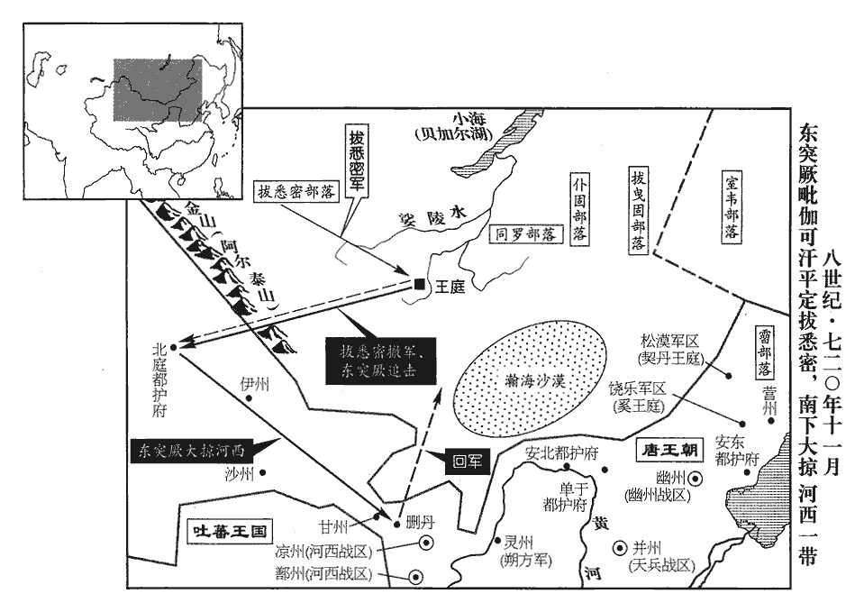
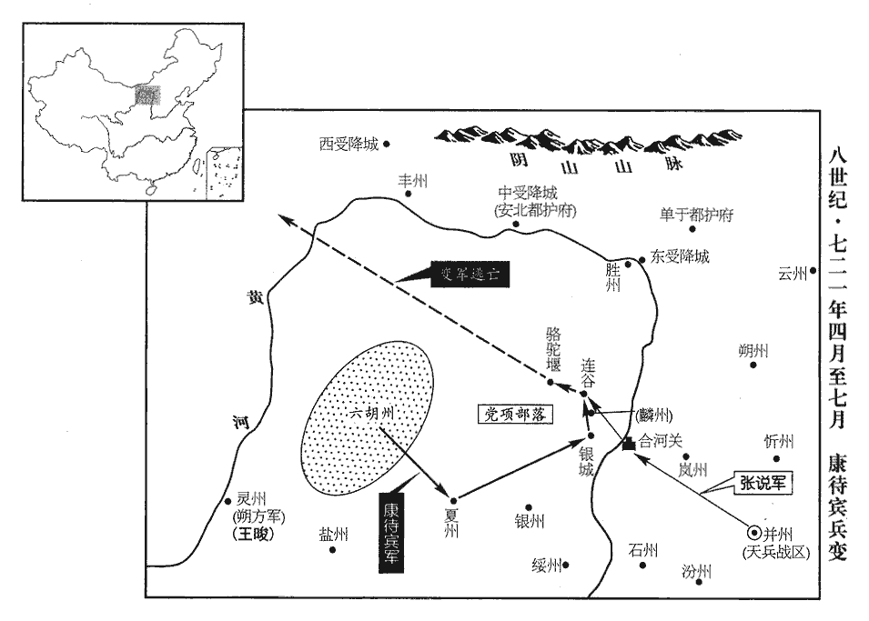
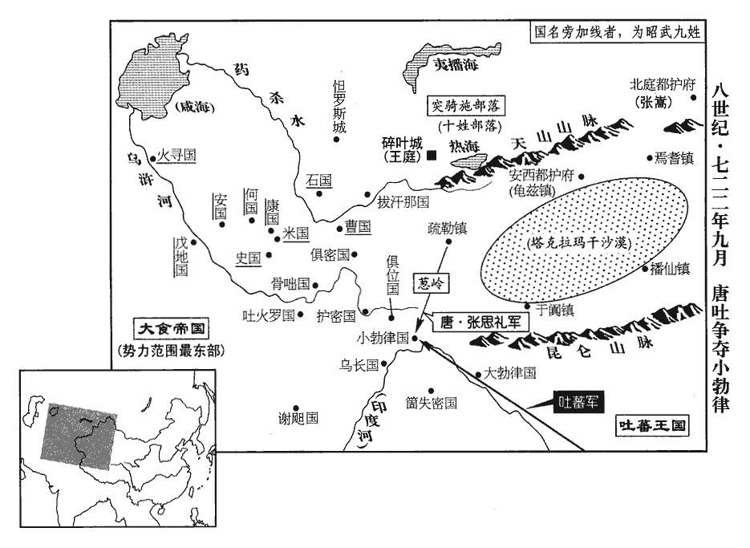
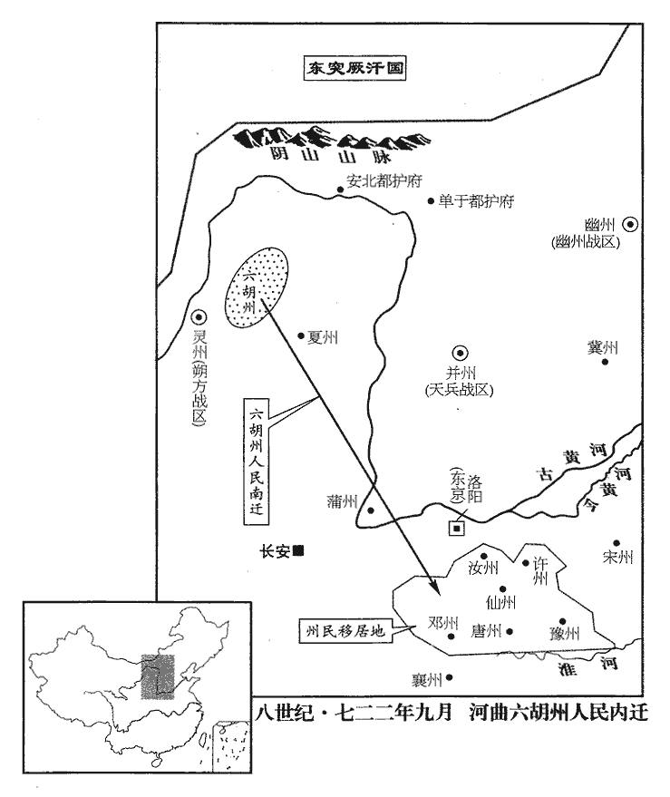
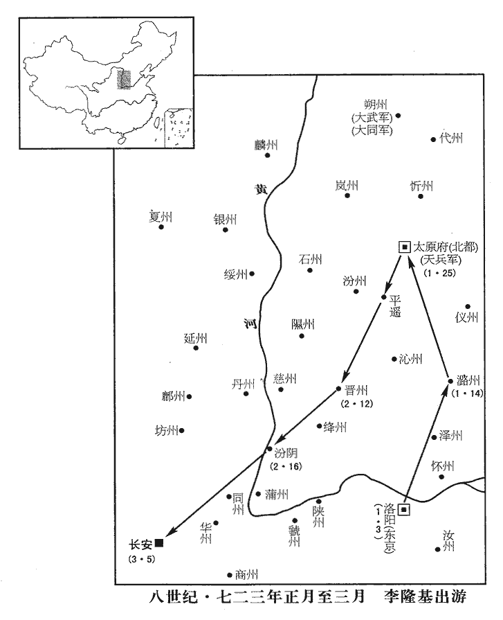
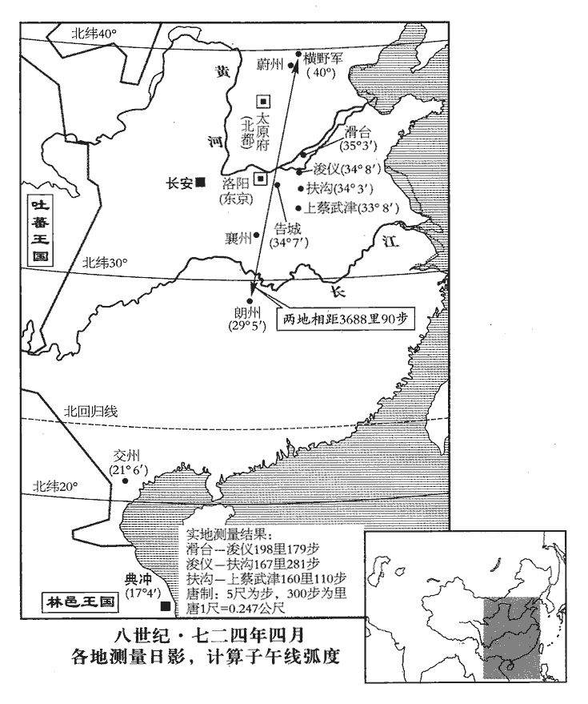
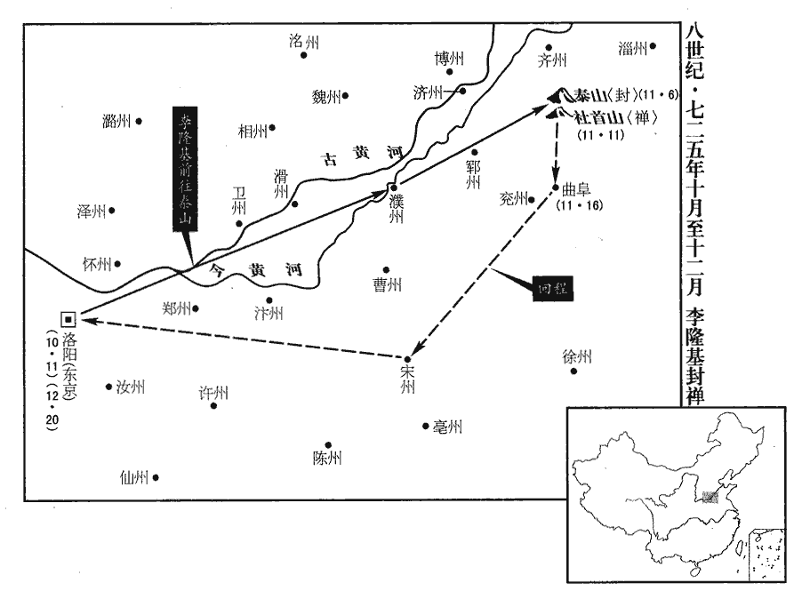

 唐紀二十八起著雍敦牂（戊午），盡旃蒙赤奮若（乙丑），凡八年。

# 玄宗至道大聖大明孝皇帝上之下

## 開元六年（戊午、七一八）

1春，正月，辛丑‹六›，突厥毗伽可汗來請和；許之。厥，九勿翻。伽，求迦翻。可，從刊入聲。汗，音寒。

〖译文〗 [1]春季，正月，辛丑（初六），突阙毗伽可汗前来请求与唐和解；玄宗表示同意。

2廣州‹广东省广州市›吏民為宋璟立遺愛碑。去年宋璟自廣州入相。為，于偽翻。璟，居永翻。璟上言：「臣在州無他異迹，今以臣光寵，成彼諂諛；欲革此風，望自臣始，請敕下禁止。」上，時掌翻。下，遐稼翻。上‹李隆基，本年三十四岁›從之。於是他州皆不敢立。

〖译文〗 [2]广州的官吏百姓为宋修建遗爱碑。宋向玄宗进言说：“臣任广州都督期间并无优异的政绩，现在由于臣地位显耀，才造成那些人的阿谀奉承；要革除这种恶劣的风气，希望从臣这儿开始，请陛下降敕禁止为臣立碑。”玄宗采纳了他的建议。于是其他各州都不敢再干立碑的事。

3辛酉‹二十六›，敕禁惡錢，武德四年鑄開元通寶錢。其後盜鑄漸起，顯慶五年以惡錢多，官為市之，以一善錢售五惡錢。民間藏惡錢以待禁弛。乾封以後，私錢犯法日蕃，有以舟筏鑄於江中者。詔所在納惡錢，而姦亦不息。武后時，錢非穿穴及鐵錫銅液，皆得用之，熟銅排斗沙澀之錢皆售。自是盜鑄蜂起，吏莫能捕。先天之際，兩京錢益濫，或鎔錫模錢須臾百十，故禁之。重二銖四分以上乃得行。斂人間惡錢鎔之，更鑄如式錢。更，工衡翻。於是京城‹首都长安›紛然，賣買殆絕。宋璟、蘇頲請出太府錢二萬緡置南北市，以平價買百姓不售之物可充官用者，及聽兩京百官豫假俸錢，庶使良錢流布人間，從之。頲，他鼎翻。俸，芳用翻。

〖译文〗 [3]辛酉（二十六日），玄宗颁布敕命禁止质料低劣的私钱流通，规定只有重量在二铢四分以上的官钱才可以流通使用。又下令收缴民间的私钱，经熔炼之后铸成符合规格的钱。于是京师人心浮动，各项交易几乎停止。宋、苏请求让太府拿出二万缗钱来设立南北两市，用于以平价收购百姓手中的那些可供官府使用的滞销物品，同时允许东西两京文武百官预支官俸，以便使质量优良的官钱能够流通到民间去。唐玄宗采纳了他们的建议。

4二月，戊子‹二十三›，移蔚州‹山西省灵丘县›橫野軍於山北‹河北省蔚县›，杜佑曰：橫野軍在蔚州東北百四十里，去太原九百里。此蓋指言開元所移軍之地。蔚，紆勿翻。屯兵三萬，為九姓之援；以拔曳固‹总部设内蒙古呼伦湖西›都督頡質略、同羅‹总部设蒙古国乌兰巴托市北›都督毗伽末啜、霫‹总部设辽河以北›都督比言，回紇‹总部设蒙古国乌兰巴托市›都督夷健頡利發、僕固‹总部设蒙古国东部›都督曳勒歌等各出騎兵為前、後、左、右軍討擊大使，頡，戶結翻。啜，陟劣翻。霫，而立翻。騎，奇寄翻。使，疏吏翻；下同。皆受天兵軍‹驻并州山西省太原市›節度。天兵軍在并州城中。考異曰：實錄：「壬辰，制大舉擊突厥，五都督及拔悉密金山道總管處木昆執米啜、堅昆都督骨篤祿毗伽、契丹都督李失活、奚都督李大酺及默啜之子右賢王默特勒逾輸等夷夏之師，凡三十萬，並取朔方道行軍大總管王晙節度；」而於後俱不見出師勝敗。按此年正月，突厥請和，帝有答詔；而二月伐之，恐無此事。舊紀及王晙、突厥傳皆無此月出兵事。新突厥傳云：「默棘連遣使請和，帝以不情，答而不許，俄下詔伐之，以王晙統之，期以八年並集稽落水上。」行兵貴密，不應前二年早先下詔，蓋取實錄附會舊傳耳。有所討捕，量宜追集；量，音良。無事各歸部落營生，仍常加存撫。

〖译文〗 [4]二月，戊子（二十三日），玄宗下令将蔚州横野军移往山北，在此屯兵三万作为铁勒九姓的后援；任命拔曳固都督颉质略、同罗都督毗伽末啜、都督比言、回纥都督夷健颉利发、仆固都督曳勒歌等各率本部骑兵为前、后、左、右军讨击大使，均受天兵军调度指挥。遇有征讨追捕之事时，则根据需要征调集结；平安无事时，则散回各部落从事生产，并让官府经常安抚他们。

5三月，乙巳‹十›，徵嵩山‹中岳·河南省登封县北›處士盧鴻入見，見，賢遍翻。拜諫議大夫；鴻固辭。考異曰：舊傳作「盧鴻一」，本紀、新傳皆作「鴻」。按中岳真人劉君碑，云盧鴻撰，今從之。

〖译文〗 [5]三月，乙巳（初十），唐玄宗征召嵩山处士卢鸿入朝并任命他为谏议大夫；卢鸿坚决推辞。

6天兵軍使張嘉貞入朝，朝，直遙翻。有告其在軍奢僭及贓賄者，按驗無狀；上欲反坐告者，反坐者，以誣告人所得罪坐之。嘉貞奏曰：「今若罪之，恐塞言路，塞，悉則翻。使天下之事無由上達，願特赦之。」其人遂得減死。上由是以嘉貞為忠，有大用之意。為張嘉貞入相張本。

〖译文〗 [6]天兵军使张嘉贞入朝参见皇帝，有人告发他在军中有奢侈僭越行为以及贪污受贿的现象，但经过调查之后发现纯属捏造。玄宗打算将诬告者反坐治罪，张嘉贞向玄宗上奏道：“如果陛下现在将告发我的人治罪，恐怕会堵住向朝廷进言的渠道，使各地的下情无法上达，因此臣希望陛下对此人特予赦免。”这个人于是被免除死罪。玄宗由此认为张嘉贞对朝廷忠心耿耿，内心里打算重用他。

7有薦山人范知璿xuán文學者，并獻其所為文，璿，從宣翻。宋璟判之曰：「觀其良宰論，頗涉佞諛。良宰論蓋稱美當時宰相。山人當極言讜議，讜，音黨。豈宜偷合苟容！文章若高，自宜從選舉求試，不可別奏。」

〖译文〗 [7]有人推荐隐士范知精于文章之学，并且进献了他所作的文章。宋对他的文章评论道：“从他所作的《良宰论》来看，此人颇有佞谀之嫌。隐士应当尽情说出公正无私的议论，怎么能苟且迎合以求容身呢！假如他的文章真作得好，自然应该通过科举出仕，因此不可为他单独上奏。”

8夏，四月，戊子‹二十四›，河南‹河南府·河南省洛阳市›參軍鄭銑、朱陽‹河南省灵宝市西南朱阳乡›丞郭仙舟投匭獻詩，河南參軍，河南府參軍也。唐制：諸府州諸曹參軍之外，又有參軍事，掌出使贊導。新志註曰：武德初，改行書佐曰行參軍，尋又改曰參軍事。朱陽，漢弘農縣南界地，後魏分置朱陽郡，屬析州；後周廢郡為縣，隋屬弘農郡，唐龍朔初屬商州，萬歲通天二年度屬洛州。匭，居洧翻。敕曰：「觀其文理，乃崇道法；至於時用，不切事情。宜各從所好。」好，呼到翻。並罷官；度為道士。

〖译文〗 [8]夏季，四月，戊子（二十四日），河南府参军郑铣、朱阳丞郭仙舟投匦献诗，玄宗颁布敕书道：“从他们所献诗文的文理来看，可知他们尊崇道家的法度；至于说到在当代的用处，则与实际事务不相切合。应当让他们各从所好。”于是将二人一起免官，度为道士。

9五月，辛亥‹十八›，以突騎施‹总部设伊犁河中下游›都督蘇祿為左羽林大將軍、順國公，充金方道經略大使。騎，奇寄翻。

〖译文〗 [9]五月，辛亥（十八日），唐玄宗任命突骑施都督苏禄为左羽林大将军、封为顺国公，派他出任金方道经略大使。

10契丹‹辽河上游›王李失活卒，癸巳，以其弟娑固代之。契，欺訖翻，又音喫。娑，素何翻。

〖译文〗 [10]契丹王李失活去世，癸巳（疑误），唐玄宗指定他的弟弟娑固继任为契丹王。

11秋，八月，頒鄉飲酒禮於州縣，令每歲十二月行之。唐鄉飲酒之禮，刺史為主人，先召致仕鄉有德者謀之，賢者為賓，其次為介，其次為眾賓，與之行禮。縣則令為主人，鄉之老人年六十以上有德望者一人為賓，次一人為介，又其次為三賓，又其次為眾賓。年六十者三豆，七十者四豆，八十者五豆，九十者及主人皆六豆。主、賓、介、三賓、眾賓既升，即席，工持瑟升自階就位，鼓鹿鳴。卒歌，笙入立於堂下北面，奏南陔。乃間歌，歌南有嘉魚，笙崇丘，乃合樂周南關雎、召南鵲巢。司正升自西階，贊禮，揚觶zhì，而戒之以忠孝之本，主、賓、介以下皆再拜。奠酬既畢，乃行無算爵，無算樂。

〖译文〗 [11]秋季，八月，玄宗下令在地方各州县颁布乡饮酒礼，决定在每年的十二月份举行。

12唐初，州縣官俸，皆令富戶掌錢，出息以給之；息至倍稱，多破產者。唐初，在京諸司官及天下官置公廨本錢，以典史主之，收贏十之七，富戶幸免傜役，貧者破產甚眾。稱，音尺證翻。祕書少監崔沔上言，請計州縣官所得俸，於百姓常賦之外，微有所加以給之。時沔請計戶均出，每丁加升尺以給之。從之。

〖译文〗 [12]唐初州县官的官俸，都是让当地富户掌管公廨本金而后出利息支付，由于利息高至借一还二，故而有很多人倾家荡产。秘书少监崔沔建议根据州县官吏应得俸禄的总数，在百姓正常赋税之外稍微多收一些，以此来支付州县官的俸禄。玄宗采纳了他的建议。

13冬，十一月，辛卯‹一›，車駕至西京。

〖译文〗 [13]冬季，十一月，辛卯（初一），唐玄宗抵达西京长安。

14戊辰，吐蕃‹首都逻些城西藏拉萨市›奉表請和，乞舅甥親署誓文；吐蕃以尚文成公主，與唐為舅甥之國。吐，從暾入聲。又令彼此宰相皆著名於其上。

〖译文〗 [14]戊辰（疑误），吐蕃赞普进表求和，希望两国君主亲自签署誓文，并且要求两国宰相也在誓文上签名。

15宋璟奏：「括州‹浙江省丽水市›員外司馬李邕、儀州‹山西省左权县›司馬鄭勉，並有才略文詞，先天元年，避帝名，改箕州為儀州。但性多異端，好是非改變；若全引進，則咎悔必至，若長棄捐，則才用可惜，請除渝‹重庆市›、硤‹湖北省宜昌市›二州刺史。」又奏：「大理卿元行沖素稱才行，初用之時，實允僉議；當事之後，頗非稱職，請復以為左散騎常侍，以李朝隱代之。好，呼到翻。行，下孟翻。稱，尺證翻。復，扶又翻。散，悉亶翻。騎，奇寄翻。朝，直遙翻。陸象先閑於政體，寬不容非，請以為河南‹洛阳›尹。」從之。

〖译文〗 [15]宋上奏道：“括州员外司马李邕和仪州司马郑勉均有才能和谋略，又擅长文章，但两人思想中又多异端邪念，好改变公认的是非准则。假如完全提拔重用，则必定会招来祸害，若是将他们长期弃置不用，则才干被埋没又很可惜。请陛下将他们分别任命为渝、硖二州刺史。”宋还上奏道：“大理寺卿元行冲一向被认为才行俱佳，上任初期也确实与大家的议论一致，但在具体处理了一些问题之后，却发现并不称职，请求陛下仍让他任左散骑常侍，任命李朝陷代任大理寺卿之职。陆象先熟悉施政的要领，为政宽厚而不能容忍失误，，请陛下将他任命为河南尹。”唐玄宗对这些建议都一一采纳。

## 七年（己未、七一九）

1春，二月，俱密‹中亚纳瓦巴德城›王那羅延、俱密國治山中，在吐火羅東北，南臨黑河；其王，突厥延陀種。康‹乌兹别克斯坦撒马尔罕›王烏勒伽、安‹乌兹别克斯坦布哈拉市›王篤薩波提杜佑曰：康國在米國西南三百餘里，漢康居國也。薩，桑葛翻。皆上表言為大食‹阿拉伯帝国›所侵掠，乞兵救援。

〖译文〗 [1]春季，二月，西域的俱密王那罗延、康王乌勒伽、安王笃萨波提均上表玄宗，告知受到大食军队的侵掠，请求唐朝派兵救援。

2敕太府及府縣出粟十萬石糶之，府，謂京兆府；縣，謂京縣及畿縣也。糶，他弔翻。以斂人間惡錢，送少府銷毀。

〖译文〗 [2]唐玄宗敕令太符和京兆府以及京府所辖各县拿出十万石粟出售，以便收回民间私铸的劣质钱，交少府监销毁。

3三月，乙卯‹二十六›，以左武衛大將軍、檢校內外閑厩使、苑內營田使王毛仲行太僕卿。唐初以尚乘局掌內外閑厩之馬十二閑；既置內外閑厩使專掌御馬，因以尚乘局隸閑厩使，苑內諸監本隸司農寺，今亦隸苑內營田使。毛仲嚴察有幹力，萬騎功臣、閑厩官吏皆憚之，騎，奇寄翻。苑內所收常豐溢。上‹李隆基，本年三十五岁›以為能，故有寵。雖有外第，常居閑厩側內宅，上或時不見，則悄然若有所失；宦官楊思勗、高力士皆畏避之。

〖译文〗 [3]三月，乙卯（二十六日），唐玄宗任命左武卫大将军、检校内外闲厩使、苑内营田使王毛仲担任太仆寺卿。王毛仲谨严精明，有才干能力，万骑军中的有功之臣和闲厩官吏都俱怕他，苑中的收入一般很丰盛。唐玄宗认为他很有才干，因此受到了玄宗的宠爱。王毛仲虽然在外面有宅第，却常常住在宫内闲厩旁边的宅中，有时玄见宗不到他，就会感到若有所失。宦官杨思勖和高力士都对他十分敬畏。

4勃海‹首都忽汗城吉林省敦化市›王大祚榮卒；考異曰：實錄：「六月，丁卯，祚榮卒，遣左監門率吳思謙攝鴻臚卿，充使弔祭。」按此月丙辰已云祚榮卒；蓋六月方遣思謙弔祭耳。丙辰‹二十七›，命其子武藝襲位。

〖译文〗 [4]勃海王大祚荣去世；丙辰（二十七日），玄宗敕命其子大武艺继位。

5夏，四月，壬午‹二十四›，開府儀同三司祁公王仁皎‹李隆基的岳父›薨。其子駙馬都尉守一請用竇孝諶例，築墳高五丈二尺；竇孝諶，上外祖也。諶，氏壬翻。上許之。宋璟、蘇頲固爭，以為：「準令，一品墳高一丈九尺，高，居號翻。其陪陵者高出三丈而已。竇太尉墳，議者頗譏其高大，當時無人極言其失，豈可今日復踵而為之！復，扶又翻；下蕃復同。昔太宗‹李世民›嫁女，資送過於長公主，魏徵進諫，太宗既用其言，文德皇后‹李世民的正妻长孙氏›亦賞之，事見一百九十四卷太宗貞觀六年。長，知兩翻。豈若韋庶人崇其父墳，號曰酆陵，事見二百八卷中宗景龍元年。以自速其禍乎！夫以后父之尊，欲高大其墳，何足為難！而臣等再三進言者，蓋欲成中宮之美耳。況今日所為，當傳無窮，永以為法，可不慎乎！」上悅曰：「朕每欲正身率下，況於妻子，何敢私之！然此乃人所難言，卿能固守典禮，以成朕美，垂法將來，誠所望也。」賜璟、頲帛四百匹。

〖译文〗 [5]夏季，四月，壬午（二十四日），开府仪同三司祈公王仁皎去世。其子驸马都尉王守一请求援用窦孝谌的先例，修筑五丈二尺高的坟墓，玄宗答应了他的请求。宋、苏对此坚决反对，他们认为：“根据令的规定，一品官坟墓的高度为一丈九尺，埋葬在皇帝陵墓附近的陪陵也不过高出三丈而已。窦太尉的坟修好后，街谈巷议多指责它过于高大，只是当时无人坚持指出它的过失罢了，现在怎能又重犯这样的错误呢！当初太宗皇帝送女儿长乐公主出嫁，所送嫁妆超过了长公主，魏徵加以谏阻，太宗采纳了他的意见，文德皇后也请求太宗赏赐魏徵，哪里像韦庶人尊崇其父的坟莹，称为酆陵，以致于自己加快祸患的到来呢！以皇帝之父的尊贵身分，如果想要将坟墓修得高大一些，又有什么困难呢！臣等对此之所以再三进谏阻止，不过是想成就王皇后的美名罢了。况且陛下今日所行之事，当传之无穷，永远为子孙所效法，怎么可以不谨慎从事呢！”玄宗听罢高兴地说：“朕一直想要以自身的正确行动，为下面的人作表率，哪里敢对自己的妻子儿女有所偏爱呢！但这事是一般人难以说出口的，您能够严格按照典法礼仪的规定办事，从而成就朕的美德并为后代子孙留下榜样，这正是朕所希望的。”赐给宋、苏绢帛四百匹。

6五月，己丑朔‹一›，日有食之。上素服以俟變，徹樂減膳，命中書、門下察繫囚，賑飢乏，勸農功。賑，津忍翻。辛卯‹三›，宋璟等奏曰：「陛下勤恤人隱，此誠蒼生之福。然臣聞日食脩德，月食脩刑；親君子，遠小人，絕女謁，除讒慝，所謂脩德也。君子恥言浮於行，論語孔子曰：「君子恥其言而過其行。」遠，于願翻。慝，吐得翻。行，下孟翻。苟推至誠而行之，不必數下制書也。」數，所角翻。下，遐稼翻。

〖译文〗 [6]五月，己丑朔（初一），出现日食。唐玄宗身着素服，以等待太阳恢复常态，并让人撤去悬挂着的乐器，降低膳食的规格，又责成中书、门下两省复查被拘押的囚犯，开仓赈济饥民，勉励百姓勤于农事。辛卯（初三），宋等人上奏道：“陛下勤于抚恤百姓的痛苦，这实在是天下苍生的福分。但是臣还听说天子在出现日食时应当修德，在出现月食时则应当整饬刑罚；亲近君子，疏远小人，堵塞后宫请托之途，斥退邪恶之人，这就是我们所说的修德，君子以说得多做得少为耻，倘若陛下诚心修德，就不必屡降制书加以强调了。”

7六月，戊辰‹十一›，吐蕃‹首都逻些城西藏拉萨市›復遣使請上親署誓文；上不許，曰：「昔歲誓約已定，苟信不由衷，亟誓何益！」用左傳語意。吐，從暾入聲。復，扶又翻。亟，去吏翻

〖译文〗 [7]六月，戊辰（十一日），吐蕃又派遣使者入朝，请求唐玄宗亲笔签署两国和解的誓文，玄宗没有同意，说：“两国和解的盟誓在去年就已签订了，倘若守信并非出自内心，多次立誓又能有什么用处呢！”

8秋，閏七月，右補闕盧履冰上言：「禮，父在為母服周年，則天皇后改服齊衰三年，事見二百二卷高宗上元元年。為，于偽翻。齊，音咨。衰，倉回翻。上，時掌翻。請復其舊。」上下其議。下，遐嫁翻。左散騎常侍褚無量以履冰議為是；諸人爭論，連年不決。八月，辛卯‹六›，敕自今五服並依喪服傳文，散，悉亶翻。騎，奇寄翻。傳，直戀翻。然士大夫議論猶不息，行之各從其意。無量歎曰：「聖人豈不知母恩之厚乎？厭降之禮，厭，於叶翻。所以明尊卑、異戎狄也。俗情膚淺，不知聖人之心，一紊其制，誰能正之！」紊，音問。

〖译文〗 [8]秋季，闰七月，右补阙卢履冰进言：“依礼的规定，父在，子为亡母服一年丧，则天皇后却将这改为服三年丧，希望陛下能恢复原有的规定。”玄宗将他的建议交给群臣讨论。左散骑常侍褚无量认为履冰的建议正确；但对这一问题的争议，持续了一年多也没有定论。八月，辛卯（初六），玄宗颁布敕令，决定从今以后五服均以《丧服传》的规定为准，但士大夫们仍然议论纷纷，执行时则各行其是。褚无量深有感慨地说：“圣人哪里是不清楚慈母恩情的深厚呢？之所以又定下减少服丧期的礼节，是为了表明尊卑地位的不同，并以此与戎狄区别开来，世俗的感情肤浅，未能了解圣人制礼的用心，这种定制一经打破，谁还能加以匡正呢！”

9九月，甲寅‹十九›，徙宋王憲為寧王。四年，成器更名憲。上嘗從複道中見衛士食畢，棄餘食於竇中，怒，欲杖殺之；左右莫敢言。憲從容諫曰：「陛下從複道中窺人過失而殺之，臣恐人人不自安。且陛下惡棄食於地者，為食可以養人也；憲從，千容翻。惡，烏路翻。為，于偽翻。今以餘食殺人，無乃失其本乎！」上大悟，蹶然起曰：「微兄，幾至濫刑。」幾，居希翻。遽釋衛士。是日，上宴飲極歡，自解紅玉帶，并所乘馬以賜憲。

〖译文〗 [9]九月，甲寅（疑误），玄宗将宋王李宪改封为宁王。有一次玄宗在楼阁之间的天桥上发现卫士将吃剩的饭菜倒在坑穴中，感到非常生气，想要将这个卫士用刑杖活活打死。玄宗身边的人没有敢说话的。李宪不慌不忙地规劝道：“陛下从天桥上偷偷地发现他人的过失，就要将其处死，臣担心这样做会使得人人自危。再说陛下憎恶他人将饭菜倒在地上，是因为饭菜能够养活人，如果现在因为一点点剩饭剩菜就要杀人，恐怕与陛下的本意不符吧！”玄宗恍然大悟，急忙站起来回答说：“幸亏有了皇兄的规谏，否则几乎要滥用刑罚了。”说完赶忙将卫士释放。在这一天的宴席上，玄宗极为高兴，亲自解下自己的红玉带，连同自己所乘的坐骑一起赏赐给李宪。

10冬，十月，辛卯‹七›，上幸驪山溫湯‹陕西省临潼县东南›；癸卯‹十九›，還宮。驪，力知翻。還，從宣翻，又音如字。

〖译文〗 [10]冬季，十月，辛卯（初七），唐玄宗来到骊山温泉；癸卯（十九日），玄宗返回宫中。

11壬子‹二十八›，冊拜突騎施‹伊犁河中下游›蘇祿為忠順可汗。可從刊入聲。汗，音寒。

〖译文〗 [11]壬子（二十八日），唐玄宗册拜突骑施酋长苏禄为忠顺可汗。

12十一月，壬申‹十八›，【章：十二行本「申」下有「契丹王李婆固與公主入朝」十一字；乙十一行本同，惟「婆」作「娑」；孔本同；張校同，「固」作「圉」；退齋校本仍作「固」。】上以岐山‹陕西省岐山县›令王仁琛，岐山縣，隋置，屬岐州。琛，丑林翻。藩邸故吏，墨敕令與五品官。宋璟奏：「故舊恩私，則有大例，除官資歷，非無公道。仁琛曏緣舊恩，已獲優改，今若再蒙超獎，遂於諸人不類；又是后族，王仁琛，蓋仁皎群從。須杜輿言。輿，眾也。乞下吏部檢勘，苟無負犯，於格應留，請依資稍優注擬。」從之。

〖译文〗 [12]十一月，壬申（十八日），唐玄宗未与外廷朝臣商议，便直接用墨敕将岐山县县令王仁琛擢升为五品官，原因是王仁琛原来是玄宗作藩王时的王府故吏。宋向玄宗上奏道，陛下对亲朋故旧所能给予的私情和恩惠，有一些基本的规矩，授官的资历，也不是没有一些公正的准则。过去王仁琛已经由于陛下的私恩得到了优于他人的任命，现在如果再次得到破格提拔，就会和那些与他资历相当的人相差太远；况且王仁琛又是皇后的同族，陛下行事时尤其应当考虑到公众的舆论。臣请求陛下将此事交由吏部核查勘验，如果王仁琛没有什么失误欠缺，按规定应予任命，臣请求根据他的资历略从优授给官职。”唐玄宗对此表示同意。

選人宋元超於吏部自言侍中璟之叔父，冀得優假。璟聞之，牒吏部云：「元超，璟之三從叔，三從，同高祖。下，遐嫁翻。選，須絹翻。從，才用翻。常在洛城，不多參見。見，賢遍翻。既不敢緣尊輒隱，又不願以私害公。向者無言，自依大例，既有聲聽，事須矯枉；請放。」元超冀得饒假，今乃不得留注，所謂矯枉過正也。

〖译文〗 候选的官员宋元超在吏部自称是侍中宋的叔父，希望因此能得到关照。宋得知此事后，发文书给吏部说：“宋元超是我同高祖的叔父，由于他定居在洛城，因而未能经常前去参见。我既不敢因为他是长辈就为之隐瞒，又不愿以私害公。以往他没有提出这层关系，吏部自然可以照章办事，现在他既然已把我们的关系声张出去，那么就必须矫枉过正了，请不要录用他。”

寧王憲奏選人薛嗣先請授微官，事下中書、門下。選，須絹翻。事下，遐嫁翻。璟奏：「嗣先兩選齋郎，雖非灼然應留，以懿親之故，固應微假官資。在景龍中，常有墨敕處分，謂之斜封。處，昌呂翻。分，扶問翻。自大明臨御，茲事杜絕，行一賞，命一官，必是緣功與才，皆歷中書、門下。至公之道，唯聖能行。嗣先幸預姻戚，不為屈法，許臣等商量，望付吏部知，不出正敕。」從之。量，音良。

〖译文〗 宁王李宪奏请授给候选官员薛嗣先一个小官。玄宗将此事交给中书省和门下省处理。宋上奏道：“薛嗣先曾两次被任命为斋郎，虽说他并非明显应该留任，但考虑到是至亲的缘故，本来应当大小任命一个职位。景龙年间，皇帝经常用墨敕直接除授官职，这些人被称为斜封官。自从陛下登基以来，所有这些弊端均已革除，朝廷每颁布行一次封赏，每任命一个官职，全都是由于这些人立下了功劳，或者是由于才能出众，而且都必须通过中书、门下二省。像这样的至公之道，唯有圣明君主才能真正实施。薛嗣先是陛下的姻亲，陛下并未法外施恩，而是将这个问题交由臣等商量，臣请求将此事交由吏部具体处理，不要直接正式降敕任命。”唐玄宗对此表示同意。

先是，朝集使往往齋貨入京師，先，悉薦翻。及春將還，多遷官，宋璟奏一切勒還，以革其弊。

〖译文〗 在此之前，来自各州的朝集使们往往携带很多礼物进京打点，等到来年开春即将返回时，大多得到升迁；宋奏请玄宗将这些人一律原职遣还以便革除这一弊端。

13是歲，置劍南‹总部设益州四川省成都市›節度使，領益、彭‹四川省彭州市›等二十五州。‹二十五州：益州、彭州、蜀州四川省崇州市›、汉州四川省广汉市、眉州四川省眉山县、绵州四川省绵阳市、梓州四川省三台县、遂州四川省遂宁市、邛州四川省邛崃市、剑州四川省剑阁县、荣州四川省荣县、陵州四川省仁寿市、嘉州四川省乐山市、普州四川省安岳县、资州四川省资中县、巂州四川省西昌市、黎州四川省汉源县、戎州四川省宜宾市、维州四川省理县、茂州四川省茂县、简州四川省简阳市、龙州四川省平武县东南、雅州四川省雅安市、泸州四川省泸州市、合州重庆合川市。总部设益州

〖译文〗 [13]在这一年，朝廷设置了剑南节度使，统辖益州、彭州等二十五州。

## 八年（庚申，七二零）

1春，正月，丙辰‹三›，左散騎常侍褚無量卒‹年七十五岁›。按通鑑例，惟公輔書薨，偏王者公輔書卒。今書褚無量卒，以整比群書未竟，改命元行沖，故書以始事。考異曰：舊本紀：「正月甲子朔，皇太子加元服；壬申，右散騎常侍褚無量卒」按長曆，正月甲寅朔；甲子十一日也。唐曆亦云，「壬申無量卒。」今從實錄。辛酉‹八›，命右散騎常侍元行沖整比群書。比，毗至翻。

〖译文〗 [1]春季，正月，丙辰（初三），左散骑常侍褚无量去世。辛酉（初八），唐玄宗委派右散骑常侍元行冲主持整理文献典籍工作。

2侍中宋璟疾負罪而妄訴不已者，悉付御史臺治之。治，直之翻。謂中丞李謹度曰：「服不更訴者出之，尚訴未已者且繫。」由是人多怨者。會天旱有魃，魃，蒲撥翻，旱神也。神異經曰：南方有人長二三尺，袒身，目在項上，走行如風，其名曰魃，所見之國大旱，赤地千里。一名旱母，遇者得之，投溷hùn中即死。優人作魃狀戲於上‹李隆基，本年三十六岁›前，問魃：「何為出？」對曰：「奉相公處分。」相，息亮翻。處，昌呂翻。分，扶問翻。又問：「何故？」魃曰：「負冤者三百餘人，相公悉以繫獄抑之，故魃不得不出。」上心以為然。

〖译文〗 [2]侍中宋很厌恶那些明明有罪却没完没了地四处告状的人，便将这些人全都交付御史台治罪。他对御史中丞李谨度说：“你应当将那些已认罪不再上诉的人释放，把那些还在不停地申诉的人先关起来。”所以很多人怨恨他。正赶上旱神作怪，天下大旱，宫中演滑稽戏的俳优在玄宗面前扮作旱神模样演戏，其中一个演员问“旱神”道：“你为什么到人间来降灾呢？”“旱神”回答说：“我是奉了丞相的命令降临人间的。”又问：“这是为什么？”“旱神”接着回答：“蒙冤者达三百余人，丞相将他们全都关进监狱，借此压制他们，所以我不得不到人间降灾以示警告。”唐玄宗心中对此也有同感。

時璟與中書侍郎、同平章事蘇頲建議嚴禁惡錢，江、淮間惡錢尤甚，璟以監察御史蕭隱之充使括惡錢。監，工銜翻。使，疏吏翻。隱之嚴急煩擾，怨嗟盈路，上於是貶隱之官。辛巳‹二十八›，罷璟為開府儀同三司，頲為禮部尚書。考異曰：唐曆云「二十八日辛卯」，舊紀云「己卯」。按是月無辛卯。今從實錄。以京兆尹源乾曜為黃門侍郎，并州‹山西省太原市›長史張嘉貞為中書侍郎，並同平章事。於是弛錢禁，惡錢復行矣。復，扶又翻。

〖译文〗 这时宋又和中书侍郎、同平章事苏一起建议严厉禁止私铸的劣质钱流通，鉴于江、淮之间劣质钱尤其泛滥，宋派监察御史萧隐之作为使者前往该地搜查劣质钱。萧隐之执法严酷，所到之处鸡犬不宁，百姓怨声载道，玄宗因此将萧隐之贬官。辛巳（二十八日），玄宗将宋罢免为开府仪同三司，苏罢免为礼部尚书，任命京兆尹源乾曜为黄门侍郎，并州长史张嘉贞为中书侍郎，二人都担任同平章事。于是朝廷对劣质钱的查禁大为放松，劣质钱再次泛滥。

3二月，戊戌‹十五›，皇子敏卒，追立為懷王，此懷王以州為國號。謚曰哀。

〖译文〗 [3]二月，戊戌（十五日），皇子李敏去世，玄宗将他追立为怀王，赠谥号为“哀”。

4壬子‹二十九›，敕以役莫重於軍府，一為衛士，六十乃免，宜促其歲限，使百姓更迭為之。更，工衡翻。

〖译文〗 [4]壬子（二十九日），唐玄宗发布敕令，认为在百姓所负担的各种劳役之中，没有哪一种比兵役更为繁重，一旦被征为卫士，就只有到六十岁才能解脱，因此规定缩短兵役年限，让百姓轮流当兵。

5夏，四月，丙午‹二十四›，遣使賜烏長‹巴基斯坦赛杜城›王、骨咄‹中亚库利亚布市›王、俱位‹克什米尔吉尔吉特市西北代鲁城›王冊命。三國皆在大食‹阿拉伯帝国›之西。烏長即烏萇，又曰烏荼。骨咄在鑊沙之東，或曰阿咄羅，治思助建城。俱位，或曰商彌，治阿賒䫻師多城，在大雪山勃律河北，地寒，冬窟室。咄，當沒翻。大食欲誘之叛唐，誘，音酉。三國不從，故褒之。

〖译文〗 [5]夏季，四月，丙午（二十四日），唐玄宗派使者向乌长王、骨咄王、俱位王颁发册命。上述三国均在大食以西之地。大食曾引诱他们背叛唐朝，三国均未同意，所以玄宗特加褒赏。

6五月，辛酉‹九›，復置十道按察使。罷按察見上卷五年。

〖译文〗 [6]五月，辛酉（初九），朝廷又一次设置十道按察使。

7丁卯‹十五›，以源乾曜為侍中，張嘉貞為中書令。

〖译文〗 [7]丁卯（十五日），唐玄宗任命源乾曜为侍中，任命张嘉贞为中书令。

乾曜上言：「形要之家多任京官，使俊乂之士沈廢於外。沈，持林翻。臣三子皆在京，請出其二人。」上從之。因下制稱乾曜之公，命文武官效之，於是出者百餘人。

〖译文〗 源乾曜进言：“现在出身于权贵之家的人大多在京师任官，德高望重之士反在京外任职。臣有三个儿子，均在京城任官，请陛下将其中两个外放任职。”玄宗答应了他的请求，并颁下制命称赞源乾曜公正无私，命令文武百官向他学习，于是到京外任职的达一百余人。

張嘉貞吏事強敏，而剛躁自用。躁，則到翻。中書舍人苗延嗣、呂太一、考功員外郎員嘉靜，殿中侍御史崔訓皆嘉貞所引進，常與之議政事。四人頗招權，時人語曰：「令公四俊，苗、呂、崔、員。」員，音運。

〖译文〗 张嘉贞处理公务精明强干，只是性情急躁刚愎自用。中书舍人苗延嗣、吕太一、考功员外郎员嘉静和殿中侍御史崔训都是张嘉贞提拔任用的，张嘉贞也常与这四个人商议朝政大事。这四个人处处揽权，当时的人这样流传说：“中书令张公的四位俊才，是苗延嗣、吕太一、崔训和员嘉静。

8六月，瀍‹流经洛阳城北›、穀‹流经洛阳城东›漲溢，漂溺幾二千人。溺，奴狄翻。幾，居希翻。考異曰：實錄云「漂居人四百餘家」。舊紀云：「漂沒九百餘戶，溺死八百餘人，掌閑溺死者千一百餘人。」今從舊紀人數。按舊紀，「掌閑」之下有「番兵」二字。

〖译文〗 [8]六月，河和河发大水，淹死了将近二千人。

9突厥‹瀚海沙漠群›降戶僕固都督勺磨及𨁂xié跌部落‹内蒙古呼和浩特市附近›散居受降城側，降，戶江翻。勺，職略翻。𨁂，奚結翻。跌，徒結翻。朔方‹设宁夏灵武市›大使王晙言其陰引突厥，謀陷軍城，密奏請誅之。誘勺磨等宴於受降城，伏兵悉殺之，河曲降戶殆盡。拔曳固‹原在蒙古国东部›、同羅‹原在蒙古国乌兰巴托市北›諸部在大同‹山西省朔州市东›、橫野軍‹河北省蔚县›之側者，聞之皆忷懼。大同軍即大武軍，武后大足元年更名。杜佑曰：在代州北三百里，去并州八百餘里。晙，子峻翻。誘，音酉。忷，許拱翻。秋，并州‹山西省太原市›長史、天兵節度大使張說引二十騎，持節即其部落慰撫之，說，讀曰悅。騎，奇寄翻。因宿其帳下；副使李憲以虜情難信，馳書止之。說復書曰：「吾肉非黃羊，必不畏食；北人謂麞為黃羊。血非野馬，必不畏刺。非人家及厩牧所畜而自孳生於野者，謂之野馬。士見危致命，論語載子張之言。此吾效死之秋也。」拔曳固、同羅由是遂安。

〖译文〗 [9]归降的突阙仆固都督勺磨以及跌部落人众散居在受降城周围，朔方大使王说他们暗地里勾结突阙，阴谋夺占唐军驻守的受降城，便密奏玄宗，请求将这些人诛杀。王诱使勺磨等人来到受降城内赴宴，下令预先埋伏好的士兵将这些人全部杀死，河曲之地的突阙降户也被诛戮殆尽。散居在大同、横野军附近的拔曳固、同罗等部落得知此讯，都非常恐惧。秋季，并州长史、天兵军节度大使张说仅带二十名骑兵，手执皇帝赐给的符节到拔曳固等部落慰问安抚，并在其牙帐之中过夜。天兵军节度副使李宪认为胡虏难以相信，派飞骑送信阻止。张说在给李宪的回信中说：“我身上长的并非黄羊之内，不怕他们会吃了我；我身上流的也不是野马的血，不怕他们会刺血而饮。士大夫临危当舍命报效，此刻正是我为陛下尽忠的时候。”拔曳固、同罗等部落因此而安下心来。

10冬，十月，辛巳‹二›，上行幸長春宮‹陕西省大荔县东›；壬午‹三›，畋于下邽‹陕西省渭南市北下吉镇›。

〖译文〗 [10]冬季，十月，辛巳（初二），唐玄宗到长春宫；壬午（初三），唐玄宗在下围猎。

11上禁約諸王，不使與群臣交結。光祿少卿駙馬都尉裴虛己與岐王範遊宴，仍私挾讖緯；讖，楚譖翻。緯，于貴翻。戊子‹九›，流虛己於新州‹广东省新兴县›，離其公主。睿宗女霍國公主，下嫁虛己。舊志：新州至京師五千五十二里。萬年‹首都长安东半城›尉劉庭琦、太祝張諤唐太常寺有太祝六人，正九品上。數與範飲酒賦詩，貶庭琦雅州‹四川省雅安市›司戶，諤山茌chí‹山东省济南市西南›丞。山茌縣，漢、晉屬泰山郡，宋屬東太原郡，隋廢入濟州長清縣；武德元年分置山茌縣，屬齊州。數，所角翻。然待範如故，謂左右曰：「吾兄弟自無間，但趨競之徒強相託附耳。間，古莧翻。強，其兩翻。吾終不以此責兄弟也。」上嘗不豫，薛王業妃弟內直郎韋賓唐六典：東宮有內直局，內直郎二人，掌符璽、繖扇、几案、衣服之事，職擬尚輦奉御。與殿中監皇甫恂私議休咎；事覺，賓杖死，恂貶錦州‹湖南省麻阳苗族自治县西南錦和镇›刺史。武后垂拱二年，以辰州麻陽縣地及開山洞置錦州。業與妃惶懼待罪，上降階執業手曰：「吾若有心猜兄弟者，天地實殛之。」即與之宴飲，仍慰諭妃，令復位。

〖译文〗 [11]唐玄宗禁止诸王与群臣交结。光禄少卿驸马都尉裴虚己与岐王李范一起游观宴饮，并且私自挟带谶纬之书；戊子（初九），唐玄宗将裴虚己流放到新州，并让霍国公主与他离婚。万年县尉刘庭琦和太常寺太祝张谔也因屡次与李范在一起饮酒赋诗而分别被贬为雅州司户和山茌县丞。但玄宗仍然像以往那样善待李范，他对左右侍臣说：“朕的兄弟自然没有问题，不过是那些趋炎附势的小人极力巴结而已。朕决不会因此而责怪自己的兄弟。”有一次玄宗生了病，薛王李业之妃的弟弟、内直郎韦宾与殿中监皇甫恂私议吉凶之事；事发后，韦宾被用刑杖打死，皇甫恂被贬为锦州刺史。李业与其妃子十分惶恐，只等着玄宗治罪了，唐玄宗走下台阶拉着李业的手说：“我如果有猜忌兄弟之心，天地不容。”并且与他一同入席饮酒，此外还好言安慰李业之妃，让他仍当王妃。

12十一月，乙卯‹七›，上還京師。

〖译文〗 [12]十一月，乙卯（初七），玄宗回到京师。

13辛未‹二十三›，突厥‹瀚海沙漠群›寇甘‹甘肃省张掖市›、涼‹甘肃省武威市›等州，涼州西至甘州五百里。考異曰：唐曆，突厥寇涼州在九月。舊突厥傳云：「八年冬，御史大夫王晙為朔方大總管，奏請西徵拔悉密，東發奚、契丹兩蕃，期以明年秋初，引朔方兵數道俱入，掩突厥牙帳於稽落河上。」按王晙此月為幽州都督，今從實錄、舊紀。敗河西節度使楊敬述，敗，補邁翻。掠契苾部落而去。貞觀中，契苾來降，處其部落於涼州。契，欺訖翻。苾，毗必翻。

〖译文〗 [13]辛未（二十三日），突阙进犯甘、凉等州，击败了唐河西节度使杨敬述，大肆掳掠了契部落之后撤走。

先是，朔方大總管王晙奏請西發拔悉密‹蒙古国科布多盆地北部›，拔悉密酋長姓阿史那氏，蓋亦突厥之種也，居北庭。先，悉薦翻。東發奚‹滦河上游›、契丹‹辽河上游›，期以今秋掩毗伽牙帳於稽落水‹流经西伯利亚恰克图城南›上；稽落水蓋導源稽落山。毗伽聞之，大懼。暾欲谷曰：「不足畏也。拔悉密在北庭，與奚、契丹相去絕遠，勢不相及；朔方兵計亦不能來此。若必能來，俟其垂至，徙牙帳北行三日，唐兵食盡自去矣。且拔悉密輕而好利，輕，牽正翻。好，呼到翻。得王晙之約，必喜而先至。晙與張嘉貞不相悅，奏請多不相應，必不敢出兵。史言在廷在邊之謀不叶，為夷狄所窺。晙兵不出，拔悉密獨至，擊而取之，勢甚易耳。」易，以豉翻。

〖译文〗 在此之前，唐朔方道大总管王奏请西调拔悉密部落兵马，东发奚、契丹兵马，约定在这一年的秋季掩袭突阙毗伽可汗设在稽落水附近的牙帐；毗伽可汗得知此讯后非常害怕。暾欲谷道：“这没什么可怕的。拔悉密尚在北庭，与奚、契丹相距太远，双方无法合兵相应；估计大唐朔方兵也无法抵达此地。即使唐军真的能来，等他们快要到时，只要我们迁徙牙帐向北走三天的路程，唐军粮尽自会退兵。再说拔悉密人轻浮而好利，这次又得到了王的允诺，一定会得意忘形，先行抵达此地。王与张嘉贞关系不好，他向朝廷提建议多数得不到响应，所以这次他必不敢出兵。既然王的唐军不来，只有拔悉密的军队前来，我们打败他也就易如反掌了。”

 

既而拔悉密果發兵逼突厥牙帳，而朔方及奚、契丹兵不至，拔悉密懼，引退。毗伽欲擊之，暾欲谷曰：「此屬去家千里，將死戰，未可擊也。不如以兵躡之。」去北庭‹新疆吉木萨尔县›二百里，暾欲谷分兵間道先圍北庭，間，古莧翻。因縱兵擊拔悉密，大破之。拔悉密眾潰走，趨北庭，不得入，趨，逡喻翻。盡為突厥所虜。

〖译文〗 不久拔悉密果然发兵前来进逼突阙毗伽的牙帐，而且朔方以及奚、契丹的兵马并未如约抵达，拔悉密人心中掠惧，赶忙撤军。毗伽可汗打算派兵攻打他们，暾欲谷道：“这些人离家千里，一定会拼死战斗的，我们不能在这时就进攻他们。我们不如派兵紧随其后。”在拔悉人撤至离北庭二百里左右的时候，暾欲谷才分兵抄小路先包围了北庭，然后纵兵相攻，打败了拔悉密的军队。拔悉密人被击溃后逃往北庭，又因无法入城而全部被突阙俘虏。

暾欲谷引兵還，出赤亭‹甘肃省山丹县›，掠涼州羊馬，楊敬述遣裨將盧公利、判官元澄將兵邀擊之。將，即亮翻。暾欲谷謂其眾曰：「吾乘勝而來，敬述出兵，破之必矣。」公利等至刪丹‹甘肃省山丹县›，刪丹縣，漢屬張掖郡，後漢、晉屬西郡，後魏曰山丹，隋復曰刪丹，屬甘州。與暾欲谷遇，唐兵大敗，公利、澄脫身走。毗伽由是大振，盡有默啜之眾。

〖译文〗 暾欲谷率军回撤，由赤亭出兵，抢掠凉州的羊群马匹，杨敬述派裨将卢公利和判官元澄率兵拦击突厥。暾欲谷对他的部队说：“我们乘胜来到这里，倘若杨敬述出兵挑战，就一定能够击败他们。”卢公利等人在删丹县与暾欲谷相遇，交战后唐军一败涂地，卢公利和元澄脱身逃回。毗伽的势力因此而大振，控制了默啜可汗的所有人马。

14契丹牙官可突干驍勇得眾心，李娑固猜畏，欲去之。驍，堅堯翻。娑，素何翻。去，羌呂翻。是歲，可突干舉兵擊娑固‹王庭设内蒙古巴林右旗›，娑固敗奔營州‹辽宁省朝阳市›。營州都督許欽澹遣安東都護‹驻河北省卢龙县›薛泰帥驍勇五百與奚王李大酺奉娑固以討之，戰敗，娑固、李大酺皆為可突干所殺，帥，讀曰率。酺，音蒲。生擒薛泰，營州震恐。許欽澹移軍入渝關‹河北省抚宁县东榆关镇›，可突干立娑固從父弟鬱干為主，遣使請罪。上赦可突干之罪，以鬱干為松漠都督‹总部设内蒙古巴林右旗›，以李大酺之弟魯蘇為饒樂都督‹总部设内蒙古宁城县西南›。使，疏吏翻；下同。樂，音洛。

〖译文〗 [14]契丹牙官可突干骁勇善战，深得属下信赖，李娑固对他既猜忌又害怕，试图将他铲除。在这一年，可突干率兵进攻李娑固，李娑固作战失利，逃往营州。营州都督许钦澹派安东都护薛泰率五百精兵与奚王李大一起辅助李娑固回兵征讨可突干，又被可突干击败，李婆固、李大二人均被可突干杀死，薛泰被俘，营州军民对此大为震惊。许钦澹被迫率部撤入渝关，可突干拥立李娑固的堂弟李郁干为王，并派遣使者入朝请罪。唐玄宗赦免了可突干的罪，任命李郁干为松漠都督，任命李大的弟弟李鲁苏为饶乐都督。

## 九年（辛酉、七二一）

1春，正月，制削楊敬述官爵，以刪丹之敗也。以白衣檢校涼州都督，仍充諸使。諸使，謂節度、支度、營田等使也。

〖译文〗 [1]春季，正月，唐玄宗发布制命，削夺了杨敬述的官爵，让他以布衣身分任检校凉州都督，并且依旧让他充任节度、支度、营田等使。

2丙辰‹九›，改蒲州‹山西省永济市›為河中府，置中都官僚，一準京兆、河南。

〖译文〗 [2]丙辰（初七），唐玄宗下诏将蒲州改为河中府，设置中都官僚，员数、品级与京兆府和河南府相同。

3丙寅‹十九›，上‹李隆基，本年三十七岁›幸驪山溫湯‹陕西省临潼县东南›；乙亥‹二十八›，還宮。

〖译文〗 [3]丙寅（十七日），唐玄宗来到骊山温泉；乙亥（二十六日）。玄宗回到宫中。

4監察御史宇文融上言，天下戶口逃移，巧偽甚眾，請加檢括。融，㢸bì之玄孫也，宇文㢸，見一百七十二卷陳宣帝太建七年。監，古銜翻。上，時掌翻。㢸，古弼字。源乾曜素愛其才，贊成之。二月，乙酉‹八›，敕有司議招集流移、按詰巧偽之法以聞。詰，去吉翻。

〖译文〗 [4]监察御史宇文融进言，认为全国各地民户人口流散逃移，弄虚作假现象十分普遍，希望加以核查。宇文融是宇文的玄孙，源乾曜向来喜欢他的才能，故而极为赞成他的建议。二月，乙酉（初八），玄宗敕令有关部门研究一下招集流散人口以及追查弄虚作假现象的办法，并将研究结果上奏。

5丙戌‹九›，突厥‹瀚海沙漠群›毗伽復使來求和，上賜書，諭以「曩昔國家與突厥和親，華、夷安逸，甲兵休息；國家買突厥羊馬，突厥受國家繒帛，彼此豐給，自數十年來，不復如舊，正由默啜無信，口和心叛，數出盜兵，寇抄邊鄙，人怨神怒，隕身喪元，復，扶又翻；下今復同。數，所角翻。喪，息浪翻。元，首也。斬默啜，事見上卷四年。吉凶之驗，皆可汗所見。今復蹈前迹，掩襲甘‹甘肃省张掖市›、涼，隨遣使人，更來求好。國家如天之覆，如海之容，好，呼到翻。覆，敷又翻。但取來情，不追往咎。可汗果有誠心，則共保遐福；不然，無煩使者徒爾往來。若其侵邊，亦有以待。可汗其審圖之！」

〖译文〗 [5]丙戌（初九），突厥可汗毗伽又派遣使者入朝请求和解。唐玄宗写给毗伽一封信，信中说：“过去大唐与突阙和亲，华夏人和突阙人安居乐业，两国军队也相安无事；大唐买进突厥的牛羊马匹，突厥则接受大唐的各种丝织品，双方都丰衣足食。最近几十年来，两国关系之所以不如往常，完全是由于默啜可汗言而无信，嘴里讲的是和亲，心里无时不想叛离，屡次派兵入侵，掠夺边疆地区百姓的财产，终致人怨神怒，自己被人杀死。善恶吉凶的报应，都是可汗亲眼所见。现在可汗又走上默啜的老路，先是入侵甘、凉二州，随后又派使者前来求和修好。我大唐如上天无不覆盖，如大海容纳一切，只看今后的情况，不追究从前的过错。可汗如果真有求和的诚意，则我们两国就能保持长久之福；否则就不必麻烦使者白白地往来走动。倘若突厥兵再次入侵，我大唐也早已做好了准备。何去何从，请可汗仔细考虑！”

6丁亥‹十›，制：「州縣逃亡戶口聽百日自首，或於所在附籍，或牒歸故鄉，各從所欲。過期不首，首，式又翻。即加檢括，謫徙邊州；公私敢容庇者抵罪。」以宇文融充使，括逃移戶口及籍外田，所獲巧偽甚眾。使，疏吏翻。遷兵部員外郎兼侍御史。融奏置勸農判官十人，通典及新書並云二十九人，通典且列其姓名。並攝御史，分行天下。其新附客戶，免六年賦調。調，徒弔翻。使者競為刻急，州縣承風勞擾，百姓苦之。陽翟‹河南省禹州市›尉皇甫憬上疏言其狀；陽翟縣，漢屬潁川郡，晉屬河南郡，後魏置陽翟郡，隋廢郡為縣，屬襄城郡，唐初屬嵩州，貞觀元年屬許州，龍朔二年度屬洛州為畿縣。憬，居永翻。上方任融，貶憬盈川‹浙江省衢州市东北›尉。州縣希旨，務於獲多，虛張其數，或以實戶為客，凡得戶八十餘萬，田亦稱是。稱，尺證翻。

〖译文〗 [6]丁亥（初十），唐玄宗颁下制命：“各州县逃亡的户口，允许在百日内自己主动申报，或在现在的住地编入户籍，或发文书回原籍申报户口，都可按自己的心愿办理。凡过期不报者，一经官府查出，一律迁徙到边远州县安置。官民人等如有隐藏包庇者，也照此处治。”任命宇文融充任朝廷使者，负责搜求逃亡流失的户口及清查隐瞒不服的田地，查出的弄虚作假现象非常多。宇文融因此被擢升为兵部员外兼侍御史。宇文融还奏请唐玄宗设置了十位劝农判官，都兼任代理御史，分头巡行全国各地。凡新近编入户籍的客户，均免除六年的赋调。各路使者在执法上竞相追求严峻苟刻，所在州县官吏又一味迎合使者，变本加厉地骚扰百姓，致使百姓苦不堪言。阳翟县尉皇甫憬上疏反映这一情况，由于玄宗正信任宇文融，所以皇甫憬反被贬职为盈川尉。州县官吏迎合上司的旨意，务求多得逃户，为此不惜虚报数量，甚至有的把户籍中原有的户也当作新增的客户呈报上去。此次共查出流失的民户八十余万，查出的被隐瞒土地的数目也与此基本相当。

7蘭池州‹羁縻军区·总部设宁夏灵武市›胡康待賓誘諸降戶同反，夏，四月，攻陷六胡州，誘，音酉。降，戶江翻。高宗調露元年，於靈夏南境以降突厥置魯州、麗州、含州、塞州、依州、契州，以唐人為刺史，謂之六胡州，長安二年併為匡、長二州，神龍三年置蘭池都督府，分六州為縣。宋白曰：六胡州在夏州德靜縣北。考異曰：實錄：「四月庚寅，康待賓反，命王晙討平之，斬于都市。五月丁巳，既誅康待賓，下詔云云。壬寅，叛胡康待賓偽稱葉護安慕容以叛，七月，己酉，王晙擒康待賓至京師，腰斬之。」前後重複，交錯相違。今從舊紀。有眾七萬，進逼夏州‹陕西省靖边县北白城子›；夏，戶雅翻。命朔方大總管王晙、隴右‹总部设鄯州青海省乐都县›節度使郭知運共討之。

〖译文〗 [7]兰池州的胡人康待宾诱使当地所有归降的人一同叛唐。夏季，四月，康待宾率部攻陷了六胡州，麾下已聚集了七万之众，并乘胜进逼夏州。唐玄宗命朔方大总管王和陇右节度使郭知运共同讨伐康待宾。

8戊戌‹二十二›，敕：「京官五品以上，外官刺史、四府上佐，四府，謂京兆府‹首都长安›、河南府‹东都洛阳›、河中府‹中都·山西省永济市›、太原府。各舉縣令一人，視其政善惡，為舉者賞罰。」

〖译文〗 [8]戊戌（二十日），唐玄宗发布敕命：“五品以上的京官，各州刺史及京兆、河南、河中、太原四府的府尹、少尹，每人向朝廷推荐一位县令，朝廷将根据其政绩的好坏对举荐者进行赏罚。”

9以太僕卿王毛仲為朔方道防禦討擊大使，與王晙及天兵軍節度大使張說相知討康待賓。

〖译文〗 [9]唐玄宗任命太仆寺卿王毛仲为朔方道防御讨击大使，与王及天兵军节度大使张说一同征讨康待宾。

10六月，己卯‹三›，罷中都‹河中府·山西省永济市›，復為蒲州。復，扶又翻。

〖译文〗 [10]六月，己卯（初三），唐玄宗废除中都，又改名为蒲州。

蒲州刺史陸象先政尚寬簡，吏民有罪，多曉諭遣之。州錄事言於象先曰：「明公不施箠撻，何以示威！」唐上州置錄事三人，正九品上，中下州各一人，下州從九品下，箠，止垂翻。象先曰：「人情不遠，此屬豈不解吾言邪！解，戶買翻，曉也。必欲箠撻以示威，當從汝始！」錄事慚而退。象先嘗謂人曰：「天下本無事，但庸人擾之耳。苟清其源，何憂不治！」治，直吏翻。

〖译文〗 蒲州刺史陆象先为政崇尚宽厚简约，属下官吏百姓有罪，多当面用好言劝诫，然后让他们离开。蒲州录事对陆象先说：“明公不用刑杖，怎么能显示威风呢！”陆象先回答说：“人心都是相通的，难道这些人不理解我的话吗！如果你一定要我用刑杖来显示威风，那就应当从你开始！”录事十分惭愧，赶忙退出。陆象先曾对人说：“天下本无事，庸人自扰之。为政若能正本清源，何忧天下不治！”

11秋，七月，己酉‹四›，王晙大破康待賓，生擒之，殺叛胡萬五千人。辛酉‹十六›，集四夷酋長，腰斬康待賓於西市。酋，慈由翻。長，知兩翻。

〖译文〗 [11]秋季，七月，己酉（初四），王大败康待宾率领的叛军，生擒康待宾本人，击杀反叛的胡众一万五千人。辛酉（十六日），唐玄宗召集了四夷各部酋长，在西市将康待宾腰斩。

先是，叛胡潛與党項‹陕西省北部›通謀，攻銀城‹陕西省神木县南›、連谷‹神木县北›，據其倉庾yǔ，後周置銀城縣，後改曰銀城防。貞觀四年以銀城屬銀州，八年屬勝州；又以隋連谷戍置連谷縣，亦屬勝州。杜佑曰：銀城、連谷皆漢圁yín陰縣地，漢光祿塞在今縣北。先，悉薦翻。党，底朗翻。張說將步騎萬人出合河關‹山西省兴县西北裴家川口›掩擊，大破之。嵐州合河縣北有合河關。宋白曰：合河縣城下有蔚汾水，西與黄河合，故曰合河。趙珣聚米圖經：合河關在府州南二百里。將，即亮翻。騎，奇寄翻。追至駱駝堰‹神木县西北›，堰，於扇翻。党項乃更與胡戰，胡眾潰，西走入鐵建山‹即铁山·阴山山脉›。說安集党項，使復其居業。討擊使阿史那獻以党項翻覆，請并誅之，說曰：「王者之師，當伐叛柔服，豈可殺已降邪！」因奏置麟州‹陕西省神木县›，以鎮撫党項餘眾。分勝州銀城、連谷置麟州，又置新秦縣為麟州治所。杜佑曰：麟州，漢新秦中地。

〖译文〗 在这以前，叛军暗中与党项族合谋，准备攻打银城、连谷，占据该地的粮仓，张说率领一万名步兵和骑兵自合河关出其不意地向叛军发起攻击，叛军大败。张说又乘胜追击，一直追到骆驼堰。这时党项人反而攻击叛军，叛军溃不成军，向西逃入了铁建山。张说安抚党项人，让他们像过去一样地生产和生活。讨击使阿史那献认为党项人反复无常，请求将他们一起杀死，张说说：“圣王的仁义之师，应当讨伐叛逆，安抚归服之众，怎么能杀死已归降的人呢！”并上奏玄宗设置鳞州，以镇抚党项族余众。

 

12九月，乙巳朔‹一›，日有食之。

〖译文〗 [12]九月，乙巳朔（初一），出现日食。

13康待賓之反也，詔郭知運與王晙相知討之；晙上言，朔方‹宁夏灵武市›兵自有餘力，請敕知運還本軍。上，時掌翻。未報，知運已至，由是與晙不協。晙所招降者，知運復縱兵擊之；虜以晙為賣己，由是復叛。降，戶江翻。復，扶又翻。上以晙不能遂定群胡，丙午‹二›，貶晙為梓州‹四川省三台县›刺史。梓州，漢郪qī、廣漢、氐道之地，西魏、梁末置新州，隋改梓州。王晙貶官，未必離任也。如婁師德以素羅汗山之敗貶，亦此類。

〖译文〗 [13]康待宾发动叛乱的时候，唐玄宗命令郭知运与王联合出兵征讨；王告诉玄宗，朔方军的兵力足够平叛之用，请玄宗命令郭知运撤回陇右。尚未等到回音，郭知运已率部抵达，因此两人关系出现裂痕。对那些已被王招降的胡人，郭知运也纵兵袭击；胡人认为王出卖了自己，因此纷纷重新叛唐。唐玄宗认为王未能平定胡人的叛乱，丙午（初二），将他贬为梓州刺史。

14丁未‹三›，梁文獻公姚崇薨‹年七十二岁›，遺令：「佛以清淨慈悲為本，而愚者寫經造像，冀以求福。昔周、齊分據天下，周則毀經像而脩甲兵，齊則崇塔廟而弛刑政，一朝合戰，齊滅周興。近者諸武、諸韋，造寺度人，不可勝紀，勝，音升。無救族誅。汝曹勿效兒女子終身不寤，追薦冥福！道士見僧獲利，效其所為，尤不可延之於家。當永為後法！」

〖译文〗 [14]丁未（初三），梁文献公姚崇去世，临死留下这样的遗嘱：“佛教以清静慈悲为本，愚昧的人却希望通过抄写经文、建造佛像来求得来世之福。过去的北齐与北周两国对峙，北周毁弃佛经佛像而整治军队，北齐却开丢开刑罚与政令，大量建造佛寺，等到两国一交战，结果是北齐灭亡，北周勃兴。近代的武氏成员和韦氏诸人，所建之寺与所度之僧数不胜数，却并未免除其宗族被夷灭的后果。在我死后，你们不要像凡夫俗女那样愚昧无知。为我诵经超度以求死后之福！道士们见僧尼因此而获利，也效法僧尼，更不能将他们请进家门。这条家训，子孙后代必须永远遵守。

15癸亥‹十九›，以張說為兵部尚書、同中書門下三品。考異曰，朝野僉載曰：「說為并州刺史，諂事王毛仲。毛仲巡邊，說於天兵軍大設酒肴，恩敕忽降，授兵部尚書同中書門下三品，謝訖，便抱毛仲起舞，嗚其靴鼻。」今不取。

〖译文〗 [15]癸亥（十九日），唐玄宗任命张说为兵部尚书、同中书门下三品。

16冬，十月，河西、隴右節度大使郭知運卒‹年五十五岁›。知運與同縣【嚴：「縣」改「郡」。】右衛副率王君㚟chuò，率，所律翻。㚟，丑略翻。郭知運，瓜州‹甘肃省安西县›晉昌人；王君㚟，瓜州常樂人。皆以驍勇善騎射著名西陲，為虜所憚。驍，堅堯翻。騎，奇寄翻。時人謂之王、郭。㚟遂自知運麾下代為河西、隴右節度使，判涼州‹总部设甘肃省武威市›都督。

〖译文〗 [16]冬季，十月，河西、陇右节度大使郭知运去世。郭知运与担任右卫副率职务的同县老乡王君两人都因骁勇善战精于骑射而闻名于西部边陲，为西域胡虏所忌惮，被当时人称为王、郭。郭知运死后，王君便由知运的部下继任河西、陇右节度使，并兼领凉州都督。

17十一月，丙辰‹十三›，國子祭酒元行沖上群書四錄，甲部經錄，乙部史錄，丙部子錄，丁部集錄。考異曰：集賢註記在九年春。今從唐曆、統紀、舊紀。凡書四萬八千一百六十九卷。

〖译文〗 [17]十一月，丙辰（十三日），国子祭酒元行冲向玄宗进上《群书四录》，其中共收书四万八千一百六十九卷。

18庚午‹二十七›，赦天下。

〖译文〗 [18]庚午（二十七日），唐玄宗大赦天下。

19十二月，乙酉‹十三›，上幸驪山溫湯；壬辰‹二十›，還宮。

〖译文〗 [19]十二月，乙酉（十三日），唐玄宗来到骊山温泉；壬辰（二十日），又回到宫中。

20是歲，諸王為都督、刺史者，悉召還京師。開元二年，有司請依故事出諸王刺外州。

〖译文〗 [20]在这一年，唐玄宗将外放为都督、刺史的李唐诸王全部召回京师。

21新作蒲津橋‹在山西省永济市西，东西横跨黄河›，鎔鐵為牛以繫絙。時鑄八牛，牛下有山，皆鐵也，夾岸以維浮梁。蒲津東岸即河東縣，西岸即河西縣。絙，居登翻，大索也。

〖译文〗 [21]官府新修建了蒲津桥，在两岸桥头熔铸了八头铁牛用来拴系索桥上的大绳。

22安州‹湖北省安陆市›别駕劉子玄卒‹年六十一岁›。子玄即知幾也，避上嫌名，以字行。劉子玄卒，重史臣也；例猶褚無量。上名隆基，知幾犯嫌名。幾，居希翻。

〖译文〗 [22]安州别驾刘子玄去世。刘子玄即刘知几，为避玄宗皇帝李隆基姓名的同音字而以字行于世。

著作郎吳兢撰則天實錄，言宋璟激張說使證魏元忠事。事今見二百七卷武后長安三年。撰，士免翻。說脩史見之，知兢所為，謬曰：「劉五殊不相借！」知幾第五，唐人多以第行相呼。兢起對曰：「此乃兢所為，史草具在，不可使明公枉怨死者。」同僚皆失色。其後說陰祈兢改數字，兢終不許，曰：「若徇公請，則此史不為直筆，何以取信於後！」

〖译文〗 著作郎吴兢撰修了《则天实录》，其中记载了宋激励张说为魏元忠作证的真实经过。张说在修史时见到了这段记载，心里知道是吴兢所写，嘴里却故意说道：“刘五（即刘知几）在修史时对我一点都不帮忙！”吴兢马上站起来回答说：“这一段是我吴兢写的，所有的草稿都还在，我不能让明公您错怪了已经死去的刘子玄。”在座的同僚听了这话全都大惊失色。后来张说私下里请求吴兢将这段记载略改几字，吴兢始终没有答应，他说：“我要是曲从您的要求，《则天实录》就不再是秉笔直书的信史，将何以取信于后人呢！”

23太史上言，麟德曆浸疏，是曆行於高宗麟德二年。上，時掌翻。日食屢不效。上命僧一行更造新曆，此所謂大衍曆也。歐陽修曰：自太初至麟德，曆有二十三家，與天雖近而未密也。至一行密矣，其倚數立法，固無以易也。後世雖有改作者，皆依倣而已。行，下孟翻。更，工衡翻。率府兵曹梁令瓚造黃道遊儀以測候七政。唐東宮十率府各有兵曹參軍，從九品上，掌判句大朝會，及皇太子出，則從鹵簿而涖其儀。一行更造新曆，欲知黃道進退，而太史無黃道儀，令瓚以木為遊儀。一行是之，請更鑄銅鐵，使黃道運行以追列舍之變。因二分之中以立黃道，交於奎，軫之間，二至升降，各十四度；黃道內施，白道月環，用究陰陽朓tiǎo朒nǜ，動合天運。七政，日、月、五星也。

〖译文〗 [23]太史向唐玄宗进言，告知《鳞德历》越来越不准确，对日食的预测屡次有误。唐玄宗指派僧人一行重修新的历法，又让率府兵曹梁令瓒设计制造黄道游仪来观测日、月、金、木、水、火、土星的位置和运行状况。

24置朔方‹总部设灵州宁夏灵武市›節度使，領單于都護府‹设内蒙古和林格尔县›，夏‹陕西省靖边县北白城子›、鹽‹陕西省定边县›等六州‹应是七州：灵州、夏州、盐州、绥州陕西省绥德县›、银州陕西省榆林市南鱼河堡、丰州内蒙古五原县、胜州内蒙古托克托县，定逺‹宁夏平罗县南›、豐安‹宁夏中卫县›二軍，三受降城‹东受降城内蒙古托克托县南›、中受降城内蒙古包头市、西受降城内蒙古五原县西北。單、音蟬。夏，戶雅翻。降，戶江翻。

〖译文〗 [24]唐玄宗设置朔方节度使，统辖单于都护府和夏、盐等六州以及定远、丰安二军和三受降城。

## 十年（壬戌、七二二）

1春，正月，丁巳‹十五›，上‹李隆基，本年三十八岁›行幸東都‹洛阳›，以刑部尚書王志愔為西京‹西安›留守。愔yīn，於今翻。

〖译文〗 [1]春季，正月，丁巳（十五日），唐玄宗行幸东都洛阳，任命刑部尚书王志为西京留守。

2癸亥‹二十一›，命有司收公廨錢，以稅錢充百官俸。武德元年，制京司及州縣官各給公廨田，課其管種，以供公私之費。又有公廨園、公廨地，皆收其稅以給百官。廨，古隘翻。俸，方用翻。

〖译文〗 [2]癸亥（二十一日），唐玄宗下令有关部门征收公廨钱，用这笔税收支付文武百官俸禄。

3乙丑‹二十三›，收職田。唐文武官有職分田，一品十二頃，二品十頃，三品九頃，四品七頃，五品六頃，六品四頃，七品三頃五十畝，八品二頃五十畝，九品二頃，皆給百里內之地。諸州都督、都護、親王府官，二品十二頃，三品十頃，四品八頃，五品七頃，六品五頃，七品四頃，八品三頃，九品二頃五十畝。鎮，戍、關、津、嶽、瀆官，五品五頃，六品三頃五十畝，七品三頃，八品二頃，九品一頃五十畝。貞觀十一年，以職田侵漁百姓，詔給逃還貧戶，視職田多少，每畝給粟二斗，謂之地租；尋以水旱復罷之。畝率給倉粟二斗。

〖译文〗 [3]乙丑（二十三日），唐玄宗下令收回文武百官的职分田，每亩每年大致给予粟米二斗。

4二月，戊寅‹七›，上至東都。

〖译文〗 [4]二月，戊寅（初七），唐玄宗抵达东都。

5夏，四月，己亥‹二十九›，以張說兼知朔方軍‹总部设灵州宁夏灵武市›節度使。

〖译文〗 [5]夏季，四月，己亥（二十九日），唐玄宗任命张说兼任朔方军节度使。

6五月，伊‹洛水支流›、汝水‹淮河支流›溢，漂溺數千家。溺，奴狄翻。漢志：伊水出弘農郡盧氏縣，東北入洛。汝水出弘農，入淮。史言伊、汝溢而漂數千家。既二水分流，相去日益遠，何至能漂流數千家！此必於發源之地水溢而并流也。被災之家，當在虢、洛二州界。

〖译文〗 [6]五月，伊水和汝水暴涨，溢出河岸，淹没居民数千家。

7閏月，壬申‹二›，張說如朔方巡邊。

〖译文〗 [7]闰五月，壬申（初二），张说前往朔方巡察边境。

8己丑‹十九›，以餘姚縣主女慕容氏為燕郡公主，妻契丹‹辽河上游›王鬱干。燕，因肩翻。妻，七細翻。

〖译文〗 [8]己丑（十九日）。唐玄宗封余姚县主之女慕容氏为燕郡公主，将她嫁给契丹王郁干。

9六月，丁巳‹十八›，博州‹山东省聊城市›河決，命按察使蕭嵩等治之。嵩，梁明帝‹萧岿›之孫也。後梁主巋謚明帝。治，直之翻。

〖译文〗 [9]六月，丁巳（十八日），博州境内黄河决口，唐玄宗派按察使萧嵩等人前往救灾治河。萧嵩是南朝后梁明帝萧岿的孙子。

10己巳‹三十›，制增太廟為九室，遷中宗主還太廟。中宗遷別廟，見上卷五年。

〖译文〗 [10]己巳（三十日），唐玄宗发布制命，将太庙由七室增至九室，将中宗皇帝的神主迁回太庙。

11秋，八月，癸卯‹四›，武彊‹河北省武强县›令裴景仙，武彊，漢河間之武隧縣也，晉更名武彊，唐屬冀州。坐贓五千匹，事覺，亡命；上怒，命集眾斬之。大理卿李朝隱奏景仙贓皆乞取，罪不至死；朝，直遙翻。又，其曾祖寂有建義大功，載初中以非罪破家，據裴寂傳，寂孫承先，武后時為酷吏所殺。惟景仙獨存，今為承嫡，宜宥其死，投之荒遠。其辭略曰：「十代宥賢，功實宜錄；左傳，晉祁奚請叔向曰：「社稷之固也，猶將十世宥之。」一門絕祀，情或可哀。」制令杖殺。朝隱又奏曰：「生殺之柄，人主得專；輕重有條，臣下當守。今若乞取得罪，便處斬刑；處，昌呂翻。後有枉法當科，欲加何辟？辟，毗亦翻。所以為國惜法，期守律文；為，于偽翻。非敢以法隨人，曲矜仙命。」又曰：「若寂勳都棄，仙罪特加，則叔向之賢，何足稱者；若敖之鬼，不其餒而！」左傳，楚令尹子文之言。上乃許之。杖景仙一百，流嶺南惡處。考異曰：實錄云：「初，上令集眾殺之，李朝隱執奏；又下制云『集眾決殺』，朝隱又奏，乃流嶺南。」蓋本欲斬之也。

〖译文〗 [11]秋季，八月，癸卯（初四），武强县县令裴景仙贪赃五千匹，事发，弃官逃走；唐玄宗大怒，下令召集人众，将其斩首。大理寺卿李朝隐向玄宗上奏，认为裴景仙所有赃物均乞取而得，依律罪不至死；此外，裴景仙的曾祖裴寂反隋，有树立义旗的大功，武后载初年间裴氏无罪而家破人亡，至今只剩裴景仙一人，现在为了使裴氏延续香火，也应宽宥他所犯下的死罪，将他流放到边远之地，李朝隐奏疏的大意是：“贤者十世子孙所犯罪均应宽宥，因为贤者的功劳实在应当记取；因诛杀罪犯而使得一个家族断子绝孙，在情理上亦有可怜之处。”唐玄宗还是下令将裴景仙用杖打死。李朝隐又向玄宗奏道：“生杀大权应操在君主的手中，但用刑的轻重自有条规，臣下应当遵守。现在如果因乞取赃物得罪便处斩刑，那么日后如有贪赃枉法者需要论罪判刑，又当加重到哪一种刑罚呢？臣屡次谏阻，是顾惜国家的法度，希望律令条文得到遵守，并不敢因人施法，曲法以求饶怒景仙一命。”他还说：“倘若裴寂的功勋一概不论，裴景仙所犯之罪特别加重处刑，那么叔向因贤明得以不受其弟株连，也就不值得称道了；若敖氏家族的祖先也就会因断子绝孙而陷于饥饿了。”唐玄宗这才同意了他的请求，改为将裴景仙处杖刑一百，流放到岭南的荒僻之地。

12安南‹越南河内市›賊帥梅叔焉等攻圍州縣，遣驃騎將軍兼內侍楊思勗xù討之。帥，所類翻，驃，匹妙翻。騎，奇寄翻。考異曰：舊紀云「八月丙戌」，按八月庚子朔，無丙戌。思勗傳云：「首領梅玄成自稱黑帝，與林邑、真臘國通謀，陷安南府。」今從本紀。周尹上神宗書作「梅叔鸞」。思勗募群蠻子弟，得兵十餘萬，襲擊，大破之，斬叔焉，積尸為京觀而還。觀，古玩翻。還，從宣翻，又如字。

〖译文〗 [12]安南反贼首领梅叔焉等人率众围攻所在州县，唐玄宗派遣骠骑将军兼内侍杨思勖前往讨伐。杨思勖在当地召募了十余万蛮族子弟从军，率领这支军队向梅叔焉等人大举进攻并大获全胜，将梅叔焉斩首，为炫耀武功，又将敌人的死尸收集在一起，加土筑成一座高大的坟莹，然后返回京城。

13初，上之誅韋氏也，王皇后頗預密謀，及即位數年，色衰愛弛。武惠妃有寵，陰懷傾奪之志，后心不平，時對上有不遜語。上愈不悅，密與祕書監姜皎謀以后無子廢之，皎泄其言。嗣滕王嶠‹唐朝制度，开爵亲王称”某王”，子孙继位称”嗣某王”›，按新書，滕王元嬰薨，長子脩琦嗣為長樂王，垂拱中死詔獄；神龍初，以少子脩信子涉嗣。無嗣滕王嶠也。新書姜皎傳言，皎泄禁中語，為嗣濮王嶠所劾。又按新書，太宗子魏王泰得罪，後封濮王，薨，子欣嗣，武后時為酷吏所陷，貶，神龍初，子嶠嗣王。則「嗣滕王嶠」當作「嗣濮王嶠」明矣。后之妹夫也，奏之。上怒，張嘉貞希旨構成其罪，云：「皎妄談休咎。」甲戌‹六›，杖皎六十，流欽州‹广西钦州市›，弟吏部侍郎晦貶春州‹广东省阳春市›司馬；舊志：春州，京師東南六千四百四十八里。親黨坐流、死者數人，皎卒於道‹年五十岁›。

〖译文〗 [13]起初，在唐玄宗定诛除韦后之计的时候，王皇后参与了很多秘密的策划，到了玄宗即位几年以后，皇后姿色渐衰，玄宗对她的宠幸也大不如前。此时武惠妃颇受玄宗宠爱，内心里便有了夺取皇后之位的企图，王皇后对此心中不平，常常对玄宗出言不逊。玄宗对皇后越发不满，暗地里与秘书监姜皎商议，打算以皇后无子为借口将其废黜，姜皎将玄宗这番话泄露了出去。继任的濮王李峤是王皇后的妹夫，便将此事上奏给玄宗。唐玄宗很生气，宰相张嘉贞迎合玄宗的旨意，便罗织而成姜皎的罪名，声称：“姜皎妄谈吉凶之事。”甲戌（疑误），姜皎被处以杖刑六十，流放钦州，姜皎之弟吏部侍郎姜晦也被贬为春州司马；姜氏家族的亲属党羽之中还有几个被处以流刑或死刑的，姜皎在赴钦州的途中死去。

己亥‹七›，【嚴：「己」改「乙」。】敕：「宗室、外戚、駙馬，非至親毋得往還；其卜相占候之人，皆不得出入百官之家。」相，息亮翻。

〖译文〗 己亥（疑误），唐玄宗发布敕命：“宗室、外戚、驸马若非骨肉至亲，一律不得相互往来交结；所有占卜看相和观察天象预测吉凶的术士，一律不得出入文武百官之家。”

14己卯‹十一›夜，左領軍兵曹權楚璧與其黨李齊損等作亂，立楚璧兄子梁山為光帝，詐稱襄王之子，景雲二年，重茂‹殇帝›改封襄王。擁左屯營兵數百人入宮城‹西安›，求留守王志愔，不獲。比曉，比，必利翻。屯營兵自潰，斬楚璧等，傳首東都‹洛阳›。志愔驚怖而薨。楚璧，懷恩之姪；權懷恩為吏，以嚴能稱。怖，普布翻。齊損，迥秀之子也。李迥秀始見二百六卷武后神功元年。迥，戶頃翻。壬午‹十四›，遣河南尹王怡如京師‹西安›，按問宣慰。

〖译文〗 [14]己卯（十一日）夜间，左领军兵曹权楚璧伙同其党羽李齐损等人发动叛乱，拥立权楚璧兄长之子权梁山为光帝，诡称其为襄王李重茂之子，蒙蔽左屯营兵数百人闯入宫城，寻找西京留守王志，但没有找到。天快亮时，闯入宫城的屯营兵却不攻自溃，将权楚璧等人斩首，并将这些人的首级送给住在东都洛阳的玄宗皇帝。西京留守王志被惊吓而死。权楚璧是权怀恩的侄儿，齐损是李迥秀的儿子。壬午（十四日），唐玄宗派河南尹王怡前往京师调查此事并安抚京师士民。

15癸未‹十五›，吐蕃‹首都逻些城西藏拉萨市›圍小勃律‹克什米尔吉尔吉特市›王沒謹忙，小勃律在大勃律西北三百里，去京師九千里而贏，東少南三千里距吐蕃贊普牙。謹忙求救于北庭‹总部设北庭府新疆吉木萨尔县›節度使張嵩曰：「勃律，唐之西門，勃律亡則西域皆為吐蕃矣。」嵩乃遣疏勒‹新疆喀什市›副使張思禮將蕃、漢步騎四千救之，據新書，張嵩即張孝嵩。使，疏吏翻。將，即亮翻。騎，奇寄翻。晝夜倍道，與謹忙合擊吐蕃，大破之，斬獲數萬。自是累歲，吐蕃不敢犯邊。

〖译文〗 [15]癸未（十五日），吐蕃军队围攻小勃律王没谨忙，没谨忙向唐北庭节度使张嵩求救说：“勃律是大唐西域的门户，勃律如果灭亡，那么整个西域也就会落入吐蕃之手了。”张嵩于是派疏勒副使张思礼率领汉、胡步骑兵四千人前去救援。张思礼昼夜兼程，与没谨忙夹击吐蕃军队，大获全胜，斩杀和俘获敌兵数万。从这以后几年内，吐蕃一直未敢进犯大唐边境。

 

16王怡治權楚璧獄，連逮甚眾，久之不決；治，直之翻。上乃以開府儀同三司宋璟為西京留守。璟至，止誅同謀數人，餘皆奏原之。

〖译文〗 [16]王怡审理权楚璧等人作乱的案子，很多人受到牵连，案子久拖不决。唐玄宗于是任命开府仪同三司宋为西京留守。宋上任后，只将权楚璧的几个同谋者处死，其他的人均上奏玄宗予以赦免。

17康待賓餘黨康願子反，自稱可汗；張說發兵追討擒之，其黨悉平。徙河曲‹河套·鄂尔多斯高原›六州殘胡五萬餘口於許‹河南省许昌市›、汝‹河南省汝州市›、唐‹河南省泌阳县›、鄧‹河南省邓州市›、仙‹河南省叶县西南›、豫‹河南省汝南县›等州，貞觀八年，改伊州襄城郡為汝州。唐州，漢南陽郡東界比陽、湖陽、平氏之地，後魏於比陽置東荊州，後改為昌州，又改為淮州，隋改為顯州；武德五年，以郡有唐城山，改為唐州。開元三年，以汝州之葉襄城、唐州之方城、豫州之西平、許州之舞陽置仙州。空河南‹河套·鄂尔多斯高原›、朔方‹宁夏灵武市›千里之地。‹六州，即六胡州：鲁州、丽州、含州、塞州、依州、契州。六州分布在今内蒙古鄂托克旗一带›

〖译文〗 [17]康待宾的余党康愿子又发动了叛乱，自称为可汗；张说派出军队追击讨伐，生擒康愿子，叛乱遂被平定。然后又将河曲六州残余的五万多胡人迁徙到许、汝、唐、邓、仙、豫等州安置，黄河以南及朔方各州的千里之地遂无人居住。

先是，緣邊戍兵常六十餘萬，先，悉薦翻。說以時無強寇，奏罷二十餘萬使還農。上以為疑，說曰：「臣久在疆埸，具知其情，將帥苟以自衛及役使營私而已。埸，音亦。將，即亮翻。帥，所類翻。若禦敵制勝，不必多擁冗卒以妨農務。陛下若以為疑，臣請以闔門百口保之。」上乃從之。

〖译文〗 在这之前，沿边境镇守戍卫的士卒常达六十余万人，张说认为当时没有强寇入侵，上奏请求削减二十万戍兵，让这些人回乡务农。唐玄宗对此表示怀疑，张说说“臣久在边界驱驰，对这里的情形全都了如指掌，这不过是将帅试图拥兵自保以及役使兵众谋取私利而已。如果说是为了御敌制胜的话，完全不必集结这么多的冗兵从而耽误了农事。陛下如果对臣的话尚有怀疑，臣请求用臣全家百口的性命来担保。”唐玄宗这才同意照他说的去做。

 

初，諸衛府兵，自成丁從軍，六十而免，其家又不免雜傜，浸以貧弱，逃亡略盡，百姓苦之。張說建議，請召募壯士充宿衛，不問色役，優為之制，逋逃者必爭出應募；上從之。旬日，得精兵十三萬，分隸諸衛，更番上下。更，工衡翻。上，時掌翻。兵農之分，從此始矣。史言唐養兵之弊始於張說。

〖译文〗 起初，各卫的府兵，自成丁之年开始从军，至六十岁时方可免役，府兵家中又须负担各种杂役，长此以往便逐渐贫弱，所以各卫的府兵逃亡殆尽，百姓也深以从军为苦。张说向玄宗提出一个建议，请求召募壮丁充任禁兵，应募入伍的状丁不须负担各种劳役，再制定一些优待他们的条规，这样逃避兵役的人就会争相出来应募。唐玄宗采纳了他的建议。十天之内，即募得精兵十三万，分别隶属于各卫，并轮番值班。唐代兵、农的分离，就是从这时候开始的。

18冬，十月，癸丑‹十五›，復以乾元殿為明堂。以東都明堂復為乾元殿，見上卷五年。復，扶又翻。

〖译文〗 [18]冬季，十月，癸丑（十五日），唐玄宗又将乾元殿改为明堂。

19甲寅‹十六›，上幸壽安‹河南省宜阳县›興泰宮，壽安，古新安九曲之地，後魏置甘棠縣，隋仁壽四年改為壽安縣，屬洛州。獵於上宜川‹宜阳县南›；庚申‹二十二›，還宮。

〖译文〗 [19]甲寅（十六日），唐玄宗来到寿安县境内的兴泰宫，在上宜川打猎；庚申（二十二日），唐玄宗返回宫中。

20上欲耀兵北邊，丁卯‹二十九›，以秦州‹总部设甘肃省天水市›都督張守潔等為諸衛將軍。

〖译文〗 [20]唐玄宗想要在北部边境地区显示军威。丁卯（二十九日），任命秦州都督张守洁等人为各卫将军。

21十一月，乙未‹二十八›，初令宰相共食實封三百戶。唐會要曰：舊制，凡有功之臣賜實封者，皆以課戶先準戶數，州縣與國官、邑官執帳，供其租調，各準配租調，遠近州縣官司收其腳直，然後付國邑官司。其丁準此，入國邑者收其庸。

〖译文〗 [21]十一月，乙未（二十八日），唐玄宗开始让宰相共享三百个封户的租赋。

22前廣州‹总部设广东省广州市›都督裴伷先下獄，下，遐嫁翻。伷zhòu，與冑同。上與宰相議其罪。張嘉貞請杖之，張說曰：「臣聞刑不上大夫，記曲禮之言。上，時掌翻。為其近於君，且所以養廉恥也。為，于偽翻。近，其靳翻。故士可殺不可辱。記儒行之言。臣曏巡北邊，聞杖姜皎於朝堂。朝，直遙翻。皎官登三品，亦有微功，有罪應死則死，應流則流，柰何輕加笞辱，以皁隸待之！笞，丑之翻。皁，昨早翻。姜皎事往，不可復追，伷先據狀當流，豈可復蹈前失！」復，扶又翻。上深然之。嘉貞不悅，退謂說曰：「何論事之深也！」說曰：「宰相，時來則為之。若國之大臣皆可笞辱，但恐行及吾輩。吾此言非為伷先，乃為天下士君子也。」為，于偽翻；下為農同。嘉貞無以應。

〖译文〗 [22]前任广州都督裴先被捕下狱，唐玄宗与宰相们一起商量对他如何处罚的问题。张嘉贞提出对他处以杖刑，张说说：“臣听说刑不上大夫，因为他们接近君主，而且这样做还可以培养他们的廉耻心。所以说士可杀不可辱。以前臣在北部边境巡视时，听说陛下在朝堂上对姜皎使用了杖刑。姜皎的官阶已达三品，也曾为朝廷立下一点功劳，如有罪应当处死就处死，应当流放就流放，为什么随便以当众抽打来羞辱他，拿他当仆役一样对待呢！现在姜皎的事已成为过去，无法再补救，但据裴先所犯之罪应处流刑，陛下哪能重犯在姜皎一案上所犯的错误呢！”唐玄宗认为他说得很对。张嘉贞听了张说这番话后很不高兴，退朝之后对他说：“您何必把事情说得这么严重呢！”张说回答说：“宰相是运气一来就可以作的，倘若对朝廷大臣都能随意抽打羞辱，只恐怕我们这些人也会有受辱的那一天。我今天的话并非只为了裴先，而是为天下的士君子们着想的。”张嘉贞无言以对。

23十二月，庚子‹三›，以十姓可汗阿史那懷道女為交河公主，武后長安四年，冊懷道為十姓可汗。嫁突騎施‹伊犁河中下游›可汗蘇祿。

〖译文〗 [23]十二月，庚子（初三），唐玄宗将十姓可汗阿史那怀道的女儿封为交河公主，并将她嫁给了突骑施可汗苏禄。

24上將幸晉陽‹并州州政府所在县·山西省太原市›，因還長安。張說言於上曰：「汾陰‹山西省万荣县西南荣河镇›脽shuí上有漢家后土祠，立后土祠見二十卷漢武帝元鼎四年。脽，音誰。其禮久廢；陛下宜因巡幸脩之，為農祈穀。」上從之。

〖译文〗 [24]唐玄宗准备赴晋阳，而后回长安。张说向玄宗进言道：“汾阴丘上有汉朝所立的后土祠，这里的祭祀大礼长期废弛；陛下应当趁巡幸之机重修此礼，以便为农事祈求丰年。”唐玄宗表示同意。

25上女永穆公主將下嫁，永穆公主下嫁王繇。敕資送如太平公主故事。僧一行諫曰：「武后惟太平一女，故資送特厚，卒以驕敗，太平公主始嫁薛紹而敗於開元之初。卒，子恤翻。柰何為法！」上遽止之。

〖译文〗 [25]唐玄宗之女永穆公主即将出嫁，玄宗下令依照太平公主出嫁时的规格为他置办嫁妆。僧人一行谏阻道：“武后只生了太平公主一个女儿，因而所送嫁妆特别丰厚，但他最终因骄横而败亡，为什么要效法她呢！”玄宗听罢立即下令停止这样做。

## 十一年（癸亥、七二三）

1春，正月，己巳‹三›，車駕‹李隆基，本年三十九岁›自東都北巡；庚辰‹十四›，至潞州‹山西省长治市›，給復五年；上嘗為潞州別駕故也。復，方目翻。辛卯‹二十五›，至并州‹山西省太原市›，置北都，以并州為太原府，刺史為尹；二月，戊申‹十二›，還至晉州‹山西省临汾市›。

〖译文〗 [1]春季，正月，己巳（初三），唐玄宗自东都洛阳启程北上；庚辰（十四日），玄宗抵达潞州，下令免除当地百姓五年徭役；辛卯（二十五日），玄宗来到并州，下令在这里设置北都，将并州改为太原府，州刺史改称府尹；二月，戊申（十二日），玄宗回到晋州。

2張說與張嘉貞不平，會嘉貞弟金吾將軍嘉祐贓發，說勸嘉貞素服待罪於外。己酉‹十三›，左遷嘉貞幽州‹北京市›刺史。

〖译文〗 [2]张说与张嘉贞不和，恰好张嘉贞之弟金吾将军张嘉犯贪赃罪事发，张说便劝张嘉贞身着素服在外等候皇帝治罪。己酉（十三日），玄宗张嘉贞降职为幽州刺史。

3壬子‹十六›，祭后土於汾陰‹山西省万荣县西南荣河镇›。乙卯‹十九›，貶平遙‹山西省平遥县›令王同慶為贛‹江西省赣州市›尉，平遙即漢太原郡平陶縣，後魏避國諱，改平陶為平遙，周、隋屬介州，唐屬汾州。贛，音紺。坐廣為儲偫zhì，煩擾百姓也。偫，直里翻。

〖译文〗 [3]壬子（十六日），唐玄宗在汾阴祭祀土神。乙卯（十九日），玄宗将平遥县县令王同庆贬职为赣县尉，原因是他为迎接天子巡幸，存储了许许多多东西，搅扰了百姓。

 

4癸亥‹二十七›，以張說兼中書令。

〖译文〗 [4]癸亥（二十七日），唐玄宗任命张说兼任中书令。

5己巳‹三›，罷天兵‹山西省太原市›、大武‹山西省代县北›等軍，以大同軍‹山西省朔州市›為太原以北節度使，領太原‹山西省太原市›、遼‹儀州，山西省左权县›、石‹山西省离石县›、嵐‹山西省岚县›、汾‹山西省汾阳市›、代‹山西省代县›、忻‹山西省忻州市›、朔‹山西省朔州市›、蔚‹山西省灵丘县›、雲‹山西省大同市›十州。武德三年，分并州之樂平、遼山、平城、石艾，置遼州。八年曰箕州。先天元年，避上名改曰儀州，至中和三年方復曰遼州。此以後來一定州名書之。嵐，盧含翻。蔚，紆勿翻。

〖译文〗 [5]己巳（疑误），唐玄宗下令撤销天兵、大武等军，将大同军改为太原以北节度使，统辖太原、辽、石、岚、汾、代、忻、朔、蔚、云十州。

6三月，庚午‹五›，車駕至京師‹西安›。

〖译文〗 [6]三月，庚午（初五），唐玄宗抵达京师。

7夏，四月，甲子‹三十›，以吏部尚書王晙為兵部尚書、同中書門下三品。

〖译文〗 [7]夏季，四月，甲子（三十日），唐玄宗任命吏部尚书王为兵部尚书、同中书门下三品。

8五月，己丑‹二十五›，以王晙兼朔方軍‹总部设灵州宁夏灵武市›節度大使，巡河西‹甘肃省中部西部›、隴右‹青海省›、河東‹山西省北部›、河北‹阴山所在地›諸軍。

〖译文〗 [8]五月，己丑（二十五日），唐玄宗指派王兼任朔方军节度大使，巡察河西、陇石、河东、河北诸军。

9上置麗正書院，聚文學之士漢、魏以來，有祕書之職。梁於文德殿內藏聚群書。北齊有文林館學士，後周有麟趾殿學士，皆掌著述。隋寫群書正副二本，藏於宮中，其餘以實祕書外閣。煬帝於東都觀文殿東西廂貯書。自漢延嘉至隋皆祕書掌圖籍，而禁中之書，時或有焉。太宗在藩，置學士十八人。其後弘文、崇文二館皆有學士。開元五年，乾元殿寫四部書，置乾元院使，有刊正官四人、知書官八人，分掌四庫書。六年更號麗正修書院，置使及檢校官，改修書官為麗正殿學士。八年，加文學直，又加修撰、校理、判正、校勘官。十一年，置麗正院修書學士。十三年改麗正修書院為集賢殿書院，五品以上為學士，六品以下為直學士，宰相一人為學士知院事，常侍一人為副知院事，又置判院一人，押院中使一人，又置集賢院侍講學士、侍讀直學士。其後又增修撰官、校理官、待制官、留院官、知檢討官、文學直之類。祕書監徐堅、太常博士會稽‹浙江省绍兴市›賀知章、監察御史鼓城‹河北省晋州市›趙冬曦等，會稽縣帶越州。鼓城縣，漢臨平、下曲陽兩縣之地；隋分槀城，於下曲陽故城東五里置昔陽縣，尋改為鼓城；唐屬定州。會，古外翻。監，古銜翻。或修書，或侍講；以張說為修書使以總之。有司供給優厚。中書舍人洛陽陸堅以為此屬無益於國，徒為糜費，欲悉奏罷之。考異曰：舊傳作「徐堅」，今從集賢注記。張說曰：「自古帝王於國家無事之時，莫不崇宫室，廣聲色，今天子獨延禮文儒，發揮典籍，所益者大，所損者微。陸子之言，何不達也！」上聞之，重說而薄堅。

〖译文〗 [9]唐玄宗设立丽正书院，招纳了秘书监徐坚、太常博士会稽人贺知章、监察御史彭城人赵冬曦等文学之士，这些人有的著书立说，有的给皇帝讲论文史；玄宗还任命张说为修书使主持其事，有关部门给予这些人的供应十分优厚。中书舍人洛阳人陆坚认为这些人所干的事对国家没有什么益处，只是白白地耗费钱财，打算奏请皇帝将他们全部罢免。张说道：“自古以来的帝王在国家安定时期，无不大建宫室，增广耳目声色之好，唯独当今天子延纳和礼遇博学的儒者，阐发和弘杨先圣所遗留下来的文献典籍，这样做对国家大有好处，并且耗费的钱财也极为有限。陆子所说的话，怎么如此不明事理！”玄宗得知此事后，愈发推重张说而鄙视陆坚。

10秋，八月，癸卯‹十›，敕：「前令檢括逃人，慮成煩擾，天下大同，宜各從所樂，樂，音洛。令所在州縣安集，遂其生業。」

〖译文〗 [10]秋季，八月，癸卯（初十），唐玄宗发布敕令：“以前朝廷曾下令清查流失的户口，朕担心此举会搅扰百姓。当今天下大同，应当让百姓各干自己高兴干的事，今后所在州县应当对这些人加以安抚，使他们各有谋生的职业。”

11戊申‹十五›，追尊宣皇帝廟號獻祖，光皇帝廟號懿祖，宣皇帝諱熙，涼武昭王暠之曾孫，涼王歆之孫，弘農太守重耳之子也。光皇帝諱天賜，宣皇帝長子也。祔于太廟九室。

〖译文〗 [11]戊申（十五日），唐玄宗下诏将宣皇帝的庙号追尊为献祖，将光皇帝的庙号追尊为懿祖，将两人的神主迁入太庙九室中受祭。

12先是，吐谷渾‹青海省›畏吐蕃‹首都逻些城西藏拉萨市›之強，附之者數年；先，悉薦翻。吐，從暾入聲。九月，壬申‹十›，帥眾詣沙州‹甘肃省敦煌市›降，帥，讀曰率。降，戶江翻。河西‹总部设凉州甘肃省武威市›節度使張敬忠撫納之。

〖译文〗 [12]在这以前，吐谷浑畏惧吐蕃势力强大，依附它达数年之久；九月，壬申（初十），吐谷浑酋长率领部众来到沙州投降唐朝，唐河西节度使张敬忠对他们予以安抚和接纳。

13冬，十月，丁酉‹五›，上幸驪山，作溫泉宮‹在陕西省临潼县西›；雍錄曰；驪山溫湯在臨潼縣南一百五十步，直驪山之西北。十道志曰：泉有三所，其一處即皇堂石井，後周宇文護所造。隋文帝又修屋宇，并植松柏千餘株。貞觀十八年，詔閻立本營建宮殿、御湯，名湯泉宮，是年更名溫泉宮而改作之。甲寅‹二十二›，還宮。

〖译文〗 [13]冬季，十月，丁酉（初五），唐玄宗到骊山温泉，下令改建温泉宫。甲寅（二十二日），玄宗返回宫中。

14十一月，禮儀使張說等奏，以高祖配昊天上帝，罷三祖並配之禮。此因郊祀置禮儀使也。武德初定令，圜丘以景帝配，明堂以元帝配。貞觀奉高祖配圜丘，永徽二年又奉太宗配明堂。垂拱初用元萬頃議，奉高宗配圜丘。自是郊祀之禮，三祖並配。三祖，謂高祖‹李渊›、太宗‹李世民›、高宗‹李治›。使，疏吏翻。戊寅‹十六›，上祀南郊，赦天下。考異曰：實錄：「癸酉日長至，戊寅祀南郊。」唐曆：「戊寅冬至，祀南郊。」按長曆，去年閏五月，來年閏十二月，唐曆近是。

〖译文〗 [14]十一月，礼仪使张说等人向玄宗上奏，请求以唐高祖配享昊天上帝，停止实行高祖、太宗、高宗三祖同时配享的礼节。戊寅（十六日），唐玄宗到南郊祭天，下诏大赦天下。

15戊子‹二十六›，命尚書左丞蕭嵩與京兆‹西安›、蒲‹山西省永济市›、同‹陕西省大荔县›、岐‹陕西省凤翔县›、華州‹陕西省华县›長官選府兵及白丁一十二萬，謂之「長從宿衛」，華，戶化翻。長，知兩翻。一年兩番，州縣毋得雜役使。

〖译文〗 [15]戊子（二十六日），唐玄宗命令尚书左丞萧嵩与京兆、蒲、同、岐、华州长官负责选拔府兵以及未入兵籍的状丁共一十二万人，称为“长从宿卫”，每年分为两班，轮流值勤，并且明令地方州县不得再向这些人征发任何其他徭役。

16十二月，甲午‹三›，上幸鳳泉湯‹陕西省眉县东南›；戊申‹十七›，還宮。

〖译文〗 [16]十二月，甲午（初三），唐玄宗到了凤泉汤；戊申（十七日），玄宗返回宫中。

17庚申‹二十九›，兵部尚書、同中書門下三品王晙坐黨引疏族，貶蘄qí州‹湖北省蕲春县›刺史。舊志：蘄州至京師二千五百六十里。蘄，渠希翻。考異曰：舊傳云：「上親郊祀，追晙赴京以會大禮。晙以時屬冰壯，恐虜騎乘隙入寇，表辭不赴；手敕慰勉，仍賜衣一副。會許州刺史王喬家奴告喬與晙潛謀構逆，敕侍中源乾曜、中書令張說鞫其狀。晙既無反狀，乃以違詔追不到罪之。」今從實錄。

〖译文〗 [17]庚申（二十九日），兵部尚书、同中书门下三品王因偏袒、提拔远亲而获罪，被贬为蕲州刺史。

18是歲，張說奏改政事堂曰中書門下，列五房於其後，分掌庶政。舊制：宰相常於門下省議事，謂之政事堂。永淳元年，中書令裴炎以中書執政事筆，遂移政事堂於中書省，至是說改政事堂為中書門下，其政事印改為中書門下之印。五房，一曰吏房，二曰樞機房，三曰兵房，四曰戶房，五曰刑禮房。

〖译文〗 [18]在这一年，张说奏请玄宗批准将政事堂改名为中书门下，在中书门下之下分设吏房、枢机房、兵房、户房、刑礼房等五房管理日常事务。

19初，監察御史濮陽‹河南省濮阳市›杜暹xiān因按事至突騎施‹伊犁河中下游›，監，古銜翻。濮，博木翻。暹，息廉翻。突騎施饋之金，暹固辭。左右曰：「君寄身異域，不宜逆其情。」乃受之，埋於幕下，出境，移牒令取之。虜大驚，度磧追之，不及。及安西‹驻新疆库车县›都護闕，或薦暹往使安西，人服其清慎。磧，七迹翻。使，疏吏翻。時暹自給事中居母憂。

〖译文〗 [19]当初，监察御史濮阳人杜暹曾因查验某事到了突骑施，突骑施人向他馈赠黄金，他坚决推辞不受。他左右的随从对他说：“您现在身在异域，不应拂了他们的盛情。”这样他才接受下来，让人将黄金埋在自己所住的账篷下面，等到完成使命离开突骑施辖区之后，才写信告诉他们，并且让他们自己取出来。突骑施人见信后十分惊异，立即穿越沙漠前来追赶，只是未能追上。后来安西都护一职出缺，有人推荐杜暹前去安西担任这一职务，说当地百姓无不叹服他的清廉谨慎。这时杜暹正因母亲去世由给事中任上辞官回家守制。

## 十二年（甲子、七二四）

1春，三月，甲子‹五›，起暹為安西‹驻龟兹新疆库车县›副大都護、磧西‹总部同设龟兹›節度等使。

〖译文〗 [1]春季，三月，甲子（初五），唐玄宗征召正在为母亲服丧的杜暹出任安西副大都护和碛西节度、支度、营田等使。

2神龍初，追復澤王上金官爵，上金死見二百四卷武后天授元年。求得庶子義珣於嶺南，紹其故封。許王素節之子瓘，利其爵邑，與弟璆謀，璆qiú，音求。使人告義珣非上金子，妄冒襲封，復流嶺南，以璆繼上金後為嗣澤王。至是，玉真公主‹李持盈，李隆基的妹妹›表義珣實上金子，為瓘兄弟所擯bìn。夏，四月，庚子‹十一›，復立義珣為嗣澤王；削璆爵，貶瓘鄂州‹湖北省武汉市›別駕。舊志：鄂州，京師東南二千九百四十八里。壬寅‹十三›，敕宗室旁繼為嗣王者並令歸宗。復，扶又翻。考異曰：舊紀在癸卯。今從實錄。

〖译文〗 [2]神龙初年，曾下令恢复泽王李上金的官爵，并在岭南找到了他的庶子李义来承袭其爵位。许王李素节之子李凯觎李义的爵位和封户，便与自己的弟弟李策划，指使他人控告李义不是李上金的儿子，说他是假冒袭封，于是唐中宗又将李义流放到岭南，转而让李当李上金的后嗣并封其为嗣泽王。至此时，玉真公主向玄宗皇帝上表说明李义的确是李上金的儿子，只是受到了李兄弟的诬告和排挤。夏季，四月，庚子（十一日），唐玄宗又将李义立为嗣泽王，削去李的爵位，将李贬为鄂州别驾。壬寅（十三日），唐玄宗颁下敕令，让宗室中以旁系亲属身分继立为嗣王的一律回归本宗。

3壬子‹二十三›，命太史監南宮說等唐太史局屬祕書省。景龍二年，改太史局為太史監，令名不改，不隸祕書；開元二年，又改令為監。說，讀曰悅。於河南、北平地測日晷及極星，夏至日中立八尺之表，同時候之。陽城‹河南省登封县›晷長一尺四寸八分弱，陽城縣，前漢屬潁川郡，後漢屬河南郡，後魏置陽城郡，隋置嵩州，貞觀三年廢嵩州，以縣屬洛州，武后登封元年改曰告成，中宗神龍元年復故。晷，居洧翻。長，直亮翻。夜視北極出地高三十四度十分度之四，高，古號翻。浚儀‹河南省开封市›岳臺晷長一尺五寸微強，項安世曰：按日行黃道，每歲有差，地中亦當隨之，故測日景以求地中，周在洛邑，漢在潁川陽城，唐在汴州浚儀也。長，直亮翻。考異曰：新志云：浚儀岳臺晷尺五寸三分。今從僧一行大衍曆議及舊志。極高三十四度八分；南至朗州‹湖南省常德市›晷長七寸七分，極高二十九度半；北至蔚州‹山西省灵丘县›，晷長二尺二寸九分，極高四十度。南北相距三千六百八十八里九十步，晷差一尺五寸二分，極差十度半。又南至交州‹安南府·越南河内市›，晷出表南三寸三分；八月，海中南望老人星下，眾星粲然，皆古所未名，大率去南極二十度以上星皆見。見，賢遍翻。溫公作通鑑。不特紀治亂之迹而已，至於禮樂、曆數、天文、地理，尤致其詳。讀通鑑者如飲河之鼠，各充其量而已。

〖译文〗 [3]壬子（二十三日）。唐玄宗命令太史监南宫说等人在黄河南、北两岸的平地上观测太阳的影子和北极星的位置，于夏至这一天中午在不同地方各树起一支八尺长的标杆，在同一时间测量不同标杆影子的长度。阳城县日影的长度为一尺四寸八分弱，晚上看到的北极星高出地面三十四度又十分度之四；在汴州浚仪岳台日影的长度为一尺五寸微强，晚上北极星高出地面三十四度八分；南部的郎州日影长度为七寸七分，晚上北极星高出地面二十九度半；北部的蔚州日影长度为二尺二寸九分，晚上北极星高出地面四十度。位于南部的郎州和位于北部的蔚州两地之间相距三千六百八十八里九十步，两地日影长度相差一尺五寸二分，晚上北极星高出地面的角度相差十度半。再往南到交州，日影伸至标杆南面三寸三分处；八月，在海中南望南极星下，群星清晰明亮，全都是以往未曾命名的，大约离南极星二十度角范围内的所有星星均可看到。

 

4五月，丁亥‹二十九›，停諸道按察使。八年，復置諸道按察使。使，疏吏翻；下同。

〖译文〗 [4]五月，丁亥（二十九日），唐玄宗下令停止设置各道按察使。

5六月，壬辰‹五›，制聽逃戶自首，首，式又翻。闢所在閒田，隨宜收稅，毋得差科征役，租庸一皆蠲juān免。仍以兵部員外郎兼侍御史宇文融為勸農使，巡行州縣，行，下孟翻。與吏民議定賦役。

〖译文〗 [5]六月，壬辰（初五），唐玄宗发布制命，允许没有户籍的民户自动申报，辟出各地闲置的土地供他们耕种，由官府根据具体情况征收赋税，但不得征派徭役，租庸也一律蠲免。玄宗又任命兵部员外郎兼侍御史宇文融为劝农使，到各州县巡视，与当地吏民商定应出赋税徭役的具体数量。

6上‹李隆基，本年四十岁›以山東‹崤山以东›旱，命臺閣名臣以補刺史；壬午，以黃門侍郎王丘、中書侍郎長安崔沔、沔，彌兗翻。禮部侍郎•知制誥韓休等五人出為刺史。丘，同皎之從父兄子，王同皎預誅二張，死於武三思之手。從，才用翻。休，大敏之孫也。按舊書韓休傳，休伯父大敏，則天初，以雪反者賜死。休父曰大智。

〖译文〗 [6]由于山东各州旱情严重，唐玄宗命令台省名臣出任州刺史；壬午（疑误），玄宗任命黄门侍郎王丘、中书侍郎长安人崔沔和礼部侍郎、知制诰韩休等五人出任刺史。王丘是王同皎堂兄的儿子，韩休是韩大敏的孙子。

初，張說引崔沔為中書侍郎，故事，承宣制皆出宰相，侍郎署位而已。承宣制者，承宣及承制也。沔曰：「設官分職，上下相維，各申所見，事乃無失。侍郎，令之貳也，豈得拱默而已！」由是遇事多所異同，說不悅，故因是出之。

〖译文〗 当初张说举荐崔沔任中书侍郎，依照惯例，接受皇帝制命以及传达皇帝旨意均由宰相负责，中书侍郎形同虚设。崔沔认为：“朝廷设官分职，上下之间应相互维系，只有在位者各抒己见，朝廷大政才能减少失误。中书侍郎是中书令的副职，岂可供手沉默无所事事呢！”因此遇事经常表示不同意见，张说对此感到不快，便趁此机会将他外放为刺史。

7秋，七月，突厥‹瀚海沙漠群›可汗遣其臣哥解頡利發來求婚。

〖译文〗 [7]秋季，七月，突厥可汗派他的臣下哥解颉利发前来求婚。

8溪州‹湖南省永顺县›蠻覃行璋反。溪州，漢沅陵、零陵二縣地，梁分置大鄉縣。舊置辰州，武后天授二年分置溪州。覃，徒含翻，姓也。姓譜，梁有東寧州刺史覃元亮。以監門衛大將軍楊思勗為黔中道招討使，將兵擊之。監，古銜翻。黔，音琴。使，疏吏翻。將，即亮翻。癸亥‹六›，思勗生擒行璋，斬首三萬級而歸。加思勗輔國大將軍，俸祿、防閤皆依品給。貞觀初，百官得上考者給祿一季。未幾，得上下考者給祿一年，出使者稟其家，新至官者計日給糧。中書舍人高季輔言，外官卑品貧匱，宜給祿養親。自後以地租春秋給京官，歲凡五十萬一千五百餘斛。外官降京官一等，一品以五十石為一等，二品、三品以三十石為一等，四品、五品以二十石為一等，六品、七品以五石為一等，八品、九品以二石五斗為一等，典粟則以鹽為祿。職事官又有防閤、庶僕，一品防閤九十六人，二品七十二人，三品四十八人，四品三十二人，五品二十四人，六品庶僕十五人，七品四人，八品二人，九品二人。外官以州、府、縣上中下為差。又按唐六典：輔國大將軍，勳階正二品，唐制，宦官不得登三品，今思勗階二品矣。宋白曰：唐制，凡京司文武職官皆有防閤，州縣官寮皆有白直。赦行璋以為洵水府‹陕西省镇安县›別駕。唐志，商州有洵水府。又按唐制，諸府無別駕，各有別將一人，上府正七品下，中府從七品上，下府從七品下。「別駕」當為「別將」。洵xún，須倫翻。

〖译文〗 [8]溪州蛮族人覃行璋反叛唐朝，唐玄宗任命监门卫大将军杨思勖为黔中道招讨使，率军进剿。癸亥（初六），杨思勖生擒了覃行璋，斩敌首级三万颗，得胜而回。唐玄宗为杨思勖加辅国大将军衔，并规定他的俸禄和卫兵数目均按辅国大将军的品级供给。玄宗又下诏赦免了覃行璋之罪，任命他为洵水府别驾。

9姜皎既得罪，王皇后愈憂畏不安，然待下有恩，故無隨而譖之者，上猶豫不決者累歲。后兄太子少保守一，以后無子，使僧明悟為后祭南北斗，為，于偽翻。剖霹靂木，書天地字及上名，合而佩之，霹靂木者，霹靂所震之木。今為張道陵之術者，用霹靂木為印，云有雷氣，可以鎮服鬼物。祝曰：「佩此有子，當如則天皇后。」事覺，己卯‹二十二›，廢為庶人，移別室安置；貶守一潭州‹湖南省长沙市›別駕，中路賜死。戶部尚書張嘉貞坐與守一交通，貶台州‹浙江省临海市›刺史。舊志：台州，京師東南四千一百七十七里。

〖译文〗 [9]姜皎被流放之后，王皇后心中越发忧惧不安，但由于平日对手下人多有恩惠，因而没有人乘机到玄宗那里去诬陷她，唐玄宗在几年之间也一直对是否废掉皇后一事犹豫不决。由于王皇后没有生儿子，他的哥哥太子少保王守一便指使僧人明悟为皇后祭北斗七星和南斗六星，并剖开霹雳木，在上面写下天地二字和玄宗的姓名，然后将两个半片合在一起，让皇后佩戴在身上，又向神祈祷道：“佩戴上这个东西，就会生儿子，就像则天皇后那样。”此事被发觉，己卯（二十二日），玄宗将王皇后废为庶人，迁到别的房间中安置；又将王守一贬为潭州别驾，并在赴任途中将他赐死。户部尚书张嘉贞因与王守一互相交结而获罪，被贬为台州刺史。

10八月，丙申‹九›，突厥哥解頡利發還其國；以其使者輕，禮數不備，未許婚。使，疏吏翻；下同。

〖译文〗 [10]八月，丙申（初九），唐玄宗打发突阙使者哥解颉利发回国，由于这次对方使者的规格太低，礼数又不完备，所以玄宗没有答应与其通婚。

11己亥‹十二›，以宇文融為御史中丞。

〖译文〗 [11]己亥（十二日），唐玄宗任命宇文融为御史中丞。

融乘驛周流天下，事無大小，諸州先牒上勸農使，上，時掌翻。後申中書；句斷。省司亦待融指撝，然後處決。省司，謂尚書都省左、右司主者也。處，昌呂翻。時上將大攘四夷，急於用度，州縣畏融，多張虛數，凡得客戶八十餘萬，田亦稱是。融獻策括籍外羨田逃戶，自占者給復五年，每丁稅錢千五百。州縣希旨，以正田為羨，編戶為客。稱，尺證翻。歲終，增緡錢數百萬，緡，眉巾翻。悉進入宮；由是有寵。議者多言煩擾，不利百姓，上亦令集百寮於尚書省議之。公卿已下，畏融恩勢，不敢立異。惟戶部侍郎楊瑒獨抗議，以為：「括客免稅，不利居人；徵籍外田稅，使百姓困弊，所得不補所失。」未幾，瑒出為華州‹陕西省华县›刺史。瑒，雉杏翻，又音暢。幾，居豈翻。

〖译文〗 宇文融乘着驿车周游天下，事情不论大小，各州都要先向他这个劝农使汇报，然后再呈报给中书省；尚书省左右司长官也都是在看到宇文融提出的意见之后，才对具体问题作出处理决定。当时唐玄宗正准备对四方异族大事征伐，急需钱用，地方州县官惧怕宇文融，多虚报清查出的户口和土地的数量，所以总共得到无户籍的客户八十余万，查出的隐匿土地数量也与此相当。到年终决算时，共增加财政收入达数百万缗，宇文融将这些收入全部上缴宫中，因而深得唐玄宗的宠爱。群臣大多认为他这样做冗杂繁乱，对百姓不利，唐玄宗也曾将文武百官召集到尚书省共同讨论此事。但公卿以下官员大多忌惮宇文融的恩宠、权势，所以不敢提出反对意见。只有户部侍郎杨例外，他认为：“清查隐漏的户口，对自首的人免除租庸徭役，对在籍的百姓不利；征收不在籍的隐漏户的田税，会使得百姓生计困苦，所失大于所得。”过了不久，杨便被外放为华州刺史。

12壬寅‹十五›，以開府儀同三司宋璟為西京留守。

〖译文〗 [12]壬寅（十五日），唐玄宗任命开府仪同三司宋为西京留守。

13冬，十月，丁酉‹十一›，謝䫻‹首都鹤悉那城阿富汗加兹尼城›王特勒遣使入奏，謝䫻國居吐火羅西南，或曰漕矩吒，或曰漕矩，顯慶時曰訶達羅支，武后改曰謝䫻；東距罽賓四百里，南天竺，西波斯。䫻yù，于筆翻。稱「去年五月，金城公主遣使詣箇失密國‹首都拨逻勿逻布逻城克什米尔斯利那加市›，箇失密或曰迦濕彌邏，北距勃律五百里。云欲走歸汝。箇失密王從臣國王借兵，共拒吐蕃‹西藏›。王遣臣入取進止。」上以為然，賜帛遣之。

〖译文〗 [13]冬季，十月，丁酉（十一日），谢国国王特勒派使者入朝上奏，称：“去年五月，金城公主派使者到失密国，说是想逃归大唐。失密国王向我们的国王借兵，要合两国之力抗击吐蕃。国王派臣前来听取陛下的旨意。”玄宗认为他们这样做很对，于是赐给使者绢帛而后送他回国。

14廢后王氏卒，後宮思慕后不已，上亦悔之。

〖译文〗 [14]被废黜的前皇后王氏去世，宫中的人非常怀念她，唐玄宗对自己当初的做法也感到后悔。

15十一月，庚午‹十四›，上幸東都；戊寅‹二十二›，至東都。

〖译文〗 [15]十一月，庚午（十四日），玄宗启程前往东都；戊寅（二十二日），玄宗抵达东都。

16辛巳‹二十五›，司徒申王撝薨，贈諡惠莊太子。

〖译文〗 [16]辛巳（二十五日），司徒申王李去世，玄宗赠给他惠庄太子的谥号。

17群臣屢上表請封禪，上，時掌翻。閏月，丁卯‹十二›，制以明年十一月十日有事于泰山。時張說首建封禪之議，而源乾曜不欲為之，由是與說不平。

〖译文〗 [17]群臣屡次向玄宗上表请求到泰山祭祀天地，闰十二月，丁卯（十二日），唐玄宗颁布制命，决定在下一年的十一月十日到泰山举行封禅大典。当时张说首先提出封禅的建议，而源乾曜不愿意玄宗这么做，因此两人关系不睦。

18是歲，契丹‹辽河上游›王李鬱干卒，弟吐干襲位。卒，子恤翻。吐，從暾入聲。

〖译文〗 [18]在这一年，契丹王李郁干去世，他的弟弟李吐干继位。

## 十三年（乙丑、七二五）

1春，二月，庚申‹六›，以御史中丞宇文融兼戶部侍郎。制以所得客戶稅錢均充所在常平倉本；又委使司與州縣議作勸農社，使司，勸農使司也。使，疏吏翻。使貧富相恤，耕耘以時。

〖译文〗 [1]春季，二月，庚申（初六），唐玄宗任命御史中丞宇文融兼任户部侍郎。唐玄宗又颁布敕命，规定将所征得的客户税金一律充作所在州县的常平仓本钱。又委托劝农使司与各州县协商筹建劝农社，以便使百姓之间贫富相济，按时耕种田地。

2乙亥‹二十一›，更命長從宿衛之士曰「彍guō騎」，彍，虛郭翻，引滿曰彍。分隸十二衛，總十二萬人為六番。

〖译文〗 [2]乙亥（二十一日），玄宗将“长从宿卫”之士改名为“骑”，分别隶属于十二卫，总兵员为十二万人，分为六番，轮流值勤。

3上‹李隆基，本年四十一岁›自選諸司長官有聲望者大理卿源光裕、尚書左丞楊承令、兵部侍郎寇泚等十一人為刺史，命宰相、諸王及諸司長官、臺郎、御史諸司長官，省、寺、監之長也。臺郎，謂尚書郎。先是改尚書為中臺；臺郎及御史，則三省官必皆集也。長，知兩翻。泚，且禮翻，又音此。餞於洛濱，供張甚盛。供，居用翻。張，知亮翻。賜以御膳，太常具樂，御膳，尚食奉御所掌天子日供之常膳。太常具樂者，使太常為之具樂耳。若盡具太常之樂，則雅樂鼓吹文武二舞及十部樂，恐非宴餞之所得備也。內坊歌妓；內坊，內教坊也，即開元二年選置宜春院之妓女。妓，渠綺翻。上自書十韻詩【章：十二行本「詩」下有「命將軍高力士」六字；乙十一行本同；孔本同；張校同；退齋校同。】賜之。光裕，乾曜之從孫也。從，才用翻。

〖译文〗 [3]唐玄宗亲自选拔大理寺卿源光裕、尚书左丞杨承令、兵部侍郎寇等十一位素有声望的诸司长官出任刺史，又命令宰相、诸王及诸司长官、尚书郎、御史在洛水之滨为他们饯行，张设了很多帷帐。饯别的宴会由皇帝赐给饮食，太常安排乐队，又叫来了宜春院内教坊中的歌妓助兴，唐玄宗还亲笔书写了自己所作的十韵诗相赠。源光裕是源乾曜兄弟的孙子。

4三月，甲午‹十›，太子嗣謙更名鴻；徙郯王嗣真為慶王，更名潭；陝王嗣昇為忠王，更名浚；鄫王嗣真為棣王，更名洽；讀通鑑至此，可以知前此「嗣直」之誤為「嗣真」矣。更，工衡翻；下同。鄂王嗣初更名涓；鄄王嗣玄為榮王，更名滉。又立子琚【嚴：「琚」改「涺」。】為光王，濰為儀王，澐yún為潁王，涓，圭淵翻。鄄，吉椽翻。澐，音云。澤為永王，清為壽王，洄為延王，沭為盛王，沭shù，食聿翻。溢為濟王。濟，子禮翻。

〖译文〗 [4]三月，甲午（初十），玄宗将太子李嗣谦改名为李鸿；将郯王李嗣真改封为庆王，改名为李潭；将陕王李嗣改封为忠王，改名为李浚；将王李嗣真改封为棣王，改名为李洽；将鄂王李嗣初改名为李涓；将鄄王李嗣玄改封为荣王，改名为李。唐玄宗又封其子李琚为光王，李潍为仪王，李为颍王，李泽为永王，李清为寿王，李洄为延王，李沭为盛王，李溢为济王。

5丙申‹十二›，御史大夫程行湛奏：「周朝酷吏朝，直遙翻。來俊臣等二十三人，情狀尤重，子孫請皆禁錮；傅遊藝等四人差輕，子孫不聽近任。」從之。

〖译文〗 [5]丙申（十二日），御史大夫程行湛上奏道：“武周朝的酷吏，来俊臣等二十三人罪状特别严重，请陛下明令禁止这些人的子孙为官；傅游艺等四人罪状略轻，其子孙也不许在京畿之地任官。”唐玄宗对此表示同意。

6汾州‹山西省汾阳县›刺史楊承令不欲外補，舊志；汾州去京師一千二百六里。意怏怏，自言「吾出守有由。」怏，於兩翻。守，手又翻。上聞之，怒。壬寅‹十八›，貶睦州‹浙江省建德市›別駕。

〖译文〗 [6]汾州刺史杨承令不愿就任外职，心中不快，自称：“我被外放，事出有因。”玄宗得知此事后，勃然大怒，壬寅（十八日），将他贬为睦州别驾。

7張說草封禪儀獻之。夏，四月，丙辰‹三›，上與中書門下及禮官、學士宴於集仙殿。上曰：「仙者憑虛之論，朕所不取。賢者濟理之具，朕今與卿曹合宴，宜更名曰集賢殿。」唐六典：洛陽宮南面三門，中曰應天，左曰興教，右曰光政；光政之內曰廣運，其北曰明福；明福之西曰崇賢門，其內曰集賢殿。其書院官五品以上為學士，六品以下為直學士；以張說知院事，右散騎常侍徐堅副之。上欲以說為大學士；說固辭而止。

〖译文〗 [7]张说草拟了封禅仪并将其进献给玄宗。夏季，四月，丙辰（初三），唐玄宗与中书门下及礼官、学士们一起在集仙殿聚饮。玄宗说：“神仙是凭空虚构的，朕并不认为可取。贤才则是治理国家的工具，朕今天与诸位一起会餐，应当将集仙殿改名为集贤殿。”规定凡在书院中供职的官员，五品以上均为学士，六品以下均为直学士；又任命张说为知院事，任命右散骑常侍徐坚作他的副职。唐玄宗还打算请张说任大学士，因张说极力推辞而作罢。

8說以大駕東巡，恐突厥‹瀚海沙漠群›乘間入寇，間，古莧翻。議加兵守邊，召兵部郎中裴光庭謀之。光庭曰：「封禪者，告成功也。今將升中于天，記曰：因名山升中于天。註云：謂封泰山也。而戎狄是懼，非所以昭盛德也。」說曰：「然則若之何？」光庭曰：「四夷之中，突厥為大，比屢求和親，而朝延羈縻，未決許也。比，毗至翻。今遣一使，徵其大臣從封泰山，使，疏吏翻。彼必欣然承命；突厥來，則戎狄君長無不皆來。長，知兩翻。可以偃旗臥鼓，高枕有餘矣。」枕，職任翻。說曰：「善，說所不及。」即奏行之。光庭，行儉之子也。裴行儉事高宗，典選有識鑒，為將著功名。

〖译文〗 [8]张说因为皇帝大驾将东至泰山封禅，担心突阙会乘机入侵，因而想增兵守卫边疆，于是召来兵部郎中裴光庭商议此事。裴光庭说：“封禅，乃是天子将已成就的功业上报皇天的大典。现在皇帝正要登上泰山祭告上天，却惧怕起戎狄，这不是用来显示天子盛德的办法。”张说问道：“那么我们该怎么办呢？”裴光庭回答说：“在四夷之中，要数突厥最为强大，近年来他们屡次请求和亲，而朝廷只是维系关系，并没有答应。现在如果朝廷派出一位使臣，到突厥征召其大臣陪同皇帝前往泰山封禅，他们一定会欣然从命；突阙一来，则戎狄君长无不都来。这样就可以偃旗息鼓，高枕无忧了。”张说称赞他道：“太好了，我张说比不上你。”便立即将这一计策上奏玄宗批准并付诸施行。裴光庭是裴行俭的儿子。

上遣中書直省袁振以他官直中書省，謂之直省，今之直省吏職也。攝鴻臚卿，諭旨於突厥，臚，陵如翻。小殺與闕特勒、暾欲谷環坐帳中，置酒，謂振曰：「吐蕃，狗種；西戎，古曰犬戎，故謂吐蕃為狗種。奚‹滦河上游›、契丹‹辽河上游›，本突厥奴也；夷言奴，猶華言臣也。皆得尚主。突厥前後求婚獨不許，何也？且吾亦知入蕃公主皆非天子女，今豈問真偽！但屢請不獲，愧見諸蕃耳。」振許為之奏請。小殺乃使其大臣阿史德頡利發入貢，因扈從東巡。為，于偽翻。從，才用翻。

〖译文〗 唐玄宗派中书直省袁振任代理鸿胪寺卿出使突厥，传达自己的旨意，突厥可汗小杀（毗伽）与阙特勒、暾欲谷环坐在牙帐之中，设宴款待袁振，在席间向袁振问道：“吐蕃乃是狗种，奚、契丹本来就是突厥的奴隶，他们却都能娶大唐公主为妻。只有我们突阙前后多次向大唐求婚未能获准，这究竟是为什么？况且我们也知道远嫁番国的公主都不是皇帝的女儿，现在我们也不管真假！”只是屡次求婚未能获准，使我们在各番国人面前感到脸上无光罢了。”袁振答应替他们向玄宗皇帝上奏求婚。小杀可汗便派其大臣阿史德颉利发入朝纳贡，并顺便扈从玄宗东行封禅。

9五月，庚寅‹八›，妖賊劉定高帥眾夜犯通洛門；妖，於喬翻。帥，讀曰率。悉捕斬之。

〖译文〗 [9]五月，庚寅（初八），妖贼刘定高率众乘夜进犯通洛门；有关部门将这些人全部抓获处斩。

10秋，八月，張說議封禪儀，請以睿宗配皇地祇；從之。

〖译文〗 [10]秋季，八月，张说在讨论封禅仪时，请求用睿宗配享皇地祗，唐玄宗表示同意。

11九月，丙戌‹六›，上謂宰臣曰：「春秋不書祥瑞，惟記有年。」敕自今州縣毋得更奏祥瑞。

〖译文〗 [11]九月，丙戌（初六），唐玄宗对宰臣说：“《春秋》上不记载祥瑞，只是载年景。”同时发布敕命，规定从今后以各州县不得将祥瑞上奏。

12冬，十月，癸丑‹三›，作水運渾天成，上具列宿，注水激輪，令其自轉，晝夜一周。別置二輪，絡在天外，綴以日月，逆天而行，淹速合度。每天西旋一周，日東行一度，月行十三度十九分度之七，二十九轉而日月會，三百六十五轉而日周天。孔穎達曰：天之晝夜以日出入為分，人之晝夜以昏明為限。日未出以前二刻半為明，日入後二刻半為昏。損夜五刻以裨於晝，則晝多於夜復校五刻。古今曆術與太史所候，皆云夏至之晝六十五刻，夜三十五刻；冬至之晝四十五刻，夜五十五刻；春分秋分之晝五十五刻，（疑下「五」字衍；下同。）夜五十五刻：此其不易之法也。然今太史細候之法，則較常法半刻也。從春分至夏至晝漸長，增九刻半；夏至至於秋分，所減亦如之。從秋分至于冬至晝漸短，減十刻半，從冬至至于春分其增亦如之。又於每氣之間，增減刻數，有多有少，不可通以為率。漢初未能審知，率九日增減一刻，和帝時霍融始請改之。置木匱為地平，令儀半在地下，又立二木人，每刻擊鼓，每辰擊鐘，機械皆藏匱中。

〖译文〗 [12]冬季，十月，癸丑（初三），僧一行与梁令瓒制成了水运浑天铜仪。铜仪形如圆天，上列置各星宿，灌水后发动起轮子，使它自转，每昼夜转完一圈。另设计两个轮子，安置在“圆天”之外，上面分别镶嵌着太阳和月亮，两个轮子的运行方向与“圆天”相反，运行的快慢速度符合规定，非常准确。另置一个木柜子作为地面，将铜仪的一半安在“地”面以下，又在地面上安两个木人，其中一个每一刻时间击一次鼓，另一个每一个时辰撞一次钟，所有的机械都藏在木柜之内。

14辛酉‹十一›，車駕發東都‹洛阳›，百官、貴戚、四夷酋長從行。酋，慈由翻。長，知兩翻。每置頓，數十里中人畜被野，畜，許救翻。被，皮義翻。有司輦載供具之物，數百里不絕。司馬法曰：夏后氏謂輦曰余車，殷曰胡奴車，周曰輜輦。輦一斧、一鑿、一梩sì、一鋤，周輦加二版二築。又曰：夏后氏二十人而輦，殷十八人而輦，周十五人而輦。賈公彥曰：輦以其束載輜重。余按司馬法及賈公彥所云，皆言行軍之輦；此所謂輦載，兼凡器物而言。

〖译文〗 [13]辛酉（十一日），玄宗从东都出发，文武百官、皇亲国戚和各族酋长扈从东行。车队每次打尖休息时，数十里长的大路上人畜蔽野，有关部门安排的满载各种供给用具的车辆，数百里络绎不绝。

十一月，丙戌‹六›，至泰山下‹山东省泰安市北›，【章：十二行本「下」下有「己丑，上備法駕至山足」九字；乙十一行本同；孔本同；張校同；退齋校同。】御馬登山。考異曰：實錄、唐曆、統紀皆云「備法駕，登泰山」。開天傳信記云：「上將封泰山，益州進白騾，上親乘之，不知登降之倦；纔下山，無疾而殪，謚曰白騾將軍」。按泰山非法駕可登，白騾近怪。今從舊志。留從官於谷口，從，才用翻。獨與宰相及祠官俱登，儀衛環列於山下百餘里。上問禮部侍郎賀知章曰：「前代玉牒之文，何故祕之？」對曰：「或密求神仙，故不欲人見。」上曰：「吾為蒼生祈福耳。」為，于偽翻。乃出玉牒，宣示群臣。庚寅‹十›，上祀昊天上帝於山上，群臣祀五帝百神於山下之壇；其餘倣乾封故事。事見一百一卷高宗乾封元年。辛卯‹十一›，祭皇地祇於社首‹泰安市西南›。壬辰‹十二›，上御帳殿，受朝覲，野次連幄以為殿，因謂之帳殿。朝，直遙翻。赦天下，封泰山神為天齊王，禮秩加三公一等。古制，四岳視三公。

〖译文〗 十一月，丙戌（初六），唐玄宗抵达泰山脚下，玄宗骑马登上泰山，将随从官员留在谷口，只带了宰相以及祠官一同上山，环列在山下的仪仗侍卫绵延达百余里。唐玄宗向礼部侍郎贺知章问道：“前代帝王封禅所用的玉册，为什么总是秘而不宣？”贺知章回答说：“有时帝王秘密地向神仙求福，所以不希望别人见到。”玄宗说：“我这可是只为天下苍生祈福啊！”于是拿出玉册，向群臣宣示。庚寅（初十），玄宗在泰山之上祭祀了昊天上帝，群臣则在山下的祭坛上祭祀了五方帝和百神；其他则一律仿效乾封年间封禅的先例。辛卯（十一日），唐玄宗在社首山祭祀了皇地祗。壬辰（十二日），玄宗在帐殿接受群臣朝觐，下诏大赦天下，并封泰山神为天齐王，他所享用的礼秩加三公一等。

張說多引兩省吏兩省，中書省、門下省也。及以所親攝官登山。禮畢推恩，往往加階超入五品而不及百官；中書舍人張九齡諫，不聽。又，扈從士卒，但加勳而無賜物，從，才用翻。勳，勳級也。由是中外怨之。

〖译文〗 张说多推荐中书省、门下省吏员和自己亲近的人任代理官职随从玄宗登山。封禅大典结束后玄宗推恩颁赏时，这些人往往可以被破格地提拔为五品官，但这种皇恩却与其他文武百官无缘；中书舍人张九龄向张说谏阻这种做法，但张说拒绝采纳。还有，扈从车驾的士卒，均只加勋而不赐物，因此朝廷内外均对张说极为不满。

 

14初，隋末國馬皆為盜賊及戎狄所掠，唐初纔得牝牡三千匹於赤岸澤‹陕西省大荔县南›，徙之隴右‹青海省›，命太僕張萬歲掌之。考異曰：統紀云：萬歲三世典群牧，恩信行隴右，故隴右人謂馬歲為齒，為張氏諱也。按公羊傳：晉獻公謂荀息曰：「吾馬之齒則已長矣。」然則謂馬歲為齒，有自來矣。萬歲善於其職，自貞觀至麟德，馬蕃息及七十萬匹，蕃，音煩。分為八坊、四十八監，各置使以領之。唐制，凡馬五千匹為上監，三千匹以上為中監，一千匹以上為下監。麟德中置八使，分總監坊。秦、蘭、原、渭四州及河曲之地，凡監四十八；南使有監十五，西使有監十六，北使有監七，鹽州使有監八，嵐州使有監二；自京師西屬隴右有七馬坊，置隴右三使領之。歐陽修曰：置八坊。豳、岐、涇、寧間地廣千里，一曰保樂，二曰甘露，三曰南普閏，四曰北普閏，五曰岐陽，六曰太平，七曰宜祿，八曰安定。八坊之田千二百三十頃，募民耕之以給芻秣。八坊之馬為四十八監；而馬多地狹不能容，又析八監，列置河西豐曠之野。是時天下以一縑易一馬。垂拱以後，馬潛耗太半。上初即位，牧馬有二十四萬匹，以太僕卿王毛仲為內外閑厩使，少卿張景順副之。至是有馬四十三萬匹，牛羊稱是。使，疏吏翻；下同。稱，尺證翻。上之東封，以牧馬數萬匹從，從，才用翻；下宴從同。色別為群，望之如雲錦。上嘉毛仲之功，癸巳‹十三›，加毛仲開府儀同三司。

〖译文〗 [14]当初，隋朝末年国有马匹均为盗贼以及戎狄惊走，唐朝开国之初，只在赤岸泽得到雌雄马匹共三千匹，然后将这些马匹迁徙到陇右放养，任命太仆张万岁主持养马之事。张万岁非常称职，自贞观至鳞德年间，官马不断繁殖，数目达到七十多万匹，共分设八坊、四十八监，朝廷分别委任坊、监使具体负责养马事宜。这时在市场上用一匹细绢就可以买到一匹马。垂拱年间以后，官马数量逐渐减少了一半以上。唐玄宗即位的初期，官马总数只有二十四万匹，所以他任命太仆寺卿王毛仲为内外闲厩使，任命太仆寺少卿张景顺为他的副职。到这时官马数量又增加到四十三万匹，官府饲养的牛羊的数量也大致有这么多。唐玄宗东至泰山封禅时，带去了数万匹牧马，根据马的毛色分为不同的马群，看上去就像是天上的彩云在移动。唐玄宗为了嘉奖王毛仲的功劳，癸巳（十三日），特意加王毛仲开府仪同三司衔。

甲午‹十四›，車駕發泰山；庚【嚴：「庚」改「丙」。】申‹十六›，幸孔子宅致祭。

〖译文〗 甲午（十四日），玄宗从泰山出发，丙申（十六日），来到孔子旧宅祭祀孔子。

上還，至宋州‹河南省商丘市›，宴從官於樓上，刺史寇泚預焉。酒酣，上謂張說曰：「曏者屢遣使臣分巡諸道，察吏善惡，今因封禪歷諸州，乃知使臣負我多矣。懷州‹河南省沁阳市›刺史王丘，餼xì牽之外，一無他獻。魏州‹河北省大名县›刺史崔沔，供張無錦繡，示我以儉。濟州‹山东省茌平县西南›刺史裴耀卿，表數百言，莫非規諫。懷、魏二州在河北。濟州治鉅野。上行幸泰山，往還皆得迎候車駕。餼，許氣翻。供，居用翻。張，知亮翻。濟，子禮翻。且曰：『人或重擾，則不足以告成。』朕常置之坐隅，重，直用翻。坐，徂臥翻。且以戒左右。如三人者，不勞人以市恩，真良吏矣。」顧謂寇泚曰：「比亦屢有以酒饌不豐訴於朕者，比，毗至翻。饌，雛戀翻，又雛皖翻。知卿不借譽於左右也。」自舉酒賜之。宰臣帥群臣起賀，樓上皆稱萬歲。譽，音余。帥，讀曰率。由是以丘為尚書左丞，沔為散騎侍郎，耀卿為定州‹河北省定州市›【嚴：「定州」改「宣州」。】刺史。耀卿，叔業之七世孫也。尚，辰羊翻。沔，彌兗翻。散，悉亶翻。騎，奇寄翻。蕭齊東昏侯之時，裴叔業叛齊入魏。

〖译文〗 唐玄宗在返京途中来到宋州，在楼上设宴款待随行官员，宋州刺史寇也出席了宴会。酒酣之际，玄宗对张说说：“朕以往曾多次派使臣分巡各道考察地方官的善恶，这次由于封禅而得以亲自到各州走一走，才发现使臣们辜负朕的地方太多了。怀州刺史王丘，除了牛羊猪等活的牲畜之外，没有进献任何其他物品。魏州刺史崔沔，所供给的帷帐没有一件是用绵绣织物做成的，这是告诉我应当一切从俭。济州刺史裴耀卿，向朕上了一篇数百字的表章，其中没有一句不含有规谏之意。而且说：‘如果因此严重搅扰百姓，那么陛下封禅就无从向天上报成功了。’朕常以此言为座右铭，并且用它来告诫身边的侍臣。像这三位官员，都不侵扰百姓以邀恩求宠，真是朝廷的良吏呀！”说到这里，玄宗又回头对寇说：“近来也常有人向朕诉说你所供给的酒席太不丰盛，朕因此明白你没有买通朕左右的人为你说好话。”说完亲自举杯向寇赐酒。宰相率群臣起立称贺，楼上所有人都山呼万岁。唐玄宗因此又任命王丘为尚书省左丞，崔沔为散骑侍郎，裴耀卿为宜州刺史。裴耀卿是裴叔业的七世孙。

十二月，乙巳‹二十›，還東都。還，從宣翻，又如字。

〖译文〗 十二月，乙巳（疑误），唐玄宗返回东都。

15突厥頡利發辭歸，上厚賜而遣之，竟不許婚。厥，九勿翻。頡，奚結翻。

〖译文〗 [15]突厥使者阿史德颉利发请求回国，唐玄宗给了他丰厚的赏赐之后送他回国，但终于还是没有答应与突厥通婚。

16王毛仲有寵於上，百官附之者輻湊。毛仲嫁女，上問何須。須，求也，索也。毛仲頓首對曰：「臣萬事已備，但未得客。」上曰：「張說、源乾曜輩豈不可呼邪？」說，讀為悅。邪，音耶。對曰：「此則得之。」上曰：「知汝所不能致者一人耳，必宋璟也。」對曰：「然。」上笑曰：「朕明日為汝召客。」為，于偽翻。明日，上謂宰相：「朕奴毛仲有婚事，卿等宜與諸達官悉詣其第。」既而日中，眾客未敢舉筯，待璟，久之，方至，先執酒西向拜謝，謝為君命而來，非為毛仲來也。飲不盡巵，遽稱腹痛而歸。璟之剛直，老而彌篤。

〖译文〗 [16]王毛仲深得唐玄宗的宠幸，巴结他的文武官员数不胜数。王毛仲的女儿将要出嫁，玄宗问他还缺什么东西。王毛仲叩头回答道：“臣万事均已齐备，只是没有请到客人。”玄宗问道：“张说、源乾曜这类人难道喊不来吗？”王毛仲回答说：“这些已经请到了。”唐玄宗说：“朕知道你请不动的只有一个人，那就是宋。”王毛仲说：“正是。”玄宗笑着说：“朕明天亲自替你请客人。”第二天，玄宗对宰相说：“朕的奴才王毛仲为女儿办喜事，你们应当与各位朝廷要员一起去他家贺喜。”直到正午时分，所有的来宾还都不敢动筷子，只等宋一人，过了很久，宋才到，他先端起酒杯向西行礼拜谢君命，然后未等喝完这一杯酒，便忽然说腹中疼痛难忍而退席回家。宋为人刚直，老而更甚。

17先是，契丹王李吐干與可突干復相猜忌，攜公主來奔，不敢復還，更封遼陽王，留宿衛，吐，從暾入聲。可，從刊入聲。先，悉薦翻。復，扶又翻。更，工衡翻。可突干立李盡忠之弟邵固為主。車駕東巡，邵固詣行在，因從至泰山，拜左羽林大將軍、靜折軍‹内蒙古巴林右旗›經略大使。四年，契丹來降，置靜折軍於松漠府，以其酋長為經略大使，言中國之兵不動而契丹自降，以靜而折遐衝也。使，疏吏翻。

〖译文〗 [17]在此以前，契丹王李吐干因与可突干相互猜忌，便带着公主逃入唐朝，不敢再回契丹，玄宗将他改封为辽阳王，留在京师当天子的侍卫；可突干则立李尽忠之弟邵固为契丹王。玄宗东行封禅时，邵固也赶来觐见并随从玄宗到了泰山，玄宗任命他为左羽林大将军、静折军经略大使。

18上疑吏部選試不公，時選期已迫，御史中丞宇文融密奏，請分吏部為十銓，甲戌‹二十五›，以禮部尚書蘇頲等十人掌吏部選，選，須絹翻；下同。頲，他鼎翻。試判將畢，遽召入禁中決定，吏部尚書、侍郎皆不得預。左庶子吳兢上表，上，時掌翻。以為：「陛下曲受讒言，不信有司，非居上臨人推誠感物之道。昔陳平、邴吉，漢之宰相，尚不對錢穀之數，不問鬬死之人；陳平事見十三卷漢文帝元年。邴吉事見二十六卷漢宣帝神爵三年。況大唐萬乘之君，豈得下行銓選之事乎！凡選人書判，並請委之有司，停此十銓。」上雖不即從，明年復故。

〖译文〗 [18]唐玄宗怀疑吏部选授官吏有失公允，当时铨选的日期已经迫近，御史中丞宇文融向玄宗秘密上奏，请求将吏部的官吏选授事务分为十铨。甲戌（二十五日），唐玄宗派礼部尚书苏等十人主持吏部铨选，在试判将要结束时，突然将这十人召进宫中论定官吏选授之事，吏部尚书和侍郎都不能参与。左庶子吴兢向玄宗上表，认为：“陛下曲意听信谗言：不相信主管铨选工作的吏部，这不是居上位者君临天下以诚意感动人心的做法。从前陈平、邴吉是汉朝的宰相，尚且不去回答天子关于每年钱谷出入数目的提问，不去过问因斗殴而致死人命的案子，何况陛下乃大唐皇帝，怎么可以亲自下掌铨选之事呢！凡候选官员所写的字和判词，请陛下都交给吏部评阅处理，停止实施所谓十铨之法。”唐玄宗虽然没有立即采纳，但在第二年时就恢复采用原来的铨选之法。

19是歲，東都斗米十五錢，青‹山东省青州市›、齊‹山东省济南市›五錢，粟三錢。

〖译文〗 [19]在这一年，东都每斗米值十五钱，青州、齐州每斗米值五钱，每斗粟仅值三钱。

20于闐‹新疆和田市›王尉遲眺陰結突厥‹新疆北部及中亚东部›及諸胡謀叛，尉，紆勿翻。安西副大都護‹驻新疆库车县›杜暹發兵捕斬之，更為立王。為，于偽翻。

〖译文〗 [20]于阗王尉迟眺暗中勾结突厥以及胡人各部阴谋反叛，安西副大都护杜暹发兵将其捕杀，又另立了一位于阗王。

