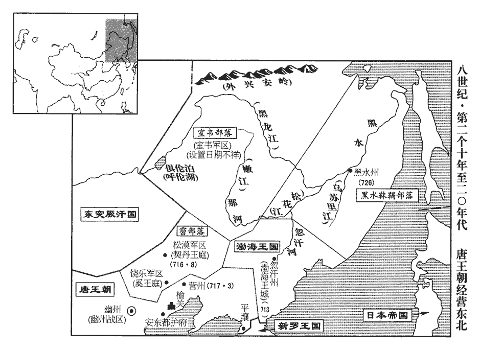
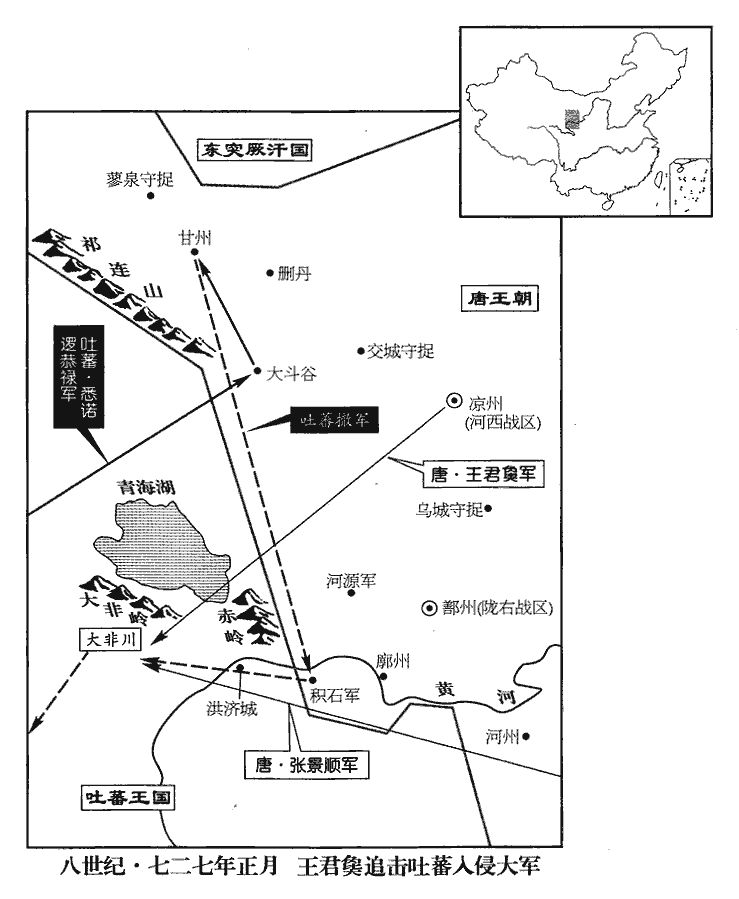
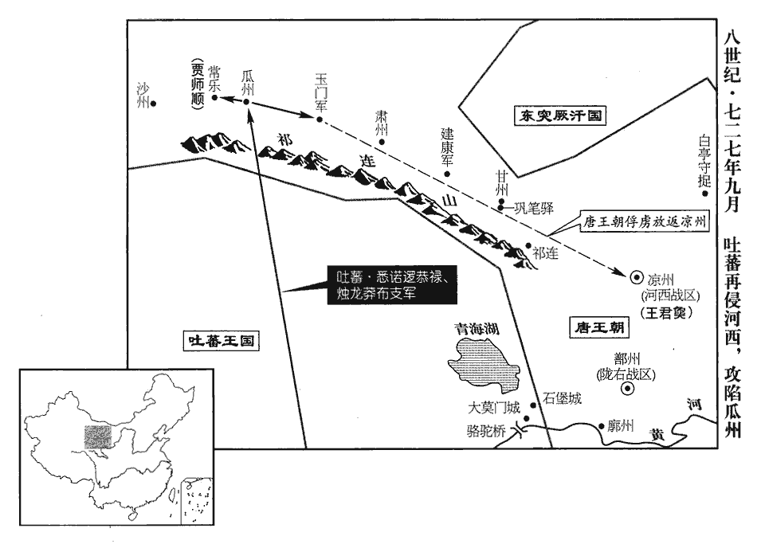
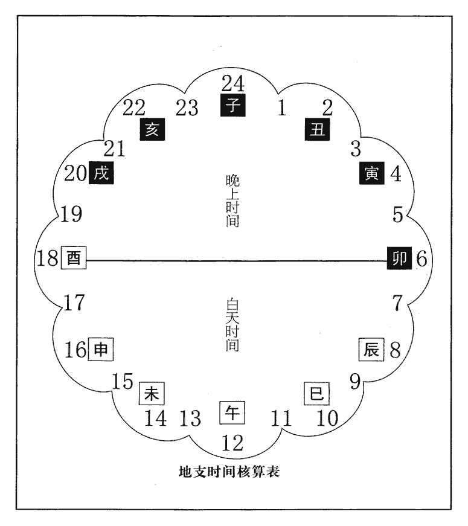
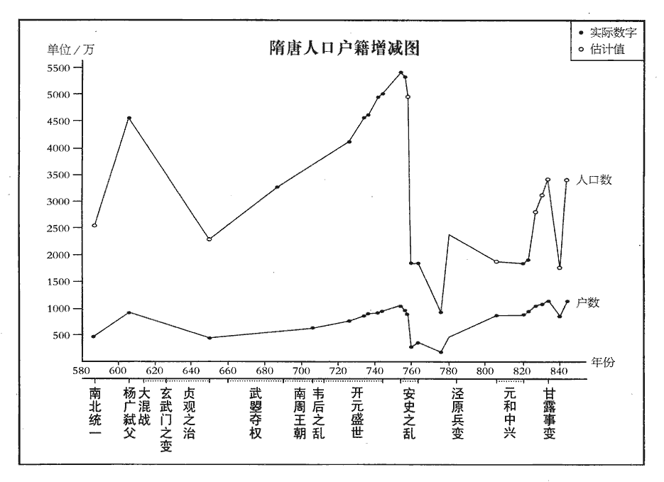
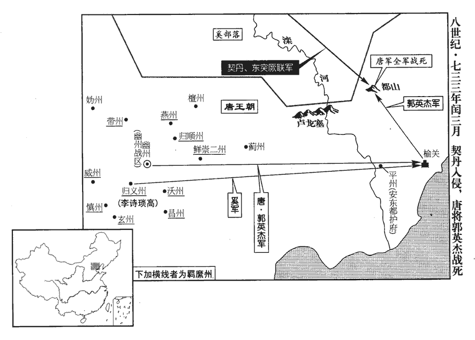
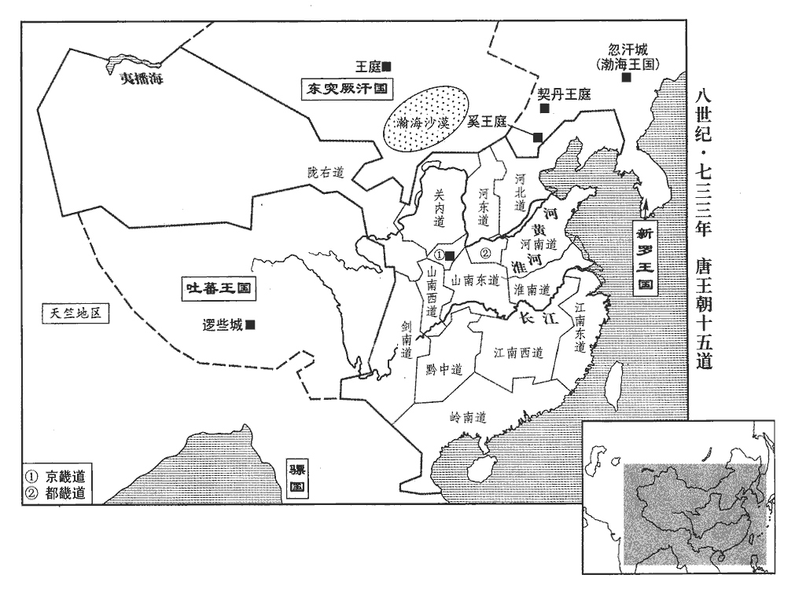

 唐紀二十九起柔兆攝提格（丙寅），盡昭陽作噩（癸酉），凡八年

# 玄宗至道大聖大明孝皇帝中之上

## 開元十四年（丙寅、七二六）

1春，正月，癸未‹四›，更立契丹‹辽河上游›松漠王李邵固為廣化王，奚‹滦河上游›饒樂王李魯蘇為奉誠王。契，欺訖翻。樂，音洛以上‹李隆基，本年四十二岁›從甥陳氏為東華公主，妻邵固；從，才用翻。妻，七細翻；下同。考異曰：東華出降，實錄在三月壬子；於此終言之。以成安公主之女韋氏為東光公主，成安公主，中宗之女，下嫁韋捷。妻魯蘇。

〖译文〗 [1]春季，正月，癸未（初四），唐玄宗将契丹松漠王李邵固改立为广化王，将奚族饶乐王李鲁苏改立为奉诚王；封自己姐妹的女儿陈氏为东华公主，嫁给李邵固为妻，封中宗之女成安公主的女儿韦氏为东光公主，嫁给李鲁苏为妻。

2張說奏：「今之五禮，貞觀、顯慶兩曾脩纂，說，讀曰悅。觀，古玩翻。前後頗有不同，其中或未折衷。衷，竹仲翻。宋均曰：折，斷也；中，當正也；若折斷其物，與度相中當也。望與學士等討論古今，刪改施行。」制從之。

〖译文〗 [2]张说奏道：“如今的五礼，经过贞观、显庆年间两次编撰修改，前后有很多不同之处，其中有些尚有所偏颇。希望允许我和学士等人对古今的礼仪进行讨论研究，酌情对五礼作适当的增删修改，然后颂布施行。”唐玄宗采纳了张说的建议。

3邕州‹广西南宁市›封陵‹广西邕宁县东北›獠梁大海等據賓‹广西宾阳县›、橫州‹广西横县›反；封陵本山峒，唐世以漸開拓，乾元後始置為縣。賓州，漢領方縣地，屬鬱林郡。梁置領方郡。隋廢郡為縣，屬鬱州。唐初屬南方州。貞觀五年分置賓州。橫州，漢廣鬱、高梁縣地。江左置寧浦郡。隋廢郡為縣，屬鬱州。唐初分置簡州，貞觀八年改曰橫州。二月，己酉‹正月三十日›，遣內侍楊思勗發兵討之。考異曰：舊紀作「庚戌朔」，今從實錄。

〖译文〗 [3]邕州封陵县獠人梁大海等人占据宾州和横州造反。二月，己酉（疑误），唐玄宗派内侍杨思勖调兵前去讨伐。

4上召河南尹崔隱甫，欲用之，中書令張說薄其無文，奏擬金吾大將軍；前殿中監崔日知素與說善，說薦為御史大夫；上不從。丙辰‹七›，以日知為左羽林大將軍，丁巳‹八›，以隱甫為御史大夫。隱甫由是與說有隙。

〖译文〗 [4]唐玄宗召见河南尹崔隐甫，准备重用他。中书令张说鄙薄崔隐甫没有文采，就向唐玄宗提议让他当金吾大将军；前殿中监崔日知一向与张说关系好，张说就举荐他当御史大夫。但唐玄宗没有听从张说的建议。丙辰（初七），唐玄宗任命崔日知为左羽林大将军；丁巳（初八），任命崔隐甫为御史大夫。崔隐甫从此与张说有了矛盾。

說有才智而好賄，百官白事有不合者，好面折之，至於叱罵。惡御史中丞宇文融之為人，好，呼到翻。折，之舌翻。惡，烏路翻。且患其權重，宇文融既居風憲之地，又貳戶部，故患其權重。融所建白，多抑之。中書舍人張九齡言於說曰：「宇文融承恩用事，辯給多權數，不可不備。」說曰：「鼠輩何能為！」夏，四月，壬子‹四›，隱甫、融及御史中丞李林甫共奏彈說「引術士占星，徇私僭侈，受納賄賂。」彈，徒丹翻，賄，呼罪翻。敕源乾曜及刑部尚書韋抗、大理少卿明【嚴：「明」改「胡」。】珪與隱甫等同於御史臺鞫之。林甫，叔良之曾孫；長平王叔良，高祖從父弟。抗，安石之從父兄子也。韋安石歷事武后、中宗，貶死於開元之初。從，才用翻

〖译文〗 张说很有才学智谋，但贪财，百官陈述事情有不符合他心意的地方，他喜欢当面驳斥，甚至大声呵斥谩骂。他厌恶御史中丞宇文融的为人，而且还担心宇文融的权力上升，因此对宇文融所提出的建议，大多加以压制。中书舍人张九龄对张说说：“宇文融蒙受恩宠掌握大权，又能言善辩，很会耍弄权术，您对他不能不有所防备。”张说轻蔑地说：“鼠辈能有什么作为！”夏季，四月，壬子（初四），崔隐甫、宇文融和御史中丞李林甫一起向唐玄宗上书，弹劾张说：“请来术士观星象以测吉凶，还徇私舞弊，收受贿赂，过份奢侈”。唐玄宗命令源乾曜和刑部尚书韦抗、大理少卿明与崔隐甫等人一起在御史台审讯张说。李林甫是李叔良的曾孙，韦抗是韦安石堂兄的儿子。

丁巳‹九›，以戶部侍郎李元紘hóng為中書侍郎、同平章事。元紘以清儉著，故上用為相。

〖译文〗 丁巳（初九），唐玄宗任命户部侍郎李元为中书侍郎、同平章事。李元一向以清廉俭朴著称，因此唐玄宗任用他当宰相。

5源乾曜等鞫張說，事頗有狀，上使高力士視說，力士還奏：「說蓬首垢面，席藁，食以瓦器，惶懼待罪。」上意憐之。力士因言說有功於國，上以為然。庚申‹十二›，但罷說中書令，餘如故。說，讀為悅。

〖译文〗 [5]源乾曜等人审问张说，事情颇有眉目。唐玄宗派高力士探视张说，高力士回来对唐玄宗说：“张说头发散乱，满脸污垢，坐卧在稻草垫子上，用瓦盆吃饭，惊慌恐惧地等候处分。”唐玄宗心里很怜悯张说。高力士趁机说张说对国家有过功劳，唐玄宗认为他讲得很对。庚申（十二日），唐玄宗只罢免了张说的中书令职务，其余的官职不变。

6丁卯‹十九›，太子太傅岐王範薨，贈謚惠文太子。上為之撤膳累旬，為，于偽翻。百官上表固請，上，時掌翻。然後復常。

〖译文〗 [6]丁卯（十九日），太子太傅岐王李范去世，唐玄宗赠给他惠文太子的谥号。由于李范去世，唐玄宗连续撤去御膳几十天，百官上书再三恳求，才恢复常规。

7丁亥，太原‹山西省太原市›尹張孝嵩奏，「有李子嶠者，自稱皇子，云生於潞州‹山西省长治市›，母曰趙妃。」上命杖殺之。

〖译文〗 [7]丁亥（初十），太原尹张孝嵩向唐玄宗上书说：“有个叫李子峤的人，自称是皇子，说生在潞州，母亲叫赵妃。”唐玄宗命令张孝嵩用杖刑将此人打死。

8辛丑‹四月十二日›，於定‹河北省定州市›、恆‹河北省正定县›、莫‹河北省任丘市北鄚州镇›、易‹河北省易县›、滄‹河北省沧州市东南›五州置軍以備突厥。定州置北平軍，恆州置恆陽軍，莫州置唐興軍，易州置高陽軍，滄州置橫海軍。恆，戶登翻。

〖译文〗 [8]辛丑（二十四日），朝廷在定州、恒州、莫州、易州、沧州分别建置北平军、恒阳军、唐兴军、高阳军、横海军，以防备突厥的侵犯。

9上欲以武惠妃‹本年二十八岁›為皇后，或上言：「武氏乃不戴天之讎，豈可以為國母！人間盛言張說欲取立后之功，更圖入相之計。上，時掌翻。相，息亮翻。且太子‹李鸿李嗣谦›非惠妃所生，惠妃復自有子‹寿王李瑁、盛王李琦›，若登宸極，太子必危。」上乃止。復，扶又翻。考異曰：唐會要云：「侍御史潘好禮聞上欲以惠妃為皇后，進疏諫曰：『臣聞禮記曰：「父母之讎不可共戴天。」公羊傳曰：「子不復父讎，不子也。」昔齊襄公復九世之讎，丁蘭報木母之怨。陛下豈得欲以武氏為國母，當何以見天下之人乎！不亦取笑於天下乎！又，惠妃再從叔三思、再從父兄延秀等，並干紀亂常，遞窺神器，豺狼同穴，梟獍共林。且匹夫匹婦欲結髮為夫妻者，尚相揀擇，況陛下是累聖之貴，天子之尊乎！伏願詳察古今，鑒戒成敗，慎擇華族之女，必在禮義之家，稱神祇之心，允億兆之望。又見人間盛言，尚書右丞相張說自被停知政事之後，每諂附惠妃，欲取立后之功，更圖入相之計。伏願杜之於將漸，不可悔之於已成。且太子本非惠妃所生，惠妃復自有子，若惠妃一登宸極，則儲位實恐不安；古人所以諫其漸者，良為是也。昔商山四皓，雖不食漢庭之祿，尚能輔翊太子，況臣愚昧，職忝憲府。』」蘇冕駁曰：「此表非潘好禮所作。且好禮，先天元年為侍御史，開元十二年為溫州刺史致仕。表是十四年獻，而云『職忝憲府』。若題年恐錯，則武惠妃先天元年始年十四，王皇后有寵未衰，張說又未為右丞相。竟未知此表是誰獻之。」今除其名。然宮中禮秩，一如皇后。

〖译文〗 [9]唐玄宗想立武惠妃为皇后，有人上书说：“您与武氏有不共戴天之仇，怎么能立她为国母？民间盛传张说想谋取册立皇后之功，进而再作担任宰相的打算。况且太子不是武惠妃所生，她自己又有儿子，如果她登上皇后之位，太子必然很危险。”唐玄宗听后才打消了这个念头，但武惠妃在宫中的礼仪级别，一切都如同皇后。

10五月，癸卯‹二十六›，戶部奏今歲戶七百六萬九千五百六十五，口四千一百四十一萬九千七百一十二。

〖译文〗 [10]五月，癸卯（二十六日），户部向唐玄宗报告，今年全国共有七百零六万九千五百六十五户，共四千一百四十一万九千七百一十二人。

11秋，七月；河南、北大水，溺死者以千計。溺，奴狄翻。

〖译文〗 [11]秋季，七月，黄河南北地区发大水，数以千计的人被淹死。

12八月，丙午朔‹一›，魏州‹河北省大名县›言河溢。

〖译文〗 [12]八月，丙午朔（初一），魏州报告黄河泛滥。

13九月，己丑‹十五›，以安西副大都護‹驻龟兹新疆库车县›、磧西‹总部同设龟兹›節度使杜暹同平章事。磧，七迹翻。暹，息廉翻。

〖译文〗 [13]九月，己丑（十五日），唐玄宗任命安西副大都护、碛西节度使杜暹为同平章事。

自王孝傑克復四鎮，復四鎮見二百五卷武后長壽元年。復於龜茲置安西都護府，復，扶又翻。龜茲，音丘慈。以唐兵三萬戍之，百姓苦其役；為都護者，惟田楊名、郭元振、張嵩及暹皆有善政，為人所稱。

〖译文〗 自从王孝杰收复龟兹、疏勒、于阗、焉耆四镇后，朝廷又在龟兹设置安西都护府，派遣三万军队驻守这个地区，老百姓深受远戍安西的兵、徭役之苦。在历任安西都护中，只有田杨名、郭元振、张嵩和杜暹都有一些好的政绩，因而被人们所称颂。

14冬，十月，庚申‹十六›，上幸汝州‹河南省汝州市›廣成湯‹汝州市西南三十千米›；考異曰：令狐峘huán代宗實錄云：「上以開元十四年十月十三日生，時玄宗幸汝州之溫湯，有望氣者云，宮中有天子氣，玄宗即日還宮，是夜代宗降誕。」按玄宗實錄，此月十六日庚申始幸溫湯，己巳乃還宮，與代宗實錄不同。舊紀云「十二月十三日生」。舊后妃傳：「章敬皇后吳氏坐父事沒入掖庭，開元二十三年，玄宗幸忠王邸，見王服御蕭然，傍無媵侍，命將軍高力士選掖庭宮人以賜之，而吳后在籍中；明年，生代宗皇帝，十八年薨。」按代宗此年生，而云二十三年以吳后賜忠王，十八年薨，蓋誤以十三年為二十三年也。次柳氏舊聞：「肅宗在東宮為李林甫所構，勢幾危者數矣，無何，須鬢斑白。嘗早朝，上見之，愀qiǎo然曰：『汝歸第，吾當幸汝。』及上至，顧見宮庭殿宇皆不洒掃，而樂器塵埃，左右使令無有妓女。上為之動色，使力士詔掖庭按籍閱視得三人，乃以賜太子，而章敬吳皇后在選中，生代宗。」按開元二十三年，李林甫初為相，二十五年廢太子瑛，二十六年乃立肅宗為太子，天寶五年李林甫始構韋堅之獄。舊聞所記，事皆虛誕，年月不合。新書后妃傳全取之，今皆不取。按漢廣成苑在唐汝州梁縣界，其地有湯泉。己酉‹二十五›，【嚴：「酉」改「「巳」。】還宮。

〖译文〗 [14]冬季，十月，庚申（十六日），唐玄宗来到汝州广成汤；十二月，己酉（初六），回皇宫。

15十二月，丁巳‹十四›，上幸壽安‹河南省宜阳县›，獵於方秀川‹宜阳县西南›；壬戌‹十九›，還宮。

〖译文〗 [15]十二月，丁巳（十四日），唐玄宗到寿安，在方秀川狩猎；壬戌（十九日），回皇宫。

16楊思勗討反獠，獠，魯皓翻。生擒梁大海等三千餘人，斬首二萬級而還。還，從宣翻，又如字。

〖译文〗 [16]杨思勖讨伐反叛的獠人，活捉梁大海等三千余人，斩首两万级，得胜而回。

17是歲，黑水靺鞨‹乌苏里江东›遣使入見；黑水靺鞨在流鬼國西南，女真即其遺種也，靺鞨，音末曷。見，賢遍翻。上以其國為黑水州‹羁縻州·西伯利亚伯力城›，仍為置長史以鎮之。「長史」恐當作「長吏」。仍為，于偽翻。

〖译文〗 [17]这一年，黑水派使节到长安晋见唐玄宗。唐玄宗在黑水国设立黑水州，并为它设置长史以镇守这个地区。

勃海靺鞨‹首都忽汗城吉林省敦化市›王武藝曰：「黑水入唐，道由我境。往者請吐屯於突厥，突厥置吐屯以領諸附從之國。厥，九勿翻。先告我與我偕行；今不告我而請吏於唐，是必與唐合謀，欲腹背攻我也。」遣其母弟門藝與其舅任雅將兵擊黑水。將，即亮翻；下同。門藝嘗為質子於唐，質，音致。諫曰：「黑水請吏於唐，而我以其故擊之，是叛唐也。唐，大國也。昔高麗‹辽宁省、吉林省东部及朝鲜半岛北部›全盛之時，強兵三十餘萬，不遵唐命，掃地無遺。掃地無遺，言國亡無遺育也；事見太宗、高宗紀。麗，力知翻。況我兵不及高麗什之一二，一旦與唐為怨，此亡國之勢也。」武藝不從，強遣之。強，其兩翻。門藝至境上，復以書力諫。武藝怒，遣其從兄大壹夏代之將兵，召，欲殺之。門藝棄眾，間道來奔，復，扶又翻。夏，戶雅翻。從，才用翻。間，古莧翻。制以為左驍衛將軍。武藝遣使上表罪狀門藝，請殺之。驍，堅堯翻。使，疏吏翻。上，時掌翻。上密遣門藝詣安西‹龟兹新疆库车县›；留其使者，別遣報云，已流門藝於嶺南。武藝知之，上表稱「大國當示人以信，豈得為此欺誑？」誑，居況翻。固請殺門藝。上以鴻臚少卿李道邃、源復不能督察官屬，致有漏泄，皆坐左遷。唐九寺皆有少卿二人。鴻臚掌四夷之客，故以漏泄為罪。臚，陵如翻。少，始照翻。暫遣門藝詣嶺南以報之。

〖译文〗 勃海王大武艺认为：“由黑水前往唐朝，要路经我的辖境。过去他们向突厥请求派吐屯时，都事先告诉我并且和我一起行动；如今他们不告诉我就请求唐朝派官员，这必定是与唐朝一起谋划，想从腹背两面来夹攻我。”于是，大武艺派他的同母弟弟大门艺和舅父任雅率军进攻黑水。大门艺曾经在唐朝当过质子，他规劝大武艺说：“黑水向唐朝请求派官员，而我们因为这个原因而进攻它，这分明是反叛唐朝。唐朝是个强大的国家，过去高丽国在全盛时期，有三十万精兵，不遵从唐朝的命令，最后落得个亡国的下场。何况我们的军队还不到高丽国的十分之一二，一旦与唐朝结下怨仇，那面临的就是亡国的结局了。”大武艺没有听从他的话，强行派大门艺去进攻黑水国。大门艺到了边境，又送书信竭力劝谏大武艺。大武艺大怒，派他的堂兄大壹夏代替大门艺率领军队，并召大门艺回去，想杀死他。大门艺抛下军队，走偏僻小路投奔唐朝，唐玄宗下令任命他为左骁卫将军。大武艺派使节上表，列数大门艺的罪状，请唐玄宗杀了大门艺。唐玄宗秘密地派大门艺到安西去，同时设法留住了大武艺的使节，另外又派人对大武艺说已将大门艺流放到岭南。大武艺知道实情，又上表声称：“大国理当向人显示信用，怎么能做这种欺诈骗人的事？”坚持请求唐玄宗杀掉大门艺。唐玄宗认为鸿胪少卿李道邃和源复没能监督好下属官员，导致将有关大门艺的情况泄漏出去，于是把他们都降了职，又派大门艺暂时到岭南去，以便于答复大武艺。

 

臣光曰：王者所以服四夷，威信而已。門藝以忠獲罪，自歸天子；天子當察其枉直，賞門藝而罰武藝，為政之體也。縱不能討，猶當正以門藝之無罪告之。今明皇威不能服武藝，恩不能庇門藝，顧效小人為欺誑之語以取困於小國，乃罪鴻臚之漏泄，不亦可羞哉！

〖译文〗 臣司马光曰：帝王之所以能使四方小国敬服，靠的是威望和信誉。大门艺因为忠诚而获罪，只好独自归附大唐天子；唐天子理应明察事情的曲直，奖赏大门艺，惩罚大武艺，这是治理政事的根本原则。对大武艺纵然不能讨伐，也应当严正地告诉他大门艺无罪。如今，唐玄宗的威望不能使大武艺降服，恩泽又不能庇护大门艺，只是效法小人说一些欺诈骗人的话，以至在小国面前陷入窘困的境地，却怪罪鸿胪寺的官员泄漏秘密，这不也应该感到羞耻吗！

18杜暹為安西都護，突騎施‹伊犁河中下游›交河公主遣牙官以馬千匹詣安西互市。使者宣公主教，暹，息廉翻。騎，奇寄翻。使，疏吏翻；下同。暹怒曰：「阿史那女交河公主，阿史那懷道之女。何得宣教於我！」杖其使者，留不遣；馬經雪死盡。突騎施可汗蘇祿大怒，發兵寇四鎮‹四镇：龟兹新疆库车县›、焉耆新疆焉耆县、疏勒新疆喀什市、于阗新疆和田市。會暹入朝；使，疏吏翻。朝，直遙翻；下同。趙頤貞代為安西都護，嬰城自守；四鎮人畜儲積，皆為蘇祿所掠，畜，許救翻。安西僅存。既而蘇祿聞暹入相，稍引退，相，息亮翻。尋遣使入貢。

〖译文〗 [18]杜暹任安西都护时，突骑施交河公主派牙官赶着一千多匹马到安西去出售，又派使者向杜暹宣读交河公主的命令，杜暹恼怒地说：“阿史那怀道的女儿，有什么资格向我宣读命令！”他命令杖打使者，将他扣留；马匹经过一场大雪全部被冻死。突骑施可汗苏禄勃然大怒，就派军队进犯安西四镇。这时杜暹恰好到长安朝见天子，由赵颐贞代任安西都护，他环城自守；四镇的老百姓、牲畜和储存的东西，全部被苏禄抢劫一空，只剩下一座安西城。不久，苏禄听说杜暹当了宰相，才逐渐地将军队撤走，随即又派使者向唐朝进献贡品。

## 十五年（丁卯、七二七）

1春，正月，辛丑‹二十八›，涼州‹总部设甘肃省武威市›都督王君㚟chuò破吐蕃於青海‹青海湖›之西。㚟，丑略翻。吐，從暾入聲。

〖译文〗 [1]春季，正月，辛丑，（二十八日），凉州都督王君在青海西边打败了吐蕃。

初，吐蕃‹首都逻些城西藏拉萨市›自恃其強，致書用敵國禮，事見二百十一卷二年。辭指悖慢，悖，蒲內翻，又蒲沒翻。上‹李隆基，本年四十三岁›意常怒之。返自東封，張說言於上曰：「吐蕃無禮，誠宜誅夷，但連兵十餘年，甘‹甘肃省张掖市›、涼‹甘肃省武威市›、河‹甘肃省临夏市›、鄯‹青海省乐都县›，不勝其弊，鄯，時戰翻，又音善。勝，音升。雖師屢捷，所得不償所亡。聞其悔過求和，願聽其款服，以紓邊人。」上曰：「俟吾與王君㚟議之。」說退，謂源乾曜曰：「君㚟勇而無謀，常思僥幸，僥，堅堯翻。若二國和親，何以為功！吾言必不用矣。」及君㚟入朝，果請深入討之。

〖译文〗 当初，吐蕃自恃强大，向唐朝致书采用两国对等的礼节，言词违逆傲慢，唐玄宗常常为此而愤怒。唐玄宗从泰山封禅返回后，张说对他说：“吐蕃对我国无礼，确实应该讨伐平定它，但十余年接连打仗，甘、凉、河、鄯等地再也承受不住战争的祸害了，虽然出师屡屡获胜，但是得不偿失。听说吐蕃想悔过求和，希望您能接受他们的诚心归服，以解除边境人民的困苦。”唐玄宗说：“等我和王君商量后再说。”张说退朝后，对源乾曜说：“王君有勇无谋，常想着侥幸取胜。如果两国和亲，他拿什么作为自己的功劳呢？我的话一定不会被皇上采纳。”等到王君进朝，果然请求唐玄宗让他率领军队深入吐蕃国境内讨伐。

 

去冬，吐蕃大將悉諾邏寇大斗谷‹即大斗拔谷·甘肃省山丹县南›，將，即亮翻。邏，郎佐翻。進攻甘州‹甘肃省张掖市›，焚掠而去。君㚟度其兵疲，勒兵躡其後，度，徒洛翻。躡，尼輒翻。考異曰：吐蕃傳云；「君㚟畏其鋒不敢出。」今從君㚟傳。會大雪，虜凍死者甚眾，自積石軍‹青海省贵德县›西歸。廓州達化縣西有積石軍，本靜邊鎮，儀鳳二年為軍，東有黃沙戍。君㚟先遣人間道入虜境，燒道旁草。悉諾邏至大非川‹青海湖以南›，欲休士馬，而野草皆盡，馬死過半。君㚟與秦州‹总部设甘肃省天水市›都督張景順追之，及於青海之西，乘冰而度。悉諾邏已去，破其後軍，獲其輜重羊馬萬計而還。間，古莧翻。重，直用翻。考異曰：君㚟傳曰：「十六年冬，吐蕃大將悉諾邏帥眾入寇大斗谷，又移攻甘州，焚燒市里而去。君㚟襲其後，敗之於青海之西」據實錄及吐蕃傳，入寇在十四年冬；此云十六年冬，誤也。君㚟以功遷左羽林大將軍，拜其父壽為少府監致仕。上由是益事邊功。

〖译文〗 去年冬天，吐蕃大将悉诺逻进犯大斗谷，进攻甘州，烧杀抢劫后退走。王君推测悉诺逻的军队一定很疲乏，就带兵偷偷地跟在他们后边。适逢天降大雪，吐蕃军队很多人被冻死，便经由积石军西归吐蕃。王君抢先派人从偏僻小道进入敌方境内，烧掉路边的野草。悉诺逻到了大非川，打算让士兵战马休息一下，但这里的野草已全部被烧光了，结果战马死了一半多。王君和秦州都督张景顺率领军队追击，在青海的西边追上了悉诺逻，趁湖水结冰越过青海。这时悉诺逻已离开，他们打败了悉诺逻的后军，缴获数以万计的辎重羊马后返回。王君由于立了大功，被擢升为左羽林大将军，唐玄宗又授予王君的父亲王寿以少府监退休。从此，唐玄宗更加追求建立边功。

2初，洛陽人劉宗器上言，請塞汜水‹河南省荥阳市汜水镇西›舊汴口‹汴水入黄河处，荥阳市北›，更於熒澤‹荥阳市东北›引河入汴；隋開皇四年分滎陽置廣武縣，仁壽元年更名熒澤，屬鄭州。上，時掌翻。塞，悉則翻；下同。汜，音祀。汴，皮變翻。擢宗器為左衛率府冑曹。率，所律翻。至是，新渠填塞不通，貶宗器為循州‹广东省惠州市›安懷戍‹惠州市西北›主。命將作大匠范安及發河南‹洛阳›、懷‹河南省沁阳市›、鄭‹河南省郑州市›、汴‹河南省开封市›、滑‹河南省滑县›、衛‹河南省卫辉市›三萬人疏舊渠，旬日而畢。

〖译文〗 [2]起初，洛阳人刘宗器上书，请求堵塞汜水旧汴口，改从荧泽引黄河的水流入汴水。唐玄宗提拔刘宗器任左卫率府胄曹。到这时，新渠堵塞不通，唐玄宗将刘宗器贬为循州安怀戍主；又命令将作大匠范安及征调河南、怀州、郑州、汴州、滑州、卫州三万民工疏通旧渠，用十天时间就完工了。

3御史大夫崔隱甫、中丞宇文融，恐右丞相張說復用，數奏毀之，各為朋黨。上惡之，復，扶又翻。數，所角翻。惡，烏路翻。二月，乙巳‹二›，制說致仕，隱甫免官侍母，融出為魏州‹河北省大名县›刺史。

〖译文〗 [3]御史大夫崔隐甫、御史中丞宇文融害怕尚书右丞相张说被重新起用，多次上奏诋毁他。他们各自结成朋党，明争暗斗。唐玄宗很厌恶他们的做法，二月，乙巳（初二），命令张说退休，崔隐甫免职回家侍奉他的母亲，宇文融离京任魏州刺史。

4乙卯‹十二›，制；「諸州逃戶，先經勸農使括定按比後復有逃來者，隨到準白丁例輸當年租庸，有征役者先差。」使，疏吏翻。復，扶又翻；下不復同。差，初佳翻。

〖译文〗 [4]乙卯（十二月），唐玄宗下令：“各州逃亡外地没有户籍的民户，在先前经过劝农使搜求检查核定户籍以后，再有逃到某地的，到后即按平民之例缴纳当年的租庸，如有征役先派他们。”

5夏，五月，癸酉‹一›，上悉以諸子慶王潭等領州牧、刺史、都督、節度大使、大都護、經略使，使，疏吏翻。實不出外。

〖译文〗 [5]夏季，五月，癸酉（初一），唐玄宗让他的儿子庆王李潭等担任州牧、刺史、都督、节度大使、大都护、经略使等职务，但实际上他们并不离京到外地去任职。

初，太宗‹李世民›愛晉王，晉王治，是為高宗不使出閤；豫王‹李旦›亦以武后少子不出閤，及自皇嗣為相王，始出閤。中宗‹李显›之世，譙王‹李重福›失愛，謫居外州；溫王‹李重茂›年十七，猶居禁中。譙王，重福。溫王，重茂。上即位，附苑城為十王宅，朱雀街東第五街有安國寺，寺東附苑城為大宅，分處十王。十王，謂慶、忠、棣、鄂、榮、儀、台、潁、永、濟也。後盛、壽、陳、豐、常、涼六王又就封入內宅，是為十六宅。以居皇子，宦官押之，就夾城參起居，自是不復出閤；雖開府置官屬及領藩鎮，惟侍讀時入授書，歐陽修曰，唐王府侍讀無定員。自餘王府官屬，但歲時通名起居；其藩鎮官屬，亦不通名。及諸孫浸多，又置百孫院。太子亦不居東宮，常在乘輿所幸之別院。乘，繩證翻。

〖译文〗 当初，唐太宗疼爱晋王李治，不让他离宫自居于王府，豫王也因为是武后的小儿子而没有离宫自居于王府，直到由皇嗣改封为相王，才离宫居于王府。唐中宗的时候，谯王李重福失宠，被中宗谪往外州居住；温王李重茂年已十七岁，还住在皇宫里。唐玄宗登上皇位，在紧挨禁苑的地方建造十王宅，以便让皇子居住，派宦官监督他们，都由夹城入大明宫参见请安，各皇子从此不再离宫自居于王府；即使他们建立府署，设置属官及担任地方长官，也只有侍读按时入宅教书，其余王府属官，则只是在每年的一定时间前来通报姓名请安，至于他们在地方官府的属吏，则连通报姓名请安也免除了。后来皇孙逐渐增加，又建造了百孙院。太子一般也不住在东宫，而是常常住在皇帝所到的皇宫别院里。

6上命妃嬪以下宮中育蠶，欲使之知女功。丁酉‹二十五›，夏至，賜貴近絲，人一綟。杜佑曰：唐令，緜六兩為屯，絲五兩為絇qú，麻三斤為綟。未知絲綟輕重何如。綟lì，郎計翻。

〖译文〗 [6]唐玄宗命令后宫妃嫔以下的人在宫中养蚕，想借此让她们懂得一些妇女应做的事。丁酉（二十五日），夏至，唐玄宗赐给后宫中位尊而为天子所亲近的人每人一丝。

7秋，七月，戊寅‹八›，冀州‹河北省冀州市›河溢。

〖译文〗 [7]秋季，七月，戊寅（初八），冀州黄河泛滥。

8己卯‹九›，禮部尚書許文憲公蘇頲薨‹年五十八岁›。頲，他鼎翻。

〖译文〗 [8]己卯（初九），礼部尚书许文宪公苏去世。

9九月，丙子‹七›，吐蕃大將悉諾邏恭禄及燭龍莽布支攻陷瓜州‹甘肃省安西县›，執刺史田元獻及河西‹总部设凉州甘肃省武威市›節度使王君㚟chuò之父，進攻玉門軍‹甘肃省玉门市›；按王君㚟之父壽以少府監致仕居鄉里。玉門軍在肅州之西二百里。宋白曰：肅州西門縣，漢罷玉門關屯，徙其人於此，故曰玉門縣。石門周匝山間，經二十里，眾流北入延興海。縱所虜僧【嚴：「僧」改「俘」。】使歸涼州，謂君㚟曰：「將軍常以忠勇許國，何不一戰！」君㚟登城西望而泣，竟不敢出兵。

〖译文〗 [9]九月，丙子（初七），吐蕃大将悉诺逻恭禄和烛龙莽布支攻破瓜州，捉获瓜州刺史田元献和河西节度使王君的父亲，接着又进攻玉门军；还放回所俘虏的僧人，让他们返回凉州，对王君说：“将军您常以忠勇报效国家，现在为什么不出城决一死战？”王君登上城楼，向西远望而哭泣，竟然不敢出兵。

莽布支別攻常樂縣‹甘肃省安西县西›，宋白曰：常樂縣屬瓜州，魏之宜禾郡，前涼之涼興縣地，涼武昭王於三危山東置常樂鎮，唐武德五年改置常樂縣。縣令賈師順帥眾拒守。樂，音洛，帥，讀曰率。及瓜州陷，悉諾邏悉兵會攻之。旬餘日，吐蕃力盡，不能克，使人說降之；說，式芮翻。降，戶江翻。不從。吐蕃曰：「明府既不降，宜斂城中財相贈，吾當退。」師順請脫士卒衣；悉諾邏知無財，乃引去，毀瓜州城。師順遽開門，收器械，修守備；虜果復遣精騎還，視城中，知有備，乃去。田元獻不能守瓜州而賈師順能守常樂，固圉固存乎其人也。復，扶又翻。覘，丑廉翻，又丑豔翻。師順，岐州‹陕西省凤翔县›人也。

〖译文〗 烛龙莽布支另外又攻打常乐县。常乐县令贾师顺带领部下坚守。等到瓜州陷落，悉诺逻恭禄集中全部兵力攻打常乐城。打了十多天，吐蕃军队精疲力尽，仍然不能攻下常乐城，悉诺逻恭禄派人来劝降，贾师顺断然拒绝。吐蕃派来的人说：“既然您不愿投降，就应收集城中的财物送给我们，那样我们就会退走。”贾师顺请他脱士兵的衣服；悉诺逻知道城中没有多少财物，就带领军队退走，同时毁坏了瓜州城。贾师顺急速打开城门，收集军事器械，整修防守设施，敌军果然又派精锐的骑兵返回，看到城中的情况，知道已有防备，只好又退走了。贾师顺是岐州人。

10初，突厥‹瀚海沙漠群›默啜之強也，迫奪鐵勒‹蒙古国›之地，故回紇‹原住蒙古国哈尔和林市›、契苾‹原住蒙古国乌兰巴托市西›、思結‹原住蒙古国车车尔勒格城西南›、渾‹原住乌兰巴托市西›四部度磧徙居甘、涼之間以避之。啜，叱劣翻。紇，下沒翻。契，欺訖翻。苾，毗必翻。王君㚟微時，往來四部，為其所輕；及為河西節度使，以法繩之。四部恥怨，密遣使詣東都自訴。君㚟遽發驛奏「四部難制，潛有叛計。」上遣中使往察之，使，疏吏翻。諸部竟不得直。於是瀚海大都督回紇承宗流瀼州‹广西上思县›，瀼，如羊翻；杜佑曰：而章翻。渾大德流吉州‹江西省吉安市›，賀蘭都督契苾承明流藤州‹广西藤县›，藤州，漢蒼梧、猛陵縣地，晉置永平郡，隋置藤州。盧山都督思結歸國流瓊州‹海南省定安县›；以回紇伏帝難為瀚海大都督。己卯‹十›，貶右散騎常侍李令問為撫州‹江西省临川市›別駕，舊志：撫州，京師東南三千三百一十二里。坐其子與承宗交游故也。

〖译文〗 [10]当初，突厥默啜十分强盛，强夺铁勒的辖地，因此回纥、契、思结、浑四个部族穿越沙漠，移居到甘州和凉州之间，以躲避突厥的欺凌。王君未得志的时候，常往来于这四个部族之间，受到他们的轻视，等到他当了河西节度使，就利用法律惩治他们。这四个部族感到耻辱怨恨，便偷偷地派使者到东都洛阳告状。王君迅速通过驿站上奏道：“这四个部族难以制服，他们暗地里有叛乱的计划。”唐玄宗派宦官调查，这几个部族蒙受的冤屈竟不能平反。结果，瀚海大都督回纥人承宗被流放到州，浑人大德被流放到吉州，贺兰都督契人承明被流放到藤州，卢山都督思结人归国被流放到琼州；唐玄宗任命回纥人伏帝难为瀚海大都督。己卯（初十），将右散骑常侍李令问降职为抚州别驾，其原因是他儿子与回纥人承宗有交往。

 

11丙戌‹十七›，突厥毗伽可汗遣其大臣梅錄啜入貢。吐蕃之寇瓜州也，遺毗伽書，欲與之俱入寇，遺，于季翻。毗伽并獻其書。上嘉之，聽於西受降城‹内蒙古五原县西北›為互市，降，戶江翻。每歲齎縑帛數十萬匹就市戎馬，以助軍旅，且為監牧之種，種，章勇翻。由是國馬益壯焉。

〖译文〗 [11]丙戌（十七日），突厥毗伽可汗派大臣梅录啜入朝进贡。吐蕃侵犯瓜州时，给毗伽送信，想与突厥一起侵犯唐朝，毗伽将这封信献给了唐玄宗。唐玄宗嘉奖了他，并允许突厥在西受降城与唐朝做买卖，唐朝每年派人携带几十万匹丝绸到西受降城和他们交换战马，以增加唐军的战斗力，并且作为国家监牧的种马，从此以后中国马越来越强壮了。

12閏月，庚子‹二›，吐蕃贊普與突騎施‹伊犁河中下游›蘇祿圍安西城‹龟兹·新疆库车县›，安西副大都護趙頤貞擊破之。

〖译文〗 [12]闰九月，庚子（初二），吐蕃赞普和突骑施苏禄率领军队围攻安西城，安西副大都护赵颐贞打败了他们。

13回紇承宗族子瀚海‹总部设甘肃省白亭河流域›司馬護輸，糾合黨眾為承宗報仇。會吐蕃遣使間道詣突厥，王君㚟chuò帥精騎邀之於肅州‹甘肃省酒泉市›。宋白曰：隋仁壽元年分甘州福祿縣置肅州，東南至甘州赤柳間二百里，西南至瓜州界安樂烽三百四十里。，還至甘州南鞏筆驛‹张掖市西南›，為，于偽翻。間，古莧翻。甘州張掖縣西南有鞏筆驛護輸伏兵突起，奪君㚟旌節，先殺其判官宋貞，剖其心曰：「始謀者汝也。」君㚟帥左右數十人力戰，帥，讀曰率。自朝至晡，左右盡死。護輸殺君㚟，載其尸奔吐蕃；涼州兵追及之，護輸棄尸而走。考異曰：舊傳云：「回紇既殺君㚟，上命郭知運討逐。」按知運九年已卒，君㚟代鎮涼州；舊傳誤也。

〖译文〗 [13]回纥承宗的同族兄弟之子瀚海司马护输，纠集亲族部下要为承宗报仇。适逢吐蕃派使者走小道前往突厥，王君带领精锐的骑兵在肃州拦截他，返回途中，来到甘州南巩笔驿时，护输的伏兵突然冲出来，抢走了王君的节度使旌节，先杀死了王君的判官宋贞，挖出他的心脏说：“最早搞阴谋的就是你。”王君带领几十个部下奋力拼杀，从早晨一直战到下午，手下的人全部战死。护输杀死了王君，用马车载着他的尸体投奔吐蕃。凉州的唐军闻讯追上了他，护输丢下王君的的尸体逃走。

14庚申‹二十二›，車駕發東都。冬，己卯‹十一›，至西京。「冬」字下逸「十月」二字。

〖译文〗 [14]庚申（二十二日），唐玄宗从东都洛阳启程；冬季，十月，己卯（十一日），回到西京长安。

15辛巳‹十三›，以左金吾衛大將軍信安王禕yī為朔方‹总部设灵州宁夏灵武市›節度等副大使。禕，恪之孫也。吳王恪，太宗之子。禕，吁韋翻。以朔方節度使蕭嵩為河西節度等副大使。時王君㚟新敗，河、隴‹甘肃省中部及青海省东部›震駭。嵩引刑部員外郎裴寬為判官，與君㚟判官牛仙客俱掌軍政，人心浸安。寬，漼cuǐ之從弟也。漼，取猥翻。從，才用翻。仙客本鶉觚‹甘肃省灵台县›小吏，鶉觚縣，前漢屬北地郡，後漢、晉屬安定郡。後魏置趙平郡，後周廢郡，以縣屬涇州。劉昫曰：節度使置判官二人，未見品秩。鶉，如倫翻。觚，攻乎翻。以才幹軍功累遷至河西節度判官，為君㚟腹心。

〖译文〗 [15]辛巳（十三日），唐玄宗任命左金吾卫大将军信安王李为朔方节度等副大使。李是李恪的孙子。任命朔方节度使萧嵩为河西节度等副大使。此时王君刚刚败死，整个河西、陇右地区非常震惊。萧嵩举荐刑部员外郎裴宽任判官，与王君的判官牛仙客一起掌管军政，人心才渐渐安定下来。裴宽是裴的堂弟。牛仙客原是泾州鹑觚县的小吏，依靠才干军功，经过多次升迁当上了河西节度判官，成为王君的亲信。

嵩又奏以建康軍‹甘肃省高台县西›使河北‹山西省平陆县›張守珪為瓜州刺史，甘州西北百九十里祁連山有建康軍。河北縣屬陝州。帥餘眾築故城。板榦gàn裁立詩云：縮板以載。縮板兩旁，內土其中而築之。榦，亦板也。孔安國曰：旁曰榦。帥，讀曰率。吐蕃猝至，城中相顧失色莫有鬬志。守珪曰：「彼眾我寡，又瘡痍之餘，不可以矢刃相持，當以奇計取勝。」乃於城上置酒作樂。虜疑其有備，不敢攻而退。守珪縱兵擊之，虜敗走。守珪乃修復城市，收合流散，皆復舊業。朝廷嘉其功，以瓜州為都督府，以守珪為都督。

〖译文〗 萧嵩又奏请唐玄宗任命建康军使河北县人张守为瓜州刺史，带领剩下的士兵百姓修筑瓜州旧城。修筑城墙用的木板刚刚立起来，吐蕃军队突然来到，瓜州城中的人都相顾失色，没有一个人还有战斗的勇气。张守说：“敌军人多，我们人少，又在战败受创之后，决不能用刀箭和他们对峙，而应当用奇计取胜。”他于是在城楼上安然地饮酒作乐。敌人怀疑他已做好准备，不敢贸然进攻而退走。张守带兵追击，敌人战败而逃。张守于是修复瓜州城，收聚流散的百姓，使他们都各自恢复原有的职业。唐玄宗嘉奖他的功劳，并将瓜州改置为都督府，任命张守为都督。

悉諾邏威名甚盛，蕭嵩縱反間於吐蕃，間，古莧翻。云與中國通謀，贊普召而誅之；吐蕃由是少衰。少，詩沼翻。

〖译文〗 悉诺逻的威名很盛，萧嵩就对吐蕃使用了反间计，说悉诺逻与中国相互勾结；吐蕃赞普召回了悉诺逻并杀死了他。从此，吐蕃逐渐衰落。

16十二月，戊寅‹十一›，制以吐蕃為邊患，令隴右道‹青海省东部及甘肃省南部›及諸軍團兵五萬六千人，河西道‹甘肃省中部西部›及諸軍團兵四萬人府兵廢，行一切之法團結民兵，謂之「團兵」。又徵關中‹陕西省中部›兵萬人集臨洮‹青海省乐都县›，朔方‹黄河河套地区›兵萬人集會州‹甘肃省靖远县›防秋，至冬初，無寇而罷；伺虜入寇，洮，土刀翻。伺，相吏翻。互出兵腹背擊之。

〖译文〗 [16]十二月，戊寅（十一日），唐玄宗下令说，由于吐蕃成为边境的祸害，特派陇右道各军以及各军征集的当地民兵五万六千人，河西道各军以及各军征集的当地民兵四万人，又征调关中兵一万人集中在临洮，朔方兵士一万人集中到会州以预防吐蕃乘秋日马肥时大举入侵。到了初冬，如没有敌人侵犯就罢兵；如侦察到敌人入侵，就交替出兵，从腹背两面夹击敌人。

17乙亥‹八›，上幸驪山溫泉‹陕西省临潼县境›；丙戌‹十九›，還宮。

〖译文〗 [17]乙亥（初八），唐玄宗到骊山温泉；丙戌（十九日），回到皇宫。

## 十六年（戊辰、七二八）

1春，正月，壬寅‹五›，安西‹驻龟兹新疆库车县›副大都護趙頤貞敗吐蕃于曲子城。敗，蒲邁翻。

〖译文〗 [1]春季，正月，壬寅（初五），安西副大都护赵颐贞在曲子城打败了吐蕃军队。

2甲寅‹十七›，以魏州‹河北省大名县›刺史宇文融為戶部侍郎兼魏州刺史，充河北道‹河北省›宣撫使。宣撫使始此。使，疏吏翻；下同。

〖译文〗 [2]甲寅（十五日）唐玄宗任命魏州刺史宇文融为户部侍郎兼魏州刺史，充任河北道宣抚使。

3乙卯‹十八›，春‹广东省阳春市›、瀧shuāng‹广东省罗定市南›等州獠陳行範、廣州‹广东省广州市›獠馮璘、何游魯反，瀧，閭江翻。獠，魯皓翻。考異曰：本紀作「馮仁智」。今從楊思勗傳。陷四十餘城。行範稱帝，游魯稱定國大將軍，璘稱南越王，欲據嶺表；命內侍楊思勗發桂州‹广西桂林市›及嶺北近道兵討之。

〖译文〗 [3]乙卯（十六日），春州、泷州等地獠人陈行范和广州獠人冯、何游鲁造反，攻破了四十余座城池。陈行范自称皇帝，何游鲁自称定国大将军，冯自称南越王，想占据岭南地区。唐玄宗命令内侍杨思勖调集桂州和岭北靠近交通要道的军队去讨伐他们。

4丙寅‹二十九›，以魏州刺史宇文融檢校汴州‹河南省开封市›刺史，充河南北溝渠堤堰決九河使。校，古孝翻，汴，皮變翻。堰，於扇翻。使，疏吏翻。融請用禹貢九河故道開稻田，并回易陸運錢，官收其利；興役不息，事多不就。

〖译文〗 [4]丙寅（二十九日），唐玄宗任命魏州刺史宇文融为检校汴州刺史，充任黄河南北沟渠堤堰决九河使。宇文融请求将《禹贡》所载九河的故道开垦成稻田，并且改变陆路运输钱，这样官方可以坐收利益。虽然宇文融不停地兴办工程，但事情大多数没有办成。

5二月，壬申‹六›，以尚書右丞相致仕張說兼集賢殿學士。說雖罷政事，專文史之任，朝廷每有大事，上常遣中使訪之。史言張說寵顧不衰。尚，辰羊翻。相，息亮翻。說，讀為悅。使，疏吏翻。

〖译文〗 [5]二月，壬申（初六），唐玄宗任命以尚书右丞相退休的张说兼集贤殿学士。张说虽然被停止参与政事，专门负责文史的研究，但每当朝廷遇上重大事情，唐玄宗常常派中使去询问他的意见。

6壬辰‹二十六›，改彍guō騎為左右羽林軍飛騎。彍騎見上卷十三年。彍，虛郭翻，又古郭翻。騎，奇寄翻。

〖译文〗 [6]壬辰（二十六日），唐玄宗将骑改为左右羽林军飞骑。

7秋，七月，吐蕃大將悉末朗寇瓜州‹甘肃省安西县›；吐，從暾入聲。將，即亮翻。都督張守珪擊走之。乙巳‹十一›，河西‹总部设凉州甘肃省武威市›節度使蕭嵩、隴右‹总部设鄯州青海省乐都县›節度使張忠亮大破吐蕃於渴波谷‹青海湖西›；據新書吐蕃傳，渴波谷當在青海西。考異曰：實錄、唐曆、蕭嵩傳作「張志亮」。今從舊本紀、吐蕃傳。忠亮追之，拔其大莫門城‹青海省共和县东南›，大莫門城在九曲。擒獲甚眾，焚其駱駝橋‹共和县南›而還。還，從宣翻，又如字。

〖译文〗 [7]秋季，七月，吐蕃大将悉末郎进犯瓜州，都督张守打退了他们。乙巳（十一日），河西节度使萧嵩和陇右节度使张忠亮在渴波谷把吐蕃军队打得大败，张忠亮乘胜追击，攻取了大莫门城，抓获很多俘虏，烧毁该地的骆驼桥后回师。

8八月，乙巳‹十六›，特進張說上開元大衍曆，行之。僧一行推大衍數立術，以應氣朔及日食以造新曆，故曰大衍曆。上，時掌翻。

〖译文〗 [8]八月，乙巳（疑误），特进张说献上了《开元大衍历》，唐玄宗命令推行该历。

 

9辛卯‹二十八›，左金吾將軍杜賓客破吐蕃于祁連城‹甘肃省民乐县›下。祁連城在甘州張掖縣祁連山。時吐蕃復入寇，復，扶又翻。蕭嵩遣賓客將強弩四千擊之。將，即亮翻，又音如字。戰自辰至暮，吐蕃大潰，獲其大將一人；將，即亮翻，又音如字。虜散走投山，哭聲四合。

〖译文〗 [9]辛卯（二十八日），左金吾将军杜宾客在祁连城下打败了吐蕃军队。当时，吐蕃再次入侵，萧嵩派杜宾客带领四千名强弩手去迎击。战斗从早晨一直打到傍晚，吐蕃军队大败，唐军俘获其一名大将，敌人散乱地逃进山中，哭喊声四处回荡。

10冬，十月，己卯‹十七›，上幸驪山溫泉‹陕西省临潼县境›；己丑‹二十七›，還宮。考異曰：實錄「十二月丁卯」。又云「幸溫泉宮」。不言其還。唐曆，「丁卯幸溫泉，丁丑還宮。」按此月已幸溫泉，恐重複，不取。

〖译文〗 [10]冬季，十月，己卯（十七日），唐玄宗来到骊山温泉；己丑（二十七日），返回皇宫。

11十一月，癸巳‹一›，以河西節度副大使蕭嵩為兵部尚書、同平章事。

〖译文〗 [11]十一月，癸巳（初一），唐玄宗任命河西节度副大使萧嵩为兵部尚书、同平章事。

12十二月，丙寅‹五›，敕：「長征兵無有還期，人情難堪；宜分五番，歲遣一番還家洗沐，五年酬勳五轉。」

〖译文〗 [12]十二月，丙寅（初五），唐玄宗下令：“长征兵没有回乡的日期，这是人的感情所难以忍受的。应当将兵士分为五批，每年派一批回家休假，五年中给予提高勋级五等的酬报。”

13是歲，制戶籍三歲一定，分為九等。

〖译文〗 [13]这一年，唐玄宗下令，规定户籍三年核定一次，共分为九等。

14楊思勗討陳行範，至瀧shuāng州‹广东省罗定市南›，破之，擒何游魯、馮璘。行範逃於雲際、盤遼二洞‹罗定市西南›，思勗追捕，竟生擒，斬之，凡斬首六萬。思勗為人嚴，偏裨白事者不敢仰視，故用兵所向有功。然性忍酷，所得俘虜，或生剝面皮，或以刀剺lí髮際，掣去頭皮；蠻夷憚之。剺，里之翻。掣，昌列翻。去，羌呂翻。

〖译文〗 [14]杨思勖讨伐陈行范，到泷州，将他打得大败，抓获何游鲁、冯。陈行范逃到了云际、盘辽二洞，杨思勖追击搜捕，最后活捉陈行范，将他斩首。这次战斗共杀了六万人。杨思勖为人严厉，手下的偏将报告事情不敢抬头看他，因此每次出征都有功绩。然而，杨思勖性情十分残忍，他抓到的俘虏，有的活生生地被剥去脸皮，有的被用刀割开头发的边际，剥去头皮，蛮族人都非常惧怕他。

## 十七年（己巳、七二九）

1春，二月，丁卯‹六›，巂州‹总部设四川省西昌市›都督張守素【嚴：「守」改「審」。】破西南蠻，拔昆明‹四川省盐源县›及鹽城‹盐源县境›，昆明縣屬雟州，漢定莋zuó縣地，後周置定莋鎮，武德二年改置昆明縣，以其地接昆明故也。縣有鹽有鐵，築城以衛之，故又有鹽城。巂，音髓。殺獲萬人。

〖译文〗 [1]春季，二月，丁卯（初六），州都督张守素打败西南蛮，攻下昆明和盐城，杀死抓获敌人共达一万人。

2三月，瓜州‹总部设甘肃省安西县›都督張守珪、沙州‹甘肃省敦煌市›刺史賈師順擊吐蕃大同軍‹敦煌市西南›，大破之。

〖译文〗 [2]三月，瓜州都督张守和沙州刺史贾师顺进攻吐蕃大同军，将他们打得大败。

3甲寅‹二十四›，朔方‹总部设灵州宁夏灵武市›節度使信安王禕yī攻吐蕃石堡城‹青海省湟源县西南›，拔之。初，吐蕃陷石堡城，留兵據之，侵擾河右，上‹李隆基，本年四十五岁›命禕與河西‹总部设凉州甘肃省武威市›、隴右‹总部设鄯州青海省乐都县›同議攻取。諸將咸以為石堡據險而道遠，攻之不克，將無以自還，且宜按兵觀釁。釁，許覲翻。禕不聽，引兵深入，急攻拔之，乃【章：十二行本「乃」作「仍」；乙十一行本同；孔本同；退齋校同。】分兵據守要害，令虜不得前。自是河隴‹甘肃省中部及青海省东部›諸軍遊弈，拓境千餘里。上聞，大悅，更命石堡城曰振武軍。自鄯州鄯城縣河源軍西行百二十里至白水軍，又西南六十里至定戎城，又南隔澗七里有石堡城，本吐蕃鐵仞城也。宋白曰：石堡城在龍支縣西，四面懸崖數千仞，石路盤屈，長三四里，西至赤嶺三十里。更，工衡翻。

〖译文〗 [3]甲寅（二十四日），朔方节度使信安王李进攻吐蕃占据的石堡城，打下了该城。当初，吐蕃攻下石堡城，留下军队据守，并不断侵犯骚扰黄河以西地区。唐玄宗命令李和河西、陇右的官员一起商议如何攻取该城。众将领都认为石堡城地势险要，而且路途又远，如果攻打不下来，将没有办法平安返回，暂且还是应当按兵不动，再寻找战机。李没有听从他们的意见，率领军队深入敌境，急速攻城，打下了石堡城，又分别派兵据守要害的地方，使敌人不能前进。从此，河西、陇右各路唐军可以四处巡逻，并且拓展疆域一千余里。唐玄宗听到这消息，十分高兴，下令将石堡城改名叫振武军。

4丙辰‹二十六›，國子祭酒楊瑒上言，瑒，雉杏翻，又音暢。上，時掌翻。以為：「省司奏限天下明經、進士及第，每年不過百人。竊見流外出身，每歲二千餘人，而明經、進士不能居其什一，則是服勤道業之士不如胥史之得仕也。臣恐儒風浸墜，廉恥日衰。若以出身人太多，則應諸色裁損，不應獨抑明經、進士也。」又奏「諸【章：十二行本「諸」作「主」；乙十一行本同；孔本同；張校同。】司帖試明經，不務求述作大指，專取難知，問以孤經絕句或年月日；請自今並帖平文。」唐取士之科，有進士，有明經，凡明經，先帖文，然後口試經問大義十條，答時務策三道；以文理通粗為上上、上中、上下、中上、凡四等為及第。凡進士，試時務策五道，帖一大經；經策全通為甲第，策通四、帖過四以上為乙第。通典曰：唐制，帖經者，以所習經掩其兩端，其間惟開一行，裁紙為帖，凡帖三字，隨時增損，可否不一，或得四、得五、得六者為通。上甚然之。

〖译文〗 [4]丙辰（二十六日），国子祭酒杨上书认为：“尚书省有关部门上奏，要将全国考取明经、进士科的人数每年限制在一百人之内。我看到九品以外出身的，每年有两千余人，而考上明经、进士的人还不到它的十分之一。这样下去，就是勤苦从事儒业的人反不如办理文书的小吏能当官。我担心崇儒之风会因此而逐渐丧失，廉耻之心会日渐衰败。如果因为作官的人太多，就应当各类人都酌情裁减，而不能单独压缩明经、进士科的名额。”他又奏道：“主考官对应明经科考试的人考帖经，不是尽量追求弄明先圣的述作大旨，却专门选取难以知晓的章句，以义例上与别的章句没有联系的章条经文及冷僻的句子或年月日为试题。请求从现在开始考帖经都帖试一般的经文。”唐玄宗认为他说得很有道理。

5夏，四月，庚午‹十›，禘于太廟。唐初，祫xiá則序昭穆，禘則各祀於其室。昭，讀曰佋，音時遙翻。至是，太常少卿韋縚tāo等奏「如此，禘與常饗不異；請禘祫皆序昭穆。」從之。縚，安石之兄子也。縚，土刀翻。

〖译文〗 [5]夏季，四月，庚午（初十），唐玄宗在太庙祭祖先。唐朝初期，皇帝在太庙祭时是集合远近祖先的神主按左昭右穆的次序排列进行合祭的，祭则各在太庙中列位祖先的神主所居的殿室里进行。至此时，太常少卿韦等人奏称：“这样做，祭与平常的祭祀没有两样，请批准祭也像祭那样进行合祭。”唐玄宗依从了他们的建议。韦是韦安石哥哥的儿子。

6五月，壬辰‹三›，復置十道及京、都兩畿按察使。雍、同、華、商、岐、邠為京畿，洛、汝為都畿。十二年，停諸道按察使，今復置。復，扶又翻，又如字。

〖译文〗 [6]五月，壬辰（初三），唐玄宗再次设置十道按察使及京、都两畿按察使。

7初，張說、張嘉貞、李元紘、杜暹相繼為相用事，源乾曜以清謹自守，常讓事於說等，唯諾署名而已。元紘、暹議事多異同，遂有隙，更相奏列。唯，于癸翻。更，工衡翻。上不悅。六月，甲戌‹十五›，貶黃門侍郎、同平章事杜暹荊州‹湖北省江陵县›長史，中書侍郎、同平章事李元紘曹州‹山东省定陶县›刺史，舊志，曹州，京師東北一千四百五十三里。罷乾曜兼侍中，止為左丞相；開元初，改尚書左、右僕射為左、右丞相。唐初，僕射之職無所不統，是正丞相也。至中宗神龍元年豆盧欽望專為僕射，不敢預政事，是後專拜僕射者不復知政事，雖有丞相之名，非復唐初丞相之職矣。今源乾曜止為左丞相，是止為尚書左僕射，不復預政事也。以戶部侍郎宇文融為黃門侍郎，兵部侍郎裴光庭為中書侍郎，並同平章事；蕭嵩兼中書令，遙領河西。遙領河西節度使。

〖译文〗 [7]当初，张说、张嘉贞、李元、杜暹相继担任宰相执掌朝政，源乾曜为人清廉谨慎，常常把事情让给张说等人去决定，自己只是唯唯诺诺签名同意而已。李元、杜暹商议事情意见经常不同，于是就有了矛盾。他们轮流在唐玄宗面前说对方的不是，唐玄宗对此很不高兴，六月，甲戌（十五日），将黄门侍郎、同平章事杜暹降职为荆州长史，中书侍郎、同平章事李元降职为曹州刺史，罢免了源乾曜兼任的侍中，让他只担任左丞相；任命户部侍郎宇文融为黄门侍郎，兵部侍郎裴光庭为中书侍郎，一并任同平章事；任命萧嵩为中书令，让他遥遥兼任河西节度使。

8開府王毛仲與龍武將軍葛福順為婚。毛仲為上所信任，言無不從，故北門諸將多附之，進退唯其指使。吏部侍郎齊澣huàn乘間言於上曰：間，古莧翻；下離間同。「福順典禁兵，葛福順所典，萬騎也，故云然。不宜與毛仲為婚。毛仲小人，寵過則生姦；不早為之所，恐成後患。」上悅曰：「知卿忠誠，朕徐思其宜。」澣曰：「君不密則失臣，易大傳之言。願陛下密之。」會大理丞麻察坐事左遷興州‹陕西省略阳县›別駕，舊志，興州至京師九百四十八里。澣素與察善，出城餞之，因道禁中諫語；察性輕險，遽奏之。上怒，召澣責之曰：「卿疑朕不密，而以語麻察，詎為密邪？且察素無行，語，牛倨翻。邪，音耶。行，下孟翻。卿豈不知邪？」澣頓首謝。秋，七月，丁巳‹二十九›，下制：「澣、察交構將相，離間君臣，將，即亮翻。相，息亮翻。間，古莧翻。澣可高州‹广东省高州市北›良德‹高州州政府所在县›丞，察可潯州‹广西桂平市›皇化‹桂平市东北›尉。」良德亦漢合浦縣地，吳置高涼郡，陳分置務德縣，後改為良德。潯州，漢布山、阿林之地，梁於布山地置桂平郡，隋廢郡為縣，又於阿林地置皇化縣，隋廢入桂平，貞觀七年置潯州，治桂平，復置皇化縣屬焉。

〖译文〗 [8]开府王毛仲与龙武将军葛福顺成了亲家。王毛仲很受唐玄宗的信任，唐玄宗对他的话没有不听从的，因此羽林军各将领大多依附于他，行动只听他的指使。吏部侍郎齐浣找机会向唐玄宗说：“葛福顺主管禁军，不适宜与王毛仲结为亲家。王毛仲是个小人，过分宠爱就会心生邪恶；如果不及早安排，恐怕会成为后患。”唐玄宗高兴地说：“我知道你这是一片忠诚，朕会慢慢地考虑个妥善的处理办法。”齐浣说：“君主如不保守秘密就会失去臣子，希望陛下对这事保密。”适逢大理丞麻察因事获罪，被降职为兴州别驾；齐浣一向与麻察很要好，出城为他饯行，顺便说起在宫中向唐玄宗劝谏的话。麻察生性轻薄险恶，很快就把这事报告了唐玄宗。唐玄宗勃然大怒，立即召见齐浣，斥责他说：“你怀疑我不能保密，却又把事情告诉麻察，你这样做难道是保密吗？况且麻察素来没有德行，你难道不知道吗？”齐浣拼命磕头请罪。秋季，七月，丁巳（二十九日），唐玄宗下令：“齐浣、麻察两人一起诬陷将相，离间君臣；齐浣降为高州良德县丞，麻察降为浔州皇化县尉。”

9八月，癸亥‹五›，上以生日宴百官於花萼樓下。考異曰：實錄云，「癸亥朔」。按長曆，是月己未朔；癸亥，五日也。顧況歌曰：「八月五夜佳氣新，昭成太后生聖人。」實錄誤也。左丞相乾曜、右丞相說帥百官上表，帥，讀曰率。上，時掌翻。請以每歲八月五日為千秋節，布於天下，咸令宴樂。聖節錫宴自此始。後改千秋節為天長節。德、順、憲、穆不置節名。令，力丁翻。樂音洛。尋又移社就千秋節。自古以來，社用戊日。

〖译文〗 [9]八月，癸亥（初五），唐玄宗为庆贺自己的生日，在花萼楼下宴请百官。左丞相源乾曜、右丞相张说率领百官呈上表章，请唐玄宗将每年八月五日定为千秋节，公布于全国，让老百姓都摆宴同乐。不久，唐玄宗又下令将祭祀土地神的日子移到千秋节。

10庚辰‹二十二›，工部尚書張嘉貞薨‹年六十四岁›。嘉貞不營家產，有勸其市田宅者，嘉貞曰：「吾貴為將相，何憂寒餒！若其獲罪，雖有田宅，亦無所用。比見朝士廣占良田，身沒之日，適足為無賴子弟酒色之資，尚，張羊翻。將，即亮翻。相，息亮翻。比，毗至翻。朝，直遙翻。吾不取也。」聞者是之。

〖译文〗 [10]庚辰（二十二日），工部尚书张嘉贞去世。张嘉贞不经营家产，有人劝他买田地住宅，他说：“我居于将相的高位，担忧什么饥寒！如果犯了法，即使有田地住宅，也没有什么用。近来我见到朝中的士大夫大占良田，身死之后，这些只能成为无赖子弟贪恋酒色的本钱。我不做这种事。”听了他的话的人，都认为他讲得对。

11辛巳‹二十三›，敕以人間多盜鑄錢，始禁私賣銅铅錫及以銅為器皿；其采銅鉛錫者，官為市取。為，于偽翻。

〖译文〗 [11]辛巳（二十三日），唐玄宗下令，由于民间多偷着铸造钱币，从现在开始禁止私自出卖铜铅锡以及用铜制造器皿；开采的铜铅锡，由官方收购。

12宇文融性精敏，應對辯給，以治財賦得幸於上，始廣置諸使，競為聚斂，治，直之翻。使，疏吏翻。斂，力贍翻。由是百官浸失其職而上心益侈，史言唐玄宗時，開利孔自宇文融始。百姓皆怨苦之。為人疏躁多言，躁，則到翻。好自矜伐，好，呼到翻。在相位，謂人曰：「使吾居此數月，則海內無事矣。」相，息亮翻；下同。

〖译文〗 [12]宇文融性情精明机智，应对敏捷有口才，因善于治理财务赋税而受到唐玄宗的宠幸，他为相后开始广泛设置众使，竞相为朝廷聚敛财富，从此百官渐渐荒废了自己的职守，而唐玄宗的心思却越来越奢侈，百姓都怨恨宇文融给他们带来痛苦。宇文融为人粗俗浮躁，爱多说话，喜欢自夸功劳。他当上丞相时，对人说：“让我这丞相当上几个月，那全国就太平无事了。”

信安王禕yī，以軍功有寵於上，以平石堡城之功也。融疾之。禕入朝，朝，直遙翻。融使御史李寅彈之，彈，徒丹翻。泄於所親。禕聞之，先以白上。明日，寅奏果入，上怒。九月，壬子‹二十五›，融坐貶汝州‹河南省汝州市›刺史，考異曰：舊傳曰：「殿中侍御史李宙驛召禕將下獄，禕既申訴得理，融坐阿黨李宙貶。」今從唐曆。凡為相百日而罷。六月甲戌，至九月壬子，九十九日耳。是後言財利以取貴仕者，皆祖於融。

〖译文〗 信安王李因为军功显赫而受到唐玄宗的宠爱，宇文融很嫉妒他。李入朝，宇文融指使御史李寅弹劾他，这事被宇文融泄漏给了他亲近的人。李听到消息后，抢先把这事报告了唐玄宗。第二天，李寅的奏章果然递了上来。唐玄宗见此大怒，九月，壬子（二十五日），宇文融因罪被贬为汝州刺史。宇文融当丞相仅仅一百天就被罢了官。此后，向皇帝谈论财货利益以取得显贵官位的人，都是效法宇文融的。

13冬，十月，戊午朔‹一›，日有食之，不盡如鉤。

〖译文〗 [13]冬季，十月，戊午朔（初一），出现日食，没有全食，形如镰刀。

14宇文融既得罪，國用不足，上復思之，復，扶又翻。謂裴光庭曰：「卿等皆言融之惡，朕既黜之矣，今國用不足，將若之何！卿等何以佐朕？」光庭等懼不能對。會有飛狀告融贓賄事，又貶平樂‹昭州州政府所在县·广西平乐县›尉。平樂縣，漢蒼梧郡荔浦之地，晉置平樂縣，屬始安郡，唐分置昭州；有平樂水。樂，音洛。考異曰：唐曆云：「裴光庭等諷有司劾之，積其贓鉅萬計。」舊傳曰：「裴光庭時兼御史大夫，又彈融交遊朋黨及男受贓等事。」今從實錄、統紀。又唐曆云「十月乙未」。按長曆，十月戊午朔，無乙未。今從統紀。至嶺外‹南岭以南›歲餘，司農少卿蔣岑奏融在汴州‹河南省开封市›隱沒官錢鉅萬計，制窮治其事，融坐流巖州‹广西来宾县›，高宗調露二年，分橫、貴二州置巖州，以巖岡之北因名。治，直之翻。道卒。卒，子恤翻。

〖译文〗 [14]宇文融获罪后，国家用度不足，唐玄宗又想起他来，就对裴光庭说：“你们都说宇文融不好，我已经降了他的职；如今国家费用不足，这将如何是好，你们有什么办法帮助朕？”裴光庭等人害怕，不能回答。恰好有匿名诉状告发宇文融收受贿赂的事，唐玄宗又将宇文融贬为昭州平乐县尉。宇文融到岭外一年余，司农少卿蒋岑上奏，告发他在汴州隐藏吞没了数以万计的官钱，唐玄宗下令彻底查处这事，宇文融因此获罪被流放岩州，在半路上死去。

15十一月，辛卯‹五›，上行謁橋‹李旦墓·陕西省蒲城县西›、定‹李显墓·陕西省富平县西北龙泉山›、獻‹李渊墓·陕西省三原县东北›、昭‹李世民墓·陕西省礼泉县北九嵕山›、乾‹李治墓·陕西省乾县西北›五陵；行謁五陵，以車駕經行近遠先後為次。戊申‹二十二›，還宮；赦天下，百姓今年地稅悉蠲其半。蠲，吉玄翻。

〖译文〗 [15]十一月，辛卯（初五），唐玄宗先后拜谒了桥陵、定陵、献陵、昭陵、乾陵；戊申（二十二日），回到皇宫，大赦天下，规定百姓今年的地税都免去一半。

16十二月，辛酉‹五›，上幸新豐溫泉‹陕西省临潼县东北新丰镇›；壬申‹十六›，還宮。新豐溫泉即驪山溫泉，驪山在新豐縣。

〖译文〗 [16]十二月，辛酉（初五），唐玄宗到骊山温泉；壬申（十六日），回到皇宫。

## 十八年（庚午、七三零）

1春，正月，考異曰：實錄云：「癸酉，上御含元殿受朝賀。」按長曆，是月丙戌朔，無癸酉。實錄此年事與本紀、唐曆、統紀皆不同，正月甲子全差誤；疑本書闕亡，後人附益之。新紀止據舊紀，全不取此年實錄。又云：「丁巳，親迎氣於東郊，下制，『十八年正月五日以前，天下囚徒常赦所不免者，咸赦放之。』按是月無丁巳；諸書及會要皆無十八年親迎氣事。唐曆在二十六年正月七日丙子，統紀在二十六年正月，實錄二十六年正月丁丑又載迎氣大赦，其制文推恩大略，與此年相似；或者實錄誤重出於此。今不取。辛卯‹六›，以裴光庭為侍中。

〖译文〗 [1]春季，正月，辛卯（初六），唐玄宗任命裴光庭为侍中。

2二月，癸酉‹十八›，初令百官於春月旬休，選勝行樂，令尋選勝地行遊而宴樂也。自宰相至員外郎，凡十二筵，各賜錢五千緡；上‹李隆基，本年四十六岁›或御花萼樓邀其歸騎留飲，迭使起舞，盡歡而去。騎，奇寄翻。

〖译文〗 [2]二月，癸酉（十八日），唐玄宗开始让百官在春月每十天休息一天，让他们选择风景胜地游玩并设宴行乐，从宰相到员外郎，共设十二张筵席，每席赐给五千缗钱，唐玄宗有时在花萼楼邀请春游归来的官员留下来饮酒，轮流让他们起舞，大家尽情欢乐一番才离去。

3三月，丁酉‹十三›，復給京官職田。收職田見上卷十年。

〖译文〗 [3]三月，丁酉（十三日），唐玄宗重新把职分田发给京官。

4夏，四月，考異曰：實錄云：「乙巳，駕幸溫泉宮，丁未，至自溫泉宮。」按長曆，是月乙卯朔，無乙巳、丁未，舊紀、唐曆亦無幸溫泉事。今不取。丁卯‹一›，築西京‹西安›外郭，九旬而畢。

〖译文〗 [4]夏季，四月，丁卯（十三日），朝廷修筑西京长安的外城，花了九十天时间工程才完成。

5乙丑‹十一›，以裴光庭兼吏部尚書。先是，選司注官，惟視其人之能否，先，悉薦翻。選，須絹翻；下同。或不次超遷，或老於下位，有出身二十餘年不得祿者；又，州縣亦無等級，或自大入小，或初久【章：十二行本「久」作「近」；乙十一行本同；孔本同；張校同。】後遠，皆無定制。光庭始奏用循資格，各以罷官若干選而集，謂罷官之後，經選凡幾，各以多少為次而集于吏部。官高者選少，少，詩沼翻。卑者選多，無問能否，選滿即注，限年躡級，毋得踰越，非負譴者，皆有升無降；此即後魏崔亮之停年格，循而行之，至今猶然，才俊之士，老於常調者多矣。其庸愚沈滯者皆喜，沈，持林翻。謂之「聖書」，而才俊之士無不怨歎。宋璟爭之不能得。光庭又令流外行署亦過門下省審。省，悉景翻。

〖译文〗 乙丑（十一日），唐玄宗任命裴光庭兼任吏部尚书。在这之前，吏部拟定官职，只看这个人能不能胜任，这样有的人可以不按顺序就越级提拔，有的人却到老还处在低级职位上，甚至有的中试二十余年，还得不到官职；另外，州县也设有等级，有的人从大州大县调到小州小县，有的最初在近处当官，后来却调任远方，全没有固定的制度。裴光庭开始奏请采用依照年资升迁之制，官吏各根据任职期满罢官后经过铨选的次数而集于吏部，官职高的需经过的铨选次数少，官职低的需经过的铨选次数多，不管能力如何，达到规定的铨选次数就注拟官职，晋级都要按规定的年限，不得逾越，只要不是受到处分的，都可以升级，没有降级的。那些平庸愚笨，长期不能升迁的官员对此都很高兴，称这办法是“圣书”；但那些才智出众的人没有一个不怨怒哀叹的。宋对这事作了争辩，但没能达到目的。裴光庭又命令流外官的任用也要经过门下省审定。

6五月，吐蕃‹首都逻些城西藏拉萨市›遣使致書於境上求和。使，疏吏翻。

〖译文〗 [6]五月，吐蕃派使节到边境上送信，请求与唐和解。

7初，契丹‹辽河上游›王李邵固遣可突干入貢，同平章事李元紘不禮焉。左丞相張說謂人曰：「奚‹滦河上游›、契丹必叛。可突干狡而很，專其國政久矣，人心附之。此謂契丹國人之心也。契，欺訖翻，又音喫。很，戶墾翻。今失其心，必不來矣。」己酉‹二十六›，可突干弒邵固，帥其國人并脅奚眾叛降突厥‹瀚海沙漠群›，奚王李魯蘇及其妻韋氏、邵固妻陳氏皆來奔。史言張說之言之驗。韋、陳皆中國以為公主嫁兩蕃，事見上十四年。帥，讀曰率。降，戶江翻。厥，九勿翻。制幽州‹北京市›長史趙含章討之，又命中書舍人裴寬、給事中薛侃等於關內‹陕西省中部北部›、河東‹山西省›、河‹黄河›南、北分道募勇士，六月，考異曰：唐朝年代記云：「初，裴光庭娶武三思女，高力士私焉。光庭有吏材，力士為之推轂gǔ，因以入相，時彥鄙之，宋璟、王晙酒後舞回波樂以為戲謔。光庭患之，乃奏：『天下三十餘州缺刺史，升平日久，人皆不樂外官，請重臣兼外官領刺史以雄其望。』於是擬璟揚州，晙魏州，陸象先荊州，凡十餘人。蕭嵩執奏：『天下務重，實賴舊臣宿德訪其得失，今盡失之，則朝廷空矣。』上乃悟，遂止。」按實錄，是歲閏六月「以太子少保陸象先兼荊州長史」，璟、晙未嘗除外官。今不取。丙子‹二十三›，以單于大都護‹驻内蒙古和林格尔县›忠王浚領河北道行軍元帥，單，音蟬。帥，所類翻。以御史大夫李朝隱、京兆尹裴伷先副之，帥十八總管以討奚、契丹。朝，直遙翻。伷，與冑同。帥，讀曰率。命浚與百官相見於光順門。張說退，謂學士孫逖、韋述曰：此集賢書院學士也。「吾嘗觀太宗畫像，雅類忠王，此社稷之福也。」

〖译文〗 [7]当初，契丹王李邵固派可突干入朝进贡。同平章事李元对他没有以礼相侍。左丞相张说对人说：“奚人和契丹一定会反叛。可突干狡诈而凶恶，独揽契丹的大权已经很久了，人心都归附他。这次让他伤了心，他一定不会再来了。”己酉（二十六日），可突干杀死了李邵固，率领契丹人胁迫奚人一起反叛，并投降了突厥。奚王李鲁苏和他的妻子韦氏、李邵固的妻子陈氏都逃回大唐。唐玄宗命令幽州长史赵含章讨伐可突干，又命令中书舍人裴宽、给事中薛侃等人到关内道、河东道、河南道、河北道分别招募勇士。六月丙子（二十三日），唐玄宗任命单于大都护忠王李浚为河北道行军元帅，任命御史大夫李朝隐、京兆尹裴先为行军副元帅，率领十八个总管的军队讨伐奚和契丹。唐玄宗让李浚在光顺门和百官见面。张说回来对学士孙逖、韦述说：“我曾经观看过太宗的画像，忠王很像他，这是国家的福气。”

可突干寇平盧‹辽宁省朝阳市›，先鋒使張掖‹甘肃省张掖市›烏承玼cǐ破之於捺nà祿山‹朝阳市北›。開元初，置平盧軍於營州。玼，且禮翻，又音此。捺，奴葛翻。考異曰：韓愈烏氏先廟碑云：「尚書諱承洽，開元中管平盧先鋒軍，屢破奚、契丹，從戰捺祿，走可突干。」新傳云：「承玼，開元中與族兄承恩皆為平盧先鋒，沈勇而決，號轅門二龍。」據此，則承玼、承洽一人也。今從新書。

〖译文〗 可突干进犯平卢，唐军先锋使张掖人乌承在捺禄山将其击败。

8壬午‹二十九›，洛水溢，溺東都千餘家。溺，奴狄翻。

〖译文〗 [8]壬午（二十九日），洛水泛滥，淹没东都洛阳一千余户人家。

9秋，九【張：「九」作「七」。】月，丁巳‹六›，以忠王浚兼河東道元帥，然竟不行。

〖译文〗 [9]秋季，九月，丁巳（初六），唐玄宗任命忠王李浚兼河东道元师，但他最后没有赴任。

10吐蕃兵數敗而懼，乃求和親。數，所角翻。忠王友皇甫惟明唐諸王友，從五品上，掌陪侍規諷。因奏事從容言和親之利。上曰：「贊普‹弃隶缩赞›嘗遺吾書悖慢，吐蕃請用敵國禮，見二百十一卷二年。從，千容翻。遺，于季翻。悖，蒲內翻，又蒲沒翻。此何可捨！」對曰：「贊普當開元之初，年尚幼穉，武后長安三年，贊普立，方七歲，至開元初猶是幼年也。穉，直利翻。安能為此書！殆邊將詐為之，欲以激怒陛下耳。夫邊境有事，則將吏得以因緣盜匿官物，妄述功狀以取勳爵，將，即亮翻；下同。此皆姦臣之利，非國家之福也，兵連不解，日費千金，兵法曰：興師十萬，日費千金。河西‹甘肃省中西部›、隴右‹青海省东部›由茲困敝。陛下誠命一使往視公主，謂金城公主也。使，疏吏翻；下方使、遣使同。因與贊普面相約結，使之稽顙稱臣，稽，音啟。永息邊患，豈非御夷狄之長策乎！」上悅，命惟明與內侍張元方使于吐蕃。

〖译文〗 [10]吐蕃国几次战败，有点害怕，于是请求和亲。忠王友皇甫惟明借奏事的机会从容不迫地向唐玄宗讲述和亲的有利之处。唐玄宗说：“吐蕃赞普过去在给我的书信中词语违逆傲慢，这怎么可以放弃对他的打击呢？”皇甫惟明回答说：“赞普在开元初年，年龄还小，哪里能写这样的书信？恐怕是边地将领伪造的，想用它来激怒陛下罢了。一般说，边境有战事，那么武将就可以借这个机会偷盗隐藏官家的东西，还可以胡乱地上报立功情形来获取功勋和爵位。打仗成了奸臣的利益所在，但它不是国家的福气。战事连年不停，每天要花费千金，河西、陇右两地因此贫困凋敝。假如陛下派一位使臣去看望金城公主，借这机会与赞普当面互相约定结交，使他府首称臣，从此永远平息边境战祸，这难道不是驾驭夷狄的良策吗？”唐玄宗听了十分高兴，就命令皇甫惟明和内侍张元方出使吐蕃。

贊普大喜，悉出貞觀以來所得敕書以示惟明。冬，十月，遣其大臣論名悉獵隨惟明入貢，考異曰：實錄，「十九年七月癸巳，吐蕃遣其大臣名悉獵來朝，請固和好之約，且獻書」云云。按長曆，十九年七月丁未朔，無癸巳，今從唐曆、舊本紀、吐蕃傳。表稱：「甥世尚公主，義同一家。中間張玄表等先興兵寇鈔，武后時，張玄表為安西都護‹驻新疆库车县›，與吐蕃互相侵掠。鈔，楚交翻。遂使二境交惡。甥深識尊卑，安敢失禮！正為邊將交構，致獲罪於舅；屢遣使者入朝，朝，直遙翻。皆為邊將所遏。今蒙遠降使臣，來視公主，甥不勝喜荷。勝，音升。荷，下可翻。儻使復脩舊好，死無所恨！」自是吐蕃復款附。復，扶又翻。好，呼到翻。

〖译文〗 吐蕃赞普大喜，把贞观以来所接到的唐朝皇帝的敕书都拿出来给皇甫惟明看。冬季，十月，赞普派大臣论名悉猎随皇甫惟明一起入朝进献贡品，并向唐玄宗上表说：“外甥两代都娶天朝的公主为妻，我们两国的情义如同一家人。这中间，由于张玄表等人首先带兵侵犯掠夺，才使双方关系恶化。外甥深深懂得什么是尊贵卑贱，怎么敢做出失礼的事呢！由于边将挑拨离间，才使我得罪了舅父；我屡次派使者入朝想说明真情，都被边将阻挡住了。如今承蒙您派使臣来探望公主，外甥我不胜喜悦，假如能够重新修复我们以往的亲密关系，我死而无憾！”从此，吐蕃国又诚恳地归附唐朝。

11庚寅‹九›，上幸鳳泉湯‹陕西省眉县东南›；癸卯‹二十二›，還京師。岐州郿縣有鳳泉府。

〖译文〗 [11]庚寅（初九），唐玄宗到凤泉汤；癸卯（二十二日），回到长安。

12甲寅，護密‹中亚喷赤河北岸伊什卡希姆城›王羅真檀入朝，留宿衛。護密或曰達摩悉鐵帝，或曰鑊huò偘kǎn，元魏所謂鉢和者，亦吐火羅故地，東北直京師九千里而贏，北臨烏滸河，當四鎮入吐火羅道。

〖译文〗 [12]甲寅（疑误），护密王罗真檀入朝，唐玄宗将他留下充当侍卫。

13十一月，丁卯‹十七›，上幸驪山溫泉，丁丑‹二十七›，還宮。

〖译文〗 [13]十一月，丁卯（十七日），唐玄宗到骊山温泉；丁丑（二十七日），回到皇宫。

14是歲，天下奏死罪止二十四人。

〖译文〗 [14]这一年，金国上报判处死刑的只有二十四人。

15突騎施‹伊犁河中下游›遣使入貢，上宴之於丹鳳樓，丹鳳門樓也。東內大明宮正門曰丹鳳門。突厥‹瀚海沙漠群›使者預焉。二使爭長，突厥曰：「突騎施小國，本突厥之臣，不可居我上。」突騎施曰：「今日之宴，為我設也，我不可以居其下。」長，知兩翻。為，于偽翻。上乃命設東、西幕，突厥在東，突騎施在西。

〖译文〗 [15]突骑施派使臣给唐朝进贡，唐玄宗在丹凤楼设宴招侍他。突厥使者也出席了宴会，两位使者竟争夺起座次来。突厥国使臣说：“突骑施只是个小国，原本是突厥国的臣民，不能位居我之上。”突骑施国的使者说：“今天的宴席是为我而摆设的，我不能位居他之下。”唐玄宗就命令摆东西两个帐幕，突厥国使者坐东面，突骑施国使臣坐西面。

16開府儀同三司、內外閑厩監牧都使霍國公王毛仲內外十二閑、八坊、四十八監，及沙苑等監及諸牧，皆屬之，故曰都使。恃寵，驕恣日甚，上每優容之。毛仲與左領軍大將軍葛福順、左監門將軍唐地文、左武衛將軍李守德、右威衛將軍王景耀、高廣濟親善，福順等倚其勢，多為不法。毛仲求兵部尚書不得，怏怏形於辭色，監，古銜翻。怏，於兩翻。上由是不悅。

〖译文〗 [16]开府仪同三司、内外闲厩监牧都使霍国公王毛仲依恃唐玄宗的宠爱，一天比一天骄傲放纵，唐玄宗常常容忍他。王毛仲和左领军大将军葛福顺、左监门将军唐地文、左武卫将军李守德、右威卫将军王景耀、高广济很亲近，葛福顺等人依靠他的权势，做了很多不法的事。王毛仲向唐玄宗要求当兵部尚书没有得到同意，常常在言语表情中流露出不满，唐玄宗因此很不高兴。

是時，上頗寵任宦官，往往為三品將軍，楊思勗、高力士之徒是也。門施棨qǐ戟；棨，音啟。項安世家說曰：棨戟，殳shū也，以赤油韜之，亦曰油戟。奉使過諸州，官吏奉之惟恐不及，所得賂遺，少者不減千緡；使，疏吏翻。遺，于季翻。由是京城【章：十二行「城」下有「第舍」二字；乙十一行本同；孔本同；張校同；退齋校同。】郊畿田園，參半皆在官矣。參半者，或居三分之一，或居其半。楊思勗、高力士尤貴幸，思勗屢將兵征討，楊思勗屢出征嶺南，皆有功。明皇不以閹人殿國師為辱，而又寵秩之。將，即亮翻。力士常居中侍衛。而毛仲視宦官貴近者若無人；甚卑品者，「甚」當作「其」。小忤意，輒詈辱如僮僕。忤，五故翻。詈，力智翻。力士等皆害其寵而未敢言。

〖译文〗 这时，唐玄宗十分宠信宦官，往往让他们当三品将军，府门前排列戟的仪仗。他们奉命出使经过各州，官员们都竭力奉承，只怕达不到他们的要求，每次他们得到的贿赂馈赠都不少于一千缗；因此京城郊区的田园，三分之一以上都到了宦官手中。杨思勖、高力士尤其受宠。杨思勖多次率兵出征，高力士常常在宫中侍卫。但王毛仲对受到天子重视亲近的宦官视若无人；那些品级低的宦官，如稍有违背他的心意，他就像对仆人一样地辱骂他们。高力士等人对王毛仲受到唐玄宗的庞爱都很嫉妒，但又不敢说话。

會毛仲妻產子，三日，上命力士賜之酒饌、金帛甚厚，饌，雛戀翻，又雛晥翻。且授其兒五品官。力士還，上問：「毛仲喜乎！」對曰：「毛仲抱其襁中兒示臣曰：『此兒豈不堪作三品邪！』」襁，居兩翻。上大怒曰：「昔誅韋氏，此賊心持兩端，事見二百九卷睿宗景雲元年。朕不欲言之；今日乃敢以赤子怨我！」力士因言：「北門奴，官太盛，王毛仲、李守德皆帝奴也。又葛福順等皆出於萬騎。中宗以戶奴補萬騎，故云然。相與一心，不早除之，必生大患。」上恐其黨驚懼為變。

〖译文〗 恰好王毛仲的妻子生了孩子，第三天，唐玄宗派高力士送给他很多好酒美食、金银丝绸，并且授予他儿子五品官。高力士回来，唐玄宗问：“王毛仲高兴吗？”高力士回答说：“王毛仲抱着他襁褓中的儿子给我看并且说：‘我这儿子怎么做不了三品官呢！’”唐玄宗勃然大怒说：“以前铲除韦氏，此贼就怀有二心，朕不想说他；今天竟敢用刚出世的儿子来埋怨我。”高力士趁机说：“禁卫军的奴才，给他们的官职太大了，他们互相勾结，如不早日除去，必定会发生大乱。”唐玄宗担心王毛仲的党羽因惊惧而发生变故。

## 十九年（辛未、七三一）

1春，正月，壬戌‹十三›，下制，但述毛仲不忠怨望，貶瀼ráng州‹广西上思县›別駕，瀼，如羊翻，又而章翻。宋白曰：瀼州，臨潭郡，隋將劉方始開此路，貞觀十二年尋劉方故道，行達交趾，開拓夷獠，置瀼州。州在鬱林之西南，交趾之東北，有瀼水，以為州名。考異曰：實錄：「十八年六月乙丑，王毛仲貶瀼州。」按唐曆、統紀、舊紀，毛仲貶皆在十九年正月，今從之。福順、地文、守德、景耀、廣濟皆貶遠州別駕，毛仲四子皆貶遠州參軍，連坐者數十人。毛仲行至永州‹湖南省永州市›，追賜死。舊志，永州，京師南三千二百七十四里。

〖译文〗 [1]春季，正月，壬戌（十三日），唐玄宗下命令，只指出王毛仲对他不忠而且有怨恨情绪，因此降职为州别驾，葛福顺、唐地文、李守德、王景耀、高广济都降职任边远各州的别驾，王毛仲的四个儿子都降职为边远各州的参军，受他们牵连的有几十人。王毛仲走到永州时，唐玄宗又派人在路上将他赐死。

自是宦官勢益盛。高力士尤為上所寵信，嘗曰：「力士上直，上，時掌翻。吾寢則安。」故力士多留禁中，稀至外第。四方表奏，皆先呈力士，然後奏御；小者力士即決之，勢傾內外。金吾大將軍程伯獻、少府監馮紹正與力士約為兄弟；力士母麥氏卒，伯獻等被髮受弔，擗踴哭泣，過於己親。被，皮義翻。擗pǐ，毗亦翻，撫心也。力士娶瀛州‹河北省河间市›呂玄晤女為妻，擢玄晤為少卿，子弟皆王傅。唐諸王傅，從三品，掌輔相贊導，匡其過失。呂氏卒，朝野爭致祭，朝，直遙翻。自第至墓，車馬不絕。然力士小心恭恪，故上終親任之。

〖译文〗 从此，宦官的势力越来越大。高力士尤其被唐玄宗所宠信，唐玄宗曾经说：“高力士值班，我睡觉才安心。”所以高力士多数时间留在宫中，很少到宫外的府第居住。各地上报的奏表，都要先呈送高力士，然后上奏唐玄宗。小一点的事，高力士就自己决定了，他的权势超越了所有内侍外臣。金吾大将军程伯献、少府监冯绍正与高力士结为兄弟。高力士的母亲麦氏去世，程伯献等人也去接受百官的吊唁。他们披头散发，捶胸顿足，悲声哭泣，比自己母亲死了还要悲痛。高力士娶瀛州吕玄晤的女儿为妻，就提拔吕玄晤当少卿，吕家子弟都成为诸王傅。吕氏去世，朝野上下的人都争先恐后前去吊唁哭祭，从他家府门一直到墓前，车马络绎不绝。但高力士一直小心谨慎，恭敬有礼，因此，唐玄宗始终亲近信任他。

2辛未‹二十二›，遣鴻臚卿崔琳使于吐蕃‹首都逻些城西藏拉萨市›。琳，神慶之子也。崔神慶進用於武后之時。臚，陵如翻。使，疏吏翻；下同。吐蕃使者稱公主求毛詩、春秋、禮記。正字于休烈上疏，上，時掌翻。疏，所去翻。考異曰：實錄：「十一年七月壬申，敕遣崔琳充入吐蕃使，癸未，命有司寫毛詩、禮記等賜金城公主；于休烈諫。丁亥，以崔琳為御史大夫。八月辛卯，降書與吐蕃。」按吐蕃傳，此年十月論名悉獵至京師，本紀、唐曆皆同。十九年正月辛未，乃遣崔琳報使，二月甲午以琳為御史大夫，三月乙酉琳享于吐蕃，金城公主因名悉獵請書，于休烈乃諫。實錄皆誤在前年七月八月。按七月癸丑朔，亦無丁亥。以為：「東平王漢之懿親，求史記、諸子，漢猶不與。漢成帝弟東平王宇來朝，上疏求諸子及太史公書。上以問大將軍王鳳，鳳曰：「諸子書或反經術、非聖人，或明鬼神、信物怪。太史公書有戰國縱橫權譎之謀；漢興之初，謀臣奇策，天官災異，地形阨塞，皆不宜在諸侯王，不可與。」遂不與。況吐蕃，國之寇讎，今資之以書，使知用兵權略，愈生變詐，非中國之利也。」事下中書門下議之。事下，遐嫁翻。裴光庭等奏：「吐蕃聾昧頑嚚，久叛新服，因其有請，賜以詩書，庶使之漸陶聲教，化流無外。休烈徒知書有權略變詐之語，不知忠、信、禮、義，皆從書出也。」上曰：「善！」遂與之。休烈，志寧之玄孫也。于志寧事太宗、高宗，得罪於武后。

〖译文〗 [2]辛未（二十二日），唐玄宗派鸿胪寺卿崔琳出使吐蕃。崔琳是崔神庆的儿子。吐蕃使者说金城公主想要《毛诗》、《春秋》、《礼记》。正字于休烈上书认为：“东平王刘宇是汉成帝的亲弟弟，他请求得到《史记》、《诸子》，汉成帝尚且不给。何况吐蕃，是我国的仇敌，如果现在把这些书送给他们，使他们知道了用兵的韬略，就会更加机变狡诈，这不符合我国的利益。”唐玄宗把此事交给中书门下商议。裴光庭等人奏道：“吐蕃愚昧、顽固而放肆，长期反叛，新近才降服；应该借这次他们求书的机会，把《毛诗》、《尚书》送给他们，这可能会使他们逐渐受到大唐教化的陶冶，使教化流布，无远不至。于休烈只知道书籍中有权术谋略、机变狡诈的话语，却不知道忠、信、礼、义也都可以从书籍里表达出来。”唐玄宗说：“你们说得好。”就命人把《毛诗》等书送给吐蕃的使节。于休烈是于志宁的玄孙。

3丙子‹二十七›，上‹李隆基，本年四十七岁›躬耕於興慶宮側，盡三百步。

〖译文〗 [3]丙子（二十七日），唐玄宗亲自在兴庆宫旁耕田，耕了方圆三百步。

4三月，突厥‹瀚海沙漠群›左賢王闕特勒卒，賜書弔之。闕特勒殺默啜之子而立毗伽，威行於其國，故賜書弔之。

〖译文〗 [4]三月，突厥左贤王阙特勒去世，唐玄宗送书信吊唁他。

5丙申‹四月十八日›，初令兩京諸州各置太公廟，以張良配享，選古名將，以備十哲；張良配饗，齊大司馬田穰ráng苴jū、吴將軍孫武、魏西河太守吴起、燕昌國君樂毅、秦武安君白起、漢淮隂侯韓信、蜀丞相諸葛亮、尚書右僕射衛國公李靖、司空英國公李勣jì。將，即亮翻。以二、八月上戊致祭，如孔子禮。祠武成王自此始。

〖译文〗 [5]丙申（四月十八日），唐玄宗第一次命令两京及各州分别设立太公庙，以汉张良配享，还挑选了一些古代名将，以配齐十位先哲之数；每年二月、八月的第一个戊日进行祭礼，与祭祀孔子的礼仪一样。

臣光曰：經緯天地之謂文，戡kān定禍亂之謂武，自古不兼斯二者而稱聖人，未之有也。故黃帝、堯、舜、禹、湯、文、武、伊尹、周公莫不有征伐之功，孔子雖不試，猶能兵萊夷‹山东半岛›，卻費‹山东省鱼台县›人，曰「我戰則克」，魯定公‹姬宋›與齊會于夾谷‹山东省莱芜市境›，孔子相。齊使萊夷以兵劫魯公。孔子曰：「士兵之！兩君合好，而裔夷以兵亂之，非齊君所以命諸侯也。」齊侯‹姜杵臼›聞之，遽辟之。及攝行相事，將墮三都，於是叔孫氏墮郈hòu‹山东省东平县›，季氏將墮費，公山不狃niǔ、叔孫輒帥費人以襲魯，仲尼命申句須、樂頎伐之，費人北，國人追之，敗諸姑蔑，二子奔齊，遂墮費。又孔子曰：「我戰則克，祭則受福。」費，音祕。豈孔子專文而太公‹姜子牙›專武乎？孔子所以祀於學者，禮有先聖先師故也。自生民以來，未有如孔子者，豈太公得與之抗衡哉！古者有發，則命大司徒教士以車甲，臝luǒ股肱，決射御，記王制之言。有發，謂有軍師發卒，教以乘兵車、衣甲之儀。臝股肱，決射御，謂擐衣出其臂脛，使之射御，决勝負，見勇力。臝，力果翻。受成獻馘guó，莫不在學。詩魯頌泮pàn水曰：矯矯虎臣，在泮獻馘；淑問如皋陶，在泮獻囚。受成，謂受獄辭之成也。所以然者，欲其先禮義而後勇力也。先，悉薦翻。後，戶搆翻。君子有勇而無義為亂，小人有勇而無義為盜；論語載孔子之言。若專訓之以勇力而不使之知禮義，奚所不為矣！自孫、吳以降，皆以勇力相勝，狙詐相高，豈足以數於聖賢之門而謂之武哉！乃復誣引以偶十哲之目，為後世學者之師；復，扶又翻。使太公有神，必羞與之同食矣。

〖译文〗 臣司马光曰：经天纬地，叫做文才；戡乱定祸，叫做武略。自古以来，不兼备这两者而被称为圣人的，从来没有过。所以黄帝、唐尧、虞舜、夏禹、商汤、周文王、周武王、伊尹、周公没有一个是没有征伐之功的。孔子虽然没有亲自尝试过率兵打仗，但他还能命令鲁国战士攻击莱夷人，又派兵击退费人，并且说：“我如果打仗，定能取得胜利。”难道孔子的专长只是文才，而姜太公的专长只是武略吗？孔子之所以被学者所祭祀，是因为礼仪中有先圣先师的缘故。有史以来，还没有过像孔子那样的人，姜太公怎么能跟他相提并论呢！古时候有军师派兵出征，就命令大司徒教士兵如何乘兵车、穿铠甲，裸露大腿、手臂，比赛射箭和驾驭战车，接受已定的计谋，进献敌人的耳朵，这些全在学宫里进行。之所以这样做，是想让他们把礼义放在首要地位把勇力放到次要地位。君子有勇无义会犯上作乱，小人有勇无义会当强盗；如果只专门训练他们增强勇力，却不使他们知晓礼义，那么他们什么事做不出来呀！从孙武、吴起以下，都是凭借勇力取胜，以诡诈为高明，这怎么足以算在圣贤之门，而且说成是有武略呢？又无中生有地把这些人硬拉到一起以凑成十位先哲的数目，让他们作后世学者的先师，假如太公有在天之灵，一定会以和这些人在一起受祭而感到羞耻。

6五月，壬戌‹十五›，初立五嶽真君祠。程大昌演繁露曰：開元十九年，司馬承禎言：「今五嶽神祠是山林之神，非正真之神也。」敕各置真君祠一所。杜佑曰：開元九年，天台‹浙江省天台县东北›道士司馬承禎言：「今五嶽神祠是山林之神，非正真之神。五岳皆有洞府，有上清真人降任其職，山川風雨，陰陽氣序，是所理焉；冠冕服章，佐從神仙，皆有名數，請別立齋祠之所。」上奇其說，因敕五岳各置真君祠。

〖译文〗 [6]五月，壬戌（十五日），开始建立五岳真君祠。

7秋，九【張：「九」作「七」。】月，辛未‹二十五›，吐蕃遣其相論尚它硉lù入見，請於赤嶺‹青海省共和县›為互市；許之。相，悉亮翻。硉，郎兀翻。見，賢遍翻。石堡城西二十里至赤嶺。

〖译文〗 [7]秋季，九月，辛未（二十五日），吐蕃派丞相论尚它入朝拜见唐玄宗，请求在赤岭设立集市进行贸易往来，唐玄宗同意了他的要求。

8冬，十月，丙申‹二十一›，上幸東都。

〖译文〗 [8]冬季，十月，丙申（二十一日），唐玄宗来到东都洛阳。

9或告巂州‹总部设四川省西昌市›都督解‹山西省运城市西南解州镇›人張審素贓污，解縣，屬河中府。元魏分解縣置虞鄉縣，貞觀十七年省解縣併入虞鄉，二十年復置解縣省虞鄉，天授二年，復分解縣置虞鄉縣，定為兩縣。巂，音髓。解，戶買翻。制遣監察御史楊汪按之。總管董元禮將兵七百圍汪，殺告者，監，古銜翻。將，即亮翻。謂汪曰：「善奏審素則生，不然則死。」會救兵至，擊斬之。汪奏審素謀反，十二月【章：十二行本「月」下有「癸未‹八›」二字；乙十一行本同；退齋校同。】審素坐斬，籍沒其家。為後審素二子復讎張本。

〖译文〗 [9]有人控告州都督解县人张审素贪赃枉法。唐玄宗下令派监察御史杨汪到州审查张审素。张审素的总管董元礼带领七百人包围了杨汪，杀死了上告的人，并对杨汪说：“如果在皇帝面前为张审素多多美言，你可以活命；不然的话，你就要死。”恰好救兵赶到，杀了这些人。杨汪奏称张审素阴谋造反，十二月，张审素被斩首，全部家产被没收。

10浚苑中洛水，六旬而罷。

〖译文〗 [10]疏通流经禁苑的洛水，六十天完工。

## 二十年（壬申、七三二）

1春，正月，乙卯‹十一›，以朔方‹总部设灵州宁夏灵武市›節度副大使信安王禕為河東、河北行軍副大總管，將兵擊奚‹滦河上游›、契丹‹辽河上游›；壬申‹二十八›，以戶部侍郎裴耀卿為副總管。

〖译文〗 [1]春季，正月，乙卯（十一日），唐玄宗任命朔方节度副大使、信安王李为河东、河北行军副大总管，率领军队攻击奚和契丹；壬申（二十八日），任命户部侍郎裴耀卿为副总管。

2二月，癸酉朔‹一›，日有食之。

〖译文〗 [2]二月，癸酉朔（初一），出现日食。

3上‹李隆基，本年四十八岁›思右驍衛將軍安金藏忠烈，金藏事見二百五卷武后長壽二年。驍，堅堯翻。三月，賜爵代國公，仍於東、西嶽立碑，以銘其功。金藏竟以壽終。

〖译文〗 [3]唐玄宗想起右骁卫将军安金藏的的忠烈事迹，三月，赐给他代国公爵位，还在东岳泰山、西岳华山建碑，铭刻他的功勋。安金藏最后因年老而安然去世。

4信安王禕帥裴耀卿及幽州‹总部设幽州北京市›節度使趙含章分道擊契【章：十二行本「契」上有「奚」字；乙十一行本同；孔本同；張校同。】丹，帥，讀曰率；下同。含章與虜遇，虜望風遁去。平盧‹辽宁省朝阳市›先鋒將烏承玼言於含章曰：「二虜，劇賊也。前日遁去，非畏我，乃誘我也，將，即亮翻。玼，且禮翻，又音此。誘，音酉。宜按兵以觀其變。」含章不從，與虜戰於白山‹朝阳市西北›，白山，後漢時烏桓所居，在五阮關外大荒中。果大敗。承玼別引兵出其右，擊虜，破之。己巳‹二十六›，禕等大破奚、契丹，俘斬甚眾，考異曰：唐曆作「庚辰」。今從實錄。可突干帥麾下遠遁，餘黨潛竄山谷。奚酋李詩瑣高帥五千餘帳來降。酋，慈由翻。降，戶江翻。禕引兵還。賜李詩爵歸義王，充歸義州‹羁縻军区·总部设北京市西南良乡镇›都督，徙其部落置幽州‹北京市›境内。高宗總章中，以新羅降戶置歸義州於良鄉縣廣陽城，後廢，今復置以處李詩部落。

〖译文〗 [4]信安王李带领裴耀卿以及幽州节度使赵含章分几路进攻奚、契丹。赵含章与敌人遭遇，敌人望风而逃。平卢充当先锋的将领乌承对赵含章说：“奚和契丹都是凶猛强大的敌人，前日逃走，并不是惧怕我们，而是想引诱我们上当。我们还是按兵不动，静观他们的变化为好。”赵含章没有听从他的意见，追到白山与敌人交战，果然中计大败。乌承另外率兵从赵含章右侧杀出来，攻击敌人，打败了契丹的军队。己巳（二十六日），李等人将奚、契丹打得大败，抓获并杀死了很多人，可突干带领部下远逃，其余党羽偷偷地逃窜到山谷之中。奚人首领李诗琐高带领本部五千多帐前来投降。李率领军队返回。唐玄宗赐给李诗琐高归义王的爵位，让他充当归义州都督，还将他的部落迁徙到幽州境内安置。

5夏，四月，乙亥‹三›，宴百官於上陽東洲，上陽宮南臨洛水，引洛水為中洲於宮之東。醉者賜以衾褥，肩輿以歸，相屬于路。屬，之欲翻。

〖译文〗 [5]夏季，四月，乙亥（初三），唐玄宗在上阳宫东洲设宴款待百官，还赐给喝醉的人被褥，用轿子将他们抬回家去，被抬走的人一路上接连不断。

6六月，丁丑‹六›，加信安王禕開府儀同三司。上命裴耀卿齎jí絹二十萬匹分賜立功奚官，耀卿謂其徒曰：「戎狄貪婪，婪，盧含翻。今齎重貨深入其境，不可不備。」乃命先期而往，先，悉薦翻。分道並進，一日，給之俱畢。突厥‹瀚海沙漠群›、室韋‹内蒙古东北部›果發兵邀隘道，欲掠之，比至，耀卿已還。比，必利翻。

〖译文〗 [6]六月，丁丑（初六），唐玄宗加封信安王李为开府仪同三司；命令裴耀卿运送丝绸二十万匹，分别赐给立功的奚族官员。裴耀卿对手下人说：“戎狄十分贪婪，如今我们运送贵重财物深入他们的地方，不能不有所防备。”他命令部下提前出发，分道同时前进，只用了一昼夜时间，就把全部财物发送完毕。突厥、室韦果然派兵在交通要道上拦截，准备把财物抢走。等到他们赶到，裴耀卿早已返回了。

趙含章坐贓巨萬，杖于朝堂，朝，直遥翻。流瀼州‹广西上思县›，道死。

〖译文〗 赵含章因贪赃数额巨大，在朝堂上被杖打，并流放到州，死于途中。

7秋，七月，蕭嵩奏：「自祠后土以來，屢獲豐年，宜因還京賽祠。」上從之。祠后土見上卷十一年。還京，謂還西京也，賽，先代翻。

〖译文〗 [7]秋季，七月，萧嵩上奏道：“自从在汾阴祭祀后土祠以来，农业多次获得丰收，应该乘回西京时再次到汾阴祭祀后土以示酬谢。”唐玄宗听从了他的意见。

8敕裴光庭、蕭嵩分押左、右廂兵。此分押南牙左、右廂兵也。

〖译文〗 [8]唐玄宗命裴光庭、萧嵩分别主管左、右厢兵。

9八月，辛未朔‹一›，日有食之。

〖译文〗 [9]八月，辛未朔（初一），出现日食。

10初，上命張說與諸學士刊定五禮。說薨，蕭嵩繼之。起居舍人王仲丘請依明慶禮，明慶即顯慶也，避中宗諱，改曰明慶。祈穀、大雩yú、明堂，皆祀昊天上帝；嵩又請依上元敕，父在為母齊衰三年，皆從之。禮，父在為母服朞；開元之初，褚無量固嘗以為言矣。為，于偽翻。齊，音咨。衰，倉回翻。以高祖配圜丘、方丘，太宗配雩祀及神州地祇，睿宗配明堂。九月，乙巳‹五›，新禮成，上之。上，時掌翻。號曰開元禮。

〖译文〗 [10]当初，唐玄宗命令张说与众学士修改制定五礼。张说死后，由萧嵩继续进行。起居舍人王仲丘请求依照《明庆礼》，在举行祈谷、祈雨、明堂之祭时，都同时祭祀昊天上帝；萧嵩又请求依照上元年间的敕令，凡父亲在世而母亡，儿子要为母亲服三年齐衰丧。唐玄宗都依从了他们的建议。又规定在圜丘祭天和在方丘祭地时以唐高祖配享，祈雨之祭及祭神州地时以唐太宗配享，明堂之祭以唐睿宗配享。九月，乙巳（初五），新礼制定完毕，呈送给唐玄宗，号称《开元礼》。

11勃海靺鞨‹首都忽汗城吉林省敦化市›王武藝遣其將張文休帥海賊寇登州‹山东省蓬莱市›，靺鞨，音末曷，將，即亮翻。帥，讀曰率。殺刺史韋俊，上命右領軍將軍葛福順發兵討之。去年春，葛福順方以黨附王毛仲貶，今則仍為宿衛；蓋毛仲既誅，福順等復敘用也。開元九年，貶王晙梓州，已而復為尚書，復居邊任，事亦類此。

〖译文〗 [11]勃海王大武艺派他的大将张文休率领海贼进犯登州，杀死刺史韦俊。唐玄宗命令右领军将军葛福顺带领军队前去讨伐。

 

12壬子‹十二›，河西‹总部设凉州甘肃省武威市›節度使牛仙客加六階。初，蕭嵩在河西，委軍政於仙客；仙客廉勤，善於其職。嵩屢薦之，竟代嵩為節度使。

〖译文〗 [12]壬子（十二日），唐玄宗给河西节度使牛仙客加官六阶。当初，萧嵩在河西时，把军政大事委托给牛仙客。牛仙客廉洁勤勉，非常称职，萧嵩多次向唐玄宗举荐他，他终于代替萧嵩担任了河西节度使。

13冬，十月，壬午‹十二›，上發東都，辛卯‹二十一›，幸潞州‹山西省长治市›；辛丑‹二›，至北都‹山西省太原市›；十一月，庚申‹二十一›，祀后土於汾陰‹山西省万荣县西南荣河镇›，蕭嵩之言也。赦天下；十二月，辛未‹二›，還西京。

〖译文〗 [13]冬季，十月，壬午（十二日），唐玄宗从东都洛阳出发；辛卯（二十一日），到达潞州；辛丑（疑误），到达北都太原；十一月，庚申（二十一日），在汾阴祭祀土地神，大赦天下；十二月，辛未（初二），回到西京长安。

14是歲，以幽州‹总部设幽州北京市›節度使兼河北采訪處置使增領衛‹河南省卫辉市›、相‹河南省安阳市›、洛‹洺州，河北省永年县东南旧永年镇›、【章：十二行本「洛」作「洺」；孔本同；熊校同。】貝‹河北省清河县›、冀‹河北省冀州市›、魏‹河北省大名县›、深‹河北省深州市›、趙‹河北省赵县›、恆‹河北省正定县›、定‹河北省定州市›、邢‹河北省邢台市›、德‹山东省陵县›、博‹山东省聊城市›、棣‹山东省惠民县›、營‹辽宁省朝阳市›、鄚‹河北省任丘市北鄚州镇›十六州及安東都護府。德州，漢安德、廣川、平昌之地，舊置平原郡，時置德州。安東都護府，時治平州。處，昌呂翻。使，疏吏翻。恆，戶登翻。鄚，音莫。

〖译文〗 [14]这一年，唐玄宗让幽州节度使兼任河北采访处置使，并将卫州、相州、洛州、贝州、冀州、魏州、深州、赵州、恒州、定州、邢州、德州、博州、棣州、营州、州等十六个州及安东都护府划归幽州节度使统辖。

15天下户七百八十六万一千二百三十六，口四千五百四十三万一千二百六十五。

〖译文〗 [15]全国共有七百八十六万一千二百三十六户，四千五百四十三万一千二百六十五人。

## 二十一年（癸酉，七三三）

1春，正月，乙巳‹六›，祔肅明皇后‹李隆基母刘氏›于太廟，毀儀坤廟。肅明留祀儀坤，見二百十一卷四年。

〖译文〗 [1]春季，正月，乙巳（初六），将睿宗肃明皇后的神主迁入太庙受祭，拆毁了仪坤庙。

2丁巳‹十八›，上幸驪山溫泉‹陕西省临潼县境›。

〖译文〗 [2]丁巳（十八日），唐玄宗来到骊山温泉。

3上遣大門藝詣幽州‹北京市›發兵，以討勃海‹首都忽汗城吉林省敦化市›王武藝；考異曰：新書烏承玼傳云：「可突干殺其王邵固，降突厥，而奚亦亂。是歲，奚、契丹入寇，詔承玼擊之，破於捺祿山。」又云：「勃海大武藝引兵至馬都山，屠城邑，承玼窒要路，塹以大石，亘四百里，於是流人得還土少休，脫鎧而耕，歲省度支運錢。」按韓愈為烏重胤作廟碑，敘重胤父承洽云：「屢破奚、契丹，從戰捺祿，走可突干勃海上，至馬都山，吏民逃徙失業。尚書領所部兵塞其道，塹原累石，綿四百里，深高皆三丈。寇不得進，民還其居，歲罷錢三千萬。」疑新書約此碑作承玼傳。按新、舊帝紀及勃海傳皆無武藝入寇至馬都山事，或者韓碑云「走可突干勃海上，至馬都山」，謂破走可突干勃海上，追之至馬都山耳。二十一年，郭英傑與可突干戰都山。然則都山蓋契丹之地也。吏民逃徙失業，蓋因可突干入寇而然，與上止是一事，新書承之致誤。然未知新書承玼傳中餘事，別據何書。庚申‹二十一›，命太僕員外卿金思蘭使于新羅‹首都金城韩国庆州市›，思蘭，新羅王之侍子，留京師，官為太僕卿，員外置。發兵擊其南鄙。會大雪丈餘，山路阻隘，士卒死者過半，無功而還。武藝怨門藝不已，密遣客刺門藝於天津橋‹洛阳城南洛水桥›南，不死；上命河南‹洛阳›搜捕賊黨，盡殺之。河南，謂河南府。刺，七亦翻。

〖译文〗 [3]唐玄宗派大门艺到幽州去调集军队，以讨伐勃海王大武艺；庚申（二十一日），命令太仆员外卿金思兰出使新罗，请新罗派兵进攻勃海的南部边境。正碰上大雪下了一丈多深，使山路阻塞，半数以上的士兵冻死，故此行无功而返。大武艺十分怨恨大门艺，秘密派刺客在洛阳天津桥南暗杀大门艺，但大门艺没有死；唐玄宗命令河南府搜捕大武艺派来的刺客，把他们全部杀死。

4二月，丁酉‹二十九›，金城公主請立碑於赤嶺‹青海省共和县东›，以分唐與吐蕃之境，許之。為後絕吐蕃和親、仆赤嶺碑張本。

〖译文〗 [4]二月，丁酉（二十九日），金城公主请求在赤岭建碑，作为唐帝国与吐蕃边境的分界线。唐玄宗同意了她的要求。

5三月，乙巳‹七›，侍中裴光庭薨‹年五十八岁›。太常博士孫琬議：「光庭用循資格，失勸獎之道，請謚曰克。」其子稹訟之，稹zhěn，止忍翻。上賜謚忠獻。

〖译文〗 [5]三月，乙巳（初七），侍中裴光庭去世。太常博士孙琬议论说：“裴光庭按照年资用人，不能勉励人才上进，请将他谥为‘克’。”裴光庭的儿子裴稹力争，唐玄宗将裴光庭谥为“忠献”。

上問蕭嵩可以代光庭者，嵩與右散騎常侍王丘善，將薦之；【章：十二行本「之」下有「丘聞之」三字；乙十一行本同；孔本同；張校同；退齋校同；】固讓於右丞韓休。嵩言休於上。蕭嵩既能用王丘之言而薦韓休，使能與之和衷，則丘之善乃嵩之善也。甲寅‹十六›，以休為黃門侍郎、同平章事。

〖译文〗 唐玄宗向萧嵩询问可以代替裴光庭为相的人，萧嵩和右散骑常侍王丘很要好，想举荐他；王丘坚持要让给尚书右丞韩休。于是，萧嵩向唐玄宗推荐韩休。甲寅（十六日），唐玄宗任命韩休为黄门侍郎、同平章事。

休為人峭直，峭，七肖翻，峻也不干榮利；及為相，甚允時望。始，嵩以休恬和，謂其易制，易，以豉翻。故引之。及與共事，休守正不阿，嵩漸惡之。宋璟歎曰：「不意韓休乃能如是！」上或宮中宴樂及後苑遊獵，小有過差，輒謂左右曰：「韓休知否？」言終，諫疏已至。上嘗臨鏡默然不樂，左右曰：「韓休為相，陛下殊瘦於舊，何不逐之！」上歎曰：「吾貌雖瘦，天下必肥。蕭嵩奏事常順指，既退，吾寢不安。韓休常力爭，既退，吾寢乃安。吾用韓休，為社稷耳，非為身也。」惡，烏路翻。樂，音洛。為，于偽翻。明皇之待韓休如此，而不能久任之，何也？

〖译文〗 韩休为人严峻正直，不追求名位利禄；等他当了宰相，很符合当时朝廷上下的期望。开始，萧嵩因为韩休恬淡平和，认为他容易控制，所以引荐了他。等到与他共事时，才发现韩休刚正不阿，于是渐渐就厌恶他了。宋叹道：“没想到韩休竟能做到这样！”唐玄宗有时在宫中设宴行乐或到后苑游玩打猎，稍有过失，就问左右的人：“这事韩休知道不知道？”话音刚落，韩休的劝谏书已经送到。唐玄宗曾经对着镜子默默不乐，旁边的人说：“韩休当宰相以来，您比以前瘦多了，为什么不将他斥退？”唐玄宗叹道：“我虽然消瘦，天下人必定长胖了，萧嵩上奏事情常常依顺我的旨意，可退朝后，我睡觉都不安心。韩休常常和我争辩，可退朝后，我睡觉就安心了。我任用韩休，是为了国家，不是为了我自己。”

有供奉侏儒名黃㼐pián，㼐，部田翻。性警黠；黠，下八翻，慧也。上常馮之以行，謂之「肉几」，寵賜甚厚。一日晚入，上怪之。對曰：「臣曏入宮，道逢捕盜官與臣爭道，臣掀之墜馬，故晚。」掀，虛言翻。因下階叩頭。上曰：「但使外無章奏，汝亦無憂。」有頃，京兆奏其狀。上即叱出，付有司杖殺之。

〖译文〗 有个侍奉玄宗的侏儒名叫黄，性格机警狡黠；唐玄宗常常拄着他走路，称他为“肉几”，很宠爱他并送给他很多贵重的物品。有一天，黄进宫晚了，唐玄宗觉得奇怪，他回答说：“我刚才进宫，在路上碰到捕盗官与我争道，我把他掀下马，因此来晚了。”并走下台阶叩头谢罪。唐玄宗说：“只要外边没有奏章，你也就不用担心。”过了一会儿，京兆尹上报黄刚才的情况。唐玄宗立即把他呵斥出去，交给有关部门用杖刑处死。

6閏月，癸酉‹六›，幽州道‹总部设幽州北京市›副總管郭英傑與契丹‹辽河上游›戰于都山‹河北省迁安县北›，敗死。時節度【章：十二行本「度」下有「使」字；乙十一行本同；孔本同。】薛楚玉遣英傑將精騎一萬及降奚擊契丹，屯於榆關‹河北省抚宁县东榆关镇›之外。「榆」當作「渝」。此渝關在營、平之間，古所謂臨渝之險者也。漢書音義：渝，音喻。又唐勝州界有榆關。隋之榆林郡界二關，有「渝」、「榆」之異。史家傳寫混淆無別，故詳辯之。將，即亮翻。騎，奇寄翻。降，戶江翻；下同。可突干引突厥之眾來合戰，奚持兩端，散走保險；唐兵不利，英傑戰死。餘眾六千餘人猶力戰不已，虜以英傑首示之，竟不降，盡為虜所殺。楚玉，訥之弟也。

〖译文〗 [6]闰三月，癸酉（初六），幽州道副总管郭英杰与契丹在都山打仗，战败身亡。当时，节度使薛楚玉派郭英杰带领一万名精锐骑兵以及投降过来的奚族军队进攻契丹，驻扎在榆关之外。可突干引来突厥军队配合契丹作战，奚人采取骑墙观望的态度，分兵凭险自守，唐军失利，郭英杰阵亡。剩下的六千余名唐军还在不停地奋力拼杀，敌人将郭英杰的头颅挂出来给他们看，唐兵仍然不投降，最后全部被敌人杀死。薛楚玉是薛讷的弟弟。

7夏，六月，癸亥‹二十八›，制：「自今選人有才業操行，委吏部臨時擢用；流外奏用不復引過門下。」操，七到翻。行，下孟翻。復，扶又翻。雖有此制，而有司以循資格便於己，猶踵行之。史言裴光庭之弊法，後人循襲，莫之能革。是時，官自三師以下一萬七千六百八十六員，唐制，太師、太傅、太保為三師。吏自佐史以上五萬七千四百一十六員，而入仕之塗甚多，不可勝紀。勝，音升。

〖译文〗 [7]夏季，六月，癸亥（二十八日），唐玄宗下命令：“从现在起，候选官员中有才能、学问和品行的人，委托吏部随时提拔任用；九品以外官员的进用，不用再经过门下省审定。”虽然有了这个命令，但有关部门认为按年资升迁对自己很方便，仍沿袭实行老办法。此时，自太师、太傅、太保以下的官员共一万七千六百八十六名，从佐史以上的胥吏共五万七千四百一十六名，作官的途径多得数不胜数。

 

8秋，七月，乙丑朔‹一›，日有食之。

〖译文〗 [8]秋季，七月，乙丑朔（初一），出现日食。

9九月，壬午‹十八›，立皇子沔為信王，泚cǐ為義王，漼cuǐ為陳王，澄為豐王，潓huì為恆王，漎cóng為梁【嚴：「梁」改「涼」。】王，沔，彌兗翻。泚，且禮翻，又音此。潓，胡桂翻。漎，徂聰翻，又徂宗翻，又將容翻，又之戎翻。恆，戶登翻。滔為汴王汴，皮變翻。

〖译文〗 [9]九月，壬午（十八日），唐玄宗封皇子李沔为信王，李为义王，李为陈王，李澄为丰王，李为恒王，李为梁王，李滔为汴王。

10關中‹陕西省中部›久雨穀貴，上將幸東都，召京兆尹裴耀卿謀之，對曰：「關中帝業所興，當百代不易；但以地狹穀少，故乘輿時幸東都以寬之。少，詩沼翻。乘，繩證翻。臣聞貞觀、永徽之際，祿廩不多，歲漕關東‹潼关以东›一二十萬石，足以周贍，贍，而艷翻。乘輿得以安居。今用度浸廣，運數倍於前，猶不能給，故使陛下數冒寒暑以恤西人下數，所角翻。今若使司農租米悉輸東都，自都轉漕，稍實關中，苟關中有數年之儲，則不憂水旱矣。且吳人不習河漕，所在停留，日月既久，遂生隱盜。臣請於河口‹汴水注入黄河之口·河南省郑州市西北›置倉，河口，汴水達河之口也。河口倉謂之武牢倉。使吳船至彼即輸米而去，官自雇載分入河、洛。又於三門‹河南省三门峡市东›東西各置一倉，禹鑿底柱，二石見於水中若柱然，故曰底柱。河水至此，分為三派流出其間，故亦謂之三門。時於三門東置集津倉，西置鹽倉。至者貯納，貯，丁呂翻。水險則止，水通則下，或開山路，車運而過，時於三門旁側鑿山路十八里以陸運，以避底柱之險。則無復留滯，省費鉅萬矣。河、渭之濱，皆有漢、隋舊倉，葺之非難也。」上深然其言。

〖译文〗 [10]关中久雨成灾，谷价昂贵，唐玄宗将要到东都洛阳，就召见京兆尹裴耀卿商量这事。裴耀卿回答说：“关中是帝业兴起的地方，应当百代不迁都，但由于这里土地狭小，五谷缺少，因此您经常到东都洛阳，以减轻这里的负担。我听说贞观、永徽年间，用于百官俸禄支出的粮食还不太多，每年通过水路从关东运来一二十万石粮食，就足以普遍供给，皇帝也就可以安居了。如今朝廷费用越来越大，运送比以前多几倍的粮食，还不够供应，因此才使您几次冒着严寒酷暑东行赴洛以抚恤关中之人。如今如果将司农寺的租米全部运到东都，再从东都转水路运到关中，就可以使关中稍微充实一点，假如关中有几年的储备粮，那么就不用为旱涝灾害担忧了。况且吴地人不熟悉黄河的水运，经常在路上停留，时间既长，于是就会产生粮食被隐藏、偷盗的现象。臣请求在河口设置粮仓，让吴地的来船到那里卸下大米就离开，官府再雇船分别从黄河、洛水运进关中。另外可以在三门峡的东西两侧各建造一座粮仓，把运到的粮食先收藏起来。如果水路有危险就停止运送，如果水路通畅就开始运送。或者开凿山路，用车运粮。那样粮食就不会滞留在路上，还可以节省数以万计的费用。黄河、渭水岸上，都还有汉代、隋代的旧粮仓，修复一下并不难。”唐玄宗认为他的话非常对。

11冬，十月，庚戌‹十七›，上幸驪山溫泉；己未‹二十六›，還宮。

〖译文〗 [11]冬季，十月，庚戌（十七日），唐玄宗到骊山温泉；己未（二十六日），返回皇宫。

12戊子‹二十五›，左丞相宋璟致仕，歸東都。

〖译文〗 [12]十一月，戊子（二十五日），左丞相宋退休，回到东都洛阳。

13韓休數與蕭嵩爭論於上前，面折嵩短，數，所角翻。折，之舌翻。上頗不悅。嵩因乞骸骨，上曰：「朕未厭卿，卿何為遽去？」對曰：「臣蒙厚恩，待罪宰相，富貴已極，及陛下未厭臣，故臣得從容引去；從，千容翻。若已厭臣，臣首領且不保，安能自遂！」因泣下。蕭嵩為乞憐之態，既以自保寵祿，亦所以傾韓休。上為之動容，為，于偽翻。曰：「卿且歸，朕徐思之。」丁巳‹二十四›，嵩罷為左丞相，休罷為工部尚書。以京兆尹裴耀卿為黃門侍郎，前中書侍郎張九齡時居母喪，起復中書侍郎，並同平章事。

〖译文〗 [13]韩休屡次在唐玄宗面前与萧嵩发生争执，当面揭萧嵩的短处，唐玄宗对此很不高兴。萧嵩因而请求告老退休，唐玄宗说：“我没厌恶你，你为什么要急于离去？”萧嵩回答说：“我承蒙陛下的厚爱，担任宰相，富贵已达到了顶点。趁着您还没厌恶我，所以我能不慌不忙地引退；如果您已经厌恶我，我的头尚且保不住，想引退又怎能如愿！”说着眼泪就流下来了。唐玄宗被他的言辞打动了，说：“你先回去，我慢慢地考虑这事。”十二月，丁巳（二十四日），萧嵩被罢免为左丞相，韩休被罢免为工部尚书，任命京兆尹裴耀卿为黄门侍郎；前任中书侍郎张九龄当时正在为他母亲服丧，唐玄宗起用他重新担任中书侍郎，两人都任同平章事。

14是歲，分天下為京畿‹首都长安›、都畿‹东都洛阳›、關內‹首都长安›、河南‹汴州河南省开封市›、河東‹蒲州山西省永济市›、河北‹魏州河北省大名县›、隴右‹鄯州青海省乐都县›、山南東道‹襄州湖北省襄樊市›、山南西道‹梁州陕西省汉中市›、劍南‹益州四川省成都市›、淮南‹扬州江苏省扬州市›、江南東道‹苏州江苏省苏州市›、江南西道‹洪州江西省南昌市›、黔中‹黔州重庆市彭水县›、嶺南‹广州广东省广州市›，凡十五道，各置采訪使，以六條檢察非法；兩畿以中丞領之，餘皆擇賢刺史領之。京畿采訪使治西京城內，都畿治東都。關內采訪使以京官領之。河南采訪使治汴州，河東治蒲州，河北治魏州，隴右治鄯州，山南東道治襄州，西道治梁州，淮南治揚州，江南東道治蘇州，西道治洪州，黔中治黔州，劍南治益州，嶺南治廣州。其後有以邊鎮節度領采訪使者，則關中道固不拘京官，而諸道采訪使治所亦難概拘以定所也。非官有遷免，則使無廢更。使，疏吏翻。更，工衡翻。惟變革舊章，乃須報可；自餘聽便宜從事，先行後聞。

〖译文〗 [14]这一年，唐玄宗将全国分为京畿道、都畿道、关内道、河南道、河东道、河北道、陇右道、山南东道、山南西道、剑南道、淮南道、江南东道、江南西道、黔中道、岭南道，共十五个道，分别设置采访使，用六条规定检察官员的非法行为；两畿采访使由御史中丞兼任，其他都选择贤明的刺史兼任。如果不是刺史的职位有迁转黜免，则采访使的职务也不会有变动。只有变革旧的规章，仍须上报朝廷批准；其余的采访使可以根据情况自行处理，先执行后报告。

15太府卿楊崇禮，政道之子也楊政道，隋煬帝之孫，齊王暕之子。在太府二十餘年，前後為太府者莫能及。時承平日久，財貨山積，嘗經楊卿者，無不精美；每歲句駮省便，出錢數百萬緡。句，音鉤。句者，句考其出入或多或少。駮者，按文籍有並緣欺弊則駮異之。省者，節其冗濫之費。便者，貿遷各隨其便以取贏。駮，北角翻。是歲，以戶部尚書致仕，年九十餘矣。上問宰相：「崇禮諸子，誰能繼其父者？」對曰：「崇禮三子，慎餘、慎矜、慎名，皆廉勤有才，而慎矜為優。」上乃擢慎矜自汝陽‹河南省汝南县›令為監察御史，知太府出納，慎名攝監察御史，知含嘉倉出給，含嘉倉在東都。監，工銜翻。亦皆稱職；上甚悅之。稱，尺證翻。慎矜奏諸州所輸布帛有漬污穿破者，漬zì，疾智翻。污，烏故翻。皆下本州徵折估錢，轉市輕貨，徵調始繁矣。估，音古。下，遐嫁翻。調，徒弔翻。

〖译文〗 [15]太府卿扬崇礼，是杨政道的儿子，在太府二十余年，前后担任太府卿的没有一个能比得上他。当时天下太平的日子长久，财物货品，堆积如山，凡曾经过杨崇礼之手的东西，没有一件不精美异常；每年他采用各种办法节约开支，省出的钱达数百万缗。这一年，杨崇礼以户部尚书的职位退休，年纪已九十多岁了。唐玄宗问宰相：“杨崇礼的几个儿子，谁能够继承他父亲的职务？”宰相回答说：“杨崇礼有三个儿子，名叫杨慎余、杨慎矜和杨慎名，都廉洁勤恳而有才学，杨慎矜表现得尤为突出。”唐玄宗就将杨慎矜从汝阳令提拔为监察御史，让他主管太府出纳事务；杨慎名为代理监察御史，主管含嘉仓粮食的支付，也都很称职；唐玄宗对此很高兴。杨慎矜奏请各州所交纳的布匹丝绸，有弄脏和破损的都发回原地并征收折价款，转买些轻货，从此征收赋税的事开始变得繁琐复杂了。

