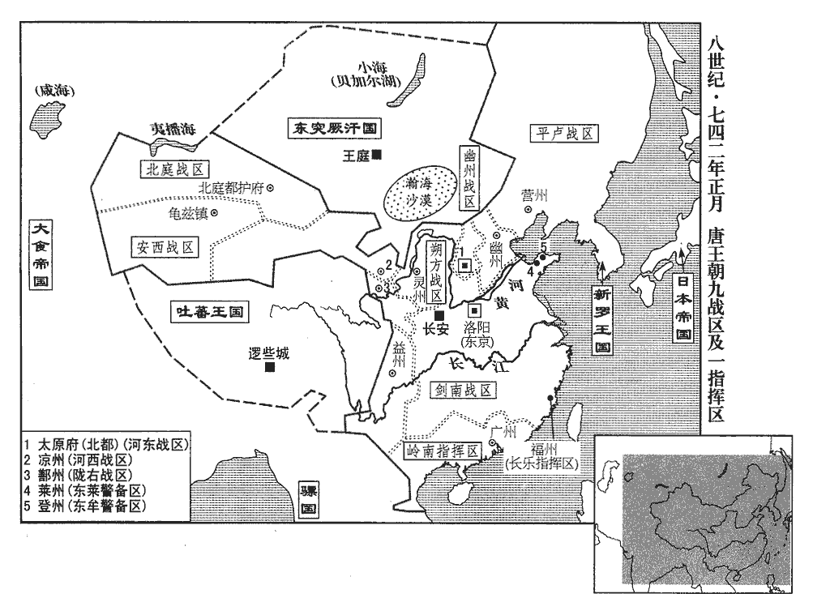
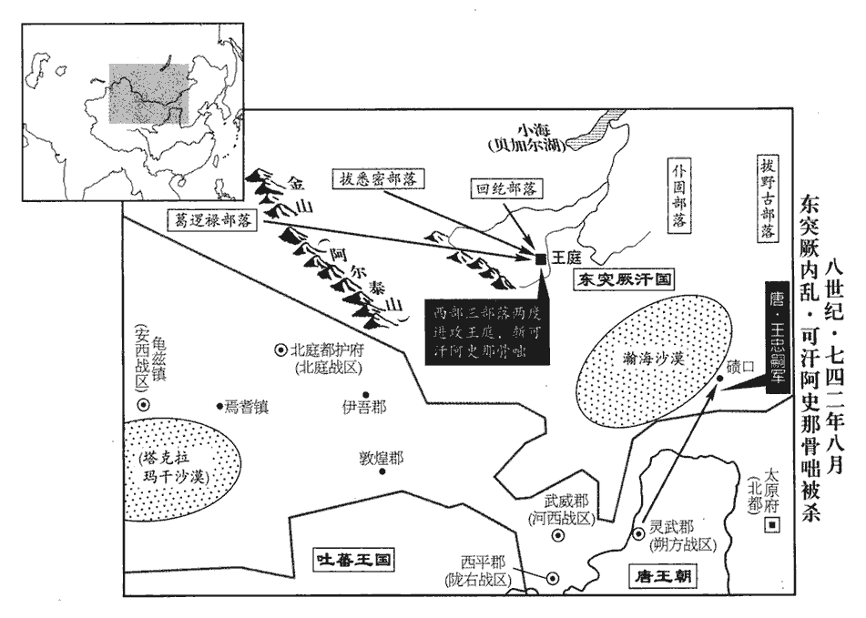
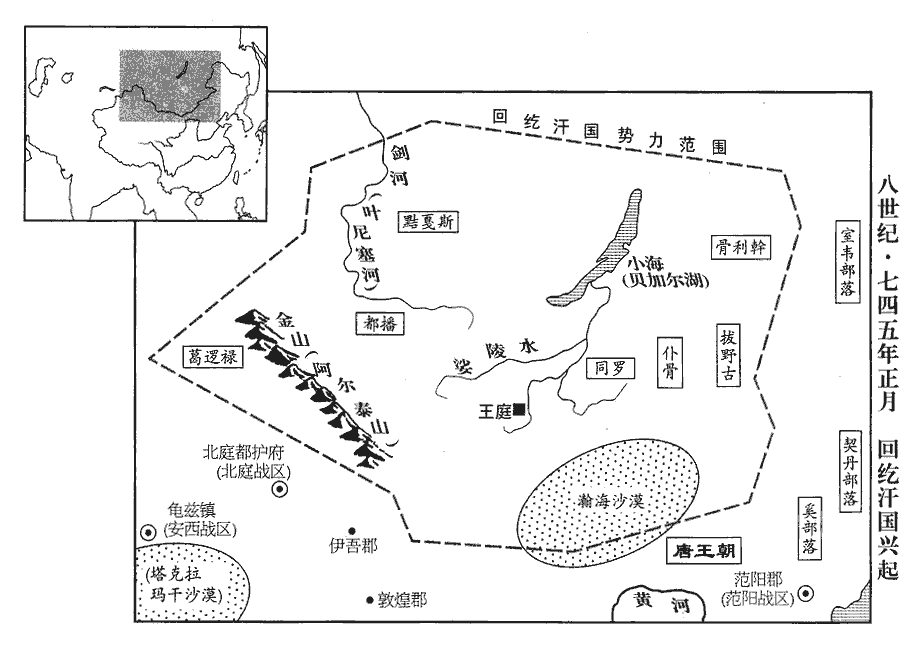
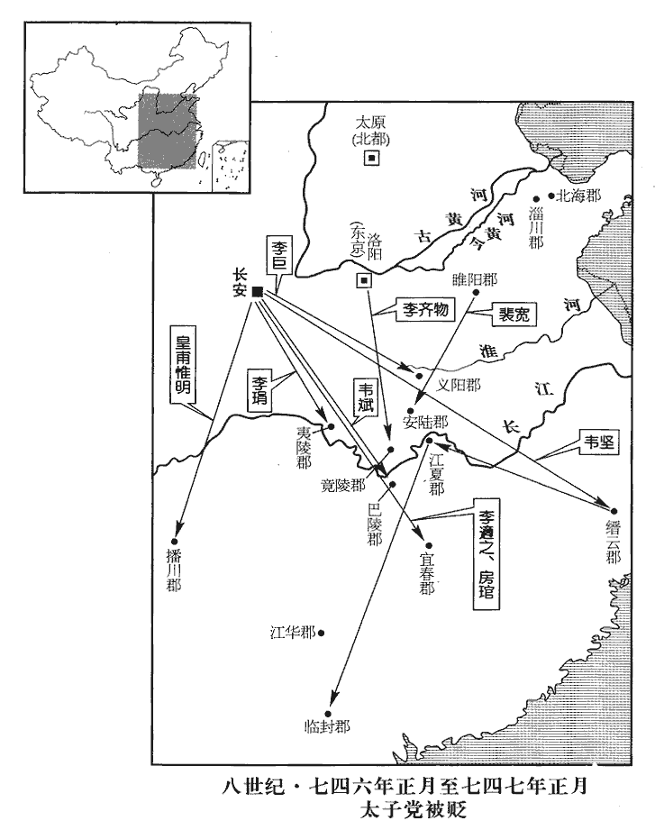
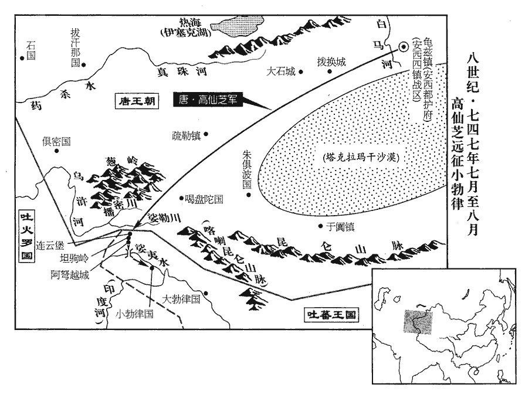

 唐紀三十一起玄黓敦牂（壬午），盡強圉大淵獻（丁亥）十一月，凡五年有奇。

# 玄宗至道大聖大明孝皇帝中之下

## 天寶元年（壬午、七四二）

1春，正月，丁未朔‹一›，上‹李隆基，本年五十八岁›御勤政樓帝於興慶宮西南隅建二樓：花萼相輝樓在西臨街，以燕兄弟；勤政務本樓在南，以脩政事。受朝賀，朝，直遙翻。赦天下，改元。

〖译文〗 [1]春季，正月，丁未朔（初一），玄宗亲临勤政楼，接受文武百官的朝贺，于是大赦天下，改年号为天宝。

2壬子‹六›，分平盧‹总部设营州辽宁省朝阳市›別為節度，以安祿山為節度使。使，疏吏翻；下同。

〖译文〗 [2]壬子（初六），分平卢另为节度镇，任命安禄山为节度使。

是時，天下聲教所被之州三百三十一，被，皮義翻。考異曰：舊紀云「三百六十二」按地理志，開元二十八年，州府三百二十八，至此纔二年，不應遽增三十餘州。今從唐曆、會要、統紀。羈縻之州八百，置十節度、經略使以備邊。安西節度撫寧西域，統龜茲‹新疆库车县›、焉耆‹新疆焉耆县›、于闐‹新疆和田市›、疏勒‹新疆喀什市›四鎮，治龜茲城‹安西都护府·新疆库车县›，兵二萬四千。焉耆治所在安西府東八百里；于闐在南二千里；疏勒在西二千餘里。龜茲，音丘慈，又音屈佳。闐，徒賢翻，又徒見翻。北庭節度防制突騎施‹伊犁河中下游›、堅昆‹西伯利亚萨彦岭北›，統瀚海‹驻北庭府·新疆吉木萨尔县›、天山‹驻西州·新疆吐鲁番市东›、伊吾‹新疆巴里坤县西北›三軍，屯伊‹新疆哈密市›、西‹新疆吐鲁番市东›二州之境，治北庭都護府，兵二萬人。突騎施牙帳在北庭府西北三千餘里；堅昆在北七千里。瀚海軍在北庭府城內，兵萬二千人。天山軍在西州城內，兵五千人。伊吾軍在伊州西北三百里甘露川，兵三千人。騎，奇寄翻。河西節度斷隔吐蕃‹首都逻些城西藏拉萨市›、突厥‹瀚海沙漠群›，斷，丁管翻。吐，從暾入聲。厥，九勿翻。統赤水‹甘肃省武威市西南›、大斗‹甘肃省永昌县西›、建康‹甘肃省高台县西›、寧寇‹甘肃省武威市东北›、玉門‹甘肃省玉门市›、墨離‹驻瓜州·甘肃省安西县›、豆盧‹驻沙州·甘肃省敦煌市›、新泉‹甘肃省景泰县›八軍，張掖‹甘肃省天祝藏族自治县西›、交城‹甘肃省永昌县›、白亭‹甘肃省民勤县东北白亭湖畔›三守捉，屯涼‹甘肃省武威市›、肅‹甘肃省酒泉市›、瓜、沙、會‹甘肃省靖远县›五州之境，治涼州，兵七萬三千人。赤水軍在涼州城內，兵三萬三千人。大斗軍在涼州西二百餘里甘、肅二州界，兵七千五百人。建康軍在涼州西二百里，兵五千三百人。寧寇軍在涼州東北千餘里，兵八千五百人。玉門軍在肅州西二百里，管兵五千二百人。墨離軍本月氏國，在瓜州西北千里，管兵五千人。豆盧軍在沙州城內，管兵四千三百人。新泉軍在會州西北二百里，管兵千人。張掖守捉在涼州南二百里，管兵五百人。交城守捉在涼州西二百里，管兵千人。白亭守捉在涼州西北五百里，管兵千七百人。唐制：大曰軍，小曰守捉。趙珣聚米圖經：自甘州西至肅州五百里；自肅州西至瓜州四百五十里；自瓜州西至沙州二百八十里；自沙州西至伊州四百里。會州東至鹽州八百里，西至涼州六百里，南至宋鎮戎軍一百四十里，北至靈州六百里。朔方節度捍禦突厥，統經略‹内蒙古鄂托克旗›、豐安‹宁夏中卫县›、定遠‹宁夏平罗县›三軍，三受降城‹东受降城·内蒙古托克托县南、中受降城·内蒙古包头市、西受降城·内蒙古五原县西北›，安北‹设中受降城›、單于‹设内蒙古和林格尔县›二都護府，屯靈‹宁夏灵武市›、夏‹陕西省靖边县北白城子›、豐‹内蒙古五原县›三州之境，治靈州，兵六萬四千七百人。經略軍在靈州城內，兵二萬七百人。豐安軍在靈州西黃河外百八十里，兵八千人。定遠軍在靈州東北二百里黃河外，兵七千人。西受降城在豐州北黃河外八十里，兵七千人。安北都護府治中受降城，黃河北岸，兵六千人。東受降城在勝州東北二百里，兵七千人。振武軍在單于都護府城內，兵九千人。降，戶江翻。單，音蟬。夏，戶雅翻。河東節度與朔方掎jǐ角以禦突厥，統天兵‹驻太原府·山西省太原市›、大同‹山西省朔州市东›、橫野‹河北省蔚县›、岢kě嵐‹山西省岢岚县›四軍，雲中守捉‹山西省大同市›，屯太原府忻‹山西省忻州市›、代‹山西省代县›、嵐‹山西省岚县›三州之境，治太原府，兵五萬五千人。天兵軍在太原城內，兵三萬人。大同軍在代州北三百里，兵九千五百人。橫野軍在蔚州東北一百四十里，兵三千人。岢嵐軍在嵐州北百里，兵一千人。雲中守捉在單于府西北二百七十里，兵七千七百人。忻州在太原府北八十里，兵七千八百人。代州至太原五百里，兵四千人。嵐州在太原府西北二百五十里，兵三千人。岢，枯我翻。嵐，盧含翻。范陽節度臨制奚‹滦河上游›、契丹‹辽河上游›，統經略‹驻幽州·北京市›、威武‹驻檀州·北京市密云县›、清夷‹驻妫州·河北省怀来县›、靜塞‹驻蓟州·天津市蓟县›、恆陽‹驻恒州·河北省正定县›、北平‹驻定州·河北省定州市›、高陽‹驻易州·河北省易县›、唐興‹驻莫州·河北省任丘市北鄚州镇›、橫海‹驻沧州·河北省沧州市东南›九軍，屯幽、薊、媯、檀、易、恆、定、漠、滄九州之境，治幽州，兵九萬一千四百人。經略軍在幽州城內，兵三萬人。威武軍在檀州城內，兵萬人。清夷軍在媯州城內，兵萬人。靜塞軍在薊州城內，兵萬六千人。恆陽軍在恆州城東，兵六千五百人。北平軍在定州城西，兵六千人。高陽軍在易州城內，兵六千人。唐興軍在莫州城內，兵六千人。橫海軍在滄州城內，兵六千人。景雲元年，以嬴州鄚縣置鄚州。開元十三年，以「鄚」字類「鄭」字，改為漠州，尋又改莫州。契，欺訖翻，又音喫。恆，戶登翻。薊，音計。媯guī，居為翻。平盧節度鎮撫室韋‹内蒙古东北部›、靺鞨‹渤海国及黑水靺鞨›，統平盧‹驻营州·辽宁省朝阳市›、盧龍‹驻平州·河北省卢龙县›二軍，榆關守捉‹河北省抚宁县东榆关镇›，安東都護府‹设河北省卢龙县›，屯營、平‹与安东都护府同址·河北省卢龙县›二州之境，治營州，兵三萬七千五百人。平盧軍在營州城內，兵萬六千人。盧龍軍在平州城內，兵萬人。榆關守捉在營州城西四百八十里，兵三千人。安東都護府在營州東二百里，兵八千五百人。靺鞨，音末曷。「榆」當作「渝」，註詳見上卷。隴右節度備禦吐蕃，統臨洮‹驻鄯州·青海省乐都县›、河源‹青海省西宁市›、白水‹青海省大通县›、安人‹青海省湟源县西北›、振威‹青海省循化县西南›、威戎‹青海省门源县›、漠門‹驻洮州·甘肃省临潭县›、寧塞‹驻廓州·青海省化隆县›、積石‹青海省贵德县›、鎮西‹驻河州·甘肃省临夏市›十軍，綏和‹青海省贵德县北›、合川‹青海省化隆县南›、平夷‹甘肃省临夏市西南›三守捉，屯鄯、廓、洮、河之境，治鄯州，兵七萬五千人。臨洮軍在鄯州城內，兵萬五千人。河源軍在鄯州西百三十里，兵四千人。白水軍在鄯州西北二百三十里，兵四千人。安人軍在鄯州界星宿川西，兵萬人。振威軍在鄯州西三百里，兵千人。威戎軍在鄯州西北三百五十里，兵千人。漠門軍在洮州城內，兵五千五百人。寧塞軍在廓州城內，兵五百人。積石軍在廓州西百八十里，兵七千人。鎮西軍在河州城內，兵萬一千人。綏和守捉在鄯州西南二百五十里，兵千人。合川守捉在鄯州南百八十里，兵千人。平夷守捉在河州西南四十里，兵三千人。洮，土刀翻。鄯，時戰翻，又音善。劍南節度西抗吐蕃，南撫蠻獠，統天寶‹四川省理县西北›、平戎‹四川省理县西北·天宝军西南›、昆明‹四川省西昌市南›、寧遠‹四川省盐源县西南四十千米›、澄川‹云南省姚安县东›、南江‹姚安县境›六軍，屯益‹四川省成都市›、翼‹四川省茂县西北四十千米›、茂‹四川省茂县›、當‹四川省黑水县›、巂‹四川省西昌市›、柘zhè‹四川省黑水县南二十千米›、松‹四川省松潘县›、維‹四川省理县›、恭‹四川省马尔康县东›、雅‹四川省雅安市›、黎‹四川省汉源县›、姚‹云南省姚安县›、悉‹四川省黑水县东南三十千米›十三州之境，治益州，兵三萬九百人。團結營在成都府城內，兵萬四千人。天寶軍在恭州東南九十里，兵千人。平戎軍在恭州南八十里，兵千人。昆明軍在巂州南，兵五千一百人。寧遠軍在巂州西，兵三百人。澄川守捉在姚州東六百里，管兵二千人。南江軍兵三百人。翼州兵五百人。茂州兵三百人。維州兵五百人。柘州兵五百人。松州兵二千八百人。當州兵五百人。雅州兵四百人。黎州兵千人。姚州兵三百人。悉州兵五千人。杜佑曰：當州江源郡在翼州西二百七十里，西北到故通軌縣二百里，以西即是生羌。悉州在當州南八十里。黎州，漢沈黎郡也，東去一里，高山萬重，更無郡縣；西南去郡一里，高山萬重；東北去郡五里，西北去郡二里，皆高山萬重。茂州，劉昫xù曰：隋汶山郡，武德元年改曰會州，貞觀八年改曰茂州，以郡界茂濕山為名。松州東至茂州三百里，西南至當州三百里，西北至吐蕃界九十里，南至翼州一百八十里。恭州，開元二十四年分靜州廣平縣置，東至柘州一百里。悉州西北至當州八十里。獠，魯皓翻。巂，音髓。嶺南五府經略綏靜夷、獠，統經略‹驻广州·广东省广州市›、清海‹驻恩州·广东省恩平市›二軍，桂‹广西桂林市›、容‹广西北流市›、邕‹广西南宁市›、交‹即安南都护府管区·越南河内市›四管，治廣州，兵萬五千四百人。經略軍在廣州城內，兵五千四百人。清海軍在恩州城內，兵二千人。桂府兵千人。容府兵千一百人。邕府兵千七百人。安南府兵四千二百人。已上兵輕，稅本鎮以自給。此外又有長樂經略，福州‹福建省福州市›領之，樂，音洛。兵千五百人。東萊守捉，萊州‹山东省莱州市›領之；東牟守捉，登州‹山东省蓬莱市›領之；兵各千人。凡鎮兵四十九萬人，捉，仄角翻。考異曰：此兵數，唐曆所載也。舊紀：「是歲天下健兒、團結、彍guō騎等，總五十七萬四千七百三十三。」此蓋止言邊兵，彼并京畿諸州彍騎數之耳。馬八萬餘匹。安西府馬二千七百匹，北庭瀚海軍馬四千二百匹，天山軍馬五百匹，伊吾軍馬三百匹，河西赤水軍馬萬三千匹，大斗軍馬二千四百匹，建康軍馬五百匹，寧寇、玉門軍共管馬六百匹，墨離軍馬四百匹，豆盧軍馬四百匹，朔方經略軍馬三千匹，豐安軍馬千三百匹，定遠軍馬二千匹，西受降城馬千七百匹，中受降城馬二千匹，東受降城馬千七百匹，振武軍馬千六百匹，河東天兵軍馬五千五百匹，雲中守捉馬二千匹，大同軍馬五千五百匹，橫野軍馬千八百匹，范陽經略軍馬五千四百匹，威武軍馬三百匹，清夷軍馬三百匹，靜塞軍馬五百匹，平盧軍馬四千二百匹，盧龍軍馬五百匹，渝關守捉馬百匹，安東府馬七百匹，隴右臨洮軍馬八千匹，河源軍馬六百五十匹，白水軍馬五百匹，安人軍馬二百五十匹，威戎軍馬五十匹，漠門軍馬二百匹，寧塞軍馬五十匹，積石軍馬三百匹，劍南團結營馬千八百匹，昆明軍馬二百匹。開元之前，每歲供邊兵衣糧，費不過二百萬；天寶之後，邊將奏益兵浸多，每歲用衣千二十萬匹，糧百九十萬斛，安西衣賜六十二萬疋段，北庭衣賜四十八萬疋段，河西衣賜百八十萬疋段，朔方衣賜二百萬疋段，河東衣賜百二十六萬疋段，糧五十萬石，范陽衣賜八十萬疋段，糧五十萬石，平盧失衣糧數，隴右衣賜二百五十萬疋段，劍南衣賜八十萬疋段，糧七十萬石。將，即亮翻。公私勞費，民始困苦矣。

〖译文〗 此时，唐王朝所统辖的州有三百三十一，羁縻州八百，设置了十个节度使、经略使守卫边疆。其中安西节度使镇抚西域，统辖龟兹、焉耆、于阗、疏勒四镇，治所在龟兹城，共有兵二万四千人。北庭节度使防备突骑施、坚昆，统辖瀚海、天山、伊吾三军，屯兵于伊州、西州境内，治所在北庭都护府，共有兵二万人。河西节度使断隔吐蕃与突厥的来往，统辖赤水、大斗、建康、宁寇、玉门、墨离、豆卢、新泉八军，张掖、交城、白亭三守捉，屯兵于凉、肃、瓜、沙、会等五州境内，治所在凉州城，共有兵七万三千人。朔方节度使抵御突厥，统辖经略、丰安、定远三军，三个受降城，安北、单于二都护府，屯兵于灵、夏、丰三州境内，治所在灵州城，共有兵六万四千七百人。河东节度使与朔方节度使成犄角之势共同防御突厥，统辖天兵、大同、横野、岢岚四军，云中守捉，屯兵于太原府的忻、代、岚三州境内，治所在太原府城，共有兵五万五千人。范阳节度使控制奚、契丹，统辖经略、威武、清夷、静塞、恒阳、北平、高阳、唐兴、横海九军，屯兵于幽、蓟、妫、檀、易、恒、定、漠、沧九州境内，治所在幽州城，共有兵九万一千四百人。平卢节度使镇抚室韦、，统辖平卢、卢龙二军，榆关守捉，安东都护府，屯兵于营、平二州境内，治所在营州城，共有兵三万七千五百人。陇右节度使抵御吐蕃，统辖临洮、河源、白水、安人、振威、威戎、漠门、宁塞、积石、镇西十军，绥和、合川、平夷三守捉，屯兵于鄯、廓、洮、河四州境内，治所在鄯州城，共有兵七万五千人。剑南节度使西抗吐蕃，南镇蛮獠，统辖天宝、平戎、昆明、宁远、澄川、南江六军，屯兵于益、翼、茂、当、、柘、松、维、恭、雅、黎、姚、悉十三州境内，治所在益州城，共有兵三万九百人。岭南五府经略使镇抚夷、獠，统辖经略、清海二军，桂府、容府、邕府、安南府四府，治所广州城，共有兵一万五千四百人。此外还有长乐经略使，由福州刺史兼任，共有兵一千五百人。东莱守捉，由莱州刺史兼任；东牟守捉，由登州刺史兼任，各有兵一千人。以上边镇共有兵四十九万人，战马八万余匹。开元以前，每年朝廷供给边镇兵的衣粮，费用不超过二百万。天宝以后，边将都上奏增兵，于是镇兵越来越多，每年衣服用布帛一千二十万匹，粮一百九十万斛，公私烦劳，费用浩大，老百姓从此生活困苦了。

 

3甲寅‹八›，陳王府參軍田同秀皇子陳王珪府參軍也。上言：「見玄元皇帝‹李耳›於丹鳳門之空中，告以『我藏靈符，在尹喜故宅。』」上，時掌翻；下上表同。上遣使於故函谷關‹河南省灵宝市东北›尹喜臺旁求得之。列仙傳曰：關令尹喜者，周大夫也。老子西游，喜先見其氣候物色而迹之，果得老子；老子亦知其旨，為著道德經。使，疏吏翻。

〖译文〗 [3]甲寅（初八），陈王李府中的参军田同秀上言说：“我在丹凤门的上空看见了玄元皇帝老子，他告诉我说：‘我在尹喜旧宅第藏有灵符。’”于是玄宗派人于旧函谷关尹喜台旁搜寻并获得了灵符。

4陝州‹河南省三门峡市›刺史李齊物穿三門運渠，辛未‹二十五›，渠成。新書曰：齊物鑿砥柱為門以通漕，開其山巔為輓wǎn路，沃醯xī而鑿之。然棄石入河，水益湍怒，舟不能入新門，候水漲以人輓舟而上。天子疑之，遣宦者按視，齊物厚賂宦者，還，言其便。陝，失冉翻。齊物，神通之曾孫也。淮安王神通。

〖译文〗 [4]陕州刺史李齐物开凿三门峡运渠，辛未（二十五日），运渠开通。李齐物是淮安王李神通的曾孙。

5壬辰‹十一›，群臣上表，以「函谷靈符，潛應年號；先天不違，易曰：先天而天不違。先，悉薦翻。請於尊號加『天寶』字。」從之。

〖译文〗 [5]壬辰（疑误），朝中群臣上表说：“在函谷关得到玄元皇帝灵符，暗中与年号相应，这是先于天时而行事，不可违背，请于尊号上加‘天宝’二字。”玄宗同意。

二月，辛卯‹十五›，上享玄元皇帝於新廟。時置玄元廟於大寧坊西南角。甲午‹十八›，享太廟。丙申‹二十›，合祀天地於南郊，赦天下。改侍中為左相，中書令為右相，尚書左、右丞相復為僕射；開元初，改左、右僕射為尚書左、右丞相。復，扶又翻；下清復同。東都‹洛阳›、北都‹太原府·山西省太原市›皆為京，州為郡，刺史為太守；改桃林縣‹即旧函谷关所在›曰靈寶。隋開皇十六年置桃林縣，取古者桃林之野以為縣名，屬洛州，唐屬陝州。今以得玄元靈符，改曰靈寶。守，式又翻。田同秀除朝散大夫。朝直遙翻。散，悉亶翻。

〖译文〗 二月，辛卯（十五日），玄宗于新玄元庙祭献玄元皇帝老子。甲午（十八日），祭献太庙。丙申（二十日），于南郊祭祀天地，并大赦天下。又改名侍中为左相，中书令为右相，尚书左、右丞相为左、右仆射。东都、北都分别改名为东京、北京，改州为郡，刺史为太守。改桃林县为灵宝县。任命田同秀为朝散大夫。

時人皆疑寶符同秀所為。間一歲，清河‹河北省清河县›人崔以清復言：「見玄元皇帝於天津橋‹洛阳城南洛水桥›北，云藏符在武城‹山东省武城县›紫微山，」武城，即漢之東武城縣，與清河縣皆屬清河郡。敕使往求，亦得之。東都留守王倕chuí知其詐，按問，果首服。使，疏吏翻。守，式又翻；下太守同。倕音垂。首，式又翻。奏之。上亦不深罪，流之而已。

〖译文〗 当时人们怀疑灵符是田同秀假造的。约过了一年，清河县人崔以清又上言道：“我于天津桥北看见了玄元皇帝，他说在武城县紫微山藏有灵符。”于是玄宗又下敕派使者前去搜寻，果然得到了灵符。东都留守王知道其中有诈，于是拷问崔以清，崔果然承认是假造的。王奏上此事，但玄宗并没有深加问罪，只是流放了崔以清。

6三月，以長安‹首都长安西半城›令韋堅為陝郡‹河南省三门峡市›太守，陝郡，陝州。陝，失冉翻。領江、淮租庸轉運使。先天中，李傑為陝州刺史，領水陸發運使；置使自傑始也。裴耀卿之後，命堅始以租庸使入銜。使，疏吏翻；下同。

〖译文〗 [6]三月，任命长安县令韦坚为陕郡太守，并兼任江、淮租庸转运使。

初，宇文融既敗，言利者稍息。事見二百十三卷開元十八年。及楊慎矜得幸，事始二百十三卷二十一年。於是韋堅、王鉷之徒鉷，戶公翻。競以利進，百司有利權者，稍稍別置使以領之，舊官充位而已。史言諸使所由始。堅，太子之妃兄也，為吏以幹敏稱。上使之督江、淮租運，歲增巨萬；上以為能，故擢任之。王鉷，方翼之曾孫也，自高宗至武后朝，王方翼著功名於西域。亦以善治租賦為戶部員外郎兼侍御史。治，直之翻。

〖译文〗 起初，宇文融败亡后，争相献钱财言利的人稍微有些收敛。及至杨慎矜受宠，于是韦坚、王之类言利的人都受到重用，有财权的各司也逐渐另置使职，掌管财利，原有的官员只是充数而已。韦坚是太子韦妃的兄长，以办事干练而著称。玄宗让其督办江淮租运，每年增加数目极大的钱财。玄宗认为韦坚能干，所以升官重用。王是王方翼的曾孙，也是因为善于管理赋税而被任命为户部员外郎兼侍御史。

7李林甫為相，凡才望功業出己右及為上所厚、勢位將逼己者，必百計去之；去，羌呂翻。尤忌文學之士，或陽與之善，啗以甘言而陰陷之。世謂李林甫「口有蜜，謂其言甘也。啗，徒濫翻，又徒覽翻。腹有劍」。謂其心在害人也。

〖译文〗 [7]李林甫为宰相后，对于朝中百官凡是才能和功业在自己之上而受到玄宗宠信或官位快要超过自己的人，一定要想方设法除去，尤其忌恨由文学才能而进官的士人。有时表面上装出友好的样子，说些动听的话，而暗中却阴谋陷害。所以世人都称李林甫“口有蜜，腹有剑”。

上嘗陳樂於勤政樓，垂簾觀之。兵部侍郎盧絢謂上已起，垂鞭按轡，橫過樓下；絢風標清粹，上目送之，深歎其蘊藉。絢，許縣翻。蘊，於運翻。林甫常厚以金帛賂上左右，上舉動必知之，乃召絢子弟謂曰：「尊君素望清崇，今交‹越南河内市›、廣‹广东省广州市›藉才，聖上欲以尊君為之，可乎？若憚遠行，則當左遷；不然，則以賓、詹分務東洛謂以太子賓客、詹事分司東都也。亦優賢之命也，何如？」絢懼，以賓、詹為請。林甫恐乖眾望，乃除華州‹陕西省华县›刺史。華，戶化翻。到官未幾，誣其有疾，州事不理，除詹事、員外、同正。幾，居豈翻。

〖译文〗 有一次玄宗在勤政楼垂帘观看乐舞。兵部侍郎卢绚以为玄宗已离开，于是就提鞭按辔，从楼下穿过。卢绚风度清雅，玄宗目送其远去，感叹卢绚含蓄不露的风度。李林甫常常用金钱贿赂玄宗左右的人，玄宗的一举一动，李林甫都了如指掌。于是李林甫就召来卢绚的儿子说：“你父亲素来有名望，现今交州、广州需要有才能的人去治理，皇上想令你父亲去，不知是否可行？如果害怕远行，就应该降官，否则，只有以太子宾客或詹事的身份在东都任官。这也算是优惠贤者的任命，不知如何？”卢绚听后，十分害怕，于是就主动奏请担任太子宾客或詹事。李林甫又恐怕违背众望，就任命卢绚为华州刺史。到官时间不久，又诬陷说卢绚有病，不理州事，任命他为詹事、员外同正。

上又嘗問林甫以「嚴挺之今安在？是人亦可用。」挺之時為絳州‹山西省新绛县›刺史。林甫退，召挺之弟損之，諭以「上待尊兄意甚厚，盍為見上之策，奏稱風疾，求還京師就醫。」挺之從之。林甫以其奏白上云：「挺之衰老得風疾，宜且授以散秩，使便醫藥。」上歎吒久之；散，悉亶翻。吒，陟駕翻。夏，四月，壬寅‹二十八›，以為詹事，又以汴州‹河南省开封市›刺史、河南采訪使齊澣為少詹事，唐少詹事，正四品上。汴，皮變翻。使，疏吏翻。皆員外、同正，於東京養疾。澣亦朝廷宿望，故并忌之。

〖译文〗 有一次玄宗问李林甫：“严挺之现在在哪里任官？此人可以重用。”严挺之当时为降州刺史。李林甫退朝后，即召严挺之的弟弟严损之，告诉他说：“皇上十分器重你哥哥，为何不乘此机会，上奏说得了风疾，请求回京师治病。”严挺之就听从了李林甫的话。李林甫又因严挺之的奏言对玄宗说：“严挺之衰老中风，应该授以散官，便于治病养身。”玄宗听后，感叹不已。夏季。四月壬寅（二十八日），任命严挺之为詹事。又任命汴州刺史、河南采访使齐浣为少詹事，二人都是员外同正，一道在东京养病。齐浣也是因为在朝中素有名望，所以遭到李林甫的猜忌。

8上發兵納十姓可汗阿史那昕於突騎施，至俱蘭城‹中亚江布尔市东卢戈沃耶城›俱蘭國所都城也。俱蘭，或曰俱羅弩，或曰屈浪拏，與吐火羅接。可，從刊入聲。汗，音寒。騎，奇寄翻。考異曰：會要作「俱南城」；胡語不明耳。為莫賀達干所殺。突騎施大纛官都摩度來降，纛，徒到翻。降，戶江翻。六月，乙未‹二十二›，冊都摩度為三姓葉護。

〖译文〗 [8]玄宗发兵送十姓可汗阿史那昕于突骑施，到了俱兰城，被莫贺达干杀死。突骑施大纛官都摩度来投降唐朝，六月，乙未（二十二日），唐册封都摩度为三姓叶护。

9秋，七月，癸卯朔‹一›，日有食之。

〖译文〗 [9]秋季，七月癸卯朔（初一），出现日食。

10辛未‹二十九›，左相牛仙客薨‹年六十八岁›。八月，丁丑‹五›，以刑部尚書李適之為左相。

〖译文〗 [10]辛未（二十九日），左相牛仙客去世。八月丁丑（初五），任命刑部尚书李适之为左相。

11突厥拔悉密‹蒙古国科布多盆地北部›、回紇‹蒙古国哈尔和林市›、葛邏祿‹中亚额尔齐斯河流域›三部共攻骨咄葉護，殺之，推拔悉密酋長為頡跌伊施可汗，回紇、葛邏祿自為左、右葉護。厥，九勿翻。紇，下沒翻。邏，郎佐翻。咄，當沒翻。酋，慈由翻。頡，奚結翻。跌，徒結翻。突厥餘眾共立判闕特勒之子為烏蘇米施可汗，以其子葛臘哆為西殺。哆，昌者翻。突厥以其親屬分掌東、西兵，號左、右殺，亦曰東、西殺。西殺，右殺也。

〖译文〗 [11]突厥统辖的拔悉密、回纥、葛逻禄三部联兵攻杀了骨咄叶护，推举拔悉密酋长为颉跌伊施可汗，回纥、葛逻禄自封为左右叶护。于是突厥残众共同立判阙特勒的儿子为乌苏米施可汗，以乌苏的儿子葛腊哆为西杀。

上遣使諭烏蘇令內附，烏蘇不從。朔方節度使王忠嗣盛兵磧口以威之，使，疏吏翻。磧，七迹翻。考異曰：新、舊書忠嗣傳皆曰：「是歲，忠嗣北伐，與奚怒皆戰于桑乾河，三敗之，大虜其眾。」又曰：「明年再破怒皆及突厥之眾，自是塞外晏然。」按朔方不與奚相接，不知所云奚怒皆何也。今闕之。烏蘇懼，請降，而遷延不至。忠嗣知其詐，乃遣使說拔悉密、回紇、葛邏祿使攻之，烏蘇遁去。忠嗣因出兵擊之，取其右廂以歸。擊垂亡之虜，猶不肯輕用其兵，此王忠嗣所以為善將也。突厥左、右殺所部，謂之左、右廂。降，戶江翻。說，輸芮翻。紇，下沒翻。邏，郎佐翻。

〖译文〗 玄宗派遣使者劝说乌苏归附唐朝，乌苏不听。于是朔方节度使王忠嗣盛陈重兵于碛口以威胁乌苏，乌苏惧怕，请求降附，但又迁延不来。王忠嗣知道乌苏是诈降，于是就派人劝说拔悉密、回纥、葛逻禄联兵攻打乌苏，乌苏逃走。王忠嗣乘机出兵攻击，消灭了其右厢。

 

丁亥‹十五›，突厥西葉護阿布思及西殺葛臘哆、默啜之孫勃德支、伊然小妻、毗伽登利之女帥部眾千餘帳，相次來降，意此皆突厥右廂之眾也。啜，陟劣翻。伽，求迦翻。帥，讀曰率。考異曰：實錄、舊紀皆云：「突厥阿布思及默啜可汗之孫、登利可汗之女與其黨屬來降。」唐曆云：「烏蘇米施可汗遁逃，其西葉護阿布思及毗伽可汗、可敦、男西殺葛臘哆率其部千餘帳來降。」舊王忠嗣傳云：「三部落攻米施可汗，走之，忠嗣因出兵伐之，取其右廂而歸。其西葉護及毗伽可敦、男葛臘哆率其部落千餘帳入朝。」突厥傳云：「西殺妻子及默啜之孫勃德支特勒、毗伽可汗女大洛公主、伊然可汗小妻余塞匐、登利可汗女余燭公主及阿布思、頡利發等並帥其部眾相次來降。」今參取用之。突厥遂微。九月，辛亥‹九›，上御花萼樓宴突厥降者，考異曰：本紀作「辛卯」。按長曆，是月癸卯朔，無辛卯。唐曆云「九月辛卯」，亦誤也。賞賜甚厚。

〖译文〗 丁亥（十五日），突厥西叶护阿布思及西杀葛腊哆、默啜的孙子勃德支、伊然可汗的小妻、毗伽登利可汗的女儿等率领部落一千余帐，陆续来降附唐朝，突厥的势力从此衰落。九月，辛亥（初九），玄宗亲临花萼楼宴请突厥归降者，赏赐优厚.

12護密‹中亚喷赤河北岸伊什卡希姆城›先附吐蕃，戊午‹十六›，其王頡吉里匐遣使請降。頡，奚結翻。匐，蒲北翻。

〖译文〗 [12]护密先依附于吐蕃，戊午（十六日），其王颉吉里匐派遣使者请求降附唐朝。

13冬，十月，丁酉‹二十六›，上幸驪山溫泉‹陕西省临潼县境›；【張：「泉」下脫「十一月」。】己巳‹十一月二十八›，還宮。

〖译文〗 [13]冬季，十月，丁酉（二十六日），玄宗往骊山温泉。己巳（疑误），返回宫中。

14十二月，隴右節度使皇甫惟明奏破吐蕃大嶺‹青海省西宁市西›等軍；戊戌‹二十七›，又奏破青海道莽布支營三萬餘眾，斬獲五千餘級。庚子‹二十九›，河西節度使王倕奏破吐蕃漁海及遊弈等軍‹均在青海省贵德县西›。史言明皇喜邊功，故邊帥告捷者相繼。倕，音垂。

〖译文〗 [14]十二月，陇右节度使皇甫惟明上奏说攻破了吐蕃大岭等军；戊戌（二十七日），又上奏说打败了青海道莽布支营三万余人，杀死俘获五千余人。庚子（二十九日），河西节度使王上奏说攻破了吐蕃渔海及游弈等军。

15是歲，天下縣一千五百二十八，鄉一萬六千八百二十九，戶八百五十二萬五千七百六十三，口四千八百九十萬九千八百。

〖译文〗 [15]这一年，唐朝统治下的县共有一千五百二十八，乡一万六千八百二十九，民户八百五十二万五千七百六十三，人口四千八百九十万九千八百。

16回紇葉護骨力裴羅遣使入貢，考異曰：舊傳云：「天寶初，其酋長葉護頡利吐發遣使入朝，封奉義王。」唐曆：「天寶三載，突厥拔志蜜可汗又為回紇葛羅祿等部落襲殺之，立回紇為主，是為骨咄祿毗伽闕可汗，遣使立為奉義王，又加懷仁可汗。」新突厥傳云：「回紇葛邏祿殺拔悉蜜可汗，奉回紇骨力裴羅定其國，是為國咄祿毗伽闕可汗」。按奉義王懷仁可汗是一人，而新突厥回紇傳其名不同；然新傳自吐迷度以來，世系皆可譜，今從之。賜爵奉義王。明未冊為可汗也。

〖译文〗 [16]回纥叶护骨力裴罗派遣使者入朝贡献，唐赐爵为奉义王。

## 二年（癸未、七四三）

1春，正月，安祿山入朝；朝，直遙翻。上‹李隆基，本年五十九岁›寵待甚厚，謁見無時。見，賢遍翻。祿山奏言：「去年營州‹辽宁省朝阳市›蟲食苗，臣焚香祝天云：『臣若操心不正，事君不忠，願使蟲食臣心；若不負神祇，願使蟲散。』即有群鳥從北來，食蟲立盡。請宣付史官。」從之。操，千高翻。

〖译文〗 [1]春季，正月，安禄山入朝。玄宗对他十分宠幸，随时可以进见。安禄山上奏说：“去年营州蝗虫吃禾苗，我焚香祝告上天说：‘我如果心术不正，对君王不忠，愿让蝗虫吃我的心；如果未负神灵，愿使蝗虫自动散去。’于是有一群鸟从北面飞来，立刻吃尽了蝗虫。希望能把此事交付史官记录。”玄宗答应。

2李林甫領吏部尚書，日在政府，政府，謂政事堂。選事悉委侍郎宋遙、苗晉卿。御史中丞張倚新得幸於上，遙、晉卿欲附之。時選人集者以萬計，選，須絹翻。入等者六十四人，倚子奭為之首，群議沸騰。前薊‹范阳郡郡政府所在县·北京市›令蘇孝韞yùn以告安祿山，薊縣帶幽州涿郡，時改涿郡為范陽郡。薊，音計。祿山入言於上，上悉召入等人面試之，奭手持試紙，終日不成一字，時人謂之「曳白」。癸亥‹二十三›，遙貶武當‹湖北省丹江口市西北›太守，晉卿貶安康‹陕西省安康市›太守，倚貶淮陽‹河南省淮阳县›太守，武當郡，均州。安康郡，金州，本西城郡，元年更郡名。淮陽郡，陳州。舊志：金州，京師南七百三十七里，陳州一千五百二十里。同考判官禮部郎中裴朏fěi等皆貶嶺南官。晉卿，壺關‹山西省壶关县›人也。壺關縣，自漢以來屬上黨郡，而唐上黨縣乃漢壺關縣。隋分置上黨縣，帶郡，唐武德四年分隋之上黨縣置壺關縣，治高望堡，貞觀十七年移治進流川。朏，音敷尾翻。

〖译文〗 [2]李林甫兼任吏部尚书，每天都在政事堂，把科举选士的事全委托给侍郎宋遥、苗晋卿。此时，御史中丞张倚新得玄宗的宠信，宋遥、苗晋卿想依附于张倚。当时应考的选人有一万多人，及第者仅有六十四人，而张倚的儿子张名列榜首，所以朝野议论纷纷，前蓟县令苏孝韫把此事告诉了安禄山，安禄山入朝后又告诉了玄宗，于是玄宗把及第者全部召来面试，张手持试卷，一整天未写一字，被当时的人戏称为“曳白”。癸亥（二十三日），玄宗贬宋遥为武当太守，昔晋卿为安康太守，张倚为淮阳太守。同考判官礼部郎中裴等人都被贬官岭南。苗晋卿是壶关县人。

3三月，壬子‹十二›，追尊玄元皇帝‹李耳›父周上御大夫為先天太皇；又尊皋繇為德明皇帝，涼武昭王為興聖皇帝。唐虞之世，皋陶為理；唐以為李氏得姓之始，故追尊為德明皇帝。涼武昭王暠，高祖之七世祖，建國於瓜、沙，李氏由是而興，故尊為興聖皇帝。繇yáo，余招翻。

〖译文〗 [3]三月壬子（十二日），追尊玄元皇帝老子的父亲周朝上御大夫为先天太皇；又追尊皋繇为德明皇帝，凉武昭王李为兴圣皇帝。

4江、淮南租庸等使韋堅引滻水‹灞水支流›抵苑東望春樓下為潭，苑，禁苑也。潭在長安城東九里。滻，音產。以聚江、淮運船，役夫匠通漕渠，發人丘壟，自江、淮至京城，民間蕭然愁怨。二年而成。丙寅‹二十六›，上幸望春樓觀新潭。堅以新船數百艘，扁榜郡名，各陳郡中珍貨於船背；陝‹陕郡郡政府所在县·河南省三门峡市›尉崔成甫著錦半臂，鈌jué胯綠衫以裼之，艘，蘇遭翻。扁，補典翻。陝，失冉翻。著，陟略翻。胯kuà，苦瓦翻。裼xī，先擊翻，袒衣也。紅袹首，袹mò，莫白翻。袹首，今人謂之抹額。居前船唱得寶歌，先是，民間唱俚歌曰：「得體紇那邪。」其後得寶符於桃林，成甫乃更紇體歌為得寶弘農野，歌曰：「得寶弘農野，弘農得寶耶？潭裏舟船鬧，揚州銅器多。三郎當殿坐，聽唱得寶歌。」其俚又甚焉。使美婦百人盛飾而和之，和，戶臥翻。連檣數里；堅跪進諸郡輕貨，仍上百牙盤食。程大昌演繁露曰：唐少府監，御饌器用九飣dìng食，以牙盤九枚裝食味於上，置上前，亦謂之看食。仍上，時掌翻。上置宴，竟日而罷，觀者山積。夏，四月，加堅左散騎常侍，散，悉亶翻。騎，奇寄翻。其僚屬吏卒褒賞有差；名其潭曰廣運。時京兆尹韓朝宗亦引渭水置潭於西街，以貯材木。朝，直遙翻。貯，丁呂翻。

〖译文〗 [4]江、淮南租庸等使韦坚引河水抵达禁苑东面望春楼下为深潭，用来聚集江、淮地区的运粮船只，役使民夫工匠开通漕渠，挖掉许多民众的坟墓，从江、淮地区一直到京城，怨声载道。两年才完工。丙寅（二十六日），玄宗上望春楼观看新潭。韦坚组成数百只新船，每只船上都写着各郡的名称，并陈列着本郡所产的珍宝名物。陕县尉崔成甫身穿半臂锦衣，与袒胸露身的胯绿衫，头上绕着红布，在最前面的一只船上高唱《得宝歌》，又让一百名漂亮的妇人身穿艳丽的服装齐声和唱，船连数里。韦坚跪着进上诸郡所献的珍宝，并献上百牙盘盛陈的美食。玄宗设宴款待，闹腾了一整天才完，观看的人数以万计。夏季，四月，加官韦坚为左散骑常侍，其部属官吏都得到奖赏。新开挖的潭被命名为广运潭。当时，京兆尹韩朝宗也引来渭河水到西街成潭，用来贮存木材。

5丁亥‹十八›，皇甫惟明引軍出西平，西平郡即鄯州。擊吐蕃，行千餘里，攻洪濟城‹青海省共和县东南›，破之。杜佑曰：廓州達化縣有洪濟鎮，周武帝逐吐谷渾所築，在縣西二百七十里。長慶中，劉元鼎為盟會使，言河之上流，由洪濟西行二千里，水益狹，冬、春可涉，夏、秋乃勝舟。其南三百里，三山中高四下，曰歴山，直大羊同國，古所謂昆侖者也，虜曰悶摩黎山，東距長安五千里，河源其間，流澄緩下，稍合眾流，色赤，行益遠，他水并注則濁。河源東北直莫賀延磧尾，隱測其地，蓋在劍南之西。此劉元鼎因洪濟城而上敘河源，附見于此。

〖译文〗 [5]丁亥（十八日），陇右节度使皇甫惟明率军从西平郡出发，攻打吐蕃，行军一千余里，攻克吐蕃的洪济城。

6上以右贊善大夫楊慎矜龍朔二年，改太子中允為贊善大夫；咸亨元年復置中允，而贊善大夫不廢，後又分左右，各置五員，班左、右諭德下，諭德掌諭太子以道德；贊善掌翊yì贊太子以規諷。知御史中丞事。時李林甫專權，公卿之進，有不出其門者，必以罪去之；去，羌呂翻。慎矜由是固辭，不敢受。五月，辛丑‹三›，以慎矜為諫議大夫。

〖译文〗 [6]玄宗任命右赞善大夫杨慎矜主持御史中丞事务。当时朝中李林甫专权，官吏进官如果不通过他的门路，必定要设法加罪而除去，所以杨慎矜坚辞不敢接受。五月辛丑（初三），又任命杨慎矜为谏议大夫。

7冬，十月，戊寅‹十三›，上幸驪山溫泉‹陕西省临潼县境›；乙卯‹十一月二十日›，還宮。戊寅至乙卯三十八日。史言帝耽樂而忘返。驪，力知翻。還，從宣翻，又音如字。考異曰：舊紀，「十月戊寅幸溫泉宮，十一月乙卯還宮」與實錄同。「十二月戊申又幸溫泉宮，丙辰還宮」，實錄無。按十二月丙寅朔，無戊申、丙辰。唐曆：「十一月戊申幸溫泉宮，丙辰還京」，又與實錄本紀不同。今皆不取。

〖译文〗 [7]冬季，十月戊寅（十三日），玄宗前往骊山温泉；乙卯（疑误），返回宫中。

## 三載（甲申，七四四）

1春，正月，丙申朔‹一›，改年曰載。載，子亥翻。

〖译文〗 [1]春季，正月，丙申朔（初一），改年为载。

2辛丑‹六›，上‹李隆基，本年六十岁›幸驪山溫泉‹陕西省临潼县境›；二月，庚午‹六›，還宮。往還亦幾三旬。

〖译文〗 [2]辛丑（初六），玄宗前往骊山温泉；二月，庚午（初六），返回宫中。

3辛卯‹二十七›，太子更名亨。更，工衡翻。

〖译文〗 [3]辛卯（二十七日），太子改名为李亨。

4海賊吳令光等抄掠台、明，明州，漢句章、鄮mào縣之地，屬會稽郡。開元二十六年，采訪使齊澣奏以越州之鄮縣置明州，以境內有四明山，因名。抄，楚交翻。命河南尹裴敦復將兵討之。將，即亮翻。

〖译文〗 [4]海盗吴令光等人掠夺台州、明州等地，朝廷命令河南尹裴敦复领兵讨伐。

5三月，己巳‹五›，以平盧‹总部设柳城辽宁省朝阳市›節度使安祿山兼范陽‹总部设范阳北京市›節度使；以范陽節度使裴寬為戶部尚書。使，疏吏翻。尚，辰羊翻。禮部尚書席建侯為河北黜陟使，稱祿山公直；李林甫、裴寬皆順旨稱其美。三人皆上所信任，由是祿山之寵益固不搖矣。

〖译文〗 [5]三月，己巳（初五），任命平卢节度使安禄山兼任范阳节度使，任命范阳节度使裴宽为户部尚书。礼部尚书席建侯为河北黜陟使，称赞安禄山公正无私，李林甫、裴宽也都顺旨意称颂安禄山。这三个人都是玄宗所信任的臣子，于是安禄山愈加受到玄宗的宠信稳固不可动摇。

6夏，四月，裴敦復破吳令光，擒之。

〖译文〗 [6]夏季，四月，裴敦复击败了海盗吴令光，并活捉了他。

7五月，河西‹总部设武威甘肃省武威市›節度使夫蒙靈詧討突騎施‹伊犁河中下游›莫賀達干，斬之，按元和姓纂云：夫蒙本西羌姓，後秦有建威將軍夫蒙羌，今蒲、同二州多此姓，或改姓馬氏。考異曰：會要作「馬靈詧」。今從實錄。更請立黑姓伊里底蜜施骨咄祿毗伽；咄，當沒翻。伽，求迦翻。考異曰：會要作「伊地米里骨咄祿毗伽」；今從實錄。六月，甲辰‹十二›，冊拜骨咄祿毗伽為十姓可汗。可，從刊入聲。汗，音寒。

〖译文〗 [7]五月，河西节度使夫蒙灵讨杀了突骑施酋长莫贺达干，并请立黑姓伊里底蜜施骨咄禄毗伽。六月甲辰（十二日），朝廷册拜骨咄禄毗伽为十姓可汗。

8秋，八月，拔悉蜜‹蒙古国科布多盆地北部›攻斬突厥烏蘇可汗，傳首京師。國人立其弟鶻隴匐白眉特勒，是為白眉可汗。於是突厥大亂，敕朔方‹总部设灵武宁夏灵武市›節度使王忠嗣出兵乘之。至薩河內山，厥，九勿翻。嗣，祥吏翻。薩，桑葛翻。破其左廂阿波達干等十一部，右廂未下。會回紇‹王庭设蒙古国哈尔和林市›、葛邏祿‹中亚额尔齐斯河流域›共攻拔悉蜜頡跌伊施可汗，殺之。回紇骨力裴羅自立為骨咄祿毗伽闕可汗，遣使言狀；上冊拜裴羅為懷仁可汗。於是懷仁南據突厥故地，立牙帳於烏德犍山‹蒙古国杭爱山›，回紇牙帳東有平野，西據烏德犍山，南依嗢昆水。犍，居言翻。舊統藥邏葛等九姓，其後又并拔悉蜜、葛邏祿，凡十一部，各置都督，每戰則以二客部為先。

〖译文〗 [8]秋季，八月，拔悉蜜进攻并斩杀了突厥乌苏可汗，传其首级到达京师。突厥国人又立乌苏的弟弟鹘陇匐白眉特勒为白眉可汗。于是突厥内部大乱，玄宗下敕命令朔方节度使王忠嗣乘机出兵攻打突厥。王忠嗣率军到萨河内山，打败了突厥左厢阿波达干等十一部，但未攻下右厢。又与回纥、葛逻禄联兵进攻并斩杀了拔悉蜜颉跌伊施可汗。回纥骨力裴罗自立为骨咄禄毗伽阙可汗，并派遣使者向朝廷说明情况，玄宗册拜裴罗为怀仁可汗。于是怀仁向南占领了突厥的旧地，把牙帐建立在乌德犍山，原先统治药逻葛等九姓，后来又兼并了拔悉蜜、葛逻禄，总共十一部，每部都设置都督，每当作战时，就让两个客部为先锋。

9李林甫以楊慎矜屈附於己，九月，甲戌‹十四›，復以慎矜為御史中丞，充諸道鑄錢使。復，扶又翻，又如字。

〖译文〗 [9]李林甫认为杨慎矜依附于自己，九月甲戌（十四日），重又任命慎矜为御史中丞，并兼诸道铸钱使。

10冬，十月，癸巳‹四›，上幸驪山溫泉；十一月，丁卯‹八›，還宮。

〖译文〗 [10]冬季，十月，癸巳（初四），玄宗前往骊山温泉；十一月，丁卯（初八），返回宫中。

11術士蘇嘉慶上言：遯甲術有九宮貴神，九宮貴人，蓋易乾鑿度所謂太一也；註已見五十二卷漢順帝陽嘉三年。時置九宮貴神壇。其壇三成，成三尺，四階。其上依位置九壇，壇尺五寸：東面曰招搖，正東曰軒轅，東北曰太陰，正南曰天一，中央曰天符，正北曰太一，西南曰攝提，正西曰咸池，西北曰青龍。五為中，戴九履一，左三右七，二四為上，六八為下，符於遁甲，仍編於敕，曰「九宮貴神」，實司水旱，功佐上帝，德庇下人。又黃帝九宮經：一宮，其神太一，其星天蓬，其卦坎，其行水，其方白。二宮，其神攝提，其星天芮，其卦坤，其行土，其方黑。三宮，其神軒轅，其星天衝，其卦震，其行木，其方碧。四宮，其神招搖，其星天輔，其卦巽，其行木，其方綠。五宫，其神天符，其星天禽，其卦離，其行土，其方黃。六宮，其神青龍，其星天心，其卦乾，其行金，其方白。七宮，其神咸池，其星天柱，其卦兌，其行金，其方赤。八宮，其神太陰，其星天任，其卦艮，其行土，其方白。九宮，其神天一，其星天英，其卦離，其行火，其方紫。上，時掌翻。典司水旱，請立壇於東郊，祀以四孟月；從之。禮在昊天上帝下，太清宮、太廟上，所用牲玉，皆侔天地。

〖译文〗 [11]方术士人苏嘉庆上言说：推算吉凶祸福的遁甲术中有九宫贵神，专门掌握人间的水旱之事，请求立祭坛于东郊，在四月祭祀。玄宗应允。祭祀的礼节在昊天上帝之下，太清宫、太庙之上，所用的牲肉及玉器，与祭祀天地所用相同。

12十二月，癸巳‹四›，置會昌縣於溫泉宮下。時分新豐、萬年置會昌縣。雍錄：溫湯在臨潼縣南一百五十步，在驪山西北。十道志曰：泉有三所，其一處即皇堂石井，後周宇文護所造，隋文帝又修屋宇，種松柏千餘株。唐貞觀十八年，詔閻立德營建宮殿御湯，名湯泉宮，咸亨三年名溫泉宮。元和志則曰：開元十一年置溫泉宮，天寶六載改為華清宮於驪山上，益治湯井為池，臺殿環列山谷。自開元來，每歲十月臨幸，歲盡乃歸。以新豐縣去泉稍遠，即於湯所置會昌縣，又置百司及公卿邸第焉。臨潼縣，唐之新豐、慶山皆其地也。按通鑑，開元十一年書作溫泉宮，與元和志合。

〖译文〗 [12]十二月，癸巳（初四），于温泉宫下设置会昌县。

13戶部尚書裴寬素為上所重，李林甫恐其入相，忌之。相，息亮翻。刑部尚書裴敦復擊海賊還，受請託，廣序軍功，寬微奏其事。林甫以告敦復，敦復言寬亦嘗以親故屬敦復。屬，之欲翻。林甫曰：「君速奏之，勿後於人。」敦復乃以五百金賂女官楊太真‹杨玉环›之姊，使言於上。甲午‹五›，寬坐貶睢陽‹河南省商丘县›太守。睢陽郡宋州，本梁郡，天寶元年更郡名。睢，音雖。

〖译文〗 [13]户部尚书裴宽素来受玄宗器重，李林甫恐怕裴宽被任命为宰相，所以忌恨他。这时刑部尚书裴敦复讨伐海盗吴令光回朝，他接受请托，为人夸大军功，裴宽暗中向玄宗奏报此事。李林甫知道后，告诉了裴郭复，裴郭复就告诉李林甫说裴宽也曾把他的亲故托属过自己。于是李林甫说：“你赶快上奏皇上，不要让别人抢先。”裴敦复就用黄金五百两贿赂女道士杨太真的姐姐，让她告诉玄宗。甲午（初五），裴宽因为这件事被贬为睢阳太守。

初，武惠妃薨，開元二十五年，惠妃薨。上悼念不已，後宮數千，無當意者。或言壽王妃楊氏之美，絕世無雙。上見而悅之，乃令妃自以其意乞為女官，號太真；更為壽王娶左衛郎將韋昭訓女。更，工衡翻。將，即亮翻。潛內太真宮中。太真肌態豐豔，曉音律，性警穎，善承迎上意‹本年，杨玉环二十六岁，李隆基六十岁›，不朞歲，寵遇如惠妃，宮中號曰「娘子」，凡儀體皆如皇后。

〖译文〗 起初，武惠妃死后，玄宗怀念不已，虽然后宫中有宫女数千，但没有称心如意的。这时有人告诉说，寿王李瑁的妃子杨氏美貌绝世。玄宗见后十分喜欢，于是命杨妃自己请求为女道士，号为太真，又另外为寿王李瑁娶了左卫郎将韦昭训的女儿为妃子。然后暗中把太真接入宫中。太真肌体丰满，容貌艳丽，通晓音乐，天资聪慧，善于奉迎玄宗的心意。进宫不满一年，受到的宠爱就如武惠妃一样，宫中都称她为“娘子”，一切礼仪与皇后相同。

14癸卯‹十四›，以宗女為和義公主，嫁寧遠‹拔汗那国改名·中亚纳曼干市›奉化王阿悉爛達干。帝以拔汗那助平吐火仙，冊其王為奉化王，改其國曰寧遠。

〖译文〗 [14]癸卯（十四日），玄宗封宗女为和义公主，嫁给宁远奉化王阿悉烂达干。

15癸丑‹二十四›，上祀九宮貴神，赦天下。

〖译文〗 [15]癸丑（二十四日），玄宗祭祀九宫贵神，并大赦天下。

16初令百姓十八為中，二十三成丁。

〖译文〗 [16]首次规定百姓十八岁为中男，二十三岁为成丁。

17初，上自東都還，李林甫知上厭巡幸，乃與牛仙客謀增近道粟賦及和糴以實關中；數年，蓄積稍豐。上從容謂高力士曰：「朕不出長安近十年，開元二十四年，上自東都還，自是不復東幸。從，千容翻。近，其靳翻。天下無事，朕欲高居無為，悉以政事委林甫，何如？」對曰：「天子巡狩，古之制也。且天下大柄，不可假人；彼威勢既成，誰敢復議之者！」上不悅。力士頓首自陳：「臣狂疾發妄言，罪當死。」上乃為力士置酒復，扶又翻。為，于偽翻；下為百同。左右皆呼萬歲。力士自是不敢深言天下事矣。力士之不敢言，以李林甫機穽可畏也。

〖译文〗 [17]起初，玄宗从东都回来后，李林甫知道玄宗已厌烦巡行，于是就与牛仙客谋划增加西京附近各道的租赋，并用钱买粮以充实关中。数年之中，粮食蓄积丰实。玄宗从容地对高力士说：“朕不出长安城已将近十年，天下没有让人忧愁的大事，朕想高居在上，不管大事，把政事都委托给李林甫处理，你以为如何？”高力士回答说：“天子出外巡行是古人留下来的制度。再说国家的大权，不能随便托给他人。如果托给他人，其威势形成以后，谁还敢议论他！”玄宗听后心中不高兴。高力士赶忙磕头自白说：“我发疯了，说胡话，罪该死。”玄宗就为高力士设置酒宴安慰，左右人都高呼万岁。从此高力士再也不敢深论天下的大事。

## 四載（乙酉，七四五）

1春，正月，庚午‹十二›，上‹李隆基，本年六十一岁›謂宰相曰：「朕比以甲子日‹正月六日›，比，毗至翻。於宮中為壇，為百姓祈福，朕自草黃素置案上，俄飛升天，聞空中語云：『聖壽延長。』又朕於嵩山‹中岳·河南省登封县北›鍊藥成，亦置壇上，及夜，左右欲收之，又聞空中語云：『藥未須收，此自守護。』達曙乃收之。」太子‹李亨›、諸王、宰相，皆上表賀。史言唐之君誕妄而臣佞諛。

〖译文〗 [1]春季，正月庚午（十二日），玄宗对宰相说：“朕近来于甲子日在宫中设置祭坛，为天下百姓祈求幸福，朕亲自在黄素绢上写了字放置在香案上，不一会儿飞入天空，听见空中说道：‘圣寿延长。’朕又于嵩山炼成了仙药，也放置在坛上，到了晚上，左右的人想要把药收起来，又听见空中说道：‘药不必要收，就放在这里好好守护。’到了天亮才把药收起。”太子、诸王和宰相听玄宗说后，都上表恭贺。

2回紇‹蒙古国哈尔和林市›懷仁可汗擊突厥‹瀚海沙漠群›白眉可汗，殺之，傳首京師。突厥毗伽可敦帥眾來降。可，從刊入聲。帥，讀曰率。降，戶江翻。於是北邊晏然，烽燧無警矣。

〖译文〗 [2]回纥怀仁可汗进攻并斩杀了突厥白眉可汗，传其首级到京师。突厥毗伽可敦帅部众来投降。从此唐朝的北方边疆安然，没有战事。

回紇斥地愈廣，東際室韋‹内蒙古东北部›，西抵金山‹新疆阿尔泰山›，南跨大漠‹瀚海沙漠群›，盡有突厥故地。史言回紇至此強盛。懷仁卒，子磨延啜立，號葛勒可汗。

〖译文〗 回纥开拓占领的地方越来越广大，东达室韦，西至金山，南跨有大漠，尽占了突厥的旧地。怀仁可汗死后，儿子磨延啜继位，号为葛勒可汗。

 

3二月，己酉‹二十一›，以朔方‹总部设灵武宁夏灵武市›節度使王忠嗣兼河東‹总部设太原府山西省太原市›節度使。忠嗣少以勇敢自負，少，詩照翻。及鎮方面，專以持重安邊為務，常曰：「太平之將，但當撫循訓練士卒而已，不可疲中國之力以邀功名。」將，即亮翻。有漆弓百五十斤，常貯之櫜gāo中，以示不用。貯，丁呂翻。軍中日夜思戰，忠嗣多遣諜人伺其間隙，諜，達協翻。伺，相吏翻。間，古莧翻。見可勝，然後興師，故出必有功。既兼兩道節制，自朔方‹灵武郡·宁夏灵武市›至雲中‹山西省大同市›，邊陲數千里，陲，音垂。要害之地，悉列置城堡，斥地各數百里。邊人以為自張仁亶dǎn之後，將帥皆不及。張仁愿，本名仁亶，以睿宗諱旦，音近亶，避之，改名仁愿。將，即亮翻。帥，所類翻。

〖译文〗 [3]二月，己酉（二十一日），玄宗任命朔方节度使王忠嗣兼任河东节度使。王忠嗣少年时代就以勇敢而自负，镇守一方，专以稳定安静边疆为首要任务，常常说：“太平时代的将帅，应该安抚训练士卒，不能疲劳国力而求功名。”他有漆弓重一百五十斤，常常藏在口袋之中，向军士表示不可轻意用兵。军中士卒日夜想要出战，王忠嗣就派遣暗探侦察敌人的动静，见有机可乘，战而能胜，然后才出兵，所以出兵必有战功。兼任两镇节度使后，从朔方至云中，数千里长的边疆，在要害地方，都列置城堡，开拓地方各达数百里。边疆人们都认为从张仁以后，将帅都不如他。

4三月，壬申‹十四›，上以外孫獨孤氏為靜樂公主，嫁契丹王李懷節；樂，音洛。甥楊氏為宜芳公主，嫁奚王李延寵。宜芳縣，屬嵐州。

〖译文〗 [4]三月，壬申（十四日），玄宗封外孙女独孤氏为静乐公主，嫁给契丹王李怀节。封外甥女杨氏为宜芳公主，嫁给奚王李延宠。

5乙巳‹四月十八日›，以刑部尚書裴敦復充嶺南五府‹总部设南海广东省广州市›經略等使。五月，壬申‹十五›，敦復坐逗留不之官，貶淄川‹山东省淄博市›太守，淄川郡淄州，舊志，淄州，京師東北二千一百三十三里。守，式又翻。以光祿少卿彭果【章：十二行本「果」作「杲gǎo」；乙十一行同本同；孔本同。」】代之。上嘉敦復平海賊之功，故李林甫陷之。

〖译文〗 [5]乙巳（疑误），玄宗任命刑部尚书裴敦复为岭南五府经略等使。五月壬申（十五日），裴敦复因为逗留不去任职，被贬为淄川太守，任命光禄少卿彭果代替。玄宗嘉奖裴敦复讨平海盗吴令光的战功，所以李林甫就陷害他。

6李適之與李林甫爭權有隙。適之領兵部尚書，駙馬張垍jì為侍郎，垍，其冀翻。林甫亦惡之，惡，烏路翻。使人發兵部銓曹姦利事，收吏六十餘人付京兆與御史對鞫之，數日，竟不得其情。京兆尹蕭炅使法曹吉溫鞫之。法曹司法參軍事，掌鞫獄麗法，知贓賄沒入。炅，火迥翻。溫入院，置兵部吏於外，先於後廳取二重囚訊之，或仗或壓，號呼之聲，所不忍聞；號，戶高翻。皆曰：「苟存餘生，乞紙盡答。」兵部吏素聞溫之慘酷，引入，皆自誣服，無敢違溫意者。頃刻而獄成，驗囚無榜掠之迹。榜，音彭。掠，音亮。六月，辛亥‹二十五›，敕誚責前後知銓侍郎及判南曹郎官而宥之。文宗開成二年，宰相李石奏定長冗選格，吏部請加置南曹郎中一人，別置印，以「新置南曹之印」為文。蓋吏部先以郎官判南曹，開成間因置南曹郎也。宋白曰：南曹起於總章二年，司列常伯李敬玄奏置。未置已前，銓中自勘責。故事，兩轉廳；至建中元年，侍郎邵說奏挾闕替南曹郎中王鋗，已後遂不轉廳；貞元十一年，侍郎杜黃裳請準舊例轉廳，後云云，同上。誚，才笑翻。垍，均之兄；溫，頊xū之弟子也。吉頊進用於武后之時。

〖译文〗 [6]李适之与李林甫因争权产生矛盾。李适之兼任兵部尚书，驸马张为兵部侍郎，也受到李林甫的忌恨，于是就指使人说兵部掌管铨选的官吏有收受贿赂的事，逮捕了六十多人，交付给京兆府与御史台对审，审了数天，还没有审出结果。京兆尹萧炅就让法曹吉温审问。吉温进入院子后，让兵部的官吏呆在外面，先从后厅押来两个重刑犯人审讯，或打或压，用尽酷刑，犯人号呼的声音，惨不忍闻，都说：“只要让我活命，拿纸来，我什么都承认。”兵部的官吏早就听说过吉温残酷无情，被引入院后，都违心地认了罪，无人敢于违背吉温的意图。很快，这件冤案就被铸成，而检验犯人，还没有被打过的痕迹。六月辛亥（二十五日），玄宗下敕书责备前后主持铨选的侍郎与南曹郎官，然后赦免了他们。张是张均的哥哥，吉温是吉顼的侄子。

溫始為新豐‹陕西省临潼县东北新丰镇›丞，太子文學薛嶷yí薦溫才，唐六典曰：魏置太子文學。魏武為丞相，命司馬宣王為文學掾，甚為世子所信，與吳質、朱鑠shuò、陳群為太子四友。自晉之後不置。至後周建德三年，置太子文學十人，後廢。唐顯慶中，始置太子文學二人，屬司經局，掌分知經籍，侍奉文章，總緝經籍；繕寫裝染之功，筆札給用之數，皆料度之。嶷，魚力翻。上召見，見，賢遍翻。顧嶷曰：「是一不良人，朕不用也。」

〖译文〗 先前吉温为新丰县丞，太子文学薛嶷推荐说吉温有才能。玄宗召见吉温时，对薛嶷说：“这不是一个好人，朕不用他。”

蕭炅為河南尹，嘗坐事，西臺遣溫往按之，西臺，西京御史臺也。溫治炅甚急。治，直之翻；下同。及溫為萬年‹首都长安东半城›丞，未幾，炅為京兆尹。幾，居豈翻。溫素與高力士相結，力士自禁中歸，溫度炅必往謝官，度，徒洛翻。乃先詣力士，與之談謔，握手甚歡，謔xuè，迄卻翻。炅後至，溫陽為驚避；力士呼曰：「吉七不須避。」吉溫，第七。謂炅曰：「此亦吾故人也。」召還，與炅坐。炅接之甚恭，不敢以前事為怨。他日，溫謁炅曰：「曩者溫不敢隳國家法，自今請洗心事公。」炅遂與盡歡，引為法曹。考異曰：唐曆云：「溫聯按大獄，倚法附邪，以出入人命者凡十餘年。性巧詆，忍而不忌，失意眉睫者，必引而陷之；其欲膠固之，雖王公大人，立可親也。初，蕭炅以贓下獄，溫深竟其罪。後為萬年縣丞，炅拜京兆尹。溫見炅於高力士第，乃與之相結，為膠漆之交，引為法曹，而薦於林甫；溫之進也反以炅力。」舊傳云：「炅為河南尹，有事，京臺差溫推詰，堅執不捨。及溫選，炅已為京兆尹，一唱萬年尉，即就其官，人為危之。」今參取二書用之。

〖译文〗 萧炅为河南尹时，曾经遭到指控，西京御史台派吉温去调查，吉温对待萧炅十分严厉。到吉温任万年县丞不久，萧炅便任京兆尹。吉温素来与高力士关系密切，高力士从宫中回来，吉温想到萧炅一定会去高力士家中表示感谢，于是就先来到高力士的住所，与高力士戏笑谈谑，握手言欢。萧炅来后，吉温假装惊恐而躲避，高力士喊道：“吉七不必躲避。”然后又对萧炅说：“他是我的老朋友。”并让吉温过来，与萧炅一起坐。萧炅的态度十分谦恭，不敢因为以前的事而怨恨吉温。有一天，吉温去拜访萧炅，并对萧炅说：“过去的事是我按国家的法律办事，从今以后一定要忠诚地为您效劳。”于是萧炅就与吉温和好，并引荐为法曹。

及林甫欲除不附己者，求治獄吏，炅薦溫於林甫；林甫得之，大喜。溫常曰：「若遇知己，南山‹秦岭›白額虎不足縛也。」時又有杭州‹浙江省杭州市›人羅希奭，為吏深刻，林甫引之，自御史臺主簿再遷殿中侍御史。唐御史臺主簿，從七品上，掌印及受事發辰，勾檢稽失，兼知官廚及黃卷。二人皆隨林甫所欲深淺，鍛鍊成獄，無能自脫者，時人謂之「羅鉗吉網」。以鐵劫束物曰鉗。鉗，其廉翻。

〖译文〗 及至李林甫想要除掉不依附自己的人，寻求治狱的官吏，萧炅就把吉温推荐给李林甫，李林甫得到吉温后，十分高兴。吉温常常说：“若是遇到知己让我来治狱事，就是南山中的白额虎，也不怕缚不住。”当时还有杭州人罗希，也是著名的酷吏，被李林甫引荐，从御史台主簿升为殿中侍御史。这两个人都按照李林甫的意图，制造冤狱，被害的人都不能逃脱，当时人称他们为“罗钳吉网”。

7秋，七月，壬午‹二十六›，冊韋昭訓女為壽王‹李瑁›妃。

〖译文〗 [7]秋季，七月壬午（二十六日），玄宗册封韦昭训的女儿为寿王李瑁的妃子。

八月，壬寅‹十七›，冊楊太真為貴妃；考異曰：統紀：「八月冊女道士楊氏為貴妃。」本紀「甲辰」，唐曆「甲寅」。今據實錄，「壬寅贈太真妃父玄琰等官。」甲辰，甲寅皆在後，恐冊妃在贈官前。新本紀亦云「八月壬寅立太真為貴妃」，今從之。贈其父玄琰兵部尚書，以其叔父玄珪為光祿卿，從兄銛xiān為殿中少監，錡qí為駙馬都尉。從，才用翻；下之從同。銛，息廉翻。錡，渠綺翻，又魚綺翻，又音奇。癸卯‹十八›，冊武惠妃女為太華公主，命錡尚之。考異曰：實錄、舊傳皆以銛、錡為再從兄，國忠為從祖兄，然則從祖亦再從也。推恩之時，何以及銛、錡而不及國忠？新傳謂之宗兄。唐曆以銛為玄琰之子。借使非子，比於國忠必應稍親；今但謂之從兄。舊傳云：錡為侍御史。今從實錄。及貴妃三姊，皆賜第京師，寵貴赫然。

〖译文〗 八月壬寅（十七日），玄宗册封杨太真为贵妃，追赠其父亲杨玄琰为兵部尚书，任命其叔父杨玄为光禄卿，堂兄杨为殿中少监，杨为驸马都尉。癸卯（十八日），册封武惠妃的女儿为太华公主，并命杨娶其为妻。杨贵妃的三个姐姐，都在京师赐给宅第，宠贵无比。

楊釗，貴妃之從祖兄也，不學無行，釗，音昭。行，下孟翻。為宗黨所鄙。從軍於蜀，得新都‹四川省新都县›尉；考滿，家貧不能自歸‹杨玉环是河东郡永乐山西省永济市东南›人，新政‹四川省仪陇县西南新政镇›富民鮮于仲通常資給之。新都縣，漢屬廣漢郡，梁置始康郡，西魏廢郡。隋開皇十八年改新都曰興樂，尋廢縣，唐初復置，屬蜀郡；武德四年分南部、相如二縣，置新城縣，尋避隱太子名，改曰新政，時屬閬中郡。楊玄琰卒於蜀，卒，子恤翻。釗往來其家，遂與其中女通。中，讀曰仲。

〖译文〗 杨钊是杨贵妃的从祖兄弟，不学无术，品行不正，被宗族人瞧不起，曾经从军于蜀中，被任命为新都县尉。考课满后，因家里贫穷而不能返回，新政县富人鲜于仲通常常接济他。杨玄琰死在蜀地，杨钊常去他家，于是就与他的二女儿私通。

鮮于仲通名向，以字行，頗讀書，有材智，劍南‹总部设蜀郡四川省成都市›節度使章仇兼瓊引為采訪支使，考異曰：唐曆云：「為節度巡官。」按顏真卿所作仲通碑見存，云「為采訪支使」，今從之。唐采訪、節度等使幕屬有判官、有支使、有掌書記、推官、巡官、衙推等。宋朝始定制，書記、支使不得並置，有出身者為書記，無出身者為支使。委以心腹。嘗從容謂仲通曰：「今吾獨為上所厚，苟無內援，必為李林甫所危。聞楊妃新得幸，人未敢附之。子能為我至長安與其家相結，吾無患矣。」仲通曰：「仲通蜀人，未嘗遊上國，恐敗公事。今為公更求得一人。」因言釗本末。兼瓊引見釗，儀觀豐偉，言辭敏給；從，千容翻。為，于偽翻。敗，補邁翻。觀，古玩翻。兼瓊大喜，即辟為推官，往來浸親密。乃使之獻春綈tí於京師，將別，謂曰：「有少物在郫pí‹四川省郫县›，少，詩沼翻。郫縣自漢以來屬蜀郡。九域志，郫縣在成都府西四十五里。師古曰：郫，音疲。以具一日之糧，子過，可取之。」釗至郫，兼瓊使親信大齎蜀貨精美者遺之，遺，于季翻。可直萬緡。釗大喜過望，晝夜兼行，至長安，歷抵諸妹，以蜀貨遺之，曰：「此章仇公所贈也。」時中女新寡，釗遂館於其室，中分蜀貨以與之。於是諸楊日夜譽兼瓊；且言釗善樗蒲，引之見上，館，古玩翻。譽，音余。見，賢遍翻。得隨供奉官出入禁中，唐制：中書、門下省官皆供奉官也。外官得隨朝士入見者謂之仗內供奉，隨翰林院官班者謂之翰林供奉，宦官謂之內供奉；又有朝士供奉禁中者。改金吾兵曹參軍。

〖译文〗 鲜于仲通名叫向，字仲通，以字行世，爱好读书，颇具才华，剑南节度使章仇兼琼引荐他为采访支使，并将他作为心腹。章仇兼琼曾对鲜于仲通说：“现在我只是受到皇上的器重，假如在朝中再没有别的内援，一定会被李林甫所害。听说杨贵妃新得皇上宠爱，但无人敢于攀附。你如果能够到长安与杨家拉上关系，我就可以无忧了。”鲜于仲通说：“我是蜀人，没有去过都城，恐怕坏了你的大事。我现在为你推荐一个人。”于是就说了杨钊的情况。章仇兼琼接见了杨钊，见他仪表堂堂，善于言辞，心中十分高兴，立刻任命为推官，同他往来频繁，关系密切。于是就让杨钊往京师奉献春天所产的丝绸，离别的时候，章仇兼琼对杨钊说：“还准备了一点东西在郫县，只是作为一日的口粮，你经过郫县时，可以顺便取走。”杨钊到了郫县，章仇兼琼派亲信拿着大量蜀地所产的精美货物送给他，价值达一万缗钱。杨钊意想不到，十分高兴，于是昼夜兼行，来到长安，遍访杨家诸妹，赠送所带的蜀货，并说：“这是章仇兼琼先生赠送给你们的。”当时杨家二女儿刚死了丈夫，于是杨钊就住在她家中，并把所带的蜀货的一半分给她。因此杨家的人到处说章仇兼琼的好话，又说杨钊善于玩樗蒲这种赌博，并引杨钊去见玄宗，于是杨钊得以随供奉官出入宫禁，被任命为金吾兵曹参军。

8九月，癸未‹二十九›，以陝郡‹河南省三门峡市›太守、江淮租庸轉運使韋堅為刑部尚書，罷其諸使，以御史中丞楊慎矜代之。陝，失冉翻。使，疏吏翻。考異曰：舊食貨志，「三載，以楊釗為水陸運使」；誤也。今從實錄。堅妻姜氏，皎之女，林甫之舅子也，故林甫昵之。昵，尼質翻。及堅以通漕有寵於上，遂有入相之志，相，息亮翻。又與李適之善；林甫由是惡之，惡，烏路翻。故遷以美官，實奪之權也。

〖译文〗 [8]九月癸未（二十九日），任命陕郡太守、江淮租庸转运使韦坚为刑部尚书，免去其诸使的职务，以御史中丞杨慎矜替代。韦坚的妻子姜氏是姜皎的女儿，姜皎是李林甫的舅父，所以李林甫亲善韦坚。后来韦坚因为开通漕运，受到唐玄宗的宠爱，有当宰相的野心，又与李适之来往密切，因而遭到李林甫的忌恨。所以名义上升了他的官，而实际上夺取了他的实权。

9安祿山欲以邊功市寵，數侵掠奚‹滦河上游›、契丹‹辽河上游›；奚、契丹各殺公主以叛，數，所角翻；下欲數、數徵同。所殺者蓋即靜樂、宜芳也。祿山討破之。

〖译文〗 [9]安禄山想以立战功而求得玄宗宠爱，所以多次侵掠奚与契丹，奚与契丹就杀掉了所娶的唐朝公主而反叛，安禄山又出兵讨叛而击败了他们。

10隴右‹总部设西平青海省乐都县›節度使皇甫惟明與吐蕃戰于石堡城‹青海省湟源县西南›，為虜所敗，副將褚誗chán戰死。敗，補邁翻。誗，直廉翻。考異曰：新傳作「諸葛詡」。今從實錄。

〖译文〗 [10]陇右节度使皇甫惟明与吐蕃战于石堡城，被吐蕃打败，副将褚战死。

11冬，十月，甲午‹十›，安祿山奏：「臣討契丹至北平郡‹河北省卢龙县›，北平郡，平州。夢先朝名將李靖、李勣從臣求食。」朝，直遙翻。將，即亮翻；下同。遂命立廟。又奏薦奠之日，廟梁產芝。通鑑不語怪，而書安祿山飛鳥食蝗、廟梁產芝之事，以著祿山之欺罔，明皇之昏蔽。

〖译文〗 [11]冬季，十月甲午（初十），安禄山上奏说：“我讨伐契丹来到北平郡，梦见先朝名将李靖与李向我求讨食物。”于是玄宗下令为他们建庙。安禄山又上奏说祭奠的那天，庙梁上长出了灵芝草。

12丁酉‹十三›，上幸驪山溫泉‹陕西省临潼县境›。

〖译文〗 [12]丁酉（十三日），玄宗往骊山温泉。

13上以戶部郎中王鉷為戶口色役使，敕賜百姓復除。鉷，戶公翻。使，疏吏翻。復，方目翻。鉷奏徵其輦運之費，廣張錢數，又使市本郡輕貨，百姓所輸乃甚於不復除。舊制，戍邊者免其租庸，六歲而更。更，工衡翻。時邊將恥敗，士卒死者皆不申牒，貫籍不除。貫籍，本貫之籍也。王鉷志在聚斂，斂，力贍翻。以有籍無人者皆為避課，按籍戍邊六歲之外，悉徵其租庸，有併徵三十年者，民無所訴。上在位久，用度日侈，後宮賞賜無節，不欲數於左、右藏取之。唐有左藏、右藏。藏，徂浪翻。鉷探知上指，歲貢額外錢【章：十二行本「錢」下有「帛」字；乙十一行本同；張校同，云無註本亦無。】百億萬，貯於內庫，以供宮中宴賜，曰：「此皆不出於租庸調，無預經費。」貯，丁呂翻。調，徒弔翻。上以鉷為能富國，益厚遇之。鉷務為割剝以求媚，中外嗟怨。丙子‹二十三›，以鉷為御史中丞、京畿采訪使。

〖译文〗 [13]玄宗任命户部郎中王为户口色役使，并下敕免除百姓今年的租庸调。王奏请征收百姓的运费，夸大钱数，又让用钱购买本地所产的贵重物品，这样百姓所交纳的比不免除租庸调时还多。按照过去所定的制度，戍守边疆的士卒应该免除租庸，六年替换一次。当时守卫边疆的将领都以战败为耻，对战死的士卒，都不向官府申报，所以这些士卒在家乡的户籍没有注销。王一心聚敛财物，将有户籍而没有人的都当作逃避赋税，按照户籍登记，戍守边疆六年以上者全部征收租庸，有人被一次征收三十年租庸，而民众无处申诉。玄宗在位日久，用度日益奢侈，后宫赏赐没有节制，不能随心所欲，就到左藏库和右藏库中去取。王探听到玄宗的心意，所以每年都上贡额外钱一百亿万缗，贮于内库，以供玄宗在宫中宴赐挥霍，并说：“这些钱都是租庸调以外的，与国家的经费无关。”玄宗认为王善于理财，能够富国，更加喜欢他了。王想方设法苛剥民众以取悦玄宗，以至朝野内外，怨声载道。丙子（疑误），又任命王为御史中丞、京畿采访使。

楊釗侍宴禁中，專掌樗蒲文簿，鉤校精密。上賞其強明，曰「好度支郎」。唐度支郎掌判天下租賦多少之數，物產豐約之宜，水陸道塗之利，每歲計其所出而度其所用，轉運、徴斂、送納皆準程而節其遲速，凡和糴、和市皆量其貴賤，均天下之貨以利於人，凡金銀、寶貨、綾羅之屬，皆折庸調以造，凡天下舟車水陸載運，皆具為腳直輕重、貴賤、平易、險澁而為之制。凡天下邊軍有支度使，以計軍資糧仗之用，每歲所費皆申度支會計，以長行旨為準。度，徒洛翻。諸楊數徵此言於上，徵，讀曰證。又以屬王鉷，鉷因奏充判官。屬，之欲翻。

〖译文〗 杨钊在宫中侍候宴会，专门掌管樗蒲文书，管理得有条有理。玄宗很欣赏他的精明能干，就说：“真是个好度支郎！”杨家的人又多次在玄宗面前夸赞杨钊的这些才能，并托付给王，于是王就奏请任命杨钊为判官。

14十二月，戊戌‹十五›，上還宮。還自溫泉宮。還，從宣翻，又音如字。

〖译文〗 [14]十二月戊戌（十五日），玄宗从骊山温泉返回宫中。

## 五載（丙戌、七四六）

1春，正月，乙丑‹十三›，以隴右‹总部设西平青海省乐都县›節度使皇甫惟明兼河西‹总部设武威甘肃省武威市›節度使。

〖译文〗 [1]春季，正月乙丑（十三日），玄宗任命陇右节度使皇甫惟明兼任河西节度使。

李適之性疏率，李林甫嘗謂適之曰：「華山‹西岳·陕西省华阴市南›有金礦，華，戶化翻。西山記曰：太華之山，削成而四方，其高五千仞，其廣十里。礦，古猛翻。采之可以富國，主上未之知也。」他日，適之因奏事言之。上‹李隆基，本年六十二岁›以問林甫，對曰：「臣久知之，但華山陛下本命，王氣所在，帝製華嶽碑曰：予小子之生也，歲景戌，月仲秋，膺少皞之盛德，協太華之本命，故常寤寐靈嶽，肸xī響神交。林甫知此旨，故以誤適之而陷之。王，于況翻。鑿之非宜，故不敢言。」上以林甫為愛己，薄適之慮事不熟，謂曰：「自今奏事，宜先與林甫議之，無得輕脫。」適之由是束手矣。適之既失恩，韋堅失權，益相親密，林甫愈惡之。惡，烏路翻。

〖译文〗 李适之性情粗疏，李林甫曾经对他说：“华山有金矿，如果加以开采，可以富国，皇上还不知道这件事。”过后有一天，李适之借奏事之机向玄宗说了这件事。玄宗又问李林甫，李林甫回答说：“这事我早已知道，但华山是陛下的本命，王气所在之地，不应该开凿，所以我不敢说。”这样玄宗就以为李林甫对自己尽心，而怪李适之考虑事情不周全，所以就对李适之说：“以后奏事，应该先与李林甫商量，不要轻易建议。”从此李适之不敢多论政事。李适之失去恩宠。韦坚失去权力，二人同病相怜，来往亲密，所以李林甫更加怀恨。

初，太子‹李亨›之立，非林甫意。事見二百十卷開元二十六年。林甫恐異日為己禍，常有動搖東宮之志；而堅，又太子之妃兄也。皇甫惟明嘗為忠王友，見二百十三卷開元十八年。時破吐蕃，入獻捷，見林甫專權，意頗不平。時因見上，乘間微勸上去林甫，吐，從暾入聲。因見，賢遍翻。間，古莧翻。去，羌呂翻。林甫知之，使楊慎矜密伺其所為。伺，相吏翻。會正月望夜‹十五›，太子出遊，與堅相見，堅又與惟明會於景龍觀道士之室。景龍觀在長安城中崇仁坊。申公高士廉宅西北左金吾衛，神龍元年，併為長寧公主宅，韋庶人敗後，遂立為觀，仍以中宗年號為名。觀，古玩翻。慎矜發其事，以為堅戚里，不應與邊將狎暱。林甫因奏堅與惟明結謀，欲共立太子。堅、惟明下嶽，將，即亮翻。暱，尼質翻。下，遐嫁翻。林甫使慎矜與御史中丞王鉷、京兆府法曹吉溫共鞫之。考異曰：舊林甫傳云：「林甫潛令慎矜伺堅隙，奏上。」慎矜傳云：「鉷推堅，慎矜引身中立以候望，鉷恨之，林甫亦憾焉。」二傳自相矛楯。今從唐曆。上亦疑堅與惟明有謀而不顯其罪，癸酉‹二十一›，下制，責堅以干進不已，貶縉雲‹浙江省丽水市›太守；縉雲郡本括州永嘉郡，元年更郡名。考異曰：舊紀「貶括蒼太守」。今從實錄及舊傳。惟明以離間君臣，間，古莧翻。貶播川‹贵州省遵义市›太守；播川郡，播州。仍別下制戒百官。

〖译文〗 当初，李亨被立为太子，李林甫就不同意。他害怕以后对自己不利，所以常常想动摇太子的地位。而韦坚又是太子韦妃的哥哥。皇甫惟明在太子为忠王时，曾经是太子的朋友，这时因打败了吐蕃，入朝奏捷献俘，看到李林甫专权，心中愤愤不平，见到玄宗时，就劝玄宗不要任用李林甫。李林甫知道这件事后，就让杨慎矜暗中伺察皇甫惟明的行为。逢正月十五日夜，太子出游，与韦坚相见，韦坚又与皇甫惟明在景龙观道士房中相会，杨慎矜就揭发此事，认为韦坚是皇戚，不应该与边将的关系那么亲密。李林甫乘机上奏说韦坚与皇甫惟明阴谋立太子为皇帝。韦坚与皇甫惟明因此被逮捕入狱，李林甫就让杨慎矜与御史中丞王、京兆府法曹吉温共同审问。玄宗也怀疑韦坚与皇甫惟明结谋，但没有确凿的证据，癸酉（二十一日），下制书责备说韦坚因谋求官职地位，存有野心，贬为缙云太守；皇甫惟明因为挑拨离间君臣之间的关系，贬为播川太守。又另下制书，以戒百官。

2以王忠嗣為河西、隴右節度使，兼知朔方‹总部设灵武宁夏灵武市›、河東‹总部设太原府山西省太原市›節度事。忠嗣始在朔方、河東，每互市，高估馬價，諸胡聞之，爭賣馬於唐，忠嗣皆買之。由是胡馬少，少，詩沼翻。唐兵益壯。及徙隴右、河西，復請分朔方、河東馬九千匹以實之，復，扶又翻。其軍亦壯。忠嗣杖四節控制萬里，天下勁兵重鎮皆在掌握，與吐蕃戰於青海、積石，皆大捷。又討吐谷渾‹青海省›於墨離軍‹甘肃省安西县东南›，虜其全部而歸。吐，從暾入聲。谷，音浴。

〖译文〗 [2]玄宗任命王忠嗣为河西、陇右节度使，仍兼任原来的朔方、河东节度使。王忠嗣在朔方、河东镇时，每当与胡人贸易时，都高估马价，各地胡人听说后，都争着把马卖给唐朝，王忠嗣把马全数买下。因此胡人马少，而唐朝的兵马却更加强壮。王忠嗣到陇右、河西镇后，又奏请分朔方、河东镇的马九千匹以充实河西、陇右，此二镇的兵马也强大起来。王忠嗣一身兼任四镇节度使，控制着万里边疆，唐朝的强兵重镇，都在他的掌握之中。与吐蕃战于青海、积石，都获得大胜。又出兵讨伐吐谷浑于墨离军，俘虏了它的全部人马而回。

 

3夏，四月，癸未‹一›，立奚‹滦河上游›酋娑固為昭信王，契丹‹辽河上游›酋楷洛為恭仁王。酋，慈由翻。娑，素禾翻。

〖译文〗 [3]夏季，四月癸未（初一），唐朝立奚族酋长娑固为昭信王，立契丹族酋长楷洛为恭仁王。

4己亥‹十七›，制：「自今四孟月，皆擇吉日祀天地、九宮。」

〖译文〗 [4]己亥（十七日），玄宗下制说：“从今以后，每年四月，都要选择吉利的日子祭祀天地和九宫贵神。”

5韋堅等既貶，左相李適之懼，自求散地。散，悉但翻。庚寅‹八›，以適之為太子少保，罷政事。其子衛尉少卿霅zhá嘗盛饌召客，霅，文甲翻。饌，雛皖翻，又雛戀翻。客畏李林甫，竟日無一人敢往者。

〖译文〗 [5]韦坚等人被贬后，左相李适之惧怕，请求改任散官。庚寅（疑误），任命李适之为太子少保，免去参知政事。他的儿子卫尉少卿李曾摆设盛宴招待客人，但客人们因害怕李林甫的权势，全天竟没有一人敢于赴宴。

6以門下侍郎、崇玄館大學士陳希烈同平章事。後魏置崇玄署，掌僧、尼、道士、女冠。隋以崇玄署隸鴻臚。唐置諸寺觀監，隸鴻臚，每寺觀有監一人；貞觀中，廢寺觀監。上元二年，置漆園監，尋廢；開元二十五年，置崇玄學於玄元皇帝廟；天寶元年，兩京置博士、助教各一員。二年，改崇玄學曰崇玄館，博士曰學士，助教曰直學士；置大學士，以宰相為之，領兩京玄元宮及道院。希烈，宋州‹河南省商丘市›人，以講老、莊得進，專用神仙符瑞取媚於上。李林甫以希烈為上所愛，且柔佞易制，易，以豉翻。故引以為相；凡政事一決於林甫，希烈但給唯諾。唯，于癸翻。故事，宰相午後六刻乃出，林甫奏，今太平無事，巳時即還第，軍國機務皆決於私家；主書抱成案詣希烈書名而已。

〖译文〗 [6]玄宗任命门下侍郎、崇玄馆大学士陈希烈同平章事。陈希烈是宋州人，因为善于讲《老子》、《庄子》而受到重用，又专门用神仙符瑞等道法求得玄宗的欢心。李林甫看到陈希烈受到玄宗的宠爱，而且柔顺奸佞，容易控制，所以就引荐为宰相。从此一切政事都由李林甫决定，陈希烈只是点头而已。按照过去的习惯，宰相在午后六刻退朝回家，李林甫上奏说现在天下太平，没有大事，宰相巳时就可回家，军国大事都可以在自己家里决定。于是管理文书的官吏只是把办成的方案拿去让陈希烈署名而已。

7五月，壬子朔‹一›，日有食之。

〖译文〗 [7]五月壬子朔（初一），出现日食。

8乙亥‹二十四›，以劍南‹总部设蜀郡四川省成都市›節度使章仇兼瓊為戶部尚書；諸楊引之也。

〖译文〗 [8]乙亥（二十四日），因为杨家诸人的引荐，玄宗任命剑南节度使章仇兼琼为户部尚书。

9秋，七月，丙辰‹六›，敕：「流貶人多在道逗留。自今左降官日馳十驛以上。」上，時掌翻。是後流貶者多不全矣。

〖译文〗 [9]秋季，七月丙辰（初六），玄宗下敕说：“被流放或贬官的人大多都在路上逗留，从今以后，被贬官的人每天要行进十驿以上的路程。”从此被流贬的人大多生命不得保全。

10楊貴妃方有寵‹本年杨玉环二十八岁，李隆基六十二岁›，每乘馬則高力士執轡授鞭，織繡之工專供貴妃院者七百人，中外爭獻器服珍玩。嶺南‹总部设南海广东省广州市›經略使張九章，廣陵‹江苏省扬州市›長史王翼，廣陵郡，揚州。長，知兩翻。以所獻精美，九章加三品，翼入為戶部侍郎；天下從風而靡。民間歌之曰：「生男勿喜女勿悲，君今看女作門楣。」凡人作室，自外至者，見其門楣宏敞，則為壯觀。言楊家因生女而宗門崇顯也。或曰：門以楣而撐chēng拄，言生女能撐拄門戶也。妃欲得生荔支，歲命嶺南馳驛致之，自蘇軾諸人，皆云此時荔支自涪州‹重庆市涪陵区›致之，非嶺南也。比至長安，色味不變。白居易曰：荔支生巴、峽間。樹形團團如帷蓋，葉如冬青，華如橘，春榮，實如丹，夏熟，朵如蒲萄，核如枇杷，殼如紅繒，膜如紫綃，瓤肉潔白如冰雪，漿液甘酸如醴酪。大略如彼，其實過之。若離本枝，一日而色變，二日而香變，四五日外色香味盡去矣。

〖译文〗 [10]杨贵妃正受到玄宗的宠爱，每次骑马时，高力士都为她执鞭牵马，专门为杨贵妃织绣衣服的工匠多达七百人，朝野内外都争着奉献器物衣服珍宝。岭南经略使张九章与广陵长史王翼因为所进献的物品精美而被加官，张九章为三品官，王翼入朝为户部侍郎。天下的官吏都纷纷效法。因此民间歌唱道：“生男莫喜女莫悲，君今看女显门威。”杨贵妃喜欢吃新鲜荔枝，玄宗就命令岭南每年都用驿马飞驰送来，到了长安，色味仍然不变。

至是，妃以妬悍不遜，上怒，命送歸兄銛xiān之第。悍，戶罕翻，又戶旰翻。是日，上不懌，比日中，猶未食，左右動不稱旨，橫被棰撻。比，必利翻，及也。稱，尺證翻。棰，止橤翻。橫，戶孟翻。高力士欲嘗上意，請悉載院中儲偫zhì送貴妃，凡百餘車；上自分御膳以賜之。偫，直里翻。及夜，力士伏奏請迎貴妃歸院，遂開禁門而入。唐六典：城門郎掌京城、皇城宮殿諸門開闔之節。承天門擊曉鼓，聽擊鐘後一刻，鼓聲絕，皇城開門。第一鼕dōng鼕鼓聲絕，宮城門及左、右延明門、乾化門開。第二鼕鼕鼓聲絕，宮殿門開。夜，第一鼕鼕鼓聲絕，宮殿門閉。第二鼕鼕鼓聲絕，宮城門閉，及左、右延明門皇城門閉。其京城門開閉，與皇城門同刻。承天門擊鼓，皆聽漏刻契，契至乃擊；待漏刻所牌到，鼓聲乃絕。凡皇城闔門之鑰，先酉而出，後戌而入；開門之鑰，後丑而出，夜盡而入。京城闔門之鑰，後申而出，先子而入；開門之鑰，後子而出，先卯而入。若非其時，而有命啟閉，則詣閤覆奏，奉旨合符而開闔之。殿門及城門，若有敕夜開，受敕人具錄須開之門，宣送中書門下。偫，直里翻。自是恩遇愈隆，後宮莫得進矣。

〖译文〗 这时，杨贵妃因为嫉妒、泼悍、无礼，激怒了玄宗，所以就下令把贵妃送回她哥哥杨的家里。这一天，玄宗闷闷不乐，到了中午，还没有吃饭，左右人的行动都不满他的意，常被鞭打。高力士想要试玄宗的意，就请把贵妃院中储备待用的器物送给贵妃，总共装了一百多车，玄宗又把自己吃的食物分赐给贵妃。到了晚上，高力士又跪下奏请接回贵妃，于是打开宫门让贵妃入宫。从此杨贵妃愈发受到宠爱，后宫其他人都受到冷落。

11將作少匠韋蘭、兵部員外郎韋芝為其兄堅訟冤，少，始照翻。為，于偽翻。且引太子為言；上益怒。太子懼，表請與妃離婚，乞不以親廢法。丙子‹二十六›，再貶堅江夏‹湖北省武汉市›別駕，江夏郡，鄂州。舊志：鄂州，京師東南二千三百四十六里。夏，戶雅翻。蘭、芝皆貶嶺南。然上素知太子孝謹，故譴怒不及。李林甫因言堅與李適之等為朋黨，後數日，堅長流臨封‹广东省封开县›，適之貶宜春‹江西省宜春市›太守，太常少卿韋斌貶巴陵‹湖南省岳阳市›太守，嗣薛王琄xuàn貶夷陵‹湖北省宜昌市›別駕，睢陽‹河南省商丘市›太守裴寬貶安陸‹湖北省安陆市›別駕，河南尹李齊物貶竟陵‹湖北省仙桃市›太守，臨封郡本封州廣信郡，元年更郡名。宜春郡，袁州。巴陵郡，岳州。夷陵郡，峽州。安陸郡，安州。竟陵郡本復州沔陽郡，元年更郡名。舊志：封州至京師水陸四千五百一十里；岳州二千二百三十七里；峽州一千八百八十八里；安州，京師東南二千五十一里；復州一千八百里。斌，音彬。琄，胡畎翻。凡堅親黨坐流貶者數十人。斌，安石之子。琄，業之子，堅之甥也。琄母亦令隨琄之官。韋安石事武后、中、睿三朝。業，上之弟也。

〖译文〗 [11]将作少匠韦兰和兵部员外郎韦芝为他们的哥哥韦坚诉冤，并让太子作证，玄宗更加愤怒。太子恐惧，上表请求与韦妃离婚，并说不愿意以亲而毁法。丙子（二十六日），再贬韦坚为江夏别驾，韦兰和韦芝都被贬往岭南。但玄宗知道太子孝顺谨慎，所以没有责怪他。李林甫乘机进谗言说韦坚与李适之等人结为朋党，过了数天，韦坚被流放到临封，贬李适之为宜春太守，太常少卿韦斌为巴陵太守，嗣薛王李为夷陵别驾，睢阳太守裴宽为安陆别驾，河南尹李齐物为竟陵太守，韦坚的亲戚党羽因此事被流放、贬官的达数十人。韦斌是韦安石的儿子。李是李业的儿子、韦坚的外甥。李的母亲也被勒令随李一起往夷陵。

12冬，十月，戊戌‹二十›，上幸驪山溫泉‹陕西省临潼县境›；十一月，乙巳‹二十八›，還宮。

〖译文〗 [12]冬季，十月戊戌（二十日），玄宗往骊山温泉。十一月乙巳（二十八日），返回宫中。

13贊善大夫杜有鄰，唐贊善大夫，正五品上，掌諷誦規諫太子。女為太子良娣，唐太子內官，良娣，正三品。娣，特計翻。良娣之姊為左驍衛兵曹柳勣妻。驍，堅堯翻。勣性狂疏，好功名，喜交結豪俊。好，呼到翻。喜，許記翻。淄川‹山东省淄博市›太守裴敦復薦於北海‹山东省青州市›太守李邕，北海郡，青州。邕與之定交。勣至京師，與著作郎王曾等為友，皆當時名士也。

〖译文〗 [13]赞善大夫杜有邻的女儿是太子的良娣，她的姐姐是左骁卫兵曹柳的妻子。柳性格狂傲粗疏，爱好功名，喜欢交结豪俊之士。淄川太守裴敦复把柳推荐给北海太守李邕，于是二人结为至交。柳回到京师，与著作郎王曾等结为朋友，他们都是当时的名士。

勣與妻族不協，欲陷之，為飛語，告有鄰妄稱圖讖，交構東宮，指斥乘輿。乘，繩證翻。林甫令京兆士曹吉溫與御史鞫之，士曹司士參軍事，掌津梁、舟車、舍宅、工藝。乃勣首謀也。溫令勣連引曾等入臺。十二月，甲戌‹二十七›，有鄰、勣及曾等皆杖死，積尸大理，考異曰：舊紀、唐曆皆作「辛未」。今從實錄。實錄云「勣與其黨並伏法」，詔書則曰：「猶寬極刑，俾從杖罪，其王曾等，各決重杖一百；杜有鄰、柳勣念以微親，特寬殊死，決一頓，貶嶺南新興尉。」吉溫傳則云：「勣等杖死，積尸於大理寺。」蓋詔雖與杖，其實皆死杖下也。妻子流遠方；中外震慄。嗣虢王巨貶義陽‹河南省信阳市›司馬，義陽郡，申州。舊志：申州至京師一千七百九十六里。巨，邕之子也。高祖之子，虢王鳳，鳳嫡孫曰嗣虢王邕。別遣監察御史羅希奭往按李邕，監，古銜翻。太子亦出良娣為庶人。

〖译文〗 柳与他妻子家里的人关系不和，想陷害他们，于是就散布谣言说杜有邻妄称有谶书，并与太子交接，批评皇上。李林甫命令京兆士曹吉温与御史共同审问，知道是柳搞的阴谋。吉温又令柳牵连王曾等人到御史台。十二月甲戌（二十七日），杜有邻、柳与王曾等人都被杖死，尸体放在大理寺，妻子儿子被流放到远方，因此朝野震恐。嗣虢王李巨被贬为义阳司马，李巨是李邕的儿子。另外派监察御史罗希去审问处置李邕，太子也废杜良娣为庶人。

乙亥‹二十八›，鄴郡‹河南省安阳市›太守王琚坐贓貶江華‹湖南省道县›司馬。鄴郡，本相州魏郡，元年更名。江華郡，道州。琚性豪侈，與李邕皆自謂耆舊，久在外，意怏怏，李林甫惡其負材使氣，故因事除之。王琚事上於東宮，贊決誅太平公主。惡，烏路翻。

〖译文〗 乙亥（二十八日），邺郡太守王琚因为贪污被贬为江华司马。王琚性情豪爽，生活奢侈，与北海太守李邕都认为自己资格老，却长久在地方做官，心中抑郁不满。李林甫恨他自负有才，意气用事，所以借机将他除去。

## 六載（丁亥、七四七）

1春，正月，辛巳‹五›。李邕、裴敦復皆杖死。邕才藝出眾，盧藏用常語之曰：「君如干將、莫邪，語，牛倨翻。干將、莫邪，吳王所鑄寶劍。難與爭鋒，然終虞缺折耳。」折，而設翻。邕不能用。

〖译文〗 [1]春季，正月辛巳（初五），李邕与裴敦复都被杖杀而死。李邕才华出众，卢藏用常常对他说：“你就好像是春秋时代吴王所铸的宝剑干将与莫邪一样，难与争锋，但最终恐怕要被折坏。”但李邕不听他的话。

林甫又奏分遣御史即貶所賜皇甫惟明、韋堅兄弟等死。羅希奭自青州如嶺南，所過殺遷謫者，希奭既殺李邕於青州‹山东省青州市›，遂如嶺南也。郡縣惶駭。排馬牒至宜春‹江西省宜春市›，御史所過，沿路郡縣給驛馬，故未至先有排馬牒。李適之憂懼，仰藥自殺。至江華‹湖南省道县›，王琚仰藥不死，聞希奭已至，即自縊。希奭又迂路過安陸‹湖北省安陆市›，欲怖殺裴寬，怖，普布翻。寬向希奭叩頭祈生，希奭不宿而過，乃得免。李適之子霅zhá迎父喪至東京‹洛阳›，李林甫令人誣告霅，杖死於河南府。給事中房琯坐與適之善，貶宜春太守。琯，融之子也。房融見二百七卷武后長安四年。

〖译文〗 李林甫又奏请分别派遣御史往贬所把皇甫惟明与韦坚兄弟等赐死。罗希从青州往岭南，所经过的地方，把被贬降的官员都杀死，以至地方郡县的官员十分惊骇恐惶。安排驿马的文书到了宜春，李适之忧伤恐惧，服毒自杀。到了江华，王琚服毒未死，听说罗希已到，就又上吊而死。罗希又绕道来到安陆，想让裴宽恐怖而死，裴宽向罗希叩头求生，罗希没有住宿就走了，裴宽才免于一死。李适之的儿子李迎接父亲的尸体到了东京，李林甫又令人诬告李，于是李也被杖死于河南府。给事中房因为与李适之关系亲密，被贬为宜春太守。房是房融的儿子。

林甫恨韋堅不已，遣使於循河及江、淮州縣求堅罪，使，疏吏翻。收【章：十二行本「收」上有「所在」二字；乙十一行本同；張校同。】繫綱典船夫，溢於牢獄，十船為一綱。以吏為綱典，船夫，輓船及駕船之夫也。徵剝逋負，延及鄰伍，皆裸露死於公府，裸，郎果翻。至林甫薨乃止。

〖译文〗 李林甫对韦坚还不解恨，于是就派遣使者沿着黄河及江淮地区的州县搜求韦坚的罪行，逮捕管理漕运的官吏及船夫无数，装满了监狱，又严厉地追究拖欠赋税的人，并且牵连到街坊邻里，这些人都被剥掉衣服打死于公府中，这一恐怖政策一直到李林甫死后才停止。

2丁亥‹十一›，上享太廟；戊子‹十二›，合祭天地於南郊，赦天下。制免百姓今載田租。又令削絞、斬條。上慕好生之名，故令應絞斬者皆重杖流嶺南，其實有司率杖殺之。又令天下為嫁母服三載。載，子亥翻。好，呼到翻。皆為，于偽翻；下即為同。

〖译文〗 [2]丁亥（十一日），玄宗祭祀太庙，戊子（十二日），又合祭天地于南郊，并大赦天下。下制书免掉百姓今年的田租。又下令取消绞刑和斩刑。玄宗因为羡慕爱惜生命的声名，所以下令对原来处以绞刑和斩刑的犯人都用重杖责打以后流放岭南，而其实那些专管此事的官吏并不执行，而是把人杖打致死。玄宗又下令天下人为改嫁的母亲服丧三年。

上欲廣求天下之士，命通一藝以上皆詣京師。李林甫恐草野之士對策斥言其姦惡，建言：「舉人多卑賤愚聵，聵，五怪翻。恐有俚言污濁聖聽。」乃令郡縣長官精加試練，灼然超絕者，具名送省，委尚書覆試，御史中丞監之，監，古銜翻。取名實相副者聞奏。既而至者皆試以詩、賦、論，遂無一人及第者。林甫乃上表賀野無遺賢。

〖译文〗 玄宗想要广求天下的贤能之士，就命令凡精通一项技艺的人到京师考试。李林甫恐怕朝外的贤士在对策中斥责他的奸恶，就建议说：“被推荐的人大多都卑贱愚蠢，恐怕有伤大雅的言语玷污圣上的听觉。”于是就命令郡县长官严加考试，特别出众的，才把姓名报到尚书省，再委托尚书省复试，并命令御史中丞监试，取那些名实相副的上奏。接着对来应试的人进行诗、赋、论考试，最后竟没有一个及第的。于是李林甫就上表祝贺说朝外已没有被遗留的贤人。

3戊寅‹二›，以范陽‹总部设范阳北京市›、平盧‹总部设柳城辽宁省朝阳市›節度使安祿山兼御史大夫。

〖译文〗 [3]戊寅（疑误），玄宗任命范阳、平卢节度使安禄山兼御史大夫。

祿山體充肥，腹垂過膝，嘗自稱腹【章：十二行本無「腹」字；乙十一行本同。】重三百斤。外若痴直，內實狡黠。常令其將劉駱谷留京師詗xiòng朝廷指趣，動靜皆報之；黠，下八翻。詗，翾xuān正翻，有所候伺也。或應有牋表者，駱谷即為代作通之。歲獻俘虜、雜畜、奇禽、異獸、珍玩之物，畜，許救翻。不絕於路，郡縣疲於遞運。

〖译文〗 安禄山身体肥胖，大腹便便，垂过膝盖，曾自言腹重三百斤。他外表看似老实，实际上内心狡猾，常令部将刘骆谷留在京师刺探朝廷的动向，一举一动都向他报告。如有事要向皇上奏表，刘骆谷就替他代写上奏。安禄山每年都向朝廷奉献俘虏、杂畜、奇禽、异兽和珍宝玩物，一路不绝，以至沿途郡县都因转运这些东西而疲乏。

祿山在上前，應對敏給，雜以詼諧，上嘗戲指其腹曰：「此胡腹中何所有？其大乃爾！」對曰：「更無餘物，正有赤心耳！」上悅。又嘗命見太子，祿山不拜。左右趣之拜，趣，讀曰促。祿山拱立曰：「臣胡人，不習朝儀，不知太子者何官？」朝，直遙翻。上曰：「此儲君也，朕千秋萬歲後，代朕君汝者也。」祿山曰：「臣愚，曏者惟知有陛下一人，不知乃更有儲君。」不得已，然後拜。上以為信然，益愛之。上嘗宴勤政樓，百官列坐樓下，獨為祿山於御座東間設金雞障，障，坐障也，畫金雞為飾。為，于偽翻。置榻使坐其前，仍命卷簾以示榮寵。卷，讀曰捲。命楊銛xiān、楊錡、貴妃三姊皆與祿山叙兄弟。祿山得出入禁中，因請為貴妃兒。上與貴妃共坐，祿山先拜貴妃。上問何故，對曰：「胡人先母而後父。」上悅。

〖译文〗 安禄山在玄宗面前应对敏捷，常常还夹杂着一些诙谐幽默的言语，玄宗曾经开玩笑指着安禄山的肚子说：“你这个胡人肚子中有什么东西，竟然这么大！”安禄山回答说：“没有什么东西，只有对陛下的一片赤心！”玄宗听后十分高兴。玄宗又曾让安禄山去见太子，安禄山见后不礼拜。左右的人催促他礼拜，安禄山却站立着说：“我是胡人，不懂得朝廷中的礼仪，不知道太子是什么官？”玄宗说：“太子就是将来的皇上，朕去世之后，代朕作君王统治你的就是他。”安禄山说：“我愚蠢浅陋，过去只知有陛下一人，不知还有太子。”不得已，然后才拜见。玄宗相信安禄山的这些话而更加宠爱他。玄宗曾在勤政楼设宴，百官都坐在楼下，却单独为安禄山于自己的座位东边设置了画金鸡的障子，设了床榻，使安禄山坐在前面，并命令卷起帘子以示宠爱。又命杨、杨、贵妃等都与安禄山叙兄弟之情。安禄山可以出入宫中，便乘机奏请做杨贵妃的儿子。玄宗与贵妃一起坐，安禄山却先拜贵妃。唐玄宗问他为什么先拜贵妃，安禄山回答说：“我们胡人的习惯是先母而后父。”玄宗听后十分高兴。

4李林甫以王忠嗣功名日盛，恐其入相，相，息亮翻。忌之。安祿山潛蓄異志，託以禦寇，築雄武城‹河北省兴隆县南›，薊州廣漢川有雄武軍。大貯兵器，貯，丁呂翻。請忠嗣助役，因欲留其兵。忠嗣先期而往，不見祿山而還，數上言祿山必反；林甫益惡之。為王忠嗣得罪張本。先，悉薦翻。數，所角翻。上，時掌翻。惡，烏路翻。夏，四月，忠嗣固辭兼河東、朔方節度，許之。

〖译文〗 [4]李林甫因为王忠嗣功名日盛，恐怕他入朝为相，就忌恨他。安禄山暗中阴谋反叛，假称要抵御外族入寇，筑雄武城，大量地贮藏武器。又请王忠嗣率部下来帮助筑城，打算趁机将他的兵马留下。王忠嗣先期前往，没有见到安禄山就返回，然后多次上言说安禄山要反叛。李林甫更加忌恨王忠嗣。夏季，四月，王忠嗣坚持要辞去所兼任的河东、朔方节度使职，玄宗同意。

5冬，十月，己酉‹七›，上幸驪山溫泉‹陕西省临潼县境›，考異曰：舊紀、唐曆皆作「戊申」，今從實錄。改溫泉宮曰華清宮。

〖译文〗 [5]冬季，十月己酉（初七），玄宗前往骊山温泉，并改名温泉宫为华清宫。

6河西、隴右節度使王忠嗣以部將哥舒翰為大斗軍‹甘肃省永昌县西›副使，李光弼為河西兵馬使、充赤水軍使‹甘肃省武威市西南›。兵馬使，節鎮衙前軍職也，總兵權，任甚重。至德以後，都知兵馬使率為藩鎮儲帥。將，即亮翻。使，疏吏翻。翰父祖本突騎施‹伊犁河中下游›別部酋長，西突厥五弩失畢有哥舒闕俟斤。騎，奇寄翻。酋，慈由翻。長，知兩翻。光弼，契丹‹辽河上游›王楷洛之子也，開元初，李楷洛封為契丹王。皆以勇略為忠嗣所重。忠嗣使翰擊吐蕃‹首都逻些城西藏拉萨市›，有同列為之副，倨慢不為用，翰檛殺之，軍中股慄，檛zhuā，則瓜翻。累功至隴右節度副使。每歲積石軍‹青海省贵德县›麥熟，吐蕃輒來穫之，穫，戶郭翻。無能御者，邊人謂之「吐蕃麥莊」。翰先伏兵於其側，虜至，斷其後，夾擊之，斷，音短。無一人得返者，自是不敢復來。復，扶又翻。

〖译文〗 [6]河西、陇右节度使王忠嗣任命部将哥舒翰为大斗军副使，李光弼为河西兵马使，并兼任赤水军使。哥舒翰的父亲、祖父原本都是突骑施别部的酋长，李光弼是契丹王李楷洛的儿子，二人都因有智有勇而受到王忠嗣的重用。王忠嗣曾经派哥舒翰率兵攻打吐蕃，有一位级别相同的副将，傲慢而不听话，哥舒翰就用马鞭子抽死了这位副将，因此军中的将士都十分害怕，不敢不听从命令。哥舒翰因累有战功被任命为陇右节度副使。每年积石军的麦子熟后，吐蕃军队总是来抢收，没有人能够阻挡，边疆的人称之为“吐蕃麦庄”。哥舒翰预先率兵埋伏在一旁，等吐蕃兵到后，就切断他们的退路，然后两面夹击，吐蕃全军覆没，无一逃生，从此不敢再来。

上欲使王忠嗣攻吐蕃石堡城‹青海省湟源县西南›，石堡城陷，見上卷開元二十九年。忠嗣上言：「石堡險固，吐蕃舉國守之，今頓兵其下，非殺數萬人不能克；臣恐所得不如所亡，不如且厲兵秣馬，俟其有釁，然後取之。」上意不快。將軍董延光自請將兵取石堡城，請將，即亮翻。上命忠嗣分兵助之。忠嗣不得已奉詔，而不盡副延光所欲，延光怨之。

〖译文〗 玄宗想让王忠嗣率兵攻打吐蕃所占领的石堡城，王忠嗣上言说：“石堡城坚固，据险要之地，易守难攻，吐蕃全力守卫，如今陈兵城下，不死数万人不能攻克。我恐怕所得不如所失，不如暂且秣马厉兵，积蓄力量，等有机可乘时，然后再攻取。”玄宗听后十分不高兴。而将军董延光却主动请求率兵攻打石堡城，玄宗就命令王忠嗣分所部兵助战。王忠嗣不得已只好奉诏命，而实际上却不完全按董延光的想法办事，所以董延光怨恨他。

李光弼言於忠嗣曰：「大夫以愛士卒之故，不欲成延光之功，唐中世以前，率呼將帥為大夫，白居易詩所謂「武官稱大夫」是也。雖迫於制書，實奪其謀也。何以知之？今以數萬眾授之而不立重賞，士卒安肯為之盡力乎！為，于偽翻。然此天子意也，彼無功，必歸罪於大夫。大夫軍府充牣，何愛數萬段帛不以杜其讒口乎！」忠嗣曰：「今以數萬之眾爭一城，得之未足以制敵，不得亦無害於國，故忠嗣不欲為之。忠嗣今受責天子，不過以金吾、羽林一將軍歸宿衛，其次不過黔中‹湖南省西部及贵州省›上佐；黔中一道皆溪峒蠻、傜雜居，貶謫而不過嶺者處之。上佐，長史、司馬也。黔，音琴。忠嗣豈以數萬人之命易一官乎！李將軍，子誠愛我矣，然吾志決矣，子勿復言。」光弼曰：「曏者恐為大夫之累，復，扶又翻。累，力瑞翻。故不敢不言。今大夫能行古人之事，非光弼所及也。」遂趨出。

〖译文〗 李光弼对王忠嗣说：“你因为爱护士卒生命的缘故，不想成全董延光的功劳，虽然为皇上的制书所迫而出兵助战，实际上却在破坏他的计谋。我怎么能够知道呢？因为你虽然把数万名军队交给董延光统领作战，却没有制定重赏的制度，这样士卒怎么肯为他出力作战呢！但是攻打石堡城是皇上的主意，董延光无功，必然要归罪于你。你军府中物资充实，为何因为爱惜这数万段绸帛而不肯堵住董延光进谗言的口呢！”王忠嗣说：“现在牺牲数万士卒的生命来争得一城，就是得到此城也难以制敌，不得此城也无害于国家，所以我不想干这种劳而无功的事情。我现在受到皇上的责难，不过罢掉我的职务，让我做一个金吾或羽林将军归朝宿卫，至多不过把我贬官到黔中做长史或司马，我怎么能够用数万名士兵的生命来保全这一官半职呢！李将军，你是真心为我好，但是我的主意已定，你不要再多说了。”李光弼说：“以前我是恐怕因你而受到连累，所以不敢不说。现在看到你能够像古代的贤人那样做事，真是我这种人所不及的。”于是恭敬地迈着小步快速退出。

延光過期不克，言忠嗣沮撓軍計，沮，在呂翻。撓，女教翻。上怒。李林甫因使濟陽別駕魏林告「忠嗣嘗自言我幼養宮中，與忠王‹李亨›相愛狎」，武德四年，分東平之盧縣置濟州，隋之濟北郡也，天寶元年改曰濟陽郡。忠嗣年九歲，父海賓戰死於渭源長城堡，帝養忠嗣宮中，太子時為忠王，與之遊處。魏林先為朔州刺史。忠嗣節度河東，朔州其巡屬也，故使林譖之，以示言有所自來。濟，子禮翻。欲擁兵以尊奉太子。敕徵忠嗣入朝，朝，直遙翻。委三司鞫之。

〖译文〗 董延光过期还没有攻下石堡城，就上言说王忠嗣阻挠军计，玄宗大怒。李林甫又乘机让济阳别驾魏林上告说：“王忠嗣曾经说过他从小在宫中长大，与太子关系十分密切，他是想拥兵尊奉太子为皇帝。”于是玄宗就下敕征王忠嗣入朝，交付御史台、中书省与门下省三司共同审问。

上聞哥舒翰名，召見華清宮，見，賢遍翻。與語，悅之。十一月，辛卯‹十九›，以翰判西平‹青海省乐都县›太守，充隴右節度使；以朔方節度使安思順判武威‹甘肃省武威市›郡事，充河西節度使。西平郡，鄯州。武威郡，涼州。

〖译文〗 玄宗听说过哥舒翰的名声，就在华清宫召见了他，与他谈话，十分赏识。十一月辛卯（十九日），任命哥舒翰为陇右节度使，兼任西平太守；又任命朔方节度使安思顺兼任河西节度使、武威郡事。

7戶部侍郎兼御史中丞楊慎矜為上所厚，李林甫浸忌之。慎矜與王鉷父晉，中表兄弟也，少與鉷狎，少，詩照翻。鉷之入臺，頗因慎矜推引。及鉷遷中丞，慎矜與語，猶名之；鉷自恃與林甫善，意稍不平。慎矜奪鉷職田，俱為中丞，因併鉷職田奪而有之。鉷母本賤，慎矜嘗以語人；語，牛倨翻。鉷深銜之。慎矜猶以故意待之，嘗與之私語讖書。讖，楚譖翻。

〖译文〗 [7]户部侍郎兼御史中丞杨慎矜因为受到玄宗的赏识，就遭到李林甫的猜忌。杨慎矜与王的父亲王晋是表兄弟，所以少年时代与王十分友好。王能入御史台，主要是靠杨慎矜的引荐。及至王为御史中丞，杨慎矜与他说话，仍然直呼他的姓名。王自恃与李林甫关系密切，心中略感不快。后来杨慎矜又夺了王的职田，王的母亲出身低贱，杨慎矜曾经把这件事告诉过别人，所以王对杨慎矜怀恨在心。而杨慎矜还像过去那样对待王，曾与王私下谈论预卜吉凶的谶书。

慎矜與術士史敬忠善，敬忠言天下將亂，勸慎矜於臨汝‹河南省汝州市›山中買莊為避亂之所。臨汝郡本伊州襄城郡，貞觀八年更伊州曰汝州，天寶元年更郡名為臨汝郡。會慎矜父‹杨崇礼杨隆礼›墓田中草木皆流血，慎矜惡之，惡，烏路翻。以問敬忠。敬忠請禳之，禳，如羊翻。設道場於後園，慎矜退朝，輒躶貫桎梏坐其中。朝，直遙翻。躶luǒ，郎果翻。旬日血止，慎矜德之。慎矜有侍婢明珠，色美，敬忠屢目之，慎矜即以遺敬忠，車載過貴妃姊柳氏樓下，姊邀敬忠上樓，求車中美人，敬忠不敢拒。明日，姊入宮，以明珠自隨。上見而異之，問所從來，明珠具以實對。上以慎矜與術士為妖法，惡之，含怒未發。

〖译文〗 杨慎矜与方术之士史敬忠关系密切，史敬忠说天下要大乱，劝杨慎矜于临汝山中买庄田作为避乱之地。适逢杨慎矜父亲墓地中的草木流血，杨慎矜十分厌恶，就问史敬忠怎么办。史敬忠请他祈祷以免除灾祸，于是杨慎矜就在家里的后园中设立了道场，退朝以后，总是戴着脚镣手铐裸体坐在道场中。十天以后，墓地中的草木停止了流血，所以杨慎矜十分感激史敬忠。杨慎矜有个奴婢名叫明珠，美貌漂亮，史敬忠多次用眼睛看她，杨慎矜就把明珠赠给了史敬忠，史敬忠坐着车子与明珠路过杨贵妃姐姐柳氏的楼下，柳氏邀请史敬忠上楼，并提出要明珠，史敬忠不敢拒绝。第二天，柳氏让明珠跟着她一起入宫。玄宗见后十分惊异，就问明珠是从哪里来的，明珠把实情告诉了玄宗。玄宗认为杨慎矜作为朝官不应该与方术之士使用妖法，心中十分厌恶，但含怒未发。

楊釗以告鉷，鉷心喜，因侮慢慎矜；慎矜怒。林甫知鉷與慎矜有隙，密誘使圖之。遺，于季翻。上，時掌翻。惡，烏路翻。誘，音酉。考異曰：明皇雜錄曰：「慎矜父墓封域之內，草木流血，慎矜大懼，問術者史敬思。敬思曰：『禳之可以免。』於慎矜後園大陳法事，令貫桎梏坐於叢林間以厭之。」唐曆云：「敬思本胡人，出家還俗，涉獵書傳陰陽玄象；慎矜與之善，每言天下將亂，居於臨汝山中，亦勸慎矜於臨汝買得山莊良田數十頃。嘗於慎矜第夜坐談宴，怒婢春草，將杖殺之。敬思曰：『七郎何須虛殺卻十頭壯牛？』慎矜曰：『何謂也？』敬思曰：『賣卻買牛，每年耕田十頃。』慎矜雅厚敬思，曰：『任公收取。』明日至市，賣與太真柳氏姊，得錢百二十千文，買牛以歸。柳氏數將春草來往宮中，玄宗見其狀貌壯大，應對分明，數目之，謂柳曰：『幾錢買得此婢？』以實對。遂留之。玄宗曾晝寢，問春草曰：『汝本何人？何以得至柳家？』春草曰：『本楊慎矜婢，賣與柳家。』玄宗曰：『慎矜豈少錢而賣你？』春草曰：『不是要錢。本將殺某，敬思救，得不殺，所以賣之。』玄宗素聞敬思名。因詰問。春草以實對曰：『每夜坐中庭，或說天文，遙指宿曜，某亦盡知其言。』玄宗怒，變色良久。後王鉷因奏事言引慎矜，玄宗悖然曰：『慎矜與卿有親，更不須相往來。』鉷初內怨慎矜凌己，常忍隱不泄，至是覺上意異。楊釗先知之，以告鉷，鉷心喜，數悖慢以侵之；慎矜尤怒。」明皇雜錄又曰：「慎矜之侍婢有美者字明珠，敬思數目之，慎矜即以遺之，兼以囊裝甚厚，以車送之。敬思乘馬隨之，路經貴妃妹八姨樓下，方登樓張樂。姨素與敬思相識，固邀敬思登樓，乃曰：『車中美人，請以見遺。』敬思不敢拒。姨明日入宮，婢從。上見而異之，問所從來。明珠曰：『本楊慎矜家人也，近贈史敬思。』上曰：『敬思何人，而慎矜輒贈以婢？』明珠乃具言厭勝之事。上大怒曰：『彼為妖乎！』遂告林甫。林甫素忌慎矜才，恐其作相，以告中丞吉溫。溫憸xiān害，亦有憾於慎矜，因構成其事。」今參取書之。鉷乃遣人以飛語告「慎矜隋煬帝孫，慎矜，隋煬帝之玄孫。與凶人往來，家有讖書，謀復祖業。」上大怒，收慎矜繫獄，命刑部、大理與侍御史楊釗、殿中侍御史盧鉉同鞫之。太府少卿張瑄，慎矜所薦也，盧鉉誣瑄嘗與慎矜論讖，拷掠百端，瑄不肯答辯。瑄，音宣。掠，音亮。辯者，鞫問之辭，今人謂之問頭。乃以木綴其足，使人引其枷柄，向前挽之，身加長數尺，腰細欲絕，眼鼻出血，瑄竟不答。

〖译文〗 杨钊把这件事告诉了王，王听后心中大喜，就借机侮辱杨慎矜，杨慎矜十分愤怒。李林甫知道王与杨慎矜有矛盾，就暗中引诱王陷害杨慎矜。于是王就让手下人散布流言说：“杨慎矜是隋炀帝的玄孙，经常与坏人来往，家中还藏有预卜吉凶的谶书，阴谋复辟祖先的帝业。”玄宗听后大怒，命令逮捕了杨慎矜，并命刑部、大理寺与侍御史杨钊、殿中侍御史卢铉共同审问。太府少卿张原来是杨慎矜引荐的，于是卢铉就诬陷说张曾经与慎矜议论过谶书，并严刑拷打张，张不肯承认。卢铉又把张的双脚捆绑在木头上，让人抓住他所戴的枷柄，向前猛拉，身体被拉长数尺，腰都快要被拉断了，眼鼻流血，但张还是不肯回答。

又使吉溫捕史敬忠於汝州‹河南省汝州市›。敬忠與溫父素善，溫之幼也，敬忠常抱撫之。及捕獲，溫不與交言，鎖其頸，以布蒙首，驅之馬前。至戲水‹渭水支流，流经陕西省临潼县东›，戲水在新豐東。戲，許宜翻。溫使吏誘之曰：「楊慎矜已款服，惟須子一辯，若解人意則生，解，戶買翻。不然必死，前至溫湯，則求首不獲矣。」溫湯即謂會昌，時置會昌縣於溫泉宮下。首，式救翻，，謂自首其事。或曰，首，如字。敬忠顧謂溫曰：「七郎，求一紙。」溫陽不應。去溫湯十餘里，敬忠祈請哀切，乃於桑下令答三紙，辯皆如溫意。溫徐謂曰：「丈人且勿怪！」因起拜之。

〖译文〗 朝廷又派吉温往汝州抓史敬忠。史敬忠与吉温的父亲很友善，吉温年幼时，史敬忠常常抱着他玩耍。及至捕获了史敬忠，吉温不肯与他说话，只是让人用枷锁住他的脖子，用布蒙住头，走在马前。等到了戏水，吉温才让官吏劝诱史敬忠说：“杨慎矜已经认罪，只需要你作证，如果你能够按我们的要求去做，就可以保全生命，否则只有死路一条，前面已快到了温汤，到了那里你就是想自首也不行了。”敬忠看着吉温说：“吉七郎，请给我一张纸。”吉温不答应。等离温汤十余里时，敬忠苦苦哀求，吉温才让他在一棵桑树下写下了三张纸的证词，内容完全如吉温要求的一样。吉温这才对史敬忠说：“请大人不要怪罪我！”然后起身行礼。

至會昌‹陕西省临潼县›，天寶元年，改驪山曰會昌山。三載，以新豐縣去華清宮遠，分新豐、萬年置會昌縣。是年，改溫泉曰華清宮，治湯井為池，環山列宮室，又築羅城，置百司及十宅。始鞫慎矜，以敬忠為證。慎矜皆引服，惟搜讖書不獲。林甫危之，使盧鉉入長安搜慎矜家，鉉袖讖書入闇àn中，詬而出曰：詬，古候翻。「逆賊深藏祕記。」至會昌，以示慎矜。慎矜歎曰：「吾不蓄讖書，此何從在吾家哉！吾應死而已。」丁酉‹二十五›，賜慎矜及兄少府少監慎餘、洛陽令慎名自盡；敬忠杖百，妻子皆流嶺南；瑄杖六十，流臨封‹广东省封开县›，死於會昌。嗣虢王巨雖不預謀，坐與敬忠相識，解官，南賓‹重庆市忠县›安置。南賓郡，忠州，本巴郡之臨江縣，隋義寧二年置臨州，貞觀八年改忠州，天寶元年改為郡。舊志，忠州，京師南二千一百二十二里。自餘連坐者數十人。慎名聞敕，神色不變，為書別姊；慎餘合掌指天而縊。

〖译文〗 吉温到了会昌县，官吏才审问杨慎矜，并引史敬忠的证词为证。杨慎矜只得全部认罪，只是没有搜到预卜吉凶的谶书。李林甫十分焦急，就派卢铉去长安搜查杨慎矜的家，卢铉事先把谶书放置在衣袖中，故意走进黑暗的地方，然后骂骂咧咧地出来说：“这个叛贼，把谶书藏得真隐密。”到了会昌县，把谶书拿出来让杨慎矜看。杨慎矜哀叹说：“我从来没有藏过谶书，怎么能从我家里搜到呢！我只是应死而已。”丁酉（二十五日），玄宗赐杨慎矜与他的哥哥少府少监杨慎余、洛阳令杨慎名自杀；史敬忠被杖打一百，与妻子、儿子都流放到岭南；张被杖打六十，流放到临封，死在了会昌县。嗣虢王李巨虽然不是同谋，但因为与史敬忠认识，被免去官职，安置南宾郡。其他被牵连的还有数十人。杨慎名知道了皇帝赐他自杀的敕书，神色不变，写信与姐姐诀别；杨慎余则合掌指天上吊而死。

8三司按王忠嗣，上曰：「吾兒居深宮，安得與外人通謀，此必妄也。考異曰：新傳，李林甫屢白太子宜有謀上云云。按林甫雖志欲害太子，亦未肯自言之。今不取。但劾忠嗣沮撓軍功。」劾，戶概翻，又戶得翻。沮，在呂翻。撓，奴巧翻，又奴教翻。哥舒翰之入朝也，或勸多齎金帛以救忠嗣。翰曰：「若直道尚存，王公必不冤死；如其將喪，喪，息浪翻。多賂何為！」遂單囊而行。三司奏忠嗣罪當死。翰始遇知於上，力陳忠嗣之冤，且請以己官爵贖忠嗣罪；上起，入禁中，翰叩頭隨之，言與淚俱。上感寤，己亥‹二十七›，貶忠嗣漢陽‹湖北省武汉市汉水南岸›太守。漢陽郡，沔州。

〖译文〗 [8]御史台与中书省、门下省审问王忠嗣的罪行，玄宗说：“我儿子居于深宫之中，怎么能与外人通谋呢！这一定是假的，只能说王忠嗣有阻扰军计的罪。”哥舒翰入朝时，有人劝他多拿一些金帛去救王忠嗣，哥舒翰说：“如果天下还有公道，王公必不会冤枉而死；如果公道快要丧尽，拿金帛行赂又有什么用呢！”于是就只身背了一个包裹入朝。御史台与中书省、门下省上奏说王忠嗣的罪该死。哥舒翰正受到玄宗的器重，就坚持说王忠嗣冤枉，并请求用自己的官爵来赎王忠嗣的罪。玄宗走入宫中，哥舒翰随后叩头，声泪俱下，为王忠嗣申冤。玄宗也感到王忠嗣冤枉，己亥（二十七日），贬王忠嗣为汉阳太守。

9李林甫屢起大獄，別置推事院於長安。以楊釗有掖庭之親，掖，音亦。出入禁闥，所言多聽，乃引以為援，擢為御史。事有微涉東宮者，皆指擿使之奏劾，付羅希奭、吉溫鞫之。釗因得逞其私志，所擠陷誅夷者數百家，皆釗發之。擿tī，他歷翻。擠，子西翻，又子細翻。幸太子仁孝謹靜，張垍jì、高力士常保護於上前，故林甫終不能間也。間，古莧翻。考異曰：明皇雜錄云：「上與李林甫議立太子，意屬忠王。林甫從容言於上曰：『古者建立儲君，必推賢德，苟非有大勳於社稷，則惟元子。』上默然曰：『朕長子琮，往年因獵苑中，所傷面目尤甚。』林甫曰：『破面不猶愈於破國乎！陛下其圖之。』上微感其言，徐思之。林甫亦素知其有疾，意欲動搖肅宗，而託附武惠妃，因以壽王瑁為請；竟以肅宗孝友聰明，中外所屬，故姦邪之計莫得行焉。」按是時忠王若未為太子，上用林甫之言，則琮為太子矣，安能及瑁！新書李林甫傳云：「林甫數危太子，未得志。一日，從容曰：『古者立儲君，非有大勳於宗稷，則莫若元子。』帝久之曰：『慶王往年獵，為豽nà傷面甚。』答曰：『破面不愈於破國乎！』帝頗惑，曰：『朕徐思之。』」此則情理似近。然新書此事必出於雜錄；若太子已立，則不當云上與林甫議立太子，意屬忠王也。今雜錄本於所傷字上脫「為豽」兩字，別本必有之。按說文：豽，獸名，無前足。此非常有之物。或者「豹」字誤為「豽」字耳。事既可疑，今不取。

〖译文〗 [9]李林甫屡次制造冤案，另于长安设置了推事院。因为杨钊与杨贵妃的关系，能够随便出入宫禁，玄宗又相信他的话，李林甫就网罗杨钊为自己的党羽，并升任他为御史。案件如果与太子有一点关系，就授命杨钊上奏揭发，又指使罗希与吉温审问。因此杨钊得以施展他的野心，被陷害和杀掉的达数百家人，都是杨钊揭发的。幸运的是太子仁孝谨慎，张与高力土又常常在玄宗面前保护他，所以李林甫的阴谋总不能得逞。

10十二月，壬戌‹二十一›，發馮翊‹陕西省大荔县›、華陰‹陕西省华县›民夫築會昌城，置百司。‹会昌原是新丰县陕西省临潼县东北新丰镇›辖下的一个镇，因所在地筑有华清宫，李隆基常往游玩，遂于七四四年设置会昌县。如今更增设官员数目華陰郡，華州。馮翊郡，同州。華，戸化翻。王公各置第舍，土畝直千金。癸亥‹二十二›，上還宫。

〖译文〗 [10]十二月壬戌（二十一日），朝廷征发冯翊、华阴两郡的民夫筑会昌城，并设置了百官衙门。王公贵人争相建筑第宅，以至土地每亩值千金。癸亥（二十二日），玄宗返回宫中。

11丙寅‹二十五›，命百官閱天下歲貢物於尚書省，既而悉以車載賜李林甫家。上或時不視朝，朝，直遙翻。百司悉集林甫第門，臺省為空。陳希烈雖坐府，無一人入謁者。

〖译文〗 [11]丙寅（二十五日），玄宗命朝中百官于尚书省观看天下每年进贡给朝廷的物品，然后全部用车载着赐给李林甫。玄宗有时不上朝，各个部门就都集中到李林甫家中办事，朝中为之而空。陈希烈虽然坐在府中，但是没有一个人去谒见他。

林甫子岫xiù為將作監，唐初曰將作大匠，龍朔改曰繕工監，光宅改曰營繕監，神龍復曰將作監。頗以滿盈為懼，嘗從林甫遊後園，指役夫言於林甫曰：「大人久處鈞軸，怨仇滿天下，一朝禍至，欲為此得乎！」林甫不樂曰：「勢已如此，將若之何！」

〖译文〗 李林甫的儿子李岫为将作监，对父亲的权势过大十分畏惧，有一次与李林甫游览后园，指着那些做工的民夫对李林甫说：“你久为宰相，树敌太多，仇家满天下，如果一朝祸至，想要像这些民夫一样，恐怕也不能！”李林甫听后不高兴地说：“大势已经这样了，有什么办法呢！”

先是，宰相皆以德度自處，不事威勢，騶zōu從不過數人，士民或不之避。林甫自以多結怨，常虞刺客，出則步騎百餘人，為左右翼，金吾靜街，前驅在數百步外，公卿走避；居則重關複壁，處，昌呂翻。樂，音洛。先，悉薦翻。騶，則尤翻。從，才用翻。騎，奇寄翻；下同。重，直龍翻。以石甃地，甃zhòu，則又翻。牆中置板，如防大敵，一夕屢徙床，雖家人莫知其處。宰相騶從之盛，自林甫始。

〖译文〗 先前，宰相都以德行处世，不炫耀威权，随从不过几个人，所经过的地方，民众也不用回避。李林甫认为自己结怨太多，常常怕有刺客来杀他，所以出门时有步骑百余人在左右两边保护，并让金吾卫的士卒赶走街上的人，并走在前面数百步保护，王公卿士都要回避。所居住的地方不但重门复壁，而且用石头砌地，墙中置木板，如临大敌，一天晚上竟多次转移住处，就是他的家人也不知道他住在什么地方。唐朝的宰相随从人数增多，从李林甫开始。

12初，將軍高仙芝，本高麗‹朝鲜半岛›人，麗，力知翻。從軍安西‹总部设龟兹新疆库车县›。仙芝驍勇，善騎射，驍，堅堯翻。節度使夫蒙靈詧屢薦至安西副都護、都知兵馬使，充四鎮節度副使。‹四镇：龟兹、疏勒新疆喀什市›、焉耆新疆焉耆县、于阗新疆和田市

〖译文〗 [12]将军高仙芝原本是高丽人，在安西服军役。高仙芝骁勇善战，精于骑马射箭，节度使夫蒙灵多次推荐他，后官至安西副都护、都知兵马使，并兼安西四镇节度副使。

吐蕃以女妻小勃律‹克什米尔吉尔吉特市›王，小勃律去長安九千里而贏，距吐蕃贊普牙三千里。妻，七細翻。及其旁二十餘國，皆附吐蕃，貢獻不入，前後節度使討之，皆不能克。制以仙芝為行營節度使，將萬騎討之。將，即亮翻。自安西行百餘日，乃至特勒滿川‹地望应在阿姆河上游›，分軍為三道，特勒滿川即五識匿國所居。三道：一由北谷道，一由赤佛道，仙芝自由護密道。自護密勒城南至小勃律國都五百里。期以七月十三日會吐蕃連雲堡‹吉尔吉特市西北›下。連雲堡南依山，北據娑勒川以為固。有兵近萬人，近，其靳翻。不意唐兵猝至，大驚，依山拒戰，礟櫑léi如雨。仙芝以郎將高陵‹陕西省高陵县›李嗣業為陌刀將，礟，匹貌翻。櫑，盧對翻。礟即砲石。杜佑曰：櫑木長五尺，徑一尺，小至六七寸。唐六典：武庫令掌兵器，辨其名數，以備國用。刀之制有四：曰儀刀，曰障刀，曰橫刀，曰陌刀。儀刀，蓋古斑劍之類，宋晉以來謂之御刀，後魏曰長刀，皆施龍鳳環，至隋謂之儀刀，裝飾以金銀，羽儀所執。障刀，蓋用以障身，以禦敵。橫刀，佩刀也，兵士所佩，名亦起於隋。陌刀，長刀也，步兵所持，蓋古之斬馬劍。令之曰：「不及日中，決須破虜。」嗣業執一旗，引陌刀緣險先登力戰，自辰至巳，大破之，考異曰：舊嗣業傳云「天寶七載」。今從實錄及封常清傳。斬首五千級，捕虜千餘人，餘皆逃潰。中使邊令誠以入虜境已深，懼不敢進；邊令誠時為監軍。使，疏吏翻。仙芝乃使令誠以羸弱三千守其城，羸，倫為翻。復進。

〖译文〗 吐蕃把女儿嫁给小勃律王，于是周围的二十余国都归附了吐蕃，不向唐朝贡献物品，安西四镇数任节度使率兵征讨，都没有征服。玄宗下制书任命高仙芝为行营节度使，率领一万骑兵去征讨。高仙芝从安西行军一百多天，到了特勒满川，把部队分为三队，约好七月十三日于吐蕃连云堡相会。吐蕃在连云堡有将近一万士兵守卫，没有料到唐朝的军队来袭击，见唐军到来，大为惊骇，依山抵御，炮石滚木齐发如雨。高仙芝任命郎将高陵人李嗣业为陌刀将，并命令他说：“中午以前一定要打败敌人。”于是李嗣业执着一面大旗，率领陌刀手从险处攀上城头，拚命奋战，从辰时战到巳时，大败了吐蕃军，杀死五千余人，俘虏一千余人，其余的都逃走了。中使边令诚认为深入敌境太远，惧怕而不敢进军，高仙芝就让边令诚率领病弱士卒三千守连云堡城，自己则率大军继续前进。

 

三日，至坦駒嶺‹吉尔吉特市西北›，下峻阪四十餘里，復，扶又翻。前有阿弩越城‹吉尔吉特市西北›。仙芝恐士卒憚險，不肯下，先令人胡服詐為阿弩越城守者迎降，降，戶江翻。云：「阿弩越赤心歸唐，娑夷水藤橋已斫斷矣。」娑夷水‹印度河上游支流吉尔吉特河›，即弱水也，小勃律王居孽多城，臨娑夷水。娑，素禾翻。其水不能勝草芥。勝，音升。藤橋者，通吐蕃之路也。仙芝陽喜，士卒乃下。又三日，阿弩越城迎者果至。

〖译文〗 三天以后，到了坦驹岭，下峻岭四十余里，前面是阿弩越城。高仙芝恐怕士卒惧怕艰险，不肯下去，就先派人穿着胡服扮成守卫阿弩越城的投降者说：“守卫阿弩越城的士卒都愿意投降唐朝，娑夷河水上的藤桥已经被砍断了。”娑夷河就是弱水，河中的水不能够浮漂草木，河上的藤桥是通向吐蕃的道路。高仙芝假装很高兴，士卒才下去。又过了三天，阿弩越城的投降者果然来迎接唐军。

明日，仙芝入阿弩越城，遣將軍席元慶將千騎前行，謂曰：「小勃律聞大軍至，其君臣百姓必走山谷，走，音奏。第呼出，取繒帛稱敕賜之，繒，慈陵翻。大臣至，盡縛之以待我。」元慶如其言，悉縛諸大臣。王及吐蕃公主逃入石窟，取不可得。仙芝至，斬其附吐蕃者大臣數人。

〖译文〗 第二天，高仙芝进入阿弩越城，派遣将军席元庆率领一千余名骑兵先行，并说：“小勃律听说大军来到，他们的君臣和百姓一定逃入山谷，可以把他们喊出来，拿出绸帛就说是唐朝皇帝赐给他们的，如果大臣来，把他们都捆住等待我去处理。”席元庆按照高仙芝的指示，把小勃律的大臣都抓了起来。只有国王与吐蕃公主逃入石窟中，没有抓到。高仙芝到后，杀了依附吐蕃的大臣数人。

藤橋去城猶六十里，仙芝急遣元慶往斫之，甫畢，吐蕃兵大至，已無及矣。藤橋闊盡一矢，力脩之，朞年乃成。

〖译文〗 藤桥离阿弩越城还有六十里，高仙芝急忙派度元庆去砍断藤桥。桥刚被砍断，吐蕃的大兵赶到，但已来不及了。藤桥长有一箭之远，吐蕃全力修造，一年才完成。

八月，仙芝虜小勃律王及吐蕃公主而還。九月，至連雲堡，與邊令誠俱。月末，至播密川‹阿姆河上游支流›，遣使奏狀。奏捷狀於京師。使，疏吏翻。

〖译文〗 八月，高仙芝俘虏了小勃律王和吐蕃公主而回军。九月，到了连去堡，与边令诚一起返回。九月底，到了播密川，派使者往京师报捷。

至河西，此河西，白馬河‹流经新疆库车县西›西也，自安西西出柘zhè厥關渡白馬河。夫蒙靈詧怒仙芝不先言己而遽發奏，一不迎勞，一，猶言一切也。勞，力到翻。罵仙芝曰：「噉dàn狗糞高麗奴！噉，徙濫翻，又徙覽翻。汝官皆因誰得，而不待我處分，處，昌呂翻。分，扶問翻。擅奏捷書！高麗奴！汝罪當斬，但以汝新有功不忍耳！」仙芝但謝罪。邊令誠奏仙芝深入萬里，立奇功，今旦夕憂死。

〖译文〗 高仙芝到了白马河西，安西节度使夫蒙灵因为他不事先告诉自己就急忙向皇上报捷大为愤怒，不但不出来迎接慰劳，还大骂高仙芝说：“你这个吃狗粪的高丽奴！你的官是谁给你的，竟敢不等候我来处理，擅自向皇上报捷！高丽奴！你的罪该杀，只是因为你新立了战功，所以不忍心罢了！”高仙芝只是谢罪。边令诚上奏说高仙芝深入敌后万里，立了大功，而现在旦夕都惧怕被杀害。

