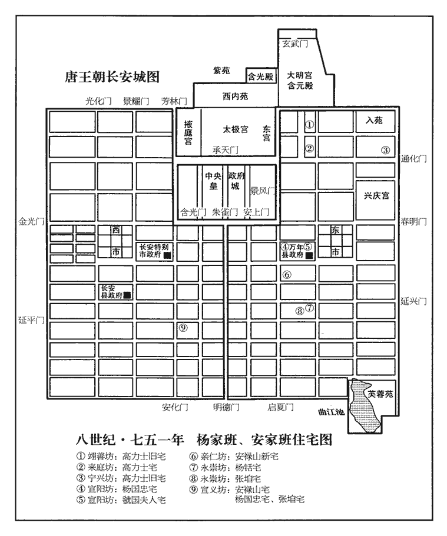
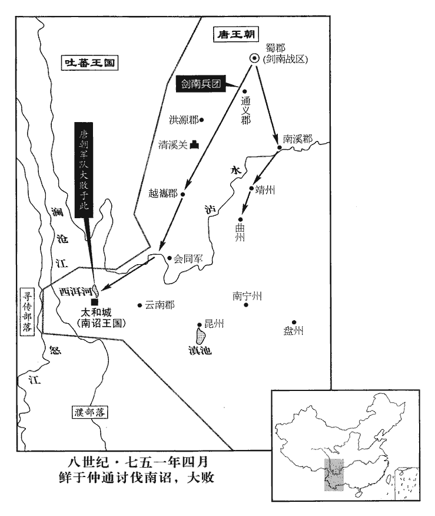
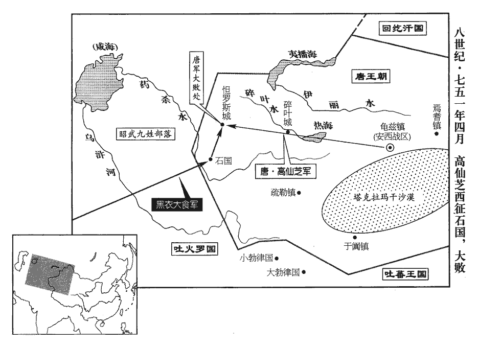
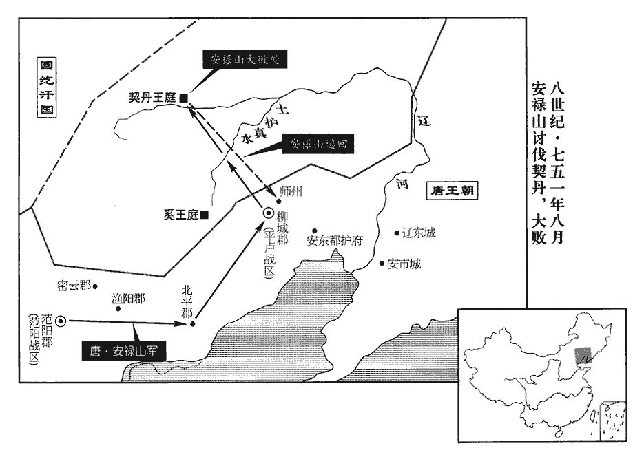
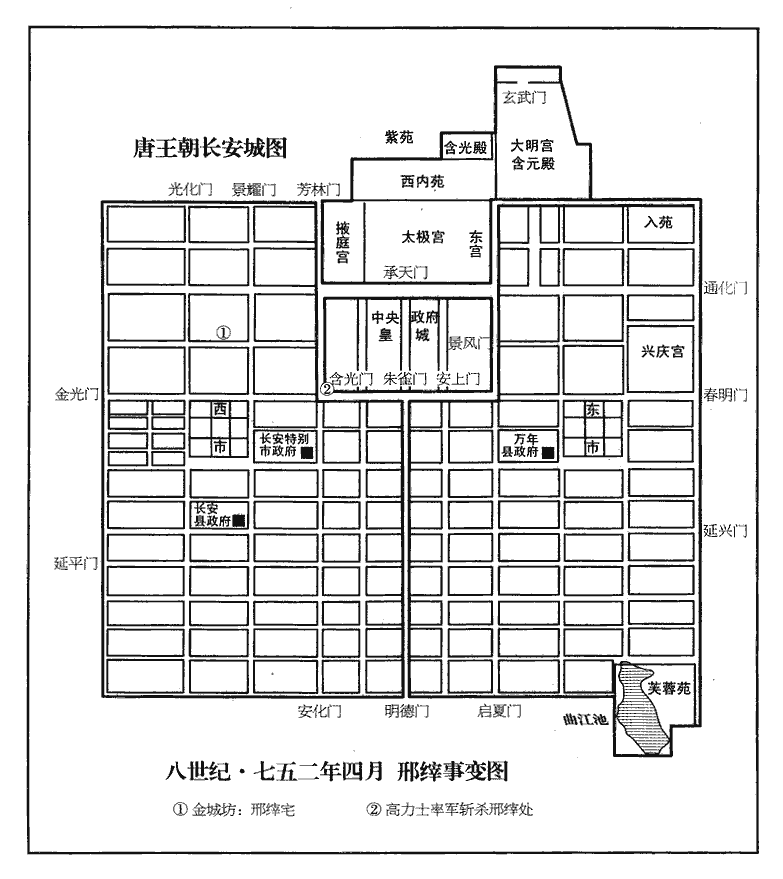

 唐紀三十二起強圉大淵獻（丁亥）十二月，盡昭陽大荒落（癸巳），凡六年有奇。始丁亥十二月，終癸巳，凡六年零一月。

# 玄宗至道大聖大明孝皇帝下之上

## 天寶六載（丁亥、七四七）載，子亥翻。

1十二月，己巳‹二十八›，上以仙芝為安西四鎮節度使，徵靈詧入朝，使，疏吏翻。朝，直遙翻。靈詧大懼。仙芝見靈詧，趨走如故，靈詧益懼。副都護京兆程千里、押牙畢思琛及行官王滔等，押牙者，盡管節度使牙內之事。行官，主將命往來京師及鄰道及巡內郡縣。琛，丑林翻。皆平日構仙芝於靈詧者也，仙芝面責千里、思琛曰：「公面如男子，心如婦人，何也？」又捽滔等，欲笞之，捽zuó，才沒翻。笞，丑之翻。既而皆釋之，謂曰：「吾素所恨於汝者，欲不言，恐汝懷憂；今既言之，則無事矣。」軍中乃安。

〖译文〗 [1]十二月，己巳（二十八日），玄宗任命高仙芝为安西四镇节度使，征夫蒙灵入朝，夫蒙灵十分害怕。而高仙芝见到夫蒙灵时，还像过去那样用小步疾走表示恭敬，夫蒙灵愈发恐惧。副都护京兆程千里、押牙毕思琛与行官王滔等人平常都在夫蒙灵前面进高仙芝的谗言，这时高仙芝当面责骂程千里与毕思琛说：“你们面貌如男人，而心胸狭窄如妇人，这是什么原因呢？”又揪住王滔等人想要鞭打他们，但不久就把他们都放了，并说：“我平常就恨你们，本来不想说出来，那是怕你们恐惧忧愁，现在我已经说出来了，你们就不要再放在心上了。”于是军府才得以安定。

初，仙芝為都知兵馬使，猗氏‹山西省临猗县›人封常清，少孤貧，細瘦纇目，少，詩照翻。纇lèi，盧對翻。一足偏短，求為仙芝傔qiàn，不納。常清日候仙芝出入，不離其門，凡數十日，傔，苦念翻。離，力智翻；下離席同。仙芝不得已留之。會達奚部叛，夫蒙靈詧使仙芝追之，斬獲略盡。常清私作捷書以示仙芝，皆仙芝心所欲言者，由是一府奇之。仙芝為節度使，即署常清判官；仙芝出征，常為留後。唐諸使之屬，判官位次副使，盡總府事。又節度使或出征，或入朝，或死而未有代，皆有知留後事，其後遂以節度留後為稱；至我朝遂以留後為承宣使，資序未應建節者為之。仙芝乳母子鄭德詮為郎將，將，即亮翻。仙芝遇之如兄弟，使典家事，威行軍中。常清嘗出，德詮自後走馬突之而過。常清至使院，使院，留後治事之所；節度使便坐治事，亦或就使院。使，疏吏翻。使召德詮，每過一門，輒闔之，既至，常清離席謂曰：「常清本出寒微，郎將所知。今日中丞命為留後，離，力智翻。中丞謂高仙芝。唐邊鎮諸帥或帶御史中丞、大夫時，隨其所帶官稱之。郎將何得於眾中相陵突！」因叱之曰：「郎將須蹔死以肅軍政。」蹔，與暫同。遂杖之六十，面仆地，曳出。仙芝妻及乳母於門外號哭救之，不及，因以狀白仙芝，仙芝覽之，驚曰：「已死邪？」及見常清，遂不復言，號，戶高翻。復，扶又翻。常清亦不之謝。軍中畏之愓息。史言封常清能治軍政，亦緣高仙芝不以私親撓法。惕，他歷翻。

〖译文〗 起初，高仙芝任都知兵马使时，猗氏人封常清出身贫穷，年幼时就成为孤儿，身体瘦小，眼睛有毛病，而且跛足。他请求作高仙芝的侍从，高仙芝不要。封常清就每天在高仙芝的军府门口等候他出入，数十天都不离开，高仙芝没有办法，只好把他留下。适逢达奚部落反叛，夫蒙灵派高仙芝率兵追击，全部杀获。封常清就私下作了报捷的文书让高仙芝看，文书中所写的正是高仙芝所要说的，从此军府中的人都对封常清另眼相看。高仙芝被任命为节度使后，即任命封常清为节度判官，每逢高仙芝出战征讨，总是命封常清为留后。高仙芝奶妈的儿子郑德诠为郎将，高仙芝待他如亲兄弟，使他掌管自己的家事，而且在军中颇有威权。封常清有一次出门，郑德诠从后面跑马冲过封常清的身边。封常清到了使院，派人把郑德诠召来，每经过一道门，就让人把门关住，见面后，封常清起来对郑德诠说道：“我本出身低微，这是你所知道的。现在高中丞任命我为留后，你怎么能够在大庭广众之下凌辱我呢！”并喝斥他说：“我要立刻把你打死以严肃军纪。”于是就杖打了郑德诠六十下，郑德诠面朝下倒在地上，然后被拉了出去。高仙芝的妻子和奶妈在门外号啕大哭，想要救郑德诠，但已来不及了，他们又把情况告诉了高仙芝，高仙芝看过郑德诠，吃惊地说：“已经死了吗！”等见到封常清时，便不再提起这件事，封常清也不谢罪。因此军中士卒都十分畏惧封常清。

自唐興以來，邊帥皆用忠厚名臣，不久任，不遙領，不兼統，功名著者往往入為宰相。如李靖、李勣、劉仁軌、婁師德之類是也。開元以來，薛訥、郭元振、張嘉貞、王晙、張說、杜暹、蕭嵩、李適之等亦皆自邊帥入相。帥，所類翻。其四夷之將，雖才略如阿史那社爾、契苾何力猶不專大將之任，皆以大臣為使以制之。社爾討高昌，侯君集為元帥；何力討高麗，李勣為元帥。將即亮翻。契，欺訖翻。苾，毗必翻。使，疏吏翻。及開元中，天子有吞四夷之志，為邊將者十餘年不易，始久任矣；王晙、郭知運、張守珪之類是也。皇子則慶、忠諸王，宰相則蕭嵩、牛仙客，始遙領矣；諸王事見二百十三卷開元十五年。蕭嵩事見十七年，牛仙客事見二百十四卷二十四年。蓋嘉運、王忠嗣專制數道，始兼統矣。蓋嘉運事見二百十四卷開元二十八年。王忠嗣事見上卷五載。蓋，古合翻。李林甫欲杜邊帥入相之路，以胡人不知書，乃奏言：「文臣為將，怯當矢石，不若用寒畯jùn胡人；寒，謂卑賤。畯，嘗有事農耕者也。畯音俊。胡人則勇決習戰，寒族則孤立無黨，陛下誠以恩洽其心，彼必能為朝廷盡死。」為，于偽翻。上悅其言，始用安祿山。至是，諸道節度盡用胡人，安祿山、安思順、哥舒翰、高仙芝，皆胡人也。精兵咸戍北邊，天下之勢偏重，卒使祿山傾覆天下，皆出於林甫專寵固位之謀也。卒，子恤翻。

〖译文〗 从唐朝建立以来，边防将帅用的都是忠厚名臣，不让久任，不让在朝中遥领，不让同时任数职，功名显著的常常入朝为宰相。四方夷族的将领，虽然才略像阿史那社尔、契何力那样的名将，也不让他们为一方大将，都任命朝中大臣为使职来节制他们。到了开元年间，天子有并吞周边民族的志向，为边将的人十多年都不替换，边将开始久任；皇子中有庆王、忠王等人，宰相中有萧嵩、牛仙客等人，开始遥领边将之职；盖嘉运、王忠嗣等一人节制数道之兵，开始兼职统领军队。李林甫想要杜绝边将入朝为宰相的路，因胡人没有文化，就上奏说：“文臣为将帅，怯懦不敢作战，不如用出身低贱从事过农耕的胡人。胡人都勇敢好战，出身低贱而孤立没有党援，陛下如果真能够用恩惠笼络他们，他们一定能够为朝廷尽力死战。”玄宗觉得李林甫的话很有道理，就重用了安禄山。这时，各镇节度使都是用胡人，精兵强将都戍守在北方边疆，形成里轻外重的局面，最后安禄山得以发动叛乱，几乎推翻唐朝的天下，这都是因为李林甫追求专宠和巩固自己地位的阴谋所致。

## 七載（戊子，七四八）

1夏，四月，辛丑‹二›，左監門大將軍、知內侍省事高力士加驃騎大將軍。知內侍省事自此始。唐制：勳階二十九，驃騎大將軍為之首，從一品。監，古銜翻。驃，匹妙翻。騎，奇寄翻。力士承恩歲久，中外畏之，太子亦呼之為兄，諸王公呼之為翁，駙馬輩直謂之爺。爺，以遮翻，俗呼父為爺。自李林甫、安祿山輩皆因之以取將相。其家富厚不貲。將，即亮翻。相，悉亮翻。貲，即移翻；不貲，言不可算計也。於西京作寶壽寺，寺鐘成，力士作齋以慶之，舉朝畢集。宋璟若在，必不預斯集矣。朝，直遙翻。擊鐘一杵，施錢百緡，施，式豉翻。有求媚者至二十杵，少者不減十杵。然性和謹少過，善觀時俯仰，不敢驕橫，故天子‹李隆基，本年六十四岁›終親任之，士大夫亦不疾惡也。少，始紹翻。橫，戶孟翻。惡，烏路翻。

〖译文〗 [1]夏季，四月辛丑（初二），左监门大将军、知内侍省事高力士加官为骠骑大将军。高力士侍候玄宗已有许多年了，深受玄宗赏识，朝野内外都敬畏他，就连太子也称他为兄，诸王公主则称他为翁，驸马辈的称他为爷。李林甫、安禄山都是靠他而被任命为将帅宰相。他家中十分富有，财产难以计算。他在西京建宝寿寺，寺钟铸成后，高力士举行斋会庆祝，朝中百官都来与会，击钟一次，施钱一百缗，有故意献媚的一连撞击二十下，少的也不下于十下。但是高力士性情温和谨慎，少有过错，善于观察时势行事，不敢骄横，所以玄宗始终信任他，士大夫们也不嫉恨他。

2五月，壬午‹十三›，群臣上尊號曰開元天寶聖文神武應道皇帝；上，時掌翻。赦天下，免百姓來載租庸，擇後魏子孫一人為三恪。三恪、二王後，註已見前。杜佑曰：周得天下，封夏、殷二王後，又封舜後，謂之恪。恪，敬也；義取王之所敬，故曰三恪。天寶十三載，公卿議曰：三恪、二王之議，有三說焉。一曰，二王之前，更立三代之後為三恪。此據樂記「武王克商，未及下車封黃帝、堯、舜之後，下車封夏、殷之後」而言。一曰，二王之前，但存一代，通二王為三恪。此據左傳「但封胡公以備三恪」，明王者所敬先王有二，更封一代以備三恪。三云，二王之後為一恪，妻之父母為二恪，夷狄之君為三恪。此據「王有不臣者三」而言之。梁崔靈恩云：三說以初為長。按二王、三恪，經無正文，靈恩據禮記，遂以為通存五代，竊恐未安。記云：尊賢不過二代；第三代者，雖遠難師法，豈得不錄其後！故亦存之，示敬其道而已，因謂之三恪。故左傳云：「封胡公以備三恪。」足知其無五代也。況歷代至今，皆以三代為三恪焉。以此考之，蓋以後魏子孫與周、隋子孫為三恪也。明年，尋罷魏後；註又見後。

〖译文〗 [2]五月壬午（十三日），群臣上唐玄宗尊号为开元天宝圣文神武应道皇帝，大赦天下，免去百姓明年的租庸，选择后魏子孙一人为三恪。

3六月，庚子‹一›，賜安祿山鐵券。

〖译文〗 [3]六月庚子（初一），赐给安禄山享有特权的铁券。

4度支郎中兼侍御史楊釗善窺上意所愛惡而迎之，以聚斂驟遷，歲中領十五餘使。釗，音昭。斂，力贍翻。惡，烏路翻。使，疏吏翻。洪邁隨筆曰：楊國忠為度支郎，領十五餘使，至宰相，凡領四十餘使，新、舊唐史皆不詳載其職。按其拜相制前銜云：御史大夫、判度支、權知太府卿事、兼蜀郡長史、劍南節度•支度•營田等副大使、本道兼山南西道采訪處置使、兩京太府出納監倉、祠祭、木炭、宮市、長春•九成宮等使、關內道及京畿采訪處置使，拜右相，兼吏部尚書、集賢殿•崇玄館學士、修國史、太清•.紫微宮使；自餘所領，又有管當租庸、鑄錢等使。以是觀之，概可見矣。甲辰‹五›，遷給事中，兼御史中丞，專判度支事，度，徒洛翻。恩幸日隆。

〖译文〗 [4]度支郎中兼侍御史杨钊善于窥伺玄宗的好恶而奉迎他的心意，因为能聚财敛钱而得到破格提拔，一年之中，就一身兼领十五多个使职。甲辰（初五），又被任命为给事中，兼御史中丞，专门掌管度支事，恩宠日盛。

蘇冕論曰：設官分職，各有司存。政有恆而易守，恆，戶登翻。易，以豉翻。事歸本而難失，經遠之理，捨此奚據！洎姦臣廣言利以邀恩，多立使以示寵，洎，其冀翻。使，疏吏翻。刻下民以厚斂，張虛數以獻狀；上心蕩而益奢，人望怨而成禍；使天子有司守其位而無其事，受厚祿而虛其用，宇文融首唱其端，楊慎矜、王鉷繼遵其軌，鉷，戶公翻。楊國忠終成其亂。仲尼云：寧有盜臣而無聚斂之臣。記大學：百乘之家，不畜聚斂之臣；與其有聚斂之臣，寧有盜臣。誠哉是言！前車既覆，後轍未改，求達化本，不亦難乎！

〖译文〗 苏冕论曰：设立官吏，分别职责，各有自己的责任。行政制度有常规就容易管理，事情归于根本就难有过失，从经邦治国的长远利益考虑，除此之外，还有什么可以依据的呢！自从奸臣虚夸财利以求恩宠，皇帝也多立使职以示宠爱，刻剥平民百姓厚敛聚财，广张虚数以奉献于上。从此皇帝心意放荡而生活更加奢侈，人民心怀怨恨而成祸患。以至皇帝和各级官吏尸位素餐，享受厚禄而不负其责。宇文融首开此端，杨慎矜与王紧随其后，至杨国忠而终成祸乱。孔子曾经说过：宁可有盗臣而不可有聚敛之臣。此话真是至理名言！前车已覆，后人不鉴，要想达到教化流行这一根本，不是太难了吗！

5冬，十月，庚戌‹十三›，上幸華清宮‹骊山温泉·陕西省临潼县境›。

〖译文〗 [5]冬季，十月庚戌（十三日），玄宗前往华清宫。

6十一月，癸未‹十七›，以貴妃姊適崔氏者為韓國夫人，適裴氏者為虢國夫人，適柳氏者為秦國夫人。三人皆有才色，上呼之為姨，出入宮掖，並承恩澤，勢傾天下。每命婦入見，姊，蔣兕翻。掖，音亦。命婦，外命婦也。見，賢遍翻。玉真公主‹李持盈›等皆讓不敢就位。玉真公主，睿宗‹李旦›之女。三姊與銛xiān、錡五家，凡有請託，府縣承迎，峻於制敕；四方賂遺，銛，丑廉翻。錡，魚奇翻。遺，于季翻；下獻遺同。輻湊其門，惟恐居後，朝夕如市。十宅諸王及百孫院婚嫁，十王宅、百孫院，見二百十三卷開元十五年。皆以錢千緡賂韓、虢使請，無不如志。上所賜與及四方獻遺，五家如一。競開第舍，極其壯麗，一堂之費，動踰千萬；既成，見他人有勝己者，輒毀而改為。虢國尤為豪蕩，一旦，帥工徒突入韋嗣立宅，即撤去舊屋，緡，彌賓翻。帥，讀曰率。去，羌呂翻。自為新第，但授韋氏以隙地十畝而已。中堂既成，召工圬wū墁，圬，音烏。墁，謨官翻。約錢二百萬；復求賞技，復，扶又翻。技，巨綺翻。虢國以絳羅五百段賞之，嗤而不顧，曰：「請取螻蟻、蜥蜴，嗤，丑之翻。蜥，先擊翻。蜴，羊益翻。師古曰：爾雅云：蠑螈，蜥蜴；蝘yǎn蜓tíng，守宮。是則一類耳。揚雄方言云：在澤中者謂之蜥蜴。記其數置堂中，苟失一物，不敢受直。」

〖译文〗 [6]十一月癸未（十七日），玄宗封杨贵妃嫁给崔氏的姐姐为韩国夫人，嫁给裴氏的姐姐为虢国夫人，嫁给柳氏的姐姐为秦国夫人。三夫人都生得貌美色绝，唐玄宗称她们为姨，能够随便出入宫禁，受到玄宗的恩宠，权势无比。每当受有封号的命妇入宫中晋见玄宗时，就是玉真公主等人也要给他们让位。三夫人与杨、杨五家，凡是有所要求，府县的官吏立刻承办，执行起来，比皇帝所下的制敕还要严厉。全国各地贿赠的东西，充满屋室，人人都争先恐后地巴结贿赂他们，从早到晚门庭若市。十王宅中的诸王与百孙院中的皇孙有了婚嫁大事，都要用钱一千缗贿赂韩国夫人和虢国夫人，让她们向玄宗求情，结果无不如意。玄宗赏赐及四方奉献给杨氏五家的物品全都一样。他们竞相建造宅第，极为壮丽豪华，一间厅堂的耗费常常超过一千万钱。建成以后，如果看见别人所建的超过自己，就毁掉重建。虢国夫人尤其奢侈，有一天早晨，她亲自带领一帮工匠闯入韦嗣立的家中，当即拆掉了他的旧房，在原地为自己建了新的宅第，只将一块十亩大的空地给了韦氏。中堂建成后，召工匠抹灰铺地，仅此一项就大概花费了二百万缗钱。工匠又要求赏赐技艺钱，虢国夫人就赏了五百段绛红色的绫罗，工匠对此之以鼻，轻蔑地说：“请拿来一些蝼蚁和蜥蜴，记住他们的只数，然后放置在堂中，如果丢失掉一只，我都不敢接受赏物。”

7十二月，戊戌‹二›，或言玄元皇帝‹李耳›降於朝元閣上於華清宮中起老君殿，殿之北為朝元閣，以或言老君降于此，改曰降聖閣。制改會昌縣‹陕西省临潼县›曰昭應，廢新豐‹陕西省临潼县东北新丰镇›入昭應。辛酉‹二十五›，上還宮。自溫泉宮。還，從宣翻，又音如字。

〖译文〗 [7]十二月戊戌（初二），有人说玄元皇帝老子降身于华清宫朝元阁，玄宗就下制改会昌县为昭应县，又废新丰县而并入昭应县。辛酉（二十五日），玄宗返回宫中。

8哥舒翰築神威軍於青海‹青海湖›上，吐蕃至，翰擊破之。又築城於青海中龍駒島，吐，從暾入聲。青海周八九百里，中有山，須冰合遊牝馬其上，明年生駒號龍種，故謂之龍駒島。謂之應龍城，吐蕃屏跡不敢近青海。屏，必郢翻。近，其靳翻。

〖译文〗 [8]陇右节度使哥舒翰于青海筑神威军城，吐蕃军队来攻，被哥舒翰打败。又在青海中的龙驹岛上筑了应龙城，从此吐蕃军队再也不敢来青海附近侵扰。

9是歲，‹南诏，首都太和城云南省大理市›雲南王歸義卒，子閤羅鳳嗣，以其子鳳迦異為陽瓜州‹羁縻州·云南省巍山县西北·原蒙羝诏›刺史。卒，子恤翻。嗣，祥吏翻。南詔王父子相繼，其子必以父號下一字冠於己所號之上。歸義本號皮邏閤，帝賜名歸義，其子號閤羅鳳，是以「閤」字冠其號之上也。閤羅鳳之子號鳳迦異，是以「鳳」字冠其號之上也。其後至豐祐乃革其舊。開元二十六年考異不取此說，然二百四十三卷穆宗之長慶四年，則又書豐祐不與父連名事。

〖译文〗 [9]这一年，云南王蒙归义去世，他的儿子阁罗凤继位，玄宗就任命他的儿子凤迦异为阳瓜州刺史。

## 八載（己丑，七四九）

1春，二月，戊申‹十三›，引百官觀左藏，唐六典曰：周禮有外府中士，主泉藏之在外者，掌邦布之入出，以供百物而待邦用者也。又有職幣上士、中士，主貨幣之入者也。並今左藏之職。至秦、漢，則分在司農、少府。後漢，少府屬官有中藏府令、丞，掌中藏幣帛金銀貨物；魏氏因之。晉少府屬官有左、右藏令。東晉御史九人，各掌一曹，有庫曹御史，後復分庫曹，置外左庫、內左庫。宋文帝省外左庫，而內左庫直曰左庫。齊、梁、陳有右藏庫而無左藏。北齊太府寺統左、右藏令、丞。後周有外府上士、中士。隋有左、右藏署令、丞。唐左藏有東庫、西庫、朝堂庫，又有東都庫。余按雍錄：太極宮中東左藏庫，西左藏庫；東庫在恭禮門之東，西庫在安仁門之西。大明宮中有左藏庫，在麟德殿之左。又有右藏署令，掌邦國寶貨雜物；而天下賦調之正數錢物，則皆歸左藏也。藏，徂浪翻；下帑藏同。賜帛有差。是時州縣殷富，倉庫積粟帛，動以萬計。楊釗奏請所在糶變為輕貨，及徵丁租地稅皆變布帛輸京師；屢奏帑藏充牣，古今罕儔，故上‹李隆基，本年六十五岁›帥群臣觀之，釗，音昭。帥，讀曰率。賜釗紫衣金魚以賞之。上以國用豐衍，故視金帛如糞壤，賞賜貴寵之家，無有限極。

〖译文〗 [1]春季，二月戊申（十三日），玄宗带领百官参观左藏库，并赏赐给他们数量不同的布帛。当时唐朝的州县殷实副有，仓库中所积蓄的粮食布帛数以万计。杨钊又奏请把各地征收的粮食卖出变成钱帛，并把所征收的丁租和地税改变为征收布帛运到京师。杨钊又多次上奏说国库中钱帛充实，古今罕见，所以玄宗带领群臣来观看，并赐杨钊紫衣和金鱼袋以嘉赏他。玄宗认为国家富有，钱物丰富，所以视金帛如粪土，毫不吝惜，赏赐王公贵族时，常常没有限度。

2三月，朔方‹总部设灵武宁夏灵武市›節度等使張齊丘於中受降城‹内蒙古包头市›西北五百餘里木剌山‹阴山›築橫塞軍‹内蒙古五原县西北›，以振遠軍‹山西省大同市北›使鄭‹陕西省华县›人郭子儀為横塞軍使。橫塞軍本名可敦城。按宋白續通典：橫塞軍，初置在飛狐，後移蔚州，開元六年張嘉貞移於古代郡大安城南，以為九姓之援，天寶十二年改為天德軍。參考諸書，橫塞軍即橫野軍，天寶元年書「河東節度統橫野軍」，開元六年所移者也。此築橫塞軍在可敦城者也。振遠軍在單于府界。鄭縣，漢屬京兆，後魏置東雍州，并華山縣，西魏改華州，隋開皇初廢郡，大業初廢州，復置鄭縣，屬京兆，唐屬華州。使，疏吏翻。降，戶江翻。剌，盧達翻。

〖译文〗 [2]三月，朔方节度等使张齐丘在中受降城西北五百余里的木剌山筑横塞城，并任命振远军使郑县人郭子仪为横塞军使。

3夏，四月，咸寧‹陕西省宜川县›太守趙奉璋咸寧郡本丹州丹陽郡，元年更郡名。守，式又翻。告李林甫罪二十餘條；狀未達，林甫知之，諷御史逮捕，以為妖言，杖殺之。妖，於喬翻。

〖译文〗 [3]夏季，四月，咸宁太守赵奉璋上告李林甫罪行二十余条。状子还未到达京师，李林甫已经得知，就暗中让御史逮捕了赵奉璋，声称所上的是妖言，并杖杀了他。

4先是，折衝府皆有木契、銅魚，朝廷徵發，下敕書、契、魚，唐制：銅魚符所以起軍旅，王畿之內，左三、右一，王畿之外，左五、右一。左者在外行用之，日從第一為首，後事須用二次發之，周而復始。木契之制，若太子監國，則王畿之內，左、右各三；王畿之外，左、右各五；庶官鎮守，則左、右各十。唐六典：符寶郎掌符節。曰木契者，所以重鎮守，慎出納；車駕巡幸，皇太子監國，有兵馬受處分者，為木契；并行軍所及領軍五百人、馬五百匹以上征討，皆給木契；三公以下，兩京留守及諸州有兵馬受處分，亦給木契。曰銅魚符者，所以起軍旅易守長；兩京留守若諸州、諸軍、折衝府、諸處捉兵鎮守之所及宮總監，皆給魚符。程大昌演繁露曰，唐世，左魚之外又有敕牒將之故兼名魚書。先，悉薦翻。下遐嫁翻。都督、郡府參驗皆合，然後遣之。自募置彍guō騎，彍騎見二百一十二卷開元十三年。彍音郭，又音霍。府兵日益墮壞，墮，讀曰隳。死及逃亡者，有司不復點補；復，扶又翻。其六馱馬牛、器械糗糧，耗散略盡。馱，徒何翻。糗，去九翻。府兵入宿衛者，謂之侍官，言其為天子侍衛也。其後本衛多以假人，役使如奴隸；長安人羞之，至以相詬病。記儒行曰：今眾人以儒相詬病。註云：以儒相靳，故相戲。詬病，猶恥辱也。杜預云：戲而相愧為靳。詬，音遘，又呼候翻。其戍邊者，又多為邊將苦使，利其死而沒其財。將，即亮翻；下同。由是應為府兵者皆逃匿，至是無兵可交。五月，癸酉‹十›，李林甫奏停折衝府上下魚書；是後府兵徒有官吏而已。唐府兵之制，十人為火，火有長。火備六馱馬，凡火具、烏布、幕鐵、馬盂、布槽、鍤chā、钁jué、鑿、碓、筐、斧、鉗，鋸，皆一，甲牀二，鎌二。五十人為隊。隊具火鑽一，胸馬繩一，首羈、足絆皆三，人具弓一，矢三十，胡祿橫刀、礪石、大觿xī、氈帽、氈裝、行縢皆一，麥飯九斗，米二斗，皆自備。其介胄戎具藏於庫，有所征行，則視其入而出給之；其番上宿衛者，惟給弓、矢、橫刀而已。今皆耗廢，非其舊矣。其折衝、果毅，又歷年不遷，士大夫亦恥為之。其彍guō騎之法，天寶以後，稍亦變廢，應募者皆市井負販、無賴子弟，孔穎達曰：白虎通云：因井為市，故曰市井。應劭通俗文云：市，恃也；養贍老小，恃以不匱也。俗說市井，謂至市者於井上洗濯其物香潔，及自嚴飾，乃到市也。謹按古者二十畝為一井，因為市交易，故稱市井。然則本由井田之中交易為市，故國都之市亦因曰市井。按禮制九夫為井。應劭二十畝為井者，劭依漢書食貨志一井八家，家有私田百畝，公田十畝，餘二十畝以為井、竈、廬、舍，故言二十畝耳。因井為市，或如劭言。未嘗習兵。時承平日久，議者多謂中國兵可銷，於是民間挾兵器者有禁；子弟為武官，父兄擯bìn不齒。猛將精兵，皆聚於西北，中國無武備矣。

〖译文〗 [4]先前，府兵制下的折冲府都有木契、铜鱼，朝廷如果要征发府兵，就颁下敕书、木契和铜鱼，经都督府和郡府检验，木契、铜鱼都对合，然后才能发兵。自从招募了骑以后，府兵日益衰落，其中有死的，有跑的，官吏不再清点补充。府兵装备的六驮马牛、武器和干粮也都消耗散尽。原来府兵入朝宿卫者被称为侍官，意思是去保卫天子。后来宿卫的府兵多雇人顶替，军官也像奴隶一样役使士兵，以至长安城中的人以做侍官为耻辱，把他们作为戏笑时辱骂的对象。而被派往边疆戍边的府兵也多被边将当做苦力役使，为的是这些府兵死后边将可以吞掉他们的财产。所以那些应该当府兵的人纷纷逃亡，这时各折冲府已没有兵员可交。五月癸酉（初十），李林甫奏请停止折冲府上下的铜鱼和敕书，从此府兵只保留原来的官吏。又因为府兵的折冲都尉和果毅都尉多年得不到升迁，士大夫们都以做这类官为耻辱。招募骑的办法，从天宝年间以后，也逐渐变化，并被荒废，应募的人都是一些市中商贩和刁猾之辈，未经过严格的训练。当时天下太平日久，大多数人都认为中国可以裁掉军队，因此在民间禁止私人携带兵器，子弟做武官的，父母兄弟都瞧不起他们。唐朝的猛将精兵都聚集在西北方，而国内空虚，没有任何武备。

5太白山‹陕西省眉县南›人李渾等上言水經註曰：武功縣有太一山，古文以為終南，亦曰中南，亦曰太白山，在武功縣南，去長安二百里，不知其高幾何。俗云「武功、太白，去天三百。」杜彥遠曰：太白山南連武功山，於諸山最為秀傑，冬夏積雪，望之皓然。隋志曰：太一山在盩厔縣界。新志曰：太白山在郿縣。見神人，言金星洞有玉板石記聖主福壽之符，命御史中丞王鉷入仙遊谷‹陕西省周至县南›求而獲之。上以符瑞相繼，皆祖宗休烈，六月，戊申‹十五›，上聖祖號曰大道玄元皇帝，上高祖諡曰神堯大聖皇帝，太宗諡曰文武大聖皇帝，高宗諡曰天皇大聖皇帝，中宗諡曰孝和大聖皇帝，睿宗諡曰玄真大聖皇帝，竇太后以下皆加諡曰順聖皇后。

〖译文〗 [5]太白山人李浑等人上言说看见了神人，神人说金星洞中有玉板石记载圣主福寿的符命，玄宗就派御史中丞王往仙游谷去搜寻，果然找到了。玄宗认为不断出现的这些吉祥征兆，都是因为祖先的福禄和威烈，六月戊申（十五日），上圣祖老子号为大道玄元皇帝，上高祖李渊谥号为神尧大圣皇帝，太宗李世民谥号为文武大圣皇帝，高宗李治谥号为天皇大圣皇帝，中宗李显谥号为孝和大圣皇帝，睿宗李旦谥号为玄真大圣皇帝，高祖窦太后以下的皇后都加谥号为顺圣皇后。

6辛亥‹十八›，刑部尚書、京兆尹蕭炅坐贓左遷汝陰‹安徽省阜阳市›太守。汝陰郡，潁州。

〖译文〗 [6]辛亥（十八日），刑部尚书、京兆尹萧炅因为贪污钱财，被贬为汝阴太守。

7上命隴右‹总部设西平青海省乐都县›節度使哥舒翰帥隴右、河西及突厥阿布思兵，益以朔方、河東兵，凡六萬三千，攻吐蕃石堡城‹青海省湟源县西南›。厥，九勿翻。吐，從暾入聲。其城三面險絕，惟一徑可上，上，時掌翻。吐蕃‹首都逻些城西藏拉萨市›但以數百人守之，多貯糧食，積檑木及石，貯，丁呂翻。檑，盧對翻。唐兵前後屢攻之，不能克。翰進攻數日不拔，召裨將高秀巖、張守瑜，欲斬之，高秀巖後為安祿山守大同，蓋二人朔方、河東將也。二人請三日期可克；如期拔之，獲吐蕃鐵刃悉諾羅等四百人，唐士卒死者數萬，果如王忠嗣之言。王忠嗣言，見上卷六載。頃之，翰又遣兵於赤嶺‹青海省共和县东›西開屯田，以謫卒二千戍龍駒島‹青海湖湖心岛›，冬冰合，吐蕃大集，戍者盡沒。深入虜境，聲援不接，兵法曰遺人獲也。

〖译文〗 [7]玄宗命令陇右节度使哥舒翰率领陇右、河西及突厥阿布思兵，再加上朔方、河东兵，共计六万三千人，去攻打吐蕃石堡城，石堡城三面临险，只有一条道路可上，吐蕃只有数百人守卫，贮藏了大量粮食，又堆积檑木和石块，唐朝军队多次攻击都遭到失败。哥舒翰率军进攻了数天，仍然不能攻克，于是就召来副将高秀岩和张守瑜，要杀掉他们，二人请求宽限三天，声称一定攻克。三天后果然攻下了石堡城，俘虏了吐蕃将领铁刃悉诺罗等四百人，而唐朝的士卒死了数万，果然像王忠嗣所说的那样。不久，哥舒翰又派人于赤岭西部开垦屯田，并派遣了二千犯罪充军的士卒去守卫龙驹岛。冬天结冰封冻以后，吐蕃大军来攻，将守卫的士卒全部消灭。

8閏月，乙丑‹三›，以石堡城為神武軍，又於劍南‹首府设蜀郡四川省成都市›西山索磨川‹四川省黑水县西南›置保寧都護府。置保寧都護府，以領牂柯、吐蕃。

〖译文〗 [8]闰月乙丑（初三），唐朝在石堡城设置神武军，又于剑南西山索磨川设置保宁都护府。

9丙寅‹四›，上謁太清宮。天寶元年正月，得靈符，起玄元皇帝廟於西京大寧坊，東京置於東宮積善坊臨淄舊邸，天下諸郡各置玄元像於開元觀。至二年三月十二日，改在京玄元宮為太清宮，東京爲太極宮，天下諸郡為紫極宮。丁卯‹五›，群臣上尊號曰開元天地大寶聖文神武應道皇帝，赦天下。禘、祫xiá自今於太清宮聖祖前設位序正。

〖译文〗 [9]丙寅（初四），玄宗朝谒太清宫。丁卯（初五），群臣上玄宗尊号为开元天地大宝圣文神武应道皇帝，大赦天下。从今以后，进行、两种祭祀时，在太清宫圣祖老子前按顺序设置神位。

10秋，七月，冊突騎施‹伊犁河中下游›移撥為十姓可汗。騎，奇寄翻。可，從刊入聲。汗，音寒。

〖译文〗 [10]秋季，七月，唐朝册封突骑施移拨为十姓可汗。

11八月，乙亥‹十四›，護密‹中亚喷赤河北岸伊什卡希姆城›王羅真檀入朝，朝，直遙翻。請留宿衛；許之，拜左武衛將軍。

〖译文〗 [11]八月乙亥（十四日），护密王罗真檀入朝，并请求留下来为朝廷宿卫，玄宗答应他的要求，并拜他为左武卫将军。

12冬，十月，乙丑‹四›，上幸華清宮‹骊山温泉·陕西省临潼县境›。

〖译文〗 [12]冬季，十月乙丑（初四），玄宗前往华清宫。

13十一月，乙未‹五›，吐火羅‹阿富汗北部›葉護失里怛伽羅遣使表稱：「朅qiè師‹印度北部›王親附吐蕃，怛，當割翻。伽，求加翻。使，疏吏翻。朅，丘竭翻，又去謁翻。困苦小勃律‹克什米尔吉尔吉特市›鎮軍，阻其糧道。臣思破凶徒，望發安西‹设龟兹新疆库车县›兵，以來歲正月至小勃律，六月至大勃律‹吉尔吉特市东南直线距离两百千米›。」朅師，亦曰羯師，胡種也；與吐火羅鄰接。大勃律，或曰布露，直吐蕃西，其北即小勃律也。上許之。

〖译文〗 [13]十一月乙未（初五），吐火罗叶护失里怛伽罗派遣使者上表说：“师王依附于叶蕃，故意困扰小勃律镇兵，断绝了他们的粮道。我想要打败师军队，希望能够发安西镇兵来助战，明年正月到小勃律，六月到大勃律。”玄宗同意。

## 九載（庚寅，七五零）

1春，正月，己亥‹十›，上‹李隆基，本年六十六岁›還宮。

〖译文〗 [1]春季，正月己亥（初十），玄宗返回宫中。

2群臣屢表請封西嶽‹华山·陕西省华阴市南›，許之。

〖译文〗 [2]群臣多次上表请玄宗到西岳华山筑坛祭天，玄宗同意。

3二月，楊貴妃‹本年三十二岁›復忤旨，送歸私第。楊妃初忤旨，見上卷五載。復，扶又翻。忤，五故翻。戶部郎中吉溫因宦官言於上曰：「婦人識慮不遠，違忤聖心，陛下何愛宮中一席之地，不使之就死，豈忍辱之於外舍邪？」吉溫此言，欲以自結於楊妃耳。邪，音耶。上亦悔之，遣中使賜以御膳。妃對使者涕泣曰：「妾罪當死，陛下幸不殺而歸之。今當永離掖庭，使，疏吏翻；下同。離，力智翻。掖，音亦。金玉珍玩，皆陛下所賜，不足為獻，惟髮者父母所與，敢以薦誠。」乃翦髮一繚而獻之。繚liáo，力照翻。上遽使高力士召還，寵待益深。還，從宣翻，又音如字。婦人女子最為難養，以忤旨而出之，若棄咳唾可也。既出而復召還，則彼之怙寵悍悖將無所不至。明皇其可再乎！古之所謂英主，如漢武之於鉤弋，庶乎！

〖译文〗 [3]二月，杨贵妃又因为触怒了玄宗，被送回杨家。这时户部郎中吉温让宦官对玄宗说：“杨贵妃作为妇道人家，见识短浅，违背了圣上的心意，但陛下为何要爱惜宫中一席之地，不让她死在宫中，而要让她在宫外丢陛下的人呢？”玄宗听后，十分后悔，就派宦官把自己吃的饭赐给贵妃。杨贵妃十分感动，痛哭流涕地对宦官说：“我得罪了陛下，罪该万死，而陛下宽宏大量不杀我，还让我回家。现在要永远离开宫中，不得与陛下相见，金玉等珍宝玩物，都是陛下赐给我的，难以献给陛下，只有头发是父母所给与我的，把它献给陛下以表示我的诚心。”于是就剪下一撮自己的头发让人献给玄宗。玄宗见后立刻派高力士把杨贵妃召回宫中，从此更加宠爱。

時諸貴戚競以進食相尚，上命宦官姚思藝為檢校進食使，水陸珍羞數千盤，一盤費中人十家之產。中書舍人竇華嘗退朝，使，疏吏翻。朝，直遙翻。值公主進食，列於中衢，傳呼按轡出其間；宮苑小兒數百奮梃於前，宮苑小兒，宮苑使領之。梃，待鼎翻。華僅以身免。

〖译文〗 当时王公贵族、皇亲国戚都竞相向玄宗进献食物，玄宗就任命宦官姚思艺为检校进食使，所进献的水中和陆地上所产的美味佳肴有数千盘，一盘的费用就等于中等人家十户的财产。中书舍人窦华有一次退朝，正遇上公主进献食物，列队于街中央，传呼骑马的人，出入其间，数百名宫苑小儿举着棍棒走在前面，窦华差一点挨了他们的打。

4安西‹总部设龟兹新疆库车县›節度使高仙芝破朅qiè師‹印度北部›，虜其王勃特沒。朅，丘竭翻。考異曰：實錄，去載十一月，吐火羅葉護請使安西兵討朅師，上許之。不見出師。今載三月庚子，冊朅師國王勃特沒兄素迦為王，冊曰：「頃勃特沒，於卿不孝，於國不忠。」不言朅師為誰所破。按十載正月，高仙芝擒朅師王來獻；然則朅師為仙芝所破也。三月，庚子‹十二›，立勃特沒之兄素迦為朅師王。迦，音加。

〖译文〗 [4]安西节度使高仙芝打败了师军队，俘虏了师王勃特没。三月庚子（十二日），唐朝立勃特没的哥哥素迦为师王。

5上命御史大夫王鉷鑿華山路，設壇場於其上。鉷，戶公翻。華，户化翻。是春，關中旱；辛亥‹二十三›，嶽‹华山›祠災；制罷封西嶽。

〖译文〗 [5]玄宗命令御史大夫王开凿上华山的道路，于山顶上设置祭坛场。这年春天，关中大旱。辛亥（二十三日），华山上的西岳祠遭受火灾，玄宗下制书取消在西岳祭天的打算。

6夏，四月，己巳‹十一›，御史大夫宋渾坐贓巨萬，流潮陽‹广东省潮州市›。潮陽郡本潮州義安郡，元年更郡名。初，吉溫因李林甫得進；天寶四載，吉溫鞫兵部之獄，自是得進。及兵部侍郎兼御史中丞楊釗恩遇浸深，溫遂去林甫而附之，為釗畫代林甫執政之策。釗，音昭。為，于偽翻。蕭炅及渾，皆林甫所厚也，炅，古迥翻。求得其罪，使釗奏而逐之，以翦其心腹，林甫不能救也。

〖译文〗 [6]夏季，四月己巳（十一日），御史大夫宋浑因为贪污巨额钱财，被流放到潮阳。先前，吉温因为李林甫的提拔而受到重用，后来兵部侍郎兼御史中丞杨钊逐渐受到唐玄宗的器重，吉温就背叛李林甫而投向杨钊，又为杨钊谋划取代李林甫的计策。萧炅与宋浑都是李林甫的亲信，所以吉温就专门寻求他们的罪证，让杨钊上奏玄宗赶走他们，以翦除李林甫的心腹，李林甫也无法相救。

7五月，乙卯‹二十八›，賜安祿山爵東平郡王。唐將帥封王自此始。將，即亮翻。帥，所類翻。

〖译文〗 [7]五月乙卯（二十八日），玄宗赐安禄山东平郡王爵位。这是唐朝的将帅首次封王。

8秋，七月，乙亥‹十三›，置廣文館於國子監，以教諸生習進士者。時廣文館置博士二員，助教一員。

〖译文〗 [8]秋季，七月乙亥（疑误），于国子监中设置广文馆，教授国子监考进士的学生。

9八月，丁巳‹一›，以安祿山兼河北道采訪處置使。

〖译文〗 [9]八月丁巳（初一），玄宗任命安禄山兼河北道采访处置使。

10朔方‹总部设灵武宁夏灵武市›節度使張齊丘給糧失宜，軍士怒，毆其判官；毆，烏口翻。兵馬使郭子儀以身捍齊丘，乃得免。世皆知郭子儀得眾，然後能捍免張齊丘，而不知當此之時，唐之軍政果安在也！癸亥‹七›，齊丘左遷濟陰‹山东省定陶县›太守，濟陰郡，曹州。濟，子禮翻。以河西‹总部设武威甘肃省武威市›節度使安思順權知朔方節度事。

〖译文〗 [10]因朔方节度使张齐丘给军士发放军粮不公平，军士大怒，殴打了他的判官。兵马使郭子仪用身体挡在张齐丘的前面，张齐丘才没有挨打。癸亥（初七），张齐丘被降官为济阴太守，朝廷任命河西节度使安思顺暂时代理朔方节度使。

11辛卯‹九月六日›，處士崔昌上言：處，昌呂翻。「國家宜承周、漢，以土代火；周、隋皆閏位，不當以其子孫為二王後。」事下公卿集議。下，遐嫁翻。集賢殿學士衛包上言：「集議之夜，四星聚於尾，天意昭然。」上乃命求殷、周、漢後為三恪，廢韓、介、酅xī公；韓，元魏後。介，後周後。酅，隋後。酅，戶圭翻。孔穎達曰：古春秋左氏說：周家封夏、殷二王之後以為上公，封黃帝、堯舜之後，謂之三恪。鄭氏云：所存二王之後者，命使郊天以天子之禮，祭其始祖受命之王，自行其正朔服色。恪者，敬也，敬其先聖而封其後，與諸侯無殊異，不得比夏、殷之後。以昌為左贊善大夫，包為虞部員外郎。

〖译文〗 [11]辛卯（疑误），隐士崔昌上言说：“我们唐朝应该继承周朝与汉朝，用土德代替火德。而北周与隋朝都不是正统的王朝，不应该用他们的子孙后代为二王后。”玄宗让公卿们议论此事。集贤殿学士卫包上言说：“公卿们讨论此事的那天夜里，四象星聚集于二十八宿之一的尾宿，天意已经很清楚了。”于是唐玄宗命令寻求商朝、周朝和汉朝的后代为三恪，废掉了北魏的后代韩公、后周的后代介公和隋朝的后代公。又任命崔昌为左赞善大夫，卫包为虞部员外郎。

12冬，十月，庚申‹五›，上幸華清宮‹骊山温泉·陕西省临潼县境›。

〖译文〗 [12]冬季，十月庚申（初五），唐玄宗前往华清宫。

13太白山‹陕西省眉县南›人王玄翼上言見玄元皇帝，言寶仙洞有妙寶真符。考異曰：舊志，「王鉷奏玄翼見玄元於寶仙洞中，遣鉷與張均、王倕、王濟、王翼、王嶽靈於洞中得玉石函、上清護國經、寶券、紀籙等獻之。」今從實錄云。命刑部尚書張均等往求，得之。時上尊道教，慕長生，故所在爭言符瑞，群臣表賀無虛月。李林甫等皆請捨宅為觀觀，古玩翻。以祝聖壽，上悅。

〖译文〗 [13]太白山人王玄翼上言说看见了玄元皇帝老子，并对他说宝仙洞中有妙宝真符。于是唐玄宗就命令刑部尚书张均等去搜寻，果然搜得。当时玄宗尊奉道教，羡慕长生不死之术，所以各地的人竞相奉献吉祥的符命，群臣也不断地上表恭贺。李林甫等人都请求捐舍宅第为道观，借以祝福玄宗万寿无疆，玄宗十分喜悦。

14安祿山屢誘奚‹滦河上游›、契丹‹辽河上游›，為設會，飲以莨làng菪dàng酒，本草曰：莨菪子生海邊川谷，今處處有之，苗莖高二三尺許，葉與地黃、紅藍等，而三指闊；四月開花，紫色；苗夾莖有白毛；五月結實，有殼作罌yīng子狀，如小石榴；房中子至細，青白如米粒，毒甚；煮一二日而芽方生，以釀酒，其毒尤甚。為，于偽翻；下先為同。飲，於鴆翻。莨，音浪。菪，音蕩。醉而阬之，動數千人，函其酋長之首以獻，前後數四。至是請入朝，上命有司先為起第於昭應‹陕西省临潼县›。時王公皆私置第於昭應，獨祿山以承恩，命有司起第。酋，慈由翻。長，知兩翻。朝，直遙翻。祿山至戲水‹渭水支流，流经陕西省临潼县东›，戲，許宜翻。楊釗兄弟姊妹皆往迎之，冠蓋蔽野；上自幸望春宮以待之。辛未‹十六›，祿山獻奚俘八千人，上命考課之日書上上考。前此聽祿山於上谷‹河北省易县›鑄錢五壚，祿山乃獻錢様千緡。緡，彌頻翻。

〖译文〗 [14]安禄山多次引诱奚人和契丹人，假装设宴招待他们，让他们饮用毒草莨菪浸泡过的酒，等醉倒后，就把他们活埋，一次常常达数千人，然后把他们酋长的头颅装进盒子中，献给朝廷，前后有许多次。这时安禄山请求入朝，玄宗命令有关官员先在昭应县为安禄山建起宅第。安禄山到了戏水，杨钊兄弟姐妹都去迎接，迎接的队伍浩浩荡荡，以至车盖似乎遮满了原野。玄宗也来到望春宫等待安禄山。辛未（十六日），安禄山献上奚族俘虏八千人，玄宗命令考察官吏政绩时为安禄山记最高一级的上上考。以前玄宗允许安禄山于上谷起五炉铸造钱币，这时安禄山献上所铸钱的样品一千缗。

楊釗，張易之之甥也，釗，音昭。考異曰：鄭審天寶故事云：「楊國忠本張易之之子。天授中，張易之恩幸莫比，每歸私第，詔令居樓上，仍去其梯。母恐張氏絕嗣，乃密令女奴蠙pín珠上樓，逐有娠而生國忠。」其說曖昧無稽，今不取。奏乞昭雪易之兄弟。易之兄弟誅見二百七卷中宗神龍元年。庚辰‹二十五›，制引易之兄弟迎中宗‹李显›於房陵‹湖北省房县›之功，迎中宗，非特二張倡其議也，事見二百六卷武后聖曆元年。復其官爵；考異曰：唐曆在七月二十五日。今從實錄。仍賜一子官。

〖译文〗 [15]杨钊是张易之的外甥，上奏玄宗为张易之兄弟平反昭雪。庚辰（二十一日），玄宗下制书援引张易之兄弟曾经在房陵迎接中宗为帝的功劳，恢复他们的官爵，并赐一个儿子为官。

釗以圖讖有「金刀」，請更名；讖，楚譖翻。更，工衡翻。上賜名國忠。

〖译文〗 杨钊认为预卜吉凶的图谶中有“金刀”二字，不吉利，请改自己的名，玄宗赐名为国忠。

16十二月，乙亥‹二十›，上還宮。

〖译文〗 [16]十二月乙亥（二十日），玄宗返回宫中。

17關西‹潼关以西›遊弈使王難得擊吐蕃，克五橋‹青海省贵德县附近›，拔樹敦城‹青海省贵德县西直线距离七十千米›；以難得為白水軍‹青海省大通县›使。使，疏吏翻。吐，從暾入聲。樹敦城以古犬戎王樹惇名城，隋在吐谷渾界，唐在吐蕃界。

〖译文〗 [17]关西游弈使王难得率兵攻打吐蕃，攻克了五桥和树敦城，朝廷任命他为白水军使。

18安西四鎮‹总部设龟兹新疆库车县›節度使高仙芝偽與石國‹乌兹别克斯坦塔什干市›約和，引兵襲之，虜其王及部眾以歸，悉殺其老弱。仙芝性貪，掠得瑟瑟十餘斛，使，疏吏翻。張揖廣雅曰：瑟瑟，碧珠也。黃金五六橐駝，其餘口馬雜貨稱是，皆入其家。為石國王子扇誘諸國以覆仙芝之師張本。稱，尺證翻。

〖译文〗 [18]安西四镇节度使高仙芝假意与石国约和，率兵袭击了石国，俘虏了石国的国王和民众返回，然后把其中的老弱病残者全部杀掉。高仙芝本性贪婪，掠夺了碧珠十余斛，黄金五六骆驼，其他的马匹杂货等不计其数，全部拿回家中，据为己有。

19楊國忠德鮮于仲通，鮮于仲通資給國忠，又推轂gǔ之，事見上卷四載。薦為劍南‹总部设蜀郡四川省成都市›節度使。仲通性褊急，失蠻夷心。褊biǎn，補典翻。

〖译文〗 [19]杨国忠因为感激鲜于仲通，就推荐他为剑南节度使。而鲜于仲通性情急躁，不会安抚，失掉了蛮夷人心。

故事，南詔‹首都太和城云南省大理市›常與妻子俱謁都督，過雲南‹云南省姚安县›，雲南太守張虔陀皆私之。過，古禾翻。雲南郡，姚州。守，式又翻。又多所徵求，南詔王閤羅鳳不應，虔陀遣人詈辱之，仍密奏其罪。閤羅鳳忿怨，是歲，發兵反，攻陷雲南，殺虔陀，取夷州三十二。夷州，謂西南夷附化羈縻之州也。

〖译文〗 按照过去的惯例，南诏王要经常带着妻子一起晋见都督，经过云南，云南太守张虔陀每次都要奸污他们的妻子。又要求征送财物，南诏王罗凤不答应，张虔陀就派人辱骂他，还暗中向朝廷奏报他的罪行。罗凤十分愤恨，这一年，发兵反叛，攻陷了云南郡，杀死了张虔陀，并攻占了原来归附于唐朝的西南夷的三十二个州。

## 十載（辛卯，七五一）載，祖亥翻。

1春，正月，壬辰‹八›，上‹李隆基，本年六十七岁›朝獻太清宮；癸巳‹九›，朝享太廟；朝，直遙翻；下同。甲子‹十›，合祭天地於南郊，赦天下，免天下今載地稅。上書壬辰、癸巳，下書丁酉，則「甲子」當作「甲午」。

〖译文〗 [1]春季，正月壬辰（初八），玄宗向太清宫进献祭品。癸巳（初九），向太庙献食。甲子（疑误），合祭天地于南郊，并大赦天下，免除天下百姓今年的地税。

2丁酉‹十三›，命李林甫遙領朔方節度使，以戶部侍郎李暐知留後事。

〖译文〗 [2]丁酉（十三日），玄宗任命李林甫兼任朔方节度使，而让户部侍郎李知留后事。

3庚子‹十六›，楊氏五宅夜遊，楊銛xiān、錡及韓、虢、秦三夫人為五宅。與廣平公主從者爭西市門，「廣平」，新書作「廣寧」；公主，上女也。從，才用翻。楊氏奴揮鞭及公主衣，公主墜馬，駙馬程昌裔下扶之，亦被數鞭。公主泣訴於上，上為之杖殺楊氏奴。被，皮義翻。為，于偽翻；下司為、使為、遽為同。明日‹正月十七日›，免昌裔官，不聽朝謁。

〖译文〗 [3]庚子（十六日），杨氏五家因为夜里游览，与广平公主的侍从争过西市门，杨氏的家奴挥鞭打中公主的衣服，公主从马上坠落下来，驸马程昌裔下马扶广平公主，也被鞭打了几下。广平公主向玄宗哭诉此事，玄宗命令杖杀杨氏的家奴。第二天，又免掉了驸马程昌裔的官职，不充许他再来朝见。

4上命有司為安祿山治第於親仁坊，治，直之翻。敕令但窮壯麗，不限財力。既成，具幄帟yì器皿，充牣其中，有帖白檀牀二，皆長丈，闊六尺；本草圖經曰：檀香木如檀，生南海，種有黃、白、紫之異。帟，音亦。長，直亮翻。銀平脫屏風，帳方丈六尺；【章：十二行本作「一方一丈八」五字；乙十一行本同；孔本同；退齋校同；張校云「六」作「八」。】於廚厩之物皆飾以金銀，金飯罌二，罌yīng，於耕翻，缶fǒu也。銀淘盆二，淘盆，所以淅米。皆受五斗，織銀絲筐及笊篱各一；筐，去王翻，所以瀝米。笊zhào，側絞翻。篱，音離。笊篱，所以轑lǎo釜取食物。他物稱是。稱，尺證翻。雖禁中服御之物，殆不及也。上每令中使為祿山護役，護，監護也。使，疏吏翻；下同。築第及造儲偫zhì賜物，常戒之曰：「胡眼大，勿令笑我。」偫，直里翻。大，唐佐翻。

〖译文〗 [4]玄宗命令有关官吏为安禄山于亲仁坊建造宅第，并下敕书说不管耗费多少钱财，越壮丽越好。宅第建成以后，又装饰了各种幄帐，放置了许多日用器物，以至都放满了宅屋。其中有帖白檀香木床两个，都是长一丈，宽六尺；用银平脱工艺制成的屏风，长宽一丈六尺。厨房和马厩中所用的物品也都用金银装饰，其中有金饭罂两个，银淘盆两个，都能装五斗粮，还有织银丝筐和笊篱各一个。其他器物还有许多。就是宫禁中皇上所使用的器物，大概都比不上。玄宗命令宦官监工，在建造宅第和制作屋中所用的器物时，玄宗常常告戒监工的宦官说：“胡人大方，不要让他笑我小气。”

祿山入新第，置酒，乞降墨敕請宰相至第。是日，上欲於樓下擊毬，遽為罷戲，命宰相赴之。日遣諸楊與之選勝遊宴，侑以梨園教坊樂。梨園，皇帝梨園弟子也。教坊，內教坊也。上每食一物稍美，或後苑校獵獲鮮禽，輒遣中使走馬賜之，絡繹於路。

〖译文〗 安禄山住进新建的宅第后，设置酒宴，并请求玄宗下敕书让宰相至宅第赴宴。这一天，玄宗原来准备在楼下击，却立刻取消了游戏，命令宰相去赴会。又每天让杨家的人与安禄山选择风景优美的地方游玩宴会，并让梨园弟子和教坊乐队陪伴。玄宗每吃到一种鲜美的食物，或者在后苑中猎获了鲜禽，都要派宦官骑马赐给安禄山，以至走马络绎，不绝于路。

甲辰‹二十›，祿山生日，上及貴妃賜衣服、寶器、酒饌甚厚。饌，雛戀翻，又雛皖翻。後三日，召祿山入禁中，貴妃以錦繡為大襁褓，裹祿山，使宮人以綵輿舁yú之。襁，居兩翻。舁，羊茹翻。上聞後宮歡笑，問其故，左右以貴妃三日洗祿兒對。上自往觀之，喜，賜貴妃洗兒金銀錢，復厚賜祿山，盡歡而罷。復，扶又翻。自是祿山出入宮掖不禁，或與貴妃對食，或通宵不出，頗有醜聲聞於外，上亦不疑也。聞，音問。觀明皇所以待祿山者，昏庸之主所不為，殆天奪之魄也。考異曰：祿山事迹：「正月二十日，祿山生日，玄宗及太真賜祿山器皿衣服，件目甚多。後三日，召祿山入內，貴妃以錦繡繃縛祿山，令內人以綵輿舁之，宮中歡呼動地。玄宗使人問之，報云：『貴妃與祿兒作三日洗兒。』玄宗就觀之，大悅。因賜貴妃洗兒金銀錢物，極歡而罷。自是宮中皆呼祿山為祿兒，不禁其出入。」溫畬shē天寶亂離西幸記：「祿山諂約楊妃，誓為子母；自虢國已下，次及諸王，皆戲祿兒，與之促膝娛宴。上時聞後宮三千合處喧笑，密偵則祿山果在其內。貴戚猱雜，未之前聞；凡曰釵鬟，皆啗厚利；或通宵禁掖，暱狎嬪嬙。和士開之出入臥內，方此為疏；薊城侯之獲廁刑餘，又奚足尚！」王仁裕天寶遺事云：「祿山常與妃子同食，無所不至。帝恐外人以酒毒之，遂賜金牌子繫於臂上，每有王公召宴，欲沃以巨觥，即祿山以金牌示之云，『準敕戒酒。』」今略取之。

〖译文〗 甲辰（二十日），安禄山生日，玄宗和杨贵妃赏赐给安禄山许多衣服、珍宝器物以及丰盛的酒菜食物。过了三天，又把安禄山召进宫中，杨贵妃用锦绣做成的大襁褓裹住安禄山，让宫女用彩轿抬起。唐玄宗听见后宫中的欢声笑语，就问是在干什么，左右的人说是贵妃为儿子安禄山三天洗身。玄宗亲自去观看，十分高兴，赏赐给杨贵妃洗儿金银钱，又重赏安禄山，尽兴而散。从此安禄山可以自由出入宫中，不加禁止，有时与杨贵妃同桌而食，有时一夜不出宫，宫外的许多人都知道这件丑事，而玄宗却不怀疑。

 

5安西‹总部设龟兹新疆库车县›節度使高仙芝入朝，獻所擒突騎施‹伊犁河中下游›可汗、吐蕃‹首都逻些城西藏拉萨市›酋長、石國‹乌兹别克斯坦塔什干市›王、朅師‹印度北部›王。加仙芝開府儀同三司。尋以仙芝為河西‹总部设武威甘肃省武威市›節度使，代安思順；思順諷群胡割耳剺面請留己，制復留思順於河西。剺lí，力之翻。復，扶又翻。

〖译文〗 [5]安西节度使高仙芝入朝，献上所俘获的突骑施可汗、吐蕃酋长、石国王和师王。玄宗命加高仙芝开府仪同三司。不久，玄宗又任命高仙芝为河西节度使，以代替安思顺。安思顺暗中让一群胡人用刀割掉耳朵划破脸皮的方式请求留下自己，玄宗又下制书仍让安思顺为河西节度使。

6安祿山求兼河東‹总部设太原府山西省太原市›節度。二月，丙辰‹二›，以河東節度使韓休珉為左羽林將軍，以祿山代之。

〖译文〗 [6]安禄山请求兼任河东节度使。二月丙辰（初二），唐玄宗任命河东节度使韩休珉为左羽林将军，由安禄山代任河东节度使。

戶部郎中吉溫見祿山有寵，又附之，約為兄弟。說祿山曰：「李右丞相雖以時事親三兄，天寶元年，改侍中為左相，中書令為右相。李林甫時為右相，中書令之職也，「丞」字衍。安祿山，第三。說，式芮翻。不必肯以兄為相；溫雖蒙驅使，終不得超擢。兄若薦溫於上，溫即奏兄堪大任，共排林甫出之，為相必矣。」祿山悅其言，數稱溫才於上，上亦忘曩日之言。數，所角翻。忘，巫放翻。言，見上卷四載。會祿山領河東，因奏溫為節度副使、知留後，以大理司直張通儒為留後判官，大理司直，從六品上。通儒帶司直而為河東留後判官，是後節鎮有帶六曹尚書，有帶三省長官，有帶三公、三師，其屬亦率帶六品以下朝職，謂之帶職。黃琮曰：外官帶職，有憲銜，有檢校，憲銜自監察御史至御史大夫，檢校自國子祭酒至三公，唐及五代之制也。河東事悉以委之。

〖译文〗 户部郎中吉温见安禄山受到玄宗的宠信，就又依附于安禄山，与他结拜为兄弟。并对安禄山说：“李右丞相现在虽然与你亲善，但是一定不会推荐你为宰相。我虽然为他效力受他驱使，但终久得不到提拔。你如果能够向皇上推荐我，我就向皇上上奏说你能够担当大任，我们联合起来排斥李林甫出朝，你就一定能够当宰相。”安禄山觉得吉温的话很有道理，所以多次在玄宗面前说吉温有才能，玄宗也忘记了过去所说的话。这时安禄山兼任河东节度使，就上奏吉温为节度副使、知留后事，并任命大理司直张通儒为留后判官，把河东镇的政事全权委托给他们。

是時，楊國忠為御史中丞，方承恩用事。祿山登降殿階，國忠常扶掖之。掖，音亦。祿山與王鉷俱為大夫，鉷權任亞於李林甫。祿山見林甫，禮貌頗倨。林甫陽以他事召王大夫，鉷至，趨拜甚謹；祿山不覺自失，容貌益恭。林甫與祿山語，每揣知其情，先言之，揣，初委翻。祿山驚服。祿山於公卿皆慢侮之，獨憚林甫，每見，雖盛冬，常汗沾衣。林甫乃引與坐於中書廳，廳，他經翻。中庭曰聽事，言受事察訟於是也。漢、晉皆作「聽事」，六朝以來乃始加「广」而徑曰廳。撫以溫言，自解披袍以覆之。祿山忻荷，言無不盡，覆，敷又翻。荷，下可翻。謂林甫為十郎。林甫，第十。既歸范陽‹北京市›，劉駱谷每自長安來，必問：「十郎何言？」得美言則喜；或但云「語安大夫，語，牛倨翻。須好檢校！」輒反手據牀曰：「噫嘻，我死矣！」

〖译文〗 这时杨国忠为御史中丞，正受到玄宗的重用。安禄山上下殿前的台阶时，杨国忠常扶着他。安禄山与王都为御史大夫，王的权位仅次于李林甫。安禄山看见李林甫时，态度十分傲慢。李林甫就假装有事召来王，王见到李林甫时，态度十分谦恭。安禄山不自觉地有所失态，态度也恭敬起来。李林甫与安禄山谈话时，总是揣摸他的心意，先说了出来，使安禄山惊讶叹服。安禄山对于其他公卿朝士都十分傲慢，有时还侮辱他们，但独独害怕李林甫，每当见到李林甫时，虽然是寒冬季节，也汗流沾衣。而李林甫却把安禄引进中书省办事的厅中坐下，用好言相慰问，并解下自己的披袍给安禄山穿上。安禄山十分感激，对李林甫无话不谈，并称李林甫为十郎。安禄山回到范阳后，刘骆谷每次从长安回来，安禄山一定要问：“十郎说什么了吗？”如果听到李林甫赞扬他，就十分高兴。如果听到李林甫说：“告诉安大夫，要检点一些！”安禄山就反手握着床说：“噫嘻，我活不成了！”

祿山既兼領三鎮，賞刑己出，日益驕恣。自以曩時不拜太子，事見上卷六載。見上春秋高‹李隆基本年六十七岁›，頗內懼；又見武備墮弛，墮，讀曰隳。有輕中國之心。孔目官嚴莊、孔目官，衙前吏職也，唐世始有此名；言凡使司之事，一孔一目，皆須經由其手也。掌書記高尚掌書記，位判官下，古記室參軍之任。因為之解圖讖，勸之作亂。為，于偽翻。讖，楚譖翻。

〖译文〗 安禄山一身兼任范阳、平卢、河东三镇节度使，手握大权，赏罚由己，日益骄横。自认为过去见太子没有下拜，而如今玄宗年事已高，十分惧怕。又看到唐朝的武备松弛，有轻视朝廷之心。孔目官严庄和掌书记高尚又借机为他讲解预卜吉凶祸福的图谶，劝他起兵叛乱。

祿山養同羅‹蒙古国乌兰巴托市北›、奚‹滦河上游›、契丹‹辽河上游›降者八千餘人，謂之「曳落河」。契，欺訖翻，又音喫。降，戶江翻。考異曰：祿山事迹云：養為己子。按養子必無八千之數，今不取。曳落河者，胡言壯士也。及家僮百餘人，皆驍勇善戰，一可當百。又畜戰馬數萬匹，驍，堅堯翻。畜，許六翻。多聚兵仗，分遣商胡詣諸道販鬻yù，歲輸珍貨數百萬。輸，舂遇翻。私作緋紫袍、魚袋，以百萬計。以高尚、嚴莊、張通儒及將軍孫孝哲為腹心，史思明、安守忠、李歸仁、蔡希德、牛廷玠、向潤容、向，式亮翻，姓也。李庭望、崔乾祐、尹子奇、何千年、武令珣、能元皓、能，奴代翻。何氏姓苑云：能姓，出自長廣。田承嗣、田乾真、阿史那承慶為爪牙。尚，雍奴‹天津市武清县›人，雍奴，天寶元年更名武清，屬范陽郡。此因舊縣名書之。本名不危，頗有辭學，薄遊河朔‹河北平原›，貧困不得志，常歎曰：「高不危當舉大事而死，豈能齧niè草根求活邪！」祿山引置幕府，出入臥內。尚典牋奏，莊治簿書。治，直之翻。通儒，萬歲之子；張萬歲，唐初掌厩牧。通儒必非其子，或者其孫也；否則別又有一張萬歲。孝哲，契丹也。承嗣世為盧龍‹基地在北平郡河北省卢龙县›小校，祿山以為前鋒兵馬使。【章：十二行本「使」下有「治軍嚴整」四字；乙十一行本同；孔本同；張校同；退齋校同。】嘗大雪，祿山按行諸營，校，戶教翻。使，疏吏翻。行，下孟翻。至承嗣營，寂若無人，入閱士卒，無一人不在者，祿山以是重之。

〖译文〗 安禄山豢养了投降的同罗、奚和契丹士兵八千多人，称为“曳落河”。曳落河，胡语就是壮士的意思。还有家奴一百余人。这些人个个都骁勇善战，一可当百。又畜养战马数万匹，大量地聚集武器，分派胡商到各地去做买卖，每年输送珍宝货物价值数百万缗钱。暗中制作绯色、紫色袍子和金鱼袋等，数以百万计。以高尚、严庄、张通儒及将军孙孝哲等人作为自己的心腹，史思明、安守忠、李归仁、蔡希德、牛廷、向润容、李庭望、崔乾、尹子奇、何千年、武令、能元皓、田承嗣、田乾真、阿史那承庆等将领作为爪牙。高尚是雍奴县人，原来名叫不危，很有才学，青年时漫游河朔地区，贫困不得志，常常感叹说：“我高不危宁可干惊天动地的大事而死，也不愿贫穷一生吃草根而生活下去！”后来被安禄山引为幕僚，可以出入安禄山的寝室。高尚专掌草写笺表奏疏，严庄专掌文书。张通儒是张万岁的儿子。孙孝哲是契丹族人。田承嗣世世代代做卢龙地方小校一类的军官，安禄山任命他为前锋兵马使。有一次天下大雪，安禄山去检查军营，来到田承嗣的营中，寂静无声，好似无人，而在营中检阅士卒，没有一人不在，所以受到安禄山的器重。

7夏，四月，壬午‹三十›，劍南‹总部设蜀郡四川省成都市›節度使鮮于仲通討南詔‹首都太和城云南省大理市›蠻，大敗於瀘‹金沙江›南。瀘水之南也。武后垂拱元年，置長城縣，屬姚州，天寶初更名瀘南縣。考異曰：楊國忠傳：「南蠻質子閤羅鳳亡歸不獲，帝怒，欲討之。國忠薦閬州人鮮于仲通為益州長史，令帥精兵八萬討南蠻。」按南詔傳：「七年，蒙歸義死，詔閤羅鳳襲雲南王」，不云嘗為質子亡歸也。九年，姚州自以張虔陀侵之故反，時鮮于仲通已為益州長史。國忠傳與南詔傳相違。新、舊書皆如此，恐誤。時仲通將兵八萬，分二道出戎‹南溪郡，四川省宜宾市›、嶲州‹越巂郡，四川省西昌市›，至曲州‹云南省昭通市›、靖州‹云南省大关县西›。分為二道，一道出戎州，一道出嶲州也。自戎州開邊縣西行七十里至曲州；自嶲州西南行八百餘里渡瀘水。曲州本隋之恭州，古朱提之地，武德八年更名曲州。靖州，隋屬協州，古夜郎地，武德初分協州置靖州。嶲，音髓。南詔王閤羅鳳謝【章：十二行本「謝」上有「遣使」二字；乙十一行本同；孔本同；張校同。】罪，請還所俘掠，城雲南‹云南省姚安县›而去，去年，南詔攻陷雲南城，必有夷毀處，故請城之以謝罪。且曰：「今吐蕃大兵壓境，若不許我，我將歸命吐蕃，雲南非唐有也。」仲通不許，囚其使。進軍至西洱河‹洱海›，與閤羅鳳戰，軍大敗，使，疏吏翻。洱，乃吏翻。士卒死者六萬人，仲通僅以身免。楊國忠掩其敗狀，仍敘其戰功。考異曰：唐曆云「令仲通白衣領節度事」，舊傳無之。按既掩敗敘功，豈得復白衣領職！閤羅鳳斂戰尸，築為京觀，觀，古玩翻。遂北臣於吐蕃。蠻語謂弟為「鍾」，吐蕃命閤羅鳳為「贊普鍾」，號曰東帝，給以金印。閤羅鳳刻碑‹南诏德化碑，此碑至今仍在›於國門，言己不得已而叛唐，且曰：「我世世事唐，受其封爵，後世容復歸唐，當指碑以示唐使者，知吾之叛非本心也。」其後德宗之世，異牟尋卒復歸唐。復，扶又翻。

〖译文〗 [7]夏季，四月壬午（疑误），剑南节度使鲜于仲通率兵讨伐南诏蛮，在泸水南面被南诏打得大败。当时鲜于仲通把八万大军分成两路，分别从戎州和州出发，到了曲州和靖州。南诏王罗凤派使者来谢罪，请求归还所掠夺俘获的物品人众，筑好云南城而撤退，并说：“现在吐蕃大兵压境，如果不充许我求和，我将归附于吐蕃，这样云南就不会是唐朝的了。”鲜于仲通不答应，并囚禁所派来的使者。然后进兵到了西洱河，与罗凤的军队交战，唐兵大败，士卒死了六万余人，鲜于仲通也差一点战死。杨国忠却掩盖鲜于仲通的败军之事，仍然为他记叙战功。罗凤把唐军士卒的尸体收敛起来，筑成一座高大的山丘，供人观看，于是向北臣服于吐蕃。蛮语称弟弟为“钟”，吐蕃就称罗凤为“赞普钟”，号为东帝，并授给他金印。罗凤于国城门口镌刻石碑，说自己叛唐是出于无奈，并说：“我们南诏世世代代臣服于唐朝，受唐朝的封爵，后世还要归附唐朝，到那时可向唐朝的使者指示此碑，知道我背叛唐朝并不是出于本心的愿望。”

 

制大募兩京及河南、北兵以擊南詔；人聞雲南多瘴癘，未戰士卒死者什八九，莫肯應募。楊國忠遣御史分道捕人，連枷送詣軍所。舊制，百姓有勳者免征役，時調兵既多，調，徒弔翻。國忠奏先取高勳。於是行者愁怨，父母妻子送之，所在哭聲振野。

〖译文〗 玄宗下制书在两京和河南、河北地区召募军队去讨击南诏。人们听说云南地方流行瘴疠这种传染病，不及交战，士卒就要死掉十之八九，没有人肯去应募。杨国忠就派遣御史到各道去捉人，用枷连锁起来送往军营。按照过去的制度，有功的百姓可以免除兵役，而此时因征兵量多，杨国忠就上奏请求只许功劳大的百姓免除兵役。被征发的人忧愁怨恨，父母妻子都来送别，嚎哭之声连天。

8高仙芝之虜石國‹乌兹别克斯坦塔什干市›王也，石國王子逃詣諸胡，具告仙芝欺誘貪暴之狀。誘，音酉。諸胡皆怒，潛引大食‹叙利亚大马士革城›，欲共攻四鎮‹四镇：龟兹、焉耆新疆焉耆县›、疏勒新疆喀什市、于阗新疆和田市。仙芝聞之，將蕃、漢三萬眾擊大食，將，即亮翻。考異曰：馬宇段秀實別傳云「蕃、漢六萬眾」，今從唐曆。深入七百餘里，至恆羅斯城‹中亚江布尔市›，或作「怛羅斯城」。與大食遇。相持五日，葛羅祿‹中亚额尔齐斯河流域›部眾叛，葛羅祿，即葛邏祿。與大食夾攻唐軍，仙芝大敗，士卒死亡略盡，所餘纔數千人。右威衛將軍李嗣業勸仙芝宵遁，道路阻隘，拔汗那‹中亚纳曼干市›部眾在前，人畜塞路；拔汗那時從仙芝擊大食。塞，悉則翻。嗣業前驅，奮大梃擊之，人馬俱斃，仙芝乃得過。

〖译文〗 [8]高仙芝俘虏了石国王后，石国王的儿子逃到了胡人部落，将高仙芝欺压和贪暴的情况告诉了胡人。诸胡部落大怒，就暗中联合大食国军队想一起进攻安西四镇。高仙芝听说后，亲自率领蕃兵和汉兵三万去攻打大食，深入大食国境内七百余里，到了恒罗斯城，与大食军队相遇，两军对峙了五天，这时葛罗禄部落的军队叛唐，与大食军前后夹击，高仙芝的军队被打得大败，士卒几乎全部战死，留下来的仅有几千人。右威卫将军李嗣业劝高仙芝乘深夜逃跑。因为道路狭窄，拔汗那部落兵在前面，人畜塞路，前进不得，李嗣业就奋勇上前，挥起一根大棍子乱打，人马都被打死，高仙芝才得以通过。

將士相失，別將汧陽‹陕西省千阳县›段秀實汧陽郡本隴州隴東郡，元年改郡名，有汧陽縣，蓋元魏所置。梃，待鼎翻。將，即亮翻；下同。汧，口堅翻。聞嗣業之聲，詬曰：詬，苦候翻。「避敵先奔，無勇也；全己棄眾，不仁也。幸而得達，獨無愧乎！」嗣業執其手謝之，留拒追兵，收散卒，得俱免。還至安西‹龟兹›，言於仙芝，以秀實兼都知兵馬使，為己判官。

〖译文〗 将领与士卒都失去联系，别将阳人段秀实听见李嗣业的喊叫声，就大骂道：“躲避敌人而自己先逃命，是胆小缺乏勇气；保全自己而丢掉士卒，是不仁义。就是有幸能够逃回，难道自己不感到羞愧吗？”李嗣业听见后，握着段秀实的手表示谢意，并主动留在后面抗拒追兵，收罗散卒，没有战死的士卒才得以逃脱。回到安西，李嗣业把此事告诉了高仙芝，高仙芝就任命段秀实兼任都知兵马使，作自己的判官。

9八月，丙辰‹六›，武庫火，燒兵器三十七萬。考異曰：唐曆云四十七萬事，今從實錄。

〖译文〗 [9]八月丙辰（初六），武库失火，烧毁兵器三十七万件。

 

10安祿山將三道兵六萬幽州、平盧‹辽宁省朝阳市›、河東‹山西省太原市›三道。以討契丹，以奚騎二千為鄉導。騎，奇寄翻；下同。鄉，讀曰嚮。過平盧千餘里，至土護真水‹西辽河支流老哈河›，遇雨。自雄武軍東北渡灤河，有古盧龍鎮，有斗陘嶺。自古盧龍北經九荊嶺、受米城、張洪隘，渡石嶺，至奚王帳六百里；又東北傍吐護真河五百里，至奚、契丹牙帳。又出檀州燕樂縣東北百八十五里，至長城口，又北八百里有吐護真河，奚王牙帳也。祿山引兵晝夜兼行三百餘里，至契丹牙帳‹王庭·设内蒙古巴林右旗›，契丹大駭。時久雨，弓弩筋膠皆弛，大將何思德言於祿山曰：「吾兵雖多，遠來疲弊，實不可用，不如按甲息兵以臨之，不過三日，虜必降。」將，即亮翻；下同。降，戶江翻。祿山怒，欲斬之，思德請前驅效死。思德貌類祿山，虜爭擊殺之，以為已得祿山，勇氣增倍。奚復叛，與契丹合，夾擊唐兵，殺傷殆盡。射祿山，中鞍，折冠簪，失履，獨與麾下二十騎走；會夜，追騎解，得入師州‹羁縻州·辽宁省朝阳市东北›。貞觀三年，以室韋部落置師州，治營州之廢陽師鎮。復，扶又翻。射，而亦翻。中，竹仲翻。折，而設翻。歸罪於左賢王哥解、哥解蓋自突厥來降者。解，戶買翻。河東兵馬使魚承仙而斬之。

〖译文〗 [10]安禄山亲自率领范阳、河东、平卢三镇兵六万去讨伐契丹，用奚族骑兵二千作为向导。过了平卢一千余里，到了土护真水，遇到大雨。安禄山率兵昼夜兼程行军三百余里，来到契丹大本营，契丹十分惊骇。当时因为大雨连绵，弓箭和弩机的筋胶都因霖雨而松驰，大将何思德对安禄山说：“我们虽然兵多，但长途奔袭，士卒疲劳，战斗力不强，不如暂时休兵不要交战，只与敌人对阵，这样不过三天，敌人必定投降。”安禄山听后大怒，要杀掉何思德，何思德请求愿为锋以效死力。何思德长像与安禄山相似，契丹争着攻打，杀了他，以为已经杀了安禄山，所以士气大盛。这时奚族也背叛了唐军，与契丹合兵，前后夹击，唐军死伤殆尽。安禄山的马鞍也被射中，还折断了帽簪，丢掉了鞋子，仅与部下二十个骑兵逃走。因为天黑，追击的骑兵松懈下来，安禄山才得以逃入师州城。安禄山把战败的罪过归咎于左贤王哥解和河东兵马使鱼承仙，并杀了他们。

平盧兵馬使史思明懼，逃入山谷近二旬，近，其靳翻。收散卒，得七百人。平盧守將史定方將精兵二千救祿山，契丹引去，祿山乃得免。至平盧，麾下皆亡，不知所出。史思明出見祿山，祿山喜，起，執其手曰：「吾得汝，復何憂！」復，扶又翻。思明退，謂人曰：「曏使早出，已與哥解并斬矣。」史言史思明之智數過於安祿山。契丹圍師州，祿山使思明擊卻之。

〖译文〗 平卢兵马使史思明惧怕，逃入山谷将近二十天，收罗散兵七百人。平卢守将史定方率领精兵二千救安禄山，契丹退兵，安禄山才得以逃脱。到了平卢城，部下的士卒都已战死，不知如何办才好。这时史思明从山谷中来见安禄山，安禄山大喜，站起来握着史思明的手说：“我有了你，还有什么发愁的呢！”史思明退出后对其他人说：“如果我早一点出来，就会与哥解一起被杀死。”契丹兵包围了师州城，安禄山派史思明打退了契丹。

 

11冬，十月，壬子‹三›，上幸華清宮‹骊山温泉·陕西省临潼县境›。

〖译文〗 [11]冬季，十月壬子（初三），玄宗前往华清宫。

12楊國忠使鮮于仲通表請己遙領劍南；十一月，丙午‹二十七›，以國忠領劍南節度使。

〖译文〗 [12]杨国忠让鲜于仲通上表请求让自己兼领剑南节度使。十一月丙午（二十七日），玄宗命杨国忠兼领剑南节度使。

## 十一載（壬辰，七五二）

1春，正月，丁亥‹九›，上‹李隆基，本年六十八岁›還宮。

〖译文〗 [1]春季，正月丁亥（初九），玄宗返回宫中。

2二月，庚午‹二十二›，命有司出粟帛及庫錢數十萬緡於兩市‹东市、西市›易惡錢。考異曰；舊紀、唐曆皆作「癸酉」，今從實錄。先是，江、淮多惡錢，貴戚大商往往以良錢一易惡錢五，載入長安，市井不勝其弊，先，悉薦翻。勝，音升。故李林甫奏請禁之，官為易取，期一月，不輸官者罪之。於是商賈囂然，不以為便。賈，音古。囂，許驕翻，又五刀翻。眾共遮楊國忠馬自言，國忠為之言於上，乃更命非鉛錫所鑄及穿穴者，皆聽用之如故。為，于偽翻。更，工衡翻。

〖译文〗 [2]二月庚午（二十二日），玄宗命令有关部门拿出粮食、布帛及国库中的钱数十万缗，把东西两市中流行的劣钱换回来。先前，江淮地区质地恶劣的钱币流行，王公贵戚和一些大商人常常用一个好钱换五个劣钱，然后带进长安，市场难以承受这种弊端，造成混乱，所以李林甫上奏请求禁止，让官方兑换，限期一个月，不交官者问罪。这一禁令使商人恐慌，不利于商业交换。许多人拦住杨国忠的马诉苦，杨国忠因此告诉了玄宗，于是玄宗又下令，准许那些不是由铅锡铸成的钱币和有孔的钱币，继续使用流通。

3三月，安祿山發蕃、漢步騎二十萬擊契丹‹辽河上游›，欲以雪去秋之恥。初，突厥阿布思來降，事見上卷元年。降，戶江翻。上厚禮之，賜姓名李獻忠，累遷朔方‹总部设灵武宁夏灵武市›節度副使，賜爵奉信王。獻忠有才略，不為安祿山下，祿山恨之；至是，奏請獻忠帥同羅‹总部设蒙古国乌兰巴托市北›數萬騎，與俱擊契丹。帥，讀曰率；下同。獻忠恐為祿山所害，白留後張暐，請奏留不行，暐不許。安祿山領河東而張暐為留後，暐知附祿山而已，安肯為阿布思請哉！獻忠乃帥所部大掠倉庫，叛歸漠北，祿山遂頓兵不進。

〖译文〗 [3]三月，安禄山发蕃人和汉人步骑兵二十万进攻契丹，想要报去年秋天的兵败之仇。当初突厥阿布思来降唐，玄宗很重视他，赐姓名为李献忠，连续升任朔方节度副使，赐奉信王爵位。李献忠十分有才干，不服安禄山，所以安禄山嫉恨他。这时，安禄山就上奏请李献忠率领同罗数万骑兵与他一起进攻契丹。李献忠怕安禄山陷害他，就告诉留后张，请他上奏不与安禄山一同去作战，张不答应。于是李献忠就率领部下大肆掠夺仓库中的物资，叛逃回漠北，于是安禄山停兵不进。

4乙巳‹二十八›，改吏部為文部，兵部為武部，刑部為憲部。

〖译文〗 [4]乙巳（二十八日），改吏部名为文部，兵部名为武部，刑部名为宪部。

5戶部侍郎、御史大夫、京兆尹王鉷，權寵日盛，領二十餘使。宅旁為使院，文案盈積，吏求署一字，累日不得前；中使賜賚不絕於門，使，疏吏翻。賚，來代翻。雖李林甫亦畏避之。林甫子岫xiù為將作監，鉷子準為衛尉少卿，俱供奉禁中。準陵侮岫，岫常下之。下，遐嫁翻。然鉷事林甫謹，林甫雖忌其寵，不忍害也。

〖译文〗 [5]户部侍郎、御史大夫、京兆尹王受到玄宗的宠信，威权日盛，一身兼任二十多个使职。自己的宅第旁边就是使院，案头积满了文书，官吏想要他签署一下，等几天都排不到。皇上让宦官不断地给他赏赐物品，络绎不绝于门，就是李林甫也畏惧他的权势。李林甫的儿子李岫任将作监，王的儿子王准任卫尉少卿，都在宫中作供奉官。而王准常常侮辱李岫，李岫总是让着他。但王对李林甫还是十分恭敬，李林甫虽然妒嫉他受到皇上的宠信，但不忍加害于他。

準嘗帥其徒過駙馬都尉王繇yáo，王繇，同皎之子也。帥，讀曰率。過，工禾翻。繇望塵拜伏；準挾彈命中於繇冠，折其玉簪，以為戲笑。彈，徒旦翻。命中者，先命其處而後中之。中，竹仲翻。折，而設翻。既而繇延準置酒；繇所尚永穆公主，上之愛女也，黃琮曰：皇女有美名公主，或以德，或以容，或以福壽，設名最多；又有郡公主、小國、中國等。為準親執刀匕。刀匕，宰夫之職。記，杜蕢kuì曰：「蕢也宰夫也，惟刀匕是共。」為，于偽翻；下同。準去，或謂繇曰：「鼠雖挾其父勢，稱之為鼠，微之也。君乃使公主為之具食，為，于偽翻。有如上聞，無乃非宜？」繇曰：「上雖怒，無害，至於七郎，王鉷，第七。死生所繫，不敢不爾。」

〖译文〗 王准曾经领着自己的一帮党羽经过驸马都尉王繇的身旁，王繇望着他伏身下拜。王准拿起弹弓射中了王繇的帽子，折断了玉制发夹，作为戏笑。不久，王繇又设置酒宴招待王准，王繇的妻子永穆公主是玄宗的女儿，为王准亲自下厨做饭。王准离去后，有人对王繇说：“像王准这样的鼠辈小人，虽然有他父亲的权势，但你让公主为他亲自做饭，如果皇上知道了，岂不是不合适？”王繇说：“皇上就是知道了发怒也没有什么，而王七郎，对于我来说是生命所系，所以不敢不那样巴结他。”

鉷弟戶部郎中銲，凶險不法，銲hàn，何旦翻。召術士任海川任，音壬，姓也。問：「我有王者之相否？」相，悉亮翻。海川懼，亡匿。鉷恐事泄，捕得，託以他事杖殺之。王府司馬韋會，定安公主之子，王繇之同產也，定安公主，中宗女，下嫁王同皎，生繇；又嫁韋濯，生會。話之私庭。鉷使長安尉賈季鄰收會繫獄，縊殺之。縊，於計翻。繇不敢言。

〖译文〗 王的弟弟户部郎中王是个凶险不法之徒，召方术之士任海川问道：“你看我有没有当王的面相？”任海川惧怕，就逃走藏了起来。王恐怕此事被泄露出去，就搜捕到任海川，假托其他的事用棍棒打死了他。王府司马韦会，是安定公主的儿子，王繇的同母异父兄弟，私下对人说了这件事。王知道后，就让长安县尉贾季邻把韦会抓进监狱中，然后勒死了他。王繇不敢说话。

銲所善邢縡，縡zài，作代翻。與龍武萬騎謀殺龍武將軍，以其兵作亂，殺李林甫、陳希烈、楊國忠；前期二日，有告之者。夏，四月，乙酉‹九›，上臨朝，朝，直遙翻。以告狀面授鉷，使捕之。鉷意銲在縡所，先使人召之，日晏，乃命賈季鄰等捕縡。縡居金城坊，金城坊，朱雀街西第四街之北來第二坊，漢顧成廟、博望苑、戾園皆在焉。季鄰等至門，縡帥其黨數十人持弓刀格鬬突出。帥，讀曰率。鉷與楊國忠引兵繼至，縡黨曰：「勿傷大夫人。」言勿傷鉷所部人也。大夫，稱鉷之官。國忠之傔qiàn密謂國忠曰：「賊有號，不可戰也。」今人謂私記為號，言賊私為記號以相識別。傔，苦念翻。縡鬬且走，至皇城西南隅。京城之內有皇城，皇城之內有宮城。會高力士引飛龍禁軍四百至，飛龍禁軍，乘飛龍廄馬者也。武后置仗內六閑，一曰飛龍，以中官為內飛龍使擊斬縡，捕其黨，皆擒之。

〖译文〗 与王焊关系密切的邢与龙武军万骑营准备谋杀龙武将军，率兵作乱，杀李林甫、陈希烈与杨国忠。事发前两天，有人告发了这件事。夏季，四月乙酉（初九），玄宗上朝，把状子当面交给王，让他去捉人。王想到弟弟王焊可能在邢家里，就先让人把他叫了回来，到了天快黑的时候，才命令贾季邻等逮捕了邢。邢居住在金城坊，贾季邻等到了他门口，邢领着他的党羽数十人手持弓箭刀剑边走边战闯了出来。王与杨国忠率兵从后面赶到，邢的党羽说：“不要伤了王大夫的人马。”杨国忠的侍从暗中对杨国忠说：“叛贼有暗号，不能与他们交战。”邢边战边走，到了皇城西南角。这时高力士率领飞龙禁军四百来到，攻杀了邢，并逮捕了他的党羽。

國忠以狀白上，曰：「鉷必預謀。」上以鉷任遇深，不應同逆；李林甫亦為之辯解。為，于偽翻。上乃特命原銲不問，然意欲鉷表請罪之；使國忠諷之，鉷不忍，上怒。會陳希烈極言鉷大逆當誅，戊子‹十二›，敕希烈與國忠鞫之，仍以國忠兼京兆尹。於是任海川、韋會等事皆發，獄具，鉷賜自盡，銲杖死於朝堂，朝，直遙翻。鉷子準、偁流嶺南，偁chēng，齒繩翻。尋殺之。有司籍其第舍，數日不能徧。鉷賓佐莫敢窺其門，獨采訪判官裴冕收其尸葬之。王鉷蓋兼京畿采訪使。

〖译文〗 杨国忠把情况告诉了玄宗，并说：“王一定参预了这一阴谋。”而玄宗认为王深受他的信任，不应该有叛逆行为，李林甫也为他辩解。于是玄宗特下令赦免王不问他的罪，但想要王自己主动上表请治兄弟的罪，并让杨国忠暗示他，但王觉得不忍心这样做，玄宗大怒。适逢陈希烈极力说王犯了大逆罪，应该杀掉他，戊子（十二日），玄宗下敕命陈希烈与杨国忠审讯王，并任命杨国忠兼京兆尹。因此任海川和韦会的案件都暴露了出来，证据确凿，王被玄宗赐自杀，王焊被棍棒打死于朝堂，王的儿子王准与王流放岭南，不久也被杀死。有关部门去查抄他的家，几天都抄不完，王的部下都躲开怕受到牵连，只有采访判官裴冕收葬了他的尸体。

 

6初，李林甫以陳希烈易制，引為相，事見上卷五載。易，以豉翻。政事常隨林甫左右，晚節遂與林甫為敵，林甫懼。會李獻忠叛，林甫乃請解朔方節制，且薦河西‹总部设武威甘肃省武威市›節度使安思順自代。庚子‹二十四›，以思順為朔方節度使。使，疏吏翻。

〖译文〗 [6]起初，李林甫认为陈希烈容易控制，所以推荐为宰相。陈希烈对朝中大事，常常听李林甫的，但到了后来，却与李林甫为敌作对，李林甫惧怕。适逢李献忠叛逃，李林甫就请求辞掉所兼任的朔方节度使职，并且推荐河西节度使安思顺代替自己。庚子（二十四日），玄宗任命安思顺为朔方节度使。

7五月，戊申‹三›，慶王琮‹李隆基的儿子›薨，贈靖德太子。琮，徂宗翻。「贈」字之下逸「諡」字。既曰贈矣，無「諡」字亦可。

〖译文〗 [7]五月戊申（初三），庆王李琮去世，赠谥号为靖德太子。

8丙辰‹十一›，京兆尹楊國忠加御史大夫、京畿•關內采訪等使，凡王鉷所綰使務，悉歸國忠。鉷，戶公翻。使，疏吏翻。

〖译文〗 [8]丙辰（十一日），玄宗任命京兆尹杨国忠为御史大夫、京畿及关内采访等使，凡是王原来所兼领的使职，都归杨国忠。

初，李林甫以國忠微才，且貴妃之族，故善遇之。國忠與王鉷俱為中丞，鉷用林甫薦為大夫，故國忠不悅，遂深探邢縡獄，探，吐南翻。縡，作代翻。令引林甫交私鉷兄弟及阿布思事狀，令，力丁翻。陳希烈、哥舒翰從而證之；上由是疏林甫。國忠貴震天下，始與林甫為仇敵矣。

〖译文〗 起初，李林甫认为杨国忠才能不大，并且是杨贵妃的同族，所以重用了他。杨国忠与王都是御史中丞，后来王靠李林甫的推荐任御史大夫，所以引起杨国忠的不满。于是杨国忠深究邢的案件，并令案犯说李林甫与王兄弟有私交以及阿布思叛逃的事情与李林甫有牵连，陈希烈与哥舒翰也从中间证明此事，玄宗因此疏远李林甫。杨国忠的权力威震天下，开始与李林甫相抗衡。

9六月，甲子‹七›，楊國忠奏吐蕃兵六十萬救南詔‹首都太和城云南省大理市›，吐，從暾入聲。劍南兵擊破之於雲南‹云南省姚安县›，克故隰州等三城，考異曰：實錄：「兵部侍郎兼御史中丞、劍南節度使楊國忠破吐蕃于雲南，拔故隰州等三城，獻俘于朝。」唐曆：「國忠上言破吐蕃于雲南，拔故洪州等三城。」按國忠時在長安，蓋劍南破吐蕃，以國忠領節制，故使之上表獻俘耳。時國忠已為大夫，云中丞，誤也。隰州，從實錄。捕虜六千三百，以道遠，簡壯者千餘人及酋長降者獻之。酋，慈由翻。長，知兩翻。降，戶江翻。

〖译文〗 [9]六月甲子（疑误），杨国忠上奏说吐蕃发兵六十万增援南诏，被剑南兵打败于云南，并攻下了隰州等三城，俘虏敌人六千三百名，因为道路遥远，挑选其中年青力壮的一千多人及他们投降的酋长献给朝廷。

10秋，八月，乙「章：十二行本作「己」，乙十一行本同；孔本同，張校同。」丑‹十五›，上復幸左藏，賜群臣帛。蜀本作「己丑」，當從之。八載已嘗幸左藏，賜群臣帛矣，故此書復。復，扶又翻。藏，徂浪翻。癸巳‹十九›，楊國忠奏有鳳皇見左藏庫屋，出納判官魏仲犀言鳳集庫西通訓門。左藏，舊有令、丞而已，出納判官蓋帝置也。是時分立諸使，舊來司存之官備員，莫得舉其職。楊國忠方承恩遇，領使最多，蓋兼領左藏出納使而以魏仲犀為判官也。宋白曰：天寶二年，始命張瑄充太府出納使。閣本太極宮圖，左藏庫之西則通訓門。見，賢遍翻。

〖译文〗 [10]秋季，八月乙丑（疑误），玄宗又去观看左藏库，赏赐群臣布帛。癸巳（十九日），杨国忠上奏说在左藏库的屋顶上看见了凤凰，出纳判官魏仲犀说看见一群凤凰聚集在左藏库西的通训门上。

11九月，阿布思入寇，圍永清柵，永清柵，亦曰永濟柵，在中受降城‹内蒙古包头市›之西二百里大同川。柵使張元軌拒卻之。使，疏吏翻。

〖译文〗 [11]九月，阿布思帅领部下入侵，包围了永清栅，被栅使张元轨击退。

12冬，十月，戊寅‹五›，上幸華清宮‹骊山温泉·陕西省临潼县境›。

〖译文〗 [12]冬季，十月戊寅（初五），玄宗前往华清宫。

13己亥‹二十六›，改通訓門曰鳳集門；魏仲犀遷殿中侍御史，楊國忠屬吏率以鳳皇優得調。調，徒釣翻。

〖译文〗 [13]己亥（二十六日），玄宗命令改通训门为凤集门，将魏仲犀升为殿中侍御史，杨国忠的部下都因为说看见了凤凰而得到优先升迁。

14南詔數寇邊，蜀人請楊國忠赴鎮；去年楊國忠領劍南；蜀人困於兵，故請之。數，所角翻。左僕射兼右相李林甫奏遣之。國忠將行，泣辭，上言必為林甫所害，貴妃亦為之請。上謂國忠曰：「卿蹔到蜀區處軍事，朕屈指待卿，還當入相。」屈指計日以待之。亦為，于偽翻。處，昌呂翻。相，息亮翻。林甫時已有疾，憂懣不知所為，懣，莫困翻，又莫緩翻，中煩也。巫言一見上可小愈；上欲就視之，左右固諫。上乃令林甫出庭中，林甫時蓋臥疾昭應私第。上登降聖閣遙望，天寶七載十二月，以玄元皇帝見於朝元閣，改為降聖閣，在華清宮中。以紅巾招之。今富貴之家，帨巾率以臙脂染之為真紅色，唐之遺俗也。林甫不能拜，使人代拜。國忠比至蜀，比，必利翻，及也。上遣中使召還，中使，疏吏翻。至昭應‹陕西省临潼县›，謁林甫，拜於牀下。林甫流涕謂曰：「林甫死矣，公必為相，以後事累公！」累，力瑞翻。國忠謝不敢當，汗出覆面。國忠素憚林甫，故然。覆，敷又翻。十一月，丁卯‹十二›，林甫薨。

〖译文〗 [14]南诏多次入侵唐朝的边疆，蜀人请求派杨国忠前往剑南镇。左仆射兼右相李林甫上奏玄宗，请派杨国忠往蜀地。杨国忠临行前哭泣着与玄宗辞别，并说此行一定会被李林甫害死，杨贵妃也为他说情。玄宗对杨国忠说：“你暂时到蜀中处理一下军政大事，我屈指计日等着你回来，然后任命你为宰相。”这时李林甫已重病在身，心中忧伤烦闷，不知道怎么办才好，巫人告诉他说，看见皇上病情就可以好转。玄宗想去看望李林甫，左右的人坚持劝阻。于是玄宗就命令李林甫从屋里出来到庭院中，玄宗登上降圣阁远远地看他，挥起红色的围巾向他招手。李林甫已不能下拜，就让人代他向玄宗下拜。杨国忠刚到蜀中，玄宗就派宦官把他召了回来。杨国忠到昭应县，去见李林甫，拜倒在床下。李林甫流着眼泪对杨国忠说：“我活不长了，我死后您必定要当宰相，后事就拜托您了。”杨国忠表示感谢，并说不敢当，汗流满面。十一月丁卯（二十四日），李林甫故去。

上晚年自恃承平，以為天下無復可憂，復，扶又翻。遂深居禁中，專以聲色自娛，悉委政事於林甫。林甫媚事左右，迎合上意，以固其寵；杜絕言路，掩蔽聰明，以成其姦；妬賢疾能，排抑勝己，以保其位；屢起大獄，誅逐貴臣，以張其勢。張：知亮翻。自皇太子‹李亨›以下，畏之側足。凡在相位十九年，開元二十二年始相林甫，至是年凡十九年。養成天下之亂，而上不之寤也。

〖译文〗 玄宗晚年自认为天下太平，没有可以忧愁的事了，于是居于深宫之中，沉湎于声色犬马，寻求欢娱，把政事都委托给李林甫。李林甫巴结讨好玄宗左右的人，故意迎合玄宗的心意，以巩固自己受宠信的地位；杜绝堵塞向玄宗进谏的门路，蒙蔽玄宗，以施展自己的奸滑的权术；嫉妒贤能之士，排斥压抑才能胜过自己的人，以保持自己的地位；多次制造冤假错案，杀戮驱逐朝中大臣，以护大自己的权势。皇太子以下的人，都畏之如虎。李林甫当宰相共十九年，造成了天下大乱的局势，而玄宗还不省悟。

15庚申‹十七›，以楊國忠為右相，兼文部尚書，右相，即中書令；文部，即吏部。其判使並如故。判，如判度支之類；使，謂諸使。使，疏吏翻。

〖译文〗 [15]庚申（疑误），玄宗任命杨国忠为右相，兼文部尚书，仍兼任以前的使职。

國忠為人強辯而輕躁，無威儀。既為相，以天下為己任，裁決機務，果敢不疑；居朝廷，攘袂扼腕，躁，則到翻。相，息亮翻。朝，直遙翻。腕，烏貫翻。公卿以下，頤指氣使，莫不震慴。慴shè，之涉翻。自侍御史至為相，楊國忠兼侍御史，在六載、七載之間。凡領四十餘使。楊國忠為度支郎，領十五餘使，至宰相，凡領四十餘使，新、舊唐史皆不詳載其職。按其拜相制前銜云：御史大夫、判度支、權知太府卿事，兼蜀郡長史、劍南節度•支度•營田等副大使、本道兼山南西道采訪處置使、兩京太府、司農、出納、監倉、祀祭、木炭、宮市、長春•九成宮等使、關內道及京畿采訪處置使，拜右相，兼吏部尚書、集賢殿•崇玄館學士、修國史、太清•太微宮使；自餘所領，又有管當租庸、鑄錢等使。以是觀之，概可見。臺省官有才行時名，行，下孟翻。不為己用者，皆出之。

〖译文〗 杨国忠为人争强好胜，但性情浮躁，没有威严的仪表。既为宰相，自认为大权在握，以天下为己任，处理国家军政大事，刚愎自用，草率从事。在朝廷上常常捋起袖子，对王公大臣颐指气使，以至人人惊恐。杨国忠从兼侍御史到任宰相，总共兼领四十多个使职。台省中有才能和名声的人，如果不听他的话，就都想方设法将其贬为地方官。

或勸陝郡‹河南省三门峡市›進士張彖tuàn謁國忠，陝郡本陝州弘農郡，天寶元年更郡名。陝，失冉翻。曰：「見之，富貴立可圖。」彖曰：「君輩倚楊右相如泰山，吾以為冰山耳！若皎日既出，君輩得無失所恃乎！」遂隱居嵩山‹中岳·河南省登封县北›。

〖译文〗 有人劝陕郡进士张彖去晋见杨国忠，并说：“如果去拜见他，马上就可以富贵。”张彖说：“你们认为依靠杨右相就像泰山那样稳固，但我却认为是一座冰山！如果烈日高照，你们难道不怕冰山消融而失去依靠吗！”于是就隐居于嵩山中。

國忠以司勳員外郎崔圓為劍南留後，徵魏郡‹河北省大名县›太守吉溫為御史中丞，充京畿、關內採訪等使。魏郡，魏州。京畿、關內先置兩采訪使，今令溫兼充。溫詣范陽‹北京市›辭安祿山，魏郡屬河北道采訪使；時祿山兼采訪使，故溫往辭。祿山令其子慶緒送至境，為溫控馬出驛數十步。為，于偽翻。溫至長安，凡朝廷動靜，輒報祿山，信宿而達。

〖译文〗 杨国忠任命司勋员外郎崔圆为剑南留后，征魏郡太守吉温为御史中丞，兼京畿、关内采访等使。吉温临行前到范阳向安禄山告别，安禄山让他的儿子安庆绪一直把吉温送出境，并为吉温牵着马送出驿站大门数十步。吉温到了长安后，对明廷中的一举一动，都向安禄山报告，消息两天两夜就可以到达。

16十二月，楊國忠欲收人望，建議：「文部選人，無問賢不肖，選深者留之，依資據闕注官。」選，須絹翻。考異曰：唐曆此敕在十月二十七日，統紀在七月。舊紀：「十二月甲戌，國忠奏請兩京選人銓日便定留放，無長名。」按國忠作相，始兼文部尚書，七月未也。今從舊紀。滯淹者翕然稱之。國忠凡所施置，皆曲徇人所欲，故頗得眾譽。

〖译文〗 [16]十二月，杨国忠为了收买人心，建议说：“文部选拔官吏，不管贤明与否，选择有资历的留下，依照声望和功绩任命一定的职位。”那些长期得不到升迁的官吏都赞成这一建议。凡杨国忠所施行的政策，都曲意迎合人们的愿望，所以受到一些人的称颂。

17甲申‹十二›，以平盧‹总部设柳城辽宁省朝阳市›兵馬使史思明兼北平‹河北省卢龙县›太守，充盧龍軍使。使，疏吏翻。

〖译文〗 [17]甲申（十二日），玄宗命平卢兵马使史思明兼任北平太守，并为卢龙军使。

18丁亥‹十五›，上還宮。還自華清宮。考異曰：本紀、唐曆皆云「己亥還京」，今從實錄。

〖译文〗 [18]丁亥（十五日），玄宗返回宫中。

19丁酉‹二十五›，以安西‹设龟兹新疆库车县›行軍司馬封常清為安西四鎮‹总部同设龟兹›節度使。唐制，行軍司馬位節度副使之上，天寶以後，節鎮以為儲帥。

〖译文〗 [19]丁酉（二十五日），玄宗任命安西行军司马封常清为安西四镇节度使。

20哥舒翰素與安祿山、安思順不協，上常和解之，使為兄弟。是冬，三人俱入朝，朝，直遙翻。上使高力士宴之於城東。祿山謂翰曰：「我父胡，母突厥，公父突厥，母胡，族類頗同，何得不相親？」翰曰：「古人云，狐向窟嗥不祥，為其忘本故也。厥，九勿翻。窟，苦骨翻。嗥，戶刀翻。為，于偽翻。兄苟見親，翰敢不盡心！」祿山以為譏其胡也，大怒，罵翰曰：「突厥敢爾！」翰欲應之，力士目翰，翰乃止，陽醉而散，自是為怨愈深。

〖译文〗 [20]哥舒翰素来与安禄山、安思顺有矛盾，玄宗常常为他们调解，使他们结拜为兄弟。这年冬天，三人同入朝，玄宗让高力士在城东设宴招待他们。席间安禄山对哥舒翰说：“我的父亲是胡人，母亲是突厥人，您的父亲是突厥人，母亲是胡人，我们的族类十分相近，为什么不互相亲善呢？”哥舒翰说：“古人说狐狸向着自己的洞窟嚎叫不吉祥，是因为忘本的原故。老兄如果能够与我亲善，我怎么敢不尽心呢！”安禄山认为哥舒翰讥讽他胡人，极为愤怒，骂哥舒翰道：“你这个突厥竟敢这样无礼！”哥舒翰正想要回骂，看见高力士用眼睛示意他，就没有回嘴，假装喝醉了酒而散席，从此积怨愈深。

21棣王琰yǎn‹李隆基的儿子›有二孺人，爭寵，曲禮，大夫之妃曰孺人。註云，孺之言屬。正義曰：孺，屬也，言其為親屬。唐制，縣王有孺人二人，視正五品。孺，而樹翻。其一使巫書符置琰履中以求媚。琰與監院宦者有隙，時諸皇子列宅禁中之北，宦者監之。監，古銜翻。宦者知之，密奏琰祝詛上；上使人掩其履而獲之，大怒。琰頓首謝：「臣實不知有符。」上使鞫之，果孺人所為。上猶疑琰知之，囚於鷹狗坊，鷹狗坊屬閑厩使。絕朝請，朝，直遙翻。憂憤而薨。

〖译文〗 [21]棣王李琰有两个孺人，争风吃醋，其中一个暗中让巫师写了一道符放在李琰的鞋子里，借以讨好。李琰与监视他们的宦官有矛盾，宦官知道了这件事，就秘密地向玄宗上奏说李琰诅咒皇上，于是玄宗就派人突然搜查了李琰的鞋子，果然搜到了符，心中大怒。李琰叩头谢罪说：“我实在不知道这件事。”玄宗派人审问，原来是孺人干的。但玄宗还是怀李琰知道此事，就把他囚禁在鹰狗坊中，不再让他上朝请安，李琰忧愤而死。

22故事，兵、吏部尚書知政事者，知政事，即宰相之職。選事悉委侍郎以下，選，須絹翻。三注三唱，仍過門下省審，自春及夏，其事乃畢。唐制，六品以下赴選，始集而試，觀其書判；已試而銓，察其身言；已銓而注，詢其便利而擬；已注而唱，不厭者，得反通其辭；三唱而不厭者，聽冬集。厭者為甲，上于僕射，乃上門下省，給事中讀之，黃門侍郎省之，侍中審之，然後以聞。主者受旨而奉行焉，謂之奏受。省，悉景翻。及楊國忠以宰相領文部尚書，欲自示精敏，乃遣令史先於私第密定名闕。

〖译文〗 [22]按照过去的制度，兵部和吏部尚书如果兼任宰相，就把科举考试的事委托给侍郎以下的官吏去主持，经过三项考试而通过的，才送给门下省审查，从春天一直到夏天，才能完毕。到杨国忠以宰相兼领文部尚书时，想要显示自己精明能干，就让有关官吏先在自己的家里暗中把名字确定下来。

## 十二載（癸巳，七五三）

1春，正月，壬戌‹二十›，國忠召左相陳希烈及給事中、諸司長官皆集尚書都堂，尚書都堂，尚書都省之堂也。長，知兩翻。唱注選人，一日而畢，曰：「今左相、給事中俱在座，已過門下矣。」左相即侍中，與給事皆門下省官。其間資格差繆甚眾，無敢言者。於是門下不復過官，復，扶又翻。侍郎但掌試判而已；侍郎韋見素、張倚趨走門庭，與主事無異。吏部主事四人，吏職也。見素，湊之子也。韋湊見二百十卷睿宗景雲元年。

〖译文〗 [1]春季，正月壬戌（二十日），杨国忠召左相陈希烈及给事中、各部门的长官都聚集于尚书都堂，决定入选的人，只用了一天就结束了，他说：“现在左相和给事中都在这里，就等于通过了门下省的审查。”所选的人水平差距很大，但没有人敢于提意见。因此门下省不再审查被选为官的人，侍郎只主考判文而已。侍郎韦见素和张倚跑腿办事，与吏部主事没有两样。韦见素是韦凑的儿子。

京兆尹鮮于仲通諷選人請為國忠刻頌，立於省門，制仲通撰其辭；上‹李隆基，本年六十九岁›為改定數字，撰，士免翻。為，于偽翻。仲通以金填之。

〖译文〗 京兆尹鲜于仲通暗示入选的人请为杨国忠刻颂辞，立于尚书省门口，玄宗下制让鲜于仲通撰写颂辞，亲自改定了几个字，鲜于仲通用黄金填写。

2楊國忠使人說安祿山，說，式芮翻。誣李林甫與阿布思謀反，祿山使阿布思部落降者詣闕，誣告林甫與阿布思約為父子。上信之，下吏按問；降，戶江翻。下，戶嫁翻。林甫婿諫議大夫楊齊宣懼為所累，累，力瑞翻。附國忠意證成之。時林甫尚未葬，二月，癸未‹十一›，制削林甫官爵；子孫有官者除名，流嶺南‹南岭以南›及黔中‹湖南省西部及贵州省›，黔，音琴。給隨身衣及糧食，自餘貲產並沒官；近親及黨與坐貶者五十餘人。剖林甫棺，抉取含珠，褫金紫，抉，於穴翻。含，戶紺翻。褫chǐ，敕豸zhì翻。更以小棺如庶人禮葬之。更，工衡翻。己亥‹二十七›，賜陳希烈爵許國公，楊國忠爵魏國公，賞其成林甫之獄也。

〖译文〗 [2]杨国忠派人劝安禄山，让他诬告李林甫与阿布思谋反，安禄山就让阿布思部落投降的人到朝廷，诬告说李林甫与阿布思曾经结为父子关系。玄宗相信了，就派官吏去调查。李林甫的女婿谏议大夫杨齐宣恐怕自己受到牵连，就按照杨国忠的意图证明说有此事。当时李林甫还没有埋葬，二月癸未（十一日），玄宗下制书削去李林甫的官爵，子孙中有官职者被罢免，流放到岭南和黔中，只给随身穿的衣服和所吃的粮食，其余的财产全部没收。李林甫的亲戚和党羽因这一案件被贬官的达五十余人。又剖开李林甫的棺材，取出了口中所含的珍珠，脱掉金紫衣服，换上了一个小棺材，按照一般平民的礼仪埋葬了他。己亥（二十七日），玄宗赐陈希烈许国公爵位，杨国忠魏国公爵位，以奖赏他们揭发和处置李林甫案件一事。

3夏，五月，己酉‹九›，復以魏、周、隋後為三恪，改三恪，見上九載。楊國忠欲攻李林甫之短也。衛包以助邪貶夜郎‹夜郎郡郡政府所在县·贵州省正安县›尉，夜郎縣，屬溱州，貞觀十六年開山洞置。崔昌貶烏雷‹玉山郡郡政府所在县·广西钦州市东南犀牛乡›尉。烏雷縣，屬陸州。

〖译文〗 [3]夏季，五月己酉（初九），重新确定以北魏、北周和隋朝的后代为三恪，这是杨国忠故意要揭李林甫的短。卫包因为助长邪恶被贬为夜郎县尉，崔昌被贬为乌雷县尉。

4阿布思為回紇所破，安祿山誘其部落而降之，誘，音酉。降，戶江翻。由是祿山精兵，天下莫及。

〖译文〗 [4]阿布思被回纥打败，安禄山乘机诱降了他的部落，从此安禄山的军队兵强马壮，天下无敌。

5壬辰‹二十三›，以左武衛大將軍何復光將嶺南五府兵，五府，廣‹广东省广州市›、桂‹广西桂林市›、邕‹广西南宁市›、蒙容‹广西北流市›、交‹越南河内市›。將，即亮翻。擊南詔‹首都太和城云南省大理市›。

〖译文〗 [5]壬辰（疑误），玄宗命令左武卫大将军何复光率领岭南五府的军队攻打南诏。

6安祿山以李林甫狡猾踰己，故畏服之。及楊國忠為相，祿山視之蔑如也，蔑，無也。言視之若無也。由是有隙。國忠屢言祿山有反狀；上不聽。

〖译文〗 [6]安禄山因为李林甫的狡猾超过自己，所以对他十分畏服。到杨国忠为宰相，安禄山十分看不起他，因此二人有矛盾。杨国忠多次说安禄山要谋反，但玄宗不听。

隴右‹总部设西平青海省乐都县›節度使哥舒翰擊吐蕃，拔洪濟‹青海省共和县东南›、大漠門‹青海省共和县东南›等城，悉收九曲部落。吐蕃得九曲地，見二百十卷睿宗景雲元年。廓州西南百四十里有洪濟橋，註見前。

〖译文〗 陇右节度使哥舒翰率军攻打吐蕃，攻克了吐蕃的洪济、大漠门等城，降服了九曲的全部部落。

初，高麗‹朝鲜半岛›人王思禮與翰俱為押牙，事王忠嗣。翰為節度使，思禮為兵馬使兼河源軍‹青海省西宁市›使麗，力知翻。使，疏吏翻。翰擊九曲，思禮後期；翰將斬之，既而復召釋之。思禮徐曰：「斬則遂斬，復召何為！」復，扶又翻。

〖译文〗 起初，高丽人王思礼与哥舒翰都在王忠嗣的部下作押牙。哥舒翰为节度使，王思礼为兵马使兼河源军使。哥舒翰率军攻打九曲部落，王思礼延误了军期，哥舒翰先想要杀他，不久又把他叫来释放了。王思礼镇静地说：“要杀就杀，又把我叫来干什么！”

楊國忠欲厚結翰共排安祿山，奏以翰兼河西節度使。秋，八月，戊戌‹三十›，賜翰爵西平郡王。翰表侍御史裴冕為河西行軍司馬。

〖译文〗 杨国忠想联结哥舒翰共同对付安禄山，就奏请玄宗任命哥舒兼任河西节度使。秋季，八月戊戌（三十日），玄宗又赐哥舒翰西平郡王爵位。哥舒翰上表奏请任命侍御史裴冕为河西行军司马。

是時中國盛強，自安遠門西盡唐境萬二千里，長安城西面北來第一門曰安遠門，本隋之開遠門也。西盡唐境萬二千里，併西域內屬諸國言之。閭閻相望，桑麻翳野，天下稱富庶者無如隴右。翰每遣使入奏，常乘白橐駝，日馳五百里。使，疏吏翻。

〖译文〗 这时唐朝强盛，从长安城西的安远门向西一万二千里都是唐朝的领土，村落相望，桑麻被野，天下最富饶的地区都不如陇右。哥舒翰每次派使者入朝奏事，总是乘白骆驼，一天行五百里。

7九月，甲辰‹六›，以突騎施黑姓可汗登里伊羅蜜施為突騎施可汗‹伊犁河中下游›。

〖译文〗 [7]九月甲辰（初六），朝廷封突骑施黑姓可汗登里伊罗蜜施为突骑施可汗。

8北庭‹都护府设新疆吉木萨尔县›都護程千里追阿布思至磧西，以書諭葛邏祿‹中亚额尔齐斯河流域›，使相應。磧，七迹翻。邏，郎佐翻。阿布思窮迫，歸葛邏祿，葛邏祿葉護執之，并其妻子、麾下數千人送之。甲寅‹十六›，加葛邏祿葉護頓毗伽開府儀同三司，賜爵金山王。

〖译文〗 [8]北庭都护程千里追击阿布思到了碛西，写信告谕葛逻禄，让他接应。这时阿布思无路可走，就投向葛逻禄，葛逻禄把他抓了起来，连同他的妻子、儿子及部下数千人送交程千里。甲寅（十六日），朝廷加封葛逻禄叶护顿毗伽开府仪同三司，赐爵位金山王。

9冬，十月，戊寅‹十一›，上幸華清宮‹骊山温泉·陕西省临潼县境›。考異曰：舊紀、唐曆皆作「戊申」。按長曆，是月無戊申。今從實錄。然實錄在辛巳後，蓋誤。

〖译文〗 [9]冬季，十月戊寅（十一日），玄宗前往华清宫。

楊國忠與虢國夫人居第相鄰，虢國居宣陽坊，國忠居第在其西。晝夜往來，無復期度，或並轡走馬入朝，不施障幕，婦人出必有障幕以自蔽。復，扶又翻。朝，直遙翻；下同。道路為之掩目。

〖译文〗 杨国忠的宅第与虢国夫人相邻，因此二人昼夜往来，不用相约，有时竟并马一起入朝，也不用障幕遮蔽，路边的人都觉得羞耻而无法看下去。

三夫人將從車駕幸華清宮，三夫人，韓、虢、秦也。為，子偽翻。會於國忠第；車馬僕從，充溢數坊，從，才用翻。錦繡珠玉，鮮華奪目。國忠謂客曰：「吾本寒家，一旦縁椒房至此，未知稅駕之所，然念終不能致令名，不若且極樂耳。」楊氏五家，隊各為一色衣以相別，樂，音洛。別，彼列翻。五家合隊，粲若雲錦；合，音閤。國忠仍以劍南‹总部设蜀郡四川省成都市›旌節引於其前。

〖译文〗 韩国、虢国和秦国三夫人将要跟随玄宗前往华清宫，在杨国忠的家中相会，所跟从的车马仆从，浩浩荡荡，占满了城中数坊之地，所穿的锦衣绣服和佩带的珍珠宝玉，鲜艳夺目。杨国忠曾经对客人说：“我本出身贫苦人家庭，只是因为贵妃的关系才有了今天的地位，不知道以后会有什么结果，但想到终究留不下好的声誉，还不如及时行乐。”杨氏五家，每家为一队，每队都穿着一种颜色的衣服相区别，然后五家合为一队，远远望见，灿烂如云锦。杨国忠还让剑南节度使的仪仗在队伍前面领路。

國忠子暄舉明經，學業荒陋，不及格。禮部侍郎達奚珣畏國忠權勢，遣其子昭應‹陕西省临清县›尉撫先白之。撫伺國忠入朝上馬，伺，相吏翻。上，時掌翻。趨至馬下；國忠意其子必中選，有喜色。撫曰：「大人白相公，郎君所試，不中程式，然亦未敢落也。」落，謂黜落也。中，竹仲翻。國忠怒曰：「我子何患不富貴，乃令鼠輩相賣！」策馬不顧而去。撫惶遽，書白其父曰：「彼恃挾貴勢，令人慘嗟，安可復與論曲直！」復，扶又翻。遂置暄上第。及暄為戶部侍郎，珣始自禮部遷吏部，暄與所親言，猶歎己之淹回，珣之迅疾。

〖译文〗 杨国忠的儿子杨暄考明经科，因为学业浅陋，没有及格。礼部侍郎达奚因为畏惧杨国忠的权势，就让他的儿子昭应县尉达奚抚先去告诉杨国忠。达奚抚趁杨国忠正要上马入朝时，来到马旁。杨国忠想他的儿子一定能够中选，面露喜色。达奚抚告诉杨国忠说：“我家大人让我告诉相公，您家郎君的答卷不符合程式，没有考中，但是也不敢让他落选。”杨国忠愤怒地说：“我的儿子何愁不能富贵，而让你们这些鼠辈人物来卖弄！”说完催马头也不回地走了。达奚抚十分惊慌，就写信告诉他的父亲说：“杨国忠依恃权势，口出狂言，实在使人叹息，怎么能够与他论是非曲直呢！”于是达奚就把杨暄列入优等。及杨暄做了户部侍郎，达奚才从礼部侍郎升为吏部侍郎，而杨暄与关系亲密的人交谈时，还叹恨自己晋升太慢，达奚晋升快。

國忠既居要地，中外餉遺輻湊，遺，于季翻。積縑至三千萬匹。

〖译文〗 杨国忠因为身居要职，朝野内外向他送礼的人不绝其门，仅家中堆积的丝织品就有三千万匹。

10上在華清宮，欲夜出遊，龍武大將軍陳玄禮諫曰：「宮外即曠野，安可不備不虞！陛下必欲夜遊，請歸城闕。」上為之引還。為，于偽翻。還，從宣翻，又如字；下同。

〖译文〗 [10]玄宗在华清宫想要夜晚出游，龙武大将军陈玄礼进谏说：“华清宫外就是野地，怎么能够不考虑安全呢！陛下如果一定想要出游，请回城去。”玄宗因此回宫。

11是歲，安西‹总部设龟兹新疆库车县›節度使封常清擊大勃律‹克什米尔吉尔吉特市东南二百千米›，至菩薩勞城‹地望应在吉尔吉特市东南›，新、舊書並作「賀薩勞城」。菩，薄胡翻。薩，桑葛翻。前鋒屢捷，常清乘勝逐之。斥候府果毅段秀實諫曰：新書作「隴州大堆府果毅」，此從舊書。「虜兵羸而屢北，誘我也；羸，倫為翻。誘，音酉。請搜左右山林。」常清從之。果獲伏兵，遂大破之，受降而還。

〖译文〗 [11]这一年，安西节度使封常清率兵进攻大勃律，到了菩萨劳城，先头部队多次获胜，封常清就乘胜追击。这时斥候府要毅段秀实进谏说：“敌人兵力弱而多次败逃，这是引诱我们，请派兵搜查两边的山林。”封常清听从了段秀实的劝告，派兵搜寻，果然有伏兵，于是大败大勃律，受降而回。

12中書舍人宋昱知選事，前進士廣平‹河北省永年县东南旧永年镇›劉迺nǎi以選法未善，廣平郡，本洺州武安郡，天寶元年更名。選，須絹翻。上書於昱，以為：「禹、稷、皋陶同居舜朝，猶曰載采有九德，考績以九載。書：皋陶曰：「亦行有九德，亦言其人有德，乃言曰載采采。」禹曰「何？」皋陶曰：「寬而栗，柔而立，愿而恭，亂而敬，擾而毅，直而溫，簡而廉，剛而塞，強而義，彰厥有常，吉哉！」又舜典曰：三載考績，三考黜陟幽明。三考，九載也。上，時掌翻。陶，余招翻。九載，子亥翻。近代主司，察言於一幅之判，觀行於一揖之間，何古今遲速不侔之甚哉！借使周公、孔子今處銓廷，銓廷，謂吏部銓量選人之所。處，昌呂翻。考其辭華，則不及徐、庾yǔ，徐陵、庾信，唐正元、大曆以前，皆尚其文。觀其利口，則不若嗇夫，嗇夫事見十四卷漢文帝三年。何暇論聖賢之事業乎！」

〖译文〗 [12]中书舍人宋昱主持科举考试，前进士广平人刘乃认为科举选人的方法并不合理，就上书宋昱说：“大禹、后稷和皋陶三位圣贤都在虞舜一朝做官，他们还说日日都要吸取人们九种美善的德行，用九年的时间考察一个人的能力。而现在掌管选人的官吏却根据一篇判文就决定一个人的文字水平，根据一个作揖就判断一个人的行为是否合乎礼仪，古今选官的快慢差距竟会这么大吗！假如让周公、孔子站在今天的考堂上，考他们的文章，则比不过南朝的徐陵和庾信，看他们的口才，则比不过汉代的啬夫，哪有机会论说圣贤的事业呢！”

