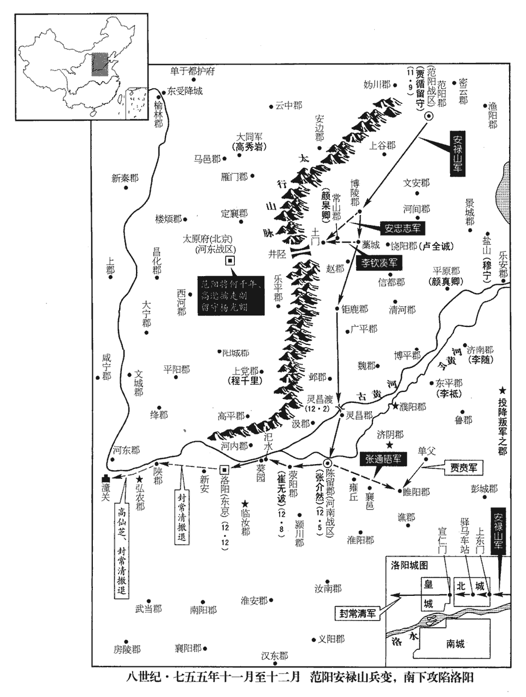
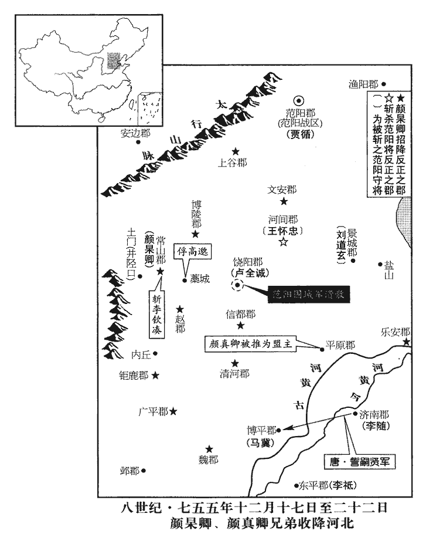
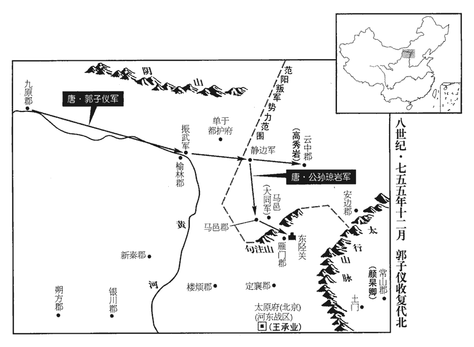
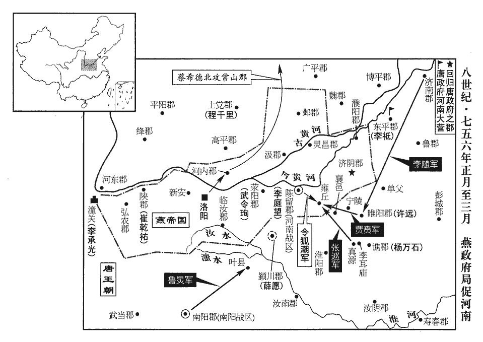
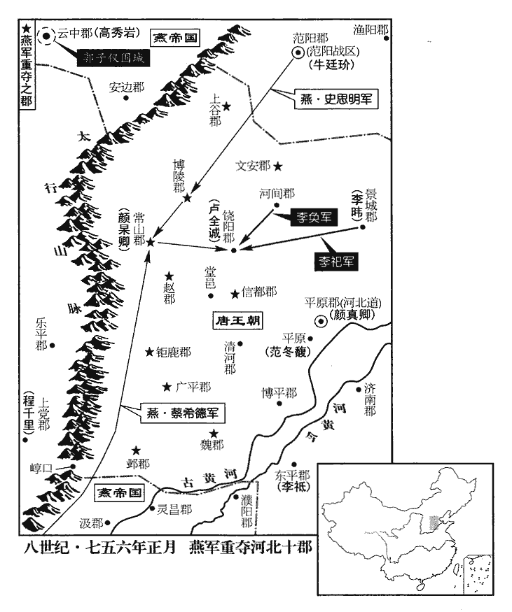
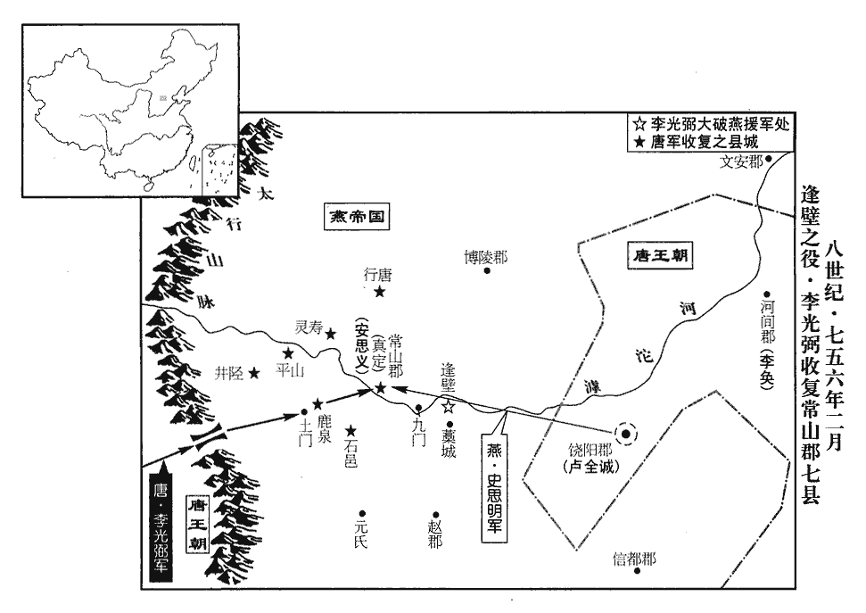
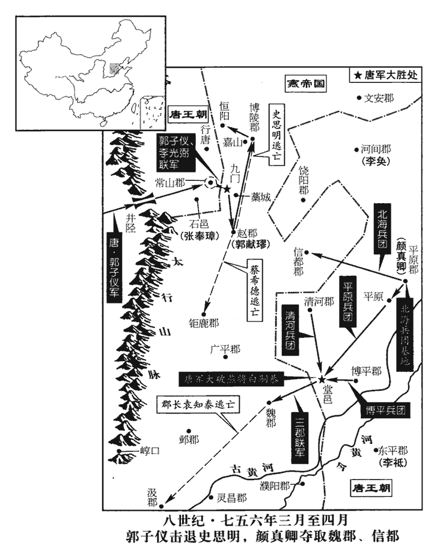

 唐紀三十三起閼逢敦牂（甲午），盡柔兆涒灘（丙申）四月，凡二年有奇。

# 玄宗至道大聖大明孝皇帝下之下

## 十三載（甲午、七五四）卷首當書天寶年號。載，子亥翻。

1春，正月，己亥‹三›，安祿山入朝。朝，直遙翻。考異曰：肅宗實錄：「十二載，楊國忠屢言祿山潛圖悖逆。五月，玄宗使輔璆qiú琳伺之。祿山厚賂璆琳，盛言祿山忠於國。國忠又言：『祿山自此不復見矣。』玄宗手詔追祿山，祿山來朝。」舊傳亦同。按玄宗實錄并祿山事迹，遣璆琳送甘子于范陽，覘祿山反狀，在十四載五月，而肅宗實錄及舊傳云十二載，誤也。今從唐曆。是時楊國忠言祿山必反，且曰：「陛下試召之，必不來。」上‹李隆基，本年七十岁›使召之，祿山聞命即至。庚子‹四›，見上於華清宮‹骊山温泉·陕西省临潼县境›，見，賢遍翻。泣曰：「臣本胡人，陛下寵擢至此，為國忠所疾，臣死無日矣！」上憐之，賞賜巨萬，由是益親信祿山，國忠之言不能入矣。太子亦知祿山必反，言於上，上不聽。

〖译文〗 [1]春季，正月己亥（初三），安禄山入朝。当时杨国忠进言说安禄山必反，并说：“陛下试召他入朝，他一定不来。”于是玄宗就派人召见安禄山，安禄山听见命令立刻来朝。庚子（初四），安禄山晋见玄宗于华清宫，哭诉说：“我本是一名胡人，只是受到陛下的信任才有今天的地位，但却不为杨国忠所容，恐怕难以活命了！”玄宗听后十分怜爱，重加赏赐，因此更加信任安禄山，杨国忠的话一点也听不进去。太子李亨也知道安禄山要谋反，告诉玄宗，玄宗不听。

2甲辰‹八›，太清宮‹李耳庙›奏：「學士李琪此崇玄館學士也。見玄元皇帝乘紫雲，告以國祚延昌。」

〖译文〗 [2]甲辰（初八），太清宫上奏说：“崇玄馆学士李琪看见玄元皇帝老子乘紫云，告诉他说大唐王朝昌盛长久。”

3唐初，詔敕皆中書、門下官有文者為之。乾封以後，始召文士元萬頃、范履冰等草諸文辭，常於北門候進止，時人謂之「北門學士」。中宗‹李显›之世，上官昭容專其事。上即位，始置翰林院，密邇禁廷，延文章之士，下至僧、道，書、畫、琴、棋、數術之工皆處之，謂之「待詔」。處，昌呂翻。刑部尚書張均及弟太常卿垍皆翰林院供奉。唐，天子在大明宮，翰林院在右銀臺門內；在興慶宮，院在金明門內；若在西內，院在顯福門內；若在東都及華清宮，皆有待詔之所。其待詔者，有詞學、經術，合練僧、道、卜、祝、術、藝、書、弈，各別院以廩之，日晚而退；其所重者詞學。帝即位以來，張說、陸堅、張九齡、徐安貞、張垍等召入禁中，謂之「翰林待詔」。王者尊極，一日萬機，四方進奏，中外表疏批答，或詔從中出，宸翰所揮，亦資其檢討，謂之「視草」。故常簡當直四人以備顧問。至德以後，天下用兵多務，深謀密詔皆從中出，名曰「翰林學士」。得充選者，文士為榮；亦如中書舍人例置學士六人，內擇年深德重者一人為承旨，所以獨當密命故也。德宗好文，尤難其選。貞元以後，為學士承旨者多至宰相。尚，辰羊翻。垍，巨冀翻。上欲加安祿山同平章事，已令張垍草制。楊國忠諫曰：「祿山雖有軍功，目不知書，豈可為宰相！制書若下，令，力丁翻。相，悉亮翻。下，遐稼翻。恐四夷輕唐。」上乃止。乙巳‹九›，加祿山左僕射，射，寅謝翻。賜一子三品、一子四品官。

〖译文〗 [3]唐朝初年，皇上所下的诏书制敕都由中书省和门下省官吏中善于作文章的人撰写。乾封年以后，开始召文士元万顷、范履冰等人草写文告，这些人常常在北门值班等候命令，所以当时的人把他们称为“北门学士”。中宗在位时，由上官昭容专门管这些事。玄宗即位以后，开始设置翰林院，靠近宫廷，延揽天下能文之士，下至佛僧、道士以及精通书、画、琴、棋、卜、祝的人，都召进去，这些人被称为“翰林待诏”。刑部尚书张均和他的弟弟太常卿张都在翰林院供奉皇上。玄宗想要加封安禄山同平章事，已经令张草写了制书。这时，杨国忠进谏说：“安禄山虽然有战功，但是目不识丁，怎么能够做宰相呢？如果制书颁布，恐怕周边的夷人会轻视我们大唐王朝。”玄宗只好取消了这一任命。乙巳（初九），玄宗加封安禄山左仆射，赐给他的一个儿子三品官，另一个儿子四品官。

4丙午‹十›，上還宮。還自華清宮。還，從宣翻，又音如字。

〖译文〗 [4]丙午（初十），玄宗返回宫中。

5安祿山求兼領閑厩、群牧；庚申‹二十四›，以祿山為閑厩、隴右群牧等使。使，疏吏翻；下同。祿山又求兼總監；此群牧總監也。唐有四十八監以牧馬。或曰：此總監即苑總監。壬戌‹二十六›，兼知總監事。祿山奏以御史中丞吉溫為武部侍郎，武部，即兵部。充閑厩副使，楊國忠由是惡溫。惡，烏路翻。祿山密遣親信選健馬堪戰者數千匹，別飼之。飼，祥吏翻。

〖译文〗 [5]安禄山请求兼任闲厩使、群牧使等职。庚申（二十四日），玄宗任命安禄山为闲厩、陇右群牧等使。安禄山又请求兼任群牧总监，壬戌（二十六日），玄宗又任命安禄山兼任总监。安禄山又上奏请求任命御史中丞吉温为武部侍郎，充任闲厩副使，杨国忠因此恨吉温。安禄山暗中派亲信挑选能征善战的健壮军马数千匹，另选地方饲养。

6二月，壬申‹六›，上朝獻太清宮，上聖祖‹李耳›尊號曰大聖祖高上大道金闕玄元大皇太帝。朝，直遙翻。上聖之上，時掌翻；下以義推。癸酉‹七›，享太廟，上高祖‹李渊›諡曰神堯大聖光孝皇帝，太宗‹李世民›諡曰文武大聖大廣孝皇帝，高宗‹李治›諡曰天皇大聖大弘孝皇帝，中宗‹李显›諡曰孝和大聖大昭孝皇帝，睿宗‹李旦›諡曰玄真大聖大興孝皇帝，以漢家諸帝皆諡孝故也。甲戌‹八›，群臣上尊號曰開元天地大寶聖文神武證道孝德皇帝。凡上尊號、上諡之上，皆時掌翻。赦天下。

〖译文〗 [6]二月壬申（初六），玄宗向太清宫献食，上圣祖老子尊号为大圣祖高上大道金阙玄元大皇太帝。癸酉（初七），玄宗祭祀太庙，上高祖李渊谥号为神尧大圣光孝皇帝，太宗李世民谥号为文武大圣大广孝皇帝，高宗李治谥号为天皇大圣大弘孝皇帝，中宗李显谥号为孝和大圣大昭孝皇帝，睿宗李旦谥号为玄真大圣大兴孝皇帝，因为汉朝的皇帝的谥号都有“孝”字，所以都加谥号为“孝”。甲戌（初八），群臣上玄宗尊号为开元天地大宝圣文神武证道孝德皇帝。大赦天下。

7丁丑‹十一›，楊國忠進位司空；甲申‹十八›，臨軒冊命。

〖译文〗 [7]丁丑（十一日），玄宗晋升杨国忠为司空。甲申（十八日），杨国忠在殿前的平台上接受玄宗的册命。

8己丑‹二十三›，安祿山奏：「臣所部將士討奚‹滦河上游›、契丹‹辽河上游›、九姓‹南迁后之铁勒九姓·内蒙古黄河弯曲地带›、同羅‹蒙古国乌兰巴托市北›等，勳效甚多，將，即亮翻。契，欺訖翻，又音喫。乞不拘常格，超資加賞，仍好寫告身付臣軍授之。」於是除將軍者五百餘人，中郎將者二千餘人。祿山欲反，故先以此收眾心也。

〖译文〗 [8]己丑（二十三日），安禄山上奏说：“我所率领的部下将士讨伐奚、契丹、九姓胡、同罗等，功勋卓著，乞望陛下能够打破常规，越级封官赏赐，并希望写好委任状，让我在军中授与他们。”因此安禄山部将被任命为将军的有五百多人，中郎将的有二千多人。安禄山要谋反，所以借此收买人心。

三月，丁酉朔‹一›，祿山辭歸范陽‹北京市›。舊志：范陽，在京師東北二千五百二十里。上解御衣以賜之，祿山受之驚喜。恐楊國忠奏留之，疾驅出關。出潼關。乘船沿河而下，令船夫執繩板立於岸側，凡挽船夫用板長二尺許，斜搭胸前，一端至肩，一端至脅，繩貫板之兩端，以接船繂lǜ而挽之。十五里一更，更，工衡翻，易也。晝夜兼行，日數百里，過郡縣不下船。自是有言祿山反者，上皆縛送，【章：十二行本「送」下有「之」字；乙十一行本同；孔本同。】由是人皆知其將反，無敢言者。

〖译文〗 三月丁酉朔（初一），安禄山向玄宗告辞，要回范阳。玄宗脱下自己的衣服赐给他，安禄山十分惊喜。安禄山恐怕杨国忠向玄宗上奏把他留在朝中，所以急忙出潼关。然后乘船沿黄河而下，命令船夫手执挽船用的绳板立在岸边，十五里一换，昼夜兼程，日行数百里，经过郡县也不下船。从此有说安禄山谋反的人，玄宗都把他们捆绑起来送给安禄山，因此人们都知道安禄山要谋反，但没有人敢说。

祿山之發長安也，上令高力士餞之長樂坡‹陕西省西安市东›，長樂坡，即滻坡，在長安城東。樂，音洛。及還，上問：「祿山慰意乎？」對曰：「觀其意怏怏，必知欲命為相而中止故也。」怏，於兩翻。相，息亮翻。上以告國忠，曰：「此議他人不知，必張垍兄弟告之也。」「國忠」之下，更有「國忠」二字，文意乃明。上怒，貶張均為建安‹福建省建瓯市›太守，垍為盧溪‹湖南省沅陵县›司馬，垍弟給事中埱chù為宜春‹江西省宜春市›司馬。建安郡，隋為泉州；唐改曰閩州，別置泉州。帝改閩州為福州長樂郡，以建州為建安郡。盧溪郡，辰州。舊志：建安郡，京師東南四千九百三十五里。盧溪郡，京師南微東三千四百五里。埱，昌六翻。考異曰：唐曆云：「垍嘗贊相禮儀，雍容有度，上心悅之，翌日，謂垍曰：『朕罷希烈相，以卿代之。』垍曰：『不敢。』貴妃在坐，告國忠斥之。」舊垍傳：「天寶中，玄宗嘗幸垍內宅，謂垍曰：『希烈累辭機務，朕擇其代者，孰可？』垍錯愕未對。帝即曰：『無踰吾愛壻矣。』垍降階陳謝。楊國忠聞而惡之。及希烈罷相，舉韋見素代垍，垍深觖jué望。」按本紀，三月丁酉，垍貶官，韋見素八月乃知政事，而云垍深觖望，舊傳誤也。明皇雜錄云：「上幸張垍宅，謂垍曰：『中外大臣才堪宰輔者，與我悉數，吾當舉而用之。』垍逡巡不對。上曰：『固無如愛子壻。』垍降階拜舞。上曰：『即舉成命。』既逾月，垍頗懷怏怏，意其為李林甫所排。會祿山自范陽入覲，祿山潛賂貴妃，求帶平章事，上不許。垍因私第備言：『上前時行幸內第，面許相垍，與明公同制入輔，今既中變，當必為姦臣所排。』祿山大懷恚怒，明日謁見，因流涕請罪。上慰勉久之，因問其故。祿山具以垍所陳對。上命高力士送歸焉，亦以怏怏聞。由是上怒。」按李林甫時已死，亦誤也。

〖译文〗 安禄山从长安离去时，玄宗命令高力士在长乐坡为安禄山饯行，高力士回来后，玄宗问道：“安禄山满意吗？”高力士回答说：“我看到他心中不愉快，一定是知道了想要任命他为宰相，后来又改变的缘故。”玄宗把此事告诉了杨国忠，杨国忠说：“这件事别人都不知道，一定是张兄弟告诉安禄山的。”玄宗大为愤怒，就贬张均为建安郡太守，张为卢溪郡司马，张的弟弟给事中张为宜春郡司马。

哥舒翰亦為其部將論功，為，于偽翻。將，即亮翻。敕以隴右十將、特進、火拔州都督、燕山郡王火拔歸仁為驃騎大將軍，十將，亦唐中世以來軍中將領之職名。火拔，突厥別部也。開元中置火拔州。唐制：特進，文散階，正二品。驃騎大將軍，武散階，從一品。燕，因肩翻。驃，匹妙翻。騎，奇寄翻。河源軍‹青海省西宁市›使王思禮加特進，臨洮‹甘肃省临洮县›太守成如璆qiú、討擊副使范陽‹河北省涿州市›魯炅、皋蘭府‹羁縻军区·总部设宁夏中宁县东北›都督渾惟明並加雲麾將軍，貞觀中，鐵勒來降，以渾部置皋蘭都督府。雲麾將軍，武散階，從三品上。洮，土刀翻。守，式又翻。璆，音求。炅，火迥翻。隴右討擊副使郭英乂為左羽林將軍。英乂，知運之子也。翰又奏嚴挺之之子武為節度判官，河東‹山西省永济市›呂諲為支度判官，諲yīn，伊真翻。前封丘‹河南省封丘县›尉高適為掌書記，安邑‹山西省运城市东北安邑镇›曲環為別將。河東郡，蒲州。唐制：邊軍有支度使，以計軍資糧仗之用，其屬有判官、巡官。封丘縣，漢、晉以來屬陳留，唐屬汴州。安邑縣，屬蒲州。姓譜：晉穆侯子成師封於曲沃，其後氏焉。漢有代郡太守曲謙；貨殖傳有曲叔。諲，伊真翻。

〖译文〗 哥舒翰也为他的部将请功，玄宗就下敕任命陇右十将、特进、火拔州都督、燕山郡王火拔归仁为骠骑大将军，河源军使王思礼为特进，临洮太守成如、讨击副使范阳人鲁灵、皋兰府都督浑惟明等为云麾将军，陇右讨击副使郭英又为左羽林将军。郭英又是郭知运的儿子。哥舒翰又上奏任命严挺之的儿子严武为节度判官，河东人吕为支度判官，前封丘县尉高适为掌书记，安邑人曲环为别将。

9程千里執阿布思，獻於闕下，斬之。甲子‹二十八›，以千里為金吾大將軍，以封常清權北庭都護、伊西節度使。

〖译文〗 [9]程千里俘获了阿布思，献于朝廷，被斩首。甲子（二十八日），玄宗任命程千里为金吾大将军，封常清暂时代理北庭都护、伊西节度使。

10夏，四月，癸巳‹二十八›，安祿山奏擊奚破之，虜其王李日越。

〖译文〗 [10]夏季，四月癸巳（二十八日），安禄山上奏说了打败了奚族，俘虏了奚王李日越。

11六月，乙丑朔‹一›，日有食之，不盡如鉤。

〖译文〗 [11]六月乙丑朔（初一），出现日食，是形状如钩的日环食。

12侍御史、劍南‹总部设蜀郡四川省成都市›留後李宓楊國忠領劍南節度使，以宓為留後。宓，音密，又音伏。將兵七萬擊南詔‹首都太和城云南省大理市›。閤羅鳳誘之深入，至大和城，新書作「太和城」。【章：十二行本正作「太」；乙十一行本同；孔本同；熊校同。】夷語山陂陀為和，故謂大和，閤羅鳳所居也。將，即亮翻。誘，音酉。閉壁不戰。宓糧盡，士卒罹瘴疫及飢死什七八，乃引還，還，從宣翻，又如字。蠻追擊之，宓被擒，被，皮義翻。全軍皆沒。楊國忠隱其敗更以捷聞，益發中國兵討之，前後死者幾二十萬人；并鮮于仲通之敗，死者有此數。幾，居依翻。無敢言者。上嘗謂高力士曰：「朕今老矣‹本年七十岁›，朝事付之宰相，邊事付之諸將，夫復何憂！」朝，直遙翻。相，息亮翻。將，即亮翻。夫，音扶。復，扶又翻。力士對曰：「臣聞雲南‹云南省姚安县›數喪師，又邊將擁兵太盛，陛下將何以制之！臣恐一旦禍發，不可復救，數，所角翻。喪，息浪翻。復，扶又翻。何得謂無憂也！」上曰：「卿勿言，朕徐思之。」高力士之言，明皇豈無所動於其心哉！禍機將發，直付之無可柰何，僥幸其身之不及見而已。

〖译文〗 [12]侍御史、剑南留后李宓率兵七万攻打南诏。南诏王罗凤采用诱敌深入的战术，把唐军引到大和城下，坚壁不战。李宓粮尽，所率领的士卒因为瘴疫和饥饿死了十分之七八，遂领兵撤退，这时南诏才出兵追击，李宓被俘，全军覆没。而杨国忠不但隐瞒败状，还假报获胜，并增兵去讨伐，前后战死的达二十万人，没有人敢说这件事。玄宗曾经对高力士说：“朕已经老了，把朝中政事委托给宰相处理，边防军事委托给诸位边将，还有什么可忧愁的呢！”高力士回答说：“我听说唐军在云南多次战败，还有边将拥兵自重，不知道陛下如何处置！我深怕一朝祸发，难以挽救，怎么能说可以高枕无忧呢！”玄宗说：“你不要说了，让我仔细考虑一下。”

13秋，七月，癸丑‹二十›，哥舒翰奏；於所開九曲之地‹青海省黄河上游地区›置洮陽‹甘肃省临潭县西南三十五千米›、澆河‹青海省贵德县西›二郡及神策軍‹甘肃省临潭县西›，以臨洮太守成如璆兼洮陽太守，充神策軍使。洮陽、澆河二郡，皆置於洮、廓二州西南。廓州，本澆河郡，天寶元年更名寧塞郡。洮州西八十里磨環川置神策軍。新書曰：澆河郡置於積石之西。澆，堅堯翻。

〖译文〗 [13]秋季，七月癸丑（二十日），哥舒翰奏请在所开拓的九曲地方设置洮阳、浇河二郡及神策军，任命临洮太守成如兼洮阳太守，充任神策军使。

14楊國忠忌陳希烈，希烈累表辭位；上欲以武部侍郎吉溫代之，國忠以溫附安祿山，奏言不可；以文部侍郎韋見素和雅易制，易，以豉翻。薦之。八月，丙戌‹二十三›，以希烈為太子太師罷政事；陳希烈遂以此怨望降賊。以見素為武部尚書、同平章事。考異曰：舊見素傳曰：「時楊國忠用事，左相陳希烈畏其權寵，凡事唯諾，無敢發明。玄宗知之，不悅。天寶十三年，秋，霖雨六十餘日，天子以宰相或未稱職，見此咎徵，命楊國忠精求端士。時兵部侍郎吉溫方承寵遇，上意欲用之。國忠以溫祿山賔佐，懼其威權，奏寢其事。國忠訪於中書舍人竇華、宋昱等，華、昱言見素方雅，柔而易制；上亦以經事相王府，有舊恩，可之。」希烈傳曰：「國忠用事，素忌疾之，乃引韋見素同列，罷希烈知政事。」按明皇若惡希烈阿徇國忠，當更自擇剛直之士，豈得尚卜相於國忠！今從希烈傳。

〖译文〗 [14]杨国忠忌恨陈希烈，所以陈希烈多次上表请求辞职。玄宗想任命武部侍郎吉温代陈希烈，而杨国忠因为吉温依附于安禄山，就上奏说不可。他认为文部侍郎韦见素性情温和易于控制，就推荐他代替陈希烈。八月丙戌（二十三日），玄宗任命陈希烈为太子太师，罢免参知政事。同时任命韦见素为武部尚书、同平章事。

15自去歲水旱相繼，關中‹陕西省中部›大饑。楊國忠惡京兆尹李峴不附己，以災沴lì歸咎於峴，九月，貶長沙‹湖南省长沙市›太守。惡，烏路翻。沴，音戾。長沙郡，潭州。舊志：長沙郡，京師南二千四百四十五里。峴，禕之子也。信安王禕，開元初以軍功有寵於上。禕yī，吁韋翻。上憂雨傷稼，國忠取禾之善者獻之，曰：「雨雖多，不害稼也。」上以為然。扶風‹陕西省凤翔县›太守房琯guǎn言所部水災，扶風郡，岐州。國忠使御史推之。宋白曰：唐故事，侍御史各二人，知東西推。又各分京城諸司及諸道州府，為東西之限；隻日則臺院受事，雙日則殿院受事。又有監察御史出使推按，謂之推事御史。是歲，天下無敢言災者。高力士侍側，上曰：「淫雨不已，賈公彥曰：雨三日已上為淫。卿可盡言。」對曰：「自陛下以權假宰相，賞罰無章，陰陽失度，臣何敢言！」上默然。

〖译文〗 [15]从去年以来，水灾与旱灾不断，关中地区闹饥荒。杨国忠因为憎恨京兆尹李岘不听自己的话，就把这些天灾归咎于李岘，九月，贬李岘为长沙太守。李岘是信安王李的儿子。玄宗担忧雨多损害庄稼，杨国忠就拿一些长势良好的禾苗献给玄宗说：“虽然雨多，但没有损害庄稼。”玄宗信以为然。扶风太守房说本郡遭受水灾，杨国忠就派御史去调查。这一年，天下没有人再敢于说遭受天灾。高力士侍候玄宗，玄宗说：“大雨连绵不断，你可以把所知道的都告诉我。”高力士回答说：“自陛下把大权委托给宰相以来，赏罚不当，以致上天阴阳失调，我怎么敢说什么呢！”玄宗沉默不语。

16冬，十月，乙酉‹二十三›，上幸華清宮‹骊山温泉·陕西省临潼县境›。

〖译文〗 [16]冬季，十月乙酉（二十三日），玄宗前往华清宫。

17十一月，己未‹二十八›，置內侍監二員，正三品。唐制，宦官不得過三品；置內侍四人，從四品上。中官之貴極於此矣，至帝始隳其制。楊思勖以軍功，高力士以恩寵，皆拜大將軍，階至從一品，猶曰勳官也。今置內侍監正三品，則職事官矣。

〖译文〗 [17]十一月己未（二十八日），设置宦官内侍监二名，正三品级。

18河東‹山西省永济市›太守兼本道采訪使韋陟，斌之兄也，使，疏吏翻。斌，音彬。文雅有盛名，楊國忠恐其入相，相，息亮翻。使人告陟贓污事，下御史按問。陟賂中丞吉溫，使求救於安祿山，復為國忠所發。下，遐嫁翻。復，扶又翻。閏月，壬寅，貶陟桂嶺‹广西贺州市东北桂岭镇›尉，溫澧陽‹湖南省澧县›長史。桂嶺，漢臨賀縣地，隋置桂嶺縣，唐屬賀州。澧陽郡，澧州。舊志：澧陽郡，京師東南一千八百九十三里。安祿山為溫訟冤，為，于偽翻。且言國忠讒疾。上兩無所問。

〖译文〗 [18]河东太守兼本道采访使韦陟是韦斌的哥哥，风度文雅，负有盛名，杨国忠恐怕他入朝为宰相，就让人告他有贪污行为，并下到御史台去调查。韦陟贿赂御史中丞吉温，让吉温向安禄山求援，又被杨国忠揭发。闰月壬寅（疑误），贬韦陟为桂岭县尉，吉温为澧阳郡长史。安禄山又为吉温拆冤，并说这是杨国忠故意陷害。玄宗都不问罪。

19戊午‹二十八›，上還宮。

〖译文〗 [19]戊午（疑误），玄宗返回宫中。

20是歲，戶部奏天下郡三百二十一，縣千五百三十八，鄉萬六千八百二十九，戶九百六萬九千一百五十四，口五千二百八十八萬四百八十八。有唐戶口之盛，極於此。

〖译文〗 [20]这一年，户部上奏唐朝统辖的郡有三百二十一，县一千五百三十八，乡一万六千八百二十九，户数九百六万九千一百五十四，人口五千二百八十八万四百八十八。

## 十四載（乙未，七五五）

1春，正月，蘇毗‹青海省杂多县›王子悉諾邏去吐蕃‹首都逻些城西藏拉萨市›來降。新書曰：蘇毗，吐蕃強部也。邏，郎佐翻。

〖译文〗 [1]春季，正月，苏毗王子悉诺逻脱离吐蕃来归附唐朝。

2二月，辛亥‹二十二›，安祿山使副將何千年入奏，請以蕃將三十二人代漢將，上‹李隆基，本年七十一岁›命立進畫，進畫者，命中書為發日敕，進請御畫而行之。唐六典：中書掌王言，其制有七，其四曰發日敕，正謂御畫發日敕也；增減官員、廢置州縣、除免官爵、授六品以下官則用之。將，即亮翻。給告身。韋見素謂楊國忠曰：「祿山久有異志，今又有此請，其反明矣。明日見素當極言；上未允，公其繼之。」國忠許諾。壬子‹二十三›，國忠、見素入見，入見，賢遍翻。上迎謂曰：「卿等有疑祿山之意邪？」見素因極言祿山反已有迹，所請不可許，上不悅；國忠逡巡不敢言，逡，七倫翻。上竟從祿山之請。他日，國忠、見素言於上曰：「臣有策可坐消祿山之謀。今若除祿山平章事，召詣闕，以賈循為范陽節度使，呂知誨為平盧‹总部设柳城辽宁省朝阳市›節度使，楊光翽huì為河東‹总部设太原府山西省太原市›節度使，使，疏吏翻。翽，呼會翻。則勢自分矣。」上從之。已草制，上留不發，更遣中使輔璆琳以珍果賜祿山，潛察其變。輔，姓也。左傳，晉有大夫輔躒。又智果別族為輔氏。即考異前所引以甘子賜祿山事。璆，音求。璆琳受祿山厚賂，還，盛言祿山竭忠奉國，無有二心。還，從宣翻，又音如字。上謂國忠等曰：「祿山，朕推心待之，必無異志。東北二虜，藉其鎮遏。朕自保之，卿等勿憂也！」事遂寢。考異曰：實錄：「正月，辛巳，祿山表請以蕃將三十人代漢將，上遣中使袁思藝宣付中書，令即日進畫，便寫告身。楊國忠、韋見素相謂曰：『流言傳祿山有不臣之心，今又請代漢將，其反明矣。』乃請陳事。既見，上先曰：『卿等有疑祿山之意邪？』國忠等遽走下階，垂涕具陳祿山反狀，因以祿山表留上前而出。俄頃，上又令袁思藝宣曰：『此之一奏，姑容之，朕徐為圖之。』國忠奉詔。自後國忠每對，未嘗不懇請其事。國忠曰：『臣有一策，可銷其難，伏望下制以祿山帶左僕射、平章事，追赴朝廷，以賈循等分帥三道。』上許之。草制訖，留之未行。上潛令輔璆琳送甘子，私候其狀。還，固稱無事，其制遂寢。先是上引宰相對見，常置白麻於座前，及璆琳還，上乃謂宰臣曰：『祿山必無二心，其制朕已焚矣。』後璆琳受祿山賄事泄，上因祭龍堂，遣備儲供，責以不虔，乃命左右撲殺之；始有疑祿山意。」祿山事迹云：「請不以蕃將代漢將，論祿山反狀，及請追祿山赴闕，並是韋見素之意旨，國忠曾無預焉。仍語見素曰：『祿山出自寒微，位居眾上，時所忌嫉，成疑似耳。』見素曰：『公若實為此見，社稷危矣。』將至上前懇論，見素約以『事如未諧，公繼之。』國忠都無一言，俯僂而退，見素卻到中書，嗚咽流涕。此非他也，國忠要祿山速反，以明己之先見耳。」宋巨玄宗幸蜀記云：「是歲春，二月，二十二日辛亥，祿山使何千年表請以蕃將三十二人代漢將掌兵。其日，宰相韋見素、楊國忠在省，見素慘然，國忠問曰：『堂老何色之戚也？』見素曰：『祿山逆狀，行路共知。今以蕃酋代漢將，是亂將作矣。與公位當此地，能無戚乎！』國忠於是亦惘然久之，乃曰：『與奪之間，在於宸斷，豈我輩所能是非邪！』見素曰：『知禍之萌而不能防，亦將焉用彼相矣！明日對見，僕必懇論，冀其萬一。若不允，子必繼之。』國忠曰：『事則不諧，恐虛犯龍顏，自貽yí伊戚。』見素曰：『如正其言而獲死，猶愈於阿從而偷生。』翌日壬子，二相入對。見素言：『祿山潛貯異圖，迹已昭彰，』因扣頭流涕久之。國忠但俯僂逡巡，更無所補。上不悅，遂以他事議之。既退還省，見素謂國忠曰：『聖意未回，計將安出？』國忠曰：『祿山未必有反意，但時所誹嫉，便成疑似耳。』見素曰：『公若為此見，社稷危矣。』遂憫然不言。二十四日癸丑，上又使思藝宣旨，令『且依此發遣，卿等所議，後別籌之。』自是見素數奏其凶狀。三月己未朔，見素請以祿山同中書門下平章事，追赴闕庭。及輔璆琳送甘子，祿山紿dài璆琳曰：『主上耄年，信任非次，國忠之輩，苟徇榮班。今若進逆耳之言、苦口之藥，以吾之心，事將無益。今欲耀兵強諫，以迹鬻拳，此意決矣。』祿山以物贈璆琳。璆琳既受金帛，及還，奏曰：『祿山盡忠奉國，必無二心，特望官家不以東北為慮。』上然之，謂宰臣曰：『祿山朕自保之，卿勿憂也！』見素起曰：『臣忤拂聖旨，僭黷大臣，罪合萬死。然愚者千慮，或有一中，願陛下審察之。』」自餘與實錄及事迹所述略同。按祿山方賂璆琳，泯其反迹，安肯對之遽出悖語！又國忠平日數言祿山欲反，此際安得不與見素同心！蓋所謂天下之惡皆歸焉者也。今取其可信者。循，華原‹陕西省耀县›人也，時為節度副使。

〖译文〗 [2]二月辛亥（二十二日），安禄山派副将何千年入朝奏事，请求用蕃人将领三十二人代替汉人将领，玄宗命令中书省立刻下敕书，由自己签署实行，并发给委任状。韦见素对杨国忠说：“安禄山早就怀有反心，现在又请求以蕃将代替汉将，谋反的迹象已经很明确了。明天我一定尽力向皇上说这件事，如果皇上不听，请您继后劝说。”杨国忠答应。壬子（二十三日），杨国忠与韦见素入宫晋见玄宗，玄宗迎接他们，并说：“你们是怀疑安禄山要谋反吗？”韦见素因此极力说安禄山反迹已露，对于他的请求千万不能答应，玄宗不高兴。这时杨国忠竟因有顾虑而不敢说话，玄宗便答应了安禄山的请求。有一天，杨国忠和韦见素对玄宗说：“我们有计策可以消除安禄山的阴谋。现在如果任命安禄山为平章事，召他入朝，然后任命贾循为范阳节度使，吕知诲为平卢节度使，杨光为河东节度使，这样安禄山的势力就会分化瓦解。”玄宗同意。制书已经写好，但玄宗却留在朝中不发，而又派宦官辅琳拿着珍果去赐给安禄山，并让他暗中观察形势的变化。辅琳受了安禄山的重赂，还朝后极力说安禄山忠诚奉国，没有二心。唐玄宗对杨国忠等人说：“我推心置腹地对待安禄山，他必不会有异心。再说东北地区的奚与契丹还要靠他镇抚。朕可以保证他不会谋反，你们不要担忧！”这件事就这样平息了。贾循是华原人，当时是范阳节度副使。

3隴右‹总部设西平青海省乐都县›、河西‹总部设武威甘肃省武威市›節度使哥舒翰入朝，道得風疾，遂留京師，家居不出。

〖译文〗 [3]陇右、河西节度使哥舒翰入朝，在路上中风，于是就留在了京师，住在家里，不出来活动。

4三月，辛巳‹二十二›，命給事中裴士淹宣慰河北‹河北省›。

〖译文〗 [4]三月辛巳（二十二日），玄宗命令给事中裴士淹代表朝廷去河北安慰军民。

5夏，四月，安祿山奏破奚‹滦河上游›、契丹‹辽河上游›。契，欺訖翻。

〖译文〗 [5]夏季，四月，安禄山上奏说打败了奚与契丹。

6癸巳‹四›，以蘇毗王子悉諾邏為懷義王，賜姓名李忠信。

〖译文〗 [6]癸巳（初四），玄宗封苏毗王子悉诺逻为怀义王，赐姓名为李忠信。

7安祿山歸至范陽，朝廷每遣使者至，皆稱疾不出迎，朝，直遙翻。使，疏吏翻。盛陳武備，然後見之。裴士淹至范陽，二十餘日乃得見，無復人臣禮。復，扶又翻，又如字。楊國忠日夜求祿山反狀，使京兆尹圍其第，考異曰：肅宗實錄：「國忠日夜伺求祿山反狀，或矯詔以兵圍其宅，或令府縣捕其門客李起、安岱、李方來等，皆令侍御史鄭昂之陰推劾，潛槌chuí殺之。慶宗尚郡主，又供奉在京，密報其父，祿山轉懼。」唐曆：「是夏，京兆尹李峴貶零陵太守。先是楊國忠使門客蹇昂、何盈求祿山陰事，命京兆尹圍捕其宅，得安岱、李方來等與祿山反狀，使侍御史鄭昂之縊殺之。祿山怒，使嚴莊上表自理，具陳國忠罪狀二十餘事。上懼其生變，遂歸過於峴以安之。」安祿山事迹與唐曆同，外有「命京兆尹李峴於其宅得李起、安岱、李方來等；又貶吉溫為澧陽長史，以激怒祿山，幸其速反，上竟不之悟。」玄宗幸蜀記與事迹同。按李峴傳：「十二載，連雨六十餘日，國忠歸咎京兆尹，貶長沙太守。」新宗室宰相傳：「楊國忠使客蹇昂、何盈摘安祿山陰事，諷京兆捕其第，得安岱、李方來等與祿山反狀，縊殺之。祿山怒，上書自言。帝懼變，出峴為零陵太守。」今從實錄。捕祿山客李超等，送御史臺獄，潛殺之。祿山子慶宗尚宗女榮義郡主，供奉在京師，在京師為太僕卿，得随供奉官班見。密報祿山，祿山愈懼。六月，上以其子成婚，手詔祿山觀禮，祿山辭疾不至。秋，七月，祿山表獻馬三千匹，每匹執控夫二人，遣蕃將二十二人部送。欲以襲京師也。河南尹達奚珣疑有變，奏請「諭祿山以進車馬宜俟至冬，官自給夫，無煩本軍。」於是上稍寤，始有疑祿山之意。會輔璆琳受賂事亦泄，上託以他事撲殺之。上遣中使馮神威齎手詔諭祿山，如珣策；撲，弼角翻。使，疏吏翻；考異曰：祿山事迹作「承威」，今從玄宗幸蜀記。且曰：「朕新為卿作一湯，自天寶六載以來，華清宮中益治湯，井池臺觀，環列山谷。御湯曰九龍殿，亦曰蓮花湯。明皇雜錄曰：「明皇幸華清宮，新廣湯，制作宏麗。安祿山於范陽，以白玉石為魚、龍、鳧、鴈，仍以石梁及蓮花同獻，雕鐫巧妙，殆非人功。上大悅，命陳於湯中，仍以石梁橫亘湯上，而蓮花纔出於水際。上至其所，解衣欲入，而魚、龍、鳧、鴈皆若奮鱗舉翼，狀欲飛動。上恐，遽命撤去，而蓮花至今猶存。又嘗於宮中置長湯數十間，屋皆周回甃zhòu以文石，為銀鏤漆船及白木香船，置於其中。至於楫棹，皆飾以珠玉。又於湯中累瑟瑟及沈香為山，以狀瀛洲、方丈。津陽門詩註曰：宮內除供奉兩湯外，內更有湯，十六所長湯，每賜諸嬪御，其脩廣與諸湯不侔，甃以文瑤密石，中央有玉蓮花捧湯，噴以成池。又縫綴錦鏽為鳧鴈，置於水中，上時於其間泛鈒sà鏤lòu小舟，以嬉遊焉。次西曰太子湯，又次西宜春湯，又次西長湯十六所。今唯太子、少陽二湯存焉。又有玉女殿湯，今石星痕湯、玉名甕wèng湯所出也。」為，于偽翻。十月於華清宮待卿。」神威至范陽宣旨，祿山踞牀微起，亦不拜，曰：「聖人安隱。」聖人，謂上也。隱，讀曰穩。唐帖多有寫「穩」字為「隱」字者。又曰：「馬不獻亦可，十月灼然詣京師。」即令左右引神威置館舍，不復見；數日，遣還，亦無表。神威還，見上泣曰：「臣幾不得見大家！」復，扶又翻。幾，居依翻。

〖译文〗 [7]安禄山回到范阳后，每当朝廷有使者来，总是假装有病不出来迎接。有时布置好兵力，然后才出来接见。裴士淹来到范阳后二十多天才见安禄山，安禄山一点臣下的礼节都不讲。杨国忠日夜搜集安禄山谋反的证据，派京兆尹包围了安禄山在京城的任宅，逮捕了安禄山的门客李超等，送到御史台狱中，然后秘密地杀了他们。安禄山的儿子安庆宗婚匹皇室女荣义郡主，在京师为太仆卿，他把这件事密报给了安禄山，安禄山更加恐惧。六月，玄宗以安庆宗成婚为由，下手诏让安禄山来京城参加婚礼，安禄山称病不来。秋季，七月，安禄山上表请求献给朝廷马三千匹，每匹马马夫二人，并派蕃人将领二十二人护送。河南尹达奚怀疑其中有诈，就上奏说：“请告谕安禄山应等到冬天再献车马，由朝廷供给马夫，不用烦劳他部下的军士。”于是玄宗才有所省悟，开始怀疑安禄山有反心。这时辅琳接受安禄山贿赂的事被揭发，玄宗就假托其他罪用扑刑处死了辅琳。玄宗又派宦官冯神威拿着自己的手诏，按照达奚的计策，去告谕安禄山，并且说：“朕刚为你在华清宫造了一座温汤池，十月在那里等待你。”神威到范阳宣读了玄宗的诏书，安禄山坐在床上略微起了一下身子，也不伏拜，只是说：“皇上可好。”又说：“不让献马也行，我到十月份一定去京师。”然后就命令左右的人把冯神威安置在馆舍，不再接见。过了数天，才让神威回朝，也没有奏表。神威回朝后，见到玄宗哭泣着说：“我差一点见不到陛下！”

8八月，辛卯‹四›，免今載百姓租庸。

〖译文〗 [8]八月辛卯（初四），玄宗下令免去百姓今年的租庸。

9冬，十月，庚寅‹四›，上幸華清宮。考異曰：舊紀壬辰，今從實錄，新紀。

〖译文〗 [9]冬季，十月庚寅（初四），玄宗前往华清宫。

10安祿山專制三道，陰蓄異志，殆將十年，以上待之厚，欲俟上晏駕然後作亂。會楊國忠與祿山不相悅，屢言祿山且反，上不聽；國忠數以事激之，數，所角翻。欲其速反以取信於上。祿山由是決意遽反，獨與孔目官•太僕丞嚴莊、掌書記•屯田員外郎高尚、將軍阿史那承慶密謀，自餘將佐皆莫之知，但怪其自八月以來，屢饗士卒，秣馬厲兵而已。會有奏事官自京師還，祿山詐為敕書，悉召諸將示之曰：「有密旨，令祿山將兵入朝討楊國忠，將，即亮翻。朝，直遙翻。諸君宜即從軍。」眾愕然相顧，莫敢異言。十一月，甲子‹九›，祿山發所部兵及同羅‹蒙古国乌兰巴托市北›、奚、契丹、室韋‹内蒙古东北部›凡十五萬眾，號二十萬，反於范陽。考異曰：平致美薊門紀亂曰：「自其年八月後，慰諭兵士，磨厲戈矛，頗異於常，識者竊怪矣。至是，祿山勒兵夜發。將出，命屬官等謂曰：『奏事官胡逸自京回，奉密旨，遣祿山將隨身兵馬入朝來，莫令那人知。群公勿怪，便請隨軍。』那人，意楊國忠也。命范陽節度副使賈循守范陽，平盧‹总部设柳城辽宁省朝阳市›節度副使呂知誨守平盧‹辽宁省朝阳市›，別將高秀巖守大同‹山西省朔州市东›；中受降城西二百里有大同川。又代州北有大同軍，去太原八百餘里。新志：大同軍，在朔州馬邑縣。按宋白續通典：中受降城西之大同川，乃隋大同城之舊墟。開元五年，分善陽縣東三十里置大同軍以戍邊；復於軍內置馬邑縣，直代州北。諸將皆引兵夜發。

〖译文〗 [10]安禄山一身兼任三道节度使，阴谋作乱已将近十年，只是因为玄宗待他很好，所以想等到玄宗死后再反叛。这时杨国忠因为与安禄山不和，多次上言说他要谋反，玄宗不信。杨国忠又多次以事激怒安禄山，想让他立刻反叛以取信于玄宗。安禄山于是决意举兵反叛，只与孔目官、太仆丞严庄和掌书记、屯田员外郎高尚以及将军阿史那承庆等人密谋，其他将领都不让知道。其他将领只是觉得奇怪，不知道安禄山为什么从八月份以来多次招待士卒，秣马厉兵，准备打仗。这时有入朝奏事官从京师回来，安禄山就假造敕书，把将领都召来告诉他们说：“皇上有密诏给我，让我率兵入朝讨杨国忠，你们应该听我指挥随军行动。”众将领听完后都十分惊愕，相看而不敢反对。十一月甲子（初九），安禄山率领所统辖的三镇军队及同罗、奚、契丹、室韦兵共十五万人，号称二十万，在范阳起兵反叛。安禄山又命令范阳节度副使贾循留守范阳，平卢节度副使吕知诲留守平卢，别将高秀岩守卫大同，其余的将领都率兵深夜出发。

詰朝，祿山出薊城南，詰，去吉翻。薊，音計。大閱誓眾，以討楊國忠為名，牓軍中曰：「有異議扇動軍人者斬及三族！」於是引兵而南。祿山乘鐵轝yú，步騎精銳，煙塵千里，鼓譟震地。轝，與輿同。騎，奇寄翻。譟zào，蘇到翻。時海內久承平，百姓累世不識兵革，猝聞范陽兵起，遠近震駭。河北皆祿山統內，祿山兼河北道采訪使。所過州縣，望風瓦解，守令或開門出迎，守，式又翻。或棄城竄匿，或為所擒戮，無敢拒之者。祿山先遣將軍何千年、高邈將奚騎二十，聲言獻射生手，乘驛詣太原。乙丑‹十›，北京副留守楊光翽出迎，因劫之以去。考異曰：肅宗實錄云：「先令千年領壯士數千人，詐稱獻俘，以車千乘，包旌旗、戈甲、器械，先俟于河陽橋。不見後來所用。又千年時方詣太原執楊光翽，未暇向河陽也。今不取。薊門紀亂云：「是月、甲午，縛光翽。」按是月有甲子，安得甲午！亦不取。太原具言其狀。東受降城‹内蒙古托克托县南›亦奏祿山反。上猶以為惡祿山者詐為之，降，戶江翻。惡，烏路翻。未之信也。

〖译文〗 第二天早晨，安禄山出蓟城南门，召集全军检阅誓师，以讨伐杨国忠为名，在军中发文告说：“谁要是煽动军人反对这一行动，灭杀他的三族！”然后率兵向南进军。安禄山坐着铁车，精锐步骑兵浩浩荡荡，战尘千里，鼓角震地。当时唐朝国内长治久安，老百姓几代没有经过战争，猛然得知范阳兵起，远近惊骇。河北地区都在安禄山的统辖之内，所以叛军经过的州县望风瓦解，郡守与县令有的大开城门迎接敌人，有的弃城逃命，有的被叛军俘虏杀害，没有人敢于抵抗。安禄山先派将军何千年与高邈率领奚族骑兵二十名，声称是向朝廷献射生手，乘驿马到太原。乙丑（初十），北京副留守杨光出城迎接，被动持而去。太原向朝廷报告了这一情况，东受降城也上奏说安禄山反叛。玄宗还认为这是恨安禄山的人故意捏造事实，不相信真有其事。

庚午‹十五›，上聞祿山定反，乃召宰相謀之。楊國忠揚揚有德色，蜀本作「得色」，當從之。曰：「今反者獨祿山耳，將士皆不欲也。不過旬日，必傳首詣行在。」上以為然，大臣相顧失色。上遣特進畢思琛詣東京，琛，丑林翻。金吾將軍程千里詣河東‹山西省永济市›，各簡募數萬人，隨便團結以拒之。辛未‹十六›，安西‹总部设龟兹新疆库车县›節度使封常清入朝，朝，直遙翻。上問以討賊方略，常清大言曰：「今太平積久，故人望風憚賊。然事有逆順，勢有奇變，臣請走馬詣東京‹洛阳›，開府庫，募驍勇，挑馬箠渡河，驍，堅堯翻。挑，徒了翻。箠，止橤翻。計日取逆胡之首獻闕下！」上悅。壬申‹十七›，以常清為范陽、平盧節度使。常清即日乘驛詣東京募兵，旬日，得六萬人；乃斷河陽橋‹河阳河南省孟州市›黄河大桥，為守禦之備。斷，音短。

〖译文〗 庚午（十五日），玄宗得知安禄山确实率兵造反，才召来宰相商议应变之策。杨国忠得意洋洋地说：“现在要反叛的只有安禄山一个人，所部将士都不想反叛。不过十天，一定会把安禄山的头颅割下来送到行在。”玄宗信以为然，大臣们听后则大惊失色。玄宗派特进毕思琛往东京，金吾将军程千里往河东，各召募数万人，各随便利，编组教练，以便抗拒叛军。辛未（十六日），安西节度使封常清入朝，玄宗向他问平叛之计，常清夸大其辞地说：“现在因为天下太平已久，所以人人看见叛军都十分害怕。但事情有逆顺，形势会突变。我请求立刻到东京，打开府库，召募勇士，然后跃马挥师渡过黄河，用不了几天就会把逆贼安禄山的头颅取下献给陛下！”玄宗大喜。壬申（十七日），任命封常清为范阳、平卢节度使。封常清当天即乘驿马到东京募兵，十天募得六万人。然后毁坏河阳桥，准备抵御叛军的进攻。

 

甲戌‹十九›，祿山至博陵‹河北省定州市›南，博陵郡，本定州高陽郡，天寶元年更郡名。舊志：博陵郡，京師東北二千九百六里。何千年等執楊光翽見祿山，責光翽以附楊國忠，斬之以徇。考異曰：幸蜀記云：「十九日甲戌，至真定南，逢楊光翽。」按唐曆：「祿山遣驍騎何千年等劫光翽歸，遇於博陵郡，殺之。」蓋幸蜀記誤以定州為真定耳。祿山事迹曰：「其年九月甲午，傳太原尹楊光翽首至。」按祿山十一月始反，而事迹云九月取光翽，誤也。祿山使其將安忠志將精兵軍土門‹河北省鹿泉市西›，將，即亮翻；下同。忠志，奚人，祿山養為假子；又以張獻誠攝博陵太守，獻誠，守珪之子也。張守珪卵翼祿山，實為厲階。

〖译文〗 甲戌（十九日），安禄山来到博陵郡南，何千年等人带着杨光来见，安禄山责备杨光依附杨国忠，然后杀了他示众。安禄山让部将安忠志率领精兵驻扎在土门，安忠志是奚族人，安禄山的养子。又委任张献诚代理博陵太守，张献诚是张守的儿子。

祿山至藁城‹河北省藁城市›，常山‹河北省正定县›太守顏杲卿力不能拒，與長史袁履謙往迎之。祿山輒賜杲卿金紫，質其子弟，使仍守常山；常山郡，本恆州恆山郡，天寶元年更郡名。劉昫曰：常山郡舊治元氏。魏道武登常山郡北望安樂壘，美之，遂移郡治於安樂城，今州城是也。魏收志，九門縣有安樂壘。質音致。又使其將李欽湊將兵數千人守井陘口‹河北省鹿泉市西›，以備西來諸軍。西來諸軍，謂河東路兵東出井陘口者。陘，音刑。杲卿歸，途中指其衣謂履謙曰：「何為著此？」著，陟略翻。履謙悟其意，乃陰與杲卿謀起兵討祿山。杲卿，思魯之玄孫也。顏思魯，之推之子，師古之父也。

〖译文〗 安禄山到了藁城，常山太守颜杲卿兵少不能拒敌，就与长史袁履谦去迎接安禄山。安禄山当即赐颜杲卿金鱼袋紫衣服，把他的子弟带走作为人质，仍让他守常山。又派部将李钦凑率兵数千守卫井陉关，防备从西面来进攻的唐军。颜杲卿在回来的路上指着安禄山所赐的金鱼袋紫衣服对袁履谦说：“我为什么要穿这样的衣服呢？”袁履谦领悟了他的意思，于是就暗中与颜杲卿谋划起兵讨伐安禄山。颜杲卿是颜思鲁的玄孙。

丙子‹二十一›，上還宮。斬太僕卿安慶宗‹安禄山的儿子›，賜榮義郡主自盡。以朔方‹总部设灵武宁夏灵武市›節度使安思順為戶部尚書，思順弟元貞為太僕卿。以朔方右廂兵馬使、九原‹内蒙古五原县›太守郭子儀為朔方節度使，九原郡，豐州。右羽林大將軍王承業為太原尹。太原為北都，故置尹。置河南‹总部设陈留河南省开封市›節度使，領陳留等十三郡，以衛尉卿猗氏‹山西省临猗县›張介然為之。陳留郡，汴州。考異曰：實錄以介然為汴州刺史；舊紀以介然為陳留太守。按是時無刺史，郭納見為太守，介然直為節度使耳。以程千里為潞州‹上党郡，山西省长治市›長史。諸郡當賊衝者，始置防禦使。

〖译文〗 丙子（二十一日），玄宗返回宫中。先杀了安禄山的儿子太仆卿安庆宗，赐荣义郡主自杀。任命朔方节度使安思顺为户部尚书，安思顺的弟弟安元贞为太仆卿。任命朔方右厢兵马使、九原太守郭子仪为朔方节度使，右羽林大将军王承业为太原尹。设置河南节度使，统一指挥陈留等十三郡的军队，任命卫尉卿猗氏人张介然为节度使。又任命程千里为潞州长史。开始在各郡的战略要地设置防御使。

丁丑‹二十二›，以榮王琬為元帥，右金吾大將軍高仙芝副之，統諸軍東征。帥，所類翻。出內府錢帛，於京師募兵十一萬，號曰天武軍，旬日而集，皆市井子弟也。

〖译文〗 丁丑（二十二日），玄宗任命荣王李琬为元帅，右金吾大将军高仙芝为副元帅，统帅各路军队东征。又拿出内府中的金钱布帛，在京师招募军队十一万，号为天武军，十天便集合起来，成员都是市民子弟。

十二月，丙戌‹一›，高仙芝將飛騎、彍guō騎及新募兵、邊兵在京師者合五萬人，發長安。上遣宦者監門將軍邊令誠監其軍，屯於陝‹河南省三门峡市›。將，即亮翻。騎，奇寄翻。彍，虛郭翻，又古博翻。監，古銜翻。陝，失冉翻。舊志：陝郡，在京師東四百九十里，至東都三百三十里。

〖译文〗 十二月丙戌（初一），副元帅高仙芝率领飞骑、骑及新招募的兵，再加上留在京师的边镇兵共五万人，从长安出发。玄宗及派监门将军宦官边令诚去监军，屯于陕郡。

11丁亥‹二›，安祿山自靈昌‹河南省延津县北古黄河渡口›渡河，靈昌郡，本滑州東郡，天寶元年更郡名。以緪gēng約敗船及草木橫絕河流，一夕，冰合如浮梁，遂陷靈昌郡‹河南省滑县›。舊志：靈昌郡，去京師一千四百四十里，至東都五百三十里。祿山步騎散漫，人莫知其數，所過殘滅。張介然至陳留纔數日，祿山至，授兵登城，眾忷懼，不能守。忷，許拱翻。庚寅‹五›，太守郭納以城降。祿山入北郭，聞安慶宗死，慟哭曰：「我何罪，而殺我子！」時陳留將士降者夾道近萬人，降，戶江翻。近，其靳翻。祿山皆殺之以快其忿；斬張介然於軍門。考異曰：舊紀：「辛卯，陷陳留郡。」祿山事迹：「庚午，陷陳留郡，傳張介然、荔非元瑜等首至。」今從實錄。以其將李庭望為節度使，守陳留。舊志：陳留郡，京師東一千三百五十里，至東都四百一里。

〖译文〗 [11]丁亥（初二），安禄山从灵昌渡过黄河，用绳子捆系破船和杂草树木，横断河流，一个晚上即结冰如浮桥，于是大军过河攻陷了灵昌郡。安禄山所率领的步骑叛军散漫不成队伍，人们难以计其数，所经过的地方被烧杀抢掠，一片残败。河南节度使张介然到陈留才几天，安禄山即率叛军来到，张介然命令士兵登城守卫，士兵惊恐，不能作战。庚寅（初五），陈留太守郭纳献城投降。安禄山从城北进入，得知安庆宗已死，痛哭说：“我有什么罪，而把我的儿子杀死！”当时投降的陈留将士在路两旁将近一万人，安禄山把他们全部杀死以泄其愤。又在军门杀了张介然。任命他的部将李庭望为节度使，守卫陈留。

12壬辰‹七›，上下制欲親征，其朔方、河西、隴右兵留守城堡之外，皆赴行營，令節度使自將之，期二十日畢集。

〖译文〗 [12]壬辰（初七），玄宗颁下制书说要亲自率兵去征讨安禄山，命令朔方、河西、陇右的镇兵除留守城堡以外，全部开赴行营，并命令各镇节度使亲自率领，限二十天内全部到齐。

13初，平原‹山东省陵县›太守顏真卿漢置平原郡，唐為德州，天寶元年復改為郡。知祿山且反，因霖雨，完城浚壕，料丁壯，實倉廩；祿山以其書生，易之。料，連條翻，量度也，又力弔翻。易，以豉翻。及祿山反，牒真卿以平原、博平‹山东省聊城市›兵七千人防河津，博平郡，博州。真卿遣平原司兵李平間道奏之。間，古莧翻。上始聞祿山反，河北郡縣皆風靡，歎曰：「二十四郡，曾無一人義士邪！」及平至，舊志：平原郡，至京師一千九百八十二里。大喜曰：「朕不識顏真卿作何狀，乃能如是！」真卿遣親客密懷購賊牒詣諸郡，由是諸郡多應者。真卿，杲卿之從弟也。從，才用翻。

〖译文〗 [13]起初，平原太守颜真卿知道安禄山要举兵反叛，就借下大雨之机，修筑城壕，统计能作战的成年人，并充实仓库。安禄山认为颜真卿不过是一介书生，没有注意他。等到安禄山起兵谋反，就发公文让颜真卿率领平原和博平二郡的七千兵守卫黄河渡口，颜真卿即派平原司兵李平从小路去报告朝廷。玄宗最初得知安禄山举兵反叛，河北地区的郡县都纷纷投降的消息时，感叹说：“河北地区的二十四郡中难道就没有一位仁义之士吗！”李平到后，玄宗高兴地说：“朕不认识颜真卿是什么样子，竟如此忠义！”颜真卿又派亲信暗藏悬赏捕杀叛军的文告到其他州郡联络，因此有许多州郡纷纷响应。颜真卿是颜杲卿的堂弟。

安祿山引兵向滎陽‹河南省郑州市›，太守崔無詖bì拒之；士卒乘城者，聞鼓角聲，自墜如雨。癸巳‹八›，祿山陷滎陽，滎陽郡，鄭州，西至洛陽二百六十里。舊志：滎陽郡，至京師一千一百五里，東都二百七十里。考異曰：唐曆舊紀作「甲午」，今從實錄。殺無詖，以其將武令珣守之。祿山聲勢益張，張，知亮翻。以其將田承嗣、安忠志、張孝忠為前鋒。封常清所募兵皆白徒，未更訓練，更，工衡翻。屯武牢‹河南省荥阳市汜水镇西›以拒賊；賊以鐵騎蹂之，蹂，人九翻。官軍大敗。常清收餘眾，戰於葵園‹武牢西›，又敗；戰上東門內，又敗。葵園，在甖yīng子谷南。上東門，即洛陽上春門也。唐六典：東都城東面三門，北曰上東。丁酉‹十二›，祿山陷東京‹洛阳›，賊鼓譟自四門入，縱兵殺掠。常清戰於都亭驛，又敗；退守宣仁門，又敗；乃自苑西壞牆西走。壞，音怪。考異曰：常清表云：「自今月七日交兵，至十三日不已。」按七日祿山猶未至滎陽，蓋與賊前鋒戰耳。

〖译文〗 安禄山率兵进军荥阳，太守崔无率官兵拒守，登上城头的士兵听见叛军的鼓角之声，吓得直往下掉。癸巳（初八），安禄山攻陷荥阳，杀了崔无，让部将武令守卫。安禄山叛军的声势更加浩大，他命令部将田承嗣、安忠志、张孝忠为先锋进攻东京。封常清所招募的兵都是一些没有经过军事训练而临时被招来的平民，他率领这些兵屯驻武牢关以抵御叛军。叛军的精锐骑兵一阵冲锋，官军大败。封常清收罗残兵，与叛军战于葵园，又被打败。战于上东门内，官军又败。丁酉（十二日），安禄山攻陷东京，叛军呐喊着从四面的城门涌入城内，纵兵烧杀抢掠。封常清与叛军战于都亭驿，又被打败；只好退守宣仁门，又败于叛军；于是就推倒禁苑的西墙向西逃走。

河南尹達奚珣降於祿山。降，戶江翻。留守李憕chéng謂御史中丞盧奕曰：「吾曹荷國重任，守，式又翻。憕，直陵翻。荷，下可翻。雖知力不敵，必死之！」奕許諾。憕收殘兵數百，欲戰，皆棄憕潰去；憕獨坐府中。奕先遣妻子懷印間道走長安，走，音奏。朝服坐臺中，朝，直遙翻。左右皆散。祿山屯於閑厩，使人執憕、奕及采訪判官蔣清，皆殺之。奕罵祿山，數其罪，數，所具翻。顧賊黨曰：「凡為人當知逆順。我死不失節，夫復何恨！」夫，音扶。復，扶又翻。憕，文水‹山西省文水县›人；文水縣，屬并州，本漢大陵縣，魏置受陽縣，隋為文水縣。奕，懷慎之子；清，欽緒之子也。盧懷慎，開元初賢相。蔣欽緒見二百九卷中宗景龍三年。祿山以其黨張萬頃為河南尹。

〖译文〗 河南尹达奚向安禄山投降。留守李对御史中丞卢奕说：“我们负肩着国家的重任，虽然自知力量微薄不能抵抗叛军，但也要为国家而死！”卢奕同意。李收罗了数百兵残兵，想与叛军交战，这些士兵都离他而逃溃，只有李一人坐在府中。卢奕先派他的妻子怀藏大印从小路往长安，自己则穿着朝服坐在御史台中，左右的人都已逃散。安禄山率兵驻扎在闲厩之中，派人把李、卢奕及采访判官蒋清抓来，然后把他们杀掉。卢奕大骂安禄山，数落他忘恩负义的罪行，并对叛军党羽说：“凡是人类都应该知道事情有逆顺的道理。我死也不失臣节，还有什么遗憾的呢！”李是文水人。卢奕是卢怀慎的儿子。蒋清是蒋钦绪的儿子。安禄山任命他的亲信张万顷为河南尹。

封常清帥餘眾至陝，帥，讀曰率。陝郡太守竇廷芝已奔河東‹山西省永济市›，吏民皆散。常清謂高仙芝曰：「常清連日血戰，賊鋒不可當。且潼關‹陕西省潼关县›無兵，若賊豕突入關，則長安危矣。陝不可守，不如引兵先據潼關以拒之。」仙芝乃帥見兵西趣潼關。見，賢遍翻。趣，七喻翻。考異曰：肅宗實錄云：「仙芝領大軍初至陝、方欲進師，會常清軍敗至，欲廣其賊勢以雪己罪，勸仙芝班師。仙芝素信常清言，即日夜走保潼關；朝野大駭。」今從本傳。賊尋至，官軍狼狽走，無復部伍，士馬相騰踐，死者甚眾。至潼關，脩完守備，賊至，不得入而去。祿山使其將崔乾祐屯陝，復，扶又翻。踐，悉銑翻。潼，音同。將，即亮翻。陝，失冉翻。臨汝‹河南省汝州市›、弘農‹河南省灵宝市›、濟陰‹山东省定陶县›、濮陽‹山东省鄄城县›、雲中郡‹山西省大同市›皆降於祿山。弘農郡，本虢州虢郡，天寶元年更郡名。濮陽郡，濮州。雲中郡，雲州。濟，子禮翻。濮，博木翻。降，戶江翻。是時，朝廷徵兵諸道，皆未至，關中忷懼。會祿山方謀稱帝，留東京不進，故朝廷得為之備，兵亦稍集。朝，直遙翻。忷，許拱翻。

〖译文〗 封常清率领残兵逃到陕郡，陕郡太守窦廷芝已逃往河东，官吏和民众也都已逃跑。封常清对高仙芝说：“我连日与叛军血战，叛军锐不可当。再说潼关无兵守卫，如果叛军突入关中，京城长安就危险了。陕郡不能守，不如率兵先占据潼关以抗御叛军。”于是高仙芝就率领所有的兵西向潼关。不久叛军追至，官军狼狈而逃，不成队伍，士卒与战马互相践踏，死了许多。退到了潼关，整饬防守器械，叛军追兵赶到，不能够入关而退去。安禄山派部将崔乾率兵屯于陕郡，临汝、弘农、济阴、濮阳、云中等郡都降于安禄山。这时朝廷向诸道所征的兵都还没有赶到，关中民众十分惊慌。正好安禄山谋划着称帝，留在东京不再进攻，所以朝廷才得到喘息的时间备战，所征的兵也陆续赶到。

祿山以張通儒之弟通晤為睢陽‹河南省商丘市›太守。與陳留長史楊朝宗將胡騎千餘東略地，睢，音雖。守，式又翻。將，即亮翻。騎，奇寄翻。郡縣官多望風降走，惟東平‹山东省东平县›太守嗣吳王祗、濟南‹山东省济南市›太守李隨起兵拒之。東平郡，鄆州。濟南郡，本齊州齊郡，天寶元年更名臨淄郡；五載，更今郡名。嗣，祥吏翻。祗，禕之弟也。禕yī，吁韋翻。郡縣之不從賊者，皆倚吳王為名。單父‹山东省单县›尉賈賁帥吏民南擊睢陽，斬張通晤。單父，古縣，時屬睢陽郡。單，音善。父，音甫。李庭望引兵欲東徇地，聞之，不敢進而還。還，從宣翻，又音如字。

〖译文〗 安禄山任命张通儒的弟弟张通晤为睢阳太守，与陈留长史杨朝宗一起率领胡人骑兵一千余人向东攻城掠地，郡县官闻风或降或逃，只有东平太守嗣吴王李祗、济南太守李随起兵反抗。李祗是李的弟弟。于是各郡县不愿意投降叛军的官吏民众都借吴王李祗的名义起兵。单父县尉贾贲率领官吏民众向南攻打睢阳，杀了叛军将领张通晤。安禄山大将李庭望想率兵向兵掠地，得知此事后，不敢进军而回。

14庚子‹十五›，以永王璘為山南‹总部设襄阳湖北省襄樊市›節度使，江陵‹湖北省江陵县›長史源洧為之副；江陵郡，本荊州南郡，天寶元年更郡名。璘，力珍翻。洧wěi，于軌翻。潁王璬jiǎo為劍南‹总部设蜀郡四川省成都市›節度使，蜀郡‹四川省成都市›長史崔圓為之副。蜀郡，益州。璬，公了翻。長，知兩翻。二王皆不出閤。洧，光裕之子也。源光裕見二百一十二卷開元十三年。

〖译文〗 [14]庚子（十五日），玄宗任命永王李为山南节度使，江陵长史源洧为副使；颍王李为剑南节度使，蜀郡长史崔圆为副使。二王都不亲自到职。源洧是源光裕的儿子。

15上議親征，辛丑‹十六›，制太子‹李亨›監國，監，古銜翻。考異曰：唐曆、幸蜀記皆云「十六日辛丑」。按長曆，辛丑，十七日也。實錄又作「己丑」，尤誤。肅宗實錄云：「詔以上監國，仍令總統六軍，親征寇逆。」按制書云：「今親總六師，率眾百萬，鋪敦元惡，巡撫洛陽，」則是上親征，使太子留守也。今從玄宗實錄。謂宰相曰：「朕在位垂五十載，倦于憂勤，去秋已欲傳位太子；值水旱相仍，不欲以餘災遺子孫，遺，唯季翻。淹留俟稍豐。不意逆胡橫發，橫，戶孟翻；下同。朕當親征，且使之監國。事平之日，朕將高枕無為矣。」枕，之任翻。楊國忠大懼，退謂韓、虢、秦三夫人曰：「太子素惡吾家專横久矣；若一旦得天下，吾與姊妹併命在旦暮矣！」相與聚哭。使三夫人說貴妃，惡，烏路翻。橫，下孟翻。說，式芮翻。銜土請命於上；事遂寢。

〖译文〗 [15]玄宗想要亲自挂帅去征讨安禄山，辛丑（十六日），下制书令太子监国，对宰相们说：“朕在皇帝位快五十年了，懒于处理政事，去年秋天就想传位给太子，又逢水灾旱灾不断，朕不想把这些灾祸留给子孙去承担，想等到形势好转后再传位。不料逆胡安禄山举兵谋反，朕一定要亲自去征讨，让太子监国。侍叛乱平定后，朕将高枕无忧地退位。”杨国忠听后大为恐惧，退朝后对韩国、虢国和秦国三夫人说：“太子早就恨我们杨家专权，如果让他当皇帝得天下，我与姊妹们的生命将会危在旦夕！”杨家诸姊妹相聚哭泣。杨国忠就让三夫人去劝说杨贵妃，杨贵妃又死命地阻拦玄宗，这件事遂不能实行。

16顏真卿召募勇士，旬日至萬餘人，諭以舉兵討安祿山，繼以涕泣，士皆感憤。祿山使其黨段子光齎李憕chéng、盧奕、蔣清首徇河北‹黄河以北›諸郡，至平原，壬寅‹十七›，真卿執子光，腰斬以徇；取三人首，續以蒲身，棺斂葬之，祭哭受弔。棺，音貫。斂，力贍翻。祿山以海運使劉道玄攝景城‹河北省沧州市东南›太守，清池‹景城郡郡政府所在县›尉賈載、鹽山‹河北省黄骅市南›尉河內‹河南省沁阳市›穆寧共斬道玄，自帝事邊功，運青、萊之粟，浮海以給幽、平之兵，故置海運使。景州，本滄州勃海郡，天寶更郡名。清池，漢浮陽縣地，開皇十八年更名。鹽山，漢高城縣地，隋開皇十八年，以縣有鹽山更名。清池帶郡，鹽山屬邑也。得其甲仗五十餘船；攜道玄首謁長史李暐，暐收嚴莊宗族，悉誅之。是日，送道玄首至平原。真卿召載、寧及清河‹清河郡郡政府所在县·河北省清河县›尉張澹詣平原計事。澹，徒覽翻。考異曰：舊穆寧傳：「祿山偽署劉道玄為景城守。寧唱義起兵，斬道玄首，傳檄郡邑，多有應者。賊將史思明來寇郡，寧以攝東光令將兵禦之。思明遣使說誘，寧立斬之。郡懼賊怨深，後大兵至，奪寧兵及攝縣。初，寧佐采訪使巡按，嘗過平原，與太守顏真卿密揣祿山必叛。至是，真卿亦唱義，舉郡兵以拒祿山。會間使持書遺真卿曰：『夫子為衛君乎？』更無他詞。真卿得書，大喜，因奏署大理評事、河北采訪支使。」按寧以道玄首謁李暐，暐即族嚴莊家，豈有懼賊怨深而奪寧兵乎！真卿既殺段子光，帥諸郡以討祿山，寧書中何必尚為隱語！道玄首至平原，真卿已召寧計事，豈待得此書然後用之！況真卿領采訪使，乃在明年常山陷後。今皆不取。饒陽‹河北省深州市›太守盧全誠據城不受代；考異曰：包諝xū河洛春秋作「盧皓」，今從殷仲容顏氏行狀。河間‹河北省河间市›司法李奐殺祿山所署長史王懷忠；李隨遣遊弈將訾嗣賢濟河，將，即亮翻。訾zī，即移翻，姓也。漢有訾順。殺祿山所署博平太守馬冀；各有眾數千或萬人，共推真卿為盟主，軍事皆稟焉。祿山使張獻誠將上谷‹河北省易县›、博陵、常山、趙郡‹河北省赵县›、文安‹河北省任丘市北鄚州镇›五郡團結兵萬人圍饒陽。饒陽郡，深州。河間郡，瀛州。上谷郡，易州。趙郡，趙州。文安郡，莫州。將，即亮翻。

〖译文〗 [16]平原太守颜真卿招募勇士，十天即募得一万多人，告诉他们要举兵讨伐安禄山，并失声痛哭，勇士们都被感动。安禄山命令他的亲信段子光拿着李、卢奕和蒋清三人的头颅宣示河北地区各郡县，到了平原，壬寅（十七日），颜真卿抓了段子光，将他腰斩示众。又取下李等三人的头颅，用蒲草作人身续接在头上，入敛装入棺材，然后祭奠哭泣接受吊唁埋葬了他们。安禄山任命海运使刘道玄代理景城太守，清池县尉贾载和盐山县尉河内人穆宁一起杀了刘道玄，获得盔甲器仗共五十多船，然后持着刘道玄的头颅去见长史李，李逮捕了严庄的宗族，把他们全部杀掉。同日把刘道玄的头颅送到平原。颜真卿把贾载、穆宁及清河县尉张澹召到平原谋划联兵抵抗叛军的事。饶阳太守卢全诚占据郡城不接受安禄山的招降；河间郡司法李奂杀了安禄山所任命的和长史王怀忠；李随派游弈将訾嗣贤渡过黄河杀了安禄山所任命的博平太守马冀。这些忠义之士各有兵数千或一万人，共同推举颜真卿为盟主，军事行动都听从他的指挥。安禄山派部将张献诚率领上谷、博陵、常山、赵郡、文安等五郡的集结兵共一万人包围饶阳。

17高仙芝之東征也，監軍邊令誠數以事干之，仙芝多不從。令誠入奏事，具言仙芝、常清橈敗之狀，數，所角翻。橈，奴教翻。且云：「常清以賊搖眾，而仙芝棄陝地數百里，又盜減軍士糧賜。」上大怒。癸卯‹十八›，遣令誠齎敕即軍中斬仙芝及常清。初，常清既敗，三遣使奉表陳賊形勢，使，疏吏翻。上皆不之見。常清乃自馳詣闕，至渭南‹陕西省渭南市北下吉镇›，敕削其官爵，令還仙芝軍，白衣自效。常清草遺表曰：「臣死之後，望陛下不輕此賊，無忘臣言！」時朝議皆以為祿山狂悖，不日授首，故常清云然。云然者，猶曰言如此也。朝，直遙翻。悖，蒲內翻，又蒲沒翻。令誠至潼關，先引常清，宣敕示之；常清以表附令誠上之。上，時掌翻。考異曰：明皇幸蜀記、安祿山事迹皆曰：「常清配隸仙芝軍，感憤頗深，遂作遺表，飲藥而死。令誠至，常清已死。」而舊傳以為「敕令卻赴潼關，自草表待罪，是日臨刑，託令誠上之。蓋二書見常清表有「仰天飲鴆，向日封章，即為尸諫之臣，死作聖朝之鬼，」故云然。今從舊傳。常清既死，陳尸蘧蒢。蘧qú蒢，蘆䕠fèi也。仙芝還，至聽事，令誠索陌刀手百餘人自隨，索，山客翻。乃謂仙芝曰：「大夫亦有恩命。」仙芝遽下，令誠宣敕。仙芝曰：「我遇敵而退，死則宜矣。今上戴天，下履地，謂我盜減糧賜則誣也。」時士卒在前，皆大呼稱枉，其聲振地，遂斬之。呼，火故翻。史言高仙芝由邊令誠而得節，亦由邊令誠而喪元。以將軍李承光攝領其眾。

〖译文〗 [17]高仙芝率兵东征，监军宦官边令诚多次因事求他，高仙芝大都不听。边令诚入朝奏事，向玄宗报告了高仙芝、封常清战败的情况，并且说：“封常清借叛军的强大势力动摇军心，高仙芝无故丧失陕郡数百里之地，还盗减军士的粮食和物资。”玄宗大为愤怒，癸卯（十八日），派边令诚手持敕书到军中杀高仙芝及封常清。起初封常清兵败后，三次派使者入朝上表陈述叛军的形势，玄宗都不见。于是封常清就亲自骑马入朝报告，到了渭南，玄宗下敕书剥夺了他的官职和爵位，让他回到高仙芝的军中作为一名普通的士卒去效命。封常清草写了上给玄宗的遗表说：“我死了以后，希望陛下千万不要轻视逆贼安禄山，不要忘记我说的话！”当时朝臣都认为安禄山狂傲叛逆，用不了多长时间就会失败，所以封常清这样告诫玄宗。边令诚到了潼关，先把封常清叫来，向他宣示了敕书。封常清把自己草写的遗表交给边令诚呈送玄宗。封常清被杀后，尸体陈放在一张粗席子上面。高仙芝回到官署后，边令诚带领着陌刀手一百余人，对高仙芝说：“皇帝也有恩命给高大夫。”高仙芝听后立刻下厅，边令诚遂宣示敕书。高仙芝说：“我遇到叛军没有抵抗而退却，死了是应该的。但是现在上有天下有地，说我盗减士兵的军粮和物资实在是冤枉。”当时高仙芝部下的士卒都在场，大呼高仙芝冤枉，吼声震地，但边令诚还是杀了他。然后命令将军李承光代理统领军队。

 

河西、隴右節度使哥舒翰病廢在家，考異曰：舊金梁鳳傳云：「天寶十三載，哥舒翰入京師，裴冕為河西留後，在武威。」是翰雖病在京師，猶領河西、隴右兩鎮也。上藉其威名，且素與祿山不協，召見，見，賢遍翻。拜兵馬副元帥，將兵八萬以討祿山；帥，所類翻。仍敕天下四面進兵，會攻洛陽。翰以病固辭，上不許，以田良丘為御史中丞，充行軍司馬，起居郎蕭昕為判官，蕃將火拔歸仁等各將部落以從，將，即亮翻。從，才用翻。并仙芝舊卒，號二十萬，軍于潼關。考異曰：肅宗實錄云；「以翰為皇太子先鋒兵馬使元帥，領河、隴、朔方募兵十萬，并仙芝舊卒，號二十萬，拒戰於潼關。十二月十七日，大軍發。」唐曆亦云「先鋒兵馬使」元帥。舊傳云「先鋒兵馬元帥」。祿山事迹云：「翰為副元帥，領河、隴諸蕃部落奴剌、頡、跌、朱邪、契苾、渾、蹛dài林、奚結、沙陀、蓬子、處蜜、吐谷渾、思結等十三部落，督蕃、漢兵二十一萬八千人，鎮于潼關。」舊紀云：「丙午，命翰守潼關。」按玄宗實錄：「癸卯，斬常清、仙芝，命翰為兵馬副元帥，統兵八萬，鎮潼關。」時榮王為元帥，故以翰副之。蓋誅仙芝之日，即命翰代仙芝。舊紀「丙午」，肅宗實錄「十七日軍發」，皆太早也。玄宗實錄所云八萬者，蓋止謂漢兵隨翰東征者耳，并諸蕃部落及仙芝舊兵，則及十餘萬，因號二十萬也。翰病，不能治事，治，直之翻。悉以軍政委田良丘；良丘復不敢專決，使王思禮主騎，李承光主步，二人爭長，無所統壹。復，扶又翻。長，知兩翻。翰用法嚴而不恤，士卒皆懈弛，無鬬志。史言哥舒翰所以敗。

〖译文〗 河西、陇右节度使哥舒翰因病在家中休养，玄宗因为他有威名，而且素来与安禄山关系不和，于是就召见他，拜为兵马副元帅，率兵八万去征讨安禄山。还下敕让各地进军，集兵收复洛阳。哥舒翰因病坚辞不受，玄宗不答应，并任命田良丘为御史中丞兼行军司马，起居郎萧昕为判官，蕃人将领火拔归仁等都率领部落军队归哥舒翰指挥，再加上高仙芝原来的军队，号为二十万，守卫潼头。哥舒翰因病不能料理军务，就把军玫大事都委托给田良丘处理。田良丘又不敢一人决定大事，于是就让王思礼统领骑兵，李承光统领步兵，又因为这二人争权，军令无法统一。哥舒翰用法严厉而不体恤士卒，所以士卒们意志松懈，士气低落，没有战斗力。

18安祿山大同軍‹山西省朔州市东›使高秀巖寇振武軍‹内蒙古和林格尔县›，杜佑曰：振武軍，在單于都護府城內，西去朔方千七百餘里。朔方節度使郭子儀擊敗之，敗，補邁翻。子儀乘勝拔靜邊軍‹山西省右玉县›。據舊史，靜邊軍當在單于府東北，王忠嗣鎮河東所築也。宋白曰：雲中郡，西至靜邊軍一百八十里。大同兵馬使薛忠義寇靜邊軍，子儀使左兵馬使李光弼、右兵馬使高濬jùn、左武鋒使僕固懷恩、右武鋒使渾釋之等逆擊，大破之，坑其騎七千。騎，奇寄翻；下同。考異曰：陳翃hóng汾陽王家傳，此戰在十二月十二日。嫌其與祿山陷東都相亂，故并置此。進圍雲中，使別將公孫瓊巖將二千騎擊馬邑‹山西省朔州市›，拔之，開東陘關‹山西省代县东›。馬邑郡，朔州。鴈門縣有東陘關、西陘關。時河東、太原閉關以拒秀巖，子儀既破秀巖，始開關。杜佑曰：代州，鴈門郡；郡南三十里有東陘關，甚險固。西陘山，即句注山。陘，音刑；下同。甲辰‹十九›，加子儀御史大夫。懷恩，哥濫拔延之曾孫也，世為金微‹羁縻军区·蒙古国巴彦乌拉市›都督。哥濫拔延見一百九十八卷太宗貞觀二十年。金微都督府亦置於是年。舊史曰：僕固，即鐵勒僕骨部，語訛為僕固。釋之，渾部‹蒙古国乌兰巴托市西›酋長，世為皋蘭都督。酋，慈由翻。長，知兩翻。

〖译文〗 [18]安禄山的部将大同军使高秀岩率兵侵略振武军，被朔方节度使郭子仪击退打败，郭子仪又乘胜攻克了静边军。安禄山的大同兵马使薛忠义侵略静边军，郭子仪派左兵马使李光弼、右兵马使高浚、左武锋使仆固怀恩、右武锋使浑释之等率兵去迎战，大败叛军，七千骑兵被坑杀。然后又进军包围了云中郡，郭子仪派别将公孙琼岩率领二千骑兵攻克了马邑，打开了东陉关的通路。甲辰（十九日），玄宗加封郭子仪为御史大夫。仆固怀恩是哥滥拔延的曾孙，世代为金微都督。浑释之是浑族部落酋长，世代为皋兰都督。

19顏杲卿將起兵，參軍馮虔、前真定令賈深、藁城尉崔安石、郡人翟萬德、內丘‹河北省内丘县›丞張通幽皆預其謀；真定縣，帶常山郡。內丘，漢中丘縣也。隋諱「忠」，改曰內丘，屬鉅鹿郡。翟，萇伯翻。又遣人語太原尹王承業，密與相應。語，牛倨翻。會顏真卿自平原遣杲卿甥盧逖潛告杲卿，欲連兵斷祿山歸路，以緩其西入之謀。斷，丁管翻；下乃斷同。時祿山遣其金吾將軍高邈詣幽州‹范阳郡·北京市›徵兵，未還，杲卿以祿山命召李欽湊，使帥眾詣郡受犒賚；帥，讀曰率。犒，苦到翻。賚，來代翻。丙午‹二十一›，薄暮，欽湊至，杲卿使袁履謙、馮虔等攜酒食妓樂往勞之，妓，渠綺翻。勞，力到翻；下慰勞同。并其黨皆大醉，乃斷欽湊首，收其甲兵，盡縛其黨，明日，斬之，悉散井陘之眾。有頃，高邈自幽州還，且至藁城，杲卿使馮虔往擒之。斷，丁管翻。是年十一月，安祿山使李欽湊屯井陘口，今斬之而散其眾。陘，音刑。還，從宣翻，又音如字。南境又白何千年自東京來，崔安石與翟萬德馳詣醴泉驛‹正定县南›迎千年，又擒之，醴泉驛，在常山郡界，南直趙郡。同日致於郡下‹河北省正定县›。千年謂杲卿曰：「今太守欲輸力王室，既善其始，當慎其終。此郡應募烏合，難以臨敵，宜深溝高壘，勿與爭鋒。俟朔方軍至，併力齊進，傳檄趙、魏，斷燕、薊要膂。【章；十二行本「膂」下有「彼則成擒矣」五字；乙十一行本同；退齋校同；張校同，云無註本亦無。】斷，音短。燕，因肩翻。薊，音計。要，讀曰腰。今且宜聲云，『李光弼引步騎一萬出井陘』；因使人說張獻誠云：『足下所將多團練之人，無堅甲利兵，難以當山西勁兵，』常山、饒陽以并、代為山西。合天下言之，則河南、河北通謂之山東，函關以西為山西。說，式芮翻。將，即亮翻，又音如字。獻誠必解圍遁去。此亦一奇也。」杲卿悅，用其策，獻誠果遁去，其團練兵皆潰。杲卿乃使人入饒陽城，慰勞將士。勞，力到翻。將，即亮翻。命崔安石等徇諸郡云：「大軍已下井陘，朝夕當至，先平河北諸郡。先下者賞，後至者誅！」於是河北諸郡響應，凡十七郡皆歸朝廷，兵合二十餘萬；考異曰：河洛春秋曰：「祿山至藁城，杲卿上書陳國忠罪惡宜誅之狀，且曰：『鉞下才不世出，天實縱之，所向輙平，無思不服。昔漢高仗赤帝之運，猶納食其之言；魏武應黃星之符，亦用荀彧之策。』又曰：『今河北殷實，百姓富饒，衣冠禮樂，天下莫敵。孔子曰：「十室之邑，必有忠信。」萬家之邦，非無豪傑，如或結聚，豈非後患者乎？伏惟精彼前軍，嚴其後殿，所過持重。且詳觀地圖，凡有隘狹，必加防遏；慎擇良吏，委之腹心。自洛已東，且為己有，廣輓wǎn芻粟，繕理甲兵；傳檄西都，望風自振。若唐祚未改，王命尚行，君相協謀，士庶奔命，則盛兵鞏、洛，東據敖倉，南臨白馬之津，北守飛狐之塞，自當抗衡上國，割據一方。若景命已移，謳歌所繫，即當長驅岐、雍，飲馬渭河，黔首歸命，孰有出鉞下之右者！』祿山大悅，加杲卿章服，仍舊常山太守并五軍團練使，鎮井陘口。留同羅及曳落河一百人，首領各一人。其趙、邢、洺、相、衛等州，並皆替換。及滄、瀛、深不從祿山，張獻誠圍深州月餘不下，前趙州司戶包處遂、前原氏尉張通幽、藁城縣尉崔安晟、恆州長史袁履謙等同上書說杲卿曰：『明公身荷寵光，位居牧守，乃棄萬全之良計，履必死之畏途，取適於目前，忘累於身後，竊為明公不取。今若拒祿山之命，招十萬之兵，峙乃芻茭，積其食粟，分守要害，大振威聲，通井陘之路，與東都合勢，如此，則洪勳盛烈，何可勝言者哉！輕進瞽言，萬無一用。魂銷東岱，先懷屠裂之憂；心拱北辰，願立忠貞之節。』杲卿覽書，大悅。於是僉議，偽以祿山命追井陘鎮兵就恆州宴設，酋長各賜帛三百段，馬一疋，金銀器物各一牀，美人各一，其餘通賜物一萬段。設於州南焦同驛，自曉至暮，并以歌妓數百人悅其意，密於酒中置毒，與飲，令盡醉，悉無所覺，乃盡收其器械，一一縛之。明日，盡斬，棄尸於滹沱河中。」殷亮顏杲卿傳曰：「祿山起，杲卿計無所出，乃與長史袁履謙謁于藁城縣。祿山以杲卿嘗為己判官，矯制賜紫金魚袋，使自守常山郡，以其孫誕、弟子詢為質，俾bǐ崇郡刺史蔣欽湊以趙郡甲卒七千人守土門，約杲卿，將見欽湊，以私號召之。杲卿罷歸，途中，指其衣服而謂履謙曰：『此害身之物也。祿山雖以誅君側為名，其實反矣。我與公世為唐臣，忝居藩翰，寧可從之作逆邪！』履謙愀qiǎo然變色，感歎良久，曰：『為之奈何，唯公所命，不敢違。』杲卿乃使人告太原尹王承業以殺欽湊，俟其緩急相應，承業亦使報命。杲卿恐漏泄，示己不事事，多委政於履謙，終日不相謁，唯使男泉明往來通其言；召前真定令賈深、處士權渙、郭仲邕就履謙以謀之。適會杲卿從父弟真卿據平原，殺段子光，使杲卿妹子盧逖并以購祿山所行敕牒潛告。杲卿大悅，匿逖于家。逖之未至，杲卿先使人以私號召欽湊，至，杲卿辭之曰：『日暮，夜恐有他盜，城門閉矣，請俟詰朝相見。』因遣參軍馮虔、宗室李峻、靈壽尉李栖默、郡人翟萬德等即于驛亭偶欽湊，夜久醉熟，以斧斫殺之；悉散土門兵。先是祿山使其腹心偽金吾將軍高邈徵兵于范陽，路出常山，杲卿候知之。其日，邈至于滿城驛，杲卿令崔安石、馮虔殺之；邈前驅數人先至，遽殺之，遂生擒邈，送于郡。遇何千年狎至，安石於路絕行人之南者，馳至醴泉驛候千年，亦斬其人而擒之如邈。日未午，二凶偕致。」肅宗實錄：「杲卿初聞祿山起兵於范陽，杲卿召長史袁履謙、前真定令賈深、內丘丞張通幽謂之曰：『今祿山一朝以幽、并騎過常山，趨洛陽，有問鼎之志；天子在長安，方欲徵天下兵，東向問罪，事不及矣。如賊軍暴至，吾屬為虜必矣。不若因其未萌，招義徒，西據土門，北通河朔，待海內之救，上以安國家，下以全臣節，此策之上者。』遂即日購士得千餘人，命履謙將兵鎮土門，命賈深防東路，通幽守郡城。賊將李歸仁令弟欽湊領步騎五千人先鎮土門，仍令以兵隸於杲卿；又使麾下騎將高邈馳報祿山，令促其行。覘者知其謀而白杲卿，杲卿召履謙告之。履謙曰：『事將亟矣，若不早誅欽湊，謀不集也。』遂詐追欽湊，令赴郡計事；命履謙署人吏以待之。欽湊夜至郡，杲卿命憩於驛，乃使參軍李循、馮虔、縣尉李栖默等享欽湊於驛，醉而夜殺之。履謙持欽湊首謁于杲卿。杲卿與履謙且喜事之捷，又懼賊之來，相對泣。杲卿收淚，勵履謙曰：『大丈夫名不掛青史，安用生為！吾與公累世事唐，豈偷安於胡羯，但使死而不朽，亦何恨也！』有頃，藁城尉崔安石報高邈自祿山所至，已宿上谷郡界；又使馮虔、縣吏翟萬德并命安石共方略。詰朝，邈騎數人先至驛，虔盡阬之。邈繼至，虔紿之曰：『太守將音樂迎候。』邈無疑，至廳下馬。虔、安石等指揮人吏，以棒亂擊，邈仆，生縛之。無何，南界又報何千年自東京宿趙郡，安石、萬德先於郡南醴泉驛候之。千年至，知邈被擒，令麾下騎與安石戰，敗；又生擒千年，並送于郡。」舊傳曰：「祿山陷東都，杲卿忠誠感發，懼賊寇潼關，即危宗社。時從弟真卿為平原太守，遣信告杲卿，相與起義兵，掎角斷賊歸路，以紓西寇之勢。杲卿乃與長史袁履謙、前真定令賈深、前内丘丞張通幽等，謀閉土門以背之。祿山遣蔣欽湊、高邈帥衆五千守土門。杲卿欲誅欽湊，開土門之路。時欽湊軍隸常山郡，屬欽湊遣高邈往幽州未還，杲卿遣吏召欽湊至郡計事。是月二十二日夜，欽湊至，舍之於傳舍。會飲既醉，令袁履謙與參軍馮虔、縣尉李栖默、手力翟萬德等殺欽湊。中夜，履謙攜欽湊首見杲卿，相與垂泣，喜事之濟也。是夜，藁城尉崔安石報高邈還至滿城，即令馮䖍、翟萬德與安石往圖之。詰朝，邈之騎從數人至藁城驛，安石皆殺之。俄而邈至，安石紿之曰：『太守備酒樂於傳舍。』邈方據廳下馬，馮虔等擒而縶zhí之。是日，賊將何千年自東都來趙郡，馮虔、翟萬德伏兵於醴泉驛，千年至，又擒之。即日縛二賊將還郡。」按祿山初自范陽擁數十萬眾南下，常山當其所出之塗，若杲卿不從命，遽以千餘人拒之，則應時齏粉，安得復守故郡乎！況時祿山猶以誅楊國忠為名，未僭位號，杲卿迎於藁城，受其金紫，殆不能免矣。肅宗實錄所云者，蓋欲全忠臣之節耳。然杲卿忠直剛烈，糜軀徇國，舍生取義，自古罕儔，豈肯更上書媚悅祿山，比之漢高、魏武，為之畫割據并吞之策，此則粗有知識者必知其不然也。蓋包諝乃處遂之子，欲言杲卿初無討賊立節之意，由己父上書勸成之，以大其父功耳。觀所載杲卿上祿山書，處遂等上杲卿書，田承嗣上史朝義疏，其文體如一，足知皆諝所撰也。又張通幽兄為逆黨，又教王承業奪杲卿之功，終以反覆被誅，其行事如此；而包諝云初與處遂同上書勸杲卿為忠義，尤難信也。舊傳云「欽湊、高邈同守土門，欽湊遣邈往幽州。」二將既握兵同鎮土門，欽湊豈得擅遣邈往幽州！今從殷亮杲卿傳，祿山自遣邈徵兵是也。河洛春秋云：「留同羅及曳落河百人」，彼鎮井陘，遏山西之軍，重任也，豈百人所能守乎！殷傳云「七千人守土門」，此七千人又非履謙一夕所能縛也。蓋祿山留精兵百人以為欽湊腹心爪牙，其餘皆團練民兵脅從者耳，故履謙得醉之以酒，誅欽湊及百人而散其餘耳。河洛春秋云「酒中置毒」，按時履謙等與欽湊同飲，豈得偏置毒於客酒中乎！今不取。舊傳及殷傳皆云欽湊姓蔣，今從玄宗、肅宗實錄、唐曆姓李。玄宗實錄：「十二月、己亥，杲卿殺賊將李欽湊，執何千年、高邈送京師。」按己亥，十五日也。而真卿以壬寅斬段子光，壬寅，十八日也。真卿既殺子光，乃報杲卿同舉義兵。今從舊傳，為二十二日丙午殺欽湊。肅宗實錄又云：「杲卿之斬欽湊等，因使徇諸郡，曰：『今上使榮王為元帥，哥舒翰為副，徵天下兵四十萬，東向討逆。』」按實錄，癸卯，始命翰為副元帥，計丙午，常山亦未知。今不取。河洛春秋云「十三郡悉舉義兵歸朝廷」，殷亮顏氏行狀、舊顏真卿傳、唐曆皆云「十七郡歸順」。蓋河洛春秋不數平原、景城、河間、饒陽先定者耳。顏氏行狀曰：「不款者六郡而已，」時魏郡亦未下，蓋舉其終數耳。其附祿山者，唯范陽、盧龍‹河北省卢龙县›、密雲‹北京市密云县›、漁陽‹天津市蓟县›、汲‹河南省卫辉市›、鄴‹河南省安阳市›六郡而已。考唐志無盧龍郡，當是改平州北平郡為盧龍郡也。密雲郡，本檀州安樂郡，天寶元年更郡名。漁陽郡，薊州。汲郡，衛州。

〖译文〗 [19]颜杲卿将要起兵讨叛，参军冯虔、前真定县令贾深、藁城县尉崔安石、常山人翟万德、内丘县丞张通幽等人都参预谋划。颜杲卿又派人联络太原尹王承业，让他也起兵响应。这时颜真卿从平原派颜杲卿的外甥卢逖暗中与颜杲卿联系，想与他连兵断绝安禄山的后路，阻止向西进攻长安的阴谋。这时安禄山派遣他的金吾将军高邈往幽州征兵，还没有回来，颜杲卿就假借安禄山的命令召李钦凑，让他率部下到郡城接受犒赏。丙午（二十一日），天刚黑，李钦凑来到常山，颜杲卿让袁屡谦与冯虔等人拿着酒食妓乐去慰劳，连同他的党羽都被灌得大醉，于是袁履谦等就割下李钦凑的头颅，缴获了他的武器，并把他的部将全部捆绑起来，第二天把他们全部杀掉，遣散了叛军守卫井陉关的兵众。不久，高邈从幽州返回，快要到藁城，颜杲卿派冯虔去抓获了高邈。南面又报告何千年从东京来到，崔安石与翟万德骑马到醴泉驿去迎接，又抓获了何千年，同一天被押到郡城。何千年对颜杲卿说：“现在您要全力维护唐朝的天下，即然已经有了好的开头，也应当一有个好的结果。在常山郡所召募的士卒都是一帮乌合之众，难以抵挡叛军，所以应该深沟高垒，以逸待劳，不要与叛军的精锐直接交锋。等到朔方镇的兵到后，并力齐进，传檄赵郡、魏郡，让他们同时进攻，分割断绝范阳叛军的联系。现在应该声言说：‘李光弼率领步、骑兵一万已出井陉关。’并让人告诉张献诚说：‘您所统领的大多是没有多少战斗力的团练兵，没有坚甲快刀，难以抵挡山西来的劲兵。’这样张献诚就会自动解围撤退。这也是一大奇计。”颜杲卿听后大喜，就按照何千年的计谋行事，张献诚果然撤退，所率领的团练兵也都溃败。于是颜杲卿就派人进入饶阳城，慰劳将士。又命令崔安石告诉其他州郡说：“朝廷大军已下井陉关，不久就到，先平定河北的州郡。先归顺的有赏，后到的杀！”因此河北地区的州郡纷纷响应，共有十七郡归顺朝廷，合兵二十多万。其余依附安禄山叛军的只有范阳、卢龙、密云、渔阳、汲郡和邺郡等六郡。

 

杲卿又密使人入范【章：十二行本「范」作「漁」，下同；乙十一行本同；孔本同。】陽招賈循，郟城‹河南省郏县›人馬燧說循曰：郟城、漢潁川郟縣之地，後魏置龍山縣及南陽縣。隋開皇初，改龍山曰汝南；十八年，改汝南曰輔城，南陽曰期城。大業初，改輔城曰郟城，廢期城入焉。郟，音夾。說，式芮翻。「祿山負恩悖逆，悖，蒲內翻，又蒲沒翻。雖得洛陽，終歸夷滅。公若誅諸將之不從命者，以范陽歸國，傾其根柢，此不世之功也。」循然之，猶豫不時發。別將牛潤容知之，以告祿山，祿山使其黨韓朝陽召循。朝陽至范陽，引循屏語，將，即亮翻；下同。屏，必郢翻。使壯士縊殺之，滅其族；縊，於計翻。以別將牛廷玠知范陽軍事。史思明、李立節將蕃、漢步騎萬人擊博陵、常山。馬燧亡入西山‹北京市西›；范陽郡之西山，南連上谷、中山之諸山。隱者徐遇匿之，得免。

〖译文〗 颜杲卿又秘密地派人入范阳城去招降贾循，这时郏城人马燧劝告贾循说：“安禄山忘恩负义，举兵反叛，道行逆施，虽然占据了洛阳，但终究会败亡。您如果能够杀掉不愿意归附朝廷的将领，以范阳归顺朝廷，倾覆安禄山叛军的巢穴，就等于建立了千古不朽的功勋。”贾循认为他说的对，但因犹豫不决还没有行动。这件事被别将牛润客知道了，就报告了安禄山，安禄山就派他的亲信韩朝阳去召贾循。韩朝阳到了范阳，叫来贾循密谈，乘机让壮士勒死了他，并灭杀了他的家族，然后任命别将牛廷统领范阳的军队。叛军将领史思明与李立节率领蕃汉步、骑兵一万攻打博陵、常山二郡。马燧逃入西山，被隐士徐遇藏匿，才免于一死。

20初，祿山欲自將攻潼關，至新安‹河南省新安县›，聞河北有變而還。考異曰：玄宗實錄：「十五年，正月壬戌，祿山將犯潼關，次于新安，聞有備而還。」按祿山以此月丁酉陷東都，至壬戌凡二十六日，非乘虛掩襲也，豈得至新安然後知其有備乎！蓋常山有變則幽薊路絕，故懼而歸耳。今從肅宗本紀。蔡希德將兵萬人自河內北擊常山。河內郡，懷州。

〖译文〗 [20]起初，安禄山想要亲自率兵攻打潼关，到了新安，得知河北发生变故而返回。叛将蔡希德率兵一万从河内向北进攻常山。

21戊申‹二十三›，榮王琬‹李隆基的儿子›薨，贈諡靖恭太子。

〖译文〗 [21]戊申（二十三日），荣王李琬去世，玄宗赠谥号为靖恭太子。

22是歲，吐蕃贊普乞棃蘇籠獵贊卒，子娑悉籠獵賛立。吐，從暾入聲。卒，子恤翻。娑，素禾翻。

〖译文〗 [22]这一年，吐蕃赞普乞梨苏笼猎赞去世，他的儿子娑悉笼猎赞继立。

# 肅宗文明武德大聖大宣孝皇帝上之上諱亨，玄宗第三子也，初名嗣昇；開元十五年更名浚；二十三年更名璵；二十八年更名紹；天寶三載更名亨。

## 至德元載（丙申、七五六）是年七月，太子即位於靈武，始改元至德。

1春，正月，乙卯朔‹一›，祿山自稱大燕皇帝，改元聖武，以達奚珣為侍中，張通儒為中書令。考異曰：幸蜀記云：「以珣為左相，通儒為右相。」今從實錄。高尚、嚴莊為中書侍郎。

〖译文〗 [1]春季，正月乙卯朔（初一），安禄山自封为大燕皇帝，改年号为圣武，并任命达奚为侍中，张通儒为中书令，高尚、严庄为中书侍郎。

2李隨至睢陽‹河南省商丘县›，有眾數萬。丙辰‹二›，以隨為河南節度使，是載始置河南節度使，治汴州，領陳留、睢陽、靈昌、淮陽、汝陰、譙、濟陰、濮陽、淄川、琅邪、彭城、臨淮、東海十三郡。睢，音雖。使，疏吏翻；下同。以前高要‹广东省肇庆市›尉許遠為睢陽太守兼防禦使。許遠先仕於蜀，忤章仇兼瓊，貶高要尉。史為許遠堅守睢陽張本。濮陽‹山东省鄄城县›客尚衡起兵討祿山，以郡人王栖曜為衙前總管，攻拔濟陰‹山东省定陶县›，殺祿山將邢超然。濮，博木翻。濟，子禮翻。將，即亮翻。

〖译文〗 [2]李随到睢阳，共有兵数万。丙辰（初二），玄宗任命李随为河南节度使，前高要县尉许远为睢阳太守兼防御使。濮阳人尚衡起兵讨伐安禄山，任命同郡人王栖曜为衙前总管，攻克了济阴，杀了安禄山的部将邢超然。

3顏杲卿使其子泉明、賈深、翟萬德獻李欽湊首及何千年、高邈于京師。翟，萇伯翻。張通幽泣請曰：「通幽兄陷賊，謂通儒也。乞與泉明偕行，以救宗族。」杲卿哀而許之。至太原‹山西省太原市›，通幽欲自託於王承業，乃教之留泉明等，更其表，更，工衡翻。多自為功，毀短杲卿，別遣使獻之。杲卿起兵纔八日，守備未完，史思明、蔡希德引兵皆至城下。考異曰：河洛春秋云：「十二月乙未，思明、希德齊至城下。」杲卿丙午始殺李欽湊，云乙未，誤也。今從諸書。杲卿告急於承業，承業既竊其功，利於城陷，遂擁兵不救。杲卿晝夜拒戰，糧盡矢竭；壬戌‹八›，城陷。考異曰：實錄：「癸亥，城陷。」河洛春秋：「正月一日，城陷，」舊思明傳：「正月六日，圍常山；九日，拔之。」今從玄宗實錄、唐曆、舊紀、杲卿傳。賊縱兵殺萬餘人，執杲卿及袁履謙等送洛陽。舊志：常山郡，京師東北一千七百六十里，至東都一千一百三十六里。王承業使者至京師，玄宗‹李隆基，本年七十二岁›大喜，拜承業羽林大將軍，麾下受官爵者以百數。徵顏杲卿為衛尉卿。朝命未至，常山‹河北省正定县›已陷。朝，直遙翻。

〖译文〗 [3]颜杲卿派他的儿子颜泉明与贾深、翟万德一起到京师向朝廷进献李钦凑的头颅及何千年与高邈。张通幽哭泣着请求说：“我的哥哥张通儒是叛军的将领，我恳求与颜泉明一起入京，以救我们家族人的性命。”颜杲卿被感动就答应了他的请求。到了太原，张通幽想要依附于太原尹王承业，于是就让王承业扣留了颜泉明等人，另作了表书，夸大自己的功劳，而贬低颜杲卿，然后另派使者去献给朝廷。颜杲卿起兵才八天，还没有作好守卫的准备，叛将史思明和蔡希德就率兵到了城下，颜杲卿急忙向王承业求援，王承业即已窃取其功，又希望叛军攻陷常山，于是拥兵不救。颜杲卿率兵昼夜苦战，箭尽粮绝，壬戌（初八），叛军攻陷了常山城。叛军放纵士兵杀了一万余人，抓住了颜杲卿与袁履谦等人送往洛阳。王承业所派的使者到了京师，玄宗十分高兴，就拜王承业为羽林大将军，部下被封官进爵的达一百多人。朝廷又征颜杲卿为卫尉卿。任命还未到达，常山城已被叛军攻陷。

 

杲卿至洛陽，祿山數之曰：數，所具翻。「汝自范陽‹河北省涿州市›戶曹，我奏汝為判官，不數年超至太守，杲卿為范陽戶曹，祿山表為營田判官，假常山太守。何負於汝而反邪？」杲卿瞋目罵曰：「汝本營州‹辽宁省朝阳市›牧羊羯奴，瞋，昌真翻。羯，居謁翻。天子擢汝為三道節度使，恩幸無比，何負於汝而反？我世為唐臣，祿位皆唐有，雖為汝所奏，豈從汝反邪！我為國討賊，我為，于偽翻。恨不斬汝，何謂反也？臊sāo羯狗，何不速殺我！」祿山大怒，并袁履謙等縛於中橋之柱而冎guǎ之。‹颜杲卿享年六十五岁›臊，蘇遭翻。中橋，天津中橋也。冎，古瓦翻。杲卿、履謙比死，比，必利翻。罵不虛口。顏氏一門死於刀鋸者三十餘人。

〖译文〗 颜杲卿被押送到洛阳，安禄山责备他说：“你原是范阳户曹，我上奏朝廷任命你为判官，不几年又越级提升为太守，有什么地方负于你，而你竟起兵反对我？”颜杲卿怒目大骂安禄山说：“你原本是营州的一个牧羊胡奴，天子提升你为三道节度使，恩情深厚，宠信无比，有什么地方负于你，而你却起兵反叛？我世世代代为唐朝的臣子，利禄官位都是唐朝所给予的，虽然是你上奏朝廷任命的，我怎么能够跟随你反叛呢！我是为国家讨伐叛贼，可恨的是没有杀掉你，怎么能说是反叛呢？你这个臭胡狗，为何还不快一点杀我！”安禄山十分恼怒，把颜杲卿与袁履谦捆绑在中桥的桥柱上面，用刀将他们刮死。颜杲卿与袁履谦到死还骂不绝口。颜杲卿一家被安禄山杀掉的有三十余人。

 

史思明、李立節、蔡希德既克常山，引兵擊諸郡之不從者，所過殘滅，於是鄴‹河南省安阳市›、廣平‹河北省永年县东南旧永年镇›、鉅鹿‹河北省邢台市›、趙‹河北省赵县›、上谷‹河北省易县›、博陵‹河北省定州市›、文安‹河北省任丘市北鄚州镇›、魏‹河北省大名县›、信都‹河北省冀州市›等郡復為賊守。鉅鹿郡，邢州。信都郡，冀州。文安郡，莫州。復，扶又翻。饒陽‹河北省深州市›太守盧全誠獨不從，思明等圍之。河間‹河北省河间市›司法李奐將七千人、景城‹河北省沧州市东南›長史李暐遣其子祀將八千人救之，皆為思明所敗。敗，補邁翻。

〖译文〗 叛军将领史思明、李立节与蔡希德攻克了常山后，又率兵攻打不投降的州郡，在所经过的地方大肆杀戮，邺郡、广平、巨鹿、赵郡、上谷、博陵、文安、魏郡、信都等郡又相继落入敌手。只有饶阳太守卢全诚不投降，史思明等人就率兵包围了饶阳。河间司法李奂率兵七千、景城长史李派他的儿子李祀率兵八千去援救，都被史思明打败。

4上命郭子儀罷圍雲中‹山西省大同市›，還朔方‹黄河河套地区›，益發兵進取東京；選良將一人分兵先出井陘‹河北省鹿泉市西›，定河北‹黄河以北›。子儀薦李光弼，癸亥‹九›，以光弼為河東‹总部设太原府山西省太原市›節度使，分朔方兵萬人與之。考異曰：杜牧張保皋傳曰：「安祿山亂，朔方節度使安思順以祿山從弟賜死，詔郭汾陽代之。後旬日，復詔李臨淮持節，分朔方半兵，東出趙、魏。當思順時，汾陽、臨淮俱為牙門都將，二人不相能，雖同盤飲食，常睇dì相視，不交一言。及汾陽代思順，臨淮欲亡去，計未決，詔至，分汾陽兵東討。臨淮入請曰：『一死固甘，乞免妻子。』汾陽趨下，持手上堂偶坐，曰：『今國亂主遷，非公不能東伐，豈懷私忿時邪！』悉召軍吏，出詔書讀之，如詔約束。及別，執手泣涕，相勉以忠義。」按於時玄宗未幸蜀，唐之號令猶行於天下，若制書除光弼為節度使，子儀安敢擅殺之！杜或得於傳聞之誤也。今從汾陽家傳及舊傳。

〖译文〗 [4]玄宗命令郭子仪撤去包围云中的军队，回军朔方，更增兵准备收复东京。并且另选一名战将带领一部分军队出井陉关，平定河北。郭子仪推荐李光弼，癸亥（初九），玄宗任命李光弼为河东节度使，分出朔方兵一万交他指挥。

5甲子‹十›，加哥舒翰左僕射、同平章事，餘如故。

〖译文〗 [5]甲子（初十），玄宗加封哥舒翰为左仆射、同平章事，原任的官职如旧。

6置南陽‹总部设南阳河南省邓州市›節度使，以南陽‹邓州市›太守魯炅為之，將嶺南、黔中、‹湖南省西部及贵州省›襄陽‹湖北省襄樊市›子弟五萬人屯葉‹河南省叶县西南›北，以備安祿山。炅表薛愿為潁川‹河南省许昌市›太守兼防禦使，南陽郡，鄧州。襄陽郡，襄州。葉縣，時屬汝州。潁川郡，許州。炅，火迥翻。將，即亮翻。黔，音琴。葉，式涉翻。龐堅為副使。愿，故太子瑛之妃兄；堅，玉之曾孫也。龐玉，去隋歸唐為將。龐，皮江翻。

〖译文〗 [6]玄宗设置南阳节度使，任命南阳太守鲁炅担任此职，率领岭南、黔中、襄阳各地子弟兵五万人驻扎于叶县北面，防备安禄山南侵。鲁炅上表，请任命薛愿为颍川太守兼防御史，庞坚为副使。薛愿是原来的太子李瑛妃子的哥哥，庞坚是庞玉的曾孙。

7乙丑‹十一›，安祿山遣其子慶緒寇潼關；哥舒翰擊卻之。

〖译文〗 [7]乙丑（十一日），安禄山派遣他的儿子安庆绪率兵进攻潼关，被哥舒翰击退。

8己巳‹十五›，加顏真卿戶部侍郎兼本郡‹平原郡，山东省陵县›防禦使；真卿以李暐為副。

〖译文〗 [8]己巳（十五日），朝廷加封颜真卿为户部侍郎兼本郡防御使，颜真卿又任命李为副防御使。

9二月，丙戌‹二›，加李光弼魏郡‹河北省大名县›太守、河北道‹黄河以北›采訪使。

〖译文〗 [9]二月丙戌（初二），朝廷加封李光弼为魏郡太守、河北道采访使。

10史思明等圍饒陽‹河北省深州市›二十九日，不下，李光弼將蕃、漢步騎萬餘人、太原弩手三千人出井陘‹河北省鹿泉市西›。騎，奇寄翻。陘，音刑。考異曰：玄宗實錄：「己亥，光弼以朔方馬步五千，東出土門，收常山郡。」河洛春秋云：「光弼從大同城下領蕃、漢兵馬步一萬餘人，并太原弩手三千人，救真定。」蓋實錄言朔方元領之兵，河洛言到真定之數耳。己亥‹十五›，至常山‹河北省正定县›，常山團練兵三千人殺胡兵，執安思義出降。降，戶江翻。光弼謂思義曰：「汝自知當死否？」思義不應。光弼曰：「汝久更陳行，更，工衡翻。陳，讀曰陣。行，胡剛翻。視吾此眾，可敵思明否？今為我計當如何？汝策可取，當不殺汝。」思義曰：「大夫士馬遠來疲弊，猝遇大敵，恐未易當；易，以豉翻。不如移軍入城，早為備禦，先料勝負，然後出兵。胡騎雖銳，不能持重，騎，奇寄翻；下同。苟不獲利，氣沮心離，於時乃可圖矣。思明今在饒陽，去此不二百里。九域志：真定至饒陽二百三十五里。思義蓋指思明下營處言之。昨暮羽書已去，計其先鋒來晨必至，而大軍繼之，不可不留意也。」光弼悅，釋其縛，即移軍入城。史思明聞常山不守，立解饒陽之圍；明日未旦，先鋒已至，思明等繼之，合二萬餘騎，直抵城下。光弼遣步卒五千自東門出戰，賊守門不退。光弼命五百弩於城上齊發射之，射，而亦翻；下兵射同。賊稍卻；乃出弩手千人分為四隊，使其矢發發相繼，賊不能當，斂軍道北。光弼出兵五千為槍城‹枪尖朝外，围成阵地›於道南，夾呼沱水‹流经常山郡郡城南›而陳；賊數以騎兵搏戰，光弼之兵射之，人馬中矢者太半，陳讀曰陣。數，所角翻。中，竹仲翻。乃退，小憩以俟步兵。有村民告賊步兵五千自饒陽來，晝夜行百七十里，至九門‹河北省藁城市西北›南逢壁‹藁城市北›，度憩息。九門縣屬常山郡，在郡東。宋白曰：戰國策云：本有九室而居，趙武靈王改為九門縣。憩，去例翻。光弼遣步騎各二千，匿旗鼓，並水潛行，並，步浪翻。至逢壁，賊方飯，縱兵掩擊，殺之無遺。思明聞之，失勢，退入九門。時常山九縣，真定‹河北省正定县·郡政府所在县›、藁城、石邑‹河北省石家庄市›、九門‹河北省藁城市西北›、行唐‹河北省行唐县›、井陘‹河北省井陉县西北南陉镇›、平山‹河北省平山县›、獲鹿‹鹿泉，河北省鹿泉市›、靈壽‹河北省灵寿县›，凡九縣。七附官軍，惟九門、藁城為賊所據。光弼遣裨將張奉璋以兵五百戍石邑；石邑縣自漢以來屬常山郡，在郡西南。戍兵多於餘縣者，所以通太原之路也。宋白曰：隋改漢上曲陽縣為石邑；尋移石邑於井陘縣，於舊石邑縣置恆陽縣，以在恆山之陽為名。則此石邑在井陘也。餘皆三百人戍之。

〖译文〗 [10]史思明等叛将已经将饶阳城包围了二十九天，还没有攻下，李光弼率领蕃汉步、骑兵一万余人，再加上太原弩机手三千人出井陉关。己亥（十五日），李光弼兵到常山，常山团练兵三千人杀死反叛的胡兵，抓住安思义出城投降。李光弼对安思义说：“你知道你的罪该死吗？”安思义不说话。李光弼又说：“你久经沙场，看我的这些部队能否打败史思明？如今为我打算，我应该怎么办才好？如果你的计策可取，我就不杀死你。”安思义说：“您的兵马远道而来，士卒疲劳，猝然与强敌交锋，恐怕难以抵挡，不如率兵入城，早做准备，先为部署，然后再出兵。叛军虽然精锐，但难以持久，如果一旦失利，就会气丧心离，到那时就可以打败他们。史思明现在饶阳，距离此地不到二百里路程。昨天晚上已向他发出了求援信，估计先锋部队明天早上一定会到达，紧接着后面就是大部队，一定要留意才是。”李光弼听后很高兴，就为安思义松了绑，当即移军入城。史思明得知常山失守，立刻解除对饶阳的包围来救常山。次日天未亮，前锋部队已到达常山，史思明等率大军紧随其后，共二万多名骑兵，直逼城下。李光弼派步兵五千从东门出击迎战，叛军死命地堵住城门不退。李光弼命五百名弩机手从城头上一齐射击，叛军被迫后撤。然后李光弼又把一千名弩机手分为四队，一队接一队地不停地发射，叛军不能抵挡，收军退于道北。李光弼派五千手持矛枪排成方形的队伍出于道南，在呼沱河两岸列阵。叛军多次用骑兵来进攻，都被李光弼的弩机手射退，大半人马被射中，只好停止进攻，退下去休战，以等待步兵。这时有村民报告说叛军的五千步兵从饶阳向常山进军，昼夜兼程，行走一百七十里，已到了九门南面的逢壁，估计正在那里休息。李光弼立刻派出步、骑兵各二千，偃旗息鼓，沿呼沱河悄悄地进军，到了逢壁，叛军正在吃饭，官军突然袭击，叛军被全部歼灭。史思明得知步兵被消灭，形势不妙，遂率兵退入九门。当时常山郡九个县，有七个归顺了官军，只有九门与藁城还被叛军占据着。李光弼派裨将张奉璋率兵五百驻守石邑，其余的县都派三百人守卫。

 

11上以吳王祗為靈昌‹河南省滑县›太守、河南都知兵馬使。上，謂玄宗。使，疏吏翻。賈賁前至雍丘‹河南省杞县›，有眾二千。先是，譙郡‹安徽省亳州市›太守楊萬石以郡降安祿山，先，悉薦翻。降，戶江翻。逼真源‹河南省虎邑县›令河東‹山西省永济市›張巡，使為長史，西迎賊。巡至真源，帥吏民哭於玄元皇帝廟‹李耳庙，鹿邑县东太清宫镇›，雍丘縣，漢、晉屬陳留郡，後魏屬湯夏郡，隋屬梁郡，唐屬汴州。譙郡，亳州。老子，苦縣人，有祠在焉；唐祖之，故改縣曰真源。九域志：縣在譙郡西七十里。帥，讀曰率。起兵討賊，吏民樂從者數千人；樂，音洛。巡選精兵千人西至雍丘，與賈賁合。

〖译文〗 [11]玄宗任命吴王李祗为灵昌太守、河南都知兵马使。贾贲先到了雍丘，有兵二千。先前谯郡太守杨万石献城投降了安禄山，又逼着让真源县令河东人张巡为他的长史，向西去迎接叛军。张巡到了真源，率领官吏民众哭于玄元皇帝庙中，然后起兵讨伐叛军，响应他的有数千人，张巡挑选了精兵一千人向西到达雍丘，与贾贲合兵。

初，雍丘‹河南省杞县›令令狐潮以縣降賊，賊以為將，使東擊淮陽‹河南省淮阳县›救兵于襄邑‹河南省睢县›，破之，淮陽郡，陳州。宋白曰：襄邑縣，春秋宋襄牛地也；宋襄公葬焉，故曰襄陵，今墓在縣西北隅。秦始皇以承匡縣卑濕，遂徙於襄陵；又以「陵」字犯諱，改為襄邑。俘百餘人，拘於雍丘，將殺之，往見李庭望‹河南省开封市›；淮陽兵遂殺守者，潮棄妻子走，故賈賁得以其間入雍丘。間，古莧翻。考異曰：肅宗實錄曰：「雍丘令令狐潮據城以應祿山，百姓有違令者百餘人，將殺之。覘者報官軍至，潮不及行刑，遂反縛，仆於地，令人守之，遽出軍以禦官軍。縛者忽一人幸脫，殺守者，互解其縛，閉城門以拒潮，相持累日。賁聞之，入其城，領眾殺潮母、妻及子，以堅人志。」舊張巡傳：「潮欲以城降賊，民吏百餘人不從命。潮皆反接，仆之於地，將斬之。會賊來攻城。潮遽出鬬，而反接者自解其縛，閉城門拒潮，召賁，賁與巡引眾入雍丘。」新傳：「潮舉縣附賊，遂自將東敗淮陽兵，虜其眾，反接在廷，將殺之，暫出行部。淮陽兵更解縛起，殺守者，迎賁等入。潮不得歸，巡乃屠其妻子磔zhé城上。」按潮既欲以城降賊，賊來即當出迎，豈有更出鬬者。今從李翰張中丞傳及新傳。庚子‹十六›，潮引賊精兵攻雍丘；賁出戰，敗死。張巡力戰卻賊，因兼領賁眾，自稱吳王先鋒使。

〖译文〗 起初，雍丘县令令狐潮率县投降了叛军，叛军任命他为军将，让他率兵到襄邑攻打淮阳来的官军，令狐潮战胜，俘虏了一百余人，关在雍丘县城，准备杀掉他们，然后去见叛军大将李庭望。淮阳兵乘机杀掉看守的士兵，令狐潮丢下妻子和儿子逃走，所以贾贲得以趁乱进入雍丘。庚子（十六日），令狐潮带领叛军精兵来攻打雍丘，贾贲出战，兵败而死。张巡奋战击退了叛军，因此兼领贾贲的部队，自称为吴王先锋使。

三月，乙卯‹二›，潮復與賊將李懷仙、楊朝宗、謝元同等四萬餘眾奄至城下‹河南省杞县›；眾懼，莫有固志。復，扶又翻；下日復、瘡復同。朝，直遙翻。巡曰：「賊兵精銳，有輕我心。今出其不意擊之，彼必驚潰。賊勢小折，然後城可守也。」乃使千人乘城；自帥千人，分數隊，開門突出。巡身先士卒，直衝賊陳，人馬辟易，先，悉薦翻。陳，讀曰陣。辟，讀曰闢。易，讀如字。賊遂退。明日，復進攻城，設百礟環城，復，扶又翻。礟，與砲同。環，音宦。樓堞皆盡；堞，達協翻。巡於城上立木柵以拒之。賊蟻附而登，巡束蒿灌脂，焚而投之，賊不得上。上，時掌翻。時伺賊隙，出兵擊之，或夜縋斫營，伺，相吏翻。縋，馳偽翻。積六十餘日，大小三百餘戰，帶甲而食，裹瘡復戰，賊遂敗走。巡乘勝追之，獲胡兵二千人而還，軍聲大振。還，從宣翻，又音如字。

〖译文〗 三月乙卯（初二），令狐潮又与叛军大将李怀仙、杨朝宗、谢元同等率兵四万余人蜂拥来到城下，准备攻城。城中的士兵十分害怕，没有固守决心。张巡对他们说：“叛军兵强马壮，有轻我之心。我们如果出其不意突然袭击，叛军必定会因惊慌而溃败。叛军攻城受挫，我们就可以坚守。”于是就派一千人登上城墙守卫，自己另率一千人，分为数小队，打开城门，突然冲出。张巡身先士卒，直冲叛军阵中，叛军人马惊慌躲避，然后退去。第二天，叛军又集兵来攻城，环城架设了石炮，向城头发射，城楼和矮墙都被摧毁。张巡又于城上架立木栅抵御叛军的进攻。叛军蜂拥登城，张巡教士兵扎起蒿草灌入油脂，然后点火投向敌人，使叛军不能登城。又乘叛军出漏洞，出兵袭击，或趁夜晚，从城头用绳子把士兵放下，夜袭敌营，共守城六十余天，大小三百余战，张巡连吃饭时也不解甲胄，负伤后还继续作战。叛军不能攻克，只好退兵。张巡又乘胜追击，俘虏胡兵二千多人而回，军势大振。

12初，戶部尚書安思順知祿山反謀，因入朝奏之。尚，辰羊翻。朝，直遙翻。及祿山反，上以思順先奏，不之罪也。哥舒翰素與之有隙，事見上卷天寶十載。使人詐為祿山遺思順書，於關門擒之以獻，且數思順七罪，請誅之。遺，于季翻。數，所具翻，又所主翻。丙辰‹三›，思順及弟太僕卿元貞皆坐死，家屬徙嶺外。楊國忠不能救，由是始畏翰。

〖译文〗 [12]起初，户部尚书安思顺得知安禄山要谋反，借入朝之机向玄宗奏报了此事。安禄山起兵反叛后，玄宗因为安思顺先已奏报，所以不加问罪。哥舒翰素来与安思顺有矛盾，于是就故意伪造了一封安禄山给安思顺的信，让人假装送信，然后在潼关城门口抓住此人，献给朝廷，而且列举了安思顺的七条罪状，请求玄宗杀了他。丙辰（初三），安思顺和他的弟弟太仆卿安元贞都因此事被处死。家人被流放到岭南。杨国忠无法救他们，因此开始畏惧哥舒翰。

13郭子儀至朔方‹陕西省靖边县北白城子›，益選精兵，戊午‹五›，進軍于代‹山西省代县›。此代，謂代州。

〖译文〗 [13]郭子仪回到朔方，增加了精兵强将。戊午（初五），进军于伐州。

14戊辰‹十五›，吳王祗擊謝元同，走之，拜陳留太守、河南節度使。守，式又翻。使，疏吏翻。

〖译文〗 [14]戊辰（十五日），吴王李祗击退了叛军将领谢元同，玄宗任命他为陈留太守、河南节度使。

15壬午‹二十九›，以河東節度使李光弼為范陽‹北京市›長史、河北節度使。長，知兩翻。考異曰：實錄云：「乙丑，光弼收趙郡。按壬午，三月二十九日；乙丑，十二日也。河洛春秋收趙郡在四月，今從之。加顏真卿河北采訪使。真卿以張澹為支使。

〖译文〗 [15]壬午（二十九日），玄宗任命河东节度使李光弼为范阳长史、河北节度使。又加封颜真卿为河北采访使。颜真卿遂任命张澹为支使。

先是，清河‹河北省清河县›客李萼，先，悉薦翻。考異曰：顏氏行狀作「李華」，今從舊傳。年二十餘，為郡人乞師於真卿為，于偽翻。曰：「公首唱大義，河北諸郡恃公以為長城。今清河，公之西鄰，清河郡，貝州。九域志：德州，西南至貝州二百三十里。國家平日聚江、淮、河南錢帛於彼以贍北軍，贍，時豔翻。謂之『天下北庫』；今有布三百餘萬匹，帛八十餘萬匹，錢三十餘萬緡，糧三十餘萬斛。昔討默啜，甲兵皆貯清河庫，謂武后時也。啜，陟劣翻。貯，丁呂翻。今有五十餘萬事。一物可以給一事，因謂之事。戶七萬，口十餘萬。竊計財足以三平原之富，兵足以倍平原之強。公誠資以士卒，撫而有之，以二郡為腹心，則餘郡如四支，無不隨所使矣。」真卿曰：「平原兵新集，尚未訓練，自保恐不足，何暇及鄰！雖然，借若諾子之請，則將何為乎？」萼曰：「清河遣僕銜命於公者，非力不足而借公之師以嘗寇也，亦欲觀大賢之明【張：「明」作「名」。】義耳。今仰瞻高意，未有決辭定色，僕何敢遽言所為哉！」真卿奇之，欲與之兵。眾以為萼年少輕虜，少，詩照翻。徒分兵力，必無所成，真卿不得已辭之。萼就館，復為書說真卿，復，扶又翻。說，式芮翻。以為：「清河去逆効順，奉粟帛器械以資軍，公乃不納而疑之。僕回轅之後，清河不能孤立，必有所繫託，將為公西面之強敵，公能無悔乎？」真卿大驚，遽詣其館，以兵六千借之；送至境，執手別。真卿問曰：「兵已行矣，可以言子之所為乎？」萼曰：「聞朝廷遣程千里將精兵十萬出崞guō口‹河南省林州市西南›討賊，崞口，在洺州邯鄲縣西，蓋即壺關之險也。又按舊唐書：崞口，在相州西山。崞，音郭。賊據險拒之，不得前。今當引兵先擊魏郡，執祿山所署太守袁知泰，納舊太守司馬垂，使為西南主人；分兵開崞口，出千里之師，因討汲‹河南省卫辉市›、鄴以北至于幽陵郡縣之未下者；幽陵，即謂幽州。平原、清河帥諸同盟，帥，讀曰率。合兵十萬，南臨孟津‹河南省孟津县东黄河渡口›，分兵循河，據守要害，制其北走之路。計官軍東討者不下二十萬，河南義兵西向者亦不減十萬。公但當表朝廷堅壁勿戰，不過月餘，賊必有內潰相圖之變矣。」真卿曰：「善！」命錄事參軍李擇交及平原‹山东省平原县›令范冬馥將其兵，平原縣，屬平原郡，古平原郡治焉，故城在今縣西南二十五里。今縣治，北齊所築城。時平原郡治安德縣。會清河兵四千及博平‹山东省聊城市›兵千人軍於堂邑‹山东省聊城市西堂邑镇›西南。宋白曰：堂邑縣，屬博平郡，本漢清縣、發干二縣地；隋開皇十六年於此置堂邑縣，因縣西北有堂邑故城為名。袁知泰遣其將白嗣恭等將二萬餘人來逆戰，三郡兵力戰盡日，魏兵大敗，斬首萬餘級，捕虜千餘人，得馬千匹，軍資甚眾。知泰奔汲郡，遂克魏郡，軍聲大振。

〖译文〗 当初，有个清河人李萼，二十多岁，代表清河郡人来向颜真卿借兵，对颜真卿说：“您大义凛然，首先号召大家来反抗叛军，河北地区的郡县都把您看作是国家的长城。现在清河是您西面的邻郡，国家平常把江、淮以及河南地区的金钱布帛都积聚于那里以供赡北方的军队，被人们称为‘天下北仓库’。现在那里有布三百余万匹，帛八十余万匹，钱三十余万缗，粮三十余万斛。过去征讨突厥默啜可汗时，把兵器都贮藏在清河郡的武库中，现在还有五十余万件。清河郡有户数七万，人口十余万。我计算它的财物足可以抵得上三个平原郡，兵马足可以抵得上两个平原郡。您如果真能够借兵给清河郡，并控制这一地区，以平原、清河二郡作为核心力量，那么周围的其他州郡就会如人体的四肢一样，听从您的指挥。”颜真卿说：“平原郡的兵是刚则召集在一起的，没有经过任何训练，自保还觉得兵力不够，那里顾得上邻郡呢！但是，我如果答应了您的请求，那将会怎么样呢？”李萼说：“清河郡派我来向您借兵，并不是兵力不足而借您的兵去与叛军血战，只是想借此看一下您这位贤明之士的雅量。现在看您的意思还没有下定决心，我怎么敢鲁莽地说出下一步的计划呢！”颜真卿听后很惊奇，就想借兵与他。但其他的人都认为李萼年轻气盛，没有看到叛军力量的强大，借兵只能分散兵力，将会一事无成，颜真卿只好拒绝。李萼住到馆舍后，又给颜真卿写信，指出：“清河郡脱离叛军，归顺朝廷，奉献粮食、布帛和武器帮助官军，您不但拒绝接受，而且还心存疑问。我回去复命之后，清河郡不能孤立存在，必定要有所依靠，如果投向叛军，就会成为您西面的强敌，到那时您能不后悔吗？”颜真卿大为震惊，立刻到馆舍去见李萼，答应借兵六千，一直送到边境，握手而别。这时颜真卿又问道：“所借给的兵已经出发，你可以告诉我你的下一步计划吗？”李萼说：“听说朝廷派程千里率领精兵十万出崞口讨伐叛军，被占据险要地形的叛军阻击，不能前进。现在应当先率兵攻打魏郡，抓住安禄山所任命的太守袁知泰，恢复原来的太守司马垂的职位，让他做西南的主将，分出一部分兵力打开崞口，让程千里的军队出来，共同讨伐汲郡、邺郡以北一直到幽陵被叛军占领的郡县。平原与清河二郡率领其他的同盟郡兵，合兵十万，向南进临孟津，然后分兵沿着黄河占领战略要地，控制叛军向北逃跑的退路。估计官军东征的军队不少于二十万，河南地区忠于朝廷的西征军队不少于十万。您只要上表朝廷请求东征的军队固守，不要轻易出战。这样用不了一个多月，叛军必然会发生内乱。”颜真卿说：“你说的好！”于是就命令录事参军李择交与平原县令范冬馥率领这些军队，会同清河兵四千及博平兵一千，驻扎在堂邑县西南。袁知泰派部将白嗣恭等率兵二万余人来迎战，三郡兵与魏郡兵血战一天，魏郡兵大败，被杀一万多人，被俘一千多人，缴获战马一千匹，还有许多其他的军用物资。袁知泰逃往汲郡，于是官军收复了魏郡，军势大振。

 

時北海‹山东省青州市›太守賀蘭進明亦起兵，真卿以書召之并力，北海郡，青州。進明將步騎五千渡河，將，即亮翻。騎，奇寄翻；下同。真卿陳兵逆之，相揖，哭於馬上，哀動行伍。行，戶剛翻。進明屯平原城南，休養士馬，真卿每事咨之，由是軍權稍移於進明矣，真卿不以為嫌。真卿以堂邑之功讓進明，進明奏其狀，取捨任意。勑加進明河北招討使。擇交、冬馥微進資級，清河、博平有功者皆不錄。進明攻信都郡‹河北省冀州市›，久之，不克；錄事參軍長安第五琦勸進明厚以金帛募勇士，遂克之。考異曰：顏氏行狀云：「進明失律於信都城下，有詔抵罪；公縱之，使赴行在。進明之全，乃公之護也。」今從舊傳。又唐曆：「三月四日乙酉，真卿充河北采訪使。時進明起義兵，北渡河，與真卿同經略。六月，真卿破袁知泰於堂邑。」進明再拔信都，統紀皆在三月。舊紀破知泰，拔信都，皆在六月。按三月無乙酉；乙酉，四月二日也。今從統紀。

〖译文〗 这时北海太守贺兰进明也起兵讨伐叛军，颜真卿就写信召他来合兵行动，贺兰进明遂率领步、骑兵五千渡过黄河，颜真卿率兵去迎接，二人互相作揖行礼，在马上痛哭，以至感动了队伍中的士兵。贺兰进明率兵驻扎在平原城南，休养兵马，颜真卿遇到问题都与他商量，因此军权逐渐归于贺兰进明，而颜真卿却不以为疑。颜真卿把堂邑之战的功劳让给贺兰进明，于是贺兰进明就向朝廷上奏表功，任意增减事实。玄宗就下敕书加封贺兰进明为河北招讨使，李择交与范冬馥略微有所升迁，而清河与博平的有功将士都没有得到奖赏。贺兰进明又率兵进攻信都郡，很久不能攻克，录事参军长安人第五琦劝贺兰进明用重金招募敢死之士，于是攻克了信都。

16李光弼與史思明相守四十餘日，思明絕常山糧道。城中乏草，馬食薦藉。藉，慈夜翻。光弼以車五百乘之石邑取草，之，往也。乘，繩證翻。將車者皆衣甲，弩手千人衛之，為方陳而行，衣，於既翻。陳，讀曰陣。賊不能奪。蔡希德引兵攻石邑，張奉璋拒卻之。光弼遣使告急於郭子儀，子儀引兵自井陘出，使，疏吏翻。陘，音刑。夏，四月，壬辰‹九›，至常山，與光弼合，蕃、漢步騎共十餘萬。甲午‹十一›，子儀、光弼與史思明等戰於九門城南，宋白曰：九門縣，戰國趙邑。戰國策云本有九室而居，趙武靈王改為九門縣。思明大敗。中郎將渾瑊jiān射李立節，殺之。將，即亮翻。渾，胡昆翻，又戶本翻。瑊；古咸翻。射，而亦翻。瑊，釋之之子也。思明收餘眾奔趙郡，蔡希德奔鉅鹿。思明自趙郡如博陵，時博陵已降官軍，降，戶江翻；下同。思明盡殺郡官。河朔‹河北平原›之民苦賊殘暴，所至屯結，多至二萬人，少者萬人，各為營以拒賊；及郭、李軍至，爭出自效。少，始紹翻。庚子‹十七›，攻趙郡；一日，城降。士卒多虜掠，光弼坐城門，收所獲，悉歸之，民大悅。子儀生擒四千人，皆捨之，斬祿山太守郭獻璆。璆，音求。光弼進圍博陵，十日，不拔，引兵還恆陽‹河北省曲阳县›就食。恆陽，即恆山郡，以其地在恆山之陽也，唐置恆陽軍於郡北。又博陵郡有恆陽縣，漢之上曲陽縣也，隋改為恆陽縣，在博陵西十里。恆，戶登翻。還，從宣翻，又音如字。

〖译文〗 [16]李光弼与史思明相持了四十余天，史思明断绝了向常山运粮的道路。常山城中饲草已尽，战马只好吃草垫子。李光弼派车五百辆到石邑去取草，赶车的人都穿着甲胄，并派弩机手一千人护卫，结成方阵而行，叛军无法抢夺。叛将蔡希德率兵攻打石邑，被张奉璋击退。李光弼派人向郭子仪求救，郭子仪率兵出井陉关，夏季，四月壬辰（初九），到了常山，与李光弼合兵，共有蕃汉步、骑兵十余万。甲午（十一日），郭子仪、李光弼与史思明交战于九门县城南，史思明被打得大败。中郎将浑射死了叛将李立节。浑是浑释之的儿子。史思明收罗残兵逃奔赵郡，蔡希德逃奔巨鹿。史思明从赵郡又逃到博陵，当时博陵已经归顺了官军，史思明就把郡官全部杀死。河朔地区的民众不堪忍受叛军的残暴行为，纷纷起兵反抗，各郡县都有抵抗的军队聚结，多的达二万人，少的也有一万人，各自与叛军战斗。郭子仪与李光弼的大军一到，这些军队都自动来助战。庚子（十七日），进攻赵郡，打了一天，全城投降。入城的官军士卒大肆抢掠，李光弼坐在城门上，收缴了所有被抢掠的物品，全部归还了城民，民众十分高兴。郭子仪俘虏了四千余人，都释放了他们，杀了安禄山所任命的太守郭献。李光弼又率兵包围了博陵，攻了十天没有攻克，于是就退兵回恒阳补充粮草。

17楊國忠問士之可為將者於左拾遺博平張鎬及蕭昕，鎬，下老翻。昕，許斤翻。將，即亮翻；下同。鎬、昕薦左贊善大夫永壽‹陕西省永寿县›來瑱tiàn，武德二年分新平置永壽縣，屬邠州。瑱，他見翻。丙午‹二十三›，以瑱為潁川太守，賊屢攻之，瑱前後破賊甚衆。加本郡防禦使，守，式又翻。使，疏吏翻。人謂之「來嚼鐵」。

〖译文〗 [17]杨国忠问左拾遗博平人张镐与萧昕，官吏中谁可以为将率兵讨叛，张镐与萧昕就推荐了左赞善大夫永寿人来，丙午（二十三日），朝廷任命来为颍川太守。叛军多次来攻城，来前后击退甚多，于是加封为本郡防御使，人们称他为“来嚼铁”。

18安祿山使平盧‹总部设柳城辽宁省朝阳市›節度使呂知誨誘安東副大都護馬靈詧‹驻辽宁省义县›，殺之。馬靈詧，即夫蒙靈詧也。開元二年，徙安東都護府于平州；天寶二年，徙于遼西故郡城。誘，羊久翻。平盧遊弈使武陟‹河南省武陟县›劉客奴、武陟，漢懷縣地，隋開皇十六年分置武陟縣；時屬河內郡。先鋒使董秦及安東將王玄志同謀討誅知誨，遣使踰海與顏真卿相聞，請取范陽以自效。真卿遣判官賈載齎糧及戰士衣助之。真卿時惟一子頗，纔十餘歲，使詣客奴為質。質，音致。朝廷聞之，以客奴為平盧節度使，朝，直遙翻。賜名正臣；玄志為安東副大都護，董秦為平盧兵馬使。

〖译文〗 [18]安禄山让部将平卢节度使吕知诲诱杀了安东副大都护马灵。平卢游弈使武陟人刘客奴、先锋使董秦与安东将领王玄志合谋杀了吕知诲，并派使者通过海路去告知平原太守颜真卿，主动请求攻取范阳以效力。颜真卿派判官贾载运送了一批粮食和士卒所穿的衣服去助战。颜真卿只有一个儿子名叫颜颇，当时才十多岁，颜真卿就把他送给刘客奴作为人质。朝廷得知此事后，就任命刘客奴为平卢节度使，赐名正臣，任命王玄志为安东副大都护，董秦为平卢兵马使。

19南陽節度使魯炅立柵於滍水‹流经河南省鲁山县›之南，安祿山將武令珣、畢思琛攻之。滍zhì，直里翻。

〖译文〗 [19]南阳节度使鲁炅于水南岸架设木栅，安禄山的部将武令与毕思琛率兵来攻。

