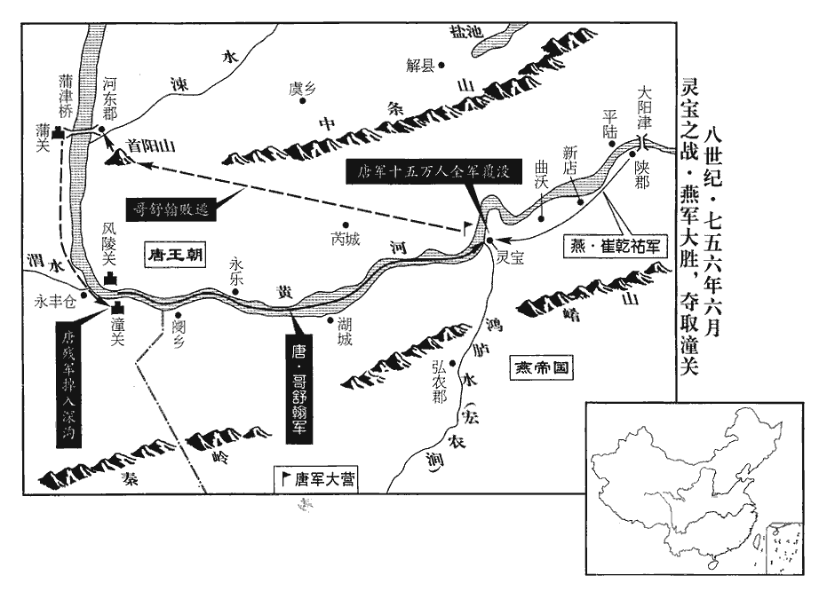
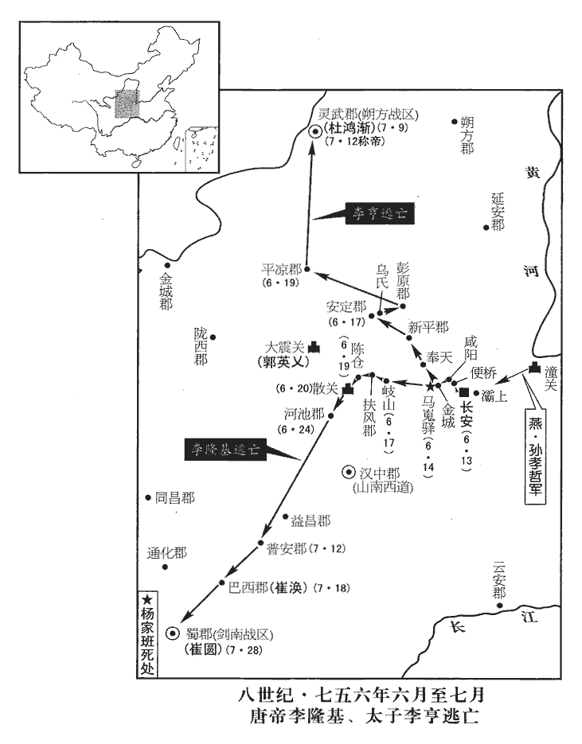
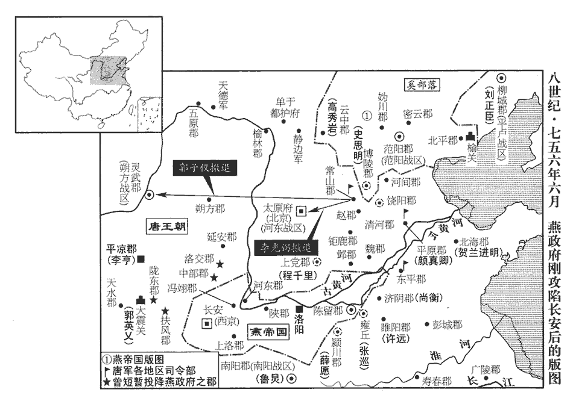
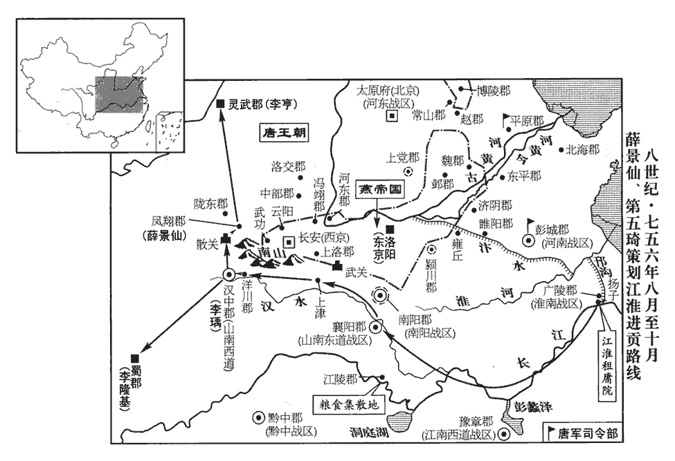

 唐紀三十四起柔兆涒灘（丙申）五月，至九月，不滿一年。

# 肅宗文明武德大聖大宣孝皇帝上之下

## 至德元載（丙申﹑七五六）載，祖亥翻。

1五月，丁巳‹四›，炅眾潰，走保南陽，炅，古迥翻。炅不書姓，承上卷安祿山將攻魯炅事也。炅自潁川走保南陽。考異曰，玄宗實錄云：「炅攜百姓數千人奔順陽川。」今從舊傳。賊就圍之。太常卿張垍薦夷陵‹湖北省宜昌市›太守虢王巨有勇略，上徵吳王祗為太僕卿，垍，其冀翻。夷陵郡，峽州。守，式又翻。上，亦謂玄宗，自靈武即位後，玄宗稱「上皇」，稱肅宗為「上」。以巨為陳留•譙郡太守、河南節度使，兼統嶺南‹总部设南海广东省广州市›節度使何履光、陳留郡，汴州。譙郡，亳州。此二郡太守也。是年升五府經略討擊使為嶺南節度使，領廣、韶、循、潮、康、瀧、端、新、封、春、勤、羅、潘、高、思恩、雷、崖、瓊、振、儋、萬安、軍藤二十二州，治廣州。黔中‹总部设黔中重庆市彭水县›節度使趙國珍、趙國珍，牂柯別部充州蠻酋趙君道之裔。楊國忠兼劍南節度，以國珍有方略，授黔中都督，護五溪十餘年，天下方亂，其所部獨寧。按新書方鎮表：開元二十六年，黔州置五溪諸州經略使，天寶十四載，增領守捉使，代宗大曆四年，始置辰、溪、巫、錦、業五州都團練守捉觀察處置使，憲宗元和三年，黔州觀察增領涪州，唐末，始於黔州置節鎮。疑此時趙國珍未得建節。至明年，通鑑書置黔中節度，必有所據。南陽節度使魯炅。國珍，本牂柯‹贵州省中南部›夷也。牂，音臧。柯，音哥。戊辰‹十五›，巨引兵自藍田‹陕西省蓝田县›出，趣南陽。趣，七喻翻。賊聞之，解圍走。

〖译文〗 [1]五月丁巳（初四），鲁炅兵败，退守南阳，被叛军包围。太常卿张推荐说夷陵太守虢王李巨有勇有谋，玄宗就征召吴王李祗为太仆卿，任命虢王李巨为陈留及谯郡太守、河南节度使，并统领岭南节度使何履光、黔中节度使赵国珍和南阳节度使鲁炅。赵国珍本是柯地方的夷人。戊辰（十五日），李巨率兵从蓝田出发，向南阳进军。叛军得知后，解围而去。

2令狐潮復引兵攻雍丘‹河南省杞县›。潮與張巡有舊，於城下相勞苦如平生，潮因說巡曰：復，扶又翻。勞，力到翻。說，式芮翻。「天下事去矣，足下堅守危城，欲誰為乎？」為，于偽翻。巡曰：「足下平生以忠義自許，今日之舉，忠義何在！」潮慚而退。

〖译文〗 [2]令狐潮又率兵来攻打雍丘。令狐潮与张巡有交情，二人就在城下像平时见面那样互相问候，令狐潮借机对张巡说：“现在唐朝的大势已去，您还在为谁苦守危城呢？”张巡说：“你平常总是说自己如何忠义，而现在这种叛逆行为那有一点忠义的味道！”令狐潮听后惭愧而退。

3郭子儀、李光弼還常山，還，從宣翻，又音如字。史思明收散卒數萬踵其後。子儀選驍騎更挑戰，驍，堅堯翻。騎，奇寄翻。更，工衡翻。挑，徒了翻。三日，至行唐，即漢南行唐縣，屬常山郡。九域志：在郡北五十五里。賊疲，乃退。子儀乘之，又敗之於沙河‹滹沱河支流大沙河›。沙河在新樂、行唐二縣之間。敗，補邁翻。蔡希德至洛陽，安祿山復使將步騎二萬人北就思明，復，扶又翻。將，即亮翻，又音如字。又使牛廷玠發范陽等郡兵萬餘人助思明，合五萬餘人，而同羅‹蒙古国乌兰巴托市北›、曳落河居五分之一。子儀至恆陽，思明隨至，恆，戶登翻。子儀深溝高壘以待之；賊來則守，去則追之，晝則耀兵，夜斫其營，賊不得休息。數日，子儀、光弼議曰：「賊倦矣，可以出戰。」考異曰：河洛春秋以此為光弼語，汾陽家傳作子儀語，蓋二人共議耳。壬午‹二十九›，戰于嘉山‹河北省曲阳县东北嘉山›，據舊史安祿山傳：嘉山在常山郡東。魏收地形志：中山郡上曲陽縣有嘉山。上曲陽，即唐之恆陽也。考異曰：實錄云「六月壬午」，按長曆，六月癸未朔；壬午，五月二十九日也。汾陽家傳、舊祿山傳亦云「六月，戰嘉山」。河洛春秋云：「六月二十五日，光弼破賊於嘉山。」今從實錄而改其月。大破之，斬首四萬級，捕虜千餘人。思明墜馬，露髻跣足步走，至暮，杖折槍歸營，折，而設翻。奔于博陵；光弼就圍之，軍聲大振。於是河北十餘郡皆殺賊守將而降。將，即亮翻；下同。降，戶江翻；下同。考異曰：河洛春秋云：「五月，蔡希德從東都見祿山，祿山又與馬步二萬人，至邢州，取堯山、招慶，射趙州東界，效曲、鼓、鹿城間，渡洿wū池水，入無極，至定州。牛介從幽州占歸、檀、幽、易，兼大同、紇、蠟共萬餘人，帖思明。思明軍既壯，共五萬餘人；其中精騎萬人，悉是同羅、曳落河，精於馳突。光弼以十五萬眾頓軍恆陽，樵採往來，人有難色，召有策者試之。時趙州司戶參軍先臣亡父包處遂上書與光弼曰：『思明用軍，惟將勁悍，觀其布措，實謂無謀。昔秦、趙爭山，先居者勝，豈不為勞逸勢倍，高下相懸。今宜重出軍人有膂力者五萬，被甲兩重，陌刀各二。東有高山甚大，先令五千甲士於山上設伏，後出二千人山東取糧。賊見必追之，則奔山上。伏兵馬與一百面鼓，應山上。避賊百姓，壯者亦與器械，令隨大軍；老弱者令居險固守，遙為聲援。賊必圍山攻之；城內出五萬人，擇將二人統之，各領二萬，一將於南面，一將於城北門出。賊營悉在山東，其軍夜出，長去賊三十里行；廣張左右翼，以天曉合圍。其軍每二十五為隊，每隊置旗兩口，鼕鼕鼓子一具，圍落纔合，則動鼓子；賊必不測人之多少。然於城東門出軍一萬人，布掌底陳，山上亦擊鼓而下，齊攻之，必克勝。』光弼尤然此計，乃出朔方計會，出人取糧。賊果然來襲，即奔山上。至六月二十五日，依前計大破賊於嘉山陣，斬首數萬餘級，生擒數千。思明落馬步遁；至暮，拄折槍歸營。希德中槍索，押衙劉旻mín斫斷而走。生擒得旻。至二十六日，覆陣。二十七日，有詔至恆陽，云潼關失守，駕幸劍南。」包諝專欲歸功其父，而他書皆無之。今不取。漁陽‹天津市蓟县›路再絕，漁陽，即謂范陽也。范陽郡，幽州。其後又分置薊州漁陽郡，二郡始各有分界。然范陽節度盡統幽、易、平、檀、媯guī、燕等州，賊之根本實在范陽也。唐人於此時多以范陽、漁陽通言之，白居易詩所謂「漁陽鼙pí鼓動地來」，是以范陽通為漁陽也。前此顏杲卿以常山返正，漁陽路絕矣；杲卿敗而復通。今郭、李破史思明，故再絕。賊往來者皆輕騎竊過，多為官軍所獲，將士家在漁陽者無不搖心。

〖译文〗 [3]郭子仪与李光弼率兵退回常山，史思明又收罗散兵数万随后追击，郭子仪挑选骁勇善战的骑兵轮番挑战，三天以后，到了行唐县，叛军因疲劳无力再战，才退兵。郭子仪乘机出击，又败叛军于沙河县。蔡希德到了洛阳，安禄山又让他率领步、骑兵二万人向北靠近史思明，并派牛廷发范阳等郡兵一万多人增援史思明，合兵共五万多人，其中同罗、曳落河精兵占五分之一。郭子仪抵达恒阳，史思明也率兵追到，郭子仪依靠深沟高垒，以逸待劳，叛军来攻就固守，撤兵就追击，白天以大兵向叛军炫耀武力，夜里则派部队袭击敌营，使叛军不得安宁。这样持续了数天，郭子仪与李光弼商议说：“叛军已经疲劳，可以出战。”壬午（二十九日），两军战于嘉山，叛军大败，被杀四万多人，被俘一千多人。史思明从马上坠落下来，发髻散乱，赤脚步行而逃，到了晚上，拄着折断的长枪回到军营，然后又逃奔博陵。李光弼率兵紧紧地围住了博陵，军势大振。于是河北地区原先被叛军占据的十多个州郡都杀了叛军的守将而归降朝廷。范阳的归路再次被切断，叛军往来都是轻骑偷偷摸摸地通过，就是这样还大多被官军俘获，家在范阳的叛军将士都心中动摇。

祿山大懼，召高尚、嚴莊詬之曰：「汝數年教我反，以為萬全。今守潼關，數月不能進，北路已絕，諸軍四合，吾所有者止汴、鄭數州而已，萬全何在？汝自今勿來見我！」尚、莊懼，數日不敢見。田乾真自關下來，為尚、莊說祿山曰：為，于偽翻。說，式芮翻；下密說同。「自古帝王經營大業，皆有勝敗，豈能一舉而成！今四方軍壘雖多，皆新募烏合之眾，未更行陳，更，工衡翻。行，戶剛翻。陳，讀曰陣。豈能敵我薊北勁銳之兵，何足深憂！尚、莊皆佐命元勳，陛下一旦絕之，使諸將聞之，誰不內懼！若上下離心，臣竊為陛下危之！」祿山喜曰：「阿浩，汝能豁我心事。」即召尚、莊，置酒酣宴，自為之歌以侑酒，待之如初。阿浩，乾真小字也。為，于偽翻。考異曰：祿山事迹作「阿法」，今從唐曆、統紀、舊傳。祿山議棄洛陽，走歸范陽，計未決。

〖译文〗 安禄山十分恐惧，把高尚与严庄召来骂道：“数年来你们都劝我反叛，认为一定能够成功。而现在大军被阻于潼关，数月不能攻破，北归的路也被断绝，官军大集，我们所占据的只有汴州、郑州等几个州郡，如何能够取胜呢？从现在开始你们再也不要来见我！”高尚与严庄听后极为害怕，好多天都不敢去见安禄山。这时田乾真从潼关回来，为高尚、严庄说话，劝安禄山说：“自古以来，凡是要成就大事业的帝王，都有胜有败，怎么能够指望一举成功呢！现在四面八方的官军虽然多，但都是新召募的乌合之众，没有经过战阵，怎么能够敌得过我们蓟北的这些精兵强将呢！您根本不用担忧。高尚、严庄都是跟随您多年的功臣元勋，陛下就这样一下子把他们抛弃，如果让诸位将领知道了，那一个能不心中恐惧呢！如果内部分裂，上下离心，我觉得陛下的处境就危险了！”安禄山听后高兴地说：“阿浩，你真能够体谅我的心事。”于是就把高尚与严庄召来，摆投宴席招待，安禄山还为他们唱歌以劝酒，仍像以前那样对待他们。阿浩是田乾真的小名。安禄山计划放弃洛阳，率军回保范阳，但还没有下定决心。

是時，天下以楊國忠驕縱召亂，莫不切齒。又，祿山起兵以誅國忠為名，王思禮密說哥舒翰，使抗表請誅國忠，說，式芮翻。考異曰：玄宗實錄云：「或勸翰：『留兵二萬守關，悉以精銳回誅楊國忠，此漢挫七國之計也，公以為何如？』翰心許之，未發。有客泄其謀於國忠，國忠大懼。」按翰若回兵誅國忠，則正與祿山無異。思禮勸翰抗表言國忠罪猶不敢，況敢舉兵乎！事必不然。且翰雖心許，他人安得知之！正由翰按兵不進，故國忠及其黨疑懼，恐翰回兵誅之，其實翰無此心也。若果欲誅國忠，則安肯慟哭出關乎！幸蜀記云：「翰使王思禮至陝郡，見賊偽御史中丞、無敵將軍、平西大使崔乾祐，令傳檄與祿山，數其干紀亂常，背天逆理，且曰：『若面縛而來，束身歸死，赦爾九族，罪爾一身。如更屈強王師，遲疑未決，大軍一鼓，玉石俱焚。爾審思之，悔無及矣。』」按翰與乾祐方對壘相攻，思禮軍中大將，豈可使齎罵祿山之檄詣乾祐乎！必無此理。今不取。翰不應。思禮又請以三十騎劫取以來，至潼關殺之，翰曰：「如此，乃翰反，非祿山也。」或說國忠：「今朝廷重兵盡在翰手，翰若援旗西指，說，式芮翻。援，于元翻。於公豈不危哉！」國忠大懼，乃奏：「潼關大軍雖盛，而後無繼，萬一失利，京師可憂，請選監牧小兒三千於苑中訓練。」時監牧、五坊、禁苑之卒，率謂之小兒。上許之，使劍南‹总部设蜀郡四川省成都市›軍將李福德等領之。又募萬人屯灞上‹陕西省西安市东灞河畔›，令所親杜乾運將之，將，即亮翻。名為禦賊，實備翰也。翰聞之，亦恐為國忠所圖，乃表請灞上軍隸潼關；六月，癸未‹一›，召杜乾運詣關，因事斬之；國忠益懼。

〖译文〗 这时，人们都人为安禄山叛乱是因为杨国忠骄横放纵所致，无不对杨国忠切齿痛恨。而且安禄山起兵是以讨杨国忠为名，所以王思礼就悄悄地劝哥舒翰，让他上表请求玄宗杀掉杨国忠，哥舒翰没有答应。王思礼又请求率领三十个骑兵把杨国忠劫持出京师，到潼关把他杀掉，哥舒翰说：“如果这样做就是我谋反，而不是安禄山谋反。”有人劝杨国忠说：“现在朝廷的重兵都在哥舒翰掌握之中，他如果挥兵西向京城，您不就危险了吗！”杨国忠大为恐惧，于是就上奏玄宗说：“现在潼关虽然有大军把守，但后无援兵，一旦潼关失守，京师就难保，请求挑选牧马的士卒三千人于禁宛中训练，以应付不测。”玄宗同意，于是就派剑南军将李福德等人统领这支队伍。杨国忠又招募了一万人屯兵于灞上，命令他的亲信杜乾运率领，名义上是抵御叛军，实际上却是为了防备哥舒翰。哥舒翰得知后，也怕被杨国忠谋算，于是就上表玄宗请求把驻扎在灞上的军队归于潼关军队统一指挥。六月癸未（初一），哥舒翰把杜乾运召到潼关，借机杀了他，杨国忠更加害怕。

會有告崔乾祐在陜‹河南省三门峡市›，兵不滿四千，皆羸弱無備，此祿山之用間也。陜，失冉翻。上遣使趣哥舒翰進兵復陜、洛。趣，讀曰促；下以義推。翰奏曰：「祿山久習用兵，今始為逆，豈肯無備！是必羸師以誘我，若往，正墮其計中。羸，倫為翻。誘，羊久翻。且賊遠來，利在速戰；官軍據險以扼之，利在堅守。況賊殘虐失眾，兵勢日蹙，將有內變；因而乘之，可不戰擒也。要在成功，何必務速！今諸道徵兵尚多未集，請且待之。」郭子儀、李光弼亦上言：「請引兵北取范陽，覆其巢穴，質賊黨妻子以招之，上，時掌翻。質，音致。賊必內潰。潼關大軍，唯應固守以弊之，不可輕出。」國忠疑翰謀己，言於上，以賊方無備，而翰逗留，將失機會。上以為然，續遣中使趣之，項背相望。翰不得已，撫膺慟哭；丙戌‹四›，引兵出關‹潼关›。逗，音豆。使，疏吏翻。趣，讀曰促。考異曰：幸蜀記曰：「賊將崔乾祐於陜郡西潛鋒蓄銳，臥鼓偃旗，而偵者奏云，賊全無備。上然之。」又曰：「玄宗久處太平，不練軍事，既被國忠眩惑，中使相繼督責於公，不得已，撫膺慟哭久之，乃引師出關。國忠又令杜乾運領所募兵於馮翊境上，潛備哥舒公。公曰：『今軍出關，勢十全矣。更置乾運於側以為疑軍，人心憂疑，即不俟見賊，吾軍潰矣。必當併之以除內憂。』遂令衙前總管叱萬進追軍，誡之曰：『若不受追，即便斬頭來。』乾運果不肯赴。進詐詞如欲叛哥舒，竊請見。乾運遂喜，遽見之。與語，進忽抽佩刀曰：『奉處分，取公頭。』乾運驚懼。其左右悉新招募者，悉投仗散走，進遂斬乾運，攜首至於軍門，眾皆攝氣，乃統其軍赴關。」按翰若擅殺乾運而奪其軍，則是已反也，朝廷安能趣之出關乎！蓋奏乞以其軍隸潼關，朝廷已許之，翰召乾運受處分，或有所違拒，因託軍法以斬之耳。凌準邠bīn志云：「郭子儀、李光弼將進軍，聞朝廷議出潼關，圖復陜、洛，二公議曰：『哥舒公老疾昏耄，賊素知諸軍烏合，不足以戰。今祿山悉銳南馳宛、洛，賊之餘眾盡委思明，我且破之，便覆其巢。質叛徒之族，取祿山之首，其勢必矣。若潼關出師，有戰必敗。關城不守，京室有變，天下之亂，何可平之！』乃陳利害以聞，且請固關無出。」唐曆：「會偵人自陜至，云：『崔乾祐所將眾不滿四千，不足圖也。』上大悅。」舊翰傳：「翰既斬乾運，心不自安，又素有風疾，至是頗甚，軍中之務不復躬親，委政於行軍司馬田良丘。良丘復不敢專斷，教令不一，頗無部伍。其將王思禮、李承光又爭長不叶，人無鬬志。」今兼采之。

〖译文〗 这时有人告诉玄宗说崔乾在陕郡的兵力不到四千，都是老弱兵，而且没有准备，玄宗就派人催促哥舒翰出兵收复陕郡和洛阳。哥舒翰上奏说：“安禄山善于用兵，现在刚举兵反叛，怎么能够不设防呢！这一定是故意示弱来引诱我们，如果出兵攻打，正中了他的计谋。再说叛军远来，利在速战速决，我们据险扼守，利在长期坚持。何况叛军残暴，失去人心，兵势正在变为不利，将会有内乱，到那时再乘机进攻，就可不战而获胜。我们最主要是要取胜，何必要立刻出兵呢！现在各地所征的兵大多都还没有到达，请暂且等待一段时间。”郭子仪与李光弼也上言说：“请让我们率兵向北攻取范阳，直捣叛军巢穴，抓住他们的妻子、儿子作为人质用来招降，这样叛军内部必定大乱。坚守潼关的大军应该固守以挫敌锐气，不可轻易出战。”杨国忠怀疑哥舒翰想要谋害他，就告诉玄宗说叛军没有准备，而哥舒翰却逗留拖延，将要失去战机。玄宗信以为然，于是又派宦官去催促出兵，连续不断。哥舒翰没有办法，抚胸痛哭。丙戌（初四），亲自率兵出关。

己丑‹七›，遇崔乾祐之軍於靈寶‹古函谷关·河南省灵宝市东北›西原。靈寶縣更名，見二百十五卷天寶元年。乾祐據險以待之，南薄山，北阻河，隘道七十里。庚寅‹八›，官軍與乾祐會戰。薄，伯各翻。隘，烏介翻。考異曰：肅宗實錄：「乙酉，翰與乾祐會戰。」舊傳：「四日，次靈寶西原。八日，與賊交戰。」新傳：「丙戌，次靈寶西原。庚寅，與乾祐戰。」按翰軍既遇賊，必不留四日然後戰。玄宗實錄：「丙戌，翰出關。己丑，遇賊。庚寅，戰。」此近是，今從之。幸蜀記亦然。乾祐伏兵於險，翰與田良丘浮舟中流以觀軍勢，見乾祐兵少，趣諸軍使進。王思禮等將精兵五萬居前，龐忠等將餘兵十萬繼之，翰以兵三萬登河北阜望之，鳴鼓以助其勢。少，始紹翻。趣，讀曰促。將，即亮翻，又音如字。乾祐所出兵不過萬人，什什伍伍，散如列星，或疏或密，或前或卻，官軍望而笑之。乾祐嚴精兵，陳於其後。兵既交，賊偃旗如欲遁者，官軍懈，不為備。須臾，伏兵發，賊乘高下木石，擊殺士卒甚眾。道隘，士卒如束，槍槊不得用。翰以氈車駕馬為前驅，欲以衝賊。日過中，東風暴急，乾祐以草車數十乘塞氈車之前，縱火焚之。乘，繩證翻。塞，悉則翻。考異曰：幸蜀記曰：「野中先有官草，積數十堆，因風焚之。」今從舊傳。煙焰所被，被，皮義翻。官軍不能開目，妄自相殺，謂賊在煙中，聚弓弩而射之。射，而亦翻。日暮，矢盡，乃知無賊。乾祐遣同羅精騎自南山過，出官軍之後擊之，官軍首尾駭亂，不知所備，於是大敗；或棄甲竄匿山谷，或相擠排入河溺死，囂聲振天地，賊乘勝蹙之。後軍見前軍敗，皆自潰，河北軍望之亦潰。【章：十二行本「潰」下有「瞬息間兩岸皆空」七字；乙十一行本同；孔本同；張校同；退齋校同。】河北軍，翰所自將者也。翰獨與麾下數百騎走，自首陽山‹山西省永济市南›西渡河入關。首陽山當是首山，衍「陽」字。首山在蒲州河東縣界，與湖城縣之荊山隔河相對。關外先為三塹，皆廣二丈，深丈，廣，古曠翻。深，式浸翻。人馬墜其中，須臾而滿；餘眾踐之以度，踐，息淺翻。士卒得入關者纔八千餘人。辛卯‹九›，乾祐進攻潼關，克之。

〖译文〗 已丑（初七），官军与崔乾的叛军相遇于灵宝西原。崔乾的军队占据着险要之地，南靠大山，北据黄河天险，有狭道七十里。庚寅（初八），官军与崔乾的叛军交战。崔乾先把精兵埋伏在险要的地方，哥舒翰与田良丘乘船在黄河中观察军情，看见崔乾兵少，就命令大军前进。王思礼等率领精兵五万在前，庞忠等率领其余的十万在后，哥舒翰率丘三万登上黄河北岸的高丘观察指挥，并鸣鼓助战。崔乾出兵不到一万，三五成群，稀稀拉拉，队伍有疏有密，士兵有前有后，官军看见后都大笑叛军不会用兵。而崔乾却把精兵摆在阵后。两军一交战，叛军偃旗息鼓假装败逃，官军斗志松懈，毫无准备。不一会，叛军伏兵齐发，占据着高地，用滚木石块打击官军，官军死伤惨重。又因为道路狭窄，士卒拥挤，刀枪伸展不开。哥舒翰又让马拉毡车为前队，去冲击叛军。过了中午，东风骤起，崔乾把数十辆草车塞于毡车之前，放火焚烧。顿时大火熊熊，烟雾蔽天，官军睁不开眼睛，敌我不分，互相冲杀，以为叛军在烟火中，就召集弓箭手和弩机手射击。持续到天黑，箭已射尽，才知道没有叛军。这时崔乾派同罗精锐骑兵过南山，从官军后面发起进攻，官军腹背受敌，首尾大乱，不知道如何抵挡，因此大败。有的丢盔弃甲逃入山谷，有的互相拥挤被推入黄河中淹死，喊声振天动地，叛军又乘胜追击。官军后面的将士看见前军大败，也纷纷溃逃，黄河北岸的军队看见了也向后逃跑。哥舒翰仅与部下数百骑兵得以逃脱，从首阳山西面渡过黄河，进入潼关。潼关城外先前挖了三条深沟，都是宽二丈，深一丈，过关的人马坠落沟中，很快就填满了沟，后面的人踏着他们得以通过，残兵逃入关内的才八千多人。辛卯（初九），崔乾率兵攻陷潼关。

 

翰至關西驛‹陕西省华阴市东›，揭牓收散卒，欲復守潼關。復，扶又翻。蕃將火拔歸仁等以百餘騎圍驛，入謂翰曰：「賊至矣，請公上馬。」翰上馬出驛，歸仁帥眾叩頭曰：「公以二十萬眾一戰棄之，何面目復見天子！帥，讀曰率。復，扶又翻。且公不見高仙芝、封常清乎？謂軍敗必誅也。事見上卷上年。請公東行。」翰不可，欲下馬。歸仁以毛縶其足於馬腹，及諸將不從者，皆執之以東。將，即亮翻；下同。會賊將田乾真已至，遂降之，俱送洛陽。降，戶江翻。安祿山問翰曰：「汝常輕我，事見二百十六卷天寶十一載。今定何如？」翰伏地對曰：「臣肉眼不識聖人。今天下未平，李光弼在常山，李祗在東平‹山东省东平县›，李祗，即謂吳王祗。魯炅在南陽，炅，古迥翻。陛下留臣，使以尺書招之，不日皆下矣。」祿山大喜，以翰為司空、同平章事。謂火拔歸仁曰：「汝叛主，不忠不義。」執而斬之。翰以書招諸將，皆復書責之。祿山知不效，乃囚諸苑中。東都苑中也。潼關既敗，於是河東、華陰‹陕西省华县›、馮翊‹陕西省大荔县›、上洛‹陕西省商州市›防禦使皆棄郡走，河東郡，蒲州。華陰郡，華州。馮翊郡，同州。上洛郡，商州。華，戶化翻。所在守兵皆散。

〖译文〗 哥舒翰到了关西驿站，张贴告示收罗逃散的士卒，想重新守卫潼关。这时蕃人将领火拔归仁等率领一百余名骑兵包围了驿站，进去对哥舒翰说：“叛军来了，请您赶快上马。”哥舒翰上马出驿站后，火拔归仁率部下叩头说：“您率领二十万军队一战而全军覆没，还有什么脸面去见天子呢！再说您没有看到封常清与高仙芝的下场吗？还不如向东去归降安禄山。”哥舒翰不同意，想要下马。火拔归仁就用毛绳把他的双脚捆绑在马肚子下，对于将领中不愿意投降的，也都捆起来押往东方。这时叛军将领田乾真赶到，火拔归仁就投降了他，被一起送往洛阳。安禄山问哥舒翰说：“你过去总是看不起我，现在怎么样呢？”哥舒翰伏地而拜回答说：“我凡人肉眼不识圣人。现在天下还没有平定，李光弼率兵在常山，吴王李祗在东平，鲁炅在南阳，陛下如果能够留我一条性命，让我写信招降他们，用不了多长时间就会平定。”安禄山很高兴，于是就拜哥舒翰为司空、同平章事。又对火拔归仁说：“你背叛了你的主人，是不忠不义。”然后就杀了他。哥舒翰写信招降其他将帅，他们都复信责备他的背叛行为。安禄山知道没有什么效果，就把哥舒翰囚禁于禁苑中。潼关既已失守，于是河东、华阴、冯翊、上洛等郡的防御使都弃郡而逃，部下的守兵也纷纷逃命。

是日，翰麾下來告急，上不時召見，見，賢遍翻。但遣李福德等將監牧兵赴潼關。及暮，平安火不至，六典：唐鎮戍烽候所至，大率相去三十里。每日初夜，放煙一炬，謂之平安火。時守兵已潰，無人復舉火。上始懼。壬辰‹十›，召宰相謀之。楊國忠自以身領劍南，聞安祿山反，即令副使崔圓陰具儲偫zhì，以備有急投之，相，息亮翻。令，力丁翻。使，疏吏翻。偫，直里翻。至是首唱幸蜀之策。上然之。癸巳‹十一›，國忠集百官於朝堂，惶懅流涕；朝，直遙翻；下同。懅，巨魚翻，急也。問以策略，皆唯唯不對。唯，于癸翻。國忠曰：「人告祿山反狀已十年，上不之信。今日之事，非宰相之過。」仗下，朝罷，則左右三衛立仗者皆休下。士民驚擾奔走，不知所之，市里蕭條。國忠使韓、虢入宮，勸上入蜀。

〖译文〗 潼关失守的当天，哥舒翰的部下到朝廷报告情况危急，玄宗当时没有召见，只是派李福德等人率领监牧小儿组成的军队开赴潼关增援。到了晚上，没看到报告平安的烽火，玄宗才感到惧怕。壬辰（初十），玄宗把宰相召来商议对策。杨国忠因为自己兼任剑南节度使，安禄山反叛后，即命令节度副使崔圆暗中准备物资，以防备危急时到剑南使用，所以这时他首先提出到蜀中避难。玄宗赞成他的意见。癸巳（十一日），杨国忠召集百官于朝堂，神色惊惧，痛哭流涕地问他们有什么计策，百官都不回答。杨国忠说：“人们告安禄山的反状已有十年了，但皇上总是不相信。现在事情发展到这种地步，不是宰相的过错。”罢朝后卫兵退下，这时长安城中的百姓惊慌逃命，都不知道该往那里躲避，店铺关门，市里一片萧条。杨国忠又让韩国夫人与虢国夫人入宫，劝说玄宗到蜀中去避难。

甲午‹十二›，百官朝者什無一二。上御勤政樓，下制，云欲親征，聞者皆莫之信。以京兆尹魏方進為御史大夫兼置頓使；京兆少尹靈昌崔光遠為京兆尹，充西京留守；將軍邊令誠掌宮闈管鑰。託以劍南節度大使潁王璬jiǎo將赴鎮，令本道設儲偫。璬，公了翻。偫，直里翻。是日，上移仗北內。唐都長安，以太極宮為西內，大明宮為東內，興慶宮為南內，北內當在玄武門內。又以地望言之，則自興慶宮移仗歸大明宮，興慶宮在南，大明宮在北，故亦謂大明宮為北內。考異曰：幸蜀記：「上遣中使曹仙領千人擊鼓於春明門外，又令燒閑廄草積，煙焰燎天。上將乘馬，楊國忠諫，以為：『當謹守宗祧，不可輕動。』韋見素力爭，以為：『賊勢逼近，人心不固，陛下不可不出避狄。國忠暗與賊通，其言不可聽。』往返數四，上乃從見素議。加魏方進御史大夫，充前路知頓使。」按賊陷潼關，鑾輿將出，人心已危，豈有更擊鼓燒草以驚之！國忠久蓄幸蜀之謀，見素乃其所引，豈得上前有此爭論！此蓋宋巨欲歸功見素，事乃近誣。今不取。既夕，命龍武大將軍陳玄禮整比六軍，比，毗寐翻。厚賜錢帛，選閑廄馬九百餘匹，外人皆莫之知。乙未‹十三›，黎明，上獨與貴妃姊妹、皇子、妃、主、皇孫、楊國忠、韋見素、魏方進、陳玄禮及親近宦官、宮人出延秋門，延秋門，唐長安禁苑之西門也。程大昌雍錄有漢唐要地參出圖，唐禁苑西北，包漢長安故城。未央宮，唐後改為通光殿；西出即延秋門。考異曰：幸蜀記云：「丙申，百官尚赴朝。」此乙未日事，宋巨誤也。妃、主、皇孫之在外者，皆委之而去。上過左藏，藏，徂浪翻。楊國忠請焚之，曰：「無為賊守。」上愀然曰：「賊來不得，必更斂於百姓；不如與之，無重困吾赤子。」史記玄宗有君人之言。愀，子小翻。斂，力贍翻。是日，百官猶有入朝者，至宮門，猶聞漏聲，三衛立仗儼然。唐朝會之制：三衛番上，分為五仗，號衙內五衛。一曰供奉仗，以左、右衛為之。二曰親仗，以親衛為之。三曰勳仗，以勳衛為之。四曰翊仗，以翊衛為之。五曰散手仗，以親、勳、翊衛為之。平明，傳點畢，內門開，百官入立班，皇帝升御坐，金吾將軍一人奏左、右廂內外平安，通事舍人贊，宰相、兩省官再拜升殿，內謁者承旨喚仗，左、右羽林將軍勘以木契，自東西閤而入。朝罷，皇帝步入東序門，然後放仗。內外仗隊，七刻乃下。常參輟朝日，六刻即下。門既啟，則宮人亂出，中外擾攘，不知上所之。於是王公、士民四出逃竄，山谷細民爭入宮禁及王公第舍，盜取金寶，或乘驢上殿。又焚左藏大盈庫。崔光遠、邊令誠帥人救火，帥，讀曰率。又募人攝府、縣官分守之，殺十餘人，乃稍定。光遠遣其子東見祿山，令誠亦以管鑰獻之。

〖译文〗 甲午（十二日），百官上朝的不到十分之一二。玄宗登临勤政楼，下制书说要亲自率兵征讨安禄山，听到的人都不相信。玄宗又任命京兆尹魏方进为御史大夫兼置顿使，京兆少尹灵昌人崔光远为京兆尹，兼西京留守，让将军边令诚掌管宫殿的钥匙。玄宗假称剑南节度大使颖王李将要赴镇，命令剑南道准备所用物资。当天，玄宗移居大明宫。天黑以后，玄宗命令龙武大将军陈玄礼集合禁军六军，重赏他们金钱布帛，又挑选了闲厩中的骏马九百余匹，所做的这些事情外人都不知晓。乙未（十三日），天刚发亮，玄宗只与杨贵妃姊妹、皇子、皇妃、公主、皇孙、杨国忠、韦见素、魏方进、陈玄礼及亲信宦官、宫人从延秋门出发，在宫外的皇妃、公主及皇孙都弃而不顾，只管自己逃难。玄宗路过左藏库，杨国忠请求放火焚烧，并说：“不要把这些钱财留给叛贼，”玄宗心情凄惨地说：“叛军来了没有钱财，一定会向百姓征收，还不如留给他们，以减轻百姓们的苦难。”这一天，百官还有入朝的，到了宫门口，还能听到漏壶滴水的声音，仪仗队的卫士们仍然整齐地站在那里，待宫门打开后，则看见宫人乱哄哄地出逃，宫里宫外一片混乱，都不知道皇上在那里。于是王公贵族、平民百姓四出逃命，山野小民争着进入皇宫及王公贵族的宅第，盗抢金银财宝，有的还骑驴跑到殿里。还放火焚烧了左藏大盈库。崔光远与边令诚带人赶来救火，又召募人代理府、县长官分别守护，杀了十多个人，局势才稳定下来。崔光远派他的儿子去见安禄山，边令诚也把宫殿各门的钥匙献给安禄山。

上過便橋‹西渭桥·陕西省咸阳市西南›，楊國忠使人焚橋。上曰：「士庶各避賊求生，奈何絕其路！」留內侍監高力士，使撲滅乃來。玄宗始置內侍監，秩三品，以高力士及袁思藝為之。撲，普卜翻。上遣宦者王洛卿前行，告諭郡縣置頓。食時，至咸陽‹陕西省咸阳市›望賢宮，咸陽縣，在京城西四十里。望賢宮，在縣東。洛卿與縣令俱逃，中使徵召，吏民莫有應者。日向中，上猶未食，楊國忠自市胡餅以獻。胡餅，今之蒸餅。高似孫曰：胡餅，言以胡麻著之也。崔鴻前趙錄：石虎諱胡，改胡餅曰麻餅。緗素雜記曰：有鬻胡餅者，不曉名之所謂，易其名曰爐餅。以為胡人所啗dàn，故曰胡餅也。於是民爭獻糲飯，糲，盧達翻，粗也。雜以麥豆；皇孫輩爭以手掬食之，須臾而盡，猶未能飽。考異曰：唐曆：「至望賢頓，御馬病。上曰：『殺此馬，拆行宮舍木煮食之。』眾不忍食。」幸蜀記：「至望賢宮，行從皆飢。上入宮，憩於樹下，怫然若有棄海內之意。高力士覺之，遂抱上足，嗚咽開諭，上乃止。」肅宗實錄：「楊國忠自入市，衣袖中盛胡餅，獻上皇。」天寶亂離記：「六月十一日，大駕幸蜀，至望賢宮，官吏奔竄。迨曛黑，百姓有稍稍來者。上親問之：『卿家有飯否？不擇精粗，但且將來。』老幼於是競擔挈壺漿，雜之以麥子飯，送至上前。先給兵士，六宮及皇孫已下，咸以手掬而食。頃時又盡，猶不能飽。既乏器用，又無釭gāng燭，從駕者枕藉寢止，長幼莫之分別；賴月入戶庭，上與六宮、皇孫等差異焉。」按上九日幸蜀，溫畬云「十一日」，非也。餘則兼采之。上皆酬其直，慰勞之。勞，力到翻。眾皆哭，上亦掩泣。有老父郭從謹進言曰：「祿山包藏禍心，固非一日；亦有詣闕告其謀者，陛下往往誅之，事見上卷上年。使得逞其姦逆，致陛下播越。是以先王務延訪忠良以廣聰明，蓋為此也。臣猶記宋璟為相，數進直言，天下賴以安平。為，于偽翻。數，所角翻。自頃以來，在廷之臣以言為諱，惟阿諛取容，是以闕門之外，陛下皆不得而知。草野之臣，必知有今日久矣，但九重嚴邃，區區之心無路上達。事不至此，臣何由得睹陛下之面而訴之乎！」上曰：「此朕之不明，悔無所及。」慰諭而遣之。俄而尚食舉御膳而至，尚，主也。主御膳之官，有奉御，有直長。「而」，一作「以」。上命先賜從官，從，才用翻；下時從同。然後食之。令軍士散詣村落求食，期未時皆集而行。夜將半，乃至金城‹陕西省兴平市›。金城縣，屬京兆，本始平縣，中宗景龍二年送金城公主降吐蕃至此，更名金城，在京城西八十五里。縣令亦逃，縣民皆脫身走，飲食器皿具在，士卒得以自給。時從者多逃，內侍監袁思藝亦亡去。驛中無燈，人相枕藉而寢，貴賤無以復辨。枕，即任翻。藉，慈夜翻。復，扶又翻。王思禮自潼關至，始知哥舒翰被擒；以思禮為河西、隴右節度使，即令赴鎮，收合散卒，以俟東討。

〖译文〗 玄宗一行经过便桥后，杨国忠派人放火烧桥，玄宗说：“官吏百姓都在避难求生，为何要断绝他们的生路呢！”于是就把内侍监高力士留下，让他把大火扑灭后再来。玄宗派宦官王洛卿先行，告诉郡县官作好准备。到吃饭的时候，抵达咸阳县望贤宫，而王洛卿与咸阳县令都已逃跑。宦官去征召，官吏与民众都没有人来。已到了中午，玄宗还没有吃饭，杨国忠就亲自用钱买来胡饼献给玄宗。于是百姓争献粗饭，并参杂有麦豆，皇孙们争着用手抓吃，不一会儿就吃光了，还没有吃饱。玄宗都按价给了他们金钱，并慰劳他们。众人都涕泣流泪，玄宗也禁不住哭泣。这时有一位名叫郭从谨的老人进言说：“安禄山包藏祸心，阴谋反叛已经很久了，其间也有人到朝廷去告发他的阴谋，而陛下却常常把这些人杀掉，使安禄山奸计得逞，以致陛下出逃。所以先代的帝王务求延访忠良之士以广视听，就是为了这个道理。我还记得宋作宰相的时候，敢于犯颜直谏，所以天下得以平安无事。但从那时候以后，朝廷中的大臣都忌讳直言进谏，只是一味地阿谀奉承，取悦于陛下，所以对于宫门之外所发生的事陛下都不得而知。那些远离朝廷的臣民早知道会有今日了，但由于宫禁森严，远离陛下，区区效忠之心无法上达。如果不是安禄山反叛，事情到了这种地步，我怎么能够见到陛下而当面诉说呢！”玄宗说：“这都是我的过错，但后悔已经来不及了。”然后安慰了一番郭从谨，让他走了。不一会儿，管理皇上吃饭的官吏给玄宗送饭来了，玄宗命令先赏赐给随从的官吏，然后自己才吃。玄宗命令士卒分散到各村落去寻找食品，约好未时集合继续前进。快半夜时，到了金城县，县令和县民都已逃走，但食物和器物都在，士卒才能够吃饭。当时跟随玄宗的官吏逃跑的也很多，宦吏内侍监袁思艺就借机逃走了。驿站中没有灯火，人们互相枕藉而睡，也不管身份的贵贱。王思礼从潼关赶到后，玄宗才知道哥舒翰被俘，于是就任命王思礼为河西、陇右节度使，命令他立刻赴任，收罗散兵，准备向东进讨叛军。

 

丙申‹十四›，至馬嵬wéi驛‹陕西省兴平市西马嵬镇›，金人疆域圖：馬嵬驛，在京兆興平縣。將士飢疲，皆憤怒。陳玄禮以禍由楊國忠，欲誅之，因東宮宦者李輔國以告太子‹李亨›，太子未決。會吐蕃使者二十餘人遮國忠馬，訴以無食，國忠未及對，軍士呼曰：「國忠與胡虜謀反！」或射之，中鞍。國忠走至西門內，馬嵬驛之西門也。呼，火故翻。射，而亦翻。中，竹仲翻。軍士追殺之，屠割支體，以槍揭其首於驛門外，并殺其子戶部侍郎暄及韓國、秦國夫人。御史大夫魏方進曰：「汝曹何敢害宰相！」眾又殺之。韋見素聞亂而出，為亂兵所檛zhuā，腦血流地。眾曰：「勿傷韋相公。」救之，得免。軍士圍驛，上聞諠譁，問外何事，左右以國忠反對。上杖屨出驛門，慰勞軍士，令收隊，軍士不應。上使高力士問之，玄禮對曰：「國忠謀反，貴妃不宜供奉，願陛下割恩正法。」上曰：「朕當自處之。」處，昌呂翻。入門，倚杖傾首而立。久之，京兆司錄韋諤前言曰：京兆府司錄參軍，正七品上。武德初，改州主簿曰錄事參軍，掌正違失，涖符印；開元元年改曰司錄。「今眾怒難犯，引左傳鄭子產之言。安危在晷刻，願陛下速決！」因叩頭流血。上曰：「貴妃常居深宮，安知國忠反謀？」高力士曰：「貴妃誠無罪，然將士已殺國忠，而貴妃在陛下左右，豈敢自安！願陛下審思之，將士安則陛下安矣。」將，即亮翻；下同。上乃命力士引貴妃於佛堂，縊殺之‹杨玉环本年三十八岁。李隆基本年七十二岁›。輿尸寘驛庭，召玄禮等入視之。玄禮等乃免冑釋甲，頓首請罪，上慰勞之，勞，力到翻。令曉諭軍士。玄禮等皆呼萬歲，再拜而出，於是始整部伍為行計。諤，見素之子也。國忠妻裴柔裴柔，故蜀倡也。與其幼子晞及虢國夫人、夫人子裴徽，皆走至陳倉‹陕西省宝鸡市东陈仓镇›，縣令薛景仙帥吏士追捕，誅之。帥，讀曰率；下同。

〖译文〗 丙申（十四日），玄宗一行到了马嵬驿，随从的将士因为饥饿疲劳，心中怨恨愤怒。龙武大将军陈玄礼认为天下大乱都是杨国忠一手造成的，想杀掉他，于是就让东宫宦官李辅国转告太子，太子犹豫不决。这时有吐蕃使节二十余人拦住杨国忠的马，向他诉说没有吃的，杨国忠还没有来得及回答，士卒们就喊道：“杨国忠与胡人谋反！”有人用箭射击，射中了杨国忠坐骑的马鞍。杨国忠急忙逃命，逃至马嵬驿西门内，被士兵追上杀死，并肢解了他的尸体，把头颅挂在矛上插于西门外示众，然后杀了他的儿子户部侍郎杨暄与韩国夫人、秦国夫人。御史大夫魏方进说：“你们胆大妄为，竟敢谋害宰相！”士兵们又把他杀了。韦见素听见外面大乱，跑出驿门察看，被乱兵用鞭子抽打得头破血流。众人喊道：“不要伤了韦相公。”韦见素才免于一死。士兵们又包围了驿站，玄宗听见外面的喧哗之声，就问是什么事，左右侍从回答说是杨国忠谋反。玄宗走出驿门，慰劳军士，命令他们撤走，但军士不答应。玄宗又让高力士去问话，陈玄礼回答说：“杨国忠谋反被诛，杨贵妃不应该再侍奉陛下，愿陛下能够割爱，把杨贵妃处死。”玄宗说：“这件事由我自行处置。”然后进入驿站，拄着拐杖侧首而立。过了一会儿，京兆司录参军韦谔上前说道：“现在众怒难犯，形势十分危急，安危在片刻之间，希望陛下赶快作出决断！”说着不断地跪下叩头，以至血流满面。玄宗说：“杨贵妃居住在戒备森严的宫中，不与外人交结，怎么能知道杨国忠谋反呢？”高力士说：“杨贵妃确实是没有罪，但将士们已经杀了杨国忠，而杨贵妃还在陛下的左右侍奉，他们怎么能够安心呢！希望陛下好好地考虑一下，将士安宁陛下就会安全。”玄宗这才命令高力士把杨贵妃引到佛堂内，用绳子勒死了她。然后把尸体抬到驿站的庭中，召陈玄礼等人入驿站察看。陈玄礼等人脱去甲胄，叩头谢罪，玄宗安尉他们，并命令告谕其他的军士。陈玄礼等都高喊万岁，拜了两拜而出，然后整顿军队准备继续行进。韦谔是韦见素的儿子。杨国忠的妻子裴柔与她的小儿子杨、虢国夫人与她的儿子裴徽都乘乱逃走，到了陈仓县，被县令薛景仙率领官吏抓获杀掉。

丁酉‹十五›，上將發馬嵬，朝臣惟韋見素一人，乃以韋諤為御史中丞，充置頓使。朝，直遙翻。使，疏吏翻。將士皆曰：「國忠謀反，其將吏皆在蜀，不可往。」或請之河、隴，或請之靈武，或請之太原，之，往也。或言還京師。上意在入蜀，慮違眾心，竟不言所向。韋諤曰：「還京，當有禦賊之備。今兵少，未易東向，易，以豉翻。不如且至扶風‹陕西省凤翔县›，徐圖去就。」考異曰：幸蜀記曰：「上意將幸西蜀，有中使常清奏曰：『國忠久在劍南，又諸將吏或有連謀，慮遠防微，須深詳議。』中官陳全節奏曰：『太原城池固莫之比，可以久處，請幸北京。』中官郭希奏曰：『朔方地近，被帶山河，鎮遏之雄，莫之與比。以臣愚見，不及朔方。』中使駱承休奏曰：『姑臧一郡嘗霸中原，秦、隴、河、蘭皆足徵取，且巡隴右，駐蹕涼州，翦彼鯨鯢，事將取易。』左右各陳其意見者十餘輩。高力士在側而無言。上顧之曰：『以卿之意，何道堪行？』力士曰：『太原雖固，地與賊鄰，本屬祿山，人心難測。朔方近塞，半是蕃戎，不達朝章，卒難教馭。西涼懸遠，沙漠蕭條，大駕順動，人馬非少，先無備擬，必有闕供，賊騎起來，恐見狼狽。劍南雖窄，土富人繁，表裏江山，內外險固；以臣所料，蜀道可行。』上然之。即除韋諤御史中丞，充置頓使。」今從唐曆。上詢於眾，眾以為然，乃從之。及行，父老皆遮道請留，曰：「宮闕，陛下家居，陵寢，陛下墳墓，今捨此，欲何之？」上為之按轡久之，乃令太子於後宣慰父老。父老因曰：「至尊既不肯留，某等願帥子弟從殿下東破賊，取長安。帥，讀曰率。若殿下與至尊皆入蜀，使中原百姓誰為之主？」須臾，眾至數千人。太子不可，曰：「至尊遠冒險阻，吾豈忍朝夕離左右。離，力智翻。且吾尚未面辭，當還白至尊，更稟進止。」涕泣，跋馬欲西。還，從宣翻。跋馬者，勒馬使回轉也。跋，蒲撥翻。建寧王倓tán倓，徒甘翻。與李輔國執鞚諫曰：「逆胡犯闕，四海分崩，不因人情，何以興復！今殿下從至尊入蜀，若賊兵燒絕棧道，鞚，苦貢翻。棧，士限翻。則中原之地拱手授賊矣。人情既離，不可復合，雖欲復至此，其可得乎！復，扶又翻，又音如字。不如收西北守邊之兵，召郭、李於河北，與之併力東討逆賊，克復兩京，削平四海，使社稷危而復安，宗廟毀而更存，掃除宮禁以迎至尊，豈非孝之大者乎！何必區區溫凊qìng，為兒女之戀乎！」記曰：凡為人子，冬溫而夏凊，昏定而晨省。凊，七政翻。考異曰：舊宦者傳：「李靖忠啟太子，請留，張良娣贊成之。」按太子獨還宣慰百姓，良娣不在旁，何以得贊成留計！今不取。天寶亂離記：「大駕至岐州，上取褒斜路幸蜀，儲皇取彭原路抵靈武。」此誤也。廣平王俶亦勸太子留。俶chù，昌六翻。父老共擁太子馬，不得行。太子乃使俶馳白上。上總轡待太子，久不至，使人偵之，偵，丑鄭翻。還白狀，上曰：「天也！」乃分後軍二千人及飛龍廄馬從太子，仗內六廄，飛龍廄為最上乘馬。且諭將士曰：「太子仁孝，可奉宗廟，汝曹善輔佐之。」將，即量翻。又諭太子曰：「汝勉之，勿以吾為念。西北諸胡，吾撫之素厚，汝必得其用。」太子南向號泣而已。上已南邁，而太子留在後，故南向號泣。號，戶刀翻。又使送東宮內人於太子，張良娣在軍中，自此搆建寧之禍。且宣旨欲傳位，太子不受。俶、倓，皆太子之子也。

〖译文〗 丁酉（十五日），玄宗将要从马嵬驿出发，朝臣中只有韦见素一人随行，于是就任命韦谔为御史中丞，并兼任置顿使。这时将士们都说：“杨国忠谋反被杀，而他的部下亲信都在蜀中，不能去那里避难。”有人请求去河西、陇右，有人请求去灵武，有人请求去太原，还有的请求回京师。玄宗想去蜀中，又恐怕违背众心，所以沉默不言。韦谔说：“如果要返回京师，就要有足够的兵力抵御叛军。而现在兵力单薄，不要轻易向乐。不如暂时到扶风郡，再慢慢考虑去向。”玄宗征求大家的意见，大家都同意，于是准备去扶风。等到出发时，当地的父老乡亲拦在路中请求玄宗留下，并说：“森严宏壮的宫殿是陛下的家室，那些列祖列宗的陵园是陛下先人的葬地，现在都舍弃不顾，想要到那里去呢？”玄宗骑在马上停留了很长时间，然后命令太子留在后面安慰这些父老乡民。父老们因此对太子说：“皇上既然不愿意留下来，我们愿意率领子弟跟随殿下向东讨伐叛军，收复长安。如果殿下与皇上都逃向蜀中，那么谁为中原的百姓们作主呢？”不一会儿，来到太子跟前的多达数千人。太子不肯，并说：“父皇冒艰历险，远出避难，我怎么忍心早晚都不在他身边呢！再说我也没有当面向他辞别，我要回去告诉父皇，然后听候他的吩咐。”说着涕泣流泪，要回马西行。这时建宁王李与宦官李辅国拉着太子的马笼头进谏说：“逆胡安禄山举兵反叛，进犯长安，以至四海沸腾，国家分裂，如果不服从民意，怎么能够复兴大唐天下呢！现在殿下随从皇上入蜀中避难，如果叛军焚烧断绝了通向蜀中的栈道，那么中原大地就拱手送给叛军了。人心既已分离，就难以再聚合，到那时就是想要有所作为，恐怕也不可能了。不如现在收聚西北边防的镇兵，再加上郭子仪与李光弼在河北地区的兵力，与他们合兵东讨叛贼，收复两京，平定四海，挽救国家于危难之中，使大唐的帝业得以继续，然后再打扫宫殿，迎接皇上返回京师，这难道不是最好的孝顺行为吗！何必因为区区温情，而作儿女之恋呢！”广平王李也劝太子留下来。父老乡亲们都拦住太子的马，使他无法前行。于是太子就让广平王李驰马去报告玄宗。玄宗骑在马上等待太子，久等不见，就派人去打听，被派去的人回来报告了太子的情况，玄宗说：“这真是天意！”于是就从后军中分出二千人，再加上一批最好的飞龙厩马给予太子，并且告谕将士说：“太子仁义孝顺，能够继承我们大唐的帝业，希望你们好好辅佐他。”然后又告谕太子说：“希望你好自为之，不要为我而担心。西北地区的各族胡人，我一直待他们厚道，你一定能用得上。”太子听后向南号叫哭泣。玄宗又派人把太子东宫中的宫女送给太子，并且宣旨说要传帝位给太子，太子不接受。广平王李和建宁王李都是太子的儿子。

4己亥‹十七›，上至岐山‹陕西省岐山县›。岐山縣在扶風郡東北，後周天和四年，割涇州鶉觚縣之南界置三龍縣；隋開皇十六年移於岐山南十里，改為岐山縣；大業九年移於今縣東北八里；唐武德元年移於岐陽縣界張堡壘；七年移理龍尾驛城；貞觀八年又移理石猪驛。或言賊前鋒且至，上遽過，宿扶風郡。士卒潛懷去就，往往流言不遜，陳玄禮不能制，上患之。會成都貢春綵十餘萬匹，至扶風，上命悉陳之於庭，召將士入，臨軒諭之曰：「朕比來衰耄，比，毗至翻。託任失人，致逆胡亂常，須遠避其鋒。知卿等皆蒼猝從朕，不得別父母妻子，茇bá涉至此，草行為茇；水行為涉。勞苦至矣，朕甚愧之。蜀路阻長，郡縣褊biǎn小，人馬眾多，或不能供，今聽卿等各還家；朕獨與子、孫、中官前行入蜀，亦足自達。今日與卿等訣別，可共分此綵以備資糧。若歸，見父母及長安父老，為朕致意，為，于偽翻。各好自愛也！」因泣下霑襟。眾皆哭，曰：「臣等死生從陛下，不敢有貳！」上良久曰：「去留聽卿。」自是流言始息。玄宗於此，有楚昭王去國諭父老之意。然玄宗之為是言也，出於不得已。

〖译文〗 [4]已亥（十七日），玄宗到达岐山县。这时有人传言说叛军的前锋立刻就到，玄宗不敢停留，继续前行，晚上宿于扶风郡。随从保驾的士卒暗谋出路，往往出言不逊，龙武大将军陈玄礼无力控制，玄宗十分担忧。适逢成都进献给朝廷的春织丝绸十余万匹到了扶风，玄宗命令把这些丝绸都陈放在庭中，召来随从将士，然后在殿前的台阶上告诉他们说：“朕近年来由于衰老糊涂，任人失当，以致造成安禄山举兵反叛，逆乱天常，朕不得不远行避难，躲其兵锋。朕知道你们仓促之间跟随出来，来不及与自己的父母妻子告别，艰难跋涉到了这里，非常辛苦，朕感到十分惭愧。去蜀中的道路艰险长远，而且那里地方狭小，难以供应如此众多的人马，现在允许你们各自回家，朕只与儿子、孙子以及侍奉的宦官前往蜀中，这些人也足以保朕到达。现在就与你们分别了，你们可把这些丝绸分掉作为资费。如果你们回去，见到自己的父母与长安城中的父老们，请代朕向他们问好，让他们多多保重！”说着泪流沾襟。将士们听完玄宗的话后，都哭着说：“我们生死在所不惜，愿意永远跟随陛下，不敢有二心！”玄宗等了一会儿说：“去留听从你们自愿。”从此哪些不恭敬的言语才平息了下来。

5太子既留，莫知所適。廣平王俶chù曰：「日漸晏，此不可駐，眾欲何之？」皆莫對。建寧王倓tán曰：「殿下昔嘗為朔方節度大使，事見二百十三卷開元十五年。將吏歲時致啟，倓略識其姓名。今河西、隴右之眾皆敗降賊，將，即亮翻。降，戶江翻。父兄子弟多在賊中，或生異圖。朔方道近，士馬全盛，裴冕衣冠名族，必無貳心。時裴冕為河西行軍司馬。賊入長安方虜掠，未暇徇地，乘此速往就之，徐圖大舉，此上策也。」眾皆曰：「善！」至渭濱，遇潼關敗卒，誤與之戰，死傷甚眾。已，乃收餘卒，擇渭水淺處，乘馬涉渡；無馬者涕泣而返。太子自奉天‹陕西省乾县›北上，文明元年，分京兆之醴泉、始平、好畤、武功，豳州之永壽縣，置奉天縣，以奉乾陵，在長安西北一百五十里。上，時掌翻。比至新平‹陕西省彬县›，比，必寐翻，及也。通夜馳三百里，士卒、器械失亡過半，所存之眾不過數百。新平太守薛羽棄郡走，太子斬之。是日，至安定‹甘肃省泾川县›，太守徐瑴jué亦走，又斬之。新平郡，豳州。安定郡，涇州。守，手又翻；下同。瑴，訖岳翻。

〖译文〗 [5]太子留下来以后，不知道该往哪里去。广平王李说：“天已经快黑了，此地不宜久留，大家觉得到哪里去好呢？”众人都不说话。这时建宁王李说：“殿下过去曾经做过朔方节度大使，朔方镇的将领官吏每年送来问安书，我大略记得他们的姓名。现在河西与陇右的兵都因战败投降了叛军，父兄子弟多有在叛军中的，到那里去恐怕有危险。而朔方距离较近，军队完好，兵马强盛，再说河西行军司马裴冕出自世家大族，一定不会有二心。叛军正在进入长安大肆抢掠财物，还顾不上向外攻城略地，趁此机会应该立刻往朔方，到那里以后再图谋大计，这是最好的战略。”大家听后都说：“好！”到了渭河岸边，遇上了潼关战败后退下来的士卒，误以为是叛军而交战，死伤了许多人。不久弄清楚后，就又收罗散兵，选择了一处水浅的地方，乘马渡过渭水，没有马匹的人只好流泪而返回。太子从奉天县向北，到达新平，一夜行进了三百里，清点士卒和武器装备，已丢失大半，留下来的人也不过数百。新平太守薛羽弃郡逃跑，被太子杀掉。当天到了安定郡，太守徐也要逃跑，太子又把他杀了。

6庚子‹十八›，以劍南節度留後崔圓為劍南節度等副大使。辛丑‹十九›，上發扶風，宿陳倉。

〖译文〗 [6]庚子（十八日），玄宗任命剑南节度留后崔圆为剑南节度副大使。辛丑（十九日），玄宗从扶风出发，晚上住在陈仓。

7太子至烏氏‹甘肃省泾川县东›，彭原‹甘肃省宁县›太守李遵出迎，烏氏，漢縣，故墟在彭原東南。據舊書，烏氏，驛名。康曰：是年改烏氏曰保定。余按保定縣本漢安定縣，唐為涇州治所，在彭原西一百二十里。保定縣固是此年更名，然非烏氏之地。彭原郡，寧州，本北地郡，天寶元年更郡名。氏，音支。獻衣及糗糧。至彭原，募士，得數百人。是日至平涼‹宁夏固原县›，糗，去久翻。平涼郡，原州。閱監牧馬，得數萬匹，又募士，得五百餘人，軍勢稍振。

〖译文〗 [7]太子到了乌氏县，彭原太守李遵出来迎接，并献上衣服和干粮。到了彭原，招募了数百名士卒，当天到了平凉郡，太子察看监牧所养的马，有数万匹，又招募士卒五百余人，军势稍微得到加强。

8壬寅‹二十›，上至散關‹陕西省宝鸡市西南›，散關，在陳倉縣西南。散，蘇旱翻。分扈從將士為六軍。從，才用翻。將，即亮翻；下同。使潁王璬jiǎo先行詣劍南，璬，公了翻。考異曰：肅宗實錄：「七月，景寅，上皇入劍門，幸普安郡；命潁王璬先入蜀。」今從玄宗實錄。康駢pián劇談錄：「上至駱谷山，登高望遠，嗚咽流涕，謂高力士曰：『吾昔若取九齡語，不到此。』命中使往韶州祭之。」按玄宗入蜀不至駱谷，康駢誤也。舊張九齡傳曰：「上皇在蜀，思張九齡之先覺，下詔贈司徒，仍遣就韶州致祭。」按其詔，乃德宗贈九齡司徒詔也。張九齡事迹云「建中元年七月詔」。舊傳誤也。壽王瑁等分將六軍以次之。瑁，莫報翻。將，同上音，又音如字。丙午‹二十四›，上至河池郡‹陕西凤县›。河池郡，鳳州。崔圓奉表迎車駕，具陳蜀土豐稔，甲兵全盛。上大悅，即日，以圓為中書侍郎、同平章事，蜀郡長史如故。以隴西公瑀為漢中王、梁州‹陕西南郑›都督、山南西道采訪•防禦使。瑀，璡之弟也。長，知兩翻。瑀，音禹。使，疏吏翻。璡，則鄰翻。汝陽王璡，寧王憲之嫡長子。

〖译文〗 [8]壬寅（二十日），玄宗到达散关，把护卫的士兵分为六军，派颍王李先往剑南，寿王李瑁分别率领六军随后。丙午（二十五日），玄宗到达河池郡。蜀郡长史崔圆持表书前来迎接，并说蜀中富饶，粮食丰收，兵马强盛。玄宗非常高兴，当天就任命崔圆为中书侍郎、同平章事，仍兼蜀郡长史。又任命陇西公李为汉中王、梁州都督、山南西道采访及防御使。李是李的弟弟。

9王思禮至平涼‹宁夏固原›，聞河西諸胡亂，還，詣行在。初，河西諸胡部落聞其都護皆從哥舒翰沒於潼關，故爭自立，相攻擊；而都護實從翰在北岸，不死，又不與火拔歸仁俱降賊。降，戶江翻。上乃以河西兵馬使周泌為河西節度使，隴右兵馬使彭元耀為隴右節度使，泌，薄必翻。考異曰：肅宗實錄：「即位之日，以泌為河西、耀為隴右節度使。」或者玄宗已命以二鎮，二人至靈武見肅宗，又加新命乎？唐曆作「周祕」，今從玄宗實錄。與都護思結進明等俱之鎮，突厥之皋蘭州、興昔府，思結之蹛dài林州、金水州、賀蘭州、盧山府，皆羈屬河西。又隴右道有突厥州三，府二十七。招其部落。以思禮為行在都知兵馬使。

〖译文〗 [9]王思礼到达平凉后，得知河西镇胡人作乱，就又返回玄宗的行在。起初，河西镇的各胡人部落听说他们的都护跟随哥舒翰平叛死于潼关之战，所以争着自立为王，互相攻击。而实际上都护跟随哥舒翰在黄河北岸，并没有战死，也没有与火拔归仁一起投向叛军。于是玄宗就任命河西兵马使周泌为河西节度使，陇右兵马使彭元耀为陇右节度使，让他们与都护思结进明等人一起到镇赴任，招抚胡人部落。玄宗又任命王思礼为行在都知兵马使。

10戊申‹二十六›，扶風‹陕西凤翔›民康景龍等自相帥擊賊所署宣慰使薛總，斬首二百餘級。庚戌‹二十八›，陳倉‹陕西省宝鸡市东陈仓镇›令薛景仙殺賊守將，克扶風而守之。帥，讀曰率。將，即亮翻；下同。

〖译文〗 [10]戊申（二十七日），扶风郡百姓康景龙等人自动组织起来攻打叛军所任命的宣慰使薛总，杀死叛军二百余人。庚戌（二十九日），陈仓县令薛景仙杀掉叛军守将，攻克了扶风郡而率兵镇守。

11安祿山不意上遽西幸，遣使止崔乾祐兵留潼關，凡十日，乃遣孫孝哲將兵入長安，考異曰：肅宗實錄、祿山事迹惟載七月丁卯、己巳，祿山害諸妃、主。諸書皆無賊入長安之日。惟亂離記云：「六月二十三日，孫孝哲等攻陷長安，害諸妃、主、皇孫。七月一日，祿山遣殿中御史張通儒為西京留守。」此書多牴牾，不足為據。然以月日計之，賊以六月八日破潼關，其入長安必在此月內矣。新傳云：「賊不謂天子能遽去，駐兵潼關十日，乃西行；時已至扶風。」按玄宗十六日至扶風縣，十七日至扶風郡，若賊駐潼關十日，則於時未能至長安也。又云：「祿山使張通儒守東京，田乾真為京兆尹。」又云：「祿山未至長安，士人皆逃入山谷，群不逞剽左藏大盈庫，百司帑藏竭，乃火其餘。祿山至，怒，乃大索三日。」按舊傳，通儒為西京留守。徧檢諸書，祿山自反後未嘗至長安，新傳誤也。以張通儒為西京留守，崔光遠為京兆尹；使安忠順【嚴：「忠順」改「守忠」。】將兵屯苑中，以鎮關中。此西京苑中也。孝哲為祿山所寵任，尤用事，常與嚴莊爭權；祿山使監關中諸將，監，工銜翻。通儒等皆受制於孝哲。孝哲豪侈，果於殺戮，賊黨畏之。祿山命搜捕百官、宦者、宮女等，每獲數百人，輒以兵衛送洛陽。王、侯、將、相扈從車駕、家留長安者，誅及嬰孩。從，才用翻。陳希烈以晚節失恩，怨上，與張均、張垍等皆降於賊。陳希烈以罷相失職，張均、張垍恨不大用，故皆降賊。祿山以希烈、垍為相，自餘朝士皆授以官。於是賊勢大熾，西脅汧、隴‹甘肃东部›，南侵江、漢，北割河東‹山西›之半。得扶風則西脅汧、隴，圍南陽則南侵江、漢。崔乾祐乘潼關之捷，北取河東。汧，口堅翻。然賊將皆粗猛無遠略，既克長安，以為得志，日夜縱酒，專以聲色寶賄為事，無復西出之意，復，扶又翻；下始復同。故上得安行入蜀，太子北行亦無追迫之患。

〖译文〗 [11]安禄山没料想玄宗那么快就会西去避难。就派人让崔乾留兵潼关，十天后才派孙孝哲率兵进入长安，任命张通儒为西京留守，崔光远为京兆尹。派安忠顺率重兵驻守在禁苑中，以镇抚关中地区。孙孝哲是安禄山最宠信的心腹，喜欢专权用事，常常与严庄争权。安禄山派孙孝哲监督关中诸将帅的军队，张通儒等人都受他的节制。孙孝哲性情粗犷，处事果断，用刑严厉，叛军将领都十分害怕他。安禄山命令搜捕朝臣、宦官和宫女，每抓到数百人时，就派兵护送到洛阳。对于跟随玄宗避难而家还留在长安的王侯将相，连婴儿也杀死。陈希烈因为晚年失去玄宗的信任，所以心中怨恨，就与张均、张兄弟等人投降了叛军。安禄山任命陈希烈、张为宰相，其余投降的朝臣都授以官职。因此叛军的势力大盛，向西威胁阳、陇州，向南侵扰江南与汉水流域，向北占领了河东道的一半。但是叛军将领都勇猛有余，而智谋不足，既已攻陷长安，志骄意满，日夜纵酒取乐，沉湎于声色珍宝财物，再也没有向西进攻的意图，所以玄宗得以安全地避入蜀中，而太子北上也不必担心敌军的追赶逼迫。

 

12李光弼圍博陵未下，聞潼關不守，解圍而南。史思明踵其後，光弼擊卻之，與郭子儀皆引兵入井陘‹河北省鹿泉市西›，留常山太守王俌fǔ將景城、河間團練兵守常山。俌，音甫。平盧節度使劉正臣將襲范陽‹北京市›，未至，史思明引兵逆擊之，正臣大敗，棄妻子走，士卒死者七千餘人。初，顏真卿聞河北節度使李光弼出井陘，即斂軍還平原，以待光弼之命。聞郭、李西入井陘，真卿始復區處河北軍事。處，昌呂翻。

〖译文〗 [12]李光弼率兵攻打博陵，没有攻克，得知潼关失守，便撤兵向南退去。史思明率兵追击，被李光弼击退，李光弼与郭子仪都率兵入井陉关，留下常山太守王率领景城与河间郡的团练兵守卫常山。平卢节度使刘正臣将要袭击范阳，军队还未到，史思明就率兵来阻击，刘正臣大败，丢弃妻子而逃，部下士卒七千余人战死。当初颜真卿听说河北节度使李光弼率兵出井陉关，就收兵回平原，等待李光弼的命令。此时得知郭子仪与李光弼又率兵西入井陉关，颜真卿就重新暂时指挥河北地区反抗叛军的军事行动。

13太子‹李亨›至平涼數日，朔方留後杜鴻漸、六城水陸運使魏少遊、‹六城：东受降城内蒙古托克托县南›、中受降城内蒙古包头市、西受降城内蒙古五原县西北、丰安内蒙古乌拉特中旗、定远宁夏平罗县南、振武内蒙古和林格尔县；都在黄河以北朔方所統有三受降城，及豐安、定遠、振武三城，皆在黃河外。節度判官崔漪、支度判官盧簡金、鹽池判官李涵靈、鹽二州皆有鹽池，故置判官。相與謀曰：「平涼散地，非屯兵之所，靈武兵食完富，靈武郡，靈州，朔方節度使治所。若迎太子至此，北收諸城兵，西發河、隴‹甘肃省及青海省东部›勁騎，南向以定中原，此萬世一時也。」乃使涵奉牋於太子，且籍朔方士馬、甲兵、穀帛、軍須之數以獻之。涵至平涼，太子大悅。會河西司馬裴冕入為御使中丞，至平涼見太子，亦勸太子之朔方，太子從之。鴻漸，暹之族子；杜暹，開元中為相。涵，道之曾孫也。道，永安王孝基兄子，嗣孝基後。鴻漸、漪使少遊居後，葺次舍，庀pǐ資儲，庀，卑婢翻，具也。自迎太子於平涼北境，說太子曰：「朔方，天下勁兵處也。今吐蕃請和，回紇‹瀚海沙漠群›內附，說，輸芮翻。紇，下沒翻。四方郡縣大抵堅守拒賊以俟興復。殿下今理兵靈武，按轡長驅，移檄四方，收攬忠義，則逆賊不足屠也。」少遊盛治宮室，帷帳皆倣禁中，飲膳備水陸。秋，七月，辛酉‹九›，太子至靈武，悉命撤之。史言肅宗以此成興復之功。

〖译文〗 [13]太子李亨到达平凉数天以后，朔方留后杜鸿渐、六城水陆运使魏少游、节度判官崔漪、支度判官卢简金与盐池判官李涵等人商议说：“平凉地势平坦，不是屯驻军队之地，而灵武兵强粮足，如果把太子迎接到该地，向北召集诸郡之兵，向西征发河西、陇右的精锐骑兵，然后挥师南下，平定中原，这实在是千载难逢的大好时机。”于是就派李涵持笺表上于太子，并且把朔方镇的士卒、马匹、武器、粮食、布帛以及其他军用物资的帐籍一同奉献给太子。李涵到平凉见太子后，太子非常高兴。这时河西司马裴冕入朝为御史中丞，路过平凉见到太子，也奉劝太子去朔方，太子同意。杜鸿渐是杜暹同族的侄子。李涵是李道的曾孙。杜鸿渐与崔漪让魏少游留下来修葺房舍，准备食物用具，自己去平凉的北面去迎接太子，并对太子说：“朔方镇是天下精兵强将所聚之地。现在境外吐蕃求和，回纥归附，境内的郡县大都坚守城池，抵御叛军，等待大唐王朝的复兴。殿下如果能够集兵于灵武，然后挥师长驱，南下平叛，传告四方郡县，收揽忠义之士，则反叛的逆贼就不难平定。”魏少游留下来后，大力修治宫室，就连所用的帐幕都模仿皇宫中的样子，所备的饮食水陆之物俱备。秋季，七月辛酉（初九），太子到达灵武，命令把这些奢侈品全部撤去。

14甲子‹十二›，上至普安‹四川省剑阁县›，普安郡，劍州。憲部侍郎房琯來謁見。見，賢遍翻。上之發長安也，群臣多不知，至咸陽，謂高力士曰：「朝臣誰當來，誰不來？」對曰：「張均、張垍父子受陛下恩最深，且連戚里，謂垍尚主也。垍，其冀翻。是必先來。時論皆謂房琯宜為相，而陛下不用，琯，古緩翻。相，息亮翻。又祿山嘗薦之，恐或不來。」上曰：「事未可知。」及琯至，上問均兄弟，對曰：「臣帥與偕來，逗遛不進；觀其意，似有所蓄而不能言也。」帥，讀曰率。逗，音豆。上顧力士曰：「朕固知之矣。」即日，以琯為文部侍郎、同平章事。天寶十一載，改刑部曰憲部，吏部曰文部。

〖译文〗 [14]甲子（十二日），玄宗到达普安郡，宪部侍郎房赶来晋见。玄宗从长安出发时，朝中群臣大多数都不知道，到了咸阳，玄宗对高力士说：“你说朝臣中谁会赶来，谁不会赶来？”高力士回答说：“张均、张兄弟和他的父亲张说受陛下的恩惠最深，并且张还是驸马，与陛下连亲，所以他们兄弟一定会先赶来。大家都认为房应该拜相，而陛下却不加重用，而且安禄山也曾经推荐过他，所以他可能不来。”玄宗说：“此事难以预料。”房赶到后，玄宗就问张均、张兄弟的情况，房说：“我约他们一起来追随陛下，而他们却犹豫不决，看他们的意思，好像有什么难言之隐。”玄宗看着高力士说：“朕早就知道他们不会来。”当天，玄宗就任命房为文部侍郎、同平章事。

初，張垍尚寧親公主，寧親公主自興信徙封，上女也。聽於禁中置宅，寵渥無比。陳希烈求解政務，事見上卷天寶十三載。上幸垍宅，問可為相者。垍未對。上曰：「無若愛壻。」垍降階拜舞。既而不用，故垍懷怏怏，上亦覺之。怏，於兩翻。是時均、垍兄弟及姚崇之子尚書右丞奕、蕭嵩之子兵部侍郎華、韋安石之子禮部侍郎陟、太常少卿斌，皆以才望至大官，上嘗曰：「吾命相，當徧舉故相子弟耳。」既而皆不用。自初張垍以下，史皆追敘前事。斌，音彬。

〖译文〗 当初张娶了玄宗的女儿宁亲公主为妻，玄宗允许他在宫中建设宅第，宠信无比。当时陈希烈请求罢相，玄宗到张的宅第，问他谁可以当宰相。张没有回答。玄宗说：“都不如我的爱婿。”张听后急忙伏到台阶下拜舞。但后来没有拜他为宰相，所以张心怀怨意，玄宗也能够感觉到。当时张均、张兄弟及姚崇的儿子尚书右丞姚奕、萧嵩的儿子兵部侍郎萧华、韦安石的儿子礼部侍郎韦陟、太常少卿韦斌等，都因才华名望而位至高官，玄宗曾经说过：“我要任命宰相，就选拔前宰相的子弟。”而后来却全都没有任用。

15裴冕、杜鴻漸等上太子牋，請遵馬嵬之命，即皇帝位，太子不許。上，時掌翻。嵬，五回翻。冕等言曰：「將士皆關中人，日夜思歸，所以崎嶇從殿下遠涉沙塞者，冀尺寸之功。若一朝離散，不可復集。願殿下勉徇眾心，為社稷計！」牋五上，將，即亮翻。復，扶又翻。上，時掌翻。太子乃許之。是日，肅宗‹李亨，本年四十六岁›即位於靈武城南樓，群臣舞蹈，上流涕歔欷。自此以後，凡書上者，皆謂肅宗也。歔，音虛。欷，許既翻，又音希。尊玄宗為上皇天帝，赦天下，改元。至是方改天寶十五載為至德元載。以杜鴻漸、崔漪並知中書舍人事，裴冕為中書侍郎、同平章事。改關內采訪使為節度使，徙治安化‹甘肃省庆阳县›，以前蒲關‹陕西省大荔县东黄河渡口›防禦使呂崇賁為之。關內采訪使以京官領，無治所；今改為節鎮，治安化，領京兆、同、岐、金、商五州。安化縣本隋之弘化縣，天寶元年更名，併更慶州弘化郡為安化郡。蒲關，即蒲津關。使，疏吏翻。以陳倉令薛景仙為扶風太守，兼防禦使；隴右節度使郭英乂為天水太守，兼防禦使。守，式又翻。天水郡，秦州。時塞上精兵皆選入討賊，惟餘老弱守邊，文武官不滿三十人，披草萊，立朝廷，制度草創，武人驕慢。大將管崇嗣在朝堂，背闕而坐，言笑自若，監察御史李勉奏彈之，朝，直遙翻。將，即亮翻。背，蒲妹翻。監，工銜翻。繫於有司。上特原之，歎曰：「吾有李勉，朝廷始尊！」勉，元懿之曾孫也。鄭王元懿，高祖‹李渊›之子。旬日間，歸附者漸眾。

〖译文〗 [15]裴冕、杜鸿渐等人向太子上笺表，请求他遵照玄宗在马嵬驿的命令即皇帝位，太子不同意。裴冕等人对太子说：“殿下所率领的将士都是关中人，日夜思念着家乡，他们所以经历艰险跟随殿下到这种荒沙野城中来，就是希望能够建功立业。这些人一旦离散，就难以再聚集到一起。希望殿下能够顺应人心，也为国家着想！”一连五次上笺奏，太子才同意。当天，肃宗于灵武城南楼即帝位，群臣拜舞，肃宗也流涕欷。尊称玄宗为上皇天帝，大赦天下，改天宝十五载为至德元载。肃宗任命杜鸿渐、崔漪为中书舍人，裴冕为中书侍郎、同平章事。改关内采访使为节度使，把治所迁到安化郡，任命前蒲关防御使吕崇贲为节度使。又任命陈仓县令薛景仙为扶风太守，兼防御使；陇右节度使郭英又为天水太守，兼防御使。当时塞外的精兵都入内地讨伐叛军，只剩下老弱残兵防守边疆，文武官吏不到三十人，他们披荆斩棘，建立朝廷，但因为制度草创，武人骄横傲慢。大将管崇嗣在朝堂中背对宫阙而坐，言笑自若，监察御史李勉上奏弹劾他，并把他关了起来。肃宗特下令赦免了管崇嗣，并感叹说：“我只是因为有李逸这样的人，朝廷才开始有尊严！”李勉是李元懿的曾孙。肃宗即帝位后十多天内，归附的人越来越多。

張良娣性巧慧，能得上意，從上來朔方。時從兵單寡，娣，大計翻。時從，才用翻。良娣每寢，常居上前。上曰：「禦寇非婦人所能。」良娣曰：「蒼猝之際，妾以身當之，殿下可從後逸去。」至靈武，產子；三日起，縫戰士衣。上止之，對曰：「此非妾自養之時。」上以是益憐之。為良娣挾寵竊權得禍張本。良娣，秩正三品。

〖译文〗 张良娣性情乖巧聪明，善于讨肃宗的欢心，所以跟随肃宗来到朔方。当时保卫肃宗的兵力不多，张良娣每当睡觉时，总是睡在肃宗的前面。肃宗说：“抵御敌寇不是妇人的事情。”张良娣却说：“如果发生了意外的事情，我可先用身体抵挡一阵，以使殿下能够从后面逃走。”到了灵武，张良娣生了一个孩子，三天后就起来为战士们缝补衣服。肃宗阻止她，她说：“现在不是我休养身体的时候。”因此肃宗对她更加怜爱。

16丁卯‹十五›，上皇制：「以太子亨充天下兵馬元帥，領朔方、河東、河北、平盧節度都使，南取長安、洛陽。甲子，太子即位於靈武，丁卯，上皇下此制，蓋道里相去遼遠，蜀中未之知也。帥，所類翻。使，疏吏翻。以御史中丞裴冕兼左庶子，隴西郡‹甘肃省陇西县›司馬劉秩試守右庶子；隴西郡，渭州。劉秩必房琯所薦。永王璘‹李隆基的儿子›充山南東道、嶺南•黔中•江南西道‹总部设豫章江西省南昌市›節度都使，以少府監竇紹為之傅，璘，離珍翻。黔，音琴。少，始照翻。長沙‹湖南省长沙市›太守李峴為都副大使；節度都副大使也。盛王琦充廣陵‹总部设江苏省扬州市›大都督，領江南東路‹总部设吴郡江苏省苏州市›及淮南‹总部跟广陵军区同设广陵江苏省扬州市›、河南等路節度都使，以前江陵‹总部设湖北省江陵县›都督府長史劉彙為之傅，廣陵郡‹江苏省扬州市›長史李成式為都副大使；廣陵郡，揚州。豐王珙gǒng充武威都督，仍領河西、隴右、安西‹总部设龟兹新疆库车县›、北庭‹总部设北庭府新疆吉木萨尔县›等路節度都使，以隴西‹甘肃省陇西县›太守濟陰鄧景山為之傅，充都副大使。諸道各有節度使，以諸王為都使以統之；其不赴鎮者，都副大使攝統。濟，子禮翻。應須士馬、甲仗、糧賜等，並於當路自供。其諸路本節度使虢王巨等並依前充使。依前為節度使也。其署置官屬及本路郡縣官，並任自簡擇，署訖聞奏。」時琦、珙皆不出閤，惟璘赴鎮。為璘舉兵作亂張本。置山南東道節度使，領襄陽等九郡。領襄州襄陽郡、鄧州南陽郡、隨州漢東郡、唐州淮安郡、均州武當郡、房州房陵郡、（安州安陸郡、）金州安康郡、商州上洛郡。升五府經略使為嶺南‹总部设南海广东省广州市›節度，領南海‹广州市›等二十二郡。升五溪經略使為黔中節度，領黔中等諸郡。註見上年。黔，音琴。分江南為東、西二道，東道領餘杭‹浙江省杭州市›，西道領豫章‹江西省南昌市›等諸郡。餘杭郡，杭州。豫章郡，洪州。先是，四方聞潼關失守，莫知上所之，及是制下，始知乘輿所在。先，悉薦翻。守，式又翻。乘，繩證翻。彙，秩之弟也。

〖译文〗 [16]丁卯（十五日），玄宗下制书说：“任命太子李亨为天下兵马元帅，统辖朔方、河东、河北、平卢节度都使，南下收复长安、洛阳。任命御史中丞装裴冕兼左庶子，陇西郡司马刘秩试兼右庶子；永王李为山南东道、岭南、黔中、江南西道节度都使，少府监窦绍做他的师傅，长沙太守李岘为都副大使；任命盛王李琦为广陵大都督，统辖江南东路及淮南、河南等路节度都使，前江陵都督府长史刘汇做他的师傅，广陵郡长史李成式为都副大使；任命丰王李珙为武威都督，仍然统辖河西、陇右、安西、北庭等路节度都使，陇西太守济阴人邓景山做他的师傅，并兼任都副大使。各自所需要的士卒、马匹、武器以及粮资等，都在当地征求，自行解决。其他各地原来的节度使如虢王李巨等仍旧为节度使。各王所需要任命的部下官吏以及所统辖地方的郡县官，可以由自己挑选，任命以后再上奏报告。”当时盛王李琦、丰王李珙等都不亲身赴任，只有永王李赴镇就职。又设置山南东道节度使，统辖襄阳等九郡。升五府经略使为岭南节度使，统辖南海等二十二郡。升五溪经略使为黔中节度使，统辖黔中等州郡。分江南道为东、西二道。东道统辖余杭郡，西道统辖豫章等州郡。以前，四方人士听说潼关失守，都不知玄宗去向，这道制书颁下后，人们才知道皇上在何处。刘汇是刘秩的弟弟。

17安祿山使孫孝哲殺霍國長公主‹李隆基的姐妹›霍國長公主，睿宗‹李旦›女，下嫁裴虛己。長，知兩翻。及王妃、駙馬等於崇仁坊，刳其心，以祭安慶宗。安慶宗誅見上卷上年。凡楊國忠、高力士之黨及祿山素所惡者皆殺之，惡，烏路翻。凡八十三人，或以鐵棓bàng揭其腦蓋，棓，蒲項翻。人𩕄xìn門有骨蓋，其上謂之腦蓋，今方書所云天靈蓋即其物。流血滿街。己巳‹十七›，又殺皇孫及郡、縣主二十餘人。

〖译文〗 [17]安禄山让孙孝哲于长安崇仁坊杀了霍国长公主以及王妃、驸马等人，挖下他们的心肝，用来祭奠安庆宗。凡是杨国忠、高力士的亲信党羽以及安禄山平时憎恨的人都被杀掉，总共八十三人。有的被叛军用铁棒揭去脑盖，以至血流满街。己巳（十七日），叛军又杀死皇孙及郡主、县主二十余人。

庚午‹十八›，上皇至巴西‹四川省绵阳市›；太守崔渙迎謁。隆州巴西郡，先天二年避上皇諱，更名閬làng州；天寶元年更名閬中郡，更綿州金山郡曰巴西郡。考異曰：肅宗實録作「辛未」，今從玄宗實錄。次柳氏舊聞：「上始入斜谷，天尚早，煙霧甚昧，知頓使、給事中韋倜於墅中得新熟酒一壺，跪獻于馬首者數四，上不為之舉。倜懼，乃注于他器，自引滿於前。上曰：『卿以我為疑也。始吾御宇之初，嘗大醉，損一人，吾悼之，因以為戒；迨今四十年矣，未嘗甘酒味。』指力士、近臣曰：『此皆知之，非紿卿也。』從者聞之，無不感悅。」幸蜀記：「上皇在巴西郡，宰臣請高力士奏蜀中氣候溫瘴，宜數進酒。上皇令高力士宣旨曰：『朕本嗜酒，斷之已久，終不再飲，深愧卿等意也。』力士因說：『上皇開元四年，因醉怒殺一人，明日都不記得，猶召之。左右具奏，上愴然不言，乃賜御庫絹五百匹用給喪事，更令力士就宅宣旨致祭。從茲斷酒，雖下藥，亦不輒飲。』按玄宗荒于聲色，幾喪天下，斷酒小善，夫何足言！今不取。上皇與語，悅之，房琯復薦之，復，扶又翻。即日，拜門下侍郎、同平章事，以韋見素為左相。渙，玄暐之孫也。中宗之復辟也，崔玄暐之功列於五王。

〖译文〗 [18]庚午（十八日），玄宗到达巴西郡，太守崔涣来迎接。玄宗与崔涣谈话，十分欣赏他，又加上房的推荐，当天即任命他为门下侍郎、同平章事，又任命韦见素为左相。崔涣是崔玄的孙子。

19初，京兆李泌，幼以才敏著聞，玄宗使與忠王遊。忠王為太子，泌已長，長，知兩翻。上書言事。玄宗欲官之，不可；使與太子為布衣交，太子常謂之先生。楊國忠惡之，奏徙蘄qí春‹湖北省蕲春县›，蘄春郡，蘄州。惡，烏路翻。後得歸隱，居潁陽‹河南省登封县西颍阳乡›。武后載初元年，分河南尹闕、嵩陽置武臨縣，開元十五年，更名潁陽，屬河南府。上自馬嵬北行，遣使召之，謁見於靈武。考異曰：舊傳云「謁見於彭原」，今從泌子繁所為鄴侯家傳，云「即位八九日矣」。見，賢遍翻。上大喜，出則聯轡，寢則對榻，如為太子時，事無大小皆咨之，言無不從，至於進退將相亦與之議。上欲以泌為右相，泌固辭，曰：「陛下待以賓友，則貴於宰相矣，何必屈其志！」上乃止。考異曰：舊傳：「泌稱山人，固辭官秩，得以散官寵之。（得，當作特。）解褐hè，拜銀青光祿大夫，俾bǐ掌樞務。」鄴侯家傳曰：「初欲拜為右相，恐戎事，固辭爵，願以客從，曰：『陛下待以賓友，則貴於宰相矣，何必屈其志！』上無以逼。」今從之。

〖译文〗 [19]当初，京兆人李泌年幼时因才华聪敏而著名，玄宗就让他与忠王李一起游玩。忠王被册封为太子时，李泌年岁已大，曾上书议论政事。玄宗想要授予他官职，被他拒绝，玄宗只好让他以平民的身份与太子为友，太子常常称他为先生。李泌的所作所为遭到杨国忠的憎恨，杨国忠上奏把他迁移到蕲春郡。后来李泌得以回到家乡，做了隐士，居住在颍阳县。肃宗从马嵬驿北上后，派人去召李泌，李泌在灵武晋见肃宗。肃宗十分高兴，与李泌出则并马而行，寝则对榻而眠，仍然像自己做太子时那样，事无大小都要先征求李泌的意见，而且言听计从，甚至将相的任免都与他商议。肃宗想要任命李泌为右相，李泌坚辞不受，并说：“陛下像对待宾客朋友那样对待我，比任命我为宰相还要高贵，何必要违背我的意愿呢！”肃宗这才作罢。

20同羅、突厥從安祿山反者屯長安苑中，甲戌‹二十二›，其酋長阿史那從禮帥五千騎，竊廄馬二千匹逃歸朔方，帥，讀曰率；下同。騎，奇寄翻。謀邀結諸胡，盜據邊地。上遣使宣慰之，降者甚眾。考異曰：肅宗實錄：「忽聞同羅、突厥背祿山走投朔方，與六州群胡共圖河、朔，諸將皆恐。上曰：『因之招諭，當益我軍威。』上使宣慰，果降者過半。」舊崔光遠傳云：「同羅背祿山，以廄馬二千出至滻水，孫孝哲、安神威從而召之，不得；神威憂死。」陳翃hóng汾陽王家傳云：「祿山多譎詐，更謀河曲熟蕃以為己屬，使蕃將阿史那從禮領同羅、突厥五千騎偽稱叛，乃投朔方，出塞門，說九姓府、六胡州，悉已來矣，甲兵五萬，部落五十萬，蟻聚於經略軍北。」按同羅叛賊，則當西出，豈得復至滻水！此舊傳誤也。若祿山使從禮偽叛，則孝哲何故召之？神威何為怖死？又必須先送降款於肅宗，如此，則諸將當喜而不恐。賊之陰計，豈徒取河曲熟蕃也！蓋同羅等久客思歸，故叛祿山，欲乘世亂，結諸胡，據邊地耳。肅宗實錄所謂「共圖河朔」者，欲據河西、朔方兩道邊，猶言「河、隴」也。肅宗從而招之，必有降者；若云太半，則似太多。今參取諸書可信者存之。

〖译文〗 [20]跟随安禄山举兵反叛的同罗和突阙部落军队屯驻在长安的禁苑中，甲戌（二十二日），他们的酋长阿史那从礼率领五千骑兵，盗得二千匹厩马逃回朔方，阴谋联结其他胡人部落占领边疆地区。肃宗派使者去安抚，归降者极多。

21賊遣兵寇扶風，薛景仙擊却之。

〖译文〗 [21]叛军派兵进攻扶风郡，被薛景仙击退。

22安祿山遣其將高嵩以敕書、繒綵誘河、隴將士，大震關使郭英乂擒斬之。大震關‹甘肃省张家川县东南›，在隴州汧源縣西隴山。繒，慈陵翻。誘，音酉。

〖译文〗 [22]安禄山派部将高嵩携带敕书和丝绸去诱降河西和陇右的将士，被大震关使郭英又抓获而杀死。

23同羅、突厥之逃歸也，長安大擾，官吏竄匿，獄囚自出。京兆尹崔光遠以為賊且遁矣，遣吏卒守孫孝哲宅。孝哲以狀白祿山，光遠乃與長安令蘇震帥府、縣官十餘人來奔。府，京兆府也。縣，長安、萬年。己卯‹二十七›，至靈武，上以光遠為御史大夫兼京兆尹，使之渭北招集吏民；考異曰：天寶亂離記：「祿山以張通儒為西京留守。通儒素憚侍中苗公晉卿、內史崔公光遠。二人並偽於通儒處請復本職，通儒許之。由是微申存撫兩街百姓，長安稍見寧帖；密宣諭人主蒼惶西幸之意，老幼對泣，悲不自勝，皆感恩旨。苗公乘驢間道赴蜀奔駕，光遠亦潛去焉。通儒素憚兩公名德，內特寬之。」按舊苗晉卿傳：「潛遁山谷，南投金州，未嘗受賊官。」今不取。以震為中丞。震，瓌guī之孫也。蘇瓌事武后、中、睿三朝，歷位台輔。祿山以田乾真為京兆尹。侍御史呂諲yīn、右拾遺楊綰、奉天令安平‹河北省安平县›崔器相繼詣靈武；以諲、器為御史中丞，綰為起居舍人、知制誥。唐制誥，皆中書舍人掌之。以他官掌制誥者，謂之知制誥。諲，音因。

〖译文〗 [23]阿史那从礼率领同罗和突阙的部落军队逃回朔方后，长安大乱，官吏流窜躲藏，监狱中的囚犯也自行出逃。京兆尹崔光远以为叛军要撤退，就派兵守住孙孝哲的住宅。孙孝哲把此事告诉了安禄山，于是崔光远与长安县令苏震率领府、县官吏十余人来投奔朝廷。己卯（二十七日），到达灵武，肃宗任命崔光远为御史大夫兼京兆尹，让他去渭水北岸招集逃散的官吏民众；任命苏震为御史中丞。苏震是苏的孙子。安禄山任命田乾真为京兆尹。侍御史吕、右拾遗杨绾、奉天县令安平人崔器相继来到灵武投奔朝廷。肃宗任命吕、崔器为御史中丞，杨绾为起居舍人、知制诰事。

上命河西節度副使李嗣業將兵五千赴行在，考異曰：段秀實別傳曰：「詔嗣業將安西五萬眾赴行在。」今從舊傳。嗣業與節度使梁宰謀，且緩師以觀變。綏德‹陕西省清涧县西北折家坪镇›府折衝段秀實讓嗣業曰：「豈有君父告急而臣子晏然不赴者乎！特進常自謂大丈夫，今日視之，乃兒女子耳！」據新書，秀實自大堆府果毅遷綏德府折衝。李嗣業以戰功，散階轉至特進，故稱之。嗣業大慚，即白宰如數發兵，以秀實自副，將之詣行在。上又徵兵於安西；行軍司馬李栖筠發精兵七千人，勵以忠義而遣之。

〖译文〗 肃宗命令河西节度副使李嗣业率兵五千赴灵武，而李嗣业与节度使梁宰商议，决定暂缓发兵以观形势的变化。绥德府折冲都尉段秀实责备李嗣业说：“难道有君父告急而臣子安然不赴难的吗！您常常自称为大丈夫，现在来看，只不过是小儿女子罢了！”李嗣业听后十分惭愧，当即报告梁宰请如数发兵，并任命段秀实为自己的副将，率兵往灵武。肃宗向安西征兵，安西行军司马李栖筠发精兵七千人，并勉励他们要为国效忠尽义。

24敕改扶風為鳳翔郡。

〖译文〗 [24]肃宗下敕书改扶风郡为凤翔郡。

25庚辰‹二十八›，上皇至成都；從官及六軍至者千三百人而已。從，才用翻。

〖译文〗 [25]庚辰（二十八日），玄宗到达成都，随从到达的官吏及六军将士只有一千三百人。

26令狐潮圍張巡於雍丘‹河南省杞县›，相守四十餘日，是年五月，令狐潮再攻雍丘。朝廷聲問不通。潮聞玄宗已幸蜀，復以書招巡。復，扶又翻；下後復、敢復同。有大將六人，官皆開府、特進，白巡以兵勢不敵，且上存亡不可知，不如降賊。巡陽許諾。明日，堂上設天子畫像，帥將士朝之，將，即亮翻。帥，讀曰率。朝，直遙翻。人人皆泣。巡引六將於前，責以大義，斬之。士心益勸。

〖译文〗 [26]令狐潮率兵在雍丘包围张巡，张巡坚守了四十余天，与朝廷的联系断绝。令狐潮得知玄宗已逃往蜀中，就又写信招降张巡。张巡有大将六人，官职都是开府、特进，他们劝张巡说，我们兵力弱小，难以抵御叛军，况且皇上的生死不得而知，不如投降。张巡假装许诺。第二天，在堂上放置皇上的画像，率领将士朝拜，大家都泣不成声。然后张巡把六位部将带到前面，责备他们不忠不义，并杀了他们。从此军心更加坚定。

城中矢盡，巡縛藁為人千餘，被以黑衣，夜縋城下，潮兵爭射之，被，皮義翻。縋，馳偽翻。射，而亦翻；下弩射同。久乃知其藁人；得矢數十萬。其後復夜縋人，復，扶又翻；下同。賊笑不設備，乃以死士五百斫潮營；潮軍大亂，焚壘而遁，追奔十餘里。潮慚，益兵圍之。

〖译文〗 城中的箭已经用尽，张巡就命令士卒用稻草扎成一千多草人，给他们穿上黑衣服，夜晚用绳子放到城下，令狐潮的军队争相射击，很久以后才知道是草人。这样智取箭数十万支。后来又用绳子把人放下城头，叛军大笑，还以为是草人，不加防备，于是用五百名敢死之士袭击叛军的大营，令狐潮的军队顿时大乱，烧掉营垒而逃，张巡率兵追击了十多里才返回。令狐潮兵败，又气又恨，就又增兵把雍丘紧紧包围。

巡使郎將雷萬春於城上與潮相聞，【章：十二行本「聞」下有「語未絕」三字；乙十一行本同；孔本同；張校同；退齋校同。】賊弩射之，面中六矢而不動。中，竹仲翻。潮疑其木人，使諜問之，乃大驚，諜，達協翻。遙謂巡曰：「向見雷將軍，方知足下軍令矣，然其如天道何！」巡謂之曰：「君未識人倫，焉知天道！」言叛軍附賊，未識君臣之倫也。焉，於乾翻。未幾，出戰，幾，居豈翻。擒賊將十四人，斬首百餘級。賊乃夜遁，收兵入陳留，不敢復出。

〖译文〗 张巡让郎将雷万春在城头上与令狐潮对话，叛军乘机用弩机射雷万春，雷万春脸上被射中了六处，仍旧巍然挺立不动。令狐潮怀疑是木头人，就派兵去侦察，得知确实是雷万春，十分惊异，远远地对张巡说：“刚才看见雷将军，才知道您的军令是多么森严了，然而这对于天道又能怎样呢？”张巡回答说：“你已丧尽人伦，还有什么资格来谈论天道！”不久张巡又率兵出战，擒获叛将十四人，杀死一百余人。于是叛军乘夜而逃，收兵入保陈留，不敢再出来交战。

頃之，賊步騎七千餘眾屯白沙渦‹河南省宁陵县西›，九域志：開封中牟縣有白沙鎮。杜預曰：梁國寧陵縣北沙陽亭，春秋之沙隨地也。巡夜襲擊，大破之。還，至桃陵‹河南省杞县东南›，司馬彪郡國志：東郡燕縣有桃城。燕縣，唐為滑州胙zuò城縣。遇賊救兵四百餘人，悉擒之。分別其眾，別，彼列翻。媯guī‹妫川郡，河北省怀来县›、檀‹密云郡，北京市密云县›及胡兵，悉斬之；滎陽、陳留脅從兵，皆散令歸業。媯州，漢潘縣地。檀州，漢白檀縣地。續書云：白檀縣，即右北平。考異曰：張中丞傳：「自三月二日，潮至雍丘城下，攻守六十餘日，潮大敗而走，」然則於時已五月初矣。又云：「未幾，潮又帥眾來攻，謂巡曰：『本朝危蹙，兵不出關』，」則是潼關未破也。又巡答潮書：「主上緣哥舒被衂nǜ，幸于西蜀，孝義皇帝收河、隴之馬，取太原之甲，蕃、漢雲集，不減四十萬眾，前月二十七日已到土門。蜀、漢之兵，吳、楚驍勇，循江而下。永王、申王部統已到申、息之南門。竊料胡虜遊魂，終不臘矣。」則是七月十五日丁卯以後也。其曰「前月二十七日，兵到土門」，蓋圍城中傳聞之誤也。又云：「相守四十餘日，潮收兵入陳留，不敢出，」其下乃云：「五月，魯炅敗於葉。六月，哥舒翰敗於潼關，上皇幸蜀，皇帝北巡靈武。六月九日，賊將瞿伯玉據圉城。十二日，賊屯白沙渦。十四日夜，巡襲破之。七月十二日，潮、伯玉至雍丘，又破之，」其日月前後差舛，不可考。蓋李翰亦得於傳聞，不能精審。今但置關破以前事於五月，關破以後事於七月耳。旬日間，民去賊來歸者萬餘戶。

〖译文〗 不久，叛军步、骑兵七千余人进驻白沙涡，张巡夜间率兵袭击，大败叛军。张巡回军到桃陵，又与四百余名叛军救兵相遇，全部将其俘虏。张巡把这些叛军分开，将其中的妫州、檀州兵以及胡人全部杀掉，荥阳、陈留的胁从兵则予以遣散，令他们各归其业。十日之间，民众脱离叛军来归附张巡的达一万余户。

27河北諸郡猶為唐守，為，于偽翻。常山太守王俌fǔ欲降賊，諸將怒，因擊毬，縱馬踐殺之。時信都太守烏承恩麾下有朔方兵三千人，諸將遣使者宗仙運帥父老詣信都，迎承恩鎮常山。承恩辭以無詔命，仙運說承恩曰：說，式芮翻。「常山地控燕、薊‹河北省北部›，路通河、洛‹河南省中部›，有井陘之險，足以扼其咽喉。頃屬車駕南遷，咽，音煙。屬，之欲翻。南遷，謂自長安南幸蜀也。蜀在長安南山之南。李大夫收軍退守晉陽，李大夫，謂光弼也。王太守權統後軍，欲舉城降賊，眾心不從，身首異處。大將軍兵精氣肅，遠近莫敵，若以家國為念，移據常山，與大夫首尾相應，則洪勳盛烈，孰與為比。若疑而不行，又不設備，常山既陷，信都豈能獨全！」承恩不從。仙運又曰：「將軍不納鄙夫之言，必懼兵少故也。今人不聊生，咸思報國，競相結聚，屯據鄉村，若懸賞招之，不旬日十萬可致；與朔方甲士三千餘人相參用之，足成王事。若捨要害以授人，居四通而自安，言信都之地，夷庚四達，非可居之以自安。譬如倒持劍戟，取敗之道也。」承恩竟疑不決。承恩，承玼之族兄也。烏承玼見二百十三卷開元二十年。玼，音此，又且禮翻。考異曰：韓愈烏氏先廟碑云：「承恩，承洽之兄。」今從新傳。

〖译文〗 [27]河北地区的大多数州郡还在为唐朝而坚守着，常山太守王想要投向叛军，其他将领得知后大为愤怒，就借玩马球的机会，纵马踩死了他。当时信都太守乌承恩部下有三千朔方兵，常山诸将派使者宗仙运带领当地父老往信都，邀请乌承恩率兵来镇守常山。乌承恩以没有诏命为由而拒绝。宗仙运劝乌承恩说：“常山是战略要地，北控燕、蓟地区，南通河南、洛阳，并且有井陉关之险，占据这一要地就等于扼住了叛军的咽喉。前不久因为皇上向南去避难，李光弼大夫收兵退守晋阳，王太守暂时统领后军，想要举城投降叛贼，违背民意，以至身首异处。大将军您兵强马壮，军令严明，天下无敌，如果能够以国家利益为重，移军常山，与李大夫遥相呼应，那么大功大勋，无人可比。如果还犹豫不决，又不加防备，常山如果落入敌手，信都如何能够保全！”乌承恩不听。宗仙运又说：“将军不听从我的劝告，一定是害怕兵力单薄的缘故。现在民不聊生，都想报效国家，竞相聚结为兵，屯乡据村以自保，如果能够悬赏招集，用不了十天就可集兵十万，再与您部下的三千朔方兵相互参用，一定能够成就大事。如果放弃常山这样的要害之地不去占据，而拱手送给叛军，而自己占据着信都这样四通八达无险可守的地方想要保全，那无异于倒持剑戟与敌交战，必定会失败。”乌承恩还是犹豫不决。乌承恩是乌承的族兄。

是月，史思明、蔡希德將兵萬人南攻九門‹河北省藁城市西北›。旬日，九門偽降，伏甲於城上。思明登城，伏兵攻之；思明墜城，鹿角傷其左脅xié，夜，奔博陵‹河北省定州市›。

〖译文〗 本月，史思明与蔡希德率兵一万南攻九门。攻了十天，九门士卒假装投降，伏兵于城上。史思明登城，中了埋伏，从城头上掉了下来，被埋在城下的树枝刺伤了左胁，连夜逃奔博陵。

28顏真卿以蠟丸達表於靈武。以真卿為工部尚書兼御史大夫，依前河北招討、采訪、處置使，并致赦書，亦以蠟丸達之。真卿頒下河北諸郡，處，昌呂翻。下，遐嫁翻。又遣人頒於河南、江、淮。由是諸道始知上即位於靈武，徇國之心益堅矣。

〖译文〗 [28]颜真卿派使者把蜡丸密封表书送到灵武。肃宗任命颜真卿为工部尚书兼御史大夫，仍为河北招讨、采访、处置使，又下赦书，也用蜡丸密封送达颜真卿。颜真卿把赦书颁下河北地区的郡州，同时又派人颁下河南与江、淮地区的各郡。因此各地才知道肃宗已于灵武即帝位，为国坚守抗击叛军的信心更加坚决了。

29郭子儀等將兵五萬自河北至靈武，靈武軍威始盛，人有興復之望矣。八月，壬午朔‹一›，以子儀為武部尚書、靈武長史，以李光弼為戶部尚書、北都留守，武后天授元年以太原為北都；中宗神龍元年罷；開元十一年復置；天寶元年曰北京；是年復曰北都。並同平章事，餘如故。光弼以景城‹河北省沧州市东南›、河間兵五千赴太原。

〖译文〗 [29]郭子仪等率兵五万从河北到达灵武，灵武的军势开始强盛，人们才觉得大唐的复兴有了希望。八月壬午朔（初一），肃宗任命郭子仪为武部尚书、灵武长史，李光弼为户部尚书、北都留守，二人并同平章事，其他所任的职务仍如旧。李光弼率领景城、河间兵五千赴太原。

先是，河東節度使王承業軍政不脩，朝廷遣侍御史崔眾交其兵，尋遣中使誅之；眾侮易承業，先，悉薦翻。易，弋豉翻。光弼素不平。至是，敕交兵於光弼，眾見光弼，不為禮，又不時交兵，光弼怒，收斬之，軍中股栗。考異曰：肅宗實錄：「八月，壬午，子儀、光弼皆於常山郡嘉山大破賊，子儀等俱奉詔，領士馬五萬至自河北；以子儀為某官，光弼為某官。」汾陽家傳：「六月八日，破史思明於嘉山之下。公謂光弼曰：『賊散矣，其餘幾何，可長驅而南，以定天下。』其月，發恆陽，至常山。中使邢延恩至，奉詔取河北路，席卷而南。會哥舒翰敗績，玄宗幸蜀，肅宗如朔方，公聞之，獨總精兵五萬奔肅宗行在。玄宗有誥，以肅宗嗣皇帝位；肅宗奉詔歔欷，哀不自勝。公諫云云；跪上天子璽，以七月十三日即皇帝位。二十七日，制：可武部尚書、平章事。」幸蜀記：「六月十一日，玄宗追郭子儀赴京，李光弼守太原。」河洛春秋：「六月二十五日，大破賊於嘉山。二十六日，覆陳。二十七日，有詔至恆陽，云：潼關失守，駕幸劍南，儲君又往靈武。由是拔軍入井陘口。」邠bīn志：「六月八日，敗史思明于嘉山，會潼關失守，二公班師。」唐曆：「七月二十八日，子儀、光弼並加平章事。又詔子儀收軍赴朔方，光弼赴太原。」河洛春秋又云：「光弼至太原，殺王承恩，固守晉陽。」舊紀與實錄同。子儀傳：「七月，肅宗即位，以賊據兩京，方謀收復，詔子儀班師。八月，子儀與光弼帥步騎五萬至自河北。」光弼傳：「肅宗理兵於靈武，遣中使劉智達追光弼、子儀赴行在。」又云：「以景城、河間之卒五千赴太原。」玄宗實錄：「六月，壬午，光弼、子儀破史思明於嘉山。」舊紀：「六月，癸未朔。庚寅，哥舒翰敗於靈寶。其日，光弼破史思明於嘉山。」子儀、光弼傳皆云「六月」，無日。諸書言李、郭事不同如此。按歲朔曆，六月、癸未朔，與舊紀同。玄宗實錄云壬午，誤也。肅宗實錄「八月壬午」，朔日也，子儀、光弼皆於嘉山大破賊，領士馬至自河北，以為某官、某官。蓋壬午乃拜官日，因言已前事耳。汾陽家傳、邠志皆云六月八日破思明，與舊紀同。家傳云勸肅宗即位，上璽，則恐不然。哥舒翰以六月八日敗，亦須旬日方傳至河北。肅宗七月十三日即位，若六月二十七日班師，七月十三日豈能便達靈武也！河洛春秋，二十五日破賊，與諸書皆不合，恐太後也。今據舊玄宗紀、汾陽家傳、邠志、唐曆，皆云六月八日破史思明，宜可從。幸蜀記，十一日，玄宗召子儀、光弼，事或如此。但二傳皆云肅宗召之，恐是二人在河北，聞潼關不守，已收軍赴難在道，遇肅宗中使，遂趨靈武。今從舊傳。唐曆拜相在七月二十八日，汾陽家傳二十七日，肅宗實錄八月一日，三書皆不相遠。子儀傳云八月，雖無日，與實錄亦略相應。今從實錄。據舊傳，光弼亦曾到靈武，疑朔方兵盡從肅宗，故光弼但領河北兵赴太原耳。河洛春秋月日尤疏，所云殺王承恩，固守晉陽，必誤也。

〖译文〗 先前，河东节度使王承业不理军务，朝廷派待御史崔众收缴了他的兵权，不久又派宦官杀了他。崔众曾经侮辱王承业，李光弼早就心中不平。这时，肃宗下敕书命令崔众把兵权交给李光弼，而崔众见李光弼后，不作礼，也不按时交出兵权，李光弼十分愤怒，就把崔众抓起来杀了，因此军中都十分畏惧李光弼。

30回紇‹瀚海沙漠群›可汗、吐蕃贊普相繼遣使請助國討賊，宴賜而遣之。

〖译文〗 [30]回纥可汗与吐蕃赞普相继派遣使节来请求派兵帮助唐朝讨伐叛军，肃宗宴请赏赐了他们后遣回。

31癸未‹二›，上皇下制，赦天下。考異曰：玄宗實錄、舊紀皆云「八月，癸未朔」，肅宗實錄、唐曆、舊紀、長曆皆云「壬午朔」，今從之。是時上皇尚未知太子即位於靈武。

〖译文〗 [31]癸未（初二），玄宗下制书，大赦天下。

北海‹山东省青州市›太守賀蘭進明遣錄事參軍第五琦入蜀奏事，琦言於上皇，以為：「今方用兵，財賦為急，財賦所產，江、淮居多，乞假臣一職，可使軍無乏用。」上皇悅，即以琦為監察御史、江淮租庸使。開元十一年，宇文融除句當租庸地稅使，此租庸使之始也。其後韋堅、楊國忠相繼為之。

〖译文〗 北海太守贺兰进明派录事参军第五琦入蜀中奏事，第五琦对玄宗说：“现在正是国家用兵之机，财赋十分重要，而财赋大多出自江、淮地区，请求任命我一个职务，可以保证军用充足。”玄宗很高兴，即任命第五琦为监察御史、江淮租庸使。

32史思明再攻九門，辛卯‹十›，克之，所殺數千人；引兵東圍藁城。

〖译文〗 [32]史思明再一次率兵攻打九门，辛卯（初十），九门城陷，被杀数千人。史思明又领兵向东包围了藁城。

33李庭望將蕃、漢二萬餘人東襲寧陵‹河南省宁陵县›、襄邑‹河南省睢县›，夜，去雍丘‹河南省杞县›城三十里置營，張巡帥短兵三千掩擊，大破之，殺獲太半。庭望收軍夜遁。

〖译文〗 [33]李庭望率领蕃汉兵二万余人向东袭击宁陵与襄邑，夜里在雍丘城外三十里处宿营，遭到张巡率领的三千名手持短兵器的士卒袭击，叛军大败，死伤大半。李庭望收兵连夜而逃。

34癸巳‹十二›，靈武使者至蜀，七月甲子即位，至是凡三十日，使者方至蜀。上皇喜曰：「吾兒應天順人，吾復何憂\!」復，扶又翻；下不復同。丁酉‹十六›，制：「自今改制敕為誥，表疏稱太上皇。四海軍國事，皆先取皇帝進止，仍奏朕知；俟克復上京，朕不復預事。己亥‹十八›，上皇臨軒，命韋見素、房琯、崔渙奉傳國寶玉冊詣靈武傳位。考異曰：肅宗實錄：「癸未，上奉表至蜀。」玄宗實錄：「八月癸未朔，赦天下。時皇太子已至靈武，七月甲子即位，道路險澁，表疏未達。及下是詔，數日，北使方至，具陳群臣懇請、太子辭避之旨。辛卯，下詔，稱太上皇。庚子，遣韋見素等奉冊。」今從舊紀、唐曆。

〖译文〗 [34]癸巳（十二日），灵武派出的使者到了蜀中，玄宗高兴地说：“我儿子顺应天命人心，即皇帝位，我还有什么忧愁的呢！”丁酉（十六日），玄宗下制书说：“从今以后改制敕为诰令，所上的表疏称太上皇。国家的军政大事都先听侯皇帝的处置，然后再奏报朕知即可。等收复京城后，朕就不再参预政事。”己亥（十八日），玄宗亲临殿前的台阶，命令韦见素、房与崔涣奉送传国宝器与玉册往灵武传皇帝位。

35辛丑‹二十›，史思明陷藁城。

〖译文〗 [35]辛丑（二十日），史思明攻陷藁城。

36初，上皇每酺宴，先設太常雅樂坐部、立部，繼以鼓吹、胡樂、教坊、府•縣散樂、雜戲；太常雅樂，唐初祖孝孫、張文收所定樂也。玄宗分樂為二部：堂下立奏，謂之立部伎；堂上坐奏，謂之坐部伎。立部八：一、安舞；二、太平樂；三、破陣樂；四、慶善樂；五、大定樂；六、上元樂；七、聖壽樂；八、光聖樂。坐部六：一、燕樂；二、長壽樂；三、天授樂；四、鳥歌萬歲樂；五、龍池樂；六、小破陣樂。鼓吹，鼓吹署令所掌鐃歌鼓吹曲也。胡樂者，龜茲、疏勒、高昌、天竺諸部樂也。教坊者，內教坊及梨園法曲也。府縣者，京兆府及長安、萬年兩赤縣。散樂，雜戲也。酺pú，音蒲。又以山車、陸船載樂往來；山車者，車上施棚閣，加以綵繒，為山林之狀。陸船者，縛竹木為船形，飾以繒綵，列人於中，舁yú之以行。又出宮人舞霓裳羽衣；玄宗時，河西節度使楊敬述獻霓裳羽衣曲十二遍。凡曲終必遽，惟霓裳羽衣曲終引聲益緩。俚俗相傳，以為帝遊月宮，見素娥數百，舞于廣庭，帝記其曲，歸製霓裳羽衣舞，非也。又教舞馬百匹，銜盃上壽；帝以馬百匹，盛飾，分左右，施三重榻，舞傾盃數十曲；壯士舉榻，馬不動。劉昫xù曰：帝即內廄，引蹀馬三十匹，為傾杯樂曲，奮首鼓尾，縱橫應節。又施三層板牀，乘馬而上，抃biàn轉而舞。又引犀象入場，或拜，或舞。五坊使引大象入場，或拜或舞，動容鼓旅，中於音律。安祿山見而悅之，既克長安，命搜捕樂工，運載樂器、舞衣，驅舞馬、犀、象皆詣洛陽。

〖译文〗 [36]当初，玄宗每当聚会设宴时，先让太常雅乐的坐部和立部演奏，继后的是鼓吹曲、胡人乐，教坊、京兆府长安与万年两县的散乐以及杂戏；又让作成山状的山车和旱船载着乐队来来往往演奏；又让宫女表演《霓裳羽衣舞》；又让一百匹舞马嘴里衔杯跳舞祝寿；又让犀牛和大象入场跳舞礼拜。安禄山观看后很喜欢，攻克长安，就命令部下搜捕乐工，运送乐器、舞衣，驱赶舞马、犀牛和大象，全部到洛阳。

臣光曰：聖人以道德為麗，仁義為樂；樂，音洛。故雖茅茨土階，惡衣菲食，不恥其陋，惟恐奉養之過以勞民費財。明皇恃其承平，不思後患，殫耳目之玩，窮聲技之巧，技，渠綺翻。自謂帝王富貴皆不我如，欲使前莫能及，後無以踰，非徒娛己，亦以誇人。豈知大盜在旁，已有窺窬之心，卒致鑾輿播越，生民塗炭。卒，子恤翻。乃知人君崇華靡以示人，適足為大盜之招也。

〖译文〗 臣司马光曰：圣人都以道德为美，以仁义为乐；所以他们虽然住在以茅草作顶，黄土为台的房屋中，穿粗糙的衣服，吃菲薄的饭食，但不以简陋为耻，只是担心自己生活太奢侈而劳民伤财。唐玄宗自认为天下太平，想不到会有后患，遍享耳目的欢娱，极尽歌舞精巧，认为帝王富贵都不如他，想使前无古人，后无来者，不只是娱乐自己，也借以向他人炫耀。却不知道强盗就在身旁，觊觎着帝王的宝座，以致最后落得仓皇出逃，生灵涂炭。由此可知，君王如果一味地追求豪华奢侈的生活，并向他人夸耀，只能招来强盗。

37祿山宴其群臣於凝碧池，唐六典：洛陽禁苑中有芳樹、金谷二亭，凝碧之池。盛奏眾樂；梨園弟子往往歔欷泣下，梨園弟子見二百十一卷開元二年。賊皆露刃睨之。睨，五計翻，衺xié視也。樂工雷海清不勝悲憤，勝，音升。擲樂器於地，西向慟哭。祿山怒，縛於試馬殿前，支解之。

〖译文〗 [37]安禄山于凝碧池宴请他的臣下，盛奏各种乐曲，梨园弟子往往欷哭泣，叛军则都露着刀，斜着眼监视。乐工雷海清不胜悲痛，把乐器扔在地上，向西痛哭。安禄山大为愤怒，命令把雷海清捆在试马殿前，支解了他的身体。

祿山聞嚮日百姓乘亂多盜庫物，既得長安，命大索三日，索，山客翻。并其私財盡掠之。又令府縣推按，銖兩之物無不窮治，治，直之翻。連引搜捕，支蔓無窮，民間騷然，益思唐室。

〖译文〗 安禄山听说长安城陷时老百姓多趁乱盗窃府库中的财物，攻克长安后，命令部下大肆搜索三天，连百姓的私有财物都被掠夺一空。又命令府县官审讯逼供，一点财物都要穷追，并大肆搜捕，株连极多，以至民不安生，更加思念大唐王朝。

自上離馬嵬北行，離，力智翻。民間相傳太子北收兵來取長安，長安民日夜望之，或時相驚曰：「太子大軍至矣！」則皆走，市里為空。賊望見北方塵起，輒驚欲走。京畿豪傑往往殺賊官吏，遙應官軍；誅而復起，復，扶又翻。相繼不絕，賊不能制。其始自京畿‹首都长安附近›、鄜‹陕西省富县›、坊‹陕西省黄陵县›至于岐‹陕西省凤翔县›、隴‹陕西省陇县›皆附之，至是西門之外率為敵壘，西門，謂長安城西門也。賊兵力所及者，南不出武關‹陕西省商南县西北›，北不過雲陽‹陕西省泾阳县北云阳镇›，雲陽縣，漢屬馮翊，後魏屬北地郡，隋以來屬京兆。西不過武功‹陕西省武功县西›。武功縣，漢、晉屬扶風，隋、唐屬京兆。江、淮奏請貢獻之蜀、之靈武者，之，往也。皆自襄陽取上津‹湖北省郧西县西北上津镇›路抵扶風，上津，漢漢中長利縣地，梁置南洛州，後魏改曰上州；隋廢州為上津縣，唐屬商州。道路無壅，皆薛景仙之功也。

〖译文〗 自从肃宗离开了马嵬驿北上以后，民间都传言说太子已北上集兵要来收复长安，长安市民翘首盼望，有时人们在一起惊呼：“太子大军来了！”然后就全都跑散，市里为之一空。叛军如果看见北方扬起的沙尘，就会惊恐地想要逃走。京畿地区的豪杰常常杀掉叛军所任命的官吏，与官军遥相呼应。豪杰被镇压后又起，层出不穷，叛军无法制止。从京畿、州、坊州开始，一直到岐州、陇州都起来响应。这时长安城的西门以外都变成了战场，叛军兵力所能控制的地区，南不出武关，北不过云阳，西不越武功。江、淮地区的奏疏以及贡献的物资往蜀中和灵武，都从襄阳取道上津抵达扶风，道路畅通无阻，这都是薛景仙的功绩。

38九月，壬子‹一›，史思明圍趙郡，丙辰‹五›，拔之；又圍常山，旬日，城陷，殺數千人。

〖译文〗 [38]九月壬子（初一），史思明率兵包围赵郡。丙辰（初五），攻陷赵郡。然后又包围了常山，十天后常山城陷，被杀数千人。

39建寧王倓tán，性英果，有才略，從上自馬嵬北行，兵眾寡弱，屢逢寇盜；倓自選驍勇，居上前後，血戰以衛上。上或過時未食，倓悲泣不自勝，軍中皆屬目向之。過，古禾翻，又古臥翻。勝，音升。屬，之欲翻；下所屬同。上欲以倓為天下兵馬元帥，使統諸將東征，帥，所類翻。統，他綜翻。將，即亮翻。李泌曰：「建寧誠元帥才；然廣平，兄也。若建寧功成，豈可使廣平為吳太伯乎！」上曰：「廣平，冢嗣也，泌，毗必翻。嗣，祥吏翻。何必以元帥為重！」泌曰：「廣平未正位東宮。今天下艱難，眾心所屬，在於元帥。若建寧大功既成，陛下雖欲不以為儲副，同立功者其肯已乎！太宗‹李世民›、上皇‹李隆基›，即其事也。」謂皆以有定天下功承大統。上乃以廣平王俶chù為天下兵馬元帥，諸將皆以屬焉。考異曰：鄴侯家傳曰：「以李光弼為元帥左廂兵馬使，出井陘，以攻常山，圖范陽。郭子儀為右廂兵馬使，帥眾南取馮翊、河東。」按汾陽家傳，時郭子儀方北討同羅，未向河東也。鄴侯家傳又曰：「上召光弼、子儀議征討計，二人有遷延之言。上大怒，作色叱之，二人皆仆地，不畢詞而罷。上告公曰：『二將自偏裨，一年，遇國家有難，朕又即位於此，遂至三公、將相；看已有驕色，商議征討，欲遷延；適來叱之，皆倒。方圖克復而將已驕，朕深憂之。朕今委先生戎事，府中議事，宜示以威令，使其知懼。』對曰：『陛下必欲使畏臣，二人未見廣平，伏望令王亦暫至府。二人至，時寒，臣與飲酒。二人必請謁王，臣因為酒令，約不起，王至，但談笑，共臣同慰安。酒散，乃諭其脩謁於元帥。則二人見元帥以帝子之尊俯從臣酒令，可以知陛下方寵任臣，軍中之令必行，他時或失律，能死生之也。』上稱善。又奏曰：『伏望言於廣平，知是聖意，欲李、郭之畏臣，非臣敢恃恩然也。』上曰：『廣平於卿，豈有形迹！』對曰：『帝子國儲，以陛下故親臣；臣何人，敢不懼！』明日，將曉，王亦至。及李、郭至，具軍容，脩敬，乃坐飲。二人因言未見元帥，乃使報王。王將至，執盞為令，並不得起。及王至，先公曰：『適有令，許二相公不起。』王曰：『寡人不敢。』遽就座飲。李、郭失色。談笑皆歡。先公云：『二人起謝。』廣平曰：『先生能為二相公如此，復何憂，寡人亦盡力。今者同心成宗社大計，以副聖意。』既出，李謂郭曰：『適來飲令，非行軍意，皆上旨也，欲令吾徒稟令耳。』」按肅宗溫仁，二公沈勇，必無面叱仆地之事。今不取。倓聞之，謝泌曰：「此固倓之心也！」

〖译文〗 [39]建宁王李性格英豪果断，有雄才大略，跟随肃宗从马嵬驿北上时，兵力寡少，屡逢强盗，李就亲自挑选了一批骁勇善战之士，走在肃宗的前后，浴血奋战保卫肃宗。有时肃宗过了吃饭的时间还未进食，李总是悲泣不已，所以很得军心。肃宗想任命李为天下兵马元帅，让他统帅诸将东征，李泌说：“建宁王李确实有元帅之才，但是广平王李是兄长，如果让建宁王李功成名垂，广平王李岂不是要像周朝的吴太伯那样让位吗！”肃宗说：“广平王李是嫡长子，将来要继承皇位，何必把元帅之职看得那么重呢！”李泌说：“广平王虽然是嫡长子，但还没有册封为太子。现在天下战乱，众心所向，在于元帅。如果建宁王大功已成，陛下虽然不想立他为太子，与他一起建功立业的人肯答应吗？太宗和太上皇就是典型的例子。”于是肃宗就任命广平王李为天下兵马元帅，诸位将领都由他指挥。建宁王李得知此事后，感谢李泌说：“这本是我的心意！”

上與泌出行軍，行，下孟翻。軍士指之，竊言曰：「衣黃者，聖人也。衣白者，山人也。」衣，於既翻；下且衣同。上聞之，以告泌，曰：「艱難之際，不敢相屈以官，且衣紫袍以絕群疑。」泌不得已，受之；服之，入謝，上笑曰：「既服此，豈可無名稱！」稱，尺證翻。出懷中敕，以泌為侍謀軍國、元帥府行軍長史。創侍謀之官以處泌。泌固辭，上曰：「朕非敢相臣，以濟艱難耳。俟賊平，任行高志。」泌乃受之。置元帥府於禁中，俶入則泌在府，泌入俶亦如之。泌又言於上曰：「諸將畏憚天威，在陛下前敷陳軍事，或不能盡所懷；萬一小差，為害甚大。乞先令與臣及廣平熟議，臣與廣平從容奏聞，從，千容翻。可者行之，不可者已之。」上許之。時軍旅務繁，四方奏報，自昏至曉無虛刻，上悉使送府，泌先開視，有急切者及烽火，重封，隔門通進，重，直龍翻。凡宮禁、官府門側置輪盤，或遇夜，門已閉，外有急切文書，納諸輪盤，旋轉向內以通之。餘則待明。禁門鑰契，悉委俶與泌掌之。為泌請還鑰契張本。

〖译文〗 肃宗与李泌出外行军，军士都指着他们私下说：“穿黄衣服的是圣人，穿白衣服的是山中隐士。”肃宗听说后，就告诉了李泌，并说：“现在是战乱时期，我不敢违背您的意志委以官职，但应该暂时着紫袍以防止众人猜疑。”李泌不得已，只好接受了紫袍。穿上紫袍后，李泌入宫谢恩，肃宗笑着说：“您既已身着朝服，怎么可以没有名称呢！”于是就从怀中拿出了敕书，任命李泌为待谋军国、元帅府行军长史。李泌坚辞不受，肃宗说：“朕不敢以宰相一职难为您，只是想任命这一职务以度过眼下的艰难时期。等平定叛乱后，就满足您归隐的志向。”李泌这才接受。肃宗于宫中设置了元帅府，如果广平王李入宫，李泌就留在府中，如果李泌入宫，李就留在府中。李泌又对肃宗说：“诸位将领畏惧陛下的天威，在陛下面前陈述军务大事时，常常因拘束不能尽兴，万一出现了小的差错，将会召致极大的损失。请求先向我与广平王商议，然后再向陛下报告，可行的就命令执行，不可行的就加以否决，肃宗同意。当时军务繁忙，各地所上的奏疏整夜不断，肃宗让全部送到元帅府，由李泌先打开批阅，如果有紧急事情或烽火战报，李泌就加以重封，隔门传进宫中，其他不重要的事情就等到天亮后再奏报。肃宗还把宫门的钥匙和符契全部委托给广平王李与李泌掌管。

 

40阿史那從禮說誘九姓府‹山西省西北部一带›、六胡州諸胡‹鄂尔多斯高原›數萬眾，聚於經略軍‹宁夏灵武市›北，時九姓胡皆居河曲，猶各帶舊置府號。按舊書李吉甫傳，經略軍，唐末之宥州是也。天寶移經略軍於靈州城內，以宥州寄治經略軍。元和九年，遂於經略軍故城置宥州六胡州，於郭下置延恩縣。宋白曰：經略軍，在夏州西北三百里。天寶中，王忠嗣奏於榆多勒城置軍。今屬靈武，去靈武六百餘里。說，式芮翻。將寇朔方，上命郭子儀詣天德軍‹内蒙古乌拉特前旗东北›發兵討之。天德軍在大同川。天寶十二年安思順奏廢橫塞軍，請於大同城西築城置軍，玄宗賜名天安軍；乾元後，改為天德軍。東南至中受降城二百里，西渡河，至豐州百六十里，西至西受降城百八十里，北至磧口三百里，西北至橫塞軍二百里。考異曰：汾陽家傳云：「甲兵五萬，部落五十萬。」今從舊子儀傳。汾陽家傳又云：「九月十九日，駕欲幸彭原，命公赴天德軍，伐叛蕃。」按實錄，「戊辰，行幸彭原。」戊辰，十七日也。汾陽傳誤。左武鋒使僕固懷恩之子玢別將兵與虜戰，兵敗，降之；既而復逃歸，懷恩叱而斬之。玢，方貧翻。復，扶又翻。將士股栗，無不一當百，遂破同羅。

〖译文〗 [40]同罗与突厥酋长阿史那从礼引诱九姓府与六胡州的诸部落胡人数万，聚集在经略军北边，准备侵略朔方，肃宗命令朔方节度使郭子仪到天德军发兵讨伐。左武锋使仆固怀恩的儿子仆固玢另率兵与胡人交战，兵败而降，不久又逃了回来，被仆固怀恩责骂后杀掉。所以其余的将士都十分畏惧，作战时奋勇争先，以一当百，于是打败了同罗。

上雖用朔方之眾，欲借兵於外夷以張軍勢，張，知亮翻。以豳王守禮之子承寀cǎi為敦煌王，與僕固懷恩使于回紇以請兵。又發拔汗那‹中亚纳曼干市›兵，且使轉諭城郭諸國，北狄逐水草為行國。西域諸國皆有城郭，故謂之城郭諸國。許以厚賞，使從安西兵入援。李泌勸上：「且幸彭原‹甘肃省宁县›，俟西北兵將至，進幸扶風以應之；於時庸調亦集，調，徒弔翻。可以贍軍。」上從之。戊辰‹十七›，發靈武。

〖译文〗 肃宗虽然依靠朔方镇的兵力平叛，但还想要借外夷的兵力以壮大威势，于是就封王李守礼的儿子李承为敦煌王，与仆固怀恩一起去回纥借兵。又征发拔汗那的兵众，并让他转告西域各国，许以重赏，让他们跟随安西兵一起入援。李泌劝肃宗说：“不如暂时先到彭原，等所征的西北地区的兵到后，再前往到扶风以接应他们，那时丝织品、布帛等庸调也到了，可以供应军队。”肃宗同意。戊辰（十七日），肃宗从灵武出发。

41內侍邊令誠復自賊中逃歸，復，扶又翻。上斬之。

〖译文〗 [41]内侍宦官边令诚从叛军中逃回，被肃宗杀掉。

42丙子‹二十五›，上至順化‹甘肃省庆阳县›。上改慶州安化郡為順化郡。韋見素等至自成都，奉上寶冊，上不肯受，曰：「比以中原未靖，權總百官，豈敢乘危，遽為傳襲！」群臣固請，上不許，寘寶冊於別殿，朝夕事之，如定省之禮。禮記：凡為人子者，昏定而晨省。奉上，時掌翻。比，毗至翻。省，悉景翻。上以韋見素本附楊國忠，事見上卷天寶十三載、十四載。意薄之；素聞房琯名，虛心待之。琯見上言時事，辭情慷慨，上為之改容，為，于偽翻。由是軍國事多謀於琯。琯亦以天下為己任，知無不為；【章：十二行本「為」下有「專決於胸臆」五字；乙十一行本同；孔本同；張校同；退齋校同。】諸相拱手避之。

〖译文〗 [42]丙子（二十五日），肃宗到达顺化郡。韦见素等人从成都到达，奉上传国宝器和玉册，肃宗不肯接受，并说：“近来因为中原地区战乱，所以暂时管理百官，怎么敢乘此危机时刻，立刻就继承皇位呢！”群臣坚决请求，肃宗不答应，于是就把传国宝器和玉册放置在另一座殿中，如早晚礼拜父母那样去礼敬。肃宗因为韦见素原来曾依附杨国忠，所以对他很冷淡。又因为久闻房的声名，所以对他很热情。房对肃宗谈及时事，陈辞慷慨，感情激昂，以至肃宗为之而动情，所以对于军国大事多与房商议。房也以平定天下为已任，知道的事没有不做的，其他宰相只好拱手避位。

43上皇‹李隆基›賜張良娣七寶鞍，李泌言於上‹李亨›曰：「今四海分崩，當以儉約示人，良娣不宜乘此。請撤其珠玉付庫吏，以俟有戰功者賞之。」良娣自閤中言曰：「鄉里之舊，何至於是！」良娣母家新豐，泌居京兆‹西安›，故云然。上曰：「先生為社稷計也。」遽命撤之。建寧王倓tán泣於廊下，聲聞於上；聞，音問。上驚，召問之，對曰：「臣比憂禍亂未已，比，毗至翻。今陛下從諫如流，不日當見陛下迎上皇還長安，是以喜極而悲耳。」良娣由是惡李泌及倓。為良娣譖殺倓，泌不自安張本。惡，烏路翻；下亦惡同。

〖译文〗 [43]肃宗赏赐张良娣七宝马鞍，李泌因此对肃宗说：“现在天下大乱，分崩离析，应该以节俭处世，张良娣不应该使用这样的马鞍。请撤去马鞍上的珍珠宝玉交给府库官吏，将来赏给那些立功的战士。”这时张良娣在自己的房子里对李泌说：“您和我是乡亲，何必这样呢！”肃宗说：“李先生是为了国家的事业着想。”于是命令立刻撤去。此时建宁王李在房外的廓庑下哭泣，被肃宗听见，以十分惊奇，就召来问他为什么哭泣，李回答说：“我近来非常担忧战乱难平定，现在看见陛下从谏如流，虚心待下，用不了多长时间就会看见陛下迎接上皇返回长安，所以喜极而悲泣。”张良娣从此憎恨李泌与建宁王李。

上嘗從容與泌語及李林甫，欲敕諸將克長安，發其冢，焚骨揚灰，泌曰：「陛下方定天下，柰何讎死者！彼枯骨何知，徒示聖德之不弘耳。李林甫動搖東宮見二百十五卷天寶五載、六載。從，千容翻。且方今從賊者皆陛下之讎也，若聞此舉，恐阻其自新之心。」上不悅，曰：「此賊昔日百方危朕，當是時，朕弗保朝夕。朕之全，特天幸耳！林甫亦惡卿，但未及害卿而死耳，柰何矜之！」對曰：「臣豈不知！【章：十二行本「知」下有「所以言者」四字；乙十一行本同；孔本同；張校同；退齋校同。】上皇有天下向五十年，太平娛樂，一朝失意，遠處巴蜀。惡，烏路翻。樂，音洛。處，昌呂翻。南方地惡，上皇春秋高‹本年七十二岁›，聞陛下此敕，意必以為用韋妃之故，廢韋妃事亦見二百十五卷天寶五載。內慚不懌。萬一感憤成疾，是陛下以天下之大不能安君親。」言未畢，上流涕被面，被，皮義翻。降階，仰天拜曰：「朕不及此，是天使先生言之也！」遂抱泌頸泣不已。

〖译文〗 肃宗曾经在闲暇时对李泌谈及李林甫的事，说要下敕书让诸将攻克长安后，挖开李林甫的坟墓，焚烧他的尸骨，把骨灰扬弃，李泌说：“陛下正在平定天下，为何要与死者为仇呢！那尸骨又知道什么，这样做只能表示圣上的德行不够宽宏。再说现在跟随安禄山反叛的人都是陛下的仇敌，如果他们听到这样的举动，恐怕会阻止他们悔过自新之心。”肃宗听后不高兴，又说：“李林甫这个奸贼过去千方百计地想要动摇朕的地位，那时朕是朝不保夕。朕所以能够保全，实在是上天的帮助！再说李林甫也十分憎恨先生，只不过是没有来得及害死您罢了，您为何还要可怜他呢！”李泌回答说：“这些事情我怎么能不知道呢！只是因为上皇在帝位快五十年了，太平安乐，不料一朝祸起，天下大乱，只好远避巴蜀。南方气侯恶劣，上皇年纪已大，如果听到陛下有这样的敕书，一定会以为陛下是为了报复废掉韦妃的仇恨，心中惭愧。万一因此感愤成病，天下人就会认为陛下心胸狭隘，容不得君父。”李泌还未说完，肃宗已泪流满面，走下台阶，仰天礼拜说：“朕没有想到这一点，是上天让先生您来告诫我的！”于是抱着李泌的脖子哭泣不已。

他夕，上又謂泌曰：「良娣祖母，昭成太后之妹也，上皇所念。玄宗幼失昭成后，母視良娣祖母，鞠愛篤備；帝即位，封為鄧國夫人。其子去逸生良娣。泌，毗必翻。娣，大計翻。朕欲使正位中宮以慰上皇心，何如？」對曰：「陛下在靈武，以群臣望尺寸之功，故踐大位，非私己也。至於家事，宜待上皇之命，不過晚歲月之間耳。」上從之。史言李泌能引君當道。

〖译文〗 一天晚上，肃宗又对李泌说：“张良娣的祖母是上皇母亲昭成太后的妹妹，上皇十分思念她。所以朕想把良娣立为皇后以慰藉上皇之心，如何？”李泌回答说：“陛下在灵武时，因为群臣都希望建功立业，所以即皇帝位，这并不是陛下私心想要做皇帝。至于家事，还是应该等待上皇的命令，不必过急，这只不过是时间早晚的问题。”肃宗同意李泌的意见。

44南詔‹首都太和城云南省大理市›乘亂陷越巂‹四川省西昌市›會同軍‹四川省攀枝花市东南›，據清溪關‹四川省石棉县东南›；越巂郡，巂州。會同軍當在越巂會川縣，當瀘津關要路。清溪關，在大定城北。考異曰：唐曆，是月吐蕃陷巂州。新傳，是歲閤羅鳳乘釁取巂州會同軍云云。蓋二國兵共陷巂州也。尋傳‹云南省保山市以西一带›、驃國‹缅甸›皆降之。新書：尋傳蠻，俗無絲纊，跣履荊棘，不以為苦。射豪豬，生食其肉。戰，以竹籠頭，如兜鍪móu。驃，古朱波也，在永昌南二千里，去京師萬四千里，南屬海，北南詔。驃，匹妙翻。降，戶江翻。

〖译文〗 [44]南诏乘唐朝大乱之机攻陷了越郡的会同军，占据了清溪关，寻传蛮和骠国都归降了南诏。

