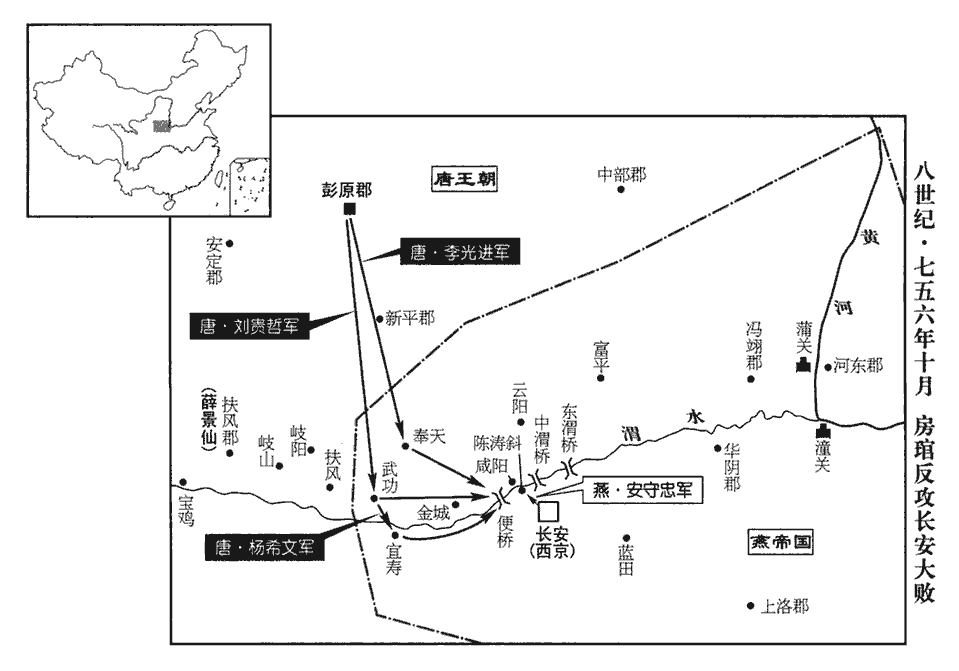
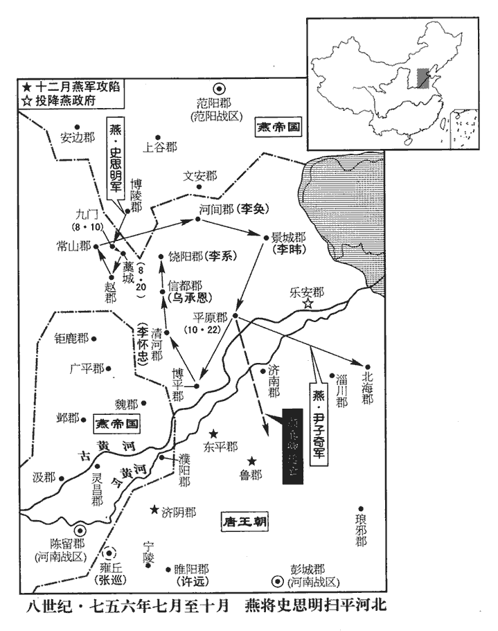
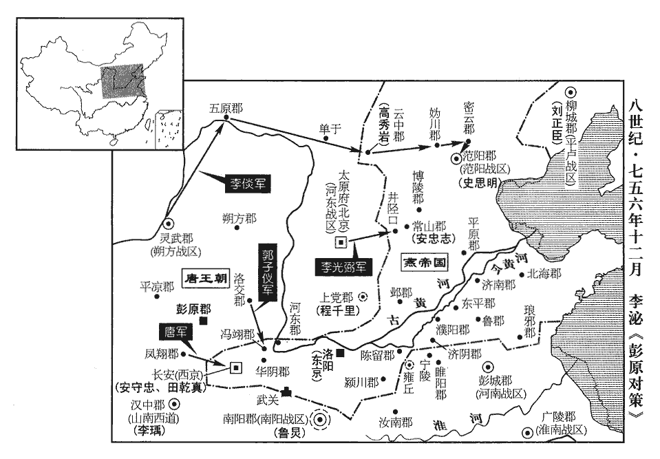
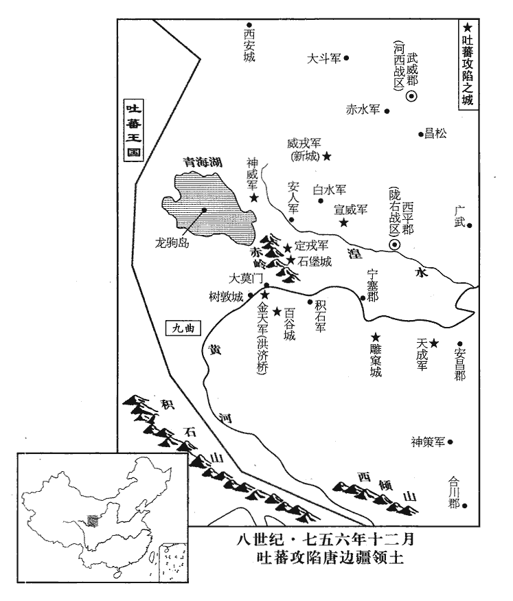
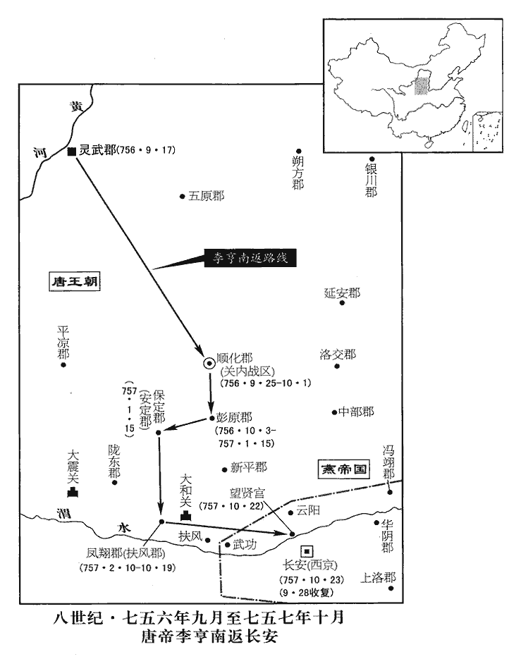
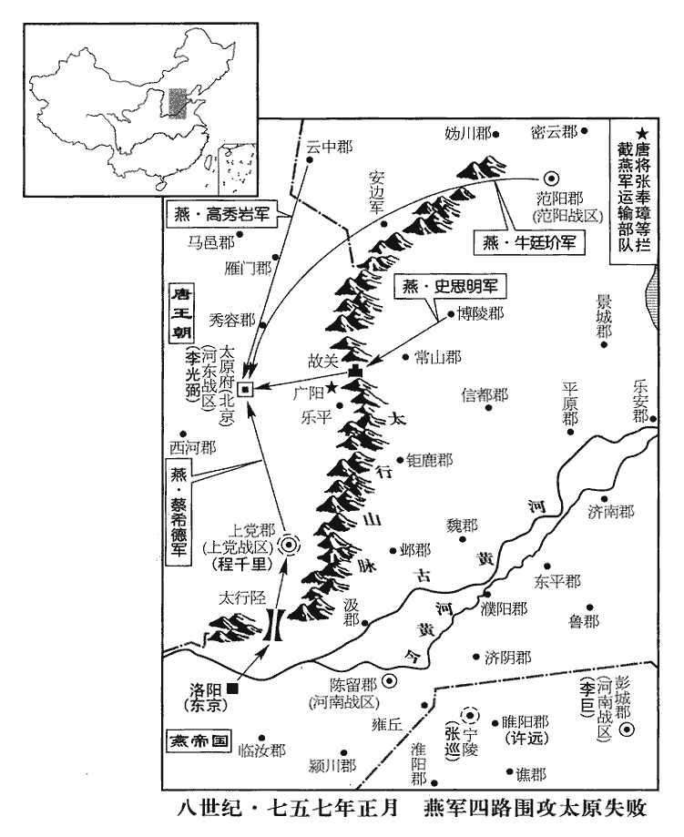
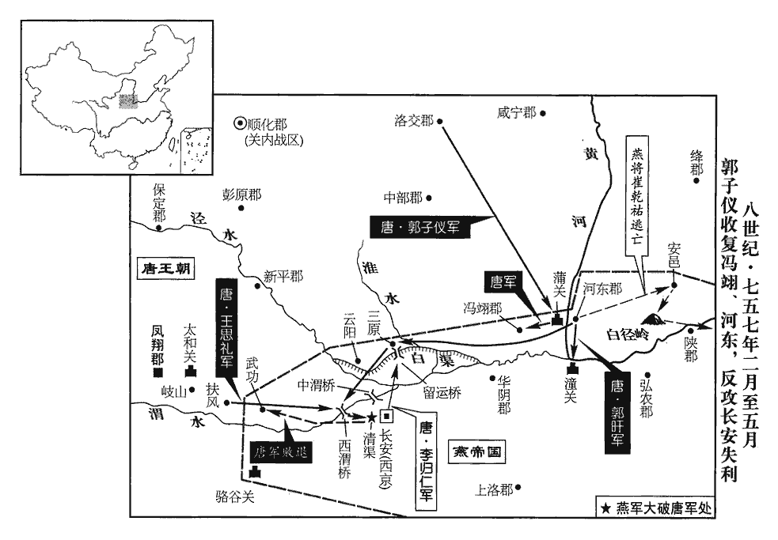
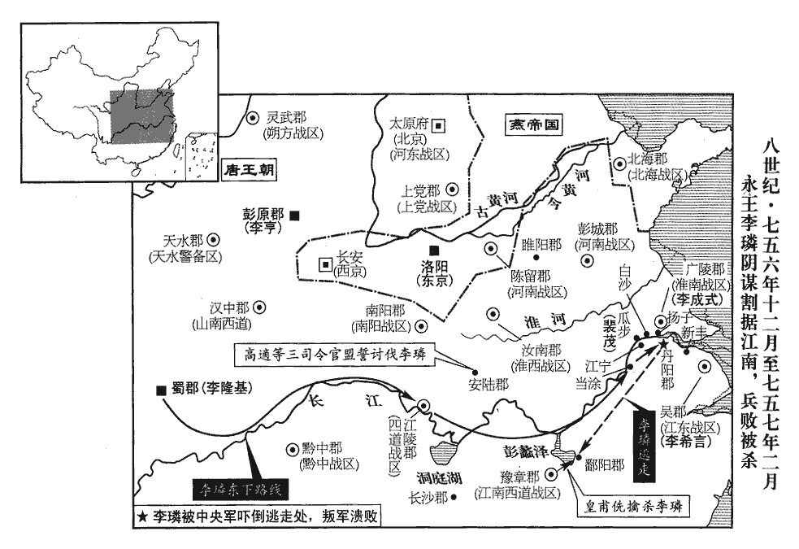
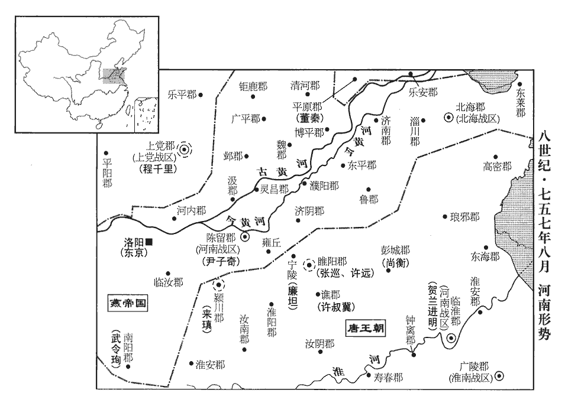

 唐紀三十五起柔兆涒灘（丙申）十月，盡強圉作噩（丁酉）閏月，不滿一年。

# 肅宗文明武德大聖大宣孝皇帝中之上

## 至德元載（丙申、七五六）

1冬，十月，辛巳朔‹一›，日有食之，既。

〖译文〗 [1]冬季，十月，辛巳朔（初一），出现日全食。

2上發順化‹甘肃省庆阳县›，宋白曰：慶州，貞觀以來為弘化郡，天寶後為安化郡，至德為順化郡。癸未‹三›，至彭原‹甘肃省宁县›。

〖译文〗 [2]肃宗从顺化郡出发，癸未（初三），到达彭原。

3初，李林甫為相，諫官言事皆先白宰相，退則又以所言白之；御史言事須大夫同署。至是，敕盡革其弊，開諫諍之塗。又令宰相分直政事筆、承旨，旬日而更，令宰相在政事堂，分日當筆及承上旨。更，工衡翻。懲林甫及楊國忠之專權故也。

〖译文〗 [3]先前，李林甫作宰相时，谏官向皇上进谏以前都要先告诉宰相，退朝后也要把与皇上谈话的内容告诉宰相。御史进言须御史大夫同时署名。这时，肃宗下敕书命令全部革除这些弊政，大开进谏之路。又命令宰相分别在政事堂值日，听候皇上的召见，每十日一更换，这都是为了戒除李林甫和杨国忠那样的宰相专权局面。

4第五琦見上於彭原，請以江、淮租庸市輕貨，泝江、漢而上至洋川‹陕西省洋县›，見，賢遍翻。上，時掌翻。洋川郡，洋州；本音羊，今人多讀如祥。令漢中王瑀陸運至扶風以助軍；考異曰：鄴侯家傳云：「薦元載，令於鄖yún鄉縣置院以督運。」按載傳，是時在蘇州及洪州，未嘗在鄖鄉。今不取。上從之。尋加琦山南等五道度支使。度支使始此。宋白曰：故事，度支案，郎中判入，員外判出，侍郎總統押案而已，官銜不言專判度支。開元已後，時事多故，遂有他官來判者，乃曰度支使，或曰判度支，或曰知度支事，或曰勾當度支使，雖名稱不同，其事一也。度，徒洛翻。琦作榷què鹽法，用以饒。琦變鹽法，盡榷天下鹽。就山、海、井、竈置監院，使吏出糶。舊業鹽戶併遊民願業者為亭戶，免其雜傜。盜煮、私市者論以法。百姓除租、庸外無得橫賦，人不益稅而上用以饒。榷，古岳翻。

〖译文〗 [4]第五琦晋见肃宗于彭原，请求把江、淮地区征收的租庸变买成贵重的货物，沿着长江、汉水而上运到洋川郡，然后命令汉中王李从陆地运到扶风以助唐军，肃宗同意。不久，加封第五琦为山南等五道度支使。第五琦又制定了食盐专营制度，使国用充足。

5房琯喜賓客，喜，許記翻。好談論，好，呼到翻。多引拔知名之士，而輕鄙庸俗，人多怨之。北海太守賀蘭進明詣行在，上命琯以為南海太守，兼御史大夫，充嶺南節度使；南海郡，廣州。是時兵興，方鎮重任必兼臺省長官，以至外府僚佐亦帶朝銜。迄于五季，遂為永制。其帶臺銜，自監察御史至御史大夫為憲銜。守，手又翻。琯以為攝御史大夫。進明入謝，上怪之，進明因言與琯有隙，且曰：「晉用王衍為三公，祖尚浮虛，致中原板蕩。王衍事見晉紀。板、蕩之詩，刺周室大壞，天下無綱紀、文章之詩也。後人率引此二詩，以諭天下大亂。毛氏傳曰：板板，反也。正義曰：釋訓云，板板，僻也。邪僻即反戾之義，故為反也。鄭曰：蕩蕩，法度廢壞之貌。今房琯專為迂闊大言以立虛名，所引用皆浮華之黨，真王衍之比也！陛下用為宰相，恐非社稷之福。且琯在南朝佐上皇，使陛下與諸王分領諸道節制，事見上卷。上即位於靈武，進駐彭原，其地在關山之北。上皇在成都，其地在關山之南，故謂之南朝。仍置陛下於沙塞空虛之地，又布私黨於諸道，使統大權。蓋指李峴、李承式、鄧景山等。其意以為上皇一子得天下，則己不失富貴，此豈忠臣所為乎！」上由是疏之。考異曰：唐曆：「上以房琯有重名，虛己以待之，禮遇加等。琯推誠謇諤，亦以天下為己任，知無不為。其所引進皆一時名士。其嫉惡太甚，雅有宰相望。其於彌綸天下，非所長也。後頗以直忤旨，上以名高隱忍，漸不能容矣。琯遂請兵為元帥，許之。」今從實錄。據考異，則上之疏琯，非特因進明之言也。

〖译文〗 [5]房喜欢接交朋友，爱好高谈阔论，引荐了许多知名士人，而鄙视无名庸俗之辈，所以很多人怨恨他。北海太守贺兰进明到达行在，肃宗命令房任命贺兰进明为南海太守，兼御史大夫，并充任岭南节度使，而房却任命贺兰进明为代理御史大夫。贺兰进明入朝谢恩，肃宗感到奇怪，贺兰进明乘机说自己与房有矛盾，并说：“西晋任用王衍为三公，因为崇尚浮华虚名，致使五胡乱华，中原沦陷。现在房喜好迂阔不切实际的言论而图虚名，所引用的人都是轻浮之辈，真是第二个王衍！陛下任用这样的人为宰相，恐怕对国家不利。再说房在成都辅佐太上皇，使陛下与诸王分别为各道节度使，而把陛下分置在塞外荒凉空虚的地方，又把自己的亲信私党分别安插在各地，使他们统领大权。房的用心是不管皇上的那一个儿子得天下继承皇位，自己都会大富大贵，这难道是忠臣应该做的事吗！”肃宗因此疏远了房。

房琯上疏，請自將兵復兩京；上許之，加持節、招討西京兼防禦蒲•漳【章：十二行本「漳」作「潼」；乙十一行本同；孔本同；退齋校同。】兩關兵馬•節度等使。琯請自選參佐，以御史中丞鄧景山為副，戶部侍郎李揖為行軍司馬，給事中劉秩為參謀。既行，又令兵部尚書王思禮副之。琯悉以戎務委李揖、劉秩，二人皆書生，不閑軍旅。閑，習也。琯謂人曰：「賊曳落河雖多，安能敵我劉秩！」琯分為三軍：使裨將楊希文將南軍，自宜壽‹陕西省周至县›入；天寶元年，更盩厔縣曰宜壽，屬鳳翔郡。劉貴哲將中軍，自武功入；李光進將北軍，自奉天入。光進，光弼之弟也。

〖译文〗 房上疏肃宗，请求亲自率兵收复两京，肃宗同意，于是就加封房为持节、招讨西京兼防御蒲、漳两关兵马及节度等使。房请求由自己挑选部下参佐，于是以御史中丞邓景山为副将，户部侍郎李揖为行军司马，给事中刘秩为参谋。临行前，肃宗又命令兵部尚书王思礼去协助房。房把军务大事都委托给李揖与刘秩，此二人都是文弱书生，不懂得军事。房对人说：“叛军的精锐壮士曳落河虽然多，但怎么能够敌得过我的谋士刘秩呢！”房把部队分成三军：派副将杨希文率领南军，从宜寿县进攻；派刘贵哲率领中军，从武功县进攻；派李光进率领北军，从奉天县进攻。李光进是李光弼的弟弟。

以賀蘭進明為河南節度使。

〖译文〗 [5]肃宗任命贺兰进明为河南节度使。

6潁王璬jiǎo之至成都也，見上卷。璬，公了翻。崔圓迎謁，拜於馬首，璬不之止；圓恨之。璬視事兩月，吏民安之。圓奏罷璬，使歸內宅；京師有十宅，以處諸王未出閤者。此時在成都，亦即行宮為內宅。以武部侍郎李峘huán為劍南節度使，代之。峘，胡登翻。考異曰：肅宗實錄，明年正月甲寅，以峘為劍南節度使。蓋峘已受上皇命，而肅宗申命之也。峘，峴之兄也。上皇尋命璬與陳王珪詣上宣慰，至是，見上於彭原。延王玢bīn從上皇入蜀，追車駕不及；上皇怒，欲誅之。漢中王瑀救之，乃命玢亦詣上所。玢，音彬。考異曰：明皇雜錄：「賀蘭進明之初守北海也，城卑不完，儲積於外，寇又將至，懼資其用，進明遂焚之。適有寺人至北海，求貨於進明，不獲，歸，以損軍用聞於上，遂詔罷郡守。屬延王玢從上不及，遣中使訪之，而加刑焉。會進明赴蜀，遇使，訪于路，曰：『王罪不宜及刑，願少留於路。』使者感而受約。既至蜀，進明言於上曰：『延王，陛下之愛子也，無兵權以變其心，無郡國以驕其志，間道於豺狼，乃責其不以時至，陛下罪之，人復何望！臣恐漢武望思之築，將見於聖朝矣！』因遽馳使赦之；謂進明曰：『俾父子如初，卿之力也！』遂遣進明往靈武，道遇延王，進明馳馬，亦慰之。王望之，降車稽首而去。肅宗謂之曰：『卿解平原之圍，阻賊寇之軍，而不以讒口介意，復全我兄弟，乃社稷之臣。』因授御史大夫。」今從舊傳。

〖译文〗 [6]颍王李到达成都，崔圆去迎接，于马首下拜见，李不予制止，所以崔圆心里怨恨他。李上任两个月，官吏与百姓安定。但崔圆却奏请玄宗罢免李，让他回到宫中宅舍，并任命武部侍郎李为剑南节度使，以代替李。李是李岘的哥哥。不久，玄宗又命令李与陈王李去宣慰肃宗，至此，李在彭原见到肃宗。延王李玢追随玄宗逃入蜀中，因为追赶不及，玄宗发怒，想要杀掉他。汉中王李从中援救，于是玄宗命令李玢也去肃宗所在地。

7甲申‹四›，令狐潮、王福德復將步騎萬餘攻雍丘。復，扶又翻。張巡出擊，大破之，斬首數千級；賊遁去。

〖译文〗 [7]甲申（初四），叛军将领令狐潮与王福德又率领步、骑兵一万余人进攻雍丘。张巡领兵出击，大败叛军，杀死数千人，叛军败逃而去。

8房琯以中軍、北軍為前鋒，庚子‹二十›，至便橋‹西渭桥·陕西省咸阳市西南›。辛丑‹二十一›，二軍遇賊將安守忠於咸陽之陳濤斜。陳濤澤，在咸陽縣東，其路斜出，故曰陳濤斜。又宋敏求退朝錄引唐人文集曰：唐宮人墓謂之宮人斜，四仲，遣使者祭之。然則陳濤斜者，豈亦因內人所葬地而名之邪？琯效古法，用車戰，以牛車二千乘，馬步夾之；賊順風鼓譟，牛皆震駭。賊縱火焚之，人畜大亂，乘，繩證翻。畜，許救翻。官軍死傷者四萬餘人，存者數千而已。癸卯‹二十三›，琯自以南軍戰，又敗，南軍，宜壽之軍也。楊希文、劉貴哲皆降於賊。上聞琯敗，大怒。李泌為之營救，為，于偽翻。上乃宥之，待琯如初。

〖译文〗 [8]房命令中军与北军为前锋，庚子（二十日），进军到便桥。辛丑（二十一日），二军与叛军将领安守忠相遇于咸阳的陈涛斜。房效法古人，用战车进攻，组成牛车二千辆，并让步、骑兵护卫。叛军顺风擂鼓呼喊，牛都受到惊吓。这时叛军放火焚烧战车，顿时战阵大乱，人畜相杂，唐军死伤达四万余人，逃命存活的仅数千名。癸卯（二十三日），房亲自率领南军作战，又被打得大败，杨希文与刘贵哲都投降了叛军。肃宗得知房大败，十分愤怒。李泌从中营救，肃宗才赦免了房，仍像过去那样对待他。

 

以薛景仙為關內‹总部设顺化甘肃省庆阳县›節度副使。

〖译文〗 肃宗任命薛景仙为关内节度副使。

9敦煌王承寀至回紇牙帳‹设蒙古国哈尔和林市›，承寀使回紇見上卷九月。敦，徒門翻。回紇可汗以女妻之，妻，七細翻。遣其貴臣與承寀及僕固懷恩偕來，見上於彭原。見，賢遍翻。上厚禮其使者而歸之，賜回紇女號毗伽公主。伽，求迦翻。

〖译文〗 [9]敦煌王李承来到回纥牙帐，回纥可汗把女儿嫁给了他，并派自己的大臣与李承及仆固怀恩一起来唐朝，在彭原见到肃宗。肃宗对回纥使节度重加赏赐，然后使他们归国，并将回纥可汗的女儿赐号为毗伽公主。

10尹子奇圍河間，四十餘日不下，史思明引兵會之。顏真卿遣其將和琳將萬二千人救河間，思明逆擊，擒之，遂陷河間；執李奐送洛陽，殺之。又陷景城‹河北省沧州市东南›，太守李暐赴湛水死。新書作赴河死。思明使兩騎齎尺書以招樂安‹山东省惠民县›，樂安即時舉郡降。樂安郡，棣州。景城既陷，樂安孤絕，即時降賊。蓋人心危懼，城主不能守也。又使其將康沒野波將先鋒攻平原，兵未至，顏真卿知力不敵，壬寅‹二十二›，棄郡渡河南走。思明即以平原兵攻清河、博平，皆陷之。清河郡，貝州。博平郡，博州。考異曰：河洛春秋云：「蔡希德引兵攻貝州，貝州陷。攻博州，五日，城陷。」今從肅宗實錄。思明引兵圍烏承恩於信都，承恩【章：十二行本「恩」下有「以城」二字；乙十一行本同；孔本同；退齋校同。】降，親導思明入城，交兵馬、倉庫，馬三千匹、兵萬人。信都郡，冀州。降，戶江翻。史言烏承恩兵力足以拒守。思明送承恩詣洛陽，祿山復其官爵。

〖译文〗 [10]叛军将领严子奇率兵围攻河间，四十多天未攻克，史思明率兵来增援。颜真卿派大将和琳率兵一万二千人来救河间，遭到史思明的阻击，和琳被俘，于是叛军攻陷了河间，抓获守将李奂送往洛阳杀掉。叛军又攻陷了景城，太守李投湛水自杀。史思明派遣两名骑兵持书信去招降乐安郡，乐安郡立刻投降了叛军。史思明又派部将康没野波率先锋兵攻打平原，兵还未到，颜真卿自知兵力不敌叛军，壬寅（二十二日），遂放弃郡城渡过黄河南撤。于是史思明用平原郡兵攻打清河、博平，均攻陷。史思明又亲自率兵于信都包围了乌承恩，乌承恩投降，并亲自引导史思明入城，把兵马及府库中的物资交给史思明，共有马三千匹，兵一万人。史思明把乌承恩送往洛阳，安禄山恢复了他的官职与爵位。

饒陽裨將束鹿‹河北省辛集市›張興，力舉千鈞，性復明辨；將，即亮翻。束鹿縣，屬饒陽郡，本鹿城縣，天寶十五載更名。劉昫曰：束鹿，漢安定侯國，今縣西七里故城是也。齊、周為安定縣，隋改曰鹿城。明皇以安祿山反，改常山之鹿泉曰獲鹿，饒陽之鹿城曰束鹿，以厭之。復，扶又翻。賊攻饒陽，彌年不能下。饒陽受攻，事始二百十七卷天寶十四載。考異曰：此事出河洛春秋。前云「賊攻深州，經月不下」。後云「興戰守彌年而城池轉固」。蓋前云經月者，今次攻城也；後云彌年者，并計前後之數也。及諸郡皆陷，思明並力圍之，外救俱絕，太守李系窘迫，赴火死，守，式又翻。窘，渠隕翻。城遂陷。思明擒興，立於馬前，謂曰：「將軍真壯士，能與我共富貴乎？」興曰：「興，唐之忠臣，固無降理。今數刻之人耳，張興志在必死，自言命在晷刻。願一言而死。」思明曰：「試言之。」興曰：「主上待祿山，恩如父子，群臣莫及，不知報德，乃興兵指闕，塗炭生人。大丈夫不能翦除凶逆，乃北面為之臣乎！僕有短策，足下能聽之乎？足下所以從賊，求富貴耳，譬如燕巢于幕，引左傳吳季札之言。豈能久安！何如乘間取賊，間，古莧翻。轉禍為福，長享富貴，不亦美乎！」思明怒，命張於木上，鋸殺之，詈不絕口，以至於死。如史所云，則河北二十四郡，惟張興可以言義士耳。

〖译文〗 饶阳副将束鹿人张兴不但勇力过人，而且心有计谋，叛军围攻饶阳，一年都未攻克。及至其他的郡城都被攻陷，史思明遂全力围攻饶阳。外援全部断绝，太守李系无计可施，投火而死，城遂被攻陷。史思明抓住了张兴，让他立在马前，然后说：“将军真是一位壮士，不知道能否与我同享富贵？”张兴说：“我张兴，是唐朝的忠臣，绝没有投降的道理。现在活在世上的时间已不长了，只希望进一言而死。”史思明说：“请你说出来。”张兴说：“皇上对待安禄山恩如父子，群臣都无法相比，安禄山却忘恩负义，不知报答皇上的恩德，反而兴兵攻打长安，使生灵涂炭。大丈夫不能平叛除掉逆凶，怎么还能再做逆臣呢！我有一点浅见，不知道足下愿意听否？足下之所以跟随安禄山反叛，贪图的不过是富贵，这就好似燕子作巢于帏幕之上，怎么能够长久呢！不如乘机攻灭叛贼，转祸为福，长享荣华富贵，不也是一件美事吗！”史思明听后大怒，命令把张兴捆绑在木头上，用锯子锯杀了他。张兴到死还骂不绝口。

賊每破一城，城中衣服、財賄、婦人皆為所掠。男子壯者使之負擔，擔，都濫翻。羸、病、老、幼皆以刀槊戲殺之。祿山初以卒三千人授思明，使定河北，至是，河北皆下之，按史思明與郭、李相持於常山、博陵，祿山蓋屢益其兵。及郭、李入井陘，思明乃能下河北。此蓋逆黨稱其才而史不削耳。郡置防兵三千，雜以胡兵鎮之；思明還博陵。

〖译文〗 叛军每当攻破一城，就把城中的衣服、财物和妇女全部抢掠而去，让壮年男人为他们运送，把老弱病幼者在戏笑中用刀枪杀死。起初，安禄山授给史思明兵卒三千，让他平定河北地区，至此，河北地区全部落入叛军之手，每郡驻兵三千，并掺杂胡兵镇守，史思明返回博陵。

尹子奇將五千騎渡河，略北海‹山东省青州市›，欲南取江、淮。會回紇可汗遣其臣葛邏支將兵入援，邏，郎佐翻。先以二千騎奄至范陽城下，子奇聞之，據引兵歸。

〖译文〗 叛军大将尹子奇率领骑兵五千渡过黄河，侵犯北海郡，想向南攻占江、淮地区。适逢回纥可汗派大臣葛逻支率兵助唐平叛，先以骑兵二千突然出现在范阳城下，尹子奇得知后，立刻领兵退回。

11十二【章：十二行本「二」作「一」；乙十一行本同；張校同，云無註本亦誤「二」。】月，戊午‹八›回紇至帶汗谷‹内蒙古包头市北›，新書作「呼延谷」，蓋語轉耳。汗，音寒。與郭子儀軍合；辛酉‹十一›，與同羅及叛胡戰於榆林‹内蒙古托克托县›河北，榆林郡，勝州，大河經其北。大破之，斬首三萬，捕虜一萬，河曲‹河套›皆平。子儀還軍洛交‹陕西省富县›。洛交郡，本鄜fū州上郡，天寶元年更郡名。

〖译文〗 [11]十一月戊午（初八），回纥兵到达带汗谷，与郭子仪兵相会。辛酉（十一日），回纥及唐兵与同罗及反叛的胡兵战于榆林河北岸，大获全胜，杀敌三万余人，俘虏一万，河曲平定。郭子仪率军返回洛交。

12上命崔渙宣慰江南，兼知選舉。

〖译文〗 [12]肃宗命令崔涣安慰江南地区，并兼主管科举选人的事情。

13令狐潮帥眾萬餘營雍丘‹河南省杞县›城北，帥，讀曰率。張巡邀擊，大破之，賊遂走。

〖译文〗 [13]叛军将领令狐潮率兵一万余人扎营于雍丘城北面，张巡领兵出击，大败叛军，叛军逃走。

14永王璘，幼失母，璘，郭順儀之子也，順儀早死。為上所鞠養，常抱之以眠；從上皇入蜀。上皇命諸子分總天下節制，事見上卷七月。諫議大夫高適諫，以為不可；上皇不聽。璘領四道節度都使‹四道：山南东道湖北省›、岭南道广东、广西、海南及越南北部、黔中道贵州省、江南西道江西省及湖南省，鎮江陵。時江、淮租賦山積於江陵，璘召募勇士數萬人，日費巨萬。璘生長深宮，不更人事，子襄城王瑒chàng，有勇力，好兵，有薛鏐liú等為之謀主，長，知兩翻。更，工衡翻。瑒，徒杏翻，又音暢。好，呼到翻。鏐，力求翻。以為今天下大亂，惟南方完富，璘握四道兵，封疆數千里，宜據金陵‹江苏省南京市›，康曰：楚威王埋金以鎮王氣，故曰金陵。保有江表‹江东·江苏省南部太湖流域›，如東晉故事。上聞之，敕璘歸覲于蜀；璘不從。江陵長史李峴辭疾赴行在，璘將稱兵，峴不欲預其禍也。上召高適與之謀。適陳江東利害，且言璘必敗之狀。十二月，置淮南節度使，領廣陵等十二郡，以適為之；置淮南西道節度使，領汝南‹河南省汝南县›等五郡，以來瑱tiàn為之；淮南節度使，領揚州廣陵郡、楚州山陽郡、滁州全椒郡、和州歷陽郡、壽州淮南郡、廬州合肥郡、舒州同安郡、光州弋陽郡、蘄州蘄春郡、安州安陸郡、黃州齊安郡、申州義陽郡、沔州漢陽郡，凡十三。淮南西道節度使，領蔡州汝南郡、鄭州滎陽郡、許州潁川郡、光州弋陽郡、申州義陽郡。已上皆據新書方鎮表。但義陽、弋陽已屬淮南節度，當考。使與江東節度使韋陟共圖璘。方鎮表：至德二載，置江東防禦使，治杭州。蓋謂浙江之東也。韋陟所節度者，蓋江南東道也。其巡屬兼有浙東、西及昇、宣、歙諸州。

〖译文〗 [14]永王李幼年失去母亲，由肃宗抚养，常常抱在怀中同睡。后来李跟随玄宗逃向蜀中。玄宗任命诸子分别兼领天下节度使。谏议大夫高适进谏说不可行，但玄宗不听。李兼领四道节度都使，坐镇江陵。当时江、淮地区所征收的租赋都积聚于江陵，李招募数万勇士为兵，每日耗费巨大。李从小长于深宫之中，不懂人间世事，儿子襄城王李勇武有力，喜好用兵，又有薛等人为谋士，认为当今天下大乱，只有南方富有，未遭破坏，李手握四道重兵，疆土数千里，应该占据金陵，保有江东，像东晋王朝那样占据一方。肃宗得知后，下敕让李往蜀中朝见玄宗，李不听。江陵长史李岘以有病为名辞别李奔赴行在，肃宗召来高适与他一同商讨计策。高适陈说了江东的形势，并分析说李必败。十二月，设置淮南节度使，管辖广陵等十二郡，任命高适为节度使。又设置淮南西道节度使，管辖汝南等五郡，任命来为节度使。让他们与江东节度使韦陟共同对付李。

 

15安祿山遣兵攻潁川‹河南省许昌市›。城中兵少，無蓄積，太守薛愿、長史龐堅悉力拒守，繞城百里廬舍、林木皆盡。朞年，救兵不至，祿山使阿史那承慶益兵攻之，晝夜死鬬十五日，城陷，執愿、堅送洛陽，祿山縛於洛濱冰上，凍殺之。

〖译文〗 [15]安禄山派兵攻打颍川。城中兵力少，也没有粮草储备，太守薛愿与长史庞坚竭力坚守，城周围百里以内的房舍和林木都被毁掉。坚守了一年，救兵不来，安禄山又派阿史那承庆增兵攻打，昼夜连续死战十五天，最后城被攻陷，薛愿与庞坚被抓住送往洛阳，安禄山把他们捆绑在洛水边的冰上，活活冻死。

16上問李泌曰：「今敵強如此，何時可定？」對曰：「臣觀賊所獲子女金帛，皆輸之范陽‹北京市›，輸，舂遇翻。此豈有雄據四海之志邪！邪，音耶。今獨虜將或為之用，中國之人惟高尚等數人，自餘皆脅從耳。以臣料之，不過二年，天下無寇矣。」上曰：「何故？」對曰：「賊之驍將，不過史思明、安守忠、田乾真、張忠志、阿史那承慶等數人而已。將，即亮翻。驍，堅堯翻。過，古禾翻，又古臥翻。張忠志，即安忠志，此時已復舊養父之姓。今若令李光弼自太原出井陘，郭子儀自馮翊‹陕西省大荔县›入河東，則思明、忠志不敢離范陽、常山，守忠、乾真不敢離長安，令，力丁翻。陘，音刑。離，力智翻。是以兩軍縶其四將也，從祿山者，獨承慶耳。願敕子儀勿取華陰，華，戶化翻。使兩京之道常通，陛下以所徵之兵軍於扶風，與子儀、光弼互出擊之，彼救首則擊其尾，救尾則擊其首，使賊往來數千里，疲於奔命，我常以逸待勞，賊至則避其鋒，去則乘其弊，不攻城，不遏路。來春復命建寧為范陽節度大使，並塞北出，復，扶又翻，又音如字。使，疏吏翻。並，步浪翻。與光弼南北掎角以取范陽，泌欲使建寧自靈、夏並豐、勝、雲、朔之塞，直擣媯、檀，攻范陽之北；光弼自太原取恆、定，以攻范陽之南。覆其巢穴。賊退則無所歸，留則不獲安，然後大軍四合而攻之，必成擒矣。」使肅宗用泌策，史思明豈能再為關、洛之患乎！上悅。

〖译文〗 [16]肃宗问李泌说：“现在叛军如此强大，不知什么时候才能够平定？”李泌回答说：“我看到叛军把抢掠的子女与财物都运往老巢范阳，这难道有雄据天下的志向吗！现在只是那些胡人将领为安禄山卖力，汉人只有高尚等几个人，其余的都不过是一些胁从。以我的看法，不过二年，天下就会平定。”肃宗说：“这有什么道理？”李泌回答说：“叛军中勇将不过是史思明、安守忠、田乾真、张忠志、阿史那承庆等几个人。现在我们如果命令李光弼率兵从太原出井陉关，郭子仪率兵从冯翊进入河东，这样史思明与张忠志便不敢离开范阳与常山，安守忠与田乾真则不敢离开长安，我们以两支军队拖住了叛军的四员骁将，跟随安禄山的只有阿史那承庆了。希望下敕书命令郭子仪不要攻取华阴，使两京之间的道路畅通，陛下率领所征召的军队驻扎于扶风，与郭子仪、李光弼交互攻击叛军，叛军如果救援这头，就攻击他们的那头，如果救援那头，就攻击这头，使叛军在数千里长的战线上往来，疲于奔命，我们则以逸待劳，叛军如果来交战，就避开他的锋芒，如果要撤退，就乘机攻击，不攻占城池，不切断来往的道路。明年春天再任命建宁王李为范阳节度大使，从塞北出击，与李光弼形成南北夹击之势，以攻取范阳，颠覆叛军的巢穴。这样叛军想要撤退则归路已断，要留在两京则不得安宁，然后各路大军四面合击而进攻，就一定能够平息叛军。”肃宗听后很高兴。

時張良娣與李輔國相表裡，皆惡泌。建寧王倓tán謂泌曰：「先生舉倓於上，得展臣子之效，無以報德，請為先生除害。」娣，大計翻。惡，烏路翻。為，于偽翻。倓，徒甘翻。泌曰：「何也？」倓以良娣為言。泌曰：「此非人子所言，願王姑置之，勿以為先。」倓不從。

〖译文〗 当时张良娣与李辅国内外勾结，二人都嫉恨李泌。建宁王李对李泌说：“先生你在皇上面前荐举了我，使我得以效臣子之忠，大恩大德无以报答，请让我为先生除掉大害。”李泌说：“你说的是什么意思？”李就说到张良娣。李泌听后说：“这样的话不是作臣子所应该说的，希望你暂时把这件事放下，不要先做这种事。”但李不听从李泌的话。

17甲辰‹二十五›，永王璘擅引兵【章：十二行本「兵」作「舟師」二字；乙十一行本同；孔本同。】東巡，沿江而下，軍容甚盛，然猶未露割據之謀。吳郡太守兼江南東路采訪使李希言平牒璘，詰其擅引兵東下之意。璘，離珍翻。守，式又翻。詰，去吉翻。使，疏吏翻。方鎮位任等夷者，平牒。璘怒，分兵遣其將渾惟明襲希言於吳郡，將，即亮翻。吳郡，蘇州。季廣琛襲廣陵長史、淮南采訪使李成式於廣陵。琛，丑林翻。廣陵郡，揚州。長，知兩翻。璘進至當塗‹安徽省当涂县›，希言遣其將元景曜及丹徒‹丹阳郡，江苏省镇江市›太守閻敬之將兵拒之，今之當塗，本漢丹陽縣地。晉分丹陽置于湖縣，成帝以江北當塗縣流人寓居于湖，乃改為當塗縣，仍僑置淮南郡。隋廢淮南郡，以縣屬丹陽郡，唐屬宣城郡。丹徒縣帶潤州丹陽郡。唐未嘗以丹徒名郡。「徒」，當作「陽」。守，式又翻。李成式亦遣其將李承慶拒之。璘擊斬敬之以徇，景曜、承慶皆降於璘，江、淮大震。高適與來瑱、韋陟會於安陸，結盟誓眾以討之。韋陟蓋赴鎮，中道聞變，遂會於安陸。降，戶江翻。瑱，他甸翻。

〖译文〗 [17]甲辰（二十五日），永王李擅自率兵东巡，沿着长江而下，军势浩大，但还没有显露出割据一方的图谋。吴郡太守兼江南东路采访使李希言写信给李，责问他擅自发兵东下的意图。李大怒，于是就分兵派遣部将浑惟明在吴郡袭击李希言，季广琛在广陵袭击广陵长史、淮南采访使李成式。李率兵进至当涂，李希言派遣部将元景曜与丹徒太守阎敬之率兵抵挡，李成式也派部将李承庆迎击。李将阎敬之斩首示众，于是元景曜与李承庆都投降了李，江、淮地区大为震动。高适、来与韦陟会合于安陆，结盟誓师讨伐李。

 

18于闐‹新疆和田市›王勝聞安祿山反，命其弟曜攝國事，自將兵五千入援。闐，徒賢翻，又徒見翻。上嘉之，拜特進，兼殿中監。

〖译文〗 [18]于阗王尉迟胜得知安禄山谋反，就任命他的弟弟尉迟曜代理国政，自己亲自率兵五千入朝援助平叛，肃宗嘉奖他的忠诚，拜他为特进，兼殿中监。

19令狐潮、李庭望攻雍丘，數月不下，乃置杞州，築城於雍丘之北令，力丁翻。雍丘，唐初置杞州，貞觀元年廢。賊復置之，築城以逼雍丘。以絕其糧援。賊常數萬人，而張巡眾纔千餘，每戰輒克。河南節度使虢王巨屯彭城‹江苏省徐州市›，假巡先鋒使。是月，魯‹山东省兖州市›、東平、濟陰陷于賊。彭城郡，徐州。魯郡，兗州。東平郡，鄆州。濟，子禮翻。賊將楊朝宗帥馬步二萬，將襲寧陵‹河南省杞县东五十五千米›，斷巡後。斷，丁管翻。巡遂拔雍丘，東守寧陵以待之，帥，讀曰率。范成大北使錄：雍丘，百二十里至寧陵。始與睢陽太守許遠相見。是日，楊朝宗至寧陵城西北，巡、遠與戰，晝夜數十合，大破之，斬首萬餘級，流尸塞汴而下，睢，音雖。守，式又翻。塞，悉則翻。賊收兵夜遁。敕以巡為河南節度副使。巡以將士有功，遣使詣虢王巨請空名告身及賜物，巨唯與折衝、果毅告身三十通，不與賜物。巡移書責巨，巨竟不應。使，疏吏翻。將，即亮翻。折，之舌翻。

〖译文〗 [19]叛军将领令狐潮与李庭望率兵攻打雍丘，数月未攻克，于是就设置了杞州，在雍丘北面筑杞州城，以断绝雍丘城的粮食援助。叛军经常用数万兵力来进攻，而张巡的兵力才有一千余人，但每次交战都打退叛军。河南节度使虢王李巨率兵屯驻于彭城，命张巡为代理先锋使。此月，鲁郡、东平、济阴都落入叛军之手。叛军大将杨朝宗率领步、骑兵二万将要袭击宁陵，断绝张巡的后路。张巡于是率兵撤出雍丘，向东坚守宁陵，抵抗叛军，这时张巡才与睢阳太守许远见面。当天，杨朝宗率兵到达宁陵城西北，张巡、许远与他交战，一昼夜达数十次，大败叛军，杀死一万余人，死尸塞满汴水，顺流而下，叛军收兵连夜逃走。肃宗下敕书任命张巡为河南节度副使。张巡认为部下将士有功，派遣使者向虢王李巨请求给予空名的委任状以及赏赐物品，而虢王李巨只给了折冲都尉与果毅都尉的委任状三十通，没有给予赏赐的物品。张巡写信责备李巨，李巨竟不回信。

 

20是歲，置北海節度使，領北海等四郡；領青州北海郡，密州高密郡‹山东省诸城市›，登州東牟郡‹山东省蓬莱市›，萊州東萊郡‹山东省莱州市›。上黨節度使，領上黨等三郡；領潞州上黨郡，澤州長平郡‹山西省晋城市›，沁州陽城郡‹山西省沁源县›。興平節度使，領上洛‹陕西省商州市›等四郡‹四郡：上洛郡、安康郡陕西省安康市›、武当郡湖北省丹江口市西北、房陵郡湖北省房县。領商州上洛郡，金州安康郡‹陕西省安康市›，岐州鳳翔郡。方鎮表止著三郡，餘一郡當考。鳳翔郡郿縣東原先有興平軍，因置為節鎮。

〖译文〗 [20]这一年，唐朝设置北海节度使，统辖北海等四郡；设置上党节度使，统辖上党等三郡；设置兴平节度使，统辖上洛等四郡。

21吐蕃陷威戎‹青海省门源县›、神威‹青海省海晏县›、定戎‹青海省湟源县西南›、宣威‹青海省大通县东南›、制勝、金天‹青海省共和县西南›、天成‹甘肃省积石山县›等軍，石堡城‹青海省湟源县西南›、百谷城‹青海省共和县东南›、雕窠城‹青海省同仁县›。定戎軍在石堡城北，隔澗七里。廓州西南百四十里有洪濟橋、金天軍，其東南八十里有百谷城。河州西八十里索恭川有天成軍，西百餘里有雕窠城。皆天寶十三載置。

〖译文〗 [21]吐蕃军队攻陷唐朝的威戎、神威、定戎、宣威、制胜、金天、天成等军及石堡城、百谷城、雕窠城。

22初，林邑‹越南中部›王范真龍為其臣摩訶漫多伽獨所殺，盡滅范氏。據新書，此事在貞觀十九年。通鑑因其改國號環王，書之以始事。范氏自晉以來，世有林邑，至是而滅。國人立其王頭黎之女為王，女不能治國，更立頭黎之姑子諸葛地，謂之環王，妻以女王。更，工衡翻。妻，七細翻。

〖译文〗 [22]当初，林邑国王范真龙被臣子摩诃漫多伽独杀死，并族灭了范氏。国人又立国王头黎的女儿为王，因为头黎的女儿不能治理国家，国人就改立头黎姑母的儿子诸葛地为王，被称为环王，并把女王嫁给他。

## 二載（丁酉、七五七）

1春，正月，上皇‹李隆基，本年七十三岁›下誥，以憲部尚書李麟同平章事，總行百司，命崔圓奉誥赴彭原‹唐帝李亨所在·甘肃省宁县›。麟，懿祖之後也。懿祖光皇帝，諱天錫，太祖之父也。麟，懿祖次子乞豆之後。

〖译文〗 [1]春季，正月，玄宗颁下诰命，任命宪部尚书李麟为同平章事，总管朝中各个部门，并命令崔圆奉诰命赴彭原。李麟是懿祖光皇帝李天锡的后代。

2安祿山自起兵以來，目漸昏，至是不復睹物；復，扶又翻。又病疽，性益躁暴，左右使令，小不如意，動加箠撻，或時殺之。既稱帝，深居禁中，大將希得見其面，皆因嚴莊白事。莊雖貴用事，亦不免箠撻，閹宦李豬兒被撻尤多，舊書曰：李豬兒，出契丹部落，十數歲事祿山，甚黠惠。祿山持刃盡去其勢，血射數升，欲死，祿山以灰火傅之，盡日而蘇。因為閹人，遂見信用。左右人不自保。祿山嬖妾段氏，生子慶恩，欲以代慶緒為後。慶緒常懼死，不知所出。莊謂慶緒曰：「事有不得已者，時不可失。」慶緒曰：「兄有所為，敢不敬從。」又謂豬兒曰：「汝前後受撻，寧有數乎！不行大事，死無日矣！」豬兒亦許諾。莊與慶緒夜持兵立帳外，豬兒執刀直入帳中，斫祿山腹。左右懼，不敢動。祿山捫枕旁刀，不獲，舊書曰：祿山眼無所見，床頭常有一刀。撼帳竿，曰：「必家賊也。」腸已流出數斗，遂死‹史书只载安禄山本年五十余岁›。掘床下深數尺，深，式浸翻。以氈裹其尸埋之，誡宮中不得泄。乙卯‹六›旦，莊宣言於外，云祿山疾亟。立晉王慶緒為太子，尋即帝位，尊祿山為太上皇，然後發喪。慶緒性昏懦，言辭無序，莊恐眾不服，不令見人。慶緒日縱酒為樂，懦，奴過翻，又奴亂翻。令，力丁翻。樂，音洛。兄事莊，以為御史大夫、馮翊王，事無大小，皆取決焉；厚加諸將官爵以悅其心。將，即亮翻。

〖译文〗 [2]安禄山从起兵反叛以来，视力逐渐下降，至此已看不清东西，又因为身上长了毒疮，性情更加暴躁，对左右的官员稍不如意，就用鞭子抽打，有时干脆杀掉。称帝以后，居于深宫之中，大将难得见他的面，都是通过严庄向安禄山报告。严庄虽然贵有权势，但也免不了被鞭打。宦官李猪儿挨的打尤其多，安禄山左右的人都感到自身难保。安禄山的爱妾段氏生子名叫庆恩，想要替代安庆绪为太子。所以安庆绪常常害怕被杀死，不知道怎么办才好。严庄对安庆绪说：“事情往往有迫不得已的时候，机不可失。”安庆绪说：“老兄如果要想有所为，我怎么敢不跟从。”严庄又对李猪儿说：“你前后挨的毒打难道还有数吗！如果再不干大事，恐怕离死就不远了！”李猪儿也答应一块行动。于是严庄与安庆绪夜里手持武器立在帐幕外面，李猪儿手执大刀直入帐中，向安禄山的腹部砍去。安禄山左右的人因为恐惧都不敢动。安禄山用手摸枕旁的刀，没有拿到，于是就用手摇动帐幕的竿子说：“这一定是家贼干的。”这时肠子已流出一大堆，随即死去。严庄等在安禄山的床下挖了数尺深的坑，用毡包裹了安禄山的尸体，埋了进去，并告诫宫中人不得向外泄露真相。乙卯（初六）早晨，严庄向外宣布说安禄山病重，立晋王安庆绪为太子。不久安庆绪即皇帝位，尊称安禄山为太上皇，然后才发丧。安庆绪性情昏庸懦弱，说话时语无伦次，严庄恐怕众人不服，所以不让安庆绪出来见人。安庆绪每天以饮酒为乐，称严庄为兄，任命他为御史大夫，封冯翊王爵位，大小事情都由严庄决定，并加封诸将的官爵，借以笼络人心。

3上‹李亨，本年四十七岁›從容謂李泌曰：「廣平‹李俶›為元帥踰年，今欲命建寧‹李倓›專征，又恐勢分。立廣平為太子，何如？」對曰：「臣固嘗言之矣，戎事交切，須即區處；從，千容翻。泌，毗必翻。帥，所類翻。處，昌呂翻。至於家事，當俟上皇。不然，後代何以辨陛下靈武‹宁夏灵武市›即位之意邪！此必有人欲令臣與廣平有隙耳；臣請以語廣平，邪，音耶。語，牛倨翻。廣平亦必未敢當。」泌出，以告廣平王俶chù，俶曰：「此先生深知其心，欲曲成其美也。」乃入，固辭，曰：「陛下猶未奉晨昏，俶，昌六翻。謂人子晨省昏定之禮。臣何心敢當儲副！願俟上皇還宮，臣之幸也。」上賞慰之。還，從宣翻，又音如字。

〖译文〗 [3]肃宗从容地对李泌说：“广平王李为元帅已经过了一个年头，现在想命令建宁王李专管征讨叛军的军事，但又恐怕大权分散。立广平王李为太子如何？”李泌回答说：“我早已说过，现在战事急迫，形势紧张，必须立刻处理，至于立太子这一类的家事，应当等待上皇的命令。不然，后代的人怎么看待陛下灵武即帝位的用意呢！这一定是有人想要挑拨我与广平王的关系，我请求把此事告诉广平王，广平王也必定不敢接受。”李泌出宫后把此事告诉了广平王李，李说：“这是先生深知我的心意，并想从侧面促成美事。”于是就入宫，坚持推辞不受说：“陛下即帝位后还没有来得及行早晚看望上皇的礼节，我怎么敢于当太子呢！愿能等待上皇还宫，这是我的荣幸。”肃宗赏赐并慰勉了广平王。

李輔國本飛龍小兒，凡廄、牧、五坊、禁苑給使者，皆謂之小兒。李輔國以閹奴為閑廄小兒。粗閑書計，給事太子宮，上委信之。輔國外恭謹寡言而內狡險，見張良娣有寵，陰附會之，與相表裡。建寧王倓tán數於上前詆訐jié二人罪惡，粗，坐五翻。娣，大計翻。倓，徒甘翻。數，所角翻。訐，居謁翻。二人譖之於上曰：「倓恨不得為元帥，不用倓為元帥，見上卷上年九月。謀害廣平王。」上怒，賜倓死。考異曰：鄴侯家傳曰：「肅宗自馬嵬北行，至同官縣，食於土豪李謙家。張良娣稱腹痛不能乘馬，併小女寄謙家而去。上即位，使人迎之。迎者或有他說，建寧聞而數以為言。」舊傳曰：「倓屢言良娣頗專恣，與護國連結內外，欲傾動皇嗣。」未知孰是。實錄、新舊本紀皆無倓死年月。列傳云：「倓死，明年冬，廣平王復兩京。」然則倓死在至德元載也。按鄴侯家傳：「上從容言曰：『廣平為元帥經年，今欲命建寧為元帥。』」則是至德二載倓猶在也。又云：「代宗使自彭原迎倓喪。」故置於此：「護國」，當作「輔國」。於是廣平王俶及李泌皆內懼。俶謀去輔國及良娣，泌曰：「不可，王不見建寧之禍乎？」俶曰：「竊為先生憂之。」去，羌呂翻。為，于偽翻。考異曰：鄴侯家傳曰：「先公在內院未起，輔國體肥重，因近床語，遂以身壓先公。先公素服氣，乃閉氣良久而去。」按泌方為上所厚，恐輔國亦不敢擅殺。今不取。泌曰：「泌與主上有約矣。謂上許泌，以賊平任行高志。見上卷上年九月。俟平京師，則去還山，庶免於患。」俶曰：「先生去，則俶愈危矣。」泌曰：「王但盡人子之孝。良娣婦人，王委曲順之，亦何能為！」吾觀代宗所以卒免張后之禍者，用李泌之言也。

〖译文〗 李辅国本是宦官中的飞龙小儿，粗通文墨，肃宗为太子时，李辅国在宫中侍奉，所以深受肃宗的信任。李辅国外表恭顺谨慎，寡言少语，而内心却狡诈阴险，看见张良娣受到肃宗的宠爱，就暗中依附张良娣，与她内外勾结，建宁王李多次在肃宗面前揭发二人的罪恶，二人就在肃宗面前进谗言说：“建宁王因为没有被任命为元帅，心中怨恨，想要谋害广平王李。”肃宗听后大怒，就下令赐建宁王李自杀。因此广平王李与李泌都心怀恐惧。李谋划要除掉李辅国与张良娣，李泌说：“此事不可行，您难道没有看见建宁王遭到了杀身之祸吗？”李说：“我私下为先生的生命担忧。”李泌说：“我与皇上有约定。等待收复京师以后，我就返回山中过隐居生活，这样或许可以免除祸患。”李说：“先生如果离开，我就更加危险了。”李泌说：“您只管尽儿子的孝心。张良娣是一个妇人，您如果能够委曲求全，顺从她的心意，她还能有什么作为呢？”

4上謂泌曰：「今郭子儀、李光弼已為宰相，若克兩京，平四海，則無官以賞之，奈何？」對曰：「古者官以任能，爵以酬功。漢、魏以來，雖以郡縣治民，治，直之翻。然有功則錫以茅土，傳之子孫，至于周、隋皆然。唐初，未得關東，故封爵皆設虛名，其食實封者，給繒布而已。唐制：食實封者，凡一戶則以一丁之歲調給之。貞觀中，太宗欲復古制，大臣議論不同而止。見一百九十五卷貞觀十三年。由是賞功者多以官。夫以官賞功有二害，非才則廢事，權重則難制。是以功臣居大官者，皆不為子孫之遠圖，務乘一時之權以邀利，無所不為。曏使祿山有百里之國，則亦惜之以傳子孫，不反矣。為今之計，俟天下既平，莫若疏爵土以賞功臣，則雖大國，不過二三百里，可比今之小郡，豈難制哉！於人臣乃萬世之利也。」上曰：「善！」夫音扶。過，古禾翻。考異曰：「鄴侯家傳曰：「泌既與上論封爵之事，因曰：『若臣者，受賞與他人異。』上曰：『何故？』公曰：『臣絕粒無家，祿位與茅土皆非所要。為陛下帷幄運籌，收京師後，但枕天子膝睡一覺，使有司奏客星犯帝座，一動天文，足矣。』上大笑。及南幸扶風，每頓，皆令先公領元帥兵先發，清行宮，收管鑰，奏報，然後上至。至保定郡，先公於本院寐，上來入院，不令人驚，登床，捧先公首置於膝上，久方覺。上曰：『天子膝已枕睡了，剋復效在何時，還朕可也。』欲起謝恩，持之不許。對曰：『當如郡名，必保定矣。』」此近戲謔，今不取。

〖译文〗 [4]肃宗对李泌说：“现在郭子仪与李光弼已贵为宰相，如果他们克复两京，平定天下，就再也没有官赏赐他们了，那将怎么办呢？”李泌回答说：“古时候官职任命给有能力的人，爵位酬答有功勋的人。汉魏以来，虽然设立郡县用来治理民众，但对有功人则赏赐土地，可以传给子孙，直至北周、隋朝都是如此。唐朝建立之初，因为还没有取得关东，所以封爵都只有虚名，享受实封者，只给他们封地上所征收的丝织品与布匹而已。贞观年间，太宗皇帝想要恢复古代的制度，因为大臣们有不同的意见而没有实行。因此赏赐有功的人多是给他们以高官。用官职赏赐功劳有两种危害：如果所任非才就会误事，如果权力过重则难以控制。所以有功之臣被任命为大官的，都不为子孙的长远利益考虑，只是借权力谋取利益，无所不为。假如过去封给安禄山百里之国，那么他就会珍惜封国以传子孙，不谋反了。为现在的情况考虑，等天下平定后，不如分土封爵以赏功臣，虽是大国也不过二三百里，与现在的小郡差不多，难道不好控制吗！这样对于为臣子的人乃是万世的利益。”肃宗听后说：“你说的好！”

5上聞安西‹总部设龟兹新疆库车县›、北庭‹总部设北庭府新疆吉木萨尔县›及拔汗那‹中亚纳曼干市›、大食‹阿拉伯帝国›諸國兵至涼‹武威郡，甘肃省武威市›、鄯‹西平郡，青海省乐都县›，甲子‹十五›，幸保定‹甘肃省泾川县›。保定郡，本涇州安定郡，去載更郡名。鄯，音善，又時戰翻。

〖译文〗 [5]肃宗得知安西、北庭及拔汗那、大食诸国援兵到达凉州、鄯州，甲子（十五日），临幸保定郡。

6丙寅‹十七›，劍南‹总部设蜀郡四川省成都市›兵賈秀等五千人謀反，將軍席元慶、臨邛‹四川省邛崃市›太守柳奕討誅之。臨邛郡，邛州。邛，渠容翻。守，式又翻。

〖译文〗 [6]丙寅（十七日），剑南镇兵贾秀等五千人举兵谋反，被将军席元庆与临邛太守柳奕讨伐诛杀。

7河西‹总部设武威甘肃省武威市›兵馬使蓋庭倫蓋，古盍翻。與武威九姓‹山西省西北部›商胡安門物等殺節度使周泌，使，疏吏翻。泌，毗必翻。聚眾六萬。武威大城之中，小城有七，武威郡，涼州，治姑臧，舊城匈奴所築，南北七里，東西三里。張氏據河西，又增築四城，箱各千步，並舊城為五。餘二城未知誰所築也。胡據其五，二城堅守。支度判官崔稱與中使劉日新以二城兵攻之，旬有七日，平之。

〖译文〗 [7]河西兵马使盖庭伦与武威郡昭武九姓胡商安门物等杀死节度使周泌，聚集兵众至六万人。武威郡大城之中有七个小城，胡人已占据了五个，只有两个城还在坚守。河西支度判官崔称与中使刘日新率领二城中的军队攻打叛胡，经过十七日苦战，平定了叛乱。

8史思明自博陵‹河北省定州市›，蔡希德自太行‹河南省博爱县北›，高秀巖自大同‹云中郡·山西省大同市›，牛廷介自范陽‹北京市›，引兵共十萬，寇太原‹山西省太原市›。行，戶剛翻。博陵郡，定州。蔡希德自上黨下太行道也。高秀巖為賊守大同，自此趨太原。牛廷介自幽州，與史思明等合。李光弼麾下精兵皆赴朔方‹总部设灵武宁夏灵武市›，餘團練烏合之眾不滿萬人。思明以為太原指掌可取，既得之，當遂長驅取朔方、河、隴。‹甘肃省及青海省东部›太原諸將皆懼，議脩城以待之，光弼曰：「太原城周四十里，太原都城，左汾右晉，潛丘在中，長四千三百二十一步，廣二千一百二十二步，周萬五千一百五十三步。宮城在都城西北，周二千五百二十步。汾東曰東城，貞觀十一年長史李勣所築。兩城之間曰中城，武后築。以合東城。周四十里者，止言都城耳。賊垂至而興役，是未見敵先自困也。」乃帥士卒及民於城外鑿壕以自固。作墼jī數十萬，帥，讀曰率。墼，古歷翻，範土為之。眾莫知所用；及賊攻城於外，光弼用之增壘於內，壞輒補之。思明使人取攻具於山東‹太行山以东›，以胡兵三千衛送之，至廣陽‹山西省平定县›，廣陽，漢上艾縣，後漢改石艾縣，天寶元年更名，屬太原府。井陘關在其東，葦澤關在其東北，皆通山東之道。別將慕容溢、張奉璋邀擊，盡殺之。

〖译文〗 [8]叛军大将史思明率兵从博陵，蔡希德从太行，高秀岩从大同，牛廷介从范阳，发兵共十万，来进攻太原。李光弼部下的精兵都奔赴朔方，其余的团练兵都是乌合之众，不满一万人。史思明认为太原城垂手可得，如果攻下太原，当立即长驱直取朔方、河西、陇右。太原城中的将领都十分害怕，商议修治城池抵抗叛军，李光弼说：“太原城周长四十里，在叛军即刻就要来到时修治城池，是未见敌人而先疲困自己。”于是率领士兵及民众于城外开凿壕沟准备固守。又让士卒做了数十万块砖坯，大家都不知道有什么用处。等到叛军在城外进攻，李光弼就让士卒用砖坯在城内加高城墙，有毁坏的地方便立刻补修。史思明派人到崤山以东去取攻城的器具，并且让胡兵三千护送，他们到达广阳时，遭到别将慕容溢、张奉璋的拦击，胡兵全部被杀死。

 

思明圍太原，月餘不下，乃選驍銳為遊兵，戒之曰：「我攻其北則汝潛趣其南，攻東則趣西，有隙則乘之。」趣，七喻翻。而光弼軍令嚴整，雖寇所不至，警邏未嘗少懈，賊不得入。光弼購募軍中，苟有小技，皆取之，隨能使之，人盡其用，得安邊軍‹河北省蔚县境›錢工三，善穿地道。安邊軍在蔚州興唐縣。蔚州有銅冶，有錢官，故有錢工，時得其三人也。賊於城下仰而侮詈，光弼遣人從地道中曳其足而入，臨城斬之。自是賊行皆視地。賊為梯衝、土山以攻城，光弼為地道以迎之，近城輒陷。近，其靳翻。賊初逼城急，光弼作大礟，飛巨石，一發輒斃二十餘人。賊死者什二三，乃退營於數十步外，退營於礟所不能及之地。礟，匹貌翻。圍守益固。光弼遣人詐與賊約，刻日出降，賊喜，不為備。光弼使穿地道周賊營中，搘zhī之以木。搘，章移翻，拄也。至期，光弼勒兵在城上，遣裨將將數千人出，如降狀，賊皆屬目。屬，之欲翻。俄而營中地陷，死者千餘人，賊眾驚亂，官軍鼓譟乘之，俘斬萬計。會安祿山死，慶緒使思明歸守范陽，留蔡希德等圍太原。

〖译文〗 [8]史思明围攻太原一个多月，还未攻下，于是挑选了一批骁勇善战的精兵，作为流动作战的军队，告诫他们说：“我率兵攻打城北时，你们就暗中往城南；攻打城东时，你们就向城西，见到有机可乘时就进攻。但因为李光弼军令严整，即使叛军没有攻打的地方，巡逻的士卒也十分警惕，未曾大意，所以叛军攻不进城。李光弼在军中征募人才，只要是有小技艺的人都被选中，根据能力予以使用，所以人尽其才。李光弼得到安边军的三个铸钱工匠，他们善于挖掘地道。叛军士卒站在城下抬头辱骂，李光弼就派人从地道中拉住叫骂人的脚，拽入城中，在城墙上杀掉。从此叛军士卒行走时都看着地。叛军又制做云梯和土山作为攻城的器具，李光弼就挖地道以迎战，所以这些器具在临近城时都陷入地中。叛军起初攻城急迫，李光弼就作了大炮，发射大石，一发打死二十多人。叛军在攻城中战死了十分之二三，于是就退营到城墙数十步以外，死死地把城围住。李光弼又派人假装与叛军相约，定好日子出城投降，叛军大为喜欢，不加防备。而李光弼却让士卒在叛军的营地周围穿掘地道，然后用木头顶住。到了约好的投降日期，李光弼率兵站在城上，派遣裨将率领数千人出城，假装投降，叛军都一心站着观看。忽然营中地面塌陷，死了一千余人，叛军顿时惊慌散乱，官军乘机擂鼓呼喊，出城袭击，俘虏杀死叛军一万多人。这时恰逢安禄山死去，安庆绪命令史思明归守范阳，留下蔡希德等人继续围攻太原。

9慶緒以尹子奇為汴州刺史、河南節度使。甲戌‹二十五›，子奇以歸‹妫州，河北省怀来县›、檀‹北京市密云县›及同羅‹蒙古国乌兰巴托市北›、奚‹滦河上游›兵十三萬趣睢陽‹河南省商丘市›。歸，當作媯，媯州也。唐人雜史多有作歸、檀者，蓋誤也。趣，七喻翻。睢，音雖。許遠告急于張巡，巡自寧陵‹河南省宁陵县›引兵入睢陽。自寧陵東至睢陽四十五里。巡有兵三千人，與遠兵合六千八百人。賊悉眾逼城，巡督勵將士，晝夜苦戰，或一日至二十合；凡十六日，擒賊將六十餘人，殺士卒二萬餘，眾氣自倍。遠謂巡曰：「遠懦，不習兵，將，即亮翻。懦，奴過翻，又奴亂翻。公智勇兼濟；遠請為公守，公請為遠戰。」自是之後，遠但調軍糧；為，于偽翻。調，徒釣翻。脩戰具，居中應接而已，戰鬬籌畫一出於巡。賊遂夜遁。

〖译文〗 [9]安庆绪任命尹子奇为汴州刺史、河南节度使。甲戌（二十五日），尹子奇率领归州、檀州以及同罗、奚人部兵共十三万来进攻睢阳。许远向张巡求援，张巡即率兵从宁陵进入睢阳。张巡有兵三千人，与许远合兵共六千八百人。叛军全力攻城，张巡亲自督战，勉励将士，昼夜与叛军苦战，有时一天交战二十多次，共激战十六日，俘虏叛军将领六十多人，杀死叛军士卒二万多，士气大振。许远对张巡说：“我性情懦弱，不懂得军事，你智勇双全，请让我为你坚守，你代我指挥作战。”从此以后，许远只调集军粮，修理作战器具，在军中处理杂事接应而已，作战指挥权都交给了张巡。叛军攻城不下，乘夜退去。

10郭子儀以河東‹山西省永济市›居兩京之間，【章：十二行本「間」下有「扼賊要衝」四字；乙十一行本同；退齋校同；張校同，云無註本亦無。】得河東則兩京可圖。河東郡，蒲州。自河東進兵攻取潼關，則兩京之路中斷，然後可圖也。時賊將崔乾祐守河東，丁丑‹二十八›，子儀潛遣人入河東，與唐官陷賊者謀，俟官軍至，為內應。

〖译文〗 [10]郭子仪认为河东居于东京与西京之间，如果占据了河东则两京就容易收复。当时叛军大将崔乾率兵守卫河东，丁丑（二十八日），郭子仪秘密地派人潜入河东，与陷于叛军中的唐朝官员密谋，等待唐军来攻时，作为内应。

11初，平盧‹总部设柳城辽宁省朝阳市›節度使劉正臣自范陽敗歸，事見上卷上年。安東都護‹驻辽宁省义县东南›王玄志鴆殺之。祿山以其黨徐歸道為平盧節度使，玄志復與平盧將侯希逸襲殺之；復，扶又翻。又遣兵馬使董秦將兵以葦筏渡海，與大將田神功擊平原‹山东省陵县›、樂安‹山东省惠民县›，下之。防河招討使李銑承制以秦為平原太守。筏，音伐。秦將，即亮翻，又音如字。守，式又翻。

〖译文〗 [11]当初，平卢节度使刘正臣从范阳败归后，被安东都护王玄志毒死。安禄山任命部将徐归道为平卢节度使，王玄志又联合平卢军将侯希逸袭击杀死了徐归道，并派遣兵马使董秦率兵乘苇筏渡过大海，与大将军田神功进攻平原与乐安，都被攻克。防河招讨使李铣遵照皇上的制书任命董秦为平原太守。

 

12二月，戊子‹十›，上至鳳翔‹陕西省凤翔县›。

〖译文〗 [12]二月戊子（初十），肃宗到达凤翔。

13郭子儀自洛交‹陕西省富县›引兵趣河東‹山西省永济市›，宋白曰：鄜州洛交郡，漢上郡雕陰之地，後魏為東秦州，又改為北華州，廢帝改為鄜州，取鄜畤為名；隋自杏城移治五交城；天寶改洛交郡，治洛交縣，取洛水之交也。趣，七喻翻。分兵取馮翊‹陕西省大荔县›。馮翊郡，同州。兼取蒲、同，則跨據河東、西，以圖關、陝，可以制賊。己丑‹十一›夜，河東司戶韓旻等翻河東城迎官軍，新志：戶曹司戶參軍事，掌戶籍計帳、道路過所、蠲juān符、雜傜、逋負、良賤、芻稾、逆旅、婚姻、田訟、旌別孝悌。殺賊近千人。近，其靳翻。崔乾祐踰城得免，發城北兵攻城，且拒官軍，子儀擊破之。乾祐走，子儀追擊之，斬首四千級，捕虜五千人。乾祐至安邑‹山西省运城市东北安邑镇›，安邑縣，時屬解州。安邑人開門納之，半入，閉門擊之，盡殪。殪yì，一計翻。乾祐未入，自白逕嶺‹山西省运城市西南›亡去。白逕嶺，在解縣東。遂平河東。

〖译文〗 [13]郭子仪从洛交率兵向河东进发，途中分兵攻取了冯翊。己丑（十一日）夜晚，河东司户参军韩等翻越河东城来迎接官军，杀死叛军近一千人。叛军大将崔乾跳过城墙得以逃脱，然后他召集驻扎在城北的士兵来攻城，并阻击郭子仪的军队，被郭子仪击败。崔乾领兵退逃，郭子仪领兵追击，杀死四千人，俘虏五千人。崔乾逃至安邑，安邑人打开城门，让他入城，当叛军人马进去一半时，安邑人闭门袭击，把进入城中的敌人全部杀死。崔乾没有入城，从白径岭逃走。郭子仪于是平定了河东。

14上至鳳翔旬日，隴右‹总部设西平青海省乐都县›、河西、安西、西域之兵皆會，江、淮庸調亦至洋川‹陕西省洋县›、漢中‹陕西省汉中市›。江、淮庸、調，泝漢而上梁、洋。調，徒弔翻。上自散關‹陕西省宝鸡市西南›通表成都‹太上皇李隆基所在·四川省成都市›，信使駱驛。往來不絕曰駱驛。使，疏吏翻。長安‹西安›人聞車駕至，從賊中自拔而來者日夜不絕。西師憩息既定，憩，去例翻。李泌請遣安西及西域之眾，如前策並塞東北，自歸‹妫，河北省怀来县›、檀‹北京市密云县›南取范陽‹北京市›。上曰：「今大眾已集，庸調亦至，當乘兵鋒擣其腹心，而更引兵東北數千里，先取范陽，不亦迂乎？」對曰：「今以此眾直取兩京，必得之。然賊必再強，我必又困，非久安之策。」上曰：「何也？」對曰：「今所恃者，皆西北守塞及諸胡之兵，性耐寒而畏暑，若乘其新至之銳，攻祿山已老之師，其勢必克。兩京春氣已深，賊收其餘眾，遁歸巢穴，關東‹潼关以东›地熱，官軍必困而思歸，不可留也。賊休兵秣馬，伺官軍之去，必復南來，然則征戰之勢未有涯也。伺，相吏翻。復，扶又翻。後果如泌所料。不若先用之於寒鄉，除其巢穴，則賊無所歸，根本永絕矣。」上曰：「朕切於晨昏之戀，言急於復兩京，迎上皇。不能待此決矣。」言決不能從泌之策也。

〖译文〗 [14]肃宗到达凤翔十天，陇右、河西、安西、西域的援兵都来相会，江、淮地区所征收的丝织品与布匹也运到洋川、汉中。肃宗从散关向在成都的玄宗上表书，信使络绎不绝。长安城中的民众听说皇上到达，纷纷从叛军的统治下逃出，奔向朝廷，日夜不绝。西方增援的部队既已休整充足，李泌请求肃宗按原来制定的战略，派遣安西及西域兵进军东北，从归州、檀州向南攻取范阳。肃宗说：“现在大军已集，征收的丝织品、布匹等庸调也到达，应该以强兵直捣叛军的腹心，而您却要领兵向东北数千里，先攻取范阳，不是迂腐的计策吗？”李泌回答说：“现在让大军直接攻取两京，一定能够收复，但是叛军还会东山再起，我们又会陷入困难的境地，这不是久安之策。”肃宗说：“你说的有什么根据？”李泌说：“我们现在所依靠的是西北各军镇的守兵以及西域各国的胡兵，他们能够忍耐寒冷而害怕暑热，如果借新到之兵的锐气，攻击安禄山已经疲劳的叛军，定能够取胜。但是两京已到了春天，叛军如果收集残兵，逃回老巢，而关东地区气候炎热，官军必定会由于炎热的气候而想要西归，难以在那里久留。叛军休整兵马，看见官军撤退，一定会卷土重来，这样与叛军的交战就会无休无止。不如先向北方寒冷的地区用兵倾覆叛军的巢穴，那样叛军就会无路可退，可以一举彻底平息叛乱。”肃宗说：“朕急于收复两京，迎接上皇回来，难以按照你的战略行事。”

 

15關內‹陕西省›節度使王思禮軍武功‹陕西省武功县西›，兵馬使郭英乂軍東原，王難得軍西原。此即武功之東原、西原也，蜀諸葛亮駐師之地。使，疏吏翻。丁酉‹十九›，安守忠等寇武功，郭英乂戰不利，矢貫其頤而走；王難得望之不救，亦走；思禮退軍扶風‹陕西省扶风县›。賊遊兵至大和關‹陕西省岐山县北›，去鳳翔五十里，鳳翔大駭，戒嚴。

〖译文〗 [15]关内节度使王思礼率兵驻于武功，兵马使郭英义驻于东原，王难得驻于西原。丁酉（十九日），叛军将领安守忠等率兵进攻武功，郭英义与叛军交战不利，被箭射穿脸颊而败走，王难得见死不救，也随之败退，王思礼率兵撤退至扶风。叛军的游兵至大和关，离凤翔五十里，肃宗在凤翔大为惊骇，进行戒严。

16李光弼將敢死士出擊蔡希德，大破之，斬首七萬餘級；希德遁去。將，即亮翻，又音如字。

〖译文〗 [16]李光弼亲自率领敢死队出城袭击蔡希德，大败叛军，杀敌七万余人，蔡希德逃走。

17安慶緒以史思明為范陽節度使‹总部设范阳北京市›，兼領恆陽‹河北省正定县›軍事，封媯川王；唐會要：恆陽軍置於恆州郭下。恆，戶登翻。媯，居為翻。以牛廷介【張：「介」作「玠」。】領安陽‹河南省安阳市›軍事；時慶緒分兵屯鄴郡安陽縣，因所屯之地而曰安陽軍。張忠志為常山‹河北省正定县›太守兼團練使，鎮井陘口‹河北省鹿泉市西›；餘各令歸舊任，募兵以禦官軍。守，式又翻。陘，音刑。令，力丁翻。先是，安祿山得兩京，珍貨悉輸范陽。思明擁強兵，據富資，益驕橫，先，悉薦翻。橫，戶孟翻。浸不用慶緒之命；慶緒不能制。為思明殺慶緒張本。

〖译文〗 [17]安庆绪任命史思明为范阳节度使，并兼任指挥恒阳军事，封爵为妫川王；又命令牛廷介指挥安阳军事；任命张忠志为常山太守兼团练使，镇守井陉口。其余的将领仍各任旧职，招募军队抵御官军。先前安禄山攻陷两京时，把两京中的珍宝财物全部运往范阳。史思明手握重兵，拥有财物，更加骄横，逐渐不听从安庆绪的命令，安庆绪不能节制。

18戊戌‹二十›，永王璘敗死，璘，離珍翻。考異曰：新舊紀、傳、實錄、唐曆皆不見璘敗時在何處，唯云「璘進至當塗」。若在當塗，不應登城望見瓜步、揚子。李白永王東巡歌云：「龍盤虎踞帝王州，帝子金陵訪古丘。」又云：「初從雲夢開朱邸，更取金陵作小山。」如此，似已據金陵。但於諸書別無所見，疑未敢質。余詳考下文，璘所登以望瓜步、揚子者，蓋登丹陽郡城也。璘自當塗進兵，擊斬丹陽太守閻敬之，遂據丹陽城，然後可以望見揚子及瓜步江津之兵。及其敗也，自丹陽奔晉陵以趣鄱陽。其道里節次可驗。其黨薛鏐liú皆伏誅。

〖译文〗 [18]戊戌（二十日），永王李兵败身死，他的同党薛等也被杀死。

時李成式與河北招討判官李銑合兵討璘，銑兵數千，軍于揚子‹江苏省扬州市南长江渡口›；揚子，本為鎮，屬江都縣，高宗廢鎮置揚子縣，即今真州治所。成式使判官裴茂新書作「裴荗shù」。將兵三千，軍于瓜步‹江苏省六合县南长江渡口›，廣張旗幟，列于江津。璘與其子瑒登城望之，始有懼色。季廣琛召諸將謂曰：「吾屬從王至此，天命未集，人謀已隳，不如及兵鋒未交，早圖去就。【章：十二行本「就」下有「不然」二字；乙十一行本同；孔本同；張校同。】死於鋒鏑，永為逆臣矣。」諸將皆然之；於是廣琛以麾下奔廣陵‹江苏省扬州市›，渾惟明奔江寧‹江苏省南京市›，是年以丹陽之江寧縣置昇州江寧郡。馮季康奔白沙‹江苏省仪征市›。今真州治所，唐之白沙鎮也，時屬廣陵郡。璘憂懼，不知所出。其夕，江北之軍多列炬火，光照水中，一皆為兩，璘軍又以火應之。璘以為官軍已濟江，遽挈家屬與麾下潛遁；及明，不見濟者，乃復入城收兵，具舟楫而去。復，扶又翻。成式將趙侃等濟江至新豐‹江苏省镇江市东南辛丰乡›，新書曰「新豐陵」。考其地在晉陵界，蓋南朝山陵之名。璘使瑒及其將高仙琦將兵擊之；侃等逆戰，射瑒中肩，射，而亦翻。中，竹仲翻。璘兵遂潰。璘與仙琦收餘眾，南奔鄱陽‹江西省波阳县›，鄱陽郡，饒州。收庫物甲兵，欲南奔嶺表‹南岭以南›，江西采訪使皇甫侁shēn江西，江南西道也。史從簡便曰江西。侁，所臻翻。遣兵追討，擒之，潛殺之於傳舍；傳，張戀翻。瑒亦死於亂兵。

〖译文〗 当时李成式与河北招讨判官李铣合兵讨伐李，李铣有兵数千，驻扎在扬子，李成式派判官裴茂率兵三千驻扎在瓜步，广树军旗，列于长江沿岸。李与他的儿子李登上城头，望见军旗极多，心中开始感到惧怕。其部将季广琛召集其他的将领们说：“我们跟随永王走到这一步，只因为天命不助，人谋已不能成功，不如趁还未交战，赶快图谋出路。否则就会战败身死，永远成为逆臣贼子。”诸将听后都认为他说的对。于是季广琛领着自己的部队逃向广陵，浑惟明逃向江宁，冯季康逃向白沙。永王李恐惧，不知道怎么办才好。当天晚上，长江北面的军队盛列火炬，光照水中，一变为二，李的军队也列火炬响应。李错认为官军已经渡过长江，匆忙携家眷与部下潜逃。等到天亮，不见过江的官军，李又返回城中收集军队，乘船而逃。李成式的部将赵侃等渡过长江到达新丰，李派儿子李与部将高仙琦率兵迎击，赵侃与李等交战，射中李的肩臂，李的军队于是溃败。李与高仙琦收集残兵，向南逃奔鄱阳，收聚库中的兵器物资，想向南逃奔岭表，江西采访使皇甫派兵追击，俘获了李，秘密杀死于传舍，李也死于乱军之中。

侁使人送璘家屬還蜀，上曰：「侁既生得吾弟，何不送之於蜀而擅殺之邪！」遂廢侁不用。

〖译文〗 皇甫派人送李的家属回蜀中，肃宗说：“皇甫既然生擒了我弟弟永王李，为什么不送回蜀中而要擅自把他杀死呢？”于是撤了皇甫的官职而不录用。

19庚子‹二十二›，郭子儀遣其子旰及兵馬使李韶光、大將王祚濟河擊潼關‹陕西省潼关县›，破之，考異曰：實錄：「三月，朔方節度使郭子儀大破賊於潼關。」汾陽家傳云：「正月二十八日，使宗子懷文潛募郭俊、苟文俊入河東，搆忠義，與大軍約期以翻城。公乃進軍出洛交，分兵收馮翊。二月十一日，郭俊等伺大軍將至，中夜舉火，剋斬幽、檀勁卒千人，崔乾祐尋縋而免。乾祐先置兵於城北廢府，遂以三千兵攻城，自領馬步五千伏於關城中。公使旰及僕固懷恩等先擊之，賊大破，遽焚橋，我軍蹈之而滅。乾祐棄關城，尋白涇嶺而逸，遂收河東郡。」舊子儀傳曰：「二年三月，子儀大破賊於潼關，崔乾祐退保蒲津。時永樂尉趙復、河東司戶韓旻、司士徐炅、宗子李藏鋒等陷賊，在蒲州，四人密謀，伺王師至則為內應。及子儀攻蒲州，趙復等斬賊守陴者，開門納子儀。乾祐與麾下數千人北走安邑，百姓偽降，乾祐兵入將半，下懸門擊之。乾祐未入，遂得脫身東走。子儀遂收陝郡永豐倉。自是潼、陝之間無復寇鈔。」唐曆云：「子儀收蒲州，又襲下潼關。」按潼關在河東、馮翊之南，若未破河東、馮翊，安能先取潼關！又實錄云：「三月取河東，」而下復載二月戊戌以後事，與舊傳皆誤也。今從汾陽家傳及唐曆。斬首五百級。安慶緒遣兵救潼關，郭旰等大敗，死者萬餘人。李韶光、王祚戰死，僕固懷恩抱馬首浮渡渭水，退保河東。考異曰：汾陽家傳云：「偽關西節度安守忠帥兵至。二十九日，公使僕固懷恩、王仲昇陳於永豐倉南。及暮，百戰，斬一萬級。李韶光、王祚決戰而死。」唐曆：「子儀襲下潼關及同州，盛兵潼關以守之。賊將李歸仁來救，子儀戰，大敗，死者萬餘眾，退守河東。歸仁遂攻陷同州，刺史蕭賁死之，盡屠城中。」舊僕固懷恩傳云：「懷恩退至渭水，無舟楫，抱馬以渡，存者僅半，奔歸河東。」按子儀不得馮翊則西路不通，後奉詔赴鳳翔，歷馮翊而去，則馮翊不陷也。潼關者，兩京往來之路，賊所必爭也，子儀若不敗，則何以棄潼關而不守！今參取眾書可信者存之。

〖译文〗 [19]庚子（二十二日），郭子仪派他的儿子郭旰与兵马使李韶光、大将王祚等渡过黄河攻下了潼关，杀敌五百。安庆绪又派兵援救潼关，郭旰等大败，官军死者一万余人。李韶光与王祚战死，仆固怀恩抱着马头渡过渭水，退保河东。

20三月，辛酉‹十三›，以左相韋見素為左僕射，中書侍郎、同平章事裴冕為右僕射，並罷政事。

〖译文〗 [20]三月辛酉（十三日），肃宗任命左相韦见素为左仆射，中书侍郎、同平章事裴冕为右仆射，罢免了二人的施政办事权力。

初，楊國忠惡憲部尚書苗晉卿，惡，烏路翻。安祿山之反也，請出晉卿為陝郡‹河南省三门峡市›太守，兼陝、弘農‹河南省灵宝市›防禦使。兼二郡防禦。晉卿固辭老病，上皇不悅，使之致仕。及長安失守，晉卿潛竄山谷；上至鳳翔，手敕徵之為左相，軍國大務悉咨之。

〖译文〗 当初，杨国忠因为嫉恨宪部尚书苗晋卿，安禄山反叛后，就请求玄宗让苗晋卿出朝为陕郡太守，兼陕郡、弘农郡防御使。苗晋卿以老弱多病坚决推辞，玄宗不高兴，就让苗晋卿退休。及至长安失守，苗晋卿潜身逃入山谷之中，肃宗来到凤翔，下手敕征苗晋卿为左相，军国大事都向他征求意见。

21上皇思張九齡之先見，謂識祿山有反相也。事見二百十四卷開元二十二年。為之流涕，為，于偽翻。遣中使至曲江‹始兴郡郡政府所在县·广东省韶关市›祭之，張九齡，韶州曲江人。使，疏吏翻。宋白曰：曲江縣，以湞水屈曲為名。厚恤其家。

〖译文〗 [21]玄宗思念张九龄对安禄山有先见之明，因此痛哭流涕，派宦官到韶州曲江县祭祀张九龄，并重赏他的家属。

 

22尹子奇復引大兵攻睢陽。復，扶又翻。張巡謂將士曰：「吾受國恩，所守，正死耳。但念諸君捐軀命，膏草野，膏，居號翻。而賞不酬勳，以虢王巨靳告身，不與賜物，恐將士怨望而不力戰，故先以此言慰撫之。以此痛心耳。」將士皆激勵請奮。巡遂椎牛，大饗士卒，盡軍出戰。賊望見兵少，笑之。巡執旗，帥諸將直衝賊陳，少，始紹翻。帥，讀曰率。陳，讀曰陣。賊乃大潰，斬將三十餘人，殺士卒三千餘人，逐之數十里。明日，賊又合軍至城下，巡出戰，晝夜數十合，屢摧其鋒，而賊攻圍不輟。

〖译文〗 [22]叛军大将尹子奇又率大军来进攻睢阳。张巡对将士们说：“我身受国恩，要死守此城，为国家效命。但想到大家为国家献身，血染原野，而赏赐难以酬劳所建立的功勋，感到万分痛心。”将士们听后都情绪激动，奋勇请战。于是张巡杀牛设宴，犒劳士卒，率全军出战。叛军看见官军兵少，而嘲笑官军。张巡手执战旗，率领众将直冲叛军阵中，叛军全军溃败！斩敌将三十余人，杀死士卒三千余人，追赶敌军数十里。第二天，叛军又集兵逼临城下，张巡率兵出战，昼夜交战数十回合，屡次挫败了叛军进攻的锋锐，但叛军仍然不停地围城攻打。

23辛未‹二十三›，安守忠將騎二萬寇河東，郭子儀擊走之，斬首八千級，捕虜五千人。將，即亮翻，又音如字。騎，奇寄翻。

〖译文〗 [23]辛未（二十三日），叛军大将安守忠率领骑兵二万进攻河东，被郭子仪领兵击退，杀敌八千，俘虏五千。

24夏，四月，顏真卿自荊‹江陵郡，湖北省江陵县›、襄‹襄阳郡，湖北省襄樊市›北詣鳳翔，真卿棄平原，渡河欲赴行在，而陜、洛為賊所梗，故南奔荊、襄，然後自荊、襄取上津路，北詣鳳翔。上以為憲部尚書。憲部，刑部。尚，辰羊翻。

〖译文〗 [24]夏季，四月，平原太守颜真卿绕道从荆州、襄阳北至凤翔，肃宗任命他为宪部尚书。

25上以郭子儀為司空、天下兵馬副元帥，帥，所類翻。考異曰：唐曆：「四月，子儀為司空。尋以廣平王為元帥，子儀為副元帥。」按鄴侯家傳，廣平在靈武已為元帥。唐曆誤也。使將兵赴鳳翔。將，即亮翻，又音如字。庚寅‹十三›，李歸仁以鐵騎五千邀之於三原‹陕西省三原县东北›北，三原，本漢池陽地，後魏置三原縣。子儀使其將僕固懷恩、王仲昇、渾釋之、李若幽考異曰：汾陽家傳作「桑如珪」，今從舊傳。伏兵擊之於白渠留運橋‹三原县东南›，殺傷略盡，歸仁游水而逸。白渠，漢白公所開，因名。若幽，神通之玄孫也。淮安王神通，隋義寧初起兵應高祖。

〖译文〗 [25]肃示任命郭子仪为司空、天下兵马副元帅，让他率兵赴凤翔。庚寅（十三日），叛军大将李归仁率领五千精锐骑兵在三原县北面截击郭子仪，郭子仪派部将仆固怀恩、王仲升、浑释之、李若幽等埋伏于白渠留连边桥，几乎全歼叛军，李归仁游水逃脱。李若幽是李神通的玄孙。

子儀與王思禮軍合於西渭橋‹便桥·陕西省咸阳市西南›，進屯潏yù‹渭水支流，流经长安城西南›西。唐都長安，跨渭為三橋：東曰東渭橋，中曰中渭橋，西曰西渭橋。程大昌曰：秦、漢、唐架渭者凡三橋：在咸陽西十里名便橋，漢武帝造；在咸陽東南二十二里者名中渭橋，秦始皇造；在萬年縣東南四十里者為東渭橋，不知始於何世。水經註：潏水出杜陵之樊川，過漢長安城西，而北注于渭。潏，音決。安守忠、李歸仁軍於京城西清渠。程大昌雍錄有漢、唐要地參出圖：唐京城西有漕渠，南出豐水，逕延平、金光二門，至京城西北角，屈而東流，逕漢故長安城，南至芳林園西，又屈而北流，入渭。清渠在漕渠之東，直秦之故杜南城稍東，即香積寺北。相守七日，官軍不進。五月，癸丑‹六›，守忠偽退，子儀悉師逐之。賊以驍騎九千為長蛇陳，陳，讀曰陣。官軍擊之，首尾為兩翼，夾擊官軍，官軍大潰。判官韓液、監軍孫知古皆為賊所擒，軍資器械盡棄之。子儀退保武功，監，古銜翻。考異曰：汾陽家傳曰：「賊帥安守忠、李歸仁領八萬兵，屯於昆明池西，五月三日，陳於清渠之側。公大破之，追奔十餘里，斬首二萬級。六日，救兵至，又陣于清渠，我師敗績。以冒暑毒，師人多病，遂收兵赴鳳翔。」今從舊傳。中外戒嚴。

〖译文〗 郭子仪与王思礼在西渭桥合兵，进军驻扎在水西岸。叛军大将安守忠与李归仁率兵驻扎在京城西面的清渠。两军相持七日，官军没有进攻。五月癸丑（初六），安守忠假装撤退，郭子仪率全军追击。叛军以九千精锐骑兵摆成长蛇阵，官军从中间进击，叛军变首尾为两军，夹击官军，官军大败。判官韩液与监军孙知古都被叛军俘获，军用物资全部丢弃。郭子仪退军防守武功，内外严加戒备。

是時府庫無蓄積，朝廷專以官爵賞功，諸將出征，皆給空名告身，自開府、特進、列卿、大將軍，下至中郎、郎將，聽臨事注名。其後又聽以信牒授人官爵，有至異姓王者。信牒者，未有告身，先給牒以為信也。諸軍但以職任相統攝，不復計官爵高下。及清渠之敗，復以官爵收散卒。恐其潰散，畏罪而歸賊，復以官爵收之。復，扶又翻。由是官爵輕而貨重，大將軍告身一通，纔易一醉。凡應募入軍者，一切衣金紫，至有朝士僮僕衣金紫，稱大官，而執賤役者。衣，於既翻。名器之濫，至是而極焉。

〖译文〗 当时朝廷的府库中没有财物积蓄，对于立功的将士只能赏赐官爵，诸将出征时，都给予空名委任状，上自开府、特进、列卿、大将军，下至中郎、郎将，都允许临时填写名字。后来又允许用信牒授予官爵，以至有异姓被封为王的。各路军队都以职务大小相互统辖，不看官爵的高低。这次清渠战败后，又滥赏官爵以召集散兵游勇。因此官爵贱而钱货贵，一通大将军委任状才能换取一次酒醉。凡是被招募参军的人，都穿金紫色衣服，甚至有朝士的仆人身着金紫色衣服，口称自己是大官，而实际却干的是低贱的工作。唐朝的封官赏爵之滥，至此达到了极点。

26房琯性高簡，時國家多難，難，乃旦翻。而琯多稱病不朝謁，朝，直遙翻。不以職事為意，日與庶子劉秩、諫議大夫李揖，高談釋、老，或聽門客董庭蘭鼓琴，庭蘭以是大招權利。御史奏庭蘭贓賄，丁巳‹十›，罷琯為太子少師。房琯既敗師而不思補過，罷之為散官，猶輕典也。以諫議大夫張鎬為中書侍郎、同平章事。上常使僧數百人為道場於內，晨夜誦佛。鎬諫曰：「帝王當脩德以弭亂安人，未聞飯僧可致太平也！」上然之。飯，扶晚翻。

〖译文〗 [26]房性情高傲，这时国家正处于危难之际，而房却常常说有病不入朝，不积极处理自己职权内的政事，每天与庶子刘秩、谏议大夫李揖高谈佛教与道教，有时听自己的门客董庭兰弹琴，董庭兰也借此而弄权谋利。御史上奏说董庭兰受贿，丁巳（初十），肃宗贬房为太子少师。同时任命谏议大夫张镐为中书侍郎、同平章事。肃宗常常召纳僧人数百名在宫内作道场，早晚诵读佛经。张镐进谏说：“帝王应该修治德行以平乱安民，没有听说过布施僧人能使天下太平的！”肃宗认为他说的对。

27庚申‹十三›，上皇追冊上母楊妃為元獻皇后。妃，隋納言士達之曾孫，景雲初，入東宮為良媛，實生上。

〖译文〗 [27]庚申（十三日），玄宗追封册命肃宗的母亲杨妃为元献皇后。

28山南東道‹总部设襄阳›節度使魯炅守南陽‹河南省邓州市›，賊將武令珣、田承嗣相繼攻之。城中食盡，一鼠直錢數百，餓死者相枕藉。枕，職任翻。上遣宦官將軍曹日昇往宣慰，以宦官而為將軍，故謂之宦官將軍。圍急，不得入。日昇請單騎入致命，襄陽太守魏仲犀不許。會顏真卿自河北至，是年夏四月，顏真卿已自荊、襄北詣靈武。曹日昇之至襄陽，蓋在四月之前。曰：「曹將軍不顧萬死以致帝命，何為沮之！借使不達，不過亡一使者；達，則一城之心固矣。」日昇與十騎偕往，賊畏其銳，不敢逼。城中自謂望絕，及見日昇，大喜。日昇復為之至襄陽取糧，復，扶又翻。以千人運糧而入，賊不能遏。炅在圍中凡周歲，去年五月賊圍南陽，至是周歲。晝夜苦戰，力竭不能支，壬戌‹十五›夜，開城帥餘兵數千突圍而出，奔襄陽。承嗣追之，轉戰二日，不能克而還。帥，讀曰率。還，音旋，又如字。時賊欲南侵江、漢，賴炅扼其衝要，南夏‹湖北省›得全。夏，戶雅翻。

〖译文〗 [28]山南东道节度使鲁灵守卫南阳，叛军将领武令与田承嗣率军相继来攻城。城中的粮食吃尽，以至一只老鼠值钱数百，到处都是饿死的人。肃宗派宦官将军曹日升往南阳宣慰士卒，因为叛军包围，不得入城。曹日升请求单枪匹马入城传达帝旨，襄阳太守魏仲犀不答应。这时颜真卿从河北到达，说：“曹将军冒着生命危险要去传达皇上的命令，为何要阻拦他呢！假使他不能到达，也不过是死一个使者；如果能够到达，那么城中人的信心就会更加坚强。”于是曹日升与十名骑兵一起入城，叛军害怕他们的锋锐，不敢逼近。南阳城中的人已经绝望，及至见到曹日升，都十分欢喜。曹日升去襄阳又为南阳守城将士取粮，领着一千人运粮入城，叛军不能阻挡。鲁炅在城中已经一年，昼夜苦战，力尽而无法坚守，壬戌（十五日）夜晚，打开城门率领剩余的数千兵力突围而出，奔向襄阳。田承嗣领兵追击，连续两天辗转交战，没有战果而返回。当时叛军想要向南侵略江、汉地区，多亏鲁炅扼守住了战略要地，南夏得以保全。

29司空郭子儀詣闕請自貶；以清渠之敗也。甲子‹十七›，以子儀為左僕射。

〖译文〗 [29]司空郭子仪赴朝自请贬官，甲子（十七日），肃宗任命郭子仪为左仆射。

30尹子奇益兵圍睢陽益急，張巡於城中夜鳴鼓嚴隊，若將出擊者；賊聞之，達旦儆備。既明，巡乃寢兵絕鼓。賊以飛樓瞰城中，無所見，遂解甲休息。巡與將軍南霽雲、南，姓也。周有南仲，魯有大夫南遺。郎將雷萬春等十餘將各將五十騎開門突出，直衝賊營，至子奇麾下，營中大亂，斬賊將五十餘人，殺士卒五千餘人。巡欲射子奇而不識，乃剡yǎn蒿為矢，射，而亦翻；下雲射同。剡，以冉翻，削也。中者喜，中，竹仲翻。謂巡矢盡，走白子奇，乃得其狀。使霽雲射之，喪其左目，幾獲之。喪，息浪翻。幾，居使翻。子奇乃收軍退還。

〖译文〗 [30]叛军将领尹子奇增兵把睢阳包围得更紧，夜晚，张巡在城中鸣鼓整理队伍，像要出击的样子，叛国闻知，整夜严备。天亮后，张巡却停鼓息兵。叛军在楼上了望城中，什么也看不见，于是解甲休息。这时，张巡与将军南霁云、郎将雷万春等十多名将领各率五十名骑兵打开城门突然杀出，直冲叛军营地，来到尹子奇的战旗下，敌营顿时大乱，杀敌将五十余人，杀十卒五千余人。张巡想要射杀尹子奇，但不认识他，于是就削蒿草作箭头，被射中的叛军十分高兴，以为张巡他们的箭头已射完，就去报告尹子奇，张巡因此认出了尹子奇。于是让南霁云射击，射中尹子奇左眼，差一点抓获了他。尹子奇只好收兵退去。

31六月，【章：十二行本「月」下有「癸未‹七›」二字；乙十一行本同；孔本同；張校同；退齋校同。】田乾真圍安邑。會陝郡賊將楊務欽密謀歸國，河東太守馬承光以兵應之，務欽殺城中諸將不同己者，翻城來降。乾真解安邑，遁去。

〖译文〗 [31]六月，叛军将领田乾真率兵包围了安邑。这时守卫陕郡的叛军将领杨务钦暗中图谋归顺朝廷，河东太守马承光领兵接应，杨务钦杀了城中不同意归顺的诸将，翻越城墙前来投降。田乾真解安邑之围而去。

32將軍王去榮以私怨殺本縣令，當死。王去榮，富平‹陕西省富平县›人。上以其善用礟，壬辰‹十六›，敕免死，以白衣於陝郡效力。時陝郡新復，介居兩京之間，賊所必攻也。上欲免去榮之死而收其力用，而不計其隳國法也。考異曰：實錄云：「於河東承天軍效力。」據賈至集，陝郡也。今從之。中書舍人賈至不即行下，下，遐嫁翻；下上下同。上表，以為：「去榮無狀，殺本縣之君。易曰：『臣弒其君，子弒其父，非一朝一夕之故，其所由來者漸矣。』易坤卦文言之辭。若縱去榮，可謂生漸矣。議者謂陝郡初復，非其人不可守。然則他無去榮者，何以亦能堅守乎？陛下若以礟石一能即免殊死，今諸軍技藝絕倫者，技，渠綺翻。其徒寔繁。必恃其能，所在犯上，復何以止之！復，扶又翻。若止捨去榮而誅其餘者，則是法令不一而誘人觸罪也。誘，音酉。今惜一去榮之材而不殺，必殺十如去榮之材者，不亦其傷益多乎！夫去榮，逆亂之人也，焉有逆於此而順於彼，亂於富平而治於陝郡，悖於縣君而不悖於大君歟！夫，音扶。去榮，縣民也。縣令，則其君也。大君，謂天子。治，直吏翻。悖，蒲妹翻，又蒲沒翻。伏惟明主全其遠者、大者，則禍亂不日而定矣。」上下其事，令百官議之。下，戶嫁翻。

〖译文〗 [32]将军王去荣因为私仇杀了本县富平县令，按罪应当处死。肃宗因为他善于使用石炮，壬辰（十六日），下敕书免其死罪，让他作为一名普通战士在陕郡效力。中书舍人贾至没有立刻颁下敕书，上表认为：“王去荣行为不端，杀死本县的长官。《周易》说：‘臣子杀死君主，儿子杀死父亲，都不是一朝一夕的原因，而是长久演变的结果。’如果赦免了王去荣的罪，就是放纵此种行为，使恶人萌生这种邪念。有人认为陕郡刚刚收复，没有王去荣难以坚守。然而其他的郡县没有王去荣这样的人，为何也能坚守？陛下如果因为善于使用石炮这一种技能就免除一个人的死罪，那么现在各军中有绝技的士卒实在太多了。这些人必定依仗他们的技能，在各地犯上作乱，又怎么制止他们呢？如果只是赦免王去荣的罪而杀掉其他的人，那就是法律没有准则而诱人犯罪。现在如果怜惜一个王去荣的才能而不杀，以后必定要杀掉十个这样像王去荣一样有才能的人，那样伤害的人不是更多了吗？这个王去荣实在是一个逆臣贼子，怎么能够在这里为逆而在那里恭顺，在富平作乱而在陕郡治安，逆乱于县令而不逆乱于天子呢！真诚地希望陛下作为贤明的君主能从长远和大处考虑，那么祸乱不久就可以平定。”肃宗把这件事下达百官，让他们发表意见。

太子太師韋見素等議，以為：「法者天地大典，帝王猶不敢擅殺，是【章：十二行本「是」上有「而小人得擅殺」六字；乙十一行本同；孔本同；張校同；退齋校同。】臣下之權過於人主也。過，古禾翻，又古臥翻。去榮既殺人不死，則軍中凡有技能者，亦自謂無憂，所在暴橫。技，渠綺翻。橫，戶孟翻。為郡縣者，不亦難乎！陛下為天下主，愛無親疏，得一去榮而失萬姓，何利之有！於律，殺本縣令，列於十惡。唐初，房玄齡依隋定律，有十惡之條：一曰謀反，二曰謀大逆，三曰謀叛，四曰謀惡逆，五曰不道，六曰大不敬，七曰不孝，八曰不睦，九曰不義，十曰內亂。犯十惡者，不得依議請之例。其不義之條，註曰：謂殺本屬府主、刺史、縣令，見受業師，吏卒殺本部五品已上官長，及聞夫喪匿不舉哀，若作樂、釋服從吉及改嫁。而陛下寬之，王法不行，人倫道屈，臣等奉詔，不知所從。夫國以法理，軍以法勝；有恩無威，慈母不能使其子。陛下厚養戰士而每戰少利，豈非無法邪！夫，音扶。少，始紹翻。邪，音耶。今陝郡雖要，不急於法也。有法則海內無憂不克，況陝郡乎！無法則陝郡亦不可守，得之何益！而去榮末技，陝郡不以之存亡；王法有無，國家乃為之輕重。此臣等所以區區願陛下守貞觀之法。」上竟捨之。陝，失冉翻。觀，古玩翻。至，曾之子也。賈曾見二百十卷先天元年。

〖译文〗 太子太师韦见素等人认为：“法律是天下的根本大法，作为帝王都不敢随意杀人，而王去荣竟敢擅自杀人，这是臣下的权力超过君主。王去荣既然犯了杀人罪而不处死，那么军队中凡是身怀一技一能的人都会自认为无所顾虑，在各地横行为暴，那些做郡县官的不就很难治理了吗？陛下作为天下的君主，对人的爱应当没有亲疏之分，如果那样做，保全了一个王去荣而失掉天下的百姓，有什么利益可言呢！按照刑律，杀本县县令属于十恶之罪。而陛下却要加以赦免，致使王法不能施行，人伦道德不能伸张，我等奉行诏书，实在难以服从。国家要以法律来治理，军队要严格执行军令才能取得胜利。如果只用恩惠而无威权，就是慈祥的母亲也不能说动他的儿子。陛下重赏战士，但每当作战时却少能取胜，难道不是因为执行军法不严吗？现在陕郡虽然要紧，但也没有执行国家的法令急迫。如果有法必依，则天下不愁不能够平定，何况一区区陕郡！如果无法无天，就是陕郡也难以守住，得到它又有什么益处呢！何况王去荣不过有一点雕虫小技，陕郡不会因为有他无他而存亡。而王法的有无，才是国家的根本所在。我们都衷心地希望陛下遵守贞观年间制定下来的法律。”但肃守竟不听臣下的意见，赦免了王去荣。贾至是贾曾的儿子。

33南充‹四川省南充市›土豪何滔作亂，執本郡防禦使楊齊魯；南充郡，果州。劍南節度使盧元裕發兵討平之。使，疏吏翻。

〖译文〗 [33]南充土豪何滔作乱，抓住了本郡防御使杨齐鲁。剑南节度使卢元裕发兵讨平了何滔。

34秋，七月，河南‹此时总部应设于临淮郡江苏省盱眙县淮河北岸›節度使賀蘭進明克高密‹山东省诸城市›、琅邪‹山东省临沂市›，殺賊二萬餘人。邪，音耶。

〖译文〗 [34]秋季，七月，河南节度使贺兰进明率兵收复高密与琅邪，杀死叛军二万余人。

35戊申‹二›夜，蜀郡兵郭千仞等反，六軍兵馬使陳玄禮、劍南節度使李峘huán討誅之。峘，胡登翻。

〖译文〗 [35]戊申（初二）夜，蜀郡兵郭千仞等人谋反，被六军兵马使陈玄礼、剑南节度使李讨杀。

36壬子‹六›，尹子奇復徵兵數萬，攻睢陽。先是，許遠於城中積糧至六萬石，睢，音雖。復，扶又翻。先，悉薦翻。虢王巨以其半給濮陽‹山东省鄄城县›、濟陰‹山东省定陶县›二郡，濮，博木翻。濟，子禮翻。遠固爭之，不能得；既而濟陰得糧，遂以城叛，而睢陽城至是食盡。將士人廩米日一合，「廩」，當作「稟」，音筆錦翻，給也。合，音閤。十龠yuè為合。雜以茶紙、樹皮為食，而賊糧運通，兵敗復徴。復，扶又翻。睢陽將士死不加益，諸軍饋救不至，士卒消耗至一千六百人，皆飢病不堪鬬，遂為賊所圍，張巡乃脩守具以拒之。賊為雲梯，勢如半虹，杜佑曰：以大木為床，下置六輪，上立雙牙，牙有檢梯，節長丈二尺，有四桄guàng，桄相去四尺，勢微回遞互相檢，飛於雲間以窺城中。有上城梯，首冠雙轆轤，枕城而上，謂之飛雲梯。置精卒二百於其上，推之臨城，推，吐雷翻。欲令騰入。巡豫於城鑿三穴，候梯將至，於一穴中出大木，末置鐵鉤，鉤之使不得退；一穴中出一木，拄之使不得進，一穴中出一木，木末置鐵籠，盛火焚之，其梯中折，盛，時征翻。折，而設翻。梯上卒盡燒死。賊又以鉤車鉤城上棚閣，棚閣者，於城上架木為棚，跳出城外四五尺許，上有屋宇，以蔽風雨，戰士居之，以臨禦外敵，今人謂之敵樓。鉤之所及，莫不崩陷。巡以大木，末置連鎖，鎖末置大鐶，搨其鉤頭，鎖，蘇果翻。搨tà，吐盍翻。以革車拔之入城，截其鉤頭而縱車令去。賊又造木驢攻城，巡鎔金汁灌之，應投銷鑠。賊又於城西北隅以土囊積柴為磴道，磴，都鄧翻。欲登城。巡不與爭利，每夜，潛以松明、乾藁投之於中，松明者，松枯而油存，可燎之以為明。乾，音干。積十餘日，賊不之覺，因出軍大戰，使人順風持火焚之，賊不能救，經二十餘日，火方滅。巡之所為，皆應機立辦，賊服其智，不敢復攻。遂於城外穿三重壕，立木柵以守巡，復，扶又翻。重，直龍翻。巡亦於內作壕以拒之。

〖译文〗 [36]壬子（初六），叛军大将尹子奇又征兵数万名，来围攻睢阳。先前，许远于睢阳城中积蓄资粮达六万石，虢王李巨命令分其一半，给濮阳、济阴二郡，许远坚决反对，但意见未被采纳。济阴得到粮食以后，随即连城投降了叛军，而睢阳城中的积粮此时已被吃尽。将士每人每日给米一合，并夹杂茶纸、树皮而食，而叛军却粮道畅通，兵员充足，伤亡能够及时得到补充。睢阳守城的将士死伤得不到援兵，诸军粮食救应不至，士卒损耗得仅剩下一千六百人，都因为饥饿疾病没有多少战斗力，于是睢阳城被叛军紧紧地包围，张巡便准备守城的战具抵御敌人。叛军制作了云梯，高大如半个彩虹，上面安置了二百精兵，推临城下，想令士兵跳入城中。张巡事先在城墙上凿了三个洞穴，等待云梯快临近时，从一穴中伸出一根大木，头上设置了铁钩，钩住云梯使不得退去，又一穴中出一根木头，顶住云梯使不得前进；其余一穴中出一大木，头上安置了一个铁笼，笼中装着火焚烧云梯，云梯从中间被烧断，梯上的士卒全部被烧死。叛军又用钩车钩城头上的敌楼，钩车所到之处，敌楼纷纷崩陷。张巡在大木头上安置了连锁，锁头装置大环，套住叛军的钩车头，然后用皮车拔入城中，截去车上的钩头，然后把车放掉。叛军又制作木驴来攻城，张巡就熔化铁水浇灌木驴，木驴立刻被销毁。叛军最后在城西北角用土袋和柴木积成阶道，想借此登城。张巡不与叛军交战，只是每天夜晚，暗中把松明与干草投进正在堆积的阶道中，共十多天，叛军没有察觉，张巡乘机出军大战，派人顺风纵火焚烧阶道，叛军无法救火，经过二十多天大火才熄灭。张巡的所作所为都是随机应变，立刻办理。叛军信服他智谋高强，不敢再来进攻。于是在城外挖了三道壕沟，并置立木栅而围城，张巡也在城内挖了壕沟以对抗敌人。

37丁巳‹十一›，賊將安武臣攻陝郡，楊務欽戰死，賊遂屠陝。以孤城介居強寇之間，外無救援，宜其受屠。

〖译文〗 [37]丁巳（十一日），叛军大将安武臣率兵进攻陕郡，杨务钦战死，叛军遂在城中大肆屠杀。

38崔渙在江南選補，冒濫者眾，八月，【章：十二行本「月」下有「甲申‹八›」二字；乙十一行本同。】罷渙為餘杭‹浙江省杭州市›太守、杭州，餘杭郡。隋於餘杭縣置杭州，後自餘杭移治錢唐，後又移治柳浦，今州城是也。餘杭，漢古縣也。寰宇記曰：禹捨舟登陸於此，因名餘杭。江東‹江苏省南部太湖流城›采訪•防禦使。

〖译文〗 [38]崔涣在江南主持科举选人的事务，作弊的人很多，八月，肃宗将崔涣罢免，任命为余杭太守、江东采访、防御使。

39以張鎬兼河南節度、采訪等使，代賀蘭進明。

〖译文〗 [39]肃宗任命张镐兼河南节度、采访等使，以代替贺兰进明。

40靈昌‹河南省滑县›太守許叔冀為賊所圍，救兵不至，拔眾奔彭城‹江苏省徐州市›。考異曰：實錄云：「拔其眾南投睢陽郡。」按張中丞傳云：「許叔冀在譙郡。」蓋叔冀欲投睢陽，為賊所圍，遂投彭城、譙郡耳。今從新紀。

〖译文〗 [40]灵昌太守许叔冀被叛军包围，外无救兵，只好率兵逃奔彭城。

41睢陽士卒死傷之餘，纔六百人，張巡、許遠分城而守之，巡守東北，遠守西南，與士卒同食茶紙，不復下城。賊士攻城者，巡以逆順說之，往往棄賊來降，為巡死戰，前後二百餘人。復，扶又翻。說，式芮翻。為，于偽翻。

〖译文〗 [41]坚守睢阳的士卒死伤仅剩下六百人，张巡与许远把全城分为两部分，亲自率兵固守，张巡守东北，许远守西南，二人与士卒一起吃茶纸，日夜苦战，不再下城。对于攻城的叛军，张巡对他们讲说逆顺的道理，经常有人脱离敌军，前来投诚，为张巡死战，前后有二百余人。

是時，許叔冀在譙郡‹安徽省亳州市›，尚衡在彭城，賀蘭進明在臨淮，漢武帝置臨淮郡，後漢明帝更名下邳，其疆域廣矣。梁於漢徐縣地置高平郡，隋開皇十八年，廢郡為徐城縣，屬泗州下邳郡，時泗州治宿預也。武后長安四年，割徐城南界兩鄉，於沙熟、淮口置臨淮縣。開元二十三年，移泗州治臨淮；天寶元年，更為臨淮郡。皆擁兵不救。城中日蹙，巡乃令南霽雲將三十騎犯圍而出，告急於臨淮。霽雲出城，賊眾數萬遮之，霽雲直衝其眾，左右馳射，賊眾披靡，披，普彼翻。止亡兩騎。既至臨淮，見進明，進明曰：「今日睢陽不知存亡，兵去何益！」霽雲曰：「睢陽若陷，霽雲請以死謝大夫。且睢陽既拔，即及臨淮，譬如皮毛相依，安得不救！」進明愛霽雲勇壯，不聽其語，強留之，強，其兩翻。具食與樂，延霽雲坐。霽雲慷慨，泣且語曰：「霽雲來，【章：十二行本「來」下有「時」字；乙十一行本同；孔本同。】睢陽之人不食月餘矣！霽雲雖欲獨食，且不下咽。咽，烏前翻，喉也。大夫坐擁強兵，觀睢陽陷沒，曾無分災救患之意，豈忠臣義士之所為乎！」因齧niè落一指以示進明，考異曰：韓愈書張中丞傳後云：「因拔所佩刀斷一指，血淋漓，以示賀蘭。一座大驚，皆感激，為雲泣下。」按柳宗元霽雲碑云：「自噬shì其指曰：『噉此足矣。』」今從舊傳。曰：「霽雲既不能達主將之意，請留一指以示信歸報。」座中往往為泣下。為，于偽翻。

〖译文〗 这时，许叔冀在谯郡，尚衡在彭城，贺兰进明在临淮，都拥兵不救睢阳。城中日益艰难，于是张巡命令南霁云率领三十名骑兵突围出城，往临淮去求援兵。南霁云出城后，叛军数万人来阻击，霁云帅骑兵直冲敌阵，左右射击，叛军披靡，霁云仅伤亡了两名骑兵。南霁云到达临淮，见到贺兰进明，贺兰进明说：“现在睢阳城不知存亡，派援兵去又有什么用呢！”南霁云说：“我以死来向你担保，睢阳城还没有被攻陷。再说睢阳如果被叛军攻占，下一个就是临淮，此二城犹如毛皮相依，怎么能够见死不救呢！”贺兰进明很喜欢南霁云的勇敢，但不听他的劝告，还强行把他留下，准备了酒食与音乐歌舞，来招待南霁云。南霁云慷慨激昂地哭着说：“我突围出来时，睢阳城中的将士已经有一个多月没有粮食吃了！我虽然想在此进食，但实在难以下咽。大夫你手握强兵，眼看着睢阳将要陷落，却丝毫没有救援之意，这难道是忠臣义士所应该有的行为吗！”南霁云咬掉自己一个手指头让贺兰进明看，并说：“我南霁云既然不能完成主将交付给我的命令，请留下一个指头以表示信用而归报主将。”座中的人都被感动而哭泣。

霽雲察進明終無出師意，遂去。至寧陵，與城使廉坦同將步騎三千人，張巡自寧陵入睢陽，蓋使廉坦守寧陵城。城使，巡所署置也。將，即亮翻。使，疏吏翻。閏月，戊申‹三›夜，冒圍，且戰且行，至城下，大戰，壞賊營，壞，音怪。死傷之外，僅得千人入城。城中將吏知無救，皆慟哭。賊知援絕，圍之益急。

〖译文〗 南霁云知道贺兰进明终不肯出兵救援，只好离开了临淮。到达宁陵，与宁陵城使廉垣一起率领步、骑兵三千人，闰月戊申（初三）夜，突进叛军的包围圈，边战边进，来到睢阳城下，与叛军交战，毁坏了敌营，自己所率领的军队伤亡很大，只剩下一千人得以入城。城中将士与官吏得知救兵无望，都大声痛哭。叛军知道没有援兵，围攻更加急迫。

初，房琯為相，惡賀蘭進明，事見去載十月。惡，烏路翻。以為河南節度使，以許叔冀為進明都知兵馬使，俱兼御史大夫。叔冀自恃麾下精銳，且官與進明等，不受其節制。故進明不敢分兵，非惟疾巡、遠功名，亦懼為叔冀所襲也。史言房琯以私憾進明，用許叔冀以制其肘腋，使不敢分兵救巡、遠。然以進明之才，借使出兵，亦未必能制勝。

〖译文〗 当初，房作宰相时，因为嫉恨贺兰进明，就任命他为河南节度使，又任命许叔冀为他的都知兵马使，二人都兼御史大夫。许叔冀自恃部下兵力强壮，并且官职与贺兰进明相等，不接受贺兰进明节制。所以贺兰进明不敢分兵去救援睢阳，不是仅仅嫉妒张巡、许远的功名，也害怕乘机遭到许叔冀的袭击。

 

42戊辰‹二十三›，上勞饗諸將，勞，力到翻。遣攻長安，謂郭子儀曰：「事之濟否，在此行也！」對曰：「此行不捷，臣必死之。」考異曰：汾陽家傳：「閏八月二十三日，肅宗授代宗鉞，俾誅元惡，詔公為副元帥。二十三日，出鳳翔。」實錄：「九月丁亥，元帥領兵十五萬辭出。」又云：「戊子，回紇葉護至扶風。」蓋郭子儀以閏月二十三日先行屯扶風，九月十二日廣平乃發也。

〖译文〗 [42]戊辰（二十三日），肃宗犒劳诸位将领，让他们进攻长安，并对郭子仪说：“事情成功与否，在此一举！”郭子仪回答说：“这一次如果不能够战胜，我一定以死相报。”

43辛未‹二十六›，御史大夫崔光遠破賊於駱谷‹陕西省周至县西南›。光遠行軍司馬王伯倫、判官李椿將二千人攻中渭橋‹陕西省咸阳市东›，殺賊守橋者千人，乘勝至苑門。長安苑門也。賊有先屯武功者聞之，奔歸，遇於苑北，合戰，殺伯倫，擒椿送洛陽。然自是賊不復屯武功矣。復，扶又翻；下同。

〖译文〗 [43]辛未（二十六日），御史大夫崔光远败叛军于骆谷。崔光远的行军司马王伯伦、判官李椿率领二千人进攻中渭桥，杀死叛军守桥将士一千人，乘胜进兵至苑门。叛军先前驻扎在武功的军队得知后，逃回长安，在禁苑北面与官军相遭遇，两军交战，王伯伦战死，李椿被俘虏后送往洛阳。但是从此叛军不再占据武功。

44賊屢攻上黨‹山西省长治市›，常為節度使程千里所敗。敗，補邁翻。蔡希德復引兵圍上黨。上黨郡，潞州。為程千里被擒張本。

〖译文〗 [44]叛军多次进攻上党郡，都被节度使程千里打败。叛军大将蔡希德又率兵围攻上党。

