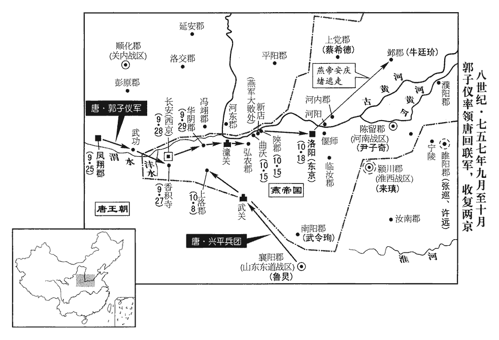
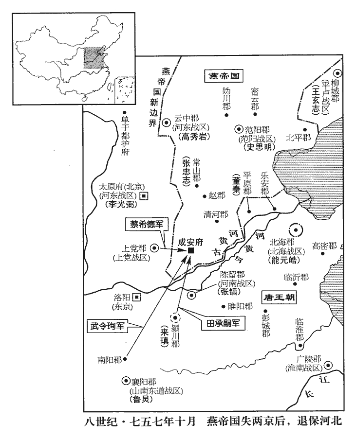
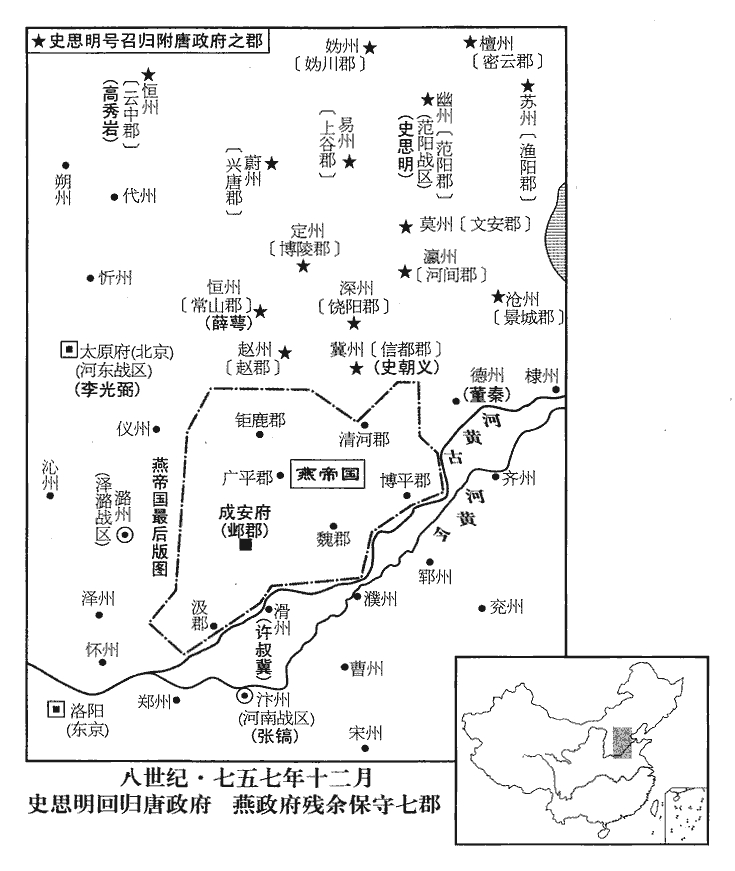
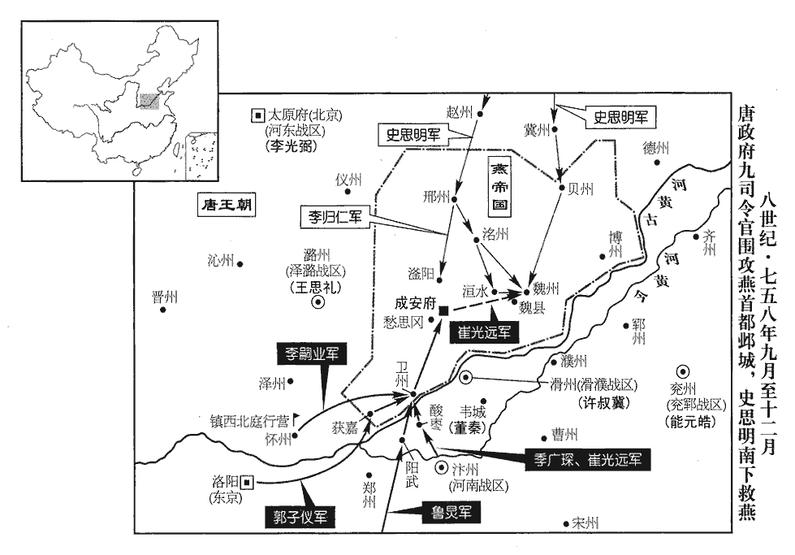

 唐紀三十六起強圉作噩（丁酉）九月，盡著雍閹茂（戊戌），凡一年有奇。

# 肅宗文明武德大聖大宣孝皇帝中之下

## 至德二載（丁酉、七五七）

1九月，丁丑‹二›，希德以輕騎至城‹上党郡，山西省长治市›下挑戰，千里帥百騎開門突出，欲擒之；會救至，【章：十二行本「至」下有「千里」二字；乙十一行本同；孔本同；張校同。】收騎退還，橋壞，墜塹中，反為希德所擒。為將者，不可恃勇輕脫。程千里欲擒蔡希德，反為希德所擒，恃勇輕脫之禍也。騎，奇寄翻。挑，徒了翻。帥，讀曰率。仰謂從騎曰：「吾不幸至此，天也！歸語諸將，從，才用翻。語，牛倨翻。善為守備，寧失帥，不可失城。」帥，所類翻。希德攻城，竟不克，送千里於洛陽，安慶緒以為特進，囚之客省。

〖译文〗 [1]九月丁丑（初二），判军大将蔡希德率领轻装骑兵来到上党城下挑战，节度使程千里率领一百名骑兵开城门突然杀出，想要活捉蔡希德，这时叛军救兵来到，程千里只好收兵退回，因为城门口的过桥被毁坏，程千里坠入城壕之中，反被蔡希德俘虏。程千里仰天长叹对随从的骑兵说：“我不幸被叛军俘虏，这是天意！回到城里后请告诉诸位将领，让他们好好坚守，宁可失去将帅，不能够失去城池。”蔡希德又领兵攻城，没有攻克，于是把程千里送往洛阳，安庆绪任命程千里为特进，囚禁于客省。

2郭子儀以回紇‹瀚海沙漠群›兵精，勸上益徵其兵以擊賊。懷仁可汗遣其子葉護及將軍帝德等將精兵四千餘人來至鳳翔；上引見葉護，宴勞賜賚，惟其所欲。見，賢遍翻。勞，力到翻。丁亥‹十二›，元帥廣平王俶chù将朔方等軍及回紇、西域之眾十五萬，號二十萬，發鳳翔。俶見葉護，約為兄弟，葉護大喜，謂俶為兄。回紇至扶風，郭子儀留宴三日。葉護曰：「國家有急，遠來相助，何以食為！」宴畢，既行。日給其軍羊二百口，牛二十頭，米四十斛。

〖译文〗 [2]郭子仪认为回纥兵精，能征善战，就劝肃宗多征回纥兵以平叛。回纥怀仁可汗派他的儿子叶护和将军帝德等率领精兵四千余人来到凤翔，肃宗接见叶护，设宴招待，赏赐财物，随其所愿，无不满足。丁亥（十二日），元帅广平王李率领朔方等各镇兵及回纥、西域各国兵共十五万，号称二十万，从凤翔出发。李见到回纥叶护，二人约为兄弟，叶护十分高兴，称李为兄。回纥人到达扶风，郭子仪留他们宴请三天。叶护说：“国家在危难之中，我们远来援助，还没有作战，那里顾得上大吃大喝！”宴会后便立即出发。唐朝每天供给回纥军羊二百头，牛二十头，米四十斛。

庚子‹二十五›，諸軍俱發；壬寅‹二十七›，至長安西，陳於香積寺北灃水‹渭水支流›之東。此皆漢上林苑地也。地說云：豐水，出鄠hù南豐谷，北流逕漢龍臺觀東南，與渭水會于短陰山。程大昌曰：香積寺，呂圖在子午谷正北微西。郭子儀收長安，陳于寺北，距灃水，臨大川。大川者，沈水、交水，唐永安渠也。蓋寺在灃水之東，交水之西也。呂圖云在鎬水發源之北，則近昆明池矣。子儀先敗于清渠，至此則循南山出都城後，據地勢以待之也。陳，讀曰陣；下陳於、其陳、於陳、陳乃、賊陳同。李嗣業為前軍，郭子儀為中軍，王思禮為後軍。賊眾十萬陳於其北，李歸仁出挑戰，官軍逐之，逼於其陳；賊軍齊進，官軍卻，為賊所乘，軍中驚亂，賊爭趣輜重。重，直用翻。李嗣業曰：「今日不以身餌賊，軍無孑遺矣。」乃肉袒、執長刀，立於陳前，大呼奮擊，呼，火故翻。當其刀者，人馬俱碎，殺數十人，陳乃稍定。於是嗣業帥前軍各執長刀，如牆而進，身先士卒，先，悉薦翻。所向摧靡。都知兵馬使王難得救其裨將，王難得為鳳翔都知兵馬使，時上在鳳翔，蓋御營大將也。賊射之中眉，皮垂障目。難得自拔箭，掣去其皮，血流被面，射，而亦翻。中，竹仲翻。掣chè，昌列翻。去，羌呂翻。被，皮義翻。前戰不已。賊伏精騎於陳東，欲襲官軍之後，偵者知之，騎，奇寄翻。偵，丑鄭翻。朔方左廂兵馬使僕固懷恩引回紇就擊之，翦滅殆盡，賊由是氣索。索，昔各翻，盡也。李嗣業又與回紇出賊陳後，與大軍夾擊，自午及酉，斬首六萬級，填溝塹死者甚眾，賊遂大潰。餘眾走入城，迨夜，囂聲不止。塹，七豔翻。囂，五羔翻。

〖译文〗 庚子（二十五日），各路大军同时出发，壬寅（二十七日），到达长安城西，在香积寺北面沣水东岸结成阵列。李嗣业为前军，郭子仪为中军，王思礼为后军。叛军十万在北面列阵，叛将李归仁出阵挑战，官军追击，逼近叛军阵中，叛军一齐进发，官军退却，叛军乘机突进，官军十分吃惊，顿时大乱，叛军争着抢夺军用物资。这时李嗣业说；“今天如果不拚死抵抗，官军就会彻底灭亡。”于是就袒露上身，手执长刀，立于阵前，大声呼喊，奋勇杀敌，叛军遇到他的刀锋，人马纷纷落地，接连杀死数十人，才稳住了官军的阵地。然后李嗣业率领前军各持长刀，排成横队，如墙向前推进，自己身先士卒，叛军纷纷后退，官军所向披靡。都知兵马使王难得为了救他的裨将，被叛军射中眼眉，垂下的肉皮遮住了眼睛。王难得自己拔去箭头，扯掉肉皮，血流满面，但仍然奋勇作战，不下战场。叛军埋伏精兵于阵地东面，想要从后面袭击官军，被官军侦察发觉，朔方左厢兵马使仆固怀恩领回纥兵袭击叛军伏兵，叛军被全部消灭，因而士气大落。李嗣业又与回纥兵绕道至叛军阵后，与大军前后夹击，从午时至酉时，共杀敌六万余人，被填于沟堑中的死者无数，叛军大败而溃退。其余的残兵逃入长安城中，夜晚喧叫声不止。

僕固懷恩言於廣平王俶曰：「賊棄城走矣，請以二百騎追之，縛取安守忠、李歸仁等。」俶，昌六翻。騎，奇寄翻。俶曰：「將軍戰亦疲矣，且休息，俟明旦圖之。」懷恩曰：「歸仁、守忠，賊之驍將，驟勝而敗，此天賜我也，奈何縱之！使復得眾，驍，堅堯翻。將，即亮翻。復，扶又翻；下而復、可復、復修、復為、敢復同。還為我患，悔之無及！戰尚神速，何明旦也！」言何用俟明旦。俶固止之，使還營。還，從宣翻，又音如字。懷恩固請，往而復反，一夕四五起。遲明，諜至，遲，直二翻。諜，達叶翻。守忠、歸仁與張通儒、田乾真皆已遁矣。廣平王若用僕固懷恩之言，固不假新店之戰，可以徑取東京矣。癸卯‹二十八›，大軍入西京。

〖译文〗 仆固怀恩对广平王李说：“叛军要放弃长安城逃走，请让我率领二百名骑兵追击，捉住安守忠、李归仁等人。”李说：“将军作战已经很疲劳了，暂且休息，等到明天再作计议。”仆固怀恩说：“李归仁与安守忠都是叛军中骁勇善战的大将，现在骤然被我们打败，实在是天赐良机，为何要放虎归山呢！如果让他们收拾残兵，再来与我们作战，那时后悔就来不及了！再说兵贵神速，为何要等到明天呢！”但广平王李坚持不同意，让仆固怀恩返回营中。仆固怀恩坚请不已，来来回回，一夜达四五次。等到天亮，侦察人员回来，报告说叛军守将安守忠、李归仁与张通儒、田乾真等都已逃跑。癸卯（二十八日），唐朝大军进入西京。

 

初，上欲速得京師，與回紇約曰：「克城之日，土地、士庶歸唐，金帛、子女皆歸回紇。」至是，葉護欲如約。廣平王俶拜於葉護馬前曰：「今始得西京，若遽俘掠，則東京之人皆為賊固守，紇，下沒翻。為，于偽翻；下當為同。不可復取矣，願至東京乃如約。」葉護驚躍下馬答拜，跪捧王足，夷禮以拜跪捧足為敬。曰：「當為殿下徑往東京。」即與僕固懷恩引回紇、西域之兵自城南過，營於滻水‹流经陕西省蓝田县西南，注入渭水›之東。過京城南，歷安化門、明德門、啟夏門外，遶京城東南角，轉北，歷延興、春明、通化三門之外，至滻水。滻水，出藍田縣境之西，北行過白鹿原西，又北入于霸水，滻，音產。百姓、軍士、胡虜見俶拜，皆泣曰：「廣平王‹李俶›真華、夷之主！」上聞之，喜曰：「朕不及也！」俶整眾入城，百姓老幼夾道歡呼悲泣。俶留長安，鎮撫三日，引大軍東出。東出京城門，取洛陽。俶，昌六翻。以太子少傅虢王巨為西京留守。少，始照翻。守，式又翻。

〖译文〗 起初，肃宗急于收复京师，与回纥相约定：“收复了京城之日，土地与男子归唐朝所有，金帛与女人全部归于回纥。”这时，回纥叶护要按约定办事。广平王李拜于回纥叶护马前说：“现在刚克复了西京，如果大肆进行抢掠，那么在东京的人就会为叛军死守，难以再攻取，希望到东京后再履行约定。”回纥叶护吃惊地跳下马回拜，并跪下来捧着广平王的脚，说：“我当率军为殿下立刻前往东京。”于是与仆固怀恩率领回纥、西域的军队从长安城南经过，扎营于水东岸。百姓、军士以及胡人见到广平王李纷纷下拜，都哭泣着说：“广平王真不愧汉夷各族的主人！”肃宗得知后高兴地说：“朕不如广平王！”于是广平王李整军入京城，城中百姓不分男女老幼，都夹道欢呼悲泣。李留在长安，镇守安抚了三天后，率领大军向东去收复洛阳。任命太子少傅虢王李巨为西京留守。

甲辰‹二十九›，捷書至鳳翔，百寮入賀。上涕泗交頤，即日，遣中使啖庭瑤入蜀奏上皇；使；疏吏翻。啖，徒敢翻，姓也。命左僕射裴冕入京師，告郊廟及宣慰百姓。

〖译文〗 甲辰（二十九日），报捷的文书到达凤翔，百官都入宫祝贺。肃宗泪流满面，当天即派宦官啖庭瑶入蜀中上奏玄宗，又命令左仆射裴冕先入京师，告慰祖宗陵庙并安抚百姓。

上以駿馬召李泌於長安。射，寅謝翻。泌，毗必翻。李泌時從軍在長安。即至，上曰：「朕已表請上皇東歸，朕當還東宮復脩臣子之職。」泌曰：「表可追乎？」上曰：「已遠矣。」泌曰：「上皇不來矣。」上驚，問故。泌曰：「理勢自然。」上曰：「為之奈何？」泌曰：「今請更為群臣賀表，言自馬嵬‹陕西省兴平市西马嵬镇›請留，靈武勸進，更，古孟翻。嵬，五回翻。請留、勸進事並見二百十八卷至德元載。及今成功，聖上思戀晨昏，請速還京以就孝養之意，則可矣。」養，羊尚翻。上即使泌草表。上讀之，泣曰：「朕始以至誠願歸萬機。今聞先生之言，乃寤其失。」立命中使奉表入蜀，因就泌飲酒，同榻而寢。而李輔國請取契鑰付泌，泌請使輔國掌之；上許之。泌掌契鑰，見二百十八卷上年九月。今付輔國，宮禁之權盡歸之矣。為輔國專擅張本。

〖译文〗 肃宗派人用骏马召李泌于长安。李泌到后，肃宗说：“朕已经上表请求上皇回京城，朕当让帝位，还东宫重为太子。”李泌说：“上表还能够追回吗？”肃宗说：“已经走远了。”李泌说：“上皇不会回来。”肃宗吃惊地问什么原因。李泌说：“按道理和情势，不回来是自然的。”肃宗说：“那怎么办呢？”李泌说：“现在请再写一份群臣贺表，就说自从在马嵬被留，在灵武被劝说即帝位，到今天克复京城，陛下时刻思念着上皇，请上皇立刻返回京城，以使陛下能尽孝养之心，这样就可以了。”肃宗听后立刻让李泌草写表书。肃宗读了表书后，泣不成声地说：“朕开始时真心想把帝位复归上皇。现在听了先生的话，才知道是失策。”于是立刻命令宦官奉表书入蜀，然后与李泌一起饮酒，并同床而睡。而李辅国请求把宫禁中的符契与钥匙交付给李泌，李泌请求让李辅国掌管，肃宗同意。

泌曰：「臣今報德足矣，復為閒人，何樂如之！」上曰：「朕與先生累年同憂患，今方相同娛樂，樂，音洛。奈何遽欲去乎！」泌曰：「臣有五不可留，願陛下聽臣去，免臣於死。」上曰：「何謂也？」對曰：「臣遇陛下太早，陛下任臣太重，寵臣太深，臣功太高，迹太奇，此其所以不可留也。」上曰：「且眠矣，異日議之。」對曰：「陛下今就臣榻臥，猶不得請，況異日香案之前乎！唐制：凡朝日，殿上設黼fǔ扆yǐ、躡席、熏爐、香案，皇帝升御座，宰執當香案前奏事。陛下不聽臣去，是殺臣也。」上曰：「不意卿疑朕如此，豈有如朕而辦殺卿邪！是直以朕為句踐也！」邪，音耶。范蠡即與越王句踐報吳之恥，蠡乃扁舟五湖，遺大夫文種書，以為句踐長頸鳥喙，可與同患難，不可與同安樂。文種見書，遂稱疾。句踐賜文種死。句音鉤。對曰：「陛下不辦殺臣，故臣求歸；若其即辦，臣安敢復言！復，扶又翻。且殺臣者，非陛下也，乃『五不可』也。陛下曏日待臣如此，臣於事猶有不敢言者，況天下即安，臣敢言乎！」

〖译文〗 李泌说：“我现在已经报答了陛下的知遇之恩，想要重新做隐士，那将是多么快乐！”肃宗说：“朕与先生多少年来共经患难，现在正到了同亨欢乐的时候了，为何想要立刻离开我呢！”李泌说：“我有五条理由不能够留下来，希望陛下能够答应我离去，使我免于一死。”肃宗说：“这是什么意思？”李泌回答说：“我与陛下相遇太早，陛下任用我太重，宠爱我太深，我的功劳太高，事迹太奇，这就是我不能够留在朝中的原因。”肃宗说：“现在先睡觉吧，以后再说这件事。”李泌说：“陛下现在与我同床而睡，我请求的事都不答应，何况以后在朝廷的殿上！还能够有所请求吗？陛下不答应我离开朝廷，实际上是在杀死我。”肃宗说：“没有想到你对朕如此疑心，朕怎么能够杀你呢！你真是把朕当做春秋时期的越王勾践了！”李泌回答说：“正因为陛下不杀掉我，所以我才要求离去归隐；如果要杀掉我，我还怎么敢说离去的事呢！再说要杀掉我的并不是陛下，而是我所说的不能够留下来的五条理由。陛下过去待我如此之好，我有时遇事还不敢尽言，何况现在天下已经安定，我还敢直言吗！”

上良久曰：「卿以朕不從卿北伐之謀乎！」謂不從使建寧王自媯、檀取范陽之策也。肅宗以意言之。對曰：「非也，所不敢言者，乃建寧耳。」上曰：「建寧‹李倓›，朕之愛子，性英果，艱難時有功，謂馬嵬勸留，及北赴靈武，血戰以衛上也。事見二百十八卷元載六月。朕豈不知之！但因此為小人所教，欲害其兄，圖繼嗣，朕以社稷大計，不得已而除之，事見上卷本年正月。嗣，祥吏翻。卿不細知其故邪？」對曰：「若有此心，廣平當怨之。廣平每與臣言其冤，輒流涕嗚咽。臣今必辭陛下去，始敢言之耳。」上曰：「渠嘗夜捫廣平，意欲加害。」對曰：「此皆出讒人之口，豈有建寧之孝友聰明，肯為此乎！且陛下昔欲用建寧為元帥，臣請用廣平。事見二百十八卷元載九月。帥，所類翻。建寧若有此心，當深憾於臣；而以臣為忠，益相親善，陛下以此可察其心矣。」上乃泣下曰：「先生言是也。即往不咎，引論語孔子之言。朕不欲聞之。」

〖译文〗 肃宗想了一会说：“你是因为朕没有听从你关于北伐的计谋吗！”李泌回答说：“不是关于北伐的事，我所不敢直言的是关于建宁王李的事。”肃宗说：“建宁王李是朕的爱子，性格英勇果断，在艰难之际立了大功；朕怎么能不知道呢！但他受到小人的教唆，想要谋害他的哥哥广平王李，图谋为太子，朕从国家的利益考虑，不得已才除掉了他，你难道不知道这一原因吗？”李泌回答说：“建宁王如果有谋害太子的心意，广平王应该怨恨他。但广平王每当与我言及此事，涕泣呜咽，称建宁王冤枉。我现在决计辞陛下而去，所以才敢于说这件事。”肃宗说：“建宁王曾经在夜晚摸广平王的门，是想要害死广平王。”李泌说：“这都是坏人进的谗言，建宁王孝友聪明，怎么肯做这样的事呢！再说陛下过去想要任用建宁王为元帅，我请求任用广平王。建宁王如果有谋害广平王而自己当太子的野心，应当深深地恨我，而他却认为我忠心，与我更加亲密友善，陛下通过此事就可看出建宁王的心意。”肃宗听完后哭泣着说：“先生所说的话都非常正确。既往不咎，我不想再听说这件事了。”

泌曰：「臣所以言之者，非咎即往，乃欲使陛下慎將來耳。昔天后‹武曌›有四子，長曰太子弘，天后方圖稱制，惡其聰明，酖殺之，見二百二卷高宗上元二年。立次子雍王賢。賢內憂懼，作黃臺瓜辭，冀以感悟天后。天后不聽，賢卒死於黔中。賢廢見二百二卷永隆元年；死見二百三卷武后光宅元年。卒，子恤翻。黔，音禽。其辭曰：『種瓜黃臺下，瓜熟子離離：一摘使瓜好，再摘使瓜稀，三摘猶為可，四摘抱蔓歸！』今陛下已一摘矣，慎無再摘！」上愕然曰：「安有是哉！卿錄是辭，朕當書紳。」對曰：「陛下但識之於心，識，職吏翻，記也。何必形於外也！」是時廣平王有大功，良娣忌之，潛搆流言，故泌言及之。【章：十二行本「之」下有「泌復固請歸山，上曰俟將發此議之」十四字；乙十一行本同；退齋校同；張校同，云無註本亦無。】李泌歷事肅‹李亨›、代‹李俶›、德‹李适›三朝，皆能言人所難言，奇士也。

〖译文〗 李泌说：“我所以谈起这件事，并不是要说陛下既往的错误，而是想要让陛下谨慎地处理将来的政事。过去天后武则天有四个儿子，长子是太子李弘，当天后正图谋称帝时，讨厌太子李弘聪明，就毒杀了他，又立次子雍王李贤为太子。李贤心怀忧惧，就作了《黄台瓜辞》，希望能借此使天后感悟。而天后不听，李贤最后还是死于黔中。他所作的《黄台瓜辞》是：‘种瓜黄台下，瓜熟子离离。一摘使瓜好，再摘使瓜稀，三摘犹为可，四摘抱蔓归！’现在陛下已经一摘瓜了，希望不要再摘！”肃宗听后惊愕地说：“怎么会那样呢！你录下这些歌辞，朕当书于条幅之上。”李泌说：“只希望陛下记在心中，何必要形之于外呢！”当时因为广平王李有大功，张良娣忌恨他，暗中散布流言，所以李泌对肃宗谈到此事。

3郭子儀引蕃、漢兵追賊至潼關，斬首五千級，克華陰‹陕西省华县›、弘農二郡。關東獻俘百餘人，敕皆斬之；監察御史李勉言於上曰：「今元惡未除，為賊所污者半天下，污，烏故翻。聞陛下龍興，咸思洗心以承聖化，今悉誅之，是驅之使從賊也。」上遽使赦之。

〖译文〗 [3]郭子仪率领蕃、汉兵追击叛军至潼关，杀敌五千人，攻克了华阴、弘农二郡。关东向朝廷献来俘虏一百余人，肃宗下敕书让把他们全部杀掉，这时监察御史李勉向肃宗进言说：“现在举行叛乱的元凶还没有被除掉，战乱波及了大半个国家，许多人都受到了牵连，他们得知陛下即皇帝位，率兵平叛，都想着洗心革面，来服从陛下，现在如果把这些被俘的人全部杀掉，是逼迫那些跟随反叛的人继续作乱。”肃宗听后立即命令赦免了他们。

4冬，十月，丁未‹三›，談【章：十二行本「談」作「啖」；乙十一行本同；孔本同。】庭瑤至蜀。

〖译文〗 [4]冬季，十月丁未（初三），啖庭瑶到达蜀郡。

5壬子‹八›，興平軍奏：破賊於武關‹陕西省商南县西北›，克上洛郡‹陕西省商州市›。時王難得領興平軍。

〖译文〗 [5]壬子（初八），兴平军上奏说：在武关打败叛军，收复了上洛郡。

6吐蕃陷西平‹陇右战区总部·青海省乐都县›。西平郡，鄯州。

〖译文〗 [6]吐蕃军队攻陷西平郡。

7尹子奇久圍睢陽，城中食盡，議棄城東走，張巡、許遠謀，以為：「睢陽，江、淮之保障，若棄之去，賊必乘勝長驅，是無江、淮也。考異曰：唐人皆以全江、淮為巡、遠功。按睢陽雖當江、淮之路，城既被圍，賊若欲取江、淮，繞出其外，睢陽豈能障之哉！蓋巡善用兵，賊畏巡為後患，不滅巡則不敢越過其南耳。且我眾飢羸，走必不達。古者戰國諸侯，尚相救恤，謂春秋列國，同盟有急則相救恤也。況密邇群帥乎！群帥，謂張鎬、尚衡、許叔冀等。帥，所類翻。不如堅守以待之。」茶紙既盡，遂食馬；馬盡，羅雀掘鼠；雀鼠又盡，巡出愛妾，殺以食士，食，祥吏翻。遠亦殺其奴；然後括城中婦人食之，【章：十二行本「之」下有「既盡」二字；乙十一行本同；孔本同；退齋校同。】繼以男子老弱。人知必死，莫有叛者，所餘纔四百人。

〖译文〗 [7]叛军将领尹子奇率兵久围睢阳，城中粮食已经吃尽，有人建议放弃睢阳把军队撤向东面，张巡与许远商议，认为：“睢阳是江、淮地区的屏障，如果放弃睢阳城，那么叛军就可以长驱南下，侵占江、淮地区。再说我们的将士都因饥饿劳累病弱，要撤退也必定走不脱。战国时代的各国诸侯交战时，同盟国还互相救援，何况我们周围不远还有许多朝廷的驻军将帅！不如固守以待援。”茶纸吃完以后，就杀马而食；马被杀完后，又捕鸟雀和掘地抓鼠而食；鸟鼠又吃尽后，张巡就杀掉自己的爱妾，让士卒们吃肉，许远也杀了他的家奴；然后把城中的女人全部搜寻出来杀死后吃掉，接着又杀了老弱病残的男子。城中的人都知道必死，所以没有叛变的，最后剩下的只有四百人。

癸丑‹九›，賊登城，將士病，不能戰。巡西向再拜曰：「臣力竭矣，不能全城，生既無以報陛下，死當為厲鬼以殺賊！」鬼無所歸者為厲。城遂陷，巡、遠俱被執。尹子奇問巡曰：「聞君每戰，眥裂齒碎，何也？」眥，疾智翻，又才詣翻，目眥也。巡曰：「吾志吞逆賊，但力不能耳。」子奇以刀抉其口視之，抉，一決翻。所餘纔三四。子奇義其所為，欲活之。其徒曰：「彼守節者也，終不為用。且得士心，存之，將為後患。」乃并南霽雲、雷萬春等三十六人皆斬之。考異曰：新傳曰：「虢王巨之走臨淮，巡有妹嫁陸氏，遮巨勸勿行；不納。賜百縑，弗受。為巡補縫行間，軍中號陸家姑。先巡被害。」按巨在彭城，若走臨淮，陸姊在睢陽城，何以得遮之！今不取。巡且死，顏色不亂，揚揚如常‹本年四十九岁›。生致許遠於洛陽。

〖译文〗 癸丑（初九），叛军登上城头，将士们因为病弱，不能再战。张巡向西拜了两拜说：“我已经竭尽全力，但没有守住睢阳城，生时既然不能报答陛下的恩德，死后作为没有归宿的鬼魂也要英勇杀敌！”随后城被叛军攻陷，张巡与许远都作了俘虏。尹子奇问张巡说：“听说将军你每当作战时眼角睁裂，牙齿咬碎，不知道这是为什么？”张巡说：“我是坚决想要吞掉你们这伙叛逆的贼党，但恨力不从心。”尹子奇就用刀撬开张巡的口探视，只剩下三四颗牙齿。尹子奇十分欣赏张巡的忠义，不想杀掉他。但他的部下却说：“像张巡这样的人，都是忠义守节之士，终究不会为我们所用。再说他深得军心，如果不杀掉他，必会后患。”于是尹子奇就把张巡与南霁云、雷万春等三十六人全部杀掉。张巡临刑前，神色自若，面不改色，慷慨赴难。尹子奇把许远送往洛阳。

巡初守睢陽時，卒僅萬人，城中居人亦且數萬，巡一見問姓名，其後無不識者。前後大小戰凡四百餘，殺賊卒十二萬人。巡行兵不依古法，教戰陳，令本將各以其意教之。本將，謂本部之將。陳，讀曰陣。人或問其故，巡曰：「今與胡虜戰，雲合鳥散，變態不恆，數步之間，勢有同異。臨機應猝，在於呼吸之間，而動詢大將，事不相及，非知兵之變者也。故吾使兵識將意，將識士情，投之而往，如手之使指。兵將相習，人自為戰，不亦可乎！」自興兵，器械、甲仗皆取之於敵，未嘗自脩。每戰，將士或退散，巡立於戰所，謂將士曰：「我不離此，離，力智翻。汝為我還決之。」將士莫敢不還，死戰，卒破敵。為，于偽翻。卒，子恤翻。又推誠待人，無所疑隱；臨敵應變，出奇無窮；號令明，賞罰信，與眾共甘苦寒暑，故下爭致死力。

〖译文〗 张巡起初坚守睢阳时，仅有士兵一万人，而城中居民百姓却有数万人，张巡每见一人就询问其姓名，以后没有不认识的。前后大小战斗共进行了四百多次，杀死叛军十二万人。张巡练兵不按照古人的兵法作战布阵，而是命令部下的将领各自按照自己的战略教习战法。有人问其中的原因，张巡说：“现在是与反叛的胡人作战，他们忽散忽合，变化不定，有时在数步之内，军势都不同。所以就需要将领们在很短的时间内能够应接突发的事件，如果让他们动不动就要请示大将，那就来不及了，这是不知道作战用兵的变化。所以我让士卒了解将领的心意，将领熟悉士卒的情绪，这样将领指挥士卒作战，就如手使用自己的指头一样自如。兵与将都相互了解，部队各自为战，不是很好吗！”自从与叛军交战以来，守城所用的器械与作战所用的兵器都是缴获敌人的，守城部队没有修理制造过。每当战斗激烈时，有的将士后退下来，张巡就立在阵地上对将士们说：“我绝不离开这里，你们为我返回去继续与叛军决战。”将士听后，没有敢再后退的，又纷纷向前，与叛军死战，最后都能够打退敌人的进攻。张巡待人诚恳，胸怀坦荡，善于随机应变，出奇制胜。并且号令严明，赏罚分明，能够与部下同甘共苦，所以部下的将士都拚死效力。

張鎬聞睢陽圍急，倍道亟進，張鎬代賀蘭進明，見上卷八月。檄浙東、浙西、淮南、北海諸節度按新書方鎮表，浙東、浙西明年方置節度使。時崔渙在浙東，李希言在浙西，皆非節度使。淮南則李成式，北海尚為賊將能元皓所據。然去年已置北海節度使，是雖未復北海而已置北海帥矣。及譙郡‹安徽省亳州市›太守閭丘曉，使共救之。曉素傲很，不受鎬命。比鎬至，比，必利翻，及也。睢陽城已陷三日。鎬召曉，杖殺之。考異曰：舊傳作「豪州刺史」，新傳作「濠州刺史」，統紀作「亳州刺史」。按濠州在淮南，去睢陽遠。亳州與睢陽接境，必亳州也。今從統紀。余按通鑑改統紀之亳州為譙郡，以此時未復郡為州也。讀者宜知之。

〖译文〗 河南节度、采访等使张镐得知睢阳危急，率兵日夜兼程，并发文书告浙东、浙西、淮南、北海等节度使以及谯郡太守闾丘晓，让他们也发兵来救。而闾丘晓因为素来狂傲，竟不听从张镐的命令。等到张镐率兵赶到，睢阳城已被攻陷了三天。张镐召来闾丘晓，命令用棍子打死了他。

8張通儒等收餘眾走保陝，自長安東走保陝。安慶緒悉發洛陽兵，使其御史大夫嚴莊將之，就通儒以拒官軍，并舊兵步騎猶十五萬。舊兵，謂張通儒等所領自西京東走之兵。己未‹十五›，廣平王至曲沃‹河南省三门峡市西南曲沃镇›。此非春秋晉莊叔所封之曲沃，按其地在弘農、靈寶二縣之間。水經註：弘農縣東十三里有好陽亭，又東有曲沃城。回紇葉護使其將軍鼻施吐撥裴羅等引軍旁南山‹崤山›搜伏，因駐軍嶺北。旁，步浪翻。郭子儀等與賊遇於新店‹河南省三门峡市西南约十千米›，據舊書，新店在陝城西。賊依山而陳，子儀等初與之戰，不利，賊逐之下山。回紇自南山襲其背，於黃埃中發十餘矢。賊驚顧曰：「回紇至矣！」遂潰。官軍與回紇夾擊之，賊大敗，僵尸蔽野。嚴莊、張通儒等棄陝東走，廣平王俶、郭子儀入陝城，僕固懷恩等分道追之。

〖译文〗 [8]叛军大将张通儒等收罗残兵退保陕郡，安庆绪调集了洛阳的全部兵力，命令他的御史大夫严庄率领，与张通儒合兵，共有步、骑兵十五万，来阻挡官军。己未（十五日），广平王李率兵到达曲沃。回纥叶护命令其部将鼻施吐拨裴罗等率兵顺着南山搜寻叛军，于是驻军于岭北。郭子仪等人率兵与叛军相遇于新店，叛军依山而布阵，郭子仪初战不利，被叛军赶到山下。这时回纥军从南山袭击叛军的背面，在漫天黄尘中射了十余箭。叛军回头一看，吃惊地说：“回纥兵来了！”于是溃败。官军与回纥军乘机前后夹击，叛军被打得大败，尸横遍野。严庄与张通儒等人放弃陕郡向东败逃，广平王李与郭子仪进入陕城，仆固怀恩率兵分头追击叛军。

嚴莊先入洛陽告安慶緒。庚申‹十六›夜，慶緒帥其黨自苑門出，東都苑門也。走河北；考異曰：「實錄無新店戰日，但云：「子儀與嗣業等至新店，遇賊，大破之，逐北五十餘里，人馬相枕藉，器械、戈甲自陝至洛城委棄道路無空地。庚申，慶緒走，其夜，自東都苑門帥其眾黨奔河北。壬戌，元帥廣平王與子儀收陝郡。」汾陽家傳：「九月，安慶緒自洛疾使諸將至陝，兼收敗卒，猶十五萬。十月四日，於陝西依山而陳，彼則憑高下擊，此乃進軍上衝，賊屹立不動。公使偽退，引令下山，使回紇驀mò澗走險以襲其背，賊乃敗績；斬九萬級，擒一萬人。」汾陽家傳：「十月四日破賊於陝西，八日收洛陽。」年代記：「十月，己未，破賊于新店。辛酉，慶緒聞軍敗，率其黨投相州。」舊紀：「庚申，慶緒奔河北。壬戌，廣平王入東京。」新紀：「戊申，敗賊新店，克陝郡。壬子，復東京。」按陝、洛之間，幾三百里，汾陽傳、新紀太早，實錄壬戌收陝郡太晚，今從年代記、幸蜀記。殺所獲唐將哥舒翰、程千里等三十餘人而去。許遠死於偃師‹河南省偃师县›。考異曰：實錄、舊傳皆曰：「尹子奇執送洛陽，與哥舒翰、程千里俱囚於客省。及安慶緒敗，渡河北走，使嚴莊皆害之。張中丞傳：「相里造誄曰：『唐故御史中丞張、許二君，以守城睢陽陷，張君遇害，許君為羯賊所擒，求死不得，降逼至偃師縣，亦被兵焉。』今從之。

〖译文〗 严庄先进入洛阳向安庆绪报告败状。庚申（十六日）夜晚，安庆绪率领他的部下从苑门逃出，逃向河北，并在逃走前杀了所俘虏的朝廷将领哥舒翰、程千里等三十余人。许远死于偃师县。

壬戌‹十八›，廣平王俶入東京。回紇意猶未厭，俶患之。父老請率羅錦萬匹以賂回紇，回紇乃止。

〖译文〗 壬戌（十八日），广平王李率兵进入东京。回纥军还不满足，李十分忧虑。东京父老百姓请求以一万匹丝织品贿赂回纥军，回纥军才罢休。

9成都使還，此還者，啖庭瑤也。還，音旋。上皇誥曰：「當與我劍南一道‹四川省中南部›自奉，不復來矣。」復，扶又翻；下嗣復同。上憂懼，不知所為。【章：十二行本「為」下有「數日」二字；乙十一行本同；孔本同；張校同】後使者至，此奉群臣賀表中使繼還也。言：「上皇初得上請歸東宮表，彷徨不能食，欲不歸；及群臣表至，乃大喜，命食作樂，下誥定行日。」定東行歸京之日也。上召李泌告之曰：「皆卿力也！」

〖译文〗 [9]使者从成都回来，带回玄宗的诰命说：“只要给我剑南一道容身自保就足够了，不想再回长安。”肃宗十分忧愁，不知道怎么办才好。这时后来派去的使者回来说：“上皇先得到陛下请求归还皇位的表书后，游移不定，吃不下饭，不想归来。等到群臣所上的表书到后，才心中大喜，命准备饮食歌舞，并颁下诰命确定了动身的日期。”肃宗把李泌召来说：“这都是你的功劳！”

泌求歸山不已，上固留之，不能得，乃聽歸衡山‹湖南省衡山县西›。衡山，在衡陽郡衡山縣西三十里，南嶽也。漢武帝以霍山為南嶽，隋文帝以衡山為南嶽。按泌傳，泌願隱衡山，詔聽之。敕郡縣為之築室於山中，為，于偽翻。給三品料。

〖译文〗 李沁屡次请求归隐山中，肃宗执意挽留，不得已，才允许他返回衡山。并下敕书命令郡县官为李泌在山中建造房屋，给三品官的俸料。

10癸亥‹十九›，上發鳳翔，遣太子太師韋見素入蜀，奉迎上皇。

〖译文〗 [10]癸亥（十九日），肃宗从凤翔出发回京师，并派太子太师韦见素往蜀中去迎接玄宗。

11乙丑‹二十一›，郭子儀遣左兵馬使張用濟、右武鋒使渾釋之將兵取河陽‹河南省孟州市›及河內‹河南省沁阳市›；嚴莊來降。陳留人殺尹子奇，舉郡降。田承嗣圍來瑱於潁川‹河南省许昌市›，亦遣使來降；郭子儀應之緩，承嗣復叛，與武令珣皆走河北。走，音奏。考異曰：「舊魯炅傳云：「炅保南陽，賊使武令珣攻之。令珣死，又令田承嗣攻之。」下又云：「王師收兩京，承嗣、令珣奔河北。」唐曆：「慶緒據鄴，武令珣自唐、鄧至。」炅傳云武令珣死，誤也。制以瑱為河【章：十二行本「河」作「淮」；乙十一行本同；孔本同。】南‹总部设陈留汴州·河南省开封市›節度使。

〖译文〗 [11]乙丑（二十一日），郭子仪派左兵马使张用济与右武锋使浑释之率兵攻占了河阳及河内二郡，叛军大将严庄投降。陈留人杀了叛将尹子奇，献郡来降。叛军将领田承嗣于颍川围攻来，这时也派使者来请求投降，因为郭子仪接应缓慢，田承嗣再度反叛，与叛将武令退保河北。肃宗下制书任命来为河南节度使。

12丙寅‹二十二›，上至望賢宮‹陕西省咸阳市东›，雍錄：望賢宮，在咸陽縣東數里。得東京捷奏。丁卯‹二十三›，上入西京。百姓出國門奉迎，二十里不絶，舞躍呼萬歲，有泣者。上入居大明宮。高宗咸亨元年，改蓬萊宮為大明宮，既東內。御史中丞崔器令百官受賊官爵者皆脫巾徒跣立於含元殿前，含元殿，東內前殿也，當丹鳳門內。搏膺頓首請罪，環之以兵，環，音宦。使百官臨視之。太廟為賊所焚，上素服向廟哭三日。是日，上皇發蜀郡。

〖译文〗 [12]丙寅（二十二日），肃宗到达咸阳望贤宫，收到了东京克复的捷报。丁卯（二十三日），肃宗进入西京。城中百姓出城门外二十里来迎接，一路不绝，拜舞跳跃，高呼万岁，还有人哭泣。肃宗入居大明宫。御史中丞崔器命令接受过安禄山叛军官爵的人都解下头巾赤脚立于含元殿前，让他们自己捶打自己的胸口，叩头谢罪，周围站立着持武器的士卒，并让百官在含元殿台上观看。因为太庙被叛军烧毁，肃宗身着白色的服装，向着太庙大哭三天。当天，玄宗从蜀郡出发。

13安慶緒走保鄴郡‹河南省安阳市›，改鄴郡為安成【嚴：「安成」改「成安」。】府，改元天成；考異曰：唐曆曰改元天和。薊門紀亂曰改元至成，與實錄年號不同。紀年通譜兩存之。今從實錄。從騎不過三百，步卒不過千人，諸將阿史那承慶等散投常山、趙郡‹河北省赵县›、范陽。旬日間，蔡希德自上黨，田承嗣自潁川，武令珣自南陽，各帥所部兵歸之。又召募河北諸郡人，眾至六萬，軍聲復振。復，扶又翻。

〖译文〗 [13]安庆绪率领部下败退到邺郡，于是改邺郡为安成府，改年号为天成。这时跟随他的骑兵不过三百，步兵不过一千人，其他部将如阿史那承庆等都分别逃向常山、赵郡、范阳等地。十天之内，蔡希德从上党，田承嗣从颍川，武令从南阳，各自率领本部兵马投奔邺郡。安庆绪又在河北各郡招募人马，兵众达到六万，军队的声势又一次振作起来。

14廣平王俶之入東京也，百官受安祿山父子官者陳希烈等三百餘人，皆素服悲泣請罪。俶以上旨釋之，尋勒赴西京。己巳‹二十五›，崔器令詣朝堂請罪，此東內之朝堂也，在含元殿左右，左曰東朝堂，右曰西朝堂。朝，直遙翻。如西京百官之儀，然後收繫大理、京兆獄。其府縣所由，祗承人等受賊驅使追捕者，皆收繫之。所由人，有所監典；祗承人，聽指呼給使令而已。

〖译文〗 [14]广平王李进入东京后，百官中接受过安禄山与安庆绪父子官爵的陈希烈等三百余人，都穿着白色的衣服悲泣请罪，李按照肃宗的意旨，都释放了他们，不久又把他们押送往西京。己巳（二十五日），崔器命令他们到朝堂向肃宗请罪，如同在西京对待接受伪职的百官那样，然后把他们关进大理寺和京兆的狱中。府县中那些为叛军干过事的小官吏，被抓住后，也关进狱中。

初，汲郡‹河南省卫辉市›甄濟，有操行，隱居青巖山‹河南省淇县西›，五代志：汲郡隋興縣有蒼巖山。隋興縣，唐時當省入汲縣。甄，之人翻。操，七到翻。行，下孟翻。安祿山為采訪使，奏掌書記。此天寶間事。濟察祿山有異志，詐得風疾，舁yú歸家。祿山反，使蔡希德引行刑者二人，封刀召之，濟引首待刀；希德以實病白祿山。後安慶緒亦使人強舁至東京，強，其兩翻。月餘，會廣平王俶平東京，濟起，詣軍門上謁。上，時掌翻。俶遣詣京師，上命館之於三司，時令三司按受賊官爵者，因館濟於三司署舍，使受賊官爵者羅拜之。館，音貫。令受賊官爵者列拜以愧其心，以愧受賊官爵者之心。以濟為秘書郎。國子司業蘇源明稱病不受祿山官，上擢為考功郎中、知制誥。壬申‹二十八›，上御丹鳳門，下制：「士庶受賊官祿，為賊用者，令三司條件聞奏；其因戰被虜，或所居密近，因與賊往來者，皆聽自首除罪；其子女為賊所污者，勿問。」東內端門曰丹鳳門，樓曰丹鳳樓。首，手又翻。污，烏故翻。

〖译文〗 起初，汲郡人甄济，操行清高，隐居于青岩山，安禄山为河北采访使时，上奏任命甄济为掌书记。甄济觉察到安禄山有反叛的野心，就假称中风，让人抬回家中。安禄山率兵反叛后，让蔡希德带领两名刽子手，手持大刀去召甄济，甄济伸出头等待着杀掉他，于是蔡希德就认为甄济确实有病，回去报告了安禄山。后来安庆绪也派人强把甄济抬到东京，一个多月以后，广平王李率兵收复东京，甄济即起来到军中去谒见李。李让甄济前往京师，肃宗让甄济住在三司的馆舍中，命令接受过叛军官爵的人列队向他伏拜，让这些人愧悔，并任命甄济为秘书郎。国子司业苏源明假装有病，没有接受安禄山所委任的官爵，肃宗就提拔他为考功郎中、知制诰。壬申（二十八日），肃宗登临丹凤门，颁下制书说：“对于官吏和百姓中接受过安禄山叛军官爵、俸禄以及为叛军干过事的人，命御史台、中书、门下三司分别不同情况上奏。在战斗中被叛军俘虏的将士，或与叛军居住靠近，因而与其往来的人，一律允许自首而免其罪。家中有妇女被叛军污辱的，都不问罪。”

15癸酉‹二十九›，回紇葉護自東京還，上命百官迎之於長樂驛，長樂驛，在滻東長樂陂。上與宴於宣政殿。自含元殿入宣政門為宣政殿，東內之中朝也。葉護奏以「軍中馬少，請留其兵於沙苑‹陕西省大荔县南›，沙苑，在馮翊渭曲。李吉甫郡國圖：沙苑，一名沙阜，在同州馮翊縣南十二里，東西八十里，南北三十里。余靖曰：唐沙苑監，今之同州。少，詩沼翻。自歸取馬，還為陛下掃除范陽餘孽。」為，于偽翻。上賜而遣之。

〖译文〗 [15]癸酉（二十九日），回纥叶护从东京返回，肃宗命令百官于长乐驿迎接，然后在宣政殿设宴招待叶护。叶护上奏说：“因为军中缺少战马，请把军队留在沙苑，自己回国取马，然后为陛下扫除范阳叛军的残余。”肃宗重加赏赐，然后遣叶护回去。

16十一月，廣平王俶、郭子儀來自東京，上勞子儀曰：「吾之家國，由卿再造。」勞，力到翻。

〖译文〗 [16]十一月，广平王李与郭子仪从东京来到西京，肃宗慰劳郭子仪说：“我们李家的大唐王朝，是由你复兴的。”

17張鎬帥魯炅、來瑱、吳王祗、李嗣業，李奐五節度徇河南‹黄河以南›、河東‹山西省›郡縣，皆下之；惟能元皓據北海‹山东省青州市›，高秀巖據大同‹云中郡·山西省大同市›未下。能，奴代翻，姓也。北海，屬河南道；大同，屬河東道。

〖译文〗 [17]河南节度、采访等使张镐率领鲁灵、来、吴王李祗、李嗣业与李奂等五节度使攻打河南、河东道的郡县，全部收复。只有叛将能元皓占据着北海，高秀岩占据着大同，还未克复。

 

18己丑‹十五›，以回紇葉護為司空、忠義王；歲遺回紇絹二萬匹，遺，于季翻。使就朔方軍‹宁夏灵武市›受之。

〖译文〗 [18]己丑（十五日），唐朝任命回纥叶护为司空，封忠义王爵，并答应每年赠送回纥丝织品二万匹，让他们到朔方军受取。

19以嚴莊為司農卿。

〖译文〗 [19]任命严庄为司农卿。

20上之在彭原也，更以栗為九廟主；禮：虞，主用桑；練，主用栗。作栗主則埋桑主。上皇幸蜀，九廟之主委之賊手，故彭原更以栗為之。庚寅‹十六›，朝享於長樂殿。長樂殿，考雍錄及呂圖皆無之。以下文上皇入大明宮，御含元殿見百官，次詣長樂殿謝九廟主，則是殿亦在大明宮中也。大明宮圖有長樂門，則長樂殿蓋在長樂門內。

〖译文〗 [20]肃宗在彭原的时候，改用栗木为九庙中的神主。庚寅（十六日），肃宗于长乐殿中祭祀九庙神主。

21丙申‹二十二›，上皇至鳳翔，從兵六百餘人，從，才用翻。上皇命悉以甲兵輸郡庫。上發精騎三千奉迎。十二月，丙午‹三›，上皇至咸陽‹陕西省咸阳市›，上備法駕迎於望賢宮‹咸阳市东›。上皇在宮南樓，上釋黃袍，著紫袍，望樓下馬，趨進，拜舞於樓下。上皇降樓，撫上而泣，上捧上皇足，嗚咽不自勝。上皇索黃袍，自為上著之，著，陟略翻。勝，音升。索，山客翻。為，于偽翻。上伏地頓首固辭。上皇曰：「天數、人心皆歸於汝，使朕得保養餘齒，汝之孝也！」上不得已，受之。父老在仗外，歡呼且拜。上令開仗，車駕所在，衛士立仗。縱千餘人入謁上皇，曰：「臣等今日復睹二聖相見，死無恨矣！」復，扶又翻。上皇不肯居正殿，此行宮正殿也。曰：「此天子之位也。」上固請，自扶上皇登殿。尚食進食，上品嘗而薦之。品品必嘗而後進。丁未‹四›，將發行宮，上親為上皇習馬而進之上皇。上皇【章：十二行本「上皇」二字不重；乙十一行本同；張校同；熊校同。】上馬，上親執鞚。行數步，為，于偽翻。鞚，苦貢翻。考異曰：幸蜀記云：「執轡鞚，出宮門，上皇令左右扶上馬。」今從實錄。上皇止之。上乘馬前引，不敢當馳道。上皇謂左右曰：「吾為天子五十年，未為貴；今為天子父，乃貴耳！」左右皆呼萬歲。玄宗失國得反，宜痛自刻責以謝天下，乃以為天子父之貴誇左右，是全無心腸矣。上皇自開遠門入大明宮，開遠門，長安城西面北來第一門。御含元殿慰撫百官；乃詣長樂殿謝九廟主，慟哭久之；樂，音洛。即日，幸興慶宮，遂居之。上累表請避位還東宮，上皇不許。

〖译文〗 [21]丙申（二十二日），玄宗到达凤翔，跟随护卫的士兵有六百多人，玄宗命令他们把兵器全部交到凤翔郡的武器库中。肃宗派精锐骑兵三千去迎接。十二月丙午（初三），玄宗到达咸阳，肃宗准备了皇帝所乘的车驾在望贤宫迎接玄宗。玄宗在望贤宫中的南楼上，肃宗脱下黄袍，身着紫袍，望着南楼下马，用小步快速前行，伏身拜于楼下。玄宗从楼上下来，抚摸肃宗而哭泣，肃宗手捧玄宗的双脚，呜咽不已。玄宗要来黄袍，亲自为肃宗穿上，肃宗伏地叩头，坚辞不敢接受。玄宗说：“天命与人心都已经归于你，你能够让我安度晚年，就是你的忠孝了！”肃宗推辞不过，只好接受了黄袍。这时被挡在仪仗外面的父老百姓们，都高声欢呼拜舞。肃宗命令士卒们开禁，让一千余人进宫谒见玄宗，他们说：“我们今天重又见到二位圣人相逢，就是死了也不感到遗憾！”玄宗不肯居住在宫中的正殿，说：“这是天子的住地。”肃宗坚请，并亲自扶玄宗上殿。尚食官进上食物时，肃宗都亲自品尝后再献上去让玄宗吃。丁未（初四），玄宗将要从行宫出发，肃宗亲自为玄宗练马然后进上。等玄宗上马后，肃宗亲自为玄宗牵马。行走了数步后，被玄宗制止。肃宗又乘马在前面引导，不敢在路中央驰马。玄宗对左右的人说：“我作了五十年天子，都没有感到高贵过；现在作了天子的父亲，才高贵了！”左右的人听后，都高呼万岁。玄宗一行从开远门进入大明宫，驾临含元殿，抚慰百官，然后到长乐殿中谢九庙神主，恸哭了很久。当天，玄宗前往兴庆宫，就居住在宫中。肃宗多次上表请求归帝位于玄宗，自己还东宫仍为太子，玄宗不答应。

22辛亥‹八›，以禮部尚書李峴、兵部侍郎呂諲yīn為詳理使，因按獄，特置此官。與御史大夫崔器共按陳希烈等獄。峴以殿中侍御史李栖筠為詳理判官，栖筠多務平恕，故人皆怨諲、器之刻深，而峴獨得美譽。

〖译文〗 [22]辛亥（初八），肃宗任命礼部尚书李岘、兵部侍郎吕为详理使，与御史大夫崔器一起审迅处置投敌的陈希烈等人的案件。李岘又任命殿中侍御史李栖筠为详理判官，李栖筠多从宽处理，所以人们都怨恨吕与崔器的严酷，而只有李岘一人得到人们的称赞。

23戊午‹十五›，上御丹鳳樓，赦天下，惟與安祿山同反及李林甫、王鉷hóng、楊國忠子孫不在免例。立廣平王俶為楚王，加郭子儀司徒，李光弼司空，鉷，戶公翻。俶，昌六翻。考異曰：實錄，光弼舊守司徒。按舊傳，光弼檢校司徒耳，實錄誤也。自餘蜀郡、靈武扈從立功之臣，從，才用翻。皆進階，賜爵，加食邑有差。李憕、盧奕、顏杲卿、袁履謙、許遠、張巡、張介然、蔣清、龐堅等皆加贈官，差，初加翻。憕chéng，持陵翻。李憕、盧奕、蔣清以守洛死。顏杲卿、袁履謙以守常山死。許遠、張巡以守睢陽死。張介然以守滎陽死。龐堅以守潁川死。其子孫、戰亡之家，給復二載。復，方目翻，除其賦役也。載，祖亥翻。郡縣來載租、庸三分蠲juān一。蠲，圭淵翻。近所改郡名、官名，一依故事。天寶元年，改兩省長官為左、右相，州為郡，刺史為太守，十一載，又改吏部為文部，兵部為武部，刑部為憲部，今皆復舊。蠲，圭淵翻。以蜀郡為南京，鳳翔為西京，西京為中京。以長安在洛陽、鳳翔、蜀郡、太原之中，故為中京。以張良娣為淑妃，立皇子南陽王係為趙王，新城王僅為彭王，潁川王僴xiàn為兗王，東陽王侹tǐng為涇王，僙guāng為襄王，倕為杞王，偲為召王，佋為興王，侗為定王。娣，大計翻。僴，戶簡翻。侹，他頂翻。僙，戶剛翻。召，讀曰邵。佋，時昭翻。侗，吐公翻。考異曰：實錄，「係」為「傑」，「僙」為「傜」，「倕」為「傀」，今從唐曆、統紀、新舊紀、傳、年代記。

〖译文〗 [23]戊午（十五日），肃宗登临丹凤楼，大赦天下，只有与安禄山共同谋反的人及李林甫、王与杨国忠的子孙不在赦免之例。又封广平王李为楚王，擢升郭子仪为司徒，李光弼为司空，其余跟随玄宗和肃宗往蜀郡、灵武护驾的有功之臣，都进官封爵，并加封多少不等的食邑。对于平叛而死的李、卢奕、颜杲卿、袁履谦、许远、张巡、张介然、蒋清、庞坚等人都加赠官衔，并任命他们的子孙当官。对于战斗中死亡的将士，免除他们的家人二年的赋役。各郡县明年的租、庸免除三分之一。近年来所改的郡名、官名，都恢复原来的旧名。以蜀郡为南京，凤翔为西京，西京为中京。以张良娣为淑妃，立皇子南阳王李系为赵王，新城王李仅为彭王，颍川王李为兖王，东阳王李为泾王，李为襄王，李为杞王，李为召王，李为兴王，李侗为定王。

議者或罪張巡以守睢陽不去，與其食人，曷若全人。其友人李翰為之作傳，表上之，睢，音雖。為，于偽翻。傳，直戀翻。上，時掌翻；下獻上同。以為：「巡以寡擊眾，以弱制強，保江、淮以待陛下之師，師至而巡死，謂張鎬之師至，而睢陽之城已陷三日也。巡之功大矣。而議者或罪巡以食人，愚巡以守死，以巡食人為巡罪，守死為巡愚。善遏惡揚，錄瑕棄用，【張：「用」作「功」。】臣竊痛之。巡所以固守者，以待諸軍之救，救不至而食盡，食既盡而及人，乖其素志。設使巡守城之初已有食人之心，損數百之眾以全天下，臣猶曰功過相掩，況非其素志乎！今巡死大難，難，乃旦翻。不睹休明，唯有令名是其榮祿。若不時紀錄，恐遠而不傳，使巡生死不遇，誠可悲焉。臣敢撰傳一卷獻上，乞編列史官。」眾議由是始息。是後赦令無不及李憕等，而程千里獨以生執賊庭，不沾褒贈。史言唐褒忠之典有遺恨。

〖译文〗 有人议论说张巡死守睢阳，不肯撤离，与其在城中杀人而食，不如弃城而保全人命。张巡的朋友李翰就为他作了传记，上奏肃宗，认为：“张巡率兵以少敌众，以弱兵制强敌，努力保全江、淮地区，等待陛下派兵增援，援兵至而张巡死，他的战功确实是非常大。而有的人却认为张巡杀人而食是有罪的，死守睢阳城是一种愚蠢的行为，对于这种贬善扬恶，指斥缺点而不讲其功绩的行为，我感到实在痛心。张巡之所以要固守睢阳城，是想等待其他的军队来救援，救兵不至而城中粮绝，只好杀人而食，这实在不是他的心愿。假如张巡在守城的初期已有杀人而食的用心，杀害了数百人而来保全天下，我还认为他是功过相当，何况那样做绝非他的意愿！现在张巡已为国战死，不能够再看到圣朝的昌明，只有留下身后美名才是他的荣禄。如果不能够及时地把他的大功记录下来，恐怕不久就会被人们淡忘，使他在生前和死后都得不到美名，这才真是可悲之处。我谨撰写张巡的传记一卷奉献给陛下，希望能够编列于国史之中。”从此才没有人再非议此事。此后朝廷的赦令总包括李等为国殉难的壮士，唯独程千里因曾被叛军生俘，所以不在褒誉赠官之列。

24甲子‹二十一›，上皇御宣政殿，以傳國寶授上，上始涕泣而受之。上不敢受傳國寶，見二百一十八卷元載九月。

〖译文〗 [24]甲子（二十一日），玄宗登临宣政殿，把传国宝册授给肃宗，肃宗痛哭流涕地接受了宝册。

25安慶緒之北走也，謂自東京北走渡河。其大將北平王李歸仁及精兵曳落河、同羅、六州胡數萬人皆潰歸范陽，所過俘掠，人物無遺。史思明厚為之備，且遣使逆招之范陽境，曳落河、六州胡皆降。同羅不從，思明縱兵擊之，同羅大敗，悉奪其所掠，餘眾走歸其國。

〖译文〗 [25]安庆绪率领他的部下向北逃走，他的部下大将北平王李归仁与精兵曳落河、同罗、六州胡数万人都逃往范阳，他们在所经过的地区大肆进行掳掠，人财都被掠夺一空。史思明以重兵防备，并派使者在范阳境内迎接招抚，曳落河与六州胡人都投向了史思明。只有同罗军队不服从，史思明就出兵攻打，同罗大败，所掳掠的东西都被史思明夺走，余下的残兵逃回本国。

慶緒忌思明之強，遣阿史那承慶、安守忠往徵兵，因密圖之。判官耿仁智耿仁智，蓋為范陽節度判官。說思明曰：「大夫崇重，人莫敢言，仁智願一言而死。」思明曰：「何也？」仁智曰：「大夫所以盡力於安氏者，迫於凶威耳。今唐室中興，天子仁聖，大夫誠帥所部歸之，帥，讀曰率。此轉禍為福之計也。」裨將烏承玼亦說思明曰：「今唐室再造，慶緒葉上露耳。朝日一出，葉上之露即晞，故以為諭。說，式芮翻。大夫奈何與之俱亡！若歸款朝廷，以自湔洗，易於反掌耳。」易，以豉翻。思明以為然。

〖译文〗 安庆绪忌恨史思明的兵强，于是派阿史那承庆和安守忠前往范阳去征调史思明的部队，并让他们暗中消灭史思明。范阳节度判官耿仁智对史思明说：“史大夫你官高位重，身边的人都不敢对你说话，我愿冒死进一言。”史思明听后说：“你想要说什么呢？”耿仁智说：“大夫你所以竭力为安氏效力，是因为迫于他们的威势。现在唐朝中兴，当代皇帝仁义贤明，你如果能够率领部下的将士归服朝廷，实在是转祸为福的一条出路。”裨将乌承也劝史思明说：“现在唐朝复兴，安庆绪就好似树叶上的露水，难以长久。大夫你为何要与他一起灭亡呢！如果归顺朝廷，就可以洗刷掉以前背叛过错，真是易于反掌。”史思明认为他们说得正确。

承慶、守忠以五千勁騎自隨，考異曰：舊傳云「三千騎」，今從實錄。至范陽，思明悉眾數萬逆之，相距一里所，使人謂承慶等曰：「相公及王遠至，將士不勝其喜，勝，音升。然邊兵怯懦，懼相公之眾，不敢進，願弛弓以安之。」承慶等從之。思明引承慶入內廳樂飲，樂，音洛。別遣人收其甲兵，諸郡兵皆給糧縱遣之，願留者厚賜，分隸諸營。明日，囚承慶等，遣其將竇子昂奉表以所部十三郡及兵八萬來降，十三郡，范陽‹北京市›、北平‹河北省卢龙县›、媯川‹河北省怀来县›、密雲、漁陽‹天津市蓟县›、柳城‹辽宁省朝阳市›、文安‹河北省任丘市北鄚州镇›、河間‹河北省河间市›、上谷‹河北省易县›、博陵、勃海、饒陽‹河北省深州市›、常山。并帥其河東節度使高秀巖亦以所部來降。乙丑‹二十二›，子昂至京師。考異曰：河洛春秋：「乾元元年四月，烏承恩受命入幽州，陳禍福，思明乃有表。」今從實錄。實錄曰：「明日，遂拘承慶，斬守忠之首以徇。」舊傳亦曰：「遂拘承慶，斬守忠、李立節之首以徇。」新烏承玼傳曰：「思明斬承慶。」按實錄，明年二月，承慶、守忠遣人齎表狀歸順。舊郭子儀傳，明年七月，破賊河上，擒安守忠。然則此際未死也。蓋二人既被拘，則降於思明，復為之用耳。上大喜，以思明為歸義王、范陽節度使，考異曰：河洛春秋及舊傳皆云「河北節度使」。按安祿山為范陽節度使兼河北采訪使，思明蓋襲祿山舊官耳。今從實錄。子七人皆除顯官。遣內侍李思敬與烏承恩往宣慰，句斷。使將所部兵討慶緒。將，即亮翻。

〖译文〗 阿史那承庆与安守忠以五千精锐骑兵护卫，来到范阳，史思明领着全部兵众数万人去相迎，相距一里多路时，史思明派人对阿史那承庆等人说：“相公与大王远道而来，范阳的将士们都十分高兴，但是处在边远地区的范阳士卒素来胆怯，惧怕你们的军队，不敢再前来迎接，希望你们的士兵收起弓箭刀枪，使范阳的士兵安心。”阿史那承庆等人答应了这一要求。史思明引着阿史那承庆到内厅中饮酒作乐，另派人收缴了他部下的兵器，对那些士卒全部发给资粮放遣，愿意留下来效力的，重加赏赐，然后分配到自己部队的各营中。第二天，史思明便囚禁了阿史那承庆等人，然后派自己的部将窦子昂奉上表书，率自己所辖的十三郡及八万兵士归降朝廷，并命令部将河东节度使高秀岩也带领自己的部众及辖地来投降。乙丑（二十二日），窦子昂到达京师。肃宗非常高兴，就封史思明为归义王、范阳节度使，对史思明的七个儿子也封以大官。又派宦官李思敬与朝官乌承恩前往范阳安抚史思明，让他率领部下将士去讨伐安庆绪。

先是，慶緒以張忠志為常山太守，先，悉薦翻。思明召忠志還范陽，以其將薛萼攝恆州刺史，開井陘路，開太原兵自井陘出常山之路。招趙郡太守陸濟，降之；命其子朝義將兵五千人攝冀州‹河北省冀州市›刺史，以其將令狐彰為博州‹山东省聊城市›刺史。烏承恩所至宣布詔旨，滄‹河北省沧州市东南›、瀛‹河北省河间市›、安、深、德‹山东省陵县›、棣‹山东省惠民县›等州皆降，後魏置安州，治方城，唐檀州即其地也。唐無安州在河北，或者安、史以莫州文安郡為安州歟？雖相州未下，謂安慶緒據鄴也。河北率為唐有矣。因史思明降，史言一時之事。

〖译文〗 先前，安庆绪任命张忠志为常山太守，于是史思明就召张忠志回范阳，然后任命部将薛萼代理恒州剌史，打开了从井陉关出常山的通路，招降了赵郡太守陆济。又任命他的儿子史朝义率兵五千人代理冀州刺史，部将令狐彰为博州刺史。乌承恩在所到之处宣布皇帝的诏书，于是沧州、嬴州、安州、深州、德州、棣州等州全部投降，只有相州因被安庆绪所占据而未降，河北地区的其他州都归顺了唐朝。

26上皇加上尊號曰光天文武大聖孝感皇帝。

〖译文〗 [26]玄宗加肃宗尊号为光天文武大圣孝感皇帝。

27郭子儀還東都，經營河北。

〖译文〗 [27]郭子仪回到东都，准备收复河北地区。

28崔器、呂諲上言：「諸陷賊官，背國從偽，準律皆應處死。」上，時掌翻。背，蒲妹翻。處，昌呂翻。上欲從之。李峴以為：「賊陷兩京，天子南巡，人自逃生。此屬皆陛下親戚或勳舊子孫，今一概以叛法處死，恐乖仁恕之道。且河北未平，群臣陷賊者尚多，若寬之，足開自新之路；若盡誅，是堅其附賊之心也。書曰：『殲厥渠魁，脅從罔理。』書胤征之辭。李峴避唐諱，改「治」為「理」。諲、器守文，不達大體。惟陛下圖之。」爭之累日，上從峴議，以六等定罪，重者刑之於市，次賜自盡，次重杖一百，次三等流、貶。壬申‹二十九›，斬達奚珣等十八人於城西南獨柳樹下，劉昫曰：獨柳樹，在長安子城西南隅。陳希烈等七人賜自盡於大理寺；應受杖者於京兆府門。

〖译文〗 [28]御史大夫崔器与兵部侍郎吕上言说：“那些投降过叛军的官吏，背叛了国家，依附于伪朝廷，按照法律，都应该处死。”肃宗计划按照他们的意见办。而礼部尚书李岘却认为：“当叛军攻陷两京时，天子南逃避难，人们都各自逃生。那些投向叛军的官吏都是陛下的亲戚，或是一些功臣的子孙，现在如果一概以叛逆罪把他们处死，恐怕有违陛下的仁恕之道。再说河北地区还没有平定，群臣中投向叛军的还有许多人，如果能够宽大处理，就为那些投敌的人打开了一条自新之路；如果把他们全部杀死，就会更加坚定那些投敌官吏的反心。《尚书》说：‘首恶必办，胁从不问。’吕与崔器二人只知道谨守法律条文，不懂得大道理。希望陛下慎重考虑。”争论了数日，最后肃宗依从了李岘的建议，决定分成六等定罪，罪重者在市中公开处死，二等赐他们自杀，三等用棍杖重打一百下，以下三等是流放、贬官。壬申（二十九日），斩达奚等十八人于长安城西南独柳树下，赐陈希烈等七人自杀于大理寺，又于京兆府门棍打那些应受此刑的人。

上欲免張均、張垍死，上皇曰：「均、垍事賊，皆任權要。均仍為賊毀吾家事，為，于偽翻；下垍為同。罪不可赦。」上叩頭再拜曰：「臣非張說父子，無有今日。上皇之為太子也，太平公主忌之，東宮左右持兩端，纖悉必聞於主。元獻楊后方娠，上皇不自安，密語侍讀張說曰：「用事者不欲吾多子，奈何？」命說挾劑而入，上皇於曲室自煮之。夢若有介而戈者環鼎三，而三煮盡覆，以告說。說曰：「天命也！」乃止。遂生帝。及帝在東宮，李林甫動搖者數矣，均、垍保護，得免。臣不能活均、垍，使死者有知，何面目見說於九泉！」因俯伏流涕。上皇命左右扶上起，曰：「張垍為汝長流嶺表，張均必不可活，汝更勿救。」上泣而從命。考異曰：柳珵常侍言旨云：「太上皇召肅宗謂曰：『張均弟兄皆與逆賊作權要官，就中張均更與賊毀阿奴、三哥家事，雖犬彘之不若也。其罪無赦。』肅宗下殿，叩頭再拜曰：『臣比在東宮，彼人誣譖，三度合死，皆張說保護，得全首領以至今日。說兩男一度合死，臣不能力爭，儻死者有知，臣將何面目見張說於地下！』嗚咽俯伏。太上皇命左右曰：『扶皇帝起。』乃曰：『與阿奴處置張垍，宜長流遠惡處；張均宜棄市。阿奴更不要苦救這賊也。』肅宗掩泣奉詔。」按肅宗為李林甫所危時，說已死，乃得均、垍之力。均、垍以說遺言盡心於肅宗耳。今略取其意。

〖译文〗 肃宗想要免除张均、张的死罪，玄宗说；“张均、张兄弟投降了叛军，都被委以要职。张均还在叛军面前诋毁我们家中的事，罪不能赦。”肃宗叩头再拜说：“我不是因为张说与张均、张父子的保护，就不会有今天。我若是不能救张、张均兄弟，如果死者灵魂不死，我有何面目在九泉之下去见张说！”说着伏地流涕。玄宗命令左右的人把肃宗扶起说：“因为你的请求，张流放到岭表，张均罪大，不可饶恕，你不要再为他求情了。”肃宗涕泣而服从了玄宗的命令。

 

安祿山所署河南尹張萬頃獨以在賊中能保庇百姓，不坐。頃之，有自賊中來者，言「唐群臣從安慶緒在鄴者，聞廣平王赦陳希烈等，皆自悼，恨失身賊庭；及聞希烈等誅，乃止。」上甚悔之。

〖译文〗 只有安禄山所任命的河南尹张万顷，因为能够在叛军中保护百姓，不加问罪。不久有人从叛军中回来说：“跟随安庆绪在邺郡的唐朝群臣，听说广平王李赦免了陈希烈等人，都十分痛心，恨自己失身叛国。后来又得知陈希烈等人被杀，又坚定了反叛的决心。”肃宗听后，悔恨不已。

臣光曰：為人臣者，策名委質，有死無貳。希烈等或貴為卿相或親連肺腑，於承平之日，無一言以規人主之失，救社稷之危，迎合苟容以竊富貴；及四海橫潰，乘輿播越，偷生苟免，顧戀妻子，媚賊稱臣，為之陳力，為，于偽翻。此乃屠酤之所羞，犬馬之不如。儻各全其首領，復其官爵，是諂諛之臣無往而不得計也。彼顏杲卿、張巡之徒，世治則擯斥外方，沈抑下僚；治，直吏翻。沈，持林翻。世亂則委棄孤城，齏粉寇手。齏，牋西翻。何為善者之不幸而為惡者之幸，朝廷待忠義之薄而保姦邪之厚邪！至於微賤之臣，巡徼之隸，徼，吉弔翻。謀議不預，號令不及，朝聞親征之詔，夕失警蹕之所，事見二百十八卷至德元載。乃復責其不能扈從，不亦難哉！復，扶又翻。從，才用翻。六等議刑，斯亦可矣，又何悔焉！

〖译文〗 臣司马光曰：身为君主的臣下，既然接受了君王的任命，委身于国家，就应该死心塌地，忠贞不二。而陈希烈等人，有的贵为王侯将相，有的是皇亲国戚，在天下太平之时，没有一个人进言规劝皇帝的过失，挽救国家的危机，只是一味地迎合时势，以图富贵。等到安禄山反叛，天下大乱，皇帝远出避难，他们却贪生怕死，顾恋家室，卖身投靠，媚贼称臣，为叛逆安禄山出谋划策，这样无耻的行为，连犬马都不如，为屠夫酤酒商贩之辈所不齿。如果再保全他们的生命，恢复他们的官爵，就会使那些阿谀奉承之徒得势于天下。而如颜杲卿、张巡这样的忠臣，太平之世被排挤于朝廷之外，居身贱职；天下大乱之时被弃之于孤城之中，最后惨死于敌手。世道为什么会使善人如此不幸，恶人如此幸运！朝廷为什么对待忠义之士是如此刻薄，而对奸邪之徒竟如此宽厚！至于那些地位低贱的小臣，巡逻传令的奴仆，因为没有参预谋划，也没有得到命令，早晨才听说皇帝亲征的诏书，晚上就不知道皇帝的行在，却责备怪罪他们不能护驾，岂不是太苛刻了吗！对于投敌叛变的官吏按照六等定罪，是必要的，唐肃宗又有什么可悔恨的呢！

29故妃韋氏既廢為尼，居禁中，是歲卒。韋妃廢見二百十五卷天寶六載。

〖译文〗 [29]肃宗先前的妃子韦氏被废为尼姑后，居于禁中，这一年去世。

30置左、右神武軍，取元從子弟充，元從子弟，謂從帝馬嵬北行及自靈武還京師者。從，才用翻。其制皆如四軍，總謂之北牙六軍。左、右羽林，左、右龍武，左、右神武，謂之北牙六軍。又擇善騎射者千人為殿前射生手，分左、右廂，號曰英武軍。騎，奇寄翻。

〖译文〗 [30]唐朝建立左、右神武军，征召跟随肃宗平乱的青年军人充当，其建制全都与禁军中的左右羽林、左右龙武军相同，总称为北牙六军。又挑选善于骑马射箭的一千士卒为殿前射生手，分为左、右两厢，号称英武军。

31升河中‹蒲州·山西省永济市›防禦使為節度，領蒲、絳‹山西省新绛县›等七州；至德元載，置河中防禦守捉蒲關使，今升為節度，領蒲、絳、隰‹山西省隰县›、慈‹山西省吉县›、晉‹山西省临汾市›、虢‹河南省灵宝市›、同‹陕西省大荔县›七州，治蒲州。考異曰：諸地理書皆云某郡，乾元元年復為某州，不見在何月日。是歲十二月戊午赦云：「近日所改百官額及郡名、官名，一切依故事。」蓋此即復以郡為州之文也。比頒下四方，已涉明年矣。故皆云乾元元年也。分劍南為東、西川‹总部成都府›節度，東川‹总部设梓州四川省三台县›領梓、遂‹四川省遂宁市›等十二州；東川領梓、遂、綿‹四川省绵阳市›、劍‹四川省剑阁县›、龍‹四川省平武县东南›、閬‹四川省阆中市›、普‹四川省安岳县›、陵‹四川省仁寿县›、瀘‹四川省泸州市›、榮‹四川省荣县›、資‹四川省资中县›、簡‹四川省简阳市›十二州，治梓州。又置荊澧‹总部设荆州湖北省江陵县›節度，領荊、澧‹湖南省澧县›等五州；夔峽‹总部设夔州重庆市奉节县›節度，領夔、峽‹湖北省宜昌市›等五州；荊南節度本領十州，今分兩鎮。荊澧兼領朗‹湖南省常德市›、郢‹湖北省京山县›、復‹湖北省仙桃市›，共五州。夔峽兼領涪‹重庆市涪陵区›、忠‹重庆市忠县›、萬‹重庆市万州区›，共五州。更安西曰鎮西。更，工衡翻。

〖译文〗 [31]唐朝升河中防御使为节度使，管辖蒲州、绛州等七州；分剑南节度使为剑南东川、剑南西川节度使，东川节度使管辖梓州、遂州等十二州；又设置荆澧节度使，管辖荆州、澧州等五州；夔峡节度使，管辖夔州、峡州等五州。改安西节度为镇西节度。

## 乾元元年（戊戌、七五八）是年二月改元。

1春，正月，戊寅‹五›，上皇‹李隆基，本年七十四岁›御宣政殿，授冊，加上‹李亨，本年四十八岁›尊號。考異曰：實錄：「戊寅，玄宗御宣政殿，授上傳國寶。禮畢，冊上加尊號。上上言讓曰：『伏奉聖旨，賜臣典冊曰光天文武大聖孝感皇帝，授傳國寶符、受命寶符各一。』按去年十二月癸亥，上已受國璽，告太清宮。甲子，玄宗御宣政殿，授上傳國璽，於殿下涕泣拜受。今又云授寶，事似複重，唐曆、統紀、年代記、舊紀皆云去年十二月授傳國璽，此年正月戊寅冊尊號，今從之。上固辭「大聖」之號，上皇不許。上尊上皇曰太上至道聖皇天帝。寇逆未平，九廟未復，而父子之間迭加徽稱，此何為者也！

〖译文〗 [1]春季，正月戊寅（初五），玄宗登临宣政殿，授肃宗玉册，并加肃宗尊号。肃宗坚决不接受“大圣”的称号，玄宗不答应。肃宗尊玄宗为太上至道圣皇天帝。

先是，官軍既克京城‹西安›，先，悉薦翻。宗廟之器及府庫資財多散在民間，遣使檢括，頗有煩擾；乙酉‹十二›，敕盡停之，乃命京兆尹李峴安撫坊市。

〖译文〗 先前，唐军收复京城以后，因为宗庙祭祀所用的器物以及府库中的财物都散落在民间，于是就派使者搜寻，烦扰百姓。乙酉（十二日），肃宗下敕书一律停止搜寻，并命令京兆尹李岘安抚坊市民众。

2二月，癸卯朔‹一›，以殿中監李輔國兼太僕卿。輔國依附張淑妃，判元帥府行軍司馬，勢傾朝野。為輔國得權與淑妃交惡張本。朝，直遙翻。

〖译文〗 [2]二月癸卯朔（初一），肃宗任命殿中监宦官李辅国兼任太仆卿。李辅国依附张淑妃，兼任元帅府行军司马，权势压倒朝野人士。

3安慶緒所署北海‹总部设青州山东省青州市›節度使能元皓舉所部來降，能，奴代翻。降，户江翻。以為鴻臚卿，充河北招討使。

〖译文〗 [3]安庆绪所任命的北海节度使能元皓率领部众归降朝廷，被任命为鸿胪卿，兼任河北招讨使。

4丁未‹五›，上御明鳳門，唐會要曰：至德三載，改丹鳳門曰明鳳門，通化門為達禮門，安上門為先天門。凡坊名有「安」者悉改之，尋卻如舊。赦天下，改元。改元乾元。盡免百姓今載租、庸，復以載為年。改年為載，自上皇天寶三載始。復，扶又翻。

〖译文〗 [4]丁未（初五），肃宗登临明凤门，大赦天下，改年号。并免除百姓今年的全部租、庸，又将“载”改回为“年”。

5庚午‹二十八›，以安東副大都護‹驻辽宁省义县东南›王玄志為營州‹辽宁省朝阳市›刺史，充平盧‹总部设营州辽宁省朝阳市›節度使。

〖译文〗 [5]庚午（二十八日），朝廷任命安东副大都护王玄志为营州刺史，并兼任平卢节度使

6三月，甲戌‹二›，徙楚王俶為成王。

〖译文〗 [6]三月甲戌（初二），移封楚王李为成王。

7戊寅‹六›，立張淑妃為皇后。

〖译文〗 [7]戊寅（初六），肃宗立张淑妃为皇后。

8鎮西、北庭行營節度使李嗣業屯河內‹怀州州政府所在县·河南省沁阳市›。行營節度使始此。癸巳‹二十一›，北庭兵馬使王惟良謀作亂，嗣業與裨將荔非元禮討誅之。荔非，虜複姓。姓譜：荔非，西羌種，隋有荔非雄，涇州人。

〖译文〗 [8]镇西、北庭行营节度使李嗣业屯驻于河内。癸巳（二十一日），北庭兵马使王惟良阴谋叛乱，被李嗣业与裨将荔非元礼讨杀。

9安慶緒之北走也，其平原‹山东省陵县›太守王暕、暕，古限翻。清河‹河北省清河县›太守宇文寬皆殺其使者來降；慶緒使其將蔡希德、安太清攻拔之，生擒以歸，冎於鄴‹燕首都·河南省安阳市›市。凡有謀歸者，冎，古瓦翻。「歸」字下當有「國」字。誅及種、族，胡人種誅之，華人族誅之。種，章勇翻。乃至部曲、州縣、官屬，連坐死者甚眾。又與其群臣歃血盟於鄴南，而人心益離。慶緒聞李嗣業在河內‹怀州州政府所在县·河南省沁阳市›，夏，四月，與蔡希德、崔乾祐將步騎二萬，涉沁水攻之，沁水出沁州沁源縣東南，出山而東，流過河內縣北。慶緒自鄴攻河內，須渡沁水。沁，七鴆翻。不勝而還。還，從宣翻，又如字。

〖译文〗 [9]安庆绪北逃时，平原太守王与清河太守宇文宽都杀死叛军使者归降了朝廷。安庆绪遂派其部将蔡希德与安太清攻克平原与清河，俘获了王与宇文宽而归，将他们在邺城街市中处以剐刑。安庆绪对于谋求归顺朝廷的部将，一律处死，并株连部落与宗族，以至部曲、州县民众、属官等被连坐而死的甚多。安庆绪又与他的群臣在邺城南歃血结盟，但人心更加不稳，众叛亲离。安庆绪得知李嗣业驻守在河内，夏季，四月，与蔡希德、崔乾率领步、骑兵二万，渡过沁水来攻打河内，没有攻克而率兵返回。

10癸卯‹二›，以太子少師虢王巨為河南尹，充東京留守。

〖译文〗 [10]癸卯（初二），肃宗任命太子少师虢王李巨为河南尹，兼东京留守。

11辛卯‹十›，「辛卯」當作「辛亥」，傳寫誤也。新書肅宗紀作「四月辛亥」，此又逸「四月」二字。新主入太廟。奉栗主自長樂殿入太廟。甲寅‹十三›，上享太廟，遂祀昊天上帝；乙卯‹十四›，御明鳳門，赦天下。

〖译文〗 [11]辛卯（疑误），将新神主送入太庙。甲寅（十三日），肃宗祭祀太庙，然后祭祀昊天上帝。乙卯（十四日），肃宗登临明凤门，大赦天下。

12五月，壬午‹十›，制停采訪使，改黜陟使為觀察使。觀察使始此。貞觀初，遣大使十人巡省天下諸州水旱，則有巡察、安撫、存撫之名。神龍二年，以五品以上二十人為十道巡察使，按舉州、縣，再周而代。景雲二年，置都督二十四人，察刺史以下善惡。當時以為權重難制，罷之，置十道按察使，開元二年曰十道按察采訪處置使。四年罷。八年復置按察使，秋冬巡視州縣。二十年曰採訪處置使，分十五道。天寶末，又兼黜陟使。是年改曰觀察處置使。

〖译文〗 [12]五月壬午（十一日），肃宗下制书取消采访使的官职，改黜陟使为观察使。

13‹河南战区，总部设汴州河南省开封市›張鎬性簡澹，不事中要，中要，謂中人居權要者，如李輔國之類。聞史思明請降，上言：「思明凶險，因亂竊位，力強則眾附，勢奪則人離，彼雖人面，心如野獸，難以德懷，願勿假以威權。」又言：「滑州‹河南省滑县›防禦使許叔冀，狡猾多詐，臨難必變，請徵入宿衛。」思明、叔冀後皆如鎬言。滑州，靈昌郡。使，疏吏翻。難，乃旦翻。時上以【張：「以」作「已」。】寵納思明，「以」當作「已」，唐人多通用以、已二字。但於此作「以」，文意不通。會中使自范陽‹幽州州政府所在城·北京市›及白馬‹滑州州政府所在县›來，皆言思明、叔冀忠懇可信，思明在范陽。滑州治白馬縣，漢古縣也，許叔冀屯焉。上以鎬為不切事機，戊子‹十七›，罷為荊州‹湖北省江陵县›防禦使；以禮部尚書崔光遠為河南節度使。尚，辰羊翻。

〖译文〗 [13]张镐为人单纯淡泊，不巴结身居要职的宦官，听说史思明请求归降朝廷，上言说：“史思明为人凶恶阴险，借叛乱而得以窃取高位，当力量强大时，部下就依附于他，势力消弱时，人心就会离散，实在是人面兽心，难以用仁德感化他，希望不要给他显要的职位。”又说：“滑州防御使许叔冀，狡猾多诈，在危急时刻必然会背叛朝廷，请陛下把他征入京师，担任警卫。”当时肃宗正宠信史思明，正好有宦官从范阳和白马县回来，都说史思明和许叔冀忠诚可靠，因此肃宗就认为张镐不识事机，戊子（十七日），把张镐贬为荆州防御使，任命礼部尚书崔光远为河南节度使。

14張后生興王佋，佋，音韶。纔數歲‹本年三岁›，欲以為嗣，上疑未決，從容謂考功郎中、知制誥李揆曰：嗣，祥吏翻。從，千容翻。「成王長‹本年李俶三十三岁›，且有功，長，知兩翻。朕欲立為太子，卿意何如？」揆再拜賀曰：「此社稷之福，臣不勝大慶。」勝，音升。上喜曰：「朕意決矣。」庚寅‹十九›，立成王俶為皇太子。揆，玄道之玄孫也。俶，昌六翻。李玄道，武德中為天策府學士。

〖译文〗 [14]张皇后所生的兴王李，年纪才几岁，张皇后就想要把他立为太子。肃宗犹豫不决，就口气和缓地对考功郎中、知制诰李揆说：“成王李年纪大，并且有战功，我想立他为太子，你看如何？”李揆拜了两拜祝贺说：“这真是国家的大幸，我不胜欢喜。”肃宗高兴地说：“朕绝不再犹豫了。”庚寅（十九日），肃宗立成王李为皇太子。李揆是玄道的玄孙。

15乙未‹二十四›，以崔圓為太子少師，李麟為少傅，皆罷政事。上頗好鬼神，少，始照翻。好，呼到翻。太常少卿王璵璵yú，音余。專依鬼神以求媚，每議禮儀，多雜以巫祝俚俗。上悅之，以璵為中書侍郎、同平章事。俚，音里。考異曰：舊傳云「三年七月」，今從實錄。

〖译文〗 [15]乙未（二十四日），肃宗任命崔圆为太子少师，李麟为太子少傅，都罢免他们的政事。肃宗迷信鬼神，所以太常少卿王专门以鬼神之事来取悦肃宗，每当议论礼仪时，王就常常夹杂一些巫术和俚俗。肃宗很喜欢王，于是就任命他为中书侍郎、同平章事。

16贈故常山‹恒州，河北省正定县›太守顏杲卿太子太保，諡曰忠節，以其子威明為太僕丞。杲卿之死也，顏杲卿死事見二百十七卷至德元載。守，式又翻。楊國忠用張通幽之譖，竟無褒贈。上在鳳翔‹陕西省凤翔县›，顏真卿為御史大夫，泣訴於上，上乃出通幽為普安‹四川省剑阁县›太守，劍州普安郡。具奏其狀於上皇，上皇杖殺通幽。杲卿子泉明為王承業所留，因寓居壽陽‹山西省寿阳县›，晉置壽陽縣，屬樂平郡。後魏廢樂平郡，以壽陽縣屬太原郡。九域志：在太原府東一百八十里。然本朝太原府已移治陽曲。宋白曰：壽陽縣本漢榆次縣地。後魏風土記：晉末，山戎內侵，太原之民來向山東，戎即居之。真君十年，出徙壽陽之戶於大陵城南，置壽陽縣。隋開皇改壽陽為文水縣，又於壽陽故城置壽陽縣，即今縣是也。為史思明所虜，去年史思明攻太原，因虜泉明。裹以牛革，送於范陽‹北京市›，會安慶緒初立，有赦，得免。思明降，乃得歸，求其父尸於東京，得之，遂并袁履謙尸棺斂以歸。棺，古玩翻。斂，力贍翻。杲卿姊、妹、女及泉明之子皆流落河北；真卿時為蒲州‹山西省永济市›刺史，使泉明往求之，泉明號泣求訪，哀感路人，久乃得之。泉明詣親故乞索，號，戶高翻。索，山客翻。隨所得多少贖之，先姑、姊、妹而後其子。姑女為賊所掠，泉明有錢二百緡，欲贖己女，閔其姑愁悴，先，悉薦翻。後，戶遘翻。悴，秦醉翻。先贖姑女；比更得錢，比，必例翻，及也。求其女，已失所在。遇群從姊、妹從，才用翻。及父時將吏袁履謙等妻子流落者，皆與之歸，凡五十餘家，三百餘口，均減資糧，資糧則均分之，其或有不足，則減常數而均之。一如親戚。至蒲州，真卿悉加贍給，久之，隨其所適而資送之。袁履謙妻疑履謙衣衾儉薄，發棺視之，與杲卿無異，乃始慚服。顏杲卿之忠節固照映千古，而其子之孝義亦非人所及也。

〖译文〗 [16]追赠故常山太守颜杲卿太子太保，谥号为“忠节”，任命他的儿子颜威明为太仆丞。颜杲卿殉难时，因为杨国忠听信张通幽的谗言，竟没有追赠官衔以褒扬。肃宗在凤翔时，颜真卿为御史大夫，曾向肃宗哭诉此事，于是肃宗将张通幽外放为普安郡太守，然后把此事上奏玄宗，玄宗命令用棍子打死了张通幽。颜杲卿的儿子颜泉明被王承业收留，因此寓居寿阳县，后来被史思明俘虏，裹以牛皮，送往范阳，适逢安庆绪刚即位，有赦免令，颜泉明免于一死。史思明归顺朝廷后，颜泉明才得以归来，在东京寻找到他父亲颜杲卿的尸体，就同袁履谦的尸体一起装入棺材，送归长安。颜杲卿妹妹的女儿与颜泉明的儿子都流落在河北地区，颜真卿当时为蒲州刺史，就让颜泉明去寻找，颜泉明号泣求访，以至感动了过路的行人，过了很久才找到。然后颜泉明又往亲戚故友那里去借钱，依借得的数目而赎人，先是姑母姊妹，而后才赎回自己的儿子。当时姑母的女儿被叛军抢掠而去，颜泉明有钱二百缗，想赎回自己的女儿，但因为怜悯姑母的愁苦，就先赎回了姑母的女儿。等到再借来钱赎自己的女儿时，已找不到了。颜泉明遇到流落在河北地区的堂姊妹以及父亲的将吏袁履谦等人的妻子，都让他们跟随一起回来，总共收罗了五十多家，三百多口人，一路上有资粮则大家均分，一如对待自己的亲戚。到了蒲州，颜真卿对他们都加以接济，住了一段时间以后，按照他们的意愿，资送他们而去。袁履谦的妻子曾经怀疑袁履谦入殓时衣被比颜杲卿俭薄，等打开棺材检视，与颜杲卿没有区别，心中才惭愧信服。

17六月，己酉‹九›，立太一壇於南郊之東，漢武帝始祀太一，至唐，復祀之，蓋參用九宮貴神之說。項安世曰：中宮天極一星，其神太一，列宿之中最尊，所臨之方則嘉應洊jiàn臻，漢武帝始祠之。從王璵之請也。上嘗不豫，卜云山川為祟，祟，雖遂翻，神禍也。璵請遣中使與女巫乘驛分禱天下名山、大川。巫恃勢，所過煩擾州縣，干求受贓。黃州‹湖北省新洲县›有巫，盛年美色，從無賴少年數十，為蠹尤甚，使，疏吏翻。少，始照翻。至黃州，宿於驛舍。刺史左震晨至驛，門扃鎖，不可啟，扃jiōng，古營翻。鎖，蘇果翻。震怒，破鎖而入，曳巫於階下斬之，所從少年悉斃之。籍其贓，數十萬，具以狀聞，且請以其贓代貧民租，遣中使還京師，上無以罪也。

〖译文〗 [17]六月己酉（初九），肃宗根据王的请求，于长安南郊的东面立太一神坛。肃宗曾经身体有病，占卜者说是因为山河在作祟，于是王就请求派宦官与女巫乘驿马分别去祷告天下的名山、大河。这些女巫依仗着权势，在所经过的地方烦扰州县官吏百姓，索要财物。黄州有一女巫，年轻漂亮，身后跟随着数十名无赖少年，为害尤其严重，到了黄州，住在驿站的馆舍中。黄州刺史左震早晨来到驿站，见到馆舍的门闩锁着，打不开，左震大怒，砸坏门锁而入，把女巫拉出来在台阶下立刻杀掉，所跟从的无赖少年也全部打死。检查女巫所贪污的财物，多达数十万，左震把此事上奏给朝廷，并且请求用这些赃物代替贫民百姓的租赋，打发宦官返回京师，肃宗无法问左震的罪。

18以開府儀同三司李嗣業為懷州‹河南省沁阳市›刺史，充鎮西、北庭行營節度使。李嗣業以鎮西、北庭兵屯懷州，就用為刺史，征調以給軍。嗣，祥吏翻。

〖译文〗 [18]肃宗任命开府仪同三司李嗣业为怀州刺史，兼镇西、北庭行营节度使。

19山人韓穎改造新曆，丁巳‹十七›，初行穎曆。時韓穎上言：大衍曆或誤。帝疑之，以穎直司天臺，損益其術，每節增二日，更名至德曆。

〖译文〗 [19]隐士韩颖改造历法，丁巳（十七日），开始实行韩颖的新历。

20戊午‹十八›，敕兩京陷賊官，三司推究未畢者皆釋之；貶、降者續處分。去年十二月始命三司推究陷賊官。處，昌呂翻。分，扶問翻。

〖译文〗 [20]戊午（十八日），肃宗下敕书对于两京沦陷时投靠叛军的官吏，如果御史台、中书省与门下省三司还没有审迅处理完毕的全部免罪释放，被贬谪降官者保持原有的处置。

21太子少師房琯既失職，謂罷相也。頗怏怏，多稱疾不朝，怏，於兩翻。朝，直遙翻。而賓客朝夕盈門，其黨為之揚言於朝云：「琯有文武才，宜大用。」上聞而惡之，下制數琯罪，貶豳州‹陕西省彬县›刺史。為，于偽翻。惡，烏路翻。數，所具翻，又所主翻。前祭酒劉秩貶閬州‹四川省阆中市›刺史，京兆尹嚴武貶巴州‹四川省巴中市›刺史，皆琯黨也。閬州，閬中郡。巴州，清化郡，漢巴郡宕渠縣地。閬，音浪。

〖译文〗 [21]太子少师房被罢相后，心怀不满，常常假装有病不去朝见皇上，而往的宾客却熙熙攘攘，不绝于门，他的一些亲党为他在朝中扬言说：“房是武全才，应该重用。”肃宗听到这些话后，十分反感，于是就下制书历数房的罪责，贬他为州豳刺史。又贬前祭酒刘秩为阆州刺史，京兆尹严武为巴州刺史，二人都是房的党羽。

22初，史思明以列將事平盧‹辽宁省朝阳市›軍使烏知義，考異曰：舊傳，「知義為節度使」。按安祿山始為平盧節度使。舊傳誤也。知義善待之。知義子承恩為信都‹河北省冀州市›太守，以郡降思明，事見上卷至德元載。思明思舊恩而全之。及安慶緒敗，承恩勸思明降唐。去年十二月事。李光弼以思明終當叛亂，而承恩為思明所親信，陰使圖之；又勸上以承恩為范陽節度副使，賜阿史那承慶鐵券，令共圖思明，上從之。

〖译文〗 [22]起初，史思明以将领的身份侍奉平卢军使乌知义，乌知义也对史思明很友好。乌知义的儿子乌承恩为信都太守，举郡投降了史思明，史思明念及旧恩而保全了他。及至安庆绪兵败逃回河北，乌承恩即劝史思明归顺了朝廷。李光弼认为史思明终究还会反叛，而乌承恩是史思明的亲信，所以就让他暗中谋算史思明。李光弼又劝肃宗任命乌承恩为范阳节度副使，赏赐阿史那承庆铁券，让他们共同消灭史思明，肃宗同意。

承恩多以私財募部曲，又數衣婦人服詣諸將營說誘之，數，所角翻。衣，於既翻。說，輸芮翻。誘，音酉。諸將以白思明，思明疑未察。會承恩入京師，上使內侍李思敬與之俱至范陽宣慰。承恩既宣旨，思明留承恩館於府中，按經典釋文，館，古玩翻。帷其床，伏二人於床下。承恩少子在范陽，思明使省其父。少，詩照翻。省，悉景翻。思明雖伏二人以察承恩，然不使其子與父共處，則謀無自而露。姦雄之智數，固非人所及也。夜中，承恩密謂其子曰：「吾受命除此逆胡，當以吾為節度使。」二人於床下大呼而出。呼，火故翻。思明乃執承恩，索其裝囊，凡行者之裝，盛以囊橐，故曰裝囊。有底曰囊，無底曰橐。索，山客翻。得鐵券及光弼牒，牒云：「承慶事成則付鐵券；不然，不可付也。」又得簿書數百紙，皆先從思明反者將士名。烏承恩持鐵券入不測之虜，使阿史那承慶之事不成，承恩其能奉鐵券以還天子乎！使思明果授首，則宜宥其同惡，而先籍其姓名，果能悉誅之乎！余謂李光弼之明智必不為此。蓋思明因承恩言，偽為此牒，抗表以罪狀光弼；又偽為簿書，籍將士姓名以激怒之，使與己同反而無他志。思明責之曰：「我何負於汝而為此！」承恩謝曰：「死罪，此皆李光弼之謀也。」思明乃集將佐吏民，西向大哭曰：「臣以十三萬眾降朝廷，何負陛下，而欲殺臣！」遂榜殺承恩父子，榜，音彭。考異曰：唐曆、舊傳皆云四月殺承恩。今據河洛春秋，四月始為節度副使，六月死。連坐死者二百餘人。承恩弟承玼走免。玼，音此，又且禮翻。思明囚思敬，表上其狀。上，時掌翻。上遣中使慰諭思明曰：「此非朝廷與光弼之意，皆承恩所為，殺之甚善。」

〖译文〗 乌承恩多次用自己的私财招募家兵，又屡次穿上妇人的服装暗中到其他将领的营中诱说士卒，诸将把此事报告了史思明。史思明怀疑事不确凿，没有追查。这时乌承恩入京师，肃宗就派宦官李思敬与他一起前往范阳去慰问史思明。乌承恩宣布了皇上的圣旨后，史思明就留乌承恩住在府中的馆舍。又用帷帐把他的床遮了起来，暗中派两个人埋伏在床下。乌承恩的小儿子在范阳，史思明就让他去看望自己的父亲。半夜，乌承恩悄悄地对他的儿子说：“我是受皇帝的命令来除掉史思明这个逆贼的，那时当任命我为节度使。”这时伏在床下的二人大呼而出。于是史思明把乌承恩抓了起来，搜查他的行装袋囊，得到了铁券和李光弼的公文，公文说：“如果阿史那承庆能够成事，就付给铁券，否则不要付给他。”又搜得一本数百张纸的簿书，上面都是先前跟随史思明谋反的将士名单。史思明责骂乌承恩说：“我有什么地方对不起你，你竟会干这种事！”乌承恩谢罪说：“我真是罪该万死，这都是出于李光弼的计谋。”于是史思明就召集将士官吏和百姓，向西大哭说：“我率领十三万人归顺了朝廷，有什么地方对不起陛下，而想要杀死我！”然后用棍子打死了乌承恩父子，被株连而死的有二百余人。乌承恩的弟弟乌承因为逃走得以免死。史思明囚禁了宦官李思敬，并把此事表上给朝廷。肃宗派宦官安慰史思明说：“这不是朝廷与李光弼的意图，都是乌承恩一人干的，杀了他是罪有应得。”

會三司議陷賊官罪狀至范陽，思明謂諸將曰：「陳希烈輩皆朝廷大臣，上皇自棄之幸蜀‹四川省成都市›，今猶不免於死，況吾屬本從安祿山反乎！」思明又以此激怒其將士。諸將請思明表求誅光弼，思明從之，命判官耿仁智與其僚張不矜為表云：「陛下不為臣誅光弼，不為，于偽翻。臣當自引兵就太原誅之。」不矜草表以示思明，及將入函，凡表皆函封。仁智悉削去之。寫表者以白思明，思明命執二人斬之。仁智事思明久，思明憐，欲活之，復召入，去，羌呂翻。復，扶又翻。謂曰：「我任使汝垂三十年，今日非我負汝。」仁智大呼曰：「人生會有一死，得盡忠義，死之善者也。今從大夫反，不過延歲月，豈若速死之愈乎！」思明怒，亂捶之，腦流于地。史言耿仁智去逆從順，以死全節。呼，火故翻。

〖译文〗 这时御史台、中央省与门下省三司处置投敌官吏罪状的文书传到范阳，史思明对诸将说：“陈希烈等人都是朝廷的大臣，上皇弃他们不顾，自己逃向蜀中避难，而现在他们还不免于一死，何况我们都是本来跟随安禄山反叛的人！”诸位将领请求史思明上表让朝廷杀掉李光弼，史思明答应，于是命令判官耿仁智与幕僚张不矜作表书说：“陛下如果不杀掉李光弼，我就亲自率兵往太原杀死他。”张不矜起草表书让史思明过目后，将要入函封缄时，耿仁智把上面的话全部删去。抄写表书的人把此事报告了史思明，史思明命令把二人抓起来杀掉。耿仁智由于久任史思明的部下，史思明爱怜他，想要免他一死，于是就把他召进来说：“我重用你快三十年了，现在的事绝不是我负于你。”耿仁智大声说：“人生总有一死，如果为忠义而死，是死得其所。现在再跟随你而反叛，不过是苟延残喘，真不如立刻就死掉为好！”史思明听后大怒，就用乱棍打死了他，脑浆流了一地。

烏承玼奔太原，李光弼表為昌化郡王，充石嶺軍使。石嶺軍‹山西省忻州市›在忻州秀容縣。

〖译文〗 乌承逃奔太原后，李光弼上表封他为昌化郡王，任命为石岭军使。

23秋，七月，丙戌‹十六›，初鑄當十大錢，文曰「乾元重寶」，乾元錢徑一寸，每緡重十斤，與開元通寶並行。從御史中丞第五琦之謀也。

〖译文〗 [23]秋季，七月丙戌（十六日），开始铸以一当十的大钱，名为“乾元重宝”钱，这是根据御中中丞第五琦的建议实行的。

24丁亥‹十七›，冊命回紇‹瀚海沙漠群›可汗曰英武威遠毗伽闕可汗，以上幼女寧國公主妻之。妻，七細翻。以殿中監漢中王瑀為冊禮使，右司郎中李巽副之；命左僕射裴冕送公主至境上。戊子‹十八›，又以司勳員外郎鮮于叔明為瑀副。叔明，仲通之弟也。天寶中，鮮于仲通黨附楊國忠，致位通顯。甲子‹二十四›，【嚴：「子」改「午」。】上送寧國公主至咸陽‹陕西省咸阳市›，公主辭訣曰：「國家事重，死且無恨。」上流涕而還。

〖译文〗 [24]丁亥（十七日），唐朝册封回纥可汗为英武威远毗伽阙可汗，并把肃宗的小女儿宁国公主嫁给回纥可汗为妻。肃宗任命殿中监汉中王李为册礼使，右司郎中李巽为副使，并命令左仆射裴冕把宁国公主送到边疆上。戊子（十八日），肃宗又任命司勋员外郎鲜于叔明为册礼副使。鲜于叔明是鲜于仲通的弟弟。甲子（疑误），肃宗将宁国公主送至咸阳，公主告辞说：“为了国家，死而无恨。”肃宗痛哭流涕而返回。

瑀等至回紇牙帳‹王庭·设蒙古国哈尔和林市›，可汗衣赭袍胡帽，衣，於既翻。坐帳中榻上，儀衛甚嚴，引瑀等立於帳外。瑀不拜而立，可汗曰：「我與天可汗兩國之君，君臣有禮，何得不拜？」瑀與叔明對曰：「曏者唐與諸國為婚，皆以宗室女為公主。今天子以可汗有功，自以所生女妻可汗。妻，七細翻。恩禮至重，可汗柰何以子壻傲婦翁，坐榻上受冊命邪！」可汗改容，起受冊命。明日，立公主為可敦，自突厥有國以來，可汗號其正室曰可賀敦。舉國皆喜。

〖译文〗 李等人到了回纥的牙账，回纥可汗身着红褐色的袍子，头戴胡帽，坐在帐中的床上，戒备森严，而却让李等人立在牙帐外面。李不拜而立，可汗说：“我与你们的皇帝天可汗都是国家的君主，君与臣有礼节，你们为何不下拜？”李与鲜于叔明回答说：“过去我们唐朝与其他的国家通婚，都是以宗室女为公主。现在我们的天子因为可汗有战功，所以把自己的亲生女儿嫁给可汗为妻。恩重礼厚，不知可汗为什么要以女婿的身份而傲视岳丈，坐于床上接受册命！”可汗听后，立刻改变了态度，起来接受册命。第二天，又立宁国公主为可敦，举国庆贺。

25乙未‹二十五›，‹朔方战区，总部设灵州宁夏灵武市›郭子儀入朝。考異曰：實錄：「郭子儀擒逆賊將安太清送闕下。」按上元元年，李光弼拔懷州，始擒太清。實錄誤也。唐曆、本紀等皆無之。舊子儀傳：「七月，破賊河上，擒安守忠，以獻。」諸書亦無之，今不取。

〖译文〗 [25]乙未（二十五日），郭子仪入朝。

26八月，壬寅‹三›，以青、登等五州‹总部设青州山东省青州市›節度使許叔冀為滑、濮等六州‹总部设滑州›節度使。考異曰：實錄云「青、徐等五州節度使季廣琛，青、登等五州節度使許叔冀。」按青州豈可屬兩節度！又廣琛先為荊州長史，今年五月為右常侍，九月討安慶緒時，實錄稱鄭蔡節度使。汾陽家傳稱淮西、荊、澧，舊紀稱荊州，未嘗鎮青、徐。實錄於此稱青、徐，恐誤也。余按新書方鎮表，至德元載置青密節度使，領北海、高密、東牟、東萊四郡。乾元元年，青密節度增領滑、濮二州。青密節度，即前所云北海節度也，領青、密、登、萊四州，增領滑、濮，是為六州節度使。若以青、登五州增滑、濮二州，則七州矣，其數不合。

〖译文〗 [26]八月壬寅（初三），朝廷任命青州、登州等五州节度使许叔冀为滑州、濮州等六州节度使。

27庚戌‹十一›，李光弼入朝。丙辰‹十七›，以郭子儀為中書令，光弼為侍中。丁巳‹十八›，子儀詣行營。

〖译文〗 [27]庚戌（十一日），李光弼入朝。丙辰（十七日），朝廷任命郭子仪为中书令，李光弼为侍中。丁巳（十八日），郭子仪返回节度行营。

28回紇遣其臣骨啜特勒及帝德將驍騎三千助討安慶緒，上命朔方左武鋒使僕固懷恩領之。

〖译文〗 [28]回纥可汗派遣他的臣下骨啜特勒与帝德率领精锐骑兵三千来助唐讨伐安庆绪，肃宗命令朔方左武锋使仆固怀恩带领他们。

29九月，庚午朔‹一›，以右羽林大將軍趙泚為蒲、同、虢三州節度使。去年置河中節度使，領蒲、絳等七州。今趙玼節度蒲、同、虢三州而已。蓋兵興之際，分命節帥以扼險要，其所統之增減離合，隨時制宜耳。

〖译文〗 [29]九月庚午朔（初一），朝廷任命右羽林大将军赵为蒲州、同州、虢州三州节度使。

30丙子‹七›，招討党項使王仲昇斬党項酋長拓跋戎德，傳首。貞觀以後，吐蕃浸盛，党項、拓跋諸部畏逼，請內徙，詔慶州置靜邊軍州處之。又置芳池都督府於慶州懷安縣界，管小州十，以處党項野利氏部落。至德以來，中國亂，党項因寇邠‹陕西省彬县›、寧‹甘肃省宁县›二州。

〖译文〗 [30]丙子（初七），招讨党项使王仲升杀了党项酋长拓跋戎德，传头颅到京师。

31安慶緒之初至鄴‹河南省安阳市›也，雖枝黨離析，猶據七郡六十餘城，汲‹河南省卫辉市›、鄴‹河南省安阳市›、趙、魏‹河北省大名县›、平原、清河、博平‹山东省聊城市›，凡七郡。甲兵資糧豐備。慶緒不親政事，專以繕臺沼樓船、酣飲為事。其大臣高尚、張通儒等爭權不叶，無復綱紀。蔡希德有才略，部兵精銳，而性剛，好直言，通儒譖而殺之；復，扶又翻。好，呼到翻；下好殺同。考異曰：河洛春秋：「十月，蔡希德有密款歸國，將襲殺慶緒以為內應。左右泄之，慶緒斬希德於鄴中。」又曰：「慶緒既殺希德，始有土崩之兆矣。」薊門紀亂：「史思明常畏希德，自知謀策、果斷、英武皆不及之。時希德在相州，為慶緒竭節展効，思明未敢顯背。無何，希德為慶緒所殺，思明初聞，驚疑不信，及知其實，大喜見於顏色焉。」今從實錄。麾下數千人皆逃散，諸將怨怒不為用。以崔乾祐為天下兵馬使，總中外兵。乾祐愎戾好殺，將，即亮翻。愎，弼力翻，很也。士卒不附。

〖译文〗 [31]安庆绪刚到邺郡时，虽然势力分崩，党羽离析，但还占据着七郡六十余城，兵器资粮充足。但安庆绪不理政事，而是热衷于大兴土木，修建宫殿庭台，楼船沼池，以饮酒为乐。他的大臣高尚与张通儒等人又因争权不和，没有政令。大将蔡希德有才略，所率领的部队精锐，但性格刚正，直言不讳，张通儒就进谗言杀死了他，蔡希德部下数千人都离军而逃，诸将也怨恨不肯卖力。安庆绪又任命崔乾为天下兵马使，总揽兵权。崔乾刚愎好杀，士卒都不愿意为他出力。

庚寅‹二十一›，命朔方郭子儀、淮西‹总部设许州河南省许昌市›魯炅、興平‹总部设商州陕西省商州市›李奐、滑濮許叔冀、鎮西•北庭‹总部设怀州河南省沁阳市›李嗣業、鄭蔡‹总部设郑州河南省郑州市›季廣琛、河南崔光遠七節度使及平盧兵馬使董秦‹时在韦城河南省长垣县北›將步騎二十萬討慶緒；炅，古迥翻。濮，博木翻。嗣，祥吏翻。琛，丑林翻。將，即亮翻，又音如字。騎，奇寄翻。又命河東李光弼、關內•澤潞‹总部设路州山西省长治市›王思禮王思禮先為關內節度使，時兼領澤潞節度使，鎮潞州。二節度使將所部兵助之。考異曰：實錄有李奐，無崔光遠，而云凡九節度。汾陽家傳有光遠，無奐，又有河東兵馬使薛兼訓。蓋實錄脫光遠，汾陽傳脫奐名耳。兼訓蓋光弼裨將，光弼未至間，先遣赴鄴城也。汾陽傳又以炅為襄鄧，廣琛為淮西、荊澧。舊本紀，「廣琛為荊州。」今從實錄。汾陽傳又云，「公九月十二日出洛，師涉河而東。」今從實錄，涉庚，二十一日也。余按「涉庚」當作「庚寅」。上以子儀、光弼皆元勳，難相統屬，故不置元帥，諸軍並行，步騎數十萬，而不置元帥，號令不一，所以有安陽之敗。但以宦官開府儀同三司魚朝恩為觀軍容宣慰處置使。處，昌呂翻。觀軍容之名自此始。

〖译文〗 庚寅（二十一日），肃宗命令朔方节度使郭子仪、淮西节度使鲁炅、兴平节度使李奂、滑濮节度使许叔冀、镇西及北庭节度使李嗣业、郑蔡节度使季广琛与河南节度使崔光远等七节度使以及平卢兵马使董秦率领步、骑兵二十万讨伐安庆绪，又命令河东节度使李光弼与关内及泽潞节度使王思礼率兵助战。肃宗因为郭子仪与李光弼二人都是元勋功臣，难以相互统属，所以不设置元帅，只是任命宦官开府仪同三司鱼朝恩为观军容宣慰处置使。观军容使之名从此开始。

32癸巳‹二十四›，廣州‹岭南战区总部·广东省广州市›奏：大食‹阿拉伯帝国›、波斯‹伊朗›圍州城，廣州治南海縣，本漢番禺縣。刺史韋利見踰城走，二國兵掠倉庫，焚廬舍，浮海而去。

〖译文〗 [32]癸巳（二十四日），广州上奏说：大食与波斯国军队包围了州城，刺史韦利见逾城逃走，两国军队在城中抢掠府库，焚烧房舍，然后乘船从海上离去。

33冬，十月，甲辰‹五›，冊太子‹李俶›，考異曰：實錄云：「可大赦天下。頃者頻興大典，累洽殊私，率土之間，屢經蕩滌。猶慮近者或滯狴bì牢，其天下見禁囚徒已下罪，一切放免。」按既云大赦，則死罪皆免，豈有但免徒以下罪邪！恐「可大赦天下」是衍字耳。今不書赦。更名曰豫。初，太子生之歲，豫州獻嘉禾，於是以為祥，更名豫。更，工衡翻。自中興以來，群下無復賜物，復，扶又翻。至是，始有新鑄大錢，乾元重寶錢也。百官、六軍霑賚lài有差。

〖译文〗 [33]冬季，十月甲辰（初五），肃宗册立太子，改太子名为李豫。自从唐朝中兴以来，群臣都没有赏赐过财物，这时有了新铸的乾元重宝大钱，所以朝中百官与禁军六军都得到数量不等的赐钱。

34郭子儀引兵自杏園濟河，東至獲嘉‹河南省获嘉县›，九域志：衛州汲縣有杏園鎮。獲嘉縣，本汲縣之新中鄉，漢武帝行幸至此，聞獲呂嘉，因置獲嘉縣；唐屬懷州。九域志：獲嘉縣，在衛州西九十里。破安太清，斬首四千級，捕虜五百人。太清走保衛州‹汲郡·河南省卫辉市›，子儀進圍之；丙午‹七›，遣使告捷。魯炅自陽武‹河南省原阳县›濟，季廣琛、崔光遠自酸棗‹河南省原阳县东北延州城›濟，陽武縣，武德四年置於故原武城，屬鄭州。與李嗣業兵皆會子儀於衛州。慶緒悉舉鄴中之眾七萬救衛州，分三軍，以崔乾祐將上軍，田承嗣將下軍，慶緒自將中軍。子儀使善射者三千人伏于壘垣之內，令曰：「我退，賊必逐我，汝乃登壘，鼓譟而射之。」既而與慶緒戰，偽退，賊逐之，至壘下，伏兵起射之，射，而亦翻。矢如雨注，賊還走，子儀復引兵逐之，復，扶又翻。慶緒大敗。獲其弟慶和，殺之。遂拔衛州。慶緒走，子儀等追之至鄴，許叔冀、董秦、王思禮及河東兵馬使薛兼訓皆引兵繼至。慶緒收餘兵拒戰於愁思岡‹河南省安阳市西南›，愁思岡，在鄴城西。據歐史，在相州湯陰縣。薛居正曰：湯陰縣界有一岡，土人謂之愁死岡。考異曰：汾陽家傳：「十月五日，戰愁岡。」據實錄，「癸丑，子儀破賊，擒安慶和。」癸丑，十四日也，蓋捷奏始到。又敗。前後斬首三萬級，捕虜千人。慶緒乃入城固守，子儀等圍之。【章：十二行本「之」下有「李光弼引兵繼至」七字；乙十一行本同；孔本同；張校同。】慶緒窘急，遣薛嵩求救於史思明，且請以位讓之。思明發范陽兵十三萬欲救鄴，觀望未敢進，先遣李歸仁將步騎一萬軍于滏陽‹河北省磁县›，磁州治滏陽，南至鄴城六十里。遙為慶緒聲勢。

〖译文〗 [34]郭子仪率兵从卫州汲县杏园渡过黄河，向东到达获嘉，击败叛军安太清，杀敌四千人，俘虏五百人。安太清退保卫州，郭子仪进兵包围，丙午（初七），派使者入朝报捷。鲁炅从阳武渡过黄河，季广琛、崔光远从酸枣渡过黄河，与李嗣业部队一起到卫州与郭子仪会师。安庆绪发邺中的全部兵七万来救卫州，分为三军，崔乾率领上军，田承嗣率领下军，安庆绪亲自率领中军。郭子仪命令善射手三千埋伏在军营垒墙的后面，命令他们说：“我如果领兵退却，叛军必定来追击，那时你们就登上垒墙，擂鼓叫喊而射击。”郭子仪与安庆绪交战，假装退却，叛军遂来追赶，来到垒下，伏兵齐发而射击，箭如雨下，叛军退走，郭子仪又率兵追击，安庆绪大败。俘虏了安庆绪的弟弟安庆和，立即杀了他。于是克服了卫州。安庆绪败逃，郭子仪等率兵一直追到邺城，这时许叔冀、董秦、王思礼及河东兵马使薛兼训都领兵相继来到。安庆绪收罗残兵与官军战于愁思冈，又被打败。前后杀死叛军三万人，俘虏一千人。于是安庆绪入城固守，郭子仪等率兵包围了邺城。安庆绪危急，于是就派薛嵩向史思明求救，并请求把帝位让给史思明。史思明发范阳兵十三万想要救援邺城，但不敢冒然进军，先派部将李归仁率领步、骑兵一万驻扎于滏阳，与安庆绪遥相呼应。

35甲寅‹十五›，上皇幸華清宮‹陕西省临潼县西›；十一月，丁丑‹八›，還京師。

〖译文〗 [35]甲寅（十五日），玄宗前往华清宫；十一月丁丑（初八），返回京师。

36崔光遠拔魏州‹魏郡·河北省大名县›；魏州，治漢元城縣郭下。又置貴鄉縣，與元城為二縣。丙戌‹十七›，以前兵部侍郎蕭華為魏州防禦使。會史思明分軍為三，一出邢‹河北省邢台市›、洺‹河北省永年县东南旧永年镇›，一出冀‹河北省冀州市›、貝‹河北省清河县›，一自洹水‹河北省魏县西南›趣魏州。洹水縣，漢長樂縣地。魏郡國志曰：周建德六年，分臨漳縣東北置洹水縣，在魏州西。趣，七喻翻。郭子儀奏以崔光遠代華，十二月，癸卯‹五›，敕以光遠領魏州刺史。

〖译文〗 [36]崔光远率兵克复魏州，丙戌（十七日），朝廷任命前兵部侍郎萧华为魏州防御使。这时史思明把军队分为三路：一路出邢州、州，一路出冀州、贝州，一路从洹水县进军魏州。郭子仪上奏请求让崔光远代替萧华，十二月癸卯（初五），肃宗下敕书命崔光远兼领魏州刺史。

37甲辰‹六›，置浙江西道‹总部设昇州江苏省南京市›節度使，領蘇‹江苏省苏州市›、潤‹江苏省镇江市›等十州，以昇州刺史韋黃裳為之。浙西道節度使兼江寧軍使，領昇、潤、宣‹安徽省宣州市›、歙‹安徽省歙县›、饒‹江西省波阳县›、江‹江西省九江市›、蘇、常‹江苏省常州市›、杭‹浙江省杭州市›、湖‹浙江省湖州市›十州，治昇州。庚戌‹十二›，置浙江東道‹总部设越州浙江省绍兴市›節度使，領越、睦‹浙江省建德市›等八州，以戶部尚書李峘huán為之，浙東道節度使領越、睦‹浙江省建德市›、衢‹浙江省衢州市›、婺‹浙江省金华市›、台‹浙江省临海市›、明‹浙江省宁波市›、處‹括州浙江省丽水市›、溫‹浙江省温州市›八州，治越州。兼淮南‹总部设扬州江苏省扬州市›節度使。此宜參考下卷上元元年都統李峘註。

〖译文〗 [37]甲辰（初六），唐朝设置浙江西道节度使，管辖苏州、润州等十一州，任命升州刺史韦黄裳为节度使。庚戌（十二日），又设置浙江东道节度使，管辖越州、睦州等八州，任命户部尚书李为节度使，并兼任淮南节使。

38己未‹二十一›，群臣請上尊號曰乾元大聖光天文武孝感皇帝，許之。

〖译文〗 [38]己未（二十一日），群臣请求上肃宗尊号为乾元大圣光天文武孝感皇帝，肃宗答应。

39史思明乘崔光遠初至，引兵大下，光遠使將軍李處崟yín拒之。崟，魚今翻。賊勢盛，處崟連戰不利，還趣城。趣，七喻翻。賊追至城下，揚言曰：「處崟召我來，何為不出！」光遠信之，腰斬處崟。處崟，驍將，眾所恃，既死，眾無鬬志，姚聳sǒng夫若在，未必能為宋保守河南，而聳夫之死，宋人惜之。李處崟若在，未必能為唐保守魏州，而處崟之死，唐人惜之。以兩敵相持而自戮鬬將，乃自翦其手足也。光遠脫身走還汴州。丁卯‹二十九›，思明陷魏州，所殺三萬人。

〖译文〗 [39]史思明乘崔光远初到魏州之机率兵大举进攻，崔光远派部将李处去迎战。由于叛军兵势强盛，李处连战失利，还兵退回城中。叛兵追到城下，扬言说：“李处召我们前来，为什么不出来呢！”崔光远中了叛军的离间之计，将李处腰斩处死。李处作战勇敢，深得军心，他死后，军心涣散，崔光远脱身逃回汴州。丁卯（二十九日），史思明攻陷魏州，杀死三万人。

40平盧節度使王玄志薨，上遣中使往撫將士，且就察軍中所欲立者，授以旌節。高麗‹朝鲜半岛›人李懷玉為裨將，殺玄志之子，推侯希逸為平盧軍使。希逸之母，懷玉姑也，故懷玉立之。立侯希逸者李懷玉，而逐侯希逸者亦李懷玉也。懷玉後賜名正己。朝廷因以希逸為節度副使。節度使由軍士廢立自此始。

〖译文〗 [40]平卢节度使王玄志故去，肃宗派宦臣去安抚将士，并察看军中将士想要立谁为节度使，以便授给旌节，加以任命。高丽人裨将李怀玉杀了王玄志的儿子，推立侯希逸为平卢军使。因为侯希逸的母亲是李怀玉的姑母，所以李怀玉推立他为军使。于是朝廷任命侯希逸为节度副使。唐朝的节度使由军中将士自行废立从此开始。

 

臣光曰：夫民生有欲，無主則亂。書仲虺huǐ之誥之言。是故聖人制禮以治之。治，直之翻。自天子、諸侯至於卿、大夫、士、庶人，尊卑有分，分，扶問翻。大小有倫，若綱條之相維，書說命曰：「若網在綱，有條而不紊」。臂指之相使，賈誼曰：「如身之使臂，臂之使指，莫不制從。」是以民服事其上，而下無覬覦。覬，音冀。覦，音俞。其在周易，「上天、下澤，履。」象曰：「君子以辨上下，定民志。」此之謂也。凡人君所以能有其臣民者，以八柄存乎己也。周禮：「王以八柄馭群臣：一曰爵，以馭其貴；二曰祿，以馭其富；三曰予，以馭其幸；四曰置，以馭其行；五曰生，以馭其福；六曰奪，以馭其貧；七曰廢，以馭其罪；八曰誅，以馭其過。」苟或捨之，則彼此之勢均，何以使其下哉！

〖译文〗 臣司马光曰：天下的民众都有欲望，如果没有君主，就会大乱。所以圣人制定礼来治理国家。从天子、诸侯以至公卿、大夫、官吏、百姓，使他们尊卑有分别，大小有次序，就如网在纲上，有条而不紊，如手臂驱使手指，无不服从，只有这样，百姓才会服事他们的上层，在下层的人才不会有觊觎之心。《周易》说：“天尊在上，湖卑处下，这是履卦。”象辞说：“君子以此分辨上尊下卑，端正民众的意志。”这就是上面所议论的意思。凡是作君主的，所以能够控制他的臣民，是因为驾驭臣民的八种权柄掌握在自己手中。假如舍弃这八种权柄，那么君臣上下就会势均力敌，还怎么来统治臣下呢！

肅宗遭唐中衰，幸而復國，是宜正上下之禮以綱紀四方；而偷取一時之安，不思永久之患。彼命將帥，統藩維，國之大事也，乃委一介之使，徇行伍之情，行，戶剛翻。無問賢不肖，惟其所欲與者則授之。自是之後，積習為常，君臣循守，以為得策，謂之姑息。姑，且也；息，安也；且求目前之安也。乃至偏裨士卒，殺逐主帥，亦不治其罪，因以其位任授之。然則爵祿、廢置、殺生、予奪，此即周禮所謂八柄也。治，直之翻。予，讀曰與。皆不出於上而出於下，亂之生也，庸有極乎！

〖译文〗 唐肃宗逢唐朝中期大乱，有幸而复兴，应该端正君臣上下之礼，以统治四方，而他却苟且获取一时之安，没有想到会成为永久的祸患。任命将帅，统治地方，是国家的大事，却仅委派一介使者，曲从于士卒的意愿，不管贤能与否，只是按照军中将士的要求授给军权。从此以后，习以为常，而君臣还循守不变，以为是上策，这就是姑息。甚至副将士兵杀死或驱逐主帅，也不惩处他们的罪行，反而将主帅的职位援给他们。但是这样一来，君主驾驭臣下的八种权柄爵禄、废置、杀生、予夺，都不是出自君主，而是出于臣下，那么天下生乱还会有个完吗！

且夫有國家者，賞善而誅惡，故為善者勸，為惡者懲。彼為人下而殺逐其上，惡孰大焉！乃使之擁旄秉鉞，師長一方，長，知兩翻。是賞之也。賞以勸惡，惡其何所不至乎！書云：「遠乃猷。」書康誥之言。猷yóu，謀也。詩云：「猷之未遠，是用大諫。」詩大雅板之辭。孔子曰：「人無遠慮，必有近憂。」見論語。為天下之政而專事姑息，其憂患可勝校乎！勝，音升。由是為下者常眄眄焉伺其上，眄miǎn，眠見翻，目偏合而衺xié視也。苟得間則攻而族之；為上者常惴惴焉畏其下，苟得間則掩而屠之；二語曲盡唐末藩鎮、將卒之情狀。間，古莧翻。惴，之睡翻，憂懼貌。爭務先發以逞其志，非有相保養為俱利久存之計也。如是而求天下之安，其可得乎！迹其厲階，肇於此矣。言其禍肇於命侯希逸帥平盧也。毛萇曰：厲，惡也。鄭氏曰：犯政為惡曰厲。

〖译文〗 君主治理国家，应该奖赏善举，惩罚恶行，这样就会劝人为善，戒人作恶。而如李怀玉等人身为部将，竟然杀逐他的上司，作恶莫过于此！朝廷却让他们做节度使，掌管一方大权，实在是奖赏这种行为。这样来奖赏恶行，恶行怎么能不处处产生呢！《尚书》说：“谋划事情要从长远的利益着想。”《诗经》说：“帝王谋事鼠目寸光，所以我要向他进谏。”孔子说：“人无远虑，必有近忧。”帝王治理天下而一味姑息，天下的忧患怎么能够消除呢！于是为臣下的总是蔑视君王，伺察君王的过失，如果有机会就会起兵叛逆而族灭他；为君王的常常因为畏惧臣下而心怀不安，如果有时机，就会乘其不备而行屠杀。于是，都争着先发制人，以使自己的意愿得逞，而没有利于双方的长治久安之计。这样下去，想求得天下的安定，难道能够实现吗！考察唐代后期藩镇割据的起因，是肇始于朝廷任命侯希逸为平卢节度使。

蓋古者治軍必本於禮，故晉文公城濮之戰，見其師少長有禮，知其可用。左傳：晉楚戰于城濮。晉侯登有莘之虛以觀師，曰：「少長有禮，其可用也。」遂戰，楚師敗績。治，直之翻；下同。少，詩照翻。長，知兩翻。今唐治軍而不顧禮，使士卒得以陵偏裨，偏裨得以陵將帥，則將帥之陵天子，自然之勢也。賈誼廉陛之論，正此意。

〖译文〗 古人治理军队的根本是要合乎礼法，所以春秋时期晋国与楚国的城濮之战中，晋文公看到自己的军队少长有礼，便知道可以打败楚军。现在唐朝治军却不顾礼法，使得士卒可以欺侮副将，副将可以欺侮将帅，那么将帅欺侮天子，就是必然的趋势了。

由是禍亂繼起，兵革不息，民墜塗炭，無所控訴，凡二百餘年，然後大宋受命。太祖始制軍法，使以階級相承，小有違犯，咸伏斧質。是以上下有敘，令行禁止，四征不庭，庭，直也。不庭，諸侯之不直者，近世儒者以不朝為不庭，謂其不來庭也。無思不服，宇內乂安，兆民允殖，以迄于今，皆由治軍以禮故也。豈非詒yí謀之遠哉！

〖译文〗 从此战乱迭起，兵革不息，百姓涂炭，无处申诉，前后二百余年，然后是大宋王朝的建立。宋太祖开始制定军法，使将士以大制小，如稍有违犯，就会招来杀身之祸。所以上下有序，令行禁止，征讨四方割据势力，无不威服，天下安定，生民乐业，以至于今，都是因为治军用礼法的缘故。这难道不是见识深远的谋略吗！

41是歲，置振武‹总部设单于府内蒙古和林格尔县›節度使，領鎮北大都護府‹设内蒙古包头市›、麟‹陕西省神木县›•勝‹内蒙古托克托县›二州；鎮北大都護府，領大同、長寧二縣。振武節度使，治單于都護府，因舊振武軍而建節鎮，兼押蕃落使。宋白曰：振武軍，舊為單于都護府，即漢定襄郡之盛樂縣也，在陰山之陽，黃河之北，後魏所都盛樂是也。唐平突厥，於此置雲中都督府，麟德三年，改為單于大都護府；至德後，振武節度治焉。又置陝•虢•華‹总部设陕州河南省三门峡市›及豫•許•汝‹总部设豫州河南省汝南县›二節度使；安南‹总部设安南府越南河内市›經略使為節度使，領交‹安南府›、陸‹广西钦州市东南犀牛脚乡›等十一州。安南節度使，領交、陸、峰‹越南永安县›、愛‹越南清化市›、驩‹越南荣市›、長‹越南南定县›、福祿‹越南山西县境›、芝‹广西忻城县›、武莪é‹越南大泉县›、演‹越南演州市›、武安‹越南海防市›十一州，治交州。宋白曰：陸州玉山郡，本玉州，上元二年改為陸州，以州界有陸水為名。

〖译文〗 [41]这一年，唐朝设置振武节度使，管辖镇北大都护府与麟州、胜州二州。又设置陕州、虢州、华州与豫州、许州、汝州二节度使。改安南经略使为节度使，管辖交州、陆州等十一州。

42吐蕃‹首都逻些城西藏拉萨市›陷河源軍‹青海省西宁市›。

〖译文〗 [42]吐蕃攻陷河源军。

