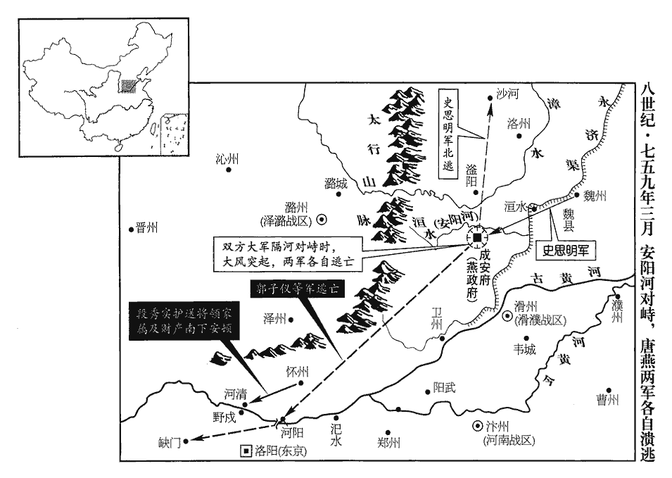
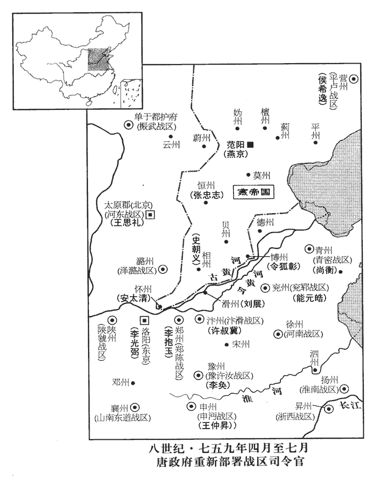
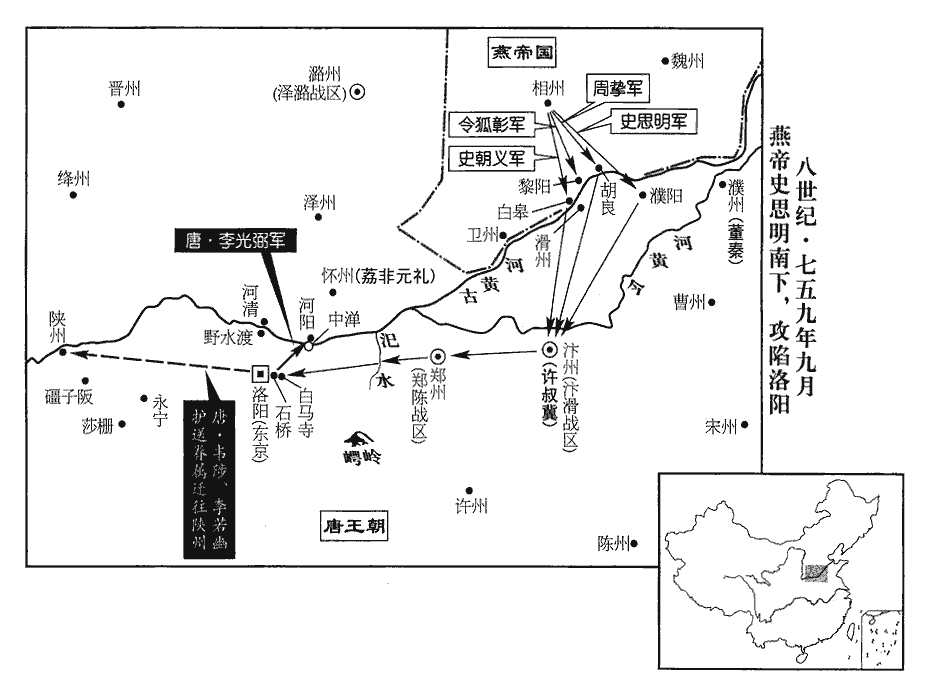
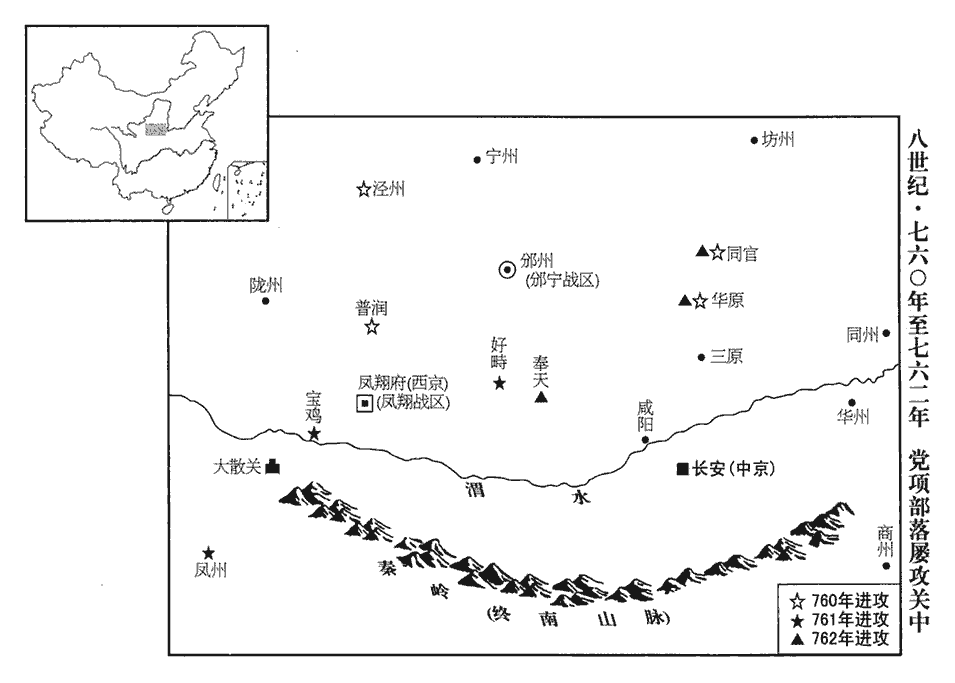
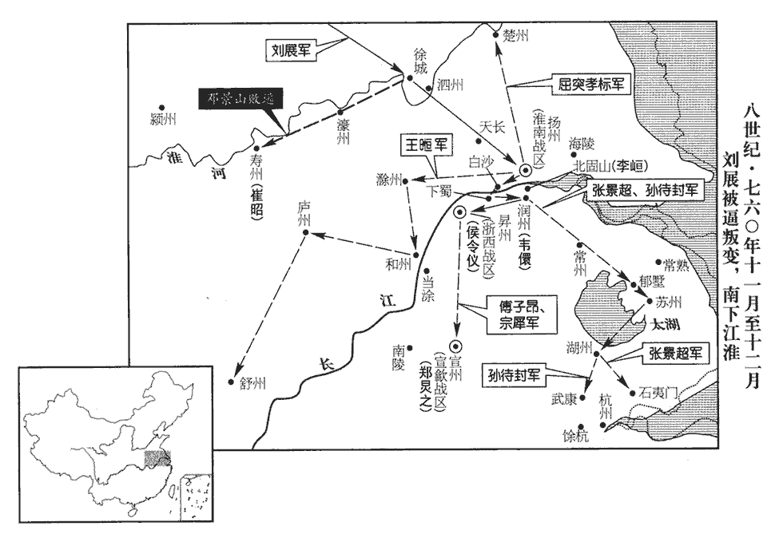

 唐紀三十七起屠維大淵獻（己亥），盡上章困敦（庚子），凡二年。

# 肅宗文明武德大聖大宣孝皇帝下之上

## 乾元二年（己亥、七五九）

1春，正月，己巳朔‹一›，史思明築壇於魏州‹河北省大名县›城北，自稱大聖燕王；以周摯為行軍司馬。考異曰：河洛春秋作「周萬至」，邠志作「周至」，舊傳作「周贄」。今從實錄。李光弼曰：「思明得魏州而按兵不進，此欲使我懈惰，而以精銳掩吾不備也。請與朔方軍‹总部设灵州宁夏灵武市›同逼魏城，求與之戰，彼懲嘉山‹河北省曲阳县东北嘉山›之敗，嘉山之敗，事見二百十八卷至德元載。必不敢輕出。得曠日引久，則鄴城‹燕首都·河南省安阳市›必拔矣。慶緒已死，彼則無辭以用其眾也。」魚朝恩以為不可，乃止。使用光弼之計，安有滏水之潰乎！朝，直遙翻。

〖译文〗 [1]春季，正月己巳朔（初一），史思明在魏州城北建筑祭坛，祭天称王，自称大圣燕王，任命周挚为行军司马。李光弼说：“史思明攻占魏州后，按兵不动，是想松懈我们的意志，然后用精兵突然袭击我们的不备。请让我与朔方军联兵进逼魏州城，向史思明挑战，史思明鉴于嘉山之败的经验，必定不敢轻易出战。这样旷日持久，我们就能够收复邺城。如果安庆绪败死，史思明就会失去号召力，难以指挥叛军。”而观军容使宦官鱼朝恩却认为此计不可行，只好作罢。

2戊寅‹十›，上‹李亨，本年四十九岁›祀九宮貴神，李心傳曰：九宮貴神者，太一、攝提、權主、招搖、天符、青龍、咸池、太陰、天一。宋白曰：九宮貴神，其說本之黃帝九宮經、蕭吉五行大義。用王璵之言也。乙卯‹十一›，耕藉田。「乙卯」，當作「乙酉」。

〖译文〗 [2]戊寅（初十），肃宗采用王的建议，祭祀九宫贵神。乙卯（疑误），肃宗行藉田礼，亲自耕田，以示重农。

3鎮西‹驻怀州河南省沁阳市›節度使李嗣業攻鄴城，為流矢所中，中，竹仲翻。丙申‹二十八›，薨；兵馬使荔非元禮代將其眾。將，即亮翻。初，嗣業表段秀實為懷州長史，知留後事。李嗣業以鎮西、北庭兵屯懷州，會師攻鄴，以段秀實知留後事。時諸軍屯戍日久，財竭糧盡，秀實獨運芻粟，募兵市馬以奉鎮西行營，相繼於道。

〖译文〗 [3]镇西节度使李嗣业在攻打邺城时，被乱箭射中，丙申（二十八日）去世。兵马使荔非元礼代替他指挥军队。起初，李嗣业奏请任命段秀实为怀州长史，主管留后事宜。此时，各路军队因为屯兵于邺城之下日久，财竭粮尽，而只有段秀实运送粮草，招兵买马，用以供应镇西行营兵，道路上络绎不绝。

4二月，壬子‹十五›，月食，既。春秋之法：書日食，不書月食。日，君象也。此因張后之專橫而書月食。記曰：男教不脩，陽事不得，謫見於天，日為之食；婦順不脩，陰事不得，謫見於天，月為之食。是故日食，則天子素服而脩六官之職，蕩天下之陽事；月食，則后素服而脩六宮之職，蕩天下之陰事。故天子之與后，猶日之與月，陰之與陽，相須而成者也。是後月食皆書於目錄上方。先是，百官請加皇后尊號曰「輔聖」，先，悉薦翻。考異曰：舊紀作「翊yì聖」，今從實錄。上以問中書舍人李揆，對曰：「自古皇后無尊號，惟韋后有之，韋后事見二百八卷中宗景龍元年。豈足為法！」上驚曰：「庸人幾誤我！」會月食，事遂寢。后與李輔國相表裏，橫於禁中，幾，居依翻。橫，戶孟翻。干豫政事，請託無窮，上頗不悅，而無如之何。

〖译文〗 [4]二月壬子（十五日），出现月全食。此前，百官请求加封张皇后尊号为“辅圣”，肃宗因此事问中书舍人李揆，李揆回答说：“自古以来皇后都没有尊号，只有中宗时韦皇后曾经有过尊号，怎么能够效法呢！”肃宗吃惊地说：“这些庸人几乎误了我的大事！”适逢出现月食，于是此事搁置。后来张皇后与宦官李辅国相互勾结，横行朝中，干预政事，无究尽地请托。肃宗虽然心中不满，但也无可奈何。

5郭子儀等九節度使圍鄴城，築壘再重，穿塹三重，重，直龍翻。壅漳水灌之。城中井泉皆溢，構棧而居，自冬涉春，安慶緒堅守以待史思明，食盡，一鼠直錢四千，淘牆䴬yì及馬矢以食馬。䴬，與職翻。先以麥䴬雜土築牆，今圍急乏芻，故淘䴬以飼馬。食，祥吏翻。人皆以為克在朝夕，而諸軍既無統帥，帥，所類翻。進退無所稟；稟，稟令也。稟，必錦翻。行軍進退，必稟令於主帥，今諸軍無所稟也。城中人欲降者，礙水深，不得出。降，戶江翻。城久不下，上下解體。師老勢屈，故解體。

〖译文〗 [5]郭子仪等九节度使包围了邺城，筑垒两道，挖壕三重，堵塞漳河水灌城。邺城中井泉都水满溢出，人们只好构栈而住，从冬天一直到春天，安庆绪死死坚守，等待史思明率兵解围，城中粮食吃尽，以至一只老鼠值钱四千，士卒挖出墙中的麦秸及马粪来喂养战马。人们都认为邺城危在旦夕，必能攻克，但是官军的各路军队因为没有统帅，进退没有统一指挥，城中的人想要投降，但因为水深不得出城。这样邺城久攻不下，官军疲困解体，没有士气。

思明乃自魏州引兵趣鄴，果如李光弼之言。趨，七喻翻。使諸將去城各五十里為營，每營擊鼓三百面，遙脅之。又每營選精騎五百，日於城下抄掠，騎，奇寄翻。抄，楚交翻。官軍出，輒散歸其營；諸軍人馬牛車日有所失，樵採甚艱，晝備之則夜至，夜備之則晝至。時天下饑饉，轉餉者南自江、淮，西自并、汾，舟車相繼。思明多遣壯士竊官軍裝號，督趣運者，趣，讀曰促。責其稽緩，妄殺戮人，運者駭懼；舟車所聚，則密縱火焚之；往復聚散，自相辨識，而官軍邏捕不能察也。邏，郎佐翻。由是諸軍乏食，人思自潰。思明乃引大軍直抵城下，觀史思明用兵，所謂盜亦有道焉。官軍與之刻日決戰。

〖译文〗 这时，史思明才率兵从魏州进军邺城，命令诸将在距离邺城五十里处扎营，每个营中击鼓三百面，遥为安庆绪声缓，威胁官军。史思明又从每个营中挑选精锐骑兵五百，每天到城下抢掠，官军如果出来交战，他们就散归自己的军营中。这样官军各路的人马牛车每天都有丧失，甚至连采集薪柴都很艰难。官军白天防备，叛军骑兵就在夜里来骚扰，如果夜里防备，叛军就白天来。当时天下饥荒，军中所用粮饷都是南从江、淮地区，西自并州、汾州运来，船车相继不断。于是史思明派壮士穿上官军的服装，窃取官军的号令，去督促运粮者，斥责他们缓慢，随便杀戮，使转运的人心中惊骇恐惧。他们又在运送粮饷船车聚集的地方，暗中放火焚烧。神出鬼没，聚散无常，他们自己能够相识别，但巡逻的官军士卒却抓不到，也侦察不出行迹。因此官军各路军队都缺乏粮食，人心涣散。史思明这才率领大军直抵城下，与官军定好了决战的日期。

三月，壬申‹六›，官軍步騎六十萬陳於安陽河‹洹水，流经邺城北›北，陳，讀曰陣；下布陳同。滏水逕安陽縣而東流，謂之安陽河。思明自將精兵五萬敵之，將，即亮翻。諸軍望之，以為遊軍，未介意。思明直前奮擊，李光弼、王思禮、許叔冀、魯炅先與之戰，殺傷相半；魯炅中流矢。中，竹仲翻。郭子儀承其後，未及布陳，大風忽起，吹沙拔木，天地晝晦，咫尺不相辨，兩軍大驚，官軍潰而南，賊潰而北，棄甲仗輜重委積於路。史言滏水之戰，天未悔禍，非戰之罪。使皆如李光弼、王思禮，在亂能整，則其失亡，不至於甚。重，直用翻。子儀以朔方軍斷河陽橋‹河南省孟州市黄河大桥›保東京‹洛阳›。斷，音短。戰馬萬匹，惟存三千；甲仗十萬，遺棄殆盡。東京士民驚駭，散奔山谷；留守崔圓、河南尹蘇震等官吏南奔襄‹湖北省襄樊市›、鄧‹河南省邓州市›；守，式又翻。襄、鄧二州，屬山南東道。諸節度各潰歸本鎮。士卒所過剽掠，剽，匹妙翻。吏不能止，旬日方定。惟李光弼、王思禮整勒部伍，全軍以歸。考異曰：邠志曰：「史思明自稱燕王。牙前兵馬使吳思禮曰：『思明果反。蓋蕃將也，安肯盡節於國家！』因目左武鋒使僕固懷恩。懷恩色變，陰恨之。三月六日，史思明輕兵抵相州，郭公率諸軍禦之，戰于萬金驛。賊分馬軍並滏而西，郭公使僕固懷恩以蕃、渾馬軍邀擊，破之。還遇吳思禮於陣，射殺之，呼曰：『吳思禮陣沒。』其夕，收軍，郭公疑懷恩為變，逐脫身先去。諸軍相繼潰于城下。」今從實錄。

〖译文〗 三月壬申（初六），官军步、骑兵六十万在安阳河北岸开摆阵势，史思明亲自率领精兵五万来交战，官军望见，以为是流动部队，不加介意。史思明身先士卒，率军冲锋，李光弼、王思礼、许叔冀与鲁炅先领兵迎战，杀伤各半，鲁炅还被乱箭射中。郭子仪率兵紧跟在后面，还未及布阵，大风急起，吹沙拔木，天地一片昏暗，咫尺之间，人马不辨，两军都大吃一惊，接着官军向南溃退，叛军向北溃退，所丢弃的武器盔甲等军用物资满路都是。郭子仪命令朔方军切断了河阳桥，以确保东京的安全。一万匹战马仅剩下三千，十万盔甲兵器差不多全部丧失。东京城中的官吏民众十分惊恐，都纷纷逃向山中，留守崔圆与河南尹苏震等官吏向南逃奔襄州、邓州，各路节度使也率领自己的兵马逃回本镇。这些败兵沿路大肆抢掠，胡作非为，当地官吏和军中将帅无法制止，十多天才安定下来。只有李光弼与王思礼整理队伍，全军返回。

 

子儀至河陽‹河南省孟州市›，將謀城守，師人相驚，又奔缺門‹河南省新安县西铁门镇›。水經註：穀水出弘農澠池縣南，又東逕新安縣故城南，又東逕千秋亭南，又東逕缺門山，山阜之不接者里餘，故得是名。諸將繼至，眾及數萬，議捐東京，退保蒲‹山西省永济市›、陝‹河南省三门峡市›。將，即亮翻。捐，于專翻。陝，失冉翻。蒲、陝二州夾河，潼關控其險，可以禦敵，故議退保之。都虞候張用濟曰：「蒲、陝荐饑，不如守河陽，賊至，併力拒之。」子儀從之。使都遊弈使靈武‹灵武县·宁夏永宁县西南›韓遊瓌guī將五百騎前趣河陽，使，疏吏翻。瓌，古回翻。騎，奇寄翻。趣，七喻翻。用濟以步卒五千繼之。周摯引兵爭河陽，後至，不得入而去。用濟役所部兵築南、北兩城而守之。是後李光弼雖斬張用濟而守河陽，則實張用濟定計於其先也。段秀實帥將士妻子及公私輜重自野戍‹河南省孟津县北黄河渡口›渡河，待命於河清‹河南省济源市南›之南岸，野戍，即野水渡，置戍守之，因謂之野戍。河清縣，本屬河南尹，本大基縣，武德二年置，八年省，咸亨四年復分河南洛陽、新安、王屋、濟源、河陽置大基，先天元年更名河清。帥，讀曰率。將，即亮翻。輜，莊持翻。重，直用翻。荔非元禮至而軍焉。諸將各上表謝罪，上，時掌翻。上皆不問，惟削崔圓階封，崔圓先封趙國公，實封戶五百。國公，從一品，階比開府儀同三司。貶蘇震為濟王府長史，削銀青階。濟王環，上弟也。濟，子禮翻。長，知兩翻。

〖译文〗 郭子仪到达河阳，想要坚守河阳城，因为部队自相惊扰，又逃奔缺门。这时部将都陆续赶到，点检人马，才有几万，大家商议放弃东京，退保蒲州、陕州。都虞侯张用济说：“蒲州与陕州连年饥荒，不如坚守河阳，叛军如果来攻，就全力坚守。”郭子仪同意。于是就派都游弈使灵武人韩游率领五百骑兵先进军河阳，张用济率领五千步兵继后。叛军的行军司马周挚领兵来争夺河阳，因为晚到一步，无法入城而退去。张用济让士兵筑南、北两城准备坚守。段秀实率领镇西将士的家眷以及公私物资从野戌渡过黄河，在河清县南面待命，荔非元礼到后遂驻军于此。各路将帅都上表谢罪，肃宗都不责问，只是削夺了崔圆的封爵与官阶，并贬苏震为济王府长史，削夺银青光禄大夫官阶。

史思明審知官軍潰去，自沙河‹河北省沙河市北沙河城›收整士眾，還屯鄴城南。史思明之兵潰而北去，至沙河，知官軍的去，乃收整其眾而南。使官軍於滏水驚潰之後，各能收兵還營，堅壁而圍守鄴城，思明未敢南也。沙河縣，隋分龍岡縣置，唐屬邢州，在鄴城西北二百餘里。還，音旋，又音如字。安慶緒收子儀營中糧，得六七萬石，與孫孝哲、崔乾祐謀閉門更拒思明。諸將曰：「今日豈可復背史王乎！」復，扶又翻。背，蒲妹翻。思明不與慶緒相聞，又不南追官軍，但日於軍中饗士。張通儒、高尚等言於慶緒曰：「史王遠來，臣等皆應迎謝。」應，乙陵翻。慶緒曰：「任公蹔往。」思明見之涕泣，厚禮而歸之。經三日，慶緒不至。思明密召安太清令誘之，蹔，與暫同。令，力丁翻。誘，音酉。慶緒窘蹙，不知所為，乃遣太清上表稱臣於思明，請待解甲入城，奉上璽綬。窘，巨隕翻。上，時掌翻。璽，斯氏翻。綬，音受。思明省表，曰：「何至如此！」因出表徧示將士，咸稱萬歲。省，昔景翻。思明出慶緒表徧示將士，以觀其情向背。乃手疏唁慶緒疏，所據翻。唁，魚戰翻，弔生曰唁。而不稱臣，且曰：「願為兄弟之國，更作藩籬之援。鼎足而立，猶或庶幾；北面之禮，固不敢受。」并封表還之。慶緒大悅，因請歃血同盟，思明許之。慶緒以三百騎詣思明營，思明令軍士擐甲執兵以待之，幾，居希翻。歃，色甲翻。騎，奇寄翻。擐，音宦。引慶緒及諸弟入至庭下。慶緒再拜稽首曰：「臣不克荷負，稽，音啟。荷，下可翻，又如字。棄失兩都，久陷重圍，重，直龍翻。不意大王以太上皇之故，慶緒尊祿山為太上皇，見二百十九卷至德元載。遠垂救援，使臣應死復生，復，扶又翻，又如字。摩頂至踵，無以報德。」思明忽震怒曰：「棄失兩都，亦何足言。爾為人子，殺父奪其位，天地所不容。吾為太上皇討賊，吾為，音于偽翻。豈受爾佞媚乎！」即命左右牽出，并其四弟及高尚、孫孝哲、崔乾祐皆殺之；張通儒、李庭望等悉授以官。思明勒兵入鄴城，收其士馬，以府庫賞將士，慶緒先所有州、縣及兵皆歸於思明。遣安太清將兵五千取懷州，因留鎮之。思明欲遂西略，慮根本未固，乃留其子朝義守相州‹邺城›，朝，直遙翻。引兵還范陽‹幽州州政府所在城·北京市›。

〖译文〗 史思明得知官军败退，就从沙河整顿兵马，还军邺城南面。安庆绪收集了郭子仪军队败退时留在营中的粮食，有六七万石，于是就与孙孝哲、崔乾等计谋闭城门抗拒史思明。这时各位将领说：“我们现在怎么能够背叛史王呢！”而史思明既不与安庆绪通报情况，也不南下追击官军，只是每天在军中宴请士卒。张通儒、高尚等人对安庆绪说：“史王远道率兵来救援我们，我们都应该去迎接感谢。”安庆绪说：“随你们去吧。”史思明见到张通儒、高尚等，痛哭流涕，重加礼赏，然后让他们回去。过了三天，安庆绪还不来。于是史思明就暗中把安太清召来，让他诱骗安庆绪，安庆绪无计可施，不知道怎么办才好，只好派安太清向史思明上表称臣，并说等待史思明安顿好部队入城后，就奉上皇帝印玺。史思明看了表书后说：“你何必要这样呢！”并把表书拿出来让将士们看，将士们都呼喊万岁。因此史思明就亲手写信安慰安庆绪，并不称臣，只是说：“愿与你作为兄弟邻国，互相援助。我们之间地位平等，鼎足而立，这还差不多；如果向我称臣，万不敢接受。”并把表书封缄后还给安庆绪。安庆绪十分高兴，因此请求与史思明歃血结盟，史思明同意。于是安庆绪带领三百名骑兵来到史思明军营中，史思明命令士卒全副武装以防备安庆绪，然后引安庆绪与他的几个弟弟进入庭中。安庆绪叩头再拜说：“作为臣下我治军无方，丧失东西二京，并陷于重兵包围之中，没有想到大王看在我父亲太上皇的情份上，远来救危，使我得以复生，恩深如海，终生难以报答。”史思明忽然大怒说：“丢失两京，何足挂齿。你身为人子，杀父篡位，为天地之所不容。我是为太上皇讨伐你这个逆贼，怎么肯受你讨好的假话欺骗呢！”当即命令左右的人把安庆绪连同他的四个弟弟以及高尚、孙孝哲、崔乾等全部杀掉。张通儒、李庭望等人都被授以官职。然后史思明整军入邺城，收集了安庆绪的兵马，把府库中的财物分赏给将士，安庆绪原先所占据的州、县以及兵马都归史思明所有。史思明又派安太清率兵五千攻取怀州，因此留安太清镇守怀州。史思明想立刻率兵向西发展，考虑到后方还不稳固，于是就把他的儿子史朝义留下镇守相州，自己率兵返回范阳。

6甲申‹十八›，回紇‹瀚海沙漠群›骨啜特勒、帝德等十五人自相州奔還西京，上宴之於紫宸殿，宋敏求長安志：宣政殿北曰紫宸門，門內有紫宸殿，即內衙之正殿。賞賜有差。庚寅‹二十四›，骨啜特勒等辭還行營。

〖译文〗 [6]甲申（十八日），回纥将领骨啜特勒、帝德等十五人从相州逃回西京，肃宗于紫宸殿宴请他们，并赏赐给他们数量不等的财物。庚寅（二十四日），骨啜特勒等辞别，返回行营。

7辛卯‹二十五›，以荔非元禮為懷州刺史，權知鎮西‹总部设龟兹新疆库车县›、北庭‹总部设北庭府新疆吉木萨尔县›行營節度使。元禮復以段秀實為節度判官。復，扶又翻。

〖译文〗 [7]辛卯（二十五日），肃宗任命荔非元礼为怀州刺史，代理镇西、北庭行营节度使。荔非元礼又任命段秀实为节度判官。

8甲午‹二十八›，以兵部侍郎呂諲同平章事。乙未‹二十九›，以中書侍郎、同平章事苗晉卿為太子太傅，王璵為刑部尚書，皆罷政事。以京兆尹李峴行吏部尚書，中書舍人兼禮部侍郎李揆為中書侍郎，及戶部侍郎第五琦並同平章事。上於峴恩意尤厚，峴亦以經濟為己任，軍國大事多獨決於峴。為李輔國忌峴，不得久於相位張本。於是京師多盜，李輔國請選羽林騎士五百以備巡邏。羅，郎佐翻。李揆上疏曰：「昔西漢以南北軍相制，故周勃因南軍入北軍，遂安劉氏。周勃安劉，事見漢高后紀。李揆謂勃因南軍入北軍，考其本末，恐不如此。皇朝置南、北牙，文武區分，以相伺察。今以羽林代金吾警夜，忽有非常之變將何以制之！」乃止。金吾衛，屬南牙；羽林衛，屬北牙。金吾掌巡徼，李輔國欲以羽林軍奪其職，故李揆以為言。朝，直遙翻。

〖译文〗 [8]甲午（二十八日），肃宗任命兵部侍郎吕同平章事。乙未（二十九日），任命中书侍郎、同平章事苗晋卿为太子太傅，王为刑部尚书，都免去他们的政事。又任命京兆尹李岘为吏部尚书，中书舍人兼礼部侍郎李揆为中书侍郎，以及户部侍郎第五琦并同平章事。肃宗特别赏识李岘，李岘也以经国治邦为己任，所以军国大事大多由李岘一人处理。当时京城盗贼横行，宦官李辅国请求挑选羽林军的五百骑兵以备巡逻搜捕。李揆上疏说：“过去西汉王朝设置南北二军互相制约，所以周勃得以率南军进入北军，于是安定了刘氏王朝。我们大唐王朝设置南牙与北牙，文臣与武将相区别，以使他们互相监督。现在用羽林军代替金吾卫巡夜，如果发生了突发事件，怎么控制局势呢！”此事只好作罢。

9丙申‹三十›，以郭子儀為東畿‹洛阳›、山東‹崤山以东›、河東‹山西省›諸道元帥，權知東京留守。東畿，謂東京畿。山東，謂河南、河北。河東，自蒲、絳北至并、代。以河西‹总部设凉州甘肃省武威市›節度使來瑱行陝州刺史，充陜、虢、華州節度使。來瑱徙河西，未行，而相州師潰，因使之鎮陝以守關。然瑱尋徙襄陽。華，戶化翻。

〖译文〗 [9]丙申（三十日），肃宗任命郭子仪为东畿、山东、河东诸道元帅，暂代东京留守。又任命河西节度使来为陕州刺史，并兼任陕州、虢州、华州节度使。

10夏，四月，庚子‹四›，澤潞‹总部设潞州山西省长治市›節度使王思禮破史思明將楊旻於潞城‹山西省潞城县›東。潞城縣，屬潞州，隋開皇十六年置，春秋潞子所邑也。九域志：潞城，在潞州東北四十里。

〖译文〗 [10]夏季，四月庚子（初四），泽潞节度使王思礼于潞城东面击败史思明将领杨。

11太子詹事李輔國，自上在靈武‹宁夏灵武市›，判元帥行軍司馬事，侍直帷幄，宣傳詔命，四方文奏，寶印符契，晨夕軍號，一以委之。及還京師，專掌禁兵，常居內宅，內宅，蓋在禁中，輔國止宿之署舍也。制敕必經輔國押署，然後施行，宰相百司非時奏事，皆因輔國關白、承旨。常於銀臺門決天下事，雍錄：按六典大明宮圖，有左、右銀臺門。左銀臺門直紫宸殿之東，右銀臺門直紫宸殿之西。又考閣本大明宮圖，右銀臺門內即翰林院、麟德殿，又東歷內侍別省、延英殿、光順門而後至紫宸殿。自左銀臺門西入，歷溫室、浴堂殿、綾綺殿而後至紫宸殿。紫宸殿在宣政殿後，當大明宮正中。右銀臺門在宮城西面，左銀臺門在宮城東面，以地望準之，正直紫宸東、西耳。事無大小，輔國口為制敕，寫付外施行，事畢聞奏。又置察事數十人，潛令於人間聽察細事，即行推按；有所追索，諸司無敢拒者。御史臺、大理寺重囚，或推斷未畢，輔國追詣銀臺，一時縱之。索，山客翻。斷，丁亂翻。三司、府、縣鞫獄，皆先詣輔國咨稟，輕重隨意，稱制敕行之，莫敢違者。宦官不敢斥其官，皆謂之五郎。李揆山東‹崤山以东›甲族，見輔國執子弟禮，謂之五父。李揆裔出隴西，其先客居滎陽，遂為山東甲族。李輔國，第五。

〖译文〗 [11]太子詹事宦官李辅国，自肃宗在灵武时，就任元帅府行军司马，侍奉在肃宗左右，宣布诏敕诰命，肃宗把四方来的文书奏疏，军中的印玺符契以及军队的号令集训等事，全都委任于他。到收复京师后，李辅国又专门掌管禁军，常常住在宫中的署舍里，肃宗所颁下的制敕，必须经过李辅国画押签署，然后才能施行，宰相以及百官有急事上奏时，都在通过李辅国禀告和受旨。李辅国经常在银台门处理国家的政事，不管大小事，都由李辅国口宣制敕，写好后交给外面去执行，等事情完结后才上奏给肃宗。李辅国又设置察事数十人，暗中让他们打听民间的秘密事情，然后再进行审讯。如果要追查什么案子，朝廷各部门都不敢加以拒绝。关在御史台与理寺内的重刑犯人，有的还没有审讯完毕，李辅国就追到银台门，一下子把这些人全部放掉。御史台、中书省、门下省三司以及府、县审理案件，都要先报告李辅国，听候他的指示，随他的意思而判，声称是皇上的制敕，命令实行，没有人敢于违抗。宦官不能直呼李辅国的官名，都称他五郎。李揆是崤山以东地区的名门大族，见了李辅国还要行子弟礼，称他为五父。

及李峴為相，於上前叩頭，論制敕皆應由中書出，具陳輔國專權亂政之狀，上感寤，賞其正直；峴，戶典翻。相，息亮翻。輔國行事，多所變更，更，工衡翻。罷其察事。輔國由是讓行軍司馬，請歸本官，本官，太子詹事。上不許。【章：甲十六行本「許」下有「壬寅‹六›」二字；乙十一行本同；張校同，云無註本亦無。】制：「比緣軍國務殷，或宣口敕處分。比，毗至翻。處，昌呂翻。分，扶問翻。諸色取索及杖配囚徒，自今一切並停。如非正宣，並不得行。索，山客翻。正宣，宣命。凡出宣命，有底在中書，可以檢覆，謂之正宣。中外諸務，各歸有司。英武軍虞候及六軍諸使、諸司等，比來或因論競，懸自追攝，英武軍，殿前射生手也，置虞候以統之。六軍，北門六軍也。諸使，內諸使也。諸司，內諸司也。使，疏吏翻。論，盧毘翻。自今須一切經臺、府。臺，御史臺。府，京兆府。如所由處斷不平，處，昌呂翻。斷，丁亂翻。聽具狀奏聞。諸律令除十惡、殺人、姦、盜、造偽外，餘煩冗一切刪除，仍委中書、門下與法官詳定聞奏。」輔國由是忌峴。考異曰：實錄李峴傳曰：「時李輔國專典禁中兵權，詔旨或不由中書而出，峴切陳其狀，肅宗甚嘉之，即日下詔，如峴奏。由是挫輔國威權，輔國頗忌之。」蓋即此詔也。

〖译文〗 李岘做宰相以后，在肃宗面前叩头，论说皇上的制敕都应该由中书省出，并陈述了李辅国专权乱政的事例，肃宗因此醒悟，称赞李岘为人正直，李辅国做事也多所改变，罢掉了那些察事。李辅国因此又辞让元帅府行军司马一职，请求回归本官为太子詹事，肃宗不答应。肃宗下制说：“近来因为军国大事繁忙，有时让人宣布口敕处理政事。从今以后，各种索取以及棍打发配囚犯之事，全部停止。如果不是由中书省所宣布的敕命，都不能施行。朝野内外的一切事务，各归主管部门办理。英武军的虞侯及禁军六军的各使、各司，近来有时为了竞争，就各自追踪犯人，从今以后，一切案件都要经过御史台与京兆府处理，如果台、府官员处理判决不公平，允许写状上奏。各种刑律除了十恶、杀人、奸、盗、伪造罪外，其余的过烦过多的条款，全部删除。并委托中书省、门下省与法官详细确定以后再上奏告知。”李辅国因此忌恨李岘。

12甲辰‹八›，置陳、鄭、亳節度使‹总部设陈州河南省淮阳县›，以鄧州刺史魯炅為之；以徐州‹江苏省徐州市›刺史尚衡為青、密七州節度使‹总部设青州山东省青州市›；七州，青、密、登、萊、淄、沂、海。炅，古迥翻。以興平軍‹总部设商州陕西省商州市›節度使李奐兼豫、許、汝三州節度使‹总部设豫州河南省汝南县›；仍各於境上守捉防禦。陳、鄭、亳前此未嘗置節鎮，魯炅自南陽為之。青、密等七州，尚衡自彭城升統之。興平軍本置於雍州始平縣，李奐時在行營，使統豫、許、汝三州。此皆臨時分鎮，非有一定規模也。

〖译文〗 [12]甲辰（初八），唐朝设置陈州、郑州、亳州节度使，任命邓州刺史鲁炅为节度使，任命徐州刺史尚衡为青州、密州等七州节度使，兴平军节度使李奂兼任豫州、许州、汝州三州节度使。各节度使仍在自己的境内行使防御使与守捉使的职权。

九節度之潰於相州也，魯炅所部兵剽掠尤甚，剽，匹妙翻。聞郭子儀退屯河上，李光弼還太原，炅慚懼，飲藥而死‹本年五十七岁›。還，從宣翻，又音如字。

〖译文〗 九节度使兵败相州以后，鲁炅部下的士卒抢掠尤其厉害，得知郭子仪兵退到黄河岸边，李光弼回军太原，鲁炅惭愧害怕，饮毒药而死。

13史思明自稱大燕皇帝，改元順天，燕，因肩翻。考異作「應天皇帝」，註曰：河洛春秋曰：「上元三年春三月，思明懷西侵之謀，慮北地之變，乃令男朝義留守相城，自領士馬歸范陽，因僭號後燕，改元順天元年。」按實錄，此年正月一日，思明稱燕王，立年號。實錄、舊傳皆不載所改年名。紀年通譜，此年即思明順天元年。柳璨正閏位曆，思明有順天、應天二號。按薊門紀亂：「思明既殺烏承恩，不稱國家正朔，亦不受慶緒指麾，境內但稱某月而已。乾元二年四月癸酉，思明僭位於范陽，建元順天，國號大燕，立妻辛氏為皇后，次子朝興為皇太子，長子朝義為懷王。六月，於開元寺造塔，改寺名為順天。上元二年正月癸卯，思明大赦，改元應天。」實錄云：「正月，立年號。」河洛春秋云：「上元三年僭號。」薊門紀亂云：「立朝興為太子。」按思明欲立少子為太子，左右泄其謀，故朝義弒之。紀亂云於時已立為太子，誤也。按長曆，四月丁酉朔，無癸酉。立其妻辛氏為皇后，子朝義為懷王，以周摯為相，李歸仁為將，朝，直遙翻。相，息亮翻。將，即亮翻。改范陽為燕京，諸州為郡。

〖译文〗 [13]史思明自称大燕皇帝，改年号为顺天，立妻子辛氏为皇后，儿子史朝义为怀王，任命周挚为宰相，李归仁为大将，改范阳为燕京，各州改称为郡。

14戊申‹十二›，以鴻臚卿李抱玉為鄭、陳、潁、亳節度使。臚，凌如翻。使，疏吏翻。抱玉，安興貴之後也，安興貴，見一百八十七卷高祖武德二年。為李光弼裨將，屢有戰功；自陳恥與安祿山同姓，故賜姓李氏。

〖译文〗 [14]戊申（十二日），肃宗任命鸿胪卿李抱玉为郑州、陈州、颍州、亳州节度使。李抱玉是安兴贵的后代，李光弼部下裨将，多次立有战功，自己奏陈耻与安禄山同姓，所以被赐姓李氏。

15回紇‹瀚海沙漠群›毗伽闕可汗卒，長子葉護先遇殺，國人立其少子，是為登里可汗。紇，下沒翻。伽，求迦翻。長，知兩翻。少，始照翻。可，從刊入聲。汗，音寒。卒，子恤翻。回紇欲以寧國公主為殉。公主曰：「回紇慕中國之俗，故娶中國女為婦。若欲從其本俗，何必結婚萬里之外邪！」邪，音耶。然亦為之剺面而哭。漠北之俗，死者停屍於帳，子孫及親屬男女各殺牛馬，陳於帳前祭之，遶帳走馬七匝，詣帳門，以刀剺面，且哭，血淚俱流，如此者七度，乃止。為，于偽翻。剺，里之翻。

〖译文〗 [15]回纥毗伽阙可汗去世，因为他的长子叶护已遇刺身亡，所以国人立他的小儿子为可汗，这就是登里可汗。回纥想要让宁国公主为毗伽阙可汗殉葬，公主说：“回纥因为羡慕中国的风俗，所以才娶中国女子为妻。如果想遵从你们本来的风俗，何必要同万里之外的中国女人结婚呢！”但公主还是按照回纥的风俗习惯，为回纥可汗割破面颊，流血哭泣。

16鳳翔‹陕西省凤翔县›馬坊押官為劫，押官者，管押馬坊之官。天興‹凤翔府所在县›尉謝夷甫捕殺之。天興縣，本古雍縣，至德二載，改曰鳳翔，仍分置天興縣，帶鳳翔府。其妻訟冤。李輔國素出飛龍廄，李輔國本飛龍小兒。敕監察御史孫鎣yíng鞫之，無冤。監，古銜翻。鎣，余傾翻，又烏定翻。又使御史中丞崔伯陽、刑部侍郎李曄yè、大理卿權獻鞫之，此唐制所謂小三司也。與鎣同。猶【章：甲十六行本「猶」上有「妻」字；乙十一行本同；張校同；退齋校同。】不服。又使侍御史太平‹山西省襄汾县西南汾城镇›毛若虛鞫之，太平縣，屬絳州，魏太武帝置泰平縣，周改為太平，因太平關城為名。若虛傾巧士，希輔國意，歸罪夷甫。伯陽怒，召若虛詰責，欲劾奏之。詰，去吉翻。劾，戶概翻，又戶得翻。若虛先自歸於上，上匿若虛於簾下。伯陽尋至，言若虛附會中人，鞫獄不直。上怒，叱出之。伯陽貶高要‹端州州政府所在县·广东省肇庆市›尉，獻貶桂陽‹连州州政府所在县·广东省连州市›尉，桂陽，漢縣，隋、唐帶連州。曄與鳳翔尹嚴向皆貶嶺下尉，嶺下，謂度嶺南下諸縣，史失曄、向所貶縣名，故云皆貶嶺下尉。鎣除名，長流播州‹贵州省遵义市›。吏部尚書、同平章事李峴奏伯陽無罪，責之太重，上以為朋黨，五月，辛巳‹十六›，貶峴蜀州‹四川省崇州市›刺史。尚，辰羊翻。峴，戶典翻。考異曰：代宗實錄云：「屬有盜發鳳翔、管在北軍者，詔遣御史訊鞫，盜已伏罪。李輔國執奏重覆。殿中侍御史毛若虛奏覆與輔國協。肅宗大怒，下三司推鞫之。峴以若虛不直，陳於上前。及三司覆奏，與峴理協，肅宗以為朋黨。會同列李揆希旨，遂貶峴為通州刺史，三司大臣皆貶官。」今從肅宗實錄、舊紀、傳。右散騎常侍韓擇木入對，散，悉亶翻。騎，奇寄翻。上謂之曰：「李峴欲專權，今貶蜀州，朕自覺用法太寬。」對曰：「李峴言直，非專權。陛下寬之，祗益聖德耳。」若虛尋除御史中丞，威振朝廷。朝，直遙翻。

〖译文〗 [16]凤翔管马坊的押官因为抢劫，被天兴县尉谢夷甫抓住杀掉。押官的妻子为他的丈夫诉冤。李辅国原本是飞龙马厩养马小儿出身，于是就命令监察御史孙蓥审问，结果不是冤案。李辅国又让御史中丞崔伯阳、刑部侍郎李晔、大理卿权献审问，结果与孙蓥相同。押官的妻子还不服，李辅国就又让侍御史太平人毛若虚审问，毛若虚本是小人，按照李辅国的意图，归罪于谢夷甫。崔伯阳十分愤怒，就把毛若虚叫来质问他，想上奏弹劾他。毛若虚自己先跑到肃宗那里，肃宗把毛若虚藏在帘子后面。不久崔伯阳来到，说毛若虚依附宦官，审理案件不公平。肃宗听后十分愤怒，就把崔伯阳喝斥出去。于是贬崔伯阳为高要县尉，大理卿权献为桂阳县尉，刑部侍郎李晔与凤翔尹严向也都被贬到岭南做县尉。监察御史孙蓥被削除名籍，流放到播州。吏部尚书、同平章事李岘上奏，说崔伯阳无罪，处理太重而，肃宗认为李岘与崔伯阳等人结党，五月辛巳（十六日），贬李岘为蜀州刺史。右散骑常侍韩择木入朝应对，肃宗对他说：“李岘想要专权，现在已被贬为蜀州刺史，朕还觉得用法太宽大。”韩择木回答说：“李岘直言不讳，并不是专权。陛下如果能够宽大地处理，只能够增加陛下的圣德。”不久，毛若虚被任命为御史中丞，威震朝廷。

17壬午‹十七›，以滑、濮節度使許叔冀為汴州‹河南省开封市›刺史，充滑、汴等七州節度使；新書方鎮表：汴、滑節度使治滑州，領州五：滑、濮、汴、曹、宋。以試汝州‹河南省汝州市›刺史劉展為滑州刺史，充副使。

〖译文〗 [17]壬午（十七日），肃宗任命滑、濮节度使许叔冀为汴州刺史，兼滑、汴等七州节度使；又任命试汝州刺史刘展为滑州刺史，兼节度副使。

18六月，丁巳‹二十三›，分朔方置邠、寧等九州節度使‹总部设邠州陕西省彬县›。方鎮表：開元九年置朔方節度使，領單于大都護府，夏、鹽、綏、銀、豐、勝六州，定遠、豐安二軍，三受降城。十年，增領魯、麗、契三州。二十二年，兼關內道采訪處置使，增涇、原、寧、慶、隴、鄜、坊、丹、延、會、宥、麟十二州。以匡、長二州隸慶州，安樂、長樂二州隸原州。天寶元年，增領邠州。乾元元年，分鎮北大都護府，麟、勝二州，置振武節度使。是年，廢關內節度使，罷領單于大都護，以涇、原、寧、慶、坊、鄜、丹、延隸邠寧節度。邠州本豳州，開元十三年以「豳」字類「幽」，改曰邠。

〖译文〗 [18]六月丁巳（二十三日），朝廷在朔方节度下分设州、宁州等九州节度使。

19觀軍容使魚朝恩惡郭子儀，惡，烏路翻。因其敗，短之於上。秋，七月，上召子儀還京師，以李光弼代為朔方節度使、兵馬元帥。考異曰：邠志曰：「四月，肅宗使丞相張公鎬東都慰勉諸軍。郭公陳饌於軍，張公不坐而去。軍中不悅，朋肆流議。居十日，有中使追郭公。」汾陽家傳曰：「六月，公朝于京師，三讓元帥，上許之。乃詔李光弼代公為副。」段公別傳曰：「五月，李光弼代子儀為副元帥，守東都。」今因實錄七月除趙王係為元帥，并言之。士卒涕泣，遮中使請留子儀，子儀紿之曰：「我餞中使耳，未行也。」因躍馬而去。

〖译文〗 [19]宦官观军容使鱼朝恩忌恨郭子仪，因此借相州之败，在肃宗面前进谗言。秋季，七月，肃宗召郭子仪回京师，任命李光弼为朔方节度使、兵马元帅。朔方士卒痛哭流涕，拦住传达命令的宦官，请求把郭子仪留下来。郭子仪欺骗士卒们说：“我先去送别传达命令的宦官，不是要离开。”借此跳上马而去。

光弼願得親王為之副，辛巳‹十七›，以趙王係為天下兵馬元帥，光弼副之，考異曰：舊傳：「思明縱兵河南，加光弼太尉兼中書令，代郭子儀為朔方節度、兵馬副元帥，以東師委之。」新傳云：「帝貸諸將罪，以光弼兼幽州大都督府長史、知諸道節度行營事，又代子儀為朔方節度使。未幾，為天下兵馬副元帥。」按實錄，光弼加太尉、中書令在上元元年破史思明後，為幽州都督在此年八月。其代子儀節制朔方，實錄無月日。制辭云：「宜副出車之命，仍踐分麾之寵。」蓋只在此時耳。仍以光弼知諸節度行營。光弼以河東騎五百馳赴東都，夜，入其軍。光弼治軍嚴整，始至，號令一施，士卒、壁壘、旌旗、精采皆變。史言光弼入朔方軍，部分皆因子儀之舊，但號令加嚴整耳。治，直之翻。是時朔方將士樂子儀之寬，憚光弼之嚴。樂，音洛。

〖译文〗 李光弼希望能让一位亲王为天下兵马元帅，自己为副元帅，辛巳（十七日），肃宗任命赵王李系为天下兵马元帅，李光弼为副元帅，仍兼统诸节度行营。李光弼率领河东镇的五百骑兵驰往东都赴任，在夜晚进入朔方军。李光弼治军严整，到达朔方军营中后，号令一经下达，朔方军的士卒、营垒、旌旗等军容为之一变。这时朔方军的将士都喜欢郭子仪的宽厚，而害怕李光弼的严厉。

左廂兵馬使張用濟屯河陽‹河南省孟州市›，光弼以檄召之。用濟曰：「朔方，非叛軍也，乘夜而入，何見疑之甚邪！」與諸將謀以精銳突入東京，逐光弼，請子儀；命其士皆被甲上馬，銜枚以待。被，皮義翻。上，時掌翻。都知兵馬使僕固懷恩曰：「鄴城之潰，郭公先去，觀懷恩此言，則邠志所云亦可以傳信。朝廷責帥，故罷其兵柄。今逐李公而強請之，【章：甲十六行本「之」下有「違拒朝命」四字；乙十一行本同；退齋校同。】是反也，其可乎！」帥，所類翻。強，其兩翻，又音如字。右武鋒使康元寶曰：「君以兵請郭公，朝廷必疑郭公諷君為之，是破其家也。郭公百口何負於君乎！」用濟乃止。懷恩此言，與康元寶之言皆是也。使諸將從張用濟於惡，史思明之兵復至，唐事殆矣。光弼以數千騎東出汜水‹河南省荥阳市汜水镇西›，用濟單騎來謁。光弼責用濟召不時至，斬之，命部將辛京杲代領其眾。考異曰：舊傳曰：「用濟承子儀之寬，懼光弼之令，與諸將頗有異議，欲逗留其眾。光弼以數千騎出次汜水縣，用濟單騎迎謁，即斬於轅門，諸將懾伏，以辛京杲代之。復追都兵馬使僕固懷恩。懷恩懼，先期而至。」邠志曰：「五月二十三日，詔河東節度使李公代子儀兼統諸軍。李公既受命，以河東馬軍五百騎至東都，夜，入其軍。張用濟在河陽，聞之曰：『朔方軍，非叛人也，何見疑之甚！』欲率精騎突入東都，逐李公，請郭公。李公知之，遂留東都，表請濟師于河陽。冬十月，思明引眾渡河。李公曰：『思明渡河，必圖洛城，我當守武牢關，揚兵於廣武原以待之。』遂引軍東出師汜水縣。檄追河陽諸將，用濟後至，李公數其罪而戮之，以辛京杲代領其職。明日，引軍入河陽。」按實錄，此月光弼為副元帥，九月始移軍河陽耳。

〖译文〗 朔方军左厢兵马使张用济率兵屯驻在河阳，李光弼发檄书召他。张用济说：“朔方军又不是叛兵，而李光弼却在夜晚来到军中，为什么要这样猜疑我们呢！”因此就与其他的将领商议，要用精锐骑兵突入东京，赶走李光弼，把郭子仪请回来。于是就命令士兵被甲上马，整装待发。这时都知兵马使仆固怀恩说：“九节度使邺城之败时，郭将军先领兵退却，朝廷责罚元帅，所以罢了他的兵权。现在如果赶走李将军而强请郭将军回来，这是反叛行为，怎么能行呢！”右武锋使康元宝也说：“你率兵强请郭将军回来，朝廷一定会怀疑这是郭将军暗中指使你这么干，这不是要他家破人亡吗！郭将军百口之家有什么地方对不起你的呢！”张用济听后才罢休。李光弼率领数千名骑兵东出汜水县，张用济单枪匹马来晋见李光弼。李光弼责备张用济接到檄书后没有及时赶到，就杀了他，并命令部将辛京杲代他率兵。

20僕固懷恩繼至，光弼引坐，與語。史言李光弼待僕固懷恩有加於諸將。須臾，閽者曰：「蕃、渾‹蒙古国乌兰巴托市西›五百騎至矣。」蕃、渾，謂諸蕃種及渾種。光弼變色。懷恩走出，召麾下將，陽責之曰：「語汝勿來，何得固違！」將，即亮翻。語，牛倨翻。光弼曰：「士卒隨將，亦復何罪！」命給牛酒。史言懷恩成備而後見光弼，光弼雖知其情而容忍不發。復，音扶又翻。

〖译文〗 [20]接着仆固怀恩到达，李光弼引他入座，与他谈话。不一会儿，看门的报告说：“来了蕃种和浑种的五百名骑兵。”李光弼听后大惊失色。这时仆固怀恩走了出来，召来部下的将领，假装责备说：“我已经告诉你们不要来，为什么要违抗我的命令呢！”李光弼说：“士卒跟随自己的将帅，也没有什么过错。”然后命令部下杀牛置酒招待这些士卒。

 

21以【章：甲十六行本「以」上有「丁亥‹二十三›」二字；乙十一行本同；退齋校同。】潞沁節度使王思禮王思禮節度澤、潞、沁三州，史或稱澤潞，或稱潞沁。沁，七鴆翻。兼太原尹，充北京留守、河東節度使。代李光弼也。

〖译文〗 [21]肃宗任命潞沁节度使王思礼兼任太原尹，并充任北京留守、河东节度使。

初，潼關之敗，事見一百十八卷至德元載。思禮馬中矢而斃，有騎卒盩厔‹陕西省周至县›張光晟下馬授之，中，竹仲翻。盩，音輈。厔，音窒。晟，丞正翻。問其姓名，不告而去。思禮陰識其狀貌，識，音誌。求之不獲。及至河東，或譖代州‹山西省代县›刺史河西‹甘肃省中西部›辛雲京，雲京，蘭州金城人，屬河西路。思禮怒之，雲京懼，不知所出。光晟時在雲京麾下，曰：「光晟嘗有德於王公，從來不敢言者，恥以此取賞耳。今使君有急，光晟請往見王公，必為使君解之。」為，于偽翻；下特為同。雲京喜而遣之。光晟謁思禮，未及言，思禮識之曰：「噫！子非吾故人乎？何相見之晚邪！」光晟以實告。思禮大喜，執其手，流涕曰：「吾之有今日，皆子力也。思禮言，光晟授己以馬，脫己於兵，得有今日。吾求子久矣。」引與同榻坐，約為兄弟。光晟因從容言雲京之冤。從，千容翻。思禮曰：「雲京過亦不細，今日特為故人捨之。」即日擢光晟為兵馬使，贈金帛田宅甚厚。張光晟於王思禮，可謂君子矣。其後事德宗，以失職怨望，遂委身於朱泚，何前後之相違也！

〖译文〗 当初，潼关战败时，王思礼的马中箭而死，这时有一名骑兵县人张光晟把自己的马给了他，王思礼问他的姓名，他没有告诉就走了。王思礼暗中记住了张光晟的像貌，后来多方寻找，但没有找到。王思礼到了河东后，有人进谗言陷害代州刺史河西人辛云京，王思礼十分愤怒，辛云京惧怕，不知道如何办才好。这时张光晟在辛云京的部下，就对辛云京说：“我曾经帮助过王将军，向来不敢提起这件事的原因，是认为以这件事来取赏是耻辱。现在你有危急，请让我去见王将军，一定能为你解除危难。”辛云京就高兴地让他去了。张光晟谒见王思礼，还没有说话，就被王思礼认了出来，说：“噫！你难道不是我的救命恩人吗？为什么这样晚才见到你呢！”张光晟就把实情告诉了王思礼。王思礼十分高兴，握着张光晟的手，涕泣呜咽地说：“我所以能有今天，都是因为你救我一命的功劳。我一直在寻找你。”于是引张光晟同床而坐，相约结为兄弟。张光晟借机谈了辛云京的冤情。王思礼说：“辛云京罪过也不小，现在为你的情面而饶恕他。”当天，王思礼就提升张光晟为兵马使，并赠送给他许多钱财以及田地宅第。

22辛卯‹二十七›，以朔方節度副使、殿中監僕固懷恩兼太常卿，進爵大寧郡王。懷恩從郭子儀為前鋒，勇冠三軍，冠，古玩翻。前後戰功居多，故賞之。

〖译文〗 [22]辛乙卯（二十七日），肃宗任命朔方节度副使、殿中监仆固怀恩兼任太仆卿，进爵大宁郡王。仆固怀恩是郭子仪的前锋，勇冠三军，多次荣立战功，所以朝廷加以奖赏。

23八月，乙巳‹十二›，襄州將康楚元、張嘉延據州作亂，刺史王政奔荊州‹湖北省江陵县›。楚元自稱南楚霸王。

〖译文〗 [23]八月巳（十二日），襄州将领康楚元、张嘉延起兵作乱，占据了州城，襄州刺史王政逃向荆州。康楚元自称为南楚霸王。

24回紇以寧國公主無子，聽歸；丙辰‹二十三›，至京師。公主嫁回紇見上卷上年。

〖译文〗 [24]回纥因为宁国公主没有儿子，让他回朝。丙辰（二十三日），宁国公主回到京师。

25戊午‹二十五›，上使將軍曹日昇往襄州慰諭康楚元，貶王政為饒州‹江西省波阳县›長史，以司農少卿張光奇為襄州刺史；楚元不從。

〖译文〗 [25]戊午（二十五日），肃宗派将军曹日升到襄州安慰康楚元，并贬王政为饶州长史，任命司农少卿张光奇为襄州刺史，康楚元不答应。

26壬戌‹二十九›，以李光弼為幽州‹北京市›長史、河北‹黄河以北›節度等使。使之收復河北及幽、燕也。

〖译文〗 [26]壬戌（二十九日），任命李光弼为幽州长史、河北节度等使。

27九月，甲午‹一›，張嘉延襲破荊州，荊南節度使杜鴻漸棄城走，澧、朗‹湖南省常德市›、郢‹湖北省钟祥市›、峽‹湖北省宜昌市›、歸‹湖北省秭归县›等州官吏聞之，爭潛竄山谷。時荊南節度使領荊、澧、朗、郢、復、夔、峽、忠、萬、歸十州。

〖译文〗 [27]九月甲午（疑误），张嘉延攻破荆州，荆南节度使杜鸿渐充城逃走，澧、朗、郢、峡、归等州的官吏闻风丧胆，也纷纷逃入山谷中。

28戊辰‹五›，更令絳州‹山西省新绛县›鑄乾元重寶大錢，唐世鑄錢，大凡天下諸鑪lú九十九，而絳州之鑪三十。其餘諸鑪，或隔江嶺，或沒寇虜，故當時鑄錢率倚絳州。加以重輪，一當五十；大錢徑一寸二分，文亦曰「乾元重寶」，背之外郭為重輪。每緡重十二斤，號重稜錢。重，直龍翻。在京百官，先以軍旅皆無俸祿，宜以新錢給其冬料。冬料，各官冬季所當得俸料錢也。

〖译文〗 [28]戊辰（初五），肃宗又命令绛州铸造乾元重宝大钱，并在背部的外郭加上重轮，以一钱当五十钱用。当时在京城的百官因为战乱不断，都没有俸禄，这时用新铸的乾元重宝大钱支给他们的冬季俸禄。

29丁亥‹二十四›，以太子少保崔光遠為荊、襄招討使，充山南東道處置兵馬都使；處，昌呂翻。以陳、潁、亳、申節度使王仲昇為申、沔等五州節度使‹总部设申州河南省信阳市›，知淮南西道行營兵馬。時淮西節度使領申、光、壽、安、沔五州。

〖译文〗 [29]丁亥（二十四日），任命太子少保崔光远为荆州、襄州招讨使，并兼任山南东道处置兵马都使。又任命陈州、颍州、亳州、申州节度使王仲升为申州、沔州等五州节度使，并领淮南西道行营的兵马。

30史思明使其子朝清守范陽，命諸郡太守各將兵三千從己向河南‹黄河以南›，分為四道，使其將令狐彰將兵五千自黎陽‹河南省鹤壁市浚县›濟河取滑州，思明自濮陽‹河南省濮阳市›，史朝義自白皋‹河南省滑县北›，周摯自胡良‹河南省浚县东›濟河，白皋、胡良皆河津濟渡之要，在滑州西北岸。「良」，或作「梁」。濮，音卜。會于汴州。

〖译文〗 [30]史思明让他的儿子史朝清守卫范阳，然后命令各郡太守各率兵三千跟随自己南下进攻河南地区，把军队分为四路：命部将令狐彰率兵五千从黎阳渡河进攻滑州，史思明自己率兵从濮阳渡黄河，史朝义率兵从白皋渡黄河，周挚率兵从胡良渡过黄河，约好在汴州会合。

李光弼方巡河上諸營，聞之，還入汴州，謂汴滑節度使許叔冀曰：「大夫能守汴州十五日，我則將兵來救。」叔冀許諾。光弼還東京。思明至汴州，叔冀與戰，不勝，遂與濮州‹山东省鄄城县›刺史董秦及其將梁浦、劉從諫、田神功等降之。許叔冀卒如張鎬之言。思明以叔冀為中書令，與其將李詳守汴州；厚待董秦，收其妻子，置長蘆‹河北省沧州市›為質；長蘆，漢參戶縣地，後周更名長蘆縣，時屬滄州。質音致。使其將南德信與梁浦、劉從諫、田神功等數十人徇江、淮。神功，南宮‹河北省南宫市›人也，南宮，漢古縣，屬冀州。思明以為平盧‹总部设营州辽宁省朝阳市›。当时仍属唐政府兵馬使。頃之，神功襲德信，斬之。從諫脫身走。神功將其眾來降。

〖译文〗 李光弼正在巡视黄河边上的各营部队，得知史思明率兵南下，立即返回汴州，对汴滑节度使许叔冀说：“你如果能够坚守汴州十五天，我就率兵来救。”许叔冀说可以。于是李光弼回东京。史思明率兵来攻汴州，许叔冀与史思明交战兵败，就与濮州刺史董秦及部将梁浦、刘从谏、田神功等投降了史思明。史思明任命许叔冀为中书令，与他的部将李详一起守卫汴州。又厚待董秦，把他的妻子和儿子安置在长芦县，作为人质。史思明又让自己的部将南德信与梁浦、刘从谏、田神功等数十人攻略江、淮地区。田神功是南宫县人，史思明任命他为平卢兵马使。不久，田神功就袭击杀死了南德信。刘从谏脱身逃走。田神功又率兵归顺了朝廷。

思明乘勝西攻鄭州‹河南省郑州市›，鄭州滎陽郡。光弼整眾徐行，至洛陽，謂留守韋陟曰：「賊乘勝而來，利在按兵，不利速戰。洛城不可守，於公計何如？」陟請留兵於陝，退守潼關，據險以挫其銳。守，式又翻。陝，失冉翻。潼，音同。光弼曰：「兩敵相當，貴進忌退，今無故棄五百里地，則賊勢益張矣。張，知亮翻，又如字。不若移軍河陽‹河南省孟州市›，北連澤潞，利則進取，不利則退守，表裏相應，使賊不敢西侵，此猿臂之勢也。猿臂可伸而長，可縮而短，故以為喻。夫辨朝廷之禮，光弼不如公；夫，音扶。朝，直遙翻。論軍旅之事，公不如光弼。」陟無以應。判官韋損曰：「東京帝宅，侍中柰何不守？」按李光弼至德之初已為司空，乾元元年為侍中，故韋損以此呼之。光弼曰：「守之，則汜水‹注入黄河›、崿嶺‹河南省登封县南›、龍門‹河南省洛阳市南›皆應置兵，汜水有成皋之險。崿嶺在登封縣。龍門則伊闕。汜，音祀。崿è，逆各翻。子為兵馬判官，能守之乎？」遂移牒留守韋陟使帥東京官屬西入關，牒河南尹李若幽使帥吏民出城避賊，空其城。光弼帥軍士運油、鐵諸物詣河陽為守備，光弼以五百騎殿。帥，讀曰率。殿，丁練翻。時思明遊兵已至石橋‹洛阳东门外›，諸將請曰：「今自洛城而北乎，當石橋而進乎？」光弼曰：「當石橋而進。」水經註：穀水東逕洛陽廣莫門北，漢之穀門也，東逕建春門石橋下，即上東門也。此言漢、晉洛城諸門，非隋、唐所徙洛城也。上東門之地，唐為鎮。及日暮，光弼秉炬徐行，部曲堅重，賊引兵躡之，不敢逼。躡之者，欲其兇懼而自潰。不敢逼者，以其嚴整而難犯。光弼夜至河陽，有兵二萬，郭子儀自滏水退守河陽，眾及數萬。及李光弼至河陽，有兵二萬。何眾寡之相懸乎！蓋張用濟之死，朔方士卒畏威而逃散者多也。糧纔支十日。光弼按閱守備，部分士卒，無不嚴辦。分，扶問翻。考異曰：實錄，光弼謂韋陟曰：「洛城無糧，不可守。」按河陽糧纔支十日，亦非糧多也。今不取。庚寅‹二十七›，思明入洛陽，城空，無所得，畏光弼掎其後，掎jǐ，居綺翻。不敢入宮，退屯白馬寺‹河南省洛阳市东›南，築月城於河陽南以拒光弼。史思明乘銳勝以攻河陽，乃先築月城者，恐戰有邂逅也。於是鄭、滑等州相繼陷沒，思明既至洛陽，則鄭、滑等州已陷沒矣。通鑑因史家成文，失於刪脩也。韋陟、李若幽皆寓治於陝。

〖译文〗 史思明率兵乘胜西攻郑州，李光弼整军缓缓而行，到了洛阳，对留守韦陟说：“叛军乘胜来攻，我们应该按兵不动，不宜与敌速战速决。看形势洛阳城难以坚守，你有什么计策呢？”韦陟请求留兵于陕郡，退守潼关，占据险要之地，以挫敌锋锐。李光弼说：“两军相当，贵进忌退，现在没来由地放弃五百里地，叛军的势力就会更加嚣张。不如移军于河阳，北与泽潞兵相连，如果有利就进取，不利就退守，里外相应，使叛军不敢向西进攻，这形势就好似猿猴伸缩自如的手臂，说到朝廷中的礼仪，我不如你；如果论指挥军事，你不如我。”韦陟没有说话。这时判官韦损说：“东京大唐都城之一，不知道你为什么要放弃它而不坚守？”李光弼说：“如果要坚守东京，那么汜水、岭、龙门一带都要布兵设访，你是兵马判官，试想能够守得住吗？”于是李光弼下文书命令东京留守韦陟率领东京的官吏以及家属西入潼关，发文命令河南尹李若幽率领官吏民众出城躲避叛军，使东京变成一座空城。李光弼则率领士卒把油、铁等军用物资运入河阳，准备防守，李光弼亲自领着五百骑兵殿后。当时史思明的流动部队已经到了石桥，众将领问李光弼说：“现在是应该从洛阳城北绕过去呢，还是就从石桥上过去？”李光弼说：“就从石桥上过去。”到天黑时，李光弼命令士卒手持火炬，缓慢地前进，队伍严整，叛军紧紧地跟在后面，但不敢逼近。李光弼率兵晚上到达河阳，共有兵二万人，河阳城中的粮食仅能够十天吃。李光弼检查守备，公布士卒防守，丝毫不敢大意。庚寅（二十七日），史思明率兵进入洛阳，城中已空，叛军什么都没有得到，因为害怕李光弼抄后路，所以不敢入宫，退兵驻扎在白马寺南面，又于河阳城南建筑月城，以防备李光弼。于是郑州、滑州等州相继落入叛军之手，韦陟与李若幽都领着官属寓居于陕州。

 

31冬，十月，丁酉‹四›，下制親征史思明；群臣上表諫，乃止。

〖译文〗 [31]冬季，十月丁酉（初四），肃宗下制书要亲自征讨史思明，因群臣上表书谏阻才罢。

32史思明引兵攻河陽，使驍將劉龍仙詣城下挑戰。驍，堅堯翻。挑，徒了翻。龍仙恃勇，舉右足加馬鬣liè上，慢罵光弼。光弼顧諸將曰：「誰能取彼者？」僕固懷恩請行。光弼曰：「此非大將所為。」光弼之言得體，懷恩固心服矣。左右言「裨將白孝德可往。」光弼召問之。孝德請行。光弼問：「須幾何兵？」對曰：「請挺身取之。」光弼壯其志，然固問所須。對曰：「願選五十騎出壘門為後繼，兼請大軍助鼓譟以增氣。」光弼撫其背而遣之。既賞其勇，而尤賞其有取敵之方略。孝德挾二矛，策馬亂流而進。橫絶流曰亂。半涉，懷恩賀曰：「克矣。」光弼曰：「鋒未交，何以知之？」懷恩曰：「觀其攬轡安閒，知其萬全。」龍仙見其獨來，甚易之；易，以豉翻。稍近，將動，孝德搖手示之，若非來為敵者，龍仙不測而止。去之十步，乃與之言，龍仙慢罵如初。孝德息馬良久，息馬者，使馬力完復而後戰。因瞋目謂曰：「賊識我乎？」龍仙曰：「誰也？」曰：「我，白孝德也。」龍仙曰：「是何狗彘zhì！」孝德大呼，呼，火故翻。瞋，昌真翻。運矛躍馬搏之。城上鼓譟，五十騎繼進。龍仙矢不及發，環走隄上。孝德追及，斬首，攜之以歸。龍仙恃勇輕敵，而孝德出其不意搏之，故勝。賊眾大駭。孝德，本安西胡人也。

〖译文〗 [32]史思明率兵来攻打河阳，派骁将刘龙仙到城下来挑战。刘龙仙仗着勇力，把右脚举起来放在马鬣上，谩骂李光弼。李光弼看着各位将领说：“那一位能为我把他的头颅取来？”仆固怀恩请战，李光弼说：“这件事不应该让你这样的大将去干。”这时左右的人说：“裨将白孝德可以胜任。”于是李光弼就把白孝德召来询问，白孝德愿往，李光弼问道：“你需要多少兵马？”白孝德回答说：“我一个人就行。”李我弼赞扬他的勇敢，但坚持问他需要什么支援。白孝德说：“希望挑选五十名骑兵出营门为后援，并请求大军在后面擂鼓叫喊以助威。”李光弼拍着白孝德的肩膀鼓励他，然后让他出战。白孝德挟着两根长矛，策马横过河流而进。当白孝德半渡时，仆固怀恩道贺说：“白孝德能够战胜。”李光弼说：“还没有交锋，你怎么能够知道呢？”仆固怀恩说：“看白孝德手揽缰绳，如此沉着，可知他万无一失。”刘龙仙看见白孝德单单枪匹马而来，很轻视他。当白孝德稍近时，刘龙仙准备动手，只见白孝德摆手示意，好像不是来交战的样子，刘龙仙不知道是怎么回事便停下来。当双方相距十步之遥时，白孝德才与刘龙仙说话，刘龙仙仍然不停地谩骂。白孝德把马停下来呆了许久，然后怒目对刘龙仙说：“叛贼认识我吗？”刘龙仙说：“你是谁？”白孝德说：“我是白孝德。”刘龙仙骂道：“你算什么猪狗！”这时白孝德大声高呼，跃马挥矛上前来搏击。城上也擂鼓呐喊，五十名骑兵也在后面杀出。刘龙仙来不及拉弓发箭，绕道走上河堤，被白孝德追上，砍下头颅，持之以归。叛军士卒看见后十分惊骇。白孝德原是安西地区的胡人。

思明有良馬千餘匹，每日出於河南渚浴之，循環不休以示多。光弼命索軍中牝馬，得五百匹，索，山客翻。縶其駒於城內。俟思明馬至水際，盡出之，馬嘶不已，思明馬悉浮渡河，一時驅之入城。牡馬慕牝，一時渡河，此小術耳。思明不能制，阻河水也。思明怒，列戰船數百艘，泛火船於前而隨之，欲乘流燒浮橋。光弼先貯百尺長竿數百枚，艘，蘇遭翻。貯，丁呂翻。以巨木承其根，氈裏鐵叉置其首，以迎火船而叉之。船不得進，須臾自焚盡。又以叉拒戰船，於橋上發礟石擊之，中者皆沉沒，賊不勝而去。

〖译文〗 史思明有良马一千多匹，每天都出来在黄河南岸的沙洲上洗浴，往复不停，以显示马多。李光弼命令把军中的母马都挑选出来，共有五百匹，把马驹都圈在城内。等史思明的马来到水边时，就把这些母马全部放出去，一时嘶鸣不已，史思明的战马看见后，都纷纷渡过黄河来追赶母马，被李光弼的士卒全部赶入城中。史思明十分愤怒，就在河中摆列了数百艘战船，在船队前摆上火船，想要顺流烧毁浮桥。李光弼先预备了数百根百尺长的木杆，用大木头撑住，把毡裹的铁叉安置在长杆前端，阻拦并叉住火船，使火船无法前进，不久就自动烧毁。然后又用铁叉拦住那些战船，从桥上用炮发射大石块攻击，被击中的船只纷纷沉没，叛军大败而退。

思明見兵於河清‹河南省济源市南黄河渡口›，礟，匹貌翻。中，竹仲翻。見，賢遍翻。杜佑曰：河清縣，南臨黃河。欲絕光弼糧道，光弼軍于野水渡‹河南省孟津县北黄河渡口›以備之。既夕，還河陽，留兵千人，使部將雍希顥hào守其柵，雍，於用翻。曰：「賊將高庭暉、李日越、喻文景，皆萬人敵也，喻，姓也。姓譜：東晉有喻歸，撰河西記。思明必使一人來劫我。我且去之，汝待於此。若賊至，勿與之戰。降，則與之俱來。」諸將莫諭其意，皆竊笑之。既而思明果謂李日越曰：「李光弼長於憑城，今出在野，此成擒矣。汝以鐵騎宵濟，為我取之，為，于偽翻。不得，則勿返。」日越將五百騎晨至柵下，希顥阻壕休卒，吟嘯相視。日越怪之，怪其無戰意也。問曰：「司空在乎？」李光弼加司空、侍中，故稱之。曰：「夜去矣。」「兵幾何？」曰：「千人。」「將誰？」曰：「雍希顥。」日越默計久之，謂其下曰：「今失李光弼，得希顥而歸，吾死必矣，不如降也。」遂請降。希顥與之俱見光弼，光弼厚待之，任以心腹。高庭暉聞之，亦降。或問光弼：「降二將，何易也？」易，弋豉翻。光弼曰：「此人情耳。思明常恨不得野戰，聞我在外，以為必可取。日越不獲我，勢不敢歸。庭暉才勇過於日越，聞日越被寵任，必思奪之矣。」此謂之善用其所短。孫臏有言，善戰者因其勢而利導之。庭暉時為五臺府‹山西省五台县›果毅，代州有五臺府。己亥‹六›，以庭暉為右武衛大將軍。唐諸府果毅，品秩猶卑，諸衛大將軍，則三品矣。考異曰：新傳曰：「上元元年，光弼降賊將高暉、李日越。」按此月己亥，高庭暉授特進，疑即高暉也。丁巳，李日越又授特進。是此月皆已降。新傳誤。邠志曰：「二年三月，思明引眾南去，使其子朝義圍河陽。四月一日，思明陷洛城。上元元年五月，思明耀兵于河清，宣言曰：『我且渡河，絕彼餉道，三城食盡，不攻自下。』李公聞之，師于野水渡。既夕，還軍。」與實錄亦相違。今從實錄。

〖译文〗 史思明又出兵于河清县，想要断绝李光弼的粮道，李光弼率兵进驻野水渡以抵御叛军。到了晚上，李光弼还军河阳，留兵一千人，让部将雍希颢率领守卫营栅，并说：“叛军大将高庭晖、李日越、喻文景都是骁勇善战的将领，史思明必定要派其中一名来劫我们的军营。我暂且回河阳，你在这里等待。如果叛军来了，不要与他们交战。如果他们投降，就与他们一起回来。”众将领都不理解李光弼所说的意思，所以偷偷地发笑。不久，史思明果然对李日越说：“李光弼善于凭借城池而战，现在出兵在野外，正是打败他的大好时机。命令你率领精锐骑兵连夜渡过黄河，为我把他抓来，如果抓不到，你就不要回来见我。”李日越即率领五百骑兵早晨来到野水渡的营栅下，雍希颢让士兵隔着战壕休息，并呼喊着互相察看。李日越觉得奇怪，就问道：“李司空在吗？”雍希颢说：“李司空晚上已经走了。”李日越又问：“你们有多少兵？”雍希颢说：“共有一千人。”李日越又问：“谁是将帅？”雍希颢说：“雍希颢是将帅。”李日越听后，沉默了许久，然后对部下的将士说：“现在失掉了李光弼，就是抓住雍希颢回去，我也免不了一死，还不如投降为好。”于是就请求归降。雍希颢与李日越一起来见李光弼，李光弼厚待李日越，并把他作为心腹将领。高庭晖得知这件事后，也来投降。有人问李光弼：“你为什么这么容易就招降了史思明的两员大将？”李光弼说：“这都是利用人情。史思明常恨不能与我在野外交战，得知我在城外，就以为一定能够抓到我。李日越没有抓到我，必定不敢回去。高庭晖的智谋勇气都在李日越之上，听说李日越受到重用和信任，一定想夺得李日越的地位。”高庭晖当时是五台府果毅都尉，己亥（初六），朝庭任命高庭晖为右武卫大将军。

思明復攻河陽，復，扶又翻；下日復同。光弼謂鄭陳節度使李抱玉曰：方鎮表：乾元二年，置鄭陳節度使，領鄭、陳、亳、潁四州。然此時鄭州已沒於史思明矣。「將軍能為我守南城二日乎？」為，于偽翻。抱玉曰：「過期何如？」光弼曰：「過期救不至，任棄之。」抱玉許諾，勒兵拒守。城且陷，抱玉紿之曰：「吾糧盡，明旦當降。」賊喜，斂軍以待之。抱玉繕完成備，明日，復請戰。賊怒，急攻之。抱玉出奇兵，表裏夾擊，殺傷甚眾。

〖译文〗 史思明又率兵进攻河阳，李光弼对郑陈节度使李抱玉说：“你能够为我坚守南城两天吗？”李抱玉说：“超过两天以后怎么办？”李光弼说：“如果超过两天救兵不来，就随你放弃。”李抱玉答应，然后整兵守城。城快要被攻陷时，李抱玉欺骗叛军说：“我们的粮食已经吃尽，明天早晨就投降。”叛军十分高兴，就收军等待。李抱玉乘机修补城池，准备守具，第二天，又请求交战。叛军十分愤怒，立刻又来攻城。李抱玉出奇兵到叛军背后，内外夹击，叛军死伤众多。

董秦從思明寇河陽，夜，帥其眾五百，拔柵突圍，降于光弼。帥，讀曰率；下同。時光弼自將屯中潬tān‹河阳中城›，城外置柵，柵外穿塹，深廣二丈。中河起石潬，築城，以衛河橋。潬，蕩旱翻。爾雅：潬，沙出。深，式禁翻。廣，古曠翻。乙巳‹十二›，賊將周摯捨南城，併力攻中潬。光弼命荔非元禮出勁卒於羊馬城以拒賊。城外別築短垣，高纔及肩，謂之羊馬城。光弼自於城東北隅建小朱旗以望賊。賊恃其衆，直進逼城，以車載攻具自隨，督眾填塹，三面各八道以過兵，又開柵為門。光弼望賊逼城，使問元禮曰：「中丞視賊填塹開柵過兵，晏然不動，何也？」元禮曰：「司空欲守乎，戰乎？」光弼曰：「欲戰。」元禮曰：「欲戰，則賊為吾填塹，為，于偽翻；下保為同。何為禁之？」光弼曰：「善，吾所不及，勉之！」雖賞其敢戰，而戰危事也，故曰勉之。元禮俟柵開，帥敢死士突出擊賊，卻走數百步。元禮度賊陳堅，未易摧陷，度，徒洛翻。易，弋豉翻。乃復引退，復，扶又翻；下摯復同。須其怠而擊之。光弼望元禮退，怒，遣左右召，欲斬之。元禮曰：「戰正急，召何為？」乃退入柵中。賊亦不敢逼。良久，鼓譟出柵門，奮擊，破之。

〖译文〗 叛将董秦跟随史思明攻打河阳，夜晚，率领部下士卒五百人，拔掉木栅突围出来，投降了李光弼。当时李光弼亲自率兵驻扎在中，在城外设置了木栅，栅外又挖了壕沟，宽深各二丈。乙巳（十二日），叛军大将周挚放弃进攻南城，全力来攻中。李光弼命令荔非元礼率领精兵，在城外的低垣内迎击叛军。他自己于城东北角树起一面小红旗，在那里观察叛军。叛军仗着兵力强大，一直进军到城下，用车载着攻城的战具相随，并督促士卒填埋壕沟，在城的三面共填了八条路准备通过，又打开木栅作为出口。李光弼见叛军逼近城下，就派人问荔非元礼说：“你看见叛军填壕开栅准备通过，却安然不动，这是为什么呢？”荔非元礼说：“您是想坚守呢，还是想出战呢？”李光弼说：“想出战。”荔非元礼说：“如果想出战，那么叛军正是在为我们填壕，为什么要禁止他呢？”李光弼说：“你的计策好，我没有想到，希望你好好干。”荔非元礼等到叛军打开栅门时，就率领敢死队突然杀出攻打叛军，击退了敌人数百步。荔非元礼考虑到叛军的战阵坚固，难以轻易摧垮，就领兵退了下来，想等到叛军大意的时候再进攻。李光弼看见荔非元礼率兵退了下来，不禁大怒，就派左右人去召荔非元礼，想要杀掉他。荔非元礼说：“战斗正是紧急时刻，召我有什么事呢？”于是领兵退入栅中。叛军不敢紧逼。过了一会儿，荔非元礼率兵擂鼓呼叫杀出栅门，突然向叛军发起袭击，打败了敌人。

周摯復收兵趣北城。趣，七喻翻。光弼遽帥眾入北城，登城望賊曰：「賊兵雖多，囂而不整，不足畏也。不過日中，保為諸君破之。」乃命諸將出戰。及期，不決，召諸將問曰：「向來賊陳，陳，讀曰陣。何方最堅？」曰：「西北隅。」光弼命其將郝廷玉當之。廷玉，光弼之愛將也。廷玉請騎兵五百，與之三百。又問其次堅者。曰：「東南隅。」光弼命其將論惟貞當之。論，姓也。諸論自吐蕃來降。惟貞請鐵騎三百，與之二百。光弼令諸將曰：「爾曹望吾旗而戰，吾颭zhǎn旗緩，任爾擇利而戰；吾急颭旗三至地，颭，占琰翻。則萬眾齊入，死生以之，少退者斬！」又以短刀置鞾xuē中，鞾，與靴同。釋名曰：鞾本胡服，趙武靈王所作。實錄曰：胡履也。趙武靈王好胡服，常短靿yào，以黃皮為之，後漸以長靿，軍戎通服。唐馬周殺其靿，加以靴氈。開元中，裴叔通以羊為之，隱麖jīng，加以帶子裝束。故事，胡虜之服不許着入殿省，至馬周加飾，乃許之。曰：「戰，危事，吾國之三公，不可死賊手，萬一戰不利，諸君前死於敵，我自剄於此，不令諸君獨死也。」諸將出戰，頃之，廷玉奔還。光弼望之，驚曰：「廷玉退，吾事危矣。」命左右取廷玉首。廷玉曰：「馬中箭，非敢退也。」使者馳報。光弼令易馬，遣之。僕固懷恩及其子開府儀同三司瑒戰小卻，瑒，音暢，又雉杏翻。光弼又命取其首。懷恩父子顧見使者提刀馳來，更前決戰。光弼連颭其旗，諸將齊進致死，呼聲動天地，呼，火故翻。賊眾大潰，史言河陽之戰，真為確鬬，非李光弼督諸將致死，不足以決勝。斬首千餘級，捕虜五百人，溺死者千餘人，周摯以數騎遁去，擒其大將徐璜玉、李秦授。其河南節度使安太清走保懷州。考異曰：舊傳：「斬萬餘級，生擒八千餘人，擒其大將徐璜玉、李秦授、周摯。」按李秦授上元元年四月乃見擒。周摯二年三月為史朝義所殺。今從實錄。實錄云：「擒偽懷州節度使安太清并男朝俊，偽貝州刺史徐璜玉。」按太清，上元元年九月拔懷州始擒之。今從舊傳。余按通鑑書擒徐璜玉、李秦授，蓋從舊傳，而以舊傳擒周摯為誤。實錄所云擒安太清、朝俊，通鑑皆不取，而考異謂之「今從實錄」，此四字不可曉。若參取二書，又考本末，則此時只當書擒徐璜玉。如李秦授亦未當書擒。思明不知摯敗，尚攻南城，光弼驅俘囚臨河示之，乃遁。

〖译文〗 叛军大将周挚又收兵逼近北城。李光弼立刻率兵到了北城，登上城头望着叛军说：“敌人虽然兵多，但混乱而不整齐，用不着害怕。过不了中午，我保证为大家打败敌人。”于是就命令众将领出战。到中了中午，还没有决出胜负，于是李光弼就把从将领召来问道：“敌人的阵势一贯是哪个方面最强？”他们说：“西北方向最强。”于是李光弼就命令部将郝廷玉到西北面坚守。郝廷玉请求给自己骑兵五百，李光弼只给了他三百。李光弼又问哪个方面的敌人兵力第二强，众将领说：“东南方向。”于是李光弼就命令部将论惟贞去东南面守卫。论惟贞请求精锐骑兵三百，李光弼只给了他二百。然后李光弼命令众将领说：“你们都看着我的旗子作战，如果我的旗子挥动缓慢，就任凭你们选择有利时机出战，如果我急速往地上挥动旗子三下，你们就全军齐发，冒死前进，稍有后退者杀！”然后李光弼又把一把短刀放置在自己的靴子中，说：“战斗是危险的事情，我身为国家的三公，不能够死于叛军之手，万一战斗失败，大家在前面死于敌手，我就在这里自刎而死，决不会只让大家战死。”于是众将领出战，不一会儿，郝廷玉逃下阵来。李光弼望见，大惊说：“郝廷玉逃下阵来，我的计划就危险了。”于是命令左右的人去把郝廷玉的头颅割下来。郝廷玉说：“是我的坐骑中箭，并不是我怯战退了下来。”使者驰马来报告李光弼。李光弼就命令换了一匹马，让郝廷玉重新上阵。仆固怀恩和他的儿子开府仪同三司仆固与叛军交战稍有退却，李光弼又命令左右的人去把他们的头颅割下来。仆固怀恩父子看见李光弼派来的人提刀骑马而来，就重新上前决战。李光弼不断地挥动着手中的指挥旗，众将领都冒死进攻，呼喊之声惊天动地，叛军顿时大败，被杀一千余人，被俘虏五百人，掉进水中被淹死的有一千余人，周挚仅带领数名骑兵逃走，叛军大将徐璜玉、李秦授被俘。叛军的河南节度使安太清退保怀州。史思明不知道周挚已被打败，还在南城进攻，李光弼把俘虏的叛军赶到河边上让史思明观看，史思明才退去。

丁巳‹二十四›，以李日越為右金吾大將軍。

〖译文〗 丁巳（二十四日），任命李日越为右金吾大将军。

33邛‹四川省邛崃市›、簡‹四川省简阳市›、嘉‹四川省乐山市›、眉‹四川省眉山县›、瀘‹四川省泸州市›、戎‹四川省宜宾市›等州蠻反。簡州，漢牛鞞bēi‹四川简阳东›、廣都之地，後魏於牛鞞置陽安縣及武康郡，隋廢郡，以縣屬蜀郡，仁壽初，分置簡州。餘註見前。邛，渠容翻。瀘，龍都翻。

〖译文〗 [33]邛、简、嘉、眉、泸、戎等州蛮民反叛。

34十一月，甲子‹一›，以殿中監董秦為陝西‹基地在陕州›、神策‹基地原在甘肃省临潭县西，参考七五四年七月；今特遣兵团驻扎陕州›兩軍兵馬使，此殿中監，所謂帶職以寄祿也。賜姓李、名忠臣。

〖译文〗 [34]十一月甲子（初一），任命殿中监董秦为陕西、神策两军兵马使，赐姓名为李忠臣。

35‹南楚霸王›康楚元等眾至萬餘人，商州‹陕西省商州市›刺史充荊‹湖北省江陵县›、襄‹湖北省襄樊市›等道租庸使韋倫發兵討之，駐於鄧之境，招諭降者，厚撫之；降，戶江翻。伺其稍怠，進軍擊之，生擒楚元，其眾遂潰；得其所掠租庸二百萬緡，荊、襄皆平。倫，見素之從弟也。韋見素相天寶以迨至德。從，才用翻。

〖译文〗 [35]康楚元等人的兵众达一万余人，商州刺史兼荆、襄等道租庸使韦伦发兵讨叛，驻军于邓州境内，招降叛军，加以安抚，见叛军稍有松懈时，就率军进攻，活捉了康楚元，其部下溃败，缴获了康楚元所掠夺的租庸二百万缗钱，荆州与襄州平定。韦伦是韦见素的堂弟。

36發安西、北庭兵屯陝，以備史思明。

〖译文〗 [36]朝廷征发安西、北庭兵屯于陕州，以防备史思明西侵。

37第五琦作乾元錢、重輪錢，與開元錢三品並行，重，直龍翻。民爭盜鑄，貨輕物重，穀價騰踊，餓殍piǎo相望。上言者皆歸咎於琦，庚午‹七›，貶琦忠州‹重庆市忠县›長史。忠州，漢臨江、墊江、枳zhǐ縣地，梁置臨江郡，後周置臨山州，隋廢郡及州，以縣屬巴東郡，唐初分置忠州，地邊巴徼，心懷忠信為名。殍，皮表翻。上，時兩翻。長，知兩翻。忠州南賓郡，唐置忠州，以地邊巴徼，心懷忠信為名。御史大夫賀蘭進明貶溱zhēn州‹重庆市綦qí江县东南›員外司馬，坐琦黨也。

〖译文〗 [37]根据第五琦的建议，铸造乾元钱、重轮钱，与开元钱一起流通，民间争相盗铸，以至钱轻物重，粮价暴涨，饿殍遍野。上言给肃宗的人都把此事归咎于第五琦，庚午（初七），肃宗贬第五琦为忠州长史。又贬御史大夫贺兰进明为溱州员外司马，因为他是第五琦的同党。

38十二月，甲午‹二›，呂諲領度支使。

〖译文〗 [38]十二月甲午（初二），任命吕领度支使。

39乙巳‹十三›，韋倫送康楚元詣闕，斬之。

〖译文〗 [39]乙巳（十三日），韦伦把康楚元送到朝廷，处死。

40史思明遣其將李歸仁將鐵騎五千寇陝州，神策‹特遣兵团基地在陕州›兵馬使衛伯玉以數百騎擊破之於礓jiāng子阪‹河南省三门峡市南›，得馬六百疋，歸仁走。以伯玉為鎮西、四鎮行營節度使。李忠臣與歸仁等戰於永寧‹河南省洛宁县北›、莎柵‹河南省洛宁县西›之間，屢破之。礓子阪，在河南永寧縣西。永寧，漢宜陽縣西界之地，後周置同軌郡及熊耳縣、崤縣，隋廢郡及崤縣，義寧元年改為永寧縣。礓，居良翻。宋白曰：永寧縣，本漢澠池縣之西境，後魏大統十年，於今縣東黃蘆城置北宜陽縣，廢帝二年，改為熊耳，後周移於劉塢，隋開皇三年，移於同軌城，義寧三年，移於永固，因苻堅舊城置縣，以永寧為名。武德三年，移理同軌，貞觀十四年移理莎柵，十七年又移理鹿橋。

〖译文〗 [40]史思明派遣部将李归仁率领精锐骑兵五千进攻陕州，神策兵马使卫伯玉率领数百名骑兵于礓子阪打败了李归仁，缴获战马六百匹，李归仁逃走。肃宗任命卫伯玉为镇西、四镇行营节度使。李忠臣与叛将李归仁等战于永宁、莎栅之间，屡次败敌。

## 上元元年（庚子、七六零）是年閏四月始改元。

1春，正月，辛巳‹十九›，以李光弼為太尉兼中書令，餘如故。

〖译文〗 [1]春季，正月辛巳（十九日），肃州任命李光弼为太尉兼中书令，其余的官职如旧。

2丙戌‹二十四›，以于闐‹新疆和田市›王勝‹尉迟胜›之弟曜同四鎮節度副使，權知本國事。于闐王與四鎮節度使皆在行營，故令其弟與節度副使同權國事。

〖译文〗 [2]丙戌（二十四日），唐朝命令于阗国王尉迟胜的弟弟尉迟曜同四镇节度副使一起，暂时代理国王职务，处理国政。

3党項等羌‹四川省西北部›吞噬邊鄙，將逼京畿，乃分邠、寧等州‹总部设邠州陕西省彬县›節度為鄜坊、丹延‹总部设鄜州陕西省富县›節度，亦謂之渭北節度。邠寧節度領州九，分四州為渭北節度。鄜，音膚。以邠州刺史桑如珪領邠寧，鄜州刺史杜冕領鄜坊節度副使，分道招討。戊子‹二十六›，以郭子儀領兩道節度使，兩道，邠寧、鄜坊也。留京師，假其威名以鎮之。

〖译文〗 [3]党项等羌族侵吞唐朝的边疆，将逼近京效地区，于是唐朝分宁等州节度为坊丹延节度，也称为渭北节度。任命州刺史桑如为宁节度副使，州刺杜冕为坊节度副使，分道招讨党项等羌族。戊子（二十六日），任命郭子仪兼任宁、坊节度使，留在京师，借他的威名以镇抚党项。

 

4上‹李亨，本年五十岁›祀九宮貴神。

〖译文〗 [4]肃宗祭祀九宫贵神。

5二月，李光弼攻懷州‹河南省沁阳市›，史思明救之。癸卯‹十一›，光弼逆戰於沁水之上，破之，斬首三千餘級。沁，七鴆翻。

〖译文〗 [5]二月，李光弼进攻怀州，史思明领兵来救。癸卯（十一日），李光弼迎战于沁水岸边，打败了史思明，杀死叛军三千余人。

6忠州‹重庆市忠县›長史第五琦既行，或告琦受人金二百兩，遣御史劉期光追按之。琦曰：「琦備位宰相，二百兩金不可手挈；若付受有憑，請準律科罪。」期光即奏琦已服罪。史言劉期光不能審克閱實而妄奏。庚戌‹十八›，琦坐除名，長流夷州‹贵州省凤岗县›。宋白曰：夷州之地，歷代恃險，不聞臣附。隋大業七年，始招慰，置綏陽縣，唐武德四年，置夷州。舊志：京師南四千三百八十七里，至洛陽三千八百八十里。

〖译文〗 [6]第五琦被贬为忠州长史，已经上路赴任，这时有人告发第五琦接受了别人送给的黄金二百两，于是肃宗派御史刘期光追究按验。第五琦说：“我位至宰相，二百两黄金又不能放在手里拿着，如果有确凿的证据，请按法律处置。”但刘期光却上奏说第五琦已经服罪。庚戌（十八日），第五琦因此案被削除名籍，流放到夷州。

7三月，甲申‹二十三›，改蒲州‹山西省永济市›為河中府。

〖译文〗 [7]三月甲申（二十三日），唐朝改蒲州为河中府。

8庚寅‹二十九›，李光弼破安太清於懷州城下；夏，四月，壬辰‹二›，破史思明於河陽‹河南省孟州市›西渚，斬首千五百餘級。

〖译文〗 [8]庚寅（二十九日），李光弼于怀州城下打败了安太清。夏季，四月壬辰（初二），李光弼于河阳城西黄河中的沙洲上打败了史思明，杀死叛军一千五百余人。

9襄州‹湖北省襄樊市›將張維瑾、曹玠殺節度使史翽huì，據州反。翽，呼外翻。制以隴州‹陕西省陇县›刺史韋倫為山南東道節度使。時李輔國用事，節度使皆出其門。倫既朝廷所除，又不謁輔國，尋改秦州‹甘肃省天水市›防禦使。己未‹二十九›，以陝西‹总部设陕州河南省三门峡市›節度使來瑱為山南東道‹总部设襄州›節度使。至德二載，廢南陽節度使，升襄陽防禦使為山南東道節度使，領襄、鄧‹河南省邓州市›、隨‹湖北省随州市›、唐‹河南省泌阳县›、安‹湖北省安陆市›、均‹湖北省丹江口市西北›、房‹湖北省房县›、金‹陕西省安康市›、商‹陕西省商州市›九州，治襄州。瑱至襄州，張維瑾等皆降。降，戶江翻。

〖译文〗 [9]襄州将领张维瑾与曹杀死了节度使史，占据州城反叛。肃宗下制书任命陇州刺史韦伦为山南东道节度使。当时宦官李辅国专权用事，节度使的任命都要经过他的许可。韦伦既是朝廷所任命，又不去谒见李辅国，不久就被改任命为秦州防御使。己未（二十九日），任命陕西节度使来为山南东道节度使。来接到任命到达襄州，还没有交战，张维瑾等就都向他投降了。

10閏月，丁卯‹七›，加河東‹总部设太原府山西省太原市›節度使王思禮為司空。自武德以來，思禮始不為宰相而拜三公。

〖译文〗 [10]闰月丁卯（初七），肃宗加封河东节度使王思礼为司空。从唐高祖武德年间以来，王思礼是第一位没有做过宰相而拜为三公的人。

11甲戌‹十四›，徙趙王係‹李亨之子›為越王。

〖译文〗 [11]甲戌（十四日），肃宗改封赵王李系为越王。

12己卯‹十九›，赦天下，改元。改元上元。

〖译文〗 [12]己卯（十九日），肃宗大赦天下，改乾元三年为上元元年。

13追諡太公望‹姜子牙›為武成王，選歷代名將為亞聖、十哲。開元十九年，始置太公尚父廟，以留侯張良配；中春、中秋上戊祭之，牲樂之制如文宣王。出師命將，發日，引辭於廟。仍以古名將十人為十哲，配享。是年，尊為武成王，以歷代良將為十哲像，坐侍：秦武安侯白起、漢淮陰侯韓信、蜀丞相諸葛亮、唐尚書右僕射衛國公李靖、司空英國公李勣列於左；漢太子少傅張良、齊大司馬田穰苴、吳將軍孫武、魏西河守吳起、燕昌國君樂毅列於右。其中祀、下祀并雜祀一切並停。旱故也。唐六典：昊天上帝、五方帝、皇地祇、神州宗廟為大祀。日月、星辰、社稷、先代帝王、岳鎮、海瀆、帝社、先蠶、孔宣父、齊太公、諸太子廟為中祀。司中、司命、風師、雨師、眾星、山林、川澤、五龍祠等及州、縣社稷、釋奠為小祀。雜祀，蓋小鬼之神，若漢志所謂杜將軍、寶雞之類。

〖译文〗 [13]追赠西周的姜太公吕望谥号为武成王，并选历代的名将为亚圣、十哲。命令中等、下等祭祀和其他杂祀全部停止。

14是日，史思明入東京‹洛阳›。考異曰：按去年九月，思明已入東京。實錄至此復云爾者，蓋當時城空，李光弼在河陽，思明還屯白馬寺，不入宮闕，今始移軍入其城耳。

〖译文〗 [14]当天，史思明进入东京。

15五月，丙午‹十七›，以太子太傅苗晉卿行侍中。晉卿練達吏事，而謹身固位，時人比之胡廣‹东汉末年，参考一七二年三月›。

〖译文〗 [15]五月丙午（十七日），任命太子太傅苗晋卿为侍中。苗晋卿善于处理政事，但处事谨慎，明哲保身，当时的人把他比做东汉的胡广。

16宦者馬上言受賂，為人求官於兵部侍郎、同中書門下三品呂諲，諲為之補官。為，于偽翻。事覺，上言杖死。壬子‹二十三›，諲罷為太子賓客。

〖译文〗 [16]宦官马上言接受了贿赂，为行贿人向兵部侍郎、同中书门下三品吕求官，吕就将此人补选为官。这件事被发觉，马上言受杖刑而死。壬子（二十三日），吕被罢贬为太子宾客。

17癸丑‹二十四›，以京兆尹南華‹山东省东明县东北›劉晏為戶部侍郎，充度支、鑄錢、鹽鐵等使。南華，本漢離狐縣，歷代不更名；天寶元年，更名南華縣，屬曹州。鹽鐵使，乾元元年以命第五琦。會要：開元二十五年，監察御史羅文信充諸道鑄錢使，其後楊慎矜、楊國忠相繼為之。晏善治財利，故用之。治，直之翻。

〖译文〗 [17]癸丑（二十四日），肃守任命京兆尹南华人刘晏为户部侍郎，兼度支、铸钱、盐铁等使。刘晏善于理财，所以肃宗重用他。

18六月，甲子‹六›，桂州‹首府设桂州广西桂林市›經略使邢濟奏：破西原‹广西靖西县境›蠻二十萬眾，斬其帥黃乾曜等。西原蠻居廣、容之南，邕、桂之西，有寧氏，相承為豪。又有黃氏，居黃橙洞，其屬也。其地西接南詔。天寶初，黃氏強，與韋氏、周氏、儂氏相脣齒，為寇害，據十餘州，又逐韋、周于海濱縣，地數千里。帥，所類翻。

〖译文〗 [18]六月甲子（初六），桂州经略使邢济上奏说：打败了西原蛮二十万，并杀了他们的酋帅黄乾曜等人。

19乙丑‹七›，鳳翔‹总部设凤翔府陕西省凤翔县›節度使崔光遠奏破涇、隴羌、渾十餘萬眾。【據章鈺資治通鑑校宋記補。】

〖译文〗 [19]乙丑（初七），凤翔节度使崔光远上奏说打败了泾州和陇州的羌族、浑族十余万军队。

20三品錢行浸久，開元錢與乾元當十錢、重輪錢為三品。屬歲荒，米斗至七千錢，人相食。京兆尹鄭叔清捕私鑄錢者，數月間，榜死者八百餘人，不能禁。屬，之欲翻。榜，音彭。乃敕京畿‹陕西省中部›，開元錢與乾元小錢皆當十，其重輪錢當三十，諸州更俟進止。是時史思明亦鑄順天、得一錢，史思明鑄「得一元寶」錢，徑一寸四分。既而惡得一非長祚之兆，改其文曰「順天元寶」。一當開元錢百。賊中物價尤貴。

〖译文〗 [20]开元钱、乾元重宝钱与重轮钱流通已久，适逢年荒，每斗米价值达七千钱，以至出现了人吃人的现象。京兆尹郑叔清抓捕私自铸钱的人，数月之间，被打死的人就有八百多，但还是不能禁止。于是肃宗就下敕书于京畿道，命令开元钱与乾元重宝小钱都一钱当十钱，重轮钱以一钱当三十钱，其他的各州仍等待处理。当时史思明也铸造了顺天钱与得一钱，一钱当开元钱一百钱，所以叛军占据的地区物价尤其昂贵。

21甲申‹二十六›，興王佋薨‹本年五岁›。佋，張后長子也，幼曰定王侗。佋，音韶。侗，音通，又音同。張后以故數欲危太子‹李豫（李俶）›，數，所角翻。太子常以恭遜取容。會佋薨，侗尚幼，太子位遂定。

〖译文〗 [21]甲申（二十六日），兴王李去世。李是张皇后的长子，幼子是定王李侗。张皇后多次借故想要动摇太子李豫的地位，李豫总是恭恭敬敬地讨好张皇后。这时兴王李去世，定王李侗年纪还幼小，太子李豫的地位才得以确定。

22乙酉‹二十七›，鳳翔節度使崔光遠破党項於普潤‹陕西省凤翔县北›。普潤縣，屬鳳翔府，漢杜陽縣之地，隋作仁壽宮，大業初置普潤縣。宋白曰：普潤縣，本漢安定、鶉狐二縣之地，在漢又為漆縣。隋大業元年於細川谷置普潤縣，蓋以杜、漆、岐三水灌溉民田，民獲濟利，以為縣名。麟遊縣則漢杜陽之地，有隋仁壽宮。

〖译文〗 [22]乙酉（二十七日），凤翔节度使崔光远于普润县打败了党项军队。

23平盧‹总部设营州辽宁省朝阳市›兵馬使田神功奏破史思明之兵於鄭州‹河南省郑州市›。

〖译文〗 [23]平卢兵马使田神功上奏说在郑州打败了史思明的军队。

24上皇‹李隆基，本年七十六岁›愛興慶宮，自蜀歸，即居之。事見上卷至德二載。上時自夾城往起居，夾城，開元二十年所築。上皇亦間至大明宮。間，古莧翻。左龍武大將軍陳玄禮、內侍監高力士久侍衛上皇；上又命玉真公主‹李持盈，李隆基的女儿›、如仙媛、考異曰：常侍言旨作「九仙媛」，唐曆作「九公主、女媛」，今從新、舊傳。蓋舊宮人也。內侍王承恩、魏悅及梨園弟子常娛侍左右。上皇多御長慶樓，長慶樓，南臨大道，上皇每御之，裴徊觀覽。父老過者往往瞻拜，呼萬歲，上皇常於樓下置酒食賜之；又嘗召將軍郭英乂等上樓賜宴。有劍南‹首府设成都府四川省成都市›奏事官過樓下拜舞，諸道遣官入京師奏事者，謂之奏事官。上皇命玉真公主、如仙媛為之作主人。為，于偽翻。

〖译文〗 [24]玄宗喜欢兴庆宫，所以从蜀中返回长安后，就一直居住在兴庆宫中。肃宗经常从夹城中去问候请安，玄宗有时也到大明宫中来看望肃宗。左龙武大将军陈玄礼与内侍监高力士长期侍奉保卫玄宗。肃宗又命令玉真公主、如仙媛、内侍王承恩、魏悦以及梨园弟子等经常在玄宗左右，以使他欢娱。玄宗经常登临长庆楼，经过的父老百姓看见后，总是下拜，并高呼万岁，玄宗就在楼下设置酒宴赏赐他们。玄宗又曾经把将军郭英等召上楼款待他们。有一次，剑南道来京师奏事的官吏经过，在楼下向玄宗拜舞，玄宗就命令玉真公主与如仙媛设宴招待。

李輔國素微賤，雖暴貴用事，上皇左右皆輕之。輔國意恨，且欲立奇功以固其寵，乃言於上曰：「上皇居興慶宮，日與外人交通，陳玄禮、高力士謀不利於陛下。今六軍將士盡靈武‹宁夏灵武市›勳臣，皆反仄不安，臣曉諭不能解，不敢不以聞。」李輔國此言，是臨肅宗以兵也。上泣曰：「聖皇慈仁，豈容有此！」帝上上皇尊號曰聖皇天帝。對曰：「上皇固無此意，其如群小何！陛下為天下主，當為社稷大計，消亂於未萌，豈得徇匹夫之孝！且興慶宮與閻閭相參，垣墉淺露，非至尊所宜居。大內深嚴，奉迎居之，與彼何殊，又得杜絶小人熒惑聖聽。如此，上皇享萬歲之安，陛下有三朝之樂，記曰：文王之為世子也，朝於王季日三。朝，直遙翻。庸何傷乎！」上不聽。興慶宮先有馬三百匹，輔國矯敕取之。矯敕，猶言矯詔也。纔留十匹。上皇謂高力士曰：「吾兒為輔國所惑，不得終孝矣。」

〖译文〗 宦官李辅国出身贫贱，后来虽然飞黄腾达，在朝中巩专权用事，但玄宗左右的人都瞧不起他。李辅国心中怀恨，并且想建立奇功借以贡固自己的地位，就对肃宗说：“上皇居住在兴庆宫中，每天都与外面的人交结，特别是陈玄礼与高力士，在谋划做不利于陛下的事。现在禁军的六军将士都是在灵武拥立陛下即位的元勋功臣，他们都议论纷纷，心中不安，我虽然多方给他们解释，但他们不听，所以不敢不向陛下报告。”肃宗听后痛哭流涕地说：“父皇仁慈，怎么会有那种事呢！”李辅国又说：“上皇固然不会做那种事，但在他周围的那些小人就难说了！陛下是天下的君主，应该为国家的前途着想，消除内乱于萌芽之时，怎么能够遵从凡夫之孝而误了国家的大事呢！再说兴庆宫与坊市居民相混杂，宫墙低矮，不是上皇所应该居住的地方。皇宫内戒备森严，如果把上皇迎进来居住，与兴庆宫没有什么不同，而且还能够杜绝那些小人蛊惑上皇。这样，对于上皇来说可以享受终身之安，对于陛下来说可以一日三次去请安问好，有什么不好呢！”肃宗不答应。兴庆宫原先有马三百匹，李辅国就假称有诏书命令取走了这些马，仅留下十匹。玄宗对高力士说：“我的儿子听信了李辅国的谗言，不能够对我始终尽孝了。”

輔國又令六軍將士，號哭叩頭，請迎上皇居西內。唐以大明宮為東內，太極宮為西內，興慶宮為南內。號，戶刀翻。上泣不應。輔國懼。會上不豫，秋，七月，丁未‹十九›，輔國矯稱上語，迎上皇遊西內，至睿武門，輔國將射生五百騎，露刃遮道奏曰：「皇帝以興慶宮湫隘，湫，下也。隘，小也，狹也。陸德明音義：湫jiǎo，子小翻；徐音秋。迎上皇遷居大內。」上皇驚，幾墜。幾，居依翻。高力士曰：「李輔國何得無禮！」叱令下馬。輔國不得已而下。力士因宣上皇誥曰：「諸將士各好在！」以將士露刃遮道，震驚上皇，殊無善狀，令其好在。好在，猶今人言好生，言不得以兵干乘輿也。將士皆納刃，再拜，呼萬歲。力士又叱輔國與己共執上皇馬鞚，侍衛如西內，居甘露殿。西內以兩儀殿為內朝。兩儀殿北有甘露門。甘露門內為甘露殿。如，往也。輔國帥眾而退。帥讀曰率；下同。所留侍衛兵，纔尪老數十人。尪，烏光翻。陳玄禮、高力士及舊宮人皆不得留左右。上皇曰：「興慶宮，吾之王地，王，于況翻。事見二百九卷睿宗景雲元年。吾數以讓皇帝，皇帝不受。今日之徙，亦吾志也。」是日，輔國與六軍大將素服見上，請罪。北門六軍也。數，所角翻。見，賢遍翻。上又迫於諸將，乃勞之曰：「南宮、西內，亦復何殊！南宮，即謂興慶宮。取語便順，或言南宮，或言南內。勞，力到翻。復，扶又翻。卿等恐小人熒惑，防微杜漸，以安社稷，何所懼也！」刑部尚書顏真卿首率百寮上表，請問上皇起居。輔國惡之，奏貶蓬州‹四川省仪陇县南›長史。梁以漢宕渠縣界置安國縣，後周置蓬州，隋廢州，以縣屬清化郡，唐復分置蓬州。惡，烏路翻。宋白曰：因蓬山為名，至京師二千三百六十里，東都二千五百八十二里。

〖译文〗 李辅国又命令禁军六军将士在肃宗面前号哭叩头，请求将玄宗移居到太极宫内。肃宗哭泣不应。李辅国感到惧怕。这时逢肃宗身体有病，秋季，七月丁未（十九日），李辅国伪称肃宗有话，迎接玄宗到太极宫游玩，等玄宗到了睿武门，李辅国就率领殿前射生手骑兵五百，手持出鞘的刀拦住道路上奏说：“皇上说兴庆宫低卑狭小，让我们来迎接上皇迁居到皇宫内。”玄宗听后十分惊恐，差一点坠下马背。这时高力士说：“李辅国怎么能如此无礼呢！”并且责骂令他下马。李辅国不得已，只好下马。然后高力士宣读玄宗的诰命说：“诸位将士不要无礼！”于是这些将士都收起刀枪，拜了两拜，高呼万岁。高力士又斥责李辅国，让他与自己一起拉着玄宗的马缰绳，护卫到了太极宫，居住在甘露殿。李辅国这才领着将士退走。留下的侍卫兵只有老弱病残数十人，陈玄礼、高力士以及过去的宫人都不能够留在玄宗身边。玄宗说：“兴庆宫本是我封王时居住地，我曾经多次要求让给皇帝，但皇帝不接受。现在迁出去也是我的心愿。”当天，李辅国即与六军将领身着白衣服去见肃宗请罪。肃宗因为迫于诸位将领的压力，就慰劳说：“上皇居住在兴庆宫或太极宫，又有什么区别呢！你们恐怕那些小人蛊惑人心，防微杜渐，是为了安定国家，又有什么可害怕的呢！”刑部尚书颜真卿首先率领百官上表书，请问玄宗的起居饮食，遭到李辅国的忌恨，于是就上奏把颜真卿贬为蓬州长史。

25癸丑‹二十五›，敕天下重稜錢皆當三十，如畿內。重稜錢，即重輪錢。重，直龍翻。

〖译文〗 [25]癸丑（二十五日），肃宗下敕书命令天下的重轮钱，如京畿道一样，都以一钱当三十钱。

26丙辰‹二十八›，高力士流巫州‹湖南省洪江市西北黔城镇›，王承恩流播州‹贵州省遵义市›，魏悅流溱zhēn州‹重庆市綦江县东南›，陳玄禮勒致仕；置如仙媛於歸州‹湖北省秭归县›，貞觀八年，分辰州龍標縣置巫州，京師南三千一百五十八里，至東都三千八百三十三里。播州，秦夜郎郡之南境，隋牂柯郡之牂柯縣，貞觀九年，置郎州，十一年，置播州，京師南四千四百五十里，至東都四千九百六十里。貞觀十六年，開山洞置溱州，至京師三千四百八十里，東都四千二百里。歸州，漢秭歸縣地，後周置秭歸郡，隋廢郡，以縣屬巴東郡；唐武德二年，分秭歸、巴東二縣置歸州，京師南二千二百六十八里，至東都一千八百四十三里。玉真公主‹李持盈›出居玉真觀。玉真觀，睿宗為主所起。上更選後宮百餘人，置西內，備灑掃。灑，所賣翻。掃，素報翻，又皆如字。令萬安、咸宜二公主視服膳；萬安、咸宜二公主皆上皇女。四方所獻珍異，先薦上皇。然上皇日以不懌，因不茹葷，辟穀，浸以成疾。上初猶往問安，既而上亦有疾，但遣人起居。其後上稍悔寤，惡輔國，欲誅之，惡，烏路翻。畏其握兵，竟猶豫不能決。

〖译文〗 [26]丙辰（二十八日），将高力士流放到巫州，王承恩流放到播州，魏悦流放到溱州，陈玄礼被勒令退官。又把如仙媛安置到归州，玉真公主出宫居住在玉真观内。肃宗另挑选了后宫中的一百余人，安置在太极宫内，打扫庭院。并命令万安公主与咸宜公主侍候玄宗的服饰饮食。对于各国各地所进献的美味佳肴，肃宗都先让送给玄宗品尝。但是玄宗的心情越来越不好，又因为不吃荤肉，修炼辟谷方术，所以逐渐患了疾病。肃宗开始时还去问候请安，不久肃宗也患病，只派人去问安。后来肃宗逐渐有所悔悟，怨恨李辅国，想要杀掉他，但又畏惧他手握兵权，犹豫不决。

27初，哥舒翰破吐蕃‹首都逻些城西藏拉萨市›於臨洮‹甘肃省临潭县›西關磨環川‹临潭县西›，於其地置神策軍。會要：天寶十三載，哥舒翰以前年收九曲，請以其地置洮陽郡，郡內置神策軍，去臨洮郡二百里。及安祿山反，軍使成如璆璆，與球同。遣其將衛伯玉將千人赴難。難，乃旦翻。既而軍地淪入吐蕃，伯玉留屯於陝，累官至右羽林大將軍。八月，庚午‹十三›，以伯玉為神策軍節度使。為神策軍強盛張本。

〖译文〗 [27]起初，哥舒翰于临洮西关磨环川打败了吐蕃，在那里设置了神策军。及至安禄山反叛，神策军使成如派部将卫伯玉率兵一千人入援，讨伐叛军。不久，神策军所占据的地区落入吐蕃之手，卫伯玉就率神策军驻扎在陕州，后官至右羽林大将军。八月庚午（十三日），任命卫伯玉为神策军节度使。

28丁亥‹三十›，贈謚興王佋曰恭懿太子。

〖译文〗 \[28丁亥（三十日），肃宗追赠兴王李谥号为恭懿太子。

29九月，甲午‹七›，置南都於荊州‹湖北省江陵县›，以荊州為江陵府，仍置永平軍團練兵三千人，以扼吳‹长江下游›、蜀‹长江上游›之衝，從節度使呂諲之請也。

〖译文〗 [29]九月甲午（初七），于荆州设置南都，以荆州为江陵府，仍然设置永平军，有团练兵三千人，用以扼守吴、蜀两地的咽喉，这是根据节度使吕的请求而设置的。

30或上言：「天下未平，不宜置郭子儀於散地。」散，昔亶翻。乙未‹八›，命子儀出鎮邠州‹陕西省彬县›；党項遁去。畏子儀也。戊申‹二十一›，制：「子儀統諸道兵自朔方直取范陽‹燕首都·北京市›，還定河北，發射生英武等禁軍射生號英武軍，見上卷至德二載十二月。及朔方、鄜坊‹总部设鄜州陕西省富县›、邠寧、涇原‹总部设邠州›諸道蕃、漢兵共七萬人，皆受子儀節度。」鄜，音夫。制下旬日，復為魚朝恩所沮，事竟不行。使郭子儀果總兵向范陽，則史思明有內顧之憂，李光弼成夾攻之勢，必無邙山之敗矣。郭、李成功，則又必無樹置河北諸帥之禍矣。復，扶又翻。

〖译文〗 [30]有人上言说：“天下还没有平定，不应该削夺郭子仪的实权。”乙未（初八），肃宗即命郭子仪出镇州，党项军队闻风而退。戊申（二十一日），肃宗下制书说：“命令郭子仪统帅各路兵马从朔方直捣范阳，然后回师平定河北地区，并征发殿前射生手英武军等禁军以及朔方、坊、宁、泾原等各路蕃人、汉人兵共七万人，都受郭子仪节制。”制书颁下后十天，因为受到宦官鱼朝恩的阻挠，此事竟作罢。

31冬，十月，丙子‹十九›，置青、沂等五州節度使‹总部设青州山东省青州市›。詳考通鑑所書，乾元二年四月甲辰，以尚衡為青密節度使，上元二年四月乙亥，青密節度使尚衡破史朝義兵。如此，則是年尚衡尚鎮青密，安得又置青沂等州節度使邪！新書方鎮表：上元二年置淄沂節度使，領淄、沂、滄、德、棣五州。侯希逸自平盧引兵保青州，授青密節度使，遂廢淄沂節度，并所管五州，號淄青、平盧節度。通鑑書侯希逸為平盧、淄青節度在寶應元年五月。蓋新表與通鑑各以所見書為據，故參錯不同如此。

〖译文〗 [31]冬季，十月丙子（十九日），唐朝设置青州、沂州等五州节度使。

32十一月，壬辰‹六›，涇州破党項。

〖译文〗 [32]十一月壬辰（初六），泾州兵打败党项军队。

33御史中丞李銑、宋州‹河南省商丘市›刺史劉展皆領淮西‹总部设申州河南省信阳市›節度副使。銑貪暴不法，展剛強自用，故為其上者多惡之；惡，烏路翻。節度使王仲昇先奏銑罪而誅之。時有謠言曰：「手執金刀起東方。」仲昇使監軍使、內左常侍邢延恩入奏：唐中人出監方鎮軍，品秩高者為監軍使，其下為監軍。監，古銜翻。「展倔強不受命，姓名應謠讖，此句當屬上句。倔，其勿翻。強，其兩翻。讖，謂金刀之謠應劉姓也。請除之。」

〖译文〗 [33]御史中丞李铣与宋州刺史刘展都兼任淮西节度副使。李铣贪婪残暴，不守法纪，刘展为人刚愎自用，所以做他们上司的人多厌恶他们。淮西节度使王仲升先上奏说李铣有罪，借机杀了他。当时有谣言说：“手执金刀起东方。”于是王仲升就派监军使、内左常侍邢延恩入朝上奏说：“刘展倔强不服从命令，而且他的姓名与谣言相符合，请求除掉他，以防后患。”

延恩因說上曰：「展與李銑一體之人，今銑誅，展不自安，苟不去之，恐其為亂。然展方握強兵，宜以計去之。說，式芮翻。去，羌呂翻。請除展江淮都統，代李峘huán，峘，戶登翻。俟其釋兵赴鎮，中道執之，此一夫力耳。」上從之，以展為都統淮南東‹总部设扬州江苏省扬州市›、江南西‹总部设洪州江西省南昌市›、浙西‹总部设昇州江苏省南京市›三道節度使；考異曰：沈既濟劉展亂紀云：「淮南東道、浙江西道凡二十三州，置都統節度。」下云：「以展為都統江南、淮南節度使。」下又云：「三道皆發吏申圖籍。」按舊李峘傳：「峘都統淮南、江南、江西節度。」展既代峘，其所統亦三道耳。淮南者，東道楊、楚、滁、和、舒、廬、濠、壽八州也。江南者，浙西昇、潤、常、蘇、湖、杭、睦七州也。江西者，洪、虔、江、吉、袁、信、撫七州也。凡二十二州。亂紀誤以「二」為「三」，又脫「江南西道」字耳。密敕舊都統李峘及淮南東道節度使鄧景山圖之。李峘為浙東節度兼淮南，見上卷元年。按唐會要：乾元元年十二月，李峘除都統淮南、江東、江西節度、宣慰、觀察、處置等使。都統之名起於此。通鑑但書以浙東兼淮東，與會要少異。

〖译文〗 邢延恩乘机对肃宗献计说：“刘展是李铣的同党，现在李铣被杀，刘展心中不安，如果不设法除掉他，恐怕将会作乱。但是刘展正手握重兵，应该设计除去他，不如任命刘展为江淮都统，以代替李，等到他交出兵权赴任时，在半道上把他抓住，只需要派一个人杀他就行了。”肃宗同意，于是就任命刘展为都统淮南东、江南西、浙江西三道节度使，并下密敕给旧都统李与淮南东道节度使邓景山，让他们设法除掉刘展。

延恩以制書授展，展疑之，曰：「展自陳留‹汴州·河南省开封市›參軍，數年至刺史，可謂暴貴矣。江、淮租賦所出，今之重任，展無勳勞，又非親賢，一旦恩命寵擢如此，得非有讒人間之乎？」間，古莧翻。因泣下。延恩懼，曰：「公素有才望，主上以江、淮為憂，故不次用公。公反以為疑，何哉？」展曰：「事苟不欺，印節可先得乎？」延恩曰：「可。」乃馳詣廣陵‹扬州州政府所在城·江苏省扬州市›，與峘謀，解峘印節以授展。展得印節，乃上表謝恩，牒追江、淮親舊，置之心膂，三道官屬遣使迎賀，申圖籍，相望於道，展悉舉宋州兵七千趣廣陵。趣，七喻翻。

〖译文〗 邢延恩把任命的制书授给刘展时，刘展心中起疑，说：“我刘展原是陈留郡的一名参军，数年间官至刺史，可以算得上是飞黄腾达。江、淮地区是国家租赋的主要产地，江淮都统是一个十分重要的职务，我刘展既没有显赫的功勋，又不是皇上的亲信，而一下子受到如此的重用和信任，是不是有小人进谗言想要陷害我呢？”并因此痛哭流涕。邢延恩害怕地说：“你本来就有能力，皇上认为江、淮地区地位重要，所以越级重用提拔你，而你反而疑心，这是为什么呢？”刘展说：“如果不是在欺骗我，是否可以把江淮都统的印玺和旌节先给我？”邢延恩说：“可以。”于是就驰马至广陵，与李密谋，把李的江淮都统印玺与旌节授给刘展。刘展得到印玺与旌节后，就上表谢恩，然后下文书召来在江淮地区的亲信，委以重任，江淮地区三道的官吏都派使者来迎接恭贺，并申报地图和户籍，一路不绝，刘展率领宋州所有的七千兵往广陵去赴任。

延恩知展已得其情，還奔廣陵，書云：「作偽心勞日拙，」邢延恩之謂矣。與李峘、鄧景山發兵拒之，移檄州縣，言展反。展亦移檄言峘反，州縣莫知所從。峘引兵渡江，與副使潤州‹江苏省镇江市›刺史韋儇、儇xuān，許緣翻。浙西節度使侯令儀屯京口‹润州州政府所在城›，鄧景山將萬人屯徐城‹江苏省盱眙县西北›。徐城縣屬泗州，漢徐縣地，隋置徐城縣於大徐城，開元二十五年，移就臨淮縣。展素有威名，御軍嚴整，江、淮人望風畏之。展倍道先期至，使人問景山曰：「吾奉詔書赴鎮，此何兵也？」景山不應。展使人呼於陳前曰：呼，火故翻。「汝曹皆吾民也，勿干吾旗鼓。」使其將孫待封、張法雷擊之，景山眾潰，與延恩奔壽州‹安徽省寿县›。展引兵入廣陵，遣其將屈突孝標將兵三千徇濠‹安徽省凤阳县东北临淮关›、楚‹江苏省淮安市›，王暅將兵四千略淮西‹淮河上游›。暅xuǎn，古鄧翻。

〖译文〗 邢延恩得知刘展已经知道了他的阴谋，于是奔回广陵，与李、邓景山一起发兵阻挡刘展，并下檄书给各州县，说刘展谋反。而刘展也发布檄书说李谋反，各州县都不知道谁是谁非。李率兵渡过长江，与节度副使润州刺史韦儇、浙西节度使侯令仪屯兵京口，淮南东道节度使邓景山率兵一万人驻扎在徐城县。刘展善于治军，素负盛名，江、淮地区的州县闻风丧胆。刘展率兵昼夜兼程。提前到达，派人质问邓景山说：“我奉皇上的任命诏书而赴镇就任，你率兵阻拦是什么意思？邓景山不回答。刘展就派人在邓景山的部队阵前高呼说：“你们都是我刘展的部下的百姓民众，请不要阻拦我的道路。”然后派部将孙待封和张法雷率兵攻击，邓景山溃败，与邢延恩逃奔寿州。于是刘展率兵进入广陵，又派他的部将屈突孝标率兵三千攻掠濠州、楚州，王率兵四千攻略淮西。

李峘闢北固‹江苏省镇江市北›為兵場，北固山，在京口，梁武帝所登，即其地。插木以塞江口。展軍於白沙‹江苏省仪征市›，設疑兵於瓜洲‹江苏省扬州市南长江中小岛›，今揚州江都縣南三十里，有瓜洲鎮，正對京口北固山。塞，昔則翻。多張火、鼓，張火及鼓，以為疑兵。若將趣北固者，如是累日。峘悉銳兵守京口以待之。展乃自上流濟，襲下蜀‹江苏省句容市北长江渡口›。此自白沙濟江也。昇州東北九十里至句容縣，有下蜀戍，在句容縣北，近江津。峘軍聞之，自潰，峘奔宣城‹宣州州政府所在县·安徽省宣州市›。宣城，漢宛陵縣地，晉置宣城郡，隋平陳，廢郡，改宛陵為宣城縣，帶宣州。李峘奔宣城，就鄭炅之。

〖译文〗 李在京口开辟北固山为战场，用大木塞住长江口。刘展驻扎在白沙，却在瓜州设疑兵，点燃许多火炬，擂打战鼓，好像要从这里进攻北固山，一连数天都是如此。李率领所有的精锐部队守卫京口等待刘展的进攻。但刘展却从上游渡过长江，袭击了下蜀。李的军队得知了这一消息后，不战自溃，李本人逃向宣城。

甲午‹八›，展陷潤州‹江苏省镇江市›。考異曰：實錄：「十一月壬子，淮南節度奏展反，鄧景山、李峘戰敗。八日，展陷潤州。十日，陷昇州。」按八日甲午，十日丙申，壬子二十六日，乃奏到日也。唐曆：「壬子，淮南奏宋州刺史劉展赴鎮，揚州長史淮南節度鄧景山、都統•尚書李峘承詔拒之，兵敗，奔於壽州。乙未，劉展陷揚州。景申，陷潤州。丁酉，陷昇州。」壬子在前，蓋因實錄也。今從劉展亂紀及新書本紀。昇州軍士萬五千人謀應展，攻金陵城，昇州治金陵。不克而遁。侯令儀懼，以後事授兵馬使姜昌群，棄城走。昌群遣其將宗犀詣展降。丙申‹十›，展陷昇州，以宗犀為潤州司馬、丹楊軍使；乾元二年置丹楊軍於潤州。使昌群領昇州，以從子伯瑛佐之。從，才用翻。

〖译文〗 甲午（初八），刘展攻陷润州。升州城中的士卒一万五千人谋划接应刘展，就攻打金陵城，没有攻克而逃散。浙西节度使侯令仪惧怕，就把后事托付给兵马使姜昌群，自己弃城逃走。而姜昌群却派自己的部将宗犀去投降了刘展。丙申（初十），刘展攻陷升州，任命宗犀为润州司马、丹杨军使，姜昌群暂时管理升州政事，并让自己的侄子刘伯瑛辅佐他。

34李光弼攻懷州，百餘日，乃拔之，生擒安太清。考異曰：舊傳云：「擒安太清、周摯、楊希文等，送於闕下。」按周摯於時不在懷州城中，明年為史朝義所殺，非光弼所擒也。

〖译文〗 [34]李光弼率兵攻打怀州，一百多天才攻克，并活捉了安太清。

 

35史思明遣其將田承嗣將兵五千徇淮西，王同芝將兵三千人徇陳‹河南省淮阳县›，許敬江將二千人徇兗‹山东省兖州市›、鄆‹山东省东平县›，薛鄂將五千人徇曹州‹山东省定陶县›。新書「江」作「缸」，「鄂」作「萼」

〖译文〗 [35]史思明派遣自己的部将田承嗣率兵五千攻略淮西地区，王同芝率兵三千攻略陈州，许敬江率兵二千攻略兖州、郓州，薛鄂率兵五千攻略曹州。

36十二月，丙子‹二十›，党項‹四川省西北部›寇美原、【章：甲十六行本「原」下有「華原」‹陕西省耀县›二字；乙十一行本同；退齋校同。】同官‹陕西省铜川市›，大掠而去。後魏景明元年，分漢富平縣置土門縣，屬新平郡，因土門山為名，隋廢土門縣入華原。咸亨二年，分京兆之富平、華原及同州之蒲城以故土門縣置美原縣。同官，本漢銅官之地，後因謂之銅官川。後魏真君七年，置銅官縣，屬北地郡，隋為銅官，至唐，二縣並屬京兆。宋白曰：同官縣，漢祋duì祤yǔ地‹陕西省耀县东›，晉為頻陽地，苻堅於祋祤城東北銅官州置銅官護軍，後魏真君七年，罷軍為縣。後周除「金」，作此「同」字。

〖译文〗 [36]十二月丙子（十二日），党项军队侵扰美原县与同官县，大肆掠夺而去。

37賊帥郭愔等引諸羌、胡敗秦隴防禦使韋倫，帥，所類翻。敗，補賣翻。殺監軍使。

〖译文〗 [37]强盗首领郭等人引导羌族各部落以及胡人的军队打败了秦陇防御使韦伦，杀死了朝廷派去的监军使。

38兗鄆節度使能元皓方鎮表：乾元二年，升鄆、齊、兗三州都防禦使為節度使。是年，以齊州隸青密，而兗鄆增領徐州。能，奴代翻。擊史思明兵，破之。

〖译文〗 [38]兖郓节度使能元皓率兵攻击并打败了史思明的军队。

39李峘之去潤州也，副使李藏用謂峘曰：「處人尊位，食人重祿，臨難而逃之，非忠也；處，昌呂翻。難，乃旦翻。以數十州之兵食，三江、五湖之險固，韋昭曰：三江，謂吳松江、錢唐江、浦陽江也。吳地記曰：松江東北行七十里，得三江口。東北入海為婁江，東南入江為東江，并松江為三江。五湖註已見晉安帝紀。不發一矢而棄之，非勇也。失忠與勇，何以事君！藏用請收餘兵，竭力以拒之。」峘乃悉以後事授藏用。藏用收散卒，得七百人，東至蘇州‹江苏省苏州市›募壯士，得二千人，立柵以拒劉展。

〖译文〗 [39]李弃润州而逃时，副使李藏用对李说：“你占据着重要的职位，享受着朝廷的俸禄，却临难而逃，这是不忠诚。你手握数十州的重兵，粮饷充足，又守着襟带三江、五湖的战略要地，面对反叛的敌人却不发一箭而弃城逃跑，是怯懦胆小的表现，丧失了忠心勇敢，还怎么做君主的臣子呢！我请求收集残兵，尽力抗拒敌人。”于是李就把后事全都委托给李藏用。李藏用收集散兵，共有七百人，又向东到苏州招募勇士，募得二千人，修治栅准备抵御刘展。

展遣其將傅子昂、宗犀攻宣州，宣歙節度使鄭炅之棄城走，宣歙節度使領宣、歙、饒三州。歙，書涉翻。李峘奔淇【章：甲十六行本「淇」作「洪」；乙十一行本同。】州。

〖译文〗 刘展派遣部将傅子昂与宗犀率兵攻打宣州，宣歙节度使郑炅之弃城逃走，李又逃向洪州。

李藏用與展將張景超、孫待封戰於郁墅‹江苏省苏州市西北›，兵敗，奔杭州‹浙江省杭州市›。景超遂據蘇州，待封進陷湖州‹浙江省湖州市›。湖州，本漢烏程縣地，吳置吳興郡，隋平陳，廢郡，置湖州，大業初，廢州，以縣屬吳郡。唐武德四年，復置湖州。展以其將許嶧為潤州刺史，嶧yì，音亦。李可封為常州‹江苏省常州市›刺史，楊持璧蘇州刺史，待封領湖州事。景超進逼杭州，藏用使其將溫晁屯餘杭‹浙江省馀杭市西南馀杭镇›。餘杭、漢縣，時屬杭州，在州西四十五里。晁，直遙翻。展以李晃為泗州‹江苏省盱眙县淮河北岸›刺史，宗犀為宣州刺史。

〖译文〗 李藏用与刘展的部将张景超、孙待封交战于郁墅，兵败逃奔杭州。于是张景超占领了苏州，孙待封进兵攻陷了湖州。刘展任命他的部将许峄为润州刺史，李可封为常州刺史，杨持璧为苏州刺史，孙待封暂时管理湖州政事。张景超又率兵逼近杭州，李藏用就派部将温晁率兵屯驻在余杭县。刘展又任命李晃为泗州刺史，宗犀为宣州刺史。

傅子昂屯南陵‹安徽省南陵县›，南陵，漢春穀縣地，梁置南陵縣及南陵郡，隋廢郡，以縣屬宣州。舊治赭圻qí城，長安四年，移治青陽城。將下江州‹江西省九江市›，徇江西‹江西省›。江西，謂江南西道。於是屈突孝標陷濠‹安徽省凤阳县东北临淮关›、楚州‹江苏省淮安市›，屈，居勿翻。王暅xuǎn陷舒‹安徽省潜山县›、和‹安徽省和县›、滁‹安徽省滁州市›、廬‹安徽省合肥市›等州，所向無不摧靡，聚兵萬人，騎三千，橫行江、淮間。壽州刺史崔昭發兵拒之，由是暅不得西，止屯廬州。

〖译文〗 傅子昂率兵屯驻于南陵县，想要攻掠江州，进占江南西道。于是刘展的部将屈突孝率兵攻陷了濠州、楚州，王攻陷了舒州、和州、滁州、庐州等州，军队所向披靡，聚兵达一万人，骑兵三千，横行于江、淮地区。由于寿州刺史崔昭发兵抵御，王不能够再向西进攻，只好屯兵于庐州。

初，上命平廬【章：甲十六行本「廬」作「盧」，「盧」下有「都知」二字；乙十一行本同；張校同；退齋校同。】兵馬使田神功將所部精兵五千屯任城‹山东省济宁市›；任，音壬。鄧景山既敗，與邢延恩奏乞敕神功救淮南，未報。景山遣人趣之，趣，讀曰促。且許以淮南金帛子女為賂，神功及所部皆喜，悉眾南下，及彭城‹徐州·江苏省徐州市›，敕神功討展。田神功至彭城，敕方下。展聞之，始有懼色，自廣陵將兵八千拒之，選精兵二千渡淮，擊神功於都梁山‹江苏省盱眙县南›，展敗，走至天長‹安徽省天长市›；天寶元年，分江都、六合、高郵置千秋縣，七載，更名天長，屬揚州。以五百騎據橋拒戰，又敗，展獨與一騎亡渡江。神功入廣陵考異曰：劉展亂紀云：「二年春，神功舉兵東下。」實錄、唐曆，神功入揚州在此月。今從之。及楚州，當屬上句。蓋先入楚州而後入廣陵。大掠，殺商胡以千數，城中地穿掘略徧。穿掘，以求人所窖藏者。掘，其月翻。

〖译文〗 起初，肃宗命令平卢兵马使田神功率领部下的五千精兵屯驻在任城，邓景山被刘展打败后，就与邢延恩上奏请求肃宗下敕书命令田神功率兵救援淮南，平定刘展。还没有得到回报，邓景山就派人催促田神功出兵，并许诺战胜后把淮南的财物女人都送给田神功，田神功与部下听后都很高兴，于是就全军南下，等到了彭城，肃宗命令田神功去讨伐刘展的敕书才下达。刘展得知田神功率平卢兵来讨伐，才开始感到惧怕，于是率兵八千从广陵来迎战，并挑选了二千精兵渡过淮河，在都梁山进击田神功。刘展被打败，逃至天长县，率领骑兵五百占据河桥抵抗，又被打败，仅带领一名骑兵渡江逃跑。田神功率兵进入广陵与楚州，放纵士兵大肆掠夺，杀死胡商数以千计，为了寻求财宝，几乎挖遍城中各处。

40是歲，吐蕃陷廓州‹青海省化隆县›。

〖译文〗 [40]这一年，吐蕃军队攻陷了廓州。

