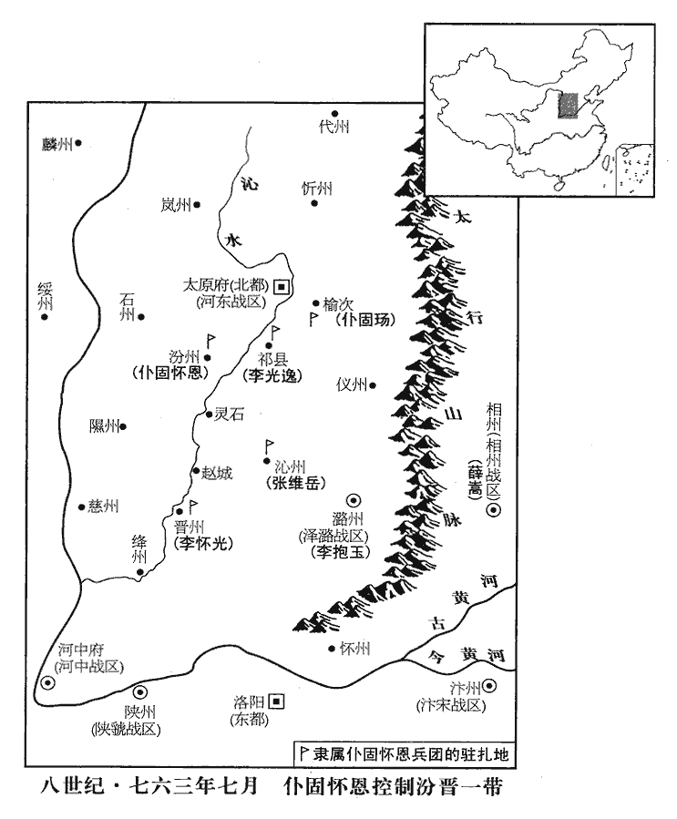
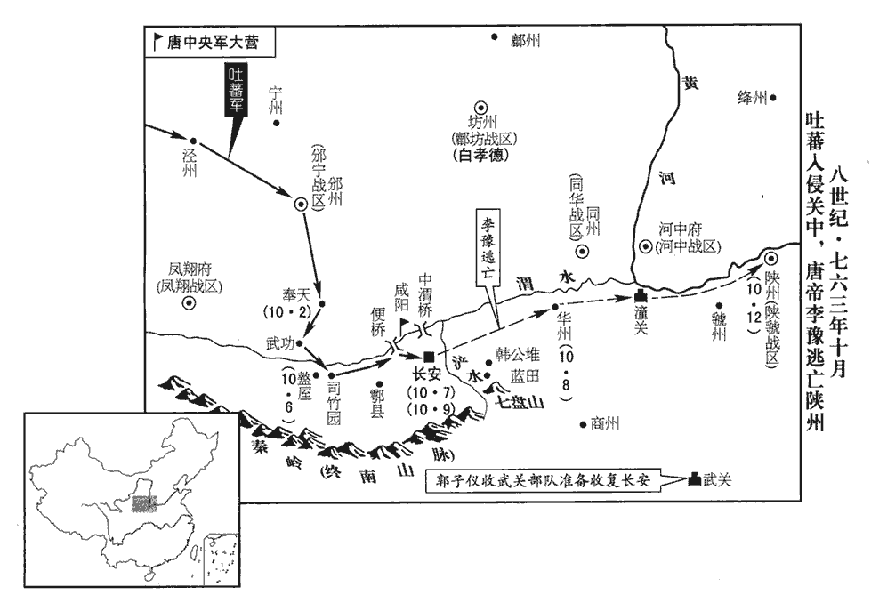
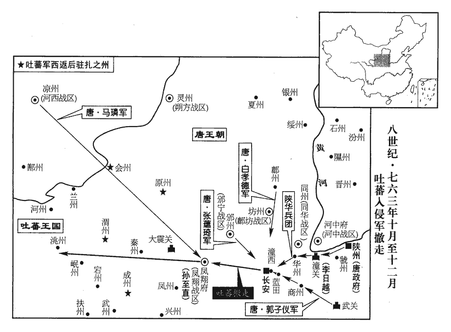
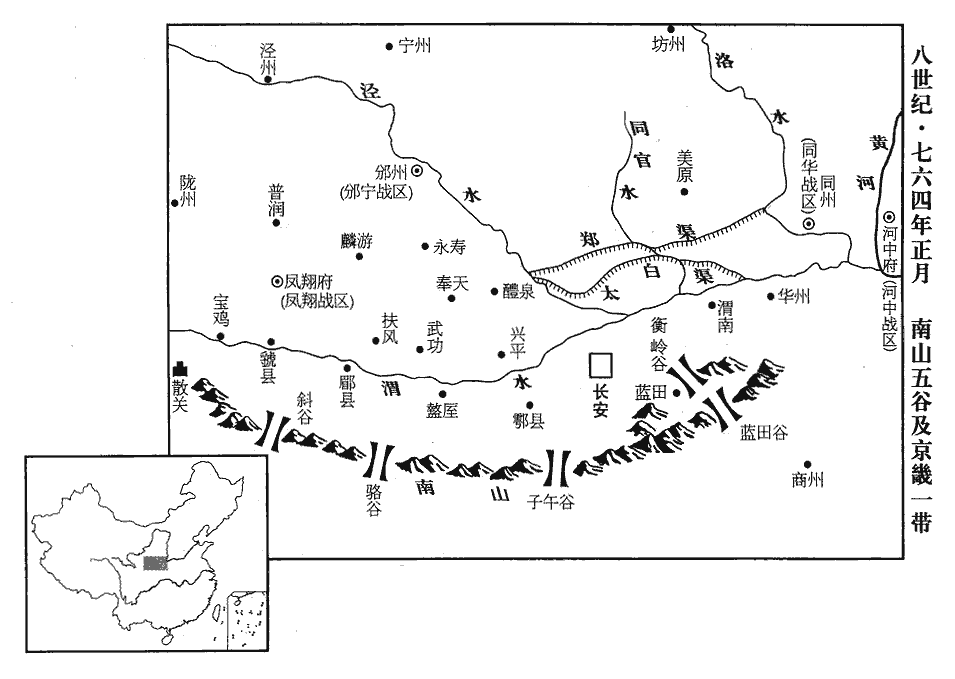
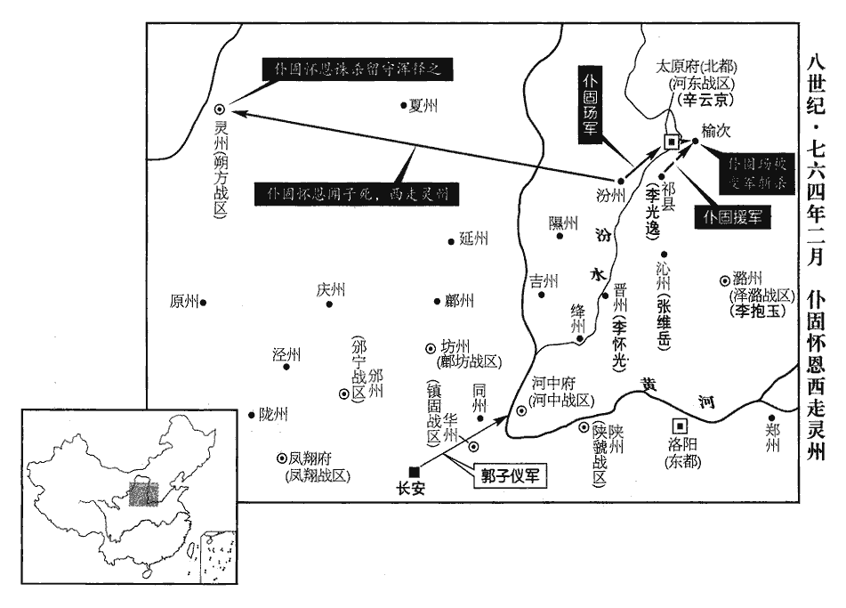
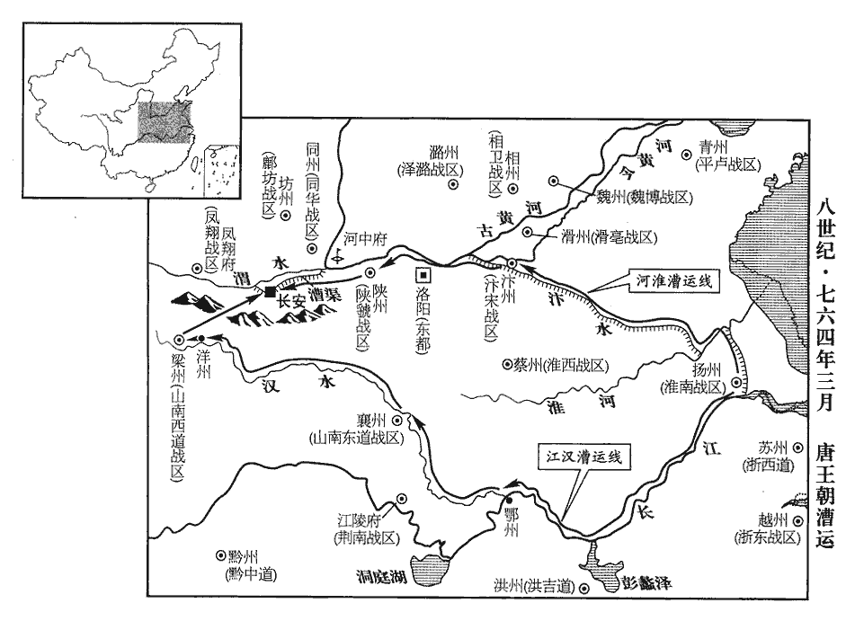
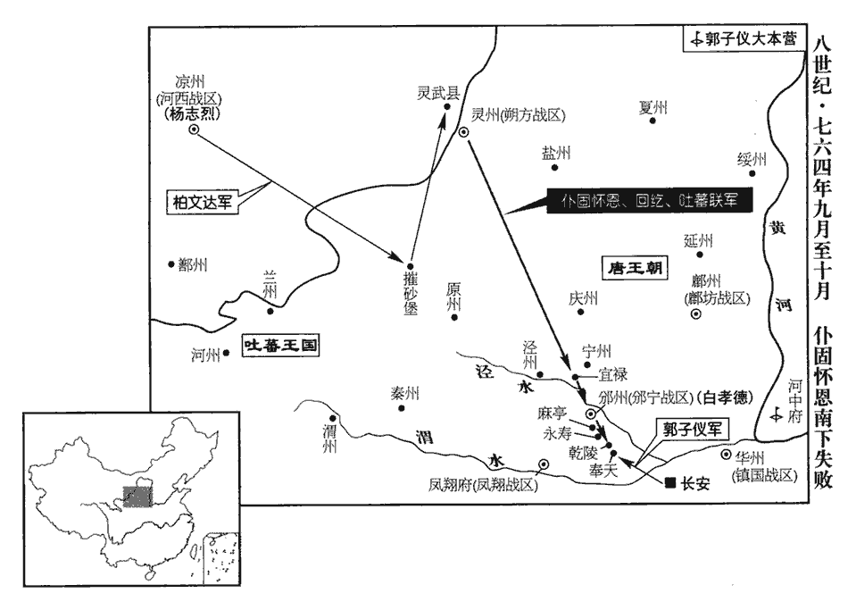
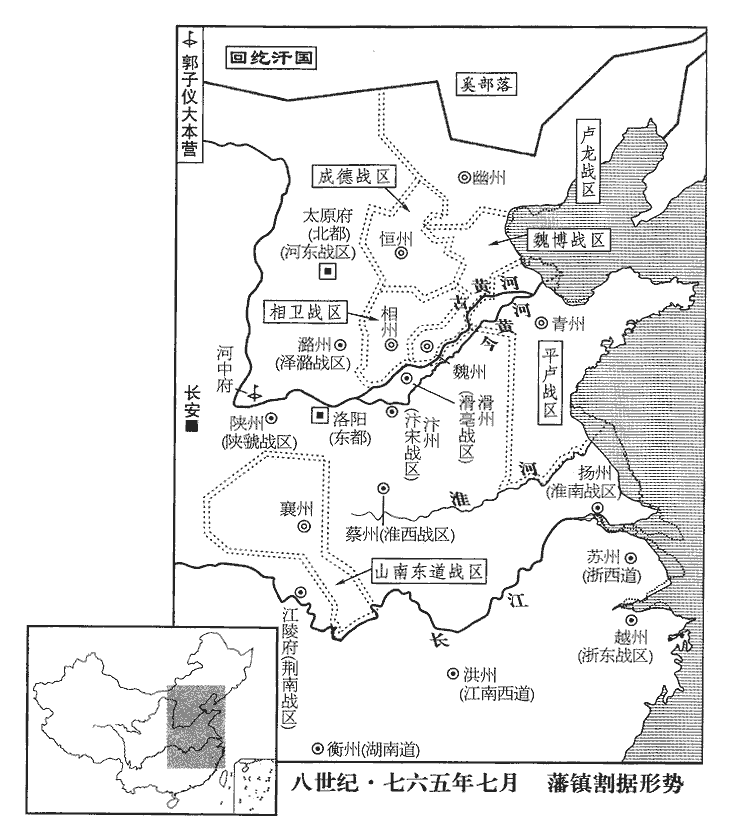
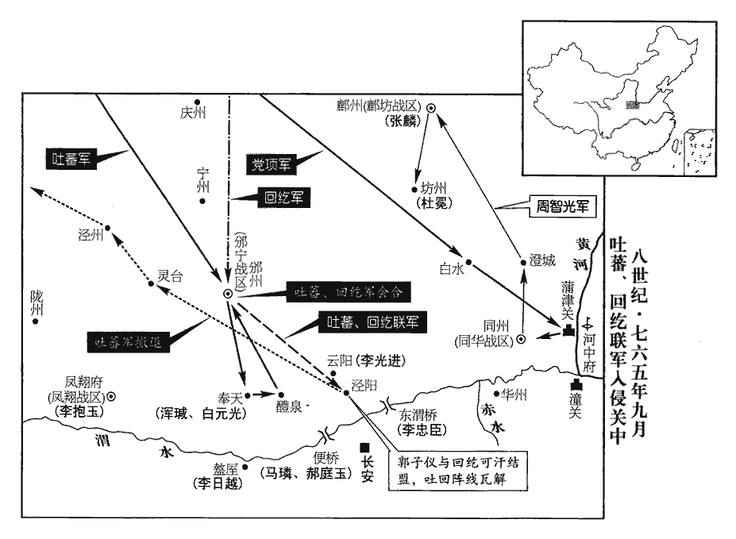

 唐紀三十九起昭陽單閼（癸卯）七月，盡旃蒙大荒落（乙巳）十月，凡二年有奇。

# 代宗睿文孝武皇帝上之下

## 廣德元年（癸卯、七六三）

1秋，七月，壬寅‹一›，群臣上尊號曰寶應元聖文武孝皇帝。以楚州所獻十三寶為上登極之符應也。上，時掌翻。壬子‹十一›，赦天下，改元。方改元廣德。諸將討史朝義者進官階、加爵邑有差。將，即亮翻。冊回紇‹瀚海沙漠群›可汗為頡咄登蜜施合俱錄英義建功毗伽可汗，可敦為娑墨光親麗華毗伽可敦；頡咄，華言社稷發用；登蜜施，華言到竟；合俱錄，華言婁羅；娑墨，華言得憐；毗伽，華言足意智。紇，下沒翻。可，從刊入聲。汗，音寒。頡，奚結翻。咄，當沒翻。伽，求迦翻。娑，蘇何翻。左、右殺以下，皆加封賞。左殺封雄朔王，右殺封寧朔王，胡祿都督封金河王，拔覽將軍封靜漢王，諸都督十一人並封國公。

〖译文〗 [1]秋季，七月壬寅（初一），大臣们为唐代宗进献尊号，称作宝应元圣文武孝皇帝。壬子（十一日），大赦天下，改年号为广德。征讨史朝义有功的将领加官进爵，封赏食邑，各有等差。又册封回纥可汗为颉咄登蜜施合俱录英义建功毗伽可汗，册封回纥可敦为娑墨光亲丽华毗伽可敦，回纥左杀、右杀官职以下的将领也都有封赏。

2戊辰‹二十七›，楊綰上貢舉條目：秀才問經義二十條，對策五道；國子監舉人，令博士薦於祭酒，祭酒試通者升之於省，如鄉貢法。令，力丁翻。唐取士之科，由學館曰生徒，由州縣者曰鄉貢。凡明經、秀才、俊士、進士，明於理體為鄉里稱者，縣考試，州長重覆，送之尚書省。既至省，皆疏名列到、結款通保及所居，始由戶部集閱而關于禮部試之。今楊綰所上國子監舉人，略如鄉貢法。明法，委刑部考試。明法，律學也。或以為明經、進士，行之已久，不可遽改。事雖不行，識者是之。

〖译文〗 [2]戊辰（二十七日），杨绾提出新的科举考试条例：秀才问经义二十条，对策五道。国子监推举的人才，首先让博士向国子祭酒推荐，通过国子监祭酒考试后，再送到尚书省，如同科举制度中乡贡法一样。明法科的考试，则委托刑部进行。有人认为明经、进士二科的考试实施已久，不可以突然改变。杨绾的建议虽然未能实施，但有识之士却认为它是切实可行的。

3以僕固瑒爲朔方‹总部设灵州宁夏灵武市›行營節度使。

〖译文〗 [3]代宗任命仆固为朔方行营节度使。

4吐蕃入大震關‹甘肃省张家川县东南›，陷蘭‹甘肃省兰州市›、廓‹青海省化隆县›、河‹甘肃省临夏市›、鄯‹青海省乐都县›、洮‹甘肃省临潭县›、岷‹甘肃省岷县›、秦‹甘肃省天水市›、成‹甘肃省礼县南›、渭‹甘肃省陇西县›等州，盡取河西‹甘肃省中部西部›、隴右‹青海省东部›之地。蘭、廓、秦、渭等州，即河西、隴右之地也，先已為吐蕃所陷，史因其入大震關而備言之。蘭州，漢金城郡，隋置蘭州，因皋蘭山為名。廓州，漢西平郡南界；前涼以其地為湟河郡，後魏置洮河郡；周建德五年，取河南地置廓州，取廓清之義為名。河州，漢枹罕縣，前涼張駿分置河州。鄯州，漢破羌允吾縣地，唐平薛舉，置鄯州。洮州，治漢洮陽城，周保定初置。岷州，秦臨洮縣地，後魏大統十年置岷州，以南有岷山名。秦州，治成紀顯親川，因魏、晉舊州名。成州，古西戎地，後千畝戎姜氏居之，又後為白馬氐國；漢為武都郡，晉為仇池郡，後魏改為南秦州，西魏改成州。渭州，治漢襄武縣，後魏置。唐自武德以來，開拓邊境，地連西域，皆置都督、府、州、縣。開元中，置朔方、隴右‹总部设鄯州›、河西‹总部设凉州甘肃省武威市›、安西‹总部设龟兹新疆库车县›、北庭‹总部设北庭府新疆吉木萨尔县›諸節度使以統之，歲發山東‹崤山以东›丁壯為戍卒，繒帛為軍資，開屯田，供糗糧，繒，慈陵翻。糗，去久翻。設監牧，畜馬牛，軍城戍邏，萬里相望。畜，吁玉翻。邏，郎佐翻。及安祿山反，邊兵精銳者皆徵發入援，謂之行營，所留兵單弱，胡虜稍蠶食之；數年間，西北數十州相繼淪沒，自鳳翔‹陕西省凤翔县›以西，邠州‹陕西省彬县›以北，皆為左衽矣。史言唐所以失河、隴。

〖译文〗 [4]吐蕃侵入大震关，攻陷兰州、廓州、河州、州、洮州、岷州、秦州、成州、渭州等地，河西、陇右地区均为吐蕃占领。自从武德年间以来，唐朝向外开拓疆域，地域与西域相连。在这些地区都设置了都督、府、州、县等。开元年间，朝廷设置朔方、陇右、河西、安西、北庭各节度使管理西北地区，每年征发崤山以东的壮丁为戍守士卒，丝织品为军费，开荒屯田，为军队提供食粮，设置监牧，蓄养牛马，军城和巡逻哨所，万里相望。及至安禄山反叛，边镇的精锐部队都被抽调回来援救朝廷，称为行营。剩下留守边镇的部队势单力薄，吐蕃军队便逐渐地将他们蚕食。数年时间，西北地区数十州相继沦陷，自凤翔以西，州以北，均为吐蕃军队所占领。

5初，僕固懷恩受詔與回紇可汗相見於太原；河東節度使辛雲京以可汗乃懷恩壻，恐其合謀襲軍府，閉城自守，亦不犒師。使，疏吏翻。犒，苦到翻。及史朝義既平，詔懷恩送可汗出塞，往來過太原，朝，直遙翻。過，古禾翻，又古臥翻。雲京亦閉城不與相聞。懷恩怒，具表其狀，不報。懷恩將朔方兵數萬屯汾州‹山西省汾阳县›，使其子御史大夫瑒將萬人屯榆次‹山西省榆次市›，裨將李光逸等屯祈祁縣‹山西省祁县›，將，即亮翻；下裨將同，又音如字。裨，彼迷翻。榆次、祈祁，皆漢古縣，屬太原。李懷光等屯晉州‹山西省临汾市›，張維嶽等屯沁州‹山西省沁源县›。沁，七浸翻。考異曰：邠志作「張如岳」，今從實錄、唐曆。懷光，本勃海‹首都龙泉府黑龙江省宁安市西南东京城›靺鞨也，靺鞨，音末曷。姓茹，茹，音如。為朔方將，以功賜姓。中使駱奉仙至太原，雲京厚結之，為言懷恩與回紇連謀，反狀已露。使，疏吏翻。為，于偽翻。奉仙還，過懷恩，懷恩與飲於母前，母數讓奉仙曰：還，音旋，又音如字。數，所角翻。「汝與吾兒約為兄弟，今又親雲京，何兩面也！」唐人謂反覆者為兩面。貞元以後，劍南西山白狗等羌內附，賜牛糧，治生業，差賜官祿，皆得世襲；然陰附吐蕃，世謂之兩面羌。此其證也。酒酣，懷恩起舞，奉仙贈以纏頭綵。唐人宴集，酒酣為人舞，當此禮者以綵物為贈，謂之纏頭。倡伎當筵舞者亦有纏頭喝賜，杜甫詩所謂「舞罷錦纏頭」者也。酣，戶甘翻。懷恩欲酬之，曰：「來日端午‹五月五日›，當更樂飲一日。」樂，音洛。奉仙固請行，懷恩匿其馬，奉仙謂左右曰：「朝來責我，又匿我馬，將殺我也。」夜，踰垣而走；懷恩驚，遽以其馬追還之。八月，癸未‹十三›，奉仙至長安，奏懷恩謀反；考異曰：實錄：「癸未，懷恩旋師，次于汾州，逗遛不進。監軍使駱奉仙以聞。上以功高不之罪，優詔慰勞之。」又曰：「懷恩頓軍汾上，監軍使駱奉仙因公宴，言有所指，懷恩已萌二心，肆口酬對，奉仙不告而出，乘傳上聞。上以功高容之，叱奉仙出，待懷恩如舊。懷恩憚奉仙，益不自安。」邠志曰：「寶應二年，河朔既平，詔太原節度辛雲京及僕固懷恩各以其軍送回紇還蕃。既出晉關，辛公率其輕兵先入太原。懷恩怒其不告，曰：『辛君有虞於我也。』回紇至，辛公館于城外，致牛酒以犒之。懷恩欲因回紇規其城壁，陰導回紇請觀佛寺，辛公許之。既入城，見羅兵於諸街，蕃人大驚，辟易而去。」今從舊懷恩傳。懷恩亦具奏其狀，請誅雲京、奉仙；上兩無所問，優詔和解之。

〖译文〗 [5]当初，仆固怀恩奉肃宗诏令在太原与回纥可汗会晤，因为回纥可汗是仆固怀恩的女婿，河东节度使辛云京害怕他们合谋袭击军府，所以关闭城门，守备森严，也不去犒劳他们的部队。史朝义被平定后，仆固怀恩奉诏送回纥可汗北出边塞，往来途中经过太原，辛云京都闭城不见。仆固怀恩恼羞成怒，向代宗一一禀报，但是没有得到答复。仆固怀恩率领朔方镇兵数万人驻扎汾州，派遣其子御史大夫仆固率领士兵一万人驻扎榆次，副将李光逸、李怀光、张维岳等分别驻扎祁县、晋州、沁州。李怀光本是勃海人，姓茹，是朔方将领，因功而被赐姓为李。中使骆奉仙到达太原，辛云京与他深深结纳，对他说仆固怀恩与回纥共谋叛乱，谋反的迹象已经暴露。骆奉仙在返京途中经过仆固怀恩的驻地，仆固怀恩当着自己母亲的面设宴款待骆奉仙。宴席中，仆固怀恩的母亲多次责问骆奉仙说：“你与我儿子是结拜兄弟，如今又和辛云京亲近，你为什么要两面结交呢！”酒喝到尽兴时，仆固怀恩起身舞蹈，骆奉仙将缠头彩物赠送给他。仆固怀恩想要酬谢，说道：“到端午节时，我们再开怀痛饮一天。”骆奉仙坚持请求要返回京师，仆固怀恩便将他的马藏匿起来，骆奉仙对随从说：“早晨，仆固怀恩的母亲来责问我，仆固怀恩又藏了我的马，他们将要杀掉我了。”夜里，骆奉仙跳墙而逃。仆固怀恩大惊，赶紧追上去将马还给他。八月癸未（十三日），骆奉仙回到长安，上奏说仆固怀恩图谋造反；仆固怀恩也将全部情况上奏代宗，请求杀掉辛云京、骆奉仙。代宗不问双方情由，颁发优抚诏书让他们和解。

懷恩自以兵興以來，謂自祿山反，朔方起兵討之，以至平賊時也。所在力戰，一門死王事者四十六人，女嫁絕域，謂嫁回紇可汗也。說諭回紇，說，式芮翻。紇，下沒翻。再收兩京，平定河南、北，功無與比，而為人搆陷，憤怨殊深，上書自訟，以為：「臣昨奉詔送可汗歸國，傾竭家貲，俾之上道。行至山北‹指山西省太原市›，上，時兩翻。可，從刊入聲。汗，音寒。懷恩屯汾州，謂太原之地為山北。雲京、奉仙閉城不出祗迎，仍令潛行竊盜。回紇怨怒，亟欲縱兵，臣力為彌縫，方得出塞。雲京、奉仙恐臣先有奏論，遂復妄稱設備，令，力丁翻。為，于偽翻。復，扶又翻；下並同。與李抱玉共相組織。臣靜而思之，其罪有六：昔同羅‹蒙古国乌兰巴托市北›叛亂，臣為先帝掃清河曲‹山西省西北部›，一也；臣男玢bīn為同羅所虜，得間亡歸，臣斬之以令眾士，二也；二事並見二百十八卷肅宗至德元載。玢，悲巾翻。間，古莧翻。臣有二女，遠嫁外夷，為國和親，蕩平寇敵，三也；臣與男瑒不顧死亡，為國效命，四也；河北新附，節度使謂田承嗣、李寶臣、李懷仙等。皆握強兵，臣撫綏以安反側，五也；臣說諭回紇，使赴急難，天下既平，送之歸國，六也。說，式芮翻。難，乃旦翻。臣既負六罪，誠合萬誅，惟當吞恨九泉，銜冤千古，復何訴哉！臣受恩深重，夙夜思奉天顏，言欲入朝也。但以來瑱受誅，瑱，他甸翻。事見上卷正月。朝廷不示其罪，諸道節度，誰不疑懼！近聞詔追數人，唐人率謂召為追，觀考異所引諸家雜史可見。盡皆不至，實畏中官讒口，虛受陛下誅夷；豈惟群臣不忠，正為回邪在側。當時君臣情事，誠如懷恩之言。且臣前後所奏駱奉仙，詞情非不摭實，摭zhí，之石翻。陛下竟無處昌呂翻。置，寵任彌深；皆由同類比周，比，毗至翻。蒙蔽聖聽。竊聞四方遣人奏事，陛下皆云與驃騎議之，驃騎，謂程元振也。驃，匹妙翻。騎，奇寄翻。曾不委宰相可否，或稽留數月不還，遠近益加疑阻。代宗省懷恩書至此，豈不為之動心邪！曾，才登翻。如臣朔方將士，功效最高，為先帝中興主人，乃陛下蒙塵故吏，曾不別加優獎，反信讒嫉之詞。子儀先已被猜，臣今又遭詆毀，將，即亮翻。被，皮義翻。弓藏鳥盡，信匪虛言。古語云：「高鳥盡，良弓藏；狡兔死，走狗烹；敵國破，謀臣亡。」言以今事準之，非虛言也。陛下信其矯誣，矯，託也。託言謀反以厚誣。何殊指鹿為馬！引趙高事以況諸閹。儻不納愚懇，且貴因循，臣實不敢保家，陛下豈能安國！懷恩心跡，於此可見。忠言利行，忠言逆耳利於行，古語也。惟陛下圖之。臣欲公然入朝，朝，直遙翻；下同。恐將士留沮。今託巡晉、絳，於彼遷延，乞陛下特遣一介至絳州問臣，臣即與之同發。」

〖译文〗 仆固怀恩自认为，从他兴师讨伐叛军以来，每次战斗他都竭力拼杀，一家为报效朝廷而牺牲的家属就达四十六人，女儿远嫁回纥，又劝说回纥出兵，再度收复西京长安、东都洛阳，平息河南、河北地区的叛乱，功绩谁也无法相比。但是，如今蒙受谗人的诬陷，怨愤重重。他上书为自己辩解，认为：“先前奉诏送回纥可汗回国，我倾家荡产，才使得回纥可汗踏上归途。但是我们路经太原时，辛云京、骆奉仙不仅紧闭城门，不出来恭迎，还命令部下悄悄地出来盗窃财物。这一切引起了回纥人的愤怒，屡次打算纵兵掳掠，幸亏我竭力劝阻，缓和矛盾，方使得他们出塞回国。辛云京、骆奉仙害怕我先上奏论理，于是妄称回纥人设置军备，又与李抱玉相互勾结罗织我的罪名。我冷静下来，默默地思索着，我的罪状有六条：第一，过去同罗叛乱，我为先帝扫清了河曲。第二，我儿子仆固玢被同罗俘虏，后来乘机逃回，我将他处斩以号令将士。第三，我有二个女儿远嫁外夷，为了国家而和亲，以消灭叛军。第四，我与儿子仆固不顾生死，为国效命。第五，河北叛军近来归附朝廷，节度使手中仍然掌握重兵，我前去抚慰，安定军心，使他们不再反叛。第六，我劝说回纥，使他们出兵解救朝廷的危难，天下已经平定，我又送他们回国。我既然有六条罪状，确实应当杀头，只该饮恨九泉、含冤千古，还有什么可说的呢！我深受朝廷的大恩，夙夜都想着到陛下身边侍奉。然而来被杀，朝廷没有公布他的罪状，诸道节度使谁不疑虑恐惧呢！近来听说陛下颁诏要召回几个人，但是，他们都不敢来。这实际上是他们畏惧宦官的谗言，害怕枉遭陛下的杀戮。难道是大臣们不忠诚吗？恰恰相反，这正是因为邪恶的宦官伴随在陛下的身边的缘故。况且，我前后上奏控告骆奉仙，所言均是事实，但是，陛下不仅不处置骆奉仙，而且愈加宠幸。这都是由于象骆奉仙一类人结党营私，蒙蔽陛下视听的缘故。我私下听说地方上每次派遣使者上奏言事，陛下都说要与骠骑大将军程元振商议，却从来不曾委托宰相来决定事情是否可行。有时，陛下让使者滞留数月而不能返回，使得地方上更加疑虑。比如我所统领的朔方将士，功劳最大，是先帝中兴的中坚人物，又是陛下蒙尘落难时的旧部，陛下却未曾另外给予嘉奖，反而听信那些诬陷嫉妒之辞。先前郭子仪已被猜疑，如今我又遭到诋毁。古语说鸟尽弓藏，我相信此话一点不假。陛下相信那些托言诬陷之词，这与指鹿为马有什么不同呢？倘若陛下不采纳我诚恳的意见，并且依然如故的话，我实在不敢保家，陛下又岂能安国！忠言有利于行事，只有请陛下考虑了。我想公然入朝，恐怕部下会阻拦我。现在我假托巡视晋州、绛州，在那里逗留拖延。我恳求陛下特派一人到绛州问候我，我就与他一同入朝。”

 

九月，壬戌‹二十二›，上遣裴遵慶詣懷恩諭旨，且察其去就。懷恩見遵慶，抱其足號泣訴冤。號，戶刀翻。遵慶為言聖恩優厚，諷令入朝。懷恩許諾。副將范志誠以為不可，曰：「公信其甘言，入則為來瑱，不復還矣！」明日，懷恩見遵慶，以懼死為辭，請令一子入朝，志誠又以為不可，遵慶乃還。還，音旋，又如字；下同。御史大夫王翊使回紇‹瀚海沙漠群›還，懷恩先與可汗往來，恐翊洩其事，遂留之。

〖译文〗 九月壬戌（二十二日），代宗派裴遵庆到仆固怀恩那儿去宣谕圣旨，并且观察他的去留动向。仆固怀恩一见到裴遵庆，立即抱住他的脚，痛哭流涕，诉说冤屈。裴遵庆对他说，皇上恩重如山，并劝令他入朝觐见皇上。仆固怀恩表示赞同。但是，仆固怀恩的副将范志诚认为这样不行，劝说道：“如果你相信他的甜言蜜语，入朝如同来一样，就不可能再回来了！”第二天，仆固怀恩拜见裴遵庆，以怕死为由，请求让他的一个儿子随同裴遵庆入朝。范志诚又认为不可以这样做，裴遵庆只好回去了。御使大夫王翊出使回纥回来，仆固怀恩早先与回纥可汗往来，害怕王翊泄露这些事，于是将他扣留。

6吐蕃‹西藏›之入寇也，邊將告急，程元振皆不以聞。冬，十月，吐蕃寇涇州‹甘肃省泾川县›，刺史高暉以城降之，遂為之鄉導，降，戶江翻。鄉，讀曰嚮。考異曰：汾陽家傳：「八月，吐蕃次涇、寧州，遣感激軍使高暉禦之，戰敗，執暉。九月，至便橋。」實錄：「十月庚午，吐蕃寇涇州，辛未，犯奉天、武功。」按今涇州東去邠州三程，邠州南去奉天二程，不應庚午寇邠州，辛未已至奉天。蓋史官據奏到日書之耳。段公家傳：「九月二十日，吐蕃寇涇原，節度使高暉降之。十一月一日，陷邠州，節度使張蘊琦棄城遁。」舊本紀：「九月己丑，吐蕃寇涇州，刺史高暉以城降，因為吐蕃鄉導。十月辛未，犯京畿。」新本紀：「九月乙丑，涇州刺史高暉叛附于吐蕃，十月庚午，吐蕃陷邠州，辛未，寇奉天、武功。」今月從實錄而不取其日。引吐蕃深入；過邠州，上始聞之。辛未‹二›，寇奉天‹陕西省乾县›、武功‹陕西省武功县西›，京師震駭。詔以雍王适為關內元帥，郭子儀為副元帥，出鎮咸陽‹陕西省咸阳市›以禦之。

〖译文〗 [6]吐蕃军队入侵唐朝，边镇将领告急，但是程元振不向代宗禀报。冬季，十月，吐蕃军队进犯泾州，泾州刺史高晖举城投降。于是，高晖为吐蕃军队作向导，引导他们向内地深入。吐蕃军队经过州时，代宗才知道这个消息。辛未（初二），吐蕃军队进犯奉天、武功，京师大为震惊。代宗下诏任命雍王李适为关内元帅，郭子仪为副元帅，出镇咸阳抵御吐蕃军队的进攻。

子儀閒廢日久，寶應元年八月，郭子儀自河東‹山西省›入朝，遂留京師。部曲離散，至是召募，得二十騎而行，至咸陽，吐蕃帥吐谷渾‹青海省中部›、党項、氐‹甘肃省东南部›、羌‹甘肃省南部›二十餘萬眾，彌漫數十里，已自司竹園‹陕西省周至县东›渡渭，鳳翔府盩厔縣有司竹園，漢書王莽傳所謂霍鴻負倚芒竹，即此地也。蘇軾曰：盩厔有官竹園，臨水，數十里不絕，所謂司竹也。循山而東。子儀使判官中書舍人王延昌入奏，請益兵，程元振遏之，竟不召見。見，賢遍翻。癸酉‹四›，渭北‹即鄜坊战区·总部设坊州陕西省黄陵县›行營兵馬使呂月將將精卒二千破吐蕃於盩厔‹陕西省周至县›之西。將、將：上如字；下即亮翻。乙亥‹六›，吐蕃寇盩厔，月將復與力戰，兵盡，為虜所擒。復，扶又翻。

〖译文〗 郭子仪闲居京师已久，部下早已离散。这时，郭子仪才临时招募，征得骑兵二十人启程。到咸阳时，吐蕃率领吐谷浑、党项、氐、羌等各族军队二十多万人，漫山遍野，前后达数十里，已经从司竹园渡过渭河，顺着山脉向东涌来。郭子仪派遣判官中书舍人王延昌入朝奏报军情，请求增兵支援。程元振阻拦，王延昌竟然没有被代宗召见。癸酉（初四），渭北行营兵马使吕月将率领精锐部队二千人，在以西打败了吐蕃军队。乙亥（初六），吐蕃军队进犯，吕月将再次与敌军拼死作战，士兵全部战死，吕月将也为吐蕃军队擒获。

上方治兵，治，直之翻。而吐蕃已度便橋‹西渭桥·陕西省咸阳市西南›，倉猝不知所為，丙子‹七›，出幸陝州‹河南省三门峡市›，陝，失冉翻。官吏藏竄，六軍逃散。郭子儀聞之，遽自咸陽歸長安，比至，比，必利翻，及也。車駕已去。上纔出苑門，渡滻水‹灞水支流›，按唐禁苑，包大明宮之北，東距滻水。考雍錄、長安志諸書，禁苑東面出滻水，無其門，蓋出光泰門耳。射生將王獻忠擁四百騎叛還長安，將，即亮翻。騎，奇寄翻。脅豐王珙gǒng等十王西迎吐蕃。珙，玄宗子，音居勇翻。遇子儀於開遠門內，開遠門，長安城西面北頭第一門。子儀叱之，獻忠下馬，謂子儀曰：「今主上東遷，社稷無主，令公身為元帥，郭子儀為中書令，故稱為令公。廢立在一言耳。」子儀未應。珙越次言曰：「公何不言！」子儀責讓之，以兵援送行在。丁丑‹八›，車駕至華州‹陕西省华县›，官吏奔散，無復供擬，復，扶又翻。扈從將士不免凍餒。會觀軍容使魚朝恩將神策軍自陝來迎，上乃幸朝恩營。從，才用翻。將，即亮翻。使，疏吏翻。朝，直遙翻。恩將，音同上。陝，失冉翻。豐王珙見上於潼關‹陕西省潼关县›，上不之責，退至幕中，有不遜語；群臣奏議誅之，乃賜死。

〖译文〗 代宗正在操练军队，这时，吐蕃军队已经跨过便桥，代宗临事仓促，不知所措。丙子（初七），代宗逃往陕州，官吏躲藏逃窜，禁军部队则一哄而散。郭子仪闻听此事，急忙从咸阳赶回长安，等到长安时，代宗已经走了。代宗才出宫苑门，渡过水，射生将王献忠就率领四百骑兵叛降后返回长安，胁迫丰王李珙等十王西去迎接吐蕃军队。当他们走到开远门内时，遇上郭子仪。郭子仪大声呵斥，王献忠跳下马来，跟郭子仪说道：“如今皇上已经东迁，国家无主，您身为元帅，皇上的废立就在于您一句话了！”郭子仪没有回答，李珙上前说道：“你为什么不说话！”郭子仪训斥他们一番，然后派兵护送他们前往行在。丁丑（初八），代宗到达华州，这时，州府官吏早已逃散，无法为代宗一行提供食宿，随从将士不免饥寒交迫。幸亏碰上观军容使鱼朝恩率领神策军从陕州前来迎驾，于是代宗前往鱼朝恩的营帐。丰王李珙在潼关拜见代宗，代宗没有责怪他。然而，他珙退回到营帐中，出言不逊。大臣们上奏建议杀掉李珙，于是，代宗将他赐死。

 

戊寅‹九›，吐蕃入長安，高暉與吐蕃大將馬重英等立故邠王守禮之孫承【章：十二行本「承」上有「廣武王」三字；乙十一行本同。】宏為帝，珙，居重翻。吐，從暾入聲。重，直龍翻。邠，悲頻翻。邠王守禮，章懷太子之子。改元，置百官，以前翰林學士于可封等為相。吐蕃剽掠府庫市里，焚閭舍，長安中蕭然一空。相，息亮翻。剽，匹妙翻；下同。苗晉卿病臥家，遣人輿入，迫脅之，晉卿閉口不言，虜不敢殺。於是六軍散者所在剽掠，士民避亂，皆入山谷。

〖译文〗 戊寅（初九），吐蕃军队进入长安，高晖与吐蕃大将马重英等立已故王李守礼之孙李承宏为皇帝，更改年号，设置百官，任命前翰林学士于可封等人为宰相，吐蕃军队大肆抢劫府库市里的财物，焚毁居宅，长安城中一片萧条。苗晋卿正病卧在家，吐蕃派人将他抬来，胁迫他出任伪职，苗晋卿闭口不言，吐蕃也不敢杀他，此时溃散的禁军也到处抢劫，士人平民纷纷逃入山谷，躲避战乱。

辛巳‹十二›，上至陝，百官稍有至者。郭子儀引三十騎自御宿川‹陕西省长安县西南›循山而東，騎，奇計翻。三輔黃圖曰：御宿川在長安城南。漢武帝為離宮別館，禁禦人不得往來游觀。上宿其中，故曰禦宿。程大昌曰：御宿川即樊川，在萬年縣南二十五里。謂王延昌曰：「六軍將士逃潰者多在商州‹陕西省商州市›，今速往收之，商州，治上洛縣，至京師二百八十一里。并發武關‹陕西省商南县西北›防兵，數日間，北出藍田‹陕西省蓝田县›以向長安，吐蕃必遁。」過藍田，遇元帥都虞候臧希讓、鳳翔‹总部设凤翔府陕西省凤翔县›節度使高昇，得兵近千人。武關，在商州西北，雍州藍田縣南。吐，從暾入聲。過，古禾翻，又古臥翻。使，疏吏翻。近，其靳翻。子儀與延昌謀曰：「潰兵至商州，官吏必逃匿而人亂。」使延昌自直徑入商州撫諭之。諸將方縱兵暴掠，聞子儀至，皆大喜聽命。將，即亮翻。子儀恐吐蕃逼乘輿，留軍七盤‹陕西省蓝田县东南›，杜佑曰：七盤，即王莽所謂「繞霤之固南當荊楚」者也。繞霤者，言四面塞阨屈曲，水回繞而霤，今謂之七盤、十二䋫。乘，承正翻。吐，從暾入聲。三日乃行，比至商州，比，必利翻。行收兵，并武關防兵合四千人，軍勢稍振。子儀乃泣諭將士以共雪國恥，取長安，皆感激受約束。子儀請太子賓客第五琦為糧料使，給軍食。將，即亮翻。糧料使，主給行營軍食。我宋朝隨軍轉運使即其任。上賜子儀詔，恐吐蕃東出潼關，徵子儀詣行在。子儀表稱：「臣不收京城無以見陛下，若出兵藍田，虜必不敢東向。」上許之。鄜延【章：十二行本「延」作「坊」；乙十一行本同。】節度判官段秀實說節度使白孝德引兵赴難，上元元年，置渭北、鄜坊節度使，領鄜、坊、丹、延四州，治坊州。吐，從暾入聲。潼，音同。說，式芮翻。難，乃旦翻。孝德即日大舉，南趣京畿，李嗣業自西域赴難於至德之初，白孝德自鄜坊赴廣德之難，皆段秀實發之，其忠義蓋天性也。與蒲‹山西省永济市›、陝、商、華合勢進擊。陝，失冉翻。華，戶化翻。

〖译文〗 辛巳（十二日），代宗到达陕州，一些官员也有逐渐到达的。郭子仪率领三十名骑兵从御宿川沿着山麓向东开来。郭子仪对王延昌说：“溃逃的禁军将士多在商州，如今，我们应当迅速前去收容他们，同时，征调防守武关的军队。几天之内，我军北出兰田，直指长安，吐蕃军队必定会望风而逃的。”郭子仪经过兰田时，遇到元帅都虞候臧希让、凤翔节度使高升，又得到近千名士兵。郭子仪和王延昌商量说：“溃逃的士兵到达商州，当地官吏一定会躲藏起来，那么当地就会人心大乱。”郭子仪派王延昌抄近路去商州安抚人心。诸将正在纵兵虏掠，听说郭子仪要来，都非常欣喜，甘愿听命。郭子仪恐怕吐蕃军队去进去逼代宗的驻地，让军队停留在七盘。三日后，郭子仪才率军启程。等到达商州，郭子仪就收容残兵，与武关守军合起来共达四千人，这时军队的力量稍有振作。于是，郭子仪哭着晓喻将士，勉励他们要共雪国耻，攻取长安，将士们颇受感动，都表示愿意受郭子仪的统帅。郭子仪请太子宾客第五琦担任粮料使，供给军粮。代宗赐郭子仪诏书，因为担心吐蕃军队东出潼关，召他前往陕州。郭子仪上表说：“我不收复京城，无法来见陛下。如果我出兵兰田，吐蕃军队一定不敢向东出击。”代宗表示同意。延节度判官段秀实劝说节度使白孝德率军前来急救国难，白孝德即日大举南下，奔赴京畿，与蒲州、陕州、商州、华州的军队同心协力，共击吐蕃军队。

吐蕃既立廣武王承宏，欲掠城中士、女、百工，整眾歸國。子儀使左羽林大將軍長孫全緒將二百騎出藍田觀虜勢，令第五琦攝京兆尹，與之偕行，又令寶應軍使張知節將兵繼之。長，知兩翻。將，即亮翻，又音如字。騎，奇計翻。令，力丁翻。琦，音奇。上以射生軍入禁中清難，賜名寶應功臣，故射生軍亦號寶應軍。全緒至韓公堆‹陕西省蓝田县北›，晝則擊鼓張旗幟，夜則多然火，以疑吐蕃。前光祿卿殷仲卿聚眾近千人，保藍田，與全緒相表裏，帥二百餘騎直渡滻水。近，其靳翻。帥，讀曰率。滻，音產。吐蕃懼，百姓又紿之曰：「郭令公自商州將大軍不知其數至矣！」紿，湯亥翻。將，即亮翻，又音如字。虜以為然，稍稍引軍去。全緒又使射生將王甫入城陰結少年數百，夜擊鼓大呼於朱雀街，將，即亮翻。少，始照翻。呼，火故翻。唐太極宮正南出朱雀門，自朱雀門南出至明德門，皆名朱雀街。吐蕃惶駭，庚寅‹二十一›，悉眾遁去。考異曰：舊吐蕃傳曰：「子儀帥部曲數百人及其妻子僕從南入牛心谷，駝馬車牛數百兩。子儀遲留，未知所適。行軍判官中書舍人王延昌、監察御史李萼謂子儀曰：『令公身為元帥，主上蒙塵于外，今吐蕃之勢日逼，豈可懷安于谷中，何不南趨商州，漸赴行在！』子儀遽從之。延昌曰：『吐蕃知令公南行，必分兵來逼，若當大路，事即危矣。不如取玉山路而去，出其不意。』子儀又從之。子儀之隊千餘人，山谷束隘，連延百餘里，人不得馳。延昌與萼恐狹徑被追，前後不相救，至倒迴口，遂與子儀別行，踰絕澗，登七盤，趨于商州。先是，六軍將張知節與麾下數百人自京城奔于商州，大掠避難朝官、士庶及居人資財、鞍馬，已有日矣。延昌與萼既至，說知節曰：『將軍身掌禁兵，軍敗而不赴行在，又恣其下虜掠，何所歸乎！今郭令公，元帥也，已欲至洛南，將軍若整頓士卒，諭以禍福，請令公來撫之，圖收長安；此則將軍非常之功也。』知節大悅。其時諸軍將臧希讓、高昇、彭體盈、李惟詵shēn等數人，各有部曲家兵數十騎，相次而至，又從其計，皆相率為軍，約不侵暴。延昌留于軍中主約，萼以數騎往迎子儀，去洛南十餘里，及之，遂與子儀回至商州。諸將大喜，皆遵其約束。吐蕃將入京師也，前光祿卿殷仲卿逃難而出，至藍田，糾合敗兵及諸驍勇願從者百餘人，南保藍田以拒吐蕃，其眾漸振，至于千人。子儀既至商州，募人往探賊勢，羽林將軍長孫全緒請行。全緒至韓公堆，仲卿得官軍，其勢益壯，遂相為表裏。仲卿帥二百餘騎遊弈，直渡滻水。吐蕃懼，問百姓，百姓皆紿之曰：『郭令公大軍不知其數。』賊以為然，遂抽軍而還。」汾陽家傳曰：「公以三十騎循御宿川，略山而東。公西望國門，涕不自勝，謂延昌曰：『為舍人計，何以復國？』延昌歔欷不能對。公謂曰：『料諸將散卒必逃商於，若速行收合散卒，兼武關兵，數日之內，卻出藍田，設疑兵，為斾，屯於韓公堆，吐蕃必懼我而退，乃相與速驅之。』過藍田，公與延昌議曰：『散兵至商州，必官吏不守，則兵亂而人潰。』使延昌間道中宿至商州，果如所議。延昌以公之言巡撫之，亂乃止，潰乃復。」今從之。高暉聞之，帥麾下三百餘騎東走，至潼關，守將李日越擒而殺之。帥，讀曰率。將，即亮翻；下同。考異曰：新魚朝恩傳曰：「朝恩遣劉德信討斬之。」今從實錄。

〖译文〗 吐蕃已经立广武王李承宏为皇帝，想掳掠长安城中的士人、妇女和工匠，然后整队回国。郭子仪派左羽林大将军长孙全绪率领二百骑兵出兰田，前去观察吐蕃军队的形势，命令第五琦代理京兆尹，让他与全绪一起行动，又命令宝应军使张知节率军跟随其后。长孙全绪到达韩公堆，白天就击鼓摇旗，夜里就燃起许多火堆，用来迷惑吐蕃军队。前光禄卿殷仲卿则聚集近一千人的军队保卫兰田，与长孙全绪内外呼应，又率领二百多骑兵直接渡过水。吐蕃军队害怕，而老百姓又哄骗他们说：“郭令公已经从商州率领大军来了！军队多得数不清！”吐蕃军队信以为真，逐渐率军撤退。长孙全绪又派射生将王甫入城秘密纠集数百名少年，夜里在朱雀街击鼓呐喊，吐蕃军队更加惶恐不安，庚寅（二十一日），他们便都逃跑了。高晖听到吐蕃军队已逃跑，也率领部下三百多名骑兵向东出逃，到达潼关时，被潼关守将李日越抓获并杀死。

壬辰‹二十三›，詔以元載判元帥行軍司馬，以第五琦為京兆尹。癸巳‹二十四›，以郭子儀為西京留守。甲午‹二十五›，子儀發商州。己亥‹三十›，以魚朝恩部將皇甫溫為陝州刺史，周智光為華州刺史。為周智光以華州跋扈張本。

〖译文〗 壬辰（二十三日），代宗下诏任命元载兼任元帅行军司马，第五琦为京兆尹。癸巳（二十四日），任命郭子仪为西京留守。甲午（二十五日），郭子仪从商州出发。己亥（三十日），代宗任命鱼朝恩部将皇甫温为陕州刺史，周智光为华州刺史。

7驃騎大將軍、判元帥行軍司馬程元振專權自恣，人畏之甚於李輔國。諸將有大功者，元振皆忌疾欲害之。吐蕃入寇，元振不以時奏，致上狼狽出幸。上發詔徵諸道兵，李光弼‹时驻军徐州江苏省徐州市›等皆忌元振居中，莫有至者，中外咸切齒而莫敢發言。太常博士柳伉上疏，伉，苦浪翻。以為：「犬戎犯關度隴，不血刃而入京師，劫宮闈，焚陵寢，武士無一人力戰者，此將帥叛陛下也。陛下疏元功，委近習，疏，與疎同。日引月長，以成大禍，群臣在廷，無一人犯顏回慮者，此公卿叛陛下也。陛下始出都，百姓填然，奪府庫，相殺戮，此三輔叛陛下也。自十月朔‹一›召諸道兵，盡四十日，無隻輪入關，此四方叛陛下也。內外離叛，陛下以今日之勢為安邪，危邪？若以為危，豈得高枕，枕，職任翻。不為天下討罪人乎！為，于偽翻。臣聞良醫療疾，當病飲藥，藥不當病，猶無益也。陛下視今日之病，何繇至此乎？必欲存宗廟社稷，獨斬元振首，馳告天下，悉出內使隸諸州，言悉出諸宦官隸諸州羈管也。時宦官皆為內諸司使，故曰內使。持神策兵付大臣，時魚朝恩領神策軍。然後削尊號，下詔引咎，曰：『天下其許朕自新改過，宜即募士西赴朝廷；若以朕惡不悛，悛，丑緣翻。則帝王大器，敢妨聖賢，其聽天下所往。』如此，而兵不至，人不感，天下不服，臣請闔門寸斬以謝陛下。」上以元振嘗有保護功，保護事見上卷寶應元年。十一月，辛丑‹二›，削元振官爵，放歸田里‹程元振是三原陕西省三原县东北›人。

〖译文〗 [7]骠骑大将军、判元帅行军司马程元振大权独揽，为所欲为。人们害怕他超过李辅国。对军功卓著的将领，程元振都忌恨，总想加害于他们。吐蕃进犯唐朝时，程元振不及时上奏，致使代宗狼狈出走。代宗颁发诏书征调诸道军队，李光弼等人都忌恨程元振位居要职，没有一人前来赴难。朝廷内外也都咬牙切齿，敢怒而不敢言。太常博士柳伉上疏认为，“犬戎侵犯关陇地区，兵不血刃，就从容地进入京师，抢劫皇宫，焚烧陵寝，而士兵没有一人在拼死作战，这是将帅背叛陛下。陛下亲小人而远君子，天长日久，酿成大祸，而大臣们身居朝廷，却没有一人敢触犯龙颜，使陛下回心转意。这是公卿大臣背叛陛下。陛下才出都城，老百姓便大声鼓噪，争夺府库，互相残杀，这是三辅地区背叛陛下。从十月初一日颁下诏书征调诸道军队以来，已有四十天，但是没有一兵一卒入关赴难，这是地方背叛陛下。内外叛离，陛下认为今天的形势是安全呢，还是危险呢？如果陛下认为形势危险，难道能高枕无忧，不为天下讨伐罪人吗！我听说良医治病要对症下药，不对症下药是没有好处的。陛下看看今天的病根，是什么原因使陛下落到这种地步呢？假如一定要想让宗庙社稷存在下去，陛下只有将程元振斩首，通告天下，并且让担任内诸司使的宦官全部隶属各州，将神策军交付大臣统领。然后自削尊号，颁发诏书，引咎自责，说：‘如果天下允许朕改过自新，那么，应当立即招募士兵西来救援朝廷；如果天下认为朕有恶不改，那么，朕愿意听从天下人心向归，请访求圣贤登上帝王宝座。’如果陛下那样做了，而军队仍然不来救驾，人们仍不感动，天下仍然不服，那么，我就请求将我满门抄斩以向陛下谢罪。”代宗因为程元振曾经有保驾之功，十一月辛丑（初二），仅削去程元振的官爵，放归田里。

8王甫自稱京兆尹，聚眾二千餘人，署置官屬，暴橫長安中。橫，戶孟翻。壬寅‹三›，郭子儀至滻水西，郭子儀至滻水西，則已渡滻水，近京城矣。甫按兵不出。或謂子儀，城不可入。子儀不聽，引三十騎徐進，使人傳呼召甫；甫失據，出迎拜伏，子儀斬之，考異曰：實錄曰：「有武將王甫等，誘長安惡少數百人，集六街鼓於朱雀街，大鼓之。吐蕃聞之震攝，乘夜而遁。」汾陽家傳曰：「射生將王撫，猛而多力，自稱御史大夫，領五百騎、二千步卒，兼補官屬，以謀作亂。甲午，公發商州；冬十一月壬寅，公次滻水之右。王撫知公之來也，於城中堅列行陣，戈矛若林，指揮其間，按甲不出。人勸公必不可入，公以三十騎徐進，曾不少懼，令傳呼王撫，撫應聲伏，烏合之徒，一時而潰。」邠志曰：「郭公屯商州，十二月一日，率諸軍五萬餘人出藍田，去城百里而軍。城中相傳，言大軍將至，西戎懼焉。三日，馬家小兒、張小君、李酒盞、射生官王甫等五百餘人，夜半，聚六街鼓入于子城，雷擊天門街中，仍分其眾建旗諸門。吐蕃以為大軍夜至，相帥遁去。小君使報郭公。七曰，郭公全師入于京師，繫小君、酒盞、王甫等，責之曰：『吾軍未至，汝設詐以畏吐蕃，吐蕃知之怒汝，燔爇ruò宮闕，從容而去，豈不由汝乎！』命斬之。遂以破賊收城聞。」舊子儀傳曰：「全緒遣禁軍舊將王甫入長安，陰結豪俠為內應，一日，齊擊鼓於朱雀街，蕃軍惶駭而去。」又曰：「射生將王撫自署為京兆尹，聚兵二千人，擾亂京城，子儀召撫，殺之。詔子儀權京城留守。」吐蕃傳：「吐蕃餘眾尚在城，軍將王撫及御史大夫王仲昇領兵自苑中入，椎鼓大呼，仲卿之兵又入城，吐蕃皆奔走。」若如邠志所言，是子儀殺撫而攘其功，計子儀必不為也。子儀勲業，今古推高，淩準作書，多攻其短，疑有宿嫌，不可盡信。今從汾陽家傳及子儀舊傳。其兵盡散。白孝德與邠寧節度使張蘊琦將兵屯畿縣，京兆府管二十縣，萬年、長安為赤縣，餘縣皆為畿縣。子儀召之入城，京畿遂安。

〖译文〗 [8]王甫自称京兆尹，聚集二千多人，设置属吏，并在长安城中横行霸道。壬寅（初三），郭子仪来到水西岸，王甫按兵不动。有人跟郭子仪说，不能到城里去。郭子仪不听，带领三十名骑兵慢慢向城里走去，同时派人去传呼王甫；王甫进退两难，只得出来伏拜迎接，于是，郭子仪杀掉了他，其部下也一哄而散。白孝德和宁节度使张蕴琦率兵驻扎在京畿各县，郭子仪将他们召入京城。于是京畿地区得到安宁。

 

9宦官廣州‹广东省广州市›市舶使呂太一發兵作亂，唐置市舶使於廣州，以收商舶之利，時以宦者為之。舶，音白。節度使張休棄城奔端州‹广东省肇庆市›。舊志：廣州西至端州二百四十里。太一縱兵焚掠，官軍討平之。

〖译文〗 [9]宦官广州市舶使吕太一发兵叛乱，节度使张休放弃州城逃往端州。吕太一纵兵焚烧掠夺，最后被官军镇压下去。

10吐蕃還至鳳翔，節度使孫志直閉城拒守，吐蕃圍之數日。鎮西‹总部设龟兹›節度使馬璘聞車駕幸陝。將精騎千餘自河西入赴難；難，乃旦翻。轉鬬至鳳翔，值吐蕃圍城，璘帥眾持滿外向，突入城中，不解甲，背城出戰，帥，讀曰率；下同。背，蒲妹翻。單騎先士卒奮擊，俘斬千計而歸。明日，虜復逼城請戰，先，昔薦翻。俘，方無翻。復，扶又翻。璘開懸門以待之。杜預曰：懸門，施於內城門。按今邊城之門，設扉以啟閉。而懸門者，設於門闑niè之外，常懸而不下，寇至則下之以塞門，以為重閉之固。虜引退，曰：「此將軍不惜死，宜避之。」遂去，居於原‹宁夏固原县›、會‹甘肃省靖远县›、成‹甘肃省礼县南›、渭之地。原州，高平郡；會州，會寧郡；成州，同谷郡；皆據河、隴之勝以臨唐境。

〖译文〗 [10]吐蕃军队撤退到凤翔，节度使孙志直闭城坚守，吐蕃军队围城数天。镇西节度使马听说代宗逃往陕州，便率领一千多名精锐骑兵从河西前来救援。马一路转战来到凤翔，正好遇上吐蕃军队围城。马便率军队，手持满弓，直指吐蕃军队，突入城内，不等脱下盔甲，又出城作战，匹马单枪，身先士卒，奋击敌人，俘杀敌军数以千计，这才回城。第二天，吐蕃军队再次向凤翔城进逼挑战，马打开悬门，严阵以待。吐蕃军队一见马出现便退却了，说道：“这位将军不怕死，还是避开他吧！”于是，他们撤走了，并在原州、会州、成州、渭州地区留居下来。

11十二月，丁亥‹十九›，車駕發陝州。陝，失冉翻。左丞顏真卿請上先謁陵廟，然後還宮，元載不從，真卿怒曰：「朝廷豈堪相公再壞邪！」還，從宣翻，又音如字。載，祖亥翻，又音如字。朝，直遙翻。相，昔亮翻。邪，音耶。壞，音怪。載由是銜之。甲午‹二十六›，上至長安，郭子儀帥城中百官及諸軍迎於滻水東，伏地待罪。上勞之曰：「用卿不早，故及於此。」銜，其緘翻。勞，力到翻。滻，音產。

〖译文〗 [11]十二月，丁亥（十九日），代宗从陕州启程返京。左丞颜真卿请求代宗先拜谒祖宗陵庙，然后回宫，元载不听从他的建议，颜真卿愤怒地说：“难道朝廷还能经受住你再去败坏吗！”元载由此对他怀恨在心。甲午（二十六日），代宗到达长安，郭子仪率领城中群臣和军队，在水东岸迎接代宗，并且伏地等待代宗惩处。代宗慰问郭子仪说：“朕没能及早任用你，所以落到这种地步。”

12以魚朝恩為天下觀軍容宣慰處置使，總禁兵，權寵無比，魚朝恩以陝州迎扈之勞，過承權寄恩寵。去程得魚，所謂去虺得虎也。處，昌呂翻。使，疏吏翻。朝，直遙翻。築城於鄠縣‹陕西省户县›及中渭橋‹陕西省咸阳市东›，屯兵以備吐蕃。以駱奉仙為鄠縣築城使，遂將其兵。鄠，音戶。吐，從暾入聲。將，即亮翻，又音如字。

〖译文〗 [12]代宗任命鱼朝恩为天下观军容宣慰处置使，总管禁军，权势和宠幸无人能比。代宗又下令在县以及中渭桥修筑城池，屯兵防备吐蕃进攻。代宗任命骆奉仙为县筑城使。于是，骆奉仙掌握了那里的军队。

13乙未‹二十七›，以苗晉卿為太保，裴遵慶為太子少傅，並罷政事；以宗正卿李峴為黃門侍郎、同平章事。遵慶既去，元載權益盛，以貨結內侍董秀，使主書卓英倩潛與往來，上意所屬，主書，省吏也。峴，戶典翻。屬，之欲翻。載必先知之，承意探微，探，吐南翻。言無不合；上以是益愛之。英倩，金州‹陕西省安康市›人也。金州，安康郡。

〖译文〗 [13]乙未（二十七日），代宗任命苗晋卿为太保，裴遵庆为太子少傅，停止让他们参知政事，又任命宗正卿李岘为黄门侍郎、同平章事。裴遵庆被免职后，元载的权势更盛。元载用财物交结内侍董秀，派遣主书卓英倩与董秀私下往来。这样，代宗有什么意图，元载必然首先知道，他根据圣意作深入细致的考虑，言无不合，因此代宗更加宠爱他。卓英倩是金州人。

14吐蕃既去，廣武王承宏逃匿草野；上赦不誅，丙申‹二十八›，放之於華州。華州華陰郡，去京師一百八十里。

〖译文〗 [14]吐蕃军队撤走后，广武王李承宏便逃避到荒郊野外中。代宗赦令不杀，丙申（二十八日），将他流放到华州。

15程元振既得罪，歸三原‹陕西省三原县东北›，聞上還宮，衣婦人服，還，從宣翻，又音如字。衣，於既翻。私入長安，復規任用，京兆府擒之以聞。復，扶又翻，規，圖也。考異曰：實錄如此，仍云「將圖進取」。舊傳：「元振服縗cuī麻於車中，入京城，以規任用。與御史大夫王仲昇飲酒，為御史所彈。」今從實錄，參以舊傳。

〖译文〗 [15]程元振已被惩处，回到三原，听说皇上回到皇宫，便身着女装，私下潜入长安，谋求再次重用，但被京兆府抓获，并上报代宗。

16吐蕃陷松‹四川省松潘县›、維‹四川省理县›、保‹四川省理县西北›三州及雲山‹四川省理县北›新築二城，松州交川郡，以郡界有甘松嶺名州。開元二十八年，以維州之定廉置奉州雲山郡，天寶八年，徙治天保軍，更曰天保郡，是年沒吐蕃。至乾元元年，嗣歸誠王董嘉俊以郡來歸，始更名保州。又按天寶八年分定廉置雲山縣，時蓋於縣新築二城也。西川‹总部设成都府四川省成都市›節度使高適不能救，於是劍南西山‹成都西群山›諸州亦入於吐蕃矣。使，疏吏翻。吐，從暾入聲。

〖译文〗 [16]吐蕃军队攻陷松州、维州、保州和云山县新修筑的二个城池，西川节度使高适不能前去救援，至此，剑南西山各州都被吐蕃攻陷。

## 二年（甲辰、七六四）

1春，正月，壬寅‹四›，敕稱程元振變服潛行，將圖不軌，長流溱州‹重庆市綦江县东南›。上‹李豫（李俶）本年三十九岁›念元振之功，復念其保護之功也。尋復令於江陵‹荆南战区总部·湖北省江陵县›安置。復，扶又翻。溱，緇詵翻。溱州治榮懿縣，貞觀開山洞所置也。江陵府，上元置府，又置南都，則善地也。令，力丁翻。

〖译文〗 [1]春季，正月，壬寅（初四），代宗颁发敕书宣称程元振改装潜行，将要图谋不轨，将他远远地流放到溱州。不久，代宗又想到程元振有保驾之功，又下令在江陵安置。

2癸卯‹五›，合劍南東‹总部设梓州四川省三台县›、西川‹总部设成都府四川省成都市›為一道‹总部设成都府四川省成都市›，以黃門侍郎嚴武為節度使。分劍南為東、西道，見二百二十卷肅宗至德元載。考異曰：舊傳：「武為京兆少尹，以史思明阻兵，不之官，出為綿州刺史，遷東川節度使。上皇誥兩川合為一道，拜武劍南節度使。」新傳：「武為少尹，坐房琯，貶巴州，久之，遷東川。」餘同舊傳。按思明阻兵河、洛，京兆少尹何妨之官！此年始合東、西川為一道，豈上皇誥所合！新、舊傳皆誤。

〖译文〗 [2]癸卯（初五），代宗将剑南东川和剑南西川合为一道，任命黄门侍郎严武为剑南节度使。

3丙午‹八›，遣檢校刑部尚書顏真卿宣慰朔方行營‹驻绛州山西省新绛县›。上之在陝‹河南省三门峡市›也，顏真卿請奉詔召僕固懷恩，上不許。校，古孝翻。尚，辰羊翻。，陝，失冉翻。至是，上命真卿說諭懷恩入朝。對曰：「陛下在陝，臣往，以忠義責之，使之赴難，說，式芮翻。朝，直遙翻。難，乃旦翻。彼猶有可來之理；今陛下還宮，還，從宣翻，又音如字。彼進不成勤王，退不能釋眾，召之，庸肯至乎！且言懷恩反者，獨辛雲京、駱奉仙、李抱玉、魚朝恩四人耳，朝，直遙翻。自餘群臣皆言其枉。陛下不若以郭子儀代懷恩，可不戰而服也。」時汾州‹山西省汾阳县›別駕李抱真，抱玉之從父弟也，從，才用翻。知懷恩有異志，脫身歸京師。上方以懷恩為憂，召見抱真問計，對曰：「此不足憂也。朔方將士思郭子儀，如子弟之思父兄。懷恩欺其眾云，郭子儀已為魚朝恩所殺，眾信之，故為其用耳。將，即亮翻。朝，直遙翻。陛下誠以子儀領朔方，彼皆不召而來耳。」上然之。

〖译文〗 [3]丙午（初八），代宗派遣检校刑部尚书颜真卿前去安抚慰问朔方行营。代宗在陕州时，颜真卿请求奉诏召回仆固怀恩，代宗不同意。这时，代宗命令颜真卿劝说仆固怀恩入朝。颜真卿回答说：“陛下在陕州时，我去用忠义的道理质问他，让他前来奔赴国难，他还有可来的道理。如今陛下已经回宫，他进不是勤王赴难，退则无法向大家解释，这时去召见他，他怎么肯前来呢！再说，告仆固怀恩谋反的人，仅辛云京、骆奉仙、李抱玉、鱼朝恩四人而已，其余大臣都说他冤枉。陛下不如用郭子仪取代仆固怀恩，这样可以不战而使其臣服。”当时，李抱玉的堂弟汾州别驾李抱真知道仆固怀恩胸怀异志，便脱身回到京师。代宗正为仆固怀恩的事忧虑，于是，召见李抱真询问对策。李抱真回答说：“陛下不必忧虑这件事。朔方将士思念郭子仪，如同子弟思念父兄一样。仆固怀恩欺骗部下说，郭子仪已为鱼朝恩所杀，部下信以为真，所以被仆固怀恩利用。陛下如果让郭子仪统领朔方军队，他们都会不召而至的。”代宗认为这个办法可行。

4甲寅‹十六›，禮儀使杜鴻漸唐會要曰：高祖禪代之際，溫大雅與竇威、陳叔達參定禮儀。自後至開元初，參定禮儀者並不入銜，無由檢敘。開元九年，韋縚tāo除國子司業，仍知太常禮儀事，自此至二十三年，凡四改官，至太常卿，並帶知禮儀事。至天寶九載，始置禮儀使，以太子左庶子韋述為之。使，疏吏翻。奏：「自今祀圜丘、方丘請以太祖‹李渊的祖父李虎›配，祈穀以高祖‹李渊›配，大雩yú以太宗‹李世民›配，明堂以肅宗‹李亨›配。」從之。唐制：冬至祀圜丘，夏至祀方丘，孟春祈穀，孟夏雩祀，季秋大享明堂；以肅宗配，嚴父之義也。

〖译文〗 [4]甲寅（十六日），礼仪使杜鸿渐上奏说：“从今以后，祭圜丘、方丘时附祭太祖，祈祷五谷丰登时附祭高祖，求雨祭祀时附祭太宗，在明堂祭祀时附祭肃宗。”代宗同意。

5乙卯‹十七›，立雍王适為皇太子。雍，於用翻。适kuò，古活翻。

〖译文〗 [5]乙卯（十七日），代宗立雍王李适为皇太子。

6吐蕃‹首都逻些城西藏拉萨市›之入長安也，諸軍亡卒及鄉曲無賴子弟相聚為盜；吐蕃既去，猶竄伏南山‹秦岭山脉›子午‹陕西省户县南›等五谷，吐，從暾入聲。長安之南山，西接岐州界，東抵虢州界。其谷之大者有五，子午谷、斜谷‹陕西省太白县境›、駱谷‹陕西省周至县西南›、藍田谷‹陕西省蓝田县东南›、衡嶺谷‹蓝田县北›也。所在為患。丁巳‹十九›，以太子賓客薛景仙為南山五谷防禦使，以討之。

〖译文〗 [6]吐蕃军队攻入长安时，唐军逃亡士兵和乡里无赖子弟相聚为盗。吐蕃撤军后，他们仍然在南山的子午等五个山谷中流窜隐伏，成为当地一大祸害。丁巳（十九日），代宗任命太子宾客薛景仙为南山五谷防御使，前去讨伐他们。

7魏博‹总部设魏州河北省大名县›節度使田承嗣奏名所管曰天雄軍，從之。使，疏吏翻。嗣，祥吏翻。

〖译文〗 [7]魏博节度使田承嗣上奏，要将其所辖更名为天雄军，代宗表示同意。

8僕固懷恩既不為朝廷所用，遂與河東‹总部设太原府山西省太原市›都將李竭誠潛謀取太原；朝，直遙翻。將，即亮翻。都將，都知兵馬使。辛雲京覺之，殺竭誠，乘城設備。懷恩使其子瑒將兵攻之，雲京出與戰，瑒大敗而還，遂引兵圍榆次‹山西省榆次市›。去年七月，懷恩使瑒屯榆次。瑒，音暢，又雉杏翻。還，從宣翻，又音如字。上謂郭子儀曰：「懷恩父子負朕實深。代宗心事，惟與子儀言之。聞朔方將士思公如枯旱之望雨，公為朕鎮撫河東‹山西省›，為，于偽翻。汾上之師必不為變。」汾上，謂汾陽，時朔方軍多在焉。戊午‹二十›，以子儀為關內、河東‹陕西及山西两省›副元帥、河中‹总部设河中府山西省永济市›節度等使。懷恩將士聞之，皆曰：「吾輩從懷恩為不義，何面目見汾陽王！」帥，所類翻。

〖译文〗 [8]仆固怀恩既然不为朝廷所重用，但与河东都将李竭城密谋夺取太原。此事被辛云京察觉，他杀掉李竭诚，登城设防。仆固怀恩派儿子仆固率军攻打太原，辛云京出城应战，仆固大败而归，于是率军围攻榆次。代宗对郭子仪说：“仆固怀恩父子太辜负朕了。朕听说朔方将士思念你如同久旱盼望甘雨一样，你为朕坐镇和安抚河东，汾阳的朔方军队一定不会叛变。”戊午（二十日），代宗任命郭子仪为关内、河东副元帅、河中节度等使。仆固怀恩的部将听说此事后，都说：“我们跟随仆固怀恩，做不义的事，有何面目再见汾阳王郭子仪呢！”

 

9癸亥‹二十五›，以劉晏為太子賓客，李峴為詹事，並罷政事。晏坐與程元振交通；元振獲罪，峴有功【章：十二行本「功」作「力」；乙十一行本同。】焉，由是為宦官所疾，李峴相肅宗，不為李輔國所容，宦官之媢mào疾非一日矣。峴，戶典翻。故與晏皆罷。以右散騎常侍王縉為黃門侍郎，太常卿杜鴻漸為兵部侍郎，並同平章事。散，昔亶翻。騎，奇計翻。縉，音晉。為王縉黨附元載與之俱誅張本。

〖译文〗 [9]癸亥（二十五日），代宗任命刘晏为太子宾客，李岘为詹事，一并停止他们参知政事。刘晏的罢免是因为与程元振交往密切而受株连。而李岘则是因为程元振获罪是他的功劳，所以为宦官所忌恨。因此，他与刘晏同时被罢免。代宗任命右散骑常侍王缙为黄门侍郎，任命太常卿杜鸿渐为兵部侍郎，二人同平章事。

10丁卯‹二十九›，以郭子儀為朔方節度大使。二月，子儀至河中‹山西省永济市›。雲南‹云南省›子弟萬人戍河中，將貪卒暴，為一府患，子儀斬十四人，杖三十人，府中遂安。

〖译文〗 [10]丁卯（二十九日），代宗任命郭子仪为朔方节度大使。二月，郭子仪到达河中。当时，有一万名云南籍士兵在河中戍守，将官贪婪，士兵残暴，成为当地一大祸害。郭子仪杀掉十四人，杖挞三十人，于是河中安定。

11癸酉‹五›，上朝獻太清宮‹李耳庙›；太清宮，玄宗所建。朝，音直遙翻。甲戌‹六›，享太廟；乙亥‹七›，祀昊天上帝於圜丘。

〖译文〗 [11]癸酉（初五），代宗在太清宫举行朝献礼。甲戌（初六），代宗去太庙供祭祖先；乙亥（初七），又在圜丘祭祀昊天大帝。

12僕固瑒圍榆次，旬餘不拔；遣使急發祁縣‹山西省祁县›兵，李光逸盡與之。李光逸屯祁縣，事始上年七月。士卒未食，行不能前，十將白玉、焦暉以鳴鏑射其後者，後者，行不能及眾者也。射，而亦翻；下乃射、射之同。軍士曰：「將軍何乃射人？」玉曰：「今從人反，終不免死；死一也，射之何傷！」白玉、焦暉欲殺瑒，先激其眾。至榆次，瑒責其遲，胡人曰：「我乘馬，乘，音承。乃漢卒不行耳。」瑒捶漢卒，卒皆怨怒，曰：「節度使黨胡人。」‹仆固怀恩是仆固部落蒙古国东部›人其夕，焦暉、白玉帥眾攻瑒，殺之。帥，讀曰率。僕固懷恩聞之‹时在汾州，山西省汾阳县›，入告其母。母曰：「吾語汝勿反，語，牛倨翻。國家待汝不薄，今眾心既變，禍必及我，將如之何！」懷恩不對，再拜而出。母提刀逐之曰：「吾為國家殺此賊，為，于偽翻。取其心以謝三軍。」懷恩疾走，得免，遂與麾下三百渡河北走。自汾州西渡河，投北，趣靈州。

〖译文〗 [12]仆固围攻榆次已有十余天，但未能攻克。仆固派使者急速征调祈县的军队，李光逸将他的军队全部交付使者。因为士兵尚未吃饭，行军速度很缓慢，十将白玉、焦晖用响箭射击掉队者，士兵说道：“将军为什么用箭射人？”白玉回答道：“今天跟随他人造反，终究不免一死。反正都是一死，用箭射人又有什么关系呢！”军队到达榆次时，仆固训斥他们来迟了，胡人士兵说道：“我们骑马，迟到的原因是因为汉人士兵不愿行动。”仆固就敲打汉人士兵。汉人士兵都愤怒不满，说道：“节度使偏袒胡人士兵。”当日傍晚，焦晖、白玉率兵攻击仆固，并将他杀死。仆固怀恩闻听此事，立即前来告诉他母亲，他母亲说道：“我曾经跟你说过，朝廷待你不薄，不要谋反。如今众心已变，大祸必然殃及于我，那将如何是好！”仆固怀恩无言以答，拜了两拜，便走了出来。他母亲提刀出来追逐他，说道：“我要为朝廷杀掉你这个叛贼，剖取你的心以向三军谢罪。”仆固怀恩快步逃走，才得幸免。于是，仆固怀恩与部下三百人渡过黄河，向北而去。

時朔方將渾釋之守靈州，懷恩檄至，云全軍歸鎮，釋之曰：「不然，此必眾潰矣。」將拒之，其甥張韶曰：「彼或翻然改圖，以眾歸鎮，何可不納也！」釋之疑未決。懷恩行速，先候者而至，先，昔薦翻。釋之不得已納之。張韶以其謀告懷恩，懷恩以韶為間，殺釋之而收其軍，史言渾釋之以臨事不決自禍。間，古莧翻。使韶主之；既而曰：「釋之，舅也，彼尚負之，安有忠於我哉！」他日，以事杖之，折其脛，置於彌峨城而死。張韶之死宜矣。折，而設翻。脛，音胡定翻。脛，腳莖也。

〖译文〗 当时，朔方将领浑释之镇守灵州。仆固怀恩送来檄文，说全军返回镇所。浑释之说：“不对，这一定是军队溃逃了。”他想要拒绝仆固怀恩入灵州，他的外甥张韶劝说：“仆固怀恩或许幡然改悔，率领部众回归镇所，我们怎能不接纳他们呢！”浑释之迟疑不决。仆固怀恩行动迅速，不等接纳，便来到灵州。浑释之迫不得已只好接纳他们。张韶将他的阴谋告诉仆固怀恩，仆固怀恩即以张韶为内应，杀掉浑释之，收编其部下，并派张韶来统领。不久，仆固怀恩又说：“浑释之是张韶的舅舅，张韶尚且背叛他，哪里会对我忠诚啊！”有一天，仆固怀恩借故杖挞张韶，打断他的小腿，将他抛置在弥峨城死去。

 

都虞候張維嶽在沁州‹山西省沁源县›，聞懷恩去，乘傳至汾州‹山西省汾阳县›，傳，張戀翻，驛馬也。撫定其眾，殺焦暉、白玉而竊其功，以告郭子儀。子儀使牙官盧諒至汾州，節鎮、州、府皆有牙官、行官，牙官給牙前驅使，行官使之行役出四方。自五季以後，詬詈武臣率曰牙官。維嶽賂諒，使實其言。子儀奏維嶽殺瑒，考異曰：汾陽家傳曰：「開府盧昴，公先使汾州慰諭，及還，惡不比於己者，好賂於己者，公捶殺之。」邠志曰：「郭公使牙官盧諒之軍，如岳賂諒，使信其言。郭公以如岳殺瑒聞，詔優之。諸將云云，郭公乃理諒罪，棒殺之。」今參取二書，昴職名從邠志。傳首詣闕。群臣入賀，上慘然不悅，曰：「朕信不及人，致勳臣顛越，深用為愧，又何賀焉！」命輦懷恩母至長安，給待優厚，月餘，以壽終；史言壽終，明非殺之也。以禮葬之，功臣皆感歎。

〖译文〗 都虞侯张维岳在沁州，听说仆固怀恩已经离去，便乘驿马到达汾州，按抚其部众，又杀掉焦晖、白玉，将其功劳窃为己有，以此禀告郭子仪。郭子仪派牙官卢谅到汾州，张维岳贿赂卢谅，让他证实自己所说的都是事实。郭子仪奏称张维岳杀掉了仆固，并传送仆固的首级到朝廷。大臣们前来祝贺，代宗心情很不愉快，说道：“朕未能信任好人，使得功臣遭受冷落，朕深感惭愧，有什么可庆贺的呢！”代宗下令用车接仆固怀恩的母亲到长安，待遇丰厚。一个多月后，其母寿终正寝，代宗又按照礼节将她埋葬，功臣们对此都很感叹。

戊寅‹十›，郭子儀如汾州‹山西省汾阳县›，考異曰：實錄：「廣德元年十二月丁酉，僕固瑒為帳下張維岳所殺，以其眾歸郭子儀。懷恩聞之，棄營脫身遁走北蕃。」按朔方兵所以不附僕固氏者，以子儀為之帥也。縱不在子儀領朔方節度使之後，亦當在領河東副元帥之後也。而實錄二年正月丁卯，子儀為朔方節度使。汾陽家傳：「二年正月，子儀充河東副元帥、河中節度使，癸亥，代宗三殿宴送，二十六日，發上都，二月，至河中，兼朔方節度大使，戊寅，往汾州，甲申，還至河中。」邠志：「二年正月二十日詔郭公加河中節度、河東副元帥，二十九日，加朔方節度，二月，僕固瑒率軍攻榆次，逾旬不拔」云云。然則瑒死決不在去年十二月。今因子儀如汾州，并言之。懷恩之眾【章：十二行本「眾」下有「數萬」二字；乙十一行本同；張校同，云無註本亦無。】悉歸之，咸鼓舞涕泣，喜其來而悲其晚也。卒如顏真卿、李抱真之言。子儀知盧諒之詐，杖殺之。上以李抱真言有驗，遷殿中少監。

〖译文〗 戊寅（初十），郭子仪到达汾州，仆固怀恩旧部都来归顺，他们既欢欣鼓舞，又凄然泪下。高兴的是郭子仪来了，悲叹的是他来得晚了。当郭子仪得知卢谅所言有诈，将他用乱棍打死。代宗因为李抱真的话被证实了，便提升他为殿中少监。

13上之幸陝也，李光弼竟遷延不至，上恐遂成嫌隙，其母在河中，數遣中使存問之。數，所角翻。吐蕃退，除光弼東都留守以察其去就；光弼辭以就江、淮糧運，引兵歸徐州‹江苏省徐州市›。上迎其母至長安，厚加供給，使其弟光進掌禁兵，遇之加厚。皆所以懷來光弼。

〖译文〗 [13]代宗逃奔陕州时，李光弼竟然拖延时间，不去救援。代宗担心因此产生嫌隙，恰好其母在河中，代宗就多次派遣中使前去慰问。吐蕃退兵后，唐代宗又任命李光弼为东都留守，以观察他的去留动向。李光弼借口江、淮粮运事，率军返回徐州。代宗将他母亲接到长安，供给丰厚。又让他弟弟李光进执掌禁兵，提高待遇。

14戊子‹二十›，赦天下。【據章鈺資治通鑑校宋記補。】

〖译文〗 [14]戊子（二十日），大赦天下。

15自喪亂以來，喪，息浪翻。汴水‹连接淮河、黄河间人工河›堙廢，漕運者自江、漢抵梁‹陕西省汉中市›、洋‹陕西省洋县›，迂險勞費，自安祿山作亂，關、洛路阻，漕運泝江入漢，抵梁、洋，故汴渠堙廢不治。三月己酉‹十二›，以太子賓客劉晏為河南、江、淮以來轉運使，議開汴水。庚戌‹十三›，又命晏與諸道節度使均節賦役，聽便宜行畢以聞。時兵火之後，中外艱食，關中米斗千錢，百姓挼ruó穗以給禁軍，挼，奴禾翻。宮廚無兼時之積。宮廚，所以奉上及宮中食膳。晏乃疏浚汴水，遺元載書，具陳漕運利病，時元載為相，故遺書言漕運事。遺，唯季翻。令中外相應。自是每歲運米數十萬石以給關中，唐世推漕運之能者，推【嚴：「推」改「惟」。】晏為首，後來者皆遵其法度云。

〖译文〗 [15]自从安史之乱以来，汴水荒废不治，漕运都从长江、汉水运抵梁州、洋州，绕道险阻，劳费财力。三月己酉（十二日），代宗任命太子宾客刘晏为河南、江、淮以来转运使，商议开通汴水。庚戌（十三日），代宗又命令刘晏和诸道节度使节用赋役，见机行事，事后再行上报。当时，战乱之后全国粮食匮乏，关中一斗米价值一千钱，老百姓摘取麦穗来供给禁军，宫廷厨师也没有可供二个季节用的存粮。于是，刘晏就疏浚汴水，又给宰相元载上书，陈述漕运的利弊，要求全国各地响应。从此以后，每年运米数十万石供给关中地区。终唐一代，掌管漕运之事最有才能的首推刘晏，后来者都遵循他的法令制度。

14甲子‹二十七›，盛王琦薨。琦，玄宗‹李隆基›子也。

〖译文〗 [16]甲子（二十七日），盛王李琦去世。

17党項‹四川省西北部›寇同州‹陕西省大荔县›，郭子儀使開府儀同三司李國臣擊之，曰：「虜得間則出掠，間，古莧翻。官軍至則逃入山，宜使羸師居前以誘之，勁騎居後以覆之。」國臣與戰於澄城‹陕西省澄城县›北，澄城，春秋左傳北徵之地，漢為徵縣，屬馮翊。音澄。後魏為澄城縣，并置澄城郡，隋廢郡存縣，唐屬同州。九域志：縣在州北九十里。大破之，斬首捕虜千餘人。

〖译文〗 [17]党项进犯同州，郭子仪派开府仪同三司李国臣前去迎击，说：“党项往往乘隙来虏掠，官军到时则逃亡入山。因此，我们应当先派赢弱之师居前引诱他们出来，再以精锐骑兵殿后伏击他们。”在澄城以北，李国臣率军与党项交战，结果大获全胜，斩首和俘虏达一千多人。

 

18夏，五月，癸丑‹十七›，初行五紀曆。寶應元年六月望，戊夜，月蝕三之一。官曆加時在日出後，有交，不署蝕。代宗以至德曆不與天合，詔司天臺官屬郭獻之等復用麟德元紀，更立歲差，增損遲疾交會及五星差數，以寫大衍舊術，上元七曜，起虛四度。帝為製序，題曰五紀曆。

〖译文〗 [18]夏季，五月癸丑（十七日），朝廷首次颁行《五纪历》。

19庚申‹二十四›，禮部侍郎楊綰奏歲貢孝弟力田無實狀，及童子科皆僥倖；悉罷之。孝弟力田之科始於漢。

〖译文〗 [19]庚申（二十四日），礼部侍郎杨绾上奏说，每年上贡的孝弟力田科与实际情况不符；考中童子科的人都纯属侥幸，朝廷将两科全都取消。

20郭子儀以安、史昔據洛陽，故諸道置節度使以制其要衝；今大盜已平，而所在聚兵，耗蠹百姓，表請罷之，仍自河中為始。子儀時鎮河中，表先罷河中節度以示諸鎮，君子惜其有安國家尊朝廷之心而時君不能盡用之也。六月，【章：十二行本「月」下有「庚辰‹十四›」二字；乙十一行本同。】敕罷河中節度及耀德軍。乾元二年置耀德軍於河中。子儀復請罷關內副元帥；復，扶又翻；下眾復同。不許。

〖译文〗 [20]郭子仪认为，过去安史叛军盘据洛阳，所以诸道都设置节度使控制军事要冲，如今叛乱已经平息，而各节度使仍在当地聚集军队，加重百姓的负担。上表请求取消节度使，仍由河中节度使开始。六月，代宗敕令取消河中节度使和耀德军。郭子仪又请求免去他的关内副元帅职务，代宗没有同意。

21僕固懷恩至靈武，收合散亡，其眾復振。上厚撫其家。癸未‹十七›，下詔，稱其「勳勞著於帝室，及於天下。疑隙之端，起自群小，察其深衷，本無他志；君臣之義，情實如初。但以河北既平，朔方已有所屬，宜解河北副元帥、朔方節度等使，優詔解其職任，使河北諸帥不復稟其約束，朔方將士心歸子儀。其太保兼中書令、大寧郡王如故。但當詣闕，更勿有疑。」懷恩竟不從。

〖译文〗 [21]仆固怀恩到达灵武，收罗逃散的士兵，部队再次壮大起来。代宗对他的家属厚加抚慰。癸未（十七日），代宗颁发诏书说，仆固怀恩“对皇室和天下都功绩卓著。他所以产生怨愤，是来自众小人的挑唆，考察他的内心，本无异志，君臣之间的情义，实际上宛如当初。然而，河北已经平定，朔方已经另有归属，因此，应当解除他河北副元帅、朔方节度使等职务，仍为太保兼中书令、大宁郡王。仆固怀恩应当入朝，切勿迟疑。”仆固怀恩竟然不从圣旨。

22秋，七月，庚子‹五›，稅天下青苗錢以給百官俸。乾元以來，天下用兵，京師百寮，俸錢減耗。上即位，推恩庶寮，下議公卿，或言稅畝有苗者，公私咸濟。乃分遣憲官稅天下地青苗錢，充百司課料。宋白曰：大曆五年五月，詔京兆府應徵青苗、地頭錢等，承前青苗錢，每畝徵十五文，地頭錢，每畝徵二十五文，自今已後，宜一切以青苗錢為名，每畝減五文，徵三十五文，隨徵夏稅時據數徵納。八年，每畝率十五文。俸，方用翻。

〖译文〗 [22]秋季，七月庚子（初五），朝廷征收天下青苗钱税，以供给百官俸禄。

23太尉兼侍中、河南副元帥、臨淮武穆王李光弼，治軍嚴整，治，直之翻。指顧號令，諸將莫敢仰視，謀定而後戰，能以少制眾，與郭子儀齊名。及在徐州，擁兵不朝，諸將田神功等不復稟畏，少，始照翻。復，扶又翻。李光弼處危疑之地，其迹若無君者，而諸將亦不復稟畏光弼。節義天下之大義，非虛語也。光弼愧恨成疾，己酉‹十四›，薨‹年五十七岁›。史言李光弼不能以功名自終。八月，丙寅‹一›，以王縉代光弼都統河南、淮西‹淮河上游›、山南東道‹总部设襄州湖北省襄樊市›諸行營。統，他綜翻，俗從上聲。

〖译文〗 [23]太尉兼侍中、河南副元帅、临淮武穆王李光弼治军严整，手指目视，发号施令，诸将不敢仰视。李光弼先决策而后战，能够以少胜多，与郭子仪齐名。及至李光弼回到徐州，把持重兵而不回朝，诸将如田神功等人便不再惧怕李光弼了。李光弼愧恨交加，积郁成疾，于己酉（十四日）去世。八月丙寅（初一），代宗以王缙代替李光弼统帅河南、淮西、山南东道各行营。

24郭子儀自河中入朝，會涇原‹总部设泾州甘肃省泾川县›奏僕固懷恩引回紇‹瀚海沙漠群›、吐蕃十萬眾將入寇，朝，直遙翻。紇，下沒翻。吐，從暾入聲。考異曰：舊子儀傳云「數十萬眾」，懷恩傳云「誘吐蕃十萬眾」。按汾陽家傳，實不過十萬。京師震駭，詔子儀帥諸將出鎮奉天‹陕西省乾县›。帥，讀曰率。奉天縣，屬京兆。宋白曰：本醴泉縣地，武后分置奉天縣以奉乾陵，在京兆西北百五十里。上召問方略，對曰：「懷恩無能為也。」上曰：「何故？」對曰：「懷恩勇而少恩，少，詩沼翻。士心不附，所以能入寇者，因思歸之士耳。以此觀之，則懷恩將士蓋有關內‹陕西省›、河東‹山西省›人。懷恩本臣偏裨，裨，頻眉翻。其麾下皆臣部曲，必不忍以鋒刃相向，以此知其無能為也。」辛巳‹十六›，子儀發，赴奉天。

〖译文〗 [24]郭子仪从河中入朝，这时，泾原节度使上奏说，仆固怀恩招引回纥、吐蕃军队共十万人即将来犯，京师震惊。代宗诏令郭子仪率领诸将出镇奉天。同时，召见郭子仪询问对策，郭子仪答道：“仆固怀恩将无所作为。”代宗问道：“为什么？”郭子仪答道：“仆固怀恩虽然勇敢，但对部下缺少恩义，士兵并不归心于他，他们之所以能够前来进犯，这是因为思归故里的缘故。仆固怀恩本是我的部将，他的部下都是我的部曲，他们一定不忍兵刃相见，由此可知，仆固怀恩不可能有所作为。”辛巳（十六日），郭子仪发兵，奔赴奉天。

25甲午‹二十九›，加王縉東都留守。縉，音晉。守，式又翻。

〖译文〗 [25]甲午（二十九日），加王缙担任东都留守。

26河中尹兼節度副使崔㝢yǔ使，疏吏翻。㝢，于矩翻。考異曰：五月已罷河中節度，今猶有副使者，蓋言其前官也。發鎮兵西禦吐蕃，為法不一。九月，丙申‹二›，鎮兵作亂，掠官府及居民，終夕乃定。吐，從暾入聲。

〖译文〗 [26]河中尹兼节度副使崔征发镇兵西御吐蕃，执法不一。九月丙申（初二），镇兵叛乱，虏掠官府和居民财物，持续到傍晚才被平息。

27丙午‹十二›，加河東節度使辛雲京同平章事。

〖译文〗 [27]丙午（十二日），代宗任命河东节度使辛云京为同平章事。

28辛亥‹十七›，以郭子儀充北道邠寧、涇原、河西以來通和吐蕃使，以陳鄭、澤潞‹总部设潞州山西省长治市›節度使李抱玉充南道通和吐蕃使。託通和以緩吐蕃之兵。吐，從暾入聲。子儀聞吐蕃逼邠州‹陕西省彬县›，甲寅‹二十›，遣其子朔方兵馬使晞將兵萬人救之。邠，卑旻翻。將，即亮翻，又音如字。

〖译文〗 [28]辛亥（十七日），代宗任命郭子仪担任北道宁、泾原、河西以来通和吐蕃使，陈郑、泽潞节度使李抱玉担任南道通和吐蕃使。郭子仪听说吐蕃军队进逼州，甲寅（二十日），即派长子朔方兵马使郭率军一万人前去救援。

29己未‹二十五›，劍南節度使嚴武破吐蕃七萬眾，拔當狗城‹四川省理县北›。當狗城，當白狗羌之路，故以名城。

〖译文〗 [29]己未（二十五日），剑南节度使严武击败吐蕃七万人的军队，攻克当狗城。

30關中蟲蝗、霖雨，米斗千餘錢。

〖译文〗 [30]关中地区遭蝗灾，又连绵大雨，米价一斗值一千多钱。

31僕固懷恩前軍至宜祿‹陕西省长武县›，郭子儀使右兵馬使李國臣將兵為郭晞後繼。邠寧節度使白孝德敗吐蕃于宜祿。將，即亮翻，又音如字，領也。敗，補賣翻。考異曰：實錄：「癸巳，孝德敗吐蕃一千餘眾於宜祿，生擒蕃將數人。」按汾陽家傳，二十六日，賊先軍次宜祿。然則前八日孝德豈得已敗吐蕃於宜祿乎！實錄誤。冬，十月，懷恩引回紇、吐蕃至邠州，白孝德、郭晞閉城拒守。考異曰：汾陽家傳：「晞屢破吐蕃。」今從實錄。舊子儀傳曰：「虜寇邠州，子儀在涇陽，子儀令長男朔方兵馬使曜率師拒之，與白孝德閉城拒守。」按實錄及晞傳皆云晞拒懷恩，破之。子儀傳云「曜」，誤也。

〖译文〗 [31]仆固怀恩的前军抵达宜禄，郭子仪派右兵马使李国臣率军作为郭的后援。宁节度使白孝德在宜禄击败吐蕃军队。冬季，十月，仆固怀恩又引回纥、吐蕃军队到州，白孝德、郭闭城坚守。

32庚午‹六›，嚴武拔吐蕃鹽川城‹四川省理县北›。鹽川城，在當狗城西北。維州舊有鹽溪縣，永徽初，省入保州定廉縣。

〖译文〗 [32]庚午（初六），严武攻克吐蕃盐川城。

33僕固懷恩與回紇、吐蕃進逼奉天，京師戒嚴。諸將請戰，郭子儀不許，曰：「虜深入吾地，利於速戰，吾堅壁以待之，彼以吾為怯，必不戒，乃可破也。若遽戰而不利，則眾心離矣。敢言戰者斬！」辛未‹七›夜，子儀出陳於乾陵‹李治墓·乾县西北›之南，陳，讀曰陣。壬申‹八›未明，虜眾大至。虜始以子儀為無備，欲襲之，忽見大軍，驚愕，遂不戰而退。子儀使裨將李懷光等將五千騎追虜，至麻亭‹陕西省彬县南›而還。虜至邠州，丁丑‹十三›，攻之，不克；乙酉‹二十一›，虜涉涇而遁。考異曰：實錄：「十月辛未夜，郭晞遣馬步三千人於邠州西斬賊營，殺千餘人，生擒八十三人，俘大將四人。十一月乙未，懷恩及吐蕃等自潰，京師解嚴。」汾陽家傳曰：「十月七曰，公誓師曰：『明日有寇，爾其備之。』及夜，出兵數萬陣于西門之外，廣布旗幟，如十萬軍。未曙，懷恩、吐蕃、回紇、吐渾等已陣于乾陵北，長二十里。懷恩等初謂無備，欲襲之。既見陣，兩蕃大駭，不敢戰。而懷恩頃為公所馭，懾公之威，又遁。初，軍中偶語，夜中出兵，與鬼鬬耳。及未曙，寇已至矣。軍中所以服公之先知也。賊至于邠州，營于北原。十三日，攻其東門，不剋。十四日，橫陣于南原，請戰，晞等與之連戰，大破之，追奔數十里。二十一日，涉涇而還。」邠志：「懷恩寇邠、涇，十七日，眾渡涇水，郭晞率眾禦之，戰于邠郛fú，我師敗績。懷恩覆其陣，泣曰：『此等昔為我兒，我教其射，反為他人致死於我，惜哉！』明日，引軍南出。」舊郭晞傳曰：「懷恩誘虜再寇邠州，陣于涇北，晞乘其半濟而擊之，大破獯xūn虜，斬首五千級，連戰皆捷。」吐蕃傳曰：「郭晞於邠州西三十里，令精騎斫懷恩營，破五千眾，斬首千餘級，生擒八十五人，降其大將四人。」諸書載邠、寧戰守、勝敗，事各不同，今從汾陽家傳，以實錄參之。

〖译文〗 [33]仆固怀恩与回纥、吐蕃军队进逼奉天，京师戒严。诸将请求出战，郭子仪不同意，他说：“敌军深入我内地，速战速决对他们有利，我军坚守壁垒等待他们，他们以为我军胆怯，必然戒备松懈。我们就可以击败他们。假如仓促应战不利，军心势必涣散。谁再敢言战，当斩不赦！”辛未（初七），夜里，郭子仪在乾陵之南布列军阵。壬申（初八），天还不亮，敌军便蜂涌而来。起初，敌军以为郭子仪没有防备，想要突袭，忽然看到唐朝大军，大为惊愕，于是不战而退。郭子仪派副将李怀光等率五千骑兵追击敌军，到麻亭才回师。敌军到达州，丁丑（十三日），进攻州，没有成功。乙酉（二十一日），敌军渡过泾水逃跑了。

34懷恩之南寇也，河西節度使楊志烈發卒五千，謂監軍柏文達曰：「河西銳卒，盡於此矣，君將之以攻靈武，使，疏吏翻。監，古銜翻。將，即亮翻；下同，又音如字。則懷恩有返顧之慮，此亦救京師之一奇也！」文達遂將眾擊摧砂堡‹宁夏海原县›、靈武縣‹宁夏永宁县西南›，皆下之，摧砂堡，在原州西北。靈武，後周置建安縣，後又置歷城郡；隋開皇三年廢郡，十八年改建安為廣閏，仁壽九年又改曰靈武，屬涇州。進攻靈州。懷恩聞之，自永壽‹陕西省永寿县›遽歸，宋白曰：永壽縣，屬邠州，武德元年，於永壽原置縣，因原立名。使蕃、渾二千騎夜襲文達，大破之，士卒死者殆半。文達將餘眾歸涼州，哭而入。志烈迎之曰：「此行有安京室之功，卒死何傷。」士卒怨其言。未幾，幾，居豈翻。吐蕃圍涼州，士卒不為用；志烈奔甘州‹甘肃省张掖市›，為沙陀‹河西走廊›所殺。【章：十二行本「殺」下有「涼州遂陷」四字；乙十二行本同；退齋校同；張校同，云無註本亦無。】舊志：涼州，西北至甘州六百里。沙陀姓朱耶，世居沙陀磧‹新疆古尔班通古特沙漠南部›，因以為名。沙陀始見于此。

〖译文〗 [34]仆固怀恩南侵时，河西节度使杨志烈发动五千士兵，并对监军柏文达说：“河西的精锐部队都在这里，你率领他们进攻灵武，仆固怀恩就会有后顾之忧，这也是救援京师的一大奇计！”于是柏文达率军攻克了摧砂堡、灵武县，又进攻灵州。仆固怀恩闻讯，匆忙从永寿赶回，并派二千名吐蕃、吐谷浑骑兵夜袭柏文达，唐军大败，死者近半数。柏文达率领残余部队返回凉州，痛哭而入。杨志烈前去迎接他说：“这次行动有安定京室的功劳，死了一些士兵又有什么关系呢！”士兵听后，颇为怨愤。不久，吐蕃围攻凉州，士兵都不愿为他卖命。杨志烈逃奔甘州，为沙陀所杀。沙陀姓朱耶，世代居住在沙陀碛，因而得名。

35十一月，丁未‹十四›，郭子儀自行營入朝‹西安›，郭晞在邠州，縱士卒為暴，節度使白孝德患之，以子儀故，不敢言；涇州刺史段秀實自請補都虞候，虞候，古候奄之職。虞，防虞也。候，候望也。孝德從之。既署一月，晞軍士十七人入市取酒，以刃刺酒翁，酒翁，釀酒者也，今人呼為酒大工。刺，七亦翻。壞釀器，壞，古瞶翻。秀實列卒取十七人首注槊上，植市門。植，直吏翻，又時力翻。考異曰：此出柳宗元段太尉逸事狀。段公家傳曰：「廣德二年正月，白孝德授邠寧節度使。七月，大軍西還，頗有俘掠，又以邠土經寇，未暇耕耘，乃謀頓軍奉天，取給畿內。時倉廩匱竭，吏人潛竄，軍士公行發掘，兼施捶訊，閭里怨苦，遠近彰聞。孝德知之，力不能制。公戲謂賓朋曰：『若使余為軍候，不令至是。』行軍司馬王稷以其言啟於白孝德，即日，以公為都虞候，兼權知奉天縣事。浹旬而軍不犯禁，逾月而路不拾遺。永泰元年，孝德奉詔歸邠州，表公進封張掖郡王、北庭行軍、邠寧都虞候。」據實錄，時晞官為左常侍，宗元云尚書，誤也。又按實錄，廣德二年十月，吐蕃寇邠州，孝德、晞閉城拒守。汾陽家傳，其年九月，公使陳回光與孝德議邊事於邠州。則孝德不以永泰元年始歸邠州，陳翃誤也。逸事狀又云：「先是太尉在涇州為營田官，涇大將焦令諶chén取人田，自占數十頃，給與農曰：『且熟，歸我半。』是歲大旱，野無草，農以告。諶曰：『我知入數而已，不知旱也。』督責益急，且飢死無以償，即告太尉。太尉判狀辭甚巽，使人來諭諶。諶盛怒，召農者曰：『我畏段某邪，何敢言我！』取判鋪背上，以大杖擊二十，垂死，輿來庭中。太尉大泣曰：『乃我困汝。』即自取水，洗去血，裂裳衣瘡，手注善藥，旦夕自哺農者然後食。取騎馬賣，市穀代償。使勿知。淮西寓軍帥尹少榮，剛直士也，入見諶，大罵曰：『汝誠人邪！涇州野如赭zhě，人且飢死，而必得穀，又用大杖擊無罪者。段公，仁信大人也，而汝不知敬。今段公唯一馬，賤賣市穀入汝，又取，不恥。凡為人傲天災，犯大人，擊無罪者，又取仁者穀，使主人出無馬，汝將何以視天地，尚不愧奴隸耶！』諶雖暴抗，然聞言則大愧，流汗，不能食，曰：『吾終不可以見段公。』一夕，自恨死。」按段公別傳，大曆八年焦令諶猶存。蓋宗元得於傳聞，其實令諶不死也。晞一營大譟，盡甲，孝德震恐，召秀實曰：「柰何？」秀實曰：「無傷也，請往解之。」孝德使數十人從行，秀實盡辭去，選老躄bì者一人譟，則竈翻。躄，俾亦翻，跛之甚者也。持馬至晞門下。甲者出，秀實笑且入，曰：「殺一老卒，何甲也！吾戴吾頭來矣。」老卒，秀實自謂也。言戴頭而來，聽其斬之也。甲者愕。因諭曰：「常侍負若屬邪，邪，音耶。晞時帶左散騎常侍，故稱之。副元帥負若屬邪？副元帥，謂子儀。帥，所類翻。柰何欲以亂敗郭氏！」敗，補賣翻。晞出，秀實讓之曰：「副元帥勳塞天地，塞，昔則翻。當念始終。今常侍恣卒為暴，行且致亂，亂則罪及副元帥；亂由常侍出，然則郭氏功名，其存者幾何！」幾，居豈翻。言未畢，晞再拜曰：「公幸教晞以道，句斷。恩甚大，敢不從命！」顧叱左右：「皆解甲，散還火伍中，敢譁者死！」還，從宣翻，又音如字。唐制，兵五人為伍，十人為火。秀實因留宿軍中。晞通夕不解衣，戒候卒擊柝衛秀實。旦，俱至孝德所，謝不能，句斷。請改。請改過也。邠州由是無患。

〖译文〗 [35]十一月丁未（十四日），郭子仪从行营入朝。郭在州，放纵士兵残暴横行。节度使白孝德十分厌恨，因为郭子仪的缘故，不敢说出。泾州刺史段秀实自己请求担任都虞候，得到白孝德的许可。段秀实到任一个月后，郭部下十七人闯入市场，随意取酒作乐，又用兵刃刺酿酒老翁，砸坏酿酒器具。段秀实派兵围捕，砍下这十七人的头，用长矛串起来，树立在市门旁。于是郭营中一片嘈杂，士兵们都披上了战甲。白孝德对此十分惊恐，召见段秀实说道：“怎么办呢？”段秀实回答道：“没有什么了不起的，请让我前去解决。”白孝德派数十人随同前往，段秀实将他们全部辞去，只选了一名破脚老翁，为他牵马，一起来到郭营门前，这时，披甲的士兵从里面涌出，段秀实边笑边往里走着说：“杀一个老兵，何必披甲呢！我是戴着我的脑袋来的。”士兵颇为惊愕。段秀实又晓谕他们说：“郭常侍辜负你们了吗？副元帅辜负你们了吗？为什么你们想要作乱去败坏郭氏呢！”郭出来，段秀实责问他说：“副元帅功盖天地，应当考虑善始善终。如今郭常侍放纵士兵为非作歹，他们的行动将会导致变乱，变乱则会株连副元帅。既然乱由郭常侍一手制造，那么，郭氏的功绩声望还能存下多少呢！”段秀实言犹未尽，郭拜了两拜说：“多亏您用大道理来教导我，你的恩情太大了，我哪敢不从命呢！”又回头训斥随从说：“都给我脱掉战甲，回到队伍中去，谁敢吵嚷就斩首！”段秀实因此就在郭军中留宿。郭整夜未脱衣服，告诫哨兵敲着木梆守卫段秀实。早晨，段秀实和郭一同来到白孝德的官署，郭承认自己无能，请求让他改过。州由从此平安无事。

 

36五谷防禦使薛景仙討南山‹秦岭›群盜，連月不克，上命李抱玉討之。賊帥高玉最強，抱玉遣兵馬使李崇客將四百騎自洋州入，襲之於桃虢川‹陕西省太白县西›，大破之；玉走成固‹陕西省城固县›。使，疏吏翻。騎，奇計翻。洋，音祥，又如字。走，音奏。將，即亮翻，又如字。洋州，古成固縣。唐志：洋州，治興道縣，即古成固地。庚申‹二十七›，山南西道節度使張獻誠擒玉，獻之，餘盜皆平。

〖译文〗 [36]五谷防御使薛景仙讨伐南山强盗，连续数月都未攻克，代宗便命令李抱玉前去讨伐。贼军统帅高玉实力最强，李抱玉就派遣兵马使李崇客率领四百骑兵从洋州进入南山，在桃虢川袭击高玉，结果大获全胜。高玉逃往成固。庚申（二十七日），山南西道节度使张献诚抓获高玉，并将他献给朝廷。其余强盗均被平定。

37十二月，乙丑‹二›，加郭子儀尚書令。子儀以為：「自太宗為此官，累聖不復置，復，扶又翻。近皇太子亦嘗為之，非微臣所宜當。」固辭，不受，還鎮河中。

〖译文〗 [37]十二月乙丑（初二），代宗加封郭子仪为尚书令。郭子仪认为：“自从太宗担任过尚书令以来，历朝皇帝都不再设置此职。近来皇太子也曾经担任尚书令，因此，尚书令的职位不是我所应该担任的。”郭子仪坚决推托不受，并回去镇守河中。

38是歲，戶部奏：戶二百九十餘萬，口一千六百九十餘萬。史言喪亂之後，戶口減於承平什七八。

〖译文〗 [38]这一年，户部上奏说：全国共有二百九十多万户，一千六百九十多万人。

39上遣于闐‹新疆和田市›王勝還國，勝固請留宿衛，以國授其弟曜，勝令弟曜攝國，自將兵入援，見二百十九卷至德元載。闐，徒賢翻，又徒見翻。上許之；加勝開府儀同三司，賜爵武都王。

〖译文〗 [39]代宗遣送于阗王尉迟胜回国，他坚持恳求留下值宿警卫，并将国家传给他的弟弟尉迟曜。代宗表示同意，并加封尉迟胜为开府仪同三司，赐给他武都王爵位。

## 永泰元年（乙巳，七六五）

1春，正月，癸卯朔‹一›，改元；赦天下。

〖译文〗 [1]春季，正月癸卯朔（疑误），改年号为永泰，大赦天下。

2戊申‹十六›，加陳鄭、澤潞節度使李抱玉鳳翔、隴右‹总部设凤翔府陕西省凤翔县›節度使，李抱玉時以陳鄭、澤潞行營兵屯京西，故加鳳翔、隴右節度使。以其從弟殿中少監抱真為澤潞‹总部设潞州山西省长治市›節度副使。從，才用翻。少，始照翻。抱真以山東‹太行山以东›有變，上黨‹潞州州政府所在县›為兵衝，而荒亂之餘，土瘠民困，無以贍軍，乃籍民，每三丁選一壯者，免其租、傜，給弓矢，使農隙習射，歲暮都試，史炤zhào曰：謂總閱試習武備也。霍光傳：都肄郎。孟康曰：都，試也。漢制，郡國以八月都試，閱武備。行其賞罰。比三年，得精兵二萬，比，必利翻，及也。既不費廩給，府庫充實，遂雄視山東‹崤山以东›。由是天下稱澤潞步兵為諸道最。為李抱真以澤潞兵橫制諸叛張本。

〖译文〗 [2]戊申（十六日），代宗加封陈郑、泽潞节度使李抱玉为凤翔、陇右节度使，任命其堂弟殿中少监李抱真为泽潞节度副使。李抱真认为山东节镇如有变故，上党便是军事要冲。然而，兵荒马乱之后，上党土地贫瘠、百姓困苦，没有力量供给军队。于是，李抱真将当地居民登记入册，每三个男丁选择一名强壮者，免除他的租税和徭役，发给弓箭，让这些人在农闲时练习武艺，年终进行考核，实行赏罚。到第三年，练得精兵二万人，既不费官府粮食，官府仓库便充实了，于是，泽潞威震山东。由此，天下都称泽潞节度使的步兵是各道中最强大的。

3二月，戊寅‹十六›，党項‹四川省西北部›寇富平‹陕西省富平县›，焚定陵殿。党，底朗翻。定陵，中宗‹李显›陵也，在雍州富平縣西北。凡陵有寢有殿，後曰寢，前曰殿。

〖译文〗 [3]二月戊寅（十六日），党项进犯富平，焚烧中宗定陵的殿堂。

4庚辰‹十八›，儀王璲suì薨。璲，玄宗‹李隆基›子也，音遂。

〖译文〗 [4]庚辰（十八日），仪王李去世。

5三月，壬辰朔‹一›，命左僕射裴冕、右僕射郭英乂等文武之臣十三人於集賢殿待制。永徽中，命弘文館學士二人日待制於武德殿西門。文明元年，詔京官五品以上清官日一人待制於章善、明福門。先天末，又命朝集使六品以上二人隨仗待制。時勳臣罷節制，無職事，令待制於集賢殿門。宋白曰：是年，詔左僕射裴冕、右僕射郭英乂、太子少傅裴遵慶。檢校太子少保兼御史大夫元志直、太子詹事兼御史大夫臧希讓、左散騎常侍暢璀、檢校刑部尚書王昂、高昇、檢校工部尚書知省事崔渙、吏部侍郎李季師、王延昌、禮部侍郎賈至、涇王傅吳令瑤集賢待制。以勳臣罷節制，無職事，乃於禁門書院待制，間以文儒，寵之也。左拾遺洛陽獨孤及上疏曰：「陛下召冕等待制以備詢問，此五帝盛德也。上，時掌翻。疏，所句翻。頃者陛下雖容其直而不錄其言，有容下之名，無聽諫之實，遂使諫者稍稍鉗口飽食，相招為祿仕，此忠鯁之人所以竊歎，而臣亦恥之。今師興不息十年矣，鉗，其廉翻。玄宗天寶十四載，安祿山反，至是十年。人之生產，空於杼軸。擁兵者第館亘街陌，奴婢厭酒肉，而貧人羸餓就役，剝膚及髓。長安城中白晝椎剽，羸，倫為翻。椎，直追翻。剽，匹妙翻。吏不敢詰，官亂職廢，將墮卒暴，百揆隳剌，如沸粥紛麻，唐、虞有百揆之官。孔安國曰：揆，度也。度百事，總百官。此所謂百揆，蓋言百官之事也。詰，去吉翻。將，即亮翻。剌，來達翻。民不敢訴於有司，有司不敢聞於陛下，茹毒飲痛，窮而無告。陛下不以此時思所以救之之術，臣實懼焉。今天下惟朔方‹黄河河套地区›、隴西‹陇山以西›有吐蕃、僕固之虞，邠‹陕西省彬县›、涇‹甘肃省泾川县›、鳳翔‹陕西省凤翔县›之兵足以當之矣。自此而往，東洎海，南至番禺‹广东省广州市›，吐，從暾入聲。邠，卑巾翻。洎，其計翻。番禺，音潘愚。西盡巴、蜀‹重庆、四川›，無鼠竊之盜而兵不為解。為，于偽翻。傾天下之貨，竭天下之穀，以給不用之軍，臣不知其故。假令居安思危，自可阨要害之地，俾bǐ置屯禦，令，力丁翻。阨，與扼同。悉休其餘，以糧儲屝屨之資屝fèi，扶沸翻，草屩juē也，黃帝臣於則所造。充疲人貢賦，歲可減國租之半。陛下豈可持疑於改作，使率土之患日甚一日乎！」上‹李豫（李俶）本年四十岁›不能用。

〖译文〗 [5]三月壬辰朔（初一），代宗命令左仆射裴冕、右仆射郭英义等文武大臣十三人在集贤殿待命。左拾遗洛阳人独孤及上疏说：“陛下召集裴冕等人待命以备随时询问，这是五帝般的大德。近来陛下虽然能够容忍臣下忠直之言，但并没有记录下来。因此，陛下虽有容忍臣下之名，但无听从劝告之实，于是使得进谏者逐渐闭口不言，饱食终日，为俸禄官位而互相应酬。这正是忠诚耿直之士私下感叹的原因，而我也感到羞耻。如今劳师出征、战火不息已有十年了，百姓失去谋生之业，难以耕织，拥有军队的将官宅第连接街道，其奴婢连酒肉都感到厌腻，而穷苦百姓拖着羸弱的身体去服劳役，遭受着敲骨吸髓的盘剥，长安城中光天化日之下竟有杀人越货者，而官吏不敢过问。官吏混乱，职事荒废，将官堕落，士兵暴虐。朝廷各种规章制度遭到破坏，如同煮沸的粥与纷乱的麻那样一塌糊涂。百姓不敢向有关部门申诉，有关部门也不敢让陛下知道。百姓茹毒饮痛，穷困却无处可告。陛下不在此时思考拯救危难的办法，我实在感到害怕。如今天下只有朔方、陇西有吐蕃、仆固怀恩之患，而州、泾州、凤翔的军队足以抵挡。自今以后，东到大海，南至番禺，西达巴蜀，已无鼠窃之盗，然而军队仍不解散，朝廷倾尽天下的财物和粮食，用来供给闲置的军队，我不知道这是什么缘故。假如陛下居安思危，自然可以扼守要害地区，派兵驻守防御，但其余军队都可以取消，用这些军用物资，来充当穷苦百姓的贡赋，这样每年可以减少国家租赋的一半。陛下难道在改作面前可以持怀疑态度，使国家的忧患日益加重吗！”代宗没有采用他的建议。

6丙午‹十五›，以李抱玉同平章事，鎮鳳翔如故。

〖译文〗 [6]丙午（十五日），代宗任命李抱玉为同平章事，如过去一样镇守凤翔。

7庚戌‹十九›，吐蕃遣使請和，詔元載、杜鴻漸與盟於興唐寺。程大昌曰：安國寺在朱雀街東第四街之長樂坊。興唐寺別在向南一坊。開元八年造。會要：興唐寺在大寧坊，神龍元年，太平公主為天后立，為罔極寺，開元二十年改為興唐寺。使，疏吏翻。載，祖亥翻，又音如字。上問郭子儀：「吐蕃請盟，何如？」對曰：「吐蕃利我不虞，若不虞而來，國不可守矣。」不虞，猶不備也。乃相繼遣河中兵戍奉天，又遣兵巡涇原以覘之。覘，丑廉翻，又丑豔翻。

〖译文〗 [7]庚戌（十九日），吐蕃派遣使者前来请和，代宗便下诏让元载、杜鸿渐在兴唐寺与吐蕃结盟。代宗问郭子仪：“吐蕃请求结盟，怎么办？”郭子仪回答道：“吐蕃利用我们没有准备，假如我们无备而他们前来的话，国家就保不住了。”于是，相继派遣河中的军队戍守奉天，又派遣军队在泾原一带巡逻以观察吐蕃的动向。

8是春不雨，米斗千錢。

〖译文〗 [8]这年春季没有下雨，一斗米值一千钱。

9夏，四月，丁丑‹十六›，命御史大夫王翊yì充諸道稅錢使。河東道‹山西省›租庸、鹽鐵使裴諝入奏事，諝xū，私呂翻。上問：「榷què酤gū之利，歲入幾何？」諝久之不對。上復問之，復，扶又翻。對曰：「臣自河東來，所過見菽粟未種，農夫愁怨，臣以為陛下見臣，必先問人之疾苦，乃責臣以營利，臣是以未敢對也。」上謝之，拜左司郎中。諝，寬之子也。裴寬事玄宗。

〖译文〗 [9]夏季，四月丁丑（十六日），代宗任命御史大夫王翊充当诸道税钱使。河东道租庸、盐铁使裴入朝奏报情况，代宗问道：“卖酒专利，每年能够收入多少？”裴沉默很久没有回答，代宗再次问他，裴才回答说：“我自河东前来，沿途看到地里没有种庄稼，农民愁叹怨愤，我以为陛下见到我，一定首先询问百姓的疾苦，陛下却责问我营利之事，我所以没有敢回答。”代宗对他表示谢意，授予他左司郎中的官职。裴是裴宽的儿子。

10辛卯‹三十›，劍南‹总部设成都府四川省成都市›節度使嚴武薨‹年四十岁›。武三鎮劍南，按至德二載收長安，以武為劍南東川‹总部设梓州·四川省三台县›節度使。上皇誥以劍南兩川合為一道，拜武成都尹，充劍南節度使。既，召入朝。去年，復以武鎮劍南。凡再鎮劍南，前後三受命耳。廣德二年，考異謂東、西川‹总部成都府›非上皇誥所合者，蓋至德二載分劍南為東、西川，是年上皇還京師，則合東、西川為一道，必非上皇誥。通鑑乾元元年書嚴武貶巴州，寶應元年書以兵部侍郎嚴武為西川節度使，廣德二年書合東、西川，以黃門侍郎嚴武為節度使。據通鑑所書，武蓋再鎮劍南。今曰三鎮劍南，則是先嘗除東川，乃可言三。通鑑既不取新、舊二書，宜不書除東川一節。然言武三鎮劍南，更須博考。按下卷書武用崔旰事，亦只再鎮劍南耳。唐書蓋因杜甫詩，有「主恩前後三持節」之語，致有此誤。厚賦斂以窮奢侈；梓州刺史章彝小不副意，召而杖殺之；然吐蕃畏之，不敢犯其境。母數戒其驕暴，斂，力贍翻。吐，從暾入聲。數，所角翻。武不從；及死，母曰：「吾今始免為官婢矣！」言武驕暴，以悖逆致罪，禍必及母，今其死，乃知免。

〖译文〗 [10]辛卯（三十日），剑南节度使严武去世。严武前后三次出镇剑南，横征暴敛，穷极奢侈。梓州刺史章彝稍不如其意，严武便将他召来用乱棍打死。然而，吐蕃却十分害怕他，不敢侵犯他的辖区。严武的母亲屡次告诫他不要骄横暴虐，严武不听。等到严武去世，他母亲说道：“从今以后，我可以免掉做官婢的命运了！”

11五月，癸丑‹二十二›，以右僕射郭英乂為劍南節度使。為郭英乂為崔旰所殺張本。射，寅謝翻。使，疏吏翻。

〖译文〗 [11]五月癸丑（二十二日），代宗任命右仆射郭英义为剑南节度使。

12畿內麥稔，京兆尹第五琦請稅百姓田，十畝收其一，曰：「此古什一之法也。」史言第五琦傅會古法以欺君。琦，音奇。上從之。

〖译文〗 [12]京畿地区麦子成熟，京兆尹第五琦请求代宗征收百姓田税，十亩田收取一亩田的租税，说：“这是古代征收十分之一的法制。”代宗表示许可。

13平盧‹总部原设营州辽宁省朝阳市›節度使侯希逸鎮淄青‹总部设青州山东省青州市›，侯希逸鎮淄青始上卷上元二年。使，疏吏翻；下同。好遊畋，營塔寺，好，呼到翻。軍州苦之。兵馬使使，疏吏翻。李懷玉得眾心，希逸忌之，因事解其軍職。希逸與巫宿於城外，軍士閉門不納，奉懷玉為帥。希逸奔滑州‹滑亳战区总部·河南省滑县›，上表待罪，帥，所類翻。詔赦之，召還京師。還，從宣翻，又音如字。秋，七月，壬辰‹二›，以鄭王邈為平盧、淄青節度大使，邈，皇子也。以懷玉知留後，賜名正己。時承【章：十二行本「承」作「成」；乙十一行本同；張校同。】德‹总部设恒州河北省正定县›節度使李寶臣，魏博‹总部设魏州河北省大名县›節度使田承嗣，相衛‹总部设相州河南省安阳市›節度使薛嵩，盧龍‹总部设幽州北京市›節度使李懷仙，收安、史餘黨，各擁勁卒數萬，治兵完城，相，息亮翻。嗣，祥吏翻。治，直之翻。自署文武將吏，不供貢賦，與山南東道‹总部设襄州湖北省襄樊市›節度使梁崇義及正己皆結為婚姻，互相表裏。朝廷專事姑息，不能復制，雖名藩臣，羈縻而已。史因李正己逐侯希逸，究言藩鎮之橫。復，扶又翻。將，即亮翻。朝，直遙翻。

〖译文〗 [13]平卢节度使侯希逸坐镇淄青，喜欢游猎，营建佛塔寺院，所在军州颇受其苦。兵马使李怀玉颇得人心，侯希逸十分忌恨他，借故解除了他的军职。后来，侯希逸与巫师在城外住宿，士兵们就关闭城门不让他回城，拥立李怀玉为主帅。侯希逸逃奔滑州，上表等待惩处。代宗下诏赦免其罪，将他召回京师。秋季，七月壬辰（初二），代宗任命郑王李邈为平卢、淄青节度大使，李怀玉担任留后，并赐名为李正己。这时，承德节度使李宝臣、魏博节度使田承嗣、相卫节度使薛蒿、卢龙节度使李怀仙收罗安史叛军的余党，各自拥有精兵数万人，操练军队，修筑城池，自行任命文武官员，不向朝廷上贡赋税，与山南东道节度使梁崇义以及平卢、淄青留后李正己联姻，遥相呼应，内外勾结。朝廷对此一味姑息，不能再控制他们，因而这些节度使虽然称为藩臣，但实际上仅仅是维系朝廷与地方名义上的关系而已。

 

14甲午‹四›，以上女昇平公主嫁郭子儀之子曖。曖ài，烏代翻。

〖译文〗 [14]甲午（初四），代宗将女儿升平公主嫁给郭子仪的儿子郭暧。

15太子‹李适›母沈氏，吳興‹浙江省湖州市›人也；吳興，湖州。安祿山之陷長安也，見二百十八卷肅宗至德元載。掠送洛陽宮。上克洛陽，見二百二十一卷乾元二年。見之，未及迎歸長安；會史思明再陷洛陽，見一百二十一卷乾元二年。遂失所在。上即位，遣使散求之，不獲。己亥‹九›，壽州‹安徽省寿县›崇善寺尼廣澄詐稱太子母，按驗，乃故少陽院乳母也，大明宮有少陽院，太子居之。尼，女夷翻。少，詩照翻。鞭殺之。

〖译文〗 [15]太子的母亲沈氏是吴兴人。当初安禄山攻陷长安，将沈氏掳送到东京洛阳的皇宫中。代宗攻克洛阳时，曾经见到沈氏，但来不及送回长安，又碰上史思明再度攻陷洛阳，于是沈氏下落不明。代宗登基即位后，派遣使者到处寻访沈氏，没有找到。己亥（初九），寿州崇善寺尼姑广澄诈称是太子的母亲，经查验，广澄是原少阳院的奶妈，于是，将她用乱鞭打死。

16九月，庚寅朔‹一›，置百高座於資聖、西明兩寺，據百高座，百尺高座也。唐會要：資聖寺在崇仁坊，本長孫無忌宅，龍朔三年，為文德皇后資福，立為尼寺，咸亨四年，復為僧寺。西明寺在延康坊，本越國公楊素宅，貞觀中賜濮王泰，泰死，乃立為寺。講仁王經，所謂護國仁王經。內出經二寶輿，以人為菩薩、鬼神之狀，導以音樂鹵簿，百官迎於光順門外，從至寺。菩，音蒲。薩，桑葛翻。

〖译文〗 [16]九月庚寅朔（初一），代宗在资圣寺、西明寺设置百尺高的坛座，请高僧宣讲《护国仁王经》，从皇宫内运出二车佛经，并让人装扮成菩萨和鬼神的模样，前面音乐仪杖队开道，百官在光顺门外迎接，并且跟随着到寺院。

17僕固懷恩誘回紇‹瀚海沙漠群›、吐蕃‹首都逻些城西藏拉萨市›、吐谷渾‹青海省›、党項‹四川省西北部›、奴剌‹四川省西北部›誘，羊久翻。吐，從暾入聲。紇，下沒翻。谷，音浴。党，音底朗翻。剌，盧達翻。數十萬眾俱入寇，令吐蕃大將尚結悉贊摩、馬重英等自北道趣奉天‹陕西省乾县›，党項帥任敷、鄭庭、郝德等自東道趣同州‹陕西省大荔县›，宋白曰：任敷，朔方舊將。趣，七喻翻；下同。吐谷渾、奴剌之眾自西道趣盩厔‹陕西省周至县›，回紇繼吐蕃之後，懷恩又以朔方兵繼之。

〖译文〗 [17]仆固怀恩诱使回纥、吐蕃、吐谷浑、党项、奴剌数十万人众共同进犯唐朝，仆固怀恩命令吐蕃大将尚结悉赞摩、马重英等人从北道奔赴奉天，党项帅任敷、郑庭、郝德等人从东道奔赴同州，吐谷浑、奴剌的部队从西道奔赴，回纥部队则跟随吐蕃后面，仆固怀恩又让朔方军队紧随其后。

郭子儀使行軍司馬趙復入奏曰：「虜皆騎兵，其來如飛，不可易也。易，以豉翻，輕也。請使諸道節度使鳳翔李抱玉、滑濮李光庭、邠寧白孝德、「李光庭」，恐當作「李光進」。鎮西馬璘、河南郝庭玉、淮西李忠臣各出兵以扼其衝要。」此時李光庭、郝庭玉、李忠臣各在本道，餘皆分屯京西。上從之。諸道多不時出兵；李忠臣方與諸將擊毬，得詔，亟命治行。治，直之翻。諸將及監軍皆曰：「師行必擇日。」忠臣怒曰：「父母有急，豈可擇日而後救邪！」即日勒兵就道。

〖译文〗 郭子仪派行军司马赵复入朝奏报：“敌军都是骑兵，进军如飞，不可轻敌。请求陛下派遣凤翔节度使李抱玉、滑濮节度使李光庭、宁节度使白孝德、镇西节度使马、河南节度使郝庭玉、淮西节度使李忠臣分别出兵扼守各军事要冲。”代宗采纳了他的建议。当时，诸道节度使大多不按时出兵。然而李忠臣正与诸将领打马，得到诏书后，马上下令整队出发。诸将领及监军都说：“军队出发必须选择良辰吉日。”李忠臣气愤地对他们说：“父母有急难，难道也要选择良辰吉日然后再去援救吗！”李忠臣当日就统率军队出发了。

懷恩中途遇暴疾而歸；丁酉‹八›，死於鳴沙‹宁夏中宁县›。考異曰：舊懷恩傳曰：「懷恩領回紇及朔方之眾繼進，行至鳴沙縣，遇疾，舁歸；九月九日，死於靈武。」按長曆，九月庚寅朔。丁酉，八日也。唐曆、邠志皆云「九月八日，懷恩死於靈州。」今從實錄。大將張韶代領其眾，別將徐璜玉殺之，范志誠又殺璜玉而領其眾。懷恩拒命三年，再引胡寇，為國大患，去年及今年之寇。上猶為之隱，為，于偽翻。前後敕制未嘗言其反；及聞其死，憫然曰：「懷恩不反，為左右所誤耳！」

〖译文〗 仆固怀恩在进军途中突然得急病，只好返回灵武。丁酉（初八），在鸣沙县去世。大将张韶代理仆固怀恩统率军队，别将徐璜玉将他杀掉，范志诚又杀掉徐璜玉而统率军队。仆固怀恩抗拒圣命三年，两次勾引胡人军队进犯唐朝，成为国家一大祸害。但是代宗仍然隐晦此事，前后敕制都没有提及仆固怀恩谋反。及至代宗听到仆固怀恩死讯时，怜悯地说：“仆固怀恩没有谋反，只是为部下所误罢了！”

吐蕃至邠州，白孝德嬰城自守。甲辰‹十五›，上命宰相及諸司長官六曹有尚書，寺有卿，監有監，皆為諸司長官。於西明寺行香設素饌，奏樂。徼福於佛也。是日，吐蕃十萬眾至奉天，京城震恐。朔方‹总部设灵州宁夏灵武市›兵馬使渾瑊、渾，戶昆翻，又戶本翻。瑊jiān，古咸翻。討擊使白元光先戍奉天，虜始列營，瑊帥驍騎二百衝之，身先士卒，虜眾披靡。先，昔見翻。披，普彼翻。瑊挾虜將一人躍馬而還，從騎無中鋒鏑者。從，才用翻。中，竹仲翻。城上士卒望之，勇氣始振。乙巳‹十六›，吐蕃進攻之，虜死傷甚眾，數日，斂眾還營；瑊夜引兵襲之，殺千餘人，前後與虜戰二百餘合，斬首五千級。丙午‹十七›，罷百高座講；召郭子儀於河中‹山西省永济市›，使屯涇陽‹陕西省泾阳县›。己酉‹二十›，命李忠臣屯東渭橋‹陕西省高陵县南›，李光進屯雲陽‹陕西省泾阳县北云阳镇›，馬璘、郝庭玉屯便橋‹西渭桥·陕西省咸阳市西南›，李抱玉屯鳳翔，內侍駱奉仙、將軍李日越屯盩厔，同華節度使周智光屯同州，鄜坊‹总部设鄜州陕西省富县›節度使杜冕屯坊州‹陕西省黄陵县›，上自將六軍屯苑中‹皇家林园›。

〖译文〗 吐蕃军队到达州，白孝德环城固守。甲辰（十五日），代宗命令宰相和各部门长官在西明寺烧香拜佛，摆设素斋，演奏音乐。当天，吐蕃十万大军到达奉天，京城一片惶恐。朔方兵马使浑、讨击使白元光率先戍守奉天，敌军刚开始布列阵营，浑便率领二百名勇猛的骑兵冲击敌阵，浑身先士卒，敌军惊慌溃败。浑生擒敌军将领一人，跃马而回，随从骑兵没有一人为敌军兵器所击中。城头上的士兵望到这一情景后，勇气顿时倍增。乙巳（十六日），吐蕃军队又进攻奉天，但伤亡更加惨重。几天后，吐蕃只好收兵回营。浑夜里率领士兵袭击吐蕃军营，杀死敌军一千多人。浑与敌军交战前后达二百多次，共杀死敌军五千人。丙午（十七日），代宗取消在百尺高坛座宣讲佛经，又召见坐镇河中的郭子仪，让他驻兵泾阳。己酉（二十日），代宗命令李忠臣驻兵东渭桥，李光进驻兵云阳，马、郝庭玉驻兵便桥，李抱玉驻兵凤翔，内侍骆奉仙、将军李日越驻兵，同华节度使周智光驻兵同州，坊节度使杜冕驻兵坊州。代宗亲自率领六军驻守禁苑之中。

庚戌‹二十一›，下制親征。辛亥‹二十二›，魚朝恩請索城中，括士民私馬，令城中男子皆衣皁，索，山客翻。衣，於既翻。團結為兵，城門皆塞二開一。塞，悉則翻。士民大駭，踰垣鑿竇而逃者甚眾，吏不能禁。朝恩欲奉上幸河中以避吐蕃，恐群臣議論不一，一旦，百官入朝，立班久之，閤門不開，閤門，謂東西上閤門也。朝恩忽從禁軍十餘人操白刃而出，宣言：「吐蕃數犯郊畿，操，七刀翻。數，所角翻。車駕欲幸河中，何如？公卿皆錯愕不知所對。有劉給事者，獨出班抗聲曰：「敕使反邪！唐人謂宦官為敕使。使，疏吏翻。今屯軍如雲，不勠力扞寇，而遽欲脅天子棄宗廟社稷而去，非反而何！」朝恩驚沮而退，事遂寢。劉給事立朝守正不可奪如此；且兩省官也，而史失其名，唐置史館何為哉！考異曰：新魚朝恩傳云：「僕固瑒攻絳州，使姚良據溫，誘回紇陷河陽。朝恩遣李忠誠討瑒，以霍文瑒監之；王景岑討良，王希遷監之。敗瑒於萬泉，生擒良。高暉等引吐蕃入寇，遣劉德信討斬之。故朝恩因麾下數克獲，竊以自高。是時郭子儀有定天下功，居人臣第一，心媢mào之，乘相州敗，醜為詆譖。肅宗不內其語，然猶罷子儀兵，留京師。代宗立，與程元振一口加毀，帝未及寤，子儀憂甚；俄而吐蕃陷京師，卒用其力，王室再安。朝恩內慚，乃勸帝徙洛陽，欲遠戎狄，百僚在庭，朝恩從十餘人持兵出曰：『虜犯都甸，欲幸洛，云何？』宰相未對。有近臣折曰：『敕使反邪！今屯兵足以扞寇，何遽脅天子棄宗廟為！』朝恩色沮，而子儀亦謂不可，乃止。」李肇國史補曰：「代宗朝百僚，立班良久，閤門不開。魚朝恩忽擁白刃十餘人而出，宣言曰：『西蕃頻犯郊圻，欲幸河中，何如？』宰臣以下蒼黃不知所對。給事中劉，不記其名，出班抗聲曰：『敕使反邪！』云云。由此罷遷幸之議。」按僕固瑒攻榆次，不聞攻絳州。高暉為李日越所擒，不聞劉德信所斬。朝恩欲幸河中，不聞欲幸洛。既云頻犯郊圻，必是吐蕃後入寇時也。新書所云，不知據何書。今從國史補。

〖译文〗 庚戌（二十一日），代宗发布制令亲自出征。辛亥（二十二日），鱼朝恩请求代宗在京城中搜括士人平民的私人马匹，命令城中男子都穿黑衣服，并加以编组教练，使他们成为地方武装力量。又将各城门的两个门洞关闭，只启用一个门洞。士人平民闻讯后大为惊恐，翻城墙和凿地洞逃跑的人很多，官吏都无法禁止。鱼朝恩想要让代宗到河中去躲避吐蕃的进攻，但又害怕大臣们议论不一。一天早晨，大臣们入朝，按班次站立，很长时间不见东西门打开。这时，鱼朝恩突然同禁军十多人手操兵器从门里出来，宣称：“吐蕃多次侵犯京畿郊县，皇上想要到河中去避难，你们看怎么样？”公卿大臣们都十分惊愕，不知如何答复。有一位刘给事从朝班中独自站出来大声说：“宦官谋反吗！如今守军云集，你不同心戮力抵御敌寇，而是想匆忙胁迫天子放弃宗庙社稷而逃亡，不是谋反又是什么呢！”鱼朝恩即惊恐又沮丧，便惶惶而退。出走河中一事便搁置下来。

自丙午‹九月十七›至甲寅‹九月二十五›，大雨不止，故虜不能進。吐蕃移兵攻醴泉‹陕西省礼泉县›，党項西掠白水‹陕西省白水县›，白水縣，漢粟邑之地，後魏太和二年，置白水縣及白水郡，隋廢郡存縣，唐屬同州。東侵蒲津‹陕西省大荔县东黄河渡口›。丁巳‹二十八›，吐蕃大掠男女數萬而去，所過焚廬舍，蹂禾稼殆盡。周智光引兵邀擊，破之於澄城‹陕西省澄城县›北，因逐北至鄜州。宋白曰：鄜州，漢上郡雕陰之地。後魏太和十一年，置東秦州，孝昌二年，又改為北華州；廢帝二年，改為鄜州，因鄜畤為名。九域志：鄜州，東南至同州四百一十四里。澄城縣，在同州北九十里。坊州，漢渠搜縣，中部都尉理所，後魏屬鄜州管內。周天和七年，元皇帝作牧鄜州，於此置馬坊，唐高祖因置坊州，取馬坊為名。九域志：坊州，北至鄜州一百一十里。鄜，音夫。智光素與杜冕不協，遂殺鄜州刺史張麟，阬冕家屬八十一人，焚坊州廬舍三千餘家。

〖译文〗 从丙午（十七日）到甲寅（二十五日），一直下着大雨，所以吐蕃无法进军。吐蕃移师转攻醴泉，党项向西攻掠白水，向东侵犯蒲津。丁巳（二十八日），吐蕃大肆掳掠男子妇女数万人后便撤军而去，所经之处焚烧屋舍，践踏庄稼，毁之殆尽。周智光率军拦截阻击，在澄城以北击败吐蕃军队，并追逐敌军直到州。周智光平素与杜冕不和，于是，他杀掉州刺史张麟，坑杀杜冕家属八十一人，焚烧坊州民宅三千多家。

 

冬，十月，己未‹一›，復講經於資聖寺。

〖译文〗 冬季，十月己未（初一），又在资圣寺开讲佛经。

吐蕃退至邠州，遇回紇，復相與入寇，復，扶又翻；下復至同。辛酉‹三›，至奉天。考異曰：邠志曰：「八月，懷恩以諸戎入寇，九月，詔郭公討之，師于涇陽。回紇屯涇北，去我十里，朝恩請擊回紇。郭公曰：『我昔與回紇情契頗至，今茲為寇，必將有故，吾方導而問之，可不戰而下也。』朝恩流言謂郭公與懷恩為應，陰率諸軍列營渭上。郭公章疏逾旬不達。郭公諸子在長安聞之，使小將強羽以物議告郭公。郭公間道入覲，且以眾議聞。上曰：『無是。』即日令赴涇陽。朝恩驚曰：『郭公真長者，吾比疑之，誠小人也。』」按回紇九月未至涇陽，十月辛酉始至奉天，丙寅圍涇陽，丁卯子儀已與之盟，首尾纔七曰，豈容有章疏逾旬不達之事！子儀為元帥，與強敵對壘，豈可棄軍入朝！汾陽家傳此際亦無入朝事。今不取。癸亥‹五›，党項焚同州官廨、民居而去。廨，居隘翻。

〖译文〗 吐蕃军队撤退到州时，遇到回纥军队，他们相互联合再次前来进犯，辛酉（初三），到达奉天。癸亥（初五），党项军队焚毁同州官署、民宅后便撤军而去。

丙寅‹八›，回紇、吐蕃合兵圍涇陽，子儀命諸將嚴設守備而不戰。及暮，二虜退屯北原，涇陽之北原也。丁卯‹九›，復至城下。是時，回紇與吐蕃聞僕固懷恩死，已爭長，不相睦，長，知兩翻。分營而居，子儀知之。回紇在城西，子儀使牙將李光瓚等往說之，牙將者，牙前將領，統元帥親兵。說，式芮翻；下往說同。欲與之共擊吐蕃。回紇不信，曰：「郭公固在此乎？汝紿我耳。若果在此，可得見乎？」光瓚還報，子儀曰：「今眾寡不敵，難以力勝。昔與回紇契約甚厚，不若挺身往說之，可不戰而下也。」諸將請選鐵騎五百為衛從，從，才用翻。子儀曰：「此適足為害也。」郭晞扣馬諫曰：「彼，虎狼也；大人，國之元帥，柰何以身為虜餌！」子儀曰：「今戰，則父子俱死而國家危；往以至誠與之言，或幸而見從，則四海之福也！不然，則身沒而家全。」子儀之審處利害而權其輕重者如此。以鞭擊其手曰：「去！」遂與數騎開門而出，使人傳呼曰：「令公來！」子儀時為中書令，故傳呼令公。回紇大驚。其大帥合胡祿都督藥葛羅，可汗之弟也，執弓注矢立於陣前。子儀免冑釋甲投槍而進，回紇諸酋長相顧曰：「是也！」酋，慈由翻。皆下馬羅拜。子儀亦下馬，前執藥葛羅手，讓之曰：「汝回紇有大功於唐，謂舉兵助唐平安、史也。唐之報汝亦不薄，柰何負約，深入吾地，侵逼畿縣，唐京都屬縣，附城之縣為赤，為次赤。如昭應、奉天、醴泉等縣為次赤。餘為畿縣。棄前功，結怨仇，背恩德而助叛臣，何其愚也！背，蒲妹翻。且懷恩叛君棄母，謂懷恩阻兵汾、絳，既而叛歸靈武，棄母於汾州也。於汝國何有！今吾挺身而來，聽汝執我殺之，我之將士必致死與汝戰矣。」藥葛羅曰：「懷恩欺我，言天可汗已晏駕，令公亦捐館，中國無主，我是以敢與之來。今知天可汗在上都，自貞觀中四夷君長請太宗為天可汗，是後夷人率謂天子為天可汗。上都，長安也。令公復總兵於此，懷恩又為天所殺，我曹豈肯與令公戰乎！」子儀因說之曰：「吐蕃無道，乘我國有亂，不顧舅甥之親，吐蕃尚唐公主，為舅甥之國。復，扶又翻。說，式芮翻。吞噬我邊鄙，焚蕩我畿甸，其所掠之財不可勝載，勝，音升。馬牛雜畜，長數百里，畜，許救翻。長，直亮翻。彌漫在野，此天以賜汝也。全師而繼好，漫，音萬，又莫官翻。好，呼到翻。破敵以取富，為汝計，孰便於此！不可失也。」藥葛羅曰：「吾為懷恩所誤，負公誠深，今請為公盡力，擊吐蕃以謝過。為，于偽翻。然懷恩之子，可敦兄弟也，願捨之勿殺。」子儀許之。回紇觀者【章：十二行本「者」下有「左右」二字；乙十一行本同；退齋校同。】為兩翼，稍前，子儀麾下亦進，子儀揮手卻之，因取酒與其酋長共飲。藥葛羅使子儀先執酒為誓，子儀酹地曰：紇，下沒翻。酋，慈由翻。長，知兩翻。酹，盧對翻。以酒沃地曰酹。「大唐天子萬歲！回紇可汗亦萬歲！兩國將相亦萬歲！有負約者，身隕陳前，家族□□。」【章：十二行本作「滅絕」二字；乙十一行本同；張校同，云無註本脫「滅絕」二字。】可，從刊入聲。汗，音寒。將，即亮翻。相，息亮翻。陳，讀曰陣。盃至藥葛羅，亦酹地曰：「如令公誓！」於是諸酋長皆大喜曰：「曏以二巫師從軍，巫言此行甚安隱，隱，讀曰穩。【章：乙十一行本正作「穩」；乙本同。】不與唐戰，見一大人而還，今果然矣。」子儀遺之綵三千匹，遺，唯季翻。酋長分以賞巫。子儀竟與定約而還。吐蕃聞之，夜，引兵遁去。回紇遣其酋長石野那等六人入見天子。見，賢遍翻。

〖译文〗 丙寅（初八），回纥、吐蕃联军包围泾阳，郭子仪命令诸将加强守备而不与敌军作战。等到傍晚时，回纥、吐蕃联军退驻北原。丁卯（初九），回纥、吐蕃联军再次来到城下。正当此时，回纥和吐蕃听说仆固怀恩已经去世，便开始互争尊长，不相和睦，分别设置营帐居住，郭子仪知道了这件事。回纥军队住在城西，郭子仪便派牙将李光瓒等人前去游说回纥，打算联合回纥共同攻击吐蕃。回纥人不相信李光瓒，说道：“郭子仪真在这里吗？你不过是在欺骗我罢了。假如真在这里的话，我可以见见他吗？”李光瓒便回去向郭子仪报告，郭子仪说：“如今我们寡不敌众，难于凭借军事力量取胜。过去我们曾与回纥缔结协约，交情甚厚。所以不如我挺身前往，去劝说他们，可以不战而胜。”诸将请求选派铁骑兵五百人作为郭子仪的警卫随从，郭子仪说：“此举恰恰会害了我。”郭拉住郭子仪的马劝说道：“他们是虎狼，父亲大人你是一国元帅，怎么可以让自己成为敌人口中之食呢！”郭子仪回答道：“如今要是交战的话，那么我们父子俩都会牺牲，国家就危险了。我前去以真诚劝说他们，或许能侥幸使他们听从我的劝说，那就是国家的福分了！假如他们不听我的劝说，我虽身死而我家可以保全。”郭子仪扬鞭抽打郭拉马的手，说道：“走开！”郭子仪与几位骑兵打开城门而去，郭子仪又派人传呼说：“郭令公来了！”回纥军队大吃一惊。回纥统帅合胡禄都督药葛罗是回纥可汗的弟弟，他执弓上箭，立在军阵前列。郭子仪脱掉盔甲，放下长枪，向前走去，回纥各位酋长相互看了看，说道：“是郭子仪来了！”他们都下马一起围着郭子仪跪拜。郭子仪也下了马，上前拉着药葛罗的手，责备他说：“你们回纥对我们唐朝是有大功劳的，唐朝报答你们也不薄，为何背信弃义，深入我内地，侵犯进逼京畿郊县，放弃前功，新结怨仇，违背恩德而帮助叛臣，这是多么愚蠢啊！况且仆固怀恩背叛国君，抛弃母亲，对你们国家有什么好处！今天我挺身前来，任凭你们把我抓起来杀掉，我的部下必定与你们作殊死搏战。”药葛罗回答道：“仆固怀恩欺骗我，说大唐天子已经驾崩，郭子仪也已经去世，中国没有主人了，所以我才敢同他前来。如今我已经知道天子在上都长安，您又在这里统帅军队，仆固怀恩又为苍天所杀，我们难道愿意和您交战吗！”郭子仪因此劝说道：“吐蕃暴虐，乘我国有乱，不顾舅甥之国的关系，吞噬我边疆，焚毁扫荡我京畿地区，他们所掠夺的财物用车装都装不完，马、牛和其它牲畜前后长达数百里，散布在荒野上，这是苍天赏赐给你们的。使自己的军队完整而能与唐朝重归于好，击败敌军又能取得财富。从你那方面考虑，还有比这更有利的吗！机不可失啊！”药葛罗说道：“我上了仆固怀恩的当，辜负您实在太深，如今请让我为您尽力，攻击吐蕃以谢罪。然而，仆固怀恩之子是回纥可敦的兄弟，愿您放过他而不要杀他。”郭子仪表示允许。在两侧旁观的回纥人，逐渐向前靠近，郭子仪的部下也迎上去，郭子仪挥手让他们退后，于是取酒来与回纥酋长共饮。药葛罗让郭子仪先拿酒杯对天发誓，郭子仪将酒洒在地上，发誓说：“大唐天子万岁！回纥可汗也万岁！两国的将相也万岁！谁要负约，就在阵前陨命，家族灭绝。”酒杯传到药葛罗手中，他也将酒洒在地上说：“我的誓言同郭令公一样！”于是回纥诸位酋长都非常高兴地说：“出发时，我们让两位巫师从军，巫师说这次行动非常安稳，不用与唐军交战，见到一位大人物就回师，如今果然如此。”郭子仪送给他们彩帛三千匹，回纥酋长分出部分彩帛，奖赏巫师。郭子仪最后与回纥订好盟约才回来。吐蕃闻讯后，夜里便率领军队逃跑了。回纥派酋长石野那等六人入朝觐见代宗。

藥葛羅帥眾追吐蕃，子儀使白元光帥精騎與之俱；癸酉‹十五›，戰於靈臺‹甘肃省灵台县›西原，大破之，靈臺，漢鶉觚縣地，天寶元年，更名靈臺。九域志：靈臺縣，在涇州東九十里。舊史，破吐蕃處，在靈臺縣西五十里，地名赤山嶺。殺吐蕃萬計，得所掠士女四千人。丙子‹十八›，又破之於涇州東。考異曰：實錄曰：「十月，吐蕃退至邠州，與回紇相遇，復合從為寇。辛酉，寇奉天。乙亥，回紇以懷恩死，貳於吐蕃。丁丑，郭子儀單騎詣回紇軍，免冑與回紇大將語，責以負約，遂與之盟。己卯，回紇首領石野那等六人來朝。庚辰，子儀遣白元光帥精銳會回紇兵數千人大破吐蕃十餘萬眾于靈臺縣之西原。」汾陽家傳曰：「十月八日，吐蕃、回紇合圍涇陽，屯于北原。其夜，公使方面各除道二，詰朝將戰。明日，寇又至，兵甲益盛。公使衙前將李光瓚等出諭之，亦不受，請決戰。公以虜騎勁，亦以眾寡不敵，孤軍無救，使闢軍門，躍一騎而出。兵部郎中馬錫、主客員外郎陳翃hóng時以一騎從。回紇合胡祿都督藥葛羅宰相立於陣前，持滿相向，公前叱之云云。藥葛羅等惘然懷慚，伏而請罪，因與之盟。吐蕃聞之，夜半，抽兵而逸。回紇藥葛羅等遽追之，公使白元光等繼之，十五日至靈臺，破尚結息一十萬眾。十八日，於涇州東又破之。」舊子儀傳曰：「子儀自河中至，屯於涇陽，而虜騎已合。子儀一軍萬餘人，而雜虜圍之數重。子儀使李國臣、高昇拒其東，魏楚玉當其南，陳迴光當其西，朱元琮當其北，子儀帥甲騎二千出沒於左右前後。虜見而問曰：『此誰也？』報曰：『郭令公也。』回紇曰：『令公存乎？僕固懷恩言天可汗已棄四海，令公亦謝世，中國無主，故從其來。今令公存，天可汗存乎？』報之曰：『皇帝萬壽無疆。』回紇皆曰：『懷恩欺我。』子儀又使諭之云云。回紇曰：『謂令公亡矣，不然，何以至此！令公誠存，安得而見之？』子儀將出，諸將諫。子儀曰：『今力固不敵，且至誠感神，況虜輩乎！』」回紇傳曰：「吐蕃將馬重英等十月初引退，取邠州舊路而歸。回紇首領羅達干等帥其眾二千餘騎詣涇陽請降，子儀許之，率眾被甲持滿數千人。回紇譯曰：『此來非惡心，要見令公。』子儀曰：『我令公也。』回紇曰：『請去甲。』子儀便脫兜鍪móu槍甲，竦馬挺身而前。回紇酋長相顧曰：『是也！』便下馬羅拜。子儀亦下馬，執回紇大將合胡祿都督藥葛羅等手，責讓之曰：『國家知回紇有功，報汝大厚，汝何負約，犯我王畿！我須與汝戰，何乃降為！我一身挺入汝營，任心拘縶，我下將士須與汝戰。』回紇又譯曰：『懷恩負心，來報可汗云，「唐國天子今已向江、淮，令公亦不主兵，」我是以敢來。今知天可汗見在上都，令公為將，懷恩天又殺之，今請追殺吐蕃，收其羊馬，以報國恩。』」邠志曰：「十月二十四曰，回紇逼涇陽，陣于郭西，使漢語者曰：『城中誰將？』軍吏對曰：『郭令公也。』虜曰：『郭令公亡矣，紿我也。』郭公聞之，獨與家童五六人常服相詣。其子晞等扣馬止之，公撾zhuā其手曰：『去。』使人告虜，按轡就之。回紇熟視曰：『是也！』下馬皆拜，曰：『始者不知令公尚在，今日降，可乎！』郭公入其眾，取酒飲之。虜又請曰：『恐不見信，願擊吐蕃以自効。』郭公從之。回紇擊吐蕃，逐之，三十日，敗蕃眾於靈臺，殺萬餘人而去。」按長曆十月己未朔，三日辛酉，十九日丁丑。如實錄所言，豈有回紇、吐蕃數十萬眾入京畿，留十七日而寂無攻戰之一事乎！當是時，陳翃在子儀軍中，所記月日近得其實。今二虜圍涇陽及子儀與回紇盟及破吐蕃月日，皆從汾陽家傳。事則兼采眾書，擇其可信者取之。

〖译文〗 药葛罗率领军队追击吐蕃军队，郭子仪派遣白元光率领精锐骑兵与回纥军队共同追击。癸酉（十五日），在灵台西原与吐蕃军队交战，大破吐蕃军队，杀死数以万计的吐蕃士兵，截获被吐蕃掠走的士人、妇女四千人。丙子（十八日），在泾州东面又将吐蕃军队打败。

丁丑‹十九›，僕固懷恩將張休藏等降。

〖译文〗 丁丑（十九日），仆固怀恩部将张休藏等人向朝廷投降。

辛巳‹二十三›，詔罷親征，京城解嚴。

〖译文〗 辛巳（二十三日），代宗下诏停止亲征，京城解除戒严。

18初，肅宗‹李亨›以陝西節度使郭英乂領神策軍，使內侍魚朝恩監其軍；英乂入為僕射，朝恩專將之。將，即亮翻；下同。及上幸陝，朝恩舉在陝兵與神策軍迎扈，悉號神策軍，天子幸其營。及京師平，朝恩遂以軍歸禁中，自將之，然尚未得與北軍齒。北軍，北門六軍也。至是，朝恩以神策軍從上屯苑中，其勢寖盛，分為左、右廂，居北軍之右矣。史言神策軍雄盛之所由始。

〖译文〗 [18]当初，肃宗任命陕西节度使郭英义统领神策军，派遣内侍鱼朝恩为神策军监军。郭英义入朝担任仆射，鱼朝恩便专门统领神策军。等到代宗出走陕州，鱼朝恩便率领在陕州的部队和神策军前去接驾扈从，这些部队都号称为神策军，代宗便到了神策军的营中。等到京城平定，鱼朝恩便将神策军归入禁军中，并由自己统领，然而神策军尚未取得与北门六军平起平坐的地位。到这个时候，鱼朝恩率领神策军跟随代宗驻守禁苑中，神策军的势力逐渐增强，分为左厢、右厢二部分，其地位居北门六军之上。

19郭子儀以僕固名臣、李建忠等皆懷恩驍將，恐逃入外夷，請招之。名臣，懷恩之姪也，時在回紇營。上敕并舊將有功者皆赦其罪，令回紇送之。壬午‹二十四›，名臣以千餘騎來降。子儀使開府儀同三司慕容休貞以書諭党項帥鄭庭、郝德等，皆詣鳳翔降。

〖译文〗 [19]因为仆固名臣、李建忠等人都是仆固怀恩手下的勇将，郭子仪担心他们逃到外夷，便请求代宗招抚他们。仆固名臣是仆固怀恩的侄子，当时在回纥军营中。代宗下敕书赦免仆固名臣、李建忠和有军功的旧将的罪行，命令回纥将他们送归朝廷。壬午（二十四日），仆固名臣率领一千多名骑兵前来投降。郭子仪又派遣开府仪同三司慕容休贞携带书信晓示党项统帅郑庭、郝德等人，郑庭、郝德等人都到凤翔投降。

20甲申‹二十六›，周智光詣闕獻捷，再宿歸鎮。智光負專殺之罪未治，謂殺張麟及杜冕家屬之罪。治，直之翻。上既遣而悔之。

〖译文〗 [20]甲申（二十六日），周智光到皇宫报捷，过了两夜便回到镇所。周智光擅杀无辜之罪没有得到惩治，代宗让他回去之后颇为后悔。

21乙酉‹二十七›，回紇胡祿都督等二百餘人入見，前後贈賚繒帛十萬匹；府藏空竭，稅百官俸以給之。見，賢遍翻。藏，徂浪翻。

〖译文〗 乙酉（二十七日），回纥胡禄都督药葛罗等二百多人入朝觐见，朝廷前后赠送他们丝帛十万匹，库藏为之空竭，只好收纳百官俸禄税来供给回纥人。

