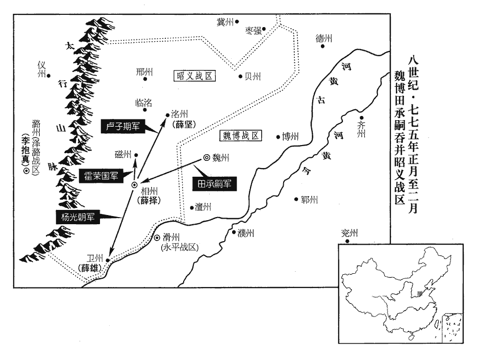
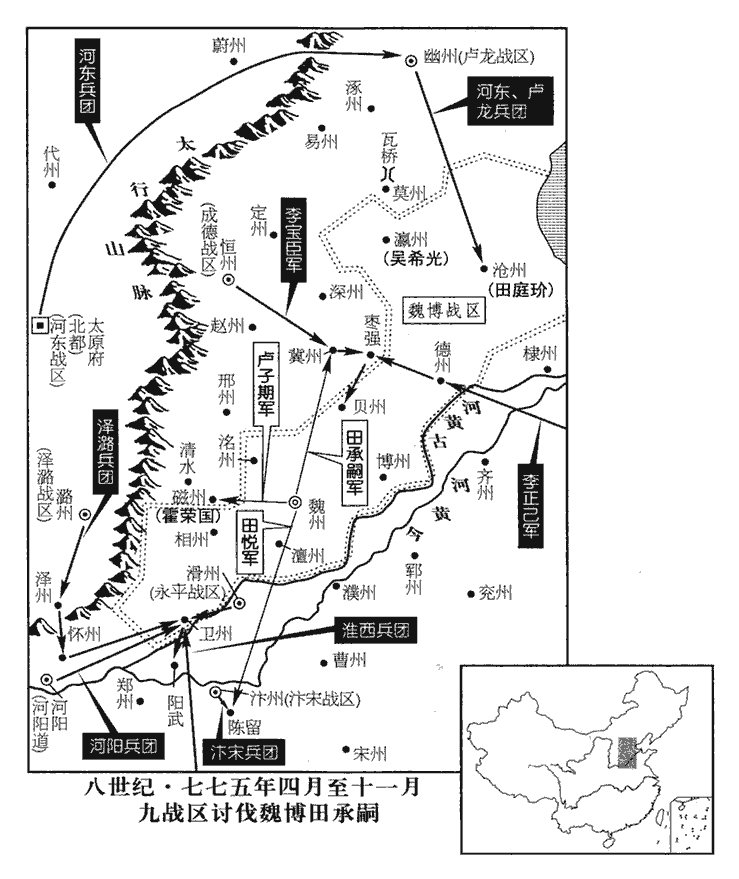
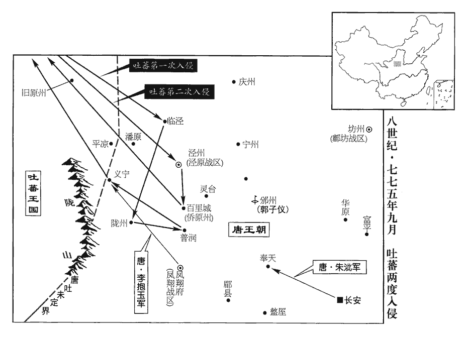
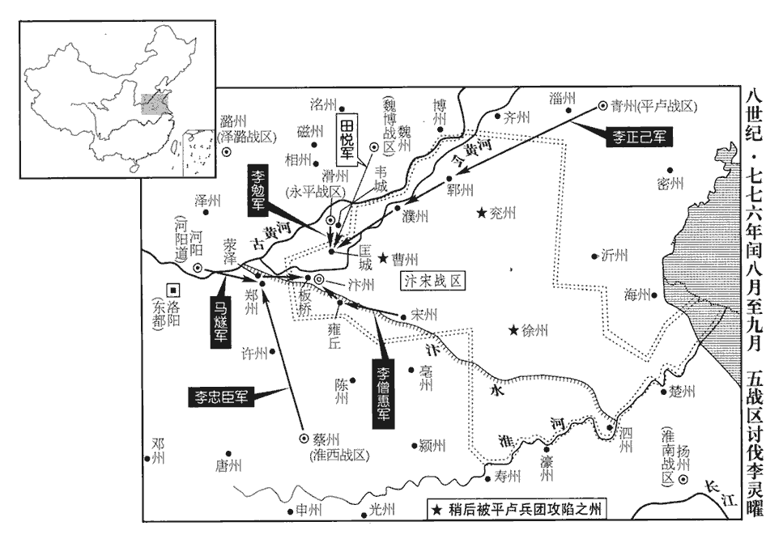
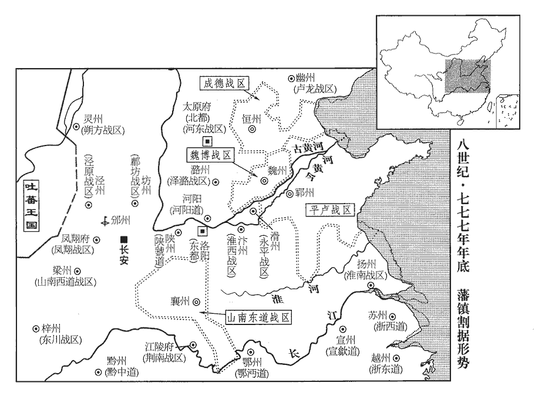
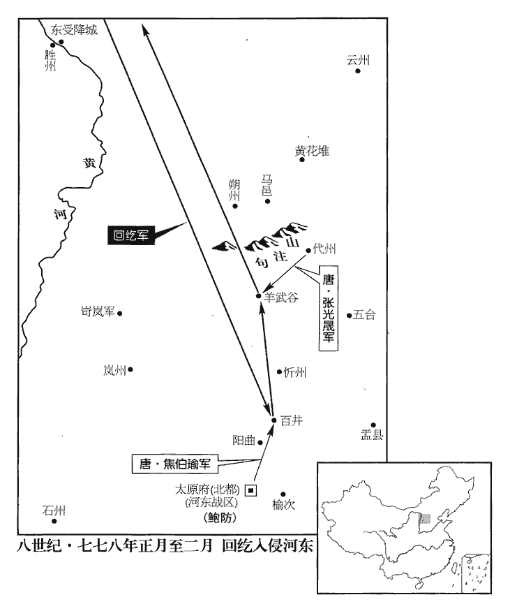
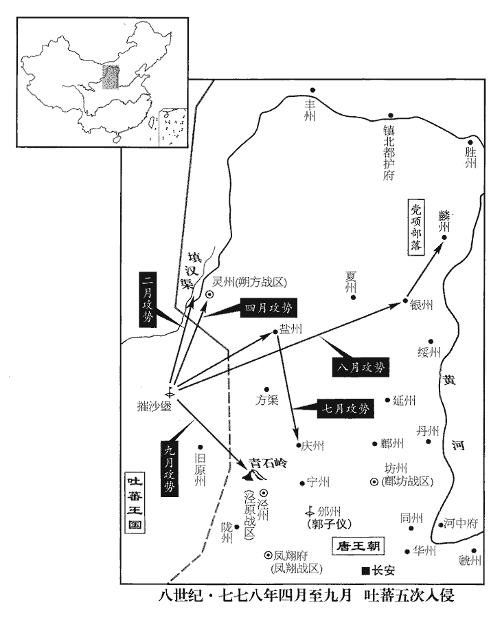
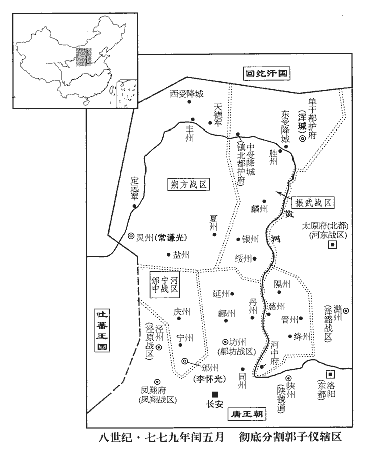
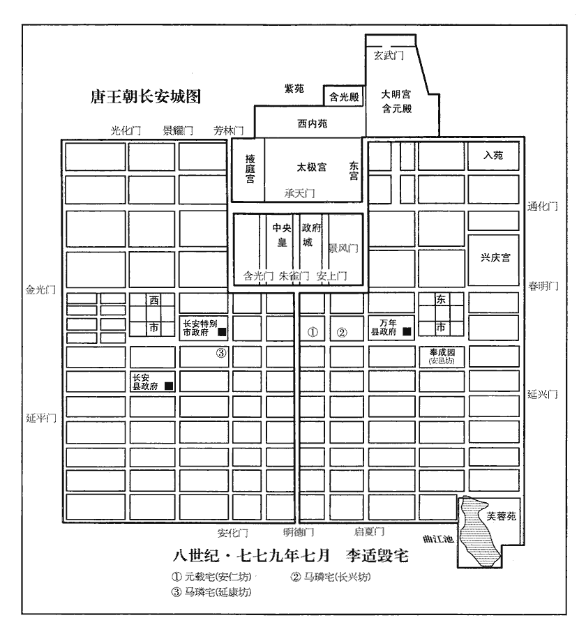

 唐紀四十一起閼逢攝提格（甲寅），盡屠維協洽（己未）七月，凡五年有奇。始甲寅終己未七月，凡五年零七月。

# 代宗睿文孝武皇帝中之下

## 大曆九年（甲寅、七七四）

1春，正月，壬寅‹三›，田神功薨於京師。田神功入朝見上卷上年。

〖译文〗 [1]春季，正月壬寅（初三），田神功在京师去世。

2澧朗‹总部设澧州湖南省澧县›鎮遏使楊猷yóu自澧州沿江而下，擅出境至鄂州‹鄂岳道首府·湖北省武汉市›，‹李豫（李俶）本年四十九岁›詔聽入朝。猷遂泝漢江而上，澧，音禮。使，疏吏翻。朝，直遙翻。泝，蘇故翻。下，遐稼翻。上，時掌翻。復州‹湖北省天门市›、郢州‹湖北省钟祥市›皆閉城自守，復、郢二州皆濱漢，此時蓋為山南東道巡屬。守，式又翻。山南東道‹总部设襄州湖北省襄樊市›節度使梁崇義發兵備之。

〖译文〗 [2]澧朗镇遏使杨猷从澧州沿长江而下，擅自出境到鄂州，代宗下诏听凭他入朝。于是杨猷溯汉江而上，沿途的复州、郢州都关闭城门自守，山南东道节度使梁崇义也调遣军队防备杨猷。

3二月，辛未‹二›，徐州‹江苏省徐州市›軍亂，刺史梁乘逾城走。徐州，治彭城。

〖译文〗 [3]二月辛未（初二），徐州的军队发生哗变，刺史梁乘翻越城墙逃走。

4諫議大夫吳損使吐蕃，留之累年，竟病死虜中。吐，從暾入聲。損出使見上卷六年。

〖译文〗 [4]谏议大夫吴损出使吐蕃，在那里滞留多年，最后病死在吐蕃。

5庚辰‹十一›，汴宋兵防秋者千五百人，盜庫財潰歸，汴，皮變翻。考異曰：唐曆作「十日己酉」。按長曆，是月庚午朔。十日，乃己卯也。今從實錄。田神功薨故也。己丑‹二十›，以神功弟神玉知汴宋留後。

〖译文〗 [5]庚辰（十一日），汴宋去防御吐蕃的军队一千五百人盗窃府库财物后溃逃回汴州，这是因为田神功去世的缘故。己丑（二十日），代宗任命田神功的弟弟田神玉为汴宋留后。

6癸巳‹二十四›，郭子儀入朝，上言：「朔方‹宁夏灵武市›，國之北門，中間戰士耗散，什纔有一。今吐蕃兼河、隴之地‹甘肃省及青海省东部›，雜羌、渾之眾，朝，直遙翻。史炤曰：羌，党項之屬。渾，吐谷渾也。勢強十倍。願更於諸道各發精卒，成四、五萬人，則制勝之道必矣。」

〖译文〗 [6]癸巳（二十四日），郭子仪入朝，进言说：“朔方是国家的北大门，那里的兵员消耗散失，仅仅剩下十分之一。如今吐蕃吞并河西、陇右地区，混杂着羌族、吐谷浑的部众，势力强大十倍。我希望各道轮流分别派遣精壮士兵，组成四五万人的军队，那么一定能够克敌制胜。”

7三月，戊申‹九›，以皇女永樂公主許妻魏博‹总部设魏州河北省大名县›節度使田承嗣之子華。樂，音洛。妻，七細翻。嗣，祥吏翻。上意欲固結其心，而承嗣益驕慢。史言狼子野心，不可以恩結。

〖译文〗 [7]三月戊申（初九），代宗将皇女永乐公主许配给魏博节度使田承嗣的儿子田华。代宗的目的是想以恩惠与他交心，但田承嗣却更加骄横傲慢。

8以【章：十二行本「以」上有「戊午‹十九›」二字；乙十一行本同；退齋校同。】澧朗鎮遏使楊猷為洮州‹甘肃省临潭县›刺史、隴右節度兵馬使。‹洮州已陷吐蕃，陇右战区原总部所在鄯州青海省乐都县›也陷吐蕃，陇右特遣兵团则驻凤翔府陕西省凤翔县境协防澧，音禮。使，疏吏翻。洮，土刀翻。洮州時已陷吐蕃，楊猷特領刺史耳。

〖译文〗 [8]代宗任命澧朗镇遏使杨猷为洮州刺史、陇右节度兵马使。

9夏，四月，甲申‹十六›，郭子儀辭還邠州‹陕西省彬县›，子儀自邠入朝，今還。還，從宣翻，又音如字。考異曰：唐曆作「癸未」。今從實錄。復為上言邊事，復，扶又翻。為，于偽翻；下為己、仍為同。至涕泗交流。

〖译文〗 [9]夏季，四月甲申（十六日），郭子仪向代宗辞行回州时，又向代宗谈到边疆大事，以至涕泪俱下。

10壬辰‹二十四›，赦天下。

〖译文〗 [10]壬辰（二十四日），大赦天下。

11五月，丙午‹八›，楊猷自澧州入朝。是年正月已書楊猷離澧州，沿江泝漢，今方至京師。朝，直遙翻。

〖译文〗 [11]五月丙午（初八），杨猷从澧州入朝。

12涇原‹总部设泾州甘肃省泾川县›節度使馬璘入朝，諷將士為己表求平章事。璘，離珍翻。將，即亮翻。丙寅‹二十八›，以璘為左僕射。璘，離珍翻。

〖译文〗 [12]泾原节度使马入朝，他暗示将士们为他上表要求平章事的职位。丙寅（二十八日），代宗任命马为左仆射。

13六月，盧龍‹总部设幽州北京市›節度使朱泚遣弟滔奉表請入朝，且請自將步騎五千防秋；上許之，泚，且禮翻，又音此。將，即亮翻，又音如字。騎，奇寄翻。仍為先築大第於京師以待之。

〖译文〗 [13]六月，卢龙节度使朱派遣弟弟朱滔带来奏表，请求入朝，并且请求让他亲自率领五千步骑兵去防御吐蕃。代宗表示同意，还在京师为他预先修建大宅来等待他的到来。

14癸未‹十五›，興善寺胡僧不空卒，贈開府儀同三司、司空，賜爵肅國公，諡曰大辯正廣智不空三藏和尚。釋典云：佛在多羅柰，最初為五人說契經修多羅藏。佛在羅閱祗，最初為須那提說毗眉藏。佛在毗舍離獼猴池，最初為跂耆說阿毗曇藏。五百羅漢夜集阿毗曇，相續解說經，此為三藏學。又，三藏學，經、律、論也。卒，子恤翻。藏、徂浪翻。

〖译文〗 [14]癸未（十五日），兴善寺胡僧不空去世。代宗追封他为开府仪同三司、司空，赐爵肃国公；谥号大辩正广智不空三藏和尚。

15京師旱，京兆尹黎幹作土龍祈雨，自與巫覡更舞。覡，刑狄翻。更，工衡翻。彌月不雨，又禱於文宣王。上聞之，命撤土龍，減膳節用。秋，七月，戊午‹二十一›，雨。

〖译文〗 [15]京师干旱，京兆尹黎干制作土龙来祈求雨水，自己与男女巫师交替舞蹈求雨。整整一月不见下雨，黎干又在文宣王孔子像前祈祷。代宗听说后，下令撤掉土龙，减少膳食，节约费用。秋季，七月戊午（二十一日），天才下雨。

16朱泚入朝，至蔚州‹河北省蔚县›，有疾，蔚，紆勿翻。此自幽州西出山後，取太原路入朝。宋白曰：蔚州，西南至代州四百六十里。諸將請還，俟間而行。待病間而行也。將，即亮翻。間，讀如字。泚曰：「死則輿尸而前！」諸將不敢復言。復，扶又翻。九月，庚子‹四›，至京師，士民觀者如堵。安、史亂後，河北諸帥阻兵不朝，朱泚之來長安，士民以為美事。辛丑‹五›，宴泚及將士於延英殿，盧文紀曰：上元以來，置延英殿，或宰相欲有奏對，或天子欲有咨度，皆非時召見。程大昌曰：高宗初刱chuàng蓬萊宮，諸門殿亭皆已立名。至上元二年，延英殿當御座生玉芝。則是初有大明宮，即有延英殿。顧召對宰臣，則始於代宗耳。代宗以苗晉卿年老，蹇甚，聽入閤不趨，為御延英，此優禮也。按六典，宣政殿前西上閤門之西，即為延英門。延英門之左，即延英殿。故陽城欲救陸贄，約拾遺王仲舒守延英殿上疏，伏閤不去也。犒賞之盛，近時未有。

〖译文〗 [16]朱入朝，途经蔚州时得了病，诸位将领请朱回去，等病情好转后再动身。朱说“我死了就抬尸体前去朝廷！”诸位将领不敢再提此事。九月庚子（初四），朱到达京师，围观朱的百姓象人墙一样。辛丑（初五），代宗在延英殿宴请朱及其将士，犒劳和赏赐的盛大，是近年来所没有的。

17壬寅‹六›，回紇‹瀚海沙漠群›擅出鴻臚寺，白晝殺人，紇，下沒翻。臚，陵如翻。有司擒之；上釋不問。

〖译文〗 [17]壬寅（初六），回纥人擅自离开鸿胪寺，白天杀人，被有关部门抓获，代宗释放了他们，没有问罪。

18甲辰‹八›，命郭子儀、李抱玉、馬璘、朱泚分統諸道防秋之兵。璘，離珍翻。泚，且禮翻，又音此。

〖译文〗 [18]甲辰（初八），代宗命令郭子仪、李抱玉、马和朱分别统率各道防御吐蕃的军队。

19冬，十月，壬申‹六›，信王瑝薨。乙亥‹九›，梁王璿xuán薨。二王皆玄宗‹李隆基›子。信以州為國名。瑝，戶盲翻，又音皇。璿，似宣翻。

〖译文〗 [19]冬季，十月壬申（初六），信王李去世。乙亥（初九），梁王李去世。

20魏博節度使田承嗣誘昭義‹总部设相州河南省安阳市›將吏使作亂。使，疏吏翻。嗣，祥吏翻。誘，羊久翻。將，即亮翻。

〖译文〗 [20]魏博节度使田承嗣诱使昭义的将领官吏叛乱。

## 十年（乙卯、七七五）

1春，正月，丁酉‹三›，昭義‹总部设相州河南省安阳市›兵馬使裴志清逐留後薛崿，帥其眾歸承嗣‹魏博战区，总部设魏州河北省大名县›。帥，讀曰率。承嗣聲言救援，引兵襲相州，取之。相，息亮翻；下同。崿奔洺州‹河北省永年县东南旧永年镇›，洺，音名。上表請入朝，‹李豫（李俶）本年五十岁›許之。上，時掌翻。朝，直遙翻。

〖译文〗 [1]春季，正月丁酉（初三），昭义兵马使裴志清驱逐留后薛，率领部众投靠田承嗣。田承嗣声称救援，带兵袭击和夺取了相州。薛逃奔州，上表请求入朝，代宗同意了。

2辛丑‹七›，郭子儀入朝。

〖译文〗 [2]辛丑（初七），郭子仪入朝。

3壬寅‹八›，壽王瑁薨。‹李瑁，是杨玉环的前夫，杨玉环如不死，本年五十九岁›瑁，亦玄宗子；音莫報翻。

〖译文〗 [3]壬寅（初八），寿王李瑁去世。

4乙巳‹十一›，‹卢龙战区，总部设幽州北京市›朱泚表請留闕下，以弟滔知幽州、盧龍留後，許之。

〖译文〗 [4]乙巳（十一日），朱上表请求留在朝廷，让弟弟朱滔担任幽州、卢龙留后，代宗表示同意。

 

5昭義裨將薛擇為相州刺史，薛雄為衛州‹河南省卫辉市›刺史，薛堅為洺州刺史，皆薛嵩之族也。相、衛、洺，本皆昭義巡屬。戊申‹十四›，上命內侍魏【章：十二行本「魏」作「孫」；乙十一行本同；下同；退齋校同。】知古如魏州諭田承嗣，使各守封疆；承嗣不奉詔，癸丑‹十九›，遣大將盧子期取洺州，楊光朝攻衛州。

〖译文〗 [5]昭义副将薛择担任相州刺史，薛雄担任卫州刺史，薛坚担任州刺史，他们都是薛嵩的族人。戊申（十四日），代宗命令内侍魏知古到魏州去劝告田承嗣，让他们各守自己的疆界；田承嗣不接受皇上的诏令，癸丑（十九日），派遣大将卢子期攻取州，杨光朝进攻卫州。

6乙卯‹二十一›，西川‹总部设成都府四川省成都市›節度使崔寧奏破吐蕃‹首都逻些城西藏拉萨市›數萬於西山‹成都以西山区›，吐，從暾入聲。斬首萬級，捕虜數千人。

〖译文〗 [6]乙卯（二十一日），西川节度使崔宁奏报说，在西山击败了吐蕃数万人的军队，杀一万人，俘虏数千人。

7丙辰‹二十二›，詔：「諸道兵有逃亡者，非承制敕，無得輒召募。」

〖译文〗 [7]丙辰（二十二日），代宗颁发诏书说：“各道都有士兵逃亡，没有接到朕的制敕，不得随意召募。”

8二月，乙丑‹一›，田承嗣誘衛州刺史薛雄，雄不從，使盜殺之，屠其家，盡據相、衛四州之地，相、衛已陷於承嗣，磁、洺雖未下，而承嗣已據其地。相、衛二州自此屬魏博。自置長吏，掠其精兵良馬，悉歸魏州；逼魏知古與共巡磁‹河北省磁县›、相二州，磁，疾之翻。使其將士割耳剺面，剺，力之翻。請承嗣為帥。帥，所類翻；下同。

〖译文〗 [8]二月乙丑（初一），田承嗣引诱卫州刺史薛雄造反，薛雄不从，田承嗣便派强盗杀掉薛雄，屠杀他的家属，占据相州、卫州等四州的全部地区，自行设置长吏，将那里的精兵良马全都掳掠到魏州。田承嗣逼迫魏知古与他一起巡视磁州、相州，又让他的将士割耳划脸，请田承嗣担任主帅。

9辛未‹七›，立皇子述為睦王，逾為郴王，連為恩王，遘為鄜王，郴，丑林翻。鄜，芳無翻。迅為隨王，造為忻王，暹為韶王，運為嘉王，遇為端王，遹為循王，遹yù，余律翻。通為恭王，達為原王，逸為雅王。諸皇子皆以州為王國名。

〖译文〗 [9]辛未（初七），代宗立皇子李述为睦王，李逾为郴王，李连为恩王，李遘为王，李迅为随王，李造为忻王，李暹为韶王，李运为嘉王，李遇为端王，李为循王，李通为恭王，李达为原王，李逸为雅王。

10丙子‹十二›，以華州‹陕西省华县›刺史李承昭知昭義留後。華，戶化翻。

〖译文〗 [10]丙子（二十日），代宗任命华州刺史李承昭为昭义留后。

11河陽三城‹河南省孟州市›使常休明，河陽縣，本屬懷州，顯慶二年，分屬河南府。城臨大河，長橋架水，古稱設險。此城，後魏之北中城也。東、西魏兵爭，又築中潬tān及南城，謂之河陽三城。乾元中，史思明再陷東京，李光弼以重兵守河陽。及雍王平賊，令魚朝恩守河陽，乃以河南之河清、濟源、溫四縣租稅入河陽三城，使河南尹但禮領其縣額，尋又以汜水軍賦屬之。使，疏吏翻。苛刻少恩。其軍士防秋者歸，休明出城勞之，少，詩沼翻。勞，力到翻。防秋兵與城內兵合謀攻之，休明奔東都‹河南省洛阳市›；軍士奉兵馬使王惟恭為帥，大掠，數日乃定。上命監軍冉庭蘭慰撫之。監，古銜翻。

〖译文〗 [11]河阳三城使常休明对待部下十分苛刻，又缺少恩惠，部下防御吐蕃归来，常休明出城慰劳，防秋的士兵和城内的士兵便合谋进攻他，常休明逃往东都；士兵们拥戴兵马使王惟恭为帅，在城中大肆掠夺，几天后才安定。代宗命令监军冉庭兰去慰问和安抚他们。

12三月，甲午‹一›，陝州‹河南省三门峡市›軍亂，逐兵馬使趙令珍。陝，失冉翻。考異曰：唐曆：「三月二十八日辛卯，陝州軍亂」。實錄、唐統紀云「甲午朔」，今從之。觀察使李國清不能禁，卑辭，徧拜將士，乃得脫去。陝，失冉翻。將，即亮翻。軍士大掠庫物。會淮西‹总部设蔡州河南省汝南县›節度使李忠臣‹董秦›入朝，過陝，朝，直遙翻。過，古禾翻。上命忠臣按之；將士畏忠臣兵威，不敢動。忠臣設棘圍，令軍士匿名投庫物，設棘四圍周之，令投所掠庫物於其中。一日，獲萬緡，盡以給其從兵為賞。緡，眉巾翻。從，才用翻。

〖译文〗 [12]三月甲午（初一），陕州军队发生哗变，驱逐兵马使赵令珍。观察使李国清无法制止他们，便说谦恭话，并一一求拜将士，才得以脱身离开。士兵们大肆掠夺府库财物。恰好淮西节度使李忠臣入朝，路过陕州，代宗命令李忠臣去制止他们。将士们慑于李忠臣的军威，不敢妄动。李忠臣用荆棘围成一个圈子，命令士兵们无记名将所掠府库的财物投放到圈子中，一天就收了一万缗钱，全部给了他的随从，作为奖赏。

13乙巳‹十二›，薛崿、常休明皆詣闕請罪，上釋不問。

〖译文〗 [13]乙巳（十二日），薛、常休明都进宫请罪，代宗宽恕他们，不加追究。

14初，成德‹总部设恒州河北省正定县›節度使李寶臣、淄青‹总部设青州山东省青州市›節度使李正己，皆為田承嗣所輕。使，疏吏翻。淄，莊持翻。嗣，祥吏翻。寶臣弟寶正娶承嗣女，在魏州，與承嗣子維擊毬，馬驚，誤觸維死；承嗣怒，囚寶正，以告寶臣。寶臣謝教敕不謹，封杖授承嗣，使撻之；承嗣遂杖殺寶正，由是兩鎮交惡。及承嗣拒命，寶臣、正己皆上表請討之，上，時掌翻。上亦欲因其隙討承嗣。夏，四月，乙未‹三›，敕貶承嗣為永州‹湖南省永州市›刺史，永州，漢零陵郡，隋廢郡為永州。仍命河東‹总部设太原府山西省太原市›、成德、幽州、淄青、淮西、永平‹总部设滑州河南省滑县›、汴宋‹总部设汴州河南省开封市›、河陽‹设河阳河南省孟州市›、澤潞‹总部设潞州山西省长治市›諸道發兵前臨魏博，若承嗣尚或稽違，即令進討；罪止承嗣及其姪悅，自餘將士弟姪苟能自拔，一切不問。令，力丁翻。將，即亮翻。

〖译文〗 [14]从前，成德军节度使李宝臣和淄青节度使李正己，都被田承嗣所瞧不起。李宝臣的弟弟李宝正娶田承嗣的女儿，在魏州与田承嗣的儿子田维打马球，马受了惊，误将田维踢死。田承嗣恼怒，囚禁了李宝正，然后告诉李宝臣。李宝臣以管教不严表示歉意，将封闭的棍棒交给田承嗣，让他杖责李宝正。于是田承嗣打死李宝正，从此两镇结了怨仇。及至田承嗣拒从皇命，李宝臣和李正己都上表请求讨伐他，代宗也打算趁他们有裂痕时进行讨伐。夏季，四月乙未（疑误），代宗下敕贬田承嗣为永州刺史，仍旧下令河东、成德、幽州、淄青、淮西、永平、汴宋、河阳、泽潞各道调动军队前去魏博，假如田承嗣还拖延违抗，即命令他们进军讨伐；只惩治田承嗣和他的侄子田悦的罪行，其余将士、弟侄假如能自拔，概不追究。

 

時朱滔方恭順，與寶臣及河東節度使薛兼訓攻其北，正己與淮西節度使李忠臣等攻其南。五月，乙未‹三›，承嗣將霍榮國以磁州降。磁州，滏陽郡，本漢廣平縣地，隋廢郡，於滏陽縣置磁州，治滏陽，本漢成安縣地。將，即亮翻。降，戶江翻；下同。磁，牆之翻。丁未‹十五›，李正己攻德州‹山东省陵县›，拔之。德州自此屬平盧軍。李忠臣統永平‹滑州·河南省滑县›、河陽、懷‹河南省沁阳市›、澤‹山西省晋城市›步騎四萬進攻衛州。統，他綜翻，俗讀從上聲。六月，辛未‹九›，田承嗣遣其將裴志清等攻冀州‹河北省冀州市。属成德战区›，志清以其眾降李寶臣。甲戌‹十二›，承嗣自將圍冀州，寶臣使高陽軍使張孝忠‹驻易州·河北省易县›將精騎四千禦之，寶臣大軍繼至；承嗣燒輜重而遁。重，直用翻。冀州，治信都縣。將，即亮翻，又音如字。騎，奇寄翻。高陽軍，當置於瀛州高陽縣。兵志：橫海、北平、高陽等軍皆屬平盧道。蓋安、史之亂，以兵授張孝忠統制，而屬於李寶臣，因授高陽軍使耳。孝忠，本奚‹滦河上游›也。張孝忠，奚人，世為乙失活部酋長。

〖译文〗 那时朱滔很恭顺，他与李宝臣及河东节度使薛兼训从北面进攻，李正己与淮西节度使李忠臣等人从南面进攻。五月乙未（初三），田承嗣的部将霍荣国献出磁州向朝廷投降。丁未（十五日），李正己进攻德州，并将德州攻克。李忠臣统率永平、河阳、怀、泽等道四万步、骑兵进攻卫州。六月辛未（初九），田承嗣派遣他的部将裴志清等人进攻冀州，裴志清却率领他的部下投降了李宝臣。甲戌（十二日），田承嗣亲自率军围攻冀州，李宝臣派高阳军使张孝忠率领精锐骑兵四千人前去抵御，李宝臣的大部队随后到达，田承嗣烧毁辎重逃跑。张孝忠本是奚族人。

田承嗣以諸道兵四合，部將多叛而懼，秋，八月，遣使奉表，請束身歸朝。嗣，祥吏翻。將，即亮翻。使，疏吏翻。朝，直遙翻。

〖译文〗 田承嗣因为各道军队四面合力进攻，他的部将又多叛变，心中恐惧，秋季，八月，派遣使者上表，请求约束自身归顺朝廷。

15辛巳‹二十›，郭子儀還邠州。入朝而還所鎮。還，從宣翻，又音如字。邠，卑旻翻。考異曰：汾陽家傳作「丁丑」，今從實錄。子儀嘗奏除州縣官一人，不報，僚佐相謂曰：「以令公勳德，奏一屬吏而不從，何宰相之不知體！」子儀聞之，謂僚佐曰：「自兵興以來，方鎮武臣多跋扈，凡有所求，朝廷常委曲從之；此無他，乃疑之也。今子儀所奏事，人主以其不可行而置之，是不以武臣相待而親厚之也；諸君可賀矣，又何怪焉！」聞者皆服。史言郭子儀忠純。

〖译文〗 [15]辛巳（二十日），郭子仪返回州。郭子仪曾经奏请任命一名州县官员，没有得到答复，僚属们相互议论说：“以郭令公的功勋和德行，上奏任命一名从属官员而没有得到批准，宰相就这么不知礼！”郭子仪听说后，跟僚属们说：“自从兵兴以来，方镇武臣多飞扬跋扈，凡是他们所求的，朝廷经常委曲求全，满足他们的要求，这不是别的，是对他们抱有疑虑。如今我所奏的事，皇上认为行不通而搁置起来，是不用对待武臣的方法来对待我，而是亲近信任我；各位应当祝贺，又有什么可责怪的呢！”僚属都很叹服。

16己丑‹十八›，田承嗣遣其將盧子期寇磁州。將，即亮翻。磁，牆之翻。

〖译文〗 [16]己丑（二十八日），田承嗣派遣他的部将卢子期进犯磁州。

17九月，戊申‹十七›，回紇白晝刺市人腸出，紇，下沒翻。刺，七亦翻。有司執之，繫萬年‹首都长安东半城›獄；其酋長赤心馳入縣獄，酋，才由翻。長，知兩翻。斫傷獄吏，劫囚而去。上亦不問。

〖译文〗 [17]九月戊申（十七日），回纥人大白天将买卖人刺得流出肠子，有关部门将他们抓住，关进万年县监狱；回纥酋长赤心驰马进入县城监狱，砍伤狱吏，劫去囚犯。代宗也不追究。

18壬子‹二十一›，吐蕃寇臨涇‹甘肃省镇原县›，吐，從暾入聲。臨涇，漢縣，屬安定郡。隋大業初，改曰湫谷縣，尋復曰臨涇縣，唐屬涇州。癸丑‹二十二›，寇隴州‹陕西省陇县›及普潤‹陕西省凤翔县北›，大掠人畜而去；百官往往遣家屬出城竄匿。丙辰‹二十五›，鳳翔節度使李抱玉奏破吐蕃於義寧‹甘肃省华亭县›。隴州華亭縣，大曆八年置義寧軍。

〖译文〗 [18]壬子（二十一日），吐蕃进犯临泾，癸丑（二十二日），又进犯陇州和普润，大肆虏掠人口牲畜而去，百官往往遣送家属出城躲藏。丙辰（二十五日），凤翔节度使李抱玉上奏说在义宁打败吐蕃军队。

19李寶臣、正己會于棗強‹河北省枣强县›，棗強縣，前漢屬清河郡，後漢省；晉復置，屬廣川郡，魏、隋以來屬冀州。進圍貝州‹河北省清河县›，田承嗣出兵救之。兩軍各饗士卒，成德賞厚，平盧賞薄；既罷，平盧士卒有怨言，正己恐其為變，引兵退，寶臣亦退。李忠臣聞之，釋衛州，南渡河，屯陽武‹河南省原阳县›。陽武縣，屬鄭州，本原武城，武德四年置陽武縣，北至衛州五十許里。寶臣與朱滔攻滄州‹河北省沧州市东南›，承嗣從父弟庭玠守之；從，才用翻。寶臣不能克。

〖译文〗 [19]李宝臣和李正己在枣强县会师，进而围攻贝州，田承嗣出兵援救贝州。李宝臣和李正己两军分别犒赏士兵，成德军犒赏丰厚，平卢军犒赏微薄；犒赏完毕，平卢军士兵颇有怨言，李正己害怕他们哗变，率军撤退，李宝臣也退兵。李忠臣听说后，放弃围攻卫州，南渡黄河，驻守阳武。李宝臣与朱滔进攻沧州，田承嗣的堂弟田庭镇守沧州，李宝臣未能攻克。

 

20吐蕃寇涇州‹甘肃省泾川县›，涇原‹总部设泾州›節度使馬璘破之於百里城‹甘肃省灵台县西›。吐，從暾入聲。使，疏吏翻。璘，離珍翻。考異曰：汾陽家傳：「九月，吐蕃略潘原西而還。八日，至小石門白草川。十八日，下朝那川。二十三日，至里城營、支磨原，入華亭。十月，公遣渾瑊、李懷光等與幽州、義寧、汴宋軍會于故平涼縣。三日詰朝，大破之。」今從實錄。戊午‹二十七›，命盧龍節度使朱泚出鎮奉天‹陕西省乾县›行營。泚，且禮翻，又音此。

〖译文〗 [20]吐蕃进犯泾州，泾原节度使马在百里城将他们打败。戊午（二十七日），代宗命令卢龙节度使朱出镇奉天行营。

21冬，十月，辛酉朔‹一›，日有食之。

〖译文〗 [21]冬季，十月辛酉朔（初一），出现日食。

22盧子期攻磁州，磁，牆之翻。考異曰：舊李寶臣傳作「攻邢州」。今從實錄。城幾陷；幾，居依翻。李寶臣與昭義留後李承昭共救之，大破子期于清水‹河北省磁县西北›，按新書田承嗣傳，「清水」作「臨水」。晉置臨水縣於滏口之右，屬廣平郡，後魏及隋屬魏郡。唐初省，永泰元年，薛嵩表於臨水故城置昭義縣，屬磁州。擒子期送京師；斬之。河南‹黄河以南›諸將又大破田悅於陳留‹河南省开封市东南陈留镇›；陳留，漢縣，後魏廢，隋開皇六年復置；時屬汴州。九域志：在州東五十二里。將，即亮翻。田承嗣懼。

〖译文〗 [22]卢子期进攻磁州，州城几乎被攻陷，李宝臣与昭义留后李承昭共同援救磁州，在清水县大败卢子期，将他擒获，送到京师斩首。河南诸将又在陈留大败田悦，田承嗣恐惧。

初，李正己遣使至魏州，承嗣囚之，至是，禮而遣之，遣使盡籍境內戶口、甲兵、穀帛之數以與之，曰：「承嗣今年八十有六，嗣，祥吏翻。考異曰：按承嗣卒時年七十五。此云八十六者，蓋欺正己。溘死無日，溘kè，口答翻，奄也。莊子曰：溘然而死。謂奄然也。諸子不肖，悅亦孱弱，孱chán，士山翻。凡今日所有，為公守耳，為，于偽翻。豈足以辱公之師旅乎！」立使者於庭，南向，拜而授書；又圖正己之像，焚香事之。正己悅，遂按兵不進。於是河南‹黄河以南›諸道兵皆不敢進。承嗣既無南顧之虞，得專意北方。

〖译文〗 当初，李正己派遣使者到魏州，田承嗣将使者囚禁，到此时，他对使者优礼并放他走，将境内的户口、军队、粮食、布帛的数量全部登记后交给使者，说道：“我今年八十六岁，离死不远，儿子们都不肖，田悦也柔弱无能，凡是我今天所有的东西，只不过在替李公看守而已，难道还值得劳李公兴师动众吗？”田承嗣让李正己的使者立在庭中，自己面向南方，伏拜后授给使者书信，又画李正己的肖像，焚香供奉。李正己十分高兴，于是按兵不动。因此，河南各道军队也都不敢进兵。田承嗣既然没有南顾之忧，便一心一意对付北方的军队。

上嘉李寶臣之功，遣中使馬承倩齎詔勞之；勞，力到翻。將還，寶臣詣其館，遺之百縑，遺，于季翻。承倩詬詈，擲出道中，寶臣慙其左右。為承倩詈辱，顧見左右而自慚也。詬，許候翻，又古候翻。兵馬使王武俊說寶臣曰：使，疏吏翻。說，式芮翻；下客說同。「今公在軍中新立功，豎子尚爾，況寇平之後，以一幅詔書召歸闕下，一匹夫耳，不如釋承嗣以為己資。」寶臣遂有玩寇之志。

〖译文〗 代宗嘉许李宝臣的功劳，派遣中使马承倩携带诏书前去慰劳；马承倩即将返回时，李宝臣来到他下榻的馆舍，送他一百匹丝织品。马承倩臭骂他一顿，将东西扔到路中，李宝臣看了看身边的人，自己感到很惭愧。兵马使王武俊劝李宝臣说：“今天你在军中新立战功，宫中小人尚且这样待你，更何况荡平田承嗣之后，如以一纸诏书召你回到宫中，你就仅仅是一个匹夫而已，不如停止攻击田承嗣，作为自己的资本。”李宝臣便有了放过田承嗣的意图。

承嗣知范陽寶臣鄉里，心常欲之，寶臣本范陽內屬奚，范陽將張瑣高畜為假子，因冒其姓，歸唐，又賜姓李。因刻石作讖云：「二帝同功勢萬全，將田為侶入幽燕，」密令瘞寶臣境內，讖，楚譖翻。瘞，於計翻。使望氣者言彼有王氣，寶臣掘而得之。又令客說之曰：「公與朱滔共取滄州，得之，則地歸國，非公所有。公能捨承嗣之罪，請以滄州歸公，仍願從公取范陽以自效。公以精騎前驅，承嗣以步卒繼之，蔑不克矣。」令，力丁翻。說，式芮翻。騎，奇寄翻。寶臣喜，謂事合符讖，遂與承嗣通謀，密圖范陽，承嗣亦陳兵境上。

〖译文〗 田承嗣得知范阳是李宝臣的故乡，内心常想着攻取范阳。因而在石头上刻下预言未来凶吉得失的文字：“二帝同功势万全，将田为侣入幽燕。”密令部下将石头埋在李宝臣的境内，让阴阳先生说那里有帝王之气，李宝臣便掘得此石。田承嗣又命令说客去劝李宝臣说：“您与朱滔共同攻取沧州，如果攻克，那么该地归国所有，而非你所有。如你能放弃田承嗣的罪，请他将沧州让给你，他仍然愿意跟从你攻取范阳，亲自为你效劳，你率领精锐骑兵先行，田承嗣率领步兵随后赶到，没有攻不破的。”李宝臣欢喜，说这件事与石头上刻的预言相吻合，于是与田承嗣互相串通，秘密图谋范阳，田承嗣也陈兵边境。

寶臣謂滔使者曰：「聞朱公儀貌如神，願得畫像觀之。」滔與之。寶臣置於射堂，與諸將共觀之，曰：「真神人也！」滔軍於瓦橋‹河北省雄县›，將，即亮翻。瓦橋，古易京之地，在莫州北三十里，唐置瓦橋關。宋白曰：涿州歸義縣瓦子濟橋，在涿州南，易州東，當九河之末，舊置瓦橋關，後周置雄州。寶臣選精騎二千，通夜馳三百里襲之，戒曰：「取貌如射堂者。」時兩軍方睦，滔不虞有變，狼狽出戰而敗，會衣他服得免。衣，於既翻。寶臣欲乘勝取范陽，滔使雄武軍‹河北省兴隆县南›使昌平‹北京市昌平县›劉怦守留府。怦，普耕翻。寶臣知有備，不敢進。

〖译文〗 李宝臣跟朱滔的使者说：“听说朱公容仪如同神仙一般，我希望看看他的画像。”朱滔给了他画像。李宝臣将画像挂在习射堂，与各位将领一起观赏，说道：“这真是神人啊！”朱滔在瓦桥驻扎，李宝臣挑选二千精锐骑兵，通宵驰骋三百里，偷袭朱滔，李宝臣告诫士兵说：“杀掉那个相貌与习射堂画像一样的人。”当时两军刚和睦，朱滔没有料到情况有变，狼狈出战，遭到失败，恰好朱滔身穿别的衣服才得以幸免。李宝臣想乘胜攻取范阳，朱滔派雄武军使昌平人刘怦镇守节度留府。李宝臣知道朱滔已有防备，不敢再进兵。

承嗣聞幽、恆兵交，即引軍南還，嗣，祥吏翻。恆，戶登翻。還，從宣翻，又音如字。使謂寶臣曰：「河內‹河南省黄河以北›有警，不暇從公，石上讖文，吾戲為之耳！」寶臣慙怒而退。考異曰：舊王武俊傳曰：「代宗嘉其功，使中貴人馬承倩齎詔宣勞。承倩將歸，止傳舍，寶臣親遺百縑，承倩詬罵，擲出道中。王武俊勸玩養承嗣以為己資。寶臣曰：『今與承嗣有釁矣，可推腹心哉！』武俊曰：『勢同患均，轉寇讎為父子，欬唾間耳。若傳虛言，無益也。今中貴人劉清譚在驛，斬首送承嗣，承嗣立質妻孥矣。』寶臣曰：『吾不能如此。』武俊曰：『朱滔為國屯兵滄州，請擒送承嗣以取信。』許之。」按承嗣方求解於寶臣，何必擒滔以取信！且承倩尚在傳舍，武俊何不勸斬承倩而斬清譚乎！寶臣自以承嗣誘之共取幽州，故襲朱滔，非因承倩之辱也。今從唐紀。寶臣既與朱滔有隙，以張孝忠為易州刺史，使將精騎七千以備之。史言田承嗣凶狡過於諸帥。宋白曰：易州，東至幽州二百一十四里。將，即亮翻。又音如字。騎，奇寄翻。

〖译文〗 田承嗣听说幽州、恒州二军交战，当即率军南归，他派人告诉李宝臣说：“河内有紧急情况，无暇跟从你出战范阳，石头上的预言文字，是我做游戏刻的！”李宝臣又惭愧又愤怒，退兵离去。李宝臣既然与朱滔有了裂痕，便让张孝忠担任易州刺史，由他率领七千精锐骑兵来防备朱滔。

23丙寅‹六›，貴妃獨孤氏薨，丁卯‹七›，追諡貞懿皇后。諡，神至翻。

〖译文〗 [23]丙寅（初六），贵妃独孤氏去世，丁卯（初七），代宗追赠她谥号为贞懿皇后。

24十一月，丁酉‹七›，田承嗣將吳希光以瀛州‹河北省河间市›降。

〖译文〗 [24]十一月丁酉（初七），田承嗣的部将吴希光率瀛州投降朝廷。

25嶺南‹总部设广州广东省广州市›節度使路嗣恭擢流人孟瑤、敬冕為將，考異曰：鄴侯家傳作「敬俛fǔ」，今從舊傳。討哥舒晃。瑤以大軍當其衝，冕自間道輕入，間，古莧翻。輕，墟正翻。丁未‹十七›，克廣州，斬哥舒晃考異曰：舊嗣恭傳曰：「嗣恭平廣州，商舶之徒，多因晃事誅之，嗣恭前後沒其家財寶數百萬貫，盡入私室，不以貢獻。代宗心甚銜之，故嗣恭雖有平方面功，止轉檢校兵部尚書，無所酬勞。」建中實錄曰：「自兵興以來，諸軍殺將帥而要君者多矣，皆因授其任以苟安之。其王師征討，不失有罪，始斯役也。既而有謗其收南海府庫，閱上不實，不得用久之。」按代宗以嗣恭附元載，遺載琉璃盤，惡之，故不用耳，事見鄴侯家傳。或當時亦有人迎合，以匿貨謗嗣恭，不可知也。今不取。李肇國史補云：「路嗣恭初平五嶺，元載奏言嗣恭多取南人金寶，是欲為亂，陛下不信，試召，必不入朝。三伏中，追詔至，嗣恭不慮，請待秋涼以脩覲禮。江西判官柳渾入，雨泣曰：『公有功，方暑而追，是為執政所中。今少遷延，必族滅也。』嗣恭懼曰：『為之柰何？』渾曰：『健步追還表緘，公今日過江，宿石頭驛，乃可。』從之。代宗謂元載曰：『嗣恭不俟駕行矣。』載無以對。」按嗣恭素附元載，載誅，賴李泌營救得免，事見鄴侯家傳。載豈有譖嗣恭，云欲為亂之理！蓋載已被誅而召嗣恭，適在三伏，渾有此疑，時人因以為渾美事耳。今不取。余按去年命路嗣恭為嶺南節度使，討哥舒晃。嗣恭既誅晃而平廣州，則當在廣州。柳渾若以江西判官從嗣恭，亦當在廣州。今諫嗣恭請奉詔就道，乃言過江宿石頭驛。石頭驛，在豫章江之西岸。嗣恭自江西觀察赴召，可言宿石頭驛；自嶺南節度赴召，安得宿石頭驛哉！亦可以明李肇之誤。及其黨萬餘人。

〖译文〗 [25]岭南节度使路嗣恭提拔被流放的孟瑶、敬冕为将领，讨伐哥舒晃。孟瑶率领大部队占据交通要冲，敬冕从小路轻装进军，丁未（十七日），攻克广州，杀掉舒晃及其同伙一万多人。

嗣恭之討晃也，容管‹总部设容州广西北流市›經略使王翃hóng遣將將兵助之；西原‹广西靖西县›賊帥覃問乘虛襲容州，姓譜：梁有東寧州刺史覃元先。則蠻中有覃姓尚矣。翃伏兵擊擒之。

〖译文〗 路嗣恭讨伐哥舒晃时，容管经略使王派遣将领率军援助。西原蛮贼首领覃问乘虚袭击容州，王设下伏兵进击，将覃问抓获。

26十二月，回紇‹瀚海沙漠群›千騎寇夏州‹陕西省靖边县北白城子›，考異曰：此事出汾陽家傳，實錄、新、舊紀皆無之。按實錄，明年二月，加朔方戍兵以備回紇，則是回紇嘗入寇也。州將梁榮宗破之於烏水‹靖边县西北红柳河支流›。烏水，在夏州朔方縣。貞觀七年，開延化渠，引烏水入庫狄澤。將，即亮翻。郭子儀遣兵三千救夏州，回紇遁去。夏，戶雅翻。紇，下沒翻。

〖译文〗 [26]十二月，回纥一千骑兵进犯夏州，夏州将领梁荣宗在乌水打败回纥骑兵，郭子仪派遣三千士兵援救夏州，回纥骑兵逃跑。

27元載、王縉奏魏州鹽貴，請禁鹽入其境以困之。載，祖亥翻，又音如字。縉，音晉。上不許，曰：「承嗣負朕，百姓何罪！」

〖译文〗 [27]元载、王缙上奏说魏州的盐很贵，请求禁止将盐运入魏州境内以困住田承嗣。代宗不同意，说道：“田承嗣辜负朕，老百姓有什么罪！”

28田承嗣請入朝，李正己屢為之上表，乞許其自新。嗣，祥吏翻。朝，直遙翻。為，于偽翻。上，時掌翻。

〖译文〗 [28]田承嗣请求入朝，李正己多次为他上表，恳求允许他悔过自新。

## 十一年（丙辰、七七六）

1春，正月，壬辰‹三›，‹李豫（李俶）本年五十一岁›遣諫議大夫杜亞使魏州‹河北省大名县›宣慰。使，疏吏翻。

〖译文〗 [1]春季，正月壬辰（初三），代宗派遣谏议大夫杜亚出使魏州安抚田承嗣。

2辛亥‹二十二›，西川‹总部设成都府四川省成都市›節度使崔寧奏破吐蕃‹首都逻些城西藏拉萨市›四節度及突厥、吐谷渾‹青海省›、氐‹甘肃省东南部›、羌‹甘肃省南部›群蠻眾二十餘萬，斬首萬餘級。吐，從暾入聲。厥，九勿翻。

〖译文〗 [2]辛亥（二十二日），西川节度使崔宁奏称打败了吐蕃的四节度和突厥、吐谷浑、氐、羌等蛮族二十多万人，斩首一万多人。

3二月，庚辰‹二十二›，田承嗣復遣使上表請入朝。復，扶又翻。上乃下詔，赦承嗣罪，復其官爵，聽與家屬入朝，其所部拒朝命者，一切不問。

〖译文〗 [3]二月庚辰（二十二日），田承嗣再次派遣使者上表，请求入朝。代宗颁下诏书，赦免田承嗣之罪，恢复官爵，允许他与家属入朝，他的部下抗拒过朝廷命令的人，概不追究。

4辛巳‹二十三›，增朔方‹总部设灵州宁夏灵武市›五城戍兵，以備回紇‹瀚海沙漠群›。朔方先統三受降城并振武、豐安‹宁夏中卫县西›、定遠‹宁夏平罗县›，為六城。時三受降城屬振武軍。使朔方統豐安、定遠、新昌‹宁夏灵武市东北›、豐寧、保寧，謂之塞下五城。紇，下沒翻。

〖译文〗 [4]辛巳（二十三日），增加戍守朔方五城的军队，以防备回纥。

5三月，戊子‹一›，河陽‹河南省孟州市›軍亂，逐監軍冉庭蘭出城，大掠三日。庭蘭成備而入，誅亂者數十人，乃定。監，古銜翻。

〖译文〗 [5]三月戊子（初一），河阳军队发生哗变，驱逐监军冉庭兰出城，大肆掠夺三天。冉庭兰重整旗鼓，攻入城中，杀掉数十名作乱的士兵，才得以安定。

6五月，汴宋‹总部设汴州河南省开封市›留後田神玉卒。都虞候李靈曜殺兵馬使、濮州‹山东省鄄城县›刺史孟鑒，北結田承嗣為援。汴，皮變翻。卒，子恤翻。使，疏吏翻。濮，博木翻。嗣，祥吏翻。癸巳‹七›，以永平‹总部设滑州河南省滑县›節度使李勉兼汴、宋‹总部设汴州河南省开封市›等八州留後。汴、宋‹河南省商丘市›、曹‹山东省定陶县›、濮、兗‹山东省兖州市›、鄆‹山东省东平县›、徐‹江苏省徐州市›、泗‹江苏省盱眙县淮河北岸›八州。濮，博木翻。乙未‹九›，以靈曜為濮州刺史，靈曜不受詔。六月，戊午‹二›，以靈曜為汴宋留後，遣使宣慰。

〖译文〗 [6]五月，汴宋留后田神玉去世。都虞候李灵曜杀死兵马使、濮州刺史孟鉴，向北勾结田承嗣作为后援。癸巳（初七），代宗任命永平节度使李勉兼汴宋等八州留后。乙未（初九），代宗任命李灵曜为濮州刺史，李灵曜不接受诏令。六月戊午（初二），代宗任命李灵曜为汴宋留后，派遣使者安抚李灵曜。

7秋，九【章：十二行本「九」作「七」；乙十一行本同；孔本同；張校同。】月，田承嗣遣兵寇滑州‹河南省滑县›，敗李勉。滑州，永平節度治所。敗，補邁翻。

〖译文〗 [7]秋季，九月，田承嗣派遣军队进犯滑州，打败李勉。

8吐蕃寇石門‹宁夏海原县›，入長澤川‹宁夏固原县北›。長澤川，後魏置闡熙郡，隋廢郡為長澤縣，屬夏州。吐蕃寇原州，遂北入夏州界也。宋白曰：長澤縣，漢朔方郡三封縣之地。三封故城，赫連勃勃據之，築為統萬城。又按原州北有長澤監。吐，從暾入聲。

〖译文〗 [8]吐蕃进犯石门，进入长泽川。

9八月，丙寅‹十一›，加盧龍‹总部设幽州北京市›節度使朱泚同平章事。考異曰：實錄：「閏八月己亥，遣朱泚如奉天行營。」按去年已云泚出鎮奉天行營；至此，又云；明年九月，又云。蓋泚每年往奉天防秋，至春還京師。但實錄不載其入朝耳。

〖译文〗 [9]八月丙寅（十一日），代宗加封卢龙节度使朱为同平章事。

10李靈曜既為留後，益驕慢，悉以其黨為管內八州刺史、縣令，欲效河北‹黄河以北›諸鎮。甲申‹二十九›，詔淮西‹总部设蔡州河南省汝南县›節度使李忠臣、永平節度使李勉、河陽三城‹河南省孟州市›使馬燧討之。淮南‹总部设扬州江苏省扬州市›節度使陳少遊、淄青‹总部设青州山东省青州市›節度使李正己皆進兵擊靈曜。

〖译文〗 [10]李灵曜既然担任留后，更加骄横傲慢，让他的党羽全部出任管内八州刺史和县令，想要效仿河北各镇。甲申（二十九日），代宗诏令淮西节度使李忠臣、永平节度使李勉、河阳三城使马燧前去讨伐。淮南节度使陈少游、淄青节度使李正己都进兵攻击李灵曜。

汴宋兵馬使、攝節度副使李僧惠，少，始照翻。考異曰：汾陽家傳作「李思惠」。今從舊傳。靈曜之謀主也。宋州牙門將劉昌遣僧【嚴：「僧」改「曾」。】神表潛說僧惠；僧惠召問計，昌為之泣陳逆順。將，即亮翻。說，式芮翻。為，于偽翻。僧惠乃與汴宋牙將高憑、石隱金遣神表奉表詣京師，請討靈曜。九月，壬戌‹八›，以僧惠為宋州刺史，憑為曹州刺史，隱金為鄆州刺史。

〖译文〗 汴宋兵马使、代理节度副使李僧惠是李灵曜的主谋人。宋州牙门将刘昌派遣和尚神表偷偷去功说李僧惠，李僧惠召见刘昌询问对策，刘昌哭着陈述违背和顺从朝廷的利害关系。李僧惠便与汴宋牙将高凭、石隐金派遣神表携带奏表到京师，请求征讨李灵曜。九月壬戌（初八），代宗任命李僧惠为宋州刺史，高凭为曹州刺史，石隐金为郓州刺史。

乙丑‹十一›，李忠臣、馬燧軍于鄭州‹河南省郑州市›，汴，皮變翻。鄆，音運。靈曜引兵逆戰；兩軍不意其至，退軍滎澤‹郑州市西›，隋分滎陽縣置滎澤縣，唐屬鄭州。九域志：在州西北四十五里。淮西軍士潰去者什五六。鄭州士民皆驚，走入東都‹河南省洛阳市。郑州属泾原战区总部泾州›。忠臣將歸淮西，燧固執不可，曰：「以順討逆，何憂不克，柰何自棄功名！」堅壁不動。忠臣聞之，稍收散卒，數日皆集，軍勢復振。史言李忠臣因馬燧以成功。復，扶又翻。

〖译文〗 乙丑（十一日），李忠臣、马燧驻军郑州，李灵曜率军迎战，李忠臣、马燧两军都没有料到他们会突然到达，于是退守荥泽，淮西的士兵十分之五六都溃逃了。郑州的士人平民都很吃惊，纷纷逃入东都。李忠臣想要撤军回淮西。马燧坚持认为不行，说道：“用正义来讨伐叛逆，何必担心不能战胜敌人，为什么自己要放弃功名呢！”他坚守壁垒不动。李忠臣听说后，逐渐收集散兵，几天时间全部聚集，军队的声势又重新振作起来。

戊辰‹十四›，李正己奏克鄆、濮二州。壬申‹十八›，李僧惠敗靈曜兵于雍丘‹河南省杞县›。濮，博木翻。敗，補邁翻；下敗永同。冬，十月，李忠臣、馬燧進擊靈曜，忠臣行汴‹河南省开封市›南，燧行汴北，屢破靈曜兵；壬寅‹十八›，與陳少遊前軍合，與靈曜大戰於汴州城西，靈曜敗，入城固守。癸卯‹十九›，忠臣等圍之。

〖译文〗 戊辰（十四日），李正己奏称攻克郓州和濮州。壬申（十八日），李僧惠在雍丘打败李灵曜的军队。冬季，十月，李忠臣、马燧进攻李灵曜，李忠臣在汴州城南行动，马燧在汴州城北行动，多次打败李灵曜的军队；壬寅（十八日），他们与陈少游的前军会合，在汴州城西与李灵曜大战，李灵曜兵败，入汴州城固守。癸卯（十九日），李忠臣等人包围汴州。

 

田承嗣遣田悅將兵救靈曜，敗永平、淄青兵於匡城‹河南省长垣县›，少，始照翻。匡城，漢長垣縣，隋開皇十六年，更名；時屬滑州。乘勝進軍汴州，【章：十二行本「州」下有「乙巳‹二十一›」二字；乙十一行本同；張校同，云無註本亦無。】營於城北數里。丙午‹二十二›，忠臣遣裨將李重倩將輕騎數百夜入其營，縱橫貫穿，縱，子容翻。穿，尺絹翻。斬數十人而還，還，從宣翻，又如字。營中大駭；忠臣、燧因以大軍乘之，鼓譟而入，悅眾不戰而潰。悅脫身北走，將士死者相枕藉，不可勝數。譟，則竈翻。枕，職任翻。藉，慈夜翻。勝，音升。靈曜聞之，開門夜遁，汴州平。重倩，本奚‹滦河上游›也。丁未‹二十三›，靈曜至韋城‹河南省滑县东南二十五千米›，隋分白馬縣置韋城縣於古韋國之墟，故曰韋城；時屬滑州。九域志：韋城縣，在滑州東南五十里。永平將杜如江擒之。

〖译文〗 田承嗣派遣田悦率军援救李灵曜，在匡城打败永平、淄青的军队，乘胜进军汴州，在汴州城北几里的地方安营。丙午（二十二日），李忠臣派遣副将李重倩率领数百名轻装骑兵夜间突入田悦的营地，驰骋纵横，斩杀数十人后回师，田悦营中一片惊骇，李忠臣、马燧于是乘机率领大部队击鼓呐喊突入敌营，田悦的部众不战而溃。田悦脱身向北逃走，死去的将士相互枕藉，数都数不清。李灵曜听说田悦兵败，打开城门，连夜逃跑，汴州平定。李重倩本是奚族人。丁未（二十三日），李灵曜逃到韦城，被永平军将领杜如江抓获。

燧知忠臣暴戾，以己功讓之，不入汴城，將，即亮翻。汴，皮變翻。引軍西屯板橋‹河南省开封市西›。忠臣入城，果專其功；宋州刺史李僧惠與之爭功，忠臣因會擊殺之；又欲殺劉昌，昌遁逃得免。

〖译文〗 马燧知道李忠臣为人粗暴强横，便将自己的功劳让给他，不进入汴城，而率领军队向西驻扎在板桥。李忠臣进入汴城，果然将功劳据为己有。宋州刺史李僧惠与他争功，李忠臣便乘会面之机将他杀掉；又想杀刘昌，刘昌逃跑才得以幸免。

甲寅‹三十›，李勉械送李靈曜至京師；斬之。

〖译文〗 甲寅（三十日），李勉将戴上枷锁的李灵曜送到京师，朝廷杀掉李灵曜。

11十二月，丁亥‹四›，李正己、李寶臣並加同平章事。

〖译文〗 [11]十二月丁亥（初四），代宗同时加封李正己、李宝臣为同平章事。

12涇原‹总部设泾州甘肃省泾川县›節度使馬璘疾亟，以行軍司馬段秀實知節度事，付以後事。秀實嚴兵以備非常，丙申‹十三›，璘薨‹年五十六岁›，使，疏吏翻。璘，離珍翻。考異曰：實錄：「庚寅，璘薨。」段公別傳曰：「十二月十三日景申，馬公薨。十二年正月八日，奉制除涇州刺史、知節度事。」實錄又云：「丁酉，以段秀實知河東留後。」按時馬璘新薨，秀實涇原留後，備禦吐蕃，豈可輟之使攝河東！蓋奏報未至，有斯命。尋聞璘薨，遂除涇原耳。亟，紀力翻。軍中奔哭者數千人，喧咽門屏，秀實悉不聽入。命押牙馬頔dí治喪事於內，頔，徒歷翻。治，直之翻。李漢惠接賓客於外，妻妾子孫位於堂，宗族位於庭，將佐位於前，牙士卒哭於營伍，百姓各守其家。有離立偶語於衢路，輒執而囚之；記曲禮曰：離立者不出中間。註云：離，兩也。非護喪從行者無得遠送。致祭拜哭，皆有儀節，送喪近遠，皆有定處，違者以軍法從事。都虞候史廷幹、兵馬使崔珍、十將張景華謀因喪作亂，秀實知之，奏廷幹入宿衛，徙珍屯靈臺‹甘肃省灵台县›，補景華外職，不戮一人，軍府晏然。自高仙芝喪師於大食，段秀實始見於史。其後責李嗣業不赴難，滏水之潰，保河清以濟歸師；在邠州，誅郭晞暴橫之卒；與馬璘議論不阿，及治喪，曲防周慮，以安軍府；最後笏擊朱泚，以身徇國：其事業風節，卓然表出於唐諸將中。

〖译文〗 [12]泾原节度使马病重，他让行军司马段秀实执掌节度使的事务，将后事托付给他。段秀实整肃兵马以防不测，丙申（十三日），马去世，军中数千人奔走号哭，节度府的门庭屏墙外一切哀哭声，段秀实都不让他们进去。段秀实命令押牙马在里面办理丧事，李汉惠在外面接待宾客，妻妾子孙位居堂中，宗族父老位居庭内，高级将领位居堂前，衙内亲兵在营中哭泣，百姓分别在家守候。如果二个人在通衢要道偶然说话，就将他们抓住，囚禁起来；不是护送灵柩出丧的人不得远送。吊唁哭拜都有仪式和礼节，送丧远近都有规定，违者依军法处治。都虞候史廷干、兵马使崔珍、十将张景华图谋在治丧时作乱，段秀实知道后，奏报朝廷让史廷干入朝宿卫；崔珍移军驻守灵台，将张景华补任外职，不杀一人，节度军府安然无恙。

璘家富有無算，治第京師，甲於勳貴，以功勳致貴顯，故曰勳貴。治，直之翻。中堂費二十萬緡，他室所減無幾，幾，居豈翻。其子孫無行，行，下孟翻。家貲尋盡。史言殖貨無厭者，適以為不肖子孫之資。

〖译文〗 马家境富有，资产多得无法估算，京师所建的宅第，在功臣权贵中首屈一指，修建中堂花费二十万缗，其它居室也所减无几。马的子孙没有德行，不久家产就用尽了。

13戊戌‹十五›，昭義節度使李承昭表稱疾篤；以澤潞‹总部设潞州山西省长治市›行軍司馬李抱真兼知磁‹河北省磁县›、邢‹河北省邢台市›兩州留後。使，疏吏翻。磁，牆之翻。

〖译文〗 [13]戊戌（十五日），昭义节度使李承昭上表自称病重；代宗让泽潞行军司马李抱真兼任磁、邢两州留后。

14庚戌‹二十七›，加淮西‹总部设蔡州河南省汝南县›節度使李忠臣同平章事，仍領汴州刺史，治汴州。李忠臣破李靈曜，得汴州，即以與之。汴，皮變翻。

〖译文〗 [14]庚戌（二十七日），代宗加封淮西节度使李忠臣为同平章事，仍兼任汴州刺史，治所设在汴州。

## 十二年（丁巳、七七七）

1春，三月，乙卯‹三›，兵部尚書、同平章事、鳳翔•懷澤潞•秦隴‹总部设凤翔府陕西省凤翔县›節度使李抱玉薨‹年七十四岁›，尚，辰羊翻。弟抱真仍領懷澤潞‹总部设潞州山西省长治市›留後。

〖译文〗 [1]春季，三月乙卯（初三），兵部尚书、同平章事及凤翔、怀泽潞、秦陇节度使李抱玉去世，弟弟李抱真仍兼任怀泽潞留后。

2癸亥‹十一›，‹李豫（李俶）本年五十二岁›以河東‹总部设太原府山西省太原市›行軍司馬鮑防為河東節度使。防，襄州‹湖北省襄樊市›人也。

〖译文〗 [2]癸亥（十一日），代宗任命河东行军司马鲍防为河东节度使。鲍防是襄州人。

3田承嗣竟不入朝，又助李靈曜，上復命討之。承嗣乃復上表謝罪。嗣，祥吏翻。朝，直遙翻。復，扶又翻。上，時掌翻。上亦無如之何，庚午‹十八›，悉復承嗣官爵，仍令不必入朝。令，力丁翻。

〖译文〗 [3]田承嗣始终没有入朝，又帮助李灵曜，代宗再次命令讨伐他。田承嗣便再次上表谢罪。代宗也对他无可奈何，庚午（十八日），恢复田承嗣的全部官爵，还命令他不必入朝。

4中書侍郎、同平章事元載專橫，載，祖亥翻，又音如字。橫，戶孟翻。黃門侍郎、同平章事王縉附之，二人俱貪。載妻王氏載妻，王忠嗣之女。縉，音晉。及子伯和、仲武、縉弟、妹及尼出入者，爭納賄賂。尼，女夷翻。又以政事委群吏，士之求進者，不結其子弟及主書卓英倩等，無由自達。上含容累年，載、縉不悛。悛，丑緣翻。

〖译文〗 [4]中书侍郎、同平章事元载十分专横，黄门侍郎、同平章事王缙依附元载，二人都很贪婪。元载的妻子王氏和儿子元伯和、元仲武，王缙的弟弟、妹妹和出入王门的尼姑，都争相收纳贿赂。元载、王缙又将政务委托官吏们办理，求取功名的士人，如果不巴结他们的子弟和主书卓英倩等人，就无法进入仕途。代宗多年来包涵宽容，但元载、王缙仍不悔改。

上欲誅之，恐左右漏泄，無可與言者，獨與左金吾大將軍吳湊謀之。湊，上之舅也。吳湊，章敬皇后弟也。會有告載、縉夜醮圖為不軌者，庚辰‹二十八›，上御延英殿，命湊收載、縉於政事堂，政事堂，在東省，屬門下。自中宗後，徙堂於中書省，則堂在右省也。按裴炎傳：故事，宰相於門下省議事，謂之政事堂。故長孫無忌為司空，房玄齡為僕射，魏徵為太子太師，皆知門下省事。至中宗時，裴炎為中書令，執政事筆，故徙政事堂於中書省。載，祖亥翻，又音如字。縉，音晉。又收仲武及卓英倩等繫獄。命吏部尚書劉晏與御史大夫李涵等同鞫之，尚，辰羊翻。問端皆出禁中，問端，猶今言問頭也。仍遣中使詰以陰事，載、縉皆伏罪。使，疏吏翻。詰，去吉翻。是日，先杖殺左衛將軍、知內侍省事董秀於禁中，乃賜載自盡於萬年縣‹首都长安东半城›。載請主者：「願得快死！」主者曰：「相公須受少污辱，相，息亮翻。少，詩沼翻。勿怪！」乃脫穢韈塞其口而殺之。韈，勿伐翻，足衣。塞，悉則翻。王縉初亦賜自盡，劉晏謂李涵等曰：「故事，重刑覆奏，況大臣乎！且法有首從，首，謂罪首。從，謂從坐。從，才用翻。宜更稟進止。」涵等從之。上乃貶縉栝州‹浙江省丽水市›刺史。宋白曰：栝州，晉為永嘉郡，隋改處州，尋為栝州，因栝蒼山為名。劉昫曰：京師東南四千二百七十八里。載妻王氏，忠嗣之女也，及子伯和、仲武、季能皆伏誅。有司籍載家財，胡椒至八百石，嗣，祥吏翻。本草曰：胡椒，生西戎，形如鼠李子，調食用之，味甚辛辣。徐表南中記曰：生南海諸國。他物稱是。稱，尺證翻。

〖译文〗 代宗想杀掉他们，害怕左右泄露消息，没有可以商谈的人，唯独与左金吾大将军吴凑谋划此事。吴凑是代宗的舅舅。恰巧有人控告元载、王缙夜里举行祷神的祭礼，图谋不轨。庚辰（二十八日），代宗驾临延英殿，命令吴凑在政事堂逮捕元载、王缙，又将元仲武及卓英倩等逮捕入狱。代宗命令吏部尚书刘晏和御史大夫李涵等人共同审讯他们，起诉文书都出自宫中，还派遣宦官使者责问他们的秘密勾当，元载、王缙全都服罪。当天，代宗先在宫中将左卫将军、掌管内侍省事务的董秀杖打而死，后又赐元载在万年县自杀。元载请求主管官员说：“我希望死得快些！”主管官员说：“你应该受些小的污辱，请别见怪！”于是脱下臭袜子塞进元载嘴里将他杀掉。开始王缙也被赐自尽，刘晏跟李涵等人说：“按昭惯例，施用重刑应当审查上奏，何况大臣呢！而且法律上有首犯和从犯之别，应当再次禀报皇上听候处理。”李涵等人同意。于是代宗将王缙贬为栝州刺史。元载妻王氏，即王忠嗣的女儿，以及儿子元伯和、元仲武和元季能全都伏法。有关部门没收了元载的家产，仅胡椒就达八百石，其他财物也与此相称。

5夏，四月，壬午‹一›，以太常卿楊綰為中書侍郎，禮部侍郎常袞為門下侍郎，並同平章事。綰性清儉簡素，制下之日，朝野相賀。郭子儀方宴客，聞之，減坐中聲樂五分之四。朝，直遙翻。坐，徂臥翻。京兆尹黎幹，騶從甚盛，騶zōu，仄尤翻。從，才用翻。即日省之，止存十騎。中丞崔寬，第舍宏侈，亟毀撤之。

〖译文〗 [5]夏季，四月壬午（初一），代宗任命太常卿杨绾为中书侍郎，礼部侍郎常为门下侍郎，同任同平章事。杨绾生性清廉简朴，任命颁布之日，朝野相互祝贺。郭子仪正在宴请宾客，听说此事，便将在座助兴的声乐队减去五分之四。京兆尹黎干出行时侍从很多，即日裁减，只留下十骑。中承崔宽的宅第宏伟奢侈，也赶紧毁除。

6癸未‹二›，貶吏部侍郎楊炎、諫議大夫韓洄、包佶、佶jí，巨乙翻。起居舍人韓會等，【章：十二行本「等」下有「十餘人」三字；乙十一行本同；退齋校同。】皆載黨也。炎，鳳翔人。載常引有文學才望者一人親厚之，異日欲以代己，故炎及於貶。載，祖亥翻，又音如字。洄，滉之弟。會，南陽‹河南省南阳市›人也。上初欲盡誅炎等，吳湊諫救百端，始貶官。

〖译文〗 [6]癸未（初二），代宗将吏部侍郎杨炎、谏议大夫韩洄、包佶、起居舍人韩会等人贬官，他们都是元载的党羽。杨炎是凤翔人。元载常延引一位有文学才望的人，予以亲近和厚待，打算以后用此人代替自己，所以杨炎被贬了官。韩洄是韩的弟弟。韩会是南阳人。起初，代宗想将杨炎等人全部杀掉，吴凑百般劝谏解救，他们才仅被贬官。

7丁酉‹十六›，吐蕃‹首都逻些城西藏拉萨市›寇黎‹四川省汉源县›、雅‹四川省雅安市›州；武后大足元年，以雅州之漢源、飛越，巂州之陽山，置黎州。吐，從暾入聲。西川‹总部设成都府四川省成都市›節度使崔寧擊破之。

〖译文〗 [7]丁酉（十六日），吐蕃进犯黎州、雅州，西川节度使崔宁将他们击败。

8元載以仕進者多樂京師，惡其逼己，樂，音洛。惡，烏路翻。乃制俸祿，厚外官而薄京官，京官不能自給，常從外官乞貸。楊綰、常袞奏京官俸太薄；貸，他代翻，又土得翻。俸，扶用翻。己酉‹二十八›，詔加京官俸，歲約十五萬六千餘緡。唐會要：開元二十四年，敕百官料錢宜合為一色，都以月俸為名，各據本官，隨月給付：一品三十千，二品二十四千，三品十七千，四品十一千，五品九千二百，六品五千三百，七品四千五十，八品二千四百七十五，九品一千九百一十七。至大曆十二年，加京官俸：三師、三公、侍中、中書令每月各一百二十貫文，中書、門下侍郎月各一百貫文，東宮三太、左•右僕射各八十貫文，東宮三少各七十貫文，尚書、御史大夫、太常卿各六十貫文，常侍、宗正卿、太子詹事、國子祭酒各五十貫文，左•右丞及諸司侍郎、給•舍•中丞•賓客•殿中•祕書監•司農等卿、將作等監各四十五貫文，太子二庶子、太常少卿各四十貫文，諫議、諸司少卿、少監各三十五貫文，國子司業、內侍、東宮三卿各三十貫文，郎中、侍御史、司天監、少詹事、諸王傅、國子博士、諭德、中允、中舍、殿中•祕書•太常•宗正丞各二十五貫文，殿中侍御史、著作郎、大理正、都水使者、總監、內常侍、內給事各二十貫文，員外郎、通事舍人、起居、王府長史各十八貫文，監察御史、臺主簿、補闕、王府司馬、司天少監、太子典內、太常博士•主簿、宗正主簿、門下錄事、中書主書各十五貫文，拾遺、司議、太子文學、祕書著作佐郎、國子•太學•四門•廣文博士、大理司直、詹事府丞及諸寺•監丞、謁者監、中書•門下主事各十二貫文，洗馬、贊善、諸寺•監主簿、詹事府司直各十貫文，評事八貫文，諸校正各六貫文，諸奉御、九成總監、諸王諮議、友、諸陵令各六貫二百文，城門、符寶、國子助教、六局郎、王府掾屬、太常侍醫、文學、錄事參軍、主簿、記室、諸衛及六軍長史、兩市令、諸副總監、武庫署令、太公廟令各五貫三百文，太子通事舍人、東宮三寺丞、太學•廣文助教、內坊丞、諸直長、內寺伯、千牛衛及諸率府長史、諸陵丞、諸陵署•諸王府判司、司竹•溫泉監、尚書都事、都水及諸總監丞、司天臺丞、太子侍醫、諸司上局署令、王府國令、苑四面副監、公主邑司令各四貫一百一十六文，國子•四門助教、律•醫學博士、協律郎、內謁者、諸衛•六軍左•右衛率府等衛佐、諸王府參軍、大農•都省•兵•吏•禮•房考功主事、春坊錄事、司竹副監、諸司中局署令、都水主簿、諸司上局署及監廟司丞、司天臺靈臺郎•保章•挈壺正、太常針醫及醫監、尚醫局司醫各二貫四百七十文，太祝、奉禮、省中諸行主事、門下典儀、御史臺•殿中•祕書•內侍省•春坊•詹事府主事、諸寺監•諸衛•六軍諸司錄事、諸司中局署丞及大理獄丞、諸司監作監事、諸率府錄事、殿中省醫佐、食醫、奉輦、司庫、司廩、奉乘、鴻臚寺掌客、司儀、太僕主乘、內坊典直、司天臺司辰、司曆監、內侍省宮教博士、東宮三寺主簿、太常太樂•鼓吹丞、醫正、按摩•呪禁•卜筮博士及針•醫•卜助教、國子書•算博士及助教、諸王府國丞•尉、諸總監主簿各一貫九百一十七文。武官：左右金吾大將軍各四十五貫文，六軍大將軍、左右金吾將軍各四十貫文，諸衛大將軍、六軍將軍各三十貫文，諸衛將軍各二十五貫文，諸衛及六軍中郎將、諸率府率、副率各一十貫五百六十七文，諸衛及六軍郎將、諸王府典軍副各九貫二百文，諸衛及六軍司陛、千牛及左右備身各五貫三百文，諸衛及六軍中侯、太子千牛各四貫一百六十六文，諸衛及六軍司戈、太子備身各二貫四百七十五文，諸衛及六軍執戟及長上各一貫九百一十七文。京兆及諸府尹各八十貫文，少尹、兩縣令各五十貫文，奉先•昭應•醴泉等縣令、司錄各四十五貫文，畿令各四十貫文，判司、兩縣丞各三十五貫文，兩縣簿•尉、奉先等縣丞各三十貫文，奉先縣簿•尉、諸畿令各二十五貫文，畿簿、尉各二十貫文，參軍、文學博士、錄事各一十貫文。應給百司正員文武官月料錢外，檢校官同中書門下平章事，每月一百二十貫文；內侍省監，每月四十五貫文：每年約加一十五萬六千貫文。

〖译文〗 [8]元载因为进入仕途的人多喜欢在京师任官，讨厌他们逼迫自己，便在订立俸禄制度时规定：出任外官的俸禄丰厚，而京官的俸禄微薄。京官生活不能自给，经常向外官乞求借贷。杨绾、常上奏说京官俸禄太少。己酉（二十八日），唐代宗下诏增加京官的俸禄，每年约十五万六千多缗。

五月，辛亥‹一›，詔自都團練使外，悉罷諸州團練守捉使。又令諸使非軍事要急，無得擅召刺史及停其職務，差人權攝。又定諸州兵，皆有常數，其召募給家糧、春冬衣者，謂之「官健」；差點土人，春夏歸農、秋冬追集、給身糧醬菜者，謂之「團結」。自兵興以來，州縣官俸給不一，重以元載、王縉隨情徇私，俸，扶用翻。重，直用翻。載，祖亥翻，又音如字。縉，音晉。刺史月給或至千緡、或數十緡，至是，始定節度使以下至主簿、尉俸祿，緡，眉巾翻。使，疏吏翻。自是年定俸之後，至于會昌，則又倍之。節度使三十萬，都防禦使•副使、監軍十五萬，觀察使十萬，諸府尹、大都督府長史、都團練使•副使、上州刺史八萬，節度副使、中下州刺史、知軍事七萬，上州別駕五萬五千，長史、司馬五萬，觀察•團練判官、掌書記五萬，諸大都督府司錄參軍事、鴘biǎn赤縣令四萬五千，節度推官、支使、防禦判官、上州錄事參軍、畿縣上縣令四萬，諸大都督府判官、赤縣丞三萬五千，觀察•防禦•團練推官、巡官、鴘赤縣丞、兩赤縣主簿•尉、上州功曹參軍以下、上縣丞三萬，畿縣丞、鴘赤縣簿•尉二萬五千，畿縣上縣主簿•尉二萬。由會昌以前，其間世有增減，不可詳也。按類篇；鴘，翻阮切，鷹二歲色。新地理志，唐京兆有赤縣、次赤縣。諸負郭，亦皆為次赤縣。鴘赤，字義不可曉，蓋次赤也。掊多益寡，上下有敘，法制粗立。粗，坐五翻。

〖译文〗 五月辛亥（初一），代宗下诏，除都团练使以外，将各州团练守捉使全部取消。又下令各使，非军事紧急不得擅自召见刺史及停其职务，派人暂时代理。又规定各州的军队都有一定数额，各州召募的由官府供给家人粮食、春冬二季衣服的士兵，称之为“官健”；选择当地人服兵役，春夏二季解甲归田，秋冬二季召集训练，官府供给本人粮食和酱菜的称之为“团结”。自从兵兴以来，州县官吏的俸禄供给不一，加以元载、王缙任意徇私，刺史月薪有的多达一千缗，有的仅数十缗，到这时候，才规定从节度使以下到主薄、县尉俸禄的数额，减多补少，上下次序分明，法令制度初步确立。

9庚午‹二十›，上遣中使發元載祖父墓，斲棺棄尸，毀其家廟，焚其木主。戊寅‹二十八›，卓英倩等皆杖死。英倩之用事也，弟英璘橫於鄉里。璘，離珍翻。橫，戶孟翻。及英倩下獄，下，戶嫁翻。英璘遂據險作亂；上發禁兵討之，乙巳‹六月二十五›，金州‹陕西省安康市›刺史孫道平擊擒之。

〖译文〗 [9]庚午（二十日），代宗派遣中使挖掘元载祖父的坟墓，劈开棺材，扔掉尸体，拆毁他的家庙，焚烧庙中的木制牌位。戊寅（二十八日）卓英倩等都被杖打而死。卓英倩当权时，他的弟弟卓英在乡里横行霸道。等到卓英倩入狱，卓英便凭借险要作乱。代宗调禁军去征讨，乙巳（六月二十五日），金州刺史孙道平进击并将他抓获。

10上方倚楊綰，使釐革弊政，會綰有疾，秋，七月，己巳‹二十›，薨。上痛悼之甚，謂群臣曰：「天不欲朕致太平，何奪朕楊綰之速！」

〖译文〗 [10]代宗刚刚依靠杨绾，让他改革朝政的弊病，恰好杨绾患病，秋季，七月己巳（二十日）去世。代宗十分悲痛地哀悼杨绾，他跟大臣们说：“苍天不想让朕招致天下太平，为什么这样快从朕手中夺走了杨绾！”

11八月，癸未‹四›，賜東川‹总部设梓州四川省三台县›節度使鮮于叔明姓李氏。使，疏吏翻。

〖译文〗 [11]八月癸未（初四），代宗赏赐东川节度使鲜于叔明姓李氏。

12元載、王縉之為相也，上日賜以內廚御饌，可食十人，饌，雛戀翻，又雛晥翻。食，祥吏翻。遂為故事。癸卯‹二十四›，常袞與朱泚上言：「餐錢已多，餐錢，蓋所謂食料錢也。泚，直禮翻，又音此。上，時掌翻。乞停賜饌。」許之。袞又欲辭堂封，同列不可而止。唐制：堂封，歲三千六百縑。興元後纔千一百，德宗尋復舊。時人譏袞，以為：「朝廷厚祿，所以養賢，不能，當辭位，不當辭祿。」朝，直遙翻。

〖译文〗 [12]元载、王缙担任宰相时，代宗每天赏赐他们宫厨所做的佳肴，可供十人食用，于是成为惯例。癸卯（二十四日），常和朱对代宗说：“餐费开支已经很多，恳求停止赏赐御用食品。”代宗表示同意。常又想辞掉自己的堂封，同僚认为不行，这才了事。当时有人讥笑常，认为：“朝廷丰厚的俸禄是用来供养贤人的。如果不行，应当辞职，而不应当辞掉俸禄。”

臣光曰：君子恥食浮於人；袞之辭祿，廉恥存焉，與夫固位貪祿者，不猶愈乎！夫，音扶。詩云：『彼君子兮，不素餐兮！』詩伐檀之辭。如袞者，亦未可以深譏也。

〖译文〗 臣司马光曰：君子以多受人家的食禄为耻；常辞掉俸禄，表明他还知廉耻，与那些巩固自己的地位而贪图俸禄的人相比，难道不好些吗！《诗经》说：“那些大人先生啊，还不是不劳而食。”象常这样的人，也不可以过份地讽刺。

13楊綰、常袞薦湖州‹浙江省湖州市›刺史顏真卿，大曆元年，真卿以攻元載，貶峽州別駕，尋改為吉州司馬，遷撫、湖二州刺史。上即日召還；還，從宣翻，又音如字。甲辰‹二十五›，以為刑部尚書。尚，辰羊翻。綰、袞又薦淮南‹总部设扬州江苏省扬州市›判官汲‹河南省卫辉市›人關播，擢為都官員外郎。唐都官郎，掌配役隸、簿錄俘囚，以給衣糧、藥療，以理訴競雪冤，凡公私良賤必周知之，屬刑部。

〖译文〗 [13]杨绾、常向代宗推荐湖州刺史颜真卿，代宗当天召颜真卿回京。甲辰（二十五日），任命他为刑部尚书。杨绾、常又向唐代宗推荐淮南判官汲县人关播，将他提拔为都官员外郎。

14九月，辛酉‹十三›，以四鎮、北庭行營‹驻泾州【甘肃省泾川县›兼涇原、鄭潁‹总部设泾州›節度副使段秀實為節度使。考異曰：段公別傳曰：「自授鉞三五年間，西鄰無烽燧之警。」又曰：「戎帥論乞力陀慕公清德，不敢侵陵我疆。」舊傳亦曰：「三四年間，吐蕃不敢犯塞。」按是月吐蕃寇原州。十二月，朱泚拒吐蕃，自涇州還。明年九月，吐蕃逼涇州。云三四年間不敢犯塞，蓋史家溢美之辭耳。秀實軍令簡約，有威惠，奉身清儉，室無姬妾，非公會，未嘗飲酒聽樂。

〖译文〗 [14]九月辛酉（十三日），代宗任命四镇、北庭行营兼泾原、郑颍节度副使段秀实为节度使。段秀实军令简单扼要，有威望，对部下有恩惠，以清廉节俭为生活准则，家无姬妾，不是因公聚会，从不饮酒听乐。

15吐蕃八萬眾軍於原州‹宁夏固原县›北長澤監，蓋長澤川，唐舊置馬監於此。吐，從暾入聲；下同。己巳‹二十一›，破方渠‹甘肃省环县›，方渠，漢縣，屬北地郡，後省。中宗神龍三年，分馬嶺置方渠縣，屬慶州。宋白續通典：靈州方渠鎮，宋初置通遠軍，秦長城在城北一里。入拔谷；郭子儀使裨將李懷光救之，吐蕃退。庚午‹二十二›，吐蕃寇坊州‹陕西省黄陵县›。

〖译文〗 [15]吐蕃八万人马驻扎在原州北部长泽监，己巳（二十一日），攻破方渠县，进入拔谷；郭子仪派副将李怀光前去救援，吐蕃撤退。庚午（二十二日），吐蕃进犯坊州。

16冬，十月，乙酉‹七›，西川節度使崔寧奏大破吐蕃於望漢城‹四川省理县西›。吐蕃築城於西山以望蜀，因名望漢城。使，疏吏翻。

〖译文〗 [16]冬季，十月乙酉（初七），西川节度使崔宁奏报在望汉城大败吐蕃军队。

17先是，秋霖，河中府‹山西省永济市›池鹽多敗。河中府管下安邑、解縣，皆有鹽池。先，悉薦翻。戶部侍郎判度支韓滉恐鹽戶減稅，丁亥‹九›，奏雨雖多，不害鹽，仍有瑞鹽生。度，徒洛翻。滉，呼廣翻。宋白曰：大曆初，韓滉進漫生鹽，以為靈瑞。後又奏乳鹽生。上疑其不然，遣諫議大夫義興‹江苏省宜兴市›蔣鎮往視之。義興，漢陽羨縣地，晉置義興郡及縣，隋廢郡存縣，以屬常州。

〖译文〗 [17]起先，秋雨绵绵，河中府的池盐大多坏了。户部侍郎兼管度支事务的韩害怕盐户减少纳税，丁亥（初九），奏称秋雨虽多，但并不损坏池盐，仍然有好盐出产。代宗怀疑韩所奏不属实，派遣谏议大夫义兴人蒋镇前去视察。

18吐蕃寇鹽‹陕西省定边县›、夏州‹陕西省靖边县北白城子›，又寇長武‹陕西省长武县西北›，邠州宜祿縣有長武城。時郭子儀遣李懷光築長武城，據原首，臨涇水，俯瞰通道，吐蕃自是不敢輕犯。宋白曰：長武鎮，在鳳翔府麟遊縣界，西至涇州四十里。夏，戶雅翻。郭子儀遣將拒卻之。將，即亮翻。

〖译文〗 [18]吐蕃进犯盐州、夏州，又进犯长武城；郭子仪调兵遣将前去抵抗，使吐蕃后退。

19以永平軍‹总部设滑州河南省滑县›押牙匡城‹河南省长垣县›劉洽為宋州‹河南省商丘县›刺史。考異曰：舊劉玄佐傳云：「李靈曜據汴州，洽將兵乘其無備，徑入宋州。」按劉昌以宋州牙門將說李僧惠歸順，則是僧惠先已為靈曜守宋州，朝廷因授宋州刺史耳。若僧惠未降，則洽不能得宋州；已降，則不敢取宋州。蓋僧惠已為李忠臣所殺，洽因引兵據宋州耳。舊傳欲以為洽功，故云然，其實非也。永平軍、治滑州。仍以宋、泗‹江苏省盱眙县淮河北岸›二州隸永平軍。

〖译文〗 [19]代宗任命永平军押牙匡城人刘洽为宋州刺史。宋州、泗州仍隶属永平军。

20京兆尹黎幹奏秋霖損稼，韓滉奏幹不實；上命御史按視，丁未‹二十九›，還奏，「所損凡三萬餘頃。」渭南‹陕西省渭南市›令劉澡渭南縣，唐初屬華州，時屬雍州。宋白曰：郭緣生述征記云：渭南縣，夷狄所置，謂苻、姚也。阿附度支，謂阿附韓滉。度，徒洛翻。稱縣境苗獨不損；御史趙計奏與澡同。上曰：「霖雨溥pǔ博，豈得渭南獨無！」更命御史朱敖視之，損三千餘頃。上歎息久之，曰：「縣令，字人之官，不損猶應言損，迺nǎi不仁如是乎！」貶澡南浦‹重庆市万州区›尉，後魏分朐qú䏰rěn縣置漁泉縣，後周改曰萬川，隋改曰南浦，唐帶萬州。計澧州‹湖南省澧县›司戶，而不問滉。澧，音禮。滉，呼廣翻。

〖译文〗 [20]京兆尹黎干奏报说秋雨连绵，损坏庄稼，韩则上奏说黎干所说与事实不符，代宗命令御史前去视察核实。丁未（二十九日），御史回报说：“所损坏的庄稼约三万多顷。”渭南县令刘澡奉承依附度支韩，声称唯独渭南县境内的禾苗没有损坏；御史赵计所奏也与刘澡相同，代宗说：“大雨连绵，分布区域又广，难道单单渭南没有！”再命令御史朱敖去视察，渭南实际上受损庄稼三千多顷。代宗长长地叹息，说道：“县令是抚养人民的父母官，无损坏还应该说有损坏，但他们竟不仁到这种地步！”将刘澡贬为南浦县尉，赵计贬为澧州司户，但不问韩罪。

21十一月，壬子‹四›，山南西道‹总部设梁州陕西省汉中市›節度使張獻恭奏破吐蕃萬餘眾於岷州‹甘肃省岷县›。使，疏吏翻。吐，從暾入聲。

〖译文〗 [21]十一月壬子（初四），山南西道节度使张献恭奏报说，在岷州打败吐蕃一万多人。

22丙辰‹八›，蔣鎮還，奏言「瑞鹽實如韓滉所言」，仍上表賀，還，從宣翻，又音如字。上，時掌翻。請宣付史臣，【章：十二行本「臣」下有「并置神祠」四字；乙十一行本同；退齋校同。】錫以嘉名。上從之，賜號寶應靈應池。賜號者，安邑‹山西省运城市东北安邑镇›池也。時人醜之。

〖译文〗 [22]丙辰（初八），蒋镇视察归来，奏报说：“正如韩所说，那里仍有好盐出产。”还上书祝贺，请求交付史官，给盐池赐个美称。代宗同意了，赐名为宝应灵应池。当时的人们认为这种做法很不光彩。

23十二月，丙戌‹八›，朱泚自涇州‹邠州陕西省彬县›還京師。朱泚自幽州‹北京市›入朝，遂留京師，因遣防秋而還。還，從宣翻，又音如字。

〖译文〗 [23]十二月丙戌（初八），朱从泾州返回京师。

24丁亥‹九›，崔寧奏破吐蕃十餘萬衆，斬首八千餘級。吐，從暾入聲。

〖译文〗 [24]丁亥（初九），崔宁奏报说，打败吐蕃十多万人，杀死八千多人。

25庚子‹二十二›，以朱泚兼隴右‹总部设普润陕西省凤翔县北›節度使，知河西、澤潞行營。

〖译文〗 [25]庚子（二十二日），代宗让朱兼任陇右节度使，执掌河西、泽潞行营事务。

26平盧‹总部设青州山东省青州市›節度使李正己先有淄‹山东省淄博市›、青、齊‹山东省济南市›、海‹江苏省连云港市›、登‹山东省蓬莱市›、萊‹山东省莱州市›、沂‹山东省临沂市›、密‹山东省诸城市›、德‹山东省陵县›、棣‹山东省惠民县›十州之地，及李靈曜之亂，諸道合兵攻之，所得之地，各為己有，正己又得曹‹山东省定陶县›、濮‹山东省鄄城县›、徐‹江苏省徐州市›、兗‹山东省兖州市›、鄆‹山东省东平县›五州，因自青州徙治鄆州，使其子前淄州刺史納守青州。【章：十二行本「州」下有「癸卯，以納為青州刺史」九字；乙十一行本同；退齋校同；張校同，云無註本亦無。】濮，博木翻。鄆，音運。考異曰：實錄，此年二月丙戌，以納為青州刺史，充淄、青留後。至此又云為青州刺史。舊正己傳云：「正己自青州徙居鄆州，使子納及腹心之將分理其地。」納傳云：「正己擊田承嗣，署奏留後，尋遷青州刺史。」今從之。正己用刑嚴峻，所在不敢偶語；然法令齊一，賦均而輕，擁兵十萬，雄據東方，鄰藩皆畏之。是時田承嗣據魏、博‹山东省聊城市›、相‹河南省安阳市›、衛‹河南省卫辉市›、洺‹河北省永年县东南旧永年镇›、貝‹河北省清河县›、澶‹河南省内黄县东南›七州，澶州，漢東郡頓丘縣地。隋開皇十六年，分頓丘置澶淵縣，唐改曰澶水，避高祖諱也。武德四年，分黎州之澶水、魏州之頓丘、觀州置澶州，貞觀元年，州廢；大曆七年，田承嗣表以魏州之頓丘、臨黃，復置澶州。嗣，祥吏翻。相，息亮翻。洺，音名。澶，時連翻。‹成德战区，总部设恒州河北省正定县›李寶臣據恆、易‹河北省易县›、趙‹河北省赵县›、定‹河北省定州市›、深‹河北省深州市›、冀‹河北省冀州市›、滄‹河北省沧州市东南›七州，各擁眾五萬；‹山南东道，总部设襄州湖北省襄樊市›梁崇義據襄、鄧‹河南省邓州市›、均‹湖北省丹江口市西北›、房‹湖北省房县›、復‹湖北省天门市›、郢‹湖北省钟祥市›六州，有眾二萬；相與根據蟠結，雖奉事朝廷而不用其法令，恆，戶登翻。朝，直遙翻。官爵、甲兵、租賦、刑殺皆自專之，上寬仁，一聽其所為。朝廷或完一城，增一兵，輒有怨言，以為猜貳，常為之罷役；為，于偽翻。而自於境內築壘、繕兵無虛日。以是雖在中國名藩臣，而實如蠻貊異域焉。

〖译文〗 [26]平卢节度使李正己起先占有淄、青、齐、海、登、莱、沂、密、德和棣等十州地区，等到李灵曜叛乱，各道合兵进攻，所得的地都各自据为己有，李正己又得到曹、濮、徐、和郓等五州，因而将治所从青州迁到郓州，派他的儿子前淄州刺史李纳镇守青州。李正己使用严酷的刑法，当地人们都不敢相对私语，但他法令统一，赋税平均而不繁重，拥有十万军队，雄据东方，邻近的藩镇都害怕他。此时，田承嗣占据魏、博、相、卫、、贝和澶等七州，李宝臣占据恒、易、赵、定、深、冀和沧等七州，名自拥有五万军队；梁崇义占据襄、邓、均、房、复和郢等六州，拥有二万军队。他们互相依靠勾结，虽然拥戴朝廷，但不用朝廷的法令，官爵、士兵、租赋和刑杀都由自己掌握。代宗宽宏仁厚，听任他们为所欲为。朝廷有时修补一城，增加一兵，他们就有怨言，认为朝廷怀疑他们有二心，朝廷往往因此而罢役。而他们自己在境内天天修筑堡垒，整治军队。因此，他们名为中国藩臣，实际同境外蛮貊一样。

 

## 十三年（戊午、七七八）

1春，正月，辛酉‹十四›，敕毀白渠‹泾水跟渭水之间灌溉用的人工水道›支流碾磑wèi以溉田。碾，尼展翻。磑，五對翻，磨也。公輸班作磑，後人又激水為之，不煩人力，引水激輪，使自旋轉，謂之水磨。史炤曰：碾，磨也。磑，䃺mò也。昇平公主‹李豫的女儿›有二磑，入見於上‹李豫（李俶）本年五十三岁›，請存之。見，賢遍翻。上曰：「吾欲以利蒼生，汝識吾意，當為眾先。」公主即日毀之。

〖译文〗 [1]春季，正月辛酉（十四日），代宗敕令毁掉白渠支流上的水磨，用以灌溉田地。升平公主有二部水磨，她入宫面见皇上，请求保留。代宗对她说：“我想为百姓谋利，而你懂得我的意图，应当为大家作表率。”公主当天就毁掉水磨。

2戊辰‹二十一›，回紇‹瀚海沙漠群›寇太原‹山西省太原市›，河東‹总部设太原府山西省太原市›押牙泗水‹山东省泗水县›李自良曰：紇，下沒翻。唐節度使置都押牙，牙前重職也，即今制置使司帳前都提舉之職。泗水縣，屬兗州，漢之卞縣也。隋時分西界為汶陽縣，於卞縣古城置泗水縣。「回紇精銳遠來求鬬，難與爭鋒；不如築二壘於歸路，以兵戍之。虜至，堅壁勿與戰，彼師老自歸，乃出軍乘之。二壘抗其前，大軍蹙其後，無不捷矣。」留後鮑防不從，遣大將焦伯瑜等逆戰；癸酉‹二十六›，遇虜於陽曲‹山西省阳曲县›，將，即亮翻。宋白曰：陽曲，漢舊縣；後漢末，移於太原北四十五里，後魏南移於陽曲故城，隋改曰陽直，又移於汾陽故城，改曰汾陽縣，因漢汾陽縣名也；煬帝又改陽直，移理木井城，今縣是也。大敗而還，死者萬餘人。回紇縱兵大掠。二月，代州‹总部设山西省代县›都督張光晟擊破之於羊武谷‹山西省原平市北›，還，從宣翻，又音如字。紇，下沒翻。晟，成正翻。九域志：代州崞guō縣有陽武寨。乃引去。上亦不問回紇入寇之故，待之如初。

〖译文〗 [2]戊辰（二十一日），回纥进犯太原，河东押牙泗水人李自良说：“回纥精锐部队远道前来求战，难以与他们交锋，不如在他们的归途中修筑二个堡垒，用兵戍守。敌军到来，则坚守壁垒不与他们交战，他们的军队就会士气低落，自行撤退，这时便可乘机出兵。二个堡垒抵抗敌军前锋，大部队进迫他们的后部，没有不胜的。”留后鲍防不听，派遣大将焦伯瑜等人迎战。癸酉（二十六日），在阳曲县与敌军遭遇，结果大败而归，死了一万多人。回纥放纵士兵，大肆掠夺。二月，代州都督张光晟在羊武谷击败敌军，敌军这才退去。代宗也不追究回纥入侵的缘故，仍如以前厚待他们。

 

3己亥‹二十二›，吐蕃遣其將馬重英帥眾四萬寇靈州‹宁夏灵武市›，吐，從暾入聲。帥，讀曰率。奪填漢‹可能是光禄渠，在宁夏灵武市东›、御史‹在宁夏银川市›、尚書‹银川市东›三渠水口以弊屯田。史炤曰：三渠，謂填漢渠、御史渠、尚書渠也。填，讀曰鎮。

〖译文〗 [3]己亥（二十二日），吐蕃派遣将领马重英率领四万大军进犯灵州，夺取了填汉、御史和尚书三渠的出水口，以此破坏唐朝的屯田。

4三月，甲戌‹二十八›，回紇‹瀚海沙漠群›使還，過河中‹山西省永济市›，朔方軍士掠其輜重，朔方軍士之留屯河中者。使，疏吏翻。過，古禾翻，又古臥翻。輜，莊持翻。重，直用翻。因大掠坊市。

〖译文〗 [4]三月甲戌（二十八日），回纥使者回国，路过河中，朔方士兵掠夺了他的辎重，于是回纥人大肆掠夺街坊市井。

5夏，四月，甲辰‹二十八›，吐蕃寇靈州，朔方‹总部设灵州›留後常謙光擊破之。

〖译文〗 [5]夏季，四月甲辰（二十八日），吐蕃进犯灵州，朔方留后常谦光将他们击败。

6六月，戊戌‹二十四›，隴右‹总部设普润陕西省凤翔县北›節度使朱泚獻貓鼠同乳不相害者以為瑞；泚，且禮翻，又音此。乳，如住翻。常袞帥百官稱賀。帥，讀曰率。中書舍人崔祐甫獨不賀，曰：「物反常為妖。貓捕鼠，乃其職也，今同乳，妖也。妖，於驕翻。何乃賀為！宜戒法吏之不察奸、邊吏之不禦寇者，以承天意。」上嘉之。祐甫，沔之子也。崔沔，開元名臣。沔，彌兗翻。秋，七月，【章：十二行本「月」下有「壬子‹八›」二字；乙十一行本同。】以祐甫知吏部選事。祐甫數以公事與常袞爭，由是惡之。為袞奏貶祐甫張本。選，須絹翻。數，所角翻。惡，烏路翻。

〖译文〗 [6]六月戊戌（二十三日），陇右节度使朱向皇上进献同乳而不相伤害的猫鼠，以此为祥瑞；常率领大臣们祝贺。唯独中书舍人崔甫不肯祝贺，他说：“事物反常，这是妖异。猫捕老鼠是猫的职责，如今同乳，则是妖怪，为什么还要祝贺呢？应当告诫那些不察奸情的执法官和不抵御敌寇的边防官，以顺应上天的意志。”代宗嘉奖他。崔甫是崔沔的儿子。秋季，七月，代宗让崔甫执掌吏部选官事宜。崔甫多次因为公事与常发生争执，因此，常很讨厌他。

 

7戊午‹十四›，郭子儀奏以回紇猶在塞上，邊人恐懼，請遣邠州‹陕西省彬县›刺史渾瑊將兵鎮振武軍‹内蒙古和林格尔县›，邠，卑旻翻。瑊，古咸翻。將，即亮翻，又音如字。振武軍，在單于都護府城內，秦、漢之雲中郡城也。宋白曰：振武軍，即漢定襄郡之盛樂縣也，在陰山之陽，黃河之北。從之。回紇始去。

〖译文〗 [7]戊午（十四日），郭子仪奏称，因为回纥人仍在塞上，边地百姓恐惧，请求派遣州刺史浑率军镇守镇武军，代宗同意。回纥这才离去。

8辛未‹二十七›，吐蕃將馬重英二萬眾寇鹽‹陕西省定边县›、慶‹甘肃省庆阳县›二州，重，直龍翻。郭子儀遣朔【章：十二行本「朔」上有「河東」二字；乙十一行本同。】方都虞候李懷光擊卻之。

〖译文〗 [8]辛未（二十七日），吐蕃将领马重英率二万大军进犯盐州、庆州，郭子仪派遣朔方都虞候李怀光击退了他们。

9八月，乙亥‹二›，成德‹总部设恒州河北省正定县›節度使李寶臣請復姓張，許之。寶臣賜姓見二百二十二卷寶應元年。使，疏吏翻。

〖译文〗 [9]八月乙亥（初二），成德节度使李宝臣请求让他恢复张姓，代宗准许。

10吐蕃二萬眾寇銀‹陕西省榆林市南鱼河堡›、麟州‹陕西省神木县›，略党項‹陕西省北部›雜畜，吐，從暾入聲。銀州，漢西河郡圁yín陰縣地。麟州，漢、新秦中之地。党，底朗翻。畜，許救翻。郭子儀遣李懷光擊破之。

〖译文〗 [10]吐蕃二万大军进犯银州、麟州，掠夺党项人的各种牲畜，郭子仪派遣李怀光将他们击败。

11上悼念貞懿皇后不已，貞懿皇后，獨孤妃也，十年薨。殯於內殿，累年不忍葬；丁酉‹二十四›，始葬于莊陵‹陕西省三原县东北十五千米›。莊陵，在京兆三原縣西北五里。

〖译文〗 [11]代宗对贞懿皇后悼念不已，将灵柩停放在内殿，多年不忍心埋葬；丁酉（二十四日），才埋葬在庄陵。

12九月，庚午‹二十七›，吐蕃萬騎下青石嶺‹甘肃省镇原县西南›，逼涇州‹甘肃省泾川县›；青石嶺在涇州保定縣西。宋白曰：臨涇城，直涇州西北九十里，其界有青石嶺。騎，奇寄翻。詔郭子儀、朱泚與段秀實共卻之。

〖译文〗 [12]九月庚午（二十七日），吐蕃一万骑兵从青石岭下来，进逼泾州。代宗下诏命令郭子仪、朱和段秀实共同使吐蕃后退。

13冬，十二月，丙戌‹十四›，以吏部尚書、轉運•鹽鐵等使劉晏為左僕射，知三銓及使職如故。尚，辰羊翻。射，寅謝翻。歐陽修曰：凡選有文武：文選，吏部主之；武選，兵部主之：皆為三銓，尚書、侍郎分主之，尚書掌其一，侍郎分其二。

〖译文〗 [13]冬季，十二月丙戌（十四日），代宗让吏部尚书、转运及盐铁等使刘晏担任左仆射，但掌管三铨和使职不变。

14郭子儀入朝，命判官京兆杜黃裳主留務。李懷光陰謀代子儀，矯為詔書，欲誅大將溫儒雅等。黃裳察其詐，以詰懷光；朝，直遙翻。將，即亮翻。詰，去吉翻。懷光流汗服罪。於是諸將之難制者，黃裳矯子儀之命，皆出之於外，軍府乃安。

〖译文〗 [14]郭子仪入朝，任命判官京兆人杜黄裳主持留府事务。李怀光图谋取代郭子仪，诈称有皇上诏书，想杀掉大将温儒雅等。杜黄裳察觉有诈，因此责问李怀光。李怀光掠慌得汗流浃背，表示服罪。于是杜黄裳假托郭子仪的命令，将难于控制的将领派到外地去，节度使军府才得安定。

15以給事中杜亞為江西‹首府设洪州江西省南昌市›觀察使。

〖译文〗 [15]代宗任命给事中杜亚为江西观察使。

16上召江西判官李泌入見，泌，毗必翻。李泌出佐江西，見上卷五年。見，賢遍翻。語以元載事，曰：「與卿別八年，乃能誅此賊。賴太子‹李适›發其陰謀，此歸功於太子耳。語，牛倨翻。不然，幾不見卿。」對曰：「臣昔日固嘗言之。陛下知群臣有不善，則去之；幾，居依翻。去，羌呂翻。含容太過，故至於此。」上曰：「事亦應十全，不可輕發。」上因言：「朕面屬卿於路嗣恭，屬，之欲翻。而嗣恭取載意，奏卿為虔州‹江西省赣州市›別駕。嗣恭初平嶺南‹南岭以南›，獻琉璃盤，徑九寸，朕以為至寶。及破載家，得嗣恭所遺載琉璃盤，徑尺。遺，于季翻。程大昌曰：漢西域傳：罽賓國有琥珀、流離。師古註曰：魏略云：大秦國出赤、白、黑、黃、青、綠、縹、紺、紅、紫十種流離。此蓋自然之物，采澤光潤，踰於眾玉。今俗所用，皆消冶石汁，加以眾藥，灌而為之，虛脆不耐，實非真物。按流離，今書附玉旁為琉璃字，師古之記是矣，亦未得其詳也。穆天子傳：天子東征，有采石之山，凡好石之器于是出。升山取采石，鑄以成器。註云：采石，文采之石也。則鑄石為器，古有之矣。顏氏謂為自然之物恐不詳也。北史大月氏傳：魏太武時，月氏人商販京師，自云能鑄石為五色琉璃。於是采礦於山中，即京師鑄之，既成，光澤乃美於西方來者。自是琉璃遂賤。用此言推之，則雖西域琉璃，亦用石鑄，無自然生成者。兼外國奇產，中國未始無之，獨不聞有所謂真琉璃也。然中國所鑄，有與西域異者。鑄之中國，色甚光鮮，而質則輕脆，沃以熱酒，隨手破裂。其來自海舶者，製差鈍樸，而色亦微暗。其可異者，雖百沸湯注之，與磁銀無異，了不復動，是名蕃琉璃也。蕃琉璃之異於中國，其別蓋如此，而未嘗聞以石琢之也。余謂路嗣恭所獻者，蓋師古所謂大秦琉璃自然之物。否則代宗何以謂之至寶哉！程大昌考之不詳耳。俟其至，當與卿議之。」泌曰：「嗣恭為人，小心，善事人，畏權勢，精勤吏事而不知大體。昔為縣令，有能名；路嗣恭始名劍客，為蕭關‹宁夏同心县东南›令，連徙神烏、姑臧二縣‹二县都是凉州州政府所在县·甘肃省武威市›，考績為天下最。玄宗以為可嗣漢魯恭，因賜名。陛下未暇知之，而為載所用，故為之盡力。陛下誠知而用之，彼亦為陛下盡力矣。為之，亦為，于偽翻。虔州別駕，臣自欲之，非其罪也。且嗣恭新立大功，即謂平嶺南之功。陛下豈得以一琉璃盤罪之邪！」上意乃解，以嗣恭為兵部尚書。邪，意耶。尚，辰羊翻。

〖译文〗 [16]代宗召江西判官李泌入朝相见，与他谈起元载的事情，说道：“与你分别八年，才能够杀掉此贼。幸亏太子发觉他的阴谋，不然的话几乎见不到你了。”李泌回答说：“我过去曾经说过，陛下如果知道有居心不良的大臣，那就将他们除掉；陛下包容太过，所以到这种地步。”代宗说：“考虑事情也应该周全，不可轻举妄动。”代宗就势又说：“朕当面将你嘱托给路嗣恭，然而路嗣恭却顺着元载的意思，上奏让你担任虔州别驾。路嗣恭初次平定岭南，献琉璃盘，直径九寸，朕以为是最珍贵的宝物。等到抄元载的家，查获了路嗣恭送给元载的琉璃盘，直径却有一尺。等他到京后，应当跟你议一议怎么处理他这件事。”李泌回答说：“路嗣恭为人小心谨慎。善于侍奉人，害怕有权有势的人，做官精明勤恳但不识大体。过去担任县令，有能干的名声，陛下没顾上了解他，而被元载所用，所以路嗣恭为他尽力。陛下如果真正了解并且重用他，他也会为陛下尽力的。虔州别驾是我自己想当的，不是他的罪过。况且路嗣恭新近立下大功，陛下岂能因为一件琉璃盘而向他问罪吗？”代宗心中原有的疙瘩解开了，任命路嗣恭为兵部尚书。

17郭子儀以朔方節度副使張曇性剛率，謂其以武人輕己，銜之；曇，徒含翻。銜，戶緘翻。孔目官吳曜為子儀所任，諸鎮州皆有孔目官，以綜理眾事，吏職也。言一孔一目，皆所綜理也。因而構之。子儀怒，誣奏曇扇動軍眾，誅之。掌書記高郢力爭之，子儀不聽，奏貶郢猗氏‹山西省临猗县›丞。猗氏縣，屬河中府。宋白曰：本郇國地，猗頓於此起富，故曰猗氏。既而僚佐多以病求去，子儀悔之，悉薦之於朝，曰：「吳曜誤我。」遂逐之。史言郭子儀過而能改。朝，直遙翻。

〖译文〗 [17]郭子仪因为朔方节度副使张昙性格刚强直率，曾说郭子仪身为武将轻视自己，心中怀恨。孔目官吴曜被郭子仪所信任，因而挑拔离间。郭子仪十分恼怒，诬奏张昙煽动军队造反，将他杀掉。掌书记高郢据理力争，郭子仪不听，奏请将高郢贬为猗氏县丞。不久僚属们纷纷托病请求离职，郭子仪十分后悔，将他们全部推荐给朝廷，说道：“吴曜误了我。”于是将吴曜赶走。

18常袞言於上曰：「陛下久欲用李泌，泌，毗必翻。昔漢宣帝‹刘病已›欲用人為公卿，必先試理人，請且以為刺史，使周知人間利病，俟報政而用之。」太公治齊，五月而報政。伯禽治魯，三年而報政。常袞用此語也。

〖译文〗 [18]常对代宗说：“陛下早就想重用李泌，过去汉宣帝想用人担任公卿大臣，必定先试他治理百姓的才能，请陛下暂且让他担任刺史，让他广泛了解人间的利病，等到上报政绩之后再重用他。”

## 十四年（己未、七七九）

1春，正月，壬戌‹二十一›，‹李豫（李俶）本年五十四岁›以李泌為澧州‹湖南省澧县›刺史。澧，音禮。

〖译文〗 [1]春季，正月壬戌（二十一日），代宗任命李泌为澧州刺史。

2二月，癸未‹十二›，魏博‹总部设魏州河北省大名县›節度使田承嗣薨‹年七十五岁›。使，疏吏翻。嗣，祥吏翻。有子十一人，以其姪中軍兵馬使悅為才，使知軍事，而諸子佐之。甲申‹十三›，以悅為魏博留後。為田緒殺悅張本。

〖译文〗 [2]二月癸未（十二日），魏博节度使田承嗣去世。田承嗣有十一个儿子，因为他的侄子中军兵马使田悦有才干，所以让他执掌军务，而让儿子们辅佐他。甲申（十三日），代宗任命田悦为魏博留后。

3淮西‹总部设汴州河南省开封市›節度使李忠臣‹董秦›，貪殘好色，將吏妻女美者，多逼淫之，悉以軍政委妹壻節度副使張惠光。惠光挾勢暴橫，軍州苦之。忠臣復以惠光子為牙將，暴橫甚於其父。好，呼到翻。橫，戶孟翻。復，扶又翻。將，即亮翻。左廂都虞候李希烈，忠臣之族子也，為眾所服。希烈因眾心怨怒，三月，丁未‹六›，與大將丁暠等暠hào，古老翻。殺惠光父子而逐忠臣。忠臣單騎奔京師，騎，奇寄翻。上以其有功，吐蕃寇京師，忠臣先諸鎮赴援，又有平李靈曜之功。使以檢校司空、同平章事留京師；以希烈為蔡州‹河南省汝南县›刺史、淮西留後。為李希烈以淮、蔡畔援張本。以永平‹总部设滑州河南省滑县›節度使李勉兼汴州刺史，增領汴、潁‹安徽省阜阳市›二州，徙鎮汴州。永平軍本治滑州。汴，皮變翻。

〖译文〗 [3]淮西节度使李忠臣贪婪残暴，又好女色，将吏的妻子女儿中貌美的，多遭他逼迫奸淫，他将军政事务全部委托妹夫节度使副使张惠光掌管。张惠光依仗权势，残暴专横，军州颇受其苦。李忠臣又让张惠光的儿子担任牙将，他残暴专横，胜过他父亲。左厢都虞候李希烈是李忠臣族侄，为众人所信服。李希烈凭借众人的怨愤心情，于三月丁未（初六）与大将丁等人杀掉张惠光父子，赶走了李忠臣。李忠臣单骑逃奔京师。代宗因为他有功劳，让他留在京师担任检校司空、同平章事，又任命李希烈为蔡州刺史、淮西留后。代宗让永平节度使李勉兼任汴州刺史，增加汴州、颍州，让他治理，并将治所移到汴州。

4辛酉‹二十›，以容管‹首府设桂州广西桂林市›經略使王翃為河中‹山西省永济市›少尹、知府事。河東副元帥留後部將凌正暴橫，翃抑之。使，疏吏翻。翃，戶萌翻。少，始照翻。帥，所類翻。將，即亮翻。橫，戶孟翻。正與其徒乘夜作亂，翃知之，故縮漏水數刻以差其期，賊驚，潰走，擒正，誅之，軍府乃安。

〖译文〗 [4]辛酉（二十日），代宗让容管经略使王担任河中少尹，主持府中事务。河东副元帅留后的部将凌正残暴专横，王就抑制他。凌正与他的追随者想乘黑夜作乱，王知道后，故意缩短漏水记时器数刻钟，以此错开他们谋乱的时间，叛贼十分吃惊，纷纷溃逃，王抓住凌正，将他杀掉，节度使军府才得以安定。

5成德‹总部设恒州河北省正定县›節度使張寶臣既請復姓，去年寶臣請復姓張。又不自安，更請賜姓；夏，四月，癸未‹十三›，復賜姓李。復，扶又翻。

〖译文〗 [5]成德节度使张宝臣已经请求恢复原姓，但心里又感到不安，便再次请求皇上赐姓；夏季，四月癸未（十三日），代宗再次赐给他李姓。

6五月，癸卯‹三›，上始有疾，辛酉‹二十一›，制皇太子‹李适›監國。監，古銜翻。是夕，上崩于紫宸之內殿，上年五十二。紫宸殿在東內宣政殿之北，蓬萊殿之南。遺詔以郭子儀攝冢宰。癸亥‹二十三›，德宗‹李适，本年三十八岁›即位，在諒陰中，動遵禮法；嘗召韓王迥食，迥，德宗弟也。食馬齒羹，不設鹽、酪。馬齒，莧也。酪，音洛；乳酪也。

〖译文〗 [6]五月癸卯（初三），代宗开始患病，辛酉（二十一日），下诏让皇太子代行处理国政。当夜，代宗在紫宸殿的内殿中驾崩。遗诏让郭子仪总摄群臣，辅助朝政。癸亥（二十三日），唐德宗即位，在居丧之所服丧，一切行动都遵照丧礼规定。德宗曾经召韩王李迥进餐，吃马齿羹，不放盐和乳酪。

7常袞性剛急，為政苛細，不合眾心。時群臣朝夕臨，臨，力鴆翻，哭也。袞哭委頓，從吏或扶之。從，才用翻。中書舍人崔祐甫指以示眾曰：「臣哭君前，有扶禮乎！」袞聞，益恨之。會議群臣喪服，袞以為：「禮，臣為君斬衰三年。為，于偽翻。衰，倉回翻。漢文‹刘恒›權制，猶三十六日。事見十五卷前漢文帝後七年。高宗‹李治›以來，皆遵漢制。及玄宗‹李隆基›、肅宗‹李亨›之喪，始服二十七日。今遺詔云，『天下吏人，三日釋服。』古者卿大夫從君而服，皇帝二十七日而除，在朝群臣亦當如之。」祐甫以為：「遺詔，無朝臣、庶人之別。朝，直遙翻；下同。別，彼列翻。朝野內外，莫非天下，凡百執事，孰非吏人！皆應【章：十二行本「應」下有「三日」二字；乙十一行本同；退齋校同。】釋服。」相與力爭，聲色陵厲。袞不能堪，乃奏祐甫率情變禮，請貶潮州‹广东省潮州市›刺史；上以為太重，閏月，壬申‹三›，貶祐甫為河南‹河南省洛阳市›少尹。

〖译文〗 [7]常性格刚强急躁，为政苛求细枝末节，不合大家的心愿。当时大臣们早晚都来哀哭，常已经哭得疲惫不堪，随从官吏有人去扶他。中书舍人崔甫指着他们让大家看，说道：“大臣在圣上灵前痛哭，有搀扶的礼节吗？”常听到后更加恨他。恰巧商议大臣们服丧的事，常认为：“按丧礼，大臣为圣上服丧三年。汉文帝临时制定的丧制，也还有三十六天。高宗以来都遵循汉代丧制。等到玄宗、肃宗治丧时，才开始服丧二十七天。如今圣上遗诏说：‘天下官吏百姓，三日之后除丧。’古代卿大夫服丧随从君王，皇上二十七天除丧，在朝群臣也应当如此。”崔甫认为：“在遗诏中没有朝臣和百姓的区别。朝野内外，难道不是一个天下！凡是担任各种事务的，谁不是官吏百姓！都应该除丧。”他们相互力争，声色俱厉。常忍受不住，就上奏崔甫任意改变丧礼，请求德宗将他贬为潮州刺史。德宗认为处分太重，闰五月壬申（初三），将崔甫贬为河南少尹。

初，肅宗‹李亨›之世，天下務殷，宰相常有數人更直決事，更，工衡翻。或休沐各歸私第，詔直事者代署其名而奏之，自是踵為故事。時郭子儀、朱泚雖以軍功為宰相，皆不預朝政，袞獨居政事堂，唐初，政事堂在門下省。裴炎自侍中遷中書令，乃徙政事堂於中書省。三省長官議事於此。代二人署名奏祐甫。祐甫既貶，二人表言其非罪，上問：「卿向言可貶，今云非罪，何也？」二人對，初不知。上初即位，以袞為欺罔，大駭。甲辰‹五›，百官衰絰，序立于月華門，程大昌曰：按六典，宣政殿前有兩廡，兩廡各自有門。其東曰日華，日華之東則門下省也。西廊有門曰月華，月華之西則中書省也。衰，倉回翻。有制，貶袞為潮州刺史，潮州，去京師五千許里。以祐甫為門下侍郎、同平章事，聞者震悚。祐甫至昭應‹陕西省临潼县›而還。昭應縣，本新豐縣，垂拱二年，改曰應山；神龍元年，復故名；玄宗更名昭應；隋新豐治古新豐城北；天寶昭應縣治昭應宮北。還，從宣翻，又音如字。既而群臣喪服竟用袞議。

〖译文〗 从前肃宗时期，天下事务繁重，宰相常常有几个人，轮流值班处理日常事务，有时宰相休假各自回到家中，诏令值班宰相代他们签署名字上奏，从此成为惯例。当时，郭子仪、朱虽然以军功出任宰相，但都不参预朝政，常独居政事堂，代他们二人签名奏告崔甫。崔甫贬官后，郭、朱二人上书说他无罪，德宗问道：“你们原先说可以贬官，今天又说无罪，为什么？”二人回答说，当初不知道。德宗刚即位便以为常欺骗蒙蔽他，十分震惊。甲辰（疑误），大臣们身着丧服，排列有序站在月华门前，德宗颁发诏书，将常贬为潮州刺史，任命崔甫为门下侍郎、同平章事，听到这个消息的人都感到震惊和恐惧。崔甫到达昭应县后就返回京师。不久，大臣们还是采纳常的建议服丧。

上時居諒陰，庶政皆委於祐甫，所言無不允。初，至德‹七五五›以後，天下用兵，諸將競論功賞，故官爵不能無濫。及永泰‹七六五›以來，天下稍平，而元載、王縉秉政，四方以賄求官者相屬於門，將，即亮翻。論，魯昆翻。載，祖亥翻，又音如字。縉，音晉。屬，之欲翻。大者出於載、縉，小者出於卓英倩等，皆如所欲而去。及常袞為相，思革其弊，杜絕僥幸，四方奏請，一切不與；而無所甄別，賢愚同滯。相，息亮翻。僥，堅堯翻。甄，稽延翻，察也。別，彼列翻。崔祐甫代之，欲收時望，推薦引拔，常無虛日；作相未二百日，除官八百人，考異曰：舊紀云：「祐甫作相未逾年，凡除吏幾八百員，多稱允當。」今從建中實錄。前後相矯，終不得其適。上嘗謂祐甫曰：「人或謗卿，所用多涉親故，何也？」對曰：「臣為陛下選擇百官，為，于偽翻。不敢不詳慎。苟平生未之識，何以諳其才行而用之。」諳，烏含翻。行，下孟翻；下同。上以為然。

〖译文〗 德宗当时住在服丧的地方，各种政务都委托崔甫处理，对他所说的事没有不同意的。当初，在至德年间以后，天下用兵，诸位将领竟相论功邀赏，所以官爵不可能不滥。等到永泰年间以来，天下稍稍太平，然而元载、王缙执政，四面八方向他们行贿求官的人盈于门庭。官大的出自元载、王缙，官小的出自卓英倩等人，他们都如愿以偿地走了。等到常担任宰相，想革除这个弊端，杜绝人们侥幸得官的途径，对各地上奏请求，一概不予考虑，然而由于不加甄别，贤能和蠢才都被遗落。崔甫取代常出任宰相，想收罗当时有声望的人，于是引荐推举的人每天不断。担任宰相不到二百天，就任命了八百名官员。常、崔二人前后相互纠正，终究没有找到适当的尺度。德宗曾经对崔甫说：“有人指责你，说你所任用的官员多沾亲带故，为什么？”崔甫回答说：“我为陛下选择官员，不敢不审慎。假如平时不认识，我怎么能知道他的才干德行而任用他呢？”德宗认为这是正确的。

臣光曰：臣聞用人者，無親疏、新故之殊，惟賢、不肖之為察。其人未必賢也，以親故而取之，固非公也；苟賢矣，以親故而捨之，亦非公也。夫天下之賢，固非一人所能盡也，若必待素識熟其才行而用之，所遺亦多矣。夫，音扶。行，下孟翻。古之為相者則不然，舉之以眾，取之以公。眾曰賢矣，己雖不知其詳，姑用之，待其無功，然後退之，有功則進之；所舉得其人則賞之，非其人則罰之。進退賞罰，皆眾人所共然也，己不置豪髮之私於其間。苟推是心以行之，又何遺賢曠官之足病哉！

〖译文〗 臣司马光曰：我听说用人者，没有亲疏、新故之别，只考察贤能和不肖。有的人未必是贤人，如果以亲朋故友的关系而被录用，这当然是不公道的；假如是贤人，因为亲朋故友关系被舍去，也是不公道的。天下的贤人，当然不是一个人所能收尽的，如果一定等待平素认识，熟知他的才干德行再录用，那么所遗漏的贤人也就很多了。古代担任宰相的就不是这样。他让公众来推举，以公正来录用。公众说这是贤人，自己虽然不了解详细情况，但暂时任用他，等到他没有功绩再将他辞退，有功绩就提拔。所推举的是贤人就奖赏他，不是贤人就惩罚他。晋升和辞退，奖赏和惩罚，都是大家所公认的，自己在中间没有丝毫的隐私。假如以这样的用心付诸行动，又有什么遗漏贤人和缺官的毛病呢！

8詔罷省四方貢獻之不急者，又罷梨園使及樂工三百餘人，使，疏吏翻。梨園事始二百一十一卷玄宗開元二年。程大昌曰：梨園，在光化門北。光化門者，禁苑南面西頭第一門。所留者悉隸太常。

〖译文〗 [8]德宗下诏取消各地贡献不急需的物资，又取消梨园使及乐师三百多人，所留下来的乐师都归属太常寺管理。

 

9郭子儀以司徒、中書令領河中‹山西省永济市›尹、靈州‹总部设宁夏灵武市›大都督、單于‹驻内蒙古和林格尔县›•鎮北‹驻内蒙古包头市›大都護、關內•河東‹陕西省及山西省›副元帥、朔方‹总部设灵州宁夏灵武市›節度、關內‹陕西省›支度•鹽池•六城水運大使、押蕃部并營田及河陽道‹首府设河阳河南省孟州市›觀察等使，河中、靈、夏皆有鹽池。朔方塞下有六城。單，音蟬。帥，所類翻。使，疏吏翻。權任既重，功名復大，復，扶又翻。性寬大，政令頗不肅，代宗欲分其權而難之，久不決。甲申‹十五›，詔尊子儀為尚父，太公望為周師尚父。說者謂可尚可父，天子師也。加太尉兼中書令，增實封滿二千戶，月給千五百人糧、二百馬食，子弟、諸壻遷官者十餘人，所領副元帥諸使悉罷之；以其裨將河東、朔方都虞候李懷光為河中尹、邠•寧•慶•晉•絳•慈•隰節度使‹总部设邠州陕西省彬县›，以朔方留後兼靈州長史常謙光為靈州大都督、西受降城•定遠•天德•鹽•夏•豐等軍州節度使‹总部设灵州宁夏灵武市›，振武‹内蒙古和林格尔县›軍使渾瑊為單于大都護、東•中二受降城、振武•鎮北•綏•銀•麟•勝等軍州節度使‹总部设单于府内蒙古和林格尔县›，分領其任。將，即亮翻。邠，卑旻翻。長，知兩翻。降，戶江翻。夏，戶雅翻。渾，戶昆翻，又戶本翻。瑊，古咸翻。

〖译文〗 [9]郭子仪以司徒、中书令的身份出任河中尹、灵州大都督、单于及镇北大都护、关内及河东副元帅、朔方节度、关内支度和盐池及六城水运大使、押蕃部并营田及河阳道观察等使。权力职责既重，功名又大，而他生性宽宏，行政法令颇不严，代宗想分他的权力，但又感到为难，久拖不决。甲申（十五日），德宗下诏尊崇郭子仪为尚父，加封为太尉兼中书令，将实封增加到二千户，每月供给一千五百人的粮食，二百匹马的饲料，他的子弟女婿们升官的有十多人，郭子仪担任的副元帅和各种使职全部罢免；让他的副将河东、朔方都虞候李怀光担任河中尹及、宁、庆、晋、绛、慈、隰节度使，朔方留后兼灵州长史常谦光担任灵州大都督及西受降城、定远、天德、盐、夏、丰等军州节度使，振武军使浑担任单于大都护、东和中二受降城及振武、镇北、绥、银、麟、胜等军州节度使，分别执掌郭子仪的职务。

10丙戌‹十七›，詔曰：「澤州‹山西省晋城市›刺史李鷃鷃yàn，烏諫翻。上慶雲圖。上，時掌翻；下得上、上言同。朕以時和年豐為嘉祥，以進賢顯忠為良瑞，如卿雲、靈芝、珍禽、奇獸、怪草、異木，何益於人！卿雲，即慶雲也。布告天下，自今有此，無得上獻。」內莊宅使上言諸州有官租萬四千餘斛，上令分給所在充軍儲。先是，諸國屢獻馴象，凡四十有二，令，力丁翻。先，悉薦翻。上曰：「象費豢養而違物性，將安用之！」命縱於荊山‹陕西省富平县西南›之陽，此禹貢所謂「導汧及岐至于荊山」者也。唐屬京兆富平縣界。及豹、貀nà、鬬雞、獵犬之類，悉縱之；貀，似豹，無前足，音女滑翻。史炤曰：貀，似狸，蒼黑，無前足，善捕鼠。又出宮女數百人。於是中外皆悅，淄青‹总部设郓州山东省东平县›軍士，至投兵相顧曰：「明主出矣，吾屬猶反乎！」淄，莊持翻。

〖译文〗 [10]丙戌（十七日），德宗颁发诏书说：“泽州刺史李献《庆云图》。朕认为时局和平年年丰收为吉祥，大臣们推举贤能表现忠心为好兆头，而如庆云、灵芝、珍禽、奇兽、怪草、异木，对人有什么好处！通告天下，从今以后有这一类东西，不许向上贡献。”内庄宅使对德宗说各州有一万四千多斛官租，德宗下令分给当地充当军粮储备。起先，各国多次进献驯象，大约有四十二头，德宗说：“豢养驯象花费很大，而且违背了动物的本性，将有何用呢！”下令将驯象放到荆山南麓，豹、、斗鸡、猎犬之类的动物也都放掉。德宗又让数百名宫女出宫。于是朝廷内外都很高兴，淄青的士兵甚至扔掉兵器，互相看着说：“明君出现了，我们还造反吗！”

11戊子‹十九›，以淮西留後李希烈為節度使。使，疏吏翻。

〖译文〗 [11]戊子（十九日），德宗任命淮西留后李希烈为节度使。

12辛卯‹二十二›，以河陽鎮遏使馬燧為河東‹总部设太原府山西省太原市›節度使。河東承百井‹山西省阳曲县北›之敗，謂去年鮑防之敗也。按東都事略張齊賢傳：柏井，在并州城北四十里。宋朝徙并州城於陽曲縣。騎士單弱，燧悉召牧馬廝役，得數千人，教之數月，皆為精騎。騎，奇寄翻。造甲必為長短三等，稱其所衣，稱，尺證翻。衣，於既翻。以便進趨。又造戰車，行則載兵甲，止則為營陳，或塞險以遏奔衝；陳，讀曰陣。塞，悉則翻。器械無不精利。居一年，得選兵三萬。辟兗州‹山东省兖州市›人張建封為判官，署李自良代州‹山西省代县›刺史，委任之。

〖译文〗 [12]辛卯（二十二日），德宗任命河阳镇遏使马燧为河东节度使。河东的军队因在百井遭到惨败，骑兵势单力薄，马燧便征召牧马奴仆，共得数千人，教练数月，都成为精锐骑兵。制造的铠甲都分长短三等，使他们穿上合身，以便适应快速进军的需要。马燧又制造战车，行军时就用以运载武器军备，停止时就用以布列军阵，有时又用车堵住险要道口，以遏止敌军奔突冲击。各种器械没有一件不精良锋利的。马燧在河东住了一年，选得了三万士兵。马燧又征召州人张建封出任判官，让李自良出任代州刺史，都委以重任。

13兵部侍郎黎幹，狡險諛佞，與宦官特進劉忠翼相親善。忠翼本名清潭，恃寵貪縱。二人皆為眾所惡。惡，烏路翻。時人或言幹、忠翼嘗勸代宗‹李豫›立獨孤貴妃為皇后，妃子韓王迥為太子。上即位，幹密乘轝yú詣忠翼謀事；事覺，丙申‹二十七›，幹、忠翼並除名長流，至藍田‹陕西省蓝田县›，賜死。

〖译文〗 [13]兵部侍郎黎干狡猾阴险，善于阿谀奉承，与宦官特进刘忠翼亲密。刘忠翼本名叫刘清潭，仗着皇上的宠幸，贪婪放纵。二人都为大家所厌恶。当时的人有的说黎干、刘忠翼曾经劝过代宗立独孤贵妃为皇后，贵妃的儿子韩王李迥为太子。德宗即位后，黎干乘辇到刘忠翼那里密谋策划。事情败露，丙申（二十七日），德宗将黎干、刘忠翼一起削除名籍流放边地，他们到蓝田时，又将他们赐死。

14以戶部侍郎判度支韓滉為太常卿，以吏部尚書劉晏判度支。度，徒洛翻。滉，呼廣翻。尚，辰羊翻。先是，晏、滉分掌天下財賦，先，悉薦翻。大曆六年，韓滉判度支。分掌財賦，當在此時。晏掌江【章：十二行本「江」作「河」；乙十一行本同；退齋校同。】南‹湖南省及江西省›、山南‹湖北省›、江淮‹华东地区›、嶺南‹广东、广西、海南及越南北部›，滉掌關內‹陕西省›、河東‹山西省›、劍南‹四川省›，至是，晏始兼之。上素聞滉掊克過甚；掊，蒲侯翻。故罷其利權，尋出為晉州刺史。晉州，治臨汾縣，古平陽也，京師東北七百二十五里。

〖译文〗 [14]德宗任命户部侍郎兼度支韩为太常卿，吏部尚书刘晏判度支。起先刘晏、韩分管天下财物赋税，刘晏掌管江南、山南、江淮、岭南，韩掌管关内、河东、剑南，到这时，才由刘晏一人兼管。德宗早就听说韩搜刮民财过度，所以罢免了他的财政大权，不久让他出任晋州刺史。

至德初，第五琦始榷què鹽以佐軍用，事見二百一十九卷至德元載。琦，音奇。榷，古岳翻。及劉晏代之，法益精密。初歲入錢六十萬緡，末年所入逾十倍，而人不厭苦。大曆末，計一歲【章：十二行本「歲」下有「征賦」二字；乙十一行本同。】所入總一千二百萬緡，緡，眉巾翻。而鹽利居其太半。以鹽為漕傭，自江、淮至渭橋，此東渭橋也。率萬斛，傭七千緡，自淮以北，列置巡院，擇能吏主之，不煩州縣而集事。

〖译文〗 至德初年，第五琦开始实行食盐专卖，以补充军事费用，到刘晏取代他后，食盐专卖法更加精密完备。开始一年收入钱六十万缗，到末年收入超过十倍，而百姓并不厌苦。大历末年统计一年所收入的钱总数达一千二百万缗，而盐的收入就占一大半。将盐的收入用于漕运雇工，从长江、淮河至东渭桥，大抵一万斛盐雇工费七千缗，自淮河以北，沿路设置巡院，挑选能力强的官吏主事，不烦劳州县就能完成漕运事务。

15六月，己亥朔‹一›，赦天下。

〖译文〗 [15]六月己亥朔（初一），大赦天下。

16西川‹总部设成都府四川省成都市›節度使崔寧、永平節度使李勉並同平章事。使，疏吏翻。

〖译文〗 [16]西川节度使崔宁、永平节度使李勉同时担任同平章事。

17詔：「天下冤滯，州府不為理，為，于偽翻。聽詣三司使，所謂三司使，即御史中丞、中書省舍人、門下省給事中也。三人者，各以一司官來朝堂受詞，故謂之三司，非五代時理財之三司使也。以中丞、舍人、給事中各一人，日於朝堂受詞。推決尚未盡者，聽撾zhuā登聞鼓。唐時登聞鼓，在西朝堂之前。撾，側瓜翻。自今無得復奏置寺觀復，扶又翻。及請度僧尼。」於是撾登聞鼓者甚眾。右金吾將軍裴諝上疏，諝xū，私呂翻。以為：「訟者所爭皆細故，若天子一一親之，則安用吏理乎！」上乃悉歸之有司。

〖译文〗 [17]德宗下诏说：“天下冤案积留很多，州府不予受理，听任人们去找三司使，让御史中丞、中书舍人、给事中各一人每天在朝堂接受讼词。还不能推究决断的，听任他们敲击登闻鼓。今后不许再上奏设置寺观以及请求剃度和尚、尼姑。”于是敲登闻鼓的人很多。右金吾将军裴上书认为：“投诉者所争论的都是鸡毛蒜皮的事，如果天子一一亲自过问，那么哪里还用得着官吏治理呢？”于是德宗全部交给有关部门处理。

18制：「應山陵制度，務從優厚，當竭帑藏以供其費。」帑，他朗翻。藏，徂浪翻。刑部員外郎令狐峘huán上疏諫，令，力丁翻。峘，胡登翻。上，時掌翻。其略曰：「臣伏讀遺詔，務從儉約，若制度優厚，豈顧命之意邪！」邪，音耶。上答詔，略曰：「非唯中朕之病，中，竹仲翻。抑亦成朕之美，敢不聞義而徙！」峘，德棻之玄孫也。令狐德棻，事太宗。棻，扶分翻。

〖译文〗 [18]德宗下制：“一应帝陵修造制度，务必从优从厚，应当竭尽国库来供给修陵的花费。”刑部员外郎令狐上书劝谏，内容大概是说：“我拜读遗诏，先帝要求修陵务必俭省节约，如果制度优厚，难道是先帝临终遗命的意思吗？”德宗书面答复他，大概是说：“这不仅仅说中了朕的痛处，也能成朕之美，朕哪敢不听从大道理而改变先帝的遗愿！”令狐是令狐德的玄孙。

19庚子‹二›，立皇子誦為宣王，謨為舒王，諶chén為通王，諒為虔王，詳為肅王。乙巳‹七›，立皇弟迺nǎi為益王，傀為蜀王。諶，氏壬翻。傀，口猥翻，又公回翻。皆以州名為王國名。【嚴：「傀」改「遂」。】

〖译文〗 [19]庚子（初二），德宗册封皇子李诵为宣王，李谟为舒王，李谌为通王，李谅为虔王，李详为肃王。乙巳（初七），册封皇弟李为益王，李傀为蜀王。

20丙午‹八›，舉先天‹七一二›故事，六品以上清望官，雖非供奉、侍衛之官，日令二人更直待制，以備顧問。新志曰：初，太宗即位，命京官五品以上更宿中書、門下兩省，以備訪問。永徽中，命弘文館學士一人日待制於武德殿西門。文明元年，詔京官五品以上清官日一人待制于章善、明福門。先天末，又命朝集使六品以上隨仗待制。永泰時，勳臣罷節制，無職事，皆待制於集賢門，凡十三人。崔祐甫為相，建議文官一品以下更直待制。其後著令，正衙待制官日二人。宋白曰：時祐甫奏准元敕文官一品以下更直待制，其待制官，待奏事官盡，然後趨出，便於內廊賜待進止，至酉時然後放。令，力丁翻。更，工衡翻；下同。

〖译文〗 [20]丙午（初八），德宗采用先天年间旧例，六品以上清望官，虽然不是供奉官和侍卫官，但命令每天必须有二人轮流值班等候诏令，以备皇上随时顾视问讯。

21庚戌‹十二›，以朱泚為鳳翔‹陕西省凤翔县›尹。泚，且禮翻，又音此。

〖译文〗 [21]庚戌（十二日），德宗任命朱为凤翔尹。

22代宗‹李豫›優寵宦官，奉使四方者，不禁其求取。嘗遣中使賜妃族，還，問所得頗少，使，疏吏翻。還，從宣翻，又音如字。少，詩沼翻。代宗不悅，以為輕我命；妃懼，遽以私物償之。由是中使公求賂遺，無所忌憚。遺，于季翻。宰相嘗貯錢於閤中，每賜一物，宣一旨，無徒還者；相，息亮翻。貯，丁呂翻。出使所歷州縣，移文取貨，與賦稅同，皆重載而歸。上‹李适›素知其弊，遣中使邵光超賜李希烈旌節；希烈贈之僕、馬及縑七百匹，黃茗二百斤。茗，莫迥翻；茶之晚取者。上聞之，怒，杖光超六十而流之。於是中使之未歸者，皆潛棄所得於山谷，雖與之，莫敢受。

〖译文〗 [22]代宗特别宠幸宦官，奉命出使各地的宦官，都不禁止他们求取财物。代宗曾经派遣中使去赏赐妃子的家族，回来后一问，宦官所得的财物较少，代宗很不高兴，以为鄙视自己的命令。妃子很害怕，马上用自己的东西进行补偿。因此，宦官使者公开求取贿赂和馈赠，无所顾忌。宰相都曾经将钱存放在橱柜中，宦官每次来赏赐一件东西，宣读一次圣旨，没有空手回去的。宦官出使地方，所经州县，发放公文，收取财物，如同征收赋税一样，都满载而归。德宗平素就知道这个弊病。他派遣宦官使者邵光超赏赐给李希烈旌节，李希烈赠给邵光超奴仆、马匹以及七百匹细绢，二百斤黄茗。德宗听说后，很恼火，打了邵光超六十大板，然后将他流放。于是出使未归的宦官都偷偷地把所得的东西扔在山谷中，虽然给他们东西，他们都不敢接受。

23甲子‹二十六›，以神策都知兵馬使、右領軍大將軍王駕鶴為東都園苑使，東都園苑使，唐初苑總監之職也。以司農卿白琇珪代之，琇，息救翻。更名志貞。駕鶴典禁兵十餘年，權行中外，【章：十二行本「外」下有「詔下」二字；乙十一行本同。】上恐其生變；崔祐甫召駕鶴與語，留連久之，琇珪已視事矣。

〖译文〗 [23]甲子（二十六日），德宗任命神策都知兵马使、右领军大将军王驾鹤为东都园苑使，让司农卿白接替他的职务，白改名为白志贞。王驾鹤执掌禁军十多年，朝廷内外都害怕他的权势，德宗担心他叛变朝廷，于是崔甫召见王驾鹤，跟他谈话，故意拖延了很长时间，这时白已经到任了。

24李正己畏上威名，表獻錢三十萬緡；上欲受之恐見欺，卻之則無辭。崔祐甫請遣使慰勞淄青將士，使，疏吏翻。勞，力到翻。將，即亮翻。因以正己所獻錢賜之，使將士人人戴上恩；又諸道聞之，知朝廷不重貨財。上悅，從之。正己大慙服。天下以為太平之治，庶幾可望焉。治，直吏翻。幾，居衣翻。

〖译文〗 [24]李正己畏惧皇上的声威，上表贡献三十万缗线；德宗打算接受又害怕被欺骗，拒绝又没有理由。崔甫请求派遣使者慰劳淄青的将士，利用李正己贡献的钱赏赐给他们，这样使将士们人人都对皇上感恩戴德；同时，各道节度使听说后，都知道朝廷不看重财物。德宗很满意，同意了他的建议。李正己十分惭愧，也十分信服。天下百姓认为太平之治，也许可以看到了。

25秋，七月，戊辰朔‹一›，日有食之。

〖译文〗 [25]秋季，七月戊辰朔（初一），出现日食。

26禮儀使、吏部尚書顏真卿上言：「上元中，政在宮壼kǔn，始增祖宗之諡；尚，辰羊翻。上，時掌翻。壼，苦本翻；宮中道也。按咸亨五年八月十五日，改元上元，是日追尊高祖、太宗。政在宮壼，謂武后專政也。玄宗‹李隆基›末，姦臣竊命，累聖之諡，有加至十一字者。按天寶十三載，加祖宗諡號并廟號皆為九字。而群臣上玄宗尊號凡十四字。未知顏真卿所謂加至十一字何帝也。諡，神至翻。按周之文‹姬昌›、武‹姬发›，稱文不稱武，言武不稱文，豈盛德所不優乎？蓋群臣稱其至者故也。故諡多不為褒，少不為貶。少，始紹翻。今累聖諡號太廣，有踰古制，請自中宗‹李显›以上皆從初諡，初諡，高祖‹李渊›太武皇帝，太宗‹李世民›文皇帝，高宗‹李治›天皇大帝，中宗‹李显›孝和皇帝。睿宗‹李旦›曰聖真皇帝，玄宗‹李隆基›曰孝明皇帝，肅宗‹李亨›曰宣皇帝，以省文尚質，正名敦本。」上命百官集議，儒學之士，皆從真卿議；獨兵部侍郎袁傪càn，傪，昌含翻，又七感翻。官以兵進，奏言：「陵廟玉冊、木主皆已刊勒，不可輕改，」事遂寢。不知陵中玉冊所刻，乃初諡也。按唐陵中玉冊，自睿宗聖真皇帝以上所刻皆初諡。然玄宗諡冊曰至道大聖大明孝皇帝，肅宗諡冊曰文明武德大聖大宣孝皇帝。袁傪所謂木主、玉冊皆已刊勒，有見乎此耳。

〖译文〗 [26]礼仪使、吏部尚书颜真卿进言说：“上元年间，武后专政，才增加祖宗谥号的字数，玄宗末期，奸臣当权，历朝皇帝的谥号有增加到十一字的。按周朝的文王和武王，称文就不称武，称武也就不称文，难道他们的大德就不崇高了吗？大概由于大臣们认为文、武是最高的称呼的缘故。所以谥号字多并不是赞扬，字少也不是贬低。如今历朝皇帝谥号太长，违背了古代的制度，请求从中宗以上各皇帝都按最初的谥号，睿宗称圣真皇帝，玄宗称孝明皇帝，肃宗称宣皇帝，以节省文字，崇尚质朴，辨正名分，注重根本。”德宗下令百官集思广议，儒学之士都赞同颜真卿的建议。唯独兵部侍郎袁，因掌握军队而进官，上奏说：“陵庙中的玉册、牌位都已经刊刻，不可轻易改动。”于是此事便告终止。殊不知皇陵中玉册所刻的就是最初的谥号。

27初，代宗‹李豫›之世，事多留滯，四夷使者及四方奏計，或連歲不遣，乃於右銀臺門使，疏吏翻。右銀臺門，在東內宮城西面。又北，則九仙門。置客省以處之；處，昌呂翻。及上書言事【章：十二行本「事」下有「孟浪者」三字；乙十一行本同；退齋校同。】失職、未敘，亦置其中，動經十歲。常有數百人，并部曲、畜產動以千計，度支廩給，其費甚廣。度，徒洛翻。上悉命疏理，拘者出之，事竟者遣之，當敘者任之，歲省穀萬九千二百斛。

〖译文〗 [27]从前在代宗时期，许多事情都被搁置起来，四夷使者以及各地奏报计划的人，有的一连几年都不遣返，就在右银台门设置客省安置他们；还有上书论事和失职未再任者也安置在那里，动辄十年。常常有几百人，以及数以千计的随从、牲畜，由度支供给食粮，这笔费用很大。德宗下令全面整治，放出被拘禁的人，遣返办完事的人，任命应当再任官的人，这样一年就节省粮食一万九千二百斛。

28壬申‹五›，毀元載、馬璘、劉忠翼之第。載，祖亥翻，又音如字。璘，離珍翻。初，天寶中，貴戚第舍雖極奢麗，而垣屋高下，猶存制度，然李靖家廟已為楊氏馬厩矣。及安、史亂後，法度墮弛，墮，讀曰隳。大臣將帥【章：十二行本「帥」下有「宦官」二字；乙十一行本同。】競治第舍，各窮其力而後止，時人謂之木妖。將，即亮翻。帥，所類翻。治，直之翻。妖，於驕翻。上素疾之，故毀其尤者，仍命馬氏獻其園，隸宮司，宮司，掌宮禁園籞yù者也。謂之奉成園。雍錄：奉成園，在安邑坊。自丹鳳門南出，東街第六坊，為安邑坊。

〖译文〗 [28]壬申（初五），拆毁元载、马、刘忠翼的宅第。从前，在天宝中期，皇亲贵戚的宅第虽然极其奢侈华丽，但房屋的高低还遵循制度，然而李靖的家庙已成为杨氏的马厩了。到安史之乱后，法令制度松弛败坏，大臣将帅竞相修造宅第，各自竭尽财力，才停止经营，当时人们都称其为木妖。德宗向来痛恨这种事，所以拆毁其中违反制度最为突出的宅第，接着命令马氏献出他的园林，归属宫廷园苑部门掌管，取名为奉成园。

29癸丑‹六›，【嚴：「丑」改「酉」。】減常貢宫中服用錦千匹、服玩數千事。

〖译文〗 [29]癸丑（疑误），德宗削减平常供给宫中服用的一千匹丝织品、数千件衣服和玩物。

30庚辰‹十三›，詔回紇‹瀚海沙漠群›諸胡在京師者，各服其服，無得效華人。先是，回紇留京師者常千人，紇，下沒翻。先，悉薦翻。商胡偽服而雜居者又倍之，縣官日給饔餼，熟曰饔yōng，生曰餼，餼xì，許既翻。殖貲產，開第舍、市肆，美利皆歸之，日縱貪橫，橫，戶孟翻。吏不敢問。或衣華服，衣，於既翻。華服，中華之服也。誘取妻妾，故禁之。誘，羊久翻。

〖译文〗 [30]庚辰（十三日），德宗下诏，命令在京师的回纥等各族胡人，各自穿本族的衣服，不许仿效汉人。起先留在京师的回纥人常有一千人，而穿着汉服与汉人杂居的经商胡人又多一倍，县官每天供给生熟食品。他们添置资产，修建宅第，市场上获高利的行业都归他们经营，日益放纵而贪婪横暴，官吏不敢过问。有的人身着汉服，引诱汉人，娶为妻妾，所以德宗下了禁令。

 

31辛卯‹二十四›，罷天下榷酒收利。唐初無酒禁，乾元元年，京師酒貴，肅宗以廩食方屈，乃禁京師酤酒，期以麥熟如初。二年，饑，復禁酤。廣德二年，定天下酤戶以月收稅。榷què，古岳翻。

〖译文〗 [31]辛卯（二十四日），德宗取消官府专利卖酒和征收酒税。

32上之在東宮也，國子博士河中張涉為侍讀，太宗時，晉王府有侍讀，及為太子，亦置焉。即位之夕，召涉入禁中，事無大小皆咨之；明日‹七月二十五日›，置於翰林為學士，翰林故事曰：翰林院者，在銀臺門內，以藝能、伎術召見者之所處也。玄宗初，置翰林待詔，掌四方表疏批答，應和文章。又以詔敕文告悉由中書，多壅滯，始選朝官有才藝學識者入居翰林，供奉別旨，然亦未定名。制詔書敕，猶或分在集賢。開元二十六年，始以翰林供奉改稱學士，別建學士院於翰林苑之南，俾專內命。其後又置東翰林院於金鑾殿之西，隨上所在。凡學士無定員，下自校書郎，上及諸曹尚書，皆為之。入院一歲則遷知制誥，未知制誥者，不作文書。久次者一人為承旨。親重無比。為張涉以贓賄得罪張本。乙未‹二十八›，以涉為右散騎常侍，仍為學士。散，悉亶翻。騎，奇寄翻。

〖译文〗 [32]德宗在东宫的时候，国子博士河中人张涉担任侍读，德宗即位的那天傍晚，将张涉召入宫中，事无大小都征询他的意见。第二天，将他安置在翰林院担任学士，对他无比亲近和器重。乙未（二十八日），德宗任命张涉为右散骑常侍，仍然担任学士。

