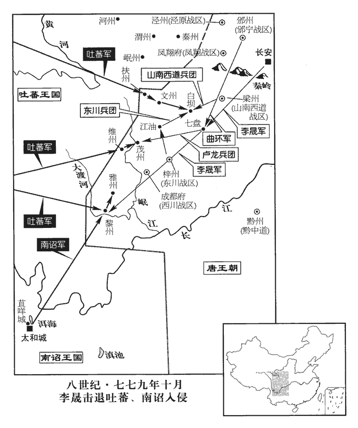
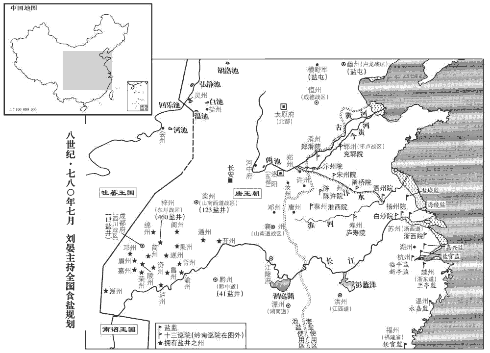
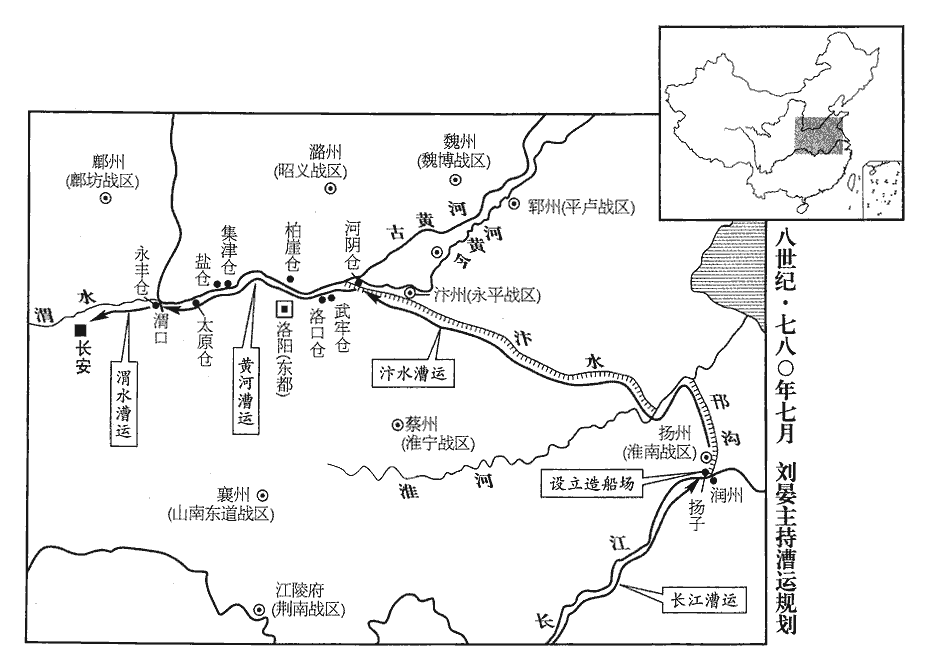
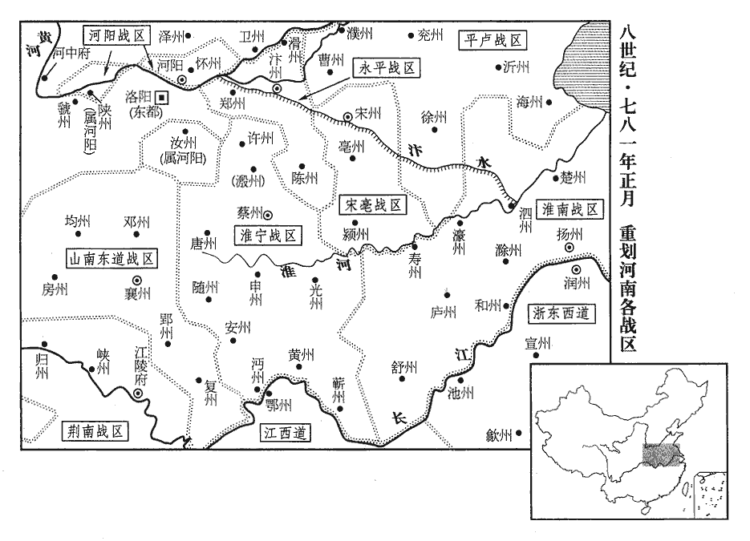
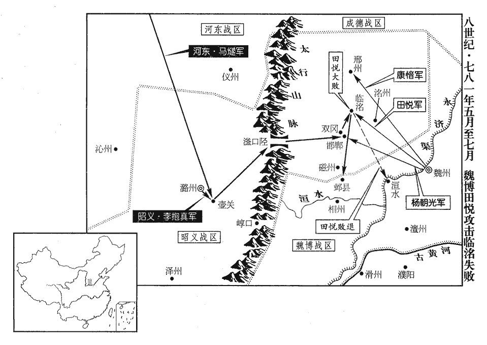

 唐紀四十二起屠維協洽（己未）八月，盡重光作噩（辛酉）五月，凡一年有奇。始己未八月，終辛酉五月，凡二年零十月。

# 代宗睿文孝武皇帝下

## 大曆十四年（己未、七七九）

1八月，甲辰‹七›，以道州‹湖南省道县›司馬楊炎為門下侍郎，大曆十二年，楊炎以黨元載貶。懷州‹河南省沁阳市›刺史喬琳為御史大夫，並同平章事。考異曰：崔祐甫與炎皆自門下遷中書，是時中書在上也。憲宗以後，門下在上，中書在下，不知何時升改。上方勵精求治，治，直吏翻。不次用人，卜相於崔祐甫，相，息亮翻。祐甫薦炎器業，上亦素聞其名，故自遷謫中用之。琳，太原人，性粗率，喜詼諧，粗，讀曰麤。喜，許記翻。無他長，與張涉善，涉稱其才可大用，上信涉言而用之；聞者無不駭愕。

〖译文〗 [1]八月，甲辰（初七），德宗任命道州司马杨炎为门下侍郎，怀州刺史乔琳为御史大夫，二人都为同平章事。当时，德宗正在励精图治，用人不拘等次。德宗曾向崔甫征询择相的意见，崔甫推荐杨炎有才干，能办事。德宗平素也听说过杨炎的声名，于是便起用了贬谪中的杨炎。乔琳是太原人，生性粗疏草率，喜欢诙谐，没有别的长处。乔琳与张涉关系亲密，张涉称道乔琳的才能可能可以委以大任，德宗听信了张涉的话，便起用了乔琳。听到任命乔琳为相的人，没有不感到惊讶的。

2代宗‹李豫›之世，吐蕃數遣使求和，吐，從暾入聲。數，所角翻。使，疏吏翻；下同。而寇盜不息，代宗悉留其使者，前後八輩，有至老死不得歸者；俘獲其人，皆配江、嶺。使，疏吏翻。俘，方無翻。江，謂大江之南。嶺，謂五嶺之外。上欲以德懷之，乙巳‹八›，以隨州‹湖北省随州市›司馬韋倫為太常少卿，使于吐蕃，悉集其俘五百人，各賜襲衣而遣之。少，始照翻。襲衣，衣一襲也。衣一稱為一襲。

〖译文〗 [2]代宗在位期间，吐蕃数次派遣使者，请求和好，但对唐朝的侵扰劫掠却并未止息。代宗拘留了吐蕃前后八次派来的全部使者，其中有些人直到老死，没能回归吐蕃。对俘获的吐蕃人，则统统发配到长江以南和五岭以外。德宗打算以德政安抚吐蕃，乙巳（初八），任命随州司马韦伦为太常少卿，出使吐蕃，全数召集俘虏来的五百吐蕃人，每人赐给衣服一套，将他们遣返吐蕃。

3協律郎沈既濟上選舉議，唐志：協律郎，掌和律呂，辨四時之氣，八風五音之節，屬太常寺，正八品上。上，時掌翻。以為：「選用之法，三科而已：曰德也，才也，勞也。今選曹皆不及焉；選，須絹翻；下同。考校之法，皆在書判、簿歷、言詞、俯仰而已。唐擇人之法有四，曰：身、言、書、判。身，取其體貌豐偉；言，取其言詞辯正；書，取其楷法遒美；判，取其文理優長。簿歷，所以著其資考殿最。俯仰，則觀諸身言之間。夫安行徐言，非德也；麗藻芳翰，非才也；累資積考，非勞也。執此以求天下之士，固未盡矣。今人未土著，夫，音扶。著，直略翻。不可本於鄉閭；鑒不獨明，不可專於吏部。臣謹詳酌古今，謂五品以上及群司長官，宜令宰臣進敘，吏部、兵部得參議焉。長，知兩翻。其六品以下或僚佐之屬，許州、府辟用，其牧守、將帥守，手又翻。將，即亮翻。帥，所類翻。或選用非公，則吏部、兵部得察而舉之。罪其私冒不慎舉者，小加譴黜，大正刑典。責成授任，誰敢不勉！夫如是，則賢者不獎而自進，不肖者不抑而自退，眾才咸得而官無不治矣。今選法皆擇才於吏部，試職於州郡，若才職不稱，稱，尺證翻。紊亂無任。紊，文運翻。任，音壬。責於刺史，則曰命官出於吏曹，不敢廢也；責於侍郎，則曰量書判、資考而授之，不保其往也；量，音良。責於令史，則曰按由歷、出入而行之，不知其他也。黎庶徒弊，誰任其咎！若牧守自用，則罪將焉逃！必州郡之濫，獨換一刺史則革矣。如吏部之濫，雖更其侍郎無益也。焉，於虔翻。更，工衡翻。蓋人物浩浩，不可得而知，法使之然，非主司之過。今諸道節度、都團練、觀察、租庸等使，自判官、副將以下，皆使自擇，縱其間或有情故，大舉其例，十猶七全。則辟吏之法，已試於今，但未及於州縣耳。利害之理，較然可觀。曏令諸使僚佐盡受於選曹，則安能鎮方隅之重，理財賦之殷乎！」既濟，吳‹江苏省苏州市›人也。等使，疏吏翻；下諸使同。將，即亮翻。令，力丁翻。選，須絹翻。

〖译文〗 [3]协律郎沈既济奏上有关选任官员的议论，他认为：“选拔任用官员的办法，只有三个类别，这就是德行、才干、劳绩。现今，主持选官事务的选曹对此全未涉及；所实行的考查官员的办法，全都停留在书法文理、资历考课、言词和应对周旋等方面。行事安稳，讲话从容，这并不就是德行；撰写文章，清词丽句，这并不就是才干；长期积累下来的资望和考课成绩，这并不就是劳绩。以此三项为标准，来延招天下之士，当然是不能全部延招来的。现在居官的人并不是本地人在本地任职，所以用人不可以本地的评议为依据。由一个部门单独去审查官吏；是难以考核详明的，所以不可专门交给吏部。我慎重详细地研究了古今有关制度，认为五品以上的官员以及各部门的长官，应当让宰相提出授官与奖励的意见，而让吏部和兵部参预评论。对于六品以下的官员，或者幕僚佐吏之类人员，应该允许州、府自行任用。如有牧守、将帅选拔任用不能出于公正，吏部和兵部便可以纠察和检举他们，对偏私假冒和有失慎重加以治罪。后果轻的，予以贬官降职，后果严重的，按刑律法典治罪。如此责成百官，授以职任，谁还敢不尽力办事呢！倘若能够做到这些，那么，有德有才的官员，虽未奖掖，而他们自然会得到晋升；没有贤才的官员，虽未贬抑，而他们自然会遭受摈斥。各方面具有才干的人都得到应有的官职，就没有治理不好的事情了。现在铨选的办法，都是由吏部选择人才，而在州郡试行职任。如果才能与职任不能相称，办事紊乱不堪，责问刺史，刺史就会说，此人是由吏部委任为官的，我可不敢自行废黜；责问侍郎，侍郎就会说，这是通过考核书法公文和资历考课而授官的，我可不能保证他到州郡后一定能够胜任；责问令史，令史就会说，按察百官，是依据资历和任官升降来办事的，别的事情我就不知道了。百姓徒然以此为弊端，又由谁来承担罪责呢！假如让牧守自行任用官佐，牧守的罪责又怎会脱逃呢！假定州郡治理得很糟，只要撤换刺史一人，就能使情况改变过来了。如果吏部把任官搞滥了，就是换掉主持此事的侍郎，也是无济于事的。这是因为候选授官的人员过于繁多，不可能了解清楚。这是任官制度使事情变成这样的，并不是主管部门的过错。现在，自判官、副将以下的人员，都让各道的节度使、都团练使、观察使、租庸使等自行选任，即便其间也有徇私之事，但是大体说来，十成里犹有七成是可取的。因而自行任用官佐属吏的办法，已经试行于今，只是还没有在州县普及开来罢了。上述两种任官办法孰利孰弊的道理是显明可见的。倘若让诸使的幕僚官佐完全听受选曹的任命，那又怎能镇守各方重地，料理好那里繁重的财赋事务呢！”沈既济是吴地人。

4初，衡州‹湖南省衡阳市›刺史曹王皋有治行，治，直吏翻。行，下孟翻。衡州治衡陽縣，屬湖南觀察。湖南‹首府设潭州湖南省长沙市›觀察使辛京杲疾之，大曆五年，辛京杲為湖南觀察使。陷以法，貶潮州刺史。度嶺為貶。時楊炎在道州，知其直，及入相，復擢為衡州刺史。相，息亮翻。復，扶又翻。始，皋之遭誣在治，在治者，謂獄吏治其事。皋以囚服在列。念太妃老，將驚而戚，出則囚服就辯，入則擁笏垂魚，唐高宗給五品以上隨身魚銀袋，以防召命之詐，三品以上金飾袋。天授二年，改佩魚為龜。中宗罷龜，復給以魚。郡王、嗣王亦佩金魚袋。即貶于潮即，就也。以遷入賀；及是，然後跪謝告實。皋，明之玄孫也。曹王明，太宗‹李世民›之子。

〖译文〗 [4]当初，衡州刺史曹王李皋治理政务，很有成绩，湖南观察使辛京杲妒忌他，便以刑法陷害，使他被贬为潮州刺史。当时，杨炎正在道州，知道李皋是无辜的。及至杨炎入朝出任宰相，再次提升李皋为衡州刺史。当初，李皋遇到诬陷，正在经受审讯，他考虑到太妃年老，将会受惊而悲伤，所以，他出门时穿上囚服去受审，回家后便穿上朝服，手执笏板，衣垂鱼袋。李皋即将被贬到潮州，他却以升迁向太妃报喜。至此，李皋才跪在太妃面前认错，并以实情相告。李皋是李明的玄孙。

5朔方、邠寧節度使李懷光既代郭子儀，邠府宿將史抗、溫儒雅、龐仙鶴、張獻明、李光逸功名素出懷光右，皆怏怏不服。邠，卑旻翻。龐，部江翻。怏，於兩翻。懷光發兵防秋，屯長武城‹陕西省长武县西北›，軍期進退，不時應令。監軍翟文秀勸懷光奏令宿衛，【章：十二行本「衛」下有「懷光遣之」四字；乙十一行本同；退齋校同。】既離營，監，工銜翻。翟zhái，萇伯翻。奏令，力丁翻。離，力智翻。使人追捕，誣以他罪，且曰：「黃萯之敗，黃萯敗事見二百二十四卷九年。萯fù，音倍。職爾之由！」盡殺之。

〖译文〗 [5]朔方、宁节度使李怀光替代了郭子仪的职务以后，府的宿将史抗、温儒雅、庞仙鹤、张献明、李光逸因功劳声名素来在李怀光之上，都郁郁不乐，心中不服。李怀光派兵防御吐蕃，在长武城屯驻，诸将对李怀光规定的军队进驻与退防的时间，都不按时应命。监军翟文秀劝说李怀光上奏朝廷，让诸将回朝执行宿卫任务。诸将离开军营后，李怀光派人追捕诸将，诬蔑诸将犯了别的罪过，而且说：“浑在黄失败，都是因为你们的原故！”于是将诸将全部杀掉。

6九月，甲戌‹七›，改淮西曰淮寧。

〖译文〗 [6]九月，甲戌（初七），朝廷将淮西改称为淮宁。

7西川節度使、同平章事崔寧，在蜀十餘年，永泰元年，崔旰入成都，至是，十四年矣。恃地險兵強，恣為淫侈，朝廷患之而不能易；至是，入朝，加司空，兼山陵使。

〖译文〗 [7]西川节度使、同平章事崔宁，来到蜀地十余年，仗着地势险要，兵力强盛，肆意骄奢淫逸，朝廷感到忧虑，但又无法换掉他。至此，崔宁入朝，德宗加封他为司空，兼任山陵使。

南詔‹首都太和城【云南省大理市›王閤羅鳳卒，子鳳迦異前死，孫異牟尋立。朝，直遙翻。使，疏吏番。卒，子恤翻。迦，音加。冬，十月，丁酉朔‹一›，吐蕃與南詔合兵十萬，三道入寇，一出茂州‹四川省茂县›，一出扶‹四川省九寨沟县›、文‹甘肃省文县›，吐，從暾入聲。文州，漢陰平之地，隋為曲水縣，義寧三年，分武都之曲水、正西、長松置文州。扶州，古鄧至地，後周天和中，置扶州。舊本置龍涸防，與陰平接界。蓋吐蕃出扶、文，南詔出黎、雅也。一出黎‹四川省汉源县›、雅‹四川省雅安市›，黎州之地，漢屬越嶲郡界，隋置漢源縣，武后大足元年置黎州。黎州，漢沈黎縣；雅州，漢嚴道縣；境相接也。考異曰：建中實錄、裴垍jì德宗實錄，此月吐蕃三道入寇，皆在梁、益之境。而來年四月，乃云：「去冬吐蕃三道來侵：一自靈武，一自山南，一自蜀。」又云：「贊普謂韋倫曰：『今靈武之師，聞命輟矣，而山南已入扶、文，蜀師已趣灌口，追且不及。』」與此自相違。今不取。曰：「吾欲取蜀以為東府。」崔寧在京師，所留諸將不能禦，將，即亮翻。虜連陷州、縣，刺史棄城走，士民竄匿山谷。上憂之，趣寧歸鎮。趣，讀曰促。寧已辭，楊炎言於上曰：「蜀地富饒，寧據有之，朝廷失其外府，十四年矣。寧雖入朝，全師尚守其後，貢賦不入，與無蜀同。且寧本與諸將等夷，因亂得位，威令不行。今雖遣之，必恐無功；若其有功，則義不可奪。是蜀地敗固失之，勝亦不得也。願陛下熟察。」上曰：「然則柰何？」對曰：「請留寧，發朱泚所領范陽兵數千人，雜禁兵往擊之，何憂不克！泚，且禮翻，又音此。因而得內親兵於其腹中，蜀將必不敢動，然後更授他帥，將，即亮翻。更，工衡翻。帥，所類翻。使千里沃壤復為國有，復，扶又翻，又如字，是因小害而收大利也。」上曰：「善。」遂留寧。

〖译文〗 南诏王罗凤去世，他的儿子凤迦异又死在他的前头，他的孙子异牟寻即位为王。冬季，十月，丁酉朔（初一），吐蕃与南诏合兵共十万人，分三道入侵，一支军队从茂州出发，一支军队从扶州和文州出发，一支军队从黎州和雅州出发。他们声称：“我们打算拿下蜀地，作为我们东部的府。”当时，崔宁正在京城，他所留下的各个将领不能抵御敌军的进攻。敌军接连攻陷了一些州县，刺史丢下守城逃跑，百姓逃避到山谷之中。德宗忧心忡忡，催促崔宁回西川。崔宁向德宗辞行以后，杨炎对德宗说：“蜀地物产富饶，崔宁占据此地，朝廷等于失掉了自己的外府，至今已有十四年了。崔宁虽然入朝了，但西川的整个军队还在他背后支撑着，他们不向朝廷交纳贡赋，这与朝廷失去蜀地是一样的。况且，崔宁本来与西川诸将是同一等辈，乘着变乱而得到节度使的地位，威望不高，命令难行。现在，即使派他回去，恐怕也是无所建树的。倘若他取得成功，从道义上说，蜀地便是不可强夺的了。这就是说，蜀地战败，朝廷固然失去了它，蜀地取胜，朝廷还是不能得到它。希望陛下仔细考察。”德宗说：“既然如此，那怎么办才好呢？”杨炎回答：“请陛下将崔宁留在京城，另派朱所统领的范阳兵数千人，其间掺入禁军，前去进击敌军，还担心不能取胜吗！借此而得以将禁军置于西川军的心腹之中，蜀将必定不敢妄动，再任命别人为西川统帅，使蜀地的千里沃野重新为朝廷所有，这是使国家因蒙受一些较小的损害，而收取了较大的好处啊。”德宗说：“好。”于是将崔宁留在京城。

 

初，馬璘忌涇原‹总部设泾州甘肃省泾川县›都知兵馬使李晟功名，遣入宿衛，為右神策都將。璘，離珍翻。使，疏吏翻。晟，成正翻。將，即亮翻。上發禁兵四千人，使晟將之，發邠‹总部设邠州陕西省彬县›、隴‹驻普润陕西省凤翔县北›、范陽‹驻凤翔府陕西省凤翔县›兵五千，邠、隴，邠寧、隴右二鎮之兵也。將，即亮翻。又音如字；下同。使金吾大將軍安邑‹山西省运城市东北安邑镇›曲環將之，以救蜀。史炤曰：曲，姓也。漢有代郡太守曲謙。東川‹总部设梓州四川省三台县›出兵，自江油‹四川省平武县东南›趨白垻‹四川省广元市北›，江油，漢、魏為無人之地，晉始置平武縣，隋改為江油縣，帶龍州。利州管下景谷縣西北有白垻鎮城。垻，必駕翻。蜀人謂平川為垻。與山南‹总部设梁州陕西省汉中市›兵合擊吐蕃、南詔，破之。范陽兵追及於七盤‹四川省巴中市西北›，吐，從暾入聲。七盤縣，屬巴州，武后久視元年置。又破之，遂克維‹四川省理县›、茂二州。李晟追擊於大渡河‹岷江支流›外，大渡河，在雅州盧山縣。寰宇記：大渡河，自吐蕃界經雅州諸部落，至黎州東界，流入通望界，於黎州，為南邊要害之地。又破之。吐蕃、南詔飢寒，隕於崖谷死者八九萬人。吐蕃悔怒，殺誘導使之來者。異牟尋懼，築苴jū咩miē城‹云南省大理市北六千米›，自瀘州南渡瀘水六百五十里，至羊苴咩城。舊史：陽苴咩城，南去大和城十餘里，東北至成都二千四百里，去雲南城三百里。誘，羊久翻。咩，莫者翻，又徐婢翻。史炤曰：苴，音酢zuò，又徐嗟切。咩，音養，又彌嗟切。薛能聞官軍破吉浪詩：「越嶲通遊客，苴咩鬧聚蚊。」又西縣塗中：「野色生肥羊，鄉儀搗散茶。梯航經杜宇，烽火徹苴咩。」延袤十五里，徙居之。吐蕃封之為日東王。

〖译文〗 当初，马妒忌泾原都知兵马使李晟的功绩与声名，派遣李晟入朝宿卫，李晟担任了右神策军都将的职务。德宗派出禁军四千人，让李晟率领；又派出州、陇州、范阳兵五千人，让金吾大将军安邑人曲环率领，以此二军前去救蜀。东川也派出军队，从江油挺进白坝，与山南节度使的军队合击吐蕃和南诏，并且打败了他们。范阳兵在七盘县追上了吐蕃和南诏的军队，再次打败了他们，并攻克了维州和茂州。李晟军在大渡河外追击敌军，又打败了他们。吐蕃和南诏的士兵因饥饿寒冷和坠落荒崖野谷死去的有八九万人。吐蕃人既后悔，又恼怒，杀掉了诱导他们前来入侵的人。异牟寻恐惧，修筑了苴咩城，连绵达十五里，徙居到那里。吐蕃封异牟寻为日东王。

8上用法嚴，百官震悚。以山陵近，禁人屠宰；郭子儀之隸人潛殺羊，載以入城，隸人，僕隸之屬。右金吾將軍裴諝奏之。或謂諝曰：「郭公有社稷大功，君獨不為之地乎？」諝曰：「此乃吾所以為之地也。郭公勳高望重，上新即位，以為群臣附之者眾，德宗之猜忌，裴諝於其初政已窺見之。諝，私呂翻。吾故發其小過，以明郭公威權不足畏也。如此，上尊天子，下安大臣，不亦可乎！」

〖译文〗 [8]德宗执法严厉，百官无不震惊恐惧。由于代宗入葬的日期已经临近，禁止人们屠牲宰畜。郭子仪的仆从暗中杀了一只羊，装在车上，运到城中，右金吾将军裴将此事上奏。有人对裴说：“郭公对国家有再造之功，你偏偏不肯为他留些余地吗？”裴回答：“我这样做，正是要为郭公留出余地来啊。郭公勋业高，声望重，皇上刚刚即位，认为群臣中依附郭公的人很多，我故意揭发郭公的一个小小过失，以此表明郭公的威望和权力都是不足畏惧的。这样做，上可以尊崇皇上，下可以安定大臣，不也是可以的吗！”

9己酉‹十三›，葬睿文孝武皇帝于元陵‹陕西省富平县西北十二千米檀山›；元陵，在京兆富平縣西北二十五里檀山。廟號代宗。將發引，上送之，見轀輬車不當馳道，稍指丁未之間，引，羊晉翻。轀，音溫。輬，音涼。考異曰：按車指丁未之間，則行出道外矣。蓋出門，欲斜就道西，不當道之中間行耳。問其故，有司對曰：「陛下本命在午‹正南›，不敢衝也。」上哭曰：「安有枉靈駕而謀身利乎！」命改轅直午而行。肅宗‹李亨›、代宗‹李豫›皆喜陰陽鬼神，喜，許記翻。事無大小，必謀之卜祝，故王嶼、黎幹皆以左道得進。上雅不之信，璵，音余。雅，素也。山陵但取七月之期禮：天子七月而葬。事集而發，不復擇日。復，扶又翻；下謀復同。

〖译文〗 [9]己酉（十三日），将睿文孝武皇帝葬于元陵，庙号代宗。在将要出殡的时候，德宗亲自把灵车送了出来，看到灵车不是在道路中间行走，而是稍微偏向道路外边，便询问此中的原故。主管部门答说：“陛下本命在午，指向正中，所以不敢冲犯。”德宗哭着说：“哪有委屈灵车来谋求自身好处的呢！”于是命令灵车改向，对着午方即在道路中间行进。肃宗和代宗都喜好阴阳鬼神，无论事情大小，必定要求占问卜，所以王屿和黎干都是靠着左道得以升官的。德宗素来不相信这一套，代宗入葬山陵的日期只依礼法定在七月期满之时，诸事准备停当便出殡下葬，不再选择日期。

10十一月，丁丑‹十一›，以晉州‹山西省临汾市›刺史韓滉為蘇州‹江苏省苏州市›刺史、浙江東•西觀察使‹首府设苏州›。滉，呼廣翻。使，疏吏翻。

〖译文〗 [10]十一月，丁丑（十一日），德宗任命晋州刺史韩为苏州刺史、浙江东西观察使。

11喬琳衰老耳聵，聵kuì，五怪翻。上或時訪問，應對失次，所謀議復疏闊。壬午‹十六›，以琳為工部尚書，罷政事。上由是疏張涉。喬琳，涉所薦也。尚，辰羊翻。

〖译文〗 [11]乔琳年老体衰，耳朵重听，德宗有时候征询他的意见，他的回答有失条理，所谋划计议的内容又很疏陋迂阔。壬午（十六日），德宗任命乔琳为工部尚书，免去同平章事。德宗自此和张涉也疏远了。

12楊炎既留崔寧，二人由是交惡。炎託以北邊須大臣鎮撫，癸巳‹二十七›，以京畿觀察使崔寧為單于•鎮北大都護、朔方節度使，鎮坊州‹陕西省黄陵县›。單，音蟬。以荊南‹总部设江陵府湖北省江陵县›節度使張延賞為西川節度使。又以靈鹽‹原朔方战区›節度都虞候醴泉‹陕西省礼泉县›杜希全知靈、鹽州留後；代州刺史張光晟知單于•振武等城、綏•銀•麟•勝州留後‹总部设单于府内蒙古和林格尔县›；考異曰：舊傳云，王雄為振武。今從實録。延州‹陕西省延安市›刺史李建徽知鄜、坊、丹州留後。時寧既出鎮，不當更置留後，炎欲奪寧權，且窺其所為，令三人皆得特奏事，仍諷之使伺寧過失。令，力丁翻。伺，相吏翻。考異曰：舊傳：「初，寧代喬琳為御史大夫、平章事，寧以為選擇御史當出大夫，不謀及宰相，乃奏請以李衡、于結等數人為御史。楊炎大怒，其狀遂寢。炎又數讒毀劉晏，寧又救解之，因此大怒。其年十月，南蠻大至，上遣寧還鎮。炎懼怨己，入蜀難制，奏止之。」按寧為御史大夫，在吐蕃、南蠻寇蜀後。舊傳恐誤。

〖译文〗 [12]杨炎把崔宁留在京城以后，两人的关系自此便恶化起来。杨炎托称北部边防需要大臣镇守抚慰，癸巳（二十七日），德宗任命京畿观察使崔宁为单于镇北大都护、朔方节度使，镇守坊州。任命荆南节度使张延赏为西川节度使。又任命灵盐节度都虞侯醴泉人杜希全知灵、盐二州留后，任命代州刺史张光晟知单于、振武等城及绥、银、麟、胜各州留后，任命延州刺史李建徽知、坊、丹三州留后。当时，崔宁已经出镇，不应当再设置留后，杨炎打算削夺崔宁的权力，并且暗中察看他的活动，便令杜希全等三人都可以特别奏事，同时暗示他们伺察崔宁的过失。

13十二月，乙卯‹十九›，立宣王誦為皇太子‹本年十九岁›。

〖译文〗 [13]十二月，乙卯（十九日），德宗册立宣王李诵为皇太子。

14舊制，天下金帛皆貯於左藏，太府四時上其數，比部覆其出入。唐制：太府掌廩藏、財貨出納、比部掌句會。蜀註曰：唐制：天下財賦皆納於左藏，太府四時以數聞，尚書比部覆校其出入。貯，丁呂翻。藏，徂浪翻。上，時掌翻。比，音毗。及第五琦為度支、鹽鐵使，琦，音奇。度，徒洛翻。使，疏吏翻。時京師多豪將，求取無節，琦不能制，將，即亮翻。乃奏盡貯於大盈內庫，百寶大盈庫，始於玄宗朝，詳見二百二十八卷德宗建中四年十月註。使宦官掌之，天子亦以取給為便，故久不出。由是以天下公賦為人君私藏，有司不復得窺其多少，校其贏縮，藏，徂浪翻。復，扶又翻。贏，有餘也。縮，不足也。殆二十年。宦官領其事者三百餘員，皆蠶食其中，蟠結根據，牢不可動。楊炎頓首於上前曰：「財賦者，國之大本，生民之命，重輕安危，靡不由之，是以前世皆使重臣掌其事，猶或耗亂不集。耗，當讀曰眊mào，或讀如字。今獨使中人出入盈虛，大臣皆不得知，政之蠹敝，莫甚於此。請出之以歸有司。度宮中歲用幾何，度，徒洛翻。量數奉入，量，音良。不敢有乏。如此，然後可以為政。」上即日下詔：「凡財賦皆歸左藏，一用舊式，歲於數中擇精好者三、五千匹，進入大盈。」下，遐稼翻。考異曰：德宗實錄作「三、五十萬匹」，今從建中實錄。炎以片言移人主意，議者稱之。

〖译文〗 [14]根据原有的制度，全国的钱帛都收归左藏贮存，由太府按季节上报钱帛数额，由比部复核钱帛的收支情况。及至第五琦担任度支、盐铁使，当时京城中的豪帅很多，索取赏赐毫无节制，第五琦不能制止，便上奏将左藏钱帛悉数贮存于大盈内库，并让宦官管理，皇上也认为如此取用方便，所以贮存的钱帛长期有能再由内库搬出。从此，国家的财赋收入成了皇上的私人储藏，主管部门不能得知数量多少，无法核查盈亏情况，几乎达二十年之久。掌管内库的宦官有三百余人，都在蚕食内库的财富，其势力盘根错节，牢固不可动摇。杨炎在德宗面前叩头说：“财赋是国家的根本，百姓的命脉，国家的盛衰安危，无不与财赋相关。所以，以前各朝都以重臣掌管财赋，即便如此，有时还会有财赋损耗，管理混乱的情况发生。现在，专门让宦官掌握财赋的收支盈亏，大臣都无法知道，朝政的蛀蚀败坏，没有比这更为严重的了。请将全国的财赋搬出内库，以便交还给主管部门管理。推算好宫中每年需用多少，悉数进上，决不敢有所缺少。能够这样，此后才能办好朝政。”德宗当日颁下诏书：“一切财赋都交还左藏，完全采用原有的法式，每年在财赋数额内挑选出精良的布帛三五千匹，进献到大盈内库。”杨炎只用一席话便改变了皇上的主意，议事的人们都称赞他。

15丙寅晦‹三十›，日有食之。

〖译文〗 [15]丙寅晦（三十日），出现日食。

16湖南‹湖南省›賊帥王國良阻山為盜，帥，所類翻。上遣都官員外郎關播招撫之。唐都官郎，掌俘隸簿錄、給衣糧、醫藥而理其訴冤。辭行，上問以為政之要，對曰：「為政之本，必求有道賢人與之為理。」上曰：「朕比以下詔求賢，比，毗至翻，近也。「以」，當作「已」。又遣使臣廣加搜訪，庶幾可以為理乎！」使，疎吏翻。幾，居希翻。對曰：「下詔所求及使者所薦，惟得文詞干進之士耳，安有有道賢人肯隨牒舉選乎！」上悅。

〖译文〗 [16]湖南赋寇首领王国良依山为盗，德宗派遣都官员外郎关播前去招抚。辞行之际，德宗和关播询问办好政事的关键，关播回答道：“办好政事的根本，在于陛下必须寻找有道贤人，并与他们一齐治理国家。”德宗说：“我近来已经颁下诏书，寻求贤才，还派出使者，多方面地搜罗寻访，这大概可以使国家政治修明了吧！”关播回答说：“下诏寻求和使者荐举，只能得到一些凭着文词追求仕禄的人物罢了，有道贤人哪里会随着一纸公文而被推举、先拔出来呢！”德宗闻此大悦。

17崔祐甫有疾，上令肩輿入中書，或休假在第，令，力丁翻。假，古訝翻。大事令中使咨決。

〖译文〗 [17]崔甫身患疾病，德宗让他坐着肩舆到中书省。有时，崔甫正在家中休假，发生了重大的事情，德宗便命中使到崔甫家中咨询，然后做出决定。

# 德宗神武孝文皇帝一諱适，代宗長子也。諡法：諫爭不威曰德，言不以威拒諫也；執義揚善曰德，言稱人之善也。

## 建中元年（庚申、七八零）

1春，正月，丁卯朔‹一›，改元。群臣上尊號曰聖神文武皇帝‹李适，本年三十九岁›；上，時掌翻。赦天下。始用楊炎議，「命黜陟使與觀察、刺史約百姓丁產，定等級，改作兩稅法。楊炎作兩稅法，夏輸無過六月，秋輸無過十一月，視大曆十四年墾田數為定。比來新舊徵科色目，一切罷之；比，毗至翻。比來，猶云近來也。二稅外輒率一錢者，以枉法論。」

〖译文〗 [1]春季，正月，丁卯朔（初一），更改年号。群臣为德宗进献尊号，称作圣神文武皇帝。大赦天下。德宗开始采用杨炎的建议，命令黜陟使和观察使、刺史“估量百姓的人丁财产，定出等级，改变旧税法，实行两税法。将近年来原有和新增的各项征收名目一律取消。在两税以外，就是向百姓再收敛一个铜钱，便以违法论处。”

唐初，賦斂之法曰租、庸、調，有田則有租，有身則有庸，有戶則有調。玄宗之末，版籍浸壞，多非其實。及至德兵起，所在賦斂，迫趣取辦，斂，力贍翻。調，徒弔翻。趣，讀曰促。無復常準。復，扶又翻，又音如字。賦斂之司增數而莫相統攝，統，他綜翻，俗從上聲。各隨意增科，自立色目，新故相仍，不知紀極。民富者丁多，率為官、為僧以免課役，而貧者丁多，無所伏匿，故上戶優而下戶勞。吏因緣蠶食，旬【章：十二行本「旬」上有「民」字；乙十一行本同；張校同，云無註本亦無。】輸月送，不勝困弊，勝，音升。率皆逃徙為浮戶，其土著百無四五。著，直略翻。至是，炎建議作兩稅法：先計州縣每歲所應費用及上供之數而賦於人，量出以制入。戶無主、客，以見居為簿；人無丁、中，以貧富為差；州、縣有主戶、客戶。天寶三載，令民十八以上為中男，二十三以上成丁。量，音良。見，賢遍翻。為行商者，在所州縣稅三十之一，使與居者均無僥利。言居行皆無僥幸之利也。僥，堅堯翻。居人之稅，秋、夏兩徵之。其租、庸、調雜傜悉省，皆總統於度支。上用其言，因赦令行之。

〖译文〗 在唐朝的初期，征收赋税的办法称作租、庸、调，有田土便要交租，有人丁便要服庸，有户口便要纳调。在玄宗当政末期，户籍逐渐遭到破坏，大多已经与实际不符。到了至德年间，战事四起，到处征收赋敛，逼迫催促，再也没有一定的标准。征收部门增加了，可是互相没有隶属关系而是各自随意增加课税，巧立名目，新老名目相互重复，毫无限度。富足人家人丁多，大抵作官当僧人得以免除赋役；而贫困人家人丁多，全无隐瞒逃避的去处，所以上等户优游而下等户劳瘁。征税的吏员又乘机侵吞，百姓十天输赋一月送税，经受不了如此困窘，大抵都逃亡流徙成为浮户，那些留下来的本地百姓，不足百分之四五。至此，杨炎建议实行两税法：首先计算州县每年所需费用和上交朝廷的数额，并以此数额向百姓征税，通过对支出的估量来制定收入的数额。无论主户、客户，都按现在的居地制订簿册；无论成丁、中男，都按贫富状况划为等级；流动经商的人，在所居州县纳税三十分之一，使他们与定居民户一同纳税，不能侥幸获利。定居百姓的赋税，在秋天和夏天两次征收。那些租、庸、调以及杂徭等全部省去，整个征税事务由度支统一掌管。德宗采纳了杨炎的建议，于是颁布赦文，命令实施。

2初，左僕射劉晏為吏部尚書，楊炎為侍郎，不相悅。射，寅謝翻。尚，辰羊翻。元載之死，晏有力焉。事見上卷代宗大曆十三年。載，祖亥翻，又如字。及上‹李适›即位，晏久典利權，眾頗疾之，多上言轉運使可罷；多上，時掌翻。使，疏吏翻。又有風言晏嘗密表勸代宗立獨孤妃為皇后者。風言，謂得於風聞而言之者也。楊炎為宰相，欲為元載報仇，因為上流涕言：「晏與黎幹、劉忠翼同謀，幹、忠翼死於大曆十四年，事見上卷。為，于偽翻。相，息量翻。臣為宰相不能討，罪當萬死。」崔祐甫言：「茲事曖昧，陛下已曠然大赦，不當復究尋虛語。」曖，音愛。復，扶又翻。炎乃建言：「尚書省，國政之本，比置諸使，分奪其權，尚，辰羊翻。比，毗至翻。今宜復舊。」上從之。甲子‹二十八›，【張：「子」作「午」。】按是月無甲子，恐是丙子，否則戊子。詔天下錢穀皆歸金部、倉部，唐志：金部掌天下庫藏出納之數，京市、互市、和市、宮市、交易之事。倉部掌天下庫儲，出納、租稅、祿糧、倉廩之事。罷晏轉運、租庸、青苗、鹽鐵等使。考異曰：建中實錄曰：「初，大曆中，上居東宮，貞懿皇后方為妃，有寵，生韓王迥。帝又鍾愛，故閹官劉清潭、京兆尹黎幹與左右嬖幸欲立貞懿為皇后，且言韓王所居獲黃蛇，以為符，動搖儲宮，而晏附其謀，冀立殊效，圖為宰輔。時宰臣元載獨保護上，以為最長而賢，且嘗有功，義不當移。王縉亦謂人曰：『晏，黠者也。今所圖無乃過黠乎！』後其議漸定。貞懿卒不立。上憾之。至是，以晏大臣而附邪為姦，不去將為亂。託陳奏不實，謫為忠州刺史。」沈既濟、楊炎所薦，蓋附炎為說。今從舊傳。

〖译文〗 [2]当初，左仆射刘晏担任吏部尚书，杨炎担任侍郎，两不悦服。元载被杀，刘晏起了很大的作用。及至德宗即位以后，刘晏长期执掌财利的权柄，众人颇为妒忌他，多上言称转运使一职应当罢去，又有流言说刘晏曾经秘密上表劝说代宗册立独孤妃为皇后。杨炎出任宰相以后，打算为元载报仇，因而在德宗面前流着眼泪说：“刘晏与黎干和刘忠翼同谋，我作为宰相，不能声讨他，真是罪该万死。”崔甫说：“这件事并未搞清楚，既然陛下已经以广阔的襟怀实行了大赦，就不应该再来追究这些不实之辞。”于是杨炎又提出建议：“尚书省是国家大政的根本，近来设置诸使职，分掉和侵夺了尚书省的权力，现在应当恢复原有的制度。”德宗听从了杨炎的建议。甲子（疑误），诏令全国钱谷都要交给金部、仓部管理，免除了刘晏转运、租庸、青苗、盐铁等使职。

3二月，丙申朔‹一›，命黜陟使十一人分巡天下。黜陟使，始置於太宗貞觀八年。先是，魏博‹总部设魏州河北省大名县›節度使田悅事朝廷猶恭順，先，悉薦翻。使，疏吏翻。朝，直遙翻。河北黜陟使洪經綸，考異曰：建中實錄，黜陟使十一人，而無名。德宗實錄有十人名，而無河北道及經綸名。蓋脫誤也。不曉時務，聞悅軍七萬人，符下，罷其四萬，令還農。下，遐稼翻。令，力丁翻。悅陽順命，如符罷之。既而集應罷者，激怒之曰：「汝曹久在軍中，有父母妻子，今一旦為黜陟使所罷，將何資以自衣食乎！」眾大哭。悅乃出家財以賜之，使各還部伍。於是軍士皆德悅而怨朝廷。為田悅連諸鎮之兵以拒命張本。

〖译文〗 [3]二月，丙申朔（初一），德宗命令黜陟使十一人分道巡查全国。在此之前，魏博节度使田悦事奉朝廷还算恭顺，河北黜陟使洪经纶不通晓时务，听说田悦军有七万人，便发下军符，要求裁减四万人，命他们解甲归农。田悦佯装从命，按军符减员。不久，田悦召集应当裁减的士兵，激怒他们说：“你们长期在军中，都有父母、妻子、儿女，现在一下子被黜陟使裁减了，你们拿什么来养活自己呢！”大家放声大哭起来。田悦于是拿出家财，分给士兵，让他们都回到军中。由此，士兵都感谢田悦的恩德而怨恨朝廷。

4崔祐甫以疾，多不視事；楊炎獨任大政，專以復恩讎為事，奏用元載遺策城原州‹故州城·宁夏固原县›，任，音壬；載，祖亥翻，又音如字。元載策見二百二十四卷代宗大曆八年。又欲發兩京‹首都长安、东都洛阳›、關內‹陕西省中部›丁夫浚豐州‹内蒙古五原县›陵陽渠，以興屯田。陵陽渠，在豐州九原縣。上遣中使詣涇原‹总部设泾州甘肃省泾川县›節度使段秀實，訪以利害，秀實以為：「今邊備尚虛，未宜興事以召冦。」炎怒，以為沮己，徵秀實為司農卿。使，疏吏翻。沮，在吕翻。丁未‹十二›，邠寧‹总部设邠州陕西省彬县›節度使李懷光兼四鎮、北庭行營、涇原節度使，使移軍原州‹宁夏固原县›，以四鎮、北庭留後劉文喜為別駕。為劉文喜以涇州拒命張本。京兆尹嚴郢奏：「按朔方五城，舊屯沃饒之地，自喪亂以來，郢，以井翻。喪，息浪翻。人功不及，因致荒廢，十不耕一。若力可墾闢，不俟浚渠。今發兩京、關輔人於豐州浚渠營田，計所得不補所費，而關輔之人不免流散，是虛畿甸而無益軍儲也。」疏奏，不報。疏，所據翻。既而陵陽渠竟不成，棄之。

〖译文〗 [4]崔甫因为身染疾病，多不管事，杨炎独揽朝廷大权，专门去做报恩复仇的事情。他上奏采用元载生前留下的计划筑原州城，又打算征发长安、洛阳和关内的丁夫疏浚丰州陵阳渠，以便兴办屯田。德宗派遣中使来到泾原节度使段秀实处，询问此举利弊如何，段秀实认为：“现在边疆防御还很空虚，不适宜兴办事功，召引敌人。”杨炎大怒，认为这是有意阻止自己，便征召段秀实担任司农卿。丁未（十二日），德宗让宁节度使李怀光兼任四镇、北庭行营、泾原节度使，并让他移军原州驻扎，又任命四镇、北庭留后刘文喜为别驾。京兆尹严郢奏称：“据悉，朔方五城过去本是肥沃丰饶的土地，自从国家遭受变乱以来，由于无暇投入人力，因而导致土地荒废，耕种的不足十分之一。如果有人力再将这里开垦出来，则不必等待疏通陵阳渠。现在征发长安、洛阳、关辅百姓到丰州疏浚渠道，经营屯田，算起来，所得到的不足以补赏所耗费的，而且关辅百姓不免流亡离散。这样做，是使京城辖区空虚，而对军事储备却毫无补益。”此疏奏上，德宗不予答复。后来，陵阳渠到底没能修成，将它废弃了。

5上用楊炎之言，託以奏事不實，己酉‹十四›，貶劉晏為忠州‹重庆市忠县›刺史。舊志：忠州，京師南二千一百二十二里。

〖译文〗 [5]德宗采纳杨炎的主意，借口上奏的事情与实际不符，己酉（十四日），将刘晏贬为忠州刺史。

6癸丑‹十八›，以澤潞‹总部设潞州山西省长治市›留後李抱真為節度使。為李抱真以澤潞為國藩翰張本。

〖译文〗 [6]癸丑（十八日），德宗任命泽潞留后李抱真为该镇节度使。

7楊炎欲城原州以復秦、原，秦、原，謂秦州、原州。命李懷光居前督作，朱泚、崔寧各將萬人翼其後。泚，且禮翻，又音此。將，即亮翻，又音如字。詔下涇州為城具，下，遐稼翻。為築城之具也。涇之將士怒曰：「吾屬為國家西門之屏，十餘年矣。將，即亮翻。屏，必郢翻，蔽也。始居邠州，甫營耕桑，有地著之安。徙屯涇州，邠，卑旻翻。著，直略翻。徙涇州見二百二十四卷大曆三年。披荊榛，立軍府；坐席未暖，又投之塞外。先棄原州不守，故云投之塞外。吾屬何罪而至此乎！」李懷光始為邠寧帥，即誅溫儒雅等，事見上大曆十四年。帥，所類翻；下同。軍令嚴峻；及兼涇原，諸將皆懼，曰：「彼五將何罪而為戮？五將，即史抗、溫儒雅、龐仙鶴、張獻明、李光逸。將，即亮翻。今又來此，吾屬能無憂乎！」劉文喜因眾心不安，據涇州，不受詔，上疏復求段秀實為帥，不則朱泚。上，時掌翻。疏，所據翻。復，扶又翻，或如字。不，讀曰否，又讀如字。泚，且禮翻，又音此。癸亥‹二十八›，以朱泚兼四鎮、北庭行營、涇原節度使，代懷光。使，疏吏翻。

〖译文〗 [7]杨炎打算修筑原州城，以便恢复秦州和原州，命令李怀光在前面监督施工，朱和崔宁各带领一万人分布两侧，在后护卫。有诏书命令泾州将士准备筑城的工具，泾州将士愤怒地说：“我辈充当国家西大门的屏障，已经有十多年了。一开始，我辈屯驻州，才将农桑各业经营起来，可以定居下来了，便又移军屯驻泾州，披荆斩棘，建立军府；在泾州还没有把座位坐暖，又被丢到塞外。我辈到底犯了什么罪，以至非要遭受如此对待呢！”李怀光刚刚当上宁节帅，便杀掉了温儒雅等人，军令十分严厉。及至李怀光兼任泾原节帅，各个将领都很恐惧，他们说：“那五位将领到底犯了什么罪，而要遭受杀戮？现在，李怀光又来到泾州，我辈怎能不忧虑呢！”刘文喜乘大家心中不安，占据了泾州，不服从诏命，还上疏要求再派段秀实来当泾州节帅，如果不能派段秀实来，便派朱来。癸亥（二十八日），德宗任命朱兼任四镇、北庭行营、泾原节度使，替代李怀光。

8三月，翰林學士、左散騎常侍張涉受前湖南‹首府设潭州湖南省长沙市›觀察使辛京杲金，事覺；上怒，欲置于法。李忠臣‹董秦›以檢校司空、同平章事、奉朝請，散，悉亶翻。騎，奇寄翻。校，古效翻。朝，直遙翻。言於上曰：「陛下貴為天子，而先生以乏財犯法，以臣愚觀之，非先生之過也。」張涉先侍讀東宮，故李忠臣言以為先生。上意解，辛未‹六›，放涉歸田里。辛京杲以私忿杖殺部曲，有司奏京杲罪當死，上將從之。李忠臣曰：「京杲當死久矣。」上問其故。忠臣曰：「京杲諸父兄弟皆戰死，獨京杲至今尚存，臣故以為當死久矣。」上憫然，左遷京杲諸王傅。忠臣乘機救人，多此類。

〖译文〗 [8]三月，翰林学士、左散骑常侍张涉收受前湖南观察使辛京杲钱财的事情被发觉，德宗很生气，准备依法惩办。李忠臣身为检校司空、同平章事、奉朝请，向德宗进言说：“陛下贵为天子，然而，天子的老师却因为缺少钱财而犯法，依我愚见，这并不是老师的过错啊。”德宗的态度缓和下来。辛未（初六），将张涉罢免还乡。辛京杲因私忿用杖打死部曲，有关部门奏称辛京杲犯了死罪，德宗打算按有关部门的意见办。李忠臣说：“辛京杲早就该死了。”德宗问他此话怎讲，李忠臣说：“辛京杲的父亲和兄弟都战死了，只有辛京杲至今还活着，所以我认为辛京杲早就该死了。”德宗心怀怜恤之情，将辛京杲降职为诸王师傅。李忠臣利用时机，挽救人命，大多如此。

9楊炎罷度支、轉運使，度，徒洛翻。命金部、倉部代之。既而省職久廢，謂尚書省諸司失其職已久。耳目不相接，莫能振舉，天下錢穀無所總領。癸巳‹二十八›，復以諫議大夫韓洄為戶部侍郎、判度支，以金部郎中萬年‹首都长安东半城›杜佑權江、淮水陸轉運使，皆如舊制。復，扶又翻，或如字。諸杜居城南，時號「城南韋、杜，去天尺五。」戶貫則萬年。

〖译文〗 [9]杨炎罢除了度支、转运使，命金部、仓部来代替。不久，由于尚书省各部门的职任久已荒废，部门之间不通声气，未能把事办好，无法将全国的钱粮统一掌管起来，癸巳（二十八日），德宗再次任命谏议大夫韩洄为户部侍郎、判度支，任命金部郎中万年人杜佑暂时代理江、淮水陆转运使，都和原来的制度一样。

10劉文喜又不受詔，欲自邀旌節；夏，四月，乙未朔‹一›，據涇州叛，遣其子質於吐蕃‹首都逻些城西藏拉萨市›以求援。質，音致。上命朱泚、李懷光討之，泚，且禮翻，又音此。又命神策軍使張巨濟將禁兵二千助之。使，疏吏翻。將，即亮翻，又音如字。

〖译文〗 [10]刘文喜又不服从诏命，准备自求节度使的旌节。夏季，四月，乙未朔（初一），他占据泾州叛乱，打发他的儿子到吐蕃为人质，以求援助。德宗命令朱、李怀光前去讨伐他，还命令神策军使张巨济带领禁军二千人前往协助。

11吐蕃始聞韋倫歸其俘，吐，從暾入聲。帝初即位，欲以德懷吐蕃，遣倫歸代宗朝所獲之俘。不之信，及俘入境，各還部落，稱：「新天子出宮人，放禽獸，英威聖德，洽於中國。」吐蕃大悅，除道迎倫。贊普‹墀松得赞›即發使隨倫入貢，且致賻fù贈。致代宗之賻贈也。賻，音附。癸卯‹九›，至京師，上禮接之。既而蜀將上言：「吐蕃豺狼，所獲俘不可歸。」將上，上即亮翻，下時掌翻。上曰：「戎狄犯塞則擊之，服則歸之。擊以示威，歸以示信。威信不立，何以懷遠！」悉命歸之。又悉歸劍南所獲之俘也。考異曰：建中實錄曰：「及境，境上守陴者焚樓櫓、棄城壁而去。初，吐蕃既得河、湟之地，土宇日廣，守兵勞弊，以國家始因用胡為邊將而致禍，故得河、隴之士約五十萬人，以為非族類也，無賢愚，莫敢任者，悉以為婢僕，故其人苦之。及見倫歸國，皆毛裘蓬首，窺覷牆隙，或搥心隕泣，或東向拜舞，及密通章疏，言蕃之虛實，望王師之至若歲焉。君子曰，惜乎，人心之可乘也。若逾代之後，斯人既沒，後生安於所習，難乎哉！」此恐沈既濟之溢美，且欲附楊炎復河、隴之說耳。今不取。

〖译文〗 [11]吐蕃人最初听说韦伦将俘虏送回来时，并不相信。及至被俘者回到吐蕃，各自返还部落，声称“新皇上将宫女释放出宫，将禽兽放生，他的英风威声和圣明仁德，真是遍及中原。”吐蕃人听了很高兴，便打扫道路，迎接韦伦。吐蕃赞普立即派出使者，跟随韦伦入朝进贡，并且赠送助办丧事的物品。癸卯（九月），吐蕃使者来到京城，德宗按照礼节接待了他。不久，蜀地的将领向上建言：“吐蕃人豺狼成性，我方捉获的俘虏不应放还。”德宗说：“戎狄侵犯边疆，我们便打击他们；他们服从朝廷，我们便归还俘虏。打击他们，是为了显示朝廷的威严；归还俘虏，是显示朝廷的信义。假如不能将威严和信义树立起来，又怎能安抚边远各族呢！”德宗命令将吐蕃俘虏悉数放还。

12代宗‹李豫›之世，每元日、冬至、端午、生日，州府於常賦之外競為貢獻，貢獻多者則悅之。武將、姦吏，緣此侵漁下民。自代宗迄于五代，正、至、端午、降誕，州府皆有貢獻，謂之四節進奉。將，即亮翻。癸丑‹十九›，上生日，上生於天寶元年四月十九日，不置節名。四方貢獻皆不受。李正己、田悅各獻縑三萬匹，縑，并絲繒也。上悉歸之度支以代租賦。度，徒洛翻。

〖译文〗 [12]代宗在位时期，每当大年初一、冬至、端午、皇上的生日，州府长官争着在定额赋税之外争着向朝廷进贡，进贡多的，便能得到皇上的欢心，武将和奸滑的官吏便借此侵吞百姓的财物。癸丑（十九日），是德宗的生日，德宗对各地进贡概不接受。李正己、田悦各献细绢三万匹，德宗悉数拨归度支，以此代替两处应纳的租税。

13五月，戊辰‹五›，以韋倫為太常卿；乙酉‹二十二›，復遣倫使吐蕃。復，扶又翻。倫請上自為載書，載書，盟誓之書。與吐蕃盟；楊炎以為非敵，請與郭子儀輩為載書以聞，令上畫可而已，從之。令，力丁翻。

〖译文〗 [13]五月，戊辰（初五），德宗任命韦伦为太常卿。乙酉（二十二日），再次派遣韦伦出使吐蕃。韦伦请求德宗亲自撰写盟书，与吐蕃结盟。杨炎认为德宗与吐蕃赞普地位不对等，请求同郭子仪等人撰写盟书上报德宗，再由德宗批准，德宗听从了他的建议。

14朱泚等圍劉文喜於涇州，泚，且禮翻，又音此。杜其出入，而閉壁不與戰，久之不拔。天方旱，徵發餽kuì運，內外騷然，朝臣上書請赦文喜以蘇疲人者，不可勝紀。朝，直遙翻。上，時掌翻。勝，音升。上皆不聽，曰：「微孽不除，何以令天下！」文喜使其將劉海賓入奏，孽，魚列翻。將，即亮翻。海賓言於上曰：「臣乃陛下藩邸部曲，帝初以雍王為天下兵馬元帥，討史朝義，凡在行營，皆部曲也。豈肯附叛臣，必為陛下梟其首以獻。為，于偽翻。梟，堅堯翻。但文喜今所求者節而已，願陛下姑與之，文喜必怠，則臣計得施矣。」上曰：「名器不可假人，孔子之言。爾能立效固善，我節不可得也。」使海賓歸以告文喜，而攻之如初。減御膳以給軍士，城中將士當受春服者，賜予如故。予，讀曰與。於是眾知上意不可移。時吐蕃方睦於唐，不為發兵，為，于偽翻。城中勢窮。庚寅‹二十七›，海賓與諸將共殺文喜，傳首，考異曰：邠志曰：「詔李懷光、朱泚并軍誅之，師圍涇城，數月不拔。文喜使其子求救于吐蕃。蕃眾將至，二將議退軍以避之。都遊弈使韓遊瓌guī爭之曰：『西戎若來，涇眾必變，義不為文喜沒身於戎虜。』秋七月，西蕃遊騎登高，麾涇人。涇人果曰：『始吾為文喜求節度耳，王師致討，困則歸之，安能赤土塗面為異方之人乎！』劉海賓因之殺文喜，以眾降泚。泚無所戮，涇人德之，萌泚之亂亦自此始。」按是時吐蕃通好，無入援文喜事。又實錄此月涇州平，而邠志云七月西蕃至，皆相違。今從建中實錄。而原州竟不果城。

〖译文〗 [14]朱等将刘文喜包围在泾州，堵塞了泾州出入的通道，但又关闭营垒，不与刘文喜交战，长时间不能攻克泾州。当时正值天旱，征发粮草，输送给养，使得朝野内外骚动不安，朝中诸臣上书请求赦免刘文喜，以便使疲乏困顿的百姓得到休息的，多得难以记载。德宗全不听从，他说：“连个小小的忤逆之臣都不能铲除，还拿什么来号令全国！”刘文喜让部将刘海宾入朝上奏。刘海宾对德宗说：“我是陛下在藩邸时的部曲，怎肯依附叛逆之臣，我一定要为陛下将刘文喜斩首示众，并献给朝廷。但是，刘文喜现在所希求的，不过是当节度使而已，希望陛下暂时满足他，刘文喜必然会懈怠，这样，我的计谋便能够实施了。”德宗说：“爵号与车服不能随便借给人，你能立刻效命固然很好，节度使一职，他不能得到。”德宗让刘海宾回去将此意告诉刘文喜，而对刘文喜的进攻也仍在继续。德宗自减进食，供给士兵，城中应当得到春天服装的将士，也都象过去一样赐给。由此，大家才知道皇帝对刘文喜的态度是不可动摇的。当时，吐蕃才与唐朝交好，不肯为刘文喜派兵，泾州城中形势窘困。庚寅（二十七日），刘海宾与诸将一起杀死刘文喜，并将他的头颅传送京城，而原州城终究没能修成。

自上即位，李正己內不自安，遣參佐入奏事；會涇州捷奏至，上使觀文喜之首而歸。正己益懼。

〖译文〗 自从德宗即位以来，李正己内心感到不安。他派遣参佐入朝奏事，适值泾州捷报奏到朝廷，德宗便让李正己的参佐观看了刘文喜的人头，然后让他回去。李正己越发恐惧。

15六月，甲午朔‹一›，門下侍郎、同平章事崔祐甫薨‹年六十岁›。薨，呼肱翻。

〖译文〗 [15]六月，甲午朔（初一），门下侍郎、同平章事崔甫去世。

16術士桑道茂上言：「陛下不出數年，暫有離宮之厄。上，時掌翻。離，力智翻。臣望奉天‹陕西省乾县›有天子氣，宜高大其城以備非常。」辛丑‹八›，命京兆發丁夫數千，雜六軍之士，築奉天城。考異曰：舊傳云：「道茂待詔翰林，建中初，神策脩奉天城，道茂請高其垣牆，大為制度。德宗不之省。及朱泚之亂，帝蒼猝出幸，至奉天，方思道茂之言，時道茂已卒，命祭之。」今從實錄及崔庭光幸奉天錄。

〖译文〗 [16]道术之士桑道茂向德宗进言：“不出几年，陛下会有暂离宫廷的危难。我望见奉天城有天子之气，应当将此城建得高大些，以备非常事件发生。”辛丑（初八），德宗命令京兆府征发民数千人，夹杂六军的士兵，前去修筑奉天城。

17初，回紇風俗朴厚，君臣之等不甚異，故眾志專一，勁健無敵。紇，下沒翻。及有功於唐，謂平安、史也。唐賜遺甚厚，遺，于季翻。登里可汗‹药罗葛移地健›始自尊大，築宮殿以居，婦人有粉黛文繡之飾；中國為之虛耗，可，從刊入聲。汗，音寒。為，于偽翻。而虜俗亦壞。及代宗‹李豫›崩，上‹李适›遣中使梁文秀往告哀，登里‹药罗葛移地健›驕不為禮。九姓胡‹山西省西北部›附回紇者，說登里以中國富饒，今乘喪伐之，可有大利。使，疏吏翻。說，式芮翻。考異曰：既云乘喪入寇，當在去年。今因源休冊命，追敘之耳。登里從之，欲舉國入寇。其相頓莫賀達干‹药罗葛顿莫贺›，登里之從父兄也，相，息亮翻。從，才用翻。諫曰：「唐，大國也，無負於我，吾前年侵太原‹山西省太原市›，獲羊馬數萬，可謂大捷，事見上卷代宗大曆十三年。而道遠糧乏，比歸，士卒多徒行者。比，必利翻，及也。道遠糧乏，士卒殺馬食之，故多徒行。今舉國深入，萬一不捷，將安歸乎！」登里不聽。頓莫賀乘人心之不欲南寇也，舉兵擊殺之，并九姓胡二千人，自立為合骨咄祿毗伽可汗，遣其臣聿yù達干與梁文秀俱入見，咄，當沒翻。伽，求迦翻。可，從刊入聲。汗，音寒。見，賢遍翻。願為藩臣，垂髮不翦，以待詔命。乙卯‹二十二›，命京兆少尹臨漳‹河北省临漳县南›源休冊頓莫賀為武義成功可汗。少，始照翻。臨漳縣，屬相州，本鄴縣地，東魏孝靜帝分鄴縣，於鄴城中置臨漳縣。考異曰：舊傳曰：「休妻，即吏部侍郎王翊yì女也，因小忿而離，妻族上訴，下御史臺驗理。休遲留不答款狀，除名，配流溱州。久之，移岳州。建中初，楊炎執政，以京兆尹嚴郢威名稍著，心欲傾之。郢，即王翊甥壻也。休與王氏離絕之時，炎風聞休、郢有隙，遂擢休自流人為京兆少尹，俾令伺郢過失。休既在職久，與郢親善，炎怒之，奏令以本官兼御史中丞，奉使回紇。」按休奉使時，回紇方恭順，張光晟未殺董突，炎安知回紇欲殺休而遣之！今不取。

〖译文〗 [17]当初，回纥的风俗质朴敦厚，君臣间的等级差异不甚显著，所以能够大家一条心，强劲雄健，无所匹敌。及至回纥为唐朝立了功劳，唐朝赐赠给回纥的物品甚为丰厚，登里可汗开始妄自尊大起来。他建筑了宫殿，搬进去居住，身边的妇女也有了搽粉画眉，身著绣衣的装饰，大唐因此财力空虚，而回纥的风俗也败坏了。及至代宗驾崩，德宗派遣中使梁文秀前往回纥通报噩耗时，登里态度骄傲，不按礼节接待来使。依附回纥的九姓胡人劝说登里，大唐富饶，现在乘大唐忙于丧事发起进攻，可以获得莫大好处。登里听从了九姓胡人的劝说，打算举国入侵大唐。回纥宰相顿莫贺达干是登里的堂兄，劝谏登里说：“唐朝是个大国，没有对不起我们。前年我们入侵太原，获得羊马数万，可以称得上大捷了。但是，路途太远，粮食缺乏，及至归国，士兵大多徒步行走了。现在又要举国远征，万一不能取得胜利，那将如何撤军回国呢！”登里不肯听从。顿莫贺乘回纥民心不愿意南下侵犯之机，发兵击杀登里以及九姓胡人二千人，自立为合骨咄禄毗伽可汗。他派遣臣属聿达干与梁文秀一齐入朝觐见，表示愿意作朝廷的藩臣，不剪垂发，等待朝廷的诏命。乙卯（二十二日），德宗命令京兆少尹临漳人源休册命顿莫贺为武义成功可汗。

18秋，七月，丙寅‹四›，邵州‹湖南省邵阳市›賊帥王國良降。帥，所類翻。降，戶江翻。國良本湖南牙將，觀察使辛京杲使戍武岡‹湖南省城步县›，將，即亮翻。使，疏吏翻。武岡縣，漢零陵郡都梁縣之地，晉分都梁置武岡縣，今岡東五十里，有漢都梁故城，是也。後漢武陵蠻為漢所伐，來保此岡，故謂之武岡。郡國志云：武岡，接武陵，因以得名，隋廢，武德四年，分邵陽復置武岡縣，屬邵州。新志曰：本武攸縣，武德四年更名。梁夫夷縣，在今武岡界。以扞西原蠻‹广西靖西县境›。京杲貪暴，國良家富，京杲以死罪加之；國良懼，據縣叛，與西原蠻合，聚眾千人，侵掠州縣，瀕湖千里，咸被其害。被，皮義翻。詔荊‹总部设江陵府湖北省江陵县›、黔‹首府设黔州重庆市彭水县›、洪‹首府设洪州江西省南昌市›、桂‹首府设桂州广西桂林市›諸道合兵討之，荊南節度使，治荊州。黔中觀察使，治黔州。江南西道觀察使，治洪州。桂管經略觀察使，治桂州。黔，音禽。連年不能克。及曹王皋為湖南觀察使，曰：「驅疲甿，誅反仄，非策之得者也。」乃遺國良書，遺，于季翻。言：「將軍非敢為逆，欲救死耳。我與將軍俱為辛京杲所構，曹王皋事見上大曆十四年。我已蒙聖朝湔jiān洗，何心復加兵刃於將軍乎！朝，直遙翻。復，扶又翻，又音如字。將軍遇我，不速降，後悔無及。」國良且喜且懼，遣使乞降，猶疑未決。皋乃假為使者，從一騎，越五百里，抵國良壁，鞭其門，大呼曰：「我曹王也，使，疏吏翻。騎，奇寄翻。呼，火故翻。來受降！」舉軍大驚。國良趨出，迎拜請罪。皋執其手，約為兄弟，盡焚攻守之具，散其眾，使還農。詔赦國良罪，賜名惟新。按新書南蠻傳：西原蠻居廣、容之南，邕、桂之西，地數千里，種落甚眾。乾元以來，累為叛亂，與夷獠梁崇牽、覃問、西原酋長吳功曹合兵內寇，陷道州，進攻永州，陷邵州。辛京杲遣王國良戍武岡，國良亦叛。建中初，城漵xù州以斷西原，國良乃降。降，戶江翻。

〖译文〗 [18]秋季，七月，丙寅（初四），邵州贼寇头领王国良归降。王国良本是湖南牙将，湖南观察使辛京杲让他驻守武冈，以便抗御西原蛮。辛京杲贪婪残暴，知道王国良家殷富，便将死罪加到王国良身上。王国良害怕，便占据武冈县城，发起叛乱。他与西原蛮汇合，聚集了一千人，侵犯劫掠州县，沿洞庭湖千里之内，都受到他的侵害。德宗诏令荆、黔、洪、桂诸道合兵讨伐王国良，但是连年不能取胜。及至曹王李皋出任湖南观察使，他说：“逼迫疲困的百姓诛杀反叛，这不是好办法。”他写了一封书信给王国良，说：“将军并不敢背叛朝廷，只想自救一死罢了。我和将军都遭受辛京杲的罗织陷害，我已蒙圣明的朝廷洗刷冤屈，怎么会忍心对将军以兵刃相加呢！将军遇上了我，如果不肯快快归降，后悔就来不及了。”王国良又喜欢，又害怕，对于派遣使者请降与否，迟疑不决。于是，李皋扮作使者，只让一人骑马跟随，奔走五百里，抵达王国良的营垒，鞭打营门，大声喊道：“我是曹王，快来受降吧！”全军闻此大惊。王国良快步走出来，迎上去，跪拜请罪。李皋拉着王国良的手，与他结为兄弟，烧掉了所有的进攻与防守的器具，遣散了他的部下，让他们回家务农。德宗下诏赦免王国良的罪，赐他名字叫做惟新。

19辛巳‹十九›，遙尊上母沈氏為皇太后。沈氏以開元末選入代宗宮，安祿山之亂，玄宗避賊，諸王妃妾不及從者，皆為賊所得，拘之東都之掖庭。代宗克東都，入宮，得沈氏，留之東都宮中。史思明再陷東都，遂失所在。

〖译文〗 [19]辛巳（十九日），遥尊德宗生母沈氏为皇太后。

20荊南節度使庾準希楊炎指，奏忠州刺史劉晏與朱泚書求營救，辭多怨望，又奏召補州兵，欲拒朝命，忠州，荊南巡屬也，故庾準得以誣奏劉晏。使，疏吏翻。泚，且禮翻，又音此。朝，直遙翻；下同。炎證成之；上密遣中使就忠州縊殺之‹年六十五岁›，縊，於賜翻，又於計翻。己丑‹二十七›，乃下詔賜死。天下冤之。

〖译文〗 [20]荆南节度使庾准逢迎杨炎的意思，奏称忠州刺史刘晏给朱写信请求营救，讲了许多怨恨的话，又奏称刘晏征召补充忠州的士兵，打算抗拒朝廷的命令。杨炎又证明此说不虚。德宗便秘密派遣中使到忠州将刘晏缢杀，到己丑（二十七日），才下诏赐刘晏自裁，全国人都认为刘晏冤枉。

初，安、史之亂，數年間，天下戶口什亡八九，州縣多為藩鎮所據，貢賦不入，朝廷府庫耗竭，中國多故，戎狄每歲犯邊，所在宿重兵，仰給縣官，朝，直遙翻。仰，牛向翻。所費不貲，皆倚辦於晏。晏初為轉運使，獨領陜東諸道，寶應元年，劉晏充度支、轉運等使。代宗廣德二年，始以晏為河南、江•淮以來轉運使，乃疏浚汴水以開漕運之利。陝，失冉翻。陝西皆度支領之，末年兼領，未幾而罷。度，徒洛翻。大曆十四年，晏兼判度支，建中元年罷。幾，居豈翻。

〖译文〗 当初，安禄山、史思明发动叛乱，数年之间，全国户口散失了十之八九，州县多被藩镇占据，赋税不再上缴朝廷，朝廷的库存消耗殆尽。唐朝变故频仍，戎狄每年侵犯边境，在战事所到之处，驻扎重兵，依靠县官供给给养，所消耗的费用多得不可估量，全靠刘晏办理。刘晏最初担任转运使时，只主管陕东各道，陕西各道全由度支主管。到了后期，刘晏兼管度支，但不久便被罢官。

晏有精力，多機智，變通有無，曲盡其妙。常以厚直募善走者，置遞相望，覘報四方物價，覘，丑廉翻。雖遠方，不數日皆達使司，使司，謂轉運使司。食貨輕重之權，悉制在掌握，國家獲利而天下無甚貴甚賤之憂。常以為：「辦集眾務，在於得人，故必擇通敏、精悍、廉勤之士而用之；至於句檢簿書，悍，候旰翻，又下罕翻。句，古候翻。出納錢穀，【章：十二行本「穀」下有「事雖至細」四字；乙十一行本同；退齋校同，無「事」字。】必委之士類；吏惟書符牒，不得輕出一言。」常言：「士陷贓賄，則淪棄於時，名重於利，故士多清脩；吏雖潔廉，終無顯榮，利重於名，故吏多貪污。」然惟晏能行之，他人效者終莫能逮。其屬官雖居數千里外，奉教令如在目前，起居語言，無敢欺紿。紿，待亥翻。當時權貴，或以親故屬之者，屬，之欲翻。晏亦應之，使俸給多少，遷次緩速，皆如其志，然無得親職事。其場院要劇之官，俸，扶用翻。少，始紹翻。場，謂交場、船場。院，謂巡院。必盡一時之選。故晏沒之後，掌財賦有聲者，多晏之故吏也。

〖译文〗 刘晏精力充沛，机智过人，善于灵活地处理多变的事情，办得恰到好处。他常以优厚的待遇招募善于奔走的人，并设置了前后相望的驿站，以探测和上报各地物价。虽偏远之地，不出几天，也都能报到转运使司来。他把钱粮方面孰轻孰重的权变，全部控制在手中，朝廷因此获利，而民间也没有物价暴涨暴跌的忧虑。他常主张：“要想办理好各项事务，关键在于用人得当。所以，必须选择通达敏捷、精明强干、廉洁勤勉的人，对他们加以任用。至于考核簿籍文书，支付钱粮等项工作，是一定要委派读书人去做的；而吏人只能书写公文，不应随便讲话。”他又常说：“读书人陷于贪赃受贿，就会被时世所抛弃，因此看待名声重于财利，所以读书人大多清廉自修；吏人即使廉洁自守，最终还是不能显贵荣华，因此看待财利重于名声，所以吏人大多贪污受贿。”然而，只有刘晏才能实行这些主张，别人效法刘晏，到头来还是赶不上刘晏。刘晏的属官即使身在数千里以外，奉行刘晏的教令还是和在刘晏面前一样，讲话办事，都不敢欺骗说谎。当时，有些权贵人物将亲朋故旧嘱托给刘晏，刘晏也应承他们，领取薪俸的多少，升迁官阶的快慢，都符合他们的意愿，但是刘晏从不让他们亲理职事。他所管辖的交场、船场、巡院等处，凡是担任要职、处理繁难事务的官员，必定是当时选拔出来的得力人员。所以，在刘晏去世之后，掌管财赋的有名人物，多数是刘晏旧日的属下。

晏又以為戶口滋多，則賦稅自廣，故其理財【章：十二行本「財」下有「常」字；乙十一行本同。】以愛【章：十二行本「愛」作「養」；乙十一行本同。】民為先。諸道各置知院官，知院官，掌諸道巡院者也。每旬月，具州縣雨雪豐歉之狀白使司，豐則貴糴dí，歉則賤糶tiào，或以穀易雜貨供官用，及於豐處賣之。知院官始見不稔之端，先申，至某月須如干蠲juān免，某月須如干救助，使，疏吏翻。如干，猶言若干也。程大昌曰：若干者，設數之言也。干，猶箇也。若箇，猶言幾何枚也。又說：干者，十干，自甲至癸也，亦以數言也。及期，晏不俟州縣申請，即奏行之，應民之急，未嘗失時，不待其困弊、流亡、餓殍piǎo，然後賑之也。由是民得安其居業，戶口蕃息。殍，居表翻。賑，津忍翻。蕃，音煩。晏始為轉運使，時天下見戶不過二百萬，見，賢遍翻。其季年乃三百餘萬，在晏所統則增，非晏所統則不增也，其初財賦嵗入不過四百萬緡，季年乃千餘萬緡。

〖译文〗 刘晏还认为：户口增加，赋税征收的范围就会自然拓宽。所以刘晏掌理财务，以关心民间疾苦为先务。各道分别设置了巡院的知院官，每过十天、一月，必须陈述所在州县的雨雪丰歉状况，上报转运使司。如果丰收，就以高价买入；如果歉收，就以低价卖出。有时还将谷物换成杂货，供给官用，或者在丰收之地出卖。知院官开始见到年景不丰的苗头，就要先行申明到某月需要蠲免若干赋税，到某月需要救济资助若干物资，到了预定之期，刘晏不待州县申请，便上奏实施，解决百姓的急难，从来不曾错过时机。他并不等到百姓疲困流亡，饥饿而死以后，才去赈济百姓。由此，百姓得以安居乐业，户口繁衍起来。刘晏开始担任转运使时，全国的户口不过二百万，到他任职的后期，全国户口发展到三百余万。属于刘晏统辖，户口便增加；不是刘晏统辖的范围，户口就不增加。在刘晏任职的初期，财赋每年收入不过四百万缗，到他任职的后期，每年收入达到一千余万缗。

晏專用榷què鹽法充軍國之用。時自許‹河南省许昌市›、汝‹河南省汝州市›、鄭‹河南省郑州市›、鄧‹河南省邓州市›之西，皆食河東‹山西省›池鹽，度支主之；汴‹河南省开封市›、滑‹河南省滑县›、唐‹河南省泌阳县›、蔡之東，統，他綜翻，俗音如字。緡，眉巾翻。榷，古岳翻。代宗寶應元年，更豫州為蔡州，避上名也。皆食海鹽，晏主之。晏以為官多則民擾，故但於出鹽之鄉置鹽官，收鹽戶所煮之鹽轉鬻於商人，任其所之，自餘州縣不復置官。復，扶又翻；下價復同。其江嶺間去鹽鄉遠者，轉官鹽於彼貯之。或商絕鹽貴，則減價鬻之，謂之常平鹽，後又榷茶，遂置常平茶鹽官。貯，丁呂翻。官獲其利而民不乏鹽。其始江、淮鹽利不過四十萬緡，季年乃六百餘萬緡，由是國用充足而民不困弊。其河東‹山西省›鹽利，不過八十萬緡，而價復貴於海鹽。‹根据《新唐书·食货志》记载，当时产盐的分布，大致分两类。沿海地区，有四大盐场，分布在涟水江苏省涟水县›、湖州浙江省湖州市、越州浙江省绍兴市、杭州浙江省杭州市。政府设置以下十个管理局盐官监：嘉兴监浙江省嘉兴市、海陵监江苏省泰州市、盐城监江苏省盐城市、新亭监杭州、临平监同在杭州、兰亭监越州、永嘉监温州·浙江省温州市、大昌监今地不详、候官监福州·福建省福州市、富都监今地不详，管理沿海盐场。又设置十三巡奏事务处巡院：扬州院江苏省扬州市、陈许院陈州·河南省淮阳县、汴州院河南省开封市、庐寿院寿州·安徽省寿县、白沙院江苏省仪征市、准西院蔡州、甬桥院安徽省宿州市、浙西院苏州·江苏省苏州市、宋州院河南省商丘市、泗州院江苏省盱眙县淮河北岸、岭南院广州·广东省广州市、兖郓院郓州·山东省东平县、郑滑院滑州。十三院主要职责，是逮捕私盐贩卖者，以及盐商路过时征收税款。所以各院同时具备全国各地食盐差价的宏观调控作用。至于内陆地区，均依靠盐池及盐井。计：河中府安邑山西省运城市东北安邑镇、解县运城市西南解州镇有五盐池，总称”两池”，每年得盐万余斛，供应京师首都长安使用。盐州陕西省定边县有乌池、白池、瓦池、细项池，灵州有温泉灵武市东南等八池，会州甘肃省靖远县·已沦陷吐蕃有河池靖远县东，三州皆以盐换米。安北都护府内蒙古包头市有胡洛池内蒙古杭锦旗西北，供振武内蒙古和林格尔县、天德内蒙古乌拉特前旗东北二军事基地。黔州重庆市彭水县有四十一盐井，成州甘肃省西和县·已沦陷吐蕃、巂州四川省西昌市各有一盐井，山南西道战区总部梁州有一百二十三盐井，东川战区总部梓州有四百六十盐井，西川战区有十三盐井。除海盐、池盐之外，又有”盐屯”，在幽州北京市及横野军河北省蔚县，屯有劳役及士卒看守。

〖译文〗 刘晏专门采用盐产专营法来充实军需国用。当时，自许、汝、郑、邓一带的西面，都食用河东的池盐，由度支主管其事；自汴、滑、唐、蔡一带的东面，都是食用海盐，由刘晏主管其事。刘晏认为，官吏多了，百姓就会受到骚扰，所以他只在产盐地设置盐官，收购盐户所煮成的食盐，转卖给商人，听凭商人自行买卖，在产盐地以外的州县不再设置盐官。对于长江五岭间距离产盐地遥远的地方，便将官盐转运到那里贮存。有时盐商断绝，盐价上涨，便降低盐价出卖，号称常平盐，官方得到了盐产专营的利益，而百姓也不缺少食盐。在刘晏任职的初期，长江、淮河地区的盐利不过四十万缗，到他任职的后期，却达到了六百余万缗，由此，国家的经费充足起来，而百姓也不疲困不堪。至于河东的盐利，不过只有八十万缗，而价格也比海盐更高。

先是，運關東‹潼关以东›穀入長安者，先，悉薦翻。以河流湍悍，率一斛得八斗至者，則為成勞，受優賞。晏以為江、汴‹汴水›、河、渭‹渭水›，水力不同，各隨便宜，造運船，教漕卒，江船達揚州，汴船達河陰‹河南省郑州市西北桃花峪›，悍，下罕翻，又侯旰翻。汴，皮變翻。江船達揚州，入淮；汴船自清口達河陰。開元二十二年，分汜水、武涉、滎澤，置河陰縣，屬河南府，有河陰倉。河船達渭口‹陕西省潼关县·渭水注入黄河处›，渭船達太倉，渭口，謂渭水入河之口。其間緣水置倉，轉相受給。自是每歲運穀或至百餘萬斛，無斗升沈覆者。沈，持林翻。船十艘為一綱，使軍將領之，艘，蘇遭翻。將，即亮翻。十運無失，授優勞，官其人。數運之後，無不斑白者。晏於揚子‹江苏省扬州市南长江渡口›置十場造船，每艘給錢千緡。艘，蘇遭翻。緡，眉巾翻。或言「所用實不及半，虛費太多。」晏曰：「不然，論大計者固不可惜小費，凡事必為永久之慮。今始置船場，執事者至多，當先使之私用無窘，則官物堅牢矣。若遽與之屑屑校計錙銖，窘，巨隕翻。八銖為錙，十絫lěi為銖。安能久行乎！異日必有患吾所給多而減之者；減半以下猶可也，過此則不能運矣。」其後五十年，有司果減其半。及咸通中，有司計費以給之，無復羨餘，復，扶又翻，又音如字。羨，于線翻，羨贏也。船益脆薄易壞，易，以豉翻。漕運遂廢矣。宋白曰：武德、永徽之後，姜行本、薛大鼎、褚朗皆言漕運未能通濟。後監察御史王師順請運晉、絳之粟于河、渭之間，始置渭橋倉。開元初，李傑為水運使，始大興漕事。十八年，裴耀卿以言漕運拜江淮轉運使，以崔希逸、蕭炅為副。轉運、鹽鐵有副使自此始。肅宗初，第五琦以錢穀見，始置江淮租庸使，乾元初，加鹽鐵使，始大鹽鐵法，就山海井竈收榷其鹽，立監院官吏。至劉晏，始以鹽鐵兼漕運。

〖译文〗 在刘晏任职之前，将关东的谷物运送到长安，因为河水流湍急凶险，大抵一斛谷物能运到八斗，便算成功，会受到优厚的奖赏。刘晏认为长江、汴水、黄河、渭水的水流缓急各不相同，依据各处的不同特点，因利乘便，分别制造运送谷物的船只，训练漕运的士卒，长江的船只运抵扬州，汴水的船只运抵河阴，黄河的船只运抵渭水流入黄河的河口，渭水的船只运抵太仓，各地段之间都在水边设置粮仓，由上一段转送给下一段。自此，每年运送谷物有时能够达到一百多万斛，没有一斗一升在水中沉没。刘晏将十艘船编为一组，叫一纲，让军将带领，运送十次未发生闪失，便给予优厚的慰劳，让此人作官。屡次运送以后，运送者便没有不是头发花白的了。刘晏在扬子设置十处船场造船，每制船一艘，给钱一千缗。有人说，“造一艘船的费用实际还用不了一半，白白浪费的钱财太多了。”刘晏说：“不是这样。办大事，当然不可吝惜小费用，办一切事情都要有长远的考虑。现在船场才开始设置，办事的人很多，应该首先让这些人的私人用度不受困窘，他们为官家制造的物件就会坚固牢靠了。如果急于同这些人不厌烦细地计较分文，怎么能够长久地实行下去呢！他日一定会有嫌我所付给的工钱多便减少工钱的人，减少费用在半数以下还是可以的，超过此数，漕运就不能维持了。”此后五十年，有关部门果然将工钱减去一半。及至咸通年间，有关部门计算费用支给工钱，造船者不再有余利可图，造出的船只愈发单薄脆弱，容易毁坏，漕运于是废止了。

晏為人勤力，事無閒劇，必於一日中決之，不使留宿，後來言財利者皆莫能及之。

〖译文〗 刘晏是个勤勉力行的人，无论事务清闲抑或繁剧，都一定要在当天决断完毕，不让事情过夜，后来讲论财利的官员没有能够赶得上他的。

 

 

21八月，甲午‹三›，振武‹总部设单于府内蒙古和林格尔县›留後張光晟殺回紇使者董突【張：作「突董」；下同。】等九百餘人。董突者，武義可汗之叔父也。晟，成正翻。紇，下沒翻。使，疏吏翻。可，從刊入聲。汗，音寒。代宗‹李豫›之世，九姓胡常冒回紇之名，雜居京師，殖貨縱暴，與回紇共為公私之患；上即位，命董突盡帥其徒歸國，輜重甚盛。帥，讀曰率。輜，莊持翻。重，直用翻。至振武，留數月，厚求資給，日食肉千斤，他物稱是，稱，尺證翻縱樵牧者暴踐果稼，振武人苦之。光晟欲殺回紇，取其輜重，而畏其眾強，未敢發。九姓胡聞其種族為新可汗所誅，多道亡，踐，息淺翻。種，章勇翻。董突防之甚急；九姓胡不得亡，又不敢歸，乃密獻策於光晟，請殺回紇。光晟喜其黨自離，許之。上‹李适›以陜州‹河南省三门峡市›之辱，事見二百二十二卷寶應元年。陜，失冉翻。心恨回紇；光晟知上旨，乃奏稱：「回紇本種非多，紇，下沒翻。晟，成正翻。種，章勇翻。所輔以強者，群胡耳。今聞其自相魚肉，頓莫賀新立，移地健有孽子，登里可汗名移地健。及國相、梅錄各擁兵數千人相攻，國相，息亮翻。宋白曰：梅錄，回鶻將軍號。柳公綽帥河東時，有梅錄將軍李暢入貢。國未定。彼無財則不能使其眾，陛下不乘此際除之，乃歸其人，與之財，正所謂借寇兵齎盜糧者也。引李斯諫秦王逐客之言。請殺之。」三奏，上不許。光晟乃使副將過其館門，故不為禮；董突怒，執而鞭之數十。光晟勒兵掩擊，并群胡盡殺之，聚為京觀。獨留一胡，使歸國為證，曰：「回紇鞭辱大將，且謀襲據振武，故先事誅之。」將，即亮翻。觀，古玩翻。先，悉薦翻。上徵光晟為右金吾將軍，遣中使王嘉祥往‹回纥王庭，蒙古国哈尔和林市›致信幣。回紇請得專殺者以復讎，上為之貶光晟為睦王傅以慰其意。睦王述，上弟也。為，于偽翻。

〖译文〗 [21]八月，甲午（初三），振武留后张光晟杀死回纥使者董突等九百余人。董突是武义可汗的叔父。代宗在位期间，九姓胡经常假冒回纥的名义，杂居在京城，经商时恣意暴虐，与回纥一起，成为公家和私人的祸害。德宗即位后，命令董突带领同来的人悉数回国，他们带走的包裹很多。董突一行到振武，逗留了几个月，索求丰厚的供给，每天吃肉一千斤，用去其他物品与此相当，还听任砍柴放牧的回纥人糟踏瓜果和庄稼，振武的百姓都苦于回纥人的骚扰。张光晟打算杀死这些回纥人，取得他们的包裹，但又忌惮回纥人多势强，未敢发起行动。九姓胡人听说他们的部族被回纥新即位的可汗所杀戮，很多人半道逃走。董突对九姓胡人的防范很严密，九姓胡人既不能逃走，又不敢回来，于是向张光晟秘密献策，请求杀掉回纥人。张光晟因九姓胡人与回纥人自相背离而感到高兴，便允许九姓胡的请求。德宗因陕州之辱，心中痛恨回纥人。张光晟知道了德宗的心思，便奉称：“回纥本族人数并不很多，能够辅助回纥强盛起来的，是那群胡人而已。现在听说他们之间自相残害，顿莫贺新近即位，登里可汗移地健有个庶生的儿子，还有国相、梅录，都各自拥兵数千人，相互攻杀，国内尚未安定。他们没有资财便不能指使他们的部众，陛下不乘这一时机铲除他们，却要放他们的人回国，还给他们财物，这正是人们所说的借给寇匪兵马，送给强盗粮秣的做法啊。请将他们杀掉。”三次上奏，德宗都没有许可。于是，张光晟便让副将在回纥人居住的房舍门前往来，故意做出不礼貌的行为，董突大怒，捉住副将，将他抽打了数十鞭。张光晟统率士兵袭击回纥，连同九姓胡人一齐杀掉，尸首堆积起来，有如高丘。张光晟只留下一个胡人，让他回国去做见证，以说明：“回纥人用鞭子抽打、羞辱大将，而且图谋偷袭和占领振武城，所以才先行诛杀了这一班人。”德宗征召张光晟为右金吾将军，派遣中使王嘉祥前去去致送书信和礼物。回纥请求得到擅杀之人，好为族人报仇，德宗因此贬张光晟为睦王傅，以图慰解回纥人。

22加【章：十二行本「加」上有「丁未‹十六›」二字；乙十一行本同。】盧龍‹总部幽州›、隴右‹总部普润›、涇原‹总部泾州›節度使朱泚兼中書令，盧龍、隴右節度如故。使，疏吏翻。以舒王謨為四鎮、北庭行軍、涇原節度大使，行軍，當作行營。以涇州牙前兵馬使河中‹山西省永济市›姚令言為留後。為後姚令言以涇原兵作亂張本。考異曰：舊傳：「孟皞hào尋歸朝，遂拜令言為四鎮、北庭行營、涇原節度使。」按實錄，建中三年八月，以涇原節度留後姚令言為節度使，此年必始為留後也。按姚令言傳：建中元年，孟皞為涇原節度留後，自以文吏進身，不樂軍旅，頻表薦令言謹肅，堪任將帥。皞尋歸朝。謨，邈之子也。邈，代宗‹李豫›子，大曆八年薨。早孤，上子之。

〖译文〗 [22]德宗加卢龙、陇右、泾原节度使朱兼任中书令衔，仍然担任卢龙、陇右节度使。任命舒王李谟为四镇、北庭行营、泾原节度大使，任命泾州牙前兵马使河中人姚令言为留后。李谟是李邈的儿子，早年丧父，德宗收他为儿子。

23癸丑‹二十二›，詔贈太后父、祖、兄、弟官，及自餘宗族男女拜官封邑者告第告身，「第」，恐當作「策」。凡百二十有七通；中使以馬負而賜之。

〖译文〗 [23]癸丑（二十二日），德宗颁诏赠给太后的父、祖、兄、弟官职，并为其余的太后族人男女颁发拜官职、封食邑的告第告身，共计一百二十七通。中使用马驼着它们，去颁赐给每个人。

24九月，壬午‹二十一›，將作奏宣政殿廊壞，十月魁岡，未可脩。陰陽家拘忌，有天岡、河魁。凡魁岡之月及所繫之地，忌脩造。史炤曰：魁岡者，北斗魁星之氣，十月在戌，為魁岡。宋白曰：陰陽氏書，謂是歲孟冬為魁岡，不利脩作。上曰：「但不妨公害人，則吉矣。安問時日！」即命脩之。

〖译文〗 [24]九月，壬午（二十一日），将作奏称宣政殿的廓庑毁坏了，而十月在十二星次中属戌宫，为北斗魁星之气，不能进行修葺。德宗说：“只要不妨害公家和百姓，那便是吉祥了，何必卜问时日凶吉呢！”随即命令修葺廓庑。

25大曆以前，賦斂出納俸給皆無法，長吏得專之；重以元、王秉政，貨賂公行，斂，力贍翻。長，知兩翻。俸，扶用翻。元、王，謂元載、王縉也。天下不按贓吏者殆二十年。考異曰：建中實錄云「三十年」，蓋字之誤也。惟江西觀察使路嗣恭按虔州‹江西省赣州市›刺史源敷翰，流之。上以宣歙‹首府设宣州安徽省宣州市›觀察使薛邕，文雅舊臣，徵為左丞；邕去宣州，盗隱官物以巨萬計，殿中侍御史員㝢yǔ發之。時以宣、歙二州依山而扼江、湖之要，分置觀察使。使，疏吏翻。嗣，祥吏翻。歙，音攝。員，音運，姓也。冬，十月，己亥‹九›，貶連山‹广东省连山县›尉。連山縣，屬連州，晉武帝分桂陽立廣惠縣，隋改為廣澤，仁壽元年，改為連山縣，避太子廣諱也。於是州縣始畏朝典，不敢放縱。

〖译文〗 [25]在大历以前，征税、收支、薪俸都没有法度，高级官员得以专擅其事，加上元载、王缙执掌朝政，贿赂公行，全国不再按察贪赃官吏几达二十年。只有江西观察使路嗣恭按察虔州刺史源敷翰，判他流刑。德宗因宣歙观察使薛邕是位温文尔雅的老臣，征召他担任左丞。薛邕离开宣州时，盗窃隐瞒官家财物数以巨万计，殿中侍御史员揭发了他。冬季，十月己亥（初九），德宗将薛邕贬为连山县尉。自此，州县开始畏惧朝廷法典，不敢任意妄为。

上初即位，疏斥宦官，親任朝士，而張涉以儒學入侍，薛邕以文雅登朝，朝，直遙翻。繼以贓敗。宦官武將得以藉口，曰：「南牙文臣贓動至巨萬，而謂我曹濁亂天下，豈非欺罔邪！」將，即亮翻。邪，音耶。於是上心始疑，不知所倚仗矣。

〖译文〗 德宗即位之初，疏远摈斥宦官，亲近任用朝官。但是，张涉因长于儒学而入侍禁中，薛邕因温文尔雅而登上朝堂，却相继由于贪赃而垮台。宦官武将得到借口，他们说：“南衙文臣贪赃动不动就达到巨万，反而说我辈把国家搞混乱了，这难道不是欺人之谈吗！”由此，德宗开始心怀疑虑，不知道依靠谁人为好。

26中書舍人高參請分遣諸沈訪求太后，庚寅‹九月二十九日›，以睦王述為奉迎使，工部尚書喬琳副之，又命諸沈四人為判官，與中使分行諸道求之。尚，辰羊翻。行，下孟翻，又音如字。

〖译文〗 [26]中书舍人高参请求分别派遣沈氏诸人去寻访太后。庚寅（疑误），德宗任命睦王李述为奉迎使，使工部尚书乔琳为副使，又让沈氏四人任判官，与中使分别巡行各道，寻找皇太后。

27十一月，初令待制官外，更引朝集使二人，訪以時政得失，遠人疾苦。令，力丁翻。朝，直遙翻。使，疏吏翻。

〖译文〗 [27]十一月，首次命令在待制官以外，再推荐出朝集使二人，向他们询问当时朝政的得失，以及边远各地人民的疾苦。

28先是，公主下嫁者，舅姑拜之，婦不答。先，悉薦翻。上命禮官定公主拜見舅、姑及壻之諸父、兄、姊之儀，舅、姑坐受於中堂，兄、【章：十二行本「兄」上有「諸父」二字；乙十一行本同；退齋校同。】姊立受於東序，如家人禮。有縣主將嫁，擇用丁丑‹十一月十七日›，是日，上之從父妹卒，姊，蔣兕翻。從，才用翻。命罷之。有司奏：「供張已備，供，居用翻。張，知亮翻。且殤服不足廢事。」殤，音傷。說文：未成人而死者為殤。禮：十九至十六死者為長殤，十五至十二死者為中殤，十一至八歲死者為下殤。上曰：「爾愛其費，我愛其禮。」卒罷之。卒，子恤翻。至德‹七五六›以來，國家多事，公主、郡、縣主多不以時嫁，有華髮者，雖居禁中，或十年不見天子；上始引見諸宗女，髮中白者曰華。見，賢遍翻。尊者致敬，卑者存慰，悉命嫁之。所齎小大之物，必經心目。己卯‹十一月十九日›、庚辰‹二十日›二日，嫁岳陽等九【章：十二行本「九」作「凡」；乙十一行本同。】十一縣主。齎jí，則兮翻。

〖译文〗 [28]先前，公主下嫁，公婆要对她行拜礼，而媳妇不必答礼。德宗命令礼官制定公主拜见公婆以及夫婿的叔伯、兄姊的礼仪，规定公婆坐在中堂接受公主拜见，夫婿的兄姊站在东厢房中接受公主拜见，就和凡人家庭的礼节一样。有位亲王的女儿县主将要出嫁，选定以丁丑（十七日）为期。此日，德宗的叔伯妹妹去世，便命令县主停止出嫁。有关部门奏称：“陈设已经准备好了，而且未成年人的丧事是不足以废止婚礼的。”德宗说：“你们珍惜县主出嫁的费用，我却珍惜礼节。”还是阻止了县主在此日出嫁。自至德年间以来，国家变故频仍，公主、郡主、县主不能按时出嫁的人很多，有的人头发都变得花白了。她们虽然在宫中居住，却有人长达十年之久看不到皇上。德宗命人引导宗室诸女前来会见，对年长于己的表示敬意，对年少于己的予以安慰，让她们全都嫁了出去。对宗室诸女所携带的物品，无论大小，德宗都一定要亲自经心过目。己卯（十九日）、庚辰（二十日）两天，德宗将岳阳等九十一位县主嫁了出去。

29吐蕃見韋倫再至，益喜。是年五月，韋倫再使吐蕃。吐，從暾入聲。十二月，辛卯朔‹一›，倫還，吐蕃遣其相論欽明思等入貢。還，從宣翻，又音如字。相，息亮翻。

〖译文〗 [29]吐蕃人看到韦伦再次到来，益发喜欢。十二月，辛卯朔（初一），韦伦回返朝廷，吐蕃便派遣国相论钦明思等人入朝进贡。

30是歲，冊太子母王氏為淑妃。

〖译文〗 [30]这一年，德宗册立太子的生母王氏为淑妃。

31天下稅戶三百八萬五千七十六，籍兵七十六萬八千餘人，籍兵，兵之著籍者也。稅錢一千八十九萬八千餘緡，穀二百一十五萬七千餘斛。緡，眉巾翻。

〖译文〗 [31]全国税户计有三百零八万五千零七十六户，在籍士兵计有七十六万八千余人，征收税钱计有一千零八十九万八千余缗，征收谷物计有二百一十五万七千余斛。

## 二年（辛酉、七八一）

1春，正月，戊辰‹九›，成德‹总部设恒州河北省正定县›節度使李寶臣薨‹张忠志，年六十四岁›。恆、冀，成德軍。考異曰：建中實錄云：「二月丁巳，寶臣卒。」疑奏到之日也。今從德宗實錄。谷況燕南記曰：「忠志末年，惟納妖妄之人、兼陰陽、術數、諂媚苟且之輩，爭獻圖讖，稱有尊位，詐作朱草、靈芝，鑿石上作名字。又於後堂院結壇場，清齋菜食，置金杯、玉斝jiǎ、銀盤，云甘露神酒自至其內。又言天符下降。忠志自謂命符上天，將吏罔有諫者。使行文牒，布告州縣云：『靈芝朱草，王者之瑞，輒生壇上，香滿院中，靈石呈祥，天符飛應，甘露如蜜，神酒盈杯，匪我所求，不期自至，各牒管內郡縣，宜令知委，同為喜慶也。』既而日為妖妄者更相矯云：『不日當有天神下降，持金箱玉印而至，然後即大位，為天所授也。四方皆自歸伏，不待征討，海內坐而定矣。』忠志大悅。多以金、銀、羅、錦、異物賞之。陰陽、妖妄者自知虛偽，恐事泄見誅，共言：『相公宜服甘露、靈芝草湯，即天神降速。』忠志一任妖者，遂於湯中密著毒藥，既飲畢，便失音，三日而卒。」舊傳亦以為然。按方士妖妄，必為一府所疾，所憑恃者寶臣一人耳。若酖殺寶臣，身在府中，逃無所之，安能免死乎！計方士雖愚，必不為此。蓋時人見寶臣曾飲其湯，遇疾而死，以為方士所酖，谷況承而書之耳。寶臣欲以軍府傳其子行軍司馬惟岳，以其年少闇弱，少，詩照翻。豫誅諸將之難制者將，即亮翻。深州‹河北省深州市›刺史張獻誠等，至有十餘人同日死者。寶臣召易州‹河北省易县›刺史張孝忠，孝忠不往，使其弟孝節召之。孝忠使孝節謂寶臣曰：「諸將何罪，連頸受戮！孝忠懼死。不敢往，亦不敢叛，正如公不入朝之意耳。」朝，直遙翻。孝節泣曰：「如此，孝節必死。」孝忠曰：「往則併命，我在此，必不敢殺汝。」遂歸，寶臣亦不之罪也。兵馬使王武俊，位卑而有勇，故寶臣特親愛之，以女妻其子士真，使，疏吏翻。妻，七細翻士真復厚結其左右；故孝忠、武俊獨全。史言人不可妄殺，且為孝忠、武俊歸國張本。復，扶又翻。

〖译文〗 [1]春季，正月，戊辰（初九），成德节度使李宝臣去世。李宝臣打算将军府主帅的位子传给他的儿子行军司马李惟岳，因为李惟岳年纪尚小，愚昧软弱，便事先诛杀了难以辖制的部下将领深州刺史张献诚等人，甚至有十余人同一天被杀。李宝臣传召易州刺史张孝忠，张孝忠不肯前往，李宝臣又让他的弟弟张孝节去传召他。张孝忠让张孝节转告李宝臣说：“各位将领究竟犯了什么罪，接连不断地遭到杀戮！我张孝忠怕死，既不敢前往，也不敢反叛，正如你不肯入朝当官一样。”张孝节哭着说：“如果这样，我一定被杀。”张孝忠说：“如果前往，你我便会一齐丧命，有我在这儿，李宝臣一定不敢杀你。”于是，张孝节回到成德，李宝臣也没有加罪于他。兵马使王武俊职位低下，但是作战勇敢，所以李宝臣特别亲近受护他，还把女儿嫁给他的儿子王士真为妻，王士真又深深结纳了李宝臣身边的人。所以，唯有张孝忠和王武俊得以保全。

及薨，孔目官胡震，家僮王他奴勸惟岳匿喪二十餘日，詐為寶臣表，求令惟岳繼襲，上‹李适kuò，本年四十岁›不許；令，力丁翻。遣給事中汲‹河南省卫辉市›人班宏往問寶臣疾，且諭之。惟岳厚賂宏，宏不受，還報。惟岳乃發喪，自為留後，使將佐共奏求旌節，上又不許。汲縣，屬衛州。還，從宣翻，又音如字。將，即亮翻。

〖译文〗 到李宝臣去世，孔目官胡震和家仆王他奴劝告李惟岳隐瞒丧事二十余天，假冒李宝臣上表，请求让李惟岳袭任节度使。德宗不予许可，派遣给事中汲县人班宏前往问候李宝臣的病情，并进行开导。李惟岳以厚资贿赂班宏，班宏不肯接受，回朝上报。李惟岳于是为李宝臣发丧，自称留后，让将领佐吏连名上奏，请求颁赐节度使的旌节，德宗又没有许可。

初，寶臣與李正己‹平卢战区，总部设郓州山东省东平县›、田承嗣‹魏博战区，总部设魏州河北省大名县›、梁崇義‹山南东道战区，总部设襄州湖北省襄樊市›相結，事見上卷代宗大曆十二年。嗣，祥吏翻。期以土地傳之子孫。故承嗣之死，見上卷大曆十四年。寶臣力為之請于朝，為，于偽翻；下屢為同。朝，直遙翻。使以節授田悅；代宗‹李豫›從之。悅初襲位，事朝廷禮甚恭，河東‹总部设太原府山西省太原市›節度使馬燧表其必反，請先為備。至是，悅屢為惟岳請繼襲，上欲革前弊，不許；或諫曰：「惟岳已據父業，不因而命之，必為亂。」上曰：「賊本無資以為亂，皆藉我土地，假我位號，以聚其眾耳。曏日因其所欲而命之多矣，而亂日益滋。是爵命不足以已亂，而適足以長亂也。德宗銳於削平藩鎮而發是言，誠中肅、代之病，而終不能已亂，亦以召亂，所行者未能副其言也。長，知丈翻。然則惟岳必為亂，命與不命等耳。」竟不許。悅乃與李正己各遣使詣惟岳，潛謀勒兵拒命。

〖译文〗 当初，李宝臣与李正己、田承嗣、梁崇义深相结纳，约定将所管辖的土地传给子孙后代。所以，田承嗣死时，李宝臣竭力向朝廷请求，让朝廷将节度使的旌节授给田悦，代宗听从了他的建议。田悦最初袭任节度使时，事奉朝廷的礼节很是恭谨，河东节度使马燧上表说田悦定会反叛，请朝廷预先作好防备。至此，田悦屡次为李惟岳请求继任，但德宗准备革除以往的弊端，不肯答应。有人劝谏说：“李惟岳已经据有父业，若不顺水推舟任命他，准会酿成变乱。”德宗说：“寇贼本来没有资格作乱，都是假借着我的土地和职位名号，才得以招聚人马的啊。往日朝廷顺着他们的欲望来任命他们的事不少了，但是变乱还是日益增长。这说明爵位的任命不但不足以止息变乱，反而助长变乱。如果李惟岳一定要发起变乱，任命他与不任命他都一样。”德宗到底还是没有答应下来。于是，田悦与李正己各自派遣使者至李惟岳处，暗中策划率兵抗拒朝命。

魏博節度副使田庭玠謂悅曰；「爾藉伯父遺業，田承嗣者，悅之伯父也。但謹事朝廷，坐享富貴，不亦善乎！柰何無故與恆、鄆共為叛臣！成德節度使治恆州，淄青節度使治鄆州，故以恆、鄆稱之。恆，戶登翻。鄆，音運。爾觀兵興以來，逆亂者誰能保其家乎？必欲行爾之志，可先殺我，無使我見田氏之族滅也。」因稱病臥家。悅自往謝之，庭玠閉門不內，竟以憂卒。卒，子恤翻。

〖译文〗 魏博节度副使田庭对田悦说：“你凭借着伯父留下的基业，去谨慎地事奉朝廷，坐享富贵，不是很好吗！为什么无缘无故地与成德、淄青一起去作反叛之臣呢！你看战事兴起以来，叛逆变乱的人有谁能够保全自己的家族呢？如果你一定要按你的想法去做，可以先把我杀了，别让我看见田氏的举族灭亡。”于是他自称有病，躺在家中。田悦亲自前去向田庭道歉，田庭关上家门，不肯接待田悦。田庭最终因忧郁而死。

成德判官邵真聞李惟岳之謀，泣諫曰：「先相公受國厚恩，大夫衰絰之中，相，息亮翻。衰，倉回翻。遽欲負國，此甚不可。」勸惟岳執李正己使者送京師，且請討之，曰：「如此，朝廷嘉大夫之忠，則旄節庶幾可得。」使，疏吏翻。朝，直遙翻。幾，居希翻。惟岳然之，使真草奏。長史畢華曰：「先公與二道結好二十餘年，長，知兩翻。好，呼到翻。柰何一旦棄之！且雖執其使，朝廷未必見信。正己忽來襲我，孤軍無援，何以待之！」惟岳又從之。

〖译文〗 成德判官邵真听到李惟岳的图谋，哭着规劝说：“先相公蒙受国家深厚的恩典，大夫您在服丧期间，忙着准备背叛国家，这种做法太不对了。”邵真劝说李惟岳将李正己的使者抓起来，送往京城，并且请求讨伐李正己。他说：“这样做，朝廷会嘉许大夫的忠心，节度使的旌节也许还有得到的希望。”李惟岳认为邵真说得对，便让邵真起草奏书。长史毕华说：“先公与成德、淄青交好了二十余年。怎么能一下子舍弃了他们！而且，即使将二镇的使者抓起来，朝廷也不一定就相信你。李正己突然来袭击我军，我军孤立无援，这又怎么办呢！”李惟岳又听从了毕华的意见。

前定州‹河北省定州市›刺史谷從政，惟岳之舅也，有膽略，頗讀書，王武俊等皆敬憚之，為寶臣所忌，從政乃稱病杜門。惟岳亦忌之，不與圖事，日夜獨與胡震、王他奴等計議，多散金帛以悅將士。將，即亮翻。從政往見惟岳曰：「今海內無事，自上國來者，時藩鎮竊據，自比古諸侯，謂京師為上國。皆言天子聰明英武，志欲致太平，深不欲諸侯子孫專地。爾今首違詔命，天子必遣諸道致討。將士受賞，【章：十二行本「賞」下有「之際」二字；乙十一行本同；退齋校同；張校同，云無註本亦無。】皆言為大夫盡死；為，于偽翻；下且為同。苟一戰不勝，各惜其生，誰不離心！大將有權者，乘危伺便，咸思取爾以自為功矣。伺，相吏翻。且先相公所殺高班大將，殆以百數，撓敗之際，撓，奴教翻。其子弟欲復仇者，庸可數乎！又，相公與幽州‹卢龙战区，总部设幽州北京市›有隙，謂李寶臣襲朱滔也。事見上卷代宗大曆之十年。朱滔兄弟常切齒於我，今天子必以為將；滔與吾擊柝相聞，左傳曰：魯擊柝聞於邾。謂接境也。計其聞命疾驅，若虎狼之得獸也，何以當之！是後李惟岳禍敗，皆如谷從政所言。昔田承嗣從安、史父子同反，身經百戰，凶悍聞於天下，嗣，祥吏翻。悍，下罕翻，又戶旰翻。違詔舉兵，自謂無敵；及盧子期就擒，吳希光歸國，承嗣指天垂泣，身無所措。賴先相公按兵不進，且為之祈請，先帝寬仁，赦而不誅，事亦見上卷大曆十年。相，息亮翻。為，于偽翻。不然，田氏豈有種乎！況爾生長富貴，齒髮尚少，不更艱危，種，章勇翻。長，知丈翻。少，詩照翻。更，工衡翻。乃信左右之言，欲效承嗣所為乎！為爾之計，不若辭謝將佐，使惟誠攝領軍府，身自入朝，乞留宿衛，因言惟誠且留攝事。恩命決於聖志；上必悅爾忠義，縱無大位，不失榮祿，永無憂矣。不然，大禍將【章：十二行本「將」下有「至悔之何」四字；乙十一行本同；退齋校同；張校同，云無註本亦無。】及。吾亦知爾素疏忌我，顧以舅甥之情，事急，不得不言耳！」惟岳【章：十二行本「岳」下有「及左右」三字；乙十一行本同；張校同，云無註本亦無。】見其言切，益惡之。從政乃復歸，杜門稱病。將，即亮翻。朝，直遙翻。惡，烏路翻。復，扶又翻，又音如字。惟誠者，惟岳之庶兄也，謙厚好書，得眾心，好，呼到翻。其母妹為李正己子婦。母妹者，惟誠同母之妹也。是日，惟岳送惟誠於正己，正己使復姓張，遂仕淄青。惟岳遣王他奴詣從政家，察其起居，將殺之，示之以意，使自引分。從政飲藥而卒；卒，子恤翻。且死，曰：「吾不憚死，哀張氏今族滅矣！」李寶臣本張忠志，故云然。

〖译文〗 前定州刺史谷从政是李惟岳的舅父，他有胆识，有谋略，颇读过一些书，王武俊等人对他都很敬畏。由于被李宝臣猜忌，谷从政便闭门称病。李惟岳也猜忌他，有事不肯与他谋划。李惟岳整日专门与胡震、王他奴等人商量，多发放钱财布帛，以便取悦将士。谷从政去见李惟岳说：“当今国内没有事端，从京城来的人都说皇上聪慧明达，英俊威武，立志要再造太平之世，十分不愿方镇的子孙专擅一方。你现在头一个违抗诏命，皇上定然派遣各道兵马前来讨伐你。你部下的将士接受了犒赏，都说要为你尽力至死，而如果一战不能取胜，人们各自顾惜自己的性命，谁不背叛你呢！通达权变的大将，乘你危难之际，寻找方便的时机，便都想捉住你而自己立功。况且，先公所杀死的高职位的大将几乎上百人了，在你遭受挫败之际，死者子弟中要报仇的，难道是屈指可数的吗！再者，先公与幽州结下嫌隙，朱滔兄弟一贯对我们恨得咬牙切齿，如今皇上准会任命他们为将领的。朱滔与我们之间近得连夜间敲打木梆报时的声音都可以相互听到，一旦朱滔接受朝廷的命令，急速前来，那就如同虎狼追捕野兽一般，你又如何抵挡呢！过去，田承嗣跟随安禄山、安庆绪、史思明、史朝义父子一起造反，身经百战，凶猛骠悍，闻名天下，违抗诏命，发起战端，自认为没有敌手。及至卢子期被擒获，吴希光归顺国家以后，田承嗣却只好对天而泣，不知将自身安放何处了。全靠先公按兵不进，而且为他求情，先帝宽厚仁德，予以赦免，田承嗣才未遭到诛杀，如果不是这样，田氏还能留下根苗吗！何况你生长在富贵之中，年龄还小，没有经受过艰难危苦，但你却听信左右的话，打算效法田承嗣的作法吗！为你打算，你不如在将佐面前辞去职务，让李惟诚代理掌管军府，你亲身入朝，请求留下来为皇上值宿警卫，同时也说明让李惟诚暂且留下来代理掌管军府之事，对他的加恩任命取决于皇上的意志。皇上必然喜欢你的忠义，即使得不到高位，也不会失去荣耀的禄位，永远消除忧患了，否则，大祸将要到来。我也知道你素来疏远猜忌我，但因你我有甥舅之情，事情又已急迫，不能不说了！”李惟岳见谷从政出言切中要害，越发憎恶他。谷从政于是再次回到家中，闭门称病。李惟诚是李惟岳异母庶兄，他谦和厚道，喜欢读书，能得人心，他的同母妹做了李正己的儿媳妇。此日，李惟岳将李惟诚送到李正己那里，李正己让李惟诚恢复姓张，于是他便在淄青做官了。李惟岳派遣王他奴到谷从政家中去，察看谷从政的活动，谷从政吞服毒药而死。在将死之际，谷从政说：“我不怕死，只是为张氏现在将要遭到灭族之灾而悲哀。”

劉文喜之死也，李正己、田悅等皆不自安；劉晏死，正己等益懼，劉文喜、劉晏死皆見上年。相謂曰：「我輩罪惡，豈得與劉晏比乎！」李正己、田悅非面相告語也，使人傳言有此語。會汴州‹永平战区总部·河南省开封市›城隘，廣之，東方人訛言「上欲東封，汴，皮變翻。隘，烏介翻。東封，非東封泰山之謂，蓋用左傳燭之武說「秦伯既東封鄭，又欲肆其西封」之語。故城汴州。」正己懼，發兵萬人屯曹州‹山东省定陶县›；曹州，李正己巡屬，與汴州接壤。田悅亦完聚為備，杜預曰：完聚者，完城郭，聚人民。與梁崇義、李惟岳遙相應助，河南士民騷然驚駭。

〖译文〗 刘文喜死去，李正己、田悦等人都感到不安；刘晏死去，李正己等人更加恐惧。他们交谈说：“我辈的罪恶，难道能够同刘晏相比吗！”适逢汴州因城内狭窄，需要拓广城垣，东方人便传出谣言：“皇上准备向东面开拓封疆了，所以才修筑汴州城。”李正己害怕了，发兵一万人，屯驻曹州。田悦也修葺城池，聚集人马，预作防备，与梁崇义，李惟岳遥相接应，互为援助，搅得河南士子庶民骚动，惊骇不安。

永平舊領汴‹河南省开封市›、宋‹河南省商丘县›、滑‹河南省滑县›、亳‹安徽省亳州市›、陳‹河南省淮阳县›、潁‹安徽省阜阳市›、泗‹江苏省盱眙县淮河北岸›七州，此平李靈耀後，永平軍所領巡屬也。按代宗大曆七年，賜滑亳軍號永平；十一年，平李靈耀，增領宋、泗二州，十四年，增領汴、潁二州，滑亳未賜軍號之前，已領陳州，共七州。丙子‹十七›，分宋、亳、潁別為節度使，以宋州刺史劉洽為之；以泗州隸淮南‹总部设扬州江苏省扬州市›；又以東都‹洛阳›留守路嗣恭為懷•鄭•汝•陜四州、河陽三城節度使‹总部设河阳城河南省孟州市›。使，疏吏翻。守，式又翻。嗣，祥吏翻。陜，失冉翻。旬日，又以永平節度使李勉都統洽、嗣恭二道，仍割鄭州‹河南省郑州市›隸之，選嘗為將者為諸州刺史，以備正己等。統，他綜翻，俗又讀如字。將，即亮翻。

〖译文〗 永平军原先辖有汴、宋、滑、亳、陈、颍、泗共七州，丙子（十七日），朝廷从永平军分出宋、亳、颍三州，另设节度使，以宋州刺史刘洽充任此职。将泗州隶属于淮南，又任命东都留守路嗣恭为怀、郑、汝、陕四州及河阳三城节度使。十天以后朝廷又任命永平节度使李勉总辖刘洽、路嗣恭所在二道，再次把郑州分割隶属于他，让他选任曾经做过将官的人担任各州刺史，以防备李正己等人。

 

2初，高力士有養女嫠居東京，嫠lí，里之翻。無夫為嫠。頗能言宮中事，女官李真一意其為沈太后，詣使者具言其狀。去年遣使訪求太后。上聞之，驚喜。時沈氏故老已盡，無識太后者。上遣宦官、宮人往驗視之，年狀頗同，宦官、宮人不審識太后，皆言是。高氏辭稱實非太后，驗視者益疑之，強迎入上陽宮。強，其兩翻；下所強同。上發宮女百餘人，齎乘輿服御物就上陽宮供奉。乘，繩證翻。輿，音于。左右誘諭百方，誘，音酉。高氏心動，乃自言是。驗視者走馬入奏，上大喜。二月，辛卯‹二›，上以偶日御殿，群臣皆入賀。唐制：天子以隻日受朝賀，今喜於得太后，故以耦日御殿而受賀。詔有司草儀奉迎。高氏弟承悅在長安，恐不言，久獲罪，遽自言本末。上命力士養孫樊景超往覆視，景超見高氏居內殿，以太后自處，處，昌呂翻。左右侍衛甚嚴。景超謂高氏曰：「姑何自置身於俎上！」謂將以詐偽伏罪，如置身俎上，以俟刀也。左右叱景超使下，景超抗聲曰：「有詔，太后詐偽，左右可下。」左右皆下殿。高氏乃曰：「吾為人所強，非己出也。」強，其兩翻。以牛車載還其家。還，從宣翻，又音如字上恐後人不復敢言太后，皆不之罪，曰：「吾寧受百欺，庶幾得之。」復，扶又翻。幾，居依翻。自是四方稱得太后者數四，皆非是，而真太后竟不知所之。之，往也。

〖译文〗 [2]当初，高力士有个养女在洛阳寡居，她挺能讲宫中轶事，女官李真一猜想此人便是沈太后，就到寻访太后的使者那里陈述了她的状貌。德宗听到这一消息，真是又惊又喜。当时，沈氏族老辈人都已去世，再没有认识太后的人。德宗派遣宦官、宫人前往察看高氏，高氏的年龄状貌与太后颇为相似，宦官、宫人不曾仔细端详过太后，都说高氏便是太后。高氏推辞说自己实在并不是太后，派来察看的人却愈发怀疑，强行将高氏迎进上阳宫。德宗打发宫女一百余人，带着车驾衣服等御用之物去上阳宫供养服侍高氏。随侍的人们千方百计地劝诱她，高氏动了心，便声称自己是太后。察看的官员乘马飞快入朝上奏，德宗非常高兴。二月，辛卯（初二），德宗以双日登殿，群臣都入朝庆贺。德宗还下诏命令有关部门草拟仪典，奉迎太后。高氏的弟弟高承悦住在长安，害怕如果不讲实情，日子久了终要获罪，便急忙说出了事情的原委。德宗让高力士的养孙樊景超前往上阳宫复核察看。樊景超看到高氏住在内殿，以太后的身份自居，随从人员服侍防卫得很是严密。樊景超对高氏说：“姑姑为什么要将自己置身于刀俎之地呢！”侍从人员呵斥樊景超下殿，樊景超高声说：“我这里带着诏书，太后是伪装的，侍从人员可速下殿来。”侍从人员都走下殿来。高氏于是说：“我是被人所勉强，不是出于自己意愿。”樊景超用牛车拉着高氏，将她送回家中。德宗担心以后人们不再敢提太后，都不予加罪，还说：“我宁可遭受上百次的欺骗，大概总能找到太后吧。”自此以后，各地声称找到太后的事情发生了多次，但都不是，而真正的太后最终还是不知去向。

3御史中丞盧杞，奕之子也，天寶十四載，安祿山陷洛陽，李憕、盧奕死之。貌醜，色如藍，有口辯；上悅之，丁未‹六›，擢為大夫，擢為御史大夫。領京畿觀察使。句。郭子儀每見賓客，姬妾不離側。杞嘗往問疾，子儀悉屏侍妾，獨隱几待之。離，力智翻。屏，必郢翻。隱，於靳翻。或問其故，子儀曰：「杞貌陋而心險，婦人輩見之必笑，他日杞得志，吾族無類矣！」

〖译文〗 [3]御史中丞卢杞是卢奕的儿子，他相貌丑陋，面色如蓝靛，能言善辩，德宗喜欢他。丁未（十八日），德宗提升卢杞为御史大夫，兼任京畿观察使。郭子仪每次会见宾客，姬妾不离身边。卢杞曾因郭子仪患病而前往问候，郭子仪却将随侍的姬妾悉数屏退，只一人凭几而坐，接待卢杞。有人询问原故，郭子仪说：“卢杞面貌丑陋，心地险恶，女人见了必然要笑，以后卢杞得志了，我便举族无一幸免了！”

楊炎既殺劉晏，朝野側目，李正己累表請晏罪，譏斥朝廷。炎懼，遣腹心分詣諸道，以宣慰為名，實使之密諭節度使云：「晏昔朋附姦邪，請立獨孤后，上自惡而殺之。」上聞而惡之，朝，直遙翻。度使，疏吏翻。惡，烏路翻。由是有誅炎之志，隱而未發。乙巳‹十六›，遷炎為中書侍郎，擢盧杞為門下侍郎，並同平章事，不專任炎矣。杞蕞陋，無文學，蕞zuì，徂外翻。炎輕之，多託疾不與會食；唐制：諸宰相，日會食於政事堂。杞亦恨之。杞陰狡，欲起勢立威，小不附者必欲置之死地，引太常博士裴延齡為集賢殿直學士，親任之。為盧杞以姦邪致亂張本。然杞為建中厲階，人皆知之，其引裴延齡以樹黨，其禍蔓延，迄於貞元之末年，人未知其罪也。故通鑑著言之。

〖译文〗 杨炎杀掉刘晏以后，朝野之士都对他既畏惧又愤恨。李正己屡次上表请问刘晏何罪，讥讽贬责朝廷。杨炎害怕了，便派遣亲信分别到各道去，名义上是前去安抚地方，实际上是让他们暗中告诉节度使说：“刘晏昔日勾结并依附奸佞邪恶之人，请求册立独孤妃为皇后，是皇上自己憎恶他，因而杀了他。”德宗听到此言，对杨炎厌恶，由此便有诛杀杨炎的意图，只是尚隐忍着没有发作。乙巳（十六日），德宗调任杨炎为中书侍郎，提升卢杞为门下侍郎，二人都为同平章事，不再专门任用杨炎了。卢杞矮小丑陋，没有文采，缺乏学识，杨炎看不起他，常常假托有病，不与他在政事堂一起进餐。卢杞对杨炎也是怀恨在心。卢杞阴险狡猾，打算在朝中扶植自己的势力，树立自己的威望，对稍不附合自己的人，便一定要置之于死地。他引荐太常博士裴延龄为集贤殿直学士，亲近并任用他。

4丙午‹十七›，更汴宋軍曰宣武。按是時李勉以永平軍節度使鎮汴州，蓋以宋、亳、潁為宣武軍。當從新書方鎮表。更，工衡翻。

〖译文〗 [4]丙午（十七日），汴宋军改称为宣武军。

5振武‹总部设单于府内蒙古和林格尔县›節度使彭令芳苛虐，監軍劉惠光貪婪；婪，盧含翻。乙卯‹二十六›，軍士共殺之。

〖译文〗 [5]振武节度使彭令芳苛刻残暴，其监军刘惠光贪得无厌。乙卯（二十六日），振武将士共同将二人杀死。

6發京西防秋兵萬二千人戍關東。時吐蕃通和，西邊無警，而河南、北諸鎮連兵拒命，關東騷然，故抽京西防秋之兵以戍關東。上御望春樓望春樓，在灞水之西，臨廣運潭。宴勞將士，勞，力到翻。將，即亮翻。神策軍士獨不飲，上使詰之，其將楊惠元對曰：「臣等發奉天‹陕西省乾县›，軍帥張巨濟戒之曰：『此行大建功名，凱還之日，相與為歡。』【章：十二行本「歡」下有「苟未捷勿飲酒」六字；乙十一行本同；退齋校同。】故不敢奉詔。」按建中元年，遣神策軍使張巨濟將禁兵助朱泚等討劉文喜。蓋涇州既平，巨濟還屯奉天也。詰，去吉翻。帥，所類翻。還，音旋，又如字。及行，有司緣道設酒食，獨惠元所部缾罌不發。罌yīng，烏莖翻。上深歎美，賜書勞之。勞，力到翻。惠元，平州‹河北省卢龙县›人也。平州，北平郡。

〖译文〗 [6]朝廷征发京西防御吐蕃兵马一万二千人驻防关东。德宗登上望春楼，设宴犒劳将士。神策军的士兵唯独不肯饮酒，德宗让人询问原由，神策军将官杨惠元回答说：“我们来自奉天，主帅张巨济告诫我们说：‘此行要大大地建树功名，待到凯旋而归的日子，我与你们好好痛快一场。’所以不敢饮酒。”到出发时，有关部门在道旁摆设酒食，只有杨惠元的部下不肯启瓶饮酒。德宗深表赞赏，颁赐诏书慰劳杨惠元。杨惠元是平州人。

7三月，置溵州‹属淮宁战区总部蔡州›於郾城‹河南省郾城县›。魏收地形志：潁川郡曲陽縣有郾城。後齊置臨潁郡，隋廢郡，為郾城縣，唐屬蔡州。時分郾城、臨潁、陳州之溵水置溵州。溵yīn，於巾翻。郾yǎn，於建翻。

〖译文〗 [7]三月，朝廷在郾城设置州。

8辛巳‹二十二›，以汾州‹山西省汾阳县›刺史王翃為振武軍‹内蒙古和林格尔县›使、鎮北‹内蒙古包头市›•綏‹陕西省绥德县›•銀‹陕西省榆林市南鱼河堡›等州留後。翃，戶萌翻。

〖译文〗 [8]辛巳（二十二日），德宗任命汾州刺史王为振武军使和镇北、绥、银等州留后。

9遣殿中少監崔漢衡使于吐蕃‹首都逻些城西藏拉萨市›。少，始照翻。使，疏吏翻。吐，從暾入聲。

〖译文〗 [9]朝廷派遣殿中少监崔汉衡出使吐蕃。

10梁崇義雖與李正己等連結，兵勢寡弱，禮數最恭。或勸其入朝，朝，直遙翻。崇義曰：「來公有大功於國，上元中為閹宦所讒，遷延稽命；稽，緩也。及代宗‹李豫›嗣位，不俟駕入朝，猶不免族誅。來公，謂來瑱tiàn，死於廣德元年，事見二百二十二卷。吾歲久釁xìn積，何可往也！」淮寧‹总部设蔡州河南省汝南县›節度使李希烈屢請討之，方鎮表：大曆十四年，淮西節度使復治蔡州，賜號淮寧軍，事見上。崇義懼，益脩武備，流人郭昔告崇義為變，郭昔以告崇義得流罪，史因稱流人以敘其事。崇義聞之，請罪，上為之杖昔，遠流之；為，于偽翻；下為陳同。使金部員外郎李舟詣襄州諭旨以安之。舟嘗奉使詣劉文喜‹甘肃省泾川县›，為陳禍福，文喜囚之，會帳下殺文喜以降，諸道跋扈者聞之，謂舟能覆城殺將。將，即亮翻。至襄州，崇義惡之，舟又勸崇義入朝，言頗切直，崇義益不悦。及遣使宣慰諸道，舟復詣襄州，崇義拒境不內，惡，烏路翻。復，扶又翻。拒境者，拒之於境上。上言「軍中疑懼，請易以他使。」上，時掌翻。時兩河諸鎮方猜阻，上欲示恩信以安之。夏，四月，庚寅‹二›，加崇義同平章事，妻子悉加封賞，賜以鐵券；遣御史張著齎手詔徵之，仍以其裨將藺杲為鄧州‹河南省邓州市›刺史。裨，賓彌翻。鄧州，治穰縣。

〖译文〗 [10]梁崇义虽然与李正己等人联合起来，但是兵少势弱，对朝廷的礼节也最为恭敬。有人劝他到朝廷中去做官，梁崇义说：“来为国家立下了大功，上元年间却遭到宦官的谗言诽谤，因此拖延着不应召入朝。等到代宗继位以后，来不待驾好车马，便去朝见，尚且不能避免族诛之祸。我多年来与朝廷积下许多嫌隙，怎么能够再到朝廷去呢！”淮宁节度使李希烈屡次请求讨伐梁崇义，梁崇义害怕，益发整治军备。流人郭昔告发梁崇义准备叛乱，梁崇义听到此言，向朝廷请罪。德宗为此杖责郭昔，将他流放远方，还让金部员外郎李舟至襄州宣布圣旨，使梁安心。李舟曾经奉命出使刘文喜处，向他陈述利害，刘文喜将他囚禁起来。适逢部下杀了刘文喜，归降朝廷，各道专横跋扈的将帅听说了，都说李舟有倾覆城池、斩杀大将的本领。李舟来到襄州，梁崇义厌恶他。李舟又规劝梁崇义入朝，讲话直率而切中要害，梁崇义愈加不高兴。及至派遣使者安抚各道的时候，李舟再次来到襄州，梁崇义将李舟拒于境外，不肯接待，并上奏说：“军中疑虑恐惧，请改派别的使者。”当时，两河各镇正在猜疑朝廷，德宗打算显示恩典信义，使他们安心。夏季，四月，庚寅（初二），德宗加封梁崇义同平章事，对他的妻子儿女全都予以封赏，赐给铁券，派遣御史张著带着皇帝的手诏征召他，还任命他的副将蔺杲为邓州刺史。

11五月，丙寅‹八›，以軍興，增商稅為什一。楊炎定稅法，商賈三十稅一。今增之。

〖译文〗 [11]五月，丙寅（初八），因战事兴起，朝廷将商税增至十分之一。

12田悅卒與李正己、李惟岳定計，卒，子恤翻，終也，竟也。連兵拒命，遣兵馬使孟祐將步騎五千北助惟岳。將，即亮翻，又音如字。騎，奇寄翻。薛嵩之死也，田承嗣盜據洺‹河北省永年县东南旧永年镇›、相二州，事見上卷大曆十年。洺，音名。相，息亮翻。朝廷獨得邢‹河北省邢台市›、磁‹河北省磁县›二州及臨洺縣‹河北省永年县›。臨洺，漢之易陽縣地，屬趙國，晉屬廣平郡，後魏屬魏郡，後齊廢入襄國縣，置襄國郡，後周改置易陽縣，別置襄國縣，隋開皇之六年，改易陽為邯鄲，十年，改邯鄲為臨洺，屬武安郡，唐屬洺州。范成大北使錄：臨洺縣，東至洺州三十五里。朝，直遙翻。磁，牆之翻。悅欲阻山‹太行山›為境，曰：「邢、磁如兩眼，在吾腹中，不可不取。」乃遣兵馬使康愔yīn將八千人圍邢州，使，疏吏翻。愔，挹淫翻。將，即亮翻，又音如字。別將楊朝光將五千人柵於邯鄲‹河北省邯郸市›西北以斷昭義‹即泽潞战区·总部设潞州山西省长治市›救兵，邯鄲縣，漢屬趙國，晉屬廣平郡，東魏廢，隋復置，屬武安郡，唐屬磁州。余按隋開皇十年，既改邯鄲為臨洺，隋志不復言別置邯鄲。至唐志則臨洺縣屬洺州，邯鄲縣屬磁州，蓋邯鄲縣必復置於唐世，與臨洺各為一縣，史逸其置縣之歲月也。宋白曰：臨洺縣，漢易陽縣地，屬趙國，魏屬魏郡，晉屬廣平郡，後魏省入邯鄲，孝文於北中府城復置易陽縣，屬廣平郡，今理是也。隋開皇六年，改易陽為邯鄲縣，十年，移邯鄲理陟鄉，在今邯鄲縣界，仍於北中府城置臨洺縣，北濱洺水為名。九域志：邯鄲縣在磁州東北七十里。柵，測革翻。邯，音寒。鄲，音單。斷，音短。悅自將兵數萬圍臨洺；考異曰：馬燧傳：「悅自將兵三萬圍邢州，次臨洺。」燕南記：「悅自統馬步五千人應接。」今從悅傳。邢州刺史李共、【嚴：【「共」改「洪」。】臨洺將張伾pī堅壁拒守。伾，音丕。

〖译文〗 [12]田悦终于与李正己、李惟岳定下计划，联合三镇兵马，抗拒朝命，派遣兵马使孟带领步兵、骑兵共五千人，北去援助李惟岳。薛嵩死去时，田承嗣私下强占了州和相州，朝廷只得到邢州和磁州以及临县。田悦打算依凭山势划分边境，便说：“邢州和磁州就象围棋中的两个眼，在我的中腹部位，不可不攻取。”于是，田悦派遣兵马使康带领八千人包围邢州，派遣别将杨朝光带领五千人在邯郸西北竖起栅栏，以切断昭义的救兵，田悦则亲自带兵数万人，包围临县。邢州刺史李共、临将领张坚固壁垒，抵御围兵。

 

貝州‹河北省清河县›刺史邢曹俊，田承嗣舊將也，老而有謀，悅寵信牙官扈崿而疏之，嗣，祥吏翻。將，即亮翻。崿，五各翻。及攻臨洺‹河北省永年县›，召曹俊問計，曹俊曰：「兵法十圍五攻；此孫子兵法之言。尚書以逆犯順，勢更不侔。尚，辰羊翻。言以寡敵眾，勢已不侔，而以逆犯順，更不侔也。今頓兵堅城之下，糧竭卒盡，自亡之道也。不若置萬兵於崞guō口以遏西師，西師，謂澤潞、河東之師，自西山而下。崞，音郭。崞口，當西山之下，直相州之西。則河北二十四州皆為尚書有矣。」河北二十四州，即玄宗所謂河朔二十四郡也。自至德改郡為州，安、史既平之後，河北又有分置之州。若以開元、天寶河北道采訪使所統大界言之，此時河北不止二十四州。邢曹俊之說，蓋因時俗傳習古語耳。諸將惡其異己，共毀之，悅不用其策。為田悅摧敗張本。惡，烏路翻。

〖译文〗 贝州刺史邢曹俊是田承嗣原来的将领，年事高，有谋略，但田悦宠信牙官扈而疏远邢曹俊。及至攻打临时，田悦将邢曹俊召来询问计策，邢曹俊说：“兵法认为，兵力十倍于敌人，才可包围敌人，五倍于敌人，才可攻打敌人，你以叛逆军队侵犯朝廷，这形势就更不能同兵法上讲的相比了。现在军队受阻于坚固的城池之下，粮食一光，士卒便会跑光，这真是自取灭亡。不如在崞口安置士兵一万人，以便阻止西面的军队，河北二十四州便都归你所有了。”诸将领讨厌邢曹俊的说法与自己不同，便一同诋毁他，田悦也就未采用邢曹俊的计策。

