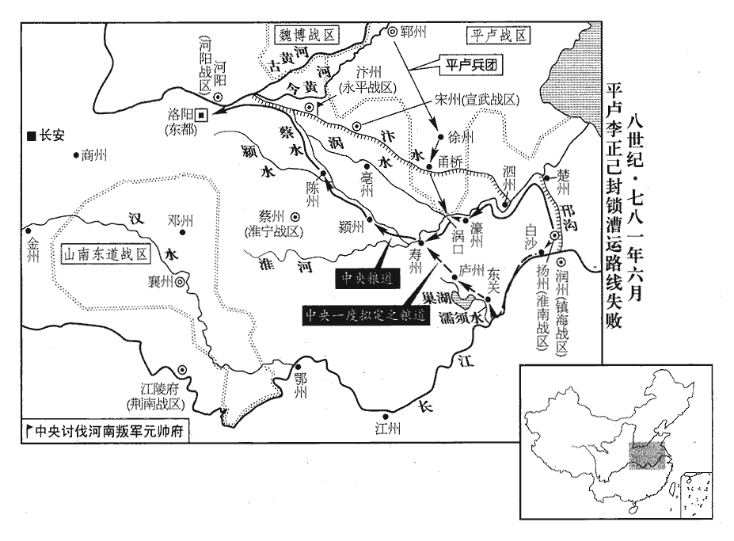
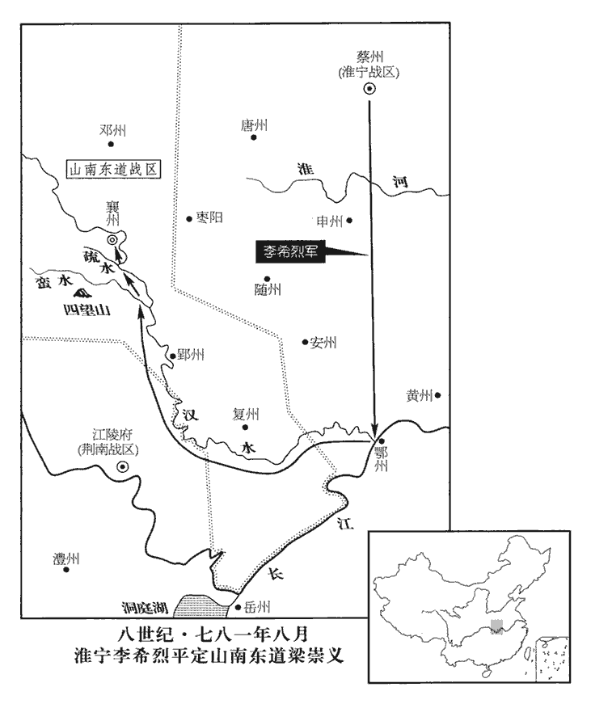
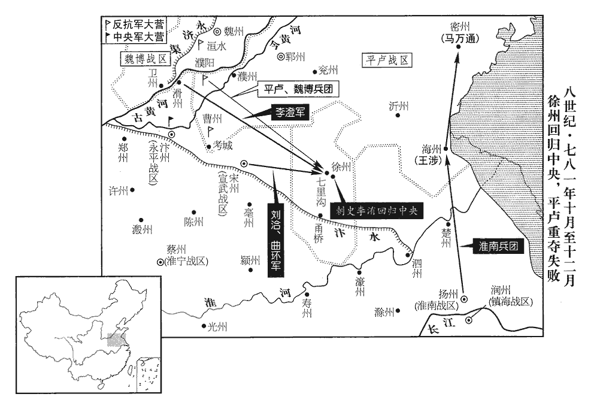
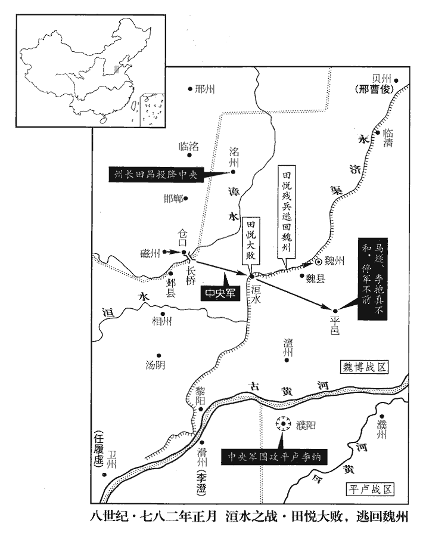
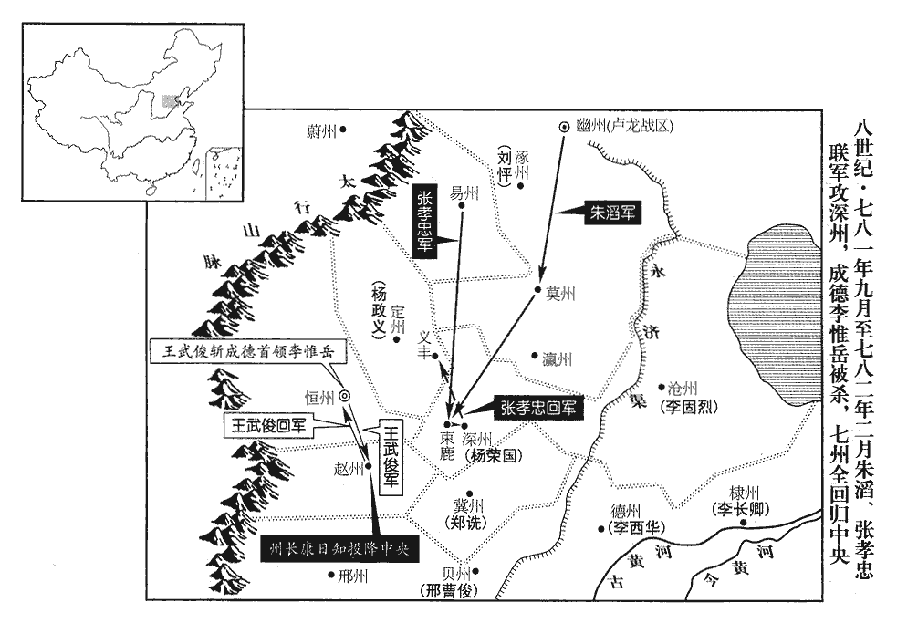
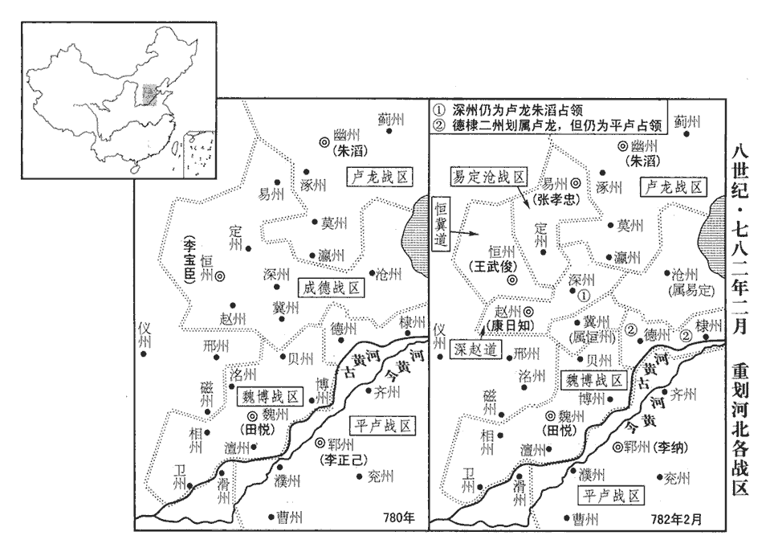
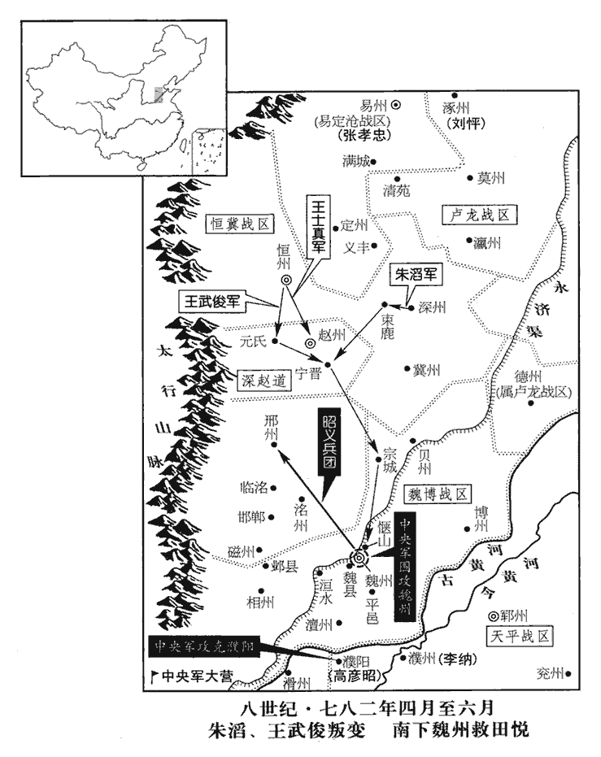
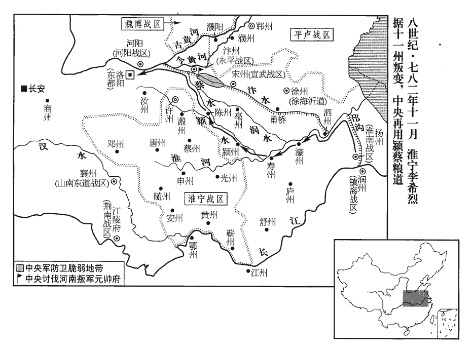

 唐紀四十三起重光作噩（辛酉）六月，盡玄黓閹茂（壬戌），凡一年有奇。始辛酉六月，終壬戌，凡一年零六月。

# 德宗神武聖文皇帝二

## 建中二年（辛酉、七八一）

1六月，庚寅‹三›，以浙江東•西‹首府设苏州江苏省苏州市›觀察使、蘇州刺史韓滉為潤州‹江苏省镇江市›刺史、浙江東•西‹总部自苏州迁至润州›節度使，蘇州，治吳縣。滉，呼廣翻。潤州，治京口。使，疏吏翻。名其軍曰鎮海。

〖译文〗 [1]六月，庚寅（初三），德宗任命浙江东西观察使、苏州刺史韩为润州刺史、浙江东西节度使，将他统辖的军队定名为镇海军。

2張著至襄陽，是年四月遣著，今至襄陽。蓋張著亦疑梁崇義，遲遲不進也。梁崇義益懼，陳兵而見之。藺杲得詔不敢發，得除鄧州之詔也。馳見崇義請命。請免其死。崇義對著號泣，竟不受詔。號，戶刀翻。著復命。

〖译文〗 [2]张著来到襄阳，梁崇义愈加恐惧，让士兵结成阵列来接见张著。蔺杲得到出任邓州刺史的诏书，不敢启程就任，驰马去见梁崇义请示命令。梁崇义面对张著号啕大哭，但到底不肯接受诏命。张著只好回朝复命。

癸巳‹六›，進李希烈爵南平郡王，渝州南平郡。加漢南•漢北兵馬招討使，督諸道兵討之。考異曰：德宗實錄：「五月己巳，加淮寧節度李希烈南平郡王、漢南•漢北通知諸道兵馬使，招撫處置使。」希烈傳曰：「山南東道節度使梁崇義拒捍朝命，迫脅使臣。二年六月，詔諸道節度率兵討之，加希烈南平郡王兼漢南、北都知諸道兵馬•招撫處置使。」今從建中實錄。楊炎諫曰：「希烈為董秦養子，親任無比，卒逐秦而奪其位。事見二百二十五卷代宗大曆十四年。董秦，賜姓名李忠臣。卒，子恤翻。為人狼戾無親，「狼」，當作「很」。無功猶倔強不法，掘，渠勿翻。強，其兩翻。使平崇義，何以制之！」上不聽。炎固爭之，上益不平。

〖译文〗 癸巳（初六），德宗晋升李希烈爵位为南平郡王，加封汉南、汉北兵马招讨使，督率各道兵马讨伐梁崇义。杨炎规劝说；“李希烈是董秦的养子，董秦亲近并信任他的程度无可比拟，但李希烈最终还是驱逐了董秦，并夺取了他的职位。李希烈为人凶狠暴戾，六亲不认，他无功于朝廷，尚且态度强硬而不守国法，假如让他平定了梁崇义，将如何控制他呢！”德宗不听杨炎的建议，杨炎坚持己见，争议再三，德宗对杨炎愈加不满。

荊南‹总部设江陵府湖北省江陵县›牙門將吳少誠以取梁崇義之策干李希烈，希烈以少誠為前峰。少誠，幽州潞‹北京市东通州镇›人也。將，即亮翻。少，始照翻。潞縣，漢屬漁陽郡，晉屬燕國，隋屬涿郡，唐屬幽州，以潞水自塞北來經縣界名縣。

〖译文〗 荆南牙门将吴少诚带着攻取梁崇义的策谋谒见李希烈，李希烈任命吴少诚为前锋。吴少诚是幽州潞县人。

時內自關中‹陕西省中部›，西暨蜀‹四川省›、漢‹陕西省南部›，南盡江、淮‹华东地区›、閩‹福建省›、越‹广东及广西›，北至太原，所在出兵，而李正己遣兵扼徐州‹江苏省徐州市›、甬橋‹安徽省宿州市›、渦口‹安徽省怀远县·涡水注入淮河处›，閩，眉巾翻。甬橋，在徐州南界汴水上，後置宿州於此。渦口，渦水入淮之口。渦guō，音戈。梁崇義阻兵襄陽，運路皆絕，人心震恐。江、淮進奉船千餘艘，泊渦口不敢進。艘，蘇遭翻。上以和【嚴：「和」改「利」。】州‹利州，四川省广元市›刺史張萬福為濠州‹安徽省凤阳县东北临淮关›刺史。使之通渦口水路。萬福馳至渦口，立馬岸上，發進奉船，淄青將士停岸睥睨不敢動。淄，莊持翻。睥，匹詣翻。睨，研計翻。

〖译文〗 当时，内自关中，西至蜀、汉，南达江、淮、闽、越，北到太原，到处发兵，而李正己派兵扼守徐州的甬桥和涡口，梁崇义拥兵襄阳，运输通道全被切断，人心为之震惊恐慌。江、淮的进奉船一千余艘，停泊在涡口而不敢前进。德宗任命和州刺史张万福为濠州刺史。张万福疾驰到涡口，骑着马立在岸上，命令进奉船进发，淄青的将士停在岸边，斜目观望，但不敢妄动。

 

3辛丑‹十四›，汾陽忠武王郭子儀薨‹697›—781。薨，呼肱翻。子儀為上將，擁強兵，程元振、魚朝恩讒毀百端，詔書一紙徵之，無不即日就道，由是讒謗不行。事並見代宗紀。朝，直遙翻。嘗遣使至田承嗣所，承嗣西望拜之曰：「此膝不屈於人若干年矣！」李靈曜據汴州作亂，事見二百二十五卷代宗大曆十一年。使，疏吏翻。嗣，祥吏翻。汴，皮變翻。公私物過汴者皆留之，惟子儀物不敢近，近，其靳翻。遣兵衛送出境。校中書令考凡二十四，月入俸錢二萬緡，私產不在焉；校，古效翻。俸，扶用翻。緡，眉巾翻。府庫珍貨山積。家人三千人，八子、七壻皆為朝廷顯官；郭子儀八子：曜、晞、旰、𣇕、晤、曖、曙、映。諸孫數十人，每問安，不能盡辯，頷之而已。僕固懷恩、李懷光、渾瑊皆出麾下，渾，戶昆翻，又戶本翻。瑊jiān，古咸翻。雖貴為王公，常頤指役使，趨走於前，家人亦以僕隸視之。天下以其身為安危殆三十年，殆，近也，將也。郭子儀奮自朔方，是年肅宗至德元載也，至建中二年而薨。是年歲在重光作噩，自柔兆涒tūn灘至重光作噩，二十六年耳，故云殆三十年。功蓋天下而主不疑，位極人臣而眾不疾，窮奢極欲而人不非之，年八十五而終。其將佐至大官，為名臣者甚眾。將，即亮翻。

〖译文〗 [3]辛丑（十四日），汾阳忠武王郭子仪去世。郭子仪是位杰出的将领，拥有强兵，程元振、鱼朝恩曾对他用谗言百般诋毁，但只要有一纸诏书征召，他没有一次不是当日启程的，由于这些，诽谤才失去了作用。郭子仪曾经派遣使者到田承嗣处，田承嗣向西下拜说：“我这膝盖不向人弯屈已经有若干年头了！”李灵曜依凭汴州发起叛乱，公私物品经过汴州的，全都被他扣留，惟有郭子仪的物品，他不敢靠近，还派兵护卫，送出州境。据统计，郭子仪担任中书令共计二十四年，每月收入薪俸钱二万缗，私产尚不在计算之列，家中的仓库里珍异宝货堆积如山。郭子仪举家三千人，有八个儿子、七个女婿，都是朝廷中显要的官员。他的孙子有数十人，每当向他问安时，他不能一一辨认，只是向他们点头而已。仆固怀恩、李怀光、浑都是他的部下，虽然贵为王公，但郭子仪经常对他们颐指气使，任意驱使，而他们在郭子仪面前用小步快走，以示身分卑微，郭子仪家人也将他们视为仆从。郭子仪以一身维系全国安危将近三十年，他的功劳天下无双，但皇上不猜疑他；他的地位达到了人臣的顶峰，但众人不妒忌他；他穷极奢华，尽情享受；但人们不非难他。他八十五岁时寿终。他的将佐当上大官、成为名臣的人物很多。

4壬子‹二十五›，以懷、鄭、河陽節度副使李艽為河陽、懷州節度使，割東畿五縣隸焉。艽jiāo，居包翻。使，疏吏翻。東畿，東都畿也。五縣：河陽、河清‹河南省济源市南›、濟源‹河南省济源市›、溫‹河南省温县›、王屋‹河南省济源市西王屋乡›。

〖译文〗 [4]壬子（二十五日），德宗任命怀、郑、河阳节度副使李艽为河阳、怀州节度使，分割东都五个畿县归其管辖。

5北庭‹总部设北庭府新疆吉木萨尔县›、安西‹总部设龟兹新疆库车县›自吐蕃陷河‹河西，甘肃省中部西部›、隴‹陇右，青海省东部›，隔絕不通，陷河、隴見二百二十三卷代宗廣德元年。吐，從暾入聲。伊西、北庭節度使李元忠、四鎮留後郭昕帥將士閉境拒守，昕，許斤翻。帥，讀曰率。數遣使奉表，皆不達，聲問絕者十餘年；至是，遣使間道歷諸胡自回紇‹瀚海沙漠群›中來，數，所角翻。間，古莧翻。上嘉之。秋，七月，戊午朔‹一›，加元忠北庭大都護，賜爵寧塞郡王；廓州寧塞郡。以昕為安西大都護、四鎮節度使，賜爵武威郡王；涼州武威郡。將士皆遷七資。元忠姓名，朝廷所賜也，本姓曹，名令忠；昕，子儀弟之子也。

〖译文〗 [5]北庭、安西自从吐蕃陷落河、陇以来，便与朝廷隔绝不通了。伊西、北庭节度使李元忠、四镇留后郭昕率领将士严守四境，抗拒吐蕃，屡次派遣使者上表，都未到达，音信断绝长达十余年。至此，李元忠、郭昕派使者抄偏僻小道，经诸胡人居处，从回纥来到朝廷，德宗对此很是嘉许。秋季，七月，戊午朔（初一），德宗加封李元忠为北庭大都护，赐爵宁塞郡王；任命郭昕为安西大都护、四镇节度使，赐爵武威郡王，所辖将士全部超迁战功七等。李元忠这一姓名，是朝廷赐给的，李元忠原本姓曹，名令忠。郭昕是郭子仪弟弟的儿子。

6李希烈以久雨未進軍，上怪之，盧杞密言於上曰：「希烈遷延，以楊炎故也。因炎諫用希烈而間之。陛下何愛炎一日之名而墮大功；墮，讀曰隳。不若暫免炎相以悅之，事平復用，無傷也。」相，息亮翻。復，扶又翻，又音如字。上以為然。庚申‹三›，以炎為左僕射，罷政事。射，寅謝翻。考異曰：舊傳曰：「初，炎之南來，途經襄、漢，固勸梁崇義入朝，崇義不能從，已懷反側；尋又使其黨李舟奉使馳說，崇義因而拒命，遂圖叛逆，皆炎迫而成之。至是，德宗欲假希烈兵勢以討崇義，炎又固言不可；上不能平。會德宗嘗訪宰相群臣中可以大任者，盧杞薦張鎰yì、嚴郢，而炎舉崔昭、趙惠伯。上以炎論議疏闊，遂罷炎相。」建中實錄曰：「炎與盧杞同執大政，杞形神詭陋，夙為人所褻，而炎氣岸高峻，罕防細故；方病，飲食無節，或為糜餐，別食閤中，每登堂會食，辭不能偶。讒者乘之，謂杞曰：『楊公鄙公，不欲同食。』杞銜之。舊制，中書舍人分署尚書六曹以平奏報，中廢其職；杞議復之以疏其煩。炎不可。杞曰：『杞不才，幸措足於斯，亦當有運用以答天造，寧常拳杞之手乎！』因密啟中書主書有過局者，有詔逐之。炎怒曰：『中書，吾局也，政之不脩，吾自理之；設不理，當共議，何陰訴而越官邪！』因不相平。時淮西節度使李希烈寵任方盛，上欲以之平襄陽，炎以為不可。上曰：『卿勿復言。』遂以希烈統之。時夏潦方壯，澶chán漫數百里，故希烈軍久不得發。會炎病，請急累日，杞啟免炎相以悅之。上以為然，乃使中官朱如玉就第先喻旨，翌日，遷左僕射。謁謝之日，恩旨甚渥，杞大懼。」按沈既濟為炎所引，故建中實錄言炎罷相，與德宗實錄頗異。今取其可信者書之。然舊傳云「梁崇義之反，炎迫而成之」，亦近誣也。以前永平節度使張鎰為中書侍郎、同平章事。鎰，齊丘之子也。使，疏吏翻。鎰，弋質翻。張齊丘，玄宗時為朔方節度使。以朔方‹总部设灵州宁夏宁武市›節度使崔寧為右僕射。射，寅謝翻。

〖译文〗 [6]因多日来连续降雨，李希烈未能进军，受到德宗的责怪。卢杞暗中对德宗说：“李希烈拖延不进，是因为杨炎的原故。陛下何必顾惜杨炎暂时的声誉，而毁坏了大功业，不如暂时免除杨炎的相职，使李希烈高兴，事情平息以后再起用杨炎，这并没有什么妨害。”德宗认为卢杞说得对。庚申（初三），德宗任命杨炎为左仆射，罢去知政事，任命前永平节度使张镒为中书侍郎、同平章事。张镒是张齐丘的儿子。任命朔方节度使崔宁为右仆射。

7丙子‹十九›，贈故伊州‹新疆哈密市›刺史袁光庭工部尚書。光庭天寶末為伊州刺史，吐蕃陷河、隴，光庭堅守累年，吐蕃百方誘之，不下。伊州，治伊吾縣，漢伊吾盧地。尚，辰羊翻。吐，從暾入聲。誘，音酉。糧竭兵盡，城且陷，光庭先殺妻子，然後自焚。郭昕使至，朝廷始知之，昕，許斤翻。朝，直遙翻。故贈官。

〖译文〗 [7]丙子（十九日），朝廷追赠已故伊州刺史袁光庭为工部尚书。袁光庭在天宝末年出任伊州刺史。吐蕃攻陷河、陇后，袁光庭坚守多年，吐蕃千方百计地引诱他，都不能将伊州攻下。后来粮食吃光，士卒战死，伊州城将要陷落，袁光庭事先杀死妻子儿女，然后自焚而死。郭昕的使者到来，朝廷才知道了袁光庭的事迹，所以给他追赠官爵。

8辛巳‹二十四›，以邠寧節度使李懷光兼朔方節度使。邠，卑旻翻。

〖译文〗 [8]辛巳（二十四日），德宗让宁节度使李怀光兼任朔方节度使。

9癸未‹二十六›，河東節度使馬燧，昭義節度使李抱真，神策先鋒都知兵馬使李晟，大破田悅於臨洺‹河北省永年县›。

〖译文〗 [9]癸未（二十六日），河东节度使马燧、昭义节度使李抱真、神策先锋都知兵马使李晟在临大破田悦。

時悅攻臨洺，累月不拔，城中食且盡，府庫竭，士卒多死傷。張伾飾其愛女，使出拜將士曰：「諸君守戰甚苦，伾家無他物，請鬻此女為將士一日之費。」眾皆哭，曰：「願盡死力，不敢言賞。」李抱真告急於朝，朝，直遙翻。詔馬燧將步騎二萬與抱真討悅，又遣李晟將神策兵與之俱；又詔幽州留後朱滔討惟岳。李惟岳也。

〖译文〗 当时，田悦进攻临，历时几个月，不能攻克，城中的食品将要吃光，仓库的储备已经用完，士卒伤亡，为数很多。张将心爱的女儿打扮起来，让女儿出来拜见将士，他说：“诸位坚守城池，甚是辛苦，我家没有别的东西，请让我把这个儿女卖掉，权当将士们一天的费用。”大家都哭着说：“我们甘愿用尽全力，而决不敢谈论奖赏。”李抱真向朝廷告急，德宗下诏命令马燧带领步兵、骑兵共二万人与李抱真讨伐田悦，又派遣李晟带领神策兵与二人同讨田悦，又下诏命令幽州留后朱滔讨伐李惟岳。

燧等軍未出險，先遣使持書諭悅，為好語，悅謂燧畏之，不設備。燧與抱真合兵八萬，東下壺關‹山西省壶关县›，考異曰：舊田悅傳曰：「七月三日，師自壺關東下，收賊盧家砦zhài。」燧傳云：「十一月，師次邯鄲。」恐誤。今從悅傳、燕南記。軍于邯鄲，擊悅支軍，破之。悅方急攻臨洺，分李惟岳兵五千助楊朝光。明日，燧等進攻朝光柵，悅將萬餘人救之，燧命大將李自良等禦之於雙岡‹河北省邯郸市西北›，雙岡，在邯鄲西北，臨洺之西，亦名盧家疃tuǎn。令之曰：「悅得過，必斬爾！」自良等力戰，悅軍卻。燧推火車焚朝光柵，推，吐雷翻。車，尺遮翻。斬朝光，獲首虜五千餘級。居五日，燧等進軍至臨洺，悅悉眾力戰，凡百餘合，悅兵大敗，斬首萬餘級。考異曰：舊李晟傳：「戰于臨洺，諸軍皆卻。晟引兵渡洺水，乘氷而濟，橫擊悅軍，王師復振，擊悅，大破之。」據此，則是臨洺戰在冬也，與馬燧傳「十一月師次邯鄲」相應。實錄：「十二月庚寅，馬燧加左僕射。」又云：「先是，悅遣將康愔領兵圍邢州，楊朝光圍臨洺，燧與抱真及神策將李晟合勢救之，大敗賊於雙岡，斬楊朝光，擒其大將盧子昌。乘勝進軍，又破悅於臨洺，故燧等加官。」按實錄，此戰無月日，但於馬燧加官時言之。今據燧傳，先敗悅於雙岡，斬楊朝光，居五日，乃進至臨洺。即實錄此月癸未眾軍破悅於臨洺也。實錄在此年冬，與此相違。燕南記亦云：「七月，燧與抱真兵八萬，自潞府東下壺關，先收邯鄲盧家砦，朝光戰死臨洺城；又大破悅。」悅退走在李正己死前，與實錄此月相應。臨洺之戰，疑諸軍已集。燧等若未至，張伾必不能獨破悅軍。新本紀：「十一月丁丑，馬燧及田悅戰于雙岡，敗之。」不知此日何出，亦與諸書相違。今止從七月。悅引兵夜遁，邢州圍亦解。是年五月，悅使其將康愔圍邢州，悅敗走而圍亦解。

〖译文〗 马燧等人的军队还没有脱出险境时，先派遣使者带着书信去开导田悦，向他说了一些好话，田悦认为马燧畏惧他，不再设置防备。马燧与李抱真两军汇合共八万人，东下壶关，在邯鄣驻扎，进击田悦的支属部队，并且打败了他们。田悦正在急切地攻打临，分出李惟岳五千人去援助杨朝光。第二天，马燧等人进攻杨朝光的营栅，田悦带领一万余人去援救。马燧让大将李自良等人在双冈抵御田悦，命令他说：“只要田悦通过了双冈，就一定将你斩首！”李自良等人备力激战，田悦的军队退却了。马燧推出烧着火的车辆焚烧杨朝光的栅栏，杀了杨朝光，斩得敌首五千余级。过了五天，马燧等人进军到临，田悦全军出动，奋力而战，经过约一百多个回合，田悦军大败，被斩首一万余级。田悦领兵连夜逃走，邢州也解围了。

時平盧節度使李正己已薨‹年四十九岁›，子納秘之，擅領軍務。悅求救於納及李惟岳，納遣大將衛俊將兵萬人，惟岳遣兵三千人救之。悅收合散卒，得二萬餘人，軍于洹huán水‹流经河南省安阳市›；淄青軍其東，成德軍其西，首尾相應。馬燧帥諸軍進屯鄴，洹，于原翻。帥，讀曰率。洹水縣，屬魏州，本漢內黃地，後周武帝置洹水縣，因水而名。淄，莊持翻。鄴縣，屬相州。奏求河陽兵自助；詔河陽節度使李艽將兵會之。艽jiāo，居包翻。

〖译文〗 当时，平卢节度使李正己已经去世，李正己的儿子李纳隐瞒了这一消息，擅自接管了平卢军务。田悦向李纳和李惟岳求救，李纳派遣大将卫俊带兵一万人，李惟岳派兵三千人，去援救田悦。田悦收聚溃散的士兵，得到二万余人，驻扎在洹水。淄青军在田悦东边驻扎，成德军在田悦西边驻扎，首尾相互接应。马燧率领各军进军至邺城屯驻，上奏请求让河阳兵前来援助，德宗颁诏命令河阳节度使李艽带兵与马燧会师。

10八月，李納始發喪，奏請襲父位，上不許。

〖译文〗 [10]八月，李纳开始发丧，上奏请求承袭父亲的职位，德宗不肯答应。

11梁崇義發兵攻江陵，至四望‹湖北省南漳县南›，今隨州隨縣之東有四望山，其山最高，四望皆可見。大敗而歸，乃收兵襄、鄧。李希烈引軍循漢而上，上，時掌翻。與諸道兵會；崇義遣其將翟暉、杜少誠逆戰於蠻水‹汉水支流，流经湖北省南漳县南›，希烈大破之；追至疎口‹疏水注入汉水处·湖北省宜城市西北›，又破之。將，即亮翻。翟，萇伯翻。少，始照翻。水經：漢水自襄陽東流，又屈而西南流，又東南流，逕黎丘故城西，又南與疎水合。疎水出中廬縣西南，東流至邙縣北界，東入漢水，謂之疎口。漢水又南過宜城東，夷水出自房陵縣，東流注之；桓溫以其父名彝，改曰蠻水。二將請降，希烈使將其眾先入襄陽慰諭軍民。將，即亮翻。降，戶江翻。使將，同上音，又音如字。崇義閉城拒守，守者開門爭出，不可禁。崇義與妻赴井死，傳首京師。

〖译文〗 [11]梁崇义派兵攻打江陵，来到四望山，大败而回，于是收兵进入襄州和邓州。李希烈带领军队沿汉水溯流而上，与各道兵马会合。梁崇义派遣将领翟晖、杜少诚在蛮水迎战，李希烈大破敌军，追击至口，再破敌军。翟晖、杜少诚二将请求投降，李希烈使二人带领部下首先进入襄阳，慰问城内军民。梁崇义关闭城门抵抗，守城的人们打开城门，争先出城，不可禁止。梁崇义与妻子投井而死，二人的头颅被传送到京城。

12范陽節度使朱滔將討李惟岳，軍于莫州‹河北省任丘市北鄚州镇›；張孝忠將精兵八千守易州，范陽節度使治幽州，莫州在幽州南二百八十里。易州，成德巡屬，在幽州西二百一十四里。滔遣判官蔡雄說孝忠曰：說，式芮翻。「惟岳乳臭兒，敢拒朝命；今昭義、河東軍已破田悅，淮寧李僕射克襄陽，計河南諸軍，朝夕北向，恆、魏之亡，可佇立而須也。使君誠能首舉易州以歸朝廷，則破惟岳之功自使君始，此轉禍為福之策也。」朝，直遙翻。射，寅謝翻。恆，戶登翻。使，疏吏翻。孝忠然之，遣牙官程華詣滔，遣錄事參軍董稹奉表詣闕，稹zhěn，章忍翻。滔又上表薦之；上，時掌翻。上悅。九月，辛酉‹六›，以孝忠為成德節度使。命惟岳護喪歸朝，惟岳不從。孝忠德滔，為子茂和娶滔女，為，于偽翻。深相結。

〖译文〗 [12]范阳节度使朱滔准备前去讨伐李惟岳，在莫州驻扎。张孝忠带领精兵八千防守易州，朱滔派遣判官蔡雄劝告张孝忠说：“李惟岳不过是个了乳臭小儿，竟敢抗拒朝命！现在昭义、河东二军已经打败田悦，淮宁李仆射攻克襄阳，算来河南各军早晚要向北挺进，恒州、魏州的覆亡，那是可以立待而至的了。你如果能够带头将易州归属朝廷，那么，打败李惟岳的功劳便是由你开头的，这正是你转祸为福的良策啊。”张孝忠认为言之有理，便派遣牙官程华至朱滔处，派遣录事参军董稹到朝廷去进献表章，朱滔又上表举荐张孝忠，德宗很是高兴。九月辛酉（初六），德宗任命张孝忠为成德节度使。命令李惟岳护送死者回朝，李惟岳不肯听从。张孝忠感激朱滔的恩德，为儿子张茂和娶朱滔女儿，两人深相结纳。

 

13壬戌‹七›，加李希烈同平章事。

〖译文〗 [13]壬戌（初七），德宗加封李希烈同平章事。

14初，李希烈請討梁崇義，上對朝士亟稱其忠。亟，去吏翻。黜陟使李承自淮西還，還，從宣翻，又音如字。言於上曰：「希烈必立微功；但恐有功之後，偃蹇不臣，更煩朝廷用兵耳！」上不以為然。

〖译文〗 [14]当初，李希烈请求讨伐梁崇义，德宗对朝中人士屡次称道李希烈有忠心。黜陟使李承从淮西回朝，对德宗说：“李希烈肯定能立点微小的功劳，只怕有了功劳以后，骄横傲慢，不尽为臣之道，还要烦劳朝廷再用刀兵罢了！”德宗不以为然。

希烈既得襄陽，遂據之為己有，上乃思承言。時承為河中‹山西省永济市›尹，甲子‹九›，以承為山南東道節度使。上欲以禁兵送上，上，時掌翻。承請單騎赴鎮；至襄陽，希烈置之外館，迫脅萬方，承誓死不屈，希烈乃大掠闔境所有而去。承治之朞年，軍府稍完。騎，奇寄翻。闔，戶臘翻。治，直之翻。希烈留牙將於襄州，守其所掠財，由是數有使者往來。將，即亮翻。數，所角翻。承亦遣其腹心臧叔雅往來許‹河南省许昌市›、蔡，李希烈既自襄陽還蔡州，尋徙鎮許州，故李承陰遣人至許、蔡，結其諸將以圖之。厚結希烈腹心周曾等，與之陰圖希烈。為周曾等圖希烈不克而死張本。

〖译文〗 李希烈得到襄阳以后，便将襄阳据为己有，德宗这才想起李承的预言。当时，李承担任河中尹，甲子（初九），德宗任命李承为山南东道节度使。德宗打算派禁兵护送他上任，李承请求单人匹马前往山南东道。李承来到襄阳时，李希烈将李承安置在客舍中，千方百计地逼迫威胁他，李承誓死不屈，于是李希烈大肆掳掠了全州所有而离去。李承治理山南东道整整一年，军府才逐渐完备。李希烈将牙将留在襄州，看守掳掠的财物，由此双方常有使者往来。李承也派遣亲信臧叔雅往来于许州和蔡州，深深结纳李希烈的亲信周曾等人，与他们暗中谋算李希烈。

15初，蕭嵩家廟臨曲江‹首都长安东南角›，玄宗‹李隆基›以娛遊之地，非神靈所宅，命徙之。楊炎為相，惡京兆尹嚴郢，相，息亮翻。惡，烏路翻。左遷大理卿；盧杞欲陷炎，引郢為御史大夫。先是，炎將營家廟，先，悉薦翻。有宅在東都，憑河南尹趙惠伯賣之，惠伯買以為官廨，郢按之，以為有羨利。羨，于線翻。杞召大理正田晉議法，唐志：大理正，從五品下，掌議獄，正科條，凡丞斷罪不當，則以法正之。晉以為：「律，監臨官市買有羨利，以乞取論，當奪官。」杞怒，監，古銜翻；下同。貶晉衡州‹湖南省衡阳市›司馬。衡州，京師東南三千四百三里。田晉自朝士貶衡州司馬。更召他吏議法，更，工衡翻。以為：「監主自盜，罪當絞。」炎廟正直蕭嵩廟地，杞因譖炎，云「茲地有王氣，王，于况翻。故玄宗‹李隆基›令嵩徙之；炎有異志，故於其地建廟。」冬，十月，乙未‹十›，炎自左僕射貶崖州‹海南省琼山市›司馬；令，力丁翻。射，寅謝翻。舊志：崖州，至京師七千四百六十里。未【章：十二行本「未」上有「遣中使護送」五字；乙十一行本同。】至崖州百里，縊殺之‹年五十五岁›。惠伯自河中尹貶費州‹贵州省思南县›多田‹思南县北›尉；費州，漢牂柯郡，隋黔安郡涪川縣地，貞觀四年，分思州之涪川、扶陽二縣，置費州。多田縣，武德四年，務州刺史奏置，以土地稍平，墾田盈畛zhěn，故以多田為名。貞觀四年，改費州為思州，乾元元年，復為費州；京師南四千七百里，至東都四千九百里；因州界費水為名。「河中尹」，當作「河南尹」。尋亦殺之。

〖译文〗 [15]当初，萧嵩的家庙濒临曲江，玄宗认为曲江是娱乐游观的地方，不是建造神灵庙宇的处所，便命萧嵩迁移家庙。杨炎担任宰相，憎恶京兆尹严郢，把他降职为大理卿。卢杞打算陷害杨炎，便荐引严郢为御史大夫。在此之前，杨炎准备营造家庙，因有住宅在东都洛阳，便请河南尹赵惠伯为他卖掉，赵惠伯却将此宅买来充当官署。严郢按察此事，认为其中有不应得的余利。卢杞召来大理正田晋，商议处罚二人的刑律依据，田晋认为：“根据刑律，本人管理官府设立的市场，购买物品获取余利的，以索取论处，应当剥夺官位。”卢杞大怒，将田晋贬为衡州司马。卢杞又召另外的官吏来商议罚治二人的刑律，该人认为：“在本人主管的公务中自行盗窃的，罪当处以绞刑。”杨炎的家庙正当萧嵩的家庙所在之地，卢杞借此诬陷杨炎说：“这个地方有帝王之气，所以玄宗才命令萧嵩迁移家庙。杨炎有心背叛朝廷，所以才在此地建造家庙。”冬季，十月，乙未（十日），杨炎由左仆射被贬为崖州司马。杨炎行至距崖州一百里处，遭到了缢杀。越惠伯由河中尹被贬为费州多田尉，不久也被杀死。

16辛丑‹十六›，册太子‹李诵›妃萧氏。

〖译文〗 [16]辛巳（疑误），册立萧氏为太子妃。

17癸卯‹十八›，祫xiá太廟。先是，太祖‹李虎›既正東向之位，獻‹李熙›、懿‹李天赐›二祖皆藏西夾室，不饗；至是，復奉獻祖東嚮而饗之。先，悉薦翻。復，扶又翻。獻祖宣皇帝熙，太祖之祖也。懿祖光皇帝天賜，太祖之父也。太祖景皇帝虎，始封於唐者也。唐初，饗四廟，宣、光二帝、太祖、世祖也。貞觀九年，祔高祖于太廟。朱子奢請準禮，立七廟，三昭三穆各置神主，太祖依晉、宋已來故事，虛其位，待遞遷，方處之東向位。於是始祔弘農府君重耳及高祖為六室，虛太祖之位而行禘祫。至二十三年，太宗祔廟，遷弘農府君，乃藏于西夾室。文明元年，高宗祔廟，始遷宣皇帝于西夾室。至開元十年，玄宗特立九廟，於是追尊宣皇帝為獻祖，復列於室，光皇帝為懿祖，以備九室，禘祫猶虛太祖之位。祝文於三祖不稱臣，明全廟數而已。至德三載剋復後，新作九室神主，遂不作弘農府君神主，明禘祫不及故也。至寶應二年，祔玄宗、肅宗於廟，遷獻、懿二祖於西夾室，始以太祖當東向位。至是年，將祫饗，禮儀使顏真卿奏：「合出獻、懿二祖行事，其布位次第及東向之位，請準東晉蔡謨議為定。」遂以獻祖當東向，懿祖於昭位南向，太祖於穆位北向。左昭右穆，陳列行事。

〖译文〗 [17]癸卯（十八日），德宗在太庙合祭远近祖先的牌位。在此之前，太祖的牌位已在太庙中，当东向位，献祖、懿祖的牌位则都存放在西夹室内，不予祭献。至此，再次将献祖奉为东向位，予以祭献。

18徐州刺史李洧wěi，正己之從父兄也。李納寇宋州，彭城令太原白季庚說洧舉州歸國；洧，于軌翻。從，才用翻。說，式芮翻。洧從之，遣攝巡官崔程奉表詣闕，且使口奏，并白宰相，以「徐州不能獨抗納，乞領徐、海‹江苏省连云港市›、沂‹山东省临沂市›三州觀察使，況海、沂二州，今皆為納有。洧與刺史王涉、馬萬通素有約，使，疏吏翻。考異曰：此據舊傳也。實錄，萬通以密州降，蓋自沂移密。苟得朝廷詔書，必能成功。」程自外來，言自外方來。以為宰相一也，先白張鎰，鎰以告盧杞。杞怒其不先白己，不從其請。相，息亮翻。鎰，戍質翻。戊申‹二十三›，加洧御史大夫，充招諭使。

〖译文〗 [18]徐州刺史李洧是李正己的堂兄。李纳侵犯宋州，彭城令太原人白季庚劝说李洧率领全州归顺朝廷，李洧听从了他的劝告，派遣摄巡官崔程带着表章到朝廷去，让他口头上奏皇上，并且禀告宰相，大意是：“徐州无力独自抵抗李纳，李洧乞求担任徐、海、沂三州观察使，况且海、沂二州，现在都已被李纳占有。李洧与刺史王涉、马万通素有约定，如果能够得到朝廷的诏书，必定能够成功。”崔程来自外地，以为宰相都一样，于是先向张镒禀告，张镒又转告了卢杞。卢杞恼火崔程不先向自己禀告，便不答应他的请求。戊申（二十三日），加封李洧为御史大夫，充任招谕使。

19十一月，戊午‹四›，以永樂公主適檢校比部郎中田華，上不欲違先志故也。永樂公主許降田華，見二百二十五卷代宗大曆九年。樂，音洛。

〖译文〗 [19]十一月，戊午（初四），将永乐公主嫁给检校比部郎中田华，以示皇上不想违背原先的意图。

20蜀王傀【嚴：「傀」改「遂」。】更名遂。‹李适之弟›【嚴：「遂」改「遡」。】傀，苦猥翻。更，工衡翻。

〖译文〗 [20]蜀王李傀改名李遂。

21辛酉‹七›，宣武節度使劉洽，神策都知兵馬使曲環，滑州刺史襄平‹辽宁省辽阳市›李澄，朔方大將唐朝臣，大破淄青、魏博之兵於徐州。按新書李澄傳：澄，遼東襄平人。唐自高宗世，遼東之地已棄而不有，李澄時以本貫在遼東襄平耳。朝，直遙翻。淄，莊持翻。

〖译文〗 [21]辛酉（初七），宣武节度使刘洽、神策都知兵马使曲环、滑州刺史襄平人李澄、朔方大将唐朝臣，在徐州大破淄青、魏博军。

先是，李納遣其將王溫會魏博將信都崇慶先，悉薦翻。將，即亮翻。信都，複姓。共攻徐州，李洧遣牙官溫‹河南省温县›人王智興詣闕告急。溫，古縣，唐初，屬懷州，顯慶二年，度屬洛州。智興善走，不五日而至。舊志：徐州，京師東二千六百四里。上為之發朔方兵五千人，為，于偽翻。以朝臣將之，朝，直遙翻。將，直亮翻，又音如字。與洽、環、澄共救之。時朔方軍資裝不至，旗服弊惡，宣武人嗤之曰：「乞子能破賊乎！」朝臣以其言激怒士卒，且曰：「都統有令，嗤，丑之翻。都統，謂李勉也。統，他綜翻，俗音從上聲。先破賊營者，營中物悉與之。」士皆憤怒爭奮。

〖译文〗 在此之前，李纳派遣将领王温会合魏博领信都崇庆，一齐攻打徐州，李洧派遣牙官温县人王智兴前往朝廷告急。王智兴擅长跑路，不出五天，便到了朝廷。德宗为李洧派出朔方兵五千人，让唐朝臣带领着他们，与刘洽、曲环、李澄共同援救徐州。当时，朔方军的物资装备没有运到，旗帜服装破败粗劣，宣武人嗤笑朔方军说：“叫花子能够打败敌人吗！”唐朝臣用宣武人的话来激怒士兵，而且说：“都统有令，先打破敌人营垒的，便将营垒中的物品悉数给他。”士卒们都愤怒而起，奋力争先。

崇慶、溫攻彭城，二旬不能下，請益兵於納；納遣其將石隱金將萬人助之，考異曰：實錄前作「隱金」，後作「隱全」。今從其前。與劉洽等相拒於七里溝‹徐州市西北›。日向暮，洽引軍稍卻，朔方馬軍使楊朝晟言於唐朝臣曰：「公以步兵負山而陳，以待兩軍，我以騎兵伏於山曲，賊見懸軍勢孤，必搏之：我以伏兵絕其腰，必敗之。」使，疏吏翻。晟，成正翻。陳，讀曰陣。敗，補邁翻。騎，奇寄翻。朝臣從之。崇慶等果將騎二千踰橋而西，追擊官軍，伏兵發，橫擊之；崇慶等兵中斷，狼狽而返，阻橋以拒官軍。其兵有爭橋不得，涉水而渡者。朝晟指之曰：「彼可涉，吾何為不涉！」遂涉水擊，據橋者皆走，崇慶等兵大潰；洽等乘之，斬首八千級，溺死過半。朔方軍盡得其輜重，溺，奴狄翻。重，直用翻。旗服鮮華，乃謂宣武人曰：「乞子之功，孰與宋多？」宋，指宣武兵也。時以宋、亳為宣武軍，劉洽自宋州刺史為宣武節度使，故云然。宣武人皆慚。官軍乘勝逐北，至徐州城下，魏博、淄青軍解圍走，江、淮漕運始通。淄，莊持翻。漕，在到翻。

〖译文〗 信都崇庆和王温攻打彭城，历时二十天，未能攻克，向李纳请求增加兵力。李纳派遣将领石隐金带领一万人援助他们，与刘洽等人在七里沟相峙。天色渐晚，刘洽带领军队稍稍退却，朔方马军使杨朝晟对唐朝臣说：“你率领步兵背山列阵，等待信都崇庆、王温二军的到来，我率领骑兵在山中的曲折之处埋伏。敌军看到你孤军深入，势单力薄，定会前来与你拼搏，我率领伏兵拦腰截断敌军，定能打败他们。”唐朝臣听从了他的意见。信都崇庆等人果然带领骑兵二千人，越过桥来，向西挺进，追击官军。杨朝晟的伏兵发动，从侧面进击敌军。信都崇庆等人的军队被从中切断，狼狈而回，退至桥前，抗拒官军。部下有些士兵争着过桥受阻，便淌水过河，杨朝晟指着这些人说：“他们可以淌水过河，我们为什么不能淌水过河！”于是杨朝晟淌着河水进击，占据桥头的敌军都逃跑了，信都崇庆等人的军队全面溃退，刘洽等人率兵追赶，斩首八千级，淹死的人超过一半。朔方军悉数得到了敌军的辎重，旗帜鲜明，服装华丽，于是对宣武人说：“叫花子立下的功劳，与你们宋州兵相比，到底是谁的多呀？”宣武人都觉得惭愧了。官军乘胜向北追击，来到徐州城下，魏博和淄青的军队解除了对徐州的包围，撤退逃走，江、淮漕运又开始通畅了。

22己巳‹十五›，詔削李惟岳官爵；募所部降者，赦而賞之。降，戶江翻。

〖译文〗 [22]己巳（十五日），德宗下诏削去李惟岳的官爵，对能够招集部下归降的将领，予以赦免并奖赏。

23甲申‹三十›，淮南節度使陳少遊遣兵擊海州，其刺史王涉以州降。海州，李納巡屬。使，疏吏翻。少，始照翻。降，户江翻。

〖译文〗 [23]甲申（三十日），淮南节度使陈少游派兵进击海州，海州刺史王涉率领全州归降。

24十二月，李納密州‹山东省诸城市›刺史馬萬通乞降；丁酉‹十三›，以為密州刺史。宋白曰：密州居海，得禹貢嵎yú夷之地，春秋時為莒、魯之地。州理，即魯之諸城也，漢為高密國，晉立東莞郡，後魏立膠州；隋改曰密州，取境中密水為名。

〖译文〗 [24]十二月，李纳的部下密州刺史马万通请求归降，丁酉（十三日），德宗任命他为密州刺史。

 

25崔漢衡至吐蕃，崔漢衡使吐蕃，見上卷是年三月。吐，從暾入聲。贊普‹娑悉笼猎赞›以敕書稱貢獻及賜，全以臣禮見處；處，昌呂翻。又，雲州之西，當以賀蘭山‹宁夏与内蒙古西界›為境，五代志，靈武弘靜縣有賀蘭山。弘靜縣，唐改為保靜。雲州，當作靈州，史誤也。邀漢衡更請之。丁未‹二十三›，漢衡遣判官與吐蕃使者入奏。上為之改敕書、為，于偽翻。境土皆如其請。關東、河北方用兵，不暇與吐蕃較也。

〖译文〗 [25]崔汉衡来到吐蕃。吐蕃赞普认为敕书中使用贡献、赐给等语，完全是对臣属之礼对待吐蕃；此外，还提出在云州西面，双方应当以贺兰山为边界，请崔汉衡回去再为请求。丁未（二十三日），崔汉衡派遣判官与吐蕃使者入朝上奏，德宗为吐蕃修改了敕书，改订了边境，一切都如吐蕃请求的那样。

26加馬燧魏博招討使。

〖译文〗 [26]德宗加封马燧为魏博招讨使。

## 三年（壬戌、七八二）

1春，正月，河陽‹总部设河阳城河南省孟州市›節度使李艽芃引兵逼衛州‹河南省卫辉市›，田悅守將任履虛‹魏博战区，总部设魏州河北省大名县›詐降，既而復叛。衛州，治汲，艽jiāo，居苞翻。芃péng，蒲紅翻。將，即亮翻。任，音壬。降，戶江翻。復，扶又翻，又音如字。

〖译文〗 [1]春季，正月，河阳节度使李领兵逼近卫州，田悦部下的守城将领任履虚诈降，不久再次反叛。

2馬燧‹河东战区，总部设太原府山西省太原市›等諸軍屯于漳‹漳水›濱。田悅遣其將王光進築月城以守長橋‹河北省临漳县东›，長橋，在漳水上。月城，兩頭抱河，形如半月。諸軍不得渡。燧以鐵鎖連車數百，實以土囊，塞其下流，乘，繩證翻。塞，悉則翻。按新書，燧於長橋下流以土囊遏之。水淺，諸軍涉渡。時軍中乏糧，悅等深壁不戰。燧命諸軍持十日糧，進屯倉口‹河北省临漳县西›，與悅夾洹水‹安阳河›而軍。洹huán，于元翻。洹水與漳水分流，又在漳水之東。李抱真、李艽問曰：「糧少而深入，何也？」燧曰：「糧少則利速戰，今三鎮連兵不戰，三鎮，謂魏博、淄青、成德。艽，居包翻。少，始紹翻。欲以老我師；我若分軍擊其左右，悅必救之，則我腹背受敵，戰必不利。故進軍逼悅，所謂攻其所必救也。兵法有是言。彼苟出戰，必為諸君破之。」為，于偽翻。乃為三橋逾洹水，日往挑戰，挑，徒了翻。悅不出。燧令諸軍夜半起食，潛師循洹水直趨魏州，令，力正翻。趨，逡喻翻。令曰：「賊至，則止為陳。」陳，讀曰陣；下結陳同。留百騎擊鼓鳴角於營中，仍抱薪持火，俟諸軍畢發，則止鼓角匿其旁；俟悅軍畢渡，焚其橋。軍行十里所，悅聞之，帥淄青、成德步騎四萬踰橋掩其後，騎，奇寄翻。帥，讀曰率。乘風縱火，鼓譟而進。譟，則竈翻。燧按兵不動，先除其前草莽百步為戰場，結陳以待之，募勇士五千餘人為前列。悅軍至，火止，氣衰，燧縱兵擊之，悅軍大敗。神策、昭義、河陽軍小卻，神策，李晟軍。昭義，李抱真軍。河陽，李艽軍。見河東軍捷，還鬬，又破之。還，從宣翻，又音如字。追奔至，三橋已焚，三橋，即在洹水上者。悅軍亂，赴水溺死不可勝紀，斬首二萬餘級，捕虜三千餘人，尸相枕藉三十餘里。勝，音升。枕，職任翻。藉，慈夜翻。考異曰：實錄：「閏月庚戌，馬燧等破田悅於洹水。」按舊馬燧傳：洹水之戰，李惟岳救兵與田悅兵猶連營相拒。又燕南記：「惟岳見悅在圍，故謀歸順。」然則洹水戰必在惟岳死前，實錄誤也。燕南記又曰：「燧與抱真雖頻破悅，聞李納助軍到，乃駐軍候勢，畫必取之計，去悅軍三十里下營，夜坐帳中，使心手人潛領悅兵及小將等五十餘人立帳外。燧因矯與兵馬衙官已下高語曰：『昨日所以頻破田悅兵馬者，蓋偶然之事，本亦不料有此勝也。看悅兵雖敗，其將健，皆能死戰，亦天下之強敵矣。今更得李納兵助，其勢不小。我雖頻利，利則有鈍。他日田悅更戰，大將必須審看便宜。如悅直進，不可當鋒耳。』悅帳外兵將往往共聞燧語，良久曰：『昨日陣上獲得田悅將健，所由領過！』既至，燧大罵曰：『田悅小賊，菽麥未分，敢肆猖狂，妄動兵馬。你有何所解，與我相敵！汝皆不自由，被驅入陳，又何過也！今矜汝放去。』兵等大歡叫，拜謝而去，具燧前後言見悅。悅召大將喜而謂曰：『馬燧放言懼我，對人罵我，此可知矣，吾再戰必捷也。』又恃李納助軍新到，乃引兵出洹水又陳。燧先伏兵要處，佯不勝，引退。悅使兵盡出逐燧，燧引至伏兵處，伏兵齊發，橫截悅軍兩段，與抱真縱兵擊之，大破悅軍三萬餘人。」今從馬燧傳。

〖译文〗 [2]马燧等人所率各军在漳水之滨屯驻。田悦派遣部将王光进沿河筑成半月形的城墙，以便防守长桥。马燧等人所率各军无法渡河，便用铁锁链将数百辆车连结在一起，装入盛满土的口袋，在长桥下游将漳水堵塞，下游水浅，各军得以淌水而渡。当时马燧等人军中缺少粮食，而田悦等人固守营垒，不肯出战。马燧命令各军只带十天的口粮，进军到仓口，与田悦隔着洹水驻扎下来。李抱真、李问马燧说：“我军粮食短少，又深入敌境，是何道理？”马燧说：“粮食短少，利于速战。现在魏博、淄青、成德三镇兵马接连，不肯出战，目的是挫伤我军的锐气。倘若我军分兵进击敌军左右两翼，田悦必定援助，我军便会腹背受敌，打起来一定不利于我军。所以进军逼迫田悦，这就是人们所说的进攻敌人必定要去救援的地方。假如敌军出战，定然会被诸位打败。”于是马燧搭起三座浮桥，越过洹水，每天都去挑战，但田悦不肯出来。马燧让各军半夜起来进餐，暗中发兵，沿着洹水直奔魏州，他下令说：“若是敌军到了，就停下来，列阵相待。”马燧留下一百骑兵在营中击鼓吹角，并且抱来柴草，握好火种，命他们等到各军全都出发以后，便停止打鼓吹角，躲在一旁；等到田悦军完全渡过洹水时，便将浮桥烧掉。各军行进了十里，田悦听见了，便率领淄青、成德步兵、骑兵共四万人，越过桥来，掩袭其后，乘风放火，擂鼓呐喊，向前行进。马燧按兵不动，先铲除了军前百步之内的野草丛莽做为战场，结成阵列，等待敌军，并召集勇敢的士卒五千余人，作为前锋。田悦军赶到时，火已止熄，士气衰竭，马燧便发兵进击，田悦军大败。神策、昭义、河阳军稍稍退却，看见河东军获胜，回过头来再与敌军战斗，又将敌军打败。马燧军追赶上敌军时，三座浮桥已被烧毁，田悦军混乱不堪，被赶到水中淹死的人无法计算，共斩首二万余级，俘虏三千余人，尸首横躺竖卧，连绵三十余里。

 

悅收餘兵千餘人走魏州‹河北省大名县›。走，音奏。馬燧與李抱真不協，頓兵平邑‹河南省南乐县东北›浮圖。【章：十二行本「圖」下有「遷延不進」四字；乙十一行本同；退齋校同；張校同，云無註本亦無。】據舊書田悅傳：平邑浮圖，在魏州南。浮圖，佛寺也。悅夜至南郭，魏州南郭也。大將李長春閉關不內，以俟官軍，久之，天且明，長春乃開門內之。悅殺長春，嬰城拒守。城中士卒不滿數千，死者親戚，號哭滿街。將，即亮翻。號，戶刀翻。悅憂懼，乃持佩刀，乘馬立府門外，悉集軍民，流涕言曰：「悅不肖，蒙淄青、成德二丈人保薦，嗣守伯父業，淄青李正己、成德李寶臣，田悅以丈人行事之。伯父，田承嗣也。淄，莊持翻。嗣，祥吏翻。今二丈人即世，其子不得承襲，悅不敢忘二丈人大恩，不量其力，量，音良。輒拒朝命，喪敗至此，朝，直遙翻。喪，息浪翻。使士大夫肝腦塗地，皆悅之罪也。悅有老母，不能自殺，願諸公以此刀斷悅首，持出城降馬僕射，斷，音短；下各斷同。降，戶江翻。馬僕射，謂馬燧。射，寅謝翻。自取富貴，無為與悅俱死也！」因從馬上自投地。將士爭前抱持悅曰：「尚書舉兵徇義，非私己也。一勝一負，兵家之常。某輩累世受恩，何忍聞此！願奉尚書一戰，不勝則以死繼之。」尚，辰羊翻。悅曰：「諸公不以悅喪敗而棄之，悅雖死，敢忘厚意於地下！」乃與諸將各斷髮，約為兄弟，誓同生死；悉出府庫所有及斂富民之財，得百餘萬，以賞士卒；眾心始定。田悅善敗不亡，所謂盜亦有道。復召貝州‹河北省清河县›刺史邢曹俊，使之整部伍，繕守備，軍勢復振。悅不用邢曹俊，見上卷上年。復，扶又翻，又音如字。

〖译文〗 田悦收拾残兵一千余人逃往魏州。马燧与李抱真不合，将军队屯驻在平邑的佛寺中。田悦连夜来到魏州南郊，大将李长春关闭城门，不让田悦开进，以等待官军的到来。过了许久，天快亮时，李长春才打开城门，放田悦进城。田悦杀了李长春，据城固守。城中士卒不满数千人，死者的亲戚在街上到处哭号。田悦忧愁恐惧，便手握佩刀，骑马立于府衙门外，将士卒百姓全部召集起来，流着眼泪说：“我本非贤能之人，承蒙淄青、成德二位老丈担保举荐，才得以继续守住伯父的基业。现在两位老丈已经去世，他们的后人不能承袭基业，我不敢忘记二位老丈的大恩，不自量力，抗拒朝命，以致丧乱败亡到这步田地，使部下将官肝脑涂地，这都是我的罪过啊。我家有老母，不能自杀，希望诸位用这把刀砍下我的脑袋来，拿着出城，投降马仆射，各自获取富贵，用不着与我一齐赴死！”说着便从马上投到地下。将士们争着上前，扶着田悦说：“尚书举兵，是赴义之举，并不是为了一己之私啊。胜败是兵家常事。我辈世代蒙受深恩，怎么忍心听这种话！我们愿意跟随尚书去决一死战。如果不能取胜，便继之以死！”田悦说：“诸位不因我丧乱败亡便抛弃我，即使我死了，在九泉之下也不敢忘记诸位的厚意！”于是，田悦与诸将领各自剪断头发，结为兄弟，发誓同生共死。田悦悉数拿出仓库储存的物资和收敛富人的钱财，计一百余万，用来犒赏士兵，众心开始安定下来。田悦又召回贝州刺史邢曹俊，让他整顿队伍，修缮防守器械，军队的士气再次振作起来。

李納‹平卢战区，山东省东平县›軍於濮陽‹河南省濮阳市›，為河南軍所逼，奔還濮州‹山东省鄄城县›，考異曰：時濮州治鄄juàn城，別有濮陽縣。按九域志，濮陽縣東至濮州九十里。濮，博木翻。徵援兵於魏州。田悅遣軍使符璘將三百騎送之，使，疏吏翻。璘，離珍翻。將，即亮翻。騎，奇寄翻。璘父令奇謂璘曰：「吾老矣，歷觀安、史輩叛亂者，今皆安在！田氏能久乎！汝因此棄逆從順，是汝揚父名於後世也。」齧niè臂而別。璘遂與其副李瑤帥眾降於馬燧。齧，魚結翻。帥，讀曰率。降，戶江翻。悅收族其家，令奇慢罵而死。瑤父再春以博州‹山东省聊城市›降，悅從兄昂以洺州‹河北省永年县东南旧永年镇›降，從，才用翻。洺，音名。王光進以長橋‹漳水上›降。悅入城旬餘日，馬燧等諸軍始至城下，攻之，不克。

〖译文〗 李纳在濮阳驻扎，被河南军所逼迫，逃回濮州，向魏州征求援兵。田悦派遣军使符带领骑兵三百人救援。符父亲符令奇对符说：“历观安禄山、史思明等反叛作乱之徒，现在还都存在吗？田氏能长久吗？我老啦，你若能趁此机会摆脱田悦，归顺朝廷，这便是你给你老爹扬名后世了。”父子咬臂立誓分别。于是符与部下副将李瑶率领众人向马燧投降。田悦逮捕并杀戮的符全家，符令奇骂不绝口而死。李瑶的父亲李再春率博州投降，田悦的堂兄田昂率州投降，王光进率长桥投降。田悦入城十多天，马燧等人各军才来到魏州城下，发兵攻城，但未能取胜。

3丙寅‹十二›，李惟岳遣兵與孟祐守束鹿‹河北省辛集市›，束鹿，本鹿城縣。安祿山反，玄宗改縣為束鹿以厭之，屬深州。九域志：在州西四十五里。宋白曰：束鹿縣，本漢西梁縣地，今縣南六十里有西梁故城尚存。朱滔、張孝忠攻拔之，進圍深州‹河北省深州市›。惟岳憂懼，掌書記邵真復說惟岳，密為表，先遣弟惟簡入朝；復，扶又翻。說，式芮翻。朝，直遙翻。然後誅諸將之不從命者，身自入朝，使妻父冀州‹河北省冀州市›刺史鄭詵shēn權知節度事，以待朝命。惟簡既行，孟祐知其謀，密遣告田悅。悅大怒，使衙官扈岌往見惟岳，讓之曰：「尚書舉兵，正為大夫求旌節耳，事始見上卷二年。岌，魚及翻。尚，辰羊翻。為，于偽翻；下非為、相為同。非為己也。今大夫乃信邵真之言，遣弟奉表，悉以反逆之罪歸尚書，自求雪身，尚書何負於大夫而至此邪！尚，辰羊翻。邪，音耶。若相為斬邵真，則相待如初；不然，當與大夫絕矣。」判官畢華言於惟岳曰：「田尚書以大夫之故陷身重圍，為，于季翻。重，直龍翻。大夫一旦負之，不義甚矣。且魏博、淄青兵強食富，足抗天下，事未可知，柰何遽為二三之計乎！」惟岳素怯，不能守前計，乃引邵真，對扈岌斬之；淄，莊持翻。岌，魚及翻。發成德兵萬人，與孟祐俱圍束鹿。丙寅‹十二›，朱滔、張孝忠與戰於束鹿城下，惟岳大敗，燒營而遁。考異曰：實錄及舊惟岳傳止言惟岳一敗。按滔傳曰：「滔與孝忠征之，大破惟岳於束鹿。滔命偏師守束鹿，進圍深州。惟岳乃統萬餘眾及田悅援兵圍束鹿。惟岳將王武俊以騎三千方陳橫進。滔繢huì帛為狻suān猊象，使猛士百人蒙之，鼓譟奮馳，賊馬驚亂，隨擊，大破之，惟岳焚營而遁。」據此，則是惟岳再敗也。燕南記，孟祐先敗，惟岳又敗。與滔傳相應，今從之。

〖译文〗 [3]丙寅（十二日），李惟岳派兵与孟防守束鹿，朱滔和张孝忠将束鹿攻打下来，进兵围困深州。李惟岳担忧而恐惧，掌书记邵真又劝说李惟岳，让他暗中上表，先派遣弟弟李惟简入朝，然后杀掉诸将领中不服从命令的人，亲身入朝，让岳丈冀州刺史郑诜暂且代理节度使事务，等待朝廷的任命。李惟简已经出发，孟知道了这一计谋，秘密派人告诉了田悦。田悦非常生气，让衙官扈岌前往求见李惟岳，责备李惟岳说：“尚书起兵，正是要为大夫您请求节度使的旌节，不是为自己。现在大夫却听信了邵真的话，派遣令弟上表，将叛逆的罪名全部归于尚书，以求开脱自身，尚书是怎么对不起大夫，以至到了如此地步呢！倘若能够为尚书杀掉邵真，那么尚书就像当初一样对待大夫，否则，当与大夫绝交。”判官毕华对李惟岳说：“田尚书是由于大夫的原故而身陷重围的，大夫一旦背弃了他，就太不仁义了。而且，魏博和淄青兵马强盛，粮食丰足，足以与天下相抗争，事情还未见分晓，怎能突然就三心二意之计呢！”李惟岳素来怯懦，不能维持原先的打算，便召来邵真，当着扈岌的面将他杀了，派出成德兵一万人，与孟一起包围束鹿。丙寅（十二日），朱滔和张孝忠与魏博和成德军在束鹿城下交战，李惟岳大败，烧了营房逃跑。

 

兵馬使王武俊為左右所構，惟岳疑之，惜其才，未忍除也。束鹿之戰，使武俊為前鋒，私自謀曰：「我破朱滔，則惟岳軍勢大振，歸，殺我必矣。」故戰不甚力而敗。

〖译文〗 兵马使王武俊被李惟岳的亲信陷害，李惟岳既怀疑他，又赏识他的才能，不忍心将他除掉。在束鹿之战中，李惟岳让王武俊担任前锋，王武俊私下里为自己打算说：“我若打败朱滔，李惟岳军便会声势大振了，回去以后，将我杀掉便是必然的了。”所以王武俊在交战中不太出力，于是败了下来。

朱滔欲乘勝攻恆州‹河北省正定县›，使，疏吏翻。恆，戶登翻。張孝忠引軍西北，軍于義豐‹河北省安国市›。義豐縣，屬定州。滔大驚，孝忠將佐皆怪之，孝忠曰：「恆州宿將尚多，未易可輕。將，即亮翻。易，以豉翻。迫之則并力死鬬，緩之則自相圖。諸君第觀之，吾軍義豐，坐待惟岳之殄滅耳。且朱司徒言大而識淺，可與共始，難與共終也！」朱滔後卒如張孝忠所料。於是滔亦屯束鹿，不敢進。

〖译文〗 朱滔准备乘胜进攻恒州，而张孝忠则率领军队开向西北，在义丰驻扎。朱滔大为震惊，张孝忠的将佐也都感到奇怪。张孝忠说：“恒州宿将还很多，未可轻视。逼迫紧了，他们就会合力奋死博斗；缓和下来，他们就会自相图谋。请诸位尽管看下去，我将军队驻扎在义丰，是要坐等李惟岳的覆灭。而且，朱司徒能说大话而见识短浅，只可与他同始，难以与他同终啊！”于是，朱滔也在束鹿屯扎下来，不敢前进。

惟岳將康日知以趙州‹河北省赵县›歸國，惟岳益疑王武俊，武俊甚懼。或謂惟岳曰：「先相公委腹心於武俊，先相公，謂李寶臣。相，息亮翻。使之輔佐大夫，又有骨肉之親。謂武俊子士真婿於李氏。武俊勇冠三軍，今危難之際，復加猜阻；若無武俊，欲使誰為大夫卻敵乎！」冠，古玩翻。難，乃旦翻。復，扶又翻。為，于偽翻。惟岳以為然，乃使步軍使衛常寧與武俊共擊趙州，又使王士真將兵宿府中以自衛。將，即亮翻，又音如字。

〖译文〗 李惟岳的将领康日知率赵州归顺国家，李惟岳益发猜疑王武俊，王武俊很是恐惧。有人对李惟岳说：“先相公把王武俊当作亲信，让他辅佐大夫，而你们又有亲戚关系。王武俊的勇敢可谓全军之冠，现在我军处在危难之中，又对他加以猜疑，若是失去王武俊，想让谁来为大夫去退却敌兵呢！”李惟岳认为很对，便让步军使卫常宁与王武俊一起进击赵州，同时让王士真带兵住在军府中，以保卫自己。

4癸未‹二十九›，蜀王遂更名遡sù。更，工衡翻。

〖译文〗 [4]癸未（二十九日），蜀王李遂改名叫李溯。

5淮南‹总部设扬州江苏省扬州市›節度使陳少遊拔海‹江苏省连云港市›、密‹山东省诸城市›二州，李納復攻陷之。使，疏吏翻。少，始照翻。復，扶又翻，又音如字；下不復同。

〖译文〗 [5]淮南节度使陈少游攻克海、密二州，李纳又将二州攻陷。

6王武俊既出恆州‹河北省正定县›，謂衛常寧曰：「武俊今幸出虎口，不復歸矣！當北歸張尚書。」恆，戶登翻。尚，辰羊翻。張尚書，謂張孝忠也。常寧曰：「大夫暗弱，信任左右，觀其勢終為朱滔所滅。今天子有詔，得大夫首者，以其官爵與之，中丞素為眾所服，與其出亡，曷若倒戈以取大夫，轉禍為福，特反掌耳；事苟不捷，歸張尚書，未晚也。」武俊深以為然。會惟岳使要藉謝遵至趙州城下，要藉官，亦唐時節度衙前之職。中宗景雲二年，解琬為朔方大總管，分遣隨軍要藉官河陽丞張冠宗、肥鄉令韋景駿、普安令于處忠校料三城兵募。則唐邊鎮有要藉官尚矣。又據新書忠義傳，朱泚統幽州行營，為涇原、鳳翔節度使，詔蔡廷玉以大理少卿為司馬，朱體微為要藉。則要藉，乃節度使之腹心也。朱滔、王武俊之相王，改要藉官曰承令。武俊引遵同謀取惟岳；遵還，密告王士真。閏月，甲辰‹二十一›，武俊、常寧自趙州引兵還，襲惟岳；還，從宣翻，又音如字。遵與士真矯惟岳命，啟城門內之。黎明，武俊帥數百騎突入府門；帥，讀曰率。騎，奇寄翻。士真應之於內，殺十餘人。武俊令曰：「大夫叛逆，將士歸順，敢違拒者族！」眾莫敢動。遂執惟岳，收鄭詵shēn、畢華、王它奴等，皆殺之。令，力定翻。將，卽亮翻。詵，疏臻翻。武俊以惟岳舊使之子，李寶臣已死，故曰舊使。使，疏吏翻。欲生送之長安。常寧曰：「彼見天子，將復以叛逆之罪歸咎於中丞。」復，扶又翻；下復榷同，又音如字。中丞，謂王武俊。乃縊殺之，縊，於賜翻，又於計翻。傳首京師。卒如谷從政之言。代宗廣德元年，李寶臣帥成德，凡二世、十九年而滅。深州刺史楊榮國，惟岳姊夫也，降於朱滔；滔使復其位。姊，蔣兕翻。降，戶江翻。

〖译文〗 [6]王武俊出了恒州，对卫常宁说：“我今天侥幸脱出虎口，不会再回去了。我应该北去，归依张尚书。”卫常宁说：“李大夫愚昧软弱，信任亲信，观其趋势，终究被朱滔吞灭。现在皇上颁有诏书，取得李大夫人头的，便将李大夫的官爵任命给他，中丞素为众人心服，与其出走逃亡，哪如倒戈俘获李大夫，转祸为福，仅费反掌之劳呢。如果此事不能成功，再去归依张尚书，也为时不晚。”王武俊认为此话很对。适逢李惟岳让要藉官谢遵来到赵州城下，王武俊便延引谢遵一齐策划俘获李惟岳。谢遵回去后，暗中告诉了王士真。闰正月，甲辰（二十一日），王武俊和卫常宁从赵州率兵回来袭击李惟岳，谢遵和王士真假托李惟岳的命令，打开城门，放进王武俊、卫常宁的军队。天刚亮，王武俊带领骑兵数百人冲入军府，王士真在里边响应，杀了十余人。王武俊命令说：“李大夫背叛朝廷，将士归顺朝廷，敢于违抗者，满门抄斩。”大家都不敢轻举妄动。王武俊于是擒住了李惟岳，收捕了郑诜、毕华、王它奴等人，将他们都杀掉了。王武俊念及李惟岳是原节度使的儿子，准备将他活着送往长安，卫常宁说：“他见到皇上，将会把叛逆的罪名重新转嫁给中丞的。”于是，王武俊将李惟岳缢杀，把他的头颅传送给京城。深州刺史杨荣国是李惟岳的姐夫，他归降了朱滔，朱滔让他官复原职。

7復榷què天下酒，惟西京不榷。罷榷酒見二百二十五卷大曆十四年七月。榷，古岳翻。

〖译文〗 [7]重新实行全国酒酤专卖，只有西京不实行专卖。

8二月，戊午‹五›，李惟岳所署定州‹河北省定州市›刺史楊政義降。時河北略定，惟魏州未下；河南諸軍攻李納於濮州，濮，博木翻。濮州，治鄄城縣。納勢日蹙。朝廷謂天下不日可平。甲子‹十一›，以張孝忠為易、定、滄三州節度使，朝，直遙翻。使，疏吏翻。王武俊為恆冀都團練觀察使，康日知為深趙都團練觀察使，以德‹山东省陵县›、棣‹山东省惠民县›二州隸朱滔，令還鎮。滔固請深州，不許，由是怨望，留屯深州。朱滔討李惟岳，再戰再勝，及瓜分成德巡屬以賞降將，尺寸之地，滔不預焉；又欲使之取德、棣，此左氏所以知桓王‹姬林›之失鄭‹河南省新郑县›也！王武俊素輕張孝忠，自以手誅李惟岳，功在康日知上，而孝忠為節度使，己與康日知俱為都團練使，又失趙、定二州，亦不悅。又詔以糧三千石給朱滔，馬五百匹給馬燧。武俊以為朝廷不欲使故人為節度使，王武俊，恆州舊將，故云然。魏博既下，必取恆冀，故分其糧馬以弱之，疑，未肯奉詔。

〖译文〗 [8]二月，戊午（初五），李惟岳所任命的定州刺史杨政义投诚。当时，河北基本平定，只有魏州尚未攻克。河南各军在濮州进攻李纳，李纳所处的形势日见窘迫。朝廷认为，过不了多久，天下便可以平定下来。甲子（十一日），德宗任命张孝忠为易、定、沧三州节度使，任命王武俊为恒、冀都团练观察使，任命康日知为深、赵都团练观察使，将德、棣二州隶属于朱滔，让他回归本镇。朱滔再三请求将深州归属于己，朝廷不许，由此怨恨不满，留兵屯驻深州。王武俊素来轻视张孝忠，自认为亲手诛杀李惟岳，功劳在康日知之上，但是张孝忠当了节度使，自己却与康日知都是都团练使，还失去了赵、定二州，也心中不快。德宗又下诏命令王武俊给朱滔拨粮三千石，给马燧拨马五百匹。王武俊认为朝廷不愿意让成德旧将担任节度使，魏博攻克以后，必然要攻取恒、冀二州，所以才分割他的粮食、马匹来削弱他。他心怀疑虑，不肯接受诏命。

 

田悅聞之，遣判官王侑yòu、許士則間道至深州，說朱滔曰：「司徒奉詔討李惟岳，旬朔之間，拔束鹿，下深州，惟岳勢䠞cù，間，古莧翻。說，式芮翻；下說王、人說同。䠞，與蹙同。故王大夫因司徒勝勢，得以梟惟岳之首，此皆司徒之功也。又天子明下詔書，梟，堅堯翻。下，遐嫁翻。令司徒得惟岳城邑，皆隸本鎮；今乃割深州以與日知，是自棄其信也。且今上志欲掃清河朔‹河北平原›，不使藩鎮承襲，將悉以文臣代武臣，魏亡，則燕、趙為之次矣；令，力丁翻。燕，因虔翻。若魏存，則燕、趙無患。然則司徒果有意矜魏博之危而救之，非徒得存亡繼絕之義，亦子孫萬世之利也。」同舟遇風，則胡、越可使相救。是以善用兵者，必先離其交。又許以貝州‹河北省清河县›賂滔。貝州，魏博巡屬。滔素有異志，聞之，大喜，即遣王侑歸報魏州，使將士知有外援，各自堅。又遣判官王郅將，即亮翻。考異曰：舊傳「王郅」作「王郢」，今從燕南記。與許士則俱詣恆州，說王武俊曰：「大夫出萬死之計，誅逆首，拔亂根，謂誅李惟岳也。康日知不出趙州，豈得與大夫同日論功！而朝廷褒賞略同，誰不為大夫憤邑者！朝，直遙翻。為，于偽翻。今又聞有詔支糧馬與鄰道，朝廷之意，蓋以大夫善戰，【章：十二行本「戰」下有「無敵」二字；乙十一行本同；退齋校同；張校同，云無註本亦無。】恐為後患，先欲貧弱軍府，俟平魏之日，使馬僕射北首，射，寅謝翻。馬僕射，謂馬燧，時攻魏州。首，式又翻。朱司徒南向，共相滅耳。朱司徒亦不敢自保，使郅等效愚計，欲與大夫共救田尚書而存之。尚，辰羊翻。田悅拒命，宜削官，而當時猶稱其朝銜，可以見朝命之重。大夫自留糧馬以供軍；朱司徒不欲以深州與康日知，願以與大夫，請早定刺史以守之。三鎮連兵，此三鎮，謂范陽、恆冀、魏博。若耳目手足之相救，則他日永無患矣！」武俊亦喜，許諾，利害同，故說之易入。即遣判官王巨源使於滔，使，疏吏翻。且令知深州事，令，力丁翻。相與刻日舉兵南向。滔又遣人說張孝忠，孝忠不從。說，式芮翻。

〖译文〗 田悦听说了这种情况，派遣判官王侑和许士则抄小路来到深州，劝说朱滔说：“司徒奉诏讨伐李惟岳，只用了一个月的时间，便攻克束鹿，打下深州，使李惟岳形势紧迫，因此王大夫乘司徒取胜的声势，得以将李惟岳斩首，这都是司徒的功劳啊。加之皇上明明颁下诏书，让司徒所得的李惟岳城镇，全都隶属于本镇，而现在却分割深州给康日知，这是朝廷在自弃信义啊。而且，皇上的意图是准备扫荡河朔，不让藩镇世袭，打算全部以文臣代替武将，如果魏亡，接下来便是燕、赵了。倘若魏存在，那么燕、赵也就不必忧虑。这么说来，司徒果真有心怜悯魏博的危难，而去援助他们，这不仅深得救亡图存、继绝扶危的大义，而且对子孙万代也是有利的。”魏博还许诺将贝州赠给朱滔。朱滔平素便有心背叛朝廷，听了这一席话，非常高兴，立即打发王侑回魏州报告，使魏州将士知道有外援，各自坚定信念。朱滔又派遣判官王郅与许士则一同至恒州，劝说王武俊道：“大夫出于九死一生的考虑，诛杀叛逆的首脑，铲除祸乱的根源，而康日知不曾离开赵州，哪里能够与大夫的功劳同日而语呢！然而朝廷对你们的奖赏大致相同，谁不为大夫感到愤郁不平呢！现在又听说下诏让你支付粮食和马匹给邻道，进廷的意思，大概是由于大夫善于打仗，恐为后患，打算先使军府贫弱，待到魏博削平时，让马仆射北进，朱司徒南下，共同消灭你。朱司徒也不敢说自保，让我二人献上此条愚计，打算与大夫一起援救田尚书，使他存活。大夫可以自己留着粮食和马匹来供给军需，朱司徒不打算将深州交给康日知，而愿意交给大夫，请及早派定刺史去守城吧。范阳、恒冀、魏博三镇兵马连结，有如耳目手足相互救助，以后便永远没有祸患了。”王武俊也觉欢喜，便应承下来，随即派遣判官王巨源到朱滔处，并让他代理深州事务，限定日期，一道起兵南进。朱滔又派人劝说张孝忠，张孝忠不肯听从。

9宣武‹总部设宋州河南省商丘县›節度使劉洽攻李納於濮州，克其外城。納於城上涕泣求自新，李勉又遣人說之，癸卯‹二十六›，納遣其判官房說以其母弟經及子成務入見。說，式芮翻。見，賢遍翻。房說，讀曰悅。通鑑本文作「癸卯」，然自上文二月戊午推至下文三月乙未，其間不容有癸卯，當作「己卯」。會中使宋鳳朝稱納勢窮蹙，不可捨，上乃囚說等於禁中，納遂歸鄆州，復與田悅等合。使，疏吏翻。朝，直遙翻。鄆，音運。復，扶又翻，又音如字。朝廷以納勢未衰。三月，乙未‹十三›，始以徐州‹江苏省徐州市›刺史李洧兼徐、海、沂都團練觀察使，海、沂‹山东省临沂市›已為納所據，洧竟無所得。洧wěi，于軌翻。史言帝銳意削平藩鎮，而不能應機撫接，以自遺患。

〖译文〗 [9]宣武节度使刘洽在濮州进攻李纳，攻下了濮州外城。李纳在城上哭泣着请求悔过自新，李勉又派人劝说他。癸卯（疑误），李纳派遣他的判官房说带着他的同母弟李经和儿子李成务入朝觐见。适逢中使宋凤朝声称李纳形势困窘，不应当停止进攻，德宗便在宫中囚禁了房说等人。于是李纳回到郓州，再度与田悦等人联合。因李纳军势尚未衰竭，三月，乙未（十三日），朝廷才让徐州刺史李洧兼任徐、海、沂都团练观察使，而海州沂州已经被李纳占据，李洧终究一无所得。

李納之初反也，其所署德州刺史李西華備守甚嚴，都虞候李士真密毀西華於納，納召西華還府，以士真代之。士真又以詐召棣州刺史李長卿，長卿過德州，士真劫之，與同歸國。夏，四月，戊午‹六›，以士真、長卿為二州刺史。德州治安德縣，棣州治厭次縣，本皆淄青巡屬，今皆歸國。棣dì，大計翻。長，知丈翻。考異曰：燕南記云：「授士真德、棣兩州觀察團練使。」今從實錄。士真求援於朱滔，滔已有異志，遣大將李濟時將三千人，聲言助士真守德州，且召士真詣深州議軍事，至則留之，使濟時領州事。將，即亮翻；時將音同上，又音如字。德宗以德、棣與朱滔，滔卒以詐力得之，不知又以為王武俊之資也。

〖译文〗 李纳最初谋反时，他所署任的德州刺史李西华防守很严。都虞侯李士真在李纳面前暗中诋毁李西华，李纳便将李西华召回军府，让李士真代替他的职务。李士真又用诈谋召棣州刺史李长卿，李长卿经过德州时，李士真将他劫持，与他一起归顺了朝廷。夏季，四月，戊午（初六），德宗任命李士真、李长卿为德、棣二州刺史。李士真向朱滔请求援助，朱滔已经怀有背叛朝廷的企图，便派遣大将李济时带领三千人声称帮助李士真防守德州，同时传召李士真至深州商讨军事，李士真一到便扣留了他，而让李济时兼管德州事宜。

10庚申‹八›，吐蕃‹首都逻些城西藏拉萨市›歸曏日所俘掠兵民八百人。自吐蕃陷河、隴，入京師，俘掠唐人，可以數計邪！德宗先歸所俘者以懷之，其歸向日所俘者，八百人而已。狼子野心，姑以此報塞中國，其志果如何哉！觀異日平涼劫盟之事可見也。吐，從暾入聲。

〖译文〗 [10]庚申（初八），吐蕃送回以往所俘虏、劫掠的士兵和百姓八百人。

11上遣中使發盧龍、恆冀‹首府设恒州河北省正定县›、易定兵萬人盧龍，朱滔；恆冀，王武俊；易定，張孝忠。使，疏吏翻。恆，戶登翻。詣魏州討田悅。王武俊不受詔，執使者送朱滔，滔言於眾曰：「將士有功者，吾奏求官勳，皆不遂；將，即亮翻。唐制，官有品，勳有級。今欲與諸君敕裝敕，與飭同。飭chì，治也。共趨魏州，趨，逡諭翻。擊破馬燧以取溫飽，何如？」皆不應。三問，乃曰：「幽州之人，自安、史之反，從而南者無一人得還，今其遺人痛入骨髓。還，從宣翻，又音如字。髓，息委翻。況太尉、司徒皆受國寵榮，太尉，謂滔兄泚。將士亦各蒙官勳，誠且願保目前，不敢復有僥冀。」復，扶又翻；下俊復同。滔默然而罷。乃誅大將數十人，厚撫循其士卒。

〖译文〗 [11]德宗派遣中使征调卢龙、恒冀、易定兵一万人，到魏州讨伐田悦。王武俊不接受诏命，把朝廷的使者抓起来送给了朱滔。朱滔对部将说：“对于将士中立下功劳的人，我为他们上奏请求官职勋位，但都未能如愿。现在我打算与诸位整饰军装，一起开往魏州，打败马燧，好过温饱的日子，好吗？”大家都没有应声。朱滔问了三次，才说：“幽州的将士，自从安禄山、史思明反叛以来，随从他们南进的人没有一个得以生还，他们抛下的亲人至今还在深切的悲痛之中。何况太尉、司徒都深受国家的荣宠，而将士也各自蒙受官职勋位，我们愿意姑且保住目前的状况，不敢再有侥幸的希图。”朱滔沉默无语，只好作罢。于是朱滔杀掉大将数十人，而对士兵却厚加抚慰。

康日知聞其謀，以告馬燧，燧以聞。上以魏州未下，王武俊復叛，力未能制滔，壬戌‹十›，賜滔爵通義郡王，冀以安之。眉州通義郡。滔反謀益甚，分兵營於趙州以逼康日知，將，即亮翻，又音如字。趙州，治平棘縣。以深州授王巨源，朱滔如前約，以結王武俊。武俊以其子士真為恆、冀、深三州留後，將兵圍趙州。恆，戶登翻。將，即亮翻，又音如字。

〖译文〗 康日知听到朱滔的策谋，便告诉了马燧，马燧又上奏朝廷。德宗认为魏州尚未攻下，王武俊再次反叛，朝廷的力量还不足以制服朱滔，壬戌（初十），赐爵滔为通义郡王，指望以此稳住朱滔。但是，朱滔的反叛图谋愈发加剧。他分兵在赵州设立军营，以便进逼康日知，又将深州交给王巨源。王武俊也任命他的儿子王士真为恒、冀、深三州留后，带领兵马包围赵州。

涿州‹河北省涿州市›刺史劉怦【章：十二行本「怦」下有「與滔同縣人，其母，滔之姑也，滔使知幽州留後」十八字；乙十一行本同；退齋校同；張校同，云無註本亦無。】代宗大曆四年，朱希彩表分幽州之范陽、歸義、固安置涿州，治范陽縣，距幽州一百二十里。涿，竹角翻。怦，普耕翻。聞滔欲救田悅，以書諫之曰：「今昌平‹北京市昌平县›故里，朝廷改為太尉鄉、司徒里，此亦丈夫不朽之名也。朝，直遙翻。朱泚、朱滔本昌平人，朝廷以其官名其鄉里，以寵其兄弟之功。但以忠順自持，則事無不濟。竊思近日務大樂戰，樂，音洛。不顧成敗而家滅身屠者，安、史是也。怦忝密親，默而無告，是負重知。惟司徒圖之，無貽yí後悔。」滔雖不用其言，亦嘉其盡忠，卒無疑貳。

〖译文〗 涿州刺史刘怦听说朱滔欲救田悦，便用书信劝谏朱滔说：“如今你在昌平县的故乡，朝廷为你而改称太尉乡、司徒里，这也算是大丈夫不朽的名声了，只要自己保持对朝廷的忠心和顺从，办事便无不成功。我私下里想过，近年以来，贪大而乐于争战，不顾成功与失败，落得举家灭亡而身遭屠戮的，便是安禄山和史思明了。我愧为你的近亲，若是沉默不对你讲，是我辜负了你的器重和知遇。但请司徒考虑我的话，不要留下后悔。”朱滔虽然不肯采纳刘怦的建言，却也嘉许他能尽忠心，一直不曾对他产生猜疑。

滔將起兵，恐張孝忠為後患，復遣牙官蔡雄往說之。孝忠曰：「昔者司徒發幽州，遣人語孝忠曰：卒，子恤翻。復，扶又翻。說，式芮翻；下解說同。語，牛倨翻。『李惟岳負恩為逆』，謂孝忠歸國即為忠臣。孝忠性直，用司徒之教。今既為忠臣矣，不復助逆也。復，扶又翻，又音如字。且孝忠與武俊皆出夷落，張孝忠，本奚乞失活種。王武俊，出契丹怒皆部。深知其心最喜翻覆。喜，許記翻。司徒勿忘鄙言，他日必相念矣！」其後滔、武俊交惡，果如孝忠之言。雄復欲以巧辭說之，復，扶又翻；下復以同。孝忠怒，欲執送京師；雄懼，逃歸。滔乃使劉怦將兵屯要害以備之。怦，普耕翻。將，即亮翻，又音如字；下文滔將同。孝忠完城礪兵，獨居強寇之間，莫之能屈。

〖译文〗 朱滔将要起兵，唯恐张孝忠成为后患，再次派遣牙官蔡雄前去劝说张孝忠。张孝忠说：“昔日朱司徒发兵幽州，曾派人对我讲：‘李惟岳辜负朝廷恩典即为叛逆，’并告诉我归顺朝廷便是忠臣。我生性耿直，接受了司徒的指教。而今我已经做了忠臣。不想再去帮助叛逆了。此外，我和王武俊都出自夷人部落，深知王武俊的为人，最好翻来覆去。请司徒别忘了我的话，将来必定会想起来的。”蔡雄还想用花言巧语劝说张孝忠，张孝忠大怒，打算把他抓送京城。蔡雄害怕，便逃回去了。于是朱滔让刘怦领兵在要害地区驻扎，以便防备张孝忠。张孝忠修葺城防，磨砺兵器，虽然独自处在强大的敌寇之间，但是无人能够使他屈服。

 

滔將步騎二萬五千發深州，至束鹿；詰旦將行，騎，奇寄翻。詰，起吉翻。吹角未畢，士卒忽大亂，喧譟曰：「天子令司徒歸幽州，柰何違敕南救田悅！」譟，則竈翻。令，力丁翻；下旨令同。滔大懼，走入驛後堂避匿。蔡雄與兵馬使宗頊xū等矯謂士卒曰：「汝輩勿喧，聽司徒傳令。」眾稍止。使，疏吏翻。頊，吁玉翻。令，力定翻。雄又曰：「司徒將發范陽，恩旨令得李惟岳州縣即有之，司徒以幽州少絲纊kuàng，故與汝曹竭力血戰以取深州，冀得其絲纊以寬汝曹賦率，少，詩沼翻。纊，苦謗翻，細綿也。賦率，猶言賦斂也。不意國家無信，復以深州與康日知。又，朝廷以汝曹有功，賜絹人十匹，至魏州西境，盡為馬僕射所奪。復，扶又翻，又音如字。朝，直遙翻；下各還同。射，寅謝翻。司徒但處范陽，富貴足矣；今茲南行，乃為汝曹，非自為也。處，昌呂翻。為，于偽翻；下行為、不為同。汝曹不欲南行，任自歸北，何用喧悖，悖，蒲昧翻，又蒲沒翻。乖失軍禮！」眾聞言，不知所為，乃曰：「敕使何得不為軍士守護賞物！」遂入敕使院，擘bò裂殺之。軍中別置館舍以居敕使，謂之敕使院。使，疏吏翻。又呼曰：「雖知司徒此行為士卒，終不如且奉詔歸鎮。」呼，火故翻。雄曰：「然則汝曹各還部伍，詰朝復往深州，休息數日，相與歸鎮耳。」眾然後定。滔即引軍還深州，密令諸將訪察唱率為亂者，得二百餘人，悉斬之，詰，去吉翻，復音如字。令，力丁翻。將，即亮翻。餘眾股憟；乃復引軍而南，眾莫敢前卻。呼，火故翻。復，扶又翻，又音如字。觀田庭玠之諫田悅，谷從政、邵真之諫李惟岳，范陽之兵不肯從朱滔南救魏州，河朔三鎮之人豈皆好亂哉！上之人御失其道耳。進，取寧晉‹河北省宁晋县›，寧晉縣，屬趙州，本癭陶縣，天寶元年更名。九域志：在趙州南四十一里。留屯以待王武俊。武俊將步騎萬五千取元氏‹河北省元氏县›，元氏縣，漢為常山郡治，後魏屬趙郡，唐屬趙州。將，即亮翻，又音如字。東趣寧晉。趣，七喻翻。宋白曰：寧晉，漢楊氏縣也，後漢為癭陶侯國，後魏為癭陶縣，唐天寶元年，改寧晉縣。九域志：寧晉縣，在趙州東南四十一里。

〖译文〗 朱滔率领步兵，骑兵二万五千人从深州出发，来到束鹿。早晨将要出发，号角尚未吹完，士兵忽然大乱，大声喊叫：“皇上命令司徒回幽州去，为何违背敕令南下援救田悦！”朱滔很害怕，便逃到驿舍的后堂中躲藏起来。蔡雄与兵马使宗顼等人对士兵诈称：“你们不要喧哗，快听司徒传达命令。”大家稍微安静了一些，蔡难又说：“在司徒将从范阳发兵时，皇上传下圣旨，诸将凡是能够攻得李惟岳的州县的，便可拥有这些州县。司徒念及幽州缺少丝绵，所以才与你们一起竭力血站，攻取深州，希望获得那里的丝绵，来宽解你们完纳赋敛的负担。不料朝廷言而无信，又将深州给了康日知。再者，朝廷认为你们立了功劳，赐给每人绢十匹，但绢才运到魏州西部边境，便全部被马仆射夺走。司徒只须呆在范阳，便富贵十足了，如今此次向南进军，只是为你们，而不是为自己打算啊。你们不想南进，任凭你们回北方去，何必无理取闹，背离军礼呢！”大有听了蔡雄这一席话，不知怎么办才好，便说：“皇上的敕使怎么可以不为士兵守护好奖赏物品呢！”于是进入敕使院，将敕使撕裂而死。大家又喊叫说：“我们虽然已经知道司徒此次南行是为士兵着想，到底不如暂且遵照诏命回到本镇去。”蔡雄说：“既然如此，你们都先回各自的部伍，明晨再前往深州，休息几天，然后就回本镇吧。”大家便平静下来。朱滔随即带领军队回到深州，暗中命令诸将领查找带头闹事的人，查到二百余人，悉数杀掉，剩下的人们吓得两腿发抖。于是朱滔又一次带领军队南下，众人再也不敢上前阻拦。朱滔进军占领了宁晋，留驻在那里等待王武俊。王武俊带领步兵，骑兵一万五千人攻取元氏，向着宁晋东奔而来。

武俊之始誅李惟岳也，遣判官孟華入見。【章：十二行本「見」下有「上問以河朔利害」七字；乙十一行本同；退齋校同；張校同，云無註本亦無。】見，賢遍翻。華性忠直，有才略，應對慷慨；上悅，以為恆冀團練副使。慷，苦廣翻。恆，戶登翻。會武俊與朱滔有異謀，上遽遣華歸諭旨。華至，武俊已出師，華諫曰：「聖意於大夫甚厚，苟盡忠義，何患官爵之不崇，土地之不廣！不日天子必移康中丞於他鎮，康中丞，謂康日知。深、趙終為大夫之有，何苦遽自同於逆亂乎！異日無成，悔之何及！」華曏在李寶臣幕府，以直道已為同列所忌，至是為副使，同列尤疾之，言於武俊曰：「華以軍中陰事奏天子，請為內應，故得超遷；是將覆大夫之軍，大夫宜備之。」武俊以其舊人，不忍殺，奪職，使歸私第。

〖译文〗 王武俊刚刚杀了李惟岳时，曾派遣判官孟华入朝觐见皇上。孟华秉性忠厚耿直，才华出众，谋略过人，回答皇上的问话时意气激昂。德宗大悦，任命他为恒冀团练副使。适逢王武俊与朱滔图谋叛离朝廷，德宗急忙派遣孟华回去传达圣旨。孟华来到恒州时，王武俊的军队已经开拔。孟华规劝王武俊说：“圣上对大夫很是寄以厚望，如果能够竭尽忠义，何愁官职爵位不高、土地不广呢！不久皇上肯定会将康中丞改迁到其它军镇去，深州、赵州终究属于大夫，何苦骤然间将自己置身于叛逆之列呢！将来不能成功，后悔也来不及了。”孟华以往曾在李宝臣的幕府，由于为人正直，已经被同僚所妒忌。至此，孟华当了恒冀团练副使，同僚对他尤为憎恨，便对王武俊说：“孟华把军中的隐私上奏给皇帝，请求作为内应，所以才得以越格升官，这将使大夫的军队遭到倾覆，大夫应对他多加防备。”王武俊认为孟华是自己的老部下，不忍心杀害他，便削除了他的职位，让他回到自己的家中。

田悅恃援兵將至，遣其將康愔將萬餘人出城西，與馬燧等戰於御河‹永济渠›上，將，即亮翻。愔，於今翻；愔將，音同上，又音如字。燧，音遂。御河，即隋煬帝所開永濟渠也。開元二十八年，魏州刺史盧暉徙永濟渠，自石灰窰引流至城西，注魏橋，以通江、淮之貨。杜佑曰：御河，在魏州魏縣，煬帝引白溝水為永濟渠，即此。大敗而還。還，從宣翻，又音如字。考異曰：悅傳曰：「五月，悅以救軍將至，盡率其眾出戰於御河之上，大敗而還。」燧傳曰：「悅恃燕、趙之援，又出兵二萬，背城而陳。燧復與諸軍擊破之。」今從實錄。

〖译文〗 田悦仗恃援兵就要来到，派遣部下将领康带领一万余人开到城西，与马燧等人在御河上开战，大败而回。

12時兩河用兵，月費百餘萬緡，緡，眉巾翻。府庫不支數月。太常博士韋都賓、陳京建議，以為：「貨利所聚，皆在富商，請括富商錢，出萬緡者，借其餘以供軍。計天下不過借一二千商，則數年之用足矣。」上從之。甲子‹十二›，詔借商人錢，令度支條上。度，徒洛翻。上，時掌翻。判度支杜佑大索長安中商賈所有貨，意其不實，輒加搒捶，人不勝苦，有縊死者，索，山客翻。賈，音古。搒péng，音彭。捶，止橤翻。勝，音升。縊，於賜翻，又於計翻。長安囂然如被寇盜。囂，五羔翻，又許驕翻。被，皮義翻。計所得纔八十餘萬緡。又括僦櫃質錢，民間以物質錢，異時贖出，於母錢之外復還子錢，謂之僦櫃。僦jiù，即就翻。凡蓄積錢帛粟麥者，皆借四分之一，封其櫃窖；蓄錢帛者以櫃，積粟麥者以窖。窖，古教翻。百姓為之罷市，為，于偽翻。相帥遮宰相馬自訴，以千萬數。帥，讀曰率。盧杞始慰諭之，勢不可遏，乃疾驅自他道歸。計并借商所得，纔二百萬緡，考異曰：實錄：「借商，統計田宅、奴婢等估，纔餘八萬貫。」今從舊盧杞傳。杞傳又曰：「杜佑計京師帑廩，不支數月，且得五百萬貫，可支半嵗用，則兵濟矣。於是户部侍郎判度支趙贊，與韋都賓等謀行括借，約罷兵後以公錢還。敕既下，京兆少尹韋貞督責頗峻，長安尉薛萃荷校乘車，搜人財貨，計富戶田宅奴婢等，估纔及八十八萬貫。又借僦匱質錢，共纔及二百萬貫。」今從實錄。人已竭矣。京，叔明之五世孫也。陳叔明，陳宣帝子，封宜都王。

〖译文〗 [12]当时，两河地区正在用兵打仗，每月消耗钱财一百余万缗，国库不能支撑几个月。太常博士韦都宾、陈京提出建议，认为：“财利都聚集在富商手中，请征用富商的钱财，对于收入超过一万缗的富商，征借他万缗以外的钱财，以便供应军需。算来只不过要向全国一两千个商人征借此钱，便可以满足数年之内的费用了。”德宗听从了他们的建议。甲子（十二日），德宗颁诏向商人征借用钱，命令度支条陈奏上。判度支杜佑大力搜索长安城中商人所有的财货，只要估计某商人申报不得其实，便加以鞭笞棒打，人们禁受不住痛楚，有的自缢而死。长安城中一片愁苦，就象遭受盗寇的洗劫。朝廷所得的钱算来也有八十余万缗。朝廷又决定征用当铺的利钱，凡是存有钱帛粟麦的人，都被征借四分之一，封存该物拥有者的钱柜和粮窖。百姓为此而举行罢市，一起拦着宰相的坐骑自诉苦情的人们数以千万计。一开始，卢杞还劝慰这些罢市的人们，但势不可遏，卢杞便急忙从另外的道路驰马而回了。加上向商人征借所得，算起来也才只得到二百万缗，而百姓已被敲榨得财力枯竭了。陈京是陈叔明的五世孙。

13甲戌‹二十二›，以昭義‹山西省长治市›節度副使、磁州‹河北省磁县›刺史盧玄卿為洺州刺史兼魏博招討副使。使，疏吏翻。磁，牆之翻。洺，音名。

〖译文〗 [13]甲戌（二十二日），德宗任命昭义节度副使、磁州刺史卢玄卿为州刺史，兼任魏博招讨副使。

初，李抱真為澤潞節度使，馬燧領河陽三城‹河南省孟州市›；抱真欲殺懷州‹河南省沁阳市›刺史楊鉥shù，鉥奔燧，鉥，時迄翻。燧納之，且奏其無罪，抱真怒。及同討田悅，數以事相恨望，二人怨隙遂深，不復相見。由是諸軍逗橈，久無成功，數，所角翻；下上數同。復，扶又翻。逗者，逗留不進。勢屈為橈。橈，奴教翻。上數遣中使和解之。數，所角翻。使，疏吏翻。及王武俊逼趙州，抱真分麾下二千人戍邢州‹河北省邢台市›，燧大怒曰：「餘賊未除，宜相與戮力，乃分兵自守其地！」【章：十二行本「地」下有「我寧得獨戰邪」六字；乙十一行本同；退齋校同；張校同，云無註本亦無。】欲引兵歸。李晟說燧曰：「李尚書以邢、趙連壤，九域志：趙州南至邢州界七十四里，自界首至邢州七十里。晟，成正翻。說，式芮翻。尚，辰羊翻。分兵守之，誠未有害。今公遽自引去，眾謂公何！」燧悅，乃單騎造抱真壘，騎，奇寄翻。造，七到翻。相與釋憾結歡。會洺州刺史田昂請入朝，燧奏以洺州隸抱真，洺州自此遂屬昭義。洺，音名。朝，直遥翻。請玄卿為刺史，兼充招討之副。李晟軍先隸抱眞，又請兼隸燧，以示協和。上皆從之。晟，成正翻。燧，音遂。

〖译文〗 当初，李抱真担任泽潞节度使，马燧统辖着河阳三城。李抱真打算杀掉怀州刺史杨，杨逃到马燧那里，马燧收留了他，而且奏称他是无罪的，李抱真很恼怒。及至李抱真与马燧共同讨伐田悦时，两人有好几次因事相互埋怨、指责。两人之间的怨恨与裂痕加深，不再见面。由此，各军停顿不前，相互阻挠，久历时日，无所成功，德宗多次派遣中使为二人和解。及至王武俊进逼赵州，李抱真分拨部下二千人戍守邢州，马燧大为气愤地说：“残敌尚未铲除，应当共同努力，而李抱真竟然分兵去防守自己的地盘！”马燧准备带兵撤回河阳，李晟劝说马燧道：“李尚书因邢州与赵州接壤，分兵防守邢州，诚然没有害处。现在你骤然领兵离开，大家会说些什么呢！”马燧悦服，便一人骑马到李抱真的营垒，相互消除了怨恨，重新交好。适逢州刺史田昂请求回朝，马燧便奏请将州归属李抱真，请任命卢玄卿为刺史，兼任魏博招讨使的副职。李晟军起初隶属李抱真，李抱真又请求同时隶属马燧，以显示二人的亲睦协调。德宗一一照办。

14盧龍節度行軍司馬蔡廷玉惡判官鄭雲逵，【章：十二行本「逵」下有「言於朱泚」四字；乙十一行本同；退齋校同；張校同，云無註本亦無。】奏貶莫州‹河北省任丘市北鄚州镇›參軍。雲逵妻，朱滔之女也，滔復奏為掌書記。惡，烏路翻。復，扶又翻，又音如字。雲逵深構廷玉於滔，廷玉又與檢校大理少卿朱體微言於泚曰：蔡廷玉、朱體微，皆事朱泚者也。校，古孝翻。少，始照翻。「滔在幽鎮，事多專擅，其性非長者，不可以兵權付之。」滔知之，大怒，數與泚書，請殺二人者，長，知丈翻。數，所角翻。泚不從；由是兄弟頗有隙。及滔拒命，上欲歸罪於廷玉等以悅滔，甲子‹十二›，貶廷玉柳州‹广西柳州市›司戶，體微萬州‹重庆市万州区›南浦‹万州州政府所在县›尉。柳州，漢潭州縣地。唐置柳州，以分野當柳星之下而名，去京師水陸相乘五千四百七十里。萬州，治南浦縣，春秋夔國之地，秦、漢為朐qú䏰縣地，後周置萬州郡。唐置萬州，以郡為稱，京師西南一千六百二十四里。

〖译文〗 [14]卢龙节度行军司马蔡廷玉厌恶判官郑云逵，便上奏朝廷，使他被贬为莫州参军。郑云逵的妻子是朱滔的女儿，朱滔也上奏朝廷，使郑云逵担任掌书记。郑云逵在朱滔面前极力罗织罪名，陷害蔡廷玉。蔡廷玉又与检校大理少卿朱体微对朱说：“朱滔在幽州，办事大多独断专行。朱滔生性不是长者，不应该把兵权交给他。”朱滔得知此事，极为恼怒，几次写信给朱，要求将二人杀掉，朱不肯。此后，朱氏兄弟便颇有嫌隙了。及至朱滔抗拒朝命，德宗打算把罪名推给蔡廷玉等人，以便取悦朱滔，甲子（十二日），贬蔡廷玉为柳州司户，朱体微为万州南浦尉。

15宣武節度使劉洽攻李納之濮陽，降其守將高彥昭。使，疏吏翻。濮，博木翻。降，戶江翻。將，即亮翻。

〖译文〗 [15]宣武节度使刘洽攻打李纳的濮阳城，使他的守城将领高彦昭归降。

16朱滔遣人以蠟書置髻中遺朱泚，遺，唯季翻。欲與同反；馬燧獲之，并使者送長安，泚不之知。上驛召泚於鳳翔‹陕西省凤翔县›，至，以蠟書并使者示之，泚惶恐頓首請罪。上曰：「相去千里，初不同謀，非卿之罪也。」因留之長安私第，大曆九年，朱泚請入朝，代宗為之築大第於京師，事見二百二十五卷。考異曰：幸奉天錄曰：「上命還私第，但絕朝謁，日給酒肉而已。以內侍一人監之。」今從實錄及舊傳。賜名園、腴田、錦綵、金銀甚厚，以安其意；其幽州•盧龍節度、太尉、中書令並如故。為朱泚失兵權、乘時逆上張本。

〖译文〗 [16]朱滔派人在发髻中藏着蜡封的书信送给朱，打算与朱一起谋反。马燧缴获了书信，将书信连同送信的使者送往长安，朱并不知道此事。德宗传驿征召朱由凤翔回朝，朱一到，便将蜡封的书信和送信的使者给朱看，朱恐惧不安，伏地叩头请罪。德宗说：“你们二人相距千里，当初并非共同策谋，这不是你的罪过。”因而将朱留在长安的私人宅第，颁赐给他名园、肥田、彩锦、金银等甚为丰厚，以稳住他的心意，他所担任的幽州、卢龙节度使和太尉、中书令等职衔也都依然保留。

上以幽州兵在鳳翔，幽州兵，朱泚所將以入朝防秋者。思得重臣代之。盧杞忌張鎰忠直，為上所重，欲出之於外，己得專總朝政，鎰，弋質翻。朝，直遙翻。乃對曰：「朱泚名位素崇，鳳翔將校班秩已高，非宰相信臣，無以鎮撫，臣請自行。」上俛首未言，泚，且禮翻，又音此。將，即亮翻。校，戶教翻。相，息亮翻。俛fǔ，音免。杞又曰：「陛下必以臣貌寢，不為三軍所伏，貌不揚曰寢。固惟陛下神算。」上乃顧鎰曰：「才兼文武，望重內外，無以易卿。」鎰知為杞所排而無辭以免，因再拜受命。戊寅‹二十六›，以鎰兼鳳翔尹、隴右節度等使。為張鎰為李楚琳所殺張本。

〖译文〗 德宗因朱的幽州兵还在凤翔屯扎，想得朝廷重臣代替朱。卢杞妒忌张镒忠厚耿直，为皇上所器重，打算将他排挤到朝廷之外，使自己得以独自总揽朝政，便回答德宗说：“朱名声地位一向尊崇，凤翔将校的职位品级不高，不是宰相或者朝廷信任的大臣，是无法镇服并安抚幽州军的。请让我去凤翔吧。”德宗低着头，还没有开口，卢杞又说：“陛下若是认为我相貌丑陋不扬，不能被三军将士所敬服，那只能由陛下的神算来决定了。”德宗于是望着张镒说：“文武全才，声望见重于朝野内外的，没有人可以代替你。”张镒明知自己已经被卢杞排挤了，但是找不到推脱的借口，于是拜了两拜，接受了委任。戊寅（二十六日），德宗任命张镒兼任凤翔尹、陇右节度等使。

初，盧杞與御史大夫嚴郢共搆楊炎、趙惠伯之獄，事見上二年。炎死，杞復忌郢。復，扶又翻。會蔡廷玉等貶官，殿中侍御史鄭詹zhān誤遞文符至昭應‹陕西省临潼县›送之，廷玉等行已至藍田‹陕西省蓝田县›，召還而東，還，從宣翻，又音如字。廷玉等以為執己送朱滔，至靈寶‹河南省灵宝市东北›西，赴河死。靈寶縣，屬陝州，古桃林地，漢為弘農縣，開元末，改為靈寶縣。弘農縣故城，在今縣西南二十里。上聞之，駭異，盧杞因奏：「朱泚必疑以為詔旨，請遣三司使案詹。」此謂遣兩省官及御史臺官為三司使，使案詹等獄。使，疏吏翻。又言：「御史所為，必稟大夫，請并郢案之。」獄未具，壬午‹三十›，杞奏杖殺詹於京兆府；貶郢費州‹贵州省思南县›刺史，費州，治涪州江岸，因州界費水為名。舊志：費州，京師南四千七百里。費，扶未翻。考異曰：舊盧杞傳云「貶郢驩州刺史」。今從新傳。卒於貶所。卒，子恤翻。

〖译文〗 当初，卢杞与御史大夫严郢共同罗织罪名陷害杨炎与赵惠伯，杨炎死后，卢杞又忌恨严郢。适逢蔡廷玉等贬官，殿中侍御史郑詹错把押送廷玉等人的文书符信递送到了昭应，当时蔡廷玉等人已经来到蓝田，又叫他们回头向东而行。蔡廷玉等人以为要将他们押送给朱滔，走到灵宝西面，便投黄河而死。德宗听到此事，感到惊讶诧异，于是卢杞奏称：“朱肯定猜疑这是诏命的意图，请派遣三司使审查郑詹。”卢杞又说：“御史所办的事情，一定要向大夫禀告，请将严郢与郑詹一并审查。”案情尚未判定，壬午（三十日），卢杞又奏在京兆府将郑詹杖打而死，贬严郢为费州刺史，严郢死于贬地。

上初即位，崔祐甫為相，務崇寬大，故當時政聲藹然，以為有貞觀之風；相，息亮翻。觀，古玩翻。及盧杞為相，知上性多忌，因以疑似離間群臣，間，古莧翻。始勸上以嚴刻御下，中外失望。

〖译文〗 德宗初即位时，崔甫担任宰相，办事务必推崇宽大，所以当时政声和善，人们认为具有贞观时期的风范。及至卢杞担任宰相，他知道德宗生性多猜忌，因而用似是而非的事在群臣中挑拨离间，开始劝说德宗以严厉苛刻驾驭臣下，朝廷内外都感到失望。

17淮南節度使陳少遊奏，本道稅錢每千請增二百。使，疏吏翻。少，始照翻。舊志：淮南道督揚、滁、常、潤、和、宣、歙七州。此貞觀中之制也。以今觀之，唐中世以後，當統揚、楚、滁、和、濠、廬、壽、光、蘄qí、黃、申、安、舒等州。稅錢，謂田稅及商稅錢也。五月，丙戌‹四›，詔增他道稅錢皆如淮南；又鹽每斗價皆增百錢。鹽每斗價幾何，而頓增百錢，人誰堪之。

〖译文〗 [17]淮南节度使陈少游上奏，请将本道税钱每一千钱增收二百钱。五月，丙戌（初四），下诏增收其他各道税钱，一概以淮南为准，将每斗盐的价钱一律增加一百钱。

18朱滔、王武俊自寧晉南救魏州，是年四月，王武俊進屯寧晉。辛卯‹九›，詔朔方‹总部设灵州宁夏灵武市›節度使李懷光將朔方及神策步騎萬五千人東討田悅，且拒滔等。將，即亮翻，又音如字。騎，奇寄翻。滔行至宗城‹河北省威县东›，掌書記鄭雲逵、參謀田景仙棄滔來降。宗城縣，屬魏州，漢廣宗縣地。降，戶江翻。

〖译文〗 [18]朱滔和王武俊从宁晋南下援救魏州，辛卯（初九），德宗诏令朔方节度使李怀光带领朔方军和神策军步兵骑兵一万五千人向东讨伐田悦，同时抵御朱滔等人。朱滔行军到达宗城时，掌书记郑云逵、参谋田景仙抛弃朱滔前来归降。

19丁酉‹十五›，加河東節度使馬燧同平章事。

〖译文〗 [19]丁酉，（十五日），德宗加任河东节度使马燧同平章事。

20辛亥‹二十九›，置義武軍節度於定州，以易、定、滄‹河北省沧州市东南›三州隸之。以命張孝忠。

〖译文〗 [20]辛亥（二十九日），朝廷在定州设置义武军节度，将易、定、沧三州隶属于该军。

21張光晟之殺突董也，事見上卷元年。晟，成正翻。上欲遂絕回紇‹瀚海沙漠群›，召冊可汗使源休還太原。久之，乃復遣休送突董及翳密施、大•小梅錄等四喪還其國，紇，下沒翻。可，從刊入聲。汗，音寒。還，從宣翻，又音如字；下同。復，扶又翻。可汗‹药罗葛顿莫贺›遣其宰相頡jié子斯迦等迎之。頡子斯迦坐大帳，新書回鶻傳作「頡干伽」。相，息亮翻。頡，奚結翻。迦，求加翻。立休等於帳前雪中，詰以殺突董之狀，欲殺者數四，供待甚薄；留五十餘日，乃得歸。可汗使人謂之曰：「國人皆欲殺汝以償怨，我意則不然。汝國已殺突董等，我又殺汝，如以血洗血，污益甚耳！詰，去吉翻。污，烏故翻。今吾以水洗血，不亦善乎！唐負我馬直【章：十二行本「直」下有「絹」字；乙十一行本同；退齋校同；張校同，云無註本亦無。】百八十萬匹，當速歸之。」遣其散支將軍康赤心隨休入見，見，賢遍翻。休竟不得見可汗而還。還，從宣翻，又音如字。己【張：「己」上脫「六月」。】卯‹二十八›，至長安，詔以帛十萬匹、金銀十萬兩償其馬直。休有口辯，盧杞恐其見上得幸，乘其未至，先除光祿卿。為源休以賞薄怨望從朱泚反張本。

〖译文〗 [21]张光晟诛杀突董时，德宗打算就此与回纥断绝关系，便传召册命可汗使源休返回太原。过了很久，德宗又派遣源休护送突董以及翳密施与大小梅录等四人的遗体归还回纥，回纥可汗派遣他的宰相颉子斯迦等人迎接源休。颉子斯迦坐在宽大的帐子里，让源休等人站立在帐子前面的雪地中，诘问诛杀突董的情状，屡次打算杀掉源休等，提供的待遇甚为菲薄；滞留了五十余日，才让他们归国。可汗让人对源休说：“我国百姓都想要杀死你们，借以抵偿旧日的怨仇，我的意思却不是这样。你国已经杀了突董等人，我再杀了你们，这样以血洗血，污浊便愈发严重了！现在我以水洗血，不也是很好吗！唐朝还欠着我一百八十万匹绢帛的马价，应当快快归还给我。”回纥可汗派遣他的散支将军康赤心随同源休入朝觐见，源休始终未能见到可汗便返还了。己卯（疑误），康赤心随源休到达长安，朝廷下诏命令以帛十万匹、金银十万两偿还回纥的马价。源休有口才，能言善辩，卢杞唯恐他见了皇上而得到宠幸，趁着他未到长安，抢先任命他为光禄卿。

22朱滔、王武俊軍至魏州，田悅具牛酒出迎，魏人懽呼動地。呼，火故翻。滔營於愜山‹河北省大名县北十二千米›，【嚴：「愜山」改「連篋qiè山」。】是日，李懷光軍亦至，馬燧等盛軍容迎之。滔以為襲己，遽出陳；懷光勇而無謀，欲乘其營壘未就擊之。燧請且休將士，觀釁而動，懷光曰：「彼營壘既立，將為後患，此時不可失也。」遂擊滔於愜山之西，魏氏土地記曰：渤海高城縣東北五十里有篋山。余按此愜山，當在魏州界，近永濟渠。陳，讀曰陣。燧，音遂。將，即亮翻。釁，許覲翻。愜，詰叶翻。殺步卒千餘人，滔軍崩沮；沮，在呂翻。懷光按轡觀之，有喜色。士卒爭入滔營取寶貨，王武俊引二千騎橫衝懷光軍，軍分為二；滔引兵繼之，官軍大敗，蹙入永濟渠溺死者不可勝數，人相蹈藉，其積如山，水為之不流，騎，奇寄翻。溺，奴狄翻。勝，音升。為，于偽翻。馬燧等各收軍保壘。是夕，滔等堰永濟渠入王莽故河‹河北省大名县西›，酈道元曰：漢溝洫志云：河為中國害尤甚，故禹導河自積石，歷龍門，釃shī二渠以引河，一則漯川，今河所流也；一則北瀆，王莽時絕，故世俗名是瀆為王莽河。絕官軍糧道及歸路，明日，水深三尺餘。深，式禁翻。馬燧懼，遣使卑辭謝滔，求與諸節度歸本道，奏天子，請以河北事委五郎處之。使，疏吏翻。朱滔第五，故稱之為五郎，若尊之然。處，昌呂翻。滔欲許之，王武俊以為不可；滔不從。秋七月，燧與諸軍涉水而西，退保魏縣‹河北省大名县西南›以拒滔，九域志：魏縣，在魏州城西三十五里。滔乃謝武俊，武俊由是恨滔。後數日，滔等亦引兵營魏縣東南，與官軍隔水相拒。考異曰：實錄：「六月辛巳，朱滔、王武俊兵至魏州。是日，李懷光之師亦至。七月庚子，馬燧等四節度兵退保魏縣。」又曰：「田悅等築堰，欲決御河水，灌王莽故河以絕我糧道。燧令白懷光，欲退軍，懷光不可。抱真、晟亦欲決死守之。賊築堰愈急，勢迫，會夜，乃俱引退。」燕南記曰：「六月，朱滔、武俊、懷光俱至。懷光即欲戰，馬燧、抱真不得已，從之。七月六日，懷光等擊滔，勝之，尋為王武俊所敗。其夜，決河水，絕懷光等西歸之路。明日，水深三尺餘。馬燧與朱滔有外族之親，呼滔為表姪，使人說滔曰：『老夫不度氣力，與李相公等昨日先陳。王大夫善戰，海內所知也。司徒五郎與商議，放老夫等卻歸太原，諸節度亦各還本道，當為聞奏，河北地任五郎收取。』滔見武俊戰勝，私心忌其勝己，乃謂武俊曰：『大夫二兄破懷光等，氣已沮喪，馬司徒既屈服如此，且放去，漸圖未晚。』武俊曰：『豈有四五節度，兵逾十萬，使打賊，始經一陣，被殺卻五萬人，將何面目歸見天子！今窮蹙詐求退去，料不過到洺州界，必築壘相待，悔難及也。』滔心明知其事，竟絕水，放燧等。既離魏府城下，退行三十里，遂連魏縣河列營相拒。滔雖慙謝，武俊終有恨意。又同進軍魏橋河東南，去懷光營五里。」移營在七月中旬也。邠志曰：「三年夏，詔懷光率邠甲五千兼統諸軍東征。六月，師及魏郛fú，戰焉，陷燕人之眾，師入賊營，收其寶貨。馬公燧曰：『我二年困此賊，彼旦至而夕破之，人其謂我何！』乃稍抽戰卒以孤其勢。田悅曰：『馬太原妬功也，朔方軍可襲矣。』乃使步卒七百人負刀而趨，乘我失度，擠之于河，死者數百人，皆精騎也。馬公遽命平射三百人爭橋，以出我軍，故步軍不敗，軍勢大衂nǜ。詔唐朝臣自河南引軍會之。」舊田悅傳曰：「王武俊以二千騎橫擊懷光陳，滔軍繼踵而進，禁軍大敗，人相蹈藉，投尸于河二十里，河水為之不流。馬燧收軍保壘。是夜，王武俊決河水入王莽故河，欲隔官軍，水已深三尺，糧餉路絕，王師計無從出，乃遣人告朱滔云云。時武俊戰勝，滔心忌之，即曰：『大夫二兄已敗官軍，馬司徒卑屈若此，不宜迫人於險也。』武俊曰：『燧等連兵十萬，皆是國之名臣，一戰而北，貽國之恥，不知此等何面目見天子邪！然吾不惜放還，但不行五十里，必反相拒。』」按長曆：六月壬子朔，七月壬午朔。然則辛巳，六月三十日；庚子，七月十九日也。滔與懷光至魏之日，滔營壘猶未立，懷光即與之戰，豈得至七月六日邪！戰于愜山之夜，武俊決水，明日，燧等即退保魏縣，豈得至十九日邪！實錄、燕南記所載日，皆不可據也。然實錄多據奏到之日，不知戰與移營的在何日，要之必在六七月之際，故但記七月退保魏縣耳。朱滔與王武俊同舉兵，志在破馬燧軍，豈有一戰纔勝，遽忌武俊，縱燧令去，自貽後患邪！直是滔無遠識，謂燧等不足畏，得其卑辭而縱去耳。又舊悅傳云：「決河水。」若決黃河，不須築堰，決水經日，不止三尺。既決之後，不可復壅。今從實錄，決御河水，灌王莽河耳。

〖译文〗 [22]朱滔和王武俊的军队来到魏州时，田悦备办了牛肉和酒食出来迎接，魏州人欢呼动地。朱滔在惬山扎营，这一天，李怀光的军队也到达此地，马燧等人以盛大的军容迎接李怀光。朱滔以为要袭击自己，急忙出营列阵。李怀光有勇无谋，想要趁着朱滔营垒未曾安顿好便去进击他。马燧请他暂且将士休息一下，看出破绽，再动不迟。李怀光说：“他们若是已经将营垒安顿下来，终将成为后患，这个时机可是不能失去的。”于是李怀光便在连惬山西面向朱滔发起攻击，杀步兵一千余人，朱滔的军队崩溃沮丧。李怀光勒住马缰，观看形势，面有喜色。士兵争着进入朱滔的营垒夺取珍宝财货时，王武俊带领二千骑兵拦腰冲击李怀光军，军队被截成两段，朱滔又带领士兵接踵而来，官军大败，被逼迫落入永济渠淹死的士兵多得数不过来，兵士互相践踏，尸体堆积如山，河水也因此而不能流动，马燧等人只好各自收兵，各保营垒。这一天傍晚，朱滔等人在永济渠上筑起堤坝，将永济渠水导入王莽故河，断绝了官军的粮道与归路，第二天，水深已有三尺多了。马燧害怕，派遣使者用谦卑的辞句向朱滔道歉，求他允许让自己与诸节度使回归本道，向德宗上奏，请求将河北事务委托给五郎朱滔处理。朱滔打算应允来使，王武俊认为不能答应，朱滔不肯听从。秋季，七月，马燧与诸军淌过水向西而行，退保魏县，以抵抗朱滔。于是朱滔向王武俊认错，王武俊却自此恨朱滔。过了几天，朱滔等人也领兵在魏县东南扎营，与官军隔着一条河相互对抗。

23李納求救於滔等，滔遣魏博兵馬使信都承慶將兵助之。納攻宋州，不克，遣兵馬使李克信、李欽遙戍濮陽、南華‹山东省荷泽市西北›以拒劉洽。使，疏吏翻。將，即亮翻，又音如字。濮，博木翻。濮陽縣，時屬濮州。南華縣，屬曹州，漢離狐縣也。

〖译文〗 [23]李纳向朱滔等人请求援救，朱滔派遣魏博兵马使信都承庆带兵援助他。李纳攻打宋州，不能攻克，便派遣兵马使李克信和李钦遥戍守濮阳和南华，以便抵抗刘洽。

24甲辰‹二十三›，以淮寧‹总部设蔡州河南省汝南县›節度使李希烈兼平盧•淄青•兗鄆•登萊•齊州節度使，討李納；又以河東節度使馬燧兼魏博、澶chán相節度使；加朔方、邠寧節度使李懷光同平章事。前此改淮西節度為淮寧軍。鄆，音運。燧，音遂。澶，時連翻。相，息亮翻。邠，卑旻翻。

〖译文〗 [24]甲辰（二十二日），德宗让淮宁节度使李希烈兼任平卢、淄青、郓、登莱、齐州节度使，前去讨伐李纳。又让河东节度使马燧兼任魏博、澶相节度使，加任朔方、宁节度使李怀光同平章事。

25神策行營招討使李晟請以所將兵北解趙州之圍，與張孝忠分勢圖范陽，上許之。晟自魏州引兵北趨趙州，晟，成正翻。將，即亮翻，又音如字。趨，逡諭翻。王士真解圍去。晟留趙州三日，與孝忠合兵北略恆州。恆，戶登翻。

〖译文〗 [25]神策行营招讨使李晟请求以本部兵马向北解除赵州的围困，与张孝忠共同分兵出击，谋取范阳，德宗照准。李晟从魏州率兵北进赵州，王士真解除了对赵州的围困而去。李晟在赵州停留了三天，便与张孝忠合兵北向经略恒州。

26演州‹越南演州市›司馬李孟秋舉兵反，演州，漢咸驩縣之地，唐武德初，置驩州，貞觀九年，改曰演州，十六年省，改咸驩為懷驩，屬驩州，廣德二年，分驩州後置。自稱安南節度使；安南‹总部设安南府越南河内市›都護輔良交討斬之。新書方鎮表：乾元元年，升安南管內經略使為安南節度使。

〖译文〗 [26]演州司马李孟秋起兵反叛，自称安南节度使，安南都护辅良交讨伐并斩杀了他。

27八月，丁未，置河【章：十二行本「河」作「汴」；乙十一行本同；孔本同；退齋校同；熊校同。】東、西水陸運、兩稅、鹽鐵使二人，度支總其大要而已。汴，皮變翻。度，徒洛翻。

〖译文〗 [27]八月，丁未（疑误），朝廷设置河东与河西水陆运、两税、盐铁使二人，度支仅仅总管大体情况罢了。

28辛酉‹十一›，以涇原‹总部设泾州甘肃省泾川县›留後姚令言為節度使。

〖译文〗 [28]辛酉（十一日），德宗任命泾原留后姚令言为该处节度使。

29盧杞惡太子太師顏真卿，欲出之於外。惡，烏路翻。真卿謂杞曰：「先中丞傳首至平原‹山东省陵县›，中丞，謂杞父弈也。事見二百一十七卷天寶十四載。真卿以舌舐面血。舐shì，直氏翻。今相公忍不相容乎！」杞矍然起拜，然恨之益甚。

〖译文〗 [29]卢杞憎恶太子太师颜真卿，打算将他从朝中排挤出去，颜真卿对卢杞说：“先中丞的头颅被传送到平原时，我用舌头舔去了他脸上的血渍。现在相公竟忍心不相容吗？”卢杞惶恐四顾，起身下拜，但他对颜真卿的恨意却愈发加剧了。

30九月，癸卯‹二十三›，殿中少監崔漢衡自吐蕃歸，去年崔漢衡使吐蕃。贊普‹娑悉笼猎赞›遣其臣區頰贊隨漢衡入見。見，賢遍翻。

〖译文〗 [30]九月，癸卯（二十三日），殿中少监崔汉衡从吐蕃回来，吐蕃赞普派遣他的臣区颊赞跟随崔汉衡入朝觐见。

31冬，十月，辛亥‹二›，以湖南‹首府设潭州湖南省长沙市›觀察使曹王皋為江南西道‹总部设洪州江西省南昌市›節度使。皋至洪州，悉集將佐，簡閱其才，得牙將伊慎、王鍔è等，擢為大將，引荊‹总部设江陵府湖北省江陵县›襄‹总部设襄州湖北省襄樊市›判官許孟容置幕府。慎，兗州‹山东省兖州市›人；孟容，長安‹首都长安西半城›人也。

〖译文〗 [31]冬季，十月，辛亥（初二），德宗任命湖南观察使曹王李皋为江南西道节度使。李皋到了洪州，把将佐全部召集起来，考察他们的才干，选得牙将伊慎、王锷等人，提拔为大将，还延引荆襄判官许孟容，将他安置在幕府。伊慎是州人，许孟容是长安人。

慎常從李希烈討梁崇義，希烈愛其才，欲留之，慎逃歸‹江西省南昌市›。希烈聞皋用慎，恐為己患，遺慎七屬甲，遺，唯季翻。周禮：函人為甲，犀甲七屬。鄭註云：屬，讀如灌注之注，謂上旅、下旅札屬之數凡七也詐為復書，墜之境上，上聞之，遣中使即軍中斬慎，皋為之論雪；皋為，于偽翻。未報。會江賊三千餘眾入寇，江賊，江中群盜也。自湖口入寇江南西道。皋遣慎擊賊自贖；慎擊破之，斬首數百級而還，由是得免。

〖译文〗 伊慎曾常跟随李希烈讨伐梁崇义，李希烈赏识他的才华，想把他留下，伊慎却逃回。李希烈听说李皋起用伊慎，唯恐他成为自己的后患，便赠他犀甲七属，并假造伊慎回复李希烈的书信，丢在边境上。德宗听说后，派遣中使到军队中就地将伊慎斩首，李皋上书替伊慎论争洗雪，不见回音。恰巧长江中的群盗三千余人来江南西道侵扰，李皋便派遣伊慎进击群盗，立功自赎。伊慎打败了群盗，斩首数百级，率军而回。因此，伊慎得以幸免。

32盧杞秉政，知上必更立相，相，息亮翻。恐其分己權，乘間薦吏部侍郎關播儒厚，可以鎮風俗；間，古莧翻。丙辰‹七›，以播為中書侍郎、同平章事。考異曰：舊播傳曰：「播為吏部侍郎，轉刑部尚書。十月，拜銀青光祿大夫、中書侍郎、同中書門下平章事。」今實錄自吏部侍郎為相，與傳不同。疑傳誤。明年罷相，乃改刑部尚書。政事皆決於杞，播但斂袵無所可否。上嘗從容與宰相論事，播意有所不可，起立欲言，杞目之而止。還至中書，杞謂播曰：「以足下端慤少言，故相引至此，曏者柰何發口欲言邪！」播自是不復敢言。從，千容翻。少，詩沼翻。復，扶又翻。

〖译文〗 [32]卢杞执掌朝政，知道德宗必定还要选立宰相，惟恐新相会分去自己的权力，便乘机举荐吏部侍郎关播儒雅忠厚，可以整肃风俗。丙辰（初七），德宗任命关播为中书侍郎、同平章事，朝中政事一概由卢杞决断，关播遇事只是整一整衣袖，不置可否。德宗曾经从容地和宰相议论政事，关播有些反对意见，起身想说，卢杞以目示意，他才没说。回到中书以后，卢杞对关播说：“由于端庄忠厚，讲话不多，所以我才引荐你做了宰相，刚才你怎么要开口讲话呢！”关播自此不敢再讲话。

33戊辰‹十九›，遣都官員外郎樊澤【章：十二行本「樊」上有「河中」二字；乙十一行本同。】使于吐蕃，告以結盟之期。

〖译文〗 [33]戊辰（十九日），德宗派遣都官员外郎樊泽出使吐蕃，告诉吐蕃会盟的日期。

34丙子‹二十七›，肅王詳薨。詳，皇子也。

〖译文〗 [34]丙子（二十七日），肃王李详去世。

35十一月，己卯朔‹一›，加淮南節度使陳少遊同平章事。

〖译文〗 [35]十一月，己卯朔（初一），德宗加封淮南节度使陈少游同平章事。

36田悅德朱滔之救，與王武俊議奉滔為主，稱臣事之，滔不可，曰：「愜山之捷，皆大夫、二兄之力，二兄，謂王武俊也。武俊，第二。滔何敢獨居尊位！」於是幽州判官李子千、恆冀判官鄭濡等考異曰：舊傳作「李子牟、鄭儒」，今從燕南記。共議：「請與鄆州李大夫為四國，鄆州李大夫，謂李納也。俱稱王而不改年號，如昔諸侯奉周家正朔。築壇同盟，有不如約者，眾共伐之。不然，豈得常為叛臣，茫然無主，用兵既無名，有功無官爵為賞，使將吏何所依歸乎！」滔等皆以為然。滔乃自稱冀王，田悅稱魏王，王武俊稱趙王，仍請李納稱齊王。是日，滔等築壇於軍中，告天而受之。考異曰：實錄於十一月末云：「是月朱滔僭稱大冀王。」燕南記云：「十月十一日，於下營處各築壇場，設儀注，告天，稽首稱名，同日偽立為王。」舊本紀、朱滔、王武俊傳皆云十一月，而無日。惟田悅傳云，「十一月一日」。今從之。滔為盟主，稱孤；武俊、悅、納稱寡人。所居堂曰殿，處分曰令，處，昌呂翻。分，扶問翻。令，力定翻。群下上書曰牋。妻曰妃，長子曰世子。各以其所治州為府，置留守兼元帥，以軍政委之；又置東西曹，視中書、門下省；左右內史，視侍中、中書令；餘官皆倣天朝而易其名。上，時掌翻。長，知丈翻。守，式又翻。帥，所類翻。朝，直遙翻。

〖译文〗 [36]田悦感激朱滔援救自己的恩德，便与王武俊商议尊奉朱滔为谋主，以臣属之礼事奉他。朱滔认为不妥，就说：“惬山获胜，都是大夫二哥出的力气，我怎么敢独自居此尊显的位子呢！”于是幽州判官李子千、恒冀判官郑濡等人共同计议说：“请与郓州李大夫一起共立四国，一律称王，但不改变年号，就象昔年的诸侯尊奉周王室的正朔一样。筑起坛场，共同结盟，若有不履行盟约的人，大家就一起讨伐他。如果不这样做，难道能够永远去做一个叛臣，使大家茫然无主，对朝廷用兵既没有名义，将士有功也没有官职爵位作为奖赏吗？将士和官吏还有什么指望呢！”朱滔等人都认为讲得很对。于是，朱滔自称冀王，田悦自称魏王，王武俊自称赵王，三人还请李纳自称齐王。这一天，朱滔等人在军营中筑起坛场，祭告上天，领受王位。朱滔担任盟主，自称“孤”。王武俊、田悦、李纳自称“寡人”。四人居住的堂舍称作殿，对事情的处置称作令，众部下上书称作笺。四人的妻子称作妃，长子称作世子。四人各自将所管理的州改为府，设置留守兼元帅，将军政委托给他们。又设置东西两曹，来比附中书省和门下省；设置左右内史，来比附侍中和中书令。其余官职一律模仿朝廷的建制，只是改换了名称。

武俊以孟華為司禮尚書，華竟不受，嘔血死；司禮尚書，視天朝禮部尚書。以兵馬使衛常寧為內史監，彼所謂內史監，當位於左、右內史之上。使，疏吏翻。委以軍事。常寧謀殺武俊，武俊腰斬之。武俊遣其將張終葵寇趙州，康日知擊斬之。將，即亮翻。

〖译文〗 王武俊任命孟华为司礼尚书，孟华始终不肯接受，吐血而死。王武俊任命兵马使卫常宁为内史监，将军中事务委托给他。卫常宁策划诛杀王武俊，王武俊将他腰斩。王武俊派遣部下将领张终葵侵犯赵州，康日知出击，斩杀了他。

李希烈帥所部三萬徙鎮許州‹河南省许昌市›，遣所親詣李納，與謀共襲汴州；帥，讀曰率。汴，皮變翻。九域志：許州，東至汴州二百一十五里。遣使告李勉，云已兼領淄青，欲假道之官。勉為之治橋、具饌以待之，為，于偽翻。淄，莊持翻。治，直之翻。饌，雛戀翻，又雛晥翻。而嚴為之備。希烈竟不至，又密與朱滔等交通，納亦數遣遊兵渡汴以迎希烈。數，所角翻。由是東南轉輸者皆不敢由汴渠，自蔡水而上。蔡河，古之琵琶溝，在浚儀縣。杜佑曰：漢運路，出浚儀十里，路入琵琶溝，至陳州‹河南省淮阳县›而合。宋白曰：建中初，杜佑改漕路，自浚儀西十里路，其南涯引流入琵琶溝，經蔡河，至陳州合潁，是秦、漢故道。自隋開汴河，利涉揚、楚，故官漕不復由此道，佑始開之。上，時掌翻。

〖译文〗 李希烈带领本部三万人移镇许州，派遣亲信到李纳处，同他谋划共同袭击汴州。李希烈又派遣使者告诉李勉，说是自己已经兼领淄青，准备借道上任。李勉为李希烈整治桥梁，备办食品，等待着他的到来，同时做了严密的防备，而李希烈始终没有到来。李希烈又暗中与朱滔等人交结往来，互通声气，李纳也好几次派出游兵，渡过汴水，迎接李希烈。自此，在东南转运物资的人们都不敢从汴渠通过，而是经蔡水北上。

 

37十二月，丁丑‹二十九›，李希烈自稱天下都元帥、太尉、建興王。時朱滔等與官軍相拒累月，官軍有度支饋糧，諸道益兵，而滔與王武俊孤軍深入，專仰給於田悅，度，徒洛翻。仰，牛向翻。客主日益困弊。客，謂滔、武俊之軍；主，謂田悅。聞李希烈軍勢甚盛，頗怨望，乃相與謀遣使詣許州，勸希烈稱帝，希烈由是自稱天下都元帥。使，疏吏翻。帥，所類翻。

〖译文〗 [37]十二月，丁丑（二十九日），李希烈自称天下都元帅、太尉、建兴王。当时，朱滔等人与官军相对抗已有好几个月，官军有度支运送粮食，有各道增补兵员，而朱滔与王武俊孤军深入，专门依赖田悦供给，因此朱、王的军队与田悦都一天天地艰难疲困起来。他们听说李希烈军队声势甚为盛大，李希烈又颇为怨恨不满，便一起谋划派遣使者到许州，劝说李希烈称帝，李希烈自此以后才自称天下都元帅。

38司天少監徐承嗣請更造建中正元曆；從之。乾元元年，改太史局為司天臺，以令為監，正三品，少監，正四品上，掌察天文、稽曆數，凡日月星辰風雲氣色之異，率其屬占之。肅宗時，韓潁損益大衍曆為至德曆。寶應元年，代宗以至德曆不與天合，詔司天臺官屬郭獻之等復用麟德元紀，更立歲差，增損遲疾交會及五星差數，以寫大衍術，曰五紀曆。至是，五紀曆氣朔加時稍後天，推測星度與大衍差率頗異，乃詔承嗣等雜麟德、大衍之旨治新曆，名建中正元曆。少，始照翻。嗣，祥吏翻。更，工衡翻。

〖译文〗 [38]司天少监徐承嗣请求重新编制《建中正元历》，德宗照准。

