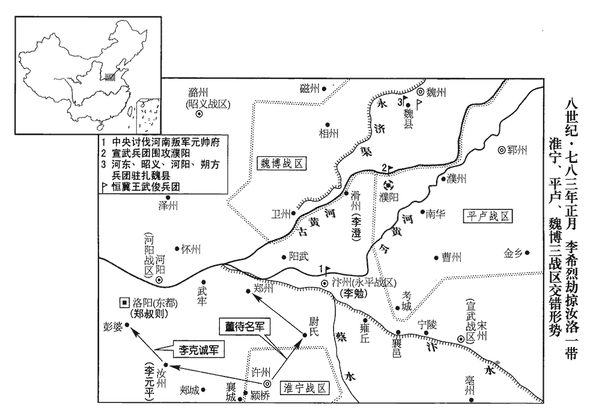
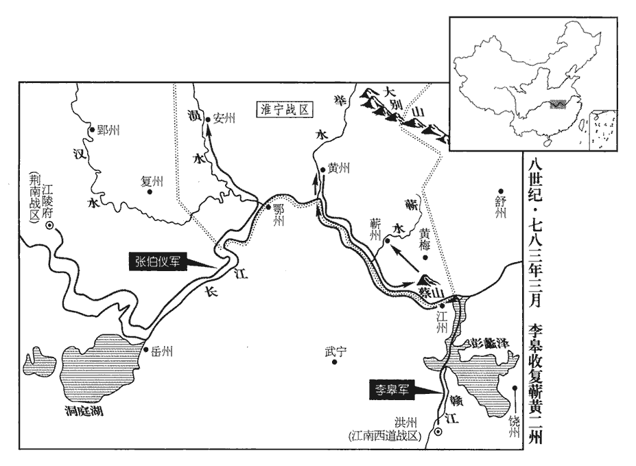
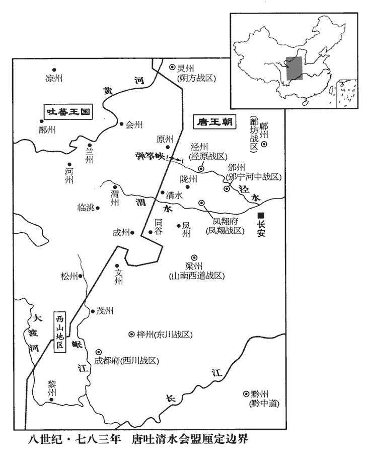
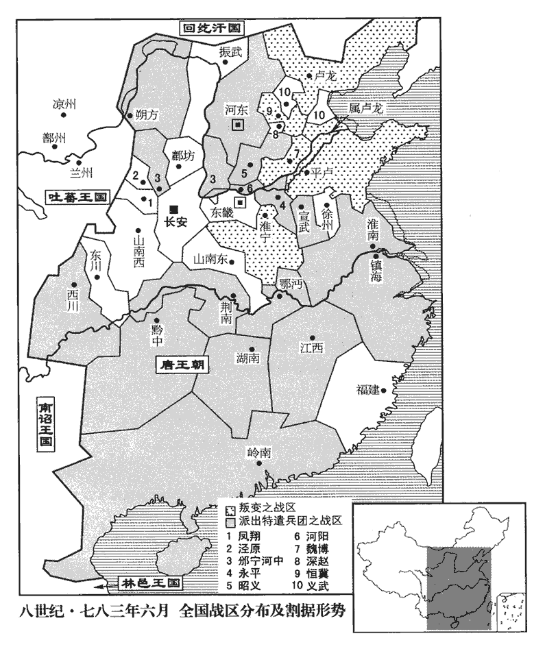
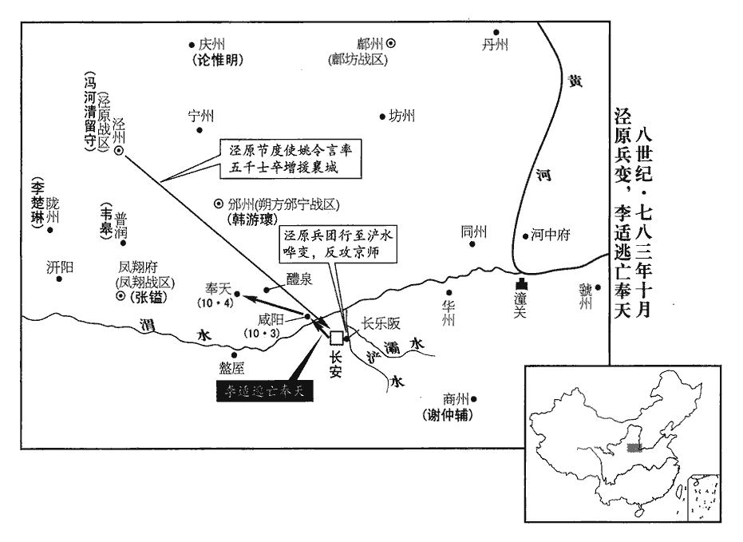
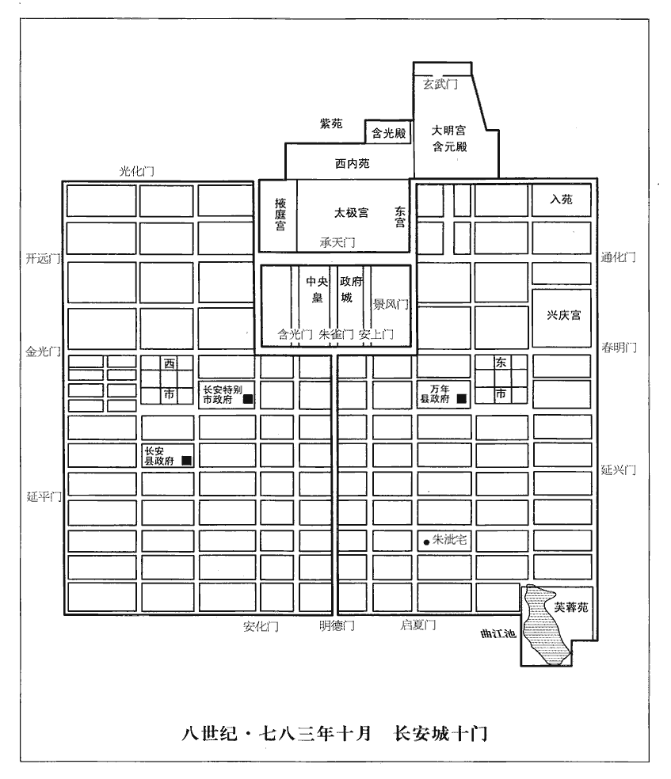
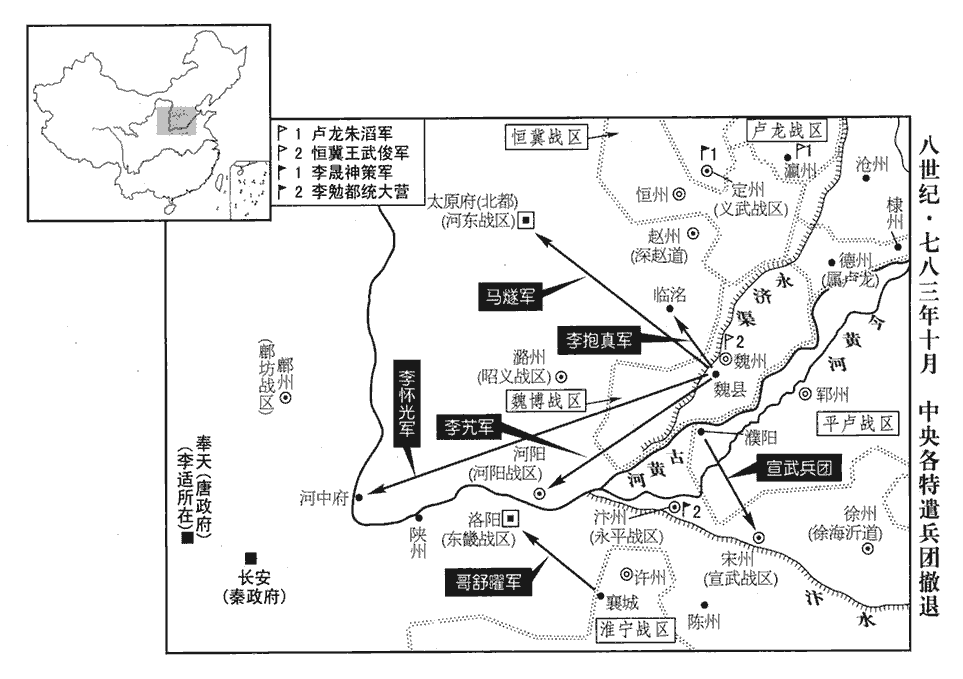

 唐紀四十四起昭陽大淵獻（癸亥）正月，盡十月，不滿一年。是年癸亥諸藩連兵拒命，而德宗玩兵召禍，日尋干戈，最為多事，是卷所紀纔十月耳。

# 德宗神武聖文皇帝三

## 建中四年（癸亥、七八三）

1春，正月，丁亥‹十›，隴右‹驻普润陕西省凤翔县北›節度使張鎰與吐蕃‹首都逻些城西藏拉萨市›尚結贊盟于清水‹甘肃省清水县›。使，疏吏翻。鎰，弋質翻。吐，從暾入聲。清水，漢古縣，唐屬秦州。九域志：在州東九十里。

〖译文〗 [1]春季，正月，丁亥（初十），陇右节度使张镒与吐蕃尚结赞在清水结盟。

2庚寅‹十三›，‹淮宁战区，总部设许州河南省许昌市›李希烈遣其將李克誠襲陷汝州‹河南省汝州市›，執別駕李元平。將，即亮翻。汝州，治梁縣，漢承休侯封邑也。元平，本湖南‹首府设潭州湖南省长沙市›判官，薄有才藝，性疏傲，敢大言，好論兵；好，呼到翻。關【張：「關」上脫「中書侍郎」。】播奇之，薦於上‹李适，本年四十二岁›，以為將相之器，以汝州距許州最近，九域志：汝州，東南至許州二百七十里。史言關播所用非才。相，息亮翻。擢元平為汝州別駕，知州事。元平至汝州，即募工徒治城；治，直之翻。希烈陰使壯士應募執役，入數百人，元平不之覺。希烈遣克誠將數百騎突至城下，將，即亮翻，又音如字。騎，奇寄翻。應募者應之於內，縛元平馳去。元平為人眇小，無須，須，古字取象，以彡shān類耏ér毛也。後人從而加「髟biāo」為「鬚」字，此俗書耳。見希烈恐懼，便液污地。便，毘連翻。便液，謂屎溺也。液，音亦。污，烏故翻。希烈罵之曰：「盲宰相以汝當我，何相輕也！」以判官周晃為汝州刺史，又遣別將董待名等四出抄掠，取尉氏‹河南省尉氏县›，尉氏縣，屬汴州。九域志：在州南九十里。抄，楚交翻。圍鄭州‹河南省郑州市›，官軍數為所敗。邏騎西至彭婆‹河南省伊川县东北彭婆乡›，數，所角翻。敗，補邁翻。邏，郎佐翻。騎，奇寄翻。邏騎，巡邏遊弈之騎。九域志：河南府河南縣有彭婆鎮。金人疆域圖：洛陽縣有彭婆鎮。東都‹洛阳›士民震駭，竄匿山谷；留守鄭叔則入保西苑。東都西苑，在東都城西。鄭叔則蓋備有急，易於西奔也。守，式又翻。

〖译文〗 [2]庚寅（十三日），李希烈派遣他的将领李克诚袭击并攻陷了汝州，捉住别驾李元平。李元平原来是湖南判官，稍有才学技艺，生性疏散傲慢，敢说大话，喜欢谈论用兵，关播将他视为奇才，便向德宗推荐，说他有出将入相的才能。由于汝州距离许州最近，便提升李元平为汝州别驾，并且代理州中事务。李元平来到汝州，立即招募工匠和劳力整治州城。李希烈暗地里让军中勇士前去应募服役，入城有数百人之多，李元平没有觉察。李希烈派遣李克诚带领骑兵数百人突击到汝州城下，应募的人在城里响应，捆绑着李元平急奔而去。李元平个子矮小，不长胡须，见到李希烈，惊恐畏惧，粪尿齐下，污臭满地。李希烈骂他说：“瞎了眼的宰相用你来抵挡我，真是太小看我了！”李希烈任命判官周晃为汝州刺史，又派遣别将董待名等人四下里抢劫财物，攻取尉氏县，围困郑州城，官军好几次都被董待名等人打败。李希烈巡逻游弋的骑兵向西到了彭婆镇，东都洛阳的士绅百姓为之震惊恐骇，纷纷逃避到山谷，留守郑叔则也入城西守卫西苑。

上問計於盧杞，對曰：「希烈年少驍將，恃功驕慢，將佐莫敢諫止；誠得儒雅重臣，奉宣聖澤，為陳逆順禍福，少，始照翻。驍，堅堯翻。將，即亮翻。為，于偽翻。希烈必革心悔過，可不勞軍旅而服。顏真卿三朝舊臣，真卿歷事玄‹李隆基›、肅‹李亨›、代‹李豫›三朝。朝，直遙翻。忠直剛決，名重海內，人所信服，真其人也！」上以為然。甲午‹十七›，命真卿詣許州宣慰希烈。詔下，舉朝失色。下，遐嫁翻。

〖译文〗 德宗向卢杞询问计策，卢杞回答说：“李希烈是一员年轻骁勇的将领，仗恃着立了军功，骄横简慢，将佐工人敢于规劝和阻止他。假如能够选出一位温文尔雅的朝廷重臣，奉旨前去宣示圣上的恩泽，向李希烈讲清逆为祸、顺为福的道理，李希烈一定能够革心洗面，翻然悔过，可以不用兴师动众而使他归服。颜真卿是玄宗、肃宗、代宗三朝老臣，为人忠厚耿直，刚正果决，名声为海内所推重，人人都信服他，真是出使的最好人选！”德宗认为有理。甲午（十七日），德宗命令颜真卿到许州安抚李希烈，诏书颁下，举朝大惊失色。

 

真卿乘驛至東都，鄭叔則曰：「往必不免，宜少留，須後命。」少，詩沼翻。須，待也。真卿曰：「君命也，將焉避之！」焉，於虔翻。遂行。李勉表言：「失一元老，為國家羞，請留之。」又使人邀真卿，【章：十二行本「卿」下有「於道」二字；乙十一行本同；張校同，云無註本亦無。】不及。真卿與其子書，但敕以「奉家廟、撫諸孤」而已。至許州，欲宣詔旨，希烈使其養子千餘人環繞慢罵，李希烈養壯士為子，謂之養子。環，音胡慣翻。拔刃擬之，為將剸tuán啗dàn之勢；剸，旨兗翻，細割也。真卿足不移，色不變。希烈遽以身蔽之，麾眾令退，館真卿而禮之。令，力丁翻。館，古玩翻。希烈欲遣真卿還，還，從宣翻，又音如字。會李元平在座，真卿責之，元平慚而起，以密啟白希烈；希烈意遂變，留真卿不遣。

〖译文〗 颜真卿乘驿车来到东都洛阳，郑叔则说：“若是前往，一定不能幸免。最好是稍作逗留，等待尔后发来的命令。”颜真卿说：“这是皇上的命令啊，我能躲避到哪里去呢！”于是出发了。李勉上表说：“丧失一位元老，乃是朝廷的羞辱，请将颜真卿留下来吧。”李勉又让人拦截颜真卿，但没有赶上他。颜真卿给他儿子去信，只命他“供奉家庙，抚育孤子”罢了。来到许州，颜真卿准备宣布诏旨，李希烈让他的养子千余人环绕着他谩骂，还拔出刀剑向他比划着，作出要将他细割吞食的架势。颜真卿脚不移动，脸不变色。李希烈急忙用身体遮挡他，挥手命令众人退下，将颜真卿安置在馆舍，礼貌地对待他。李希烈打算将颜真卿放回去，正值李元平在座，颜真卿责备了他。李元平惭愧地站起来，以密信向李希烈提出建议。于是李希烈改变了主意，把颜真卿留下，不让他回去。

朱滔、王武俊、田悅、李納各遣使詣希烈，上表稱臣，勸進，使者拜舞於希烈前，說希烈曰：使，疏吏翻。上，時掌翻。說，式芮翻。「朝廷誅滅功臣，失信天下；都統英武自天，功烈蓋世，已為朝廷所猜忌，將有韓、白之禍，朝，直遙翻。統，他綜翻，俗從上聲。韓、白之禍，謂韓信斬於鍾室，白起死於杜郵也。願亟稱尊號，使四海臣民知有所歸。」希烈召顏真卿示之曰：「今四王遣使見推，不謀而同，以朱滔稱冀王，王武俊稱趙王，田悅稱魏王，李納稱齊王，故希烈謂之四王。使，疏吏翻。太師觀此事勢，豈吾獨為朝廷所忌，無所自容邪！」邪，音耶。真卿曰：「此乃四凶，何謂四王！相公不自保功業，為唐忠臣，乃與亂臣賊子相從，求與之同覆滅邪！」希烈不悅，扶真卿出。他日，又與四使同宴，四使曰：「久聞太師重望，今都統將稱大號而太師適至，是天以宰相賜都統也。」顏真卿為太子太師，故皆以其官稱之。相，息亮翻。真卿叱之曰：「何謂宰相！汝知有罵安祿山而死者顏杲卿乎？顔杲卿事見二百一十七卷肅宗至德元載。叱，尺栗翻。乃吾兄也。吾年八十，知守節而死耳，豈受汝輩誘脅乎！」史炤曰：以利動之曰誘，以威迫之曰脅。誘，音酉。四使不敢復言。復，扶又翻。希烈乃使甲士十人守真卿於館舍，掘坎於庭，云欲阬之，真卿怡然，見希烈曰：怡然，安和之貌。「死生已定，何必多端！亟以一劍相與，豈不快公心事邪！」希烈乃謝之。考異曰：顏氏行狀以為：「公至許州，希烈前後詐為公表，奏請汴州者數十，上知而寢之。」舊真卿傳以為：「希烈逼為章表，令雪己，願罷兵馬，累遣真卿兄子峴與從吏凡數輩繼來京師。上皆不報。希烈大宴逆黨，倡優斥黷dú朝政，真卿拂衣起。後張伯儀敗績，令以首級夸示，真卿號慟。周曾謀奉真卿，遂送真卿於龍興寺。」按滔等推尊希烈在去年，真卿使許在今年正月，蓋滔等始勸希烈稱帝，希烈但稱都元帥、建興王，故今年滔等再遣樊播等勸進稱為都統也。真卿剛烈，守之以死，希烈豈能逼之使為章表雪己！行狀云「詐為表奏」，是也。

〖译文〗 朱滔、王武俊、田悦、李纳各自派遣使者到李希烈处，上表称臣，劝他称帝。使者们在李希烈面前行拜舞礼，劝李希烈说：“朝廷杀害有功之臣，对天下言而无信。都统英明威武，得自天授，功业压倒当世，已经遭到朝廷的嫌猜疑忌，将有如韩信、白起被害的大祸。希望都统早称皇帝尊号，使全国的臣民知道有所归依。”李希烈叫来颜真卿，让他看四镇派来的使者，并说：“现在冀、魏、赵、齐四王派遣使者推戴我，不谋而合，太师看看这事态时势，难道我仅仅被朝廷猜忌而无地自容吗？”颜真卿说：“这四人乃是四凶，怎么叫四王！你不肯自保所建树的功劳业绩，做唐朝的忠臣，反而与乱臣贼子相互追随，是要和他们一齐覆灭吗？”李希烈心中不快，将颜真卿扶了出去。另一天，颜真卿又与四镇的使者一起参加宴会，四镇的使者说：“早就听说太师崇高威望，现在都统就要称帝号，而太师恰好到来，这是上天把宰相赐给都统啊。”颜真卿大声呵斥四镇使者说：“说什么宰相！你们知道有个痛骂安禄山而死的颜杲卿吗？他便是我的哥哥。我已经八十岁了，只知道恪守臣节而死，难道受你们的引诱胁迫吗！”四镇使者不敢再说话了。于是李希烈让甲士十人在馆舍中看守颜真卿，在庭院中挖了一个坑穴，说是准备活埋他。颜真卿神色安然，见李希烈说：“既然我的生死已经决定，何必玩弄花样！赶快一剑砍死我，岂不使你心中更痛快些吗？”于是李希烈向他道歉。

3戊戌‹二十一›，以左龍武大將軍哥舒曜為東都•汝州‹总部设洛阳›節度使，將鳳翔‹凤翔府·陕西省凤翔县›、邠寧‹邠州·陕西省彬县›、涇原‹泾州·甘肃省泾川县›、奉天‹陕西省乾县›、好畤zhì‹陕西省永寿县西南›行營兵萬餘人討希烈，鳳翔、邠寧、涇原，三節鎮之兵。奉天、好畤，神策，屯兵也。又詔諸道共討之。曜行至郟城‹河南省郏县›，郟，音夾。郟城縣，屬汝州，東魏之龍山縣也，隋開皇初，改曰汝南，十八年，改曰輔城，大業初，改曰郟城。九域志：郟城縣，在汝州東南九十里。宋白曰：春秋楚令尹子瑕城郟，即此。遇希烈前鋒將陳利貞，擊破之；希烈勢小沮。沮，在呂翻。曜，翰之子也。天寶末，安祿山反，哥舒翰敗沒於潼關。

〖译文〗 [3]戊戌（二十一日），德宗任命左龙武大将军哥舒曜为东都、汝州节度使，率领凤翔、宁、泾原、奉天、好行营兵马一万余人讨伐李希烈，又颁诏命各道共同讨伐。哥舒曜来到郏城时，与李希烈的前锋将领陈利贞遭遇，并打败了他，李希烈军的声势稍挫。哥舒曜是哥舒翰的儿子。

希烈使其將封有麟據鄧州‹河南省邓州市›，南路遂絶，貢獻、商旅皆不通。壬寅‹二十五›，詔治上津‹湖北省郧西县西北上津镇›山路，置郵驛。上津縣，屬商州，治，直之翻。

〖译文〗 李希烈让他的将领封有麟占据邓州，南方的通路于是断绝了，运送贡物以及商人旅客都不能通过。壬寅（二十五日），德宗颁诏修治上津县的山路，并设置了通邮的驿站。

4二月，戊申朔‹一›，命鴻臚卿崔漢衡送區頰贊還吐蕃。區頰贊入見事始見上卷上年。臚，陵如翻。

〖译文〗 [4]二月，戊申朔（初一），德宗命令鸿胪卿崔汉衡送区颊赞返回吐蕃。

5丙寅‹十九›，以河陽三城‹河南省孟州市›、懷‹河南省沁阳市›、衛州‹河南省卫辉市›為河陽軍。‹总部河阳城。此时卫州仍为田悦占据›

〖译文〗 [5]丙寅（十九日），朝廷以河阳三城、怀州、卫州设置河阳军。

6丁卯‹二十›，哥舒曜克汝州，擒周晃。

〖译文〗 [6]丁卯（二十日），哥舒曜攻克汝州，擒获周晃。

7三月，戊寅‹一›，江西‹总部设洪州江西省南昌市›節度使曹王皋敗李希烈將韓霜露於黃梅‹湖北省黄梅县›，斬之；辛卯‹十四›，拔黃州‹湖北省新洲县›。時希烈兵柵蔡山‹湖北省黄梅县西南蔡山镇›，敗，補邁翻。九域志：黃梅縣，屬蘄州，距州一百二十里。蔡山，在黃梅界，即江左新蔡郡治所，魯悉達保聚之地。宋白曰：宋分江夏郡置南新蔡郡；隋開皇十八年，改為黃梅縣，以界內黃梅山名之。祝穆曰：蔡山出大龜，春秋左氏傳所謂大蔡，蓋以山得名也。險不可攻。皋聲言西取蘄州‹湖北省蕲春县›，蘄qí，音祈。蘄州，後漢為蘄春侯國，吳置蘄春郡，北齊置齊昌郡及羅州，後周改蘄州。州北有蘄水，南入于江。地名解云：蘄春，以水隈wēi多蘄菜，因名。引舟師泝江而上，希烈之將引兵循江隨戰。去蔡山三百餘里，皋乃復放舟順流而下，上，時掌翻。復，扶又翻。下，遐嫁翻。急攻蔡山，拔之。希烈兵還救之，不及而敗。皋遂進拔蘄州，表伊慎為蘄州刺史，王鍔為江州‹江西省九江市›刺史。

〖译文〗 [7]三月，戊寅（初一），江西节度使曹王李皋在黄梅打败李希烈的将领韩霜露，并斩杀了他。辛卯（十四日），曹王李皋攻克黄州。当时，李希烈的兵马在蔡山树起栅垒，形势险要，难以攻打。李皋声称西取蕲州，带领水军溯长江而上，李希烈的将领带兵沿着长江尾随而战。当离开蔡山三百余里的时候，李皋便又放开船只，顺流而下，急攻蔡山，并将蔡山攻克。李希烈回军救援不及而失败。李皋接着进军攻克蕲州，上表请求任命伊慎为蕲州刺史，王锷为江州刺史。

8淮寧都虞候周曾、鎮遏兵馬使王玢bīn、押牙姚憺dàn、韋清密輸款於李勉。玢，府巾翻。憺，徒濫翻，又徒敢翻。李希烈遣曾與十將康秀琳將兵三萬攻哥舒曜，至襄城‹河南省襄城县›，襄城縣，漢屬潁川郡，晉屬襄城郡；後周置汝州，唐貞觀元年，廢州，以襄城縣屬許州；貞觀八年，以伊州為汝州，襄城仍屬許州，天寶七載，復屬汝州。九域志：襄城縣，在汝州東南一百有五十里。曾等密謀還軍襲希烈，奉顏真卿為節度使，使玢、憺、清為內應。希烈知之，遣別將李克誠將騾軍三千人淮西地少馬，乘騾以戰，號騾子軍，尤為驍銳。將，即亮翻；誠將音同，又音如字。騾，落戈翻。襲曾等，殺之，并殺玢、憺及其黨。甲午‹十七›，詔贈曾等官。始，韋清與曾等約，事泄不相引，故獨得免。清恐終及禍，說希烈請詣朱滔乞師，說，式芮翻。希烈遣之，行至襄邑‹河南省睢县›，逃奔劉洽。襄邑縣，屬宋州。劉洽時以宣武節度鎮宋州‹河南省商丘县›。希烈聞周曾等有變，閉壁數日；其黨寇尉氏、鄭州者聞之，亦遁歸。希烈乃上表歸咎於周曾等，引兵還蔡州‹河南省汝南县›，上，時掌翻。還，從宣翻。蔡州，治汝陽縣，淮寧本鎮也。希烈時自許州退還。外示悔過從順，實待朱滔等之援也。置顏真卿於龍興寺。寺蓋在蔡州。

〖译文〗 [8]淮宁都虞候周曾、镇遏兵马使王玢、押牙姚、韦清暗中向李勉表示归诚之意。李希烈派遣周曾与十将康秀琳带领兵马三万人攻打哥舒曜，来到襄城以后，周曾等人秘密策划回军袭击李希烈，拥戴颜真卿为节度使，让王玢、姚、韦清担任内应。李希烈得知此事以后，派遣别将李克诚带领骡军三千人袭击周曾等人，杀掉了周曾，并且杀掉王玢、姚及其同党。甲午（十七日），朝廷颁诏追赠周曾等人官位。开始的时候，韦清与周曾等人约定，一旦事情泄露，不可相互牵连，所以他独自得以幸免。韦请担心终究还会招致祸患，便劝说李希烈请让他到朱滔那里请求援兵，李希烈派他去了，他来到襄邑县的时候，便逃奔到刘洽那里去了。李希烈听说周曾等人已有变故，便将营垒关闭了好几天，他的那些前去侵犯尉氏、郑州的党羽闻知此事，也逃了回来。于是，李希烈向朝廷上表，将一切罪名都推到周曾等人身上，自己领兵返回蔡州，表面上表示悔过，顺从朝廷，实际上却是等候朱滔等人的援兵。他把颜真卿安置在龙兴寺。

 

丁酉‹二十›，荊南‹总部设江陵府湖北省江陵县›節度使張伯儀與淮寧兵戰於安州‹湖北省安陆市›，安州，漢安陸地。官軍大敗，伯儀僅以身免，亡其所持節。希烈使人以其節及俘馘guó示顏真卿；真卿號慟投地，絶而復蘇，自是不復與人言。俘，方無翻。馘，古獲翻。號，戶高翻。復，扶又翻，又音如字。

〖译文〗 丁酉（二十日），荆南节度使张伯仪与淮宁兵在安州交战，官军大败，张伯仪仅自身幸免于难，还失去了所持旌节。李希烈叫人把张伯仪的旌节以及被俘士兵的左耳给颜真卿看，颜真卿痛哭扑地，气绝而复苏，从此不再与人讲话。

9夏，四月，上以神策軍使白志貞‹白琇珪›為京城召募使，募禁兵以討李希烈。志貞請諸嘗為節度、觀察、都團練使者，不問存沒，並勒其子弟帥奴馬自備資裝從軍，帥，讀曰率。授以五品官；貧者甚苦之，人心始搖。史言德宗窮兵，亂將作矣。

〖译文〗 [9]夏季，四月，德宗任命神策军使白志贞为京城召募使，招募禁兵以讨伐李希烈。白志贞请求让各个曾经担任过节度使、观察使、都团练使的官员，不论在世的或殁世的，都勒令他们的子弟带着奴仆与马匹，自己备办衣物参军，授给他们五品官职。家境贫寒的人深以为苦，民心开始动摇。

10上命宰相、尚書與吐蕃區頰贊盟於豐邑里，區頰贊以清水之盟，疆埸未定，不果盟。是年春，張鎰與吐蕃盟於清水。宋白曰：張鎰與吐蕃盟文曰：「今國家所守界，涇州，西至彈箏峽‹甘肃省平凉市西北›西口；隴州‹陕西省陇县›，西至清水縣；鳳州‹陕西省凤县›，西至同谷縣‹甘肃省成县›；暨劍南‹总部成都府›西山大渡河東，為漢界。蕃國，守備在蘭‹甘肃省兰州市›、渭‹甘肃省陇西县›、原‹宁夏固原县›、會‹甘肃省靖远县›，西至臨洮‹甘肃省岷县›，又東至成州‹甘肃省礼县南龙山镇›，抵劍南西界磨些諸蠻、大渡水西南，為蕃界。」相，息亮翻。尚，辰羊翻。吐，從暾入聲。埸，音亦。己未‹十三›，命崔漢衡入吐蕃，決於贊普。是年二月，命崔漢衡送區頰贊，蓋欲與之盟而遣之，久而盟未定。又命漢衡入吐蕃，決於贊普。此時中國疲於兵，彼固有以窺唐矣，盟無益也。

〖译文〗 [10]德宗命令宰相、尚书与吐蕃区颊赞在丰邑里会盟，区颊赞因清水会盟未将边疆确定，便没来会盟。己未（十三日），德宗命令崔汉衡前往吐蕃，由吐蕃赞普作出决断。

11庚申‹十四›，加永平、宣武、河陽都統李勉淮西‹总部设蔡州，原称淮宁战区›招討使，東都、汝州‹总部设洛阳›節度使哥舒曜為之副，以荊南節度使張伯儀為淮西應援招討使，山南東道‹总部设襄州湖北省襄樊市›節度使賈耽、江西節度使曹王皋為之副。上督哥舒曜進兵，曜至潁橋‹河南省襄城县东北颍桥镇›，九域志：襄城縣有潁橋鎮。遇大雨，還保襄城。李希烈遣其將李光輝攻襄城；曜擊卻之。

〖译文〗 [11]庚申（十四日），德宗加任永平、宣武、河阳都统李勉为淮西招讨使，以东都、汝州节度使哥舒曜作他的副职，任命荆南节度使张伯仪为淮西应援招讨使，以山南东道节度使贾耽、江西节度使曹王李皋作为他的副职。德宗督促哥舒曜到颖桥时，遇到大雨，便回军防守襄城。李希烈派遣他的将领李光辉攻打襄城，哥舒曜将他击退。

 

12五月，乙酉‹九›，潁王璬jiǎo薨。璬，玄宗‹李隆基›子，音古了翻。

〖译文〗 [12]五月，乙酉（初九），颍王李去世。

13乙未‹十九›，以宣武節度使劉洽兼淄青‹总部设郓州山东省东平县›招討使。

〖译文〗 [13]乙未（十九日），德宗让宣武节度使刘洽兼任淄青招讨使。

14李晟謀取涿‹河北省涿州市›、莫‹河北省任丘市北鄚州镇›二州，以絕幽、魏‹魏博战区总部·河北省大名县›往來之路，與張孝忠之子昇雲‹义武战区，总部设定州河北省定州市›圍朱滔所署易州刺史鄭景濟於清苑‹河北省保定市›，水經註：徐水出北平，東逕清苑城，東至高陽，入于河。劉昫曰：清苑縣，漢之樂鄉縣，屬信都國。隋為清苑縣，屬瀛州；唐景雲元年，屬冀州；至宋，以清苑縣為保州治所。宋白曰：漢高宗訪樂毅之後，得樂叔，封於樂鄉。高齊省，仍自今易州滿城縣界移永寧縣，理北城。隋改為清苑縣，因滿城縣界清苑河為名。累月不下。滔以其司武尚書馬寔為留守，司武尚書，猶天朝兵部尚書。將步騎萬餘守魏營，自將步騎萬五千救清苑。李晟軍大敗，退保易州‹河北省易县›。滔還軍瀛州‹河北省河间市›，張昇雲奔滿城‹河北省满城县›。劉昫曰：滿城縣，漢北平縣地，後魏置永樂縣，天寶元年，改為滿城，屬易州。會晟病甚，引軍還保定州。考異曰：燕南記曰：「晟與張昇雲等圍鄭景濟於清苑，自二月至四月。滔自統馬步萬五千人救清苑，四月二日，發館陶砦zhài，五月內到。晟出戰不利，城中又出攻晟，晟敗去。滔乘勝逐晟等，大破之。晟奔易州，染病，不復更出。」實錄曰：「庚子，李晟自清苑退保易州。」舊晟傳曰：「自正月至于五月，會晟病甚，不知人者數焉。軍吏合謀，乃以馬輿還定州。」今從之。實錄所云庚子，蓋奏到之日也。

〖译文〗 [14]李晟策划攻取涿、莫二州，以便截断幽州与魏州往来的通路，与张孝忠的儿子张升云在清苑围困朱滔所署任的易州刺史郑景济，但好几个月未能攻打下。朱滔任命他的司武尚书马为留守，带领步兵骑兵一万余人防守魏州营垒，自己带领步兵、骑兵一万五千人援救清苑。李晟军被打得大败，退守易州。朱滔回军瀛州，张升云逃奔满城。适逢李晟患病甚重，便带领军队回保定州。

王武俊以滔既破李晟，留屯瀛州，未還魏橋，遣其給事中宋端趣之。趣，讀曰促。端見滔，言頗不遜，滔怒，使謂武俊曰：「滔以熱疾，暫未南還，大王二兄遽有云云。滔以救魏博之故，叛君‹李适›棄兄‹朱泚›，如脫屣xǐ耳。履不躡跟曰屣，脫之易耳。二兄必相疑，惟二兄所為！」端還報，武俊自辨於馬寔，寔以狀白滔，言：「趙王知宋端無禮於大王，深加責讓，實無他志。」武俊亦遣承令官鄭和隨寔使者見滔，謝之。時武俊等改要藉官為承令官。滔乃悦，相待如初。然武俊以是益恨滔矣。

〖译文〗 由于朱滔打败李晟，留在瀛州屯驻，没有返回魏桥，王武俊便派遣他的给事中宋端前去催促朱滔。宋端见到朱滔，说话颇欠谦恭，朱滔很生气，让他告诉王武俊说：“我因身患热病，暂时未能南回，大王二哥便骤然有如此说法。我因救援魏博的原故，背叛国君，抛弃兄弟，就象脱去无跟的鞋子一样。二哥如果一定要怀疑我，那就但凭二哥为所欲为吧！”宋端回报王武俊，王武俊向马为自己分辩，马将此情状禀告朱滔说：“赵王知道宋端对大王无礼，狠狠地责备了他，赵王实在并无他意。”王武俊也派遣承令官郑和跟随马的使者去见朱滔，向他表示歉意。于是朱滔高兴起来，对待王武俊一如既往。然而，王武俊因此事却益发怨恨朱滔了。

六月，李抱真使參謀賈林詣武俊壁詐降。節度參謀，關預軍中機密。武俊見之。林曰：「林來奉詔，非降也。」武俊色動，問其故，林曰：「天子知大夫宿著誠效，謂誅李惟岳也。及登壇之日，謂稱王時也。撫膺顧左右曰：『我本徇忠義，天子不察。』諸將亦嘗共表大夫之志。天子語使者曰，『朕前事誠誤，悔之無及。朋友失意，尚可謝，況朕為四海之主乎！』」賈林先言武俊心事，後述天子詔旨，鋪陳悔過之意，可謂善說矣。語，牛倨翻。武俊曰：「僕胡人也，為將尚知愛百姓；況天子，豈專以殺人為事乎！今山東‹太行山以东›連兵，暴骨如莽，杜預曰：草之生於廣野莽莽然，故曰草莽。莽，莫朗翻。暴，步卜翻，又薄報翻。就使克捷，與誰守之！僕不憚歸國，但已與諸鎮結盟。胡人性直，不欲使曲在己，天子誠能下詔赦諸鎮之罪，僕當首唱從化；諸鎮有不從者，請奉辭伐之。如此，則上不負天子，下不負同列，不過五旬，河朔‹河北平原›定矣。」使林還報抱真，陰相約結。為武俊與抱真破走朱滔張本。

〖译文〗 六月，李抱真让参谋贾林到王武俊的营垒诈称归降，王武俊接见了贾林。贾林说：“我是奉诏而来的，并不是投降的。”王武俊脸色变了，问其中原故，贾林说：“皇上知道大夫对朝廷一向归诚效命，及至登上坛场称王时，还捶着胸口环顾随从说：‘我本来是要献身忠义的，奈何皇上不能详察。’诸将领也曾经共同上表讲过大夫的志向，皇上对使者说：‘以前的事，诚然是朕的失误，后悔也来不及了。朋友之间意见不合，还可以道歉，何况我是四海之主呢！’”王武俊说：“我是个胡人，作为将领，还知道爱护百姓，何况身为皇上，哪能专门从事杀人呢！现在崤山以东接连用兵，白骨暴露，有如草莽，即使朝廷能够获胜，将与何人来共守呢！我并不害怕归顺国家，只是我已经与各镇结下盟约。胡人生性耿直，不愿让自己委曲。倘若皇上能够下诏赦免各镇的罪过，我自当第一个倡议归顺王化，各镇如有不服从的，请让我遵奉正义之辞讨伐他们。果能如此，我便上不辜负皇上，下不辜负与我同列之人，不超过五十天，河朔地区便可安定了。”王武俊让贾林回报李抱真，暗中相互联络。

15庚戌‹五›，初行稅間架、除陌錢法。時河東、澤潞、河陽、朔方四軍屯魏縣‹河北省大名县西南›，神策、永平、宣武、淮南、浙西、荊南、江泗、沔鄂、湖南、黔中、劍南、嶺南諸軍，環淮寧之境。江，謂江南西道，「泗」當作「西」。黔，音琴。環，音宦。舊制，諸道軍出境，皆仰給度支；仰，牛向翻。上優恤士卒，每出境，加給酒肉，本道糧仍給其家，一人兼三人之給，故將士利之。各出軍纔逾境而止，書有之：「威克厥愛，允濟；愛克厥威，允罔功。」德宗蓋未知此者。月費錢百三十餘萬緡，常賦不能供。判度支趙贊乃奏行二法：二法，即所謂稅間架及除陌錢也。所謂稅間架者，每屋兩架為間，上屋稅錢二千，中稅千，下稅五百，吏執筆握算，入人室廬計其數。史炤曰：算，所以籌算也。其法用竹，徑一分，長六寸，二百七十一枚而成。六觚gū為一握。或有宅屋多而無他資者，出錢動數百緡。敢匿一間，杖六十，賞告者錢五十緡。所謂除陌錢者，公私給與及賣買，每緡官留五十錢，給他物及相貿易者，約錢為率。貿，音茂。敢隱錢百，杖六十，罰錢二千，賞告者錢十緡，其賞錢皆出坐事之家。於是愁怨之聲，盈於遠近。

〖译文〗 [15]庚戌（初五），开始施行税间架法和除陌钱法。当时，河东、泽潞、河阳、朔方四军屯驻在魏县，神策、永平、宣武、淮南、浙西、荆南、江泗、沔鄂、湖南、黔中、剑南、岭南各军环绕在淮宁周围。根据原有制度，各道军队开出本道，一概由度支提供给养。德宗优待体恤士兵，每当出境时，增加酒肉供给，士兵在本道的口粮仍然拨给他们的家庭，一人可以得到三人的给养，所以将士愿从中获利，于是各自出军，才越过本道便停下来，每月消耗钱一百三十余万缗，通常的赋税无法保证供给。判度支赵赞于是上奏施行税间架和除陌钱二法。所谓税间架法，每房屋两架为一间，上等房屋征税二千钱，中等的征税一千，下等的征税五百。吏人拿着笔，握着计算工具算，进入百姓家中，计算应征税额。有些住宅房屋多而没有其他资财的人家，交出的税钱动不动就是数百缗。敢于隐藏房屋一间的，杖责六十，奖赏告发人钱五十缗。所谓除陌钱法，就是凡公家私人所给与和买卖所得的钱，官家每缗钱中留取五十钱，对于给与其他物品和以物易物所得到的，约计成钱，进行计算。敢于瞒钱一百的，杖责六十，罚钱二千，奖赏告发人钱十缗，这奖赏钱一律出在获罪的人家。于是，愁苦怨恨之声，充满了远近各地。

16丁卯‹二十二›，徙郴王逾為丹王，鄜王遘為簡王。二王，皆上弟也。

〖译文〗 [16]丁卯（二十二日），德宗改封郴王李逾为丹王，王李为简王。

 

17庚午‹二十五›，答蕃判官監察御史于頔dí答蕃判官，因當時出使署置，以為官名。頔，徒歷翻。與吐蕃使者論剌沒藏至自青海‹青海湖›，剌，盧達翻。言疆埸已定，請遣區頰贊歸國。秋，七月，甲申‹九›，以禮部尚書李揆為入蕃會盟使。入蕃命官，猶答蕃也。壬辰‹十七›，詔諸將相與區頰贊盟於城西。李揆有才望，盧杞惡之，惡，烏路翻。故使之入吐蕃。揆言於上曰：「臣不憚遠行，恐死於道路，不能達詔命！」上為之惻然，為，于偽翻。謂杞曰：「揆無乃太老！」‹李揆本年七十二岁›杞曰：「使遠夷，非諳練朝廷故事者不可。使，疏吏翻。諳，烏含翻。且揆行，則自今年少於揆者少，詩照翻。不敢辭遠使矣。」使，疏吏翻。

〖译文〗 [17]庚午（二十五日），答蕃判官、监察御史于与吐蕃使者论剌没藏从青海回朝，说是双方边界已经确定，请让区颊赞回国。秋季，七月，甲申（初九），德宗任命礼部尚书李揆为入蕃会盟使。壬辰（十七日），德宗颁诏命令诸将相与区颊赞在城西会盟。李揆素有才干与威望，卢杞憎恶他，所以让他出使吐蕃。李揆对德宗说：“我不害怕走远路，只是担心死在路途之中，不能将诏命送到。”德宗为李揆的话而悲伤，便对卢杞说：“李揆恐怕过于老迈了吧！”卢杞说：“到远方的夷人出使，不熟悉朝廷旧典的人是不行的。而且，李揆去了，今后年纪小于李揆的人，便不敢推辞去远方出使了。”

18八月，丁未‹二›，李希烈將兵三萬圍哥舒曜於襄城，詔李勉及神策將劉德信將兵救之。乙卯‹十›，希烈將曹季昌以隨州‹湖北省随州市›降，尋復為其將康叔夜所殺。復，扶又翻。

〖译文〗 [18]八月，丁未（初二），李希烈领兵三万人在襄城包围哥舒曜，诏令李勉以及神策军将领刘德信领兵援救哥舒曜。乙卯（初十），李希烈的将领曹季昌率随州归降，不久又被他的将领康叔夜杀死。

19初，上在東宮，聞監察御史嘉興‹浙江省嘉兴市›陸贄名，嘉興，漢由拳縣地，吳大帝黃龍三年，以其地嘉禾生，改為禾興縣，後避太子和名，改為嘉興縣。隋廢縣，唐初復置，屬蘇州。即位，召為翰林學士，韋執誼翰林志曰：自太宗時，名儒學士；時召草制，然猶未有名號。乾封以後，始號「北門學士」。玄宗初，置翰林待詔，掌四方表疏批答，應和文章。繼以詔敕文告悉由中書，多壅滯，始選朝官有詞藝學識者入居翰林，供奉別旨，然亦未定名；制詔書敕猶或分在集賢。開元二十六年，翰林供奉始改稱學士，別建學士院於翰林院之南，俾專內命。其後又置東翰林院於金鑾殿之西，隨上所在。數問以得失。時兩河用兵久不決，兩河，謂河南、河北。賦役日滋，贄以兵窮民困，恐別生內變，乃上奏，其略曰：「克敵之要，在乎將得其人；馭將之方，在乎操得其柄。將，即亮翻；下同。操，千高翻。將非其人者，兵雖眾不足恃；操失其柄者，將雖材不為用。」又曰：「將不能使兵，國不能馭將，非止費財翫寇之弊，亦有不戢jí自焚之災。」左氏傳曰：兵猶火也，不戢，將自焚。又曰：「今兩河、淮西‹淮河中游以西›為叛亂之帥者，獨四五凶人而已。四五凶人，謂河北則朱滔、王武俊、田悅，河南則李納，淮西則李希烈也。帥，所類翻。尚恐其中或遭詿誤，詿guà，古賣翻，又胡卦翻。內蓄危疑；蒼黃失圖，勢不得止。況其餘眾，蓋並脅從，史炤曰：書云脅從罔治，孔穎達疏云：謂被脅從而距王命者。余謂脅從者，為威力所迫脅，不得已而從於逆，非同心為逆者也。苟知全生，豈願為惡！」又曰：「無紓shū目前之虞，或興意外之變。人者，邦之本也。財者，人之心也。其心傷則其本傷，其本傷則枝幹顛瘁矣。」瘁，秦醉翻。又曰：「人搖不寧，事變難測，是以兵貴拙速，不貴巧遲。若不靖於本而務救於末，則救之所為，乃禍之所起也。」又論關中形勢，以為：「王者蓄威以昭德，偏廢則危；居重以馭輕，倒持則悖。王畿者‹陕西省中部›，四方之本也。太宗‹李世民›列置府兵，分隸禁衛，大凡諸府八百餘所，而在關中者殆五百焉。舉天下不敵關中，【章：乙十一行本「中」下」「之半」二字。】則居重馭輕之意明矣。承平漸久，武備浸微，雖府衛具存而卒乘罕習。卒，臧沒翻。乘，繩證翻。故祿山竊倒持之柄，乘外重之資，一舉滔天，兩京不守。事見玄宗天寶十四載、肅宗至德元載。尚賴西邊有兵，諸牧有馬，每州有糧，故肅宗‹李亨›得以中興。中，竹仲翻。乾元之後，繼有外虞，悉師東討，邊備既弛，禁戎亦空，吐蕃乘虛，深入為寇，故先皇帝‹李豫›莫與為禦，避之東遊。事見二百二十三卷代宗廣德元年。是皆失居重馭輕之權，忘深根固柢之慮。柢dǐ，都禮翻，又都計翻。內寇則殽、函失險，外侵則汧‹渭水支流›、渭為戎。汧，口肩翻。于斯之時，雖有四方之師，寧救一朝之患，陛下追想及此，豈不為之寒心哉！為，于偽翻。今朔方‹宁夏灵武市›、太原‹山西省太原市›之眾，遠在山東‹太行山以东›；謂李懷光以朔方軍馬，燧以太原軍討田悅，兵不解也。神策六軍之兵，繼出關外‹潼关以东›。左右羽林、左右龍武、左右神策為六軍。又曰：左右羽林、龍武、神武為六軍。神策軍最盛，在六軍之右。時李晟、哥舒曜、劉德信等皆以禁兵出關‹潼关›討賊。儻有賊臣啗寇，黠虜覷邊，啗，徒濫翻，又徒覽翻。覷，七慮翻，伺視也。伺隙乘虛，微犯亭障，此愚臣所竊憂也。伺，相吏翻。未審陛下其何以禦之！側聞伐叛之初，議者多易其事，以其事為易也。易，弋豉翻。僉謂有征無戰，役不踰時，計兵未甚多，度費未甚廣，度，徒洛翻。於事為無擾，於人為不勞；曾不料兵連禍拏ná，變故難測，日引月長，漸乖始圖。曾，戶增翻。拏，女加翻，相牽引也。圖，謀也。往歲為天下所患，咸謂除之則可致升平者，李正己、李寶臣、梁崇義、田悅是也。往歲為國家所信，咸謂任之則可除禍亂者，朱滔、李希烈是也。既而正己死，李納繼之；寶臣死，惟岳繼之；崇義平，希烈叛；惟岳戮，朱滔攜。攜，離也，貳也。然則往歲之所患者，四去其三矣，去，羌呂翻。而患竟不衰；往歲之所信，今則自叛矣，而餘又難保。是知立國之安危在勢，任事之濟否在人。勢苟安，則異類同心也；勢苟危，則舟中敵國也。陛下豈可不追鑒往事，惟新令圖，脩偏廢之柄以靖人，復倒持之權以固國！漢人曰，秦倒持太阿，授楚其柄。而乃孜孜汲汲，極思勞神，思，相吏翻。徇無已之求，望難必之效乎！今關輔之間‹陕西省中部›，徵發已甚，宮苑之內，備衛不全。北軍皆屯苑中，時悉在行營。萬一將帥之中，又如朱滔、希烈，或負固邊壘，誘致豺狼，將，即亮翻。帥，所類翻。誘，羊久翻或竊發郊畿，驚犯城闕，此亦愚臣所竊為憂者也，未審陛下復何以備之！姚令言、朱泚之變，卒如陸贄所料。復，扶又翻。又音如字。陛下儻過聽愚計，所遣神策六軍李晟等及節將子弟，悉可追還；晟，成正翻。節將子弟，白志貞所奏遣東征者。還，從宣翻，又音如字。明敕涇、隴‹陕西省陇县›、邠、寧‹甘肃省宁县›但令嚴備封守，邠，卑旻翻。令，力丁翻。仍云更不徵發，使知各保安居。又降德音，罷京城及畿縣間架等雜稅，則冀已輸者弭怨，見處者獲寧，見，賢遍翻。處，昌呂翻。人心不搖，邦本自固。」上不能用。

〖译文〗 [19]当初，德宗在东宫当太子时，听说监察御史嘉兴人陆贽的名声。德宗即位以后，便召陆贽担任翰林学士，屡次向他询问朝政得失。当时河南、河北地区用兵长久不能结束，赋税劳役日益增多，陆贽因兵源穷竭，百姓困顿，恐怕内部生出别的变故，便进上奏章，大略是说：“打败敌人的关键，在于任用将领能够得当；驾驭将领的办法，在于掌握用人的权柄。任用将领不得当，兵马虽然众多，也是不足依恃的；失去用人的权柄，将领虽然有才干，还是不能为朝廷所用。”陆贽又说：“将领不能指挥士兵，国家不能驾驭将领，这不仅有耗费资财、玩忽寇盗的弊端，而且也会有兵火不息而终至自焚的灾祸。”又说：“现在河北、河南、淮西发起叛乱的主将，只是四五个凶人罢了。尚且恐怕其中有的人是遭受连累而受到损害，心中积蓄着自危的疑虑，匆忙之间，考虑不周，为情势所趋，不能停止。何况其余众人，恐怕全是因受人胁迫而跟随反叛的，如果知道还有生路，哪里还愿意作恶呢！”又说：“如果不解除眼前的忧虑，也许还会引起意外的变故。百姓是国家的根本，财利是百姓的核心。核心受到伤害，根本也就会受到伤害；根本受到伤害，枝干也就因过度疲劳跌落。”又说：“人心动摇，不得安宁，事故变幻，难以测度，所以用兵以拙而速为可贵，不以巧而迟为可贵。假如不能安定根本而去致力于救助末梢，那么，救助末梢所做的事情，也正是祸患所起的原因。”陆贽又论说关中的形势，他认为：“做天子的应该积蓄威严，昭示恩德，若是偏废，便有危险；应该居于重兵防守之地，以便控制轻兵屯戍之地，如果轻重颠倒，便不合乎事理。皇上所在的京都周围地区，是四方的根本。太宗布置府兵，分别隶属于禁卫，大概军府共有八百余所，而安排在关中的军府便约有五百所，全国敌不住关中，那么，居于重兵防守之地，以便控制轻兵屯戍之地的意图是很明白的了。国家安定的日子长了，军备逐渐衰败，虽然军府、卫所都依然存在，但是兵马演练却很罕见了。所以安禄山窃取被重颠倒的权柄，乘着外有重兵的资本，发动叛乱，有如洪水滔天，两京相继失守。还是靠着西部边疆有军队，诸牧监有马，各州有粮食，所以肃宗才得以复兴。乾元以后，外患又相继发生，整个军队向东讨伐，边疆的军备既已废驰，禁兵复又空虚，吐蕃乘国家虚弱，深入内地侵扰，所以先帝无法抵御，便避开吐蕃东游。这都是因为失去居于重兵防守之地，以控制轻兵屯戍之地的权柄，忘记考虑深深培固根柢。内有寇盗，崤山、函谷关便失去险要；外有攻侵，州、渭州便都成了外族的天下。在这样的时候，虽有各地的军队，难道能救助一朝发生的祸患吗？陛下回顾往事至此，难道不为此而寒心吗？现在朔方、太原的军队远在崤山以东，神策等六军又相继开出关外。倘若在贼臣勾引敌寇，狡猾的敌虏窥伺边疆，看准缝隙，乘虚而入，悄悄侵犯边防的亭障，这是愚臣在私下里所担忧的啊，不知陛下将如何抵御？我从侧面得知，开始讨伐叛军时，议事的人大多把用兵看得轻而易举，都说只有调兵出征而实无战事，兵役不会超越时限，算起来需要兵员不会太多，估计费用也不会太大，国事并无骚扰，百姓并无辛劳。谁曾料到后来战事相继，灾祸频仍，变故难以测度，随着时间延长，逐渐背离了初始的谋划。以往被天下视为灾祸，都说铲而除之便可再回到太平之世的，是李正己、李宝臣、梁崇义、田悦诸人；以往被朝廷所信任，都说任而用之便可除去祸乱的，是朱滔、李希烈等人。不久前，李正己死了，李纳接续了他；李宝臣死了，李惟岳接续了他；梁崇义被平定了，李希烈又反叛了；李惟岳被杀掉了，朱滔又叛离了。这样说来，以往年被视为祸患的人，四个已经去掉三个了，但祸患终竟未曾减弱；以住被信任的人，现在却自行反叛了，而剩下来的人也难保不叛。由此可知，立国的安定与否在于形势，办事的成功与否在于用人。如果形势安定，那么异族也会与朝廷一条心的；如果形势危殆，那么同船之人也会成为敌人的。陛下岂能不以往事为借鉴，革新法度，修复被偏废的权柄，以便安定人心，恢复被倒持的权力，以巩固国家，却反而这样孜孜不倦，汲汲以求，费尽思索，劳尽心神，屈从于没完没了的欲求，而期待难以必成的功效呢！如今关中畿辅地区征发兵员已经太多，宫廷苑囿之中警备不全。万一将帅中有人又步朱滔、李希烈的后尘，或者依仗边塞壁垒险固，引诱招致异族入侵，或者偷偷发兵京郊畿辅，震动京城，干犯宫阙，这也是我私下里所担忧的啊，不知陛下又如何防备这种情况呢？倘使陛下肯屈尊听我的计策，那么，应该全部追回朝廷派遣的神策六军李晟等人以及诸使节、将领的子弟，明文敕令泾、陇、、宁各州，只要严密防守四境，还要说明再不征调兵员，使人们知道各保安定生活。又须颁降德音，罢除京城与畿辅各县的间架等杂税，此则可望使已经交税的人消弭怨恨，使现在居住在京城与畿辅各县的人们获得安宁，人心不再动摇，国家的根本自然就强固了。”德宗未能采用这些建议。

20壬戌‹十七›，以汴西‹汴水以西›運使崔縱兼魏州四節度都糧料使。汴東、西運使事始見上卷上年。河東節度使馬燧、澤潞節度使李抱真、河陽節度使李艽jiāo、朔方節度使李懷光四軍，時並在魏州行營。宋白曰：建中用兵，諸道行營出境者，皆仰給度支，謂之食出界糧。又於諸軍各以臺省官一人司其供億，謂之糧料使。余按代宗廣德初，郭子儀自商州進收京師，請第五琦為糧料使。縱，渙之子也。崔渙者，玄暐之孫，玄宗幸蜀，以為相。

〖译文〗 [20]壬戌（十七日），德宗让汴西运使崔纵兼任魏州四节度都粮料使。崔纵是崔涣的儿子。

21九月，丙戌‹十二›，神策將劉德信、宣武將唐漢臣與淮寧將李克誠戰，敗於滬澗‹流经河南省郏县西›。將，即亮翻。滬，侯古翻。考異曰：徐岱奉天記曰：「大將唐漢臣、劉德信、高秉哲自大梁合統兵一萬，屯于汝州。三帥各領本軍，城小卒眾，教令不一。軍進至薛店，更無他路，又不設支軍。賊諜知之，乘霧而進；三帥望敵大潰。戈楯資實山積，馬萬餘蹄，皆沒焉。汝州遂陷。攝刺史李元平為寇所獲，賊邏兵北至彭婆。」今從實錄。時李勉遣漢臣將兵萬人救襄城，上遣德信帥諸將家應募者三千人助之。將，即亮翻，又音如字。帥，讀曰率；下同。勉奏：「李希烈精兵皆在襄城，許州空虛，若襲許州，則襄城圍自解。」去年希烈徙鎮許州，蓋欲乘虛擣其巢穴，則希烈必釋襄城之圍以自救。遣二將趣許州，趣，七喻翻。未至數十里，上遣中使責其違詔，二將狼狽而返，無復斥候。克誠伏兵邀之，殺傷太半。漢臣奔大梁，德信奔汝州；希烈遊兵剽掠至伊闕‹洛阳南五千米›。剽，匹妙翻。伊闕，禹所鑿，春秋為戎蠻子之國，漢為新城縣，隋為伊闕縣，唐屬河南府。勉復遣其將李堅帥四千人助守東都，復，扶又翻，又音如字。考異曰：新傳作「李堅華」，今從實錄。希烈以兵絕其後，堅軍不得還。還，從宣翻，又音如字。汴軍由是不振，襄城益危。汴，皮變翻。汴軍，宣武兵也。此時則李勉帥永平軍。方鎮表：大曆十四年，永平軍增領汴、潁二州，徙治汴州，故使史有汴軍之稱。

〖译文〗 [21]九月，丙戌（十二日），神策军将领刘德信、宣武军将领唐汉臣与淮宁军将领李克诚接战，在涧被打败。当时，李勉派遣唐汉臣领兵一万人援救襄城，德宗派遣刘德信率领在诸将领家应募的三千人协助唐汉臣。李勉上奏说：“李希烈的精兵都在襄城，许州空虚，如果袭击许州，襄城的围兵便自然解除了。”李勉派遣高德信、唐汉臣两位将领进趋许州。还没有走出几十里地，德宗派遣中使责备刘德信、唐汉臣违抗诏旨，两位将领狼狈而归，不再侦察敌情。李克诚埋伏兵马，拦击两位大将领，杀伤两位将领的兵马有一大半。唐汉臣逃往大梁，刘德信逃往汝州，李希烈流动巡哨的兵马已经劫掠到了伊阙。李勉再派遣他的将领李坚率四千人协助守东都，李希烈派兵截断李坚军的后路，李坚军无法返还。由此，汴军不能振作，襄城愈加危殆。

22上以諸軍討淮寧者不相統壹，庚子‹二十六›，以舒王謨為荊襄等道行營都元帥，更名誼；更，工衡翻。以戶部尚書蕭復為長史，右庶子孔巢父為左司馬，諫議大夫樊澤為右司馬，自餘將佐皆選中外之望。將，即亮翻；下同。未行，會涇師作亂而止。復，嵩之孫也；蕭嵩，開元中為相。巢父，孔子三十七世孫也。

〖译文〗 [22]因讨伐淮宁各军相互之间不能统一，庚子（二十六日），德宗任命舒王李谟为荆襄等道行营都元帅，改名为李谊，任命户部尚书萧复为长史，右庶子孔巢父为左司马，谏议大夫樊泽为右司马，其余将佐，也都是选任朝廷内外有名望的人物。这些人还未启程，适逢泾原军发生叛乱，只好作罢。萧复是萧嵩的孙子。孔巢父是孔子的三十七世孙。

23上發涇原諸道兵救襄城。冬，十月，丙午‹二›，涇原節度使姚令言將兵五千至京師。考異曰：舊傳云：「令言率本鎮兵五萬赴援。」按奉天記曰：「哥舒曜表請加師，上使涇州節度使姚令言赴援。令言本領三千，請加至五千。」今從之。軍士冒雨，寒甚，多攜子弟而來，冀得厚賜遺其家，遺，唯季翻。既至，一無所賜。丁未‹三›，發至滻水‹灞水支流›，詔京兆尹王翃犒師，惟糲食菜餤dàn；眾怒，蹴cù而覆之，糲，盧達翻。餤，弋廉翻，又徒甘翻。蹴，子六翻。因揚言曰：「吾輩將死於敵，而食且不飽，安能以微命拒白刃邪！聞瓊林、大盈二庫，玄宗‹李隆基›時，王鉷hóng為戶口色役使，徵剝財貨，每歲進錢百億，寶貨稱是，入百寶大盈庫，以供人主宴私賞賜之用。則玄宗時已有大盈庫。陸贄諫帝曰：「瓊林、大盈，自古悉無其制，傳諸耆舊之說，皆云創自開元，聚斂之臣，貪權飾巧求媚，乃言『郡國貢獻，所合區分。賦稅當委於有司，以給經用；貢獻宜歸於天子，以奉私求。』玄宗悅之，新置是二庫，蕩心侈欲，萌禍於茲。迨乎失邦，終以餌寇。」則庫始於玄宗明矣。宋白曰：大盈庫，內庫也，以中人主之。至德中，第五琦始悉以租賦進入大盈庫，天子以出納為便，故不復出。金帛盈溢，不如相與取之。」乃擐甲張旗鼓譟，還趣京城。趣，七喻翻。令言入辭，尚在禁中，聞之，馳至長樂阪‹西安市东›，遇之。長樂阪，在滻水西，本滻坂也。隋文帝惡其名，取其北對長樂，改曰長樂坂，亦曰長樂坡。樂，音洛。軍士射令言，令言抱馬鬣突入亂兵，呼曰：射，而亦翻。呼，火故翻；下大呼同。「諸君失計！東征立功，何患不富貴，乃為族滅之計乎！」軍士不聽，以兵擁令言而西。自長樂坂西入京城。上遽命賜帛，人二匹；眾益怒，射中使。射，而亦翻。又命中使宣慰，賊已至通化門外，通化門，京城東面北來第一門。程大昌曰：通化門，北去丹鳳門，止兩坊。中使出門，賊殺之。又命出金帛二十車賜之；賊已入城，喧聲浩浩，不復可遏。復，扶又翻。百姓狼狽駭走，賊大呼告之曰：「汝曹勿恐，不奪汝商貨僦質矣！不稅汝間架陌錢矣！」呼，火故翻。僦，即就翻。上遣普王誼、翰林學士姜公輔出慰諭之；賊已陳於丹鳳門外，陳，讀曰陣。小民聚觀者以萬計。

〖译文〗 [23]德宗征发泾原各道兵马援助襄城。冬季，十月，丙午（初二），泾原节度使姚令言领兵五千人来到京城。士兵冒雨而行，甚是寒冷，他们多数携带着自家子弟前来，希望得到丰厚的赏赐送给自己家中的人，来到以后，却没有得到任何赏赐。丁未（初三），泾原军出发来到水，诏命京兆尹王犒劳军队，送去的只有粗米饭和菜饼。众人愤怒了，便踢翻了犒劳品，并借机扬言说：“我们将要赴敌而死，却连口饱饭都吃不上，怎么能够拿自己的小命去往雪白的刀刃上撞呢！听说皇上琼林、大盈两个内库里金银锦帛装得满满的，我们不如一块儿去取吧。”于是众人穿上铠甲，举起旗帜，擂鼓呐喊，回军开向京城。姚令言入朝辞行，还在宫中，听说此事，乘马急驰来到长乐坂，与众人相遇。士兵用箭射姚令言，姚令言伏在马背上冲进哗乱的士兵之中，呼喊道：“诸位打错了主意！这次东征，前去立功，还愁不能富贵吗，怎么竟作这种满族抄斩的打算呢！”士兵不听劝告，用兵器簇拥着姚令言西进京城。德宗急忙命令赐给锦帛，每人两匹。众人更加愤怒，用箭射中使。德宗又命令中使前去安抚，而乱兵已经来到通化门外，中使才出了通化门，乱兵便将他杀死。德宗又命令拿出金银锦帛二十车赐给乱兵，但是乱兵已经进入城内，喧哗之声浩大，再不能够遏止。百姓惊惶狼狈而逃，乱兵大声喊叫着告诉他们：“你们不必恐慌，不会夺取你们的商货典当的利钱了，不会向你们征缴间架税和除陌钱了！”德宗派遣普王李谊与翰林学士姜公辅出来劝慰乱兵，而乱兵已经在丹凤门外结成阵列，聚来观看的百姓数以万计。

 

初，神策軍使白志貞掌召募禁兵，東征死亡者，志貞皆隱不以聞，但受市井富兒賂而補之，名在軍籍受給賜，而身居市廛chán為販鬻。司農卿段秀實上言：「禁兵不精，其數全少，卒有患難，將何待之！」不聽。少，詩沼翻。卒，讀曰猝。難，乃旦翻。至是，上召禁兵以禦賊，竟無一人至者。賊已斬關而入，上乃與王貴妃、韋淑妃、太子‹李诵›、諸王、唐安公主自苑北門出，王貴妃以傳國寶繫衣中以從；從，才用翻；下同。後宮諸王、公主不及從者什七八。

〖译文〗 当初，神策军使白志贞主持招募禁兵，对东征死亡的兵员一概隐瞒不报，但凡收受到市井商贾富人的贿赂，便将他补为兵员。这些人名字写在军籍里，享受供给与赏赐，而自身仍然住在商肆之中贩卖货物。司农卿段秀实上言：“禁兵不精良，员额全都缺少，倘若猝然发生祸难，那将如何防御呢！”德宗不听段秀实的进言。至此，德宗召集禁兵去抵御乱兵，竟然没有一人到来。乱兵已经杀开关门而入，德宗这才与王贵妃、韦淑妃、太子、诸王、唐安公主等人从宫苑的北门出走，王贵妃把传国之宝系在衣服中从行，后宫中的诸王、公主来不及跟从德宗出走的人有十分之七八。

初，魚朝恩既誅，宦官不復典兵事見二百二十四卷代宗大曆五年。有竇文場、霍仙鳴者，嘗事上於東宮，至是，帥宦官左右僅百人以從，帥，讀曰率。使普王誼前驅，太子執兵以殿。殿，丁練翻。司農卿郭曙以部曲數十人獵苑中，禁苑，在京城之北，東至灞水，西連故長安城，南連京城，北枕渭水。聞蹕，謁道左，遂以其眾從。曙，曖之弟也。曖、曙，皆郭子儀之子。右龍武軍使令狐建方教射於軍中，聞之，帥麾下四百人從，帥，讀曰率；下相帥同。乃使建居後為殿。

〖译文〗 当初，鱼朝恩既已诛除，宦官不再掌管军事。有名叫窦文场、霍仙鸣的，曾经在德宗居东宫时事奉过他，至此，他们带领宦官侍从仅一百人跟随德宗出走。德宗让普王李谊在前面开路，太子手握兵器殿后。司农卿郭曙带着家兵数十人在禁苑中打猎，听说德宗车驾出行，便在道东谒见，并带着他的家兵随行。郭曙是郭暧的弟弟。右龙武军使令狐建正在军中教练射箭，得知消息后，便率领部下四百人从行，于是德宗让令狐建在后面作为殿军。

姜公輔叩馬言曰：「朱泚嘗為涇帥，見二百二十六卷元年。帥，所類翻。坐弟滔之故，廢處京師，事見上卷上年。處，昌呂翻。心嘗怏怏。臣謂陛下既不能推心待之，則不如殺之，毋貽後患。今亂兵若奉以為主，則難制矣。請召使從行。」上倉猝不暇用其言，曰：「無及矣！」遂行。夜至咸陽‹陕西省咸阳市›，飯數匕而過。飯，扶晚翻。時事出非意，群臣皆不知乘輿所之。之，往也。乘，繩證翻。盧杞、關播踰中書垣而出。白志貞、王翃及御史大夫于頎qí、中丞劉從一、戶部侍郎趙贊、翰林學士陸贄、吳通微等追及上於咸陽。頎，頔dí之從父兄弟；頎，渠希翻。之從，才用翻。從一，齊賢之從孫也。劉齊賢，祥道之子，以方正為高宗所重。

〖译文〗 姜公辅挽住德宗的马缰进言说：“朱曾经担任过泾原的节帅，由于受到弟弟朱滔牵连的原故，遭到废黜，闲居京城，内心一度郁郁不乐。我认为陛下既然不能推心置腹地对待他，便不如将他杀掉，不要留下后患。现在哗乱的士兵如果拥戴他为首领，那就难于控制了。请将朱召来，让他随从出走。”德宗在仓猝间无暇照着姜公辅的话去办，说：“来不及了！”便出发了。夜里来到咸阳，大家只吃了几勺饭便过去了。当时，事情出于意料之外，群臣都不知道德宗的去向。卢杞、关播从中书省逾墙而出。白志贞、王以及御史大夫于颀、中丞刘从一、户部侍郎赵赞、翰林学士陆贽、吴通微等人在咸阳追上了德宗。于颀是于的叔伯兄弟。刘从一是刘齐贤的从孙。

賊入宮，登含元殿，大呼曰：「天子已出，宜人自求富！」遂讙譟，爭入府庫，運金帛，極力而止。讙，許元翻。小民因之，亦入宮盜庫物，通【章：十二行本「通」上有「出而復入」四字；乙十一行本同。】夕不已。其不能入者，剽奪於路。諸坊居民各相帥自守。姚令言與亂兵謀曰：「今眾無主，不能持久，朱太尉‹朱泚›閒居私第，請相與奉之。」眾許諾。乃遣數百騎迎泚於晉昌里第。按長安圖，自京城啟夏門北入東街第二坊曰進昌坊。考異曰：舊泚傳作「招國里」，今從實錄。夜半，泚按轡列炬，傳呼入宮，居含元殿，設警嚴，設鼓角以警嚴。一曰，設卒以警備嚴衛。自稱權知六軍。

〖译文〗 乱兵进入宫中，登上含元殿，大声喊叫着说：“皇上已经出走，应该让人各自想法发财了！”于是乱兵欢呼鼓噪，争着进入府库，运走金银锦帛，直到运不动了，才停止下来。乘此时机，百姓也进入宫中，盗窍库房中的物品，彻夜不止。那些未能进入宫中库房的人们，便在路上抢劫。诸坊的居民都各自聚在一起自行守卫。姚令言和哗乱士兵商议说：“现在大家没有主子，不可能长久。朱太尉正在私人府第中闲居，请一起拥戴他吧。”大家答应，便派出几百人骑马到晋昌里府第迎接朱。半夜时分，朱紧扣马缰缓行，张列火炬，前后传呼着进入宫中，在含元殿住下，设置了严密的警戒，自称暂且统辖六军。

戊申‹四›旦，泚徙居白華殿，考李晟收復京城次第，白華殿蓋近光泰門內，大明宮東北隅。程大昌曰：晟收長安，亦自白華門入，諸家不載何地。以晟兵所屆言之，當在大明東苑之東。出榜於外，稱：「涇原將士久處邊陲，處，昌呂翻。不閑朝禮，閑，習也。朝，直遙翻；下同。輒入宮闕，致驚乘輿，西出巡幸。乘，繩證翻。太尉已權臨六軍，應神策軍士及文武百官凡有祿食者，悉詣行在；不能往者，即詣本司。若出三日，檢勘彼此無名者，皆斬！」於是百官出見泚，或勸迎乘輿；泚不悅，百官稍稍遁去。

〖译文〗 戊申（十六日），早晨，朱移居白华殿，在宫外张出告示，声称：“泾原的将士长期身居边疆，不熟悉朝廷的礼仪，便进入宫中，使圣上受到惊动，西出巡幸。朱太尉已经暂且统辖六军。神策军士兵以及文武百官凡是靠俸禄过活的，应当全部前往圣上出巡的地方，不能前往的，可到本官官署来。如果超过三天，查出两处都未具名的人，一概斩首。”于是百官只好出来见朱。有的人劝说朱前去迎接德宗，朱不高兴，于是百官逐渐逃走。

源休以使回紇‹瀚海沙漠群›還，賞薄，怨朝廷，賞薄事見上卷上年。使，疏吏翻。入見泚，屏人密語移時，屏，必郢翻，又卑正翻。為泚陳成敗，引符命，勸之僭逆。為，于偽翻。泚喜，然猶未決。宿衛諸軍舉白幡降者，列於闕前甚眾。降，戶江翻。泚夜於苑門出兵，旦自通化門入，駱驛不絶，張弓露刃，欲以威眾。

〖译文〗 源休出使回纥归来，由于赏赐菲薄而埋怨朝廷，这时他入宫去见朱，屏退在场的人，秘密交谈了一段时间。他为朱陈述古今成败之理，征引符命之说，劝朱称帝。朱大喜，但还犹豫未决。在宫中为皇上值宿警卫的各支军队举起白旗归降朱的人，排列在宫门前面，为数很多。朱在夜间由宫苑大门放出士兵，到天亮再由通化门进来，络绎不绝，弩张剑拔，打算以此向群众示威。

上思桑道茂之言，道茂言見二百二十六卷元年。自咸陽幸奉天。縣僚聞車駕猝至，欲逃匿山谷；主簿蘇弁biàn止之。弁，良嗣之兄孫也。蘇良嗣，武后初為相。文武之臣稍稍繼至；己酉‹五›，左金吾大將軍渾瑊jiān至奉天。瑊素有威望，眾心恃之稍安。瑊，古咸翻。

〖译文〗 德宗想起桑道茂的话，便从咸阳前往奉天。县中的官员听说皇上的车驾突然来到，打算逃到山谷中躲藏起来，主薄苏弁制止了他们。苏弁是苏良嗣之兄的孙子。这时，文武臣僚逐渐地相继到来。己酉（初五），左金吾大将军浑到达奉天。浑素来便有威望，大家倚恃浑，心情稍微安定。

庚戌‹六›，源休勸朱泚禁十城門，唐都長安，京城東面通化、春明、延興三門，南面啟夏、明德、安化三門，西延秋、金光、開遠三門，北光化一門，凡十門。毋得出朝士，朝士往往易服為傭僕潛出。休又為泚說誘文武之士，使之附泚。又為，于偽翻。說，輸芮翻。檢校司空、同平章事李忠臣‹董秦›久失兵柄，太僕卿張光晟自負其才，皆鬱鬱不得志，李忠臣失兵柄見二百二十五卷代宗大曆十四年。張光晟事見二百二十六卷元年。校，古效翻。晟，成正翻。泚悉起而用之。工部侍郎蔣鎮出亡，墜馬傷足，為泚所得。泚，且禮翻，又音此。先是，休以才能，光晟以節義，鎮以清素，都官員外郎彭偃以文學，太常卿敬釭gāng以勇略，先，悉薦翻。釭，古紅翻，又古雙翻。皆為時人所重，至是皆為泚用。

〖译文〗 庚戌（初六），源休劝说朱关闭长安的十个城门，不许将朝廷官员放出城外。朝廷官员往往改换服装，扮作雇工或仆人，暗中出城。源休又为朱劝诱文武官员，让他们依附朱。检校司空、同平章事李忠臣长期失去兵权，太仆卿张光晟以才干自负，都郁郁不得志，朱全都起用了他们。工部侍郎蒋镇出逃时，掉下马来，脚部摔伤，也被朱得到。在此之前，由于源休才能出众，张光晟能守节义，蒋镇清正俭朴，都官员外郎彭偃有文采学识，太常卿敬勇敢而有谋略，都为当时人所推重，至此，他们都被朱所起用。

 

鳳翔、涇原將張廷芝、段誠諫將數千人救襄城，原將，即亮翻；諫將音同，又音如字。未出潼關，聞朱泚據長安，殺其大將隴右兵馬使戴蘭，潰歸於泚。泚先帥鳳翔、涇原，故二鎮之兵聞亂皆歸之。潼，音同。使，疏吏翻。泚於是自謂眾心所歸，謀反遂定。以源休為京兆尹、判度支，度，徒洛翻。李忠臣為皇城使。唐六典：皇城在京城之中，東西五里，一百一十五步，南北三里，一百四十步。南面三門，中曰朱雀，左曰安上，右曰含光。東面二門，北曰延喜，南曰景風。西面二門，北曰安福，南曰順義。其中，右社稷，左宗廟，百僚廨署列乎其間。唐自開元以前，以城門郎掌皇城諸門開闔之節，中世以後，置皇城使。百司供億，六軍宿衛，咸擬乘輿。乘，繩證翻。

〖译文〗 凤翔、泾原将领张廷芝、段诚谏带领数千人援助襄城，还未走出潼关，听说朱占据长安，便杀死大将陇右兵马使戴兰，乱哄哄地归降了朱。朱因此自认为人心所向，便决定谋反。他任命源休为京兆尹、判度支，李忠臣为皇城使。各部门的供给，六军宿卫宫禁，都仿照皇帝的设置。

辛亥‹七›，以渾瑊為京畿、渭北節度使，行在都虞候白志貞‹白琇珪›為都知兵馬使，令狐建為中軍鼓角使，以神策都虞候侯仲莊為左衛將軍兼奉天防城使。渾，戶昆翻，又戶本翻。瑊，古咸翻。使，疏吏翻。令，力丁翻。

〖译文〗 辛亥（初七），德宗任命浑为京畿、渭北节度使，行在都虞候白志贞为都知兵马使，令狐建为中军鼓角使，神策都虞候侯仲庄为左卫将军兼任奉天防城使。

朱泚以司農卿段秀實久失兵柄，段秀實失兵柄見二百二十六卷元年。意其必怏怏，怏，於兩翻。遣數十騎召之。秀實閉門拒之，騎士踰垣入，劫之以兵。秀實自度不免，騎，奇寄翻。垣，于元翻。度，徒洛翻。乃謂子弟曰：「國家有患，吾於何避之，當以死徇社稷；汝曹宜人自求生。」乃往見泚。泚喜曰：「段公來，吾事濟矣。」延坐問計。秀實說之曰：「公本以忠義著聞天下，謂泚能釋鎮入朝及與弟滔絕也。說，式芮翻。今涇軍以犒賜不豐，遽有披猖，使乘輿播越。夫犒賜不豐，有司之過也；犒，口到翻。乘，繩證翻。夫，音扶。天子安得知之！公宜以此開諭將士，示以禍福，奉迎乘輿，復歸宮闕，此莫大之功也！」將，即亮翻。復，扶又翻，又音如字。泚默然不悅，泚，且禮翻，又音此。然以秀實與己皆為朝廷所廢，遂推心委之。左驍衛將軍劉海賓，涇原都虞候何明禮、孔目官岐靈岳，皆秀實素所厚也，朝，直遙翻。驍，堅堯翻。段秀實鎮涇原時，厚遇此三人。唐藩鎮吏職，使院有孔目官，軍府事無細大皆經其手，言一孔一目，無不綜理也。史炤曰：「岐，姓也。黃帝時有岐伯。考異曰：舊傳曰「判官岐靈岳」。今從段公別傳。秀實密與之謀誅泚，迎乘輿。

〖译文〗 朱因司农卿段秀实长期失去兵权，猜想他必定会郁郁不乐，便派遣数十人骑马传召他。段秀实闭门拒绝来使，骑兵跳墙而入，用兵器劫持了他。段秀实估计自己不能幸免，便对子弟说：“国家蒙受灾难，我能够躲避到何处去！我自当为国家殉难，你们应去自求生路。”于是段秀实去见朱。朱高兴地说：“段公一来，我的大事可望成功了。”朱请段秀实入坐，向他询问计谋，段秀实劝说他道：“你本来以忠义著称于天下，现在泾原军因犒劳赏赐不丰厚，骤然猖獗而起，致使圣上流离失所。若说犒劳赏赐不够丰厚，那是有关部门的过错，圣上哪里能够知道此事！你最好用这个道理开导将士，讲清祸福，迎接圣上，再回宫中，这是没有比这更大的功劳了！”朱默不作声，心中不快，但是认为段秀实与自己都是被朝廷所废黜的，所以还是推心置腹地委任他。左骁卫将军刘海宾、泾原都虞候何明礼、孔目官岐灵岳，都是段秀实平素所厚待的人，段秀实暗中与他们计议诛杀朱，迎接德宗。

上初至奉天‹陕西省乾县›，詔徵近道兵入援。有上言：「朱泚為亂兵所立，且來攻城，宜早脩守備。」上，時掌翻。盧杞切齒言曰：「朱泚忠貞，群臣莫及，奈何言其從亂，傷大臣心！臣請以百口保其不反。」上亦以為然。又聞群臣勸泚奉迎，乃詔諸道援兵至者皆營於三十里外。姜公輔諫曰：「今宿衛單寡，防慮不可不深，若泚謁忠奉迎，何憚於兵多；如其不然，有備無患。」上乃悉召援兵入城。盧杞及白志貞言於上曰：「臣觀朱泚心迹，必不至為逆，願擇大臣入京城宣慰以察之。」上以諸【章：十二行本「諸」作「問」；乙十一行本同；孔本同；退齋校同；熊校同。】從臣皆畏憚，莫敢行；從，才用翻。金吾將軍吳漵xù獨請行，上悅。漵退而告人曰：「食其祿而違其難，何以為臣！吾幸託肺附，漵，章敬皇后弟也。漵，音徐呂翻。難，乃旦翻；下同。非不知往必死，但舉朝無蹈難之臣，使聖情慊慊耳！」慊慊，嫌恨不足之意。朝，直遙翻。慊，苦簟diàn翻。遂奉詔詣泚。泚反謀已決，雖陽為受命，館漵於客省，館，古玩翻。尋殺之。漵，湊之兄也。

〖译文〗 德宗来到奉天之初，下诏征调邻近各道兵马前来援救。有人上言说：“朱被哗乱的士兵所拥立，将来攻打奉天城，应早做防守的准备。”卢杞咬牙切齿地说：“朱的忠贞，是群臣所赶不上的，怎么能说他随从作乱，而伤大臣的心呢！我请求以举家一百口人担保朱不会造反。”德宗也认为是这样，又听说群臣劝说朱迎接自己，便下诏已经到来的各道援兵都在距离奉天三十里外扎营。姜公辅规劝说：“现在宫中值宿警卫的兵力非常薄弱，防范和顾虑不能不缜密一些。如果朱竭尽忠心迎接陛下，他对援兵多有什么忌惮的？倘若朱并不是这样，那也是有备无患。”于是德宗传召援兵全部入城。卢杞及白志贞对德宗说：“我看朱内心的真情，必定不至于叛逆。希望陛下选择大臣前往京城安抚他，以便观察他的态度。”德宗因诸随从出走的朝臣都心怀畏惧，不敢前去，只有金吾将军吴溆请求前去，心中很高兴。吴溆退朝后告诉别人说：“接受国家的俸禄而逃避国家的危难，怎么能够做人臣呢！我有幸做为帝室的微末之亲，不是不知道前往必定会死，但是举朝没有赴难的臣下，也太让圣上遗憾了！”于是，吴溆带着诏书去见朱。朱已经决定谋反，虽然佯装接受诏命，把吴溆安置在客省，但不久便将他杀了。吴溆是吴凑的哥哥。

泚遣涇原兵馬使韓旻mín將銳兵三千，聲言迎大駕，實襲奉天。使，疏吏翻。將，即亮翻，又音如字。時奉天守備單弱，段秀實謂岐靈岳曰：「事急矣！」使靈岳詐為姚令言符，令旻且還，當與大軍俱發。竊令言印未至，秀實倒用司農印印符，募善走者追之。旻至駱驛，駱驛，地名，史炤zhào曰，駱谷關之驛也。余按韓旻若至駱谷關之驛，則已過奉天而西南矣，炤說非也。但未知駱驛在何地。得符而還。還，從宣翻，又音如字秀實謂同謀曰：「旻來，吾屬無類矣！我當直搏泚殺之，不克則死，終不能為之臣也！」乃令劉海賓、何明禮陰結軍中之士，欲使應之於外。令，力丁翻。旻兵至，泚、令言大驚；岐靈岳獨承其罪而死，不以及秀實等。

〖译文〗 朱派遣泾原兵马使韩带领精锐兵马三千人，声称迎接德宗，实际上是袭击奉天。当时奉天的防守非常薄弱，段秀实对岐灵岳说：“事情危急了！”他让岐灵岳盗用姚令言的印符，命令韩暂且回军，与大队人马同时出发。由于姚令言的印信未能盗来，段秀实便倒用司农印的印符，招募了擅长奔走的人去追赶韩。韩行至骆驿，得到印符便回军了。段秀实与共同策划的人们说：“韩一回来，我辈是要无一幸免的了。我自当直接与朱搏斗，将他杀死，若不能成功，便一死了之，终究不能作朱的臣属的！”于是段秀实让刘海宾、何明礼暗中联络军中的将士，准备使他们从外部响应。韩军回来后，朱和姚令言极为震惊，岐灵岳独自承担了罪名而死，没有牵连段秀实等人。

是日，泚召李忠臣、源休、姚令言及秀實等議稱帝事。秀實勃然起，奪休象笏，武德初，因隋舊制，五品已上執象笏，三品已下前挫後直，五品已上後屈。自時厥後，一例上圓下方，曾不分別。前唾泚面，大罵曰：「狂賊！吾恨不斬汝萬段，豈從汝反邪！」唾，吐臥翻。邪，音耶。因以笏擊泚，泚舉手扞之，纔中其額，濺血灑地。泚與秀實相搏忷忷，中，竹仲翻。忷，許拱翻。忷忷，喧擾之狀。左右猝愕，不知所為。海賓不敢進，乘亂而逸。忠臣前助泚，泚得匍匐脫走。秀實知事不成，謂泚黨曰：「我不同汝反，何不殺我！」眾爭前殺之。泚一手承血，一手止其眾曰：「義士也！勿殺。」秀實既死‹年六十五岁›，泚哭之甚哀，以三品禮葬之。唐制：司農卿，從三品。海賓縗cuī服而逃，劉海賓不能助段秀實，與之同死，逃將焉往！縗，倉回翻。後二日，捕得，殺之；考異曰：段公別傳曰：「五日夜，泚使涇原將李忠臣、高昂等統銳兵五千以襲奉天，六日，賊泚又令兵馬使韓旻領馬步二千以繼之。」奉天記曰：「秀實與海賓密謀誅泚，佯入，請間計事，而海賓置匕首於靴，欲以相應，為閽者見覺。秀實遽奪源休笏，挺而擊之。」舊泚傳曰：「秀實與劉海賓謀誅泚，且虞叛卒之震驚法駕，乃潛為賊符，追所發兵。至六日，兵及駱驛而回。因與海賓同入見泚，為陳逆順之理，而海賓於靴中取匕首，為其所覺，遂不得前。秀實知不可以義動，遽奪源休象笏，挺而擊泚。」秀實傳曰：「與海賓約，事急為繼，而令明禮應於外。及秀實擊泚，而海賓等不至。」按李忠臣等若已將五千人襲奉天，則秀實雖追還旻兵，無益矣。又海賓若於靴中取匕首為賊所覺，則登時死矣，焉能復逃！若為閽者所覺，亦應時被擒，事跡諠著，賊為之備，秀實亦不得發矣！此數者，皆恐難信。今但取段公行狀、幸奉天錄及舊傳可信者存之。亦不引何明禮。明禮從泚攻奉天，復謀殺泚，亦死。史終言之。復，扶又翻。上聞秀實死，恨委用不至，涕泗久之。

〖译文〗 这一天，朱传召李忠臣、源休、姚令言以及段秀实等人商议称帝事宜，段秀实猛然站起来，夺去源休的象牙朝笏，走上前去，唾朱的脸，大骂道：“狂妄的叛贼！我恨不能将你斩为万段，岂肯随从你造反呢！”于是用朝笏击打朱，朱举起手来抵挡笏击，朝笏只击中了朱的额头，血花溅到地上。朱与段秀实呼喝着相互搏斗，他的侍从由于事出仓猝，惊慌不知如何是好。刘海宾不敢上前，乘着混乱逃走。李忠臣前去帮助朱，朱得以匍匐着脱身逃走。段秀实知道事情不能成功，便对朱的党羽说：“我不和你们一起造反，为什么不杀死我！”众人争着上前去杀段秀实，朱一手给自己止着血，一手制止众人说：“他是义士啊！不要杀他。”段秀实死去以后，朱哭他甚是悲哀，还以三品官的丧礼埋葬了他。刘海宾穿着丧服逃走，过了两天，朱逮捕了他，将他杀了，而他也不曾牵连何明礼。何明礼跟随朱攻打奉天，再次策划诛杀朱，也死去了。德宗听到段秀实的死讯，悔恨当初没有任用他，涕泪交流地哭了许久。

24壬子‹八›，以少府監李昌巎náo為京畿、渭南節度使。巎，奴刀翻。

〖译文〗 [24]壬子（初八），德宗任命少府监李昌为京畿、渭南节度使。

25鳳翔節度使、同平章事張鎰，性儒緩，好修飾邊幅，好，呼到翻。不習軍事，聞上在奉天，欲迎大駕，具服用貨財，獻于行在。後營將李楚琳，為人剽悍，將，即亮翻。剽，匹妙翻。軍中畏之，嘗事朱泚，為泚所厚。行軍司馬齊映與同幕齊抗言於鎰曰：「不去楚琳，必為亂首。」去，羌呂翻。鎰命楚琳出戍隴州。九域志：鳳翔府西至隴州一百五十里。楚琳託事不時發。鎰方以迎駕為憂，謂楚琳已去矣。楚琳夜與其黨作亂，鎰縋城而走，縋，馳偽翻。賊追及，殺之，判官王沼等皆死。映自水竇出，抗為傭保負荷而逃，皆免。荷，下可翻，又讀如字。考異曰：舊映傳曰：「鎰不從映言，乃示寬大，召楚琳語之曰：『欲令公使於外。』楚琳恐，是夜作亂，殺鎰以應泚。」今從鎰傳。

〖译文〗 [25]凤翔节度使、同平章事张镒，性情儒雅迂徐，喜欢修饰边幅，并不熟悉军事。张镒听说德宗出走奉天，准备迎驾，备办衣服用具、货物资财，献到行在。后营将领李楚琳为人矫捷勇猛，军中将士都畏惧他。他曾事奉过朱，朱待他不薄。行军司马齐映与幕僚齐抗对张镒说：“若不将李楚琳除去，他必定会成为变乱的祸首。”张镒命令李楚琳出去戍守陇州，李楚琳借口有事，没有按时出发。张镒正在因迎接大驾而忧心，自以为李楚琳已经离开了。李楚琳与他的同党在夜间发起变乱，张镒系绳越城逃走，李楚琳追上了他，将他杀死。判官王沼等人全都死去。齐映从水洞中出城，齐抗扮成雇工背负肩挑地逃了出去，均得不死。

始，上以奉天迫隘，欲幸鳳翔，戶部尚書蕭復聞之，遽請見見，賢遍翻。曰：「陛下大誤，鳳翔將卒皆朱泚故部曲，其中必有與之同惡者。臣尚憂張鎰不能久，豈得以鑾輿蹈不測之淵乎！」上曰：「吾行計已決，試為卿留一日。」為，于偽翻。明日，聞鳳翔亂，乃止。

〖译文〗 开始时，德宗嫌奉天过于狭小，打算前往凤翔，户部尚书萧复闻讯，急忙求见德宗说：“陛下大大地错了。凤翔将士都是朱过去的家兵，其中必定有人与朱共同作恶。对张镒我尚且担心他不能长久，岂能让陛下的车驾陷入不可测度的深渊呢！”德宗说：“我去凤翔，主意已定，权且为你逗留一天吧！”次日，德宗听说凤翔已经发生变乱，便不再到凤翔去。

齊映、齊抗皆詣奉天，以映為御史中丞，抗為侍御史。楚琳自為節度使，降于朱泚；隴州刺史郝通奔于楚琳。郝，呼各翻。

〖译文〗 齐映、齐抗都到达奉天，德宗任命齐映为御史中丞，齐抗为侍御史。李楚琳自称节度使，投降朱；陇州刺史郝通投奔了李楚琳。

26商州‹陕西省商州市›團練兵殺其刺史謝良輔。

〖译文〗 [26]商州练团练的士兵杀死了他们的刺史谢良辅。

27朱泚自白華殿入宣政殿，東內含元殿之北為宣政殿。自稱大秦皇帝，改元應天。癸丑‹九›，泚以姚令言為侍中、關內元帥，李忠臣為司空兼侍中，源休為中書侍郎、同平章事、判度支，蔣鎮為吏部侍郎，樊系為禮部侍郎，彭偃為中書舍人，自餘張光晟等各拜官有差。立弟滔為皇太弟。姚令言與源休共掌朝政，朝，直遙翻；下同。凡泚之謀畫、遷除、軍旅、資糧，皆稟於休。休勸泚誅翦宗室在京城者以絕人望，殺郡王、王子、王孫凡七十七人。尋又以蔣鎮為門下侍郎，李子平為諫議大夫，並同平章事。鎮憂懼，每懷刀欲自殺，又欲亡竄，然性怯，竟不果。源休勸泚誅朝士之竄匿者以脅其餘，鎮力救之，賴以全者甚眾。樊系為泚譔冊文，既成，仰藥而死。樊系距朱泚之命，不為譔冊，不過死耳。譔冊而死，於義何居！大理卿膠水‹山东省平度市›蔣沇yǎn詣行在，為賊所得，【章：十二行本「得」下有「逼以官」三字；乙十一行本同；孔本同；退齋校同。】沇絕食稱病，潛竄得免。沇，以轉翻。

〖译文〗 [27]朱从白华殿进入宣政殿，自称大秦皇帝，更改年号为应天。癸丑（初九），朱任命姚令言为侍中、关内元帅，李忠臣为司空兼侍中，源休为中书侍郎、同平章事、判度支，蒋镇为吏部侍郎，樊系为礼部侍郎，彭偃为中书舍人，其余张光晟等人也都分别封拜官职，大小不等。又立弟弟朱滔为皇太弟。姚令言与源休共同执掌朝政，凡是朱的谋划、任官、军事和物资粮草等事，都要向源休禀报。源休劝说朱消灭留在京城的宗室，以便根绝人们的期望，杀郡王、王子、王孙共七十七人。不久，朱又任命蒋镇为门下侍郎，李子平为谏议大夫，二人并同平章事。蒋镇又愁又怕，每每怀揣刀子，准备自杀，又打算逃亡，然而生性怯懦，终究未能实施。源休劝说朱诛杀逃亡隐匿的朝臣，以便胁迫其余的朝臣，蒋镇尽力营救他们，赖蒋镇得以全身的人甚多。樊系为朱撰写册文，写完以后，便服毒自杀。大理卿胶水人蒋前往行在，被叛军捉住。蒋拒绝进食，佯称染病，暗中逃去，幸免于难。

28哥舒曜食盡，弃襄城奔洛陽。李希烈陷襄城。

〖译文〗 [28]哥舒曜军粮吃光，放弃襄城，逃奔洛阳，李希烈攻陷了襄城。

29右龍武將軍李觀將衛兵千餘人從上於奉天，上委之召募，數日，得五千餘人，列之通衢，旗鼓嚴整，城人為之增氣。為，于偽翻。

〖译文〗 [29]右龙武将军李观带领卫兵一千余人到奉天跟随德宗，德宗委托他招募兵员。数天之后，李观募得五千余人，将他们排列在大道上，军容布列严整，奉天城中的人们因此而勇气大增。

姚令言之東出也，涇州在西，故以救襄城為東出。以兵馬使京兆馮河清為涇原留後，判官河中‹山西省永济市›姚況知涇州事。河清、況聞上幸奉天，集將士大哭，激以忠義，發甲兵、器械百餘車，通夕輸行在。通夕而行，自晚至旦也。城中方苦無甲兵，得之，士氣大振。詔以河清為四鎮、北庭行營、涇原節度使，況為行軍司馬。

〖译文〗 姚令言东出泾原时，让兵马使京兆人冯河清担任泾原留后，让判官河中人姚担任知泾州事。冯河清和姚况听说德宗出走奉天，集合将士，当场大哭，以忠义激发将士，发出铠甲、兵器、器械等一百余车，彻夜运往行在。奉天城中正苦于没有铠甲兵器，得到这些供给，士气大振。德宗颁诏任命冯河清为四镇、北庭行营、泾原节度使，姚况为行军司马。

30上至奉天數日，右僕射、同平章事崔寧‹崔旰›始至，上喜甚，撫勞有加。崔寧鎮西川，有威名，危難之中見其至，可以鎮安人心，故喜甚而撫勞加於他人。勞，力到翻。寧退，謂所親曰：「主上聰明英武，從善如流，但為盧杞所惑，以至於此！」因潸然出涕。潸，音刪，又數板翻。杞聞之，與王翃謀陷之。翃言於上曰：「臣與寧俱出京城，寧數下馬便液，數，所角翻。便液，溺也。便，毘連翻。液，羊益翻。久之不至，有顧望意。」會朱泚下詔，以左丞柳渾同平章事，寧為中書令。渾，襄陽人也，時亡在山谷，翃使盩厔‹陕西省周至县›尉康湛zhàn詐為寧遺朱泚書，獻之。遺，唯季翻。杞因譖寧與朱泚結盟，約為內應，故獨後至。乙卯‹十一›，上遣中使引寧就幕下，云宣密旨，二力士自後縊殺之‹年六十一岁›，中外皆稱其冤；上聞之，乃赦其家。

〖译文〗 [30]德宗来到奉天数日，右仆射、同平章事崔宁方始来到，德宗甚为高兴，对他大加抚慰。崔宁退下来后，对亲近的人说：“皇上聪慧明达，英俊威武，从善如流，只是被卢杞所迷惑，以至落到这般地步！”于是扑簌簌地流下了眼泪。卢杞闻知此事，便与王图谋陷害他。王对德宗说：“我与崔宁一块儿从京城出来，崔宁好几次下马便溺，以至好长时，这是存心观望。”适逢朱颁下诏旨，任命左丞柳浑为同平章事，崔宁为中书令。柳浑是襄阳人，当时正逃亡在山谷。王指使县尉康湛伪造崔宁给朱的书信，并将书信献给朝廷。卢杞因此诬陷崔宁与朱结有盟约，约定做朱的内应，所以只有崔宁后到奉天。乙卯（十一日），德宗派遣中使将崔宁领到帐幔下面，说是传达密旨，让两个力士从背后将他缢杀。朝廷内外都说崔宁冤枉，德宗听说以后，便将崔宁全家赦免了。

31朱泚遣使遺朱滔書，遺，唯季翻。稱：「三秦之地‹陕西省中部›，指日克平；大河之北，委卿除殄，當與卿會于洛陽。」滔得書，【章：十二行本「書」下有「西向舞蹈」四字；乙十一行本同；退齋校同；張校同，云無註本亦無。】宣示軍府，移牒諸道，以自誇大。

〖译文〗 [31]朱派遣使者给朱滔送信，内称：“三秦一带，在屈指可数的日子里使可平定。大河以北，委托你来消灭敌军，我自当与你在洛阳见面。”朱滔接到书信便向军府宣布，并向诸道发布文书，借以自夸自大。

32上遣中使告難於魏縣‹河北省大名县西南›行營，魏縣行營，馬燧諸軍之討田悅者。難，乃旦翻。諸將相與慟哭。李懷光帥眾赴長安，為李懷光救奉天、破朱泚張本。帥，讀曰率馬燧、李芃péng各引兵歸鎮，馬燧歸太原‹山西省太原市›，李芃歸河陽‹河南省孟州市›。李抱真退屯臨洺‹河北省永年县›。

〖译文〗 [32]德宗派遣中使向魏县行营通告蒙难，各位大将在一块儿放声大哭。李怀光率领部众开赴长安，马燧、李各自领兵回归本镇，李抱真退兵屯扎临。

 

33丁巳‹十三›，以戶部尚書蕭復為吏部尚書，吏部郎中劉從一為刑部侍郎，翰林學士姜公輔為諫議大夫，並同平章事。

〖译文〗 [33]丁巳（十三日），德宗任命户部尚书萧复为吏部尚书，吏部郎中刘从一为刑部侍郎，翰林学士姜公辅为谏议大夫，三人并同平章事。

34朱泚自將逼奉天，軍勢甚盛。以姚令言為元帥，泚，且禮翻，又音此。將，即亮翻。帥，所類翻。考異曰：奉天記：「十月十日，賊泚自統眾攻奉天，以姚令言為都統。」今從實錄、舊泚傳。張光晟副之，以李忠臣為京兆尹、皇城留守，仇敬忠為同、華等州節度‹总部设同州陕西省大荔县›、拓東王，以扞關東之師，李日月為西道先鋒經略使。晟，成正翻。守，式又翻。拓，達各翻。扞，戶旰翻。使，疏吏翻。華，戶化翻。

〖译文〗 [34]朱亲自领兵进逼奉天，军队的声势甚为盛大。他任命姚令言为元帅，张光晟为其副职，任命李忠臣为京兆尹、皇城留守，仇敬忠为同、华等州节度使、拓东王，以抵御关东的军队，还任命李日月为西道先锋经略使。

邠寧留後韓遊瓌guī，慶州‹甘肃省庆阳县›刺史論惟明，監軍翟文秀，受詔將兵三千拒泚於便橋‹西渭桥·陕西省咸阳市西南›，與泚遇於醴泉‹陕西省礼泉县›。遊瓌欲還趣奉天，邠，卑旻翻。瓌，古回翻。監，古銜翻。翟，萇伯翻。將，音同上，又音如字。還，從宣翻，又音如字，趣，七喻翻；下同。文秀曰：「我向奉天，賊亦隨至，是引賊以迫天子也。不若留壁於此，賊必不敢越我向奉天；若不顧而過，則與奉天夾攻之。」遊瓌曰：「賊強我弱，若賊分軍以綴我，直趣奉天，奉天兵亦弱，何夾攻之有！我今急趣奉天，所以衛天子也。且吾士卒飢寒而賊多財，彼以利誘吾卒，吾不能禁也。」翟文秀欲留拒賊，詔旨也。夾攻之說，兵家常論也。挾詔旨而依兵家常論以制將帥，未有不折而從之者也。微韓遊瓌持之，奉天殆矣。誘，羊久翻。遂引兵入奉天；泚亦隨至。官軍出戰，不利，泚兵爭門，欲入；渾瑊與遊瓌血戰竟日。門內有草車數乘，渾，戶昆翻，又戶本翻。瑊，古咸翻。乘，繩證翻。瑊使虞候高固帥甲士以長刀斫賊，皆一當百，帥，讀曰率。曳車塞門，縱火焚之，塞，悉則翻。眾軍乘火擊賊，賊乃退。會夜，泚營於城東三里，擊柝張火，布滿原野，使西明寺僧法堅造攻具，毀佛寺以為梯衝。西明寺，在長安城中延康坊，本隋楊素宅也。梯，雲梯。衝，衝車。代宗飯僧以護國，今朱泚乃用僧造攻具以攻奉天。柝，達各翻。韓遊瓌曰：「寺材皆乾薪，乾，音干。但具火以待之。」固，侃之玄孫也。高侃事太宗、高宗，為將有功。泚自是日來攻城，瑊、遊瓌等晝夜力戰。幽州兵救襄城者聞泚反，突入潼關，歸泚於奉天，幽州兵，即代宗時朱泚入朝詣京西防秋兵也。普潤戍卒亦歸之，普潤戍卒，神策兵也。有眾數萬。

〖译文〗 宁留后韩游、庆州刺史论惟明、监军翟文秀，接受诏旨，带领兵马三千人在便桥抵御朱，与朱在醴泉遭遇，韩游打算回军直趋奉天，翟文秀说：“我军开向奉天，敌军也会随后而来，这是招引敌军来逼迫圣上啊。不如留下来，在此扎营，敌军必定不敢越过我军，开向奉天。如果敌军不顾我军便开过去，那我军便与奉天军两面夹攻敌军。”韩游说：“敌强我弱，如果敌军分出一支军队拖住我军，大军直趋奉天，奉天的兵马也很薄弱，还谈什么两面夹攻！现在我军赶忙开往奉天，这正是为了保卫圣上啊。而且，我军士兵饥饿寒冷，而敌军的财物很多，敌军若用财物诱惑我军士兵，我是无法禁止的。”于是韩游领兵开入奉天。朱随在韩游后面也赶到了，官军出城交战失利。朱军争夺城门，打算进城，浑与韩游血战了一整天。城门里面有几辆草车，浑让虞候高固率领身穿铠甲的战士用长刀砍杀敌人，个个以一当百，又把草车拖过来堵塞在城门口，放火烧车，各军乘着火势出击敌人，敌军只好后退。到了夜晚，朱在奉天城东三里扎营，击木梆报时的声音和燃起的火堆布满了原野。朱让西明寺僧人法坚制造攻城用具，毁掉指寺，取其木材，制作云梯和冲车。韩游说：“西明寺的木材都是干燥柴禾，只要准备好火种，等着敌人攻城。”高固是高侃的玄孙。此后朱每天都来攻城，浑、韩游等昼夜奋力作战。派去援救襄城的幽州兵听说朱造反，便冲入潼关，在奉天归附了朱，戍守普润的士兵也归附了他，朱的兵马达到数万人。

上與陸贄語及亂故，深自克責。贄曰：「致今日之患，皆群臣之罪也。」上曰：「此亦天命，非由人事。」贄退，上疏，以為：「陛下志壹區宇，四征不庭，杜預曰：不庭，謂不朝也。下之事上，皆成禮於庭中。一說：庭，直也；不庭，不直也。兇渠稽誅，逆將繼亂，兇渠，謂田悅、李納也。逆將，謂朱滔、李希烈等也。渠，大也。將，即亮翻。兵連禍結，行及三年。建中二年，兵端始啟，至是及三年。徵師日滋，賦斂日重，斂，力贍翻。內自京邑，外洎邊陲，洎，其既翻。行者有鋒刃之憂，居者有誅求之困。是以叛亂繼起，怨讟dú並興，非常之虞，億兆同慮。唯陛下穆然凝邃，獨不得聞，至使兇卒鼓行，白晝犯闕，豈不以乘我間隙，因人攜離哉！間，古莧翻。陛下有股肱之臣，有耳目之任，有諫諍之列，有備衛之司，見危不能竭其誠，臨難不能效其死；難，乃旦翻。臣所謂致今日之患，群臣之罪者，豈徒言歟！聖旨又以國家興衰，皆有天命。臣聞天所視聽，皆因於人。書曰：天視自我民視，天聽自我民聽。故祖伊責紂之辭曰：『我生不有命在天！』武王數紂之罪曰：『乃曰吾有命，罔懲其侮。』並見尚書。數，所具翻。此又捨人事而推天命必不可之理也！易曰：『視履考祥。』履卦上九爻辭。王弼曰：禍福之祥，生於所履。處履之極，履道成矣，故可以視履而考祥。又曰：『吉凶者，失得之象。』易大傳之辭。此乃天命由人，其義明矣。然則聖哲之意，六經會通，皆謂禍福由人，不言盛衰有命。蓋人事理而天命降亂者，未之有也；人事亂而天命降康者，亦未之有也。鄭玄曰：降康者，下平安之福。自頃征討頗頻，刑網稍密，物力耗竭，人心驚疑，如居風濤，洶洶靡定。上自朝列，朝，直遙翻。下達蒸黎，日夕族黨聚謀，咸憂必有變故，旋屬涇原叛卒，果如眾庶所虞。屬，之欲翻。虞，度也。京師之人，動逾億計，固非悉知算術，皆曉占書，則明致寇之由，未必盡關天命。臣聞理或生亂，亂或資理，理，治也。唐人避高宗諱，皆以治為理。有以無難而失守，有以多難而興邦。難，乃旦翻。今生亂失守之事，則既往而不可復追矣；復，扶又翻。其資理興邦之業，在陛下克勵而謹脩之。何憂乎亂人，何畏於厄運！勤勵不息，足致升平，豈止盪滌妖氛，旋復宮闕而已！」

〖译文〗 德宗与陆贽谈到变乱的原故，深深自责。陆贽说：“招致今日的祸患都是群臣的罪过。”德宗说：“这也是天命，并不关乎人事。”陆贽退朝后，奏上章疏，他认为：“陛下志在统一疆域，四次征伐不朝之徒，凶恶的魁首终至受戮，叛逆的将领却又相继作乱，战争的灾祸接连不断，已经有三个年头。征发军队日渐增多，征收赋税日渐繁重，内起京城，外至边疆，行路之人有刀兵的忧虑，居家之人有苛刻索求的困苦。所以叛乱相继发生，痛恨与怨言一同兴起，非同寻常的忧患，为民众所共同担心。只有陛下蒙在鼓里，不得而知，以致使凶兵击鼓噪进，在大白天里干犯宫门，这难道不就是由于朝廷出现漏洞，人心已经背离，给他们造成了可乘之机吗！陛下有辅政得力的大臣，有亲信，有谏官，有防卫部门，他们见到危险而不能够竭尽诚心，面临灾难而不能够效力赴死，我所说的招致今日的祸患，是群臣的罪过的话，难道只是空言吗！陛下又认为国家的兴盛与衰落，都是有天命的。我听说上天的所见所闻，都是本着人们的所见所闻的。所以祖伊斥责殷纣的文辞说：‘我生来是没有在天之命的！’周武王数落殷纣的罪行说：‘竟然说我有天命的在身，不肯以自己所受的侮辱为戒。’这又是在说明抛开人事来推求天命是定然不可的道理啊。《易经》说：‘观此履卦，考究吉祥。’又说：‘吉凶是得失的表象。’这便是说天命是由人掌握的，天命的意义是讲得很明了的了。这样说来，圣人贤哲的本意，在《六经》中会合贯通，都说祸福是由人掌握的，没有说过盛衰是由天命支配的。一般地说来，把人事治理好了而天命却降下变乱的事，是没有的；把人事处理乱了而天命却降下安康的事，也是没有的。自不久以前，征讨颇为频繁，刑法稍嫌过密，物力消耗已尽，民心惊恐疑虑，就象置身于风波之上，总是动荡不安。上自朝臣，下至百姓，宗族邻里日夜相聚商量，都担心必定要发生变故，不久恰有泾原叛兵事件，果真便如大家所曾预料。京城的百姓，往往超过十万，固然不会人人尽知推算之术，个个都懂占卜之书，这正说明招致敌寇的原由，未必全都与天命有关。我听说治理有时会生出变乱，变乱有时会有助于治理；有因没有危难而失去成业的，有因诸多磨难而振兴邦国的。现在，生出变乱和失去成业的事情，已经成为既往，是不能再追回来的；而那有助于治理和振兴邦国的业绩，就看陛下是否能够深自勉励而慎重地修明其事了。叛乱之人有什么可担心的，苦难的命运有什么可怕的！勤勉自励不止，足以再致太平之世，岂是只扫荡叛敌，光复朝廷罢了！”

35田悅說王武俊，使與馬寔共擊李抱真於臨洺。魏縣行營既散，李抱真退屯臨洺。說，式芮翻；下林說、因說、復說同。抱真復遣賈林說武俊曰：「臨洺兵精而有備，未易輕也。復，扶又翻。易，以豉翻。今戰勝得地，則利歸魏博；不勝，則恆冀大傷。易、定、滄‹河北省沧州市东南›、趙‹河北省赵县›，皆大夫之故地也，時張孝忠據易、定、滄，康日知據趙州。不如先取之。」武俊乃辭悅，與馬寔北歸。壬戌‹十八›，悅送武俊於館陶‹河北省馆陶县›，九域志：館陶在元城北四十五里。執手泣別，下至將士，贈遺甚厚。

〖译文〗 [35]田悦劝说王武俊，让他与马在临共同进击李抱真。李抱真又派遣贾林规劝王武俊说：“临士卒精锐，并有防备，是不应该轻视的。如今您战胜了，得到地盘，而利益却归于魏博；如果不能取胜，恒冀便大遭伤害。易、定、沧、赵各州，都是大夫您原来就有的辖地，不如先攻取这些地方。”于是王武俊推辞了田悦的请求，与马回军北归。壬戌（十八日），田悦在馆陶给王武俊送行，拉着王武俊的手洒泪而别，对王武俊的将士，他所赠送的物品都甚为丰厚。

先是，武俊召回紇‹瀚海沙漠群›兵，使絕李懷光等糧道，遺，于季翻。先，悉薦翻。懷光等已西去，而回紇達干將回紇千人、雜虜二千人適至幽州北境。朱滔因說之，將，即亮翻。說，式芮翻；下同。欲與俱詣河南取東都，應接朱泚，許以河南子女【章：十二行本「女」下有「金帛」二字；乙十一行本同；張校同，云無註本亦無】賂之。滔取回紇女為側室，回紇謂之朱郎，且利其俘掠，許之。

〖译文〗 在此之前，王武俊招来回纥兵马，让回纥人断绝李怀光等人的运粮通道。李怀光等人已经西去，而回纥达干带领回纥一千人和杂编各族兵马两千人却恰好来到幽州北部边境。朱滔因而劝说回纥人，打算与回纥人一起到河南地区去攻取东都洛阳，接应朱，并答应将那里的男女用来贿赂回纥。朱滔娶了回纥女子作为偏房，回纥人把朱滔称为朱郎，而且贪图对河南地区的俘获虏掠，便应承了朱滔。

賈林復說武俊曰：復，扶又翻。「自古國家有患，未必不因之更興；況主上九葉天子，自高祖、太宗、高宗、中宗、睿宗、玄宗、肅宗、代宗至帝，凡九世。聰明英武，天下誰肯捨之共事朱泚乎！滔自為盟主以來，輕蔑同列。河朔‹河北平原›古無冀國，冀‹河北省冀州市›乃大夫之封域也。滔稱冀王，蓋奄禹跡冀州之域以自大。而王武俊巡屬有冀州，故林以是間之。今滔稱冀王，又西倚其兄，泚者，滔兄。北引回紇，其志欲盡吞河朔而王之，大夫雖欲為之臣，不可得矣。田悅之間王武俊、朱滔，與賈林之說王武俊者同一利害耳。人惟趨利而避害，故說行，非有他巧也。且大夫雄勇善戰，非滔之比；又本以忠義手誅叛臣，謂殺李惟岳也。當時宰相處置失宜，處，昌呂翻。為滔所誑誘，故蹉跌至此。蹉，倉何翻。跌，徒結翻。不若與昭義併力取滔，其勢必獲。滔既亡，則泚自破矣。此不世之功，轉禍為福之道也。今諸道輻湊攻泚，不日當平。天下已定，大夫乃悔過而歸國，則已晚矣！」時武俊已與滔有隙，因攘袂作色曰：「二百年天子吾不能臣，豈能臣此田舍兒乎！」遂與抱真及馬燧相結，約為兄弟；然猶外事滔，禮甚謹，與田悅各遣使見滔於河間，瀛州，治河間縣。賀朱泚稱尊號，且請馬寔之兵共攻康日知於趙州。

〖译文〗 贾林再次劝王武俊说：“自古以来，国家蒙受祸患，未必不因祸患而再次兴起，何况圣上已是九世天子，聪慧明达，英俊威武，天下之人有谁肯于舍弃圣上而共同事奉朱呢！朱滔自从当了盟主以来，看不起共同发难的人们，河朔自古以来便没有冀国，冀乃是大夫的封地。如今朱滔号称冀王，又在西边依赖他的哥哥，从北边招引回纥，他的意图是想将河朔全部吞并，自称为王，尽管大夫想做他的臣属，也是不可能的。况且，大夫雄强勇武，善于作战，不是朱滔所能比拟的。加之，大夫原是本着忠义亲手诛杀叛臣李惟岳的，当时宰相处理失当，又被朱滔所诳骗诱惑，所以才失误到这个地步。不如与昭义合力攻取朱滔，势必成功。朱滔既已灭亡，朱便自然会被打败。这是并非每个世代都有的功绩，是转祸为福的途径啊。现在，各道兵马象辐条集中于车毂般地合力攻打朱，过不了多久，自当将朱平定。到天下已经安定，大夫才去悔悟过错，归顺国家，那就为时太晚了！”当时，王武俊与朱滔已经有了嫌隙，因而捋起袖子，奋然作色地说：“对于享有二百年国祚的天子，我都不能给他做臣属，我又怎么能给这个乡下穷小子做臣属呢！”王武俊于是与李抱真以及马燧相结纳，约定互为兄弟，但表面上仍然事奉朱滔，执礼甚是小心。他与田悦各自派遣使者在河间拜见朱滔，祸贺朱加称皇帝尊号，而且邀请马的兵马与他共同在赵州攻打康日知。

36汝、鄭應援使劉德信將子弟軍在汝州，是年四月，募諸嘗為節度、觀察、都團練使子弟，帥奴馬從軍，使劉德信將之以救襄城。聞難，引兵入援，難，乃旦翻。與泚眾戰于見子陵‹陕西省西安市西南›，破之；新書本紀作「思子陵」。水經註：闅wén鄉縣西皇天原上，有漢武帝思子臺。又漢薄太后陵在霸陵之南，近文帝陵、故薄太后曰：「南望吾子，北望吾夫」。故俗呼為見子陵也。以東渭橋有轉輸積粟，癸亥‹十九›，進屯東渭橋‹陕西省高陵县南›。程大昌曰：東渭橋，在萬年縣北五十里，灞水合渭之地。

〖译文〗 [36]汝、郑应援使刘德信带领由诸使子弟组成的军队驻扎在汝州，听说德宗蒙难，便领兵入援，与朱兵在见子陵接战，并打败了朱兵。由于东渭桥有转运输送时积下来的粮食。癸亥（十九日），刘德信便进兵屯驻东渭桥。

37朱泚夜攻奉天東、西、南三面。甲子‹二十›，渾瑊力戰卻之；左龍武大將軍呂希倩戰死。乙丑‹二十一›，泚復攻城，復，扶又翻。將軍高重捷與泚將李日月戰於梁山‹陕西省乾县北›之隅，破之；梁山，在奉天城北五里，乾陵在焉。重，直龍翻。乘勝逐北，身先士卒，先，悉薦翻。賊伏兵擒之。其麾下十餘人奮不顧死，追奪之；賊不能拒，乃斬其首，棄其身而去。麾下收之入城，上親撫而哭之盡哀，結蒲為首而葬之，贈司空。朱泚見其首，亦哭之曰：「忠臣也！」束蒲為身而葬之。李日月，泚之驍將也，戰死於奉天城下；泚歸其尸於長安，厚葬之。其母竟不哭，罵曰：「奚奴！國家何負於汝而反？死已晚矣！」及泚敗，賊黨皆族誅，獨日月之母不坐。

〖译文〗 [37]朱在夜间攻打奉天城的东、西、南三面，甲子（二十日），浑奋力而战，击退了朱，左龙武大将军吕希倩战死。乙丑（二十一日），朱又来攻城，将军高重捷与朱的将领李日月在梁山的一个角落中交战，打败了李日月。高重捷乘胜追击败兵，身先士卒，敌军用伏兵将他擒获。高重捷部下有十余人奋不顾身，追赶并援救高重捷，敌军不能抵挡，便砍去高重捷的头颅，丢下他的躯体走了。部下将高重捷的躯体收起，带进城来，德宗亲自抚摩着高重捷的躯体，极度悲哀地向他哭泣着，用香蒲结扎成头颅将他埋葬，还追封他为司空。朱见到高重捷的头颅，也哭着说：“他是一位忠臣啊！”朱用香蒲结扎成躯体而埋葬了他。李日月是朱的一员骁将，在奉天城下战死，朱将他的尸体送回长安，予以厚葬。他的母亲始终没有哭，还骂着说：“奚人的奴才！国家哪儿辜负了你，你非要造反？你死得已经很晚了！”及至朱败亡，敌人的同党都遭到灭族的杀戮，只有李日月的母亲未受牵连。

己巳‹二十五›，加渾瑊京畿、渭南•北、金商節度使。

〖译文〗 己巳（二十五日），德宗加封浑为京畿、渭南北、金商节度使。

38壬申‹二十八›，王武俊與馬寔至趙州城下。

〖译文〗 [38]壬申（二十八日），王武俊与马来到赵州城下。

39初，朱泚鎮鳳翔，遣其將牛雲光將幽州兵五百人戍隴州，宋白曰：後魏分涇、岐之地置東秦州，大統十七年改為隴州，因隴山為名。以隴右營田判官韋皋領隴右留後。考異曰：奉天記作「鳳翔節度判官」。今從實錄。及郝通奔鳳翔，李楚琳作亂，郝通自隴州奔歸之。牛雲光詐疾，欲俟皋至，伏兵執之以應泚，事泄，帥其眾奔泚。至汧陽‹陕西省千阳县›，汧陽縣，屬隴州。九域志：在州東六十里。帥，讀曰率。汧，口肩翻。遇泚遣中使蘇玉齎詔書加皋中丞，玉說雲光曰：說，式芮翻。「韋皋，書生也。君不如與我俱之隴州，皋幸而受命，乃吾人也；不受命，君以兵誅之，如取孤㹠耳！」㹠tún，與豚同，豕子也。雲光從之。皋從城上問雲光曰：「曏者不告而行，今而復來，何也？」復，扶又翻；下同。雲光曰：「曏者未知公心，今公有新命，謂朱泚加皋中丞之命也。故復來，願託腹心。」皋乃先納蘇玉，受其詔書；謂雲光曰：「大使苟無異心，請悉納甲兵，使城中無疑，眾乃可入。」雲光以皋書生，易之，易，以豉翻，輕易。乃悉以甲兵輸之而入。明日，皋宴玉、雲光及其卒於郡舍，伏甲誅之。築壇，盟將士曰：「李楚琳賊虐本使，本使，謂張鎰也。李楚琳，鎰之部曲將，而殺鎰從逆，故云然。既不事上，安能恤下，隴州，鳳翔巡屬也。言李楚琳既虐殺其帥，安能恤隴州將士乎！宜相與討之！」遣兄平、弇yǎn詣奉天，請命於行在所。復遣使求援於吐蕃。恐朱泚遣兵攻之，引吐蕃以為援。

〖译文〗 [39]当初，朱出任凤翔节帅，派遣他的部将牛云光带领幽州兵五百人戍守陇州，任命陇右营田判官韦皋兼任陇右留后。及至郝通逃奔凤翔，牛云光佯病，打算等韦皋到来，用伏兵擒获韦皋以响应朱，由于事情泄露了，他便率领部下逃奔朱。牛云光来到阳，遇到朱派遣中使苏玉携带诏书前去加封韦皋为中丞，苏玉劝牛云光说：“韦皋是一个书生，你不如与我一起前往陇州，如果韦皋幸而接受任命，便是我们的人。不接受任命，你派兵杀掉他，就象抓一只没有爹娘的猪崽子一样！”牛云光听从了苏玉的话。韦皋从城上问牛云光说：“前些时候，你不告诉我一声就走了，如今再次回来，这是为什么呢？”牛云光说：“过去我不知道你的本心，现在你有了新的任命，所以我再次回来，愿意把诚心交托给你。”于是韦皋先接纳了苏玉，接受了他带来的诏书，然后对牛云光说：“大使如果没有别的心思，请将铠甲兵器悉数交出来，使城中人没有疑虑，你的人马才可以进城。”牛云光因韦皋是个书生，轻看了他，于是将全部铠甲兵器搬送给韦皋，然后进了城。次日，韦皋在郡中的公舍里宴请苏玉、牛云光及其士兵，伏下甲兵，诛杀了牛云光。韦皋筑起坛场，与将士立盟说：“李楚琳残害本部的节度使，既然不能事奉上司，怎能怜恤部下，应该一起讨伐他！”韦皋派遣哥哥韦平、韦前往奉天，又派遣使者向吐蕃求援。

