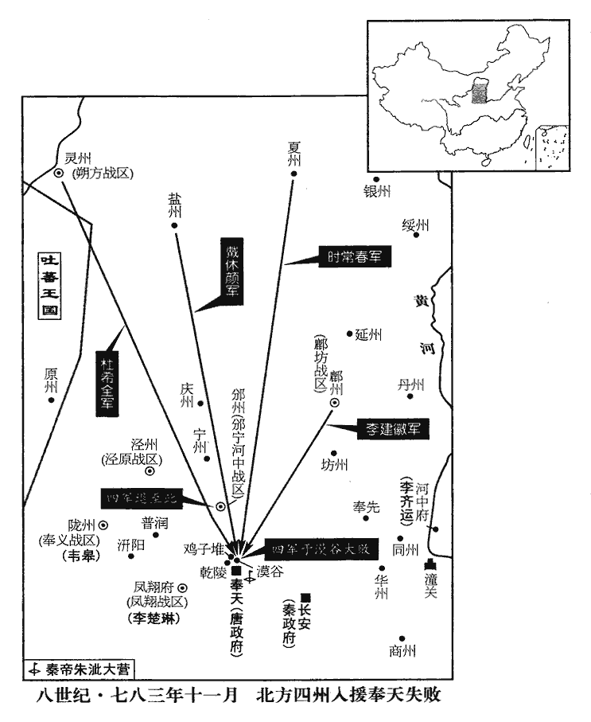
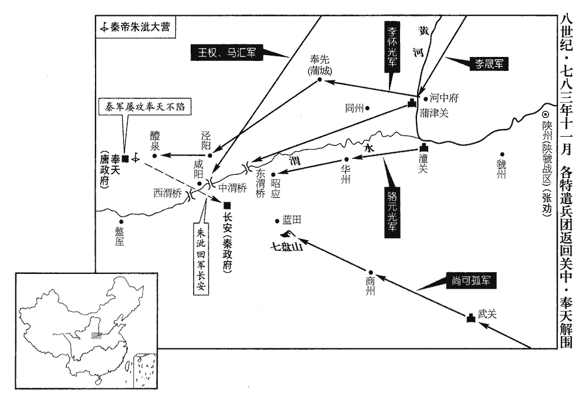
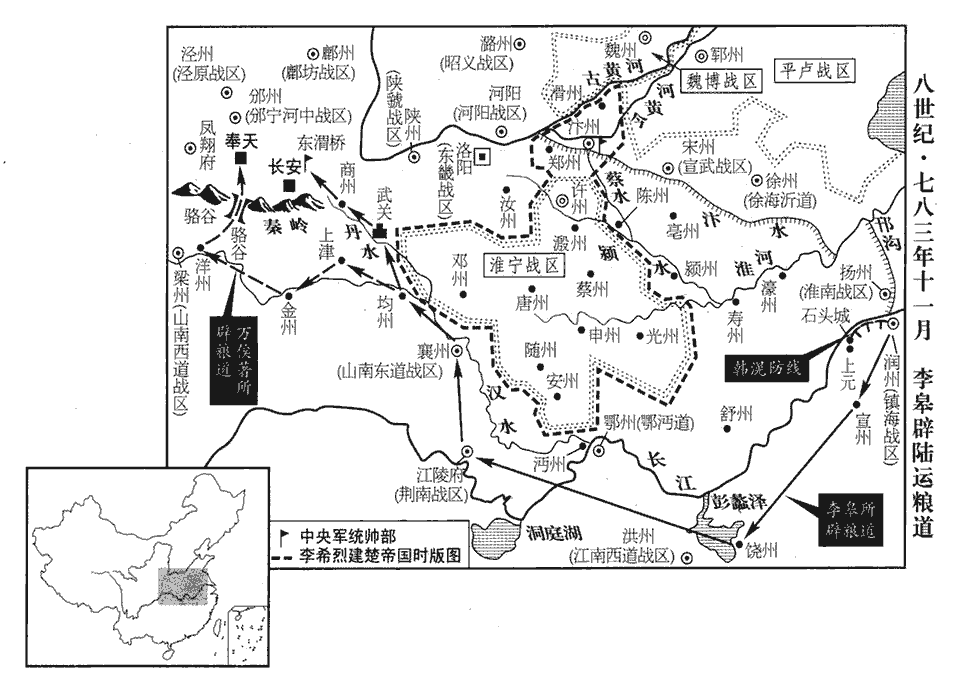
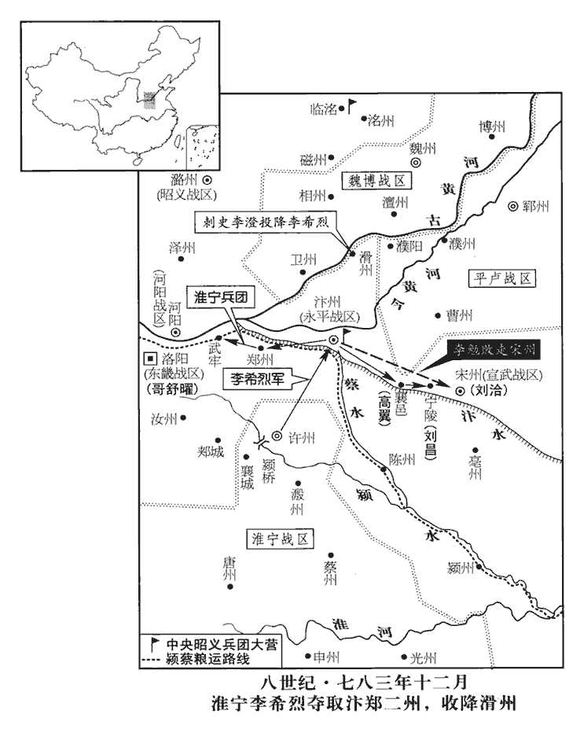
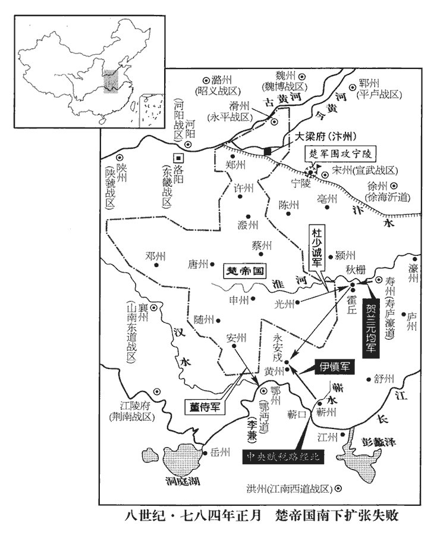
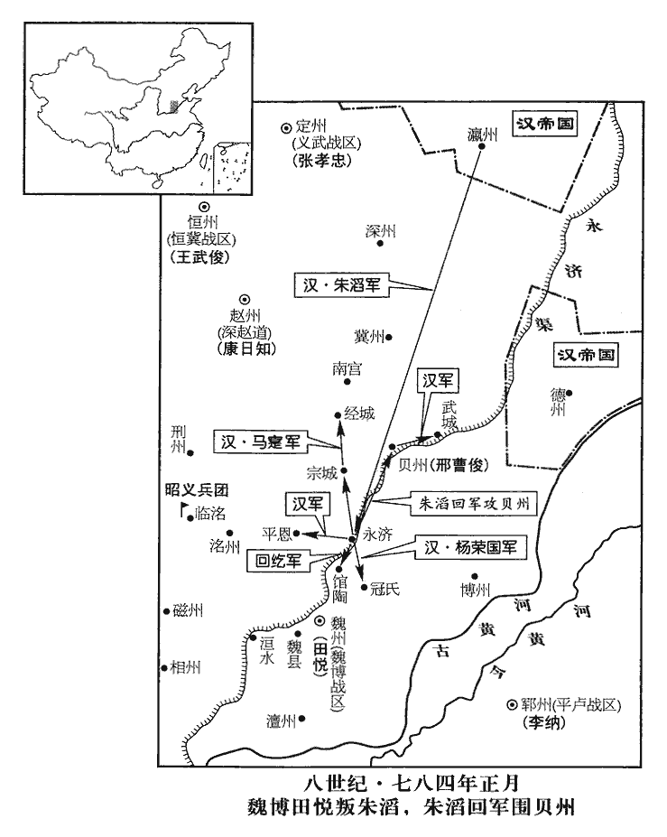

 唐紀四十五起昭陽大淵獻（癸亥）十一月，盡閼逢困敦（甲子）正月，不滿一年。始癸亥十一月，終甲子正月，一卷所紀財三月耳。

# 德宗神武聖文皇帝四

## 建中四年（癸亥、七八三）

1十一月，乙亥‹二›，以隴州為奉義軍，擢皋為節度使。泚又使中使劉海廣許皋鳳翔節度使；皋斬之。史言韋皋以此發身。使，疏吏翻。泚，且禮翻。

〖译文〗 [1]十一月，乙亥（初二），朝廷将陇州改名为奉义军，提升韦皋为节度使。朱又指使中使刘海广许诺韦皋担任凤翔节度使，韦皋将来使斩杀了。

2靈武留後杜希全、鹽州‹陕西省定边县›刺史戴休顏、夏州‹陕西省靖边县北白城子›刺史時常春會渭北‹总部设鄜州陕西省富县›節度使李建徽合兵萬人入援，靈武節度使治靈州，夏州治朔方縣，鹽州治五原縣，皆鄰境相接。渭北節度使本治坊州，時徙治鄜州。夏，戶雅翻。將至奉天‹陕西省乾县›，上召將相議道所從出。關播、渾瑊jiān曰：「漠谷‹乾县北六千米›道險狹，召將，即亮翻。相，息亮翻。渾，戶昆翻，又戶本翻。瑊，古銜翻。漠谷，在奉天城西北。恐為賊所邀。不若自乾陵‹李治墓，乾县西北二千米›北過，附柏城而行，山陵樹柏成行，以遮迾liè陵寢，故謂之柏城。宋白曰：唐諸陵皆栽柏環之。貞元六年十一月，敕諸陵柏城四面各三里內，不得安葬。過，古禾翻，又古臥翻。營於城東北雞子堆，與城中掎角相應，掎jǐ，居蟻翻。且分賊勢。」盧杞曰：「漠谷道近，若為賊所邀，則城中出兵應接可也。儻出乾陵，恐驚陵寢。」瑊曰：「自泚攻城斬乾陵松柏，以夜繼晝，其驚多矣。今城中危急，諸道救兵未至，惟希全等來，所繫非輕，若得營據要地，則泚可破也。」杞曰：「陛下行師，豈比逆賊！若令希全等過之，是自驚陵寢。」泚，且禮翻，又音此。令，力丁翻。上乃命希全等自漠谷進。丙子‹三›，希全等軍至漠谷，果為賊所邀，乘高以大弩、巨石擊之，死傷甚眾；城中出兵應接，為賊所敗。是夕，四軍潰，退保邠州。泚閱其輜重於城下，從官相視失色。自兩河兵興以至乘輿播遷，盧杞之言無一不誤國，而德宗信之如故，庸昏甚矣！敗，補邁翻。從，才用翻。邠，卑旻翻。泚，且禮翻，又音此。輜，莊持翻。重，直用翻。休顏，夏州‹陕西省靖边县北白城子›人也。夏，戶雅翻。

〖译文〗 [2]灵武留后杜希全、盐州刺史戴休颜、夏州刺史时常春，会同渭北节度使李建徽，合兵一万人，前来救援。在将要到达奉天时，德宗召集大将和宰相商议援兵的行军路线。关播、浑说：“漠谷的道路险要狭窄，恐怕会被敌军拦击。不如从乾陵北面经过，贴着柏城行进，在城东北鸡子堆扎营，这样可与城中军队内外呼应，夹击敌军，而且还会分去敌军一部分兵势。”卢杞说：“漠谷的道路较近，倘若援军被敌军拦击，城中出兵接应援军就行了。倘若从乾陵过来，恐怕要惊动陵墓寝庙。”浑说：“自从朱攻打奉天城以来，砍伐乾陵的松柏，夜以继日，这对陵墓寝庙的惊动，已经够多的了。现在城中形势危急，各道救兵还未到来，只有杜希全等人来了，他们所关系到的情势并非无足轻重，如果能够占据重要地点扎营，朱便可以被攻破了。”卢杞说：“陛下调动军队岂能和叛逆的寇贼相比！如果让杜希全等人的军队从乾陵通过，那便是我军自行惊动陵墓寝庙了。”于是，德宗命令杜希全等人由漠谷进军。丙子（初三），杜希全等人的军队来到漠谷，果然被敌军所拦击。敌军用大弩和巨石居高临下地攻击援军，援军死伤很多，城中出兵接应援军，又被敌军打败。当天傍晚，杜希全等人所率四支军队溃散了，只好退保州。朱到城下来视察援军弃下的辎重，随从的官员你看看我，我看看你，无不为之大惊失色。戴休颜是夏州人。

 

泚攻城益急，穿塹環之。泚移帳於乾陵，下視城中，動靜皆見之，時遣使環城塹，七豔翻。使，疏吏翻。環，音宦。招誘士民，笑其不識天命。誘，音酉。

〖译文〗 朱攻打奉天城愈发急迫，他凿通沟堑，将全城环绕起来。朱将军帐迁移到乾陵，由此向下察看城中的动静虚实，全都能够看清。朱还不时派人环绕着奉天城引诱城中的将士和百姓，嘲笑他们看不清天命所归。

3神策、河北行營節度使李晟疾愈，前年五月，李晟疾甚，自易州還保定州，事見上卷。晟，成正翻。聞上幸奉天，帥眾將奔命。帥，讀曰率。張孝忠迫於朱滔、王武俊，倚晟為援，不欲晟行，數沮止之。數，所角翻。沮，在呂翻。晟乃留其子憑，使娶孝忠女為婦，又解玉帶賂孝忠親信，使說之，說，式芮翻。孝忠乃聽晟西歸，遣大將楊榮國將銳兵六百與晟俱。晟引兵出飛狐道‹河北省蔚县东南›，晝夜兼行，至代州‹山西省代县›。沈存中曰：北岳常岑，謂之大茂山者是也，半屬契丹，以大茂山脊為界。飛狐路，在茂之西。自銀冶寨北出倒馬關，度虜界，卻自石門子、令水鋪入缾形、梅回兩寨之間，至代州。今此路已不通，惟北寨西出承天關路，可至河東，然路極峭狹。按存中所謂地界，乃石晉與契丹所分地界也。丁丑‹四›，加晟神策行營節度使。史言李晟前只節度河北神策出征兵行營，今又加節度神策行營兵出征河南者，此其所以得誅劉德信也。

〖译文〗 [3]神策、河北行营节度使李晟的疾病痊愈了，听说德宗出行奉天，便率领众将领前去赴命。张孝忠被朱滔、王武俊所逼迫，有赖于李晟的声援，不想让李晟离去，有好几次阻止他前往。于是李晟将自己的儿子李凭留下来，让他娶张孝忠的女儿为媳妇，又解下玉带贿赂张孝忠的亲信，让他劝说张孝忠。于是张孝忠听任李晟西进归朝，还派遣大将杨荣国带领精锐兵马六百人与李晟同去。李晟领兵经过飞狐道，日夜兼程，来到代州。丁丑（初四），德宗加任李晟为神策行营节度使。

4王武俊、馬寔攻趙州不克。辛巳‹八›，寔歸瀛州，武俊送之五里，犒贈甚厚；武俊亦歸恆州。恆，戶登翻。

〖译文〗 [4]王武俊、马攻打赵州，未能攻克。辛巳（初八），马要回瀛州去，王武俊送行了五里地，犒赏和赠送的物品甚是丰厚。王武俊也回到恒州。

5上之出幸奉天也，陝虢‹首府设陕州河南省三门峡市›觀察使姚明敭yáng陝，失冉翻。敭，與揚同。以軍事委都防禦副使張勸，去詣行在。勸募兵得數萬人。甲申‹十一›，以勸為陝虢節度使。

〖译文〗 [5]德宗出行奉天时，陕虢观察使姚明扬将军中事务委托给都防御副使张劝，自己前往行在。张劝招募兵员，得到数万人，甲申（十一日），德宗任命张劝为陕虢节度使。

6朱泚攻圍奉天經月，是年十月，上出奉天，纔至奉天數日而朱泚繼至，攻圍至是月為經月。城中資糧俱盡。上嘗遣健步出城覘賊，健步，今之急腳子是也。覘，丑廉翻。其人懇以苦寒為辭，跪奏乞一襦袴。襦rú，汝朱翻，短衣。上為之尋求不獲，為，于偽翻。竟憫默而遣之。憫者，矜其寒；默者，無以為辭也。時供御纔有糲米二斛，每伺賊之休息，夜，縋人於城外，采蕪菁根而進之。本草曰：蕪菁及蘆菔，南北通有之。蕪菁，即蔓菁；蘆菔，即蘿蔔也。陶隱居云：蘆菔是今溫菘，其根可食，葉不中噉。蕪菁根乃細於溫菘，而葉似菘，好食。日華子曰：梗長葉瘦高者為菘；闊厚短肥而庳及梗細者為蕪菁葉也。陸佃埤pí雅曰：舊說，菘菜，北種，初年半為蕪菁，二年菘種都絕。蕪菁南種亦然。菘之不生北土，猶橘柚之變於淮北矣。蕪菁似菘而小，有臺，一名葑，一名須。史炤曰：本草註云，蕪菁，北人又名蔓菁，根葉及子乃是菘類。詩云：采葑采菲。疏云：陸璣云，葑，蕪菁，幽州人或謂之芥。方言云：豐蕘，蕪菁也。陳、楚謂之葑，齊、魯謂之蕘，關西謂之蕪菁，趙、魏之部謂之大芥。糲，盧達翻。伺，相吏翻。縋，馳偽翻。上召公卿將吏謂曰：「朕以不德，自陷危亡，固其宜也。公輩無罪，宜早降以救室家。」降，戶江翻。群臣皆頓首流涕，期盡死力，故將士雖困急而銳氣不衰。

〖译文〗 [6]朱攻打、围困奉天已经有一个月了，城中的物资和粮食都已用光。德宗曾经派遣善于行走的人出城察看敌情，该人说是天气寒冷，跪着恳求德宗，要一件短袄和套裤。德宗为他寻找，未能找到，最后还是难过地默然打发他去了。当时供给德宗的粮食，仅有粗米二斛，官吏每每窥伺敌军的休息时间，夜里将人系在绳索上放到城外，去采集蔓菁根，献给皇上。德宗将公卿将官召集起来，对他们说：“朕因无德，自陷于危亡之中，固然是应该的。诸位没有罪过，最好及早投降，以便救出自己的家人。”群臣都伏地叩头，痛器流涕，相互约定要竭尽自己最大的力量。所以将士们虽然置身于困苦危急之中，但是他们的锐气却毫不衰减。

上之幸奉天也，糧料使崔縱勸李懷光令入援，崔縱為魏縣行營糧料使。懷光從之，縱悉斂軍資與懷光皆來。懷光晝夜倍道，至河中，力疲，休兵三日。河中尹李齊運傾力犒宴，犒，口到翻。軍【章：十二行本「軍」下有「士」字；乙十一行本同；孔本同；張校同；退齋校同。】尚欲遷延。崔縱先輦貨財渡河，謂眾曰：「至河西‹陕西省东部›，悉以分賜。」開元八年，析河東縣自蒲津以西為河西縣。眾利之，西屯蒲城‹此时称奉先城，今陕西省蒲城县›，有眾五萬。齊運，惲之孫也。蔣王惲，太宗‹李世民›子也。惲，於粉翻。

〖译文〗 德宗出行奉天时，粮料使崔纵劝说李怀光让他前往增援，李怀光听从了他的主张。崔纵将军中物资悉数聚集起来，与李怀光一起前来。李怀光日夜兼程，来到河中，人力疲乏，让士兵休息三天。河中尹李齐运全力设宴犒劳，军队还想拖延不行。崔纵先将物资钱财运过黄河，然后对大家说：“到了河西，便将他们全部分给大家。”众人贪图其利，西进蒲城屯驻，当时有五万人。李齐运是李恽的孙子。

李晟行且收兵，亦自蒲津‹山西省永济市西›濟，軍於東渭橋‹陕西省高陵县南›；其始有卒四千，晟善於撫御，與士卒同甘苦，人樂從之，晟，成正翻。樂，音洛。旬月間至萬餘人。

〖译文〗 李晟一边行进，一边招集士兵，也从蒲津渡过黄河，在东渭桥驻扎下来。在渡河之初，他只有士兵四千人，由于他善于抚恤与驾驭士兵，与士兵同甘共苦，人们都愿意跟随他，所以在一个月之间便发展到万余人。

神策兵馬使尚可孤討李希烈，將三千人在襄陽，自武關‹陕西省商南县西北›入援，軍于七盤‹陕西省蓝田县东南›，使，疏吏翻。將，即亮翻，又音如字。七盤，即古繞霤liù之險。敗泚將仇敬，仇敬，即仇敬忠，此因舊史書之。敗，補邁翻。遂取藍田‹陕西省蓝田县›。可孤，宇文部之別種也。種，章勇翻。

〖译文〗 神策兵马使尚可孤讨伐李希烈，在襄阳带领三千人，由武关前往增援，在七盘驻扎，打败了朱的将领仇敬，于是攻取蓝田。尚可孤是宇文部的别支。

鎮國軍‹驻华州陕西省华县›副使駱元光，肅宗上元元年，置鎮國軍於華州。其先安息‹此不是指前二世纪的安息伊朗›而是指安国乌兹别克斯坦布哈拉市人，駱奉先養以為子，將兵守潼關近十年，為眾所服。潼，音童。近，其靳翻。朱泚遣其將何望之襲華州，刺史董晉棄州走行在。華，戶化翻；下同。走，音奏。望之據其城，將聚兵以絕東道；元光引關下兵襲望之，走還長安。還，從宣翻，又音如字。元光遂軍華州，召募士卒，數日，得萬餘人。泚數遣兵攻元光，泚，且禮翻，又音此。數，所角翻。元光皆擊卻之，賊由是不能東出。上即以元光為鎮國軍節度使，鎮國軍節度，治華州。元光乃將兵二千西屯昭應‹陕西省临潼县›。

〖译文〗 镇国军副使骆元光，他的先人是安息人，骆奉先将他收为养子。他带兵防守潼关将近十年，兵众都服从他的指挥。朱派遣他的将领何望之袭击华州，华州刺史董晋放弃了州城，逃奔行在。何望之占领华州城后，准备集中兵力，以便截断东行的道路。骆元光带领潼关兵袭击何望之，何望之逃回长安。于是骆元光驻军华州，召募士兵，不过几天，招得一万余人。朱多次派兵进攻骆元光，都被骆元光击退，敌军自此不能东出。德宗随即任命骆元光为镇国军节度使。骆元光领兵两千人，向西屯驻昭应。

馬燧遣其行軍司馬王權及其子彙將兵五千人入援，屯中渭橋‹陕西省咸阳市东›。燧，音遂。彙huì，于季翻。宋敏求長安志引三輔黃圖曰：渭水貫都以象天漢，橫橋南渡以法牽牛。蓋指此之中橋而為若言也。橋之廣至及六丈；其柱之多至於七百五十；約其地望，即唐太極宮之西而太倉之北也。程大昌曰：此橋舊止單名渭橋。水經敘渭曰「水上有梁謂之橋」者是也。後世加中以冠橋上者，為長安之西別有便門橋渡渭，萬年縣之東更有東渭橋，故不得不以中別之也。

〖译文〗 马燧派遣他的行军司马王权及其儿子王汇带兵五千人前去增援奉天，在中渭桥屯驻。

於是泚黨所據惟長安而已，援軍遊騎時至望春樓‹陕西省西安市东›下。李忠臣等屢出兵皆敗，求援於泚，泚恐民間乘弊抄之，望春樓近長樂城，臨廣運潭，玄宗所立。騎，奇寄翻。抄，楚交翻。所遣兵皆晝伏夜行。

〖译文〗 当时，朱一伙所占领的地盘，只有长安而已，援军的巡哨骑兵有时前进到望春楼的下面。李忠臣等人屡次出兵，都被打败，便向朱求援。朱唯恐民间乘己疲困，前来抄袭，他所派遣的兵马都是昼伏夜行。

泚內以長安為憂，乃急攻奉天，使僧法堅造雲梯，【嚴：「梯」改「橋」；下同。】高廣各數丈，高，居傲翻。廣，古曠翻。近世學者多各以音如字讀之。考異曰：劇談錄曰：「高九十餘尺，下瞰城中。」今從實錄。裹以兕革，史炤曰：兕，色如野牛而青，一說雌犀也。余按山海經，兕，角重百斤，身重千斤，黃帝得之，以其皮冒鼓，聲震百里。其說固誕矣。國語：叔向曰：唐叔殪yì兕，以為大甲。周官考工記：犀甲壽百年，兕甲壽二百年。兕甲固堅於犀甲矣。左傳：宋華元之言曰：犀兕尚多。則兕者，世之常有也。然兕者今不常見。史言朱泚裹雲梯以兕革，不過用牛皮耳。兕，序姊翻。下施巨輪，上容壯士五百人；城中望之忷懼。上以問群臣，渾瑊、侯仲莊對曰：「臣觀雲梯勢甚重，重則易陷，忷，許拱翻。渾，戶昆翻，又戶本翻。瑊，古銜翻。易，以豉翻。臣請迎其所來鑿地道，積薪蓄火以待之。」神武軍使韓澄曰：開元二十六年，分左、右羽林，置左、右神武軍。使，疏吏翻。「雲梯小伎，不足上勞聖慮，伎，渠綺翻。臣請禦之。」乃度梯之所傃sù，度，徒洛翻。傃，桑故翻，向也。鄭玄曰：攻城，攻其所傃。傃，猶嚮也。廣城東北隅三十步，多儲膏油松脂薪葦於其上。丁亥‹十四›，泚盛兵鼓譟攻南城，韓遊瓌曰：「此欲分吾力也。」乃引兵嚴備東北。戊子‹十五›，北風甚迅，譟，則竈翻。瓌，古回翻。迅，疾也。泚推雲梯，推，吐雷翻。上施濕氈，懸水囊，載壯士攻城，翼以轒fén轀，轒，扶云翻。轀，於云翻。轒轀，攻城車也。兵法，脩轒轀距堙yīn者，三月而後成。置人其下，抱薪負土填塹而前，矢石火炬所不能傷。賊併兵攻城東北隅，矢石如雨，城中死傷者不可勝數。塹，七豔翻。勝，音升。賊已有登城者，上與渾瑊對泣，群臣惟仰首祝天。上以無名告身自御史大夫、實食五百戶以下千餘通授瑊，無名告身，即空名告身，有功者則書填姓名以授之。實食，食實封也。使募敢死士禦之，仍賜御筆，使視其功之大小書名給之，告身不足則書其身，謂若立功者多，所給告身千餘通酬功而不足，則書陳前所喝轉階勳於其身，以為照驗，出給告身。且曰：「今便與卿別。」期望渾瑊死戰也。瑊俯伏流涕，上拊其背，歔欷不自勝。瑊，古銜翻。歔，音虛。欷，許既翻，又音希。勝，音升。時士卒凍餒，又乏甲冑，瑊撫諭，激以忠義，皆鼓譟力戰。瑊中流矢，譟，則竈翻。中，竹仲翻。進戰不輟，初不言痛。會雲梯輾地道，一輪偏陷，不能前卻，輾，豬輦翻，又尼展翻。地道者，渾瑊等所鑿，以迎雲梯者也。火從地中出，火亦渾瑊等所蓄以待雲梯者。風勢亦回，城上人投葦炬，散松脂，沃以膏油，讙呼震地。讙，許元翻。須臾，雲梯及梯上人皆為灰燼，臭聞數里，聞，音問。賊乃引退。於是三門皆出兵，時朱泚攻奉天城東、南、北三面，故三門皆出兵與戰。太子親督戰，賊徒大敗，死者數千人。將士傷者，太子親為裹瘡。將，即亮翻。為，于偽翻。入夜，泚復來攻城，泚，且禮翻，又音此。復，扶又翻，又音如字。矢及御前三步而墜；上大驚。

〖译文〗 朱心中为长安感到忧虑，便加紧进攻奉天。他让僧人法坚制造云梯，长宽各有数丈，外面包裹着牛皮，下面安装着巨大的轮子，上面可以容纳勇士五百人，城中的人们望见，都感到忧恐畏惧。德宗询问群臣的意见，浑、侯仲庄回答说：“我们看云梯势必甚为沉重，沉重就容易下陷。我们请求迎着云梯的来路开凿地道，积蓄柴禾与火种，等待它的到来。”神武军使韩澄说：“靠云梯攻城这种小小伎俩，不足以烦劳圣上费心，请让我来对付云梯。”韩澄估量了云梯的指向，于是在城东北角拓宽了三十步，在上面储备了大量的膏油、松脂和柴禾、芦苇等。丁亥（十四日），朱军大举出动，擂鼓呐喊，攻打奉天南城。韩游说；“这是打算分散我军的力量。”于是，他领兵严密防备奉天城的东北面。戊子（十五日），北风甚是猛烈，朱军推出云梯，上面包裹着浸湿的毡子，悬挂水袋，运载勇士攻城。两侧用兵车遮护着，将士兵安置在兵车棚顶之下，让兵士抱柴背土，填平壕沟，向前冲锋。乱箭、飞石、火炬不能伤害他们。敌军合兵进攻城东北角，箭石如雨，城中死伤的人无法计算，敌军已经有人登上城了。德宗与浑相对而泣，群臣只好仰首祷告上天。德宗将一千余份自御史大夫、实封食邑五百户以下的空白委任官职文凭“告身”交给浑，让他募集敢死之士去抵御敌军，还将御笔赐给他，让他根据人们所立功劳的大小，在告身上填写上名字加以委任，如果告身不够用，便写在该人身上，战后再给告身。而且说：“现在我就与你永别。”浑趴在地上，泪流满面，德宗抚摸着他的后背，抽咽不能自己。当时，士兵又冻又饿，又缺乏铠甲头盔，浑对他们抚慰劝导，用忠义激发他们，士兵们都擂鼓呐喊，奋力而战。浑中了乱箭，仍然向前奋战不止，初时也未讲疼痛。恰好云梯辗压地道，一只轮子偏倒陷落，不能向前或后退，火从地道中冒出来，大风也往回吹，城上的人们投下芦苇火把，撒上松脂，浇上膏油，欢呼之声，震动大地。不一会儿，云梯和梯上的人全部化为灰烬，散发的焦臭之气，数里以外都可以闻到，于是敌军退却。此时奉天城东、南、北三门都发兵出击，太子亲自督战，敌军徒众大败，死亡的人有数千。对于受伤的将士，太子亲自为他们包扎伤口。到了夜晚，朱再来攻城，箭落到德宗面前三步远的地方，德宗大惊。

 

李懷光自蒲城引兵趣涇陽，趣，七喻翻。並北山而西，並，讀曰傍，步浪翻。先遣兵馬使張韶微服間行詣行在，間，古莧翻；下得間同。藏表於蠟丸。韶至奉天‹陕西乾县›，值賊方攻城，見韶，以為賤人，驅之使與民俱填塹；韶得間，踰塹抵城下呼曰：「我朔方軍使者也。」塹，七豔翻。呼，火故翻。使，疏吏翻。城上人下繩引之，比登，比，必利翻，及也。身中數十矢，中，竹仲翻。得表於衣中而進之。上大喜，舁韶以徇城，四隅歡聲如雷。舁，音余，又羊茹翻。癸巳‹二十›，懷光敗泚兵於澧泉。敗，補邁翻。泚聞之懼，引兵遁歸長安。眾以為懷光復三日不至，則城不守矣。史言李懷光解奉天之圍，不為無功。泚，且禮翻，又音此。

〖译文〗 李怀光从蒲城领兵直趋泾阳，傍着北山向西而行。事先，他派遣兵马使张韶穿着老百姓的衣服抄小道前往行在，将表章藏在蜡丸之中。张韶来到奉天，正当敌军刚刚攻城，见到张韶，以为卑贱之人，便驱使他与老百姓一起填塞壕沟。张韶看准间隙，越过壕沟，抵达城下呼喊道：“我是朔方军的使者。”城上的人放下绳索，把他拉到城上。及至登到城上，张韶身上被射中几十支箭，得以将藏在衣服中的表章进呈德宗。德宗大为高兴，让人抬着张韶在城中绕行宣示，四处欢声雷动。癸巳（二十日），李怀光在澧泉将朱军打败。朱闻此，害怕起来，于是领兵逃回长安。大家认为，倘若李怀光再有三天不来，奉天城便要失陷了。

泚既退，從臣皆賀。從，才用翻。汴滑行營兵馬使賈隱林進言：「陛下性太急，不能容物，若此性未改，雖朱泚敗亡，憂未艾也！」上不以為忤，甚稱之。使，疏吏翻。汴，皮變翻。使德宗果能以此心而受諫，何至追仇陸贄之盡言乎！忤，五故翻。侍御史萬mò俟qí著開金‹陕西省安康市›、商‹陕西省商州市›運路，「萬」當作「万」，莫北翻。俟，渠之翻。万俟，虜複姓也。開金、商運路，轉江、淮財賦以至奉天。重圍既解，重，直龍翻。諸道貢賦繼至，用度始振。

〖译文〗 朱退去以后，随从诸臣都来向德宗道贺。汴滑行营兵马使贾隐林进言说：“陛下性情太急躁，不能包容万物。如果不将这脾气改一改，虽然朱败亡了，但忧患仍然不能止息！”德宗并不以为受到冒犯，对贾隐林甚为称许。侍御史万俟著开通了金、商漕运通道，层层包围既已解除，各道贡赋相继而至，朝廷的费用开始有了保证。

朱泚至長安，但為城守之計，時遣人自城外來，周走呼曰：呼，火故翻。「奉天破矣！」欲以惑眾。泚既據府庫之富，不愛金帛，以悅將士，公卿家屬在城者皆給月俸。將，即亮翻。俸，扶用翻。神策及六軍從車駕及哥舒曜、李晟者，泚皆給其家糧；加以繕完器械，日費甚廣。及長安平，府庫尚有餘蓄，見者皆追怨有司之暴斂焉。以此觀之，趙贊輩不足責也；杜佑判度支，安能逃其罪乎！斂，力贍翻。

〖译文〗 朱回到长安以后，只作守城的打算，时常派人从城外来，绕城奔走呼喊说：“奉天城攻破啦！”企图借此迷惑民众。朱据有朝廷库存的财富以后，便不惜用金帛取悦将士，对留在城中的公卿家属一概每月支付薪俸。对于神策军和随从德宗车驾六军以及哥舒曜、李晟等人，朱一概向他们的家属供给粮食。加上修治完善各种器械，每日耗费甚巨。但及至长安平定，朝廷库存仍有剩余的财产，看到的人都追溯怨恨有关部门的横征暴敛。

或謂泚曰：「陛下既受命，唐之陵廟不宜復存。」復，扶又翻。泚曰：「朕嘗北面事唐，豈忍為此！」又曰：「百官多缺，請以兵脅士人補之。」泚曰：「強授之則人懼。強，其兩翻。但欲仕者則與之，何必叩戶拜官邪！」邪，音耶。泚所用者惟范陽、神策團練兵；團練兵，即團結兵，事見二百二十五卷代宗大曆十二年。涇原卒驕，皆不為用，但守其所掠資貨，不肯出戰；又密謀殺泚，不果而止。泚，且禮翻，又音此。

〖译文〗 有人对朱说：“陛下既然秉受天命，唐朝的陵园寝庙不应该再存在下去。”朱说：“我曾经北面称臣，事奉唐朝，哪能忍心干这种事！”又有人说：“百官空缺很多，请派兵胁迫读书人来补充。”朱说：“勉强授给官职，人家就恐惧了。想做官的人便给他官，哪有敲门封官拜职的呢！”朱所能指挥的只有范阳兵和神策团练兵。泾原兵骄横跋扈，都不服从指挥，只是守护着他们劫掠来的钱财，不愿意出外打仗。泾原兵还密谋诛杀朱，未能实现，只好作罢。

李懷光性粗疏，粗，讀與麤同。自山東‹太行山以东›來赴難，自魏縣行營來赴奉天之難。魏縣屬魏州，其地在河山之東。難，乃旦翻；下同。數與人言盧杞、趙贊、白志貞之姦佞，數，所角翻。且曰：「天下之亂，皆此曹所為也！吾見上，當請誅之。」既解奉天之圍，自矜其功，謂上必接以殊禮。禮絕百僚，謂之殊禮。或說王翃、趙贊曰：說，式芮翻。翃，戶萌翻。「懷光緣道憤歎，以為宰相謀議乖方，乖方，猶言失所也。度支賦斂煩重，京尹犒賜刻薄；致乘輿播遷者，三臣之罪也。宰相，指盧杞。度支，指趙贊。京尹，指王翃。度，徒洛翻。斂，力贍翻。乘，繩證翻。今懷光新立大功，上必披襟布誠，詢【章：十二行本「詢」下有「訪」字；乙十一行本同；孔本同；張校同。】得失，使其言入，豈不殆哉！」殆，危也。翃、贊以告盧杞，杞懼，從容言於上曰：從，千容翻；下同。「懷光勳業，社稷是賴，賊徒破膽，皆無守心，若使之乘勝取長安，則一舉可以滅賊，此破竹之勢也。今聽其入朝，必當賜宴，留連累日，使賊入京城，得從容成備，恐難圖矣！」上以為然。懷光矜功，厚望其上而求逞其欲。德宗欲速，逼使其下而不閔其勞。盧杞之心，自營免罪而捭bǎi闔於其間。是以雖急於平賊，而不知更生一賊也。朝，直遙翻。詔懷光直引軍屯便橋，與李建徽、李晟及神策兵馬使楊惠元刻期共取長安。懷光自以數千里竭誠赴難，破朱泚，解重圍，而咫尺不得見天子，意殊怏怏，晟，成正翻。使，疏吏翻。難，乃旦翻。泚，且禮翻，又音此。重，直龍翻。怏，於兩翻。曰：「吾今已為姦臣所排，事可知矣！」遂引兵去，至魯店‹陕西省乾县东南›，魯店，在奉天東南，咸陽陳濤斜西北。留二日乃行。為李懷光反與朱泚連兵張本。

〖译文〗 李怀光生性粗疏，从山东前来奔赴国难，多次与人们谈到卢杞、赵赞、白志贞的邪恶谄媚，而且说：“天下的祸乱，都是这号人造成的！我见到圣上，自当奏请杀了他们。”李怀光解除了对奉天的围困以后，自己矜夸功劳，认为德宗一定会以特殊的礼节接待他。有人劝说王、赵赞说：“李怀光沿途激愤感叹，认为宰相谋划议论乖谬无方，度支收敛赋税烦多，京兆尹犒劳赏赐苛刻不丰。致使圣上流离迁徙的，是宰相、度支、京兆尹三人的罪过。如今李怀光新近立下了巨大的功劳，圣上肯定会对他敞开胸襟，推诚相待，征询为政得失。假使他的话传到圣上耳中，岂不是很危险吗！”王、赵赞将此话告诉了卢杞，卢杞害怕，便语气和缓地对德宗说：“李怀光的功勋业绩，为国家所依赖。敌寇已吓破了胆，全然没有守城的心思。如果让李怀光乘胜攻取长安，一下子便可以消灭敌军，这真是势如破竹啊。现在听任他入城朝见，必定要赏赐设宴，拖延好几天，致使敌军开进京城，得以从容地作好防备，恐怕就难以图谋了。”德宗认为很对，便诏命李怀光直接带领军队屯驻便桥，与李建徽、李晟以及神策兵马使杨惠元按限定日期共同攻取长安。李怀光认为自己由数千里外竭尽赤诚，奔赴国难，打败朱，解除重重围困，现在身在咫尺，却不能够见到皇上，心里甚为不满意。他说：“我如今已经被奸臣所排挤，事情不问可知了！”于是李怀光带兵离去，来到鲁店，停留了两天，才又出发。

7劍南‹总部设成都府四川省成都市›西山兵馬使張朏fěi以所部兵作亂，入成都，使，疏吏翻。劍南宿重兵於西山，以備吐蕃，崔寧以是兵殺郭英乂，張朏以是兵逐張延賞。朏，敷尾翻。西川節度使張延賞棄城奔漢州‹四川省广汉市›；武后垂拱二年，分益州置漢州。九域志：成都北至漢州九十五里。鹿頭‹四川省德阳市北黄许镇›戍將叱干遂等討之，鹿頭關，在漢州德陽縣。劉昫曰：成都北一百五十里，有鹿頭山，扼兩川之要。將，即亮翻。叱，尺栗翻。斬朏及其黨，延賞復歸成都。

〖译文〗 [7]剑南西山兵马使张率部下士兵发起叛变，进入成都，西川节度使张延赏抛下成都，逃奔汉州。在鹿头屯戍的将领叱干遂等人讨伐叛兵，杀掉张及其同党，张延赏再次回到成都。

8淮南‹总部设扬州江苏省扬州市›節度使陳少遊將兵討李希烈，屯盱眙‹江苏省盱眙县›，盱眙，漢縣，唐初屬楚州，建中四年，度屬泗州。少，始照翻。盱，音吁。眙，音怡。聞朱泚作亂，歸廣陵‹扬州›，修塹壘，繕甲兵。浙江東、西‹镇海战区，总部设润州江苏省镇江市›節度使韓滉閉關梁，禁馬牛出境，築石頭城‹江苏省南京市西北›，穿井近百所，繕館第數十，修塢壁，泚，且禮翻，又音此。塹，七豔翻。滉，呼廣翻。近，其靳翻。通俗文：營居曰塢。壁，壘也。釋名曰：壁，辟也，所以辟禦寇盜也。起建業‹南京›，抵京峴xiàn‹江苏省镇江市东›，京峴山，在潤州州治東五里。峴，戶蹇翻。樓堞相屬，屬，之欲翻，聯屬也。堞，達協翻。以備車駕渡江，且自固也。少遊發兵三千大閱於江北；滉亦發舟師三千曜武於京江‹江苏省镇江市北长江水面›以應之。大江逕京口城北，謂之京江。

〖译文〗 [8]淮南节度使陈少游领兵讨伐李希烈，在盱眙屯驻，听说朱发起叛乱，便回到广陵，修整壕沟与寨堡，缮治铠甲与兵器。浙江东、西节度使韩封锁关口与桥梁，禁止牛马出境。他还修筑石头城，开凿水井将近一百眼，整治馆舍数十处，修筑壁垒城堡，起自建业，抵达京岘山，楼房与城墙上凸形矮墙连成一片，既为皇上南渡长江作准备，也加固了自己的守备。陈少游发兵三千人在长江北岸大规模地检阅军队，韩也派出水军三千人在京江炫耀武力，以与陈少游相呼应。

鹽鐵使包佶佶jí，巨乙翻。有錢帛八百萬，將輸京師。陳少遊以為賊據長安，未期收復，言收復未有期也。欲強取之。強，如字。佶不可，少遊欲殺之；佶懼，匿妻子於案牘中，急濟江。少遊悉收其錢帛；考異曰：奉天記曰：「佶以財幣一百八十萬欲轉輸入城。少遊強收之。」今從舊傳。佶有守財卒三千，少遊亦奪之、佶纔與數十人俱至上元‹江苏省南京市›，復為韓滉所奪。上元縣，時帶昇州。宋白曰：上元縣，晉江寧縣地，貞觀七年移還舊郭，即今所置縣也，九年改為江寧縣；玄宗置昇州，因縣宇為州城；縣元治鳳皇山南，今移治會府。時包佶蓋在揚子巡院也。史言天子播遷，藩鎮阻兵，陵轢王人。復，扶又翻。

〖译文〗 盐铁使包佶拥有钱帛八百万，准备运往京城。陈少游认为乱军占领着长安，收复无期，打算强行夺取这些钱帛。包佶不肯交出钱帛，陈少游想杀他，包佶害怕，便将妻子儿女藏匿在公事文书中间，急忙渡过长江，陈少游将他的钱帛全部收缴。包佶有守护钱财的士兵三千人，陈少游也将他们劫夺了一番。包佶刚和数十人一起到上元县，又被韩所劫夺。

時南方藩鎮各閉境自守，惟曹王皋數遣使間道貢獻。曹王皋時節度江南西道。史言曹王皋悉心於帝室。數，所角翻。使，疏吏翻。間，古莧翻。李希烈攻逼汴、鄭，江、淮路絕，朝貢皆自宣‹安徽省宣州市›、饒‹江西省波阳县›、荊‹江陵›、襄趣武關‹陕西省商南县西北›。汴，皮變翻。朝，直遙翻。趣，逡喻翻；下同。皋治郵驛，平道路，由是往來之使，通行無阻。此謂江、浙往來之使。治，直之翻。郵，音尤。

〖译文〗 当时，南方的藩镇各自封锁边境，据守一方，只有曹王李皋几次派遣使者抄小路向朝廷进献贡物。李希烈进攻逼迫汴州、郑州，江淮道路断绝，朝廷的贡物都从宣、饶、荆、襄各州取道武关。李皋修治驿站，平整道路，此后，使者往来通行无阻。

9上問陸贄以當今切務。贄以曏日致亂，由上下之情不通，勸上接下從諫，乃上疏，上，時掌翻。疏，所據翻。其略曰：「臣謂當今急務，在於審察群情，若群情之所甚欲者，陛下先行之，所甚惡者，陛下先去之。此即孟子「所欲與之聚之，所惡勿施」之意。惡，烏路翻；下同。去，羌呂翻。欲惡與天下同而天下不歸者，自古及今，未之有也。夫理亂之本，繫於人心，夫，音扶。況乎當變故動搖之時，在危疑向背之際，背，蒲妹翻。人之所歸則植，植，立也。人之所去則傾，陛下安可不審察群情，同其欲惡，使憶兆歸趣，以靖邦家乎！趣，嚮也。此誠當今之所急也。」又曰：「頃者竊聞輿議，輿，眾也。頗究群情，四方則患於中外意乖，百辟又患於君臣道隔。郡國之志不達於朝廷，朝廷之誠不升於軒陛。上澤闕於下布，下情壅於上聞，實事不必知，知事不必實，上下否隔於其際，真偽雜糅於其間，朝，直遙翻。否，皮鄙翻。糅，女救翻。聚怨囂囂，騰謗籍籍，欲無疑阻，其可得乎！」又曰：「總天下之智以助聽明，順天下之心以施教令，則君臣同志，何有不從！遠邇歸心，孰與為亂！」又曰：「慮有愚而近道，近，其靳翻。事有要而似迂。」

〖译文〗 [9]德宗向陆贽询问当今最为急切的事务。陆贽认为，往日导致变乱，是由于上下之情不相通。劝说德宗接触下情，听从谏诤。于是他进上章疏，大略是说：“臣认为当今最为急切的事务，在于详细察明众人的心志，若是众人甚为希图的，陛下先去施行它，众人甚为憎恶的，陛下先去除掉它。陛下所希图和憎恶的与天下人相同，而天下人不肯归向的事情，从古到今，都是没有的。一般说来，治与乱的根本，与人心密切相关，何况正当变故发生、人心动摇时，处于危贻疑虑、人心向背的关头！人心归向，那就会万事振兴；人心离异，那就会万事倾危。陛下怎么能不审察众人的心志，与他们同好同恶，使民众向往归附，以安定国家呢！这一点就是当前所最为急切的啊。”陆贽又说：“不久前臣私下听取大家的议论，对大家的心志也颇做了些研究。发现地方上担心的是朝内朝外的意图违背，百官又担心君臣沟通的途径阻隔。地方上的意图不能上达朝廷，朝廷的诚意不能上达圣听。上面的恩泽很少向下面流布，下面的实情被阻塞不能使上面闻知。真实的事情不一定知道，知道的事情不一定真实，上下在此际阻隔不通，真假在此间混杂糅合，聚集的怨苦之声噪杂而起，腾起的毁谤之辞乱作一团，要想毫无猜疑阻隔，那是可能的吗？”他又说：“汇集起天下人的智慧以助于自己的聪明，顺从天下人的心志以施行政教律令，就会君臣同心，有谁会不听从命令！远近的人们都归心朝廷，有谁会去发动叛乱！”他又说：“有的计虑看似愚昧而接近道理，有的事情本来切要而看似迂阔。”

 

疏奏旬日，上無所施行，亦不詰問。詰，去吉翻。贄又上疏，上疏，音並同前。其略曰：「臣聞立國之本，在乎得眾，得眾之要，在乎見情。言洞見人情也。故仲尼以謂人情者聖王之田，記禮運以為仲尼之言。言理道所生也。」理道，猶言治道也。唐人避高宗諱，率以治為理。又曰：「易，乾下坤上曰：泰，坤下乾上曰否，損上益下曰益，損下益上曰損。夫天在下而地處上，於位乖矣，而反謂之泰者，上下交故也。君在上而臣處下，否，皮鄙翻；下同。夫，音扶。處，昌呂翻。於義順矣，而反謂之否者，上下不交故也。上約己而裕於人，人必說而奉上矣，說，讀曰悅。豈不謂之益乎！上蔑人而肆諸己，人必怨而叛上矣，豈不謂之損乎！」陸贄此言，深究否、泰、損、益之義，誠足以箴砭biān德宗之失。又曰：「舟即君道，水即人情。舟順水之道乃浮，違則沒；君得人之情乃固，失則危。是以古先聖王之居人上也，必以其欲從天下之心，而不敢以天下之人從其欲。」祖左傳臧文仲所謂「以欲從人則可，以人從欲鮮濟」之語之意。又曰：「陛下憤習俗以妨理，理，治也。言德宗憤強藩之跋扈，習以成俗，有妨為治。任削平而在躬，以明威照臨，以嚴法制斷，斷，丁亂翻。流弊自久，浚恆太深。易恆之初六曰：「浚恆貞，凶，無攸利。」象曰：「浚恆之凶，始求深也。」王弼註曰：始求深者，求深窮底，令物無餘蘊，漸以至此，人猶不堪，而況始求深者乎！以此為恆，無所施而利也。遠者驚疑而阻命逃死之禍作，近者畏懾而偷容避罪之態生。懾，質涉翻。君臣意乖，上下情隔，君務致理，而下防誅夷，臣將納忠，又上慮欺誕，此數語，亦深中當時君臣之病。誕，妄也。故睿誠不布於群物，物情不達於睿聰。臣於往年曾任御史，德宗初年，陸贄為監察御史。獲奉朝謁，僅欲半年，朝，直遙翻。陛下嚴邃高居，未嘗降旨臨問，此可以見德宗初年臨朝氣象。群臣跼蹐趨退，跼，音局。蹐，音脊。亦不列事奏陳。軒陛之間，且未相諭，宇宙之廣，何由自通！雖復例對使臣，別延宰輔，復，扶又翻，又音如字。使，疏吏翻。例對使臣，謂功臣節度及諸軍使待制者，得隨例以次對也。別延宰輔，謂朝謁之外，別延之與議天下事也。復，扶又翻。既殊師錫，書堯典：師錫帝曰。孔安國註云：師，眾也；錫，與也。且異公言。未行者則戒以樞密勿論，已行者又謂之遂事不諫，論語載孔子責宰我之言。漸生拘礙，動涉猜嫌，由是人各隱情，以言為諱。至於變亂將起，億兆同憂，獨陛下恬然不知，方謂太平可致。德宗致亂之事，誠如贄言。陛下以今日之所覩驗往時之所聞，孰真孰虛，何得何失，則事之通塞備詳之矣！塞，悉則翻。人之情偽盡知之矣！」

〖译文〗 章疏奏上十天，德宗没有采取任何措施，也不再询问什么。陆贽再次进上章疏，大略是说：“臣听说立国的根本在于能够得人，得人的关键在于洞见人情。所以仲尼认为人情是圣王之田，意思是说人情乃是治理之道产生的基础。”他又说：“在《易经》中，乾在下而坤在上叫作泰，坤在下而乾在上叫作否，损上而益下叫作益，损下而益上叫作损。一般地说，天在下面而地处在上面，在位置上是乖谬的了，但反而把它叫做泰，是因为上下相交的原故。君主在上面而臣属处在下面，在义理上是通顺的，但反而把它叫做否，是因为上下不能相交的原故。君主约束自己而对人们宽宏大度，人们必定会喜欢，因而事奉君主了，这难道不应该把它叫做益吗！君主蔑视人们反而让自己恣肆无忌，人们必定要怨责，因而背叛君主，这难道不应该把它叫做损吗！”他又说：“船就是君之道，水就是人之情。船顺乎水之道才能浮起，违背了水之道就会沉没。君主掌握了人们的意愿才能地位巩固，不能把握人们的意愿就会处境危险。所以古代的圣明君主居于众人之上时，一定要让自己的欲望顺从于天下之心，而不敢使天下之人顺从自己的欲望。”他又说：“陛下愤恨藩镇跋扈，习以成俗，妨害治道，便以削平强藩为己任，以明察一切的威严照临四方，以严密的法网控制裁断万事。然而，弊端相沿已久，陛下深求恒久之心过重。因此疏远的人，惊怖疑虑、抗阻命令、逃脱死亡的祸患兴起；亲近的人，畏葸慑伏、偷合苟容、躲避罪责的情态发生。君臣之意乖违，上下之情阻隔，君主务求政治修明，但臣下却防备遭受诛杀；臣下将要交付忠心，君主却又顾虑会有欺妄。所以皇上的诚意不能播散于万众，万众之情也不能传达到皇帝的耳中。我在往年曾经担任御史，得以侍奉朝见，仅将近半年，而陛下威严莫测，高高在上，不曾降旨征求意见，群臣畏缩不安，快步避退，也不肯条列诸事奏陈。在朝堂上，君臣之间尚且不能相互晓示，宇宙如此广袤，又如何能够自行通达！虽然陛下仍按惯例与待制的使臣谈话，还另外延请宰相议事，但是这既与众人参与之义不同，又与公开进言有别。对尚未实行的事情，臣下以莫论机要为戒；对已实行的事情，臣下又说不必讽谏已成之事，渐渐地生出了顾忌，动不动就涉及猜疑。由此，人们各自隐瞒真情，以讲话为忌讳，以至于在变乱将起时，万民同忧，只有陛下安然而无所察觉，还在说太平将会到来。陛下如能以如今所见到的来验证以往所听说的，哪个是真实的，哪个是虚假的，得在哪里，失在哪里，那么，事情的通达与阻塞便全都清楚了，人心的真伪便全都知道了。”

上乃遣中使諭之曰：「朕本性甚好推誠，好，呼到翻。亦能納諫。將謂君臣一體，全不隄防，緣推誠不疑，多被姦人賣弄。今所致患害，朕思亦無他，其失反在推誠。此德宗猜防之心，發於言而不能自掩者也。被，皮義翻。又，諫官論事，少能慎密，例自矜衒，少，詩沼翻。衒，音炫。歸過於朕以自取名。朕從即位以來，見奏對論事者甚多，大抵皆是雷同，道聽塗說，孔子有言：道聽而塗說，德之棄也。馬融註曰：謂聞於道路，則傳而說之。試加質問，遽即辭窮。若有奇才異能，在朕豈惜拔擢。朕見從前已來，事祇如此，所以近來不多取次對人，言次對人敷奏，緣此多不取用其言。或曰，取次，唐人語也。亦非倦於接納。卿宜深悉此意。」悉，詳也。贄以人君臨下，當以誠信為本。諫者雖辭情鄙拙，亦當優容以開言路，若震之以威，折之以辯，則臣下何敢盡言，乃復上疏，折，之舌翻。復，扶又翻。上，時掌翻。疏，所據翻。其略曰：「天子之道，與天同方，天不以地有惡木而廢發生，天子不以時有小人而廢聽納。」又曰：「唯信與誠，有失無補。言人君所為，有失於誠信，則無補於治道。一不誠則心莫之保，一不信則言莫之行。陛下所謂失於誠信以致患害者，臣竊以斯言為過矣。」又曰：「馭之以智則人詐，示之以疑則人偷。上行之則下從之，上施之則下報之。施，式豉翻，或讀如字。若誠不盡於己而望盡於人，眾必怠而不從矣。不誠於前而曰誠於後，眾必疑而不信矣。是知誠信之道，不可斯須而去身。願陛下慎守而行之有加，恐非所以為悔者也！」因德宗之言，以為失在推誠，故陸贄極言誠信之不可去身，以開廣上意。又曰：「臣聞仲虺贊揚成湯‹子天乙›，不稱其無過而稱其改過；書仲虺之誥曰：「惟王改過不吝。」虺，許偉翻。吉甫歌誦周宣‹姬靖›，不美其無闕而美其補闕。詩烝民曰：「袞職有闕，惟仲山甫補之。」尹吉甫所以美宣王之任賢使能也。是則聖賢之意較然著明，惟以改過為能，不以無過為貴。蓋為人之行己，必有過差，蓋為，于偽翻。上智下愚俱所不免。智者改過而遷善，愚者恥過而遂非；遷善則其德日新，遂非則其惡彌積。」又曰：「諫官不密自矜，信非忠厚，其於聖德固亦無虧。陛下若納諫不違，則傳之適足增美；陛下若違諫不納，又安能禁之勿傳！」陸贄告君之言，可謂深切著明。又曰：「侈言無驗不必用，德宗之信裴延齡，以侈言也。質言當理不必違。德宗之罷柳渾，以質言也。當，丁浪翻。辭拙而效速者不必愚，如蕭復之諫幸鳳翔是也。言甘而利重者不必智。趙贊、竇滂之苛征重斂是也。是皆考之以實，慮之以終，其用無他，唯善所在。」又曰：「陛下所謂『比見奏對論事皆是雷同道聽塗說者。』比，毗至翻。臣竊以眾多之議，足見人情，必有可行亦有可畏，恐不宜一概輕侮而莫之省納也。省，悉景翻，察也。陛下又謂『試加質問，即便辭窮。』臣但以陛下雖窮其辭而未窮其理，能服其口而未服其心。「但以」若依上文作「竊以」，又覺文從字順。又曰：「為下者莫不願忠，為上者莫不求理。然而下每苦上之不理，上每苦下之不忠。若是者何？兩情不通故也。下之情莫不願達於上，上之情莫不求知於下，然而下恆苦上之難達，上恆苦下之難知。恆，戶登翻。若是者何？九弊不去故也。所謂九弊者，上有其六而下有其三：好勝人，好，呼到翻；下同。恥聞過，騁辯給，眩聰明，厲威嚴，恣強愎，愎，符逼翻，很也。此六者，君上之弊也；諂諛，顧望，畏愞，愞nuò，奴亂翻。此三者，臣下之弊也。上好勝必甘於佞辭，上恥過必忌於直諫，如是則下之諂諛者順指，而忠實之語不聞矣。上騁辯必勦說而折人以言，勦，初交翻，又初教翻。此所謂勦說者，人言未竟，勦絕其說而伸己之說也。折，之舌翻。上眩明必臆度而虞人以詐，度，徒洛翻。以胸臆之見料度人。如是則下之顧望者自便而切磨之辭不盡矣。上厲威必不能降情以接物，上恣愎必不能引咎以受規，如是則下之畏愞者避辜而情理之說不申矣。夫以區域之廣大，生靈之眾多，宮闕之重深，夫音扶。重，直龍翻。高卑之限隔，自黎獻而上，獲覩至尊之光景者，踰憶兆而無一焉；黎獻，眾賢也。就獲覩之中得接言議者，又千萬不一；幸而得接者，猶有九弊居其間，則上下之情所通鮮矣。鮮，息淺翻。上情不通於下則人惑，下情不通於上則君疑；疑則不納其誠，惑則不從其令；誠而不見納則應之以悖，令而不見從則加之以刑；下悖上刑，不敗何待！悖，蒲內翻，又蒲沒翻。是使亂多理少，從古以然。」少，始紹翻。或謂「從古以然」，當作「從古而然」。今觀文意，陸宣公所謂從古至今亂多治少者，正以下悖上刑故也。以之與而，辭義相去遠矣。又曰：「昔趙武吶吶而為晉賢臣，晉趙文子名武，其言吶吶然如不出其口，為晉正卿，晉國以強，諸侯不叛。吶吶，舒小貌，音如悅翻，又奴劣翻。絳侯‹周勃›木訥而為漢元輔，絳侯事見漢文帝紀。程氏曰：木者，質樸，訥者，遲鈍。然則口給者事或非信，辭屈者理或未窮。人之難知，堯‹伊祁放勋›、舜‹姚重华›所病，書：皋陶曰：在知人，在安民。禹曰：吁！惟帝其難之。胡可以一詶chóu一詰而謂盡其能哉！詰jié，去吉翻。以此察天下之情，固多失實，以此輕天下之士，必有遺才。」德宗所以成段平仲之名者正如此。又曰：「諫者多，表我之能好；諫者直，示我之能容；諫者之狂誣，明我之能恕；諫者之漏泄，彰我之能從；極言納諫之美以誘掖其君。好，呼到翻。是【章：十二行本「是」上有「有一于斯，皆為盛德」八字；乙十一行本同；孔本同；張校同；退齋校同。】則人君與諫者交相益之道也。諫者有爵賞之利，君亦有理安之利；諫者得獻替之名，君亦得采納之名。然猶諫者有失中而君無不美，唯恐讜言之有不切，天下之不聞，如此則納諫之德光矣。」讜，音黨。上頗采用其言。

〖译文〗 于是，德宗派遣中使告诉陆贽说：“朕的本性很喜欢推心置腹，也能够接受谏诤。朕认为君臣是一个整体，因而对臣下全然不加提防。由于朕以真诚待人，不起疑心，多次被邪恶诈伪的人所欺惑。如今所导致的祸害，在朕想来，也没有别的，这失误反在于以真心待人了。再者，谏官议论事情，很少有人能够讲得谨慎周密，照例都是自行夸示炫耀，把过错推到朕身而使自己获取名声。朕从即位以来，看过的上奏对答、议论诸事的很多，大致都是人云亦云，道听途说，朕试着加以质疑问难，马上便无话对答了。果真有特殊的才能，对朕来说，哪里会舍不得提拔他们？朕看到由过去到现在，事情只是这样，因此最近以来，朕较少依次咨询大家的意见，也并不是说朕已厌倦受采纳大家的意见，你应该深切了解这个意思。”陆势认为，君主统辖臣下，应当以诚心和信用为根本。即使进谏的人言辞与态度庸俗拙劣，皇上也应当宽容，以便广开进言之路。如果以威严震慑臣下，以辩论折服臣下，那么，臣下怎么敢于畅所欲言？陆贽再次上疏，大略是说：“天子的法则，与上天的法则相同。上天不会因为地上有恶劣的树木便停止万物生长，皇上不应该因为时常碰到小人便废弃听取和采纳意见。”他又说：“只有诚心与信用，一旦失去便无法弥补。一不诚心，人心便难以保持；一旦不守信用，所说的话便难以让人实行。陛下所说失误在于以诚心和信用待人，因而导致了祸害的话，我私下里认为这话是讲得过份了。”他又说：“用智谋驾驭臣下，人们便会欺诈，将猜疑显示给臣下，人们便会得过且过。上面实行什么，下面就会随从着实行什么；上面给予什么，下面就会回报什么。如果自己不能做到完全诚心，反而指望别人做到完全诚心，大家必然会以懈怠的态度来应付，并不听从这一要求。以前无诚心，而说以后会有诚心，大家必然会怀疑，并不相信这种说法。由此可知，诚心和信用的法则，是不能一时离开自身的。希望陛下谨慎地恪守这一法则，并且较之以往更认真地实行这一法则。后悔恐怕是不对的吧！”他又说：“我听说仲虺赞扬成汤时，不是称许他没有过错，而是称许他改正过错；尹吉甫歌诵周宣王时，不是赞美他没有缺失，而是赞美他能够弥补缺失。可见，古圣贤的意思非常明白，他们只以能够改正过错为贤能，而不以没有过错为可贵。这大概是因为人们各自做自己要做的事情，必然会有过错，由上智到下愚，都不能避免。明智的人能够改正过错而移心向善，愚蠢的人耻于改正过错的而因循前非。移心向善，人的德行便会日日更新；因循前非，人的坏处就会越积越多。”他又说：“谏官建言不够周密而又自行夸耀，实在是不够忠厚，但这对于圣上的道德本来也没有损害。如果陛下能够采纳规谏而不拒绝，那么，事情传出去，正足以为陛下增加光彩；如果陛下拒绝规谏而不肯采纳，又怎么能够禁止事情不传出去？”他又说：“夸大的言辞，没有效验，不必采用；质实的话语，说在理上，不必拒绝。言辞笨拙，但见效迅速，不一定是愚昧的；说话甜美，重于财利，不一定是聪明的。这些结论都是经过对实际事物的考察和对最终结果的思索的，它们的用处也没有别的，只是为了善这个目的。”他又说：“陛下所说的‘近来所见上奏对答、议论诸事都是人云亦云、道听途说’的话，臣私下认为，众多的议论，足以看出人心所向，必然会有可行的，也会有令人可畏的，恐怕不应该一律轻视侮慢而不肯深省并采纳它们。陛下又说‘试着加以质疑问难，马上便无话对答’的话，我却以为，陛下虽然能够问得人家无话可说，却不能问得人家无理可说，能够使人口服，却不能使人心服。”他又说：“作臣下的人，没有不希望尽忠的；作君主的人，没有不寻求朝政修明的。但是，臣下常常苦恼君主不能使朝政修明，君主常常苦恼臣下不能尽忠，为什么会这样呢？这是上下两情不沟通的原故。下情没有不希望传达给君主的，上情没有不希图使臣下知晓的。但是，臣下总是苦于难以将下情传达到上面，君主总是苦于下面难知上情，为什么会这样呢？这是因为有九种弊端不能消除的原故。所谓九种弊端，君主占了六种，臣下占了三种：好胜于人，耻于闻过，驰骋辩才，炫耀聪明，厉行威严，刚愎自用，这六种，是君主的弊端；谄媚阿谀，瞻前顾后，畏葸怯懦，这三种，是臣下的弊端。君主好胜于人，必然以巧言献媚之辞为甘美；君主耻于闻过，必然以直言劝谏为忌讳。既然如此，下面的诌媚阿谀之徒便会顺承旨意，忠诚真实的话便难以听到了。君主驰骋辩才，必然会在人未讲完就剿绝其说，以便用言语将人折服；君主炫耀聪明，必然主观臆测，以诈谋来猜度别人。既然如此，下面的瞻前顾后之辈便自然会见机行事，于是磋琢磨朝政得失的言辞便难以说尽了。君主厉行威严，必然不能贬抑自己的情志去待人接物；君主刚愎自用，必然不能让自己承担过失而接受人们的规劝。既然如此，下面的畏葸怯懦之流便要逃避罪责，于是真情合理的言论便难以申说了。一般说来，由于地域的广大，生灵的众多，宫廷的重迭幽深，地位高下的限制阻隔，自众贤人以上，得以一见皇上威仪的人，超过亿万人之中难有一个；就得以见到皇帝的人而言，得以与皇帝直接讲话谈论的人，又是千万人之中难有一个；而有幸得以与皇帝直接接触的人，还有九种弊端居于其间，上情与下情所能沟通的是太少了。上情不能与下面沟通，臣下便会迷惑；下情不能与上面沟通，君主便会猜疑。君主猜疑，便不能接受臣下的诚心；臣下迷惑，便不会服从君主的命令。臣下的诚心不被接受，便会以悖逆的行为来对付君主；君主的命令未被服从，便会把刑罚施加给臣下。臣下悖逆，君主用刑，除了失败，还能怎样！所以，变乱多而治世少，自古以来，便是这样。”他又说：“过去赵武说话迟钝，但却成了晋国的贤臣；绛侯灌婴质朴而说话迟钝，但却作了汉家的宰相。如此说来，口有辩才的人行事，有时不一定可信，拙于言辞的人说理，有时未必就没道理。难以知人，这是为帝尧、帝舜所担忧的，怎么可以用君臣间的一答一问，便说是穷尽了知人的本领了呢！用这种办法来考察天下的人情，肯定大多不能符合实际，用这种办法去轻慢天下之士，必定会有遗漏的人才。”他又说：“进谏的人为数很多，表明我能够与臣下和睦相处；进谏的人进言直切，显示我能够包容群言；进谏的人狂言诬罔，说明我能够宽恕别人；进谏的人泄露真情，彰示我能够从谏如流。这便是君主与进谏人相互补益的途径。进谏的人会有得到封爵赏赐的好处，君主也会有达到政治修明、国家安定的好处；进谏的人会博得诤言劝谏的名声，君主也会赢得采纳众议的名声。即使这样，进谏之人仍然会有失于中肯的地方，而君主却是无不尽善尽美。君主惟恐正直的言论还不够殷切，天下事还没有全部听到，能够如此，君主采纳规谏的德行便光大了。”德宗对陆贽的建言颇有采纳。

10李懷光頓兵不進，數上表暴揚盧杞等罪惡；數，所角翻。上，時掌翻。眾論諠騰，亦咎杞等。上不得已，十二月，壬戌‹十九›，貶杞為新州‹广东省新兴县›司馬，白志貞‹白琇珪›為恩州‹广东省恩平市›司馬，恩州，屬漢合浦郡地。蕭齊為齊安郡，隋廢郡為海安縣；唐貞觀二十三年，以高州之西平、海安、杜陵置恩州，海安改曰恩平；天寶曰恩平郡，乾元復為恩州。宋平王則，改貝州曰恩州，遂以此州為南恩州。宋白謂此恩州瀕海，最為蒸濕，當海南五郡汎海路。此路自廣汎海，行數日方登陸，人憚海波，不由此路，多由新州陸去，唯健步出使，與遞符牒經過耳。新州，治新興縣，秦取陸梁地置象郡，今州即其地。晉永和分蒼梧郡，於此置新寧郡，梁武帝立新州。所謂新興縣，漢合浦郡臨元縣也。又按舊志云：恩州，京師東南六千六百里，西北六十里接廣州界。新州至京師五千五十二里。趙贊為播州‹贵州省遵义市›司馬。播州，隋牂柯縣，京師南四千四百五十里。宦者翟文秀，上所信任也，翟，萇伯翻。懷光又言其罪，上亦為殺之。亦為，于偽翻。

〖译文〗 [10]李怀光屯兵途中，不肯前进，屡次上表揭露卢杞等人的罪恶，群臣议论喧腾，也归罪于卢杞等人。德宗出于不得已，十二月，壬戌（十九日），贬贞杞为新州司马，白志贞为恩州司马，赵赞为播州司马。宦官翟文秀是德宗所信任的人，李怀光又弹劾他的罪过，德宗也为此把他杀了。

11乙丑‹二十二›，以翰林學士、祠部員外郎陸贄為考功郎中，金部員外郎吳通微為職方郎中。祠部，屬禮部，掌祠祀。考功，屬吏部，掌文武官功過考法。以官職言之，祠部比考功、職方為清要。郎中，正五品上。員外郎，從六品上。贄上奏，辭以「初到奉天，扈從將吏上，時掌翻。從，才用翻。例加兩階，今翰林獨遷官。唐自至德以後，勳階輕而職事官重，故云然。夫行罰先貴近而後卑遠，則令不犯；行賞先卑遠而後貴近，則功不遺。夫，音扶。先，悉薦翻。後，戶構翻。望先錄大勞，次徧群品，則臣亦不敢獨辭。」上不許。

〖译文〗 [11]乙丑（二十二日），德宗任命翰林学士、祠部员外郎陆贽为考功郎中，金部员外郎吴通微为职方郎中。陆贽上奏推辞说：“刚到奉天，跟随皇上出走的将士们，照例应该加进两阶，而现在却只有翰林升官。一般说来，实行惩罚应该先从地位显贵和亲近的人们开始，然后再对地位卑下和疏远人们的实行，这样，所下的命令便不会遭到冒犯；实行奖赏，应该先从地位卑下和疏远的人们开始，然后再对地位显贵的亲近的人们实行，这样，所记的功劳便不会漏略不全。希望能够先铨录有大功劳的人，再遍及百官各品级，如此，则我也不敢独自推辞对我本人的封赏。”德宗没有许可。

12上在奉天，使人說田悅、王武俊、李納，赦其罪，說，式芮翻。考異曰：燕南記，十二月二十四日前已云赦武俊等罪，而實錄明年正月改元乃赦武俊等。蓋上先已諭旨赦罪，及赦書出，始明言之耳。厚賂以官爵；悅等皆密歸款，而猶未敢絕朱滔，各稱王如故。滔使其虎牙將軍王郅說悅曰：朱滔等倣漢官，置虎牙將軍。按唐書：滔等之相王也，以左將軍曰虎牙，右將軍曰豹略。徵以新書，虎牙將軍，蓋王郅也。「日者八郎有急，滔與趙王不敢愛其死，竭力赴救，幸而解圍。田悅，第八。解圍事見二百一十七卷三年。今太尉三兄受命關中，朱泚，第三。滔欲與回紇共往助之，願八郎治兵，與滔渡河共取大梁。」紇，下沒翻。治，直之翻。大梁，汴州，宣武節度治所。悅心不欲行而未忍絕滔，乃許之。滔復遣其內史舍人李琯見悅，審其可否，內史舍人，猶天朝中書舍人。復，扶又翻。琯，古緩翻。悅猶豫不決，密召扈崿議之。司武侍郎許士則曰：司武侍郎，猶天朝兵部侍郎也。「朱滔昔事李懷仙為牙將，與兄泚及朱希彩共殺懷仙而立希彩。將，即亮翻。泚，且禮翻，又音如字。殺李懷仙事見二百二十四卷代宗大曆三年。考異曰：燕南記作「朱寀cǎi」，今從舊傳。希彩所以寵信其兄弟至矣，滔又與判官李子瑗謀殺希彩而立泚。事見二百二十四卷大曆七年。瑗，于眷翻。泚既為帥，帥，所類翻。滔乃勸泚入朝而自為留後事見二百二十五卷大曆九年。雖勸以忠義，實奪之權也。平生與之同謀共功如李子瑗之徒，負而殺之者二十餘人。今又與泚東西相應，使滔得志，泚亦不為所容，況同盟乎！滔為人如此，大王何從得其肺腑而信之邪！觀時審勢，量度彼己，世不為無其人，特其言有用不用耳。泚，且禮翻，又音此。邪，音耶。彼引幽陵‹北京市›、回紇十萬之兵屯於郊坰jiōng，紇，下沒翻。幽陵，即幽州。坰，古熒翻。邑外謂之郊，野外謂之林，林外謂之坰。大王出迎，則成擒矣。彼囚大王，兼魏國之兵，南向渡河，與關中相應，天下其孰能當之！大王於時悔之無及。為大王計，不若陽許偕行而陰為之備，厚加迎勞，勞，力到翻。至則託以他故，遣將分兵而隨之。如此，大王外不失報德之名而內無倉猝之憂矣。」扈崿等皆以為然。王武俊聞李琯適魏，遣其司刑員外郎田秀馳見悅曰：崿，五各翻。琯，古瑗翻。司刑員外郎，猶天朝刑部員外郎。「武俊曏以宰相處事失宜，相，息亮翻。處，昌呂翻。恐禍及身，又八郎困於重圍，重，直龍翻。故與滔合兵救之。今天子方在隱憂，以德綏我，我曹何得不悔過而歸之邪！捨九葉天子不事而事【章：十二行本「事」下有「泚及」二字；乙十一行本同；孔本同；張校同；退齋校同。】滔乎！自高祖、太宗、高宗、中宗、睿宗、玄宗、肅宗、代宗至帝，凡九葉。且泚未稱帝之時，滔與我曹比肩為王，固已輕我曹矣。事見上卷本年。況使之南平汴、洛，與泚連衡，汴，皮變翻。汴州，宣武軍。洛州，東都也，衡，讀曰橫。吾屬皆為虜矣！八郎慎勿與之俱南，但閉城拒守；武俊請伺其隙，連昭義之兵，擊而滅之，伺，相吏翻。與八郎再清河朔，復為節度使，共事天子，不亦善乎！」復，扶又翻，又音如字。使，疏吏翻。悅意遂決，紿滔云：「從行，必如前約。」紿，蕩亥翻。

〖译文〗 [12]德宗在奉天时，让人去劝说田悦、王武俊和李纳，答应赦免他们的罪行，许给他们高官显爵。田悦等人都暗中向朝廷表示诚意，但仍然不敢与朱滔断绝交往，各自称王一如既往。朱滔让他的虎牙将军王郅规劝田悦说：“先前八郎遭遇急难时，我与赵王不敢顾惜一死，竭力前往救助，幸而解除了围困。如今太尉三哥在关中秉受天命，我打算与回纥人一同前往辅助他。希望八郎整治兵马，与我渡过黄河，共同攻取大梁。”田悦本意不准备前往，但又不忍心拒绝朱滔，于是便许诺。朱滔又派他的内史舍人李去见田悦，看他是否答应出兵。田悦犹豫不决，秘密传召扈商议此事。司武侍郎许士则说：“过去朱滔事奉李怀仙，担任牙将，与哥哥朱以及朱希彩共同杀了李怀仙，拥立朱希彩。朱希彩因此而宠信朱氏兄弟到了极点。朱滔又与判官李子瑗谋杀朱希彩拥立朱。朱既然做了节帅，朱滔便劝朱入朝做官而让自己担任留后，虽然是以忠义劝勉朱，实际上是夺取他的权力。平时与他共同策划、共同立功如李子瑗一流人，背弃并诛杀了的有二十余人。如今朱滔又与朱瑗东西相互呼应，假使朱滔达到目的，朱也不会被他所容忍，何况同盟之人呢！朱滔为人就是这样，大王怎么能够相信他还会讲出肺腑之言呢！他带领幽州、回纥兵十万人屯扎在郊野之外，如果大王出来迎接，便会被他擒住。他囚禁了大王，兼并了魏国的兵马，向南渡过黄河，与关中相互呼应，天下有谁人足以抵挡他呢！到那时候，大王后悔也来不及了。为大王着想，不如佯装答应与朱滔同行，同时暗中做好防备，对朱滔的迎接与犒劳要丰厚，而待他一到，便用其他事由向他推托，只派出将领、分出兵马来跟随他。这样，大王在外面不失报德的名声，在内里也不会有急剧而起灾祸的忧虑了。”扈等人都认为所言有理。王武俊听说李到魏博，派遣他的司刑员外郎田秀驰马去见田悦说：“我以往因宰相处理事务失当，恐怕灾祸降及自身，加之八郎困在重围之中，所以与朱滔合兵援救你。如今圣上正处于深藏在心里的忧愁之中，愿意用恩德来安抚我们，我辈怎能不悔过自新，归依朝廷呢！抛开历经九世的天子不去事奉，反而去事奉朱滔呢！而且，在朱尚未称帝时，朱滔与我辈并肩称王，那时朱滔就已经轻视我辈了。何况让他南进平定汴州与洛州，与朱联合起来，我们这些人都会成为俘虏了！八郎请小心，别与他一同南下，只要关闭城门，坚持守卫就行了。请让我看准他的漏洞，连结昭义的兵马，将他击灭。我与八郎再扫清河朔，重新去当节度使，共同事奉天子，不是也很好吗！”于是田悦的意图决断下来，他欺骗朱滔说：“跟你前往，一定象以前约定的那样。”

丁卯‹二十四›，滔將范陽步騎五萬人，私從者復萬餘人，將，即亮翻，又音如字。騎，奇寄翻。私從，才用翻。復，扶又翻。回紇三千人，發河間而南，輜重首尾四十里。紇，下沒翻。瀛州，治河間縣。重，直用翻。

〖译文〗 丁卯（二十四日），朱滔带领范阳步兵、骑兵五万人，私自跟从他的又有一万余人，回纥兵三千人，从河间出发南进，辎重前后相联四十里。

13李希烈攻李勉於汴州，李勉以宣武節度使，鎮汴州。驅民運土木，築壘道，以攻城；忿其未就，并人填之，謂之濕薪。勉城守累月，外救不至，將其眾萬餘人奔宋州。將，音同上。勉奔宋州，依劉洽也。庚午‹二十七›，希烈陷大梁。滑州刺史李澄以城降希烈，希烈以澄為尚書令兼永平節度使。勉上表請罪，滑州，治白馬縣。降，戶江翻。尚，辰羊翻。上，時掌翻。上謂其使者曰：「朕猶失守宗廟，勉宜自安。」待之如初。

〖译文〗 [13]李希烈在汴州攻打李勉，驱使百姓运送土木，修筑营垒通道，以便攻城。他因工程不能告竣而恼怒，将人填入坑道，称作湿柴。李勉在城中坚守几个月，外面没有救兵来，便带领他的人马一万余人逃奔宋州。庚午（二十七日），李希烈攻陷大梁。滑州刺史李澄举城投降李希烈，李希烈任命李澄为尚书令兼永平节度使。李勉上表请求处罚，德宗对李勉的使者说：“朕连宗庙都失守了，你应该安心。”德宗对待李勉一如既往。

‹宣武战区，总部设宋州河南省商丘县›劉洽遣其將高翼將精兵五千保襄邑‹河南省睢县›，九域志：襄邑，在汴州東南一百七十里。希烈攻拔之，翼赴水死。希烈乘勝攻寧陵‹河南省宁陵县›，九域志：寧陵縣，在宋州西四十五里。江、淮大震。陳少遊遣參謀溫述送款於希烈曰：「濠‹安徽省凤阳县东北临淮关›、壽‹安徽省寿县›、舒‹安徽省潜山县›、廬‹安徽省合肥市›，已令弛備，韜tāo戈卷甲，伏俟指麾。」又遣巡官趙詵shēn結李納於鄆州。少，始照翻。濠、壽、舒、廬四州之地，在淮、蔡東南。送款，遂言使弛備。令，力丁翻，使也。卷，讀與捲同。詵，疏臻翻。鄆音運。

〖译文〗 刘洽派遣他的将领高翼带领精兵五千人保卫襄邑，李希烈攻克了襄邑，高翼投水而死。李希烈乘胜进攻宁陵，长江、淮河一带大为震惊。陈少游派遣参谋温述向李希烈表示诚意说：“濠、寿、舒、庐四州，我已使那里的军备松驰了，兵器铠甲都已收藏起来，等待着你来指挥。”陈少游又派遣巡官赵诜在郓州结纳李纳。

14中書侍郎、同平章事關播罷為刑部尚書。

〖译文〗 [14]中书侍郎、同平章事关播被罢黜为刑部尚书。

15以給事中孔巢父為淄青宣慰使，國子祭酒董晉為河北宣慰使。宣慰者，宣上命以慰安反側也。父，音甫。淄，莊持翻。

〖译文〗 [15]德宗任命给事中孔巢父为淄青宣慰使，国子祭酒董晋为河北宣慰使。

 

16陸贄言於上曰：「今盜遍天下，輿駕播遷，陛下宜痛自引過以感人心。昔成湯以罪己勃興，左傳：臧文仲曰：禹、湯罪己，其興也勃焉。楚昭‹芈轸›以善言復國。楚昭王遭闔閭之禍，國滅出亡，父老送之。王曰：「父老反矣，何患無君！」父老曰：「有君如是其賢也。」相與從之。或奔走赴秦，號哭請救，秦人憐之，為之出兵。二國并力，遂走吳師，昭王復國。陛下誠能不吝改過，以言謝天下，使書詔無所避忌，臣雖愚陋，可以仰副聖情，庶令反側之徒革心向化。」上然之，故奉天所下書詔，雖驕將悍卒聞之，無不感激揮涕。令，力丁翻。下，遐稼翻。將，即亮翻。

〖译文〗 [16]陆贽对德宗说：“如今盗寇遍及天下，车驾流亡在外，陛下应当痛心地自动承担过失以感动人心。往昔成汤因加罪于自己而勃然兴起，楚昭王因讲了善言而复兴楚国。如果陛下能够肯于纠正过失，以言语向天下谢罪，让诏书写得没有任何闪避忌讳，大概可以使反复无常之徒革心洗面，归向德化。尽管我愚昧浅陋，但可以写得符合圣上的心意。”德宗同意了他的意见。所以，德宗在奉天所颁布的诏书，便是骄横的将领、凶悍的士卒听了，也无不感动得挥泪而泣。

術者上言：「國家厄運，宜有變更以應時數。」上，時掌翻；下贄上音同。更，工衡翻。群臣請更加尊號一二字。上以問贄，贄上奏，以為不可，其略曰：「尊號之興，本非古制。上尊號事始於開元元年。行於安泰之日，已累謙沖，累，力瑞翻。襲乎喪亂之時，喪，息浪翻。尤傷事體。」又曰：「嬴秦德衰，兼皇與帝，始總稱之；見七卷秦始皇二十六年。流及後代，昏僻之君，乃有聖劉、天元之號。聖劉見三十四卷漢哀帝建平二年。天元見一百七十二卷陳宣帝太建十一年。是知人主輕重，不在名稱。稱，尺證翻；下美稱同。損之有謙光稽古之善，崇之獲矜能納諂之譏。」又曰：「必也俯稽術數，須有變更，更，工衡翻。與其增美稱而失人心，不若黜舊號以祗天戒。」上納其言，但改年號而已。謂改明年號為興元也。

〖译文〗 术士上言说：“国家遭逢厄运，应该有所变更，以便应合时下的运数。”群臣请在德宗的尊号上再加一两个字。德宗以此事询问陆贽。陆贽上奏，认为并不可取。他大略是说：“尊号的采用，本不是古来制度。在国家太平无事时采用尊号，已有碍皇上的谦虚冲和的名声了，更何况在国家丧乱之时因袭上尊号的制度，尤其有伤体统。”他又说：“赢姓秦朝德行衰败，将‘皇’与‘帝’合二为一，开始总称皇帝。此制沿及后世，在昏庸邪僻的君主中，便有汉哀帝‘圣刘’、陈宣帝‘天元’的称号。由此可知，君主的伟大与渺小，并不在于有什么名称。损抑尊号会有谦退求古的美名，崇尚尊号只能得到自夸才能、接受谄媚的讥讽。”他又说：“假如一定要俯就应合气数，需要有所变更，那么，与其因增加美好的称号，而失去人心，不如免除原有的尊号，来敬承上天的告戒。”德宗采纳了陆贽的建议，仅仅更改了年号罢了。

上又以中書所撰赦文示贄，撰，如免翻。贄上言，以為：「動人以言，所感已淺，言又不切，人誰肯懷！今茲德音，悔過之意不得不深，引咎之辭不得不盡，洗刷疵垢，宣暢鬱堙，疵，才支翻。使人人各得所欲，則何有不從者乎！應須改革事條，謹具別狀同進。捨此之外，尚有所虞。竊以知過非難，改過為難；言善非難，行善為難。假使赦文至精，止於知過言善，猶願聖慮更思所難。」上然之。

〖译文〗 德宗又把中书省所撰写的赦文给陆贽看，陆贽上言认为：“用言语来打动人心，对人的感动已经很浅了，所说的话又不够切实，谁肯惦记着它！如今要写的德音，陛下悔悟过错的意思不能写得不深切，陛下承担罪责的言辞不能写得不详尽，洗刷自己的缺点错误，宣泄大家的不满情绪，使人人各自得到他所想得到的，那还有什么不肯听从朝命的人呢！应该改变所写的条目，我已经恭谨地别写一状，在此一同进上。除此之外，我还有所忧虑。我私下认为，知道自己的过错并不难，改正过错才是难的；话讲得好并不难，事办得好才是难的。假如赦文写得尽善尽美，那也只停留在知道自己的过错和话讲得好这方面，还希望圣上去思考那更难的方面。”德宗认为陆贽讲得很对。

## 興元元年（甲子、七八四）

1春，正月，癸酉朔‹一›，‹李适，本年四十三岁›赦天下，改元，制曰：「致理興化，必在推誠；忘己濟人，不吝改過。朕嗣服丕構，丕，大也。構，立屋也。書大誥曰：「若考作室，既底法，厥子乃弗肯堂，矧shěn肯構。」丕構之語本諸此。君臨萬邦，失守宗祧，宗者百世不毀之廟。遠廟為祧。祧，他彫翻。越在草莽。用左傳語。不念率德，誠莫追於既往；永言思咎，期有復於將來。明徵其義，以示天下。徵，證也。明徵其義，言無所掩覆也。

〖译文〗 [1]春季，正月，癸酉朔（初一），大赦天下，改年号。德宗颁制说：“要想导致安定，兴起教化，就一定要对人推心置腹，忘掉自己的利益，救助别人的困难，不惜痛改前非。朕继承帝位，统领天下，然而却使祖宗的庙堂失守，使自己沦落于草莽之间。这是由于过去没有遵循德化行事。现在诚然不能将以往的失误追回，但朕久久地思考着犯下的罪责，希望在将来有所改正。现在朕无所掩饰地将这个意思讲出来，让天下之人都能看到。

小子懼德弗嗣，懼己德弗能嗣承先業。嗣，祥吏翻。罔敢怠荒，然以長于深宮之中，用禮記魯哀公之言。長，知丈翻。暗於經國之務，積習易溺，易，以豉翻。居安忘危，不知稼穡之艱難，書無逸周公告成王之語。不恤征戍之勞苦，澤靡下究，情未上通，事既擁隔，人懷疑阻。猶昧省己，「擁」，恐當作「壅」。省，悉景翻。遂用興戎，戎，兵也。徵師四方，轉餉千里，賦車籍馬，遠近騷然，行齎居送，眾庶勞止，或一日屢交鋒刃，或連年不解甲冑。祀奠乏主，室家靡依，死生流離，怨氣凝結，力役不息，田萊多荒。鄭玄曰：田萊多荒，茨棘不除也。陸德明曰：田廢生草曰萊。暴令峻於誅求，疲甿空於杼軸，詩：小東大東，杼軸其空。杼，持緯器。布帛已織成者，以機軸卷之。轉死溝壑，離去鄉閭，離，力智翻。邑里丘墟，人煙斷絕。天譴於上而朕不寤，人怨於下而朕不知，馴致亂階，變興都邑，馴，從也，言從此而致亂也。萬品失序，九廟震驚，歐陽修曰：書云：七世之廟，可以觀德，而禮家之說世數不同。然自禮記王制、祭法、禮器、大儒荀卿、劉歆、班固、王肅之徒，以為七廟者多。蓋自漢、魏以來，創業之君特起，其上世又微，無功德以備祖宗，故其初皆不能立七廟。唐武德元年，始立四廟。高祖崩，朱子奢請立七廟，虛太祖之室以待。尚書八座議禮曰：天子三昭三穆，與太祖之廟而七。晉、宋、齊、梁皆立親廟六，此故事也。於是宣簡公、懿王、景、元二帝四廟，更祔弘農府君及高祖為六室。太宗崩，弘農以世遠毀而祔太宗。高宗崩，又遷宣簡而祔高宗，皆為六室。中宗神龍初，以景帝為始祖，而元帝不遷，而祔孝敬帝，由是為七室。中宗崩，孝敬別立廟而祔中宗，遂為七室。至睿宗崩，中宗立別廟而祔睿宗。開元十年，詔宣皇帝復祔正室，諡為獻祖，并諡光帝為懿祖，又以中宗還祔太廟，於是太廟為九室。寶應二年，祧tiāo獻、懿而祔玄宗、肅宗。代宗崩，又遷元皇帝而祔代宗。自是常為九室。上累于祖宗，累，力瑞翻。下負于蒸庶，痛心靦貌，靦，他典翻，慙恧nǜ也。罪實在予，永言愧悼，若墜泉谷。唐避高祖諱，改淵為泉。自今中外所上書奏，不得更言『聖神文武』之號。建中元年，群臣上尊號曰聖神文武皇帝，見二百二十六卷。

〖译文〗 “我恐怕自己的德行不能继承先人的业绩，不敢懈怠荒唐。但是，由于生活在深宫之中，不熟悉治理国家政务，积久成习，容易沉溺，居于平安之地，忘记了可能发生的危险，不懂得收种庄稼的艰难，没有体恤征战屯戍的劳苦，恩泽不能普施于百姓，民情不能上达于朝廷，既然上下之间声气阻隔，人们自然便会心怀疑虑。朕却仍然不知深自反省，终于导致了战争。征调兵马，遍及四方，转运粮饷，连绵千里，征用车辆马匹，致使远近各处骚动不安。离家当兵的人要携带衣食等物，留在家中的人要辗转相送，大家都受尽了劳苦。有时在一天之内屡次短兵相接，有时连续几年不能解甲归田。祭奠祖先时没有主人，家属无所依靠。生死无定，流离失所，怨恨之气，疑聚盘结。征发力役没有止息，耕田多已荒芜。残暴的长官严厉索求，疲惫的百姓不再织布，人们辗转流亡，葬身沟壑，离开乡里，致使城邑乡村化为荒丘废墟，没有人烟。上有上天的谴责，但朕不省悟；下不百姓的愤怨，但朕不知道。从此而致乱，致使京城发生了变故，万事失去秩序，九庙为之震惊。朕对上连累了列宗列祖，对下辜负了黎民百姓，心中痛切，脸上惭愧，这些罪责都在朕身上，为此久久地惭愧着，哀悼着，有如坠入深渊山谷。从今以后，朝廷内外所进上的书表章奏，不允许再称‘圣神文武’的尊号。

李希烈、田悅、王武俊、李納等，咸以勳舊，各守藩維，朕撫御乖方，致其疑懼；皆由上失其道而下罹其災，朕實不君，人則何罪！此等言語，強藩悍將聞之，宜其感服易心。宜并所管將吏等一切待之如初。

〖译文〗 “李希烈、田悦、王武俊、李纳等人，原都是有功勋的老臣，各自守卫藩镇。朕安抚驾驭无方，致使他们疑虑畏惧。这全是因为上面无道而使下面遭受灾殃，实在是朕丧失了为君的体统，下面有什么罪过！现应将李希烈等人连同他们所管辖的将士官吏等一切人都象当初一样对待。

朱滔雖縁朱泚連坐，路逺必不同謀，念其舊勲，務在弘貸，弘，大也。如能效順，亦與惟新。

〖译文〗 “朱滔虽然因为朱而受到牵连，但相隔遥远，势必不能同谋，念及朱滔原是朝廷的有功之臣，务必宽大处理，如果能够向朝廷投诚，也给他改过自新。

朱泚反易天常，君臣上下，天秩有典之常也。盜竊名器，暴犯陵寢，所不忍言，獲罪祖宗，朕不敢赦。此等言語，可與誥誓相表裏。其脅從將吏百姓等，但官軍未到京城以前，去逆效順并散歸本道、本軍者，並從赦例。所以攜從逆之黨。將，即亮翻；下同。

〖译文〗 “朱改变天道常规，盗用名号与车服仪制，残暴地冒犯列宗列祖的陵园寝庙，令人不忍言状。他得罪了列祖列宗，朕不敢赦免于他。那些被裹胁进来的将士、官吏、百姓等人，只要在官军没有开到京城以前，脱离逆军，向朝廷投诚，并且解散队伍而回到本道本军去的，一概按照赦免之例处理。

諸軍、諸道應赴奉天及進收京城將士，並賜名奉天定難功臣。所以作勤王之心。難，乃旦翻。其所加墊陌錢、稅間架、竹、木、茶、漆、榷鐵之類，悉宜停罷。」所以順人情之欲惡。墊陌錢，即趙贊所行除陌錢也。墊，丁念翻。榷què，古岳翻。

〖译文〗 “各军、各道一切奔赴奉天和进军收复京城的将士，一概赐名称作‘奉天定难功臣’。那些加征的除陌钱、间架、竹、木、茶、漆等税以及专营铸铁等项，应该全部免除。”

赦下，四方人心大悅。及上還長安明年，上還長安之明年，貞元元年也。下，遐稼翻。還，從宣翻，又音如字。李抱真‹昭义战区，总部设潞州山西省长治市›入朝為上言：朝，直遙翻。為，于偽翻。「山東‹崤山以东›宣布赦書，士卒皆感泣，臣見人情如此，知賊不足平也！」史究言興元赦書感動人心之效。

〖译文〗 赦文颁下以后，各地人心大为欢悦。及至德宗回到长安的第二年，李抱真入朝对德宗说：“在崤山以东宣布赦文时，士兵们都感动得流下了眼泪，我看到人情这样，便知道平定敌军是不足为虑的了！”

2命兵部員外郎李充為恆冀‹首府设恒州河北省正定县›宣慰使。唐兵部員外郎二人，一人掌貢舉、雜請，一人判南曹歲選。出使非本職，命以郎官出使耳。恆，戶登翻。使，疏吏翻。

〖译文〗 [2]德宗令兵部员外郎李充担任恒冀宣慰使。

3朱泚更國號曰漢，泚，且禮翻，又音此。朱泚初僭號，國號秦。更，工衡翻。自號漢元天皇，改元天皇。

〖译文〗 [3]朱更改国号称作汉，更改年号为天皇，自号汉元天皇。

4王武俊、田悅、李納見赦令，皆去王號，去，羌呂翻。上表謝罪。上，時掌翻。惟李希烈‹淮宁战区，总部设汴州河南省开封市›自恃兵強財富，遂謀稱帝，遣人問儀於顏真卿，真卿曰：「老夫嘗為禮官，所記惟諸侯朝天子禮耳！」顏真卿所以答李希烈者，辭不迫切而義甚嚴正。朝，直遙翻。希烈遂即皇帝位，考異曰：希烈稱帝，實錄、舊希烈傳、顏真卿傳皆無年月。今據奉天記、幸奉天錄，皆云，「赦令既行，諸方莫不向化，惟李希烈長惡不悛，國號大楚。」又實錄，今年閏月庚午，詔曰：「朕苟存拯物，不憚屈身，故於歲首，特布新令，赦其殊死，待以初誠。使臣纔及於郊畿，巨猾已聞於僭竊。」然則希烈稱帝，必在正月初也。國號大楚，改元武成。置百官，以其黨鄭賁為侍中，孫廣為中書令，李緩、李元平同平章事。「李緩」，新書作「李綬」。以汴州為大梁府，分其境內為四節度。‹此时，楚国版图有十二州：首都汴州河南省开封市›、滑州河南省滑县、郑州河南省郑州市、许州河南省许昌市、溵州河南省郾城县、蔡州河南省汝南县、邓州河南省邓州市、唐州河南省泌阳县、申州河南省信阳市、光州河南省潢川县、随州湖北省随州市、安州湖北省安陆市希烈遣其將辛景臻謂顏真卿曰：「不能屈節，當自焚！」積薪灌油於其庭。真卿趨赴火，景臻遽止之。

〖译文〗 [4]王武俊、田悦、李纳见到赦令后，都免去了王的称号，上表认罪。只有李希烈仗着自己兵力强盛，资财丰饶，策谋称帝。李希烈派人向颜真卿询问有关礼仪，颜真卿说：“我曾经担任过掌管礼仪的官员，所记着的只有诸侯朝见天子的礼仪而已！”李希烈于是登上皇帝的宝位，国号称作大楚，更改年号为武成。李希烈设置百官，任命他的同党郑贲为侍中，孙广为中书令，以李缓、李元平同平章事。将汴州称为大梁府，将他境内地盘划分成四处，分别设置节度使。李希烈派遣他的将领辛景臻对颜真卿说：“你不肯失气节，就该自己烧死！”在颜真卿居住的院中堆起柴禾，浇上油脂。颜真卿快步走向火堆，辛景臻急忙止住了他。

希烈又遣其將楊峰將，即亮翻。考異曰：舊傳作「楊豐」，今從奉天記。齎赦賜陳少遊‹淮南战区，总部设扬州江苏省扬州市›及壽州‹安徽省寿县›刺史張建封。建封執峰徇於軍，腰斬於市，少遊聞之駭懼。建封具以少遊與希烈交通之狀聞，上悅，以建封為濠‹安徽省凤阳县东北临淮关›、壽、廬‹安徽省合肥市›三州都團練使。少，始照翻。使，疏吏翻。希烈乃以其將杜少誠為淮南節度使，使將步騎萬餘人先取壽州，後之江都，使將，即亮翻，又音如字。騎，奇寄翻。壽州，治壽春縣。之，往也。淮南節度，治江都。建封遣其將賀蘭元均、邵怡守霍丘‹安徽省霍丘县›秋柵‹霍丘县北›。後周書賀蘭祥傳：其先與後魏俱起，有紇伏者，為賀蘭莫弗，遂以為氏。霍丘，漢廬江松滋縣地，梁置安豐郡，東魏廢郡；隋開皇十六年，置霍丘縣；唐屬壽州。九域志：在州東一百二十里。宋白曰：霍丘，本春秋時蓼國，梁置霍丘戍，隋廢戍為縣。少誠竟不能過，遂南寇蘄qí‹湖北省蕲春县›、黃‹湖北省新洲县›，欲斷江路。蘄，渠希翻。斷，音短。時上命包佶自督江、淮財賦，泝江詣行在‹奉天，陕西省乾县›；至蘄口‹湖北省蕲春县西南，蕲水注入长江处›，水經註：蘄水，源出蘄春縣北大浮山，南過其縣西，又南至蘄口，入于江。佶jí，其吉翻。泝，蘇故翻。遇少誠入寇。曹王皋‹江南西道战区，总部设洪州江西省南昌市›遣蘄州刺史伊慎將兵七千拒之，戰於永安戍‹湖北省新洲县北›，永安戍，在黃州黃岡縣界，梁嘗置永安郡，後廢為戍。大破之，少誠脫身走，斬首萬級，包佶乃得前。後佶入朝，具奏陳少遊奪財賦事；奪財賦事見上年。佶，巨乙翻。朝，直遙翻。少遊懼，厚斂所部以償之。斂，力贍翻。李希烈以夏口‹湖北省武汉市›上流要地，鄂州治夏口，當江、漢之會。夏，戶雅翻。使其驍將董侍募死士七千襲鄂州‹鄂州州政府设夏口。董侍应自安州湖北省安陆市›出军，刺史李兼偃旗臥鼓，閉門以待之。侍撤屋材以焚門，兼帥士卒出戰，大破之。驍，堅堯翻。將，即亮翻。鄂，逆各翻。鄂州，治江夏縣，即夏口。帥，讀曰率。上以兼為鄂、岳‹湖南省岳阳市›、沔‹湖北省武汉市汉水南岸›都團練使。沔，彌兗翻。使，疏吏翻。於是希烈東畏曹王皋，西畏李兼，不敢復有窺江、淮之志矣。史言李希烈兵勢稍挫。復，扶又翻。

〖译文〗 李希烈又派遣他的将领杨峰携带着他的赦文赐给陈少游和寿州刺史张建封。张封建绑起杨峰，在军队中示众以后，在闹市将他腰斩了。陈少游听说此事，甚为惊骇恐惧，张建封还将陈少游与李希烈交往的情形上报朝廷。德宗大喜，任命张建封为濠、寿、庐三州都团练使。李希烈任命他的部将杜少诚为淮南节度使，让他带领步兵、骑兵一万余人先取寿州，然后进军江都。张建封派遣他的部将贺兰元均和邵怡守卫霍丘县秋栅。杜少诚始终不能通过秋栅，便向南侵扰蕲、黄二州，准备截断长江的通道。当时，德宗命令包佶亲自监督长江、淮水一带的财赋，上溯长江，前往行在。包佶来到蕲口时，遇到杜少诚入境侵扰。曹王李皋派遣蕲州刺史伊慎领兵七千人抵抗杜少诚军，在永安戍接战，大败敌军，杜少诚脱身逃走，官军斩首一万级，包佶因而得以前行。后来，包佶到了朝廷，将陈少游夺取财赋的事情条陈上奏。陈少游害怕，便在其统辖的地区加重赋税，作为补偿。李希烈因夏口是长江上流的险要之地，便让他的骁将董侍招募敢死之士七千人袭击鄂州。刺史李兼放倒旗帜，停止击鼓，关闭城门，等待董侍的到来。董侍用从房屋上拆下来的木材焚烧城门。李兼率领士兵出城交战，大破董侍。德宗任命李兼为鄂、岳、沔都团练使。由此，李希烈东边害怕曹王李皋，西边害怕李兼，不敢再有窥伺长江、淮河一带的企图了。

 

5朱滔引兵入趙境‹自瀛州河北省河间市›南下，进入恒冀战区总部设恒州，王武俊大具犒享；犒，口到翻。入魏境‹魏博战区，总部设魏州河北省大名县›，田悅供承倍豐，使者迎候，相望於道。丁丑‹五›，滔至永濟‹河北省馆陶县东北›，宋白曰：永濟縣，本漢貝丘縣地，隋已後為臨清縣地，大曆七年，田承嗣奏分臨清置永濟縣，屬貝州，以縣西臨永濟渠為名。遣王郅見悅，約會館陶‹河北省馆陶县›，偕行渡河。館陶縣，屬魏州，在州城東稍北。悅見郅曰：「悅固願從五兄南行，昨日將出軍，將士勒兵不聽悅出，曰：『國兵新破，謂先為馬燧等所破也。戰守踰年，資儲竭矣。謂守魏州，與馬燧等相持也。今將士不免凍餒，何以全軍遠征！大王日自撫循，猶不能安；若捨城邑而去，朝出，暮必有變！』悅之志非敢有貳也，如將士何！已令孟祐備步騎五千，從五兄供芻牧之役。」騎，奇寄翻。因遣其司禮侍郎裴抗等往謝滔。司禮侍郎，猶天朝禮部侍郎。滔聞之，大怒曰：「田悅逆賊，曏在重圍，重，直龍翻。命如絲髮，使我叛君棄兄，發兵晝夜赴之，事見二百二十七卷建中三年。幸而得存。許我貝州‹河北省清河县›，我辭不取；尊我為天子，我辭不受。事見同上年。今乃負恩，誤我遠來，飾辭不出！」即日，遣馬寔攻宗城‹河北省威县东›、經城‹河北省威县北经镇›，經城，漢古縣，時屬貝州。宋白曰：後漢分前漢堂陽縣，於今縣西北二十里置經縣，後魏省併南宮縣，太和十年，又於今理置經縣，尋置廣宗郡於此，北齊省郡及縣，移武強縣於此，後周復於此置廣宗郡，隋開皇三年，罷郡，復於此置經城縣，宋省縣為鎮，入宗城。楊榮國攻冠氏‹山东省冠县›，去年張孝忠遣其將楊榮國與李晟俱赴國難。及晟收京城，諸將中獨楊榮國不見於史。今朱滔遣楊榮國攻冠氏，乃建中三年以深州降于朱滔者。冠氏，春秋邑名，隋分館陶東界置冠氏縣，唐屬魏州。九域志：在州東北六十里。皆拔之；又縱回紇‹瀚海沙漠群›掠館陶頓‹驿站›幄帟yì、器皿、車、牛以去。紇，下沒翻。帟，音亦。三禮圖：在上曰帟，四旁及上曰帷，上下四旁悉周曰幄。又曰：帟，平帳也。帟，主在幕，若幄中坐上承塵。悅閉城自守。壬午‹十›，滔遣裴抗等還，還，從宣翻，又音如字。分兵置吏守平恩‹河北省曲周县东南›、永濟。平恩縣，屬洺州，治平恩川。

〖译文〗 [5]朱滔领兵进入王武俊的疆境，王武俊大力备办犒劳物品。朱滔进入田悦的疆境，田悦献上的酒食更加丰盛，派去迎接问候的使者，在道路上一个接着一个。丁丑（初五），朱滔来到永济县，派遣王郅去见田悦，约定在馆陶会面，然后一起出发，南渡黄河。田悦接见王郅说：“我固然愿意跟随五哥向南进军，但昨天将要出兵时，将士们按兵不动，不让我出行，他们说：‘魏国军队新近被马燧等人打败，且攻战拒守已经一年有余，物资储备已经用光。现在将士们连饥寒都不能避免，怎么能够让全军再去远征！大王每天亲自抚慰大家，尚且不能安定，如果大王早晨离开魏州出行，晚上一定会生出变故！’我的本意是不敢怀有二心的，但拿部下将士真是没有办法。我已经让孟准备了步兵、骑兵共五千人，跟随五哥前去，做些放马喂马的杂话。”田悦因而派遣他的司礼侍郎裴抗等人前去向朱滔谢罪。朱滔听了这些，非常恼火地说：“田悦叛贼！以往你身陷重围，性命垂危，千钧一发。你使我背叛国君，抛弃兄弟，派出兵马不分昼夜地前去救援，才侥幸存活下来。你许给我贝州，我推辞不肯占有，你尊奉我为皇帝，我又推辞不肯接受。现在你却负恩背德，骗我远来，而你又尽说漂亮话，不肯出兵！”当天，朱滔派遣马攻打宗城和经城，派遣杨荣国攻打冠氏，并将这些地主全都攻克了。朱滔又放纵回纥军劫掠馆陶，将帐幕、器皿、车辆及牛等席卷而去。田悦关闭城门，自行防守。壬午（初十），朱滔打发裴抗等人回去，分出兵力，设置官吏，把守平恩与永济。

 

6丙戌‹十四›，以吏部侍郎盧翰為兵部侍郎、同平章事。考異曰：實錄、新舊紀、表皆同。蓋翰罷領選，故自吏部遷兵部耳。翰，義僖之七世孫也。盧義僖仕元魏，當靈后臨朝時，不附徐、鄭。

〖译文〗 [6]丙戌（十四日），德宗任命吏部侍郎卢翰为兵部侍郎、同平章事。卢翰是卢义僖的七世玄孙。

7朱滔引兵北圍貝州‹河北省清河县›，引水環之，環，音宦。刺史邢曹俊嬰城拒守；縱范陽‹北京市›及回紇兵大掠諸縣，滔縱兵大掠。又拔武城‹山东省武城县西南城关镇›，武城，即漢東武城縣地，唐屬貝州。九域志：在州東五十里。通德‹山东省陵县›、棣‹山东省惠民县›二州，使給軍食；建中二年，朱滔據有德、棣。遣馬寔將步騎五千屯冠氏以逼魏州。

〖译文〗 [7]朱滔领兵向北包围贝州，引来河水，将贝州城环绕起来，该州刺史邢曹俊环城守御。朱滔放纵范阳兵与回纥兵大肆掠夺各县，又攻占了武城，连通了德、棣二州，让二州供给军粮。朱滔还派遣马带领步兵、骑兵五千人屯驻冠氏县，以便进逼魏州。

8以給事中杜黃裳為江淮宣慰副使。考異曰：實錄，去年十二月癸酉，已云黃裳使江淮，此又有之。按舊紀，去年十二月，黃裳為給事耳。實錄誤也。

〖译文〗 [8]德宗任命给事中杜黄裳为江淮宣慰副使。

9上於行宮廡下貯諸道貢獻之物，牓曰瓊林大盈庫。貯，直呂翻。陸贄以為戰守之功，賞賚未行而遽私別庫，則士卒怨望，無復鬬志，上疏諫，復，扶又翻，又音如字。上，時掌翻。疏，所據翻。其略曰：「天子與天同德，以四海為家，何必橈廢公方，橈，奴教翻，屈曲也。方，法也。崇聚私貨！降至尊而代有司之守，辱萬乘以效匹夫之藏，乘，繩證翻。虧法失人，誘姦聚慝，以斯制事，豈不過哉！」誘，羊久翻。慝，吐得翻。又曰：「頃者六師初降，降，讀如字。天子之行，必有六師以為營衛。不敢指言自京師出居奉天，故微其辭曰六師初降。百物無儲，外扞兇徒，內防危堞，晝夜不息，殆將五旬，凍餒交侵，死傷相枕，堞，達協翻。枕，職任翻。畢命同力，竟夷大艱。良以陛下不厚其身，不私其欲，絕甘以同卒伍，輟食以啗功勞。啗，徒濫翻，又徒覽翻。無猛制而人不攜，懷所感也；無厚賞而人不怨，悉所無也。悉，詳體也。今者攻圍已解，衣食已豐，而謠讟方興，讟dú，怨謗也。軍情稍阻，豈不以勇夫恆性，嗜利矜功，恆，戶登翻。其患難既與之同憂而好樂不與之同利，難，乃旦翻。好，呼到翻。樂音洛。苟異恬默，能無怨咨！」咨，咨嗟也。又曰：「陛下誠能近想重圍之殷憂，重，直龍翻。殷，於謹翻。追戒平居之專欲，凡在二庫貨賄，盡令出賜有功，每獲珍華，令，力丁翻。珍華，猶言珍麗也。先給軍賞，如此，則亂必靖，賊必平，徐駕六龍，旋復都邑，天子之貴，豈當憂貧！是乃散其小儲而成其大儲，損其小寶而固其大寶也。」上即命去其牓。去，羌呂翻。

〖译文〗 [9]德宗在行宫的廊庑下储存各道献纳的贡物，扁额题作琼林大盈库。陆贽认为，对于将士的攻战守备的功劳，还没有颁行赏赐，反而急忙私建别库，这会使士兵怨责，消减斗志，奏上章疏劝谏，他大略是说：“天子与上天赋有同样的德行，当以四海为家，为什么一定要破坏公家的法度，集聚私人的财货！把至尊无上的皇帝降低到代替有关部门看守财产，将万乘之主辱没到效法寻常之人私藏物品，有亏法度，更失人心，诱发奸邪，积聚邪恶，用这种作为去裁断万事，难道不是太不可取了吗！”他又说：“不久前，随从皇上出行的军队最初来到奉天时，各种物品都没有储备，外御凶恶之徒，内防垂危的城堞，日夜全无休息，大约有五十天，将士们饥寒交迫，死伤的人们相枕而卧。全靠大家尽力效命，共同努力，终于克服了巨大的艰难。这实在是因为陛下自身没有丰渥的享受，不去满足自己的私欲。陛下戒绝甘美的食品，与士兵同甘苦；中止进餐，用省下的食品送给立下功劳的将士吃。不用严厉的制度，但人们并无背离，这是因为他们想到陛下的感人之处；没有丰厚的奖赏，但人们并不埋怨，这是因为他们知道这是当时完全没有的东西。现在敌军的攻打和围困已经解除，将士的衣服饮食已经丰足，然而怨言却正在产生，军中逐淅产生了疑惑的情绪。这难道不是因为一介勇夫通常好利夸功，在患难时既已与他们同受忧患，在情况好转、安乐可望以后却不与他们同享利益吗？假如陛下已经不像过去那样恬淡静默，他们怎么会毫无怨言咨嗟呢！”他又说：“假如陛下能够想想近日身在重围之中所经受的深切忧虑，戒去平时专门满足己欲私望的缺点，将储存在琼林、大盈二库的珍宝财物，全都拿出来赏赐有功之臣，每当得到珍奇华美的东西，便先支付军中的奖赏，如果能够做到这些，变乱就一定能够平定，敌寇就一定能够削平。到那时候徐徐驾起乘舆，凯旋班师，返回京城，就凭着天子的高贵，难道还要担心贫穷吗！所以，我提出的建议，乃是要散去陛下小的储存，却造成陛下大的储存，减损陛下小的宝物，却巩固陛下大的宝物啊。”德宗当即命令除去扁额。

10蕭復嘗言於上曰：「宦官自艱難以來，多為監軍，恃恩縱橫。監，工銜翻。橫，戶孟翻。此屬但應掌宮掖之事，不宜委以兵權國政。」上不悅。又嘗言：「陛下踐阼之初，聖德光被，應，乙陵翻，當也。掖音亦。被，皮義翻。自楊炎、盧杞黷亂朝政，以致今日。朝，直遙翻。陛下誠能變更睿志，臣敢不竭力。此必盧杞貶逐之後，蕭復方有是言。更，工衡翻。儻使臣依阿苟免，臣實不能！」蕭復蓋樸而直者。又嘗與盧杞同奏事，杞順上旨，復正色曰：「盧杞言不正！」上愕然，退，謂左右曰：「蕭復輕朕！」此事必在蕭復、盧杞同列之時，史因德宗命復出使而序其事於此耳。戊子‹十六›，命復充山南東•西、荊湖、淮南、江西、鄂岳、浙江東•西、福建、嶺南等道宣慰、安撫使，實疏之也。鄂，五各翻。使，疏吏翻。既而劉從一及朝士往往奏留復，上謂陸贄曰：「朕思遷幸以來，江、淮遠方，或傳聞過實，欲遣重臣宣慰，謀於宰相及朝士，僉謂宜然。今乃反覆如是，朕為之悵恨累日。朝，直遙翻。相，息亮翻。為，于偽翻。意復悔行，使之論奏邪？意者，以意度之也。此亦德宗猜防臣下之一事。卿知蕭復何如人？其不欲行，意趣安在？」贄上奏，以為：「復痛自脩勵，慕為清貞，用雖不周，行則可保。上，時掌翻。行，下孟翻。至於輕詐如此，復必不為。借使復欲逗留，從一安肯附會！今所言矛楯，韓非子：有鬻矛楯者，自譽其矛曰：「吾矛之利，物無不陷也。」又自譽其楯曰：「吾楯之堅，物莫能陷也。」或謂之曰：「以子之矛陷子之楯，可乎？」其人不能答。故後世謂議論自相反及為事自相反者，為自相矛楯。楯，食尹翻。願陛下明加辯詰。詰，去吉翻。若蕭復有所請求，則從一何容為隱！為，于偽翻。若從一自有回互，則蕭復不當受疑。陛下何憚而不辯明，乃直為此悵恨也！夫明則罔惑，辯則罔冤；惑莫甚於逆詐而不與明，夫，音扶。逆者，未至而迎之也。詐，謂人欺己也。未見其詐，而逆以為詐，謂之逆詐。冤莫痛於見疑而不與辯。是使情偽相糅，糅，女救翻。忠邪靡分。茲實居上御下之要樞，惟陛下留意。」上亦竟不復辯也。復，扶又翻。

〖译文〗 [10]萧复曾经对德宗说：“自从国步艰难以来，宦官往往担任监军，仗恃着陛下的恩宠任意而为。这种人只应该掌管皇宫的事情，不适于把兵权和国政委托给他们。”德宗不高兴。萧复还曾说：“陛下即位之初，圣德光辉照耀。自从杨炎、卢杞侮乱朝廷大政，因而导致今天的结局。如果陛下能够改变过去的作法，我怎敢不尽力效劳。倘若让臣阿谀依附，苟且求生，我实在难以做到！”萧复又曾经与卢杞一起奏议朝事，卢杞顺承皇上的旨意，萧复面色严正地说：“卢杞讲话不正直！”德宗感到吃惊，退朝后对亲近的人说：“萧复对朕太轻视了！”戊子（十六日），德宗命令萧复担当山南东西、荆湖、淮南、江西、鄂岳、浙江东西、福建、岭南等道宣慰、安抚使，实际上是疏远萧复。接着，刘从一以及朝中大臣不断奏请将萧复留在朝中，德宗对陆贽说：“朕想起出行以来，长江、淮河地区远在一方，有时会有消息传闻失实，所以打算派遣朝中居于重要职位的大臣前去安抚，朕与宰相和朝中大臣商量此事，都说应当这么做。现在却这样翻来复去，朕为此恼恨了好几天。想来是萧复不愿出行，因而让刘从一以及朝中大臣来议论上奏的吧？你知道萧复是个什么样的人吗？他不愿意出行，用意何在？”陆贽上奏认为：“萧复痛下决心，修省自勉，向往做清正廉洁之士，办事虽然有不够周详的地方，但他的品行还是可以保证的。至于象这样任意行诈，萧复一定不肯做。假如萧复打算在朝中逗留，刘从一怎么肯随声附合呢！现在陛下所言，相互矛盾，希望陛下能够分明地加以辨别查问。如果萧复有什么请求，刘从一怎么会允许他为自己隐瞒？如果刘从一自己有意回护他，那么，萧复自当不受怀疑。陛下有什么忌惮，而不肯将此事辨别明白，以至于只能如此恼恨呢！一般说来，将事情分析明白了，便没有疑惑；把事情辨别清楚了，便没有冤屈。没有比事先猜疑别人存心欺诈却不予以分析明白更为严重的疑惑，没有比遭受猜疑却不予以辨别清楚更为痛切的冤屈。这会使真伪掺杂，忠邪不分。我所说的这些话，实际上便是身居高位、驾驭下属的关键，仅请陛下多加注意。”德宗最后还是没有再辨别此事。

11辛卯‹十九›，以王武俊為恆、冀、深、趙節度使。壬辰‹二十›，加李抱真、張孝忠‹义武战区，总部设定州河北省定州市›並同平章事。丙申‹二十四›，加田悅檢校左僕射。恆，戶登翻。使，疏吏翻。校，古效翻。射，寅謝翻。以山南東道‹总部设襄州湖北省襄樊市›行軍司馬樊澤為本道節度使，前深、趙‹首府设赵州河北省赵县›觀察使康日知為同州‹陕西省大荔县›刺史、奉誠軍‹总部同州›節度使，以趙州與王武俊，故徙康日知。乾元初，以同州為匡國軍節度使，今又為奉誠軍。曹州‹山东省定陶县›刺史李納為鄆州‹山东省东平县›刺史、平盧‹总部郓州›節度使。李納本為曹州刺史，建中二年，其父正己卒，納自領軍務，未有朝命，今方命以旌節，故先敘其本職，而加以新命。鄆，音運。

〖译文〗 [11]辛卯（十九日），德宗任命王武俊为恒、冀、深、赵四州节度使。壬辰（二十日），加封李抱真、张孝忠并同平章事。丙申（二十四日），加封田悦检校左仆射，任命山南东道行军司马樊泽为该道节度使，前深、赵二州观察使康日知为同州刺史、奉诚军节度使，曹州刺史李纳为郓州刺史、平卢节度使。

12戊戌‹二十六›，加劉洽‹宣武战区，总部设宋州河南省商丘市›汴、滑、宋、亳都統副使，知都統事，李勉悉以其眾授之。李勉既失守汴州，命劉洽知都統事。汴，皮變翻。統，他綜翻，俗多從上聲。

〖译文〗 [12]戊戌（二十六日），德宗加封刘洽为汴、滑、宋、亳诸州都统副使，并主持都统事宜。李勉将他统辖的部众全部交给了刘洽。

13辛丑‹二十九›，六軍各置統軍，此北門左•右羽林、龍武、神武六軍也。考異曰：實錄云：「詔六軍各置軍使一員。」又云：「因置統軍。」按舊紀，獨置統軍耳。今從之。秩從三品，以寵勳臣。從，才用翻。

〖译文〗 [13]辛丑（二十九日），六军各自设置统军，统军的品秩为从三品，以显示对立下功勋的大臣的荣宠。

14吐蕃‹首都逻些城西藏拉萨市›尚結贊請出兵助唐收京城。庚子‹二十八›，遣祕書監崔漢衡使吐蕃，發其兵。吐，從暾入聲。

〖译文〗 [14]吐蕃尚结赞请求出兵援助唐朝收复京城。庚子（二十八日），德宗派遣秘书监崔汉衡出使吐蕃，让吐蕃发兵。

