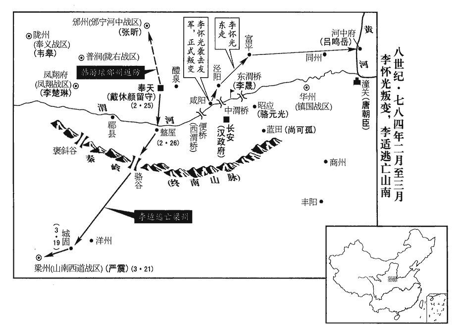
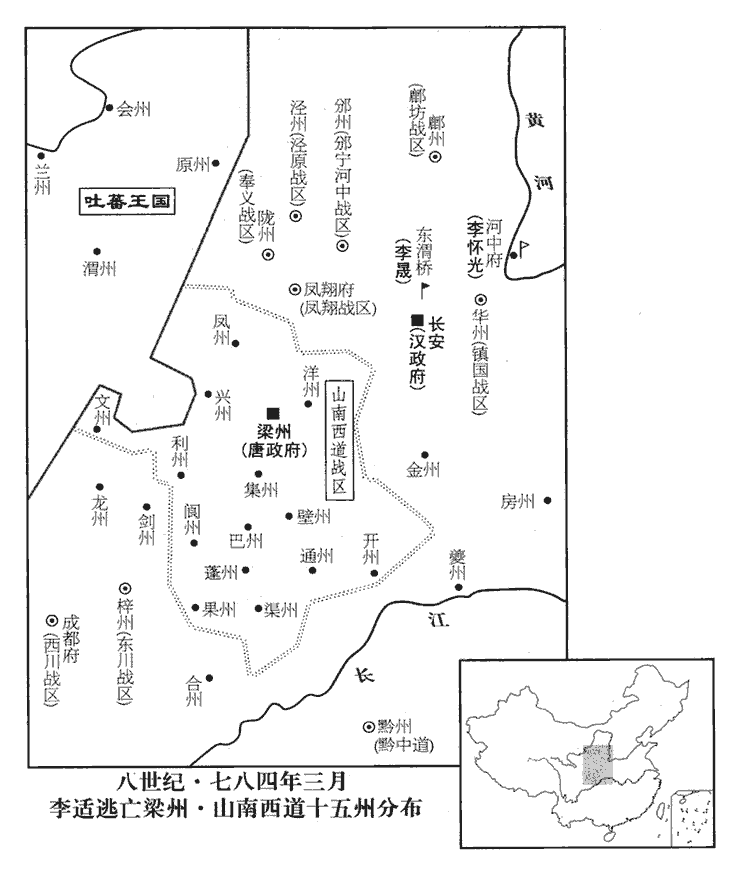
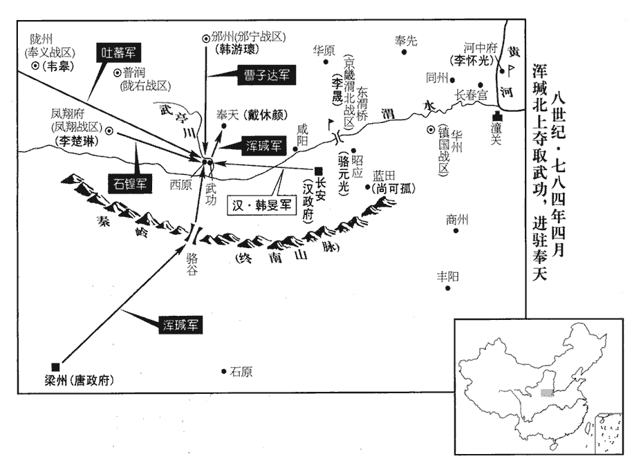

 唐紀四十六起閼逢困敦（甲子）二月，盡四月，不滿一年。

# 德宗神武聖文皇帝五

## 興元元年（甲子、七八四）

1二月，戊申‹七›，詔贈段秀實太尉，謐曰忠烈，厚恤其家。段秀實死節事見二百二十八卷建中四年。謐，神至翻。時賈隱林已卒，贈左僕射，賞其能直言也。卒，子恤翻。射，寅謝翻。直言事見上卷上年。

〖译文〗 [1]二月，戊申（初七），德宗颁诏追赠段秀实为太尉，谥号称为忠烈，以优厚的待遇抚恤段秀实的家人。当时，贾隐林已经去世，德宗追赠他为左仆射，表彰他能够直言。

2李希烈將兵五萬圍寧陵‹河南省宁陵县›，引水灌之；濮州‹山东省鄄城县›刺史劉昌以三千人守之。將，即亮翻，又音如字。濮，博木翻。李希烈自建中四年攻寧陵。

〖译文〗 [2]李希烈领兵五万人围攻宁陵，引来河水灌城，濮州刺史刘昌率三千人守卫宁陵。

滑州‹河南省滑县›刺史李澄密遣使請降，李澄降賊見上卷上年。使，疏吏翻。降，戶江翻。上許以澄為汴滑節度使。澄猶外事希烈；希烈疑之，遣養子六百人戍白馬‹滑州州政府所在县，河南省滑县›，汴，皮變翻。白馬，滑州治所。召澄共攻寧陵。澄至石柱‹滑县南›，使其眾陽驚，燒營而遁。又諷養子令剽掠，令，力丁翻。剽，匹妙翻；下同。澄悉收斬之，以白希烈，希烈無以罪也。

〖译文〗 滑州刺史李澄秘密派来使者请求归降，德宗答应任命李澄为汴、滑节度使。李澄表面上仍然事奉李希烈，李希烈却怀疑他，派遣养子六百人戍守白马，传召李澄前来共同攻打宁陵。李澄来到石柱，指使他的部众佯作受惊，烧掉营房，便逃跑了。李澄又暗示李烈的养子，让他们抢劫掳掠，而李澄又将他们全部收捕斩杀，并将此事告诉李希烈，但李希烈无法加罪于他。

劉昌守寧陵，凡四十五日不釋甲。韓滉‹镇海战区，总部设润州江苏省镇江市›遣其將王栖曜將兵助劉洽拒希烈，栖曜以強弩數千游汴水，夜，入寧陵城。滉，呼廣翻；將，卽亮翻，將兵之將，音同上。考異曰：新書柏良器傳曰：「良器為武衛中郎將，以兵隸浙西。希烈圍寧陵，遏水灌之，親令軍中明日拔城。良器以救兵至，擇弩手善游者沿河渠夜入，及旦，伏弩發，乘城者皆死。」疑韓滉遣栖曜及良器同救寧陵，舊栖曜傳曰：「將強弩數千夜入寧陵。」與此共是一事。今參取之。明日，從城上射希烈，射，而亦翻。及其坐幄，坐，才臥翻。希烈驚曰：「宣‹安徽省宣州市›、潤‹江苏省镇江市›弩手至矣！」遂解圍去。

〖译文〗 刘昌守卫宁陵，计有四十五天不曾脱下铠甲。韩派遣他的将领王栖曜领兵援助刘洽抵御李希烈，王栖曜使强健的弩手数千人游过汴水，在夜间进入宁陵城。第二天，弩手从城上用箭射击李希烈，射到他所坐镇的帐幕里边。李希烈吃惊地说：“宣、润的弩手到了！”于是解除了宁陵的围困，自行离去。

3朱泚【章：十二行本「泚」下有「既」字；乙十一行本同。】自奉天敗歸，事見上卷建中四年。泚，且禮翻，又音此。李晟謀取長安。劉德信與晟俱屯東渭橋‹陕西省高陵县南›，劉德信屯東渭橋，事始見二百二十八卷建中四年。晟，成正翻。不受晟節制；晟因德信至營中，數以滬澗‹河南省郏县西›之敗及所過剽掠之罪，斬之；數，所具翻，又所主翻。滬，侯古翻。剽，匹妙翻。滬澗之敗見二百二十八卷建中四年。是年十一月，既加李晟神策行營節度，劉德信可得而不受節制乎！況又有敗軍及剽掠之罪，斬之宜矣。因以數騎馳入德信軍，勞其眾，勞，力到翻。騎，奇寄翻。無敢動者，遂并將之，軍勢益振。將，即亮翻，又音如字。

〖译文〗 [3]朱从奉天大败而归，李晟谋划攻取长安。刘德信与李晟一道屯驻在东渭桥，但他不接受李晟的管束。李晟借刘备信来到营中之机，列举他在涧战败和沿途抢劫掳掠的罪行，将他斩杀。李晟因而以数名骑兵奔入刘德信军中，慰劳他的部众，没有人敢有所举动。于是李晟一并统领了此军，军队的声势益发振作。

李懷光既脅朝廷逐盧杞等，事見上卷上年。朝，直遙翻。內不自安，遂有異志。又惡李晟獨當一面，惡，烏路翻；下同。恐其成功，奏請與晟合軍；詔許之。晟與懷光會于咸陽西陳濤斜‹咸阳市东›，築壘未畢，壘，魯水翻。泚眾大至。晟謂懷光曰：「賊若固守宮苑，宮苑，謂宮城及苑城也。或曠日持久，未易攻取；易，以豉翻。今去其巢穴，敢出求戰，此天以賊賜明公，不可失也！」懷光曰：「軍適至，馬未秣，士未飯，飯，扶晚翻。豈可遽戰邪！」邪，音耶。晟不得已乃就壁。晟每與懷光同出軍，懷光軍士多掠人牛馬，晟軍秋豪不犯。懷光軍士惡其異己，分所獲與之，晟軍終不敢受。

〖译文〗 李怀光胁迫朝廷贬逐了卢杞等人以后，内心不能自安，于是有了反叛朝廷的意图。李怀光又嫌恶李晟独当一面，惟恐他有所建树，便上奏请求与李晟合兵，德宗颁诏答应了他的请求。李晟与李怀光在咸阳西面的陈涛斜会师，营垒还没有修筑完毕，朱军队大批开到。李晟对李怀光说：“假如敌军顽固把守宫城和苑城，也许会空废时日，延宕许久，不容易攻打下来。现在敌军离开了他们的巢穴，竟敢出城挑战，这是上天把敌军赐给明公，决不能放走他们！”李怀光说：“我军刚刚赶到，战马还没有喂料，士兵还没有吃饭，哪能匆匆接战呢！”李晟没有办法，只好自回营垒。每次李晟与李怀光一同派出军队，李怀光的将士常常掠夺百姓的牛马，李晟军却秋毫无犯。李怀光的将士嫌恶李晟军与自己两样，将所得物品分给他们，但李晟军始终不敢接受。

懷光屯咸陽累月，逗留不進；逗，音豆。考異曰：實録云：「懷光堅壁自守，凡八十餘日。」按懷光以十一月癸巳解奉天圍，李晟以二月戊申徙東渭橋，其間纔七十六日。實錄所言，謂懷光奔河中以前耳。今但云累月。上屢遣中使趣之，使，疏吏翻。趣，讀曰促。辭以士卒疲弊，且當休息觀釁。諸將數勸之攻長安，將，即亮翻。數，所角翻；下同。懷光不從，密與朱泚通謀。【章：十二行本「謀」下有「事跡頗露」四字；乙十一行本同；孔本同，張校同；退齋校同。】泚，且禮翻；又音此。李晟屢奏，恐其有變，為所併，請移軍東渭橋；晟，成正翻。李懷光既有異謀，李晟與之連營於咸陽，有不能一息安者，其奏請移軍當也。然必歸東渭橋者，晟之本規也。蓋朱泚擁涇卒而據長安，其敗也必當西奔，晟以師自東逼之，所以開其走路耳。兵法，圍城為之闕，此其近之。上猶冀懷光革心，收其力用，寢晟奏不下。下，戶嫁翻。

〖译文〗 李怀光在咸阳屯驻了好几个月，不肯前进。德宗屡次派遣中使催使他，他便以士兵疲困不堪，而且应当保养兵力，观察敌军的破绽为理由而推辞。诸将领好几次劝说李怀光攻打长安，李怀光不肯听从，还暗中与朱勾结合谋。李晟屡屡上奏，惟恐发生变故，被李怀光吞并，请求将军队转移到东渭桥，但德宗仍然希望李怀光洗心革面，争取使他尽力效命，便压了李晟的奏章，不肯批示。

懷光欲緩戰期，且激怒諸軍，奏言：「諸軍糧賜薄，神策獨厚。厚薄不均，難以進戰。」上以財用方窘，窘，巨隕翻。若糧賜皆比神策，則無以給之，不然，又逆懷光意恐諸軍觖望；觖，古穴翻，怨望也。乃遣陸贄詣懷光營宣慰，因召李晟參議其事。懷光意欲晟自乞減損，使失士心，沮敗其功，沮，在呂翻。敗，補邁翻。乃曰：「將士戰鬬同而糧賜異，何以使之協力！」將，即亮翻。贄未有言，數顧晟。晟曰：「公為元帥，得專號令；晟將一軍，受指蹤而已。數，所角翻。帥，所類翻。將，卽亮翻，又音如字。至於增減衣食，公當裁之。」懷光默然，又不欲自減之，遂止。李晟之答懷光，氣和而辭正，故能伐其謀。

〖译文〗 李怀光准备延缓接战的日期，并且激怒各军，便上奏说：“各军粮食供给微少，只有神策军供给丰厚，多少不均，难以进军开战。”德宗因财物用度还正窘困，如果都按照神策军的标准供给粮食，便拿不出粮食来供给各军。但不这样又惟恐逆了李怀光的意思，引起各军抱怨，于是派遣陆贽到李怀光营中安抚将士，顺便传召李晟参予商议粮饷供给之事。李怀光本意打算让李晟自己请求削减供给，使他失去军心，败坏他的功绩，便说：“将士一个样地与敌军战斗，而粮食供给却彼此不同，怎么能让将士齐心合力呢！”陆贽没有发言，几次回头去看李晟。李晟说：“你是主帅，得以专擅号令。我不过带领着一支军队，接受你的指挥罢了。说到增加或减少军中衣食供给，自当由你裁断。”李怀光一言不发，又不愿由自己削减李晟军的粮食供给，此事便搁置了。

時上遣崔漢衡詣吐蕃發兵，見上卷本年正月。吐，從暾入聲。吐蕃相尚結贊相，息亮翻。言：「蕃法發兵，以主兵大臣為信；今制書無懷光署名，故不敢進。」上命陸贄諭懷光，懷光固執以為不可，曰：「若克京城，吐蕃必縱兵焚掠，誰能遏之！此一害也。前有敕旨，募士卒克城者人賞百緡，彼發兵五萬，若援敕求賞，五百萬緡何從可得！此二害也。虜騎雖來，必不先進，勒兵自固，觀我兵勢，勝則從而分功，敗則從而圖變，譎詐多端，不可親信，此三害也。」李懷光雖欲養寇以自資，然其陳用吐蕃三害，其言亦各有理。緡，眉巾翻。騎，奇寄翻。譎，古穴翻。竟不肯署敕；尚結贊亦不進軍。

〖译文〗 当时，德宗派遣崔汉衡到吐蕃去让他们发兵，吐蕃国相尚结赞说：“按照吐蕃礼法发兵，以主掌兵权的大臣的署名为凭信，现在制书上没有李怀光的署名，所以不敢进军。”德宗令陆贽晓示李怀光，李怀光坚持认为不可让吐蕃发兵，他说：“如果攻克京城，吐蕃必然要放纵士兵焚烧掳掠，有谁能够制止他们！这是第一个害处。不久前颁布的敕旨规定，凡是召募士兵攻破城池者。每人奖赏钱一百缗，吐蕃发兵五万人，如果援引敕旨，要求奖赏，五百万缗钱要到哪儿才能弄到！这是第二个害处。吐蕃骑兵虽然到来，必定不肯率先进军，而是按兵不动，保存实力，观望我方军队的形势，胜利了，便跟着瓜分功劳，失败了，便借机图谋变乱，诡诈多端，不可亲近信任。这是第三个害处。”李怀光始终不肯往敕旨上署名，尚结赞也没有让军队进发。

陸贄自咸陽還，上言：「賊泚稽誅，保聚宮苑，上，時掌翻。還，從宣翻，又音如字。泚，且禮翻，又音此。朱泚自據長安，居白華殿，重兵多在苑中，故言保聚宮苑。勢窮援絕，引日偷生。懷光總仗順之師，乘制勝之氣，謂醴泉之勝也。鼓行芟翦，易若摧枯，芟，所銜翻。易，以豉翻。而乃寇奔不追，師老不用，諸帥每欲進取，懷光輒沮其謀。諸帥，謂李晟、楊惠元等。帥所類翻。沮，在呂翻。據茲事情，殊不可解。解，戶買翻，曉也。陛下意在全護，委曲聽從，觀其所為，亦未知感。若不別務規略，漸思制持，惟以姑息求安，終恐變故難測。此誠事機危迫之秋也，固不可以尋常容易處之。易，弋豉翻。處，昌呂翻。今李晟奏請移軍，適遇臣銜命宣慰，晟，成正翻。銜，戶緘翻。懷光偶論此事，臣遂汎問所宜。懷光乃云：『李晟既欲別行，某亦都不要藉。』要者，須其用；藉者，借其力。當時諸鎮有要藉官，所以名官之意亦如此。臣猶慮有翻覆，因美其軍盛強。懷光大自矜誇，轉有輕晟之意。臣又從容問云：從，千容翻。『回日，或聖旨顧問事之可否，決定何如？』懷光已肆輕言，不可中變，遂云：『恩命許去，事亦無妨。』言上已許李晟去咸陽，則其移軍於事體無妨也。要約再三，要，一遙翻。非不詳審，雖欲追悔，固難為辭。伏望既以李晟表出付中書，敕下依奏，敕下李晟，依其所奏也。下，戶嫁翻。別賜懷光手詔，示以移軍事由。事由，猶言事因也。其手詔大意云：『昨得李晟奏，請移軍城東以分賊勢。東渭橋在京城東，故云然。晟，成正翻。朕本欲委卿商量，適會陸贄回奏云，見卿語及於此，仍言許去事亦無妨，遂敕本軍允其所請。』如此，則詞婉而直，理順而明，雖蓄異端，何由起怨！」上從之。

〖译文〗 陆贽从咸阳回来以后，上奏说：“逆贼朱为了拖延被诛灭的时间，聚兵退保宫城和禁苑，大势已去，外援断绝，迁延时日，苟且偷生。李怀光总领主持正义的援军，乘着取得胜利的声势，如果擂鼓进军，灭除敌军，有如摧毁枯败的草叶一般容易。然而，李怀光在敌寇逃窜时不肯追击，坐待士气低落，难以用兵。各军主帅每每打算进军杀敌，李怀光总是阻止他们的计划。根据这些情况来看，他的意图很不好解释。陛下的本意在于保全回护李怀光，对他委曲求全，言听计从。观察他做的事情，也并没有因此而被打动。如果不采取另外的谋略，逐渐控制住他，而只是对他无原则地宽容下去，以求平安无事，最终恐怕还是要发生难以测度的变故。现在是事功机缘面临危险促迫的时候，当然不能够用通常的、轻易的态度来对待。现在李晟奏请转移自己的军队，恰好遇到我奉命前去安抚将士，李怀光偶然谈论到这件事，于是我泛泛地问他应当如何处理。李怀光便说：‘李晟既然愿意到别处去，我也全不需要借助他为我用命效力。’我仍顾虑李怀光会再改变主意，便称赞他的军队强盛。李怀光大大地自夸了一番，转而有轻视李晟的意思。我又不慌不忙地问他：‘我回去时，或许会有圣旨询问此事可行与否，不知你是怎么决定的？’李怀光已经肆意讲出了不慎重的话，无法中途改变，于是他说：‘皇上的命令若是允许李晟离开，对于事体也并无妨碍。’我与他再三约定，不能不说是够审慎周密的了，即使李怀光打算翻悔，实在也难于开口。希望立即将李晟的奏表转出，交给中书省，下敕批准依所奏，另外再赐给李怀光手诏，向他说明转移军队的理由。此手诏的大致意思这样说：‘昨天得到李晟的奏章，他请求把军队转移到长安城东边，以便分去敌军兵势。朕本来打算委托你来商量，恰遇陆贽回朝上奏说，与你相见时，你已谈到此事，还说允许李晟离去，事体并无妨碍，才是朕便给李晟本军颁发了敕书，应允了他的请求。’这样说，用词既委婉又直切，顺理成章，意义明了，李怀光即使蓄有异谋，他又有什么理由与朝廷结怨呢！”德宗听从了陆贽的建议。

晟自咸陽結陳而行，結陳而行，以防李懷光追掩。陳，讀曰陣。歸東渭橋。時鄜坊節度使李建徽、神策行營節度使楊惠元猶與懷光聯營，陸贄復上奏曰：「懷光當管師徒，鄜，音膚。使，疏吏翻。復，扶又翻。上，時掌翻。當管，猶言見管也。足以獨制兇寇，；逗留未進，抑有他由。所患太強，不資傍助。比者又遣李晟、李建徽、楊惠元三節度之眾附麗其營，比，毗至翻，近也。無益成功，祇足生事。何則？四軍接壘，群帥異心，李晟、李建徽、楊惠元之軍及李懷光之軍為四軍。帥，所類翻。論勢力則懸絕高卑，言懷光之軍最強，懷光之官最高，相去懸絕。據職名則不相統屬。言懷光、晟、建徽、惠元四人並為節度使，各總一軍，不相統屬。懷光輕晟等兵微位下而忿其制不從心，晟等疑懷光養寇蓄姦而怨其事多陵己；端居則互防飛謗，欲戰則遞恐分功，齟齬不和，齟，壯所翻。齬，偶許翻。嫌釁遂構，俾之同處，必不兩全。處，昌呂翻。強者惡積而後亡，弱者勢危而先覆，陸贄言李懷光、李建徽、楊惠元之禍敗，如燭照龜卜。覆亡之禍，翹足可期！人立而翹一足則不能久。翹足可期者，言禍來之速也。舊寇未平，新患方起，憂歎所切，實堪疚心！疚，病也。太上消慝於未萌，太上，猶言極上也。慝，惡也。其次救失於始兆，況乎事情已露，禍難垂成，難，乃旦翻。委而不謀，何以寧亂！李晟見機慮變，先請移軍，【章：十二行本「軍」下有「就東」二字；乙十一行本同；張校同，云無註本亦無。】建徽、惠元勢轉孤弱，為其吞噬，理在必然，晟，成正翻。噬，時制翻，啗也。他日雖有良圖，亦恐不能自拔；拯其危急，唯在此時。拯，救也。今因李晟願行，便遣合軍同往，託言晟兵素少，少，詩紹翻。慮為賊泚所邀，藉此兩軍迭為掎角，泚，且禮翻。掎，居蟻翻。仍先諭旨，密使促裝，詔書至營，即日進路，懷光意雖不欲，然亦計無所施。是謂先人有奪人之心，左傳趙宣子之言。先，悉薦翻。疾雷不及掩耳者也。淮南子之言。解鬬不可以不離，救焚不可以不疾，理盡於此，惟陛下圖之。」上曰：「卿所料極善。然李晟移軍，懷光不免悵望，悵，丑亮翻，怨也。若更遣建徽、惠元就東，謂自咸陽東就李晟也。恐因此生辭，生辭，猶今人言生言語也。轉難調息，調息，猶今人言調停也。且更俟旬時。」旬時，猶言旬日也。

〖译文〗 李晟由咸阳结成阵列行军，回到东渭桥。当时，坊节度使李建徽和神策行营节度使杨惠元仍然与李怀光营垒相连。陆贽再次上奏说：“李怀光现在所管辖的士兵，足够独自制服凶恶的敌寇。他停顿不肯进军，也许有别的原由。令人担忧的是，李怀光军过于强盛，不需要借助别人的帮助。最近，朝廷又派遣李晟、李建徽、杨惠元三位节度使的人马挨近李怀光的营垒驻扎，不仅不利于成就事功，反而会造成事端。为什么呢？四支军队营垒接连，而各军主帅意图不同。就官位、兵力而言，李怀光与另三人高下相差悬殊，据职务的名义而言，四人之间却并没有统属关系。李怀光轻视李晟等人兵员微少，官位卑下，并为不能随心节制各军而忿怒；李晟等人又怀疑李怀光姑息敌寇，蓄谋邪恶，并且对李怀光在办事时常常凌侮自己而怨恨。在平素，他们要互相防备意外的诽谤；准备打仗时，他们又交互担心功劳被人分去。他们参差不合，于是便造成了嫌隙，使他们驻扎在一起，必然是强盛与薄弱的双方不能两相保全。强盛的一方，恶行积聚，最后败亡；薄弱的一方，形势危殆，便先遭覆灭。覆灭败亡的祸患，在翘一脚的时间里便可见到！原有的敌寇尚未平定，新的祸患却正在兴起，这便是令人忧虑叹息的痛切之处，实在足以使人伤心。最好的办法是消除邪恶于尚未萌发之前，其次的办法是补救过失于始露兆头时，何况此事已经显露，祸患就要形成，如果推委不去谋划，拿什么去平息变乱！李晟识破事机，顾虑生变，先请转移军队，李建徽、杨惠元的形势转为孤立薄弱，被李怀光军吃掉，在情理上是必然的。即使以后有良好策谋，恐怕也不能自拔。所以，拯救李建徽、杨惠元的危急，唯有在此时刻。现在，由于李晟愿意离开李怀光，便可让李建徽、杨惠元与李晟合兵一处，共同前往。可以托称李晟的兵马素来就少，顾虑着被逆贼朱所拦击，想借助这两支军队形成交相呼应的形势。还要先行传达圣旨，暗中让这两支军队赶快整治行装，诏书下达营中，当日就上路。即使李怀光本心并不愿意，但是也无计可施了。这就是人们所说的抢在敌人的前面可以夺去敌人的斗志，迅雷不及掩耳的意思。排解打斗，不能不让双方离开；抢救火灾，不能不快速行事。道理说到这儿，便说尽了，但请陛下设法对付吧。”德宗说：“你所做的预料非常好。然而，李晟将军队转移，李怀光不免要怨恨不满。如果再派遣李建徽、杨惠元移军向东开去，恐怕因此生出一番言语，反而难以调停。姑且再等待十天吧。”

4辛酉‹二十›，加王武俊同平章事兼幽州、盧龍節度使。欲使之討朱滔也。使，疏吏翻。

〖译文〗 [4]辛酉（二十日），德宗加封王武俊同平章事，兼任幽州、卢龙节度使。

5李晟以為：「懷光反狀已明，緩急宜有備，蜀‹四川省中部›、漢‹陕西省南部›之路不可壅，此指漢蜀郡、漢中郡二郡大界而言。請以裨將趙光銑xiǎn等為洋‹陕西省洋县›、利‹四川省广元市›、劍‹四川省剑阁县›三州刺史，三州，皆當入蜀之道之要。裨，賓彌翻。將，即亮翻。洋，音祥。各將兵五百以防未然。」將，音同上，又音如字。上疑未決，欲親總禁兵幸咸陽，以慰撫為名，趣諸將進討。趣，讀曰促。或謂懷光曰：「此漢祖遊雲夢‹湖北省安陆市南›之策也！」遊雲夢事見十一卷漢高祖六年。懷光大懼，反謀益甚。

〖译文〗 [5]李晟认为：“李怀光造反的情状已经很清楚，在危急的关头，应当有所准备。通往蜀郡、汉中的道路是不能堵塞的，请任命副将赵光铣等人为洋、利、剑三州刺史，让他们各自领兵五百人，以便防患于未然。”德宗迟疑不决，准备亲自总领禁兵出走咸阳，以抚慰将士的名义，督促各将领进军讨伐。有人对李怀光说：“这就是汉高祖巡游云梦泽的计策！”李怀光大为恐惧，造反的谋划愈发加紧了。

上垂欲行，懷光辭益不遜，上猶疑讒人間之，間，古莧翻。甲子‹二十三›，加懷光太尉，增實食，賜鐵券，實食，食實封也。遣神策右兵馬使李卞等往諭旨。使，疏吏翻；下同。考異曰：邠志曰：「十六日詔加懷光太尉。」按實錄，甲子二十三日。邠志誤。幸奉天錄、舊傳「李弁」作「李昪biàn」，今從奉天記。懷光對使者投鐵券於地曰：「聖人疑懷光邪？唐之臣子，率稱君父為聖人。邪，音耶。人臣反，賜鐵券；懷光不反，今賜鐵券，是使之反也！」辭氣甚悖。悖，蒲妹翻，又蒲沒翻。朔方左兵馬使張名振當軍門大呼曰：呼，火故翻。「太尉視賊不許擊，待天使不敬，使，疏吏翻。朝廷所遣，謂之天使。蓋謂君，天也；君之所遣，猶天之所遣也。果欲反邪！功高太山，一旦棄之，自取族滅，富貴他人，何益哉！言懷光反，是自取族滅，他人平其亂以為功而得富貴，是富貴他人也。我今日必以死爭之。」懷光聞之，謂曰：「我不反，以賊方強，故須蓄銳俟時耳。」懷光又言：「天子所居必有城隍。」有水曰池，無水曰隍。乃發卒城咸陽，未幾，移軍據之。幾，居豈翻。張名振曰：「乃者言不反，乃者，猶言昨者也。今日拔軍此來，何也？何不攻長安，殺朱泚，取富貴，引軍還邠‹陕西省彬县›邪！」泚，且禮翻，又音此。還，從宣翻，又音如字。邠，卑旻翻。懷光所統朔方軍本屯邠州。懷光曰：「名振病心矣！」命左右引去，拉殺之。拉，落合翻。

〖译文〗 德宗将近出行之际，李怀光讲话益发不恭顺。德宗仍然怀疑有好进谗言的人从中离间他。甲子（二十三日），德宗加封李怀光为太尉，增加食实封，赐铁券，派遣神策右兵马使李卞等人前往传达圣旨。李怀光当着使者的面，把铁券丢在地上说：“皇上怀疑我李怀光吗？臣下造反时，才赐铁券。我不曾造反，现在赐铁券，这是让我造反的吧！”他的言辞和语气都很无礼。朔方左兵马使张名振面对军营的大门大声喊道：“太尉对待敌军，不许出击，对待皇上的使者，很不恭敬，果真是要造反吗！你的功劳象泰山一样高，忽然舍弃了它们，自取灭族，而让他人去享受富贵，这有什么好处呢！我今天一定要不惜一死，前去争论。”李怀光听了，对他说：“我不会造反。只是以为正当敌军强盛，必须积蓄锐气，等待时机罢了。”李怀光又说：“皇上所住的地方一定要有城壕。”于是，李怀光派出士兵去修筑咸阳城。不久，他迁移军队，占据了咸阳城。张名振说：“以前你说不会造反，现在你调动军队到这里来，这是为什么？为什么你不进攻长安，杀掉朱，获取富贵，然后率领军队回到州去呢！”李怀光说：“张名振得了精神病了！”李怀光命令侍从人员将他拉到外面，把他摧折至死。

右武鋒兵馬使石演芬，本西域胡人，懷光養以為子。懷光潛與朱泚通謀，演芬遣其客郜成義詣行在告之，泚，且禮翻，又音此。演，以淺翻。郜，古到翻。史炤曰：郜，姓也，出自周文王子，封郜國，國在濟陰。晉有尚書高昌郜久。請罷其都統之權。成義至奉天，告懷光子璀；【嚴：「璀」改「琟wéi」；下同。】統，他綜翻，俗音從上聲。璀，七罪翻。璀密白其父。懷光召演芬責之曰：「我以爾為子，柰何欲破我家！今日負我，死甘心乎？」演芬曰：「天子以太尉為股肱，太尉以演芬為心腹；太尉既負天子，演芬安得不負太尉乎！演芬胡人，不能異心，惟知事一人。一人，謂天子也。苟免賊名而死，死甘心矣！」懷光使左右臠食之，皆曰：「義士也！可令快死。」以刀斷其喉而去。臠，力兗翻。令，力丁翻。斷，音短。考異曰：邠志曰：「懷光投鐵券于地，使者懼焉。名振呼於軍門。」又曰：「二月二十一日，懷光拔其軍居咸陽。」又曰：「三月三日，懷光巡咸陽城，名振曰：『昨日言不反，今悉軍此來，何也？』」又曰：「懷光既殺名振，召演芬責之。」按名振云「昨日言不反，今何此來？」則是呼軍門之明日，懷光既移軍咸陽。若至咸陽已十三日，因巡城而名振言之，何得云昨日，又何得云悉軍此來！又名振與演芬同日死。按舊傳云：「郜成義至奉天，乃反以其言告懷光子璀，璀密告其父懷光。若三月三日，則車駕已幸梁、洋，不在奉天。且是時反狀已彰灼如此，豈能尚欺人云不反邪！今從幸奉天錄，悉因投鐵券言之。

〖译文〗 右武锋兵马使石演芬，本是西域胡族人，李怀光将他收养为子。李怀光暗中与朱勾结，石演芬派遣他的门客郜成义到行在报告此事，请求免除李怀光都统的兵权。郜成义来到奉天，告诉了李怀光的儿子李璀，李璀又密告他父亲。李怀光召来石演芬，责备他说：“我把你当作儿子，你怎么打算叫我家破人亡！今天你辜负了我，你死甘心吗？”石演芬说：“圣上把太尉视为辅佐朝政的大臣，太尉把我当作亲信，太尉既然辜负了圣上，我怎么能够不辜负太尉呢！我是一个胡人，不能怀有二心，只知道事奉一人，如果能够免去逆贼的恶名而死，死也甘心了！”李怀光让侍从人员把他切成碎块，吃他的肉。众人都说：“石演芬是一位义士啊，应该让他死得快一些。”用刀割断他的喉咙就离开了。

李卞等還，言懷光驕慢之狀，還，從宣翻，又音如字。於是行在始嚴門禁，嚴門關出入之禁以防不虞。從臣皆密裝以待。史炤zhào曰：密具裝束，所以備行。從，才用翻。

〖译文〗 李卞等人回朝，讲了李怀光骄横傲慢的情况，于是行在开始对宫门城关严加警戒，侍从皇上的官员都暗中置办行装，等待离开奉天。

乙丑‹二十四›，加李晟河中、同絳節度使；上猶以為薄，德宗當患難之時，進人若將加諸膝；當事定之後，退人若將隊諸淵。晟，成正翻。使，疏吏翻。丙寅‹二十五›，又加同平章事。

〖译文〗 乙丑（二十四日），德宗加封李晟为河中、同绛节度使。德宗仍然认为封拜不够优厚，丙寅（二十五日），又加封李晟同平章事。

上將幸梁州‹陕西省汉中市›，梁州，古漢中。山南‹总部设梁州›節度使鹽亭‹四川省盐亭县›嚴震聞之，鹽亭，漢廣漢縣地，梁置鹽亭縣，唐屬梓州，以產鹽名縣。遣使詣奉天奉迎，又遣大將張用誠將兵五千至盩厔‹陕西省周至县›以來迎衛。至盩厔以來者，言若迎衛之兵至盩厔而乘輿未至，則當沿道漸進來前，以迎乘輿，不指定一處也。盩厔，音舟窒。將，即亮翻；誠將音同上，又音如字。用誠為懷光所誘，陰與之通謀，誘，音酉。上聞而患之。會震繼遣牙將馬勛奉表，上語之故；勛，許云翻。語，牛倨翻。勛請「亟詣梁州取嚴震符召用誠還府；若不受召，臣請殺之。」上喜曰：「卿何時復至此？」還，從宣翻，又音如字。復，扶又翻，又音如字。勛刻日時而去。既得震符，請壯士五人與之俱出駱谷‹陕西省周至县西南›。用誠不知事泄，以數百騎迎之，漢中取鳳翔之路，南谷曰褒，北谷曰駱。騎，奇寄翻。勛與之俱入驛。時天寒，勛多然藁火於驛外，然，與燃同。藁，禾稈也。軍士皆往附火。勛乃從容出懷中符，以示用誠曰：「大夫召君。」用誠錯愕起走，從，千容翻。錯愕，猝然驚也。壯士自後執其手擒之。用誠子在勛後，斫傷勛首。壯士格殺其子，仆用誠於地，跨其腹，以刀擬其喉曰：「出聲則死！」勛入其營，士卒已擐甲執兵矣。仆，方遇翻，頓也。擐，戶慣翻。勛大言曰：「汝曹父母妻子皆在漢中，一朝棄之，與張用誠同反，於汝曹何利乎！大夫令我取用誠，不問汝曹，無自取族滅！」眾皆讋zhé服。令，力丁翻。響，之涉翻，失氣也。勛送用誠詣梁州，震杖殺之，命副將領其眾。將，即亮翻。勛裹其首，復命於行在，愆期半日。愆期，過期也。

〖译文〗 德宗即将出走梁州的消息，被山南节度使盐亭人严震听说了，他派遣使者到奉天迎候德宗，又派遣大将张用诚领兵五千人到一带来迎驾护卫。张用诚被李怀光所引诱，暗中与李怀光互通阴谋，德宗听说很是担心。适逢严震又派遣牙将马勋进献表章，德宗向他讲了担心的原故，马勋请求：“赶紧到梁州去取严震的兵符，传召张用诚返回军府。如果张用诚不接受传召的命令，请让我把他杀掉。”德宗欢喜地说：“你什么时候再到这里？”马勋给自己限定了日期，然后离去。马勋得到严震的兵符以后，请求严震派出勇士五人与他一起出骆谷。张用诚不知道事情泄露，让数百人骑马迎接马勋，马勋与他们一起进入驿站。当时，天气寒冷，马勋在驿舍外面用禾秆点燃了许多火堆，士兵们都到火堆前烤火去了。马勋从容不迫地从怀中拿出兵符给张用诚过目说：“严大夫传召你回去。”张用诚猝然而惊，站起来就要逃跑，勇士们从他背后抓住他的手，捉住了他。张用诚的儿子在马勋背后，砍伤了马勋的头部。勇士们击杀了张用诚的儿子，将张用诚摔倒在地，骑在他的肚子上，用刀在他的喉咙前面比划着说：“你要是吱声，就杀死你！”马勋进入张用诚的营房，士兵们已经穿好铠甲，拿好兵器了。马勋大声说：“你们的父母、妻子、儿子都住在汉中，一时舍弃了他们，与张用诚一起造反，这对你们有什么好处呢！严大夫只让我来捉拿张用诚，不追究你们，你们不要自取灭族！”大家都惧怕屈服了。马勋将张用诚押送到梁州，严震用棍棒将他打死，命令副将统领他的部众。马勋将张用诚的头裹起来，到行在回报完成使命的情况，按照规定的日期，只超过了半天。

李懷光夜遣人襲奪李建徽、楊惠元軍，建徽走免，惠元將奔奉天，懷光遣兵追殺之。懷光又宣言曰：「吾今與朱泚連和，車駕且當遠避！」泚，且禮翻，又音此。

〖译文〗 李怀光派人在夜间突袭夺取李建徽、杨惠元的军队。李建徽逃脱而去，杨惠元准备逃奔奉天，李怀光派兵追击，将他杀死。李怀光还扬言说：“我现在就与朱联合起来，皇上的车驾应当远远地回避！”

 

懷光以韓遊瓌guī朔方將也，韓遊瓌初事郭子儀，李懷光東征，遊瓌為邠寧留後。瓌，古回翻，將，即亮翻。掌兵在奉天，與遊瓌書，約使為變，遊瓌密奏之；明日，又以書趣之，懷光又以書趣遊瓌，遊瓌蓋又奏之也。若據考異，則後書為渾瑊所獲，通鑑疑而不取。趣，讀曰促。上【章：十二行本「上」上有「遊瓌又奏之」五字；乙十一行本同；張校同，云無註本亦無。】稱其忠義，因問：「策安出？」對曰：「懷光總諸道兵，故敢恃眾為亂。今邠寧有張昕，靈武有寧景璿xuán，邠，卑旻翻。昕，許斤翻。璿，似宣翻。河中有呂鳴岳，振武‹单于府·内蒙古和林格尔县›有杜從政，潼關‹陕西省潼关县›有唐朝臣，渭北‹总部设鄜州陕西省富县›有竇覦，潼，音同。朝，直遙翻。覦，音俞。皆守將也。言此諸將各守其地也。陛下各以其地及其眾授之，尊懷光之官，罷其權，則行營諸將各受本府指麾矣。罷懷光兵權，則諸路兵雖在行營，將不肯稟命於懷光而各稟本府之命。懷光獨立，安能為亂！」上曰：「罷懷光兵權，若朱泚何？」言罷懷光，恐無以制朱泚。對曰：「陛下既許將士以克城殊賞，將士奉天子之命以討賊取富貴，誰不願之！邠府兵以萬數，借使臣得而將之，將，即亮翻，又音如字。足以誅泚；況諸道必有杖義之臣，泚不足憂也！」上然之。

〖译文〗 李怀光因韩游是朔方的将领，现在又在奉天掌管军事，便给韩游写了一封书信，约他发起叛乱，韩游将此事秘密上奏德宗。第二天，李怀光又用书信催促他及早起事。德宗称许韩游的忠义，又问他说：“你有什么计策？”韩游回答说：“李怀光总辖各道兵马，所以才敢仗着兵众作乱。现在宁有张昕，灵武有宁景，河中有吕鸣岳，振武有杜从政，潼关有唐朝臣，渭北有窦觎，都是守卫一方的将领。陛下可以将李怀光所统辖的地段及其兵众分别交给他们，提升李怀光的官职，免除他的兵权，那么，行营各将领便都分别接受本军府的指挥了。李怀光被孤立起来，又怎么能够作乱呢！”德宗说：“免除了李怀光的兵权以后，怎么对付朱呢？”韩游回答说：“既然陛下许诺，将士们攻克敌城便给与特殊的奖赏，奖士们便是遵循天子的命令讨伐逆贼，获取富贵，谁不愿意这样做呢！府兵马数以万计，假使我能够率领此军，便足可以诛杀朱，何况各道必定会有主持正义的臣属，朱是不值得忧虑的！”德宗认为韩游言之有理。

丁卯‹二十六›，懷光遣其將趙昇鸞入奉天，約其夕使別將達奚小俊燒乾陵‹乾县西北·李治墓›，考異曰：邠志作「達奚小進」，今從實錄。令昇鸞為內應以驚脅乘輿。令，力丁翻。乘，繩證翻。昇鸞詣渾瑊自言，瑊遽以聞，且請決幸梁州。渾，戶昆翻，又戶本翻，瑊jiān，古銜翻。考異曰：邠志：「二十六日，懷光又使持書促遊瓌，渾公獲而奏之，且使其卒物色我軍。遊瓌不知，不得以聞，又怒瑊之虞己也，慢罵于途。上疑其變，即日幸梁州。」今從實錄。奉天記曰：「上初拔奉天，而車駕至宜壽縣渭水之陽，謂侍臣曰：『朕之此行，莫同永嘉之勢！』因潸然流涕。渾瑊對曰：『臨大難無憂懼者，聖人之勇也。』言訖，濟河。」按新傳，李惟簡追及上於盩厔西，然後渾瑊繼至。則上至渭陽時瑊猶未來。今不取。上命瑊戒嚴，瑊出，部勒未畢，上已出城西，命戴休顏守奉天，朝臣將士狼狽扈從。朝，直遙翻。將，即亮翻。從，才用翻。戴休顏徇於軍中曰：「懷光已反！」遂乘城拒守。

〖译文〗 丁卯（二十六日），李怀光派遣他的将领赵升鸾进入奉天城，约定在当天傍晚让别将达奚小俊焚烧乾陵，让赵升鸾作为内应，来威胁德宗的车驾。赵升鸾到浑处主动讲了此事，浑赶忙上奏德宗，并且请德宗出走梁州。德宗命令浑戒严。浑从朝中出来，部署尚未停当，德宗已经出城西行，命令戴休颜防守奉天，朝中的臣僚和将士们狼狈不堪地随从而行。戴休颜在军队中当众宣布说：“李怀光已经造反了！”于是他便登城防守。

朱泚之稱帝也，朱泚稱帝見二百二十八卷建中四年。泚，且禮翻，又音此。兵部侍郎劉迺臥病在家，泚召之，不起；使蔣鎮自往說之，說，式芮翻。凡再往，知不可誘脅，誘，音酉。乃歎曰：「鎮亦忝列曹，不能捨生，以至於此，蔣鎮仕唐為工部侍郎，故云亦忝列曹。為泚所得，不能死而受泚官，自愧不能捨生取義。豈可復以己之腥臊污漫賢者乎！」復，扶又翻。臊，蘇遭翻。污，烏故翻。漫，謨官翻，塗也。歔欷而返。歔，音虛。欷，音希，又許既翻。迺聞帝幸山南‹秦岭›，搏膺大呼，呼，火故翻。自投于牀，不食數日而卒‹年六十岁›。梁州在長安南山之南。劉迺以乘輿播遷，浸以益逺，故自絶於衾衽之間。

〖译文〗 朱自称大秦皇帝时，兵部侍郎刘病卧在家。朱传召他，他不肯起床，朱让蒋镇亲自前往说服他，蒋镇前后去了两次，知道刘难以引诱胁迫，叹道：“我也官列工部侍郎，自愧不能够舍去性命，以致到了这般地步，难道可以再用自己秽恶的行为去玷污贤人吗！”蒋镇哽咽着回去了。刘听说德宗出行南山以南，拍着胸膛，大声呼叫着跳下床来，好几天不肯吃饭而死。

太子少師喬琳從上至盩厔‹陕西省周至县›，稱老疾不堪山險，削髮為僧，匿於仙遊寺‹陕西省周至县南›；泚聞之，召至長安，以為吏部尚書。於是朝士之竄匿者多出仕泚矣！劉迺以乘輿不能復還而自絶，義不臣賊也；喬琳等以乘輿不能復還。出仕於泚，苟性命而貪祿利也。唐於此時，亦云殆矣。少，始照翻。盩厔，音舟窒。尚，辰羊翻。

〖译文〗 太子少师乔琳跟随德宗来到，说自己老迈多病，禁受不住艰险的山路，削去头发为僧，躲藏在仙游寺中。朱听说此事，将乔琳传召到长安，任命他为吏部尚书。于是许多逃避叛军的朝廷官吏去给朱当官了！

懷光遣其將孟保、考異曰：邠志作「孟廷寶」。今從實錄。惠靜壽、孫福達將精騎趣南山邀車駕，達將，即亮翻，又音如字。騎，奇寄翻。趣，逡喻翻。遇諸軍糧料使張增於盩厔。使，疏吏翻。三將曰：「彼使我為不臣，我以追不及報之，不過不使我將耳。」過，古禾翻，又古臥翻。將，即亮翻。言不過不使之為將也。因目增曰：目增，示之以意，欲因其言以紿眾。「軍士未朝食，如何？」增紿其眾曰：「此東數里有佛祠，吾貯糧焉。」三將帥眾而東，縱之剽掠，紿，蕩亥翻。貯，丁呂翻。帥，讀曰率。剽，匹妙翻。由是百官從行者皆得入駱谷‹陕西省周至县西南›，以追不及還報，還，從宣翻，又音如字。考異曰：實録曰：「纔入駱谷，懷光遣其將孟保等以數百騎來襲，為後軍將侯仲莊所拒而退，遂焚店驛而去。」舊嚴震傳曰：「賴山南兵擊之而退，輿駕無警急之患。」今從邠志。懷光皆黜之。

〖译文〗 李怀光派遣他的将领孟保、惠静寿、孙福达率领精锐骑兵急奔南山，阻截德宗的车驾，在遇到诸军粮料使张增。孟保等三将领说：“李怀光让我们去做背叛圣上的事情，我们便报告他说没有追赶上圣上。他不过不让我们领兵就是了。”三将领因而以目光向张增示意着说：“我们的士兵还没有吃早饭，怎么办呢？”张增欺骗三将领的部众说：“从这里向东走几里地，有座佛祠，我在那里储存着粮食。”孟保等三将领率部众向东而去，听任士兵去抢劫掳掠，因此跟随德宗出行的朝廷百官都得以进入骆谷。孟保等三将领回去报告说没有追上德宗的车驾，李怀光将他们全都贬黜了。

6河東‹总部太原府›將王權、馬彙引兵歸太原‹山西省太原市›。將，即亮翻。彙，于貴翻。權、彙入援見上卷上年。以上幸山南，聲問不接，故引兵歸。史言馬燧怠於勤王。

〖译文〗 [6]河东将领王权、马汇领兵返回太原。

7李晟得除官制，拜哭受命，謂河中、同、絳及加同平章事之命。晟，成正翻。謂將佐曰：「長安，宗廟所在，天下根本，若諸將皆從行，誰當滅賊者！」乃治城隍，繕甲兵，為復京城之計。城隍，即為東渭橋營塹。治，直之翻。先是，東渭橋有積粟十餘萬斛，度支給李懷光軍，幾盡。先，悉薦翻。度，徒洛翻。幾，居希翻。是時懷光、朱泚連兵，聲勢甚盛，車駕南幸，人情擾擾；晟以孤軍處二強寇之間，泚，且禮翻，又音此。處，昌呂翻。內無資糧，外無救援，徒以忠義感激將士，故其眾雖單弱而銳氣不衰。又以書遺懷光，辭禮卑遜，遺，唯季翻。雖示尊崇而諭以禍福，勸之立功補過，故懷光慚恧nǜ，未忍擊之。恧，女六翻。晟曰：「畿內雖兵荒之餘，猶可賦斂。斂，力贍翻。宿兵養寇，患莫大焉！」乃以判官張彧假京兆尹，擇四十餘人，假官以督渭北‹渭水以北›【章：十二行本「北」下有「諸縣」二字；乙十一行本同；孔本同；張校同】芻粟，不旬日，皆充羨；羨，弋線翻。乃流涕誓眾，決志平賊。李懷光自河北千里赴難，不可謂不勇於勤王，以其兵力，固可以指期收復；君臣猜嫌，反忠為逆，張名振所謂「自取族滅，富貴他人」，有味乎其言也！後之觀史者，觀懷光之勤王始末與張名振所以諫懷光之言，與夫史家歸功李晟之言，則凡居功名之際者，可不戒哉！

〖译文〗 [7]李晟接到任官的制书，拜倒在地，哭泣着接受了任命。”他对将佐说：“长安是宗庙的所在地，是全国的根本。如果各位将领都跟从皇上出行，那将由谁来担当消灭敌军的任务呢！”于是，李晟整治城壕，修缮铠甲兵器，做着收复京城的打算。在此之前，东渭桥有积存的粮食十万余斛，度支供给李怀光军，几乎把粮食用尽。当时，李怀光和朱联合用兵，声势很是盛大，德宗向南出走，民情纷乱不堪。李晟仅凭一支孤立无援的军队，处在两个强大的敌寇中间，内部没有资财粮草，外部没有救援，他只用忠义来感发激励将士，所以他的兵力虽然单薄微弱，但锐气并未衰减。李晟又给李怀光去信，措辞执礼都很谦卑恭顺。他虽然表示对李怀光的尊敬与推崇，但开导他去祸就福，规劝他建树功劳，弥补过失，所以李怀光感到惭愧，不忍心向他出击。李晟说：“畿辅地区虽在经受战乱之后，但仍然可以征收赋税。军队停滞不前，姑息敌寇，没有比这更大的祸患了！”于是，李晟使判官张代理京兆尹，选择了四十余人，让他们都代理一定的官职，以便督促渭北的粮草。不到十天，各处粮草都充足有余了。于是，李晟流着眼泪与部众起誓，决意平定敌寇。

8田悅用兵數敗，事並見前。數，所角翻。士卒死者什六七，其下皆厭苦之。上以給事中孔巢父為魏博‹河北省南部及河南省北部›宣慰使。巢父性辯博，至魏州，對其眾為陳逆順禍福；為，于偽翻。悅及將士皆喜。兵馬使田緒，承嗣之子也，凶險，多過失，悅不忍殺，杖而拘之。悅既歸國，內外撤警備。三月，壬申朔‹一›，悅與巢父宴飲，緒對弟姪有怨言，其姪止之，緒怒，殺姪，既而悔之，曰：「僕射必殺我！」僕射，謂田悅也。既夕，悅醉，歸寢，緒與左右密穿後垣入，殺悅‹年三十四岁›及其母、妻等十餘人，即帥左右執刀立於中門之內夾道。帥，讀曰率。將旦，以悅命召行軍司馬扈崿、判官許士則、都虞候蔣濟議事；府署深邃，外不知有變，士則、濟先至，召入，亂斫殺之。緒恐既明事泄，乃出門，出中門也。遇悅親將劉忠信方排牙，排牙者，牙前將士各執其物以立於庭下，俟節度使升聽事，以次參謁也。緒疾呼謂眾曰：「劉忠信與扈崿謀反，昨夜刺殺僕射。」呼，火故翻；下同。刺，七亦翻。眾大驚，諠譁。忠信未及自辯，眾分裂殺之。扈崿來，及戟門遇亂，節鎮外門列戟，故謂之戟門。招諭將士，將士從之者三分之一。緒懼，登城而立，田緒所登者，魏州牙城也。大呼謂眾曰：「緒，先相公之子，諸君受先相公恩，先相公，謂田承嗣也。若能立緒，兵馬使賞緡錢二千，大將半之，下至士卒，人賞百緡，竭公私之貨，五日取辦。」於是將士回首殺扈崿，皆歸緒，軍府乃安。因請命於孔巢父，巢父命緒權知軍府。後數日，眾乃知緒殺其兄，田悅者，緒之從兄。雖悔怒，怒其殺兄而悔立之。而緒已立，無如之何。緒又殺悅親將薛有倫等二十餘人。

〖译文〗 [8]田悦在战事上屡次失败，死去的士兵有十分之六七，他的部下都苦于用兵，不愿意再去打仗。德宗任命给事中孔巢父为魏博宣慰使。孔巢父生性能言善辩，来到魏州后，他当着田悦部众的面向他陈述叛逆朝廷招祸和顺承朝廷得福的道理，田悦及其将士都很高兴。兵马使田绪是田承嗣的儿子。他凶恶阴险，多有过失，田悦不忍心将他杀掉，便用棍棒打了他一顿，然后将他拘留起来。田悦归顺朝廷以后，撤除了里里外外的警戒。三月，壬申朔（初一），田悦与孔巢父在宴席上饮酒，田绪对弟侄说了一些埋怨的话，他的弟侄制止了他，田绪很生气，杀死弟侄。不久田绪后悔，说道：“仆射一定会杀死我的！”到了傍晚，田悦喝醉了酒，回去就寝。田绪与亲信暗中穿越后墙而入，杀了田悦及其母亲、妻子等十余人，随即率领亲信，在中门里面夹道持刀而立。天快要亮时，田绪假托田悦的命令，传召行军司马扈、判官许士则、都虞候蒋济前来商议事情。由于军府衙署深密，外面不知道发生了变故。许士则、蒋济率先来到，田绪将二人传召进去，乱劈乱砍，杀了二人。田绪惟恐天亮以后事情泄露，便走出门来，遇到田悦的亲信将领刘忠信正在打点仪仗，安排属官参见主帅，田绪急声喊着对大家说：“刘忠信与扈阴谋造反，昨天夜里将仆射杀死了！”大家极为震惊，喊叫声乱作一片。刘忠信来不及为自己的辩解，大家便将他割裂而死。扈来了，当他走到军府列戟门时，遇到了变乱。他劝诫将士们不要作乱，将士中跟从他的人有三分之一。田绪害怕，登到牙城上站立着，大声喊着对众人说：“我田绪是先公的儿子，诸位深受先公的恩惠，如果你们能够拥立我，兵马使赏给缗钱两千，大将赏给兵马使的一半，下至士兵，每人赏给缗钱一百，我将竭尽公家和我私人的资财，在五天之内办理。”于是将士们回过头来，杀了扈，全都归依了田绪，军府这才安定下来。田绪因而向孔巢父请示，孔巢父让田绪暂时代理主持军府。过了几天，大家才知道田绪杀了他的堂兄，虽然为田绪杀了田悦而愤怒，为自己拥立田绪而懊悔，然而，田绪已经就任，也就对他无可奈何。田绪又诛杀了田悦的亲信将领薛有伦等二十余人。

李抱真、王武俊引兵將救貝州，聞亂，不敢進。朱滔聞悅死，喜曰：「悅負恩，天假手於緒也！」即遣其執憲大夫鄭景濟等執憲大夫，猶天朝御史大夫。將步騎五千助馬寔，合兵萬二千人攻魏州。寔軍王莽河，縱騎兵及回紇四出剽掠。滔別遣人【章：十二行本「人」下有「入城」二字；乙十一行本同。】說緒，許以本道節度使。緒方危急，遣隨軍侯臧詣貝州送款於滔，滔喜，遣臧還報，使亟定盟約。時緒部署城內已定，謂魏州城內也。李抱真、王武俊又遣使詣緒，許以赴援，如悅存日之約。緒召將佐議之，幕僚曾穆、盧南史曰：「用兵雖尚威武，亦本仁義，然後有功。今幽陵之兵恣行殺掠，白骨蔽野，雖先僕射背德，背，蒲妹翻。其民何罪！今雖盛強，其亡可跂立而待也。跂qǐ，去智翻，舉踵而立也。況昭義、恆冀方相與攻之，昭義，李抱真。恆冀，王武俊。柰何以目前之急欲從人為反逆乎！不若歸命朝廷，天子方蒙塵於外，聞魏博使至必喜，官爵旋踵而至矣。」旋踵，轉足也。緒從之，遣使奉表詣行在，城守以俟命。

〖译文〗 李抱真、王武俊准备领兵援救贝州时，听说田绪作乱，便不敢进军。朱滔听说田悦死去，高兴地说：“田悦辜负我的恩德，上天便借着田绪的手将他杀掉了。”朱滔当即派遣他的执宪大夫郑景济等人率领步兵、骑兵共五千人协助马，合兵共一万二千人，攻打魏州。马在王莽河驻扎，放任骑兵和回纥兵四处抢劫掳掠。朱滔另外派人去劝说田绪，答应委任他为本道节度使。田绪正处在危急关头，便派遣随军侯臧到贝州去向朱滔表示诚意，朱滔很高兴，打发侯臧回去报告，让田绪赶快定下盟约。当时，田绪对城内的部署已经就绪，李抱真、王武俊又派遣使者来到田绪处，答应前来援救，就像田悦活着时的约定一样。田绪传召将佐商议此事，幕僚曾穆、卢南史说：“虽然用兵崇尚威武，但也要遵循仁义，才会取得成功。现在幽州兵肆意屠杀掳掠，白骨遮盖了原野，虽然先仆射辜负了朱滔的恩德，但是老百姓有什么罪！现在朱滔虽然强盛，但他的灭亡是象提起脚后跟而立一样可等待得到的。何况昭义、恒冀正在一块儿攻打朱滔，怎么能够因为眼前的危急，便打算随着人家做反叛呢！不如归顺朝廷。皇上正流亡在外，听到魏博使者前来一定高兴，官职与爵位在转足之间便会到来了。”田绪听从了曾穆、卢南史的建议，派遣使者带着表章前往行在，自己防守着魏州城，等待朝廷的命令。

9上之發奉天也，謂自奉天幸山南。韓遊瓌帥其麾下八百餘人還邠州。帥，讀曰率；下同。考異曰：邠志曰：「韓遊瓌使其子欽緒扈從，懷光知之，以戴休顏代領其職，仍假遊瓌邠州刺史，將使其黨張昕害之。遊瓌既失兵柄，未知所從。說客劉南金曰：『竊觀人心，莫不戀主。邠有留甲，可以圖變。公得之邠，殆天假也。』乃使麾下將范希朝、趙懷仙誘其軍歸邠，士皆從之。休顏率麾下卒據城門，士不得盡出，其從遊瓌至邠者八百餘人。」按舊遊瓌傳無受懷光邠州刺史事。休顏傳云：「及李懷光叛據咸陽，使誘休顏，休顏集三軍斬其使，嬰城自守。懷光大駭，遂自涇陽夜遁。其月，拜檢校工部尚書、奉天行營節度使。」且上幸山南，命休顏留守奉天，遊瓌先發懷光陰謀，二人豈肯更受懷光節度！蓋當時出幸蒼卒，遊瓌扈從不及，或以與渾瑊有隙，不敢南行，故帥麾下歸邠州耳。李懷光以李晟軍浸盛，惡之，惡，烏路翻。欲引軍自咸陽襲東渭橋；三令其眾，眾不應，竊相謂曰：「若與我曹擊朱泚，惟力是視；若欲反，我曹有死，不能從也！」懷光知眾不可強，強，其兩翻。問計於賓佐，節度巡官良鄉‹北京市西南良乡镇›李景略曰：良鄉，漢縣，屬涿郡，唐屬幽州。「取長安，殺朱泚，散軍還諸道，單騎詣行在，如此，臣節亦未虧，功名猶可保也。」頓首懇請，至於流涕，懷光許之。都虞候閻晏等勸懷光東保河中，徐圖去就，懷光乃說其眾曰：說，式芮翻。「今且屯涇陽‹陕西省泾阳县›，召妻孥於邠，俟至，與之俱往河中。春裝既辦，還攻長安，未晚也。東方諸縣皆富實，軍發之日，聽爾俘掠。」眾許之。東方諸縣，謂涇陽以東諸縣也。考異曰：幸奉天錄：「李晟至東渭橋，旬日之後，軍用整備。懷光患之，稍移軍涇陽，與朱泚約同滅晟軍。」舊懷光傳曰：「懷光劫李建徽等軍，移於好畤。」又曰：「居二旬，乃驅兵掠涇陽、富平，自同州往河中。」朱泚傳曰：「懷光為泚所賣，慚怒憤恥，移於好畤。」按實錄：「三月甲申，懷光自咸陽燒營走歸河中。」幸奉天錄曰：「三月，懷光拔咸陽，掠三原等十二縣，雞犬無遺，老小步騎百餘萬。」皆不云移軍好畤及涇陽。今從邠志及幸奉天錄。懷光乃謂景略曰：「曏者之議，軍眾不從，子宜速去，不且見害！」遣數騎送之。景略出軍門，慟哭曰：「不意此軍【章：十二行本「軍」下有「一旦」二字；乙十一行本同；孔本同。】陷於不義！」朔方軍平安、史，拒回紇、吐蕃，功高天下，備盡忠力，一旦從懷光反，是陷於不義。

〖译文〗 [9]德宗从奉天出发时，韩游率领着他的部下八百余人回到州。李怀光因李晟军渐渐强盛，憎恶他，打算率领军队从咸阳袭击东渭桥。李怀光给部众前后下达了三次命令，大家仍然不肯答应，还私下相互交谈说：“如果他与我辈去进击朱，我辈有多大力气便使多大力气。他如果打算造反，我辈唯有一死，决不能服从他的命令！”李怀光知道大家不可勉强，便向宾客将佐征询计策。节度巡官良乡人李景略说：“攻取长安，诛杀朱，解散军队，返回各道，你单人匹马前往行在。做到这些，臣下的操守也不算亏缺，已有的功名还可以保住。”李景略向李怀光伏地叩拜，恳切地请求，以至于流下了眼泪，李怀光答应了他。都虞候阎晏等人劝说李怀光东进，防守河中，何去何从，再从长计议。于是李怀光劝说他的部众说：“现在我们姑且在泾阳屯驻，将妻子儿女从州召来，等他们到后，与他们一同前往河中。待春天的衣装置办好了，再回军进攻长安，也为时不晚。东边各县都很富庶，在军队出发那一天，任凭你们掳掠。”大家都答应下来。于是，李怀光对李景略说：“你前些时候的建议，将士们不肯依从。你最好赶紧逃跑吧，不然会遭到杀害的！”他让几个人骑马护送李景略。李景略出了军营的大门，极其悲切地哭着说：“不料这支军队沉陷于不义之中了！”

懷光遣使詣邠州，令留後張昕悉發所留兵萬餘人及行營將士家屬會涇陽，仍遣其將劉禮等將三千餘騎脅遷之。韓遊瓌說昕曰：說，式芮翻。「李太尉功高，自【章：十二行本「自」下有「棄己」二字；乙十一行本同；孔本同；張校同。】蹈禍機；中丞今日可以自求富貴，遊瓌請帥麾下以從。」從，才用翻。昕曰：「昕微賤，賴李太尉得至此，不忍負也！」遊瓌乃謝病不出，陰與諸將高固、楊懷賓等相結。時崔漢衡以吐蕃兵營于邠南，高固曰：「昕以眾去，則邠城空矣。」乃詐為渾瑊書，召吐蕃使稍逼邠城。昕等懼，竟不敢出。昕等謀殺諸將之不從者，遊瓌知之，先與高固等舉兵殺昕，昕，許斤翻。將，即亮翻。瓌，古回翻。考異曰：邠志曰：「三月二十三日，張昕戒劉禮等衷甲而入，昕小吏李岌密報遊瓌。遊瓌伏甲先起，高固等帥眾應之，遂斬昕于府中。遊瓌既據邠府，遣李旻，懷光乃走蒲州。」按實錄：「甲申，懷光自咸陽燒營，走歸河中。」然則遊瓌殺昕必在其前。今因懷光走見之。遣楊懷賓奉表以聞，且遣人告崔漢衡。漢衡矯詔以遊瓌知軍府事，軍中大喜。懷光子旻在邠，邠，卑旻翻。遊瓌遣之，或曰：「不殺旻，何以自明？」言遣旻則上疑遊瓌與懷光通，將無以自明也。遊瓌曰：「殺旻則懷光怒，其眾必至，不如釋旻以走之。」時楊懷賓子朝晟在懷光軍中為右廂兵馬使，朝，直遙翻。晟，成正翻。使，疏吏翻。聞之，泣白懷光曰：「父立功於國，言其父殺張昕，以邠城返正也。子當誅夷，不可典兵。」懷光囚之。為後赦朝晟張本。於是遊瓌屯邠寧，戴休顏屯奉天，駱元光屯昭應‹陕西省临潼县›，尚可孤屯藍田，皆受李晟節度，晟軍聲大振。

〖译文〗 李怀光派遣使者来到州，命令州留后张昕让留在那里的士兵一万余人和行营将士的家属全部出发，在泾阳会合，还派遣他的将领刘礼等人带领骑兵三千余人胁迫他们迁移。韩游劝说张昕说：“李太尉的功劳很高，却自踩祸患的机括。中丞现在可以独自寻求富贵，请让我率领部下跟随着你吧。”张昕说：“我出身寒微贫贱，靠着李太尉才得以到此地步，我不忍心有负于他啊！”韩游于是称病不出，暗中与诸将领高固、杨怀宾等人相互连络。当时，崔汉衡让吐蕃兵在州南面扎营，高固说：“如果张昕带着众人离开，城便空了。”于是他假造浑的书信，传召吐蕃，让他们对城稍加进逼。张昕等人害怕，终究没敢出城。张昕等人谋划诛杀诸将领中不肯从命的人，韩游知道了此事，事先便与高固等人起兵杀死张昕，派遣杨怀宾带着表章上奏朝廷，而且派人告诉了崔汉衡。崔汉衡假托德宗有诏书任命韩游主持军府事务，军中将士都很喜欢。李怀光的儿子李正在州，韩游打发他走了。有人说：“不杀死李，怎么能向朝廷表明你的心迹呢？”韩游说：“若是杀了李，惹得李怀光恼怒了，他的人马是必然要来的，不如放了李，让他逃走。”当时，杨怀宾的儿子杨朝晟在李怀光军中担任右厢兵马使，他听说此事以后，哭泣着向李怀光禀告说：“我的父亲杀张昕为国家立下了功劳，我作为他的儿子应当遭受处罚，不可以掌管军事。”李怀光将他囚禁起来。于是韩游在宁屯扎，戴休颜在奉天屯扎，骆元光在昭应屯扎，尚可孤在蓝田屯扎，都接受李晟的节制调度，李晟军的声势大为振作。

始，懷光方強，朱泚畏之，與懷光書，以兄事之‹本年，朱泚四十三岁，李怀光五十六岁›，約分帝關中‹陕西省中部›，永為鄰國。及懷光決反，逼乘輿南幸，泚，且禮翻，又音此。乘，繩證翻。其下多叛之，勢益弱。泚乃賜懷光詔書，以臣禮待之，且徵其兵。懷光慚怒，內憂麾下為變，外恐李晟襲之，遂燒營東走，掠涇陽等十二縣，雞犬無遺。考異曰：舊高郢傳曰：「懷光將歸河中，郢言：『西迎大駕，豈非忠乎！』懷光不聽。」按德宗因懷光迫逐，遂幸梁州。借使懷光欲迎駕，德宗豈肯來乎！今不取。及富平‹陕西省富平县›，懷光行及富平也。大將孟涉、段威勇將數千人奔于李晟，將士在道散亡相繼。至河中，或勸河中守將呂鳴岳焚橋拒之，鳴岳以兵少恐不能支，遂納之，若呂鳴岳焚蒲津橋，懷光將士之心已離，必潰散於河西，不得至河中矣。將，即亮翻。少，詩沼翻。河中尹李齊運棄城走。懷光遣其將趙貴先築壘於同州，備唐兵討之也。刺史李紓懼，奔行在；幕僚裴向攝州事，詣貴先，責以逆順之理，貴先感寤，遂請降，同州由是獲全。向，遵慶之子也。裴遵慶，肅宗朝為相。懷光使其將符嶠襲坊州‹陕西省黄陵县›，據之，渭北守將竇覦帥獵團七百圍之；團結獵戶為兵，謂之獵團。帥，讀曰率。嶠請降。詔以覦為渭北行軍司馬。

〖译文〗 开始时，正当李怀光强盛，朱畏惧他。朱给李怀光书信，以兄长对待他，约定与他分别在关中称帝，永远互为邻邦。及至李怀光决意谋反，逼迫德宗向南出走时，他的部下有许多人背叛了他，势力也日益薄弱。于是朱向李怀光颁赐诏书，以臣属的礼节对待他，并且征调他的军队。李怀光既惭愧，又气愤，对内担心部下作乱，对外恼怒李晟的袭击，于是烧掉营房，向东而去，将泾阳等十二县掳掠得鸡犬不剩。李怀光来到富平时，大将孟涉、段威勇带领数千人投奔李晟，将士沿途一批批散失流亡。李怀光来到河中时，有的人劝河中守将吕鸣岳烧掉蒲津桥，阻止李怀光，吕鸣岳因自己兵力薄弱，惟恐不能支撑下去，于是让李怀光开过蒲津桥来，河中尹李齐运放弃府城逃走。李怀光派遣他的将领赵贵先在同州修筑壁垒，同州刺史李纾害怕，逃往行在。李纾的幕僚裴向代理同州事务，他到赵贵先处，用叛逆与效忠的道理谴责赵贵先。赵贵先深受触动，翻然醒悟，于是请求归降，同州因此得以保全。裴向是裴尊遵庆的儿子。李怀光让他的将领符峤袭击并占据了坊州，渭北守将窦觎率领由猎户组成的队伍七百人围困坊州，符峤请求归降。德宗颁诏任命窦觎为渭北行军司马。

10丁亥‹十六›，以李晟兼京畿、渭北、鄜、坊、丹、延節度使。鄜，音夫

〖译文〗 [10]丁亥（十六日），德宗命李晟兼任京畿、渭北、、坊、丹、延节度使。

11庚寅‹十九›，車駕至城固‹陕西省城固县›。唐安公主薨，蜀州唐安郡。上長女也。

〖译文〗 [11]庚寅（十九日），德宗的车驾来到城固。唐安公主去世，她是德宗的长女。

上在道，民有獻瓜果者，上欲以散試官授之，散官，即文散階、武散階也。試官事始見二百五卷武后長壽元年。訪於陸贄，贄上奏，以為：「爵位恆宜慎惜，不可輕用。恆，戶登翻。起端雖微，流弊必大。獻瓜果者，止可賜以錢帛，不當酬以官。」上曰：「試官虛名，無損於事。」贄又上奏，其略曰：「自兵興以來，財賦不足以供賜，而職官之賞興焉；青朱雜沓於胥徒，周禮六官之屬，大夫、士之下有府史、胥徒。鄭氏註曰：胥徒，民之給傜役者，若今衛士矣。胥，讀如諝，謂其有才智為什長。胥，私呂翻，又思餘翻。金紫普施於輿皁。左傳芈無宇曰：人有十等，王臣公，公臣大夫，大夫臣士，士臣皁，皁臣輿，輿臣隸，隸臣僚，僚臣僕，僕臣臺。當今所病，方在爵輕，設法貴之，猶恐不重，若又自棄，將何勸人！夫誘人之方，惟名與利，名近虛而於教為重，利近實而於德為輕。近，其靳翻。專實利而不濟之以虛，則耗匱而物力不給；專虛名而不副之以實，則誕謾而人情不趨。誕謾，虛言也。趨，七喻翻，又音如字。故國家命秩之制，有職事官，有散官，有勳官，有爵號，然掌務而授俸者，唯繫職事之一官也，此所謂施實利而寓虛名者也。其勳、散、爵號三者，所繫大抵止於服色、資蔭而已，服色，謂紫、緋、淺緋、深綠、淺綠、深青、淺青及黃，其色各以品為差。資廕，謂隨資品得廕其子若孫及曾孫也。此所謂假虛名而佐實利者也。今之員外、試官、頗同勳、散、爵號，雖則授無費祿，受不占員，占，之贍翻。然而突銛xiān鋒、排患難者則以是賞之，銛，息廉翻，利也。難，乃旦翻。竭筋力、展勞效者又以是酬之。若獻瓜果者亦授試官，則彼必相謂曰，『吾以忘軀命而獲官，此以進瓜果而獲官，是乃國家以吾之軀命同於瓜果矣。』視人如草木，誰復為用哉！復，扶又翻。今陛下既未有實利以敦勸，又不重虛名而濫施，人無藉焉。則後之立功者，將曷用為賞哉！」

〖译文〗 德宗在路途上，百姓中有奉献瓜果的，德宗准备授给他散试官，便向陆贽询问。陆贽进上奏，认为：“授给爵位，通常应该慎重、珍惜，不能轻易封拜。事情的发端虽然微小，以后的流弊肯定严重。对于奉献瓜果的人，只能赐给钱帛，不应该用官位来酬报。”德宗说：“试官只有个虚名，对事体是没有损害的。”陆贽又进上奏疏，他大略是说：“自从战事兴起以来，财赋不足以供应对将士的赏赐，于是以职官为赏赐的办法便兴起了。身著青、绯色朝服的人混杂在小吏和供给使役的人们中间，金鱼袋和紫色的朝服普遍加封给地位微贱的人们。如今所弊的，正是爵位显得太轻，想方设法使爵位高贵起来，仍然担心爵位显得不重，如果再把原来的爵赏办法自己放弃了，那将拿什么去勉励人们！一般说来，诱导人们的方法，只有名誉与利益。名誉接近虚无，但对教化来说却是重要的；利益接近实际，但对道德来说却是次要的。专门给人实际利益而不以虚无的名誉加以补助，就会耗费资财，物力难以供给；专门给人虚无的名誉而不以实际利益作补助，就成了空话而人心不肯归附。所以，国家任命官吏的职位与品级的制度，虽有职事官，有散官，有勋官，有爵号，但掌管实务因而也授给薪俸的官员，只有职事官这一种官职罢了，这就是人们所说的给予实际利益而使虚无的名誉寓于其中的方法。而那勋官、散官、爵号三项所关系着的，大致只限于朝服的颜色和随官品荫庇子孙罢了，这就是人们所说的将虚无的名誉假借给人们而用实有的利益作为佐助的办法。如今的员外官和试官，与勋官、散官、爵号很有些类似，虽然授给这种官不用消耗薪俸，不占去名额。然而对于冒着锐利的刀锋，去排除忧患与危难的人们，是用这种官来奖赏他们的；对于竭尽全力，付出劳苦，显示成效的人们，又是用这种官来酬报他们的。倘苦对奉献瓜果的人也授给试官，他们必然就会相互谈论说：‘我们抛下生命才得到官，这些人因进瓜果也得到官，这乃是国家将我们的性命看得像瓜果一样了。’把人看得如同草木，谁还能为国家效力呢！现在，陛下既然没有实际的利益来勉励人们，又不重视虚无的名誉，反而过多地加施于人，人们便无所依凭了。那么，对以后立下功劳的人，将用什么作为奖赏呢！”

贄在翰林，為上所親信，居艱難中，雖有宰相，大小之事，上必與贄謀之，故當時謂之內相，相，息亮翻；下同。上行止必與之俱。梁、洋道險，嘗與贄相失，經夕不至，上驚憂涕泣，募得贄者賞千金。久之，乃至，上喜甚，太子‹李诵›以下皆賀。然贄數直諫，迕上意，數，所角翻。迕，五故翻。盧杞雖貶官，杞貶官，見上卷上年。上心庇之。贄極言杞姦邪致亂，上雖貌從，心頗不悅，故劉從一、姜公輔皆自下陳登用，二人為相見上卷上年。劉從一自吏部郎中，姜公輔自翰林學士。下陳，猶下列也。贄恩遇雖隆，未得為相。為上追仇陸贄盡言而貶贄張本。

〖译文〗 陆贽供职翰林院，受到德宗的亲近信任。在艰难的日子里，虽然有宰相，但是无论大事小事，德宗一定要与陆贽商量，所以当时人们把他叫做内宰相。德宗无论到哪里去，也一定要有陆贽伴随。由于梁州、洋州道路险恶难行，德宗曾经与陆贽失散。过了一夜，陆贽还没有到来，德宗担惊发愁流眼泪，征召能够找到陆贽的人，赏赐一千金。过了许久，陆贽才到，德宗非常高兴，太子以下的人们都来祝贺。然而，陆贽常常直言谏诤，有违德宗的意旨。卢杞虽被贬官，但德宗内心中还是庇护他。陆贽极力陈诉卢杞的邪恶导致了变乱，德宗虽然表面上同意，心中却很不高兴。所以，刘从一、姜公辅都从低的职位进用为宰相，陆贽得到德宗的恩宠和知遇虽然隆盛，却没有出任宰相。

壬辰‹二十一›，車駕至梁州。山南‹秦岭以南›地薄民貧，自安、史以來，盜賊攻剽，剽，匹妙翻。戶口減耗太半，雖節制十五州，十五州，梁、洋、興‹陕西省略阳县›、鳳‹陕西省凤县›、開‹重庆市开县›、通‹四川省达川市›、渠‹四川省渠县›、集‹四川省南江县›、蓬‹四川省仪陇县南›、利‹四川省广元市›、壁‹四川省通江县›、巴‹四川省巴中市›、閬‹四川省阆中市›、果‹四川省南充市›、金‹文州甘肃省文县›也。租賦不及中原數縣。及大駕駐蹕，糧用頗窘。上欲西幸成都‹四川省成都市›，嚴震言於上曰：「山南地接京畿，李晟方圖收復，藉六軍以為聲援。若幸西川‹总部成都府›，則晟未有收復之期也。」眾議未決，會李晟表至，言：「陛下駐蹕漢中，所以繫億兆之心，成滅賊之勢；若規小捨大，規小，謂欲幸成都以便資用。捨大，謂捨興復之功而苟安於一隅。遷都岷、峨‹岷山及蛾眉山，指四川省›，則士庶失望，雖有猛將謀臣，無所施矣！」上乃止。嚴震百方以聚財賦，民不至困窮而供億無乏。牙將嚴礪，震之從祖弟也，震使掌轉餉，事甚脩辨。史言嚴震供奉車駕無闕之功。辨，讀曰辦。【章：十二行本正作「辦」；乙十一行本同。】

〖译文〗 壬辰（二十一日），德宗的车驾来到梁州。山南道土地瘠薄，人民贫困。自从安禄山、史思明作乱以来，强盗攻打，寇贼抢劫，户口减少了一多半。虽然该道管辖十五个州，但所有的税收还赶不上中原几个县。及至德宗的车驾暂驻于此地，粮食与一应用度颇为困窘。德宗打算西行到成都，严震对德宗说：“山南道与京畿接连，李晟正在计划收复京城，借助陛下六军作为声援。倘若出行西川，李晟收复京城便没有日期了。”大家还没有议论出结果，适逢李晟的表章送到，他说：“陛下车驾驻扎在汉中，是维系天下民心，造成消灭赋寇形势的保证。倘若图谋不利，舍弃大业，将都城迁到岷峨一带，士子与庶民便会失去希望，虽然有勇猛的将领、多谋的大臣，也没有什么办法了！”于是，德宗停止西行。严震千方百计地征敛税赋，使百姓不至于穷困，而供给车驾的东西又不缺少。牙将严砺是严震的堂弟，严震让他掌管转运粮饷，他把诸事办理得甚是周备。

 

12初，奉天圍既解，李楚琳‹凤翔战区，总部设凤翔府陕西省凤翔县›遣使入貢，上不得已除鳳翔節度使，而心惡之。惡其殺張鎰而附朱泚，且在肘腋之下也。惡，烏路翻。議者言楚琳凶逆反覆，若不隄防，恐生窺伺伺，相吏翻。由是楚琳使者數輩至，上皆不引見，見，賢遍翻。留之不遣。甫至漢中，欲以渾瑊代楚琳鎮鳳翔，陸贄上奏，以為：「楚琳殺帥助賊，事見二百二十八卷建中四年。帥，所類翻。其罪固大，但以乘輿未復，大憝duì猶存，書云：元惡大憝。憝，亦惡也，音徒對翻。勤王之師悉在畿內，急宣速告，晷刻是爭。言較晷刻而爭遲速也。商嶺‹秦岭山脉东段›則道迂且遙，駱谷復為盜所扼，復，扶又翻。僅通王命，唯在褒斜‹陕西省太白县境›，據九域志，商州之路，達金、洋皆數百里，而洋又遠於金。自商州西至長安復二百餘里，則其路迂遙，至長安蓋一千一百餘里。自駱谷關至洋州亦五百餘里。惟寶雞南入大散關，至梁州五百里而近。宋白曰：興元府東北至長安，取駱谷路六百五十二里，取斜谷路九百二十三里，驛路一千二百二十三里。此路若又阻艱，南北遂將敻xiòng絕。敻，休正翻。以諸鎮危疑之勢，居二逆誘脅之中，二逆，謂朱泚、李懷光也。誘，音酉。洶洶群情，各懷向背。背，蒲妹翻。儻或楚琳發憾，公肆猖狂，南塞要衝，塞，悉則翻。東延巨猾，則我咽喉梗而心膂分矣。咽，因肩翻。今楚琳能兩端顧望，乃是天誘其衷，兩端顧望，謂李楚琳外奉朝廷而陰事朱泚。杜預曰：衷，中也。陸德明曰：衷，音中，或丁仲翻。故通歸塗，將濟大業。陛下誠宜深以為念，厚加撫循，得其遲疑，便足集事。必欲精求素行，追抉宿疵，行，下孟翻。抉，於決翻。則是改過不足以補愆，自新不足以贖罪。凡今將吏，豈得盡無疵瑕，人皆省思，省，悉景翻。孰免疑畏！又況阻命之輩，脅從之流，自知負恩，安敢歸化！斯釁非小，所宜速圖。伏願陛下思英主大略，勿以小不忍虧撓興復之業也。」撓，奴教翻。上釋然開悟，善待楚琳使者，優詔存慰之。

〖译文〗 [12]当初，奉天的围困已经解除，李楚琳派遣使者入朝进贡，德宗不得已任命他为凤翔节度使，但心中却憎恶他。议论此事的人说，李楚琳凶险忤逆，反覆无常，倘若对他不加提防，恐怕他还会伺机而动。此后李楚琳的使者数人来，德宗都不接见，却将他们留下，不打发他们离去。德宗刚到汉中时，打算让浑代替李楚琳出镇凤翔，陆贽进上奏疏认为：“李楚琳杀节帅张镒，帮助逆贼朱，他的罪过固然很大。但目前陛下的车驾还没有返回京城，元凶仍在，出兵援救朝廷的军队全在京城辖区之内，紧急宣旨，快速禀报，一时片刻，都要争取。而商岭的道路迂回而且遥远，骆谷关又被敌寇所控制，唯一能够传达陛下命令的道路，只有褒斜道，倘若这条道路再有阻隔之患，南方和北主就会变得远不可及。目前各节镇形势垂危，心怀疑虑，置身于朱、李怀光两个逆贼的诱惑胁迫之中，群情动荡不宁，各自怀着对朝廷或归向或背叛的心思。倘若李楚琳一旦生出怨恨，公然肆意妄行，向南堵塞交通要道，向东延引恶人，我方的咽喉便会被梗塞，心脏与脊骨也会分张了。如今李楚琳还能够对双方持观望态度，这便是上天在开导他的内心，有意开通归路，将要助成伟大的业绩。陛下实在应该深深记住这一点，对李楚琳厚加安抚，争取使他犹豫不决，便足以成就事功。如果打算过于认真地责求人们平素的行为，刻意追究以往的过失，那么就是改正过错也不足以弥补过失，重新作人也不足以赎回罪过。凡是如今的将吏，哪能全无过失？如果人人都反省自己过失，谁能免除疑虑与畏惧！又何况那些抗拒朝命的人和那被迫随从作乱的人，知道自己辜负了陛下的恩典，怎么还敢归向教化呢！此一争端，并非小事，应当快作打算。希望陛下能想一想英明君主的伟大才略，不要因为对一些小事不能忍耐而损害和阻挠了兴复的事业啊。”德宗消除了疑虑，明白了道理，好好地款待了李楚琳的使者，还颁诏好言安尉李楚琳。

13丁酉‹二十六›，加宣武節度使劉洽同平章事。

〖译文〗 [13]丁酉（二十六日），德宗加封宣武节度使刘洽为同平章事。

14己亥‹二十八›，以行在都知兵馬使渾瑊同平章事兼朔方節度使，朔方、邠寧、振武、永平、奉天行營兵馬副元帥。將罷李懷光兵權，故先用渾瑊。

〖译文〗 [14]己亥（二十八日），德宗任命行在都知兵马使浑为同平章事，兼任朔节度使，出任朔方、宁、振武、永平、奉天行营兵马副元帅。

15庚子‹二十九›，詔數李懷光罪惡，數，所具翻，又所主翻。敘朔方將士忠順功名，猶以懷光舊勳，曲加容貸，其副元帥、太尉、中書令、河中尹并朔方諸道節度、觀察等使，宜並罷免，將，即亮翻。貸，來戴翻。考異曰：舊高郢傳曰：「懷光歸河中，又欲悉眾而西。時渾瑊軍孤，羣帥未集、郢與李鄘誓死駐之。屬懷光長子璀候郢，郢乃諭以逆順曰：『人臣所宜效順，且自天寶以來，阻兵者今復誰在！況國家自有天命，非獨人力，今若恃眾西向，自絕于天，安知三軍不有奔潰者乎！』李璀震懼，流淚氣索。明年春，郢與都知兵馬使呂鳴岳、都虞候張延英同謀，間道上表。及受密詔事泄，二將立死，懷光乃大集將卒，白刃盈庭，引郢詰之。郢挺然抗詞，無所慚隱，憤氣感發，觀者淚下；懷光慚沮而止。」按實錄：懷光以興元元年三月甲申走歸河中。己亥，以渾瑊為副元帥。四月辛丑朔，始臨軒授瑊節鉞，與郢傳年月全不相應。今不取。授太子太保；其所管兵馬，委本軍自舉一人功高望重者便宜統領，速具奏聞，當授旌旄，以從人欲。旌旄，猶言節旄也。

〖译文〗 [15]庚子（二十九日），德宗颁诏数说李怀光的罪恶，评定朔方将士忠心顺承朝廷的功绩和声名。德宗仍然看在李怀光是原来的有功之臣的份上，对他曲意宽容，将他的副元帅、太尉、中书令、河中尹连同朔方诸道节度使、观察使等职务一并罢免，授给他太子太保的名号。他所掌管的兵马，委托本军自行推举一个功劳高、威望重的人，因利乘便地加以统领，赶快草拟奏章上报朝廷，朝廷自当授给旌节，以便顺从人们的愿望。

16夏，四月，壬寅‹二›，以邠寧兵馬使韓遊瓌為邠寧節度使。癸卯‹三›，以奉天行營兵馬使戴休顏為奉天行營節度使。

〖译文〗 [16]夏季，四月，壬寅（初二），德宗任命宁兵马使韩游为宁节度使。癸卯（初三），任命奉天行营兵马使戴休颜为奉天行营节度使。

17靈武守將寧景璿xuán為李懷光治第，別將李如暹曰：「李太尉逐天子，而景璿為之治第，治，直之翻。為，于偽翻。是亦反也！」攻而殺之。

〖译文〗 [17]灵武守将宁景替李怀光建造宅第，别将李如暹说：“李太尉驱逐皇帝，而宁景替他建造宅第，这也是造反啊！”李如暹攻打宁景，将他杀了。

18甲辰‹四›，加李晟鄜坊、京畿、渭北、商華副元帥。分李懷光兵柄以授李晟、渾瑊。鄜，音夫。華，戶化翻。晟家百口及神策軍士家屬皆在長安，朱泚善遇之。軍中有言及家者，晟泣曰：「天子何在，敢言家乎！」泚使晟親近以家書遺晟遺，唯季翻。曰：「公家無恙。」晟怒曰：「爾敢為賊為間！」為賊，于偽翻。間，古莧翻。立斬之。軍士未授春衣，盛夏猶衣裘褐，猶衣，於既翻。終無叛志。史言李晟以忠義感激士心。

〖译文〗 [18]甲辰（初四），德宗加封李晟为坊、京畿、渭北、商华副元帅。李晟一家百口以及神策军将士的家属都留在长安，朱对他们都给与很好的待遇。军中有人谈到家室，李晟哭着说：“还不知道皇上在哪儿呢，哪敢谈论自己的家室！”朱让李晟所亲近的人将李晟的家信送给他，并说：“你家没事儿。”李晟生气地说：“你竟敢替贼寇充当奸细！”立刻将此人斩杀了。将士们没有发给春天的服装，盛夏还穿着皮衣和粗布衣服，但始终没有背叛的打算。

乙巳‹五›，以陜虢‹总部设陕州河南省三门峡市›防遏使唐朝臣為河中、同絳‹总部设河中府›節度使。陜，失冉翻。前河中尹李齊運為京兆尹，供晟軍糧役。役者，輓wǎn輸浚築之事。

〖译文〗 乙巳（初五），德宗任命陕虢防遏使唐朝臣为河中、同绛节度使，任命前河中尹李齐运为京兆尹，为李晟军供给粮食和劳役。

19庚戌‹十›，以魏博兵馬使田緒為魏博節度使。

〖译文〗 [19]庚戌（初十），德宗任命魏博兵马使田绪为魏博节度使。

20渾瑊帥諸軍出斜谷‹陕西省太白县境›，帥，讀曰率。崔漢衡勸吐蕃出兵助之，尚結贊曰：「邠軍不出，將襲我後。」韓遊瓌聞之，遣其將曹子達將兵三千往會瑊軍，吐蕃遣其將論莽羅依將兵二萬從之。李楚琳遣其將石鍠將卒七百從瑊拔武功‹陕西省武功县西›。鍠huáng，戶盲翻。庚戌‹十›，朱泚遣其將韓旻攻武功，鍠以其眾迎降。瑊戰不利，收兵登西原。其地高平，在武功縣西，故曰西原。會曹子達以吐蕃至，擊旻，大破之於武亭川‹泾水支流漆水河›，考異曰：邠志云「十日破旻等」，而實錄云「乙丑」，蓋奏到之日也。今從邠志。斬首萬餘級，旻僅以身免。瑊遂引兵屯奉天，與李晟東西相應，以逼長安。

〖译文〗 [20]浑率领各军开出斜谷，崔汉衡劝说吐蕃出兵援助浑，尚结赞说：“宁军没有出兵，他们将会从背后袭击我们。”韩游闻知此言，便派遣他的将领曹子达领兵三千人前去会合浑军，吐蕃也派遣他的将领论莽罗依领兵两万人跟随着曹子达。李楚琳派遣他的将领石领兵七百人跟随浑攻克了武功。庚戌（初十），朱派遣他的将领韩攻打武功，石带领他的部众迎降了韩。浑接战不利，收拾兵马登上西原。适值曹子达领着吐蕃军赶到，进击韩，在武亭川大破韩，斩首一万余级，韩仅自身免于一死。于是浑领兵屯驻奉天，与李晟东西相互呼应，以便进逼长安。

 

21上欲為唐安公主造塔，厚葬之，時唐安公主薨於城固。塔，浮圖也。為，于偽翻。諫議大夫、同平章事姜公輔表諫，以為「山南非久安之地，公主之葬，會歸上都，會，合也，要也。上都，謂長安。此宜儉薄，以副軍須之急。」凡行軍資糧器械所須者，皆謂之軍須。上使謂陸贄曰：「唐安造塔，其費甚微，非宰相所宜論。公輔正欲指朕過失，自求名耳，相負如此，當如何處之？」相，息亮翻。處，昌呂翻。贄上奏，以為公輔任居宰相，遇事論諫，不當罪之，其略曰：「公輔頃與臣同在翰林，臣今據理辯直，則涉於私黨之嫌，希旨順成，則違於匡輔之義；涉嫌止貽於身患，違義實玷於君恩。徇身忘君，臣之恥也！」玷，都念翻，玉病也。又曰：「唯闇惑之主，則怨讟溢於下國而耳不欲聞，腥德達於上天而心不求寤，讟，徒牧翻，謗也。書呂刑曰：德刑發聞惟腥。迨乎顛覆，猶未知非。」又曰：「當問理之是非，豈論事之大小！虞書曰：『兢兢業業，一日二日萬幾。』幾，居希翻。見皋陶謨。唐‹伊祁放勋›、虞‹姚重华›之際，主聖臣賢，慮事之微，日至萬數，然則微之不可不重也如此，陛下又安可忽而不念乎！」又曰：「若以諫爭為指過，爭，讀曰諍。則剖心之主不宜見罪於哲王；武王數紂之罪曰：斮zhuó朝涉之脛，剖賢人之心。以諫爭為取名，則匪躬之臣不應垂訓於聖典。」易曰：王臣蹇蹇，匪躬之故。應，一凌翻。又曰：「假有意將指過，諫以取名，但能聞善而遷，見諫不逆，則所指者適足以彰陛下莫大之善，所取者適足以資陛下無疆之休。因而利焉，所獲多矣。儻或怒其指過而不改，則陛下招惡直之譏；惡，烏路翻，又如字。黜其取名而不容，則陛下被違諫之謗；被，皮義翻。是乃掩己過而過彌著，損彼名而名益彰。果而行之，所失大矣。」上意猶怒。甲寅‹十四›，罷公輔為左庶子。

〖译文〗 [21]德宗准备为唐安公主建造寺塔，用优厚的待遇安葬她。谏议大夫、同平章事姜公辅上表进谏认为：“山南不是长久安葬的地点，公主的安葬，要在返回上都后，在这里应当从俭从薄，以便适应军需的急需。”德宗让人对陆贽说：“为唐安公主建造寺塔，费用很是微薄，不是宰相所应当议论的。姜公辅恰好想借此指责朕的过失，来求得自己的声名罢了。对朕辜负到如此地步，应当怎样处治他呢？”陆贽上奏认为，姜公辅负有宰相的责任，遇到事情，议论规谏，不应当加罪于他，他大略是说：“不久前，姜公辅与我一起在翰林院供职。现在我依据事理争辩说姜公辅没有过错，便会牵涉到私结党羽的嫌疑；迎合意旨，顺着陛下的成说，便会违背了匡正、辅佐的本义。牵涉嫌疑，只限于给自身留下祸患；违背本义，却实在是玷污了皇上的恩典。曲从己身，忘记国君，这是我的耻辱啊！”他又说：“只有昏庸不明的君主，当怨恨在地方上充满时，还不愿意耳闻其事；当秽恶的行为传送到上天时，还不希望内心有所醒悟；到国家颠覆时，还不知道自己的过失。”他又说：“应当先问道理是对是错，岂能只论事情是大是小！《虞书》说：‘办事兢兢业业，经常日理万机。’在唐尧、虞舜时期，君主圣明，臣下贤明，考虑事情，至为细微，一天要考虑的事情数以万计。由此可见，对细微的事情不能不如此重视，陛下又怎么能够忽视他们而不挂念呢！”他又说：“倘若认为谏诤是指责过失，那剖除谏臣心脏的君主就不会被睿哲的帝王所归罪了；倘若认为谏诤是猎取名声，那不顾自己、尽忠国家的大臣便不会在圣人的经典上给后人留下榜样了。”他又说：“即使是有意地指责过失，用谏诤猎取名声，但只要能够听到好的建议便去改过，遇见直言劝谏就肯接受，那么，人家所指责的过失，恰恰足以显示陛下至善的品格，人家所猎取的名声，恰恰足以给陛下带来无穷的福气，陛下由此而得到的益处是太多了。倘若为别人指责过错而恼怒，不肯改正，陛下便会招致厌恶直言的讥讽；贬斥别人猎取名声，不能含容，陛下便会蒙受禁阻谏诤的谤言。这便是掩盖自己的过失，而过失愈加显著；贬损别人的名声，而人家的名声益发彰明。果真这样去做，陛下所失去的就太大了。”德宗仍有怒意。甲寅（十四日），将姜公辅罢免为左庶子。

22加西川節度使張延賞同平章事，賞其供億無乏故也。上在漢中，藉西川供億，為張延賞入相張本。上，時掌翻。使，疏吏翻。

〖译文〗 [22]德宗加封西川节度使张延赏为同平章事，这是奖赏他能保证天子在汉中时充足的贡赋供应。

23朱泚、姚令言數遣人誘涇原‹总部设泾州甘肃省泾川县›節度使馮河清，泚，且禮翻，又音此。數，所角翻。誘，音酉。使，疏吏翻。河清皆斬其使者。大將田希鑒密與泚通，殺河清，以軍府附於泚；泚以希鑒為涇原節度使。將，即亮翻。考異曰：邠志曰：「興元元年四月，渾公受鉞專征，出斜谷，崔公勸吐蕃分軍應援。尚結贊曰：『邠軍不出，乘我也。』韓公使曹子達帥甲三千赴于渾公，吐蕃乃以二萬餘從之。李楚琳使石鍠以卒七百人從渾公進收武功，遂居之。十日，朱泚使韓旻、田旻以卒三千寇武功，渾公禦之，陳于東郊。石鍠以其卒降旻於陳。渾公軍敗，乃馳登西原，建旗收卒。會邠師以吐蕃至，賊不知，乃悉眾追渾公，遂為吐蕃所覆，皆死焉。田旻以馬逸獲免。吐蕃既勝泚軍，乃大掠而去。涇人相傳，言吐蕃助國有功，將以叛卒之孥賞而歸之。涇人曰：『不殺馮公，雖吾親族，亦將不免矣。』十四日，涇卒殺河清，以田希鑒請命於泚。泚授希鑒涇原節度大使，賜金帛，使和西戎，西戎皆受賂焉。希鑒疏涇將之不與己者以告朱泚，請殺之。泚曰：『我曲彼直』，不許。」按希鑒殺河清，必有宿謀，或為此訛言以搖眾耳。今從實錄。河清死在三月，今從邠志。

〖译文〗 [23]朱、姚令言屡次派人引诱泾原节度使冯河清，冯河清每次都将来使杀了。大将田希鉴暗中与朱勾结，杀了冯河清，将军府依附于朱，朱任命田希鉴为泾原节度使。

24上問陸贄：「近有卑官自山‹秦岭›北來者，梁州，在山南。岐、雍，在山北。率非良士。有邢建者，論說賊勢，語最張皇，皇，大也。察其事情，頗似窺覘，覘chān，丑廉翻，又丑豔翻。今已於一所安置。如此之類，更有數人，若不追尋，恐成姦計。卿試思之，如何為便？」贄上奏，以為今盜據宮闕，有冒涉險遠來赴行在者，當量加恩賞，豈得復猜慮拘囚！量，音良。復，扶又翻。其略曰：「以一人之聽覽而欲窮宇宙之變態，以一人之防慮而求勝億兆之姦欺，役智彌精，失道彌遠。項籍‹项羽›納秦降卒二十萬，慮其懷詐復叛，一舉而盡阬之，其於防虞，亦已甚矣。阬降卒事見九卷漢高祖元年。漢高‹刘邦›豁達大度，天下之士至者，納用不疑，其於備慮，可謂疏矣。疏，與踈同。然而項氏以滅，劉氏以昌，蓄疑之與推誠，其效固不同也。秦皇‹嬴政›嚴肅雄猜，而荊軻奮其陰計；事見七卷秦始皇二十年。光武‹刘秀›寬容博厚，而馬援輸其款誠。事見四十一卷漢世祖建武四年。豈不以虛懷待人，人亦思附；任數御物，物終不親！情思附則感而悅之，雖寇讎化為心膂矣；意不親則懼而阻之，雖骨肉結為仇慝矣。」又曰：「陛下智出庶物，有輕待人臣之心；思周萬機，有獨馭區㝢之意；謀吞眾略，有過慎之防；明照群情，有先事之察；先，悉薦翻。嚴束百辟，有任刑致理之規；威制四方，有以力勝殘之志。此數語，曲盡德宗心事，異日安免追仇乎！由是才能者怨於不任，忠藎者憂於見疑，藎jìn，徐刃翻。詩：王之藎臣。毛氏傳曰：藎，進也。著勳業者懼於不容，懷反側者迫於及討，馴致離叛，構成禍災。天子所作，天下式瞻，小猶慎之，矧shěn又非小！願陛下以覆車之轍為戒，實宗社無疆之休。」

〖译文〗 [24]德宗向陆贽问道：“最近从南山北面来的低级官吏，一般都不是贤良之士。有个叫邢建的人，论说贼军的形势，说的话最为张狂，察看此人的情形，很象是在窥探情报，现在已经在某一住所安置下来。象这类人，还有好几个人，如果不予以追查，恐怕会成就他们邪恶的计划。你试着想一想，怎么办才好？”陆贽上奏认为，如今强盗占据了宫廷，如有冒着危险，长途跋涉，前来行在的人，应当酌情加以恩宠奖赏，哪里能够再加以猜疑拘禁呢！他的奏疏大略说：“以一个人的见闻便想穷尽宇宙的变化形态，以一个人的戒心便希望战胜众人的邪恶欺诈，付出的心智愈精，在大道上迷失就愈远。项羽收纳了秦朝归降的士兵二十万人，担心他们怀有诈谋，再次反叛，一下子便将他们全部活埋了。他在防备顾虑方面是太过分了。汉高祖胸襟开阔，气度宏大，天下的士人到他那儿去的，他都收纳任用，毫不怀疑，他在防备的顾虑方面可以说是够疏忽的了。然而项氏因此而灭亡，刘氏因彼而昌盛，存心猜疑与推心置腹，它们的效果的确是不同的啊。秦始皇严厉峻急，雄心大而疑忌多，但仍有荆轲奋力实行他的秘计；东汉光武帝宽宏大量，通达而仁厚，却有马援献纳自己的忠诚。这难道不是说明用谦逊的襟怀对待人们，人们也是愿意归附的；使用权术驾驭事物，事物终究还是不会亲附的！要使人心归附，就要感动他，从而使他悦服，这样，即使是仇敌也会化为亲信；认为人心不能亲附，就害怕他，从而阻挠他，这样，即使是骨肉之情也会结成仇敌。”奏疏又说：“陛下的智慧超出万物，有看不起人臣的心思；陛下的思虑遍及纷繁的政务，有独自制驭全国的意向；陛下的谋划包容了众人的方略，有过于慎重的防范；陛下的英明洞照群情，有先于事态的觉察；陛下严格管束百官，有专任刑法以求政治修明的规略；陛下的威严辖制四方，有以勇力战胜残暴的志向。因此，有才能的人为得不到任用而埋怨，竭尽忠心的人为遭受猜疑而忧虑，勋业卓著的人为无法容身而畏惧，居心反复无常的人迫于被讨伐，渐渐达到背叛的程度，造成祸患灾殃。天子所做的事情，为天下人所瞻仰，对于小事，尚且应当慎重对待，况且并非小事呢！希望陛下将前车之鉴引以为戒，这实在是宗庙社稷无穷的福分。”

25丁巳‹十七›，以前山南東道節度使南皮‹河北省南皮县›賈耽為工部尚書。先是，耽使行軍司馬樊澤奏事行在，先，悉薦翻。澤既復命，方大宴，有急牒至，以澤代耽為節度使。事見上卷興元元年。耽內牒懷中，宴飲如故，顏色不改；宴罷，召澤告之，且命將吏謁澤。牙將張獻甫怒曰：「行軍為尚書問天子起居，為，于偽翻。乃敢自圖節鉞，奪尚書土地，事人不忠，【章：十二行本「忠」下有「眾心不服」四字；乙十一行本同。】請殺之。」耽曰：「是何言也！天子所命，即為節度使矣！」即日離鎮‹襄州›，以獻甫自隨，軍府遂安。即日離鎮，既得「君命召，不俟駕」之義，亦所以遏亂原。以張獻甫自隨，則樊澤無所猜嫌，亦所以全獻甫也。離，力智翻。

〖译文〗 [25]丁巳（十七日），德宗任命前山南东道节度使南皮人贾耽为工部尚书。在此之前，贾耽让行军司马樊泽前往行在奏事。樊泽完成使命后向贾耽回报，正赶上大摆酒宴，忽有紧急公文送到，是任命樊泽代替贾耽担任节度使。贾耽将公文揣到怀中，宴饮一如既往，面色毫不改变。宴会结束后，贾耽传召樊泽，将朝廷的任命告诉了他，并命令众将和官吏拜见樊泽。牙将张献甫生气地说：“行军司马是替尚书去问候皇上起居的，怎么竟敢自己图谋节度使的旌节，夺走尚书管辖的土地！他事奉于人不尽忠心，请将他杀了吧。”贾耽说：“这是什么话啊！樊泽是皇上任命的，他现在是节度使了！”贾耽当天便离开节镇，让张献甫跟随自己，军府于是安定下来。

26左僕射李揆自吐蕃還，甲子‹二十四›，薨‹年七十四岁›於鳳州‹陕西省凤县›。李揆入吐蕃見二百二十八卷建中四年。蓋自吐蕃還赴興元，至鳳州而薨。

〖译文〗 [26]左仆射李揆从吐蕃回来，甲子（二十四日），在凤州去世。

27韓遊瓌引兵會渾瑊於奉天。

〖译文〗 [27]韩游领兵在奉天与浑会合。

28丙寅‹二十六›，加平盧節度使李納同平章事。

〖译文〗 [28]丙寅（二十六日），德宗加封平卢节度使李纳同平章事。

29丁卯‹二十七›，義王玼薨。玼，玄宗‹李隆基›子。玼，音此，又且禮翻。

〖译文〗 [29]丁卯（二十七日），义王李去世。

30朱滔攻貝州百餘日，馬寔攻魏州亦踰四旬，皆不能下。賈林復為李抱真說王武俊，復，扶又翻。為，于偽翻。說，輸芮翻。曰：「朱滔志吞貝、魏，復值田悅被害，復，扶又翻。儻旬日不救，則魏博皆為滔有矣。魏博既下，則張孝忠必為之臣。張孝忠時鎮易、定。滔連三道之兵，三道，謂幽州、易定、魏博。益以回紇，時回紇遣兵助滔。進臨常山‹河北省正定县·恒州州政府所在城›，恆州常山郡，王武俊居之。明公欲保其宗族，得乎！常山不守，則昭義退保西山‹太行山›，自常山南至趙州，皆恆冀巡屬。又西南抵邢州界，即昭義巡屬，阻山以為固。河朔盡入於滔矣。不若乘貝、魏未下，與昭義合兵救之；滔既破亡，則關中喪氣，朱泚不日梟夷，朱泚竊據關中，滔破則泚喪氣矣。喪，息浪翻。鑾輿反正，諸將之功，孰有居明公之右者哉！」武俊悅，從之。

〖译文〗 [30]朱滔进攻贝州己有一百余天，马进攻魏州也超过了四十天，都未能攻克。贾林再次替李抱真规劝王武俊说：“朱滔的本意是吞并贝州和魏州，加上正当田悦被人杀害时，假如十天不去救援，魏博便全都被朱滔占有了。魏博失陷后，张孝忠便必定会成为朱滔的臣属。朱滔连结幽州、易定、魏博三道兵马，加上回纥，进军兵临常山，您就是打算保全自己的宗族，能做得到吗？常山失陷后，昭义军便要退守西山，河朔地区全部落入朱滔手中了。不如乘贝州、魏州尚未失陷，与昭义合兵援救他们。朱滔被打败后，关于便会意气颓丧。不久，朱遭到诛灭，圣上拨乱反正，诸将领的功劳，有谁能够在您之上呢！”王武俊高兴，听从了贾林的劝说。

戊辰‹二十八›，武俊軍于南宮‹河北省南宫市›東南，抱真自臨洺引兵會之，與武俊營相距十里。兩軍尚相疑，明日，抱真以數騎詣武俊營；賓客共諫止之，抱真命行軍司馬盧玄卿勒兵以俟，曰：「吾之此舉，繫天下安危，若其不還，領軍事以聽朝命亦惟子，勵將士以雪讎恥亦惟子。」言終，遂行。武俊嚴備以待之，抱真見武俊，敘國家禍難，難，乃旦翻。天子播遷，持武俊哭，流涕縱橫。縱，子容翻。武俊亦悲不自勝，勝，音升。左右莫能仰視，遂與武俊約為兄弟，誓同滅賊。武俊曰：「相公十兄名高四海。李抱真第十，故呼為十兄。曏䝉開諭，得棄逆從順，免葅zū醢hǎi之罪，享王公之榮。今又不間胡虜，間，古莧翻。王武俊本出於夷落。辱為兄弟，武俊當何以為報乎！滔所恃者回紇耳，不足畏也。戰日，願十兄按轡臨視，武俊決為十兄破之。」決為，于偽翻。抱真退入武俊帳中，酣寢久之；武俊感激，待之益恭，指心仰天曰：「此身已許十兄死矣！」史言抱真推心待武俊以成大功。遂連營而進。

〖译文〗 戊辰（二十八日），王武俊在南宫东南驻军，李抱真从临领兵同他会合，与王武俊的营地相距十里。两军还在相互猜疑。第二天，李抱真要带领几个人骑马到王武俊的营地去，幕府的宾客都劝说他不要前去，李抱真命令行军司马卢玄卿统领军兵，等待消息，他说：“我的这一行动，关系到天下的安定与危亡。如果我回不来，统领军中事务、听候朝廷的调遣就看你的了；勉励将士、来为我报仇雪耻也看你的了。”李抱真说罢，就前去了。王武俊做好严密防备，等候李抱真到来。李抱真见到王武俊后，叙谈到国家遭受的祸患灾难，德宗的流亡迁徙，握着王武俊的手哭，满面都是泪水。王武俊也禁不住悲伤起来，周围的人们也都难过得抬不起头来。于是李抱真与王武俊结为兄弟，发誓共同消灭贼寇。王武俊说：“相公十哥的名声传扬四海，以往蒙十哥开导，才能够背弃叛军，归顺朝廷，避免了要被剁成肉酱的罪过，享受着王公大臣的荣耀。如今十哥又不嫌弃我是胡人，屈尊与我结为兄弟，我王武俊应当拿什么报答你呢！朱滔所仗恃的，是回纥兵而已，这没有什么可怕的。开战之日，十哥只要勒住缰绳前去观看就行了，我一定要为十哥打败他们。”李抱真退入王武俊的营帐之中，酣睡了很长时间。王武俊感激他，对待他就益发恭敬。王武俊指心仰天发誓：“此身已经决心为十哥而死了！”于是二人军营相连，一同进军。

31山‹秦岭›南地熱，上以軍士未有春服，亦自御裌衣。裌，音夾。

〖译文〗 [31]山南地区天气炎热，德宗因将士还没有穿上春天的服装，自己也只穿衣。

