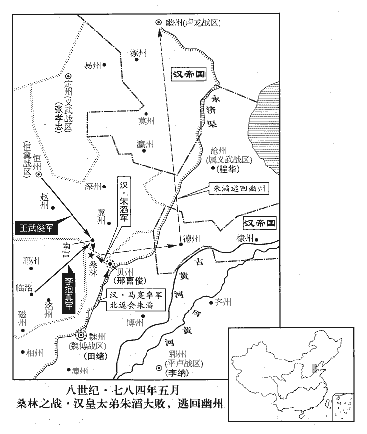
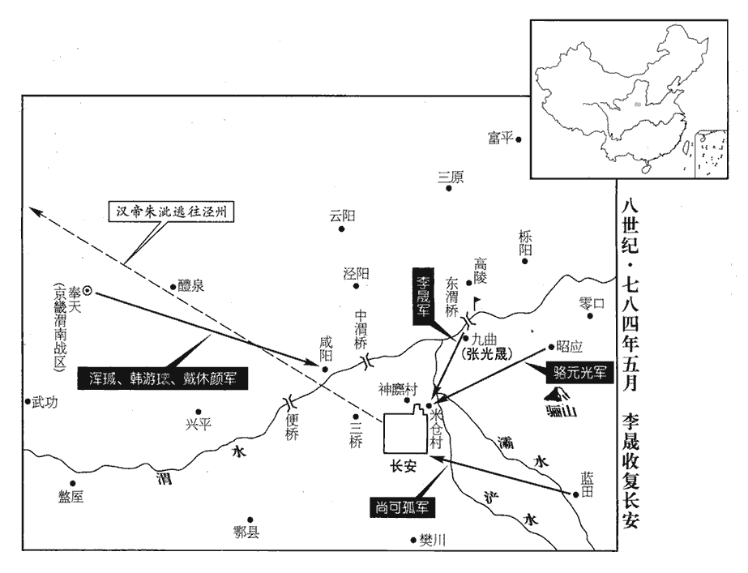
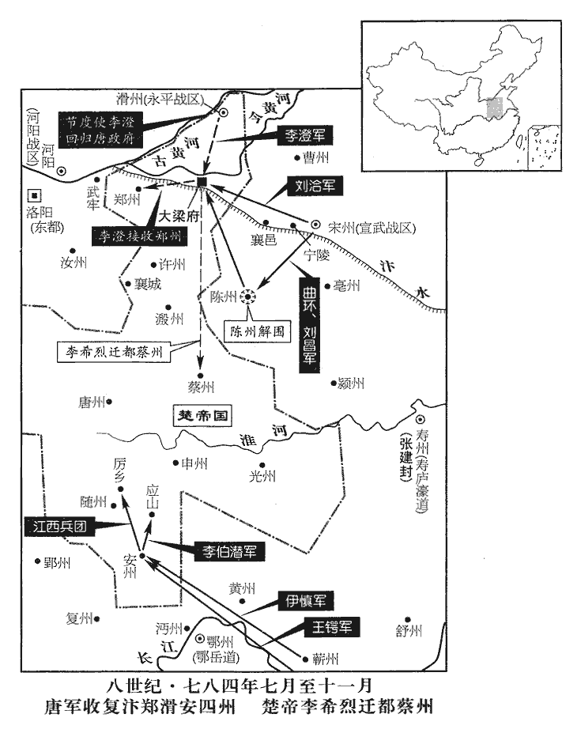
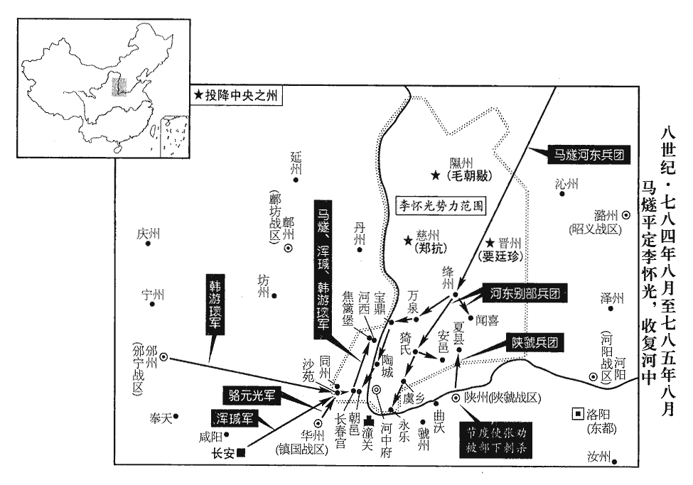

 唐紀四十七起閼逢困敦（甲子）五月，盡旃蒙赤奮若（乙丑）七月，凡一年有奇。始甲子五月，終乙丑，凡一年零三月。

# 德宗神武聖文皇帝六

## 興元元年（甲子、七八四）

1五月，鹽鐵判官萬年‹首都长安东半城›王紹以江、淮繒帛來至，萬年，京縣，屬京兆。繒，慈陵翻。上命先給將士，然後御衫。始改御裌而御衫。衫，單衣也。將，即亮翻。韓滉欲遣使獻綾羅四十擔詣行在，滉，呼廣翻。使，疏吏翻。羅，綺也。綾，文繒。丁度曰：古者芒氏初作羅。一曰，帛之美者。今人以絲縷織而交眼者為羅。擔，都濫翻。肩負為擔。天子所至為行在所。幕僚何士幹請行；滉喜曰：「君能相為行，為，于偽翻。請今日過江。」士幹許諾，歸別家，則家之薪米儲偫zhì已羅門庭矣；偫，直里翻。登舟，則資裝器用已充舟中矣；下至廚籌，「廚籌」，當作「廁籌」。【章：乙十五行本「廚」正作「廁」；乙十一行本同；孔本同。】滉皆手筆記列，無不周備。每擔夫，與白金一版置腰間。史言韓滉強敏精密。又運米百艘以餉李晟，艘，蘇遭翻；下同。晟，成正翻。考異曰：柳玭pín敘訓曰：「上初至梁，省奏甚悅。又知西平聚兵必乏糧糗，命運米百艘。」按五月初梁州尚未春服，月末已克長安。梁、潤相去數千里，詔命豈能遽達乎！今不取。自負囊米置舟中，將佐爭舉之，須臾而畢。艘置五弩手以為防援，有寇則叩舷相警，將，即亮翻。叩，擊也。船邊曰舷，音胡田翻。五百弩已彀gòu矣。比至渭橋‹东渭桥，李晟基地·陕西省高陵县南›，彀，居候翻，引滿。比，必利翻，及也。盜不敢近。近，其靳翻。時關中兵荒，米斗直錢五百；及滉米至，減五之四。滉為人強力嚴毅，自奉儉素，夫人常衣絹裙，衣，於既翻。絹，與掾翻。縑，帛織成而無紋，其精善者曰繒，俗亦謂之絹。破，然後易。

〖译文〗 [1]五月，盐铁判官万年人氏王绍带着江淮地区的丝帛来到行在，德宗命令先供给将士，然后自己才穿上单衣。韩打算派遣使者进献绫罗四十担，送到行在去，幕僚何士干请求前往。韩高兴地说：“你若能够替我去，请在今天就渡过长江。”何士干答应了。当何士干回去告别家人时，韩已经让人将家中需用的柴米储备罗列在门口和庭院了。何士干登船时，韩已经让人把所需物资装备与用具在船中装满了。下至清除大便的拭秽之具，韩都亲手逐项记录，无不周全详备。每个担夫发给银牌一块，系在腰间。又有一次，韩运送一百艘船的粮米，给李晟充作粮饷，他亲自将米口袋背放到船中，他的将佐都争先去背米袋，不一会儿，就把船装完了。韩还让每艘船设置弩手五人，用来作为防备打劫和互相声援之用。有寇盗时，便敲击船舷，互通警报，只用弩手五百人便足够了。直至运到渭桥，都不曾有寇盗敢来靠近。当时关中战乱不息，每斗米价值五百钱，等到韩将米运到后，米价减少了五分之四。韩为人强干有力，严明果决，自己的日常所需节俭而朴素，他的夫人常常穿着没有纹彩的绢裙，穿破后才换。

2吐蕃既破韓旻等，吐，從暾入聲。破韓旻見上卷是年四月。大掠而去。朱泚使田希鑒厚以金帛賂之，吐蕃受之；韓遊瓌以聞。渾瑊又奏：「尚結贊屢遣人約刻日共取長安，既而不至；聞其眾今春大疫，近已引兵去。」泚，且禮翻，又音此。瓌，工回翻。渾，戶昆翻，又戶本翻。瑊，古銜翻。考異曰：實錄、舊本紀皆云：「乙丑，渾瑊與蕃將論莽羅衣眾大破朱泚將韓旻等於武功武亭川。」吐蕃傳亦同。邠志曰：「李懷光竟不署敕，結贊亦不進軍。」又曰：「渾公出斜谷，曹子達赴渾公，吐蕃以二萬騎從之，既勝泚軍，大掠而去。泚使田希鑒以金帛賂之。」蓋尚結贊雖引兵入塞，止屯邠南，但遣論莽羅衣將偏軍助瑊破泚於武功，大掠而去。既受泚賂，遂引兵歸國。瑊於吐蕃歸國之時有此奏耳。上以李晟、渾瑊兵少，少，詩沼翻。欲倚吐蕃以復京城，聞其去，甚憂之，以問陸贄。贄以為吐蕃貪狡，有害無益，得其引去，實可欣賀；乃上奏，其略曰：「吐蕃遷延顧望，反覆多端，深入郊畿，陰受賊使，使，疏吏翻。致令群帥進退憂虞：帥，所類翻。欲捨之獨前，則慮其懷怨乘躡；乘其虛、躡其後也。躡，尼輒翻。欲待之合勢，則苦其失信稽延。戎若未歸，寇終不滅。」又曰：「將帥意陛下不見信任，且患蕃戎之奪其功；士卒恐陛下不恤舊勞，而畏蕃戎之專其利；賊黨懼蕃戎之勝，不死則悉遺人禽；遺，唯季翻。百姓畏蕃戎之來，有財必盡為所掠。是以順於王化者其心不得不怠，陷於寇境者其勢不得不堅。」又曰：「今懷光別保蒲‹即河中府›、絳‹山西省新绛县›，吐蕃遠避封疆，形勢既分，腹背無患，瑊、晟諸帥，才力得伸。」又曰：「但願陛下慎於撫接，勤於砥礪，中興大業，旬月可期，不宜尚眷眷於犬羊之群，以失將士之情也。」

〖译文〗 [2]吐蕃打败韩等人以后，大规模地掳掠了一番便离去了。朱让田希鉴把大量金帛赠给吐蕃，吐蕃接受了，韩游便将此事上奏朝廷闻知。浑又上奏说：“尚结赞屡次派人与我约定，立下时限，共同攻取长安，后来却不曾前来。听说吐蕃人在今年春天遭受了大规模的瘟疫，最近已经领兵离去了。”由于李晟、浑兵力薄弱，德宗准备依赖吐蕃兵收复京城，现在听说吐蕃人离去，甚为担忧，便询问陆贽的意见。陆贽认为，吐蕃既贪婪，又狡猾，只有害处，没有裨益，赶上吐蕃领兵离去，实在值得庆幸。于是他进上奏疏，大略是说：“吐蕃拖延观望，反覆无常。他们深入京畿，暗中接受贼寇的指使，以致使得各军主帅进退两难。如果准备抛开吐蕃独自前往，那便顾虑吐蕃心怀怨恨，乘机紧随在后面骚扰；如果打算等待吐蕃会合兵势，那便苦于吐蕃不守信用，拖延时日。若是吐蕃没有回去，敌寇终难消灭。”他又说：“将帅猜想陛下不信任自己，而且担心吐蕃会与他们争功；士兵惟恐陛下不顾念旧日的劳绩，而且害怕吐蕃独占了赏赐；贼人一伙畏惧吐蕃取得胜利，即使自己不死，也会全部被擒；百姓害怕吐蕃到来，有点钱财，也必然会被他们完全掠去。所以，顺承皇上教化的人们的心意不得不日见懈怠，失陷到敌寇疆境内的人们不肯归附的情势也不得不渐趋坚定。”他又说：“现在李怀光另外去防守蒲州和绛州，吐蕃又远远地避开大唐的疆土，形势既已将李怀光与吐蕃分开了，我军腹心与后背都没有顾忌，浑、李晟各节帅的才能与力量也就可以得到施展了。”他又说：“只希望陛下谨慎地安抚将士，经常地砥砺自己，那么，中兴大业，可望在一个月的时间里完成，不应该还眷恋吐蕃这种犬羊之群，因而失去将士之心。”

上復使謂贄曰：「卿言吐蕃形勢甚善，然瑊、晟諸軍當議規畫，令其進取。朕欲遣使宣慰，卿宜審細條流【章：乙十一行本「流」作「疏」；孔本同。】以聞。」條，分也。流，派也。贄以為：「賢君選將，委任責成，故能有功。況今秦、梁千里，秦，謂咸陽。長安，古秦中之地。梁，謂梁州。兵勢無常，遙為規畫，未必合宜。彼違命則失君威，從命則害軍事，進退羈礙，難以成功；史炤曰：「羈，馬絡頭也。礙，謂羈所掛礙也。」余謂贄言羈礙者，蓋謂欲進則有所羈而不得進，欲退則有所礙而不得退也。不若假以便宜之權，待以殊常之賞，則將帥感悅，智勇得伸。」乃上奏，其略曰：「鋒鏑交於原野而決策於九重之中，機會變於斯須而定計於千里之外，用捨相礙，否臧皆凶。易曰：師出以律，否臧凶。王弼註曰：齊眾以律，失律則散。律不可失，失律而臧，何異於否。失令有功，法所不赦，故師出不以律，否臧皆凶。陸德明釋文曰：否，音鄙，惡也。臧，作郎翻，善也。上有掣肘之譏，宓子賤為單父宰，請吏於魯侯。魯侯使二吏與之俱至單父，子賤使吏書而掣其肘，書惡則從而怒之。二吏歸，以告魯侯。魯侯曰：「此謂吾橈其政也。」下無死綏之志。」兵志曰：將軍死綏，有前無卻。又曰：「傳聞與指實不同，懸算與臨事有異。」又曰：「設使其中有肆情干命者，陛下能於此時戮其違詔之罪乎？是則違命者既不果行罰，從命者又未必合宜，徒費空言，祇勞睿慮，匪惟無益，其損實多。」又曰：「君上之權，特異臣下，惟不自用，乃能用人。」

〖译文〗 德宗再次让人对陆贽说：“你所讲的有关吐蕃形势很好。但是，对浑、李晟各军应当计议出一个规划来，以便让他们进取敌军。朕打算派遣使者去安抚他们，你应当审慎详细地列出纲目，上报给朕知道。”陆贽认为，“贤明的君主选择将领，委以重任，责以成效，所以能够有所建树。况且，现在秦中与梁州相距千里，用兵的形势变化多端，远远地为将帅规划，不一定合乎时宜。如果将帅们违反命令，便有失君主的威严；如果将帅们听从命令，却对军中事务有害。或进或退，都有羁绊与阻碍，便难以取得成功。不如给他们见机行事的权力，以超常的奖赏对待他们，将帅们既感激，又喜欢，他们的智慧与勇敢便会得以施展。”于是陆贽进上奏疏，大略是说：“战事在原野上进行而决定方策却在幽深的宫禁之中，交战的时机瞬息万变而制定计谋却在千里以外，用命与不用命互相妨碍，仗打得好坏，结果都是不祥的。在上会招致对将帅处处掣肘的讥讽，在下会丧失军队、将帅当死的士气。”他又说：“道听途说与亲临实际是不同的，凭空计议与据事决断也是有区别的。”他又说：“假使将帅中有肆意违犯命令的人物，陛下能在这时候以违背诏旨的罪名将他诛杀吗？由此可见，既然不能实现对违背命令行为的惩罚，遵从命令的行为又不一定合乎时宜，白白浪费空洞的言辞，只能忧劳陛下的思虑，不仅没有好处，损失实在太多。”他又说：“君主的权力，与臣下的权力大有区别。君主只有不自以为是，才能善于用人。”

3癸酉‹三›，涇王侹薨。侹tǐng，肅宗‹李亨›子；音他頂翻。

〖译文〗 [3]癸酉（初三），泾王李去世。

4徐、海、沂、密‹首府设徐州江苏省徐州市›觀察使高承宗卒，建中二年，李洧wěi以徐州歸國，明年，以為徐、沂、密觀察使。洧卒，高承宗代之。甲戌‹四›，使其子明應知軍事。

〖译文〗 [4]徐、海、沂、密观察使高承宗去世。甲戌（初四），德宗让高承宗的儿子高明应代理军中事务。

5乙亥‹五›，李抱真、王武俊距貝州三十里而軍。朱滔聞兩軍將至，急召馬寔，寔晝夜兼行赴之。或謂滔曰：「武俊善野戰，不可當其鋒，宜徙營稍前逼之，使回紇絕其糧道。我坐食德、棣之餫yùn，餫，音運。糧運曰餫。依營而陳，陳，讀曰陣。利則進攻，否則入保，待其飢疲，然後可制也。」滔疑未決。會馬寔軍至，滔命明日出戰。寔言：「軍士冒暑困憊，憊，音蒲拜翻。請休息數日乃戰。」

〖译文〗 [5]乙亥（初五），李抱真与王武俊在距离贝州三十里的地方驻扎。朱滔听说李、王两军即将到来，急忙传召马，马日夜兼程，前来赴召。有人对朱滔说：“王武俊善于在旷野作战，我军不应该与他正面交战，而应该移动营垒，稍稍向前逼近他一些，让回纥兵断绝他的运粮通道。我军不劳而得食德州、棣州运送来的粮食，靠近营垒列阵，有利时便进攻，不利时，便入营防守，等王武俊军饥饿疲惫了，然后才能制服他。”朱滔迟疑没有作出决定。适逢马的军队到，朱滔便命令他第二天出战。马说：“将士冒着炎天暑气，都很疲乏，请让他们休息几天再战。”

常侍楊布、滔倣天朝置常侍。將軍蔡雄引回紇達干見滔，達干曰：「回紇在國與鄰國戰，常以五百騎破鄰國數千騎，如掃葉耳。今受大王金帛、牛酒前後無算，思為大王立效，為，于偽翻；下同。此其時矣。明日，願大王駐馬高丘，觀回紇為大王翦武俊之騎，使匹馬不返。」為，于偽翻。布、雄曰：「大王英略蓋世，舉燕、薊‹河北省北部›全軍，將掃河南，清關中，今見小敵冘yóu豫不擊，冘，讀與猶同。按後漢書馬援傳，計冘豫未決。章懷太子賢註曰：冘，行貌也，義見說文。豫，亦未定也。冘，音以林翻。毛晃曰：冘豫不定，後漢馬援傳計冘豫未決，字從犬曲其足，與古尤同。與侵韻冘韻不同。唐史冘豫音淫，誤。今從晃。失遠近之望，將何以成霸業乎！達干請戰是也。」滔喜，遂決意出戰。

〖译文〗 常侍杨布、将军蔡雄领着回纥达干来见朱滔，达干说：“回纥军在本国内与邻国交战，常常用骑兵五百人打败邻国骑兵数千人，如同打扫落叶一般。如今我们先后所接受的大王的钱帛和牛酒犒劳多得难以计算，想替大王立点儿功劳，现在是时候了。明天，希望大王骑马立在高丘上，观看回纥军替大王消灭王武俊的骑兵，让他连一匹马也跑不回去。”杨布、蔡雄说：“大王英才大略，盖世无双，带领燕、蓟全军，将要扫荡河南，肃清关中，现在才与小股敌人遭遇，便迟疑不定，不肯进击，使远近各地的人们大失所望，那将怎么能够完成霸业呢！达干请求出战是对的啊。”朱滔大喜，于是拿定主意，准备出战。

丙子‹六›旦，武俊遣其兵馬使趙琳將五百騎伏於桑林‹河北省广宗县东北›，桑林之地，在經城西南。抱真列方陳於後，陳，讀曰陣；下同。武俊引騎兵居前，自當回紇。回紇縱兵衝之，武俊使其騎控馬避之。回紇突出其後，將還，武俊乃縱兵擊之，趙琳自林中出橫擊之，回紇敗走。武俊急追之，滔騎兵亦走，自踐其步陳，步騎皆東奔，滔不能制，遂走趣其營，趣，七喻翻；下同。抱真、武俊合兵追擊之。時滔引三萬人出戰，死者萬餘人，逃潰者亦萬餘人，滔纔與數千人入營堅守。會日暮，昏霧，兩軍不能進，抱真軍其營之西北，武俊軍其東北。滔夜焚營，引兵出南門，趣德州遁去，委棄所掠資財山積；兩軍以霧，不能追也。

〖译文〗 丙子（初六）早晨，王武俊派遣他的兵马使赵琳带领骑兵五百人在桑林埋伏下，李抱真列成方阵，居于后面，王武俊带领骑兵，居于前面，亲自抵挡回纥军。回纥军放出兵马向王武俊冲击，王武俊让他的骑兵驾驭好战马，避开回纥军。回纥军冲到王武俊军的后面，将要返回，王武俊这才放出兵马进击回纥军，赵琳也从树林中冲出，拦腰截击，回纥军战败逃走。王武俊急忙追击，朱滔的骑兵也在奔逃，在本军的步兵阵列中自行践踏，步兵、骑兵都向东逃奔，朱滔无法制止，于是向他的营地逃去，李抱真、王武俊合兵一处，追击朱滔。当时，朱滔是率领三万人出战的，结果死亡一万余人，逃散的也有一万余人，朱滔仅仅与数千人进入营垒坚守。正赶上天刚黑，雾气浓重昏暗，前来追击的两支军队无法前进，于是李抱真在朱滔营地的西北面驻扎下来，王武俊在朱滔营地的东北面驻扎下来。当天夜里，朱滔烧掉营垒，领兵从南门出来，向德州逃去，丢下他们所劫掠的财物堆积如山。李、王二军因雾气浓重的原故，不能前去追击。

 

滔殺楊布、蔡雄而歸幽州，心既內慙，又恐范陽留守劉怦因敗圖己。怦，普耕翻。怦悉發留守兵夾道二十里，具儀仗，迎之入府，相對悲喜，時人多之。

〖译文〗 朱滔杀了杨布和蔡雄，于是回到幽州。他既感到内心惭愧，又惟恐范阳留守刘怦乘着兵败之机谋害自己。刘怦悉数派出留守的兵员，夹道列队长达二十里，备办了仪仗，把朱滔迎入军府，两人相对既悲又喜，当时的人们都称许刘怦的做法。

6初，張孝忠以易州歸國，詔以孝忠為義武節度使，以易、定、滄‹河北省沧州市东南›三州隸之。事見二百二十七卷建中三年。滄州刺史李固烈，李惟岳之妻兄也，李惟岳，本姓張，故娶李氏。請歸恆州，孝忠遣押牙安喜‹河北省定州市›程華交其州事。安喜縣，漢之盧奴縣，屬中山國，燕主慕容垂改為不連，北齊改為安喜，隋改為鮮虞，唐武德四年復為安喜，帶定州。固烈悉取軍府綾、縑、珍貨數十車，將行，軍士大譟曰：「刺史掃府庫之實以行，將士於後飢寒，柰何！」遂殺固烈，屠其家。程華聞亂，自竇逃出，亂兵求得之，請知州事；華不得已，從之。孝忠聞之，既版華攝滄州刺史。考異曰：舊張孝忠傳曰：「遣華往滄州交檢府藏。」程日華傳曰：「孝忠令華詣固烈交郡，固烈死，孝忠版華知滄州事。」燕南記曰：「孝忠差牙官程華與固烈交割，固烈死，孝忠聞之，當日差人送文牒，令攝刺史。」按固烈既去，則滄州無主，孝忠豈得但令華交檢府藏！今從華傳及燕南記。華素寬厚，推心以待將士，將士安之。

〖译文〗 [6]当初，张孝忠率领易州归顺了朝廷，德宗颁诏任命张孝忠为义武节度使，将易、定、沧三州隶属于他。沧州刺史李固烈是李惟岳的妻兄，他请求回恒州去，张孝忠派遣押牙安喜人氏程华与他交接沧州事宜。李固烈将军府内的绫绢和珍宝财物数十车全部取走，准备启程时，将士们大声喧闹着说：“刺史将库存的财物尽其所有带着走了，将士们以后挨饿受冻时，如何是好？”于是，将士们杀了李固烈及其全家。程华听说发生变乱，从孔道中逃了出来，变乱的将士找到了他，请他执掌州中事务。程华没有办法，听从了他们的要求。张孝忠听说此事后，立即便给程华授官为代理沧州刺史。程华平素待人宽和厚道，推心置腹地对待将士，将士们安定了。

會朱滔、王武俊叛，更遣人招華，更，工衡翻，迭也。華皆不從。時孝忠在定州，自滄如定，必過瀛州，瀛隸朱滔，道路阻澀。澀，色立翻。史炤曰：阻，隔也。澀，不通滑也。滄州錄事參軍李宇說華，表陳利害，請別為一軍，華從之，說，輸芮翻；下同。遣宇奉表詣行在。上即以華為滄州刺史、橫海軍副大使、知節度事，賜名日華，令日華歲供義武租錢十二萬緡。

〖译文〗 正赶上朱滔、王武俊反叛，两人轮番派人传召程华，程华一概不肯从命。当时，张孝忠驻军定州，从沧州到定州去，必须经过瀛州，瀛州隶属朱滔，两处往来的道路阻隔不通。沧州录事参军李宇劝说程华，向朝廷上表陈说利害，请朝廷在沧州另设一个军，程华听从了这一建议，派遣李宇带着表章前往行在，德宗当即任命程华为沧州刺史、横海军副大使，代理节度使事务，赐名叫做日华，命令程日华每年供给义武租税钱十二万缗。

王武俊又使人說誘之；時軍中乏馬，日華紿使者曰：「王大夫必欲相屬，當以二百騎相助。」武俊給之，日華悉留其馬，遣其士歸。武俊怒，而方與馬燧等相拒，不能攻取，日華由是獲全。及武俊歸國，日華乃遣人謝過，償其馬價，且賂之。武俊喜，復與交好。騎，奇寄翻。好，呼到翻。

〖译文〗 王武俊又让人劝说引诱程日华，当时军队中缺少马匹，程日华欺骗王武俊的使者说：“王大夫果真打算有事相嘱托的话，就应该派来二百人马援助我。”王武俊将人马派给了程日华，程日华却将他的马匹悉数留下，而将他的士兵都打发回去。王武俊大怒，但当时他正与马燧等人相对抗，不能够攻打程日华，程日华因此得以保全。到王武俊归顺朝廷时，程日华便派人向王武俊承认了过错，偿还了他的马价，并且对他有所赠送，王武俊高兴了，再次与程日华交好。

7庚寅‹二十›，李晟大陳兵，諭以收復京城。先是，姚令言等屢遣諜人覘晟進軍之期，先，悉薦翻。諜，徒協翻。覘，丑廉翻。皆為邏騎所獲。邏，郎佐翻，巡察者也。晟引示以所陳兵，謂曰：「歸語諸賊：語，牛倨翻。努力固守，勿不忠於賊也！」皆飲之酒，飲，於禁翻。給錢而縱之。遂引兵至通化門外，曜武而還，還，從宣翻，又如字。賊不敢出。晟召諸將，問兵所從入，皆請「先取外城，據坊市，然後北攻宮闕。」晟曰：「坊市狹隘，賊若伏兵格鬬，居人驚亂，非官軍之利也。今賊重兵皆聚苑中，不若自苑北攻之，潰其腹心，賊必奔亡。如此，則宮闕不殘，坊市無擾，策之上者也！」諸將皆曰：「善！」乃牒渾瑊及鎮國節度使駱元光、商州‹总部设商州陕西省商州市›節度使尚可孤，刻期集於城下。京城之下也。

〖译文〗 [7]庚寅（二十日），李晟将兵马布成巨大的阵列，向将士宣布前去收复京城。在此之前，姚令言等人屡次派遣探子前来刺探李晟进军的日期，但都被巡逻的骑兵俘虏了。现在，李晟领着这些俘虏，让他们观看自己布成阵列的兵马，对他们说：“你们回去告诉每一个贼兵贼将，让他们卖力气地坚决防守吧，可不要不忠于朱老贼！”李晟让他们都喝了酒，给了一些钱，便将他们放了回去。李晟于是领兵来到通化门外，将武力显示了一番，才又回去，敌军不敢出城。李晟召集各位将领，询问军队攻打入城的路线，将领们都主张先夺取外廓城，占领坊市，然后向北攻打宫苑。李晟说：“坊市狭窄，倘若贼军在那里埋伏下兵马，与我军搏斗，居民惊惶散乱，对官军并没有好处。现在贼军的重兵都聚集在宫苑中，不如从宫苑北面进攻他们，使他们的核心先行崩溃，敌军肯定就会逃亡。这样做，宫苑不会残破，坊市不受骚扰，这才是上策呢！”各将领都说：“好。”于是，李晟给浑以及镇国节度使骆元光、商州节度使尚可孤送去文书，限定日期，在城下会集。

壬辰‹二十二›，尚可孤敗泚將仇敬忠於藍田西，斬之。敗，補邁翻。乙未‹二十五›，李晟移軍於光泰門外米倉村‹长安城东北›。光泰門，苑城東北門。程大昌曰：光泰門在通化門北，小城之東門，門東七里有長樂坡。呂大防長安圖：光泰門者，京城東門，大明宮東苑之東。丙申‹二十六›，晟方自臨築壘，泚驍將張庭芝、李希倩引兵大至，晟謂諸將曰：「始吾憂賊潛匿不出，今來送死，此天贊我，不可失也！」命副元帥兵馬使吳詵shēn等縱兵擊之。時華州營在北，兵少，華州兵，駱元光之兵。華，戶化翻。少，詩沼翻。賊併力攻之，晟命牙前將李演等帥精兵救之。演等力戰，賊敗走；演等追之，乘勝入光泰門；再戰，又破之。會夜，晟斂兵還。賊餘眾走入白華門，白華殿門也。夜，聞慟哭。希倩，希烈之弟也。

〖译文〗 壬辰（二十二日），尚可孤在蓝田西面打败朱的将领仇敬忠，并诛杀了他。乙未（二十五日），李晟将军队调到光泰门外的米仓村。丙申（二十六日），李晟正在亲自指挥修筑营垒时，朱的骁将张庭芝、李希倩领兵卷地而来，李晟对各将领说：“最初我还担心贼军躲藏着不肯出战，现在赶来送死，这是上天助我，良机决不可失！”李晟命令副元帅、兵马使吴诜等人放出兵马，进击敌军。当时，骆元光华州军的营垒在北面，兵马较少，敌军便合力攻打骆元光部，李晟命令牙前将领李演等人率领精锐兵马前去援救。李演等人奋力接战，贼军败走。李演等人追击敌军，乘胜进入光泰门，再次接战，又打败敌军。适逢夜幕降临，李晟收兵回营。敌军的残余人马逃入白华门，夜里可以听到极其悲痛的哭声。李希倩是李希烈的弟弟。

丁酉‹二十七›，晟復出兵，復，扶又翻。諸將請待西師至夾攻之。西師，謂渾瑊之師也。晟曰：「賊數敗，已破膽，數，所角翻。不乘勝取之，使其成備，非計也。」賊又出戰，官軍屢捷；駱元光敗泚眾於滻‹灞水支流›西。敗，補邁翻。戊戌‹二十八›，晟陳兵於光泰門外，使李演及牙前兵馬使王佖將騎兵，佖bì，蒲必翻。牙前將史萬頃將步兵，直抵苑牆神䴥jiā村。按新書李晟傳，神䴥村在苑北。䴥，古牙翻。晟先使人夜開苑牆二百餘步，比演等至，比，必利翻，及也。賊已樹柵塞之，自柵中刺射官軍，塞，悉則翻。刺，七亦翻。射，而亦翻。官軍不得進。晟怒，叱諸將曰：「縱賊如此，吾先斬公輩矣！」萬頃懼，帥眾先進，拔柵而入，帥，讀曰率；下同。佖、演引騎兵繼之，賊眾大潰，諸軍分道並入。姚令言等猶力戰，晟命決勝軍使唐良臣等步騎蹙之，且戰且前，凡十餘合，賊不能支。至白華門，有賊數千騎出官軍之背，晟帥百餘騎回禦之，左右呼曰：呼，火故翻。「相公來！」賊皆驚潰。涇原將士素畏服李晟，故聞其來而驚潰。

〖译文〗 丁酉（二十七日），李晟再次出兵，各将领请求等待西面的浑军赶到后夹攻敌军，李晟说：“贼军屡次失败，已经吓破了胆，不乘胜攻取敌军，而使他们作好防备，这不是良策。”敌军又来出战，官军屡屡获胜，骆元光又在水西面打败了朱军。戊戌（二十八日），李晟在光泰门外面摆开军阵，让李演以及牙前兵马使王带领骑兵，让牙前将领史万顷带领步兵，直接抵达宫苑墙边的神村。李晟事先让人在夜间凿开宫苑的垣墙宽二百余步，待到李演等人到来时，敌军已经竖起栅栏堵塞了宫苑垣墙的缺口，从栅栏里面刺杀、射击官军，官军不能前进。李晟愤怒地大声呵斥各将领说：“你们放纵贼军到这般地步，我要先斩诸位了！”史万顷害怕，率领部众首先前进，拔除栅栏，冲了进去，王、李演带领骑兵相继而入，敌军纷纷逃散，各军分路一齐进入宫苑。姚令言等人仍然在奋力接战，李晟命令决胜军使唐良臣等人的步兵、骑兵迫近他们，一边接战，一边前进，约有十余回合，敌军不能支持。来到白华门前时，敌军有骑兵数千人从官军背后出战，李晟率领骑兵一百余人回头抵御他们，李晟身边的人大声喊道：“李相公来了！”敌军都惊惶地溃散了。

先是，泚遣張光晟將兵五千屯九曲‹陕西省高陵县境›，先，悉薦翻。去東渭橋十餘里，光晟密輸款於晟。及泚敗，光晟勸泚出亡，泚乃與姚令言帥餘眾西走，猶近萬人。帥，讀曰率。近，其靳翻。光晟送泚出城，還，降於晟。降，戶江翻。晟遣兵馬使田子奇以騎兵追泚。晟屯含元殿前，舍於右金吾仗，含元殿，唐東內之前殿也。左金吾仗，在殿之東；右金吾仗，在殿之西。令諸軍曰：「晟賴將士之力，克清宮禁。長安士庶，久陷賊庭，若小有震驚，非弔民伐罪之意。晟與公等室家相見非晚，五日內無得通家信。」命京兆尹李齊運等安慰居人。晟大將高明曜取賊妓，妓，渠綺翻，女樂也。尚可孤軍士擅取賊馬，晟皆斬之，軍中股栗。公私安堵，秋毫無犯，遠坊有經宿乃知官軍入城者。史言李晟御軍嚴整。

〖译文〗 在此之前，朱派遣张光晟领兵五千人在九曲屯驻，该处距离东渭桥有十余里，张光晟暗中向李晟表示诚意。到朱战败时，张光晟劝说朱出城逃走，朱便与姚令言率领残余部众向西面逃跑，这时朱仍然有将近一万人。张光晟将朱送出城，又回到城中，归降了李晟。李晟派遣兵马使田子奇率领骑兵追击朱。李晟在含元殿前驻扎军队，在右金吾仗的房舍住下，他命令各军说：“我依靠将士们的努力，得以肃清宫禁。长安的士子庶民，长期失陷在贼寇的统治之下，如果使他们稍微受到些震惊，就不是安抚人民、讨伐罪人的本意了。我与诸位同家里人相见的时候不会太晚了，但五天以内不能与家里人互通消息。”他命令京兆尹李齐运等安慰居民。李晟的大将高明曜占有了敌人的歌妓，尚可孤的将士擅自牵走了敌人的马匹，李晟将他们一概斩杀，军中将士害怕得连大腿都发抖了。公私相安无事，官军对百姓没有丝毫侵犯，偏远的坊，有过了一夜以后才知道官军已经进了都城。

是日，渾瑊、戴休顏、韓遊瓌亦克咸陽，敗賊三千餘眾，敗，補邁翻。聞泚西走，分兵邀之。

〖译文〗 这一天，浑、戴休颜、韩游也攻克了咸阳，打败敌军三千余人。浑等人听说朱向西逃走，便分兵拦击朱。

 

己亥‹二十九›，晟使京西兵馬使孟涉屯白華門，尚可孤屯望仙門，唐大明宮南面五門，其中曰丹鳳門，丹鳳之東為望仙門，又東為延政門；丹鳳之西為建福門，又西為興安門也。駱元光屯章敬寺，晟以牙前三千人屯安國寺，程大昌曰：章敬寺，在東城之外，安國寺，在大明宮東南。以鎮京城；斬泚黨李希倩、敬釭gāng、彭偃等八人於市。

〖译文〗 己亥（二十九日），李晟让京西兵马使孟涉在白华门驻扎，让尚可孤在望仙门驻扎，让骆元光在章敬寺驻扎，李晟自率牙前兵三千人在安国寺驻扎，以便镇守京城。李晟又命令将朱的党羽李希倩、敬、彭偃等八人在闹市中斩杀。

8王武俊既破朱滔，還恒州，表讓幽州、盧龍節度使，上許之。王武俊兼幽州、盧龍節度使，見上卷是年二月。恆，戶登翻。

〖译文〗 [8]王武俊在打败朱滔后，回到恒州，上表让出幽州、卢龙节度使的职务，德宗允许了他的表奏。

9六月，癸卯‹四›，李晟遣掌書記吳‹江苏省苏州市›人于公異作露布上行在上，時掌翻。曰：「臣已肅清宮禁，祗謁寝園，鍾簴jù不移，簴，其呂翻。說文曰：簴，鍾鼓之柎fū也。飾為猛獸。釋名曰：橫曰栒xún，縱曰簴。又云：虡jù，天上神獸也，鹿頭龍身，象之為簴，以架鍾鼓。廟貌如故。」孔穎達曰：廟之言貌也。死者精神不可得而見，但以生時之宮室象貌為之耳。孝經註云：宗，尊也。廟，貌也。上泣下曰：「天生李晟，以為社稷，非為朕也。」為，于偽翻。史言于公異為李晟作露布得體。

〖译文〗 [9]六月，癸卯（初四），李晟派遣掌书记吴地人氏于公异草拟告捷文书进上行在说：“我已经肃清宫禁，恭敬地参谒了陵寝墓园，连钟罄的支架都没有移动，宗庙的面貌仍然与过去一个模样。”德宗流着眼泪说：“让天让李晟降生，是为了国家，而不是为了朕啊。”

晟在渭橋，熒惑守歲，歲星所在，其國有福。熒惑守之，是為罰星。久之乃退，賓佐皆賀，曰：「熒惑退舍，皇家之福也！宜速進兵。」晟曰：「天子野次，臣下知死敵而已；天象高遠，誰得知之！」既克長安，乃謂之曰：「曏非相拒也，吾聞五星贏、縮無常，前漢書天文志曰：凡五星早出為贏，贏為客，晚出為縮，縮為主人。晉書天文志曰：失次而上為贏，失次而下為縮。萬一復來守歲，復，扶又翻。吾軍不戰自潰矣！」皆謝曰：「非所及也！」

〖译文〗 李晟驻兵渭桥时，火星停留在木星附近，经过很长时间才离去。他的幕僚将佐都向他庆贺说：“火星退离木星，这是皇室的福象啊，应当赶快进兵。”李晟说：“皇上置身旷野，人臣只知道为战胜敌人而死罢了。天象高远难测，谁能够弄得清楚！”在攻克长安后，李晟才对他们说：“以往可不是我要拒绝你们的意见。我听说过，金木水火土五星早出与晚出都没有准儿，万一火星再次来靠近木星，我军就会不战自溃了。”大家都向他认错说：“这些道理不是我们所能看得透的！”

10朱泚將奔吐蕃，其眾隨道散亡，比至涇州，比，必利翻，及也。纔百餘騎。田希鑒閉城拒之，泚謂之曰：「汝之節，吾所授也。朱泚以田希鑒為涇原節度使，見上卷是年四月。柰何臨危相負！」使焚其門；希鑒取節投火中曰：「還汝節！」泚眾皆哭。涇卒遂殺姚令言，詣希鑒降。泚獨與范陽親兵及宗族、賓客北趣驛馬關‹甘肃省庆阳县西南›；趣，七喻翻。寧州‹甘肃省宁县›刺史夏侯英拒之。至彭原西城屯‹甘肃省镇原县东›，彭原，本彭陽縣，隋開皇十八年更名，唐屬寧州。其將梁庭芬射泚墜阬中，射，而亦翻。韓旻等斬之‹年四十三岁›，詣涇州降。源休、李子平奔鳳翔，李楚琳斬之，皆傳首行在。

〖译文〗 [10]朱准备逃奔吐蕃，他的部众沿途散失流亡，及至来到泾州时，剩下骑兵才一百余人。田希鉴关闭城门，不让他进城，朱对他说：“你的节度使的旌节，乃是我授给你的，你怎么能够在我面临危难时，便辜负了我呢！”他让人去烧掉泾州城门，田希鉴取出旌节，丢在火中说：“还你旌节！”朱的部众都哭了起来。于是泾州士兵杀了姚令言，到田希鉴那里投降。朱独自与范阳亲兵及其本宗族人和幕府宾客向北奔向驿马关，宁州刺史夏侯英拒绝让他通过。到彭原县西城屯时，朱将领梁庭芬将他射落到土坑之中，韩等人斩杀了朱，前往泾州归降。源休、李子平逃奔凤翔，李楚琳将他们斩杀了。他们的头颅，全都被传送到行在。

11上命陸贄草詔賜渾瑊，使訪求奉天所失裹頭內人。裹頭內人，在宮中給使令者也。內人給使令者皆冠巾，故謂之裹頭內人。贄上奏，以為：「巨盜始平，疲瘵zhài之民，瘡痍之卒，尚未循拊，瘵，仄介翻。而首訪婦人，非所以副惟新之望也。謀始盡善，克終已稀；始而不謀，終則何有！所賜瑊詔，未敢承旨。」上遂不降詔，竟遣中使求之。

〖译文〗 [11]德宗命令陆贽起草诏书赐给浑，使访求奉天所失散了裹头内人。陆贽进上奏章认为：“大盗刚刚平定，对疲困病苦的人民和遭受创伤的士兵还没有抚慰，反而首先查找宫中妇女，这是不符合人们刷新政治的愿望的。能够将事业的开端谋划得尽善尽美，同时能够取得完美的结局的例子是为数不多的，如果连事业的开端都不曾为之谋划，还有什么结局可言！陛下赐给浑的诏书，我不敢接旨草拟。”于是，德宗不再下诏，但还是派遣中使去寻找传令宫女。

乙巳‹六›，詔吏部侍郎班宏充宣慰使，勞問將士，撫慰蒸黎。按詩傳箋：蒸，眾也；黎，亦眾也。勞，力到翻。

〖译文〗 乙巳（初六），德宗颁诏命令吏部侍郎班宏充任宣慰使，前去慰劳将士，安抚百姓。

丙午‹七›，李晟斬文武官受朱泚寵任者崔宣、洪經綸等十餘人；考異曰：袁皓興元聖功錄載李晟奏宥郭晞狀曰：「晞頃因鑾輿順動，山谷潛藏，逆賊所知，舁yú致城邑；迫脅授任，前後極多，蒼黃之中，偽令仍及，堅臥當節，即懼嚴刑，隨俗從官，又傷素業。然晞已染污俗，尚可昭明；子儀勳勞，書在王府，父為中興之佐，子有疑謗之名，非止在於一身，實恐玷於先烈。況臣總領士馬，孤立渭橋，頻有帛書，累陳誠效。」按晞舊傳，「泚欲令掌兵，晞陽瘖yīn。泚以兵脅之，終不語。賊知其不可用，乃止。晞潛奔奉天，從駕還京。」不云終臣事泚；而皓載晟此狀，恐非其實。今不取。又表守節不屈者劉迺、蔣沇yǎn等。劉迺，事見上卷是年二月。蔣沇，事見二百二十八卷建中四年。

〖译文〗 丙午（初七），李晟斩掉文武官员中受到朱宠信与任用的崔宣、洪经纶等十余人，又表奏恪守臣节、不肯屈敌的刘、蒋等人。

己酉‹十›，以李晟為司徒、中書令，駱元光、尚可孤各遷官有差。賞收復京城之功也。以檢校御史中丞田希鑒為涇原節度使。

〖译文〗 己酉（初十），德宗任命李晟为司徒、中书令，骆元光、尚可孤各自升官不等，还任命检校御史中丞田希鉴为泾原节度使。

12詔改梁州為興元府。以紀元為府號始此。

〖译文〗 [12]德宗颁诏将梁州改称为兴元府。

13甲寅‹十五›，以渾瑊為侍中，韓遊瓌、戴休顏各遷官有差。賞扈衛之功也。

〖译文〗 [13]甲寅（十五日），德宗任命浑为侍中，韩游、戴休颜各自升官不等。

14朱泚之敗也，李忠臣‹董秦›奔樊川‹陕西省西安市南›，酈道元水經註曰：樊川，即杜縣之樊鄉，漢高祖還定三秦，以樊噲灌廢丘最，賜邑於此鄉也。按其地在唐長安城南。程大昌曰：樊川，在萬年縣南三十五里。擒獲，丙辰‹十七›，斬之‹年六十九岁›。

〖译文〗 [14]朱战败时，李忠臣逃奔樊川，官军擒获了他，丙辰（十七日），将他斩杀。

15上問陸贄：「今至鳳翔有迎駕諸軍，形勢甚盛，欲因此遣人代李楚琳，何如？」贄上奏，以為：「如此則事同脅執，以言乎除亂則不武，以言乎務理則不誠，用是時巡，後將安入！書周官，六年，王乃時巡，考制度于四岳，諸侯各朝于方岳。孔安國曰：春東、夏南、秋西、冬北，故謂之時巡。議者或謂之權，臣竊未諭其理。夫權之為義，取類權衡，衡，以平物。權，則權物之輕重，揆之以衡平。今輦路所經，首行脅奪，易一帥而虧萬乘之義，得一方而結四海之疑，帥，讀曰率。乘，繩證翻。乃是重其所輕而輕其所重，謂之權也，不亦反乎！以反道為權，以任數為智，君上行之必失眾，臣下用之必陷身，歷代之所以多喪亂而長姦邪，由此誤也。陸贄此論，所以正漢儒反經合道為權之失。程氏曰：漢儒以反經合道為權，故有權變、權術之說，皆非也。權只是經字。自漢以下無人識權字。喪，息浪翻。長，知兩翻。不如【章：乙十五行本「如」下有「俟」字；乙十一行本同；孔本同；張校同；退齋校同。】奠枕京邑，史炤曰：奠枕，安枕也。揚子曰：奠枕于京。徵授一官，彼喜於恩宥，將奔走不暇，安敢輒有旅拒，史炤曰：旅，眾也。拒，捍也。謂率眾以相捍也。復勞誅鉏chú哉！」復，扶又翻。

〖译文〗 [15]德宗询问陆贽说：“如今开到凤翔的，有迎驾各军，声势甚为盛在，大，我打算借此机会派人将李楚琳替代下来，你看怎么样？”陆贽进上奏章认为：“如果这样做，事情就如同胁迫拘捕，将这种做法说成清除变乱那是并不能显示威武的，说成是务求政治修明那是并不能表明诚意的，若将此作为陛下的巡视之举，以后将怎么进入京城！议论此事的人将这种办法称为权变，我私下里不能明白其中的道理。一般地说，权变的含义是就衡量事物轻重而言的。如今在陛下车驾经过处，首先施行胁迫削官，更换了一个节帅而使陛下的大义受到损害，获得了一个地方而使举国上下疑虑，这乃是看重了本该看轻的东西，而看轻了本该看重的东西，将此称作权变，不是正好说反了吗！以违背法则为权变，以任用权术为机智，君主实行起来必然会失去人心，臣下实行起来必然会使自身受害，历代死丧祸乱频繁而奸邪滋长的原因，就是因为这个错误啊。不如待陛下安枕于京城以后，再召回李楚琳，授给他一个官职，他因陛下降恩宽恕而高兴，将会为朝廷奔走效力都来不及呢，怎么敢动不动就聚众抗命，需要再次烦劳朝廷去铲除他呢！”

戊午‹十九›，車駕發漢中。

〖译文〗 戊午（十九日），德宗的车驾从汉中启程。

16李晟綜理長安以備百司，史炤曰：綜，機縷也。理，治也。謂整治其事，使皆有紀，若機之綜縷也。自請至鳳翔迎扈，上不許。內常侍尹元貞奉使同華，輒詣河中招諭李懷光。此唐之中世閹宦之常態也。華，戶化翻。晟奏：「元貞矯制擅赦元惡，請理其罪！」理，治也。避高宗諱，以「治」為「理」。

〖译文〗 [16]李晟总揽治理长安事务，以便使各部门完备起来。他主动请求到凤翔去迎接德宗，扈从车驾，德宗不允。内常侍尹元贞奉命出使同华，却随即到河中劝说李怀光归顺朝廷，李晟上奏说：“尹元贞假托朝命，擅自赦免首恶，请将他治罪！”

17秋，七月，丙子‹七›，車駕至鳳翔，斬喬琳、蔣鎮、張光晟等。李晟以光晟雖臣賊，而滅賊亦頗有力，欲全之；上不許。

〖译文〗 [17]秋季，七月，丙子（初七），德宗的车驾来到凤翔，斩杀了乔琳、蒋镇、张光晟等人。张光晟虽然曾向朱称臣，但消灭朱也很出力，因此李晟打算保全他，德宗不肯答应。

18副元帥判官高郢數勸李懷光歸款，數，所角翻。高郢判李懷光幕府，懷光此時已罷副元帥而不肯釋兵，史仍書郢元官。懷光遣其子璀詣行在謝罪，璀，七罪翻。請束身歸朝。朝，直遙翻。庚辰‹十一›，詔遣給事中孔巢父齎先除懷光太子太保敕懷光除見上卷本年三月。詣河中宣慰，朔方將士悉復官爵如故。朔方將士，懷光所部也。考異曰：興元聖功錄有李晟奏郢勸懷光歸投狀云：「今懷光即欲束身，蓋自郢之勸導。」今取之。

〖译文〗 [18]副元帅判官高郢屡次劝说李怀光投诚，李怀光让他的儿子李璀前往行在承认罪责，请求到朝廷投案。庚辰（十一日），德宗颁诏派遣给事中孔巢父带着原先封拜李怀光为太子太保的敕书，前往河中安抚李怀光，悉数恢复朔方将士的官爵，一如既往。

19壬午‹十三›，車駕至長安，渾瑊、韓遊瓌、戴休顏以其眾扈從，從，才用翻。李晟、駱元光、尚可孤以其眾奉迎，步騎十餘萬，旌旗數十里。晟謁見上於三橋‹陕西省西安市西三桥镇›，三橋，在望賢宮之東，京城之西。見，賢遍翻。先賀平賊，後謝收復之晚，伏路左請罪。上駐馬慰撫，為之掩涕，為，于偽翻。掩面垂涕，謂之掩涕。命左右扶上馬。上，時掌翻。至宮，每閒日，閒，讀曰閑。唐世天子以隻日視朝，雙日謂之閒日。輒宴勳臣，賞賜豐渥，李晟為之首，渾瑊次之，諸將相又次之。

〖译文〗 [19]壬午（十三日），德宗的车驾来到长安。浑、韩游、戴休颜率领自己的部众扈从德宗前来，李晟、骆元光、尚可孤率领自己的部众前去迎候，步兵、骑兵十余万人，旗帜连绵了几十里。李晟在三桥谒见德宗，首先为平定了朱而道贺，然后为收复京城太迟而道歉，跪在道路左侧请求恕罪。德宗停下马来安慰他，被他感动得掩而流泪，命令侍从人员扶他上马。回到宫中后，每逢不上朝的日子。德宗总是宴请立下功勋的大臣，赏赐的物品甚为丰厚，每次都是李晟居于首位，浑居于第二，各将相又居于他们之下。

20曹王皋遣其將伊慎‹蕲州湖北省蕲春县›州长、王鍔‹江州江西省九江市›州长圍安州，李希烈遣其甥劉戒虛將步騎八千救之，皋遣其別將李伯潛逆【章：乙十五行本「逆」下有「擊」字；乙十一行本同；孔本同；退齋校同。】之於應山‹湖北省广水市›，劉昫曰：應山，本漢南陽郡隨縣地；梁分隨縣置永陽縣，隋改為應山，以縣北山為名，唐屬隨州。九域志：應山縣，在隨州北一百八里。斬首千餘級。生擒戒虛，徇於城下，安州遂降，以伊慎為安州刺史。又擊希烈將康叔夜於厲鄉‹湖北省随州市东北万店镇›，走之。記祭法：厲山氏之有天下也，其子農，能殖百穀。註云：厲山氏，炎帝也，起於厲山。西漢書地理志註云：隨，故厲國。皇甫謐曰：今隨之厲鄉。九域志：隨州厲鄉村有厲山。今自棗陽至厲鄉，道路交錯，號九十九岡。

〖译文〗 [20]曹王李皋派遣他的将领伊慎、王锷围困安州，李希烈派遣他的外甥刘戒虚带领步兵、骑兵八千人援救安州。李皋派遣他的别将李伯潜在应山迎击刘戒虚军，斩首一千余级，活捉了刘戒虚，拿他在城下示众，于是安州归降，朝廷任命伊慎为安州刺史。李皋军又在厉乡进击李希烈的将领康叔夜，将他赶走了。

21丁亥‹十八›，孔巢父至河中，李懷光素服待罪，巢父不之止。懷光左右多胡人，皆歎曰：「太尉無官矣！」胡人不習朝章，見懷光素服待罪，故以為無官。巢父又宣言於眾曰：「軍中誰可代太尉領軍者？」於是懷光左右發怒諠譟；宣詔未畢，眾殺巢父及中使啖守盈，懷光亦不之止，考異曰：邠志曰：「七月十二日，駕還長安。上使諫議大夫孔巢父、中官譚懷仙持詔赦懷光曰：『奉天之時，非卿不能救朕；今日之事，非朕不能容卿。宜委軍赴闕，以保官爵。』使者將至，懷光陰導其卒使留己。卒之蕃、渾者希懷光意，輒害二使，欲食其肉。懷光翼而覆之，全尸以聞。」今從實錄。復治兵為拒守之備。復，扶又翻。治，直之翻。

〖译文〗 [21]丁亥（十八日），孔巢父来到河中，李怀光穿着民服，等待治罪，孔巢父没有制止他。李怀光的亲信多是胡人，他们都叹着气说：“太尉保不住官爵了！”孔巢父又向大家扬言说：“军中有谁可以代替太尉统领军队呢？”于是，李怀光的亲信生气地喧闹起来，诏书还没有宣读完毕，众人便杀死了孔巢父以及中使啖守盈。李怀光对此也不加制止，再次整治兵马，作抵御防守的准备。

22辛卯‹二十二›，赦天下。

〖译文〗 [22]辛卯（二十二日），大赦天下。

23初，肅宗‹李亨›在靈武，見二百十九卷至德元載。上為奉節王，學文於李泌。代宗‹李豫（李俶）›之世，泌居蓬萊書院，見二百二十四卷永泰元年。史炤曰：泌，兵媚切。上‹李适›為太子，亦與之遊。及上在興元‹陕西省汉中市›，泌為杭州‹浙江省杭州市›刺史，上急詔徵之，與睦州‹浙江省建德市›刺史杜亞俱詣行在。乙未‹二十六›，以泌為左散騎常侍，亞為刑部侍郎；命泌日直西省以候對，唐門下省謂之東省，中書省謂之西省。朝野皆屬目附之。屬，之欲翻。上問泌：「河中密邇京城，朔方兵素稱精銳，如達奚小俊【嚴：「小俊」改「承俊」。】等皆萬人敵，朕晝夕憂之，柰何？」對曰：「天下事甚有可憂者；若惟河中，不足憂也。夫料敵者，料將不料兵。今懷光，將也；將，即亮翻；下同。小俊之徒乃兵耳，何足為意！懷光既解奉天之圍，視朱泚垂亡之虜不能取，乃與之連和，使李晟得取以為功。今陛下已還宮闕，懷光不束身歸罪，乃虐殺使臣，謂殺孔巢父、啖守盈也。使，疏吏翻。鼠伏河中，如夢魘之人耳！魘yǎn，於琰翻。但恐不日為帳下所梟，梟，古堯翻。使諸將無以藉手也。」

〖译文〗 [23]当初，肃宗在灵武时，德宗是奉节王，跟着李泌学习作文。代宗在位期间，李泌在蓬莱书院居住，德宗已经当了太子，还是与李泌交往。及至德宗出行兴元府时，李泌正担任杭州刺史，德宗紧急颁诏，征召他，与睦州刺史杜亚一起前往行在。乙未（二十六日），德宗任命李泌为左散骑常侍，杜亚为邢部侍郎，命令李泌每天在中书省值班，以便等候德宗召对，朝野人士都注视着他，想依附他。德宗询问李泌：“河中距离京城很近，朔方兵马素来号称精锐，比如达奚小俊等人，都有万夫之勇，朕日夜为河中担忧，你看如何是好呢？”李泌回答说：“天下还有甚为可忧的事情，如果只有一个河中，那就不值得忧虑了。一般说来，估量敌情，只须估量将领，不须估量士兵。现在，李怀光是大将，达奚小俊一类人只是小卒罢了，哪里值得挂虑呢！李怀光解除了奉天的围困后，眼看着朱这一帮人行将灭亡，不但不去攻取他们，反而与他们联合，使李晟得到了建立功勋的机会。如今，陛下已经回到宫中，李怀光不仅不肯投案认罪，还残暴地杀害使臣，老鼠般地躲伏在河中，就象恶梦中的人物一般！只怕过不多久，他就会被自己的部下砍下头来悬在木杆上，使各将领即使想要立功，也没有什么可借助的了。”

 

初，上發吐蕃以討朱泚，事見二百二十九卷本年正月。許成功以伊西‹即安西四镇·总部设西州新疆吐鲁番市东›、北庭‹总部设北庭府新疆吉木萨尔县›之地與之；及泚誅，吐蕃來求地，上欲召兩鎮節度使郭昕‹四镇战区，总部设龟兹新疆库车县›、李元忠‹北庭大都护，驻新疆吉木萨尔县›還朝，昕、元忠見二百二十七卷建中二年。以其地與之。李泌曰：「安西‹新疆库车县›、北庭，人性驍悍，控制西域五十七國。西域，漢時有三十六國，其後稍分，至唐有五十七國。及十姓突厥，西突厥有五弩失畢、五咄陸，凡十姓。又分吐蕃之勢，使不能併兵東侵，謂東侵涇、邠、岐、隴諸州。柰何拱手與之！且兩鎮之人，勢孤地遠，盡忠竭力，為國家固守近二十年，代宗初，吐蕃陷河、隴，獨安西、北庭為唐固守。為，于偽翻。近，其靳翻。誠可哀憐。一旦棄之以與戎狄，彼其心必深怨中國，他日從吐蕃入寇，如報私讎矣。況日者吐蕃觀望不進，陰持兩端，大掠武功，受賂而去，事見上卷本年四月。何功之有！」眾議亦以為然，上遂不與。

〖译文〗 当初，德宗征发吐蕃兵来讨伐朱，答应在成功以后将安西、北庭的地盘给与吐蕃，及至朱被杀，吐蕃前来要求土地，德宗打算传召安西、北庭两镇节度使郭昕、李元忠回朝，将该地给与吐蕃。李泌说：“安西、北庭地区，人们生性骁勇剽悍。该地控制着西域五十七个国家以及十个姓氏的突厥人，又能分散吐蕃的声势，使吐蕃不能合兵一处而向东侵犯，怎么能轻易地让给他们！而且，这两节镇的人们，势力孤单，地方遥远，竭尽忠心与气力，为国家坚守边疆接近二十年，实在令人哀伤怜悯。现在，忽然遗弃了他们，将他们交给戎狄之人，他们内心必定深深地怨恨大唐，以后他们随从吐蕃前来侵扰，就会象报私仇一样了。况且，往日吐蕃有意观望，不肯进军，暗中与双方都有往来，还大规模地劫掠了武功地区，接受了赠送的财物以后才肯离去，他们到底有什么功劳！”大家计议此事，也认为李泌讲得对。于是，德宗没有将二镇给与吐蕃。

24李希烈聞李希倩伏誅，忿怒。八月，壬寅‹三›，遣中使至蔡州殺顏真卿。考異曰：顏氏行狀：「其年八月二十四日，又使辛景臻等害公於龍興寺。」又曰：「初遭難後，嗣曹王皋上表曰：『臣見蔡州歸順腳力張希璨、王仕顆等說，去年八月二十四日，蔡州城中見封，有鄰兒不得名字，云希烈令偽皇城使辛景臻、右軍安華於龍興寺殺顏真卿。』實錄及舊傳云「三日」。今從之。中使曰：「有敕。」真卿再拜。中使曰：「今賜卿死。」真卿曰：「老臣無狀，罪當死。不知使者幾日發長安？」使者曰：「自大梁來，非長安也。」真卿曰：「然則賊耳，何謂敕邪！」遂縊殺之‹年七十六岁›。

〖译文〗 [24]李希烈听说李希倩被处死刑，又怨恨，又恼怒。八月，壬寅（初三），他派遣中使往蔡州去杀害颜真卿。中使说：“有敕书。”颜真卿拜了两拜。中使说：“现在赐你死。”颜真卿说：“老臣办事一无成绩，应当是死罪。不知使者是几时从长安出发的？”中使说：“我是从大梁来的，不是从长安来的。”颜真卿说：“这么说来，你们是一帮贼寇罢了，怎么能称敕旨呢！”于是缢杀了颜真卿。

25李晟以涇州倚邊，屢害軍帥，常為亂根，帝初即位，涇州有劉文喜之亂，既而又有姚令言之亂，既而田希鑒又殺馮河清。帥，所類翻；下同。奏請往理不用命者，理，既治也。力田積粟以攘吐蕃。癸卯‹四›，以晟兼鳳翔、隴右‹总部设普润县陕西省凤翔县北›節度等使及四鎮、北庭、涇原行營副元帥，進爵西平王。時李楚琳入朝，晟請與俱至鳳翔而斬之，以懲逆亂。上以新復京師，務安反仄，不許。

〖译文〗 [25]由于泾州临近边疆，镇兵屡次杀害军中主帅，经常成为祸乱的根子，于是李晟上奏请求前往处治不肯听从命令的人们，让他们努力种田，积聚粮食，以便打击吐蕃。癸卯（初四），德宗帝命令李晟兼任凤翔、陇右节度使等使以及安西四镇、北庭、泾原行营副元帅，进升爵位为西平王。当时，李楚琳已经入朝，李晟请求与李楚琳一起前往凤翔，并在那里斩杀他，以便惩戒反叛朝廷的变乱。德宗认为新近才将京城收复，一定要使动荡不安的局面安定下来，因而没有答应。

26先是，上命渾瑊、駱元光討李懷光軍于同州，九域志：同州至河中七十五里。先，悉薦翻。懷光遣其將徐庭光以精卒六千軍于長春宮‹陕西省大荔县东›以拒之，瑊等數為所敗，不能進。數，所角翻。敗，補邁翻。時度支用度不給，度支之度，徒洛翻。議者多請赦懷光，上不許。李懷光遣其妹壻要廷珍守晉州‹山西省临汾市›，要，於消翻，姓也。姓苑：吳人要離之後，後漢有河南令要兢。牙將毛朝敭yáng守隰州‹山西省隰县›，朝，直遙翻。敭音揚。鄭抗守慈州‹山西省吉县›，馬燧皆遣人說下之。晉、隰、慈三州，皆與馬燧巡屬接壤，故得說下之。宋白曰：慈州文城郡，赤狄廧咎如之國，郡西南有采桑津，晉里克敗赤狄之地。漢為北屈縣，隋為汾州，大業為文城郡；唐貞觀為慈州；以州城內舊有慈烏戍，因名；治吉鄉縣，漢北屈縣也。說，式芮翻。上乃加渾瑊河中、絳州節度使，充河中、同華、陝虢行營副元帥，加馬燧奉誠軍‹驻同州陕西省大荔县›、晉•慈•隰‹总部晋州›節度使，充管內諸軍行營副元帥，渾，戶混翻，又戶本翻。瑊，古咸翻。華，戶化翻。是年正月置奉誠軍於同州，以授康日知，事見二百二十九卷。帥，所類翻。陝，失冉翻。使，疏吏翻。與鎮國‹总部设华州›節度使駱元光、肅宗上元二年，置鎮國節度於華州，廣德元年罷，今復置。鄜坊節度使唐朝臣合兵討懷光。鄜，音膚。

〖译文〗 [26]在此之前，德宗命令浑、骆元光讨伐李怀光，二将在同州驻扎。李怀光派遣他的将领徐庭光率领精锐士兵六千人驻扎在长春宫，以便抵抗二将。浑等人屡次被徐庭光打败，不能前进。当时，度支的开支供给不足，计议此事的人们多数请求赦免李怀光，德宗不允。李怀光派遣他的妹夫要廷珍防守晋州，派遣牙将毛朝扬防守隰州，派遣郑抗防守慈州。马燧一一派人说服他们归顺了。于是德宗加封浑为河中、绛州节度使，充任河中、同华、陕虢行营副元帅，加封马燧为奉诚军、晋、慈、隰节度使，充任管辖范围以内诸军行营副元帅，与镇国节度使骆元光、坊节度使唐朝臣合兵一处，讨伐李怀光。

初，王武俊急攻康日知於趙州，馬燧奏請詔武俊與李抱真同擊朱滔，以深‹河北省深州市›、趙隸武俊，改日知為晉、慈、隰節度使，上從之。日知未至而三州降燧，降，戶江翻；下同。故上使燧兼領之。燧表讓三州於日知，且言因降而授，恐後有功者，踵以為常，上嘉而許之。燧遣使迎日知，既至，籍府庫而歸之。

〖译文〗 当初，王武俊曾经在赵州急攻康日知。现在，马燧上奏请求颁诏命令王武俊与李抱真共同进击朱滔，将深州、赵州隶属王武俊，改任康日知为晋、慈、隰节度使，德宗听从了他的建议。康日知尚未前往三州，三州已经投降了马燧，所以德宗让马燧兼职统领三州。马燧上表将三州让给康日知，而且说由于三州是向他归降的，如将三州的职任授给他，恐怕以后立下功劳的人们因袭此例，成为经常性的做法。德宗嘉许他的意见。观燧派遣使者迎接康日知，康日知来后，马燧登记好库存簿册，交给了他。

27甲辰‹五›，以鳳翔節度使李楚琳為左金吾大將軍。

〖译文〗 [27]甲辰（初五），德宗任任命凤翔节度使李楚琳为左金吾大将军。

28丙午‹七›，加渾瑊朔方行營元帥。

〖译文〗 [28]丙午（初七），加封浑为朔方行营元帅。

29李晟至鳳翔，治殺張鎰之罪，殺張鎰見二百二十八卷建中四年。治，直之翻。鎰，弋質翻。斬裨將王斌等十餘人。斌，音彬。

〖译文〗 [29]李晟到凤翔，惩治杀害张镒的罪行，斩杀副将王斌等十余人。

30朱滔為王武俊所攻，殆不能軍，上表待罪。上，時掌翻。

〖译文〗 [30]朱滔被王武俊攻打，几乎溃不成军，进上表章，等待治罪。

31癸未‹九月十五日›，馬燧將步騎三萬攻絳州。絳州時屬李懷光。將，即亮翻，又音如字。騎，奇寄翻。

〖译文〗 [31]癸未（疑误），马燧带领步兵、骑兵三万人攻打绛州。

 

32度支以李懷光所部將士數萬與懷光同反，不給冬衣，上曰：「朔方軍累代忠義，度，徒洛翻。自肅、代以來，朔方軍輸力王室，功高天下。今為懷光所制耳，將士何罪！」冬，十月【章：乙十五行本「月」下有「己亥‹一›」二字；乙十一行本同；孔本同；張校同。】詔：「朔方及諸軍在懷光所者，冬衣及賞錢皆當別貯，貯，丁呂翻。俟道路稍通，即時給之。」

〖译文〗 [32]由于李怀光所统领的将士数万人曾与李怀光共同造反，度支不给他们冬天的衣装。德宗说：“朔方军多少世代以来都是忠义的，如今只是被李怀光控制了而已，将士有什么罪过！”冬季，十月，德宗颁诏说：“朔方军以及在李怀光统领下的各军，其冬季衣装以及赏钱都应当另外储存着，等倏道路逐渐畅通以后，立刻及时发给他们。”

33李勉累表乞自貶，以討李希烈喪師失守也。辛丑‹三›，罷勉都統、節度使，建中間，勉以永平節度使都統討李希烈之兵。其檢校司徒、同平章事如故。

〖译文〗 [33]李勉多次上表请求贬黜自己的官职。辛丑（初三），德宗罢免了李勉都统、节度使的职务，他的检校司徒、同平章事职务一如既往。

34丙辰‹十八›，李懷光將閻晏寇同州‹陕西省大荔县›，官軍敗于沙苑‹大荔县南›。詔徵邠州之軍，韓遊瓌將甲士六千赴之。

〖译文〗 [34]丙辰（十八日），李怀光的将领阎晏侵犯同州，官军在沙苑打了败仗。德宗颁诏命令征调州的军队，韩游带领甲兵六千人奔赴该地。

35乙丑‹二十七›，馬燧拔絳州，分兵取聞喜‹山西省闻喜县›、萬泉‹山西省万荣县›、虞鄉‹山西省永济市东虞乡镇›、永樂‹山西省芮城县西南永乐乡›、猗氏‹山西省临猗县›。武德元年，分芮縣置永樂縣，屬芮州；州廢，屬鼎州；又廢鼎州，以縣屬河中府。燧既取永樂，則兵逼河中矣。樂，音洛。

〖译文〗 [35]乙丑（二十七日），马燧攻克绛州，分兵攻取闻喜、万泉、虞乡、永乐、猗氏等地。

36初，魚朝恩既誅，代宗不復使宦官典兵。事見二百二十四卷大曆五年。復，扶又翻；下同。上即位，悉以禁兵委白志貞，白志貞初名白琇珪，典禁兵事始見二百二十五卷大曆十四年。志貞得罪，見二百二十九卷建中四年。上復以宦官竇文場代之，從幸山‹秦岭›南，兩軍稍集。兩軍，謂左、右神策軍。上還長安，頗忌宿將握兵多者，稍稍罷之。戊辰‹三十›，以文場監神策軍左廂兵馬使，王希遷監右廂兵馬使，始令宦官分典禁旅。宦官握兵柄，自此不可奪矣。將，即亮翻。監，古銜翻。考異曰：舊竇文場傳云：「文場與霍仙鳴分統禁旅，」蓋希遷尋罷而仙鳴代之也。今從實錄。

〖译文〗 [36]当初，鱼朝恩被杀后，代宗不再让宦官掌管军事。德宗即位后，将禁卫亲军全部交给白志贞掌管。白志贞获罪后，德宗再次让宦官窦文场代替他，窦文场跟随德宗出行山南，神策两军渐渐有了一些规模。德宗回到长安后，对掌握兵马较多的宿将颇有顾忌，逐渐地削除他们的兵权。戊辰（三十日），德宗任命窦文场为监神策军左厢兵马使，任命王希迁为监神策军右厢兵马使，开始让宦官分别掌管禁卫亲军。

37閏月，丙子‹闰十月八日›，以涇原節度使田希鑒為衛尉卿。

〖译文〗 [37]闰十月，丙子（初八），德宗任命泾原节度使田希鉴为卫尉卿。

李晟初至鳳翔，希鑒遣使參候，晟謂使者曰：「涇州逼近吐蕃，近，其靳翻。萬一入寇，州兵能獨禦之乎？欲遣兵防援，又未知田尚書意。」使者歸，以告希鑒，希鑒果請援兵，晟遣腹心將彭令英等戍涇州。晟尋託巡邊詣涇州，希鑒出迎，晟與之並轡而入，道舊結歡。希鑒妻李氏，以叔父事晟，晟謂之田郎。晟命具三日食，曰：「巡撫畢，即還鳳翔。」希鑒不復疑。復，扶又翻。晟置宴，希鑒與將佐俱至晟營。晟伏甲於外廡，既食而飲，彭令英引涇州諸將下堂，晟曰：「我與汝曹久別，各宜自言姓名。」於是得為亂者石奇等三十餘人，讓之曰：「汝曹屢為逆亂，殘害忠良，固天地所不容！」悉引出斬之。希鑒尚在座，晟顧曰：「田郎亦不得無過，以親知之故，當使身首得完。」希鑒曰：「唯。」唯，于癸翻。遂引出，縊殺之，并其子萼。考異曰：舊晟傳曰：「晟至涇州，希鑒迎謁於座，執而誅之。還鎮，表李觀為涇原節度使。」幸奉天錄：「十月丁丑，李晟誅田希鑒於涇州。」實錄：「閏月癸酉，除李觀涇原節度使。丙子，以希鑒為衛尉卿。丁丑，晟誅希鑒。」今從之。晟入其營，諭以誅希鑒之意，眾股栗，無敢動者。

〖译文〗 李晟刚刚来到凤翔时，田希鉴派遣使者前来参见问倏。李晟对使者说：“泾州距离吐蕃很近，万一吐蕃入境侵犯，泾州兵能够独自抵御他们吗？我打算派兵增防打援，又不知道田尚书的意见。”使者回去后，将李晟的意思告诉了田希鉴，田希鉴果然请求援兵，李晟便派遣亲信将领彭令英等人戍守泾州。不久，李晟托称巡视边防而来到泾州，田希鉴出来迎接。李晟与他并马入城，谈论着往事，同他交好。田希鉴的妻子李氏，以对待叔父的礼数事奉李晟，李晟把田希鉴称作田郎。李晟命令田希鉴只须备办三天的食物，还说：“我巡视安抚完毕，便立即回凤翔去。”田希鉴不再怀有疑虑。李晟摆下宴席，田希鉴与将佐都来到李晟的营垒。李晟在外面的廊庑里埋伏下甲兵，在人们吃喝起来后，彭令英将泾州各将领拉到堂下。李晟说：“我与你们分别了很长时间，你们最好各自说出自己的姓氏名字。”于是，得悉石奇等作乱者共三十余人。李晟斥责他们说：“你们屡次兴起叛逆朝廷的变乱，残酷地杀害忠良大臣，乃是天地所不能容忍的！”将他们全部拉到外面斩杀了。田希鉴还在座位上面，李晟看着他说：“田郎也不能没有过错，看在我与你亲近相知的份上，自当让你得以身首完整。”田希鉴说：“是。”于是李晟命人将田希鉴拉出去，缢杀了他和他的儿子田萼。李晟进入田希鉴的营垒，向大家说明了诛杀田希鉴的用意，大家吓得两腿发抖，没有敢动一动的。

38李希烈遣其將翟崇暉悉眾圍陳州‹河南省淮阳县›，久之，不克。翟，萇伯翻。李澄知大梁兵少，不能制滑州‹河南省滑县›，遂焚希烈所授旌節，誓眾歸國。李澄請降事始上卷上年。甲午‹二十六›，以澄為汴滑節度使。考異曰：二月已云上以澄為滑州節度使。蓋於時但許之耳。

〖译文〗 [38]李希烈派遣他的将领翟崇晖带领全部人马围困陈州，很长时间未能攻克。李澄知道大梁兵马不多，不能控制滑州，于是烧掉了李希烈授给他的节度使旌节，与大家宣誓归顺朝廷。甲午（二十六日），德宗任命李澄为汴滑节度使。

39宋亳節度使劉洽遣馬步都虞候劉昌與隴右、幽州行營節度使曲環等將兵三萬救陳州，十一月，癸卯‹六›，敗翟崇暉於州西，敗，補邁翻。斬首三萬五千級，擒崇暉以獻。乘勝進攻汴州，李希烈懼，奔歸蔡州。李澄引兵趣汴州，趣，七喻翻。至城北，恇怯不敢進；恇，去王翻。劉洽兵至城東。戊午‹二十一›，李希烈守將田懷珍開門納之。明日，澄入，舍於浚儀，浚儀，帶汴州。李澄蓋舍於縣治。輿地志：夷門之下，新里之東，浚水之北，象而儀之，以為邑名。漢武元年。廢新里而立浚儀縣。兩軍之士，日有忿鬩xì。鬩，許激翻；鬬也，狠也，戾也，又相怨也。會希烈鄭州守將孫液降於澄，澄引兵屯鄭州。詔以都統司馬寶鼎‹山西省万荣县西南荣河镇›薛珏jué為汴州刺史。都統司馬，宋、滑、河陽都統司馬也。寶鼎縣，屬河中府，本汾陰縣，開元十年獲寶鼎，更名。珏jué，古岳翻。

〖译文〗 [39]宋毫节度使刘洽派遣马步都虞候刘昌与陇右、幽州行营节度使曲环等人，领兵三万人前去援救陈州。十一月，癸卯（初六），曲环等人在陈州西面打败了翟崇晖，斩首三万五千，擒获了翟崇晖，进献上来。刘洽等人乘胜进攻汴州，李希烈恐惧，逃回蔡州。李澄率兵前往汴州，到汴州城的北面，恐慌害怕，不敢进军。刘洽的兵马来到汴州城的东面，戊午（二十一日），李希烈的守将田怀珍打开城门，放入刘洽军。第二天，李澄进入汴州，在浚仪县住下，两军将士每天都要愤怒争斗。适逢李希烈的郑州守城将领孙液向李澄投降，李澄引兵在郑州驻扎，德宗颁诏任命都统司马宝鼎人薛珏为汴州刺史。

李勉至長安，素服待罪；議者多以「勉失守大梁，勉失守事見二百二十九卷建中四年。不應尚為相。」相，息亮翻。李泌言於上曰：「李勉公忠雅正，而用兵非其所長。及大梁不守，將士棄妻子而從之者殆二萬人，足以見其得眾心矣。且劉洽出勉麾下，勉至睢陽，睢陽，宋州。悉舉其眾以授之，卒平大梁，卒，子恤翻。亦勉之功也。」上乃命勉復其位。議者又言：「韓滉聞鑾輿在外，聚兵脩石頭城，事見二百二十九卷建中四年。陰蓄異志。」上疑之，以問李泌，對曰：「滉公忠清儉，自車駕在外，滉貢獻不絕。事見上卷。且鎮江東十五州，盜賊不起，皆滉之力也。唐時浙江東、西道所統，惟潤、昇、常‹江苏省常州市›、湖‹浙江省湖州市›、蘇、杭、睦‹浙江省建德市›、越‹浙江省绍兴市›、明‹浙江省宁波市›、台‹浙江省临海市›、溫‹浙江省温州市›、衢‹浙江省衢州市›、處‹浙江省丽水市›、婺‹浙江省金华市›十四州。前此滉遣宣、潤弩手援寧陵，蓋兼統宣州‹安徽省宣州市›，為十五州也。所以脩石頭城者，滉見中原板蕩，謂陛下將有永嘉之行，引晉永嘉之亂，元帝南渡以為言。為迎扈之備耳。此乃人臣忠篤之慮，柰何更以為罪乎！滉性剛嚴，不附權貴，故多謗毀，願陛下察之，臣敢保其無他。」上曰：「外議洶洶，章奏如麻，如麻，言其多如麻可束也。卿弗聞乎？」對曰：「臣固聞之。其子皋為考功員外郎，今不敢歸省其親，省，悉景翻，覲省也。正以謗語沸騰故也。」上曰：「其子猶懼如此，卿柰何保之？」對曰：「滉之用心，臣知之至熟。願上章明其無他，願上，時掌翻。乞宣示中書，使朝眾皆知之。」朝眾，謂在朝百官之眾也。朝，直遙翻；下同。上曰：「朕方欲用卿，人亦何易可保！慎勿違眾，恐并為卿累也。」易，以豉翻。累，良瑞翻。泌退，遂上章，請以百口保滉。他日，上謂泌曰：「卿竟上章，已為卿留中。為，于偽翻。雖知卿與滉親舊，豈得不自愛其身乎！」對曰：「臣豈肯私於親舊以負陛下！顧滉實無異心，臣之上章，以為朝廷，非為身也。」上曰：「如何其為朝廷？」為，于偽翻；下同。對曰：「今天下旱、蝗，關中米斗千錢，倉廩耗竭，而江東‹太湖流域›豐稔。願陛下早下臣章，下，戶嫁翻；下同。以解朝眾之惑，面諭韓皋使之歸覲，歸覲者，歸覲省父母也。令滉感激無自疑之心，速運糧儲，豈非為朝廷邪！」上曰：「善！朕深諭之矣。」即下泌章，令韓皋謁告歸覲，面賜緋衣，諭以「卿父比有謗言，比，毗至翻。朕今知其所以，釋然不復信矣。」復，扶又翻。因言：「關中乏糧，歸語卿父，語，牛倨翻。宜速致之。」皋至潤州，滉感悅流涕，即日，自臨水濱發米百萬斛，聽皋留五日即還朝。皋別其母，啼聲聞於外；聞，音問。滉怒，召出，撻之，自送至江上，冒風濤而遣之。既而陳少遊聞滉貢米，亦貢二十萬斛。陳少遊時鎮淮南。上謂李泌曰：「韓滉乃能化陳少遊貢米矣！」對曰：「豈惟少遊，諸道將爭入貢矣！」

〖译文〗 李勉来到长安，不穿朝服，等候问罪。议论的人多数认为：“李勉没有守住大梁，不应该再作宰相。”李泌对德宗说：“李勉公平忠厚，温雅正直，但是指挥兵马不是他的长处。到大梁失陷时，丢下妻子儿女跟随他的将士们大约有两万人，充分说明李勉是深得人心的。而且，刘洽原是李勉的部下，李勉到睢阳时，把他的部众全部交给了刘洽，刘洽终于平定了大梁，这也是李勉的功劳啊。”于是德宗让李勉官复原位。议论的人又说：“韩听说圣上的车驾出行在外，聚集士兵修筑石头城，暗中包藏着反叛朝廷的意图。”德宗怀疑韩，便以此事询问李泌，李泌回答说：“韩公正忠实，清廉俭朴，自从陛下车驾出行在外，韩进贡物品从未间断。而且，他镇守江东十五个州，没有盗贼兴起，这都是韩作出的努力。修筑石头城的原因在于，韩眼见中原动荡不安，认为陛下将会有晋元帝永嘉年间南渡长江的事情发生，他是为迎接和扈从陛下作准备而已。这乃是人臣真心忠于陛下的一种考虑，怎么能够反而认为有罪呢！韩生性刚直严正，不肯依附地位高、有权势的人，所以往往遭到诽谤，希望陛下察究此事，我敢担保他没有别的用意。”德宗说：“外面议论噪杂，有关韩的章奏多如丝麻，你难道没有听说吗？”李泌回答说：“我当然听说了。韩的儿子韩皋担任考功员外郎，如今他不敢回家探亲，正是由于诽谤性的议论象开了锅的原故啊。”德宗说：“连他的儿子尚且这样恐惧，怎么你却要担保他呢？”李泌回答说：“韩的居心，我了解得很清楚。我愿意进上章疏，说明他没有别的意图，请陛下将章疏向中书省发布，使朝中群臣都能了解此事。”德宗说：“担保一个人谈何容易！朕正打算重用你，希望你当心不要违背大家，朕恐怕这会成为你的麻烦的。”李泌退下后，便奏上章疏，请求以一家百口担保韩。另一天，德宗对李泌说：“你到底还是把章疏奏上，朕已经为你留在禁中了。虽然朕知道你与韩是亲朋故友，但你怎么能够不自爱自重呢！”李泌回答说：“我怎么会偏私亲朋故友来辜负陛下呢！顾及韩实在没有背叛朝廷的用心，我进上章疏，是为了朝廷，不是为了自身。”德宗说：“为什么说你是为了朝廷呢？”李泌回答说：“如今全国发生了旱灾蝗祸，关中的粮食每斗值一千钱，粮食储备消耗已尽，但江东却是丰收。希望陛下及早将我的章疏批示下来，以便解除朝中群臣的疑惑。请陛上当面晓示韩皋，让他回家省亲，使韩心怀感激，消除自己的疑虑之心，迅速运送粮食储备，这难道不是为朝廷着想吗！”德宗说：“好！朕完全明白了。”德宗立即将李泌的章疏批示下来，让韩皋禀告韩就要回家探亲，并当面赐给他绯色的朝服，告诉他说：“你父亲近来遭受流言蜚语，现在朕知道了其中的原故，已经消除了疑虑，不再相信那些话了。”德宗又就势说：“关中粮食缺乏，回去告诉你父亲，最好快速把粮食运来。”韩皋来到润州，韩感激、高兴得流下了眼泪。就在当天，韩亲自来到水边，发出粮食一百万斛，准许韩皋停留五天，随即回朝。韩皋与母亲告别时，哭声让外面听到了，韩大怒，叫出韩皋，用棍子打了他一顿，亲自把他送到长江上，打发他冒着风浪走了。不久，陈少游听说韩进贡粮食，他也进贡了二十万斛。德宗对李泌说：“韩竟然能够感化陈少游来进贡粮食了！”李泌回答说：“何止陈少游，各道也将要争着入朝进贡了！”

40吏部尚書、同平章事蕭復奉使自江、淮還，蕭復出使見二百二十九卷興元元年四月。還，從宣翻，又如字。與李勉、盧翰、劉從一俱見上。見，賢遍翻。勉等退，復獨留，言於上曰：「陳少遊任兼將相，首敗臣節，敗，補邁翻。陳少遊事見二百二十九卷建中四年。韋皋幕府下僚，獨建忠義，韋皋事見二百二十八卷建中四年。請以皋代少遊鎮淮南。」【章：乙十五行本「南」下有「使善惡著明」五字；乙十一行本同；孔本同；張校同；退齋校同。】上然之。尋遣中使馬欽緒揖劉從一，附耳語而去。諸相還閤。諸相在省中坐政事堂，既退，各居閤子。從一詣復曰：「欽緒宣旨，令從一與公議朝來所言事，即奏行之，朝，如字；下朝來同。勿令李、盧知。敢問何事也？」復曰：「唐、虞黜陟，岳牧僉諧。事見堯典、舜典。爵人於朝，與士共之。記王制之言。使李、盧不堪為相，則罷之。既在相位，朝廷政事，安得不與之同議而獨隱此事乎！此最當今之大弊，朝來主上已有斯言，朝，早也，陟遙翻。復已面陳其不可，不謂聖意尚爾。復不惜與公奏行之，但恐浸以成俗，未敢以告。」竟不以語從一。從一奏之，語，牛倨翻。上愈不悅，復乃上表辭位，乙丑‹二十八›，罷為左庶子。

〖译文〗 [40]吏部尚书、同平章事萧复奉命出使，从江淮地区回朝，与李勉、卢翰、刘从一一起晋见德宗。李勉等人退下后，萧复一人留了下来，他对德宗说：“陈少游兼有大将与宰相的职任，却首先败坏人臣的操守；韦皋是幕府中的下级官吏，却能独建忠义之举。请让韦皋代替陈少游镇守淮南。”德宗认为萧复讲得有理。不久，德宗派遣中使马钦绪拜见刘从一，贴着他的耳朵讲话就走了，各位宰相回到各自的阁室。刘从一到萧复处说“马钦绪传达圣旨，让我与你计议早晨所讲的事情，立即奏上实行，不要让李勉、卢翰知道，请问那是什么事情？”萧复说：“唐尧、虞舜掌握升降百官的尺度，朝中的执政大臣与各地的封疆大吏全都协调一致。在朝中给人爵位，就要与这些人共掌朝政。假使李勉、卢翰不适于担当宰相职务，就勉除他们的职务。既然他们尚在宰相职位上，朝廷的政事，怎么能够不和他们共同计议，而偏偏隐瞒这件事情呢！这乃是当前最大的弊病，早晨皇上就说过这番话，我已经向皇上当面陈述如此做法是不对的，没想到皇上的意愿还是这个样子。我不在乎和你上奏实行这件事情，但是惟恐这种做法逐渐成为习俗，不敢告诉你。”萧复始终没有把这件事说给刘从一听。刘从一将这件事奏上，德宗愈发不高兴。于是，萧复进上表章，请求辞去宰相职务。乙丑（二十八日），德宗罢免萧复为左庶子。

劉洽克汴州，得李希烈起居注，云「某月日，陳少遊上表歸順。」史究言陳少遊敗臣節之事。少遊聞之慙懼，發疾，十二月，乙亥‹八›，薨‹年六十一岁›，贈太尉，賻fù祭如常儀。賻，符遇翻。

〖译文〗 刘洽攻克汴州，得到《李希烈起居注》。该注说：“某月某日，陈少游进上表章，表示归顺。”陈少游听说此事，又惭愧，又恐惧，犯了病。十二月，乙亥（初八），陈少游去世。朝廷追赠他为太尉，送去助丧的钱财和对他的祭祀都按照通常的仪礼进行。

淮南大將王韶欲自為留後，令將士推己知軍事，且欲大掠，韓滉遣使謂之曰：「汝敢為亂，吾即日全軍渡江誅汝矣！」韶等懼而止。上聞之喜，謂李泌曰：「滉不惟安江東，又能安淮南，真大臣之器，卿可謂知人！」庚辰‹十三›，加滉平章事、江淮轉運使。滉運江、淮粟帛入貢府，謂朝廷受貢、藏財物之府。無虛月，朝廷賴之，使者勞問相繼，使，疏吏翻。勞，力到翻。恩遇始深矣。

〖译文〗 淮南大将王韶打算自己担任留后，命令将士推举自己代理军中事务，而且准备大规模劫掠。韩派遣使者告诉他说：“倘若你敢作乱，当天我就带着全军渡过长江杀你！”王韶等人因恐惧而放弃了原来的打算。德宗听说此事很高兴，对李泌说：“韩不只使江东安定，又使淮南安定，他真是有大臣的才具，你可以说是善于知人！”庚辰（十三日），德宗加封韩为平章事、江淮转运使。韩将江淮地区的粮食布帛运送到朝廷储存贡物的仓库中，没有一月中止过。朝廷把他视为依靠，派去慰劳的使者一个接着一个，德宗对他的恩宠知遇开始深厚起来了。

41是歲蝗徧遠近，草木無遺，惟不食稻，大饑，道殣相望。詩云：行有死人，尚或殣之。殣，渠吝翻，瘞尸也；又餓殍為殣。道殣相望，本左傳之言。

〖译文〗 [41]这一年，蝗虫的灾害遍及各地，草木都被吃光，只是不吃稻子。大规模的饥荒发生了，遍地躺着饿死的人。

## 貞元元年（乙丑、七八五）

1春，正月，丁酉朔‹一›，赦天下，改元。

〖译文〗 [1]春季，正月，丁酉朔（初一），大赦天下，改年号。

2癸丑‹十七›，贈顔真卿司徒，謚曰文忠。

〖译文〗 [2]癸丑（十七日），朝廷追封颜真卿为司徒，给予“文忠”的谥号。

3新州‹广东省新兴县›司馬盧杞盧杞貶新州見二百二十九卷建中四年。遇赦，移吉州‹江西省吉安市›長史，謂人曰：「吾必再入。」未幾，上‹李适，本年四十四岁›果用為饒州‹江西省波阳县›刺史。幾，居豈翻。給事中袁高應草制，執以白盧翰、劉從一曰：「盧杞作相，致鑾輿播遷，海內瘡痍，柰何遽遷大郡！願相公執奏。」翰等不從，更命他舍人草制。更，工衡翻；下更赦同。乙卯‹十九›，制出，高執之不下，執之不肯書讀。下，戶嫁翻。且奏：「杞極惡窮凶，百辟疾之若讎，六軍思食其肉，何可復用！」復，扶又翻。上不聽。補闕陳京、趙需等上疏曰：「杞三年擅權，建中二年盧杞為相，四年貶。百揆失敘，書舜典：納于百揆，百揆時敘。孔安國註曰：舜舉八凱，使揆度百事，百事時敘，無廢事業。今云失敘，謂事業廢也。天地神祇所知，華夏、蠻貊同棄。儻加巨姦之寵，必失萬姓之心。」丁巳‹二十一›，袁高復於正牙論奏。唐謂大明宮、含光殿為正牙，亦謂之南牙。上曰：「杞已再更赦。」高曰：「赦者止原其罪，不可為刺史。」陳京等亦爭之不已，曰：「杞之執政，百官常如兵在其頸；今復用之，則姦黨皆唾掌而起。」上大怒，左右辟易，辟，讀曰闢。易如字。辟易，言開遠而易其故處。諫者稍引卻；京顧曰：「趙需等勿退，此國大事，當以死爭之。」上怒稍解。戊午‹二十二›，上謂宰相：「與杞小州刺史，可乎？」李勉曰：「陛下欲與之，雖大州亦可，其如天下失望何！」壬戌‹二十六›，以杞為澧州‹湖南省澧县›別駕。使謂袁高曰：「朕徐思卿言，誠為至當。」當，丁浪翻。又謂李泌曰：「朕已可袁高所奏。」泌曰：「累日外人竊議，比陛下於桓‹刘志›、靈‹刘宏›；今承德音，乃堯‹伊祁放勋›、舜‹姚重华›之不逮也！」上悅。杞竟卒於澧州‹湖南省澧县›。高，恕己之孫也。袁恕己與張柬之等誅二張，中宗復辟。

〖译文〗 [3]新州司马卢杞遇到大赦，移任吉州长史。他对人说：“我一定能够再次回到朝廷。”不久，德宗果然将他起用为饶州刺史。给事中袁高应命草拟制书，他拉着卢翰、刘从一说：“卢杞担任宰相，致使圣上流亡在外，国内创伤满目，怎么能够骤然把他升迁大郡呢！希望相公坚持上奏。”卢翰等人不肯听从，改令其他舍人起草制书。乙卯（十九日），制书发到中书省，袁高拿着制书不肯下发，而且上奏说：“卢杞凶恶到了极点，百官憎恨他有如仇敌，六军将士想吃他的肉，怎么能够再次任用他呢！”德宗不肯听从。补阙陈京、赵需等进上疏章说；“卢杞独揽大权三年，使百官废失事业，已为天地神灵所知晓，为华夏和蛮貊各族所共同抛弃。倘若给这个大奸人再加以恩宠，一定会丧失百姓的心。”丁巳（二十一日），袁高再次在正殿向德宗论奏此事，德宗说：“已经再次更改了对卢杞的赦书。”袁高说：“所谓赦书，只限于宽宥他的罪行，不应该任命他当刺史。”陈京等人也就此事争论不休，他们说：“卢杞执掌朝政，百官就象有兵器经常放在脖子上，如今再次起用他，那就会让邪恶之辈都象把唾水吐到手中那般容易地再度兴起了。”德宗十分恼怒，随侍诸人惊惶而退，进谏的人们也稍有退缩。陈京回头看着大家说：“赵需等人不要退去，这是国家大事，应当冒死相争。”德宗的怒气稍微消散了一些。戊午（二十二日），德宗对宰相说：“给卢杞一个小州刺史来当，可以吗？”李勉说：“陛下打算给他官作，即使让他当大州刺史也是可以的。只是让天下的百姓失望了，那怎么办呢？”壬戌（二十六日），皇帝任命卢杞为澧州别驾，叫人对袁高说：“朕慢慢考虑你讲的话，实在是极为恰当的。”德宗又对李泌说：“朕已经准许了袁高的奏议。”李泌说：“连日以来，外面的人们私下议论，将陛下比作东汉的桓帝和灵帝，如今承闻陛下的德音，这乃是尧、舜所赶不上的啊！”德宗高兴。卢杞终于在澧州死去。袁高是袁恕己的孙子。

4三月，‹楚帝，首都蔡州河南省汝南县›李希烈陷鄧州‹河南省邓州市›。

〖译文〗 [4]三月，李希烈攻陷邓州。

5戊午‹二十三›，以汴滑‹总部设滑州河南省滑县›節度使李澄為鄭滑‹总部同设滑州›節度使。汴州‹河南省开封市›歸劉洽，李澄得鄭州，故以鄭滑節授之。

〖译文〗 [5]戊午（二十三日），德宗任命汴猾节度使李澄为郑滑节度使。

6以代宗‹李豫（李俶）›女嘉誠公主妻田緒‹魏博战区，总部设魏州河北省大名县›。嘉城，縣名，隋置，唐為松州治所。妻，七細翻。

〖译文〗 [6]德宗将代宗的女儿嘉诚公主嫁给田绪为妻。

7李懷光‹驻山西省永济市›都虞候呂鳴岳密通款於馬燧‹河东战区，总部设太原府山西省太原市›，事泄，懷光殺之，屠其家。事連幕僚高郢、李鄘，懷光集將士而責之，郢、鄘抗言逆順，無所慙隱，懷光囚之。鄘，邕之姪孫也。李邕以讒死於天寶之末。馬燧軍寶鼎‹山西省万荣县西南荣河镇›，敗懷光兵於陶城‹山西省永济市西北›，敗，補邁翻。唐書地理志：河中有陶城府。酈道元曰：陶城，在蒲坂城西北，即舜所都也。舜陶河濱，蓋即此地，與歷山相近。按唐河中府治河東縣。河東，古蒲坂也。斬首萬餘級；分兵會渾瑊，逼河中。

〖译文〗 [7]李怀光的都虞候吕鸣岳向马燧暗表诚意，事情泄露后，李怀光杀死他及他全家人。事情牵连到幕僚高郢、李，李怀光召集将士斥责高郢与李，二人大声地陈说孰逆孰顺的道理，对自己所作事情既不惭愧，也不隐瞒，李怀光将他们囚禁起来。李是李邕的侄孙。马燧在宝鼎驻扎，在陶城打败了李怀光的兵马。斩首一万余级。马燧分兵与浑军会合，进逼河中。

8夏，四月，丁丑‹十三›，以曹王皋為荊南‹总部设江陵府湖北省江陵县›節度；「節度」之下，當有「使」字。李希烈將李思登以隨州‹湖北省随州市›降之。

〖译文〗 [8]夏季，四月，丁丑（十三日），德宗任命曹王李皋为荆南节度使。李希烈的将领李思登率随州归降了李皋。

9壬午‹十八›，馬燧、渾瑊破李懷光兵於長春宮‹陕西省大荔县东›南，遂掘塹圍宮城；懷光諸將相繼來降。詔以燧、瑊為招撫使。

〖译文〗 [9]壬午（十八日），马燧、浑在长春宫南面打败李怀光的兵马，于是挖掘壕沟，包围宫城，李怀光的将领们接连不断地前来投降。德宗颁诏任命马燧、浑为招抚使。

10五月，丙申‹二›，劉洽更名玄佐。更，工衡翻。

〖译文〗 [10]五月，丙申（初二），刘洽改名为刘玄佐。

11韓遊瓌‹邠宁战区，总部设邠州陕西省彬县›請兵於渾瑊，共取朝邑‹陕西省大荔县东朝邑镇›；朝，直遙翻。李懷光將閻晏欲爭之，士卒指邠軍曰：「彼非吾父兄，則吾子弟，朔方軍分屯河中、邠州，故云然。時韓遊瓌將邠軍以討李懷光。柰何以白刃相向乎！」語甚囂。囂，喧也。晏遽引兵去。懷光知眾心不從，乃詐稱欲歸國，聚貨財，飾車馬，云俟路通入貢，由是得復踰旬月。史言李懷光偷延視息。復，扶又翻。

〖译文〗 [11]韩游要求浑出兵，共同攻取朝邑。李怀光的将领阎晏准备前去争斗，他的士兵们指着州军说：“他们不是我们的父兄，就是我们的子弟，如何拿明晃晃的兵器对着他们呢！”士兵们十分喧闹，阎晏只好赶快领兵离开。李怀光知道大家心中不肯服从自已，于是他诈称准备归顺朝廷。他聚集财物，整饰车马，说是等道路畅通以后进贡朝廷，因此他又得以苟延残喘了十个多月。

12六月，辛巳‹十八›，以劉玄佐兼汴州刺史。

〖译文〗 [12]六月，辛巳（十八日），德宗命令刘玄佐兼任汴州刺史。

13辛卯‹二十八›，以金吾大將軍韋皋為西川‹总部设成都府四川省成都市›節度使。為韋皋以功烈著於西南張本。

〖译文〗 [13]辛卯（二十八日），德宗任命金吾大将军韦皋为西川节度使。

14朱滔病死‹年四十二岁›，將士奉前涿州‹河北省涿州市›刺史劉怦知軍事。自朱滔得幽州，滔每出兵，皆以劉怦知留後事，素得眾心，故滔死而眾奉之，怦，普耕翻。

〖译文〗 [14]朱滔生病而死，将士拥戴前涿州刺史刘怦主持军中军务。

15時連年旱、蝗，老子有言：師之所聚，荊棘生焉。大兵之後，必有凶年。度支資糧匱竭，度，徒洛翻。言事者多請赦李懷光。李晟‹凤翔战区，总部设凤翔府陕西省凤翔县›上言：「赦懷光有五不可：晟，成正翻。上，時掌翻。河中距長安纔三百里，同州‹陕西省大荔县›當其衝，多兵則未為示信，少兵則不足隄防，少，詩沼翻。忽驚東偏，同州在長安東北。何以制之！一也；今赦懷光，必以晉‹山西省临汾市›、絳‹山西省新绛县›、慈‹山西省吉县›、隰‹山西省隰县›還之，渾瑊既無所詣，康日知又應遷移，先已命渾瑊為蒲、絳節度使，康日知為晉、慈、隰‹总部晋州›節度使，故云然。渾，戶昆翻，又戶本翻。瑊，古咸翻。土宇不安，何以獎勵！二也；陛下連兵一年，討除小醜，兵力未窮，遽赦其反逆之罪；今西有吐蕃，北有回紇，南有淮西，吐，從暾入聲。紇，下沒翻。李希烈時據淮西僭號，故以之與二虜並言。皆觀我強弱，不謂陛下施德澤，愛黎元，乃謂兵屈於人而自罷耳，必競起窺覦之心，三也；覦，音俞。懷光既赦，則朔方將士皆應敘勳行賞，謂解奉天‹陕西省乾县›圍勳賞也。將，即亮翻。今府庫方虛，賞不滿望，是愈激之使叛，四也；既解河中，罷諸道兵，賞典不舉，怨言必起，五也。今河中斗米五百，芻藁且盡，牆壁之間，餓殍甚眾。殍，彼表翻。且軍中大將殺戮略盡，陛下但敕諸道圍守旬時，彼必有內潰之變，何必養腹心之疾為他日之悔哉！」又請發兵二萬，自備資糧，獨討懷光。秋，七月，甲午朔‹一›，馬燧自行營入朝，奏稱：「懷光凶逆尤甚，赦之無以令天下，願更得一月糧，必為陛下平之。」燧，音遂。朝，直遙翻。必為，于偽翻。考異曰：鄴侯家傳稱：「李泌語曰：『臣但恐梟於帳下太速，何足憂也！臣能為陛下取之。』上曰：『未諭卿意，何故以太速為憂，而卿能取也？』對曰：『臣為陛下憂，不在河中，乃在太原。今馬燧亦蹭蹬矣，領河東十萬之師，遣王權領五千人赴難。及再幸梁、洋，遂抽歸本道。男暢在奉天，亦便北歸。陛下更收復後，宣慰云，「王權擅抽兵馬，暢不扈從，並宜釋放。」此則尤不安矣。臣比年曾與之言，甚有心路，今之雄傑也。若使之有異志，則不比希烈、朱泚之徒，或能旰食。伏望陛下聽臣之言，緩鞚遠馭以羈之。』上曰：『卿所欲何也？』對曰：『馬燧保全河東十餘州，以待陛下還宮，此亦功也。臣為常侍，與燧兄炫同列，然其兄弟素不相能，其語無益。臣重表兄鄭叔規為賓佐，臣令以炫意請至京城，欲與相見，即至，臣激燧令其取李懷光自效，必可致也。因令燧為忠臣矣。』又曰：「貞元元年，上因郊天改元，時馬燧在太原，遣其行軍司馬鄭叔規奏事，請因鴻恩以雪懷光，并致書信於先公。先公不與之報，留其信物，且令叔規謂之曰：『比年展奉，得接語言，心期以為丈夫。且河東節度，以破靈曜之功，上所與也。奉天之難，握十萬強兵而令懷光解圍。及懷光圖危社稷，車駕幸梁、洋，逢此際會，又令他人立蓋代之功。今聖主已歸宮闕，懷光蹭蹬在於近畿，旦夕為帳下所梟，乃尸居也，不速出軍收取，以自解而快上心者，即不及矣！若河中既平，公即如懷光之蹭蹬矣！欲於滔、俊之下作倔強之臣，亦必不成。不言公才略不及也，緣腹中有三、二百卷書，蹭蹬至此，必自內慙，是進不立忠勳，退不能效夷狄，既而持疑，則舟中帳下皆敵國矣。可惜八尺之軀，聲氣如鍾，而心不果決，乃婦人也，著裙可矣。欲奉答以裙衫，而家累在江東未至。今聖上收復之後，含垢匿瑕，與人更始，某又特蒙聽信，已於上前保薦，可使司徒以取懷光。今弟來又請雪之，大失所望，且望弟速去為說。若河中既平，司徒何面目更來朝而與士人相見！今雖請雪，昨赦書亦許束身入朝矣。若以建中同征之故，當發一使諭之，準赦歸朝，必為保全。如不奉詔，當領全師問罪，因速上表，求自征之。至河中輕騎入朝，親稟廟略，乃天與之便也。能如是，當與司徒為中朝應接，有須陳奏，必聞聖聽。若不能，何敢有書也！』叔規既去，具奏於上。上每憂河中驍將達奚小俊等突犯宮闕，居常不安。會東面苑牆有崩倒者，上大驚，以為有應之者，將啟賊。上顧問泌，對曰：『此賊不足憂也，乃猶机上肉耳。但恐梟懸太速，不得與馬燧藉手為憂。』上曰：『古人云：「輕敵者亡。」今卿心輕敵如是，朕甚憂之！』對曰：『陛下初經難危，憂慮太過。「輕敵者亡」，誠如聖旨。至如懷光，豈可謂之敵乎！陛下比在梁、洋，元惡據宮闕，渠以朔方全軍在河中，李晟保東渭橋，此時足以傍助逆順之勢。不然，苟欲偷安，脅為遲棊亦可，而竟如醉如魘，都不能動。今陛下復歸京闕，又安足慮之哉！臣伏計馬燧請討之章即至。若以宗社之靈，此賊且未為帳下所圖，得河東軍有以藉手，陛下無憂矣。不喜平懷光，先喜得馬燧也。』既而馬燧表至，請全軍南收河中，仍自供糧。上大悅，召先公對，曰：『馬燧果請全軍討懷光來矣。兼請至行營已來自備軍糧，何其畏伏卿如此也！』對曰：『此乃畏伏天威而然，於臣何有，而能使其畏伏！臣曾與之言，諳其為人頗見機識勢，今之雄傑也。臣昨故令叔規傳詞以激怒之，且曰：「欲寄婦人之服。當艱虞之際，握十萬強兵，收復功在他人。今聖主已還宮闕，惟有懷光，不速收取以立功自解，他時復何面目至朝廷與公卿相見！則蹭蹬之勢，又不及懷光猶有解重圍之功。料以此告之，燧必能覺悟，果得如此。既以師至河中，旬月當平。而燧因此有功，便為忠臣矣。』上曰：『當盡用卿言。』初，叔規至太原，具以先公言告燧，燧搏䏶bì驚曰：『有是哉，賴子之至京也！不然，燧幾為懷光矣。非賢表兄，豈有告燧者乎！』即日上表請行。叔規又請『如泌言，先寫表本示懷光，勸其束身歸朝；彼必不從，然後表請全軍往討，則聖上信司徒誠心，又可以忠義告四鄰。不然，朝救而夕請誅，恐中外尤疑。』燧曰：『誠然。』仍令叔規草書寫表本，馳驛以告，懷光果不從，於是乃請全軍南討。尋發太原，使者相繼奏事，及與先公書，言征討之謀及須上聞者。先公因對，皆為奏之。又諷令下營訖，輕騎由臨晉度朝謁，燧皆然之。七月，乃自臨晉、夏陽來朝。上大悅，遂具告以先公言『卿才略必可使圖懷光，初見卿請雪，朕所未諭，今乃果然。比亦有人毀卿，言詞百端，聞於遠近，惟先公保卿於朕，朕信其言。既見卿，益知先公忠讜，豁然體卿至誠奉國矣。』燧謝恩出，而請先公至中書，具說上言，泣下拜謝。後對，上曰：『馬燧昨對，其器質意趣固不易有，且甚有心路，感而用之，必有成算，皆如卿言，信雄豪也。』按泌到長安數日，即除常侍，時興元元年七月乙未也。八月癸卯，加燧晉、慈、隰節度使。然則癸卯之前，燧已取晉、慈、隰三州矣，故朝廷命為副元帥以討懷光。十月，已拔絳州及猗氏等諸縣矣。貞元元年正月，改元，赦。於時燧豈得猶在太原雪懷光邪！自乙未至癸卯纔九日，自長安至晉陽千餘里，若因泌諷諭鄭叔規始來京師，又令叔規還激勸燧，又使燧以書諭懷光，懷光不從，然後上表興師伐之，事多如此，豈九日之內所能容也！此直李繁欲取馬燧平河中之功皆歸於其父耳。今從舊燧傳。李肇國史補曰：「馬司徒面雪李懷光。上曰：『惟卿不合雪人。』惶恐而退。李令聞之，請全軍自備資糧以討兇逆。由此李、馬不平。」邠志曰：「七月，馬公朝于京師，請赦懷光。隴右節度李公晟聞之，上表請發兵二萬獨討懷光，芻糧之費，軍中自備。上以李公表示馬公，因曰：『朱泚之反，不得已也。懷光勃逆，使朕再遷，此而可赦，何者為罪！』馬公雨泣曰：『十日之內，請獻其首。』上遣之。」按是時懷光垂亡，燧功已成八九，故自入朝爭之，豈肯面雪懷光邪！今從舊傳。上許之。

〖译文〗 [15]当时，旱灾蝗灾连年发生，度支的物资粮食已经用尽，议事的人们多数请求赦免李怀光。李晟进言说：“赦免李怀光有五个不可：河中距离长安才有三百里路，同州正当两地的要冲。大量派兵便不能够显示信义，派兵少了又不足以防范，李怀光一旦夺取同州，将如何控制他！这是第一个不可。如今赦免李怀光，必然将晋州、绛州、慈州、隰州归还给他。即使浑没有去处，又使康日知需要改任别所，地域变动不定，如何奖励功臣！这是第二个不可。陛下接连用兵一年，讨伐诛除小小的丑恶之辈，兵力并未用尽。倘若仓猝地赦免李怀光反叛的罪行，那么，如今西面有吐蕃，北面有回纥，南面有淮西，都在观察我方是强是弱。他们不会说陛下是施加仁德与恩泽，爱护百姓，反而会说我方是由于在军事上被人家制服，因而自行停止用兵罢了，必然使伺机而动的用心相争而起。这是第三个不可。既然赦免李怀光，对朔方将士便应当一律论功行赏。如今国库还很空虚，如果奖赏难以满足他们的愿望，便愈益激发他们反叛。这是第四个不可。既然解决了河中问题，停罢了各道兵马，奖赏的典式不能振举，怨言必然产生出来。这是第五个不可。如今河中一斗粮食值五百钱，喂养牲口的草料将要用尽，房屋之中，饿死的人甚多。而且，李怀光军中的大将几乎被杀光了，只要陛下敕令各道围困他们，守上十天时间，他们必然会发生内部崩溃的变故，何必姑息这一致命的隐患而留下将来的悔恨呢！”李晟又请求派出兵马两万人，自备物资粮食，独自讨伐李怀光。秋季，七月，甲午朔（初一），马燧从行营回京朝见，他上奏说：“李怀光凶恶悖逆太甚，赦免了他，无法号令天下。希望再得到一个月的粮食，一定能为陛下将他平定。”德宗允许了这一要求。

16陝虢‹总部设陕州河南省三门峡市›都【章：乙十五行本「都」下有「知」字；乙十一行本同；孔本同；張校同。】兵馬使達奚抱暉鴆殺節度使張勸，代總軍務，邀求旌節，且陰召李懷光將達奚小俊為援。上謂李泌曰：「若蒲、陝連衡，則猝不可制。蒲，李懷光。陝，謂抱暉。且抱暉據陝，則水陸之運皆絕矣。江、淮水陸之運，皆經陝州而後至長安。不得不煩卿一往。」辛丑‹八›，以泌為陝虢都防禦水陸運使。上欲以神策軍送泌之官，問「須幾何人？」對曰：「陝城三面懸絕，攻之未可以歲月下也，臣請以單騎入之。」上曰：「單騎如何可入？」對曰：「陝城之人，不貫逆命，貫，讀與慣同。此特抱暉為惡耳。若以大兵臨之，彼閉壁定矣。臣今單騎抵其近郊，彼舉大兵則非敵，若遣小校來殺臣，未必不更為臣用也。校，戶教翻。且今河東‹总部设太原府山西省太原市›全軍屯安邑‹山西省运城市东北安邑镇›，馬燧入朝，願敕燧與臣同辭皆行，使陝人欲加害於臣，則畏河東移軍討之，此亦一勢也。」以形臨之謂之勢。上曰：「雖然，朕方大用卿，寧失陝州，不可失卿，當更使他人往耳。」對曰：「他人必不能入。今事變之初，眾心未定，故可出其不意，奪其姦謀。他人猶豫遷延，彼既成謀，則不得前矣。」上許之。泌見陝州進奏官及將吏在長安者，唐諸鎮皆置進奏院在長安，以進奏官主之。語之曰：「主上以陝、虢饑，故不授泌節而領運使，欲令督江、淮米以賑之耳。語，牛倨翻。陝州行營在夏縣‹山西省夏县›，行營在夏縣，亦以討河中也。夏縣，唐初屬虞州，貞觀十七年屬絳州，時屬陝州。其地跨河之南北。九域志：夏縣在陝州北九十八里。夏，戶雅翻。若抱暉可用，當使將之；有功，則賜旌節矣。」抱暉覘者馳告之，將，即亮翻。覘，丑廉翻。抱暉稍自安。泌具以語白上曰：「欲使其士卒思米，抱暉思節，必不害臣矣！」上曰：「善！」戊申‹十五›，泌與馬燧俱辭行。庚戌‹十七›，加泌陝虢‹首府设陕州河南省三门峡市›觀察使。

〖译文〗 [16]陕虢都兵马使达奚抱晖用毒酒将节度使张劝杀害，自己代理总揽军中事务，希望得到节度使的旌节。而且，他暗中召引李怀光的将领达奚小俊作为应援。德宗对李泌说：“如果蒲、陕联合抗拒朝廷，猝然之间，难以制伏。而且，一旦达奚抱晖占据了陕地，水路和陆路的运输便会阻隔不通了。朕不能不麻烦你走一趟了。”辛丑（初八），德宗任命李泌为陕虢都防御水陆运使。德宗打算让神策军护送李泌就任，问李泌：“需要多少人？”李泌回答说：“陕州城三面绝壁高悬，如果攻打该城，是不知哪年哪月才能攻克的。请让我单人匹马到那里去。”德宗说：“你单人匹马怎么可以进去？”李泌回答说：“陕州城的百姓，并不习惯违背朝命，这只是达奚抱晖作恶罢了。如果带着许多兵马到那里去，达奚抱晖肯定会闭守营垒。现在我单人匹马到陕州近郊，达奚抱晖大规模发兵前来，那是不相匹敌，如果他派遣一个低级军官前来杀我，未必不会反而为我所利用。而且，现在河东的全部兵马都在安邑屯驻，马燧来到朝廷。希望陛下敕令马燧与我同时向陛下辞别，一起离开长安，使陕虢人打算侵害我时，便害怕河东调动军队讨伐他们，这也算是一种声势吧。”德宗说：“话虽这么讲，但朕正要重用你，宁可失去陕州，不能失去你。朕自当再让其他人前往算了。”李泌回答说：“其他人必定难以进入陕州。现在是事变的初期，众人心意尚未安定，所以我能够出其不意，威慑他们的邪恶阴谋。其他人犹豫不决，拖延不前，达奚抱晖有了成算后，那就不能前去了。”德宗同意让李泌前往。李泌见到陕州派来上奏的官员以及正在长安的陕州将领与官吏，对他们说：“皇上因陕州、虢州在闹饥荒，所以不授给我节度使的职务而让我出任水陆运使，打算让我监督江、淮地区的粮运，以便赈济陕虢而已。陕州行营驻扎在夏县，如果达奚抱晖可以任用，自当让他来率领行营，如果立下功劳，便会赐给他节度使的旌节了。”达奚抱晖的探子驰马告诉了达奚抱晖，达奚抱晖稍微有些安心了。李泌将此事全告诉了德宗，还说：“要让陕虢士兵想得到粮食，让达奚抱晖想得到节度使的旌节，他就一定不会加害我了。”德宗说：“好！”戊申（十五日），李泌与马燧一起向德宗告别。庚戌（十七日），德宗加封李泌为陕虢观察使。

泌出潼關‹陕西省潼关县›，鄜坊‹总部设鄜州陕西省富县›節度使唐朝臣以步騎三千布於關外，朝臣時帶鄜坊節，守潼關。曰：「奉密詔送公至陝。」泌曰：「辭日奉進止，自唐以來，率以奉聖旨為奉進止；蓋言聖旨使之進則進，使之止則止也。程大昌曰：今奏劄zhā言取進止，猶言此劄之或留或却，合稟承可否也。唐中葉遂以處分為進止，而不曉文義者，習而不察，概謂有旨為進止。如玉堂宣底所載，凡宣旨皆云有進止者，相承之誤也。以便宜從事。此一人不可相躡而來，來則吾不得入陝矣。」唐臣以受詔不敢去，「唐臣」當作「朝臣」。泌寫宣以却之，沈存中曰：唐故事；中書舍人職掌詔誥，皆寫四本，一本為底，一本為宣。此宣，謂行出耳。未以名書也。晚唐樞密使自禁中受旨，出付中書，即謂之宣，中書承受錄之於籍，謂之宣底，如今之聖語簿也。余謂宣者，因奉宣上旨而得名，或以口傳為宣，或以行文書為宣。口傳為宣，多命中臣，而宰相亦有之。劉栖楚之叩墀chí也，牛僧孺宣曰：「所奏知，門外俟進止。」此宰相之口宣也。李泌寫宣以却還唐朝臣之兵，此宰相行文書為宣也。因疾驅而前。

〖译文〗 李泌出潼关后，坊节度使唐朝臣率领步兵、骑兵三千人分布在关外，他说：“我接到秘密诏令，送你前去陕州。”李泌说：“刮别皇上时，我已得到圣旨，准许我见机行事。此次即使是一个人，也不能让他前来跟随着我。如果派人前来，我就不能进入陕州了。”唐朝臣因受有诏命，不敢离开，李泌写了一纸文书，将他打发回去，于是急速策马前行。

抱暉不使將佐出迎，惟偵者相繼。偵，丑鄭翻。泌宿曲沃‹河南省三门峡市西南曲沃镇›，將佐不俟抱暉之命來迎，泌笑曰：「吾事濟矣！」去城十五里，抱暉亦出謁。泌稱其攝事保完城隍之功，曰：「軍中煩言，不足介意。公等職事皆按堵如故。」抱暉出而喜。泌既入城視事，賓佐有請屏人白事者。屏，必郢翻，又卑正翻。泌曰：「易帥之際，軍中煩言，乃其常理，杜預註左傳曰：煩言，忿爭也。余謂煩，雜碎也。此煩言，謂雜碎之言。帥，所類翻。泌到，自妥貼矣，史炤曰：妥，安也。貼，伏也，亦作「帖」。不願聞也。」由是反仄者皆自安。泌但索簿書，治糧儲。索，山客翻。治，直之翻。明日，召抱暉至宅，語之曰：宅者，觀察所居也。唐諸鎮將吏謂節度觀察所居者為使宅。語，牛倨翻。「吾非愛汝而不誅，恐自今有危疑之地，朝廷所命將帥皆不能入，故匄汝餘生。汝為我齎版、幣祭前使，為，于偽翻。前使，謂張勸。版以祝，幣以燎。慎無入關，自擇安處，潛來取家，保無他也。」泌之辭行也，上籍陝將預於亂者七十五人授泌，使誅之。泌既遣抱暉，日中，宣慰使至。泌奏：「已遣抱暉，餘不足問。」上復遣中使至陝，必使誅之。復，扶又翻。泌不得已，械兵馬使林滔等五人送京師，懇請赦之。詔謫戍天德‹内蒙古乌拉特前旗东北›；天德軍，在振武東北。宋白曰：天寶八年，張齊丘於可敦城置橫塞軍；十二年，安思順奏廢横塞軍，請於大同城西築城置軍，玄宗賜名天安軍；乾元後，改為天德軍。緣居人校少，遂南移四里，權居永清栅，其城則隋大同城之故墟，在牟船山鉗耳觜之北。歲餘，竟殺之。而抱暉遂亡命不知所之。

〖译文〗 达奚抱晖不让将佐出来迎接李泌，只是探子不断。李泌在曲沃过夜，不待达奚抱晖下达命令，将佐们便前来迎接。李泌笑着说：“我要办的事情成功了。”在李泌距离州城十五里时，达奚抱晖也出来谒见李泌。李泌称赞他代理诸事保全城池的功劳说：“军中的闲言碎语，不值得挂在心上。你们的职务都一如既往，不会改变。”达奚抱晖退出门来，感到很高兴。李泌进城任职后，宾客佐吏中有人请李泌屏退其他人禀告事情，李泌说：“在更换节帅的时刻，军中言多语杂，这乃是通常的情理。我来了，这类事情自然会安定下来，我不希望听你讲这类事情。”此后，心中不安的人都安定下来了，而李泌只是讨取帐簿文书，整治粮食储备。第二天，李泌把达奚抱晖叫到住宅中，告诉他说：“我不是因怜惜你才不杀你。我是怕今后有了凶险可虑的地方，朝迁所任命的将帅都进不去，所以才给你留条活路。你为我带着灵牌和奠仪及器物去祭奠前任节度使，小心别再进入潼关，自己去找一个安身处所，暗中前来接走家小，我保你不会发生意外。”李泌向德宗告别时，德宗将陕州参予作乱的将领七十五人登录成册，交给李泌，让李泌杀了他们。李泌将达奚抱晖打发走了后，到中午时，宣慰使到了。李泌奏报说：“我已经将达奚抱晖打发走了，剩下的人们不值得追查。”德宗再次派遣中使来到陕州，让李泌一定将那些人杀掉。李泌没有办法，将兵马使林滔等五人加上铐镣，送往京城，还恳切请求德宗赦免他们。德宗颁诏遣送他们戍守天德军。一年多后，到底还是将他们杀掉了。然而，达奚抱晖却逃亡在外，不知去向。

達奚小俊引兵至境，聞泌已入陜而還。

〖译文〗 达奚小俊领兵来到陕虢边境，听到李泌已经进入陕州，便回去了。

17壬辰‹十九›，【章：乙十五行本「辰」作「子」；乙十一行本同。】以劉怦為幽州、盧龍‹总部设幽州北京市›節度使。

〖译文〗 [17]壬辰（疑误），德宗任命刘怦为幽州、卢龙节度使。

18大旱，灞‹渭水支流›、滻‹灞水支流›將竭，長安井皆無水。度支奏中外經費纔支七旬。

〖译文〗 [18]旱情严重，灞水、水将要干涸，长安的井中滴水全无。度支上奏说，朝廷内外的经费只能支撑七十天了。

