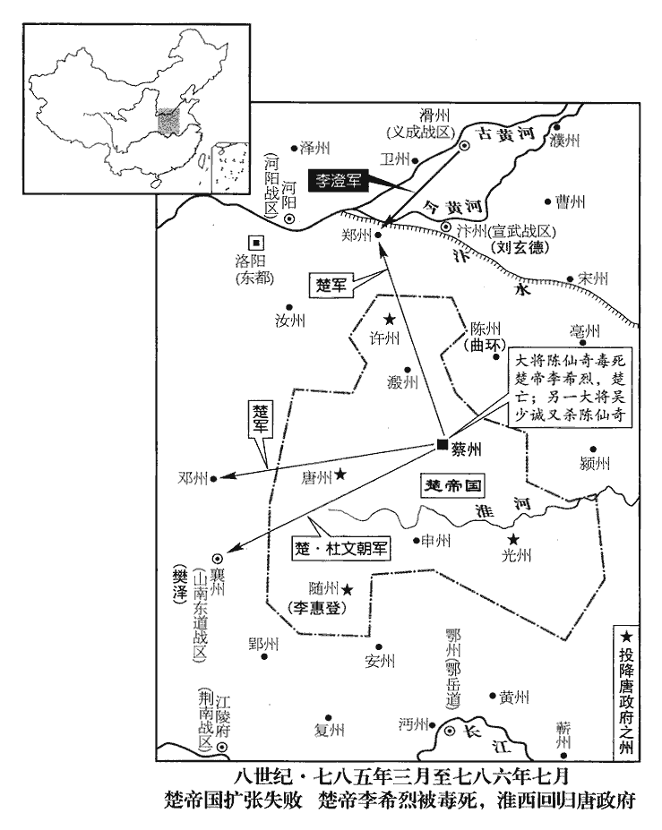
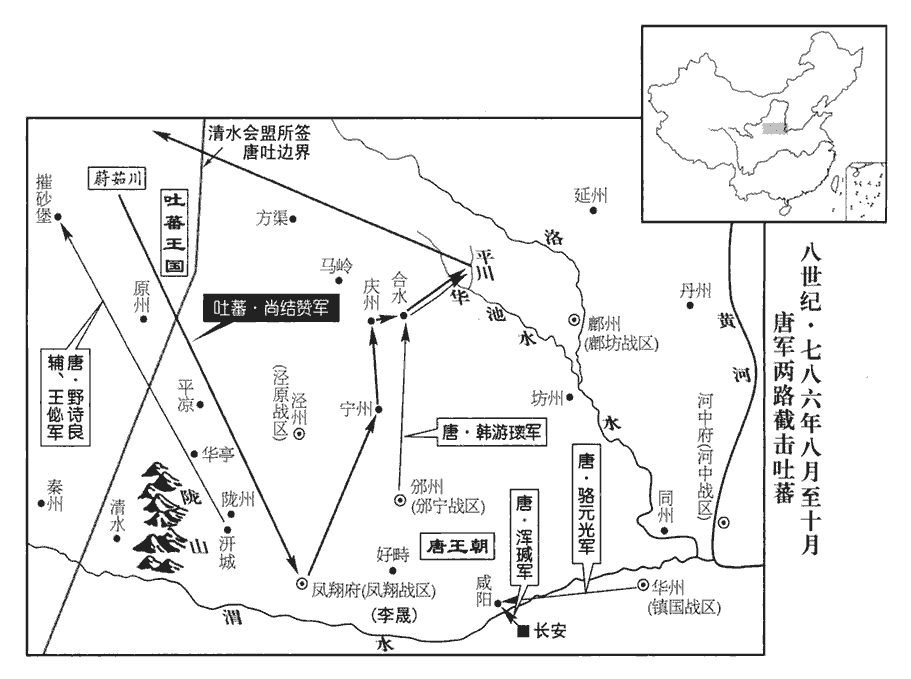
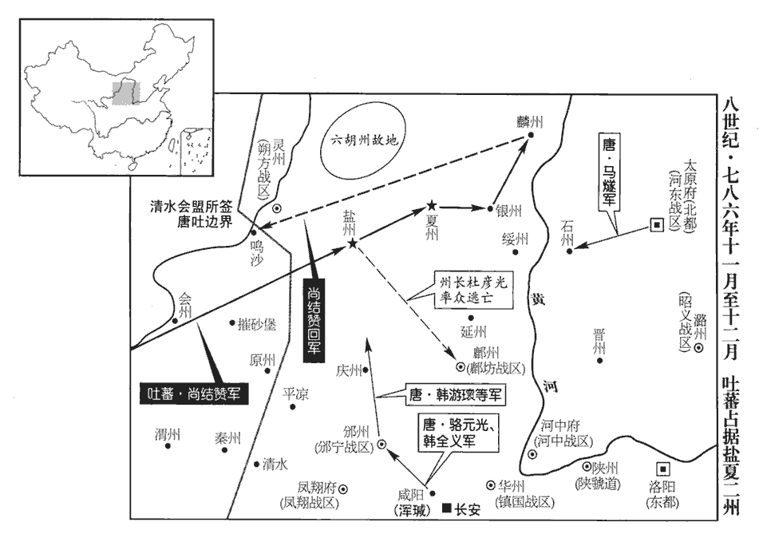
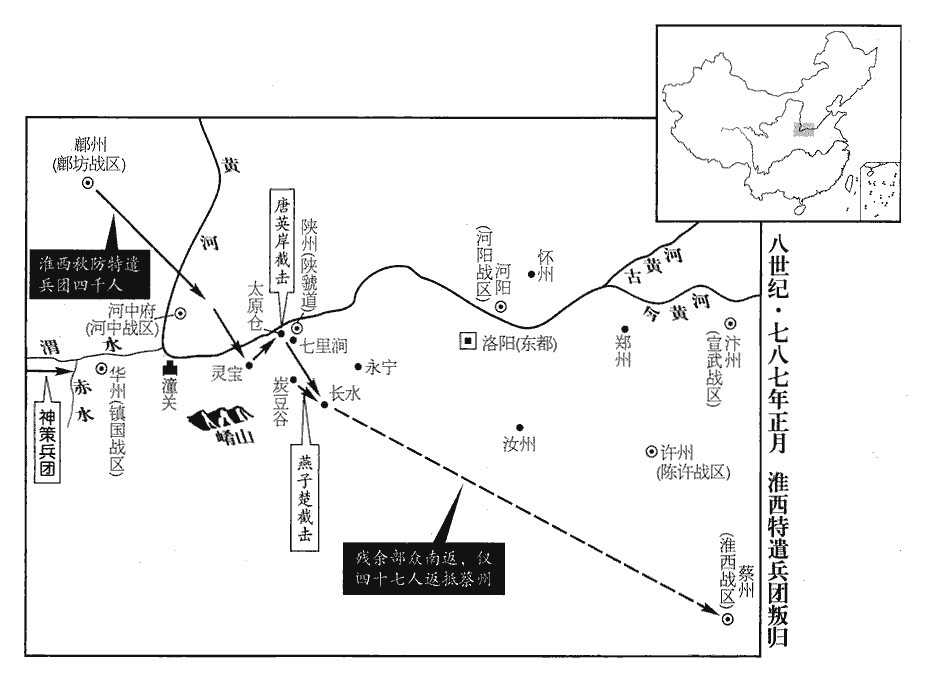
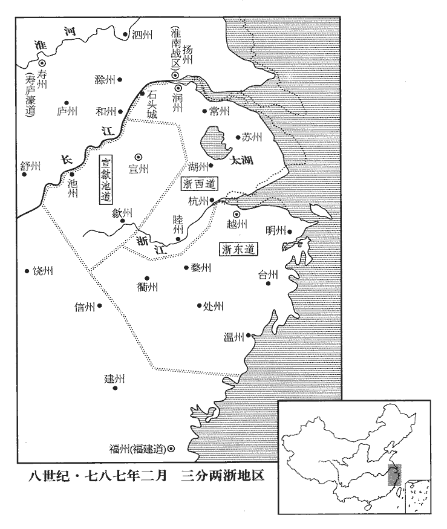
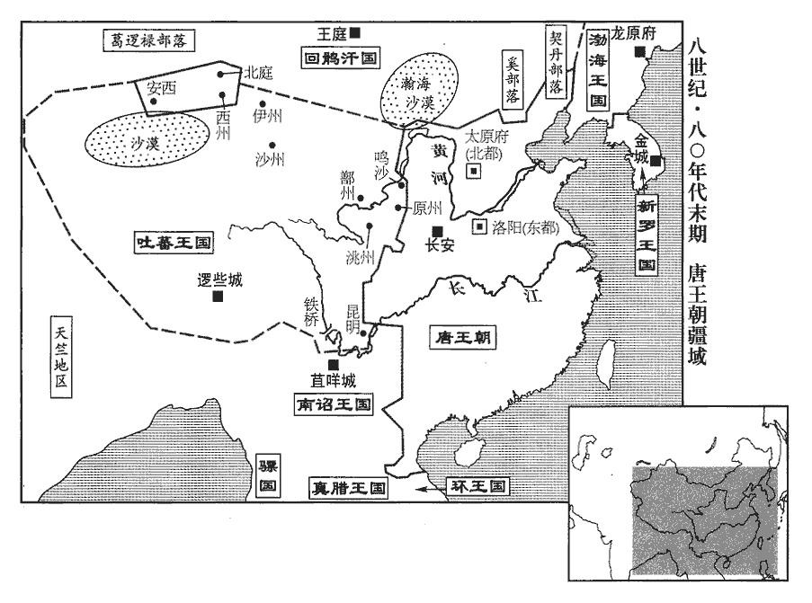
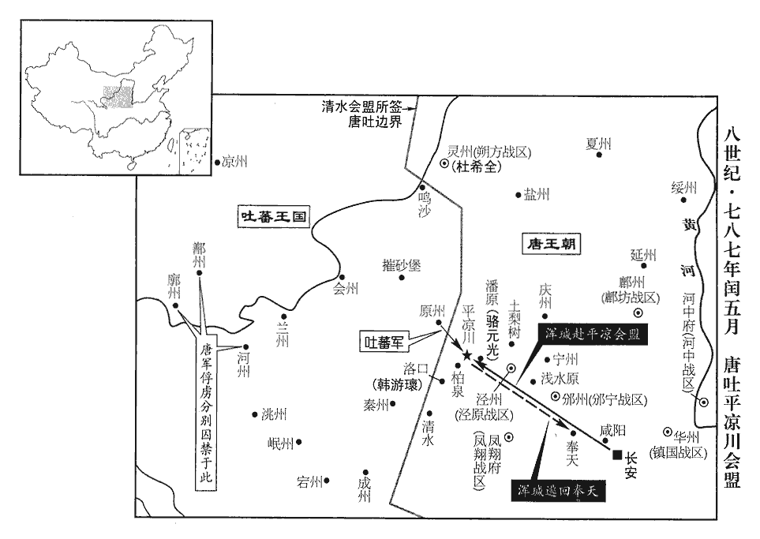

 唐紀四十八起旃蒙赤奮若（乙丑）八月，盡強圉單閼（丁卯）七月，凡二年。始乙丑八月，終丁卯七月，凡二年整。

# 德宗神武聖文皇帝七

## 貞元元年（乙丑、七八五）

1八月，甲子‹二›，詔凡不急之費及人冗食者皆罷之。冗，而隴翻。

〖译文〗 [1]八月，甲子（初二），德宗颁诏将一切不急的开销以及因事由官府供给饮食的多余人员一律裁撤。

2馬燧至行營，與諸將謀曰：「長春宮‹陕西省大荔县东›不下，燧，音遂。將，即亮翻。圍長春宮事始上卷是年四月。則懷光不可得。長春宮守備甚嚴，攻之曠日持久，我當身往諭之。」遂徑造城下，造，七到翻。呼懷光守將徐庭光，庭光帥將士羅拜城上。將，即亮翻。帥，讀曰率。燧知其心屈，徐謂之曰：「我自朝廷來，可西向受命。」庭光等復西向拜。復，扶又翻。燧曰：「汝曹自祿山已來，徇國立功四十餘年，天寶十四載，安祿山反，郭子儀、李光弼皆以朔方軍討賊立大功。其後回紇、吐蕃深入京畿，諸鎮叛亂，外禦內討，亦倚朔方軍以成功。至是年凡三十一年，今曰「四十餘年」，「四」字誤也，當作「三」。何忽為滅族之計！從吾言，非止免禍，富貴可圖也。」眾不對。燧披襟曰：「汝不信吾言，何不射我！」射，而亦翻。將士皆伏泣。燧曰：「此皆懷光所為，汝曹無罪。弟堅守勿出。」弟讀曰第，但也。皆曰「諾。」

〖译文〗 [2]马燧来到行营，与各将领计议说：“不将长春宫攻打下来，便不能捉住李怀光。长春宫的防守戒备甚为严密，若是攻打它，势必空费时日，相持很久，我应当亲自前去开导他们。”于是，马燧径直来到城下，呼喊李怀光的守城将领徐庭光，徐庭光率领将士在城上列队向马燧下拜，马燧看出徐庭光内心已经屈服，便和缓地对他说：“我是从朝廷来的，你们应该向着西面接受朝命。”徐庭光等便又向西面下拜。马燧说：“自从安禄山以来，你们献身国家，建立功勋，已有四十余年，为什么忽然做这种诛灭家族的打算！听我的话，你们不仅可以免去灾祸，而且还可以谋求富贵呢。”众人都不肯回答。马燧敞开衣襟说：“既然你们不相信我的话，为什么不用箭射我！”城上将士都伏在地上哭泣。马燧说：“这些罪过都是李怀光犯下的，你们是没有罪的。你们只管坚守这座城不出来就是了。”众人回答：“是。”

壬申‹十›，燧與渾瑊、韓遊瓌進軍逼河中，至焦籬堡‹陕西省合阳县东›；渾，戶昆翻，又戶本翻。瑊，戶咸翻。瓌，古回翻。焦籬堡，在河中府河西縣西。守將尉珪以七百人降。尉，紆勿翻，本複姓尉遲，後單姓尉以從便易。降，戶江翻；下同。是夕，懷光舉火，諸營不應。駱元光‹镇国战区，总部设华州陕西省华县›在長春宮‹陕西省大荔县东›下，使人招徐庭光；庭光素輕元光，遣卒罵之，又為優胡於城上以侮之，駱元光本安息‹安国·乌兹别克斯坦布哈拉市›胡人，故徐庭光為優胡以侮之。且曰：「我降漢將耳！」元光使白燧，燧還至城下，庭光開門降。燧以數騎入城慰撫，其眾大呼曰：還，從宣翻，又音如字。騎，奇寄翻。呼，火故翻。「吾輩復為王人矣！」復，扶又翻，又音如字。渾瑊謂僚佐曰：「始吾謂馬公用兵不吾遠也，今乃知吾不逮多矣！」渾，戶昆翻，又戶本翻。瑊，古銜翻。不逮，不及也。詔以庭光試殿中監兼御史大夫。此謂之試官、兼官，以寄祿且憲銜也。

〖译文〗 壬申（初十），马燧与浑、韩游进军迫近河中，抵达焦篱堡，守卫的将领尉率七百人归降。这天傍晚，李怀光举火报警，各军营没有响应的。骆元光在长春宫下面，让人招呼徐庭光，徐庭光平素看不起骆元光，派士兵骂他，又扮成胡人在城上侮辱他，而且说：“我们向汉族将领投降！”骆元光让人禀告马燧，马燧来到城下，徐庭光打开城门归降。马燧带着数人骑马入城，慰问安抚众人。徐庭光的部众大声呼喊着说：“我们又成了圣上的子民啦！”浑对佐助自己的官吏说：“开始我自以为马公用兵与我不会相差太多，现在才知道我是远远赶不上他的。”德宗颁诏任命徐庭光为试殿中监，兼任御史大夫。

甲戌‹十二›，燧帥諸軍至河西‹陕西省合阳县东黄河西岸›：宋白曰：河西縣，本同州舊朝邑之地，唐上元元年以朝邑地置河西縣，大曆三年復置朝邑縣，仍析朝邑五鄉，并割河東三鄉，依舊為河西縣，縣境東西十四里。帥，讀曰率。考異曰：舊燧傳曰：「燧帥諸軍濟河，兵凡八萬，陳於城下。是日，牛名俊斬懷光首，以城降。」今從邠志。河中軍士自相驚曰：「西城‹陕西省大荔县东›擐甲矣！」又曰：「東城‹山西省永济市›娖chuò隊矣！」河中，夾河為兩城，西城河西縣，東城河東縣，河中府治焉。擐，音宦。娖，側角翻。須臾，軍士皆易其號為「太平」字；懷光不知所為，乃縊而死‹年五十七岁›。縊，於計翻，又於賜翻。

〖译文〗 甲戌（十二日），马燧率领诸军来到河西县，河中将士自相惊扰地说：“西城将士已经穿上铠甲啦！”又说：“东城将士已经排好列啦！”一会儿，将士们全将旗号改成了“太平”二字。李怀光不知所措，于是自缢而死。

初，懷光之解奉天‹陕西省乾县›圍也，事見二百二十九卷建中四年。上以其子璀為監察御史，璀，七罪翻。監，古銜翻。寵待甚厚。及懷光屯咸陽不進，事見上卷興元元年。璀密言於上曰：「臣父必負陛下，願早為之備。臣聞君、父一也；人生在三，事之如一，謂君、父、師也。但今日之勢，陛下未能誅臣父，而臣父足以危陛下。陛下待臣厚，胡【章：乙十六行「胡」上有「臣」字；乙十一行本同；孔本同。】人性直，故不忍不言耳。」上驚曰：「知卿大臣愛子，當為朕委曲彌縫，而密奏之！」為，于偽翻；下同。言璀當委曲彌縫，使君臣之間無隙，不當密奏其事。對曰：「臣父非不愛臣，臣非不愛其父與宗族也；顧臣力竭，不能回耳。」上曰：「然則卿以何策自免？」對曰：「臣之進言，非苟求生；臣父敗，則臣與之俱死矣，復有何策哉！復，扶又翻，下同；又音如字，下同。使臣賣父求生，陛下亦安用之！」上曰：「卿勿死，為朕更至咸陽諭卿父，使君臣父子俱全，不亦善乎\!」璀至咸陽而還，更，古孟翻。還，音旋，又如字。曰：「無益也，願陛下備之，勿信人言。臣今往，說諭萬方，說，式芮翻。臣父言：『汝小子何知！主上無信，吾非貪富貴也，直畏死耳，汝豈可陷吾入死地邪！』」邪，音耶。

〖译文〗 当初，李怀光解除奉天围困时，德宗任命他的儿子李璀为监察御史，对他恩宠很厚。到李怀光驻扎咸阳，不肯进兵时，李璀暗中对德宗说：“我父亲肯定会辜负陛下，希望陛下早作准备。我听说君主和父亲是一回事，但是如今的形势是，陛下未能诛除我的父亲，而我的父亲却足以危及陛下。陛下对待我这么好，胡人性情直率，所以我不忍心不说啊。”德宗惊讶地说：“朕知道你是大臣李怀光所疼爱的儿子，你应该为朕婉转曲折地在其中弥补裂痕，而你地秘密上奏！”李璀回答说：“我的父亲并不是不疼爱我，我也并不是不爱我的父亲和宗族。但我已用尽心力，不能拘回。”德宗说：“这样说来，你用什么办法使自己免除一死呢？”李璀回答说：“我进上此言，不是要苟且求活。我父亲一旦败亡，那我就和他一同死去，还会有什么办法呢！假如我出卖父亲以求生存，陛下又怎么能用我这种人呢！”德宗说：“你别死，为朕再到咸阳开导你的父亲，使君主与臣下、父亲与儿子的伦常都得以保全，不也是很好的吗！”李璀前往咸阳，回来以后说：“没有效果啊，希望陛下防备我父亲，不要听信别人所说的。如今我前往劝导，用尽了千方百计，我父亲说：‘你小子知道什么！圣上不讲信用。我并不贪图富贵但我也怕死啊，你怎么可以把我陷于死地呢！”’

及李泌赴陝，李泌赴陝，見上卷是年七月。泌，薄必翻，陝，失冉翻。上謂之曰：「朕所以再三欲全懷光者，誠惜璀也；卿至陝，試為朕招之。」對曰：「陛下未幸梁‹陕西省汉中市›、洋‹陕西省洋县›，懷光猶可降也。陝，失冉翻。為，于季翻。洋音祥。降，戶江翻。今則不然。豈有人臣迫逐其君迫逐其君，謂懷光逼帝自奉天幸山南也。而可復立於其朝乎！縱彼顏厚無慚，人知愧者色見於面，不知愧者謂之顏厚。復，扶又翻，又音如字。朝，直遙翻；下同。陛下每視朝，何心見之！臣得入陝，借使懷光請降，臣不敢受，況招之乎！李璀固賢者，必與父俱死矣；若其不死，則亦無足貴也。」及懷光死，璀先刃其二弟，乃自殺。楚令尹子南之子與李璀者，皆處君臣父子大倫之變，以死繼之，可哀也已！

〖译文〗 到李泌前往陕州时，德宗对他说：“我再三想要保全李怀光的原因，实在是怜惜李璀啊。你到陕州后，试着为朕招抚他吧。”李泌回答说：“在陛下没有出走梁州、洋州时，还是可以使李怀光投降的，现在却不行了。哪有臣下逼走了他的君主，还可以再站在朝堂之上的呢！即使他脸皮厚，不惭愧，每当陛下上朝之时，看到他会是什么心情呢！我进入陕州后，假如李怀光请求投降，我也不敢接受，何况让我去招抚他呢！李璀固然是贤明的人，他一定会与他父亲一起去死了。如果他不肯死，那也没有可贵之处了。”及至李怀光死后，李璀事先杀了他的两个弟弟。然后便自杀了。

朔方將牛名俊斷懷光首出降。將，即亮翻。斷，音短。河中兵猶萬六千人，燧斬其將閻晏等七人，閻晏勸懷光東保河中稱兵犯同州者也。考異曰：邠志云「八人」，今從舊馬燧傳。餘皆不問。燧自辭行至河中平，凡二十七日。戊申至甲戌，二十七日。史言馬燧期以一月平懷光，不愆于素。燧出高郢、李鄘於獄，懷光囚郢、鄘見上卷本年。郢，以井翻。鄘，余封翻。皆奏置幕下。

〖译文〗 朔方将领牛名俊割下李怀光的头颅出城投降。河中兵还有一万六千人，马燧将他们的将领阎晏等七人斩杀，对剩下的人都不予追究。马燧从告别德宗到平定河中，共用了二十七天。马燧将高郢、李放出监狱，奏请将他们都安置在自己的幕府之中。

韓遊瓌‹邠宁战区，总部设邠州陕西省彬县›之攻懷光也，楊懷賓戰甚力，上命特原其子朝晟；李懷光囚楊朝晟，見二百三十卷元年三月。瓌，古回翻。朝，直遙翻。晟，成正翻。遊瓌遂以朝晟為都虞候。為楊朝晟後帥邠寧張本。

〖译文〗 韩游攻打李怀光时，杨怀宾作战甚为出力，德宗命令特别宽恕了他的儿子杨朝晟。于是，韩游任命杨朝晟为都虞候。

上使問陸贄：「河中既平，復有何事所宜區處？」處，昌呂翻。令悉條奏。令，力丁翻。贄以河中既平，慮必有希旨生事之人，以為王師所向無敵，請乘勝討淮西‹楚政府·首都蔡州河南省汝南县›者。李希烈‹楚帝›必誘諭其所部及新附諸帥曰：新附諸帥，謂李納、王武俊、田緒等。誘，音酉。「奉天息兵之旨，乃因窘【章：乙十六行本「窘」下有「急」字；乙十一行本同；孔本同；退齋校同。】而言，朝廷稍安，必復誅伐。」如此，則四方負罪者孰不自疑，河朔‹河北平原›、青齊‹山东半岛›固當響應，窘，巨隕翻。復，扶又翻，又音如字。河朔，謂王武俊、田緒、劉怦；青齊，謂李納。兵連禍結，賦役繁興，建中之憂，行將復起。乃上奏，其略曰：「福不可以屢徼，幸不可以常覬。上，時掌翻。徼，一遙翻。覬，音冀。臣【章：乙十六行本「臣」上有「又曰」二字；乙十一行本同；孔本同。】姑以生禍為憂，未敢以獲福為賀。」又曰：「陛下懷悔過之深誠，實心為誠。降非常之大號，此謂興元赦書也。所在宣敭yáng之際，聞者莫不涕流。敭，與揚同。假王叛換之夫，削偽號以請罪；王武俊、田悅、李納去王號謝罪，見二百二十九卷興元元年。觀釁首鼠之將，一純誠以效勤。」謂馬燧、韓滉、陳少遊。讀通鑑者因其事而觀其心迹，則知之矣。又曰：「曩討之而愈叛，今釋之而畢來；曩以百萬之師而力殫，今以咫尺之詔而化洽。是則聖王之敷理道，服暴人，理道，即治道，避高宗諱改之。任德而不任兵，明矣；群帥之悖臣禮，拒天誅，圖活而不圖王，又明矣。帥，所類翻；下同。悖，蒲內翻。是則好生以及物者，乃自生之方；施安以及物者，乃自安之術。擠彼於死地擠，子細翻，又子西翻。而求此之久生也，措彼於危地而求此之久安也，從古及今，未之有焉。」又曰：「一夫不率，率，循也。不率，謂不循上之教令也。闔境罹殃；一境不寧，普天致擾。」又曰：「億兆汙人，汙，烏瓜翻，汙下也。四三叛帥，感陛下自新之旨，悅陛下盛德之言，革面易辭，且脩臣禮，其於深言密議固亦未盡坦然，必當聚心而謀，傾耳而聽，觀陛下所行之事，考陛下所誓之言。若言與事符，則遷善之心漸固；儻事與言背，則慮禍之態復興。」陸贄斯言，亦可以謂之深切當時事情。背，蒲妹翻。復，扶又翻。又曰：「朱泚滅而懷光戮，懷光戮而希烈征，希烈儻平，禍將次及，則彼之蓄素疑而懷宿負者，能不為之動心哉！」為，于偽翻。又曰：「今皇運中興，天禍將悔，以逆泚之偷居上國，泚，且禮翻，又音此。唐都長安，故謂之上國。以懷光之竊保中畿‹中都，河中府·山西省永济市›，開元八年，以河中為中都，河東、河西二縣為次赤縣，諸縣為次畿縣。歲未再周，相次梟殄，去年六月斬朱泚，今年八月平懷光。梟殄，謂梟其首而殄絕其類。梟，堅堯翻。實眾慝驚心之日，眾慝，猶言眾惡也。慝，吐得翻。群生改觀之時。觀，古玩翻，又音如字。威則已行，惠猶未洽。誠宜上副天眷，下收物情，布恤人之惠以濟威，乘滅賊之威以行惠。」又曰：「臣所未敢保其必從，唯希烈一人而已。揆其私心，非不願從也；想其潛慮，非不追悔也。興元赦文，李希烈不與朱泚同科，亦在肆赦之數。但以猖狂失計，已竊大號，雖荷陛下全宥之恩，然不能不自靦於天地之間耳。荷，下可翻。靦，他典翻，慚顏也。縱未順命，斯為獨夫，孟子曰：「殘賊之人謂之獨夫。」言人無親輔之者。內則無辭以起兵，外則無類以求助，其計不過厚撫部曲，偷容歲時，心雖陸梁，勢必不致。陛下但敕諸鎮各守封疆，彼既氣奪算窮，是乃狴牢之類，狴，邊迷翻，又部禮翻。狴，犴àn；牢，獄；所以拘囚有罪。不有人禍，則當鬼誅。陸贄論李希烈事，曲盡情勢。古之不戰而屈人之兵者，此之謂歟！」兵法：百戰百勝，不如不戰而屈人之兵。

〖译文〗 德守让人询问陆贽说：“河中已经平定，还有什么事情该当处理的？”让陆贽全部条列出来上奏。陆贽认为，河中平定以后，可虑的是必然会有迎合意旨、无端生事的人，认为皇上的军队所向无敌，请求乘胜讨伐淮西。李希烈也必然会诱导他的军队以及新近归附的各节帅说：“在奉天所颁布的停止用兵的诏旨，是因处境窘困而讲的，只要朝廷稍微安定下来，是一定会再事讨伐的。”这样，各地那些负有罪名的人谁不担心自身难保？河朔、青齐肯定是要响应他的。战事连绵，灾祸不断，赋税纷繁，力役频兴，建中年间的忧患便将再次发生了。陆贽于是进上奏章，大致说：“福缘是不能够屡次侥幸取得的，而侥幸也不是能够经常妄自希图的。我姑且认为今后会发生祸患而为陛下担忧，不敢认为今后会获得福缘而向陛下庆贺。”他又说：“陛下怀着深切悔过的诚意，贬抑非常式的尊号，当诏书在各处宣布时，听到的人没有不流下眼泪的。自署王号的横蛮跋扈之人，削去伪号，请求治罪；伺机而动迟疑不定的将领，全都诚心诚意地效力勤王。”他又说：“以往讨伐叛乱，叛乱反而更加严重，如今释赦他们，他们反而都来归顺；以往调遣了百万之师而终于兵力穷尽，如今只是颁布了不满一尺的诏书反而德化周遍。可见圣明的君王推行促使政治修明的治国之道，使强暴之人心悦诚服，应当运用恩德感召别人，而不是运用兵力征服别人，这是显而易见的了。各镇的节帅违背人臣应有的礼典，抗拒朝廷的诛讨，为的是谋求存活，而不是谋求称王，也是显而易见的了。可见希望生存，并将此心普及万物，乃是使自己生存的良方；喜欢安宁，并将此心普及万物，乃是使自己安宁的嘉术。将那些人推到必死之地，而想让这些人长久生存；将那些人丢到危殆之地，而想让这些人长久安宁，从古至今，没有过这样的事情。”他又说：“一个人不遵循皇上的教令，整个地区都遭受祸殃；一个地区不得安宁，普天下都招致骚扰。”他又说：“众多的昏昧无知的人们，以及三四个背叛朝廷的节帅，为陛下容许重新作人的宗旨而感动，为陛下含蕴着盛美德行的话语而喜悦，洗心革面，改易不敬之辞，并且奉行人臣之礼。然而，他们对陛下深切坦诚的谈话和体贴周到的议论，肯定还没有完全明白理解，他们必然要专心谋划，侧耳细听，观察陛下所做的事情，考究陛下所发的誓言。如果陛下所说的话与所做的事相符合，他们改恶从善的心意就会逐渐牢固；倘若陛下所做的事与所说的话相违背，他们顾虑招致祸患的态度就会重新抬头。”他又说：“朱灭亡后李怀光受戮，李怀光受戮后李希烈被征讨，倘若李希烈被平定了，祸患又将依次连及别人，那么，那些素积疑虑而久怀野心的人们，能不意志动摇吗！”他又说：“如今国家的气运重新兴盛起来，上天降下的祸患将要成为过去。就朱窃居京城，李怀光私占中都而言，在不到两年里，便相继使他们主帅伏诛，全军覆灭，这实在是邪恶之徒震动心魄的日子，是所有生灵改变面貌的时候。陛下的威严已经显示出来了，但陛下的恩惠还没有普及开来。陛下诚然应当对上顺应上天的眷顾，对下集合人们的愿望，播散体恤民心的恩惠来增益威严，乘着消灭贼寇的威严来施加恩惠。”他又说：“我所不敢担保其人一定会顺从朝廷的，只有李希烈一个人罢了。推测他私下的意图，不是不愿顺从朝廷；料想他暗中的考虑，也还不是不打算悔改前非。但是，他因考虑不周，肆意妄行，已经窃称帝号，即使他承受陛下保全宽宥他的恩典，但他却不能不自觉无颜生活在天地之间。即使他不肯顺从朝命，却已成了独夫民贼，对内则没有发兵起事的理由，对外则没有寻求援助的同伙，他的办法不过是对部下多加抚慰，苟且偷生，拖延时间，虽然心想任意横行，无奈形势必定使他难以办到。陛下只要敕令诸镇各自守卫本镇的疆界，他既然胆气已去，计谋算尽，就只是个等待收押的囚徒，不是遭受人祸，便会应着鬼报。古人所说不用接战而能使敌兵屈服，就是这个意思吧！”

丁卯‹十七›，詔以「李懷光嘗有功，宥其一男，使續其後，賜之田宅，歸其首及尸使葬。加馬燧兼侍中，渾瑊檢校司空；餘將卒賞賚各有差。燧，音遂。渾，戶昆翻，又戶本翻。瑊，古咸翻。校，古孝翻。將，即亮翻。賚，來戴翻。諸道與淮西‹楚政府›連接者，宜各守封疆，非彼侵軼，不須進討。軼，徒結翻，突也。李希烈若降，當待以不死；自餘將士百姓，一無所問。」行陸贄之言也。

〖译文〗 丁卯（初五），德宗颁诏说：“李怀光曾经立下功劳，现宽宥他的一个儿子，使此子承续他，赐给此子田地住宅，将李怀光的头颅和尸身送回，让此子殡葬。加封马燧兼任侍中，加封浑为检校司空，其余将士的赏赐各分等级不同。与淮西疆界连接的各道，应该守卫本境疆土，只要不是他们突然袭击，就不必要进兵讨伐。假如李希烈投降，应该让他留条活命，其余将士与百姓，一概不予追究。

3初，李晟嘗將神策軍戍成都，蓋大曆十四年救蜀時也。將，即亮翻，又音如字。晟，成正翻。及還，以營妓高洪自隨。還，從宣翻。妓，渠綺翻。西川‹总部设成都府四川省成都市›節度使張延賞怒，追而還之，由是有隙。使，疏吏翻。至是，劉從一有疾，上召延賞入相，晟表陳其過惡；上重違其意，相，息亮翻。重，難也。以延賞為左僕射。李晟居功名之際，以一婦人之故，脩怨於嚮用之臣。且天子命相而勳臣以私怨間之，其能自安乎！斯不學之由也。為延賞讒晟張本。射，寅謝翻。

〖译文〗 [3]当初，李晟曾经带领神策军戍守成都，等到回去时，他便让营中的妓女高洪跟随着自己。西川节度使张延赏很生气，追上李晟，将高洪索回，由此二人有了嫌隙。及至此时，刘从一得了疾病，德宗传召张延赏出任宰相，李晟上表陈述张延赏的过失与缺点，德宗不愿意违背他的意愿，便任命张延赏为左仆射。

4駱元光將殺徐庭光，謀於韓遊瓌‹邠宁战区，总部设邠州陕西省彬县›瓌，古回翻。曰：「庭光辱吾祖考，謂為優胡以戲侮之也。吾欲殺之，馬公必怒，公能救其死乎！」遊瓌曰：「諾。」壬午‹二十›，遇庭光於軍門之外，揖而數其罪，數，所具翻，又所主翻。命左右碎斬之。考異曰：實錄：「甲申，駱元光專殺徐庭光，上令宰相諭諫官勿論。」邠志曰：「二十日，駱公謀於韓公曰：『徐庭光見詬，辱及祖父，義不同天。』是日，遂殺之。」按是月癸亥朔。甲申，二十二日，蓋奏到之日也。今從邠志。入見馬燧，頓首請罪，燧大怒曰：「庭光已降，受朝廷官爵，公不告輒殺之，是無統帥也！」燧，音遂。降，戶江翻。朝，直遙翻。統，他綜翻，俗從上聲。帥，所類翻。欲斬之。遊瓌曰：「元光殺裨將，公猶怒如此。公殺節度使，天子其謂何！」燧默然；渾瑊亦為之請，為，于偽翻。乃捨之。

〖译文〗 [4]骆元光准备杀掉徐庭光，便与韩游计议说：“徐庭光侮辱我的祖先，我想杀他，马公必然大怒，你能救我一命吗？”韩游说：“好吧。”壬午（二十日），骆元光在军营大门外遇到徐庭光，拱手相见后，便数说他的罪过，命令随从人员零刀碎剐地杀死了他。骆元光入营见马燧，伏地叩头，请求治罪，马燧非常气愤地说：“徐庭光已经归降，接受了朝廷封拜的官爵，你不告诉我一声就将他杀死，这是目无统帅！”马燧准备斩杀骆元光，韩游说：“骆元光杀了一个副将，你尚且愤怒成这个样子。你杀了节度使，圣上将说你些什么！”马燧没有说话，浑也为骆元光求情，于是马燧舍弃了骆元光。

渾瑊鎮河中，盡得李懷光之眾，朔方軍‹总部设灵州宁夏灵武市›自是分居邠、蒲‹河中府·山西省永济市›矣。自郭子儀以來，朔方軍亦分屯邠、蒲而統於一帥。今居邠者韓遊瓌帥之，居蒲者渾瑊帥之，不相統屬，故史言其始分。渾，戶昆翻，又戶本翻。邠，卑旻翻。

〖译文〗 浑镇守河中，得到了李怀光所有的部众，朔方军自此分别屯驻州与蒲州了。

5盧龍節度使劉怦疾病，使，疏吏翻。怦，普耕翻。疾甚曰病。九月，己亥‹七›，詔以其子行軍司馬濟權知節度事；怦尋薨‹年五十九岁›。薨，呼肱翻。

〖译文〗 [5]卢龙节度使刘怦得了重病，九月，己亥（初七），德宗颁诏命令他的儿子行军司马刘济权且代理节度使事务。不久，刘怦去世。

6己未‹二十七›，中書侍郎、同平章事劉從一罷為戶部尚書；庚申‹二十八›，薨。以疾罷而薨。尚，辰羊翻。

〖译文〗 [6]己未（二十七日），中书侍郎、同平章事刘从一被罢免为户部尚书。庚申（二十八日），刘从一去世。

7冬，十月，癸卯‹十一月十一日›，上祀圜丘，赦天下。

〖译文〗 [7]冬季，十月，癸卯（疑误），德宗祭祀圜丘，大赦天下。

8十二月，甲戌‹十三›，戶部奏今歲入貢者凡百五十州。時河朔‹河北平原›諸鎮及淄青‹山东半岛›、淮西‹河南省南部›皆不入貢，河‹河西，甘肃省›、隴‹陇右，青海省东部›諸州又沒于吐蕃。

〖译文〗 [8]十二月，甲戌（十三日），户部奏，本年共有一百五十州入朝进贡。

9于闐‹新疆和田市›王曜上言：「兄勝讓國於臣，事見二百二十一卷肅宗上元元年。闐，徒賢翻。又徒見翻。上，時掌翻。今請復立勝子銳。」上以銳檢校光祿卿，還其國。勝固辭曰：「曜久行國事，國人悅服。銳生長京華，復，扶又翻，又音如字。校，古孝翻。還，從宣翻，又音如字。長，知兩翻。不習其俗，不可往。」上嘉之，以銳為韶王諮議。韶王暹，代宗‹李豫李俶›子也。唐制：王府官諮議參軍，正五品上。

〖译文〗 [9]于阗王尉迟曜上奏说：“我哥哥尉迟胜将于阗国让给了我，现在请朝廷再册立尉迟胜的儿子尉迟锐。”德宗任命尉迟锐为检校光禄卿，让他返回于阗国。尉迟胜一再推辞说：“尉迟曜长时间办理国家事务，国中百姓心悦诚服。尉迟锐生长在京城，不熟悉于阗风俗，不能前往。”德宗嘉许尉迟胜，任命尉迟锐为韶王李暹的咨议。

## 二年（丙寅、七八六）

1春，正月，壬寅‹十一›，以吏部侍郎劉滋為左散騎常侍，與給事中崔造、中書舍人齊映並同平章事。滋，子玄之孫也。散，悉亶翻。騎，奇寄翻。劉子玄以史筆事武后、中宗。

〖译文〗 [1]春季，正月，壬寅（十一日），德宗任命吏部侍郎刘滋为左散骑常侍，与给事中崔造、中书舍人齐映一并任同平章事。刘滋是刘子玄的孙子。

造少居上元‹江苏省南京市›，少，始照翻。上元縣，帶昇州。與韓會、盧東美、張正則為友，以王佐自許，時人謂之「四夔」。夔者，唐、虞之良臣。時人重四人者，以「四夔」稱之。上‹李适，本年四十五岁›以造在朝廷敢言，故不次用之。朝，直遙翻。滋、映多讓事於造。造久在江外，疾錢穀諸使罔上之弊，奏罷水陸運使、度支巡院、江•淮轉運使等，諸道租賦悉委觀察使、刺史遣官部送詣京師。令宰相分判尚書六曹：齊映判兵部，李勉判刑部，劉滋判吏部、禮部，造判戶部、工部；又以戶部侍郎元琇判諸道鹽鐵、榷酒，使，疏吏翻。度，徒洛翻。尚，辰羊翻。琇，音秀。榷què，古岳翻。吉中孚判度支兩稅。

〖译文〗 崔造早年住在上元县，与韩会、卢东美、张正则结为朋友，自认为是帝王的辅佐，当时的人们将他们四人比作虞舜的四位贤臣，称为“四夔”。德宗因崔造在朝廷中敢于言事，所以不拘等次地任用了他，刘滋、齐映往往将事情推给崔造办理。崔造长期生活在长江以南，憎恨执掌钱谷诸使欺瞒上级的弊端，上奏罢除了水陆运使、度支巡院、江淮转运使等，各道的赋税全委托观察使、刺史派遣官吏送至京城。德宗命令宰相分别兼管尚书省六曹：齐映兼管兵部，李勉兼管刑部，刘滋兼管吏部和礼部，崔造兼管户部和工部。还让户部侍郎元兼管诸道盐铁和酒类专营，让吉中孚兼管度支两税。

2李希烈‹楚帝，首都蔡州河南省汝南县›將杜文朝寇襄州‹湖北省襄樊市›。二月，癸亥‹三›，山南東道‹总部设襄州湖北省襄樊市›節度使樊澤擊擒之。將，即亮翻，朝，直遙翻。山南東道節度治襄州。

〖译文〗 [2]李希烈的将领杜文朝侵犯襄州。二月，癸亥（初三），山南东道节度使樊泽进击并擒获了他。

3崔造與元琇善，故使判鹽鐵。韓滉‹镇海战区，总部设润州江苏省镇江市›奏論鹽鐵過失，為崔造、元琇得罪張本。滉，呼廣翻。甲戌‹十四›，以琇為尚書右丞。陝州‹河南省三门峡市›水陸運使李泌奏：「自集津‹山西省平陆县东›至三門‹河南省三门峡市东›，泌，薄必翻。集津倉，在三門東。三門倉，在三門西。鑿山開車道十八里，以避底柱‹河南省三门峡市东北黄河河道中央›之險。」底柱兩山屹立河中，河水分流，包山而過，世謂之三門。車道者，陸運之道，捨舟而車運也。是月道成。

〖译文〗 [3]崔造与元友好，所以让他兼管盐铁。韩上奏议论盐铁事务中的过失。甲戌（十四日），德宗任命元为尚书右丞。陕州水陆运使李泌上奏说：“请准许由集津到三门，凿穿山石，开辟车道十八里，以便避开底柱天险。”就在本月内，车道告竣。

4三月，李希烈別將寇鄭州‹河南省郑州市›，義成‹总部设滑州河南省滑县›節度使李澄擊破之。代宗大曆七年，賜滑亳節度為永平節度。貞元元年，永平軍節度更號義成軍節度。興元元年，李澄得鄭州。希烈兵勢日蹙，會有疾。夏，四月，丙寅‹七›，大將陳仙奇使醫陳山甫毒殺之；果如陸贄所料。因以兵悉誅其兄弟妻子，舉眾來降。降，戶江翻。考異曰：杜牧竇烈女傳曰：「初希烈入汴州，聞戶曹參軍竇良女美，使甲士至良門，取桂娘以去。將出門，顧其父曰：『慎無戚，必能滅賊，使大人取富貴於天子。』桂娘以才色在希烈側，復能巧曲取信，凡希烈之密謀，雖妻子不知者，悉皆得聞。希烈歸蔡州，桂娘謂希烈曰：『忠而勇，一軍莫如陳先奇。其妻竇氏，先奇寵且信之，願得相往來，以姊妹叙齒，因徐說之，使堅先奇之心。』希烈然之。桂娘因以姊事先奇妻，嘗間曰：『為賊遲晚必敗，姊宜早圖遺種之地。』先奇妻然之。興元元年四月，希烈暴死，其子不發喪，欲盡誅老將校，以卑少者代之，計未決。有獻含桃者，桂娘白希烈子，請分遺先奇妻，且以示無事於外，因為蠟帛書曰：『前日已死，殯在後堂，欲誅大臣，須自為計。』以朱染帛，丸如含桃。先奇發丸見之，言於薛育。育曰：『兩日希烈稱疾，但怪樂曲雜發，晝夜不絶，此乃有誅未定，示暇於外，事不疑矣。』明日，先奇、薛育各以所部譟於牙門，請見希烈。希烈子迫，出拜曰：『願去偽號，一如李納。』先奇曰：『爾父勃逆，天子有命誅之。』因斬希烈及妻、子，函七首以獻，暴其尸於市。後兩月，吳少誠殺先奇；知桂娘謀，因亦殺之。」今從實錄及舊傳。甲申‹二十五›，以仙奇為淮西‹总部设蔡州河南省汝南县›節度使。

〖译文〗 [4]三月，李希烈的别将侵犯郑州，义成节度使李澄击败了他。李希烈军的形势日益紧迫，恰好他生了病，夏季，四月，丙寅（初七），大将陈仙奇指使医生陈山甫将他毒死。陈仙奇于是派兵将李希烈的兄弟、妻子、儿女全部诛杀，率众前来投降。甲申（二十五日），德宗任命陈仙奇为淮西节度使。

 

5關中‹陕西省中部›倉廩竭，禁軍或自脫巾呼於道曰：呼，火故翻。「拘吾於軍而不給糧，吾罪人也！」上憂之甚，會韓滉‹镇海战区，总部设润州江苏省镇江市›運米三萬斛至陝，李泌即奏之。上喜，遽至東宮，謂太子‹李诵›曰：「米已至陝，吾父子得生矣！」滉，呼廣翻。陝，失冉翻。泌，薄必翻。記王制曰：國無六年之蓄曰急，無三年之蓄曰國非其國也。況日闋無儲者乎！日闋無儲，有以繼之猶可，況漕運不繼，朝不及夕者乎！唐都關中，仰給東南之餫yùn。德宗於兵荒之餘，其窘乏尤不可言。觀其父子相與語，亦懲涇卒之變，發之於言語，有不能以自揜yǎn者。裴延齡知之，故得因以排陸贄。時禁中不釀，命於坊市取酒為樂。樂，音洛。又遣中使諭神策六軍，軍士皆呼萬歲。

〖译文〗 [5]关中粮食库存已经用光，禁军中有人摘下头巾，在道上大喊：“把我拘束在军中，但不给粮食，我简直成罪人了！”德宗甚为忧虑，适逢韩将三万斛米运到陕州。李泌当即奏报朝廷。德宗大喜，匆忙来到东宫，对太子说：“米已运到陕州，我父子能够活下去了！”当时，宫廷中不造酒，德宗让人上街取酒回来作乐。德宗又派遣中使告诉神策六军，军中将士都高呼万岁。

時比歲饑饉，比，毗至翻。兵民率皆瘦黑，至是麥始熟，市有醉人，當時以為嘉瑞。人乍飽食，死者復伍之一。復，扶又翻。數月，人膚色乃復故。

〖译文〗 当时，由于连年饥荒，将士、百姓全都又瘦又黑。至此，麦子开始成熟，街市中有了醉酒之人，当时认为这是嘉兆瑞象。人们骤然吃得很饱，因此而致死的人又有五分之一。过了几个月，人们皮肤的颜色才恢复原状。

6以橫海軍使程日華‹驻沧州河北省沧州市东南›為節度使。滄州始別為節鎮。以此觀之，則以程日華為橫海軍副大使，上卷衍「大」字明矣。

〖译文〗 [6]德宗任命横海军使程日华为节度使。

7秋，七月，淮西兵馬使吳少誠殺陳仙奇，自為留後。少誠素狡險，為李希烈所寵任，故為之報仇。使，疏吏翻。少，始照翻。故為，于偽翻；下因為同。己酉‹二十二›，以虔王諒為申、光、隨、蔡‹即淮西战区·总部设蔡州河南省汝南县›節度大使，以少誠為留後。

〖译文〗 [7]秋季，七月，淮西兵马使吴少诚杀死陈仙奇，自任留后。吴少诚素来狡猾阴险，被李希烈所眷宠信任，所以吴少诚为他报仇。己酉（二十二日），德宗任命虔王李谅为申、光、随、蔡节度大使，任命吴少诚为留后。

8以隴右行營節度使曲環為陳許‹总部设许州河南省许昌市›節度使。曲環時以隴西行營兵戍陳許。陳‹河南省淮阳县›許‹河南省许昌市›荒亂之餘，戶口流散。曲環以勤儉率下，政令寬簡，賦役平均，數年之間，流亡復業，兵食皆足。

〖译文〗 [8]德宗任命陇右行营节度使曲环为陈许节度使。在兵荒马乱之后，陈许地区户口流亡散失。曲环以勤俭的作风约束部下，行政措施与法令都很宽和简明，赋税劳役平均，在几年时间里，流离亡散的人们又重操旧业，兵马与粮食都充足起来。

9八月，癸未‹二十七›，義成‹总部设滑州河南省滑县›節度使李澄薨‹年五十四岁›，其子士【章：乙十六行本「士」作「克」；乙十一行本同；退齋校同；張校同，云無註本誤「士」。】寧謀總軍務，祕不發喪。

〖译文〗 [9]八月，癸未（二十七日），义成节度使李澄去世，他的儿子李克宁图谋总揽军中事务，隐秘死讯，暂不公告于众。

10丙戌‹三十›，吐蕃‹首都逻些城西藏拉萨市›尚結贊大舉寇涇‹甘肃省泾川县›、隴‹陕西省陇县›、邠‹陕西省彬县›、寧‹甘肃省宁县›，掠人畜，芟禾稼，西鄙騷然，州縣各城守。詔渾瑊將萬人，駱元光將八千人屯咸陽‹陕西省咸阳市›以備之。

〖译文〗 [10]丙戌（三十日），吐蕃尚结赞大规模地侵犯泾州、陇州、州、宁州，掳掠人口与牲畜，收割庄稼，西部边境骚动不安，州县各自据城防守。德宗颁诏命令浑带领一万人，骆元光带领八千人在咸阳驻扎，以防御吐蕃。

11初，上與【章：乙十六行本「與」下有「常侍」二字；乙十一行本同；張校同，云無註本亦無。】李泌議復府兵，泌因為上歷敘府兵自西魏以來興廢之由，西魏置府兵，見一百六十三卷梁簡文帝大寶元年。府兵廢見二百一十二卷玄宗開元十年。且言：「府兵平日皆安居田畝，每府有折衝領之，折衝以農隙教習戰陳。陳，讀曰陣。國家有事徵發，則以符契下其州及府，府者，折衝果毅府。下，遐稼翻。參驗發之，至所期處。發兵刻期所會之地。將帥按閱，有教習不精者，罪其折衝，甚者罪及刺史。軍還，則賜勳加賞，便道罷之。罷兵，使各隨便道歸農，不必還至京師而後罷。行者近不踰時，遠不經歲。高宗‹李治›以劉仁軌為洮河‹青海省乐都县›鎮守使以圖吐蕃，見二百二卷高宗儀鳳二年。於是始有久戍之役。武后‹武曌›以來，承平日久，府兵浸墮，墮，讀曰隳。為人所賤；百姓恥之，至蒸熨手足以避其役。又，牛仙客以積財得宰相，事見二百一十四卷玄宗開元二十四年。邊將效之；山東‹崤山以东›戍卒多齎繒帛自隨，邊將誘之寄於府庫，晝則苦役，夜縶地牢，繒，慈陵翻。誘，音酉。縶，音執，縛也。利其死而沒入其財。故自天寶以後，山東戍卒還者什無二三，其殘虐如此。然未嘗有外叛內侮，殺帥自擅者，誠以顧戀田園，恐累宗族故也。累，良瑞翻。自開元之末，張說始募長征兵，謂之彍guō騎，事見一百一十二卷開元十年、十三年。其後益為六軍。六軍分左、右為十二軍。及李林甫為相，奏諸軍皆募人為之；見二百一十六卷天寶八載。兵不土著，著，直略翻。又無宗族，不自重惜，忘身徇利，禍亂遂生，至今為梗。毛萇曰：梗，惡也。鄭玄曰：始生此禍，乃至今日相梗不止。曏使府兵之法常存不廢，安有如此下陵上替之患哉！侵犯為陵，偏下為替。陛下思復府兵，此乃社稷之福，太平有日矣。」上曰：「俟平河中‹山西省永济市›，當與卿議之。」因置十六衛上將軍，先敘議復府兵之事。

〖译文〗 [11]当初，德宗与李泌计议恢复府兵，李泌因而为德宗依次叙述自西魏以来府兵兴起与废弃的原由，还说：“在平时，府兵都安心耕种田地，每府设置折冲府统领府兵，折冲府利用农闲时节教给府兵演练战阵。当国家有事，需要征调府兵时，便将调动兵马的符节下达府兵所在的州与府，经过参验，发出府兵。府兵来到指定地点，经过将帅的审查和检阅，凡有教练演习不合标准的，要制裁府兵所在的折冲府长官，严重不合标准的，制裁还要牵连到该州刺史。罢兵以后，赐给勋官名号，颁发奖赏，由罢兵处各取方便路径，回到本地。凡是应征的人，时间短的，不超过三个月，时间长的，不超过一年。高宗任命刘仁轨为洮河镇守使，以便经营吐蕃，由此才有长期屯戍的兵役。武后在位以来，天下太平的日子长了，府兵逐渐没落，被人们看得轻贱了，百姓以当府兵为耻辱，以至于有为了逃避兵役而烫伤手足的。再者，牛仙客因积聚财货而得以出任宰相，边疆的将领都学着他的样子去做。山东戍边的士兵常常随身带着丝帛，边地的将领诱骗他们把丝帛寄存到仓库中，白天让他们服苦役，晚上将他们拘囚在地牢中，希望他们死亡以没收他们的财物。所以，自从天宝年间以后山东戍守边境的士兵能够回来的人十个没有二三，那残酷暴虐的程度就是这样。然而，当时还不曾有外部的叛变和内部的侮乱以及谋杀镇帅、自专旌节的人，这诚然是因为眷恋田地家园，惟恐连累本宗本族的原故啊。自从开元末年以来，张说开始募集长期征戍的士兵，把他们称作骑，后来将骑增加到六军。到了李林甫出任宰相进，他奏请各军都由募集来的人员组建。士兵们已经不再是本地人在本地当兵，又没有宗族，他们不再自重自异惜，宁可为财利而死，于是灾祸变乱发生了，至今还作梗不止。假使府兵制度永远存在而未被废弃，哪里会有纲纪废弛，上下失序的祸患呢！陛下打算恢复府兵，这乃是国家的福气，太平盛世指日可待了。”德宗说：“等到将河中平定后，朕自当与你计议此事。”

九月，丁亥‹一›，詔十六衛各置上將軍，以寵功臣；改神策左、右廂為左、右神策軍，殿前射生左、右廂為殿前左、右射生軍，各置大將軍二人、將軍二人。十六衛上將軍，從二品。神策大將軍。正二品。統軍，從三品。將軍，從五品。

〖译文〗 九月，丁亥（初一），德宗颁诏命令十六卫各自设置上将军，以表示对功臣的恩宠。将神策左、右厢改为左、右神策军，将殿前射生左、右厢改为殿前左、右射生军，各自设置大将军两人、将军两人。

12庚寅‹四›，李克寧始發父澄之喪，殺行軍司馬馬鉉，墨縗出視事，墨縗，自晉襄公‹姬欢›始。縗，倉回翻。增兵城門。劉玄佐‹刘洽，宣武战区，总部设汴州河南省开封市›出師屯境上以制之，且使告諭切至，克寧迺不敢襲位。丁酉‹十一›，以東都留守賈耽為義成節度使。克寧悉取府庫之財夜出，軍士從而剽之，比明殆盡。剽，匹妙翻。比，必利翻，及也。淄青‹总部设郓州山东省东平县›兵數千自行營歸，過滑州‹河南省滑县›，自李正己以來，淄青兵未嘗應調發赴行營也，此必李納遣兵自戍守其境，亦稱行營耳。將佐皆曰：「李納雖外奉朝命，內蓄兼并之志，請館其兵於城外。」朝，直遥翻。館，古玩翻。賈耽曰：「柰何與人鄰道而野處其將士乎！」處，昌吕翻。命館於城中。耽時引百騎獵於納境，納聞之，大喜，服其度量，不敢犯也。騎，奇寄翻。

〖译文〗 [12]庚寅（初四），李克宁开始将父亲李澄的死讯公布于众。他杀掉行军司马马铉，穿着黑色的麻布丧服出来办理事务，在各城门都增加了兵员。刘玄佐派出军队，在州境上屯扎，以便遏制李克宁，同时让人极为严厉地告诫他，李克宁这才没敢承袭节度使的职位。丁酉（十一日），德宗任命东都留守贾耽为义成节度使。李克宁将库存的资财悉数取出，连夜出走，将士们跟在后面抢劫财物，到天亮时，将他要带走的资物几乎抢劫完了。淄青兵数千人从行营回来，经过滑州，贾耽的将佐们都说：“虽然李纳表面上遵奉朝廷的命令，骨子里却包藏着吞并土地的意图，请将他的人马安排在城外。”贾耽说：“我们与人家州道相邻，怎么能够让人家的将士住在野外呢！”他让淄青兵住在城中。贾耽时常带领一百人骑马到李纳的境内打猎，李纳听说后，大为喜欢。他佩服贾耽的襟怀，不敢侵犯义成。

13吐蕃遊騎及好畤‹陕西省乾县西北›；畤，音止。乙巳‹十九›，京城戒嚴，復遣左金吾將軍張獻甫屯咸陽。民間傳言上復欲出幸以避吐蕃，復，扶又翻。齊映見上言曰：「外間皆言陛下已理裝，具糗糧，見，賢遍翻。理裝，治裝也。糗，去久翻，乾飯屑也。人情恟懼。夫大福不再，左傳楚靈王‹芈围›之言。恟，許拱翻。夫，音扶。陛下奈何不與臣等熟計之！」因伏地流涕，上亦為之動容。為，于偽翻。

〖译文〗 [13]吐蕃游动作战的骑兵已经到达好。乙巳（十九日），京城采取了严密的防备措施，还派遣左金吾将军张献甫在咸阳屯驻。民间传说皇上准备再次出走，以便躲避吐蕃。齐映进见德宗说：“外面都说陛下已经整顿行装，备办干粮，人们的情绪既震惊，又恐惧。一般说来，巨大的福气是不会再出现的，怎么陛下就不肯与我等详细计议一下呢！”他说着便跪伏于地，流下了眼泪。德宗也被他感动得改变了脸色。

李晟‹凤翔战区，总部设凤翔府陕西省凤翔县›遣其將王佖將驍勇三千伏於汧城‹陕西省陇县南›，晟，成正翻。其將，即亮翻。佖，毗必翻；佖將，音同上，又音如字。驍，堅堯翻。隴州之東有汧陽縣，汧城在其旁。汧，口堅翻。戒之曰：「虜過城下，勿擊其首；首雖敗，彼全軍而至，汝弗能當也。不若俟前軍已過，見五方旗，虎豹衣，言其軍士所服之衣畫為虎豹文。乃其中軍也，出其不意擊之，必大捷。」佖用其言，尚結贊敗走。軍士不識尚結贊，僅而獲免。

〖译文〗 李晟派遣他的将领王带领勇敢善战的士兵三千人在城埋伏下来，告诫他说：“吐蕃军经过城下时，不要向他们的先头部队发起进击。因为尽管他们被打败了，但他们整个部队开来后，你还是难以抵挡的。不如等他们的先头部队开过去后，当看到军中竖着五方旗，将士穿着虎豹衣时，这便是他们的中军了，这时你出其不意地进击他们，一定能够大获全胜。”王采用了李晟所讲的打法，尚结赞战败逃走。将士们不认识尚结赞，所以他才得以幸免。

 

尚結贊謂其徒曰：「唐之良將，李晟、馬燧、渾瑊而已，當以計去之。」燧，音遂。渾，戶昆翻，又戶本翻。瑊，古咸翻。為尚結贊間李晟、劫渾瑊、賣馬燧張本。去，羌呂翻。入鳳翔‹陕西省凤翔县›境內，無所俘掠，以兵二萬直抵城下曰：「李令公召我來，俘，芳無翻。李晟時為中書令，故稱之為令公。此尚結贊所以間晟也。何不出犒我！」經宿，乃引退。犒，口到翻。

〖译文〗 尚结赞对他的徒众说：“唐朝的良将，只有李晟、马燧、浑三人罢了，我们应当用计策去掉他们。”他进入凤翔境内，并不掳掠，带着士兵两万人一直开到凤翔城下说：“李令公叫我们到这里来的，为什么不出来犒劳我们！”过了一夜，尚结赞才领着人马退去。

冬，十月，癸亥‹七›，李晟遣蕃落使野詩良輔使，疏吏翻。野詩，蕃姓也；良輔，其名。與王佖將步騎五千襲吐蕃摧砂堡‹即摧沙堡·宁夏海原县›；壬申‹十六›，遇吐蕃眾二萬，與戰，破之，乘勝逐北，至堡下，攻拔之，斬其將扈屈律悉蒙，焚其蓄積而還。騎，奇寄翻。扈屈律，蕃人三字姓。還，從宣翻，又如字。尚結贊引兵自寧、慶‹甘肃省庆阳县›北去，寧、慶，二州名。癸酉‹十七›，軍於合水‹庆阳县东合水老城›之北；合水縣，屬慶州，隋開皇十六年置。九域志：合水縣，在慶州東北四十五里。邠寧‹总部设邠州陕西省彬县›節度使韓遊瓌遣其將史履程夜襲其營，殺數百人。吐蕃追之，遊瓌陳于平川‹洛水支流胡芦河的支流›，邠，卑旻翻。使，疏吏翻。瓌，古回翻。將，即亮翻。吐，從暾入聲，陳，讀曰陣。潛使人鼓於西山；虜驚，棄所掠而去。

〖译文〗 冬季，十月，癸亥（初七），李晟派遣蕃落使野诗良辅与王带领步兵、骑兵五千人袭击吐蕃的摧砂堡。壬申（十六日），野诗良辅与王军遇到吐蕃军二万人，与他们交战，打败了他们，于是乘胜追击，一直追到摧砂堡下，并攻克了摧砂堡，斩杀了堡中守将扈屈律悉蒙，烧掉了堡中的储备，才收兵回去。尚结赞领兵由宁州、庆州向北而去，癸酉（十七日），在合水北岸驻扎下来。宁节度使韩游派遣他的将领史履程在夜间袭击吐蕃的营地，杀了数百人。吐蕃追击史履程，韩游在平川结下阵列，暗中让人在西山擂起鼓来，吐蕃军大惊，丢掉了虏掠的物品，便离去了。

14十一月，甲午‹八›，立淑妃王氏為皇后。

〖译文〗 [14]十一月，甲午（初八），德宗册立淑妃王氏为皇后。

15乙未‹九›，韓滉‹镇海战区，总部设润州江苏省镇江市›入朝。滉，呼廣翻。自京口入朝。朝，直遙翻。

〖译文〗 [15]乙未（初九），韩进京朝见。

16丁酉‹十一›，皇后‹太子李诵的母亲›崩。

〖译文〗 [16]丁酉（十一日），皇后去世。

17辛丑‹十五›，吐蕃寇鹽州‹陕西省定边县›，鹽州，五原郡，漢五原縣地。謂刺史杜彥光曰：「我欲得城，聽爾率人去。」彥光悉眾奔鄜fū州‹陕西省富县›，九域志：慶州，東至鄜州三百五十里。吐蕃入據之。考異曰：邠志曰：「十二月三日，吐蕃圍鹽州，刺史杜彥光請委城以其眾去；吐蕃許之，分軍竊據。」今據實錄在此月。

〖译文〗 [17]辛丑（十五日），吐蕃侵犯盐州，对盐州刺史杜彦光说：“我们只打算得到盐州城，听凭你带着人们离开。”杜彦光带领全部人众逃奔州，吐蕃军占领了盐州。

劉玄佐‹刘洽，宣武战区，总部设汴州河南省开封市›在汴，習鄰道故事，習淄青、淮西及河朔故事。久未入朝。韓滉過汴，玄佐重其才望，以屬吏禮謁之。汴，皮變翻。朝，直遙翻。滉，呼廣翻。過，古禾翻，又古臥翻。韓滉鎮二浙，雖王室播遷，而巡屬寧晏，轉輸絡繹，劉玄佐以是重其才。滉父休以剛直致位宰輔，滉所歷任皆著聲績，劉玄佐以是重其望。滉為江、淮、河南諸道轉運使，玄佐賜履之地，乃漕運之所經，以職分言之，則非屬吏也。玄佐敬滉，故以屬吏禮脩謁。滉相約為兄弟，請拜玄佐母；其母喜，置酒見之。酒半，滉曰：「弟何時入朝？」玄佐曰：「久欲入朝，但力未辦耳！」滉曰：「滉力可及，弟宜早入朝。丈母垂白，諸父執行謂之丈人行。韓滉與劉玄佐結為兄弟，則視其父為丈人行，故呼其母謂之丈母也。不可使更帥諸婦女往填宮也！」凡反者家屬皆沒入掖庭，故云然。帥，讀曰率。母悲泣不自勝。勝，音升。滉乃遺玄佐錢二十萬緡，遺，唯季翻。備行裝。滉留大梁‹汴州州政府所在城·河南省开封市›三日，大出金帛賞勞，勞，力到翻。緡，眉巾翻。考異曰：柳氏敘訓云：「以綾二十萬匹犒軍。」今從國史補。一軍為之傾動。為，于偽翻。玄佐驚服，既而遣人密聽之，滉問孔目吏，孔目吏，今州部皆有之，謂之孔目官，亦謂之都吏，言一孔一目無不總也。「今日所費幾何？」詰責甚細。詰，去吉翻。細，纖詳也。玄佐笑曰：「吾知之矣！」壬寅‹十六›，玄佐與陳許‹总部设许州河南省许昌市›節度使曲環俱入朝。韓滉既遺劉玄佐以入朝之資，又大出賞勞以動其一軍之心，玄佐雖欲不入朝，得乎！使，疏吏翻。朝，直遙翻。考異曰：鄴侯家傳曰：「韓相將入朝，覲先公，令人報『比在闕庭已奏，來則必能致大梁入朝。今來，所望善諭以致之。』十二月，劉玄佐果入朝。」此蓋李繁掠美。今從柳氏敘訓。

〖译文〗 刘玄佐在汴州，习惯了邻道不尊朝廷的先例，很长时间没有入京朝见。韩经过汴州，刘玄佐器重他的才能与声望，以属吏的礼节谒见韩。韩与刘玄佐相互约定结成兄弟，他请求拜望刘玄佐的母亲，刘玄佐的母亲很高兴，备办了酒席会见他。在酒至半酣时，韩说：“兄弟什么时候入京朝见呀？”刘玄佐说：“我早就打算入京朝见了，只是物力还不具备罢了。”韩说：“我那里的物力够你用的，兄弟应该及早入京朝见。伯母年事已高，不能让她再带着家中的各位女眷去做没入后宫的执役人啊。”刘玄佐的母亲禁不住悲哀地哭泣起来。于是，韩赠给刘玄佐钱二十万缗，让他置办行装。韩在汴州停留了三天，拿出大量的钱帛奖赏和犒劳将士，全军将士都被他打动了，刘玄佐更是既惊叹，又佩服。不久，刘玄佐派人暗中探听韩的情况，听到韩问孔目官说：“今天的费用有多少？”对孔目官的查问和督责都非常详细。刘玄佐笑着说：“我明白他的用意啦！”壬寅（十六日），刘玄佐与陈许节度使曲环一起入京朝见。

18崔造改錢穀法，事多不集。諸使之職，行之已久，中外安之。諸使，謂鹽鐵、轉運諸使也。元琇既失職，謂解判鹽鐵而為右丞也。琇，音秀。造憂懼成疾，不視事。既而江、淮運米大至，上嘉韓滉之功。十二月，丁巳‹二›，以滉兼度支諸道鹽鐵、轉運等使；造所條奏皆改之。是年正月，崔造為相，改錢穀法及罷諸使。今更從舊。

〖译文〗 [18]崔造更改钱谷的管理办法，所做的事情多数没有成功。各使的职务，已经实行了很长时间，朝廷内外都习惯于这种做法。在元被解除了兼管盐铁的职务后，崔造因忧虑和恐惧而病，不能任职治事。不久，江淮的粮食大批运到，德宗嘉许韩的功劳，十二月，丁巳（初二），让韩兼任度支、诸道盐铁、转运等使，把崔造所条列奏上的办法完全改变了。

 

19吐蕃又寇夏州‹陕西省靖边县北白城子›，亦令刺史托跋乾暉帥眾去，遂據其城。托，與拓同。托跋起於鮮卑之裔，自謂托天而生，拔地而長，故以為姓，此後魏所本者也。若唐時党項諸部，亦自有拓跋一姓，我朝西夏其後也。夏，戶雅翻。又寇銀州‹陕西省榆林市南鱼河堡›，州素無城，吏民皆潰；吐蕃亦棄之，又陷麟州‹陕西省神木县›。宋白曰：銀州，漢為西河郡圁yín陰縣地，周武帝保定二年，於縣城置銀防，三年，置銀州，因谷為名。舊有人收驄馬於此谷，虜語驄馬為乞銀，故名；西北至夏州二百三十里，北至麟州三百里。

〖译文〗 [19]吐蕃又侵犯夏州，也是让夏州刺史托跋乾晖带领众人离去，于是占领了夏州城。吐蕃又侵犯银州，银州素来没有城墙，官吏和百姓都逃散了。吐蕃也丢下了银州，又攻陷麟州。

20韓滉屢短元琇於上；庚申‹五›，崔造罷為右庶子，琇貶雷州‹广东省雷州市›司戶。舊志：雷州，至京師六千五百一十二里。考異曰：實錄曰：「初，元琇判度支，關輔旱儉，請運江、淮租米以給京師。上以韓滉素著威名，加江、淮轉運使，欲令專督運務。琇以滉性剛愎，難與集事，乃條奏，令滉督運江南米至揚子，凡一百十八里，自揚子以北皆琇主之。滉深怒於琇。琇以京師錢重貨輕，乃於江東監院收獲見錢四十餘萬貫，令轉送入關。滉不許，誣奏以為運千錢至京師，費錢萬。上以問琇，琇奏曰：『千錢之重約與一斗米均，自江南水路至京師所費三二百耳。』上然之，遣中使齎手詔令運錢。滉堅執以為不可。及滉總度支，遂逞宿心，累誣奏琇，至是而貶焉。」舊崔造傳曰：「造與元琇素厚，罷使之後，以鹽鐵委之。而韓滉以司務久行，不可遽改，德宗復以滉為江、淮轉運使，餘如造所條奏。其年秋初，江、淮漕米大至京師，德宗嘉其功，以滉專領度支、諸道鹽鐵、轉運等使，造所條奏皆改。乃罷造知政事，貶琇雷州司戶。」鄴侯家傳曰：「時元琇判度支，江、淮進米相次已入汴州，而淄青及魏府蝗旱尤甚，人皆相食。李納無計，欲束身入朝，元琇廼支米十五萬石與之，納軍遂濟。三月，入河運第一綱米三萬石，自集津車般至三門，十日而畢，造入渭船亦成，米至陝。俄而度支牒至，支充河中軍糧。先公憂迫，不知所為，欲使人聞奏，先令走馬與韓相謀之。韓相報曰：『慎不可奏。某判度支，來在外，勢不禁他，反被他更鼓作言語。待某今冬運畢，當請朝覲，此時面奏。』時蝗旱，運路阻澀，自四月初後，有一日之內七奉手詔者，皆為催米，且言『軍國糧儲，自今月半後，悉盡此米，所藉公忠副朕憂。屬星夜發遣，以濟憂勤。』其旨如此，而不知米皆被外支。蓋琇及時宰忌韓相及先公運米功成，而不為朝廷大計，幾至再亂。十月，韓相以饋運功成，請入朝。及對見，上大悅，言無不從，遂奏運事，且言：『元琇支米與淄青、河中，臣在外，與先公皆不敢奏。』上大驚，即日貶琇為雷州司戶。」二說相違，恐各有所私。今但取其大要。以吏部侍郎班宏為戶部侍郎、度支副使。度，徒洛翻。使，疏吏翻。

〖译文〗 [20]韩屡次向德宗指责元的短处，庚申（初五），崔造被罢黜为右庶子，元被贬为雷州司户，德宗任命吏部侍郎班宏为户部侍郎、度支副使。

21韓遊瓌奏請發兵攻鹽州，吐蕃救之，則使河東‹总部设太原府山西省太原市›襲其背。丙寅‹十一›，詔駱元光‹镇国战区，总部设华州陕西省华县›及陳許‹总部设许州河南省许昌市›兵馬使韓全義將步騎萬二千人會邠寧軍，趣鹽州，瓌，古回翻。吐，從暾入聲。將，即亮翻，又音如字。騎，奇寄翻。邠，卑旻翻。趣，七喻翻。又命馬燧以河東軍擊吐蕃。燧至石州‹山西省离石县›，河曲六胡州皆降，遷於雲‹山西省大同市›、朔‹山西省朔州市›之間。燧，音遂。石州，昌化郡，漢離石地。河曲六胡州時已為宥州‹内蒙古鄂托克旗›，蓋諸部酋長，各以舊州名帶刺史，故於時猶有六胡州之名。雲州，雲中郡，本魏平城地。朔州，馬邑郡，漢馬邑縣地。降，戶江翻。

〖译文〗 [21]韩游上奏请求派出兵马攻打盐州，如果吐蕃前去援救盐州，便让河东军从背后袭击他们。丙寅（十一日），德宗颁诏命令骆元光以及陈许兵马使韩全义带领步兵、骑兵一万二千人，会合宁军，奔赴盐州，同时命令马燧率河东军进击吐蕃。马燧来到石州后，河曲六胡州全部投降，将该处各部落迁徙到云州、朔州一带。

22工部侍郎張彧，李晟之壻也。晟在鳳翔，以女嫁幕客崔樞，禮重樞過於彧；彧怒，遂附於張延賞；給事中鄭雲逵嘗為晟行軍司馬，失晟意，亦附延賞；上亦忌晟功名。會吐蕃有離間之言，彧，於六翻。晟，成正翻。過，古禾翻，又古臥翻。吐，從暾入聲。間，古莧翻。離間之言見上。延賞等騰謗於朝，無所不至。朝，直遙翻；下同。晟聞之，晝夜泣，目為之腫，蘇軾有言，「木必先蠹而後蟲生之，人必先疑也而後讒入之。」張延賞之讒間，亦因帝有忌晟之心而入之也。為，于偽翻。悉遣子弟詣長安，表請削髮為僧，上慰諭，不許。辛未‹十六›，入朝，見上，自陳足疾，懇辭方鎮，上不許。韓滉素與晟善，上命滉與劉玄佐諭旨於晟，使與延賞釋怨。晟奉詔，滉等引延賞詣晟第謝，結為兄弟，因宴飲盡歡；又宴於滉、玄佐之第，亦如之。滉因使晟表薦延賞為相。朝，直遙翻。見，賢遍翻。滉，呼廣翻。相，息亮翻。

〖译文〗 [22]工部侍郎张是李晟的女婿。李晟在凤翔时，把女儿嫁给幕府听宾客崔枢，对崔枢的礼遇和器重超过了张。张恼怒，于是依附了张延赏。给事中郑云逵曾经担任李晟的行军司马，失去李晟的欢心，也依附了张延赏。德宗对李晟的功劳与声名也心怀顾忌。适逢吐蕃人散布离间的流言，张延赏等人便在朝廷中腾起谤言，对李晟的攻击无所不至。李晟听说后，日夜哭泣，眼睛都哭肿了。他打发子弟全都前往长安，上表请求削发当和尚，德宗劝慰了一悉，没有答应他的请求。辛未（十六日），李晟进京朝见，见到德宗，说自己得了脚病，恳切地要求辞去节度使职务，德宗又没有答应。韩素来与李晟友好，德宗命令韩与刘玄佐向李晟传达圣旨，让他与张延赏消除嫌怨，李晟接受了诏旨。韩等人带着张延赏到李晟的府第中来陪罪，二人结成兄弟，因而设宴饮酒，以尽欢言。他们又在韩、刘玄佐的宅第中宴饮，情况也和在李晟家中宴饮一样。于是韩让李晟上表荐举张延赏出任宰相。

## 三年（丁卯、七八七）

1春，正月，壬寅‹十七›，‹李适，本年四十六岁›以左僕射張延賞同平章事。李晟‹凤翔战区，总部设凤翔府陕西省凤翔县›為其子請婚於延賞，射，寅謝翻。為，于偽翻。延賞不許；晟謂人曰：「武夫性快，釋怨於杯酒間，則不復貯胸中矣；貯，丁呂翻。非如文士難犯，外雖和解，內蓄憾如故，吾得無懼哉！」張延賞心事，李晟蓋已洞見之矣。

〖译文〗 [1]春季，正月，壬寅（十七日），德宗任命左仆射张延赏为同平章事。李晟为他的儿子向张延赏求婚，张延赏没有答应。李晟对人说：“武人性情爽快，在杯酒之间消除了嫌怨，便不再把嫌怨存在心中了，不象文人那样难于冒犯，虽然表面上和解了，内心里包藏的怨恨却仍然如故。我能不心怀畏惧吗？”

2初，李希烈據淮西‹总部设蔡州河南省汝南县›，選騎兵尤精者為左•右門槍、奉國四將，步兵尤精者為左、右克平十將。李希烈自建中初據淮西。騎，奇寄翻。槍，千羊翻。將，即亮翻。門槍、奉國各分左、右，凡四將。左、右克平軍，則分十將領之。淮西‹河南省南部›少馬，少，詩紹翻。精兵皆乘騾，謂之騾軍。騾，力戈翻。

〖译文〗 [2]当初，李希烈占据着淮西时，他选拔特别精锐的骑兵担任左右门枪、奉国四将，选拔特别精锐的步兵担任左右克平十将。淮西缺少马匹，精兵全骑骡子，人们把他们称作骡军。

陳仙奇舉淮西降，纔數月，詔發其兵於京西防秋。仙奇遣都知兵馬使蘇浦悉將淮西精兵五千人以行。會仙奇為吳少誠所殺，少誠密遣人召門槍兵馬使吳法超等，使引兵歸；浦不之知。法超等引步騎四千自鄜州‹陕西省富县›叛歸，渾瑊‹河中战区，总部设河中府山西省永济市›使其將白娑勒追之，娑，素和翻。反為所敗。敗，補邁翻。

〖译文〗 陈仙骑率淮西归降才过了几个月，有诏征调他的人马到京城西边防御吐蕃，陈仙奇派遣都知兵马使苏浦带领着淮西的全部精锐兵马五千人前往。适逢陈仙奇被吴少诚杀害，吴少诚暗中派人征召门枪兵马使吴法超等人领兵回来，苏浦对发生的事情还不知道。吴法超等人带领步兵、骑兵四千人由州发起叛乱，返回淮西，浑让他的将领白娑勒追赶吴法超，反而被吴法超打败。

丙午‹二十一›，上急遣中使敕陝虢‹首府设陕州河南省三门峡市›觀察使李泌發兵防遏，勿令濟河。吳法超等自鄜州擅歸，自鄜州，即東北濟河下棧，蓋道蒲趨陝。若從同、華至陝，則不必濟河矣。泌遣押牙唐英岸將兵趣靈寶‹河南省灵宝市东北›，九域志：靈寶縣，在陝州西四十五里。趣，七喻翻。淮西兵已陳於河南矣。陳，讀曰陣。泌乃命靈寶給其食，淮西兵亦不敢剽掠。剽，匹妙翻。明日，宿陝西七里。陝西者，陝州之西也，距城七里。泌不給其食，遣將將選士四百人選士，簡選其驍勇者。分為二隊，伏於太原倉‹河南省三门峡市西南›之隘道，令之曰：「賊十隊過，東伏則大呼擊之，西伏亦大呼應之，呼，火故翻。勿遮道，勿留行，常讓以半道，隨而擊之。」遮道留行，賊必人自為戰。讓以半道，隨而擊之，前者得脫，後者務進，心不在戰，此泌所以制勝。又遣虞候集近村少年各持弓、刀、瓦石躡賊後，聞呼亦應而追之。又遣唐英岸將千五百人夜出南門，陳于澗‹涧水，三门峡市西南›北。陳，讀曰陣。明日四鼓，淮西兵起行入隘，兩伏發，賊眾驚亂，且戰且走，死者四之一；進遇唐英岸，邀而擊之，賊眾大敗，擒其騾軍兵馬使張崇獻。泌以賊必分兵自山路南遁，又遣都將燕子楚將兵四百自炭竇谷‹三门峡市南›趣長水‹河南省洛宁县西长水镇›。長水，本隋弘農郡長淵縣，唐初，避髙祖名，更為長水。五代志曰：長淵縣，後魏曰南陝，西魏更今名。唐志：長水縣，屬洛州河南府。宋白曰：長水縣本漢盧氏縣地，後魏延昌二年，分盧氏東境庫谷已西、沙渠谷已東為南陝縣，廢帝改為長淵縣，以縣洛水、長淵為名，唐改長水。九域志：在府西二百四十里。燕，於虔翻。趣，七喻翻；下同。賊二日不食，屢戰皆敗，英岸追至永寧‹河南省洛宁县北›東，賊皆潰入山谷。

〖译文〗 丙午（二十一日），德宗急忙派遣中使敕令陕虢观察使李泌派兵阻止吴法超，不让他渡过黄河。李泌派遣押牙唐英岸领兵奔赴灵宝，这时淮西兵已经在黄河南岸结成阵列了。于是李泌命令灵宝供给他们食物，淮西兵也就不敢到处抢劫。第二天，淮西军在陕州城西七里处宿营，李泌不再向他们供给食品，而派遣将领率领精选出来的士兵四百人，分成两队，在太原仓的狭窄通道上埋伏起来，并命令他说：“待淮西军过去十队后，东边的伏兵大声呼喊着进击淮西军，西边的伏兵也大声呼喊着响应东边的伏兵。不要拦遮道路，不要让他们停止不前，要经常让出半边道路，尾随着打击他们。”李泌又派遣虞候集合附近村落中的年轻人，各自拿着弓箭、兵器和瓦砾、石块等跟踪在贼兵的后面，听到呼喊声后，也要大声响应着追击他们。李泌又派遣唐英岸带领一千五百人在夜间开出南门，在涧北结下阵列。第二天的四更时分，淮西兵起身行进，进入狭窄的通道，两边伏兵齐发，淮西兵惊惶散乱，边战边逃，死去的人有四分之一。接着，他们遇到唐英岸的拦截阻击，淮西兵大败，唐英岸擒获了淮西军的骡军兵马使张崇献。李泌因淮西军肯定要分兵从山路向南而逃，又派遣都将燕子楚领兵四百人由炭窦谷奔赴长水县。淮西军两天没有吃饭，屡战屡败。唐英岸追击到永宁东面时，淮西军全部溃退到山谷中去了。吴法超果然率领他一多半人马逃往长水，燕子楚进击淮西军，斩杀吴法超，杀掉他的士兵三分之二。德宗因陕州兵马太少，派出神策军步兵、骑兵五千人前去援助李泌，来到赤水时，听说淮西军已经被打败，便返回去了。德宗命令刘玄佐乘着驿车返回汴州，沿途以诏书劝诱淮西兵，收得一百三十余人，到汴州后，便将他们全部杀掉。淮西军溃散在途中的士兵，又被村落百姓杀死，得以回到蔡州的只有四十七人。吴少诚因逃回的人数太少，便将他们全部斩杀，上报朝廷闻知，并且派遣使者送去礼物，感谢李泌，说这是由于李泌诛杀叛乱士卒的原故。李泌捉住张崇献等六十余人，将他们送往京城，德宗颁诏命令在州军营门前将他们全部腰斩，借以号令防御吐蕃的将士们。

 

吳法超果帥其眾太半趣長水‹河南省洛宁县西长水镇›，帥，讀曰率。燕子楚擊之，斬法超，殺其士卒三分之二。上以陝兵少，發神策軍步騎五千往助泌，至赤水‹渭水支流，流经陕西省华县西赤水镇›，聞賊已破而還。上命劉玄佐‹刘洽，宣武战区，总部设汴州河南省开封市›乘驛歸汴，以詔書緣道誘之，得百三十餘人，至汴州，盡殺之。其潰兵在道，復為村民所殺，復，扶又翻。得至蔡‹河南省汝南县›者纔四十七人。吳少誠以其少，少，詩紹翻。悉斬之以聞；且遣使以幣謝李泌，為其誅叛卒也。為，于偽翻。泌執張崇獻等六十餘人送京師，詔悉腰斬於鄜州軍門，以令防秋之眾。

〖译文〗 [3]当初，云南王罗凤攻陷州时，捉获了西泸县令郑回。郑回是相州人，通晓经学，罗凤对他又赏识，又器重。罗凤的儿子凤迦异和孙子异牟寻、曾孙寻梦凑都以事奉老师的礼节对待他，每当教授学识时，郑回可以鞭打学生。及至异牟寻即位为王时，任命郑回为清平官。清平官这一职位，便是南诏的国相，当时设置的清平官共有六人，但国家大事只由郑回一人决断。其余五人事奉郑回甚为谦卑谨慎，如果他们犯了过错，郑回便抽打他们。

3初，雲南‹南诏，首都苴咩城云南省大理市›王閤羅鳳陷巂州‹四川省西昌市›，肅宗至德元載，巂州陷，事見二百一十八卷。獲西瀘‹西昌市西南›令鄭回。西瀘縣，屬巂州，本漢邛都縣地，江左置宣化郡，隋廢郡，置可泉縣，天寶元年改曰西瀘。回，相州‹河南省安阳市›人，通經術，閤羅鳳愛重之。其子鳳迦異迦，求加翻。及孫異牟尋、曾孫尋夢湊皆師事之，每授學，回得撻之。及異牟尋為王，大曆十四年，異牟尋立，見二百二十六卷。以回為清平官。清平官者，蠻相也，南詔官曰坦綽，曰布燮xiè，曰久贊，謂之清平官，所以決國事輕重，猶唐宰相也。凡有六人，而國事專決於回。五人者事回甚卑謹，有過，則回撻之。

〖译文〗 云南拥有人众几十万，每当吐蕃侵犯内地时，经常以云南为先锋，对他们征收赋税相当繁重，还强占云南的险要之地，建立城邑堡垒，每年都要征发兵员帮助吐蕃防守，云南受尽了苦头。于是郑回劝说异牟寻再次主动归附唐朝，他说：“大唐崇尚礼义，对我们只会施以恩惠，不会征发赋税劳役。”异牟寻认为所言有理，但是没有门路向朝廷自行传送诚意，共有十余年之久。及至西川节度使韦皋来到镇所后，他招徕并抚慰西川边境上的各蛮族人，异牟寻暗中派人随着各蛮族人请求归附朝廷。韦皋上奏说：“如今吐蕃背弃盟好，残暴地扰乱盐州、夏州，自当顺乎云南和八国生羌归向王化的愿望，招徕他们，以分化吐蕃的同党，削弱吐蕃的势力。”德宗命令韦皋先以边境将领的名义发布文书开导各蛮族人，暗中观察事态发展的动向。

雲南有眾數十萬，吐蕃‹首都逻些城西藏拉萨市›每入寇，常以雲南為前鋒，賦斂重數，斂，力贍翻。重數，所角翻。又奪其險要，立城堡，歲徵兵助防，雲南苦之。回因說異牟尋復自歸於唐說，式芮翻。曰：「中國尚禮義，有惠澤，無賦役。」異牟尋以為然，而無路自致，凡十餘年。及西川‹总部设成都府四川省成都市›節度使韋皋至鎮，招撫境上群蠻，異牟尋潛遣人因群蠻求內附。皋奏：「今吐蕃棄好，好，呼到翻。暴亂鹽‹陕西省定边县›、夏‹陕西省靖边县北白城子›，夏，戶雅翻。宜因雲南及八國生羌有歸化之心八國生羌：白狗君、哥鄰君、逋租君、南水君、弱水君、悉董君、清遠君、咄霸君。招納之，以離吐蕃之黨，分其勢。」上命皋先作邊將書以諭之，微觀其趣。為南詔內附張本。

〖译文〗 [4]张延赏与齐映结有嫌隙，齐映在各位宰相中号称颇敢直言，德宗渐渐地不喜欢他了，张延赏上言齐映不具有宰相的才具。壬子（二十七日），齐映被贬为州刺史，刘滋被罢黜为左散骑常侍，德宗任命兵部侍郎柳浑为同平章事。

4張延賞與齊映有隙，映在諸相中頗稱敢言，上浸不悅；延賞言映非宰相器。壬子‹二十七›，映貶夔州‹重庆市奉节县›刺史。劉滋罷為左散騎常侍，以兵部侍郎柳渾同平章事。

〖译文〗 韩性情严苛暴躁，他正被德宗重用，他所说的，德宗无不听从，其他宰相只不过是在相位上充数罢了，而朝中百官总是有弥补不完的过错。虽然柳浑是被韩推荐上来的，但他还是严肃地责备韩说：“先相公因气量狭窄，苛察细事，出任宰相不满一年便被罢免，如今你更是变本加厉了。你怎么能够在听政之地拷打官吏，以至出了人命呢！妄自尊大，滥用权势，这哪里是人臣所应做的事情呢！”韩惭愧了，因此将威严稍微收敛了一些。

韓滉性苛暴，方為上所任，言無不從；他相充位而已，百【章：乙十六行本「百」下有「官群」二字；乙十一行本同；孔本同。】吏救過不贍。渾雖為滉所引薦，正色讓之曰：「先相公以褊察為相，不滿歲而罷，先相公，謂滉父休也。罷相事見二百一十三卷開元二十一年。今公又甚焉。柰何榜吏於省中，榜，音彭。至有死者！且作福作威，豈人臣所宜！」書洪範曰：臣無有作威作福，其害于而家，凶于而國。滉愧，為之少霽威嚴。為，于偽翻。

〖译文〗 [5]二月，壬戌（初七），德宗让检校左庶子崔充任入吐蕃使。

5二月，壬戌‹七›，以檢校左庶子崔澣huàn充入吐蕃使。

〖译文〗 [6]戊寅（二十三日），镇海节度使、同平章事、充江淮转运使韩去世。韩长期在浙江东西道任职，他所任用的下属官吏，都是分别按照他们的长处来先拔委任，没有任人不当的事情。曾经有位老朋友的儿子来谒见韩，经过考察他的能力，发现没有长处。韩与他一同赴宴，直至宴席终了，他都不曾向周围看上一眼，也不曾与坐在一起的人交谈。几天以后，韩委任他为随军，让他看管库房门。这人整天端坐在那儿，官吏、士卒没有敢妄自出入的。

6戊寅‹二十三›，鎮海‹总部设润州江苏省镇江市›節度使、同平章事、充江、淮轉運使韓滉薨‹年六十五岁›。滉久在二浙，大曆十四年，滉觀察二浙。建中二年建節。所辟僚佐，各隨其長，無不得人。嘗有故人子謁之，考其能，一無所長，滉與之宴，竟席，未嘗左右視及與並坐交言。並坐，謂並肩而坐者。坐，徂臥翻。後數日，署為隨軍，使監庫門。監，古銜翻。其人終日危坐，吏卒無敢妄出入者。

〖译文〗 韩廷将浙江东西道划分成三部分：浙西以润州为治所，浙东以越州为治所，宣、歙、池以宣州为治所，三处分别设置观察使，以便统领其地。

分浙江東、西道為三：浙西，治潤州‹江苏省镇江市›；浙東，治越州‹浙江省绍兴市›；宣‹安徽省宣州市›、歙‹安徽省歙县›、池‹安徽省贵池市›，治宣州；武德四年，以宣州之秋浦、南陵二縣置池州；貞觀元年，州廢。永泰元年，復分宣州之秋浦、青陽，饒州之至德，置池州，治秋浦。秋浦，漢石城縣地。宣、歙、池三州，屬江南東道。唐初分十道，江南東、西道與二浙總為江南道。乾元置浙江西道觀度使，兼領宣、歙、饒三州，其後罷領、復領不一。自分二浙為三道，而宣、歙、池三州屬江南東道。各置觀察使以領之。‹浙江东道辖七州：越州、明州浙江省宁波市›、台州浙江省临海市、温州浙江省温州市、衢州浙江省衢州市、处州浙江省丽水市、婺州浙江省金华市。浙江西道辖七州：润州、江州江西省九江市、常州江苏省常州市、苏州江苏省苏州市、杭州浙江省杭州市、湖州浙江省湖州市、睦州浙江省建德市。宣歙池道辖三州：宣州、歙州安徽省歙县、池州安徽省贵池市

〖译文〗 德宗任命果州刺史白志贞为浙西观察使，柳浑说：“白志贞是个奸佞之人，不应该再加任用。”恰逢柳浑得了疾病，不能处理事务，辛巳（二十六日），诏书发下，任用白志贞。柳浑的疾情好转手，请求退职，德宗没有答应。

上以果州‹四川省南充市›刺史白志貞為浙西‹首府设润州江苏省镇江市›觀察使，果州，南充郡，治南充縣。建中四年十二月，白志貞貶恩州司馬，中間蓋轉果州刺史，今自刺史復欲用為觀察使。柳渾曰：「志貞，憸xiān人，憸，利於上，佞人也。又曰：憸，詖bì也，音息廉翻。不可復用。」復，扶又翻；下同。會渾疾，不視事；辛巳‹二十六›，詔下，用之。渾疾間，間，如字。遂乞骸骨；以言不用也。不許。

〖译文〗 [7]甲申（二十九日），将昭德皇后安葬在靖陵。

 

7甲申‹二十九›，葬昭德皇后于靖陵‹陕西省乾县东北五千米›。王后，諡昭德。靖陵，在奉天縣東北十里。三月，丁酉‹十三›，以左庶子李銛xiān充入吐蕃使。銛，思廉翻。吐，從暾入聲。

〖译文〗 [8]三月，丁酉（十三日），德宗让左庶子李充任入吐蕃使。

初，吐蕃尚結贊得鹽、夏州，各留千餘人戍之，退屯鳴沙‹宁夏中宁县东›；去年冬，吐蕃留兵戍鹽、夏州。鳴沙縣，屬靈州，漢富平縣地。宋白曰：見後。夏，戶雅翻。自冬入春，羊馬多死，糧運不繼，又聞李晟‹凤翔战区，总部设凤翔府陕西省凤翔县›克摧沙‹宁夏海原县›，馬燧‹河东战区，总部设太原府山西省太原市›、渾瑊‹河中战区，总部设河中府山西省永济市›等各舉兵臨之，大懼，晟，成正翻。燧，音遂。渾，戶昆翻，又戶本翻。瑊，古咸翻。屢遣使求和，上未之許。乃遣使卑辭厚禮求和於馬燧，且請脩清水‹甘肃省清水县›之盟而歸侵地，清水盟見二百二十八卷建中四年。使者相繼於路。燧信其言，留屯石州‹山西省离石县›，不復濟河，為之請於朝。為，于偽翻。以馬燧智略功名而信尚結贊為之請，使其劫盟之謀獲遂，則自損功名，而智略不足言。

〖译文〗 当初，吐蕃尚结赞在得到盐州、夏州后，各自留下一千余人戍守其地，自己退至鸣沙县屯驻。由冬天转入春天后，羊马多数死去，粮食运输供给不上，又听说李晟攻克摧沙堡，马燧、浑等人各自起兵亲临鸣沙，尚结赞大为恐惧屡次派遣使者请求和好，德宗没有答应他。于是尚结赞派遣使者以谦卑的辞令和丰厚的礼物向马燧求和，而且请求遵守清水会盟的约定，归还他们所侵夺的土地，派出的使者在道路上前后相继。马燧相信了尚结赞的说法，留在石州屯扎，不再渡过黄河，还替尚结赞向朝廷请求。

李晟曰：「戎狄無信，不如擊之。」韓遊瓌‹邠宁战区，总部设邠州陕西省彬县›曰：「吐蕃弱則求盟，強則入寇，今深入塞內而求盟，此必詐也！」韓滉曰：「今兩河無虞，若城原‹宁夏固原县›、鄯‹青海省乐都县›、洮‹甘肃省临潭县›、渭‹甘肃省陇西县›四州，使李晟、劉玄佐‹刘洽›之徒將十萬眾戍之，河、湟‹甘肃省及青海省东部›二十餘州可復也。其資糧之費，臣請主辦。」上由是不聽燧計，趣使進兵。燧請與吐蕃使論頰熱俱入朝論之，滉，呼廣翻。鄯，以戰翻，又音善。洮，土刀翻。將，即亮翻，又音如字。趣，讀曰促。使，疏吏翻。朝，直遙翻。考異曰：邠志作「論莽熱」，今從實錄。會滉薨，燧、延賞皆與晟有隙，欲反其謀，爭言和親便。上亦恨回紇‹瀚海沙漠群›，謂陝州之辱也。欲與吐蕃和，共擊之，得二人言，正會己意，計遂定。史言馬燧、張延賞以私隙誤國。

〖译文〗 李晟说：“吐蕃不讲信用，不如向他们发起进攻。”韩游说：“吐蕃削弱的时候才请求会盟，强盛的时候便侵犯内地。现在，吐蕃深入到边界之内，反而请求盟会，这一定是在骗人！”韩说：“如今两河一带没有祸患，假如在原州、鄯州、洮州、渭州四处筑城，让李晟、刘玄佐之些人带领十万人马戍守在那里，河湟地区的二十多个州是可以收复的。他们所需物资粮食的费用，请让我来主持办理。”因此，德宗没有听从马燧的意见，还敦促他进军。马燧请求与吐蕃使者论颊热一同入朝辩论和亲之事，适逢韩去世，马燧、张延赏都与李晟有嫌隙，打算反对李晟的谋略，便争着称道和亲有利。德宗也因心恨回纥，准备与吐蕃和好，以便共同进击回纥，听到马、张二人的主张，正符合自己的意愿，于是便拿定了主意。

 

延賞數言「晟不宜久典兵，數，所角翻。請以鄭雲逵代之。」上曰：「當令自擇代者。」令，力丁翻。乃謂晟曰：「朕以百姓之故，與吐蕃和親決矣。大臣既與吐蕃有怨，不可復之鳳翔‹陕西省凤翔县›，帝敬禮李晟，謂之大臣。之，往也。史言帝忌李晟，因吐蕃請和，將相有隙，而奪其兵柄。宜留朝廷，朝夕輔朕；自擇一人可代鳳翔者。」晟薦都虞候邢君牙。君牙，樂壽‹河北省献县›人也。樂壽，本漢河間樂城縣，故城在今縣東南十六里。後魏移縣近古樂壽亭，因改為樂壽。唐初，屬瀛州，永泰中，度屬深州。丙午‹二十二›，以君牙為鳳翔尹兼團練使。丁未‹二十三›，加晟太尉、中書令，勳、封如故；勳，上柱國；封，西平王。餘悉罷之。

〖译文〗 张延赏屡次说：“李晟不适合长期执掌军事，请让郑云逵代替他。”德宗说：“应该让他自己选择替代他的人选。”于是德宗对李晟说：“为了百姓的原故，朕已经决定与吐蕃和亲了。既然你与吐蕃结有怨仇，所以不能再到凤翔去了，最好是留在朝廷，时时辅佐朕。你自己选择一个可以替代你出任凤翔的人选吧。”李晟推荐都虞候邢君牙。邢君牙是乐寿人。丙午（二十二日），德宗任命邢君牙为凤翔尹兼团练使。丁未（二十三日），加封李晟为太尉、中书令，他的勋位、爵号仍然一如往昔，对封拜给他的其余官职，则一概罢除了。

晟在鳳翔，嘗謂僚佐曰：「魏徵好直諫，好，呼到翻。余竊慕之。」行軍司馬李叔度曰：「此乃儒者所為，非勳德所宜。」晟斂容曰：「司馬失言。晟任兼將相，知朝廷得失不言，何以為臣！」叔度慚而退。余謂李晟欲忠於君，李叔度之言，亦可謂忠於李晟。及在朝廷，上有所顧問，極言無隱；性沈密，未嘗泄於人。朝，直遙翻。沈，持林翻。

〖译文〗 李晟出任凤翔时，曾对属下官吏说：“魏徵喜欢直言谏诤，我私下里很卯慕他。”行军司马李叔度说：“谏诤是读书人的作为，不是勋业、德望素著的人所应该做的。”李晟面色变得严肃起来，他说：“司马这话可说错了。我兼有将领与宰相的职任，如果知道朝廷哪里做得对、哪里做得不对，但不肯讲出来，那怎样去做一个人臣呢！”李叔度惭愧地退去。及至李晟供职朝廷时，只要德宗向他征询意见，他总是极为坦率地陈说，无所隐瞒，但他生性沉着慎密，从来不曾向别人泄露。

辛亥‹二十七›，馬燧入朝。燧既來，諸軍皆閉壁不戰，尚結贊遽自鳴沙‹宁夏中宁县东›引歸，宋白曰：鳴沙縣，屬靈州，本漢富平縣地，後周保定二年於此置會州，建德六年立鳴沙鎮，隋文帝立環州，以大河環曲為名，仍立鳴沙縣屬焉。此地人馬行沙有聲，異於餘沙，故曰鳴沙。其眾乏馬，多徒行者。

〖译文〗 辛亥（二十七日），马燧入京朝见。马燧来到朝廷以后，各军都关闭营门，不再出战。尚结赞急忙从鸣沙带领军队退回，他的军队缺少马匹，有许多人只好徒步而行。

崔澣見尚結贊，責以負約。尚結贊曰：「吐蕃破朱泚，以武亭之功邀唐，事見二百三十卷元年四月。泚，且禮翻，又音此。未獲賞，是以來，而諸州各城守，無由自達。鹽、夏守將以城授我而遁，非我取之也。夏，戶雅翻。將，即亮翻。今明公來，欲踐脩舊好，言欲踐前言以脩舊好。一曰，欲踐前迹以脩前好。踐，慈演翻。好，呼到翻。固吐蕃之願也。今吐蕃將相以下來者二十一人，渾侍中嘗與之共事，言嘗與渾瑊共討朱泚。知其忠信。靈州‹宁夏灵武市›節度使杜希全、涇原‹总部设泾州甘肃省泾川县›節度使李觀皆信厚聞於異域，請使之主盟。」尚結贊欲因盟劫執二帥以取涇、靈耳。使，疏吏翻。觀，古玩翻。

〖译文〗 崔浣见到尚结赞，责备他背弃盟约。尚结赞说：“吐蕃打败朱，没有得到赏赐，所以便前来了，然而诸州各自据城防守，还是无法传达我们的要求。盐州、夏州的守城将领把城池交给我们以后便逃走了，这可不是我们攻取下来的。现在您来了，打算履行前言，重新恢复原来的盟好，这正是吐蕃的愿望啊。如今吐蕃将相以下官员前来的有二十一人，浑侍中曾经与他们一起讨伐朱，知道他们是讲究忠信的。灵州节度使杜希全、泾原节度使李观信义用事，厚道待人，都闻名于异国，请让他们主持会盟吧。”

夏，四月，丙寅‹十二›，澣huàn至長安。辛未‹十七›，以澣為鴻臚卿，復使入吐蕃語尚結贊曰：臚，陵如翻。復，扶又翻；下同。語，牛倨翻。「希全守靈，不可出境，李觀已改官，今遣渾瑊盟於清水。」清水，漢故縣，唐屬秦州。考異曰：實錄：「崔澣至自鳴沙，傳尚結贊言：『盟會之期及定界之所，唯命是聽。君歸奏決定，當以鹽、夏相還。』又云：『清水之會，同盟者少，是以和好輕慢不成。今蕃相及元帥已下凡二十一人赴盟，靈州節度使杜希全稟性和善，外境所知，請令主此盟會。涇原節度使李觀，亦請同主之。』辛未，以澣為鴻臚卿，充入吐蕃使，令澣報尚結贊：『希全職在靈州，不可出境，李觀又已改官，遣侍中渾瑊充會盟使。』約以五月二十四日復盟於清水。」按尚結贊本怨渾瑊，故欲劫而執之。然則求瑊主盟，乃吐蕃意，非由唐出也。今從鄴侯家傳。且令先歸鹽、夏二州。令，力丁翻。夏，戶雅翻。五月，甲申‹一›，渾瑊自咸陽入朝，以為清水會盟使。戊子‹五›，以兵部尚書崔漢衡為副使，司封員外郎鄭叔矩為判官，特進宋奉朝為都監。宋奉朝，宦者也。朝，直遙翻；下同。己丑‹六›，瑊將二萬餘人赴盟所。

〖译文〗 夏季，四月，丙寅（十二日），崔浣来到长安。辛未（十七日），德宗任命崔浣为鸿胪卿，让他再次前往吐蕃对尚结赞说：“杜希全防守灵州，不能够离开本州疆境，李观已经改任官职。现在派遣浑到清水会盟。”并且让吐蕃先归还盐州、夏州两地。五月，甲申（初一），浑从咸阳入京朝见，德宗任命他为清水会盟使。戊子（初五），德宗任命兵部尚书崔汉衡为清水会盟副使，司封员外郎郑叔矩为判官，特进宋奉朝为都监。己丑（初六），浑带领二万余人前往会盟地点。

乙巳‹二十二›，尚結贊遣其屬論泣贊來言：「清水非吉地，請盟於原州之土梨樹‹甘肃省镇原县东›；既盟而歸鹽、夏二州。」上皆許之。神策將馬有麟奏：「土梨樹多阻險，恐吐蕃設伏兵，不如平涼川‹甘肃省平凉市西北二千米›坦夷。」新唐書地理志：平涼西北五里有吐蕃會盟壇。時論泣贊已還，丁未‹二十四›，遣使追告之。

〖译文〗 乙巳（二十二日），尚结赞派遣他的下属论泣赞前来说：“清水不是吉祥的地方，请在原州的土梨树会盟。会盟以后，便归还盐、夏二州。”德宗一概答应下来。神策军将领马有麟上奏说：“土梨树多半是险阻之地，恐怕吐蕃会设下埋伏的兵马，不如在平凉川会盟，那里地势平坦。”当时，论泣赞已经回去，丁未（二十四日），德宗派遣使者追赶论泣赞，告诉他这一决定。

9申蔡‹淮西战区，总部设蔡州河南省汝南县›留後吳少誠，繕兵完城，欲拒朝命，朝，直遙翻。判官鄭常、大將楊冀謀逐之，詐為手詔賜諸將申州‹河南省信阳市›刺史張伯元等；事泄，少誠殺常、冀、伯元。大將宋旻、曹濟奔長安。

〖译文〗 [9]申蔡留后吴少诚整治兵器，修葺城邑，准备抗拒朝廷的命令。判官郑常大将杨冀打算驱逐他，便假造德宗的手诏，赐给申州刺史张伯元等诸将领。事情泄露后，吴少诚将郑常、杨冀、张伯元杀掉，大将宋、曹济逃奔长安。

10閏月，己未‹七›，韋皋‹西川战区，总部设成都府四川省成都市›復與東蠻‹四川省西昌市西北›和義王苴那時書，東蠻跨地二千里。勿鄧、豐琶、兩林，各有大鬼主為之長。苴那時，勿鄧鬼主也。苴jū，子魚翻。使詗xiòng伺導達雲南‹南诏，首都苴咩城云南省大理市›。詗，翾xuān正翻，又火迥翻。詗伺，刺探之人也。

〖译文〗 [10]闰五月，己未（初七），韦皋再次写信给东蛮和义王苴那时，让他探听云南的情况，引导云南归附。

11庚申‹八›，大省州、縣官員，收其祿以給戰士，張延賞之謀也。時新除官千五百人，而當減者千餘人，怨嗟盈路。

〖译文〗 [11]庚申（初八），朝廷大规模地削减州县官员，收回他们的薪俸，以便维持战士的供给。这是张延赏谋划的。当时，新任命的官员有一千五百人，而应当裁减有一千多人，人们怨声载道。

12初，韓滉薦劉玄佐可使將兵復河、湟‹甘肃省及青海省东部›，上以問玄佐，玄佐亦贊成之。滉薨，玄佐奏言：「吐蕃方強，未可與爭。」上遣中使勞問玄佐，勞，力到翻。玄佐臥而受命。張延賞知玄佐不可用，奏以河、湟事委李抱真‹昭义战区，总部设潞州山西省长治市›；抱真亦固辭。皆由延賞罷李晟兵柄，故武臣皆憤怒解體，不肯為用故也。史言張延賞妒功疾能之罪。

〖译文〗 [12]当初，韩推荐刘玄佐，认为可以让他领兵收复河湟地区，德宗以此征求刘玄佐的意见，刘玄佐也表示赞成。韩去世后，刘玄佐上奏说：“吐蕃正强盛，不能与他们争锋。”德宗派遣中使慰劳刘玄佐，刘玄佐却躺在床上接受诏旨。张延赏知道刘玄佐难以任用，便上奏将河湟事宜交托李抱真，李抱真也坚决推辞。这完全是由于张延赏免除了李晟兵权，而使武将都愤怨不平，心灰意冷，不愿意为朝廷效力的原故。

13上以襄‹湖北省襄樊市›、鄧‹河南省邓州市›扼淮西‹淮河上游›衝要，癸亥‹十一›，以荊南‹总部设江陵府湖北省江陵县›節度使曹王皋為山南東道‹总部设襄州›節度使，以襄、鄧、復‹湖北省天门市›、郢‹湖北省钟祥市›、安‹湖北省安陆市›、隨‹湖北省随州市›、唐‹河南省泌阳县›七州隸之。

〖译文〗 [13]由于襄州和邓州扼制着淮西的交通要道，癸亥（十一日），德宗任命荆南节度使曹王李皋为山南东道节度使，将襄、邓、复、郢、安、随、唐共七州归属他管辖。

14渾瑊之發長安也，李晟深戒之以盟所為備不可不嚴。張延賞言於上曰：「晟不欲盟好之成，好，呼到翻；下同。故戒瑊以嚴備。我有疑彼之形，則彼亦疑我矣，盟何由成！」上乃召瑊，切戒以推誠待虜，勿自為猜貳以阻虜情。

〖译文〗 [14]浑从长安出发时，李晟深切地告诫他在会盟地点的防备不可不严密。张延赏对德宗说：“李晟不希望会盟交好获得成功，所以他才告诫浑严加防备。我们有了怀疑吐蕃的形迹，吐蕃就也要怀疑我们了，会盟还怎么能够成功呢！”于是德宗传召浑，极力告诫他对待吐蕃要有诚意，不要自怀疑忌而拒绝了吐蕃的真情。

瑊奏吐蕃決以辛未‹闰五月十九日›盟，延賞集百官，以瑊表稱詔示之稱詔，以渾瑊表徧示百官。曰：「李太尉謂吐蕃和好必不成，李晟時加太尉，故以稱之。吐，從暾入聲。好，呼到翻。此渾侍中表也，盟日定矣。」晟聞之，泣謂所親曰：「吾生長西陲，李晟，洮州‹甘肃省临潭县›人，長事王忠嗣、李抱玉，皆有功名。長，知兩翻。備諳虜情，諳，烏含翻。諳，悉也。所以論奏，但恥朝廷為犬戎所侮耳！」朝，直遙翻。自古以來，謂西戎為犬戎。

〖译文〗 浑上奏，吐蕃决定在辛未（十九日）这一天会盟。张延赏招集百官，把浑的表章拿给大家看，他说：“李太尉认为与吐蕃和好必定不能成功，这就是浑侍中的表章，会盟的日期已经确定了。”李晟听说此事后，哭泣着对亲近的人说：“我生长在西部边疆，完全熟悉吐蕃的情况，我上奏论说此事的本意，只是不愿意让朝廷遭受吐蕃的侮辱罢了！”

 

上始命駱元光‹镇国战区，总部设华州陕西省华县›屯潘原‹甘肃省平凉市东›，韓遊瓌‹邠宁战区，总部设邠州陕西省彬县›屯洛口‹甘肃省庄浪县东南›，潘原縣，屬原州，本陰盤也，天寶更名，時其地已沒於吐蕃。瓌，古回翻。洛口，即水洛口，在瓦亭川東北。以為瑊援。元光謂瑊曰：「潘原距盟所且七十里，公有急，元光何從知之！請與公俱。」瑊以詔指固止之。元光不從，與瑊連營相次，距盟所三十餘里。元光壕柵深固，瑊壕柵皆可踰也。壕，音豪，塹也。柵，測革翻。元光伏兵於營西，韓遊瓌亦遣五百騎伏於其側，曰：「若有變，則汝曹西趣柏泉‹平凉市西北›以分其勢。」騎，奇寄翻。趣，逡諭翻。唐書地理志：原州有百泉縣。五代史志曰：後魏分平涼置長城郡及黃石縣，隋大業初，改黃石為百泉。宋白曰：時已沒蕃界。

〖译文〗 一开始，德宗命令骆元光驻扎在潘原，韩游驻扎在洛口，以此来应援浑。骆元光对浑说：“潘原距离会盟地点将近七十里，倘若你发生了紧急情况，我哪里能够得到你的消息呢！请让我与你一同前往吧。”浑根据诏书的意旨坚决阻止了他。骆元光不肯听命，与浑的营地连接着驻扎下来，距离会盟地点有三十多里。骆元光的壕堑挖得很深，栅栏扎得很牢固，浑的壕堑和栅栏却完全可以轻易跳过去。骆元光在营地西边设下伏兵。韩游也派遣骑兵五百人，在骆元光的旁边埋伏下来，他说：“如果发生变故，你们这班人便向西直奔柏泉，以便分散吐蕃的声势。”

尚結贊與瑊約，各以甲士三千人列於壇之東西，常服者四百人從至壇下。辛未‹十九›，將盟，尚結贊又請各遣遊騎數十更相覘索，更，工衡翻。覘，丑廉翻。索，山客翻。瑊皆許之。吐蕃伏精騎數萬於壇西，遊騎貫穿唐軍，穿，尺絹翻。出入無禁；唐騎入虜軍，悉為所擒，瑊等皆不知，入幕，易禮服。禮服，盟會之服。虜伐鼓三聲，伐鼓，擊鼓也。大譟而至，殺宋奉朝等於幕中。譟，則竈翻。朝，直遙翻。瑊自幕後出，偶得他馬乘之，伏鬣入其銜，馳十餘里，銜方及馬口，故矢過其背而不傷。唐將卒皆東走，虜縱兵追擊，或殺或擒之，銜，戶監翻。過，古禾翻，又古臥翻。將，即亮翻。死者數百人，是後劉昌為涇原帥，收聚劫盟將士亡沒者骸骨，具棺槥huì衣服，葬于淺水原。擒者千餘人，崔漢衡為虜騎所擒。渾瑊至其營，則將卒皆遁去，營空矣。駱元光發伏成陳以待之，陳，讀曰陣；下同。虜追騎愕眙chì。眙，丑吏翻；驚視也。瑊入元光營，追騎顧見邠寧軍西馳，乃還。西馳者，韓遊瓌所遣趣柏泉之軍也。元光以輜重資瑊，重，直用翻。與瑊收散卒，勒兵整陳而還。

〖译文〗 尚结赞与浑约定，双方各自派出身著铠甲的将士三千人，排列在坛场的东西两侧，再派出身着平时服装的将士四百人随着来到坛场下面。辛未（十九日），将要会盟时，尚结赞又要求双方各自派出流动巡逻的骑兵数十人，互相檫察对方的行动，浑完全答应了他的要求。吐蕃将精锐的骑兵数万人埋伏在坛场西边，流动巡逻的骑兵在唐朝军队中穿来穿去，进进出出，不受禁止。唐朝的骑兵进入吐蕃军后，全部被吐蕃擒获。浑等人一概没有觉察，走入帐幕，去换礼服。吐蕃擂鼓三声，大声呼喊着赶上前来，在帐幕中杀掉了宋奉朝等人。浑从帐幕后边逃出来，偶然得到一匹别人的马骑了上去，伏在马背上，往马口中戴嚼子，奔驰了十余里地，嚼子才戴到马口上，所以乱箭从他背上掠过去，但他并没有受伤。唐朝的将士都向东逃跑，吐蕃放纵士兵追击，将唐军杀的杀，捉的捉，总计被杀的有数百人，被捉的有一千余人，崔汉衡也被吐蕃骑兵擒获了。浑赶到他的营地时，将士们都已逃跑，营中已空了。骆元光发动伏兵，结成阵列，等待着他，吐蕃追赶而来的骑兵只好瞠目而视。浑进入骆元光的营地，吐蕃追击的骑兵回头看见宁军向西奔驰而去，于是回去了。骆元光以本军的辎重资助浑，与浑一起招集逃散的士兵，统率着军队，整顿好阵列，也向回开去。

是日上臨朝，謂諸相曰：「今日和戎息兵，社稷之福！」馬燧曰：「然。」柳渾曰：「戎狄，豺狼也，非盟誓可結。今日之事，臣竊憂之！」李晟曰：「誠如渾言。」上變色曰：「柳渾書生，不知邊計；大臣亦為此言邪！」皆伏地頓首謝，因罷朝。朝，直遙翻。是夕，韓遊瓌表言「虜劫盟者，兵臨近鎮。」近鎮，言邠寧之近鎮。上大驚，街遞其表以示渾。倉猝之際，不及遣中使，令街使遞其表以示渾。明旦，謂渾曰：「卿書生，乃能料敵如此其審乎！」上欲出幸以避吐蕃，大臣諫而止。

〖译文〗 就在这一天，德宗上朝，对各位宰相说：“今天与吐蕃讲和，停止战争，这是国家的福气啊！”马燧说：“对呀。”柳浑说：“吐蕃豺狼成性，不是会盟立誓便可以约束得住的。今天的事情，我私下里总在为它担心！”李晟说：“正如柳浑所说的那样。”德宗脸色一变，说：“柳浑是一个书生，不晓得边疆大计。你也说这种话吗！”大家都伏地叩头谢罪，于是便结束了朝会。当天傍晚，韩游上表说：“吐蕃劫持了会盟的人们，他们的兵马已经来到临近的州镇。”德宗大为震惊，让街使将韩游的表章传示柳浑。第二天早晨，德宗对柳浑说：“你是一个书生，预料敌情竟然能够这般确切啊！”德宗准备出走，以躲避吐蕃人，大臣们规劝他打消了念头。

李晟大安園多竹，復有為飛語者，復，扶又翻。云「晟伏兵大安亭，謀因倉猝為變。」晟遂伐其竹。

〖译文〗 李晟的大安园内有许多竹子，便又有人制造流言说：“李晟在大安亭设下了伏兵，图谋乘着国家发生突然变故时发动变乱。”于是，李晟将园内的竹子砍掉了。

癸酉‹二十一›，上遣中使王子恆齎詔遺尚結贊，遺，唯季翻。至吐蕃境，不納而還。渾瑊留屯奉天‹陕西省乾县›。

〖译文〗 癸酉（二十一日），德宗派遣中使王子恒带着诏书给尚结赞送去，中使来到吐蕃疆境，没有受到接待，只好返回。浑留在奉天驻扎下来。

甲戌‹二十二›，尚結贊至故原州‹宁夏固原县›，原州，自廣德初沒於吐蕃，城邑墟矣，故曰故。引見崔漢衡等曰：「吾飾金械，欲械瑊以獻贊普。今失瑊，虛致公輩。」又謂馬燧之姪弇yǎn曰：「胡以馬為命，吾在河曲，春草未生，馬不能舉足，當是時侍中渡河掩之，吾全軍覆沒矣！在河曲，謂屯鳴沙時，馬燧時屯石州，不渡河。燧加侍中，故以稱之。所以求和，蒙侍中力。今全軍得歸，今，當作令。柰何拘其子孫！」命弇與宦官俱文珍、渾瑊將馬寧俱歸。獨遣弇歸，尚結贊雖有此言，馬燧諱之，掩覆而不傳矣。俱文珍歸，則必言之於帝。馬寧歸，則必言之於渾瑊。中外傳播，燧不可得而掩也。所以間燧者，可謂巧矣。分囚崔漢衡等於河‹甘肃省临夏市›、廓‹青海省化隆县›、鄯州‹青海省乐都县›。上聞尚結贊之言，由是惡馬燧。馬燧信尚結贊之言而為之請和，既墮其計矣；德宗又信尚結贊之間而惡馬燧，又墮其計焉。然德宗但知惡馬燧，而不知惡張延賞，又何也？惡，烏路翻。

〖译文〗 甲戌（二十二日），尚结赞来到原州故地，接见崔汉衡等人说：“我治办了金枷锁，准备用它囚禁浑，以便献给赞普。现在，浑跑掉了，却空自捉住你们这些人。”尚结赞又对马燧的侄子马说：“胡人把马匹视为性命。我在河曲时，春天的草木还未萌生，马匹饿得抬不起脚来。当此时，如果马侍中渡过黄河袭击我们，我们便会全军覆没了！我们请求和好能够成功，全赖马侍中从中出力。如今我们全军得以回去了，怎么能够扣留他的子孙呢！”他让马与宦官俱文珍、浑的将领马宁一起回国，而将崔汉衡等人分别囚禁在河州、廓州和鄯州。德宗听以尚结赞的说法，由此便嫌恶马燧了。

六月，丙戌‹五›，以馬燧為司徒兼侍中，罷其副元帥、節度使。

〖译文〗 六月，丙戌（初五），德宗侍命马燧为司徒兼侍中，免除了他副元帅、节度使的职务。

初，吐蕃尚結贊惡李晟、馬燧、渾瑊，曰：「去三人，則唐可圖也。」於是離間李晟，惡，烏路翻。去，羌呂翻。間，古莧翻。因馬燧以求和，欲執渾瑊以賣燧，使并獲罪，因縱兵直犯長安，會失渾瑊而止。張延賞慚懼，謝病不視事。

〖译文〗 当初，吐蕃尚结赞憎恶李晟、马燧、浑，他说：“除去这三个人，唐朝便可以图谋了。”于是，他离间朝廷对李晟的信任，通过马燧向朝廷求和，打算借着捉拿浑来出卖马燧，使二人一起受到惩罚，而他能够趁机放纵兵马直接侵犯长安。适逢浑走脱，只好作罢。张延赏又惭愧，又恐惧，推托有病，不再处理朝中事务。

15以陝虢‹首府设陕州河南省三门峡市›觀察使李泌為中書侍郎、同平章事。

〖译文〗 [15]德宗任命陕虢观察使李泌为中书侍郎、同平章事。

16河東都虞候李自良從馬燧入朝，上欲以為河東‹总部设太原府山西省太原市›節度使，自良固辭曰：「臣事燧日久，馬燧初鎮河東，即親任李自良。不欲代之為帥。」帥，所類翻。乃以為右龍武大將軍。明日，自良入謝，上謂之曰：「卿於馬燧，存軍中事分，分，扶問翻。誠為得禮。然北門之任，非卿不可。」卒以自良為河東節度使。卒，子恤翻。

〖译文〗 [16]河东都虞候李自良跟随马燧人京朝见，德宗打算任命他为河东节度使，李自良再三推辞说：“我长期事奏马燧，不想代替他担任主帅。”于是德宗任命他右龙武大将军。第二天，李自良入朝谢恩，德宗对他说：“对于马燧来说，你的做法照顾到军中事由的体统，诚然合乎礼数。但是，出镇河东这一有屈大才的任命，还是非你莫属的。”德宗终于任命李自良为河东节度使。

17吐蕃之戍鹽、夏者，饋運不繼，人多病疫思歸，尚結贊遣三千騎逆之，悉焚其盧舍，毀其城，驅其民而去。靈鹽節度使杜希全遣兵分守之。

〖译文〗 [17]戍守盐州和夏州的吐蕃将士，因给养运送接济不上，多数患瘟疫，希望回国，尚结赞派出三千骑兵迎接他们。他们将当地的房舍全部烧掉，将城墙拆毁并驱散百姓，便离开了。灵盐节度使杜希全派兵分别防守二州。

18韋皋‹西川战区，总部成都府›以雲南頗知書，壬辰‹十一›，自以書招諭之，令趣遣使入見。趣，讀曰促。見，賢遍翻；下同。

〖译文〗 [18]韦皋认为云南人颇为知书识理，壬辰（十一日），他亲自写信劝导他们，敦促他们派遣使者入朝晋见。

19李泌初視事，入政事堂視事也。壬寅‹二十一›，與李晟、馬燧、柳渾俱入見。上謂泌曰：「卿昔在靈武，已應為此官，卿自退讓。事見二百一十九卷肅宗至德元載。朕今用卿，欲與卿有約，此亦帝猜忌發見之一端也。卿慎勿報仇，有恩者朕當為卿報之。」為，于偽翻。對曰：「臣素奉道，不與人為仇。李輔國、元載皆害臣者，今自斃矣。素所善及有恩者，率已顯達，或多零落，臣無可報也。」上曰：「雖然，有小恩者，亦當報之。」對曰：「臣今日亦願與陛下為約，可乎？」上曰：「何不可！」泌曰：「願陛下勿害功臣。臣受陛下厚恩，固無形迹。李晟、馬燧有大功於國，聞有讒之者，雖陛下必不聽，然臣今日對二人言之，欲其不自疑耳。陛下萬一害之，則宿衛之士，方鎮之臣，無不憤惋而反仄，惋，烏貫翻。恐中外之變不日復生也！復，扶又翻。人臣苟蒙人主愛信則幸矣，官於何有！臣在靈武之日，未嘗有官，而將相皆受臣指畫；陛下以李懷光為太尉而懷光愈懼，遂至於叛。此皆陛下所親見也。今晟、燧富貴已足，苟陛下坦然待之，使其自保無虞，國家有事則出從征伐；無事則入奉朝請，何樂如之！樂，音洛。故臣願陛下勿以二臣功大而忌之，二臣勿以位高而自疑，則天下永無事矣。」惋，烏貫翻。樂，音洛。李泌不特欲使李晟、馬燧無自疑之心，亦以德宗猜忌，開廣而言之耳。上曰：「朕始聞卿言，聳然不知所謂。及聽卿剖析，乃知社稷之至計也！朕謹當書紳，二大臣亦當共保之。」晟、燧皆起，泣謝。

〖译文〗 [19]李泌开始处理朝中事务。壬寅（二十一日），他与李晟、马燧、柳浑一起入朝晋见，德宗对李泌说：“过去你在灵武时，已经应该担任这一官职，但你主动谦让了。现在，朕起用了你，打算与你有个约定，你千万不要报复仇人。对有恩于你的人，朕自当替你报偿。”李泌回答说：“我平素遵奉道教，是不与人们结仇的。李辅国、元载都加害于我，如今他们自行倒台了。我平时所交好的和对我有恩惠的人，有的已经荣显闻达了，有的已经衰微没落了，我对他们是没有什么可报答的了。”德宗说：“即使如此，对有小恩于你的人，也是应当报答的。”李泌回答说：“今天我也希望与陛下有个约定，可以吗？”德宗说：“有什么不可以的！”李泌说：“希望陛下不要加害功臣。我蒙受陛下深厚的恩典，当然没有受害的迹象。李晟、马燧为国家建树了巨大的功劳，听说有人说他们的坏话，尽管陛下肯定不会听信，但今天我当着他们二人的面讲这些话，是希望他们不要自起疑心而已。万一陛下要加害他们，那么，值宿警卫的将士，方镇的将帅，便都会愤怨叹息，辗转不安，恐怕过不了多少日子，朝廷内外的变故就要再次发生了！如果臣下能够蒙受君主的赏识与信任，那便够幸运的了，还谈什么官职不官职的！我在灵武时，不曾担任官职，但大将、宰相都接受我的指点。陛下任命李怀光为太尉，但李怀光愈加恐惧，终至背叛了朝廷。这都是陛下亲眼所见的事情啊。如今李晟、马燧已经足够富贵的了，如果陛下能够坦诚地对待他们，让他们自保官爵，没有疑虑，在国家发生变故时便出朝随从征伐，在国家无事时便入朝参加朝会，有什么快乐能够与此相比呢！所以，我希望陛下不要因为他们二人的功劳太大便猜忌他们，他们二人也不要因为职位太高便自生疑心，那么，天下便永远不会发生危险了。”德宗说：“朕乍一听你的话，觉着突兀，不知道你讲的是什么。待到听了你的分析后，才知道这是国家的根本大计啊！朕自会牢牢记住你的话，对于李、马两位大臣，朕也自当与你共同保全他们。”李晟和马燧都站了起来，哭泣着表示感谢。

上因謂泌曰：「自今凡軍旅糧儲事，卿主之；吏、禮委延賞；刑法委渾。」泌曰：「不可。陛下不以臣不才，使待罪宰相。宰相之職，不可分也，非如給事則有吏過、兵過，吏部、兵部主文、武選。凡奏擬皆過門下省，百司奏抄，侍中既審，給事中讀之，有違失則駮正。舍人則有六押；唐制：中書舍人六員，佐宰相判案，同署乃奏。六典：中書舍人六人，分押六司署。至於宰相，天下之事咸共平章。若各有所主，是乃有司，非宰相也。」上笑曰：「朕適失辭，卿言是也。」泌請復所減州、縣官。是年閏月，用張延賞之言，大省州、縣官。上曰：「置吏以為人也，為，于偽翻；下誰為、第為、具為同。今戶口減於承平之時三分之二，而吏員更增，可乎？」對曰：「戶口雖減，而事多於承平且十倍，吏得無增乎！且所減皆有職而冗官不減，此所以為未當也。當，丁浪翻。至德以來置額外官，敵正官三分之一，若聽使計日得資然後停，加兩選授同類正員官。停字，句斷。謂計其在官之日敘資，然後隨所減員而停其官。又加以文武兩選，授以正員官，與其元所居官同類者。如此，則不惟不怨，兼使之喜矣。」又請諸王未出閤者不除府官，此泌所謂冗官不減者，因請減而不除。上皆從之。乙卯‹七月四日›，詔先所減官，並復故。

〖译文〗 于是德宗对李泌说：“从今天起，凡是有关军队和粮食储备的事情，都由你来主持，吏部和礼部交给张延赏主持，刑部交给柳浑主持。”李泌说：“这不妥当。陛下不嫌我没有才能，才让我出任宰相。宰相的职责，是不可分割的，不象在给事中那里要分辨出哪些是吏部的过失，哪此是兵部的过失，在中书舍人那里有六人签署划押。至于宰相的职责，对天下的事情都应当共同商酌处理。如果宰相各自主持某方面的事情，这便成了专司一面的职能部门了，不是宰相的职责啊。”德宗笑着说：“适才是朕讲得不够妥当，你的话是对的。”李泌请求恢复被削减的州县官员，德宗说：“官吏应当是为百姓而设置的，现在户口比太平时期减少了三分之二，但官吏反而增加了，这能行吗？”李泌回答说：“虽然户口是减少了，但是现在的事务比太平时期多出将近十倍，官吏怎么会不增加呢！而且，削减的都是有职任的官员，反而没有削减没有专职的闲散官员。这就是此次削减官员并不妥当的道理啊。至德年间以来，设置名额外的官员，相当于正式官员的三分之一，如果听凭他们按照在官的日期核定资历，然后停罢他们的官职，再增加文武官两选，授给他们同一类中的正额官职，这样，不仅不会遭到埋怨，还会使他们高兴了。”李泌又请求对没有到封地去的诸王不授给府官，德宗一概答应下来。乙卯（疑误），德宗颁诏命令对先前削减的官员，一律恢复原有官职。

20初，張延賞在西川‹总部设成都府四川省成都市›，與東川‹总部设梓州四川省三台县›節度使李叔明有隙。上入駱谷‹陕西省周至县南›，謂上自奉天幸山南時也。值霖雨，道塗險滑，衛士多亡歸朱泚，叔明之子昇考異曰：鄴侯家傳及舊叔明傳皆作「昪biàn」，今從實錄及舊蕭復傳。及郭子儀之子曙、令狐彰之子建等六人，恐有姦人危乘輿，相與齧臂為盟，著行幐téng、釘鞵xié，乘，繩證翻。著，陟略翻。「幐」，當「縢téng」，徒登翻。行縢，以邪幅纏足膞zhuān腸。詩采菽：斜幅在下。傳云：幅，偪bī也，所以自偪束也。箋云：邪幅，如今行縢也。偪束其脛，自足至膝。正義曰：邪纏於足，謂之邪幅。釘鞵，以皮為之，外施油蠟，底著鐵釘。鞵，音戶皆翻。更鞚上馬以至梁州‹陕西省汉中市›，更，工衡翻。鞚，苦貢翻。他人皆不得近。近，其靳翻。及還長安，上皆以為禁衛將軍，寵遇甚厚。張延賞知昇私出入郜國大長公主第，郜國，肅宗‹李亨›之女，初嫁裴徽，又嫁蕭昇。唐制：皇姑為大長公主，正一品。郜，古到翻。長，知丈翻。密以白上。上謂李泌曰：「郜國已老，昇年少，何為如是！泌，薄必翻。少，始照翻。殆必有故，卿宜察之。」泌曰：「此必有欲動搖東宮者。誰為陛下言之？」上曰：「卿勿問，第為朕察之。」為，于偽翻。泌曰：「必延賞也。」上曰：「何以知之？」泌具為上言二人之隙，言延賞與昇父叔明有隙。且曰：「昇承恩顧，典禁兵，延賞無以中傷，中，竹仲翻。而郜國乃太子蕭妃之母也，故欲以此陷之耳。」上笑曰：「是也。」泌因請除昇他官，勿令宿衛以遠嫌。遠，于願翻。秋，七月，以昇為詹事。郜國，肅宗‹李亨›之女也。

〖译文〗 [20]当初，在张延赏任职西川时，与东川节度使李叔明结下了嫌隙。德宗进入骆谷后，正值大雨连绵，路险道滑，有许多卫士逃归朱。李叔明的儿子李升和郭子仪的儿子郭曙、令孤彰的儿子令孤建等六人，惟恐有邪恶的人危及德宗，便在一块儿咬破手臂，立下盟誓。他们裹着绑腿，穿着底上钉有铁钉的皮鞋，轮流为德宗牵马，直到梁州，一概不让其他的人接近德宗。及至回到长安后，德宗将他们全任命为禁卫将军，甚是宠爱优待。张延赏了解到李升私自在郜国大长公主的府第中出入往来，便暗中向德宗禀告了。德宗对李泌说：“郜国大长公主已经老了，李升却很年轻，怎么能够这样做呢！大概其中必有原故，你最好查明此事。”李泌说：“这一定是有人打算动摇太子的地位。是谁对陛下说的？”德宗说：“你不用问了，往后你慢慢为朕清查此事就是了。”李泌说：“讲此事的人一定是张延赏吧。”德宗说：“你怎么知道的？”李泌毫不保留地对德宗讲出张延赏与李叔明有嫌隙，而且说：“李升承蒙陛下的恩宠眷顾，掌管着禁卫亲兵，张延赏无法中伤他。然而，郜国大长公主是太子妃萧氏的生母，所以他打算用这件事来陷害他罢了。”德宗笑着说：“是的。”于是李泌请求授给李升别的官职，不再让他值宿警卫，以便避嫌。秋季，七月，德宗任命李升为詹事。郜国大长公主是肃宗的女儿。

21甲子‹十三›，割振武‹总部设单于府内蒙古和林格尔县›之綏‹陕西省绥德县›、銀‹陕西省榆林市南鱼河堡›二州，以右羽林將軍韓潭為夏、綏、銀節度使，帥神策之士五千、朔方、河東之士三千鎮夏州‹陕西省靖边县北白城子›。夏，戶雅翻。使，疏吏翻。帥，讀曰率。

〖译文〗 [21]甲子（十三日），朝廷从振武分割出绥、银二州，任命右羽林将军韩潭为夏、绥、银节度使，让他率领神策军将士五千人和朔方、河东将士三千人，镇守夏州。

22時關東‹潼关以东›防秋兵大集，國用不充，李泌奏：「自變兩稅法以來，兩稅事始見二百二十六卷建中元年。藩鎮、州、縣多違法聚斂。繼以朱泚之亂，爭榷率、徵罰以為軍資，點募自防；斂，力贍翻。泚，且禮翻，又音此。榷率者，拘榷而敷率。徵罰者，吏民有罪，罰使納錢穀以免罪而如數徵之也。凡此皆州鎮以充軍資，點募強壯以自防衛。榷，古岳翻。泚既平，自懼違法，匿不敢言。請遣使以詔旨赦其罪，但令革正，自非於法應留使、留州之外，悉輸京師。令，力丁翻。留使者，留以應本道節度、觀察使徵調。留州者，留以給本州經用。其官典逋bū負，可徵者徵之，難徵者釋之，以示寬大；敢有隱沒者，重設告賞之科而罪之。」重設賞格，告者依格給賞而罪其隱沒者。上喜曰：「卿策甚長，然立法太寬，恐所得無幾！」對曰：「茲事臣固熟思之，寬則獲多而速，急則獲少而遲。蓋以寬則人喜於免罪而樂輸，少，始紹翻。樂，音洛。急則競為蔽匿，非推鞫不能得其實，財不足濟今日之急而皆入於姦吏矣。」上曰：「善。」以度支員外郎元友直為河南、江、淮南句勘兩稅錢帛使。度，徒洛翻。句，音勾。使，疏吏翻。

〖译文〗 [22]当时，关东防御吐蕃的兵马大量集结，国家的用度不够充足，李泌上奏说：“自从改行两税法以来，藩镇与州县往往违背规定，搜刮钱财。接着发生了朱作乱，地方上争着通过专买和征收获罪吏民用以赎罪的钱谷来获取钱财，用以充当军事费用，以便检选和募集将士，自行防卫。朱之乱被平定后，地方上因违犯规定而感到畏惧，故隐瞒着实情而不敢讲出来。请陛下派遣使者，颁布诏旨，赦免他们的罪过，只让他们改正以往的做法，除了按照规定应当留给诸使、留给州府的钱粮以外，其余的一律要输送到京城。各地方官要处理好拖欠的赋税，对能够征缴的，要征缴上来，对难以征缴的，可以免除征缴，以显示宽大。对于胆敢隐瞒实情的，要重新颁布奖赏告发者的条令，以便惩处他们。”德宗高兴地说：“你的策谋很好，但是采用的办法过于宽大，恐怕朝廷能够得到的赋税就没有多少了。”李泌因答说：“对于这件事情，我当然已经想好了。实行宽大的办法，能够得到的数量多而时间短。实行严厉的办法，能够得到的数量少而时间长。这大概是因为实行宽大的办法，人们为免除惩处而欣喜，因而乐于交纳赋税；实行严厉的办法，人们争着隐藏赋税，不经过审讯便不能够查出实情，因而得到的钱财不够接济当前的迫切需要，反而都让邪恶的官吏得去了。”德宗说：“讲得好！”任命度支员外郎元友直为河南、江、淮南句勘两税钱帛使。

初，河‹河西，甘肃省中部西部›、隴‹陇右，青海省东部›既沒於吐蕃，代宗初年，河、隴陷沒。吐，從暾入聲。自天寶以來，安西‹总部设龟兹新疆库车县›、北庭‹总部设北庭府新疆吉木萨尔县›奏事及西域使人在長安者，歸路既絕，人馬皆仰給於鴻臚，禮賓委府、縣供之，仰，牛向翻。臚，陵如翻。鴻臚掌四夷之客，有禮賓院。府縣，謂京兆府及其所屬赤縣、畿縣也。於度支受直。度支不時付直，長安市肆不勝其弊。度，徒洛翻。勝，音升。李泌知胡客留長安久者，或四十餘年，皆有妻子，買田宅，舉質取利，舉者，舉貸以取倍稱之利也。質者，以物質錢，計月而取其利也。安居不欲歸，命檢括胡客有田宅者停其給。凡得四千人，將停其給。胡客皆詣政府訴之，政府，謂相府也。泌曰：「此皆從來宰相之過，豈有外國朝貢使者留京師數十年不聽歸乎！朝，直遙翻。今當假道於回紇‹瀚海沙漠群›，或自海道各遣歸國。有不願歸，當於鴻臚自陳，授以職位，給俸祿為唐臣。人生當乘時展用，豈可終身客死邪！」於是胡客無一人願歸者，泌皆分隸神策兩軍，王子、使者為散兵馬使或押牙，散，悉亶翻。餘皆為卒，禁旅益壯。鴻臚所給胡客纔十餘人，歲省度支錢五十萬緡；市人皆喜。免供億，故喜。

〖译文〗 当初，河陇地区被吐蕃攻陷。自天宝年间以来，安西、北庭的奏事人员和西域的使者来到长安，由于回去的道路已经断绝，他们的人员马匹都依赖鸿胪寺供给，礼宾院又委托京兆府及所属赤县畿县供应他们，而到度支领受钱财。度支不能按时支付钱财，使得长安的商市店辅负担沉得。李泌了解到胡人客使在长安居留时间很长，有的已达四十余年，都有了妻子儿女，他们买下了田地和住宅，放高利贷谋取钱财，安心定居下来，不准备回去了。他命令检核胡人客使，凡是拥有田地和住宅的人，停止对他们的给养。一共查得四千人，准备停止对他们的给养。胡人的客使都到相府来申诉此事，李泌说：“这都是历任宰相的过错。哪有让外国前来朝贡的使者在京城留居好几十年而不听凭使者回国的呢！如今应该向回纥借道，或者从海道上分别打发使者回国。如果有不愿意回去的，应当前往鸿胪寺自行说明，授给一定的职位，发给薪奉，充当唐朝的臣子。人生应当顺应时务，施展才力，怎么能够一辈子作客而死呢！”于是，胡人客使没有一个人愿意回国，李泌让他们一律分别隶属于神策两军，让胡人中的王子、使者担任无职事的兵马使，或者担任押牙，其余的人都当士兵，禁卫亲军愈发壮大了。鸿胪寺所供应的胡人客使才有十余人，每年为度支节省钱五十万缗，市肆的商人也都高兴。

上復問泌以復府兵之策。上復，扶又翻。對曰：「今歲徵關東‹潼关以东›卒戍京西者十七萬人，計歲食粟二百四萬斛。今粟斗直百五十，為錢三百六萬緡。國家比遭饑亂，比，毗至翻。經費不充，就使有錢，亦無粟可糴dí，未暇議復府兵也。」上曰：「然則柰何？亟減戍卒歸之，何如？」對曰：「陛下【章：乙十六行本「下」下有「誠能」二字；乙十一行本同；孔本同；張校同。】用臣之言，可以不減戍卒，不擾百姓，糧食皆足，粟麥日賤，府兵亦成。」上曰：「苟能如是，何為不用！」對曰：「此須急為之，過旬日則不及矣。今吐蕃久居原‹故州·宁夏固原县›、會‹甘肃省靖远县›之間，【章：乙十六行本「會」作「蘭」；乙十一行本同；退齋校同。】以牛運糧，糧盡，牛無所用，請發左藏惡繒染為綵纈xié，藏，徂浪翻。惡繒，積於庫藏年深以致脆惡者。纈，戶結翻。撮綵以線結之而後染色，既染則解其結，凡結處皆元色，餘則入染色矣，其色斑斕，謂之纈。因党項‹陕西省北部›以市之，每頭不過二三匹，計十八萬匹，可致六萬餘頭。又命諸冶鑄農器，糴麥種，種，章勇翻；下其種同。分賜沿邊軍鎮，募戍卒，耕荒田而種之，約明年麥熟倍償其種，其餘據時價五分增一，官為糴之。為，于偽翻。來春種禾亦如之。關中土沃而久荒，所收必厚。戍卒獲利，耕者浸多。邊地居人至少，軍士月食官糧，粟麥無所售，其價必賤，名為增價，實比今歲所減多矣。」上曰：「善！」即命行之。

〖译文〗 德宗又向李泌询问恢复府兵的策略。李泌回答说：“今年征发关东士兵戍守京西的有十七万人，算来全年食用粮食二百零四万斛。现在粮食每斗值一百五十钱，合计需钱三百零六万缗。近来国家遭逢饥荒战乱，经费不足，即使有钱，也没有粮食可供买入，所以无暇计议恢复府兵啊。”德宗说：“这又如何是好？赶快削减戍守的士兵，让他们回去，你看行吗？”李泌回答说：“如果陛下采用我的建议，可以不用削减戍守的士兵，不用打扰百姓，而使粮食充足，谷子和麦子的价钱逐渐下降，府兵也能够成就起来。”德宗说：“果真能够如此，朕怎么会不采用呢！”李泌回答说：“这必须赶紧去做，再过十天，就来不及了。如今吐蕃人长期居住在原州和会州一带，用牛运输粮食，粮食吃光后，牛没有用了。请调出左藏中质地变坏的丝帛，染成花色斑烂的丝帛，通过党项人将它们卖给吐蕃人，每换一头牛，不过需要二三匹丝帛，算来拿出十八万匹丝帛，可以换来六万多头牛。再命令各冶炼场铸造农用器具，买进麦种，分别赐给边疆一带的军镇，募集戍守的士兵，让他们耕种荒田，与他们约定明年麦子成熟后加倍偿还所用的种子，对剩下的粮食，按照当时的价钱增加五分之一，由官府收买。来年春天种庄稼还用这种办法。关中土地肥沃，荒废已久，初种必然会有丰厚的收获，戍卒从中得到好处，耕种的人们便会逐渐多起来了。边疆地区的居民极为稀少，将士们每月吃官府供应的粮食，他们所收获的谷子、麦子无处去卖，粮食的价钱必然就贱了。所以，名义上是官府增价收买，实际上却比今年粮食的价钱低得多。”德宗说：“好！”当即命令实行这一办法。

泌又言：「邊地官多闕，請募人入粟以補之，可足今歲之糧。」上亦從之，因問曰：「卿言府兵亦集，如何？」對曰：「戍卒因屯田致富，則安於其土，不復思歸。復，扶又翻。舊制，戍卒三年而代，及其將满，下令有願留者，即以所開田為永業。家人願來者，本貫給長牒續食而遣之。戍兵家口，發赴邊鎮者，本貫為給長牒，所過郡縣續食，以至戍所。據應募之數，移報本道，雖河朔‹河北平原›諸帥得免更代之煩，帥，所類翻。更，工衡翻。亦喜聞矣。喜，許記翻。不過數番，則戍卒【章：乙十六行本「卒」下有「皆」字；乙十一行本同；孔本同；張校同。】土著，著，直略翻。乃悉以府兵之法理之，理，治也。是變關中之疲弊為富強也。」上喜曰：「如此，天下無復事矣。」泌所謂復府兵之策，當以積漸而成。帝遽謂之天下無復事，是但喜其言之可聽而不察其事非旦暮之可集也。，泌曰：「未也。臣能不用中國之兵使吐蕃自困。」上曰：「計將安出？」對曰：「臣未敢言之，俟麥禾有效，然後可議也。」上固問，不對。泌意欲結回紇、大食‹阿拉伯帝国·叙利亚大马士革城›、雲南與共圖吐蕃，令吐蕃所備者多；知上素恨回紇，恐聞之不悅，并屯田之議不行，故不肯言。既而戍卒應募，願耕屯田者什五六。自李泌為相，觀其處置天下事，姚崇以來未之有也。史臣謂其出入中禁，事四君，數為權倖所疾，常以智免。好縱橫大言，時時讜議，能寤移人主意。然常持黃、老、鬼神說，故為人所譏。余謂泌以智免，信如史臣言矣。然其縱橫大言，持黃、老、鬼神說，亦智也。泌處肅、代父子之間，其論興復形勢，言無不效。及張、李之間，所以保右代宗者，言無不行。元載之讒疾，卒能自免，可謂智矣。至其與德宗論天下事，若指諸掌。以肅、代之信泌而泌不肯為相，以德宗之猜忌而泌夷然當之，亦智也。嗚呼！仕而得君，諫行言聽，則致身宰輔宜也。歷事三世，潔身遠害，筋力向衰，乃方入政事堂與新貴人伍。所謂經濟之略，曏未能為肅、代吐者，盡為德宗吐之。豈德宗之度弘於祖父邪！泌蓋量而後入耳。彼德宗之猜忌刻薄，直如蕭、姜，謂之輕己賣直；功如李、馬，忌而置之散地；而泌也恣言無憚。彼其心以泌為祖父舊人，智略無方，弘濟中興，其敬信之也久矣，泌之所以敢當相位者，其自量亦審矣，庸非智乎！其持黃、老、鬼神說，則子房欲從赤松游之故智也。但子房功成後為之，泌終始篤好之耳。

〖译文〗 李泌又说：“边疆地区的官员有许多空阙，请募集人们交纳粮食，将他们补为边官，便可使今年粮食足够用了。”德宗又听从了他的建议，接着问道：“你说府兵也可以成就起来，此话怎样？”李泌回答说：“戍守的士兵靠着屯田富裕起来，便会安心留在他们的土地上，不再想回去了。根据原有的制度，戍守的士兵三年轮换一次，到三年将满时，下令凡有愿意留下来的人，将他们所开垦的田地作为永业田。他们家人愿意前来，原籍所在官府便发给沿途提供食品的文书来遣送他们。当地官府要根据应募的人数，以公文报告本道。即使是河朔地区的各节帅也能够免除替换戍卒的烦劳，也是乐于听命的。用不了几次轮番替代，戍守边地的士兵便成了定居边疆的本地人，于是一律采用有关府兵的办法来管理他们，这就可以使关中变困苦穷乏为富庶强盛了。”德宗欢喜地说：“果真如此，天下便不会再发生变故了。”李泌说：“不是这样。我能够不用兵打仗，便使吐蕃自行困窘。”德宗说：“你有什么计策？”李泌回答说：“我还不敢讲出来。等到麦子和谷子发挥效用了，然后才可以计议此事。”德宗再三询问，都没有得到回答。李泌本意打算联合回纥、大食、云南，与他们共同图谋吐蕃，使吐蕃需要防备的敌手增多，但他知道德宗平素憎恨回纥，惟恐听到他的建议会不高兴，会连同屯田的计议也不实施了，所以他不肯讲出来。不久，屯戍的士兵响应招募了，愿意留下来耕种屯田的人有十分之五六。

23壬申‹二十一›，賜駱元光姓名李元諒。

〖译文〗 [23]壬申（二十一日），德宗赐给骆元光姓氏与名字，叫李元谅。

24左僕射、同平章事張延賞薨‹年六十一岁›。射，寅謝翻。薨，呼肱翻。

〖译文〗 [24]左仆射、同平章事张延赏去世。

