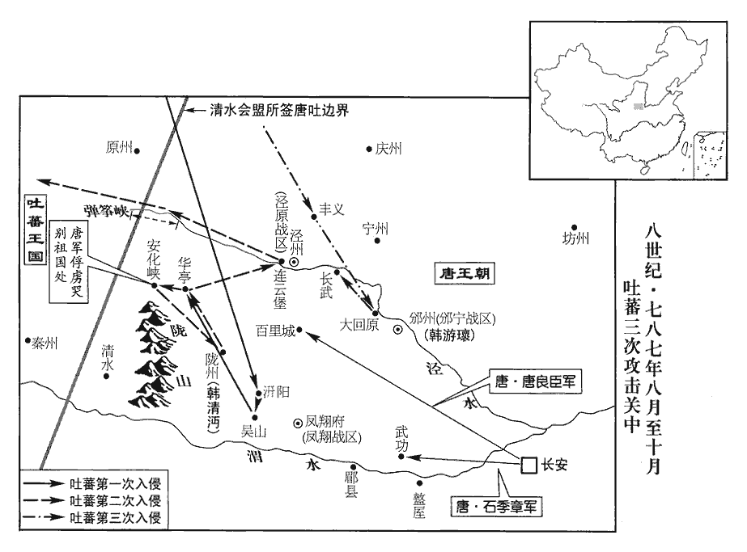
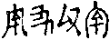
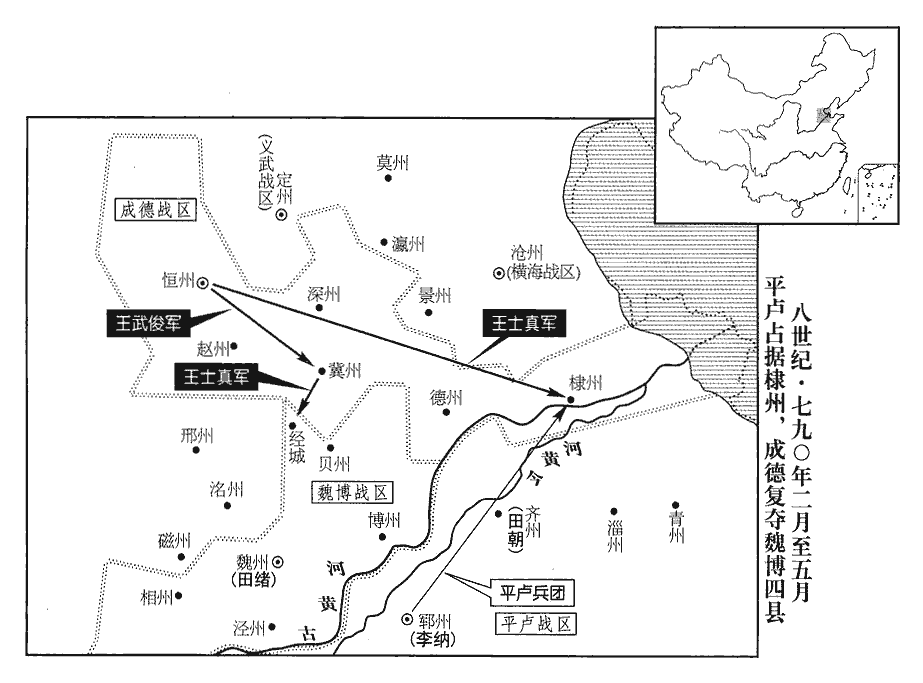

 唐紀四十九起強圉單閼（丁卯）八月，盡重光協洽（辛未），凡四年有奇。

# 德宗神武聖文皇帝八

## 貞元三年（丁卯、七八七）

1八月，辛巳朔‹一›，日有食之。

〖译文〗 [1]八月，辛巳朔（初一），出现日食。

2吐蕃尚結贊遣五騎送崔漢衡歸，吐，從暾入聲。漢衡為吐蕃所擒見上卷是年五月。騎，奇寄翻。且上表求和；至潘原，李觀語之以「有詔不納吐蕃使者」，上，時掌翻。觀，古玩翻。語，牛倨翻。使，疏吏翻。受其表而卻其人。

〖译文〗 [2]吐蕃尚结赞派遣骑兵五人护送崔汉衡回国，并且上表请求和好。到达潘原时，李观对他们讲“圣上颁诏命令不许接待吐蕃使者”，接受了他们的表章，但拒绝接待他们这一行人。

3初，兵部侍郎、同平章事柳渾與張延賞俱為相，渾議事數異同，相，息亮翻。數，所角翻。延賞使所親謂曰：「相公舊德，但節言於廟堂，則重位可久。」渾曰：「為吾謝張公，為，于偽翻。柳渾頭可斷，斷，音短。舌不可禁！」禁，居吟翻。由是交惡。上好文雅醞藉，好，呼到翻。醞，紆運翻。藉，慈夜翻。史炤曰：醞藉，有雅度之稱。余謂炤說非也。記禮器云：禮有擯詔，樂有相步，溫之至也。鄭氏註云：皆為溫藉重禮也。皇氏云：溫，謂丞藉。凡玉以物縕裏丞藉，君子亦以威儀擯相以自丞藉。溫，與縕同。而渾質直輕侻，無威儀，侻tuó，他活翻。於上前時發俚語。上不悅，欲黜為王府長史，李泌言：「渾褊biǎn直無他。俚，音里。長，知丈翻。褊，補典翻。故事，罷相無為長史者。」又欲以為王傅，泌請以為常侍，上曰：「苟得罷之，無不可者。」於此可以見帝之親任泌。泌，薄必翻。己丑‹九›，渾罷為左散騎常侍。散，悉亶翻。

〖译文〗 [3]当初，兵部侍郎、同平章事柳浑与张延赏一起出任宰相，柳浑在计议事情时，屡次与张延赏发生意见分歧。张延赏让亲近的人对柳浑说：“相公是有德望的老臣，只要在朝堂上少说话，宰相这一重要的职位便可保长久了。”柳浑说：“你替我向张公道歉吧，我柳浑的头可以被砍下，舌头讲话却是不能够禁止的！”自此以后，两人便结仇了。德宗喜欢斯文儒雅，不露锋芒，但柳浑朴实而正直，轻率而简易，不讲究庄严的举止，在德宗面前时常还说方言俗语，德宗心中不快，打算将他贬黜为王府长史。李泌说：“柳浑气量较小，但是心地正直，没有二心。依照旧日制度，宰相被罢免后，没有担任长史的。”德宗又打算任命他为诸王的师傅，李泌请求任命他为常侍，德宗说：“只要能罢免他的相职，无论任命他什么官职都是可以的。”己初（初九），柳浑被罢黜为左散骑常侍。

4初，郜國大長公主適駙馬都尉蕭升；升，復之從兄弟也。郜，音告。長，知兩翻。從，才用翻。公主不謹，詹事李昇、蜀州‹四川省崇州市›別駕蕭鼎、武后垂拱二年，分益州置蜀州、漢州。彭州‹四川省彭州市›司馬李萬、豐陽‹陕西省山阳县›令韋恪，豐陽縣，屬商州，漢商縣地，晉分商縣置豐陽縣，以川為名。舊治吉川城，麟德元年移治豐陽川。皆出入主第。主女為太子妃，始者上恩禮甚厚，主常直乘肩輿抵東宮；宗戚皆疾之。或告主淫亂，且為厭禱。厭，於琰翻，又一叶翻。上大怒，幽主於禁中，切責太子‹李诵›；太子不知所對，請與蕭妃離婚。

〖译文〗 [4]当初，郜国大长公主嫁驸马都尉萧升。萧升是萧复的堂兄弟。公主的行为不够检点，詹事李升、蜀州别驾萧鼎、彭州司马李万、丰阳县令韦恪，都出入公主的府第。公主的女儿作了太子的妃子，开始时，德宗对公主所施的恩典与礼数甚是优厚，公主经常直接乘着肩舆到太子的东宫去，宗室亲戚都嫉妒她。有人告发公主行为放荡淫秽，而且为太子作过以诅咒制胜的祈祷。德宗大怒，将公主拘禁在宫中，严辞斥责太子。太子不知道如何回答是好，便请求与萧妃离婚。

上召李泌告之，且曰：「舒王‹李谊李谟›近已長立，長，知兩翻。孝友溫仁。」泌曰：「何至於是！陛下惟有一子，考異曰：按德宗十一子，誼、謜yuán其所生外，猶有九子。而泌云惟有一子者，蓋當是時小王或未生，誼、謜之外尚有昭靖子也。柰何一旦疑之，欲廢之而立姪，得無失計乎！」上勃然怒曰：「卿何得間人父子！間，古莧翻。誰語卿，舒王為姪者？」對曰：「陛下自言之。大曆初，陛下語臣，語，牛倨翻。『今日得數子』。臣請其故，陛下言『昭靖‹李邈›諸子，主上‹李豫李俶›令吾子之。』昭靖太子，上弟邈也。今陛下所生之子猶疑之，何有於姪！當此之時，微李泌，孰能言及此者。舒王雖孝，自今陛下宜努力，勿復望其孝矣！」因父子天性，推而言及人情利害極處以感動之。復，扶又翻。上曰：「卿不愛家族乎？」對曰：「臣惟愛家族，故不敢不盡言。若畏陛下盛怒而為曲從，陛下明日悔之，必尤臣云：『吾獨任汝為相，不力諫，使至此；必復殺而子。』而，汝也。臣老矣，餘年不足惜，若冤殺臣子，使臣以姪為嗣，臣未知得歆xīn其祀乎！」因嗚咽流涕。又以自家真情感動之。上亦泣曰：「事已如此，使朕如何而可？」對曰：「此大事，願陛下審圖之。臣始謂陛下聖德，當使海外蠻夷皆戴之如父母，豈謂自有子而疑之至此乎！臣今盡言，不敢避忌諱。自古父子相疑未有不亡國覆家者。陛下記昔在彭原‹甘肃省宁县›。建寧‹李倓›何故而誅？」上曰：「建寧叔實冤，肅宗‹李亨›性急，譖之者深耳！」建寧王倓tán，德宗之叔也。倓冤死事見二百一十九卷肅宗至德元載。泌曰：「臣昔以建寧之故，固辭官爵，誓不近天子左右；近，其靳翻。不幸今日復為陛下相，又覩茲事。復，扶又翻。相，息亮翻。臣在彭原，承恩無比，竟不敢言建寧之冤，及臨辭乃言之，肅宗‹李亨›亦悔而泣。事見二百二十卷至德二載。先帝自建寧之死，常懷危懼，臣亦為先帝誦黃臺瓜辭以防讒構之端。」事見同上。為，于偽翻。上曰：「朕固知之。」意色稍解，乃曰：「貞觀‹李世民›、開元‹李隆基›皆易太子，何故不亡？」對曰：「臣方欲言之。昔承乾屢嘗監國，監，古銜翻。託附者眾，東宮甲士甚多，與宰相侯君集謀反，事覺，太宗使其舅長孫無忌與朝臣數十人鞫之，事狀顯白，然後集百官而議之。當時言者猶云：『願陛下不失為慈父，使太子得終天年。』太宗從之，并廢魏王泰。事見一百九十有七卷貞觀十七年。陛下既知肅宗性急，以建寧為冤，臣不勝慶幸。勝，音升。願陛下戒覆車之失，從容三日，從，千容翻。究其端緒而思之，陛下必釋然知太子‹李诵›之無他矣。若果有其迹，當召大臣知義理者二十人與臣鞫其左右，必有實狀，願陛下如貞觀‹李世民›之法行之，并廢舒王而立皇孫，則百代之後，有天下者猶陛下子孫也。至於開元之末，武惠妃譖太子瑛兄弟殺之，海內冤憤，事見二百一十四卷玄宗開元二十五年。此乃百代所當戒，又可法乎！且陛下昔嘗令太子見臣於蓬萊池，大明宮中蓬萊殿北有太液池，池中有蓬萊山，所謂蓬萊池，蓋即此也。觀其容表，非有蠭目豺聲商臣之相也，左傳：楚成王‹恽›將立太子商臣，令尹子上曰：「不可，是人也，蠭目而豺聲，忍人也。」不聽，卒立之。商臣後果以宮甲圍成王而殺之。正恐失於柔仁耳。又，太子自貞元以來常居少陽院，大明宮中有少陽院，在浴堂殿之東，溫室殿西南。少，詩照翻。在寢殿之側，德宗常居浴堂殿。未嘗接外人，預外事，安有異謀乎！彼譖人者巧詐百端，雖有手書如晉愍懷，事見八十三卷西晉惠帝元康九年。衷甲如太子瑛，開元二十五年，楊洄復構太子瑛、鄂王瑤、光王琚與妃兄薛鏽有異謀。武惠妃使人詭召太子。二王曰：「宮中有賊，請甲以入。」太子從之。妃白帝曰：「太子、二王謀反，甲而來！」帝使中人視之，如言。遂並廢為庶人。猶未可信，況但以妻母有罪為累乎！累，良瑞翻；下累汝同。幸陛下語臣，語。牛倨翻。臣敢以家族保太子必不知謀。曏使楊素、許敬宗、李林甫之徒承此旨，已就舒王圖定策之功矣！」上曰：「此朕家事，何豫於卿，而力爭如此？」對曰：「天子以四海為家。臣今獨任宰相之重，四海之內，一物失所，責歸於臣。況坐視太子冤橫而不言，橫，戶孟翻。臣罪大矣！」上曰：「為卿遷延至明日思之。」為，于偽翻。泌抽笏叩頭而泣曰：「如此，臣知陛下父子慈孝如初矣！然陛下還宮，當自審思，勿露此意於左右；露之，則彼皆欲樹功於舒王，太子危矣！」上曰：「具曉卿意。」泌歸。謂子弟曰：「吾本不樂富貴，而命與願違，今累汝曹矣。」樂，音洛。累，力瑞翻。

〖译文〗 德宗传召李泌，将此事告诉了他，而且说：“近来舒王已经成年，可以册立，他性情是孝敬友爱，温和仁厚的。”李泌说：“哪至于这样做呢！陛下只有一个儿子，怎么能够一时对他有了疑心，便打算将他废掉，而去册立侄子，这不是失策吗！”德宗勃然大怒，说：“你怎么能够离间人家的父子关系！谁告诉你舒王是我的侄子？”李泌回答说：“陛下自己讲的。那是在大历初年，陛下告诉我：‘今天我得到好几个儿子。’我问其中的原故，陛下说‘皇上让我将昭靖太子的几个儿子认作我的儿子。’如今陛下对自己亲生的儿子尚且起疑心，对侄子又会怎样！虽然舒王是孝敬陛下的，但若将他立为太子，从今以后，陛下最好还是勉力而为吧，不要再指望他的孝敬了！”德宗说：“你不爱护自己的家族吗？”李泌回答说：“正因为我爱护自己的家族，所以才不敢不把话说尽。如果我怕将陛下惹怒，便委曲从命，以后陛下后悔了，必定责怪我说：‘我专门任命你担任宰相，你却不能极力劝谏，使我落到这般地步，我一定要也把你的儿子杀掉。’我老了，晚年的岁月没有什么可顾惜的，如果陛下冤枉地杀掉我的儿子，使我将侄子立为后嗣，我真不知道将来是否能享受他的祭祀哩！”于是他鸣鸣咽咽地流下了眼泪，德宗也哭泣着说：“事情已经闹成这个样子，让朕怎么办才好呢？”李泌回答说：“这是一件大事，希望陛下审慎地设法应付吧。我最初以为陛下圣明仁德，会使大唐以外的蛮夷之人都尊奉陛下有如自己的父母，哪想到陛下连自己的儿子都怀疑到这般地步了呢！如今我已把话说尽了，不敢避开陛下忌讳的事。自古以来，父子相互猜疑，没有不使国家灭亡、家族倾覆的。陛下还记得以前在彭原时，建宁王是什么原因被诛杀的吗？”德宗说：“建宁王叔叔实际是冤枉的，肃宗性子急躁，而诬陷他的人们又深于计虑罢了。”李泌说：“过去，由于建宁王的原故，我坚决辞去了官职爵位，发誓不再靠近天子的身边，不幸的是今天又当了陛下的宰相，又目睹了这种事情。我在彭原时，承蒙肃宗皇帝无可比拟的恩典，但终究不敢说出建宁王是冤屈的，直到临辞行时，我才说了出来，肃宗也后悔地哭了。自从建宁王去世后，先帝常常心怀畏惧，我也曾经给先帝诵读《黄台瓜辞》，以防备谗言构陷的苗头。”德宗说：“联本来知道这些事情。”他的态度和脸色稍微缓和了一些，于是说：“贞观、开元年间都曾改立太子，为什么没有亡国之祸呢？”李泌回答说：“我正想谈这个问题。过去李承乾曾经屡次在皇上外出时代行处理国政，依托归附他的人很多，他居住的东宫所拥有的士兵又特别多。他与宰相侯君集图谋造反，事情被发觉后，太宗让他的舅舅长孙无忌与大臣几十人审讯他，将事情的原委都查问得一清二楚，然后太宗才召集百官来评议此事，当时的进言人尚且说：‘希望陛下不要失去作为慈父的本色，让太子能够活完他自然的寿命吧。’太宗听从了这一建议，便将他连同魏王李泰一齐废黜了。既然陛下知道肃宗性情急躁，认为建宁王是冤枉的，我真是万分庆幸。希望陛下能够将失败的教训引以为警戒，安闲地过上三天，推究此事的头绪，并将它们思考清楚，陛下一定会毫无疑虑地认定太子是没有二心的了。如果确有迹象，应当召集通晓义理的大臣二十人与我去审讯他的亲信，假如确有实在的情状，希望陛下实行贞观年间采用的办法，连同舒王一起废置而册立皇孙，那么，在百世以后，君临天下的人仍然是陛下的子孙后代啊。至于开元末年，武惠妃诬陷太子李瑛兄弟，杀了他们，全国的人都为他们的冤屈感到怨愤，这正是连百世以下都应当引以为教训的，难道还可以效法吗！而且，陛下过去曾经让太子在蓬莱池见过我，我看他的仪容外表，没有楚成王太子商臣那种蜂眼突出、声似豺狼的凶悍状貌，让我担心的正是太子会失之优柔仁厚哩。再者，自从贞元年间以来，太子经常住在少阳院，就在陛下下榻的宫殿旁边。他不曾接触外人，参予外界的事情，哪里会有作乱的图谋呢！那些蓄意诬陷的人机巧奸诈，手段变化多端，即使象西晋愍怀太子有亲手所写的反书，象开元年间太子李瑛有身披铠甲入宫的行动，尚且不可信是要谋反，何况太子仅仅是因为岳母犯了罪过而遭受连累的呢！幸亏陛下对我说了，我敢用我的家族来担保太子肯定不知道有此类策谋。假如让杨素、许敬宗、李林甫一类人逢迎陛下改立的意旨，他们现在已经到舒王那里图谋拥立新太子的功劳去了！”德宗说：“这是朕的家事，与你有什么关系，而你为什么这样极力谏诤呢？”李泌回答说：“天子以四海为家。如今我独力支承着宰相的重任，在四海之内，有一件事情处理失当，都是我没有尽到责任。何况眼巴巴地看着太子遭到冤屈而不发言，我的罪过就太大了！”德宗说：“朕为你推迟到明天考虑此事。”李泌抽出朝笏，向德宗叩头，还哭泣着说：“这样做，我知道陛下父慈子孝一如既往了！然而，陛下回宫后，应当自己审慎地考虑，别把这一意图透露给周围的人。如果透露出去，那些人都想为舒王建树功勋，太子便危险了！”德宗说：“朕完全明白你的意思。”李泌回家后，对子弟说：“我本来并不愿意享受富贵，但是命运与心愿背道而驰，现在连累你们了。”

太子‹李诵›遣人謝泌曰：「若必不可救，欲先自仰藥，何如？」言欲飲藥而死也。泌曰：「必無此慮。願太子起敬起孝。起敬起孝，禮記之言。苟泌身不存，則事不可知耳。」

〖译文〗 太子派人向李泌致谢说：“如果事情肯定不可挽回，我打算事先吞服毒药，你看怎么样呢？”李泌说：“肯定不必为此挂虑。希望太子奉行孝敬之道。如果我不在了，那倒是不知道事情会是什么样子了。”

間一日，按經典釋文：間，音間廁之間。上開延英殿獨召泌，宋白曰：唐制：內中有公事商量，即降宣頭付閤門開延英，閤門翻宣申中書，并牓正衙門。如中書有公事敷奏，即宰臣入牓子，奏請開延英，只是宰臣赴對。流涕闌干，泣涕縱橫為闌干。一曰：闌干，淚不斷貌。撫其背曰：「非卿切言，朕今日悔無及矣！皆如卿言，太子仁孝，實無他也。自今軍國及朕家事，皆當謀於卿矣。」泌拜賀，因曰：「陛下聖明，察太子無罪，臣報國畢矣。臣前日驚悸亡魂，悸，其季翻，心動也。不可復用，復，扶又翻。願乞骸骨。」上曰：「朕父子賴卿得全，方屬子孫，屬，之欲翻。使卿代代富貴以報德，何為出此言乎！」甲午‹十四›，詔李萬不知避宗，宜杖死。左傳：齊盧蒲癸臣於慶舍，有寵，妻之以女。慶舍之士謂盧蒲癸曰：「男女辨姓，子不避宗，何也？」癸曰：「宗不余避，余獨安避之\!」李昇等及公主五子，皆流嶺南‹南岭以南›及遠州。

〖译文〗 隔了一天，德宗单独传召李泌来延英殿议事。德宗泪水纵横地哭着，抚摩着李泌脊背说：“若不是你极力进言，如今朕后悔也来不及了，一切都象你说的那样，太子仁厚孝敬，确实没有二心。从现在起，军务、国政以及朕的家事，朕都与你商量。”李泌跪拜道贺，趁机说：“陛下神圣英明，明察太子无罪，我报效国家就到此为止了。前天，我心跳加快，魂不守舍，不能再办理政务了。希望准许我退职。”德宗说：“朕父子依仗着你的帮助才得以保全，朕正要把子孙后代嘱托给你，使你世世代代得享富贵，以报答你的恩德，你怎么说出这样的话来了呢！”甲午（十四日），德宗颁诏说李万不晓得回避同宗，应该受杖刑而死。李升等人及公主的五个儿子，一概流放到岭南或边远的州去。

5戊申‹二十八›，吐蕃帥羌‹甘肃省南部及青海省东部›、渾‹吐谷浑，青海省›之眾寇隴州‹陕西省陇县›，連營數十里，京城震恐。帥，讀曰率。九月，乙卯‹五›，遣神策將石季章戍武功‹陕西省武功县西›，決勝軍使唐良臣戍百里城‹甘肃省灵台县西›。丁巳‹七›，吐蕃大掠汧陽‹陕西省千阳县›、吳山‹陕西省宝鸡县西北›、華亭‹甘肃省华亭县›，吳山縣，屬隴州，隋之長蛇縣地，唐貞觀元年更名，以縣有吳山也。史炤曰：華亭，本屬安定郡，後屬隴州，垂拱二年更名曰亭川，元和三年省入汧源。汧，口堅翻。老弱者殺之，或斷手鑿目，棄之而去；斷，音短。驅丁壯萬餘悉送安化峽‹甘肃省清水县东›西，安化峽，當在秦州清水縣界。九域志：平涼西南七十里有安化縣。又隴州汧陽縣有安化鎮。將分隸羌、渾，乃告之曰：「聽爾東向哭辭鄉國！」眾大哭，赴崖谷死傷者千餘人。未幾，幾，居豈翻。吐蕃之眾復至，圍隴州，復，扶又翻。刺史韓清沔與神策副將蘇太平夜出兵擊卻之。沔，彌兗翻。

〖译文〗 [5]戊申（二十八日），吐蕃率领羌族、浑族的人马侵犯陇州，营地连绵几十里地，京城震惊恐惧。九月，丁卯（十七日），朝延派遣神策军将领石季章戍守武功，派遣决胜军使唐良臣戍守里城。丁已（七日），吐蕃大规模地掳掠阳、吴山、华亭，杀戮年老体弱的人，有的砍断手臂，有的挖去眼睛，然后将他们抛弃。吐蕃军将成年壮丁一万多人全部驱赶到安化峡的西面，把他们分别归属于羌族和浑族，还告诉他们说：“准许你们向着东方哭泣，告别故乡！”大家放声哭号，从山崖跳下深谷而死亡和受伤的有一千多人。没过多久，吐蕃众军再次前来，包围陇州，陇州刺史韩清沔与神策副将苏太平在夜间派出兵马击退了他们。

6上謂李泌曰：「每歲諸道貢獻，共直錢五十萬緡，今歲僅得三十萬緡。泌，薄必翻。緡，眉巾翻。言此誠知失體，然宮中用度殊不足。」泌曰：「古者天子不私求財，春秋左傳之言。今請歲供宮中錢百萬緡，願陛下不受諸道貢獻及罷宣索。遣中使以聖旨就有司宣取財物，謂之宣索。索，山客翻。必有所須，請降敕折稅，折，之舌翻。不使姦吏因緣誅剝。」上從之。

〖译文〗 [6]德宗对李泌说：“每年各道进贡的物品共计值钱五十万缗，今年只得到三十万缗。谈论此事，朕本来也知道有失体统，但是宫中的费用实在不够。”李泌说：“古时候，天子不私自谋求钱财，如今请让我每年供给宫中钱一百万缗，希望陛下不要接受各道进贡的物品，并停止颁旨向各地索取财货。如果一定需要什么东西，请陛下下达敕令，将所需物品折合成税钱，防止奸邪的吏人借机搜刮钱财。”德宗听从了这一建议。

 

7回紇合骨咄祿可汗‹药罗葛顿莫贺›屢求和親，且請昏；上未之許。會邊將告乏馬，無以給之，紇，下沒翻。咄，當沒翻。可，從刊入聲。汗，戶汗翻。將，即亮翻。李泌言於上曰：「陛下誠用臣策，數年之後，馬賤於今十倍矣！」上曰：「何故？」對曰：「願陛下推至公之心，屈己徇人，為社稷大計，臣乃敢言。」上曰：「卿何自疑若是！」對曰：「臣願陛下北和回紇，南通雲南‹云南省›，西結大食‹叙利亚大马士革城›、天竺‹印度半岛›，如此，則吐蕃自困，馬亦易致矣。」吐，從暾入聲。易，弋豉翻。上曰：「三國當如卿言，至於回紇則不可！」以陝州之辱，恨回紇也。泌曰：「臣固知陛下如此，所以不敢早言。見上卷是年七月。為今之計，當以回紇為先，三國差緩耳。」三國，謂雲南、大食、天竺。上曰：「唯回紇卿勿言。」泌曰：「臣備位宰相，事有可否在陛下，何至不許臣言！」相，息亮翻。上曰：「朕於卿言皆聽之矣，至於【章：乙十六行本「於」下有「和」字；乙十一行本同；孔本同；張校同。】回紇，宜待子孫；於朕之時，則固不可！」泌曰：「豈非以陝州‹河南省三门峡市›之恥邪！」上曰：「然。韋少華等以朕之故受辱而死，事見二百二十二卷寶應元年。陝，失冉翻。邪，音耶。少，始照翻。朕豈能忘之！屬國家多難，屬，之欲翻。難，乃旦翻。未暇報之，和則決不可。卿勿更言！」泌曰：「害少華者乃牟羽可汗，陛下即位，舉兵入寇，未出其境，今合骨咄祿可汗殺之。然則今可汗乃有功於陛下，宜受封賞，又何怨邪！其後張光晟殺突董等九百餘人，殺牟羽、殺突董事並見二百二十六卷建中元年。合骨咄祿竟不敢殺朝廷使者，見二百二十七卷建中三年。然則合骨咄祿固無罪矣。」上曰：「卿以和回紇為是，則朕固非邪？」對曰：「臣為社稷而言，為，于偽翻。若苟合取容，何以見肅宗、代宗於天上！」凡人言死，則曰見某人於地下。人主之前，尊君之祖、父，則曰見於天上，言其神靈在天，死則將得見之。上曰：「容朕徐思之。」自是泌凡十五餘對，未嘗不論回紇事，上終不許。泌曰：「陛下既不許回紇和親，願賜臣骸骨。」上曰：「朕非拒諫，但欲與卿較理耳，何至遽欲去朕邪！」對曰：「陛下許臣言理，此固天下之福也。」上曰：「朕不惜屈己與之和，但不能負少華輩。」對曰：「以臣觀之，少華輩負陛下，非陛下負之也。」上曰：「何故？」對曰：「昔回紇葉護將兵助討安慶緒，肅宗但令臣宴勞之於元帥府，先帝‹李豫›未嘗見也。勞，力到翻。討安慶緒之時，代宗以廣平王為元帥。葉護固邀臣至其營，肅宗猶不許。及大軍將發，先帝始與相見。所以然者，彼戎狄豺狼也，舉兵入中國之腹，不得不過為之防也。陛下在陝，富於春秋‹当年李适二十一岁›，少華輩不能深慮，以萬乘天子徑造其營，造，七到翻。又不先與之議相見之儀，使彼得肆其桀驁，驁，五告翻。豈非少華輩負陛下邪？死不足償責矣。且香積‹香积寺，陕西省长安县南›之捷，葉護欲引兵入長安，先帝親拜之於馬前以止之，葉護遂不敢入城。事見二百二十卷肅宗至德二載。當時觀者十萬餘人，皆歎息曰：『廣平王‹李豫›真華、夷主也！』然則先帝所屈者少，所伸者多矣。葉護乃牟羽之叔父也。牟羽身為可汗，舉全國之兵赴中原之難，難，乃旦翻。故其志氣驕矜，敢責禮於陛下；陛下天資神武，不為之屈。當是之時，臣不敢言其他，若可汗留陛下於營中，歡飲十日，天下豈得不寒心哉！不敢察察言，故云爾。而天威所臨，豺狼馴擾，馴，從也，善也。擾者，順也。可汗母捧陛下於貂裘，叱退左右，親送陛下乘馬而歸。陛下以香積之事觀之，則屈己為是乎？不屈為是乎？陛下屈於牟羽乎？牟羽屈於陛下乎？」上謂李晟、馬燧曰：「故舊不宜相逢。朕素怨回紇，今聞泌言香積之事，朕自覺少理。此多少之少，音詩紹翻。卿二人以為何如？」對曰：「果如泌所言，則回紇似可恕。」上曰：「卿二人復不與朕，復，扶又翻。朕當柰何！」泌曰：「臣以為回紇不足怨，曏來宰相乃可怨耳。今回紇可汗殺牟羽，其國人有再復京城之勳，回紇，至德二載與代宗復兩京，寶應元年又與帝復東京，是有再復京城之勳。夫何罪乎！吐蕃幸國之災，陷河‹河西，甘肃省›、隴‹陇右，青海省东部›數千里之地，又引兵入京城，使先帝蒙塵於陝，見二百二十三卷代宗廣德元年。此乃【章：乙十六行本「乃」下有「百代」二字；乙十一行本同；孔本同；張校同；退齋校同。】必報之讎，況其贊普【章：乙十六行本「普」下有「至今」二字；乙十一行本同；孔本同；張校同。】尚存，言牟羽已死，則回紇為可恕；贊普尚存，則國讎當必復。宰相不為陛下別白言此，為，于偽翻。別，彼列翻。乃欲和吐蕃以攻回紇，此為可怨耳。」上曰：「朕與之為怨已久，又聞吐蕃劫盟，今往與之和，得無復拒我，為夷狄之笑乎？」復，扶又翻。對曰：「不然。臣曩在彭原‹甘肃省宁县›，今可汗為胡祿都督，與今國相白婆帝皆從葉護而來，臣待之頗親厚，故聞臣為相而求和，安有復相拒乎！臣今請以書與之約：稱臣，為陛下子，每使來不過二百人，印馬不過千匹，唐六典：有諸監馬印。凡諸監馬駒，以小官字印印左膊，以年辰印印右髀bì，以監名依左、右廂印印尾側。若形容端正，擬送尚乘者，則不須印監名。至三歲起，脊量強弱漸以飛字印印右膊。細馬、次馬俱以龍形印印項左。送尚乘者，於尾側依左、右閑印以三花。其餘雜馬上乘者，以風字印印左膊，以飛字印印右髀。經印之後，簡入別所者，各以新入處監名印印左頰。官馬賜人者，以賜字印配諸軍，及充傳送驛者，以出字印並印右頰。諸蕃馬印隨部落各為印識。回紇馬印。此所謂印馬者，回紇以馬來與中國為互市，中國以印印之也。無得攜中國人及商胡出塞。五者皆能如約，則主上必許和親。如此，威加北荒，旁讋zhé吐蕃，讋，之涉翻。足以快陛下平昔之心矣。」上曰：「自至德以來，與為兄弟之國，今一旦欲臣之，彼安肯和乎？」對曰：「彼思與中國和親久矣，其可汗、國相素信臣言，若其未諧，但應再發一書耳。」上從之。

〖译文〗 [7]回纥合骨咄禄可汗屡次谋求通好，而且请求通婚，德宗没有应允。适逢边疆的将领报告缺少马匹，朝廷拨不出马匹来供给他们，李泌便对德宗说：“陛下果真能够采用我的策略，几年以后，马匹的价格便只是现在的十分之一了！”德宗说：“这是怎么回事呢？”李泌回答说：“希望陛下能够用极为公正的态度对待此事，委屈自己，顺从别人，为国家的重大谋略着想，我才敢说出来。”德宗说：“你怎么如此疑虑！”李泌回答说：“我希望陛下在北面与回纥和好，在南面与云南交往，在西面与大食和天竺结交。如果能够做到这些，吐蕃便会自然困难起来，马匹也容易得到了。”德宗说：“对于云南、大食、天竺三国，就按你说的办吧，至于回纥，那是不行的！”李泌说：“我本来就知道陛下是持此态度的，所以不敢及早说出来。为当前考虑，应当将回纥排在首位，其余三国还可以略微往后排些哩。”德宗说：“只有回纥你不要谈。”李泌说：“我占着宰相的职位，裁定事情的可行与不可行，取决于陛下，但是哪至于不允许我讲话呢！”德宗说：“对于你所说的话，朕完全听从了。至于回纥，最好等待朕的子孙去解决。在朕在位时期，那是肯定不行！”李泌说：“莫不是由于陛下在陕州受到的耻辱吧！”德宗说：“是啊。韦少华等人由于朕的原故蒙受羞辱而死，朕怎么会忘记那些事情！那时适值国家多难，没有余暇来报复他们，至于通好，那是断然不行的。你不用再说了！”李泌说：“残害韦少华的是牟羽可汗。陛下即位后，他发兵前来侵犯，还没有走出国境，现在的合骨咄禄可汗便将他杀了。这样说来，现在的可汗对陛下是有功劳的，应当受到封拜赏赐，又哪里有什么怨恨呢！此后，张光晟杀了突董等九百多人，合骨咄禄还是不敢诛杀朝廷的使者，这样说来，合骨咄禄当然是没有罪过的了。”德宗说：“你认为与回纥和好是对的，那朕当然是不对的了？”李泌回答说：“我是为国家讲这番话的。倘若我去迎合陛下，以求容身，让我怎么到天上去见肃宗和代宗呢！”德宗说：“让我慢慢想一想吧。”自此以后，李泌大约奏对了十五次以上，没有一次不谈论有关回纥的事情，但德宗始终不肯答应下来。李泌说：“既然陛下不肯答应与回纥和好，希望准许我退职。”德宗说：“不是朕不接受规劝，只是朕想与你比较其中道理罢了，你怎么至于马上就要离开朕呢！”李泌回答说：“陛下允许我讲清道理，这当然是国家的福气啊。”德宗说：“朕并不顾惜委屈自己去与回纥和好，但朕不能够辜负了韦少华这些人。”李泌回答说：“在我看来，是韦少华这些人辜负了陛下，而不是陛下辜负了他们啊。”德宗说：“为什么这样说呢？”李泌回答说：“过去，回纥叶护领兵帮助朝廷讨伐安庆绪时，肃宗仅仅让我在元帅府设宴慰劳他们，先帝并不曾接见他们。就是叶护坚持邀请我到他的营垒去，肃宗仍然不肯答应。及至大批的军队将要出发时，先帝才与他们见面。这样做的原因在于，回纥是戎狄，豺狼成性，他们发兵进入中原腹地，我们不能不特别小心防备他们。陛下在陕州时，还很年轻，韦少华这些人不能周密计虑，引着万乘之主的长子径直前往回纥营垒，而且事先没有与回纥议定相见的礼仪，致使他们得以肆意凶暴，这难道不是韦少华这些人辜负了陛下吗？就是他们死了，也是不能够偿清罪责的。而且，香积寺获胜时，叶护准备领兵开进长安，先帝亲自在他马前施礼来制止他，于是叶护便不敢开进长安城了。当时，看到这一情景的有十万多人，他们都叹息着说：‘广平王真是华夏与蛮夷的共主啊！’这样说来，先帝对人屈尊时较少，而向人伸展抱负时却较多。叶护便是牟羽的叔父。牟羽身为可汗，率领着全国兵马奔赴中原的祸难，所以他的心志与气度是傲慢自负的，是敢于向陛下要求礼遇的，而陛下天赋的资质是神明威武的，并没有被他所屈服。在那个时刻，我不敢说别的，若是牟羽可汗将陛下留在营中，欢饮十天酒，天下百姓难道能不感到痛心吗？然而，陛下如天的威严所到之处，连豺狼也驯顺起来了，可汗的母亲向陛下双手献上貂皮衣服，喝退周围的人，并亲自送陛下乘马而归。陛下以香积寺的事情来看，说成委屈了陛下是对的呢，还是说成没有委屈陛下是对的呢？这是陛下向牟羽屈服了呢，还是牟羽向陛下屈服了呢？”德宗对李晟和马燧说：“故人最好别再见面。朕素来怨恨回纥，现在听李泌说了香积寺的事情，朕觉着自己少理，你们二人有什么看法？”二人回答说：“果真象李泌讲的那样，回纥似乎可以宽恕。”德宗说：“你们二人也不赞成朕的做法，朕应当怎么去做呢？”李泌说：“我认为没有足够的理由去怨恨回纥，近年以来的宰相才是应当怨恨的。如今回纥可汗诛杀了牟羽，而回纥人又立下两次收复京城的功勋，有什么罪过呢！而吐蕃庆幸我国发生灾祸，攻陷了河陇地区几千里地，还领兵进入京城，致使先帝流亡陕州，这才是一定要报的仇怨，何况当时的赞普尚且在位呢！宰相不向陛下将这件事情分辨明白，就准备与吐蕃和好，以便进攻回纥，这才是应当怨恨的啊。”德宗说：“朕与回纥结下的怨仇为时已久，他们又听说吐蕃在会盟时作乱，现在前往与他们通和，不是要再次拒绝我们，惹来夷狄之人的耻笑吗！”李泌回答说：“不是这样。往日我在彭原时，现在的可汗当时担任胡禄都督，他与现在的国相白婆帝一起跟随叶护前来，我接待他们，颇为亲善优厚，所以，他们听说我出任宰相，便向我们请求和好，怎么会再次拒绝我们呢！现在请让我写一封书信与他们约定，让可汗称臣，做陛下的儿子，每次前来的使者，随员不能超过二百人，互市的马匹不能超过一千匹，不允许携带汉人以及胡族商人到塞外去。如果回纥能够遵守五条约定，那么，陛下就一定要答应与他们和好。这样，陛下的声威可以延展到北部荒远的地方，从侧面震慑吐蕃，这也足以使陛下平素的志向为之一快。”德宗说：“自从至德年间以来，我们与回纥两国结成兄弟关系，现在一下子打算让他们做臣属，他们怎么肯和好呢？”李泌回答说：“他们想与大唐和好已经有很长时间了。他们的可汗、国相素来相信我的话，如果一封信还不能把事情处理妥善的话，只需要再发一封书信就可以了。”德宗听从了李泌的建议。

既而回紇可汗遣使上表稱兒及臣，凡泌所與約五事，一皆聽命。上大喜，謂泌曰：「回紇何畏服卿如此！」對曰：「此乃陛下威靈，臣何力焉！」上曰：「回紇則既和矣，所以招雲南、大食、天竺柰何？」對曰：「回紇和，則吐蕃已不敢輕犯塞矣。次招雲南，則是斷吐蕃之右臂也。斷，音短。雲南自漢以來臣屬中國，雲南，本漢之哀牢夷，後漢永平之間，始臣屬中國，其地在漢永昌郡界。楊國忠無故擾之使叛，臣于吐蕃，事見二百一十六卷玄宗天寶九載。苦於吐蕃賦役重，未嘗一日不思復為唐臣也。大食在西域為最強，自蔥嶺‹帕米尔高原›盡西海‹地中海›，地幾半天下，大食既并波斯，突騎施又亡，其地東盡蔥嶺，西南際海，方萬餘里。幾，居衣翻。與天竺皆慕中國，代與吐蕃為仇，臣故知其可招也。」

〖译文〗 不久，回纥可汗派遣使者上表自称儿臣，凡是李泌与他们约定的五件事情，全部听从命令。德宗非常高兴，他对李泌说：“怎么回纥这样畏惧并折服于你呢！”李泌回答说：“这是陛下的声威与福气所致，我有什么力量！”德宗说：“回纥已经通和了，又应当怎样招抚云南、大食和天竺呢？”李泌回答说：“与回纥和好了，吐蕃便已经不敢轻易侵犯边界了。接下来招抚云南，就是砍断吐蕃右边的臂膀。自汉朝以来，云南都是中国的臣属。杨国忠没缘由地搅扰他们，使他们背叛朝廷，臣服于吐蕃。他们被吐蕃的繁重赋役搅犹得困苦不堪，没有一天不想再做唐朝的臣属啊。大食在西域各国中最为强盛，由葱岭起，直抵西海边，地域几占天下的一半。大食与天竺都仰慕中国，而又世代与吐蕃结下怨仇，所以我知道他们是可以招抚的。”

癸亥‹十三›，遣回紇使者合闕將軍歸，許以咸安公主妻可汗‹药罗葛顿莫贺›，蓬州咸安郡。公主，上女也。妻，七細翻。考異曰：鄴侯家傳：九月，泌請與回紇和親。十月，與回紇書。十二月，回紇遣聿支達干上表謝恩，皆請如宰相約和親。按實錄：「八月丁酉，回紇遣默啜達干來貢方物，且請和親。九月癸亥，遣回紇使合闕將軍歸其國。初，合闕將其君命請昏，上許以咸安公主嫁之，命見于麟德殿，且令齎公主畫圖就示可汗，以馬價絹五萬還之，許互市而去。」十二月，無聿支入聘之事。回紇自大曆十一年以來，未嘗入寇，信使往來，亦無不和及求和之迹。蓋德宗心恨回紇，而外迹猶羈縻不絕。今回紇請昏，則拒絕不許，而李泌勸與為昏耳。其月數之差，則恐李繁記之不詳。或者聿支即默啜與合闕，皆不可知也，若以默啜即為請昏之使，合闕即為謝恩之人。又泌論回紇凡十五餘對，須半月以上。泌又云：「臣木夾中與書，令朝臣遞，云一月可到，歲內報至。」自丁酉至癸亥，纔二十六日耳。今依實錄月日。因許嫁咸安，本其事而言之。歸其馬價絹五萬疋。

〖译文〗 癸亥（十三日），德宗打发回纥使者合阙将军回国，答应将咸安公主嫁给可汗，还以绢五万匹偿还他们的马价。

8吐蕃寇華亭‹甘肃省华亭县›及連雲堡‹甘肃省泾川县西›，皆陷之。連雲堡，在涇州西界。宋祁曰：連雲堡，涇要地也，三垂峭絕，北據高所，虜進退，烽火易通。考異曰：鄴侯家傳曰：「時京西諸鎮報種麥已畢，絕萬頃而皆亘野；上大喜。既而尚結贊來入寇，諸軍閉壁；候夜，斫營，悉捷，結贊乃退歸。上以十餘年來，邊軍嘗被戎挫，皆入踐京畿，此來始敗，又不能更深入，且報種麥已畢而喜甚。」按實錄：「吐蕃陷華亭及連雲堡，驅掠邠、涇編戶牛畜萬計，悉送至彈箏峽。是秋，數州人無種麥者。」與家傳相反。今從實錄。甲戌‹二十四›，吐蕃驅二城之民數千人及邠、涇人畜萬計而去，置之彈箏峽‹甘肃省平凉市西北›西。涇州恃連雲為斥候，連雲既陷，西門不開，門外皆為虜境，樵采路絶。每收穫，必陳兵以扞之，多失時，得空穗而已。禾麥熟而不收穫，其實隕落，故得空穗。由是涇州常苦乏食。

〖译文〗 [8]吐蕃侵犯华亭以及连云堡，将两处都攻陷了。甲戌（二十四日），吐蕃人驱赶着华亭、连云堡二城的几千百姓和数以万计的州、泾州人和牲畜离去，将人和牲畜安置在弹筝峡的后面。泾州倚靠连云堡作为前哨，连云堡失陷后，西城大门难以开放，城门外都成了吐蕃的地盘，打柴的道路都被切断。每当收获时，必须布置军队来保卫庄稼，人们经常不能按时收获，仅得到无籽粒的禾穗罢了。自此以后，泾州常常因缺少粮食而困苦不堪。

9冬，十月，甲申‹四›，吐蕃寇豐義城‹甘肃省镇原县东›，武德二年，分彭原置豐義縣，屬寧州。宋白曰：彭陽縣，後魏於縣置雲州，周武保定二年，廢州為防，隋文帝廢防為豐義城，唐武德初分彭原縣為豐義縣，屬彭州，貞觀廢彭州，以縣屬寧州，其城即後魏雲州城。前鋒至大回原‹地望应在陕西省彬县西北›，邠寧節度使韓遊瓌擊卻之：乙酉‹五›，復寇長武城‹陕西省长武县西北›，復，扶又翻。又城故原州而屯之。

〖译文〗 [9]冬季，十月，甲申（初四），吐蕃侵犯丰义城，前锋来到大回原，宁节度使韩游击退了他们。乙酉（初五），吐蕃又去侵犯长武城，并修筑原州的故城，以屯驻兵马。

10妖僧李軟奴自言：「本皇族，見嶽、瀆神嶽，謂五嶽‹北岳恒山河北省曲阳县北›、南岳衡山湖南省衡山县西、东岳泰山山东省泰安市北、西岳华山陕西省华阴市南、中岳嵩山河南省登封市北。瀆，謂四瀆‹长江、黄河、淮河、济水今已并入黄河›。妖，於遙翻。命己為天子。」結殿前射生將韓欽緒等謀作亂。丙戌‹六›，其黨告之，上命捕送內侍省推之。推，鞫也。李晟聞之，遽仆於地曰：「晟族滅矣！」李泌問其故。晟曰：「晟新罹謗毀，事見上卷本年三月。中外家人千餘，若有一人在其黨中，則兄亦不能救矣。」泌乃密奏：「大獄一起，所連引必多，外間人情恟懼，請出付臺推。」付御史臺推鞫之也。上從之。欽緒，遊瓌之子也，亡抵邠州；遊瓌出屯長武城，留後械送京師。壬辰‹十二›，腰斬軟奴等八人，北軍之士坐死者八百餘人，而朝廷之臣無連及者。韓遊瓌委軍詣闕謝，上遣使止之，委任如初。遊瓌又械送欽緒二子；上亦宥之。

〖译文〗 [10]邪恶的僧人李软奴自称：“我本是皇族，现在五岳四渎的神灵命令我作天子。”他结交殿前射生将韩钦绪等人图谋发起变乱。丙戌（初六），他的同伙告发了他，德宗命令逮捕他，送交内侍省追究其事。李晟听到这个消息后，骤然仆倒在地上说：“我的家族要覆灭了！”李泌询问其中的原故，李晟说：“我新近才遭受了诽谤。在朝廷内外，我家族的人有一千多，倘若有一个人是他的同党，连你也不能挽救我了。”于是，李泌秘密上奏说：“大案一旦发生，牵连的人一定很多，外边人们的情绪震恐不安，请将此案由内侍省交付御史台审讯。”德宗同意了。韩钦绪是韩游儿子，他逃亡到州，正值韩游出兵屯驻长武城，留后给他上了枷锁，送往京城，壬辰（十二日），韩廷将李软奴等八人腰斩，北军将士犯罪至死的有八百多人。然而，朝廷中的臣僚没有受到牵连。韩游留下军队，自己前往朝廷谢罪，德宗派遣使者制止了他，对他的任用一如既往。韩游又将韩钦绪的两个儿子带上枷锁押送到朝廷来，德宗也宽宥了他们。

11吐蕃以苦寒不入寇，而糧運不繼；十一月，詔渾瑊歸河中，考異曰：鄴侯家傳：「十一月，以張獻甫為邠、寧等州節度使，代韓遊瓌，而以渾侍中為朔方、河中、絳、邠、寧、慶副元帥。先公乃令獻甫修西界堡障、濠塹，南接涇州，於是塞內始有藩籬之固，尚結贊不能輕入窺邊矣。」按獻甫明年七月乃為邠寧節度。家傳誤也。李元諒歸華州‹陕西省华县›，劉昌分其眾【章：乙十六行本「眾」下有「五千」二字；乙十一行本同；孔本同；張校同；退齋校同。】歸汴州，劉昌，本汴州將也，貞元三年入朝，詔以汴兵八千戍涇原，尋授涇原帥。華，戶化翻。自餘防秋兵退屯鳳翔、京兆諸縣以就食。

〖译文〗 [11]吐蕃苦于天气严寒，不曾前来侵犯，然而官军的粮食运输也难以接济。十一月，德宗颁诏，命令浑回河中，李元谅回华州，刘昌分出部分人马回汴州，其余防御吐蕃的兵马撤退到凤翔、京兆各县驻扎，以便就地取得粮食供给。

12十二月，韓遊瓌入朝。

〖译文〗 [12]十二月，韩游入京朝见。

13自興元以來，是歲最為豐稔，米斗直錢百五十、粟八十，詔所在和糴dí。

〖译文〗 [13]自从兴元年间以来，这一年的年景最丰熟，米一斗值一百五十钱。粟一半值八十钱，德宗颁诏命令在丰收的地区由官府和籴。

庚辰‹一›，上畋於新店‹河南省三门峡市西南辛店村›，入民趙光奇家，問：「百姓樂乎？」對曰：「不樂。」上曰：「今歲頗稔，何為不樂？」樂，音洛。對曰：「詔令不信。前云兩稅之外悉無他傜，今非稅而誅求者殆過於稅。後又云和糴，而實強取之，強，其良翻。曾不識一錢。始云所糴粟麥納於道次，今則遣致京西行營，動數百里，車摧馬【章：乙十六行本「馬」作「牛」；乙十一行本同。】斃，破產不能支。愁苦如此，何樂之有！每有詔書優恤，徒空文耳！恐聖主深居九重，皆未知之也！」上命復其家。復，方目翻。復，除也，除其家賦役也。

〖译文〗 庚辰（初一），德宗在新店打猎，来到农民赵光奇的家中。德宗问：“老百姓高兴吗？”赵光奇回答说：“不高兴。”德宗说：“今年庄稼颇获丰收，为什么不高兴？”赵光奇回答说：“诏令没有信用。以前说是两税以外全没有其他徭役，现在不属于两税的搜刮大约比两税还多。以后又说是和籴，但实际是强行夺取粮食，还不曾见过一个钱。开始时说官府买进的谷子和麦子只须在道旁交纳，现在却让送往京西行营，动不动就是几百里地，车坏马死，人破产，难以支撑下去了。百姓这般忧愁困苦，有什么可高兴的！每次颁发诏书都说优待并体恤百姓，只是一纸空文而已！恐怕圣明的主上深居在九重皇宫里面，对这些是全然不曾知晓的吧！”德宗命令免除他家的赋税和徭役。

臣光曰：甚矣唐德宗之難寤也！自古所患者，人君之澤壅而不下達，小民之情鬱而不上通；故君勤恤於上而民不懷，勤恤者，切於憂民也。民愁怨於下而君不知，以至於離叛危亡，凡以此也。德宗幸以遊獵得至民家，值光奇敢言而知民疾苦，此乃千載之遇也。載，子亥翻。固當按有司之廢格詔書，格，音閣。殘虐下民，橫增賦斂，橫，戶孟翻。斂，力贍翻。盜匿公財，及左右諂諛日稱民間豐樂者而誅之；樂，音洛。然後洗心易慮，一新其政，屏浮飾，屏，必郢翻，又卑正翻。廢虛文，謹號令，敦誠信，察真偽，辨忠邪，矜困窮，伸冤滯，則太平之業可致矣。釋此不為，乃復光奇之家；夫以四海之廣，兆民之眾，又安得人人自言於天子而戶戶復其傜賦乎！

〖译文〗 臣司马光曰：唐德宗真是太难以醒悟了！自古以来，人们所担忧的，是君主的恩泽壅塞着，不能传达到下面去，小民的情绪郁结着，不能通报到上边来。所以，君主在上面忧心怜恤，但百姓并不归向；百姓在下面忧愁怨苦，但君主并不晓得，终于导致百姓流离反叛，国家倾危败亡，大约道理就在于此。幸亏德宗因打猎得以来到百姓家中，正赶上赵光奇敢进直言，又了解民间的疾苦，这真是千载难逢的际遇啊。唐德宗本来应当查处有关部门搁置诏书，残酷地侵害百姓，横暴地增加赋税，盗窃和隐没公家资财的情况，以及自己周围那些天天称道民间丰熟喜乐的阿谀奉承之徒，将他们诛而杀之；然后洗除杂念，改变计虑，刷新朝政，摒弃浮华的装饰，废除空洞的具文，谨饬号令，勉励诚信，审察真伪，辨别忠奸，哀怜困穷，昭雪冤屈，天下太平的业绩便可以实现了。然而，唐德宗丢开这些不肯去做，却去免除赵光奇一家的赋役。然而，四海广大，百姓众多，又怎能人人都亲自向天子讲明情况，户户都得以免除徭役与赋税呢！

14李泌以李軟奴之黨猶有在北軍未發者，請大赦以安之。恐其自疑而動於惡。

〖译文〗 [14]李泌因李软奴的同伙还有在北军任职而未曾被揭发的人，便请求皇帝实行大赦，以使他们安定下来。

## 四年（戊辰、七八八）

1春，正月，庚戌朔‹一›，赦天下；詔兩稅等第，自今三年一定。考異曰：實錄：赦云：「天下兩稅，更審定等第，仍加三年一定，以為常式。」按陸贄論兩稅狀云：「兩稅之立，惟以資產為宗，不以丁身為本。資產少者則其稅少，資產多者則其稅多。」然則當時稅賦但以貧富為等第，若今時坊郭十等戶、鄉村五等戶臨時科配也。又云：「額內官勿更注擬，見任者三考勒停。」此蓋用李泌之策也。按鄴侯家傳：「泌請罷天下額外官。」又云：「陛下許復所減官員，臣因請停額外官，許其得資後停。額外官員當正官三分之一，則今年計已停一半。」據此，則似有額內官，又有額外官，皆在正員之外。不則「內」皆應作「外」字之誤也。

〖译文〗 [1]春季，正月，庚戌朔（初一），大赦天下。皇帝颁诏命令：从今以后，两税的等次每三年重定一次。

2李泌奏京官俸太薄，請自三師以下悉倍其俸；唐以太師、太傅、太保為三師。倍俸，倍大曆十二年所增之數也。泌，薄必翻。俸，扶用翻。考異曰：實錄：「辛巳，詔以中外給用除陌錢給文武官俸料，自是京官益重，頗優裕焉。初除陌錢隸度支，至是令戶部別庫貯之，給俸之餘，以備他用。」按興元元年正月赦，其所加墊陌錢、稅間架之類，悉宜停罷。今猶有除陌錢者，蓋當時止罷所加之數，或私買賣者官不收墊陌錢，官給錢猶有除陌在故也。從之。

〖译文〗 [2]李泌奏称在京官员的薪俸过于菲薄，请求自三师以下的官员全部加倍发给薪俸，德宗照准。

3壬申‹二十三›，以宣武‹总部设汴州河南省开封市›行營節度使劉昌為涇原‹总部设泾州甘肃省泾川县›節度使。甲戌‹二十五›，以鎮國‹总部设华州陕西省华县›節度使李元諒為隴右‹总部设普润陕西省凤翔县北›節度使。涇原節度使治涇州。隴右節度使治秦州。劉昌以汴兵防秋，為行營節度使。李元諒本鎮華州，領鎮國軍節度使。昌、元諒，皆帥卒力田，帥，讀曰率；下同。數年，軍食充羨，羨，弋線翻。涇、隴稍安。

〖译文〗 [3]壬申（二十三日），德宗任命宣武行营节度使刘昌为泾原节度使；甲戌（二十五日），任命镇国节度使李元谅为陇右节度使。刘昌与李元谅都率领士兵努力种田，几年以后，军中粮食充足，有了盈余，泾州和陇州逐渐安定下来。

4韓遊瓌‹邠宁战区，总部设邠州陕西省彬县›之入朝也，軍中以為必不返，以其子欽緒黨逆，謂當連坐也。瓌，古回翻。朝，直遙翻。去年十二月遊瓌入朝。餞送甚薄。遊瓌見上‹李适，本年四十七岁›，盛陳築豐義城‹甘肃省镇原县东›可以制吐蕃；上悅，遣還鎮。見，賢遍翻。吐，從暾入聲。，還，從宣翻，又音如字。軍中憂懼者眾，遊瓌忌都虞候虞鄉‹山西省永济市东虞乡镇›范希朝有功名，得眾心，虞鄉縣，屬河中府。求其罪，將殺之。希朝奔鳳翔‹陕西省凤翔县›，上召之，置於左神策軍。遊瓌帥眾築豐義城‹甘肃省镇原县东›，二版而潰。城二尺為一版。上下相疑，故潰。

〖译文〗 [4]韩游入京朝见时，军中将士认为他肯定一去难返，为他饯别送行，备办得甚为菲薄。韩游见到德宗后，极力陈述修筑丰义城可以控制吐蕃，德宗闻言大悦，便打发他返回本镇。很多军中将士忧虑恐惧。韩游嫉妒都虞候虞乡人范希朝有功绩和名声，得到大家的拥护，便寻找他的罪过，准备杀掉他。范希朝逃奔凤翔，德宗召他回京，在左神策军中安置下来。韩游率领部众修筑丰义城，只修筑了四尺高，便塌落下来了。

5二月，元友直運淮南錢帛二十萬至長安，元友直句勘東南兩稅錢帛，見上卷去年七月。李泌悉輸之大盈庫。然上猶數有宣索，泌，薄必翻。數，所角翻。索，山客翻。仍敕諸道勿令宰相知。泌聞之。惆悵而不敢言。相，息亮翻。惆，丑鳩翻。

〖译文〗 [5]二月，元友直将淮南的二十万钱帛运送到长安，李泌将它们悉数送到大盈内库。然而，德宗仍然屡次传旨向地方索取财物，还命令各道不要让宰相知道，李泌听说后，心中懊恼而不敢直言。

臣光曰：王者以天下為家，天下之財皆其有也。阜天下之財以養天下之民，己必豫焉。或乃更為私藏，此匹夫之鄙志也。古人有言：貧不學儉。夫多財者，奢欲之所自來也。夫，音扶。李泌欲弭德宗之欲而豐其私財，財豐則欲滋矣。財不稱欲，能無求乎！弭，眉比翻。稱，尺證翻。是猶啟其門而禁其出也！雖德宗之多僻，亦泌所以相之者非其道故也。

〖译文〗 臣司马光曰：君主把整个天下当作自己的家，天下的资财都是他所拥有的。使天下的资财繁盛起来，以赡养天下的百姓，自己也一定是快乐的。有的君主竟然还要经营私人储藏，这是凡夫的鄙下的志趣。古人说过：贫穷的人不用学节俭而节俭的品德自然具备。一般说来，富有资财，是产生奢侈的欲望的根源。李泌打算消弭德宗的欲望而充实他的私人资财，资财充实了，欲望便也滋长起来了。资财不能满足欲望，怎么能够没有需索呢！这就象打开大门而禁止出行一样啊！虽然说德宗是有许多偏执之处的，但也由于李泌出任他的宰相所做的事情并不符合正道的原故啊。

6咸陽人或上言：「臣見白起，令臣奏云：『請為國家扞禦西陲。正月，吐蕃必大下，當為朝廷破之以取信。』」上，時掌翻。為，于偽翻。既而吐蕃入寇，邊將敗之，敗，補邁翻。不能深入。上以為信然，欲於京城立廟，贈司徒，李泌曰：「臣聞『國將興，聽於人。』左傳虢史嚚之言。今將帥立功而陛下褒賞白起，臣恐邊臣解體矣！若立廟京城，盛為祈禱，流聞四方，將長巫風。長，知兩翻。言巫祝之風將由此盛。今杜郵‹陕西省西安市西北小镇›有舊祠，白起死於杜郵，故有舊祠在焉。請敕府縣葺之，則不至驚人耳目矣。且白起列國之將，贈三公太重，唐以太尉、司徒、司空為三公。請贈兵部尚書可矣。」上笑曰：「卿於白起亦惜官乎！」對曰：「人神一也。陛下儻不之惜，則神亦不以為榮矣。」上從之。

〖译文〗 [6]咸阳居民中有人进言说：“我看见白起了，他让我上奏说：‘请让我为国家捍卫西部边疆。正月，吐蕃一定会大规模入侵，我自当为朝廷打败他们，以便取得信用。’”不久，吐蕃前来侵犯，边疆将领打败了他们，使他们未能深入。德宗认为事有效验，准备在京城建立祠庙，追封白起为司徒。李泌说：“我听说：‘国家将要兴起时，要听取人民的呼声。’现在将帅立下功勋，陛下反而追封白起，我恐怕边疆的臣下就要人心离散了！如果在京城建立祠庙，大事祈祷，在各地传播开来，将会助长相信巫祝的风气。如今杜邮有白起的故祠，请敕所在府县修葺祠堂，便不至于使人们的视听受到惊动了。而且，白起是诸侯国中的将领，追封为三公，地位过高，请追封他为兵部尚书就可以了。”德宗笑着说：“你对白起也吝惜官位吗！”李泌回答说：“人和神是一致的。倘若陛下不珍惜官位，神也就不认为追封官位是荣耀的了。”德宗听从了他的建议。

泌自陳衰老‹本年六十七岁›，獨任宰相，精力耗竭，既未聽其去，乞更除一相；上曰：「朕深知卿勞苦，但未得其人耳。」上從容與泌論即位以來宰相從，千容翻。曰：「盧杞忠清強介，人言杞姦邪，朕殊不覺其然。」泌曰：「人言杞姦邪而陛下獨不覺其姦邪，此乃杞之所以為姦邪也。考異曰：舊李勉傳，勉對德宗已有此語，與鄴侯家傳述泌語略同，未知孰是。今兩存之。一本泌語之下有「與勉」二字。儻陛下覺之，豈有建中之亂乎！杞以私隙殺楊炎，殺楊炎事見二百二十七卷建中二年。擠顏真卿於死地，事見二百二十八卷建中二年。擠，七細翻。又牋西翻。激李懷光使叛，事見二百二十九卷建中四年。賴陛下聖明竄逐之，人心頓喜，天亦悔禍。不然，亂何由弭！」上曰：「楊炎以童子視朕，每論事，朕可其奏則悅，與之往復論難，難，乃旦翻；下難之、問難同。即怒而辭位；觀其意以朕為不足與言故也。以是交不可忍，交不可忍者，言炎既形之辭而帝亦心懷不平。非由杞也。建中之亂，術士豫請城奉天‹陕西省乾县›，事見二百二十六卷建中元年。此蓋天命，非杞所能致也！」泌曰：「天命，他人皆可以言之，惟君相不可言。蓋君相所以造命也。若言命，則禮樂刑政皆無所用矣。紂‹子受辛›曰：『我生不有命在天！』見書西伯戡黎篇。此商之所以亡也！」上曰：「朕好與人較量理體：好，呼到翻。量，音良。理體，猶言治體也。崔祐甫性褊躁，躁，則到翻。朕難之，則應對失次，朕常知其短而護之。楊炎論事亦有可采，而氣色粗傲，難之輒勃然怒，無復君臣之禮，所以每見令人忿發。餘人則不敢復言。難，乃旦翻；下同。復，扶又翻。盧杞小心，朕所言無不從；又無學，不能與朕往復，故朕所懷常不盡也。」對曰：「杞言無不從，豈忠臣乎！夫『言而莫予違』，此孔子所謂『一言喪邦』者也！」見論語。喪，息浪翻。上曰：「惟卿則異彼三人者。朕言當，卿有喜色；不當，常有憂色。當，丁浪翻。雖時有逆耳之言，如曏來紂及喪邦之類。朕細思之，皆卿先事而言，先，悉薦翻。如此則理安，理安，猶言治安也。如彼則危亂，言雖深切而氣色和順，無楊炎之陵傲。朕問難往復，卿辭理不屈，又無好勝之志，直使朕中懷已盡屈服而不能不從，此朕所以私喜於得卿也。」泌曰：「陛下所用相尚多，今皆不論，何也？」上曰：「彼皆非所謂相也。凡相者，必委以政事；如玄宗‹李隆基›時牛仙客、陳希烈，可以謂之相乎！如肅宗‹李亨›、代宗‹李豫李俶›之任卿，雖不受其名，乃真相耳。必以官至平章事為相，則王武俊之徒皆相也。」唐之使相，時主未嘗不知名器之濫也。

〖译文〗 李泌上言说自己年老体弱，独自担任宰相的职务，精神气力消耗殆尽，既然不能听凭他离开相位，请求再任命一位宰相。德宗说：“朕深深了解你的劳碌，只是没有找到合适的人选罢了。”德宗不慌不忙地与李泌谈论自己即位以来的宰相说：“卢杞忠实而清廉，强干而耿直，人们说卢杞邪恶，朕觉得他实在不是这个样子。”李泌说：“人们都说卢杞是邪恶的，唯独陛下不能觉察他的邪恶，这正是卢杞堪称邪恶的道理所在啊。倘若陛下觉察了他的邪恶，难道会发生建中年间的变乱吗？卢杞因私人的嫌隙而杀了杨炎，将颜真卿排挤到必死之地，激怒李怀光，使他背叛了朝廷，全仗着陛下神圣英明，将他流放了，人们的心情顿时高兴起来，上天也追悔所造成的灾祸。否则，变乱怎么能够消弭呢！”德宗说：“杨炎把朕看作小孩子，每当议论事情时，朕赞成他的奏陈，他就高兴，朕与他反复辩论诘难，他便气冲冲地要求辞去相位，朕看他的本意，是认为不值得与朕交谈吧。由于这个原因，朕与他相互不能容忍，这并不是由于卢杞啊。建中年间的变乱，道术之士预先便建议修筑奉天城，这恐怕是天命如此，而不是卢杞能够招致的！”李泌说：“天命，别人都可以谈论它，只有君王和宰相不能谈论，因为君王和宰相就是制造命运的人物。如若谈论命运，礼乐刑政便全然没有用场了。殷纣王说：‘我生来不就是由天命决定的吗！’这正是商朝来灭亡的原因啊！”德宗说：“朕喜欢跟别人比较治国的经验。崔甫性情狭隘急躁，朕诘问他，他回答得语无伦次，朕知道他的短处，便经常维护他。杨炎议论事情，还是有可以采纳的意见的，但是他态度粗率狂傲，朕诘问他，他动不动就勃然大怒，毫不顾及君臣的礼节。所以一看到他，就叫人生气，其余的人则不敢再说话了。卢杞小心谨慎，凡是朕所说的，他没有不听从的，加上他没有学识，不能与朕反复争论，所以朕想要说的话经常是没有穷尽的。”李泌回答说：“卢杞对陛下的话无不听从，难道就是忠臣吗！‘我讲的话，是没有人敢于违背的。’这正是孔子所说的‘一句话讲出来可以使国丧失掉’的意思啊！”德宗说：“只有你与他们三人是不同的。朕讲得妥当，你的脸上是喜气洋洋的，朕讲得不妥当，你的脸上便常常要显出忧愁的样子。虽然你时而会说出刺耳的话来，就如刚才你谈到商纣王以及使国家丧失掉这一类话一样，但是，朕仔细琢磨过你讲的话，全是你在事情发生以前所做的忠告，按照这些话去做，就会政治清明，国家安定，而按照朕原来那些想法去做，就会招致危机，引发变乱。虽然你说的话深深切中朕的缺失，但是面色和蔼温顺，不象杨炎那样傲气凌人。朕反复对你诘责，你在言辞和道理上并不屈从，但又没有逞强好胜的意图，直至使朕内心已经完全屈服，因而不能不听从你的意见。这便是朕为得到你而自己高兴的原因啊。”李泌说：“陛下任用的宰相还多着哩，如今一概不加评论，这是为什么呢？”德宗说：“他们都不是人们所说的宰相啊。凡是出任宰相的，就一定要把行政事务交给他们。比如玄宗时期的牛仙客、阵希烈，能够把他们称作宰相吗？又如肃宗、代宗任用你，虽然你没有得到宰相的名称，但这就是真正的宰相了。如果一定认为官职达到平章事才是宰相，那么，王武俊这一类人便都是宰相了。

7劉昌‹泾原战区，总部设泾州甘肃省泾川县›復築連雲堡‹甘肃省泾川县西›。去年九月，吐蕃陷連雲堡。復，扶又翻。

〖译文〗 [7]刘昌重新修筑连云堡。

8夏，四月，乙未‹十八›，更命殿前左右射生曰神威軍，更，工衡翻。考異曰：實錄作「神武軍」。今從新志。與左•右羽林、龍武、神武、神策號曰十軍。神策尤盛，多戍京西‹首都长安以西›，散屯畿甸。

〖译文〗 [8]夏季，四月，乙未（十八日），德宗又将殿前左、右射生军改名为左、右神威军，与左右羽林、龙武、神武、神策各军合起来号称十军。其中神策军尤其强盛，他们多数戍守京西，零散地驻扎在京城地区。

9福建‹首府设福州福建省福州市›觀察使吳詵shēn武德四年，分泉州之建安縣置建州。輕其軍士脆弱，苦役之。軍士作亂，殺詵腹心十餘人，逼詵牒大將郝誡溢掌留務。誡溢上表請罪，上遣中使就赦以安之。

〖译文〗 [9]福建观察使吴诜因部下将士怯懦软弱而轻视他们，极力役使他们。将士发起变乱，杀掉了吴诜的亲信十多个人，逼迫吴诜写文书召大将郝诫溢掌管留后事务。郝诫溢上表请求治罪，德宗派遣中使就地赦免，使他安下心来。

10乙【嚴：「乙」改「丁」。】未‹三十›，隴右‹总部设普润陕西省凤翔县北›節度使李元諒‹骆元光›築良原故城‹甘肃省灵台县西梁原镇›而鎮之。良原縣，隋大業初置，唐屬涇州，貞元二年為吐蕃所破，今乃脩復。九域志：良原，在涇州西南六十里。宋白曰：隋分安定、鶉觚置良原縣，西南三十里有良原，因名。

〖译文〗 [10]乙未（十八日），陇右节度使李元谅将良原旧有的城池修筑起来，并镇守在那里。

11雲南‹南诏，首都苴咩城云南省大理市›王異牟尋欲內附，未敢自遣使，先遣其東蠻‹四川省越西县西北›鬼主驃旁、苴夢衝、苴烏星入見。苴，子魚翻。見，賢遍翻。五月，乙卯‹八›，宴之於麟德殿，賜賚甚厚，封王給印而遣之。封驃旁為和義王，苴夢衝為懷化王，苴烏星為順政王。

〖译文〗 [11]云南王异牟寻打算归附朝廷，但不敢自行派遣使者，首先派遣他的东蛮鬼主骠旁、苴梦冲、苴乌星入京朝见。五月，乙卯（初八），德宗在麟德殿设宴款待他们，对他们的赏赐甚为丰厚，还封他们为王，发给印绶，然后打发他们回去。

12辛未‹二十四›，以太子賓客吳湊為福建‹首府设福州福建省福州市›觀察使，貶吳詵為涪州‹重庆市涪陵区›刺史。涪，音浮。

〖译文〗 [12]辛未（二十四日），德宗任命太子宾客吴凑为福建观察使，将吴诜贬黜为涪州剌史。

13吐蕃三萬餘騎寇涇、邠‹陕西省彬县›、寧‹甘肃省宁县›、慶‹甘肃省庆阳县›、鄜‹陕西省富县›等州。先是，吐蕃常以秋冬入寇，及春多病疫而退。至是，得唐人，質其妻子，先，悉薦翻。質，音致。遣其將將之，盛夏入寇；諸州皆城守，無敢與戰者，吐蕃俘掠人畜萬計而去。

〖译文〗 [13]吐蕃三万多骑兵侵犯泾、、宁、庆、等州。在此之前，吐蕃经常选择秋天和冬天前来侵犯，及至春天，往往因染上瘟疫而退却。至此，吐蕃得到唐朝的百姓后，将他们的妻子儿女留作人质，派遣吐蕃将领带领着这些百姓，在夏天最热时前来侵犯，各州都据城守备，没有人敢同他们交战，吐蕃俘获虏掠了数以万计的人丁与牲畜，便离去了。

14夏縣‹山西省夏县›人陽城以學行著聞，隱居柳谷‹夏县南›之北，夏，戶雅翻。柳谷，在安邑縣中條山。行，下孟翻。李泌薦之；六月，徵拜諫議大夫。

〖译文〗 [14]夏县人阳城以学问与品行著称于世，他在柳谷北面隐居，李泌推荐他；六月，他被征召任命为谏议大夫。

15韓遊瓌以吐蕃犯塞，自戍寧州；病，求代歸。秋，七月，庚戌‹五›，加渾瑊邠寧副元帥，以左金吾將軍張獻甫為邠寧節度使，陳許‹总部设许州河南省许昌市›兵馬使韓全義為長武城‹陕西省长武县西北›行營節度使。獻甫未至，壬子‹七›夜，遊瓌不告於眾，輕騎歸朝。戍卒裴滿等憚獻甫之嚴，乘無帥之際，癸丑‹八›，帥其徒作亂，騎，奇寄翻。朝，直遙翻。無帥，所類翻。帥其，讀曰率。曰：「張公不出本軍，我必拒之。」謂張獻甫本不出於朔方軍也。因剽掠城市，剽，匹妙翻。圍監軍楊明義所居，使奏請范希朝為節度使。都虞候楊朝晟避亂出城，聞之，復入，曰：「所請甚契我心，我來賀也！」亂卒稍安。朝晟潛與諸將謀，晨勒兵，召亂卒謂曰：「所請不行，張公已至邠州，汝輩作亂當死，不可盡殺，宜自推列唱帥者。」遂斬二百餘人，帥眾迎獻甫。帥，讀曰率。上聞軍眾欲得范希朝，將授之。希朝辭曰：「臣畏遊瓌之禍而來，今往代之，非所以防窺覦，安反仄也。」上嘉之，擢為寧州刺史，以副獻甫。遊瓌至京師，除右龍武統軍。

〖译文〗 [15]由于吐蕃侵犯边塞，韩游亲自戍守宁州，但他得了病，请求派人将自己替代回去。秋季，七月，庚戌（初五），德宗加封浑为宁副无帅，任命左金吾将军张献甫为宁节度使，任命陈许兵马使韩全义为长武城行营节度使。在张献甫没有到职之前，壬子（初七）夜里，韩游没有告诉众人，便轻装骑马回朝廷去了。戍卒裴满等人害怕张献甫的严厉，便乘着没有主帅的时机，在癸丑（初八）率领他的同伙发起变乱。他说：“张公本不出于本军，我一定要抗拒他。”于是，他们到市肆去抢劫，还包围了监军杨明义的住所，让他上奏请求任命范希朝为本镇节度使。都虞候杨朝晟躲避变乱，逃出城来，听说要请范希朝出任节度使，便又进入城中，他说：“你们所请求的，很合我的心意，我是来庆贺的呢！”作乱的士兵稍微安定了一些。杨朝晟暗中与各将领计议了一番，早晨率领着兵马，召集作乱的士兵，对他们说：“你们所要求的事情难以实现了。张公已经来到州，你们发动变乱，应当处死，但不会将你们都杀了，你们最好自己推举出带头的人来。”于是他斩杀了二百余人，率领大家迎接张献甫。德宗听说军中人众愿意让范希朝统领，便准备授给他一职务。范希朝推辞说：“我是因畏忌韩游的迫害才回来的，如今前去替代他的职务，这可不是防范阴谋、安定动荡局面的办法啊。”德宗嘉许他，将他提升为宁州刺史，作为张献甫的副手。韩游来到京城后，被任命为右龙武统军。

16振武‹总部设单于府内蒙古和林格尔县›節度使唐朝臣不嚴斥候，己未‹十四›，奚‹滦河上游›、室韋‹内蒙古东北部›寇振武‹内蒙古和林格尔县›，李延壽曰：室韋，蓋契丹之在南者為契丹，在北者為室韋。宋祁曰：室韋，契丹別種，東胡北邊，蓋丁零苗裔也。地據黃龍北，傍峱náo越河，直長安東北七千里。東黑水、靺鞨，西突厥，南契丹，北瀕海。執宣慰中使二人，大掠人畜而去。時回紇‹瀚海沙漠群›之眾逆公主者在振武，朝臣遣七百騎與回紇數百騎追之，回紇使者為奚、室韋所殺。

〖译文〗 [16]由于振武节度使唐朝臣未能严密侦察敌情，己未（十四日），奚人和室韦人侵犯振武，捉住前来安抚军心的中使二人，在大量掳掠人口和牲畜以后，便离去了。当时，迎接公主的回纥人众正在振武，唐朝臣派遣骑兵七百人与回纥骑兵数百人追击他们，回纥的使者被奚人、室韦人杀掉了。

17九月，庚申‹十六›，吐蕃尚志【嚴：「志」改「悉」。】董星寇寧州，張獻甫擊卻之；吐蕃轉掠鄜、坊‹陕西省黄陵县›而去。

〖译文〗 [17]九月，庚申（十六日），吐蕃尚悉董星侵犯宁州，张献甫击退了他们。吐蕃转而在州和坊州掳掠了一番，便离去了。

18元友直句檢諸道稅外物，事始見上卷上年。句，古侯翻。悉輸戶部，遂為定制，歲於稅外輸百餘萬緡、斛，民不堪命。諸道多自訴於上，上意寤，詔：「今年已入在官者輸京師，未入者悉以與民；明年以後，悉免之。」於是東南之民復安其業。

〖译文〗 [18]元友直检查各道在税收以外加征的财物，并将它们全部上缴户部。以后这种做法便成了固定的制度，每年要在税收以外缴纳一百余万缗、斛，百姓难以忍受这种索求。各道经常向德宗反映这种情况，德宗心中理解了他们的疾苦，于是颁诏：“今年已经收入官府的税收以外的财物可以运往京城，还没有收入官府的，全部交还给百姓。从明年起，悉数免除。”于是，东南地区的百姓又安心从事他们的本业了。

19回紇合骨咄祿可汗得唐許昏，甚喜，遣其妹骨咄祿毗伽公主及大臣妻并國相、𨁂xié跌都督𨁂，奚結翻。跌，徒結翻。𨁂跌與回紇同出鐵勒而異種。以下千餘人來迎可敦，辭禮甚恭，曰：「昔為兄弟，今為子壻，半子也。若吐蕃為患，子當為父除之\!」當為，于偽翻。因詈辱吐蕃使者以絕之。冬，十月，戊子‹十四›，回紇至長安，可汗仍表請改回紇為回鶻hú；許之。考異曰：舊回紇傳：「元和四年，里迦可汗遣使請改為回鶻，義取回旋輕捷如鶻。」崔鉉續會要：「貞元五年七月，公主至衙帳，回紇使李義進請改『紇』字為『鶻』。」與統紀同。鄴侯家傳：「四年七月，可汗上表請改『紇』字為『鶻』，」與李繁北荒君長錄及新回鶻傳同。按李泌明年春薨，若明年七月方改，家傳不應言之。今從家傳、君長錄、新書。

〖译文〗 [19]回纥合骨咄禄可汗得到唐朝允许通婚的消息后，非常高兴，便派出他的妹妹骨咄禄毗伽公主以及大臣的妻子，连同国相、跌都督以下一千多人，前来迎接可汗的妻子阿敦，措辞与执礼都很恭敬。他们说：“往日两国结为兄弟，如今可汗是皇上的女婿，是皇上的半个儿子了。如果吐蕃危害朝廷，儿子自当为父亲除去他们。”于是回纥责骂、侮辱了吐蕃的使者，与吐蕃断绝了往来。冬委，十月，戊子（十四日），回纥使者来到长安，可汗上表请求将回纥改称为回鹘，德宗答应了。

20吐蕃發兵十萬將寇西川‹总部设成都府四川省成都市›，亦發雲南兵；雲南內雖附唐，外未敢叛吐蕃，亦發兵數萬屯於瀘‹金沙江›北。瀘北，瀘水之北。瀘水，即諸葛亮五月所渡者。韋皋知雲南計方猶豫，乃為書遺雲南王，敘其叛吐蕃歸化之誠，貯以銀函，遺，唯季翻。貯，丁呂翻。使東蠻轉致吐蕃。吐蕃始疑雲南，遣兵二萬屯會川‹四川省会理县›，會川，本邛都縣，高宗上元二年徙縣于會川，因更名。新志：會川縣屬巂州，有瀘津關，在會川東南三十里。以塞雲南趣蜀之路。塞，悉則翻。趣，逡諭翻，又逡須翻。雲南怒，引兵歸國。由是雲南與吐蕃大相猜阻，歸唐之志益堅；吐蕃失雲南之助，兵勢始弱矣。然吐蕃業已入寇，遂分兵四萬攻兩林‹四川省喜德县东›、驃旁‹四川省西昌市西北›，三萬攻東蠻，七千寇清溪關‹四川省石棉县东南›，清溪關，在巂州界，自關而南七百二十里至巂州。洪源志：清溪關，在黎州西南界。五千寇銅山‹四川省汉源县西北四十千米宜东乡›。新志：黎州有銅山要衝十一城。皋遣黎州‹四川省汉源县›刺史韋晉等與東蠻連兵禦之，破吐蕃於清溪關外。

〖译文〗 [20]吐蕃征发十万兵马，准备侵犯西川，同时也征发云南兵马。云南虽然暗中已经归附唐朝，但表面上还不敢背叛吐蕃，因而也派出数万兵马在泸水北岸驻扎。韦皋了解到云南王还在拿不定主意，便写了一封给云南王的书信，在信中陈述了云南王叛离吐蕃，归于王化的诚意，装在银盒子中，让东蛮转交吐蕃。吐蕃开始怀疑云南王，便派兵两万在会川驻扎，以便堵住云南前往蜀中的通路。云南王大怒，领兵回国去了。自此以来，云南与吐蕃互相猜疑，云南归顺唐朝的意图愈发坚定，而吐蕃失去云南的帮助，军队的声势便开始削弱了。然而，吐蕃已经出兵，于是分出四万兵马攻打两林，骠旁，三万兵马攻打东蛮，七千兵马侵犯清溪关，五千兵马侵犯铜山。韦派遣黎州刺史韦晋等人与东蛮联合兵马，抵御吐蕃，在清溪关外面打败了他们。

21庚子‹二十六›，冊命咸安公主，加回鶻可汗【章：乙十六行本「汗」下有「號」字；乙十一行本同；孔本同；張校同。】長壽天親可汗。十一月，以刑部尚書關播為送咸安公主兼冊回鶻可汗使。自此以後，通鑑皆依前史書「回鶻」。

〖译文〗 [21]庚子（二十六日），德宗册封咸安公主，加封回鹘可汗为长寿天亲可汗。十一月，任命刑部尚书关播为护送咸安公主兼册回鹘可汗使。

22吐蕃恥前日之敗，謂上清溪關外之敗也。復以眾二萬寇清溪關，一萬攻東蠻；復，扶又翻。韋皋命韋晉鎮要衝城‹四川省汉源县东南›，督諸軍以禦之。巂州‹四川省西昌市›經略使劉朝彩出關連戰，自乙卯‹十一›至癸亥‹十九›，大破之。

〖译文〗 [22]吐蕃以不久前遭受的失败为耻辱，又派兵马二万侵犯清溪关，派兵马一万进攻东蛮，韦皋命令韦晋镇守要冲城，监督各军抵御吐蕃，州经略使刘朝彩出关连续接战，从乙卯（十一日）到癸亥（十九日），大破吐蕃。

23李泌言於上曰：「江、淮漕運【章：乙十六行本「運」下有「自淮入汴」四字；乙十一行本同；孔本同；退齋校同。】以甬橋‹安徽省宿州市›為咽喉，咽，音煙。地屬徐州‹江苏省徐州市›，鄰於李納‹平卢战区，总部设郓州山东省东平县›，徐州與李納巡屬鄰境。刺史高明應年少不習事，高明應嗣鎮徐州，始二百三十一卷興元元年。少，詩照翻。若李納一旦復有異圖，復，扶又翻；下同。竊據徐州，是失江、淮也，國用何從而致！請徙壽•廬•濠‹首府设寿州安徽省寿县›都團練使張建封鎮徐州，割濠‹安徽省凤阳县东北临淮关›、泗‹江苏省盱眙县淮河北岸›以隸之；復以廬‹安徽省合肥市›、壽‹安徽省寿县›歸淮南‹总部设扬州江苏省扬州市›，則淄青惕息而運路常通，江、淮安矣。及今明應幼騃可代，騃ái，五駭翻。宜徵為金吾將軍。萬一使他人得之，則不可復制矣。」上從之。以建封為徐•泗•濠‹总部设徐州江苏省徐州市›節度使。建封為政寬厚而有綱紀，不貸人以法，犯法者，有誅無貸。故其下無不畏而悅之。

〖译文〗 [23]李泌对德宗说：“甬桥是江准地区漕运的要冲，此地归徐州管辖，与李纳相邻，刺史高明应年纪轻，不晓事，如果李纳有一天又有了背叛朝廷的意图，偷偷占领了徐州，这就等于把江准地区失掉了，国家的用度将从哪里得来呢！请改任寿、庐、濠三州都团练使张建封镇守徐州，分割出濠州、泗州来隶属于他，再将庐州、寿州划归准南，那么淄青就会恐惧收敛，运输通道就会保持畅通无阻，江准地区便安定了。趁着现在高明应年幼无知，可以替代，最好将他征召为金吾将军。万一让别人得到徐州，便不能够重加控制了。”德宗听从了这一建议，任命张建封为徐、泗、濠节度使。张建封办理政务宽容仁厚而又深明法度，严格执法，所以，他的部下没有人不畏惧他，但又悦服他。

24橫海‹总部设沧州河北省沧州市东南›節度使程日華薨，子懷直自知留後。

〖译文〗 [24]横海节度使程日华去世，他的儿子程怀直自行执掌留后事务。

25吐蕃屢遣人誘脅雲南。誘，音酉。

〖译文〗 [25]吐蕃屡次派人引诱、威胁云南。

## 五年（己巳、七八九）

1春，二月，丁亥‹十四›，韋皋‹西川战区，总部设成都府四川省成都市›遺異牟尋‹南诏国王，首都苴咩城云南省大理市›書，稱：「回鶻‹瀚海沙漠群›屢請佐天子共滅吐蕃‹西藏›，王不早定計，一旦為回鶻所先，遺，唯季翻。先，悉薦翻。則王累代功名虛棄矣。且雲南久為吐蕃屈辱，今不乘此時依大國之勢以復怨雪恥，後悔無及矣。」

〖译文〗 [1]春季，二月，丁亥（十四日），韦皋给异牟寻写去一封书信，内称：“回鹘屡次请求帮助皇上一同消灭吐蕃，如果大王还不及早确定谋略，有朝一日被回鹘赶在前头，大王世代相沿的功劳与名声便白白丢弃掉了。而且，云南长期遭受吐蕃欺压的屈辱，如今若还不乘这一时机，依靠大国的力量，来报复怨仇，洗雪耻辱，后悔也来不及了。”

2戊戌‹二十五›，以橫海‹总部设沧州河北省沧州市东南›留後程懷直為滄州觀察使。懷直請分弓高‹河北省泊头市西交河镇›、景城‹河北省沧州市西›為景州‹州政府设弓高›，景城縣，本屬滄州，武德四年屬瀛州，貞觀元年屬滄州，大曆七年屬瀛州。橫海蓋因朱滔之敗，復得而有之，後尋屬瀛州。弓高，漢古縣，魏、晉廢省，隋置弓高縣於漢鬲縣地，唐屬滄州。仍請朝廷除刺史。上喜曰：「三十年無此事矣\!」乃以員外郎徐伸為景州‹河北省泊头市西交河镇›刺史。

〖译文〗 [2]戊戌（二十五日），德宗任命横海留后程怀直为沧州观察使。程怀直请求在所辖地区内将弓高、景城分割出来，设置景州，还要求朝廷任命刺史。德宗高兴地说：“三十年以来，没有过这类事情了！”于是，任命员外郎徐伸为景州刺史。

3中書侍郎、同平章事李泌屢乞更命相。上‹李适，本年四十八岁›欲用戶部侍郎班宏，泌言宏雖清強而性多凝滯，乃薦竇參通敏，可兼度支鹽鐵；董晉方正，可處門下。處，昌呂翻。上皆以為不可。參，誕之玄孫也，竇誕，武德中勸齊王元吉棄并州者也。時為御史中丞兼戶部侍郎；晉為太常卿。至是泌疾甚，復薦二人。復，扶又翻。庚子‹二十七›，以董晉為門下侍郎，竇參為中書侍郎兼度支轉運使，並同平章事。以班宏為尚書，依前度支轉運副使。

〖译文〗 [3]中书侍郎、同平章事李泌屡次请求再任命宰相。德宗打算起用户部侍郎班宏，李泌说班宏虽然清廉强干，但生性拘泥粘滞，于是荐举说窦参通达敏捷，可以兼任度支盐铁事务，又荐举说董晋端平正直，可以任职于门下省，皇上都认为不行。窦参是窦诞的玄孙，当时正担任御史中丞兼户部侍郎；董晋当时正担任太常卿。至此，李泌的病情已经极为严重，他再次推荐二人。庚子（二十七日），德宗任命董晋为门下侍郎，任命窦参为中书侍郎兼度支转运使，二人均同平章事，还任命班宏为户部尚书，依然如前担任度支转运副使。

參為人剛果峭刻，尚，辰羊翻。度，徒洛翻。使，疏吏翻。峭，七笑翻。無學術，多權數，每奏事，諸相出，相，悉亮翻。參獨居後，以奏度支事為辭，實專大政，多引親黨置要地，使為耳目；董晉充位而已。然晉為人重慎，所言於上前者未嘗泄於人，子弟或問之，晉曰：「欲知宰相能否，視天下安危。所謀議於上前者，不足道也。」考異曰：韓愈作晉行狀曰：「在宰相位凡五年，所奏於上前者，皆二帝、三王之道，由秦、漢以降未嘗言；退歸，未嘗言所言於上者於人。子弟有私問者，公曰：『宰相所職，繫天下安危，宰相之能與否可見。欲知宰相之能與否，如此視之其可。凡所謀議於上前者，不足道也。』故其事卒不聞」。愈作行狀，必揚美蓋惡，敘其為相時事止於此，則其循默充位可知。然其重慎亦可稱也。今略取行狀。

〖译文〗 窦参为人刚强果断，严厉苛刻，没有学问，多有权术。每当上奏事情时，各位宰相一齐出来，惟独窦参留在后面，借口奏报度支事宜，实际是要独揽朝中重大的政务。他还大量延引亲友同党，将他们安插在重要的部门中，让他们刺探消息，董晋只是填补相位的空缺罢了。然而，董晋为人端重谨慎，他在皇上面前所说的话，从不向别人泄露出去，有时他的子弟询问他，董晋说：“要想知道一个宰相是否有才能，就去看国家是安定还是危殆。我在皇上面前策划计议的事情，是不值一提的。”

三月，甲辰‹二›，李泌薨‹年六十八岁›。泌有謀略而好談神仙詭誕，泌，薄必翻。薨，呼肱翻。好，呼到翻。故為世所輕。考異曰：國史補曰：「李泌相，以虛誕自任，常對客教家人速灑掃，今夜洪崖先生來宿。有人遺美酒一榼kē，會有客至，乃曰：『麻姑送酒，與君同傾。』傾未畢，門者曰：『某侍郎來取榼。』泌令倒還，略無愧色。」舊泌傳曰：「德宗初即位，尤惡巫祝、怪譚之士。及建中末，寇戎內梗，桑道茂有城奉天之說，上稍以時日禁忌為意，而雅聞泌長於鬼道，故自外徴還，以至大用。時論不以為惬。及在相位，隨時俯仰，無足可稱。復引顧況輩輕薄之流，動為朝士戲悔，頗貽譏誚。泌放曠敏辯，好大言，自出入中禁，累為權倖忌嫉，恆由智免。終以言論縱橫，上悟聖主，以躋相位。初，泌流放江南，與柳渾、顧況為人外之交，吟詠自適。而渾先達，故泌復得入官於朝。況，蘇州人。」按泌雖詭誕好談神仙，然其知略實有過人者。至於佐肅、代復兩京，不受相位而去，代宗、順宗之在東宮，皆賴泌得安，此其大節可重者也。舊傳毀之太過。家傳出於其子，雖難盡信，亦豈得盡不信！今擇其可信者存之。

〖译文〗 三月，甲辰（初二），李泌去世。李泌有计谋韬略，但是喜欢谈论神仙诡异怪诞之事，所以被世人轻视。

4初，上思李懷光之功，欲宥其一子，事見二百三十二卷貞元元年。而子孫皆已伏誅；戊辰‹二十六›，詔以懷光外孫燕八八為懷光後，燕，於虔翻，姓也。賜姓名李承緒，除左衛率冑曹參軍，賜錢千緡，使養懷光妻王氏率，所律翻。養，羊尚翻。及守其墓祀。

〖译文〗 [4]当初，德宗想起李怀光立下的功劳，打算宽宥他的一个儿子，但是，李怀光的子孙后代已经全部被处死了。戊辰（二十六日），德宗颁诏命令以李怀光的外孙燕八八作为李怀光的继承人，赐给姓氏名字，叫李承绪，任命他为左卫率胄曹参军，赐钱一千缗，让他供养李怀光的妻子王氏，以及为李怀光扫墓祭祀。

5冬，十月，韋皋遣其將曹【章：乙十六行本「曹」作「王」；乙十一行本同；退齋校同。】有道將兵與東蠻‹四川省越西县西北少数民族›、兩林蠻‹四川省喜德县东少数民族›及吐蕃青海‹青海湖东南›、臘城‹青海湖西南›二節度戰于巂州‹四川省西昌市›臺登谷‹四川省冕宁县南泸沽镇›，臺登，漢縣，唐屬巂州。大破之，斬首二千級，投崖及溺死者不可勝數，殺其大兵馬使乞藏遮遮。乞藏遮遮，虜之驍將也，既死，皋所攻城柵無不下；數年，盡復巂州之境。

〖译文〗 [5]冬季，十月，韦皋派遣他的将领曹有道领兵与东蛮、两林蛮以及吐蕃的青海、腊城两节度在州台登谷交战，大破敌军，斩首两千级，敌兵跳下山崖和落入水中而死的人多得无法计算，还杀掉了敌军的大兵马使乞藏遮遮。乞藏遮遮是敌军中骁勇的将领，在他死去后，韦皋所攻打的城池寨栅无不陷落，经过数年，完全收复了州全境。

6易定‹总部设定州河北省定州市›節度使張孝忠興兵襲蔚州‹河北省蔚县，蔚州属河东战区总部太原府›，蔚，紆勿翻。驅掠人畜；詔書責之，踰旬還鎮。

〖译文〗 [6]易定节度使张孝忠起兵袭击蔚州，驱赶并掳掠人丁与牲畜，德宗颁诏书责备他，他在十几天后返回本镇。

7瓊州‹海南省定安县›自乾封中為山賊所陷，瓊州在海中大洲上，中有黎母山，黎人居之，不輸王賦。所謂山賊，蓋黎人也。宋白曰：瓊州北十五里，極大海，泛大船，使西南風，帆三日三夜到，地名崖山門，入江，一日至新會縣。或便風，十日到廣州。至是，嶺南‹总部设广州广东省广州市›節度使李復遣判官姜孟京與崖州‹海南省琼山市›刺史張少遷攻拔之。

〖译文〗 [7]琼州自从乾封年间便被山中的黎人所攻陷，至此，岭南节度使李复派遣判官姜孟京与崖州刺史张少迁攻下了琼州。

8十二月，庚午‹三›，聞回鶻‹瀚海沙漠群›天親可汗薨，戊寅‹十一›，遣鴻臚卿郭鋒冊命其子為登里羅沒密施俱錄忠貞毗伽可汗。先是，安西‹总部设龟兹新疆库车县›、北庭‹总部设北庭府新疆吉木萨尔县›皆假道於回鶻以奏事，為吐蕃所隔，河、隴之路不可由也，故假道於回鶻以入奏。先，悉薦翻。故與之連和。北庭去回鶻尤近，【章：乙十六行本「近」下有「回鶻」二字；乙十一行本同；張校同，云無註本亦無。】誅求無厭，厭，於鹽翻。又有沙陀六千餘帳與北庭相依。沙陀，西突厥別部處月種也，居金娑山之陽，蒲類海之東，有大磧qì名沙陀，故自號沙陀。及三葛祿‹即葛逻禄三部落·中亚额尔齐斯河流域›、白服突厥‹新疆吉木萨尔县西北›皆附於回鶻，三葛祿，葛邏祿三部也；一曰謀剌，二曰婆匐，三曰踏實力，在北庭西北，金山之西。「白服突厥」，新唐書作「白眼突厥」。回鶻數侵掠之。數，所角翻。吐蕃因葛祿、白服之眾以攻北庭，回鶻大相頡干迦斯將兵救之。

〖译文〗 [8]十二月，庚午（初三），德宗听说回鹘天亲可汗去世，戊寅（十一日），派遣鸿胪卿郭锋册封他的儿子为登里罗没密施俱录忠贞毗伽可汗。在此之前，安西、北庭都向回鹘借道，以便向朝廷奏报事情，所以与回鹘联合。北庭距离回鹘尤其近，回鹘对他的需索毫无止境。又有沙陀六千多帐与北庭相互依存。还有三葛禄部和白服突厥，都依附于回鹘，而回鹘屡次侵扰劫掠他们。于是，吐蕃利用葛禄和白服突厥的人众前去攻打北庭，回鹘的大相颉干迦期领兵援救他们。

9雲南雖貳於吐蕃，亦未敢顯與之絕。壬辰‹二十五›，韋皋復以書招諭之。復，扶又翻。

〖译文〗 [9]虽然云南对吐蕃怀有二心，但也不敢公开与吐蕃断交。壬辰（二十五日），韦皋再次写书信劝诱开导他们归附朝廷。

## 六年（庚午、七九零）

1春，‹李适，本年四十九岁›詔出岐山‹陕西省岐山县东北›無憂王寺‹在今陕西省扶风县北法门镇›佛指骨迎置禁中，又送諸寺以示眾，傾都瞻禮，施財巨萬；施，式豉翻。二月，乙亥‹八›，遣中使復葬故處。

〖译文〗 [1]春季，德宗颁诏命令取出岐山县无忧王寺中佛的手指骨，迎接并安置在宫廷中，然后又送到各个寺院中去，以便让大家观看。全京城的人都前去瞻仰礼拜，布施的钱财数额异常巨大。二月，乙亥（初八），德宗派遣中使将佛的手指骨重新安葬到原处。

2初，朱滔‹卢龙战区，总部设幽州北京市›敗於貝州‹河北省清河县›，見二百三十一卷興元元年。其棣州‹山东省惠民县›刺史趙鎬以州降於王武俊‹成德战区，总部设恒州河北省正定县›，既而得罪於武俊，召之不至。田緒‹魏博战区，总部设魏州河北省大名县›殘忍，其兄朝，仕李納‹平卢战区，总部设郓州山东省东平县›為齊州‹山东省济南市›刺史。或言納欲納朝於魏‹河北省大名县›，緒懼；判官孫光佐等為緒謀，厚賂納，且說納招趙鎬取棣州以悅之，為，于偽翻。說，式芮翻。因請送朝於京師；納從之。丁酉‹三十›，鎬以棣州降于納。三月，武俊使其子士真擊之，不克。

〖译文〗 [2]当初，朱滔在贝州被打败时，他的棣州刺史赵镐率本州向王武俊投降。不久，他冒犯了王武俊，王武俊传召他，他不肯前去。田绪生性残忍，他的哥哥田朝在李纳处做官，担任齐州刺史。有人说李纳打算将田朝交回魏州，田绪恐惧。判官孙光佐等人为田绪策划：以丰厚的赠物品给李纳，并且劝说李纳招引赵镐，以获取棣州，用这个方式取悦李纳，并乘机请求李纳将田朝送往京城。李纳听从了田绪的建议。丁酉（三十日），赵镐率棣州归降了李纳。三月，王武俊让他的儿子王士真进击赵镐，未能取胜。

 

3回鶻忠貞可汗之弟弒忠貞而自立，考異曰：新傳曰：「可汗為少可敦葉公主所毒死，可汗之弟乃自立。」今從實錄。其大相頡干迦斯西擊吐蕃未還，夏，四月，次相帥國人殺篡者而立忠貞之子阿啜為可汗，年十五。相，息亮翻。帥，讀曰率；下同。

〖译文〗 [3]回鹘忠贞可汗的弟弟杀了忠贞可汗而自立为可汗，回鹘的大相颉干迦斯向西进击吐蕃还没回来。夏季，四月，回鹘次相率领国中百姓杀了篡位者而拥立忠贞可汗的儿子阿啜为可汗，阿啜十五岁。

4五月，王武俊屯冀州‹河北省冀州市›，將擊趙鎬，鎬帥其屬奔鄆州‹平卢战区总部·山东省东平县›；鄆，音運。李納分兵據之。田緒使孫光佐如鄆州，矯詔以棣州隸納；武俊怒，遣其子士清伐貝州，取經城‹河北省威县北经镇›等四縣。

〖译文〗 [4]五月，王武俊在冀州驻扎，准备进击赵镐，赵镐率领他的部下逃奔郓州，李纳分出一支兵马占据了棣州。田绪让孙光佐前往郓州，诈称有诏书命令将棣州隶属于李纳，王武俊恼怒了，便派遣他的儿子王士清讨伐贝州，夺取了经城等四个县。

5回鶻頡干迦斯與吐蕃戰不利，吐蕃急攻北庭‹总部设北庭府新疆吉木萨尔县›。北庭人苦於回鶻誅求，與沙陀‹新疆北部›酋長朱邪盡忠皆降於吐蕃；為後沙陀來降張本。節度使楊襲古帥麾下二千人奔西州‹新疆吐鲁番市东›。六月，頡干迦斯引兵還國，次相恐其有廢立，與可汗皆出郊迎，俯伏自陳擅立之狀，曰：「今日惟大相死生之。」盛陳郭鋒所齎國信，悉以遺之。去年唐遣郭鋒冊忠貞可汗。遺，唯季翻。可汗拜且泣曰：「兒愚幼，若幸而得立，惟仰食於阿多，國政不敢豫也。」虜謂父為阿多，仰，牛向翻。唐韻：北人呼父曰阿爹。爹，徒可翻。頡干迦斯感其卑屈，持之而哭，遂執臣禮，悉以所遺頒從行者，己無所受。國中由是稍安。

〖译文〗 [5]回鹘颉干迦斯与吐蕃交战不利，吐蕃急切地进攻北庭。北庭人苦于回鹘的搜刮，便与沙陀的酋长朱邪尽忠一起向吐蕃投降，北庭节度使杨袭古率领部下二千人逃奔西州。六月，颉干迦斯领兵回国，次相惟恐他另有废立，便与可汗一同前往立郊外迎接，跪在地上陈述自己擅自扶立的情况，还说：“我的生死，今天只有让大相来决定了。”他郑重地摆出郭锋带来的传国印信，全部交给了颉干迦期。可汗一边跪拜，一边哭泣着说：“我年幼无知，如果有幸被立为可汗，惟有依赖阿爹过活，不敢过问国家政事。”回鹘人将父亲称作阿多。颉干迦斯被他卑躬屈己打动了，也扶着他哭了。于是，颉干迦斯以为臣的礼节对待可汗，将可汗交给他的物品全部发给随行的人们，自己一点也没有接受。于是，回鹘国内渐渐安定下来。

秋，頡干迦斯悉舉國兵數萬【章：乙十六行本「萬」下有「召楊襲古」四字；乙十一行本同；孔本同；張校同；退齋校同。】將復北庭，又為吐蕃所敗，敗，補邁翻。史言回鶻衰亂。死者大半。襲古收餘眾數百，將還西州‹新疆吐鲁番市东›，頡干迦斯紿之曰：「且與我同至牙帳‹设蒙古国哈尔和林市›；」【章：乙十六行本「帳」下有「當送君還朝」五字；乙十一行本同；孔本同；退齋校同；張校云：脫「當送君還」四字，無「朝」字。】既而留不遣，竟殺之。安西‹总部设龟兹新疆库车县›由是遂絶，莫知存亡，北庭既陷于吐蕃，安西路絶，故莫知其音問。而西州猶為唐固守。為，于偽翻。

〖译文〗 秋季，颉干迦斯率领全国兵马数万人准备收复北庭，又一次被吐蕃打败，死去的人马有一多半。杨袭古收拾残余兵马数百人，准备返回西州，颉干迦斯欺骗他说：“姑且和我一起到牙帐。“接着，颉干迦斯将他扣留，不让他回去，最后将他杀死。由此，安西与朝廷的联系便断绝了，也不知安西是存是亡。然而，西州仍然在为唐朝固守。

葛祿‹中亚额尔齐斯河流域›乘勝取回鶻之浮圖川‹蒙古国杭爱山西北›，浮圖川，在烏德犍山西北。回鶻震恐，悉遷西北部落於牙帳之南以避之；遣達北特勒梅錄隨郭鋒偕來，告忠貞可汗之喪，且求冊命。先是，回鶻使者入中國，禮容驕慢，先，悉薦翻。刺史皆與之鈞禮。梅錄至豐州‹内蒙古五原县›，刺史李景略欲以氣加之，謂梅錄曰：「聞可汗新沒，欲申弔禮。」景略先據高壟而坐，壟，即隴字。梅錄俯僂前哭。俯，低頭也。僂，曲背也。僂，力主翻。景略撫之曰：「可汗棄代，助爾哀慕。」梅錄驕容猛氣，索然俱盡。索，蘇各翻。自是回鶻使至，皆拜景略於庭，威名聞塞外。聞，音問。

〖译文〗 葛禄部乘胜攻取回鹘的浮图川，回鹘震惊恐惧，将西北方面的部落全部迁徙到牙帐的南面来，以便躲避葛禄部。回鹘派遣达北特勒梅录跟随郭锋一道来唐朝，上报忠贞可汗的丧事，而且请求封立新可汗。以前，回鹘的使者来到大唐时，礼节和容色骄横傲慢，刺史都与他们平礼相待。现在梅录来到丰州，该州刺史李景略打算在气概上压倒他，便对梅录说：“听说可汗新近去世，我要向你表示哀悼的礼节。”于是，李景略首先靠着高的土埂坐了下来，梅录在他前面低头曲背地哭泣着。李景略安慰他说：“可汗离开人世，我与你一样悲哀地怀念他。”梅录骄横的容色和凶猛的气势索然尽失了。自此以后，回鹘使者前来，都要在庭中礼拜李景略，李景略的威望与名声传播到边塞以外。

冬，十月，辛亥‹十九›，郭鋒始自回鶻還。

〖译文〗 冬季，十月，辛亥（十九日），郭锋开始从回鹘返回。

6十一月，庚午‹八›，上祀圜丘。

〖译文〗 [6]十一月，庚午（初八），德宗祭礼圜丘。

7上屢詔李納以棣州歸王武俊，納百方遷延，請以海州‹江苏省连云港市›易之於朝廷；上不許。乃請詔武俊先歸田緒四縣；上從之。十二月，納始以棣州歸武俊。

〖译文〗 [7]德宗屡次颁诏，命令李纳将棣州归还王武俊，李纳千方百计地拖延，还请求用海州与朝廷换取棣州，德宗不肯答应。于是他又请颁诏命令王武俊首先将经城等四县归还田绪，德宗听从了他的建议。十二月，李纳将棣州归还王武俊。

## 七年（辛未、七九一）

1春，正月，己巳‹八›，襄王僙薨。僙，肅宗‹李亨›子，音戶光翻。

〖译文〗 [1]春季，正月，己巳（初八），襄王李去世。

2二月，癸卯‹十二›，‹李适，本年五十岁›遣鴻臚少卿庾鋋chán冊回鶻奉誠可汗‹药罗葛阿啜›。鋋，音蟬。考異曰：實錄作「康鋋」，今從新、舊傳。

〖译文〗 [2]二月，癸卯（十二日），德宗派遣鸿胪少卿庾铤册立回鹘奉诚可汗。

3戊戌‹七›，詔涇原‹总部设泾州甘肃省泾川县›節度使劉昌築平涼故城‹甘肃省平凉市›，舊書曰：城去原州一百五十里。以扼彈箏峽口‹平凉市西北›；浹辰而畢，浹，與周禮「挾日而斂」之「挾」同。鄭註云：從甲至甲謂之挾。此言浹辰，從子至子也。史炤曰：自子至亥曰辰。浹辰，十二日。分兵戍之。昌又築朝谷堡‹甘肃省平凉市东›；舊唐書作「胡谷堡」，東距平涼三十五里。甲子‹三月四日›，詔名其堡曰彰信；舊書作「彰義」。涇原稍安。

〖译文〗 [3]戊戌（初七），德宗颁诏命令泾原节度使刘昌修筑平凉旧城，以便扼制弹筝峡的出口。刘昌只用了十二天时间便修筑告竣，分出兵马，前去戍守。刘昌又修筑了朝谷堡。甲子（疑误），德宗颁诏给该堡命名为彰信堡。泾原逐渐安定下来。

4初，上還長安，以神策等軍有衛從之勞，從，才用翻；下同。皆賜名興元元從奉天‹陕西省乾县›定難功臣，難，乃旦翻。宋白曰：唐玄宗平內難，賜衛士葛福順等為唐元功臣，不過十數人。德宗駐蹕奉天及幸山南，賜從駕立功將校為元從奉天定難功臣。谷口已來，元從將士賜名元從功臣。及僖、昭頻年播遷，功臣差多。至後梁、後唐，徧及戎卒，非賞典也。以官領之，撫恤優厚。禁軍恃恩驕橫，橫，戶孟翻。侵暴百姓，陵忽府縣，至詬辱官吏，府，謂京兆府。縣，謂赤縣、畿縣。詬，呼漏翻，詈也。毀裂案牘。府縣官有不勝忿而刑之者，勝，音升。朝笞一人，夕貶萬里，由是府縣雖有公嚴之官，莫得舉其職。市井富民，往往行賂寄名軍籍，則府縣不能制。辛巳‹二十一›，詔：「神威六軍吏士與百姓訟者，委之府縣，小事牒本軍，大事奏聞。若軍士陵忽府縣，禁身以聞，北軍十軍：左•右羽林、龍武、神武、神威、神策也，神策尤盛。建中之前，未分左、右軍，謂之神策六軍者，指言神策軍與左•右羽林、龍武、神武六軍也。貞元二年，以神策左、右廂為左、右神策軍，又以殿前射生左、右廂為左、右射生軍。四年，以左、右射生軍為左、右神威軍，北軍遂為十軍。此時神策軍既居北軍之右，史家書此事，又專言神策恃恩陵暴而有是詔，則所謂神威六軍者亦當為神策六軍，「威」字誤也。此神策六軍，提起左•右神策軍以及左•右龍武、神武、神威六軍也。不及左、右羽林軍者，羽林置於唐初，龍武等軍皆開元以來節次增置於禁衛，又親近於羽林也。禁身者，囚禁其身。委御史臺推覆。縣吏輒敢笞辱，必從貶謫。」

〖译文〗 [4]当初，德宗回到长安，因神策等军有护卫侍从的功劳，一律赐名为兴元元从奉天定难功臣，委任官员统领各军，对各军的抚慰和体恤都很优厚。禁军仗恃着恩宠而骄傲专横，欺凌百姓，凌驾于府县之上，以至于辱骂官吏，撕毁官府文书。府县官吏中有人愤怒难忍而对他们用刑，但早晨拷打了一个禁军人员，晚上便被贬黜到万里之外。因此，虽然府县也有公正严明的官员，但无法将自己的职事办好。商市中的富人，往往通过行贿而在军人名册上挂名，于是府县便不能控制他们了。辛巳（疑误），诏书说：神威军与六军将士与百姓打官司的，要将诉讼案件交给府县办理，小事发文书通报本军，大事上奏朝廷闻知。如果军中将士凌驾于府县之上，应当囚禁其人，上报知闻，交付御史台审问核查。如果县中官吏竟敢拷打侮辱将士，一定要按降职远谪论处。

5癸未‹二十三›，易定‹总部设定州河北省定州市›节度使张孝忠薨‹年六十二岁›。

〖译文〗 [5]癸未（疑误），易定节度使张孝忠去世。

6安南‹都护府设越南河内市›都護高正平重賦斂，安南都護府，本交州，調露二年置為安南都護府。斂，力贍翻。夏，四月，群蠻酋長杜英翰等起兵圍都護府，正平以憂死，群蠻聞之皆降。史言蠻非好亂，苦於貪帥而亂。酋，慈由翻。長，知兩翻。五月，辛巳‹二十二›，置柔遠軍於安南‹越南河内市›。

〖译文〗 [6]由于安南都护高正平征收赋税繁重，夏季，四月，群蛮的酋长杜英翰等人起事，发兵围困都护府，高正平因忧虑而死，群蛮听说这一消息后，全归降了。五月，辛巳（二十二日），朝廷在安南设置柔远军。

7端王遇薨。遇，皇弟也。

〖译文〗 [7]端王李遇去世。

8韋皋‹西川战区，总部设成都府四川省成都市›比年致書招雲南王異牟尋‹南诏，首都苴咩城云南省大理市›，比，毗至翻。韋皋書招雲南，事始上卷三年。終未獲報。然吐蕃‹首都逻些城西藏拉萨市›每發雲南兵，雲南與之益少。少，詩紹翻。皋知異牟尋心附於唐，討擊副使段忠義，本閤羅鳳使者也，閤羅鳳者，異牟尋之祖。六月，丙申‹七›，皋遣忠義還雲南，并致書敦諭之。敦，迫也，厚也。

〖译文〗 [8]近年以来，韦皋发信招抚云南王异牟寻，始终没有得到回报。然而，每当吐蕃向云南征发兵员时，云南发给吐蕃的兵员却越来越少。由此，韦皋知道异牟寻本心是归附唐朝的。讨击副使段忠义，原来是罗凤的使者，六月，丙申（初七），韦皋派遣段忠义返回云南，并且给异牟寻写去书信，劝导他归顺朝廷。

9秋，七月，戊寅‹十九›，以定州‹河北省定州市›刺史張昇雲為義武‹总部定州›留後。

〖译文〗 [9]秋季，七月，戊寅（十九日），德宗任命定州刺史张升云为义武留后。

10庚辰‹二十一›，以虔州‹江西省赣州市›刺史趙昌為安南都護，群蠻遂安。

〖译文〗 [10]庚辰（二十一日），德宗任命虔州刺史赵昌为安南都护，于是群蛮安定下来了。

11八月，丙午‹十八›，以翰林學士陸贄為兵部侍郎，餘職皆解；竇參惡之也。惡，烏路翻；下同。

〖译文〗 [11]八月，丙午（十八日），德宗任命翰林学士陆贽为兵部侍郎，其他职务一概解除，这是由于窦参嫌恶他的原故。

12吐蕃攻靈州‹朔方战区总部，宁夏灵武市›，為回鶻所敗，夜遁。敗，補邁翻。九月，回鶻遣使來獻俘；冬，十二月，甲午‹八›，又遣使獻所獲吐蕃酋長尚結心。酋，慈由翻。長，知兩翻。

〖译文〗 [12]吐蕃攻打灵州，被回鹘击败，便连夜逃走了。九月，回鹘派遗使者前来进献俘虏。冬季，十二月，甲午（初八），回鹘又派遣使者进献所俘获的吐蕃酋长尚结心。

13福建‹首府设福州福建省福州市›觀察使吳湊，為治有聲，福建皆古閩、越地，秦為閩中郡，漢為冶縣，後漢為候官縣。吳置建安郡，陳置閩州。隋改泉州。唐移泉州於晉江縣，而閩州治閩縣及候官縣，而於建安縣立建州。建安，吳孫策所置縣也，以年號為名，本亦東候官之地。開元十三年，又改閩州為福州。自此福、建、泉三州始不相紊。治，直吏翻。竇參以私憾毀之，且言其病風；上召至京師，使之步以察之，知參之誣，由是始惡參。為竇參貶逐張本。丁酉‹十一›，以湊為陝虢‹首府设陕州河南省三门峡市›觀察使以代參黨李翼。

〖译文〗 [13]由于福建观察使吴凑有善于处理政务的名声，窦参因私人的怨恨而诋毁他，而且说他患了风痹。德宗将吴凑传召到京城，让他迈步行走，以便从中察看，结果知道窦参是骗人的，因此，开始憎恶窦参。丁酉（十一日），德宗任命吴凑为陕虢观察使，借以取带窦参的同伙李翼。

14睦王述薨。述，亦皇弟。

〖译文〗 [14]睦王李述去世。

15吐蕃知韋皋使者在雲南，遣使讓之。雲南王異牟尋紿之曰：「唐使，本蠻也，皋聽其歸耳，無他謀也。」因執以送吐蕃。吐蕃多取其大臣之子為質，質，音致。雲南愈怨。

〖译文〗 [15]吐蕃了解到韦皋的使者在云南后，便派遣使者责备云南。云南王异牟寻欺骗来使说：“唐朝的使者，本来便是蛮人，韦皋听任他回来，并没有别的图谋。”于是便将韦皋的使者抓起来，送交给吐蕃。吐蕃带走许多云南大臣的儿子作为人质，云南愈发怨恨吐蕃了。

勿鄧‹四川省喜德县北›酋長苴夢衝，潛通吐蕃，扇誘群蠻，隔絕雲南使者。酋，慈由翻。長，知兩翻。韋皋遣三部落總管蘇峞wéi將兵至琵琶川‹四川省盐源县境›。峞，牛罪翻，又音嵬。三部落，兩林‹四川省喜德县东›、勿鄧‹喜德县北›、豐琶‹四川省昭觉县›也。琵琶川在巂州西南徼外。為下卷明年誅夢衝張本。

〖译文〗 勿邓部落的酋长苴梦冲，暗中勾结吐蕃，煽动诱惑群蛮，隔断云南使者与唐朝的往来，韦皋派遣两林、勿邓、丰琶三部落的总管苏领兵来到琵琶川。

