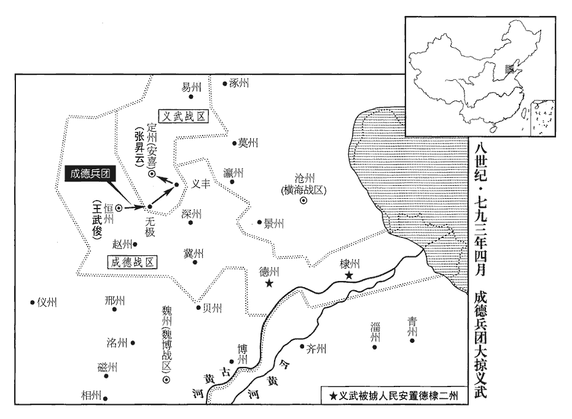
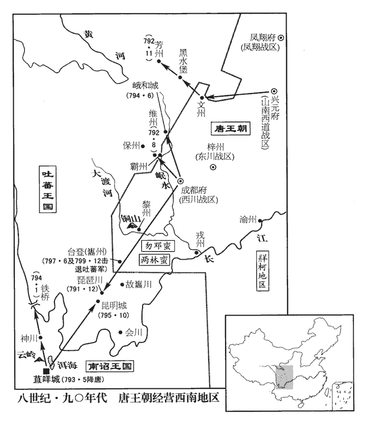

 唐紀五十起玄黓涒灘（壬申），盡閼逢閹茂（甲戌）五月，凡二年有奇。始壬申，終甲戌五月，凡二年零五月。

# 德宗神武聖文皇帝九

## 貞元八年（壬申、七九二）

1春，二月，壬寅‹十七›，執夢衝‹勿邓部落四川省喜德县北›酋长，數其罪而斬之；數，所具翻，又所主翻。雲南‹南诏，首都苴咩城云南省大理市›之路始通。

〖译文〗 [1]春季，二月，壬寅（十七日），韦皋捉获苴梦冲，在数说他的罪行后，斩杀了他。前往云南的道路开始畅通了。

2三月，丁丑‹十一›，山南東道‹总部设襄州湖北省襄樊市›節度使曹成王皋薨‹年七十一岁›。使，疏吏翻。皋諡曰成。薨，呼肱翻。

〖译文〗 [2]三月，丁丑（二十三日），山南东道节度使曹成王李皋去世。

3宣武‹总部设汴州河南省开封市›節度使劉玄佐有威略，每李納‹平卢战区，总部设郓州山东省东平县›使至，玄佐厚結之，故常得其陰事，先為之備；納憚之。《孫子》五間，有因間。因間者，因其鄉人而用之。張預註云：因敵國人，知其底裏，就而用之，可使伺候也。劉玄佐之制李納，正用此術。其母雖貴，日織絹一匹，謂玄佐曰：「汝本寒微，天子富貴汝至此，必以死報之。」故玄佐始終不失臣節。史言玄佐忠順，母教也。此言蓋本之劉氏母墓誌。唐人誌墓，不無溢美者。然此等言語，有益於世教。庚午‹十六›，玄佐薨‹年五十八岁›。

〖译文〗 [3]宣武节度使刘玄佐威严而有谋略，每当李纳的使者到来时，刘玄佐便深深地结纳他们，所以经常能够得知李纳的秘事，预告做好防备，李纳畏惧他。他的母亲虽地位尊贵，但每天都要织绢帛一匹。她对刘玄佐说：“你本来门第卑微，天子使你富裕尊贵到这般地步，你一定要不惜一死，报答天子。”所以，刘玄佐自始至终不曾失去为臣的节操。庚午（十六日）刘玄佐去世。

4山南東道‹总部设襄州湖北省襄樊市›節度判官李實知留後事，性刻薄，裁損軍士衣食。鼓角將楊清潭帥眾作亂，將，即亮翻。鼓角將，掌軍中鼓角者也。帥，讀曰率。夜，焚掠城中，獨不犯曹王皋家；曹王皋之家，蓋已出次外館，不居使宅。實踰城走免。明旦，都將徐誠縋城而入，縋，馳偽翻。號令禁遏，然後止；收清潭等六人斬之。實歸京師，以為司農少卿。少，詩照翻。實，元慶之玄孫也。道王玄慶，高祖之子。丙子‹二十二›，‹李适，本年五十一岁›以荊南‹总部设江陵府湖北省江陵县›節度使樊澤為山南東道節度使。

〖译文〗 [4]山南东道节度判官李实执掌留后事务，他生性苛酷，削减将士的给养。掌管鼓角的将领扬清潭率领众人发动变乱，夜里在城中纵火抢劫，唯独不冒犯曹王李皋一家。李实翻越城墙逃走，得以不死。第二天早晨，都将徐诚用绳索缒入城中，发布命令，禁止变乱，此后变乱便停止了，徐诚收捕了杨清潭等六人，斩杀了他们。李实回到京城，德宗任命他为司农少卿。李实是李元庆的玄孙。丙子（二十二日），德宗任命荆南节度使樊泽为山南东道节度使。

5初，竇參為度支轉運使，度，徒洛翻。使，疏吏翻。班宏副之。參許宏，俟一歲以使職歸之，歲餘，參無歸意；宏怒。司農少卿張滂，宏所薦也，少，始照翻。滂，普郎翻。參欲使滂分主江、淮鹽鐵，宏不可；滂知之，亦怨宏。及參為上所疏，乃讓度支使於宏，又不欲利權專歸於宏，乃薦滂於上；【章：乙十六行本「上」下有「以宏判度支」五字；乙十一行本同；孔本同；退齋校同。】以滂為戶部侍郎、鹽鐵轉運使，仍隸於宏以悅之。

〖译文〗 [5]当初，窦参出任度支转运使，班宏担任他的副职。窦参向班宏许诺，等到一年以后，便将度支转运使的正职交给他。过了一年多时间，窦参还没有交出使职的意思，班宏大怒。司农少卿张滂是由班宏荐举上来的，窦参打算让张滂分管江淮地区的盐铁事务，班宏不肯答应。张滂听说此事，也怨恨班宏。及至窦参被德宗疏远以后，他才将度支使让给班宏，但是他又不愿意让财政大权独自落到班宏手中，于是便向德宗推荐张滂。德宗任命张滂为户部侍郎、盐铁转运使，仍然隶属于班宏，以便取悦于他。

竇參陰狡而愎，狡，古巧翻。愎，弼力翻。恃權而貪，每遷除，多與族子給事中申議之。申招權受賂，時人謂之「喜鵲」。竇參每遷除朝士，先與申議，申因先報其人，以招權納賂。時人謂之喜鵲者，以人家有喜事，鵲必先噪於門庭以報之也。上頗聞之，謂參曰：「申必為卿累，累，良瑞翻。宜出之以息物議。」參再三保其無他，申亦不悛。悛，丑緣翻。左金吾大將軍虢王則之，巨之子也，虢王巨，肅宗上元二年為段子璋所殺。與申善，左諫議大夫、知制誥吳通玄與陸贄不叶，竇申恐贄進用，陰與通玄、則之作謗書以傾贄；上皆察知其狀。夏，四月，丁亥‹三›，貶則之昭州‹广西平乐县›司馬，昭州，漢荔浦縣地，屬蒼梧郡，晉置平樂縣，屬始安郡，武德四年置樂州，貞觀八年改曰昭州。宋白曰：郡北有昭山岡潭，因山岡為名。舊志：昭州至京師四千四百三十六里。通玄泉州‹福建省泉州市›司馬，隋置泉州，治閩縣，南安、莆田縣屬焉。武后聖曆二年分泉州之南安、莆田、龍溪置武榮州，景雲二年改武榮為泉州，而閩之泉州改為閩州，開元十三年又改閩州為福州。舊志：泉州，京師東南六千二百一十六里。申道州‹湖南省道县›司馬；尋賜通玄死。

〖译文〗 窦参阴险狡诈而又刚愎自用，凭借着手中的权力，贪图财利，每当任命官员时，他往往与担任给事中的族侄窦申计议其事。窦申借此招揽权事，收受贿赂，当时的人们把他叫做“喜鹊”。德宗听到了一些风声，便对窦参说：“窦申肯定会连累你的，最好将他调出朝廷，也好平息众人的议论。“窦参反复担保窦申没做别的事情，窦申却依然不肯悔改。左金吾大将军虢王李则之是李巨的儿子，与窦申交好。左谏议大夫、知制诰吴通玄与陆贽关系不睦，窦申唯恐陆贽被提拔任用，便暗中与吴通玄、李则之编造攻击陆贽的书函，排挤他。德宗完全查清了他们的情况。夏季，四月，丁亥（初三），德宗将李则之贬为昭州司马，将吴通玄贬为泉州司马，将窦申贬为道州司马。不久，德宗又让吴通玄自裁而死。

6劉玄佐之喪，將佐匿之，稱疾請代，上亦為之隱，將，即亮翻。為，于偽翻。遣使即軍中問「以陝虢‹首府设陕州河南省三门峡市›觀察使吳湊為代可乎？」監軍孟介、行軍司馬盧瑗皆以為便，然後除之。陝，失冉翻。監，古銜翻。瑗，于眷翻。湊行至汜水‹河南省荥阳市汜水镇西›，汜，音祀。汜水縣，本屬鄭州，時屬孟州。玄佐之柩將發，軍中請備儀仗，瑗不許，又令留器用以俟新使；將士怒。玄佐之壻及親兵皆被甲，擁玄佐之子士寧釋衰絰，登重榻，被，皮義翻。衰，倉回翻。重，直龍翻。自【嚴：「自」改「尊」。】為留後。執城將曹金岸、城將，使之領兵巡視城堞，晨夕警邏。浚儀‹河南省开封市›令李邁，曰：「爾皆請吳湊者！」遂冎之；冎，古瓦翻。盧瑗逃免。士寧以財賞將士，劫孟介以請於朝。上以問宰相，竇參曰：「今汴人指李納以邀制命，不許，將合於納。」庚寅‹六›，以士寧為宣武節度使。考異曰：實錄：「士寧位未定，遣使通王武俊、劉濟、田緒；以士寧未受詔有國，使皆留之。」舊傳云：「以士寧未受詔於國，皆留之。」新傳云：「諸鎮不直之，皆執其使。」然則舊傳是也。士寧疑宋州‹河南省商丘市›刺史翟良佐不附己，翟，直格翻。託言巡撫，至宋州，以都知兵馬使劉逸準代之。考異曰：韓愈集作「逸淮」。今從舊傳逸準，正臣之子也。劉正臣‹刘客奴›，肅宗至德初為平盧‹总部当时设营州·辽宁省朝阳市›節度使。

〖译文〗 [6]刘玄佐去世后，将佐隐瞒实情，声称刘玄佐得了重病，请求派人替代。德宗也装作不知道，还派遣使者到军中询问“让陕虢观察使吴凑来替代刘玄佐的职务可以吗？”监军孟介、行军司马卢瑗一致认为这是适宜的，此后德宗才任命了吴凑。吴凑来到汜水时，刘玄佐的灵柩正要出殡，军中将士请求为他备办仪仗，卢瑗不肯答应，还命令留着器物用具，等新任观察使到来时使用。将士发怒，刘玄佐的女婿以及随身士兵都穿上铠甲，簇拥着刘玄佐的儿子刘士宁脱去丧服，登上主帅的座位，自命为留后。他们逮捕了守城将领曹金岸和浚仪县令李迈，对二人说：“你们都是主张迎接吴凑的人！”于是将他们二人剐杀了。卢瑗逃脱，幸免于死。刘士宁用钱财奖赏将士，劫持着孟介，让他向朝廷请求任命。德宗询问宰相的意见，窦参说：“现在汴州人指望着李纳，才敢于请求任命，如果不答应，他们就要与李纳联合了。”庚寅（初六），德宗任命刘士宁为宣武节度使。刘士宁怀疑宋州刺史翟良佐没有归附自己，便假托巡视的名义，来到宋州，让都知兵马使刘逸准替代了他。刘逸准是刘正臣的儿子。

7乙未‹十一›，貶中書侍郎、同平章事竇參為郴州‹湖南省郴州市›別駕，舊志：郴州，京師南三千三百里。郴，丑林翻。考異曰：柳珵chéng上清傳曰：「貞元壬申歲春三月，相國竇公居光福里第，月夜閒步於中庭。有常所寵青衣上清者，乃曰：『今欲啟事，郎須到堂前，方敢言之。』竇公亟上堂。上清曰：『庭樹上有人，恐驚郎，請謹避之。』竇公曰：『陸贄久欲傾奪吾權位，今有人在庭樹上，吾禍將至。且此事奏與不奏，皆受禍，必竄死於道路。汝在輩流中不可多得，吾身死家破，汝定為宮婢。聖君若顧問，善為我辭焉。』上清泣曰：『誠如是，死生以之。』竇公下階大呼曰：『樹上君子，應是陸贄使來，能全老夫性命敢不厚報。』樹上應聲而下，乃衣衰粗者也。曰：『家有大喪，貧甚，不辦葬禮，伏知相公推心濟物，所以卜夜而來，幸相公無怪。』公曰：『某罄所有，堂封絹千匹而已。方擬脩私廟，今且輟贈可乎！』縗者拜謝。竇公答之如禮。又曰：『便辭相公，請左右齎所賜絹擲於牆外。某先於街中俟之。』竇公依其請，命僕使偵其絕蹤，旦，方敢歸寢。翌日，執金吾先奏其事，竇公得次又奏之。德宗厲聲曰：『卿交通節將，蓄養俠刺，位崇台鼎，更欲何求！』竇公頓首曰：『臣起自刀筆小才，官以至貴，皆陛下獎拔，實不由人。今不幸至此，抑乃仇家所為耳！陛下忽震雷霆之怒，臣便合萬死。』中使下殿宣曰：『卿且歸私第，待候進止。』越月，貶郴州別駕。會宣武節度使劉士寧通好于郴州，廉使條疏上聞。德宗曰：『交通節將，信而有徵。』流竇公于驩州，沒入家資，一簪不著。身竟未達流所，詔自盡。上清果隸名掖庭。後數年，以善應對，能煎茶，數得在帝左右。德宗謂曰：『宮掖間人數不少，汝了事，從何得至此？』上清對曰：『妾本故宰相竇參家女奴，竇某妻早亡，故妾得陪掃灑。及竇某家破，幸得填宮。既侍龍顏，如在天上。』德宗曰：『竇某罪不止養俠刺，亦甚有贓汙。前時納官銀器至多。』上清流涕而言曰：『竇某自御史中丞歷度支、戶部、鹽鐵三使，至宰相，首尾六年，月入數十萬，前後非時賞賜亦不知紀極。乃者郴州所送納官銀物，皆是恩賜。當部錄日，妾在郴州，親見州縣希陸贄意指，刮去所進銀器上刻作藩鎮官銜姓名，誣為贓物。伏乞陛下驗之。』於是宣索竇某沒官銀器，覆視其刮字處，皆如上清言。時貞元十二年。德宗又問蓄養俠刺事，上清曰：『本實無，悉是陸贄陷害，使人為之。』德宗怒陸贄曰：『這獠奴，我脫卻伊綠衫便與紫衫著，又常喚伊作陸九。我任使竇參方稱意次，須教我枉殺卻他。及至權入伊手，其為軟弱甚於泥團。』乃下詔雪竇參。時裴延齡探知陸贄恩衰，得恣行媒糵，贄竟受譴不迴。後上清特赦丹書度為女道士，終嫁為金忠義妻。世以陸贄門生名位多顯達者，不敢傳說，故此事絕無人知。」信如此說，則參為人所劫，德宗豈得反云「蓄養俠刺」！況陸贄賢相，安肯為此！就使欲陷參，其術故多，豈肯為此兒戲！全不近人情。今不取。貶竇申錦州‹湖南省麻阳县西南锦和镇›司戶。以尚書左丞趙憬、兵部侍郎陸贄並為中書侍郎、同平章事。憬，仁本之曾孫也。憬，居永翻。趙仁本見二百一卷高宗咸亨元年。

〖译文〗 [7]乙未（十一日），德宗将中书侍郎、同平章事窦参贬为郴州别驾，将窦申贬为锦州司户，让尚书左丞赵憬、兵部侍郎陆贽一并出任中书侍郎、同平章事。赵憬是赵仁本的曾孙。

8張滂請鹽鐵舊簿於班宏，宏不與。滂與宏共擇巡院官，莫有合者，闕官甚多。滂言於上曰：「如此，職事必廢，臣罪無所逃。」丙午‹二十二›，上命宏、滂分掌天下財賦，如大曆故事。大曆元年，命第五琦、劉晏分理天下財賦，事見二百二十四卷。

〖译文〗 [8]张滂请班宏交出原有的盐铁帐簿，班宏不肯给他。张滂与班宏一起选任巡院官，两人的意见没有相合的时候，因而缺任的官员为数很多。张滂向德宗进言说：“像这个样子，职任以内的事必然要荒废了，我的罪责是无法逃脱的了。”丙午（二十二日），德宗命令班宏与张滂分别掌管全国的财税，一如大历年间的先例。

9壬子‹二十八›，吐蕃寇靈州‹宁夏灵武市›，陷水口支渠，敗營田。敗，補邁翻。詔河東‹总部设太原府山西省太原市›、振武‹总部设单于府内蒙古和林格尔县›救之，遣神策六軍二千戍定遠‹宁夏平罗县›、懷遠城‹宁夏银川市›；懷遠縣屬靈州，後周置，隋五原郡在縣界。宋白曰：定遠縣在靈州東北二百里。吐蕃乃退。

〖译文〗 [9]壬子（二十八日），吐蕃侵犯灵州，毁去水口支流的渠道，破坏屯田。德宗颁诏命令河东、振武前去援救，派遣神策六军共两千人戍守定远和怀远二城，于是吐蕃撤退了。

10陸贄請令臺省長官各舉其屬，長，知兩翻。著其名於詔書，異日考其殿最，并以升黜舉者。殿，丁練翻，所舉得人，則升舉主以昭進賢之賞；所舉非人，則黜舉主以昭失舉之罰。五月，戊辰‹十四›，詔行贄議。

〖译文〗 [10]陆贽请求让中书、门下、尚书三省的长官各自推举本省的属官，将他们的名字登录到诏书上，以便日后按名单考核他们办事成绩的优劣，并且据此提升或贬黜他们的推举人。五月，戊辰（十四日），德宗颁诏命令实施陆贽的建议。

未幾，或言於上曰：「諸司所舉皆有情故，或受貨賂，不得實才。」上密諭贄：「自今除改，卿宜自擇，勿任諸司。」諸司，即謂臺省長官。贄上奏，其略曰：「國朝五品以上，制敕命之，蓋宰相商議奏可者也。六品以下則旨授，蓋吏部銓材署職，詔旨畫聞而不可否者也。六品以下告身，皆畫「聞」字。開元中，起居、遺、補、御史等官，猶並列於選曹。言起居郎、舍人、拾遺、補闕及御史，皆由吏部奏擬。選，須絹翻。其後倖臣專朝，朝，直遙翻。捨僉議而重己權，廢公舉而行私惠，是使周行庶品，行，戶剛翻；下班行同。苟不出時宰之意，則莫致也。」又曰：「宣行以來，纔舉十數議其資望，既不愧於班行，考其行能，又未聞於闕敗。行，下孟翻。而議者遽以騰口，上煩聖聰。道之難行，亦可知矣！請使所言之人指陳其狀，某人受賄，某舉有情，付之有司，覈其虛實；謬舉者必行其罰，誣善者亦反其辜。謂反坐以罪也。何必貸其姦贓，不加辯詰，私其公議，不出主名，主名，告主之名也。使無辜見疑，有罪獲縱，枉直同貫，人何賴焉！又，宰相不過數人，豈能徧諳多士！諳，烏含翻。若令悉命群官，理須展轉詢訪；是則變公舉為私薦，易明揚以闇投，公私明闇以相形，而文理自見。此作文之法。然「明揚」二字本之虞書，「闇投」二字本之漢書，作文又不可無來處。近世教人為文者類此，文詎止於此而已。情故必多，為弊益甚。所以承前命官，罕不涉謗。雖則秉鈞不一，或自行情，亦由私訪所親，轉為所賣。其弊非遠，聖鑒明知。」又曰：「今之宰相則往日臺省長官，今之臺省長官乃將來之宰相，但是職名暫異，固非行舉頓殊。行舉者，臺省長官舉之，宰相行之。豈有為長官之時則不能舉一二屬吏，居宰相之位則可擇千百具僚；物議悠悠，其惑斯甚。蓋尊者領其要，卑者任其詳，是以人主擇輔臣，輔臣擇庶長，庶長，庶官之長也。庶長擇佐僚，將務得人，無易於此。夫求才貴廣，考課貴精。往者則天欲收人心，進用不次，則天，謂武后也。非但人得薦士，亦得自舉其才。然而課責既嚴，進退皆速，是以當代謂知人之明，累朝賴多士之用。」又曰：「則天舉用之法傷易而得人，朝，直遙翻。易，以豉翻。陛下慎簡之規書曰：慎簡乃僚。太精而失士。」上竟追前詔不行。

〖译文〗 没过多久，有人对德宗说：“各部门推举的属官都弄虚作假，有的人还收受贿赂，所以不能得到真有才干的人。”德宗暗中晓示陆贽说：“今后任官改官，最好由你亲自选择，不要让各有关部门办理。”于是，陆贽进上奏章，大略是说：“本朝对于五品以上的官员，是通过诏书来加以任命的，这便是经由宰相互相商酌计议，上奏圣上批准的任命方法。对于六品以下的官员的任命方法，则是通过圣上的旨意来授给官职，即经由吏部铨选人材，署任职务，圣上在诏旨上标上一个‘闻’字，但不置可否。在开元年间，起居郎、舍人、拾遗、补阙、御史等官职，还是由吏部选任上报的。此后，宠臣专擅朝政，丢开众人的公议而扩大自己的权力，废弃公开的选举而推行私人的恩惠，使宰相奏任官员的办法遍及各级官员，如果不经过现任宰相的同意，就无法任官。”他又说：“由三省长官各自推举属官的办法宣布实行以来，只推举了十几个人。评议他们的资历与声望，已是无愧于他们的班列位次，考查他们的品行与才能，又没有听说有缺失败坏的地方。然而议论的人骤然横加批评，向上打搅陛下的视听。治道的难以实行，于此也可见一斑了。请让进言的人指出并陈述具体情况，讲清楚哪个人接受了贿赂，哪个人推举时作弊，将这些人交付有关部门，核实所言是实在的，还是没有根据的。对推举失误的人一定要实行惩罚，对诬告好人的人也要反过来追究他们的罪责。为什么一定要姑息作弊与贪赃行为而不肯给以分辩与追究呢！将公开的评议变成私下进行的活动，而不肯公布发言人的名字，使无罪的人遭受怀疑，使有罪的人得到纵容，无论亏理还是有理，全都一律对待，人们还有什么依靠呢！加之，宰相不过只有几个人，哪能普遍熟悉众多的士子！如果让宰相任命所有的官员，理应反复询问访求，但这样便将公开举用变成私下推荐，将察举贤良变成暗中投靠，弄虚作假的事情肯定很多，形成的流弊愈发严重。所以，承续以前的办法任命官员，很少有不牵涉谤议的。虽然说这因为宰相把握标准不够一致，有时会自行作弊，但也由于私下访问亲近的人们，反而被他们捉弄了。这一弊病并不是很久以前的事情，陛下圣明垂鉴，分明知道这些事情。”他又说：“现在的宰相，就是过去的三省长官，现在的三省长官，便是将来的宰相，这不过是职务的名称暂时不同，本不是推举官员与任命官员在职权上有区别。担任三省长官的时候不能够举用一两个下属的官吏，到出任宰相以后便可选拔成千上百个官员，难道有这样的道理吗？众人的议论飘忽不定，他们的迷惑以这一点最为严重。一般说来，尊贵者统领事务的纲要，卑下者负责细节的处理。所以，君主选任宰相，宰相选任各部门的长官，各部门的长官选任处于辅助地位的官吏，要想务求用人得当，便无法改变这种做法。大凡寻求人才贵在广博，考核官吏的成绩贵在专精。过去武则天想收买人心，提拔官吏不拘等次，不但百姓可以推荐士子，还可以自己推举自己。然而，那时对官吏的考核与督责非常严厉，官吏的升降都很迅速，所以当世认为武则天是有知人的明智的，连续几朝都仰仗她选拔出来的众多士子为朝廷效力。”他又说：“武则天推举任用人才方法的失误在于变动太快，但是能够得到人才。陛下慎重选择官吏的方法过于精细，反而会失去人才。”德宗终于还是追回了前不久颁发的诏书，不再实行。

11癸酉‹十九›，平盧節度使李納薨‹年三十四歲›。軍中推其子師古知留後。

〖译文〗 [11]癸酉（十九日），平卢节度使李纳去世，军中将士推举他的儿子李师古执掌留后事务。

12六月，吐蕃千餘騎寇涇州‹甘肃省泾川县›，掠田軍千餘人而去。田軍，屯田之軍也。

〖译文〗 [12]六月，吐蕃骑兵一千余人侵犯泾州，掳掠屯田军一千多人，便离去了。

13嶺南‹总部设广州广东省广州市›節度使奏：「近日海舶珍異，多就安南‹首府设安南府越南河内市›市易，欲遣判官就安南收市，乞命中使一人與俱。」上欲從之。陸贄上言，以為：「遠國商販，惟利是求，緩之斯來，【張：「緩」作「綏」。】擾之則去。廣州素為眾舶所湊，舶，音白。今忽改就安南‹越南河内市›，若非侵刻過深，則必招攜失所，攜，離也，言所以招攜離者失其道也。左傳，管仲曰：「招攜以禮」。曾不內訟，論語，孔子曰：「吾未見能見其過而內自訟者也。」註云：訟，猶責也，言人有過，莫能自責。更蕩上心記月令：毋或作為淫巧以蕩上心。註：蕩，謂動搖之也。況嶺南、安南，莫非王土，中使、外使，悉是王臣，豈必信嶺南而絕安南，重中使以輕外使。所奏望寢不行。」

〖译文〗 [13]岭南节度使奏称：“近些时候，海上来的大船运载着珍奇的货物，往往开到安南买卖交易，我准备派遣判官去安南收买，请派中使一人与判官同去。”德宗打算准奏。陆贽进言认为：“远方各国经商贩卖，唯利是图，对他们宽和，他们就前来，对他们有所烦扰，他们就离去。广州历来是各处船舶汇集的地方，现在忽然改道去安南，如果不是广州方面侵渔刻剥过于严重，那肯定就是他们招引远方各国商人的办法不对头，他们不曾自责，却还想动摇陛下的心志。况且，岭南与安南，无不是陛下的国土，中使与外使无不是陛下的臣属，何必相信岭南而拒绝安南，重视中使而轻视外使呢！希望陛下将岭南的奏议废止了，不要实行。”

14秋，七月，甲寅朔‹一›，戶部尚書判度支班宏薨‹年七十三岁›。尚，辰羊翻。度，徒洛翻。薨，呼肱翻。陸贄請以前湖南‹首府设潭州湖南省长沙市›觀察使李巽權判度支，上許之。既而復欲用司農少卿裴延齡，使，疏吏翻。度，徒洛翻。復，扶又翻，又音如字。少，詩照翻。贄上言，以為：「今之度支，準平萬貨，上，時掌翻。刻吝則生患，寬假則容姦。延齡誕妄小人，用之交駭物聽。尸祿之責，固宜及於微臣；知人之明，亦恐傷於聖鑒。」上不從。己未‹六›，以延齡判度支事。為裴延齡譖贄張本。

〖译文〗 [14]秋季，七月，甲寅朔（初一），户部尚书、判度支班宏去世。陆贽奏请任命前湖南观察使李巽暂时兼管度支，德宗准许了这一建议。不久，德宗又打算起用司农少卿裴延龄，陆贽进言认为：“如今度支使的职任，需要运输各种货物，平抑物价，如果刻薄吝啬，便会生出麻烦，如果宽容，便会姑息邪恶。裴延龄是一个荒诞虚妄的小人，起用他会震骇人们的视听。尸位素餐的罪责，固然应当有我这微末小臣的一份；若说到知人善任的明德，恐怕也会有损陛下圣明的裁鉴。”德宗不肯听从。己未（初六），德宗让裴延龄兼管度支事务。

河南•北、江•淮、荊•襄‹湖北省中部›、陳•許‹河南省中部›等四十餘州大水，溺死者二萬餘人，陸贄請遣使賑撫。上曰：「聞所損殊少，溺，奴狄翻。少，詩沼翻。即議優恤，恐生姦欺。」贄上奏，其略曰：「流俗之弊，多徇諂諛，揣所悅意則侈其言，度所惡聞則小其事，揣，初委翻。度，徒洛翻。惡，烏路翻。制備失所，恆病於斯。」制備，謂隨事為之制而豫備也。恆，戶登翻。又曰：「所費者財用，所收者人心，苟不失人，何憂乏用！」上許為遣使，為，于偽翻。而曰：「淮西‹总部设蔡州河南省汝南县›貢賦既闕，不必遣使。」贄復上奏，復，扶又翻。以為：「陛下息師含垢，宥彼渠魁，渠，大也。魁，率也。惟茲下人，所宜矜恤。昔秦、晉讎敵，穆公猶救其饑，左傳：晉饑，秦輸之粟。秦饑，晉閉之糴；穆公‹嬴任好›伐晉，執惠公‹姬夷吾›。而晉又饑，穆公復餼xì之粟，曰：「吾怨其君而矜其民。」況帝王懷柔萬邦，唯德與義，寧人負我，無我負人。」反曹操之言，則有帝王氣象。八月，遣中書舍人京兆奚陟等宣撫諸道水災。

〖译文〗 河南、河北、江淮、荆襄、陈许等四十余州洪水泛滥，淹死了两万余人，陆贽请求派遣使者赈济抚慰。德宗说：“听说损失很少，如果议行丰厚的抚恤，恐怕会生出奸诈欺骗的事情来。”陆贽上奏，大略是说：“世俗的弊病，往往是曲从人意，阿谀奉承，揣摩到人主喜欢什么，便夸大其辞，猜度到人主讨厌听见什么，便缩小其事。朝廷所采取的措制与防备失去凭依，问题就经常出在这里。”他又说：“赈济灾民，消耗的是资财，得到的是人心。如果不失去百姓的拥护，还用为缺少用度发愁吗！”德宗答应派遣使者，但又说：“既然淮西不向朝廷缴纳赋税，就不要派遣使者赈济他们了。”陆贽再次上奏认为：“陛下停息战事，隐忍包容，宽宥了那些作乱者的首领，对于这些处于下层的人们，自当加以怜惜。过去在诸侯国中秦国和晋国成了仇敌，秦穆公仍然救济晋国的饥荒，况且帝王招抚万邦，只有实行仁德与信义，宁可让别人辜负我们，不能让我们辜负别人。”八月，德宗派遣中书舍人京兆人奚陟等人前往各道宣诏抚慰遭受水灾的人们。

15以前青州‹山东省青州市›刺史李師古為平盧節度使。

〖译文〗 [15]德宗任命前任青州刺史李师古为平卢节度使。

16韋皋‹西川战区，总部设成都府四川省成都市›攻【章：乙十六行本「攻」下有「吐蕃」二字；乙十一行本同；孔本同；張校同；退齋校同。】維州‹四川省理县›，代宗廣德元年，維州沒於吐蕃。獲其大將論贊熱。

〖译文〗 [16]韦皋攻打维州，俘虏了吐蕃大将论赞热。

17陸贄上言，以邊儲不贍，由措置失當，當，丁浪翻。蓄斂乖宜，其略曰：「所謂措置失當者，戍卒不隸於守臣，守臣不總於元帥。至有一城之將，一旅之兵，各降中使監臨，監，古銜翻。皆承別詔委任。分鎮亘千里之地，莫相率從；緣邊列十萬之師，不設謀主。每有寇至，方從中覆，比蒙徵發赴援，比，必利翻，及也。寇已獲勝罷歸。吐蕃之比中國，眾寡不敵，工拙不侔，然而彼攻有餘，我守不足。蓋彼之號令由將，而我之節制在朝，將，即亮翻。朝，直遙翻。彼之兵眾合并而我之部分離析故也。分，扶問翻。所謂蓄斂乖宜者，陛下頃設就軍、和糴之法以省運，制與人加倍之價以勸農，此令初行，人皆悅慕。此李泌所行之法也，事見二百三十二卷貞元二年。而有司競為苟且，專事纖嗇，歲稔則不時斂藏，艱食則抑使收糴。遂使豪家、貪吏，反操利權，斂，力驗翻。操，七刀翻。賤取於人以俟公私之乏。又有勢要、近親、羈遊之士，委賤糴於軍城，取高價於京邑，又多支絺chī紵zhù充直。絺，五之翻。紵，直呂翻。窮邊寒不可衣，鬻無所售，上既無信於下，下亦以偽應之，度支物估轉高，度，徒洛翻。估，音古，價也。軍城穀價轉貴。度支以苟售滯貨為功利，軍城【章：乙十六行本「城」作「司」；乙十一行本同；孔本同。】以所得加價為羨餘。羨，弋線翻。雖設巡院，轉成囊橐tuó。元和四年十二月十二日，敕：「遠處州使，率情違法，臺司無由盡知。轉運使、度支悉有巡院，委以訪察當道使司及州縣，有兩稅外榷率及違格敕文法等事狀報臺司。」蓋劉晏始置巡院，自江、淮以來達于河、渭，其後遂及緣邊諸道亦置之。至有空申簿帳，偽指囷qūn倉，囷，區倫翻。囷倉，皆以藏穀；圓曰囷，方曰倉。計其數則億萬有餘，考其實則百十不足。」

〖译文〗 [17]陆贽进言认为，边疆的储备不充足，是由于处理不恰当，对粮食的储积和征收都不合时宜，他大略是说：“所说的处理不恰当，指的是戍边的士兵不由守边的将领管辖，守边的将领不由元帅统领，以至于有时对同一城中的将士，同一军中的官兵，朝廷都分别派遣中使监督，是按不同的诏旨委以职任。朝廷所划分的军镇绵亘在远届千里的土地上，无法相互统属；沿着边疆布置了十万军队，没有设置主谋的人物。每当有敌寇前来，也正好是自己内部倾轧瓦解之时，及至得到朝廷征调的军队前来救援时，敌寇已经取得胜利，罢兵而归了。吐蕃与大唐相比，众多与寡少不相匹敌，工巧与拙笨不能对比。然而吐蕃发动进攻，还有余力，我军处于防守，仍然力量不足。其原因大概就在于他们发布命令是由将领掌管，我军的调度管束却由朝廷控制；他们的兵力合成一个整体，而我军的各部却是分散的。所说的对粮食的储积和征收都不合时宜，指的是前不久陛下规定由官府前往军屯处收购粮食以便节省运输的办法，命令付给人们加倍的粮食价钱，以示勉励农耕的措施。这一命令实行的初期，百姓们都是悦服而向往的。然而，有关部门争相得过且过地混日子，专门干琐屑悭吝的事情。年景丰收时，有关部门不肯将粮食按时征收并储存起来；五谷欠收时，他们却强行指使有关人员收购粮食。于是，使豪门富室、贪官污吏反而掌握了财利的权柄，用贱价向人们收购粮食，等到公家与私人缺粮时再卖出去。加之，有一些权势之家、亲近宠幸之臣、游食之人委托军镇低价收买粮食，再运往京城，高价出售。而且人们往往支付葛布麻布充当粮食的价值，致使荒远的边疆在严寒季节穿不上衣服，买不到布料。既然上面对下面不讲信用，下面也就以欺诈回报上面。度支规定的物价变得高了，军镇的谷价就变得贵了。度支通过随意售出滞销的货物获取利益，军镇从粮食的加价中得到额外的收入。虽然设有巡院访查各地，实际上巡院反而成了藏污纳垢之所，以至于有人凭空申报帐目，虚指粮食储存，计算粮食数额虽然超过亿万，考核存粮的实况却不足十分之一。”

又曰：「舊制以關中用度之多，歲運東方租米，至有『斗錢運斗米』之言。習聞見而不達時宜者，則曰：『國之大事，不計費損，雖知勞頓，不可廢也。』習近利而不防遠患者，則曰：『每至秋成之時，但令畿內和糴，既易集事，令，力丁翻。糴，亭歷翻。易，以豉翻。又足勸農。』臣以兩家之論，互有長短，將制國用，須權重輕。食不足而財有餘，則弛於積財而務實倉廩；廩，力錦翻。毛晃曰：倉有屋曰廩。食有餘而財不足，則緩於積食而嗇用貨泉。近歲關輔‹即关中，陕西省中部›屢豐，公儲委積，屢，力注翻。委，於偽翻。積，子智翻。足給數年；今夏江、淮水潦，米貴加倍，人多流庸。流，謂流徙。庸，謂庸雇。關輔以穀賤傷農，宜加價以糴而無錢；江、淮以穀貴人困，宜減價以糶而無米。糶，他弔翻。而又運彼所乏，益此所餘，斯所謂習見聞而不達時宜者也。今江、淮斗米直百五十錢，運至東渭橋‹陕西省高陵县南›，僦直又約二百，米糙且陳，僦jiù，子就翻。糙cāo，七到翻。米僅剝穀為糙。尤為京邑所賤。據市司月估，今之市令司，亦月具物價低昂之數以聞於上。斗糶三十七錢。耗其九而存其一，以江、淮之米，合運漕之僦直，率一斗為錢三百五十，而京師米價斗止三十七錢，是耗其九而存其一也。餒彼人而傷此農，制事若斯，可謂深失矣！頃者，每年自江‹长江›、湖‹鄱阳湖及洞庭湖›、淮‹淮河›、浙‹浙江钱塘江›運米百一十萬斛，至河陰‹河南省郑州市西北桃花峪›留四十萬斛，貯河陰倉，至陝州‹河南省三门峡市›又留三十萬斛，貯太原倉‹三门峡市西南›，貯，丁呂翻。餘四十萬斛輸東渭橋。今河陰、太原倉見米猶有三百二十餘萬斛，見，賢遍翻。京兆諸縣斗米不過直錢七十，請令來年江、淮止運三十萬斛至河陰，河陰、陝州以次運至東渭橋，其江、淮所停運米八十萬斛，委轉運使每斗取八十錢於水災州縣糶之，以救貧乏，糶，他吊翻。計得錢六十四萬緡，減僦直六十九萬緡。請令戶部先以二十萬緡付京兆，令糴米以補渭橋倉之缺數，渭橋倉，即東渭橋倉。斗用百錢以利農人；增價以糴則利農。以一百二萬六千緡付邊鎮，使糴十萬人一年之糧，餘十萬四千緡以充來年和糴之價。糴，徒歷翻。其江、淮米錢、僦直並委轉運使折市綾、絹、絁shī、綿以輸上都，折，之舌翻。絁，式支翻。繒之似布者，今謂之紬chóu。唐都長安，謂之上都。償先貸戶部錢。」

〖译文〗 陆贽又说：“依据原有的制度，由于关中费用浩繁，每年都需要从东部地区运输租米，以至于有一斗钱运一斗米的说法。对此，只晓得见闻之谈而不能通达当时需要的人便会说：‘国家的大事，不应该计较损耗，虽然知道运粮劳苦烦剧，但是不可废止。’只晓得眼前利益而不懂得预防长远忧患的人又会说：‘每到秋天庄稼收获时，只让官府在京城周围和籴，这既容易把事情办好，又足以勉励农耕。’我认为这两派的议论各有所长，各有所短。要想节制国家的用度，必须权衡轻重。如果粮食不足而钱财有余，便应该延缓钱财积累，而务必使粮仓充盈起来；如果粮食有余而钱财不足，便应该推迟储备粮食，而节省使用货币。近年以来，关中地区连年丰收，公家储备的粮食积聚起来，足够供应好几年。今年夏天，江淮地带雨水成灾，粮米贵了一倍，有许多人流亡他乡，沦为雇工。关中地区因谷物跌价，损害了农民的利益，应当提高粮价收购，但没有钱。江淮地区因谷物昂贵，百姓困窘，应当降低粮价出售，但没有米。现在反而将江淮地区所缺少的粮食运送出来，用以增益粮食已经有余的关中地区，这就是我所说的只晓得见闻之谈而不能够通达当时需要的人。如今江淮地区一斗米价值一百五十钱，运送到东渭桥，雇运的价钱每斗大约又要付二百钱，米碾磨不精，而且放陈了，所以在京城的价钱尤其低贱。根据市司公布的本月的价钱，一斗米的售价为三十七钱。耗费了米价的十分之九而仅剩下十分之一，让江淮地区的百姓挨饿，却又损害关中地区农民的利益，象这样办事，可以说是严重的失误。不久以前，每年从江、湖、淮、浙运米一百一十万斛，运到河阴，留下四十万斛，储存在河阴仓，运到陕州，再留下三十万斛，储存在太原仓，剩下的四十万斛输送到东渭桥。现在，河阴仓和太原仓现存的米仍然有三百二十多万斛，京兆府所属各县每斗米不过值七十钱。请让江淮地区明年只运送三十万斛到河阴，再让河阴、陕州依次运送到东渭桥，将江淮地区停止运送的八十万斛米，委托转运使，每斗定价八十钱，运往发生水灾的州县出售，以便救助缺乏粮食的人，算来可得钱六十四万缗，减少雇运钱六十九万缗。请让户部首先拿出钱二十万缗，交给京兆府，让京兆府收购粮米，以便弥补东渭桥仓缺运的数额，可以每斗定价一百钱，以使农民得到好处。请再拿出钱一百零二万六千缗，交给边疆军镇，让各军镇购进可供十万人吃一年的粮食。剩下的钱十万四千缗，可以用来充当明年和籴的本钱。对江淮地区的米钱和雇运钱，一并委托转运使经折算后购买绫、绢、、绵，运往京城，偿还原先向户部所借的钱。”

九月，詔西北邊貴糴以實倉儲，考異曰：實錄云：「凡積米三十三萬斛。」按陸贄論守備狀云：「坐致邊儲，數逾百萬，諸鎮收糴，今已向終。」又云：「更經一年，可積十萬人三歲之糧矣。」蓋實錄所言，今年之數，贄狀通計來春也。邊備浸充。

〖译文〗 九月，德宗颁诏命令西北边疆官府以高价收购粮食，以便充实粮仓的储备。于是，边地的储备逐渐充足起来。

18冬，十一月，壬子朔‹一›，日有食之。

〖译文〗 [18]冬季，十一月，壬子朔（初一），出现日食。

19吐蕃、雲南日益相猜，每雲南兵至境上，吐蕃輒亦發兵，聲言相應，實為之備。辛酉‹十›，韋皋復遺雲南王書，復，扶又翻。遺，唯季翻。欲與共襲吐蕃，驅之雲嶺‹位云南省西北›之外，雲南之地，本漢雲南縣也，漢屬益州郡，後漢分屬永昌郡。南中志曰：雲南縣西高山相連，眾山之中，又有山特高大，狀如扶風太一，鬱然高峻，與雲氣相連，視之不見其山，固陰冱hù寒，雖五月盛暑不熱，所謂雲嶺也。悉平吐蕃城堡，獨與雲南築大城於境上，置戍相保，永同一家。

〖译文〗 [19]吐蕃与云南的互相猜疑与日俱增。每当云南的兵马开到边境上，吐蕃总是也派出兵马，声称前来接应，实际上是在防备云南。辛酉（十日），韦皋再次给云南王送去书信，希望与云南一起袭击吐蕃，将他们驱逐到云岭以外，全部摧毁吐蕃的城关堡垒，仅与云南在边境上修筑起一座大城，设置戍守人员自相保卫，永远像一家人般地和睦相处。

20左庶子姜公輔久不遷官，詣陸贄求遷，贄密語之曰：語，牛倨翻。「聞竇相屢奏擬，上不允，今人謂聖旨不從所請為不允，習聞唐人之言也。有怒公之言。」公輔懼，請為道士。上問其故，公輔不敢泄贄語，以聞參言為對。上怒參歸怨於君；己巳‹十八›，貶公輔為吉州‹江西省吉安市›別駕，又遣中使責參。姜公輔居猜忌之朝，不能安於命義，而由此重竇參之罪，亦陸贄之一言也。考異曰：實錄：「初，公輔罷相為左庶子，以憂免，復除右庶子。數私謁竇參，參數奏公輔以他官；上不許，而有怒公輔之言。公輔恐，乃請免官為道士。久之，未報。因開延英奏之，上問其故，公輔對以參言。上曉之，固不已，大怒，貶之，而詔書責參推過於上。」公輔傳曰：「陸贄知政事，以有翰林之舊，數告贄求官。贄密謂公輔曰：『予常見郴州竇相，言為公奏擬數矣，上旨不允，有怒公之言。』公輔恐懼，上疏乞罷官為道士。久之，未報。後又庭奏，德宗問其故，公輔不敢泄贄言，便以參言為對。帝怒，貶公輔為泉州別駕，又遣中使齎詔責參。」贄傳曰：「姜公輔奏：『竇參常語臣云，陛下怒臣未已。』德宗怒，再貶參，竟殺之。時議云公輔奏竇參語得之於贄，云參之死，贄有力焉。」按贄請令長官舉屬吏狀云：「亦由私訪所親，轉為所賣，其弊非遠，聖鑒明知。」此乃解參之語也。及參之死，贄救解甚至。由是觀之，贄豈有殺參之意邪！且贄語公輔之時，安知公輔請為道士，及於上前以泄言之罪歸參！此乃公輔之意，非贄意也。當時之人，見參、贄有隙，遂以己意猜之。史官不悅贄者，因歸罪於贄耳。今不取。

〖译文〗 [20]左庶子姜公辅长期没有升官，便到陆贽处请求提升。陆贽暗中告诉他说：“听说窦相屡次上奏准备提升你，皇上不肯允许，而且说了恼怒你的话。”姜公辅害怕，请求去做道士。德宗询问其中的原故，姜公辅不敢泄露陆贽说的话，便回答说这是听窦参说的。皇帝恼怒窦参把怨恨推给君主，己巳（十八日），将姜公辅贬为吉州别驾，还派遣中使去责备窦参。

21庚午‹十九›，山南西道‹总部设兴元府陕西省汉中市›節度使嚴震奏敗吐蕃於芳州‹故州城·甘肃省迭部县东南›及黑水堡‹甘肃省舟曲县西南›。敗，補邁翻。芳州，高宗上元二年已為吐蕃所陷。酈道元曰：黑水出羌中，西南逕黑水城西。其地蓋在陰平西北，臨洮西南，古沓中之地也。使，疏吏翻。敗，補邁翻。堡，音保。

〖译文〗 [21]庚午（十九日），山南西道节度使严震上奏说，他们在芳州与黑水堡打败吐蕃。

22初，李納以棣州‹山东省惠民县›蛤gé𧊱duǒ‹惠民县南›有鹽利，城而據之；又戍德州‹山东省陵县›之南三汊城‹陵县东南›，以通田緒‹魏博战区，总部设魏州河北省大名县›之路。棣，大計翻。蛤，古合翻。𧊱，康音螺。余按集韻「螺」字下無「𧊱」字；同韻有「垜」字，音都戈翻，小堆也。𧊱，恐當作「垜」。汊，楚嫁翻。李納之阻兵也，李長卿以棣州入朱滔，而蛤𧊱為納所據，因城而戍之。其後王武俊敗朱滔，得德、棣二州，蛤𧊱猶為納戍。納又於德州南跨河而城守之，謂之三汊，以交魏博，通田緒。及李師古襲位，王武俊‹成德战区，总部设恒州河北省正定县›以其年少，輕之，少，詩照翻。是月，引兵屯德、棣，將取蛤𧊱及三汊城；師古遣趙鎬將兵拒之。上遣中使諭止之，武俊乃還。鎬，下老翻。將，即亮翻，又音如字。使，疏吏翻。還，從宣翻，又音如字。

〖译文〗 [22]当初，李纳因棣州的蛤有盐产之利，便在那里筑城据守，还戍守德州南面的三汊城，以便打通与田绪联系的道路。及到李师古承袭节度使职位以后，王武俊因李师古年纪还轻，便轻视他。就在这一月，王武俊领兵在德州与棣州驻扎，准备攻取蛤与三汊城，李师古派遣赵镐领兵抵御他。德宗派遣中使劝告王武俊罢手，于是王武俊领兵而回。

23初，劉怦‹卢龙战区，总部设幽州北京市›薨，見二百三十二卷貞元元年。怦，普萌翻。薨，呼肱翻。劉濟在莫州‹河北省任丘市北鄚州镇›，其母弟澭在父側，以父命召濟而以軍府授之。莫州治鄚縣，在幽州南二百八十里。澭，於用翻。濟以澭為瀛州‹河北省河间市›刺史，瀛州，河間郡，幽州巡屬大州也，其地在幽州南。許他日代己。既而濟用其子為副大使，河朔三鎮及淄青皆以其子為副大使，儲帥也。澭怨之，擅通表朝廷，遣兵千人防秋。濟怒，發兵擊澭，破之。朝，直遙翻。為劉澭歸朝張本。

〖译文〗 [23]当初，刘怦去世时，刘济正在莫州，他的同母弟刘正在父亲身边，便以父亲的名义召回刘济，将节度使的军府交给了他。刘济让刘出任瀛州刺史，向他许下将来由他代替自己的诺言。不久，刘济起用自己的儿子为副大使，刘怨恨刘济，便擅自向朝廷上表，派兵一千人参加防御吐蕃。刘济大怒，派兵进击刘，并打败了他。

24左神策大將軍柏良器，唐左、右神策大將軍，正二品。史炤曰：「柏皇氏，古帝號，後為氏。顓帝師柏亮父，帝嚳師柏超之裔也。募才勇之士以易販鬻者，監軍竇文場惡之。惡，烏路翻。會良器妻族飲醉，寓宿宮舍。宮舍，宮中直宿之舍也。史言宦官惡柏良器能舉其職，因其妻黨犯衛禁而文致其罪。十二月，丙戌‹五›，良器坐左遷右領軍。自是宦官始專軍政。為宦官挾兵權以脅天子張本。右領軍，十六衛之一也。時南牙諸衛，具位而已。北軍掌禁兵，權重，故良器為左遷。

〖译文〗 [24]左神策大将军柏良器，招募既有才干、又很勇敢的人们更换军中的买卖人，监军窦文场憎恶他。恰巧柏良器妻子的族人喝醉了酒，曾在宫中值宿的房舍中过夜。十二月，丙戌（初五），柏良器获罪，贬为右领军。自此，宦官开始专擅军中大政。

## 九年（癸酉、七九三）

1春，正月，癸卯‹二十四›，初稅茶。爾雅釋木云：檟jiǎ，苦茶。郭璞註云：樹大小似梔子，冬生葉，可煮作羹飲。今呼早採者為𣗪，晚採者為茗，一名荈chuǎn，蜀人謂之苦茶是也。今通謂之茶。茶、𣗪聲近，故呼之。春中始生嫩葉，蒸焙去苦水，末之，乃可喫chī，與古所食殊不同也。本草衍義曰：晉溫嶠上表，貢茶千斤，茗三百斤。郭璞曰：早採為茶，晚採為茗。茗或曰荈，茶葉老者也。古人謂其芽為雀舌、麥顆，言其至嫩也。又有新芽，一發便長寸餘，微粗如針。惟芽長為上品，其根榦gàn土力皆有餘故也。如雀舌、麥顆，又下品，前人未盡識。史言稅茶始此，遂開利孔。凡州、縣產茶及茶山外要路，皆估其直，什稅一，從鹽鐵使張滂之請也。滂奏：「去歲水災減稅，用度不足，請稅茶以足之。自明年以往，稅茶之錢，令所在別貯，俟有水旱，以代民田稅。」自是歲收茶稅錢四十萬緡，未嘗以救水旱也。榷茶之說，始於趙贊，至張滂而始行。

〖译文〗 [1]春季，正月，癸卯（二十四日），开始征收茶税。凡是生产茶叶的州、县以及通往茶山的重要道路，都要估算茶叶的价值，收取十分之一的茶税，这是听从盐铁使张滂的建议才实行的。张滂上奏：“去年因发生水灾而减少税收，国家的费用不够，请征收茶税来补足税收的缺额。从明年以后，对征收茶税得到钱，可以让征收茶税所在地另行储存，等遇到水旱灾害时，用此钱代替百姓的田税。”自此以后，朝廷每年征收茶税得钱四十万缗，但不曾用来救济水旱灾害。

滂又奏：「姦人銷錢為銅器以求贏，請悉禁銅器。銅山聽人開采，無得私賣。」

〖译文〗 张滂又上奏说：“邪恶的人将钱熔化，铸成铜器，借以求利。请禁止制造一切铜器，任凭人们开采产铜的矿山，但不能私自出卖。”

2二月，甲寅‹五›，‹李适，本年五十二岁›以義武‹总部设定州河北省定州市›留後張昇雲為節度使。

〖译文〗 [2]二月，甲寅（初五），德宗任命义武留后张升云为节度使。

3初，鹽州‹陕西省定边县›既陷，鹽州陷見二百三十二卷二年。塞外無復保障；吐蕃常阻絕靈武‹宁夏灵武市›，侵擾鄜‹陕西省富县›、坊‹陕西省黄陵县›。既阻絕靈武往來之路，又侵擾鄜坊之民。辛酉‹十二›，詔發兵三萬五千人城鹽州，考異曰：邠志：「八年，詔追張公議築鹽、夏二城。張公奏曰：『師之進取，切藉驍將。神策散將魏茪者，朔方子弟，武藝冠絕；得茪，足以集事。』上遣之。張公以茪為邠寧馬軍兵馬使。三月，師及諸軍赴于五原，去城百里而軍。茪獨以其騎徑至城下，陷城而入，逐吐蕃，召諸軍城之；更引其軍西掠境上，往復走望，為師耳目。蕃眾距境而不敢入，官軍城二郡而歸。」白居易樂府城鹽州註，亦云「貞元壬申歲，特詔城之。」而實錄在九年二月。蓋去歲詔使城之，今年因命杜彥光等而言之。又詔涇原‹总部设泾州甘肃省泾川县›、山南‹总部设兴元府陕西省汉中市›、劍南‹总部设成都府四川省成都市›各發兵深入吐蕃以分其勢，城之二旬而畢；命鹽州節度使杜彥光戍之，朔方都虞候楊朝晟戍木波堡‹甘肃省环县东南›，木波堡，在慶州方渠縣界。九域志：方渠，宋朝改為通遠縣，置環州，有木波鎮。由是靈、【章：乙十六行本「靈」下有「武、銀‹陕西省榆林市南鱼河堡›」二字；乙十一行本同；孔本同；張校同；退齋校同。】夏‹陕西省靖边县北白城子›、河西‹陕西省北部›獲安。

〖译文〗 [3]当初，盐州陷落以后，边疆地区不再有防守的屏障，吐蕃经常截断灵武的通路，侵害搅扰州、坊州。辛酉（十二日），德宗颁诏派兵三万五千人修筑盐州城，还颁诏命令泾原、山南、剑南各自派兵深入吐蕃地区，以便分散吐蕃的势力。盐州城经二十天的修筑便告竣了，朝廷命令盐州节度使杜彦光前往戍守，命令朔方都虞候杨朝晟戍守木波堡。从此以后，灵州、夏州、河西一带获得安宁。

4上使人諭陸贄，以「要重之事，勿對趙憬陳論，當密封手疏以聞；」又「苗粲以父晉卿往年攝政，寶應間，連有國憂，晉卿攝冢宰。嘗有不臣之言，諸子皆與古帝王同名，晉卿十子：發、丕、堅、垂，與帝王同名。今不欲明行斥逐，兄弟亦各除外官，勿使近屯兵之地；」近，其靳翻。又「卿清慎太過，諸道饋遺，遺，唯季翻。一皆拒絕，恐事情不通，如鞭鞾之類，受亦無傷。」贄上奏，其略曰：「昨臣所奏，惟趙憬得聞，陛下已至勞神，委曲防護。是於心膂之內，尚有形迹之拘，迹同事殊，鮮克以濟。鮮，息淺翻。恐爽無私之德，爽，差也。且傷不吝之明。」書曰：改過不吝。又曰：「爵人必於朝，刑人必於市，惟恐眾之不覩，事之不彰。記曰：爵人於朝，與眾共之；刑人於市，與眾棄之。朝，直遙翻。君上行之無愧心，兆庶聽之無疑議，受賞安之無怍zuò色，當刑居之無怨言，此聖王所以宣明典章，與天下公共者也。凡是譖訴之事，多非信實之言，利於中傷，中，竹仲翻。懼於公辯。或云歲月已久，不可究尋；或云事體有妨，須為隱忍，為，于偽翻。或云惡迹未露，宜假他事為名；或云但棄其人，何必明言責辱。詞皆近於情理，近，其靳翻。意實苞於矯誣，傷善售姦，莫斯為甚！若晉卿父子實有大罪，則當公議典憲；若被誣枉，豈令陰受播遷。夫聽訟辨讒，必求情辨跡，情見跡著，見，賢遍翻。辭服理窮，然後加刑罰焉，是以下無冤人，上無謬聽。」又曰：「監臨受賄，盈尺有刑，律，諸監臨之官，受所監臨財物者，一尺笞四十。諸監臨主司受財而枉法者，一尺杖一百。監，古銜翻。至於士吏之微，尚當嚴禁，矧shěn居風化之首，反可通行！風化之首，謂宰相者風化之所自出。賄道一開，展轉滋甚，鞭鞾不已，必及金玉。鞾，與靴同。目見可欲，何能自窒于心！古語有之，不見可欲，此心不亂。已與交私，何能中絕其意！謂既受其私饋，則難以絕其私謁。是以涓流不絕，溪壑成災矣。」又曰：「若有所受，有所卻，則遇卻者疑乎見拒而不通矣；若俱辭不受，則咸知不受者乃其常理，復何嫌阻之有乎！」復，扶又翻；下同。

〖译文〗 [4]德宗让人告诉陆贽，说是“对于机要而重大的事情，不要当着赵憬的面陈述议论，应当将亲手所写的奏疏密封后上报朕闻知。”又说：“苗粲因他的父亲苗晋卿当年代理朝政时，曾经有过不合臣礼的言论，几个儿子都与古代帝王的名字相同，现在不准备公开驱逐他，对他的兄弟也分别授给外地的官职，但不能让他们接近驻扎军队的地方。”又说：“你清廉谨慎得太过分了，对于各道赠送的物品，一概拒不接受，恐怕在事情的情理上是讲不通的。比如马鞭、长靴一类的东西，接受了也无伤事体。”陆贽进上奏章，大略是说：“昨天我上奏的事情，只有赵憬知道，陛下已经极为劳心费神，辗转曲折地提防回护。这表明陛下在亲近信任的大臣中间，行为举止还有种种拘束。然而，外面表现出来的迹象相同，而内里包含的事实不同，很少能够把事情办好。恐怕会违背毫无私心的德行，而且损害不惜改过的明智。”他又说：“一定要在朝廷上给人以爵赏，一定要在闹市中处人以死刑，这是惟恐大家看不见这些事情，事情办理得不够显明。君主问心无愧地实行赏罚，百姓毫无疑义地听任处治，接受奖赏的人毫无愧色地安心受赏，应当受刑的人毫无怨言地接受惩处，这是圣明的君主发扬光大法令制度，并与百姓公开共同遵行的结果啊。凡是谗言诽谤的事情，多数不是实在可信的言论，利于阴谋陷害而害怕公开论辩。一旦进行公开论辩，有的说已经过了很长时间，难以追究下去；有的说妨碍事情的体统，需要克制忍耐；有的说不良的行迹还没有暴露出来，最好以其他事情为借口；有的说只要抛弃他本人就行了，为什么一定要明确表示责备与侮辱呢？这些措词都与情理接近，而其中实在包藏着假托名义、诬陷别人的意图，伤害善良，散布邪恶，没有比这些说法更为严重的了！倘若苗晋卿父子确实有大罪恶，那就应当公开按照法律议处；如果他们遭到不实之辞的冤屈，怎么能够让他们暗中遭受流亡迁徙？一般说来，听取诉讼，分辨谗言，必须寻求实情，辨别形迹。实情显现，形迹昭著，无话可说而无理可辩，这时再施加刑罚。由此下面才没有遭受冤屈的人，上面才没有错听人言的过失。”他又说：“监督有关部门的长官收受贿赂，只要所得财物折为布帛以后满了一尺，便以刑律相加。下至卑微的士民属吏，尚且该当严格禁止行贿，何况宰相是风俗教化的倡导者，怎么反而能够放过他们受贿的行为呢！贿赂的途径一经打通，反复实行，就会益加严重，赠送马鞭和长靴没有止息，必然发展到赠送金玉。眼睛看见愿意得到的东西，怎么能够在心中自行打消得到它的念头呢！已经跟赠物人结交了私情，怎么能够中途拒绝他的请求呢！所以，如果不断绝行贿的涓涓细流，就要填满溪涧沟壑而泛滥成灾了！”他又说：“假如对赠送的物品有的接受，有的推却，赠品被推却了的人便会怀疑自己遭受拒绝而办事难以顺利。如果一概推辞而不接受，人们便都知道不接受赠品才是通常的道理，又怎么会生出疑虑来呢！”

5初，竇參惡左司郎中李巽，惡，烏路翻。出為常州‹江苏省常州市›刺史。及參貶郴州‹湖南省郴州市›，巽為湖南‹首府设潭州湖南省长沙市›觀察使。郴，丑林翻。汴州‹河南省开封市›節度使劉士寧遺參絹五十匹，遺，唯季翻。巽奏參交結藩鎮。上大怒，欲殺參，陸贄以為參罪不至死，上乃止，既而復遣中使謂贄曰：「參交結中外，其意難測，社稷事重，卿速進文書處分。」處，昌呂翻。分，扶問翻；下無分同。贄上言：「參朝廷大臣，誅之不可無名。昔劉晏之死，罪不明白，至今眾議為之憤邑，為，于偽翻。叛臣得以為辭。見二百二十六卷建中元年、二年。參貪縱之罪，天下共知；至於潛懷異圖，事跡曖昧。曖，音愛，不明貌。若不推鞫，遽加重辟，駭動不細。辟，音闢，刑辟。竇參於臣無分，言無契分之雅。分，扶問翻。陛下所知，豈欲營救其人，蓋惜典刑不濫。」三月，更貶參驩州‹越南荣市›司馬，男女皆配流。

〖译文〗 [5]当初，窦参嫌恶左司郎中李巽，将他斥逐为常州刺史。及至窦参被贬为郴州别驾时，李巽正担任湖南观察使。汴州节度使刘士宁赠给窦参绢帛五十匹，李巽申奏窦参与藩镇交往。德宗非常气愤，打算杀掉窦参，陆贽认为窦参的罪过不至于处死，德宗才没有处死窦参。不久，德宗又派遣中使对陆贽说：“窦参与朝廷内外官员交往，他的意图难以测度，这关系到国家存亡，事情重大，你快奏进一份处治他的公文。”陆贽进言说：“窦参是朝廷大臣，要诛杀他不能没有名义。过去，刘晏被处死时，罪状不够清楚，直到今天，大家还在议论，为他愤懑不平，而背叛朝廷的臣属却在其中找到借口。窦参贪婪放纵，这是天下人都知道的，至于说他是否暗中包藏别的图谋，事情的迹象还模糊不清。如果不进行审讯，骤然间便将他治以重罪，对舆论的惊动不算太小。窦参和我没有情分，这是陛下所了解的。这并不是我打算营救他这个人，而是顾惜朝廷的常规，不宜越轨而行。”三月，德宗又将窦参贬为州司马，家中男女人口一概被发配到边远地方。

上又命理其親黨，理，治也。贄奏：「罪有首從，法有重輕，首，謂為頭者。從，謂隨從者。為首者重，隨從者輕。參既蒙宥，親黨亦應末減；況參得罪之初，私黨並已連坐，人心久定，請更不問。」從之。上又欲籍其家貲，贄曰：「在法，反逆者盡沒其財，贓污者止徵所犯，皆須結正施刑，然後收籍。今罪法未詳，陛下已存惠貸，若簿錄其家，恐以財傷義。」時宦官左右恨參尤深，謗毀不已。參未至驩州，竟賜死於路‹年六十岁›。竇申杖殺，貨財、奴婢悉傳送京師。傳，知戀翻。

〖译文〗 德宗又命令处治与窦参亲近的同党，陆贽上奏说：“犯罪有主犯与胁从的区分，刑法有重惩与轻处的不同，既然窦参蒙受宽宥，与他亲近的同党也应该从轻论罪。况且窦参刚刚被判罪时，他私结的党羽已经一并连带受罚，现在人心久已安定下来，请不要再追究下去。”德宗听从了这一建议。德宗又打算没收他全家的资财入官，陆贽说：“在刑法上明文规定，对于反叛忤逆的人，没收全部财产入官，对于盗窃贪污的人，只惩戒犯法者本人，而且都必须经过结案判定，才能施加刑罚，此后才能没收家产。如今对窦参没有详细地依法判罪，陛下对他已经存心加惠，予以宽恕，如果现在又要登记他的家产，恐怕会因财物而损害道义。”当时，宦官周围的人怀恨窦参尤其深切，对窦参的诽谤仍然没有止息。窦参没有到达州，德宗终于在半路上赐他自裁而死，窦申服杖刑而死，他们的财物和奴婢全部由驿站送往京城。

6海州‹江苏省连云港市›團練使張昇璘，昇雲之弟，李納之壻也，以父大祥歸于定州，海州，東海郡，淄青巡屬。璘，離珍翻。壻，西計翻。定州，義武帥治所。子居父喪，再朞而大祥。嘗於公座罵王武俊‹成德战区，总部设恒州河北省正定县›，武俊奏之。夏，四月，丁丑‹二十九›，詔削其官，遣中使杖而囚之。使，所吏翻。定州富庶，武俊常欲之，因是遣兵襲取義豐‹河北省安国市›，掠安喜‹定州州政府所在县›、無極‹河北省无极县›萬餘口，徙之德‹山东省陵县›、棣‹山东省惠民县›。義豐，屬定州。安喜縣，本定州治所，蓋州治徙也。無極，漢古縣，因無極山為名，唐屬定州。按無極山碑云：「無極山與天地俱生，從上至體，可三里所，立石為體，二丈五尺所。石上青，下黃白色，前正平，可布兩大席。」在無極西南三十里。景福二年，以無極縣為祁州。棣，大計翻。昇雲閉城自守，屢遣使謝之，乃止。

〖译文〗 [6]海州团练使张升是张升云的弟弟，李纳的女婿。他因父亲两周年的忌日需要祭奠而回到定州，曾经在公开场合辱骂王武俊，王武俊将此事上奏朝廷。夏季，四月，丁丑（二十九日），德宗颁诏革除张升的官职，派遣中使用棍棒责打并囚禁了他。定州物产丰饶，王武俊经常希望得到此地，因此派兵袭取义丰，掳掠了安喜和无极的百姓一万多人，将他们迁徙到德州和棣州。张升云关闭城门，自行防守，屡次派遣使者向王武俊道歉，王武俊才停止了对他的攻掠。

 

上命李師古‹平卢战区，总部设郓州山东省东平县›毀三汊城，李納築三汊城，見上年。汊，楚嫁翻。師古奉詔；然常招聚亡命，有得罪於朝廷者，皆撫而用之。朝，直遙翻。

〖译文〗 德宗命令李师古毁除三汊城，李师古接受了诏旨。然而，他经常招募聚集逃亡的人，凡是对朝廷犯有罪过的人，他都抚慰并任用他们。

7五月，甲辰‹二十七›，以中書侍郎趙憬為門下侍郎、同平章事；義成‹总部设滑州河南省滑县›節度使賈耽為右僕射，右丞盧邁守本官，並同平章事。邁，翰之族子也。憬，居永翻。耽，都含翻。射，寅謝翻。興元時，盧翰與李勉、劉從一同為相。憬疑陸贄恃恩，欲專大政，排己置之門下，政事堂在中書省，今憬遷東省，故疑贄排己。右僕射屬門下省。多稱疾不豫事，由是與贄有隙。為趙憬附裴延齡張本。考異曰：舊憬傳曰：「憬與陸贄同知政事，贄恃久在禁庭，特承恩顧，以國政為己任。纔周歲，轉憬為門下侍郎，憬由是深銜之，數以目疾請告，不甚當政事，因是不相協。」按憬遷門下猶為宰相，又益以賈耽、盧邁，贄豈得專政！蓋憬以此心疑之耳。

〖译文〗 [7]五月，甲辰（二十七日），德宗任命中书侍郎赵憬为门下侍郎、同平章事，任命义成节度使贾耽为右仆射，又让右丞卢迈署理本官，与贾耽一起同平章事。卢迈是卢翰的族侄。赵憬怀疑陆贽仗恩恃宠，准备独揽朝廷大政，将自己排挤到门下省，于是往往托病不问朝政。由此以后，他与陆贽便结下嫌隙。

8陸贄上奏論備邊六失，以為：「措置乖方，課責虧度，財匱於兵眾，力分於將多，怨生於不均，機失於遙制。自措置乖方以下，所謂六失也。上，時掌翻。將，即亮翻；下同。

〖译文〗 [8]陆贽进上奏疏，论说边疆防御的六种过失。他认为：“处理办法违背方策，考核督责缺少法度，资财被众多的士兵所耗尽，兵力被繁多的将领所分散，怨恨由分配不均产生出来，战机因朝廷在远处控制而丧失。

關東‹潼关以东›戍卒，不習土風，身苦邊荒，心畏戎虜。國家資奉若驕子，姑息如倩人。倩，七政翻。屈指計歸，張頤待哺；或利王師之敗，乘擾攘而東潰；或拔棄城鎮，搖遠近之心。豈惟無益，實亦有損。復有犯刑謫徙者，復，扶又翻；下同。既是無良之類，且加懷土之情，思亂幸災，又甚戍卒。可謂措置乖方矣。此一失也。

〖译文〗 “来自关东的戍边士兵，不熟悉边疆固有的风俗习惯，身受边塞之困苦，心中畏惧戎虏。朝廷像对骄生惯养的儿子那样拿出资财来奉养他们，像对女婿那样无原则地宽容他们。他们屈指计算归期，张嘴等待喂饭。有时在官军的失败中寻找方便，乘着混乱之机向东溃退；有时又舍弃城邑市镇，动摇远近各地的民心。让他们戍守边防，不但没有益处，实际上还有损害。戍边的士兵中更有触犯刑律流放而来的人，本来就是些不良之辈，再加上怀念故土的情绪，他们希图变乱兴起，庆幸灾祸发生，就比戍边的士兵更严重了。这些可以称作处理办法违背方策了。

自頃權移於下，柄失於朝，將之號令既鮮克行之於軍，國之典常又不能施之於將，朝，直遙翻。鮮，息淺翻。將，即亮翻。務相遵養，遵，率也，言相率以養惡也。苟度歲時。欲賞一有功，翻慮無功者反仄；欲罰一有罪，復慮同惡者憂虞。罪以隱忍而不彰，功以嫌疑而不賞，姑息之道，乃至於斯。故使忘身效節者獲誚於等夷，誚，才笑翻。率眾先登者取怨於士卒，僨軍蹙國者不懷於愧畏，僨fèn，方問翻。緩救失期者自以為智能。此義士所以痛心，勇夫所以解體。可謂課責虧度矣。此二失也。

〖译文〗 “近来权力转移到下面，朝廷失去了权柄，将领发布的命令既很少能够在军队中执行，国家惯常的法规又不能够在将领中实施，上下务求相互姑息，苟且度日。朝廷打算奖赏一个有功劳的人，反而顾虎没有功劳的人会因此动荡不安；准备惩罚一个犯下罪过的人，又要顾虑与他狼狈为奸的人会因此忧虑不安。人们犯下的罪过，因克制忍耐而不能给以揭露；人们立下的功劳，因嫌猜疑惑而不能给与奖赏。无原则的宽容态度，竟然达到了这种程度，以至使忘记自身、竭尽忠诚的人在同辈中招致责备，使率领众人首先登上敌城的人在士兵中自取埋怨，使败坏军旅、逼迫朝廷的人心中没有一点渐愧与畏惧，使故意不肯按期发兵援救的人认为自己机智能干。这便是有节操的人痛楚悲伤，勇敢的人心灰意冷的原因。这可以称作考核督责缺少法度了。

虜每入寇，將帥遞相推倚，帥，所類翻。推，吐雷翻。無敢誰何，虛張賊勢上聞，則曰兵少不敵。朝廷莫之省察，朝，直遙翻。省，悉景翻。唯務徵發益師，無裨備禦之功，重增供億之弊。重，直用翻。閭井日耗，徵求日繁，以編戶頃家、破產之資，兼有司榷鹽、稅酒之利，榷，古岳翻。總其所入，歲以事邊。可謂財匱於兵眾矣。此三失也。

〖译文〗 “每当异族前来侵犯时，将帅交相推委倚靠，没有人敢于查问，凭空张扬敌军的声势上报朝廷，就说是兵力太少，不能抵敌。朝廷未能检查实情，只是致力于征调人马，增加兵力，结果没有增益防备的功效，反而使军需供应更加疲困。村落百姓日益消耗，官府索求日益繁多。用在编人户倾家荡产才交纳上来的物资，加上有关部门专卖食盐与征收酒税的钱财，将这些收入合在一起，每年拿来从事边备，这可以称作资财被众多的士兵所耗尽了。

吐蕃舉國勝兵之徒，勝，音升。勝兵，謂人之才力堪執兵以戰者也。纔當中國十數大郡而已，動則中國懼其眾而不敢抗，靜則中國憚其強而不敢侵，厥理何哉？良以中國之節制多門，蕃醜之統帥專一故也。帥，讀曰率。夫統帥專一，則人心不分，號令不貳，進退可齊，疾徐如意，機會靡愆，愆，違也。氣勢自壯。斯乃以少為眾，以弱為強者也。開元、天寶之間，控禦西北兩蕃，唯朔方‹总部设灵州宁夏灵武市›、河西‹总部设凉州甘肃省武威市›、隴右‹总部设鄯州青海省乐都县›三節度。中興以來，未遑外討，抗兩蕃者亦朔方、涇原‹总部设泾州甘肃省泾川县›、隴右‹总部设普润陕西省凤翔县北›、河東‹总部设太原府山西省太原市›四節度而已。言西北兩蕃者，以別奚、契丹兩蕃。若開元、天寶以來，西則吐蕃‹西藏›，北則突厥‹瀚海沙漠群›。中興以來，所謂兩蕃，西則吐蕃，北則回紇。自頃分朔方之地，建牙擁節者凡三使焉，事見二百二十五卷大曆十四年。使，疏吏翻。其餘鎮軍，數且四十，皆承特詔委寄，各降中貴監臨，人得抗衡，莫相稟屬。監，古銜翻。史炤曰：衡，車上橫木。抗衡，謂兩相抗拒，有若車衡相抗也。余謂衡所以揆平，首尾有所偏重則衡為之低昂，商輕重者所必爭也。抗衡者，言無所低昂而平視之也。每俟邊書告急，方令計會用兵，既無軍法下臨，惟以客禮相待。令，力丁翻。夫兵，以氣勢為用者也；氣聚則盛，散則消；勢合則威，析則弱。今之邊備，勢弱氣消，可謂力分於將多矣。夫，音扶。將，即亮翻。此四失也。

〖译文〗 “吐蕃全国可以拿起兵器当兵的人，只抵得上大唐十几个大郡的人数罢了。一有战事发生，大唐便害怕他们人马众多，不敢抵抗他们，战事平息以后，大唐又忌惮他们强盛，不敢侵犯他们，这是什么道理呢？这实在是由于大唐军队需要接受许多部门的指挥，而吐蕃军队却集中在一个将领的统帅之下的原故。一般说来，如果军队的统帅是专一的，便会使人心不分散，号令不重复，军队的进退可以整齐划一，行军的快慢能够符合统帅的意愿，不会丧失战机，军队的气势自然壮盛。这便是变少成多，变弱为强的原因啊。在开元、天宝年间，控制西北地区吐蕃、突厥两部番人，只有朔方、河西、陇右三处的节度使。国家中兴以来，来不及对外讨伐，抵抗吐蕃、回纥两部番人的，也只有朔方、泾原、陇石、河东四处的节度使罢了。不久前，朝廷划分朔方的地域，于是建立牙门、拥有旌节的便有三个节度使了，其余的镇军为数差不多还有四十个。军队的主帅一概接受特别诏旨的委任，朝廷还要各自派显贵的宦官前来监督，他们可以与军中主帅相互对抗，两人互不从属。每当边疆告急文书到来，朝廷这才命令他们盘算如何采取军事行动。既然没有军法不达，他们只好用宾客的礼节相互对待。大凡军事行动，是要讲究气势的。士气凝聚便旺盛，士气离散便消沉；声势会合便威猛，声势离析便衰弱。现在的边疆防御，声势衰微，士气消沉，这可以称作兵力被繁多的将领所分散了。

理戎之要，在於練覈hé優劣之科，以為衣食等級之制，使能者企及，企，去智翻。否者息心，雖有厚薄之殊而無觖望之釁。觖，古穴翻。今窮邊之地，長鎮之兵，皆百戰傷夷之餘，終年勤苦之劇，然衣糧所給，唯止當身，例為妻子所分，常有凍餒之色。而關東‹潼关以东›戍卒，怯於應敵，懈於服勞，衣糧所頒，厚踰數等。又有素非禁旅，本是邊軍，將校詭為媚詞，因請遙隸神策，不離舊所，當，丁浪翻。懈，俱賣翻。離，去智翻。唯改舊【章：乙十六行本「舊」作「虛」；乙十一行本同；孔本同；張校同；退齋校同。】名，其於廩賜之饒，遂有三倍之益。夫事業未異而給養有殊，苟未忘懷，孰能無慍！可謂怨生於不均矣。慍yùn，於問翻。此五失也。

〖译文〗 “治理军队的关键，在于精细地核查将士的优劣品类，据以制定有关军饷等级的制度，使有能力的人盼望得到较好的待遇，使没有能力的人消除非份之想，虽然有待遇丰厚与菲薄的区别，但不会产生怨恨不满的事端。现在，在荒远的边境的土地上，长期镇守的士兵，都是身经百战，遍体创伤，又长年经受无以复加的劳苦与艰辛。但是，供应他们的衣服与口粮，只限于本人，而这些东西通常都是被他们的妻子儿女分去一部分，所以他们经常面有饥寒之色。然而，在关东地区戍守的士兵，害怕与敌人应战，不愿意担承勤苦的劳作，但是颁发给他们的衣服与口粮，却高出好几个等级。又有平素就不属于禁军，本来就是边防军队的，他们的将领编造逢迎之辞，乘机请求遥遥隶属于神策军，他们并不离开原来的驻地，只更改了原有的名称，便得到了丰饶的军饷颁赐，收到三倍的好处。所从事的工作没有不同，而颁发的给养却有区别，如果人们尚不能忘却利禄，有谁能够不恼怒呢？这可以称作怨恨由分配不均产生出来了。

凡欲選任將帥，必先考察行能，將，即亮翻。帥，所類翻。行，下孟翻。可者遣之，不可者退之，疑者不使，使者不疑，故將在軍，君命有所不受。此孫子兵法之言。自頃邊軍去就，裁斷多出宸衷，斷，丁亂翻。選置戎臣，先求易制，易，以豉翻。多其部以分其力，輕其任以弱其心，遂令爽於軍情亦聽命，乖於事宜亦聽命。戎虜馳突，迅如風飆，馹rì書上聞，馹，人質翻，驛傳遞馬。旬月方報。守土者以兵寡不敢抗敵，分鎮者以無詔不肯出師，賊既縱掠退歸，此乃陳功告捷。其敗喪則減百而為一，其捃jùn獲則張百而成千。喪，息浪翻。捃，居隕翻。將帥既幸於總制在朝，不憂罪累，累，良瑞翻。陛下又以為大權由己，不究事情。可謂機失於遙制矣。此六失也。

〖译文〗 “大凡打算选择任用将帅，必须事先考核验察他的品行与才能，对满意的人选，便派遣出去，对于不满意的人选，便退还回去。疑人不用，用人不疑，所以将在外，君命有所不受。近来，对边防军队的调动，由规划到决断，多数出于陛下的心意，选拔安排军中的将领，首先要求容易辖制。增加部队的数目，借以分散他们的势力，减轻他们的职任，借以削弱他们的心志，于是使他们即便不符合军队的实情也要服从命令，即便违反事情的处理也要服从命令。异族兵马奔驰冲突，像暴风一样迅速，而我军由驿站传递文书上报朝廷，却需要一整月的时间才能答复下来。守卫疆土的将领因兵力微少而不敢抵抗敌军，分守军镇的将领因没有诏命而不肯出兵。敌军纵兵掳掠以后便撤退了，这时将领们便陈述功劳，向朝廷报捷。在兵败人亡时，他们便将损失减少到百分之一；在有所俘获时，他们便将所得由一百张扬成一千。将帅既庆幸朝廷统揽全局，不用为朝廷加罪担忧，陛下又认为自己独操大权，不再追究事情的真伪。这可以称战机因朝廷在远处控制而丧失了。

臣愚謂宜罷諸道將士防秋之制，令本道但供衣糧，募戍卒願留及蕃、漢子弟以給之。又多開屯田，官為收糴，為，于偽翻。寇至則人自為戰，時至則家自力農，與夫倏來忽往者，豈可同等而論哉！又宜擇文武能臣為隴右、朔方、河東三元帥，分統緣邊諸節度使，有非要者，隨所便近而併之。然後減姦濫虛浮之費以豐財，定衣糧等級之制以和眾，弘委任之道以宣其用，懸賞罰之典以考其成。如是，則戎狄威懷，疆埸寧謐矣！」上雖不能盡從，心甚重之。

〖译文〗 “依我愚见，应当废止征调各道将士防御吐蕃的制度，命令各道只供应衣服与口粮，召募愿意留下来的戍边士兵以及番族人、汉族人的子弟，将各道提供的给养供应他们。还要大量开辟屯田，由官府收购屯田收获和粮食。敌寇到来，屯田上的士兵每个人都要自行参加战斗，农忙之时，屯田上的士兵每一家都要自行努力务农，这与那种频繁调动士兵、来去匆忙的情况相比，难道能够同日而语吗！还应该选拔有能力的文武大臣出任陇右、朔方、河东三处的元帅，让他们分别统领分布在边境一带的各位节度使，对于不够重要的节镇，按照方便与就近加以合并。此后，还要减少不正当和不切实的费用，以使资财充实起来；确定有关屯田将士的衣服、口粮的等级，以调整将士之间的关系；弘扬委托信任将帅的原则，以显示将帅的作用；公布奖赏与惩罚的典章，以考核屯田将士的成绩。这样，异族便会畏服归附，国家的边境便会安宁了。”虽然德宗未能完全听从他的建议，但在内心却对他非常推重。

9韋皋遣大將董勔miǎn等將兵出西山‹成都西群山›，勔，彌兗翻。自彭州導江縣西出蠶崖關，歷維、茂，至當、悉諸州，皆西山也。破吐蕃之眾，拔堡柵五十餘。

〖译文〗 [9]韦皋派遣大将董等人领兵开出西山，打败吐蕃的兵马，攻克堡垒、栅栏五十多处。

10丙午‹二十九›，門下侍郎、同平章事董晉罷為禮部尚書。

〖译文〗 [10]丙午（二十九日），门下侍郎、同平章事董晋被罢免为礼部尚书。

11雲南‹南诏，首都苴咩城云南省大理市›王異牟尋遣使者三輩，一出戎州‹四川省宜宾市›，宋白曰：戎州，漢僰道南安縣地，梁置戎州，言以鎮戎夷也。西南取曲、協州并南寧州、安寧、鹽井路至南詔所居羊苴哶城二千三百里。舊志：戎州，在京師西南三千一百四里。一出黔州‹重庆市彭水县›，一出安南‹越南河内市›，各齎生金、丹砂詣韋皋。金礦未經鍛鍊者為生金。丹砂，產石中，鑿石取之。黔，音琴。金以示堅，丹砂以示赤心，三分皋所與書為信，皆達成都。異牟尋上表請棄吐蕃歸唐，并遺皋帛書，遺，唯季翻。自稱唐【章：乙十六行本「唐」下有「故」字；乙十一行本同；孔本同。】雲南王孫、吐蕃贊普義弟日東王。吐蕃以雲南王為弟，見二百一十六卷天寶十載。封日東王，見二百二十六卷代宗大曆十四年。皋遣其使者詣長安，并上表賀。上賜異牟尋詔書，令皋遣使慰撫之。并上，時掌翻。令，力丁翻。使，疏吏翻。

〖译文〗 [11]云南王异牟寻派遣使者共三批，一批取道戎州，一批取道黔州，一批取道安南，各自携带着金矿石和砂前往韦皋处，金矿石用以表示心地坚定，砂用以表示心地真诚。云南又将韦皋给他们写的书信分成三份作为凭信，全都带到成都。异牟寻上表请求背弃吐蕃，归顺唐朝，并且给韦皋送去用丝织品写成的文书，称自己为唐云南王孙、吐蕃赞普义弟日东王。韦皋打发云南使者前往长安，并且上表祝贺。德宗向异牟寻颁赐了诏书，命令韦皋派遣使者慰问安抚云南。

12賈耽、陸贄、趙憬、盧邁為相，百官白事，更讓不言。耽，都含翻。憬，居永翻。相，息亮翻。更，工衡翻，互也。秋，七月，奏請依至德故事，宰相迭秉筆以處政事，事見二百一十九卷肅宗至德元載十月。處，昌呂翻；下同。旬日一易；詔從之。其後日一易之。

〖译文〗 [12]贾耽、陆贽、赵憬、卢迈四人担任宰相，对百官禀报的事情交互推让，不肯发言。秋季，七月，他们上奏请求依据至德年间的惯例，由各位宰相轮流在政事堂执笔，以便处理行政事务，每十天一换人。德宗颁诏同意此议。后来，又改为一天一换人。

 

13劍南、西山諸羌女王湯立志、女王，亦羌別種，東與吐蕃、党項、茂州接，西屬三波訶，北距于闐，屬雅州。羅女蠻白狼夷，以女為君，居康延川，巖險四繚，有弱水南流。「湯立志」，新書作「湯立悉」。杜陽編：女蠻國人，危髻金冠，瓔珞被體，故謂之菩薩蠻。當時倡優遂因制菩薩蠻曲。哥鄰王董臥庭、白狗王羅陀怱、弱水王董辟和、南水王薛莫庭、悉董王湯悉贊、清遠王蘇唐磨、咄霸王董邈蓬及逋租王，自哥鄰以下諸種，皆散居西山。西山即雪山。今威州保寧縣有雪山，連乳川白狗嶺，有九峰，積雪春夏不消。白狗嶺與雪山相連。威州，唐之維州也。先皆役屬吐蕃，至是各帥眾內附。韋皋處之於維‹四川省理县›、保‹理县西北›、霸州‹理县东北›，天寶元年，招附生羌，置霸州。給以耕牛種糧。種，章勇翻。立志、陀怱、辟和入朝，皆拜官，厚賜而遣之。

〖译文〗 [13]居住在剑南、西山一带的诸羌女王汤立志、哥邻王董卧庭、白狗王罗陀、弱水王董辟和、南水王薛莫庭、悉董王汤悉赞、清远王苏唐磨、咄霸王董邈蓬以及逋租王，原先都臣属于吐蕃，受其役使，至此，他们各自率领本部人众归附。韦皋将他们安置在维州、保州和霸州，供给他们耕牛与粮种。汤立志、罗陀、董辟和入京朝见，德宗一律授给官职，给他们优厚的赏赐，然后打发他们回去。

14癸卯‹二十七›，戶部侍郎裴延齡奏：「自判度支以來，檢責諸州欠負錢八百餘萬緡，收諸州抽貫錢三百萬緡，呈樣物三十餘萬緡，請別置欠負耗賸shèng季庫以掌之，耗，虧減也。賸，贏餘也。賸，以證翻，又食證翻。三月為一季。凡三月終，則入物于庫，故謂之季庫。染練物則別置月庫以掌之。」每月入物，故謂之月庫。詔從之。欠負皆貧人無可償，徒存其數者，抽貫錢給用隨盡，呈樣、染練皆左藏正物。藏，徂浪翻。延齡徙置別庫，虛張名數以惑上。上信之，以為能富國而寵之，於實無所增也，於實者，於其實也。虛費吏人簿書而已。

〖译文〗 [14]癸卯（二十七日），户部侍郎裴延龄上奏说：“我自从兼管度支事务以来，查收各州亏欠钱计有八百多万缗，收取各州抽贯钱三百万缗，进呈上贡样品三十多万缗。请将归还亏欠和消耗所剩的钱另外交给季库掌管，而将着色熟绢另外交给月库掌管。”德宗颁诏同意此议。亏欠官府钱的，都是一些贫穷的人，无法偿还，徒然存留着亏欠的数额，抽贯钱用来支付用度，随用随光，进呈上贡样品与着色熟绢本来都是应归左藏储存的物品。裴延龄徒然将它们安放到别的仓库里，虚张名目与数额，以此迷惑德宗。德宗信以为真，认为他能够使国家富裕起来，因而宠爱他。实际上他什么也没有增加，只是白白浪费吏人帐薄罢了。

京城西污濕地生蘆葦數畝，延齡奏稱長安、咸陽有陂澤數百頃，可牧廄馬。上使有司閱視，無之，亦不罪也。

〖译文〗 京城西面有一片污秽潮湿的地面，生长着几亩芦苇，裴延龄奏称在长安与咸阳一带有数百顷的坡地与水沼，可以放牧厩中的马匹。德宗让有关部门前去核实观看，并没有坡地与水沼，也不归罪他。

左補闕權德輿上奏，權本顓頊之後，為楚武王‹通›所滅，子孫以國為氏。上，時掌翻。以為：「延齡取常賦支用未盡者充羨餘以為己功。羨，弋線翻。縣官先所市物，再給其直，用充別貯。貯，丁呂翻。邊軍自今春以來並不支糧。陛下必以延齡孤貞獨立，時人醜正流言，何不遣信臣覆視，究其本末，明行賞罰。今群情眾口喧於朝市，朝，直遙翻。豈京城士庶皆為朋黨邪！陛下亦宜稍回聖慮而察之。」上不從。

〖译文〗 左补阙权德舆上奏认为：“裴延龄将支付使用而尚未用光的经常性的赋税，拿来充当正常赋税以外的收益，并将此作为自己的功劳。县官先购买物品，再交付物品的价钱，以此充当另外的储存。自从今年春天以来，边疆的军队都没有支付口粮。如果陛下认为裴延龄独守节操，出类拔萃，而时下之人嫉害正直，散布谣言，为什么不派遣一位可信的臣下重行审察，推究事情的原委，公开实行奖赏或惩罚？现在，大家情绪愤激，议论纷纷，在朝廷与市肆喧闹不已，难道京城的士子与庶民都已经结成宗派私党了吗！陛下也应该稍微改变自己的考虑，调查他了。”皇帝没有采纳他的建议。

15八月，庚戌‹四›，太尉、中書令、西平忠武王李晟薨‹年六十七岁›。

〖译文〗 [15]八月，庚戌（初四），太尉、中书令、西平忠武王李晟去世。

16冬，十月，甲子‹十八›，韋皋遣其節度巡官崔佐時齎詔書詣雲南，并自為帛書答之。節度巡官，在判官、推官之下，衙推之上。

〖译文〗 [16]冬季，十月，甲子（十八日），韦皋派遣他的节度巡官崔佐时携带诏书前往云南，并且亲自用丝织品写成文书来答复云南王。

17十一月，乙酉‹十›，上祀圜丘，赦天下。

〖译文〗 [17]十一月，乙酉（初十），德宗祭祀圜丘，大赦天下。

18劉士寧既為宣武‹总部设汴州河南省开封市›節度使，八年三月，命劉士寧為宣武節度使。諸將多不服。士寧淫亂殘忍，出畋輒數日不返，軍中苦之。都知兵馬使李萬榮得眾心，士寧疑之，奪其兵權，令攝汴州‹河南省开封市›事。十二月，乙卯‹十›，士寧帥眾二萬畋于外野；帥，讀曰率。萬榮晨入使府，召所留親兵千餘人，詐之曰：「敕徵大夫入朝，以吾掌留務，汝輩人賜錢三十緡。」眾皆拜。又諭外營兵，皆聽命。乃分兵閉城門，使馳白士寧曰：「敕徵大夫，宜速即路，即，就也。少或遷延，當傳首以獻。」士寧知眾不為用，以五百騎逃歸京師，比至東都‹洛阳›，比，必利翻，及也。所餘僕妾而已。至京師，敕歸第行喪，禁其出入。

〖译文〗 [18]刘士宁出任宣武节度使以后，将领们多数并不佩服他。刘士宁纵欲放荡而生性残忍，每当外出打猎时，总是好几天都不回来，军中将士困苦不堪。都知兵马使李万荣得到大家的拥护，刘士宁猜疑他，剥夺了他的兵权，命令他代理汴州事务。十二月，乙卯（初十），刘士宁带领两万人到城外的郊野去打猎。李万荣早晨走进节度使的府署，召集刘士宁留下来的亲兵一千多人，欺骗他们说：“敕旨征召大夫入京朝见，任命我掌管留后事务，还颁赐给你们每人钱三十缗。”大家都拜谢应命。李万荣又开导外营的士兵，他们也都服从命令了。于是，他分别派兵关闭了城门，让人骑马跑去禀告刘士宁说：“敕旨征召大夫，大夫应当迅速登程，如果稍有拖延，我便要将大夫的头颅传送京师，献给朝廷了。”刘士宁知道大家不肯听从自己的命令，便带着五百人骑马逃回京城，及至来到东都洛阳时，只剩下他的仆从与姬妾了。刘士宁来到京城以后，德宗颁布敕旨，命他回府第为父亲刘玄佐服丧，禁止他与外界联系。

淮西‹总部设蔡州河南省汝南县›節度使吳少誠聞變，發兵屯郾yǎn城‹河南省郾城县›，郾城，漢、晉之郾縣也。後魏省併入曲陽縣，隋開皇初置郾城縣，屬汴州，時屬蔡州，蔡北鄙也。東有漢召陵縣故城，東南有後漢征羌縣故城。郾，一戰翻。遣使問故，問所以逐士寧之故。且請戰。萬榮以言戲之，戲之，示無所畏。少誠慚而退。

〖译文〗 淮西节度使吴少诚听到宣武变乱以后，便派兵在郾城驻扎，派遣使者质问李万荣驱逐刘士宁的原故，而且向他挑战。李万荣讲了一番嘲弄吴少诚的话，吴少诚便渐愧地撤退了。

上聞萬榮逐士寧，使問陸贄，贄上奏，以為今軍州已定，宜且遣朝臣宣勞，勞，力到翻。徐查事情，冀免差失，其略曰：「今士寧見逐，雖是眾情，萬榮典軍，且非朝旨。此安危強弱之機也，願陛下審之慎之。」上復使謂贄：復，扶又翻；下同。「若更淹遲，恐於事非便。今議除一親王充節度使，且令萬榮知留後，其制即從內出。」贄復上奏，其略曰：「臣雖服戎角力諒匪克堪，而經武伐謀或有所見。夫制置之安危由勢，付授之濟否由才。勢如器焉，惟在所置，置之夷地則平；才如負焉，唯在所授，授踰其力則踣。踣bó，蒲北翻。萬榮今所陳奏，頗涉張皇，但露徼求之情，徼jiǎo，一遙翻。殊無退讓之禮，據茲鄙躁，殊異循良。又聞本是滑‹义成战区总部·河南省滑县›人，劉玄佐，滑州匡城人，萬榮與同里相善。偏厚當州將士，當州，猶言本州，謂滑州也。與之相得，纔止三千，諸營之兵已甚懷怨。據此頗僻，頗，滂何翻，偏也。亦非將材，若得志驕盈，不悖則敗，悖則犯上，敗則僨軍。」將，即亮翻。悖，蒲內翻。僨，方問翻。又曰：「苟邀則不順，苟允則不誠，君臣之間，勢必嫌阻。邀，求也；非所當求而求之為苟邀。允，從也；非所當從而從之為苟允。下以不順求之，上以不誠應之，其勢必至於嫌阻。與其圖之於滋蔓，左傳曰：毋使滋蔓，蔓難圖也。不若絕之於萌芽。」又曰：「為國之道，以義訓人，將教事君，先令順長。」長，知兩翻；下獨長同。又曰：「方鎮之臣，事多專制，欲加之罪，誰則無辭！若使傾奪之徒便得代居其任，利之所在，人各有心，此源潛滋，禍必難救。非獨長亂之道，亦關謀逆之端。」又曰：「昨逐士寧，起於倉卒，卒，讀曰猝。諸郡守將固非連謀，將，即亮翻。一城‹大梁，汴州州政府所在城·河南省开封市›師人亦未協志。各計度於成敗之勢，度，徒洛翻。迴遑於逆順之名，安肯捐軀與之同惡！」又曰：「陛下但選文武群臣一人命為節度，仍降優詔，慰勞本軍。勞，力到翻。獎萬榮以撫定之功，別加寵任，褒將士以輯睦之義，厚賜資裝，揆其大情，理必寧息。萬榮縱欲跋扈，勢何能為！」又曰：「儻後事有愆素，左傳曰：「不愆于素。杜預註云：不過素所慮也。臣請受敗橈之罪。」橈，奴教翻。上不從。壬戌‹十七›，以通王諶為宣武節度大使，諶chén，氏壬翻。以萬榮為留後。

〖译文〗 德宗听到李万荣驱逐刘士宁的消息以后，让人征求陆贽的意见，陆贽上奏认为，现在宣武军与汴州城都已经安定下来了，最好派遣朝廷的官员前去宣布慰劳的诏旨，缓缓察看事态的发展，以期避免过失。他大略是说：“如今刘士宁被驱逐，虽然是由大家的情绪所导致的，但是李万荣掌管军事，也并不是朝廷的旨意，这是关系安危强弱的时机，希望陛下审慎再审慎。”德宗又让人对陆贽说：“如果再拖延下去，恐怕对事态的发展是不利的。现在打算任命一位亲王担当节度使，准备命令李万荣执掌留后事务，有关这一任命的制书就要从内廷发出。”陆贽再次上奏，大略是说：“虽然我对佩带着兵器比武的事情不能胜任，但是对筹划军事并破坏敌人计划的事情也许还有一些见解。一般说来，控置安危是由形势决定的，委任官职的成功与否是由才能决定的。形势就如同器物一样，就看如何安放，安放在平地上就平稳。才能就如同背负东西，就看负重多少，负担过重就会跌倒。如今李万荣上奏陈述的内容，颇为猖狂，只显露出要求任命的态度，绝没有谦让的礼数，根据这种卑下浮躁行为来看，他与奉公守法的人大有区别。又听说李万荣本来是滑州人氏，偏袒厚待本州的将士，但与他投合的滑州将士，只有三千人，而各军营的士兵已经甚为抱怨。根据这种偏颇不公的态度来看，他也不是担任将领的材料。倘若李万荣如愿以偿，骄傲自满起来，结果不是行为忤逆，就是自取灭亡。行为忤逆就会犯上作乱；自取灭败亡就会使军队败坏。”他又说：“苟且要求是不合正道的，苟且应允是没有诚意的，势必会使君臣之间生出嫌疑。与其在嫌疑滋长蔓延后再去图谋，不如在萌芽状态便去根绝。”他又说：“治理国家的原则，是用正道教诲人，要让人事奉君主，先要使人服从长官。”他又说：“掌握一方兵权的军事长官，办事往往专断独行，要想把罪名加给他们，谁不能找到借口！倘若谁是倾轧强取的人，谁就能够替代他的职务，那么，面对利益，人们各自都想得到它，这个念头一经暗中滋生，所产生的祸患肯定是难以挽救的。这不单是助长变乱的途径，也关系到谋逆的发端。”他又说：“昨日李万荣赶走刘士宁，是匆促发生的，各州县的守将固然不曾合谋，汴州一城众人也并非意见统一。他们各自估量着形势发展成败的可能，彷徨在从逆作乱与顺承朝廷之间，怎么肯捐弃性命，与他狼狈为奸呢！”他又说：“陛下只需在文武群臣中选择一个人任命他为节度使，并颁布宽和的诏旨，慰劳李万荣军。以镇抚安定宣武的功劳奖励李万荣，对他另外加以恩宠与委任；以上下和睦的道理表扬宣武将士，赐给优厚的物资与装备，估计宣武军的大体情势，照理说是一定会安定平息下来的。即使李万荣打算骄纵专横，在这种情势下，又怎么能够办得到呢！”他又说：“倘若以后的事情超出我原来的估计，请让我接受破坏军旅的罪罚。”德宗不肯听从。壬戌（十七日），德宗任命通王李谌为宣武节度大使，任命李万荣为留后。

19丁卯‹二十二›，納故駙馬都尉郭曖女為廣陵王淳妃。淳，太子‹李诵›之長子。是為憲宗。妃母，即昇平公主‹李豫的女儿›也。

〖译文〗 [19]丁卯（二十二日），将已故的驸马都尉郭暧的女儿聘娶为广陵王李淳妃。李淳是太子的长子，郭妃的母亲便是升平公主。

## 十年（甲戌、七九四）

1春，正月，劍南‹总部设成都府四川省成都市›、西山‹成都西群山›羌、蠻二萬餘戶來降；‹李适，本年五十三岁›詔加韋皋押近界羌、蠻及西山八國使。八國，即前女王、哥鄰等。弱水最弱小，不得預八國數。

〖译文〗 [1]春季，正月，剑南、西山一带的羌人、蛮人二万多户前来归降。德宗颁诏加封韦皋为押近界羌、蛮及西山八国使。

2崔佐時至雲南所都羊苴哶miē城‹云南省大理市›，蜀註：苴，徐嗟翻。哶，彌嗟翻。詳見前。考異曰：舊傳作「陽苴哶城」，今從新傳。吐蕃使者數百人先在其國，雲南王異牟尋尚不欲吐蕃知之，令佐時衣牂柯‹贵州省德江县›服而入。衣，於既翻。牂柯蠻，在昆明東九百里，東距辰州二千四百里，其南千五百里即交州。衣，於既翻；下同。佐時不可，曰：「我大唐使者，豈得衣小夷之服！」異牟尋不得已，夜迎之。佐時大宣詔書，大聲以宣詔書。異牟尋恐懼，顧左右失色；業已歸唐，事已成為業。乃歔欷流涕，俯伏受詔。歔，音虛。欷，許既翻，又音希。鄭回密見佐時教之，鄭回勸異牟歸唐事見二百三十二卷三年。故佐時盡得其情，因勸異牟尋悉斬吐蕃使者，去吐蕃所立之號，獻其金印，去，羌呂翻。吐蕃給雲南金印，見二百一十一卷玄宗天寶十載。復南詔舊名；異牟尋皆從之。考異曰：舊韋皋傳：「四年正月，皋遣判官崔佐時至苴哶城。」按西南夷事狀：「四年，皋微聞異牟尋之意，始因諸蠻寓書於牟尋。自是比年招諭，至九年，牟尋始遣使分皋書以來。朝廷賜之詔書，皋乃遣佐時齎詔以往。牟尋猶欲使佐時易服而入。」皋傳誤也。仍刻金契以獻。異牟尋帥其子尋夢湊等與佐時盟於點蒼山‹大理市西›神祠。帥，讀曰率。

〖译文〗 [2]崔佐时来到云南的都城羊苴城，几百名吐蕃使者原先便在云南国中。云南王异牟寻还不打算让吐蕃知道自己已经归附唐朝，便让崔佐时穿着柯人的服装进入羊苴城。崔佐时认为不恰当，他说：“我是大唐朝廷的使者，怎么能穿著小小夷人的衣服呢！”异牟寻没有办法，只好在夜晚迎接他。崔佐时大声宣读诏书，异牟寻害怕，他望着周围的人们，连脸色都改变了。然而，已经归顺唐朝，只好抽抽咽咽地流着眼泪，趴在地上接受诏旨。郑回暗中去见崔佐时，教给他如何去做。所以崔佐时完全了解了其中的情由，因而劝说异牟寻悉数斩杀吐蕃使者，除去吐蕃封立的名号，献出吐蕃给予的金印，恢复南诏原来的名称，异牟寻完全听从了这些建议，还刻成金质的契约献给崔佐时。异牟寻带邻他的儿子寻梦凑等人与崔佐时在点苍山神祠会盟。

先是，吐蕃與回鶻‹瀚海沙漠群›爭北庭‹总部设北庭府新疆吉木萨尔县›，大戰，死傷甚眾，爭北庭事見上卷五年、六年。先，悉薦翻。徵兵萬人於雲南。異牟尋辭以國小，請發三千人，吐蕃少之；以為少也。少，詩紹翻。益至五千，乃許之。異牟尋遣五千人前行，自將數萬人踵其後，晝夜兼行，襲擊吐蕃，戰于神川‹云南省丽江县境金沙江›，大破之，取鐵橋‹云南省中甸县南›等十六城，鐵橋，在施蠻東南。據新書：是戰也，異牟尋破施、順二蠻，並虜其王，置白崖城。又據新志：自戎州開邊縣南行，至白崖城，三千里而近。南詔傳曰：南詔居永昌、姚州之間，鐵橋之南。將，即亮翻；下同。虜其五王，降其眾十餘萬。戊戌‹二十四›，遣使來獻捷。降，戶江翻。使，疏吏翻。

〖译文〗 在此之前，吐蕃与回鹘争夺北庭，发生激战，死亡与负伤的人很多，便向去南征调兵员一万人。异牟寻借口国家微小，请求派兵三千人，吐蕃嫌少，云南将兵员增加到五千人，吐蕃才答应下来。异牟寻派遣五千人在前面行进，自己却率领好几万人跟随在他们后边，日夜兼程，前去袭击吐蕃。云南吐蕃在神川交战，大破吐蕃，占领了铁桥等十六座城，俘虏了吐蕃的五个王，降服吐蕃人众十余万。戊戌（二十四日），云南派遣使者前来进献捷报。

3瀛州‹河北省河间市›刺史劉澭為兄濟所逼，濟、澭不協事始上卷八年。請西扞隴坻‹甘肃省东部›，坻，丁禮翻。遂將部兵千五百人、男女萬餘口詣京師‹首都长安›，號令嚴整，在道無一人敢取人雞犬者。上嘉之，二月，丙午‹三›，以為秦州‹普润·陕西省凤翔县北›刺史、隴右經略軍使，理普潤。理，治也。以普潤為治所。軍中不擊柝，不設音樂。士卒病者，澭親視之，死者哭之。

〖译文〗 [3]瀛州刺史刘被哥哥刘济所逼迫，便请求到西边去保卫陇坻地区。于是，他带领部下士兵一千五百人以及男女家眷一万余口前往京城。由于号令严明整肃，沿途没有一个人强取百姓的鸡狗，德宗很是嘉许他。二月，丙午（初三），德宗任命刘为秦州刺史、陇右经略军使，以普润为治所。刘不让人敲打着木梆在军中巡夜，也不设置音乐。士兵病了，刘亲自去看望他们；士兵死了，刘亲自去哀哭他们。

4乙丑‹二十二›，義成‹总部设滑州河南省滑县›節度使李融薨。丁卯‹二十四›，以華州‹陕西省华县›刺史李復為義成節度使。復，齊物之子也。李齊物，淮安王神通之孫。復辟河南‹东都洛阳所在县›尉洛陽盧坦為判官。監軍薛盈珍數侵軍政，數，所角翻。坦每據理以拒之。盈珍常曰：「盧侍御所言公，我固不違也。」坦後卒能脫於盈珍之譖。侍御，坦之寄祿官，所謂憲銜也。

〖译文〗 [4]乙丑（二十二日），义成节度使李融去世。丁卯（二十四日），德宗任命华州刺史李复为义成节度使。李复是李齐物的儿子。李复征召河南县尉洛阳人卢坦担任判官，由于监军薛盈珍屡次干扰军中政事，卢坦往往依据理法反对他。薛盈珍经常说：“卢侍御讲的话都是为公家着想，我当然不能够违背他。”

5橫海‹總部設滄州河北省滄州市東南›節度使程懷直入朝，厚賜遣歸。

〖译文〗 [5]横海节度使程怀直入京朝见，德宗给与优厚的赏赐，然后打发他回去。

6夏，四月，庚午‹二十八›，宣武‹总部设汴州河南省开封市›軍亂，留後李萬榮討平之。先是，宣武親兵三百人素驕橫，先，悉薦翻。橫，戶孟翻。萬榮惡之，惡，烏路翻。遣詣京西防秋；親兵怨之。大將韓惟清、張彥琳誘親兵作亂，攻萬榮；萬榮擊破之。親兵掠而潰，多奔宋州‹河南省商丘市›，宋州刺史劉逸準厚撫之。史言李萬榮不能制劉逸準。惟清奔鄭州‹河南省郑州市。属义成战区›，彥琳奔東都。萬榮悉誅亂者妻子數千人。有軍士數人呼於市曰：呼，火故翻。「今夕兵大至，城當破。」萬榮收斬之，奏稱劉士寧所為。五月，庚子‹二十八›，徙士寧於郴州‹湖南省郴州市›。郴，丑林翻。

〖译文〗 [6]夏季，四月，庚午（二十八日），宣武军发生变乱，留后李万荣讨伐并平定了变乱。在此之前，由于宣武军的亲兵三百人素来骄矜专横，李万荣憎恶他们，便派遣他们到京城西面防御吐蕃，亲兵都怨恨他。大将韩惟清、张彦琳诱使亲兵发起变乱，进攻李万荣，李万荣击败了他们。亲兵边掳掠，边溃退，多数逃奔宋州，宋州刺史刘逸准优厚地安抚他们。韩惟清逃奔郑州，张彦琳逃奔东都洛阳。李万荣悉数诛杀了作乱将士的妻子儿女几千人。有几个军士在街市中大声呼喊说：“今天晚上，部队大规模开来，汴州城就会被攻破。”李万荣收捕斩杀了他们，还上奏声称这是刘士宁所做的事情。五月，庚子（二十八日），朝廷将刘士宁迁移到郴州。

7欽州‹广西钦州市›蠻酋黃少卿反，圍州城，少卿者，西原黃洞蠻酋也。酋，慈由翻。邕管‹首府设邕州广西南宁市›經略使孫公器奏請發嶺南‹总部设广州广东省广州市›兵救之；上元後置邕管經略使，領邕、貴、黨、橫等州。上不許，遣中使諭解之。

〖译文〗 [7]钦州蛮人的酋长黄少卿造反，包围了州城，邕管经略使孙公器上奏请求征调岭南军队前去救援，德宗不肯允许，派遣中使宣旨劝解他们。

8陸贄上言：「郊禮赦下已近半年，而竄謫者尚未霑恩。」乃為三狀擬進。上使謂之曰：「故事，左降官準赦量移，史炤曰：移，徙也，謂得罪遠謫者，遇赦則量徙近地。不過三五百里，今所擬稍似超越，又多近兵馬及當路州縣，當路州縣，謂其地當入京之路者。近，其靳翻。事恐非便。」贄復上言，復，扶又翻；下同。以為：「王者待人以誠，有責怒而無猜嫌，有懲沮而無怨忌。斥遠以儆其不恪，遠，于願翻。甄恕以勉其自新；甄，稽延翻，察也，免也。不儆則浸及威刑，不勉而復加黜削，雖屢進退，俱非愛憎。行法乃暫使左遷，念材而漸加進敘，又知復用，誰不增脩！何憂乎亂常，何患乎蓄憾！如或以其貶黜，便謂姦凶，恆處防閑之中，處，昌呂翻。長從擯棄之例，則是悔過者無由自補，蘊才者終不見伸。凡人之情，窮則思變，含悽貪亂，或起于茲。悽，悲也，痛也。今若所移不過三五百里，則有疆域不離於本道，風土反惡於舊州，離，力智翻。風土之同道而獨甚惡者，如廣府統廣、韶、端、康、封、岡、新、樂、瀧、竇、義、雷、春、高、循、潮等州，而春、循、新瘴氣特重於諸州是也。徒有徙家之勞，實增移配之擾。又，當今郡府，多有軍兵，所在封疆，少無館驛，示人疑慮，體又非弘。乞更賜裁審。」

〖译文〗 [8]陆贽进言说：“自从圜丘祭天，大赦天下的赦令颁下，已经将近半年，但是，贬官流放的人们还没有得到大赦的恩典。”于是他写成三个状书，进呈上来。德宗让人告诉他说：“根据惯例，对降职的官员可以依照赦令酌情迁移到近处来，但不能超过三五百里地。现在，你拟定的迁官办法似乎稍微超过了规定，安置的地点又往往接近军队驻地，或者是处于进京路线上的州县，此事恐怕不够妥当。”陆贽再次进言认为：“君王要以诚意对待众人，可以责备臣下，对他们发怒，但不能够猜疑他们；可以惩处臣下败坏事功的行为，但不能够怨恨他们。将臣下斥逐远方，是为了警告他们没有恭谨听命；甄别并宽恕臣下的过失，是为了劝勉他们重新做人。不加警告，就会使臣下逐渐触犯刑法；不加劝勉，只会使臣下再遭贬黜。虽然君王屡次进用或罢黜臣下，但完全不是出于个人的好恶。执行法规，这是让臣下暂时降职，以后顾念臣下的才能，便又逐渐地加以提拔任用，臣下知道自己还能够再次被起用，有谁还不加强自身的修养呢！又何必为打乱常规变乱而发愁，为留下遗憾而担心呢！如果因臣下被降职免官，便认为他们是奸邪凶恶的，永远将他们置于防备与禁阻之中，使他们长期废免，不得任用，这便是让悔改的人无法自行弥补过失，使蕴含着才华的人终究不能施展抱负。大凡人之常情，穷困潦倒，就希望变革；身境痛苦，便图谋作乱，或许就是产生于此。如果现在迁移被贬的官员不超过三五百里地，便会发生仍然没有离开原先被贬去的州道，而风土人情反而比原来更为恶劣的情况，空有迁徙家室的劳顿，实际上是增加了迁徙流亡的骚扰。此外，现在的郡府，往往驻扎着军队，而州境之内，驿站的房舍是很少或者没有的。既让人们感到疑虑，于国体也不够宽宏。请陛下再予以斟酌审核吧。”

上性猜忌，不委任臣下，官無大小，必自選而用之，宰相進擬，少所稱可；稱，尺證翻。稱，愜也；下同。少，詩沼翻。及群臣一有譴責，往往終身不復收用；好以辯給取人，好，呼到翻；下同。不得敦實之士；艱於進用，群材滯淹。贄上奏諫，其略曰：「夫登進以懋庸，懋，勉也。庸，功也。黜退以懲過，二者迭用，理如循環。進而有過則示懲，懲而改脩則復進，既不廢法，亦無棄人，雖纖介必懲而用材不匱；故能使黜退者克勵以求復，登進者警飭而恪居，恪居，謂恪居官次也。上無滯疑，下無蓄怨。」又曰：「明主不以辭盡人，不以意選士，如或好善而不擇所用，悅言而不驗所行，進退隨愛憎之情，離合繫異同之趣，是由捨繩墨而意裁曲直，棄權衡而手揣重輕，雖甚精微，不能無謬。」由，與猶同。揣，初委翻。又曰：「中人以上，迭有所長，苟區別得宜，別，彼列翻。付授當器，當，丁浪翻；下過當同。各適其性，各宣其能，及乎合以成功，亦與全才無異。但在明鑒大度，御之有道而已。」又曰：「以一言稱愜為能愜，苦叶翻。而不核虛實，以一事違忤為咎而不考忠邪，忤，五故翻。其稱愜則付任逾涯，不思其所不及，其違忤則罪責過當，不恕其所不能，是以職司之內無成功，君臣之際無定分。」上不聽。分，扶問翻。

〖译文〗 德宗生性猜疑而又妒忌，不肯信任臣下。无论官职是大是小，一定要由自己选拔任用，对于宰相进呈的规划，很少称许认可。及至群臣一旦遭到斥责，往往一辈子不再收录起用；好以能言善辩为条件选取人才，不能得到敦厚忠实的人选；对官吏的提拔任用困难重重，各种人材沉抑于下，不得升进。陆贽上奏进谏，大略是说：“提拔任用是为了勉励功劳，贬抑降职是为了惩戒过失，两方面交相为用，其中的道理就如同圆环周而复始。受到进用以后又有了过失，便需要给予惩罚，受到惩罚以后又修正过来了，便应该再提升上来，这既不会荒废法度，也不会捐弃人才。即使对任何细微的过失都一定惩罚，但可供使用的人才不会缺乏。所以，这可以使受到贬逐的人勉励自己力求恢复官职，也可以使被提升的人告诫自己恭谨地任官办事，使上面没有难解的疑虑，下面没有积蓄的怨恨。”他又说：“明智的君主不会根据言词来使用人才，也不会按照主观的意想去选拔士子。如果对自己所亲善的人便不加选择地任用，如果喜欢一个人的言词便不去检验他的行为，升官降职全随着个人的爱憎情感，亲疏远近全凭着人们与自己的志趣相同与否，这是舍弃墨斗而靠心意来判断线的曲直，丢开秤锤而用双手来掂量物体的轻重的作法，即使极其精细，还是不能没有谬误。”他又说：“中等智能以上的人们，是互有长处的。如果能够恰当地区分辨别人们的长处，交付给人们的职任与他们的才具相当，各自适应人们的性情，分别发挥他们的能力，及至将大家聚合在一起，成就了事功，这与人人都是全才也是没有区别的。要做到这一点，只在于善于识别，襟度阔达，驾驭有方罢了。”他又说：“由于一句话讲得使自己惬意，便以为讲话人是有才能的，因而不再核查他的实际情况；由于一件事违背了自己的意志，便以为办事人是有罪过的，因而不再考究他是忠是邪。对讲话使人惬意的人，将超过他能力极限的重任交给他，而不去考虑这是他所难以胜任的；对于办事违背自己意志的人，将有失允当的罪责加给他，不肯宽恕他的无能为力，这就使人在职务范围以内难得成就事功，使君臣之间没有确定的责任。”德宗没有听从他的建议。

贄又請均節財賦，凡六條：

〖译文〗 陆贽又请求平均并节省财税，共有六条：

其一，論兩稅之弊，其略曰：「舊制賦役之法，曰租、調、庸。調，徒弔翻。丁男一人受田百畝，歲輸粟二石，謂之租。每戶各隨土宜出絹若綾若絁共二丈，絁shī，式支翻。綿三兩，不蠶之土輸布二丈五尺，麻三斤，謂之調。每丁歲役，則收其庸，日準絹三尺，謂之庸。天下為家，法制均一，雖欲轉徙，莫容其姦，故人無搖心而事有定制。及羯胡亂華，謂安祿山、史思明。黎庶雲擾，版圖墮於避地，墮，讀曰隳。賦法壞於奉軍。建中之初，再造百度，執事者知弊之宜革而所作兼失其原，知簡之可從而所操不得其要。操，七刀翻。執事者，謂楊炎。凡欲拯其弊，須窮致弊之由，時弊則但理其時，法弊則全革其法，所為必當，其悔乃亡。易曰：革而當，其悔乃亡。當，丁浪翻。兵興以來，供億無度，此乃時弊，非法弊也。而遽更租、庸、調法，更，工衡翻。分遣使者，搜擿郡邑，擿tī，他狄翻。校驗簿書，每州取大曆中一年科率最多者以為兩稅定額。事見二百二十六卷建中元年。夫財之所生，必因人力，故先王之制賦入，必以丁夫為本。不以務穡增其稅，不以輟稼減其租，則播種多；不以殖產厚其征，不以流寓免其調，則地著固；著，直略翻。不以飭勵重其役，不以窳yǔ怠蠲juān其庸，則功力勤。窳，勇主翻，惰也。如是，故人安其居，盡其力矣。兩稅之立，惟以資產為宗，不以丁身為本；曾不寤資產之中，有藏於襟懷囊篋，物雖貴而人莫能窺；謂商賈居寶貨，待時而取利者。其積於場圃囷qūn倉，直雖輕而眾以為富。謂力田而蓄穀粟者。有流通蕃息之貨，數雖寡而計日收贏；蕃，讀如繁，謂貸子錢而收利者。有廬舍器用之資，價雖高而終歲無利。謂美居室、侈服用而夸一時者。如此之比，其流實繁，一概計估算緡，宜其失平長偽。長，知兩翻。由是務輕資而樂轉徙者，恆脫於傜稅；樂，音洛。敦本業而樹居產者，每困於徵求。此乃誘之為姦，驅之避役，誘，音酉。力用不得不弛，賦入不得不闕。復以創制之首，創制之首，猶言立法之初。復，扶又翻。不務齊平，供應有煩簡之殊，牧守有能否之異，所在傜賦，輕重相懸，所遣使臣，意見各異，計奏一定，有加無除。又大曆中供軍、進奉之類，既收入兩稅，今於兩稅之外，復又並存，望稍行均減，以救凋殘。」

〖译文〗 第一条，论述两税法的弊端。他大略是说：“依照国家原有的制度，征派赋税徭役的办法，称作租、调、庸。成年男子每人可以得到田地一百亩，每年交纳粮食二石，称作租。每户各自按照土地所生产出来的不同产品，交纳绢或者绫或者，一共二丈，丝绵三两，不养蚕的土地，交纳棉布二丈五尺，麻三斤，称作调。每个成年男子每年应当承担的徭役，则是收取雇人代役所应该偿付的佣金，每天以交纳绢三尺为标准，称作庸。天下成为一家，法令制度平均如一。即使有人打算辗转迁徙，这样的奸谋也是无处可以容纳的，所以人们不会有动荡不安情绪，而事情都有固定的规制。及至羯胡安禄山、史思明祸乱中华，百姓如乱云纷扰，户籍与地图因朝廷躲避他处而毁去，税法因供应军需而破坏。在建中初年，重新建置各种制度，执掌朝政的人知道旧弊应当革除，但建立新制时却连本意都抛弃了，也知道应当从简，却没把握住要领。凡是打算改正以往的弊端，必须穷究导致弊端的原由。如果是时势造成的弊端，便应当只就时势来加以治理，如果是制度造成的弊端，便应该完全革除这一制度。所做的事情一定是确当的，一切悔恨必将消亡。在战事兴起以来，对军队的供给没有限度，这正是时势造成的弊端，而不是制度造成的弊端啊。然而，朝廷急忙更改了租、庸、调法，分别派遣使者，搜刮郡县，核实验证赋役簿籍，每州选取大历年间征收赋税最多的年份，便以此年的数额作为两税的定额。财富的产生，一定是由人力造成的，所以先代的君王制定赋税收入，一定要以成年男丁为依据。不因致力耕耘而增加税收，也不因停止种植而减少田租，人们便愿意多加播种了。不因产业扩大而多加征收，也不因寄居他乡而免去纳调，人们便牢固地定居下来了。不因勤勉自励而加重徭役，也不因懒情懈怠而免除纳庸，人们便会辛勤劳作了。这些都做到了，人们就会安心居住下来，竭尽力气务农了。两税法的设立，只以资财产业为依据，不以人丁多少为根本。人们竟不懂得，在资财产业中，有的可以收藏在怀里或口袋、箱子里，虽然物品贵重，但人们无法查看；有的堆积在场院、田圃、粮仓中，虽然价值低廉，但大家却以为这是富有。有的是便于交易与增殖的财货，虽然数量不大，但收取盈利是按日计算的；有的是茅棚房舍与器皿用具等资产，虽然定价很高，但常年没有增益可图。这样的比较，种类实在繁多，一律估计价钱并折算成缗，这种办法有失公允，助长作弊。由此，专门谋求细软的财货而愿意辗转迁徙的人们，总是能够摆脱徭役和赋税；追求农业而置备不定居的产业的人们，却往往为赋税征收而困顿。这简直是诱导人们去做邪恶的事情，驱赶着他们去逃避徭役，使劳役的效能不得不松懈下来，赋税的收入不得不缺欠。又因两税处于创立制度的初期，没有追求制度的整齐划一，物资的供应办法有繁琐与简便的区别，州府长官有精明与愚笨的不同，各处的徭役赋税，轻重悬殊，朝廷派遣的使臣，意见各有分歧，但计划上奏，一经决定，就只有增加，没有减除。加之，大历年间的供军、进奉一类的杂征，既然已经收到两税中，现在却在两税以外，又保留了这些名目。希望陛下逐渐实行赋税的平均与削减，以便救助凋零衰谢的百姓。”

其二，請二稅以布帛為額，不計錢數，其略曰：「凡國之賦稅，必量人之力，量，音良。任土之宜，故所入者惟布、麻、繒、纊繒，疾陵翻。纊kuàng，苦謗翻。與百穀而已。先王懼物之貴賤失平，而人之交易難準，又定泉布之法以節輕重之宜，班固曰：太公為周立九府圜法，貨寶於金，利於刀，流於泉，布於布，束於帛。又鄭氏周禮註曰：其藏曰泉，其行曰布。取名於水泉，其流行無不徧。斂散弛張，必由於是。蓋御財之大柄，為國之利權，守之在官，不以任下。然則穀帛者，人之所為也；錢貨者，官之所為也。是以國朝著令，租出穀，庸出絹，調出繒、纊、布，曷嘗有禁人鑄錢而以錢為賦者也！今之兩稅，獨異舊章，但估資產為差，便以錢穀定稅，臨時折徵雜物，謂折錢穀之價以徵他雜物也。折，之舌翻。每歲色目頗殊，唯計求得之利宜，靡論供辦之難易。易，以豉翻。所徵非所業，所業非所徵，遂或增價以買其所無，減價以賣其所有，一增一減，耗損已多。望勘會諸州初納兩稅年絹布，定估比類當今時價，加賤減貴，酌取其中，總計合稅之錢，折為布帛之數。」又曰：「夫地力之生物有大限，取之有度，用之有節，則常足。取之無度，用之無節，則常不足。生物之豐敗由天，用物之多少由人，是以聖王立程，量入為出，雖遇災難，難，乃旦翻。下無困窮。理化既衰，則乃反是，理化，猶言治化也。量出為入，不恤所無。桀用天下而不足，湯用七十里而有餘，是乃用之盈虛在節與不節耳。」

〖译文〗 第二条，请求以布帛作为两税征收的税额，不再按钱数计算。他大略是说：“大凡国家的赋税，必须估量人们的承受能力，根据土地出产的实际条件来加以制定。因此，国家征收进来的赋税，只有布、麻、丝织品、丝帛和各种谷物罢了。先代的君王恐怕物品的价格贵贱失平，而人们物物交换缺少标准，又制定了钱币制度，以便节制物品流通中轻重缓急的机宜，财货的聚集与分散，废弛与盛旺，都一定要以此为依据。因此，治理财利的重大权柄，即国家的财政大权，只能由官府执掌，不能把它交给下面的人。由此可见，谷物与丝帛，是百姓们所生产的；钱财货币，是官府制造的。所以，我朝法令明文规定：以谷物交租，以绢交庸，以丝帛、丝绵、布匹交调。何曾有过禁止人们铸造钱币，却又以钱币充当赋税的事情呢！唯独现在实行的两税法，与原有的典章大相径庭。两税法只通过估算资财产业来规定征税的等级，于是以钱币和谷物为数额确定了税收，还要临时折算为杂物征收，而杂物的种类每年也大有区别。但官府只算计如何得到税收才是方便有利的，而不考虑备办这些物品的难易程度。官府要征收的物品不是人们生产的物品，人们生产的物品不是官府要征收的物品，于是，人们有时需要加价购买他们所没有的物品，而减价出卖他们所拥有的物品，这样一加价一减价，其间的损耗已经很多。希望核定各州最初实行两税那一年所交纳的绢帛布匹总额，按照现在通行的物价确定绢帛布匹总额的价值，如果物价偏低就加价，如果物价偏高就减价，酌量着取中定价，然后总计全部税收应得的价钱，折合成布匹丝帛的数额。”他又说：“大凡土地生长物产的能力是有最大限度的。因而，索取物产有限度，使用物产有节制，才能经常充裕；索取物产没有限度，使用物产没有节制，就会经常匮乏。生长物产的丰饶与衰歉是由上天决定的，消费物产的多少是由人决定的。所以，圣明的君王立下法规，即是估量收入的情况以制定支出的计划，即使遇到灾害祸难，民间不会困顿窘迫。在政治与教化衰败以后，却恰好与此相反，即是估量支出的情况以制定收入的计划，并不考虑没有这些收入。夏桀使用天下的物产，但还是不够用，商汤使用七十里地的物产，但还有剩余，这说明物产使用的盈余与亏耗在于有无节制罢了。”

其三，論長吏以增戶、加稅、闢田為課績，其略曰：「長人者罕能推忠恕易地之情，體至公徇國之意，迭行小惠，競誘姦甿，長，知丈翻。甿，謨耕翻。以傾奪鄰境為智能，以招萃逋逃為理化，捨彼適此者既為新收而有復，萃，聚也。復，方目翻。復，除也。倏往忽來者又以復業而見優。唯懷土安居，首末不遷者，則使之日重，斂之日加。斂，力贍翻；下同。是令地著之人恆代惰遊賦役，何異驅之轉徙，教之澆訛。恆，戶登翻。澆，古堯翻。此由牧宰不克弘通，各私所部之過也。」又曰：「立法齊人，久無不弊，理之者若不知維御損益之宜，則巧偽萌生，恆因沮勸而滋矣。請申命有司，詳定考績。若當管之內，人益阜殷，所定稅額有餘，任其據戶口均減，以減數多少為考課等差。其當管稅物通比，每戶十分減三者為上課，減二者次焉，減一者又次焉。此不以增戶為課最，而以戶額增之稅能減地著戶之稅額為課最也。如或人多流亡，加稅見戶，見，賢遍翻。比校殿罰亦如之。」殿，丁練翻。

〖译文〗 第三条，论说地方长官以户口增长、税收增加、田土垦辟作为考核成绩的根据。他大略是说：“为人长官的人很少能够推究在地位相互变易以后忠诚与宽恕是什么情形，也不能体察大公无私，为国献身是何等情意。他们交替着给人们一些小小的恩惠，争着诱引奸民，把与相邻的州道的相互排挤与争夺视为精明能干，将招徕和聚集逃亡的人口视为政治清明、教化大行。由外地迁到此处的人们既由于新近才被收罗而得以免征赋税，往来倏忽不定的人们又因属于恢复故业而受到优待，只有对那些依恋故土、安心定居、自始至终不肯迁徙他乡的人们，却役使日见繁重，征收日益增加。这就使定居的人们经常替懒散游荡的人们提供赋税与徭役，这与驱赶人们辗转流徙，唆使人们浇薄欺诈又有什么区别呢！这都是由于地方长官缺少广博通达的见识，各自对自己所统领的事务怀有私心的过错啊！”他又说：“设置法规，治理人民，时间长了，没有不产生弊病的。如果掌管法规的人不懂得掌握时机，适时变革，便会使奸巧诈伪萌生，并经常由于执法者不听劝告而滋长。请向有关部门发布命令，详细制定考核成绩的办法。如果在应管辖的地域以内，人口愈益富实繁盛，在完成规定的税收数额以后仍有剩余，便听凭该地长官根据户口平均减税，依照减税数量的多少来规定考核官吏成绩的等级。关于减税的数量与应管辖税收物资通常的比率，每户纳税减少十分之三的，考核成绩为上等，减少十分之二的，考核成绩为次一等，减少十分之一的，考核成绩为再次一等。如果人口多有流离散失，于是在现存户口上增加税收，考查成绩居于劣等，其惩罚办法，也按照前述原则处理。”

其四，論稅限迫促，其略曰：「建官立國，所以養人也；賦人取財，所以資國也。明君不厚其所資而害其所養，故必先人事而借其暇力，先家給而斂其餘財。」先，悉薦翻。又曰：「蠶事方興，已輸縑稅，農功未艾，遽斂穀租。上司之繩責既嚴，下吏之威暴愈促，有者急賣而耗其半直。無者求假而費其倍酬。望更詳定徵稅期限。」

〖译文〗 第四条，论述征收税务的期限失于紧迫。他大略是说：”设置百官，创立国家，是以养民为目的的；向百姓征收赋税，索取财货，是以供给国家为目的的。贤明的君王不肯为了丰厚的供给而使所养的人民受到损害，所以必须首先办好人们应做的事情，而后借用人们的余力，必须首先使家家富足起来，而后征收人们剩余的资财。”他又说：“养蚕的事情刚刚开始，已经要交纳丝织品的税收了；农田的活计还没有结束，已经赶忙征收谷物的田租了。既然上级长官的管束督责是严厉的，不级官吏的欺凌暴虐也就益发紧迫。尚有东西可以纳税的人们赶忙出卖物品，因而要损耗一半的价值；没有东西可以纳税的人们求人借贷，因而要加倍还债。希望再详慎地制定收税的期限。”

其五，請以稅茶錢置義倉以備水旱，稅茶，見上九年。其略曰：「古稱九年、六年之蓄者，記王制曰：三年耕必有一年之食，九年耕必有三年之食。以三十年之通制國用，量入以為出。國無九年之蓄曰不足；無六年之蓄曰急；無三年之蓄曰國非其國也。率土臣庶通為之計耳，固非獨豐公庾yǔ，不及編甿也。近者有司奏請稅茶，歲約得五十萬貫，元敕令貯戶部，用救百姓凶饑。今以蓄糧，適副前旨。」

〖译文〗 第五条，请求用征收的茶税钱来设置义仓，以便防备水旱灾害。他大略是说：“古时候关于国家在三十年内要有九年、六年粮食储备的说法，是将疆域以内的臣民全部计算在内，而不是单单让公家的谷仓丰足而不把编入户藉的百姓计算在内。近来，有关部门上奏请求征收茶税，每年大约可以得到钱五十万贯，原来的敕令要求将茶税钱储存在户部，用来救济百姓的饥荒。现在，用这笔钱储备粮食，恰好符合以前的旨意。”

其六，論兼并之家，私斂重於公稅，其略曰：「今京畿之內，每田一畝，官稅五升，而私家收租殆有畝至一石者，是二十倍於官稅也。降及中等，租猶半之。夫土地王者之所有，耕稼農夫之所為，而兼并之徒，居然受利。」又曰：「望凡所占田，占，之贍翻。約所條限，裁減租價，務利貧人。法貴必行，慎在深刻，裕其制以便俗，嚴其令以懲違，微損有餘，稍優不足。失不損富，【章：乙十六行本作「損不失富」；乙十一行本同；張校同；退齋校同。】優可賑窮。此乃安【章：乙十六行本「安」上有「古者」二字；乙十一行本同；張校同。】富恤窮之善經，不可捨也。」周禮地官：以保息六養萬民：一曰慈幼，二曰養老，三曰振窮，四曰恤貧，五曰寬疾，六曰安富。

〖译文〗 第六条，论述吞并土地的人家，私下收租比官府征税更为繁重。他大略是说：“如今在京城周围地区之内，每一亩田地，官府征税五升，但私人收租有的大约每亩多达一石，是官府征税的二十倍。降到中等田地，所收田租仍有半石。一般说来，土地，是归君王所有的，耕种，是由农夫完成的。然而，吞并土地的人居然在其中得到好处。”他又说：“希望对一切被占有的田地，预先规定限制性的条款，裁减田租的价钱，务必让贫困的人得到好处。法规可贵的是一定要实行下去，需要谨慎的是防止深究苛察。将制度设立得宽和一些是为了方便大众，将法令规定得严厉一些是为了惩诫违法者。要微微损伤一点富裕人家的收入，而稍稍照顾一下贫穷人家的利益，使富裕人家的损失并不致于有伤富足，而使对贫穷人家的照顾足以赈济穷困。这便是安定富人，体恤贫民的美好的筹措，是不可舍弃的啊。”

