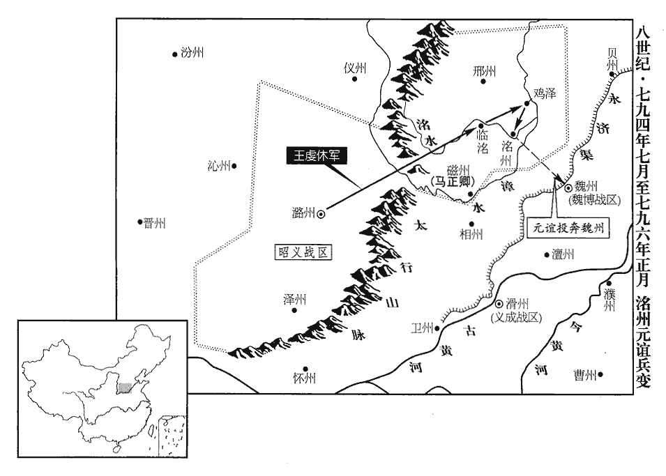
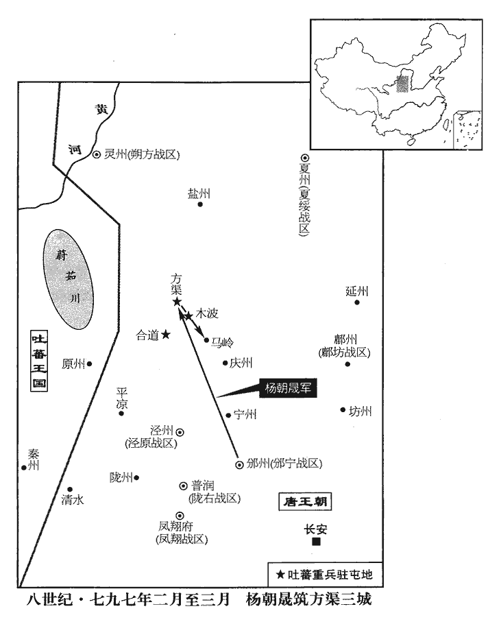
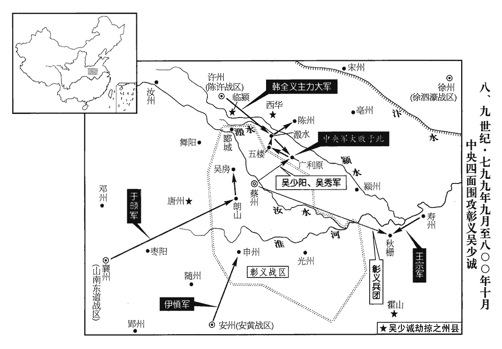

 唐紀五十一起閼逢閹茂（甲戌）六月，盡上章執徐（庚辰），凡六年有奇。

# 德宗神武聖文皇帝十

## 貞元十年（甲戌、七九四）

1六月，壬寅朔‹一›，昭義‹总部设潞州山西省长治市›節度使李抱真薨‹年六十二岁›。其子殿中侍御史緘與抱真從甥元仲經謀，祕不發喪，詐為抱真表，求以職事授緘；又詐為其父書，遣裨將陳榮詣王武俊‹成德战区，总部设恒州河北省正定县›假貨財。武俊怒曰：「吾與乃公厚善，欲同獎王室耳，豈與汝同惡邪！聞乃公已亡，乃，猶汝也。公，猶翁也。乃敢不俟朝命而自立，朝，直遙翻。又敢告我，況有求也！」使榮歸，寄聲質責緘。質，正也。以正義責之也。

〖译文〗 [1]六月，壬寅朔（初一），昭义节度使李抱真去世。他的儿子殿中侍御史李缄，与李抱真的表外甥元仲经谋划，先不将李抱真去世的消息公告于众，伪造李抱真的表章，请求将节度使的职务授给李缄，还伪造他父亲的书信，派遣副将陈荣前往王武俊处借用钱财。王武俊生气地说：“我与你父亲深深交好，是为了共同辅助朝廷而已，怎么会与你狼狈为奸呢！听说你父亲已经去世，你竟敢不等待朝廷的任命便擅自继位，还敢告诉我，况且有求于我！”他让陈荣回去，口头传达他对李缄的质问与责备。

昭義步軍都虞候王延貴，汝州‹河南省汝州市›梁‹汝州州政府所在县›人也，梁縣，漢、晉屬河南郡，後魏置汝北郡，隋分置承休縣，而梁縣仍故。唐以承休縣帶汝州，故梁縣在其西南四十五里。素以義勇聞。上知抱真已薨，遣中使第五守進往觀變，且以軍事委王延貴。守進至上黨，昭義軍，治上黨。緘稱抱真有疾不能見。三日，緘乃嚴兵詣守進，守進謂之曰：「朝廷已知相公捐館，捐，棄也。言死者棄其館舍而逝也。令王延貴權知軍事。侍御宜發喪行服。」緘愕然，出，謂諸將曰：「朝廷不許緘掌事，諸君意如何？」莫對。緘懼，乃歸發喪，以使印及管鑰授監軍。使印，節度之印也。監，古銜翻。守進召延貴，宣口詔令視事，口宣所受詔旨，故曰口詔。趣緘赴東都。趣赴東都，歸私第。趣，讀曰促。元仲經出走，延貴悉歸罪於仲經，捕斬之。詔以延貴權知昭義軍事。

〖译文〗 昭义步军都虞候王延贵，是汝州梁地人氏，平素以见义勇为知名。德宗知道李抱真已经去世了，便派遣中使第五守进前去观察形势的变化，将要把军中事务交付给王延贵。第五守进来到上党时，李缄声称李抱真重病在身，不能接见。过了三天，李缄才全副武装地去见第五守进，第五守进告诉他说：“朝廷已经知道李相公去世了，已命令王延贵暂且代理军中事务。你最好还是将消息公之于众，为你父亲服丧守孝吧。”李缄惊讶不已，出来以后，他对各将领说：“朝廷不允许我执掌军中事务，诸位意下如何？”没有人回答他。李缄害怕了，便回去将李抱真的死讯公布于众，把节度使的印信和钥匙交给监军。第五守进召来王延贵，口头宣布诏旨，命令王延贵任职，催促李缄前往东都洛阳。元仲经外出逃走。王延贵把罪责全部加给元仲经，便逮捕并斩杀了他。德宗颁诏任命王延贵暂且代理昭义军中事务。

2雲南王異牟尋遣其弟湊羅楝楝，郎甸翻。獻地圖、土貢及吐蕃所給金印，請復號南詔。夷語以王為詔。其先渠帥有六，自號六詔，曰蒙巂詔，越析詔，浪穹詔，邆téng睒shǎn詔，施浪詔，蒙舍詔。蒙舍詔在諸部南，故稱南詔。至蒙歸義，玄宗封為雲南王，因號雲南。癸丑‹十二›，以祠部郎中袁滋為冊南詔使，考異曰：舊南詔傳：「十年八月，遣湊羅楝獻吐蕃印。」新傳曰：「異牟尋與崔佐時盟點蒼山，敗突厥於神川。明年六月，冊異牟尋為南詔王。」按實錄，乃今年六月，新、舊傳皆誤也。韋皋奏狀皆稱「雲南王」，而竇滂雲南別錄曰：「詔袁滋冊異牟尋為南詔。」蓋從其請，南詔之名自此始也。蠻語，詔即王也。新傳云「南詔王」，亦誤。余按異牟尋破吐蕃於神川，考異誤作「突厥」。賜銀窠金印，文曰「貞元冊南詔印」。滋至其國，異牟尋北面跪受冊印，稽首再拜，因與使者宴，出玄宗所賜銀平脫‹平脱，即镶嵌。把镂成花纹图案的金银薄叶，用漆贴在器物上，重新上漆，然后再行细磨，使花纹露出，这种工艺品称”平脱”，即一种镶嵌工艺，唐朝最为盛行›馬頭盤二以示滋。又指老笛工、歌女曰：「皇帝所賜龜茲樂，唐十部樂有龜茲樂，有彈箏、豎箜篌、琵琶、五絃、橫笛、笙、簫、觱bì篥lì、答臘鼓、毛員鼓、都曇鼓、侯提鼓、雞婁鼓、腰鼓、擔鼓、齊鼓，具皆一，銅鈸二，舞者四人。設五方師子，高丈餘，飾以方色，每師子有十二人，畫衣，執紅拂，首加紅袜mò，謂之師子郎。龜茲，音丘慈。惟二人在耳。」滋曰：「南詔當深思祖考，子子孫孫盡忠於唐。」異牟尋拜曰：「敢不謹承使者之命！」

〖译文〗 [2]云南王异牟寻派遣他的弟弟凑罗楝献上地图、土产贡物和吐蕃授给的金印，请求恢复南诏的国号。癸丑（十二日），德宗任命祠部郎中袁滋为册南诏使，赐给以银作底的金印，印文称作“贞元册南诏印”。袁滋来到云南国，异牟寻面向北方跪着接受了册封的印信，叩头至地，拜了两拜，接着便设宴招待使者，拿出玄宗赐给的两个银平脱马头盘，给袁滋看，还指着年迈的吹笛者和歌女说：“皇帝赐给《龟兹乐》时带来的乐工，只有这两个人还活着。”袁滋说：“南诏应当深深仰慕祖先的事迹，了子孙孙对唐朝竭尽忠心。”异牟寻行着礼说：“我怎敢不恭谨地承受使者的教导！”

3賜義武‹总部设定州河北省定州市›節度使張昇雲名茂昭。考異曰：舊傳於其父孝忠卒時言改名。年代記在此年九月。今從實錄。

〖译文〗 [3]德宗赐给义武节度使张升云新的名字，叫张茂昭。

4御史中丞穆贊按度支吏贓罪，度，徒洛翻。裴延齡欲出之，庇吏，欲出其罪。贊不從；延齡譖之，貶饒州‹江西省波阳县›別駕，朝士畏延齡側目。畏之不敢正視。贊，寧之子也。天寶末，安祿山反，穆寧起兵於河北以討之。

〖译文〗 [4]御史中丞穆赞按察度支部门的官吏贪脏的罪行，裴延龄打算为他们开脱，穆赞不肯听从。于是，裴延龄诬陷他，使他被贬为饶州别驾，朝中百官对裴延龄畏惧得不敢正眼相看。穆赞是穆宁的儿子。

5韋皋奏破吐蕃於峨和城‹四川省茂县西北›。武德元年，以漢蠶陵縣地置翼州，管內有峨和城。

〖译文〗 [5]韦皋奏报在峨和城打败吐蕃。

6秋，七月，壬申朔‹一›，以王延貴為昭義留後，賜名虔休。

〖译文〗 [6]秋季，七月，壬申朔（初一），德宗任命王延贵为昭义留后，赐给他新的名字，叫王虔休。

昭義行軍司馬、攝洺州‹河北省永年县东南旧永年镇›刺史元誼聞虔休為留後，意不平，表請以磁‹河北省磁县›、邢‹河北省邢台市›、洺別為一鎮。昭義精兵多在山東，昭義軍鎮潞州，謂磁、邢、洺三州為山東。誼厚賚以悅之。上屢遣中使諭之，不從。

〖译文〗 昭义行军司马、摄州刺史元谊听说王虔休担任了留后，心中愤慨不满，上表请求将磁州、邢州、州另外组成一个节镇。昭义的精锐兵马多数驻扎在这三州，元谊给与丰厚的待遇，以便取悦他们。德宗屡次派遣中使晓示他，但他不肯听从。

臨洺‹河北省永年县›守將夏侯仲宣以城歸虔休，虔休遣磁州刺史馬正卿督裨將石定蕃等將兵五千擊洺州；定蕃帥其眾二千叛歸誼，帥，讀曰率。正卿退還。詔以誼為饒州刺史，誼不行；虔休自將兵攻之，引洺水‹流经洺州城南›以灌城。

〖译文〗 临的守城将领夏侯仲宣率领全城归顺了王虔休，王虔休派遣磁州刺史马正卿督促副将石定蕃等人领兵五千人进击州。石定蕃率领他的部众二千人叛变投降元谊，马正卿撤退而还。德宗颁诏任命元谊为饶州刺史，元谊不肯前去就任。王虔休亲自领兵攻打元谊，还引来水淹灌州城。

 

7黃少卿‹钦州（广西钦州市）蛮夷首领›陷欽、横‹广西横县›、潯‹广西桂平县›、貴‹广西贵港市›等州，攻孫公器於邕州‹广西南宁市›。

〖译文〗 [7]黄少卿攻陷了钦、横、浔、贵等州，在邕州进攻孙公器。

8九月，王虔休破元誼兵，進拔雞澤‹河北省鸡泽县›。雞澤，漢廣平縣地，武德四年置雞澤縣，屬洺州。九域志：在州東北六十里。

〖译文〗 [8]九月，王虔休打败元谊的兵马，进军攻克鸡泽。

9裴延齡奏稱官吏太多，自今缺員請且勿補，收其俸以實府庫。上欲脩神龍寺，須五十尺松，不可得，延齡曰：「臣近見同州‹陕西省大荔县›一谷，木數千株，皆可八十尺。」上曰：「開元、天寶間求美材於近畿猶不可得，今安得有之？」對曰：「天生珍材，固待聖君乃出，開元、天寶，何從得之！」

〖译文〗 [9]裴延龄上奏声称官吏太多，从今以后，对于官吏中出现的缺员，请暂且不要补充，收取这部分薪俸，用来充实国家的库存。德宗打算修建神龙寺，需要五十尺长的松木，但无法找到，裴延龄说：“近来我在同州看到一处山谷，谷内有好几千棵树木，都是高八十尺的。”德宗说：“开元、天宝年间在京城周围寻找上好的木材尚且无法找到，现在怎么会有这么多的木材？”裴延龄回答说：“上天生出珍贵的木材，当然是等待圣明的君主出世时才会出现，开元、天宝期间，怎么能够得到这些呢！”

延齡奏：「左藏庫司多有失落，近因檢閱使置簿書，乃於糞土之中得銀十三萬兩，其匹段雜貨百萬有餘。匹段雜貨，使在糞土之中，已應腐爛不可用，雖甚愚之人亦知其妄誕也。德宗不加之罪，延齡復何所忌憚乎！此皆已棄之物，即是羨餘，羨，弋線翻。悉應移入雜庫以供別敕支用。」太府少卿韋少華不伏，抗表稱：「此皆每月申奏見在之物，見，賢遍翻。請加推驗。」執政請令三司詳覆；上不許，亦不罪少華。延齡每奏對，恣為詭譎，皆眾所不敢言亦未嘗聞者，延齡處之不疑。處，昌呂翻。上亦頗知其誕妄，但以其好詆毀人，好，呼到翻。冀聞外事，故親厚之。德宗親厚裴延齡，不特冀聞外事也，亦以進奉逢其欲耳。

〖译文〗 裴延龄上奏说：“左藏库执掌的物品损失遗落很多，近来由于检阅使去放帐簿，于是在垃圾中得到银子十三万两，成匹成段的布帛和零杂货物超过一百万。这都是已经丢弃的物品，也就成为额外的收入，应当全部搬到杂库去，好供给陛下另外颁敕支取使用。”太府少卿韦少华不承认这一说法，便上表直言声称：“这都是每月申报上奏的现存物品，请加以推究验查。”主持政务的长官请求命令三司详细审察，德宗没有答应，但也不责怪韦少华。每当裴延龄当面回答德宗提出的问题时，任意去说怪诞的事情，都是大家所不敢说、也不曾听说过的，裴延龄却将这些事情说得无可怀疑。德宗也知道裴延龄是荒诞虚妄的，但由于他喜欢恶意诬蔑别人，希望从他那里听到外间的事情，所以亲近厚待他。

群臣畏延齡有寵，莫敢言，惟鹽鐵轉運使張滂、京兆尹李充、司農卿李銛銛xiān，息廉翻。以職事相關，時證其妄，而陸贄獨以身當之，日陳其不可用。十一月，壬申‹三›，贄上書極陳延齡姦詐，數其罪惡，數，所具翻。其略曰：「延齡以聚斂為長策，斂，力贍翻。以詭妄為嘉謀，以掊克斂怨為匪躬，掊，蒲侯翻。以靖譖服讒為盡節，左傳：少皞氏有不才子，毀信廢忠，崇飾惡言，服讒蒐sōu慝，以誣盛德，天下之民謂之窮奇。總典籍之所惡以為智術，冒聖哲之所戒以為行能，惡，烏路翻。行，下孟翻。可謂堯代之共工，書堯典：帝曰：「疇咨若予采！」驩兜曰：「共工方鳩僝zhuàn功。」帝曰：「吁！靖言庸違，象恭滔天。」共，音恭。魯邦之少卯也。家語：孔子為魯司寇，攝行相事，七日而誅少正卯，戮之于兩觀之下。子貢進曰：「夫少正卯，魯之聞人也，夫子為政而始誅之，或者為失乎？」孔子曰：「天下有大惡者五，而竊盜不豫焉。一曰心逆而險，二曰行偽而堅，三曰言偽而辯，四曰記醜而博，五曰順非而澤。此五者，有一於人，則不免君子之誅，而少正卯皆兼有之。其居處足以撮徒成黨，其談說足以飭褒榮眾，其強禦足以返是獨立；此乃人之姦雄，有不可以不除。」跡其姦蠹，日長月滋，長，知丈翻。陰祕者固未盡彰，敗露者尤難悉數。」又曰：「陛下若意其負謗，則誠宜亟為辯明。為，于偽翻。陛下若知其無良，又安可曲加容掩！」又曰：「陛下姑欲保持，曾無詰問，延齡謂能蔽惑，不復懼思；移東就西，便為課績，取此適彼，遂號羨餘，愚弄朝廷，有同兒戲。」又曰：「矯詭之能，誣罔之辭，遇事輒行，應口便發，靡日不有，靡時不為，又難以備陳也。」又曰：「昔趙高指鹿為馬，事見八卷秦二世三年。臣謂鹿之與馬，物理猶同；豈若延齡掩有為無，指無為有。」又曰：「延齡凶妄，流布寰區，上自公卿近臣，下逮輿臺賤品，左傳：芊尹無宇曰：王臣公，公臣大夫，大夫臣士，士臣皁，皁臣輿，輿臣隸，隸臣僚，僚臣僕，僕臣臺。諠諠談議，億萬為徒，能以上言，上，時掌翻。其人有幾！臣以卑鄙，任當台衡，情激于衷，雖欲罷而不能自默也。」書奏，上不悦，待延齡益厚。

〖译文〗 群臣畏惧裴延龄得到宠爱，没有人敢于发言，只有盐铁转运使张滂、京兆尹李充、司农卿李，由于职分以内的事务与裴延龄有关联，所以时常证实他的虚妄，而陆贽独自以自身抵挡裴延龄，经常陈说他不可任用。十一月，壬申（初三），陆贽上书极力陈诉裴延龄的邪恶诡诈，数说他的罪恶，大略是说：“裴延龄将搜刮财货当作长远的方策，将诡诈妄为当作美善的计谋，将苛剥民财、聚集怨恨当作不顾及自身的忠心，将惯于诬陷，专进谗言当作竭尽臣下的节操，他汇总典藉所憎恶的东西，用来作为自己的智谋与权术，他冒犯圣人贤人的告诫，用来作为自己的品行与才能，可以称他为唐尧时代的共工，春秋时代鲁国的少正卯。考察他邪恶害政的行为，每天都在增长，每月都在滋蔓，隐秘着的事情固然没有完全显示出来，败露了的事情尤其难以数说。”他又说：“倘若陛下认为他蒙受了诽谤，那么，诚然应当赶快为他分辩明白。倘若陛下知道他不是善良之辈，又怎么能够为他容忍掩饰呢！”他又说：“陛下打算姑且保全护持他，对他从来不加责问，裴延龄以为他能够蒙蔽欺惑陛下，不再怀有畏惧的心思。他把东边的移动到西边去，就成为考课的成绩，将这边的拿到那边去，于是称额外的收入，如此欺骗玩弄朝廷，就如小儿游戏一般。”他又说：“裴延龄虚伪诡诈的才能，诬蔑不实的言辞，遇事便要表现，随口便要讲出，没有一天不发生这种事情，没有一时不在做这种事情，这是难以完全陈述出来的了。”他又说：“过去赵高指鹿为马，我认为鹿与马，就事物的常理说来还属于同一种类，哪里比得上裴延龄将存在的东西掩饰为不存在的东西，将不存在的东西指成存在的东西呢！”他又说：“裴延龄的凶顽虚妄，已经在全国传布开来，上自公侯卿相等陛下亲近的大臣，下至地位低下的人们，噪噪杂杂地谈说议论他的，有成千上万，但能够将此进言的人又有几个！我以低微鄙陋之身，担当着宰相大臣的职任，由于真情在内心中激荡不已，即使打算不再谈论此人，但我还是不能够自行沉默下去啊。”此书奏进以后，德宗很不高兴，反而愈加厚待裴延龄了。

10十二月，王虔休乘冰合度壕，急攻洺州。元誼出兵擊之，虔休不勝而返；日暮冰解，士卒死者太半。

〖译文〗 [10]十二月，王虔休乘着冰冻封合时，越过城壕，急速攻打州。元谊派出兵马向他进击，王虔休无法取胜，只好回军。日落时分，冰冻消融，王虔休的士兵死去的有一多半。

11中書侍郎、同平章事陸贄以上知待之厚，事有不可，常力爭之。所親或規其太銳，贄曰：「吾上不負天子，下不負所學，他無所恤。」裴延齡日短贄於上。趙憬之入相也，贄實引之，既而有憾於贄，事見上卷八年、九年。密以贄所譏彈延齡事告延齡，故延齡益得以為計，上由是信延齡而不直贄。贄與憬約至上前極論延齡姦邪，上怒形於色，憬默而無言。壬戌‹二十三›，贄罷為太子賓客。考異曰：韓愈順宗實錄曰：「德宗在位稍久，益自攬機柄，親治細事，失人君大體，宰相益不得行其職，而議者乃云由贄而然。」按凡為宰相者皆欲專權，安肯自求失職。不任宰相，乃德宗之失，而歸咎於贄，豈人情也！又贄論朝官缺員狀云：「頃之輔臣鮮克勝任，過蒙容養，苟備職員，致勞睿思，巨細經慮。」此乃諫德宗不任宰相、親治細事之辭也。

〖译文〗 [11]中书侍郎、同平章事陆贽因德宗知遇，对待他情义深厚，凡有不同意的事情，经常竭力争议。有些与他亲近的人规劝他说，这样做过于显露锋芒，陆贽说：“只要我上不辜负天子，下不辜负平生的学问，别的事情就没有值得顾惜的了。”裴延龄天天在德宗面前指责陆贽的短处。赵憬出任宰相，实在是陆贽引荐了他。不久，他对陆贽有不满意的地方，便暗中将陆贽抨击裴延龄的事情告诉了裴延龄，所以裴延龄愈发能够做好预谋。从此，德宗相信裴延龄而不再认为陆贽是对的了。陆贽与赵憬约好了到德宗面前极力论说裴延龄的邪恶，德宗的怒气在脸色上都表现出来了，而赵憬却沉默不语。壬戌（二十三日），陆贽被罢免为太子宾客。

12初，勃海‹此时首都在东京龙原府吉林省浑春市›文王欽茂卒，子宏臨早死，族弟元義立。元義猜虐，國人殺之，立宏臨之子華嶼，是為成王，改元中興。華嶼卒，復立欽茂少子嵩鄰，復，扶又翻。是為康王，改元正曆。勃海自大祚榮立國，開元之間，其子武藝立，益以強盛，東北諸夷皆畏而臣之，改元仁安。更五代以至于宋，耶律雖數加兵，不能服也。故通鑑歷敘其世為詳。

〖译文〗 [12]当初，勃海文王大钦茂去世，儿子大宏临早死，族弟大元义即位。大元义猜忌而残暴，国中的人们杀掉了他，拥立大宏临的儿子大华屿，这便是成王，年号更改为中兴。大华屿去世，又拥立大钦茂的小儿子大嵩邻，这便是康王，年号更改为正历。

## 十一年（乙亥、七九五）

1春，二月，乙巳‹七›，冊拜嵩鄰為忽汗州‹吉林省敦化市›都督、勃海王。考異曰：實錄：「乙巳，冊大嶺嵩鄰為勃海郡王。」今從新傳。

〖译文〗 [1]春季，二月，乙巳（初七），册封大嵩邻为忽汗州都督、勃海王。

2陸贄既罷相，裴延齡因譖京兆尹李充、衛尉卿張滂、前司農卿李銛xiān黨於贄。會旱，延齡奏言：「贄等失勢怨望，言於眾曰，『天下旱，百姓且流亡，度支多欠諸軍芻糧，軍中人馬無所食，其事柰何！』言其事勢將柰之何。以動搖眾心，其意非止欲中傷臣而已。」中，竹仲翻。言不獨以此為延齡罪，且欲危社稷。後數日，上‹李适，本年五十四岁›獵苑中，適有神策軍士訴云：「度支不給馬芻。」上意延齡言為信，遽還宮。夏，四月，壬戌‹二十五›，貶贄為忠州‹重庆市忠县›別駕，充為涪州‹重庆市涪陵区›長史，滂為汀州‹福建省长汀县›長史，開元二十四年，開撫、福二州山洞，置汀州。舊志：忠州，京師南二千一百二十二里。汀州，京師東南六千一百七十三里。譙周巴記曰：後漢初平六年，立臨江縣，屬永寧郡。今忠州城東臨江古城是也。後魏廢帝二年，改為臨州，因臨江縣以名州也。隋廢州，以其地併入巴東郡。貞觀四年，置忠州，以其地連巴徼，心懷忠信為名。涪州，漢涪陵縣地，隋置涪州，京師南二千三百五十里。銛為邵州‹湖南省邵阳市›長史。邵州，京師東南三千四百里。宋白曰：邵州，漢為昭陵縣，吳改邵陵，分零陵北部為邵陵郡。隋立建州，尋廢州，以邵陵縣屬潭州，唐貞觀十一年置邵州。

〖译文〗 [2]陆贽被罢除宰相职务以后，裴延龄接着又诬陷京兆尹李充、卫尉卿张滂、前司农卿李偏袒陆贽。适逢天旱，裴延龄上奏说：“陆贽等人因失去权势而怨恨不满，他们对大家说：‘天下干旱，百姓将要流离散亡了。度支亏欠各军粮草很多，军中的人马没有吃的，这种事情将怎么办才好！’他们以此动摇大家的心意，他们的企图恐怕不限于中伤我一个人就算了事。”过了几天，德宗在禁苑中打猎，恰巧有神策军的将士申诉说：“度支不供给喂马的草料。”德宗猜测裴延龄的话是可信的，急忙回到宫中。夏季，四月，壬戌（二十五日），将陆贽贬为忠州别驾，李充贬为涪州长史，张滂贬为汀州长史，李贬为邵州长史。

初，陽城自處士徵為諫議大夫，見二百三十二卷二年。處，昌呂翻。拜官不辭。未至京師，人皆想望風采，曰：「城必諫諍，死職下。」及至，諸諫官紛紛言事細碎，天子益厭苦之。而城方與二弟及客日夜痛飲，人莫能窺其際，皆以為虛得名耳。前進士河南‹河南省洛阳市›韓愈作爭臣論以譏之，爭，讀曰諍。城亦不以屑意。有欲造城而問者，屑，潔也，顧也。造，七到翻。城揣知其意，輒強與酒。揣，初委翻。強，其兩翻。客或時先醉仆席上，城或時先醉臥客懷中，不能聽客語。及陸贄等坐貶，上怒未解；中外惴恐，惴，之睡翻。以為罪且不測，無敢救者。城聞而起曰：「不可令天子信用姦臣，殺無罪人。」即帥拾遺王仲舒、歸登、右補闕熊執易、崔邠等守延英門，延英門，延英殿門也。程大昌曰：按六典，宣政殿門西上閤門之西，即為延英門，門之左曰延英殿。故陽城欲救陸贄，約王仲舒等守延英殿閤上書，伏閤不去也。帥，讀曰率。上疏論延齡姦佞，贄等無罪。上大怒，欲加城等罪。太子‹李诵›為之營救，為，于偽翻。上意乃解，令宰相諭遣之。於是金吾將軍張萬福聞諫官伏閤諫，趨往至延英門，大言賀曰：「朝廷有直臣，天下必太平矣！」遂遍拜城與仲舒等，已而連呼「太平萬歲！太平萬歲！」萬福，武人，年八十餘，自此名重天下。登，崇敬之子也。崇敬，明禮家學，歷事玄，肅、代及帝四世。時朝夕相延齡，陽城曰：「脫以延齡為相，城當取白麻壞之，唐故事，中書用黃、白二麻為綸命輕重之辯。其後翰林學士專掌內命，中書用黃麻，其白皆在翰林院，拜授將相、德音赦宥則用之。宋白曰：「唐故事，白麻皆內庭代言，命輔臣、除節將、恤災患、討不庭則用之；宰臣於正衙受付。若命相之書，則通事舍人承旨，皆宣讚訖，始下有司。翰林志：凡赦書、德音、立后、建儲、行大誅討、拜免三公•宰相、命將日，並使白麻紙，不使印。雙日起草，候閤門鑰入而後進呈。至隻日，百寮並班於宣政殿，樞密使引案，自東上閤門出。若拜免宰相，即便付通事舍人，餘付中書、門下，並通事舍人宣示。若機務急速，亦雙日。甚速者，雖休假，亦追班宣示。案，制案也。冊，則有冊案。冊公主亦自閤門出案。壞，音怪。慟哭於庭。」有李繁者，泌之子也，城盡疏延齡過惡，欲密論之，以繁故人子，陽城之除諫議，李泌之薦也。使之繕寫，繁徑以告延齡。延齡先詣上，一一自解。疏入，上以為妄，不之省。省，悉景翻。

〖译文〗 当初，阳城由未做官的士人被征召为谏议大夫，对任命他的官职并不推辞。阳城还没有来到京城，人们便思慕他的风度文采，都说：“阳城肯定会直言规谏，效忠职守，以至于死的。”及至阳城来到朝廷以后，谏官们谈论政事时纷纷讲些细小琐碎的事情，德宗愈加厌烦不堪。然而，阳城却正与自己的两个弟弟以及宾客日夜开怀饮酒，人们对他摸不着边际，都认为他是虚有其名罢了。前进士河南人韩愈写了一篇《争臣论》来讥讽他，阳城也并不介意。有人打算前去质问阳城，阳城揣度清楚来人的用意以后，总是强劝来人饮酒，有时客人先醉倒在酒席上，有时阳城先醉躺在客人的怀抱中，不能听客人讲话了。及至陆贽等人获罪被贬以后，德宗的怒气尚未消散，朝廷内外恐惧不安，都认为对他们的罪罚将是难以测度的，因而没有人敢营救他们。阳城闻知此情，站起来说道：“不能让天子相信任用奸臣，杀害没有罪过的人。”他当即带领拾遗王仲舒、归登、右补阙熊执易、崔等人在延英门守候着，奏上疏章，论说裴延龄邪恶谄谀，而陆贽等人没有罪。德宗大怒，准备将阳城等人治罪，太子为此而出面营救，德宗的态度才缓和下来，使宰相宣旨让他们离去。当此时，金吾将军张万福听说谏官跪在延英殿阁进谏，便快步前往延英门，大声祝贺道：“朝廷有直言的臣下，天下肯定要太平了！”于是，他逐一拜谢阳城与王仲舒等人，随即连声大呼“太平万岁！太平万岁！”张万福是一员武将，年纪有八十多岁，自此以后，他的名声便为天下推重了。归登是归崇敬的儿子。当时，随时都有任命裴延龄为宰相的可能，阳城说：“倘若让裴延龄出任宰相，我就会将任命他的白麻诏书拿来毁掉，还要在朝廷上痛哭一场。”有个叫李繁的人，是李泌的儿子，阳城疏陈裴延龄的全部过失与罪恶，想秘密弹劾他，因李繁是旧友的儿子，便让他誊抄疏章，李繁却径直将此事告诉了裴延龄。裴延龄事先前往德宗处逐条自行解释，待到疏章送入内廷，德宗认为这是虚妄的，便不去观看这一疏章了。

3丙寅‹二十九›，幽州‹卢龙战区总部·北京市›奏破奚‹滦河上游›王啜利等六萬餘眾。

〖译文〗 [3]丙寅（二十九日），幽州奏报打败奚王啜利等六万多人。

4回鶻‹瀚海沙漠群›奉誠可汗卒‹年二十岁›，無子，國人立其相骨咄祿為可汗。骨咄祿本姓𨁂xié跌氏‹𨁂跌部落住内蒙古呼和浩特市北›，𨁂，奚結翻。跌，徒結翻。𨁂跌與回紇同出鐵勒而異種。辯慧有勇略，自天親時回鶻天親可汗，合骨咄祿也。典兵馬用事，大臣諸酋長皆畏服之。既為可汗，冒姓藥葛羅氏，回紇可汗姓藥葛羅。骨咄祿捨其本姓，冒其姓以嗣其國。酋，慈由翻。長，知兩翻。遣使來告喪。自天親可汗以上子孫幼穉者，皆內之闕庭。唐之闕庭也。

〖译文〗 [4]回鹘奉诚可汗去世，没有子嗣，国中的人们拥立他的国相骨咄禄为可汗。骨咄禄本来姓跌氏，善辩而有才智，勇敢而有谋略，自从天亲可汗以来，他便掌管军事，执掌大权，大臣和各部酋长都折服于他。骨咄禄当了可汗以后，冒充姓药葛罗氏，派遣使者前来上报丧事，还将天亲可汗以前各可汗年纪幼小的子孙后代，全部送交给朝廷。

5五月，丁丑‹十一›，以宣武‹总部设汴州河南省开封市›留後李萬榮、昭義‹总部设潞州山西省长治市›左司馬領留後王虔休皆為節度使。

〖译文〗 [5]五月，丁丑（十一日），德宗将宣武留后李万荣、昭义左司马领留后王虔休同时任命为节度使。

6甲申‹十八›，河東‹总部设太原府山西省太原市›節度使李自良薨。戊子‹二十二›，監軍王定遠奏請以行軍司馬李說為留後。說，神通之五世孫也。淮安王神通，高祖之從弟，起兵關西，首應義旗。說，讀為悅；下同。

〖译文〗 [6]甲申（十八日），河东节度使李自良去世。戊子（二十二日），监军王定远上奏请求任命行军司马李说为留后。李说是李神通的五世孙。

7庚寅‹二十四›，遣祕書監張薦冊拜回鶻可汗骨咄祿為騰里邏羽錄沒密施合胡祿毗伽懷信可汗。咄，當沒翻。邏，郎佐翻。

〖译文〗 [7]庚寅（二十四日），德宗派遣秘书监张荐册封回鹘可汗骨咄禄为腾里逻羽录没密施合胡禄毗伽怀信可汗。

8癸巳‹二十七›，以李說為河東留後，知府事。說深德王定遠，請鑄監軍印。【章：乙十六行本「印」下有「從之」二字；乙十一行本同；孔本同；張校同；退齋校同。】監軍有印自定遠始。

〖译文〗 [8]癸巳（二十七日），德宗任命李说为河东留后，主管府中事宜。李说深深感激王定远，请求铸造监军的印信，监军有印信便是由王定远开始的。

9秋，七月，丙寅朔‹一›，陽城改國子司業，坐言裴延齡故也。

〖译文〗 [9]秋季，七月，丙寅朔（初一），阳城被改任为国子司业，这是由于他揭露裴延龄而获罪的原故。

10王定遠自恃有功於李說，專河東‹总部设太原府山西省太原市›軍政，易置諸將；說不能盡從，由是有隙。定遠以私怒拉殺大將彭令茵，拉，盧合翻。埋馬矢中，將士皆憤怒。說奏其狀，定遠聞之，直詣說，拔刀刺之；刺，七亦翻。說走免。定遠召諸將，以箱貯敕及告身二十餘通，箱，竹笥也。貯，丁呂翻。示之曰：「有敕，令說詣京師，以行軍司馬李景略為留後，李景略為李說所忌，蓋起於此。諸君皆遷官。」眾皆拜。大將馬良輔竊視箱中，皆定遠告身及所受敕也，乃麾眾曰：「敕告皆偽，不可受也。」定遠走登乾陽樓，乾陽樓，蓋晉陽宮城南門樓。呼其麾下，莫應，踰城而墜，為枯枿niè所傷而死。枿，五葛翻。木之伐去者，其遺餘為枿。考異曰：舊說傳曰：「定遠殺彭令茵，說具以事聞。德宗以定遠有奉天扈從功，恕死，停任。制未至，定遠怒說奏聞，趨府謀殺說，昇堂未坐，抽刀刺說；說走而獲免。」又曰：「定遠墜城下，槎chá枿傷而不死。尋有詔削奪，長流崖州。」今從實錄。

〖译文〗 [10]王定远自己依仗着为李说立下功劳，便专擅河东的军事大政。调动各将领时，李说不能够完全听从他的意见，因此产生了嫌隙。王定远因私忿拉杀大将彭令茵，将他的尸体掩埋在马粪中，将士们都愤怒了。李说奏陈此事，王定远听说以后，径直来到李说处，拔刀刺杀李说，李说逃脱，得以幸免。王定远将各将领召集起来，拿出箱中存放着的敕书和与告身二十多通，一边给大家看，一边说：“我这里带着敕书，命令李说前往京城，任命行军司马李景略为留后，诸位全都提升官职。”大家都跪拜。大将马良辅偷偷向箱中看去，发现箱中放的都是王定远的告身和他所接受的敕书，于是指挥大家说：“敕书和告身都是假的，大家不能接受啊。”王定远跑出去，登上乾阳楼，招呼他的部下，部下无人答应，他在翻越城墙时摔了下来，被枯树枝戳伤致死。

11八月，辛亥‹十七›，司徒兼侍中北平莊武王馬燧薨‹年七十岁›。

〖译文〗 [11]八月，辛亥（十七日），司徒兼侍中北平庄武王马燧去世。

12閏月，戊辰‹四›，元誼以洺州‹河北省永年县东南旧永年镇›詐降；王虔休遣裨將將二千人入城，誼皆殺之。降，戶江翻。將，即亮翻。

〖译文〗 [12]闰八月，戊辰（初四），元谊让州诈称归降，王虔休派遣副将带领两千人进入城内，元谊将他们全部杀掉了。

13九月，丁巳‹二十三›，加韋皋‹西川战区，总部设成都府四川省成都市›雲南安撫使。以安撫南詔為官名。

〖译文〗 [13]九月，丁巳（二十三日），德宗加封韦皋为云南安抚使。

14橫海‹总部设沧州河北省沧州市东南›節度使程懷直，不恤士卒，獵於野，數日不歸。懷直從父兄懷信為兵馬使，因眾心之怨，閉門拒之；懷直奔歸京師。冬，十月，丁丑‹十四›，以懷信為橫海留後。

〖译文〗 [14]横海节度使程怀直，不肯体恤士兵，在野外打猎，好几天都不回来。程怀直的堂兄程怀信担任兵马使，趁着大家心怀不满，便关闭城门，不让程怀直进城，程怀直只好逃回京城。冬季，十月，丁丑（十四日），德宗任命程怀信为横海留后。

15南詔‹首都苴咩城云南省大理市›攻吐蕃昆明城‹四川省盐源县›，取之；昆明城，在西爨西北，有鹽池之利。又虜施、順二蠻王。施、順二蠻，皆烏蠻種。施蠻在鐵橋西北，居大施睒shǎn、斂尋睒。順蠻在劍睒西北四百里。睒，失冉翻。

〖译文〗 [15]南诏进攻吐蕃的昆明城，并占领了该城。南诏还俘虏了施、顺二蛮的国王。

## 十二年（丙子、七九六）

1春，正月，庚子‹七›，元誼、石定蕃等帥洺州‹河北省永年县东南旧永年镇›兵五千人及其家人萬餘口奔魏州‹河北省大名县·魏博战区总部›；帥，讀曰率。上‹李适，本年五十五岁›釋不問，命田緒安撫之。

〖译文〗 [1]春季，正月，庚子（初七），元谊、石定蕃等人率领州士兵五千人以及他们的家属一万余口逃奔魏州，德宗将他们的事情搁置下来，不予追问，还命令田绪安抚他们。

2乙丑‹二月三日›，以渾瑊‹河中战区，总部设河中府山西省永济市›、王武俊‹成德战区，总部设恒州河北省正定县›並兼中書令。己巳‹七›，加嚴震、田緒、劉濟、韋皋並同平章事；天下節度、觀察使，悉加檢校官以悅其意。

〖译文〗 [2]乙丑（疑误），德宗使浑、王武俊一并兼任中书令。己巳（疑误），德宗加封严震、田绪、刘济、韦皋一并同平章事，对全国的节度使、观察使，全部加封检校官职，以便取悦众人。

3三月，甲午‹二›，韋皋‹西川战区，总部成都府›奏降西南蠻高萬唐等二萬餘口。降，戶江翻。

〖译文〗 [3]三月，甲午（初二），韦皋奏报降服了西南蛮高万唐等共两万余口。

4乙巳‹十三›，以閑厩、宮苑使李齊運為禮部尚書，閑厩、宮苑二使，李齊運蓋兼為之。戶部侍郎裴延齡為戶部尚書，使職如故。齊運無才能學術，專以柔佞得幸於上，每宰相對罷，則齊運次進決其議；或病臥家，上欲有所除授，往往遣中使就問之。

〖译文〗 [4]乙巳（十三日），德宗任命闲厩、宫苑使李齐运为礼部尚书，任命户部侍郎裴延龄为户部尚书，所兼任的使职一如既往。李齐运既无才能，又无学术，专门使用阴柔诌谀的手段取得德宗的宠幸，每当宰相回答完德宗的问话以后，李齐运便接着上前裁定他们的主张。有时他卧病在家，德宗准备任命官员，便经常派遣中使到他家中征询他的意见。

5丙子‹二十四›，【章：乙十六行本「子」作「辰」；乙十一行本同。】韶王暹薨。暹，皇弟也。

〖译文〗 [5]丙子（疑误），韶王李暹去世。

6魏博節度使田緒尚嘉誠公主‹李豫（李俶）的女儿›；有庶子三人，季安最幼，公主子之，以為副大使。夏，四月，庚午‹九›，緒暴薨‹年六十三岁›；左右匿之，使季安領軍事，年十五。乙亥‹十四›，發喪，推季安為留後。

〖译文〗 [6]魏博节度使田绪娶嘉诚公主为妻子，有庶出的儿子三人，其中田季安年纪最小，嘉诚公主将他认作自己的儿子，使他担当了副大使的职务。夏季，四月。庚午（初九），田绪突然去世，他的亲信将死讯隐瞒下来，让田季安统领军中事务，这时他才十五岁。乙亥（十四日），他们将田绪的死讯公布于众，推举田季安担任留后。

7庚辰‹十九›，上生日，故事，命沙門、道士講論於麟德殿，至是，始命以儒士參之。四門博士韋渠牟嘲談辯給，後魏劉芳表云：太和二十年，立四門博士於四門置學。按禮記云：天子設四學。鄭註云：周四郊之虞庠也。今以其遼遠，故置於四門，請移與太學同處，從之。唐百官志：四門館博士，正七品上，掌教七品以上侯、伯、子、男子為生及庶人子為俊士生者。上悅之，旬月，遷右補闕，始有寵。

〖译文〗 [7]庚辰（十九日），这一天是德宗的诞辰。依照惯例，应当让僧人、道士在麟德殿讲经论道，至此，开始让儒学之士参与其中。四门博士韦渠牟讥言讽语，很有辩论的口才，德宗赏识他。过了一个月，他被提升为右补阙，开始得到德宗宠幸。

8五月，丙申‹六›，邠寧‹总部设邠州陕西省彬县›節度使張獻甫暴薨，監軍楊明義請都虞候楊朝晟權知留後。丙辰‹十四›，以朝晟為邠寧節度使。

〖译文〗 [8]五月，丙申（初六），宁节度使张献甫突然去世，临军杨明义奏请使都虞候杨朝晟暂时代理留后事务。甲辰（十四日），德宗任命杨朝晟为宁节度使。

9六月，乙丑‹六›，以監句當左神策竇文場、監句當右神策霍仙鳴皆為護軍中尉，監左神威軍使張尚進、監右神威軍使焦希望皆為中護軍。句，古候翻。當，丁浪翻。左、右神策中尉，始於竇、霍，自此宦官之權日以益重，不可復制矣。下護軍中尉一等為中護軍，此職事官之掌禁兵者，非如唐初所置勳級，所謂上護軍、護軍也。宋白曰：德宗以梁、洋扈從之功，舉西漢謁者隨何下淮南功拜為中尉事，故命神策監軍為中尉。初，上置六統軍，視六尚書，以處節度使罷鎮者，興元元年置六統軍，事見二百二十九卷。處，昌呂翻。相承用麻紙寫制。至是，文場諷宰相比統軍降麻。翰林學士鄭絪絪，音因。奏言：「故事惟封王、命相用白麻，今以命中尉，不識陛下特以寵文場邪，遂為著令也？」著令者，定著為令。上乃謂文場曰：「武德、貞觀時，中人不過員外將軍同正耳，衣緋者無幾。自輔國以來，墮壞制度。衣，於既翻。墮，讀曰隳。壞，音怪。朕今用爾，不謂無私。若復以麻制宣告天下，必謂爾脅我為之矣。」復，扶又翻。文場叩頭謝。遂焚其麻，命并統軍自今中書降敕。明日，上謂絪曰：「宰相不能違拒中人，朕得卿言方悟耳。」是時竇、霍勢傾中外，藩鎮將帥多出神策軍，臺省清要亦有出其門者矣。

〖译文〗 [9]六月，乙丑（初六），德宗命监句当左神策窦文场、监句当右神策霍仙鸣都担任护军中尉，命监左神威军使张尚进、监右神威军使焦希望都担任中护军。当初，德宗设置左右羽林、龙武、神武六军统军，比照六部尚书，用来安置免除节镇职务的节度使，相沿使用麻纸书写制书。至此，窦文场婉言劝说宰相，对护军中尉、中护军的任命要比照任命统军的成例，颁降白麻纸诏书。翰林学士郑上奏说：“根据惯例，只有封拜王位、任命宰相才使用白麻纸，现在要用白麻纸任命护军中尉，不知陛下这是特别以此宠任窦文场呢，还是就此便成为定式呢？”于是，德宗对窦文场说：“在武德、贞观时期，宦官的职位不超过员外将军置同正品而己，连穿戴绯色朝服的都没有几个人。自从李辅国以来，制度被败坏了。现在朕任用你，不能说没有私情。如果再使用白麻纸书写的制书向天下宣告，肯定要说这是你胁迫我写的了。”窦文场叩头认错。于是德宗烧掉任命中尉的白麻纸制书，命令从今以后连同统军的任命也由中书省颁降敕书。第二天，德宗对郑说：“连宰相都不能违抗宦官的意旨，朕得到你的进言才算醒悟了。”这时候，窦文场、霍仙鸣的权势压倒朝廷内外官员，藩镇的将领与主帅大多出于神策军，尚书省、中书省与门下省中职务尊贵、掌握枢要的官员也有出于宦官门下的了。

10宣武‹总部设汴州河南省开封市›節度使李萬榮病風，昏不知事，霍仙鳴薦宣武押牙劉沐可委軍政。辛巳‹二十二›，以沐為行軍司馬。

〖译文〗 [10]宣武节度使李万荣中风，神志昏迷，不晓事务，霍仙鸣推荐宣武押牙刘沐可以委以军中大政。辛巳（二十二日），德宗任命刘沐为行军司马。

11宣歙‹首府设宣州安徽省宣州市›觀察使劉贊卒。

〖译文〗 [11]宣歙观察使刘赞去世。

初，上以奉天‹陕西省乾县›窘乏，故還宮以來，尤專意聚斂。斂，力贍翻；下同。藩鎮多以進奉市恩，皆云「稅外方圓」，折則成方，轉則成圓，言於常稅之外，別自轉折，以致貨財也。亦云「用度羨餘」，其實或割留常賦，或增斂百姓，或減刻利【章：乙十六行本「利」作「吏」；乙十一行本同。】祿，或販鬻蔬果，往往私自入，所進纔什一二。李兼在江西‹首府设洪州江西省南昌市›有月進，韋皋在西川有日進。其後常州‹江苏省常州市›刺史濟源‹河南省济源市›裴肅以進奉遷浙東‹首府设越州浙江省绍兴市›觀察使，刺史進奉自肅始。濟，子禮翻。及劉贊卒，判官嚴綬掌留務，竭府庫以進奉，徵為刑部員外郎，幕僚進奉自綬始。綬，蜀人也。史不能審其郡縣，故止云蜀人。

〖译文〗 当初，德宗因在奉天时财政窘迫困乏，所以自从回到官廷以来，尤其注意搜刮财货。许多藩镇凭着进献贡物来换取德宗的恩宠，贡物都称作“税外方圆”，也称作“用度羡余”，实际上有的是从固定税收中分割出一部分留下来，有的对百姓增加征税的数额，有的削减官吏的俸禄，有的贩卖蔬菜瓜果，经常是藩镇官员中饱私，真正能够进献上去的只有十分之一二。李兼在江西每月都要进献贡物，韦皋在西川每天都要进献贡物。后来，常州刺史济源人裴肃凭着进献贡物被升任为浙东观察使，刺史进献贡物便是由裴肃开始的。及至刘赞去世，判官严绶掌管留后事务，竭尽库存来进献贡物，被征召为刑部员外郎，幕僚进贡物便是由严绶开始的。严绶是蜀地人。

12李萬榮疾病，其子迺為兵馬使。甲申‹二十五›，迺集諸將責李湛、伊婁說、張丕以不憂軍事，斥之外縣。說，讀為悅。上遣中使第五守進至汴州，宣慰始畢，軍士十餘人呼曰：呼，火故翻；下同。「兵馬使勤勞無賞；劉沐何人，為行軍司馬！」沐懼，陽中風，舁出。中，竹仲翻。舁yú，音余，又羊茹翻。軍士又呼曰：「倉官劉叔何給納有姦。」殺而食之。又欲斫守進，迺止之。迺又殺伊婁說、張丕。說，讀曰悅。都虞候匡城‹河南省长垣县›鄧惟恭與萬榮鄉里相善，萬榮常委以腹心，迺亦倚之。至是，惟恭與監軍俱文珍謀，執迺，送京師。秋，七月，乙未‹六›，以東都留守董晉同平章事，兼宣武節度使，以萬榮為太子少保，貶迺虔州‹江西省赣州市›司馬。丙申‹七›，萬榮薨。

〖译文〗 [12]李万荣得了重病，他的儿子李担任兵马使的职务。甲申（二十五日），李召集各将领，指责李湛、伊娄说、张丕不关心军中事务，将他们摈斥到外县去了。德宗派遣中使第五守进来到汴州，他才将抚慰的诏旨宣布完毕，便有十多个军士大声喊道：“兵马使辛勤劳苦，但没有奖赏。刘沐是什么人物，竟让他担任行军司马！”刘沐害怕，佯装中风，被抬了出来。军士又大声喊道：“仓官刘叔何供应出纳时使用了不正当的手段！”大家将他杀死，分吃他的肉。军士们还准备砍死第五守进，李制止了他们。李又杀掉伊娄说和张丕。都虞候匡城人邓惟恭与李万荣是同乡，又相互友好，李万荣经常把他当亲信看待，李也依仗着他。至此，邓惟恭与监军俱文珍策划，捉住李，将他送往京城。秋季，七月，乙未（初六），德宗任命东都留守董晋同平章事，兼宣武节度使，任命李万荣为太子少保，将李贬为虔州司马。丙申（初七），李万荣去世。

鄧惟恭既執李迺，遂權軍事，自謂當代萬榮，不遣人迎董晉。晉既受詔，即與傔qiàn從十餘人赴鎮，傔，苦念翻。從，才用翻。不用兵衛。至鄭州‹河南省郑州市›，迎者不至，九域志：鄭州，東至汴州一百五十里。鄭州人為晉懼，為，于偽翻。或勸晉且留觀變。有自汴州出者，言於晉曰：「不可入。」晉不對，遂行。惟恭以晉來之速，不及謀；晉去城十餘里，惟恭乃帥諸將出迎。帥，讀曰率。晉命惟恭勿下馬，氣色甚和，惟恭差自安。既入，仍委惟恭以軍政。

〖译文〗 邓惟恭捉住李以后，于是代理军中事务，自认为应该代替李万荣的职务，不肯派人迎接董晋。董晋接受诏命以后，立即与十多个随从人员前往汴州，也不带人马护卫。来到郑州时，没有人前来迎接。郑州人都替董晋担心，有的还劝董晋留下来，观看事态的发展变化。有一个来自汴州的人对董晋说：“你不能进汴州城。”董晋不作回答，便上路了。由于董晋来得太快，邓惟恭来不及商议对策。在董晋来到距汴州城十多里地时，邓惟恭才率领各将领出城迎接。董晋让邓惟恭不必下马，脸色相当平和，邓惟恭自觉心中稍微安定了一些。进城以后，董晋依然将军中大政交给邓惟恭处理。

初，劉玄佐‹刘洽›增汴州兵至十萬，遇之厚，李萬榮、鄧惟恭每加厚焉。士卒驕，不能禦，禦，一作御。乃置腹心之士，幕於公庭廡下，挾弓執劍以備之，時勞賜酒肉。廡，音武。勞，力到翻。晉至之明日，悉罷之。董晉之意，以謂此士前帥之腹心，吾新來為帥若亦恃為腹心，不足為吾衛而適足以生變，罷之則待諸軍如一，且示無所猜間。

〖译文〗 当初，刘玄佐将汴州士兵增加到十万人，以优厚的给养对待他们，李万荣与邓惟恭往往还要增加给养，致使士兵骄纵，不能控制，只好安排亲信将士，在官署的走廊里扎下帐篷，带着弓，握着剑，以便防备骄兵，还要不时用酒肉奖赏慰劳他们。董晋来到的第二天，将驻扎在官署走廊里的将士全数撤除了。

13戊戌‹九›，韓王迥薨。迥，上弟也。

〖译文〗 [13]戊戌（初九），韩王李迥去世。

14壬子‹二十三›，詔以宣武將士鄧惟恭等有執送李迺功，各遷官賜錢；其為迺所脅，邀逼制使者，皆勿問。脅，所謂脅從也。言李迺以威力脅使其下以邀逼中使。唐時謂中使為敕使，亦謂之制使。使，疏吏翻。

〖译文〗 [14]壬子（二十三日），诏书认为宣武将士邓惟恭等人立下捉送李的功劳，各自给与提升官职，颁赐赏钱。对那些受李胁迫，阻截威逼德宗所派使者的人们，一概不加追究。

15八月，乙【嚴：「乙」改「己」。】未朔‹一›，日有食之。

〖译文〗 [15]八月，乙未朔（初一），出现日食。

16己巳‹十一›，以田季安為魏博節度使。

〖译文〗 [16]己巳（疑误），德宗任命田季安为魏博节度使。

17丙子‹十八›，以汝州‹河南省汝州市›刺史陸長源為宣武行軍司馬。朝議以董晉柔仁多可，恐不能集事，朝議，謂朝廷之議。多可，言凡人有請悉從，不能裁以理法。故以長源佐之。長源性剛刻，多更張舊事；更，工衡翻。晉初皆許之，案成則命且罷，由是軍中得安。為長源以剛刻致禍張本。

〖译文〗 [17]丙子（疑误），德宗任命汝州刺史陆长源为宣武行军司马。朝中的议论认为董晋柔弱仁厚，有求必应，恐怕难以把事情办好，因此派陆长源佐助他。陆长源生性刚强苛刻，往往改变惯例，董晋开始时全答应了他，结论判定出来以后，却命令姑且罢除。由此，军中将士得以安定下来。

18丙戌‹二十八›，門下侍郎、同平章事趙憬薨‹年六十一岁›。

〖译文〗 [18]丙戌（疑误），门下侍郎、同平章事赵憬去世。

19初，上不欲生代節度使，常自擇行軍司馬以為儲帥。行軍司馬，掌弼戎政，居則習蒐狩，有役則申戰守之法，器械、糧備、軍籍、賜予皆專焉。帥，所類翻。李景略為河東‹总部设太原府山西省太原市›行軍司馬，李說忌之。回鶻梅錄入貢，過太原‹山西省太原市›，說與之宴，梅錄爭坐次，說不能遏。景略叱之，梅錄識其聲，趨前拜之曰：「非豐州‹内蒙古五原县›李端公邪！」李景略折梅錄，見二百三十三卷三年。唐人呼侍御為端公。李肇國史補曰：宰相相呼曰堂老，兩省曰閣老，尚書曰院長，御史曰端公。又拜，遂就下坐。座中皆屬目於景略。屬，之欲翻。說益不平，乃厚賂中尉竇文場，使去之。去，羌呂翻。會有傳回鶻將入寇者，上憂之，以豐州當虜衝，擇可守者；文場因薦景略。九月，甲午‹六›，以景略為豐州都防禦使。窮邊氣寒，土瘠民貧，景略以勤儉帥眾，帥，讀曰率。二歲之後，儲備完實，雄於北邊。

〖译文〗 [19]当初，德宗不打算在节度使生前便取代他们，经常亲自选任行军司马，作为副帅。李景略担任河东行军司马，李说忌妒他。回鹘的梅录入京进贡，经过太原，李说设宴接待，梅录争入坐的顺序，李说不能遏制。李景略喝斥梅录，梅录尚能辨别他的声音，便快步上前向他跪拜说：“莫不是丰州的李侍御吗！”梅录又一次跪拜以后，才在下首的座位上坐下来，就座的人们都归心于李景略。李说愈发愤郁不满，便以丰厚的物品贿赂中尉窦文场，让窦文场将他调离。适逢有人传说回鹘将要前来侵扰，德宗忧虑此事，因丰州地当回鹘前来的要冲之地，便选拔可以守卫丰州的人选，窦文场趁机推荐了李景略。九月，甲午（初六），皇帝任命李景略为丰州都防御使。荒远的边疆地区天气寒冷，土地瘠薄，人民贫困，李景略以勤俭的作风给大家的做出表率，两年以后，器械完备，粮仓充实，丰州在北部边境上雄强起来了。

20盧邁得風疾，庚子‹十二›，賈耽私忌，父母及祖父母、曾祖父母死日為私忌。宰相絕班，言宰相班絕無一人。上遣中使召主書承旨。唐制：尚書省主書，從八品下，中書省，從七品上，堂吏也。

〖译文〗 [20]卢迈得了风疾，庚子（十二日），贾耽赶上亲人的忌日，宰相无人值班，德宗派遣中使召来主书承接诏旨。

21丙午‹十八›，戶部尚書、判度支裴延齡卒‹年六十九岁›；中外相賀，上獨悼惜之。

〖译文〗 [21]丙午（十八日），户部尚书、判度支裴延龄去世，朝廷内外相互庆贺，只有德宗悼念怜惜他。

22壬子‹二十四›，吐蕃寇慶州‹甘肃省庆阳县›。

〖译文〗 [22]壬子（二十四日），吐蕃侵犯庆州。

23冬，十月，甲戌‹十七›，以諫議大夫崔損、給事中趙宗儒並同平章事。損，玄暐之弟孫也，崔玄暐有誅二張、復中宗之功。嘗為裴延齡所薦，故用之。

〖译文〗 [23]冬季，十月，甲戌（十七日），德宗任命谏议大夫崔损、给事中赵宗儒一并同平章事。崔损是崔玄弟弟的孙子，曾经得到裴延龄的推荐，所以德宗才起用他。

24十一月，乙未‹八›，以右補闕韋渠牟為左諫議大夫。上自陸贄貶官，去年四月陸贄貶。尤不任宰相，自御史、刺史、縣令以上皆自選用，中書行文書而已。然深居禁中，所取信者裴延齡、李齊運、戶部郎中王紹、司農卿李實、翰林學士韋執誼及渠牟，皆權傾宰相，趨附盈門。紹謹密無損益；實狡險掊克；執誼以文章與上唱和，掊，蒲侯翻。和，胡臥翻。年二十餘，自右拾遺召入翰林；渠牟形神恌躁，恌tiāo，他彫翻。尤為上所親狎，上每對執政，漏不過三刻，渠牟奏事率至六刻，語笑款狎往往聞外；聞，音問。所薦引咸不次遷擢，率皆庸鄙之士。

〖译文〗 [24]十一月，乙未（初八），德宗任命右补阙韦渠牟为左谏议大夫。自从陆贽贬官以来，德宗尤其不肯信任宰相，对御史、刺史、县令以上的官员，都是亲自选拔任用，中书省只是收发文书罢了。然而，德宗住在深宫之中，取得德宗信任的人裴延龄、李齐运、户部郎中王绍、司农卿李实、翰林学士韦执谊以及韦渠牟，都是权势压倒宰相，趋炎附势的人挤满家门。王绍恭谨缜密，不改成法。李实狡黠阴险，搜刮民财。韦执谊以文章与德宗相互唱和，年仅二十有余，便由右拾遗被征召进入翰林院。韦渠牟的形貌神态轻薄浮躁，但尤为德宗亲昵，德宗每次与主持政务的官员谈话，漏壶的刻符不会超过三刻时间，而韦渠牟奏陈事情一般长达六刻时间，亲昵的说笑声常常可以从外边听到，他推荐的人都不拘等次地得到提拔，而他们大都是些庸俗鄙陋的人。

25宣武都虞候鄧惟恭內不自安，潛結將士二百餘人謀作亂；事覺，董晉悉捕斬其黨，械惟恭送京師。己未，詔免死，汀州‹福建省长汀县›安置。投竄於荒遠州郡，謂之安置。

〖译文〗 [25]宣武都虞候邓惟恭内心感到不安，便暗中结纳了将士二百多人，谋划发起变乱。事情被察觉以后，董晋全部逮捕并杀掉了他的同伙，将邓惟恭加上枷锁，送往京城。己未（疑误），德宗下诏命免除邓惟恭一死，流放到汀州。

## 十三年（丁丑、七九七）

1春，正月，壬寅‹十五›，吐蕃遣使請和親；上‹李适，本年五十六岁›以吐蕃數負約，數，所角翻。不許。

〖译文〗 [1]春季，正月，壬寅（十五日），吐蕃派遣使者请求和好，由于吐蕃屡次背弃和约，德宗不肯答应。

2上以方渠‹甘肃省环县›、合道‹环县西南›、木波‹环县东南›皆吐蕃要路，欲城之，九域志：環州，治通遠縣，唐方渠縣地，有木波、馬嶺、石昌、合道四鎮。使問邠寧‹总部设邠州陕西省彬县›節度使楊朝晟：「須幾何兵？」對曰：「邠寧兵足以城之，不煩他道。」上復使問之曰：「曏城鹽州‹陕西省定边县›，城鹽州見上卷九年。復，扶又翻。用兵七萬，僅能集事。今三城尤逼虜境，兵當倍之，事更相反，何也？」對曰：「城鹽州之眾，虜皆知之。今發本鎮兵，不旬日至塞下，出其不意而城之，虜謂吾眾亦不減七萬，其眾未集，不敢輕來犯我。不過三旬，吾城已畢，留兵戍之，虜雖至，無能為也。此後周韋孝寬城汾石之故智也。城旁草盡，不能久留，虜退則運芻糧以實之，此萬全之策也。若大集諸道兵，踰月始至，虜亦集眾而來，與我爭戰，勝負未可知，何暇築城哉！」上從之。二月，朝晟分軍為三，各築一城。軍吏曰：「方渠‹甘肃省环县›無井，不可屯軍。」判官孟子周曰：「方渠承平之時，居人成市，無井何以聚人乎！」命浚眢yuān井，眢井，廢井也。眢，烏歡翻。果得甘泉。方渠縣鹹河，從土橋、歸德州、同家谷三處發源來，鹹苦不可食。甜河，在城西，從蕃部鼻家族北界來，供人飲食。三月，三城成。考異曰：實錄：「先是，邠寧楊朝晟奏：『方渠、合道、木波皆賊路也，請城其地以備之。』詔問：『須幾何人？』」邠志曰：「十三年春，詔問楊公曰：『方渠、合道、木波皆賊路也，城之可乎？若以為可，更要幾兵？』二月十一日，起復除本官。十四日，制書到軍。十八日，發軍。二十六日，軍次石堂谷。二十八日，功就三城。」今從邠志而不取其日。夏，四月，庚申‹五›，楊朝晟軍還至馬嶺‹甘肃省庆阳县西北马岭镇›，唐馬嶺縣，屬慶州。劉昫曰：馬嶺，隋縣，治天家堡，貞觀八年移理新城，以縣西有馬嶺坂。宋白曰：鹽州治五原，即漢馬嶺縣地。今州南抵慶州馬嶺縣北界。杜佑：馬嶺縣，漢舊牧地，川形似馬領。吐蕃始出兵追之，相拒數日而去。朝晟遂城馬嶺而還，開地三百里，皆如其素。皆如其素所慮之期也。建中間，朔方兵破李納軍，朝晟為之也，蓋其智略誠有足稱者。還，從宣翻，又如字。

〖译文〗 [2]由于方渠、合道、木波都是吐蕃的交通要道，德宗准备在那里筑城，便让人询问宁节度使杨朝晟需要多少兵马，杨朝晟回答说：“宁的兵马足够筑城的了，不必烦劳其他道了。”德宗又让人问他说：“以往修筑盐州城，用了七万兵马，才刚刚能够成就事功。如今方渠、合道、木波三城离吐蕃的疆境更为迫近，需要的人马自当是加倍的了，事情反而相反，这是为什么呢？”杨朝晟回答说：“修筑盐州城的人马，吐蕃完全清楚。现在我们却是征调本镇的兵马，不超过十天，就能赶到边境，出其不意地修筑三城。吐蕃以为我军人数不会少于七万，他们的人众未能集中，便不敢轻易前来侵犯我军。不超过三十天时间，我们将三城修筑完毕，留下兵马戍守在那里，即使吐蕃来了，也没有办法了。待三城旁边的野草被吃光以后，吐蕃便无法久留了。吐蕃撤退以后，我们便运送粮草充实三城，这才是万全之策哩。如果大规模地集结各道兵马，一个多月以后才能赶到，但吐蕃也会集结人众前来，与我们交战争锋，连谁胜谁败都无从知道，哪里还有时间修筑三城呢！”德宗听从了他的建议。二月，杨朝晟将军队为成三部分，各自修筑一座城。军吏说：“方渠没有水井，不能屯驻军队。”判官孟子周说：“在国家太平时，来方渠定居的人形成了街市，如果没有水井，怎么能够使人口聚集在这里呢？”于是，他命令人们疏浚废井，果然得到甘美的井泉。三月，三城修筑成功。夏季，四月，庚申（初五），杨朝晟的军队回到马岭县，吐蕃这才发兵追赶杨朝晟，与杨朝晟对抗了好几天，才撤兵离去。于是，杨朝晟修筑马岭城后率军返回，开辟土地三百里，事情完全像他预先所说的那样。

3庚午‹十五›，義成‹总部设滑州河南省滑县›節度使李復薨。庚辰‹二十五›，以陝虢‹首府设陕州河南省三门峡市›觀察使姚南仲為義成節度使。監軍薛盈珍方大會，聞之，言曰：「姚大夫書生，豈將才也！」將，即亮翻。判官盧坦私謂人曰：「姚大夫外雖柔，中甚剛，監軍侵之，必不受。軍府之禍，自此始矣，吾恐為所留。」遂自他道潛去。南仲果以牒請之，不遇，得免。既而盈珍與南仲有隙，幕府多以罪貶，有死者。事見後十六年。史言盧坦庶乎見幾。

〖译文〗 [3]庚午（十五日），义成节度使李复去世。庚辰（二十五日），德宗任命陕虢观察使姚南仲为义成节度使。监军薛盈珍正在聚众议事，听说此事以后便说：“姚大夫是一个读书人，哪能算是将才呢！”判官卢坦私下对人说：“虽然姚大夫表面上是柔弱的。但骨子里却是很刚强的。如果监军侵犯他，他肯定不能接受，军府的祸患，从此便要开始了，我担心的是会被他留下来。”于是他由别的路径暗中离去。姚南仲果然发了公文请他，由于没有遇到，他才得以不受征召。不久，薛盈珍与姚南仲结下嫌隙，幕府人员多半因罪受到贬黜，有的人便因此而死去了。

 

4吐蕃贊普乞立贊‹勃窣野乞立赞›卒，子足之煎‹勃窣野足之煎›立。

〖译文〗 [4]吐蕃赞普乞立赞去世，他的儿子足之煎即位。

5六月，壬午‹二十八›，韋皋‹西川战区，总部设成都府四川省成都市›奏吐蕃入寇，巂州‹四川省西昌市›刺史曹高仕破之於臺登城下‹四川省冕宁县南泸沽镇›。臺登，漢縣，唐屬巂州，由清溪關西南至臺登五百五十里。

〖译文〗 [5]六月，壬午（二十八日），韦皋奏称吐蕃前来侵犯，州刺史曹高仕在台登城下打败了他们。

6光祿少卿同正張茂宗，員外置同正員，起於高宗之時。茂昭之弟也，茂昭時為義武節度使。許尚義章公主；義章公主，上女也。義章，縣名，屬郴州。宋白曰：漢郴縣地，隋末蕭銑分郴縣立。未成婚，茂宗母卒，遺表請終嘉禮，上許之。秋，八月，癸酉‹二十›，起復茂宗左衛將軍同正。左拾遺義興‹江苏省宜兴市›蔣乂上疏諫，考異曰：實錄作「蔣武」，按舊傳乂本名武。以為：「兵革之急，古有墨衰從事者，衰，倉回翻。左傳：晉文公‹姬重耳›卒，未葬，秦穆公‹嬴任好›伐鄭，晉襄公‹姬驩›墨衰絰以敗秦師于殽。未聞駙馬起復尚主也。」上遣中使諭之，不止，乃特召對於延英，唐中世以後，召對宰輔，乃開延英，今蔣乂特以拾遺召對。謂曰：「人間多借吉成婚者，卿何執此之堅？」對曰：「婚姻、喪紀，人之大倫，吉凶不可瀆也。委巷之家，不知禮教，委巷，曲巷也，言其屈曲僻陋。其女孤貧無恃，言貧而喪其親也。或有借吉從人，未聞男子借吉娶婦者也。」太常博士韋彤、裴堪復上疏諫；復，扶又翻。上不悅，命趣下嫁之期，趣，讀曰促。辛巳‹二十八›，成婚。

〖译文〗 [6]光禄少卿同正张茂宗，是张茂昭的弟弟，已定下与义章公主婚配，但在没有成婚以前，张茂宗的母亲去世了。她在死前留下表章请求让儿子完成婚礼，德宗答应了她的要求。秋季，八月，癸酉（二十日），在服丧未满的情况下，德宗起用张茂宗为左卫将军同正。左拾遗义兴人蒋上疏规劝，认为：“在战事急迫时，古时候曾有过身穿黑色麻布丧服便处理事务的先例，但是没有听说过在丧服未满之前就起用驸马迎娶公主的事情。”德宗派遣中使开导他，他仍然不肯停止议论，于是德宗特别召他到延英殿谈话，对他说：“民间往往有在服丧期间完婚的事例，你为什么如此顽固地坚持反对呢？“蒋回答说：“婚姻与丧事，是人们的根本性的伦理，对于吉凶是不可轻慢的。陋巷中的人家，不懂得礼仪教化，那些幼年丧亲人、贫困无依的女子，或许有人在服丧期内嫁人，没听说过男子在服丧期内娶妻的事情。”太常博士韦彤、裴堪又上疏进谏，德宗心中不快，让人催促赶紧定下公主下嫁的日期，辛巳（二十八日），张茂宗与义章公主完婚。

7九月，己丑‹七›，中書侍郎、同平章事盧邁以病罷為太子賓客。

〖译文〗 [7]九月，己丑（初七），中书侍郎、同平章事卢迈因病被罢黜为太子宾客。

8冬，十月，淮西‹总部设蔡州河南省汝南县›節度使吳少誠擅開刀溝‹河南省舞阳县东北›入汝‹汝水›，刀溝，新、舊書皆作司洧wěi水。上遣中使諭止之，不從。命兵部郎中盧群往詰之，詰，去吉翻。少誠曰：「開此水，大利於人。」群曰：「君令臣行，雖利，人臣敢專乎！公承天子之令而不從，何以使下吏從公之令乎！」少誠遽為之罷役。為，于偽翻。史言杖大義者，獷悍不能不為之革面。

〖译文〗 [8]冬季，十月，淮西节度使吴少诚擅自开通刀沟，引入汝水，德宗派遣中使宣旨制止他，他不肯听从。德宗命令兵部郎中卢群前去责问他，吴少诚说：“开通这一河流，对百姓非常有利。”卢群说：“君主下令，臣下行令。即使开河有利，做臣下的便敢专断了吗！你接到天子的命令却不肯听从，又怎么能够让下边的官吏听从你的命令呢？”于是吴少诚连忙将开河之役停止下来了。

9十二月，徐州‹徐泗战区，总部设徐州江苏省徐州市›節度使張建封入朝。先是，宮中市外間物，令官吏主之，隨給其直。先，悉薦翻。比歲以宦者為使，比，毗至翻，近也。謂之宮市，抑買人物，稍不如本估。估者，價也。其後不復行文書，復，扶又翻；下同。置白望數百人於兩市白望者，言使人於市中左右望，白取其物，不還本價也。兩市，長安城中東市、西市也。隋名東市曰都會，西市曰利人。及要鬧坊曲，閱人所賣物，但稱宮市，則斂手付與，真偽不復可辯，無敢問所從來及論價之高下者，率用直百錢物買人直數千物，多以紅紫染故衣、敗繒，繒，慈陵翻。尺寸裂而給之，仍索進奉門戶及腳價錢。索，山客翻。進奉門戶者，言進奉所經由門戶，皆有費用，如漢靈帝時所謂導行費也。腳價，謂僦人負荷進奉物入內，有雇腳之費。人將物詣市，將，齎持也。至有空手而歸者，名為宮市，其實奪之。商賈有良貨，皆深匿之；賈，音古。每敕使出，雖沽漿、賣餅者皆撤業閉門。嘗有農夫以驢負柴，宦者稱宮市取之，與絹數尺，又就索門戶，索，山客翻。仍邀驢送柴至內。農夫啼泣，以所得絹與之；不肯受，曰，「須得爾驢。」須者，意所欲也。農夫曰：「我有父母妻子，待此然後食。言待此驢負物貿易，然後可以給食。今以柴與汝，不取直而歸，汝尚不肯，我有死而已。」遂毆宦者。街吏擒以聞，毆，烏口翻。街吏，即金吾左右街使之屬吏。詔黜宦者，賜農夫絹十匹。然宮市亦不為之改，諫官御史數諫，不聽。為，于偽翻。數，所角翻。建封入朝，具奏之，上頗嘉納；以問戶部侍郎判度支蘇弁，弁希宦者意，對曰：「京師游手萬家，無土著生業，著，直略翻。仰宮市取給。」仰，牛向翻。上信之，故凡言宮市者皆不聽。

〖译文〗 [9]十二月，徐州节度使张建封入京朝见。在此之前，宫廷中购买外面的物品，命令官吏主持其事，随时付给购物的价钱。近年以来，任命宦官为使者，称作宫市，低价购买人们的物品，逐渐与本来的价值不相符合了。在此以后，不再行使文书，宦官在长安东、西两市以及地当要冲、繁华热闹的城坊曲巷安排了好几百个四处张望，白白取人物品的人们，被称作“白望”。“白望”到处察看人们出卖的物品，只要自称是宫市，人们便只好把物品拱手交付给他们。人们不再能够分辨真假，也没有人敢询问他们的由来和讲论价钱的高低。他们一般是用价值一百钱的物品换取人们价值好几千钱的物品，经常用染上红色、紫色的陈旧的衣服和变坏的丝帛，按照尺寸撕下来付给卖主，还要勒索所谓进奉门户钱和脚价钱。人们带着物品到市场上去，甚至有空着手回家的人。他们名义上叫做宫市，实际上却是向人夺取。如果商人有上好的货物，便都暗中隐藏起来。每当宫廷使者出来时，即使是卖汤水面饼的人家，也都停止营业，关闭门户。曾经有一个农夫，用驴驮着木柴来卖，宦官自称宫市，拿走他的木柴，给了他几尺绢，又就地索取进奉门户钱，还要求用驴将木柴送到内廷去。农夫哭了，把得到的绢又给了宦官，宦官不肯接受，说：“必须得到你的这匹驴才行。”农夫说：“我家有父母、妻子、儿女，要靠它嫌钱糊口。现在我把木柴给了你，不向你要价钱就往回走了，而你还是不肯放我，我也只有和你拼了！”于是农夫殴打了宦官，街使的属吏捉住他上报，德宗颁诏将宦官废免，赐给农夫十匹绢。然而，宫市并不因此而改变，谏官与御史们屡次规谏，德宗都不肯听从。张建封入朝以后，将宫市的事情条陈奏上，德宗很是嘉许他，也想采纳他的意见。德宗又就此事询问户部侍郎、判度支苏弁的意见，苏弁迎合宦官的意旨，便回答说：“京城中空手闲荡的人们有万家之多，都没有一定的住所和职业，就靠着宫市获取供给。”德宗相信了他的话，所以对所有指责宫市的话，全听不进去了。

## 十四年（戊寅、七九八）

1春，二月，乙亥‹二十四›，名申‹河南省信阳市›、光‹河南省潢川县›、蔡‹河南省汝南县›軍曰彰義。吳少誠時據淮西‹总部设蔡州河南省汝南县›，有申、光、蔡三州。

〖译文〗 [1]春季，二月，乙亥（二十四日），朝廷将申、光、蔡军命名为彰义军。

2夏，閏五月，庚申‹十一›，‹李适，本年五十七岁›以神策行營節度使韓全義為夏•綏•銀•宥‹总部设夏州陕西省靖边县北白城子›節度使。全義時屯長武城‹陕西省长武县西北›，詔帥其眾赴鎮。帥，讀曰率。士卒以夏州磧qì鹵，磧，沙磧。鹵，鹹鹵。磧鹵之地，五穀不生。磧，七迹翻。又盛夏，不樂徙居；樂，音洛。辛酉‹十二›，軍亂，殺大將王栖巖，全義踰城走。史言韓全義駑怯無御眾之略，徒以憑結宦官致節鉞。都虞候高崇文誅首亂者，眾然後定。崇文，幽州‹北京市›人也。丙子‹二十七›，以崇文為長武城都知兵馬使，不降敕，令中使口宣授之。口宣聖旨而授之官，使掌兵。史言德宗重宦臣而輕詔命。

〖译文〗 [2]夏季，闰五月，庚申（十一日），德宗任命神策行营节度使韩全义为夏、绥、银、宥四州节度使。当时，韩全义在长武城屯驻，德宗颁诏命令他率领部众前去就任。由于夏州是沙碛盐卤之地，又值盛夏天气，士兵们不愿意迁徙到那里居住。辛酉（十二日），军队发生哗变，杀死大将王栖岩，韩全义翻越城墙逃走。都虞候高崇文诛杀了带头哗变的人，此后大家才安定下来。高崇文是幽州人。丙子（二十七日），德宗任命高崇文为长武城都知兵马使，不颁发敕书，而是让中使口头宣布授与此职。

3秋，七月，壬申‹二十五›，給事中、同平章事趙宗儒罷為右庶子，以工部侍郎鄭餘慶為中書侍郎、同平章事。

〖译文〗 [3]秋季，七月，壬申（二十五日），德宗将给事中、同平章事赵宗儒罢黜为右庶子，任命工部侍郎郑馀庆为中书侍郎、同平章事。

4八月，初置左、右神策統軍。觀此則知神策在六軍之外。時禁軍戍邊，稟賜優厚，稟，給也。諸將多請遙隸神策軍，稱行營，皆統於中尉，其軍遂至十五萬人。

〖译文〗 [4]八月，最初设置左、右神策军统军。当时，禁卫亲军戍守边疆，待遇优越而丰厚，各将领往往请求遥遥隶属于神策军，号称神策军行营，一概归中尉统领，于是神策军达到十五万人之多。

5京兆尹吳湊屢言宮市之弊。【章：乙十六行本「弊」下有「請委之府縣」五字；乙十一行本同；孔本同；張校同；退齋校同，「府」作「州」。】宦者言湊屢奏宮市，皆右金吾都知趙洽、田秀嵓yán之謀也；丙午‹二十九›，洽、秀嵓坐流天德軍‹内蒙古乌拉特前旗东北›。都知，金吾府吏，右職也。

〖译文〗 [5]京兆尹吴凑屡次谈到宫市的弊病，宦官说吴凑屡次奏陈宫市，完全出于右金吾都知赵洽与田秀岩的谋划。丙午（二十九日），赵洽与田秀岩获罪，被流放天德军。

6九月，丙申‹十›，以陝虢‹首府设陕州河南省三门峡市›觀察使于頔dí為山南東道‹总部设襄州湖北省襄樊市›節度使。頔，音迪。

〖译文〗 [6]九月，丙申（疑误），德宗任命陕虢观察使于为山南东道节度使。

7丁卯‹二十一›，杞王倕薨。倕，肅宗‹李亨›子。倕，音垂。

〖译文〗 [7]丁卯（二十一日），杞王李去世。

8彰武‹彰义，原淮西战区·总部设蔡州河南省汝南县›節度使吳少誠遣兵掠壽州‹安徽省寿县，属淮南战区总部扬州›霍山‹安徽省霍山县›，「彰武」，當作「彰義」。霍山，本漢廬江之灊城縣，梁置霍州，隋置霍山縣，唐屬壽州，開元二十七年改霍山曰盛唐，天寶初析盛唐別置霍山縣，其地屬今壽州六安縣界。殺鎮遏使謝詳，宋白曰：貞元六年，初置藍田、渭橋等鎮遏使。侵地五十餘里，置兵鎮守。

〖译文〗 [8]彰武节度使吴少诚派兵虏掠寿州霍山县，杀了镇遏使谢详，侵占土地五十多里，设置兵马在此处镇守。

9太學生薛約師事司業陽城，坐言事，徙連州‹广东省连州市›；城送之郊外。上以城黨罪人，己巳‹二十三›，左遷城道州‹湖南省道县›刺史。考異曰：實錄、新、舊傳無年月。柳宗元陽公遺愛碣曰：「四年五月，皇帝以銀印赤紱即隱所起陽公為諫議大夫。後七年，廷諍懇至，帝尤嘉異，遷為國子司業。又四年九月己巳，出拜道州刺史。太學魯郡季償、廬江何蕃等百六十人投業奔走，稽首闕下，叫閽籲yù天，願乞復舊。朝廷重更其事，如己巳詔。」今從之。城治民如治家，州之賦稅不登，‹湖南道，首府设潭州湖南省长沙市›觀察使‹吕渭›數加誚讓，治，直之翻。數，所角翻。誚，才笑翻。城自署其考曰：「撫字心勞，徵科政拙，考下下。」觀察使遣判官督其賦，至州，城先自囚於獄。判官大驚，馳入，謁城於獄曰：「使君何罪！某奉命來候安否耳。」留一二日未去，城不復復，扶又翻。歸；館門外有故門扇橫地，城晝夜坐臥其上，判官不自安，辭去。其後又遣他判官往按之，他判官載妻子中道逸去。陽城之名德，人知敬之。彼不之知而使按之者，果何人也。

〖译文〗 [9]太学生薛约以师长之礼对待国子司业阳城，因言事获罪，迁徙连州，阳城把他送到郊野以外。德宗认为阳城与有罪之人结党，己巳（二十三日），将阳城降职为道州刺史。阳城治理百姓如同治理家人一般，州中的赋税收不上来，观察使有好几次加以谴责，于是阳城自行题写他的任官考核成绩道：“抚养爱护百姓，心神为之荣瘁，征收科派的政绩低劣，考核成绩下下。”观察使派遣判官督促他征税，判官来到道州时，阳城事先已经将自己囚禁在监狱中了。判官大惊，急奔进去，在监狱中谒见阳城说：“您有什么罪过！我是接受命令前来问候您安康的啊。”判官逗留了一两天还没有离去，阳城便不回家。判官下榻的馆舍门外有一块旧门扇横放在地上，阳城就日夜坐卧在门扇上，判官感到不安，便辞别而去了。此后，观察使又派遣另外一个判官前往按察阳城，这个判官却乘车载着妻子儿女在中途逃跑了。

10冬，十月，丁酉‹二十一›，通王諶薨。諶chén，上子也，音氏壬翻。

〖译文〗 [10]冬季，十月，丁酉（二十一日），通王李谌去世。

11庚子‹二十四›，夏州‹陕西省靖边县北白城子›節度使韓全義奏破吐蕃於鹽州‹陕西省定边县›西北。

〖译文〗 [11]庚子（二十四日），夏州刺史韩全义奏称在盐州西北处打败吐蕃。

12明州‹浙江省宁波市›鎮將栗鍠姓譜：栗姓，栗陸氏之後。漢長安有富室栗氏。殺刺史盧雲，誘山越作亂，攻陷浙‹浙江钱塘江›東州縣。明州山越，今慈溪、鄞yín縣南界、奉化縣西北界山民也。鍠，戶盲翻，又音皇。誘，音酉。

〖译文〗 [12]明州镇将栗杀掉刺史卢云，诱使山越人发起变乱，攻陷了浙东的州县。

## 十五年（己卯、七九九）

1春，正月，甲寅‹九›，雅王逸薨。逸，皇弟也。

〖译文〗 [1]春季，正月，甲寅（初九），雅王李逸去世。

2二月，丁丑‹三›，宣武‹总部设汴州河南省开封市›節度使董晉薨‹年七十六岁›；乙酉‹十一›，‹李适，本年五十八岁›以其行軍司馬陸長源為節度使。長源性刻急，恃才傲物。判官孟叔度，輕佻淫縱，佻，他彫翻。好慢侮將士，軍中皆惡之。惡，烏路翻。董晉薨，長源知留後，揚言曰：「將士弛慢日久，當以法齊之耳！」眾皆懼。或勸之發財以勞軍，勞，力到翻。長源曰：「我豈【章：乙十六行本「豈」下有「效」字；乙十一行本同；孔本同；張校同。】河北賊，以錢買健兒求節鉞邪！」故事，主帥薨，帥，所類翻。給軍士布以制服，長源命給其直；叔度高鹽直，下布直，人不過得鹽三二斤。軍中怨怒，長源亦不為之備。是日，軍士作亂，殺長源、叔度，臠食之，立盡。史言陸長源之死，唐朝用違其才耳。若孟叔度則死有餘罪。監軍俱文珍以宋州‹河南省商丘市›刺史劉逸準久為宣武大將，得眾心，密書召之；逸準引兵徑入汴州‹河南省开封市›，亂眾乃定。

〖译文〗 [2]二月，丁丑（初三），宣武节度使董晋去世。乙酉（十一日），德宗任命宣武的行军司马陆长源为节度使。陆长源性情刻薄急躁，自负其才，傲视于人。判官孟叔度行为不够稳重，淫邪放纵，喜欢轻视侮辱将士，军中将士都憎恶他。董晋去世时，陆长源执掌留后事务，夸大其辞地说：“将士们松懈怠慢的时间已经很久了，应当用法令来整治！”大家都很害怕。有人劝说他散发财物慰劳全军，陆长源说：“我怎能像河北的贼帅那样，拿钱收买士兵向朝廷邀求封拜节度使呢！”根据惯例，主帅去世，应该发给将士一些布匹，以作丧服之用，陆长源命令发给价值相应的物品。孟叔度抬高盐的价钱，压低布的价钱，人们得到的盐不超过两三斤。军中将士既怨恨，又恼怒，但陆长源也没有因此而作好防备。就在这一天，将士们发起变乱，杀掉陆长源和孟叔度，将他们割碎，吃他们的肉，立刻吃得精光。监军俱文珍因宋州刺史刘逸准长期担任宣武的大将，得到大家的拥护，便写了一封密信，召他前来。刘逸准领兵径直开进汴州，变乱的人众才安定下来。

3以常州‹江苏省常州市›刺史李錡為浙西‹首府设润州江苏省镇江市›觀察使、諸道鹽鐵轉運使。錡，國貞之子也。錡，魚豈翻，又音奇。肅宗末，李國貞為絳州行營兵所殺。閑廄、宮苑使李齊運受其賂數十萬，薦之於上，故用之。錡刻剝以事進奉，上由是悅之。為李錡以浙西叛張本。

〖译文〗 [3]德宗任命常州刺史李为浙西观察使、诸道盐铁转运使。李是李国贞的儿子。闲厩、宫苑使李齐运接受他的贿赂有几十万，于是向德宗推荐他，所以德宗起用他。李通过苛刻盘剥而使进献的贡物增加，因此德宗便赏识他。

4庚辰‹六›，浙東‹首府设越州浙江省绍兴市›觀察使裴肅擒栗鍠於台州‹浙江省临海市›，【章：乙十六行本「州」下有「送京師」三字；乙十一行本同；孔本同；退齋校同。】斬之。

〖译文〗 [4]庚辰（初六），浙东观察使裴肃在台州捉获了栗，将他斩杀了。

5己丑‹十五›，以劉逸準為宣武‹总部设汴州河南省开封市›節度使，賜名全諒。

〖译文〗 [5]己丑（十五日），德宗任命刘逸准为宣武节度使，赐给他新的的名字，叫刘全谅。

6三月，甲寅‹十›，吳少誠‹彰义战区，总部设蔡州河南省汝南县›遣兵襲唐州‹河南省泌阳县，属山南东道战区总部襄州›，殺監軍邵國朝、鎮遏使張嘉瑜，掠百姓千餘人而去。

〖译文〗 [6]三月，甲寅（初十），吴少诚派兵袭击唐州，杀掉监军邵国朝、镇遏使张嘉瑜，俘掠百姓一千多人，便离去了。

7戊午‹十四›，昭義‹总部设潞州山西省长治市›節度使王虔休薨‹年六十三岁›；戊辰‹二十四›，以河陽•懷州‹总部设河阳县河南省孟州市›節度使李元淳為昭義節度使。

〖译文〗 [7]戊午（十四日），昭义节度使王虔休去世。戊辰（二十四日），德宗任命河阳、怀州节度使李元淳为昭义节度使。

8夏，四月，癸未‹九›，以安州‹湖北省安陆市›刺史伊慎為安•黃等州‹总部设安州湖北省安陆市›節度使。【據章鈺資治通鑑校宋記補。】

〖译文〗 [8]夏季，四月，癸未（初九），德宗任命安州刺史伊慎为安、黄等州节度使。

9癸巳‹二十›，山南西道‹总部设兴元府陕西省汉中市›節度使嚴震薨‹年七十六岁›。

〖译文〗 [9]癸巳（十九日），山南西道节度使严震去世。

10南詔‹苴咩城云南省大理市›異牟尋遣使與韋皋‹西川战区，总部设成都府四川省成都市›約共擊吐蕃，皋以兵糧未集，請俟他年。韋皋有智略，恐南詔貌與而未悉其心也，故以兵糧未集辭。此可與智者道。

〖译文〗 [10]南诏异牟寻派遣使者约韦皋共同进击吐蕃，韦皋认为兵马粮草尚未集结，请南诏等待来年再说。

11山南西道都虞候嚴礪諂事嚴震，震病，使知留後，遺表薦之。秋，七月，乙巳‹三›，以礪為山南西道節度使。

〖译文〗 [11]山南西道都虞候严砺逢迎严震，严震生病以后，让他掌管留后事务，死前写下遗表推荐他。秋季，七月，乙巳（初三），德宗任命严砺为山南西道节度使。

12八月，【章：乙十六行本「月」下有「丙申」二字；乙十一行本同；孔本同；張校同；退齋校同。】陳許‹总部设许州河南省许昌市›節度使曲環薨‹年七十四岁›。乙未‹二十四›，吳少誠遣兵掠臨潁‹河南省临颍县›，臨潁，漢古縣，唐屬許州。九域志：在許州東南六十里。宋白曰：隋大業四年，自故城移於臨潁皋，其地實岡阜也。陳州‹河南省淮阳县›刺史上官涗shuì知陳許留後，遣大將王令忠將兵三千救之，皆為少誠所虜。丙【張：「丙」上脫「九月」。】午‹五›，以涗為陳許節度使，涗，舒芮翻。少誠遂圍許州。涗欲棄城走，營田副使劉昌裔止之曰：「城中兵足以辦賊，但閉城勿與戰，不過數日，賊氣自衰，吾以全制其弊，蔑不克矣。」蔑，無也。少誠晝夜急攻，昌裔募勇士千人鑿城出擊少誠，大破之，城由是全。昌裔，兗州‹山东省兖州市›人也。少誠又寇西華‹河南省西华县›，西華，漢縣，唐屬陳州。九域志：在州西八十里。陳許大將孟元陽拒卻之。陳許都知兵馬使安國寧與上官涗不叶，謀翻城應少誠；劉昌裔以計斬之，召其麾下，人給二縑；伏兵要巷，見持縑者悉斬之，無得脫者。

〖译文〗 [12]八月，陈许节度使曲环去世。乙未（二十四日），吴少诚派兵掳掠临颍。陈州刺史上官掌管陈许留后事务，派遣大将王令忠领兵三千人前去援救临颍，但都被吴少诚俘获了。丙午（疑误），德宗任命上官为陈许节度使，于是吴少诚围困许州。上官准备丢下州城逃走，营田副使刘昌裔劝阻他说：“城中的兵力是足够对付敌人的，只要闭门守城，不与敌军交战，过不了几天，敌军的气势自然衰落下去，我们以养精蓄锐之师遏制敌方的困顿疲乏之师，是不会不取胜的。”吴少诚夜以继日地急切攻打许州，刘昌裔募集了勇士一千人，凿开城洞，前去攻击吴少诚，大破敌军，因此许州城得以保全。刘昌裔是兖州人。吴少诚又去侵犯西华县，陈许大将孟元阳率兵阻击，打退了敌军。陈许都知兵马使安国宁与上官关系不睦，图谋翻城接应吴少城，刘昌裔定计斩杀了他。刘昌裔将安国宁的部下召集起来，每人发给布帛两匹，却又在紧要的街巷埋伏了士兵，凡是见到拿着布帛的人，一概斩杀，没有一个人能够逃脱出去。

13庚辰‹九›，【張：「辰」作「戌」。】宣武節度使劉全諒薨。軍中思劉玄佐之恩，推其甥都知兵馬使匡城‹河南省长垣县›韓弘為留後。弘將兵，識其材鄙勇怯，指顧必堪其事。

〖译文〗 [13]庚辰（疑误），宣武节度使刘全谅去世。军中将士怀念刘玄佐的恩惠，便推举他的外甥都知兵马使匡城人韩弘担任留后。韩弘统率将士，能够识别他们的有才与无才，勇敢与怯懦，凡是有所委派，一定让将士能够胜任。

14丙辰‹十五›，詔削奪吳少誠官爵，令諸道進兵討之。

〖译文〗 [14]丙辰（疑误），德宗颁诏革除吴少诚的官职爵位，命令各道进兵讨伐吴少诚。

15辛酉‹二十›，以韓弘為宣武節度使。先是，少誠【章：乙十六行本「誠」下有「遣使」二字；乙十一行本同；孔本同；張校同。】與劉全諒約共攻陳許，先，悉薦翻。以陳州歸宣武。使者數輩猶在館，弘悉驅出斬之；選卒三千，會諸軍擊少誠於許下。少誠由是失勢。無同惡相濟，故失勢。

〖译文〗 [15]辛酉（疑误），德宗任命韩弘为宣武节度使。在此之前，吴少诚与刘全谅约定共同攻打陈许，答应将来将陈州归属于宣武。吴少诚派至宣武的好几批使者仍然住在客舍中，韩弘将他们全数驱赶出来，斩杀了他们。韩弘选拔三千士兵，会合各军，在许州城下进击吴少诚。由此，吴少诚失去了优势。

16冬，十月，乙丑‹十九›，邕王謜薨‹年十八岁›。謜yuán，徐園翻。太子‹李诵›之子也，上愛而子之，及薨，諡曰文敬太子。

〖译文〗 [16]冬季，十月，乙丑（疑误），邕王李去世。李是太子的儿子，德宗喜欢他，把他当作儿子看待。及至李去世，德宗给他追加谥号，称作文敬太子。

17山南東道‹总部设襄州湖北省襄樊市›節度使于頔dí、安黃節度使伊慎、知壽州‹安徽省寿县›事王宗與上官涗shuì、韓弘進擊吳少誠‹彰义总部蔡州›首领，屢破之。十一月，壬子‹十二›，于頔奏拔吳房‹河南省遂平县›、朗山‹河南省确山县›。後魏置襄城郡於漢汝南西平之地，仍置遂寧縣，隋大業初改曰吳房。吳房，本漢縣名。應劭曰：本房子國，楚以封吳夫概王，故曰吳房。朗山，漢安昌縣地，後魏置初安郡，隋開皇十八年改安昌為朗山，唐並屬蔡州，宋朝避聖祖諱，改朗山為確山。九域志：吳房，在蔡州西北七十里。朗山，在蔡州西南七十五里。

〖译文〗 [17]山南东道节度使于、安黄节度使伊慎、知寿州事王宗与上官、韩弘进军攻击吴少诚，屡次打败敌军。十一月，壬子（十二日），于奏称攻克了吴房与朗山。

18十二月，辛未‹二›，中書令、咸寧王渾瑊薨‹年六十四岁›于河中‹山西省永济市›。渾瑊封咸寧郡王。瑊性謙謹，雖位窮將相，無自矜大之色；每貢物，必躬自閱視，受賜如在上前，由是為上所親愛。上還自興元‹陕西省汉中市›，雖一州一鎮有兵者，皆務姑息。瑊每奏事，不過，唐制：凡奏事得可者，皆過門下省、中書省；不過者，寢其奏不下也。輒私喜曰：「上不疑我。」故能以功名終。

〖译文〗 [18]十二月，辛未（初二），中书令、咸宁王浑在河中去世。浑生性谦虚谨慎，虽然自己的职位已经达到将相的顶巅，但没有流露过骄矜自大的神色。每当进献物品时，他一定要亲自过目验看，接受赏赐时，就像在皇上面前那样恭谨，因此，他得到德宗的亲近与宠爱。德宗从兴元回到长安以后，对于即使是在一个州一个镇拥有兵权的将领，一律务求宽容忍让。每当浑奏陈事情，未被皇帝送交门下省与中书省时，他总是私自欢喜地说：“皇上不曾怀疑我。”所以，他能够使功劳与声名保持终生。

19六州党項自永泰以來居于石州‹山西省离石县›，代宗永泰之後，改為大曆。六州党項部落，曰野利越詩，野利龍兒，野利厥律，兒黃，野海，野窣sū等，居慶州號東山部，夏州號平夏部。永泰之後，稍徙石州。永安‹石州州城内›鎮將阿史那思暕jiǎn侵漁不已，唐蓋置永安鎮將於石州，以綏御党項。暕，古限翻。党項部落悉逃奔河西‹黄河以西，陕西省北部›。

〖译文〗 [19]自从永泰年间以来，六州党项便在石州居住。永安镇将阿史那思无休止地侵夺吞没六州党项财富，于是党项各部落全部逃奔到河西。

 

20諸軍討吳少誠者既無統帥，帥，所類翻。每出兵，人自規利，規，圖也。進退不壹。乙未‹二十六›，諸軍自潰於小溵水‹溵水支流，流经河南省郾城县北›，溵，與㶏同，音殷，又音隠。水經註：潁水東南過臨潁縣，小㶏水注之，又東過西華縣北，又南過汝陽縣北，又東南過南頓縣北，大㶏水從西來注之。宋白曰：蔡州汝陽縣，隋開皇十七年改為溵水，今界內水有大溵、小溵之名。其年又於上蔡縣東北別置汝陽縣。委棄器械、資糧，皆為少誠所有。於是始議置招討使。

〖译文〗 [20]讨伐吴少诚的各路兵马既没有统帅，每当出兵时，人们又各自图谋自身的利益，致使军队进退不能统一。乙未（二十六日），各路军马在小水处自行溃散，弃置下来的各种器具和物资食粮，全部被吴少诚所占有。于是，朝廷才开始计议设置招讨使。

21吐蕃眾五萬分擊南詔‹首都苴咩城云南省大理市›及巂州‹四川省西昌市›，異牟尋與韋皋各發兵禦之；吐蕃無功而還。還，音旋，又如字。

〖译文〗 [21]吐蕃五万人众分别进击南诏与州，异牟寻与韦皋各自征调兵马抵御吐蕃，吐蕃一无所获，只好回军。

## 十六年（庚辰、八零零）

1春，正月，【章：乙十六行本「月」下有「乙巳‹六›」二字；乙十一行本同；孔本同；張校同；退齋校同。】恆冀‹总部设恒州河北省正定县›、易定‹总部设定州河北省定州市›、陳許‹总部设许州河南省许昌市›、河陽‹总部设河阳县河南省孟州市›四軍與吳少誠‹彰义（淮西）战区，总部设蔡州河南省汝南县›戰，皆不利而退。夏綏‹总部设夏州陕西省靖边县北白城子›節度使韓全義本出神策軍，中尉竇文場愛厚之，薦於上‹李适，本年五十九岁›，使統諸軍討吳少誠。二月，乙酉‹十七›，以全義為蔡州四面行營招討使，十七道兵皆受全義節度。為韓全義喪師張本。

〖译文〗 [1]春季，正月，恒冀、易定、陈许、河阳四镇军马与吴少诚交战，全部失利撤退。夏绥节度使韩全义本来出自神策军，中尉窦文场赏识厚待于他，把他推荐给皇上，让他统领各镇军马讨伐吴少诚。二月，乙酉（十七日），德宗任命韩全义为蔡州四面行营招讨使，十七道兵马都要接受韩全义的节制调度。

2宣武軍‹总部设汴州河南省开封市›自劉玄佐薨，凡五作亂，貞元八年玄佐薨，汴卒拒吳湊而立其子士寧。李萬榮既逐士寧，十年，韓惟清等亂。十二年，萬榮死，其子迺以兵亂。董晉既入汴，鄧惟恭復謀亂。十四年，晉薨，兵又亂，殺留後。凡五亂。士卒益驕縱，輕其主帥。帥，所類翻。韓弘視事數月，皆知其主名；有郎將劉鍔，常為唱首。三月，弘陳兵牙門，召鍔及其黨三百人，數之以「數預於亂，數之之數，音所具翻。數預之數，所角翻。自以為功」，悉斬之，血流丹道。自是至弘入朝憲宗元和十四年，韓弘入朝。二十一年，士卒無一人敢讙呼於城郭者。讙huān，許元翻。呼，火故翻。

〖译文〗 [2]自从刘玄佐去世以来，宣武军共计发生了五次变乱，将士愈发骄横放纵，轻视本军主帅。韩弘就任治事几个月以后，对变乱头领的名字都了解清楚了。有一个叫刘锷的郎将，经常第一个带头闹事。三月，韩弘在牙门前面陈列兵马，召来刘锷与他的同伙三百人，数说他们是“屡次参予变乱，还自认为立下功劳”，将他们全部斩杀，鲜血染红了道路。自此以后，直至韩弘入京朝见，共有二十一年，没有一个士卒敢在城邑内外喧哗叫闹。

3義成‹总部设滑州河南省滑县›監軍薛盈珍為上所寵信，欲奪節度使姚南仲軍政，南仲不從，由是有隙。盈珍譖其幕僚馬總，貶泉州‹福建省泉州市›別駕。福建‹首府设福州福建省福州市›觀察使柳冕謀害總以媚盈珍，遣幕僚寶鼎‹山西省万荣县西南荣河镇›薛戎攝泉州事，使按致總罪，戎為辯析其無辜；為，于偽翻。冕怒，召戎，囚之，使守卒恣為侵辱。如此彌月，徐誘之使誣總，戎終不從；總由是獲免。冕，芳之子也。柳芳有史學，事玄宗、肅宗。

〖译文〗 [3]义成监军薛盈珍受到德宗的宠爱信任，打算削夺节度使姚南仲的军权，姚南仲不肯依从，由此两人便结下嫌隙。薛盈珍诬陷姚南仲幕府中的僚属马总，使他被贬为泉州别驾。福建观察使柳冕为了向薛盈珍献媚而图谋陷害马总，便派遣幕府的僚属宝鼎人氏薛戎代理泉州事务，让他按察罗致马总的罪名。薛戎却为马总申辩分析，说他是无罪的，柳冕恼怒了，便将薛戎召回，将他囚禁起来，还让看守的士兵肆意凌辱他。就这样过了足足一个月，慢慢地引诱他诬蔑马总，但薛戎始终不肯依从，马总因此得以免罪。柳冕是柳芳的儿子。

盈珍屢毀南仲於上，上疑之。盈珍乃【章：乙十六行本「乃」作「又」；乙十一行本同；孔本同。】遣小吏程務盈乘驛誣奏南仲罪。牙將曹文洽亦奏事長安，知之，晨夜兼行，追及務盈於長樂驛，長樂驛，在長安城東滻坡。與之同宿，中夜，殺之，沈盈珍表於廁中；自作表雪南仲之冤，且首專殺之罪，首，式又翻。亦作狀白南仲，遂自殺。明旦，門不啟，驛吏排之入，得表、狀於文洽尸旁。上聞而異之，徵盈珍入朝；南仲恐盈珍讒之益深，亦請入朝。夏，四月，丙子‹八›，南仲至京師，待罪於金吾；金吾，左右仗，凡內外官之待罪者詣焉。詔釋之，召見。見，賢遍翻。上問：「盈珍擾卿邪？」對曰：「盈珍不擾臣，但亂陛下法耳。且天下如盈珍輩，何可勝數！勝，音升。數，所具翻。雖使羊、杜復生，羊、杜，謂羊祜、杜預。復，扶又翻。亦不能行愷悌tì之政，成攻取之功也。」上默然，竟不罪盈珍，仍使掌機密。

〖译文〗 薛盈珍屡次向德宗诽谤姚南仲，德宗便怀疑他了。于是薛盈珍派下级官吏程务盈乘坐驿车上京以不实之辞参奏姚南仲的罪过。这时，牙将曹文洽也正要前往长安申奏事由，了解此事以后，他昼夜兼程，在长乐驿追上了程务盈，与他一起住宿。到了半夜，曹文洽将程务盈杀死，把薛盈珍的上表投到厕所中，自己写了昭雪姚南仲冤屈的表章，而且自首擅自杀人的罪过，又写了禀告姚南仲的状文，于是自杀了。第二天早晨，曹文洽住房的门打不开，驿站的吏卒撞门而入，在曹文洽的尸体旁边发现了他的表章与状文。德宗听说此事以后感到诧异，便征召薛盈珍入京朝见。姚南仲担心薛盈珍会更加起劲地谗毁他，因此也请求入京朝见。夏季，四月，丙子（初八），姚南仲来到京城，在金吾仗等候治罪，德宗颁诏决定释放他并召见他。德宗问他说：“是薛盈珍干扰你吗？”姚南仲说：“薛盈珍不是干扰我，而是败坏陛下的法度啊。况且全国像薛盈珍这种人，哪里可以数得过来呢！即使让晋朝的羊祜、杜预重新活过来，也不能施行和谐简易的政务，成就克敌取胜的功业啊。”德宗沉默不语，终究不肯惩罚薛盈珍，依然让他执掌机要职任。

盈珍又言於上曰：「南仲惡政，皆幕僚馬少微贊之也。」詔貶少微江南官，遣中使送之，推墜江中而死。推，吐雷翻。

〖译文〗 薛盈珍又向德宗进言说：“姚南仲实行的不良的军政措施，都是幕府僚属马少微助成的。”于是德宗颁诏将马少微贬黜为长江以南的官员，派遣中使护送他，将他推落到长江中淹死了。

4黔中‹首府设黔州重庆市彭水县›觀察使韋士宗，政令苛刻；黔，渠今翻。丁亥‹十九›，牙將傅近等逐之，出奔施州‹湖北省恩施市›。九域志：黔州，東北至施州四百一十一里。

〖译文〗 [4]黔中观察使韦士宗施行的行政措施与法令繁琐刻薄。丁亥（十九日），牙将傅近等人驱逐韦士宗，韦士宗出逃到施州。

5新羅‹首都金城韩国庆州市›王敬【嚴：「敬」改「信」。】則卒，庚寅‹二十二›，冊命其嫡孫俊邕‹金俊邕›為新羅王。

〖译文〗 [5]新罗王金敬信去世。庚寅（二十二日），德宗册封他的嫡孙金俊邕为新罗王。

6韓全義素無勇略，專以巧佞貨賂結宦官得為大帥，帥，所類翻。每議軍事，宦者為監軍者數十人坐帳中爭論，紛然莫能決而罷。天漸暑，士卒久屯沮洳之地，沮，將預翻。洳，人恕翻。沮洳，漸濕也。多病疫，【章：乙十六行本「疫」下有「全義不存撫」五字；乙十一行本同；退齋校同；孔本同，「撫」作「恤」；張校同，云：「撫」無註本作「恤」。】人有離心。五月，庚戌‹十三›，與吳少誠將吳秀、吳少陽等戰于溵南廣利原‹项城县南›，溵南，溵水‹沙河·于河南省项城县西北注入颍水›之南也。鋒鏑纔交，諸軍大潰；秀等乘之，全義退保五樓‹河南省上蔡县东北›。五樓，在溵水縣西南。少陽，滄州‹河北省沧州市东南›清池‹沧州州政府所在县›人也。宋白曰：漢浮陽縣，隋開皇十八年改曰清池，因縣東南有清池為名。

〖译文〗 [6]韩全义平素并不勇武，也没有谋略，专门靠着逢迎讨好和财物贿赂来结纳宦官，才得以担当各军的主帅。每当计议军政事务时，担任监军的宦官几十个人坐在帐幕中议论纷纭，争执难下，难以裁决，只好作罢。天气逐渐炎热，士兵长期屯驻在低洼潮湿地带，许多人得了瘟疫，人心有些涣散了。五月，庚戌（十三日），韩全义与吴少诚的将领吴秀、吴少阳等人在水南面的广利原交战，才一交锋，韩全义所率各军纷纷溃退，吴秀等人压了上来，韩全义退军防守五楼。吴少阳是沧州清池人。

7山南東道‹总部设襄州湖北省襄樊市›節度使于頔dí因討吳少誠，大募戰士，繕甲厲兵，聚斂貨財，恣行誅殺，有據漢南‹汉水以南›之志，專以慢上陵下為事。上方姑息藩鎮，知其所為，無如之何。頔誣鄧州‹河南省邓州市›刺史元洪贓罪，至德元載，升襄陽防禦使為山南東道節度使，領襄、鄧、隨、唐、安、均、房、金、商九州。貞元元年，以鄧州隸東都畿。以此觀之，此時復領鄧州矣。朝廷不得已流洪端州‹广东省肇庆市›，遣中使護送至棗陽‹湖北省枣阳市›。棗陽，漢舂陵之地，隋置棗陽縣，唐初屬唐州，貞觀十一年廢，屬隨州。九域志：在州西北一百六十里，距襄州一百三十五里。頔遣兵劫取歸襄州，中使奔歸。頔表洪責太重，上復以洪為吉州‹江西省吉安市›長史；乃遣之。復，扶又翻。又怒判官薛正倫，奏貶峽州‹湖北省宜昌市›長史；比敕下，比，必利翻，及也。頔怒已解，復奏留為判官。上一一從之。

〖译文〗 [7]由于讨伐吴少诚，山南东道节度使于大规模募集士兵，整治衣甲，砥砺刀兵，搜刮物资钱财，任意杀害部下，有盘踞汉水以南地区的企图，专门以欺上凌下为能事。德宗正对藩镇存心宽容忍让，虽然知道他做的事情，但又拿他没有办法。于诬告邓州刺史元洪犯有贪赃的罪行，朝廷出于无奈，将元洪流放端州，派遣中使护送他前往枣阳，于派兵劫持元洪返回襄州，中使逃了回去。于上表说对元洪的责罚过于严重，德宗便又任命洪为吉州长史，于这才让元洪前去吉州。于又曾恼怒判官薛正伦，上奏将他贬为峡州长史。及至敕书颁发下来时，于的怒气已经平息，便再奏请将薛正伦留任为判官，德宗完全依从了他的要求。

8徐•泗•濠‹总部设徐州江苏省徐州市›節度使張建封鎮彭城‹徐州州政府所在县›十餘年，貞元四年，張建封鎮彭城。軍府稱治，治，直吏翻。病篤，【章：乙十六行本「篤」下有「累表」二字；乙十一行本同；孔本同；張校同；退齋校同。】請除代人。辛亥‹十四›，以蘇州‹江苏省苏州市›刺史韋夏卿為徐•泗•濠行軍司馬。敕下，建封已薨‹年六十六岁›。夏卿，執誼之從祖兄也。徐州判官鄭通誠知留後，恐軍士為變，會浙西‹首府设润州江苏省镇江市›兵過彭城，通誠欲引入城為援。軍士怒，壬子‹十五›，數千人斧庫門，出甲兵擐執之，擐，音患。圍牙城，劫建封子前虢州‹河南省灵宝市›參軍愔令知軍府事，愔，挹淫翻。殺通誠及大將段伯熊等數人，械繫監軍。上聞之，以吏部員外郎李鄘為徐州宣慰使。鄘直抵其軍，鄘，余封翻。召將士宣朝旨，諭以禍福，朝，直遙翻；下同。脫監軍械，使復其位，凶黨不敢犯。愔上表稱兵馬留後，鄘以非朝命，不受，使削去，然後受之以歸。去，羌呂翻。

〖译文〗 [8]徐、泗、濠节度使张建封镇守彭城十多年，所主持的军府号称政务清明。在病危时，他请求任命替代自己的人。辛亥（十四日），德宗任命苏州刺史韦夏卿为徐、泗、濠行军司马。敕书颁布下来时，张建封已经去世。韦夏卿是韦执谊的堂兄。徐州判官郑通诚掌管留后事务，担心将士发起变乱，适逢浙西的兵马经过彭城，郑通诚打算延引浙西军进城援助自己。将士们愤怒，壬子（十五日），好几千人用斧头劈开仓库的大门，取出铠甲兵器，全付武装起来，包围了牙城，劫持了张建封的儿子、前虢州参军张，让他掌管军府事务，还杀死郑通诚以及大将段伯熊等几个人，将监军用枷锁拘禁起来。德宗听了这一消息后，任命吏部员外郎李为徐州宣慰使。李径直抵达彭城军中，召集将士，宣布朝廷的旨意，以祸福去就的道理开导他们，解除了监军的枷锁，让他恢复原来的职位，参加变乱的一伙人都不敢冒犯。张献上表章，自称兵马留后，李认为张的兵马留后职务不是朝廷任命的，不肯接受，让他除去这一称谓，然后才接受表章，带着回朝廷去。

9靈州‹宁夏灵武市›破吐蕃於烏蘭橋‹甘肃省靖远县西南五十千米›。唐書地理志：會州烏蘭縣有烏蘭關；橋當在關外黃河上。

〖译文〗 [9]灵州兵马在乌兰桥打败吐蕃。

10丙寅‹二十九›，韋士宗復入黔中。是年四月，韋士宗為牙將傅近所逐。黔，音禽，又其廉翻。

〖译文〗 [10]丙寅（二十九日），韦士宗重新进入黔中军府。

11湖南‹首府设潭州湖南省长沙市›觀察使河中‹山西省永济市›呂渭奏發永州‹湖南省永州市›刺史陽履贓賄；履表稱所斂物皆備進奉，上召詣長安，丁丑‹六月十日›，【嚴：「丑」改「卯」。】命三司使鞫之，詰其物費用所歸，履曰：「已市馬進之矣。」又詰「馬主為誰？馬齒幾何？」對曰：「馬主，東西南北之人，今不知所之；按禮，齒路馬有誅，曲禮之言。故不知其齒。」所對率如此。上悅其進奉之言，釋之，但免官而已。德宗之猜忌，如楊炎、竇參位居宰輔，皆以歸過於君，不置之地上。陽履以贓敗而表稱進奉，謂非歸過於君可乎！德宗悅其進奉之言而釋其罪。夫好貨，非美名也，人雖有好貨者，苟加以好貨之名，則必怫然而不受。德宗果何為而安受此名也！余意陽履於贓賄既敗之後，必有所進以求免於罪，德宗不徒悅其言而已。

〖译文〗 [11]湖南观察使河中人吕渭上奏揭发永州刺史阳履贪污行贿，阳履上表自称所征收的物品都是准备进献的贡物，德宗传召阳履来到长安。丁丑（疑误），德宗命令三司审讯阳履，问他征收物品所得到的物资费用到哪里去了。阳履说：“已经购买马匹进献上来了。”又问他：“卖马的主人是谁？马匹的年齿是多少？”阳履回答说：“卖马的主人是东西南北的人，现在我不知道他们到哪里去了。根据《曲礼》的说法，倘若估量君主所用马匹的年齿，是要遭受责罚的，所以我不知道马匹的年齿。”阳履的答复大概就是这样。德宗喜欢他进献贡物的说法，便释放了他，仅仅免除了他的官职罢了。

12丙戌‹十九›，加淄青‹平卢战区，总部设郓州山东省东平县›節度使李師古同平章事。

〖译文〗 [12]丙戌（疑误），德宗加封淄青节度使李师古为同平章事。

13徐州亂兵為張愔表求旄節，為，于偽翻。朝廷不許；加淮南‹总部设扬州江苏省扬州市›節度使杜佑同平章事，兼徐•濠•泗節度使，使討之。佑大具舟艦，遣牙將孟準為前鋒；濟淮而敗，佑不敢進。泗州‹江苏省盱眙县淮河北岸›刺史張伾出兵攻埇橋‹安徽省宿州市›，大敗而還。朝廷不得已除愔徐州團練使，以伾為泗州留後，濠州‹安徽省凤阳县东北临淮关›刺史杜兼為濠州留後，仍加佑兼濠泗觀察使。分濠、泗隸淮南，以弱徐州之權。考異曰：實錄：「十二月癸卯，泗州、濠州，宣令淮南觀察使收管。」今因此終言之。

〖译文〗 [13]徐州变乱的士兵替张上表邀求节度使的旌节，朝廷不肯答应，而加封淮南节度使杜佑为同平章事，兼任徐、濠、泗节度使，让他讨伐徐州。杜佑大力备办船只，派遣牙将孟准担任前锋，但是横渡淮水时失败了，杜佑不敢前进。泗州刺史张派兵进攻桥，大败而回。朝廷出于无奈，只好任命张为徐州团练使，任命张为泗州留后，任命濠州刺史杜兼为濠州留后，还加封杜佑兼任濠、泗观察使。

兼，正倫五世孫也，杜正倫相太宗、高宗。性狡險強忍。建封之疾亟也，兼陰圖代之，自濠州疾驅至府。幕僚李藩與同列，入問建封疾，出見之，泣曰：「僕射疾危如此，張建封加僕射，故稱之。公宜在州防遏，今棄州此來，欲何為也！宜速去，不然，當奏之。」兼錯愕出不意，遂徑歸。建封薨，藩歸揚州，兼誣奏藩於建封之薨搖動軍情，上大怒，密詔杜佑使殺之；佑素重藩，懷詔旬日不忍發，因引藩論佛經曰：「佛言果報，有諸？」藩曰：「有之。」佛經言，人所造作善惡為果，隨其所作而應之以禍福為報。佑曰：「審如此，君宜遇事無恐。」因出詔示藩。藩神色不變，曰：「此真報也。」佑曰：「君慎勿出口，吾已密論，用百口保君矣。」人謂其家之親屬為百口。上猶疑之，召藩詣長安，望見藩儀度安雅，乃曰：「此豈為惡者邪！」即除祕書郎。

〖译文〗 杜兼是杜正伦的五世孙，生性狡黠阴险，强悍残忍。在张建封病危时，杜兼图谋替代张建封，从濠州急忙快马赶到军府，军府的僚属李藩与同事们进去问候张建封的病情，出来时，看见了杜兼，便哭泣着说：“张仆射的疾病危险到如此地步，你应当留在濠州，防止意外，现在你却丢开州城，来到这里，你打算干什么呢？你最好赶快离开，否则我准会参奏你的。”杜兼仓猝惊惧，出于意料之外，于是径直回去了。张建封去世后，李藩回扬州。杜兼以不实之辞奏陈李藩在张建封去世之际动摇军心，德宗大怒，暗中颁诏命令杜佑将李藩杀掉。杜佑素来器重李藩，将诏书在怀中揣了十天，不忍心实施，于是叫来李藩，与他谈论佛经说：“佛家讲究因果报应，有这回事吗？”李藩说：“有这回事。”杜佑说：“假如确实如此，你遇到事情最好不要恐慌。”于是他拿出诏书，给李藩看。李藩神情容色一点也没有改变，他说：“这是真正的报应啊。”杜佑说：“你小心别说出去，我已经秘密上奏论陈，用我一家百口来担保你了。”德宗仍然怀疑李藩，传召李藩来到长安，看到李藩仪表风度安闲优雅，这才说：“这怎么会是作恶的人呢！”当即任命李藩为秘书郎。

14新羅王俊邕卒，國人立其子重熙。重，直龍翻。

〖译文〗 [14]新罗王金俊邕去世，国中的人们拥立他的儿子金重熙为王。

15秋，七月，吳少誠進擊韓全義於五樓，諸軍復大敗，復，扶又翻；下同。全義夜遁，保溵水縣城‹河南省商水县›。溵水縣，漢汝陽縣地，隋置溵水縣，廢汝陽入焉，唐屬陳州。九域志：在州西南八十里。

〖译文〗 [15]秋季，七月，吴少诚在五楼进击韩全义，各路军马再次大败，韩全义连夜逃走，去防守水县城。

16盧龍‹总部设幽州北京市›節度使劉濟弟源為涿州‹河北省涿州市›刺史，不受濟命；濟引兵擊擒之。

〖译文〗 [16]卢龙节度使度刘济的弟弟刘源担任涿州刺史，不服从刘济的命令，刘济领兵进击并擒获了他。

17九月，癸卯‹八›，義成節度使盧群薨‹年五十九岁›；甲戌‹九›，【嚴：「戌」改「辰」。】以尚書左丞李元素代之。賈耽曰：「凡就軍中除節度使，必有愛憎向背，背，蒲妹翻。喜懼者相半，故眾心多不安。自今願陛下只自朝廷除人，庶無他變。」上以為然。

〖译文〗 [17]九月，癸卯（初八），义成节度使卢群去世。甲戌（疑误），德宗任命尚书左丞李元素替代卢群的职位。贾耽说：“凡是由军队中就地任命节度使，肯定会有爱憎不一，向背各异的情况发生，喜欢与恐惧的人们各占一半，所以大家的心绪往往难以安定。从今以后，希望陛下只从朝廷中任命人员，大约就不会发生别的变故了。”德宗认为贾耽讲得很对。

18中書侍郎、同平章事鄭餘慶與戶部侍郎、判度支于䪹péi素善，䪹所奏事，餘慶多勸上從之。上以為朋比，䪹，薄諧翻，又蒲回翻。比，毗至翻。庚戌‹十五›，貶餘慶郴州‹湖南省郴州市›司馬，䪹泉州‹福建省泉州市›司戶。郴，丑林翻。宋白曰：泉州，江左之晉安郡，隋置泉州，舊理閩縣，後移於南安縣，唐聖曆元年分泉州之南安、莆田、龍溪三縣置武榮州，景雲二年改泉州。舊志：泉州，京師東南七千三百里。考異曰：舊傳曰：「時歲旱，人飢，德宗與宰相議，將賑給禁衛十軍，事未行，為中書吏所洩，餘慶貶郴州司馬。」按實錄：餘慶與于䪹同貶。餘慶制辭云：「乃乖正直，有涉比周，棄法弄情，公行黨庇。」䪹制辭云：「性本纖狡，行惟黨附，奏對每乖於事實，傾邪有蠹於彝章。」今從之。䪹，頔之兄也。

〖译文〗 [18]中书侍郎、同平章事郑馀庆与户部侍郎、判度支于素来友善，于上奏的事情，郑馀庆往往劝说德宗依从他的意见，德宗认为他们相互勾结。庚戌（十五日），德宗将郑馀庆贬为郴州司马，将于贬为泉州司户。于是于的哥哥。

19癸丑‹十八›，吳少誠進逼溵水‹沙河›數里置營，韓全義復帥諸軍退保陳州‹河南省淮阳县›。帥，讀曰率；下同。宣武、河陽‹总部设河阳县河南省孟州市›兵私歸本道，獨陳許將孟元陽、神策將蘇光榮帥所部留軍溵水。全義以詐誘昭義‹总部设潞州山西省长治市›將夏侯仲宣、義成將時昂、河陽將權文變、【嚴：「變」改「度」。】河中‹总部设河中府山西省永济市›將郭湘等，斬之，欲以威眾。全義至陳州，刺史劉昌裔登城謂之曰：「天子命公討蔡州，今乃來此，昌裔不敢納，請舍于城外。」既而昌裔齎牛酒入全義營犒師，全義驚喜，心服之。己未‹二十四›，孟元陽等與吳少誠戰，殺二千餘人。

〖译文〗 [19]癸丑（十八日），吴少诚进军逼迫到距离水县只有几里的地方安置营垒，韩全义又率领各军退保陈州。宣武、河阳兵马私自返回本道，只有陈许将领孟元阳、神策军将领苏光荣率领部下留在水县。韩全义使用诈谋将昭义将领夏侯仲宣、义成将领时昂、河阳将领权文变、河中将领郭湘等人诱来，斩杀了他们，打算借此威慑人众。韩全义来到陈州时，刺史刘昌裔登上城楼对他说：“天子命令你讨伐蔡州，现在你却到这里来，我不敢接纳你们，请在城外住宿吧。”不久，刘昌裔带着牛酒，来到韩全义的营地犒劳将士，韩全义喜出望外，心中折服了。己未（二十四日），孟元阳等人与吴少诚接战，杀掉两千多人。

20庚申‹二十五›，以太常卿齊抗為中書舍人、同平章事。新書宰相表：齊抗為中書侍郎、同平章事。

〖译文〗 [20]庚申（二十五日），德宗任命太常卿齐抗为中书舍人、同平章事。

21癸亥‹二十八›，以張愔為徐州留後。

〖译文〗 [21]癸亥（二十八日），德宗任命张为徐州留后。

22冬，十月，吳少誠引兵還蔡州。孟元陽折其鋒，故退。先是，韋皋‹西川战区，总部设成都府四川省成都市›聞諸軍討少誠無功，先，悉薦翻。上言「請以渾瑊、賈耽為元帥，統諸軍。渾瑊薨於去年十二月，韋皋蓋上言於瑊未薨之前。若重煩元老，重，難也。則臣請以精銳萬人下巴峽‹指长江三峡›，出荊楚‹湖北省›以翦凶逆。韋皋欲為元帥，然亦以大言衒朝廷耳。彼豈肯去西川邪！不然，因其請罪而赦之，罷兩河‹黄河南北›諸軍以休息公私，亦策之次也。若少誠一旦罪盈惡稔，為麾下所殺，則又當以其爵位授之，是除一少誠，生一少誠，為患無窮矣。」賈耽言於上曰：「賊意蓋亦望恩貸，恐須開其生路；」上從之。會少誠致書幣於監官軍者求昭洗，監軍奏之。戊子‹二十三›，詔赦少誠及彰義將士，復其官爵。考異曰：實錄：「九月壬寅，宰相對於延英，賈耽奏：『一昨韓全義五樓退軍，賊不敢追趁者，應望國家恩貸，恐須開其生路。』上是之。」按全義自五樓退保溵水，少誠逼溵水下營，全義又退保陳州，非不敢追趁也！又云：「諸軍討蔡州，未嘗整陣交鋒，而王師累挫潰。吳少誠知王師無能，為致書幣以告監軍，願求昭洗。上既納賈耽之議，又得監軍善奏，遂復其官爵。」按少誠知王師無能為，則愈當侵軼，豈肯從監軍求昭洗！蓋少誠起兵以來，不能無疲弊，故求休息耳。今不取。

〖译文〗 [22]冬季，十月，吴少诚领兵返回蔡州。在此之前，韦皋听说各军讨伐吴少诚毫无功效，便进言说：“请任命浑、贾耽为元帅，统领各军。如果陛下不愿意烦劳资高望重的大臣，那么，我请求带领精锐兵马一万人直下巴峡，东出荆楚，前去剿灭凶顽忤逆。否则请趁着吴少诚承认罪过的时机便赦免了他，停罢两河各军，以便使公家与私人得以休养生息，这也算是次一等的策略了。倘若吴少诚有朝一日罪恶满盈，被部下杀掉，便又要将吴少诚的官爵职位授给谋杀者，这是除去一个吴少诚，又生出一个吴少诚，就会祸患无穷尽了。”贾耽对德宗说：“叛贼的本意大概也是希望陛下能够宽宥他们，恐怕需要给他们留出一条生路。”德宗听从了他的建议。适逢吴少诚给官军的监军送去书信与财物，要求为他洗清冤诬，监军将此意奏报上去。戊子（二十三日），德宗颁诏赦免吴少诚以及彰义军的将士，恢复他们的官职爵位。

23己丑‹二十四›，河東‹总部设太原府山西省太原市›節度使李說薨‹年六十一岁›；甲午‹二十九›，以其行軍司馬鄭儋為節度使。儋dān，都甘翻。上擇可以代儋者，以刑部員外郎嚴綬嘗以幕僚進奉，嚴綬進奉，事見上十二年。記其名，史言德宗好貨，惟進奉者則牢記其姓名。即用為【章：乙十六行本「為」下有「河東」二字；乙十一行本同；孔本同。】行軍司馬。

〖译文〗 [23]己丑（二十四日），河东节度使李说去世。甲午（二十九日），德宗任命河东行军司马郑儋为节度使。德宗又选择可以替代郑儋的人选，由于刑部员外郎严绶曾经以军府僚属的身份进献贡物，德宗记得他的名字，于是便起用他担任行军司马。

24吐蕃‹首都逻些城西藏拉萨市›數為韋皋所敗，數，所角翻；下同。敗，補邁翻。是歲，其曩貢、臘城‹总部设青海湖以南›等九節度嬰、籠官馬定德帥其部落來降。定德有智略，吐蕃諸將行兵，皆稟其謀策，常乘驛計事，至是以兵數不利，恐獲罪，遂來奔。據舊書云：吐蕃酋帥兼監統曩貢、臘城等九節度、籠官馬定德與其大將八十七人舉部落來降，定德有計畫，知兵法及山川地形，至是以邊功不立，懼得罪而來。如此，則別是一人，籠官馬定德又是一人。考之字書，亦無「」字，然通鑑所書，全用舊書韋皋傳文。蓋舊書韋皋傳與吐蕃傳自相抵捂。帥，讀曰率。

〖译文〗 [24]吐蕃军屡次被韦皋打败，就在这一年，吐藩的贡、腊城等九节度婴、笼官马定德率领本部落前来投降。马定德机智而有谋略，吐蕃诸将领出兵打仗，都按照他的计策行事，他经常坐着驿车进行谋划。至此，由于他用兵屡次失利，担心获罪，于是逃亡而来。

