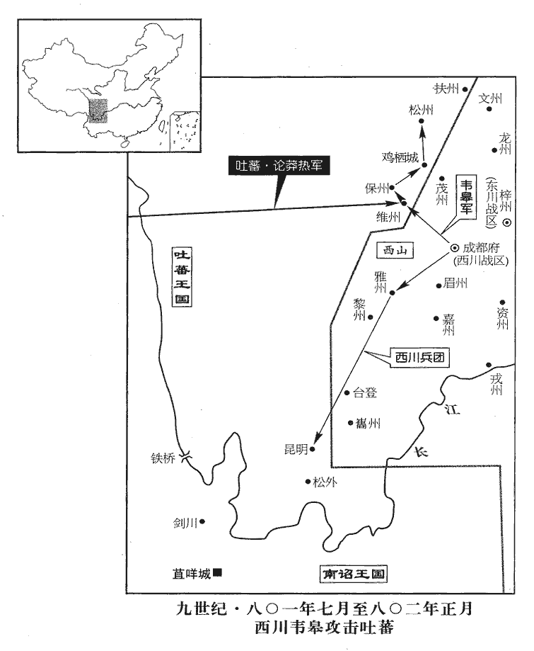
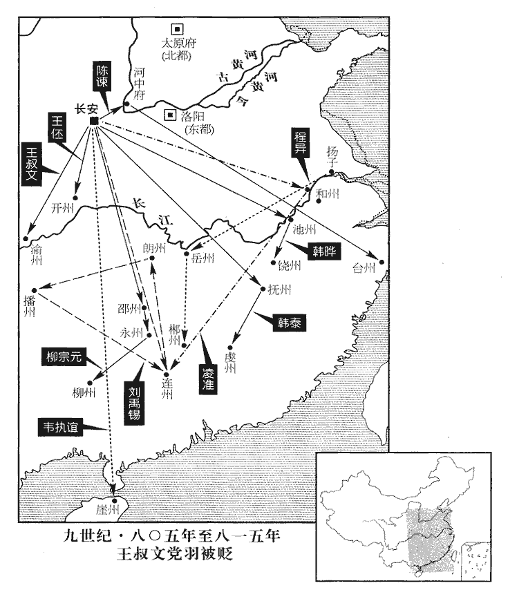

 唐紀五十二起重光大荒落（辛巳），盡旃蒙作噩（乙酉），凡五年。

# 德宗神武聖文皇帝十一

## 貞元十七年（辛巳、八零一）

1春，正月，甲寅‹二十一›，韓全義至長安，竇文場為掩其敗迹；為，于偽翻；下同。上‹李适，本年六十岁›禮遇甚厚。全義稱足疾，不任朝謁，任，音壬。朝，直遙翻。考異曰：舊全義傳云：「令中使就第賜宴，自還至辭，都不謁見而去。議者以隳敗法制，從古以還，未有如貞元之甚。」按實錄：「壬戌，宴全義於麟德殿。」又云：「自還及歸，不見不辭于正朝。」蓋非不謁也，但不於正朝耳。遣司馬崔放入對。放為全義引咎，謝無功，為，于偽翻。上曰：「全義為招討使，能招來少誠，其功大矣，何必殺人然後為功邪！」德宗之耳目為宦官所聾瞽率類此。閏月，甲戌‹十一›，歸夏州‹夏绥战区总部·陕西省靖边县北白城子›。夏，戶雅翻。

〖译文〗 [1]春季，正月，甲寅（二十一日），韩全义来到长安，窦文场替他遮掩军队溃败的行迹，德宗以非常隆重的礼仪厚待他。韩全义声称得了脚病，不能上朝谒见，派遣司马崔放入朝回答德宗的提问。崔放替韩全义承认过失，以没有取得成效而谢罪。德宗说：“韩全义担任招讨使，能够将吴少诚招来，这个功劳就够大的了，为什么一定要将人们杀死，然后才算是功劳呢？”闰正月，甲戌（十一日），韩全义回夏州去了。

2韋士宗既入黔州‹重庆市彭水县›，去年士宗復入黔州，事見上卷。黔，渠今翻，又其廉翻。妄殺長吏，人心大擾。士宗懼，三月，脫身亡走。夏，四月，辛亥‹二十›，以右諫議大夫裴佶為黔州觀察使。佶jí，其吉翻。

〖译文〗 [2]韦士宗进入黔州以后，胡乱杀害高级官员，人心大为混乱。韦士宗害怕了，三月，他脱出身来，逃亡而去。夏季，四月，辛亥（二十日）。德宗任命右谏议大夫裴佶为黔州观察使。

3五月，壬戌朔‹一›，日有食之。

〖译文〗 [3]五月，壬戌朔（初一），出现日食。

4朔方邠、寧、慶‹总部设邠州陕西省彬县›節度使楊朝晟朔方兵分居邠，故仍以朔方軍號冠之，其實只節度邠、寧、慶三州。防秋于寧州‹甘肃省宁县›，乙酉‹二十四›，薨。

〖译文〗 [4]朔方、宁、庆节度使杨朝晟在宁州防御吐藩。乙酉（二十四日），杨朝晟去世。

初，渾瑊‹河中战区，总部设河中府山西省永济市›遣兵馬使李朝寀cǎi將兵戍定平‹甘肃省宁县东南›。武德二年分寧州定安縣置定平縣，仍屬寧州。九域志：在州南六十里。朝，直遙翻。寀，倉宰翻。將，即亮翻。瑊薨，朝寀請以其眾隸神策軍；詔許之。

〖译文〗 当初，浑派遣兵马使李朝领兵戍守定平。浑去世以后，李朝请示将他的部众隶属于神策军，德宗颁诏答应了他的请求。

楊朝晟疾亟，亟，汜力翻。召僚佐謂曰：「朝晟必不起，朔方命帥多自本軍，雖徇眾情，殊非國體。帥，所類翻；下同。寧州‹甘肃省宁县›刺史劉南金，練習軍旅，宜使攝行軍，且知軍事，比朝廷擇帥，比，必利翻，及也。必無虞矣。」又以手書授監軍劉英倩，英倩以聞。軍士私議曰：「朝廷命帥，吾納之，即命劉君，吾事之；若命帥於他軍，彼必以其麾下來，吾屬被斥矣，必拒之。」

〖译文〗 杨朝晟病情加剧，便召集僚属对他们说：“我肯定不行了，对朔方军主帅的任命，人选往往出自本军，虽是顺从大家的意愿，但实在不符合国家的体统。宁州刺史刘南金熟悉军事，最好让他代理行军司马，暂且让他掌管军中事务，及至朝廷选任节帅时，就肯定没有忧虑了。”杨朝晟又把亲笔书信交给监军刘英倩，刘英倩又上报朝廷闻知。将士们私下议论说：“朝廷任命主帅，我们是接纳的，即便是任命刘君，我们也是侍奉他的。倘若从别的军队中任命主帅，那位主帅肯定要把他的部下带过来，我们这一班人就会遭受排斥了，所以我们一定要抵制此事。”

己丑‹二十八›，上遣中使往察軍情，軍中多與南金。辛卯‹三十›，上復遣高品薛盈珍齎詔詣寧州。唐內侍省有高品一千九百六十六人。復，扶又翻。六月，甲午‹三›，盈珍至軍，宣詔曰：「朝寀所將本朔方軍，今將并之，以壯軍勢，威戎狄，以李朝寀為使，南金副之，軍中以為何如？」諸將皆奉詔。

〖译文〗 己丑（二十八日），德宗派遣中使前往朔方察看军中的情势，军中将士多数亲附刘南金。辛卯（三十日），德宗再次派遣高品薛盈珍携带诏书前往宁州。六月，甲午（初三），薛盈珍来到军中，宣布诏旨说：“李朝率领的军队本来属于朔方军，现在准备将此军与你们合并，以便壮大军队的声势，威慑异族之人，任命李朝为节度使，让刘南金任他的副职，军中将士认为怎么样呢？”各将领都接受了诏命。

丙申‹五›，都虞候史經言於眾曰：「李公命收弓刀而送甲冑二千。」軍士皆曰：「李公欲內麾下二千為腹心，吾輩妻子其可保乎！」夜，造劉南金，造，七到翻。欲奉以為帥，南金曰：「節度使固我所欲，然非天子之命則不可；軍中豈無他將乎！」將，即亮翻。眾曰：「弓刀皆為官所收，惟軍事府尚有甲兵，軍事府，知軍事所居也。欲因以集事。」南金曰：「諸君不願朝寀為帥，宜以情告敕使。若操甲兵，操，七刀翻。乃拒詔也。」命閉門不內。軍士去，詣兵馬使高固，固逃匿；搜得之，固曰：「諸君能用吾言則可。」眾曰：「惟命。」固曰：「毋殺人，毋掠金帛。」眾曰：「諾。」乃共詣監軍，請奏之。眾曰：「劉君既得朝旨為副帥，必撓吾事。」撓，奴巧翻。詐稱監軍命，召計事，至而殺之。

〖译文〗 丙申（初五），都虞候史经对大家说：“李公命令收缴弓箭刀剑，并且送去两千套盔甲。”将士们都说：“李公打算收纳自己的部下两千人，作为亲信，我们的妻子儿女还能得到保全吗？”夜间，大家来到刘南金处，打算拥戴他出任主帅，刘南金说：“出任节度使，固然是我所愿意的。然而，如果不是由天子任命的，那就不合适了。难道军队中就没有别的将领可以拥戴了吗？”大家说：“弓箭刀剑全被长官收缴去了，只有军事府还储藏着铠甲兵器，我们打算凭着军事府的武器聚众起事。”刘南金说：“如果诸位不愿意让李朝担任主帅，最好将其中的情由告诉圣上的使者。假如动起武来，就是抗拒诏命了。”于是刘南金让人关了门，不让众人进去。将士们离开以后，又到兵马使高固那里去，高固逃避开来，但将士们还是将他搜寻到了。高固说：“如果诸位能够按我说的去做，我就答应你们的要求。”大家说：“唯命是听。”高固说：“不得杀人，不得掳掠钱财布帛。”大家说：“是。”于是，高固与大家一起到监军那里，请监军奏报大家的要求。大家说：“既然刘君得到朝廷的旨意，出任副主帅，他肯定要阻挠我们的事情。”大家假意声称监军下达命令，传召他计议事情，刘南金一到，大家便将他杀了。

戊戌‹七›，制以李朝寀為邠寧節度使。是日，寧州告變者至，上追還制書，復遣薛盈珍往詗xiòng軍情。復，扶又翻；下同。詗，火迥翻，又翾xuān正翻。壬寅‹十一›，至軍，軍中以高固為請，盈珍即以上旨命固知軍事。

〖译文〗 戊戌（初七），德宗颁发制书任命李朝为、宁节度使。就在这一天，报告宁州变乱的人来到朝廷，德宗将制书追回，再次派遣薛盈珍前去刺探军中的情势。壬寅（十一日），薛盈珍来到军中，军中将士请求任命高固，薛盈珍当即以德宗的旨意命令高固掌管军中事务。

或傳戊戌‹六月七日›制書至邠州，邠軍惑，不知所從，薛盈珍已命高固知寧州軍事，而又有傳李朝寀制書至邠者，故留邠之軍惑而不知所適從。姦人乘之，且為變。留後孟子周悉內精甲於府廷，日饗士卒，內以悅眾心，外以威姦黨。邠軍無變，子周之謀也。

〖译文〗 有人将戊戌日颁布的制书传到州，州军惶惑犹疑，不知道应当听从哪一个诏命，邪恶之徒利用这一时机，将要发起变乱。留后孟子周将精锐甲兵全部安置到官署的庭院中，每天大宴将士，对内是要博得大家的欢心，对外是威慑乱法犯禁的那一伙人。州军队没有发生变乱，就是由于有孟子周从中谋划的原故。

5李錡‹浙西道，首府设润州江苏省镇江市›既執天下利權，十五年李錡為諸道鹽鐵轉運使，事見上卷。以貢獻固主恩，以饋遺結權貴，遺，唯季翻。恃此驕縱，無所忌憚，盜取縣官財，所部官屬無罪受戮者相繼。浙西‹江苏省南部›布衣崔善貞詣闕上封事，言宮市、進奉及鹽鐵之弊，因言錡不法事。上覽之，不悅，命械送錡。錡聞其將至，先鑿阬於道旁；己亥‹八›，善貞至，并鎖械內阬中，生瘞之。瘞，於計翻。遠近聞之，不寒而慄。錡復欲為自全計，增廣兵眾，選有材力善射者謂之挽強，言其力能挽強弓也。杜甫詩：「挽弓當挽強。」胡、奚雜類謂之蕃落，胡、奚之俘配隸江南者，錡收養之。給賜十倍他卒。轉運判官盧坦屢諫不悛，悛，丑緣翻。與幕僚李約等皆去之。約，勉之子也。李勉歷事肅、代、德三朝，貞元中為相。

〖译文〗 [5]李执掌全国的财政大权后，通过进献贡物来巩固主上的恩宠，通过赠送财物来结纳地位高、有权势的人、依仗着这一点而骄横放纵，没有一点顾忌与畏惧，非法盗占国库的财物，他统领的属吏中无罪而遭到杀害的人相继不断。浙西平民崔善贞前往朝廷进献秘密奏章，谈论宫市、进献贡物以及经营盐铁的弊病，因而讲到李不守法纪的事情。德宗看了他的奏章，很不高兴，命令将他用枷锁拘禁着送交李。李听说他就要到来，事先在道路旁边挖了一个土坑。己亥（初八），崔善贞到了，李将他连同枷锁一起推进坑中，活埋了他。远近各地的人们听说此事后，都不寒而。李又作了些想要自我保全的安排：增加士兵的人数，选拔多才强力、善于射箭的人，将他们称作“挽强”；对所收容的胡、奚等各族人，将他们称作“蕃落”，对他们的供给与赏赐，是其他士兵的十倍。转运判官卢坦屡次劝谏，他都不肯悔改，于是卢坦与幕僚李约等人都离开了他。李约是李勉的儿子。

6己酉‹十八›，以高固為邠寧節度使。固，宿將，以寬厚得眾，節度使忌之，置於散地，散，悉但翻。同列多輕侮之；及起為帥，一無所報復，【章：十二行本「復」下有「由是」二字；乙十一行本同。】軍中遂安。

〖译文〗 [6]己酉（十八日），德宗任命高固为宁节度使。高固是一员老将，因待人宽和仁厚而得到大家的拥护，过去的节度使妒忌他，给他安排了一个闲散的职务，同事们大多轻视侮辱他。及至被起用为主帅，高固没有对任何一人实行报复，于是军中将士安定下来。

7丁巳‹二十六›，成德‹总部设恒州河北省正定县›節度使王武俊薨‹年六十七岁›。

〖译文〗 [7]丁巳（二十六日），成德节度使王武俊去世。

8秋，七月，戊寅‹十八›，吐蕃寇鹽州‹陕西省定边县›。

〖译文〗 [8]秋季，七月，戊寅（十八日），吐潘侵犯盐州。

9辛巳‹二十一›，以成德節度副使王士真‹王武俊的儿子›為節度使。

〖译文〗 [9]辛巳（二十一日），德宗任命成德节度副使王士真为节度使。

10己丑‹二十九›，吐蕃陷麟州‹陕西省神木县›，殺刺史郭鋒，夷其城郭，掠居人及党項部落而去。鋒，曜之子也。曜，郭子儀之子也。

〖译文〗 [10]己丑（二十九日），吐蕃攻陷麟州，杀死刺史郭锋，铲平了麟州城廓，对当地居民以及党项部落掳掠了一番，便离去了。郭锋是郭曜的儿子。

僧延素為虜所得。虜將有徐舍人者，謂延素曰：「我英公五代孫也。李勣，封英國公。武后時，吾高祖建義不成，謂敬業也。事見二百二卷武后光宅元年。子孫流播異域，雖代居祿位典兵，然思本之心不忘，顧宗族大，無由自拔耳。今聽汝歸。」遂縱之。

〖译文〗 僧人延素被吐蕃俘获后，有个叫做徐舍人的吐蕃将领对延素说：“我是英国公李的五世玄孙。在武后时期，我的高祖徐敬业树立义旗，没有成功，子孙后代流亡迁徒到异国他乡。虽然我家世代身居官位，掌管军事，然而怀念故土之心难以忘却，只是照顾到我的宗族人口众多，没有机会自己解脱出来罢了。现在，我准许你回国。”于是徐舍人放走了延素。

上遣使敕韋皋‹西川战区，总部设成都府四川省成都市›出兵深入吐蕃以分其勢，紓北邊患。紓shū，緩也。皋遣將將兵二萬分出九道，攻吐蕃維‹四川省理县›、保‹四川省理县西北›、松州‹四川省松潘县›及棲雞‹四川省茂县西北›、老翁城‹四川省茂县西北›。宋白曰：保州本維州之定廉縣，南接吐蕃，為夷落之極塞。開元二十八年，羌夷內附，置奉州。天寶改雲山郡，八載，移治天保軍，改為天保郡，尋沒，乾元元年復歸附，乃改為保州。按王涯傳曰：綿州威蕃柵西抵棲雞城。蓋在茂州界。

〖译文〗 德宗派遣使者敕令韦皋派兵深入到吐蕃疆域中去，以便分散他们的势力，缓解北部边疆的战祸。韦皋派遣将领率兵两万人分别由九条路线进发攻打吐蕃的维州、保州和松州以及栖鸡和老翁城。

 

11河東‹总部设太原府山西省太原市›節度使鄭儋dān暴薨，不及命後事，軍中喧嘩，將有他變。中夜，十餘騎執兵召掌書記令狐楚至軍門，諸將環之，環，音宦。使草遺表。楚在白刃之中，操筆立成。楚，德棻之族也。令狐德棻事太宗，疑「族」字下有「孫」及「曾、玄」等字。棻，撫文翻。八月，戊午‹二十八›，以河東行軍司馬嚴綬為節度使。

〖译文〗 [11]河东节度使郑儋突然去世，来不及安排后事，军中将士噪杂地大声喊叫，将要发生异常的变故。半夜时分，十多个人骑着马，握着兵器，将掌书记令狐楚召到军营门口，各将领围绕着他，让他起草郑儋的临终表章。在明晃晃的兵器中间，令狐楚拿起笔来，一会儿就写成了。令狐楚是令孤德的同族后人。八月，戊午（二十八日），德宗任命河东行军司马严绶为节度使。

12九月，韋皋奏大破吐蕃於雅州‹四川省雅安市›。宋白曰：雅州，即秦嚴道縣地，後魏立蒙山郡，唐立雅州。按郡國志，漢源縣有離山𡺾duī，蜀守李冰所鑿。離，即古雅字也，州以此為名。舊志：雅州，京師西南二千七百二十三里。

〖译文〗 [12]九月，韦皋奏称在雅州大破吐蕃。

13左神策中尉竇文場致仕，以副使楊志廉代之。

〖译文〗 [13]左神策中尉窦文场辞官归居，德宗让左神策中尉副使杨志廉替代他的职务。

14韋皋屢破吐蕃，轉戰千里，凡拔城七，軍鎮五，焚堡百五十，斬首萬餘級，捕虜六千，降戶三千，遂圍維州‹四川省理县›及昆明城‹四川省盐源县›。冬，十月，庚子‹十一›，加皋檢校司徒兼中書令，賜爵南康郡王。南詔‹首都苴咩城云南省大理市›王異牟尋虜獲尤多，上遣中使慰撫之。

〖译文〗 [14]韦皋屡次打败吐蕃，转战千里，共计攻克城池七座，军镇五个，焚烧堡垒一百五十个，斩首一万多，捉住吐蕃六千人，招降人口三千户，并包围了维州以及昆明城。冬季，十月，庚子（十一日），德宗加封韦皋检校司徒兼中书令，赐爵为南康郡王。南诏王异牟寻俘获掳掠尤其繁多，德宗派遣中使慰问安抚他。

15戊午‹二十九›，鹽州‹陕西省定边县›刺史杜彥先棄城奔慶州‹甘肃省庆阳县›。為吐蕃所逼也。鹽州修築距是年纔八年。

〖译文〗 [15]戊午（二十九日），盐州刺史杜彦先放弃州城，逃奔庆州。

## 十八年（壬午、八零二）

1春，正月，驃王摩羅思那遣其子悉利移入貢。驃國‹缅甸›在南詔西南六千八百里，新書：驃，古朱波也，在永昌南二千里，去京師萬四千里。驃，毗召翻。聞南詔內附而慕之，因南詔入見，見，賢遍翻。仍獻其樂。

〖译文〗 [1]春季，正月，骠国国王摩罗思那派遣他的儿子悉利移入朝进贡。骠国在南诏西南方六千八百里处，听说南诏归附朝廷，也产生了向往之情，于是通过南诏入京朝见，还献上他们的音乐。

2吐蕃‹首都逻些城西藏拉萨市›遣其大相兼東鄙五道節度使論莽熱將兵十萬解維州‹四川省理县›之圍，西川‹总部设成都府四川省成都市›兵據險設伏以待之。吐蕃至，出千人挑戰，挑，徒了翻。虜悉眾追之，伏發，虜眾大敗，擒論莽熱，士卒死者太半。維州、昆明‹四川省盐源县›竟不下，引兵還。還，從宣翻，又如字。乙亥‹十八›，皋遣使獻論莽熱，考異曰：舊韋皋傳云：「十月遣使獻論莽熱，」今從實錄。上‹李适，本年六十一岁›赦之。

〖译文〗 [2]吐蕃遣国中大相兼东部边邑五道节度使论莽热率领十万兵马，前来解除维州的包围，西川兵马凭依险要，设下埋伏，等待论莽热的到来。吐蕃来到后，西川军派出一千人前来挑战，吐蕃以全军追击他们，伏兵发动，吐蕃人马大败，论莽热被擒获，士兵死去了一多半。然而，西川军最终还是没有攻克维州与昆明城，只好领兵返回。乙亥（十八日），韦皋派遣使者献上论莽热，德宗赦免了他。

3浙東‹首府设越州浙江省绍兴市›觀察使裴肅既以進奉得進，裴肅以進奉得廉車，事見上卷十二年。判【張：「判」上脫「肅卒」。】官齊總代掌後務，據新唐書：肅卒于官，齊總代掌後務。刻剝以求媚又過之。三月，癸酉‹十七›，詔擢總為衢州‹浙江省衢州市›刺史。給事中長安‹首都长安西半城›許孟容封還詔書，封還詔書，不肯書讀，所謂糾駮也；亦謂之塗歸，唐人語也。曰：「衢州無他虞，齊總無殊績，忽此超獎，深駭群情。若總必有可錄，願明書勞課，然後超資改官，以解眾疑。」詔遂留中。己亥，上召孟容，慰獎之。

〖译文〗 [3]浙东观察使裴肃靠着进献贡物得以升迁后，判官齐总代替他掌管留后事务，他通过剥削财物来讨好德宗的行为，又超过了裴肃。三月，癸酉（十七日），德宗颁诏提拔齐总为衢州刺史。给事中长安人许孟容将诏书封合退还，他说：“衢州没有别的忧患，齐总没有特殊的政绩，忽然如此破格奖拔于他，使大家深感惊骇。如果齐总肯定有值得录用的地方，希望明确写出他的劳绩与考课，然后再超越资历改任官职，以便消除大家的疑惑。”于是诏书被留在宫中，没有再批下来。己亥（疑误），德宗召见许孟容，慰问并嘉奖了他。

4秋，七月，辛未‹十七›，嘉王府諮議高弘本正牙奏事，嘉王運，代宗之子。諮議參軍，正五品上，掌計謀議事。唐東內以含元殿為正牙，西內以太極殿為正牙。唐制：天子居曰衙，行曰駕。牙，與衙同。自理逋債。逋，欠也。乙亥‹二十一›，詔「公卿庶僚自今勿令正牙奏事，如有陳奏，宜延英門請對。」議者以為：「正牙奏事，自武德以來未之或改，所以達群情，講政事；弘本無知，黜之可也，不當因人而廢事。」

〖译文〗 [4]秋季，七月，辛未（十七日），嘉王府谘议参军高弘本在正殿奏报事情时，私自在殿上处理债务。乙亥（二十一日），德宗颁诏说：“从今以后，不要让公卿与众臣僚在正殿奏陈事情，如果需要奏陈，应当到延英门去请求召问对答。”议论此事的人们认为：“在正殿陈奏事情，自从武德年间以来，从来没有丝毫的改变，为的是传达众人之情，讲论如何施政办事。高弘本不懂规矩，将他贬黜就可以了，不应当因高弘本一人而废除正常的制度。”

5淮南‹总部设扬州江苏省扬州市›節度使杜佑累表求代，冬，十月，丁亥‹四›，以刑部尚書王鍔為淮南副節度使兼行軍司馬。鍔，五各翻。「副節度使」，恐當作「節度副使」。

〖译文〗 [5]淮南节度使杜佑多次上表请求派人替代自己。冬季，十月，丁亥（初四），德宗任命刑部尚书王锷为淮南副节度使，兼任行军司马。

6己酉‹二十六›，鄜坊‹总部设鄜州陕西省富县›節度使王栖曜薨。中軍將何朝宗謀作亂，夜，縱火；都虞候裴玢bīn潛匿不救火，朝，直遙翻。玢，府巾翻。旦，擒朝宗，斬之。以同州‹陕西省大荔县›刺史劉公濟為鄜坊節度使，以玢為行軍司馬。

〖译文〗 [6]己酉（二十六日）坊节度使王栖曜去世。中军将领何朝宗图谋发起变乱，夜间，放起火来。都虞候裴玢暗中躲藏，不去救火，却在天亮时分，擒获了何朝宗，将他斩杀。德宗任命同州刺史刘公济为坊节度使，任命裴玢为行军司马。

## 十九年（癸未、八零三）

1春，二月，丁亥‹六›，名安黃軍曰奉義‹总部设安州湖北省安陆市›。以寵伊慎也。

〖译文〗 [1]春季，二月，丁亥（初六），朝廷将安黄军命名为奉义军。

2己亥‹十八›，安南‹首府设安南府越南河内市›牙將王季元逐其觀察使裴泰，泰奔朱鳶yuān‹河内市东南›。劉昫曰：朱鳶，漢縣名，今縣吳軍平縣地。晉武帝更名海平，江左置武平郡；隋廢郡為朱鳶縣，唐屬交州。明日，左兵馬使趙匀斬季元及其黨，迎泰而復之。

〖译文〗 [2]己亥（十八日），安南牙将王季元驱逐本地观察使裴泰，裴泰逃奔朱鸢。第二天，左兵马使赵匀斩杀王季元以及他的同伙，迎接裴泰恢复职务。

3甲辰‹二十三›，杜佑入朝。自淮南‹总部设扬州江苏省扬州市›入朝。三月，壬子朔‹一›，以佑檢校司空、同平章事；以王鍔為淮南節度使。

〖译文〗 [3]甲辰（二十三日），杜佑入京朝见。三月，壬子朔（初一），德宗任命杜佑为检校司空、同平章事，任命王锷为淮南节度使。

4鴻臚卿王權請遷獻‹李熙（李渊的高祖父）›、懿‹李天赐（李渊的曾祖父）›二祖於德明‹皋陶›、興聖‹李暠，李渊的七世祖›廟，玄宗天寶二年，尊咎繇為德明皇帝，涼武昭王‹李暠›為興聖皇帝，立廟京師。臚，陵如翻。每禘祫xiá，正太祖‹李虎，李渊父›東向之位；從之。建中二年，奉獻祖‹李熙›正東向之位，事見二百二十七卷。

〖译文〗 [4]鸿胪卿王权请求将献祖、懿祖二人的神主迁移到供奉德明皇帝、兴圣皇帝神主的庙堂中，每当对诸祖神主举行盛大的合祭时，将太祖的神主安置在朝着正东方向的位子上，德宗听从了这一建议。

5乙亥‹二十四›，以司農卿李實兼京兆尹。實為政暴戾，上愛信之。實恃恩驕傲，許人薦引，不次拜官，及誣譖斥逐，皆如期而效，士大夫畏之側目。

〖译文〗 [5]乙亥（二十四日），德宗任命司农卿李实兼京兆尹。李实处理政务粗暴乖张，德宗却宠爱信任他。李实仗恃着恩宠而骄横傲慢，应许为人们推荐延引，不拘等次授给官职，以及诬陷驱逐他人，全都在他预言的日期里应验，士大夫害怕他，连正眼看他都不敢。

6夏，四月，涇原‹总部设泾州甘肃省泾川县›節度使劉昌奏請徙原州治平涼‹甘肃省平凉市›；從之。七年劉昌築平涼，事見二百三十三卷。原州本治高平，唐為平高縣，為吐蕃所陷。

〖译文〗 [6]夏季，四月，泾原节度使刘昌上奏请求将原州的治所迁徙到平凉，德宗依从了他。

7乙亥‹五月二十六日›，吐蕃遣其臣論頰熱入貢。

〖译文〗 [7]乙亥（疑误），吐蕃派遣臣下论颊热入朝进贡。

8六月，辛卯‹十二›，以右神策中尉副使孫榮義為中尉，與楊志廉皆驕縱招權，楊志廉時為左軍中尉。考異曰：實錄：「十七年六月，以中官楊志廉充左神策護軍中尉。」「七月丙戌，以內給事楊志廉、孫榮義為左、右神策護軍中尉副使。」「九月戊寅，以志廉為左神策中尉。」「十九年六月辛卯，以榮義為右神策中尉。」「二十年十月戊申，以志廉為特進、右監軍將軍、左軍中尉。」其重複差互如此。蓋十七年六月攝領耳，七月始為副使，九月及十九年六月始正為中尉。二十年十月但進階加官耳。舊傳又云：「先是竇文場致仕，十五年以後，志廉、榮義為左、右軍中尉，亦踵竇之事。」此蓋言其大略耳，未必為中尉適在十五年也。余按「右監軍將軍」當作「右監門將軍」。依附者眾，宦官之勢益盛。

〖译文〗 [8]六月，辛卯（十二日），德宗任命右神策中尉副使孙荣义为中尉。孙荣义与杨志廉都骄横放纵，招揽大权，依附他们的人很多，宦官的势力愈加盛大。

9壬辰‹十三›，遣右龍武大將軍薛伾pī使于吐蕃。

〖译文〗 [9]壬辰（十三日），德宗派遣右龙武大将军薛出使吐蕃。

10陳許‹总部设许州河南省许昌市›節度使上官涗shuì薨，其壻田偁chēng欲脅其子使襲軍政；偁，齒繩翻。牙將王沛，亦涗之壻也，知其謀，以告監軍范日用，討擒之。乙未‹十六›，以陳許行軍司馬劉昌裔為節度使。沛，許州人也。

〖译文〗 [10]陈许节度使上官去世后，他的女婿田准备胁迫上官的儿子承袭军中大政。牙将王沛，也是上官的女婿，了解田的谋划后，便将此事报告监军范日用，讨伐并擒获了田。乙未（十六日），德宗任命陈许行军司马刘昌裔为节度使。王沛是许州人。

11自正月不雨至于秋七月。

〖译文〗 [11]由正月起，一直持续到秋季七月份，都不曾下雨。

12己未‹十一›，中書侍郎、同平章事齊抗以疾罷為太子賓客。

〖译文〗 [12]己未（疑误），中书侍郎、同平章事齐抗因病被罢免为太子宾客。

13初，翰林待詔王伾善書，山陰‹越州州政府所在县·浙江省绍兴市›王叔文善棋，山陰，漢古縣，隋廢山陰入會稽縣，唐初復分會稽置山陰縣。二縣俱在越州郭下。俱出入東宮，娛侍太子。伾，杭州‹浙江省杭州市›人也。

〖译文〗 [13]当初，翰林待诏王善长书法，山阴人王叔文善长下棋，都在东宫出出进进，侍奉太子，供太子娱乐。王是杭州人。

叔文譎詭多計，自言讀書知治道，乘間常為太子‹李诵›言民間疾苦。譎，古穴翻。治，直吏翻。乘間，古莧翻。為，于偽翻。太子嘗與諸侍讀及叔文等論及宮市事，太宗時，晉王府有侍讀，及為太子，亦置焉。其後或置或否，無常員，掌講導經學。太子曰：「寡人方欲極言之。」眾皆稱贊，獨叔文無言。既退，太子自留叔文，謂曰：「向者君獨無言，豈有意邪？」叔文曰：「叔文蒙幸太子，有所見，敢不以聞。太子職當視膳問安，世子之記曰：朝夕至于大寢之門外，問內豎曰：「今日安否何如？」內豎曰：「安。」世子乃有喜色。其有不安節，則內豎以告世子。世子色憂不滿容。內豎言復初，然後亦復初。朝夕之食上，世子必在，視寒煖nuǎn之節。食下，問所膳羞，必知所進，以命膳宰，然後退。若內豎言疾，則世子親齊玄而養。膳宰之饌，必敬視之。疾之藥，必親嘗之。嘗饌善，則世子亦能食；嘗饌寡，則世子亦不能飽。以至於復初，然後亦復初。不宜言外事。陛下在位久，如疑太子收人心，何以自解！」太子大驚，因泣曰：「非先生，寡人無以知此。」遂大愛幸，與王伾相依附。

〖译文〗 王叔文诡计多端，自称读过书而懂得治理国家的道理，经常趁机向太子讲说民间的疾苦。太子曾经与各位侍读以及王叔文等人谈论到宫市的事情，太子说：“寡人正准备就此事尽力进言。”大家都表示称赞，唯独王叔文不发一言。大家退去后，太子亲自将王叔文留下来，对他说：“刚才只有你不发一言，恐怕是有用意的吧！”王叔文说：“我承蒙太子的钟爱，只要发现问题，怎敢不告诉太子闻知！太子的职份应当是省视进食、问候平安，最好不要谈外间的事情。陛下在位的时间长了，如果怀疑太子收揽人心，太子怎么为自己解释呢！”太子大惊，因而哭泣着说：“若不是先生这一席话，寡人无法知道这个道理。”于是，太子对王叔文极为宠爱，而王叔文则与王相互依托。

叔文因為太子言：為，于偽翻。「某可為相，某可為將，幸異日用之。」密結翰林學士韋執誼及當時朝士有名而求速進者陸淳、呂溫、李景儉、韓曄、韓泰、陳諫、柳宗元、劉禹錫等，定為死友。而凌準、程异等又因其黨以進，日與遊處，處，昌呂翻。蹤跡詭祕，莫有知其端者。藩鎮或陰進資幣，與之相結。淳，吳‹苏州州政府所在县·江苏省苏州市›人，嘗為左司郎中；溫，渭之子，時為左拾遺；呂渭見上卷十六年。景儉，瑀之孫，進士及第；瑀，寧王憲之子也，封漢中王。曄，滉之族子；韓滉，休之子，貞元中為相。諫，嘗為侍御史；宗元、禹錫，時為監察御史。

〖译文〗 王叔文趁机对太子说：“某人可以担任宰相，某人可以担任将领，希望太子在将来起用他们。”王叔文暗中结交翰林学士韦执谊以及当时已有名声、但希图快速晋升的朝廷官员陆淳、吕温、李景俭、韩晔、韩泰、陈谏、柳宗元、刘禹锡等人，约定为生死相托的朋友。另外，凌准、程异等人又靠着这一伙人得以进用，时时与他们交游往来，行踪都很诡诈隐秘，没有人了解他们的端倪。有些藩镇暗中进献资财礼物，与他们相互结纳。陆淳是吴中人，曾经担任左司郎中。吕温是吕渭的儿子，当时担任左拾遗。李景俭是李的孙子，进士及第。韩晔是韩的族侄。陈谏曾经担任侍御史。柳宗元与刘禹锡，当时担任监察御史。

左補闕張正一上書，得召見。考異曰：順宗實錄作「張正買」今從德宗實錄。正一與吏部員外郎王仲舒、主客員外郎劉伯芻等相親善，考異曰：韓愈集有仲舒神道碑，云「諱弘中，字某。」按實錄、新舊傳皆名仲舒，字弘中。愈又作燕喜亭記，稱為王弘中。然則弘中必字也，碑文誤耳。順宗實錄云：「正買與王仲舒、劉伯芻、裴茝chǎi、常仲孺、呂洞相善，數遊止。」今從德宗實錄。叔文之黨疑正一言己陰事，令執誼反譖正一等於上，云其朋黨，遊宴無度。九月，甲寅‹六›，正一等皆坐遠貶，人莫知其由。為伾、叔文等亂順宗初政張本。伯芻，迺之子也。劉迺見二百三十卷興元元年。

〖译文〗 左补阙张正一上书言事，得到德宗的召见。张正一与吏部员外郎王仲舒和主客员外郎刘伯刍等人相互亲近友善，王叔文一伙怀疑张正一讲过自己的秘事，便让韦执谊向德宗诬陷张正一等人，说他们私结朋党，交游饮宴，没有限度。九月，甲寅（初六），张正一等人都获罪被贬远方，人们都不知道其中的缘由。刘伯刍是刘的儿子。

14鹽夏‹总部设夏州陕西省靖边县北白城子›節度判官崔文先權知鹽州‹陕西省定边县›，為政苛刻。冬，閏十月，庚戌‹三›，部將李庭俊作亂，殺而臠食之。左神策兵馬使李興幹戍鹽州，殺庭俊以聞。

〖译文〗 [14]盐夏节度判官崔文先暂且掌管盐州事宜，处理政务繁琐刻薄。冬季，闰十月，庚戌（初三），部将李庭俊发起变乱，杀死崔文先，还割碎他的肢体，吃了他的肉。戍守盐州的左神策兵马使李兴干，又杀死李庭俊，上报朝廷闻知。

15丁巳‹十›，門下侍郎、同平章事崔損薨。

〖译文〗 [15]丁巳（初十），门下侍郎、同平章事崔损去世。

16十一月，戊寅朔‹一›，以李興幹為鹽州刺史，得專奏事；李興幹出於神策軍，宦官因其定亂之功而崇獎之。自是鹽州不隸夏州。貞元三年，置夏州節度使，領綏、鹽二州，今鹽州得專達於朝廷。其後鹽州屬朔方節度，夏州節度又增銀、宥、威三州隸之。

〖译文〗 [16]十一月，戊寅朔（初一），德宗任命李兴干为盐州刺史，允许他单独奏报事情。从此，盐州不再隶属于夏州。

17十二月，庚申‹十三›，以太常卿高郢為中書侍郎，吏部侍郎鄭珣瑜為門下侍郎，並同平章事。珣瑜，餘慶之從父兄弟也。鄭餘慶，貞元十四年為相，十六年坐于䪹péi貶。從，才用翻。

〖译文〗 [17]十二月，庚申（十三日），德宗任命太常卿高郢为中书侍郎，任命吏部侍郎郑瑜为门下侍郎，一并同平章事。郑瑜是郑馀庆的堂兄弟。

18建中初，敕京城諸使及府縣繫囚，每季終委御史巡按，有冤濫者以聞；冤，枉屈也。濫，淫刑也。近歲，北軍移牒而已。宦官勢橫，御史不敢復入北軍按囚，但移文北司，牒取繫囚姓名及事，因應故事而已，不問其有無冤濫。監察御史崔薳遇下嚴察，下吏欲陷之，引以入右神策軍。軍使以下駭懼，具奏其狀。上怒，杖薳四十，流崖州‹海南省琼山市›。薳wěi，韋委翻。

〖译文〗 [18]建中初年，德宗敕令京城各使以及府县，对于在押的囚犯，在每季度终结时，要委托御史分行各地，予以按察，对确实冤枉失实的案件，要上报朝廷闻知。近年以来，北军只转发一道公文就算了事。监察御史崔对待下属严厉而苛察，下属官吏打算陷害他，便领着他进入右神策军。神策军使以下的人们惊怕恐惧，拟成奏章上报了他的事状。德宗大怒，将崔杖责四十棍，流放到崖州。

19京兆尹嗣道王實務徵求以給進奉，言於上曰：「今歲雖旱而禾苗甚美。」由是租稅皆不免，人窮至壞屋賣瓦木、麥苗以輸官。壞，音怪。優人成輔端為謠嘲之；徒歌曰謠。實奏輔端誹謗朝政，杖殺之。朝，直遙翻。

〖译文〗 [19]京兆尹嗣道王李实专务征收财富，以便进献贡物。他对德宗说：“虽然今年发生旱情，但庄稼长得很好。”因此朝廷对租税一概不予免除，以致人们穷困到拆除房屋，出卖屋瓦檩木与麦苗来交纳官税。优伶成辅端作歌谣讥嘲李实，李实奏称成辅端诽谤朝廷大政，用杖刑杀害了他。

監察御史韓愈上疏，以「京畿‹陕西省中部›百姓窮困，應今年稅錢及草粟等徵未得者，請俟來年蠶麥。」愈坐貶陽山‹广东省阳山县›令。陽山，漢縣，屬桂陽郡，後漢省，晉平吳，分浛洭縣復置，唐屬連州，神龍元年移縣治於浛水之北。考異曰：韓愈河南令張署墓誌曰：「自京兆武功尉拜監察御史，為幸臣所讒，與同輩韓愈、李方叔三人俱為縣令南方。」又祭署文曰：「貞元十九，君為御史，余以無能，同詔並峙。」又曰：「我落陽山，以尹鼯猱。君飄臨武，山林之牢。歲弊寒兇，雪虐風饕。」與署同貶當在此年冬。

〖译文〗 监察御史韩愈进献奏疏认为：“京城周围地区的百姓贫穷困顿，对于所有未能征收上来的今年的税钱以及草秧、谷物等，请等到明年蚕成麦熟时节再去征收。”于是，韩愈获罪，被贬为阳山县令。

## 二十年（甲申、八零四）

1春，正月，丙戌‹十›，天德軍‹总部设天德军城内蒙古乌拉特前旗东北›都防禦團練使、豐州‹内蒙古五原县›刺史李景略卒‹年五十五岁›。初，景略嘗宴僚佐，行酒者誤以醯xī進。醯，呼西翻，醋也。判官京兆任迪簡以景略性嚴，恐行酒者得罪，強飲之，任，音壬。強，其兩翻。歸而嘔血；軍士聞之泣下。及李景略卒，軍士皆曰判官仁者，欲奉以為帥。帥，所類翻。監軍抱置別室，軍士發扃jiōng取之。監軍以聞，詔以代景略。

〖译文〗 [1]春季，正月，丙戌（初十），天德军都防御团练使、丰州刺史李景略去世。当初，李景略曾经设宴招待辅佐自己的官吏们，巡行劝酒的人错把醋送了上来。由于李景略生性严厉，判官京兆人任迪简惟恐巡行劝酒的人遭受罪罚，勉强把醋喝了下去，回去以后便因此吐血了，将士们听说此事后，都流下了眼泪。及至李景略去世后，将士们都说判官任迪简是一位仁厚长者，准备拥戴他出任主帅。监军将任迪简抱到另外的房间中安置，将士们打开门栓将他夺取出来。监军将此事上报朝廷闻知，于是德宗颁布诏书任命他替代李景略的职务。

2吐蕃贊普死，其弟嗣立。考異曰：實錄及舊傳皆云：「贊普以貞元十三年四月卒，長子立，一歲，又卒，次子嗣立。」韓愈順宗實錄張薦傳云：「二十年，贊普死，遣薦弔贈。」新傳云：「十三年，贊普死，其子足之煎立。二十年，贊普死，遣工部侍郎張薦弔祠，其弟嗣立。」疑實錄、舊傳誤以是字為一字。今從順宗錄及新傳。按「字」當作「事」。

〖译文〗 [2]吐蕃赞普去世，他的弟弟继位。

3夏，四月，丙寅‹二十二›，名陳許軍曰忠武‹总部设许州河南省许昌市›。

〖译文〗 [3]夏季，四月，丙寅（二十二日），朝廷将陈许军命名为忠武军。

4左金吾大將軍李昇雲將禁兵鎮咸陽‹陕西省咸阳市›，疾病，其子政諲諲yīn，音因。與虞候上官望等謀效山東‹太行山以东›藩鎮，使將士奏攝父事。六月，壬子‹九›，昇雲卒。甲寅‹十一›，詔追削昇雲官爵，籍沒其家。

〖译文〗 [4]左金吾大将军李升云带领禁卫军镇守咸阳，得了重病，他的儿子李政与虞候上官望等人图谋仿效山东藩镇的做法，指使将士上奏请求让自己代理父亲的职事。六月，壬子（初九），李升云去世。甲寅（十一日），德宗颁诏追夺李升云官职爵位，没收他家的财产。

5昭義‹总部设潞州山西省长治市›節度使李長榮薨，上使中使以手詔授本軍大將，但軍士所附者即授。時大將來希皓為眾所服，中使將以手詔付之。希皓言於眾曰：「此軍取人，合是希皓，但作節度使不得。唐人多讀作如佐音。若朝廷以一束草來，希皓亦必敬事。」言若束草為節度使，亦必敬而事之。來希皓之忠純如此，而其後不復見於史，必盧從史畏偪而去之也。中使言：「面奉進止，只令此軍取大將拔與節鉞，朝廷不別除人。」希皓固辭。兵馬使盧從史考異曰：杜牧上李司徒書作「押衙盧從史」。今從實錄。其位居四，潛與監軍相結，起出伍曰：出儔伍之中而言。「若來大夫不肯受詔，從史請且句當此軍。」句，古候翻。當，丁浪翻。監軍曰：「盧中丞若如此，此亦固合聖旨。」中使因探懷取詔以授之。探，吐南翻。從史捧詔，再拜舞蹈。希皓亟迴揮同列，北面稱賀。軍士畢集，更無一言。秋，八月，己未‹十七›，詔以從史為節度使。

〖译文〗 [5]昭义节度使李长荣去世，德宗让中使带着手诏授给本军中的大将，只要是将士都归心的人，便可授给。当时，大将来希皓为大家所敬服，中使准备把手诏交付给他。来希皓在大家面前说：“在这一军队中物色人选，当然是我来希皓了，但我不能担当节度使的职责。如果朝廷让一把草来担当节度使，我也一定会恭敬地侍奉。”中使说：“我当面接受圣上的旨意，只让从这一军队的大将中选拔节度使并授给旌节，朝廷没有另外任命别人。”来希皓坚决推辞。兵马使卢从史，在军中位居第四，暗中与监军相互结纳，这时他从队伍中站出来说：“如果来大夫不愿意接受诏书，请让我姑且管理这支军队。”监军说：“如果卢中丞这样去做，这当然也是符合圣上的意旨的。”于是中使从怀中拿出诏书，授给卢从史。卢从史捧着诏书，先后拜了两次，再向德宗遥遥行舞蹈礼。来希皓赶忙回去指挥同事，面向北方祝贺。将士全集合起来，再没有提出异议。秋季，八月，己未（十七日），德宗颁诏任命卢从史为节度使。

6九月，太子‹李诵›始得風疾，不能言。

〖译文〗 [6]九月，太子开始身患中风，不能讲话。

# 順宗至德弘道大聖大安孝皇帝諱誦，德宗長子。按此宣宗大中三年追崇諡號也。考之會要，葬陵諡冊與此追崇諡號一同。蓋會要所載初諡誤也。

## 永貞元年（乙酉、八零五）是年八月，始改元永貞。

1春，正月，辛未朔‹一›，諸王、親戚入賀德宗‹李适›，太子‹李诵›獨以疾不能來，德宗涕泣悲歎，由是得疾，日益甚。凡二十餘日，中外不通，莫知兩宮安否。

〖译文〗 [1]春季，正月，辛未朔（初一），诸王、亲戚前来宫中向德宗祝贺，唯独太子因病不能到来，德宗流着眼泪，哀声叹气，从此患病，并一天比一天加重，大约二十多天，内宫与外廷断了消息，都不知道德宗与太子平安与否。

癸巳‹二十三›，德宗‹李适›崩；年六十四。蒼猝召翰林學士鄭絪、衛次公等至金鑾殿絪，音因。程大昌雍錄曰：金鑾坡者，龍首山之支隴，隱起平地而坡陁tuó靡迤者也。其上有殿，名曰金鑾殿。殿旁有坡，名曰金鑾坡。又曰：金鑾殿者，在蓬萊山正西微南，龍首山坡隴之北。殿西有坡，德宗即之以造東學士院，以其在開元學士院之東也。草遺詔。宦官或曰：「禁中議所立尚未定。」眾莫敢對。次公遽言曰：「太子雖有疾，地居冢嫡，中外屬心。屬，之欲翻。必不得已，猶應立廣陵王；廣陵王純，太子長子。不然，必大亂。」絪等從而和之，和，胡臥翻。議始定。次公，河東人也。太子知人情憂疑，紫衣麻鞋，考異曰：按祕喪則不應麻鞋，發喪則不應紫衣。蓋當時蒼猝偶著此服，非祕喪也。以未成服，故不衣縗cuī絰dié耳。力疾出九仙門，雍錄曰：九仙門在內西苑之東北角。右神策軍、右羽林軍、右龍武軍列營於九仙門之西。按閣本大明宮圖：宮城西面右銀臺門，又北為九仙門。召見諸軍使，人心粗安。粗，坐五翻。

〖译文〗 癸巳（二十三日），德宗驾崩。人们匆匆忙忙地把翰林学士郑、卫次公等人叫到金銮殿，起草德宗的遗诏。有个宦官说：“内廷计议册立谁人还没有确定呢。”大家都不敢答话。卫次公赶忙说：“虽然太子身患疾病，但是身居嫡长的地位，为朝廷内外所归向。如果没有别的办法，也应该册立广陵王。否则，肯定要出大乱子。”郑等人也随声附和卫次公的意见，这才算议定下来。卫次公是河东人。太子知道人们的情绪还在担忧疑虑，便身著紫衣，足穿麻鞋，勉强支撑着有病的身体，走出九仙门，召见各军使，才使人心略微安定了一些。

甲午‹二十四›，宣遺詔於宣政殿，考異曰：德宗實錄：「癸巳，宣遺詔。」今從順宗實錄。太子縗服見百官；縗，倉回翻。丙申‹二十六›，‹李诵，本年四十五岁›即皇帝位於太極殿。即位於西內前殿。衛士尚疑之，企足引領而望之，企，去智翻。曰：「真太子也！」乃喜而泣。

〖译文〗 甲午（二十四日），德宗的遗诏在宣政殿宣布了，太子穿着丧服，接见朝廷官员。丙申（二十六日），太子在太极殿正式继承皇位。卫士们仍然怀疑登位的是不是太子，便跷着脚，伸着脖子，向殿上张望了一番，这才说：“的确是真正的太子！”于是，卫士们高兴得哭了。

時順宗‹李诵›失音，不能決事，常居宮中施簾帷，獨宦者李忠言、昭容牛氏侍左右；百官奏事，自帷中可其奏。自德宗大漸，王伾先入，稱詔召王叔文，坐翰林中使決事。伾以叔文意入言於忠言，稱詔行下，下，戶嫁翻。外初無知者。以杜佑攝冢宰。二月，癸卯‹三›，上始朝百官於紫宸門。紫宸門，紫宸殿門也。長安志：宣政殿北曰紫宸門，門內有紫宸殿，即內衙之正殿。

〖译文〗 当时，顺宗无法讲话，不能处理朝中事务，经常住在宫中，周围挂着帘幕，只有宦官李忠言、牛昭容在顺宗身边侍奉，朝中官员奏请什么事情，顺宗便在帘幕中认可他们的奏请。自从德宗病情垂危以来，王率先进入内廷，声称有诏传召王叔文，让他坐在翰林院中处理朝中事务。王将王叔文的意图带进内廷，告诉李忠言，便声称诏书颁发下来，外界起初没有人知道这一内情。任命杜佑为摄冢宰。二月，癸卯（初三），顺宗在紫宸门初次受朝中官员的朝见。

2己酉‹九›，加義武‹总部设定州河北省定州市›節度使張茂昭同平章事。

〖译文〗 [2]己酉（九日），顺宗加封义武节度使张茂昭为同平章事。

3辛亥‹十一›，以吏部郎中韋執誼為尚書左丞、同平章事。王叔文欲掌國政，首引執誼為相，己用事於中，與相唱和。和，戶臥翻。

〖译文〗 [3]辛亥（十一日），顺宗任命吏部郎中韦执谊为尚书左丞、同平章事。王叔文打算执掌国家大政，便首先延引韦执谊出任宰相，自己在内廷当权，与他相互呼应。

4壬子‹十二›，李師古‹平卢战区，总部设郓州山东省东平县›發兵屯西境以脅滑州‹河南省滑县›。時告哀使未至諸道，義成‹总部设滑州河南省滑县›牙將有自長安還得遺詔者，節度使李元素以師古鄰道，欲示無外，春秋公羊傳曰：王者無外。此唐人以化外待藩鎮，故有此語。遣使密以遺詔示之。師古欲乘國喪侵噬鄰境，乃集將士謂曰：「聖上萬福，而元素忽傳遺詔，是反也，宜擊之。」遂杖元素使者，發兵屯曹州‹山东省定陶县›，考異曰：舊韓愈傳云：「撰順宗實錄，繁簡不當，穆宗、文宗嘗詔史臣添改。時愈壻李漢、蔣係在顯位，諸公難之，而韋處厚竟別撰順宗實錄三卷。」景祐中，詔編次崇文總目，順宗實錄有七本，皆五卷，題曰「韓愈等撰」。五本略而二本詳，編次者兩存之。其中多異同，今以詳、略為別。此李師古脅滑州事，詳本有而略本無。詳錄又云：「使衡密以其本示之。師古不受，杖衡幾死。」衡蓋使者之名而無姓。又云：「遂以師至濮州，伺候為變。」按韓愈撰韓弘碑云：「屯兵于曹。」今從之。且告假道於汴‹宣武战区，总部设汴州河南省开封市›。九域志：曹州西北至滑州一百二十里。汴州北至滑州界一百里，東北至曹州界一百三里。三州之界，蓋犬牙相入。宣武節度使韓弘使謂曰：「汝能越吾界而為盜邪！有以相待，無為空言！」元素告急，弘使謂曰：「吾在此，公安無恐。」或告：「翦棘夷道，翦，芟截也。夷，平也。兵且至矣，請備之」弘曰：「兵來，不除道也。」不為之應。師古詐窮變索，索，蘇各翻。索，散也，盡也。言韓弘逆得師古之情，其所設詭變索然散盡也。且聞上即位，乃罷兵。元素表請自貶，朝廷兩慰解之。元素，泌之族弟也。李泌歷事肅、代、德，貞元中為相。

〖译文〗 [4]壬子（十二日），李师古派兵驻扎在本道的西部边境上，以便威胁滑州。当时，告哀使还没有来到各道，有个义成牙将从长安回来，得到了德宗的遗诏，义成节度使李元素觉着李师古是与自己相邻的州道，打算显示不把他当作外人看，便派遣使者秘密地把遗诏让他看了。李师古打算趁着国家大丧事侵吞相邻州道的辖地，便集合将士，对他们说：“圣上福缘无疆，李元素却忽然传布遗诏，这是造反啊，应当向他出击。”于是，李师古杖打李元素的使者，派兵前往曹州驻扎，准备告知汴州，借道攻打李元素。宣武节度使韩弘让人告诉他说：“你能越过我的疆界去作盗贼吗！我专门在这里等着你，你不要说空话！”李元素向宣武告急，韩弘让人告诉他说：“有我在这里，你尽管放心，不必恐慌。”有人说：“李师古在铲除草棘，平整道路，他的兵马快要打过来了，请对他多加防备。”韩弘说：“如果真是有军队开过来，就不去清除道路了。”韩弘并不对此作出反应，李师古的机谋诈变用尽了，加上听说顺宗已经即位，便停止用兵。李元素上表请求贬职，朝廷两次派人来宽慰他。李元素是李泌的同族弟弟。

吳少誠‹彰义（淮西）战区，总部设蔡州河南省汝南县›以牛皮鞵xié材遺師古，鞵，與鞋同。遺，唯季翻。師古以鹽資少誠，潛過宣武界，事覺，弘皆留，輸之庫，曰：「此於法不得以私相餽。」師古等皆憚之。

〖译文〗 吴少诚将制作牛皮鞋的材料赠送给李师古，李师古用食盐资助吴少诚，在偷越宣武边界时，事情被察觉了。韩弘将他们运送的物品全部扣留，运进仓库，还说：“根据法令，这些东西是不允许私自互相赠送的。”李师古等人对他都心怀忌惮。

5辛酉‹二十一›，詔數京兆尹道王實殘暴掊斂之罪，數，所具翻。掊，蒲侯翻。斂，力贍翻。貶通州‹四川省达川市›長史；宋白曰：通州，漢宕渠縣地，後漢分置宣漢縣。市井讙呼，皆袖瓦礫遮道伺之，實由間道獲免。讙，許元翻。礫，郎擊翻。間，古莧翻。

〖译文〗 [5]辛酉（二十一日），顺宗颁诏历数京兆尹道王李实残忍暴虐地聚敛民财的罪行，将他贬为通州长史。街市中居民喜悦地呼喊着，都在袖中带着瓦砾，拦住道路，等侯李实到来，李实由小道走开，才得以逃脱。

6壬戌‹二十二›，以殿中丞王伾為左散騎常侍，依前翰林待詔，蘇州‹江苏省苏州市›司功王叔文為起居舍人、翰林學士。

〖译文〗 [6]壬戌（二十二日），顺宗任命殿中丞王为左散骑常侍，依然如前充任翰林待诏，任命苏州司功王叔文为起居舍人、翰林学士。

伾pī寢陋、吳語狀貌寢陋，常操鄉音，不能學華言。上‹李诵›所褻狎；而叔文頗任事自許，微知文義，好言事，好，呼到翻。上以故稍敬之，不得如伾出入無阻。叔文入至翰林，而伾入至柿林院，柿，鉏里翻。見李忠言、牛昭容計事。大抵叔文依伾，伾依忠言，忠言依牛昭容，轉相交結。每事先下翰林，下，遐稼翻。使叔文可否，然後宣于中書，韋執誼承而行之。外黨則韓泰、柳宗元【章：十二行本「元」下有「劉禹錫」三字；乙十一行本同；孔本同；張校同。】等主采聽外事。謀議唱和，和，戶臥翻。日夜汲汲如狂，互相推獎，曰伊、曰周、曰管、曰葛，以伊尹、周公、管仲、諸葛孔明互相比況。僩xiàn然自得，僩，下赧翻。僩然，勁忿貌。謂天下無人；榮辱進退，生於造次，朱氏曰：造次，急遽苟且之時。造，七到翻。惟其所欲，不拘程式。士大夫畏之，道路以目。國語，周厲王‹姬胡›監謗，國人莫敢言，道路以目，韋昭註曰：不敢發言，以目相眄而已。素與往還者，相次拔擢，至一日除數人。除者，除官也。其黨或言曰，「某可為某官，」不過一二日，輒已得之。於是叔文及其黨十餘家之門，晝夜車馬如市。客候見叔文、伾者，至宿其坊中餅肆、酒壚下，長安城中分為左右街，畫為百有餘坊。餅肆，賣餅之家、酒壚，賣酒之處。顏師古曰：賣酒之處，累土為壚，以居酒瓮，四邊隆起，其一面高，形如鍛壚，故名壚耳。一人得千錢，乃容之。伾尤闒茸，闒tà，吐盍翻。茸，而隴翻。闒茸，獰劣也。史炤曰：顏師古曰：闒茸，猥賤也。闒，下也；茸，細毛貌；謂非豪傑也。專以納賄為事，作大匱貯金帛，貯，丁呂翻。夫婦寢其上。恐人盜之。

〖译文〗 王状貌丑陋，口操吴地方言，为顺宗听亲近宠幸。而王叔文颇以能办大事自我称道，稍稍懂得一些文辞大义，喜欢谈论朝中事务，顺宗因此对他稍微采取敬重的态度，不像王那样在内宫通行无阻。王叔文进入翰林院，而王进入柿林院，得以与李忠言和牛昭容会面议事。大致说来，王叔文依赖王，王依赖李忠言，李忠言依赖牛昭容，转相勾结。每遇一事，他们首先下达翰林院，让王叔文作出判断，然后向中书省宣布，由韦执谊承命奉行。他们在外廷的同党则有韩泰、柳宗元等人，主持搜集探听外界的事情。他们策划计议，相互应和，夜以继日，急切如狂，还互相推崇，说他们是伊尹，是周公，是管仲，是诸葛亮，豪壮得意，认为天下再没有别的人物。他们使荣宠与屈辱，晋升与贬斥，发生于仓促之间，只有他们想要做什么，便可不受规程法式的约束。士大夫对他们心怀畏惧，敢怒而不敢言。平素与他们有交往的人们，一个接着一个地被提拔升官，以至于一天以内便封拜好几个人。只要他们的同党中有人说“某人可以担任某官”，过不了一两天，此人便已经得到这一职位。因此王叔文及其同党十多家的门前，昼夜车马往来，门庭若市。等候谒见王、王叔文的客人，以至于要在他们所住街坊的饼店卖酒之处过夜，饼店酒家收取每人一千钱，方肯收留为房客。王尤其猥琐卑下，专门以收受贿赂为能事，他制作了一个收藏金钱丝帛的大柜子，他们夫妇二人便在大柜子上就寝。

7甲子‹二十四›，上御丹鳳門，赦天下，諸色逋負，一切蠲免，蠲juān，除也。常貢之外，悉罷進奉。貞元之末政事為人患者，如宮市、五坊小兒之類，悉罷之。宮市事見上卷貞元十三年。五坊，一曰鵰diāo坊，二曰鶻hú坊，三曰鷂yào坊，四曰鷹坊，五曰狗坊。小兒者，給役五坊者也。唐時給役者多呼為小兒，如苑監小兒、飛龍小兒、五坊小兒是也。五坊屬宣徽院。

〖译文〗 [7]甲子（二十四日），顺宗驾临丹凤门，大赦天下；对各种名目的租税拖欠，一律免除；在固定的贡品以外，停止所有的贡物进献。对贞元末年损害百姓利益的施政措施，如宫市和、鹘、鹞、鹰、狗五坊给役一类，全部罢除。

先是，五坊小兒張捕鳥雀於閭里者，皆為暴横先，悉薦翻。橫，戶孟翻。以取人錢物，至有張羅網於門不許人出入者，或張井上使不得汲者，汲，汲水也。近之，輒曰「汝驚供奉鳥雀！」即痛毆之，近，其靳翻。毆，烏口翻，擊也。出錢物求謝，乃去。或相聚飲食於酒食之肆，醉飽而去，賣者或不知，就索其直，多被毆詈；或時留蛇一囊為質，索，山客翻。被，皮義翻。質，音致。曰：「此蛇所以致鳥雀而捕之者，今留付汝，幸善飼之，飼，與飤同，祥吏翻。勿令飢渴。」賣者愧謝求哀，乃攜挈而去。上‹李诵›在東宮，皆知其弊，故即位首禁之。

〖译文〗 在此之前，在民间张网捕捉鸟雀的五坊给役，尽做些暴虐豪横的事情，借以索取人们的钱财物品。以至有人把罗网张设在人家门口，不许人们出入，或者把罗网张设在水井上面，使人们无法汲水，如果有人走近前来，五坊给役便说：“你惊动了准备奉献朝廷的鸟雀！”当即狠狠殴打来人，直至来人拿出钱财物品来求情谢罪，才能离开。有些五坊给役相互聚集在酒饭店铺中吃吃喝喝，吃饱喝醉才离去。有些卖主不知道他们的身份，当场向他们索取酒饭钱，往往被打骂一顿；有时或者会留下一袋蛇作为抵押品，还说：“这些蛇是用来捕捉鸟雀的，现在留交给你，希望你妥善地饲养它们，别让它们挨饿受渴。”卖主愧悔道歉，苦苦哀求，五坊给役这才带着这袋蛇走开。顺宗在东宫当太子时，便完全知道这些弊病，所以即位后率先禁止五坊给役为恶。

8乙丑‹二十五›，罷鹽鐵使月進錢。先是，鹽鐵月進羨餘羨，弋線翻。而經入益少；少，詩沼翻。至是，罷之。

〖译文〗 [8]乙丑（二十五日），顺宗免除盐铁使每月进献的月进钱。在此之前，盐铁使每月进献正税以外的杂税钱，但正常的经费收入却越来越少。至此，便将月进钱免除了。

9三月，辛未‹二›，以王伾為翰林學士。

〖译文〗 [9]三月，辛未（初二），顺宗任命王为翰林学士。

10德宗之末，十年無赦，群臣以微過譴逐者皆不復敘用，至是始得量移。復，扶又翻。量，音良。壬申‹三›，追忠州‹重庆市忠县›別駕陸贄、郴州‹湖南省郴州市›別駕鄭餘慶、杭州‹浙江省杭州市›刺史韓皋、道州‹湖南省道县›刺史陽城赴京師。陸贄貶見上卷貞元十一年，陽城貶見十四年，鄭餘慶貶見十六年，韓皋為京兆尹，十四年貶撫州員外司馬，未幾徙杭州刺史。追，猶召也。

〖译文〗 [10]德宗在位的末期，有十年时间没有发布过大赦令，因微小过失被谪降斥逐的众多官员全都不能再按等级次第得以进用。至此，他们才得以量情升迁。壬申（初三），顺宗追召忠州别驾陆贽、郴州别驾郑馀庆、杭州刺史韩皋、道州刺史阳城前往京城。

贄之秉政也，貶駕部員外郎李吉甫為明州‹浙江省宁波市›長史，贄疑吉甫黨竇參，故貶之。既而徙忠州刺史。贄昆弟門人咸以為憂，至而吉甫忻然以宰相禮事之。贄初猶慚懼，後遂為深交。吉甫，栖筠之子。李栖筠事代宗，以直聞。韋皋在成都‹四川省成都市›，屢上表請以贄自代。贄與陽城皆未聞追詔而卒。‹陆贽享年五十二岁，阳城享年七十岁›卒，子恤翻。

〖译文〗 陆贽执掌朝政时，将驾部员外郎李吉甫贬为明州长史，不久，又将他改任为忠州刺史，陆贽的兄弟和弟子们都为此担忧。陆贽来到忠州以后，李吉甫欣然以对待宰相的礼数事奉他，起初陆贽还感到惭愧和恐惧，后来便与李吉甫成了交情深厚的朋友。李吉甫是李栖筠的儿子。韦皋在成都，也屡次上表请求让陆贽来代替自己。但陆贽和阳城都在听到追召他们回京的诏书之前便去世了。

11丙戌‹十七›，加杜佑度支及諸道鹽鐵轉運使。以浙西‹首府设润州江苏省镇江市›觀察使李錡為鎮海節度使，解其鹽鐵轉運使。考異曰：舊錡傳云：「德宗於潤州置鎮海軍。」新書方鎮表：「元和二年，升浙西觀察使為鎮海軍節度使。」按實錄：八月辛酉詔曰：「頃年江、淮租賦，爰及榷稅，委在藩服，使其平均。太上皇君臨之初，務從省便，令使府歸在中朝。」然則云德宗、元和者，皆誤也。錡雖失利權而得節旄，故反謀亦未發。

〖译文〗 [11]丙戌（十七日），顺宗加封杜佑为度支使和诸道盐铁转运使，任命浙西观察使李为镇海节度使，解除他盐铁转运使的职务。李虽然失去了财政大权，但得到了节度使的旌节，所以他反叛朝廷的阴谋也就没有表露出来。

12戊子‹十九›，名徐州軍曰武寧‹总部设徐州江苏省徐州市›，以張愔為節度使。

〖译文〗 [12]戊子（十九日），顺宗将徐州军命名为武宁军，任命张为武宁节度使。

13加彰義節度使吳少誠同平章事。

〖译文〗 [13]顺宗加封彰义节度使吴少诚为同平章事。

14以王叔文為度支、鹽鐵轉運副使。先是，叔文與其黨謀，先，悉薦翻。得國賦在手，則可以結諸用事人，取軍士心，以固其權，又懼驟使重權，度支、鹽鐵轉運，利權所在，權莫重焉。王叔文起於卑渫xiè，遽領使職，自知其驟，其心不安而懼。使，疏吏翻。人心不服，藉杜佑雅有會計之名，雅，素也。會，古外翻。位重而務自全，易可制，易，以豉翻。故先令佑主其名，而自除為副以專之。叔文雖判兩使，度支，一使；鹽鐵轉運，一使。不以簿書為意，日夜與其黨屏人竊語，屏，必郢翻，又卑正翻。人莫測其所為。

〖译文〗 [14]顺宗任命王叔文为度支副使和盐铁转运副使。在此之前，王叔文与他的同党谋议，将国家的赋税收入抓到手中，就能够用此来交结各方面当权人物，争取得到将士的拥护，以便巩固他们手中的权力。他又担心骤然担任握有重大财权的使职，人们不能心悦诚服，便借着杜佑平素有善于管理财物的名声，地位尊显而务求保全自己，又为人平易，可以控制，所以首先让杜佑在名义上主持财政，而任命自己为副职，以便专擅财政。虽然王叔文兼任了度支与盐铁转运两项使职，但他并不把薄籍文书放在心上，而是日夜与他的同党在一起，屏退外人，私下密谈，他在干什么，人们都不得而知。

以御史中丞武元衡為左庶子。德宗之末，叔文之黨多為御史，元衡薄其為人，待之莽鹵。莽，莫補翻。鹵，郎古翻。莽鹵，言不以為意也。元衡為山陵儀仗使，劉禹錫求為判官，不許。叔文以元衡在風憲，欲使附己，使其黨誘以權利，誘，音酉。元衡不從，由是左遷。元衡，平一之孫也。武平一，武載德之子，武后時避事隱嵩山。

〖译文〗 顺宗任命御史中丞武元衡为左庶子。德宗在位的末期，王叔文的同党多担任御史，武元衡鄙薄他们的为人，对待他们全不以为意。武元衡担任山陵仪仗使时，刘禹锡请求担任判官，武元衡没有答应。由于武元衡在御史台任职，王叔文打算让他依附自己，便让他的同党以权势与财利引诱他，武元衡不肯服从，因此便被降职。武元衡是武平一的孙子。

侍御史竇群奏屯田員外郎劉禹錫挾邪亂政，不宜在朝。唐屯田郎，掌天下屯田及京文武職田，諸司公廨錢，以品給之。朝，直遙翻。又嘗謁叔文，揖之曰：「事固有不可知者。」叔文曰：「何謂也？」群曰：「去歲李實怙恩挾貴，氣蓋一時，公當此時，逡巡路旁，乃江南一吏耳。叔文本蘇州司功，故云然。今公一旦復據其地，復，扶又翻。安知路旁無如公者乎！」其黨欲逐之，韋執誼以群素有強直名，止之。考異曰：舊劉禹錫傳曰：「群即日罷官。」群傳曰：「其黨議欲貶群官，韋執誼止之。」又曰：「叔文雖異其言，竟不之用。」按順宗實錄凡為伾、文所排擯者無不載，未嘗言群罷官。今從之。

〖译文〗 侍御史窦群奏陈屯田员外郎刘禹锡居心邪恶，扰乱朝政，不应当留在朝中任职。窦群又曾经谒见王叔文，向他拱手说道：“现在当然还有未见分晓的事情。”王叔文说：“你指的是什么事情？”窦群说：“去年李实倚仗着恩宠与尊贵的地位，他的气焰在一段时间里将大家都压倒了，你在当时，还在道路旁边犹豫徘徊，才不过是江南的一个小吏罢了。现在你一时又占据了他那样的地位，你怎以知道路旁没有像你当年那样的人物呢！”王叔文的同党打算将他斥逐到朝廷以外，韦执谊因窦群素有强项耿直的名望，便制止了他们。

15上‹李诵›疾久不愈，時扶御殿，群臣瞻望而已，莫有親奏對者，中外危懼；思早立太子，而王叔文之黨欲專大權，惡聞之。惡，烏路翻；下同。宦官俱文珍、劉光琦、薛盈珍皆先朝任使舊人，朝，直遙翻。疾叔文、忠言等朋黨專恣，乃啟上召翰林學士鄭絪、衛次公、李程、王涯入金鑾殿，草立太子制。時牛昭容輩以廣陵王淳英睿，惡之；絪不復請，書紙為「立嫡以長」字呈上；復，扶又翻；下同。長，知丈翻上頷之。癸巳‹二十四›，立淳為太子，更名純。更，工衡翻。程，神符五世孫也。神符，淮安王神通之弟也。

〖译文〗 [15]顺宗的疾病许久不能痊愈，只好不时让人扶着他登上大殿，会见群臣，群臣也只有从远处看一看顺宗罢了，从没有亲自回答过顺宗的提问。朝廷内外的官员们都感到忧惧不安，希望及早册立太子。然而，王叔文一党准备独揽大权，讨厌听到人们的这种议论。宦官俱文珍、刘光琦、薛盈珍都是前朝任用的旧臣，他们忌恨王叔文、李忠言等人树立朋党，专横恣肆，便启奏顺宗传召翰林学士郑、卫次公、李程、王涯等人前往金銮殿草拟册立太子的制书。当时，牛昭容一伙人因广陵王李淳英俊明达，便憎恶他。郑不再请示，在纸上写了“册立嫡长子”几个字上呈顺宗，顺宗点了点头。癸巳（二十四日），册立李淳为太子，改名为李纯。李程是李神符的五世孙。

16賈耽以王叔文黨用事，心惡之，稱疾不出，屢乞骸骨。丁酉‹二十八›，諸宰相會食中書。故事，宰相方食，百寮無敢謁見者。叔文至中書，欲與執誼計事，令直省通之，直省，吏職也，以直中書省，故名。直省以舊事告，叔文怒，叱直省。直省懼，入白。執誼逡巡慚赧，赧，奴版翻，慚而面赤也。竟起迎叔文，就其閤語良久。杜佑、高郢、鄭珣瑜皆停筯以待，有報者云：「叔文索飯，索，山客翻。韋相公已與之同食閤中矣。」佑、郢心知不可，畏叔文、執誼，莫敢出言。珣瑜獨歎曰：「吾豈可復居此位！」顧左右，取馬徑歸，遂不起。二相皆天下重望，二相，謂賈耽、鄭珣瑜。相次歸臥，叔文、執誼益無所顧忌，遠近大懼。史甚言其事。

〖译文〗 [16]贾耽因王叔文一党当权，对他们心怀憎恶，便托称有病，不再出门，屡次请求退职。丁酉（二十八日），各位宰相在中书省共同进餐。根据例惯，宰相正在进餐时，百官没有敢晋见宰相的。王叔文来到中书省，打算跟韦执谊商量事情，便让中书省值班官吏去通知韦执谊。中书省值班官吏将旧典告诉了王叔文，王叔文怒气冲冲地喝斥他。值班官吏害怕，便进入中书省向韦执谊禀报。韦执谊迟疑徘徊，面色羞红，但他还是起身出来迎接王叔文，到他办公的阁中交谈了好长时间。杜佑、高郢、郑瑜都放下筷子，等他回来。有传信人前来报告说：“王叔文要饭，韦相公已经与他在阁中共同进餐了。”杜佑、高郢内心明白这样做是不对的，但畏惧王叔文、韦执谊，便不敢开口发言。唯独郑瑜叹息着说：“我岂能再在这个位子上呆下去！”他将身旁的人们看了一眼，牵出马来，径直回家，于是不再前来办事。贾耽、郑瑜两位宰相都是在天下负有崇高声望的人物，相继归隐退卧，王叔文、韦执谊愈加没有可顾虑与忌惮的了，而远近各地的人们却大为恐惧。

17夏，四月，壬寅‹三›，立皇弟諤為欽王，誠為珍王；子經為郯王，緯為均王，縱為漵王，紓為莒王，綢【嚴：「綢」改「綱」。】為密王，總為郇王，約為邵王，結為宋王，緗為集王，絿為冀王，綺為和王，絢為衡王，纁為會王，綰為福王，紘為撫王，緄gǔn為岳王，紳為袁王，綸為桂王，繟chǎn為翼王。紓，式居翻。綢，直留翻。緗，思良翻。絿，音求。絢，許縣翻。纁，許云翻。緄，古本翻。繟，充善翻。自經以下，皆皇子也。史提子字以別二弟。此所封諸王，或以古國名，然多以當時州名。

〖译文〗 [17]夏季，四月，壬寅（初三），顺宗册立弟弟李谔为钦王，李诚为珍王；册立儿子李经为郯王，李纬为均王，李纵为溆王，李纾为莒王，李绸为密王，李总为郇王，李约为邵王，李结为宋王，李缃为集王，李为冀王，李绮为和王，李绚为衡王，李为会王，李绾为福王，李为抚王，李绲为岳王，李绅为袁王，李纶为桂王，李为翼王。

18乙巳‹六›，上御宣政殿，冊太子‹李纯（李淳）›。百官睹太子儀表，退皆相賀，至有感泣者，中外大喜。而王叔文獨有憂色，口不敢言，但吟杜甫題諸葛亮祠堂詩曰：「出師未捷身先死，長使英雄淚滿襟。」聞者哂之。哂shěn，矢忍翻。笑不壞顏為哂。

〖译文〗 [18]乙巳（初六），顺宗驾临宣政殿，册封太子。官员们目睹太子仪表堂堂，退下来以后，纷纷互相庆贺，以至有人感动得哭泣了，朝廷内外都非常高兴。然而，唯独王叔文脸上带着忧虑的神色，口中又不敢说什么，只是吟诵杜甫所作《诸葛亮祠堂》诗道：“出师未捷身先死，长使英雄泪满襟。”听到他读诗的人们都讥笑他。

先是，太常卿杜黃裳為裴延齡所惡，留滯臺閣，十年不遷，杜黃裳自佐朔方軍入為侍御史，十年不遷。先，悉薦翻。惡，烏路翻。及其壻韋執誼為相，始遷太常卿。黃裳勸執誼帥群臣請太子監國，帥，讀曰率。執誼驚曰：「丈人甫得一官，奈何啟口議禁中事！」黃裳勃然曰：「黃裳受恩三朝，三朝，謂肅、代、德也。豈得以一官相買乎！」拂衣起出。

〖译文〗 在此之前，太常卿杜黄裳遭到裴延龄的嫌恶，因而停留在侍御史的职位上，历时十年，不得升迁，及至他的女婿韦执谊出任宰相后，才被提升为太常卿。杜黄裳劝说韦执谊率领群臣请求太子代理国政，韦执谊吃惊地说：“丈人刚刚得以进升官职，怎么能够开口就议论宫廷中的事情！”杜黄裳气得脸色都变了，他说：“我蒙受肃宗、代宗、德宗三朝的恩典，难道能够凭着升迁一个官职就把我收买了吗！”于是，杜黄裳生气地用手撩起衣裳，起身离去。

戊申‹九›，以給事中陸淳為太子侍讀，仍更名質。避太子名也。韋執誼自以專權，恐太子不悅，故以質為侍讀，使潛伺太子意，且解之。伺，相吏翻。及質發言，太子怒曰：「陛下令先生為寡人講經義耳，為，于偽翻。何為預他事！」質惶懼而出。

〖译文〗 戊申（初九），顺宗任命给事中陆淳为太子侍读，还给他改名为陆质。韦执谊认为自己独揽大权，唯恐太子心中不快，所以使陆质出任侍读，让他暗中察看太子的意向，而且就便向他解释。及至陆质谈这方面的内容时，太子生气地说：“陛下命令先生为寡人讲解经书义理而已，为什么要把别的事情拉扯进来！”陆质只好惶恐地走出去。

19五月，辛未‹三›，以右金吾大將軍范希朝為左•右神策、京西諸城鎮行營節度使。甲戌‹六›，以度支郎中韓泰為其行軍司馬。王叔文自知為內外所憎疾，欲奪取宦官兵權以自固，藉希朝老將，使主其名，而實以泰專其事；此與用杜佑掌利權，同一計數也。人情不測其所為，益疑懼。

〖译文〗 [19]五月，辛未（初三），顺宗任命右金吾大将军范希朝为左右神策、京西诸城镇行营节度使；甲戌（初六），任命度支郎中韩泰为范希朝的行军司马。王叔文知道自己被朝廷内外的官员们所憎恶忌恨，打算夺取宦官手中的兵权来巩固自己的地位，借着范希朝作为朝廷宿将的声望，让他在名义上主持军事，但实际上是让韩泰专擅兵权。人们猜不出他们要做些什么，愈加疑惑恐惧。

20辛卯‹二十三›，以王叔文為戶部侍郎，依前充度支、鹽鐵轉運副使。俱文珍等惡其專權，削去翰林之職。惡，烏路翻。去，羌呂翻。叔文見制書，大驚，謂人曰：「叔文日時至此商量公事，日時，猶云日日時時也，約言之耳。若不得此院職事，則無因而至矣。」此院，謂翰林學士院也。王伾即為疏請，為，于偽翻。不從。再疏，乃許三五日一入翰林，去學士名。叔文始懼。

〖译文〗 [20]辛卯（二十三日），顺宗任命王叔文为户部侍郎，依然如前充任度支副使和盐铁转运副使。俱文珍等人憎恶王叔文独揽大权，设法免除了他翰林学士的职务。王叔文看到制书后，大为震惊，他对别人说：“我每天按时到这里来商量公务，如果不能够在翰林院担任职务，就没有到这里来的理由了。”王当即替王叔文上疏请求保留学士职务，顺宗不肯听从。王再次上疏，顺宗才允许王叔文隔三五天到翰林院来一次，但仍免除翰林学士的职称，王叔文开始恐惧了。

21六月，己亥‹二›，貶宣歙‹首府设宣州安徽省宣州市›巡官羊士諤為汀州‹福建省长汀县›寧化‹福建省宁化县›尉。唐制：節度、觀察，其屬皆有巡官。開元二十六年，開山洞置黃連縣，天寶元年更名寧化。九域志：在州東北一百八十里。士諤以公事至長安，遇叔文用事，公言其非。叔文聞之，怒，欲下詔斬之，執誼不可；則令杖煞之，煞，與殺同。執誼又以為不可；遂貶焉。由是叔文始大惡執誼，惡，烏路翻。往來二人門下者皆懼。

〖译文〗 [21]六月，己亥（初二），顺宗将宣歙巡官羊士谔贬为汀州宁化县尉。羊士谔因公务来到长安，适逢王叔文当权，便公开谈论他的错误。王叔文得知这一消息后，非常生气，打算发布诏书，将他斩杀，韦执谊不肯同意。王叔文又打算用杖刑将他打死，韦执谊认为也不能这样做，于是将羊士谔以贬官论处。自此，王叔文开始非常嫌恶韦执谊，在他们二人门下往来的人们都恐惧起来了。

先時，劉闢以劍南‹总部设成都府四川省成都市›支度副使將韋皋之意於叔文，唐六典：凡天下邊軍皆有支度之使，以計軍資、糧仗之用。將，奉也，行也。先，悉薦翻。求都領劍南三川，劍南東川‹总部设梓州·四川省三台县›、西川‹总部设成都府·四川省成都市›及山南西道‹总部设兴元府·陕西省汉中市›為三川。謂叔文曰：「太尉使闢致微誠於公，太尉，謂韋皋。若與某三川，當以死相助；若不與，亦當有以相酬。」叔文怒，以闢以言脅之，故怒。亦將斬之，執誼固執不可。闢尚遊長安未去，聞貶士諤，遂逃歸。執誼初為叔文所引用，深附之，既得位，欲掩其迹，且迫於公議，故時時為異同；輒使人謝叔文曰：「非敢負約，乃欲曲成兄事耳！」叔文詬怒，不之信，詬，呼漏翻，又古候翻。遂成仇怨。

〖译文〗 不久前，剑南支度副使刘辟把韦皋的意图转达给王叔文，要求统领剑南三川。刘辟对王叔文说：“韦太尉让我向您致以卑微的诚意，他说：倘若您把三川交给韦某管辖，韦某自当不惜一死，尽力帮助您；倘若您不肯把三川交给韦某管辖，韦某也自会有办法向您回报。”王叔文生气了，又打算将刘辟斩杀，韦执谊坚决不肯同意。在刘辟游览长安，还没有离去时，听说王叔文将羊士谔贬斥了，便逃回剑南。韦执谊当初被王叔文延引重用时，是深深依附王叔文的。韦执谊在取得宰相地位后，打算遮掩以往的行迹，而且迫于公众舆论的压力，所以时常做出一些与王叔文意见相左的事情，事后他总是让人向王叔文道歉说：“我并不敢违背约定，这是打算多方设法成就老兄的事情罢了！”王叔文怒气冲冲地骂了起来，全不相信韦执谊的话，于是两个人结下了怨仇。

22癸丑‹十六›，韋皋上表，以為：「陛下哀毀成疾，重勞萬機，重，直用翻。故久而未安，請權令皇太子親監庶政，監，古銜翻。候皇躬痊愈，復歸春宮。東宮，謂之春宮。臣位兼將相，今之所陳，乃其職分。」分，扶問翻。又上太子牋，以為：「聖上‹李诵›遠法高宗‹《礼记·丧服四制》：高宗子武丁›谅闇，三年不言。，亮陰不言，委政臣下，而所付非人。王叔文、王伾、李忠言之徒，輒當重任，賞罰任情，墮紀紊綱。墮，讀曰隳。紊，亡運翻。散府庫之積以賂權門。樹置心腹，徧於貴位；潛結左右，憂在蕭牆。竊恐傾太宗‹李世民›盛業，危殿下家邦，願殿下即日奏聞，斥逐群小，使政出人主，則四方獲安。」皋自恃重臣，遠處西蜀，度王叔文不能動搖，遂極言其姦。處，昌呂翻。度，徒洛翻。俄而荊南‹总部设江陵府湖北省江陵县›節度使裴均、河東‹总部设太原府山西省太原市›節度使嚴綬牋表繼至，意與皋同，考異曰：實錄略本云：「尋而裴垍、嚴綬表繼至，悉與皋同。」又云：「外有韋皋、裴垍、嚴綬等牋表。」詳本「裴垍」皆作「裴均」。按裴垍時為考功員外郎，裴均為荊南節度使。今從詳本。中外皆倚以為援，而邪黨震懼。均，光庭之曾孫也。裴光庭相玄宗。

〖译文〗 [22]癸丑（十六日），韦皋进献表章认为：“陛下因哀痛亲人谢世而身染疾病，每天又为处理纷纭繁重的政务而加重了烦劳，所以这么长时间身体还没有康复。请陛下暂时让皇太子亲自监理各项政务，等陛下身体痊愈后，再让皇太子回返东宫。我身兼大将与宰相的职务，现在我所奏陈的事情，正是我应尽的本分。”韦皋又向太子进献笺书认为：“圣上远效法高宗皇帝，居丧而不肯发言，将朝廷大政交托给臣下，但是所交托的人选并不适当。王叔文、王、李忠言一类人，独自担当着重大的职任，实行奖赏与惩罚，全听凭自己的私情，败坏并扰乱了朝廷的法度。他们动用国库的积蓄，以便贿赂执政的权臣；他们扶植安插亲信人员，遍及各个显贵的职位；他们暗中结纳圣上的侍从人员，使忧患蕴含在宫室的门屏之内。我私下里担心他们会倾覆太宗皇帝创下的盛美基业，会危害殿下的家国。希望殿下即日奏报圣上闻知，将这一群小人驱逐出去，使朝政掌握在人主手中，各地臣民便会获得安宁了。”韦皋倚仗着自己是身居要职的大臣，又在遥远的西蜀地区任职，估量着王叔文不能动摇他的地位，于是尽情说出王叔文的邪恶。不久，荆南节度使裴均、河东节度使严绶给顺宗的表章和给太子的笺书相继送到，所讲的意思与韦皋相同，朝廷内外的官员们都倚赖他们作为外援，而那伙邪恶的人却震惊恐惧了。裴均是裴光庭的曾孙。

23王叔文既以范希朝、韓泰、主京西神策軍，諸宦者尚未寤。會邊上諸將各以狀辭中尉，且言方屬希朝。宦者始寤兵柄為叔文等所奪，乃大怒曰：「從其謀，吾屬必死其手。」密令其使歸告諸將曰：「無以兵屬人。」希朝至奉天‹陕西省乾县›，諸將無至者。韓泰馳歸白之，叔文計無所出，唯曰：「奈何！奈何！」無幾，幾，居豈翻。無幾，言無多時也。其母病甚。丙辰‹十九›，叔文盛具酒饌，與諸學士及李忠言、俱文珍、劉光琦等飲於翰林。饌，雛戀翻，又雛晥翻。叔文言曰：「叔文母病，以身任國事之故，不得親醫藥，今將求假歸侍。假，古暇翻。求假，請告也。叔文比竭心力，不避危難，皆為朝廷之恩。比，毗至翻。難，乃旦翻。為，于偽翻。一旦去歸，百謗交至，誰肯見察以一言相助乎？」文珍隨其語輒折之，折，之舌翻。叔文不能對，但引滿相勸，酒數行而罷。丁巳‹二十›，叔文以母喪去位。考異曰：實錄詳本曰：「叔文母將死前一日，叔文以五十人擔酒饌入翰林，讌李忠言、劉光琦、俱文珍及諸學士等。中飲，叔文執盞」云云。又曰：「羊士諤毀叔文，叔文將杖殺之，而韋執誼懦不敢。劉闢以韋皋迫脅叔文求三川，叔文平生不識闢。叔文今日名位何如，而闢欲前執叔文手，豈非凶人邪！叔文時已令掃木場，將集眾斬之，執誼又執不可。每念失此兩賊，令人不快。又自陳判度支已來，所為國家興利除害，出若干錢以為功能。俱文珍隨語折之。叔文無以對，命滿酌雙巵對飲，酒數行而罷。方飲時，有暫起至廳側者，聞叔文從人相謂曰：『母死已臰chòu，不欲棺斂，方與人飲酒，不知欲何所為！』歸之明日，而其母死。或傳母死數日乃發喪。」國史補曰：「王叔文以度支使設饌於翰林，大宴諸閹，袖金以贈。明日，又至，揚言『聖人適於苑中射兔，上上馬如飛，敢有異議者腰斬。』其日，丁母憂。」今從二本實錄。

〖译文〗 [23]王叔文使范希朝、韩泰主持京西神策军以后，诸宦官还没有明白其中的道理。适逢边疆各将领各自呈送书状向中尉陈辞，而且提到他们刚刚归属范希朝统辖。宦官们开始明白兵权已经被王叔文等人夺走，于是大为恼怒地说：“如果按照他们的计谋干下去，我们这些人肯定要死在他们手里。”于是秘密命令各边防来使回去禀告各将领说：“不要将军队归属别人。”范希朝来到奉天时，各将领没有前来的。韩泰骑马回来报告了这一情况，王叔文无计可施，只是说：“这可怎么办！这可怎么办！”没过多久，王叔文的母亲病情严重。丙辰（十九日），王叔文备办了丰盛的酒食，与各位翰林学士和李忠言、俱文珍、刘光琦等人在翰林院饮酒。王叔文说：“我的母亲有病，过去因我承担着国家政务的原故，无法亲自为母亲求医访药，现在我准备请假回家侍奉母亲。近来我竭尽心力，不避危险艰难，这都是为了报答朝廷的恩典。我一旦离开朝廷，返回家乡去，各种诽谤纷至沓来，谁肯体察我的隐衷，说一句话帮助我呢？”俱文珍总是随着王叔文的话抢白他，王叔文无法对答，只好斟满了酒劝大家喝，酒过数巡，便散了宴席。丁巳（二十日），王叔文因母亲去世而免除了官位。

24秋，七月，丙子‹九›，加李師古檢校侍中。

〖译文〗 [24]秋季，七月，丙子（初九），顺宗加封李师古为检校侍中。

25王叔文既有母喪，韋執誼益不用其語。叔文怒，與其黨日夜謀起復，必先斬執誼而盡誅不附己者，聞者忷懼。

〖译文〗 [25]王叔文为母亲服丧后，韦执谊益发不肯采用他的意见。王叔文大怒，与他的同党日夜图谋再被起用，并一定要首先斩杀韦执谊，把不肯附和自己的人全部诛灭，听说此事的人都震恐不安。

自叔文歸第，王伾失據，日詣宦官及杜佑，請起叔文為相，杜佑時為首相，故請之。且總北軍；既不獲，則請以為威遠軍使、平章事，據舊郭子儀傳：肅宗上元元年，以子儀為諸道兵馬都統，令帥英武、威遠等禁軍及諸鎮之師取范陽。既而為魚朝恩所沮不行。則威遠軍，肅宗置也。至德宗時，以左、右威遠營隸鴻臚。賈耽以鴻臚卿兼威遠軍使。至元和二年，敕：「左右威遠營置來已久，著在國章，其英武軍並合并入左、右威遠營。」其後遂以宦官為使，不復隸鴻臚。宋白曰：左、右威遠營本屬鴻臚寺，建中元年七月隸金吾。又不得；其黨皆憂悸不自保。悸，其季翻。是日，伾坐翰林中，疏三上，不報，上，時掌翻。知事不濟，行且臥，至夜，忽叫曰：「伾中風矣！」中，竹仲翻。明日，遂輿歸不出。己丑‹二十二›，以倉部郎中、判度支案陳諫為河中少尹；唐諸都各置尹一人；少尹二人，從四品下，掌貳府州之事，歲終則更次入計。伾、叔文之黨至是始去。

〖译文〗 自从王叔文回家后，王失去着落，便天天到宦官和杜佑那里请求起用王叔文担任宰相，并且统领北军。既然没有得到认可，他便请求任命王叔文为威远军使、平章事，又没有得到认可。他的同党都忧恐惊悸，感到难以自保。这一天，王坐在翰林院中，接连三次上疏，全不见回复，知道难以成事，坐卧不宁。到了夜间，王忽然大叫道：“我中风啦！”第二天，他被抬回家中，于是再也不曾走出家门。己丑（二十二日），顺宗任命仓部郎中、判度支案陈谏为河中少尹。至此，王、王叔文的同党开始从朝中被斥逐出去了。

26癸巳‹二十六›，橫海軍‹总部设沧州河北省沧州市东南›節度使程懷信薨，以其子副使執恭為留後。考異曰：舊傳曰：「程懷信死，懷直子執恭知留後事，乃遣懷直歸滄州，十六年卒。執恭代襲父位，朝廷因而授之。」按懷信逐懷直而奪其位，安肯以懷直之子知留後！又德宗實錄俱無此事，順宗實錄略本亦無，蓋舊傳誤也。惟詳本：「永貞元年七月癸巳，橫海軍節度使程懷信卒，以其子副使執恭為橫海軍節度使。」路隋憲宗實錄：「元和元年五月丙子，以橫海留後程執恭為節度使。」蓋順錄「留後」字誤為「使」字耳。

〖译文〗 [26]癸巳（二十六日），横海军节度使程怀信去世，顺宗任命他的儿子节度副使程执恭为留后。

27乙未‹二十八›，制以「積疢未復，疢chèn，丑刃翻，病也。其軍國政事，權令皇太子純句當。」句，古候翻。當，丁浪翻。時內外共疾王叔文黨與專恣，上亦惡之；惡，烏路翻。俱文珍屢啟上請令太子監國，監，古銜翻。上固厭倦萬機，遂許之。又以太常卿杜黃裳為門下侍郎，左金吾大將軍袁滋為中書侍郎，並同平章事。俱文珍等以其舊臣，故引用之。杜黃裳代宗時已佐朔方軍，袁滋建中初已位於朝，故以為舊臣。又以鄭珣瑜為吏部尚書，高郢為刑部尚書，並罷政事。太子見百官於東朝堂，唐六典：大明宮含元殿夾殿有兩閣：左曰翔鸞，翔鸞閣下為東朝堂；右曰棲鳳，棲鳳閣下為西朝堂。朝，直遙翻。百官拜賀；太子‹李纯›涕泣，不答拜。

〖译文〗 [27]乙未（二十八日），顺宗颁布制书称：“由于朕旧病在身，未能康复，军务与国政中的一切施政要务，暂时命令皇太子李纯代为办理。”当时，朝廷内外的官员们都痛恨王叔文的党羽肆意专断，顺宗也憎恶他们。俱文珍屡次启奏顺宗，请求命令皇太子监理国政，顺宗本来对处理日常的纷繁政务感到厌倦，于是同意了俱文珍的请求。又任命太常卿杜黄裳为门下侍郎，任命左金吾大将军袁滋为中书侍郎，二人一并同平章事。俱文珍等人认为他们是朝廷的老臣，所以延引起用了他们。还任命郑瑜为吏部尚书，任命高郢为刑部尚书，一并免去二人的宰相职务。太子在东朝堂会见百官，百官行礼祝贺，太子哭得泪流满面，没有向百官答礼。

八月，庚子‹四›，制「令太子即皇帝位，朕稱太上皇，制敕稱誥。」

〖译文〗 八月，庚子（初四），顺宗颁布制书称：“命令太子即帝位，朕号称太上皇，朕颁布的制书敕令称作诰。”

辛丑‹五›，太上皇徙居興慶宮，誥改元永貞，立良娣王氏為太上皇后。后，憲宗之母也。

〖译文〗 辛丑（初五），太上皇迁移到兴庆宫居住，颁布诰命，改年号为永贞，将良娣王氏立为太上皇后。太上皇后是宪宗的母亲。

壬寅‹六›，貶王伾開州‹重庆市开县›司馬，王叔文渝州‹重庆市›司戶。舊志：開州，京師南一千四百六十里。渝州，京師西南二千七百四十八里。伾尋病死貶所。明年，賜叔文死。

〖译文〗 壬寅（初六），将王贬为开州司马，将王叔文贬为渝州司户。不久，王在贬地病死。第二年，宪宗赐王叔文自裁而死。

乙巳‹九›，憲宗‹李纯，本年二十八岁›即位於宣政殿。德宗大行在殯，上皇在興慶宮，不敢於前殿即位。

〖译文〗 乙巳（初九），宪宗在宣政殿即位。

28丙午‹十›，昇平公主‹昇平公主是十一任帝李豫李俶›的女儿，嫁郭暧。她的女儿嫁李纯李淳獻女口五十。公主，郭妃母也。上曰：「上皇不受獻，朕何敢違！」遂卻之。庚戌‹十四›，荊南獻毛龜二，上曰：「朕所寶惟賢。嘉禾、神芝，皆虛美耳，所以春秋不書祥瑞。自今凡有嘉瑞，但準令申有司，禮部掌祥瑞。勿復以聞。復，扶又翻。及珍禽奇獸，皆毋得獻。」

〖译文〗 [28]丙午（初十），升平公主进献女子五十人。宪宗说：“太上皇不接受进献，朕怎么敢违背他呢！”于是，将进献的女子推却了。庚戌（十四日），荆南进献两只毛龟，宪宗说：“朕只把贤人当作宝物，嘉禾、神芝一类，都是徒有美名罢了，所以《春秋》才不肯记载祥征瑞兆。从今以后，凡是发现吉庆祥瑞之物，只允许依照令式申报有关部门，不需要再行奏朕闻知。至于珍奇的禽兽，一概不许进献。”

29癸丑‹十七›，西川節度使南康忠武王韋皋薨‹年六十一岁›。皋在蜀二十一年，德宗貞元元年，韋皋代張延賞鎮蜀。重加賦斂，斂，力贍翻。豐貢獻以結主恩，厚給賜以撫士卒，士卒婚嫁死喪，皆供其資費，以是得久安其位而士卒樂為之用，樂，音洛。服南詔，摧吐蕃。幕僚歲久官崇者則為刺史，已復還幕府，復，扶又翻。終不使還朝，恐泄其所為故也。朝，直遙翻；下同。府庫既實，時寬其民，三年一復租賦，復，方目翻，除也。蜀人服其智謀而畏其威，至今畫像以為土神，家家祀之。

〖译文〗 [29]癸丑（十七日），西川节度使南康忠武王韦皋去世。韦皋在蜀中任职二十一年，对百姓征收繁重的赋税，通过进献丰美的贡物，来维系主上的恩典，靠着发放优厚的军饷来安抚部下的将士，遇到将士婚配丧葬时，一概供给他们所需的费用，所以他能够长期任职，安然无恙，而将士们也愿意为他效力，终于得以慑服南诏，挫败吐蕃。对于在幕府供事多年，官位已高的僚属，韦皋便让他们出任刺史，当他们任职期满以后，便让他们重返幕府，到底不肯让他们回朝供职，这是因为韦皋担心他们将自己的所做所为泄露出来的原故。在军府的库存充实后，韦皋还时常缓解治下百姓的负担，每隔三年，便实行一次赋税豁免，蜀地的人们佩服他的才智与权谋，同时又畏惧他的威严，时至今日，人们还在供奉他的画像，把他当作土神，家家户户都祭祀他。

支度副使劉闢自為留後。

〖译文〗 支度副使刘辟自命为西川留后。

30朗州‹湖南省常德市›武陵‹州政府所在县›、龍陽‹湖南省汉寿县›江漲，流萬餘家。武陵，漢臨沅縣地，隋省臨沅，置武陵縣，唐帶朗州。龍陽縣，吳置。九域志：在州東南八十里。

〖译文〗 [30]朗州的武陵县和龙阳县境内沅江水暴涨，淹没一万多户人家。

31壬午，奉義‹总部设安州湖北省安陆市›節度使伊慎入朝。自安州入朝。

〖译文〗 [31]壬午（疑误），奉义节度使伊慎入京朝见。

32辛卯，夏綏‹总部设夏州陕西省靖边县北白城子›節度使韓全義入朝。全義敗於溵水‹沙河›而還，不朝覲而去，事見上卷貞元十六年及上十七年。上在藩邸，聞其事而惡之；惡，烏路翻。全義懼，乃請入朝。

〖译文〗 [32]辛卯（疑误），夏绥节度使韩全义入京朝见。韩全义在水战败后返回京城，没有朝见便离开了。宪宗在王府生活时，得知此事而憎恶韩全义。韩全义害怕，便请求入京朝见。

33劉闢使諸將表求節鉞，朝廷不許；己未‹二十三›，以袁滋為劍南東‹总部设梓州·四川省三台县›•西川‹总部设成都府·四川省成都市›、山南西道‹总部设兴元府·陕西省汉中市›安撫大使。

〖译文〗 [33]刘辟指使诸将领上表请求任命自己为节度使，朝廷不肯答应。己未（二十三日），宪宗任命袁滋为剑南东西川、山南西道安抚大使。

34度支奏裴延齡所置別庫，皆減正庫之物別貯之。貯，丁呂翻。裴延齡事見上卷貞元十年。請併歸正庫，從之。

〖译文〗 [34]度支奏称，裴延龄设置的别库，一概是减少正库的物品，移至别库，分别储存，请求将别库的物品一并归还正库，宪宗听从了这一建议。

35辛酉‹二十五›，遣度支、鹽鐵轉運副使潘孟陽宣慰江、淮，行視租賦、榷税利害，因察官吏否臧，百姓疾苦。行，下孟翻。否，音鄙。

〖译文〗 [35]辛酉（二十五日），宪宗派遣度支、盐铁转运副使潘孟阳前去安抚江淮地区，巡视租赋、各项物品专卖和税收的利弊，就便视察官吏的为政得失和百姓的疾苦。

36癸亥‹二十七›，以尚書左丞鄭餘慶同平章事。

〖译文〗 [36]癸亥（二十七日），宪宗任命尚书左丞郑馀庆为同平章事。

37九月，戊辰‹二›，禮儀使奏：「曾太皇太后沈氏歲月滋深，迎訪理絕。迎訪事始見二百二十六卷德宗建中元年。按晉庾蔚之議，尋求三年之外，俟中壽而服之。晉荀組云：「二親陷沒，萬無一冀者，宜使依王法隨例行喪。」庾蔚之云：「二親為戎狄所破，存亡未可知者，宜盡尋求之理。尋求之理絕，三年之外便宜婚宦，胤嗣不可絕，王政不可廢故也。猶宜以哀素自居，不豫吉慶之事，俟中壽而服之也。若境內賊亂，清平肆眚之後，尋覓無蹤跡者，便宜制服。」莊子曰：人生上壽一百，中壽八十，下壽六十。蔚，紆勿翻。伏請以大行皇帝啟攢宮日，記檀弓曰：天子之殯也，菆zōu塗龍輴chūn，以椁，加斧於椁上，畢塗屋。鄭玄註曰：天子之殯，居棺以龍輴，攢木，題湊象椁，四注如屋以覆之。盡塗之，及葬而啟之。攢，才官翻。皇帝帥百官舉哀，帥，讀曰率。即以其日為忌。」從之。

〖译文〗 [37]九月，戊辰（初二），礼仪使上奏说：“曾太皇太后沈氏失踪年深月久，在情理上说，已经没有继续访求迎接的必要。根据晋朝庾蔚之的说法，倘若寻找亲人已经超过三年仍未找到，便可以等到他八十岁诞辰时，为他服丧。请在为大行皇帝开启攒宫下葬的日子，由圣上率领百官致哀，就以这一天作为曾太皇太后沈氏的忌日。”宪宗听从了这一建议。

38壬申‹六›，監脩國史韋執誼奏，始令史官撰日曆。葉伯益曰：唐永貞初，韋執誼奏：「脩撰私家紀錄非是，望令各撰日曆，月終館中撰定。」從之。此日曆之所從起也。

〖译文〗 [38]壬申（初六），监修国史韦执谊奏称，开始命令史官修撰《日历》。

39己卯‹十三›，貶神策行軍司馬韓泰為撫州‹江西省临川市›刺史，司封郎中韓曄為池州‹安徽省贵池市›刺史，禮部員外郎柳宗元為邵州‹湖南省邵阳市›刺史，屯田員外郎劉禹錫為連州‹广东省连州市›刺史。皆王伾、王叔文之黨也。舊志：撫州，京師東南三千三百一十二里。連州，京師南三千六百六十五里。

〖译文〗 [39]己卯（十三日），宪宗将神策行军司马韩泰贬为抚州刺史，将司封郎中韩晔贬为池州刺史，将礼部员外郎柳宗元贬为邵州刺史，将屯田员外郎刘禹锡贬为连州刺史。

40冬，十月，丁酉‹二›，右僕射、同平章事賈耽薨‹年七十六岁›。

〖译文〗 [40]冬季，十月，丁酉（初二），右仆射、同平章事贾耽去世。

41戊戌‹三›，以中書侍郎、同平章事袁滋同平章事，充西川節度使；徵劉闢為給事中。

〖译文〗 [41]戊戌（初三），宪宗任命中书侍郎、同平章事袁滋为同平章事，充任西川节度使，征召刘辟为给事中。

42舒王誼薨。

〖译文〗 [42]舒王李谊去世。

43太常議曾太皇太后諡曰睿真皇后。

〖译文〗 [43]太常寺计议将曾太皇太后沈氏的谥号称作睿真皇后。

44山人羅令則自長安如普潤‹陕西省凤翔县北，秦州州政府所在›，矯稱太上皇誥，徵兵於秦州刺史劉澭，且說澭以廢立；說，式芮翻。澭執送長安，并其黨杖殺之。

〖译文〗 [44]山人罗令则从长安前往普润，诈称太上皇颁布诰命，向秦州刺史刘征调兵马，而且劝说刘再行废立。刘将罗令则捉送长安，朝廷将罗令则连同他的同伙一并以杖刑处死。

45己酉‹十四›，葬神武孝文皇帝于崇陵‹陕西省泾阳县北›，新書帝紀作「神武聖文皇帝」，當從之，崇陵在京兆雲陽縣北十五里嵯cuó峨山。廟號德宗。

〖译文〗 [45]己酉（十四日），宪宗将神武孝文皇帝在崇陵安葬，庙号称作德宗。

46十一月，己巳‹四›，祔睿真皇后、德宗皇帝主于太廟。禮儀使杜黃裳等議，以為：「國家法周制，太祖‹李虎›猶后稷‹姬弃›，髙祖‹李渊›猶文王‹姬昌›，太宗‹李世民›猶武王‹姬发›，皆不遷。高宗在三昭三穆之外，請遷主于西夾室。」從之。

〖译文〗 [46]十一月，己巳（初四），宪宗将睿真皇后与德宗皇帝的神主奉入太庙，举行祭。礼仪使杜黄裳等人经过计议，主张：“国家效法周朝的制度，太祖犹如后稷，高祖犹如周文王，太宗犹如周武王，他们的神主一律不宜迁移。高宗列在三昭三穆以外，所以请将高宗的神主迁移到西夹室中去。”宪宗听从了这一建议。

 

47壬申‹七›，貶中書侍郎、同平章事韋執誼為崖州‹海南省琼山市›司馬。執誼以嘗與王叔文異同，且杜黃裳壻，故獨後貶。然叔文敗，執誼亦自失形勢，知禍將至，雖尚為相，常不自得，奄奄無氣，奄，衣廉翻。奄奄，言氣息微也。聞人行聲，輒惶悸失色，以至於貶。悸，其季翻。

〖译文〗 [47]壬申（初七），宪宗将中书侍郎、同平章事韦执谊贬为崖州司马。由于韦执谊曾经与王叔文意见分歧，而且又是杜黄裳的女婿，所以只有他在最后才遭贬斥。然而，在王叔文失败后，韦执谊也失去了原来的权力与地位，他知道祸事即将来临，尽管仍然担任着宰相职务，但是经常心不自安，变得气息奄奄，就是听到行人的脚步声，都会惊惶失色，直到被贬，都是这个样子。

48戊寅‹十三›，以韓全義為太子少保，致仕。

〖译文〗 [48]戊寅（十三日），宪宗任命韩全义为太子少保，退休。

49劉闢不受徵，阻兵自守；袁滋畏其強，不敢進。上怒，貶滋為吉州‹江西省吉安市›刺史。

〖译文〗 [49]刘辟不肯接受征召，拥兵自守。袁滋害怕刘辟强悍难制，不敢前去。宪宗生气了，便将袁滋贬为吉州刺史。

50復以右庶子武元衡為御史中丞。是年三月，武元衡自御史中丞左遷右庶子，王叔文等惡之也。

〖译文〗 [50]宪宗将右庶子武元衡重新任命为御史中丞。

51朝議謂王叔文之黨或自員外郎出為刺史，貶之太輕；朝，直遙翻。己卯‹十四›，再貶韓泰為虔州‹江西省赣州市›司馬，韓曄為饒州‹江西省波阳县›司馬，柳宗元為永州‹湖南省永州市›司馬，劉禹錫為朗州‹湖南省常德市›司馬；舊志：虔州，京師東南四千一十七里；饒州，三千二百六十三里。永州，京師南三千二百七十四里；朗州，二千一百五十九里。又貶河中少尹陳諫為台州‹浙江省临海市›司馬，和州‹安徽省和县›刺史凌準為連州‹广东省连州市›司馬，岳州‹湖南省岳阳市›刺史程异為郴州司馬。台州，京師東南四千一百七十七里；和州，二千六百八十三里；岳州，二千二百三十七里。

〖译文〗 [51]朝廷大臣的议论认为，王叔文一党中有人由员外郎出任刺史，对他们贬责太轻。己卯（十四日），宪宗再次将韩泰贬为虔州司马，将韩晔贬为饶州司马，将柳宗元贬为永州司马，将刘禹锡贬为郎州司马，还将河中少尹陈谏贬为台州司马，将和州刺史凌准贬为连州司马，将兵州刺史程异贬为郴州司马。

52回鶻‹瀚海沙漠群›懷信可汗卒，遣鴻臚少卿孫杲臨弔，冊其嗣為騰里野合俱錄毗伽可汗。自懷信立，回鶻藥葛羅氏絕矣。此後史皆書冊其嗣，以表懷信子孫也。

〖译文〗 [52]回鹘怀信可汗去世，宪宗派遣鸿胪少卿孙杲前往吊唁，将怀信可汗的后嗣册立为腾里野合俱录毗伽可汗。

53十二月，甲辰‹九›，加山南東道‹总部设襄州湖北省襄樊市›節度使于頔dí同平章事。

〖译文〗 [53]十二月，甲辰（初九），宪宗加封山南东道节度使于为同平章事。

54以奉義節度使伊慎為右僕射。

〖译文〗 [54]任命奉义节度使伊慎为右仆射。

55己酉‹十四›，以給事中劉闢為西川節度副使、知節度事。西川節度使領益、彭、蜀、漢、眉、嘉、資、簡、維、茂、黎、雅、松、扶、文、龍、戎、翼、邛、嶲、姚、柘zhè、恭、當、悉、奉、疊、靜等州，治成都。然西邊諸州多淪於異域矣。上以初嗣位，力未能討故也。右諫議大夫韋丹上疏，以為：「今釋闢不誅，則朝廷可以指臂而使者，惟兩京耳。此外誰不為叛！」上善其言。壬子‹十七›，以丹為東川節度使。丹，津之五世孫也。津，韋孝寬之子也。

〖译文〗 [55]己酉（十四日），任命给事中刘辟为西川节度副使、知节度使事，这是由于宪宗认为自己刚刚继位，没有足够的力量去讨伐他的原故。右谏议大夫韦丹上疏主张；“如今开释了刘辟的死罪，朝廷可以挥臂指使的地区，便只有东西两京了。在两京以外，还有谁不想背叛朝廷呢！”宪宗很重视韦丹的意见。壬子（十七日），宪宗任命韦丹为东川节度使。韦丹是韦津的五世孙。

56辛酉‹二十六›，百官請上上皇尊號曰應乾聖壽太上皇；上尊號曰文武大聖孝德皇帝。上許上上皇尊號而自辭不受。

〖译文〗 [56]辛酉（二十六日），百官请求给太上皇进献尊号，称作应乾圣寿太上皇，给宪宗进献尊号，称作文武大圣孝德皇帝。宪宗允许给太上皇进献尊号，但对自己的尊号却推辞不受。

57壬戌‹二十七›，以翰林學士鄭絪為中書侍郎、同平章事。

〖译文〗 [57]壬戌（二十七日），宪宗任命翰林学士郑为中书侍郎、同平章事。

58以刑部郎中杜兼為蘇州刺史。兼辭行，上書稱李錡‹镇海战区，总部设润州江苏省镇江市›且反，必奏族臣；上然之，留為吏部郎中。

〖译文〗 [58]宪宗任命刑部郎中杜兼为苏州刺史。杜兼辞别赴任时，上书声称李将要造反，必定要奏请将他的家族诛灭。宪宗同意杜兼的看法，将他留任为吏部郎中。

