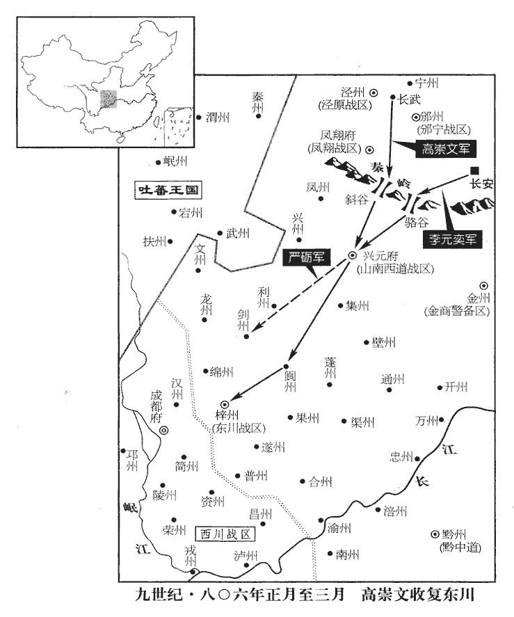
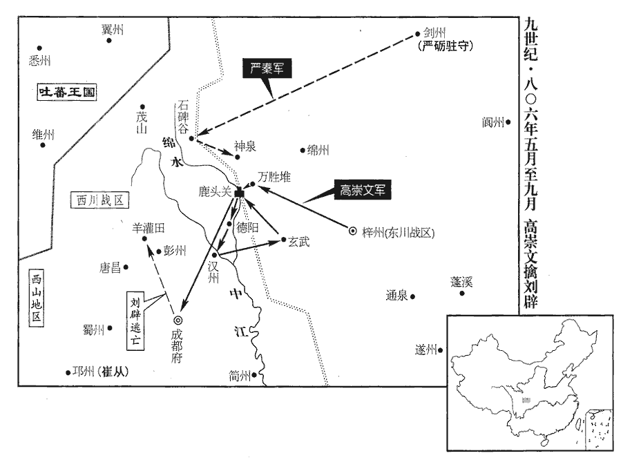
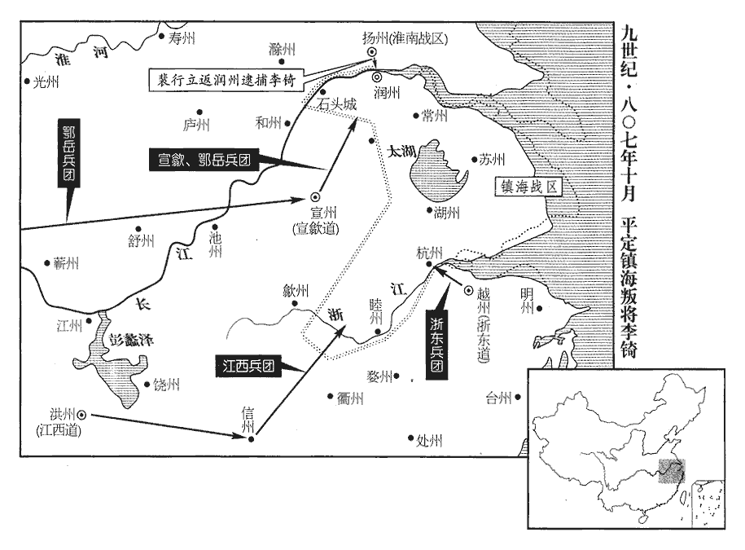
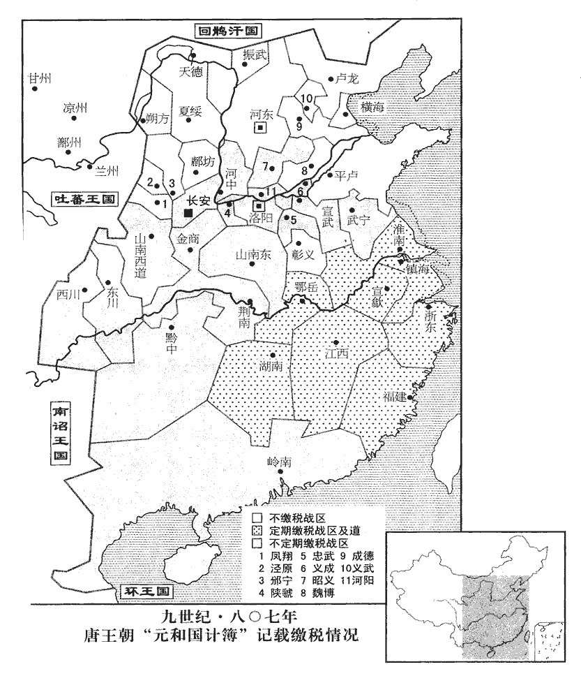
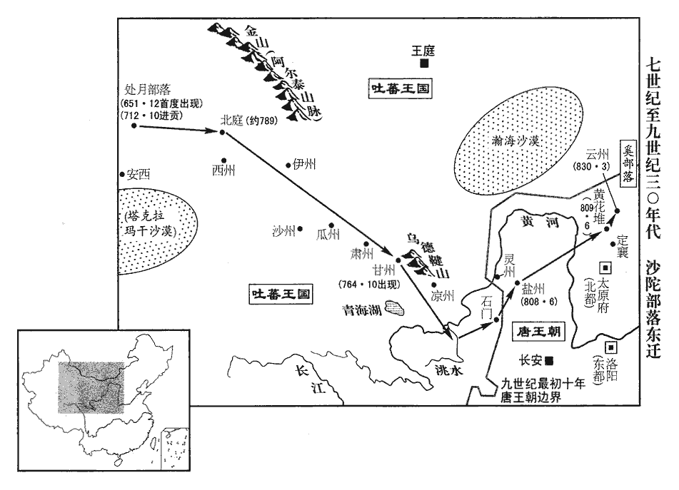

 唐紀五十三起柔兆閹茂（丙戌），盡屠維赤奮若（己丑）六月，凡三年有奇。

# 憲宗昭文章武大聖至神孝皇帝上之上諱淳，改為純，順宗長子。通鑑書唐諸帝諡號，自玄宗已下，皆以葬陵諡冊為正。帝本諡曰聖神章武孝皇帝，大中三年平河湟，始追崇諡號曰昭文章武大聖至神孝皇帝。中、睿之後，唯順、憲、宣有尊崇諡號，故因而書之。

## 元和元年（丙戌、八零六）

1春，正月，丙寅朔‹一›，上‹李纯（李淳）本年二十九岁›帥群臣詣興慶宮上上皇‹李诵，本年四十六岁›尊號。從百官之請也。帥，讀曰率。上，時掌翻。

〖译文〗 [1]春季，正月，丙寅朔（初一），宪宗率领群臣来到兴庆宫，向太上皇进献尊号。

2丁卯‹二›，赦天下，改元。

〖译文〗 [2]丁卯（初二），宪宗大赦天下罪囚，改年号。

3辛未‹六›，以鄂岳‹首府设鄂州湖北省武汉市›觀察使韓皋為奉義‹总部设安州湖北省安陆市›節度使。德宗貞元十九年名安黃軍曰奉義。癸酉‹八›，以奉義留後伊宥為安州‹湖北省安陆市›刺史兼安州留後。宥，慎之子也。壬午‹十七›，加成德‹总部设恒州河北省正定县›節度使王士真同平章事。

〖译文〗 [3]辛未（初六），宪宗任命鄂岳观察使韩皋为奉义节度使；癸酉（初八），任命奉义留后伊宥为安州刺史兼安州留后。伊宥是伊慎的儿子。壬午（十七日），加封成德节度使王士真为同平章事。

4甲申‹十九›，上皇‹李诵›崩于興慶宮。年四十六。

〖译文〗 [4]甲申（十九日），太上皇在兴庆宫驾崩。

5劉闢既得旌節，去年以闢知西川‹总部设成都府四川省成都市›節度，見上卷。志益驕，求兼領三川，上不許。闢遂發兵圍東川節度使李康於梓州‹四川省三台县›，東川節度使，領梓、劍、綿、普、陵、榮、遂、合、渝、瀘等州，治梓州。梓州，漢郪qī縣地，劉禪置東廣漢郡。梁武陵王紀置新州，隋為梓州。舊志：梓州至京師二千九十里。宋白曰：梓州，取梓潼江為名。欲以同幕盧文若為東川節度使。推官莆田‹福建省莆田市›林蘊力諫闢舉兵，武德五年，分南安置莆田縣，時屬泉州。風俗通曰：林姓，林放之後。孫愐曰：周平王‹姬宜臼›次子林開之後。魯有林放、林雍，齊有林元。闢怒，械繫於獄，引出，將斬之，陰戒行刑者使不殺，但數礪刃於其頸，數，所角翻。欲使屈服而赦之。蘊叱之曰：「豎子，當斬即斬，我頸豈汝砥石邪！」闢顧左右曰：「真忠烈之士也！」乃黜為唐昌‹四川省郫县西北唐昌镇›尉。儀鳳元年，分九隴、導江、郫pí，置唐昌縣，屬彭州。九域志：在州西二十八里。

〖译文〗 [5]刘辟得到节度使的任命以后，愈发心志骄矜，又要求兼管整个三川，宪宗不肯答应。于是，刘辟派兵在梓州围困东川节度使李康，打算让本幕府的卢文若担任东川节度使。推官莆田人林蕴极力规劝刘辟不要起兵、刘辟大怒，给林蕴加上枷锁，投入监牢，后来又将他拖出来，做出将要杀他的样子，却又暗中告诫执行刑罚的人不要杀死他，只在他的脖子上用刀刃磨上几下，打算使他屈服，而赦免他。林蕴喝斥执行刑罚的人说：“小子！要杀就杀，我的脖子难道是你的磨刀石吗！”刘辟环顾着周围的人们说：“林蕴真是一位忠烈之士啊！”于是，刘辟将林蕴罢免为唐昌县尉。

上欲討闢而重於用兵，謂以用兵為重事，不敢輕試也。公卿議者亦以為蜀險固難取，杜黃裳獨曰：「闢狂戇書生，戇zhuàng，竹巷翻。取之如拾芥耳！臣知神策軍使高崇文勇略可用，願陛下專以軍事委之，勿置監軍，闢必可擒。」上從之。翰林學士李吉甫亦勸上討蜀，上由是器之。器，所以適用；器之者，知其可用。戊子‹二十三›，命左神策行營節度使高崇文將步騎五千為前軍，考異曰：實錄云「為左軍。」按有左必有右，而云李元奕為次軍，則崇文必前軍也。神策京西行營兵馬使李元奕將步騎二千為次軍，與山南西道‹总部设兴元府陕西省汉中市›節度使嚴礪同討闢。時宿將名位素重者甚眾，皆自謂當征蜀之選；及詔用崇文，皆大驚。高崇文雖不足以望韓信，而亦能動時人之驚者，所居之地然也。

〖译文〗 宪宗打算讨伐刘辟，但是又不愿意轻易开启战端，公卿中议论此事的人们也认为蜀地险要坚固，难以攻取。唯独杜黄裳说：“刘辟是一个心气狂傲但又戆直无谋的书生，征服他就如同拾取芥子一般容易。据我了解，神策军使高崇文有勇有谋，堪当此任，希望陛下将军中事务交托给他，不要设置监军，刘辟肯定能够就擒。”宪宗听从了他的建议。翰林学士李吉甫也规劝宪宗讨伐蜀中，宪宗由此便器重他了。戊子（二十三日），宪宗命令左神策行营节度使高崇文率领步、骑兵五千人担当前军，神策京西行营兵马使李元奕率领步、骑兵两千人担当后军，与山南西道节度使严砺共同讨伐刘辟。当时，名声与地位平素便为人们推重的老将很多，都自认为自己应当是征讨蜀中的人选，及至宪宗颁诏起用了高崇文，都感到非常惊讶。

上與杜黃裳論及藩鎮，黃裳曰：「德宗‹李适›自經憂患，務為姑息，不生除節帥；帥，所類翻。有物故者，先遣中使察軍情所與則授之。中使或私受大將賂，歸而譽之，譽，音余。即降旄鉞，未嘗有出朝廷之意者。陛下必欲振舉綱紀，宜稍以法度裁制藩鎮，則天下可得而理也。」上深以為然，於是始用兵討蜀，以至威行兩河，皆黃裳啟之也。史言杜黃裳開憲宗削平藩鎮之略，其功不在裴度下。

〖译文〗 宪宗与杜黄裳谈论到藩镇问题时，杜黄裳说：“德宗自从经过朱作乱的忧患后，总是无原则地宽容藩镇，不肯在节度使生前免除他们的职务，有节度使去世，他就先派遣中使探察军中人心归向的人物，而将节度使授给其人。有时中使私自收受大将的贿赂，回朝称誉其人，德宗便立即将该人除授为节度使，对节度使的任命就不曾有过出自朝廷本意的例子。如果陛下准备振兴法纪，应当逐渐按照法令制度削弱和约束藩镇，这样天下便能够得到治理了。”宪宗认为很对，于是开始调兵遣将，征讨蜀中，终于使朝廷的威严遍及河南、河北一带，这都是由杜黄裳的建议发端的。

高崇文屯長武城‹陕西省长武县西北›，練卒五千，常如寇至，卯時受詔，辰時即行，器械糗糧，糗，去久翻。熬米麥為糗。一無所闕。甲午‹二十九›，崇文出斜谷‹陕西省太白县境›，斜，昌遮翻。谷，音浴，又如字。李元奕出駱谷‹陕西省周至县西南›，同趣梓州‹四川省三台县›。崇文軍至興元‹陕西省汉中市›，軍士有食於逆旅，折人匕筯者，崇文斬之以徇。折，而設翻。

〖译文〗 高崇文在长武城驻扎时，训练了五千士兵，经常保持着战备状态。他在卯时接受诏命，到辰时便已启程，军中的器械装备与制成的干粮，没有一样是缺少的。甲午（二十九日），高崇文由斜谷出兵，李元奕由骆谷出兵，共同奔赴梓州。高崇文军来到兴元的时候，将士们途中在客舍进餐，有人把主人的筷子折断了，高崇文便将此人斩首示众。

劉闢陷梓州，執李康。二月，嚴礪拔劍州‹四川省剑阁县›，斬其刺史文德昭。嚴礪先拔劍州，故高崇文因以鼓行入蜀，礪之功為不可揜yǎn矣。宋白曰：劍州，漢廣漢之梓潼縣。華陽國志云：諸葛亮相蜀，鑿石架空，為飛閣以通蜀、漢。晉以其地入梓潼郡，梁為安州。西魏伐蜀，先下安州，因克成都，改安州為始州，唐先天二年改為劍州。舊志：劍州至京師一千六百六十二里。

〖译文〗 刘辟攻陷梓州，捉住了李康。二月，严砺攻克剑州，将剑州刺史文德昭斩杀。

 

6奚‹滦河上游›王誨落可入朝。丁酉‹三›，以誨落可為饒樂郡王，遣歸。樂，音洛。

〖译文〗 [6]奚王诲落可入京朝见。丁酉（初三），宪宗将诲落可封为饶乐郡王，遣送他返回。

7癸丑‹十九›，加魏博‹总部设魏州河北省大名县›节度使田季安同平章事。

〖译文〗 [7]癸丑（十九日），宪宗加封魏博节度使田季安为同平章事。

8戊午‹二十四›，上與宰相論「自古帝王，或勤勞庶政，或端拱無為，互有得失，何為而可？」杜黃裳對曰：「王者上承天地宗廟，下撫百姓四夷，夙夜憂勤，固不可自暇自逸。然上下有分，分，扶問翻。紀綱有敘；苟慎選天下賢材而委任之，有功則賞，有罪則刑，選用以公，賞刑以信，則誰不盡力，何求不獲哉！明主勞於求人而逸於任人，此虞舜所以能無為而治者也。孔子曰：「無為而治者，其舜也歟！」治，直吏翻。至於【章：十二行本「於」下有「簿書」二字；乙十一行本同；孔本同；退齋校同。】獄市煩細之事，各有司存，非人主所宜親也。昔秦始皇以衡石程書，史記盧生曰：始皇天性剛戾，天下之事無小大皆決於主上，至以衡石程書，日夜有程，不中程者不得休息。魏明帝‹曹叡›自按行尚書事，見七十二卷太和六年。行，下孟翻。隋文帝‹杨坚›衛士傳餐，事見一百九十三卷太宗貞觀四年。皆無補於當時，取譏於後來，其耳目形神非不勤且勞也，所務非其道也。夫人主患不推誠，人臣患不竭忠。苟上疑其下，下欺其上，將以求理，理，治也。不亦難乎！」上深然其言。

〖译文〗 [8]戊午（二十四日），宪宗与宰相谈论道：“自古以来，有些帝王为各项政务勤勉地操劳，有些帝王却端身拱手，清静无为，他们各自都有成功或失败的地方，怎么做才是最适当的呢？”杜黄裳回答说：“帝王对上面承受着天地与国家赋予的使命，对下面负有安抚百姓与周边民族和邦国的重任，朝夕忧心劳苦，固然不能够自图清闲安逸。然而，君主与臣下是各有职分的，国家的法度是有一定的程序的。如果能够慎重地选拔天下的贤才，并且将重任托付给他们，立功便予以奖赏，犯罪便处以刑罚，选拔与任用出以公心，奖赏与惩罚不失信用，那还会有什么人不肯竭尽全力为朝廷办事呢，朝廷还会有什么寻求的目标不能实现呢！贤明的君主在寻求人才时是辛劳的，而在任用人才后却是安逸的，这便是虞舜能够清静无为而使政治修明的原因啊。至于诉讼与交易等烦琐细小的事情，有各有关部门存在，不是君主所应该躬亲过问的。过去，秦始皇用衡器称取所阅疏表奏章，魏明帝亲自到尚书台按验发行文书，隋文帝议事时侍卫人员只好互传食物充饥，对当世全无补益，却反被后人讥笑。他们的双耳与双眼、身体与心志并非不勤劳而辛苦，但是他们致力的事情，并不合乎事理啊！一般说来，君主最忌不能推心置腹，臣下最忌不能竭尽忠心。如果君主怀疑他的臣下，臣下诓骗他们的君主，将要以这种局面来寻求政治修明，不是很困难吗？”宪宗认为他的话极为正确。

9三月，丙寅‹二›，以神策行營、京西【章：十二行本作「京西行營」；乙十一行本同；孔本同。】節度使范希朝為右金吾大將軍。

〖译文〗 [9]三月，丙寅（初二），宪宗任命神策行营京西节度使范希朝为右金吾大将军。

10高崇文引兵自閬州‹四川省阆中市›趣梓州‹东川战区总部·四川省三台县›，九域志：閬州，西南至梓州三百餘里。趣，七喻翻。劉闢將邢泚引兵遁去，崇文入屯梓州。闢歸李康於崇文以求自雪，崇文以康敗軍失守，斬之。考異曰：劉崇遠金華子雜編曰：「高駢在淮海、周寶在浙西為節度使，相與有隙。駢忽遣使悔敘離絕，願復和好，請境會於金山。寶謂其使者曰：『我非李康，更要作家門功勳，欺誑朝廷邪！』註云：「元和中，李康鎮東川，傳有異志。駢祖崇文鎮西川，乃偽設鄰好，康不防備，來會於境，為崇文所斬。」補國史曰：「劉闢舉兵下東蜀，連帥李康棄城奔走。崇文下劍閣日，長子日暉不當矢石，欲戮之以勵眾。師次綿州，斬李康。疏康擅離征鎮，不為拒敵。」註云：「當時議論云，康任懷州刺史日，杖殺武陟尉，即崇文判官宋君平之父，乘此事為之復讎。」按金華子言，固不知李康為劉闢所圍事，而云崇文誘誅之。補國史又不知被擒事，而云棄城走。此皆得於傳聞，不可為據。今從舊傳。丙子‹十二›，嚴礪奏克梓州。丁丑‹十三›，制削奪劉闢官爵。

〖译文〗 [10]高崇文领兵由阆州奔赴梓州，刘辟的将领邢领兵逃走，高崇文进入梓州，屯扎下来。刘辟为了洗刷自己的罪责，将李康交还给高崇文，高崇文因李康打了败仗，失去梓州，便将他斩杀了。丙子（十二日），严砺奏称攻克梓州。丁丑（十三日），宪宗颁布制书革除刘辟的官职爵位。

11初，韓全義‹夏绥战区，总部设夏州陕西省靖边县北白城子›入朝，以其甥楊惠琳知夏綏留後。朝，直遙翻。夏，戶雅翻。杜黃裳以全義出征無功，驕蹇不遜，直令致仕；事見上卷永貞元年。以右驍衛將軍李演為夏綏節度使。惠琳勒兵拒之，表稱「將士逼臣為節度使。」河東‹总部设太原府山西省太原市›節度使嚴綬表請討之，詔河東、天德軍‹总部设天德军城内蒙古乌拉特前旗东北›合擊惠琳，綬遣牙將阿跌光進及弟光顏將兵赴之。阿，烏葛翻。跌，徒結翻。光進本出河曲步落稽，兄弟在河東軍，皆以勇敢聞。考異曰：舊李光進傳曰：「肅宗自靈武觀兵，光進從郭子儀破賊收兩京。上元初，郭子儀為朔方節度，用光進為都知兵馬使，尋遷渭北節度使。大曆四年，葬母於京城南原，將相致祭者凡四十四幄。」此乃李光弼弟光進事也，而劉昫置之此傳下，乃云「元和四年范希朝救易定，表光進為馬步都虞候。」其疏謬如此。辛巳‹十七›，夏州兵馬使張承金斬惠琳，傳首京師。

〖译文〗 [11]当初，韩全义人京朝见，德宗皇帝任命他的外甥杨惠琳代理夏绥留后事务。杜黄裳认为韩全义出兵征讨吴少诚全无建树，态度傲慢，有失恭顺，便索性让他退休，任命右骁卫将军李演为夏绥节度使。杨惠琳率领兵马阻止李演上任，上表奏称：“将士们逼迫我出任节度使。”河东节度使严绶上表奏请讨伐杨惠琳，宪宗颁诏命令河东、天德军合兵进击杨惠琳，严绶派遣牙将阿跌光进与他的弟弟阿跌光颜带领兵马前去进击杨惠琳。阿跌光进本来是河曲步落稽人，他们兄弟二人在河东军中，都以勇敢著称。辛巳（十七日），夏州兵马使张承金斩杀杨惠琳，将他的头颅传送京城。

12東川‹总部设梓州四川省三台县›節度使韋丹至漢中‹陕西省南部›，表言「高崇文客軍遠鬬，無所資，若與梓州，綴其士心，必能有功。」夏，四月，丁酉‹四›，以崇文為東川節度副使、知節度事。考異曰：實錄於此云為東川節度使，至十月除西川時，則云東川節度副使知節度事，蓋此時誤也。

〖译文〗 [12]东川节度使韦丹来到汉中后，上表声称：“高崇文率领外来的军队长途征战，没有任何凭依，如果将梓州归属于他，借以维系部下的心愿，肯定能够使他获得成功。”夏季，四月，丁酉（初四），宪宗任命高崇文为东川节度副使，知节度使事。

13潘孟陽所至，專事遊晏，從僕三百人，多納賄賂；從，才用翻。上聞之，甲辰‹十一›，以孟陽為大理卿，罷其度支、鹽鐵轉運副使。潘孟陽出使見上卷上年。

〖译文〗 [13]潘孟阳每到一个地方，专门以游观娱乐为务，随从仆人有三百人，还接受了大量的贿赂。宪宗闻知此事后，甲辰（十一日），任命潘孟阳为大理卿，免除了他度支副使和盐铁转运副使的职务。

14丙午‹十三›，策試制舉之士，歐陽修曰：唐選舉之制，天子自詔曰制舉，所以待非常之才焉。於是校書郎元稹、稹，止忍翻。監察御史獨孤郁、校書郎下邽‹陕西省渭南市北›白居易、前進士蕭俛miǎn、沈傳師出焉。郁，及之子；獨孤及見二百二十三卷代宗永泰元年。俛，華之孫；蕭華見二百二卷肅宗上元二年。傳師，既濟之子也。沈既濟見二百二十六卷代宗大曆十四年。

〖译文〗 [14]丙午（十三日），宪宗亲自在大殿对应诏赴试的士子举行制举考试。于是，校书郎元稹、监察御史独孤郁、校书郎下人白居易、前进士萧、沈传师都崭露头角，独孤郁是独孤及的儿子。萧是萧华的孙子。沈传师是沈既济的儿子。

15杜佑請解財賦之職，仍舉兵部侍郎、度支使、鹽鐵轉運副使李巽自代。丁未‹十四›，加佑司徒，罷其鹽鐵轉運使，以巽為度支、鹽鐵轉運使。自劉晏之後，居財賦之職者，莫能繼之。巽掌使一年，掌使，言掌使職也。使，疏吏翻。征課所入，類晏之多，明年過之，又一年加一百八十萬緡。然則李巽勝劉晏乎！曰：不如也。晏猶有遺利在民，巽則盡取之也。

〖译文〗 [15]杜佑请求解除自己管理资财赋税方面的职务，还推举兵部侍郎、度支使、盐铁转运副使李巽来替代自己。丁未（十四日），宪宗加封杜佑为司徒，免除了他盐铁转运使的职务，任命李巽为度支使和盐铁转运使。自刘晏以后，担任财物赋税管理职务的人们都赶不上他。李巽掌管使职一年，征收赋税的收入，便像刘晏时那样多了，第二年又超过了刘晏，再过一年，又较刘晏时增加了一百八十万缗。

16戊申‹十五›，加隴右‹总部设普润陕西省凤翔县北›經略使、秦州刺史劉澭保義軍節度使。鳳翔普潤縣，先置隴右軍，今改名保義軍。澭，於容翻，又於用翻。

〖译文〗 [16]戊申（十五日），宪宗加封陇右经略使、秦州刺史刘为保义军节度使。

17辛酉‹二十八›，以元稹為左【章：十二行本「左」作「右」；乙十一行本同；孔本同。】拾遺，【章：十二行本「遺」下有「獨孤郁為左拾遺」七字；乙十一行本同；孔本同；張校同；退齋校同。】白居易為盩厔‹陕西省周至县›尉、集賢校理，蕭俛為右拾遺，集賢校理，開元八年置。俛，音免。沈傳師為校書郎。

〖译文〗 [17]辛酉（二十八日），任命元稹为左拾遗，白居易为县尉、集贤校理、萧为右拾遗，沈传师为校书郎。

稹上疏論諫職，考異曰：稹自敘及新傳，先上教本書，論諫職在後。今從舊傳。以為：「昔太宗‹李世民›以王珪、魏徵為諫官，宴遊寢食未嘗不在左右，又命三品以上入議大政，必遣諫官一人隨之，以參得失，見一百九十二卷太宗貞觀元年。故天下大理。大理，猶言大治也。今之諫官，大不得豫召見，次不得參時政，排行就列，朝謁而已。行，戶剛翻。近年以來，正牙不奏事，德宗貞元十八年，罷正牙奏事，事見上卷。庶官罷巡對，巡對，猶今云轉對。貞元十七年，令常參官每日引見二人，訪以政事，謂之巡對。至元和元年，武元衡奏曰：「正衙已有待制官兩員，貞元七年又有次對；難議兩置。」詔「今後每坐日兩人待制正衙，退後於延英候對；中書、門下、御史臺官依故事，並不待制。」則是自正衙待制以外，凡德宗所置次對皆罷矣。宋白曰：貞元七年，令常參官日二人引見，謂之巡對。二十一年，御史中丞李鄘奏：「準貞元七年敕，常參官並令依次對者。伏以朝夕承命，已有待制官兩員，足備顧問。今更置次對，恐煩聖聽。」敕「宜停」。諫官能舉職者，獨誥命有不便則上封事耳。君臣之際，諷諭於未形，籌畫於至密，尚不能回至尊之盛意，況於既行之誥令，已命之除授，而欲以咫尺之書收絲綸之詔，誠亦難矣。記曰：王言如絲，其出如綸。王言如綸，其出如綍fú。願陛下時於延英召對，使盡所懷，豈可寘於其位而屏棄疏賤之哉！」屏，必郢翻，又卑正翻。

〖译文〗 元稹上书谈论谏官的职任，他认为：“过去，太宗任命王与魏徵为谏官，无论宴饮游观，还是寝息就餐，没有一时不让他们跟随在身边，还命令在三品以上官员入朝计议重大政务时，一定要派遣一位谏官跟随，以便检验各种议论的优劣，所以当时天下政治修明。现在的谏官，首先不能得到圣上的召见，其次不能参究当前的政治措施，只是侪身于朝班的行列之中，按时上朝拜见圣上罢了。近些年来，免除正殿奏事，停止百官轮流奏事，谏官能够奉行的职责，只有在诏诰命令不尽合宜时，献上一本皂封缄的奏章而已。君臣际会，即使在事情发生以前便委婉规劝，进行极为周密的谋划，尚且难以回转圣上的盛意，何况诏诰命令已经颁行，对官员的任命已经发布，要想凭着谏官进呈一纸章奏收回圣上的诏书，实在也是够困难的了。希望陛下经常在延英殿召见谏官奏对，让他们把意见都讲出来，怎么能够将他们安置在谏官的职位上，但又对他们弃置不顾，并且疏远贱视呢！”

頃之，復上疏，復，扶又翻。以為：「理亂之始，必有萌象。開直言，廣視聽，理之萌也。甘諂諛，蔽近習，亂之象也。自古人君即位之初，必有敢言之士，人君苟受而賞之，則君子樂行其道，【章：十二行本「道」下有「競為忠讜」四字；乙十一行本同；退齋校同。】小人亦貪得其利，不為回邪矣。元稹此二語，蓋自道出心事也。樂，音洛。如是，則上下之志通，幽遠之情達，欲無理得乎！理，治也；與亂對言。苟拒而罪之，則君子卷懷括囊以保其身，孔子曰：邦無道，則可卷而懷之。易坤之六四曰：括囊，無咎無譽。文言曰：天地閉，賢人隱。易曰：括囊，無咎無譽，蓋言謹也。括，結也，方言云，閉也。小人阿意迎合以竊其位矣。如是，則十步之事，皆可欺也，欲無亂得乎！昔太宗初即政，孫伏伽以小事諫，太宗喜，厚賞之。見一百九十五卷貞觀十二年。故當是時，言事者惟患不深切，未嘗以觸忌諱為憂也。太宗豈好逆意而惡從欲哉？好，呼到翻。惡，烏路翻。誠以順適之快小，而危亡之禍大故也。陛下踐阼，今以周歲，以，當作已。【章：乙十一行本正作「已」；孔本同。】未聞有受伏伽之賞者。臣等備位諫列，曠日彌年，不得召見，每就列位，屏氣鞠躬，不敢仰視，又安暇議得失，獻可否哉！供奉官尚爾，況疏遠之臣乎！兩省官，自遺、補以上，皆供奉官也。屏，卑郢翻。此蓋群下因循之罪也。」因條奏請次對百官、復正牙奏事、禁非時貢獻等十事。

〖译文〗 不久，元稹再次上疏，他认为：“在政治修明与祸乱危亡的初期，肯定是有萌芽和迹象的。开通直言进谏的道路，拓广接受意见的范围，这是政治修明的萌芽。喜欢阿谀逢迎，被自己亲幸的人们蒙蔽，这是祸乱危亡的迹象。自古以来，在君主即位的初期，肯定会有敢于直言切谏的人士，如果人君接受这些人士的意见，从而奖赏他们，君子便愿意奉行他们的理想，小人也贪图其中的利益，不做奸邪的事情了。如果能够做到这些，那么上下之志相通，幽深辽远之情畅达，即使不打算政治修明，能够办得到吗！如果君主抵制直言切谏的人士，从而惩罚他们，君子便会藏身隐退，缄口不言，但求明哲保身了，小人便会曲意迎合，从而窃居君子的地位了。像这个样子，要办的事情就是近在十步以内，也完全有可能做出欺上罔下的勾当来，想没有祸乱办得到吗！过去，太宗刚执政时，孙伏伽就一件小事进谏，大宗大喜，重重地奖赏了他。所以在当时，谈论政事的人们惟恐讲得不够深挚切实，从来不曾有人担心触犯忌讳。难道是太宗喜欢让人违背自己的意志而厌恶人们顺从自己的愿望吗？这诚然因为顺心适意的快乐太渺小，而国家危亡的祸殃太重大的原故。自从陛下登基以来，至今已满一年，没听说过有人受到孙伏伽那样的奖赏。我等在谏官行列中聊以充数，空费时日，不能够得到陛下的召见，每当站进朝班的行列位次之中，屏住呼吸，曲身行礼，连抬头看上一眼都没有胆量，又怎么会顾得上议论得失，诤言进谏呢！在皇帝周围供职的官员尚且如此，何况其他职位疏远的臣下呢！这恐怕是群臣因袭故习的原故吧。”于是，他逐条上奏，请求实行依次召对百官、恢复正殿奏事、禁止临时进献贡物等十件事情。

稹又以貞元中王伾、王叔文以伎術得幸東宮，永貞之際幾亂天下，伎，渠綺翻。幾，居希翻。上書勸上早擇脩正之士使輔導諸子，以為：「太宗自為藩王，與文學清脩之士十八人居。事見一百八十九卷高祖武德四年。後代太子、諸王，雖有僚屬，日益疏賤，至於師傅之官，非眊聵廢疾不任事者，眊，莫報翻，目昏也。聵kuì，五怪翻，耳聾也。任，音壬。則休戎罷帥不知書者為之。帥，所類翻。其友諭贊議之徒，尤為冗散之甚，按唐制：王府有諮議參軍、有友，有文學。元稹所謂友諭贊議者，蓋謂友以諭教，諮議則贊議也。冗散之官，今謂之閒慢差遣。冗，而隴翻。散，蘇旱翻。搢紳皆恥由之。就使時得僻老儒生，越月踰時，僅獲一見，又何暇傅之德義，納之法度哉！夫以匹士愛其子，猶知求明哲之師而教之，況萬乘之嗣，繫四海之命乎！」乘，繩證翻。上頗嘉納其言，時召見之。

〖译文〗 元稹又以贞元年间王、王叔文靠着擅长方伎小术得到太子的宠爱，到永贞年间几乎使天下大乱之事，上书劝宪宗及早选拔善良正派的人士，辅佐教导各位皇子，他认为：“自从太宗当了藩王后，便与十八位博学能文、操行洁美的人士相处。虽然后世的太子与诸王仍有所属的官吏，但是他们的地位越来越遭受疏远与轻贱，至于太师、少师、太傅、少傅一类官员，不是由眼昏耳聋、身体残废、不能办事的人物担承，就是让战事完结以后免去节帅职务而又不懂诗书的人物出任。尤其王府那些友、司议郎、谕德、赞善大夫等官员，更是闲散之职，士大夫都以担当过这类官员为耻辱。即使有时能够得到一些孤陋寡闻，年纪老迈的儒生，也是历时数月，仅仅获得一次与太子、诸王见面的机会，又哪里有闲暇为他们辅导仁德道义，使他们深明法令制度呢！一般说来，就连地位低贱的人们，为了痛爱自己的子女，还知道去寻找明达事理的老师来教诲自己的子女，何况太子、诸王都是帝王的后嗣，关系着国家的命运呢！”宪宗对他的话很是赞许，颇多采纳，还时常召见他。

18壬戌‹二十九›，邵王約薨。約，上弟也。

〖译文〗 [18]壬戌（二十九日），邵王李约去世。

19五月，丙子‹十三›，以橫海‹总部设沧州河北省沧州市东南›留後程執恭為節度使。

〖译文〗 [19]五月，丙子（十三日），宪宗任命横海留后程执恭为该军节度使。

20庚辰‹十七›，尚書左丞、同平章事鄭餘慶罷為太子賓客。

〖译文〗 [20]庚辰（十七日），尚书左丞、同平章事郑馀庆被罢免为太子宾客。

21辛卯‹二十八›，尊太上皇后‹李纯之母›為皇太后。

〖译文〗 [21]辛卯（二十八日），尊奉太上皇的皇后为皇太后。

22劉闢城鹿頭關‹四川省德阳市北黄许镇›，連八柵，屯兵萬餘人以拒高崇文。六月，丁酉‹五›，崇文擊敗之。敗，補邁翻。闢置柵於關東萬勝堆‹四川省德阳市东北›。戊戌‹六›，崇文遣驍將范陽‹河北省涿州市›高霞寓攻奪之，下瞰關城；瞰，古濫翻。凡八戰皆捷。

〖译文〗 [22]刘辟修筑鹿头关，连结八座栅垒，屯聚兵马一万多人，以便抵御高崇文。六月，丁酉（初五），高崇文打败了刘辟。刘辟又在鹿头关东面的万胜堆设置栅垒。戊戌（初六），高崇文派遣骁将范阳人高霞寓前去攻取了万胜堆，由此可以俯视鹿头关全城。共计经过八次交战，高霞寓全都获胜。

23加盧龍‹总部设幽州北京市›節度使劉濟兼侍中。己亥‹七›，加平盧‹总部设郓州山东省东平县›節度使李師古兼侍中。

〖译文〗 [23]宪宗加封卢龙节度使刘济兼任侍中；己亥（初七），加封平卢节度使李师古兼任侍中。

24庚子‹八›，高崇文破劉闢於德陽‹四川省德阳市›；武德三年，分雒縣置德陽縣，屬漢州。九域志：在州東北八十五里。癸卯‹十一›，又破之於漢州‹四川省广汉市›；嚴礪‹山南西道战区，总部设兴元府陕西省汉中市›遣其將嚴秦破闢眾萬餘人於綿州‹四川省绵阳市›石碑谷‹四川省绵竹市北›。九域志：漢州綿竹縣有石碑鎮。意「州」字蓋「竹」字之誤也。

〖译文〗 [24]庚子（初八），高崇文在德阳打败刘辟。癸卯（十一日），高崇文在汉州再败刘辟。严砺派遣他的将领严秦在绵州的石碑谷打败刘辟的部众一万多人。

25初，李師古有異母弟曰師道，常疏斥在外，不免貧窶。窶jù，其矩翻。師古私謂所親曰：「吾非不友於師道也，吾年十五擁節旄，自恨不知稼穡之艱難。況師道復減吾數歲，復，扶又翻。吾欲使之知衣食之所自來，且以州縣之務付之，計諸公必不察也。」及師古疾篤，師道時知密州‹山东省诸城市›事，好畫及觱bì篥lì。好，呼到翻。畫，户卦翻。觱，壁吉翻。篥，力質翻。胡人吹葭管，謂之觱篥。樂府雜錄：觱篥，葭管也，卷蘆為頭，截竹為管，出於胡地。制法角音，九孔漏聲，五音。唐編入鹵簿，名為笳管；用之雅樂，以為雅管；六竅之制，則為鳳管。旋宮轉器，以應律者也。杜佑曰：觱篥，一名悲篥，出於胡中，其聲悲。東夷有以卷桃皮為之者。亦出南蠻。又樂府雜錄曰：觱篥，本龜茲‹新疆库车县›樂。師古謂判官高沐、李公度曰：「迨吾之未亂也，迨，及也。疾病則亂。欲有問於子。我死，子欲奉誰為帥乎？」二人相顧未對。師古曰：「豈非師道乎？人情誰肯薄骨肉而厚他人，顧置帥不善，則非徒敗軍政也，帥，所類翻；下同。敗，蒲邁翻。且覆吾族。師道為公侯子孫，不務訓兵理人，專習小人賤事以為己能，果堪為帥乎？幸諸公審圖之！」閏月，壬戌朔‹一›，師古薨。沐、公度秘不發喪，潛逆師道于密州，奉以為節度副使。

〖译文〗 [25]当初，李师古有一个异母兄弟，名叫李师道，经常遭受冷落，被斥逐在外地，不免贫困。李师古私下里告诉亲近的人们说：“并不是我不肯与李师道友好，我十五岁时担任节度使，恨自己不懂得耕种与收获的艰难。况且李师道又比我小几岁，我想让他了解吃穿供给是从哪里来的，才暂且把治理州县的事务交付给他，想来诸位肯定还没有看出来吧。”及至李师古病情危笃时，李师道当时正在代理密州事务，喜欢绘画和吹奏胡人的葭管。李师古对判官高沐和李公度说：“趁着我神智还没有迷乱时，我想征求你们的意见。我死后，你们打算拥戴何人担当主帅呢？”两人相互看了一眼，没有回答。李师古说：“难道不是李师道吗？由人们的常情说来，谁愿意对骨肉兄弟刻薄寡恩，而对其他的人却优渥丰厚呢，但是设置主帅不得其人，便不只是败坏军中政务，而且将会倾覆我的家族。李师道是公侯家族的后人，却不致力训练军队，治理百姓，专门学习小人的下贱行当，认为是自己的才能，他担当主帅果真胜任吗？希望诸位审慎地计议一下吧。”闰六月，壬戌朔（初一），李师古去世。高沐与李公度隐秘其事，暂不公布李师古的死讯，暗中从密州迎接李师道，拥戴他担当节度副使。

26秋，七月，癸丑‹二十二›，高崇文破劉闢之眾萬人於玄武‹四川省中江县›。劉昫曰：玄武，漢氐道地，晉改曰玄武。五代史志：玄武，舊曰伍城，後周置玄武郡；隋開皇初，廢郡改縣，曰玄武，唐屬梓州。九域志：在州西九十里。甲午‹三›，詔：「凡西川繼援之兵，悉取崇文處分。」處，昌呂翻。分，扶問翻。

〖译文〗 [26]秋季，七月，癸丑（疑误），高崇文在玄武打败刘辟的部众一万人。甲午（初三），宪宗颁诏：“凡是在西川相继增援的军队，一概听从高崇文的指挥。”

27壬寅‹十一›，葬至德大聖大安孝皇帝于豐陵‹陕西省富平县东十五千米瓮金山›，豐陵，在京兆富平縣東三十里甕金山。廟號順宗。

〖译文〗 [27]壬寅（十一日），宪宗将至德大圣大安孝皇帝安葬在丰陵，庙号顺宗。

28八月，壬戌‹二›，以妃郭氏為貴妃。

〖译文〗 28\]八月，壬戌（初二），宪宗册立皇妃郭氏为贵妃。

29丁卯‹七›，立皇子寧為鄧王，寬為澧王，宥為遂王，察為深王，寰為洋王，寮為絳王，審為建王。此皆以當時州名為封國之名。

〖译文〗 [29]丁卯（初七），宪宗册立皇子李宁为邓王，李宽为澧王，李宥为遂王，李察为深王，李寰为洋王，李寮为绛王，李审为建王。

30李師道總軍務，久之，朝命未至。師道謀於將佐，或請出兵掠四境；高沐固止之，請輸兩稅，申官吏，行鹽法，以表謹事朝廷，不襲朝廷師古所為也。遣使相繼奉表詣京師。杜黃裳請乘其未定而分之；上以劉闢未平，己巳‹九›，以師道為平盧留後、知鄆州事。

〖译文〗 [30]李师道总揽军中事务后，过了许久，朝廷的任命还没有到来。李师道与将佐们商讨对策，有人请求往四邻的边境上派兵虏掠，高沐坚决制止了这一企图，请李师道向朝廷缴纳两税，申报所任用的官吏，实行食盐法，派遣使者接连不断地前往京城进献表章。杜黄裳请求趁着李师道没有安定来的时机，将平卢分而治之。宪宗因刘辟尚未平定，己巳（初九），任命李师道为平卢留后、知郓州事。

31堂後主書滑渙久在中書，堂後主書，即今之堂後官也。滑，戶八翻，姓也。與知樞密劉光琦相結，宰相議事有與光琦異者，令渙達意，常得所欲，杜佑、鄭絪等皆低意善視之。鄭餘慶與諸相議事，渙從旁指陳是非，餘慶怒叱之；未幾，罷相。四方賂遺無虛日，幾，居豈翻。遺，唯季翻。中書舍人李吉甫言其專恣，請去之。去，羌呂翻。上命宰相闔中書四門搜掩，闔hé，轄臘翻。盡得其姦狀。九月，辛丑‹十一›，貶渙雷州‹广东省雷州市›司戶，宋白曰：雷州，漢合浦郡之徐聞縣地，梁分置合州，大同末以合肥為合州，以此為南合州，唐改雷州。尋賜死；籍沒，家財凡數千萬。

〖译文〗 [31]堂后主书滑涣长期在中书省任职，与知枢密刘光琦相互交结，凡是宰相计议的事情与刘光琦发生分歧时，刘光琦便让滑涣传达自己的意图，经常能够满足自己的愿望。杜佑、郑等人都低声下气，用友好的态度对待他。郑馀庆与各位宰相计议事情时，滑涣在旁边指点评说诸相意见的曲直短长，郑馀庆怒气冲冲地喝斥了他，没过多久，郑馀庆便被罢免了宰相的职务。各地向滑涣贿赂财物，没有停闲的时日。中书舍人李吉甫进言说滑涣肆意专权，请求除去他。宪宗命令宰相将中书省四面的门户关闭起来，进行突然搜查，取得了滑涣肆行邪恶的全部罪状。九月，辛丑（十一日），宪宗将滑涣贬为雷州司户，不久便赐他自裁，没收他家的财产计有数千万之多。

32壬寅‹十二›，高崇文又敗劉闢之眾於鹿頭關；敗，補邁翻。嚴秦敗劉闢之眾於神泉‹四川省安县南塔水镇›。神泉，漢涪城地，晉置西園縣。隋改為神泉縣，以縣西有泉能愈疾也；唐屬綿州。九域志：在州西北八十五里。河東‹总部设太原府山西省太原市›將阿跌光顏將兵會高崇文於行營，愆期一日，愆qiān，過也；愆期，過期也。懼誅，欲深入自贖，軍于鹿頭之西，斷其糧道，斷，音短。城中憂懼。於是闢、綿江‹沱江支流›柵將李文悅、綿水，在綿州雒縣東三十里，源出綿竹縣紫巖山。鹿頭守將仇良輔皆以城降於崇文；獲闢壻蘇彊，士卒降者萬計。崇文遂長驅直指成都‹四川省成都市›，所向崩潰，軍不留行；辛亥‹二十一›，克成都。劉闢、盧文若帥數十騎西奔吐蕃‹首都逻些城西藏拉萨市›，帥，讀曰率。崇文使高霞寓等追之，及於羊灌田‹四川省彭州市西北九陳镇›；彭州有羊灌田守捉。闢赴江不死，擒之。文若先殺妻子，乃繫石自沈。沈，持林翻。崇文入成都，屯於通衢，休息士卒，市肆不驚，珍貨山積，秋豪不犯，檻劉闢送京師。斬闢大將邢泚、館驛巡官沈衍，考異曰：林恩補國史曰：「衍與段文昌，闢逼令判案，禮同上介，亦接諸公候謁。崇文目段公曰：『公必為將相，未敢奉薦。』揖起。沈衍令梟首摽於驛門。二人誅賞之異，未曉其意何如也。」餘無所問。軍府事無巨細，命一遵韋南康故事，韋皋封南康郡王。從容指撝huī，一境皆平。從，千容翻。撝，許為翻。

〖译文〗 [32]壬寅（十二日），高崇文再次在鹿头关打败刘辟的部众，严秦在神泉也打败了刘辟的部众。河东将领阿跌光颜带领兵马与高崇文在行营会合，耽误了一天时间，因害怕高崇文杀他，打算深入前敌，赎回自己的过失，在鹿头关西面驻扎下来，继绝了刘辟的运粮通道，使鹿头关内将士忧愁恐惧。于是，刘辟的绵江栅守将李文悦、鹿头关守将仇良辅都率城向高崇文投降，还捉获了刘辟的女婿苏强，投降的士兵数以万计。于是，高崇文迅速地直逼成都，所到之处，无不崩溃，军队在行进中从未受阻。辛亥（二十一日），高崇文攻克成都。刘辟、卢文若带领数十人骑马向西逃奔吐蕃，高崇文让高霞寓等人追赶，并在羊灌田追上了他们。刘辟跳入长江、没有淹死，终被擒获。卢文若事先将妻子儿女杀死，然后便在身上系了石头沉江自杀。高崇文进入成都后，在四通八达的大道上驻扎下来，让士兵就地休息，市中的店铺没有受到惊动，市场上珍贵的货财堆积如山，也没有遭受丝毫的侵犯。高崇文将刘辟装入槛车，送往京城，斩杀了刘辟的大将邢和馆驿巡官沈衍，对其余的人一概不加追究。对军府的事务，无论大小，高崇文命令一律遵从南康郡王韦皋先前奉行的惯例，他从容不迫地指挥着，西川全境便完全平定了。

初，韋皋以西山‹成都以西群山›運糧使崔從知邛州‹四川省邛崃市›事，劉闢反，從以書諫闢；闢發兵攻之，從嬰城固守；闢敗，乃得免。從，融之曾孫也。崔融事武后，以文華著。

〖译文〗 当初，韦皋委任西山运粮使崔从掌管邛州事务，刘辟反叛朝廷后，崔从写书信劝阻刘辟，刘辟派兵攻打邛州，崔从据城坚守。刘辟失败，崔从终于得以幸免。崔从是崔融的曾孙。

韋皋參佐房式、韋乾度、獨孤密、符載、郗士美、段文昌等素服麻屨jù，銜土請罪；崇文皆釋而禮之，草表薦式等，厚贐jìn而遣之。以貨財送行曰贐。目段文昌曰：「君必為將相，未敢奉薦。」載，廬山‹江西省九江市南›人；廬山，在江州尋陽，未嘗置縣。恐誤。式，琯之從子；房琯相肅宗。文昌，志玄之玄孫也。段志玄，唐初開國功臣。

〖译文〗 韦皋的参佐房式、韦乾度、独孤密、符载、郗士美、段文昌等人身著白色丧服，脚穿麻鞋，按死罪制度口衔土块，请求治罪，高崇文全都释放了他们，以礼相待，还草拟表章举荐房式等人，赠给他们丰厚的财物，送他们前去就任。高崇文看着段文昌说：“你肯定会成为将相，我不敢推荐你。”符载是庐山人。房式是房的侄子。段文昌是段志玄的玄孙。

闢有二妾，皆殊色，監軍請獻之，崇文曰：「天子命我討平凶豎，當以撫百姓為先，遽獻婦人以求媚，豈天子之意邪！崇文義不為此。」乃以配將吏之無妻者。史言高崇文受命專征，有可稱者。

〖译文〗 刘辟有两个偏房，容貌都特别美丽，监军请求将她们献给朝廷，高崇文说：“天子命令我征伐平定刘辟这一凶顽竖子，我应当首先安抚百姓。忙着进献妇女，讨好天子，这哪里会是天子的本意呢！我奉行正义，不干这种事情。”于是，他将刘辟的两个偏房许配给没有妻室的将吏了。

杜黃裳建議征蜀及指受高崇文方略，「受」，當作「授」。皆懸合事宜。崇文素憚劉澭‹保义战区，总部设普润陕西省凤翔县北›，時京西諸鎮諸將，劉澭持軍號為嚴整，故崇文憚之。黃裳使謂之曰：「若無功，當以劉澭相代。」故能得其死力。及蜀平，宰相入賀，上目黃裳曰：「卿之功也！」

〖译文〗 杜黄裳建议征讨蜀中并授意高崇文应采取的谋略。这些谋略对后来发生的事情完全适宜。由于高崇文平时畏惧刘，杜黄裳便让人告诉他说：“如果你不能取得成功，便会让刘替代你。”所以杜黄裳能够使高崇文尽到最大的力量。及至平定蜀中后，宰相入朝祝贺，宪宗望着杜黄裳说：“这都是你的功劳啊！”

 

33辛巳‹二十三›，詔徵少室山‹河南省登封县西›人李渤為左拾遺；少室山，在河南登封縣。少，詩沼翻。渤辭疾不至，然朝政有得失，渤輒附奏陳論。朝，直遙翻。

〖译文〗 [33]辛巳（疑误），宪宗颁诏征召少室山的隐士李渤担任左拾遗，李渤称病，不肯前来。然而，一旦朝廷大政发生问题，他总是寄上奏章，陈述论说自己的见解。

34冬，十月，甲子‹五›，易定‹总部设定州河北省定州市›節度使張茂昭入朝。

〖译文〗 [34]冬季，十月，甲子（初五），易定节度使张茂昭入京朝见。

35制割資‹四川省资中县›、簡‹四川省简阳市›、陵‹四川省仁寿县›、榮‹四川省荣县›、昌‹重庆市荣昌县›、瀘‹四川省泸州市›六州隸東川。資州，漢資中縣地，隋置資陽郡，唐為資州。乾元二年，分資、瀘、普、合四州之境置昌州。房式等未至京師，皆除省寺官。史言憲宗急於收拾人才以安反側。丙寅‹七›，以高崇文為西川節度使。戊辰‹九›，以嚴礪為東川節度使。

〖译文〗 [35]宪宗颁制命令分出资州、简州、陵州、荣州、昌州、泸州六地，归属东川。房式等人还没有来到京城，宪宗已经全部任命他们各省、各寺的官员。丙寅（初七），任命高崇文为西川节度使；戊辰（初九），任命严砺为东川节度使。

庚午‹十一›，以將作監柳晟為山南西道節度使。晟至漢中，府兵討劉闢還，未至城，府兵，漢中之兵也。唐以漢中為興元府，故謂之府兵，非唐初所謂府兵也。詔復遣戍梓州；軍士怨怒，脅監軍，謀作亂。晟聞之，疾驅入城，慰勞之，復，扶又翻；下可復同。勞，力到翻。既而問曰：「汝曹何以得成功？」對曰：「誅反者劉闢耳。」晟曰：「闢以不受詔命，故汝曹得以立功，豈可復使他人誅汝以為功邪？」眾皆拜謝，請詣戍所如詔書。軍府由是獲安。

〖译文〗 庚午（十一日），宪宗任命将作监柳晟为山南西道节度使。柳晟来到汉中时，汉中府的兵马征讨刘辟回来，还没有进城，便有诏书派遣他们再去戍守梓州。将士们既怨恨，又恼怒，胁迫监军，策划发起变乱。柳晟得知消息后，连忙策马进城，慰劳他们。过了一会儿，柳晟问道：“你们是怎么获得成功的呀？”将士们回答说：“是由于前去讨伐反叛者刘辟呗。”柳晟说：“由于刘辟不肯接受诏书的命令，所以使你们获得了立功的机会，怎么能够让别人再来讨伐你们，从而建立功劳呢！”大家都向柳晟行礼，表示感谢，请求按照诏书前往戍守之地。从此，军府获得安宁。

36壬申‹十三›，【章：十二行本「申」作「午」；乙十一行本同；孔本同；張校云缺「壬午」二字。】以平盧留後李師道為節度使。

〖译文〗 [36]壬申（十三日），宪宗任命平卢留后李师道为节度使。

37戊子‹二十九›，劉闢至長安，并族黨誅之。

〖译文〗 [37]戊子（二十九日），刘辟被押送到长安，朝廷命令将他连同他的同族亲属一并诛杀。

38武寧‹总部设徐州江苏省徐州市›節度使張愔有疾，上表請代。十一月，戊申‹十九›，徵愔為工部尚書，以東都‹洛阳›留守王紹代之，王紹本名純，避上名改焉。復以濠‹安徽省凤阳县东北临准关›、泗‹江苏省盱眙县淮河北岸›二州隸武寧軍。分濠、泗二州見二百三十五卷德宗貞元十六年。徐人喜得二州，故不為亂。

〖译文〗 [38]武宁节度使张身患重病，上表请求派人替代自己。十一月，戊申（十九日），宪宗征召张回朝担任工部尚书，任命东都留守王绍代替张的原职务，又将濠州、泗州两地归属武宁军。徐州地区的将士们高兴得到两州的土地，所以不作乱。

39丙辰‹二十七›，以內常侍吐突承璀為左神策中尉。璀，七罪翻。承璀事上於東宮，以幹敏得幸。為承璀喪師其甚幾於亂國張本。

〖译文〗 [39]丙辰（二十七日），宪宗任命内常侍吐突承璀为左神策中尉。吐突承璀在宪宗当太子时曾侍奉左右，因干练机敏而得到宠爱。

40是歲，回鶻‹瀚海沙漠群›入貢，始以摩尼偕來，於中國置寺處之。回鶻之摩尼，猶中國之僧也；其教與天竺又異。按唐書會要十九卷：回鶻可汗王令明教僧進法入唐。大曆三年六月二十九日，敕賜回鶻摩尼，為之置寺，賜額為大雲光明。六年正月，敕賜荊、洪、越等州各置大雲光明寺一所。唐史補卷：蕃人常與摩尼僧議政，京城為之立寺。其法，日晚乃食，飲水茹葷而不食乳酪。其大摩尼，數年一度來往本國，小者年轉。唐史回鶻列傳：元和初，再朝獻，始以摩尼至，日晏乃食。可汗常與共國也。處，昌呂翻。其法日晏乃食，食葷而不食湩dòng酪。葷，許云翻，辛臭菜也。湩，多貢翻，乳汁也。回鶻信奉之，可汗或與議國事。

〖译文〗 [40]这一年，回鹘入京进贡，开始带着摩尼教僧人一同前来，朝廷在国内设置寺院，安置摩尼僧人居住。根据摩尼僧人的规矩，日暮时分才开始进食，可以吃荤腥食品，但不能够食用奶酪。回鹘信奉摩尼教，回鹘可汗有时要与摩尼僧人计议国家大事。

## 二年（丁亥、八零七）

1春，正月，辛卯‹三›，上祀圜丘；赦天下。

〖译文〗 [1]春季，正月，辛卯（初三），宪宗祭祀圜丘，大赦天下。

2上‹李纯，本年三十岁›以杜佑高年重德，禮重之，常呼司徒而不名。佑以老疾，請致仕；詔令佑每月入朝不過再三，因至中書議大政；他日聽歸樊川‹杜家故里·陕西省西安市南›。杜佑治亭觀於樊川，與賓客置酒為樂。

〖译文〗 [2]宪宗因杜佑年迈，品德高尚，以隆重的礼数对待他，经常称呼他为司徒，而不直呼其名。杜佑因年老多病，请求退休，宪宗颁诏令杜佑每月来朝廷朝见不超过两三次，并趁此机会前往中书省计议重大的政务。其他日子准许他回到樊川府第。

3門下侍郎、同平章事杜黃裳，有經濟大略而不脩小節，故不得久在相位。乙巳‹十七›，以黃裳同平章事，充河中‹总部设河中府山西省永济市›、晉、絳、慈、隰節度使。己酉‹二十一›，以戶部侍郎武元衡為門下侍郎，翰林學士李吉甫為中書侍郎，並同平章事。吉甫聞之感泣，謂中書舍人裴垍曰：「吉甫流落江、淮，踰十五年，德宗貞元七年，竇參貶，陸贄相，疑吉甫黨於參，貶明州長史。至是為相，凡十六年。垍，其冀翻。一旦蒙恩至此。思所以報德，惟在進賢，而朝廷後進，罕所接識，君有精鑒，願悉為我言之。」為，于偽翻。垍取筆疏三十餘人；數月之間，選用略盡。當時翕然稱吉甫為得人。

〖译文〗 [3]门下侍郎、同平章事杜黄裳，具有经国济民的远大谋略，但对生活小事不加检点，所以没有能够长期保持宰相的职位。乙巳（十七日），宪宗让杜黄裳挂衔同平章事，充任河中、晋、绛、慈、隰节度使。己酉（二十一日），宪宗任命户部侍郎武元衡为门下侍郎，翰林学士李吉甫为中书侍郎，两人一并同平章事。李吉甫得知消息以后，感动得哭了，他告诉中书舍人裴说：“我飘泊江、淮，穷困失意，超过了十五年，现在忽然蒙受朝廷的恩典达到如此地步。我想到的报答朝廷恩德的途径，只有引进贤明之士，但是我很少接触并结识朝廷中后来入仕的人们。您是善于识别人才的，希望您向我讲出您的所有意见。”于是，裴拿起笔来，开列了三十多人的名单。在几个月内，李吉甫将这些人几乎都选拔起用了，当时人们纷纷称道李吉甫用人得当。

4二月，癸酉‹十五›，邕州‹邕州管区首府·广西南宁市›奏破黃賊‹广西西南部›，獲其酋長黃承慶。黃賊，西原洞蠻也。酋，慈由翻。長，知兩翻。

〖译文〗 [4]二月，癸酉（十五日），邕州奏报击败黄氏乱民，俘获了他们的酋长黄承庆。

5夏，四月，甲子‹七›，以右金吾大將軍范希朝為朔方‹总部设灵州宁夏灵武市›、靈、鹽節度使，以右神策、鹽州‹陕西省定边县›、定遠‹宁夏平罗县›兵隸焉，定遠軍，本屬靈州。靈、鹽接境，相距三百里，定遠軍在黃河北岸，蓋分戍鹽州也。又按宋白續通典：左神策，京西北八鎮，普潤鎮、崇信城、定平鎮、□□□、歸化城、定遠城、永安城、郃陽縣也。右神策五鎮，奉天鎮、麟遊鎮、良原鎮、慶州鎮、懷遠城也。今曰右神策，豈懷遠兵歟？鹽州前此得專奏事朝廷，今復屬朔方。以革舊弊，任邊將也。范希朝自宿衛出帥，故言以革任邊將之弊。

〖译文〗 [5]夏季，四月，甲子（初七），宪宗任命右金吾大将军范希朝为朔方、灵、盐节度使，将右神策军、盐州、定远的兵马归属给他，为的是以此革除以往的弊病，由朝廷直接任命驻守边塞的将领。

6秋，八月，劉濟‹卢龙战区，总部设幽州北京市›、王士真‹成德战区，总部设恒州河北省正定县›、張茂昭‹义武战区，总部设定州河北省定州市›爭私隙，迭相表請加罪。戊寅‹二十三›，以給事中房式為幽州、成德、義武宣慰使，和解之。宋白曰：乾元元年，戶部尚書李峘huán除都統淮南、江東、江西節度觀察宣慰處置使。宣慰之名始此。

〖译文〗 [6]秋季，八月，刘济、王士真、张茂昭因私怨而发生争执，交替上表请求朝廷惩治对方。戊寅（二十三日），宪宗任命给事中房式为幽州、成德、义武宣慰使，使他们和解。

7九月，乙酉‹一›，密王綢薨。綢，上弟也。

〖译文〗 [7]九月，乙酉（初一），密王李绸去世。

8夏‹夏绥战区，总部设夏州陕西省靖边县北白城子›、蜀‹西川战区，总部设成都府四川省成都市›既平，夏，楊惠琳。蜀，劉闢。藩鎮‹总部设润州江苏省镇江市›惕息，言惕惕危懼，苟延氣息也。多求入朝。鎮海節度使李錡亦不自安，求入朝；上許之，遣中使至京口‹润州州政府所在城›慰撫，且勞其將士。勞，力到翻。錡雖署判官王澹為留後，實無行意，屢遷行期，澹與敕使數勸諭之；數，所角翻。錡不悅，上表稱疾，請至歲暮入朝。上以問宰相，武元衡曰：「陛下初即政，錡求朝得朝，求止得止，可否在錡，將何以令四海！」上以為然，下詔徵之。錡詐窮，遂謀反。

〖译文〗 [8]夏州杨惠琳、蜀中刘辟被平定后，藩镇极为恐惧，多数请求入京朝见。镇海节度使李也感到不安，请求入京朝见，宪宗答应了他的请求，派遣中使前往京口抚慰他，而且慰劳他部下的将士们。李虽然委任判官王澹暂且担任留后，但实际并没有离开的打算，好几次拖延了启程的日期。王澹与宪宗派来的敕使屡次劝告他，李心中不快，上表声称身染疾病，请求延缓到年底再入京朝见。宪宗就此事征询宰相的意见，武元衡说：“陛下刚刚执掌朝政大权，李要求朝见就得以朝见，要求中止朝见就得以中止朝见，由李决定去就，将来怎么就够对全国发号施令呢！”宪宗认为有理，便颁发诏书征召他前来。李计谋已穷，于是便策划造反。

王澹既掌留務，掌留務者，掌留後事務。於軍府頗有制置，錡益不平，密諭親兵使殺之。會頒冬服，唐養兵之制，有春衣、冬衣。錡嚴兵坐幄中，澹與敕使入謁，有軍士數百譟於庭曰：「王澹何人，擅主軍務！」曳下，臠食之；大將趙琦出慰止，又臠食之；注刃於敕使之頸，詬詈，將殺之；詬，許候翻；又苦候翻。錡陽驚，救之。

〖译文〗 王澹执掌留后事务后，对军府的建制颇有些改革，李愈发愤郁不满，便暗中谕示亲兵杀掉王澹。适逢发放冬季的服装，李全副武装地坐在帐幕中间，正当王澹与宪宗敕使进帐谒见时，有数百名将士在庭院中喧噪着说：“王澹是什么人，竟敢擅自掌管军中事务！”于是，将士们将他拖了出来，割碎了他的身体吃掉。大将赵琦出来劝慰阻止将士们，大家又将他割碎了吃掉。将士们用兵器直指宪宗敕使的脖颈痛骂，准备将他杀掉，李佯装大惊，将他救了下来。

冬，十月，己未‹五›，詔徵錡為左僕射，以御史大夫李元素為鎮海節度使。庚申‹六›，錡表言軍變，殺留後、大將。先是，錡選腹心五人為所部五州鎮將，先，悉薦翻。姚志安處蘇州‹江苏省苏州市›，李深處常州‹江苏省常州市›，趙惟忠處湖州‹浙江省湖州市›，丘自昌處杭州‹浙江省杭州市›，高肅處睦州‹浙江省建德市›，處，昌呂翻；下處置同。各有兵數千，伺察刺史動靜。伺，相吏翻。至是，錡各使殺其刺史，遣牙將庾伯良將兵三千治石頭‹江苏省南京市西北›。【章：十二行本「頭」下有「城」字；乙十一行本同；退齋校同。】治，直之翻，脩治也。常州刺史顏防用客李雲計，矯制稱招討副使，斬李深，傳檄蘇、杭、湖、睦，請同進討。湖州刺史辛祕潛募鄉閭子弟數百，夜襲趙惟忠營，斬之。蘇州刺史李素為姚志安所敗，敗，補邁翻。生致於錡，具桎梏釘於船舷，釘，丁定翻。舷，胡田翻。船邊曰舷。未及京口‹润州州政府所在城·江苏省镇江市›，會錡敗，得免。

〖译文〗 冬季，十月，己未（初五），宪宗颁诏征调李出任左仆射，任命御史大夫李元素为镇海节度使。庚申（初六），李上表宣称军队发生变故，杀害了留后与大将。在此之前，李选拔出五个亲信，担任他所管辖的五个州的镇守将领，姚志安在苏州，李深在常州，赵惟忠在湖州，丘自昌在杭州，高肃在睦州，各自拥有兵马数千人，伺察刺史的举动。至此，李让他们分别杀掉本州刺史，又派遣牙将庾伯良率领兵马三千人修整石头城。常州刺史颜防采用宾客李云的计策，假托制书已有任命，自称招讨副使，斩杀李深，向苏州、杭州、湖州、睦州传送檄文，请各州共同进军讨伐李。湖州刺史辛秘暗中募集乡里子弟数百人，在夜间袭击赵惟忠的营地，并将赵惟忠斩杀。苏州刺史李素被姚志安击败，姚志安将李素交送李，给李素带上脚镣手铐，再将脚镣手铐钉死在般舷上，但是在没有到达京口以前，赶上李失败，李素得以幸免。

乙丑‹十一›，制削李錡官爵及屬籍。李錡，宗室也，故著於屬籍。以淮南‹总部设扬州江苏省扬州市›節度使王鍔統諸道兵為招討處置使；徵宣武‹总部设汴州河南省开封市›、義寧‹总部设徐州江苏省徐州市›、武昌‹首府设鄂州湖北省武汉市›兵此時無義寧軍；新書作「武寧」，當從之。鍔，五各翻。并淮南、宣歙‹首府设宣州安徽省宣州市›兵俱出宣州‹安徽省宣州市›，淮南兵與宣歙兵會于宣州界，乘上流之勢以臨京口。是時，宣州之地北盡當塗，至江滸。江西‹首府设洪州江西省南昌市›兵出信州‹江西省上饶市›，浙東‹首府设越州浙江省绍兴市›兵出杭州，以討之。

〖译文〗 乙丑（十一日），宪宗颁布制书，命令革除李的官职爵位，并在宗室名册中除名，命令淮南节度使王锷统领各道兵马，出任招讨处置使；征调宣武、义宁、武昌兵马，连同淮南、宣歙兵马一起由宣州进军，江西兵马由信州进军，浙东兵马由杭州进军，以便讨伐李。

 

9高崇文‹西川战区，总部设成都府四川省成都市›在蜀朞年，一旦謂監軍曰：「崇文，河朔‹河北平原›一卒，高崇文本幽州‹北京›人。幸有功，致位至此。西川乃宰相回翔之地，崇文叨居日久，豈敢自安！」屢上表稱「蜀中安逸，無所陳力，願效死邊陲。」考異曰：舊崇文傳曰：「崇文不通文字，厭大府案牘諮稟之煩，且以優富之地，無所陳力，乞居塞上以扞邊戍，懇疏累上。」舊武元衡傳曰：「崇文理軍有法，而不知州縣之政，上難其代者。」今從補國史，參以舊傳。上擇可以代崇文者而難其人。丁卯‹十三›，以門下侍郎、同平章事武元衡同平章事，充西川節度使。考異曰：孫光憲北夢瑣言曰：「李德裕太尉未出學院，盛有詞藻，而不樂應舉。吉甫相，俾bǐ親表勉之。掌武曰：『好驢馬不入行。』由是以品子敘官也。吉甫相，以武相元衡同列，事多不叶，每退公，詞色不懌。掌武啟白曰：『此出之何難！』乃請修狄梁公廟。於是武相漸求出鎮。其智計已聞於早成矣。」今從實錄及舊傳。

〖译文〗 [9]高崇文任职蜀中满了一年，有一天他对监军说：“我高崇文，河朔地带的一名小卒，幸而立下战功，才达到现在这个职位。西川是宰相盘旋飞翔的地方，我含愧居于此地的时间已经很长了，怎敢心安理得地呆下去呢！”他屡次上表声称：“蜀中安适闲逸，没有我施展自己能力的地方，希望让我前往边疆，尽死效力。”宪宗选择能够替代高崇文的人，但难以找到合适的人选。丁卯（十三日），宪宗命令门下侍郎、同平章事武元衡同平章事，充任西川节度使。

10李錡以宣州‹宣歙道首府·安徽省宣州市›富饒，欲先取之，遣兵馬使張子良、李奉仙、田少卿將兵三千襲之。三人知錡必敗，與牙將裴行立同謀討之。行立，錡之甥也，故悉知錡之密謀。三將營於城外，將發，召士卒諭之曰：「僕射反逆，官軍四集，常、湖二將繼死，其勢已蹙。今乃欲使吾輩遠取宣城，宣州宣城郡。吾輩何為隨之族滅！豈若去逆效順，轉禍為福乎！」眾悅，許諾，即夜，還趨城。趨，七喻翻；下兵趨、趨山同。行立舉火鼓譟，應之於內，引兵趨牙門。錡聞子良等舉兵，怒，聞行立應之，撫膺曰：「吾何望矣！」跣走，匿樓下。親將李鈞引挽強三百趨山亭，欲戰；行立伏兵邀斬之。錡舉家皆哭，左右執錡，裹之以幕，縋於城下，縋，馳偽翻。械送京師。挽強、蕃落爭自殺，尸相枕藉。錡養挽強、蕃落事見上卷德宗貞元十七年。枕，職任翻。藉，慈夜翻。癸酉‹十九›，本軍以聞。本軍，為浙西軍。乙亥‹二十一›，群臣賀於紫宸殿。紫宸殿，在宣政殿北。上愀然曰：愀qiǎo，七小翻。「朕之不德，致宇內數有干紀者，數，所角翻。朕之愧也，何賀之為！」

〖译文〗 [10]李认为宣州富庶丰饶，准备首先夺取此地，便派遣兵马使张子良、李奉仙和田少卿带领兵马三千人袭击宣州。三人知道李肯定要失败，便与牙将裴行共同策划讨伐李。裴行立是李的外甥，所以他完全了解李的机密策谋。三位将领在镇海军城外扎营，在准备出发时，把将士们召集起来，开导他们说；“李仆射谋反叛逆，官军已经从各地汇集起来，常州和湖州的李深与赵惟忠二位将领接连败死，李的形势已经窘迫。现在，李准备让我们这些人经长途攻取宣州，我们这些人为什么要跟着他而使自己整个家族遭受诛灭呢！何不脱离李，效力朝廷，将祸殃转变为福缘呢！”大家都很高兴，便应承下来了。就在当天夜晚，三位将领回军直奔镇海军城。裴行立点着火，擂鼓呐喊，在镇海军城内响应，领兵真奔军府牙门。李得知张子良等人起兵，大怒，得知裴行立接应他们后，捶着自己胸口说：“我还有什么希望呢！”他光着脚逃走，躲藏在一座楼下。李的亲信将领李钧率领能挽强弓的亲兵三百人直奔山亭，准备交战，裴行立埋伏的兵马截击并斩杀了他。李全家人都哭泣，李的随从们捉住李，用帐幕裹着他，用绳索将他缒到城下，给他带上枷锁，送往京城。李的能挽强弓的亲兵和由胡人、奚人等组成的蕃兵纷纷自杀，尸体纵横交陈。癸酉（十九日），镇海军将本军发生的事情上奏朝廷闻知。乙亥（二十一日），群臣在紫宸殿向宪宗祝贺，宪宗愁容满面地说：“由于朕不施恩德，致使国内屡次出现违犯法纪的人，朕渐愧得很啊，有什么值得祝贺的呢！”

宰相議誅錡大功以上親，大功，謂從父兄、弟、姊、妹；以上，則朞親也。兵部郎中蔣乂曰：「錡大功親，皆淮安靖王之後也。淮安王神通諡曰靖。淮安有佐命之功，陪陵、享廟，神通起兵以應義師，以功陪葬獻陵‹李渊墓›，配享高祖‹李渊›廟廷。豈可以末孫為惡而累之乎！」累，力瑞翻。又欲誅其兄弟，乂曰：「錡兄弟，故都統國貞之子也，國貞死王事，事見二百二十二卷肅宗寶應元年。豈可使之不祀乎！」宰相以為然。辛巳‹二十七›，錡從父弟宋州‹河南省商丘县›刺史銛xiān等皆貶官流放。銛，思廉翻。

〖译文〗 宰相商议诛杀李叔伯兄弟姊妹以上的亲属，兵部郎中蒋义说：“李叔伯兄弟姊妹以上的亲属都是淮安靖王李神通的后裔。淮安靖王有辅佐太祖、太宗、创建国家的功勋，陪葬于献陵，配享于高祖祠庙，难道能够因为末代子孙作恶，便受到连累吗！”宰相们又打算诛杀李的兄弟，蒋义说：“李的兄弟，是已故都统李国贞的儿子，李国贞为朝廷献身，难道能够让他失去后人的祭祀吗！”宰相们认为所言有理。辛巳（二十七日），李的叔伯弟弟宋州刺史李等人都被贬官流放。

十一月，甲申朔‹一›，錡至長安，上御興安門，唐大明宮南面五門，興安門西來第一門也。面詰之。對曰：「臣初不反，張子良等教臣耳。」上曰：「卿為元帥，子良等謀反，何不斬之，然後入朝？」錡無以對。乃并其子師回腰斬之‹李锜本年六十七岁›。考異曰：實錄：「誅錡後數日，上遣中使齋黃衣二襲，命有司收其尸并男，以庶人禮葬焉。」國史補曰：「李錡之擒也，得侍婢一人隨之。錡夜則裂襟自書筦guǎn榷之功，言為張子良所賣。教侍婢曰：『結之於帶。吾若從容奏對，必當為宰相、楊益節度；不得從容，當受極刑矣。我死，汝必入內，上必問汝，當以此進之。』及錡伏法，京城大霧三日不解，或聞鬼哭。憲宗又得帛書，頗疑其冤，內出黃衣二襲賜錡及子，敕京兆收葬。」按李錡驕逆，何冤之有！今從實錄。

〖译文〗 十一月，甲申朔（初一），李被押送到长安，宪宗亲临兴安门，当面责问他。李回答说：“我起先并没有造反，是张子良等人教我这样做的。”宪宗说：“你身为主帅，既然张子良等人策划造反，你为什么不将他们杀了，然后再入京朝见？”李无法回答了，于是将他连同他的儿子李师回一并腰斩处死。

有司請毀錡祖考冢廟，中丞盧坦上言：「李錡父子受誅，罪已塞矣。塞，悉則翻。昔漢誅霍禹，不罪霍光；誅霍禹見二十五卷漢宣帝地節四年。先朝誅房遺愛，不及房玄齡。誅房遺愛見一百九十九卷高宗永徽四年。康誥曰：『父子兄弟，罪不相及。』左傳晉胥臣引康誥之辭。今尚書康誥無有此語。況以錡為不善而罪及五代祖乎！」乃不毀。

〖译文〗 有关部门请求拆除李祖先的坟墓和家庙，御史中丞卢坦进言说：“李父子遭受诛戮，已经足以抵罪。过去汉宣帝诛杀霍禹，并不处罚霍光；本朝前代诛杀房遗爱，并不牵连房玄龄。《康诰》说：‘在父子兄弟之间，无论谁触犯刑罚，都不能互相牵连。’何况因李作恶，而要牵连五代祖先一起治罪呢！”于是作罢。

有司籍錡家財輸京師。翰林學士裴垍、李絳上言，以為：「李錡僭侈，割剝六州之人以富其家，或枉殺其身而取其財。六州，潤、睦、常、蘇、湖、杭也。陛下閔百姓無告，故討而誅之，今輦金帛以輸上京，恐遠近失望。願以逆人資財賜浙西‹镇海战区，总部润州›百姓，代今年租賦。」上嘉歎久之，即從其言。

〖译文〗 有关部门没收李家财，准备运到京城，翰林学士裴与李绛进言认为：“李过度奢侈，残酷掠夺润、睦、常、苏、湖、杭六州百姓，使自己家富有，甚至滥杀无辜，从中夺取资财。陛下怜悯百姓无处说理，所以征讨并诛杀了他，现在要将没收的金银丝帛装载成车，转运京城，恐怕会使各地的人们感到失望。希望将李的物资钱财颁赐给浙西的百姓，用以代替他们今年应交纳的赋税。”宪宗嘉许赞叹良久，随即听从了他的建议。

11昭義‹总部设潞州山西省长治市›節度使盧從史，內與王士真、劉濟潛通，而外獻策請圖山東，時魏博、恆冀在太行山之東。擅引兵東出。上召令還，【章：十二行本「還」下有「上黨」二字；乙十一行本同；孔本同；張校同；退齋校同。】從史託言就食邢‹河北省邢台市›、洺‹河北省永年县东南旧永年镇›，不時奉詔；久之，乃還。考異曰：蔣階李司空論事曰：「絳奏：『從史比來事就彰露頗多，意不自安，務欲生事，所以曲陳利害，頻獻計謀，冀許用兵以求姑息。今請親領士馬，欲往邢、洺，假以就糧，實為動眾。去就之際，情狀可知。』」舊從史傳曰：「前年丁父憂，朝旨未議起復。屬王士真卒，從史竊獻誅承宗計以希上意，用是起授，委其成功。及詔下討賊，兵出，逗留不進，陰與承宗通謀，令軍士潛懷賊號。」按三年九月戊戌，李吉甫罷相，出鎮揚州。四年二月丁卯，鄭絪罷相。三月乙酉，王士真卒，承宗始襲位。四月壬辰，從史起復。若以從史山東就糧即請討承宗之時，則於時吉甫、絪皆已罷相，何得有譖絪之事！又貶從史制辭云：「況頃年上請就食山東，及遣旋師，不時恭命，致動其眾，覬生其心。賴劉濟抗忠正之辭，使邪豎絕遲迴之計。加以徧毀鄰境，密疏事情，反覆百端，高下在手。」若是討承宗時朝廷不違其請，何嘗使之旋師！蓋李、鄭未罷之前，從史嘗毀鄰道，乞加征討，因擅引兵出山東。朝廷命旋師，託以就食邢、洺，不時奉詔，但不知事在何年月日，所欲攻討者何人，劉濟有何辭而從史肯旋，今因李絳論李錡家財事并言之。新書云「從史與承宗連和，有詔歸潞。」誤也。

〖译文〗 [11]昭义节度使卢从史，在内与王士真、刘济暗中交往，在外却向朝廷进献计策，请求谋取太行山以东的魏博、恒冀等藩镇，擅自率领兵马东进。宪宗传召并命令他返还昭义，他却托称移兵前往邢州与州，就地获取给养，不肯按时奉行诏书的指令，过了好久，才返回昭义。

他日，上召李絳對於浴堂，唐禁中有浴堂殿，德宗以來常居之。沈括曰：浴堂殿在翰林院北，翰林院別設北扉，以便於應召。按舊書裴延齡傳：德宗謂延齡曰：「朕所居浴堂院殿一栿fú，以年多之故，似有損蠹，欲換之未能。」以此知德宗常居浴堂殿也。程大昌曰：沈氏謂學士院北扉，為在浴堂之南，便於應召，此誤也。學士院在紫宸、蓬萊殿之西。浴堂殿自在紫宸之東，不在學士院南也。唐學士多對浴堂殿。李絳之極論中官，柳公權之濡紙繼燭，皆其地也。然自六典以及呂圖皆無此一殿。石林葉氏曰：學士院北扉者，浴堂之南，便於應召，此恐未審也。學士院之北為翰林院，翰林院之北為少陽院。設或浴堂在此，亦為寢殿、三殿之所間隔，不容有北門可以與之相屬也。館本唐圖則有浴堂殿，而殿之位置乃在綾綺殿南也。綾綺者，長安志曰，在蓬萊殿東也。而夫學士院者，自在蓬萊正西也。東西既已相絕，中間多有別殿，無由有門可以相為南北也。長安志嘗記浴堂門、浴堂殿、浴堂院矣，且曰文宗嘗於此殿召對鄭注，而於浴堂殿對學士焉。又別有浴堂院，亦同一處，可以知其必在大明矣，而不著其正在何地。故予意館圖所記在綾綺殿南者，是也。而元稹承旨廳記又有可證者，其說曰：乘輿奉郊廟，則承旨得乘廄馬，自浴殿由內朝以從。若外賓進見於麟德，則止直禁中以俟。夫內朝也者，紫宸殿也。唐之郊廟皆在都城之南，人主有事郊廟，若非自丹鳳門出，必由承天門出，決不向後迂出西銀臺門也。則浴堂之可趨內朝也，內朝之必趨丹鳳門也，其理固已可必矣；又謂殿在蓬萊殿東，即與紫宸殿相屬，又可必矣。然則館圖位置，其與元稹所記殆相發揮，大可信也。至于外賓客見于麟德，則麟德並學士院東，則不待班從而可居院以待也。合二語以想事宜，則浴堂也必在紫宸殿東，而不在其西也。語之曰：「事有極異者，朕比不欲言之。語，牛倨翻。比，毗至翻。朕與鄭絪議敕從史歸上黨‹山西省长治市›，續徵入朝。絪乃泄之於從史，使稱上黨乏糧，就食山東。為人臣負朕乃爾，將何以處之？」處，昌呂翻。對曰：「審如此，滅族有餘矣！然絪、從史必不自言，陛下誰從得之？」上曰：「吉甫密奏。」絳曰：「臣竊聞搢紳之論，稱絪為佳士，恐必不然。或者同列欲專朝政，朝，直遙翻。疾寵忌前，願陛下更熟察之，勿使人謂陛下信讒也！」上良久曰：「誠然，絪必不至此。非卿言，朕幾誤處分。」幾，居希翻。處，昌呂翻。分，扶問翻。

〖译文〗 后来，宪宗在浴堂殿传召李绛前来应对谘询，对李绛谈道：“有件极为异常的事情，朕完全不愿意讲到它。朕与郑商议敕令卢从史返回上党，接着便征召他入京朝见。郑却将此事泄露给卢从史，让他声称上党缺乏粮食，需要移兵崤山以东，就地取得粮食给养。作为人臣，辜负朕达到如此程度，将应当怎么处治他呢？”李绛回答说：“假如确实是这样，诛戮整个家族的罪罚还有余。然而，郑与卢从史肯定不会自己说出去，陛下是从谁那里得到消息的呢？”宪宗说：“是李吉甫秘密奏报的。”李绛说：“我私下里听到士大夫的评论，称许郑是一位德才兼优的人，恐怕他不会这样做的。或许是他的同事中有人打算独揽朝廷大政，嫉妨郑得到宠信，居己之先吧，希望陛下再深入验察此事，不要让人说陛下是在听信谗言啊！”宪宗停了许久才说：“的确如此，郑肯定不至于干出这种事情。如果不是你这一席话，朕几乎要做出错误的决定来了。”

上又嘗從容問絳曰：從，千容翻。「諫官多謗訕朝政，皆無事實，朕欲謫其尤者一二人以儆其餘，何如？」對曰：「此殆非陛下之意，必有邪臣以壅蔽陛下之聰明者。人臣死生，繫人主喜怒，敢發口諫者有幾！就有諫者，皆晝度夜思，朝刪暮減，比得上達，什無二三。度，徒洛翻。比，必利翻，及也。故人主孜孜求諫，猶懼不至，況罪之乎！如此，杜天下之口，非社稷之福也。」上善其言而止。

〖译文〗 宪宗还曾从容询问李绛说：“谏官往往毁谤朝廷政务，全然没有事实依据，朕打算将他们中间一两个突出人物处以贬谪，以便使其余的人有所警惕，你认为怎么样呢？”李绛回答说：“这大概不是陛下的本意，肯定有邪恶臣下蒙蔽陛下视听的事情发生。臣下的死与生，都是与主上的喜与怒相联系着的，有勇气开口进谏的能有几人呢！即使有人进谏，也都是经过日日夜夜的思量，朝朝暮暮的删减，及至谏言得以送交到上面来时，所剩已经没有十分之二三了。所以，主上勤勉不怠地寻求规谏，还怕无人进谏，何况要对谏官处以罪罚呢！倘若如此，就会让天下之人闭口不言，这可不是国家之福啊。”宪宗赞赏他的进言，于是不再贬谪谏官。

12群臣請上尊號曰睿聖文武皇帝；丙申‹十三›，許之。

〖译文〗 [12]群臣请求向宪宗进献尊号，称作睿圣文武皇帝。丙申（十三日），宪宗应允了这一请求。

13盩厔‹陕西省周至县›尉、集賢校理白居易作樂府及詩百餘篇，規諷時事，流聞禁中；上見而悅之，召入翰林為學士。

〖译文〗 [13]县尉、集贤校理白居易写作乐府与诗歌一百多篇，婉言规谏时事，流传到宫廷之中。宪宗看了白居易的乐府与诗歌后，很是喜爱，便传召白居易进入翰林院，担任翰林学士。

14十二月，丙辰‹三›，上謂宰相曰：「太宗‹李世民›以神聖之資，群臣進諫者猶往復數四，況朕寡昧，自今事有違，卿當十論，無但一二而已。」

〖译文〗 [14]十二月，丙辰（初三），宪宗告诉宰相说：“凭着太宗那样的圣明资质，群臣进献的谏言尚且需要往返三四次哩，何况朕是愚昧寡闻的呢！从今以后，如果有什么不对的事情，你们应当论说十次，而不是仅仅论说一两次就算了事。”

15丙寅‹十三›，以高崇文同平章事，充邠寧節度、京西諸軍都統。新志曰：天寶末，置天下兵馬元帥，都統朔方、河東、河北、平盧節度使。都統之名始於此。

〖译文〗 [15]丙寅（十三日），宪宗任命高崇文同平章事，充任宁节度使、京西诸军都统。

16山南東道‹总部设襄州湖北省襄樊市›節度使于頔dí憚上英威，為子季友求尚主；為，于偽翻。上以皇女普寧公主妻之。普寧郡公主。容州普寧郡。妻，七細翻。翰林學士李絳諫曰：「頔，虜族；頔，于謹之裔孫。謹之先于栗磾dī，本姓勿忸于氏，從拓跋氏起於代北，故絳云然。季友，庶孽，不足以辱帝女，宜更擇高門美才。」更，工衡翻。上曰：「此非卿所知。」己卯‹二十六›，公主適季友，恩禮甚盛；頔出望外，大喜。頃之，上使人諷之入朝謝恩，頔遂奉詔。考異曰：實錄不見頔入朝月日，今因尚主終言之。

〖译文〗 [16]山南东道节度使于岂惮宪宗的英明威严，为儿子于季友请求娶公主为妻，宪宗便将皇女普宁公主嫁给了他。翰林学士李绛进谏说：“于出身于虏族，于季友是于的偏房所生，配不上帝室的女儿，应当为公主另选出于名门、才具秀美的人才。”宪宗说：“你不知道这里面的原因。”已卯（二十六日），普宁公主下嫁给于季友，宪宗对于家的礼遇很是隆盛，于出于预料之外，感到非常高兴。不久，宪宗让人婉言规劝于前往朝廷感谢皇帝的恩典，于便接受了诏命。

 

17是歲，李吉甫撰《元和國計簿》上之，上，時掌翻。總計天下方鎮四十八，州府二百九十五，縣千四百五十三。其鳳翔‹总部设凤翔府陕西省凤翔县›、鄜坊‹总部设鄜州陕西省富县›、邠寧、振武‹总部设单于府内蒙古和林格尔县›、涇原‹总部设泾州甘肃省泾川县›、銀夏‹总部设夏州陕西省靖边县北白城子›、靈鹽‹总部设灵州宁夏灵武市›、河東‹总部设太原府山西省太原市›、易定‹总部设定州河北省定州市›、魏博‹总部设魏州河北省大名县›、鎮冀‹总部设恒州河北省正定县›、范陽、滄景‹总部设沧州河北省沧州市东南›、淮西‹总部设蔡州河南省汝南县›、淄青‹总部设郓州山东省东平县›等十五道七十一州不申戶口外，鳳翔、鄜坊、邠寧、振武、涇原、銀夏、靈鹽、河東皆被邊，易定、魏博、鎮冀、范陽、滄景、淮西、淄青皆藩鎮世襲，故並不申戶口，納賦稅。夏，戶雅翻。每歲賦稅倚辦止於浙江東•西、宣歙、淮南、江西、鄂岳、福建‹首府设福州福建省福州市›、湖南‹首府设潭州湖南省长沙市›八道四十九州，一百四十四萬戶，比天寶稅戶四分減三。宋白曰：國計簿比較數：天寶州郡三百一十五，元和見管總二百九十五，比較天寶應供稅州郡計少九十七；天寶戶總八百三十八萬五千二百二十三，元和見在戶總二百四十四萬二百五十四，比較天寶數稅戶通計少百九十四萬四千六百九十九；天寶租稅、庸、調每年計錢，粟、絹、布、絲、綿約五千二百三十餘萬端、匹、屯、貫、石，元和兩稅、榷酒、斛㪷dǒu、鹽利、茶利總三千五百一十五萬一千二百二十八貫、石，比較天寶所入賦稅計少一千七百一十四萬八千七百七十貫、石。歙，書涉翻。天下兵仰給縣官者八十三萬餘人，仰，牛向翻。比天寶三分增一，大率二戶資一兵。其水旱所傷，非時調發，不在此數。水旱所傷，則量減賦稅。非時調發，則出於常賦之外。調，徒釣翻。

〖译文〗 [17]这一年，李吉甫撰写成《元和国计簿》，进献给朝廷。据该书记载，总计全国有方镇四十八个，有州府二百九十五个，有县一千四百五十三个。其中凤翔、坊、宁、振武、泾原、银夏、灵盐、河东、易定、魏博、镇冀、范阳、沧景、淮西、淄青等十五个道七十一个州不向朝廷申报户口外，每年的赋税征收只靠着浙江东西、宣歙、淮南、江西、鄂岳、福建、湖南等八个道四十九个州，在编人口共一百四十四万户，比天宝年间纳税人户减少了四分之三。全国依赖国库供给的军队有八十三万多人，比天宝年间增加了三分之一，大约每两户人家供养一个士兵。若有旱涝灾害损坏收成，或者有临时的征发调用，还不能包括在这个数目以内。

## 三年（戊子、八零八）

1春，正月，癸巳‹十一›，群臣上尊號曰睿聖文武皇帝‹李纯，本年三十一岁›；赦天下。「自今長吏詣闕，無得進奉。」知樞密劉光琦代宗‹李豫李俶›永泰中，置內樞密使，以宦者為之，初不置司局，但有屋三楹，貯文書而已。其職掌惟受表奏，於內中進呈。若人主有所處分，則宣付中書門下施行。後僖‹李儇›、昭‹李晔李敏›時，楊復恭、西門季玄欲奪宰相權，乃於堂狀後帖黃，指揮公事。奏分遣諸使齎赦詣諸道，意欲分其饋遺，使，疏吏翻；下同。遺，唯季翻。翰林學士裴垍、李絳奏「敕使所至煩擾，不若但附急遞。」急遞，古之傳遽，馳驛兼程而行。上從之。光琦稱舊例，上曰：「例是則從之，苟為非是，柰何不改！」

〖译文〗 [1]春季，正月，癸巳（十一日），群臣向宪宗进献尊号，称作睿圣文武皇帝。宪宗大赦天下罪囚，规定：“从今以后，各地长官前往朝廷，不得进献贡物。”知枢密刘光琦奏请分别派遣各使者携带赦书前往各道，想要分别占有各地赠送的财物。翰林学士裴、李绛奏称：“朝廷派出的使者每到一处，就要烦劳搅扰一处，不如只将赦书交付驿站火速传递。”宪宗听从了二人的建议。刘光琦援引惯例反对，宪宗却说：“如果惯例是正确的，自然要依从惯例，如果惯例是不正确的，为什么不纠正呢！”

2臨涇‹甘肃省镇原县›鎮將郝玼玼，音此，又且禮翻。以臨涇地險要，水草美，吐蕃將入寇，必屯其地，言於涇原‹总部设泾州甘肃省泾川县›節度使段祐，考異曰：舊傳作「段佐」，新傳作「佑」，今從實錄。奏而城之，自是涇原獲安。安、史亂後，原州沒于吐蕃，是後遂以臨涇為理所。

〖译文〗 [2]临泾镇将郝认为临泾地势险要，水草肥美，如果吐蕃准备前来侵犯，肯定要在此地驻扎，便向泾原节度使段进言，经奏请后修筑了临泾城。从此，泾原获得了安宁。

3二月，戊寅‹二十六›，咸安大長公主薨于回鶻‹翰海沙漠群›。蓬州，咸安郡。德宗貞元四年，咸安公主下嫁回鶻，見二百三十三卷。長，知亮翻。三月，回鶻騰里可汗卒。

〖译文〗 [3]二月，戊寅（二十六日），咸安大长公主在回鹘去世。三月，回鹘腾里可汗去世。

4癸巳‹十一›，郇王總薨。總，上弟也。

〖译文〗 [4]癸巳（十一日），郇王李总去世。

5辛亥‹二十九›，御史中丞盧坦奏彈前山南西道‹总部设兴元府陕西省汉中市›節度使柳晟、前浙東‹首府设越州浙江省绍兴市›觀察使閻濟美違赦進奉。彈，唐干翻。彈其違是年正月癸巳之赦也。考異曰：舊晟傳曰：「罷鎮入朝，以違詔進奉為御史元稹所劾；詔宥之。」今從實錄。舊濟美傳：「自福建觀察使復為浙西觀察使。」新傳曰，「自福建觀察使徙浙西。」罷浙西也，方在道見詔而貢獻無所還，故帝為言之。今據實錄云：「離越州後，方見赦文。」則是浙東。新、舊傳誤也。上召坦褒慰之，曰：「朕已釋其罪，不可失信。」坦曰：「赦令宣布海內，陛下之大信也。晟等不畏陛下法，柰何存小信棄大信乎！」上乃命歸所進於有司。

〖译文〗 [5]辛亥（二十九日），御史中丞卢坦上奏揭发前任山南西道节度使柳晟和前任浙东观察使阎济美违背赦书，进献贡物。宪宗召见卢坦，对他称赞慰问了一番以后说：“朕已经将他们的罪责免除了，这是不能失信的啊。”卢坦说：“赦令是向全国公布的，是陛下的大信用。柳晟等人不畏惧陛下之法，陛下怎么能够只顾小信用，反而丢弃大信用呢！”于是，宪宗命令将他们进献的物品交给有关部门。

6夏，四月，上策試賢良方正直言極諫舉人，伊闕‹河南省伊川县›尉牛僧孺、陸渾‹河南省嵩县›尉皇甫湜shí、陸渾縣，春秋陸渾戎所居也。東魏置伊川郡，領南陸渾縣，隋開皇初廢，改縣曰伏流，大業初改曰陸渾，唐屬洛州。前進士李宗閔皆指陳時政之失，無所避；李宗閔擢進士，調華州參軍，故曰前進士。吏部侍郎楊於陵、於，音烏。吏部員外郎韋貫之為考策官，貫之署為上第。上亦嘉之，詔【章：十二行本「詔」上有「乙丑‹十三›」二字；乙十一行本同；孔本同；退齋校同；張校同，云無註本亦無。】中書優與處分。處，昌呂翻。分，扶問翻。李吉甫惡其言直，惡，烏路翻。泣訴於上，且言「翰林學士裴垍、王涯覆策。審考為覆。湜，涯之甥也，涯不先言，垍無所異同。」上不得已，罷垍、涯學士，垍為戶部侍郎，涯為都官員外郎，貫之為果州‹四川省南充市›刺史。後數日，貫之再貶巴州‹四川省巴中市›刺史，涯貶虢州‹河南省灵宝市›司馬。舊志：果州，至京師二千五百二十八里；巴州，二千三百六十里；虢州，四百二十里。乙亥‹二十三›，以楊於陵為嶺南‹总部设广州广东省广州市›節度使，亦坐考策無異同也。僧孺等久之不調，調，徒釣翻。各從辟於藩府。僧孺，弘之七世孫；牛弘相隋。宗閔，元懿之玄孫；鄭王元懿，高祖之子。貫之，福嗣之六世孫；韋福嗣見一百八十二卷隋煬帝大業九年。韋貫之本名淳，避上名改焉。湜，睦州‹浙江省建德市›新安‹浙江省淳安县›人也。新安，漢歙縣地。江左置新安郡，隋廢郡為縣，大業初改為雉山，唐文明元年復為新安，開元二十年改為還淳，永貞元年避上名改為清溪。此云新安，史依舊縣名。

〖译文〗 [6]夏季，四月，宪宗对有关部门推举的贤良方正、直言极谏科的考生举行考试，伊阙县尉牛僧孺、陆浑县尉皇甫、前科进士李宗闵等人，指明并陈述当时政务的过失，都能够毫无避讳。吏部侍郎杨於陵、吏部员外郎韦贯之担任主考策对的官员，韦贯之将牛僧孺等人纳入成绩优秀的上第中，宪宗对他们也很嘉许，颁诏命令中书省对他们从优安排。李吉甫讨厌他们言语直切，哭泣着向宪宗陈诉，而且说：“策对考试是由翰林学士裴和王涯来覆核审定的。皇甫是王涯的外甥，王涯没有事先说明，裴也没有提出异议。”宪宗没有办法，免除了裴与王涯翰林学士的职务，让裴出任户部侍郎，王涯出任都官员外郎，韦贯之出任果州刺史。几天以后，韦贯之又被贬为巴州刺史，王涯被贬为虢州司马。乙亥（二十三日），宪宗任命杨於陵为岭南节度使，他也是由于主考策对时没有提出异议而受到处罚。牛僧孺等人长期不得调任，分别被藩镇征用为幕府的僚属。牛僧孺是牛弘的七世孙。李宗闵是李元懿的玄孙。韦贯之是韦福嗣的六世孙。皇甫是睦州新安人。

7丁丑‹二十五›，罷五月朔宣政殿朝賀。唐制：元正、冬至於正牙受朝賀。至貞元七年，敕每年五月一日御宣政殿與文武百寮相見，京官九品以上，外官因朝奏在京者，並宜就列。本以五月一日陰生，臣子道長，君父道衰，非善月也，因創是日相見之儀。

〖译文〗 [7]丁丑（二十五日），宪宗撤销了五月朔日（初一）在宣政殿举行的朝贺。

8以荊南‹总部设江陵府湖北省江陵县›節度使裴均為右僕射。均素附宦官得貴顯，為僕射，自矜大。嘗入朝，踰位而立；中丞盧坦揖而退之，均不從。坦曰：「昔姚南仲為僕射，位在此。」均曰：「南仲何人？」坦曰：「是守正不交權倖者。」坦尋改右庶子。裴均惡之也。

〖译文〗 [8]宪宗任命荆南节度使裴均为右仆射。裴均平时依附宦官，得以富贵显达，出任右仆射后，更为骄矜自大。有一次，裴均上朝，在超越自己职位的地方站了下来，御史中丞卢坦向他拱手行礼，请他退回到自己的位置上去，裴均不肯听从。卢坦说：“过去，姚南仲担任仆射时，他的位置就是在这里的。”裴均说：“姚南仲是什么人？”卢坦说：“是信守正道，不肯交结权贵宠臣的人。”不久，卢坦被改任为右庶子。

9五月，翰林學士、左拾遺白居易上疏，以為：「牛僧孺等直言時事，恩獎登科，而更遭斥逐，並出為關外官，牛僧孺等從辟於藩府，故以為關外官。楊於陵等以考策敢收直言，裴垍等以覆策不退直言，皆坐譴謫。盧坦以數舉職事黜庶子。數，所角翻。此數人皆今之人望，天下視其進退以卜時之否臧者也。否，音鄙。一旦無罪悉疏棄之，上下杜口，眾心洶洶，陛下亦知之乎？且陛下既下詔徵之直言，索之極諫，索，山客翻。僧孺等所對如此，縱未能推而行之，又何忍罪而斥之乎！昔德宗初即位，亦徵直言極諫之士，策問天旱，穆質對云：『兩漢故事，三公當免；卜式著議，弘羊可烹。』德宗深嘉之，自畿尉擢為左補闕。京兆府除兩赤縣外，餘為畿縣。唐制：凡置都，其郭下縣為赤縣，餘縣亦為畿縣。今僧孺等所言未過於穆質，而遽斥之，臣恐非嗣祖宗之道也！」質，寧之子也。穆寧與顏真卿同討安祿山。

〖译文〗 [9]五月，翰林学士、左拾遗白居易上疏认为：“牛僧孺等人直率地谈论当时的事务，蒙恩登科，复试合格，但是又遭受驱逐，一并被贬黜为幕府的僚属。杨於陵等人因主考策问时敢于收录直率而言的人们，裴等人因复试策问时不肯斥逐直率而言的人们，都获罪贬官。卢坦则因屡次纠劾任职官员，被贬为右庶子。这几个人都是当今众望所归的人物，天下的人们就是根据他们的升降情况来估量时势的好坏的。朝廷忽然在他们无罪的情况下，对他们全都予以贬逐，使大小官员缄口不言，大家心中动荡不安，陛下也知道这种情形吗？而且，既然陛下颁布诏书征求人们直率而言，要求人们极言规谏，牛僧孺等人才会作出这样的策对，即使陛下不能够将他们的策对推广实施，又怎么忍心处以罪罚，将他们驱逐出去呢！过去，在德宗刚刚即位时，也曾征召直率而言、尽力规谏的人士，当时的策对考试问到干旱问题，穆质策对说：‘如果发生干旱，依照西汉和东汉的惯例，应当将三公免职；根据卜式的著名议论，应当将桑弘羊一类人物煮死。’德宗对穆质的话深为嘉许，便将穆质由京郊的县尉提升为左补阙。现在，牛僧孺等人说的话不及穆质言辞激烈，但陛下连忙驱逐了他们，我看这恐怕并不是继承祖宗事业的办法啊。”穆质是穆宁的儿子。

10丙午‹二十五›，冊回鶻‹瀚海沙漠群›新可汗為愛登里囉汩密施合毗伽保義可汗。

〖译文〗 [10]丙午（二十五日），宪宗将回鹘的新任可汗册封为爱登里汩密施合毗伽保义可汗。

11西原‹广西西南部›蠻酋長黃少卿請降；六月，癸亥‹十二›，以為歸順州‹羁縻州·广西靖西县›刺史。黃少卿反見二百三十四卷德宗貞元十年。

〖译文〗 [11]西原蛮人酋长黄少卿请求投降。六月，癸亥（十二日），宪宗任命黄少卿为归顺州刺史。

 

12沙陀‹初在新疆西北部›勁勇冠諸胡，吐蕃置之甘州‹甘肃省张掖市›，沙陀降吐蕃見二百三十三卷貞元六年。冠，古玩翻。每戰，以為前鋒。回鶻攻吐蕃，取涼州‹甘肃省武威市›；吐蕃疑沙陀‹甘肃省张掖市›貳於回鶻，欲遷之河外。沙陀懼，酋長朱邪盡忠與其子執宜謀復自歸於唐，復，扶又翻。遂帥部落三萬，循烏德鞬山‹内蒙古阿拉善右旗南龙首山›而東。帥，讀曰率；下同。烏德鞬山在回鶻牙帳之西，甘州東北。史炤曰：唐曆云即鬱督軍山，虜語兩音也。鞬，居言翻。行三日，吐蕃追兵大至，自洮水‹黄河支流›轉戰至石門‹宁夏固原县北›，水經註：洮水至枹罕入河。枹罕，唐為河州。石門水，在高平縣西八十里，唐於此置石門關，在原州平高縣界。凡數百合；盡忠死，士眾死者太半。執宜帥其餘眾猶近萬人，騎三千，詣靈州‹宁夏灵武市›降。近，其靳翻。考異曰：趙鳳後唐懿祖紀年錄曰：「懿祖諱執宜，烈考諱盡忠，自曾祖入覲，復典兵於磧北。德宗貞元五年，回紇葛祿部及白眼突厥叛回紇忠貞可汗，附于吐蕃，因為鄉導，驅吐蕃之眾三十萬寇我北庭。烈考謂忠貞可汗曰：『吐蕃前年屠陷靈、鹽，聞唐天子欲與贊普和親，可汗數世有功，尚主，恩若驕兒，若贊普有寵於唐，則可汗必無前日之寵矣。』忠貞曰：『若之何？』烈考曰：『唐將楊襲古固守北庭，無路歸朝，今吐蕃、突厥併兵攻之，儻無援助，陷亡必矣。北庭既沒，次及于吾，可汗得無慮乎！』忠貞懼，乃命其將頡干迦斯與烈考將兵援北庭。貞元六年，與吐蕃戰于磧口，頡干迦斯不利而退。烈考牙於城下以援襲古，吐蕃攻圍經年，諸部繼沒。十二月，北庭之眾劫烈考降於吐蕃，由是舉族七千帳徙於甘州，臣事贊普。貞元十三年，回紇奉誠可汗收復涼州，大敗吐蕃之眾，或有間烈考於贊普者云：『沙陀本回紇部人，今聞回紇強，必為內應。』贊普將遷烈考之牙於河外。時懿祖年已及冠，白烈考曰：『吾家世為唐臣，不幸陷虜，為他效命，反見猜嫌，不如乘其不意，復歸本朝。』烈考然之。貞元十七年，自烏德鞬山率其部三萬東奔。居三日，吐蕃追兵大至，自洮河轉戰至石門關，委曲三千里，凡數百戰，烈考戰沒，懿祖挾護靈輿，收合餘眾，至於靈州，猶有馬三千騎，勝兵一萬。時范希朝為河西、靈鹽節度使，聞懿祖至，自帥師蕃界，應接而歸，以事奏聞。德宗遣中使賜詔慰勞，賞錫數十萬，因於鹽州置陰山府，以懿祖為都督，授特進、驍衛將軍同正。憲宗即位，詔懿祖入覲。元和元年七月，帝自振武至長安，授特進、金吾衛將軍，留宿衛。時范希朝亦徵為金吾上將軍。二年，吐蕃誘我党項部，寇犯河西，天子復命希朝為靈鹽節度，命懿祖將兵佐之。賊平，戍西受降城。」據德宗實錄，貞元十七年無沙陀歸國事。范希朝傳，德宗時為振武節度使，元和二年乃為朔方、靈鹽節度使，誘致沙陀。元和元年亦無沙陀朝見。紀年錄恐誤。今從實錄、舊傳、新書。靈鹽‹总部设灵州宁夏灵武市›節度使范希朝聞之，自帥眾迎於塞上，置之鹽州‹陕西省定边县›，為市牛羊，廣其畜牧，善撫之。為，于偽翻。詔置陰山府，以執宜為兵馬使。未幾，盡忠弟葛勒阿波又帥眾七百詣希朝降；幾，居豈翻。詔以為陰山府‹羁縻军区·总部设盐州陕西省定边县›都督。自是，靈鹽每有征討，用之所向皆捷，靈鹽軍益強。為沙陀強盛得中夏張本。

〖译文〗 [12]沙陀在各胡人中最为精壮骁勇，吐蕃将沙陀安置在甘州，每当交战时，便让沙陀充当前锋。回鹘攻打吐蕃，占领了凉州，吐蕃怀疑沙陀同时听从回鹘的指使，便准备将沙陀迁徙到黄河以外。沙陀人害怕，酋长朱邪尽忠与他的儿子朱邪执宜商量再次主动归附唐朝，便率领部落三万，沿着乌德山向东而来。沙陀部落行走了三天时，吐蕃追赶的兵马纷纷来到，沙陀与吐蕃由洮水辗转打到石门，共计交战数百次，朱邪尽忠死去，战士与人众死去了一多半。朱邪执宜率领剩下来的部众，还有将近一万人，骑兵三千人，前往灵州归降。灵盐节度使范希朝得知消息后，亲自率领部众在边塞上迎接沙陀人，将他们安顿在盐州，替他们购买牛羊，扩大他们的畜牧范围，好好地安抚他们。于是，朝廷颁诏命令设置阴山府，任命朱邪执宜为兵马使。不久，朱邪尽忠的弟弟朱邪葛勒阿波又率领部众七百人前往范希朝处归降，朝廷颁诏任命他为阴山府都督。从此，每当灵盐遇有战事，便让沙陀兵马参战，无论打到哪里，无不取得胜利，灵盐的军队愈发强盛起来了。

13秋，七月，辛巳朔‹一›，日有食之。

〖译文〗 [13]秋季，七月，辛巳朔（初一），出现日食。

14以右庶子盧坦為宣歙‹首府设宣州安徽省宣州市›觀察使。蘇彊之誅也，蘇彊，劉闢之壻也，元年，以逆黨誅。兄弘在晉州‹山西省临汾市›幕府，自免歸，人莫敢辟。坦奏：「弘有才行，不可以其弟故廢之，請辟為判官。」上曰：「曏使蘇彊不死，果有才行，猶可用也，行，下孟翻。況其兄乎！」坦到官，值旱饑，穀價日增，或請抑其價。坦曰：「宣、歙土狹穀少，所仰四方之來者；若價賤，則商船不復來，益困矣。」既而米斗二百，商旅輻湊。【章：十二行本「湊」下有「民賴以生」四字；乙十一行本同；退齋校同；孔本同；張校同。】後人用此策以救荒者，盧坦發之也。仰，牛向翻。復，扶又翻。

〖译文〗 [14]宪宗任命右庶子卢坦为宣歙观察使。苏强被诛杀时，他的哥哥苏弘正在晋州幕府任职，他自请免职回来，人们都不敢征召任用他。卢坦上奏说：“苏弘有才能，品行好，不能够因他弟弟的原故而遭受罢免，请征召他出任判官。”宪宗说：“假如苏强不死，果真德才兼备，尚且是可以起用的，何况对于他的哥哥呢！”卢坦就任时，正赶上当地发生旱灾，闹了饥荒，谷物的价格日益增高，有人请求压低谷物价格，卢坦说：“宣歙地区耕地面积狭小，谷物出产较少，仰仗着各地前来经商的人们运来粮食。如若粮食价格降低了，商人的船只便不再前来，宣歙地区就越发困难了。”不久，当地一斗米价值二百钱，行商都聚集到这里来了。

15九月，庚寅‹十一›，以于頔為司空，同平章事如故；加右僕射裴均同平章事，為山南東道‹总部设襄州湖北省襄樊市›節度使。

〖译文〗 [15]九月，庚寅（十一日），宪宗任命于为司空，仍然如前同平章事，加封右仆射裴均同平章事，出任山南东道节度使。

淮南‹总部设扬州江苏省扬州市›節度使王鍔入朝。鍔家巨富，厚進奉及賂宦官，求平章事。翰林學士白居易以【章：十二行本「以」上有「上言」二字；乙十一行本同；孔本同；張校同；退齋校同。】為：「宰相人臣極位，非清望大功不應授。昨除裴均，外議已紛然，裴均，亦要結宦官者也。今又除鍔，則如鍔之輩皆生冀望。若盡與之，則典章大壞，又不感恩；不與；則厚薄有殊，或生怨望。倖門一啟，無可柰何。且鍔在鎮五年，德宗貞元十九年，鍔為淮南帥。百計誅求，貨財既足，自入進奉。若除宰相，四方藩鎮皆謂鍔以進奉得之，競為刻剝，則百姓何以堪之！」事遂寢。考異：按舊李藩、權德輿傳、白居易集、李絳論事集，皆有諫加王鍔平章事事。觀其辭意，各是一時。居易所論者，云「淮南百姓，日夜無憀liáo，」又云「鍔歸鎮與在朝，望並不除宰相」，則是自淮南入朝未除河中時也。權、李同在中書受密旨，云「可兼宰相」，則初除河中時也。李司空論事云「至太原一二年間，財力贍足」，則是除太原以後六年十一月李絳作相前也。今附居易疏於初除太原之時。又舊鍔傳云在淮南四年，元和二年入朝。按實錄，鍔以貞元十九年鎮淮南。居易狀云「五年誅求」，又云「昨日裴均除平章事」，故置此。

〖译文〗 淮南节度使王锷入京朝见。王锷家中极为富有，他以大量资财进献贡物和贿赂宦官，谋求出任平章事。翰林学士白居易认为：“宰相是人臣中的最高职位，如果不是声望清正或者功劳巨大的人是不应当授给的。过去任命裴均为宰相，外界的议论已经很多了。如今又要任命王锷为宰相，那么像王锷这一类人都会生出要当宰相的希望。如果完全满足他们的愿望，就会使制度遭到极大的破坏，而他们也并不会感激陛下的恩典。如果不满足他们的原望，便是陛下有厚薄之分，有人就会生产怨恨。侥幸之门一经打开，便无法收拾了。而且，王锷出任淮南的五年间，想尽办法搜刮聚敛，在物资钱财充足后，便亲自入朝进献贡物。倘若任命他为宰相，各地藩镇都会说王锷是由于进献贡物而得到宰相职务的，便争着剥削百姓，那么百姓怎么能够经受得住呢！”于是事情被搁置下来。

16壬辰‹十三›，加宣武‹总部设汴州河南省开封市›节度使韩弘同平章事。

〖译文〗 [16]壬辰（十三日），宪宗加封宣武节度使韩弘同平章事。

17丙申‹十七›，以戶部侍郎裴垍為中書侍郎、同平章事。上雖以李吉甫故罷垍學士，是年四月，罷垍學士。然寵信彌厚，故未幾復擢為相。

〖译文〗 [17]丙申（十七日），宪宗任命户部侍郎裴为中书侍郎、同平章事。虽然宪宗因李吉甫的原故免去了裴的翰林学士职务，然而对他的宠爱信任却更为深厚，所以不久便又提拔他出任宰相。

初，德宗不任宰相，天下細務皆自決之，由是裴延齡輩得用事。上在藩邸，心固非之；及即位，選擢宰相，推心委之，嘗謂垍等曰：「以太宗、玄宗之明，猶藉輔佐以成其理，謂藉房、杜、姚、宋以成貞觀、開元之治也。理，治也。況如朕不及先聖萬倍者乎！」垍亦竭誠輔佐。上嘗問垍：「為理之要何先？」對曰：「先正其心。」舊制，民輸稅有三：一曰上供；二曰送使；三曰留州。建中初定兩稅，貨重錢輕；是後貨輕錢重，民所出已倍其初，其留州、送使者，所在又降省估就實估，以重斂於民。省估者，都省所立價也。斂，力贍翻。及垍為相，奏：「天下留州、送使物，請一切用省估；其觀察使，先稅所理之州以自給，不足，然後許稅於所屬之州。」由是江、淮之民稍蘇息。先是，執政多惡諫官言時政得失，先，悉薦翻。惡，烏路翻。垍獨賞之。垍器局峻整，人不敢干以私。嘗有故人自遠詣之，垍資給優厚，從容款狎。其人乘間求京兆判司，從，千容翻。間，古莧翻。凡州府諸曹參軍，皆謂之判司。垍曰：「公不稱此官，稱，尺證翻。不敢以故人之私傷朝廷至公。他日有盲宰相憐公者，不妨得之，垍則必不可。」

〖译文〗 当初，德宗不肯信任宰相，天下的细小事务完全由自己处理，因此裴延龄一类人得以当权。宪宗还在藩王府邸中时，内心本来就认为这种做法是不对的，及至即位后，对选择提拔的宰相，总是推心置腹地信任他们。宪宗曾经对裴等人说“凭着太宗、玄宗的英明，还要借助大臣来完成对国家的治理，何况象朕这样连先朝圣君的万分之一都不上的人呢！”裴也竭尽诚心佐助皇帝。宪宗曾经询问裴说；“治理国家的要务，什么居于首位？”裴回答说：“首先应当端正人心。”依照常例，人民交纳的赋税有三项：第一项是进献朝廷的赋税，第二项是送交镇使的赋税，第三项是留在本州的赋税。建中初年制定了两税法，致使商品价格提高而钱币价格跌落。在此之后，商品价格跌落而钱币价格提高，百姓交纳的赋税已经多出当初的一倍了。其中留在本州的与送交镇使的赋税，各地又降低都省规定的物价而按照实际的物价征收，以加重对百姓的征敛。及至裴出任宰相，他上奏说：“对于全国留在本州和交送镇使的物品，请一律采用都省制定的物价。观察使应当首先在自己治理的州中征税，以便自给，如果达不到应该征收的税额，然后才允许他们在所隶属的州中征税。”由此，江淮地区的百姓逐渐得到休养生息。在此之前，主持政务的官员往往厌恶谏官谈论时政的成功与失败，唯独裴奖励谏官进谏。裴的才具气度严正而庄重，人们不敢因私事干求他。曾经有一位朋友从远方来到他那里，裴送给这位朋友许多财物，纵情而无拘束地接待他，此人借机请求京兆府参军的职务，裴说：“你不适合担当这个官职，我不敢因朋友的私情去损害朝廷至上的公道。以后若有瞎眼的宰相怜悯你，你不妨得到这个官职，我却是肯定不会同意的。”

18戊戌‹十九›，以中書侍郎、同平章事李吉甫同平章事，充淮南節度使。考異曰：舊吉甫傳曰：「初，裴均為僕射，判度支，交結權倖，欲求宰相。先是制試直言極諫科，其中有譏刺時政，忤犯權倖者，因此均黨揚言皆執政教指，冀以搖動吉甫，賴諫官李約、獨孤郁，李正辭、蕭俛密疏陳奏，帝意乃解。吉甫早歲知獎羊士諤，擢為監察御史。又司封員外郎呂溫有詞藝，吉甫亦眷接之。竇群初拜御史中丞，奏請士諤為侍御史，溫為郎中，知雜事。吉甫怒其不先關白，而所請又有超資者，持之數日不行，因而有隙。群遂伺得日者陳克明出入吉甫家，密捕以聞。憲宗詰之，無姦狀。吉甫以裴垍久在翰林，憲宗親信，必當大用，遂密薦垍代己，因自圖出鎮。其年九月，拜淮南節度使，在揚州，每有朝廷得失，皆密疏論列。」按牛僧孺等指陳時政之失，吉甫泣訴，故貶考覆官。裴均等雖欲為讒，若云執政自教指舉人詆時政之失，豈近人情邪！吉甫自以誣搆鄭絪，貶斥裴垍等，蓋憲宗察見其情而疏薄之，故出鎮淮南。及子德裕秉政，掩先人之惡改定實錄，故有此說耳。

〖译文〗 18\]戊戌（十九日），宪宗使中书侍郎、同平章事李吉甫同平章事，充任淮南节度使。

19河中‹总部设河中府山西省永济市›、晋绛节度使邠宣公杜黄裳薨‹年七十岁›。

〖译文〗 [19]河中、晋绛节度使宣公杜黄裳去世。

20冬，十二月，庚戌‹三›，置行原州於臨涇‹甘肃省镇原县›，唐原州本治平高縣‹宁夏固原县›，廣德元年沒於吐蕃，涇原節度使馬璘表置行原州於靈臺之百里城‹甘肃省灵台县西›，貞元十九年徙治平涼‹甘肃省平凉市›，至是，徙治臨涇。宋白曰：臨涇，本隋之湫谷縣。以鎮將郝玼為刺史。玼，音此，又且禮翻。

〖译文〗 20\]冬季，十二月，庚戌（初三），朝廷在临泾设置行原州，任命镇将郝为刺史。

21南詔‹首都苴咩城云南省大理市›王異牟尋卒，子尋閣勸立。

〖译文〗 [21]南诏王异牟寻去世，他的儿子寻劝即位。

## 四年（己丑、八零九）

1春，正月，戊子‹十一›，簡王遘薨。遘，代宗‹李豫李俶›子。

〖译文〗 [1]春季，正月，戊子（十一日），简王李遘去世。

2渤海‹首都龙泉府黑龙江省宁安市西南东京城›康王嵩璘卒，子元瑜立，改元永德。

〖译文〗 [2]渤海康王大嵩去世，他的儿子大元瑜即位，更改年号为永德。

3南方旱饑。庚寅‹十三›，‹李纯，本年三十二岁›命左司郎中鄭敬德等為江‹江西道，首府设洪州江西省南昌市›、淮‹淮南战区，总部设扬州江苏省扬州市›、二浙‹镇海战区，总部设润州江苏省镇江市›、浙东道，首府设越州浙江省绍兴市、荊‹荆南战区，总部设江陵府湖北省江陵县›、湖‹湖南道，首府设潭州湖南省长沙市›、襄‹山南东道战区，总部设襄州湖北省襄樊市›、鄂‹鄂岳道，首府设鄂州湖北省武汉市›等道宣慰使，賑恤之。將行，上戒之曰：「朕宮中用帛一匹，皆籍其數，惟賙zhōu救百姓、則不計費，卿輩宜識此意，勿效潘孟陽飲酒遊山而已。」事見元年。

〖译文〗 [3]南方天气干旱，发生饥荒。庚寅（十三日），宪宗任命左司郎中郑敬等人为江淮、两浙、荆、湖、襄、鄂等道宣慰使，前去赈济抚恤饥民。在将要启程时，宪宗警告他们说：“朕在宫中就是使用一匹丝帛，都要登记使用数额，只有在救济百姓时，才不计算费用。你们这些人应当记住我的用心，不要学着潘孟阳的样子去喝酒游山就算了事。”

4給事中李藩在門下，制敕有不可者，即於黃紙後批之。批，匹迷翻。吏請更連素紙，藩曰：「如此，乃狀也，何名批敕！」裴垍薦藩有宰相器。上以門下侍郎、同平章事鄭絪循默取容，二月，丁卯‹二十一›，罷絪為太子賓客，擢藩為門下侍郎、同平章事。藩知無不言，上甚重之。

〖译文〗 [4]给事中李藩在门下省供职，凡是制书敕令有不适当的地方，他便在黄麻纸的末后批写意见。吏人请他再用一张白纸连在后面，李藩却说：“要是这样的话，就是在写文状了，还叫什么批写敕书呢！”裴推荐李藩有担当宰相的器度。宪宗认为门下侍郎、同平章事郑缄默不言，取悦于人，二月，丁卯（二十一日），将郑罢免为太子宾客，提升李藩为门下侍郎、同平章事。李藩知无不言，宪宗很器重他。

5河東‹总部设太原府山西省太原市›節度使嚴綬，在鎮九年，貞元十七年，嚴綬鎮河東，見上卷。軍政補署一出監軍李輔光，綬拱手而已。裴垍具奏其狀，請以李鄘代之。三月，乙酉‹九›，以綬為左僕射，以鳳翔‹总部设凤翔府陕西省凤翔县›節度使李鄘為河東節度使。

〖译文〗 [5]河东节度使严绶在藩镇任职九年，军中政务和吏员委任一概由监军李辅光处理，严绶抱合双手表示恭敬罢了。裴将他的状况全部上奏，请求让李替代他。三月，乙酉（初九），宪宗任命严绶为左仆射，任命凤翔节度使李为河东节度使。

6成德‹总部设恒州河北省正定县›節度使王士真薨，其子副大使承宗自為留後。為討王承宗張本。河北三鎮‹成德总部恒州›、卢龙总部幽州、魏博总部魏州，相承各置副大使，以嫡長為之，父沒則代領軍務。長，知兩翻。

〖译文〗 [6]成德节度使王士真去世，他的儿子副大使王承宗自命为留后。河北三镇相继分别设置了副大使，以嫡长子担任，一旦父亲去世，便代替父亲统领军中事务。

7上以久旱，欲降德音，翰林學士李絳、白居易上言，考異曰：李司空論事及居易集皆有此奏，語雖小異，大指不殊，蓋同上奏耳。以為「欲令實惠及人，無如減其租稅。」又言「宮人驅使之餘，其數猶廣，事宜省費，物貴徇情。」冗食宮中，歲費給賜，則非省費矣。內多怨女，則非徇情矣。又請「禁諸道橫斂以充進奉。」又言「嶺南‹广东、广西、海南及越南北部›、黔中‹贵州省›、福建‹福建省›風俗，多掠良人賣為奴婢，乞嚴禁止。」閏月，己酉‹三›，制降天下繫囚，蠲租稅，出宮人，絕進奉，禁掠賣，皆如二人之請。己未‹十三›，雨。絳表賀曰：「乃知憂先於事，故能無憂；先，悉薦翻。事至而憂，無救於事。」

〖译文〗 [7]由于发生了长时间的干旱，宪宗准备颁布德音，翰林学士李绛与白居易进言，认为：“要想让人们得到实际恩惠，最好是减轻他们的租税。”又说：“宫中人员在供内廷驱遣以外，剩下来的人为数仍然很多。办事应当节省开支，对人贵在顺乎常情。”他们还请求“禁止各道横征暴敛以充当进献的贡物。”又说：“岭南、黔中、福建的习尚，往往掳掠良民，将他们卖作奴婢，请严加禁止。”闰三月，己酉（初三），宪宗颁布制书，减轻对全国在押囚犯的处罚，免除本年租赋，外放宫中妇女，杜绝进奉，禁止掠卖人口，完全像他们两人请求的那样。己未（十三日），下雨。李绛上表祝贺说：“由此可知，忧虑在事情发生之前，才能够消除忧虑；忧虑在事情发生后，便无可挽回了。”

8初，王叔文之黨既貶，事始見上卷永貞元年。有詔，雖遇赦無得量移。量，音良。吏部尚書、鹽鐵轉運使李巽奏：「郴州‹湖南省郴州市›司馬程异，吏才明辨，請以為楊子‹江苏省扬州市南长江渡口›留後。」揚州揚子縣，自大曆以來，鹽鐵轉運使置巡院於此，故置留後。上許之。巽精於督察，吏人居千里之外，戰栗如在巽前。异句檢簿籍，又精於巽，卒獲其用。句，音鉤。為程异以理財進用張本。卒，子恤翻。

〖译文〗 [8]当初，王叔文一党被贬后，诏书规定他们即使遇到大赦，也不能够酌情迁官。吏部尚书、盐铁转运使李巽上奏说：“郴州司马程异，有担当官吏的才分，明察善辨，请陛下任命他为扬子留后。”宪宗答应了他的请求。李巽监督考察属下是精明的，即使吏人身在千里以外，仍然像在李巽面前那样战战兢兢地办事。程异检核帐簿文书，比李巽还要精明，最后还是得到进用了。

9魏徵玄孫稠貧甚，以故第質錢於人，平盧‹总部设郓州山东省东平县›節度使李師道請以私財贖出之。上命白居易草詔，居易奏言：「事關激勸，宜出朝廷。師道何人，敢掠斯美！望敕有司以官錢贖還後嗣。」上從之，出內庫錢二千緡贖賜魏稠，仍禁質賣。程大昌曰：魏徵宅在丹鳳坊，直出南面永興坊內。會要曰：元和四年，上嘉魏徵諫諍，詔訪其故居，則質賣已更數姓，析為九家矣。上出內庫錢二百萬贖之，以還其家，禁其質賣。

〖译文〗 [9]魏徵的玄孙魏稠极为贫困，将祖居的住宅典押给人，换取钱币，平卢节度使李师道请求用自己的资财将住宅赎买出来。宪宗命令白居易草拟同意李师道请求的诏书，白居易上奏说：“这件事情关系到对臣下的激励劝勉，应当由朝廷办理此事。李师道是什么人，胆敢抢去这个美名！希望陛下敕令有关部门用官府的钱赎买住宅，归还给魏氏的后人。”宪宗听从了这一建议，由内廷专库中支出钱两千缗，赎出住宅，赐给魏稠，并禁止典押出卖。

10王承宗叔父士則以承宗擅自立，恐禍及宗，與幕客劉栖楚俱自歸京師；考異曰：舊傳：「栖楚為吏鎮州，王承宗甚奇之。」今從實錄。詔以士則為神策大將軍。

〖译文〗 [10]王承宗的叔父王士则因王承宗擅自继任节度使，惟恐祸殃牵连本宗，便与幕府宾客刘栖楚一起主动返回京城。宪宗颁诏任命王士则为神策大将军。

11翰林學士李絳等奏曰：「陛下嗣膺大寶，四年于茲，而儲闈未立，典冊不行，是開窺覦之端，乖重慎之義，非所以承宗廟、重社稷也。伏望抑撝huī謙之小節，行至公之大典。」丁卯‹二十一›，制立長子鄧王寧為太子。寧，紀美人之子也。

〖译文〗 [11]翰林学士李绛等人上奏说：“陛下继承皇位，到现在已经有四年了。然而，太子尚未确立，册命没有颁行，这将开启暗中希求的端倪，违背慎重的原则，不是继承宗庙、尊重国家的办法啊。希望陛下贬损个人细小的谦逊行为，奉行国家重大的最为公正无私的仪典。”丁卯（二十一日），宪宗颁制将长子邓王李宁立为太子。李宁是纪美人的儿子。

12辛未‹二十五›，靈鹽節度使范希朝奏以太原【章：十二行本「原」下有「防秋」二字；乙十一行本同。】兵六百人衣糧給沙陀‹居住盐州陕西省定边县›；許之。

〖译文〗 [12]辛未（二十五日），灵盐节度使范希朝奏请拨出太原六百士兵的衣服与口粮供给沙陀，宪宗答应了他的请求。

13夏，四月，山南東道節度使裴均恃有中人之助，於德音後進銀器千五百餘兩。是年正月，赦天下，禁無得進奉。翰林學士李絳、白居易等上言：「均欲以此嘗陛下，願卻之。」上遽命出銀器付度支。度，徒洛翻。既而有旨諭進奏院：「自今諸道進奉，無得申御史臺；有訪問者，輒以名聞。」白居易復以為言，考異曰：居易集奏狀曰：「伏見六七日來，向外傳說，皆云有進止，令宣與諸道進奏院：『自今已後，應有進奉，並不用申報御史臺；如有人勘問，便錄名奏來者。』內外相傳，不無驚怪。臣伏料此事多是虛傳，且有此聞，不敢不奏，」云云。又曰：「若此果虛，即望宣示中外，令知聖旨，使息虛聲。」按禁止進奉，前後制敕非一，不止於昨閏三月德音也。去年三月，柳晟、閻濟美違赦進奉，已為盧坦所彈。憲宗云「濟美離越州，乃逢赦令，釋其罪。」今裴均所進，假使在德音前，亦赦後矣，又云「赦書未到前，已在道捨其過。」是則憲宗深惑於左右之言，外示不受獻，內實欲其來獻也。然則居易所聞，不為虛矣；若其虛，必辯明也。實錄及李司空論事皆以此為憲宗之美。今故直之。復，扶又翻。上不聽。

〖译文〗 [13]夏季，四月，山南东道节度使裴均仗着得到宦官的帮助，在德音颁布后，进献银器多达一千五百余两。翰林学士李绛与白居易等人进言说：“裴均打算用此事试探陛下，希望陛下将银器退还。”宪宗赶忙命令将银器取出，交付度支。不久，宪宗颁旨谕示诸道进奏院说：“从现在起，凡是各道前来进献贡物，不允许申报御史台。倘若有人询问此类事情，你处就应当将询问者的名字向朕报告。”白居易又就此事进言，宪宗不肯听从。

14上欲革河北諸鎮世襲之弊，乘王士真死，欲自朝廷除人；不從則興師討之。裴垍曰：「李納跋扈不恭，李納之罪，以興元赦令，遂蒙含貸。王武俊有功於國，謂與李抱真破朱滔也。陛下前許師道，言許李師道承襲。今奪承宗，沮勸違理，彼必不服。」由是議久不決。上以問諸學士，李絳等對曰：「河北不遵聲教，誰不憤歎，然今日取之，或恐未能。成德自武俊以來，父子相承四十餘年，自建中三年王武俊始有恆冀，至是二十八年。人情貫習，不以為非。貫，讀曰慣。慣習，猶言慣熟。況承宗已總軍務，一旦易之，恐未必奉詔。又范陽‹总部设幽州北京市›、魏博‹总部设魏州河北省大名县›、易定‹总部设定州河北省定州市›、淄青以地相傳，與成德同體，彼聞成德除人，必內不自安，陰相黨助，雖茂昭有請，亦恐非誠。【章：十二行本「誠」下有「所以然者」四字；乙十一行本同；孔本同；張校同；退齋校同。】張茂昭宿與王武俊有隙，故請代承宗。今國家除人代承宗，彼鄰道勸成，進退有利。若所除之人得入，彼則自以為功；若詔令有所不行，彼因潛相交結；在於國體，豈可遽休！須興師四面攻討，彼將帥則加官爵，士卒則給衣糧，按兵玩寇，坐觀勝負，而勞費之病盡歸國家矣。自大曆、貞元以來，用兵之弊正如此。今江、淮水，公私困竭，軍旅之事，殆未可輕議也。」

〖译文〗 [14]宪宗准备革除河北各藩镇世代承袭节度使的弊病，趁着王士真去世的机会，打算由朝廷任命节度使，如果王承宗不肯服从，就起兵讨伐他。裴说：“李纳对朝廷骄横不敬，而王武俊却为国家立下功劳。陛下前些时候允许李师道承袭节度使职务，现在却要削夺王承宗的承袭，既有碍对藩镇的勉励，又违反事情的情理，王承宗肯定不会服气。”因此，对王承宗的事情计议了很长时间，都没有能够决定下来。宪宗就此询问各位翰林学士，李绛等人回答说：“河北藩镇不遵奉朝廷的声威与教化，谁不愤恨叹惜！然而，要想现在就攻取他们，也许朝廷还没有这个能力。成德一镇，自从王武俊以来，父子相继承袭节度使的职位，已经有四十多年，人情已经习惯，不认为有什么不对，何况王承宗已经总揽军中事务，忽然派人取代他，恐怕他不一定会接受诏命。加之，范阳、魏博、易定、淄青各藩镇也是将所统辖的地盘世代相传，与成德属于同一体制。他们得知成德由朝廷任命节度使，肯定内心感到不安，暗中相互援助。虽然张茂昭曾经请求替代王承宗，恐怕也没有诚意。现在朝廷委派官员替代王承宗，便是他的邻道劝说成功了，这对张茂昭以后采取或进或退的行动是有利的。如果朝廷委派的官员得以进入成德，张茂昭便认为这是自己的功劳；如果陛下的诏令不能得以施行，张茂昭便可能与王承宗暗中相互勾结。这关系到国家的体统，怎么能够就此善罢甘休了呢！而这就必须征集军队，从四方攻打声讨他们，对委任的将领与主帅就得加封官职与爵位，对应征的士兵就得供给衣服与口粮，还会发生顿兵不前，姑息敌寇，旁观战事的胜利与失败的事情，但是，劳苦百姓、耗费物资的弊病却全部由国家承担起来了。如今江淮地区发生了水灾，官府与平民极为困顿，对于用兵打仗的事情，恐怕是不应该轻易计议的吧。”

左軍中尉吐突承璀璀，七罪翻。欲希上意，奪裴垍權，自請將兵討之。【章：十二行本「之」下有「上疑未決」四字；乙十一行本同；孔本同；張校同；退齋校同。】宗正少卿李拭奏稱：「承宗不可不討。承璀親近信臣，宜委以禁兵，使統諸軍，誰敢不服！」上以拭狀示諸學士曰：「此姦臣也，知朕欲將承璀，故上此奏。卿曹記之，自今勿令得進用。」示諸學士者，蓋以此時凡入翰林者，即日輔佐之選也。故使知其姓名，勿得擬用。然帝知李拭之迎逢，而卒將承璀，何邪！欲將，即亮翻。上，時掌翻。

〖译文〗 左神策军中尉吐突承璀，打逄逢迎宪宗的意愿，削去裴的权力，便主动请求率领兵马讨伐王承宗。宗正少卿李拭上奏声称：“对王承宗不能够不讨伐。吐突承璀是陛下亲近并信任的内臣，应该将禁卫亲军委托给他，让他统率各军，有谁胆敢不服从命令！”宪宗将李拭的进状拿给各位翰林学士看，还说：“这是一个奸臣啊，他知道朕打算任命吐突承璀为大将，所以他便进献这一奏状。你们这些人记住他的名字，从今以后，不要让他得到提拔任用。”

昭義‹总部设潞州山西省长治市›節度使盧從史遭父喪，朝廷久未起復；從史懼，因承璀說上，說，式芮翻。請發本軍討承宗。壬辰‹十七›，起復從史左金吾大將軍，餘如故。

〖译文〗 昭义节度使卢从史遇到父亲去世而退官守丧，朝廷很长时间没有再起用他。卢从史害怕了，便通过吐突承璀劝说宪宗，请求让自己调发昭义本军前去攻讨王承宗。壬辰（十七日），宪宗起用卢从史为左金吾大将军，其余职务一如既往。

15初，平涼之盟，見二百三十二卷德宗貞元三年。副元帥判官路泌、會盟判官鄭叔矩皆沒於吐蕃。其後吐蕃請和，泌子隨三詣闕號泣上表，乞從其請；路隨表請和蕃，情切於其親也。號，戶刀翻。德宗以吐蕃多詐，不許。至是，吐蕃復請和，復，扶又翻。隨又五上表，詣執政泣請，裴垍、李藩亦言於上，請許其和；上從之。五月，命祠部郎中徐復使吐蕃。

〖译文〗 [15]当初，朝廷与吐蕃在平凉川举行会盟时，副元帅判官路泌、会盟判官郑叔矩都沦落到吐蕃。此后，吐蕃请求和好，路泌的儿子路随三次前往朝廷哭着进献表章，乞求依从吐蕃的请求，德宗认为吐蕃狡诈多变，不肯听从。至此，吐蕃再次请求和好，路随又接连五次上表，到主持政务的官员那里哭泣着请求，裴、李藩也向宪宗诉说，请求允许吐蕃请和，宪宗听从了他们的意见。五月，命令祠部郎中徐复出使吐蕃。

16六月，以靈鹽節度使范希朝為河東節度使。朝議以沙陀在靈武，迫近吐蕃，朝，直遙翻。近，其靳翻。慮其反復，又部落眾多，恐長穀價，長，知兩翻。乃命悉從希朝詣河東‹山西省›。希朝選其驍騎千二百，號沙陀軍，置使以領之，而處其餘眾于定襄川‹山西省定襄县境›。於是【章：十二行本「是」下有「朱邪」二字；乙十一行本同；孔本同；退齋校同。】執宜始保神武川‹山西省山阴县东›之黃花堆‹山阴县东北›。神武川在漢代郡桑乾縣界，後魏置神武郡，後周廢郡為神武縣，屬朔州。此時其地在馬邑善陽縣界。處，昌呂翻。

〖译文〗 [16]六月，宪宗任命灵盐节度使范希朝为河东节度使。朝廷计议国政的人们认为沙陀住在灵武，靠近吐蕃，顾虑他们反复无常，加上沙陀部落众多，担心会因此使谷物价格上涨，便命令沙陀悉数跟从范希朝前往河东。范希朝在沙陀人中选出骁勇的骑兵一千二百人，号称沙陀军，设置兵马使统领他们，而将其余的沙陀人众在定襄川安顿下来。从此，朱邪执宜开始防守神武川的黄花堆。

17左軍中尉吐突承璀領功德使，唐初，置寺觀監，天下僧、尼、道士、女官皆屬鴻臚寺。武后以僧尼屬祠部。開元十四年，以道士、女官屬宗正寺。天寶二載，以道士屬司封，崇玄館置大學士，以宰相為之，領兩京玄元宮及道院。貞元四年，崇玄館罷大學士，置左右街大功德使、東都功德使，脩功德，使總僧尼之籍及功役。元和二年，以道士、女官屬左、右街功德使。盛脩安國寺，唐會要：安國寺在長樂坊，景雲元年敕捨龍潛舊宅為寺，便以本封安國為名。程大昌曰：長樂坊，在朱雀街東第四街。奏立聖德碑，高大一準華嶽碑，玄宗立華嶽碑於華嶽祠前，高五十餘尺。華，戶化翻。先構碑樓，請敕學士撰文，且言「臣已具錢萬緡，欲酬之。」上命李絳為之，絳上言：「堯‹伊祁放勋›、舜‹姚重华›、禹‹姒文命›、湯‹子天乙›，未嘗立碑自言聖德，惟秦始皇於巡遊所過，刻石高自稱述，未審陛下欲何所法！且敘脩寺之美，不過壯麗觀遊，豈所以光益聖德！」上覽奏，承璀適在旁，上命曳倒碑樓。曳，讀作拽，音以列翻；史炤音以制切，非。承璀言：「碑樓甚大，不可曳，請徐毀撤。」冀得延引，乘間再論，間，古莧翻。上厲聲曰：「多用牛曳之！」承璀乃不敢言。凡用百牛曳之，乃倒。

〖译文〗 [17]左神策军中尉吐突承璀兼任功德使的职务，大力修治安国寺，奏请树立圣德碑，长宽一概以《华岳碑》为标准，先建造藏碑的楼宇，请求宪宗敕令翰林学士撰写碑文，而且说：“我已准备好一万缗钱，打算酬谢撰文的学士。”宪宗命令李绛撰写碑文，李绛进言说：“唐尧、虞舜、夏禹、商汤不曾立碑称道自己超凡的德行，只有秦始皇在巡视游历经过的地方，镌刻石碑，为自己大力宣扬，不知道陛下打算效法谁人？而且，叙述修治寺庙的美盛之处，只不过是建筑壮丽，足供游览一类，难道这是光大陛下恩德的办法吗！”宪宗览阅奏章时，适逢吐突承璀在一旁，宪宗便让他将碑楼拖倒。吐突承璀说：“碑楼很大，无法拖拉，请让我慢慢将它毁除吧。”希望得以招揽适当的人物，借机再说此事，宪宗语调严厉地说：“用许多牛来拖拉碑楼！”吐突承璀这才不敢答言。共计用一百条牛拖拉碑楼，碑楼才倒塌下来。

