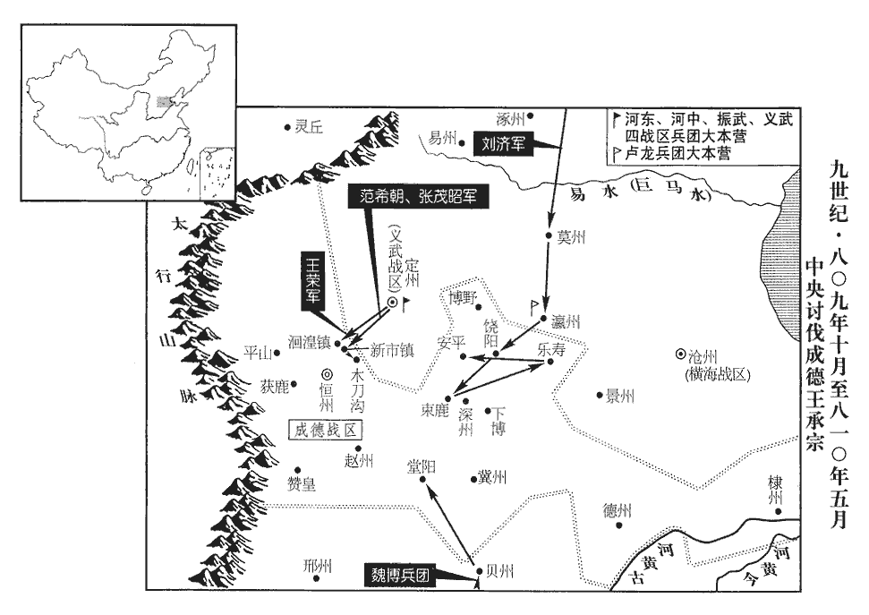
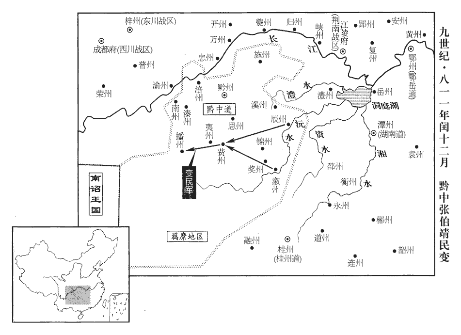

 唐紀五十四起屠維赤奮若（己丑）七月，盡玄黓執徐（壬辰）九月，凡三年有奇。

# 憲宗昭文章武大聖至神孝皇帝上之下

## 元和四年（己丑、八零九）

1秋，七月，壬戌‹十八›，御史中丞李夷簡彈京兆尹楊憑，前為江西觀察使貪污僭侈；丁卯‹二十三›，貶憑臨賀‹贺州州政府所在县·广西贺州市›尉。臨賀，漢縣，屬蒼梧郡，以臨賀水，故名。唐帶賀州。夷簡，元懿之玄孫也。鄭王元懿，高祖之子。上命盡籍憑資產，財物田園，人資以生，謂之資產。李絳諫曰：「舊制，非反逆不籍其家。」上乃止。

〖译文〗 [1]秋季，七月，壬戌（十八日），御史中丞李夷简揭发京兆尹杨凭原先担任江西观察使时贪赃枉法，过度奢侈。丁卯（二十三日），宪宗将杨凭贬为临贺县尉。李夷简是李元懿的玄孙。宪宗命令将杨凭的资财田产全部没收，李绛进谏说：“根据惯例，如果不属于谋反叛逆的罪行，便不没收罪犯的家产。”于是，宪宗才没有没收杨凭的资财田产。

憑之親友無敢送者，櫟yuè陽‹陕西省临潼县北栎阳镇›尉徐晦獨至藍田‹陕西省蓝田县›與別。櫟，音藥。太常卿權德輿素與晦善，謂之曰：「君送楊臨賀，誠為厚矣，無乃為累乎！」累，良瑞翻。對曰：「晦自布衣蒙楊公知獎，今日遠謫，豈得不與之別！借如明公他日為讒人所逐，晦敢自同路人乎！」德輿嗟嘆，稱之於朝。朝，直遙翻。後數日，李夷簡奏為監察御史。晦謝曰：「晦平生未嘗得望公顏色，公何從而取之！」夷簡曰：「君不負楊臨賀，肯負國乎！」

〖译文〗 杨凭的亲戚朋友没有敢来送行的，唯独栎阳县尉徐晦来到蓝田，与杨凭辞别。太常卿权德舆平素与徐晦交好，便告诉他说：“你为杨临贺送行，诚然是情谊深厚，但这岂不要使你遭受牵累吗！”徐晦回答说：“我从身为平民时便蒙受杨公的知遇与奖拔，现在他被贬逐远方，我怎么能够不与他告别呢！假使您以后被进谗的人斥逐，我敢自视为与您彼此无关的人吗！”权德舆赞叹不已，便在朝廷中称扬他。过了几天后，李夷简奏请宪宗任命徐晦为监察御史。徐晦道谢时说：“我平时不曾以与您谋面，您根据什么选取了我呢！”李夷简说：“你不肯辜负杨临贺，怎么肯辜负朝廷呢！”

2上密問諸學士曰：「今欲用王承宗為成德留後，割德‹山东省陵县›、棣‹山东省惠民县›二州更為一鎮以離其勢，并使承宗輸二稅，請官吏，一如師道‹平卢总部郓州›，何如？」李師道事，見上卷元年。李絳等對曰：「德、棣之隸成德，為日已久，貞元初，王武俊破朱滔，取德、棣。今一旦割之，恐承宗及其將士憂疑怨望，得以為辭。況其鄰道情狀一同，各慮他日分割，或潛相構扇；萬一旅拒，倍難處置，願更三思。旅，眾也。旅拒者，挾眾而拒上命也。處，昌呂翻。三，息暫翻，又如字。所是二稅、官吏，願因弔祭使至彼，自以其意諭承宗，令上表陳乞如師道例，勿令知出陛下意。如此，則幸而聽命，於理固順，若其不聽，體亦無損。」

〖译文〗 [2]宪宗暗中征询诸位翰林学士的意见说：“现在打算任用王承宗为成德留后，从成德分割出德州与棣州两地，再设置一个军镇，以便削弱王承宗的势力，并且让王承宗向国家缴纳两税，向朝廷请求任命官吏，完全像对李师道的措施一样，你们认为怎么样呢？”李绛等人回答说：“德州与棣州隶属成德，为时已久，现在忽然将二州分割出来，恐怕王承宗及其将士的忧虑怀疑、怨恨不满，便能够找到借口了。况且，相邻各道的情形和他是一样的，相邻各道各自顾虑以后也会遭到分割，或许就要暗中相互连结，彼此煽动了。假如他们聚兵抗拒朝廷，处理起来会有加倍困难，希望陛下再反复考虑一下。有关上缴两税、任命官吏两点是正确的，希望趁着吊祭使前往王承宗处的机会，让吊祭使以个人意见开导王承宗，使他上表陈请按照李师道的成例处理，不让他知道这是出自陛下的意见。这样，假如王承宗幸好听从命令，固然是顺乎情理的；倘若王承宗不肯听从命令，也不会损害朝廷的体面。”

上又問：「今劉濟‹卢龙总部幽州›、田季安‹魏博总部魏州›皆有疾，若其物故，物故註已見漢紀。史炤zhào曰：顏師古曰：物故，死也，言其同於鬼物而故也。一曰，不欲斥言，但云其所服用之物皆已故也。豈可盡如成德付授其子，天下何時當平！議者皆言『宜乘此際代之，不受則發兵討之，時不可失。』如何？」對曰：「群臣見陛下西取蜀，東取吳，蜀，謂劉闢‹西川总部成都府›。吳，謂李錡‹镇海总部润州›。易於反掌，易，以豉翻；下同。故諂諛躁競之人躁，輕也。競，爭也。爭獻策畫，勸開河北，不為國家深謀遠慮，為，于偽翻。陛下亦以前日成功之易而信其言。臣等夙夜思之，河北之勢與二方異。何則？西川、浙西皆非反側之地，其四鄰皆國家臂指之臣。臂指，用賈誼語意，言其順使也。劉闢、李錡獨生狂謀，其下皆莫之與，闢、錡徒以貨財啗之，大軍一臨，則渙然離耳。故臣等當時亦勸陛下誅之，以其萬全故也。成德則不然，內則膠固歲深，外則蔓連勢廣，膠固，如膠之附著堅固也。蔓連，如蔓草之曼衍連屬也。其將士百姓懷其累代喣xǔ嫗yù之恩，喣，吁句翻。嫗，衣遇翻。鄭玄曰：氣曰喣，體曰嫗。不知君臣逆順之理，諭之不從，威之不服，將為朝廷羞。又，鄰道平居或相猜恨，及聞代易，必合為一心，蓋各為子孫之謀，亦慮他日及此故也。萬一餘道或相表裏，兵連禍結，財盡力竭，西戎、北狄乘間窺窬，西戎，謂吐蕃；北狄，謂回鶻。間，古莧翻；下同。其為憂患可勝道哉！勝，音升。濟、季安與承宗事體不殊，若物故之際，有間可乘，當臨事圖之；於今用兵，則恐未可。太平之業，非朝夕可致，願陛下審處之。」處，昌呂翻。

〖译文〗 宪宗又询问道：“如今刘济、田季安都身患重病，如果他们一旦去世，难道能够完全像对待成德那样，将节度使的职务交给他们的儿子吗！这样下去，什么时候天下才能够平定呢！议论此事的人们都说：‘应当趁着这一时机取代他们，如果他们不肯接受命令，就派兵讨伐他们，时机不可错过。’这种看法怎么样呢？”李绛等人回答说：“群臣看到陛下西面攻取蜀地，东面攻取吴地，易于反掌，所以阿谀逢迎、争权夺势的人们争着进献筹谋，劝说陛下开通河北地区。他们不曾为国家做过深远的谋划，周密的计虑，陛下也由于前些时候成功比较容易，因而相信他们的话。我等日夜相继地考虑此事，认为河北地区的形势与西蜀、东吴两地不同。为什么这样说呢？西川和浙西都不是反复无常的地区，他们周边相邻的州道都是国家可以指挥自如的臣属。唯独刘辟、李生出狂妄的阴谋，但他们的部下都不赞成。刘辟、李仅仅用物资钱财利诱部下，官军一到，他们的势力便分崩瓦解了。所以我等当时也劝说陛下诛讨他们，因为这是万无一失的原故啊。成德就不是这种情况了。内部上下牢固结合，历时已久；外部四处蔓延连结，声势已大。他们的将士与百姓感念他们累世赡养的恩惠，不晓得君主与臣下、正顺与逆反的道理，劝告他们，他们不肯听从，威慑他们，他们不肯服气，这是会给朝廷带来羞辱的。再者，相邻各道平时或许会相互猜疑与怨恨，及至得知朝廷派人代换成德节度使时，就肯定会合成一条心，这大约是各自替子孙后代打算，也顾虑到以后自己会遭到这种处置的原故啊。如果其余数道中有人与成德相互应援，战祸就会连绵不断，国家的资财用尽，力量耗竭，西部与北部的戎狄再乘机伺隙而动，他们造成的祸患难道是讲得完的吗！刘济、田季安与王承宗在事情的体统上没有区别，倘若在他们去世时，有机可乘，应当临至事情发生时再谋取，现在诉诸武力，恐怕就不够妥当了。天下太平的大业，不是一朝一夕可以实现的，希望陛下审慎地处理此事。”

時吳少誠‹彰义（淮西）战区，总部设蔡州河南省汝南县›病甚，絳等復上言：「少誠病必不起。復，扶又翻。上，時掌翻淮西事體與河北不同，四旁皆國家州縣，不與賊鄰，無黨援相助；朝廷命帥，帥，所類翻。今正其時，萬一不從，可議征討。臣願捨恆冀難致之策，就申蔡易成之謀。脫或恆冀連兵，事未如意，蔡州有釁，勢可興師，南北之役俱興，財力之用不足。儻事不得已，須赦承宗，絳等之言，後無不驗。則恩德虛施，威令頓廢。不如早賜處分，處，昌呂翻。分，扶問翻。以收鎮冀之心，此時未改恆州為鎮州，史以後來所改州名書之耳。坐待機宜，必獲申蔡之利。」既而承宗久未得朝命，頗懼，累表自訴。八月，壬午‹九›，上乃遣京兆少尹裴武詣真定‹恒州州政府所在县·河北省正定县›宣慰，恆州，古真定。承宗受詔甚恭，曰：「三軍見迫，不暇俟朝旨，請獻德、棣二州以明懇款。」

〖译文〗 当时，吴少诚病情非常严重，李绛等人再次进言说：“吴少诚的病肯定不会再好起来了。淮西的局势与河北并不相同，周围都是国家的州县，不与贼寇的疆境相毗邻，没有同党应援帮助，朝廷任命淮西主帅，现在正是时候，如果淮西不肯听从，可以计议出兵征讨他们。我希望陛下丢开恒冀这一难达目的的筹策，归向申蔡这一容易成功的谋划。假如对恒冀需要连续用兵，战事并不令人满意，而蔡州出现缝隙，具备可以发兵的形势，南北两方同时用兵，国家的财物人力的用度就难以充足了。倘若事情出于迫不得已，而必须赦免王承宗，那就会使陛下的恩典与仁德空自施行，朝廷的威严与号令立刻废弃了。这就不如及早颁赐对王承宗的处理办法，以便收揽恒冀的归向之心，坐等时机，肯定能够在申蔡得到好处。”不久，王承宗因很久没有得到朝廷任命，感到很是恐惧，屡次上表自行陈诉。八月，壬午（初九），宪宗便派遣京兆少尹裴武前往真定安抚王承宗，王承宗接受诏旨时很是恭敬地说：“由于我受到部下各军的逼迫，来不及等候朝廷颁旨任命。请让我献出德州与棣州，用以表明我的诚意。”

3丙申‹二十三›，安南都護‹都护府设越南河内市›張舟奏破環王三萬眾。林邑國‹首都占城·越南茶荞城›，至德後改號環王。

〖译文〗 [3]丙申（二十三日），安南都护张舟奏称打败了环王的三万人众。

4九月，甲辰朔‹一›，裴武復命。庚戌‹七›，以承宗為成德節度使、恆•冀•深•趙州觀察使，德州刺史薛昌朝為保信軍‹总部设德州山东省陵县›節度、德•棣二州‹首府同设德州›觀察使。考異曰：李司空論事：「初，武銜命使鎮州，令諭王承宗割德、棣兩州歸朝廷。武飛表上言，一如朝廷意旨，遂除昌朝德、棣節度。及旌節至德州，而昌朝尋已追到鎮州，朝命遂不行。比及武回，事宜與先上表參差。」按實錄：「甲辰，武至自鎮州。庚戌，除昌朝。」非武未還據所上表除之也。論事集誤，今從實錄。昌朝，嵩之子，薛嵩亦安、史舊將，代宗初來降。王氏之壻也，故就用之。田季安得飛報，先知之，使謂承宗曰：「昌朝陰與朝廷通，故受節鉞。」承宗遽遣數百騎馳入德州，執昌朝，至真定，囚之。中使送昌朝節過魏州，季安陽為宴勞，留使者累日，比至德州，已不及矣。勞，力到翻。比，必利翻，及也。

〖译文〗 [4]九月，甲辰朔（初一），裴武回报完成使命。庚戌（初七），宪宗任命王承宗为成德节度使和恒、冀、深、赵四州观察使，德州刺史薛昌朝为保信军节度使和德、棣二州观察使。薛昌朝是薛嵩的儿子，王承宗的女婿，所以朝廷就势起用了他。田季安得到快马传递的报告，事先已经知道了朝廷的任命，便派人告诉承宗说：“薛昌朝暗中与朝廷交往，所以他才得到节度使的职位。”王承宗连忙派遣数百名骑兵奔入德州，将薛昌朝捉拿到真定囚禁起来。中使颁送任命薛昌朝为节度使的旌节经过魏州，田季安佯装设宴犒劳中使，将中使留了好几天，及至中使来到德州时，薛昌朝已经被捉拿走了。

上以裴武為欺罔，又有譖之者曰：「武使還，使，疏吏翻。還，音旋。先宿裴垍家，明旦乃入見。」上怒甚，以語李絳，見，賢遍翻。語，牛倨翻。欲貶武於嶺南，絳曰：「武昔陷李懷光軍中，守節不屈，蓋貞元初李懷光據河中時也。豈容今日遽為姦回！蓋賊多變詐，人未易盡其情。承宗始懼朝廷誅討，故請獻二州；既蒙恩貸，而鄰道皆不欲成德開分割之端，計必有【章：甲十一行本「有」下有「陰行」二字；乙十一行本同；孔本同；張校同；退齋校同。】間說誘而脅之，使不得守其初心者，李絳可謂洞見田季安、王承宗之情。間，古莧翻。說，式芮翻。誘，音酉。非武之罪也。今陛下選武使入逆亂之地，使還，一語不相應，遽竄之遐荒，臣恐自今奉使賊庭者以武為戒，苟求便身，率為依阿兩可之言，史炤曰：依阿，謂不特立其說，常附順人言。兩可，謂無所可否。莫肯盡誠具陳利害，如此，非國家之利也。且垍、武久處朝廷，處，昌呂翻。諳練事體，諳，烏含翻。豈有使還未見天子而先宿宰相家乎！臣敢為陛下必保其不然，為，于偽翻。此殆有讒人欲傷武及垍者，願陛下察之。」上良久曰：「理或有此。」遂不問。

〖译文〗 宪宗认为裴武是在欺蒙朝廷，还有人诬陷他说：“裴武出使归来后，先到裴家中过夜，第二天早晨，才入朝晋见。”宪宗非常恼怒，将此事说给李绛听，打算将裴武贬逐到岭南。李绛说：“过去，裴武落在李怀光的军队中，恪守节操，不肯屈服，现在怎么会突然去做邪恶的事情！大约贼人狡诈多变，使人不容易识破其中的真情。王承宗起初害怕朝廷讨伐他，所以请求献出两个州来。在蒙受陛下的宽宥后，与王承宗相邻各道不愿意让成德成为分割地盘、献给朝廷的开端，估计肯定发生了暗中劝说、引诱、胁迫王承宗，使他不能够信守当初的心愿的事情，这并不是裴武的罪责啊。如今陛下挑选裴武前往反叛动乱的地区，出使回来后，一句话说得不够适合，便急忙将他斥逐到荒远地区，我恐怕从今以后受命出使敌庭的人们会以裴武当作儆戒，苟且寻求自身的便利，一概说些随声附和、模棱两可的言语，不肯披露真心而陈述利弊得失了。像这个样子，对国家可不是有利的啊。而且，裴与裴武长期在朝廷任职，熟悉朝事的体统，难道会在出使归来、未见天子以前便首先在宰相家中过夜吗！我敢向陛下确保裴武不会这样去做，这大概是有好进谗言的人打算危害裴武以至裴，希望陛下察验此事。”宪宗停了许久才说：“在道理上或许有此一说吧。”于是不再追究。

5丙辰‹十三›，振武‹总部设单于府内蒙古和林格尔县›奏吐蕃五萬餘騎至拂梯泉‹内蒙古乌拉特后旗西北›。史炤曰：拂，薄勿切。梯，天黎切。本又作「鸊鵜泉」，在豐州西受降城北三百里。辛未‹二十八›，豐州‹内蒙古五原县›奏吐蕃萬餘騎至大石谷‹山西省应县南›，掠回鶻入貢還國者。

〖译文〗 [5]丙辰（十三日），振武奏称，吐蕃五万余骑来到佛梯泉。辛未（二十八日），丰州奏称，吐蕃一万余骑来到大石谷，掳掠入京进贡后归返本国的回鹘人。

6左神策軍吏李昱貸長安富人錢八千緡，滿三歲不償，貸，吐得翻，假貸也。京兆尹許孟容收捕械繫，立期使償，曰：「期滿不足，當死。」一軍大驚。中尉訴於上，上遣中使宣旨，付本軍，孟容不之遣。中使再至，孟容曰：「臣不奉詔，當死。然臣為陛下尹京畿，京兆以長安、萬年為京縣，餘屬縣為畿縣。非抑制豪強，何以肅清輦下！錢未畢償，昱不可得。」上嘉其剛直而許之，京城震栗。

〖译文〗 [6]左神策军吏李昱向长安富人借贷钱八千缗，满了三年，还不偿还。京兆尹许孟容将李昱收捕，并给他带上枷锁，立下期限，让他清偿。许孟容说：“如果期限满了，你还没有完全还清，就会处以死罪。”左神策军全军大为震惊。左神策军中尉向宪宗申诉，宪宗派遣中使宣布诏旨，让许孟容将李昱交付本军，许孟容不肯将他遣回。中使第二次前来，许孟容说：“我不肯接受诏命，该当死罪。然而，我为陛下担任京城周围地区的长官，如果不去约束地方上的豪强势力，怎么能够使京城清平整肃呢！只要没有将钱完全清偿，李昱就不能够从我这放走。”宪宗嘉许许孟容刚强正直，便答应了他，京城的人们震恐惊惧了。

7上遣中使諭王承宗‹成德总部恒州河北省正定县›，使遣薛昌朝還鎮；使之遣還德州。承宗不奉詔。冬，十月，癸未‹十一›，制削奪承宗官爵，以左神策中尉吐突承璀為左•右神策、河中、河陽、浙西、宣歙等道行營兵馬使、招討處置等使。歙，書涉翻。開元二十年置諸道採訪處置使，專以觀省風俗、黜陟幽明；其後伐叛討有罪，則置招討處置使。處，昌呂翻。

〖译文〗 [7]宪宗派遣中使开导王承宗，让他发送薛昌朝返回德州，王承宗不接受诏命。冬季，十月，癸未（十一日），宪宗颁制削除王承宗的官职爵位，任命左神策中尉吐突承璀为左右神策、河中、河阳、浙西、宣歙等道行营兵马使、招讨处置等使。

翰林學士白居易上奏，以為：「國家征伐，當責成將帥，近歲始以中使為監軍。自古及今，未有徵天下之兵，專令中使統領者也。今神策軍既不置行營節度使，則承璀乃制將也；制將，言諸軍進退皆受制於承璀。將，即亮翻。又充諸軍招討處置使，則承璀乃都統也。都統，謂都統諸軍，唐中世以後，專征之任。臣恐四方聞之，必窺【章：甲十一行本「窺」作「輕」；乙十一行本同；孔本同；張校同。】朝廷；四夷聞之，必笑中國。白居易之言自春秋書「多魚漏師」，左傳「夙沙衛殿齊師」來。況吐突承璀以寺人專征乎！崇、觀間，金人有所侮而動正如此。陛下忍令後代相傳云以中官為制將、都統自陛下始乎！臣又恐劉濟、茂昭及希朝、從史乃至諸道將校皆恥受承璀指麾，心既不齊，功何由立！此是資承宗之計而挫諸將之勢也。陛下念承璀勤勞，貴之可也；憐其忠赤，富之可也。至於軍國權柄，動關理亂，朝廷制度，出自祖宗，陛下寧忍徇下之情而自隳法制，從人之欲而自損聖明，何不思於一時之間而取笑於萬代之後乎！」時諫官、御史論承璀職名太重者相屬，屬，之欲翻。上皆不聽。戊子‹十六›，上御延英殿，度支使李元素、鹽鐵使李鄘、京兆尹許孟容、御史中丞李夷簡、【章：甲十一行本「簡」下有「諫議大夫孟簡」六字；乙十一行本同；孔本同；張校同；退齋校同。】給事中呂元膺、穆質、右補闕獨孤郁等極言其不可；考異曰：舊承璀傳曰：「諫官、御史上疏相屬，皆言自古無中貴人為兵馬統帥者。補闕獨孤郁、段平仲尤激切。」呂元膺傳：「元膺與給事中穆質、孟簡、兵部侍郎許孟容等八人抗論不可。」若據承璀傳，則是九人，又平仲時為諫議大夫，非補闕，恐誤。今從實錄上不得已，明日，削承璀四道兵馬使，改處置為宣慰而已。

〖译文〗 翰林学士白居易上奏认为；“国家发兵征讨攻伐时，应当督责将帅去完成任务。近些年来，开始任命中使为监军。自古至今，还没有征调全国的兵力，专门让中使统领的先例。现在，神策军既然不设置本军的行营节度使，吐突承璀便是总领本军的主将了，吐突承璀又充任诸军招讨处置使，他便是统领各军的都统了。我担心各地得知这一消息后，肯定要窥伺朝廷的间隙，周边各族得知这一消息后，必须会笑话中国无人。陛下能够忍受让后世相互传说，任命宦官为一军主将、各军都统是由陛下肇始的吗！我还担心刘济、张茂昭、以及范希朝、卢从史以至于各道将校都以接受吐突承璀的指挥为耻辱，既然军心不齐，又怎么能够建立功劳呢！这是资助王承宗计谋，挫伤各将领的声势啊。陛下顾念吐突承璀辛勤劳苦，使他尊贵起来就可以了；怜惜他忠心赤诚，使他富厚起来就可以了。至于军队和国家的权力，经常关系到政治修明或祸乱丛生，朝廷的制度，是由祖宗传承下来的，难道陛下能够忍受顺从下属的情好，从而毁坏自家的法令制度，放纵别人的欲求，从而损害自己无上的英明吗！陛下为什么不暂时思考一番，却要招来万世以后的讥笑呢！”当时，论说吐突承璀被委任的职务名分太重的谏官、御史一个接着一个，宪宗全然不肯听从。戊子（十六日），宪宗驾临延英殿，度支使李元素、盐铁使李、京兆尹许孟容、御史中丞李夷简、给事中吕元膺、穆质、右补阙独孤郁等人极力进言对吐突承璀的任命是不妥当的，宪宗没有办法，第二天，免除了吐突承璀的四道兵马使职务，将处置使改为宣慰使罢了。

李絳嘗極言宦官驕橫，橫，戶孟翻侵害政事，讒毀忠貞，上曰：「此屬安敢為讒！就使為之，朕亦不聽。」絳曰：「此屬大抵不知仁義，不分枉直，惟利是嗜，得賂則譽跖、蹻為廉良，怫意則毀龔、黃為貪暴，李奇曰：跖，秦大盜也。楚之大盜為莊蹻。師古曰：莊周云：跖，柳下惠之弟。蓋寓言也。龔、黃，龔遂、黃霸也。譽，音余。蹻，居略翻。怫，符弗翻。能用傾巧之智，構成疑似之端，朝夕左右浸潤以入之，陛下必有時而信之矣。自古宦官敗國者，敗，蒲邁翻。備載方冊，陛下豈得不防其漸乎！」

〖译文〗 李绛曾经极力进言宦官傲慢专横，侵扰损害朝中政务，谗言诋毁忠诚坚贞之士，宪宗说：“这一类人怎么有胆量说别人的坏话呢！即使他们进了谗言，我也不会听信的。”李绛说：“这一类人大都不懂得仁义，分不清是非，唯利是图，只要是得到贿赂，就能将盗跖、庄赞誉成廉洁善良之人；如果违背了他们的意志，便可将龚遂、黄霸毁谤为贪婪暴虐的，能够使用狡诈的智虑，捏造成是非难辨的事端，时时刻刻围绕在四周，将谗言逐渐渗透进去，陛下肯定有时候也会相信他们的。自古以来，宦官败坏国家的事件，完全记录在典籍上面，陛下怎么能够不防备他们的浸染呢！”

己亥‹二十七›，吐突承璀將神策兵發長安，命恆州四面藩鎮各進兵招討。

〖译文〗 己亥（二十七日），吐突承璀带领神策军从长安出发，命令恒州四周的藩镇各自进军招抚讨伐。

8初，吳少誠寵其大將吳少陽，名以從弟，從，才用翻。署為軍職，出入少誠家如至親，累遷申州‹河南省信阳市›刺史。少誠病，不知人，家僮鮮于熊兒詐以少誠命召少陽攝副使、知軍州事。少誠有子元慶，少陽殺之。十一月，己巳‹二十七›，少誠薨‹年六十岁›，少陽自為留後。

〖译文〗 [8]当初，吴少诚宠爱他的大将吴少阳，便以堂弟的名义，委任他担当军中职务，吴少阳在吴少诚家中往来，就像最近的亲属一样。历经多次升迁，他已担任了申州刺史。吴少诚得病后，连人都不能分辨出来了。家中的仆人鲜于熊儿诈称吴少诚的命令，传召吴少阳代理彰义节度副使，掌管军中和地方事务。吴少诚有个儿子叫吴元庆，吴少阳将他杀掉。十一月，己巳（二十七日），吴少诚去世，吴少阳自命为彰义留后。

9是歲，雲南‹首都苴咩城雲南›省大理市王尋閤勸卒，子勸龍晟立。

〖译文〗 [9]这一年，云南王寻劝去世，他的儿子劝龙晟即位。

10田季安聞吐突承璀將兵討王承宗，聚其徒曰：「師不跨河二十五年矣，自德宗討田悅不克，王師不復跨河。今一旦越魏伐趙；趙虜，魏亦虜矣，計為之柰何？」其將有超伍而言者，超伍，出位而言也。蓋超出儔伍之中而言。曰：「願借騎五千以除君憂。」季安大呼曰：「壯哉！兵決出，格沮者斬！」呼，火故翻。格，音閣。

〖译文〗 [10]田季安得知吐突承璀带领兵马征讨王承宗，便将他的徒众聚合起来说：“朝廷的军队不能够跨过黄河，已经长达二十五年时间了，现在忽然越过魏博，攻打成德。倘若成德被俘虏，魏博也就被俘虏了，我们应当做何打算呢？”他的将领中有人从队伍中站出来说：“希望能够借给我骑兵五千人，用以消除您的忧虑。”田季安大声喊着说：“真是豪壮！我决意出兵，阻止者斩首！”

幽州‹北京市›牙將絳‹山西省新绛县›人譚忠為劉濟使魏，為，于偽翻。使，疏吏翻。知其謀，入謂季安曰：「如某之謀，是引天下之兵也。何者？今王師越魏伐趙，不使耆臣宿將而專付中臣，耆，老也。宿，舊也。不輸天下之甲而多出秦甲，關中之地，古秦地也。故謂關中之兵為秦甲。君知誰為之謀？此乃天子自為之謀，欲將夸服於臣下也。夸服，謂欲自衒於算略，以服臣下之心。若師未叩趙而先碎於魏，是上之謀反不如下，且【張：「且」作「其」。】能不恥於天下乎！既恥且怒，必任智士畫長策，仗猛將練精兵，畢力再舉涉河，鑑前之敗，必不越魏而伐趙，校罪輕重，必不先趙而後魏，先，悉薦翻。後，戶遘翻。是上不上，下不下，當魏而來也。」季安曰：「然則若之何？」忠曰：「王師入魏，君厚犒之。於是悉甲壓境，號曰伐趙；而可陰遺趙人書曰：犒，苦到翻。遺，唯季翻；下遺魏同。『魏若伐趙，則河北義士謂魏賣友；魏若與趙，則河南忠臣謂魏反君。賣友反君之名，魏不忍受。執事若能陰解陴pī障，遺魏一城，魏得持之奏捷天子以為符信，此乃使魏北得以奉趙，西得以為臣，長安在魏西。為臣，言能承上命，不悖臣道。於趙有角尖之耗，角尖，言所耗者小。於魏獲不世之利，執事豈能無意於魏乎！』趙人脫不拒君，是魏霸基安矣。」季安曰：「善！先生之來，是天眷魏也。」遂用忠之謀，與趙陰計，得其堂陽‹河北省新河县›。堂陽，漢縣，屬鉅鹿郡，唐屬冀州，在州西南。

〖译文〗 幽州牙将绛州人谭忠为刘济出使魏博，得知了魏博的企图，便前去告诉田季安说：“根据我的谋算，魏博出兵，这是招引天下的军队来对付魏博啊。为什么这样说呢？现在，朝廷的军队越过魏博，攻打成德，不使用老臣宿将，反而把兵权专付给宦官，不征调全国的军队，反而派出大批的关中兵马，您知道这是谁想出来的主意吗？这便是天子自己想出来的主意，准备以此向臣下夸耀，并使他们敬服啊。如果官军在没有攻打成德以前，首先便被魏博打败了，这就表示天子的谋算反而赶不上臣下的谋算，皇上在天下的人们面前怎么能够不感到羞愧呢！皇上既羞愧，又恼怒，就一定要任用能谋善算的人士来筹划长远的计策，依仗勇猛善战的将领来训练精锐的兵马，然后再全力起兵，渡过黄河。官军吸取以往失败的教训，就一定不会再越过魏博前去攻打成德；比较魏博与成德罪责的大小，也一定不会先去攻打成德，然后再攻打魏博。这可谓不上不下，就是对着魏博来的了。”田季安说：“果真如此，怎么办才好呢？”谭忠说：“当官军进入魏博境内时，你要好好犒劳官军。当此之际，你要将全部兵马压向过境，号称攻打成德，但可以暗中给成德人送上一封书信说：‘倘若魏博攻打成德，河北地区的仗义之士使会说魏博出卖朋友了；倘若魏博援助成德，河南地区的忠义之臣便会说魏博反叛君主了。出卖朋友和反叛君主的名声，魏博是不能容忍与接受的。如果您能够暗中解除城防，送给魏博一座城池，魏博得以拿此城作为向天子报捷的凭据，这才能使魏博在北面得以侍奉成德，在西面得以做成人臣，对于成德说来，仅有不多的损耗，对魏博说来，获得罕有的利益，难道您能够对魏博的主张没有一点意思吗！’假如成德人不拒绝你的主张，这便使魏博的霸主基业奠定了。”田季安说：“太好了！先生的到来，是上天对魏博的眷顾啊。”于是，田季安采用了谭忠的计谋，与成德暗中商议，得到了成德的堂阳县。

忠歸幽州，謀欲激劉濟討王承宗；會濟合諸將言曰：「天子知我怨趙，今命我伐之，今，當作必。趙亦必大備我。伐與不伐孰利？」忠疾對曰：「天子終不使我伐趙，趙亦不備燕。」濟怒曰：「爾何不直言濟與承宗反乎！」命繫忠獄。使人視成德之境，果不為備；後一日，詔果來，令濟「專護北疆，勿使朕復掛胡憂，而得專心於承宗。」復，扶又翻。濟乃解獄召忠曰：「信如子斷矣；解獄，謂釋其囚也。斷，丁亂翻。何以知之？」忠曰：「盧從史外親燕，內實忌之；外絕趙，內實與之。此為趙畫曰：為，于偽翻。『燕以趙為障，雖怨趙，必不殘趙，不必為備。』一且示趙不敢抗燕，二且使燕獲疑天子。趙人既不備燕，潞人則走告于天子曰：盧從史鎮潞州‹山西省长治市›，故謂之潞人。『燕厚怨趙，趙見伐而不備燕，是燕反與趙也。』此所以知天子終不使君伐趙，趙亦不備燕也。」濟曰：「今則柰何？」忠曰：「燕、趙為怨，天下無不知。自朱滔以來，燕、趙交惡。今天子伐趙，君坐全燕之甲，一人未濟易水，此正使潞人以燕賣恩於趙，敗忠於上，言燕本忠於上而盧從史以計敗之。敗，補邁翻。兩皆售也。賣物去手曰售。是燕貯忠義之心，卒染私趙之口，不見德於趙人，惡聲徒嘈嘈於天下耳。貯，丁呂翻。卒，子恤翻。嘈，昨勞翻。惟君熟思之！」濟曰：「吾知之矣。」乃下令軍中曰：「五日畢出，後者醢以徇！」譚忠頗有戰國說士之風，而心為唐。

〖译文〗 谭忠回到幽州后，打算用计鼓动刘济攻讨王承宗，适逢刘济聚合各将领说：“天子知道我怨恨成德，现在命令我讨伐成德，成德也必然极力防备我。出兵讨伐与不出兵讨伐，采用哪种做法有利呢？”谭忠赶忙回答说：“天子最终是不会让我们去攻打成德的，成德也不会防备卢龙。”刘济生气地说：“你为什么不直接说我与王承宗谋反呢！”他命令将谭忠囚禁到牢狱中。刘济让人察看成德的边境，果然不曾设置防备。过了一天，果然有诏书送来，命令刘济“专力防护北部疆境，不要让朕再为胡人担忧，因而得以一心一意地对付王承宗。”于是，刘济打开牢狱，召见谭忠说：“事态诚然像你判断的那样，你是怎么知道的呢？”谭忠说：“卢从史表面上与卢龙亲近，骨子里实际是在忌恨卢龙，表面上不与成德往来，骨子里实际是在援助成德。他为成德这样筹划说：‘卢龙是把成德作为自己的屏障的，虽然卢龙怨恨成德，但肯定不会伤害成德，所以没有必要对卢龙设置防备。’这种做法，一是显示成德不敢抗拒卢龙，二是打算让卢龙遭到天子的怀疑。既然成德人不防备卢龙，潞州人便会跑去报告天子说：‘卢龙对成德的怨恨很深，成德在遭受攻打时，并不防备卢龙，这说明卢龙反而是与成德亲善的。’这就是我知道天子最终不会让您攻打成德，而成德也不会防备卢龙的道理所在啊！”刘济说：“现在应当怎么办呢？”谭忠说：“卢龙与成德结下仇怨，天下无人不知。现在，天子出兵攻打成德，你却使整个卢龙的兵马披甲不卧，坐以待敌，连一个人也没有渡过易水，这就恰好让潞州人认为卢龙以小恩小惠收买成德，因而向皇上败坏卢龙忠于朝廷的名声，在这两方面他们都能达到目的。这就使卢龙虽然内含信守忠义的心愿，终于还是招惹来偏袒成德的口实，既不能使成德人感激卢龙，还徒然使辱骂卢龙的呼声在天下喧闹不止罢了。请您周密地考虑这个问题吧！”刘济说：“我明白其中的道理啦。”于是，他命令军中将士说：“五天以内，全部出动，要是有谁落后了，就将他剁成肉酱示众！”

## 五年（庚寅，八一零）

1春，正月，劉濟‹卢龙战区，总部设幽州北京市›自將兵七萬人擊王承宗‹成德战区，总部设恒州河北省正定县›，時諸軍皆未進，濟獨前奮擊，拔饒陽‹河北省饶阳县›、束鹿‹河北省辛集市›。

〖译文〗 [1]春季，正月，刘济亲自带领兵马七万人进击王承宗。当时，各军都没有前进，只有刘济向前奋力进击，攻克了饶阳与束鹿。

河東、河中、振武、義武四軍為恆州北面招討，會于定州‹义武战区总部·河北省定州市›。會望夜，軍吏以有外軍，請罷張燈。張茂昭曰：「三鎮，官軍也，三鎮，謂河中、河東、振武。何謂外軍！」命張燈，不禁行人，不閉里門，三夜如平日，亦無敢喧嘩者。唐制：兩京及諸州、縣街巷率置邏卒，曉暝傳呼，以禁夜行，惟元夕張燈，弛禁前後各一日。

〖译文〗 河东、河中、振武、义武四军担当恒州北面的招抚与讨伐，在定州会师。正赶上十五日夜晚，义武的军吏认为定州驻有外来的军队，请求禁止张灯，张茂昭说：“河东、河中、振武三镇兵马，都是官军，怎么能够把他们称作外来的军队呢！”他命令点起灯来，不禁止人们夜行，不关闭坊里的大门，一连三个夜晚，都像平时一样，也没有人胆敢大声乱喊乱叫。

丁卯‹二十六›，河東將王榮拔王承宗洄湟鎮‹河北省新乐市›。吐突承璀至行營，威令不振，與承宗戰屢敗；左神策大將軍酈定進戰死。定進，驍將也，酈定進，擒劉闢，有驍名。軍中奪氣。

〖译文〗 丁卯（二十六日），河东将领王荣攻克了王承宗的洄湟镇。吐突承璀来到行营后，军威政令不振，与王承宗交战，屡次失败，左神策大将军郦定进战死。郦定进是一员骁勇的将领，军中将士因他的战死而士气低落。

 

2河南尹房式有不法事，東臺監察御史元稹奏攝之，唐制：御史分司東都，謂之東臺。攝，收也。擅令停務；朝廷以為不可，罰一季俸，召還西京。至敷水驛‹陕西省华阴市西十二千米›，華州華陰縣西二十四里有敷水渠。九域志：華陰縣有敷水鎮。有内侍後至，破驛門呼罵而入，以馬鞭擊稹傷面；考異曰：實錄云「中使仇士良與稹爭廳」。按稹及白居易傳皆云「劉士元」，而實錄云「仇士良」，恐誤。今止云內侍。上‹李纯，本年三十三岁›復引稹前過，貶江陵‹湖北省江陵县›士曹。復，扶又翻。前過，謂擅令河南尹停務。上知曲在中官，故引前過以貶稹。翰林學士李絳、崔群言稹無罪。白居易上言：「中使陵辱朝士，中使不問而稹先貶，恐自今中使出外益暴橫，橫，戶孟翻。人無敢言者。又，稹為御史，多所舉奏，不避權勢，切齒者眾，恐自今無人肯為陛下當官執法，疾惡繩愆，為，于偽翻。有大姦猾，陛下無從得知。」上不聽。

〖译文〗 [2]河南尹房式做了不守法纪的事情，东台监察御史元稹奏请将他拘捕，同时擅自命令停止房式办理本职事务。朝廷认为不能够这样处理，罚元稹一个季度的薪俸，将他召回西京长安。元稹来到敷水驿时，有一个内侍宦官从后面赶到，撞开驿站的大门，叫喊喝骂着走了进去，用马鞭抽打元稹，打伤了他的脸。宪宗又联系元稹以前的过失，将他贬为江陵士曹。翰林学士李绛与崔群都说元稹是无罪的。白居易也进言说：“中使欺凌羞辱朝中官员，不去追究中使的罪过，反而首先将元稹贬官，恐怕从今以后中使外出会愈加暴虐骄横，人们没有再敢说话的了。再者，元稹担任御史，提出不少检举奏报，对权贵势要人士无所避忌，痛恨他的人很多，现在将元稹贬逐了，恐怕从今以后没有人愿意为陛下担当官职而执行法令，憎恨邪恶而纠正过失了。即使出现了特大的奸险狡猾的人物，陛下也无法得知了。”宪宗不肯听信他的谏言。

3上以河朔方用兵，不能討吳少陽。三月，己未‹十九›，以少陽為淮西留後。果如李絳之言。

〖译文〗 [3]宪宗因河朔地区正在使用武力，不再能够讨伐吴少阳，三月，己未（十九日），任命吴少阳为淮西留后。

4諸軍討王承宗者久無功，白居易上言，以為：「河北本不當用兵，今既出師，承璀未嘗苦戰，已失大將，謂酈定進戰死也。與從史兩軍入賊境，遷延進退，不惟意在逗留，亦是力難支敵。希朝、茂昭至新市鎮‹河北省正定县东北新城铺›，竟不能過；新市，漢縣名，屬中山郡。唐初，新市縣屬觀州，武德五年廢州，并廢新市為鎮，屬九門縣。劉濟引全軍攻圍樂壽‹河北省献县›，久不能下。按劉濟時軍瀛州而攻樂壽。樂壽時屬深州，在瀛州南六十里。師道、季安元不可保，察其情狀，似相計會，各收一縣，遂不進軍。譚忠之為田季安計者，白居易已窺見之矣。陛下觀此事勢，成功有何所望！以臣愚見，須速罷兵，若又遲疑，其害有四：可為痛惜者二，可為深憂者二。何則？

〖译文〗 [4]由于讨伐王承宗的各支军队长期不能成功，白居易进言认为：“河北地区本来就不应该使用武力，既然现在出兵了，吐突承璀不曾艰苦作战，却已经失去了一员大将。他与卢从史两支军队已经进入成德的疆境，一味拖延行动，不只是有意停顿不前，也是他们的兵力难以抵敌。范希朝与张茂昭来到新市镇，竟然不能够通过。刘济率领全军攻打并围困乐寿，长期不能攻克。李师道与田季安原来就是不能担保的，观察他们的情形，好像相互经过了盘算，每人各自占领一个县，便不再进军。陛下看这样的事态趋势，还有什么成功的希望！以我愚昧的见解看来，必须迅速停止用兵，如果还要犹豫，便会有四点害处，其中应当为陛下痛切惋惜的害处有两点，应当为陛下深切忧虑的害处也有两点。为什么这样说呢？

若保有成，即不論用度多少；既的知不可，即不合虛費貲糧。貲，財也；或曰：當作資。悟而後行，事亦非晚。今遲校一日則有一日之費，更延旬月，所費滋多，終須罷兵，何如早罷！以府庫錢帛、百姓脂膏資助河北諸侯，轉令強大。此臣為陛下痛惜者一也。為，于偽翻；下同。

〖译文〗 “倘若保证能够获得成功，便可以不计较费用需要多少；既然明确知道无法获得成功，便不应该白白耗费资财与粮食。懂得了这个道理以后再去行动，为时还不算晚。现在，晚纠正一天就要多一天的费用，再拖延一个月，需要的费用就更多了。既然终究要停止用兵，为什么不及早停止下来呢！用国家库存的钱财布帛和民脂民膏供给河北地区的节帅，反而使他们强大起来。这便是为陛下痛切惋惜的第一点。

臣又恐河北諸將見吳少陽已受制命，言制以吳少陽為淮西留後。必引事例輕重，同詞請雪承宗。若章表繼來，即義無不許。請而後捨，體勢可知，轉令承宗膠固同類。如此，則與奪皆由鄰道，恩信不出朝廷，實恐威權盡歸河北。此為陛下痛惜者二也。

〖译文〗 “我还担心河北地区各将领见到吴少阳已经受到制书的任命，必定会援引处理这一件事的宽严标准，众口一词地请求为王承宗昭雪。如果奏章奏表相继而来，按道理说就不能不答应了。经过他们请求后再放弃对王承宗的讨伐，这种格局与情势是可想而知的，只能反而使王承宗与同类人牢固地勾结在一起。像这个样子，给予与剥夺完全是按照与王承宗相邻各道的意见来决定的，恩德与信义都不是出自朝廷，这实在让人担心朝廷的声威与权力会完全归向河北藩镇了。这便是我为陛下痛切惋惜的第二点

今天時已熱，兵氣相蒸，至於飢渴疲勞，疾疫暴露，驅以就戰，人何以堪！縱不惜身，亦難忍苦。況神策烏雜城市之人，例皆不慣如此，忽思生路，【章：甲十一行本「路」下有「或有奔逃」四字；乙十一行本同；孔本同；張校同；退齋校同。】連兵不解，不死於戰，亦死於久屯，必思逃奔潰散為求生之路。一人若逃，百人相扇，一軍若散，諸軍必搖，事忽至此，悔將何及！此為陛下深憂者一也。

〖译文〗 “现在天气已经炎热，士兵身上的热气互相蒸熏，至于饥饿干渴，疲乏劳累，瘟疫流行，露天而处，驱赶着他们去参加战斗，人们怎么能够经受得住呢！即使人们并不爱惜自己的身体，也是难以忍受这种苦楚的。况且，神策军中杂乱无章的城市居民，一概都不习惯像这样的军旅生活，忽然想到应该寻找一条求生之路，若有一个逃跑，便有一百个人相互煽动逃跑，若有一支军队溃散，其他各军必定也要动摇。如果事情忽然达到这般地步，后悔还来得及吗！这便是我为陛下深切忧虑的第一点。

臣聞回鶻、吐蕃皆有細作，細作，古之諜者。中國之事，小大盡知。今聚天下之兵，唯討承宗一賊，自冬及夏，都未立功，則兵力之強弱，資費之多少，豈宜使西戎、北虜一一知之！忽見利生心，乘虛入寇，以今日之勢力，可能救其首尾哉！兵連禍生，何事不有！萬一及此，實關安危。此其為陛下深憂者二也。」「其」字衍。考異曰：白氏集云「五月十日進」，據此疏云：「從史雖經接戰，與賊勝負略均。」則是未就縛也。此月戊戌，從史已流驩州，疑「五月」當為「四月」。故移於此。

〖译文〗 “我听说回鹘与吐蕃都派出了密探，对于中国的事情，无论大小，全都知道。现在，朝廷聚集天下兵马，只是在讨伐王承宗这一个叛贼，由冬天到夏天，都不能够建树功勋。而军队力量的强弱，物资费用的多少，难道应该让西方与北方的戎虏逐个了解清楚吗！假如他们忽然看到有利可图，生出异心，乘着国内空虚的时机前来侵犯，就凭着朝廷现在的形势与力量，难道对两方面都能够予以救援吗？战争连续不断，灾祸从中产生，什么样的事情不会现出！万一到了这般田地，实在是关系着国家的安定与危亡。这便是我为陛下深切忧虑的第二点。”

5盧從史‹昭义战区，总部设潞州山西省长治市›首建伐王承宗之謀，事見上卷上年五月。及朝廷興師，從史逗留不進，陰與承宗通謀，令軍士潛懷承宗號；凡行軍各有號，以相識別。又高芻粟之價以敗度支，時吐突承璀總行營兵屯邢、趙界。邢州，昭義巡屬也。度支芻粟，不能遠致以給行營，就昭義市糴，故盧從史得高其價以牟利。度，徒洛翻。諷朝廷求平章事，誣奏諸道與賊通，不可進兵。上甚患之。

〖译文〗 [5]卢从史第一个提出讨伐王承宗的策谋，及至朝廷发兵后，卢从史却停留下来，不肯进兵，暗中与王承宗互通计谋，让将士们暗地里在怀中揣着王承宗的行军标记，还抬高草料与粮食的价格，以便破坏度支的军需供应，暗示朝廷任命他为平章事，上奏诬告各道与王承宗勾结，不赞成进兵。宪宗为此甚为忧虑。

會從史遣牙將王翊yì元入奏事，裴垍引與語，為言為臣之義，為言，于偽翻。微動其心，翊元遂輸誠，言從史陰謀及可取之狀，垍令翊元還本軍經營，復來京師，復，扶又翻。遂得其都知兵馬使烏重胤等款要。款，誠也。垍言於上曰：「從史狡猾驕很，必將為亂。今聞其與承璀對營，視承璀如嬰兒，往來都不設備；失今不取，後雖興大兵，未可以歲月平也。」上初愕然，熟思良久，乃許之。

〖译文〗 适逢卢从史派遣牙将王翊元入朝奏事，裴将他引至一旁，与他谈话，对他讲述作为人臣应有的义理，暗暗地打动他的内心，于是王翊元也表达了自己的诚意，将卢从史暗中的策划与潞州可以攻取的状况讲了出来。裴命令王翊元返回本军，经过筹措规划后，再来京城，于是赢得了潞州都知兵马使乌重胤等人的诚心。裴对宪宗说：“卢从史诡诈多端，骄横凶暴，肯定要发动变乱。现在听说他在吐突承璀的对面扎营，将吐突承璀当作婴儿一般，在两营之间往来，全然不设置防备。如果失去现在的时机，不将他拘捕起来，以后即使征集大批兵马前去讨伐，也是不能在短时间内将他平定的。”宪宗起初感到惊讶，经过长时间的周密考虑后，便答应了下来。

從史性貪，承璀盛陳奇玩，視其所欲，稍以遺之；遺，唯季翻。從史喜，益相昵狎。昵，尼質翻。甲申‹十五›，承璀與行營兵馬使李聽謀，召從史入營博，伏壯士於幕下，突出，擒詣帳後縛之，內車中，馳詣京師。考異曰：承璀傳曰：「承璀出師經年無功，乃遣密人告王承宗，令上疏待罪，許以罷兵為解；仍奏昭義節度使盧從史素與賊通，許為承宗求節鉞。乃誘潞州牙將烏重胤謀，執從史送京師。」今從裴垍等傳。左右驚亂，從史之左右也。承璀斬十餘人，諭以詔旨。從史營中士【章：甲十一行本「士」下有「卒」字；乙十一行本同。】聞之，皆甲以出，操兵趨譁。操，七刀翻。趨譁，言趨走而喧譁也。烏重胤當軍門叱之曰：「天子有詔，從者賞，敢違者斬！」士卒皆斂兵還部伍。會夜，車疾驅，未明，已出境。重胤，承洽之子；新書作「承玼之子」；韓愈烏氏先廟碑亦作「承玼」。一本云，「玼」或作「洽」。聽，晟之子也。

〖译文〗 由于卢从史生性贪婪，吐突承璀将许多珍奇的玩赏器物陈列出来，看出他希望得到什么，便逐渐地拿来送给他。卢从史高兴，对吐突承璀愈发亲昵。甲申（疑误），吐突承璀与行营兵马使李听经过商议后，叫卢从史前来营中博戏，在帐幕下面设了伏兵。卢从史来到后，伏兵突然冲了出来，擒获了卢从史，到帐幕后面，将他捆绑起来，装进车中，急奔京城。卢从史身边的人们又震惊，又慌乱，吐突承璀斩杀了十多个人，当众宣布了诏书的旨意。卢从史营中的将士们得知消息后，都穿好铠甲，走了出来，手中握着兵器，疾步而行，大声喧哗。乌重胤站在军营门前喝斥他们说：“天子发有诏令，服从的奖赏，胆敢违抗的问斩！”于是，将士们都收起兵器，回到队伍中去。适值夜晚降临，载着卢从史的车辆急速奔驰，在天亮以前，已经走出了泽潞的疆境。乌重胤是乌承洽的儿子。李听是李晟的儿子。

6丁亥‹十八›，范希朝、張茂昭大破承宗之眾於木刀溝‹河北省新乐市西闵镇›。新唐書地理志：定州新樂縣東南二十里有木刀溝，有民木刀居溝旁，因名之。

〖译文〗 [6]丁亥（疑误），范希朝、张茂昭在木刀沟大破王承宗的兵马。

7上嘉烏重胤之功，欲即授以昭義節度使；李絳以為不可，請授重胤河陽‹总部设河阳县河南省孟州市›，以河陽節度使孟元陽鎮昭義。會吐突承璀奏，已牒重胤句當昭義留後，句，古候翻。當，丁浪翻。絳上言：「昭義五州據山東‹太行山以东›要害，五州，澤‹山西省晋城市›、潞、邢‹河北省邢台市›、洺‹河北省永年县东南旧永年镇›、磁‹河北省磁县›。要害者，於我為要，於敵為害。魏博‹总部设魏州，河北省大名县›、恆‹河北省正定县›、幽‹北京市›諸鎮蟠結，魏博一鎮，恆一鎮，幽一鎮；謂之河朔三鎮。朝廷惟恃此以制之。邢、磁、洺入其腹內，邢州臨趙境，磁、洺臨魏境，其界犬牙相入。誠國之寶地，安危所繫也。曏為從史所據，使朝廷旰食，今幸而得之，承璀復以與重胤，復，扶又翻。臣聞之驚歎，實所痛心！昨國家誘執從史，雖為長策，已失大體。不能明底從史之罪而行天討，乃誘執之，是為失體。今承璀又以文牒差人為重鎮留後，為之求旌節，為，于偽翻無君之心，孰甚於此！陛下昨日得昭義，人神同慶，威令再立；今日忽以授本軍牙將，物情頓沮，紀綱大紊。校計利害，校，數也，考也。計，算也，度也。更不若從史為之。何則？從史雖蓄姦謀，已是朝廷牧伯。重胤出於列校，校，戶教翻。以承璀一牒代之，竊恐河南、北諸侯聞之，無不憤怒，恥與為伍；且謂承璀誘重胤逐從史而代其位，彼人人麾下各有將校，能無自危乎！儻劉濟、茂昭、季安、執恭、韓弘、師道繼有章表陳其情狀，張茂昭、田季安、程執恭、李師道。并指承璀專命之罪，不知陛下何以處之？處，昌呂翻。若皆不報，則眾怒益甚；若為之改除，為，于偽翻。則朝廷之威重去矣。」上復使樞密使梁守謙密謀於絳曰：復，扶又翻「今重胤已總軍務，事不得已，須應與節。」對曰：「從史為帥不由朝廷，事見二百三十六卷德宗貞元二十年。帥，所類翻；下同。故啓其邪心，終成逆節。今以重胤典兵，即授之節，威福之柄不在朝廷，何以異於從史乎！重胤之得河陽，已為望外之福，豈敢更為旅拒！況重胤所以能執從史，本以杖順成功；一旦自逆詔命，安知同列不襲其跡而動乎！重胤軍中等夷甚多，必不願重胤獨為主帥。移之他鎮，乃愜眾心，愜，苦叶翻。何憂其致亂乎！」上悅，皆如其請。壬辰‹二十三›，以重胤為河陽節度使，元陽為昭義節度使。

〖译文〗 [7]宪宗嘉许乌重胤的功劳，打算立即授给他昭义节度使的职务。李绛认为不适当，请求授给乌重胤河阳节度使的职务，而任命河阳节度使孟元阳镇守昭义。适逢吐突承璀奏称，他已经发出文书，指令乌重胤为句当昭义留后，李绛进言说：“昭义所属的泽、潞、邢、胤、磁五州，在崤山以东占据着关系全局的重要地位，魏博、恒州、幽州各军镇盘状纠结，朝廷只有依仗这五州之地来控制他们。邢州、磁州、州伸展到魏博等军镇的中心地区，诚然是国家的宝地，关系着国家的安全与危亡。从前昭义被卢从史占据，已使朝廷为此忙得顾不上按时吃饭，现在幸亏得到了昭义，但吐突承璀又将昭义交给了乌重胤，我得知消息后惊叹不已，实在感到痛心！不久前朝廷将卢从史诱捕，即使这算是长远的筹策，却也已经失去了原则。现在，吐突承璀又送发文书，指派乌重胤担当这一重要军镇的留后，并请求任命他为节度使，目无君主的居心，还有比这更为严重的吗！陛下日前取得昭义，人神共同庆祝，军政号令再次树立起来。现在忽然将昭义授给本军中的牙将，众望顿时沮丧，法度大为紊乱。算计此中的好处与坏处，反而不如由卢从史担任节度使。为什么这样说呢？虽然卢从史蓄积着邪恶的阴谋，但已经是朝廷任命的州道长官。而乌重胤只是众多将官中的一员，因吐突承璀的一纸文书便代替了卢从史，我私下里担心河南、河北的节帅得知消息后，没有不感到愤怒，以与他同列为耻辱的。而且他们将会说是吐突承璀诱使乌重胤驱逐卢从史，从而代替了他的职位的，他们每个人的部下都有将官，怎么能够不感到自危呢！倘若刘济、张茂昭、田季安、程执恭、韩弘，李师道一个接着一个地进献章表，陈述这种情形，并且指责吐突承璀专擅君命的罪行，不知道陛下怎样处理？如果陛下一概不予答复，大家的怒气就会更为加重；如果陛下因此改为任命他人，朝廷的威严便失去了。”宪宗又让枢密使梁宗谦暗中与李绛商量说：“现在乌重胤已经总揽军中事务，事情出于迫不得已，应该授给他节度使的旌节。”李绛回答说：“卢从史担任主帅便不是由朝廷任命的，所以才启动了他邪恶的意图，终于做出违反节操的事情。现在，由于乌重胤掌管军事，朝廷便授给他节度使的旌节，刑赏的权柄不掌握在朝廷手中，与卢从史担任节度使又有什么区别呢！乌重胤能够得到河阳，已经是超出他向往的福气了，难道他还有胆量聚众抗拒吗！何况乌重胤能够捉获卢从史的原因，本来是由于他坚持顺承朝廷才取得成功的。忽然连他自己也违背诏书的命令，怎么能够知道同事们会不沿袭他的行径，从而有所行动呢！乌重胤在军队中的同辈为数众多，他们肯定不希望乌重胤独自出任主帅。将他改任到别的军镇去，才能使大家感到满意，哪里需要为招致变乱而担忧呢！”宪宗高兴起来，完全按照他的请求去做。壬辰（疑误），任命乌重胤为河阳节度使，任命孟元阳为昭义节度使。

戊戌‹二十九›，貶盧從史驩州‹越南荣市›司馬。

〖译文〗 戊戌（疑误），宪宗将卢从史贬为州司马。

8五月，乙巳‹六›，昭義軍三千餘人夜潰，奔魏州。潰奔者，盧從史之黨也。劉濟奏拔安平‹河北省安平县›。

〖译文〗 [8]五月，乙巳（初六），昭义军三千多人在夜间溃散，逃奔魏州。刘济奏称攻克了安平。

9庚申‹二十一›，吐蕃遣其臣論思邪熱入見，見，賢遍翻。且歸路泌、鄭叔矩之柩。平涼劫盟，泌、叔矩沒于吐蕃。柩，巨救翻。鄭註曰：在牀曰尸，在棺曰柩。

〖译文〗 [9]庚申（二十一日），吐蕃派遣臣下论思邪热入京朝见，而且归还了路泌和郑叔矩的灵柩。

10甲子‹二十五›，奚‹滦河上游›寇靈州‹宁夏灵武市›。

〖译文〗 [10]甲子（二十五日），奚人侵犯灵州。

11六月，甲申‹十五›，白居易復上奏，以為：「臣比請罷兵，易，以豉翻；下同。復，扶又翻；下同。上，時掌翻；下上言同。比，毗至翻。今之事勢，又不如前，不知陛下復何所待！」是時，上每有軍國大事，必與諸學士謀之；嘗踰月不見學士，李絳等上言：「臣等飽食不言，其自為計則得矣，如陛下何！陛下詢訪理道，理道，治道也。開納直言，實天下之幸，豈臣等之幸！」上遽令「明日三殿對來」。三殿，麟德殿也；殿有三面，故曰三殿。三殿之西即翰林學士院。對來者，言明日當召對，可前來也。時召對廷臣，詔旨率有對來之語。

〖译文〗 [11]六月，甲申（十五日），白居易再次进献奏疏认为：“近来我曾请求停止用兵，现在事情的趋势，又不如以前了，不知道陛下还要等待什么！”当时，每当遇到军队和国家重大的事情，宪宗必定要与各位翰林学士商量。宪宗曾经有一个多月没有召见翰林学士，李绛等人便进言说：“我等饱食终日，不用进言，若是为自己着想，这是够好的了，但是这对陛下怎么样呢！陛下征询访求治国的方策，开辟言路，采纳谏言，这实在是国家的幸运，岂是我等的幸运！”宪宗连忙下令：“明天你们前来麟德殿奏对吧。”

白居易嘗因論事，言「陛下錯」，上色莊而罷，密召承旨李絳，唐置翰林學士之始，無承旨。永貞元年，上始命鄭絪為承旨，大誥令、大廢置、丞相之密畫、內外之密奏、上之所甚注意者，莫不專受專對。翰林學士凡十廳，南廳五間，北廳五間，中隔花甎zhuān道，承旨居北廳東第一間。謂「白居易小臣不遜，「白」當作「曰」。【章：甲十一行本正作「曰」；張校同。】須令出院。」欲出居易，不令復入翰林。絳曰：「陛下容納直言，故群臣敢竭誠無隱。居易言雖少思，少思，猶今人言欠入思慮也。少，詩紹翻。志在納忠。陛下今日罪之，臣恐天下各思箝口，箝，其廉翻。非所以廣聰明，昭聖德也。」上悅，待居易如初。考異曰：舊居易傳曰：「吐突承璀為招討使，諫官上章者十七八。居易面論，辭情切至；既而又請罷河北用兵，凡數千百言，皆人之所難言者，上多聽納。唯諫承璀事切，上頗不悅，謂李絳曰：『白居易小子是朕拔擢，而無禮於朕，朕實難柰。』絳對曰：『居易所以不避死亡之誅，事無巨細必言者，蓋欲酬陛下特力拔擢耳。陛下欲開諫諍之路，不宜阻居易言。』上曰：『卿言是也。』由是多見聽納。」今從李司空論事。

〖译文〗 白居易有一次由于在议论事情时说“陛下错了”，宪宗面色庄重严肃地停止了谈话，暗中将翰林学士承旨李绛召来，告诉他说：“白居易这个小臣出言不逊，必须让他退出翰林院。”李绛说：“陛下能够容纳直率的进言，所以群臣才敢竭尽诚心，不作隐瞒。白居易的话虽然有欠思考，但本意是要进献忠心。现在倘若陛下将他处以罪罚，我担心天下的人们都各自想要缄默不语了，这可不是开拓视听，彰明至上德行的办法啊。”宪宗高兴起来，对待白居易也还像往常一样。

上嘗欲近獵苑中，至蓬萊池西，蓬萊池在蓬萊殿之北，一曰太液池，池中有蓬萊山。自蓬萊池西出玄武門，入重元門，即苑中。重元門苑之南門，南對宮城玄武門。謂左右曰：「李絳必諫，不如且止。」

〖译文〗 宪宗曾经准备就近在禁苑中打猎，来到蓬莱池的西面，对周围的人们说：“李绛肯定是要进谏的，不如姑且停止吧。”

12秋，七月，庚子‹二›，王承宗遣使自陳為盧從史所離間，間，古莧翻。乞輸貢賦，請官吏，許其自新。李師道等數上表請雪承宗，數，所角翻。考異曰：實錄：「淄青、幽州累有章表，請赦承宗。」按劉濟素與成德有怨，攻之最力。白居易請罷兵狀云：「劉濟近日情似近忠，今忽罷兵，慮傷其意。又豈緣劉濟一人惆悵而不顧天下遠圖！」然則濟豈肯請赦承宗！今不取。朝廷亦以師久無功，丁未‹九›，制洗雪承宗，以為成德軍節度使，復以德、棣二州與之；復，扶又翻。悉罷諸道行營將士，共賜布帛二十八萬端匹；唐制：布帛六丈為端，四丈為匹。加劉濟中書令。

〖译文〗 [12]秋季，七月，庚子（初二），王承宗派遣使者陈述自己是被卢从史从中的挑拨的，请求缴纳赋税，要求朝廷任命官吏，允许他改过自新。李师道等人屡次上表请求为王承宗平反，朝廷也由于长期用兵，无所建树，丁未（初九），宪宗便颁布制书为王承宗平反，任命他为成德军节度使，将德州与棣州两地重新归属给他，将各道行营的将士们全部遣还，一共向他们颁赐布帛二十八万端匹，还加封刘济为中书令。

13劉濟之討王承宗也，以長子緄gǔn為副大使，長，知兩翻。緄，古本翻。掌幽州‹北京市›留務。濟軍瀛州‹河北省河间市›，次子總為瀛州刺史，濟署行營都知兵馬使，使屯饒陽‹河北省饶阳县›。濟有疾，總與判官張玘、玘qǐ，墟里翻。孔目官成國寶謀，詐使人從長安來，曰：「朝廷以相公逗留無功，已除副大使為節度使矣。」明日，又使人來告曰：「副大使旌節已至太原‹山西省太原市›。」又使人走而呼曰：呼，火故翻。「旌節已過代州‹山西省代县›。」舉軍驚駭。濟憤怒，不知所為，殺大將素與緄厚者數十人，追緄詣行營，以張玘兄皋代知留務。濟自朝至日昃不食，渴索飲，索，山客翻。總因置毒而進之。乙卯‹十七›，濟薨‹年五十四岁›。緄行至涿州‹河北省涿州市›，涿州，南至莫州一百六十里。莫州，南至瀛州八十里。總矯以父命杖殺之，遂領軍務。

〖译文〗 [13]刘济讨伐王承宗时，任命长子刘绲为节度副大使，掌管幽州留后事务。刘济在瀛州驻扎，而次子刘总担任瀛州刺史，于是刘济便让刘总暂任行营都知兵马使，让他屯兵饶阳。适逢刘济身患疾病，刘总与判官张、孔目官成国宝计议，派人诈称从长安前来，对刘济说：“由于您停留不前，无所建树，朝廷已经任命副大使刘绲为节度使了。”第二天，刘总又让人前来向刘济报告说：“前来颁送旌节，任命副大使为节度使的使者已经来到太原。”接着又使人边跑边喊地说：“颁送节度使旌节的使者已经过了代州。”全军将士都很惊异。刘济心怀愤怒，不知所措，便斩杀了平常与刘绲亲善的大将几十个人，召刘绲立即到行营来，而任命张的哥哥张皋代替他掌管留后事务。从早晨起床直到太阳偏西，刘济都未进餐，觉得口渴，便要水渴，刘总乘机在水中下了毒药，送给刘济喝了。乙卯（十七日），刘济去世。刘绲走到涿州时，刘总诈称父亲的命令，将他用棍捧打死，于是刘总便统领了军中事务。

14嶺南‹总部设广州广东省广州市›監軍許遂振以飛語毀節度使楊於陵於上，上命召於陵還，除冗官。楊於，音烏；召於同。冗官，散官也。冗，而隴翻。裴垍曰：「於陵性廉直，陛下以遂振故黜藩臣，不可。」丁巳‹十九›，以於陵為吏部侍郎。遂振尋自抵罪。

〖译文〗 [14]岭南监军许遂振用不实之辞向宪宗诽谤节度使杨於陵。宪宗命令将杨於陵召回朝廷，任命他当闲散的官员。裴说：“杨於陵生性廉洁耿直，陛下因许遂振的原故贬黜节帅，这是不合适的。”丁巳（十九日），宪宗任命杨於陵为吏部侍郎。不久，许振遂自行承受了应负的罪责。

15八月，乙亥‹七›，上與宰相語及神仙，問：「果有之乎？」憲宗信方士之心已露於此。。李藩對曰：「秦始皇、漢武帝‹刘彻›學仙之效，具載前史，事各見本紀。太宗‹李世民›服天竺僧長年藥致疾，事見二百一卷高宗總章二年。此古今之明戒也。陛下春秋鼎盛‹本年，李纯三十三岁›，方勵志太平，宜拒絕方士之說。苟道盛德充人安國理，何憂無堯、舜之壽乎！」

〖译文〗 [15]八月，乙亥（初七），宪宗与宰相谈到神仙，宪宗问道：“果真有神仙吗？”李藩回答说：“秦始皇、汉武帝学习仙术的结果，全都记载在以往的史书中，太宗服用天竺僧人的长生不老之药招致疾病，这便是由古代到现在的明戒啊。陛下年富力强，正在勉励心志，再造太平盛世，应当拒绝方术之士的说教。如果能够使道德盛大而充盈，人民安居乐业，国家政治修明，还用担心没有唐尧、虞舜的年寿吗！”

16九月，己亥‹二›，吐突承璀自行營還，自討王承宗還也。還，從宣翻，又如字。辛亥‹十四›，復為左衛上將軍，充左軍中尉。裴垍曰：「承璀首唱用兵，事見上卷上年四月。疲弊天下，卒無成功，卒子恤翻。陛下縱以舊恩不加顯戮，吐突承璀事帝於東宫，故言舊恩。豈得全不貶黜以謝天下乎！」給事中段平仲、呂元膺言承璀可斬。李絳奏稱：「陛下不責承璀，他日復有敗軍之將，何以處之？復，扶又翻。處，昌呂翻。若或誅之，則同罪異罰，彼必不服；若或釋之，則誰不保身而玩寇乎！願陛下割不忍之恩，行不易之典，有功必賞，敗軍必誅，此古今不易之典。使將帥有所懲勸。」間二日，間，如字。上罷承璀中尉，降為軍器使；唐中世以後，置內諸司使，以宦官為之，軍器庫使其一也。宋白曰：軍器本屬軍器監，中世置軍器使，貞元四年廢武庫，其器械隸於軍器使。中外相賀。

〖译文〗 [16]九月，己亥（初二），吐突承璀从行营回到朝廷。辛亥（十四日），吐突承璀重新担任左卫上将军，充任左神策军中尉。裴说：“吐突承璀首先提倡使用武力，使天下百姓穷乏困苦，到头来还是不能获得成功。即使陛下因旧日的恩情而不肯将他处决示众，为了向天下百姓道歉，难道能够对他全然不加贬斥吗？”给事中段平仲与吕元膺说吐突承璀应当斩杀。李绛上奏声称：“如果陛下不肯处罚吐突承璀，以后再出现战败的将领，能够怎样处治他们呢？如果诛杀他们，那便是同样的罪责，不同的处罚，他们定然不会服气；如果对他们免予治罪，那还有谁不保全自身，姑息敌军呢！希望陛下割舍对他不能狠下心来的私恩，行使不可更改的刑典，使将帅们得到一些警戒与勉励。”隔了两天，宪宗免除了吐突承璀左神策军中尉的职务，将他降职为军器使，朝廷内外的人们都相互祝贺。

17裴垍得風疾，上甚惜之，中使候問，旁午於道。一縱一橫為旁午。

〖译文〗 [17]裴得了风疾，宪宗很是为他惋惜，派去问候病情的中使在道路上往来纷繁。

18丙寅‹二十九›，以太常卿權德輿為禮部尚書、同平章事。

〖译文〗 [18]丙寅（二十九日），宪宗任命太常卿权德舆为礼部尚书、同平章事。

19義武節度使張茂昭請除代人，欲舉族入朝。河北諸鎮互遣人說止之，說，輸芮翻。茂昭不從，凡四上表；上乃許之。以左庶子任迪簡為義武行軍司馬。茂昭悉以易‹河北省易县›、定二州簿書管鑰授迪簡，遣其妻子先行，曰：「吾不欲子孫染於污俗。」

〖译文〗 [19]义武节度使张茂昭请求任命代替自己的人员，准备整个家族入京朝见。河北各藩镇交互派人前来劝阻，张茂昭不肯听从。张茂昭共计四次上表，宪宗才答应了他的请求，任命左庶子任迪简为义武行军司马。张茂昭将易州、定州的帐簿文书和锁头钥匙悉数交给了任迪简，打发他的妻子儿女率先上路，还说：“我不想让自己的子孙后代沾染上污浊的习俗。”

茂昭既去，冬，十月，戊寅‹十一›，虞候楊伯玉作亂，囚迪簡。辛巳‹十四›，義武將士共殺伯玉。兵馬使張佐元又作亂，囚迪簡，迪簡乞歸朝。既而將士復殺佐元，奉迪簡主軍務。復，扶又翻。時易定府庫罄竭，閭閻亦空，周禮：五家為比，五比為閭。閻，里中門也。迪簡無以犒士，乃設糲飯與士卒共食之，糲，盧達翻，脫粟飯也。身居戟門下經月；藩鎮府門列戟，因謂之戟門。將士感之，共請迪簡還寢，然後得安其位。上命以綾絹十萬匹賜易定將士；壬辰‹二十五›，以迪簡為義武節度使。憲宗用任迪簡而得易定，穆宗用張弘靖而失幽燕，節鎮命代，可不謹哉！甲午‹二十七›，以張茂昭為河中‹总部设河中府山西省永济市›、慈、隰、晉、絳節度使，從行將校皆拜官。

〖译文〗 张茂昭离去后，冬季，十月，戊寅（十一日），虞候杨伯玉发起变乱，将任迪简囚禁起来。辛巳（十四日），义武的将士们一起杀掉了杨伯玉。兵马使张佐元又一次发起变乱，将任迪简囚禁起，任迪简请求返回朝廷。不久，将士们又将张佐元杀掉，拥戴任迪简主持军中事务。当时，易州、定州的库存消耗已尽，居民也散失一空，任迪简拿不出什么东西来犒劳将士，便备办了粗米饭，与士兵们共同进餐。他亲身在军府的大门下面住了一个月，将士们被他打动了，一齐请任迪简回去就寝，此后任迪简的位子才得以安稳下来。宪宗命令拿出绫绢十万匹，颁赐给易州、定州的将士们。壬辰（二十五日），皇帝任命任迪简为义武节度使。甲午（二十七日），皇帝任命张茂昭为河中、慈、隰、晋、绛节度使，跟随他同行的将官一概授给官职。

20右金吾大將軍伊慎以錢三萬緡賂右軍中尉第五從直，求河中節度使；從直恐事泄，奏之。十一月，庚子‹三›，貶慎為右衛將軍，坐死者三人。

〖译文〗 [20]右金吾大将军伊慎以三万缗钱贿赂右军中尉第五从直，要求得到河中节度使的职务。第五从直惟恐事情泄露出去，便将此事奏报了。十一月，庚子（初三），宪宗将伊慎贬为右卫将军，有三个人因此获罪致死。

初，慎自安州‹湖北省安陆市›入朝，入朝，見上卷元和元年。留其子宥主留事，朝廷因以為安州刺史，未能去也。去，羌呂翻。會宥母卒於長安，宥利於兵權，不時發喪。鄂岳‹首府设鄂州湖北省武汉市›觀察使郗士美遣僚屬以事過其境，宥出迎，因告以凶問，凶問，母卒之問也。先備籃輿，即日遣之。籃輿，即今之轎也。

〖译文〗 当初，伊慎由安州入京朝见，将他的儿子伊宥留下来主持留后事务，朝廷因而任命伊宥为安州刺史，所以他便没有能够离开安州。适逢伊宥的母亲在长安去世，伊宥贪图兵权，不肯按时将死讯公布于众。鄂岳观察使郗士美派遣所属官吏办事经过安州疆境，伊宥出来迎接，于是告诉他母亲的死讯，先准备好竹轿，当天便让他离去了。

21甲辰‹七›，會王纁薨。纁，上弟也。薨，呼肱翻。

〖译文〗 [21]甲辰（初七），会王李去世。

22庚戌‹十三›，以前河中節度使王鍔為河東‹总部设太原府山西省太原市›節度使。上左右受鍔厚賂，多稱譽之，譽，音余。上命鍔兼平章事，李藩固執以為不可。權德輿曰：「宰相非序進之官。唐興以來，方鎮非大忠大勳則跋扈者，朝廷或不得已而加之。今鍔既無忠勳，朝廷又非不得已，何為遽以此名假之！」上乃止。考異曰：舊李藩傳曰：「鍔以錢數千萬賂遺權侍，求兼宰相。藩與權德輿在中書，有密旨曰：『王鍔可兼宰相，宜即擬來。』藩遂以筆塗『兼宰相』字，卻奏上云：『不可。』德輿失色曰：『縱不可，宜別作奏，豈可以筆塗詔邪！』曰：『勢迫矣，出今日，便不可止，日又暮，何暇別作奏。』事果寢。」會要：『崔鉉曰：「此乃不諳故事者之妄傳，史官之謬記耳。既稱奉密旨，宜擬狀中陳論，固不假以筆塗詔矣。凡欲降白麻，若商量於中書、門下，皆前一日進文書，然後付翰林草麻。」又稱：藩曰：「勢迫矣，出今日，便不可止」尤為疏闊。蓋由史氏以藩有直亮之名，欲委曲成其美，豈所謂直筆哉！舊德輿傳曰：「初，鍔來朝，貴倖多譽鍔者，上將加平章事，李藩堅執以為不可，德輿繼奏云云，乃止。」今從之。

〖译文〗 [22]庚戌（十三日），宪宗任命前任河中节度使王锷为河东节度使。宪宗身边的人们收受了王锷丰厚的贿赂，多数称赞他。宪宗让王锷兼任平章事，李藩坚持认为这是不适当的。权德舆说“宰相不是按照等次进升的官职。唐朝兴起以来，若不是对特别忠心或立有大功的藩镇，就是对骄横强暴的节帅，朝廷有时出于迫不得已，才将宰相的官职授给他们。现在，王锷既没有显示忠心，建立勋劳，朝廷也不是迫不得已，为什么要忙着将这个名义给予他呢！”于是，宪宗不再任命王锷为宰相。

鍔有吏才，工於完聚。范希朝以河東全軍出屯河北，謂討王承宗也。耗散甚眾；鍔到鎮之初，兵不滿三萬人，馬不過六百匹，歲餘，兵至五萬人，馬有五千匹，器械精利，倉庫充實。又進家財三十萬緡，上復欲加鍔平章事，李絳諫曰：「鍔在太原，雖頗著績效，今因獻家財而命之，若後世何！」上乃止。復，扶又翻。

〖译文〗 王锷具有治理地方的才干，擅长修城储粮一类事务。范希朝率领河东全军前往河北地区驻扎，人力物力的损耗很大。王锷来到军镇的初期，兵员不满三万人，马匹不超过六百匹。经过一年多的时间，兵员达到五万人，马匹拥有五千匹，军事器具精良而锋利，仓库中的物资装得满满的。王锷还进献自家财物三十万缗，宪宗又打算加封王锷为平章事，李绛规劝说：“王锷任职太原，虽然取得的功效很是显著，但现在由于贡献自家财物便任命他为宰相，后世将怎样看待此事呢！”于是，宪宗再次打消了任命王锷为相的念头。

23中書侍郎【章：甲十一行本「郎」下有「同平章事」四字；乙十一行本同；張校同，云無註本亦無。】裴垍數以疾辭位；數，所角翻。庚申‹二十三›，罷為兵部尚書。

〖译文〗 [23]中书侍郎裴屡次因疾病要求辞去相位，庚申（二十三日），宪宗将裴罢免为兵部尚书。

24十二月，戊寅‹十二›，張茂昭入朝，請遷祖考之骨于京兆。張茂昭祖謐、父孝忠，皆葬河北。

〖译文〗 [24]十二月，戊寅（十二日），张茂昭入京朝见，请求将祖父和父亲的骸骨迁移到京兆府安葬。

25壬午‹十六›，以御史中丞呂元膺為鄂岳觀察使。元膺嘗欲夜登城，門已鏁，守者不為開。鏁，蘇果翻。不為，于偽翻。左右曰：「中丞也。」對曰：「夜中難辯真偽，雖中丞亦不可。」元膺乃還。還，音旋，又如字。明日，擢為重職。

〖译文〗 [25]壬午（十六日），宪宗任命御史中丞吕元膺为鄂岳观察使。有一次，吕元膺在夜间要登城，城门已经上锁，守护城门的人不肯为他打开城门。周围的人说：“他是吕中丞啊。”守护城门的人回答说：“夜间难以辨别真假，即使是吕中丞，也不能够打开城门。”于是，吕元膺便回去了。第二天，守门人被提拔到重要职位上去。

26翰林學士、司勳郎中李絳面陳吐突承璀專橫，語極懇切。橫，戶孟翻。懇，誠至也。上作色曰：「卿言太過！」絳泣曰：「陛下置臣於腹心耳目之地，若臣畏避左右，愛身不言，是臣負陛下；言之而陛下惡聞，惡，烏路翻。乃陛下負臣也。」上怒解，曰：「卿所言皆人所不能言，使朕聞所不聞，真忠臣也。他日盡言，皆應如是。」己丑‹二十三›，以絳為中書舍人，學士如故。

〖译文〗 [26]翰林学士、司勋郎中李绛当着宪宗的面陈诉吐突承璀骄横专断，言辞极为恳切。宪宗气得变了脸色说：“你说得太过分了吧！”李绛哭泣着说：“陛下将我安置在亲近信任的地位上，如果我在陛下面前畏怯退缩，爱惜自身，不肯进言，这便是我辜负了陛下。我把话讲出来了，但陛下讨厌去听，这就是陛下辜负我了。”宪宗的怒气消除了，便说：“你讲的全是人们不能讲的，使朕听到了无法得知的事情，是一位真正的忠臣啊！你以后尽情而言，完全应该像现在这个样子。”己丑（二十三日），宪宗任命李绛为中书舍人，翰林学士的职务仍如往常。

絳嘗從容諫上聚財，從，千容翻。上曰：「今兩河數十州，皆國家政令所不及，河、湟數千里‹甘肃省及青海省东部›，淪於左衽，朕日夜思雪祖宗之恥，而財力不贍，故不得不蓄聚耳。不然，朕宮中用度極儉薄，多藏何用邪！」淮西既平，帝之所聚，適為驕侈之資耳。

〖译文〗 李绛曾经从容不迫地规劝皇帝不要聚敛钱财，宪宗说：“现在河南、河北的好几十个州，都没有实行国家的政教法令，河、湟地区的好几千里地，还沦陷在异族手中，朕日夜想着洗雪祖宗的耻辱，但是财力不够丰足，所以不得不积蓄聚敛啊。不然，朕在宫廷中的花费极为俭约，多储藏财物又有什么用呢！”

## 六年（辛卯、八一一）

1春，正月，甲辰‹九›，‹李纯，本年三十四岁›以彰義‹总部设蔡州河南省汝南县›留後吳少陽為節度使。

〖译文〗 [1]春季，正月，甲辰（初九），宪宗任命彰义留后吴少阳为节度使。

2庚申‹二十五›，以前淮南‹总部设扬州江苏省扬州市›節度使李吉甫為中書侍郎、同平章事。二月，壬申‹七›，李藩罷為太子詹事。

〖译文〗 [2]庚申（二十五日），宪宗任命前任淮南节度使李吉甫为中书侍郎、同平章事。二月，壬申（初七），李藩被罢为太子詹事。

3己丑‹二十四›，忻王造薨。造，代宗‹李俶›豫之子，皇叔祖也。

〖译文〗 [3]己丑（二十四日），忻王李造去世。

4宦官惡李絳在翰林，惡，烏路翻。以為戶部侍郎，判本司。判本司者，判戶部職事。唐自中世以後，戶部侍郎或判度支，故以判戶部為判本司，此二十四司之司也。上問：【章：甲十一行本「問」下有「絳」字；乙十一行本同；退齋校同。】「故事，戶部侍郎皆進羨餘，羨，弋線翻。卿獨無進，何也？」對曰：「守土之官，厚斂於人以市私恩，天下猶共非之；況戶部所掌，皆陛下府庫之物，給納有籍，安得羨餘！若自左藏輸之內藏斂，力贍翻。藏，徂浪翻。以為進奉，是猶東庫移之西庫，臣不敢踵此弊也。」自玄宗時，王鉷歲進錢以供天子燕私，至裴延齡而其弊極矣。上嘉其直，益重之。

〖译文〗 [4]宦官不愿意让李绛在翰林院任职，使他出任户部侍郎，兼管户部。宪宗询问李绛说：“依照惯例，户部侍郎都要进献额外税收，唯独你不肯进献，这是为什么呢？”李绛回答说：“守卫疆土的地方官员，向百姓征收沉重的赋税来换取私人的恩惠，天下的人们尚且共同非难他们，何况户部掌管着的，都是陛下府库中的物品，支出与交纳都有帐簿记载，怎么会有额外的盈余！如果将财物从左藏转运到内库中去，以此作为进献的供物，这就如同将财物从东边的库房搬动到西边的库房，我可不敢因袭这一弊病啊。”宪宗嘉许李绛的耿直，更加器重他了。

5乙巳，上問宰相：「為政寬猛何先？」權德輿對曰：「秦以慘刻而亡，漢以寬大而興。太宗‹李世民›觀明堂圖，禁抶chì人背；事見一百九十三卷貞觀四年。抶，丑栗翻。是故安、史以來，屢有悖逆之臣，皆旋踵自亡，悖，蒲內翻，又蒲沒翻。由祖宗仁政結於人心，人不能忘故也。然則寬猛之先後可見矣。」上善其言。

〖译文〗 [5]乙巳（疑误），宪宗询问宰相说：“执掌大政的宽和与严厉应当哪个居于首位？”权德舆回答说：“秦朝因残酷苛刻而灭亡，汉朝因宽和大度而兴盛。太宗观看《明堂图》，禁止鞭打人们的脊背。所以安禄山、史思明以来，屡次出现悖乱忤逆的臣下，但在转足之间都自取灭亡了。这是由于祖宗的仁政维系着人心，人们不能够忘怀的缘故啊。这样说来，宽和与严厉应该孰先孰后是很清楚的了。”宪宗很赏识权德舆的进言。

6夏，四月，戊辰‹四›，以兵部尚書裴垍為太子賓客，李吉甫惡之也。惡，烏路翻。

〖译文〗 [6]夏季，四月，戊辰（初四），宪宗任命兵部尚书裴为太子宾客，这是因为李吉甫憎恶他的原故。

7庚午‹六›，以刑部侍郎、鹽鐵轉運使盧坦為戶部侍郎、判度支。或告泗州‹江苏省盱眙县淮河北岸›刺史薛謇為代北‹山西省北部›水運使，有異馬不以獻；事下度支，謇jiǎn，知輦翻。下，戶嫁翻。使巡官往驗，未返，上遲之，使品官劉泰昕按其事。唐內侍省有品官，白身，二千九百三十二人。昕，許斤翻。盧坦曰：「陛下既使有司驗之，又使品官繼往，豈大臣不足信於品官乎！臣請先就黜免。」上召泰昕還。還，音旋，又如字。

〖译文〗 [7]庚午（初六），宪宗任命刑部侍郎、盐铁转运使卢坦为户部侍郎、判度支。有人告发泗州刺史薛謇在担任代北水运使时，曾有一匹不同寻常的好马，却没有进献上来。事情下交度支查问，命令巡官前去验察，尚未返回，宪宗嫌事情办得太慢，便让品官刘泰昕按察此事。卢坦说：“既然陛下让主关部门验察此事，却接着又让品官前往，难道是大臣比品官还不值得相信吗！请让我先来接受罢免吧。”于是，宪宗将刘泰昕传召回来了。

8五月，前行營糧料使于皋謨、董溪行營，謂前討恆州行營。坐贓數千緡，敕貸其死；皋謨流春州‹广东省阳春市›，溪流封州‹广东省封开县›，行至潭州‹湖南道首府·湖南省长沙市›，並追遣中使賜死。春州，漢合浦郡高涼縣地，隋為高涼郡之陽春縣，唐置春州，京師東南六千四百四十八里。封州，至京師水陸四千五百一十里。潭州，古長沙郡，晉置湘州，隋改潭州，京師南二千四百四十五里。權德輿上言，以為：「皋謨等罪當死，陛下肆諸市朝，何晏曰：已刑而陳其尸曰肆。朝，直遙翻。誰不懼法！不當已赦而殺之。」溪，晉之子也。董晉相德宗，後鎮宣武，薨于鎮。

〖译文〗 [8]五月，前任行营粮料使于皋谟和董溪因贪污数千缗钱财而获罪，宪宗颁敕免除了他们的死罪，于皋谟被流放春州，董溪被流放封州。当他们走到潭州时，宪宗又追派中使赐他们自裁而死。权德舆进言认为：“于皋谟等二人的罪行应当处死，陛下将他们陈尸闹市，还有谁敢不畏惧法纪！但陛下不应该在赦免他们以后，却又将他们杀掉。”董溪是董晋的儿子。

9庚子‹七›，以金吾大將軍李惟簡為鳳翔‹总部设凤翔府陕西省凤翔县›節度使。李惟簡，惟岳之弟也。隴州‹陕西省陇县›地與吐蕃接，舊常朝夕相伺，伺，相吏翻。更入攻抄，更，工衡翻。抄，楚交翻。人不得息。惟簡以為邊將當謹守備，蓄財穀以待寇，不當覩dǔ小利，起事盜恩，生事邀功，竊取官賞，是為盜恩。禁不得妄入其地；禁妄入吐蕃界。益市耕牛，鑄農器，以給農之不能自具者，增墾田數十萬畝。屬歲屢稔，屬，之欲翻。屢，良遇翻，又如字。公私有餘，販者流及他方。

〖译文〗 [9]庚子（初七），宪宗任命金吾大将军李惟简为凤翔节度使。陇州与吐蕃接壤，以往经常天天相互侦察，交替着进入敌方攻打抄掠，人们不得宁息。李惟简认为边疆将领应当周密设防，积蓄资财和谷物，等待敌军的到来，不应当着眼细小的利益，惹起事端，窃取官家的赏赐。他禁止人们随便进入吐蕃的疆境，同时逐渐购买耕牛，铸造农用器具，以便供给不能自己备办耕牛与农具的农民，结果增垦田地数十万亩。适值一连几年丰收，公家与私人有了余粮，于是商人将粮食贩运到外地出售。

10賜振武‹總部設單于府內蒙古和林格爾縣›節度使阿跌光進姓李氏。

〖译文〗 [10]宪宗赐给振武节度使阿跌光进姓氏为李氏。

11六月，丁卯‹四›，李吉甫奏：「自秦至隋十有三代，吉甫所謂十三代，以秦、漢、魏、晉、宋、齊、梁、陳、北魏、北齊、周、隋為數也。設官之多，無如國家者。天寶以後，中原宿兵，見在可計者八十餘萬，見，賢遍翻。其餘為商賈、僧、道，不服田畝者什有五六，賈，音古。是常以三分勞筋苦骨之人，奉七分待衣坐食之輩也。今內外官以稅錢給俸者不下萬員，天下千三百餘縣，或以一縣之地而為州，一鄉之民而為縣者甚眾，請敕有司詳定廢置，吏員可省者省之，州縣可併者併之，入仕之塗可減者減之。又，國家舊章，依品制俸，官一品月俸錢三十緡；永徽之制，一品月俸八千。開元二十四年，令百官防閤庶僕俸食雜用，以月給之，總稱月俸，一品為錢三萬一千。職田祿米不過千斛。唐初給一品職田六十頃、祿七百石。艱難以來，增置使額，厚給俸錢，自兵興後，權臣增領諸使，月給厚俸，比開元制祿數倍。大曆中，權臣月俸至九千緡，州無大小，刺史皆千緡。新志云：權臣月俸有至九十萬者，刺史亦至十萬，即此數也。常衮為相，始立限約，事見二百二十五卷代宗大曆十二年。李泌又量其閒劇，隨事增加，事見二百三十三卷德宗貞元四年。量，音良；下同。時謂通濟，理難減削。然猶有名存職廢，或額去俸存，閒劇之間，厚薄頓異。請敕有司詳考俸料、雜給，量定以聞。」按常衮為相，增京官正員及諸道觀察使、都團練使、副使以下料錢。李泌為相，又增百官及畿內官月俸，復置手力資課歲給錢。左、右衛上將軍以下又有六雜給：一曰糧米，二曰鹽，三曰私馬，四曰手力，五曰隨身，六曰春、冬服。私馬則有芻豆，手力則有資錢，隨身則有糧、米、鹽，春、冬服則有布、絹、絁shī、紬、綿。射生、神策大將軍增以鞋。州縣官有手力、雜給錢。李吉甫請就加詳校而量定之也。於是命給事中段平仲、中書舍人韋貫之、兵部侍郎許孟容、戶部侍郎李絳同詳定。

〖译文〗 [11]六月，丁卯（初四），李吉甫上奏说：“由秦朝到隋朝的十三个朝代，设置官员的数量，没有比我朝更多的了。天宝年间以后，中原地区驻屯军队，现在能够计算出来的就有八十多万人，其余作为商人、僧人、道士等不从事农业的人口有十分之五六，这是经常以十分之三的劳苦筋骨的人们去奉养十分之七的不织而衣、不劳而食的人们。现在，朝廷内外需要以税收的钱财供给薪俸的官员不少于一万人，全国有一个千三百多个县，以一个县的地方设置成一个州，以一个乡的人口编制成一个县的情况为数很多。请陛下敕令有关部门详细地规定州县的废弃与设立，对可以省除的吏员要省除，对可以合并的州县要合并，对可以减少的入仕途径要减少。再者，根据朝廷以往的典章制度，依照官员的品级制定薪俸，一品官员每月薪俸钱三十缗，职田上所产的禄米不超过一千斛。国家遭受艰难困苦以来，增设诸使的名额，发给优厚的薪俸钱，到大历年间，有权势的大臣每月薪俸达到钱九千缗，各州不分大小，刺史一概每月薪俸钱一千缗。常衮担任宰相时，开始设立限制约束，李泌又酌量职务清闲与繁重的不同情况，顺从事情的机宜增加薪俸，当时号称通达融贯，从道理上说来是难以削减的。然而，仍然还有名义存在而职事废弃，或者名额免除而薪俸存在的情形，在任职的清闲与繁重之间，薪俸的优厚与菲薄顿时显出差别来了。请陛下敕令有关部门详细考核薪俸食料、杂项供给，酌情参定，上报闻知。”因此，宪宗命令给事中段平仲、中书舍人韦贯之、兵部侍郎许孟容、户部侍郎李绛共同详细参定。

12秋，九月，富平‹陕西省富平县›人梁悅報父仇，殺秦杲gǎo，自詣縣請罪。敕：「復讎，據禮經則義不同天，禮記曰：父之讎不與共戴天。徵法令則殺人者死。禮、法二事，皆王教之大端，有此異同，固資論辯，宜令都省集議聞奏。」都省，尚書都省。職方員外郎韓愈議，以為：「律無其條，非闕文也。蓋以不許復讎，則傷孝子之心而乖先王之訓；許復讎，則人將倚法專殺，無以禁止其端矣。故聖人丁寧其義於經，而深沒其文於律，其意將使法吏一斷於法，斷，丁亂翻。而經術之士得引經而議也。宜定其制曰：『凡復父讎者，事發，具申尚書省集議奏聞，酌其宜而處之。』處，昌吕翻。則經律無失其指矣。」敕：「梁悅杖一百，流循州‹广东省惠州市›。」循州，古龍川縣地。舊志：至東都四千八百里。加東都至京師道里，從可知也。

〖译文〗 [12]秋季，九月，富平人梁悦为父亲报仇，杀死了秦杲，主动前往县衙请求治罪。敕书称：“有关复仇的规定，若根据《礼记》的说法，在道理上说与仇人应是不共戴天的，但若引证法令条文，杀人的人就应当处以死刑。礼教与法令两项，都是帝王实行教化的重大根据，既然其间存在着这样的区别，固然应当通过论说辨析商量明白，应该让尚书都省召集有关人员计议，奏报闻知。”职方员外郎韩愈的议论认为：“刑律中没有关于与杀父的仇人不共戴天的条文，并不是出现了阙疑不书的文字。，而是由于若不允许为父报仇，便伤害了孝子的心愿，而且违背了先代帝王的教训；若允许为父报仇，人们便将会凭借着法令擅自杀人，从而无法禁止此类事情的发生。所以圣人在经书里将此中的含义反复强调，而在刑律中又将此类条文深深隐没了。圣人的用意是让执法的官吏一概本着法令裁决，而让尊奉经学的人士得以援引经典而加以议论。应该将所规定的此项制度表达为：‘凡是为父亲报仇的人，事情被举发后，应当一概申报尚书省，由尚书省召集有关人员计议奏报，斟酌合理的情由，作出应有的处治。’这样，经书与刑律便都不会失去各自的意指了。”宪宗敕令：“对梁悦处以杖刑一百，流放循州。”

13甲寅‹二十二›，吏部奏准敕併省內外官計八百八員，諸司流外一千七百六十九人。

〖译文〗 [13]甲寅（二十二日），吏部上奏说，依据敕令合并与省除朝廷内外官员计有八百零八人、各部门九品以下的吏员一千七百六十九人。

14黔州‹重庆市彭水县›大水壞城郭，黔，音禽，又其廉翻。壞，音怪。觀察使竇群發溪洞蠻以治之；黔中觀察使領辰、錦、施、敘、獎、夷、播、思、費、南、溪、溱等州，又有羈縻州五十，大率皆溪洞蠻也。治，直之翻。督役太急，於是辰‹湖南省沅陵县›、漵‹湖南省洪江市西北黔城镇›二州蠻反，敘州，本巫州，天授二年改沅州，開元十三年以沅、原聲相近，復為巫州，大曆五年更名敘州。考異曰：舊傳作「辰、錦二州」，今從實錄。群討之，不能定。戊午‹二十六›，貶群開州‹重庆市开县›刺史。開州，治開江縣，因縣名州，京師南一千四百六十里。

〖译文〗 [14]黔州发生严重的水灾，内城与外城都被毁坏。黔中观察使窦群征发溪洞蛮人来修治内城与外城，由于督责事功过于急切，于是辰州和溆州两地的蛮人反叛了。窦群讨伐蛮人，没有能够将他们平定。戊午（二十六日），宪宗将窦群贬为开州刺史。

 

15冬，十一月，弓箭庫使劉希光唐內諸司使，弓箭庫使在軍器庫使之下。受羽林大將軍孫璹shú錢二萬緡，為求方鎮，璹，神六翻。為，于偽翻。事覺，賜死。事連左衛上將軍、知內侍省事吐突承璀，丙申‹五›，以承璀為淮南‹总部设扬州江苏省扬州市›監軍。上問李絳：「朕出承璀何如？」對曰：「外人不意陛下遽能如是。」上曰：「此家奴耳，曏以其驅使之久，承璀事帝於東宮。故假以恩私；若有違犯，朕去之輕如一毛耳！」去，羌呂翻。

〖译文〗 [15]冬季，十一月，弓箭库使刘希光接受了羽林大将军孙二万缗钱，便为他谋求节度使的职务，结果被发觉了，宪宗赐他自裁而死。事情牵连到左卫上将军、知内侍省事吐突承璀，丙申（初五），宪宗任命吐突承璀为淮南监军。宪宗询问李绛：“朕将吐突承璀任为外官怎么样呢？”李绛回答说：“外界人士想不到陛下忽然能够这么做。”宪宗说：“此人只是一个家奴而已。以往，朕觉得使唤他的时间很长了，所以因私情恩宠而宽宥了他。倘若他有违纪犯法的行为，朕抛弃他就如丢掉一根毫毛一样轻易呢！”

16十六宅諸王既不出閤，考異曰：新李吉甫傳作「十宅」。按舊紀，自此至唐末，皆云「十六宅」。新傳誤也。余按開元以來，皇子多居禁中，詔附苑城為大宮，分院而處，號十王宅，中人押之；就夾城參天子起居。其後增為十六宅。舊史曰：開元於安國寺東附苑城為大宅，分院而居，號十王宅。十王，謂慶、忠、棣、鄂、儀、潁、永、榮、延、濟。其後盛、儀、壽、豐、恆、梁六王又就封入內宅，此十六宅得名之始也。其女嫁不以時，選尚者皆由宦官，率以厚賂自達。李吉甫上言：「自古尚主必擇其人，獨近世不然。」十二月，壬申‹十一›，詔封恩王等六女為縣主，委中書、門下、宗正、吏部選門地人才稱可者嫁之。稱，尺證翻。

〖译文〗 [16]十六宅诸王既然都没有去做封地上的藩王，他们的女儿便不能按时出嫁，已经择偶下嫁的女儿都是通过宦官办成的，大都要以丰厚的贿赂为自己通融。李吉甫进言说：“自古以来，公主下嫁，必定要选择合适的人士，唯独近世以来不是这个样子了。”十二月，壬申（十一日），宪宗颁诏将恩王等人的六个女儿封为县主，委托中书省、门下省、宗正寺和吏部选择门第人才相当的人士，将县主许配给他们。

17己丑‹二十八›，以戶部侍郎李絳為中書侍郎、同平章事。考異曰：舊傳曰：「吐突承璀恩寵莫二，是歲，將用絳為宰相，前一日出璀為淮南監軍；翌日降制，以絳同平章事。」新傳曰：「絳所言無不聽，帝欲遂以為相。而承璀寵方盛，忌其進，陰有毀短，帝乃出承璀淮南監軍；翌日，拜絳同平章事。」今據實錄，出承璀至絳入相五十四日。舊傳云：「翌日」，誤也。李吉甫為相，多脩舊怨，上頗知之，故擢絳為相。吉甫善逢迎上意，而絳鯁直，數爭論於上前；數，所角翻。上多直絳而從其言，由是二人有隙。

〖译文〗 [17]己丑（二十八日），宪宗任命户部侍郎李绛为中书侍郎、同平章事。李吉甫出任宰相以来，往往报复旧日与自己结怨的人们，宪宗也略微了解一些情况，因此才提升李绛出任宰相。李吉甫善于逢迎皇上的意旨，而李绛刚正不阿，二人屡次在宪宗面前争论，宪宗时常认为李绛正确，听从他的主张。因此，二人有了嫌隙。

18閏月，辛卯朔‹一›，黔州奏：辰‹湖南省沅陵县›、漵‹湖南省洪江市西北黔城镇›賊帥張伯靖寇播州‹贵州省遵义市›、費州‹贵州省思南县›。漵，音敘。

〖译文〗 [18]闰十二月，辛卯朔（初一），黔州上奏说：辰州与溆州两地溪洞蛮人头领张伯靖侵犯播州与费州。

19試太子通事舍人李涉唐太子通事舍人屬右春坊，員八人，正七品下，掌導宮臣辭見、承令勞問。此職事官也。若李涉則試官。知上於吐突承璀恩顧未衰，乃投匭上疏稱「承璀有功，希光無罪。承璀久委心腹，不宜遽棄。」知匭使、諫議大夫孔戣kuí見其副章，詰責不受；涉乃行賂，詣光順門通之。戣，渠龜翻。武后垂拱四年，置匭四枚，共為一室，列於朝堂：東方木位，主春，配仁，色青，仁者以亭育為本，以青匭置於東，有能告養人及勸農之事者投之，銘曰延恩匭；南方火位，主夏，色赤，配信，信者風化之本，以丹匭置於南，有能正諫、論時政得失者投之，銘曰招諫匭；西方金位，主秋，色白，配義，義者以斷決為本，以素匭置於西，有欲自陳抑屈者投之，銘曰申冤匭；北方水位，主冬，色玄，配智，智者謀慮之本，以玄匭置於此，能告以謀智者投之，銘曰通玄匭。以諫議、補、拾充使於朝堂，知匭事。每日所有投書，至暮並即進入；其詣光順門進狀者，閤門使收而進之。宋朝改知匭使為理檢使。宋白曰：光順門外即昭慶門。匭，居洧翻。戣聞之，上疏極言「涉姦險欺天，請加顯戮。」戊申‹十八›，貶涉峽州‹湖北省宜昌市›司倉。峽州，古夷陵地，蜀置宜都郡，梁置宜州，後魏改拓州；取開拓之義；周武帝以州扼三峽之口，改曰峽州。舊志：峽州，京師東南一千八百八十八里。涉，渤之兄；李渤時隱於少室山。戣，巢父之子也。孔巢父死於李懷光之難。

〖译文〗 [19]试太子通事舍人李涉得知宪宗对吐突承璀的恩宠眷顾并未减弱，便在收受臣民意见的铜匦中投递章疏，内称：“吐突承璀立有功劳，刘希光没有罪过。吐突承璀被陛下长期托付亲信之任，不应当聚然将他抛弃。”知匦使、谏议大夫孔看到了章疏的副本，对上奏的内容加以责问，不肯受理他的章疏。于是，李涉行贿，前往光顺门进状。孔得知消息后，上疏极力进言说：“李涉奸邪阴险，欺骗上天，请将他处决示众。”戊申（十八日）宪宗将李涉贬为峡州司仓。李涉是李渤的哥哥。孔是孔巢父的儿子。

20辛亥‹二十一›，惠昭太子寧薨‹年十九岁›。寧立為太子，見上卷四年三月。

〖译文〗 [20]辛亥（二十一日），惠昭太子李宁去世。

21是歲，天下大稔，米斗有直二錢者。

〖译文〗 [21]这一年，全国获得大丰收，有些地方一斗米才值两个钱。

## 七年（壬辰、八一二）

1春，正月，辛未‹十一›，‹李纯，本年三十五岁›以京兆尹元義方為鄜坊‹首府设鄜州陕西省富县›觀察使。初，義方媚事吐突承璀，李吉甫欲自託於承璀，擢義方為京兆尹。李絳惡義方為人，故出之。惡，烏路翻。義方入謝，因言「李絳私其同年許季同，除京兆少尹，出臣鄜坊，專作威福，欺罔聰明。」上曰：「朕諳李絳不如是。諳，烏含翻。明日，將問之。」義方惶愧而出。明日，上以詰絳曰：「人於同年固有情乎！」對曰：「同年，乃九州四海之人偶同科第，或登科然後相識，情於何有！唐人謂同榜進士為同年，至今猶然。且陛下不以臣愚，備位宰相，宰相職在量才授任，若其人果才，雖在兄弟子姪之中猶將用之，況同年乎！避嫌而棄才，是乃便身，非徇公也。」上曰：「善，朕知卿必不爾。」遂趣義方之官。趣，讀曰促。

〖译文〗 [1]春季，正月，辛未（十一日），宪宗任命京兆尹元义方为坊观察使。当初，元义方巴结吐突承璀，李吉甫也打算依靠吐突承璀，因而提拔元义方出任京兆尹。李绛憎恶元义方的为人，所以将他斥逐出朝。元义方入朝向宪宗谢恩，乘机说：“李绛为他的同年许季同徇私，将许季同任命为京兆少尹，将我斥逐到坊，专门作威作福，欺侮蒙骗陛下的视听。”宪宗说：“朕熟知李绛，他可不是像你说的这个样子。等到明天吧，朕打算问一问他。”元义方既惶恐，又惭愧，只好走了出来。第二天，宪宗以此事责问李绛说：“人们对于自己的同年固然会有私情吗？”李绛回答说：“所谓同年，就是来自全国各地人们偶然同时科考登第，有些人是在考中复试以后才互相认识的，这里有什么私情！而且，陛下不嫌我愚昧，让我充数担任宰相，宰相的职责在于酌量人们的才能，授给他们职任，倘若有人果真具有才能，即使他在自己的兄弟侄一辈人中，尚且要任用他，何况与自己是同年呢！因躲避嫌疑而放弃人才，这是便利自身的做法，而不是舍身为公的态度啊。”宪宗说：“讲得好。朕知道你肯定不会私情用事的。”于是，宪宗催促元义方前去就任。

2振武‹总部设单于府内蒙古和林格尔县›河溢，毀東受降城‹内蒙古托克托县南›。東受降城瀕河，河溢，故毀城。

〖译文〗 [2]振武处的黄河泛滥，冲毁了东受降城。

3三月，丙戌‹二十八›，上御延英殿，李吉甫言：「天下已太平，陛下宜為樂。」樂，音洛；下同。李絳曰：「漢文帝‹刘恒›時兵木無刃，家給人足，賈誼猶以為厝cuò火積薪之下，不可謂安。見十四卷漢文帝六年。今法令所不能制者，河南、北五十餘州；犬戎腥羶，近接涇‹甘肃省泾川县›、隴‹陕西省陇县›，烽火屢驚；唐六典：烽候所置，大率三十里。若有山岡隔絕，須逐便安置，得相望見，不必要限三十里。其逼邊境者，築城而置之，每烽置帥副各一人。其放烽有一炬、兩炬、三炬、四炬，隨賊多少為差。加之水旱時作，倉廩空虛，此正陛下宵衣旰食之時，豈得謂之太平，遽為樂哉！」旰，古按翻。上欣然曰：「卿言正合朕意。」退，謂左右曰：「吉甫專為悅媚；如李絳，真宰相也！」

〖译文〗 [3]三月，丙戌（二十八日），宪宗驾临延英殿，李吉甫进言说：“天下已经太平，陛下应该作乐。”李绛说：“汉文帝时，兵器钝弊，没有锋刃，家家富裕，人人丰足，贾谊且尚认为这是将火种放到堆积着的木柴下面，不能够说这是安定的。现在，朝廷的法纪号令不能够控制的地区，有河南、河北五十多个州；异族秽恶的气息，近处已经与泾州与陇州连接，边防上的烽火屡次报警；再加上水旱灾害经常发生，库存的粮食空匮乏用，这正是陛下应当天亮以前就起床，傍晚时分才进食时，怎么能够将现在称为太平，忙着作乐呢！”宪宗高兴地说：“你的话恰好符合朕的心意。”退朝以后，宪宗对身边的人说：“李吉甫专门阿谀献媚，像李绛那样，才是真正的宰相哩！”

上嘗問宰相：「貞元中政事不理，何乃至此？」李吉甫對曰：「德宗‹李适›自任聖智，不信宰相而信他人，是使姦臣得乘間弄威福。間，古莧翻。政事不理，職此故也。」上曰：「然此亦未必皆德宗之過。朕幼在德宗左右，見事有得失，當時宰相亦未有再三執奏者，皆懷祿偷安，今日豈得專歸咎於德宗邪！卿輩宜用此為戒，事有非是，當力陳不已，勿畏朕譴怒而遽止也。」

〖译文〗 宪宗曾经询问宰相：“贞元年间办理政务不甚修明，为什么竟会达到那般地步？”李吉甫回答说：“德宗听凭自己超人的智力行事，不肯信任宰相，却要信任其他的人，这就使邪恶的臣下能够趁机恃势玩弄权柄。办理政事不甚修明，主要由于这个原故啊。”宪宗说：“然而，这也不一定都是德宗的过错。朕幼年在德宗身边，看到每逢事情有成败优劣之分时，当时的宰相也没有再三坚持奏陈的，都贪恋俸禄，但求眼前平安度日，现在，怎么能够专门将过错归给德宗呢！你们这些人最好以此为戒。如果事情有对错之分，应当尽力陈述不止，不要害怕朕会发怒而赶忙闭口不言啊！”

李吉甫嘗言：「人臣不當強諫，左傳：宮之奇之為人也，懦而不能強諫。陸德明音義曰：強，其良翻，又其兩翻。使君悅臣安，不亦美乎！」李絳曰：「人臣當犯顏苦口，指陳得失，若陷君於惡，豈得為忠！」上曰：「絳言是也。」吉甫至中書，臥不視事，長吁而已。李絳或久不諫，上輒詰之曰：「豈朕不能容受邪，將無事可諫也？」

〖译文〗 有一次，李吉甫说：“人臣不应该固执地一味进谏。让君主喜欢，臣下安宁，不是也很好吗！”李绛说：“人臣应该敢于冒犯圣上的威严，讲出逆耳但又恳切的谏言，指明并陈述事情的成功与失败。假如使君主陷在邪恶之中，怎么能够算得上是忠于君主呢！”宪宗说：“李绛说得对啊。”李吉甫来到中书省，躺在那里，不肯办事，只是长吁叹气罢了。有时候，李绛很长时间没有进谏，宪宗便追问他说：“难道是朕不能够容纳你的意见吗，还是没有事情应该进谏呢？”

李吉甫又嘗言於上曰：「賞罰，人主之二柄，不可偏廢。陛下踐阼以來，惠澤深矣；而威刑未振，中外懈惰，懈，古隘翻，怠也。願加嚴以振之。」上顧李絳曰：「何如？」對曰：「王者之政，尚德不尚刑，豈可捨成‹姬诵›、康‹姬钊›、文‹刘恒›、景‹刘启›而效秦始皇父子乎！」上曰：「然。」後旬餘，于頔dí入對，亦勸上峻刑。又數日，上謂宰相曰：「于頔大是姦臣，勸朕峻刑，卿知其意乎？」皆對曰：「不知也。」上曰：「此欲使朕失人心耳。」吉甫失色，退而抑首不言笑竟日。上以于頔峻刑之言為姦，故吉甫愧前之失言。

〖译文〗 又有一次，李吉甫告诉宪宗说：“奖赏与惩罚，是人君的两大权柄，不能够偏废。自从陛下登基以来，施行的恩泽够深厚的了。只是刑罚未能振举，朝廷内外官员松懈懒惰，希望更为严厉地执行刑法，以便使内外官员振作起来。”宪宗看着李绛说：“这种说法怎么样？”李绛回答说：“帝王的政务，推尚仁德，而不是推尚刑罚，怎么能够丢开周成王与周康王、汉文帝与汉景帝的榜样，反而去效法秦始皇父子呢！”宪宗说：“对。”十多天后，于入朝奏对，也劝说宪宗实行严刻的刑罚。又过了几天，宪宗告诉宰相们说：“于是一个大大的奸臣，他劝说朕实行严刑峻法，你们知道其中的用意吗？”宰相们都回答说：“不知道啊。”宪宗说：“他这是打算让朕失去人心罢了。”李吉甫惊慌得变了脸色，退朝以后，一整天都在低着头，不说话，也不发笑。

4夏，四月，丙辰‹二十九›，以庫部郎中、翰林學士崔群為中書舍人，學士如故。庫部郎，掌戎器、鹵簿、儀仗，屬兵部。上嘉群讜直，讜，音黨。命學士「自今奏事，必取崔群連署，然後進之。」群曰：「翰林舉動皆為故事。必如是，後來萬一有阿媚之人為之長，長，知丈翻。則下位直言無從而進矣。」固不奉詔。章三上，上，時掌翻。上乃從之。

〖译文〗 [4]夏季，四月，丙辰（二十九日），宪宗任命库部郎中、翰林学士崔群为中书舍人，担任翰林学士的职务一如既往。宪宗嘉许崔群的正直，命令翰林学士：“从今以后，凡是奏请事由，一定要在取得崔群的签名连署以后，才能将奏疏进上。”崔群说：“翰林学士的任何行为都是要成为惯例的。如果一定这么办，万一后来有阿谀谄媚的人物担当翰林学士的长官，便会使官位处于下级的人们的直切进言无法进献上来了。”崔群坚决不肯接受诏命，经过三次上奏，宪宗才听从了他的主张。

5五月，庚申‹三›，上謂宰相曰：「卿輩屢言淮、浙‹钱塘江›去歲水旱，近有御史自彼還，言不至為災，事竟如何？」李絳對曰：「臣按淮南‹总部设扬州江苏省扬州市›、浙西‹首府设润州江苏省镇江市›、浙東‹首府设越州浙江省绍兴市›奏狀，皆云水旱，人多流亡，求設法招撫，設為法制以招撫流亡之民。其意似恐朝廷罪之者，豈肯無災而妄言有災邪！此蓋御史欲為姦諛以悅上意耳，願得其主名，按致其法。」上曰：「卿言是也。國以人為本，聞有災當亟救之，豈可尚復疑之邪！復，扶又翻。朕適者不思，失言耳。」命速蠲juān其租賦。上嘗與宰相論治道於延英殿，治，直吏翻。日旰，暑甚，汗透御服，宰相恐上體倦，求退。上留之曰：「朕入禁中，所與處者獨宮人、宦官耳，故樂與卿等且共談為理之要，殊不知倦也。」為理，猶言為治。唐避高宗諱，改治為理。處，昌呂翻。樂，音洛。

〖译文〗 [5]五月，庚申（初三），宪宗对宰相们说：“你们这些人屡次提到淮南、浙江地区去年发生了水旱灾害，近来有一个御史从那里回来，谈到那里的情况还不至于造成灾害，事情究竟是怎样的呢？”李绛回答说：“我考察了淮南、浙西、浙东进奏的文状，都说发生了水旱灾害，人民多数流离失散，请求朝廷想办法安抚，他们的意思似乎是担心朝廷加罪于他们，难道他们肯在没有灾情的情形下，胡乱去说本地遭受了灾害吗！这种不至造成灾害的说法，大约是御史打算做奸邪逢迎的事情，以期讨得陛下的欢心罢了，我希望得知发言人的姓名，加以按察，依法制裁。”宪宗说：“你讲得对啊！国家以人民为根本，国家听说发生了灾情，应该赶忙去救济人民，怎么能够还要怀疑灾情发生与否呢！朕适才所说，有欠深思，是朕说错了。”于是，宪宗命令赶快免除淮南和两浙的赋税。有一次，宪宗与宰相们在延英殿谈论治国之道，当时天色向晚，暑气甚重，汗水湿透了宪宗的衣服，宰相们担心宪宗身体困倦，便请求退下，宪宗挽留他们说：“朕进入宫廷后，接触到的只有宫女和宦官罢了，所以朕喜欢与你们谈论治国的要领，绝不感到困倦。”

6六月，癸巳‹七›，司徒、同平章事杜佑以太保致仕。

〖译文〗 [6]六月，癸巳（初七），司徒、同平章事杜佑以太保的官职退休。

7秋，七月，乙亥‹十九›，立遂王宥為太子‹本年十八岁›，更名恆。更，工衡翻。恆，戶登翻。考異曰：舊澧王惲yùn傳曰：「時吐突承璀恩寵特異，惠昭太子薨，議立儲副，承璀獨排群議屬澧王，欲以威權自樹。賴上明斷不惑。」承璀傳曰：「八年，欲召承璀還，乃罷絳相位。承璀還，復為神策中尉。惠昭太子薨，承璀建議請立澧王寬為太子。憲宗不納，立遂王宥。」崔群傳曰：「憲宗以澧王居長，又多內助。」新傳亦曰：「惠昭太子薨，承璀請立澧王，不從。」據實錄：「六年十一月，承璀監淮南軍。閏十二月，惠昭太子薨。明年，承璀乃召還。」而新、舊傳皆如此。穆宗卒以此殺承璀。蓋憲宗末年，承璀欲廢太子，立澧王耳，非惠昭初薨時也。恆，郭貴妃之子也。諸姬子澧王寬，長於恆；長，知兩翻。上將立恆，命崔群為寬草讓表，為，于偽翻。群曰：「凡推己之有以與人謂之讓。推，吐雷翻。遂王，嫡子也，寬何讓焉！」史言崔群力為憲宗言立子以嫡不以長之義。上乃止。

〖译文〗 [7]秋季，七月，乙亥（十九日），宪宗将遂王李宥立为太子，给他更改名字叫做李恒。李恒是郭贵妃的儿子。皇子澧王李宽是姬妾所生，比李恒年长，宪宗打算将李恒立为太子，命令崔群替李宽起草推让太子的表章。崔群说：“凡将自己拥有的东西推辞给别人才叫做推让。遂王李恒是陛下正妻所生的儿子，澧王李宽有什么可以推让的呢！”于是，宪宗不再让崔群草拟李宽推让太子的表章了。

8八月，戊戌‹十二›，魏博‹总部设魏州河北省大名县›節度使田季安薨‹年三十二岁›。

〖译文〗 [8]八月，戊戌（十二日），魏博节度使田季安去世。

初，季安娶洺州‹河北省永年县东南旧永年镇›刺史元誼女，元誼奔魏見二百三十五卷德宗貞元十二年。生子懷諫，為節度副使。新志：節度副使在行軍司馬之下，節度副大使則在行軍司馬之上，河北三鎮以為儲帥。牙內兵馬使田興，庭玠之子也，田庭玠見二百二十六卷德宗建中二年。有勇力，頗讀書，性恭遜。季安淫虐，興數規諫，數，所角翻。軍中賴之。季安以為收眾心，出為臨清‹河北省临西县›鎮將，將【章：甲十一行本不重「將」字；乙十一行本同。】欲殺之。將欲，如字。興陽為風痹，痹，必至翻，冷濕病也。灸灼滿身，灸，居又翻，灼艾也。乃得免。季安病風，殺戮無度，軍政廢亂，夫人元氏召諸將立懷諫為副大使，知軍務，時年十一；考異曰：論事集作「十二」，今從實錄及舊傳。遷季安於別寢，月餘而薨。召田興為步射都知兵馬使。

〖译文〗 当初，田委安娶州刺史元谊的女儿为妻，所生儿子田怀谏担任了魏博节度副使。牙内兵马使田兴，是田庭的儿子，勇武有力，颇读过一些书，性情恭谨谦逊。田季安放荡而暴虐，田兴屡次规劝，军中将士都仰赖着他。田季安认为田兴收揽人心，将他斥逐到临清担任镇守将领，还准备将他杀掉。田兴佯装得了冷湿病，用艾草炙灼全身，才得以幸免。田季安得了疯病，杀人没有限度，军政废驰而混乱，夫人元氏召集各位将领将田怀谏立为节度副大使，掌管军中事务，当时田怀谏只有十一岁。田季安被迁移到另外的寝室，过了一个多月便去世了。田怀谏将田兴召回，任命他为步射都知兵马使。

辛亥‹二十五›，以左龍武大將軍薛平為鄭滑‹总部设滑州河南省滑县›節度使，欲以控制魏博。

〖译文〗 辛亥（二十五日），宪宗任命左龙武大将军薛平为郑滑节度使，准备让他来控制魏博。

上與宰相議魏博事，李吉甫請興兵討之，李絳以為魏博不必用兵，當自歸朝廷。吉甫盛陳不可不用兵之狀，上曰：「朕意亦以為然。」絳曰：「臣竊觀兩河藩鎮之跋扈者，皆分兵以隸諸將，不使專在一人，恐其權任太重，乘間而謀己故也。間，古莧翻。諸將勢均力敵，莫能相制，欲廣相連結，則眾心不同，其謀必泄；欲獨起為變，則兵少力微，勢必不成。加以購賞既重，刑誅又峻，是以諸將互相顧忌，莫敢先發，跋扈者恃此以為長策。然臣竊思之，若常得嚴明主帥能制諸將之死命者以臨之，則粗能自固矣。帥，所類翻。粗，坐五翻，今讀從去聲。今懷諫乳臭子，不能自聽斷，斷，丁亂翻。軍府大權必有所歸，諸將厚薄不均，怨怒必起，不相服從，則曏日分兵之策，適足為今日禍亂之階也。田氏不為屠肆，謂舉家見屠，骨肉分裂，若屠家之屠羊豕然，掛肉於枅jī以為列肆。則悉為俘囚矣，何煩天兵哉！天子之兵，謂之天兵。彼自列將起代主帥，鄰道所惡，莫甚於此。惡，烏路翻。彼不倚朝廷之援以自存，則立為鄰道所䪡粉矣。䪡，與齏jī同，牋西翻，碎切薑蒜為之。故臣以為不必用兵，可坐待魏博之自歸也。但願陛下按兵養威，嚴敕諸道選練士馬以須後敕。須，待也。使賊中知之，不過數月，必有自效於軍中者矣。至時，惟在朝廷應之敏速，中其機會，中，竹仲翻。不愛爵祿以賞其人，使兩河藩鎮聞之，恐其麾下效之以取朝廷之賞，必皆恐懼，爭為恭順矣。此所謂不戰而屈人兵者也。」上曰：「善！」

〖译文〗 宪宗与宰相们计议有关魏博的事宜，李吉甫请求起兵讨伐田怀谏，李绛认为对魏博不一定需要采取军事行动，田怀谏就会自行归顺朝廷。李吉甫极力陈述不能不采取军事行动的理由，宪宗说：“朕的意思也认为是这样的。”李绛说：我私下里观察河南、河北骄横强暴的藩镇，都分出一部分兵力，隶属给各个将领，不让兵力专门由一人掌握，这是担心掌握兵权的将领权力与职任过重，便会趁机图谋自己的原故。各将领势均力敌，不能相互节制。倘若他们打算广泛地相互联合起来，则大家的心思并不相同，谋划肯定要泄露出去。如果他们打算单独起兵，发起变乱，则兵马太少，力量微薄，肯定不能成功。加之，各镇既悬赏优厚，又刑罚严厉，所以各将领互相顾虑，彼此畏忌，都没有胆量率先发难，骄横的藩镇就是仗恃着这些，作为自己长远的计策。然而，我私下里考虑此事，假如经常得以起用能够节制各将领竭尽死力效命的严明的主帅来驾驭他们，大体上就能自行安定下来了。现在，田怀谏只是一个乳臭小儿，还不能够亲自听政断事，军府的大权必然要有一个归向，对待各将领有厚有薄，不能均衡，必定要产生怨恨，不肯服从主帅的命令，这就使以往分散兵力的策略，恰好足以成为如今滋生祸乱的缘由啊。即使田氏不被举家屠杀，陈尸示众，也会全家人成为俘虏与囚徒，还用烦劳朝廷的兵马吗！田怀谏由众多的将领中起来代替主帅，相邻各道所憎恶的，没有比这一点更为严重的了。田怀谏如不倚赖朝廷的援助而自存，就会立刻被相邻各道捣碎成细粉。所以，我认为不一定要用兵，是可以坐着等候魏博自行归附的。我只希望陛下屯兵不动，蓄养声威，严令各道挑选并操练人马，以待日后的敕令。假使魏博将领知道了朝廷的动向，不会超过几个月时间，肯定就会有在军中主动请求效命的人了。到时候，只在于朝廷敏捷迅速地接应他们，看准时机，不爱惜官爵俸禄，以此奖赏效命之人。使河南、河北的藩镇得知这一消息，担心自己的部下效法魏博，以期得到朝廷的奖赏，因而肯定都会害怕起来，要争着向朝廷表示恭敬顺从了。这就是人们所说的不用使用武力便使敌兵屈服的道理啊。”宪宗说：“讲得好！”

他日，吉甫復於延英盛陳用兵之利，復，扶又翻；下同。且言芻糧金帛皆已有備。上顧問絳，顧，迴視也。絳對曰：「兵不可輕動。前年討恆州‹河北省正定县›，恆，戶登翻。四面發兵二十萬，又發兩神策兵自京師赴之，天下騷動，所費七百餘萬緡，訖無成功，為天下笑。謂吐突承璀討王承宗也。今瘡痍未復，人皆憚戰；若又以敕命驅之，臣恐非直無功，或生他變。況魏博不必用兵，事勢明白，願陛下勿疑。」上奮身撫案曰：「朕不用兵決矣。」撫，拍也。考異曰：新吉甫傳：「魏博節度使田季安疾甚，吉甫請任薛平為義成節度使，以重兵控邢、洺，因圖上河北險要所在，帝張於浴堂門壁，每議河北事，必指吉甫曰：『朕日按圖，信如卿料矣。』按憲宗竟用李絳之策不用兵而魏博平，不如新傳所言。今不取。絳曰：「陛下雖有是言，恐退朝之後，復有熒惑聖聽者。」上正色厲聲曰：「朕志已決，誰能惑之！」絳乃拜賀曰：「此社稷之福也。」

〖译文〗 后来，李吉甫又在延英殿极力陈诉采取军事行动的好处，而且说粮草钱帛都已经有了准备。宪宗征询李绛的意见，李绛回答说：“武力是不能够轻易动用的。前年讨伐恒州，各地派出兵马二十万人，又派出左、右神策军的兵马由京城开往恒州，致使全国骚扰不安，消耗的费用有七百多万缗，最终不能获得成功，被天下的人们所耻笑。现在，战争的创伤尚未恢复，人民都害怕打仗。如果又用敕令驱使他们，我担心不但不能取得成功，或许还要发生其他变故。况且，不一定要对魏博采取军事行动。事情的发展趋势很清楚，希望陛下不用迟疑了。”宪宗猛然起身用力拍着案子说：“朕决定不采取军事行动，“李绛说：“虽然陛下说了此话，恐怕在退朝以后，还会有人来迷惑陛下的听闻。”宪宗面色庄重，声音严厉地说：“朕的意图已经决定下来了，谁能够来迷惑朕！”

既而田懷諫幼弱，軍政皆決於家僮蔣士則，數以愛憎移易諸將，數，所角翻。眾皆憤怒。朝命久不至，朝，直遙翻。軍中不安。田興晨入府，士卒數千人大譟，環興而拜，環，音宦。請為留後。興驚仆於地，眾不散；久之，興度不免，度，徒洛翻。乃謂眾曰：「汝肯聽吾言乎！」皆曰：「惟命。」興曰：「勿犯副大使‹田怀谏›，守朝廷法令，申版籍，請官吏，然後可。」皆曰：「諾。」興乃殺蔣士則等十餘人，遷懷諫於外。代宗廣德元年，田承嗣帥魏博，四世，四十九年而滅。

〖译文〗 不久，由于田怀谏幼稚弱小，军中政事完全由家中的仆从蒋士则决断。蒋士则屡次凭着个人的爱憎调动诸将，大家都愤怒起来上。朝廷的任命长时间没有送到，军中将士更是不能安下心来了。有一次，田兴在早上前往军府，数千名士兵大声喊叫，围着田兴行礼，请田兴担任留后。田兴惊惶得扑倒在地，众人仍然不肯散去。过了许久，田兴估计难以走脱，便对大家说：“你们愿意听从我的话吗？”大家都说：“请下命令吧。”田兴说：“不许冒犯副大使，遵守朝廷的法纪命令，向朝廷申报版图户籍，请朝廷任命官吏，做到这些以后，我才答应你们。”大家都说：“好吧。”于是，田兴杀了蒋士则等十多个人，将田怀谏迁移到外地去了。

