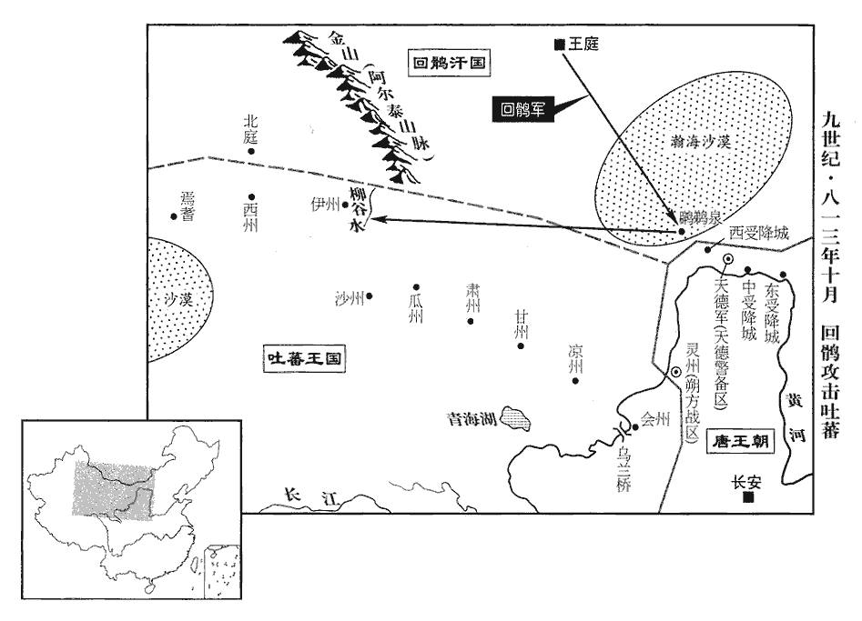
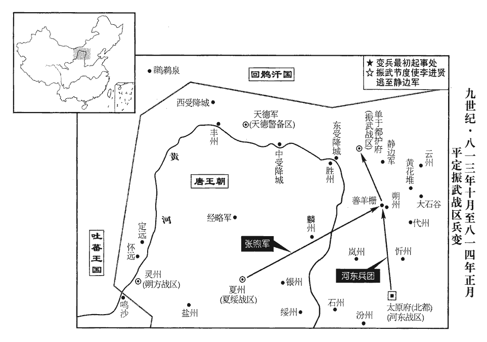
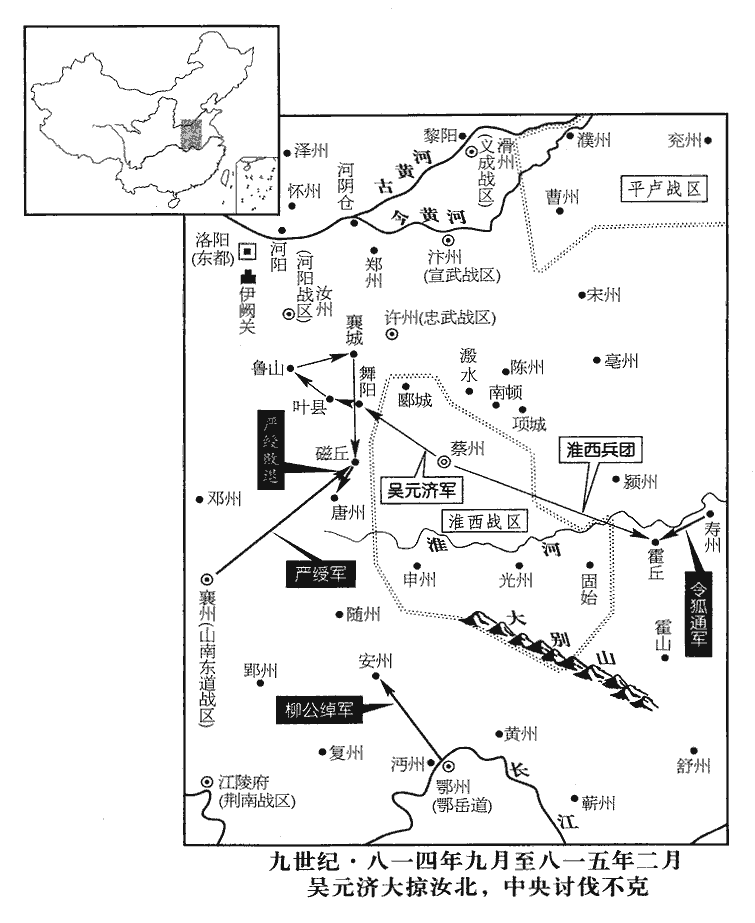
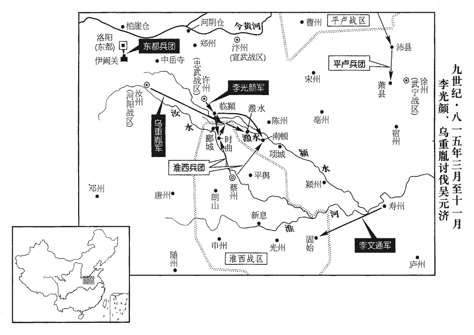
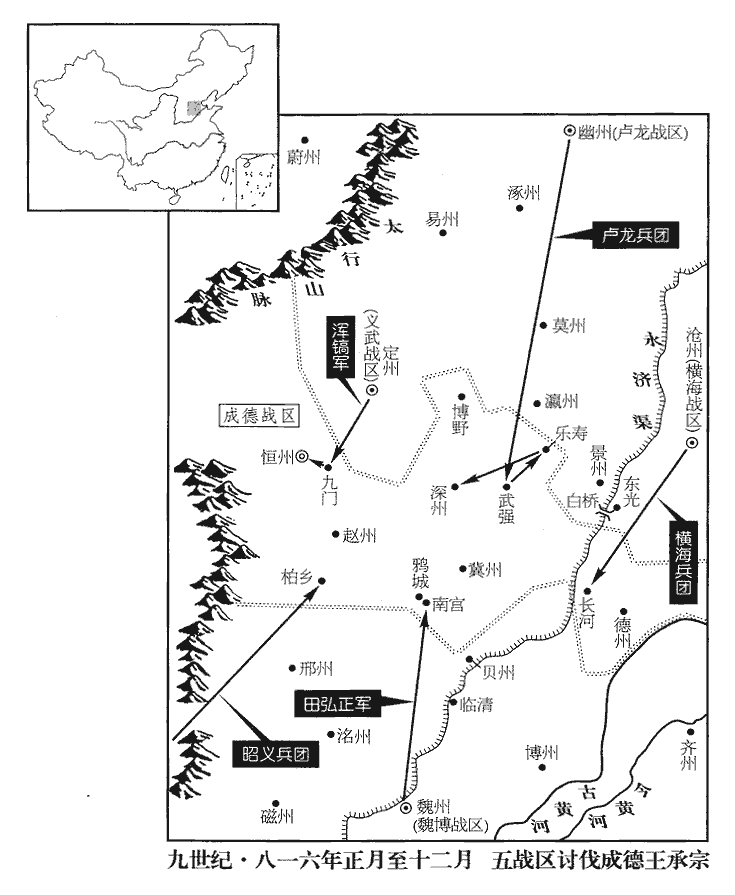
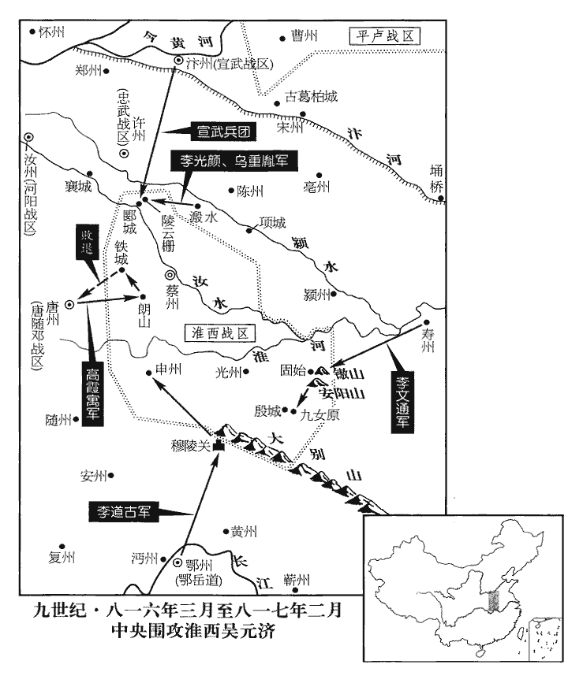
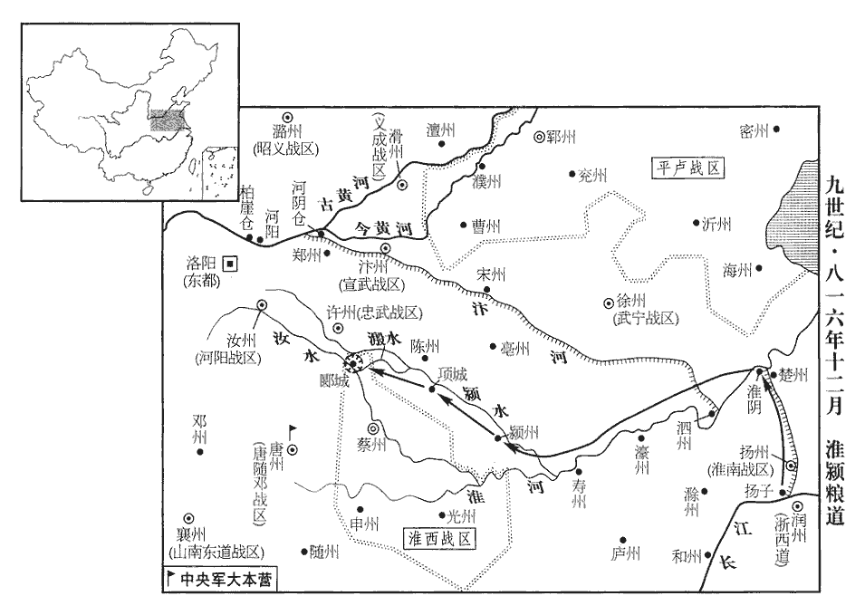

 唐紀五十五起玄黓執徐（壬辰）十月，盡柔兆涒灘（丙申），凡四年有奇。

# 憲宗昭文章武大聖至神孝皇帝中之上

## 元和七年（壬辰、八一二）

1冬，十月，乙未‹十›，魏博監軍以狀聞，以魏兵廢懷諫立田興之狀聞。上亟召宰相，謂李絳曰：「卿揣魏博若符契。揣，初委翻。李吉甫請遣中使宣慰以觀其變，李絳曰：「不可。今田興奉其土地兵眾，坐待詔命，不乘此際推心撫納，結以大恩，必待敕使至彼，持將士表來為請節鉞，然後與之，此大曆、貞元之弊也。為，于偽翻；下亦為、正為、度為、當為同。則是恩出於下，非出於上，將士為重，朝廷為輕，其感戴之心亦非今日之比也。機會一失，悔之無及！」吉甫素與樞密使梁守謙相結，守謙亦為之言於上曰：「故事，皆遣中使宣勞，勞，力到翻。今此鎮獨無，恐更不諭。」言恐其更不諭上意也。上竟遣中使張忠順如魏博宣慰，欲俟其還而議之。癸卯‹十八›，李絳復上言：復，扶又翻。「朝廷恩威得失，在此一舉，時機可惜，柰何棄之！利害甚明，願聖心勿疑。計忠順之行，甫應過陝‹河南省三门峡市›，甫，始也。陝，失冉翻。乞明旦即降白麻除興節度使，猶可及也。」上且欲除留後，絳曰：「興恭順如此，言興守朝廷法令，申版籍，請官吏，異乎河北諸鎮之為也。自非恩出不次，則無以使之感激殊常。」上從之。甲辰‹十九›，以興為魏博節度使。忠順未還，制命已至魏州。興感恩流涕，士眾無不鼓舞。

〖译文〗 [1]冬季，十月，乙未（初十），魏博监军将魏博将士废黜田怀谏，拥立田兴的文状上报，宪宗连忙召集宰相前来，对李绛说：“你的揣测和魏博的事态就像符节的两部分相互吻合一样哩。”李吉甫请求派遣中使前去安抚，以便观察事态的变化，李绛说：“这样做不恰当。现在，田兴献出魏博的土地与兵马，正在等候诏书发布命令。如果不趁此时机诚心抚慰并接纳他，以隆厚的恩典维系他，而一定要等候陛下派出的使者到魏博，拿着将士们的上表回来请求任命田兴为节度使，然后再授给他这一职务，这就是恩惠来自下边，而不出自上边，将士的作用大，而朝廷的作用小，田兴对朝廷感激与爱戴的心意也是不能够与现在相比的。一旦失去这一时机，后悔也来不及了！”李吉甫平常与枢密使梁守谦相互勾结，梁守谦也替李吉甫向宪宗说：“根据惯例，对于这种情形，都是派遣中使前去慰劳，现在唯独不向魏博派遣中使，恐怕人们更加难以明白其中的道理了。”宪宗最后还是派遣中使张忠顺前往魏博安抚将士，准备等候张忠顺回朝以后再商议此事。癸卯（十八日），李绛再次进言说：“朝延施加恩典与声威的成功与失败，就在这一次行动。出现这一时机，是值得珍惜的，怎么能够将它放弃呢！哪种做法有利有害，是非常清楚的，希望陛下心中不要再有疑虑了。计算张忠顺的行程，现在应当刚过陕州，请陛下明天早晨便颁布白麻纸诏书，任命田兴为节度使，这是还来得及的。”宪宗打算暂且任命田兴为留后，李绛说：“田兴恭敬顺从到这般地步，若不肯不拘等次地施加恩典，自然无法使他感激朝廷的超常待遇。”宪宗听从了李绛的建议。甲辰（十九日），宪宗任命田兴为魏博节度使。张忠顺没有返回朝廷以前，宪宗的命令已经到达魏州，田兴因感激朝廷的恩典而流出了眼泪！将士们没有不欢欣雀跃的。

2庚戌‹二十五›，更名皇子寬曰惲，察曰悰，寰曰忻，寮曰悟，審曰恪。更，工衡翻。惲，於粉翻。

〖译文〗 [2]庚戌（二十五日），宪宗为皇子更改名字，李宽称作李恽，李察称作李，李寰称作李忻，李寮称作李悟，李审称作李恪。

3李絳又言：「魏博五十餘年不霑皇化，魏博自田承嗣以來倔強拒命，至是四十九年。一旦舉六州之地來歸，六州，魏、博‹山东省聊城市›、貝‹河北省清河县›、衛‹河南省卫辉市›、澶chán‹河南省内黄县东南›、相‹河南省安阳市›。刳河朔‹河北平原›之腹心，傾叛亂之巢穴，不有重賞過其所望，則無以慰士卒之心，使四鄰勸慕。請發內庫錢百五十萬緡以賜之。」左右宦官以為「所與太多，後有此比，將何以給之？」上以語絳，語，牛據翻。絳曰：「田興不貪專地之利，不顧四鄰之患，歸命聖朝，陛下柰何愛小費而遺大計，不以收一道人心！錢用盡更來，機事一失不可復追。復，扶又翻。借使國家發十五萬兵以取六州，期年而克之，期，讀曰朞。其費豈止百五十萬緡而已乎！」上悅，曰：「朕所以惡衣菲食，蓄聚貨財，正為欲平定四方；為，于偽翻；下同。不然，徒貯之府庫何為！」貯，丁呂翻。十一月，辛酉‹六›，遣知制誥裴度至魏博宣慰，以錢百五十萬緡賞軍士，六州百姓給復一年。復，方目翻。復，除其賦役也。軍士受賜，歡聲如雷。成德、兗鄆‹总部设郓州山东省东平县›使者數輩見之，相顧失色，歎曰：「倔強者果何益乎！」兗鄆，即淄青、平盧軍也。鄆，音運。倔，其勿翻。強，其兩翻。

〖译文〗 [3]李绛又说：“魏博已经有五十多年没有沾润着帝王的德化了，现在忽然带着魏、博、贝、卫、澶、相六州土地前来归顺，挖空了河朔地区的中心，倾覆了反叛作乱的巢穴，如果没有超过他们所希望的重重的奖赏，便无法安慰将士们的心意，并使四周相邻各道受到劝勉，感到羡慕。请陛下拨发内库钱一百五十万缗，颁赐给魏博。”宪宗亲近的宦官认为：“给与的赏赐太多，若以后再有此例，将拿什么给他们呢？”宪宗将宦官的话告诉了李绛，李绛说：“田兴不肯贪图专擅一地的好处，不顾四周相邻各道的祸患，归顺本朝，陛下怎么能够珍惜微小的费用，反而丢掉重大的谋划，不肯用这点钱财去收取一道的人心呢！钱财使用光了会重新得到的，而这一时机一旦失去，就不能够再追回来了。假如国家征发十五万兵马去攻取魏博六州，经过整整一年才战胜敌军，这需要的费用难道是一百五十万缗就可以止住的吗？”宪宗高兴了，就说：“朕穿粗劣的衣裳，吃薄味的食物，积蓄物资钱财的意图，正是为了平定各地。否则，将物资钱财白白储存在仓库中是为了什么呢？”十一月，辛酉（初六），宪宗派遣知制诰裴度前去安抚魏博，带去钱一百五十万缗，奖赏军中将士，对六州百姓免除一年的赋税徭役。将士们得到赏赐，发出了雷鸣般的欢呼声。成德、兖郓派来的好几个使者看到了这一场景，面面相觑，惊惶变色，叹息着说：“对朝廷刚强不屈的藩镇果真有什么好处吗！”

度為興陳君臣上下之義，興聽之，終夕不倦，待度禮極厚，請度徧至所部州縣，宣布朝命。朝，直遙翻。奏乞除節度副使於朝廷，詔以戶部郎中河東‹山西省永济市›胡証為之。証，之盛翻。興又奏所部缺官九十員，請有司注擬，行朝廷法令，輸賦稅。田承嗣以來室屋僭侈者，皆避不居。

〖译文〗 裴度为田兴讲述君臣之间的大义名分，田兴倾听着，整个晚上，都没有倦意。他对待裴度的礼数非常周全，还邀请裴度走遍他管辖的州县，向各处宣布朝廷的命令。田兴奏请朝廷任命节度副使，宪宗颁诏任命户部郎中河东人胡证出任此职。田兴还奏报部下缺少官员九十人，请求有关部门登录姓名，拟定官职，在魏博行使朝廷的法纪命令，向朝廷交纳赋税。田承嗣以来所建造的过度奢华的居室，田兴一概回避，不肯居住。

鄆、蔡、恆遣遊客間說百方，興終不聽。鄆，李師道；蔡，吳少陽；恆，王承宗也。恆，戶登翻。間，古莧翻。說，輸芮翻。李師道使人謂宣武‹总部设汴州河南省开封市›節度使韓弘曰：「我世與田氏約相保援，今興非田氏族，又首變兩河事，言田興悉心奉朝廷，變兩河藩鎮故事。亦公之所惡也！惡，烏路翻。我將與成德合軍討之。」弘曰：「我不知利害，知奉詔行事耳。若兵北渡河，我則以兵東取曹州‹山东省定陶县›！」曹州，李師道巡屬也。師道懼，不敢動。

〖译文〗 郓州李师道、蔡州吴少阳、恒州王承宗派遣游说之士，想方设法私下劝说田兴，田兴始终不肯听从。李师道让人告诉宣武节度使韩弘说：“我家世代与田氏约定相互保全，彼此援助。现在，田兴并不出于田氏家族，又第一个改变了河南、河北的先例，这也是您所憎恶的啊！我准备与成德会合兵马，讨伐田兴。”韩弘说：“我不知道你说的这些利弊得失，只知道遵照诏书办事而已。假如你的兵向北渡过黄河，我便领兵东进，攻打曹州！”李师道害怕，没敢用兵。

田興既葬田季安，送田懷諫于京師。辛巳‹二十六›，以懷諫為右監門衛將軍。

〖译文〗 田兴安葬了田季安以后，便将田怀谏往京城。辛巳（二十六日），宪宗任命田怀谏为右监门卫将军。

4李絳奏振武‹总部设单于府内蒙古和林格尔县›、天德‹总部设天德军城内蒙古乌拉特前旗东北›左右良田可萬頃，請擇能吏開置營田，可以省費足食，上從之。絳命度支使盧坦經度用度，度支、經度，皆徒洛翻。四年之間，開田四千八百頃，收穀四千餘萬斛，「千」，當做「十」。歲省度支錢二十餘萬緡，邊防賴之。

〖译文〗 [4]李绛奏称，振武、天德周围的良田可达一万顷，请求选择干练的官吏开设屯田，可以节省开支，使粮食充足，宪宗听从了他的建议。李绛命令度支使卢坦经营规划所需费用。在四年时间里，开辟田地四千八百顷，收获谷物四千多万斛，每年节省度支拨钱二十多万缗，边防都仰仗着屯田的收成。

5上嘗於延英謂宰相曰：「卿輩當為朕惜官，為，于偽翻。勿用之私親故。」李吉甫、權德輿皆謝不敢。李絳曰：「崔祐甫有言，『非親非故，不諳其才。』諳者尚不與官，不諳者何敢復與！但問其才器與官相稱否耳。諳，烏含翻。復，扶又翻。稱，尺證翻。若避親故之嫌，使聖朝虧多士之美，此乃偷安之臣，非至公之道也。苟所用非其人，則朝廷自有典刑，誰敢逃之！」上曰：「誠如卿言。」

〖译文〗 [5]宪宗曾经在延英殿对宰相们说：“你们这些人应当替朕珍惜官位，不要用官位偏袒亲戚故旧。”李吉甫、权德舆都推脱说自己没有那样的胆量。李绛说：“崔甫说过：‘既不是亲属，又不是故交，无法了解一个人的才能。’对自己了解的人尚且不能够授予官职，对不了解的人又怎么敢授给官职呢？只须过问一个人的才能和器识与所授官职是否相称而已。倘若规避亲戚故旧的嫌疑，使本朝缺欠人才济济的局面，这便是苟求自安的臣下，并不符合大公无私的原则啊！如果任用的人是不合适的，朝廷自然会有刑罚相加，有谁敢逃避呢！”宪宗说：“诚然如你所说。”

6是歲，吐蕃寇涇州‹甘肃省泾川县›，及西門之外，先寇涇州界，進及涇州西門之外。驅掠人畜而去。上患之，李絳上言：「京西、京北皆有神策鎮兵，京西，鳳翔、秦、隴、原、涇、渭也。京北，邠、寧、丹、延、鄜、坊、慶、靈、鹽、夏、綏、銀、宥也。鎮兵註已見前。始，置之欲以備禦吐蕃，使與節度使掎角相應也。今則鮮衣美食，坐耗縣官，每有寇至，節度使邀與俱進，則云申取中尉處分；唐神策鎮兵分屯于外，皆屬左、右神策中尉。處，昌呂翻。分，扶問翻。比其得報，虜去遠矣。比，必利翻，及也。縱有果銳之將，聞命奔赴，節度使無刑戮以制之，相視如平交，左右前卻，莫肯用命，何所益乎！請據所在之地士馬及衣糧、器械皆割隸當道節度使，使號令齊壹，如臂之使指，則軍威大振，虜不敢入寇矣。」上曰：「朕不知舊事如此，當亟行之。」既而神策軍驕恣日久，不樂隸節度使，樂，音洛。竟為宦者所沮而止。

〖译文〗 [6]本年，吐蕃侵犯泾州，一直打到西门以外，驱赶俘掠人口与牲畜离去，宪宗为此事甚为担忧。李绛进言说：“京城西面和京城北面都有神策军赶镇驻守的兵马。起初，朝廷将神策军安置到各军镇，是打算防御吐蕃，使神策军与节度使的兵马形成相互呼应夹击敌军的形势。如今神策军穿好的，吃好的，无所事事地消耗国家的物资供给。每当有敌寇到来时，节度使邀请神策军与自己共同进军，神策军却说需要申报上去，听取中尉的处理。及至神策军得到中尉的答复，吐蕃已经离开很远了。纵然神策军中也有果决勇猛的将领，得到命令便奔赴敌军，但是节度使无法使用刑杀的权力来控制他们。这些将领将节度使看作平等交往的人物，节度使支使他们前进或撤退时，他们不肯服从命令，这有什么益处呢？请陛下根据神策军的驻扎地点，将战士、马匹、衣服、口粮、器械等一概分割给本道节度使管辖，使号令统一，犹如胳膊指使手指一般，军队的声威便会大大振作起来，吐蕃就不敢前来侵犯了。”宪宗说：“朕不知道以往的制度竟是这个样子，应当赶紧实行你的建议。”不久，由于神策军骄横放纵得时间长了，不愿意隶属节度使，终于因受到宦官的阻挠而没有实行下去。

## 八年（癸巳、八一三）

1春，正月，癸亥‹九›，以博州‹山东省聊城市›刺史田融為相州‹河南省安阳市›刺史。融，興之兄也。融、興幼孤；融長，養而教之。兄弟皆幼失父母，而兄年差長，故長養其弟而教之。長，知丈翻。興嘗於軍中角射，角，競也。角射者，以中為勝。一軍莫及。融退而抶之抶chì，丑栗翻，打也。曰：「爾不自晦，禍將及矣！」故興能自全於猜暴之時。猜暴之時，謂田季安時也。

〖译文〗 [1]春季，正月，癸亥（初九），宪宗任命博州刺史田融为相州刺史。田融是田兴的哥哥。田融与田兴幼年丧父，田融年长，便抚养教育田兴。有一次，田兴与军中将士比赛射箭，全军将士都赶不上他。回去以后，田融用鞭子抽打他，还说：“你不能够收敛自己的锋芒，祸殃就要到来了！”所以，田兴能够在田季安猜疑而横暴时，将自己保全下来。

2勃海‹首都龙泉府黑龙江省宁安市西南东京城›定王元瑜卒，弟言義權知國務。庚午‹十六›，以言義為勃海王。

〖译文〗 [2]勃海定王大元瑜去世，弟弟大言义暂时代理执掌国家事务。庚午（十六日），宪宗任命大言义为勃海王。

3李吉甫、李絳數爭論於上前，禮部尚書、同平章事權德輿居中無所可否；上鄙之。數，所角翻。鄙，陋也。辛未‹十七›，德輿罷守本官。

〖译文〗 [3]李吉甫与李绛屡次在宪宗面前争论，礼部尚书、同平章事权德舆置身中间，没有表示过赞同或反对，宪宗因此而轻视他。辛未（十七日），权德舆被罢免宰相职务，仍然担任原有的官职。

4辛卯‹二月七日›，賜魏博‹总部设魏州河北省大名县›節度使田興名弘正。

〖译文〗 [4]辛卯（疑误），宪宗向魏博节度使田兴颁赐名字，叫田弘正。

5司空、同平章事于頔dí久留長安，鬱鬱不得志。二年頔入朝，見二百三十二卷。有梁正言者，自言與樞密使梁守謙同宗，能為人屬請，為，于偽翻；下同。屬，之欲翻。頔使其子太常丞敏重賂正言，求出鎮。久之，正言詐漸露，敏索其賂不得，索，山客翻。誘其奴，支解之，棄溷中。誘，音酉。溷hùn，戶困翻，廁也。事覺，頔帥其子殿中少監季友等素服詣建福門請罪，門者不內；帥，讀曰率。唐大明宮端門曰丹鳳門，其西曰建福門。，內即納字也。退，負南牆而立，遣人上表，閤門以無印引不受；唐制；凡四方章表，皆閤門受而進之。頔方請罪，既無職印，又無內引，所以不受。日暮方歸，明日，復至。復，扶又翻。丁酉‹十三›，頔左授恩王傅，仍絕朝謁；朝，直遙翻。敏流雷州‹广东省雷州市›，舊志：雷州，至京師六千五百一十二里。季友等皆貶官，僮奴死者數人；敏至秦嶺而死。自藍田關南出度秦嶺。

〖译文〗 [5]司空、同平章事于长时间留在长安，自觉忧闷，难偿平生志愿。有一个叫梁正言的人，自称与枢密使梁守谦是本家，能够替别人托办各种事情，于便让他的儿子太常丞于敏重重地贿赂梁正言，希图出任节度使。时间长了，梁正言的骗术逐渐败露了，于敏不能够将贿赂索取回来，便诱使梁正言的奴仆，将梁正言的四肢分解了，丢弃到厕所中。事情终于被发觉了，于带领他的儿子殿中少监于季友等人，穿着白色丧服前往建福门请求治罪，守门人不肯让他们进去。退下来后，于背倚南墙站立着，派人进献表章，阁门的值班人因表上没有印符，又没有内部人援引，因而不肯接受。直到日暮，于等才返回。第二天，又再次前来。丁酉（疑误），于被降职为恩王傅，并禁止他入朝谒见；于敏被流放雷州，于季友等人都被贬官，奴仆被处死的有几个人。于敏刚到秦岭便死去。

事連僧鑒虛。鑒虛自貞元以來，以財交權倖，受方鎮賂遺，遺，唯季翻。厚自奉養，吏不敢詰。至是，權倖爭為之言，上欲釋之，中丞薛存誠不可。上遣中使詣臺宣旨曰：「朕欲面詰此僧，非釋之也。」存誠對曰：「陛下必欲面釋此僧，請先殺臣，然後取之，不然，臣期不奉詔。」上嘉而從之。三月，丙辰‹三›，杖殺鑒虛，沒其所有之財。考異曰：實錄在二月。按長曆，二月乙酉朔，三月甲寅朔。丙辰，三月三日。甲子，武元衡入知政事，十一日也。實錄脫不書月耳。

〖译文〗 事情牵连到僧人鉴虚。自从贞元年间以来，鉴虚凭着资财与拥有权势、取得宠幸的人们交结，收受节度使贿赂的财物，使自己日常获得优厚的供养，吏人们谁也不敢追问。至此，有权势、得宠幸的人们争着替鉴虚讲情，宪宗也打算将鉴虚释放出来，御史中丞薛存诚认为是不适当的。宪宗派遣中使前往御史台宣布诏旨说：“朕打算当面责问这个僧人，并不是要释放他。”薛存诚回答说：“如果陛下一定要当面释放这个僧人，请先将我杀掉，然后再将他放走。否则，我定然不肯接受诏命。”宪宗嘉许并听从了他的请求。三月，丙辰（初三），将鉴虚用棍棒笞打而死，没收了他所有的资财。

6甲子‹十一›，徵前西川‹总部设成都府四川省成都市›節度使、同平章事武元衡入知政事。元和二年，武元衡出鎮西川，至是召還。

〖译文〗 [6]甲子（十一日），宪宗征召前任西川节度使、同平章事武元衡入朝执掌政事。

7夏，六月，大水。上以為陰盈之象，辛丑‹二十›，出宮人二百車。

〖译文〗 [7]夏季，六月，发生了严重的水灾，宪宗认为这是阴气满盈的象征。辛丑（初五），宪宗将二百车宫中妇女打发出宫。

8秋，七月，【章：甲十一行本「月」下有「辛酉‹十一›」二字；乙十一行本同；張校同；退齋校同。】振武‹总部设单于府内蒙古和林格尔县›節度使李光進請脩受降城‹东受降城，内蒙古托克托县南›，兼理河防。理，治也。時受降城為河所毀，河毀受降城見上卷七年。李吉甫請徙其徒於天德故城‹内蒙古乌拉特前旗东北›，天德故城，在東受降城西二百里大同川。乾元後，徙天德軍於永濟柵。宋白續通典作「永清柵」。其城，則隋大同城之舊墟。李絳及戶部侍郎盧坦以為：「受降城，張仁愿所築，事見二百九卷中宗景龍元年。當磧口，據虜要衝，美水草，守邊之利地。今避河患，退二三里可矣，柰何捨萬代永安之策，徇一時省費之便乎！況天德故城僻處确瘠，處，昌呂翻。确，克角翻，磽qiāo确也。瘠，土薄也。去河絕遠，烽候警急不相應接，虜忽唐突，勢無由知，是無故而蹙國二百里也。」及城使周懷義奏利害，與絳、坦同。上卒用吉甫策，卒，子恤翻。以受降城騎士隸天德軍‹总部设天德军城内蒙古乌拉特前旗东北›。

〖译文〗 [8]秋季，七月，振武节度使李光进请求修筑受降城，同时治理黄河的堤防。当时，受降城被黄河毁坏，李吉甫请求将李光进的部众迁移到天德军的旧城去。李绛与户部侍郎卢坦认为：“这座受降城是张仁愿修筑起来的，地处大漠的出口，占据着控制异族的交通紧要之地，水草丰美，是守卫边防的好地方。现在，为了避开黄河的危害，后退两三里地就行了，怎么能够舍弃万世永远安定的大计，曲从暂时节省开支的便利呢！何况天德军旧城处于荒远之地，土质瘠薄多石，距离黄河极远，烽火台示警告急时，不能够相互呼应，异族忽然前来横冲直撞，势必无法得知，这是毫无原由地使国家减缩了二百里的土地啊！”及至受降城使周怀义奏陈利弊得失，所讲的与李绛、卢坦相同。但是，宪宗最终还是采用了李吉甫的策划，将受降城的骑兵隶属于天德军。

李絳言於上曰：「邊軍徒有其數而無其實，虛費衣糧，將帥但緣私役使，緣私者，並緣公役之名而私使之。聚貨財以結權倖而已，未嘗訓練以備不虞，此不可不於無事之時豫留聖意也。」時受降城兵籍舊四百人，及天德軍交兵，止有五十人，考異曰：實錄云：「李光進請脩東受降城兼理河防。」又云：「以中受降城及所管騎士一千一百四十人隸于天德軍。」舊傳：「盧坦與李絳叶議，以為西城張仁愿所築，不可廢。」三者不同，莫知孰是。今但云受降城，所闕疑也。又李司空論事云：「中城舊屬振武，有鎮兵四百人，其時割屬天德，交割惟有五十人。」人數如此不同，或者一千一百四十人是三城都數耳。器械止有一弓，自餘稱是。稱，尺證翻。故絳言及之。上驚曰：「邊兵乃如是其虛邪！卿曹當加按閱。」會絳罷相而止。

〖译文〗 李绛对宪宗说：“边防上的军队空有数额，实际没有那么多士兵，白白浪费衣服与口粮。将帅们只知道假公济私，使唤士兵，积聚物资钱财，用以交结有权势、得宠幸的人们，却不曾训练士兵，以防备意外的事情发生。这种情形，不能不在没有事端时请陛下预先留意。”当时，受降城的士兵名册原有四百人，及至与天德军移交兵员时，只有五十人，军用器具只有一张弓，其余的东西与此相称，所以李绛才提到此事。宪宗惊讶地说：“边境的兵马竟然是这般空虚吗！你们应当加以按察。”适逢李绛被罢免了宰相的职务，于是此事便作罢了。

9乙巳‹八月二十五日›，廢天威軍，元和初，并左、右神威為一軍，號天威軍。神威軍，本殿前射生軍也。以其眾隸神策軍。

〖译文〗 [9]乙巳（疑误），朝廷废除了天威军，将天威军的部众隶属于神策军。

10丁未‹二十七›，辰‹湖南省沅陵县›、漵‹湖南省洪江市西北黔城镇›賊帥張伯靖請降。辰、漵賊反，事始上卷六年。辛亥‹二›，【章：甲十一行本「辛」上有「九月」二字；乙十一行本同；孔本同；張校同。】以伯靖為歸州‹湖北省秭归县›司馬，委荊南軍前驅使‹总部设江陵府湖北省江陵县›。委，屬也，付也。

〖译文〗 [10]丁未（疑误），辰州与涂州两地蛮人的首领张伯靖请求归降。辛亥（疑误），宪宗任命张伯靖为归州司马，交付荆南节度使军前听候驱遣。

11初，吐蕃欲作烏蘭橋‹甘肃省靖远县西南五十千米›，新志：會州烏蘭縣有烏蘭關，在縣西南。吐蕃於河上作橋。先貯材於河側，貯，丁呂翻。朔方‹总部设灵州宁夏灵武市›常潛遣人投之於河，終不能成。虜知朔方、靈鹽節度使王佖貪，佖bì，支筆翻，又頻筆翻。先厚賂之，然後併力成橋，仍築月城守之。自是朔方禦寇不暇。

〖译文〗 [11]当初，吐蕃准备建造乌兰桥，事先在黄河边上储存木材，朔方经常暗中派人将木材投入黄河，乌兰桥到底没有能够造成。吐蕃得知朔方、灵盐节度使王贪婪，便先去重重地贿赂他，然后全力将乌兰桥造成，还修筑了新月形的城墙守卫着它。从此，朔方经常需要抵御吐蕃入侵，再也没有闲暇的时候了。

 

12冬，十月，回鶻‹瀚海沙漠群›發兵度磧南，自柳谷‹新疆哈密市东›西擊吐蕃。新志：西州交河縣北二百一十里，經柳谷渡。壬寅‹二十三›，振武、天德軍奏回鶻數千騎至鸊鵜泉‹内蒙古乌拉特后旗西北›，鸊鵜泉，在西受降城北三百里。鸊pì，扶歷翻。鵜tí，徒奚翻。邊軍戒嚴。

〖译文〗 [12]冬季，十月，回鹘派兵来到大漠南面，由柳谷西进，攻击吐蕃。壬寅（二十三日），振武、天德军奏称有回鹘骑兵数千人来到鹈泉，边疆上的军队都在警戒防备。

13振武節度使李進賢，不恤士卒；判官嚴澈，綬之子也，於時嚴綬尚在。綬，音受。以刻覈hé得幸於進賢。進賢使牙將楊遵憲將五百騎趣東受降城以備回鶻，所給資裝多虛估；資裝不給本色，虛估其價，給以他物。趣，七喻翻。至鳴沙，遵憲屋處處，昌呂翻。而士卒暴露；眾發怒，夜，聚薪環其屋而焚之，環，音宦。卷甲而還。還，從宣翻，又如字。庚寅‹十二月十一日›夜，焚門，攻進賢，進賢踰城走，軍士屠其家，并殺嚴澈。進賢奔靜邊軍‹山西省右玉县。属河东战区总部太原府›。靜邊軍在雲州西一百八十里。

〖译文〗 [13]振武节度使李进贤不体恤将士。判官严澈是严绶的儿子，因待人苛刻而得到李进贤的宠爱。李进贤让牙将杨遵宪带领骑兵五百人奔赴东受降城，防备回鹘，供给他的物资装备多不是原物，而是经过虚估价钱后另以他物配给的。来到鸣沙时，杨遵宪住在房屋里，但将士们留在露天地里。大家发怒了，在夜间堆聚柴草，围绕着房屋放火焚烧杨遵宪，收起铠甲，返回振武。庚寅（十一日），夜晚，返回的将士焚烧大门，进攻李进贤，李进贤翻越城墙逃走。将士们屠杀了李进贤的家口，并且杀死了严澈。李进贤逃奔静边军。

14群臣累表請立德妃郭氏為皇后。上以妃門宗強盛，妃，郭曖之女，子儀之孫女也。恐正位之後，後宮莫得進，託以歲時禁忌，竟不許。

〖译文〗 [14]群臣屡次上表请求将德妃郭氏立为皇后。宪宗认为郭德妃宗族门户强盛，恐怕郭德妃居正位后，内宫的嫔妃不能够接近他了，便借口时日的忌讳，始终不肯答应。

15丁酉‹十八›，振武監軍駱朝寬奏亂兵已定，請給將士衣。上怒，以夏綏‹总部设夏州陕西省靖边县北白城子›節度使張煦為振武節度使，煦xù，吁句翻。將夏州兵二千赴鎮，仍命河東‹总部设太原府山西省太原市›節度使王鍔以兵二千納之，聽以便宜從事。駱朝寬歸罪於其將蘇若方而殺之。

〖译文〗 [15]丁酉（十八日），振武监军骆朝宽奏称变乱的士兵已经平定，请求给将士们供应服装。宪宗大怒，任命夏绥节度使张煦为振武节度使，带领夏州兵马二千人奔赴振武，还命令河东节度使王锷率领兵马二千人接纳张煦，任凭他见机行事。骆朝宽将罪责都加给将领苏若方，将他杀掉了。

16發鄭滑‹总部设滑州河南省滑县›、魏博‹总部设魏州河北省大名县›卒鑿黎陽‹河南省浚县›古河十四里，以紓滑州水患。大河故瀆逕黎陽山之東，後南徙，為滑州患，故復鑿古河。

〖译文〗 [16]朝廷征发郑滑、魏博士兵开凿黎阳古黄河河道十四里，以便缓解滑州的水灾。

17上問宰相：「人言外間朋黨大盛，何也？」李絳對曰：「自古人君所甚惡者，莫若人臣為朋黨，故小人譖君子必曰朋黨。何則？朋黨言之則可惡，惡，烏路翻。尋之則無跡故也。東漢之末，凡天下賢人君子，宦官皆謂之黨人而禁錮之，遂以亡國。見漢桓、靈二帝紀。此皆群小欲害善人之言，願陛下深察之！夫君子固與君子合，豈可必使之與小人合，然後謂之非黨邪！」

〖译文〗 [17]宪宗询问宰相说：“人们说外面朋党集团大大兴起，这是为什么呢？”李绛回答说：“自古以来，人君特别憎恶的，以人臣结成朋党集团为甚，所以，小人诬陷君子，肯定要说他属于朋党集团。为什么要这样做呢？这是因为，朋党集团谈论起来虽然是可恶的，寻找起来却没有痕迹。东汉末年，凡是天下的贤人和君子，宦官都称他们为党人，因而勒令对他们永不任用，东汉便因此灭亡。这都是众小人打算谋害好人的说法，希望陛下深入地考察此事。一般说来，君子固然与君子相合，难道能够一定使君子与小人相合，然后才能够说君子不属于朋党集团吗！”

## 九年（甲午、八一四）

1春，正月，甲戌‹二十六›，王鍔‹河东战区，总部设太原府山西省太原市›遣兵五千會張煦‹振武战区，总部设单于府内蒙古和林格尔县›於善羊柵‹山西省朔州市境›。「善羊」，當作「善陽」。唐朔州治善陽縣，西北至單于府百二十里。柵蓋立於縣界。乙亥‹二十七›，煦入單于都護府‹内蒙古和林格尔县›，振武節度使，治單于都護府。誅亂者蘇國珍等二百五十三人。二月，丁丑，貶李進賢為通州‹四川省达川市›刺史。甲午‹十六›，駱朝寬坐縱亂者，杖之八十，奪色，配役定陵‹李显墓·陕西省富平县西北龙泉山›。奪色者，奪其品色也。

〖译文〗 [1]春季，正月，甲戌（二十六日），王锷派遣兵马五千人在善羊栅与张煦会合。乙亥（二十七日），张煦进入单于都护府，诛杀变乱者苏国珍等二百五十三人。二月，丁丑（疑误），宪宗将李进贤贬为通州刺史。甲午（十六日），骆朝宽因放纵叛乱者获罪，将他杖责八十，剥夺品色，发配到定陵服役。

 

2李絳屢以足疾辭位；癸卯‹二十五›，罷為禮部尚書。

〖译文〗 [2]李绛因脚病屡次推辞官位。癸卯（二十五日），李绛被罢为礼部尚书。

初，上‹李纯，本年三十七岁›欲相絳，先出吐突承璀為淮南‹总部设扬州江苏省扬州市›監軍，見上卷六年。相，息亮翻；下同。至是，上召還承璀，先罷絳相。甲辰‹二十六›，承璀至京師，復以為弓箭庫使、觀李絳立朝本末，亦庶乎有大臣之節矣。左神策中尉。承璀以喪師罷中尉為弓箭庫使，今遂兼為之，此憲宗之巧，蓋持兩端以觀朝議也。李絳既罷，誰敢復以為言乎！

〖译文〗 当初，宪宗打算任命李绛为宰相，事先让吐突承璀出任淮南监军。至此，宪宗将吐突承璀召回，事先免除了李绛的宰相职务。甲辰（二十六日），吐突承璀来到京城，宪宗重新任命他为弓箭库使、左神策军中尉。

3李吉甫奏：「國家舊置六胡州於靈‹宁夏灵武市›、鹽‹陕西省定边县›之境，調露元年，於靈、夏南境以降突厥置魯州、麗州、含州、塞州、依州、契州，以唐人為刺史，謂之六胡州。鹽州與靈、夏接境。開元中廢之，更置宥州以領降戶；天寶中，宥州寄理於經略軍‹内蒙古鄂托克旗东›，長安四年，併六胡州為匡、長二州。開元二十六年，以廢匡州，置懷恩縣‹内蒙古鄂托克旗南›，帶宥州，縣管內有榆多勒城。天寶中，王忠嗣奏置經略軍，在宥州故城東北三百里，宋白曰：宥州應接天德，南援夏州，治長澤縣，本漢三封縣地。寶應以來，因循遂廢。今請復之，以備回鶻‹瀚海沙漠群›，撫党項‹陕西省北部›。」上從之。党，底朗翻。夏，五月，庚申‹十四›，復置宥州，理經略軍，取鄜城‹陕西省洛川县东南›神策屯兵九千以實之。大曆六年，置肅戎軍於鄜州之鄜城。

〖译文〗 [3]李吉甫上奏说：“以往，国家在灵州和盐州境内设置了六胡州，开元年间将六胡州废除，又设置宥州来统领归降的人户。天宝年间，宥州由经略军遥控治理。宝应年间以来，由于墨守旧法，于是便被废弃了。现在，我请求恢复以往的设置，以便防备回鹘，安抚党项。”宪宗听从了他的建议。夏季，五月，庚申（十四日），朝廷重新设置宥州，治所设在经略军，调来屯驻城的神策军兵九千人，以便充实宥州。

先是，回鶻屢請昏，先，悉薦翻。朝廷以公主出降，其費甚廣，故未之許。禮部尚書李絳上言，以為：「回鶻凶強，不可無備；淮西‹彰义战区·总部设蔡州河南省汝南县›窮蹙，事要經營。今江、淮大縣，歲所入賦有二十萬緡者，足以備降主之費，陛下何愛一縣之賦，不以羈縻勁虜！回鶻若得許昏，必喜而無猜，然後可以脩城塹，蓄甲兵，邊備既完，得專意淮西，功必萬全。今既未降公主而虛弱西城；西城，謂西受降城。‹内蒙古五原县西北›磧路無備，更脩天德‹内蒙古乌拉特前旗东北›以疑虜心。謂徙受降城於天德也。萬一北邊有警，則淮西遺醜復延歲月之命矣！復，扶又翻。儻虜騎南牧，國家非步兵三萬，騎五千，則不足以抗禦！借使一歲而勝之，其費豈特降主之比哉！」上不聽。

〖译文〗 在此之前，回鹘屡次请求通婚，朝廷因公主出国下嫁，开支很大，所以没有答应。礼部尚书李绛进言认为：“回鹘凶猛强悍，对他们不能够没有防备。淮西困惑犹豫，其中的事情需要图谋规划。如今江淮地区的大县，每年上缴的赋税有达到二十万缗的，足够备办下嫁公主的费用，陛下为什么要珍惜一个县的赋税，不肯拿来维系强劲的回鹘呢？假如回鹘得到通婚的许可，肯定感到高兴，不再猜疑．在此之后，才可以修治城池沟堑，积蓄铠甲兵器。在边疆的防备巩固后，才能够一心一意地对付淮西，必定获得成功，万无一失。既然如今没有下嫁公主，又使西受降城虚弱难支，对大漠的通路毫无防备，还要修筑天德城，使异族心中感到疑虑。万一北部边疆出现警报，淮西的残余小丑便又能够苟延残喘下去了！倘若回鹘的骑兵南来放牧，国家没有步兵三万人、骑兵五千人，就不够抵御他们！假使需要用一年时间战胜回鹘，所需要的费用又怎么能与仅仅下嫁公主的开销相比呢？”宪宗不肯听从。

4乙丑‹十九›，桂王綸薨。綸，上弟也。

〖译文〗 [4]乙丑（十九日），桂王李纶去世。

5六月，壬寅‹二十七›，以河中‹总部设河中府山西省永济市›節度使張弘靖為刑部尚書、同平章事。弘靖，延賞之子也。張延賞相德宗於貞元之間。

〖译文〗 [5]六月，壬寅（二十七日），宪宗任命河中节度使张弘靖为刑部尚书、同平章事。张弘靖是张延赏的儿子。

6翰林學士獨孤郁，權德輿之壻也。上歎郁之才美曰：「德輿得壻郁，我反不及邪！」先是，尚主皆取貴戚及勳臣之家，先，悉薦翻。上始命宰相選公卿、大夫子弟文雅可居清貫者；史炤曰：貫，事也。清貫，猶言清職也。諸家多不願，惟杜佑孫司議郎悰不辭。悰，藏宗翻。秋，七月，戊辰‹二十三›，以悰為殿中少監、駙馬都尉，尚岐陽公主。公主，上長女，郭妃‹郭子仪孙女›所生也。八月，癸巳‹十九›，成昏。公主有賢行，行，下孟翻。杜氏大族，尊行不翅數十人，尊行之行，下浪翻。不翅，與不啻同。公主卑委怡順，一同家人禮度，二十年間，人未嘗以絲髮間指為貴驕。始至，則與悰謀曰：「上所賜奴婢，卒不肯窮屈，卒，子恤翻，終也。奏請納之，悉自市寒賤可制指者。」制指，謂可制御而指使者也。自是閨門落然不聞人聲。

〖译文〗 [6]翰林学士独孤郁是权德舆的女婿。宪宗赞叹独孤郁的才华说：“权德舆能够使独孤郁作女婿，我反而赶不上权德舆了吗？”在此之前，公主下嫁，都是选取皇家内外亲族以及功臣家的子弟。至此，宪宗才命令宰相选择公卿、大夫家的温文尔雅、可以置身清流的子弟。然而，各家多不愿意，只有杜佑的孙子司议郎杜没有推辞。秋季，七月，戊辰（二十三日）宪宗任命杜为殿中少监、驸马都尉，让他娶岐阳公主为妻。岐阳公主是宪宗的大女儿，为郭德妃所生。八月，癸巳（十九日），杜与岐阳公主成婚。岐阳公主举止贤淑，杜氏是一个庞大的家族，行辈高于她的不只数十人，岐阳公主对待他们，谦恭随和，一概如同家里人的礼数，在二十年里，人们不曾因丝毫的嫌隙而指责她恃贵骄慢。才到杜家时，岐阳公主就与杜商议说：“皇上赐给我们的奴婢，是终究不肯屈从的，可以奏请皇上将他们收回去，我们自己再悉数购买出身低微、可以指使的奴婢吧。”自此，闺阁门户清静，连人们说话的声音都听不到。

7閏月，丙辰‹十二›，彰義節度使吳少陽薨。考異曰：實錄，少陽卒在閏月己丑下，壬辰上，而并元濟焚舞陽言之。統紀、舊紀，少陽卒皆在九月。按舊傳曰：「少陽卒，凡四十日，不為輟朝。」唐紀：「張弘靖請為少陽廢朝贈官。」而實錄「辛丑贈少陽右僕射。」然則己丑至辛丑，才十二日耳。豈容四十日不輟朝乎！今從新紀。少陽在蔡州，陰聚亡命，牧養馬騾，時抄掠壽州‹安徽省寿县，寿州属淮南战区总部扬州›茶山以實其軍。壽州有茶山。抄，楚交翻。其子攝蔡州‹河南省汝南县›刺史元濟，匿喪，以病聞，自領軍務‹吴元济本年三十二岁›。

〖译文〗 [7]闰八月，丙辰（十二日），彰义节度使吴少阳去世。吴少阳任职蔡州，暗中聚合逃亡的罪犯，放养骡子、马匹，时常抢动寿州茶山的财物来充实军需。他的儿子摄蔡州刺史吴无济，隐瞒了吴少阳的死讯，以吴少阳患病上报朝廷，由自己统领军中事务。

上自平蜀，元和初平蜀。即欲取淮西。淮南節度使李吉甫上言：「少陽軍中上下攜離，請徙理壽州以經營之。」淮南節度使治揚州，欲徙治壽州以經略淮西。會朝廷方討王承宗，事見上卷四年、五年。未暇也。及吉甫入相，田弘正以魏博‹总部设魏州河北省大名县›歸附。事見七年。吉甫以為汝州‹河南省汝州市›扞蔽東都‹洛阳›，河陽‹河南省孟州市›宿兵，本以制魏博，今弘正歸順，則河陽為內鎮，不應屯重兵以示猜阻。辛酉‹十七›，以河陽‹总部设河阳县河南省孟州市›節度使烏重胤為汝州刺史，充河陽、懷、汝節度使，徙理汝州。己巳‹二十五›，弘正檢校右僕射，賜其軍錢二十萬緡，弘正曰：「吾未若移河陽軍之為喜也。」喜者，喜朝廷之不猜防魏博。

〖译文〗 自从平定蜀中刘辟以来，宪宗就打算攻取淮西。淮南节度使李吉甫进言说：“吴少阳军中将士对上面已有背叛之心，请将淮南的治所迁移到寿州去，以便让我来经略规划淮西。”适逢朝廷正在讨伐王承宗，没有余暇考虚他的建议。及至李吉甫担任宰相后，田弘正率领魏博归顺了朝廷，李吉甫认为：“东都有汝州护卫着，在河阳屯驻兵马，本来是为了控制魏博的。现在，田弘正归顺了朝廷，河阳便成了内地的军镇，不应该屯驻重兵，显示对魏博的猜疑。”辛酉（十七日），宪宗任命河阳节度使乌重胤为汝州刺史，充任河阳、怀、汝节度使，将治所迁移汝州。己巳（二十五日），加封田弘正检校右仆射，赐给魏博军钱二十万缗。田弘正说：“没有比迁移河阳军更使我高兴的啦。”

九月，庚辰‹七›，以洺州‹河北省永年县东南旧永年镇›刺史李光顏為陳州‹河南省淮阳县›刺史，充忠武‹总部设许州河南省许昌市›都知兵馬使；九域志：陳州，西南至蔡州一百九十里。以泗州‹江苏省盱眙县淮河北岸›刺史令狐通為壽州防禦使。通，彰之子也。肅宗時，令狐彰背史思明歸順。丙戌‹十三›，以山南東道‹总部设襄州湖北省襄樊市›節度使袁滋為荊南‹总部设江陵府湖北省江陵县›節度使，以荊南節度使嚴綬為山南東道節度使。

〖译文〗 九月，庚辰（初七），宪宗任命州刺史李光颜为陈州刺史，充任忠武都知兵马使，任命泗州刺史令狐通为寿州防御使。令狐通是令狐彰的儿子。丙戌（十三日），宪宗任命山南东道节度使袁滋为荆南节度使，任命荆南节度使严绶为山南东道节度使。

吳少陽判官蘇兆、楊元卿、大將侯惟清皆勸少陽入朝；元濟惡之，惡，烏路翻。殺兆，囚惟清。元卿先奏事在長安，具以淮西虛實及取元濟之策告李吉甫，請討之。時元濟猶匿喪，元卿勸吉甫，凡蔡使入奏者，所在止之。少陽死近四十日，不為輟朝，但易環蔡諸鎮將帥，近，其靳翻。為，于偽翻；下同。朝，直遙翻。環，音宦。益兵為備。元濟殺元卿妻及四男以圬射堋。圬，哀乎翻，墁也。堋，補鄧翻，射埻zhǔn也。淮西宿將董重質，吳少誠之壻也，元濟以為謀主。

〖译文〗 吴少阳的判官苏兆、杨元卿和大将侯惟清等人都曾劝说吴少阳入京朝见。吴元济憎恶他们，诛杀了苏兆，囚禁了侯惟清。事前，杨元卿在长安奏请事情，将淮西的情况和攻取吴元济的计策全部告诉了李吉甫，并请求讨伐吴元济。当时，吴元济仍然在隐瞒吴少阳的死讯，杨元卿劝说李吉甫，对入朝奏事的蔡州使者，各处均要阻止他们入朝。吴少阳死去将近四十天了，但朝廷并没有为他停止上朝以表示哀悼，只是改换了围绕着蔡州的各军镇将帅，增调兵马，作好防备。吴元济杀掉杨元卿的妻子和四个儿子，用他们的血涂射箭的靶子。淮西老将董重质是吴少诚的女婿，吴元济便让他作为自己的主谋人。

8戊戌‹二十五›，加河東‹总部设太原府山西省太原市›節度使王鍔同平章事。

〖译文〗 [8]戊戌（二十五日），宪宗加封河东节度使王锷为同平章事。

 

9李吉甫言於上曰：「淮西非如河北，四無黨援，國家常宿數十萬兵以備之，勞費不可支也。失今不取，後難圖矣。」上將討之，張弘靖請先為少陽輟朝、贈官，遣使弔贈，待其有不順之迹，然後加兵，上從之，遣工部員外郎李君何弔祭。唐工部郎，掌城池土木之工役程式。元濟不迎敕使，發兵四出，屠舞陽‹河南省舞阳县›，舞陽，漢縣，唐屬許州。九域志：在州西南一百八十里。焚葉‹河南省叶县西南›，葉，式涉翻。掠魯山‹河南省鲁山县›、襄城‹河南省襄城县›，關東‹潼关以东›震駭。君何不得入而還。還，從宣翻，又如字。

〖译文〗 [9]李吉甫向宪宗进言说：“淮西与河北不同，四周是没有同伙援助的。国家经常屯驻数十万兵马，以便防备淮西，将士的劳苦与国家的开支都是难以支撑下去的。如果现在失去攻取吴少阳的时机，以后便难以图谋了。”宪宗准备讨伐淮西，张弘靖请求事先为吴少阳停止上朝表示哀掉，给他追赠官爵，派遣使者前去吊丧，赠送助丧的财物，等淮西出现了对朝廷不恭顺的行迹，然后以兵力相加。宪宗听从了他的建议，派遣工部员外郎李君何前去吊唁祭奠。吴元济不肯迎接敕使，派出兵马，四面出击，屠杀舞阳县，火烧叶县，掳掠鲁山与襄城，关东震恐惊骇。李君何无法进入淮西，只好回朝。

10冬，十月，丙午‹三›，中書侍郎、同平章事趙公李吉甫薨‹年五十七岁›。

〖译文〗 [10]冬季，十月，丙午（初三），中书侍郎、同平章事赵公李吉甫去世。

11壬戌‹十九›，以忠武節度副使李光顏為節度使。甲子‹二十一›，以嚴綬為申、光、蔡招撫使，督諸道兵招討吳元濟；綬，音受。乙丑‹二十二›，命內常侍知省事崔潭峻監其軍。考異曰：實錄作「談峻」。今從舊傳。戊辰‹二十五›，以尚書左丞呂元膺為東都‹洛阳›留守。

〖译文〗 [11]壬戌（十九日），宪宗任命忠武节度副使李光颜为节度使。甲子（二十一日），宪宗任命严绶为申、光、蔡招抚使，督促各道兵马招抚讨伐吴元济。乙丑（二十二日），宪宗命令内常侍知省事崔潭峻担任严绶的监军。戊辰（二十五日），宪宗任命尚书左丞吕元膺为东都留守。

12党項‹陕西省北部›寇振武‹总部设单于府内蒙古和林格尔县›。

〖译文〗 [12]党项侵犯振武。

13十二月，戊辰‹二十五›，以尚書右丞韋貫之同平章事。

〖译文〗 [13]十二月，戊辰（二十五日），宪宗任命尚书右丞韦贯之为同平章事。

## 十年（乙未、八一五）

1春，正月，乙酉‹十三›，‹李纯，本年三十八岁›加韓弘守司徒。弘鎮宣武‹总部设汴州河南省开封市›，十餘年不入朝，頗以兵力自負，朝廷亦不以忠純待之。王鍔‹河东战区，总部设太原府山西省太原市】›加【章：甲十一行本，「加」下有「同」字；乙十一行本同；孔本同；張校同。】平章事，弘恥班在其下，與武元衡書，頗露不平之意。朝廷方倚其形勢以制吳元濟，故遷官使居鍔上以寵慰之。

〖译文〗 [1]春季，正月，乙酉（十三日），宪宗加封韩弘守司徒。朝弘镇守宣武，十多年来不肯入京朝见，仗恃着军队的力量，以为自己很了不起，朝廷也不把他当作忠诚笃厚的臣下对待。王锷加封了平章事，韩弘以名列王锷之下而感到耻辱，在写给武元衡的书信中，愤慨不满之意颇有流露。朝廷正要借助他所据有的地理形势去扼制吴元济，所以给他升迁了官位，让他的班次列在王锷以上，以示荣宠与抚慰。

2吳元濟‹彰义（淮西），总部设蔡州河南省汝南县›縱兵侵掠，及於東畿。東都畿也。己亥‹二十七›，制削元濟官爵，命宣武‹总部汴州河南省开封市›等十六道進軍討之。嚴綬‹山南东道，总部设襄州湖北省襄樊市›擊淮西兵，小勝，不設備，淮西兵夜還襲之；二月，甲辰‹二›，綬敗于磁丘‹河南省泌阳县东北›，「磁丘」，當作「慈丘」，縣屬唐州，隋分比陽縣置，取縣界慈丘山為名，在州東北。卻五十餘里，馳入唐州‹河南省泌阳县›而守之。九域志：唐州，東至蔡州三百五十里。壽州‹安徽省寿县›團練使令狐通為淮西兵所敗，敗，補邁翻。走保州城，境上諸柵盡為淮西所屠。癸丑‹十一›，以左金吾大將軍李文通代之，貶通昭州‹广西平乐县›司戶。

〖译文〗 [2]吴元济放纵兵马侵扰劫掠，到了东都洛阳周围的地区。己亥（二十七日），宪宗颁制削夺吴元济的官职与爵位，命令宣武等十六道进军讨伐吴元济。严绶进击淮西兵马，略微取得了一些胜利，便不再设置防备，淮西兵马在夜间返回来袭击严绶。二月，甲辰（初二），严绶在磁丘战败，后退了五十多里地，急速奔入唐州，据城防守。寿州团练使令狐通被淮西兵马打败，逃奔寿州城自保，州境上各处栅垒的士兵全部遭到淮西军的屠杀。癸丑（十一日），宪宗使左金吾大将军李文通代替令狐通，将令狐通贬为昭州司户。

詔鄂岳‹首府设鄂州湖北省武汉市›觀察使柳公綽以兵五千授安州‹湖北省安陆市›刺史李聽，使討吳元濟，公綽曰：「朝廷以吾書生不知兵邪！」即奏請自行，許之。公綽至安州，李聽屬櫜gāo鞬迎之。屬，之欲翻。櫜，姑勞翻。鞬，居言翻。公綽以鄂岳都知兵馬使、先鋒行營兵馬都虞候二牒授之，選卒六千以屬聽，戒其部校曰：校，戶教翻。「行營之事，一決都將。」總諸部之軍者，謂之都將。聽感恩畏威，如出麾下。公綽號令整肅，區處軍事，處，昌呂翻。諸將無不服。士卒在行營者，其家疾病死喪，厚給之，妻淫泆yì者，沈之於江，泆，弋質翻。沈，持林翻。士卒皆喜曰：「中丞為我治家，為，于偽翻。治，直之翻。我何得不前死！」故每戰皆捷。公綽所乘馬，踶dì殺圉人，踶，特計翻。圉人，掌養馬者。公綽命殺馬以祭之，或曰：「圉人自不備耳，此良馬，可惜！」公綽曰：「材良性駑，何足惜也！」竟殺之。駑，音奴。

〖译文〗 宪宗颁诏命令鄂岳观察使柳公绰将五千兵马拨给安州刺史李听，让李听讨伐吴元济。柳公绰说：“朝廷认为我是一个书生，不懂得用兵之道吗？”他当即上奏请求让他自己前去，宪宗答应了他。柳公绰来到安州，李听让全副武装的将领前去迎接他。柳公绰将鄂岳都知兵马使、先锋行营兵马都虞候两种文书交给他们，选出士兵六千人归属给李听，告诫他的部队说：“有关行营的事务，一切由都将决定。”李听感激他的恩德，畏惧他的威严，就象他的部下一般。柳公绰发号施令，整齐严肃，他处置军旅事务，各位将领无不悦服。身在行营的士兵们，凡是家中人有患病或死亡的，都发给他们丰厚的物品，他们的妻子纵欲放荡的，便沉入长江淹死。将士们都高兴地说：“柳中丞替我们整治家务，我们怎么能够不至死向前呢！”所以，柳公绰每次出战，都取得了胜利。柳公绰所骑的马，将养马人踢死了，柳公绰便命令将马匹杀死来祭奠养马人。有人说：“那是由于养马人不加防备造成的，这是一匹好马，杀死它太可惜了！”柳公绰说：“这匹马能奔善跑，但生性顽劣，有什么值得可惜呢！”他终于将这匹马杀掉了。

3河東將劉輔殺豐州‹内蒙古五原县›刺史燕重旰，王鍔誅之，及其黨。燕，於賢翻。旰，古案翻。

〖译文〗 [3]河东将领刘辅杀死了丰州刺史燕重旰，王锷又将刘辅及其同伙诛杀了。

4王叔文之黨坐謫官者，凡十年不量移，永貞元年，貶王叔文之黨，事見二百三十六卷。量，音良。執政有憐其才欲漸進之者，悉召至京師；諫官爭言其不可，上與武元衡亦惡之。惡，烏路翻。三月，乙【嚴：「乙」改「己」。】酉‹十四›，皆以為遠州刺史，官雖進而地益遠。永州‹湖南省永州市›司馬柳宗元為柳州‹广西柳州市›刺史，朗州‹湖南省常德市›司馬劉禹錫為播州‹贵州省遵义市›刺史。永州，古零陵郡，隋置永州，以永水為名，京師南三千二百七十四里。柳州，漢潭中縣地，隋置馬平縣，唐初置昆州，貞觀改柳州，至京師水陸相乘五千四百七十里。朗州，古武陵郡，梁置武州，隋為朗州，京師東南二千一百五十九里。播州，即漢夜郎、且蘭二國西南隅之地，漢置牂柯郡，唐置播州，京師南四千四百五十里。宗元曰：「播非人所居，而夢得親在堂，劉禹錫，字夢得。萬無母子俱往理。」欲請於朝，願以柳易播。會中丞裴度亦為禹錫言曰：為，于偽翻。「禹錫誠有罪，然母老，與其子為死別，良可傷！」上曰：「為人子尤當自謹，勿貽親憂，此則禹錫重可責也。」重，直用翻。度曰：「陛下方侍太后，恐禹錫在所宜矜。」上良久，乃曰：「朕所言，以責為人子者耳；然不欲傷其親心。」退，謂左右曰：「裴度愛我終切。」明日，禹錫改連州‹广东省连州市›刺史。連州，漢桂陽陽山地，唐置連州，以郡南有黃連嶺為名，京師南三千六百六十五里。考異曰：舊禹錫傳：「元和十年，自武陵召還，宰相復欲置之郎署。時禹錫作遊玄都觀詠、看花、君子詩，語涉譏刺，執政不悅，復出為播州刺史。」禹錫集載其詩曰：「玄都觀裏桃千樹，盡是劉郎去後栽。」按當時叔文之黨，一切除遠州刺史，不止禹錫一人，豈緣此詩！蓋以此得播州惡處耳。實錄曰：「中丞裴度奏：『其母老，必與此子為死別，臣恐傷陛下孝理之風。』憲宗曰：『為子尤須謹慎，恐貽親之憂。禹錫更合重於他人，卿豈可以此論之！』度無以對，良久，帝改容而言曰：『朕所言，是責人子之事，然終不欲傷其所親之心。』明日，改授禹錫連州。」趙元拱唐諫諍集：「裴度曰：『陛下方侍太后，以孝理天下，至如禹錫，誠合哀矜。』憲宗乃從之。明日，制授禹錫連州。即而語左右：『裴度終愛我切。』」趙璘因話錄曰：「憲宗初徵柳宗元、劉禹錫至京城，俄而柳為柳州刺史，劉為播州刺史。柳以劉須侍親，播州最為惡處，請以柳州換。上不許。宰相對曰：『禹錫有老親。』上曰：『但要與郡，豈繫母在！』裴晉公進曰：『陛下方侍太后，不合發此言。』上有愧色。劉遂改為連州。」按柳宗元墓誌，將拜疏而未上耳，非已上而不許也。禹錫除播州時，裴度未為相。今從實錄及諫諍集。

〖译文〗 [4]王叔文一党中获罪贬官的人们，已经十年没有酌情迁官。有些怜惜他们的才华而打算逐渐提升他们的主持政务的官员，主张将他们全部传召到京城来，谏官们争着陈说这种做法是不适当的，宪宗与武元衡也讨厌他们。三月，乙酉（十四日），宪宗将他们全部任命为偏远各州的刺史，虽然官职提升了，所在地却更加遥远了。永州司马柳宗元出任柳州刺史，朗州司马刘禹锡出任播州刺史。柳宗元说：“播州不是人居留的地方，而刘禹锡的母亲尚在高堂，万万没有让母子二人一同前往的道理。”他打算向朝廷请求，愿意让自己由柳州改任播州。适值御史中丞裴度也为刘禹锡进言说：“刘禹锡诚然有罪，但是他的母亲年事已高，与自己的儿子去作永别，实在使人哀伤！”宪宗说：“作为人子，尤其应该使自己谨慎，不要给亲人留下忧患。如此说来，刘属锡也是甚可责难的啊。”裴度说：“陛下正在侍奉太后，恐怕在刘禹锡那里也应予以怜悯。”宪宗过了许久才说：“朕说的话，是只责备作儿子的罢了，但是并不打算使他的母亲伤心。”退下来后，宪宗对周围的人说：“裴度对朕爱得深切啊。”第二天，刘属锡便被改任为连州刺史了。

宗元善為文，嘗作梓人傳，傳，直戀翻。以為：「梓人不執斧斤刀鋸之技，專以尋引、規矩、繩墨度群木之材，技，渠綺翻。引，羊晉翻。度，徒洛翻。視棟宇之制，相高深、圓方、短長之宜，指麾眾工，各趨其事，不勝任者退之。相，息亮翻。趨，七喻翻。勝，音升。大夏既成，夏，與廈同，胡雅翻。【章：甲十一行本正作「廈」；乙十一行本同；孔本同。】則獨名其功，受祿三倍。亦猶相天下者，立綱紀、整法度，擇天下之士使稱其職，稱，尺證翻。居天下之人使安其業，能者進之，不能者退之，萬國既理，而談者獨稱伊‹伊尹›、傅‹傅说›、周‹姬旦›、召‹姬奭›，召，讀曰邵。其百執事之勤勞不得紀焉。或者不知體要，衒能矜名，衒，熒絹翻。親小勞，侵眾官，听听於府庭，听，魚隱翻，又魚巾翻。而遺其大者遠者，是不知相道者也。」

〖译文〗 柳宗元善于撰写文章，曾经作过一篇《梓人传》，讲道：“有一位木匠，不肯去做斧砍锯析这一类手艺活计，却专门用长尺、圆规、方尺、墨斗审度各种木料的用场，检视房屋的规制，观察高度、方圆、长短是否合度，指挥着众多的木工，各自去干自己的活计，对不能将任务承担起来的人们，便将他们辞退。一座大型的房屋建成后，唯独以他的名字记载事功，得到的酬金是一般木工的三倍。这也正象担当天下宰相的人们，设立大纲要领，整饬法令制度，选择天下的人士，使他们的才干与自己的职务相称；让天下的人们居住下来，使他们安心从事自己的职业。提升有能力的人们，屏退没有能力的人们。全国各地得到治理后，谈论起此事的人们唯独赞伊尹、傅说、周公、召公等宰相，对那些各部门专职人员的辛勤劳苦却不能够予以记载。有些宰相不识大体，不得要领，夸耀自己的才能与名望，亲自去做细小的劳务，侵犯百官的职责，在官署中吵嚷地争辩不休，而将重大而长远的方略遗落无存，这是不懂得为相之道。”

又作種樹郭橐駞傳曰：「橐駞之所種，無不生且茂者。或問之，對曰：『橐駞非能使木壽且孳也。孳zī，津之翻，生也。凡木之性，其根欲舒，其土欲故，既植之，勿動勿慮，去不復顧。其蒔也若子，蒔，音侍，更種也。其置也若棄，則其天全而性得矣。他植者則不然，根拳而土易，愛之太恩，憂之太勤，旦視而暮撫，已去而復顧，甚者爪其膚以驗其生枯，爪，側絞翻。搖其本以觀其疏密，而木之性日以離矣。雖曰愛之，其實害之；雖曰憂之，其實讎之。故不我若也！為政亦然。吾居鄉見長人者，長，知兩翻。好煩其令，好，呼到翻。若甚憐焉而卒以禍之。卒，子恤翻。旦暮吏來，聚民而令之，促其耕穫，督其蠶織，吾小人輟饔飧以勞吏之不暇，饔，於容翻。飧sūn，蘇昆翻。饔飧，熟食也。勞，力到翻。又何以蕃吾生而安吾性邪！蕃，音煩。凡病且怠，職此故也。』」杜預曰：職，主也。此其文之有理者也。梓人傳以諭相，種樹傳以諭守令，故温公取之，以其有資於治道也。

〖译文〗 柳宗元又曾撰写《种树郭橐驼传》说：“郭橐驼种植的树木，没有不成活、不繁茂的。有人问他其中的道理，郭橐驼回答说：“我本人并不能够使树木延长寿命并且生长繁盛。大凡树木的本性，树根喜欢舒展，喜欢让人培上陈泥。将树木种植好后，不需挪动它，不需为它担心，离开它后，便不用再去看管它。裁种树木时，就象爱护自己的子女一样，将树木放入土中后，就象将它抛弃了似的，这就使树木的天性得以保全，使树木的本性得到发展了。别的种植树木的人们就不是这样了，他们使树木的根部拳曲在一起，而且更换了新土，对树木的爱护过于深切，担忧过于细密，早晨去看它，晚上又去抚摸它，已经离开了，还要再回头看上一眼。更为过分的人们还要划破树皮，查看它是成活了，还是枯萎了，摇晃着树干，去观察枝叶哪里稀疏，哪里繁密，而树木却与自己的本性日见脱离了。虽然说是爱护树木，实际却是损害树木；虽然说是为树木担忧，实际却是将树木当成仇人了。所以，人们种树都不如我。办理政务，也是这个道理。我住在乡间，看到当官的人们，喜欢频频发号施令，象是对百姓非常怜悯，但终究给百姓带来祸殃。整天都有吏人前来，将百姓聚集起来，向人们发布命令，敦促人们耕地收割，监督人们养蚕织布，我们这些小人把早餐晚饭都停下来，忙着去慰劳吏人还来不及呢，又怎么能够使我们的生计得以蕃息，并且使我们的天性安然无扰呢！一般说来，人民困窘倦怠，主要是由于这个原故的啊！’”这是柳宗元文章中深含哲理的作品。

5庚子‹二十九›，李光顏‹忠武战区，总部设许州河南省许昌市›奏破淮西兵於臨潁‹河南省临颍县›。

〖译文〗 [5]庚子（二十九日），李光颜奏称在临颍打败淮西兵马。

6田弘正‹魏博战区，总部设魏州河北省大名县›遣其子布將兵三千助嚴綬討吳元濟。

〖译文〗 [6]田弘正派遣他的儿子田布率领兵马三千人，帮助严绶讨伐吴元济。

7甲辰‹四月三日›，李光顏又奏破淮西兵於南頓‹河南省项城县›。南頓，漢縣，屬汝南郡，唐屬陳州。

〖译文〗 [7]甲辰（疑误），李光颜又奏称在南顿打败淮西兵马。

 

8吳元濟遣使求救於恆‹河北省正定县›、鄆‹山东省东平县›；王承宗、李師道數上表請赦元濟，上不從。恆，戶登翻。鄆，音運。數，所角翻。是時發諸道兵討元濟而不及淄青，師道使大將將二千人趣壽春‹寿州州政府所在县·安徽省寿县›，趣，七喻翻。聲言助官軍討元濟，實欲為元濟之援也。

〖译文〗 [8]吴元济派遣使者向恒州与郓州请求援救，王承宗和李师道屡次上表请求赦免吴元济，宪宗不肯听从。当时，朝廷征调各道兵马讨伐吴元济，还没有讨伐淄青，李师道便让大将率领二千人奔赴寿春，声称帮助官军讨伐吴元济，实际却是打算去援助吴元济。

師道素養刺客奸人數十人，厚資給之，其人說師道曰：說，輸芮翻。「用兵所急，莫先糧儲。今河陰院‹河南省郑州市西北桃花峪›積江、淮租賦，請潛往焚之。募東都‹洛阳›惡少年數百，劫都市，焚宮闕，則朝廷未暇討蔡，先自救腹心。此亦救蔡一奇也。」師道從之。自是所在盜賊竊發。辛亥‹十›暮，盜數十人攻河陰轉運院，殺傷十餘人，燒錢帛三十餘萬緡匹，穀三萬餘斛，於是人情恇懼。恇，去王翻，怯也。群臣多請罷兵，上不許。

〖译文〗 李师道平时豢养着刺客和奸人几十人，以丰厚的资财供给他们，此中有人劝说李师道：“用兵打仗急切需要的，没有比粮食储备更为重要的了。现在，河阴转运院积存着江淮地区的赋税，请暗中前去焚烧河阴转运院。可以募集洛阳的顽劣少年几百个人，抢劫城市，焚烧宫廷，使朝廷没有讨伐蔡州的余暇，却要首先去援救自己的核心地区。这也可以算作救助蔡州的一个奇计了。”李师道听从了此人的建议。从此，各处都有盗贼暗中活动。辛亥（疑误）傍晚，有强盗数十人攻打河阴转运院，杀伤了十多个人，烧掉钱财布帛三十多万缗匹，谷物三万多斛。由此，人们感到恐慌不安，群臣多数请求停止用兵，宪宗不肯应许。

9諸軍討淮西，久未有功。五月，上遣中丞裴度詣行營宣慰，察用兵形勢。度還，還，音旋，又如字。言淮西必可取之狀，且曰：「觀諸將，惟李光顏勇而知義，必能立功。」上悅。言有必克之勢，故悅。

〖译文〗 [9]各军长时间讨伐淮西，毫无建树。五月，宪宗派遣御史中丞裴度前往行营抚慰将士，察看采取军事行动的情况。裴度回朝后，陈述了淮西肯定能够攻取的情况，而且说：“我观察各位将领，只有李光颜骁勇善战，深明大义，一定能够建立功勋。”宪宗高兴。

考功郎中、知制誥韓愈上言，以為：「淮西三小州，三小州，申‹河南省信阳市›、光‹河南省潢川县›、蔡‹河南省汝南县›。殘弊困劇之餘，而當天下之全力，其破敗可立而待。此以大小強弱之勢言也。然所未可知者，在陛下斷與不斷耳。」斷，丁亂翻。此以大曆、貞元以來積習言也。因條陳用兵利害，以為：「今諸道發兵各二三千人，勢力單弱，羈旅異鄉，與賊不相諳委，望風懾懼。諳，烏含翻。懾，之涉翻。將帥以其客兵，待之既薄，使之又苦；或分割隊伍，兵將相失，心孤意怯，難以有功。將，即亮翻；下同。又其本軍各須資遣，道路遼遠，勞費倍多。聞陳‹河南省淮阳县›、許‹河南省许昌市›、安‹湖北省安陆市›、唐‹河南省泌阳县›、汝‹河南省汝州市›、壽‹安徽省寿县›等州與賊連接處，村落百姓悉有兵器，習於戰鬬，識賊深淺，比來未有處分，比，毗至翻，近也。處，昌呂翻。分，扶問翻。猶願自備衣糧，保護鄉里。若令召募，立可成軍。賊平之後，易使歸農。易，以豉翻。乞悉罷諸道軍，募土人以代之。」又言：「蔡州士卒皆國家百姓，若勢力窮不能為惡者，不須過有殺戮。」

〖译文〗 考功郎中、知制诰韩愈进言认为：“淮西只有申、光、蔡三个小州，正当残灭破败、困顿艰难的末路，而且面临着天下的全部兵力，他们的毁灭是指日可待的。然而，现在还不清楚的因素，就是陛下有没有作出决断。”于是他逐条陈述使用兵力的好处与害处，认为：“现在，各道派出的兵马分别有两三千人，声势微弱，力量单薄，客居外乡，不熟悉敌军的实情，以致一看到敌军的势头，就恐惧了。将帅们认为他们都是外来的兵马，既刻薄地对待他们，又极力使唤他们。有些士兵的队伍被拆散重编，士兵与将领被分隔开来，使将士们感到孤单，怀有怯意，这是很难获得成功的。再者，将士们所在本军分别需要发运给养，道路遥远，人力与财力消耗加倍繁多。听说陈州、许州、安州、唐州、汝州、寿州等与敌军连接着的地方，村庄中的百姓都有武器，已经习惯当兵打仗，晓得敌军的虚实。虽然近来对这些百姓没有做出安排，但他们仍然愿意由自己备办衣服与口粮，保护自己的家乡。如果让人召募这些百姓，立即就能够组成军队。将敌人平定后，也容易打发他们回乡务农。请陛下将各道军队全部撤走，募集当地百姓来取代各道军队。”他还说：“蔡州将士都是国家的百姓，倘若到了吴元济势穷力竭，不再能够作恶时，不须过多地杀害他们。”

10丙申‹二十六›，李光顏奏敗淮西兵於時曲‹河南省漯河市南›。時曲，在陳州殷水縣西南。敗，補邁翻。淮西兵晨壓其壘而陳，陳，讀曰陣，下同。光顏不得出，乃自毀其柵之左右，出騎以擊之。光顏自將數騎衝其陳，出入數四，賊皆識之，矢集其身如蝟毛；其子攬轡止之，攬，以手擥lǎn取也。光顔舉刃叱去。於是人爭致死，淮西兵大潰，殺數千人。上以裴度為知人。

〖译文〗 [10]丙申（二十六日），李光颜奏称在时曲打败淮西兵马。早晨，淮西兵马紧紧逼迫着李光颜的营垒结成阵列，李光颜无法出兵，便自行毁除本军周围的栅栏，派出骑兵，向淮西军进击。李光颜亲自率领几个骑兵向淮西阵中冲锋，多次冲进去，杀出来，敌人都认识他，箭象刺猬毛般密集地向他身上射去。他的儿子抓住缰绳，请他停止冲锋，李光颜举起兵器，喝斥他走开。于是，人们争着拼死力战，淮西兵马大规模地溃退，被杀死了数千人。宪宗认为裴度是善于识别人才的。

11上自李吉甫薨，悉以用兵事委武元衡。李師道所養客說李師道曰：「天子所以銳意誅蔡者，元衡贊之也，請密往刺之。說，輸芮翻；下同。刺，七亦翻。元衡死，則他相不敢主其謀，爭勸天子罷兵矣。」師道以為然，即資給遣之。

〖译文〗 [11]自从李吉甫去世以后，宪宗将采取军事行动的事情全部交托给武元衡。李师道豢养的宾客规劝李师道说：“天子专心一意地声讨蔡州的根由，在于有武元衡辅佐他，请让我秘密前去刺杀他。如果武元衡死了，其他宰相不敢主持讨伐蔡州的谋划，就会争着劝说天子停止用兵了。”李师道认为此言有理，当即发给盘资，打发他前去。

王承宗遣牙將尹少卿奏事，為吳元濟遊說。為吳，于為翻。少卿至中書，辭指不遜，元衡叱出之；承宗又上書詆毀元衡。

〖译文〗 王承宗派遣牙将尹少卿奏报事情，为吴元济四处说情。尹少卿来到中书省时，言词的意旨颇不谦恭，武元衡便将他喝斥出去。王承宗又上书恶意诬蔑武元衡。

六月，癸卯‹三›，天未明，元衡入朝，出所居靖安坊東門；有賊自暗中突出射之，從者皆散走，射，而亦翻。從，才用翻。賊執元衡馬行十餘步而殺之，取其顱骨而去。顱，龍都翻，首骨也。又入通化坊擊裴度，傷其首，墜溝中，度氈帽厚，得不死；傔qiàn人王義自後抱賊大呼，賊斷義臂而去。傔，苦念翻。傔，從也。呼，火故翻。斷，音短。京城大駭，於是詔宰相出入，加金吾騎士張弦露刃以衛之，所過坊門呵索甚嚴。呵，叱也。索，搜也。索，山客翻；下大索同。朝士未曉不敢出門。上或御殿久之，班猶未齊。

〖译文〗 六月，癸卯（初三），天色尚未大亮，武元衡前往朝廷，从他居住的靖安坊东门出来。突然，有一个贼人从暗地里出来用箭射他，随从人员纷纷逃散。贼人牵着武元衡的马匹走出十多步以后，将他杀死，砍下他的头颅，便离开了。贼人又进入通化坊，前去刺杀裴度，使他头部受伤，跌落在水沟中。由于裴度戴的毡帽很厚实，因而得以不死。随从王义从背后抱住贼人大声呼叫，贼人砍断他的胳臂，得以走脱。京城的人们都非常惊骇。于是，宪宗颁诏命令，宰相外出时，加派金吾骑士护卫。金吾骑士张满弓弦，亮出兵器，在需要经过的坊市门前喝呼搜索，很是严密。朝中百官在天未亮时不敢走出家门。有时皇上登殿，等了许久，朝班中的官员仍然不能到齐。

賊遺紙於金吾及府、縣，遺，棄也。左、右金吾掌邏捕姦非。府、縣，京兆府及兩赤縣。曰：「毋急捕我，我先殺汝。」故捕賊者不敢甚急。兵部侍郎許孟容見上言：「自古未有宰相横尸路隅而盜不獲者，此朝廷之辱也！」因涕泣。又詣中書揮涕言：「請奏起裴中丞為相，大索賊黨，窮其姦源。」戊申‹八›，詔中外所在搜捕，獲賊者賞錢萬緡，官五品；敢庇匿者，舉族誅之。於是京城大索，公卿家有複壁、重橑liáo者皆索之。複壁，夾壁也。重橑，大屋覆小屋，上下施椽，其間皆可容物。橑，魯皓翻，椽也，史炤憐蕭切。

〖译文〗 贼人在金吾卫与兆府万年、长安两县留下纸条说：“不要忙着捉拿我，否则，我先将你杀死。”所以，捉拿贼人的人们不敢操之过急。兵部侍郎许孟容进见宪宗说：“自古以来，没有发生过宰相被人在路旁杀害，盗贼却不能捉获的事情，这是朝廷的耻辱啊！”说着，他便哭泣起来。许孟容又前往中书省流着眼泪说：“请求中书省申奏起用裴中丞为宰相，全面搜索贼人的同伙，查清他们为恶的根源。”戊申（初八），宪宗颁诏命令在朝廷内外四处搜查捉拿贼人，对将贼人拿获的人，奖赏钱一万缗，赐给五品官位。如有胆敢包庇隐藏贼人的，诛杀其整个家族。于是，京城的大搜索开始了，对家中筑有夹壁、复屋的公卿都进行了搜索。

成德軍進奏院有恆州卒張晏等數人，行止無狀，無狀者，無善狀也。恆，戶登翻。眾多疑之。庚戌‹十›，神策將軍王士則等告王承宗遣晏等殺元衡。吏捕得宴等八人，命京兆尹裴武、監察御史陳中師鞫之。癸亥‹二十三›，詔以王承宗前後三表出示百僚，議其罪。

〖译文〗 成德军进奏院中有恒州士卒张晏等几个人，行为无礼，众人多怀疑他们就是贼人。庚戌（初十），神策军的将军王士则等人告发王承宗派遣张晏等人杀害武元衡，吏人捉拿住张晏等八人，宪宗命令京兆尹裴武与监察御史陈中师审讯他们。癸亥（二十三日），宪宗颁诏将王承宗先后三次所上表章出示百官，商议他应受的罪罚。

裴度病瘡，臥二旬，詔以衛兵宿其第，中使問訊不絕。或請罷度官以安恆、鄆之心，上怒曰：「若罷度官，是奸謀得成，朝廷無復綱紀。吾用度一人，足破二賊。」史言憲宗明斷，故能成功。甲子‹二十四›，上召度入對。乙丑‹二十五›，以度為中書侍郎、同平章事。度上言：「淮西，腹心之疾，不得不除；且朝廷業已討之，兩河藩鎮跋扈者，將視此為高下，不可中止。」上以為然，悉以用兵事委度，討賊甚急。初，德宗‹李适›多猜忌，朝士有相過從者，過，古禾翻。金吾皆伺察以聞，伺，相吏翻。宰相不敢私第見客。度奏：「今寇盜未平，宰相宜招延四方賢才與參謀議。」始請於私第見客，許之。

〖译文〗 裴度创口不愈，卧病二十天，宪宗颁诏命令卫兵住在他的府第中，前去问候的中使接连不断。有人请求免除裴度的官职，以便使恒州王承宗、郓州李师道放下心来，宪宗生气地说：“倘若免除裴度的官职，那就是邪恶的阴谋得逞了，朝廷不再有法度可言。我任用裴度一个人，就足够打败王承宗和李师道两个人。”甲子（二十四日），宪宗传召裴度入朝奏对。乙丑（二十五日），宪宗任命裴度为中书侍郎、同平章事。裴度进言说：“淮西地区是腹心之患，不能不予根除。而且，朝廷已经讨伐淮西，河南、河北骄横强暴的藩镇，都打算比照此一战事，来决定对朝廷的态度，因此，讨伐吴元济是不能够半途而止的。”宪宗认为言之有理，便将采取军事行动的事务全部交托给裴度，对吴元济的讨伐甚为急切。当初，德宗往往猜疑妒忌臣下，对于相互往来的朝中百官，金吾卫一概侦察情报，上报德宗，宰相也不敢在私人宅第中会见客人。裴度奏称：“如今敌人还没有平定，宰相应当招揽延引各地德才兼备的人才参与谋划计议。”于是，他初次请求在私人宅第中会见宾客，宪宗答应了他的请求。

陳中師按張晏等，具服殺武元衡；張弘靖疑其不實，屢言於上，上不聽。戊辰‹二十八›，斬晏等五人，殺其黨十四人，李師道客竟潛匿亡去。考異曰：舊張弘靖傳曰：「初，盜殺元衡，京師索賊未得。時王承宗邸中有鎮卒張晏輩數人，行止無狀，人多意之。詔錄付御史臺御史陳中師按之，皆附致其罪，如京中所說。弘靖疑其不直，驟於上前言之；憲宗不聽。及田弘正入鄆‹山东省东平县›，按簿書，亦有殺元衡者，但事曖昧，互有所說，卒未得其實。」按舊呂元膺傳：「獲李師道將訾嘉珍、門察，皆稱害武元衡者。」然則元衡之死，必師道所為也。但以元衡叱尹少卿，及承宗上表詆元衡，故時人皆指承宗耳。今從薛圖存河南記。

〖译文〗 陈中师审讯张晏等人，他们都承认杀害了武元衡。张弘靖怀疑他们的话不属实，屡次进言，宪宗不肯听从。戊辰（二十八日），朝廷斩杀张晏等五人，杀掉他们的同伙十四人，李师道的宾客终于躲在暗中，逃亡而去了。

12秋，七月，庚午朔‹一›，靈武‹总部设灵州宁夏灵武市›節度使李光進薨‹年六十五岁›。光進與弟光顏友善，光顏先娶，其母委以家事。母卒，光進後娶，光顏使其妻奉管籥，籍財物，歸于其姒。毛晃曰：杜預云：兄弟之妻相謂曰姒。蓋妯娌相呼，以身年長少為名，年長曰姒，少曰娣，不以夫之長幼也。今俗呼兄之妻曰姒，弟之妻曰娣。姒，音詳里翻。光進反之曰：「新婦逮事先姑，先姑命主家事，不可易也。」因相持而泣。

〖译文〗 [12]秋季，七月，庚午朔（初一），灵武节度使李光进去世。李光进与弟弟李光颜关系和睦，李光颜娶妻在先。他们的母亲将家中事务都交给了李光颜的妻子。母亲去世后，李光进后来也娶了妻子，李光颜让自己的妻子捧着锁钥，登录好家中的财物，交给她的嫂子。李光进将锁钥、帐簿又退了回去，他说：“弟媳赶上了侍奉已故的婆婆，已故的婆婆命令她主持家中事务，这是不能够更改的啊。”于是，两人握着手哭泣起来。

13甲戌‹五›，詔數王承宗罪惡，數，所具翻。絕其朝貢，曰；「冀其翻然改過，束身自歸。攻討之期，更俟後命。」

〖译文〗 [13]甲戌（初五），宪宗颁诏数说王承宗的罪恶，不再让他入朝进贡，还说：“希望他能够翻然改过，主动投案。前去攻打的日期，再等候以后的命令。”

14八月，己亥朔‹一›，日有食之。

〖译文〗 [14]八月，己亥朔（初一），出现日食。

15李師道置留後院於東都‹洛阳›，本道人雜沓往來，吏不敢詰。本道人，謂兗、鄆、淄、青人也。時淮西兵犯東畿，防禦兵悉屯伊闕‹洛阳南龙门›；師道潛內兵於院中，至數十百人，謀焚宮闕，縱兵殺掠，已烹牛饗士，明日，將發。其小卒詣留守呂元膺告變，元膺亟追伊闕兵圍之；賊衆突出，防禦兵踵其後，不敢迫，呂元膺以東都防禦使為留守，其所統兵曰防禦兵。賊出長夏門，望山而遁。唐六典：東都城南面三門，中曰定鼎，左曰長夏，右曰厚載。東面三門，中曰建春，南曰永通，北曰上東。北面二門，東曰安喜，西曰徽安。西連禁苑，苑西四門，南迎秋，次遊義，次籠煙，北靈溪。考異曰：河南記曰：「賊帥訾嘉珍果於東都留後院潛召募一百餘人，兼造置兵仗，部署已定。會門子健兒有小過，被笞責之，遂使兄弟一人告河南府。當時飭兩縣驅丁壯，悉持弓矢刀棒，圍興道坊院數重。賊黨迫蹙，遞相蹂，四面矢下如雨，俄然殄滅，因縱火焚其院宇，悉為煨燼。」今從實錄。是時都城震駭，留守兵寡弱；元膺坐皇城門，唐六典：東都皇城在都城西北隅，南面三門，中曰端門，左曰左掖門，右曰右掖門。東面一門，曰賓耀。西面二門，南曰麗景，北曰宣耀。元膺蓋坐於左掖門下。指使部分，分，扶問翻。意氣自若，都人賴以安。

〖译文〗 [15]李师道在洛阳设置了留后院，本道的人们杂乱地往来于此处，吏人不敢责问。当时，淮西兵马侵犯东都周围地区，防御他们的兵马全部在伊阙屯驻。李师道暗中将兵马安置到留后院中，多达数十人到上百人。他策划火烧宫廷，放纵兵马连杀带抢，已经事先烹煮牛肉，对将士们进行了犒赏。第二天，就要发动时，他的小兵前往留守吕元膺处告发了这一事变，吕元膺连忙追回屯驻伊阙的兵马，前来包围李师道的留后院。敌军冲了出来，吕元膺的防御使兵马跟随在他们后边，不敢迫近。敌人出了长夏门，向山上逃去。这时候，东都的人们震惊恐骇，留守的兵马单薄微弱，吕元膺坐在皇城门前，指挥部署，态度镇静自如，东都的人们仰赖着他得以放下心来。

東都西南接鄧‹河南省邓州市›、虢‹河南省灵宝市›，九域志：河南府，西南抵虢州界三百二十五里。稍南，抵鄧州界六百里。皆高山深林，民不耕種，專以射獵為生，人皆趫qiáo勇，趫，丘妖翻，捷也。謂之山棚。元膺設重購以捕賊。數日，有山棚鬻鹿，賊遇而奪之，山棚走召其儕類，儕chái，士皆翻。且引官軍共圍之谷中，盡獲之。按驗，得其魁，乃中岳寺‹在嵩山·河南省登封县北›僧圓淨；故嘗為史思明將，勇悍過人，為師道謀，多買田於伊闕、陸渾‹河南省嵩县›之間，以舍山棚而衣食之。為師，于偽翻。舍，始夜翻。有訾嘉珍、門察者，訾，即移翻，姓也。門，亦姓也。潛部分以屬圓淨，圓淨以師道錢千萬，陽為治佛光寺，分，扶問翻。治，直之翻；下同。結黨定謀，約令嘉珍等竊發城中，圓淨舉火於山中，集二縣山棚入城助之。二縣，陸渾、伊闕也。圓淨時年八十餘，捕者既得之，奮鎚擊其脛，不能折。鎚，直追翻。脛jìng，戶定翻，腳脛。釋名曰：脛，莖也，直而長，似物莖。折，而設翻。圓淨罵曰：「鼠子，折人脛且不能，敢稱健兒！」乃自置其脛，教使折之。臨刑，歎曰：「誤我事，不得使洛城流血！」黨與死者凡數千人。留守、防禦將二人留守兵之將及防禦兵之將也。及驛卒八人皆受其職名，職名，李師道私所署衙前管軍職名，給帖者也。為之耳目。

〖译文〗 东都洛阳西南面与邓州和虢州接壤，都是高山深林，山民不从事农业，专门靠打猎维持生计，人人矫捷勇猛，被称为山棚。吕元膺悬出重赏，捉拿贼人。过了几天，有一个山棚正在卖鹿，贼人遇到了他，便将鹿夺走了。山棚跑回去召集同伴，而且领着官军共同将贼人包围在山谷中，将他们全部捉获。经过审讯核实，找出了他们的首领，却是中岳寺的僧人圆净。圆净过去曾经担任史思明的将领，勇猛强悍，超过常人。他向李师道献计，在伊阙、陆浑两地之间多多购买田地，使山棚居住下来，而且供给他们衣服与食品。有名叫訾嘉珍与门察的两个人，暗中部署带领山棚归属圆净。圆净用李师道拨发的一千万钱，装作修治佛光寺，集结同党，制定计谋，邀结并命令訾嘉珍等人在洛阳城里暗中起事，圆净在山上点起火来，集合伊阙、陆浑两县的山棚前往洛阳城中援助他们。当时，圆净已经有八十多岁，捉拿敌人的官兵得到圆净后，用子猛打他的小腿，但并不能将他的小腿打断。圆净骂着说：“鼠辈小子，连人的小腿都打不断，还敢称作强健的男儿吗？”于是他自己将小腿安放好，教给那位官兵打断了它。到受刑时。圆净叹息着说：“你们耽误了我的大事，不能血染洛阳城了！”被处死的圆净的党羽共有数千人。留守、防御使的将领二人以及驿站的士兵八人，都接受了李师道的职名，为圆净刺探消息。

元膺鞫訾嘉珍、門察，始知殺武元衡者乃師道也，元膺密以聞；以檻車送二人詣京師。上業已討王承宗，不復窮治。復，扶又翻。元膺上言：「近日藩鎮跋扈不臣，有可容貸者。至於師道謀屠都城，燒宮闕，悖逆尤甚，不可不誅。」悖，蒲內翻，又蒲沒翻。上以為然；而方討吳元濟，絕王承宗，故未暇治師道也。史說得憲宗心事出。

〖译文〗 吕元膺审讯了訾嘉珍和门察后，才知道杀害武元衡的主谋是李师道。吕元膺将此事秘密上报宪宗，用囚车将二人送往京城。宪宗已经讨伐王承宗，不再彻底处治。吕元膺进言说：“近些时候，藩镇骄横强暴，未尽臣下的礼数，还有能够宽宥的地方。至于李师道图谋屠杀东都，焚烧宫殿，悖乱忤逆，格外严重，不能够不加诛讨。”宪宗认为言之有理。然而，朝廷正在讨伐吴元济，又与王承宗破裂，所以没有余暇处治李师道。

16乙丑‹二十七›，李光顏敗于時曲‹河南省漯河市南›。

〖译文〗 [16]乙丑（二十七日），李光颜在时曲战败。

17初，上以嚴綬在河東，所遣裨將多立功，謂李光顏等也。故使鎮襄陽‹湖北省襄樊市›，襄陽，山南東道節度治所。且督諸軍討吳元濟。綬無他材能，到軍之日，傾府庫，賚士卒，累年之積，一朝而盡；又厚賂宦官以結聲援，擁八州之眾萬餘人屯境上，八州，襄、鄧‹河南省邓州市›、唐‹河南省泌阳县›、隨‹湖北省随州市›、均‹湖北省丹江口市西北›、房‹湖北省房县›、郢‹湖北省钟祥市›、復‹湖北省天门市›。閉壁經年，無尺寸功。裴度屢言其軍無政。

〖译文〗 [17]当初，严绶在河东时，他派出的副将有许多人立了功劳，所以宪宗让他镇守襄阳，并且督促各军讨伐吴元济。严绶没有别的才能，只是在到军镇就任时，竭尽库存，赏赐将士，多年的积蓄，一时散尽。他又大力贿赂宦官，与他们互相援助。他掌握着襄、邓、唐、随、均、房、郢、复八州兵众一万多人，驻扎在边境上，将营垒关闭了一年，没有立下任何功劳，裴度屡次说他治军无善政。

九月，癸酉‹五›，以韓弘‹宣武战区，总部设汴州河南省开封市›為淮西諸軍都統。弘樂於自擅，樂，音洛。欲倚賊自重，不願淮西速平。考異曰：舊傳曰：「弘鎮汴州，當兩河賊之衝要，朝廷慮其異志，欲以兵柄授之，而令李光顏、烏重胤實當旗鼓，乃授弘淮西諸軍行營都統。弘雖居統帥，常不欲諸軍立功，陰為逗撓之計，每聞獻捷，輒數日不怡，其危國邀功如是。」按弘承宣武積亂之後，鎮定一方，居強寇之間，威望甚著。若有異志，與諸鎮連衡跋扈，如反掌耳。然觀其始末，未嘗失臣節。朝廷若疑其有異志而更用為都統，則光顏、重胤更受其節制，非所以防之也。且數日不怡，有何狀可尋，恐毀之過其實耳。今從其可信者。李光顏在諸將中戰最力，弘欲結其歡心，舉大梁城‹汴州州政府所在城·河南省开封市›索得一美婦人，宣武節度治大梁。索，山客翻。教之歌舞絲竹，飾以珠玉金翠，直數百萬錢，遣使遺之。遺，唯季翻。使者先致書。光顏大【章：甲十一行本「大」上有「乃」字；乙十一行本同；孔本同；張校同。】饗將士；使者進妓，容色絕世，一座盡驚。光顏謂使者曰：「相公愍光顏羈旅，賜以美妓，荷德誠深。妓，渠綺翻。荷，下可翻。然戰士數萬，皆棄家遠來，冒犯白刃，光顏何忍獨以聲色自娛悅乎！」因流涕，座者皆泣；「座」，恐當作「坐」為文從字順。即於席上厚以繒帛贈使者，并妓返之，曰：「為光顏多謝相公，繒，慈陵翻。為，于偽翻。光顏以身許國，誓不與逆賊同戴日月，死無貳矣！」

〖译文〗 九月，癸酉（初五），宪宗任命韩弘为淮西诸军都统。韩弘喜欢专断独行，打算借助敌军加重自己的地位，不愿意迅速将淮西平定。李光颜在各将领中间作战最为出力，韩弘打算博取他的欢心，在全大梁城中找到一个漂亮的妇女，教给她唱歌跳舞，弹奏乐器，用珠宝玉石、金银翡翠将她打扮起来，价值数百万钱，派遣使者将她赠给李光颜。使者首先书将信交给李光颜，正值李光颜大宴将士。使者将歌妓进献上来，歌妓的容貌姿色冠绝当代，满座将士都惊呆了。李光颜告诉使者说：“韩相公同情我客居他乡，赐给我漂亮的歌妓，我蒙受韩相公的恩德诚然深厚。但是，我这里有数万战士，都是丢下家庭，远道而来，在白晃晃的兵器中间冲撞，难道我能够忍心单独以娇声美色自己娱乐吗！”说着，他便流下了眼泪，在座的人们也都哭泣起来。李光颜当即在席上赠给使者许多缯帛，连同歌妓也退还给他，还说：“替我多谢韩相公。我已决心以自身为国效命，立誓不肯与忤逆的贼人共存于世间，就是死了，也不会有二心！”

18冬，十月，庚子‹三›，始分山南東道為兩節度，以戶部侍郎李遜為襄•復•郢•均•房節度使；以右羽林大將軍高霞寓為唐•隨•鄧節度使‹总部设唐州河南省泌阳县›。朝議以唐‹河南省泌阳县›與蔡‹河南省汝南县›接，故使霞寓專事攻戰，而遜調五州之賦以餉之。調，徒弔翻。

〖译文〗 [18]冬季，十月，庚子（初三），朝廷开始将山南东道分成两个节度军府，任命户部侍郎李逊为襄、复、郢、均、房节度使，任命右羽林大将军高霞寓为唐、随、邓节度使。朝臣计议认为唐州与蔡州接壤，所以让高霞寓专门从事攻伐接战，而让李逊调发五州的赋税来供给高霞寓军饷。

19辛丑‹四›，刑部侍郎權德輿奏：「自開元二十五年脩格式律令事類後，唐六典敘文法之名，格二十四篇，式三十三篇，律十二篇，令二十七篇。會要曰：開元二十五年刪緝成律十二卷，律疏三十卷，式二十卷，開元新格十卷。又撰格式律令事類四十卷，以類相從便於省覽。至今長行敕，近刪定為三十卷，請施行。」從之。會要：開元十九年，裴光庭等奏令有司刪撰格後長行敕六卷，今又刪定二十五年以後長行敕為三十卷。

〖译文〗 [19]辛丑（初四），刑部侍郎权德舆奏称：“我整理了自开元二十五年修撰的《格式律令事类》以后的律令格式，直至现行的《长行敕》，于最近删定为三十卷的新书，请陛下颁行。”宪宗听从了他的建议。

20上雖絕王承宗朝貢，未有詔討之。魏博節度使田弘正屯兵於其境，承宗屢敗之；敗，補邁翻；下同。弘正忿，表請擊之，上不許。表十上，上，時掌翻。乃聽至貝州‹河北省清河县›。丙午‹九›，弘正軍于貝州。

〖译文〗 [20]虽然宪宗不再允许王承宗入朝进贡，但是也没有颁诏讨伐他。魏博节度使田弘正在王承宗的疆境上屯驻兵马，而王承宗屡次打败田弘正军。田弘正愤怨不平，上表请求进击王承宗，宪宗不肯答应。田弘正接连十次上表，宪宗才准许他前往贝州。丙午（初九），田弘正在贝州驻扎下来。

22庚戌‹十三›，東都奏盜焚柏崖倉‹河南省济源市西南›。宋白曰：河清縣有柏崖城。杜佑曰：柏崖城，侯景所築，在河清縣西。

〖译文〗 [21]庚戌（十三日），东都洛阳奏称强盗焚烧了柏崖仓。

22十一月，壽州‹安徽省寿县›刺史李文通奏敗淮西兵。

〖译文〗 [22]十一月，寿州刺史李文通奏称打败了淮西兵。

壬申‹五›，韓弘請命眾軍合攻淮西；從之。

〖译文〗 壬申（初五），韩弘请求命令各军合力攻打淮西，宪宗听从了他的建议。

李光顏、烏重胤敗淮西兵于小溵水‹颍河支流，流经河南省郾城县北›，拔其城‹溵水县城，河南省商水县›。

〖译文〗 李光颜与乌重胤在小水打败淮西兵马，并且攻克了小水城。

乙亥‹八›，以嚴綬為太子少保。以討淮西無功也。

〖译文〗 乙亥（初八），宪宗任命严绶为太子少保。

盜焚襄州佛寺軍儲。盡徙京城積草於四郊以備火。

〖译文〗 强盗焚毁了襄州佛寺内的军事储备。朝廷将京城中堆积的干草全部迁移到四周的效区去，以防备火灾。

丁丑‹十›，李文通敗淮西兵於固始‹河南省固始县›。固始，前漢汝南郡之寖縣，春秋之寖丘，後漢更名固始，唐屬光州。九域志：在州東北一百四十五里。

〖译文〗 丁丑（初十），李文通在固始打败淮西兵。

戊寅‹十一›，盗焚獻陵‹李渊墓·陕西省富平县南›寝宫、永巷。

〖译文〗 戊寅（十一日），强盗焚毁了献陵的后殿和长巷。

23詔發振武‹总部设单于府内蒙古和林格尔县›兵二千，會義武軍‹总部设定州河北省定州市›以討王承宗。

〖译文〗 [23]宪宗颁诏征发振武兵马两千人，会合义武军兵马，以讨伐王承宗。

24己丑‹二十二›，吐蕃款隴州塞‹陕西省陇县›，請互市，許之。

〖译文〗 [24]己丑（二十二日），吐蕃与陇州通好，请求双方进行贸易往来，得到了许可。

25初，吳少陽聞信州‹江西省上饶市›人吳武陵名，邀以為賓友，武陵不答。及元濟反，武陵以書諭之曰：「足下勿謂部曲不我欺，人情與足下一也。足下反天子，人亦欲反足下。易地而論，則其情可知矣。」

〖译文〗 [25]当初，吴少阳得知信州人吴武陵卓有名望，便邀请他做自己的宾客和朋友，吴武陵不肯应承。及至吴元济反叛朝廷后，吴武陵写书信开导他说：“您可不要以为您的部下不会欺骗您，人们的心情与您是一样的。既然您可以叛皇上，人们也就打算反叛您。倘若您能够换到他们的地位上去看待这个问题，人们的心情就非常清楚了。”

26丁酉‹三十›，武寧‹总部设徐州江苏省徐州市›節度使李愿奏敗李師道之眾。時師道數遣兵攻徐州，數，所角翻。敗蕭‹安徽省萧县›、沛‹江苏省沛县›數縣，敗，補邁翻。蕭、沛皆漢縣，唐屬徐州。九域志：蕭在州西五十里。沛在州西北一百四十里。愿悉以步騎委都押牙溫‹浙江省温州市›人王智興，擊破之。十二月，甲辰‹七›，智興又破師道之眾，斬首二千餘級，逐北至平陰‹山东省平阴县›而還。平陰，古肥子國，漢肥城縣之地。隋開皇十四年置榆山縣，大業初改曰平陰，取界內平陰古城為名，時屬鄆州。九域志：在州東北一百二十里。還，從宣翻，又如字。愿，晟之子也。

〖译文〗 [26]丁酉（三十日），武宁节度使李愿奏称打败李师道的兵马。当时，李师道屡次派兵攻打徐州，打败了萧、沛等好几个县。李愿将步兵、骑兵全部交托给都押牙、温地人王智兴，王智兴击败了李师道军。十二月，甲辰（初七），王智兴又一次打败李师道的兵马，斩首两千多级，追赶败走的敌军，直到平阴，才收兵返回。李愿是李晟的儿子。

27東都防禦使呂元膺請募山棚以衛宮城，從之。

〖译文〗 [27]东都防御使吕元膺请求召募山棚来护卫宫城，朝廷听从了他的建议。

28乙丑‹二十八›，河東節度使王鍔薨‹年七十六岁›。

〖译文〗 [28]乙丑（二十八日），河东节度使王锷去世。

29王承宗縱兵四掠，幽、滄、定三鎮皆苦之，爭上表請討承宗。上欲許之，中書侍郎、同平章事張弘靖以為「兩役並興，兩役，謂既討淮西，又討恆冀也。恐國力所不支，請併力平淮西，乃征恆冀。」恆，戶登翻。上不為之止，為，于偽翻。弘靖乃求罷。

〖译文〗 [29]王承宗放纵士兵四处掳掠，幽州、沧州、定州三军镇都被搅扰得困苦不堪，争着上表请求付伐王承宗，宪宗打算答应他们的请求。中书侍郎、同平章事张弘靖认为：“如果讨伐吴元济与讨伐王承宗一并进行，恐怕国家的力量难以支撑下去。请合力平定淮西，然后再去征讨恒冀。”宪宗不肯由此停止征讨王承宗，于是张弘靖便请求免除职务。

## 十一年（丙申、八一六）

1春，正月，己巳‹三›，‹李纯，本年三十九岁›以弘靖同平章事，充河東‹总部设太原府山西省太原市›節度使。【據章鈺資治通鑑校宋記補。】

〖译文〗 [1]春季，正月，己巳（初三），宪宗任命张弘靖为同平章事，充任河东节度使。

2幽州‹卢龙战区，总部设幽州北京市›節度使劉總奏敗成德兵‹总部设恒州河北省正定县›，拔武強‹河北省武强县›，斬首千餘級。敗，補邁翻。

〖译文〗 [2]幽州节度使刘总奏称打败了成德王承宗的兵马，攻克了武强，斩首一千余级。

3庚辰‹十四›，翰林學士、中書舍人錢徽，駕部郎中、知制誥蕭俛，各解職，守本官。時群臣請罷兵者眾，上患之，故黜徽、俛以警其餘。徽，吳‹江苏省苏州市›人也。

〖译文〗 [3]庚辰（十四日），翰林学士、中书舍人钱徽和驾部郎中、知制诰萧被分别解除了职务，守任原来的官职。当时，群臣中请求停止用兵的人很多，宪宗厌恨他们，所以将钱徽与萧贬官，以警告其余的人。钱徽是吴地人。

4癸未‹十七›，制削王承宗官爵，命河東、幽州、義武、横海、魏博、昭義六道進討。韋貫之屢請先取吳元濟、後討承宗，曰：「陛下不見建中之事乎？始於討魏及齊，而蔡、燕、趙皆應，卒致朱泚之亂，事見二百二十六卷，止二百二十八卷。卒，子恤翻。由德宗‹李适›不能忍數年之憤邑，欲太平之功速成故也。」上不聽。佳兵者不祥之器。張弘靖、韋貫之之言蓋未可厚非。

〖译文〗 [4]癸未（十七日），宪宗颁布制书削除王承宗的官职爵位，命令河东、幽州、义武、横海、魏博、昭义六道进军讨伐王承宗。韦贯之屡次请求首先攻取吴元济，然后讨伐王承宗，他说：“陛下没有看到建中年间的事情呢？德宗开始时是要讨伐魏博田悦和淄青李纳，然而，申蔡李希烈、卢龙朱滔、恒冀王武俊都响应田悦与李纳，终于导致了朱的变乱，这是由于德宗不能够将愤恨与抑郁隐忍几年的时间，而希图天下太平的功业迅速完成的原故啊！”宪宗不肯听从。

 

5甲申‹十八›，盜斷建陵‹李亨墓·陕西省礼泉县北武将山›門戟四十七枝。斷，音短。

〖译文〗 [5]甲申（十八日），强盗折断建陵门前的戟四十七枝。

6二月，西川‹总部设成都府四川省成都市›奏吐蕃贊普卒，新贊普可黎可足立。

〖译文〗 [6]二月，西川奏称，吐蕃赞普去世，新赞普可黎可足即位

7乙巳‹九›，以中書舍人李逢吉為門下侍郎、同平章事。逢吉，玄道之曾孫也。李玄道事太宗，為文學館學士。

〖译文〗 [7]乙巳（九日），宪宗任命中书舍人李逢吉为门下待郎、同平章事。李逢吉是李玄道的曾孙。

8乙卯‹十九›，昭義‹总部设潞州山西省长治市›節度使郗士美奏破成德兵，郗，丑之翻。斬首千餘級。

〖译文〗 [8]乙卯（十九月），昭义节度使郗士美奏称打败了成德兵马，斩首一千余级。

9南詔‹首都苴咩城云南省大理市›勸龍晟淫虐不道，上下怨疾，弄棟‹总部设弄栋城云南省姚安县›節度王嵯巔弒之，立其弟勸利。勸利德嵯巔，賜姓蒙氏，謂之「大容」。容，蠻言兄也。南詔置弄棟節度於唐姚州之地。程大昌曰：南詔有六節度，曰弄棟、永昌、銀生、劍川、拓東、麗水。南詔王姓蒙氏。嵯cuó，昨何翻。巔，音顛。

〖译文〗 [9]南诏劝龙晟荒淫暴虐，不施德政，官员乃至百姓都怨恨不满，弄栋节度王嵯颠将他杀掉，改立了他的弟弟劝利。劝利感激王嵯巅的恩德，赐给他姓氏为蒙氏，称他为“大容”，“大容”就是蛮语的哥哥。

10己未‹二十三›，劉總破成德兵，斬首千餘級。

〖译文〗 [10]己未（二十三日），刘总打败成德兵马，斩首一千余级。

11荊南‹总部设江陵府湖北省江陵县›節度使袁滋父祖墓在朗山‹河南省确山县›，袁茲，陳袁憲之後。陳亡，憲入中國，後居蔡州‹河南省汝南县›朗山縣。宋白曰：朗山，漢安昌縣，漢末改朗山，以界內朗山為名。劉昫曰：朗山，漢安昌縣，隋改朗山。杜佑曰：朗山，漢朗陵縣，宋避聖祖諱，改朗山為確山。請入朝，欲勸上罷兵。行至鄧州‹河南省邓州市›，聞蕭俛、錢徽貶官；及見上，更以必克勸之，更，工衡翻。僅得還鎮。

〖译文〗 [11]荆南节度使袁滋由于父亲与祖父的坟墓立在蔡州朗山县，便请求入京朝见，准备规劝宪宗停止用兵。来到邓州时，袁滋得知萧与钱徽已被贬官，及至见到宪宗以后，他反而规劝一定要制服淮西，然后便返回荆南去了。

12辛酉‹二十五›，魏博奏敗成德兵，拔其固城‹河北省南宫市境›；乙丑‹二十九›，又奏拔其鵶yā城‹河北省南宫市西北›。固城、鵶城，當在冀州南宫縣界。

〖译文〗 [12]辛酉（二十五日），魏博奏称打败了成德兵，攻克了成德的固城。乙丑（二十九日）魏博又一次奏称攻克了成德的的鸦城。

13三月，庚午‹四›，太后崩‹年五十四岁›。太后王氏，上之母也。辛未‹五›，敕以國哀，諸司公事權取中書門下處分，只令宰相參決百司公事。處，昌呂翻。分，扶問翻。不置攝冢宰。唐中世以來，天子崩，置攝冢宰，倣古者百官總己以聽于冢宰之制，然非能盡行古道也。

〖译文〗 [13]三月，庚午（初四），太后王氏驾崩。辛未（初五），宪宗颁布敕书说，由于遭逢国丧，各有关部门的公务姑且听候中书、门下处理，不再设置摄冢宰。

14壽州‹安徽省寿县›團練使李文通奏敗淮西兵於固始‹河南省固始县›，拔𨫼山‹固始县东›。𨫼，五高翻，又五到翻。己卯‹十三›，唐鄧‹总部设唐州河南省泌阳县›節度使高霞寓奏敗淮西兵於朗山，斬首千餘級，焚二柵。

〖译文〗 [14]寿州团练使李文通奏称在固始打败淮西兵，攻克了山。己卯（十三日），唐邓节度使高霞寓奏称在朗山县打败淮西兵，斩首一千余级，还焚毁了两处栅垒。

15幽州節度使劉總圍樂壽‹河北省献县›。

〖译文〗 [15]幽州节度使刘总包围了乐寿。

16夏，四月，庚子‹五›，李光顏‹忠武战区，总部设许州河南省许昌市›、烏重胤‹河阳战区，总部设汝州河南省汝州市›奏敗淮西兵於陵雲柵‹河南省漯河市北›，陵雲柵，在溵水西南，郾城東北，蔡人立柵於此，以陵雲為名。斬首三千級。

〖译文〗 [16]夏季，四月，庚子（初五），李光颜与乌重胤奏称在陵云栅打败淮西兵，斩首三千级。

17辛亥‹十六›，司農卿皇甫鎛bó以兼中丞權判度支。鎛始以聚斂得幸。鎛，補各翻。斂，力贍翻。

〖译文〗 [17]辛亥（十六日），司农卿皇甫因兼任中丞而暂理判度支。皇甫从此以搜刮财货而得到宠幸。

18乙卯‹二十›，劉總奏破成德兵於深州‹河北省深州市›，斬首二千五百級。乙丑‹三十›，義武‹总部设定州河北省定州市›節度使渾鎬奏破成德兵於九門‹河北省藁城市西北›，殺千餘人。鎬，瑊jiān之子也。渾瑊事肅、代、德有大功。

〖译文〗 [18]乙卯（二十日），刘总奏称在深州打败成德兵，斩首二千五百级。乙丑（三十日），义武节度使浑镐奏称在九门打败成德兵，斩杀一千多人。浑镐是浑的儿子。

19宥州‹内蒙古鄂托克旗东›軍亂，逐刺史駱怡；夏州‹夏绥战区，总部设夏州陕西省靖边县北白城子›節度使田進討平之。

〖译文〗 [19]宥州的军队发生了变乱，赶走了刺史骆怡。夏州节度使田进前去讨伐，将变乱平定。

20五月，壬申‹七›，李光顏、烏重胤奏敗淮西兵於陵雲柵，斬首二千餘級。

〖译文〗 [20]五月，壬申（初七），李光颜、乌重胤奏称在陵云栅打败淮西兵，斩首两千多级。

 

21六月，甲辰‹十›，高霞寓大敗於鐵城‹河南省遂平县西南›，僅以身免。據舊書：霞寓自蕭陂進至文城柵，遇伏而敗。意鐵城即文城柵，以其堅不可破，故謂之鐵城耳。宋白曰：鐵城，在新興柵東北。新興柵，在吳房縣西南，文城東北。時諸將討淮西者，勝則虛張殺獲，敗則匿之；至是，大敗不可掩，始上聞，上，時掌翻。中外駭愕。宰相入見，見，賢遍翻。將勸上罷兵，上曰：「勝負兵家之常，今但當論用兵方略，察將帥之不勝任者易之，不勝，音升。兵食不足者助之耳。豈得以一將失利，遽議罷兵邪！」於是獨用裴度之言，他人言罷兵者亦稍息矣。己酉‹十五›，霞寓退保唐州。

〖译文〗 [21]六月，甲辰（初十），高霞寓在铁城大败，仅仅使自己幸免于难。当时，讨伐淮西的诸位将领，打了胜仗便凭空夸大杀伤俘获的数额，打了败仗便将实情隐瞒下来。至此，巨大的失败已无法掩盖，这才往上奏报，朝廷内外都很惊异。宰相们入朝进见，准备劝说宪宗停止用兵，宪宗说：“胜败乃兵家常事，现在只应该讨论使用兵力的方略，察明不能够胜任的将帅，将他们撤换下来，发现哪里军粮不充足，便去帮助哪里。难道能因为一个将领失利了，便忙着商议停止用兵吗？”于是，宪宗唯独采用了裴度的进言，其他主张停止用兵者的言论也逐渐平息了。己酉（十五日），高霞寓退兵防守唐州。

上責高霞寓之敗，霞寓稱李遜‹山南东道战区，总部设襄州湖北省襄樊市›應接不至。李遜主餉，霞寓軍因得以罪歸之。秋，七月，【章：甲十一行本「月」下有「丁丑‹十三›」二字；乙十一行本同；孔本同；張校同。】貶霞寓為歸州‹湖北省秭归县›刺史，歸州，古之秭歸，吳立建平郡，唐置歸州，京師南二千二百六十八里。遜亦左遷恩王傅。恩王連，代宗‹李豫李俶›之子。以河南尹鄭權為山南東道節度使。以荊南‹总部设江陵府湖北省江陵县›節度使袁滋為彰義‹淮西›節度、申•光•蔡•唐•隨•鄧觀察使，以唐州為理所。

〖译文〗 宪宗责问高霞寓兵败之事，高霞寓声称李逊没有前来接应。秋季，七月，宪宗将高霞寓贬为归州刺史，李逊也被降职为恩王傅。同时，宪宗任命河南尹郑权为山南东道节度使，任命荆南节度使袁滋为彰义节度使和申、光、蔡、唐、随、邓观察使，以唐州作为治所。

壬午‹十八›，宣武軍‹总部设汴州河南省开封市›奏破郾城‹河南省郾城县›之眾二萬，殺二千餘人，捕虜千餘人。

〖译文〗 壬午（十八日），宣武军奏称打败郾城的两万兵马，杀掉两千多人，俘获一千多人。

22田弘正奏破成德兵于南宫‹河北省南宫市›，殺二千馀人。

〖译文〗 [22]田弘正奏称在南宫打败成德兵，杀掉两千多人。

23中書侍郎、同平章事韋貫之，性高簡，好甄別流品，好，呼到翻。甄，稽延翻，察也。別，彼列翻。又數請罷用兵；數，所角翻。左補闕張宿毀之於上，云其朋黨，八月，壬寅‹九›，貫之罷為吏部侍郎。

〖译文〗 [23]中书侍郎、同平章事韦贯之，生性清高孤傲，喜欢鉴别官员们的类别，又曾好几次请求停止用兵。左补阙张宿在宪宗面前诽谤他，说他属于朋党集团。八月，壬寅（初九），韦贯之被罢为吏部侍郎。

24諸軍討王承宗者互相觀望，獨昭義節度使郗士美引精兵壓其境；己未‹二十六›，士美奏大破承宗之眾於柏鄉‹河北省柏乡县›，殺千餘人，降者亦如之，為三壘以環柏鄉。柏鄉，漢縣，屬鉅鹿郡，故城在今縣西南十七里，今治在彭水之陽，隋所置也，屬趙州。宋白曰：趙州柏鄉縣，春秋時晉鄗hào邑地。漢置鄗縣，光武改曰高邑；北齊天保六年移高邑縣於漢房子縣東界，今高邑縣是也。隋開皇十六年，於漢縣故城南十八里置柏鄉縣，遙取漢柏鄉之名。宋省柏鄉為鎮，屬高邑。環，音宦。

〖译文〗 [24]讨伐王承宗的各支军队互相观望，只有昭度节使郗士美率领精锐兵马迫近了成德的疆境。己未（二十六日），郗士美奏称在柏乡大破王承宗的兵马，杀掉一千多人，投降的人也与此相当，已经在三处建起营垒，将柏乡环绕起来。

25庚申‹二十七›，葬莊憲皇后于豐陵‹李诵墓·陕西省富平县东瓮金山›。從順宗也。

〖译文〗 [25]庚申（二十七日），宪宗将庄宪皇后安葬在丰陵。

26九月，乙亥‹十三›，右拾遺獨孤朗坐請罷兵，貶興元‹陕西省汉中市›府倉曹。朗，及之子也。獨孤及事代宗，為文長於論議。

〖译文〗 [26]九月，乙亥（十三日），右拾遗独孤朗因请求停止用兵而获罪，被贬为兴元府仓曹。独孤朗是独孤及的儿子。

27饒州‹江西省波阳县›大水，漂失四千七百戶。

〖译文〗 [27]饶州发生严重水灾，淹没并冲散了四千七百户人家。

28丙子‹十四›，以韋貫之為湖南‹首府设潭州湖南省长沙市›觀察使，猶坐前事也。前事，謂請罷用兵也。辛巳‹十九›，以吏部侍郎韋顗yǐ、考功員外郎韋處厚等皆為遠州刺史，張宿讒之，以為貫之之黨也。顗，見素之孫；韋見素，天寶末為相。處厚，敻xiòng之九世孫也。韋敻，後周韋孝寬之兄。敻，翾xuān正翻。

〖译文〗 [28]丙子（十四月），宪宗任命韦贯之为湖南观察使，这仍然是对他不久前请求停止用兵的惩罚。辛巳（十九日），宪宗将吏部侍郎韦、考功员外郎韦处厚等人全部任命为边远各州刺史，这是由于张宿诋毁他们，说他们是韦贯之的同伙。韦是韦见素的孙子。韦处厚是韦的九世孙。

29乙酉‹二十三›，李光顏、烏重胤奏拔吳元濟陵雲柵。丁亥‹二十五›，光顏又奏拔石、越二柵；壽州奏敗殷城‹河南省商城县›之眾，拔六柵。殷城，漢期思縣，屬汝南郡，宋置苞信縣，隋改曰殷城，唐屬光州。按九域志，固始縣有殷城鎮。

〖译文〗 [29]乙酉（二十三日），李光颜与乌重胤奏称攻克了吴元济的陵云栅。丁亥（二十五日），李光颜又一次奏称攻占了石、越二栅垒，寿州奏称打败了殷城的兵马，攻克六处栅垒。

30冬，十一月，壬戌朔‹一›，容管‹首府设容州广西北流市›奏黃洞‹广西西南部›蠻為寇。乙丑‹四›，邕管‹首府设邕州广西南宁市›奏擊黃洞蠻，卻之，復賓‹广西宾阳县›、蠻‹峦州，宾阳县东南›等州。「賓蠻」當作「賓巒」。武德四年，以故秦桂林郡地置淳州，永貞元年更名巒州。

〖译文〗 [30]冬季，十一月，壬戌朔（初一），容管奏称黄洞蛮人侵扰地方。乙丑（初四），邕管奏称进击黄洞蛮人，并且打退了他们，收复了宾州和蛮州等地。

31丙寅‹五›，加幽州節度使劉總同平章事。

〖译文〗 [31]丙寅（初五），宪宗加封幽州节度使刘总为同平章事。

32李師道聞拔陵雲柵而懼，詐請輸款；上以力未能討，加師道檢校司空。

〖译文〗 [32]李师道因得知官军攻克了陵云栅而恐惧，便假装请求归附。宪宗因讨伐他的力量尚不具备，便加封李师道为检校司空。

33王鍔家二奴告鍔子稷改父遺表，匿所獻家財，去年王鍔薨。上命鞫於內仗，新書儀衛志：凡朝會之仗，三衛番上，分為五仗，號衙內五衛：一曰供奉仗，以左右衛為之；二曰親仗，以親衛為之；三曰勳仗，以勳衛為之；四曰翊yì仗，以翊衛為之；五曰散手仗，以親、勳翊衛為之。皆帶刀捉仗，列坐東西廊下。每月以四十六人立內廊閤外，號曰內仗，以左、右金吾將軍、當上中郎將一人押之。遣中使詣東都檢括鍔家財。裴度諫曰：「王鍔既沒，其所獻之財已為不少。今又因奴告檢括其家，臣恐諸將帥聞之，各以身後為憂。」上遽止使者。己巳‹八›，以二奴付京兆，杖殺之。

〖译文〗 [33]王锷家中的两个奴仆，告发王锷的儿子王稷篡改父亲死前留下的表章，隐瞒了应当进献的家财，宪宗命令在内仗审讯王稷，派遣中使前往洛阳去核查王锷家中的资财。裴度进谏说：“王锷已经去世，他进献的资财也已不少。现在又要因奴仆的告发而去核查他的家产，我恐怕各将帅得知这一消息后，都要为自己去世后的事情担心了。”宪宗连忙阻止使者前往。己巳（初八），宪宗将两个奴仆交付京兆府，将他们杖打而死。

34庚子‹九›，以給事中柳公綽為京兆尹。公綽初赴府，赴京兆府，初治事也。有神策小將躍馬横衝前導，公綽駐馬，杖殺之。明日，入對延英，上色甚怒，詰其專殺之狀，對曰：「陛下不以臣無似，無似，猶言不肖也。使待罪京兆。京兆為輦轂師表，今視事之初，而小將敢爾唐突，此乃輕陛下詔命，非獨慢臣也。臣知杖無禮之人，不知其為神策軍將也。」上曰：「何不奏？」對曰：「臣職當杖之，不當奏。」上曰：「誰當奏者？」對曰：「本軍當奏；若死於街衢，金吾街使當奏；金吾左右街使各一人，掌分察六街徼巡。凡城內坊角有武候鋪，衛士、彍guō騎分守，大城門百人，大鋪三十人，小城門二十人，小鋪五人。日暮，鼓八百聲而門閉。乙夜，街使以騎卒巡行叫呼，武官暗探。五更二點，鼓自內發，諸街鼓承振，坊市門皆啟，鼓三千檛zhuā而止。在坊內，左右巡使當奏。」程大昌雍錄曰：長安四郭之內，縱橫皆十坊，大率當為百坊，亦有一面不啻chì十坊者，故六典曰一百一十坊也。坊皆有垣、有門，隨晝夜鼓聲以行啟閉。巡使掌左右街百坊之內謹啟閉徼巡者也。宋白曰：廣德二年九月，命御史中丞兼戶部侍郎王延昌充左巡使，御史中丞源休充右巡使。辛亥，源休充都左、右巡使。元和八年，薛存誠奏：得兩巡御史狀，以承平舊例，兩街本屬臺司，其所由，每月衙集，動靜申報。如所報差繆，舉勘悉在臺中。又按唐監察御史十員，裏行五員，掌內外糾察，分為左右巡，糾察違失，以承天朱雀街為界，每月一代，將晦，即巡刑部、大理、東西徒坊、金吾及縣獄。上無以罪之，退，謂左右曰：「汝曹須作意此人，言須為此人作意，務自謹敕。朕亦畏之。」考異曰：柳氏敘訓曰：「公穆宗朝為大京兆，有禁軍校冒騶卒唱，駐馬斃之。明日，延英對上云云。朝退，上顧左右曰：『爾輩大須作意，如此神采，我亦怕他。』」因話錄曰：「憲宗正色詰公專殺之狀，公曰：『京兆尹在取則之地，臣初受陛下獎擢，軍中偏裨，躍馬衝過，此乃輕陛下法，不獨試臣。臣杖無禮之人，不打神策軍將。』」按公綽，憲宗、穆宗朝俱嘗為京兆尹。此事恐非穆宗所能為，敘訓之誤也。今從因話錄。

〖译文〗 [34]庚午（初九），宪宗任命给事中柳公绰为京兆尹。柳公绰上任去公府途中，有一个神策军的下级将官跃马横冲开路的仪仗，柳公绰止住坐骑，命人将他杖打而死。第二天，柳公绰进入延英殿奏对，宪宗满面怒容，责问柳公绰擅自杀人的情况，柳公绰回答说：“陛下不认为我不贤能，让我在京兆府任职。京兆尹是京城的表率，现在我刚刚就任，一个下级军官竟敢如此横冲直撞，这是轻视陛下的诏命，并不只是轻慢了我本人。我只知道杖打不守礼数的人，不知道他是神策军的将领。”宪宗说：“你为什么不将此事奏报？”柳公绰回答说：“我的职权是应当杖打他，不是应当上奏。”宪宗说：“什么人应当上奏？”柳公绰回答说：“遭受杖打的人的所属部队应当上奏。倘若此人死在街道上，金吾街使应当上奏。倘若此人死在坊市里边，左右巡使应当上奏。”宪宗无法责罚他，退朝以后，对周围的人们说：“你们必须小心此人，连朕也畏惧他呢。”

35討淮西諸軍近九萬，近，其靳翻。上怒諸將久無功，辛巳‹二十›，命知樞密梁守謙宣慰，因留監其軍，授以空名告身五百通及金帛，以勸死事。庚寅‹二十九›，先加李光顔等檢校官，而詔書切責，示以無功必罰。

〖译文〗 [35]讨伐淮西各军有将近九万人，宪宗恼怒各将领长时间不能取得成功，辛巳（二十日），命令知枢密梁守谦前去安抚将士，就此留下来监督各军，还交给他五百份空着姓名的委任官职的文凭及金帛等，以勉励人们为国效死。庚寅（二十九日），宪宗首先给李光颜等人加封散官，然后在诏书中严厉责备他们，向他们表示，如果不能取得成功，一定要遭受惩处。

36辛卯‹三十›，李文通奏敗淮西兵於固始，斬首千餘級。

〖译文〗 [36]辛卯（三十日），李文通奏称在固始打败淮西兵，斩首一千余级。

37十二月，壬寅‹十一›，程執恭‹横海战区，总部设沧州河北省沧州市东南›奏敗成德兵於長河‹山东省德州市›，長河，漢信都廣川縣地。隋於廣川縣東八十里置長河縣，元和四年移就白橋，於永濟河西岸置縣；十年又置於河東小胡城，屬德州。斬首千餘級。

〖译文〗 [37]十二月，壬寅（十一日），程执恭奏称在长河打败淮西兵马，斩首一千余级。

38義武節度使渾鎬與王承宗戰屢勝，遂引全師壓其境，距恆州‹河北省正定县›三十里而軍。恆，戶登翻。承宗懼，潛遣兵入鎬境，焚掠城邑，人心始內顧而搖。會中使督其戰，鎬引兵進薄恆州，薄，伯各翻。與承宗戰，大敗，奔還定州。九域志：恆州至定州一百三十五里。丙午‹十五›，詔以易州‹河北省易县›刺史陳楚為義武節度使，軍中聞之，掠鎬及家人衣，至於倮露。倮，郎果翻。陳楚馳入定州，易州，南至定州百四十里。鎮遏亂者，斂軍中衣以歸鎬，斂軍中所掠鎬家之衣也。以兵衛送還朝。朝，直遙翻。楚，定州人，張茂昭‹河中战区总部设河中府·山西省永济市›之甥也。史言河朔之人習於叛亂，知奉其帥之親黨而已。

〖译文〗 [38]义武节度使浑镐与王承宗交战，屡次取得胜利，于是率领全军进副成德的疆境，在距离恒州三十里处驻扎。王承宗害怕，便暗中派兵进入浑镐的疆境，烧杀劫掠城镇。浑镐军因人心顾念家乡而开始发生动摇。适值中使前来督战，浑镐领兵迫近恒州，与王承宗交战，遭到严重的失败，便逃回定州。丙午（十五日），宪宗颁诏任命易州刺史陈楚为义武节度使。军中将士得知消息后，抢劫浑镐及其家人的衣服，以至让他们赤身露体。陈楚策马奔入定州，压住了变乱的人众，收回军中将士抢去的衣服，交还给浑镐，派出兵员护送他返回朝廷。陈楚是定州人，张茂昭的外甥。

39丁未‹十六›，以翰林學士王涯為中書侍郎、同平章事。

〖译文〗 [39]丁未（十六日），宪宗任命翰林学士王涯为中书侍郎、同平章事。

 

40袁滋至唐州，去斥候，去，羌呂翻。止其兵不使犯吳元濟境，袁滋所謂「開門揖盜」者也。元濟圍其新興柵‹泌阳县东北›，新興柵，當在唐州東北界，新立之以備蔡人。滋卑辭以請之，元濟由是不復以滋為意。復，扶又翻。朝廷知之，甲寅‹二十三›，以太子詹事李愬為唐•隨•鄧節度使。愬，聽之兄也。愬、聽皆李晟之子。

〖译文〗 [40]袁滋来到唐州后，撤除了岗哨，不让他的士兵去侵犯吴元济的疆境。吴元济包围了袁滋的新兴栅，袁滋便以恭敬谦虚的言词请求他撤围。从此，吴元济不再把袁滋放在心上。朝廷得到这一消息后，甲寅（二十三日），任命太子詹事李为唐、随、邓节度使。李是李听的哥哥。

41初置淮、潁水運使。楊子院‹江苏省扬州市南长江渡口›米自淮陰‹江苏省淮阴市›泝淮入潁，至項城‹河南省沈丘县›入溵‹沙河›，據舊史，時運米泝淮至壽州四百里，入潁口，又泝流至潁州沈丘界，五百里至于項城，又泝流五百里入溵河，又三百里輸于郾城，得米五十萬石，茭五百萬束，省汴運之費七萬六千緡。項城，漢項縣，屬汝南郡，唐屬陳州。九域志：在州東南七十里。據水經註，溵水，汝水之別流。潁水至古南頓縣，與溵水合。唐之溵水縣，漢汝陽縣地也。輸于郾城‹河南省郾城县›，以饋討淮西諸軍，省汴運之費七萬餘緡。郾，音偃。

〖译文〗 [41]朝廷初次设置淮、颍水运使。该使负责将杨子院的粮米从淮阴上溯淮水而进入颍水，到达项城以后转入水，转运到郾城，用来供应讨伐淮西各军的口粮，节省了汴水漕运费用七万多缗。

42己未‹二十八›，容管奏黃洞蠻屠巖州‹广西来宾县›。容管統容、辨、白、牢、欽、巖、禺、湯、瀼、古等州。

〖译文〗 [42]己未（二十八日），容管奏称黄洞蛮人屠杀岩州。

