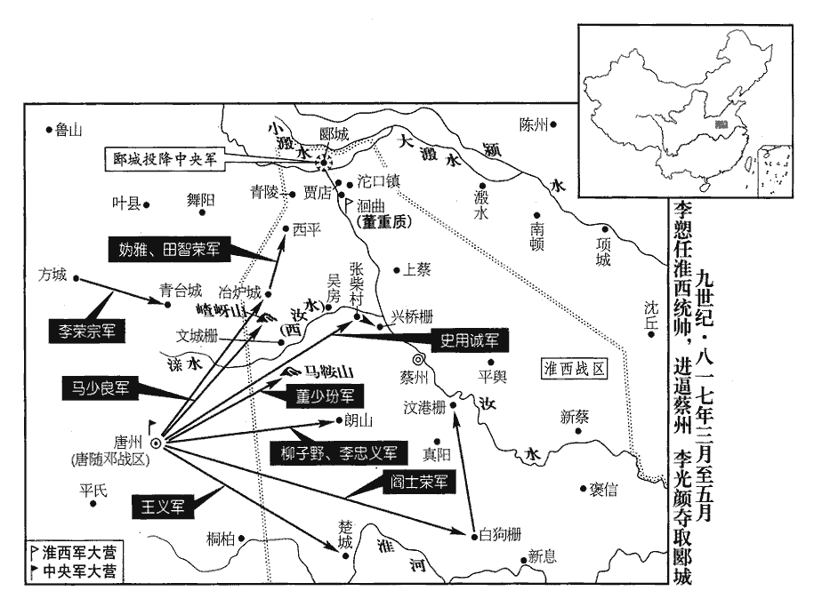
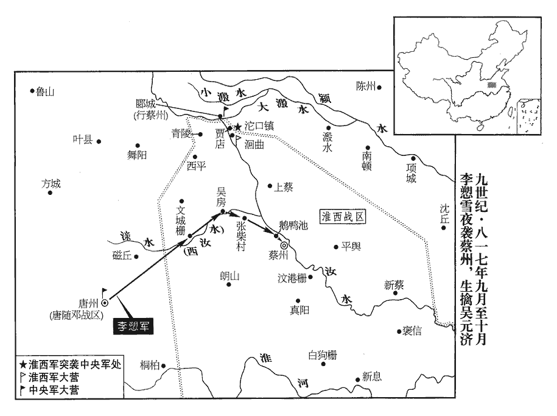
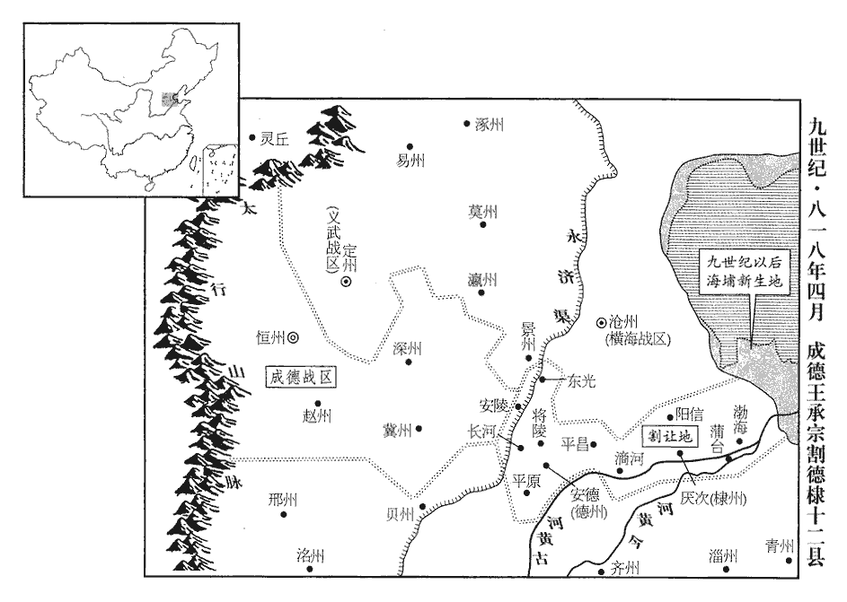
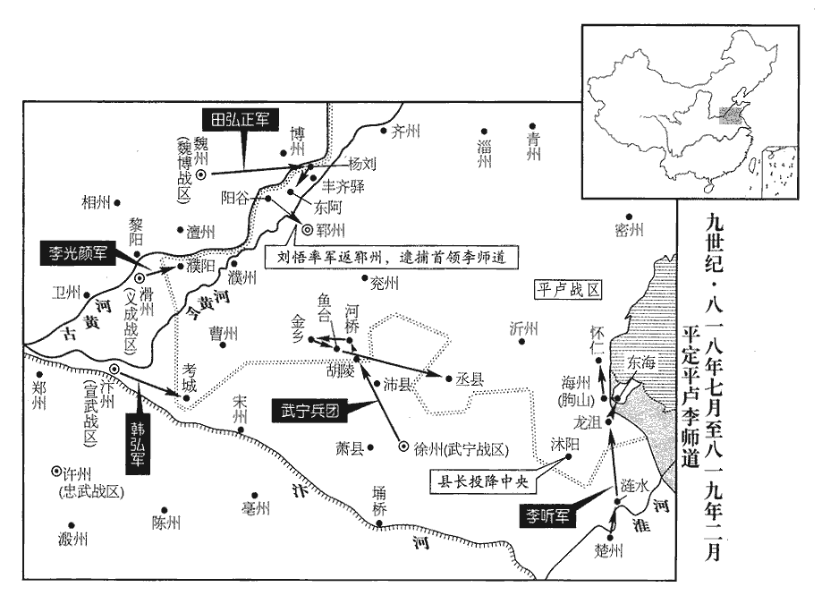

 唐紀五十六起強圉作噩（丁酉），盡屠維大淵獻（己亥）正月，凡二年有奇。

# 憲宗昭文章武大聖至神孝皇帝中之下

## 元和十二年（丁酉、八一七）

1春，正月，甲申‹二十四›，貶袁滋為撫州‹江西省临川市›刺史。

〖译文〗 [1]春季，正月，甲申（二十四日），宪宗将袁滋贬为抚州刺史。

李愬至唐州‹河南省泌阳县›，軍中承喪敗之餘，喪，息浪翻。嚴綬慈丘之敗，山南東道未分為二帥也。既分為二帥，而高霞寓敗於鐵城，袁滋代之又敗。士卒皆憚戰，愬知之，有出迓者，愬謂之曰：「天子知愬柔懦，能忍恥，故使來拊循爾曹。至於戰攻進取，非吾事也。」眾信而安之。

〖译文〗 李来到唐州。唐州的军队在经受死丧败亡后，将士们都害怕作战，李也知道这种状况。有些人出来迎接李，李便对他们说：“天子知道我柔弱怯懦，能够忍受耻辱，因此让我来抚慰你们。至于采取军事行动，就不是我的事情了。”大家相信了他的话，都放心了。

愬親行視士卒，行，下孟翻。傷病者存恤之，不事威嚴。或以軍政不肅為言，愬曰：「吾非不知也。袁尚書專以恩惠懷賊，賊易之，易，弋豉翻，輕易也。聞吾至，必增備，吾故示之以不肅。彼必以吾為懦而懈惰，然後可圖也。」懈，古隘翻。淮西‹总部蔡州河南省汝南县›人自以嘗敗高、袁二帥，敗，補邁翻。帥，所類翻。輕愬名位素微，遂不為備。為愬乘虛取蔡張本。考異曰：舊傳曰：「愬沈勇長算，推誠待士，故能用其卑弱之勢，出賊不意。居半歲，知人可用，乃謀襲蔡，表請濟師；詔以河中、鄜坊騎兵二千人益之。」鄭澥xiè平蔡錄曰：「正月二十四日甲申，公至所部。先是，士卒經萬勝、蕭陂、鐵城、新興之敗，人心皆惴恐，不敢言戰。公佯曰，『戰爭非吾所能。』既而陰召大將計其事。是時，公以表請徑襲元濟，人皆笑其說，乃使觀察判官王擬請師闕下，詔徵義成、河中、鄜坊馬步共二千以補其闕。」據此，則是始至便請益兵。又二月，即擒丁士良，降吳秀琳，是不待半歲然後知人可用，舊傳恐誤。然愬密謀襲蔡，豈可先洩之，而云「以表請襲元濟，人皆笑其說，」則是人人知之，恐非也！今不取。

〖译文〗 李亲自去看望将士们，慰问抚恤受伤和生病的人，不摆威严的架子。有人进言说军中政事不够整肃，李说：“我并不是不知道。袁尚书专门以恩惠安抚敌人，敌人轻视他。现在，敌人得知我来了，肯定要增设防备。我故意让敌人看到我军不够整肃，他们肯定以为我是懦弱而又懒惰的，此后才能够设法对付他们。”淮西人自认为曾经打败过高霞寓和袁滋的两个主帅，因李的名望与官位素来卑微而轻视他，便不再作防备。

2遣鹽鐵副【章：甲十一行本「副」上有「轉運」二字；乙十一行本同。】使程异督財賦於江、淮。

〖译文〗 [2]宪宗派遣盐铁副使程异在江淮地区督理资财与赋税。

3回鶻‹瀚海沙漠群›屢請尚公主，有司計其費近五百萬緡，近，其靳翻。時中原方用兵，故上‹李纯，本年四十岁›未之許。二月，辛卯朔‹一›，遣回鶻摩尼‹拜火教、祆xiān教›僧等歸國；摩尼來見二百三十七卷元年。史炤曰：元和初，回鶻再朝獻，始以摩尼至。摩尼至京師，歲往來西市，商賈頗與囊橐tuó為姦，至是遣歸國也。命宗正少卿李誠使回鶻諭意，以緩其期。

〖译文〗 [3]回鹘屡次求娶公主，有关部门计算所需费用将近五百万缗，而当时中原地区正在用兵打仗，所以宪宗没有答应回鹘的请求。二月，辛卯朔（初一），宪宗打发回鹘的摩尼教僧人等回国，命令宗正少卿李诚出使回鹘，晓示朝廷的用意，以便延缓通婚的日期。

4李愬謀襲蔡州，表請益兵；詔以昭義‹总部设潞州山西省长治市›、河中‹总部设河中府山西省永济市›、鄜坊‹总部设鄜州陕西省富县›步騎二千給之。丁酉‹七›，愬遣十將馬少良將十餘騎巡邏，十將，軍中小校也。邏，郎佐翻。遇吳元濟捉生虞候丁士良，與戰，擒之。士良，元濟驍將，常為東邊患；言唐、鄧之東邊也。眾請刳kū其心，愬許之。既而召詰之，士良無懼色。愬曰：「真丈夫也！」命釋其縛。士良乃自言：「本非淮西士，貞元中隸安州‹湖北省安陆市›，與吳氏戰，為其所擒，自分死矣，分，扶問翻。吳氏釋我而用之，我因吳氏而再生，故為吳氏父子竭力。為，于偽翻。昨日力屈，復為公所擒，復，扶又翻。亦分死矣，今公又生之，請盡死以報德。」愬乃給其衣服器械，署為捉生將。

〖译文〗 [4]李策划袭击蔡州，上表请求增派兵力，宪宗颁诏将昭义、河中、坊的步、骑兵两千人拨给了他。丁酉（初七），李派遣十将马少良率骑兵十余人巡回侦察，遇到吴元济的捉生虞候丁士良，与他交战，将他擒获。丁士良是吴元济骁勇善战的将领，经常危害东部的唐州、邓州等地。大家请求将丁士良的心剜出来，李答应下来。不久，李把丁士良叫来，当面责问他，丁士良没有一点恐惧的神色。李说：“丁士良真是一位大丈夫！”他命令为丁士良松绑。于是，丁士良主动说：“我原来不是淮西的官吏，贞元年间我隶属安州，与吴氏作战，被吴氏擒获，自忖就要被处死了，吴氏却释放并起用了我。我因为吴氏而得以再次存活下来，所以我为吴氏父子尽力效命。昨天我力不能支，又被您所擒获，我也料想这次可要被处死了，现在您又让我存活下来。请让我竭尽死力，报答您的恩德。”于是，李将衣服和器具又给了他，任命他为捉生将。

5己亥‹九›，淮西行營奏克蔡州古葛伯城‹河南省宁陵县北›。漢書陳留寧陵縣，孟康註曰：古葛伯國，今葛鄉是。此必韓弘奏捷也。

〖译文〗 [5]己亥（初九），淮西行营奏称攻克了蔡州的古葛伯城。

6丁士良言於李愬曰：「吳秀琳擁三千之眾，據文城柵‹即铁城·河南省遂平县西南›，文城柵，在蔡州西南一百二十里。按續通典，柵在吳房縣界。為賊左臂，官軍不敢近者，近，其靳翻。有陳光洽為之謀主也。光洽勇而輕，輕，牽正翻。好自出戰，請為公先擒光洽，好，呼到翻。為，于偽翻；下同。則秀琳自降矣。」降，戶江翻。戊申‹十八›，士良擒光洽以歸。

〖译文〗 [6]丁士良向李进言说：“吴秀琳拥有三千兵马，据有文城栅，犹如敌人的左臂。官军不敢靠近他的原由，就在于有陈光洽作他的主谋。陈光洽勇敢善战，但是不够稳重，喜欢亲自出来接战，请让我替您首先捉住陈光洽，吴秀琳自然就会投降了。”戊申（十八日），丁士良捉获了陈光洽，带着他回来了。

7鄂岳‹首府设鄂州湖北省武汉市›觀察使李道古引兵出穆陵關‹河南省新县南›；黃州麻城縣西北有穆陵關，在穆陵山上。甲寅‹二十四›，攻申州‹河南省信阳市›，克其外郭，進攻子城。城中守將夜出兵擊之，道古之眾驚亂，死者甚眾。道古，皋之子也。曹成王皋，歷江西、山南等鎮，著功名。

〖译文〗 [7]鄂岳观察使李道古率领兵马由穆陵关进发，甲寅（二十四日），攻打申州，攻克了申州外围的城郭，又进军攻打内城。在城中守卫的将领夜间派兵进击李道古，李道古的兵马惊惶散乱，死者众多。李道古是李皋的儿子。

8淮西被兵數年，被，皮義翻。竭倉廩以奉戰士，民多無食，采菱芡魚鱉鳥獸食之，亦盡，芡，巨險翻，今謂之雞頭。相帥歸官軍者前後五千餘戶；帥，讀曰率。賊亦患其耗糧食，不復禁。復，扶又翻。庚申‹三十›，敕置行縣以處之，‹《旧唐书·宪宗本纪》：在忠武总部许州›、河阳总部汝州特遣兵团大营，设置行郾城县未能得其縣，故權置行縣以處來歸之民。處，昌呂翻。為擇縣令，使之撫養，并置兵以衛之。

〖译文〗 [8]淮西一连几年遭受战火，只得竭尽粮仓的储备来奉养参战的士兵。百姓多数没有食物，便去寻找菱角、芡实、鱼鳖、鸟兽来吃，但也吃光了。百姓聚在一起归附官军的先后有五千多户。吴无济也担心百姓要消耗粮食，便不再禁止他们归降官军。庚申（三十日），宪宗敕令设置行县来安顿淮西降附的百姓，为他们选择县令，让县令体恤并赡养百姓，还设置军队来保卫他们。

9三月，乙丑‹五›，李愬自唐州徙屯宜陽柵‹河南省桐柏县西›。

〖译文〗 [9]三月，乙丑（初五），李由唐州移兵屯驻宜阳栅。

10郗士美敗于柏鄉‹河北省柏乡县›，拔營而歸，士卒死者千餘人。

〖译文〗 [10]郗士美在柏乡战败，撤除营垒而回，死去的将士有一千多人。

11戊辰‹八›，賜程執恭‹横海战区，总部设沧州河北省沧州市东南›名權。

〖译文〗 [11]戊辰（初八），宪宗赐程执恭名为程权。

12戊寅‹十八›，王承宗遣兵二萬入東光‹河北省东光县›，斷白橋‹东光县西北，跨永济渠›路；東光縣，屬景州。宋白曰：東光，漢舊縣也。故城在縣東二十里，齊天保七年移於今縣東南三十里陶氏故城，隋開皇三年又移於後魏廢勃海舊城。縣西四里有永濟渠，渠上有橋，當自縣通弓高之路。白橋跨永濟渠，在德州長河縣。斷，音短。程權不能禦，以眾歸滄州‹河北省沧州市东南›。渾鎬既敗，郗士美又敗，程權又退歸，王承宗之才，非諸帥所能制也。

〖译文〗 [12]戊寅（十八日），王承宗派遣兵马两万人，开进东光县，切断了白桥的通路，程权不能够抵御，率领人马返回沧州。

13吳秀琳以文城柵‹即铁城·河南省遂平县西南›降于李愬。戊子‹二十八›，愬引兵至文城西五里，遣唐州刺史李進誠將甲士八千至城下，召秀琳，城中矢石如雨，眾不得前。進誠還報：「賊偽降，未可信也。」愬曰：「此待我至耳。」即前至城下，秀琳束兵投身馬足下；愬撫其背慰勞之，勞，力到翻。降其眾三千人。秀琳將李憲有材勇，愬更其名曰忠義而用之，更，工衡翻。悉遷婦女於唐州。【章：甲十一行本「州」下有「入據其城」四字；乙十一行本同；退齋校同；張校同，云無註本亦無。】質其家於唐州，則文城之士心不敢懷反側。於是唐、鄧軍氣復振，人有欲戰之志。賊中降者相繼於道，隨其所便而置之；聞有父母者，給粟帛遣之，曰：「汝曹皆王人，勿棄親戚。」眾皆感泣。自此以上李愬事。

〖译文〗 [13]吴秀琳率文城栅兵马向李投降。戊子（二十八日），李领兵来到文城西面五里处，派遣唐州刺史李进诚率领兵士八千人来到城下，召呼吴秀琳，城中箭石密集如雨，大家无法上前。李进诚回来报告说：“敌人是假装投降，是不能够相信的。”李说：“这是等候我前去哩。”李当即来到城下，吴秀琳收起兵器，一头伏在李的马前，李抚摩着他的脊背，好言安慰他，收降了吴秀琳的三千人马。吴秀琳的将领李宪既有才能，又很勇敢，李为他改名为李忠义，并且起用了他。李将文城各将领的女眷全部迁移到唐州。于是，唐州与邓州军中的士气又振作起来，人人都有准备打仗的决心。前来投降的敌军在道路上一个接着一个，李便根据他们的具体情况，一一做出安置。得知归降者家中有父母需要照料的，便发给粮食与布帛，打发他们回去，还说：“你们都是朝廷的百姓，不能丢下亲属不管。”大家都感动得哭起来。

官軍與淮西兵夾溵水‹沙河›而軍，諸軍相顧望，無敢渡溵水者。陳許‹总部设许州河南省许昌市›兵馬使王沛先引兵五千渡溵水，據要地為城，於是河陽‹汝州›、宣武‹汴州›、河東‹太原府›、魏博‹魏州›等軍相繼皆渡，進逼郾城。丁亥‹二十七›，李光顏敗淮西兵三萬於郾城‹河南省郾城县›，按宋白續通典：郾城，在蔡州西平縣北五十里。敗，補邁翻。走其將張伯良，殺士卒什二三。自此以上攻郾城事。

〖译文〗 官军与淮西军隔着水驻扎下来，官军的各支军队相互踌躇观望，没有哪支军队有胆量渡过水。陈许兵马使王沛率领兵马五千人率先渡过水，占领要害的地点筑城。于是，河阳、宣武、河东、魏博等军队都一个接着一个地渡过水，进逼郾城。丁亥（二十七日），李光颜在郾城打败淮西兵马三万人，赶走了该军将领张伯良，杀掉全军将士的十分之二三。

己丑‹二十九›，李愬遣山河十將董少玢等分兵攻諸柵；其日，少玢下馬鞍山‹河南省确山县西北›，拔路口柵。時都畿及唐、鄧皆募土人之材勇者為兵以討蔡，號為山河子弟，置十將以領之。玢，府巾翻。按唐、蔡交兵，凡境上要地，處處置守，所謂馬鞍山、路口柵，固不可盡詳其處而強為之註也。夏，四月，辛卯‹二›，山河十將馬少良下嵖chá岈yá山‹河南省遂平县西›，嵖，鋤加翻。岈，虛加翻。擒淮西將柳子野。此以上又李愬事。

〖译文〗 己丑（二十九日），李派遣山河十将董少玢等人分别出兵攻打各处栅垒。就在当天，董少玢占领马鞍山，攻克路口栅。夏季，四月，辛卯（初二），山河十将马少良占领岈山，擒获淮西将领柳子野。

吳元濟以蔡人董昌齡為郾城令，質其母楊氏。質，音致。楊氏謂昌齡曰：「順死賢於逆生，順死，謂歸順而死。逆生，謂從逆而生。汝去逆而吾死，乃孝子也；從逆而吾生，是戮吾也。」會官軍圍青陵，絕郾城歸路，青陵，在郾城西南。郾城守將鄧懷金謀於昌齡，昌齡勸之歸國。懷金乃請降於李光顏曰：「城人之父母妻子皆在蔡州，請公來攻城，吾舉烽求救，救兵至，公逆擊之，蔡兵必敗，然後吾降，則父母妻子庶免矣。」光顏從之。乙未‹六›，昌齡、懷金舉城降，光顏引兵入據之。吳元濟聞郾城不守，甚懼。時董重質將騾軍守洄曲‹河南省漯河市南沙河弯曲处›，據新書李光顏傳：洄曲，即時曲，蓋溵水於此回曲，因以為名。元濟悉發親近及守城卒詣重質以拒之。此以上又李光顏事。

〖译文〗 吴元济任命蔡州人董昌龄为郾城县令，而将他的母亲杨氏当作人质。杨氏告诉董昌龄说：“顺承朝廷而死胜于叛逆朝廷而生。你摆脱叛逆，就是我死了，你也是我孝顺的儿子；你随从叛逆，就是我活着，也等于你杀死了我。”适值官军包围青陵，切断了郾城的退路，郾城守将邓怀金去找董昌龄商议，董昌龄便规劝他归顺朝廷。于是，邓怀金向李光颜请求投降说：“郾城将士的父母、妻子、儿女都住在蔡州，请您前来攻打郾城，我点燃烽火向蔡州请求援救，等援救的兵马来到郾城时，您便迎击他们，蔡州兵马必定失败。此后我再归降，郾城将士的父母、妻子、儿女大约便能够幸免于死了。”李光颜听从了他的主张。乙未（初六），董昌龄与邓怀金率领全城归降，李光颜带领兵马占领了郾城。吴元济得知郾城失守，非常恐惧。当时，董重质率领骡军在洄曲防守，吴元济将亲信将士以及守城士兵全部派往董重质处，以便抵御李光颜。

李愬山河十將媯guī雅、田智榮下冶爐城‹河南省遂平县西北›。媯，居為翻，姓也。九域志曰：蔡州冶爐城，韓國鑄劍之地，時當在西平界。按新書，冶爐城在嵖岈山東。丙申‹七›，十將閻士榮下白狗‹河南省息县西北›、汶港‹河南省汝南县东南›二柵。白狗、汶港二柵，皆在蔡州真陽縣界。蕭梁置西淮州於真楊白狗堆，後齊廢州為齊興郡，尋廢郡為白狗縣，隋開皇初改縣曰懷州，大業初省入真陽。隋志：真陽有汶水。癸卯‹十四›，媯雅、田智榮破西平‹河南省西平县›。西平，春秋柏國，漢為西平縣，屬汝南郡，唐屬蔡州。九域志：在州西一百五里。丙午‹十七›，遊弈兵馬使王義破楚城‹汝南县西南›。楚城，在汝陽縣西南，蕭梁置西楚州及汝陽郡於此。

〖译文〗 李的山河十将妫雅、田智荣攻克了冶炉城。丙申（初七），山河十将阎士荣攻克了白狗、汶港两处栅垒。癸卯（十四日），妫雅、田智荣攻破西平。丙午（十七日），游弈兵马使王义攻下楚城。

五月，辛酉‹二›，李愬遣柳子野、李忠義襲朗山‹河南省确山县›，擒其守將梁希果。

〖译文〗 五月，辛酉（初二），李派遣柳子野和李忠义袭击朗山，擒获了守将梁希果。

 

14六鎮討王承宗者事見上卷十一年。兵十餘萬，回環數千里，既無統帥，又相去遠，期約難壹，由是歷二年無功，千里饋運，牛驢死者什四五。劉總‹卢龙战区，总部设幽州北京市›既得武強‹河北省武强县›，引兵出境纔五里，出境，謂出武強之境。留屯不進，月給度支錢十五萬緡。李逢吉及朝士多言「宜併力先取淮西，俟淮西平，乘其勝勢，回取恆冀，如拾芥耳！」上猶豫，久乃從之。李逢吉等之言，即韋貫之等之言也。然憲宗有用不用者，前此兵勢未屈，今則兵勢已屈，不得不從也。丙子‹十七›，罷河北行營，各使還鎮。

〖译文〗 [14]讨伐王承宗的河东、幽州、义武、横海、魏博、昭义六藩镇，拥有兵马十多万人，辗转数千里，既设有统领各军的主帅，又相隔遥远，约定的日期难以统一，因此历时两年，毫无建树，运输物资的路程长达千里，死去的牛和驴有十分之四五。刘总得到武强后，率领兵马走出本道疆境只有五里地，便停留下来，屯兵不肯前进，每月朝廷拨给度支掌管的钱十五万缗。李逢吉以及朝中百官往往进言：“应当首先合力攻取淮西，等候淮西平定后，乘着胜利的形势，回兵攻取恒冀，就象拾取芥子一样容易了！”宪宗迟疑不决，过了许久，才听从了大家的建议。丙子（十七日），朝廷免除了河北行营，使六镇兵马各自返回本镇。

15丁丑‹十八›，李愬遣方城‹河南省方城县›鎮遏使李榮宗擊青喜城‹方城县东南›，拔之。方城縣，本漢堵陽縣地，後漢改為順陽，隋改為方城縣，唐屬唐州。九域志：在州北一百六十里。縣有青臺鎮，此作「青喜」，筆誤也。

〖译文〗 [15]丁丑（十八日），李派遣方城镇遏使李荣宗攻克青喜城。

愬每得降卒，必親引問委曲，由是賊中險易遠近虛實盡知之。易，弋豉翻，平易也。愬厚待吳秀琳，與之謀取蔡。秀琳曰：「公欲取蔡，非李祐不可，秀琳無能為也。」祐者，淮西騎將，有勇略，守興橋柵‹河南省汝南县西北›，興橋柵，在張柴村東。常陵暴官軍。陵者，加之以氣。暴者，虐之以威。庚辰‹二十一›，祐率士卒刈麥於張柴村‹兴桥栅西›，張柴村，在文城柵東六十里。帥，讀曰率。愬召廂虞候史用誠，廂虞候，掌左右廂之兵。戒之曰：「爾以三百騎伏彼林中，又使人搖幟於前，幟，昌志翻。若將焚其麥積者。祐素易官軍，易，弋豉翻，輕之也。必輕騎來逐之。爾乃發騎掩之，必擒之。」用誠如言而往，生擒祐以歸。將士以祐曏日多殺官軍，爭請殺之；愬不許，釋縛，待以客禮。

〖译文〗 每当李得到归降的士兵，一定要亲自领来询问淮西的底细，因此他对敌方的地形和兵力分布都了解清楚了。李优待吴秀琳，与他策划夺取蔡州。吴秀琳说：“如果您打算夺取蔡州，非有李不可，我是无能为力的。”李是淮西的骑兵将领，勇敢而有谋略，防守兴桥栅，经常侵凌欺辱官军。庚辰（二十一日），李率领士兵在张柴村收割麦子，李叫来厢虞候史用诚，告诫他说：“你带领骑兵三百人在那片树林中埋伏下来，再让人在前面摇动旗帜，做出将要焚烧他们的麦堆的样子。李平时小看官军，肯定会率领轻装的骑兵前来驱逐他们。这时，你便派骑兵袭取他，肯定能够将他擒获。”史用诚按照李的吩咐前往，活捉李而回。由于李往日杀害了许多官军，将士们争着请求将他杀掉。李不肯答应，给他松了绑，以宾客的礼节对待他。

時愬欲襲蔡，而更密其謀，獨召祐及李忠義屏人語，屏，必郢翻，又卑正翻。或至夜分，夜半，為夜分。他人莫得預聞。諸將恐祐為變，多諫愬；愬待祐益厚。士卒亦不悅，諸軍日有牒稱祐為賊內應，且言得賊諜者具言其事。此行營諸軍移文之言。諜，徒協翻。愬恐謗先達於上，己不及救，乃持祐泣曰：「豈天不欲平此賊邪！何吾二人相知之深而不能勝眾口也。」因謂眾曰：「諸君既以祐為疑，請令歸死於天子。」歸死，猶言致尸也。左傳魏絳曰：「請歸死於司寇。」杜預註云：致尸於司寇，使戮之。乃械祐送京師，先密表其狀，密表言與祐謀襲蔡之狀。且曰：「若殺祐，則無以成功。」詔釋之，以還愬。愬見之喜，執其手曰：「爾之得全，社稷之靈也！」李愬之期待祐者如此，祐安得不力！乃署散兵馬使，散員兵馬使，未得統兵。散，悉但翻。令佩刀巡警，出入帳中；或與之同宿，密語不寐達曙，有竊聽於帳外者，但聞祐感泣聲。時唐、隨牙隊三千人，牙隊者，節度使牙衛從之隊，猶今之簇帳部。號六院兵馬，皆山南東道之精銳也。時山南東道分為兩鎮，八州精銳盡抽選赴唐州，使之攻戰。愬又以祐為六院兵馬使。

〖译文〗 当时，李准备掩袭蔡州，谋划更为隐秘。他单独叫来李和李忠义，屏退外人后才进行交谈，有时谈话一直延续到夜半，别人都不能够参与商议。各将领担心李制造变故，往往规劝李，而李对待李更为优厚。士兵们也不高兴，各军每天都有文书声称李是淮西的内应，而且说是听敌方奸细讲的。李担心诽谤事先传到朝廷，自己来不及搭救李，便握着李的手哭泣着说：“难道是上天不愿意平定这伙贼人吗？为什么你我二人相互了解得如此深切，但就是不能够制服众人的议论呢？”因而，李对大家说：“既然诸位怀疑李，请大家让他到天子那里接受死刑吧！”于是，李给李加上枷锁，将他送往京城，事先暗中上表讲清具体情况，而且说：“如果杀了李，就无法取得成功。”宪宗颁诏释放李，将他还给李。李见到李时，高兴地握着李的手说：“你得以保全，这是社稷的威灵有知啊！”李便任命李为散兵马使，让他带着佩刀，巡视警戒，在自己的帐中往来。有时，李与他一同就寝，秘密交谈，直到透出曙色也不入睡，有人在帐外暗中偷听，只能听到李感动的哭泣声。当时，唐州、随州节度使牙卫队三千人，号称六院兵马，都是山南东道精悍勇锐的军队，李又任命李为六院兵马使。

舊軍令，舍賊諜者屠其家。舊軍令，先時之軍令也。舍者，停藏之於家也。愬除其令，使厚待之，諜反以情告愬，愬益知賊中虛實。乙酉‹二十六›，愬遣兵攻朗山，淮西兵救之，官軍不利，眾皆悵恨，愬獨歡然曰：「此吾計也！」賊恃勝而不備愬，則愬得以成入蔡之功，其計出此。乃募敢死士三千人，號曰突將，將，即亮翻。朝夕自教習之，使常為行備，欲以襲蔡。會久雨，所在積水，未果。

〖译文〗 原先的军令规定，对留宿敌方奸细的人，要屠杀他的全家。李除去这一军令，让人们优待敌人的奸细，奸细反而将实情报告给李，李愈发了解敌人的情况。乙酉（二十六日），李派兵攻打朗山，淮西兵前去援救，官军失利。大家又惆帐，又恼恨，只有李欢快地说：“这正是我的计策啊！”于是，李募集了敢死之士三千人，号称突将，天天亲自教练他们，让他们经常做好出发的准备，李就是打算以这支军队袭击蔡州。适值多日落雨，到处积满雨水，这一计划没有实现。

16閏月，己亥‹十›，程异還自江、淮，得供軍錢百八十五萬緡。是年春，程异督財賦於江、淮。

〖译文〗 [16]闰五月，己亥（初十），程异从江淮地区回朝，得到供应军需的钱有一百八十五万缗。

17諫議大夫韋綬兼太子侍讀，每以珍膳餉太子，又悅太子以諧謔；綬，音受。謔xuè，香略翻。上聞之，丁未‹十八›，罷綬侍讀，觀憲宗之罷韋綬，亦知所謂諭教者矣。然觀穆宗之臨政也，習與性成，得非所急者固在於選左右歟！尋出為虔州‹江西省赣州市›刺史。舊志：虔州，京師東南四千一十七里。綬，京兆人。史著綬京兆人，以言其生長京邑，習見淫侈，非能以德義經術誘掖東宮。古言沃土之民不才，良有以也。

〖译文〗 [17]谏议大夫韦绶兼任太了侍读，往往拿珍贵的食品请太子吃，又说些诙谐逗趣的话取悦太子。宪宗得知了这一消息，丁未（十八日），便免除了韦绶太子侍读的职务，不久，又将他斥逐为虔州刺史。韦绶是京兆人。

18吳元濟見其下數叛，數，所角翻。兵勢日蹙，六月，壬戌‹四›，上表謝罪，願束身自歸。上遣中使賜詔，許以不死；而為左右及大將董重質所制，不得出。史言董重質之情。

〖译文〗 [18]吴元济看到部下屡次背叛自己，军事形势日益紧迫，六月，壬戌（初四），他上表认罪，表示愿意亲自回朝投案。宪宗派遣中使向他颁赐诏书，答应可以免他一死。然而，吴元济被自己的亲信和大将董重质等人所控制，无法离开蔡州。

19秋，七月，大水，或平地二丈。

〖译文〗 [19]秋季，七月，发生了严重的水灾，有些地区平地水深两丈。

20初，國子祭酒孔戣kuí為華州‹陕西省华县›刺史，戣，巨龜翻。華，戶化翻。明州‹浙江省宁波市›歲貢蚶hān、蛤gé、淡菜，蚶，呼甘翻，魁陸也。橫從其理，五味自充，殼如瓦壠者，謂之瓦壠蚶。蛤，葛合翻。蛤小於蚶。蚶殼厚，其理如瓦壠。蛤殼薄，其文如貝。月令云：雀入大水化為蛤。說文云：百歲燕所化。又云：老伏翼所化。皆非也。蚶、蛤皆生於海瀕潮汐往來舄xì鹵之地。淡菜，狀如䗒bìng而小，黑殼，脣有鬚如茸，肉甘脆。䗒，蒲幸翻。水陸遞夫勞費，戣奏疏罷之。華州，京畿輔郡，自東南來者，水陸遞夫咸經焉。故得言其勞費而罷之。甲辰‹十七›，嶺南‹总部设广州广东省广州市›節度使崔詠薨，宰相奏擬代詠者數人，上皆不用，曰：「頃有諫進蚶、蛤、淡菜者為誰，可求其人與之。」庚戌‹二十三›，以戣為嶺南節度使。

〖译文〗 [20]当初，国子祭酒孔担任华州刺史，明州每年进贡蚶子、蛤蜊、淡菜等，水陆长途转运的人夫既劳苦，又多耗费，孔奏请免除这项进贡。甲辰（十七日），岭南节度使崔咏去世，宰相上奏了所拟定的几个代替崔咏的人选，宪宗一概不用，还说：“不久前有一个劝阻进献蚶子、哈蜊和淡菜的人是谁啊，可以找到此人，就将崔咏的职务交给他吧！”庚戌（二十三日），宪宗任命孔为岭南节度使。

21諸軍討淮、蔡，四年不克，九年冬始討淮西。饋運疲弊，民至有以驢耕者。牛斃於運轉，民至無以耕。上亦病之，以問宰相。李逢吉等競言師老財竭，意欲罷兵；裴度獨無言，上問之，對曰：「臣請自往督戰。」乙卯‹二十八›，上復謂度曰：復，扶又翻。「卿真能為朕行乎！」為，于偽翻。對曰：「臣誓不與此賊俱生。臣比觀吳元濟表，比，毗至翻。勢實窘蹙，但諸將心不壹，不併力迫之，故未降耳。若臣自詣行營，諸將恐臣奪其功，必爭進破賊矣。」上悅，丙戌‹二十九›，以度為門下侍郎、同平章事、兼彰義節度使，仍充淮西宣慰招討處置使。觀裴度不附群議，請身督戰，則韓愈平淮西碑推功於度，有以也。處，昌呂翻。又以戶部侍郎崔群為中書侍郎、同平章事。制下，度以韓弘已為都統，不欲更為招討，請但稱宣慰處置使；仍奏刑部侍郎馬總為宣慰副使，右庶子韓愈為彰義行軍司馬，判官、書記皆朝廷之選，上皆從之。度將行，言於上曰：「臣若賊滅，則朝天有期；賊在，則歸闕無日。」上為之流涕。為，于偽翻；下為卿同。

〖译文〗 [21]诸军讨伐淮西蔡州，历时四年，没有攻克，物资转运使人们疲惫不堪，以至于有些百姓只好用驴来耕种田地。宪宗也为此忧虑，便就此事询问宰相。李逢吉等人争着说军中士气低落，财物消耗已尽，意思是打算停止用兵。唯独裴度一言不发，宪宗征求他的意见，他回答说：“我请求亲自前去督战。”乙卯（二十八日），宪宗又对裴度说：“你果真能够为朕去走一遭吧？”裴度回答说：“我发誓不与这些贼人一起生存。近日我看了吴元济的奏表，他面临的形势实在已经窘困紧迫，但是各将领心不齐，不能够合力紧逼他，所以他还没有降顺。如果我亲自前往行营，各将领惟恐我夺去他们的功劳，肯定争先进军破敌了。”宪宗大悦，丙戌（疑误），任命裴度为门下侍郎、同平章事、兼彰义节度使，还充任淮西宣慰招讨处置使，同时任命户部侍郎崔群为中书侍郎、同平章事。制书下达后，裴度因韩弘已经出任都统，不打算再担当招讨使，请求只称宣慰处置使。他还奏请由刑部侍郎马总担任宣慰副使，右庶子韩愈担任彰义行军司马，叛官、书记等职，都由朝廷选派，宪宗全部依从了他。在将要启程时，裴度对宪宗说：“倘若贼人覆灭了，我不久就会前来朝见陛下；倘若贼人尚在，我就不会回到朝廷中来。”宪宗听得此言，不禁流下了眼泪。

八月，庚申‹三›，度赴淮西，上御通化門送之。通化門，長安城東面北來第一門。右神武將軍張茂和，茂昭弟也，嘗以膽略自衒於度；衒，熒絹翻。度表為都押牙，茂和辭以疾，度奏請斬之。上曰：「此忠順之門，茂和父孝忠、兄茂昭鎮易定，比河朔諸鎮為忠順。為卿遠貶。」辛酉‹四›，貶茂和永州‹湖南省永州市›司馬。以嘉王傅高承簡為都押牙。高承簡為嘉王傅。蓋嘉王運之子嗣為嘉王，故置府官。承簡，崇文之子也。

〖译文〗 八月，庚申（初三），裴度前往淮西，宪宗驾临通化门为他送行。右神武将军张茂和是张茂昭的弟弟，曾经在裴度面前夸耀自己的胆识才略，斐度上表请求任命他为都押牙。张茂和以身染疾病推辞，裴度上奏请求将他斩杀。宪宗说：“此人出于忠心顺命的人家，朕为你将他贬官到远方吧。”辛酉（初四），宪宗将张茂和贬为永州司马，任命嘉王傅高承简为都押牙。高承简是高崇文的儿子。

李逢吉不欲討蔡‹河南省汝南县›，翰林學士令狐楚與逢吉善，度恐其合中外之勢以沮軍事，翰林學士居禁中，宰相在外朝，恐其中外相應以上罷兵之議。沮，在呂翻。乃請改制書數字，且言其草制失辭；壬戌‹五›，罷楚為中書舍人。

〖译文〗 李逢吉不愿意讨伐蔡州，而翰林学士令狐楚与李逢吉交好。裴度担心他们二人将内廷与外朝的势力合起来阻挠战事，便请求在制书上改动了几个字，并且说令孤楚起草制书言辞失当。壬戌（初五），宪宗将令狐楚罢免为中书舍人。

22李光顏‹忠武战区，总部设许州河南省许昌市›、烏重胤‹河阳战区，总部设汝州河南省汝州市›與淮西戰，癸亥‹六›，敗于賈店‹河南省漯河市南›。

〖译文〗 [22]李光颜与乌重胤与淮西交战，癸亥（初六），二人在贾店战败。

23裴度過襄城‹河南省襄城县›南白草原，淮西人以驍騎七百邀之；鎮將楚丘‹山东省曹县›曹華知而為備，擊卻之。楚丘，古己氏縣，隋開皇六年改曰楚丘，唐屬宋州。九域志：在州東北七十里。度雖辭招討名，實行元帥事，以郾城為治所。甲申‹二十七›，至郾城。先是，諸道皆有中使監陳，監，古銜翻。陳，讀曰陣。進退不由主將，勝則先使獻捷，不利則陵挫百端；度悉奏去之，諸將始得專軍事，戰多有功。去，羌呂翻。

〖译文〗 [23]裴度经过襄城南面的白草原时，淮西军派出骁勇的骑兵七百人前来截击他。镇将楚丘人曹华事先得到消息，做好了准备，便将他们击退了。虽然裴度辞去了招讨的名称，实际上是行使元帅的职事，他选定郾城作为自己的官署。甲申（二十七日），裴度来到郾城。在此之前，诸道都有中使监督战阵，军队的行动不能由主将做主。打了胜仗，中使率先使人向朝廷报捷；作战失利了，中使便对将帅百般凌辱。裴度奏请将各处监督战阵的中使全部罢除，各将领这才得以专力办理军中事务，在作战中经常取胜。

24九月，庚子‹十四›，淮西兵寇溵水鎮‹河南省商水县›，殺三將，焚芻藁而去。

〖译文〗 [24]九月，庚子（十四日），淮西兵马侵犯水镇，斩杀三员将领，烧掉喂养牲畜的干草以后便撤离了。

25初，上為廣陵王，布衣張宿以辯口得幸；及即位，累官至比部員外郎。唐比部郎屬刑部，掌句諸司百僚俸料、公廨贓贖、調斂徒役、課程逋懸數物；以周知內外之經費而總句之。比，音毗。宿招權受賂於外，門下侍郎、同平章事李逢吉惡之。惡，烏路翻。上欲以宿為諫議大夫，逢吉曰：「諫議重任，必能可否朝政，始宜為之。朝，直遙翻。宿小人，豈得竊賢者之位！必欲用宿，請去臣乃可。」上由是不悅。逢吉又與裴度異議，上方倚度以平蔡；丁未‹二十一›，罷逢吉為東川‹总部设梓州四川省三台县›節度使。

〖译文〗 [25]当初，宪宗在当广陵王时，平民张宿因能言善辩而得到宠爱。及至宪宗即位以来，张宿历经升迁，做到比部员外郎。张宿在外面招揽权力，收受贿赂，门下侍郎、同平章事李逢吉很讨厌他。宪宗准备任命张宿为谏议大夫，李逢吉说：“谏议大夫是一个重要的职任，必须是能够裁断朝廷政务的人士，才适于担当这一职务。张宿是一个小人，怎么能够窃居贤能之士的官位！如果陛下一定要任用张宿，请罢去我的职务才有可能。”宪宗因此心中不快。李逢吉又与裴度持有不同的意见，而宪宗正在倚靠裴度去平定蔡州。丁未（二十一日），宪宗将李逢吉罢免为东川节度使。

26甲寅‹二十八›，李愬將攻吳房‹河南省遂平县›，吳房，漢縣，屬汝南郡。孟康曰：本房子國，楚靈王遷房於楚；吳王闔廬弟夫概奔楚，楚封之于此，為棠谿氏，故曰吳房。今吳房城棠谿亭是唐吳房縣，屬蔡州；平蔡後，改為遂平縣。諸將曰：「今日往亡。」陰陽家之說，八月以白露後十八日為住亡，九月以寒露後第二十七日為往亡。愬曰：「吾兵少，不足戰，宜出其不意。彼以往亡不吾虞，正可擊也。」遂往，克其外城，斬首千餘級。餘眾保子城，不敢出，愬引兵還以誘之，還，音旋，又如字。淮西將孫獻忠果以驍騎五百追擊其背；眾驚，將走，愬下馬據胡牀，胡牀，今謂之交牀，其制本自虜來。隋以讖有胡，改曰交牀。唐猶謂之胡牀。令曰：「敢退者斬！」返旆力戰，獻忠死，考異曰：舊傳作「孫忠憲」，今從平蔡錄淮西兵乃退。或勸愬乘勝攻其子城，可拔也。愬曰：「非吾計也。」定計入蔡，不在取吳房。引兵還營。

〖译文〗 [26]甲寅（二十八日），李准备攻打吴房县。诸将领都说：“今天是不利前往的往亡日啊。”李说：“我们兵马为数较少，正面作战，兵力不够用的，适于采取出其不意的行动。敌人因今天是往亡日便不会戒备我们，这正是可以进击的时候。”于是，李率军前往，攻克了吴房的外城，斩首一千余级。剩下来的吴房兵马防守内城，不敢出战。李率领兵马撤回，以便诱使吴房兵马出动，淮西将领孙献忠果然率领骁勇的骑兵五百人在背后追击。大家惊惶失措，准备逃走，李跳下马来，靠在胡床上，下达命令说：“有胆敢退却的，一概斩杀！”大家回军尽力作战，孙献忠阵亡，淮西兵马这才撤退。有人劝说李乘胜攻打吴房的内城，认为是能够攻克的。李说：“这不是我的计策。”于是，李率领兵马返回营地。

李祐言於李愬曰：「蔡之精兵皆在洄曲，考異曰：舊元濟傳：「李祐曰：『元濟勁軍多在時曲。』」按李光顏傳曰：「董重質棄洄曲軍。」李愬傳云：「分五百人斷洄曲路。」又云：「洄曲子弟歸求寒衣。然則元濟傳誤，當為洄曲。余意洄曲蓋即時曲也。及四境拒守，守，音狩。守州城者皆羸老之卒，可以乘虛直抵其城。比賊將聞之，比，必利翻，及也。元濟已成擒矣。」愬然之。冬，十月，甲子‹八›，遣掌書記鄭澥至郾城，密白裴度。度曰：「兵非出奇不勝，常侍良圖也。」澥，胡買翻。李愬檢校左散騎常侍，鎮唐、鄧、隨，故裴度稱之。

〖译文〗 李向李进言说：“蔡州的精锐兵马全都被派往洄曲及四周的边境上，在那里防御守备。防守蔡州城的兵力都是老弱残兵，可以乘蔡州空虚，直接抵达蔡州城。及至敌军将领得知消息时，吴元济已经就擒了。”李认为言之有理。冬季，十月，甲子（初八），李派遣掌书记郑前往郾城，秘密禀报裴度。裴度说：“用兵打仗，不出奇兵，不能取胜，李常侍提出了一个很好的计划啊。”

27上竟用張宿為諫議大夫，崔群、王涯固諫，不聽；乃請以為權知諫議大夫，許之。宿由是怨執政及端方之士，與皇甫鎛bó相表裏，譖去之。去，羌呂翻。

〖译文〗 [27]宪宗到底还是要任张宿为谏议大夫。崔群与王涯再三劝谏，宪宗不肯听从。他们便请求任命张宿为权知谏议大夫，宪宗答应了他们。张宿由此怨恨执掌政务的官员和品行正直的人士，并与皇甫相互勾结，诬陷这些人，使他们离位而去。

28裴度帥僚佐觀築城於沱口‹河南省漯河市东南›，九域志：郾城縣有沱口鎮。沱，徒河翻。董重質帥騎出五溝，邀之，五溝，在洄曲之北。帥，讀曰率。大呼而進，呼，火故翻。注弩挺刃，挺，拔也。勢將及度。李光顏與田布力戰，拒之，度僅得入城。賊退，布扼其溝中歸路，賊下馬踰溝，墜壓死者千餘人。

〖译文〗 [28]裴度率僚佐在沱口观看修筑城墙，董重质率领骑兵从五沟出发，前来拦击裴度，大声呼喊着向前进军，搭着弓弩，拔出兵器，兵锋将要危及裴度。李光颜与田布尽力作战，抵御董重质，裴度才得以进入沱口城中。敌军撤退时，田布扼守敌军在沟中的退路，敌人下马翻越沟堑，摔死压死的有一千多人。

29辛未‹十五›，李愬命馬步都虞候、隨州‹湖北省随州市›刺史史旻留鎮文城，命李祐、李忠義帥突將三千為前驅，自與監軍將三千人為中軍，命李進誠將三千人殿其後。殿，丁練翻。軍出，不知所之；愬曰：「但東行！」行六十里，夜，至張柴村，盡殺其戍卒及烽子。唐凡烽候之所，有烽帥、烽副；烽子，蓋守烽之卒，候望警急而舉烽者也。杜佑曰：一烽六人，五人為烽子，遞知更刻、觀視動靜一人；烽率知文書、符辭、轉牒。據其柵，命士少休，少，詩沼翻。食乾糒，整羈靮dí，糒，音備，乾飯也。羈，馬絡頭。靮，紖zhèn也，音丁曆翻。留義成軍五百人鎮之，以斷【章：甲十一行本「斷」下有「朗山救兵命丁士良將五百人斷」十三字；乙十一行本同；退齋校同；張校同；「人」下多一「以」字，云無註本亦無。】洄曲及諸道橋梁，斷，音短。復夜引兵出門；復，扶又翻。諸將請所之，愬曰：「入蔡州取吳元濟！」諸將皆失色。監軍哭曰：「果落李祐姦計！」時大風雪，旌旗裂，人馬凍死者相望。天陰黑，自張柴村以東道路，皆官軍所未嘗行，人人自以為必死；然畏愬，莫敢違。夜半，雪愈甚，行七十里，至州城；至蔡州城下也。近城有鵝鴨池，愬令擊之以混軍聲。

〖译文〗 [29]辛未（十五日），李命令马步都虞候、随州刺史史留下来镇守文城，命令李与李忠义率领由敢死之士组成的突将三千人作为前导，自己与监军率领三千人作为中军，命令田进诚率领三千人居于军队的后部。军队出发以后，还不知道是往哪里开进。李说；“只须向着东方行进！”军队走了六十里路，夜晚来到张柴村，将屯戍村中的淮西士兵和守候烽火的人员全部杀死，占领了敌军的栅垒。李命令将士稍作休息，吃些干饭，整顿马具，将义成军的五百人留下来镇守张柴村，以便截断洄曲与各条道路间的桥梁。李又连夜率领兵马出了张柴村的栅门，各位将领请示进军目标，李说：“到蔡州去捉拿吴元济！”各位将领都大惊失色。监军哭着说；“果然中了李的奸计了！”当时，风雪大作，旗帜破裂，冻死的战士与马匹到处可见。加之，天色阴暗，由张柴村往东去的道路，都是官军从来没有走过的，人人都暗自以为肯定活不成了。但是，他们畏惧李，不敢违抗命令。到了半夜，雪下得更大了。官军走了七十里路，来到蔡州城下。靠近城边有一处喂养鹅鸭的池塘，李命令哄打鹅鸭，以便遮掩军队行走的声音。

自吳少誠拒命，官軍不至蔡州城下三十餘年，德宗貞元二年，吳少誠據蔡州，至是三十二年。故蔡人不為備。壬申‹十六›，四鼓，愬至城下，無一人知者。李祐、李忠義钁jué其城，為坎以先登，钁，居縛翻，鋤也。壯士從之；守門卒方熟寐，盡殺之，而留擊柝者，使擊柝如故。遂開門納眾，及裏城，亦然，城中皆不之覺。雞鳴，雪止，愬入居元濟外宅。節度使外宅也。或告元濟曰：「官軍至矣！」元濟尚寢，笑曰：「俘囚為盜耳！曉當盡戮之。」又有告者曰：「城陷矣！」元濟曰：「此必洄曲子弟就吾求寒衣也。」起，聽於廷，聞愬軍號令曰：「常侍傳語。」應者近萬人。近，其靳翻。元濟始懼，曰：「何等常侍，能至於此！」乃帥左右登牙城拒戰。帥，讀曰率。

〖译文〗 自从吴少诚抗拒朝命，官军不到蔡州城下已经有三十多年，所以蔡州人没有防备。壬申（十六日），四更时，李来到蔡州城下，敌军无人知晓。李和李忠义用锄头在城墙上掘出坑坎，率先登城，强壮的士兵便跟在他们身后。看守蔡州城门的士兵正在熟睡，李等人将他们全部杀掉，只将巡夜打更的人留了下来，让他依然如故地去敲打木梆。于是，李等人打开城门，让大家进去。来到内城时，也是采用这种办法，城中的人们都没有发觉官军。鸡叫时，雪停，这时李已经进入吴元济的外宅。有人向吴元济报告说：“官军到啦！”吴元济还在躺着，笑着说：“不过是被俘的囚徒在做盗窃行径罢了！天亮后我会把他们都杀了。”又有前来报告的人说：“州城陷落啦！”吴元济说：“这肯定是洄曲的后生们到我这里来要求发放冬季服装的。”他站起身来，走到院子中向外聆听，听到李军在发布号令说：“常侍传话。”响应号令的有将近一万人。吴元济这才害怕地说：“这是个什么样的常侍，竟能够到此地来呢！”于是，吴元济率领亲信，登上牙城，抵御官军。

時董重質擁精兵萬餘人據洄曲。愬曰：「元濟所望者，重質之救耳！」乃訪重質家，厚撫之，遣其子傳道持書諭重質；重質遂單騎詣愬降。

〖译文〗 当时，董重质拥有精锐兵马一万多人，占据着洄曲。李说：“吴元济盼望的事情，只是董重质前来援救而已！”于是，李寻找到董重质的家人，深深地抚慰他们，派遣他的儿子董传道带着书信前去规劝董重质，董重质便单人匹马前往李处投降。

愬遣李進誠攻牙城，毀其外門，得甲庫，取器械。癸酉‹十七›，復攻之，燒其南門，民爭負薪芻助之，城上矢如蝟毛。愬軍聚射，矢集城上如蝟毛，言其多也。晡時，門壞，元濟於城上請罪，進誠梯而下之。甲戌‹十八›，愬以檻車送元濟詣京師，德宗貞元二年，吳少誠得蔡州，三世三十二年而滅。考異曰：舊愬傳曰：「其月七日，使判官鄭澥告期於裴度。十日夜，以李祐率突將三千為先鋒，愬自率中軍三千，田進誠以後軍三千殿而行。」元濟傳曰：「十一月，愬夜出軍，令李祐為前鋒，其十日夜至蔡州城下。」實錄曰：「愬以十月將襲蔡州，先七日，使判官鄭澥告師期於裴度。」按先七日，即是平蔡錄所云「八日甲子」也；而愬傳誤云「七日」。而又云「十日夜帥軍行」，亦誤。元濟傳：「十一月，愬出軍，」尤誤。裴度傳：「十月十一日，李愬襲破懸瓠城，擒元濟，」亦誤。按十月戊午朔，韓愈平淮西碑云：「壬申，愬用所得賊將，自文城，因天大雪，疾馳百二十里。」即十五日也。又曰：「用夜半到蔡，破其門，取元濟以獻。」即十六日也。實錄「己卯執元濟」，乃奏到日也。今從平蔡錄。且告于裴度。是日，申‹河南省信阳市›、光‹河南省潢川县›二州及諸鎮兵二萬餘人相繼來降。

〖译文〗 李派遣李进诚攻打牙城，毁去牙城的外门，得到了兵甲仓库，取出了军用器具。癸酉（十七日），李进诚再次攻打牙城，火烧牙城的南门，百姓争着背来柴草帮助官军，射向城上的箭象刺猥毛一样密集。到了申时，城门毁环了，吴元济在城上请罪，李进诚用梯子将他接了下来。甲戌（十八日），李用囚车将吴元济送往京城，并且向裴度作了报告。这一天，申、光二州以及各城镇军两万多人相继前来归降。

自元濟就擒，愬不戮一人，凡元濟官吏、帳下、廚厩之卒，皆復其職，使之不疑，推赤心置人腹中。然後屯於鞠場以待裴度‹时在郾城›。鞠場，毬場也。

〖译文〗 自从吴元济被擒获后，李没有杀戮任何一人。凡是吴元济的官吏及帐下、厨房、马厩的士兵，李一概恢复他们的职事，使他们没有疑虑。然后，李便在鞠球场上驻屯兵马，等候裴度前来。

 

30以淮南‹总部设扬州江苏省扬州市›節度使李鄘為門下侍郎、同平章事。

〖译文〗 [30]宪宗任命淮南节度使李为门下侍郎、同平章事。

31己卯‹二十三›，淮西行營奏獲吳元濟，光祿少卿楊元卿言於上曰：「淮西大有珍寶，臣能【張：「能」作「素」。】知之，往取必得。」元和九年，楊元卿以淮西節度判官入奏，輸誠於朝廷，吳元濟屠其家。今請將命往取淮西珍寶，其情可知也。上曰：「朕討淮西，為人除害，為，于偽翻。珍寶非所求也。」

〖译文〗 [31]己卯（二十三日），淮西行营奏称俘获了吴元济。光禄少卿杨元卿向宪宗进言说：“淮西有许多珍宝，我知道它们，让我前去寻取，一定能够得到。”宪宗说：“朕讨伐淮西，是为民除害，朕并不要在那里寻求珍宝啊。”

32董重質之去洄曲軍也，李光顏馳入其壁，悉降其眾。庚辰‹二十四›，裴度遣馬總先入蔡州慰撫。辛巳‹二十五›，度建彰義軍節，將降卒萬餘人入城，李愬具櫜gāo鞬出迎，拜於路左。櫜，姑勞翻。鞬，居言翻。櫜以藏弓，鞬以藏箭。鄭玄曰：道左，道東也。余按古者乘車尚左，故迎拜於車下者皆拜于道左。蓋自北而來者以道東為左，自南而來者以道西為左，自東西而來者亦隨車之所嚮而分左右也。鄭玄舉一隅耳。故孔穎達正義曰：凡言左右，據南鄉西鄉為正。蓋南鄉，君道也。西鄉，主道也。度將避之，愬曰：「蔡人頑悖，不識上下之分，數十年矣，悖，蒲妹翻，又蒲沒翻。分，扶問翻。願公因而示之，使知朝廷之尊。」度乃受之。史言李愬識度，非當時諸帥所及。

〖译文〗 [32]董重质离开洄曲军后，李光颜奔进他的营垒，将他的兵马全部招降。庚辰（二十四日），裴度派遣马总率先进入蔡州抚慰将士。辛巳（二十五日），裴度手执彰义军的符节，带领投降的士兵一万多人进入蔡州城，李全副武装，出来迎接，在道路左侧向裴度行礼。裴度准备避开李的拜礼，李说：“蔡州人愚妄悖逆，不懂得长官与下属的名分，已经有几十年了，希望您就此显示给他们，使他们知道朝廷的尊严。”于是，裴度接受了拜礼。

李愬還軍文城，裴度既入蔡，李愬還軍文城，此皆是識體統處，又非諸帥怙功欲專地為私利者比也。諸將請曰：「始公敗於朗山而不憂，勝於吳房而不取，事並見上。冒大風甚雪而不止，孤軍深入而不懼，然卒以成功，卒，子恤翻。皆眾人所不諭也，敢問其故？」愬曰：「朗山不利，則賊輕我而不為備矣。取吳房，則其眾奔蔡，併力固守，故存之以分其兵。風雪陰晦，則烽火不接，不知吾至。孤軍深入，則人皆致死，戰自倍矣。夫視遠者不顧近，慮大者不詳【章：甲十一行本「詳」作「計」；乙十一行本同；張校同，云無註本作「詳」。】細，若矜小勝，恤小敗，先自撓矣，何暇立功乎！」眾皆服。余按李愬入蔡，誠為奇功。史家稱述其與諸將揚榷用兵方略所以取勝之由，遣文命意，實祖史、漢韓信戰井陘事所書者。然愬平蔡之事，猶可以發揚，若唐末王式平裘甫事，則又祖李家述平蔡之功者也。若其所敵之堅脆，所規之廣狹，固不可以欺衒識者，文之過實者多，學者其於是察之。橈，奴教翻。愬儉於奉己而豐於待士，知賢不疑，見可能斷，斷，丁亂翻。此其所以成功也。

〖译文〗 李返回文城栅驻扎。各位将领请教说：“起初，您在朗山战败了，但并不发愁；在吴房取胜了，但并不夺取吴房；冒着大风暴雪，但并不肯停止行军；带着孤立无援的军队深入敌境，但并不畏惧。然而，您终于因此获得成功，这都是大家所不明白的，请让我们冒昧地询问其中的原由。”李说：“朗山失利，敌人便轻视我们，因而不作防备了。夺取吴房，吴房的人马便要逃奔蔡州，合力坚守，所以我将吴房留下来，以便分散敌人的兵力。急风暴雪，天色昏暗，便不能够用烽火取得联系，敌人就不会知道我们已经到来。孤立无援的军队深入敌境，人们便都献身效死，打起仗来自然就会加倍出力。一般说来，眺望远处的人不必顾及近处，计虑大事的人不必知悉细事。倘若夸耀小小的胜利，顾惜小小的失败，首先就把自己搅乱了，哪里还有余暇去建立功劳呢！”大家都服气了。李生活节俭，但对将士的供养却是丰厚的；他了解到一个人是贤能的，就不对他疑心；他见到可以实行的事，便能做出决断；这就是他获得成功的原由。

裴度以蔡卒為牙兵，或諫曰：「蔡人反仄者尚多，不可不備。」度笑曰：「吾為彰義節度使，元惡既擒，蔡人則吾人也，又何疑焉！」蔡人聞之感泣。裴度平蔡，蔡人不復叛矣，識者知其所以然乎！先是，吳氏父子阻兵，吳氏父子，謂少陽、元濟也。先，悉薦翻。禁人偶語於塗，夜不然燭，有以酒食相過從者罪死。盜亦有道，此其以法束下，所以自防也。過，工禾翻。度既視事，下令惟禁盜賊，【章：甲十一行本「賊」下有「鬬殺」二字；乙十一行本同；退齋校同；張校同，云無註本亦無。】餘皆不問，往來者不限晝夜，蔡人始知有生民之樂。解人之束縛，使得舒展四體，長欠大伸，豈不快哉！

〖译文〗 裴度任用蔡州的士卒为牙兵，有人规劝他说：“蔡州人中间反复不定的人为数还很多，不能不加以防备。”裴度笑着说：“我是彰义节度使，首恶已被擒获，蔡州人就是我的人啊，又有什么可怀疑的呢！”蔡州人得知此言，感动得哭了。在此之前，吴少阳、吴元济父子拥兵淮西，禁止人们在道路上相对私语，不许在夜间点燃灯烛，若有人以酒饭相互往来，便要处以死罪。裴度任职以后，下达命令，只须禁止盗窃，其余一概不加过问，人们相互往来，没有白天黑夜的限制，蔡州人初次感到了做百姓的快乐。

甲申‹二十八›，詔韓弘、裴度條列平蔡將士功狀及蔡之將士降者，皆差第以聞。史炤曰：謂將士有功者等差而次第之。余謂當時詔旨既令弘、度差第平蔡將士之功狀，而蔡之將士歸降者，有降於元濟未就擒之前者，有降於元濟既就擒之後者，有先嘗拒殺官軍勢窮力屈而降者，有先通誠款欲降而未能自致者，亦令弘、度差第其狀以聞。史炤之說，舉其一而遺其一者也。淮西州縣百姓，給復二年；復，方目翻。除其賦役二年，以優新附之民。近賊四州，免來年夏稅。近賊四州，陳‹河南省淮阳县›、許‹河南省许昌市›、潁‹安徽省阜阳市›、唐也；頻遭蔡人攻剽，又供億官軍，故免來年夏稅亦以優之。官軍戰亡者，皆為收葬，為，于偽翻。給其家衣糧五年；其因戰傷殘廢者，勿停衣糧。死者葬其尸，又贍其家，殘廢者養之終身。殘廢，謂因戰傷折腰膂手足，不復為完人、堪世用者。

〖译文〗 甲申（二十八日），宪宗颁诏命令韩弘与裴度逐条罗列平定蔡州将士的立功情况，以及归降了的蔡州将士的情况，一概区别等级，上报朝廷。淮西各州县百姓，免除赋役两年。邻近淮西的陈、许、颍、唐四州，免去下一年的夏税。阵亡的官军，一概予以收殓安葬，向他们的家属供应五年的衣服与口粮。那些由于作战受伤而残废的官军，不可停止衣服口粮的供应。

十一月，【章：甲十一行本「月」下有「丙戌朔‹一›」三字；乙十一行本同；退齋校同；張校同，云無註本亦無。】上御興安門受俘，大明宫南面五門，興安門最在其西。遂以吳元濟獻廟社，斬于獨柳之下‹年二十五岁›。

〖译文〗 十一月，宪宗驾临兴安门，接受战俘，便以吴元济献祭宗庙社稷，将他在独柳下斩杀。

初，淮西之人劫於李希烈、吳少誠之威虐，不能自拔，久而老者衰，幼者壯，安於悖逆，不復知有朝廷矣。悖，蒲內翻，又蒲沒翻。自少誠以來，遣諸將出兵，皆不束以法制，聽各以便宜自戰，故人人得盡其才。韓全義之敗于溵水也，事見二百三十五卷德宗貞元十六年。於其帳中得朝貴所與問訊書，少誠束以示眾曰：「此皆公卿屬全義書，屬，之欲翻，託也。云破蔡州日，乞一將士妻女為婢妾。」由是眾皆憤怒，以死為賊用；雖居中土，其風俗獷戾考之漢志，汝南戶口為百郡之最，古人謂汝、潁多奇士，至唐而獷戾乃爾，習俗之移人也。過於夷貊。嗚呼！吾恐後之視今，亦猶今之視昔。獷，古猛翻，悍也。貊，莫百翻。故以三州之眾，舉天下之兵，環而攻之環，音宦。四年，然後克之。

〖译文〗 当初，淮西百姓遭受李希烈与吴少诚威压虐待，无法从中摆脱出来，时间久了，老一辈的人们衰弱下去了，少一辈的人们强壮起来了，他们在悖乱忤逆的环境中心安理得，不知道还有朝廷在上了。从吴少诚以来，派遣诸将领外出打仗，一概不用法令制度约束他们，听任他们见机行事，各自为战，所以各将领得以人尽其才。韩全义在水战败时，淮西军在韩全义的营帐中得到朝廷权贵写给他的相互问候的书信，吴少诚将书信捆成一束，呈示在大家面前说：“这些都是公卿们嘱托韩全义的书信，说是在打破蔡州时，要得到一位将士的妻子或女儿作为婢女姬妾。”因此，大家都心怀愤怒，誓死为叛军效力。虽然蔡州地居中原，但民间的风尚猛悍暴戾超过了异族。所以，吴元济凭着蔡、光、申三州人众作乱，朝廷发动全国的兵力将他包围起来，四面攻打，经过四年时间才将他制服。

官軍之克元濟也，李師道‹平卢战区，总部设郓州山东省东平县›募人通使於蔡，察其形勢，牙前虞候劉晏平應募，出汴‹宣武战区总部·河南省开封市›、宋‹河南省商丘市›間，潛行至蔡。元濟大喜，厚禮而遣之。晏平還至鄆，師道屏人而問之，還，音旋。屏，必郢翻，又卑正翻。晏平曰：「元濟暴兵數萬於外，阽diàn危如此，阽，余亷翻，臨危也。而日與僕妾遊戲博奕於内，奕，當作「弈」。弈棋也。晏然曾無憂色。以愚觀之，殆必亡，不久矣！」師道素倚淮西為援，聞之驚怒，尋誣以他過，杖殺之。以劉晏平之善覘，其智識必有過人者。李師道不能委心歸計以求自安之術，乃怒而殺之，終亦必亡而已矣！

〖译文〗 官军准备攻克吴元济时，李师道召募人员出使蔡州，察看蔡州的发展趋势，牙前虞候刘晏平响应召募，取道汴州与宋州之间，暗中来到蔡州。吴元济非常高兴，以丰厚的礼物打发他回返郓州。刘晏平回到郓州后，李师道屏退周围的人们，向他询问蔡州的情形，刘晏平说：“吴元济将数万兵众暴露在外，面临如此危难的局面，却天天与仆从姬妾在内游戏下棋，安闲佚乐，没有一点忧愁的神色。在我看来，吴元济必定要灭亡，时间不会太长了！”李师道平时依靠淮西作为救援的力量，听了这一席话，又吃惊，又恼怒。不久，李师道诬称刘晏平犯了别的过失，将他杖打而死。

戊子‹三›，以李愬為山南東道‹总部设襄州湖北省襄樊市›節度使，賜爵涼國公；加韓弘兼侍中；李光顏、烏重胤等各遷官有差。

〖译文〗 戊子（初三），宪宗任命李为山南东道节度使，赐给凉国公的爵位，加封韩弘兼侍中，对李光颜、乌重胤等人也分别晋升官职各有等次。

33舊制，御史二人知驛；開元中，令監察御史兼巡傳驛，至二十五年，以監察御史檢校兩京館驛。大曆十四年，兩京以御史一人知館驛，號館驛使。壬辰‹七›，詔以宦者為館驛使。左補闕裴潾諫曰：潾lín，力珍翻。「內臣外事，職分各殊，分，扶問翻。切在塞侵官之源，塞，悉則翻。絕出位之漸。事有不便，必戒於初；令或有妨，不必在大。」上不聽。

〖译文〗 [33]以往的制度规定，应当以两名监察御史掌管驿站。壬辰（初七），宪宗颁诏任命宦官为馆驿使。左补阙裴进谏说：“内廷的臣属和外朝的事务，职事与名分各不相同。要紧的是应该堵塞侵犯职守的根源，杜绝越出官位的苗头。遇有办理失宜的事情，一定要在最初便引起警惕；如果颁布的命令有所妨碍，不一定非要事关重大才予以纠正。”宪宗不肯听从。

34甲午‹九›，恩王連薨。連，代宗‹李豫李俶›子。

〖译文〗 [34]甲午（初九），恩王李连去世。

35辛丑‹十六›，以唐、隨兵馬使李祐為神武將軍，知軍事。會要：乾元四年十月四日，敕左•右羽林、左•右龍武、左•右神武軍文武官，並昇同金吾四衛。唐制：諸衛將軍、大將軍、上將軍，類加以名號而不掌兵；知軍事則掌兵矣。唐、隨，謂當作唐、鄧、隨。

〖译文〗 [35]辛丑（十六日），宪宗任唐、随兵马使李为神武将军，执掌军中事务。

36裴度以馬總為彰義留後；癸丑‹二十八›，發蔡州。上封二劍以授梁守謙，使誅吳元濟舊將；度至郾城，遇之，復與俱入蔡州，量罪施刑，量，音良。不盡如詔旨，仍上疏言之。

〖译文〗 [36]裴度让马总担任彰义留后。癸丑（二十八日），裴度从蔡州出发。宪宗将两把宝剑赐给梁守谦，让他去诛杀吴元济往日的将领。裴度来到郾城时，遇到了梁守谦，便又与梁守谦一起进入蔡州。他酌量罪情，施以刑罚，并没有完全执行诏书的旨意，还进献奏疏陈述自己的处理意见。

37十二月，壬戌‹七›，賜裴度爵晉國公，復入知政事。以馬總為淮西節度使。

〖译文〗 [37]十二月，壬戌（初七），宪宗赐给裴度晋国公的爵位，让他再入朝执掌朝廷政务，任命马总为淮西节度使。

38初，吐突承璀方貴寵用事，為淮南監軍；李鄘為節度使，性剛嚴，與承璀互相敬憚，故未嘗相失。承璀歸，吐突承璀六年出為淮南監軍，九年召還。引鄘為相；是年十月相李鄘。鄘恥由宦官進，及將佐出祖，出城祖道，謂餞之也。樂作，鄘泣下曰：「吾老安外鎮，宰相非吾任也！」戊寅‹二十三›，鄘至京師，辭疾，不入見，見，賢遍翻。不視事，百官到門，皆辭不見。史言李鄘知恥。

〖译文〗 [38]当初，吐突承璀正身居显贵，得宠握权，担任了淮南监军。李是淮南节度使，性情刚正严峻，与吐突承璀互相敬畏，所以不曾相互失和。吐突承璀回朝后，便引荐李出任宰相。李以通过宦官升官为耻辱，及至将领们为他饯行送别，音乐奏起时，李落着眼泪说：“我老了，已经安心在外面的军镇上任职了，宰相可不是我所能胜任的啊！”戊寅（二十三日），李来到京城，上报有病，不去入朝晋见，不肯任职办事，百官到家中看望他，他一概推辞，不肯接见。

39庚辰‹二十五›，貶淮西降將董重質為春州‹广东省阳春市›司戶。重質為元濟謀主，屢破官軍；上欲殺之，李愬奏先許重質以不死。

〖译文〗 [39]庚辰（二十五日），宪宗将淮西的投诚将领董重质贬为春州司户。董重质是吴元济的主谋人，屡次打败官军，宪宗打算将他杀掉，李奏称他事先已经应许董重质不会将他处死。

## 十三年（戊戌、八一八）

1春，正月，乙酉朔‹一›，赦天下。

〖译文〗 [1]春季，正月，乙酉朔（初一），大赦天下。

2初，李師道‹平卢战区，总部设郓州山东省东平县›謀逆命，判官高沐與同僚郭昈hù、李公度屢諫之。昈，侯古翻。考異曰：新傳又有郭航名。按航，乃牙將，昈所使詣李愿者，非幕僚同諫者也。今從河南記。判官李文會、孔目官林英素為師道所親信，涕泣言於師道曰：「文會等盡心為尚書憂家事，心為，于偽翻。反為高沐等所疾，尚書柰何不愛十二州之土地，十二州，鄆、兗‹山东省兖州市›、曹‹山东省定陶县›、濮‹山东省鄄城县›、淄‹山东省淄博市›、青‹山东省青州市›、齊‹山东省济南市›、海‹江苏省连云港市›、登‹山东省蓬莱市›、萊‹山东省莱州市›、沂‹山东省临沂市›、密‹山东省诸城市›也。以成沐等之功名乎！」師道由是疏沐等，出沐知萊州。萊州，古萊子之國，後魏置光州，隋改萊州。會林英入奏事，令進奏吏密申師道云：「沐潛輸款於朝廷。」文會從而構之，師道殺沐，并囚郭昈，凡軍中勸師道效順者，文會皆指為高沐之黨而囚之。

〖译文〗 [2]当初，李师道策划叛逆时，判官高沐与同僚郭、李公度屡次劝阻他。判官李文会与孔目官林英平时为李师道所亲近信任，他们哭泣着向李师道进言说：“我等竭尽心力为您操持家中事务，反而遭到高沐等人的忌恨，您怎么能够不爱惜淄青的十二州土地，反而要成就高沐等人的功劳与名声呢！”从此，李师道便疏远了高沐等人，还斥逐高沐前去代理莱州事务。适值林英入朝奏报事情，便让呈进奏疏的吏人暗中报告李师道说：“高沐偷偷地向朝廷表示诚意。”李文会借此设计陷害高沐，于是李师道便杀死高沐，并且囚禁了郭，凡是劝说李师道投诚的军中将领，李文会一概将他们指斥为高沐的同伙，将他们囚禁起来。

及淮西平，師道憂懼，不知所為。李公度及牙將李英曇曇，徒含翻。因其懼而說之，使納質獻地以自贖。說，式芮翻。質，音致。師道從之，遣使奉表，請使長子入侍，并獻沂、密、海三州。上‹李纯，本年四十一岁›許之。乙巳‹二十一›，遣左常侍李遜詣鄆州宣慰。

〖译文〗 及至淮西平定后，李师道既担忧，又恐惧，不知道应该怎样应付。李公度以及牙将李英昙乘着李师道内心恐惧来劝说他，让他向朝廷交纳人质、进献土地，以此赎罪。李师道听从了他们的意见，派遣使者上表，请求让他的长子入朝侍卫，并且献出沂、密、海三州，宪宗应允了他的请求，乙巳（二十一日），宪宗派遣左常侍李逊前往郓州安抚将士。

3上命六軍脩麟德殿；右龍武統軍張奉國、大將軍李文悅大將軍，即右龍武大將軍。以外寇初平，謂淮西初平。營繕太多，白宰相，冀有論諫；裴度因奏事言之。上怒，二月，丁卯‹十三›，以奉國為鴻臚卿，壬申‹十八›，以文悅為右武衛大將軍，既出奉國於外朝，文悅又自北門諸衛遷南牙諸衛。臚，陵如翻。充威遠營使。威遠營，亦非北軍也。於是浚龍首池，起承暉殿，土木浸興矣。大明宮東面有東內苑，苑中有龍首殿。龍首池，龍首渠水自城南而注入于此池。宋白曰：龍首殿在右軍。

〖译文〗 [3]宪宗命令六军整饰麟德殿。右龙武统军张奉国与大将军李文悦认为淮西刚刚平定，修建工程太多，便禀告宰相，希望宰相能够陈论劝阻。裴度因而在奏报事情时讲到了这一问题，宪宗大怒。二月，丁卯（十三日），宪宗任命张奉国为鸿胪卿。壬申（十八日），任命李文悦为右武卫大将军，充任威远营使。于是，疏浚龙首池、兴建承晖殿，土木工程逐渐兴起了。

4李愬‹山南东道战区，总部设襄州湖北省襄樊市›奏請判官、大將以下官凡百五十員；上不悅，謂裴度曰：「李愬誠有奇功，然奏請過多。使如李晟、渾瑊，又何如哉！」遂留中不下。下，戶嫁翻。

〖译文〗 [4]李上奏请求朝廷任命判官、大将以下的官员计有一百五十员，宪宗不甚高兴，便对裴度说：“李诚然立下了奇功，但上奏请求任命的官员太多了。假使他立下李晟、浑那样的功劳，又该怎么办呢！”于是，宪宗将李的奏疏留在禁中，不再下达。

5李鄘固辭相位。戊戌‹三月十五日›，以鄘為戶部尚書。以御史大夫李夷簡為門下侍郎、同平章事。

〖译文〗 [5]李坚决推辞宰相的职位，戊戌（疑误），宪宗任命李为户部尚书，任命御史大夫李夷简为门下侍郎、同平章事。

6初，渤海‹首都龍泉府黑龍江省寧安市西南東京城›僖王言義卒，弟簡王明忠立，改元太始；一歲卒，從父仁秀立，改元建興。乙巳‹二十二›，遣使來告喪。

〖译文〗 [6]当初，渤海僖王大言义去世，他的弟弟简王大明忠即位，更改年号为太始。大明忠在位一年便去世了，他的叔父大仁秀即位，更改年号为建兴。乙巳（疑误），大仁秀派遣使者前来通报丧事。

7橫海‹总部设沧州河北省沧州市东南›節度使程權自以世襲滄景，德宗始命程日華為橫海帥，傳子懷直，為從兄懷信所逐。懷信死，子權嗣為帥。與河朔三鎮‹卢龙总部幽州›、成德总部恒州、魏博总部魏州無殊，內不自安；己酉‹二十六›，遣使上表，請舉族入朝，許之。橫海將士樂自擅，樂，音洛。不聽權去，掌書記林蘊諭以禍福，權乃得出。詔以蘊為禮部員外郎。

〖译文〗 [7]横海节度使程权认为自己世代承袭沧景节度使的职务，与河朔三镇没有区别，内心感到不安。己酉（疑误），程权派遣使者上表，请求全家族入京朝见，宪宗答应了他的请求。横海将士喜欢自占一方，不肯让程权离去，掌书记林蕴向大家讲明祸福的道理，程权才得以离开横海。宪宗颁诏任命林蕴为礼部员外郎。

8裴度之在淮西也，布衣柏耆以策干韓愈曰：「吳元濟既就擒，王承宗破膽矣，願得奉丞相書往說之，說，式芮翻。可不煩兵而服。」愈白度，為書遣之。承宗懼，求哀於田弘正‹魏博战区，总部设魏州河北省大名县›，請以二子為質，質，音致。及獻德‹山东省陵县›、棣‹山东省惠民县›二州，輸租稅，請官吏。弘正為之奏請，為，于偽翻。上初不許；弘正上表相繼，上表，時掌翻。上重違弘正意，乃許之。夏，四月，甲寅朔‹一›，魏博遣使送承宗子知感、知信及德、棣二州圖印至京師。

〖译文〗 [8]裴度坐镇淮西时，平民柏耆向韩愈献计说：“吴元济被擒获后，王承宗吓破了胆。我希望携带裴丞相的书信前去劝说他，可以不用烦劳兵马便使他归服。”韩愈禀告了裴度，裴度便写了书信，让他前往。王承宗害怕，向田弘正乞怜，请求以两个儿子作为人质，并将德、棣二州献给朝廷，向朝廷交纳赋税，请朝廷任命官吏。田弘正为他上奏请求，宪宗起初不肯答应。田弘正便一次接一次地上表，宪宗不愿意违背田弘正的心意，便答应了他。夏季，四月，甲寅朔（初一），魏博派遣使者将王承宗的儿子王知感和王知信以及德、棣两州的版图与印符送到京城。

幽州大將譚忠說劉總曰：說，式芮翻。「自元和以來，劉闢、李錡、田季安、盧從史、吳元濟，阻兵馮險，馮，讀曰憑。自以為深根固蔕，蔕，丁計翻。天下莫能危也。然顧盼之間，身死家覆，皆不自知，此非人力所能及，殆天誅也。況今天子神聖威武，苦身焦思，思，相吏翻。縮衣節食，縮，斂也，短也。以養戰士，此志豈須臾忘天下哉！今國兵駸qīn駸北來，國兵，謂王師也。駸駸，馬行疾貌。趙人已獻城十二，德州領安德、長河、平原、平昌、將陵、安陵六縣。棣州領厭次、滳河、陽信、蒲臺、渤海五縣。程權之退，承宗又取景州之東光，今皆以歸朝廷，故曰獻城十二。忠深為公憂之。」為，于偽翻。總泣且拜曰：「聞先生言，吾心定矣。」遂專意歸朝廷。

〖译文〗 幽州大将谭忠劝说刘总说：“自从元和年间以来，刘辟、李、田季安、卢从史、吴元济等人依仗着手中的军队，凭借着险要的地形，自认为根基坚牢得不可动摇，天下的兵力都不能危害他们。然而，正在他们得意地左顾右盼时，却身败家亡，还全然不知道事情是怎样发生的。这不是个人的力量所能够做到的，恐怕是上天要诛戮他们吧。况且，当今的天子神圣威武，竭力操劳，忧心苦思，节俭衣食，以赡养战斗之士，有这样的志向，怎么会有片刻忘记天下呢！现在，官军迅速向北开进，王承宗已经向朝廷献上十二座城邑，我是深切地为您担忧啊。”刘总一边哭泣，一边行着礼说：“听了先生这一席话，我的主意已定了。”于是，刘总一心一意地归向朝廷。

 

9戊辰‹十五›，內出廢印二紐，賜左、右三軍辟仗使。龍武、神武、羽林三軍各分左、右。辟，讀如闢。舊制，以宦官為六軍辟仗使，如方鎮之監軍，無印。監軍有印，見二百三十五卷德宗貞元十一年。宋白曰：舊制，內官為三軍辟仗使，監視刑賞、奏察違謬，猶方鎮之監軍使。及張奉國得罪，至是始賜印，得糾繩軍政，事任專達矣。

〖译文〗 [9]戊辰（十五日），内廷拿出废置印符两方，赐给了左、右三军辟仗使。以往的制度规定，由宦官担任六军辟仗使，作用犹如节度使的监军使，但并不发给印信。及至张奉国获罪后，才颁赐印信，辟仗使可以举发并惩处军政的过失，其事务可以直接向皇上奏报。

10庚戌‹二十七›，【章：甲十一行本「戌」作「辰」；乙十一行本同；張校同，云無註本作「戌」，按是月甲寅朔，無庚戌。】詔洗雪王承宗及成德將士，復其官爵。削王承宗官爵見上卷十一年。

〖译文〗 [10]庚戌（疑误），宪宗颁诏为王承宗以及成德将士平反，恢复他们的官职与爵位。

11李師道暗弱，軍府大事，獨與妻魏氏、奴胡惟堪、楊自溫、婢蒲氏、袁氏及孔目官王再升謀之，大將及幕僚莫得預焉。魏氏不欲其子入質，質，音致。與蒲氏、袁氏言於師道曰：「自先司徒以來，有此十二州，李正己初據有十五州。及李納拒命，徐州‹江苏省徐州市›入于朝廷，德、棣入于朱滔，有十二州而已。先司徒，謂李納也。奈何無故割而獻之！今計境內之兵不下數十萬，不獻三州，不過以兵相加。三州，謂請獻沂、密、海。若力戰不勝，獻之未晚。」師道乃大悔，欲殺李公度，幕僚賈直言謂其用事奴曰：「今大禍將至，豈非高沐冤氣所為！若又殺公度，軍府其危哉！」乃囚之。遷李英曇於萊州‹山东省莱州市›，未至，縊殺之。

〖译文〗 [11]李师道愚昧而又懦弱，对于幕府中重大的事情，只与妻子魏氏、家奴胡惟堪、杨自温、婢女蒲氏和袁氏以及孔目官王再千等人谋划，大将以及幕府的僚属都不能参与。魏氏不愿意让自己的儿子入朝充当人质，便与蒲氏和袁氏向李师道进言说：“从我们已故的司徒以来，李氏便据有了这十二个州，怎么能够毫无原由地献给朝廷呢！现在，算来淄青境内的兵力不少于数十万人，不进献沂、密、海三州，朝廷只不过派兵马前来讨伐。倘若尽力接战不能够取胜，那时再献上三州也不算太迟。”于是，李师道非常后悔，打算将李公度杀掉。幕府的僚属贾直言对李师道管事的家奴说：“现在大祸将要来临了，这难道不是高沐的冤气造成的吗！如果再将李公度杀掉，恐怕幕府就危险了！”于是，李师道便将李公度囚禁起来，将李英昙贬至莱州。李英昙还没有到任，便被勒死了。

李遜至鄆州，師道大陳兵迎之，遜盛氣正色，為陳禍福，為，于偽翻。責其決語，決語，決為，一定之說，不依違持兩端。欲白天子。師道退，與其黨謀之，皆曰：「弟許之，弟，與第同。他日正煩一表解紛耳。」師道乃謝曰：「曏以父子之私，且迫於將士之情，故遷延未遣。今重煩朝使，豈敢復有二三！」重，直用翻。朝，直遙翻。使，疏吏翻。復，扶又翻。朝使，謂朝廷所遣使者。遜察師道非實誠，歸，言於上曰：「師道頑愚反覆，恐必須用兵。」既而師道表言軍情，不聽納質割地。上怒，決意討之。

〖译文〗 李逊来到郓州时，李师道布列盛大军容迎接他。李逊神色严肃，向他陈说孰祸孰福，要求他一言为定，准备禀报宪宗。李师道回去后，与他的同党商议此事，同党们都说：“尽管答应他好了，以后只要麻烦一纸书表来排解纷乱罢了。”于是，李师道向李逊道歉说：“以往由于父子间的私情，并且迫于将士的压力，所以把事情拖延下来，没有遣送儿子入朝。现在，又麻烦朝廷的使者为此奔走，怎么敢再做反复无常的事情呢！”李逊看出李师道没有诚意，回到朝廷后，便向宪宗进言说：“李师道顽劣愚昧，反复无常，恐怕必须用兵了。”不久，李师道上表陈述军中情形，说是将士们不肯让他交送人质与割让土地。宪宗大怒，决心讨伐李师道。

賈直言冒刃諫師道者二，輿櫬chèn諫者一，又畫縛載檻車妻子係纍者以獻；師道怒，囚之。史炤曰：孟子曰：係纍其子弟。趙氏註云：係纍，縛結也。

〖译文〗 贾直言冒着被杀害的危险向李师道劝谏了两次，抬着棺材向李师道劝谏了一次，还画了一幅李师道被绑在囚车里、妻子儿女都被缚结着的图画献给李师道。李师道恼怒，便将他囚禁起来。

五月，丙申‹十三›，以忠武‹总部设许州河南省许昌市›節度使李光顏為義成‹总部设滑州河南省滑县›節度使，李光顏自許州徙鎮滑州。謀討師道也。以淮西‹总部设蔡州河南省汝南县›節度使馬總為忠武節度使、陳•許•溵•蔡州‹首府同设许州›觀察使。以申州‹河南省信阳市›隸鄂岳‹首府设鄂州湖北省武汉市›，光州‹河南省潢川县›隸淮南‹总部设扬州江苏省扬州市›。不復以蔡州為節鎮。

〖译文〗 五月，丙申（十三日），宪宗任命忠武节度使李光颜为义成节度使，谋划讨伐李师道。又任命淮西节度使马总为忠武节度使和陈、许、、蔡各州观察使，将申州隶属给鄂岳，将光州隶属给淮南。

12辛丑‹十八›，以知勃海‹首都龙泉府›國務大仁秀為勃海王。

〖译文〗 [12]辛丑（十八日），朝廷将主持勃海国事务的大仁秀封为勃海王。

13以河陽都知兵馬使曹華為棣州刺史，詔以河陽兵【章：甲十一行本「兵」下有「二千」二字；乙十一行本同；退齋校同。】送至滳河。滳河，漢千乘濕沃縣地，隋開皇十六年置滳河縣，廢濕沃入焉，唐屬棣州。九域志：在州西南八十里。漢都尉許商鑿此通海，故以商河為名，後人加水焉。宋白曰：縣南有滳河，因以為名。會縣為平盧兵所陷，平盧兵，李師道之兵也。華擊卻之，殺二千餘人，復其縣以聞；詔加橫海節度副使。

〖译文〗 [13]宪宗任命河阳都知兵马使曹华为棣州刺史，降诏命令河阳兵马将他护送到棣州的河县。适逢河县被平卢李师道的兵马攻陷，曹华将平卢兵马击退，杀掉两千多人，收复了该县，上报朝廷。宪宗颁诏加封曹华为横海节度副使。

14六月，癸丑朔‹一›，日有食之。

〖译文〗 [14]六月，癸丑朔（初一），出现日食。

15丁丑‹二十五›，復以烏重胤‹河阳战区，总部设河阳县河南省孟州市›領懷州‹河南省沁阳市›刺史，鎮河陽。淮西已平，故烏重胤自汝州‹河南省汝州市›復還鎮河陽。

〖译文〗 [15]丁丑（二十五日），宪宗又任命乌重胤兼任怀州刺史，镇守河阳。

16秋，七月，癸未朔‹一›，徙李愬‹山南东道战区，总部设襄州湖北省襄樊市›為武寧‹总部设徐州江苏省徐州市›節度使。

〖译文〗 [16]秋季，七月，癸未朔（初一），宪宗将李改任为武宁节度使。

乙酉‹三›，下制罪狀李師道，令宣武、魏博、義成、武寧、橫海兵共討之，以宣歙‹首府设宣州安徽省宣州市›觀察使王遂為供軍使。遂，方慶之孫也。王方慶，武后聖曆中為相。歙，書涉翻。

〖译文〗 乙酉（初三），宪宗颁布制书罗列李师道的罪状，命令宣武、魏博、义成、武宁、横海的兵马共同讨伐他，还任命宣歙观察使王遂为供军使。王遂是王方庆的孙子。

上方委裴度以用兵，門下侍郎、同平章事李夷簡自謂才不及度，求出鎮。辛丑‹十九›，以夷簡同平章事，充淮南節度使。

〖译文〗 宪宗将用兵之事委托给裴度，门下侍郎、同平章事李夷简认为自己的才能不如裴度，便要求出任节度使。辛丑（二十八日），宪宗任命李夷简为同平章事，充任淮南节度使。

17八月，壬子朔‹一›，中書侍郎、同平章事王涯罷為兵部侍郎。

〖译文〗 [17]八月，壬子朔（初一），中书侍郎、同平章事王涯被罢免为兵部侍郎。

18吳元濟既平，韓弘‹宣武战区，总部设汴州河南省开封市›懼，九月，自將兵擊李師道，圍曹州‹山东省定陶县›。

〖译文〗 [18]吴元济被平定后，韩弘心怀恐惧。九月，韩弘亲自带领兵马进击李师道，包围曹州。

19淮西既平，上浸驕侈。戶部侍郎判度支皇甫鎛bó、衛尉卿•鹽鐵轉運【章：甲十一行本「運」下有「使」字；乙十一行本同。】程异曉其意，數進羡餘以供其費，史言鎛、异逢君之惡。數，所角翻。羡，弋線翻。由是有寵。鎛又以厚賂結吐突承璀。甲辰‹二十三›，鎛以本官、异以工部侍郎並同平章事，判使如故。皇甫鎛以戶部侍郎相，判度支如故。程异進貳起部以相，鹽鐵轉運使如故。制下，朝野駭愕，至於市井負販者亦嗤之。下，戶稼翻。嗤，丑之翻，笑也。

〖译文〗 [19]平定淮西后，宪宗逐渐骄傲奢侈起来。户部侍郎、判度支皇甫与卫尉卿、盐铁转运使程异晓得宪宗的心意，屡次进献额外税收，供给宪宗花销，因此两人都得到宪宗的宠爱。皇甫还用大量的贿赂来交结吐突承璀。甲辰（二十三日），皇甫以本来的官职，程异以工部侍郎的职务一并同平章事，兼任使职一如既往。制书颁布后，朝廷与民间都感到惊异，连市肆中担货贩卖之人也在嗤笑他们。

裴度、崔群極陳其不可，上不聽。度恥與小人同列，表求自退；不許。度復上疏，復，扶又翻。上，時掌翻。以為：「鎛、异皆錢穀吏，佞巧小人，陛下一旦置之相位，中外無不駭笑。況鎛在度支，專以豐取刻與為務，凡中外仰給度支之人無不思食其肉；仰，牛向翻。比者裁損淮西糧料，比，毗至翻，近也。謂討吳元濟時，裁損淮西行營諸軍糧料。軍士怨怒；會臣至行營曉諭慰勉，僅無潰亂。今舊將舊兵悉向淄青，謂舊所遣討蔡之將，討蔡之兵，悉遣之討李師道。聞鎛入相，必盡驚憂，知無可訴之地矣。言鎛在度支，減刻糧賜，軍士猶可訴之於廟堂，今既為相，無可訴之地矣。程异雖人品庸下，然心事和平，可處煩劇，不宜為相。處，昌呂翻；下同。至如鎛，資性狡詐，天下共知，唯能上惑聖聰，足見姦邪之極。言憲宗英明且為所惑，可以見其極姦邪。臣若不退，天下謂臣不知廉恥；臣若不言，天下謂臣有負恩寵。今退既不許，言又不聽，臣如烈火燒心，眾鏑叢體。所可惜者，淮西盪定，河北底寧，承宗斂手削地，謂獻德、棣二州。韓弘輿疾討賊，謂自將討李師道。豈朝廷之力能制其命哉？直以處置得宜，能服其心耳。陛下建升平之業，十已八九，何忍還自墮壞，墮，讀曰隳。壞，音怪。使四方解體乎！」上以度為朋黨，不之省。省，悉景翻。

〖译文〗 裴度与崔群极力陈述任命二人为相是不适当的，宪宗不肯听从。裴度以与小人同事为耻辱，上表请求自行引退，宪宗不肯答应。裴度又上疏认为：“皇甫与程异都是掌管钱财与谷物的官吏，是奸诈机巧的小人，陛下突然将他们安置在宰相的职位上，朝廷内外没有人不诧异、不讥笑的。何况，皇甫掌管度支，专作多取少给的事情，凡是朝廷内外需依赖度支供给的人们，无人不想吃他的肉。近来，皇甫裁减淮西官员的禄粮，惹得将士们愤怨不满。适值我来到淮西行营开导、劝慰和勉励他们，这才没有发生溃散作乱的事情。现在，那些原来讨伐淮西的将士全部开向淄青，得知皇甫担任宰相后，肯定人人惊惶忧恐，知道自己没有可以申诉的地方了。程异虽然人品平庸低下，但是考虑事情心平气和，可以让他处理繁杂的事务，不适合出任宰相。至于皇甫，天性狡猾诡诈，天下无人不知，唯独能够使陛下的明察善断受到迷惑，足以看出他奸佞邪恶到了极点。倘若我不肯引退，天下的人们便要说我不知廉耻了；倘若我不发言，天下的人们就会说我辜负了陛下的恩宠。现在，陛下既不允许我引退，又不肯听从我的意见，我感到就象烈火烧心，乱箭穿身。可惜的是，淮西荡平，河北归于安宁，王承宗拱手割让土地，韩弘抱病登车讨伐贼人，难道是朝廷的力量能够控制他们吗？只是因为对他们安排处理得当，能够使他们心服而已。陛下建立天下太平的基业，已经达到了十分之八九，怎么能够忍心再自行毁坏，使各地心灰意冷呢！”宪宗认为裴度属于朋党集团，对他的意见便不肯予以考虑。

鎛自知不為眾所與，益為巧諂以自固，奏減內外官俸以助國用；給事中崔植封還敕書，極論之，乃止。植，祐甫之弟子也。崔祐甫相德宗，有可稱者。

〖译文〗 皇甫知道自己不被大家所赞同，愈发作巧伪阿谀的事情来巩固自己的地位，奏请削减朝廷内外官员的薪俸来资助国家的用度。给事中崔植将诏书封合退还，经过极力论说，才没有实行皇甫的建议。崔植是崔甫弟弟的儿子。

時內出積年繒帛付度支令賣，鎛悉以高價買之，以給邊軍。其繒帛朽敗，隨手破裂，邊軍聚而焚之。繒，慈陵翻。度因奏事言之，鎛於上前引其足曰：「此靴亦內庫所出，臣以錢二千買之，堅完可久服。度言不可信。」上以為然。引足於君前，不敬大矣。憲宗溺於利，不惟不察其慢，又且然其言。由是鎛益無所憚。為鎛得罪張本。程异亦自知不合眾心，能廉謹謙遜，為相月餘，不敢知印秉筆，時宰相更日知印秉筆。故終免於禍。

〖译文〗 当时，内廷拿出积存多年的丝帛交付度支出卖，皇甫用高价全部买下了这些丝帛，用以供给边疆的军队。那些丝帛朽蚀腐败，用手一碰，就会破裂，边疆军队将这些丝帛堆积起来烧掉了。裴度借奏报事情的机会谈到此事，皇甫在皇帝面前伸出他的脚来说：“这双靴子也是由内库中来的，我用两千钱买下了它们。这靴子坚固结实，可以穿很长时间。裴度说的话并不可信。”宪宗认为讲得很对。从此，皇甫更加无所忌惮了。程异也知道自己不得人心，但是他能够廉洁谨慎，谦逊自抑。他出任宰相一个多月，不敢掌管印信，执笔断事，所以最终得以免除祸殃。

20五坊使楊朝汶汶，音問。妄捕繫人，迫以考捶，責其息錢，遂轉相誣引，所繫近千人。捶，止蕋翻。近，其靳翻。中丞蕭俛劾奏其狀，俛，音免。劾，漢書音義戶概翻，今音戶得翻。裴度、崔群亦以為言。上曰：「姑與卿論用兵事，姑，且也。此小事朕自處之。」處，昌呂翻。度曰：「用兵事小，所憂不過山東耳；五坊使暴橫，恐亂輦轂。」橫，戶孟翻。史炤曰：轂者，輻所湊也。京都四方所輻湊，以輦轂取喻。余按漢書，京兆尹率自言待罪輦轂下，謂京兆在天子輦轂之下耳。上不悅，退，召朝汶責之曰：「以汝故，令吾羞見宰相！」冬，十月，賜朝汶死，盡釋繫者。

〖译文〗 [20]五坊使杨朝汶胡乱捉拿囚禁百姓，刑讯拷打，索取利钱，使他们相互诬告牵连，被拘禁的将近一千人。中丞萧上奏揭发这一状况，裴度与崔群也就此进言。宪宗说：“朕且与你们谈论用兵的大事，这点小事由朕自己处理。”裴度说：“用兵的事情才是小事，让人担忧的不过是崤山以东而已。而五坊使强暴蛮横，恐怕会扰乱京城。”宪宗不高兴。退朝后，宪宗传召杨朝汶，斥责他说：“由于你的原故，让我不好意思见宰相！”冬季，十月，宪宗赐杨朝汶自裁而死，将他囚禁的人全部释放。

21上晚節好神仙，好，呼到翻。詔天下求方士。宗正卿李道古先為鄂岳觀察使，以貪暴聞，恐終獲罪，思所以自媚於上，乃因皇甫鎛薦山人柳泌，云能合長生藥。甲戌‹二十四›，詔泌居興唐觀煉藥。合，音閤。唐會要：興唐觀，本司農園地，在長樂坊，開元十八年造。李道古薦柳泌以求媚免罪，不知適足以重罪也，泌既誅而道古亦貶矣。為上服泌藥致疾張本。泌，薄必翻，又兵媚翻。

〖译文〗 [21]宪宗晚年喜欢神仙不老之术，颁诏在全国寻求方术之士。宗正卿李道古先前担任鄂岳观察使，以贪婪残暴闻名，担心终究要被治罪，寻求向皇上献媚的办法，于是通过皇甫，推荐山人柳泌，说他能够制作长生的药物。甲戌（二十四月），宪宗颁诏让柳泌住在兴唐观中炼制药物。

22十一月，辛巳朔‹一›，鹽州‹陕西省定边县›奏吐蕃寇河曲‹内蒙古黄河弯曲地带›、夏州‹夏绥战区总部·陕西省靖边县北白城子›。靈武‹宁夏灵武市›奏破吐蕃長樂州‹羁縻州·宁夏平罗县西›，克其外城。吐蕃長樂州當在靈州黃河外，定遠城之西。夏，戶雅翻。樂，音洛。

〖译文〗 [22]十一月，辛巳朔（初一），盐州奏称吐蕃侵犯河曲与夏州，灵武奏称在长乐州打败吐蕃，攻克了长乐州的外城。

23柳泌言於上曰：「天台山‹位于浙江省天台县东北›神仙所聚，新志：台州唐興縣有天台山，宋朝改唐興縣為天台縣。天台山在縣西一百一十里。臨海記：天台山超然秀出，山有八重，視之如一，高一萬八千丈，周回八百里。多靈草，臣雖知之，力不能致，誠得為彼長吏，庶幾可求。」上信之。長，知丈翻。幾，居希翻。丁亥‹七›，以泌權知台州‹浙江省临海市›刺史，台州，漢回浦縣地，會稽東部都尉理所，光武改回浦為章安縣，吳分章安置臨海縣，唐武德四年置海州，五年改台州，因天台山為名。仍賜服金紫。諫官爭論奏，以為：「人主喜方士，喜，許記翻。未有使之臨民賦政者。」賦，布也。上曰：「煩一州之力而能為人主致長生，為，于偽翻。臣子亦何愛焉！」由是群臣莫敢言。

〖译文〗 [23]柳泌向宪宗进言说：“天台山是神仙聚集的地方，有许多灵草，虽然我能够识别，但是没有力量将它们弄到手。如果我能够去做那里的长官，可能会找到它们。”宪宗相信了他的话。丁亥（初七），宪宗让柳泌权且代理台州刺史，还赐给他金鱼袋和紫色的朝服。谏官争着上奏认为：“君主喜欢方术之士，但还没有让方术之士治理百姓，处理政务的先例。”宪宗说：“烦劳一个州的力量，就能够为君主带来长生，做臣子的又有什么可吝惜的呢！”从此，群臣都不敢谈论此事。

24甲午‹十四›，鹽州奏吐蕃遁去。

〖译文〗 [24]甲午（十四日），盐州奏称吐蕃逃走。

25壬寅‹二十二›，以河陽節度使烏重胤為橫海節度使。丁未‹二十七›，以華州‹陕西省华县›刺史令狐楚為河陽節度使。重胤以河陽精兵三千赴鎮，河陽兵不樂去鄉里，樂，音洛。中道潰歸，又不敢入城，屯于城北，將大掠。令狐楚適至，單騎出，慰撫之，與俱歸。

〖译文〗 [25]壬寅（二十二日），宪宗任命河阳节度使乌重胤为横海节度使。丁未（二十七日），任命华州刺史令狐楚为河阳节度使。乌重胤率领河阳精锐兵马三千人前往横海，河阳士兵不愿意离开家乡，中途溃散，返回河阳，又不敢进城，便在城北驻扎着，准备大肆抢劫。恰好令狐楚来到河阳，便单人匹马地出了城，前去慰问安抚他们，与他们一同回城。

先是，田弘正請自黎陽‹河南省浚县›渡河，會義成節度使李光顏討李師道，先，悉薦翻。裴度曰：「魏博軍既渡河，不可復退，復，扶又翻。立須進擊，方有成功。既至滑州，即仰給度支，義成節度使治滑州。魏博與滑州以河為界，兵至滑州為已出界。唐中世以來，命藩鎮兵征討，已出境，芻糧皆仰給於度支。惟裴度用兵於東平，李德裕用兵於上黨，知其弊，有以制之。徒有供餉之勞，更生觀望之勢。又或與李光顏互相疑阻，益致遷延。一栖不兩雄，又有賓主之形，疑阻或生，何事不有，其患豈止於遷延之役！與其渡河而不進，不若養威於河北。宜且使之秣馬厲兵，俟霜降水落，自楊劉‹山东省东阿县东北杨柳乡›渡河，楊劉鎮，在鄆州東北東阿縣，臨河津。直指鄆州，得至陽穀‹山东省阳谷县›置營，隋置陽穀縣，以陽穀臺為名，唐屬鄆州。九域志：在州西一百三十里。宋白曰：陽穀縣，本漢須昌縣地，今縣界有須昌故城。則兵勢自盛，賊眾搖心矣。」上文言得至，恐兵有利鈍也。此言賊眾搖心，指其成效也。上從之。是月，弘正將全師自楊劉渡河，距鄆州四十里築壘；此自楊劉直進，不復迂其路至陽穀也。舊史李師道傳曰：距鄆州九十里。田弘正傳曰：四十里。考異曰：河南記云：營於陽穀西北。今從實錄。賊中大震。

〖译文〗 在此之前，田弘正请求由黎阳横渡黄河，会合义成节度使李光颜，前去讨伐李师道。裴度说：“魏博的军队渡过黄河后，就不能够再撤退回去，必须立刻进军出击，才能取得成功。魏博的军队来到滑州后，便要依靠度支供应，朝廷空有供给军饷的烦劳，魏博军却会重新产生观望的态势。田弘正或许再与李光颜互相猜疑，就益发会导致战机拖延。与其渡过黄河而不进军，还不如在黄河以北蓄养声威。应当让田弘正暂时饱喂战马，砥砺兵器，待到霜降后河水下落时，由杨刘横渡黄河，径直奔赴郓州，可以前往阳设置营盘，军队的声势自然就会变得盛大起来，敌军便会人心动摇了。”宪宗听从了裴度的意见。就在本月，田弘正率领全军由杨刘渡过黄河，在距离郓州四十里处修筑营垒，敌军大为震惊。

26功德使上言：「鳳翔‹陕西省凤翔县›法門寺塔有佛指骨，法門寺，在鳳翔府岐山縣。時功德使言法門寺有護國真身塔，塔內有釋迦牟尼佛指骨一節。相傳三十年一開，開則歲豐人安。來年應開，請迎之。」十二月，庚戌朔‹一›，上遣中使帥僧眾迎之。帥，讀曰率。

〖译文〗 [26]功德使进言说：“凤翔法门寺的塔中有释迦牟尼佛的手指骨，相传寺塔三十年开放一次，开放时就会年成丰熟，人民安宁。明年法门寺塔正当开放，请去迎接佛指骨。”十二月，庚戌朔（初一），宪宗派遣中使率领僧众迎接佛指骨。

27戊辰‹十九›，以春州‹广东省阳春市›司戶董重質為試太子詹事，委武寧軍‹总部设徐州江苏省徐州市›驅使，李愬請之也。時徙李愬鎮武寧以討李師道。

〖译文〗 [27]戊辰（十九日），宪宗任命春州司户董重质为试太子詹事，将他交付武宁军驱遣，这是应李请求作出的决定。

28戊寅‹二十九›，魏博、義成軍送所獲李師道都知兵馬使夏侯澄等四十七人，上皆釋弗誅，各付所獲行營驅使，曰：「若有父母欲歸者，優給遣之。朕所誅者，師道而已。」於是賊中聞之，降者相繼。降，戶江翻。

〖译文〗 [28]戊寅（二十九日），魏博、义成两军将俘获的李师道的都知兵马使夏侯澄等四十七人送往京城，宪宗对他们一律释放不杀，分别交付俘获他们的行营以供驱遣，还说：“如果有人需要照料父母，打算回家，就从优发给盘费，打发他们回去。朕要诛杀的人，只有李师道一人罢了。”于是，敌军将士得知这一消息，前来投诚的人接连不断。

初，李文會與兄元規皆在李師古幕下，師古薨，師道立，薨、立，見二百三十七卷元年。元規辭去。文會屬師道親黨請留，屬，之欲翻。元規將行，謂文會曰：「我去，身退而安全；汝留，必驟貴而受禍。」及官軍四臨，平盧兵勢日蹙，將士喧然，皆曰：「高沐、郭昈hù、李存為司空忠謀，為，于偽翻；下不為同。師道檢校司空，故稱之。李文會奸佞，殺沐，囚昈、存，以致此禍。」師道不得已，出文會攝登州‹山东省蓬莱市›刺史，召昈、存還幕府。

〖译文〗 当初，李文会与哥哥李元规都在李师古的幕府中供事。李师古去世，李师道袭位，李元规辞职离去，李文会嘱托李师道的亲信同党请求把自己留下。李元规准备启行时，对李文会说：“我离开了，便因抽身引退而获得了安全。你留下来了，肯定会因地位骤然显贵而遭受祸殃。”及至官军从四面开来，平卢军队的形势日益窘迫，将士们吵吵嚷嚷，都说：“高沐、郭和李存为李司空忠心谋划，而李文会诡诈而谄谀，是他杀死高沐，囚禁郭和李存，以至招致了这一祸忠。”李师道迫不得已，将李文会斥逐为摄登州刺史，把郭和李存召回幕府。

29上常語宰相，語，牛倨翻。人臣當力為善，何乃好立朋黨！朕甚惡之。好，呼到翻。惡，烏路翻。裴度對曰：「方以類聚，物以群分，易大傳之言。君子、小人志趣同者，勢必相合。君子為徒，謂之同德；小人為徒，謂之朋黨；外雖相似，內實懸殊，在聖主辨其所為邪正耳。」

〖译文〗 [29]宪宗经常告诉宰相们说：“人臣应当努力向善，怎么能够喜欢树立朋党集团呢！朕是非常憎恶朋党集团的。”裴度回答说：“事情的原则是以门类相聚合，事物是以群体相区分。君子与小人各自志趣相同，从情势上说就一定各自相会。君子们成为同一类人，叫做同德；小人们成为同一类人，叫做朋党。表面上虽然相互近似，实质上实在相差甚远。这就在于圣明的君主能够辨别他们做的事情是邪恶的，还是正直的了。”

30武寧節度使李愬與平盧兵十一戰，皆捷。乙【章：甲十一行本「乙」作「己」；乙十一行本同；張校同，云無註本亦誤「乙」。】卯晦‹三十›，進攻金鄉‹山东省金乡县›，克之。金鄉縣，唐屬兗州。宋白曰：金鄉縣本漢東緍mín縣，今縣理即古緍國城。陳留風俗傳云：東緍者，故陽武戶牖鄉，後漢於任城縣西南七十五里置金鄉縣，因穿山得金，故曰金鄉。李師道性懦怯，自官軍致討，聞小敗及失城邑，輒憂悸成疾，悸，其季翻。由是左右皆蔽匿，不以實告。金鄉，兗州‹山东省兖州市›之要地也，既失之，其刺史驛騎告急，左右不為通，為，于偽翻。師道至死竟不知也。‹据《新唐书·王智兴传》记载，武宁兵团主将王智兴的进攻路线，是从胡陵山东省鱼台县东南›出发，攻克河桥鱼台县东南阳镇、黄队鱼台县境，再攻陷金乡县城。

〖译文〗 [30]武宁节度使李与平卢兵马交战十一次，都取得了胜利。己卯晦（三十日），李进军攻打并攻克了金乡。李师道生性胆小怕事，自从官军前来讨伐，只要得知有些小小的失败以及失去城镇邑落，总是忧恐惊吓得生一场病，因此他的亲信都隐瞒战况，不把实际情况禀告给他。金乡是州的险要之地，失去金乡以后，金乡刺史派遣驿站的士兵骑马前来告急，李师道的亲信不给通报，所以李师道直到死去，竟然不知道金乡的失陷。

## 十四年（己亥、八一九）

1春，正月，辛巳‹二›，韓弘‹宣武战区，总部设汴州河南省开封市›拔考城‹河南省民权县›，殺二千餘人。考城，漢古縣，唐屬曹州。九域志：在汴州東一百八十里。

〖译文〗 [1]春季，正月，辛巳（初二），韩弘攻克考城，杀掉两千多人。

丙戌‹七›，師道所署沭陽‹江苏省沭阳县›令梁洞以縣降于楚州‹江苏省淮安市›刺史李聽。沭陽，漢廩丘縣，後魏曰沭陽，以其地在沭水之陽也，唐屬海州。九域志：在州西南一百八十里。沭，食聿翻。

〖译文〗 丙戌（初七），李师道所署任的沐阳县令梁洞率领全县向楚州刺史李听投诚。

2吐蕃‹首都逻些城西藏拉萨市›遣使者論短立藏等來脩好，未返，好，呼到翻。入寇河曲‹内蒙古黄河弯曲处›。上曰：「其國失信，其使何罪！」庚寅‹十一›，遣歸國。

〖译文〗 [2]吐蕃派遣使者论短立藏等人前来与唐朝重归于好，使者还没有返回，吐蕃便前来侵犯河曲。宪宗说：“他们的国家失去信用，派来的使者有什么罪过！”庚寅（十一日），宪宗打发吐蕃使者回国。

3壬辰‹十三›，武寧‹总部设徐州江苏省徐州市›節度使李愬拔魚臺‹山东省鱼台县›。魚臺，漢方與縣地。唐屬兗州，寶應元年改為魚臺，小城北有魯公觀魚臺而名之。觀魚臺，即春秋魯隱公‹姬息姑›如棠觀魚之地。元和四年，李師道請移縣於黃臺市。

〖译文〗 [3]壬辰（十三日），武宁节度使李攻克鱼台。

4中使迎佛骨至京師，上留禁中三日，乃歷送諸寺，王公士民瞻奉捨施，惟恐弗及，有竭產充施者，施，式智翻。有然香臂頂供養者。供，居用翻。養，余亮翻。

〖译文〗 [4]中使将佛骨迎接到京城，宪宗让佛骨在宫禁中停留了三天，于是遍送各寺。上自王公，下至士子与庶民，人人瞻仰供奉，施舍钱财，惟恐不能赶上。有人将全部家产充当布施，也有人在胳膊与头顶上点燃香火供养佛骨。

刑部侍郎韓愈上表切諫，以為：「佛者，夷狄之一法耳。自黃帝以至禹、湯、文、武，皆享壽考，百姓安樂，樂，音洛。當是時，未有佛也。漢明帝‹刘庄›時，始有佛法。見四十五卷永平八年。其後亂亡相繼，運祚不長。宋、齊、梁、陳、元魏已下，事佛漸謹，年代尤促。惟梁武帝‹萧衍›在位四十八年，前後三捨身為寺家奴，竟為侯景所逼，餓死臺城，國亦尋滅。事佛求福，乃更得禍。事並見前紀。由此觀之，佛不足信亦可知矣！百姓愚冥，易惑難曉，苟見陛下如此，皆云『天子猶【章：甲十一行本「猶」上有「大聖」二字；乙十一行本同；退齋校同。】一心敬信，百姓微賤，於佛豈可更惜身命。』佛本夷狄之人，口不言先王之法言，身不服先王之法服，不知君臣之義、父子之恩。假如其身尚在，奉國命來朝京師，陛下容而接之，不過宣政一見，唐時四夷入朝貢者，皆引見於宣政殿。見，賢遍翻。禮賓一設，唐有禮賓院，凡胡客入朝，設宴于此。元和九年，置禮賓院於長興里之北。宋白曰：屬鴻臚寺。賜衣一襲，衛而出之於境，不令惑眾也。況其身死已久，枯朽之骨，豈宜以入宮禁！古之諸侯行弔於國，尚【章：甲十一行本「尚」下有「令巫祝」三字；乙十一行本同；退齋校同。】先以桃茢liè祓fú除不祥，記曰：君臨臣喪，以巫祝桃茢執戈，惡之也。註云：為有凶邪之氣在側。桃，鬼所惡也。茢，萑huán苕tiáo，可掃除不祥。左傳：魯襄公‹姬午›如楚，楚康王‹芈昭›卒，楚人使公親禭suì，公患之。叔孫穆子曰：「祓殯而禭，則布幣也。」乃使巫以桃茢先祓殯。韓愈正引此事。茢，音列，又音例。祓，敷勿翻，又音廢。今無故取朽穢之物親視之，巫祝不先，先，悉薦翻。桃茢不用，群臣不言其非，御史不舉其罪，臣實恥之！乞以此骨付有司，投諸水火，永絕根本，斷天下之疑，斷，丁亂翻，一音短。絕後代之惑，使天下之人知大聖人之所作為，出於尋常萬萬也，豈不盛哉！佛如有靈，能作禍福，凡有殃咎，宜加臣身。」

〖译文〗 刑部侍郎韩愈上表直言极谏，他认为：“佛，是夷狄的一种法而已。由黄帝以至夏禹、商汤、周文王、周武王，都年高寿长，百姓安宁快活，那个时候，是没有佛的。东汉明帝时期，开始有了佛法。此后，中国变乱危亡接连不断，朝廷的命运与福气都不甚久长。宋、齐、梁、陈、北魏以后，对佛的侍奉逐渐恭敬起来，而些朝代存在的年代尤其短促。只有梁武帝在位四十八年，他曾前后三次舍身去当寺院的家奴，最终却遭受侯景的逼迫，在台城饿死，不久以后国家也灭亡了。侍奉佛是为了祈求福缘，但梁武帝却反而招致了祸殃。由此看来，佛不值得使人相信，也是清楚可见的了！百姓愚昧无知，冥顽不化，容易受到迷感，难以晓谕开导，如果看到陛下都这样去做，都说：‘天子尚且专心一意地敬佛信佛，我们老百姓低微下贱，对待佛难道还能够顾惜性命吗？’佛本来就是夷狄人氏，口中不讲先代帝王留传下来的合乎礼法的言论，身上不穿先代帝王规定下来的标准的中国服装，不懂得君臣之间的大义，不明白父子之间的恩情。假如佛本身尚在人世，接受本国的命令前来京城朝拜，陛下宽容地接待他，只不过在宣政殿见他一面，在礼宾院设上一宴，赐给他衣服一套，派人护卫他走出国境，是不会让他迷惑众人的。何况佛本身久已故去，剩下来的枯朽的骸骨，怎么宜于将它请进宫殿！古代的诸侯在国内举行吊唁，还要先使巫师用桃树与苕帚去驱除不吉祥的鬼魂，现在陛下没由来地拿腐朽秽浊的东西亲自观看，事先不让巫师降神祈福，不用桃树与苕帚除凶去垢，群臣不议论这种做法的错误，御史不纠举这种做法的罪责，我实在为此感到羞耻！请求陛下将此佛骨交付给有关部门，将它丢到水里火里消灭掉，永远断绝此事的本源，切断天下的疑问，杜绝后世的迷惑，使天下的人们知道大圣人做出的事情，超过平凡人物的千万倍，这难道不是盛大的事情吗！如果佛有灵性，能够制造祸福，一切灾殃与罪责，都加在我的身上好了。”

上‹李纯，本年四十二岁›得表，大怒，出示宰相，將加愈極刑。殊死謂之極刑。裴度、崔群為言：「愈雖狂，發於忠懇，為，于偽翻。懇，誠也。宜寬容以開言路。」癸巳‹十四›，貶愈為潮州‹广东省潮州市›刺史。

〖译文〗 宪宗得到上表，非常恼怒，拿出来给宰相们传阅，准备以最严厉的刑罚处治韩愈。裴度与崔群为韩愈进言说：“韩愈虽然狂妄，但他所言发自内心的忠诚，陛下应当对他宽容，以开通言路。”癸巳（十四日），宪宗将韩愈贬为潮州刺史。

自戰國之世，老、莊與儒者爭衡，更相是非。更，工衡翻。至漢末，益之以佛，然好者尚寡。好，呼到翻。晉、宋以來，日益繁熾，自帝王至于士民，莫不尊信。下者畏慕罪福，高者論難空有。難，乃旦翻。釋氏之說，談空以難有。獨愈惡其蠹財惑眾，力排之，惡，烏路翻。其言多矯激太過。惟送文暢師序最得其要，曰：「夫鳥俛而啄，仰而四顧，獸深居而簡出，懼物之為己害也，猶且不免焉。弱之肉，強之食。今吾與文暢安居而暇食，優游以生死，與禽獸異者，寧可不知其所自邪！」原其所自，則聖人之所以垂世立教者也。

〖译文〗 自从战国时代以来，老子、庄子与儒家较量胜负，交相议论我是你非。及至东汉末年，又增加了佛家，但是喜好佛家的为数尚少。晋、宋年间以来，佛家日益繁盛，由帝王以至于士子庶民，没有不尊崇信奉佛家的。庸俗的人们害怕得罪，羡慕福缘，清高的人们谈论空泛诘难实有。唯独韩愈憎恶佛家损耗资财，迷惑百姓，尽力排斥佛家，他的话往往过于偏激。只有他的《送文畅师序》论述最得要领，文章说：“大凡飞禽低下头来啄食，仰起头来四面张望，走兽在深密之处藏身，很少出来走动，这是害怕有些物种危害自己，但仍然不能幸免。弱者的血肉，就是强者的食物。现在我与文畅安心地居住着，悠闲地饮食着，从生到死都过着闲逸自得的生活，与飞禽走兽面临的境状不同，怎么能够不知道这是从哪里得来的呢！”

5丙申‹十七›，田弘正‹魏博战区，总部设魏州河北省大名县›奏敗淄青兵於東阿‹山东省阳谷县东北阿城镇›，敗，蒲邁翻。東阿，漢古縣，唐屬鄆州。九域志：在州西北六十里。殺萬餘人。

〖译文〗 [5]丙申（十七日），田弘正奏称在东阿打败淄青兵马，斩杀一万多人。

6滄州‹河北省沧州市东南›刺史李宗奭與橫海‹总部设沧州›節度使鄭權不叶，程權既入朝，以鄭權代鎮橫海。不受其節制；權奏之。上遣中使追之，宗奭使其軍中留己，此謂滄州本州之軍也。表稱懼亂未敢離州。離，力智翻。詔以烏重胤代權，將吏懼，逐宗奭，懼重胤討其黨惡。宗奭奔京師，辛丑‹二十二›，斬于獨柳之下。

〖译文〗 [6]沧州刺史李宗与横海节度使郑权不和，不肯接受郑权的调度管束，郑权奏报了李宗的情况。宪宗派遣中使调他回朝，李宗让军中将士挽留自己，自己上表声称害怕造成变乱，不敢离开沧州。宪宗颁诏以乌重胤替代郑权，沧州将吏恐惧了，便驱逐了李宗，李宗只好逃奔京城。辛丑（二十二日），李宗被斩杀于独柳下。

7丙午‹二十七›，田弘正奏敗平盧兵于陽穀‹山东省阳谷县›。

〖译文〗 [7]丙午（二十七日），田弘正奏称在阳谷打败平卢兵马。

