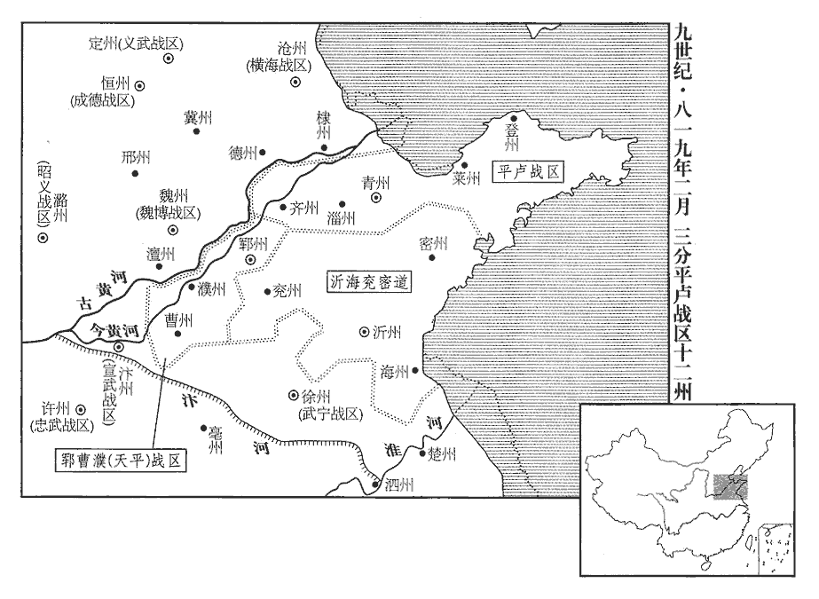
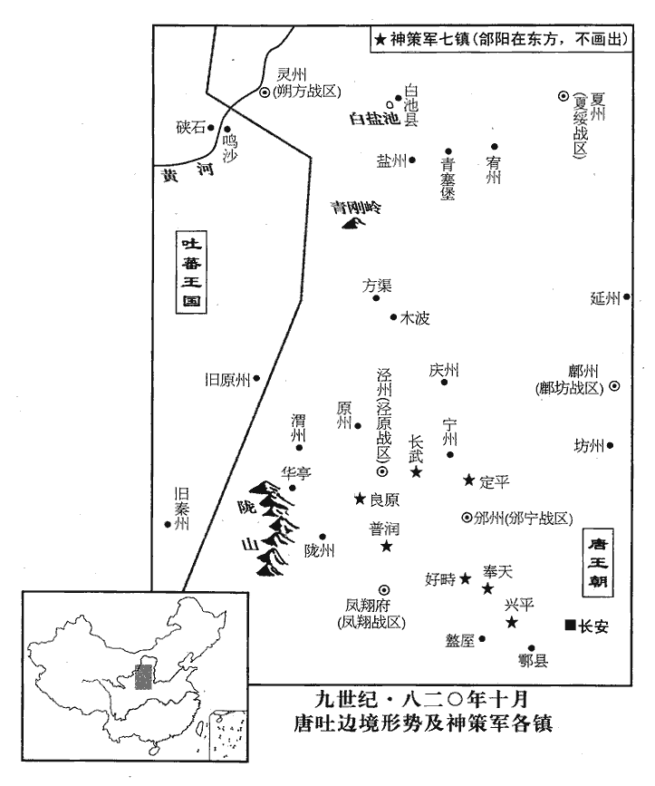
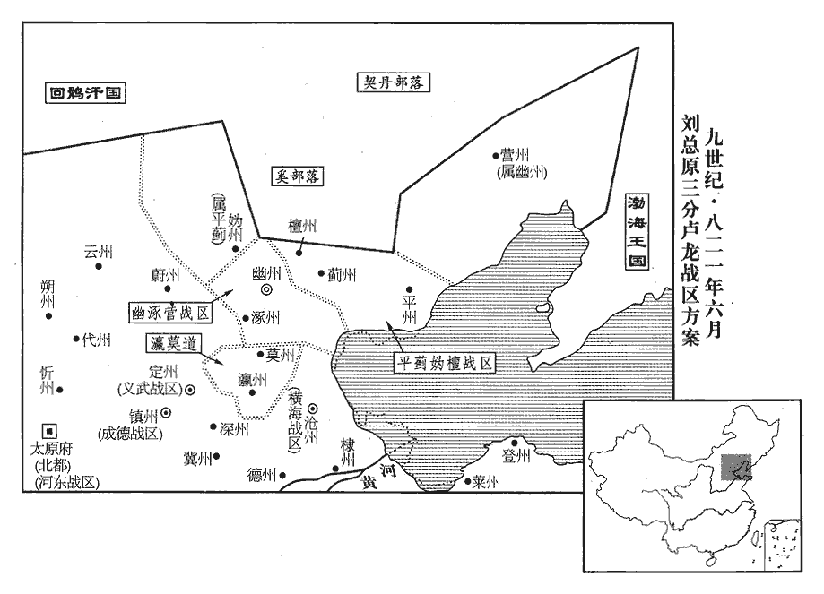

 唐紀五十七起屠維大淵獻（己亥）二月，盡重光赤奮若（辛丑）六月，凡二年有奇。

# 憲宗昭文章武大聖至神孝皇帝下

## 元和十四年（己亥、八一九）

1二月，李聽襲海州‹江苏省连云港市›，克東海‹连云港市东›、朐山‹海州州政府所在县›、懷仁‹江苏省赣榆县›等縣。海州，治朐山，本漢朐縣，後人加「山」字。東海，漢贛榆縣地，後齊置東海縣，屬東海郡；隋廢郡及縣，入廣饒縣，隋仁壽元年改廣饒曰東海，避太子諱也；唐屬海州。九域志：在州東一十里。懷仁縣，梁置南、北二青州，東魏廢州，置義塘郡及懷仁縣，隋廢郡，以縣屬海州。九域志：在州北八十里。宋白曰：海州懷仁縣，本漢贛餘縣地。按漢贛餘，今縣東北三十里贛餘古城是也，梁於此置黃郭戍，後魏置義塘郡，理黃郭城，領義唐、歸義、懷仁三縣，高齊移義唐郡及懷仁縣並理今密州莒縣界，隋開皇廢郡，移懷仁縣理此，今縣理是也。李愬敗平盧兵於沂州‹山东省临沂市›，拔丞縣‹山东省枣庄市东南峄城镇›。丞，漢縣，後魏置蘭陵郡，隋廢郡為蘭陵縣，武德四年改曰丞縣，後屬沂州。九域志：在州西南一百八十里。宋白曰：丞，漢舊縣，春秋時鄫國也。晉置蘭陵郡，理丞城。按前此丞縣理在今縣西一里，漢丞縣故城是也。隋開皇十六年置鄫州及丞縣，尋廢州及縣，仍移蘭陵縣置於廢鄫州故城，中唐又改蘭陵為丞縣。縣西北有丞水。敗，補邁翻。丞，時證翻。

〖译文〗 [1]二月，李听出兵袭击海州，攻克东海、朐山、怀仁等县。李率军在沂州击败平卢兵，攻克丞县。

李師道聞官軍侵逼，發民治鄆州‹山东省东平县›城塹，脩守備，治，直之翻。塹，七豔翻。役及婦人，民益懼且怨。

〖译文〗 淄青节度使李师道听说唐官军日益逼近，于是征发民夫修治郓州城池，加强防守。又征发妇女，百姓更加恐惧怨恨。

都知兵馬使劉悟，正臣之孫也，劉正臣見二百一十七卷肅宗至德元載。師道使之將兵萬餘人屯陽穀以拒官軍。悟務為寬惠，使士卒人人自便，軍中號曰劉父。及田弘正渡河，悟軍無備，戰又數敗。數，所角翻。或謂師道曰：「劉悟不脩軍法，專收眾心，恐有他志，宜早圖之。」師道召悟計事，欲殺之。或諫曰：「今官軍四合，悟無逆狀，用一人言殺之，諸將誰肯為用！是自脫其爪牙也。」師道留悟旬日，復遣之，厚贈金帛以安其意。悟知之，還營，陰為之備。師道以悟將兵在外，署悟子從諫門下別奏。門下別奏者，使廁員牙門下，俟別奏補官也。唐六典：凡諸軍鎮大使，三品已上，傔qiàn二十五人，別奏十人；副使，傔二十人，別奏八人。總管，三品已上，傔十八人，別奏六人；子總管，四品已上，傔十一人，別奏三人。若討擊、防禦、遊弈使副，傔準品各減三人，別奏各減二人。總管及子總管，傔準品各減二人，別奏各減一人。若鎮守已下無副使或隸屬大軍鎮者，使已下傔，奏並四分減一，所補傔、奏皆令自召以充。從諫與師道諸奴日遊戲，頗得其陰謀，密疏以白父。

〖译文〗 都知兵马使刘悟，即唐肃宗朝平卢节度使刘正臣的孙子。李师道命悟率兵万余人屯驻阳，以拒抗官军。刘悟治军宽厚，使士卒人人自便，不加约束，军中称誉他为“刘父”。及至魏博节度使田弘正率军南渡黄河，进攻淄青，刘悟军无准备，出战屡败。有人对李师道说：“刘悟不修军法，专意收买人心，恐有异志，应早有防备。”于是，李师道托言商议军事，召刘悟来郓州，想借机把刘悟杀死。有人劝李师道说：“今官军四面围攻淄青，刘悟尚未有谋反的迹象，听信一人之言就把他杀死，诸将中谁肯为您效力！这是自除爪牙。”李师道认为言之有理，留刘悟在郓州十日后，命他仍回阳谷，并赠送大批金帛加以安抚。刘悟知李师道已怀疑自己，返回军营后，秘密做防守准备。李师道因刘悟率兵在外，任命他的儿子刘从谏为门下别奏，留在郓州。刘从谏每天与李师道家奴游玩，获悉李师道阴谋，写密信转告父亲。

又有謂師道者曰：「劉悟終為患，不如早除之。」丙辰‹八›，師道潛遣二使齎帖授行營兵馬副使張暹，令斬悟首獻之，勒暹權領行營。時悟方據高丘張幕置酒，去營二三里。二使至營，密以帖授暹。暹素與悟善，陽與使者謀曰：「悟自使府還，還，音旋，又如字。頗為備，不可怱怱，暹請先往白之，云『司空遣使存問將士，兼有賜物，請都頭速歸，軍中稱都將為都頭。同受傳語。』傳語，謂師道遣使者所傳言語也。如此，則彼不疑，乃可圖也。」使者然之。暹懷帖走詣悟，屏人示之。屏，必郢翻，又卑正翻。悟潛遣人先執二使，殺之。

〖译文〗 部下又有人对李师道说：“刘悟终必谋反，不如早日除掉他。”丙辰（初八），李师道密派亲信二人带手令前往阳谷，命行营兵马副使张暹杀掉刘悟，割下他的头送郓州查验，然后由张暹代领行营兵马。这时，刘悟正在一块高地上树立帐幕，设置酒宴，离开军营二三里。二使到阳谷军营后，密将李师道手令授予张暹。张暹向来和刘悟相好，便假装与使者商议说：“刘悟从郓州节度使府回来后，已有防备，此事不可匆忙。请先让我去报告刘悟，假称‘李师道派人来尉问将士，带来大批赏赐物品，请都头速归军营，一同接受指令’。这样，刘悟必然不疑，然后可乘机下手。”二使同意张暹的意见。于是，张暹把李师道手令揣在怀中，到刘悟饮宴处，命随从退下，交刘悟观看。刘悟得知李师道阴谋后，秘密派人擒杀二使。

時已向暮，悟按轡徐行還營，坐帳下，嚴兵自衛。召諸將，厲色謂之曰：「悟與公等不顧死亡以抗官軍，誠無負於司空。今司空信讒言，來取悟首。悟死，諸公其次矣。且天子所欲誅者獨司空一人，今軍勢日蹙，吾曹何為隨之族滅！欲與諸公卷旗束甲，卷，與捲同。還入鄆州，奉行天子之命，言奉行詔旨，以誅李師道。豈徒免危亡，富貴可圖也。諸公以為何如？」兵馬使趙垂棘立於眾首，良久，對曰：「事【章：十二行本「事」上有「如此」二字；乙十一行本同；孔本同；張校同。】果濟否？」悟應聲罵曰：「汝與司空合謀邪！」立斬之。徧問其次，有遲疑未言者，悉斬之，并斬軍中素為眾所惡者，惡，烏路翻。凡三十餘，尸於帳前。餘皆股栗，曰：「惟都頭命，願盡死！」

〖译文〗 这时，天已傍晚，刘悟乘马缓行回营，坐于帐中，重兵把守，严加防备。随后，召集众位将领，声色严厉地说：“我和你们不顾死活抗击官军，确实对得起李师道。今李师道听信谗言，派人来杀我。如果我死，你们随后也会被杀。当朝天子发兵围攻淄青，声明只杀李师道一人。如今我军形势日渐窘迫，我等为什么要随他一同被灭族！现在，我和大家商议，打算卷旗束甲袭击郓州，奉行天子之命，杀李师道，不仅可免我等危亡，而且可图富贵。大家认为如何？”兵马使赵垂棘站在诸将前头，沉默很久，说：“不知此事能否成功？”刘悟应声骂道：“难道你要与李师道同谋吗？”即命斩首。接着，挨个询问，诸将凡迟疑不言者，一律斩首，并斩杀军中向来为众所憎恶者，共三十余人，尸首列于帐前。其余诸将都两腿发抖，说：“愿听都头命令，尽死效力！”

乃令士卒曰：「入鄆‹山东省东平县›，人賞錢百緡，惟不得近軍帑。近，其靳翻。帑，他朗翻。其使宅及逆黨家財，任自掠取；使宅，謂節度使所居也。有仇者報之。」使士皆飽食執兵，夜半聽鼓三聲絕即行，人銜枚，馬縛口，遇行人，執留之，恐行人遇兵，走還城報師道，令執留之。人無知者。距城數里，天未明，悟駐軍，使聽城上柝聲絕，天明，則柝聲絕。使十人前行，宣言「劉都頭奉帖追入城。」主帥文書下諸將謂之帖。門者請俟寫簡白使，古者聯竹為簡策以寫書，後世因謂書為簡。白使，謂白節度使。使，疏吏翻。十人拔刃擬之，皆竄匿；悟引大軍繼至，城中譟譁動地。比至，比，必利翻，及也。子城已洞開，惟牙城拒守，凡大城謂之羅城，小城謂之子城。又有第三重城以衛節度使居宅，謂之牙城。尋縱火斧其門而入。牙中兵不過數百，始猶有發弓矢者，俄知力不支，皆投於地。

〖译文〗 于是，刘悟下达出兵命令，对士卒说：“攻入郓州，每人赏钱一百缗。除军库外，凡节度使住宅及其他叛党家财，允许你们任意掠取，有仇者许可报仇。”接着，命士卒饱食一顿，每人携带兵器，半夜时分，听鼓声三响后出发。将士口衔枚，军马缚口，防止喧哗；凡遇行人，都执留军中，以防走漏消息。军行所至，人都不知。距郓州数里时，天还未亮，刘悟命将士就地待命，听城上巡逻的木邦声停止后，派十人先行抵城下，言称“刘都头奉节度使手令入城”。守门人请大家稍候，正想写书简秉告李师道时，十人突然拔刀欲斩，守门人一哄而逃。刘悟率大军随后赶到。城中听说有兵马袭击，喧哗动地，一片混乱。等到刘悟入城时，内城已被攻开。只有李师道所住的牙城还在抗拒坚守。刘悟下令纵火焚烧，用大斧辟开城门，将士一齐涌入。城中亲兵不过数百人，开始还有人发箭抵抗，后知寡不敌众，都投弓箭于地而降。

悟勒兵升聽事，使捕索師道。索，山客翻。師道與二子伏廁牀下，索得之，索，山客翻。悟命置牙門外隙地，使人謂曰：「悟奉密詔送司空歸闕，然司空亦何顏復見天子！」復，扶又翻。師道猶有幸生之意，其子弘方仰曰：「事已至此，速死為幸！」尋皆斬之。代宗永泰元年，李正己得淄青，四世，五十四年而滅。自卯至午，悟乃命兩都虞候巡坊市，禁掠者，即時皆定。大集兵民於毬場，親乘馬巡繞，慰安之。斬贊師道逆謀者二十餘家，文武將吏且懼且喜。【章：十二行本「喜」下有「皆入賀」三字；乙十一行本同；孔本同；張校同。】悟見李公度，執手歔欷；出賈直言於獄，直言被囚見上卷上年。置之幕府。

〖译文〗 刘悟率将士入淄青节度使府，命搜捕李师道。李师道和他的两个儿子藏在侧面的床下，被士卒搜出。刘悟命把李师道父子押到节度使府门外的空地上，派人对他说：“刘都头奉天子密诏，打算将您送到京城面见皇上，但是您还有什么脸面再见皇上呢！”这时，李师道仍想能幸免一死，他的儿子李弘方仰面叹道：“事已至此，盼求快死为幸！”随后，父子三人都被斩首。从清晨到中午，刘悟命令左、右都虞候巡行街坊和集市，禁止将士焚掠，到了下午，城内很快安定。于是，刘悟命将士和百姓到鞠场集中，亲自乘马绕场一周，安抚慰劳众人。然后，下令处斩与李师道一起叛乱者，共二十余家，文武将吏目睹叛乱者被杀，又怕又喜。刘悟与李公度相见，二人握手哭泣。又命把贾直言从狱中放出，置于幕府参议军事。

悟之自陽穀還兵趨鄆也，趨，七喻翻。潛使人以其謀告田弘正：「事成，當舉烽相白；萬一城中有備不能入，願公引兵為助。功成之日，皆歸於公，悟何敢有之。」且使弘正進據己營。弘正見烽，知得城，遣使往賀。悟函師道父子三首，遣使送弘正營，弘正大喜，露布以聞。淄、青等十二州皆平。

〖译文〗 在刘悟率军从阳出发袭击郓州前，曾暗中派人把行动计划转告魏博节度使田弘正，约定：“如果事成，就举烽火相告；万一城中有防备不能攻入，请率兵相助。事成之后，全部归功于您，我不敢据功为己有。”同时，请求田弘正率军进据阳谷营地。这时，田弘正看到烽火，知道郓州已被刘悟攻克，便派使者前往祝贺。刘悟把李师道父子三人的首级放入盒中，派人送到田弘正军营，弘正大喜，写文告上报朝廷。至此，淄、青等十二州全部平定。

弘正初得師道首，疑其非真，召夏侯澄使識之。澄熟視其面，長號隕絶者久之，乃抱其首，舐其目中塵垢，復慟哭。弘正為之改容，義而不責。識，如字，辨識也。號，戶刀翻。舐，直氏翻。復，扶又翻。為，于偽翻。夏侯澄禽見上卷上年。

〖译文〗 起初，田弘正得李师道首级，怀疑是否真实，于是，命夏侯澄前来辨识。夏侯澄仔细看后，大声痛哭了很久，悲痛欲绝，接着，将李师道首级捧起，用舌尖舐净眼睛中的灰尘，然后又大声哭泣。田弘正见此情景，不免受到感染，认为夏侯澄忠心重义，也不责备。

 

2壬戌‹十四›，田弘正捷奏至。乙丑‹十七›，命戶部侍郎楊於陵為淄青宣撫使。己巳‹二十一›，李師道首函至。自廣德‹李豫（李俶）›以來，垂六十年，藩鎮跋扈河南、北三十餘州，自除官吏，不供貢賦，至是盡遵朝廷約束。嗚呼！兼并易也，堅凝之難！讀史至此，盍亦知其所以得，鑒其所以失，則知資治通鑑一書不苟作矣。

〖译文〗 [2]壬戌（十四日），田弘正奏捷文告送到京城。乙丑（十七日），唐宪任命户部侍郎杨於陵为淄青宣抚使。已巳（二十一日），装着李师道首级的盒子送至京城。自从唐代宗广德元年（763年）以来，蕃镇在河南、河北三十余州割据跋扈，自命官吏，不向朝廷上供赋税，将近六十余年，至此全部重新遵守朝廷法令。

上命楊於陵分李師道地，於陵按圖籍，視土地遠邇，計士馬眾寡，校倉庫虛實，分為三道，使之適均：於，音烏。以鄆、曹、濮為一道，鄆，音運。濮，音卜。淄、青、齊、登、萊為一道，兗、海、沂、密為一道；上從之。

〖译文〗 唐宪宗命杨於陵分割李师道淄青十二州。於陵阅视淄青地图和户籍后，根据各州土地的远近，士卒和军马的多少，以及仓库虚实，拟分为三道，使各方面情况比较平均：以郓州、曹州、濮州为一道；淄州、青州、齐州、登州、莱州为一道；兖州、海州、沂州、密州为一道。宪宗准奏。

劉悟以初討李師道詔云：「部將有能殺師道以眾降者，師道官爵悉以與之。」意謂盡得十二州之地，遂補署文武將佐，更易州縣長吏；更，工衡翻。謂其下曰：「軍府之政，一切循舊。自今但與諸公抱子弄孫，夫復何憂！」復，扶又翻；下復須同。

〖译文〗 刘悟根据当初发布的讨伐李师道诏书所说“如果部将有人能杀李师道，率军投降朝廷，即以师道官爵授予此人”，认为自己应该为淄青节度使，尽得淄青十二州。于是，开始擅自任命文武将吏，更换州县官吏。他对部下说：“军府政事，一切遵循旧制。今后，我和大家抱子弄孙，长享富贵，还有什么可以忧愁的呢！”

上欲移悟他鎮，恐悟不受代，復須用兵，密詔田弘正察之。弘正日遣使者詣悟，託言脩好，實觀其所為。悟多力，好手搏，好，呼到翻。得鄆州‹山东省东平县›三日，則教軍中壯士手搏，與魏博使者庭觀之，自搖肩攘臂，離坐以助其勢。離，力智翻。坐，徂臥翻。弘正聞之，笑曰：「是聞除改，除改，謂除書改授他鎮。登即行矣，言登時即行也。何能為哉！」庚午‹二十二›，以悟為義成‹总部设滑州河南省滑县›節度使。悟聞制下，手足失墜；言驚遽失守，不知所為。明日，遂行。弘正已將數道，比至城西二里，與悟相見於客亭，客亭，即驛亭，送迎使客之所。即受旌節，馳詣滑州，辟李公度、李存、郭昈hù、賈直言以自隨。

〖译文〗 唐宪宗拟把刘悟调离淄青，但恐怕刘悟拒不从命，而不得不再次用兵。于是，下密诏给田弘正，命他观察刘悟的言行，看他是否可能拒诏。田弘正接到宪宗的密诏后，每天派人前往郓州，借口与刘悟交好，实际上是观察他的言行。刘悟力大无比，喜欢摔跤，攻克郓州三天后，就教军中壮士练习摔跤，他和魏博的使者在庭院中观看。刘悟一边观看，一边挽袖捋臂，有时还离座呐喊助威。田弘正听说后，哑然失笑，说：“像他这个样子，如果调动的诏书下达，肯定会立即成行，不可能有什么作为。”庚午（二十二日），唐宪宗诏命刘悟为义成节度使，刘悟接诏后，惊慌失措。第二天，就上路赴任了。这天，田弘正率众将为刘悟送行，到郓州城西二里时，在驿站与刘悟相见，刘悟接受义成节度使旌节，征召李公度、李存、郭、贾直言为幕僚，赶赴滑州上任。

悟素與李文會善，既得鄆州‹山东省东平县›，使召之，未至。李文會出登州‹山东省蓬莱市›見上卷上年。聞將移鎮，昈、存謀曰：「文會佞人，敗亂淄青一道，敗，補邁翻。滅李司空之族，萬人所共讎也！不乘此際誅之，田相公至，務施寬大，將何以雪三齊‹山东省›之憤怨乎！」自項羽分齊為三，以王田市、田都、田安，遂有三齊之名。後人因而言之。乃詐為悟帖，遣使即文會所至，取其首以來。使者遇文會於豐齊驛‹山东省东阿县东南›，斬之。據梁敬翔編遺錄，豐齊驛當在齊州東南三十里。宋白曰：齊州禹城縣有漢祝阿故城，在豐齊驛東北二里。比還，比，必利翻。及也。還，音旋，又如字。悟及昈、存已去，無所復命矣。文會二子，一亡去，一死於獄，家貲悉為人所掠，田宅沒官。

〖译文〗 刘悟向来和李文会相好，当初攻克郓州后，曾派人到登州去请李文会。李文会尚未到郓州，郭、李存听说刘悟即将调往他地，二人商议说：“文会是奸佞小人，由于他的缘故，致使淄青败乱，李师道遭灭族之灾，众人无不以他为仇人！如果不乘此良机把他杀掉，等田弘正来后，肯定以宽大为怀，那时，将怎样来报大家的这个仇恨呢！于是，二人伪作刘悟手令，派人出使登州，命杀李文会，割下他的头回来报告。使者在齐州东南方向的丰齐驿碰到李文会，将他杀死后，回到郓州。这时，刘悟已经和郭、李存等人离开郓州前往滑州，使者无法再报告了。李文会有两个儿子，一个逃亡，一个死在狱中，他的家产全都被人掠去，田地和庄宅被朝廷没收。

詔以淄青行營副使張暹為戎州‹四川省宜宾市›刺史。劉悟奏言其功也。

〖译文〗 唐宪宗下诏，命淄青行营副使张暹为戎州刺史。

癸酉‹二十五›，加田弘正检校司徒、同平章事。

〖译文〗 癸酉（二十五日），唐宪宗加封田弘正为检校司徒、同平章事。

先是，李師道將敗數月，先，悉薦翻。聞風動鳥飛，皆疑有變，禁鄆人親識宴聚及道路偶語，犯者有刑。弘正既入鄆，悉除苛禁，縱人遊樂，樂，音洛。寒食七晝夜不禁行人。弘正特為此示鄆人以寬大耳。按寒食之說不同，初學記曰：周禮司烜xuǎn氏，仲春以木鐸徇火禁於國中。註云：為季春將出火也。今寒食準節氣是仲春之末。清明是三月之初。然則禁火並周制也。洪容齋曰：先賢傳曰：太原舊俗以介子推焚骸，一月寒食。鄴中記曰：并州俗，冬至後一百五日為子推斷火，冷食三日。魏武以太原、上黨、西河皆冱hù寒之地，令人不得寒食。此註已見前。或諫曰：「鄆人久為寇敵，今雖平，人心未安，不可不備。」弘正曰：「今為暴者既除，宜施以寬惠，若復為嚴察，是以桀易桀也，庸何愈焉！」愈，賢也，勝也。復，扶又翻。

〖译文〗 当初，李师道在败亡前的几个月，紧张多疑，听到风吹鸟飞，就怀疑有什么变故，于是下令禁止郓州人在一起饮宴相聚，以及行人悄声私语，如有违犯，就严刑惩处。田弘正来到郓州后，下令除去这些严苛的禁令，放纵百姓们游乐，寒食节七昼夜不禁行人往来。有人劝田弘正说：“郓州人随同李师道数年，与朝廷为敌，现虽已平定，人心尚未安定，不可不防。”田弘正说：“如今淄青暴乱为首者已经诛除，应当施行惠政，如果仍以严刑为政，那就好比是以夏桀来代替夏桀，又有什么改善呢？”

先是，賊數遣人入關‹潼关›，截陵戟，焚倉場，流矢飛書，以震駭京師，沮撓官軍。事見二百三十九卷十年。數，所角翻。沮，在呂翻。撓，奴巧翻。有司督察甚嚴，潼關‹陕西省潼关县›吏至發人囊篋以索之，索，山客翻。然終不能絕。及田弘正入鄆，閱李師道簿書，有賞殺武元衡人王士元等及賞潼關、蒲津‹陕西省大荔县东黄河渡口›吏卒案，乃知曏者皆吏卒受賂於賊，容其姦也。案，文案也，亦謂之案牘。史言關津不足以禁姦，乃所以容姦。

〖译文〗 起初，在元和十年时，朝廷数万官军围攻淮西吴元济，叛贼多次派人潜入潼关，截断皇陵门戟，焚烧官仓粮储，甚至用箭把恐吓信射入京城，制造混乱，吓唬朝廷和百姓，以便阻挠官军的进攻。朝廷严令有关部门搜查，潼关官吏甚至把来往行人的背包和箱子都打开查看，但始终未能禁绝这类不测事件的发生。等到田弘正进入郓州后，翻阅李师道的文书，发现其中有赏赐杀宰相武元衡的刺客王士元等人的记载，以及赏赐潼关、蒲津官吏、士卒的案卷，这才知道以往种种不测事件，都是由于官吏、士卒受敌贿赂，容纳叛贼作乱。

裴度纂述蔡、鄆用兵以來上之憂勤機略，因侍宴獻之，請內印出付史官。請自禁中用印而出付史官。上曰：「如此，似出朕志，非所欲也。」弗許。史言憲宗此事得為君之體。

〖译文〗 裴度把朝廷对淮西、淄青用兵以来，唐宪宗勤勉为政、日理万机的情形编纂成册，在陪伴宪宗饮宴时，乘机献上，奏请宪宗盖印，然后交付史官。宪宗说：“如果这样做，就会使史官产生错觉，以为是我指派你编纂的，其实，这并非我的本意。”于是没有准许。

三月，戊子‹十›，以華州‹陕西省华县›刺史馬總為鄆、曹、濮等州‹总部设郓州山东省东平县›節度使。己丑‹十一›，以義成節度使薛平為平盧‹总部改设青州山东省青州市›節度、淄•青•齊•登•萊等州‹首府同设青州›觀察使。自是之後，淄青專平盧之號，而鄆尋賜號天平軍矣。以淄青四面行營供軍使王遂為沂、海、兗、密等州‹首府设沂州山东省临沂市›觀察使。為王遂以嚴酷召亂張本。

〖译文〗 三月，戊子（初十），唐宪宗命华州刺史马总为郓、曹、濮等州节度使。己丑（十一日），命义成节度使薛平为平卢节度使和淄、青、齐、登、莱等州观察使。命淄青四面行营供军使王遂为沂、海、兖、密等州观察使。

3橫海節度使烏重胤奏：「河朔‹河北平原›藩鎮所以能旅拒朝命六十餘年者，由諸州縣各置鎮將領事，收刺史、縣令之權，自作威福。曏使刺史各得行其職，則雖有奸雄如安、史，必不能以一州獨反也。臣所領德‹山东省陵县›、棣‹山东省惠民县›、景‹河北省泊头市西交河镇›三州，已舉牒各還刺史職事，應在州兵並令刺史領之。」夏，四月，丙寅‹十九›，詔諸道節度、都團練、都防禦、經略等使所統支郡兵馬，並令刺史領之。自至德以來，節度使權重，所統諸州各置鎮兵，以大將主之，暴橫為患，橫，戶孟翻。故重胤論之。其後河北諸鎮，惟橫海‹总部沧州›最為順命，由重胤處之得宜故也。史言反側之地，擇帥不可不詳。處，昌呂翻。

〖译文〗 [3]横海节度使乌重胤上奏：“河朔藩镇所以能够长期抗拒朝廷诏令，割据六十余年，原因是他们在各州设置镇将主持军政，夺刺史和县令的权力，自作威福。如果能让刺史行使自己的职权，那么，就是出现像安禄山、史思明这样的奸雄，也必然不可能以一州的兵力叛乱。现在，我所管辖的德、棣、景三州，已下令各州镇将把军权归还刺史，各州的州兵都由刺史统辖。”夏季，四月，丙寅（十九日），唐宪宗下诏，命各道节度使、都团练使、都防御使、经略使等所统辖的支郡兵马，一律归各州刺史统辖。自从至德元年以来，节度使权势日重，他们在各自管辖的州郡设置镇兵，派大将主持军务，专横跋扈，所以，乌重胤上奏论及此事。从此以后，河北藩镇中，只有横海最为顺从朝廷，都是由于乌重胤处置适宜的缘故。

4辛未‹二十四›，工部侍郎、同平章事程异薨。

〖译文〗 [4]辛未（二十四日），工部侍郎、同平章事程异去世。

5裴度在相位，知無不言，皇甫鎛bó之黨陰擠之。擠，子細翻，又子西翻。考異曰：舊傳曰：「鎛與宰相李逢吉、令狐楚合勢擠度，故出鎮。」按逢吉時在東川，楚在昭義，皆不為相。今不取。按後「昭義」當作「河陽」。丙子‹二十九›，詔度以門下侍郎、同平章事，充河東‹总部设太原府山西省太原市›節度使。

〖译文〗 [5]宰相裴度知无不言，皇甫的党羽在暗地里不断排挤他。丙子（二十九日），唐宪宗下诏，命裴度带门下侍郎、同平章事的荣誉官衔，充任河东节度使。

皇甫鎛專以掊克取媚，掊，蒲侯翻。人無敢言者，獨諫議大夫武儒衡上疏言之。鎛自訴於上，上曰：「卿以儒衡上疏，將報怨邪！」鎛乃不敢言。儒衡，元衡之從父弟也。從，才用翻。

〖译文〗 皇甫专以聚敛取媚宪宗，朝臣都不敢言，只有谏议大夫武儒衡上奏，指斥皇甫罪行。皇甫向宪宗上诉，表示自己清白无辜。宪宗说：“你是由于武儒衡上奏，难道想要报复他吗？”皇甫这才不敢再说了。武儒衡是前宰相武元衡的叔伯兄弟。

6史館脩撰李翱上言，貞觀三年置史館於門下省，有修撰四人，掌修國史。以為：「定禍亂者，武功也；興太平者，文德也。今陛下即以武功定海內，若遂革弊事，復高祖‹李渊›、太宗‹李世民›舊制；用忠正而不疑，屏邪佞而不邇；屏，必郢翻，又卑正翻。改稅法，不督錢而納布帛；自建中初，楊炎定兩稅法，不令民輸其土之所產而督錢。絕進獻，寬百姓租賦；厚邊兵，以制戎狄侵盜；數訪問待制官，以通塞蔽；數，所角翻。塞，悉則翻。此六者，政之根本，太平之所以興也。陛下既已能行其難，若何不為其易乎！以陛下天資上聖，如不惑近習容悅之辭，任骨鯁正直之士，與之興大化，可不勞而成也。若不以此為事，臣恐大功之後，逸欲易生。易，以豉翻。進言者必曰：『天下既平矣，陛下可以高枕自安逸，』枕，職任翻。如是，則太平未可期矣！」

〖译文〗 [6]史馆修撰李翱上奏，认为：“平定祸乱依靠武力，开创太平大业则依靠文治和贤德。现在，皇上既然已经用武力平定天下，不如接着革除弊政，恢复高祖、太宗创立的传统制度，任用忠心正直的人士而不随便怀疑，摒斥奸邪佞幸的小人而不再亲近他们；改革赋税制度，将以往收钱币改为交纳实物；禁绝地方官吏向朝廷奉献钱物，减免百姓的租税；加强边防，抵抗边境戎狄的侵犯；经常访求待制官员，倾听他们的意见，以使下情上达。以上六条，是朝廷大政的根本之道，也是达到太平盛世的主要途径。现在，皇上既已经把那些常人难以做到的事都完成了，为什么不接着实行这些容易做到的事呢？按照皇上的天资和圣明，如果不受身边小人的巧言诱惑，信用耿直忠正的臣僚，那么，天下太平大治，可不劳皇上躬亲辛劳而自然形成。但如果皇上不注意这些方面，我担心在以武功平定天下之后，贪图安逸的欲望容易滋生，臣下左右阿谀迎奉，这时，就有人向皇上进言，他们必定会这样说：‘天下已经太平了，皇上可以高枕无忧，自图安逸。’如果皇上按照他们说的那样去贪图享乐的话，太平盛世也就遥远无期了！”

7秋，七月，丁丑朔‹一›，田弘正送殺武元衡賊王士元等十六人，詔使【章：十二行本「使」作「仗」；乙十一行本同；孔本同；熊校同。】內京兆府、御史臺徧鞫之；皆款服。款，誠也，言吐誠而伏罪也。京兆尹崔元略以元衡物色詢之，則多異同。元略問其故，對曰：「恆、鄆同謀遣客刺元衡，恆，戶登翻。刺，七亦翻。而士元等後期，聞恆人事已成，遂竊以為己功，還報受賞耳。今自度為罪均，度，徒洛翻。終不免死，故承之。」上亦不欲復辨正，悉殺之。復，扶又翻。

〖译文〗 [7]秋季，七月，丁丑朔（初一），田弘正把暗杀武元衡的刺客王士元等十六人押送京城。唐宪宗下诏，命将王士元等人交付京兆府、御史台逐个详加审问，王士元等人都招供认罪。但当京兆尹崔元略问武元衡遇难时穿的衣服是什么颜色时，王士元等人就说法不一了，崔元略追问是何缘故？王士元等人答称：“成德王承宗和淄青李师道同谋策划派遣刺客暗杀武元衡，我们受李师道的指派赶赴京城，不料来晚，误了约定的日期。听说成德人已经把武元德杀害，于是，我们就把功劳据为己有，为的是回去报功领赏。现在，我们自认为罪责和暗杀者相等，最终难免于一死，所以，也就招供认罪了。”唐宪宗也不愿再辨别王士元等人是否凶手，下令把他们全部斩首。

8戊寅‹二›，宣武節度使韓弘始入朝，蔡、鄆既平，韓弘始入朝。上待之甚厚。弘獻馬三千，絹五千，【張：「五千」作「五十萬」。】雜繒三萬，金銀器千，繒，慈陵翻。而汴之庫厩尚有錢百餘萬緡，絹百餘萬匹，馬七千匹，糧三百萬斛。史言韓弘善完聚。

〖译文〗 [8]戊寅（初二），宣武节度使韩弘首次来京朝拜，唐宪宗以隆重的礼节接待韩弘。韩弘向朝廷奉献战马三千匹，丝绢五千匹，杂色丝织品三万匹，金银器皿一千件。除此之外，宣武库房还有钱百余缗，丝绢百余万匹，战马七千匹，粮食三百万斛。

9己丑‹十三›，群臣上尊號曰元和聖文神武法天應道皇帝；赦天下。

〖译文〗 [9]己导（十三日），朝廷百官唐宪宗上尊号，称为元和圣文神武法天应道皇帝。然后，宪宗下诏大赦天下。

10兗、海、沂、密觀察使王遂，本錢穀吏，性狷急，無遠識。狷，吉掾翻。時軍府草創，是年三月，方分四州置觀察。人情未安，遂專以嚴酷為治，治，直吏翻。所用杖絕大於常行者；唐制：凡杖皆長三尺五寸，削去節目。訊杖，大頭徑三分三釐，小頭二分二釐。常行杖，大頭二分七釐，小頭一分七釐。笞杖，大頭二分，小頭一分有半。每詈將卒，輒曰「反虜」；又盛夏役士卒營府舍，督責峻急；將卒憤怨。

〖译文〗 [10]兖、海、沂、密观察使王遂出身于掌管钱谷的官吏，性情急躁，气量狭小，缺乏远见卓识。这时，观察使府刚刚创建，人心尚未安定，王遂却专门以严刑酷法进行治理，他所用的刑杖比一般常用的大得多。每次责骂将士时，动不动就侮辱他们为“反虏”。他还在盛夏的季节里，命令干兵冒着炎热酷暑为自己建造观察使府的房舍，并且严加监督催促。将士无不愤怒怨恨。

辛卯‹十五›，役卒王弁與其徒四人浴於沂水‹流经临沂市东›，沂州治臨沂縣，以臨沂水名之也。密謀作亂，曰：「今服役觸罪亦死，奮命立事亦死，死於立事，不猶愈乎！明日，常侍與監軍副使有宴，軍將皆在告，直兵多休息，常侍，謂王遂也。副使，謂觀察副使也。在告，謂休假在私室也。直兵，直衛之兵也。吾屬乘此際出其不意取之，可以萬全。四人皆以為然，約事成推弁為留後。

〖译文〗 辛卯（十五日），参加建造房舍的士兵王弁和同伙四人在沂水中洗澡，五人密谋作乱，王弁说：“现在，我们服役犯罪不免一死，拼死奋力而建功立业也不过一死，如果死于建功立业，岂不比服役犯罪而死更胜一筹！明天，听说王常侍和监军、副使要举行宴会，而部将都在休假，卫兵也大多休息，如果我们趁此机会出其不意袭杀他们，可以说是万全之策。”四人都认为王弁的主意不错，约定事成后共推王弁为观察留后，代行王遂的职务。

壬辰‹十六›，遂方宴飲，日過中，弁等五人突入，於直房前取弓刀，直房，直兵之所舍之室也。徑前射副使張敦實，殺之。射，而亦翻。遂與監軍狼狽起走，弁執遂，數之以盛暑興役，用刑刻暴，數，所具翻。立斬之。傳聲勿驚監軍，弁即自稱留後，升廳號令，與監軍抗禮，召集將吏參賀，眾莫敢不從。監軍具以狀聞。

〖译文〗 壬辰（十六日），王遂等人正在饮宴，中午刚过，王弁等五人突然冲入，直奔卫兵值班房中夺取弓箭和刀枪，然后，向前对准观察副使张敦实射去，张敦实当即被杀死。王遂和监军仓遑站起逃窜，被王弁擒获，他历数王遂上任以来在盛夏征发劳役，以及对士兵和百姓用刑残暴的罪行，然后，将王遂斩首。王弁传令不得惊吓和冒犯监军，随即自称留后，升堂发布号令，与监军在礼仪上平起平坐。他又召集诸将和下属官吏前来参拜祝贺，众人不敢不从。监军把以上情况写成表状，上报朝廷。

11甲午‹十八›，韓弘又獻絹二十五萬匹，絁三萬匹，絁shī，式支翻。銀器二百七十；左右軍中尉各獻錢萬緡。自淮西用兵以來，度支、鹽鐵及四方爭進奉，謂之「助軍」；賊平又進奉，謂之「賀禮」；後又進奉，謂之「助賞」；上加尊號又進奉，亦謂之「賀禮」。史歷言元和進奉之弊。

〖译文〗 [11]甲午（十八日），韩弘又向朝廷奉献丝绢二十五万匹，粗丝绸三万匹，银器二百七十件。左、右神策军护军中尉各向朝廷奉献钱一万缗。自从元和九年朝廷对淮西用兵以来，度支使、盐铁使以及各地藩镇争相向朝廷进奉钱物，称为“助军”；平定淮西等地以后又进奉，称为“贺礼”；接着，又进奉，称为“助赏”；宪宗加尊号时又进奉，也称为“贺礼”。

12丁酉‹二十一›，以河陽‹总部设河阳县河南省孟州市›節度使令狐楚為中書侍郎、同平章事。楚與皇甫鎛同年進士，故鎛引以為相。裴度之視師也，令狐楚出翰林，今皇甫鎛引而相之，亦所以杜度之再入。

〖译文〗 [12]丁酉（二十一日），唐宪宗任命河阳节度使令狐楚为中书侍郎、同平章事。令狐楚与皇甫是同一年考中的进士，所以，皇甫引荐令狐楚担任宰相。

13朝廷聞沂州軍亂，甲辰‹二十八›，以棣州刺史曹華為沂、海、兗、密觀察使。

〖译文〗 [13]朝廷听说沂州发生军乱，甲辰（二十八日），任命棣州刺史曹华为沂、海、兖、密观察使。

14韓弘累表請留京師，八月，己酉‹三›，以弘守司徒，兼中書令。癸丑‹七›，以吏部尚書張弘靖同平章事，充宣武節度使。弘靖，宰相子，弘靖，張延賞之子。延賞相德宗。少有令聞，少，詩照翻。聞，音問。立朝簡默；河東、宣武闕帥，帥，所類翻。朝廷以其位望素重，使鎮之。弘靖承王鍔聚斂之餘，韓弘嚴猛之後，王鍔鎮河東，韓弘鎮宣武，弘靖皆承其後。斂，力贍翻；下同。兩鎮喜其廉謹寬大，故上下安之。張弘靖之簡貴，施之并、汴可也，施之幽燕則敗矣。

〖译文〗 [14]韩弘多次上奏朝廷，请求批准自己留居京城。八月，己酉（初三），唐宪宗任命韩弘代理司徒，兼中书令。癸丑（初七），任命吏部尚书张弘靖带同平章事的官衔，充任宣武节度使。张弘靖是唐德宗时的宰相张延赏的儿子，从小就美名在外，在朝做官清简练达、静默通识。河东、宣武两镇缺任节度使，朝廷认为他向来威望和地位崇重，相继任命他前往镇守。河东前节度使王锷贪财聚敛，宣武前节度使韩弘严刑苛政，张弘靖赴任后，两镇的将吏和百姓喜爱他为官廉洁谨厚、宽容大度，因此，军心和民心由此安定下来。

15己未‹十三›，田弘正入朝，上待之尤厚。

〖译文〗 [15]已未（十三日），田弘正来京朝拜，唐宪宗以最为隆重的礼节接待他。

16戊辰‹二十二›，陳許節度使郗士美薨‹年六十四岁›，以庫部員外郎李渤為弔祭使。渤上言：「臣過渭南‹陕西省渭南市›，聞長源鄉‹渭南市境›舊四百戶，今纔百餘戶，闅wén鄉縣‹河南省灵宝市西›舊三千戶，今纔千戶，闅，音旻。其他州縣大率相似。迹其所以然，皆由以逃戶稅攤於比鄰，攤，他干翻。比，音毗，又毗至翻。致驅迫俱逃，此皆聚斂之臣剝下媚上，斂，力贍翻。惟思竭澤，不慮無魚。呂氏春秋曰：竭澤而漁，豈不得魚，而明年無魚。乞降詔書，絶攤逃之弊；盡逃戶之產償稅，不足者乞免之。計不數年，人皆復於農矣。」執政見而惡之，執政，謂皇甫鎛。惡，烏路翻。渤遂謝病，歸東都‹洛阳›。

〖译文〗 [16]戊辰（二十二日），陈许（忠武）节度使郗士美去世，唐宪宗任命库部员外李渤为吊祭使。李渤完成吊丧任务后，回到京城，上奏朝廷说：“我这次出使路过渭南，听说长源乡过去有四百户，现在仅存百余户，乡县过去有三千户，现在仅存一千户，其它州县户口耗减情况与此大体相似。户口耗减这样严重，究其原因，都是由于州县官吏把逃户所欠的税款摊派给他们的邻居，邻居不堪负担，以致被迫和逃户一样逃亡。这都是那些贪官污吏剥夺百姓而向他们的上司献媚，因此只想到竭泽而渔，不考虑以后还有没有鱼可捕捞的缘故。请求皇上颁下诏书，禁绝摊逃的弊政，同时建议把逃户的全部财产用来抵税，如果还不足以抵偿的话，就请求予以免除。这样，用不了几年，逃户就会逐渐回乡重新开始农业生产。”宰相皇甫看到李渤的奏章，憎恨他诋毁朝政，置之不理。于是李渤假托身体有病，辞官回到东都洛阳。

17癸酉‹二十七›，吐蕃寇慶州‹甘肃省庆阳县›，慶州，隋弘化郡，開皇十六年改為慶州，以慶美取其嘉名，漢歸德、富平縣地。舊志：京師西北五百七十三里。營於方渠‹甘肃省环县›。

〖译文〗 [17]癸酉（二十七日），吐蕃出兵侵犯庆州，在方渠扎寨安营。

18朝廷議興兵討王弁，恐青、鄆相扇繼變，青、鄆與兗、海、沂、密，本一鎮也。故恐其相扇而動。乃除弁開州‹重庆市开县›刺史，遣中使賜以告身。中使紿dài之曰：「開州計已有人迎候道路，留後宜速發。」弁即日發沂州，導從尚百餘人，從，才用翻。入徐州境，所在減之，其眾亦稍逃散。遂加以杻械，杻，敕久翻。乘驢入關。九月，戊寅‹三›，腰斬東市。

〖译文〗 [18]朝廷商议发兵讨伐王弁，但又恐怕青州和郓州相互煽动，继而也发生兵变。于是，任命王弁为开州刺史，派宦官把任命书授予王弁。宦官到沂州后，哄骗王弁说：“开州已经预先派人在路旁迎接您，您接到任命书后，应当尽快出发上任。”王弁当天就从沂州出发，这时，他的前导和随从人员还有一百多人。进入徐州境内后，当地官吏命他减少随从人员，跟随他的人也逐渐逃散。于是，宦官命人将王弁上了枷锁，乘驴进关。九月，戊寅（初三），王弁在东市被拦腰斩杀。

先是，三分鄆兵以隸三鎮，此言鄆、青、沂分為三鎮之初。先，悉薦翻。及王遂死，朝廷以為師道餘黨凶態未除，命曹華引棣州兵赴鎮以討之。沂州將士迎候者，華皆以好言撫之，使先入城，慰安其餘，眾皆不疑。華視事三日，大饗將士，伏甲士千人於幕下，乃集眾而諭之曰：「天子以鄆人有遷徙之勞，特加優給，宜令鄆人處左，沂人處右。」處，昌呂翻；下聚處同。即定，令沂人皆出，因闔門，謂鄆人曰：「王常侍以天子之命為帥於此，將士何得輒害之！」語未畢，伏者出，圍而殺之，死者千二百人，無一得脫者。門屏間赤霧高丈餘，久之方散。兵死之氣，凝為赤霧。

〖译文〗 当初，朝廷平定淄青后，把淄青分为三镇，李师道在郓州的兵士被分配到郓、青、沂、三个藩镇。等到沂州观察使王遂被王弁杀害后，朝廷认为李师道的余党仍然反叛，凶悍骄横的本性没有丝毫改变。于是，命令棣州刺吏曹华为沂州观察使，率领棣州的军队奔赴沂州，将李师道配属沂州的兵全部斩除。曹华率兵抵达沂州城下，对沂州欢迎他的将士，都用好言好语加以安抚，让他们先回城去，然后，入城安抚其余将士，这样，众人对曹华的来意都不加怀疑。曹华上任三天后，举行盛大宴会，招待沂州的将士，事先在帐幕的背后埋伏披甲持枪的兵士一千人。将士到齐后，曹华召集大家说：“皇上考虑到郓州的兵士迁徒到沂州，十分辛苦，特此让我加给赏赐，所以，现在我命令郓州的将士站在左边，沂州的将士站到右边。”将士分别站定后，曹华命沂州的将士一律出去，随即下令关闭大门，对留在里面的郓州将士说：“王常侍奉皇上的命令到这里做观察使，你们都是他的部下，怎敢犯上作乱，肆意把他杀害！”话音未落，伏兵一齐冲出，把郓州的将士团团包围，乱刀斩杀，一千二百人全部死亡，无一人逃脱，地上的流血蒸发成红色的雾气，在大门和墙壁间萦绕飘浮，达一丈多高，很久才逐渐消散。

臣光曰：春秋書楚子虔誘蔡侯般殺之于申。見昭十一年。般，音班。彼列國也，孔子猶深貶之，惡其誘討也，惡，烏路翻。況為天子而誘匹夫乎！

〖译文〗 臣司马光曰：《春秋》记载楚子虔在申诱杀蔡侯般，这件事虽然是发生在诸侯国之间，但孔子仍然深加贬责，因为孔子憎恶楚子虔使用诱杀这种不仁道的手段来消灭自己的政敌。诸侯国之间相互诱杀尚且不仁，何况作为天子而诱杀自己的将士呢！

王遂以聚斂之才，殿新造之邦，殿，多見翻，鎮也。用苛虐致亂。王弁庸夫，乘釁竊發，釁，隙也。苟沂帥得人，戮之易於犬豕耳，帥，所類翻。易，以豉翻。何必以天子詔書為誘人之餌乎！且作亂者五人耳，乃使曹華設詐，屠千餘人，不亦濫乎！然則自今士卒孰不猜其將帥，將帥何以令其士卒！上下盻盻，盻盻xì，恨視也，說文音五計翻，孫奭音五禮翻，又普莧翻。如寇讎聚處，處，昌呂翻。得間則更相魚肉，間，古莧翻。更，工衡翻。惟先發者為雄耳，禍亂何時而弭哉！

〖译文〗 王遂靠他擅长搜刮百姓的才能，被唐宪宗看中，任命他镇守沂州这个刚刚被官军平定收复的地区。王遂施政苛刑暴虐，以致激发兵变。王弁不过是个见识浅陋的兵卒，他乘将士对王遂不满，才得以发动兵变。如果唐朝对沂州的观察使任用称职的话，那么，平息王弁的兵变，就如同杀一头狗和猪一样的容易，又何必以天子诏书作诱人的食饵，来诛杀王弁呢？何况作乱者仅王弁等五个人，而唐宪宗却指派曹华设下圈套，屠杀了一千多个不相干的士兵，难道这不是太滥杀无辜了吗！这样一来，以后士卒怎能不猜疑他们的将帅，将帅又怎样才能统帅他们的兵士呢？将帅和士卒之间相互敌视，像仇敌一样相处在一起，一有机会就相互残杀，成败胜负，就看谁先动手罢了。这样下去，战祸动乱什么时候才能平息呢？

惜夫！憲宗削平僭亂，幾致升平，幾，鉅依翻。其美業所以不終，由苟徇近功，不敦大信故也。

〖译文〗 可惜啊！唐宪宗依靠武力平定藩镇叛乱，几乎已经使天下达到太平，但他所孜孜追求不息的美好事业之所以有始无终，都是由于只求眼前小利，而不讲求大的诚信的缘故。

19甲辰‹二十九›，以田弘正兼侍中，魏博‹总部设魏州河北省大名县›節度使如故。弘正三表請留，上不許。弘正常恐一旦物故，魏人猶以故事繼襲，故兄弟子姪皆仕諸朝，上皆擢居顯列，朱紫盈庭，時人榮之。

〖译文〗 [19]甲辰（二十九日），唐宪宗任命田弘正兼待中，仍为魏博节度使。田弘正三次上奏，请求留居京城，唐宪宗不准。田弘正常常担心自己一旦去世之后，魏博的将吏仍然按照以往的惯例，拥戴自己的亲人，所以，他让自己的兄弟、儿子和侄子都到朝廷做官。唐宪宗也都把他们提拔到显要的官位上，以致在他的家里，身着红色和紫色官服的人布满院庭，当时的人认为他们很荣耀。

20乙巳‹三十›，上問宰相：「玄宗‹李隆基›之政，先理而後亂，何也？」崔群對曰：「玄宗用姚崇、宋璟、盧懷慎、蘇頲tǐng、韓休、張九齡則理，用宇文融、李林甫、楊國忠則亂。故用人得失，所繫非輕。人皆以天寶十四年安祿山反為亂之始，臣獨以為開元二十四年罷張九齡相，專任李林甫，此理亂之所分也。願陛下以開元初為法，以天寶末為戒，乃社稷無疆之福！」皇甫鎛深恨之。皇甫鎛自知以姦諂忝相位，故深恨崔群之言。

〖译文〗 [20]乙巳（三十日）唐宪宗询问宰相：“玄宗朝政治，先治而后乱，是什么原因？”崔群回答说：“玄宗任用姚崇、宋、卢怀慎、苏、韩休、张九龄为宰相，则天下大治；但用宇文融、李林甫、杨国忠为宰相，则朝政紊乱。所以，用人得失，关系重大。人们都认为天宝十四年（755）安禄山叛乱是天下大乱的开端，我则认为开元二十四年（736）罢除张九龄相位，信用李林甫主持朝政是治乱的分界线。但愿陛下效法玄宗开元初年，以天宝末年为鉴戒，如果陛下能这样做，那就是国家长治久安的福分啊！”皇甫知道自己是靠谄媚皇上的手段才被提拔为宰相的，所以，对崔群十分痛恨。

21冬，十月，壬戌‹十七›，容管‹首府设容州广西容县›奏安南賊楊清陷都護府，安南都護府，治交州。‹越南河内市›殺都護李象古及妻子、官屬、部曲千餘人。象古，道古之兄也，以貪縱苛刻失眾心。清世為蠻酋，象古召為牙將，清鬱鬱不得志。象古命清將兵三千討黃洞蠻‹广西西南部一带少数民族›，黃洞蠻即西原蠻，其屬黃氏者，謂之黃洞蠻。清因人心怨怒，引兵夜還，襲府城‹越南河内市›，陷之。

〖译文〗 [21]冬季，十月，壬戌（十七日），容管经略使奏称，安南叛贼杨清起兵，攻陷都护府所在地交州城，杀死都护李象古和他的妻子，以及下属官吏、随从士卒一千多人。李象古，即前鄂岳观察使李道古的哥哥，由于贪图钱财，对部下苛刻而失去众心。杨清世代为蛮人酋长，李象古召见杨清，任命他为牙将，杨清郁郁不得志。李象古命杨清率兵三千讨伐黄洞蛮，杨清乘士卒不满李象古的机会，率兵在半夜擅自返回，袭击交州城，结果把州城攻陷。

初，蠻賊黃少卿，自貞元以來數反覆，數，所角翻。桂管‹首府设桂州广西桂林市›觀察使裴行立、數，所角翻。唐桂管管桂、昭、蒙、富、梧、潯、龔、鬱林、平琴、賓、澄、繡、象、柳、融等州。容管經略使陽旻欲徼幸立功，徼，堅堯翻。爭請討之；上從之。嶺南‹总部设广州广东省广州市›節度使孔戣kuí屢諫曰：「此禽獸耳，但可自計利害，不足與論是非。」上不聽，大發江、湖兵會容、桂二管入討，士卒被瘴癘，死者不可勝計。被，皮義翻。勝，音升。安南乘之，遂殺都護。行立、旻竟無功，二管彫弊，惟戣所部晏然。嶺南節度雖兼統五管，而廣州所管自為巡屬。劉昫曰：廣州管韶、循、岡、賀、端、新、康、封、瀧、恩、春、高、藤、義、竇、勤等州。戣，渠龜翻。

〖译文〗 当初，蛮贼酋长黄少卿，从贞元年间以来反复无常，时而归顺，时而叛变。桂管观察使裴行立、容管经略使阳二人，抱着侥幸立功的心理，争相上奏朝廷，请求出兵讨伐。唐宪宗批准了他们的请求。岭南节度使孔多次上奏劝阻说：“这些人都是禽兽，不讲礼义廉耻，我们只应当考虑朝廷的利害得失，不必和他们争论是非曲直。”唐宪宗不听孔的意见，大肆征发江淮、荆湖的兵力，命令他们会同容管、桂管的军队，共同讨伐黄洞蛮。结果，士卒在南方的深山密林里作战，都被瘴气染上疾病，死亡不计其数。安南牙将杨清趁此机会，率兵叛乱，杀死都护李象古。裴行立、阳二人也最终未能立功。桂管、容管由于长期出兵打仗，民力耗竭，田野荒芜，只有孔所管辖的岭南道安然无恙。

丙寅‹二十一›，以唐州‹河南省泌阳县›刺史桂仲武為安南都護；赦楊清，以為瓊州‹海南省定安县›刺史。

〖译文〗 丙寅（二十一日），唐宪宗任命唐州刺史桂仲武为安南都护，宣诏赦免杨清叛乱的罪行，任命他为琼州刺史。

22是歲，吐蕃節度論三摩等將十五萬眾圍鹽州‹陕西省定边县›，党項‹陕西省北部›亦發兵助之。刺史李文悅竭力拒守，凡二十七日，吐蕃不能克。靈武牙將史奉敬【嚴：「奉敬」改「敬奉」；下同。】言於朔方‹总部设灵州宁夏灵武市›節度使杜叔良，請兵三千，齎三十日糧，深入吐蕃以解鹽州之圍。叔良以二千五百人與之。奉敬行旬餘；無聲問，朔方人以為俱沒矣。以為與鹽州俱沒。無何，言無何時也。奉敬自他道出吐蕃背，吐蕃大驚，潰去。奉敬奮擊，大破，不可勝計。當曰「奮擊，大破之，殺獲不可勝計」，文意乃為明暢。奉敬與鳳翔‹总部设凤翔府陕西省凤翔县›將野詩良輔、涇原‹总部设泾州甘肃省泾川县›將郝玼皆以勇著名於邊，吐蕃憚之。新、舊書皆作「史敬奉」。

〖译文〗 [22]这一年，吐蕃节度论三摩等人率十五万大军围攻唐朝的盐州，党项也派兵援助吐蕃，参予攻城。盐州刺史李文悦竭力坚守城池二十七天，吐蕃未能攻克。灵武牙将史敬奉请求朔方节度使杜叔良拨给自己兵力三千人，带三十天的干粮，深入吐蕃境内，攻击敌后，以便迫使吐蕃大军解除对盐州的围攻。杜叔良批准史奉敬的请求，拨给他二千五百兵力。史奉敬出兵后十多天，没有音信，朔方人都认为他已经全军覆没，盐州也已失守。不料没过多久，史奉敬率兵从意想不到的小路绕到吐蕃军队的背后，吐蕃得知腹背受敌，大为惊慌，急忙溃退。史奉敬率军奋力追击，大败吐蕃军队，杀伤不计其数。史敬奉和凤翔节度使部将野诗良辅、泾原节度使部将郝都是以英勇善战闻名于边陲，吐蕃将士特别害怕他们三人。

23柳泌至台州‹浙江省临海市›，驅吏民采藥，歲餘，無所得而懼，泌知台州，見上卷上年。舉家逃入山中；浙東‹首府设越州浙江省绍兴市›觀察使捕送京師。皇甫鎛、李道古保護之，上復使待詔翰林；服其藥，日加躁渴。躁，則到翻。

〖译文〗 [23]柳泌抵达台州后，逼迫当地的官吏率领百姓上天台山，为唐宪宗采摘草药，经过一年多的时间，毫无所获，柳泌害怕担当欺君的罪名，携带全家老小逃到山里。浙江东道观察使派人逮捕柳泌，把他押送到京城。皇甫、李道古百般为柳泌辩解，开脱他的罪名。唐宪宗听信二人的话，命柳泌仍旧待诏翰林院，服用柳泌的药后，越来越躁渴。

起居舍人裴潾上言，以為：「除天下之害者受天下之利，同天下之樂者饗天下之福，樂，音洛。自黃帝‹姬轩辕›至於文‹姬昌›、武‹姬发›，享國壽考，皆用此道也。自去歲以來，所在多薦方士，轉相汲引，其數浸繁。借令天下真有神仙，彼必深潛巖壑，惟畏人知。凡候伺權貴之門，以大言自衒奇技驚眾者，伺，相吏翻。衒，熒絹翻。伎，渠錡翻。皆不軌徇利之人，豈可信其說而餌其藥邪！夫藥以愈疾，非朝夕常餌之物；況金石酷烈有毒，又益以火氣，殆非人五藏之所能勝也。藏，徂浪翻。勝，音升。古者君飲藥，臣先嘗之，記曲禮之言。乞令獻藥者先自餌一年，則真偽自可辨矣。」上怒，十一月，己亥‹二十五›，貶潾江陵‹江陵府所在县·湖北省江陵县›令。

〖译文〗 起居舍人裴上书朝廷，认为：“能够除去天下祸害的人，就能够享受天下的利益；能够和天下人同享欢乐的人，就能够享受天下的福分。从黄帝开始，一直到周文王、武王，他们的寿命和在帝位的时间之所以很长，都是由于遵循这种道理的缘故。但是，从去年以来，不少地方官吏向朝廷推荐方士，方士之间也相互举荐，以致推荐到朝廷来的方士越来越多。如果天下真的有神仙存在，他们必定躲藏在深山密林中，惟恐被人发现。因此，凡是想和当朝权贵交结，说大话自夸，用奇技巧术哗众取宠的人，肯定都是急功好利的不法之徒，怎么能轻易相信他们的大话，从而服用他们的药呢？药材是用来治病的东西，不是早晚经常吃的食品，况且金石浓烈而有毒性，又加上用火炼，恐怕不是人的五脏所能承受得了的。古代的时候，凡是君主要饮用的药物，都由臣下先尝，确信没有问题，然后才吃。因此，请求皇上下令，让献药的那些方士自己先吃一年，然后，他们所献的药是真是假，自然就可以辨别了。”唐宪宗看到裴上书后大怒。十一月，己亥（二十五日），命令把裴贬为江陵令。

24初，群臣議上尊號，皇甫鎛欲增「孝德」字，中書侍郎、同平章事崔群曰：「言聖則孝在其中矣。」鎛譖群於上曰：「群於陛下惜『孝德』二字。」上怒。時鎛給邊軍賜與，多不時得，又所給多陳敗，陳，舊也。不可服用，軍士怨怒，流言欲為亂。流言，放言也。李光顏憂懼，欲自殺；李光顏時帥邠寧‹总部设邠州陕西省彬县›。遣人訴於上，上不信。京師恟懼，群具以中外人情上聞。上聞，時掌翻。鎛密言於上曰：「邊賜皆如舊制，而人情忽如此者，由群鼓扇，將以賣直，歸怨於上也。」上以為然。十二月，乙卯‹十一›，以群為湖南‹首府设潭州湖南省长沙市›觀察使，於是中外切齒於鎛矣。小人去君子以為自安之謀，不知適所以自危也。

〖译文〗 [24]当初，百官商议唐宪宗的尊号时，皇甫认为应当增加“孝德”两个字。中书侍郎、同平章事崔群说：“尊号中有‘圣’字，那么，‘孝’的意义已经包含在其中了。”皇甫在唐宪宗的面前说崔群的坏话：“崔群对于陛下的尊号，竟然舍不得用‘孝德’两个字。”宪宗大怒。这时，由于皇甫对于边军的衣粮和赏赐物品，经常不按时发放，凡是供给的衣粮物品，又大多是陈旧腐败的东西，无法使用，兵士埋怨愤怒，流言要发动兵变。宁节度使李光颜忧心如焚，十分恐惧，甚至一度打算自杀，他派人将此情况向唐宪宗汇报，宪宗不信。这时，京城上下听说边兵要发动兵变的消息，也都惊恐不安，崔群把京城内外人们惊恐不安的情况向唐宪宗报告。皇甫秘密地对唐宪宗说：“朝廷供给边军的衣粮赏赐物品，都是按照过去的制度发放的。可是，人们的情绪却突然发生变化，我看都是由于崔群在那里鼓吹煽动，以此来猎取名声，而把人们的怨怒推给皇上。”宪宗听信了皇甫的谗言。十二月，乙卯（十一日），贬崔群为湖南观察使。于是，朝廷内外都咬牙切齿般地憎恨皇甫。

25中書舍人武儒衡，有氣節，好直言，好，呼到翻。上器之，顧待甚渥，人皆言且入相。令狐楚忌之，思有以沮之者，沮，在呂翻。乃薦山南東道‹总部设襄州湖北省襄樊市›節度推官狄兼謩mó才行。行，戶孟翻。癸亥‹十九›，擢兼謩左拾遺內供奉。以資序尚淺，未除正官，令於左拾遺班內供奉，猶監察御史裏行也。兼謩，仁傑之族曾孫也。楚自草制辭，盛言「天后‹武曌›竊位，姦臣擅權，賴仁傑保佑中宗‹李显›，克復明辟。」事見武后紀。儒衡泣訴於上，且言：「臣曾祖平一，在天后朝，辭榮終老。」平一在武后時，畏禍居嵩山，脩浮屠法，累詔不起。上由是薄楚之為人。

〖译文〗 [25]中书舍人武儒衡做官有节操，喜好直言不讳，因此得到唐宪宗的器重，待遇甚为优厚，人们都认为他即将被宪宗拜为宰相。令狐楚忌妒武儒衡，想找人来阻止武儒衡被拜为宰相。于是，他向宪宗推荐山南东道节度推官狄兼德才兼备。癸亥（十九日），唐宪宗任命狄兼为左拾遗内供奉。狄兼，即武则天朝宰相狄仁杰的同族曾孙。令狐楚亲自动手起草任命狄兼的制书措辞，制书夸张地说：“天后武则天窃取帝位，奸臣专权，幸赖狄仁杰保护中宗皇帝，以致最终得以恢复李唐王朝。”武儒衡向唐宪宗哭泣上诉，认为令狐楚这番话是影射自己的祖先，他说：“我的曾祖武平一，在天后武则天朝时，辞官住在嵩山，信奉佛教，以至于死。”宪宗由此而鄙薄令狐楚的为人。

## 十五年（庚子、八二零）

1春，正月，沂、海、兗、密‹首府设沂州山东省临沂市›觀察使曹華請徙理兗州‹山东省兖州市›；自沂州徙治兗州。許之。

〖译文〗 [1]春季，正月，沂、海、兖、密观察使曹华奏请朝廷，将观察使所在地由沂州迁往兖州，唐宪宗准奏。

2義成‹总部设滑州河南省滑县›節度使劉悟入朝。

〖译文〗 [2]义成节度使刘悟来京朝拜。

3初，左軍中尉吐突承璀謀立澧王惲為太子，惲，於粉翻。上不許。及上寢疾，承璀謀尚未息，太子‹李恒（李宥）›聞而憂之，密遣人問計於司農卿郭釗，釗曰：「殿下但盡孝謹以俟之，勿恤其他。」釗，太子之舅也。釗，音昭。

〖译文〗 [3]当初，左神策军护军中尉吐突承璀密谋拥立澧王李恽为皇太子，唐宪宗不许。待到唐宪宗卧病时，吐突承璀的阴谋仍未止息。太子听说这个消息后，十分忧愁，密派人向司农卿郭钊询问应付此事的计策，郭钊说：“殿下只要对皇上竭尽孝顺，等待事情发展的结果，而不要忧虑其他事情。”郭钊是皇太子的舅舅。

上服金丹，多躁怒，左右宦官往往獲罪，有死者，人人自危；庚子‹二十七›，暴崩於中和殿。年四十三。時人皆言內常侍陳弘志弒逆，考異曰：實錄但云「上崩於大明宮之中和殿」。舊紀曰：「時帝暴崩，皆言內官陳弘志弒逆，史氏諱而不書。」王守澄傳曰：「憲宗疾大漸，內官陳弘慶等弒逆。憲宗英武，威德在人，內官秘之，不敢除討，但云藥發暴崩。」新傳曰：「守澄與內常侍陳弘志弒帝於中和殿。」裴廷裕東觀奏記云：「宣宗‹李忱›追恨光陵商臣之酷，郭太后亦以此暴崩。」然茲事曖昧，終不能測其虛實，故但云暴崩。其黨類諱之，不敢討賊，但云藥發，外人莫能明也。

〖译文〗 唐宪宗服用金丹后，常常暴躁发怒，左右随从宦官往往被怪罪责骂挨打，甚至有人被打死。由此人人自危。庚子（二十七日），唐宪宗在中和殿突然死亡，当时人都说是被内常侍陈弘志杀死的。陈弘志的同党内宫官员，为了隐瞒真相，不敢追究凶手，只是说宪宗吃金丹后药性发作而死，外人都无法辨明事情真假。

中尉梁守謙與諸宦官馬進潭、劉承偕、韋元素、王守澄等共立太子，殺吐突承璀及澧王惲，賜左•右神策軍士錢人五十緡，六軍、威遠人三十緡，按新志：左•右龍武，左•右神武，左•右神策，號六軍。今神策軍賜錢既厚而復有六軍，則明唐中世以後以左•右羽林、龍武、神武為六軍也。威遠別是一軍。左•右金吾人十五緡。

〖译文〗 神策军护军中尉梁守谦和诸位宦官马进潭、刘承偕、韦元素、王守澄等人，共同拥立太子继皇帝位，杀吐突承璀和澧王李恽，赏赐左、右神策军士每人钱五十缗，左右羽林、左右龙武、左右神武六军、威远营军士每人钱三十缗，左右金吾军士每人钱十五缗。

閏月，丙午‹三›，穆宗‹李恒，本年二十六岁›即位于太極殿東序。是日，召翰林學士段文昌等及兵部郎中薛放、駕部員外郎丁公著對于思政殿。以嗣君即位于太極殿東序及下文輟西宮朝臨徵之，中和殿、思政殿疑皆在西內。實錄言憲宗崩于大明宮之中和殿，則在東內。放，戎之弟；薛戎見二百三十五卷德宗貞元十六年。公著，蘇州‹江苏省苏州市›人；皆太子侍讀也。上未聽政，放、公著常侍禁中，參預機密，上欲以為相，二人固辭。

〖译文〗 闰月，丙午（初三），唐穆宗在太极殿东厢即皇帝位。当天，在思政殿召见翰林学士段文昌等人，以及兵部郎中薛放、驾部员外郎丁公著。薛放，即德宗朝福建观察使幕僚薛戎的弟弟；丁公著是苏州人。二人都是穆宗即位前的太子侍读。穆宗这时正为宪宗服丧，尚未亲政。薛放和丁公著常常在宫中陪伴穆宗，参预朝廷的机密工作。穆宗打算任命这两个人为宰相，二人坚决推辞。

4丁未‹四›，輟西宮朝臨，西宮，即西內。大行在殯，臣子朝夕臨。臨，哭也。朝，如字，音陟遙翻。臨，力浸翻。集群臣於月華門外。唐東、西內皆有月華門。西內則太極門內之東廂有日華門，西廂有月華門。東內則宣政殿東廊有日華門，西廊有月華門。貶皇甫鎛為崖州‹海南省琼山市›司戶；市井皆相賀。

〖译文〗 [4]丁未（初四），唐穆宗在西宫早晚哭丧，在月华门外召见百官。随后下诏，贬皇甫为崖州司户。市民百姓都拍手叫好，庆贺除去一大祸害。

5上議命相，令狐楚薦御史中丞蕭俛；辛亥‹八›，以俛及段文昌皆為中書侍郎、同平章事。楚、俛與皇甫鎛皆同年進士，上欲誅鎛，以其附吐突承璀欲立澧王‹李恽›也。俛及宦官救之，故得免。

〖译文〗 [5]唐穆宗与百官商议任命宰相，令狐楚推荐御史中丞萧。辛亥（初八），唐穆宗任命萧和段文昌二人均为中书侍郎、同平章事。令狐楚、萧和皇甫都是同一年考中的进士，穆宗恨皇甫和吐突承璀阴谋拥立澧王李恽，因此，打算诛杀他，萧和宦官劝阻穆宗，皇甫才得以免死。

壬子‹九›，杖殺柳泌及僧大通，自餘方士皆流嶺表‹南岭以南›；貶左金吾將軍李道古循州‹广东省惠州市›司馬。以其薦柳泌，且保護之也。

〖译文〗 壬子（初九），唐穆宗下令杖杀柳泌和僧人大通，其余方士一律流放到五岭以外的荒远之地，同时下令贬左金吾将李道古为循州司马。

6癸丑‹十›，以薛放為工部侍郎，丁公著為給事中。

〖译文〗 [6]癸丑（初十），唐穆宗任命薛放为工部侍郎，丁公著为给事中。

7乙卯‹十二›，尊郭貴妃為皇太后。

〖译文〗 [7]乙卯（十二日），唐穆宗尊奉郭贵妃为皇太后，

8丁卯‹二十四›，上與群臣皆釋服從吉。用漢文帝‹刘恒›遺制也。

〖译文〗 [8]丁卯（二十四日），唐穆宗和群臣百官服丧期满，脱去丧服，穿上日常服装。

9二月，丁丑‹五›，上御丹鳳門樓，赦天下。事畢，盛陳倡優雜戲於門內而觀之。倡，音昌。丁亥‹十五›，上幸左神策軍觀手搏雜戲。

〖译文〗 [9]二月，丁丑（初五），唐穆宗御临丹凤门楼，大赦天下。随后，在城楼上大摆乐舞和杂戏，穆宗在门里观看。丁亥（十五日），穆宗亲临左神策军，观看摔跤和杂戏表演。

庚寅‹十八›，監察御史楊虞卿上疏，以為：「陛下宜延對群臣，周徧顧問，惠以氣色，使進忠若趨利，趨，七喻翻。論政若訴冤，如此而不致升平者，未之有也。」衡山‹湖南省衡山县›人趙知微亦上疏諫上遊畋無節。上雖不能用，亦不罪也。吳分湘南縣置衡山縣，唐初屬潭州，神龍三年度屬衡州。九域志；在州東北二百三十里。

〖译文〗 庚寅（十八日），监察御史杨虞卿上奏，认为：“陛下应当接见群臣百官，逐个征求他们对朝政的意见，态度要和蔼可亲，以便使对陛下尽忠的人感觉到他们是在求取功名，议论朝政的人感觉是在诉说冤曲。如果这样去做，而天下还不太平，那是没有的事。”衡山人赵知微也上奏，劝阻穆宗不要没有限度地游乐和外出打猎。穆宗虽然不能按照他们说的那样去做，但也不怪罪他们。

10壬辰‹二十›，廢邕管‹首府设邕州广西南宁市›，命容管‹首府设容州广西容县›經略使陽旻兼領之。

〖译文〗 [10]壬辰（二十日），唐穆宗下令废除邕管经略使，命容管经略使阳兼领。

11安南‹都护府设越南河内市›都護桂仲武至安南，楊清拒境不納。清用刑慘虐，其黨離心；仲武遣人說其酋豪，說，式芮翻。數月間，降者相繼，得兵七千餘人。朝廷以仲武為逗遛，甲午‹二十二›，以桂管‹首府设桂州广西桂林市›觀察使裴行立為安南‹越南河内市›都護。乙未‹二十三›，以太僕卿杜式方為桂管觀察使。丙申‹二十四›，貶仲武為安州‹湖北省安陆市›刺史。

〖译文〗 [11]安南都护桂仲武赴任抵安南，杨清抗拒朝廷命令，不让他入境。杨清对部下用荆残酷，他的同党都离心离德。桂仲武派人劝说蛮人的酋长豪强归顺朝廷，数月之间，归降的蛮人一批接着一批，总计得兵力七千多人。朝廷得知桂仲武仍然没有上任，认为他停留观望不前。甲午（二十二日），任命桂管观察使裴行立为安南都护。乙未（二十三日），任命太仆卿杜式方为桂管观察使。丙申（二十四日），贬桂仲武为安州刺史。

12丹王逾薨。逾，代宗‹李豫›子。

〖译文〗 [12]丹王李逾去世。

13吐蕃寇靈武‹灵州州政府所在城·宁夏灵武市›。

〖译文〗 [13]吐蕃国出兵侵犯灵武。

14憲宗‹李纯›之末，回鶻‹瀚海沙漠群›遣合達干來求昏尤切；憲宗許之。三月，癸卯朔‹一›，遣合達干歸國。

〖译文〗 [14]唐宪宗末年时，回鹘国派大臣合达干来唐朝求婚，要求十分迫切。宪宗同意回鹘国的请求。三月，癸卯朔（初一），穆宗命合达干回国。

15上‹李恒›見夏州‹首府设夏州陕西省靖边县北白城子›觀察判官柳公權書跡，愛之。辛酉‹十九›，以公權為右拾遺、翰林侍書學士。使之侍書而已，不使任代言之職。上問公權：「卿書何能如是之善？」對曰：「用筆在心，心正則筆正。」上默然改容，知其以筆諫也。公權，公綽之弟也。

〖译文〗 [15]唐穆宗看到夏州观察判官柳公权的书法墨迹，十分喜爱。辛酉（十九日），任命柳公权为右拾遗、翰林侍书学士。穆宗问柳公权：“你的书法为什么写得这么好？”柳公权回答说：“写字运笔关键在于用心，心正则笔正。”穆宗听后默然不语，神色改变，知道柳公权是以用笔作譬来规劝自己。柳公权是鄂岳观察使柳公绰的弟弟。

16辛未‹二十九›，安南將士開城納桂仲武，執楊清，斬之。裴行立至海門‹越南海防市›而卒；海門鎮，在白州博白縣東南。卒，子恤翻。復以仲武為安南都護。

〖译文〗 [16]辛未（二十九日），安南的将士打开城门，迎接桂仲武入城。然后，逮捕杨清，把他斩首。新任安南都护裴行立赴任到海门镇时故去。朝廷仍任命桂仲武为安南都护。

17吐蕃寇鹽州‹陕西省定边县›。

〖译文〗 [17]吐蕃国出兵侵犯盐州。

18初，膳部員外郎元稹為江陵‹湖北省江陵县›士曹，憲宗元和五年，元稹貶江陵士曹，事見二百三十八卷。與監軍崔潭峻善。上在東宮，聞宮人誦稹歌詩而善之；及即位，潭峻歸朝，獻稹歌詩百餘篇。上問「稹安在？」對曰：「今為散郎。」郎中謂之正郎，員外郎謂之散郎。散，悉亶翻。夏，五月，庚戌‹九›，以稹為祠部郎中、知制誥；唐制：中書舍人六人，一人知制誥。開元初，以他官掌詔敕，未命，謂之兼知制誥。朝論鄙之。朝，直遙翻。會同僚食瓜於閣下，中書省曰鳳閣，又有紫微閣。有青蠅集其上，中書舍人武儒衡以扇揮之曰：「適從何來，遽集於此！」以蠅喻稹。同僚皆失色，儒衡意氣自若。

〖译文〗 [18]当初，膳部员外郎元稹任江陵士曹时，和监军崔潭峻关系亲密。当时，唐穆宗还在东宫做太子，听到宫中有人朗诵元稹的诗歌，十分喜爱。待到他继位做了皇帝以后，崔潭峻回到京城，向穆宗献上元稹的诗歌一百多篇。穆宗问道：“元稹现在在哪里？”潭峻回答说：“他现在任职为散郎。”夏季，五月，庚戌（初九），穆宗任命元稹为祠部郎中、知制诰。百官知道元稹是由于得到宦官推荐而被提拔的，都鄙视他的为人。这一天，正好中书省的官员们在一起吃瓜，一群苍蝇落在瓜上，中书舍人武儒衡用扇子一边扇一边说道：“这些苍蝇是从哪里来的，都聚集在这里！”同僚们听他用苍蝇来讥讽元稹，都大惊失色，武儒衡却面不改色，神态自若。

19庚申‹十九›，葬神聖章武孝皇帝‹李纯（李淳）›于景陵‹陕西省蒲城县西北›；景陵，在同州奉先縣西北二十里金熾山。廟號憲宗。古者祖有功而宗有德，商之中宗‹子伷zhòu›、高宗‹子昭（武丁）›是也。西漢以文帝‹刘恒›為太宗，武帝‹刘彻›為世宗，宣帝‹刘询›為中宗，猶彷彿古意。東漢自明帝‹刘庄›至桓帝‹刘志›廟號皆稱宗，非古也。唐十七宗，今人所稱者，三宗而已。

〖译文〗 [19]庚申（十九日），朝廷在同州奉先县的景陵埋葬神圣章武孝皇帝，庙号为宪宗。

20六月，以湖南‹首府设潭州湖南省长沙市›觀察使崔群為吏部侍郎，召對別殿。上曰：「朕升儲副，知卿為羽翼。」事見二百三十八卷憲宗元和七年。對曰：「先帝‹李纯›之意，久屬聖明，臣何力之有！」崔群之對，詞氣和而正，處送往事居之間，當以為法。

〖译文〗 [20]六月，唐穆宗任命湖南观察使崔群为吏部侍郎。穆宗在便殿召见崔群，说；“朕当年被立为皇太子，知道你曾有赞助的功劳。”崔群说：“先帝立皇太子，一直是以陛下作为人选，我又有什么功劳呢？”

21太后居興慶宮，每朔望，上帥百官詣宮上壽。帥，讀曰率。宮上，時掌翻。上性侈，所以奉養太后尤為華靡。淮西既平，憲宗之政衰矣，況穆宗欲有以加之邪！

〖译文〗 [21]皇太后居住在兴庆宫，每月初一和十五，唐穆宗率领百官到兴庆宫，为皇太后敬酒祝寿。穆宗本性奢侈，所以，奉养皇太后尤为排场浪费。

22秋，七月，乙巳‹五›，以鄆、曹、濮‹总部设郓州山东省东平县›節度為天平軍。鄆，音運。濮，博木翻。鄆州，古須句國，秦為薛郡，漢為東平國，隋置鄆州，京師東北一千六百九十七里。曹州，漢濟陰國，後魏置西兗州，後周改曹州，取古國名也，京師東北一千四百五十三里。濮州，漢東郡鄄juàn城縣地，後魏置濮陽郡，隋為濮州，京師東北一千五百七十里。

〖译文〗 [22]秋季，七月，乙巳（初五），唐穆宗命郓、曹、濮节度号为“天平军”。

23門下侍郎、同平章事令狐楚坐為山陵使，部吏盜官物，又不給工人傭直，收其錢十五萬緡為羨餘獻之，羨，式面翻。怨訴盈路，丁卯‹二十七›，罷為宣、歙、池‹首府设宣州安徽省宣州市›觀察使。以史氏所書令狐楚此事言之，則罷相誠是也；以宣宗之用令狐綯táo言之，則罷楚為非矣；觀史必有能辨其是非者。宣州，秦鄣郡地，漢為丹楊郡，順帝改為宣城郡，隋為宣州，京師東南三千五百五十一里。歙州，吳新都郡，晉改新安郡，隋為歙州，京師東南三千六百六十七里。池州，漢石城縣地，梁昭明太子以其水出魚美，改名貴池，唐置池州，東至宣州三百五里。歙，書涉翻。

〖译文〗 [23]门下侍郎、同平章事令狐楚任职山陵使时，他的部下官吏偷盗国家财物，而且，他又不支付工匠的工钱，搜刮了十五万缗作为陵墓工程的节余，奉献朝廷。工匠愤怒异常，不断向官府上诉。丁卯（二十七日），穆宗贬令狐楚为宣、歙、池观察使。

24八月，癸巳‹二十四›，發神策兵二千浚魚藻池。魚藻池在魚藻宮。程大昌曰：禁池中有山，山中建魚藻宮。王建宮詞云：「魚藻宮中鎖翠娥，先皇幸處不曾過。而今池底休鋪錦，菱葉雞頭漸漸多。」先皇，謂德宗也。自東內苑玄化門入禁苑，魚藻宮在其西。

〖译文〗 [24]八月，癸巳（二十四日），唐穆宗征发神策军兵士二千人疏浚鱼藻也。

25戊戌‹二十九›，以御史中丞崔植為中書侍郎、同平章事。

〖译文〗 [25]戊戌（二十九日），唐穆宗任命御史中丞崔植为中书侍郎、同平章事。

26己亥‹三十›，再貶令狐楚衡州‹湖南省衡阳市›刺史。

〖译文〗 [26]己亥（三十日），唐穆宗下令再贬令狐楚为衡州刺史。

27上甫過公除，遵漢制三十七日釋服，謂之公除。按此時以二十七日公除，下所謂易月也。即事遊畋聲色，賜與無節。九月，欲以重陽大宴，九月九日，謂之重陽。九，陽數也，故云。貞元五年，詔以二月一日、三月三日、九月九日為三令節，任文武百寮選勝地追賞為樂。拾遺李珏jué帥其同僚上疏曰：「伏以元朔未改，珏，古岳翻。元朔未改，謂未踰年也。春秋書元年春王正月即位。園陵尚新，雖陛下就易月之期，俯從人欲；而禮經著三年之制，猶服心喪。謂公除易服，為天下也。而三年之慕，內切於心，不可變也。遵同軌之會始離京，左傳：天子七月而葬，同軌畢至。離，力智翻。告遠夷之使未復命。唐制：國有大喪，遣使宣遺詔於四夷，謂之告哀使。遏密弛禁，蓋為齊人；書舜典曰：三載，四海遏密八音。孔安國註：遏，絕也。密，靜也。齊人，猶言齊民。為，于偽翻。合樂後庭，事將未可。」上不聽。

〖译文〗 [27]唐穆宗刚刚为宪宗服丧期满，就开始游乐打猎，喜好歌舞和女色，对臣下赏赐毫无节制。九月，穆宗计划在重阳节举行盛大宴会。拾遗李珏率领同僚上奏说：“陛下继位不到一年，年号尚未更改，先帝的陵墓也还是新的。虽然陛下采取以日易月的丧期，俯从人们的愿望，但是根据《礼经》服丧三年的制度，还应当在内心继续哀悼。现在，邻国前来吊丧的使者才刚刚离开京城，朝廷赴各国告丧的使者还没有回来秉告。解除丧期的各种禁令，都是为了百姓；在后宫举行宴乐，恐怕不妥。”穆宗不听。

28戊午‹十九›，加邠寧‹总部设邠州陕西省彬县›節度使李光顏、武寧‹总部设徐州江苏省徐州市›節度使李愬並同平章事。

〖译文〗 [28]戊午（十九日），穆宗授予宁节度使李光颜、武宁节度使李同平章事的荣誉官衔。

29冬，十月，‹成德战区，总部设镇州河北省正定县›。本年正月，避皇帝李恒的讳，恒州改作镇州王承宗薨；其下秘不發喪，子知感、知信皆在朝，憲宗元和十三年，王承宗以二子為質於朝，事見上卷。諸將欲取帥於屬內諸州。帥，所類翻；下同。參謀崔燧以承宗祖母涼國夫人命，告諭諸將及親兵，涼國夫人，蓋王武俊之妻。立承宗之弟觀察支使承元。

〖译文〗 [29]冬季，十月，成德节度使王承宗死亡，他的部下隐瞒此事，没有公开举丧。王承宗的儿子王知感、王知信都在朝廷作人质，部将们想从成德管辖的诸州选取一人作节度使。参谋崔燧根据王承宗祖母凉国夫人的命令，通报诸将和亲兵，立王承宗的弟弟、观察支使王承元继承节度使的职位。

承元時年二十，考異曰：舊傳作「年十八」。按承元，大和七年卒，年三十三。則於今年二十矣。今從實錄。將士拜之，承元不受，泣且拜；諸將固請不已，承元曰：「天子遣中使監軍，有事當與之議。」及監軍至，亦勸之。承元曰：「諸公未忘先德，不以承元年少，少，詩照翻。欲使之攝軍務，承元請盡節【章：十二行本「節」下有「天子」二字；乙十一行本同；孔本同；張校同。】以遵忠烈【章：十二行本「烈」下有「王」字；乙十一行本同；張校同。】之志，王武俊封清河郡王，諡忠烈。諸公肯從之乎！」眾許諾。承元乃視事於都將聽事，聽，讀曰廳。都將聽事，都知兵馬使之聽事也。令左右不得謂己為留後，委事於參佐，密表請朝廷除帥。

〖译文〗 这一年，王承元年满二十岁，成德的将士向他行礼，他推辞不愿接受，一边哭泣，一边还礼。将士一再请求王承元继任节度使，王承元说：“皇上派宦官来监军，如有大事，应当与监军商议。”等到监军来到以后，也劝王承元继任。王承元说：“大家没有忘记我的祖辈在成德做节度使时的恩德，不认为我年少无知，想让我暂时管理军务，我请求大家允许我首先向朝廷尽忠，以便能够遵循我的祖父忠于朝廷的遗志。大家愿意听我的话吗？”诸将都表示同意。于是，王承元开始到都将厅堂办公，他下令左右随从不许称自己为留后，然后，把军政事务委托部下副职处理，自己向朝廷秘密上奏，请求由朝廷任命节度使。

庚辰‹十一›，監軍奏承宗疾亟，弟承元權知留後，并以承元表聞。

〖译文〗 庚辰（十一日），成德监军上奏朝廷，称王承宗病重，由他的弟弟王承元暂时代理留后。同时，把王承元请求任命节度使的表奏上报朝廷。

30党項復引吐蕃寇涇州‹甘肃省泾川县›，復，扶又翻。連營五十里。

〖译文〗 [30]党项再次勾引吐蕃侵犯泾州，军营首尾相连，达五十里。

31辛巳‹十二›，遣起居舍人柏耆詣鎮州‹河北省正定县›宣慰。是年改恆州為鎮州，避上名也。

〖译文〗 [31]辛巳（十二日），穆宗派遣起居舍人柏耆前往成德安抚将士。

32壬午‹十三›，群臣入閤。歐陽修曰：唐故事，天子日御殿見群臣，曰常參。朔望薦食諸陵寢，有思慕之心，不能臨前殿，則御便殿見群臣，曰入閤。宣政，前殿也，謂之衙，衙有仗。紫宸，便殿也，謂之閤。其不御前殿而御紫宸也，乃自正衙喚仗由閤門而入，百官俟朝于衙者因隨而入見，故謂之入閤。程大昌曰：宣政之左有東上閤，宣政之右有西上閤，二閤在殿左右，而入閤者由之而入也。西內太極宮兩儀殿左右有東、西閤門，而兩廊下有日華、月華門。其曰閤者，即內殿也，非真有閤也。又曰：西內太極殿北有兩儀殿，即常日視朝之所。太極殿兩廡有東西二上閤，則是兩閤皆有門可入已，又可轉北而入兩儀。按程大昌言西內二閤門，後說較為明白，而宣政殿入閤，則東內也。諫議大夫鄭覃、崔郾等五人進言：「陛下宴樂過多，郾，音偃。樂，音洛。畋遊無度。今胡寇壓境，謂吐蕃入寇也。忽有急奏，不知乘輿所在。乘，繩證翻。又晨夕與【章：十二行本「與」下有「近習」二字；乙十一行本同；孔本同；張校同；退齋校同。】倡優狎暱，倡，音昌。暱，尼質翻。賜與過厚。夫金帛皆百姓膏血，非有功不可與。雖內藏有餘，藏，徂浪翻。願陛下愛之，萬一四方有事，不復使有司重斂百姓。」復，扶又翻。斂，力贍翻。時久無閤中論事者，入閤，諫官論事，太宗之制也。上始甚訝之，訝，驚疑也。謂宰相曰：「此輩何人？」對曰：「諫官。」上乃使人慰勞之，勞，力到翻。曰：「當依卿言。」宰相皆賀，然實不能用也。考異曰：舊崔郾傳曰：「上即位，荒於禽酒，坐朝常晚。郾與同列鄭覃等延英切諫，上甚嘉之，畋游稍簡。」杜牧郾行狀曰：「穆宗皇帝春秋富盛，稍以畋游聲色為事，公晨朝正殿，揮同列進而言曰：『十一聖之功德，四海之大，萬國之眾，之治之亂，懸於陛下。自山已東百城千里，昨日得之，今日失之。西望戎壘，距宗廟十舍，百姓憔悴，蓄積無有。願陛下稍親政事，天下幸甚。』誠至氣直，天子為之動容斂袖，慰而謝之。」按是時未失山東，杜牧直取穆宗時事文飾以為郾諫辭耳。新傳承而用之，皆誤也。今從實錄、舊傳。覃，珣瑜之子也。鄭珣瑜，永貞間為相。

〖译文〗 [32]壬午（十三日），群臣入殿，谏议大夫郑覃、崔郾等五人向唐穆宗进言：“陛下游乐和宴会的次数过多，外出打猎没有节制。现在，吐蕃大军侵犯边境，如果边防忽然有紧急情况上奏，不知陛下在何处。另外，陛下日夜与乐舞唱戏的优人在一起亲近游玩，对他们赏赐太多。凡金银布帛，都是百姓的血汗，如果没有战功，不可随便赏赐。现在，虽然国库的财物尚有结余，但愿陛下爱惜，万一天下发生不测事件，就可动用国库，而不致使官吏再重税搜刮百姓。”谏官很久无人在内殿奏论朝政，穆宗听到郑覃等人的进言后，觉得十分惊讶，他对宰相说：“这几个都是什么人？”宰相回答说：“是谏官。”于是，穆宗派人慰劳郑覃等人，说：“我打算按照你们说的去做。”宰相都对穆宗虚心纳谏表示祝贺。然而，穆宗其实并没有接受郑覃等人的规劝。郑覃是唐顺宗时宰相郑瑜的儿子。

33上嘗謂給事中丁公著曰：「聞外間人多宴樂，樂，音洛。此乃時和人安，足用為慰。」公著對曰：「此非佳事，恐漸勞聖慮。」上曰：「何故？」對曰：「自天寶以來，公卿大夫競為遊宴，沈酣晝夜，優雜子女，沈，持林翻。樂記：獶náo雜子女。鄭註曰：獶，或為優。孔穎達曰：獶雜，謂獮猴也。言舞戲之時，狀如獮猴間雜，男子婦人無別也。不愧左右。如此不已，則百職皆廢，陛下能無獨憂勞乎！願少加禁止，乃天下之福也。」考異曰：實錄：「明年二月景子，觀神策雜伎。」因云「上嘗召公著問」云云。舊紀遂云「其日，上歡甚，顧公著」云云。此誤也。今因覃等諫荒宴事言之。

〖译文〗 [33]唐穆宗曾对给事中丁公著说：“听说朝外士大夫经常饮宴游乐，这真是国泰民安，令人欣慰。”丁公著说：“这种现象并非好事，恐怕以后有劳陛下圣虑。”穆宗问：“你这样说是什么缘故？”丁公著回答说：“自天宝以来，公卿士大夫争相游乐饮宴，沉缅于酒色，男女混杂在一起游戏跳舞，不以为耻。如此下去，必然导致朝政废弛，陛下能不忧虑吗？但愿陛下对这种现象稍加禁止，也就是天下的福分了。”

 

34癸未‹十四›，涇州‹甘肃省泾川县›奏吐蕃進營距州三十里，告急求救；以右軍中尉梁守謙為左•右神策、京西•北行營都監，將兵四千人，并發八鎮全軍救之；左，右神策軍分屯近畿，凡八鎮，長武‹陕西省长武县西北›、興平‹陕西省兴平市›、好畤‹陕西省永寿县西南›、普閏‹陕西省凤翔县北›、郃陽‹陕西省合阳县›、良原‹甘肃省灵台县西梁原镇›、定平‹甘肃省正宁县西南›、奉天‹陕西省乾县›也。宋白所記與此稍異。賜將士裝錢二萬緡。以郯王府長史邵同為太府少卿兼御史中丞，充答吐蕃請和好使。郯王經，順宗子也。將，即亮翻。緡，彌巾翻。郯，音談。長，知兩翻。少，始照翻。好，呼到翻。使，疏吏翻。

〖译文〗 [34]癸未（十四日），泾州上奏：吐蕃国进犯，军营离州城仅三十里。军书告急，请求朝廷出兵救援。穆宗任命右神策军护军中尉梁守谦为左、右神策京西、北行营都监，率兵四千人，同时征发神策京畿八镇全军前往救援，赏赐将士行装钱二万缗。穆宗又任命郯王府长史邵同为太府少卿兼御史中丞，充任答吐蕃请和好使。

初，秘書少監田洎入吐蕃為弔祭使，按新書吐蕃傳：帝即位，遣田洎往告哀。則以洎為告哀使，非弔祭使。吐蕃請與唐盟於長武城下‹陕西省长武县西北›，洎恐吐蕃留之不得還，唯阿而已。還，音旋。唯，于癸翻。老子曰：唯之與阿，相去幾何。既而吐蕃為党項所引入寇，因以為辭曰：「田洎許我將兵赴盟。」於是貶洎郴州‹湖南省郴州市›司戶。党，底朗翻。洎，其冀翻。將，即亮翻，又音如字。郴，丑林翻。

〖译文〗 当初，秘书少监田洎奉命赴吐蕃为吊祭使，吐蕃请求和唐朝在长武城下缔结会盟条约，田洎恐怕吐蕃把自己拘留，所以满口答应。不久，吐蕃由党项勾引入侵，以田洎曾答应会盟为借口说：“田洎许可我国带兵来参加会盟。”于是，贬田洎为郴州司户。

35成德軍始奏王承宗薨。乙酉‹十六›，徙田弘正為成德節度使，以王承元為義成節度使，劉悟為昭義‹总部设潞州山西省长治市›節度使，李愬為魏博‹总部设魏州河北省大名县›節度使。田弘正自魏博徙成德，劉悟自義成徙昭義，李愬初自武寧徙昭義，尋改魏博。又以左金吾將軍田布為河陽‹总部设河阳县河南省孟州市›節度使。

〖译文〗 [35]这时，成德镇方上奏，报告王承宗的死讯。乙酉（十六日），唐穆宗任命魏博节度使田弘正为成德节度使，任命王承元为义成节度使，刘悟为昭义节度使，李为魏博节度使。又任命左金吾将军田布为河阳节度使。

36渭州‹流亡州政府设甘肃省平凉市›刺史郝玼數出兵襲吐蕃營，所殺甚眾。元和四年，以原州之平涼縣置行渭州。數，所角翻。李光顏發邠寧兵救涇州。考異曰：舊傳，光顏救涇州事在十四年，今從實錄。邠寧兵以神策受賞厚，皆慍曰：「人給五十緡而不識戰鬬者，彼何人邪！謂上即位之賞也。慍yùn，於問翻。常額衣資不得而前冒白刃者，此何人邪！」洶洶不可止。光顏親為開陳大義以諭之，為，于偽翻。言與涕俱，然後軍士感悅而行。將至涇州，吐蕃懼而退。丙戌‹十七›，罷神策行營。罷梁守謙之軍也。

〖译文〗 [36]渭州刺史郝多次出兵袭击吐蕃军营，杀伤很多敌军。宁节度使李光颜征发部兵马救援泾州，宁兵士认为神策军已得优厚赏赐，自己却一无所得，都愤怒地说：“有的军人给了五十缗钱而不参战，他们是什么人？有的军人连应当得到的衣服和粮食都未发给，却要冒死向前冲锋陷阵，这又是什么人呢？”兵士喧扰不息，难以制止。李光颜亲自出面，对兵士们晓以大义，一边说，一边流泪。士兵受到感染，愤怒的情绪才平息下来，出发上路了。快到泾州时，吐蕃畏惧宁军，于是退去。丙戈（十七日），穆宗下令，罢梁守谦所率领的神策行营。

西川‹总部设成都府四川省成都市›奏吐蕃寇雅州‹四川省雅安市›；辛卯‹二十二›，鹽州‹陕西省定边县›奏吐蕃營於烏、白池，鹽州五原縣有烏、白池，唐時鹽州元管四池：烏池、白池、瓦窑池、細項池。青、白鹽池在鹽州北。尋亦皆退。

〖译文〗 西川上奏：吐蕃国侵雅州。辛卯（二十二日），盐州上奏：吐蕃国在乌池、白池附近驻扎军队。不久，都撤退了。

37十一月，癸卯‹五›，遣諫議大夫鄭覃詣鎮州‹恒州·河北省正定县›宣慰，賜錢一百萬緡以賞將士。王承元既請朝命，諸將及鄰道爭以故事勸之；承元皆不聽。及移鎮義成，將士諠譁不受命，承元與柏耆召諸將以詔旨諭之，諸將號哭不從。號，戶刀翻。承元出家財以散之，擇其有勞者擢之，謂曰：「諸公以先代之故，不欲承元去，此意甚厚。然使承元違天子之詔，其罪大矣。昔李師道之未敗也，朝廷嘗赦其罪，師道欲行，諸將固留之；其後殺師道者亦諸將也。事見上卷元和十三年、十四年。諸將勿使承元為師道，則幸矣。」因涕泣不自勝，且拜之。勝，音升。十【嚴：「十」改「牙」。】將李寂等十餘人固留承元；承元斬以徇，軍中乃定。丁未‹九›，承元赴滑州。考異曰：舊承元傳曰：「承元與柏耆召諸將於館驛，諭之，斬李寂等，軍中始定。」舊鄭覃傳曰：「王承元移授鄭滑，鎮之三軍留承元，不能赴鎮。承元乞重臣宣諭，乃以覃為宣諭使。初，鎮卒辭語不遜，覃至，宣詔，諭以大義，軍人釋然聽命。」按實錄：「辛亥，田弘正奏：『今月九日王承元領兵二千人赴滑州。』」計覃於時猶未能到鎮州，作傳者推以為覃功耳。今從承元傳。將吏或以鎮州器用財貨行，承元悉命留之。

〖译文〗 [37]十一月，癸卯（初五），唐穆宗派遣谏议大夫郑覃赴镇州安抚军民，赏赐将士钱一百万缗。王承元在请求朝廷任命成德节度使以后，他的部将和邻近的藩镇争相以过去成德世袭的惯例劝说他，王承元一概不听。等到朝廷任命他为义成节度使，将士仍然喧哗不已，拒不接受朝廷任命。王承元和柏耆召集诸将，以朝廷下达的任命诏书开导大家，诸将却大声痛哭起来，仍不从命。王承元不得已。拿出自己家里的财产，散发给将士，并且把那些曾有军功的将士提拔迁升，然后对他们说：“诸位以我先辈在成德世代做节度使的缘故，不愿让我离开这里，你们的深情厚意我领了。但是，要让我违抗皇上的招令，这个罪名就太大了。过去，李师道叛乱尚未失败时，朝廷曾赦免他的罪行，李师道本打算入朝，他的部将却执意挽留，不让他走。结果，后来杀李师道的人也是他的部将。因此，诸位不要再让我成为李师道第二，我也就算是幸运了。”王承元说完后，已哭是不能自制，他又向将士拜礼，请求让自己成行。牙将李寂等十几人再次强留，王承元下令斩首，以儆效尤，军中这才安定下来。丁未（初九），王承元出发到滑州上任，将吏有人想让他把成德的公用器物和财产带走，王承元命令一律留下。

38上將幸華清宮‹陕西省临潼县西›，戊午‹二十›，宰相率兩省供奉官詣延英門，兩省，以中書、門下言也。兩省官自左、右常侍以下至遺、補、起居郎、舍人，皆供奉官也。延英門，延英殿門。三上表切諫，且言：「如此，臣輩當扈從。」從，才用翻；下同。求面對，皆不聽。諫官伏門下，門下，謂延英門下。至暮，乃退。己未‹二十一›，未明，上自複道出城，幸華清宮，自複道至興慶宮，因而出城，不欲出皇城，使百官知之而扈從也。獨公主、駙馬、中尉、神策六軍使帥禁兵千餘人扈從，晡時還宮。帥，讀曰率。

〖译文〗 [38]唐穆宗想到华清宫去游玩。戊午（二十一日），宰相率领中书、门下两省的供奉官到延英门，三次上奏劝阻，并且说：“如果皇上一定要去华清宫，我们做臣下的就应当随行护送。”宰相请求面见穆宗，穆宗不听。谏官都拜伏在延英门下，一直到傍晚才退回。己未（二十二日），天尚未明，穆宗从复道出城，到华清宫去游玩，只有公主、驸马、神策军护军中尉、神策军以及羽林、龙武、神威六军军使率禁军一千多人随从护卫，到黄昏时才回宫。

39十二月，己巳朔‹一›，鹽州奏：吐蕃千餘人圍烏、白池‹陕西省定边县北›。

〖译文〗 [39]十二月，己巳朔（初一），盐州上奏：吐蕃国出动一千多人围攻乌池、白池。

40庚辰‹十二›，西川‹总部成都府›奏南詔‹首都苴咩城云南省大理市›二萬人入界，請討吐蕃。

〖译文〗 [40]庚辰（十二日），西川上奏：南诏国两万人进入唐朝境内，请求讨伐吐蕃。

癸未‹十五›，容管奏破黃少卿萬餘眾，拔營柵三十六。時少卿久未平，國子祭酒韓愈上言：「臣去年貶嶺外，謂貶潮州也。熟知黃家賊事。其賊無城郭可居，依山傍險，傍，蒲浪翻。自稱洞主，尋常亦各營生，急則屯聚相保。比緣邕管經略使比，毗至翻。多不得人，德既不能綏懷，威又不能臨制，侵欺虜縛，以致怨恨；遂攻劫州縣，侵暴平人，或復私讎，或貪小利，或聚或散，終亦不能為事。言不能為大事也。近者征討本起裴行立、陽旻，事見上十四年。此兩人者本無遠慮深謀，意在邀功求賞。亦緣見賊未屯聚之時，將謂單弱，爭獻謀計。自用兵以來，已經二年，前後所奏殺獲計不下二萬餘人，儻皆非虛，賊已尋盡。至今賊猶依舊，足明欺罔朝廷。邕、容兩管，經此凋弊，殺傷疾疫，十室九空，如此不已，臣恐嶺南‹总部设广州广东省广州市›一道未有寧息之時。自南討已來，賊徒亦甚傷損，察其情理，厭苦必深。賊所處荒僻，處，昌呂翻。假如盡殺其人，盡得其地，在於國計不為有益。若因改元大慶，謂即位踰年改元，大赦天下。赦其罪戾，遣使宣諭，必望風降伏。仍為選擇有威信者為經略使，降，戶江翻。仍為，于偽翻。苟處置得宜，處，昌呂翻。自然永無侵叛之事。」上不能用。

〖译文〗 [41]癸未（十五日），容管上奏：出兵击破蛮人黄少卿一万多人，攻拔营栅三十六个。这时，由于唐朝军队很久未能平定黄少卿，国子祭酒韩愈上言说：”我于去年贬官到岭南，对黄家贼的情况很熟悉。这些人没有城池可以居住，都是依山傍险，自称洞主。平日各自谋生，发生紧急情况则屯聚在一起防守。以往由于邕管经略使大多不称职，他们既不能施行德政安抚蛮人，又没有足够的威望使蛮人畏服，因而经常侵犯、欺骗甚至俘掠蛮人，致使蛮人产生仇恨，于是，起兵攻打劫掠州县，躏辱百姓。他们有时是为了报私仇，有时是贪求财物或临时聚集在一起，事后，又各自散去，还不足以造成大的危害。近来征讨蛮人，始于裴行立、阳二人，这两个人本来就没有深谋远虑，征讨蛮人的目的是为了邀功求赏。他们只看到蛮人尚未聚屯在一起的时候，认为蛮人势单力弱，因而争相向朝廷献计，请求讨伐。自从用兵以来，已经两年，他们奏报杀死和俘虏的人数，总计已不下两万多人。如果不是虚报，那么，蛮人已经灭绝。但至今蛮人仍然如旧，可见他们是在欺骗朝廷。邕管、容管两地，经过这次战争后，百姓又遭受杀伤和疾病，已经十室九空。如果长此以往，我担心岭南一道不会再有安宁休息的时候。自从南征以来，黄家贼也已遭受重大伤亡，从情理上说，蛮人也必定十分厌战。况且蛮人都住在荒远偏僻的地方，假如把蛮人杀光，全部占领这些地区，对于国家也没有什么好处。因此，不如借国家改年号大庆的机会，赦免蛮人的罪行，派使者前往安抚，蛮人必定会望风而降。然后，选择一位有威望的大臣为经略使，如果对蛮人处置得宜的话，那么，以后自然永远不会再发生叛乱的事情。”穆宗未采纳韩愈的建议。

# 穆宗睿聖文惠孝皇帝上諱恆，憲宗第三子。

## 長慶元年（辛丑、八二一）

1春，正月，辛丑‹四›，上‹李恒，本年二十七岁›祀圜丘；赦天下，改元。河北諸道各令均定兩稅。以河北諸鎮各奉圖請吏，輸賦稅，故令均定之。

〖译文〗 [1]春季，正月，辛丑（初四），唐穆宗到圜丘祭天，大赦天下，改年号为长庆。下令河北各藩镇勘定两税税额。

2門下侍郎、同平章事蕭俛，介潔疾惡，為相，重惜官職，少所引拔。俛miǎn，音免。少，詩沼翻。西川‹总部设成都府四川省成都市›節度使王播大修貢奉，且以賂結宦官，求為相，段文昌復左右之；復，扶又翻。左，音佐。右，音佑。詔徵播詣京師。俛屢於延英力爭，言：「播纖邪，物論沸騰，不可以污台司。」污，烏故翻，涴wò也。上不聽，俛遂辭位。己未‹二十二›，播至京師。壬戌‹二十五›，俛罷為右僕射。俛固辭僕射，二月，癸酉‹六›，改吏部尚書。

〖译文〗 [2]门下侍郎、同平章事萧性情耿直，疾恶如仇，他当宰相以后，珍惜官职，很少向朝廷引荐拔擢官吏。西川节度使王播大肆向朝廷贡献财物，同时贿赂交结宦官，请求为宰相，段文昌也在朝中为他活动。穆宗下诏，命王播进京。萧多次在延英殿极力论争，他说：“王播卑鄙邪恶，陛下命他进京后，朝廷议论沸腾，不可以让这种人来玷污朝廷的官职。”穆宗不听。于是，萧请求辞职。己未（二十二日），王播进抵京城。壬戌（二十五日），萧被罢为右仆射。他又坚决请辞仆射，二月，癸酉（初六），改为吏部尚书。

3盧龍‹总部设幽州北京市›節度使劉總既殺其父兄，事見二百三十八卷憲宗元和五年。心常自疑，數見父兄為祟；數，所角翻。祟，雖遂翻。常於府舍飯僧數百，飯，扶晚翻。使晝夜為佛事，每視事退則處其中，或處他室，則驚悸不敢寐。處，昌呂翻。悸，其季翻。晚年，恐懼尤甚；亦見河南、北皆從化，己卯‹十二›，奏乞棄官為僧；考異曰：舊溫造傳曰：「長慶元年，奉使河朔稱旨，遷殿中侍御史。既而幽州劉總請以所部九州聽朝旨，穆宗選可使者，或薦造，乃拜起居舍人，充太原、幽州、鎮州宣諭使。造初至范陽，劉總具櫜gāo鞬郊迎，乃宣聖旨，示以禍福。總俯伏流汗，若兵加於頸矣。及造使還，總遂移家入覲。」按實錄：長慶元年正月己巳，以造為太原、鎮州等道宣慰使。二月己卯，劉總奏乞為僧。計造奉使尚未還。三月癸亥，總已卒。八月丁亥，以殿中侍御史溫造為起居舍人、充鎮州四面諸軍宣慰使。造前以京兆司錄宣慰兩河，眾推其材，故有是命。舊傳誤也。仍乞賜錢百萬緡以賞將士。

〖译文〗 [3]卢龙（幽州）节度使刘总自从杀死他的父亲和兄弟后，心中常常自疑不安，多次梦见父亲和兄弟变为鬼祟，危害自己。于是，经常在节度使府的一个房间招待几百名僧人就餐，让他们昼夜为自己念佛，以便避免灾祸。他每次办公后就住在这里，如果偶然住在别处，就会惊吓得睡不着觉。到了晚年，他更加恐惧。同时，看到河南、河北的藩镇都已归顺朝廷，己卯（十二日），上奏朝廷，乞请弃官为僧，并请求朝廷赐钱一百万缗，用来赏赐将士。

4上面諭西川節度使王播令歸鎮，播累表乞留京師。會中書侍郎、同平章事段文昌請退，壬申‹十五›，以文昌同平章事，充西川節度使；以翰林學士杜元穎為戶部侍郎、同平章事；以播為刑部尚書，充鹽鐵轉運使。元穎，淹之六世孫也。杜淹，太宗朝為相。

〖译文〗 [4]唐穆宗当面告诉西川节度使王播，命令他归还本镇。王播多次上表，乞请留居京城。这时，正好中书侍郎、同平章事段文昌请求辞职，壬申（疑误），穆宗任命段文昌带同平章事的官衔，充任西川节度使；任命翰林学士杜元颖为户部侍郎、同平章事；任命王播为刑部尚书，充任盐铁转运使。杜元颖是唐太宗时宰相杜淹的第六代孙。

5回鶻保義可汗卒。

〖译文〗 [5]回鹘国保义可汗去世。

6三月，癸丑‹十七›，以劉總兼侍中，充天平‹总部设郓州山东省东平县›節度使；以宣武‹总部设汴州河南省开封市›節度使張弘靖為盧龍節度使。

〖译文〗 [6]三月，癸丑（十七日），唐穆宗任命刘总兼侍中，充任天平节度使；任命宣武节度使张弘靖为卢龙（幽州）节度使。

7乙卯‹十九›，以權知京兆尹盧士玫為瀛莫‹首府设瀛州河北省河间市›觀察使。玫，莫杯翻。

〖译文〗 [7]乙卯（十九日），任命代理京兆尹卢士玫为瀛莫观察使。

丁巳‹二十一›，詔劉總兄弟子姪皆除官，大將僚佐亦宜超擢，百姓給復一年，復，方目翻。軍士賜錢一百萬緡。

〖译文〗 丁巳（二十一日），唐穆宗下诏：刘总的兄弟子侄全都授官，大将和僚佐也都应予以越级提拔，百姓免除一年赋税，兵士赏赐钱一百万缗。

8戊午‹二十二›，立皇弟憬為鄜王，悅為瓊王，惸qióng為沔王，懌為婺王，愔為茂王，怡為光王，協為淄王，憺為衢王，惋為澶chán王；憬，居永翻。惸，渠營翻。愔，挹淫翻。憺，徒覽翻，又徒濫翻。惋，烏貫翻。澶，時連翻。皇子湛為景王，涵為江王，湊為漳王，溶為安王，瀍chán為潁王。

〖译文〗 [8]戊午（二十二日），唐穆宗立自己的弟弟李憬为王，李悦为琼王，李为沔王，李怿为婺王，李为茂王，李怡为光王，李协为淄王，李为衢王，李惋为澶王。立儿子李湛为景王，李涵为江王，李凑为漳王，李溶为安王，李为颍王。

9劉總奏懇乞為僧，且以其私第為佛寺；詔賜總名大覺，寺名報恩，遣中使以紫僧服及天平節鉞、侍中告身并賜之，惟其所擇。

〖译文〗 [9]刘总上奏，恳求穆宗批准自己为僧，同时请求批准以自己的私人住宅为佛寺。穆宗下诏，赐刘总的名字叫大觉，佛寺的名字叫报恩寺，派遣宦官带着紫色的僧服以及天平节度使的符节和侍中的任命书授予刘总，由他选择。

詔未至，總已削髮為僧，將士欲遮留之，總殺其唱帥者十餘人，遮留者，遮道而留行。唱帥者，作唱以帥眾。帥，讀曰率。夜，以印節授留後張𤣱qǐ，遁去；張𤣱與總同謀殺其父兄者也。及明，軍中始知之。𤣱奏總不知所在；考異曰：新傳：「總以節付張皋。皋，𤣱之兄，為涿州刺史，總之妻父也。」按實錄：「幽州留後張𤣱奏：『總以剃髮為僧，不知所在。』」然則不以節付皋也。癸亥‹二十七›，卒于定州‹河北省定州市›之境。德宗貞元元年，劉怦得幽州，三世，三十六年而滅。

〖译文〗 诏书尚未到达幽州，刘总已经剃发做了和尚。将士想遮拦强留刘总，刘总杀死将士中为首者十几个人。当夜，他把节度使的大印和符节授予留后张，然后逃走。等到天明，军中才知道他已逃亡的消息。张上奏，称刘总去向不明。癸亥（二十七日），刘总死于定州境内。

10翰林學士李德裕，吉甫之子也，以中書舍人李宗閔嘗對策譏切其父，恨之。譏切事見二百三十七卷憲宗元和三年。宗閔又與翰林學士元稹爭進取有隙。右補闕楊汝士與禮部侍郎錢徽掌貢舉，西川節度使段文昌、翰林學士李紳各以書屬所善進士於徽；及牓出，文昌、紳所屬皆不預，屬，之欲翻；下屬書同。牓者，書取中進士姓名而揭示之。及第者，取中進士，謂之及第，言其文學及等第也。鄭朗，覃之弟；裴譔zhuàn，度之子；蘇巢，宗閔之壻；楊殷士，汝士之弟也。

〖译文〗 [10]翰林学士李德裕是李吉甫的儿子，鉴于中书舍人李宗闵曾经在元和三年科举考试的对策中讽刺他的父亲，十分痛恨。李宗闵又与翰林学士元稹争官，二人产生矛盾。这一年，右补阙杨汝士和礼部侍郎钱徽二人主持进士考试。西川节度使段文昌、翰林学士李绅分别给钱徽写信，推荐自己所亲近的考生。等到放榜后，文昌和李绅所推荐的考生都落选了，中榜的进士当中：郑朗中郑覃的弟弟；裴撰是裴度的儿子；苏巢是李宗闵的女婿；杨殷士是杨汝士的弟弟。

文昌言於上曰：「今歲禮部殊不公，殊，絕也。所取進士皆子弟無藝，言皆公卿子弟，無藝能也。以關節得之。」唐人謂相屬請為關節，此語至今猶然。上以問諸學士，德裕、稹、紳皆曰：「誠如文昌言。」上乃命中書舍人王起等覆試。覆，審也。再引試取中進士以審其實才曰覆試。夏，四月，丁丑‹十一›，詔黜朗等十人，考異曰：鄭覃傳曰：「朗，長慶元年登進士甲科。」此蓋言其始者登科耳。貶徽江州‹江西省九江市›刺史，宗閔劍州‹四川省剑阁县›刺史，汝士開江‹开州州政府所在县·重庆市开县›令。江州，京師東南二千九百四十八里。劍州，京師南一千六百六十二里。開江，漢朐qú䏰縣地，梁置漢豐縣，西魏改曰永寧縣，隋改曰盛山，唐代宗廣德元年改曰開江，帶開州。

〖译文〗 段文昌对唐穆宗说：“今年，礼部考试很不公正，所录取的进士都是朝廷公卿大臣的子弟，没有才能，靠行贿和托人情才考中的。”穆宗将段文昌所说的情况问翰林诸位学士，李德裕、元稹、李绅都异口同说：“确实像文昌说的那样。”于是，穆宗命中书舍人王起等人复试。夏季，四月，丁丑（十一日），下诏废除郑朗等十个进士，贬钱徽为江州刺史；李宗闵为剑州刺史，杨汝士为开江令。

或勸徽奏文昌、紳屬書，上必悟，徽曰：「苟無愧心，得喪一致，喪，息浪翻。奈何奏人私書，豈士君子所為邪！」取而焚之，時人多之。紳，敬玄之曾孫；李敬玄，高宗朝為相。起，播之弟也。自是德裕、宗閔各分朋黨，更相傾軋，垂四十年。更，工衡翻。

〖译文〗 有人劝钱徽向朝廷揭发段文昌、李绅曾写信为自己的亲友请托，认为这样的话，皇上必定会明白是非曲直，收回诏书。钱徽说：“如果我问心无愧，无论升官还是贬官，都无所谓，为什么要去揭发人家的私人信件？这难道是士大夫和君子所应当干的事吗？”说完，就把段文昌和李绅的信拿出来烧了，当时的人都称赞他有君子的风度。李绅是唐高宗时宰相李敬玄的曾孙；王起是王播的弟弟。从此以后，李德裕和李宗闵二人各分为朋党，相互倾轧，近四十年。

11丙戌‹二十›，冊回鶻嗣君為登囉羽錄沒密施句主毗伽崇德可汗。按通鑑例，回鶻新可汗未嘗書嗣君。唐會要曰：冊回鶻可汗為君登里囉羽錄密施句主毗伽崇德可汗。囉，魯何翻。

〖译文〗 [11]丙戌（二十日），唐穆宗册命回鹘国的新任君主为登羽录没密施句主毗伽崇德可汗。

12五月，丙申朔‹一›，回鶻遣都督、宰相等五百餘人來逆公主。

〖译文〗 [12]五月，丙申朔（初一），回鹘国派遣都督、宰相五百人来唐迎接公主。

13壬子‹十七›，鹽鐵使王播奏：約榷茶額，每百錢加稅五十。右拾遺李珏jué等上疏，以為：「榷茶近起貞元多事之際，見二百三十四卷德宗貞元九年。今天下無虞，所宜寬橫斂之目；橫，戶孟翻。斂，力贍翻。而更增之，百姓何時當得息肩！」不從。

〖译文〗 [13]壬子（十七日），盐铁使王播上奏：国家茶叶专卖的税收数额，大约每一百文可加税钱五十文。右拾遗李珏等人上疏，认为：“茶叶专卖始于贞元年间朝廷多难的时期，现在，天下太平，应当减少横征暴敛的赋税数量，却反而增加，那么，百姓什么时候才能减轻负担呢？”穆宗不听。

13丙辰‹二十一›，建王恪薨。恪，上弟也。

〖译文〗 [14]丙辰（二十一日），建王李恪去世。

15癸亥‹二十八›，以太和長公主嫁回鶻。公主，上之妹也。吐蕃聞唐與回鶻婚。六月，辛未‹七›，寇青塞堡‹陕西省定边县东三十千米›；新書吐蕃傳作「清塞堡」。鹽州‹陕西省定边县›刺史李文悅擊卻之。戊寅‹十四›，回鶻奏：「以萬騎出北庭‹新疆吉木萨尔县›，萬騎出安西‹龟兹·新疆库车县›，拒吐蕃以迎公主。」

〖译文〗 [15]癸亥（二十八日），唐穆宗命以太和长公主出嫁回鹘国可汗。公主，即穆宗的妹妹。吐蕃国听到唐朝和回鹘国通婚的消息，六月，辛未（初七），出兵侵犯青寨堡，盐州刺史李文悦率兵击退吐蕃兵。戊寅（十四日），回鹘国上奏：“我国已经出动一万名骑兵到北庭，一万名骑兵到安西，抵抗吐蕃侵扰，以便迎接公主。”

 

16初，劉總奏分所屬為三道：以幽、涿、營為一道，請除張弘靖為節度使；平、薊、媯、檀為一道，請除平盧‹总部设青州山东省青州市›節度使薛平為節度使；瀛、莫‹首府设瀛州河北省河间市›為一道，請除權知京兆尹盧士玫為觀察使。釋名曰：幽州在北，幽昧之地，故曰幽，西南至涿州一百二十里。營州，以營室分為名。幽、涿接境。營州治柳城，道里絕遠。劉總奏以為一道，必有說。平州西至薊州二百里。薊州西北至檀州二百十七里。檀州西至媯州二百五十里。瀛州北至莫州二百一十里。玫，莫回翻。

〖译文〗 [16]当初，幽州节度使刘总上奏，建议将幽州所管辖的州县分为三道：幽州、涿州、营州为一道，请求任命张弘靖为节度使；平州、蓟州、妫州、檀州为一道，请求任命平卢节度使薛平为节度使；瀛州、莫州为一道，请求任命代理京兆尹卢士玫为观察使。

弘靖先在河東‹总部太原府›，以寬簡得眾，弘靖鎮河東見二百三十九卷憲宗元和十一年。總與之鄰境，幽、并二鎮接壤。聞其風望，以燕人桀驁日久，燕，於賢翻。故舉弘靖自代以安輯之。平，嵩之子，薛嵩從史思明為將，代宗初來降。知河朔‹河北平原›風俗，而盡誠於國，故舉之。士玫，則總妻族之親也。

〖译文〗 张弘靖过去河东做节度使时，对部下宽容大度，因而得到将士的拥戴。幽州与河东相邻，刘总听说张弘靖在河东的情况，考虑到幽州人桀骜不驯已天长日久，因此，推荐张弘靖代替自己，以便能够安抚将士。薛平是唐代宗时相卫节度使薛嵩的儿子，熟悉河朔地区的风俗习惯，所以推荐他来幽州任职。卢士玫是刘总妻子家族的亲戚。

總又盡擇麾下【章：十二行本「下」下有「宿將有功」四字；乙十一行本同；退齋校同；張校同，云無註本亦無。】伉健難制者都知兵馬使朱克融等送之京師，伉，口浪翻。無所卑屈曰伉。乞加獎拔，使燕人有慕羨朝廷祿位之志。又獻征馬萬五千匹，征馬，戰馬也。然後削髮委去。委，棄也。克融，滔之孫也。朱滔畔換於德宗之時。

〖译文〗 刘总又把部下骄纵强横难以管辖的将士，如都知兵马使朱克融等人全部挑选出来，送到京城，请朝廷奖励并予以提拔，以便让幽州人都能产生羡慕朝廷官爵俸禄的意向。同时，他又向朝廷奉献战马一万五千匹，然后，剃发离开幽州。朱克融是唐德宗时幽州节度使朱滔的孙子。

是時上方酣宴，不留意天下之務，崔植、杜元穎無遠略，不知安危大體，苟欲崇重弘靖，惟割瀛、莫二州，以士玫領之，自餘皆統於弘靖。朱克融等久羈旅京師，至假匄衣食，日詣中書求官，植、元穎不之省。匄，居大翻，乞也。省，悉景翻，察也。及除弘靖幽州，勒克融輩歸本軍驅使，克融輩皆憤怨。

〖译文〗 这时，唐穆宗整天沉湎于酒宴之中，不大留意天下的政务，宰相崔植、杜元颖缺乏深谋远虑，没有考虑朝政的安危大局，只是想尊崇张弘靖官位，于是，仅仅把瀛州、莫州从幽州节度使管辖的地区中分割出来，由卢士玫统辖，其余各州，都由张弘靖统领。朱克融等人在京城客居很久，窘迫到借衣讨食的地步，每天到中书省去请求授予官职，崔植、杜元颖不理。等到朝廷正式任命张弘靖为幽州节度使，勒令朱克融等人归回幽州，受张弘靖指使效力。朱克融等人十分怨怒。

先是，河北節度使皆親冒寒暑，與士卒均勞逸。先，悉薦翻。及弘靖至，雍容驕貴，肩輿於萬眾之中，燕人訝之。訝者，見之而驚疑也。燕，於賢翻；下同。弘靖莊默自尊，涉旬乃一出坐決事，賓客將吏罕得聞其言，情意不接，政事多委之幕僚。而所辟判官韋雍輩多年少輕薄之士，嗜酒豪縱，出入傳呼甚盛，或夜歸燭火滿街，皆燕人所不習也。詔以錢百萬緡賜將士，弘靖留其二十萬緡充軍府雜用，雍輩復裁刻軍士糧賜，復，扶又翻。繩之以法，數以反虜詬責吏卒，數，所角翻。詬，許候翻，又古候翻。謂軍士曰：「今天下太平，汝曹能挽兩石弓，不若識一丁字！」由是軍中人人怨怒。撫柔荒獷，宣流德化，適其俗，脩其政者易為功。駭之以其所未嘗見，懼之以其所未嘗聞，鮮不速禍。

〖译文〗 以前，幽州节度使都能冒着严寒酷暑，亲自和士卒同甘共苦。等到张弘靖来到幽州上任后，却雍容闲雅，傲慢华贵，乘轿出入于众人之中，幽州人很看不惯，十分惊讶。张弘靖庄重自尊，每十天才到节度使府办分处理军政事务一次，他的幕僚和部下将吏很难听到他说话，因此，上下关系很不融洽，日常政务大多委托他的幕僚处理。他所任命的判官韦雍等人大多都是年少轻浮的人，嗜好饮酒奢侈，行为放纵，进出官府时，随从传叫呼喊，十分隆重，有时夜间从外面回来，烛火满街。这些，都是幽州人所不习惯的。穆宗下诏赐将士钱一百万缗，张弘靖截留其中二十万缗，充作切度使府杂用。韦雍等人又克扣兵士的军粮，将士不满，动不动就绳之以法，并经常嘲笑责骂官吏和士卒为反虏，他们对兵士说：“现在天下太平，你们虽然能拉开两石的强弓，但不如认识一个字。”于是，军中将士人人怨恨愤怒。

