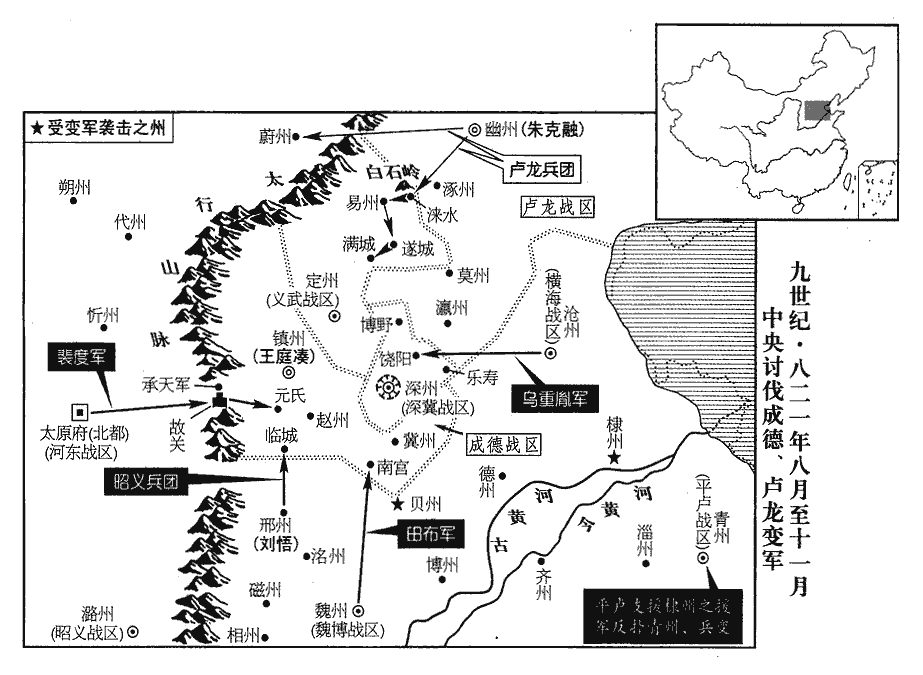
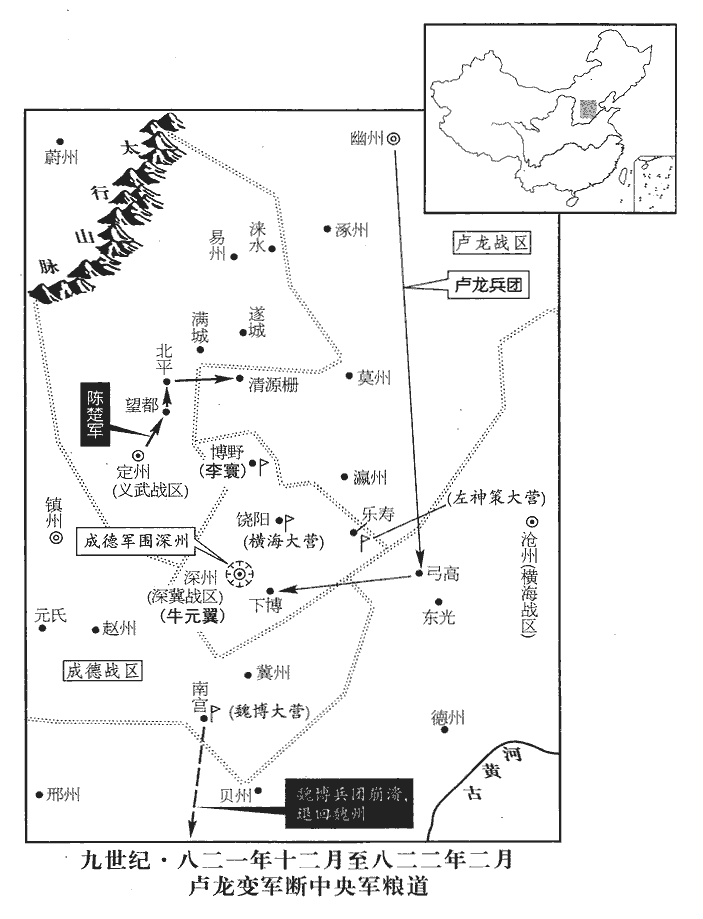
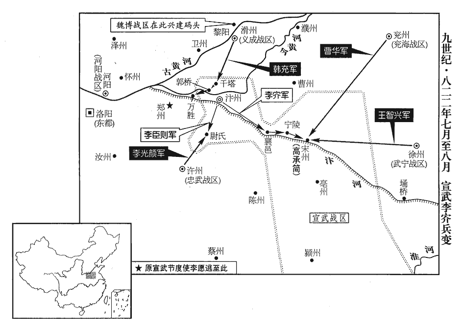

 唐紀五十八起重光赤奮若（辛丑）七月，盡玄黓攝提格（壬寅），凡一年有奇。

# 穆宗睿聖文惠孝皇帝中

## 長慶元年（辛丑、八二一）

1秋，七月，甲辰‹十›，韋雍出，逢小將策馬衝其前導，雍命曳下，欲於街中杖之。河朔軍士不貫受杖，不服。韋雍欲以柳公綽治京兆之體治幽燕，然公綽行之則可肅清輦轂，韋雍行之則召禍興戎，所居之地不同也。貫，讀曰慣。雍以白弘靖，弘靖命軍虞候繫治之。治，直之翻。是夕，士卒連營呼譟作亂，將校不能制，遂入府舍，掠弘靖貨財、婦女，囚弘靖於薊門館，薊門館，幽州驛館也。殺幕僚韋雍、張宗元、考異曰：舊傳作「張宗厚」。今從實錄。崔仲卿、鄭塤、塤xūn，許元翻。都虞候劉操、押牙張抱元。明日，軍士稍稍自悔，悉詣館謝弘靖，請改心事之，凡三請，弘靖不應，軍士乃相謂曰：「相公無言，是不赦吾曹。軍中豈可一日無帥！」乃相與迎舊將朱洄，奉以為留後。帥，所類翻。將，即亮翻。洄，克融之父也，時以疾廢臥家，自辭老病，請使克融為之；眾從之。或問：「當亂軍相率詣館謝弘靖之時，弘靖若能以任迪簡行於中山者行之，可以弭亂乎？」曰：「否。迪簡能與其下同甘苦，弘靖驕貴簡默。弘靖婦女為兵所掠，僚佐為兵所殺，使燕人果能改心以事弘靖，亦徒建節帥空名於悍將兇卒之上耳。悍兇憑陵，無所不至，祇重辱而已。」眾以判官張徹長者，不殺。徹罵曰：「汝何敢反，行且族滅！」眾共殺之。考異曰：實錄：「徹到職纔數日，軍人不之殺，與弘靖同館處之。後數日，軍人恐徹與弘靖為謀，將移之他所。徹自疑就戮，因抗聲大罵，復遇害。」舊傳曰：「續有張徹者，自遠使迴，軍人以其無過，不欲加害，將引置館中。徹不知其心，遂索弘靖所在，大罵軍人，亦為亂兵所殺。」韓愈徹墓誌曰：「徹累官至范陽府監察御史。長慶元年，今牛宰相為中丞，奏君為御史，其府惜不敢留，遣之，而密奏『臣始至孤怯，須強佐乃濟。』發半道，有詔以君還之。至數日，軍亂，怨其府從事，盡殺之而囚其帥，且相約張御史長者，無庸殺，置之帥所。居月餘，聞有中貴人自京師至，君謂其帥：『公無負此土人，上使至，可因請見自辯，幸得脫免歸。』即推門求出。守者以告其魁，魁與其徒皆駭曰：『張御史忠義，必為其帥告此餘人，不如遷之別館。』即以眾出君。君出門罵眾曰：『汝何敢反！前日吳元濟斬東市，昨日李師道斬於軍中，同惡者父母妻子皆屠死，肉餧狗鼠鴟鵶，汝何敢反！』行且罵。眾畏惡其言，不忍聞，且虞生變，即擊君以死。君抵死口不絕罵。眾皆曰：『義士！義士！』或收瘞之以俟。」據舊傳：「徹以弘靖囚時被殺。」實錄云「後數日」，墓誌云「居月餘」，三書各不同。按此月丁巳，弘靖已貶官。月餘則離幽州矣。今從實錄，參以墓誌。余謂韓愈墓誌能紀張徹所以罵賊之言。實錄及舊傳能原張徹所以罵賊之心。若其月日，則考異已有所去取矣。

〖译文〗 [1]秋季，七月，甲辰（初十），韦雍外出，碰到一个小将骑马冲撞他的仪仗前导，韦雍下令把小将从马上拉下来，打算在街道中间杖责。河朔地区的军士不习惯受杖责，拒不服从。韦雍于是报告张弘靖，张弘靖命令军虞候把小将拘捕治罪。当晚，士卒连营呼噪作乱，将校制止不住，士卒便冲入节度使府舍，掠夺张弘靖的财产和妻妾，随后，把张弘靖关押在蓟门馆，杀死他的幕僚韦雍、张宗元、崔仲卿、郑埙、都虞候刘操、押牙张抱元。第二天，军士渐渐悔悟，都到蓟门馆向张弘靖请罪，表示愿意洗心革面，仍然跟随张弘靖，做他的部从。军士几次请求，张弘靖闭口不言。于是，军士商议说：“张相公闭口不言，是不愿赦免我们，但是，军中岂可一日没有统帅！”便一齐去迎接幽州的老将朱洄，拥戴他为留后。朱洄，即朱克融的父亲，这时由于身患疾病，在家卧床休养，他以自己年老多病，辞谢留后，请求让给儿子朱克融，军士都表示同意。军士因为判官张彻年长而没有杀他，张彻骂道：“你们怎敢反叛朝廷，马上就会被族灭的！”军士一拥而上，把张彻杀死。

2壬子‹十八›，群臣上尊號曰文武孝德皇帝；赦天下。

〖译文〗 [2]壬子（十八日），群臣百官向唐穆宗奏上尊号，称为文武孝德皇帝。大赦天下。

3甲寅‹二十›，幽州監軍奏軍亂；丁巳‹二十三›，貶張弘靖為賓客、分司；貶為太子賓客，分司東都‹洛阳›也。己未‹二十五›，再貶吉州‹江西省吉安市›刺史。考異曰：舊傳：「貶撫州刺史。」按明年乃改撫州。今從實錄。庚申‹二十六›，以昭義‹总部设潞州山西省长治市›節度使劉悟為盧龍節度使。悟以朱克融方強，奏請「且授克融節鉞，徐圖之。」乃復以悟為昭義節度使。

〖译文〗 [3]甲寅（二十日），幽州监军奏报军乱。丁巳（二十三日），穆宗贬张弘靖为太子宾客、分司东都。己未（二十五日），再贬张弘靖为吉州刺史。庚申（二十六日），任命昭义节度使刘悟为卢龙（幽州）节度使。刘悟认为朱克融势力正强，奏请“暂且任命朱克融为节度使，然后，再慢慢想办法除掉他”。于是，仍任命刘悟为昭义节度使。

4辛酉‹二十七›，太和公主發長安。

〖译文〗 [4]辛酉（二十七日），太和公主从长安出发，前往回鹘国。

5初，田弘正受詔鎮成德‹总部设镇州河北省正定县›，自以久與鎮人戰，有父兄之仇，憲宗之世，田弘正兩出兵攻鎮冀。乃以魏兵二千從赴鎮，因留以自衛，奏請度支供其糧賜。舊制：諸鎮兵出境，度支給其衣糧。戶部侍郎、判度支崔倰lèng，性剛褊，無遠慮，倰，力曾翻。以為魏、鎮各自有兵，恐開事例，不肯給。弘正四上表，不報；不得已，遣魏兵歸。考異曰：舊弘正傳云：「七月歸，卒於魏州。」王庭湊傳云：「六月，魏兵還鎮。」崔倰傳曰：「遣魏卒還鎮。不數日而鎮州亂。」今從之。倰，沔之孫也。崔沔，開元初名臣。

〖译文〗 [5]当初，田弘正被任命为成德节度使，自认为以往长期与成德人打仗，有父兄之仇，于是，率魏博兵二千人随行赴任，然后留在成德用来自卫，奏请朝廷度支供给这二千人的军饷。户部侍郎、判度支崔性情刚愎，气量狭小，缺乏深思熟虑，认为魏博、成德各自有兵，恐怕此事开一先例，因而，不肯供给。田弘正四次上表朝廷，崔不加理会。田弘正不得已，把魏博兵遣返回镇。崔是开元初大臣崔沔的孙子。

弘正厚於骨肉，兄弟子姪在兩都者數十人，競為侈靡，弘正兄弟子姪皆仕於朝，分居東、西兩都。日費約二十萬，弘正輦魏、鎮之貨以供之，相屬於道；屬，之欲翻。河北將士頗不平。詔以錢百萬緡賜成德軍，度支輦運不時至，軍士益不悅。

〖译文〗 田弘正厚待自己的家人，他的兄弟、儿子、侄子在长安、洛阳两都居住的有几十个人，生活竞相奢侈靡丽，每天花费约二十万钱，田弘正运魏博、成德两镇的货供给，车辆来往于道路。河北的将士十分不满。穆宗下诏，赐钱一百万缗给成德将士，度支却没有按时运送到达，将士更加不满。

都知兵馬使王庭湊；本回鶻阿布思之種也，廷湊曾祖五哥之，驍果善鬬，王武俊養以為子，故冒姓王氏。阿布思者，天寶中以反誅。種，章勇翻。性果悍陰狡，悍，下罕翻，又侯旰翻。潛謀作亂，每抉其細故以激怒之，抉，一決翻，挑也。尚以魏兵故，不敢發。及魏兵去，壬戌‹二十八›夜，庭湊結牙兵譟於府署，殺弘正‹田兴，本年五十八岁›及僚佐、元從將吏并家屬三百餘人。從，才用翻；下再從同。廷湊自稱留後，逼監軍宋惟澄奏求節鉞。八月，癸巳‹六›，【嚴：「癸」改「己」。】惟澄以聞，朝廷震駭。崔倰於崔植為再從兄，故時人莫敢言其罪。

〖译文〗 都知兵马使王庭凑，原属回鹘阿布思族的后裔，性情果敢狡诈，阴谋作乱，经常借小事以激怒将士，但由于魏博二千兵士尚在，不敢贸然行动。等到魏博兵士返回以后，壬戌（二十八日）夜间，王庭凑交结牙兵，噪乱于节度使府，杀死田弘正及其僚佐、随从将吏和他们的家属三百多人。王庭凑自称留后，逼迫监军宋惟澄为他向朝廷上奏，请求授予节度使符节。八月，己巳（初六），宋惟澄把以上情况上报朝廷，举朝震惊。崔是宰相崔植的族兄弟，所以，朝官没有人敢抨击他的罪行。

初，朝廷易置魏、鎮帥臣，左金吾將軍楊元卿上言，以為非便，又詣宰相深陳利害；及鎮州亂，上賜元卿白玉帶。辛未‹八›，以元卿為涇原‹总部设泾州甘肃省泾川县›節度使。楊元卿以言驗受賞，然無救於鎮州之亂者，古之明君不徒賞言者而已，其言可行，必先從而行之。

〖译文〗 当初，朝廷调换魏博、成德节度使和僚佐时，左金吾将军杨元卿曾上言，认为这样做很不适宜，他又面见宰相，反复陈述利害得失。等到成德军乱后，穆宗赐给杨元卿一条白玉带。辛未（初八），任命杨元卿为泾原节度使。

瀛莫將士家屬多在幽州，壬申‹九›，莫州‹河北省任丘市北鄚州镇›都虞候張良佐潛引朱克融兵入城，刺史吳暉不知所在。莫州，北接幽、薊，故先陷。

〖译文〗 瀛州和莫州的将士家属大多留居在幽州，壬申（初九），莫州都虞候张良佐暗中勾结朱克融的兵马入城，刺史吴晖不知去向。

癸酉‹十›，王庭湊遣人殺冀州‹河北省冀州市›刺史王進岌，分兵據其州。

〖译文〗 癸酉（初十），王庭凑派人杀死冀州刺史王进岌，分兵占领冀州。

魏博節度使李愬聞田弘正遇害，素服令將士曰：「魏人所以得通聖化，至今安寧富樂者，樂，音洛。田公之力也。今鎮人不道，輒敢害之，是輕魏以為無人也。諸君受田公恩，宜如何報之？」眾皆慟哭。深州‹河北省深州市›刺史牛元翼，成德良將也，愬使以寶劍、玉帶遺之，遺，唯季翻。曰：「昔吾先人以此劍立大勲，謂平朱泚也。吾又以之平蔡州，今以授公，努力翦庭湊。」元翼以劍、帶徇于軍，報曰：「願盡死！」愬將出兵，會疾作，不果。元翼，趙州‹河北省赵县›人也。

〖译文〗 魏博节度使李听到田弘正遇害的消息，身着丧服命令将士说：“魏博人之所能够得到皇上的教化，至今生活安定，富贵享乐，都是田公的功劳。现在，成德人大逆不道，竟敢把他无故杀害，这是轻视魏博，以为我们没有人才。诸位曾受田公的恩惠，应当怎样回报他呢？”将士都大声痛哭。深州刺史牛元翼是成德的优秀将领，李把自己的宝剑和玉带送给他，说：“过去，我的父亲曾用此剑平定朱叛乱，立过大功。后来，我又用这把剑平定蔡州吴元济叛乱。现在，我把这剑授予你，希望你用它努力翦灭王庭凑。”牛元翼带着剑和玉带在军中环绕一周，然后回来报告说：“愿尽死效力！”李正准备出兵讨伐王庭凑，正好得病而未成行。牛元翼是赵州人。

乙亥‹十二›，起復前涇原節度使田布為魏博節度使，令乘驛之鎮。布固辭不獲，與妻子賓客訣曰：「吾不還矣！」悉屏去旌節導從而行，屏，必郢翻，又卑正翻。從，才用翻。未至魏州三十里，被髮徒跣，號哭而入‹魏州州城›，居于堊è室；被，皮義翻。號，戶刀翻。堊，遏各翻，白埴zhí也。按間傳：父母之喪居倚廬，齊衰之喪居堊室。孔穎達正義曰：斬衰居倚廬，齊衰居堊室，論其正耳。亦有斬衰不居倚廬者，則雜記云：大夫居倚廬，士居堊室。是士服斬衰而居堊室。田布父為鎮人所殺，寢苫枕戈之時也，今居堊室，蓋用士禮也。月俸千緡，一無所取，賣舊產，得錢十餘萬緡，皆以頒士卒，舊將老者兄事之。以田布所為，宜可以得魏卒之心，而卒不濟者，人心已搖，而布之威略不振也。

〖译文〗 乙亥（十二日），唐穆宗任命正在为父亲田弘正服丧的前泾原节度使田布为魏博节度使，命他乘驿马赴任。田布一再推辞而未得允许，于是，和妻子、宾客诀别说：“我此行不打算生还了！”下令撤除节度使旌节和所有前导随行人员，然后出发上任。距离魏州三十里时，散发赤脚，大声痛哭而入州城，住在垩室，为父亲服丧。他每月应得俸禄一千缗，一文不要，却把自己家留在魏博的产业卖掉，得到十几万缗现钱，全部用来赐士卒。对于父亲原在魏博的部将和年长的将吏，都以兄弟的礼节来礼遇他们。

丙子‹十三›，瀛州軍亂，執觀察使盧士玫及監軍僚佐送幽州，囚於客館。

〖译文〗 丙子（十三日），瀛州发生军乱，士卒逮捕观察使卢士玫以及监军和僚佐，押送幽州，拘禁在客馆。

王庭湊遣其將王立攻深州，不克。

〖译文〗 王庭凑派遣他的部将王立攻打深州，未能攻克。

丁丑‹十四›，詔魏博、橫海‹总部设沧州河北省沧州市东南›、昭義、河東、義武‹总部设定州河北省定州市›諸軍各出兵臨成德之境，若王庭湊執迷不復，宜即進討。成德大將王儉【嚴：「儉」改「位」。】等五人謀殺王庭湊，事泄，并部兵三千人皆死。

〖译文〗 丁丑（十四日），唐穆宗下诏，命令魏博、横海、昭义、河东、义武等镇军队派兵，兵临成德边境，如果王庭凑还执迷不误，抗拒朝廷的话，就进兵攻讨。成德大将王俭等五人密谋暗杀王庭凑，不料消息泄露，这五人和他们的部下士卒三千人都被杀死。

己卯‹十六›，以深州刺史牛元翼為深冀節度使。深州，南至冀州八十五里。

〖译文〗 己卯（十六日），唐穆宗任命深州刺史牛元翼为深冀节度使。

丁亥‹二十四›，以殿中侍御史溫造為起居舍人，充鎮州四面諸軍宣慰使，歷澤潞、河東、魏博、橫海、深冀、易定等道，諭以軍期。造，大雅之五世孫也。高祖起兵，溫大雅掌書翰。己丑‹二十六›，以裴度為幽、鎮兩道招撫使。

〖译文〗 丁亥（二十四日），唐穆宗任命殿中侍御史温造为起居舍人，充任镇州四面诸军宣慰使，前往昭义、河东、魏博、横海、深冀、易定等道，传达进兵日期的命令。温造是唐高祖时黄门侍郎温大雅的第五代孙子。己丑（二十六日）任命裴度为幽州、镇州两道招抚使。

癸巳‹三十›，王庭湊引幽州兵圍深州。

〖译文〗 癸巳（三十日），王庭凑勾引幽州兵围攻深州。

6九月，乙巳‹十二›，相州‹河南省安阳市›軍亂，殺刺史邢濋。濋chǔ，音楚。

〖译文〗 [6]九月，乙巳（十二日），相州发生军乱，刺史邢被杀。

7吐蕃遣其禮部尚書論訥羅來求盟。庚戌‹十七›，以大理卿劉元鼎為吐蕃會盟使。

〖译文〗 [7]吐蕃国派遣礼部尚书论纳罗来唐朝请求缔结会盟条约。庚戌（十七日），唐穆宗任命大理卿刘元鼎为吐蕃会盟使。

8壬子‹十九›，朱克融焚掠易州‹河北省易县›、淶水‹河北省涞水县›、遂城‹河北省徐水县西遂城镇›、滿城‹河北省满城县›。淶水，漢涿郡遒qiú縣地。隋開皇元年以范陽為道，更置范陽縣於此地，六年，改范陽曰固安，八年廢，十年又置永陽縣，十八年又改為淶水。周官職方：其浸淶、易，蓋因淶水以名縣也。淶，音來。遂城，漢北新城縣地，屬中山國。後魏置南營州於其地，置五郡十都，後省併為昌黎一郡，領永樂、新昌二縣；隋廢郡，因舊有武遂縣置遂城縣，唐屬易州。宋以遂城縣置威虜軍，金以縣置遂州，以滿城縣屬保州。

〖译文〗 [8]壬子（十九日），朱克融出兵焚烧掠夺易州、涞水、遂城、满城。

 

9自定兩稅以來，定兩稅見二百二十六卷德宗建中元年。錢日重，物日輕，民所輸三倍其初，詔百官議革其弊。戶部尚書楊於陵以為：「錢者所以權百貨，貿遷有無，所宜流散，貿，音茂。流散，謂錢流布於天下。不應蓄聚。今稅百姓錢藏之公府；又，開元中天下鑄錢七十餘爐，歲入百萬，新志云：天寶末，天下爐九十九，絳州三十，揚、潤、宣、鄂、蔚皆十，益、郴皆五，洋州三，定州一。蓋天寶末又加多於開元矣。今纔十餘爐，歲入十五萬，又積於商賈之室賈，音古。及流入四夷。又，大曆以前淄青‹总部设郓州山东省东平县›、太原‹总部设太原府山西省太原市›、魏博貿易雜用鉛鐵，嶺南‹总部设广州广东省广州市›雜用金、銀、丹砂、象齒，今一用錢。如此，則錢焉得不重，物焉得不輕！焉，於虔翻。今宜使天下輸稅課者皆用穀、帛，廣鑄錢而禁滯積積，子賜翻。及出塞者，錢出邊關，則流入於夷狄。則錢日滋矣。」朝廷從之，始令兩稅皆輸布、絲、纊kuàng；獨鹽、酒課用錢。

〖译文〗 [9]自从建中元年实行两税法以来，钱的价值越来越高，而实物的价值越来越低，百姓纳税的数额比建中元年实际高出三倍之多。唐穆宗下诏，命百官商议革除两税法的弊端。户部尚书杨於陵认为：“钱是用来衡量货物价值的东西，天下商人贩运买卖，无处不有，所以，钱也应四处流通，不应当蓄积一处。现在，百姓交纳的钱，都收藏在官府仓库。另外，开元时期全国铸钱七十多炉，每年收入一百万缗；而现在铸钱十几炉，每年收入才十五万缗。这些钱又大多集中于商人，以及夷狄的手中。还有，大历年以前，淄青、太原、魏博商品交易兼用钱和铅、铁，岭南则兼用金、银、丹砂、象牙，现在，都统一用钱。这样一来，钱的价值怎么能不高，而实物的价值又怎么能不低呢？现在，应当下令全国纳税的人都交纳粮食和布帛，增加铸钱而禁止蓄积以及钱流出塞外。如果这样，钱就会逐渐多起来。”朝廷采纳杨於陵的建议，下令以后两税都交纳布、丝和丝棉；惟独盐、酒专卖仍然用钱。

10冬，十月，丙寅‹三›，以鹽鐵轉運使、刑部尚書王播為中書侍郎、同平章事，使職如故。播為相，專以承迎為事，未嘗言國家安危。

〖译文〗 [10]冬季，十月，丙寅（初三），唐穆宗任命盐铁转运使、刑部尚书王播为中书侍郎、同平章事，仍兼盐铁转运使。王播担任宰相，专门阿谀奉迎皇上，很少谈论朝廷安危。

11以裴度為鎮州四面行營都招討使。左領軍大將軍杜叔良，以善事權倖得進；時幽、鎮兵勢方盛，諸道兵未敢進，上欲功速成，宦官薦叔良，以為深州諸道行營節度使。為杜叔良喪師張本。以牛元翼為成德節度使。

〖译文〗 [11]唐穆宗任命裴度为镇州四面行营都招讨使。左领军大将军杜叔良由于善于巴结当朝权贵得到提拔，这时，幽州、镇州的兵力正处于强盛，诸道出兵讨伐的军队都不敢进攻。穆宗想尽快看到胜利成果，而宦官又推荐杜叔良，于是，任命叔良为深州诸道行营节度使，任命牛元翼为成德节度使。

12癸酉‹十›，命宰相及大臣凡十七人與吐蕃論訥羅盟于城西；遣劉元鼎與訥羅入吐蕃，亦與其宰相以下盟。吐蕃國有大相、副相，史因亦以宰相書之。

〖译文〗 [12]癸酉（初十）唐穆宗命宰相和大臣共十七人，与吐蕃国礼部尚书论纳罗在京城西会盟。随后，派遣刘元鼎和论纳罗赴吐蕃国，与吐蕃国宰相及其大臣会盟。

13乙亥‹十二›，以沂州‹山东省临沂市›刺史王智興為武寧‹总部设徐州江苏省徐州市›節度副使。先是，副使皆以文吏為之。先，悉薦翻。上聞智興有勇略，欲用之於河北，故以是寵之。為王智興逐其帥崔群張本。

〖译文〗 [13]乙亥（十二日），唐穆宗任命沂州刺史王智兴为武宁节度副使。以前，藩镇节度副使都任用文官，穆宗听说智兴有勇有谋，想调他到河北前线，所以，用这个职务表示对他的恩宠。

14丁丑‹十四›，裴度自將兵出承天軍故關‹山西省平定县东北娘子关›以討王庭湊。承天軍當在遼州界。故關，即孃子關也。宋朝廢遼州，以平城、和順二縣為鎮；以并州之樂平、平定二縣為平定軍，二鎮屬焉；以承天軍為寨，屬平定縣。平定，唐之廣陽縣也。按沈存中筆談：鎮州通河東有兩路：飛狐路在大茂山之西，大茂山，恆山之岑也。自銀冶寨北出倒馬關，卻自石門子、令水鋪入缾形、梅回兩寨之間至代州。自石晉割地與契丹，以大茂山分脊為界，此路已不通；惟北寨西出承天關路，可至河東，然路極峭峽。宋白曰：承天軍，太原東鄙，土門路所衝也。

〖译文〗 [14]丁丑（十四日），裴度亲自率军，经由原承天军驻地娘子关到达河北，讨伐王庭凑。

15朱克融遣兵寇蔚州‹河北省蔚县。蔚州属河东战区›。媯州西南至蔚州二百四十里。蔚，紆勿翻。

〖译文〗 [15]朱克融派兵侵犯蔚州。

16戊寅‹十五›，王庭湊遣兵寇蔚【章：十二行本「蔚」作「貝」；乙十一行本同；孔本同；退齋校同；熊校同。】州‹贝州，河北省清河县。贝州属魏博战区›。

〖译文〗 [16]戊寅（十五日），王庭凑派兵侵犯蔚州。

17己卯‹十六›，易州刺史柳公濟敗幽州兵於白石嶺，敗，補邁翻。殺千餘人。

〖译文〗 [17]己卯（十六日），易州刺史柳公济在白石岭打败幽州兵马，杀一千多人。

18庚辰‹十七›，橫海軍節度使烏重胤奏敗成德兵于饒陽‹河北省饶阳县›。

〖译文〗 [18]庚辰（十七日），横海节度使乌重胤奏报，在饶阳打败成德兵马。

19辛巳‹十八›，魏博節度使田布將全軍三萬人討王庭湊，屯於南宮‹河北省南宫市›之南，拔其二柵。

〖译文〗 [19]辛巳（十八日），魏博节度使田布率全军三万人讨伐王庭凑，屯驻在南宫县南，攻拔王庭凑两个营栅。

20翰林學士元稹與知樞密魏弘簡深相結，求為宰相，由是有寵於上，每事咨訪焉。元稹交結大閹，喪其素守，憲宗之過也。稹，止忍翻。稹無怨於裴度，但以度先達重望，恐其復有功大用，復，扶又翻。妨己進取，故度所奏畫軍事，多與弘簡從中沮壞之。度乃上表極陳其朋比姦蠹之狀，沮，在呂翻。壞，音怪。比，毗至翻。以為：「逆豎搆亂，震驚山東；逆豎，指王庭湊等。姦臣作朋，撓敗國政。姦臣，指元稹等。撓，奴教翻。敗，補邁翻，屈也。陛下欲掃蕩幽、鎮，先宜肅清朝廷。何者？為患有大小，議事有先後。河朔逆賊，袛亂山東；禁闈姦臣，必亂天下；是則河朔患小，禁闈患大。小者臣與諸將必能翦滅，大者非陛下覺寤制斷無以驅除。斷，丁亂翻。今文武百寮，中外萬品，有心者無不憤忿，憤，懣也。忿，怒也。有口者無不咨嗟，直以獎用方深，不敢抵觸，恐事未行而禍已及，不為國計，且為身謀。臣自兵興以來，所陳章疏，事皆要切，所奉書詔，多有參差，參，楚簪翻。差，楚宜翻。參差，不齊也。蒙陛下委付之意不輕，遭姦臣抑損之事不少。臣素與佞倖亦無讎嫌，正以臣前請乘傳詣闕，面陳軍事，傳，株戀翻。乘傳，乘驛馬也。姦臣最所畏憚，恐臣發其過，百計止臣。臣又請與諸軍齊進，隨便攻討，姦臣恐臣或有成功，曲加阻礙，逗遛日時；進退皆受羈牽，羈，馬絡頭也。牽，牛紖zhèn也。諭以馬牛動為人所制。意見悉遭蔽塞。塞，悉則翻。但欲令臣失所，使臣無成，則天下理亂，山東勝負，悉不顧矣。為臣事君，一至於此！若朝中姦臣盡去，則河朔逆賊不討自平；若朝中姦臣尚存，則逆賊縱平無益。陛下儻未信臣言，乞出臣表，使百官集議，彼不受責，臣當伏辜。」表三上，上，時掌翻。上雖不悅，以度大臣，不得已，癸未‹二十›，以弘簡為弓箭庫使，稹為工部侍郎。稹雖解翰林，恩遇如故。為相稹及于方事張本。

〖译文〗 [20]翰林学士元稹和知枢密魏弘简深相勾结，求做宰相，由此而得到唐穆宗的宠任，朝政大事都向他咨询。元稹和裴度虽然没有仇怨，但由于裴度在他得到重用前就有很高的威望，恐怕裴度在讨伐幽州、成德时立功，再度得到朝廷重用，妨碍自己升迁。所以，凡是裴度上奏的军事谋划，他经常和魏弘简二人从中阻挠，使他不能实施。于是，裴度上表，极力指责元稹和宦官朋比为党，奸邪害国的罪状，认为：“王庭凑、朱克融逆臣竖子叛乱，震惊山东；奸臣朋比为党，则搅乱朝政。陛下如果想扫平幽州、镇州叛乱的话，应当首先肃清朝廷奸党。为什么呢？因为灾祸有大有小，考虑事情也有先有后。河朔的叛臣贼党，只能扰乱山东，而宫中的奸臣，则必定祸乱天下。所以，对国家来说，河朔的叛臣危害小，而宫中的奸臣危害大。对于河朔的叛臣，我和诸位将领肯定能够翦灭，但宫中的奸臣，如果陛下不觉悟，则断然无法驱除。现在，朝廷文武百官，京城和各地众多臣僚，凡是有心对朝廷尽忠的人，对奸臣的所做所为无不愤怒，能够开口讲话的人也无不嗟叹。只是由于陛下正信用他们，才不敢指责，恐怕奸臣未能翦除，而祸已及身。这并非他们不为国家考虑，而是担心自己受牵连的缘故。自从朝廷兴兵讨伐幽州和成德以来，我所上奏陈述的用兵方略，都事关紧要。但所接到的朝廷诏书，却指令不一。我受陛下重托，指挥诸军讨代，责任实在不轻，但遭奸臣从中阻挠的事情，也实在不少。我向来和奸臣无怨，只是由于前不久我上奏朝廷，请求乘驿马到京城，当面向陛下陈述用兵方略，奸臣最害怕的，是怕我向陛下揭发他们的罪过，所以百般阻挠我进京。同时，我又上奏朝廷，请准许我率兵和诸军一同进攻，随机应变，讨伐叛乱。但奸臣恐怕我可能成功，于是，用各种理由加以阻挠，以致我军停滞很久，无论进退，都受到他们的牵制，上奏朝廷的意见，也都被他们从中阻塞。他们这样做的目的，就是要让我出兵失利，不能成功，对于国家治乱，山东前线的胜负大局，却全然不顾。作为臣下侍奉皇上，他们就是这样做的！如果朝中的奸臣全部能够驱除，那么，河朔的叛臣贼党就会不讨自平；但如果朝中奸臣仍然存在的话，则虽然讨平叛臣贼党，对于朝廷也没有什么好处。陛下如果不相信我的话，请求把我的奏章公布，让百官一起讨论，如果奸臣不遭到百官的遣责，我愿受到应有的惩罚。”裴度多次上奏指斥元稹等人的罪行，穆宗虽然很不高兴，但考虑到裴度是朝廷中威望很高的大臣，不得不作出让步。癸未（二十日），贬魏弘简为弓箭库使，元稹为工部侍郎。元稹虽然被解除翰林学士的职务，但仍然和过去一样，受到穆宗的宠信。

21宿州‹安徽省宿州市›刺史李直臣坐贓當死，宦官受其賂，為之請，為，于偽翻。御史中丞牛僧孺固請誅之。上曰：「直臣有才，可惜！」僧孺對曰：「彼不才者，無過溫衣飽食以足妻子，安足慮！本設法令，所以擒制有才之人。安祿山、朱泚皆才過於人，法不能制者也。」上從之。

〖译文〗 [21]宿州刺史李直臣贪污，根据法律，应当判处死刑。宦官受了他的贿赂，为他辩护。御史中丞牛僧孺一再请求杀掉，穆宗说：“直臣很有才能，杀了可惜！”牛僧孺回答说：“那些没有才能的人，整天考虑的不过是吃饱穿暖，满足妻子的要求，对这些人，国家又有什么可顾虑的！制定法律的目的，本来就是约束那些有才能的人。安禄山、朱都才智过于常人由于法律未能约束，才胆敢发动叛乱的。”穆宗听从了他的意见。

22橫海節度使烏重胤將全軍救深州，時王庭湊圍牛元翼於深州。諸軍倚重胤獨當幽、鎮東南，橫海，當鎮州之東，幽州之南。重胤宿將，知賊未可破，按兵觀釁。上怒，【章：十二行本「怒」下有「丙戌‹二十三›」二字；乙十一行本同。】以杜叔良為橫海節度使，徙重胤為山南西道‹总部设兴元府陕西省汉中市›節度使。

〖译文〗 [22]横海节度使乌重胤率全军救援深州，诸军依赖乌重胤独自抵挡幽州、镇州的东南方向。乌重胤是经验丰富的老将，知道敌人不可能一时被击破，于是，按兵不动观察敌军动静。穆宗大怒，任命杜叔良为横海节度使，调乌重胤为山南道节度使。

23靈武‹总部设灵州宁夏灵武市›節度使李進誠奏敗吐蕃三千騎於大石山下。敗，補邁翻。大石山，在魯州東南。魯州，六胡州之一也。在靈夏西河曲之地。

〖译文〗 [23]灵武节度使李进诚上奏：在大石山下打败吐蕃三千骑兵。

24十一月，辛酉‹二十八›，淄青節度使薛平奏突將馬廷崟yín作亂，伏誅。崟，魚音翻。時幽、鎮兵攻棣州‹山东省惠民县›，平遣大將李叔佐將兵救之。刺史王稷供饋稍薄，軍士怨怒，宵潰，推廷崟為主，行且收兵至七千餘人，徑逼青州‹山东省青州市›。城中兵少，不敵，平悉發府庫及家財召募，得精兵二千人，逆戰，大破之，斬廷崟，其黨死者數千人。考異曰：河南記曰：「韓國公之節制青州也，長慶元年，詔徵數道兵馬，且問罪於常山、平盧，發二千餘人駐于無棣。臨當回戈青州，所駐兵部內隊長有馬士端者，殺其首領，遂驅所部士卒，兼招召迫脅，比到博昌，已萬餘人，便謀入青州有日矣，韓公聞之，便議除討。大將等進計曰：『彼賊者兇頑一卒，無經遠之謀，可令紿以尚書已赴闕庭，三軍將吏皆廷頸以待留後，賊必信之，懈然無備，可伏甲而虜之。』韓公大然其策。於是賊心不復疑貳，翌日，引兵而來。遂於城北三十餘里三面伏兵，賊眾果陷於我圍。信旗一麾，步騎雲合，賊眾驚擾，不知所為，悉皆降伏。遂令投戈釋甲，驅入青州，矯令還家，待以不死。遂條其數目，明立簿書，三千、二千，各屯一處。霜刀齊發，蟻眾湯消，二萬餘人，同命一日。賊帥馬士端潰圍奔走，尋於鄒平渡口追獲，磔於城北。於是具列其狀以上聞，旋除左僕射。」據實錄作「馬廷崟」，舊傳作「馬狼兒」，河南記作「馬士端」，今名從實錄，事從舊傳。明年二月，平加僕射，舊傳云：「封魏國公」。河南記作「韓公」，恐誤。

〖译文〗 [24]十一月，辛酉（二十八日），淄青节度使薛平上奏：突将马廷作乱被杀。当时，幽州和镇州派兵攻打棣州，薛平派大将李叔佐率兵救援。棣州刺史王稷供给军队物资稍少，军士怨恨愤怒，乘夜晚溃逃。军士推马廷为道领，一边行走，一边收兵，共达七千多人，直向青州逼近。青州城中兵少，不足以抵抗逃兵，于是，薛平把仓库和自己家的私财全部拿出，招募士卒，得精兵二千人，出城迎城，大败逃兵，把马廷斩首，逃兵死亡几千人。

25橫海節度使杜叔良將諸道兵與鎮人戰，遇敵輒北；鎮人知其無勇，常先犯之。十二月，庚午‹八›，監軍謝良通奏叔良大敗於博野‹河北省蠡县›，博野，漢涿郡蠡吾縣之地，後漢分置博陵縣，後魏改為博野，唐屬深州，宋為永寧軍治所。宋白曰：雍熙四年，於博野縣置寧邊軍。失亡七千餘人。叔良脫身還營，喪其旌節。喪，息浪翻。

〖译文〗 [25]横海节度使杜叔良率领诸道兵马与镇州军队交战，每战皆败。镇州人知道他胆怯无勇，常常首先向他发起进攻。十二月，庚午（初八），监军谢良通奏报杜叔良在博野大败，损失逃亡七千多人。杜叔良脱身回到军营，但丢失了节度使的旌节。

26丁丑‹十五›，義武節度使陳楚奏敗朱克融兵於望都‹河北省望都县›及北平‹河北省顺平县›，望都，漢縣，屬中山郡。張晏曰：都山在縣南，堯母慶都所居。堯山在縣北，登堯山望見都山，故以望都為名。北齊併望都入北平，唐武德四年復置望都縣，屬定州。九域志：縣在州東北六十里。北平，亦漢古縣，唐屬定州。九域志：在州北九十里。宋白曰：定州北平縣，漢曲逆縣地，後漢改蒲陰；後魏孝昌中，於今縣東北二十里置北平郡於北平城，唐為北平縣。按漢志，北平縣屬中山國。敗，補邁翻。斬獲萬餘人。

〖译文〗 [26]丁丑（十六日），唐穆宗任命凤翔节度使李光颜为忠武节度使、兼深州行营节度使，替代杜叔良。

27戊寅‹十六›，以鳳翔‹总部设凤翔府陕西省凤翔县›節度使李光顏為忠武‹总部设许州河南省许昌市›節度使、兼深州行營節度使，代杜叔良。

〖译文〗 [27]戊寅日，皇上任命凤翔节度使李光颜为忠武节度使兼深州行营节度使，代替杜叔良。

28自憲宗征伐四方，國用已虛，上即位，賞賜左右及宿衛諸軍無節，及幽、鎮用兵久無功，府藏空竭勢不能支。藏，徂浪翻。支，持也，當也。執政乃議：「王庭湊殺田弘正而朱克融全張弘靖，罪有重輕，請赦克融，專討庭湊。」上從之。乙酉‹二十三›，以朱克融為平盧節度使。「平盧」，當作「盧龍」。

〖译文〗 [28]自从唐宪宗征讨四方叛乱以来，国库已空虚。唐穆宗即位后，赏赐左右和禁卫诸军毫无节制，等到朝廷对幽州、镇州用兵，旷日持久而未立功，国库空竭，难以继续维持。于是，当政大臣建议说：“王庭凑杀害了田弘正，而朱克融尚能保全张弘靖的性命，二人罪行各有轻重，请求赦免克融，集中全力讨伐王庭凑。”穆宗采纳了他们的意见。乙酉（二十三日），任命朱克融为卢龙节度使。

29戊子‹二十六›，義武奏破莫州清源‹河北省保定市境›等三柵，斬獲千餘人。柵，側革翻。

〖译文〗 [29]戊子（二十六日），义武上奏、攻破莫州清源等三个营栅，斩首和俘虏敌军一千多人。

## 二年（壬寅、八二二）

1春，正月，丁酉‹五›，幽州‹北京市›兵陷弓高‹河北省泊头市西交河镇›。先是，弓高守備甚嚴，弓高縣，宋朝為永靜軍地。先，悉薦翻。有中使夜至，守將不內，旦，乃得入，中使大詬怒。詬，許候翻，又古候翻。賊諜知之，諜，達協翻。他日，偽遣人為中使，投夜至城下，守將遽內之；賊眾隨之，遂陷弓高。史言唐宦者陵轢守禦捍敵之臣，使之失守。又圍下博。中書舍人白居易上言，以為：「自幽、鎮‹河北省正定县›逆命，朝廷徵諸道兵，計十七八萬，考異曰：白集作「七八十萬」，計無此數，恐是十七八萬誤耳！四面攻圍，已踰半年，王師無功，賊勢猶盛。弓高既陷，糧道不通，下博、深州‹河北省深州市›，飢窮日急。深州西南皆逼於王庭湊，惟恃弓高以通橫海之餫yùn。弓高既陷，糧道遂梗。九域志：弓高，東至滄州一百二十里，西北至深州二百里。蓋由節將太眾，其心不齊，莫肯率先，遞相顧望。又，朝廷賞罰，近日不行，未立功者或已拜官，已敗衂者不聞得罪；衂nǜ，女六翻。既無懲勸，以至遷延，若不改張，改張，猶更張也。董仲舒曰：譬如琴瑟不調，必改絃而更張之，乃可鼓也。必無所望。請令李光顏將諸道勁兵約三四萬人從東速進，開弓高糧路，【章：十二行本「路」下有「合下博諸軍」五字；乙十一行本同；退齋校同。】解深、邢重圍，「深邢」當作「深州」。重，直龍翻。與元翼合勢。令裴度將太原全軍兼招討舊職，西面壓境，壓鎮州之境。觀釁而動。若乘虛得便，即令同力翦除；若戰勝賊窮，亦許受降納款。降，戶江翻。如此，則夾攻以分其力，招諭以動其心，必未及誅夷，自生變故。謂賊之麾下將有誅逆而效順者。又請詔光顏選諸道兵精銳者留之，其餘不可用者悉遣歸本道，自守土疆。蓋兵多而不精，豈唯虛費衣糧，兼恐撓敗軍陳故也。撓，奴巧翻。敗，補邁翻。陳，讀曰陣。今既祇留東、西二帥，謂令裴度居西，李光顏居東。請各置都監一人，諸道監軍，一時停罷。如此，則眾齊令一，必有成功。又朝廷本用田布，令報父讎，令報王庭湊殺弘正之讎。今領全師出界，供給度支，言仰供給於度支。數月已來，都不進討，非田布固欲如此，抑有其由。聞魏博‹总部设魏州河北省大名县›一軍，屢經優賞，自田弘正舉魏博一軍歸朝，其後代伐恆，平蔡，平鄆，朝廷犒賞優厚。兵驕將富，莫肯為用。況其軍一月之費，計實錢二十八萬緡，若更遷延，將何供給？此尤宜早令退軍者也。若兩道止共留兵六萬，所費無多，兩道，謂河東、橫海。既易支持，易，以豉翻。自然豐足。今事宜日急，其間變故遠不可知。苟兵數不抽，軍費不減，食既不足，眾何以安！不安之中，何事不有！況有司迫於供軍，百端斂率，不許即用度交闕，盡許則人心無憀liáo。指言將有建中之禍而微其辭。憀，落蕭翻，無憀賴也。自古安危皆繫於此，伏乞聖慮察而念之。」疏奏，‹李恒，本年二十八岁›不省。白居易之論事，李絳之流亞歟！顧憲、穆有用不用耳。省，悉景翻。

〖译文〗 [1]春季，正月，丁酉（初五），幽州出兵攻陷弓高县城。以前，弓高守卫很严，一次，一个宦官出使弓高，半夜到达，守将根据军法条例，拒不放他入城；天明后，宦官方才进城。宦官大怒，责骂守将。幽州的探马得知此事后，报告主将。过了不久，幽州派人伪装成宦官，半夜来到弓高城下，守将即让他入城，幽州兵随后赶到，因而攻陷弓高。接着，又围攻下博县城。中书舍人白居易上书，认为：“自从幽州、镇州叛乱以来，朝廷征发诸道兵马讨伐，总计有十七八万人，四面围攻，已超过半年时间。但官军至今没有进展，贼军兵势却仍然强盛。弓高失陷后，通往前线的运粮道路无法通行，下博和深州的将士，饥饿困乏，情况日益紧急。这都是由于前线节度将领太多，反而心不齐，都不肯率先进攻，相互观望的缘故。另外，朝廷对将士的赏罚，近来也不见成效，没有立功的人有的已经授予官衔，作战失败的人却没说被朝廷惩罚。由于赏罚不明，因而将士拖延不进。若不改弦更张，胜利就没有指望了。请求陛下命李光颜率领诸道精兵三四万人从东面急速进兵，打通到弓高的粮道，以便解除敌军对深州的重重包围，和牛元翼的军队会合一起。再命裴度率领太原的全部人马，仍兼招讨使的职务，从西面压敌边境，观察敌军动静，如能乘虚得手，即令两支兵马同力讨伐，一举歼敌。如果官军节节取胜，敌军困窘，也应当许可前线将领接受敌军的投降。这样部署指挥，就可以两面夹攻，使敌人分散兵力，并通过招降来动摇对方军心。其结果，敌人尚未灭亡，内部必定发生兵变，不战自降。同时，再请陛下下诏，命李光颜从前线诸道兵士中挑选精锐者留下，其余老弱病残都遣反本道，各守故土。大凡兵多则不精，不仅虚耗国家衣物钱粮，而且也会消弱官军自身士气，导致失败。现只留李光颜、裴度两支兵马，请陛下各置都监一人，各道的监军，都予以罢除。这样，就会队伍整齐，军令统一，最后必定取得胜利。再有，朝廷命田布为魏博节度使的本意，是让他为父报仇。现在，田布率领全部兵马出境讨敌，由朝廷度支供给衣粮，但几个月以来，魏博军队从未攻讨。这并非田布按兵不动，而是有他难言的苦衷。听说魏博军队经由朝廷多次优厚的赏赐，兵士骄横，将领富有，反而不愿作战。况且委博军，每月的军费按货币折算，即达二十八万缗。如果继续拖廷下去，朝廷用什么来供给呢？仅就此而言，也应早日下令魏博退军。如果仅李光颜和裴度两道共留六万兵力，军费不多，朝廷易于供给，军需自然丰足。现在，前线战事日益紧迫，中间或许还会发生什么变故，难以预料。如果不及时抽减兵力，致使军费浩大，粮食不足，将士怎能安心作战。军心不定，随时都可能发生意外变故！况且度支迫于供军，千方百计盘剥百姓，如果朝廷不准许，则军需匮乏，若准许则人心动摇。自古以来，朝政安危都在于此。请求陛下说细了解并加以慎重考虑。“奏折递上去后，穆宗不理。

 

己亥‹七›，度支饋滄州‹河北省沧州市东南›糧車六百乘，至下博，盡為成德軍所掠。時諸軍匱乏，供軍院所運衣糧，往往不得至院，此時供軍院置於行營者，謂之北供軍院；度支自南供軍院運以給之。乘，繩證翻。在塗為諸軍邀奪，其懸軍深入者，皆凍餒無所得。

〖译文〗 已亥（初七），度支供给沧州军粮车六百辆行至下博县时，全部遭成德军抢夺。这时官军诸道兵马军需匮乏，供军院所运衣粮，往往未到行营供军院，在半路就被诸军哄抢。凡孤军深入的兵马，都饥寒交迫而得不到补给。

初，田布從其父弘正在魏，善視牙將史憲誠，屢稱薦，至右職；及為節度使，遂寄以腹心，以為先鋒兵馬使，軍中精銳，悉以委之。憲誠之先，奚‹滦河上游›人也，世為魏將；魏與幽、鎮本相表裏，及幽、鎮叛，魏人固搖心。布以魏兵討鎮，軍于南宮‹河北省南宫市›，上屢遣中使督戰，而將士驕惰，無鬬志，又屬大雪，屬，之欲翻。度支饋運不繼。布發六州租賦以供軍，魏、博‹山东省聊城市›、貝‹河北省清河县›、衛‹河南省卫辉市›、澶chán‹河南省内黄县东南›、相‹河南省安阳市›六州也。將士不悅，曰：「故事，軍出境，皆給朝廷。言仰給於朝廷也。今尚書刮六州肌肉以奉軍，雖尚書瘠己肥國，六州之人何罪乎！」憲誠陰蓄異志，因眾心不悅，離間鼓扇之。以眾情諭火，火本有熾烈之性，鼓鞴以吹之，搖扇以扇之，則愈熾烈矣。間，古莧翻。會有詔分魏博軍與李光顏，使救深州，庚子‹八›，布軍大潰，多歸憲誠；布獨與中軍八千人還魏，壬寅‹十›，至魏州。

〖译文〗 当初，田布随从他的父亲田弘正在魏博时，对牙将史宪诚十分重视，多次向田弘正称赞推荐，以至史宪诚被提拔但任要职。等到田布被任命为魏博节度使，于是，把他作为自己的亲信，任命为先锋兵马使，军中的精锐兵力，都委托到来统辖。史宪诚的祖先是奚族人，世代在魏博为将。魏博和幽州、镇州本来就相互依赖互为表里，待到幽州和成德叛乱以后，魏博的人心已经动摇。田布率魏博军队讨伐镇州，驻扎在南宫县。唐穆宗多次派遣宦官前往督战，而魏博将士骄横懈怠，毫无斗志。这时正好又下了一场大雪，度支供给难以接续。田布命征发魏博六州的租赋供给军需，将士很不高兴，说：“按照惯例，我军出境后，都由朝廷供给。现在，田尚书刮我六州的民脂民膏来供军，虽然尚书这样做是克已奉国，但六州百姓为什么要遭这份罪呢？”史宪诚暗中早在纂夺节度使的野心，于是，乘机挑拨煽动士卒的不满情绪。正在这时，穆宗下诏，命魏博分兵由李光颜指挥，前往救援深州。庚子（初八），田布的军队溃乱士卒大多归史宪诚。田布独自率新军八千人返回魏州，壬寅（初十），到达魏州。

癸卯‹十一›，布復召諸將議出兵，復，扶又翻。諸將益偃蹇，曰：「尚書能行河朔舊事，則死生以之；謂行田承嗣、李寶臣之事也。若使復戰，則不能也！」布無如之何，歎曰：「功不成矣！」即日，作遺表具其狀，略曰：「臣觀眾意，終負國恩；臣既無功，敢忘即死。即，就也。伏願陛下速救光顏、元翼，不然者，忠臣義士皆為河朔屠害矣！」奉表號哭，號，戶刀翻。拜授幕僚李石，乃入啟父靈，孝子之喪其親也，設几筵，朝夕具盥洗，上飲食，事之如生，俗謂之靈筵。抽刀而言曰：「上以謝君父，下以示三軍。」遂刺心而死。‹年三十八岁›刺，七亦翻。憲誠聞布已死，乃諭其眾，遵河北故事。眾悅，擁憲誠還魏，奉為留後。戊申‹十六›，魏州奏布自殺。己酉‹十七›，以憲誠為魏博節度使。憲誠雖喜得旄鉞，外奉朝廷，然內實與幽、鎮連結。

〖译文〗 癸卯（十一日），田布再次召集部将，商议出兵。诸将更加傲慢，说：“田尚书如果能按以往河朔割据的惯例办的话，我们就舍生忘死跟从您；但如果要让我们出战，则不能服从。”田布无可奈何，叹道：“我立功报国的愿望无法实现了！”当天，他写下遗书，把以上情况向穆宗报告，大意是：“我观察将士的意向，终必背叛朝廷，辜负皇上的恩德。我既然未能立功，只好就死。愿陛下尽快派兵救援李光颜、牛元翼，不然的话，这些忠臣义士都将被河朔的叛党屠害！”他手捧遗书大声痛哭，然后，拜倒在地，授予幕僚李石，让他转呈朝廷。接着，他走到父亲的灵位前，抽出刀说：“我以死对上向皇上和父亲表示我未能立功报国的罪责；对下向三军将士表示我忠君爱国的决心。”于是，用刀刺心而死。史宪诚听说田布已经自杀，于是，向将士宣布，他将遵循河朔的惯例，实行割据。将士十分高兴，族拥史宪诚回到魏州，推兴他为留后。戊申（十六日），魏州奏报田布自杀。已酉（十七日），穆宗任命史宪诚为魏博节度使。宪诚虽然为得到节度使的旌节而高兴，表面遵奉朝廷，但暗地里却和幽州、镇州相勾结。

2庚戌‹十八›，以德州‹山东省陵县›刺史王日簡為橫海節度使。日簡，本成德‹总部设镇州河北省正定县›牙將也。壬子‹二十›，貶杜叔良為歸州‹湖北省秭归县›刺史。

〖译文〗 [2]庚戌（十八日），唐穆宗任命德州刺史王日简为横海节度使。王日简原本是成德的牙将。壬子（二十日），贬杜叔良为归州刺史。

王庭湊圍牛元翼於深州，官軍三面救之，裴度以河東軍臨其西，李光顏以橫海諸軍營其東，陳楚以易定軍逼其北，是三面救之。皆以乏糧不能進，雖李光顏亦閉壁自守而已。軍士自采薪芻，日給不過陳米一勺。陳，舊也。經年之米為陳米。勺，職略翻，又時灼翻。周禮：梓人為飲器，勺一升。按一升之勺，乃飲器也，非以量米。凡量，十勺為合，十合為升，十升為斗。以量言之，則一人日給一勺之陳米，有餒死而已。作史者蓋極言其匱乏，猶武成血流漂杵之語。深州圍益急，朝廷不得已，二月，甲子‹二›，以庭湊為成德節度使，軍中將士官爵皆復其舊；以兵部侍郎韓愈為宣慰使。

〖译文〗 王庭凑出兵把牛元翼围困在深州，官军从东、北、西三个方向前进救授，都因缺粮而无法前进。即使是名将李光颜，也只能是闭壁自守而已。兵士都自己去打柴草，每天每人不过领到陈米一勺。这时深州被围攻，形势日益严重，朝廷不得已，于月，甲子（初二），任命王庭凑为成德节度使，凡成德将士，一律官复原职。同时，任命兵部侍郎韩愈为宣慰使。

上之初即位也，兩河略定，蕭俛、段文昌以為「天下已太平，漸宜消兵，請密詔天下，軍鎮有兵處，每歲百人之中限八人逃、死。」或以逃，或以死，除其籍。俛，音免。上方荒宴，不以國事為意，遂可其奏。軍士落籍者眾，皆聚山澤為盜；及朱克融、王庭湊作亂，一呼而亡卒皆集。呼，火故翻。詔徵諸道兵討之，諸道兵既少，少，詩沼翻。皆臨時召募，烏合之眾；又諸節度既有監軍，其領偏軍者亦置中使監陳，監，古銜翻。陳，讀曰陣。主將不得專號令，戰小勝則飛驛奏捷，自以為功，不勝則迫脅主將，以罪歸之；悉擇軍中驍勇以自衛，遣羸懦者就戰，故每戰多敗。又凡用兵，舉動皆自禁中授以方略，朝令夕改，不知所從；不度可否，度，徒洛翻。惟督令速戰。中使道路如織，驛馬不足，掠行人馬以繼之，人不敢由驛路行。取間道而行，由驛路則馬為所掠故也。故雖以諸道十五萬之眾，裴度元臣宿望，烏重胤、李光顏皆當時名將，討幽、鎮萬餘之眾，屯守踰年，竟無成功，財竭力盡。

〖译文〗 唐穆宗刚刚即位的时候，河南、河北的叛乱藩镇都已平定，宰相萧、段文昌认为：“天下已以太平，应当逐渐载减国家的军事武装。请陛下给各地秘密下诏，凡是有兵的军镇，每年每一百个兵士中，允许有八人逃走和死亡，注销军籍。”当时穆宗整日游乐饮宴，不理朝政，于是，批准二人的建议。兵士注销军籍的人很多，都聚集在深山江湖中成为盗贼。待到朱克融、王庭凑叛乱时，一呼百应，逃亡的兵士都投奔他们的麾下。朝廷下召征发诸道兵讨伐，诸道兵力既少，因而都临时召募，不过是乌合之众。同时，朝廷在诸道已设置监军，对于他们部将所统辖的军队也派宦官临时监陈，以致主将不能专制军权。凡攻战取得小胜，监军就飞书向朝廷奏捷，作为自己的功劳；不胜则胁迫主将，把罪责推给他们。监军还把军中骁勇的兵力挑选出来，用来自卫，其余老弱病残的兵士，派遣他们去攻战，以致每次战斗，大多失败。另外，大凡前线的军事行动，都由朝廷授予作战方略，朝令夕改，将士不知所措。朝廷不管作战方略是否切实可行，只是责令将士遵照执行，急速出战。宦官出使前线传达诏令，来往不息，如同穿梭，驿马不足，竟掠抢行人马匹，以至行人不敢由驿路行走。所以，虽然朝廷征发诸道十五万大军，所任用的招讨使裴度是很有威望的老臣，乌重胤、李光颜也都是当时的名将，仅仅讨伐幽州、成德一万多人，但屯守一年多的时间，最后，竟然没有结果，而国家却财力耗竭。

崔植、杜元穎為【章：十二行本「為」上有「王播」二字；乙十一行本同。】相，皆庸才，無遠略。史憲誠既逼殺田布，朝廷不能討，遂并朱克融、王庭湊以節授之。由是再失河朔，迄于唐亡，不能復取。史極言唐再失河朔之由。若以三叛得節之時言之，須有先後。復，扶又翻。

〖译文〗 崔植、杜元颖作为宰相，都是没有远见的卓识的平庸人物。史宪诚逼田布自杀以后，朝廷无力征讨，于是将他和朱克融、王庭凑一起，都任命为节度使。由此朝廷再度丢失河朔地区，直到唐朝最终灭亡，一直未能收复。

朱克融既得旌節，乃出張弘靖及盧士玫。去年七月，朱克融囚張弘靖，八月，囚盧士玫。

〖译文〗 朱元融被任命为幽州节度使后，才放出张弘靖和卢士玫。

丙寅‹四›，以牛元翼為山南東道‹总部设襄州湖北省襄樊市›節度使，以左神策行營樂壽鎮‹河北省献县›兵馬使清河‹河北省清河县›傅良弼為沂州‹山东省临沂市›刺史，樂壽鎮即置於深州樂壽縣。樂，音洛。以瀛州‹河北省河间市›博野‹河北省蠡县›鎮遏使李寰為忻州‹山西省忻州市›刺史。良弼、寰所戍在幽、鎮之間，朱克融、王庭湊互加誘脅，良弼、寰不從，各以其眾堅壁，賊竟不能取，故賞之。誘，音酉。

〖译文〗 丙寅（初四），唐穆宗任命牛元翼为山南东道节度使，任命左神策行营乐寿镇兵马使、清河人傅良弼为沂州刺史，任命瀛州博野镇遏使李寰为忻州刺史。良弼、李寰所戍守的地方位于幽州、成德之间，朱元融和王庭凑交相引诱胁迫，二人拒而不人，各率士卒坚守，叛贼最终也未能攻取。所以，朝廷对他们加官进爵，表彰他们对朝廷的忠诚。

3丙子‹十四›，賜橫海節度使王日簡姓名為李全略。

〖译文〗 [3]丙子（十四日），唐穆宗赐予横海节度使王日简姓名李全略。

4辛巳‹十九›，中書侍郎、同平章事崔植罷為刑部尚書，以工部侍郎元稹同平章事。考異曰：實錄：「以御史中丞牛僧孺為戶部侍郎，翰林學士李德裕為御史中丞。」舊李德裕傳：「元和初，用兵伐叛，始於杜黃裳誅蜀；吉甫經畫，欲定兩河，方欲出師而卒；繼之元衡、裴度，而韋貫之、李逢吉沮議，深以用兵為非，而韋、李相次罷相。故逢吉常怒吉甫、裴度。而德裕於元和時久之不調，逢吉、僧孺、宗閔以私怨恆排擯之。時德裕與李紳、元稹俱在翰林，以學識才名相類，情頗款密。逢吉之黨深惡之，其月，自學士出為御史中丞。」按德裕元和中揚歷清要，非為不調。此際元稹入相，逢吉在淮南，豈能排擯德裕！蓋出於德裕黨人之語耳。今不取。

〖译文〗 [4]辛巳（十九日），唐穆宗罢免中书侍郎、同平章事崔植的宰相职务，任命他为刑部尚书。任命工部侍郎元稹为同平章事。

5癸未‹二十一›，加李光顏横海節度、滄景觀察使，其忠武‹总部设许州河南省许昌市›、深州行營節度如故。以橫海節度使李全略為德棣‹总部设德州山东省陵县›節度使。時朝廷以光顏懸軍深入，饋運難通，故割滄景以隸之。

〖译文〗 [5]癸未（二十一日），唐穆宗任命李光颜为横海节度使、沧景观察使，仍兼任忠武、深州行营节度使。任命横海节度使李全略为德棣节度使。这时，朝廷考虑到李光颜孤军深入，军需供给的道路很难打通，因此，分割横海的沧、景二州隶属他统辖，以便就近供给军需。

王庭湊雖受旌節，不解深州之圍。丙戌‹二十四›，以知制誥東陽‹浙江省东阳市›馮宿為山南東道節度副使，權知留後，垂拱二年，分烏傷縣置東陽縣，取舊郡名以名縣也，屬婺州。九域志：在州東一百五十五里。仍遣中使入深州督牛元翼赴鎮。裴度亦與幽、鎮書，責以大義；朱克融即解圍去，王庭湊雖引兵少退，猶守之不去。

〖译文〗 王庭凑虽然被任命为成德节度使，但仍然不撤除对深州的包围。丙戌（二十四日），唐穆宗任命知制诰东阳人冯宿为山南东道节度副使，暂时代理留后。同时，派遣宦官出使深州，督促牛元翼赶赴山南东道上任。裴度也给幽州、镇州两道写信，责备朱克融和王庭凑仍然包围深州，抗拒朝命，并用忠君奉国的大道理劝说二人退兵。朱克融随即退兵撤围，王庭凑虽然率兵稍微后撤，但仍然屯守在那里不走。

元稹怨裴度，欲解其兵柄，故勸上雪廷湊而罷兵。丁亥‹二十五›，以度為司空、東都留守，平章事如故。考異曰：舊紀、傳皆云「度守司徒，為東都留守。」實錄此云「司徒」，後領淮南及拜相，皆云「司空」。新書：度自檢校司空為守司空、東都留守，及領淮南，乃為司徒。蓋實録此月誤，紀、傳遂因之。新傳後云「司徒」，亦誤。今據實錄。除淮南及拜相制書，自此至罷相止，是守司空。舊裴度傳又曰：「元稹為相，請上罷兵，洗雪廷湊、克融，解深州之圍，蓋欲罷度兵柄故也。」按此月甲子雪廷湊，辛巳稹為相。蓋稹未為相時勸上也。諫官爭上言：「時未偃兵，度有將相全才，不宜置之散地。」散，蘇但翻。上乃命度入朝，然後赴東都。

〖译文〗 元稹忌恨裴度，想让穆宗解除他的兵权，因而劝说穆宗赦免王庭凑，停止对幽州、成德继续用兵。丁亥（二十五日），唐穆宗任命裴度为司空、东都留守，仍带同平章事的荣誉官衔。谏官争相上奏，认为：“朝廷对河朔藩镇的战争还未平息，裴度有将相全才，不应任命他为闲散的官职。”于是，穆宗命裴度先到京城，然后再赴东都上任。

以靈武‹总部设灵州宁夏灵武市›節度使李聽為河東‹总部设太原府山西省太原市›節度使。初，聽為羽林將軍，有良馬，上‹李恒›為太子，遣左右諷求之，聽以職總親軍，不敢獻。及河東缺帥，帥，所類翻。上曰：「李聽不與朕馬，是必可任。」遂用之。

〖译文〗 唐穆宗任命灵武节度使李听为河东节度使。当初，李听任羽林将军时，有一匹上等的好马，穆宗当时为皇太子，派身边的人暗示李听把马奉献给自己，李听考虑到自己在禁军中任职，不敢奉献。这时，正好河东缺节度使，穆宗说：“李听不向朕献马，刚直不阿，这种人一定可以信用。”于是，下达了任命诏书。

6昭義‹总部设潞州山西省长治市›監軍劉承偕恃恩，憲宗之崩也，劉承偕預有援立穆宗之功，故恃恩。陵轢節度使劉悟，轢，郎狄翻。數眾辱之，數，所角翻。眾辱者，於眾中慢辱之也。又縱其下亂法。陰與磁州‹河北省磁县›刺史張汶謀縛悟送闕下，以汶代之；悟知之，諷其軍士作亂，殺汶。圍承偕，欲殺之，汶，音問。幕僚賈直言入，責悟曰：「公所為如是，欲效李司空邪！此軍中安知無如公者，李師道為司空，賈直言舊僚屬也，故猶稱其官。言李師道悖逆，劉悟倒戈取師道而得節鉞，今悟效師道所為，昭義軍中亦將有效悟所為而取節鉞者。使李司空有知，得無笑公於地下乎！」悟遂謝直言，救免承偕，囚之府舍。考異曰：實錄：「監軍劉承偕頗恃恩侵權，嘗對眾辱悟，又縱其下亂法。悟不能平。異日，有中使至，承偕宴之，請悟，悟欲往。左右皆曰：『往則必為其困辱矣。』軍眾因亂，悟不止之，遂擒承偕，殺其二傔，欲并害承偕。悟救之，獲免。」新劉悟傳曰：「承偕與都將張問謀縛悟送京師，以問代節度事。悟知之，以兵圍監軍，殺小使。其屬賈直言質責悟，悟即撝huī兵退，匿承偕，囚之。」新直言傳，「張問」作「張汶」。杜牧上李司徒書亦云：「其軍大亂，殺磁州刺史張汶。」又云：「汶既因依承偕謀殺悟。自取軍人忌怒，遂至大亂。」蓋軍士圍承偕必出於悟志，及奏朝廷，則云軍眾所為耳。今承偕名從實錄，汶名從杜書。

〖译文〗 [6]昭义监军刘承偕凭借他拥立唐穆宗的功劳，擅权不法，凌辱节度使刘悟，多次当着将士的面污辱他，又纵容部下败坏法纪。他还暗中和磁州刺史张汶密谋，企图寻找借口，把刘悟缚送朝廷，由张纹替代。刘悟得知刘承偕的服谋，暗示部下士卒作乱，杀死张汶。士卒围住刘承偕，正准备杀他，幕僚贾直言进来，责备刘悟说：“您这样做，是想效法李师道吗？您怎么能知道军中没有像您一样的人，也效法您当年杀李师道那样而谋害您呢？如果李师道还有知的话，能不在地下嘲笑您吗？”于是，刘悟向贾直言承认做得不对，把刘承偕救出来，拘留在节度使府舍。

7初，上在東宫，聞天下厭苦憲宗用兵，故即位，務優假將卒以求姑息。三月，壬辰‹一›，【章：十二行本「辰」下有「朔」字；乙十一行本同。】詔：「神策六軍使及南牙常參武官南牙常參武官，十六衛上將軍、大將軍、將軍也。具由歷、功績，牒送中書，量加獎擢。由者，得官之由。歷者，所歷職任。量，音良。其諸道大將久次及有功者，悉奏聞，與除官。應天下諸軍，各委本道據守舊額，不得輒有減省。」於是商賈、胥吏賈，音古。爭賂藩鎮，牒補列將而薦之，即升朝籍。朝，直遙翻。唐末藩鎮列將帶朝銜者，著之朝籍。奏章委積，士大夫皆扼腕歎息。腕，烏貫翻。

〖译文〗 [7]当初，唐穆宗在东宫为皇太子时，听说天下人苦于宪宗长期用兵削藩伐叛，因此，即位以后，尽量宽容和优赏将士，以求相安无事。三月，壬辰（初一），下诏：“凡北衙禁军神策军，羽林、龙武、神武六军军使，以及南衙常参武官，各将自己所历任军职、功绩报达中书省，朝廷根据各人情况，适当予以奖励提拔。诸道大将任职已久及有功者，也都报告朝廷，授予官职。各地军队，都由本道遵循以往既定的兵额，不得随便裁减人数。”诏书下达后，各地商贾和官府中的小吏都争相贿赂藩镇节度使、观察使、以便由藩镇补授一个军将的职务，再推荐到朝廷，授予官衔。各道的奏章成批的堆积在中书省，士大夫都扼腕叹息授官太滥，而无可奈何。

8武寧‹总部设徐州江苏省徐州市›節度副使王智興將軍中精兵三千討幽、鎮，節度使崔群忌之，奏請即用智興為節度使，不則召詣闕，除以他官。不，讀曰否。事未報，智興亦自疑；會有詔赦王庭湊，諸道皆罷兵，智興引兵先期入境。群懼，遣使迎勞，先，悉薦翻。勞，力到翻。且使軍士釋甲而入；智興不從。乙巳‹十四›，引兵直進，徐人開門待之，智興殺不同己者十餘人，乃入府牙，見群及監軍，見，賢遍翻。拜伏曰：「軍眾之情，不可如何！」為群及判官、從吏具人馬及治裝，為，于偽翻。從，才用翻；下同。治，直之翻。皆素所辦也，遣兵衛從群，至埇yǒng橋‹安徽省宿州市›而返。埇，余隴翻。考異曰：實錄：「群累表請追智興，授以他官，事未行，詔班師。智興帥眾斬關而入。」舊智興傳亦同。舊群傳則曰：「群以智興早得士心，表請因授智興旄鉞；寢不報。智興回戈，城內皆是父兄，開關延入。」今兼取之。遂掠鹽鐵院錢帛，埇橋有鹽鐵院。及諸道進奉在汴‹连接黄河及淮河的运河›中者，謂諸道進奉船在汴河中者。并商旅之物，皆三分取二。史言唐下陵上慢，無復紀綱。

〖译文〗 [8]武宁节度副使王智兴率领军中精兵三千人讨伐幽州、成德，节度使崔群忌怕王智兴，奏请朝廷任命王智兴为节度使，否则就召入京城，授予其它官职，让他离开武宁。朝廷尚未答复，王智兴自己已产生疑心。正好这时朝廷下诏赦免王庭凑，诸道参加讨伐的军队都已停罢。王智兴率兵先行一步，回到武宁境内。崔群听说王智兴已率兵入境，十分恐惧，派人前往迎接慰问，并让士卒放下武器，然后入城。王智兴拒不从命，乙巳（十四日），率兵径直向徐州城挺进，城中人开门待命，王智兴杀异已者十多人，然后来到节度使衙署，面见崔群和监军，拜倒在地说：“这都是将士的意思，我个人毫无办法。”他为崔群和判官以及随行人员准备护送的人员、马匹和行装，其实，都早已准备好了。随后，率兵护送崔群前往京城，到桥返回。桥有朝廷设置的盐铁院仓库，于是，王智兴纵兵大掠盐铁院储藏的钱币和布帛，以及诸道向朝廷进奉而经过汴河中的船只，以及商人和行人在船上的财物，也都掠抢三分之二。

9丙午‹十五›，加朱克融、王庭湊檢校工部尚書。上聞其解深州之圍，故褒之，然庭湊之兵實猶在深州城下。

〖译文〗 [9]丙午（十五日），唐穆宗任命朱克融、王庭凑为检校工部尚书。穆宗听说朱克融和王庭凑已经撤除了包围深州的军队，所以，加官予以褒奖。其实，王庭凑的军队仍然在深州城下未撤。

韓愈既行，眾皆危之；詔愈至境更觀事勢，勿遽入，愈曰：「止，君之仁；死，臣之義。」言止之勿使遽入鎮者，君之仁；不畏死而徑往致命者，臣之義也。遂往，至鎮。庭湊拔刃弦弓以逆之，及館，甲士羅於庭。庭湊言曰：「所以紛紛者，乃此曹所為，非庭湊心。」愈厲聲曰：「天子以尚書有將帥材，故賜之節鉞，不知尚書乃不能與健兒語邪！」甲士前曰：「先太師為國擊走朱滔，王武俊贈太師，擊走朱滔，見二百三十二卷德宗興元元年。為，于偽翻。血衣猶在，此軍何負朝廷，乃以為賊乎！」愈曰：「汝曹尚能記先太師則善矣。夫逆順之為禍福豈遠邪！自祿山、思明以來，至元濟、師道，其子孫有今尚存仕宦者乎！田令公以魏博歸朝廷，子孫雖在孩提，皆為美官；田弘正之徙成德也，進兼中書令，子孫為美官，見上卷憲宗元和十四年。王承元以此軍歸朝廷，弱冠為節度使；見上卷元和十五年。冠，古玩翻。劉悟、李祐，今皆為節度使；汝曹亦聞之乎！」庭湊恐眾心動，麾之使出；恐其眾聞愈言而心動，有如劉悟、李祐者。謂愈曰：「侍郎來，韓愈時為兵部侍郎，故稱之。欲使庭湊何為？」愈曰：「神策六軍之將如牛元翼者不少，少，詩沼翻。但朝廷顧大體，不可棄之耳！尚書何為圍之不置？」庭湊曰：「即當出之。」因與愈宴，禮而歸之。未幾，牛元翼將十騎突圍出，幾，居豈翻。深州大將臧平等舉城降，庭湊責其久堅守，殺平等將吏百八十餘人。

〖译文〗 韩愈被任命为宣慰使，既将出发，百官都为他的安全担忧。穆宗诏命韩愈到成德边境后，先观察形势变化，不要急于入境，以防不测，韩愈说：“皇上命我暂停入境，这是出于仁义而关怀我的人身安危；但是，不畏死去执行君命，则是我作为臣下应尽的义务。”于是毅然支身前往。到镇州后，王庭凑将士拔刀开弓迎接韩愈。韩愈到客房后，将士仍手执兵器围在院中。王庭凑对韩愈说：“之所以这么放肆无礼，都是这些将士干的，而不是我的本意。”韩愈严厉地说：“皇上认为你有将帅的才能，所以任命你为节度使，却想不到你竟指挥不动这些士卒！”有一士卒手执兵器上前几步说：“先太师王武俊为国家击退朱滔，他的血衣仍在这里。我军有什么地方辜负了朝廷，以致被作为叛贼征讨！”韩愈说：“你们还能记得先太师就好了，他开始时叛乱，后来归顺朝廷，加官进爵，因此，由叛逆转变而为福贵难道还远吗？从安禄山、史思明到吴无济、李师道，割据叛乱，他们的子孙至今还有存活做官的人没有？田弘正举魏博以归顺朝廷，他的子孙虽然还是孩提，但都被授予高官；王承元以成德归顺朝廷，还未成人就被任命为节度使；刘悟、李当初跟随李师道、吴元济叛乱，后来投降朝廷，现在，都是节度使。这些情况，你们都听说过吗！”王庭凑恐怕将士军心动摇，命令他们出去，然后，对韩愈说：“您这次来成德，想让我干什么呢？”韩愈说：“神策军和羽林军、龙武、神武六军的将领，像牛元翼这样的人不在少数，但朝廷顾全大局，不能把他丢弃不管。为什么你到现在仍包围深州，不放他出城？”王庭凑说：“我马上就放他出城。”于是，和韩愈一起饮宴，然后，用隆重的礼节从深州突围出城深州大将臧平等人举城投降王庭凑，王庭凑指责臧平等人一直坚守，杀臧平等将吏一百八十多人。

10戊申‹十七›，裴度至長安，見上，謝討賊無功。先是，上詔劉悟送劉承偕詣京師，悟託以軍情，不時奉詔。上問度：「宜如何處置？」處，昌呂翻；下同。度對曰：「承偕在昭義，驕縱不法，臣盡知之，悟在行營謂討王承宗在行營時。與臣書，具論其事。時有中使趙弘亮在軍中，持悟書去，云『欲自奏之』，不知嘗奏不？」奏不，讀曰否。上曰：「朕殊不知也，且悟大臣，何不自奏！」對曰：「悟武臣，不知事體。然今事狀籍籍如此，顏師古曰：籍籍，猶紛紛也。臣等面論，陛下猶不能決，況悟當日單辭，豈能動聖聽哉！」單辭，一人之言。上曰：「前事勿論，直言此時如何處置？」對曰：「陛下必欲收天下心，止應下半紙詔書，具陳承偕驕縱之罪，令悟集將士斬之，則藩鎮之臣，孰不思為陛下效死！為，于偽翻。非獨悟也。」上俛首良久，曰：俛，音免。「朕不惜承偕，然太后以為養子，今茲囚縶，太后尚未知之，況殺之乎！卿更思其次。」度乃與王播等奏請「流承偕於遠州，必得出。」言既明底其罪，則悟必釋承偕。上從之。後月餘，悟乃釋承偕。

〖译文〗 [10]戊申（十七日），裴度抵达长安，面见唐穆宗，对自己率军讨伐幽州、成德而未能取胜表示请罪。在此以前，穆宗曾下诏，命刘悟把监军刘承偕送还京城，刘悟假托将士不服从自己，拒不执行。穆宗问裴度：“这件事应如何处理？”裴度回答说：“刘承偕在昭义骄横放纵的情况，我都知道。当时刘悟出兵在行营时，曾写信给我，报告过这些情况。宦官赵弘亮当时出使在我军中，他临行时拿走了刘悟的这封信，说：‘我要亲自向皇上禀报’，不知他是否向陛下上奏？”穆宗说：“朕根本就不知道此事，况且刘悟是大臣，为什么不自己上奏？”裴说：“刘悟是武将，不懂朝廷制度。不过，这件事现在已弄的议论纷纷，我和其他人向陛下当面说明，陛下仍然不能决断，况且刘悟当时只是一面之词，怎能说动陛下呢？”穆宗说：“以前的事就不说了，你只说现在怎么办？”裴度说：“陛下如果能下决心收取天下人心的话，只要下达一道诏书，指出刘承偕骄横放纵的罪行，命刘悟集合将士，当众把他斩首就可以了。这样，不仅刘悟，而且全国各个藩镇的节度使都会认为陛下执法如山，谁不愿为陛下尽死效力呢！”穆宗低头沉默很久，说：“朕并不可惜承偕，但皇太后把他收为养子，现在刘悟拘留了他，都没敢让皇太后知道，何况杀掉他呢！请你再想其他的办法。”于是，裴度和王播等人奏请“把刘承偕流放到遥远偏僻的州县，刘悟肯定会释放他。”穆宗采纳了二人的意见。下诏流放刘承偕，过了一个多月，刘悟才释放了刘承偕。

11李光顏所將兵聞當留滄景，皆大呼西走，呼，火故翻。西走，欲歸許州。光顏不能制，因驚懼成疾。己酉‹十八›，上表固辭橫海節，乞歸許州；許之。李光顏本忠武節度使。許州，忠武軍治所。考異曰：舊光顏傳曰：「光顏以朝廷制置乖方，賊帥連結，未可朝夕平定，事若差跌，即前功盡棄，乃懇辭兼鎮。尋以疾作，表祈歸鎮。朝廷果以討賊無功而赦庭湊。」今從實錄。

〖译文〗 [11]李光颜统辖的许州兵得知皇上已经下诏停罢了诸道在河朔前线的军队，而自己还要留守沧州和景州，都大声喧华起来，往西奔走，要回许州。李光颜制止不住，以致受惊得病。已酉（十八日），李光颜向朝廷上奏，一再请求辞去横海节度使，乞求批准自己返回许州。穆宗批准。

12壬子‹二十一›，以裴度為淮南‹总部设扬州江苏省扬州市›節度使，餘如故。餘官如故也。

〖译文〗 [12]壬子（二十一日），唐穆宗任命裴度为淮南节度使，仍兼任原来的其他职务。

13加劉悟檢校司徒，餘如故。自是悟浸驕，欲效河北三鎮，魏、鎮、幽為河北三鎮。招聚不逞，不逞者，欲為非而不得逞志者也。章表多不遜。

〖译文〗 [13]唐穆宗任命刘悟为检校司徒，仍兼任原来的其他职务。从此以后，刘悟逐渐骄横跋扈，想效仿河朔三镇，实行割据。于是，招聚在各地不得志的那些狂妄之徒，上奏朝廷的章表也往往出言不逊。

14裴度之討幽、鎮也，回鶻請以兵從；從，才用翻。朝議以為不可，遣中使止之。回鶻遣其臣李義節將三千人已至豐州‹内蒙古五原县›北，卻之，不從；詔發繒帛七萬匹以賜之，甲寅‹二十三›，始還。還，音旋，又如字。

〖译文〗 [14]裴度当初奉命征讨幽州和成德时，回鹘国请求出兵参战，朝廷商议以后，认为不可，于是，穆宗派宦官出使制止。不料回鹘国派遣大臣李义节率领三千人马已到达丰州的北部。宦官命李义节退回，李义节不听，于是，穆宗下诏，发放丝织品七万匹赠送回鹘国。甲寅（二十三日），李义节才率兵退回。

15王智興遣輕兵二千襲濠州‹安徽省凤阳县东北临准关。濠州属武宁战区›；丙辰‹二十五›，刺史侯弘度棄城奔壽州‹安徽省寿县›。

〖译文〗 [15]王智兴派遣轻装士卒二千人袭击濠州。丙辰（二十五日），濠州刺史侯弘度弃城逃奔寿州。

16言事者皆謂裴度不宜出外，上亦自重之。戊午‹二十七›，制留度輔政；以中書侍郎、同平章事王播同平章事，代度鎮淮南，仍兼諸道鹽鐵轉運使。

〖译文〗 [16]凡是向朝廷上奏的臣僚都认为裴度不应当到外地去任职，而应留在朝廷。穆宗也器重裴度，戊午（二十七日），命裴度留京辅佐朝政。任命中书侍郎、同平章事王播带同平章事的荣誉官衔，代替裴度为淮南节度使，仍兼诸道盐铁转运使。

17李寰帥其眾三千出博野，帥，讀曰率。王庭湊遣兵追之；寰與戰，殺三百餘人，庭湊兵乃還，餘眾二千猶固守博野。

〖译文〗 [17]李寰率领他的部下三千人从博野突围，王庭凑派兵追击。李寰迎战，杀伤三百多人，王庭凑的士兵才返还不再追击。李寰剩余的二千人仍坚守博野。

18朝廷以新罷兵，力不能討徐州，己未‹二十八›，以王智興為武寧節度使。

〖译文〗 [18]朝廷考虑到刚刚对幽州、成德的讨伐，无力再讨王智兴的叛乱，已未（二十八日），任命王智兴为武宁节度使。

19復以德棣節度使李全略為橫海節度使。李光顏既還許州，故全略復鎮橫海。

〖译文〗 [19]唐穆宗仍任命德棣节度使李全略为横海节度使。

20夏，四月，辛酉朔‹一›，日有食之。

〖译文〗 [20]夏季，四月，辛酉朔（初一），出现日食。

21甲戌‹十四›，以傅良弼、李寰為神策都知兵馬使。

〖译文〗 [21]甲戌（十四日），唐穆宗任命傅良弼、李寰为神策都知兵马使。

22戶部侍郎、判度支張平叔上言：「官自糶鹽，糶，他弔翻。可以獲利一倍；」又請「令所由將鹽就村糶易；」所由，綰掌官物之吏也。事必經由其手，故謂之所由。又乞「令宰相領鹽鐵使；」又請「以糶鹽多少為刺史、縣令殿最；」殿，丁練翻。又乞「檢責所在實戶，據口團保，團保者，團結戶口，使之互相保識。給一年鹽，使其四季輸價；」又「行此策後，富商大賈或行財賄，邀截喧訴，其為首者所在杖殺，連狀人皆杖脊。」連狀人，謂連名告狀者也。詔百官議其可否。

〖译文〗 [22]户部侍郎、判度支张平叔上奏，建议：“由官府自已粜盐，朝廷每年获利可增加一部”；又建议“命各道掌管食盐专卖的官吏把盐送到村里出粜交易”；又建议“命宰相兼领盐铁使”；又建议“各道以粜盐多少作为考察刺史、县令政绩优劣的依据”；请求“命各道核查当地的户口，根据各户人口的多少，若干户组织在一起，给一年的食盐，让他们相互作保，一年分四次向官府交纳盐钱”；又说：“实行这项政策后，如果那些有钱的大商人向官府行贿，或者出于不满而喧哗闹事，或向上控诉的话，对于为首者，命各地用刑杖打死，凡联名上诉的人都给予杖背的惩罚。”穆宗下诏，命百官讨论他的建议是否可行。

兵部侍郎韓愈上言，以為：「城郭之外，少有見錢少，詩紹翻。見，賢遍翻；下同。糴鹽，當屬上句。多用雜物貿易。鹽商則無物不取，或賒貸徐還，鬻物而緩取直曰賒。貸，借也。用此取濟，兩得利便。今令吏人坐鋪自糶，列物而鬻之謂之鋪。鋪，普故翻。非得見錢，必不敢受。如此貧者無從得鹽，自然坐失常課，如何更有倍利！又若令人吏將鹽家至而戶糶，必索百姓供應，索，山客翻。供應，言各供其物以應官吏所須也。騷擾極多。又，刺史、縣令職在分憂，人君憂民，有不得其生者，故置守令以撫字之，是其職在分憂也。豈可惟以鹽利多少為之升黜，不復考其理行！復，扶又翻。理行，猶言治行也。行，戶孟翻。又，貧家食鹽至少，或有淡食動經旬月，若據戶給鹽，依時徵價，官吏畏罪，必用威刑，臣恐因此所在不安，此尤不可之大者也。」

〖译文〗 兵部侍郎韩愈上奏，认为：“在城市以外的地方，很少有人用钱买盐，而大多用各种杂物交换。盐商，则什么东西都可用来交换，或者先赊帐以后再还。这种交易方式，买卖双方都很方便。现在，如果朝廷下令让官吏自设摊铺卖盐，那么，官吏必定只要现钱，其他杂物，肯定不敢收。这样的话，手头没钱的贫苦百姓就无从买盐，国家自然减少盐业专卖的税收，怎么能说反而增加一倍的收益呢？其次，如果命官吏把盐送到村里让百姓按户买那，那么，官吏必定借接待为名，乘机勒索百姓，骚扰极多；再次，刺史和县令的职能是为皇上分担责任，治理百姓，岂可仅仅以获取食盐专卖的收入多少作为迁升和降职的依据，而不再考虑他们的政绩；最后，贫苦的百姓吃盐都很少，有的甚至十天半月的淡食，如果按户口给盐，按时收钱，官吏恐怕不能按时把盐钱收上来而被上司怪罪，必然会对百姓严刑威吓。我担心这样一来，各地可能产生骚乱而不安定，这是他的建议不可行的最重要的一点。”

中書舍人韋處厚議，以為：「宰相處論道之地，處，昌呂翻。書曰：三公論道經邦。雜以鹺務，鹺cuó，才何翻。記曲禮曰：鹽曰鹹鹺。實非所宜。竇參、皇甫鎛皆以錢穀為相，名利難兼，卒蹈禍敗。竇參事見德宗紀。皇甫鎛事見憲宗紀。卒，子恤翻。又欲以重法禁人喧訴，謂為首告訴者杖殺，連名者杖脊也。夫強人之所不能，事必不立；強，其兩翻。禁人之所必犯，法必不行矣。」事遂寢。考異曰：實錄因三月壬寅平叔遷戶部侍郎事，遂言變鹽法及處厚駁議。按韓愈時奉使鎮州猶未還。又壬寅二月十一日，愈論鹽法狀云：「奉今月九日敕，」不知其何月也，今附於四月之末。

〖译文〗 中书舍人韦处厚在讨论时认为：“宰相的职责是议决国家的大政方针，如果兼管盐业专卖这类具体事务，实在是不适宜的。当年窦参、皇甫都是以管理财政而兼任宰相，由于两方面事务难以兼顾，以致最终出了问题而被罢免。同时，要想以严刑峻法禁止商人喧哗上诉，也是不可能的。凡是强迫人们去做无法做到的事情，这种事情肯定不能成功；凡是制定人们一定会违犯的法律，这种法律就肯定难以贯彻执行。”于是，张平叔的建议被搁置而未能实行。

平叔又奏徵遠年逋欠。江州‹江西省九江市›刺史李渤上言：「度支徵當州貞元二年逃戶所欠錢四千餘緡，當州今歲旱災，田損什九。刺史自以所守州為當州。陛下柰何於大旱中徵三十六年前逋負！」詔悉免之。

〖译文〗 张平叔又奏请征收百姓多年所欠的赋税。江州刺史李渤上奏：“朝廷度支征收支本州贞元二年逃户所欠钱四千多缗。本州今年遭受旱灾，庄稼损失十分之九。陛下为什么要在大旱之年征收三十六年前百姓所欠的赋税？”穆宗下诏全部免除。

23邕州‹广西南宁市›人不樂屬容管‹广西容县›，廢邕管入容管，見上卷元和十五年。樂，音洛。刺史李元宗以吏人狀授御史，使奏之。容管‹首府设容州广西容县›經略使嚴公素聞之，遣吏按元宗擅以羅陽縣‹广西靖西县境›歸蠻酋黃少度。羅陽，當在西原，羈縻縣也。蓋裴行立攻黃洞時得之，而元宗擅以歸之也。酋，慈由翻。五月，壬寅‹十二›，元宗將兵百人并州印奔黃洞‹广西靖西县›。

〖译文〗 [23]邕州人不愿隶属容管经略使统辖，剌史李元宗把本州官吏百姓写的上诉书交给朝廷的出使御史，请他上奏朝廷。容管经略使严公素得知后，派遣官吏审查李元宗擅自把罗阳县归还黄洞蛮酋长黄少度的问题。五月，壬寅（十二日），李元宗率兵五百人，并携带州印投奔黄洞蛮。

24王庭湊之圍牛元翼也，和王傅于方欲以奇策干進，和王綺，順宗子。言於元稹，請「遣客王昭、于友明考異曰：實錄作「于友明」，後作「于啟明」，舊元稹傳作「王友明」。今從實錄之初及新書。間說賊黨；使出元翼。間，古莧翻。說，式芮翻。仍賂兵、吏部令史偽出告身二十通，文官告身，賂吏部令史偽為之；武官告身，賂兵部令史偽為之。令以便宜給賜。」稹皆然之。元稹方圖進取，而先與兵、吏部令史為偽，曾是以為相業乎！有李賞者，知其謀，乃告裴度，云方為稹結客刺度，為，于偽翻。度隱而不發。賞詣左神策告其事。考異曰：舊裴度傳曰：「初，度與李逢吉素不協。度自太原入朝，而惡度者以逢吉善於陰計，足能構度，乃自襄陽召逢吉入朝為兵部尚書。度既復知政事，而魏弘簡、劉承偕之黨在禁中，逢吉用族子仲言之謀，因毉人鄭注與中尉王守澄交結，內官皆為之助。五月，左神策軍奏：『告事人李賞稱，于方受元稹所使，結客欲刺裴度。』」按惡度者不過元稹與宦官，彼欲害度，其術甚多，何必召逢吉！又如所謀，則稹當獲罪，非所以害度也。又逢吉若使李賞告之，下御史按鞫，賞急，必連引逢吉，非所以自謀也。蓋賞自告耳，非逢吉教令也。丁巳‹二十七›，詔左僕射韓皋等鞫之。

〖译文〗 [24]王庭凑当初围攻深州牛元翼的时候，和王李绮的师傅于方想出奇计以求升迁，于是，向宰相元稹建议：“请派遣说客王昭、于友明二人去游说王庭凑的部下，以便放牛元翼出城。同时给尚书省所辖兵部、吏部赠送钱财，请求给予文官和武官的假任命书二十张，让王、于二人游说时随时见机授予。”元稹表示同意。有一个名叫李赏的人，听说于方的计谋后，便告诉了裴度，说于方为元稹交结刺客，阴谋暗杀裴度。裴度得知后，将此事压在心中，没有发作。于是，李赏到左神策军上告。丁巳（二十七日），唐穆宗下诏，命左仆射韩皋等人审问这个案件。

25戊午‹二十八›，幽州‹北京市›節度使朱克融進馬萬匹，羊十萬口，而表云先請其直充犒賞。史言朱克融玩弄朝廷。

〖译文〗 [25]戊午（二十八日），幽州节度使朱克融声称要向朝廷进奉马一万匹，羊十万头。不过，他的进奉奏章上说，先请朝廷付给这些马和羊的价钱，作为对将士的犒赏，然后再进奉朝廷。

26三司按于方刺裴度事，皆無驗。六月，甲子‹五›，度及元稹皆罷相，度為右僕射，稹為同州‹陕西省大荔县›刺史；以兵部尚書李逢吉為門下侍郎、同平章事。

〖译文〗 [26]韩皋主持刑部、大理寺和御史台会审于方阴谋暗杀裴度的案件，毫无证据。六月，甲子（初五），裴度和元稹都被免去宰相职务，裴度被降为右仆射，元稹为同州刺史。唐穆宗任命兵部尚书李逢吉为门下侍郎、同平章事。

27党項‹陕西省北部›寇靈州‹朔方战区总部·宁夏灵武市›、渭北‹渭水以北›，掠官馬。先寇靈州，遂及渭北也。

〖译文〗 [27]党项族部落侵扰灵州、渭北，掠取国家牧场上的马匹。

28諫官上言：「裴度無罪，不當免相。元稹與于方為邪謀，責之太輕。」上不得已，壬申‹十三›，削稹長春宮使。長春宮在同州，元稹以出刺兼使，今削之。

〖译文〗 [28]谏官上言：“裴度无罪，不应当免去他的宰相职务。而元稹和于方一起策划奸谋，处置太轻。”穆宗不得已，壬申（十三日），免去元稹所兼任的长春宫使的职务。

29吐蕃寇靈武‹灵州州政府所在城·宁夏灵武市›。

〖译文〗 [29]吐蕃国出兵侵犯灵武。

30庚辰‹二十一›，鹽州奏党項都督拔跋萬誠請降。党，底郎翻。「拔跋」，當作「托跋」。降，戶江翻。

〖译文〗 [30]庚辰（二十一日），盐州上奏：党项族都督拔跋万诚请求投降。

32壬午‹二十三›，吐蕃寇鹽州。

〖译文〗 [31]壬午（二十三日），吐蕃国出兵侵犯盐州。

33戊子‹二十九›，復置邕管‹首府设邕州广西南宁市›經略使。復，扶又翻。

〖译文〗 [32]戊子（二十九日），唐穆宗下令重新设置邕管经略使。

33初，張弘靖為宣武‹总部设汴州河南省开封市›節度使，弘靖代韓弘見上卷憲宗元和十四年。屢賞以悅軍士，府庫虛竭。李愿繼之，性奢侈，賞勞既薄於弘靖時，勞，力到翻。又峻威刑，軍士不悅。愿以其妻弟竇瑗典宿直兵，瑗驕貪；軍中惡之。惡，烏路翻。牙將李臣則等作亂，秋，七月，壬辰‹四›夜，即帳中斬瑗頭，因大呼，呼，火故翻。府中響應。愿與一子踰城奔鄭州。汴州西至鄭州一百五十里。亂兵殺其妻，推都押牙李㝏jiè為留後。㝏，古拜翻。考異曰：實錄：「戊戌，汴州監軍使奏：六月四日夜，軍亂，節度使李愿踰城以遁。」新紀亦云：「六月癸亥，李㝏反，逐李愿。」按李愿若以六月四日夜被逐，不應至此月十日方奏到京師。疑實錄「七」字誤為「六」。舊紀止用此奏到日，今從愿傳「七月四日」。

〖译文〗 [33]当初，张弘靖任宣武节度使时，多次赏赐军士，以求取悦士心，致使府库空竭。李愿继任为节度使后，喜好奢侈，对军士的赏赐已经大大少于张弘靖在任时的数额，而且，又严刑峻法，军士很不满。李愿任用他的内弟窦瑗掌管护卫亲兵，窦瑗骄横贪婪，将士都憎恶他，牙将李臣则等人乘机作乱。秋季，七月，壬辰（初四）夜晚，李臣则等在军帐中把窦瑗杀死，然后，大声呼叫，将士群起响应。李愿和他的一个儿子逃往郑州，乱兵杀死他的妻子，公推都押牙李为留后。

34丙申‹八›，宋王結薨。結，順宗子。

〖译文〗 [34]丙申（初八），宋王李结去世。

35戊戌‹十›，宣武監軍奏軍亂。庚子‹十二›，李㝏jiè自奏已權知留後。

〖译文〗 [35]戊戌（初十），宣武监军奏报发生军乱。庚子（十二日），李上奏，自称已暂时主持留后。

乙巳‹十七›，詔三省官與宰相議汴州事，三省官，自遺、補、舍人、丞、郎以上。皆以為宜如河北故事，授李㝏節。李逢吉曰：「河北之事，蓋非獲已。今若并汴州棄之，則是江、淮以南皆非國家有也。」杜元穎、張平叔爭之曰：「柰何惜數尺之節，不愛一方之死乎！」議未決，會宋‹河南省商丘县›、亳‹安徽省亳州市›、潁‹安徽省阜阳市›三州【章：十二行本「州」下有「刺史」二字；乙十一行本同。】各上奏，請別命帥。三州，皆宣武巡屬。帥，所類翻。上大喜，以逢吉議為然，遣中使詣三州宣慰。逢吉因請「以將軍徵㝏入朝，以義成‹总部设滑州河南省滑县›節度使韓充鎮宣武。充，弘之弟，素寬厚得眾心。韓弘鎮宣武二十餘年，將士懷之，其弟又以寬厚得眾，故逢吉請以代㝏。脫㝏旅拒，則命徐、許兩軍攻其左右而滑軍蹙其北，徐帥，王智興。許帥，李光顏。充必得入矣。」上皆從之。

〖译文〗 乙巳（十七日），唐穆宗下诏，命中书、门下、尚书三省长官和宰相商议如何处置宣武的军乱，参加会议的官员多数都认为应当按照河北藩镇的惯例，任命李为节度使。李逢吉说：“河北藩镇割据跋扈，朝廷予以承认，是不得已的事。现在，如果连宣武也一并放度，恐怕江淮以南的广大地区都要脱离朝廷。”杜元颖、张平叔和他争论说：“为什么要可惜几尺长的节度使符节，而不爱惜宣武一方百姓的生命呢？”讨论尚未决定，正在这时，宣武管辖的宋州、亳州、颍州各向朝廷上奏，请求另外任使节度使。穆宗大喜，认为李逢吉的意见正确，于是，派遣宦官出使三州安抚将士。李逢吉接着奏请：“任命李为将军，召他来京城，同时，任命义成节度使韩充为宣武节度使。韩充，即前宣武节度使韩弘的弟弟，向来以宽容得将士受戴。假如李举兵抗拒朝廷命令，就命武宁和忠武两支军队攻打他的左右，而命义成军队从北面压境。这样，韩充肯定能够率兵进入宣武。”穆宗全部采纳了他的意见。

丙午‹十八›，貶李愿為隨州‹湖北省随州市›刺史，隨州，古隨國，漢為隨縣，江左為隨郡，西魏置隨州，京師東南一千三百八十八里。以韓充為宣武節度兼義成節度使。徵李㝏為右金吾將軍，㝏不奉詔。宋州刺史高承簡斬其使者，㝏遣兵二千攻之，陷寧陵‹河南省宁陵县›、襄邑‹河南省睢县›。宋州，西至汴州二百八十五里。寧陵，州西四十五里。襄邑，州西微北。宋州有三城，賊已陷其南城，承簡保北二城，與賊十餘戰。癸丑‹二十五›，忠武節度使李光顏將兵二萬五千討李㝏，屯尉氏‹河南省尉氏县›。尉氏，在汴州西南，許州東北。兗海‹总部设兖州山东省兖州市›節度使曹華聞㝏作亂，不俟詔，即發兵討之。㝏遣兵三千人攻宋州，適至城下，丙辰‹二十八›，華逆擊，破之。丁巳‹二十九›，李光顏敗宣武兵於尉氏，敗，補邁翻；下同。斬獲二千餘人。

〖译文〗 丙午（十八日），唐穆宗贬李愿为随州刺史，任命韩充为宣武节度使兼义成节度使。同时召李进京，任命他为右金吾将军。李拒不执行朝廷命令。宋州刺史高承简把李派去的使者斩首，李派遣二千人马攻打宋州，攻陷宁陵、襄邑两县。宋州有三座城，李的兵马已攻陷南城，高承简率兵坚守北边的两座城，和敌兵大战十多次。癸丑（二十五日），忠武节度使李光颜率兵二万五千人讨伐李，屯驻在尉氏县。兖海节度使曹华得知李叛乱的消息后，不待朝廷下诏，就主动出兵征讨。李派兵三千人攻打宋州，刚到城下，丙辰（二十八日），曹华率兵迎击，大败李兵马。丁巳（二十九日），李光颜在尉氏打败宣武的军队，斩首和俘虏二千多人。

36八月，辛酉‹三›，大理卿劉元鼎自吐蕃‹首都逻些城西藏拉萨市›還。元鼎去年使吐蕃。

〖译文〗 [36]八月，辛酉（初三），大理卿刘元鼎出使吐蕃国会盟后，回到京城。

 

37甲子‹六›，韓充入汴境，軍于千塔。千塔，當在汴州‹开封›北。武寧節度使王智興與高承簡共破宣武兵，斬首千餘級，餘眾遁去。壬申‹十四›，韓充敗宣武兵於郭橋‹河南省封丘县西南›，九域志：汴州祥符縣有郭橋鎮。斬首千餘級，進軍萬勝‹河南省中牟县西北›。九域志：汴州中牟縣有萬勝鎮。

〖译文〗 [37]甲子（初六），韩充率兵进入汴州境内，驻军于千塔。武宁节度使王智兴和宋州刺史高承简联合打败宣武的军队，斩首一千多人，其余兵逃亡。壬申（十四日），韩充在郭桥镇打败宣武的军队，斩首一千多人。接着，乘胜进军万胜镇。

初，李㝏既為留後，以都知兵馬使李質為腹心；及㝏除將軍，不奉詔，質屢諫不聽。會㝏疽發於首，遣李臣則等將兵拒李光顏於尉氏。既而官軍四集，兵屢敗，㝏疾甚，悉以軍事屬李質，屬，之欲翻。臥於家。丙子‹十八›，質與監軍姚文壽擒㝏，殺之；詐為㝏牒，追臣則等，至，皆斬之；執㝏四子送京師。

〖译文〗 当初，李自称宣武留后，以都知兵马使李质作为自己的心腹，等到李被朝廷任命为右金吾将军时，拒不执行朝廷的任命，李质多次劝谏而不听。正好这时李的头上长了一个毒疮，他派遣李臣则等人率兵前往尉氏县抵抗李光颜的忠武军队。随后，官军四面围攻，宣武军队屡战屡败，李的毒疮也越来越重。于是，把军事的指挥权都交给李质，自己卧病在家。丙子（十八日），李质和宣武监军姚文寿活提李，把他杀死，于是，假传李的手令，派人把李臣则等人追回。李臣则等人回到汴州，都被斩首。李质和姚文寿又逮捕李的四个儿子，押送到京城。

韓充未至，質權知軍務，時牙兵三千人，日給酒食，物力不能支。質曰：「若韓公始至而罷之，則人情大去矣！不可留此弊以遺吾帥。」遺，唯季翻。帥，所類翻。即命罷給而後迎充。丁丑‹十九›，充入汴。

〖译文〗 韩充尚未抵达汴州，李质暂时掌管宣武军队。这时，宣武共有牙兵三千人，每天由官府供给酒食，宣武的财力已难以继续供给。李质说：“如果韩充刚来宣武上任，就罢除对牙兵的优待，那么，就肯定大失军心！因此，不能把这个弊端留给我们的新任节度使来处理。”于是，下令罢除对牙兵的优厚供给，然后，去迎接韩充。丁丑（十九日），韩充进入汴州城。

癸未‹二十五›，以韓充專為宣武節度使，以曹華為義成節度使，高承簡為兗、海、沂、密節度使，加李光顏兼侍中，以李質為右金吾將軍。

〖译文〗 癸未（二十五日），唐穆宗任命韩充专为宣武节度使；任命曹华为义成节度使，高承简为兖、海、沂、密节度使；任命李光颜兼任侍中，李质为右金吾将军。

韓充既視事，人心粗定，乃密籍軍中為惡者千餘人，一朝，并父母妻子悉逐之，曰：「敢少留境內者斬。」於是軍政大治。除亂而去其根，則亂無從生矣。治，直吏翻。

〖译文〗 韩充在宣武就任后，人心初步安定。于是秘密调查登记军中一贯作恶多端的将士，共一千多人。一天，下令将这些人和他们的父母、妻子全家都驱逐出境。韩充说：“谁敢在宣武境内稍微迟疑停留，一律斩首。”于是，军政大治。

38九月，戊子朔‹一›，浙西‹首府设润州江苏省镇江市›觀察使京兆竇易直易，弋豉翻。奏大將王國清作亂，伏誅。初，易直聞汴州亂而懼，欲散金帛以賞軍士，或曰：「賞之無名，恐益生疑。」乃止。而外已有知之者，故國清作亂；易直討擒之，并殺其黨二百餘人。考異曰：舊易直傳曰：「時江、淮旱，水淺，轉運司錢帛委積，不能漕。國清指以為賞，激諷州兵謀亂。先事有告者，乃收國清下獄，其黨數千人大呼，入獄中篡取國清而出之，因欲大剽。易直登樓謂將吏曰：『能誅為亂者，每獲一人，賞千萬。』眾喜，倒戈擊亂黨，擒國清等三百餘人，皆斬之。」今從實錄。

〖译文〗 [38]九月，戊子朔（初一），浙江西道观察使、京兆府人窦易直奏报大将王国清作乱，已被斩首。当初，窦易直听说宣武军乱，十分恐惧，想从库房拿出金银布帛来赏剔将士，有人对他说：“赏赐而无名目，恐怕将士更生疑心。”于是，窦易直打消了这个念头，但是，外面已有人得知这个消息。因此，王国清乘人心不定而作乱，被窦易直讨平，杀王国清和他的党羽共二百多人。

39德州刺史王稷，承父鍔餘貲，家富厚；橫海節度使李景略利其財，李景略，當作李全略。丙申‹九›，密教軍士殺稷，屠其家，納其女為妾，以軍亂聞。象有齒而焚其身，賄也。王鍔僅能免其身而禍鍾其子，君子是以知守富之難！

〖译文〗 [39]德州刺史王稷继承父亲王锷的遗产，家庭富裕，财产丰厚。横海节度李景略贪图的他的家产，丙申（初九），秘密地指使军士暗杀王稷和他的全家，娶他的女儿为小妾。然后，向朝廷奏报，发生了军乱。

40朝廷之討李㝏也，遣司門郎中韋文恪宣慰魏博，史憲誠表請授㝏旌節，又於黎陽‹河南省浚县›築馬頭，為渡河之勢，附河岸築土植木夾之至水次，以便兵馬入船，謂之馬頭。見文恪，辭禮倨慢；及聞㝏死，辭禮頓恭，曰：「憲誠，胡人，譬如狗，雖被捶擊，終不離主耳。」捶，比蘂翻。離，力智翻。

〖译文〗 [40]朝廷出兵征讨李时，派遣司门郎中韦文恪安抚魏博。魏博节度使史宪诚上奏朝廷，请求任命李为宣武节度使。同时，他又在黄河北岸的黎阳县建筑码头，摆出要渡河援助李的样子。见到韦文恪，他的言辞和礼节都十分傲慢。后来得知李已死，对李文恪的言辞和礼节顿时都恭敬起来。自嘲说：“宪诚是胡族人，就像家中的狗一样，虽然挨打，但始终不离开主人。”

41冬，十一月，庚午‹十四›，皇太后幸華清宮‹陕西省临潼县西›。辛未‹十五›，上自複道幸華清宮，遂畋于驪山，即日還宮。太后數日乃返。

〖译文〗 [41]冬季，十一月，庚午（十四日），皇太后到达华清宫，辛未（十五日），唐穆宗从复道出京城，到达华清宫。于是，在骊山打猎游乐，当天，返回宫中。皇太后过了很多天才返回兴庆宫。

42丙子‹二十›，集王緗薨。緗，順宗子。

〖译文〗 [42]丙子（二十日），集王李缃去世。

43庚辰‹二十四›，上與宦者擊毬於禁中，有宦者墜馬，上驚，因得風疾，不能履地，自是人不聞上起居；宰相屢乞入見，不報。裴度三上疏請立太子，且請入見。見，賢遍翻。十二月，辛卯‹五›，上見群臣於紫宸殿，御大繩牀，程大昌演繁露曰：今之交牀，制本自虜來，始名胡牀。隋以讖有胡，改名交牀。唐穆宗於紫宸殿御大繩牀見群臣，則又名繩牀矣。余按交牀、繩牀，今人家有之，然二物也。交牀以木交午為足，足前後皆施橫木，平其底，使錯之地而安；足之上端，其前後亦施橫木而平其上，橫木列竅以穿繩絛，使之可坐。足交午處復為圓穿，貫之以鐵，斂之可挾，放之可坐；以其足交，故曰交牀。繩牀，以板為之，人坐其上，其廣前可容膝，後有靠背，左右有托手，可以閣臂，其下四足著地。悉去左右衛官，去，羌呂翻。獨宦者十餘人侍側，人情稍安。李逢吉進言：「景王‹李湛，本年十四岁›已長，請立為太子。」裴度請速下詔，副天下望。既【章：十二行本「既」上有「上無言」三字；乙十一行本同；退齋校同；張校同，云無註本亦無。】而兩省官亦繼有請立太子者。癸巳‹七›，詔立景王湛為皇太子。考異曰：劉軻牛羊日曆曰：「穆宗不愈，宰臣議立敬宗為皇太子。時牛僧孺獨懷異圖，欲立諸子。僧孺乃昌言於朝曰：『梁守謙、王守澄將不利於上。』又使楊虞卿、漢公輩宣言於外曰：『王守澄欲謀廢立。』又令其徒於街衢門牆上施牓，每於穆宗行幸處路傍或苑內草間削白而書之，冀謀大亂，其兇險如此。」此出於朋黨之言，不足信也。上疾浸瘳。

〖译文〗 [43]庚辰（二十四日），唐穆宗和宦者在宫中踢球，有一宦官不慎从马上掉下来，穆宗受惊，得手足麻木的疾病，不能下地走路。以后，百官都不知穆宗的日常活动和行踪。宰相多次请求入宫面见，都没有答复。裴度多次上奏，请求立皇太子，并请入宫面见穆宗。十二月，辛卯（初八），穆宗在紫宸殿接见群臣百官，坐在大绳床上，命左右禁卫兵暂且退下，仅留十多个宦官在身边侍候。于是，人心逐渐安定。李逢吉上言说：“景王已长大成人，请立为皇太子。”裴度请求穆宗尽快下诏立皇太子，以便符合天下人们的心意。接着，中书、门下两省的官员也有人相继上奏，请求立皇太子。癸巳（初十），穆宗下诏，立景王李湛为皇太子。随后，穆宗的病渐渐痊愈。

44是歲，初行宣明曆。憲宗即位，司天徐昂上新曆曰：「觀象起元和二年用之，然無蔀bù章之數，至於發斂啟閉之候，循用舊法，測驗不合。」上立，以累世纘緒，必更曆紀，乃詔日官改撰曆，名曰宣明。其氣朔發斂、日躔chán月離，皆因大衍舊術，晷漏交會，則稍增損之。

〖译文〗 [44]这一年，全国开始行用《宣明历》。

