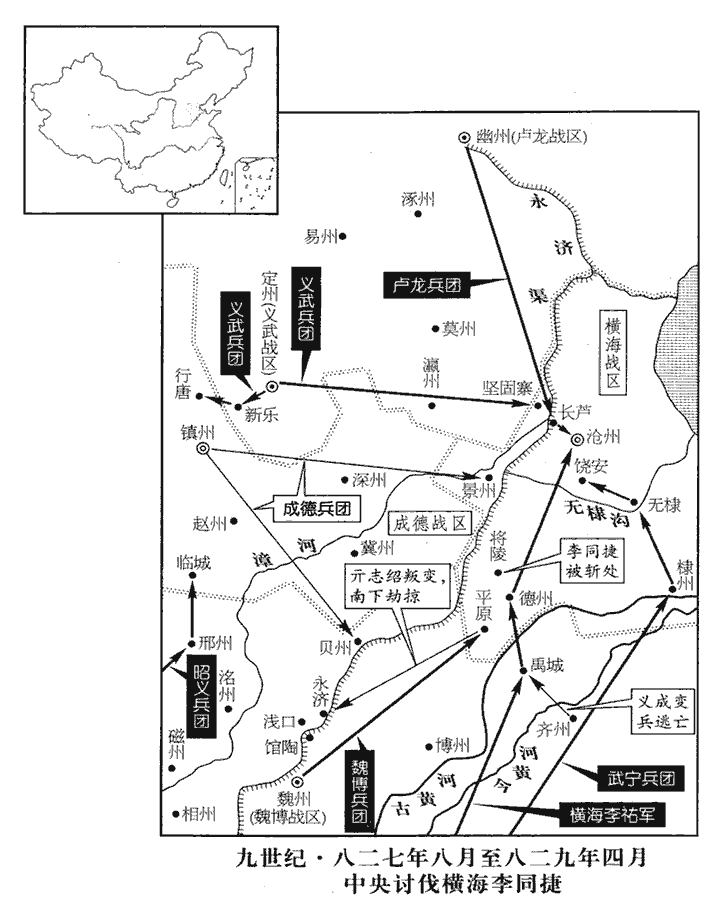

 唐紀五十九起昭陽單閼（癸卯），盡著雍涒灘（戊申），凡六年。

# 穆宗睿聖文惠孝皇帝下

## 長慶三年（癸卯、八二三）

1春，正月，癸未‹二十七›，賜兩軍中尉以下錢。二月，辛卯‹六›，賜統軍軍使等綿綵、銀器各有差。綿，當作「錦」。【章：十二行本正作「錦」。】

〖译文〗 [1]春季，正月，癸未（二十七日），唐穆宗赏赐左、右神策军护军中尉以下军将钱。二月，辛卯（初六），赏赐左、右羽林军，左、右龙武军，左、右神武军统军、军使等军将丝绵、银器，根据他们的职务高低分等级颁给。

2戶部侍郎牛僧孺，素為上‹李恒，本年二十九岁›所厚。初，韓弘之子右驍衛將軍公武為其父謀，以財結中外。為其，于偽翻。及公武卒，弘繼薨，穉孫紹宗嗣，主藏奴與吏訟於御史府。藏，徂浪翻。上憐之，盡取弘財簿自閱視，凡中外主權，主權，謂中外官之有事權者。多納弘貨，獨朱句細字曰：「某年月日，送戶部牛侍郎錢千萬，不納。」句，古侯翻上大喜，以示左右曰：「果然，吾不繆知人！」繆，靡幼翻。三月，壬戌‹七›，以僧孺為中書侍郎、同平章事。

〖译文〗 [2]户部侍郎牛僧孺向来被唐穆宗所器重。当初，宣武节度使韩弘的儿子，右骁卫将军韩公武为了巩固父亲的地位，向朝廷内外的许多当权的官员行贿。后来，韩公武去世。接着，韩弘也去世了，韩弘的小孙子韩绍宗继承家业。这时，韩绍宗家里主管储藏的家奴和宣武的官吏和御史台起诉韩公武行贿的问题。穆宗怜悯韩绍宗，于是，把韩弘家里的财产登记本全部调来，亲自审阅，发现朝廷内外凡当权的官员，大多接受过韩弘的贿赂。登记本上只有一处用红笔小字记裁着：“某年某月某日，送户部牛侍郎钱一千万，拒而不收。”穆宗看后大喜，拿来给左右侍从看，并说：“果然不出我的所料，我没有看错人！”三月，壬戌（初七），任命牛僧孺为中书侍郎、同平章事。

時僧孺與李德裕‹浙西道，首府设润州江苏省镇江市›皆有入相之望；德裕出為浙西觀察使，八年不遷，至文宗大和三年，用裴度薦，始徵李德裕於浙西，又為李宗閔所排，出帥滑。以為李逢吉排己，引僧孺為相。由是牛、李之怨愈深。考異曰：舊德裕傳曰：「初，李逢吉自襄陽入朝，乃密賂纖人，構成于方獄。八月，元稹、裴度俱罷。逢吉代裴度為相，既得權位，銳意報怨。時德裕與僧孺俱有相望，逢吉欲引僧孺，懼紳與德裕禁中沮之，九月，出德裕浙西，尋引僧孺同平章事，繇是交怨愈深。」蓋德裕以此疑怨逢吉，未必皆出逢吉之意也！

〖译文〗 这时，牛僧孺和李德裕都有升迁宰相的希望，但李德裕被任命为浙西道观察使，以后八年没有升迁。因此，他认为是宰相李逢吉为了排斥自己，而引荐牛僧孺为宰相。从此以后，牛僧孺和李德裕二人之间的怨恨越来越深。

3夏，四月，甲午‹十›，安南‹首府设安南府越南河内市›奏陸州‹广西钦州市东南犀牛角乡›獠攻掠州縣。武德元年，以寧越郡之安海、玉山置玉山州；貞觀元年，州廢，屬欽州；高宗上元二年，復置陸州，東至廉州界三百里。

〖译文〗 [3]夏季，四月，甲午（初十），安南都护府奏报：陆州的獠人攻打掠夺本道州县。

4丙申‹十二›，賜宣徽院供奉官錢，紫衣者百二十緡，下至承旨各有差。唐中世以後，置宣徽院，以宦者主之。其大朝賀及聖節上壽，則宣徽使宣答。徐度卻掃編曰：「宣徽使，本唐宦者之官，故其所掌皆瑣細之事。本朝更用士人，品秩亞二府，有南、北院，南院比北院資望尤優，然其職猶多因唐之舊。賜群臣新火，及諸司使至崇班、內侍、供奉、諸司工匠、兵卒名籍，及三班以下遷補、假故、鞫劾，春秋及聖節大宴，節度迎授恩命，上元張燈，四時祠祭，契丹朝貢，內庭學士赴上，督其供帳，內外進奉名物，教坊伶人歲給衣帶，郊御殿、朝謁聖容，賜酺，國忌，諸司使下別籍分產，諸司工匠休假之類。」今觀穆宗所賜，則宣徽院官員數多矣。

〖译文〗 [4]丙申（十二日），唐穆宗赏赐宣徽院供奉官钱，凡身着紫色官服的赐一百二十缗，下至承旨官，各根据他们的官品高低分等级颁给。

5初，翼城‹山西省翼城县›人鄭注，眇小，目下視，而巧譎傾諂，善揣人意，翼城縣，屬絳州，本漢絳縣地，隋改翼城縣，因縣古翼城為名。揣，初委翻。以醫遊四方，羇貧甚。嘗以藥術干徐州‹江苏省徐州市›牙將，牙將悅之，薦於節度使李愬。愬餌其藥頗驗，遂有寵，署為牙推，牙推，在節度推官之下。浸預軍政，妄作威福，軍府患之。監軍王守澄以眾情白愬，請去之，去，羌呂翻；下同。愬曰：「注雖如是，然奇才也，將軍試與之語，時中官多加諸衛將軍，謂之內將軍。苟無可取，去之未晚。」乃使注往謁守澄，守澄初有難色，不得已見之，坐語未久，守澄大喜，延之中堂，促膝笑語，恨相見之晚。明日，謂愬曰：「鄭生誠如公言。」自是又有寵於守澄，權勢益張，張：知亮翻。愬署為巡官，列於賓席。注既用事，恐牙將薦己者泄其本末，密以他罪譖之於愬，愬殺之。及守澄入知樞密，挈注以西，為立居宅，贍給之；為，于偽翻。遂薦於上，上亦厚遇之。

〖译文〗 [5]当初，翼城人郑注虽然身材瘦小，眼睛近视，但却巧言谄媚，善解人意，他以行医游行四方，羁旅他乡，十分贫穷。一次，他以精湛的医术得到一个徐州牙将的赏识，于是，这个牙将把他推荐给节度使李。李服用他的药后，很有效果，因而非常宠爱，任命他为牙推。郑注恃宠，逐渐干预军政，胡作非为，节度使府的官员都感到忧虑。监军王守澄把众人对郑注的反映转告李，请求把他驱除出去。李说：“郑注虽然如此，但他是个奇才，您若不信，请和他试见一面，如果一无是处，再驱除也不晚。”于是，李让郑注去拜见王守澄。王守澄开始还面有难色，后来不得已接见郑注。交谈不久，王守澄大喜，把郑注引到正堂，两人促膝交谈，笑声不断，恨相见太晚。第二天，王守澄对李说：“郑注的确像您说的那样，是个奇才。”从此以后，郑注到得到王守澄的宠爱，权势更加扩张。李又任命他为巡官，成为李的重要幕僚。郑注掌握一定权力后，恐怕原来推荐自己的牙将暴露自己的身世，秘密地以其他罪名告于李，李把牙将杀死。等到王守澄被穆宗召入朝廷，任命为知枢密时，王守澄带郑注到京城，给他修建住宅，加以供养。接着，又向穆宗推荐，穆宗也很器重郑注。

自上有疾，去年冬十一月上有疾，事見上卷。守澄專制國事，勢傾中外；注日夜出入其家，與之謀議，語必通夕，關通賂遺，遺，唯季翻。人莫能窺其迹。始則有微賤巧宦之士，或因以求進，數年之後，達官車馬滿其門矣。為鄭注與李訓誅王守澄及甘露之禍張本。工部尚書鄭權，家多姬妾，祿薄不能贍，因注通於守澄以求節鎮；己酉‹二十五›，以權為嶺南‹总部设广州广东省广州市›節度使。

〖译文〗 自从穆宗得病以后，王守澄专制朝政，势倾中外。郑注频繁地出入王守澄的家里，和他商议谋划，经常通宵达旦。二人串通收受贿赂，外人都无法窥测他们的踪迹。开始时，还只是一些身世卑贱但又善于钻营趋奉的官吏，通过贿赂郑注而求迁升；几年以后，达官贵戚也都争着和他交往，以致门前车水马龙。工部尚书郑权在家中畜养了很多妻妾，但由于俸禄少而无力供养，于是，通过郑注向王守澄推荐，求为节度使。已酉（二十五日），唐穆宗任命郑权为岭南节度使。

6五月，壬申‹十八›，以尚書左丞柳公綽為山南東道‹总部设襄州湖北省襄樊市›節度使。公綽過鄧縣‹湖北省襄樊市汉水北岸›，唐襄州之鄧城縣，漢南陽之鄧縣也，治古樊城。隋改為安養縣，天寶元年改為臨漢縣；貞元二十一年移縣古鄧城，乃改為鄧城縣。九域志：在州北二十里。有二吏，一犯贓，一舞文，眾謂公綽必殺犯贓者。公綽判曰：「贓吏犯法，法在；姦吏亂法，法亡。」竟誅舞文者。考異曰：柳氏敘訓曰：「公為襄陽節度使，有名馬，人爭畫為圖。圉人潔其蹄尾，被蹴cù，致斃命，斬於鞠場。賓吏請曰：『圉人備之不至，良馬可惜！』公曰：『有良馬之貌，含駑馬之性，必殺之。』有齊縗者，哭且獻狀曰：『遷三世十二喪，于武昌為津吏所遏，不得出。』公覽狀，召軍候擒之，破其十二柩，皆實以稻米。時歲儉，鄰境尤甚，人以為神明之政，」按韓愈與公綽書曰：「殺所乘馬以祭踶dì死之士，」乃在鄂岳時事，敘訓、舊傳皆誤也。察齊衰者，乃是閉糶，非美事。今不取。

〖译文〗 [6]五月，壬申（十八日），唐穆宗任命尚书左丞柳公绰为山南东道节度使。柳公绰途经邓县，发现有两个官吏犯法：一个贪污，一个舞文弄墨。众人都认为柳公绰肯定要杀贪污者。不料柳公绰宣判说：“贪污的官吏虽然犯法，但法律仍在；而舞文弄墨的奸吏紊乱法律，则法律已亡。”最后，竟杀舞文弄墨者。

7丙子‹二十二›，以晉‹山西省临汾市›、慈二州為保義軍，以觀察使李寰為節度使。

〖译文〗 [7]丙子（二十二日），唐穆宗命以晋、慈二州为保义军，任命观察使李寰为节度使。

8六月，己丑‹六›，以吏部侍郎韓愈為京兆尹；六軍不敢犯法，私相謂曰：「是尚欲燒佛骨，事見二百四十卷憲宗元和十四年。何可犯也！」

〖译文〗 [8]六月，已丑（初六），唐穆宗任命吏部侍郎韩愈为京兆尹，禁军将士都不敢犯法，私下里相互说：“他连佛骨都敢烧，我们怎么敢犯法！”

9秋，七月，癸亥‹十一›，嶺南奏黃洞蠻‹广西西南部一带少数民族›寇邕州‹广西南宁市›，破左江鎮‹广西南宁市西›。邕州宣化縣有左江、右江二鎮，左江出七源州界，至合江鎮，與右江水合為一水，流入橫州，號鬱水。右江源出峨利州界，與雲南大槃水通。左江道屬太平、永平寨，右江道屬橫山寨，各管羈縻州。丙寅‹十四›，邕州奏黃洞蠻破欽州‹广西钦州市›千金鎮‹广西钦州市西南›，刺史楊嶼奔石南砦。千金鎮，當在欽州西南。嶼，徐與翻。砦zhài，與寨同，音豺夬guài翻。

〖译文〗 [9]秋季，七月，癸亥（十一日），岭南奏报：黄洞蛮侵犯邕州，攻破左江镇。丙寅（十四日），邕州奏报：黄洞蛮攻破钦州千金镇，刺史杨屿逃往石南砦。

10南詔‹首都苴咩城云南省大理市›勸利卒，國人請立其弟豐祐。考異曰：實錄：「九月辛酉，南詔王立佺進其國信。」歲末又云：「南詔請立蒙勸利之弟豐祐。」云立佺者，蓋誤也。今從新傳。豐祐勇敢，善用其眾，始慕中國，不與父連名。南詔父子連名，其先細奴邏，生邏盛炎，邏盛炎生炎閤，炎閤死而立其弟盛邏皮，盛邏皮生皮邏閤，皮邏閤生閤邏鳳，閤邏鳳生鳳迦異，鳳迦異生異牟尋，異牟尋生尋閣勸，尋閣勸生勸龍晟、勸利，皆連名也。為南詔強盛寇邊張本。

〖译文〗 [10]南诏国王劝利去世，南诏人向唐奏请立劝利的弟弟丰为王。丰勇敢而善于用人，羡慕唐朝的礼仪和文化，从他开始不再与父辈连名。

11八月，癸巳‹十一›，邕管奏破黃洞蠻。

〖译文〗 [11]八月，癸巳（十一日），邕州奏称攻破黄洞蛮。

12丙申‹十四›，上自複道幸興慶宮，至通化門樓，雍錄：開元二十年，築夾城，通芙蓉園，自大明宮夾東羅城複道，由通化、安興門，次經春明門、延喜門，又可以達曲江芙蓉園，而外人不知也。按複道自大明宮至通化門便可入興慶宮，若經春明、延興、延喜門，則至芙蓉園矣。投絹二百匹施山僧。施，式豉翻。上之濫賜皆此類，不可悉紀。

〖译文〗 [12]丙申（十四日），唐穆宗从复道到兴庆宫，途经通化门楼时，向山里的僧人施舍绢二百匹。穆宗滥施赏赐，毫无节制，像这一类事情，无法一一记载。

13癸卯‹二十一›，以左僕射裴度為司空、山南西道‹总部设兴元府陕西省汉中市›節度使，不兼平章事。李逢吉惡度，惡，烏路翻。右補闕張又新等附逢吉，競流謗毀傷度，竟出之。又新，薦之子也。張薦事德宗，屢使吐蕃、回鶻。

〖译文〗 [13]癸卯（二十一日），唐穆宗任命左射裴度为司空、山南西道节度使，不再兼同平章事。宰相李逢吉憎恨裴度。右补阙张又新等人附合李逢吉，竞相用流言诽谤中伤裴度，结果，竟然使裴度离开朝廷，放任为外地的节度使。张又新是唐德宗时朝臣张荐的儿子。

14九月，丙辰‹五›，加昭義‹总部设潞州山西省长治市›節度使劉悟同平章事。

〖译文〗 [14]九月，丙辰（初五），唐穆宗加封昭义节度使刘悟同平章事的荣誉职务。

15李逢吉為相，內結知樞密王守澄，勢傾朝野。考異曰：李讓夷敬宗實錄曰：「逢吉用族子仲言之謀，因鄭注與守澄潛結上於東宮，且言逢吉實立殿下，上深德之。」又曰：「張又新、李續之，皆逢吉藩僚，時又新為右補闕，續之為度支員外郎。」劉昫承之為逢吉傳，亦言：「逢吉令仲言賂注，求結於守澄。仲言辯譎多端，守澄見之甚悅，自是逢吉有助，事無違者。」其李訓傳則云：「訓自流所還，丁母憂，居洛中，時逢吉為留守，思復為相，乃使訓因鄭注結王守澄。」然則逢吉結守澄，乃在文宗時，非穆宗時也。二傳自相違。逢吉結守澄，要為不誣，然未必因鄭注。李讓夷乃李德裕之黨，惡逢吉，欲重其罪，使與李訓、鄭注皆有連結之迹，故云用訓謀，因注以交守澄耳。又張又新、李續之為逢吉藩僚，乃在逢吉再鎮襄陽後，於此時未也。今不取。惟翰林學士李紳每承顧問，常排抑之，擬狀至內庭，紳多所臧否；擬狀，謂進狀所擬除目也。翰林學士院在內庭，蓋李逢吉所進擬者，穆宗訪其可否於李紳，故得言之。否，音鄙。逢吉患之，而上待遇方厚，不能遠也。遠，于願翻。會御史中丞缺，逢吉薦紳清直，宜居風憲之地；上以中丞亦次對官，程大昌曰：德宗貞元七年，詔每御延英，令諸司長官二人奏本司事；俄又令常參官必日引見二人，訪以政事，謂之巡對。則是待制之外，又別有巡對也。蓋正謂待制者，諸司長官也。名為巡對者，未為長官而在常參之數，亦得更迭引對者也。其曰次對官者，即巡對官，許亞次待制而俟對者也。則次對不得正為待制矣。今人作文，凡言待制，皆以次對名之，則恐未審也。然稱謂既熟，雖唐人亦自不辯。開成中，敕今後遇入閤日，次對官未要隨班出，並於東階松木下立，待宰臣奏事退，令齊至香案前各奏本司公事。左、右史待次對官奏事訖同出案。此所言嘗以諸司之長官待制者，名為次對官矣。若究其制，實誤以待制為次對官也。余考唐中世以後，宰相對延英，既退，則待制官、巡對官皆得引對，總可謂之次對官。所謂次對官者，謂次宰相之後而得對也，非次待制官而入對也。唐人本不誤，程泰之自誤耳。據宋白所紀，貞元七年十一月敕，則次對官者以常參官依次對為稱。詳已見前註。不疑而可之。會紳與京兆尹、御【章：十二行本「御」上有「兼」字；乙十一行本同。】史大夫韓愈爭臺參及他職事，文移往來，辭語不遜；故事，京尹新除，皆詣臺參。逢吉欲激二人使爭，以愈兼御史大夫免臺參，而紳、愈果爭。不遜，謂不相遜也。逢吉奏二人不協，冬，十月，丙戌‹五›，以愈為兵部侍郎，紳為江西‹首府设洪州江西省南昌市›觀察使。

〖译文〗 [15]李逢吉但任宰相，在宫中交结知枢密王守澄，因而势倾朝野。只有翰林学士李绅在每次参预穆宗的谘询时，经常对他加以遏制。李逢吉推荐官员的拟状上奏后，穆宗拿到翰林学士院听了意见，李绅多有批评。李逢吉十分忧虑，但因穆宗正信任李绅，李逢吉无法进谗言使穆宗疏远他。这时，正好御史中丞缺职，李逢吉推荐李绅清廉正直，适合担任监察工作的职务。穆宗考虑到御史中丞也是次对官，因而，未加怀疑就同意了。适逢李绅与京兆尹、御史大夫韩愈因台参及其他任职事争议不休，二人奏章往来，辞语多有不逊。于是，李逢吉上奏二人关系不合，冬季，十月，丙戌（初五），穆宗罢免二人的监察职务，任命韩愈为兵部侍郎，李绅为江西道观察使。

16己丑‹八›，以中書侍郎、同平章事杜元穎同平章事、充西川‹总部设成都府四川省成都市›節度使。為杜元穎以刻削致寇張本。

〖译文〗 [16]已丑（初八），唐穆宗任命中书侍郎、同平章事杜元颖兼同平章的荣誉职务，充任剑南西川节度使。

17辛卯‹十›，安南奏黃洞蠻為寇。

〖译文〗 [17]辛卯（初十），安南奏报：黄洞蛮侵扰。

18韓愈、李紳入謝，上各令自敘其事，乃深寤。壬辰‹十一›，復以愈為吏部侍郎，紳為戶部侍郎。考異曰：穆宗實錄曰：「紳性險果，交結權倖，自以望輕，頗忌朝廷有名之士；及居近署，封植己類以樹黨援，進修之士懼為傷毒，疾之。常指鈞衡欲逞其私志，時宰病之，因以人情上論，諫官歷獻疏，方有江西之命。行有日矣，因延英對辭，又泣請留侍，故有是拜，人情憂駭。」此蓋修穆宗實錄者惡紳，故毀之如是。今從敬宗實錄。

〖译文〗 [18]韩愈、李绅上殿向穆宗感谢新任职务，穆宗令二人各自陈述争论的事情经过，方才明白其中的原因。壬辰（十一日），重新任命朝愈为吏部侍郎，李绅为户部侍郎。

## 四年（甲辰、八二四）

1春，正月，辛亥朔‹一›，上‹李恒，本年三十岁›始御含元殿朝會。上即位四年矣，是歲元正，方御東內正牙大朝會。

〖译文〗 [1]春季，正月，辛亥朔（初一），唐穆宗自即位以来，首次亲临在含元殿举行的大朝会。

2初，柳泌等既誅，見二百四十一卷元和十五年。方士稍復因左右以進，復，扶又翻。上餌其金石之藥。有處士張皋者上疏，以為：「神慮澹則血氣和，嗜欲勝則疾疢chèn作。澹，徒覽翻。疢，丑刃翻。藥以攻疾，無疾不可餌也。昔孫思邈有言，孫思邈，唐之名醫。『藥勢有所偏助，令人藏氣不平，藏，徂浪翻。藏氣，五藏之氣也。借使有疾用藥，猶須重慎。』‹孙思邈，华原陕西省耀县›人，有药王之称。今陕西省耀县有药王庙。庶人尚爾，況於天子！先帝‹李纯›信方士妄言，餌藥致疾，此陛下所詳知也，豈得復循其覆轍乎！復，扶又翻；下同。今朝野之人紛紜竊議，但畏忤旨，莫敢進言。臣生長蓬艾，長，知丈翻。麋鹿與遊，無所邀求，但粗知忠義，欲裨萬一耳！」上甚善其言，使求之，不獲。

〖译文〗 [2]当初，柳泌等人被杀后，方士又逐渐通过穆宗的左右侍从进入宫中，穆宗服用方士所炼制的金石药物。有一个隐居未仕名叫张皋的人上书朝廷，认为：“凡是精神澹泊的人就血气相和，身体康健；而欲望强烈的人则容易疾病发作。药是用来治病的东西，没有病就不要轻易吃。过去，孙思邈曾说：‘药对人身体各个器官的作用是有所偏重的，它会导致人的五脏元气不平，所以，即使有病吃药，也要非常慎重。’对于一般百姓尚且如此，何况天子呢！先帝听信方士的胡言乱语，服用金丹导致疾病发作，陛下是十分清楚的，岂可再蹈覆辙！现在，朝廷内外纷纷私下议论这件事，但都恐怕违背陛下的旨意，不敢上书直言。我是生长在草莽中的隐居人士，整天和麋鹿相处一起，无所追求，但也大略懂得一些忠义的道理，所以上书朝廷，请以防患于万一。”穆宗十分赞赏张皋的这一番话，派人去访求张皋，结果，没有找到。

3丁卯‹十七›，嶺南‹总部设广州广东省广州市›奏黃洞蠻‹广西西南部›寇欽州‹广西钦州市›，殺將吏。舊制，欽州至京師五千二百五十一里。

〖译文〗 [3]丁卯（十七日），岭南奏报：黄洞蛮侵扰钦州，杀将士和官吏。

4庚午‹二十›，上疾復作；壬申‹二十二›，大漸，命太子‹李湛›監國。宦官欲請郭太后臨朝稱制，太后曰：「昔武后稱制，幾危社稷。事見武后紀。幾，居依翻。我家世守忠義，非武氏之比也。太子雖少，少，詩照翻。但得賢宰相輔之，卿輩勿預朝政，何患國家不安！自古豈有女子為天下主而能致唐、虞之理乎！」取制書手裂之。太后兄太常卿釗聞有是議，密上牋曰：「苟果徇其請，臣請先帥諸子納官爵歸田里。」帥，讀曰率。太后泣曰：「祖考之慶，鍾於吾兄。」是夕，上崩于寢殿。年三十。癸酉‹二十三›，以李逢吉攝冢宰。丙子‹二十六›，敬宗‹李湛，本年十六岁›即位于太極東序。

〖译文〗 [4]庚午（二十日），唐穆宗疾病再次发作。壬申（二十二日），病重，命皇太子代理朝政。宦官想请郭太后临朝代行皇权，太后说：“过去，武皇后称帝，几乎危害江山社稷，我家世代恪守忠义，决非武氏所能相比。太子虽然年轻，但如果能有德才兼备的宰相辅佐，你们这些人也都不干预朝政，就不用忧虑国家不安定！自古以来，岂有女人主宰天下，而能达到唐尧、虞舜那样的天下大治吗？”说完，把宦官拟定的制书拿过来撕了。郭太后的兄弟、太常卿郭钊听到宦官的建议，秘密上书给郭太后说：“如果您听从宦官的请求，那么，我就和儿子们把自己的官衔和爵位交还朝廷，然后回家种田。”郭太后哭着说：“祖先庆幸有我的兄弟这样的好后代。”当晚，穆宗在寝殿驾崩。癸酉（二十三日），朝廷任命李逢吉兼任冢宰，主持穆宗的治丧事宜。丙子（二十六日），唐敬宗李湛在太极殿东厢即位。

初，穆宗之立，神策軍士人賜錢五十千，事見二百四十一卷元和十五年。宰相議以太厚難繼，乃下詔稱：「宿衛之勤，誠宜厚賞，屬頻年旱歉，屬，之欲翻。御府空虛，邊兵尚未給衣，霑卹期於均濟。神策軍士人賜絹十匹、錢十千，畿內諸鎮又減五千。仍出內庫綾二百萬匹付度支，充邊軍春衣。」時人善之。李逢吉為相，時人之所惡也。一事之善，則時人善之，非是非之公歟！度，徒洛翻。

〖译文〗 当初，唐穆宗即位时，赏赐神策军军士每人钱五十缗。宰相商议，认为赏赐过于优厚，难以继续实行。于是，敬宗下诏说：“按照禁军将士宿卫的功劳，实在应当给予优厚的赏赐。但近年以来屡有旱灾，庄稼歉收，国库空虚，戍边兵士至今尚未供给春衣。朝廷对将士的恩惠应当尽量平均，所以，凡神策军军士每人赐绢十匹，钱十缗；京畿神策诸镇军士每人钱减五缗。同时，从内库拨调绫二百万匹交给度支，充作边防戍兵的春衣。”当时人都称赞这次赏赐比较公允。

5自戊寅‹二十八›至庚辰‹三十›，上賜宦官服色及錦綵金銀甚衆，或今日賜綠，明日賜緋。史言上昵於近習，賜予無度。

〖译文〗 [5]从戊寅（二十八日）至庚辰（三十日），唐敬宗赏赐宦官官服以及锦彩、金银，数额很多，或者今日赐给六品、七品的绿色官服，明日赐给四品、五品的红色官服。

6初，穆宗‹李恒›既留李紳，事見上年。李逢吉愈忌之。紳族子虞頗以文學知名，自言不樂仕進，樂，音洛。隱居華陽川‹河南省灵宝市境›。華陽川，在虢州華陽山南。華，戶化翻。及從父耆為左拾遺，從，才用翻；下從子同。虞與耆書求薦，誤達於紳；紳以書誚之，且以語於眾人。誚，才笑翻。語，牛倨翻。虞深怨之，乃詣逢吉，悉以紳平日密論逢吉之語告之。逢吉益怒，使虞與補闕張又新及從子前河陽‹总部设河阳县河南省孟州市›掌書記仲言等伺求紳短，揚之於士大夫間；伺，相吏翻。且言「紳潛察士大夫有群居議論者，輒指為朋黨，白之於上。」由是士大夫多忌之。

〖译文〗 [6]当初，唐穆宗把李绅留在朝廷任职后，宰相李逢吉更加忌恨他。李绅的族子李虞由于文章博学而知名一时，他自称不愿做官，因而隐居在华阳川。等到他的叔父李耆任左拾遗后，李虞写信给李耆，请求向朝廷推荐，不料这封信误送到李绅手中，李绅便写信讥讽他，并把这件事在大庭广众中张扬。李虞得知后非常气愤，于是，求见李逢吉，把李绅平时暗地里议论李逢吉的话全都告诉了他。李逢吉更加憎恨李绅，于是，让李虞和补阙张又新，以及侄子、前河阳掌书记李仲言等人探察李绅的过失，然后，在士大夫中间张扬，并说：“李绅暗地里窥察士大夫，凡有人在一起议论，便指斥为朋党，向皇上告状。”由此士大夫也大多忌恨李绅。

及敬宗‹李湛›即位，逢吉與其黨快紳失勢，又恐上復用之，復，扶又翻。日夜謀議，思所以害紳者。楚州‹江苏省淮安市›刺史蘇遇楚州，漢射陽縣地，晉立山陽郡，隋為楚州，至京師二千五百一里。謂逢吉之黨曰：「主上初聽政，必開延英，有次對官，惟此可防。」恐紳因次對言事，而上復用之。其黨以為然，亟白逢吉曰：「事迫矣，若俟聽政，悔不可追！」逢吉乃令王守澄言於上曰：「陛下所以為儲貳，臣備知之，皆逢吉之力也。如杜元穎、李紳輩，皆欲立深王。」深王察，後改名悰，憲宗之子，穆宗之弟也。度支員外郎李續之等繼上章言之。上時年十六，疑未信。會逢吉亦有奏，言「紳不利於上，請加貶謫。」上猶再三覆問，然後從之。二月，癸未‹三›，貶紳為端州‹广东省肇庆市›司馬。端州，隋置，取界內端溪為名；煬帝初置信安郡，武德又為端州，天寶改為高安郡，乾元復為州。舊志：至京師四千九百三十五里。逢吉仍帥百官表賀，帥，讀曰率。既退，百官復詣中書賀，復，扶又翻；下同。逢吉方與張又新語，門者弗內；良久，又新揮汗而出，旅揖百官曰：「端溪之事，又新不敢多讓。」端州謂之端溪。眾駭愕辟易，憚之。辟，音闢。易，音亦。右拾遺、內供奉吳思獨不賀，逢吉怒，以思為吐蕃‹首都逻些城西藏拉萨市›告哀使。丙戌‹六›，貶翰林學士龐嚴為信州‹江西省上饶市›刺史，蔣防為汀州‹福建省长汀县›刺史。唐上元元年，割饒州之弋陽、衢州之玉山，建、撫二州各三鄉，置信州，至京師東南三千八百里。開元二十六年，開福、撫二州山洞，置汀州，至京師六千一百七十三里。嚴，壽州‹安徽省寿县›人，與防皆紳所引也。給事中于敖，素與嚴善，封還敕書；人為之懼，為，于偽翻。曰：「于給事為龐、蔣直冤，犯宰相怒，誠所難也！」及奏下，乃言貶之太輕。逢吉由是獎之。

〖译文〗 敬宗即位后，李逢吉和他的党羽对李绅失势拍手称快，但又恐怕敬宗重新信用他，因而日夜策划，商量能够伤害李绅的办法。楚州刺史苏遇对李逢吉的党羽说：“皇上初次上朝听政，肯定要开延英殿访询百官。李绅是次对官，在这时应防备李绅重新被皇上重用。”李逢吉的党羽认为言之有理，急忙转告李逢吉说：“事情紧迫，如果等到皇上驾临延英殿听政，就悔不可及了！”于是，李逢吉让知枢密王守澄对敬宗说：“陛下所以能被立为皇太子，我全都知道，主要是李逢吉的功劳。像杜元颖、李绅这些人，都是要立深王李察的。”度支员外郎李续之等人接着上奏，也同样说。敬宗这时十六岁，疑而未信。这时，李逢吉也上奏说：“李绅不忠于陛下，请予以贬谪。”敬宗仍再三询问是否属实，然后听从了李逢吉的意见。二月，癸未（初三），贬李绅为端州司马。于是，李逢吉率领百官上表称贺。退朝后，百官又到中书省称贺。这时，李逢吉正和张又新在中书省交谈，守门人不让百官进去，百官等待很久，只见张又新挥汗而出，向百官作揖说：“李绅贬官端州一事，我不能再退让了。”百官都惊愕退下，惧怕张又新。百官称贺时，只有右拾遗内供奉吴思不作祝贺的表示，李逢吉发怒，任命他为吐蕃告哀使。丙戌（初六），贬翰林学士庞严为信州刺史，蒋防为汀州刺史。庞严是寿州人，他和蒋防都是由李绅推荐到翰林院任职的。给事中于敖向来和庞严关系密切，他把贬谪二人的敕书封还朝廷，百官都以为他要为二人辩解，因而替他担忧说：“于给事敢于为庞、蒋二人辩冤，触犯宰相，真是不容易啊！”后来，于敖上奏辩驳时，反而说对二人贬得太轻。李逢吉由此而夸奖他。

張又新等猶忌紳，日上書言貶紳太輕，上許為殺之；為，于偽翻。朝臣莫敢言，獨翰林侍讀學士韋處厚上疏，太宗選耆儒侍讀，以質史籍疑義。開元中，集賢院置侍讀直學士。時翰林有侍讀學士，有侍書學士。指述「紳為逢吉之黨所讒，人情歎駭。紳蒙先朝‹李恒›獎用，借使有罪，猶宜容假，以成三年無改之孝，論語：孔子曰：三年無改於父之道，可謂孝矣。況無罪乎！」於是上稍開寤，考異曰：處厚傳曰：「敬宗即位，李逢吉用事，素惡李紳，乃構成其罪，禍將不測。處厚乃上疏云云。帝悟其事，紳得減死，貶端州司馬。」今從實錄。處厚上疏，在紳貶端州後。會閱禁中文書，有穆宗所封文書一篋，發之，得裴度、杜元穎、李紳疏請立上為太子，上乃嗟歎，悉焚人所上譖紳書，所上，時掌翻。雖未即召還，後有言者，不復聽矣。

〖译文〗 张又新等人仍然忌恨李绅，每天上书朝廷，认为对李绅贬得太轻，敬宗许可杀李绅。朝臣都不敢再言，只有翰林侍读学士韦处厚上奏，指出“李绅被李逢吉的党羽进谗言诬陷贬谪，人们都感到震惊，无不叹息。李绅是由穆宗提拔任用的大臣，即使他有罪，也应当本着对父亲尽三年孝道的精神，对他予以宽容，何况他根本无罪！”于是，敬宗渐渐觉悟。这时，恰巧敬宗阅览宫中的文书，发现有一小箱穆宗亲手封存的文书，打开后，看到其中一件是裴度、杜元颖、李绅上疏请立自己为皇太子的上奏，这才嗟叹不已，把朝臣离间李绅的上书全都烧掉，不再相信。虽然敬宗尚未立即把李绅从端州召回朝廷，但以后再有人上奏离间，不再听了。

7己亥‹十九›，尊郭太后為太皇太后。

〖译文〗 [7]己亥（十九日），唐敬宗尊奉郭太后为太皇太后。

8乙巳‹二十五›，尊上母王妃為皇太后。太后，越州‹浙江省绍兴市›人也。

〖译文〗 [8]乙巳（二十五日），唐敬宗尊奉自己的母亲王妃为皇太后。皇太后是越州人。

9丁未‹二十七›，上幸中和殿擊毬，自是數遊宴、擊毬、奏樂，數，所角翻。賞賜宦官、樂人，不可悉紀。

〖译文〗 [9]丁未（二十七日），唐敬宗到中和殿去踢球，此后多次游宴、踢球、奏乐，并赏赐宦官和奏乐的伎工，难以全部记载。

10三月，壬子‹三›，赦天下；諸道常貢之外，毋得進奉。

〖译文〗 [10]三月，壬子（初三），唐敬宗大赦天下，命诸道在规定的上贡数额以外，不准再向朝廷进奉。

11甲寅‹五›，上始對宰相於延英殿。

〖译文〗 [11]甲寅（初五），唐敬宗开始在延英殿会见宰相，商议朝政大事。

12初，牛元翼在襄陽，牛元翼出深州，鎮襄陽，見上卷二年。數賂王庭湊以請其家，數，所角翻。庭湊不與；聞元翼薨，甲子‹十五›，盡殺之。

〖译文〗 [12]当初，牛元翼镇守襄阳后，多次贿赂成德节度使王庭凑，请求把自己的家眷释放送还，王庭凑拒不释放。后来，听说牛元翼已死，甲子（十五日），把他的家眷全部杀死。

13上視朝每晏，戊辰‹十九›，日絕高尚未坐，百官班於紫宸門外，老病者幾至僵踣bó。僵，居良翻。踣，蒲北翻。諫議大夫李渤白宰相曰：「昨日疏論坐晚，論上坐朝之晚也。今晨愈甚，請出閤待罪於金吾仗。」金吾左、右仗，在宣政殿前。既坐班退，左拾遺劉栖楚獨留，進言曰：「憲宗及先帝皆長君，四方猶多叛亂。陛下富於春秋，嗣位之初，當宵衣求理；而嗜寢樂色，宵衣，未明而衣也。理，治也。樂，魚教翻。日晏方起，梓宮在殯，鼓吹日喧，吹，尺偽翻。令聞未彰，聞，音問；下響聞同。惡聲遐布。臣恐福祚之不長，請碎首玉階以謝諫職之曠。」遂以額叩龍墀chí，見血不已，響聞閤外。考異曰：實錄曰：「莊周云：『為善無近名，為惡無近刑。』意者既能為近名之善，即必忍為近刑之惡。栖楚本王承宗小吏，果敢有聞，逢吉擢而用之，蓋取其鷹犬之效耳。夫諫諍之道，是豈能知之乎！即如比干剖心，當文王與紂之事也。朱雲折檻，恐漢氏之為新室也。時危事迫，不得不然，故忠臣有死諫之義。至如上年少嗜寢，坐朝稍晚，蓋宰臣密勿、諫臣封事而可止者也，豈在暴揚面數，激訐jié於羽儀之前，致使上疑死諫為不難，謂細事皆當碎首，從此遂不覽章疏，卒有克明之難，實栖楚兆之。況諫辭皆群黨所作，而使栖楚道之哉！賣前直而資後詐，殊可歎駭。」按李讓夷此論，豈非惡栖楚而強毀之邪！今所不取。李逢吉宣曰：「劉栖楚休叩頭，俟進止！」程大昌曰：奏劄言取進止，猶言此劄之或留或卻，合稟承可否也。唐中葉遂以處分為進止，而不曉文義者習而不察，概謂有旨為進止。如玉堂宣底所載凡宣旨皆云有進止者，相承之誤也。栖楚捧首而起，更論宦官事，上連揮令出。栖楚曰：「不用臣言，請繼以死。」牛僧孺宣曰：「所奏知，門外俟進止！」此宰相宣上旨也。言所奏知者，謂所奏之事，上已知之也。栖楚乃出，待罪於金吾仗，於是宰相贊成其言。上命中使就仗，并李渤宣慰令歸。尋擢栖楚為起居舍人，仍賜緋。栖楚辭疾不拜，歸東都‹洛阳›。

〖译文〗 [13]唐敬宗每次上朝都很晚。戊辰（十九日），太阳已经很高了尚未来到，百官在紫宸门外列班等待，老弱有病者几乎双腿麻木跌倒。谏议大夫李渤对宰相说：“昨天我上疏论皇上上朝太晚，不料今天早晨上朝更晚。皇上不改，请允许我在金吾仗前等候皇上治罪。”敬宗上朝结束，百官退朝后，左拾遗刘栖楚独自留下，对敬宗说：“宪宗皇帝和先帝都是成年后即位，但各地仍多有叛乱。陛下年纪正轻，即位之初，应当早起晚睡，勤于政事，以求治理天下。但您却喜好音乐女色，贪睡晚起。现在，先皇帝的棺木还未下葬，治丧的乐队鼓吹声不绝于耳。而陛下勤政的名声尚未显扬，不孝的恶名却已遐迩闻知。我担心国家的命运难以长久，现在，我请求死在陛下面前，作为对我这个谏官失职罪责的惩罚。”说完，用前额叩撞敬宗前面的龙形台阶，流血不止，叩撞声连宫殿外面都能听见。李逢吉宣布敬宗的旨意说：“刘栖楚不要再叩头了，现在听候皇上的决定！”刘栖楚用手揍头而起，接着，又上奏宦官专权的问题。敬宗很不耐烦，连连挥手令他出去。刘栖楚说：“陛下如果不采纳我的意见，我请求接着死在陛下面前。”牛僧孺又宣布敬宗的旨意说：“你的上奏已经知道了，请到门外听候皇上的决定！”刘栖楚于是出去，到金吾仗前等候。这时，宰相都上奏赞成刘栖楚的意见。于是，敬宗派宦官到金吾仗前安抚刘栖楚和李渤，命二人回家。不久，提拔刘栖楚为起居舍人，并赐予五品的红色官服。刘栖楚借口身体有病而不接受，回到东都去了。

14庚午‹二十一›，賜內教坊錢萬緡，以備行幸。武德後，置內教坊於禁中，武后如意元年，改曰雲韶府，以中官為使。開元二年，又置內教坊於蓬萊宮側。京都有左、右教坊。

〖译文〗 [14]庚年（二十一日），唐敬宗赏赐内教坊钱一万缗，作为外出巡行的准备。

15夏，四月，甲午‹十五›，淮南‹总部设扬州江苏省扬州市›節度使王播罷鹽鐵轉運使。王播兼鹽鐵轉運，見上卷二年。

〖译文〗 [15]夏季，四月，甲午（十五日），唐敬宗罢免淮南节度使王播兼任的盐铁转运使的职务。

16乙未‹十六›，以布衣姜洽為補闕，試大理評事陸洿wū、布衣李虞、劉堅為拾遺。六典註云：隋置大理評事。通典云：唐置評事十人；掌出使、推覆，後增為十二人。新志：評事八人，從八品下。陸洿特試官耳。洿，後五翻。時李逢吉用事，所親厚者張又新、李仲言、李續之、李虞、劉栖楚、姜洽及拾遺張權輿、程昔範，又有從而附麗之者，時人惡逢吉者，目之為八關、十六子。附，依也。麗，著也。自張又新至程昔範八人，而附麗者又八人，皆任要劇，故目之為八關、十六子。關者，要也。考異曰：按宰相之門，何嘗無特所親愛之士，數蒙引接，詢訪得失，否臧人物，其間忠邪溷hùn殽，固亦多矣。其疏遠不得志者則從而怨疾之，巧立品目以相譏誚，此乃古今常態，非獨逢吉之門有八關、十六子也。舊逢吉傳以為「有求於逢吉者，必先經此八人納賂，無不如意。」亦恐未必然；但逢吉之門，險詖bì者為多耳。此皆出於李讓夷敬宗實錄。按栖楚為吏，敢與王承宗爭事，此乃正直之士，何得為佞邪之黨哉！蓋讓夷，德裕之黨，而栖楚為逢吉所善，故深詆之耳。

〖译文〗 [16]乙未（十六日），唐敬宗任命平民姜洽为补阙，试大理评事陆、平民李虞、刘坚为拾遗。这时，宰相李逢吉专制朝政，他所亲信重用的人有张又新、李仲言、李续之、李虞、刘栖楚、姜洽以及拾遗张权舆、程昔范，还有一些顺从而依附他们的士人。当时凡僧恨李逢吉的人，都把他们称为八关、十六子。

17卜者蘇玄明與染坊供人張韶善，染坊供人，供役於染坊者也。陸德明曰：染，如豔翻；劉而險翻。玄明謂韶曰：「我為子卜，為，于偽翻。當升殿坐，與我共食。今主上晝夜毬獵，多不在宮中，大事可圖也。」韶以為然，乃與玄明謀結染工無賴者百餘人，丙申‹十七›，匿兵於紫草車，載以入銀臺門，本草曰：紫草，出碭山山谷及楚地，今處處有之，人家園圃或種蒔。其根，所以染紫也。爾雅謂之藐，廣雅謂之茈zǐ䓞lì。苗似蘭香，節青，二月有花，紫白色，秋實，白，三月採根陰乾。以下文清思殿徵之，所入者左銀臺門也，在大明宮東面，又北則玄化門。伺夜作亂。伺，相吏翻。未達所詣，有疑其重載而詰之者，載，才代翻。韶急，即殺詰者，與其徒易服揮兵，大呼趣禁庭。

〖译文〗 [17]占卜术士苏玄明和朝廷染坊的供役人张韶关系亲近，苏玄明对张韶说：“我为你占卜了吉凶，你将来应当进宫升殿而坐，和我同食，同享富贵。现在皇上昼夜踢球游猎，大多数时间不在宫中，可以乘机而图大事。”张韶认为言之有理，于是，和苏玄明在暗地里交结染坊工匠无赖者一百多人。丙申（十七日），他们把兵器藏在柴草中，装在车上，打算运进银台门，趁夜黑时作乱。还未到达目的地，有人怀疑他们的车超重，加以盘问。张韶着急，立即杀死盘问者。然后，和他的同党换去外衣，手握兵器，大喊直冲宫中。

上‹李湛›時在清思殿擊毬，自左銀臺門西入，經太和殿至清思殿。清思殿之南則宣徽殿，北則珠鏡殿。諸宦者見之，驚駭，急入閉門，走白上；盜尋斬關而入。先是，右神策中尉梁守謙有寵於上，每兩軍角伎藝，先，悉薦翻。伎，渠綺翻。上常佑右軍。至是，上狼狽欲幸右軍，左右曰：「右軍遠，恐遇盜，不若幸左軍近。」唐左神策軍、左龍武軍、左羽林軍皆列屯東內苑，直左銀臺門東北角。上從之。左神策中尉河中‹山西省永济市›馬存亮聞上至，走出迎，捧上足涕泣，自負上入軍中，遣大將康藝全將騎卒入宮討賊。將，即亮翻。上憂二太后隔絕，二太后，太皇太后郭氏、上母太后王氏也。存亮復以五百騎迎二太后至軍。復，扶又翻。

〖译文〗 敬宗这时正在清思殿踢球。宦官们发觉有人向宫中冲来，大为吃惊，急忙跑进来关闭宫门，然后跑去向敬宗报告。顷刻间，张韶等人攻破宫门，冲入宫中。原先，敬宗宠爱右神策军护军中尉梁守谦，每次左、右神策军比试武艺，敬宗常常为右军助威。这时，敬宗狼狈不堪，想到右神策军营中避难，左右侍从说：“右军路近，恐怕半路遇上盗贼，不如到左军近。”敬宗同意。左神策军护军中尉河中人马存亮听说敬宗驾临，急忙跑出军营迎接，他两手捧住敬宗的双脚哭泣不已，亲自把敬宗背到军中，然后，命大将康艺全率骑兵入宫讨伐乱党。敬宗担心太皇太后和皇太后隔在宫中有危险，存亮又派五百骑兵把两位太后接到军中。

張韶升清思殿，坐御榻，與蘇玄明同食，曰：「果如子言！」玄明驚曰：「事止此邪！」韶懼而走。會康藝全與右軍兵馬使尚國忠引兵至，合擊之，殺韶、玄明及其黨，死者狼藉。逮夜始定，餘黨猶散匿禁苑中；明日，悉擒獲之。

〖译文〗 张韶登上清思殿，坐在皇帝的御榻上，和苏玄明一同吃饭，说：“果然像你说的那样！”苏玄明大惊，说：“难道你所企求的就是吃吗？”张韶畏惧而逃。正在这时，康艺全和右神策军兵马使尚国忠率兵到达，二人合兵讨击，杀张韶、苏玄明及其同党，尸体狼藉遍地。直到夜里，宫中方才安定。张韶的余党仍有人散藏在禁苑中，第二天，全部擒获。

時宮門皆閉，上宿於左軍，中外不知上所在，人情恇駭。恇，去王翻。丁酉‹十八›，上還宮，宰相帥百官詣延英門賀，來者不過數十人。帥，讀曰率。盜所歷諸門，監門宦者三十五人法當死；己亥‹二十›，詔並杖之，仍不改職任。兩中尉及諸宦者右之也。壬寅‹二十三›，厚賞兩軍立功將士。

〖译文〗 这时，大明宫的各个大门都已关闭，敬宗住在左神策军中，朝廷内外都不知敬宗去向，人心恐惧。丁酉（十八日），敬宗回宫，宰相率百官到延英门祝贺，前来的朝官不过数十人。按照法律规定，凡张韶和他的同党所经过的宫门，监门宦官有三十五人由于失职而应当叛处死刑。己亥（二十日），敬宗下诏，命用刑杖责罚宦官，但未变动他们的职务。壬寅（二十三日），命重赏左、右神策军立功的将士。

18五月，乙卯‹七›，以吏部侍郎李程、戶部侍郎•判度支竇易直並同平章事。上問相於李逢吉，逢吉列上當時大臣有資望者，程為之首，列上，時掌翻。故用之。上好治宮室，好，呼到翻。治，直之翻。欲營別殿，制度甚廣，李程諫，請以所具木石回奉山陵，上即從之。

〖译文〗 [18]五月，乙卯（初七），唐敬宗任命吏部侍郎李程，户部侍郎、判度支窦易直并为同平章事。敬宗曾问李逢吉谁可以做宰相，李逢吉把朝中大臣按资功和声望高低，列表奏上。结果，李程排在首位，所以敬宗任命他为宰相。敬宗喜好修筑宫殿，打算再修一座别殿，设计的规模很大。李程劝阻敬宗，请求将准备好的木材和石料用来修筑穆宗的陵墓。敬宗随即采纳了他的意见。

19六月，己卯朔‹一›，以左神策大將軍康藝全為鄜坊節度使。賞討張韶、蘇玄明之功也。

〖译文〗 [19]六月，己卯朔（初一），唐敬宗任命左神策军大将军康艺全为坊节度使。

20上聞王庭湊屠牛元翼家，歎宰輔非才，使凶賊縱暴。翰林學士韋處厚因上疏言：「裴度勳高中夏，聲播外夷，若置之巖廊，委其參決，河北、山東必稟朝算。夏，戶雅翻。朝，直遙翻。管仲曰：『人離而聽之則愚，合而聽之則聖。』理亂之本，非有他術，順人則理，違人則亂。伏承陛下當食歎息，恨無蕭、曹，今有裴度尚不能留，此馮唐所以謂漢文‹刘恒›得廉頗、李牧不能用也。事見十五卷漢文帝十四年。夫御宰相，當委之，信之，親之，禮之，於事不效，於國無勞，則置之散寮，散，蘇但翻，冗散也。黜之遠郡，如此，則在位者不敢不厲，將進者不敢苟求。臣與逢吉素無私嫌，嘗為裴度無辜貶官。憲宗時，韋處厚為考功郎，韋貫之罷相，處厚坐與之善，出刺開州。今之所陳，上答聖明，下達群議耳。」上見度奏狀無平章事，以問處厚。處厚具言李逢吉排沮之狀。上曰：「何至是邪！」李程亦勸上加禮於度。丙申‹十八›，加度同平章事。

〖译文〗 [20]唐敬宗听说成德节度使王庭凑屠杀了牛元翼的家眷，叹息辅政大臣无治国的才能，导致凶贼目无朝廷，恣意残暴。于是，翰林学士韦处厚上疏说：“裴度的功勋冠盖全国，声望远播四夷，如果把他召入朝廷，委托他主持朝政，河北、山东的割据藩镇必然顺从朝命。管仲说：‘一个人拒绝听取别人的意见就会愚昧，乐于听取别人的意见才会聪明。’所以，国家治乱的根本徐径，没有别的办法，只要顺从人心就会天下大治，违背人心则必然天下大乱。现在，陛下正当用人的时候却叹息不已，遗憾朝廷中没有像萧何、曹参那样德才兼备的宰相，但是，现在有裴度却不能留用，这就和汉代的冯唐所说汉文帝即使得到廉颇、李牧那样的优秀将领而不能任用的道理一样。皇上任用宰相，首先任命他，然后就应当信任他，亲近他，敬重他。如果不称职，没有政绩，那么，就罢免他的职务，任命他作闲散的官吏。或者黜放到荒远的州郡，予以惩罚。这样，凡是在宰相职位上的人就不敢不励精图治，想牟取宰相职务的人也就不敢懈怠，得过且过。我和李逢吉向来没有私仇，反而曾经被裴度无辜地贬过朝中官职。以上所陈述的这些意见，只是为了对上报答陛下对我的信任，对下转达群臣的意见罢了。”后来，敬宗看到裴度的奏折上没有同平章事的官衔，问韦处厚是什么原因？韦处厚就把李逢吉怎样排挤裴度的情况作了详细的汇报，敬宗说：“怎么到了这种地步！”这时，李程也劝敬宗对裴度表示敬重，于是，丙申（十八日），敬宗加封裴度同平章事的职务。

21張韶之亂，馬存亮功為多，存亮不自矜，委權求出；秋，七月，以存亮為淮南監軍使。

〖译文〗 [21]张韶作乱时，左神策军护军中尉马存亮立功最多，但马存亮并不居功自矜，反而请求出任地方职务。秋季，七月，唐敬宗任命马存亮为淮南监军使。

22夏綏‹总部设夏州陕西省靖边县北白城子›節度使李祐入為左金吾大將軍，夏，戶雅翻。壬申‹二十五›，進馬百五十匹；上卻之。甲戌‹二十七›，侍御史溫造於閤內奏彈祐違敕進奉，因入閤而奏彈之也。違敕者，謂違三月壬子敕也。請論如法，詔釋之。祐謂人曰：「吾夜半入蔡州城‹河南省汝南县›取吳元濟，事見二百四十卷憲宗元和十二年。未嘗心動，今日膽落於溫御史矣！」

〖译文〗 [22]夏绥节度使李入朝被任命为左金吾大将军，壬申（二十五日），他向朝廷进奉马一百五十匹，敬宗拒而不收。甲戍（二十七日），侍御史温造在紫宸殿弹劾李违法进奉，请按法律治罪，敬宗下诏释免。李对人说：“当年我率军半夜攻入蔡州城活吴元济，都未胆祛，今天在温御史面前竟魂飞胆破了！”

23八月，丁卯朔‹八月二十一日›，安南奏黃蠻入寇。黃蠻即黃洞蠻。

〖译文〗 [23]八月，丁卯朔（初一），安南奏报：黄洞蛮进犯。

24龍州‹四川省平武县东南›刺史尉遲銳上言：「牛心山‹四川省江油市北›素稱神異，尉，紆勿翻。牛心山，在龍州江油縣西一里。道教靈驗記：「李虎‹李渊的祖父›葬龍州之牛心山。」又牛心山靈異記：「梁武陵王紀‹萧纪›理益州‹四川省中部›，使李龍遷築城於牛心山。龍遷既沒，即葬於山側，鄉里為立祠。武德中，改為觀。武氏革命，鑿斷山脈。明皇‹李隆基›幸蜀，有老人蘇坦奏曰：『牛心山，國之祖墓，今日蒙塵之禍，乃則天掘鑿所致。』明皇即命修填如舊。明年，誅祿山，復宮闕。」以二記考之，則李虎與龍遷，即一人也。然虎仕西魏，未嘗仕梁。有掘斷處，請加補塞。」塞，悉則翻。從之。役數萬人於絕險之地，東川‹总部设梓州四川省三台县›為之疲弊。為，于偽翻。

〖译文〗 [24]龙州刺史尉迟锐上奏：“州内江油县牛心山向来以神仙怪异著名，现在，山上有一处被挖断，请求朝廷批准征发民夫塞补。”敬宗批准。于是，当地征发一万多人，在高山险要处作业，整个东川都疲弊不堪。

25九月，丁未‹一›，波斯‹伊朗›李蘇沙獻沈香亭子材。左拾遺李漢上言：「此何異瑤臺、瓊室！」上雖怒，亦優容之。杜佑曰：林邑出沈香，土人破斷其木，積以歲年，朽爛而心節獨在，置水中則沈，故名沈香。諸蕃志：沈香所出非一，形多異而名亦不一：有如犀角者，謂之犀角沈；如燕口者，謂之燕口沈；如附子者，謂之附子沈；如梭者，謂之梭沈；紋堅而理緻者，謂之橫陽沈。今其材可為亭子，則條段又非諸沈比矣。漢，道明之六世孫也。道明，淮陽王道玄之弟。

〖译文〗 [25]九月，丁未（初二），波斯国大商人李苏沙向朝廷奉献沉香木的亭榭材料。左拾遗李汉上奏说：“这和瑶台、琼室有什么两样！”敬宗虽然发怒，但仍然宽容了他。李汉是唐初淮阳王李道玄的弟弟李道明的第六代子孙。

26冬，十月，戊戌‹二十三›，翰林學士韋處厚諫上宴遊曰：「先帝以酒色致疾損壽，臣是時不死諫者，以陛下年已十五故也。今皇子纔一歲，臣安敢畏死而不諫乎！」上感其言，賜錦綵百匹、銀器四。

〖译文〗 [26]冬季，十月，戊戍（二十三日），翰林学士韦处厚劝阻敬宗游乐饮宴说：“先帝穆宗皇帝由于酒色过度而导致疾病，减损了寿命。当时，我没有冒死劝阻，是考虑到陛下已经十五岁，长大成人了。现在，陛下的儿子才一岁，我怎么敢怕死而不规劝呢！”敬宗被他的忠心所感动，于是，赏赐韦处厚锦彩一百匹，银器四件。

27十一月，戊午‹十三›，安南奏：黃蠻與環王‹首都占城越南中部茶荞城›合兵攻陷陸州‹广西钦州市东南犀牛角乡›，殺刺史葛維。

〖译文〗 [27]十一月，戊午（十三日），安南奏报：黄洞蛮与环王合兵攻陷陆州，杀刺史葛维。

28庚申‹十五›，葬睿聖文惠孝皇帝‹李恒›于光陵‹陕西省蒲城县北十千米尧山›；光陵，在同州奉先縣北十五里堯山。廟號穆宗。

〖译文〗 [28]庚申（十五日），朝廷在光陵埋葬睿圣文惠孝皇帝李桓，庙号穆宗。

29王播以錢十萬緡賂王守澄，求復領利權。是年四月，王播罷鹽鐵轉運使。十二月，癸未‹九›，諫議大夫獨孤朗、張仲方、起居郎柳公權、起居舍人宋申錫、拾遺李景讓、薛廷老請開延英論其奸邪。上問：「前廷爭者不在中邪？」爭，讀曰諍。即日，除劉栖楚諫議大夫。景讓，憕chéng之曾孫；李憕，天寶末守東都，死於安祿山之難。憕，直陵翻。廷老，河中人也。

〖译文〗 [29]淮南节度使王播贿赂知枢密王守澄钱十万缗，请求重新兼任盐铁转运使。十二月，癸未（初九），谏议大夫独孤朗、张仲方、起居郎柳公权、起居舍人宋申锡、拾遗李景让、薛廷老联名上奏，请求开延英殿，当面向敬宗揭发王播的奸邪行为。敬宗问：“上次在朝廷以死规劝我的刘栖楚是不是在你们中间？”当天，任命刘栖楚为谏议大夫。李景让是李的曾孙；薛廷老是河中人。

30十二月，庚寅‹十六›，加天平‹总部设郓州山东省东平县›節度使烏重胤同平章事。

〖译文〗 [30]十二月，庚寅（十六日），唐敬宗加封天平节度使乌重胤同平章事的职务。

31乙未‹二十一›，徐泗‹首府设徐州江苏省徐州市›觀察使王智興以上生日，按唐會要：上以元和四年六月九日生。今王智興於十二月請置戒壇，預請之也。請於泗州‹江苏省盱眙县淮河北岸›置戒壇，度僧尼以資福；釋氏之法，凡初度僧尼，皆詣戒壇受戒，其未受戒者謂之沙彌；無知及避征役者爭趨之。泗州有大聖塔，人敬事之，故王智興請於此置戒壇。許之。自元和以來，敕禁此弊，智興欲聚貨，首請置之，於是四方輻湊，江、淮尤甚，智興家貲由此累鉅萬。浙西觀察使李德裕上言：「若不鈐制，鈐qián，其廉翻。至降誕日方停，計兩浙、福建當失六十萬丁。」奏至，即日罷之。

〖译文〗 [31]乙未（二十一日），徐泗观察使王智兴借口唐敬宗要过生日，奏请在泗州设置戒坛，剃度僧尼，以此作为向皇上生日的祝福，敬宗批准。自从元和年以来，朝廷下敕禁止各地设戒坛剃度僧尼这种弊政，王智兴企图积聚钱财，首先破例请求设置，于是，四方百姓云集而来，其中，以江、淮尤多，王智兴的家财由此而达到数万之多。浙西道观察使李德裕上奏说：“如果不赶快制止，到了陛下的生日才停止的话，那么，总计浙江东道、浙江西道、福建道就会丧失六十万个劳动力。”奏折送到朝廷的当天，敬宗命令王智兴停罢。

32是歲，回鶻‹瀚海沙漠群›崇德可汗卒，弟曷薩特勒立。

〖译文〗 [32]这一年，回鹘国崇德可汗去世，他的弟弟曷萨特勒被立为可汗。

# 敬宗睿武昭愍孝皇帝諱湛，穆宗長子也。諡法：夙夜警惕曰愍。

## 寶曆元年（乙巳、八二五）

1春，正月，辛亥‹七›，上‹李湛，本年十七岁›祀南郊；還，御丹鳳樓，赦天下，改元。

〖译文〗 [1]春季，正月，辛亥（初七），唐敬宗亲自到京城南郊祭天。回宫后，御临丹凤楼，大赦天下，改年号为宝历。

先是，鄠‹陕西省户县›令崔發聞外喧囂，問之，曰：「五坊人毆百姓。」先，悉薦翻。鄠，音戶。囂，虛驕翻。毆，烏口翻。發怒，命擒以入，曳之於庭。時已昏黑，良久，詰之，乃中使也。上怒，收發，繫御史臺。是日，發與諸囚立金雞下，唐制：凡國有赦宥，刑部先集囚徒於闕下，衛尉建金雞，置鼓宮城門之右，囚徒至則擊之。宣制訖乃釋其囚。忽有品官數十人玄宗天寶十三年，內侍省置高品一千六百九十六人，品官白身二千九百三十二人，皆群閹也。執梃亂捶發，破面折齒，梃，徒鼎翻，白木棓bàng也。捶，止橤翻。折，而設翻。絕氣乃去；數刻而蘇，復有繼來求擊之者，復，扶又翻。臺吏以席蔽之，僅免。上命復繫發於臺獄臺獄，御史臺獄也。而釋諸囚。

〖译文〗 先前，县令崔发有一次听到门外有喧嚣嘈杂的声音，就问是怎么回事，有人答称：“是五坊使的人殴打百姓。”崔发大怒，命将此人抓进来，拉到庭院中间。这时，天已黑暗，过了很久，方才询问，得知是出使的宦官。敬宗知道后大怒，下令把崔发逮捕，押在御史台监狱。敬宗大赦天下的当天，崔发与即将赦免的罪犯都立在丹凤楼下的金鸡旁，等待赦罪回家。忽然，有几十个宦官冲过来，手拿棍棒照着崔发劈头盖脑就打，崔发被打得满面流血，牙齿折断，顿时不醒人事，宦官这才离去。过了一会儿崔发苏醒，这时又有宦官跑来要打，御史台的官吏用席子遮挡，崔发才幸免再次被打。于是敬宗下令，把崔发重新押进御史台监狱，其余罪犯释放。

2中書侍郎、同平章事牛僧孺以上荒淫，嬖幸用事，嬖bì，卑義翻，又博計翻。又畏罪不敢言，但累表求出。乙卯‹十一›，升鄂岳‹首府设鄂州湖北省武汉市›為武昌軍，以僧孺同平章事、充武昌節度使。考異曰：皇甫松續牛羊日曆曰：「太牢既交惡黨，潛豫姦謀。太牢乃元和中青衫外郎耳，穆宗世，因承和薦，不三二年，位兼將相。憲宗仙駕至灞上，以從官召知制誥。當時宰臣未盡兼職，而獨綜集賢、史館兩司；出鎮未盡佩相印，而太牢同平章事，出夏口。夏口去節十五年，由太牢而加節焉。太牢早孤，母周氏，冶蕩無檢，鄉里云云，兄弟羞赧，乃令改醮，既與前夫義絕矣。及貴，請以出母追贈。禮云：『庶氏之母死，何為哭於孔氏之廟乎！』又曰：『不為伋也妻者，是不為白也母。』而李清心妻配牛幼簡，是夏侯銘所謂『魂而有知，前夫不納於幽壤；歿而可作，後夫必訴於玄穹。』使其母為失行，無適從之鬼，上罔聖朝，下欺先父，得曰忠孝智識者乎！作周秦行紀，呼德宗為沈婆兒。謂睿真皇太后為沈婆，此乃無君甚矣。」此朋黨之論，今不取。

〖译文〗 [2]中书侍郎、同平章事牛僧孺认为唐敬宗荒淫奢侈，身旁的亲信小人掌权，但又怕被敬宗怪罪而不敢直言劝阻，因而，多次上奏请求辞职，出任外地官职。乙卯（十一日），敬宗下令升鄂岳观察使为武昌军节度使，加封牛僧孺同平章事的职务，充任武昌节度使。

中旨復以王播兼鹽鐵轉運使，復，扶又翻。諫官屢爭之；上皆不納。

〖译文〗 唐敬宗任命淮南节度使王播重新兼任盐铁转运使，谏官多次劝阻，敬宗不听。

牛僧孺過襄陽‹湖北省襄樊市›，山南東道‹总部设襄州州政府同设襄阳›節度使柳公綽服櫜gāo鞬候於館舍，櫜，姑勞翻。鞬，居言翻將佐諫曰：「襄陽地高於夏口，鄂州，謂之夏口。此禮太過！」公綽曰：「奇章公甫離台席，牛弘相隋，封奇章公，僧孺其裔孫也，故唐人以稱之。宰相之位，取象三台，故曰台席。離，力智翻。方鎮重宰相，所以尊朝廷也。」竟行之。

〖译文〗 牛僧孺赴任武昌，途经襄阳，山南东道节度使柳公绰身佩，在客馆恭恭敬敬的迎候牛僧孺。部将和幕僚劝阻他说：“我们襄阳的地位高于武昌，您用这样隆重的礼节，似乎太过份了！”柳公绰说：“僧孺刚刚离开宰相的职位，藩镇都看重宰相，我这样做，是为了表示对朝廷的尊重。”最后，仍然用这种礼节来迎接牛僧孺。

3上遊幸無常，昵比群小，昵，尼質翻，狎也，近也。比，毗至翻，黨也。視朝月不再三，朝，直遙翻；下同。大臣罕得進見。見，賢遍翻。二月，壬午‹八›，浙西‹首府设润州江苏省镇江市›觀察使李德裕獻丹扆六箴：扆yǐ，於豈翻。一曰宵衣，以諷視朝希晚；朝，直遙翻。二曰正服，以諷服御乖異；三曰罷獻，以諷徵求玩好；好，呼到翻。四曰納誨，以諷侮棄讜言；讜，音黨。五曰辨邪，以諷信任群小；六曰防微，以諷輕出遊幸。其納誨箴略曰：「漢驁流湎，舉白浮鍾；事見三十一卷漢成帝永始二年。成帝諱驁ào，音五到翻。魏叡侈汰，陵霄作宮。事見七十三卷魏明帝青龍三年。明帝諱叡ruì。忠雖不忤，善亦不從。忤，五故翻。以規為瑱tiàn，是謂塞聰。」左氏外傳：楚靈王虐，白公子張驟諫。王曰：「不穀雖不能用，吾憖yìn置之於耳。」對曰：「賴君之用也，故言；不然，犀犛máo兕象，其可盡乎！其又以規為瑱也。」韋昭註曰：「瑱，所以塞耳也。言四獸之牙角可以為瑱難盡也，而又以規諫為之乎！瑱，他甸翻。塞，悉則翻；下同。防微箴曰：「亂臣猖獗，非可遽數。玄服莫辨，漢宣帝‹刘病已›時，霍氏外孫任宣坐謀反誅。宣子章亡在渭城界，夜，玄服入廟，居廊間，執戟立廟門待。上至，欲為逆，發覺，伏誅。觸瑟始仆。馬何羅事，見二十二卷漢武帝征和四年。柏谷微行，豺豕塞路。覩貌獻餐，斯可戒懼！」事見十七卷漢武帝‹刘彻›建元三年。上優詔答之。

〖译文〗 [3]唐敬宗三天两头游乐，亲近左右小人，每月听朝不过几次，即使大臣也很难进见。二月，壬午（初八），浙西道观察使李德裕向敬宗奉献《丹六箴》，第一叫《宵衣箴》，规劝敬宗勤政爱民，上朝不要太少太晚；第二叫《正服箴》，规劝敬宗遵循法度，服饰不要杂乱而不合制度；第三叫《罢献箴》，规劝敬宗禁止各地奉献，不要向地方征求珍宝古玩；第四叫《纳海箴》，规劝敬宗虚心纳谏，不要侮弄和抛弃百官的忠直上言；第五叫《辨邪箴》，规劝敬宗辨别忠正奸邪，不要信用左右的小人；第六叫《防微箴》，规劝敬宗提高警惕，不要轻易外出游玩。其中，《纳诲箴》的大意说：“汉成帝刘骜沉湎酒色，日夜饮宴；魏明帝曹睿骄纵奢侈，修筑陵霄宫阙。他们对逆耳忠言虽然不加拒绝，但也不予采纳。如果一定要把别人的善意规劝当作塞耳用的装饰物，那就是自我堵塞言路，拒绝使自己耳聪目明。”《防微箴》说：“自古以来，乱臣贼子密谋造反的事件，不胜枚举。汉宣帝时，霍光的外曾孙任章乘黑夜不辨服色的机会，身着黑衣混进禁军侍从行列，密谋暗杀宣帝而未遂。汉武帝时，侍中仆射马何罗密谋行刺武帝，不慎碰到宫中的宝瑟跌倒而被擒。武帝曾私服到柏谷巡访，被人怀疑是奸盗，不得饮食，险遭围攻，幸赖一个村妇看武帝面貌似非常人，因而杀鸡献食，武帝方才脱险，平安回家。这些前车之鉴，实在是应当引以为戒的！”敬宗下诏，用委婉的言辞给予答复。

4上既復繫崔發於獄，復，扶又翻。給事中李渤上言：「縣令不應曳中人，中人不應毆御囚，敕旨所囚繫者，謂之御囚。其罪一也。然縣令所犯在赦前，中人所犯在赦後。中人橫暴，橫，戶孟翻。一至於此。若不早正刑書，臣恐四方藩鎮聞之，則慢易之心生矣。」易，以豉翻。諫議大夫張仲方上言，略曰：「鴻恩將布於天下而不行御前，霈pèi澤徧被於昆蟲而獨遺崔發。」被，皮義翻。自餘諫官論奏甚眾，上皆不聽。戊子‹十四›，李逢吉等從容言於上曰：從，千容翻。「崔發輒曳中人，誠大不敬，律以對捍制使，無人臣之禮，為大不敬。今崔發曳中使，故先以此罪坐之。然其母，故相韋貫之之姊也，年垂八十，自發下獄，積憂成疾。下，遐稼翻。陛下方以孝理天下，此所宜矜念。」上乃愍然曰：「比諫官但言發冤，未嘗言其不敬，亦不言有老母。如卿所言，朕何為不赦之！」此以母子天性感發之，易所謂「納約自牖」者也。但逢吉以權數耳。比，毗至翻。即命中使釋其罪，送歸家，仍慰勞其母。勞，力到翻。母對中使，杖發四十。

〖译文〗 [4]敬宗下令把崔发重新押进御史台监狱后，给事中李渤上言说：“县令不应当随便拉扯宦官，但宦官也不应当随便殴打御史台监狱的囚犯，两方面的罪责是一样的。不过，县令所犯罪责是在陛下大赦以前，而宦官所犯罪责是在大赦以后。宦官横行霸道，已经达到目无朝廷诏令的程度。如果不及时予以制裁，我担心各地藩镇得知这件事后，就会萌发轻视朝廷的念头。”谏议大夫张仲方上言，大略说：“陛下大赦，大恩大德遍布天下，但却不能实行于您的御驾前，恩济遍及于昆虫，惟独遗漏了崔发。”其余谏官也都纷纷上奏，敬宗一概不听。戊子（十四日），宰相李逢吉等人语气和缓地对敬宗说：“崔发随意拉扯宦官，确实是对陛下的不尊重。但他的母亲是原宰相韦贯之的姐姐，年纪已近八十岁了。自从崔发被押进监狱后，她日夜忧虑思念，已经得了疾病。现在，陛下是以孝道来治理天下，所以，对于崔发母亲的情况，应当予以怜悯。”敬宗于是哀怜地说：“近来谏官上奏，只说崔发冤枉，却从来不说他对朕不尊重，也不曾说他有老母在家。按照你所说的情况，朕怎能不赦免崔发的罪责呢！”随即下令宦官传达诏令，释免崔发的罪行，送他回家，并慰劳他的老母亲。崔发到家后，他的母亲当着宦官的面打了崔发四十棍，表示对他的惩罚。

5三月，辛酉‹十七›，遣司門郎中于人文冊回鶻‹瀚海沙漠群›曷薩特勒為愛登里囉汨沒密於合【張：「於合」作「施合」。】毗伽昭禮可汗。囉，魯何翻。汨mì，越筆翻。

〖译文〗 [5]三月，辛酉（初七），唐敬宗派遣司门郎中于人文册命回鹘国曷萨特勒为爱登里汩没密於合毗伽昭礼可汗。

6夏，四月，癸巳‹二十›，群臣上尊號曰文武大聖廣孝皇帝；赦天下。赦文但云：「左降官已經量移者，宜與量移，」不言未量移者。翰林學士韋處厚上言：「逢吉恐李紳量移，故有此處置。如此，則應近年流貶官，因李紳一人皆不得量移也。」量，音良。處，昌呂翻。上即追赦文改之。紳由是得移江州‹江西省九江市›長史。

〖译文〗 [6]夏季，四月，癸巳（二十日），群臣为唐敬宗上尊号，称为文武大圣广孝皇帝。然后，敬宗下诏大赦天下。对于因罪被贬的官吏，赦文只说：“凡因罪被贬到荒远之地的官吏，已经酌情移往近处任职者，应再酌情迁移任职。”而不提未曾酌情移往近处任职的官吏。翰林学士韦处厚上言说：“李逢吉恐怕李绅也酌情被移往近处任职，所以拟定赦文时故意这样说。如果按照诏书的这项规定，那么，近年来凡流放贬谪到荒远之地的官吏，就会由于李绅一人的缘故而不能酌情移往近处任职。”敬宗即命追回赦文，予以更正。于是，李绅由此而从端州移任江州长史。

7秋，七月，甲辰‹二›，鹽鐵使王播進羨餘絹百萬匹。播領鹽鐵，誅求嚴急，正入不充而羨餘相繼。正入，謂歲入有正額者。羨，弋線翻。

〖译文〗 [7]秋季，七月，甲辰（初二），盐铁转运使王播以节余为名，向朝廷进奉丝绢一百万匹。王播担任盐铁转运使后，对百姓严厉征求，急如星火，朝廷规定的盐铁专卖收入往往征收不够，而以节余为名向朝廷进奉的财物却源源不断。

8己未‹十七›，詔王播造競渡船二十艘，荊楚歲時記：「屈原以五月五日死於汨羅，人傷其死，並以舟楫拯之，至今競渡是其遺俗。自唐以來，治競渡船，務為輕駛，前建龍頭，後豎龍尾，船之兩旁，刻為龍鱗而綵繪之，謂之龍舟。植標於中流，眾船鼓楫競進以爭錦標，有破舟折楫至於沉溺而不悔者。運材於京師造之，計用轉運半年之費。諫議大夫張仲方等力諫，乃減其半。

〖译文〗 [8]己未（十七日），唐敬宗下诏，命王播修造用来游乐比赛用的竞渡船二十艘，并命把造船用的木材运到京城长安修造，总计费用大体相当盐铁转运半年的收入。谏议大夫张仲方等人极力劝阻，敬宗方才下令减为十艘。

9諫官言京兆尹崔元略以諸父事內常侍崔潭峻；丁卯‹二十五›，元略遷戶部侍郎。

〖译文〗 [9]谏官上言，揭发京兆尹崔元略认宦官、内常侍崔潭峻为父。丁卯（二十五日），崔元略被迁为户部侍郎。

10昭義‹总部设潞州山西省长治市›節度使劉悟之去鄆州‹山东省东平县›也，以鄆兵二千自隨為親兵。八月，庚戌‹十›，悟暴疾薨，子將作監主簿從諫匿其喪，考異曰：「據李絳疏云：悟八月十日得病，計是日便死，故置此。餘從杜牧書。與大將劉武德及親兵謀，以悟遺表求知留後。司馬賈直言入責從諫曰：「爾父提十二州地歸朝廷，謂殺李師道，以鄆、青等州歸朝廷也。事見二百四十一卷憲宗元和十四年。其功非細，祇以張汶之故，張汶，事見上卷穆宗長慶二年。汶，音問。自謂不潔淋頭，今人為屎為不潔。竟至羞死。爾孺子，何敢如此！父死不哭，何以為人！」從諫恐悚不能對，乃發喪。

〖译文〗 [10]昭义节度使刘悟当初离开郓州时，率郓州兵二千人作为自己的随从亲兵。八月，庚戌（初十），刘悟突患急病去世。他的儿子、将作监主簿刘从谏隐瞒父亲去世的消息，拒不向朝廷报丧。他和大将刘武德以及亲兵密谋，打算以父亲的遗书上奏朝廷，请求任命自己为留后。这时，司马贾直言进来，责备刘从谏说：“您的父亲当年杀死李师道，率淄青十二州归顺朝廷，功劳不小，只是由于擅杀磁州刺史张汶的缘故，自认为沾染上不干净的恶名，以至羞耻而死。您现在不过是个后生，怎敢如此大胆，欺骗朝廷！父亲死了不赶快吊丧哭泣，今后还怎样做人！”刘从谏恐惧，无言以答，于是，公开父亲死亡的消息，为他吊丧。

11初，陳留‹河南省开封市东南陈留镇›人武昭罷石州‹山西省离石县›刺史，為袁王府長史，石州，漢離石縣地，唐置石州，京師東北一千二百九十一里。袁王紳，順宗子。鬱鬱怨執政。李逢吉與李程不相悅，水部郎中李仍叔，程之族人，激怒之云：「程欲與昭官，為逢吉所沮。」昭因酒酣，對左金吾兵曹茅彙言欲刺逢吉，刺，七亦翻。為人所告。九月，庚辰‹十›，詔三司鞫之。前河陽掌書記李仲言謂彙曰：「君言李程與昭謀則生，不然必死。」彙曰：「冤死甘心！誣人自全，彙不為也！」獄成，冬，十月，甲子‹二十五›，武昭杖死，李仍叔貶道州‹湖南省道县›司馬，李仲言流象州‹广西象州县›，茅彙流崖州‹海南省琼山市›。彙，于貴翻。

〖译文〗 [11]当初，陈留人武昭被罢免石州刺史后，廷任命他为袁王府长史，武昭郁郁不得志，怨恨朝廷当权者。宰相李逢吉与李程关系不合，水部郎中李仍叔是李程的同族人，故意激怒武昭说：“李程本来建议朝廷授予您官职，但被李逢吉阻挡而未果。”一次，武昭正在饮酒兴头时，对左金吾兵曹茅汇说自己要刺杀李逢吉。后来，这件事被人告发。九月，庚辰（初十），敬宗下诏，命御史台、刑部、大理寺三司会同审判此案。前河阳掌书记李仲言对茅汇说：“你如果能证明武昭刺杀李逢吉是与李程同谋，那么，还能保全性命：否则，就不免一死。”茅汇说：“我甘心被冤枉而死！但要我诬告别人来保全自己，我是绝对不做这种事的！”三司审判结束，冬季，十月，甲子（二十五日），武昭被判处杖责死刑，李仍叔被贬为道州司马，李仲言流放到象州，茅汇流放到崖州。

12上欲幸驪山溫湯‹陕西省临潼县境›，左僕射李絳、諫議大夫張仲方等屢諫不聽，拾遺張權輿伏紫宸殿下，叩頭諫曰：「昔周幽王‹姬宫湦›幸驪山，為犬戎所殺；史記：周幽王愛褒姒，褒姒不好笑，王欲其笑萬方，終不笑。幽王為烽燧，有寇至則舉烽火，諸侯悉至而無寇，褒姒乃大笑。幽王悅之，為數舉烽火。其後不信，諸侯益不至。西夷犬戎攻幽王，王舉烽徵兵，兵莫至，遂殺幽王驪山下。秦始皇葬驪山，國亡；玄宗‹李隆基›宮驪山而祿山亂；先帝‹李恒›幸驪山，享年不長。」事並見前紀。上曰：「驪山若此之凶邪？我宜一往以驗彼言。」十一月，庚寅‹二十一›，幸溫湯，即日還宮，謂左右曰：「彼叩頭者之言，安足信哉！」史言敬宗荒縱而愎諫。

〖译文〗 [12]唐敬宗打算前往骊山温泉游玩，左仆射李绛、谏议大夫张仲方等人多次劝阻，敬宗不听。拾遗张权舆拜伏在紫宸殿下，叩头劝阻说：“过去，周幽王到骊山巡行游玩时，被犬戎杀死；秦始皇埋葬在骊山，后来秦朝也灭亡了；唐玄宗在骊山建筑宫殿，结果导致安禄山叛乱；先帝由于到骊山去游乐，后来寿命不长。”敬宗说：“骊山真的这么不吉利吗？那么，我应当亲自前往一次，以便验证他说的话是否灵验。”十一月，庚寅（二十一日），敬宗前往骊山温泉，当天回到宫中，对左右侍从说：“那个叩头的人所说的话，能相信吗？”

13丙申‹二十七›，立皇子普為晉王。

〖译文〗 [13]丙申（二十七日），唐敬宗下诏，立皇子李普为晋王。

14朝廷得劉悟遺表，議者多言上黨‹潞州州政府所在县·山西省长治市›內鎮，與河朔異，不可許。左僕射李絳上疏，以為：「兵機尚速，威斷貴定，斷，丁亂翻；下裁斷同。人情未一，乃可伐謀。劉悟死已數月，朝廷尚未處分，處，昌呂翻。分，扶問翻。中外人意，共惜事機。今昭義兵眾，必不盡與從諫同謀，縱使其半叶同，尚有其半效順。從諫未嘗久典兵馬，威惠未加於人。又此道素貧，言昭義一道，素來貧薄，不比他道豐富。非時必無優賞。今朝廷但速除近澤潞一將充昭義節度使，令兼程赴鎮，從諫未及布置，新使已至潞州，所謂『先人奪人之心』也。先，悉薦翻。左傳趙宣子之言。使，疏吏翻；下同。新使既至，軍心自有所繫；從諫無位，何名主張，設使謀撓朝命，撓，奴教翻，又奴巧翻。其將士必不肯從。今朝廷久無處分，處，昌呂翻。分，扶問翻。彼軍不曉朝廷之意，彼軍，謂昭義軍也。欲效順則恐忽授從諫，欲同惡則恐別更除人，猶豫之間，若有姦人為之畫策，虛張賞設錢數，軍士覬望，尤難指揮。為，于偽翻。賞設，猶言賞犒也。覬，凡利翻。伏望速賜裁斷，仍先下明敕，明敕，猶言明詔。斷，丁亂翻。下，遐稼翻。宣示軍眾，獎其從來忠節，言澤潞一軍，自李抱真以來，盡忠竭節於朝廷。賜新使繒五十萬匹，使之賞設；繒，慈陵翻。續除劉從諫一刺史。從諫既粗有所得，必且擇利而行，萬無違拒。設不從命，臣亦以為不假攻討。何則？臣聞從諫已禁山東三州軍士不許自畜兵刀，昭義巡屬邢、洺、磁三州，皆在山東。足明群心殊未得一，帳下之事亦在不疑。言帳下必有圖從諫以為功者。熟計利害，決無即授從諫之理。」時李逢吉、王守澄計議已定，竟不用絳等謀。考異曰：實錄：「從諫以金幣賂當權者。」舊從諫傳曰：「李逢吉、王守澄受其賂，曲為奏請。」事有無難明，今不取。十二月，辛丑‹三›，以從諫為昭義留後。劉悟煩苛，從諫濟以寬厚，眾頗附之。

〖译文〗 [14]朝廷接到刘悟的遗书后，朝廷商议，多数人认为上党（昭义）历来是朝廷的内镇，与应朔藩镇长期割据不同，不应充许刘从谏继承父位而为留后。左仆射李绛上疏，认为：“作战用兵的关键在于军事行动的速度要快，建立权威的关键在于对任何情况作出正确的判断。只有当人心尚未统一的时候，才可使用谋略而制敌取胜。现在，刘悟已死去几个月了，朝廷却至今未对昭义的人事安排作出决定。朝廷内外，人们都对未能把握住解决昭义问题的良机感到痛惜。虽然现在昭义的兵马众多，但肯定不会都和刘从谏同谋对抗朝廷，即使有一半随同刘从谏叛乱，另有一半也还效忠朝廷。何况刘从谏未曾一直掌握军权，对将士没有恩惠和应有的权威，将士怎么可能都和他一起叛乱呢？另外，昭义向来地瘠人穷，刘从谏在时机不当的时候，必定还不会给予将士优厚的赏赐。现在，朝廷只要尽快从邻近昭义的藩镇选拔一位大将，任命为昭义节度使。命令他日夜兼程，赶赴昭义上任，那么，刘从谏尚未来得及安排部署，新使已到昭义的治所潞州就任了，这正是古人所说的‘先于敌人一步，就可摧折敌人士气’的道理。新使上任后，昭义的军心已有所归。刘从谏得不到朝廷的任命，就没有资格对将士发号施令，假如他仍顽固不化，密谋阻挠新使上任。将士肯定不会听从。现在，朝廷对昭义的人事安排很长时间未作出决断，昭义的将士不明朝廷的意图，他们想效忠朝廷，但又恐怕朝廷忽然任命刘从谏为留后；想与刘从谏同谋，又恐怕朝廷另有任命。这样，在军心浮动不定的时候，如果有人给刘从谏出谋划策，虚张声势，宣称要赏赐军士若干线，军士贪图钱财，到了那时，朝廷再任命节度使前往，就很难指挥得手。所以，我请求陛下讯速作出决断，首先公开下诏，向将士明确宣布，昭义的军队从李抱真担任节度使以来，一直是忠于朝廷的。为此，朝廷给予新任节度使丝织品五十万匹，命他犒赏将士，以便稳定军心；然后，任命刘从谏为一个州的刺史。刘从谏觉得自己也有所得，肯定会择利而行，决无理由违抗朝命。假如他还不听从朝廷的任命，我认为也不必立即发兵讨伐，为什么呢？因为我听说刘从谏已禁止太行山的东邢、磁、三州将士，不许他们私自储备兵器，可见其内部貌合神离，并不统一。那么，刘从谏的帐下亲兵中是否也会有人离心离德，甚至擒杀刘从谏而归顺朝廷，以便邀求赏赐，我看是势在必行，不容置疑了。所以，考虑到各方面的利害得失，决没有任命刘从谏为昭义留后的任何理由。”这时，宰相李逢吉和知枢密王过守澄已商议决定任命刘从谏，所以，竟然不采纳李绛的建议。十二月，辛丑（初三），唐敬宗任命刘从谏为昭义留后。当初刘悟担任昭义节度使时，对部下烦扰苛刻；刘从谏上任后，略加宽厚，将士逐渐依附听命。

15李絳好直言，李逢吉惡之。故事，僕射上日，好，呼到翻。惡，烏路翻。上，時掌翻。宰相送之，百官立班，中丞列位於廷，尚書以下每月當牙。牙，牙參也。元和中，伊慎為僕射，太常博士韋謙上言舊儀太重，削去之。去，羌呂翻。御史中丞王播恃逢吉之勢，與絳相遇於塗，不之避。絳引故事上言：「僕射，國初為正宰相，唐初，太宗為尚書令，群臣不敢居其位，自是不除授，以左、右僕射為尚書省長官，其任為正宰相。所謂參議朝政、參知機務、同平章事雖皆宰相之職，然非正宰相也。禮數至重。儻人才忝位，自宜別授賢良；若朝命守官，豈得有虧法制。乞下百官詳定。」議者多從絳議。朝，直遙翻。下，遐稼翻。上聽行舊儀。甲子‹二十六›，以絳有足疾，除太子少師、分司。

〖译文〗 [15]李绛对朝政得失，喜好直言不讳，李逢吉由此而憎恨他。按照以往的惯例，尚书仆射上朝时，宰相送行，百官列班迎接，御史中丞在上朝的大廷中站立迎假，尚书省六部尚书以下官员每月要到仆射的府衙上去参拜。元和年间，伊慎担任仆射时，太常博士韦谦上言朝廷，认为以往对仆射的礼仪过于崇重，唐宪宗采纳了他的意见，同意消除。这时，御史中丞王播恃李逢吉的势力，与李绛在半路相遇时，不加回避。于是，李绛引用过去的惯例，上言朝廷说：“尚书仆射在建国初期是正宰相，礼仪非常崇重，如果朝廷认为我不称职，就应当另外任命德才兼备的人担任此职；如果仍然由我担任这项职务，岂能听任有人违法乱纪。请将我的意见交给百官，让他们详加讨论，予以裁定。”百官讨论时，多数人同意李绛的意见，于是，敬宗下令，对尚书仆射的礼仪，仍恢复过去的制度。甲子（二十六日），敬宗鉴于李绛的脚有病，任命他为太子少师、分司。

16言事者多稱裴度賢，不宜棄之藩鎮，上數遣使至興元‹山南西道战区总部·陕西省汉中市›勞問度，數，所角翻。勞，力到翻。密示以還期；度因求入朝，逢吉之黨大懼。

〖译文〗 [16]百官向朝廷上言者，大多称颂裴度德才兼备，不应弃而不用，仅仅让他做一个藩镇的节度使。于是，唐敬宗多次派人到山南西道的治所兴元去慰问裴度，向他秘密地转告即将召回朝廷重用的日期。于是，裴度上奏朝廷，请求入朝参见皇上。李逢吉和他的党羽由此而大为恐惧。

## 二年（丙午、八二六）

1春，正月，壬辰‹二十四›，裴度‹山南西道战区，总部设兴元府陕西省汉中市›自興元入朝，李逢吉之黨百計毀之。先是民間謠云：先，悉薦翻。「緋衣小兒坦其腹，天上有口被驅逐。」緋衣，裴字。天上有口，吳字。謂度能擒吳元濟，其才為可用也。又，長安城中有橫亘六岡，如乾象，度宅偶居第五岡。六岡橫亘，如乾卦六畫之象。裴度平樂里第偶居第五岡。程大昌曰：宇文愷kǎi之營隋都也，曰：朱雀街南北盡郭，有六條高坡，象乾卦六爻，故於九二置宮殿以當帝王之居，九三立百司以應君子之數，九五貴位，不欲常人居之，故置玄都觀及興善寺以鎮其地。劉禹錫賦看花詩即此也。裴度宅在朱雀街東，自北而南則為第四坊，名永樂坊，略與玄都觀東西相對，而其第之比觀基，蓋退北兩坊，不正相當也。唐實錄：裴度在興元，自請入覲，李逢吉之黨有張權輿者排之，以為「度名應圖讖，宅據乾岡，不召而來，其意可見。」蓋權輿之所謂宅據乾岡者，即龍首第五坡之餘勢也。然度之所居，張說第在其西，尤與玄都觀相近，而張嘉貞之第正在坊北，何獨指度為占據乾岡也！小人挾私欺君皆此類。張權輿上言：「度名應圖讖，宅占岡原，不召而來，其旨可見。」考異曰：舊逢吉傳曰；「寶曆初，度連上章請入覲，逢吉之黨坐不安席，如矢攢身，乃相與為謀，欲沮其來。張權輿撰『非衣小兒』之謠，傳於閭巷，言度相有天分，名應謠讖。而韋處厚於上前解析權輿所撰之言。」按權輿若撰謠言，當更加以惡言，不止云「天上有口被驅逐」而已。蓋民間先有此謠，權輿因言度名應謠讖，非撰之也。上雖年少‹李湛本年十八岁›，少，詩照翻。悉察其誣謗，待度益厚。

〖译文〗 [1]春季，正月，壬辰（二十四日），裴度从兴元抵达长安。李逢吉和他的党羽千方百计地诋毁裴度。此前，民间已有民谣说：“绯衣小儿坦其腹，天上有口被驱逐。”绯衣，合起来是一个“裴”字；天上有口，合起来是一个“吴”字，意思是说裴度当年指挥官军擒获淮西的叛将吴元济，他的才能应当值得到朝廷重用。另外，长安城中从南到北，有东西方向的六个高坡，正如《易经》上所说的《乾卦》的六画的样子，裴度的住宅正好在第五个高坡上。张权舆上言说：“裴度的名字应映图谶，住宅选择在第五个高坡上；现在，不待朝廷召见，竟然擅自来到京城，他的目的可以想见。”敬宗虽然还年轻，但也洞察张权舆的诬陷和诽谤，对裴度更加亲近信任。

度初至京師，朝士填門，度留客飲。京兆尹劉栖楚附度耳語，侍御史崔咸舉觴罰度曰：「丞相不應許所由官呫chè囁niè耳語。」京尹任煩劇，故唐人謂府縣官為所由官。項安世家說曰：今坊市公人謂之所由。呫，叱涉翻。囁，而涉翻。呫囁，細語，口動而聲不遠聞。度笑而飲之。栖楚不自安，趨出。

〖译文〗 裴度刚到京城时，百官纷纷前往看望，以至门满为患。裴度留请百官饮宴，京兆尹刘栖楚附在裴度的耳旁说话，侍御史崔咸举杯要罚裴度，说：“作为宰相，不应当允许京兆尹在耳旁低声说悄悄话。”裴度笑着饮了一杯酒。刘栖楚却很不自在，急忙出去了。

二月，丁未‹九›，以度為司空、同平章事。度在中書，左右忽白失印，聞者失色。度飲酒自如；頃之，左右白復於故處得印，度不應。或問其故，度曰：「此必吏人盜之以印書券耳，急之則投諸水火，緩之則復還故處。」或問：「當左右白得印之時，豈不可就詰其人以得印所自邪！」答曰：「晉公處此必有說，請自詳度。」人服其識量。

〖译文〗 二月，丁未（初九），唐敬宗任命裴度为司空、同平章事。一次，裴度在中书门下办公时，左右官吏忽然报告说，中书门下的大印丢失了。当时在场听到这个消息的官吏无不大惊失色，裴度却仍然饮酒，神态自如。不久，左右官吏又报告说，大印在原来的地方找到来了，裴度似未听见，闭口不应。有人问他是什么缘故，裴度说：“大印丢失，肯定是官吏偷走，拿去私自印制文书。如果急于追查，他们就会畏罪把印烧毁，或者扔到池水里；相反，不动声色的话，则必然把印又放回原处。”部下们都佩服他的见识和气量。

2上自即位以來，欲幸東都‹洛阳›，宰相及朝臣諫者甚眾，上皆不聽，決意必行，已令度支員外郎盧貞按視，脩東都宮闕及道中行宮。自長安歷華、陝至洛，沿道皆有行宮，如華陰‹陕西省华阴市›之瓊岳宮、金城宮，鄭縣‹陕西省华县›之神臺宮，陝縣‹河南省三门峡市›之繡嶺宮，澠池之芳桂宮，福昌‹河南省宜阳县西韩城›之福昌宮，永寧‹河南省洛宁县北›之崎岫宮、蘭峰宮，壽安‹河南省宜阳县›之連昌宮、興泰宮是也。裴度從容言於上曰：「國家本設兩都以備巡幸，自多難以來，茲事遂廢。從，千容翻。難，乃旦翻。今宮闕、營壘、百司廨舍率已荒阤，阤zhì，施是翻，廢也。陛下儻欲行幸，宜命有司歲月間徐加完葺，然後可往。」上曰：「從來言事者皆云不當往，如卿所言，不往亦可。」會朱克融‹卢龙战区，总部设幽州北京市›、王庭湊‹成德战区，总部设镇州河北省正定县›皆請以兵匠助脩東都。三月，丁亥‹二十›，敕以脩東都煩擾，罷之，史言脩東都之役，非以群臣論諫而罷，特畏幽、鎮之稱兵而罷耳。召盧貞還。

〖译文〗 [2]唐敬宗自从即位以来，一直想到东都洛阳去巡行，宰相和百官很多人都劝阻他，敬宗一概不听，决心一定要去，并已下令度支员和外郎卢贞前往巡察，修建洛阳的宫阙和长安到洛阳途中的行宫。裴度不慌不忙地对敬宗说：“国家设置东、西两都，本来就是为了皇上能够巡行。但是，自从安史之乱以来，这件事实际上已经废除。现在，洛阳的宫阙、禁军的营垒和朝廷的各部门办公的用房都已荒废。陛下如果一定要去巡行，应当首先命令有关部门花一段时间，慢慢加以修补，然后再走。”敬宗说：“从来上言劝阻我的人，都众口一辞，说不应去洛阳巡行。按照你这样所说，我真的不去倒也可以。”这时，恰好幽州节度使朱克融和成德节度使王庭凑二人，请求本道出兵士和工匠帮助朝廷修补洛阳的宫阙。三月丁亥（二十日），敬宗下敕，鉴于修补洛阳的宫阙烦扰很多，宣布停罢，召卢贞回京城。

先是，朝廷遣中使賜朱克融時服，先，悉薦翻。克融以為疏惡，執留敕使；又奏「當道今歲將士春衣不足，乞度支給三十萬端匹」；又奏「欲將兵馬及丁匠五千助脩宮闕」。上患之，以問宰相，欲遣重臣宣慰，仍索敕使。索，山客翻。裴度對曰：「克融無禮已甚，殆將斃矣！譬如猛獸，自於山林中咆哮跳踉，咆，蒲交翻，嘷也。哮，虛交翻，闞hǎn也。踉，呂張翻，又音郎。久當自困，必不敢輒離巢穴。離，力智翻。願陛下勿遣宣慰，亦勿索敕使，旬日之後，徐賜詔書云：『聞中官至彼，稍失去就，俟還，朕自有處分。時服，有司製造不謹，朕甚欲知之，已令區處。處，昌呂翻。分，扶問翻。其將士春衣，從來非朝廷徵發，皆本道自備。朕不愛數十萬匹物，但素無此例，不可獨與范陽‹幽州州政府所在城·北京市›。』所稱助脩宮闕，皆是虛語，若欲直挫其姦，宜云『丁匠宜速遣來，已令所在排比供擬。』比，毗至翻。彼得此詔，必蒼黃失圖。若且示含容，則云『脩宮闕事在有司，不假丁匠遠來。』如是而已。不足勞聖慮也。」上悅，從之。

〖译文〗 此前，朝廷曾派遣宦官出使幽州，赐予节度使朱克融春衣。朱克融认为朝廷所给春衣质地粗劣，于是，拘留臣官。同时又奏请朝廷说：“本道将士今年的春衣不足，乞请度支补给三十万端匹。”又奏请说：“我打算率领兵马和工匠五千人帮助朝廷修建东都洛阳的宫阙。”敬宗忧虑朱克融发兵叛乱，就问宰相，说自己打算派遣一位有威望的大臣前往幽州安抚朱克融，同时索还宦官。裴度认为：“朱克融对朝廷极为无礼，必将自取灭亡！这就像猛兽一样，在山林自我跳跃，时间长了，就会感到困乏，必然不敢随便离开自己的窝巢。所以，我希望陛下不要派人去幽州安抚，也不要索还宦官，等十天以后，再考虑下诏给朱克融，说：‘朕听说宦官到幽州后，行踪去留稍有差失，等他回京后，朕自当有所处理。朝廷所赐予你的春衣，有关部门制造时很不严格，朕也很想知道真实情况，现在，已经下令调查查办。关于幽州将士的春衣，从来都不是由朝廷征调供给，而是由本道自行安排。朕并非舍不得几十万匹财物，只是朝廷向来没有先例，不能只给幽州。’至于朱克融上奏声称要帮助朝廷修补东都洛阳的宫阙，其实都是假话。如果陛下想直接挫败他的奸谋，就应当在敕文中说：‘助修洛阳的工匠，应当迅速派来，朕已命沿途各地安排接待。’这样，朱克融接到这个诏书后，肯定惊慌失措。如果陛下还想对朱克融的跋扈无礼表示宽容，也可以说：‘洛阳修补宫阙的事情，已命有关部门安排，不必劳驾幽州的工匠从远地而来，’这样，就足以解决问题，不必再劳陛下担忧。”敬宗听后十分高兴，欣然采纳了裴度的意见。

3立才人郭氏為貴妃。妃，晉王普之母也。

〖译文〗 [3]唐敬宗立才人郭氏为贵妃，郭贵妃即晋王李普的母亲。

4橫海‹总部设沧州河北省沧州市东南›節度使李全略‹王日简›薨；其子副大使同捷擅領留後，重賂鄰道，以求承繼。為文宗討李同捷張本。

〖译文〗 [4]横海节度使李全略去世，他的儿子、横海节度使副大使李同捷擅自为留后，用重金贿赂邻近藩镇，以求继任为节度使。

5夏，四月，戊申‹十一›，以昭義‹总部设潞州山西省长治市›留後劉從諫為節度使。

〖译文〗 [5]夏季，四月，戊申（十一日）唐敬宗任命昭义留后刘从谏为昭义节度使。

6五月，幽州軍亂，殺朱克融及其子延齡，果如裴度之言。軍中立其少子延嗣主軍務。

〖译文〗 [6]五月，幽州发生军乱，将士杀节度使朱克融和他的儿子朱延龄，立他的小儿子朱延嗣主持军务。

7六月，甲子‹二十八›，上御三殿，令左右軍、教坊、內園為擊毬、手搏、雜戲。戲酣，有斷臂、碎首者，夜漏數刻乃罷。

〖译文〗 [7]六月，甲子（二十八日），唐敬宗亲临三殿，令左右神策军、教坊使、内园栽接使的军士和官吏踢球、摔跤、玩杂戏。游玩到兴头时，有人不慎折断胳膊，打破头部，直到半夜很晚才停。

8己卯‹七月十四日›，上幸興福寺，唐會要：興福寺在脩德坊，本王君廓宅，貞觀八年太宗為太穆皇后追福，立為弘福寺，神龍元年改名。元和十二年，築夾城，自雲韶門過芳林門，西至脩德里，以通於興福佛寺。觀沙門文漵xù俗講。釋氏講說，類談空有，而俗講者又不能演空有之義，徒以悅俗邀布施而已。漵，象呂翻。

〖译文〗 [8]已卯（疑误），唐敬宗亲临兴福寺，观看僧人文溆宣讲经文。

9癸未‹七月十八日›，衡王絢薨。絢，順宗‹李诵›子，音翾xuān縣翻。

〖译文〗 [9]癸未（疑误），衡王李绚去世。

10壬辰‹二十七›，宣索左藏見在銀十萬兩、金七千兩，悉貯內藏，以便賜與。索，山客翻。貯，丁呂翻。藏，徂浪翻。見，賢遍翻。

〖译文〗 [10]壬辰（疑误），唐敬宗向左藏库宣旨，索取现银十万两，金子七千两，都贮备在皇帝的私人内藏库中，以便随时赏赐用。

11道士趙歸真說上以神仙，僧惟貞、齊賢、正簡說上以禱祠求福，說，式芮翻。皆出入宮禁，上信用其言。山人杜景先請徧歷江、嶺，求訪異人。有潤州‹江苏省镇江市›人周息元，自言壽數百歲，上遣中使迎之。八月，乙巳‹十›，息元至京師，潤州至京師二千八百二十一里。上館之禁中山亭。館，古玩翻。

〖译文〗 [11]道士赵归真以神仙术向唐敬宗宣传游说，僧人惟贞、齐贤、正简以佛教的祈祷求福理论向敬宗宣传游说，这几个人都得出入皇宫，以致敬宗听信他们的宣传游说。占卜算命人杜景先请求敬宗允许自己前往江淮、岭南各道，历遍各州，为敬宗求访有特殊才能异人。另有润州人周息元，自称已在世数百年，敬宗派宦官前往迎接。八月，乙巳（初十），周息元抵达长安，敬宗把他安排在皇宫中的山亭住宿。

12朱延嗣既得幽州，虐用其人；都知兵馬使李載義與弟牙內兵馬使載寧共殺延嗣，并屠其家三百餘人。載義權知留後，九月，數延嗣之罪以聞。數，所具翻。載義，承乾之後也。承乾，太宗‹李世民›長子，以罪廢。

〖译文〗 [12]朱克融的小儿子朱延嗣被将士推为幽州留后以后，对部下和百姓残暴苛刻。都知兵马使李载义和弟弟牙内兵马使李载宁同谋杀死朱延嗣，并屠杀他的家眷三百余人，李载义暂时主持留后。九月，李载义历数朱延嗣的罪行，向朝廷奏报。李载义，即唐太宗的长子李承乾的后代。

13庚申，魏博‹总部设魏州河北省大名县›節度使史憲誠妄奏李同捷為軍士所逐，走歸本道，請束身歸朝；尋奏同捷復歸滄州。史言史憲誠玩侮朝廷，公肆欺罔。

〖译文〗 [13]庚申（二十五日），魏博节度使史宪诚上奏，欺骗朝廷说，李同捷已被横海士卒驱逐，逃来魏博，请求归顺朝廷。不久，又上奏说，李同捷又返回横海的治所沧州。

14壬申‹八›，以中書侍郎、同平章事李程同平章事、充河東‹总部设太原府山西省太原市›節度使。

〖译文〗 [14]唐敬宗任命中书侍郎、同平章事李程以同平章事的荣誉头衔，充任河东节度使。

15冬，十月，己亥‹五›，【嚴：「己」改「乙」。】以李載義為盧龍節度使。

〖译文〗 [15]冬季，十月，已亥（初五），唐敬宗任命李载义为卢龙（幽州）节度使。

16十一月，甲申‹二十一›，以門下侍郎、同平章事李逢吉同平章事、充山南東道‹总部设襄州湖北省襄樊市›節度使。

〖译文〗 [16]十一月，甲申（二十一日），唐敬宗任命门下侍郎、同平章事李逢吉以同平章事的荣誉头衔，充任山南东道节度使。

17上遊戲無度，狎暱群小，暱，尼質翻。善擊毬，好手搏，好，呼到翻；下同。禁軍及諸道爭獻力士，又以錢萬緡付內園令召募力士，晝夜不離側；離，力智翻。又好深夜自捕狐狸。性復褊急，復，扶又翻。力士或恃恩不遜，輒配流、籍沒；宦官小過，動遭捶撻，皆怨且懼。十二月，辛丑‹八›，上夜獵還宮，與宦官劉克明、田務澄、許文端及擊毬軍將蘇佐明、王嘉憲、石從寬、閻惟直等二十八人飲酒。上酒酣，入室更衣，更，工衡翻。殿上燭忽滅，蘇佐明等弒上於室内。年十八。劉克明等矯稱上旨，命翰林學士路隋草遺制，以絳王悟權句當軍國事。絳王悟，憲宗子。句，古侯翻。當，丁浪翻。壬寅‹九›，宣遺制，絳王見宰相百官於紫宸外廡。

〖译文〗 [17]唐敬宗游乐毫无节制，和身边的小人亲密无间，经常一起游玩。他擅长踢球，喜爱摔跤，于是，禁军和诸道藩镇争相进献大力士，供他游乐。敬宗又出钱一万缗给内园栽接使，命令他们为自己召募大力士。这些大力士陪同敬宗摔跤游玩，昼夜不离开他的身旁。敬宗还喜欢深夜外出捕捉狐狸。他的性情极为急躁，大力士们有时恃宠出言不逊，动不动就用棍棒毒打一顿，众人既怒又怕。十二月，辛丑（初八），敬宗在夜里外出打猎后回到宫中，与宦官刘克明、田务澄、许文端以及踢球军将苏佐明、王嘉宪、石从宽、阎惟直等二十八人一起饮酒。敬宗酒兴正浓时，到房中换衣，这时，大殿里的火烛忽然被吹灭，苏佐明等人乘机在房中杀死敬宗。刘克明等人假传敬宗的旨意，命翰林学士路隋起草遗制，由绛王李悟暂时代理朝政。壬寅（初九），宣布敬宗的遗制，然后，绛王在紫宸殿的外廊接见宰相和百官。

克明等欲易置內侍之執權者，於是樞密使王守澄、楊承和、中尉魏從簡、梁守謙定議，唐末謂兩樞密、兩中尉為四貴。以衛兵迎江王涵入宮，自十六宅迎入宮也。發左•右神策、飛龍兵進討賊黨，盡斬之。克明赴井，出而斬之。絳王為亂兵所害。

〖译文〗 刘克明等人打算撤换内侍省掌权的宦官，消息传出，于是，枢密使王守澄、杨承和、审策军护军中尉魏从简、梁守谦四人商议决定，派禁军前往迎接江王李涵入宫，同时，发左右神策军和飞龙兵讨伐杀害敬的贼党，全部斩首。刘克明跳井躲藏，被禁军搜出斩首。绛王也被乱兵所杀害。

時事起蒼猝，守澄以翰林學士韋處厚博通古今，一夕處置，皆與之共議。處，昌呂翻。守澄等欲號令中外，而疑所以為辭。處厚曰：「正名討罪，於義何嫌；安可依違，有所諱避！」又問：「江王‹李涵›當如何踐阼？」處厚曰：「詰朝，當以王教布告中外以已平內難。詰，去吉翻。難，乃旦翻。然後群臣三表勸進，以太皇太后令冊命即皇帝位。」當時皆從其言，時不暇復問有司，復，扶又翻。凡百儀法，皆出於處厚，無不叶宜。

〖译文〗 这时，由于诛讨贼党的事件决定得非常仓促，王守澄认为翰林学士韦处厚博通古今，所以，当天晚上的所有决定，都和他共同商议。王守澄等人打算对朝廷内外发号施令，疑虑用什么名义来措辞。韦处厚说：“讨伐贼党的目的是为了端正国家的名份，这时忠君的大义有什么嫌疑呢？在这个关系国家命运的紧急关头，怎么能够犹豫不决、模棱两可而躲避嫌疑！”王守澄又问：“江王应当采取什么方式登基？”韦处厚说：“明天百官上朝时，应当首先以江王教令的名义宣告天下，声称已经平定宫庭内部的叛乱，正式册命江王即皇帝位。”当时，王守澄等人都同意韦处厚的意见，也无暇再去问有关部门是否正确，凡江王登基的种种仪式和法规，都出于韦处厚，无不适宜。

癸卯‹十›，以裴度攝冢宰。百官謁見江王於紫宸外廡，見，賢遍翻。王素服涕泣。甲辰‹十一›，見諸軍使於少陽院。少陽院，以地望準之，當在宮城東北隅，太子居之，亦謂之東宮。今按閣本大明宮圖：少陽院在浴堂殿東，其北又有溫室、宣徽、清思、太和、珠鏡等殿，不正在宮城東北隅也。考異曰：魏謩mó文宗實錄，見軍使事承見百官下，不云別日。今從敬宗實錄。趙歸真等諸術士及敬宗時佞幸者，皆流嶺南或邊地。

〖译文〗 癸卯（初十），朝廷任命裴度暂兼冢宰，主持敬宗的治丧事宜。百官在紫宸殿外廊拜见江王，江王身着丧服，器泣流泪。甲辰（十一日），江王在少阳院接见禁军诸位军使。道士赵归真等术士以及敬宗在世时的奸妄而得庞者，都被流放到岭南或荒远的边防。

乙巳‹十二›，文宗‹李涵，本年十九岁›即位，更名昂。更，工衡翻。戊申‹十五›，尊母蕭氏為皇太后，王太后‹李湛母›為寶曆太后。是時，郭太后‹李昂的祖母›居興慶宮，王太后居義安殿，蕭太后居大內。上性孝謹，事三宮如一，自此以後，凡言上者，皆文宗也。每得珍異之物，先薦郊廟，次奉三宮，然後進御。蕭太后，閩‹福建省福州市›人也。

〖译文〗 乙巳（十二日），文宗李涵正式即皇帝位，改名为李昂。戊申（十五日），尊奉母亲萧氏为皇太后，敬宗的母亲玉太后为宝历太后。这时，穆宗的母亲郭太后住在兴庆宫，王太后住在义安殿，萧太后住在太极宫。文宗生性孝顺谨慎，侍奉三位太后如同一人，每次得到珍贵奇异的食品，首先用来祭天以及奉献祖庙，其次奏献三位太后，最后才自己吃。萧太后是福建人。

18庚戌‹十七›，以翰林學士韋處厚為中書侍郎、同平章事。

〖译文〗 [18]庚戌（十七日），唐文宗任命翰林学士韦处厚为中书侍郎、同平章事。

19上自為諸王，深知兩朝之弊，謂穆、敬兩朝也。朝，直遙翻；下同。及即位，勵精求治，去奢從儉。治，直吏翻。去，羌呂翻。詔宮女非有職掌者皆出之，出三千餘人。五坊鷹犬，準元和故事，量留校獵外，悉放之。量，音良。有司供宮禁年支物，並準貞元故事。省教坊、翰林、總監冗食千二百餘員，總監，苑總監也。停諸司新加衣糧。諸司，內諸司也。衣糧，敬宗濫恩所加也。御馬坊場及近歲別貯錢穀、所占陂田，占，之贍翻。悉歸之有司。先宣索組繡、彫鏤之物，悉罷之。鏤，郎豆翻。敬宗之世，每月視朝不過一二，上始復舊制，每奇日未嘗不視朝，奇，紀宜翻，隻也。唐制，天子以隻日視朝。對宰相群臣延訪政事，久之方罷。待制官舊雖設之，未嘗召對，至是屢蒙延問。其輟朝、放朝皆用偶日，中外翕然相賀，以為太平可冀。欲治之主不世出，人君初政，儻有一二足以新民視聽，天下之所望重矣。然卒無以副天下之望者，魏高貴鄉公‹曹髦›、晉懷帝‹司马炽›、唐德宗‹李适›、文宗‹李昂›是也。

〖译文〗 [19]唐文宗自从被封为亲王后，深知穆宗、敬宗两朝的弊政，因此，即位以后，励精求治，除去奢侈，厉行节俭。于是下诏：凡宫女未担任后宫职务者全部放出，共放三千多人。五坊使所养的鹰和猎狗，按照元和年间唐宪宗的规定，除保留少数用于游猎外，其余一律放出。度支、盐铁、户部和州府每年供应宫中的日常用品，一律按照贞元年间唐德宗规定的数额供给，不得增加。裁减教坊、翰林院和宫苑总监所辖多余人员一千二百多人。停止唐敬宗对内诸司所辖宦官增加的衣粮待遇。皇家养马坊场和近年来为皇上另外积存的钱谷所占用的水田，一律归还当地州县收管。此前，敬宗在各地按规定所贡奉朝廷的数额之外所下诏勒索的绣缎、镂等物，一律停罢。敬宗在世时，每月上朝不过一二次，文宗开始恢复过去的制度，每逢单日都去上朝，向宰相和群臣百官访询朝政大事，很晚才罢朝。过去，朝廷虽然设置了待制官，但未曾召集咨询，这时，才多次被文宗召集顾问。另外，凡是对大臣去世表示哀悼等原因而辍朝，以及因酷暑或雨雪天气而放朝，也都尽量安排在双日，以便不影响单日上朝商议朝政大事。于是，朝廷内外都一致相互庆贺，认为天下太平大有希望。

# 文宗元聖昭獻孝皇帝上之上本名涵，即位更名昂，穆宗第三子。

## 太和元年（丁未、八二七）

1春，二月，乙巳‹十三›，赦天下，改元。

〖译文〗 [1]春季，二月，乙巳（十三日），唐文宗下诏赦天下，改年号为太和。

2李同捷‹横海战区，总部设沧州河北省沧州市东南›擅據滄景，朝廷經歲不問。去年三月，李同捷擅領橫海留後。同捷冀易世之後或加恩貸，三月，壬戌朔‹一›，遣掌書記崔從長奉表與其弟同志、同巽xùn俱入見，見，賢遍翻。請遵朝旨。

〖译文〗 [2]李同捷擅自为横海留后，割据沧景将一年，而朝廷不闻不问。李同捷寄希望于文宗即位后会宽容自己，于是，三月，壬戌逆（初一），派遣掌书记崔从长携带他给文宗的奏折，和他的弟弟李同志、李同巽一起前往长安，参见文宗，请求归顺朝延。

3上‹李昂（李涵）本年二十岁›雖虛懷聽納而不能堅決，與宰相議事已定，尋復中變。復，扶又翻。夏，四月，丙辰‹二十五›，韋處厚於延英極論之，因請避位；上再三慰勞之。勞，力到翻。

〖译文〗 [3]唐文宗虽然虚心听取百官意见，但往往犹豫而不能决断，有时和宰相商议已经决定的事情，不久，又中途改变。夏季，四月，丙辰（二十五日），宰相韦处厚在延英殿极力批评文宗这种做法的弊端，于是，请求辞职。文宗再三加以慰劳。

4忠武‹总部设许州河南省许昌市›節度使王沛薨。庚申‹二十九›，以太僕卿高瑀為忠武節度使。瑀，音禹。

〖译文〗 [4]忠武节度使王沛去世。庚申（二十九日）唐文宗任命太仆卿高为忠武节度使。

自大曆‹李豫（李俶）›以來，節度使多出禁軍，其禁軍大將資高者，皆以倍稱之息貸錢於富室，倍者，子錢倍於本錢。稱者，子本相侔也。稱，尺證翻。以賂中尉，動踰億萬，然後得之，未嘗由執政；至鎮，則重斂以償所負。斂，力贍翻。及沛薨，裴度、韋處厚始奏以瑀代之。中外相賀曰：「自今債帥鮮矣！」帥，所類翻。鮮，息淺翻，少也。

〖译文〗 自从唐代宗大历年间以来，藩镇节度使大多出自禁军将领。禁军大将由是资历较高者，都愿出百分之一百的利息向富豪贷款，用来贿赂神策军护军中尉，请求授任节度使。贿赂的钱数动不动就是数万，数额巨大，所以，往往能够达到预期的目的，而不曾经过宰相。他们赴任以后，再重税盘剥百姓，以便偿还所欠的本息。王沛去世后，裴度、韦处厚方才奏请由高继任。于是，朝廷内外官员都相互庆贺说：“从今以后，‘债帅’就少了！”

5五月，丙子‹十五›，以天平‹总部设郓州山东省东平县›節度使烏重胤為橫海節度使，以前橫海節度副使李同捷為兗海‹总部设兖州山东省兖州市›節度使。朝廷猶慮河南、北節度使搆扇同捷使拒命，乃加魏博‹总部设魏州河北省大名县›史憲誠同平章事。丁丑‹十六›，加盧龍‹总部设幽州北京市›李載義、平盧‹总部设青州山东省青州市›康志睦、成德‹总部设镇州河北省正定县›王庭湊檢校官。

〖译文〗 [5]五月，丙子（十五日），唐文宗任命天平节度使乌重胤为横海节度使。任命前横海节度副使李同捷为兖海节度使。这时，朝廷仍然担忧河南、河北的藩镇节度使怂恿和煽动李同捷抗拒朝廷任命，于是，加赐魏博节度使史宪诚同平竟事的荣誉职务。丁丑（十六日），分别授予卢龙（幽州）节度使李载义、平卢（淄青）节度使康志睦、成德节度使王庭凑兼任检校官的职务。

6鹽鐵使王播自淮南‹总部设扬州江苏省扬州市›入朝，力圖大用，所獻銀器以千計，綾絹以十萬計。六月，癸巳‹三›，以播為左僕射、同平章事。

〖译文〗 [6]盐铁转运使王播从淮南来京朝拜，企图得到朝廷的进一步重用，因而，奉献银器数千件，绫绢数十万匹。六月，癸巳（初三），唐文宗任命王播为左仆射、同平章事。

7秋，七月，癸酉‹十三›，葬睿武昭愍孝皇帝‹李湛›于莊陵‹陕西省富平县西›；莊陵，在京兆三原縣西北五里。廟號敬宗。

〖译文〗 [7]秋季，七月，癸酉（十三日），朝廷举行葬礼，在庄陵埋葬睿武昭愍孝皇帝李湛，庙号为敬宗。

8李同捷託為將士所留，不受詔；乙酉‹二十五›，武寧‹总部设徐州江苏省徐州市›節度使王智興奏請將本軍三萬人，自備五月糧以討同捷，許之。八月，庚子‹十一›，削同捷官爵，命烏重胤、王智興、康志睦、史憲誠、李載義與義成‹总部设滑州河南省滑县›節度使李聽、義武‹总部设定州河北省定州市›節度使張璠fán各帥本軍討之。璠，扶元翻。帥，讀曰率。

〖译文〗 [8]李同捷借口被将士所强留，拒不执行朝廷的诏令，乙酉（二十五日），武宁节度使王智兴上奏，请求率本军三万人，自备五个月的粮饷，出兵讨伐李同捷，文宗批准。八月，庚子（十一日），文宗下诏，消除李同捷的官爵，命乌重胤、王智兴、康志睦、史宪诚、李载义和义成节度使李听、义武节度使张，各率本镇兵马讨伐李同捷。

同捷遣其子弟以珍玩、女妓賂河北諸鎮。妓，渠綺翻。戊午‹二十二›，李載義執其姪，并所賂獻之。

〖译文〗 李同捷派他的儿子和侄子用珍贵的玩赏物品、歌舞妓女贿赂河北各藩镇，戊午（二十九日），幽州节度使李载义逮捕李同捷的侄子，把他和他所贿赂的物品一并献给朝廷。

史憲誠與李全略‹王日简·李同捷之父›為婚姻，及同捷叛，密以糧助之。裴度不知其所為，謂憲誠無貳心。憲誠遣親吏至中書請事，韋處厚謂曰：「晉公於上前以百口保爾使主；裴度封晉國公。節度使為一道之主，故對其屬吏稱之為使主。使，疏吏翻。處厚則不然，但仰俟所為，自有朝典耳！」憲誠懼，不敢復與同捷通。讀史者以為裴度於是時耄及之矣，韋處厚較聰明；不惟不知度，亦不知處厚矣。一推心以待之，一明法以示之，此正寬嚴相濟，所以制御強藩。復，扶又翻。

〖译文〗 魏博节度使史宪诚与李同捷的父亲李全略是亲家。于是，李同捷叛乱后，史宪诚秘密地用粮饷援助李同捷。裴度不知道史宪诚已与李同捷相勾结，认为他对朝廷忠贞不二。这时，史宪诚派遣他的亲信官吏到中书门下奏请公事，韦处厚对他说：“裴晋公在皇上面前百般为你的节度使主人作保，认为他对朝廷忠心耿耿。但是，我却不以为然。史宪诚到底对朝廷是否忠心，要看他的所作所为，朝廷自有法典制裁！”史宪诚得知后，十分恐惧，不敢再与李同捷勾结。

王庭湊為同捷求節鉞不獲，為，于偽翻。乃助之為亂，出兵境上以撓魏師；撓，奴教翻。又遣使厚賂沙陀‹神武川·山西省山阴县东›酋長朱邪執宜，欲與之連兵，執宜拒不受。酋，慈由翻。長，知丈翻。

〖译文〗 成德节度使王庭凑上奏朝廷，请求授任李同捷为横海节度使，而未得批准。于是，他援助李同捷叛乱，出兵边境，以阻挠魏博讨伐李同捷的军队。与此同时，他还派人向沙陀酋长朱邪执宜贿赂厚礼，想和沙陀连兵叛乱，执宜坚拒不收。

冬，十月，天平、橫海節度使烏重胤擊同捷，屢破之。十一月，丙寅‹八›，重胤薨‹年六十七岁›。庚辰‹二十二›，以保義‹总部设晋州山西省临汾市›節度使李寰為橫海節度使，穆宗長慶三年，以晉、慈二州為保義軍。從王智興之請也。

〖译文〗 冬季，十月，天平兼横海节度使乌重胤率军进攻李同捷，多次打败李同捷的军队。十一月，丙寅（初八），乌重胤去世。庚辰（二十二日），唐文宗根据王智兴的建议，任命保义节度使寰为横海节度使。

9十二月，庚戌‹二十三›，加王智興同平章事。

〖译文〗 [9]十二月，庚戌（二十三日），唐文宗加封武宁节度使王智兴同平章事的职务。

## 二年（戊申、八二八）

1春，三月，己卯‹二十三›，王智興‹武宁战区，总部设徐州江苏省徐州市›攻棣州‹山东省惠民县›，焚其三門。

〖译文〗 [1]春季，三月，已卯（二十三日），王智兴率兵攻打棣州，焚烧三个城门。

2自元和‹李纯›之末，宦官益橫，橫，戶孟翻。建置天子在其掌握，穆宗及上皆宦官所立。威權出人主之右，人莫敢言。上‹李昂（李涵）本年二十一岁›【章：十二行本「上」上有「辛巳‹二十五›」二字；乙十一行本同；退齋校同；張校同，云無註本亦無。】親策制舉人，賢良方正昌平‹北京市昌平县›劉蕡fén蕡，符分翻。對策，極言其禍，其略曰：「陛下宜先憂者，宮闈將變、社稷將危、天下將傾、海內將亂。」又曰：「陛下將杜篡弒之漸，則居正位而近正人，遠刀鋸之賤，親骨鯁之直，近，其靳翻。遠，于願翻。輔相得以專其任，相，息亮翻。庶職得以守其官，柰何以褻近五六人總天下大政！禍稔蕭牆，姦生帷幄，臣恐曹節、侯覽復生於今日。」曹節、侯覽見漢桓帝紀。復，扶又翻。又曰：「忠賢無腹心之寄，閽寺持廢立之權，陷先君‹李湛›不得正其終，致陛下不得正其始。」謂宦者弒敬宗而立上也。春秋穀梁傳曰：「定元年，春王不言正月，定無正也。定之無正何也？昭公之終，非正終也；定之始，非正始也。昭無正終，故定無正始。又曰：「威柄陵夷，藩臣跋扈。或有不達人臣之節，首亂者以安君為名；不究春秋之微，稱兵者以逐惡為義。微，為春秋之微指也。此二語，蕡蓋慮夫強藩首亂稱兵，以逐君側惡臣為名者。則政刑不由乎天子，征伐必自於諸侯。」昭宗之世，岐、汴交兵，以誅宦官為名，卒如劉蕡之言。又曰：「陛下何不塞陰邪之路，屏褻狎之臣，塞，悉則翻。屏，必郢翻，又卑正翻。制侵陵迫脅之心，復門戶掃除之役，戒其所宜戒，憂其所宜憂！既不能治於前，當治於後；治，直之翻。既不能正其始，當正其終；則可以虔奉典謨，克承丕構矣。昔秦之亡也失於強暴，漢之亡也失於微弱。強暴則賊臣畏死而害上，謂趙高也。高亦宦者也。微弱則姦臣竊權而震主。謂外戚、宦官。蕡意專指宦官。伏見敬宗皇帝‹李湛›不虞亡秦之禍，不翦其萌。伏惟陛下深軫亡漢之憂，以杜其漸，蕡蓋謂敬宗以荒暴喪身，又恐上以仁弱不能制宦官也。則祖宗之鴻業可紹，三、五之遐軌可追矣。」三、五，謂三皇、五帝。又曰：「臣聞昔漢元帝‹刘奭›即位之初，更制七十餘事，其略見二十八卷漢元帝初元元年、二年。其心甚誠，其稱甚美，然而紀綱日紊，稱，尺證翻。紊，音問。國祚日衰，姦宄日強，黎元日困者，以其不能擇賢明而任之，失其操柄也。」引漢元以為戒者，蓋以帝之去奢從儉似漢元，而優遊不斷亦類漢元也。又曰：「陛下誠能揭國權以歸相，持兵柄以歸將，則心無不達，行無不孚矣。」行，下孟翻。又曰：「法宜畫一，官宜正名。今分外官、中官之員，立南司、北司之局，百官赴南牙朝會者，謂之外官，亦謂之南司。宦官列局於玄武門內，兩軍中尉護諸營於苑中，謂之中官，亦謂之北司。或犯禁于南則亡命于北，或正刑于外則破律於中，法出多門，人無所措，實由兵農勢異而中外法殊也」。又曰：「今夏官不知兵籍，止於奉朝請；朝，直遙翻。六軍不主兵事，止於養勲階。兵部，古夏官之職，六軍，上將軍、大將軍、將軍、統軍皆以養勳階。軍容合中官之政，戎律附內臣之職。謂觀軍容使及諸監軍使也。首一戴武弁，疾文吏如仇讎；足一蹈軍門，視農夫如草芥。謀不足以翦除兇逆而詐足以抑揚威福，勇不足以鎮衛社稷而暴足以侵軼里閭。羈絏藩臣，軼，徒結翻，又音逸，突也。絏xiè，先列翻。干陵宰輔，隳裂王度，汩gǔ亂朝經。朝，直遙翻。張武夫之威，上以制君父；假天子之命，下以御英豪。有藏姦觀釁之心，無伏節死難之義。難，乃旦翻。豈先王經文緯武之旨邪！」又曰；「臣非不知言發而禍應，計行而身戮，蓋痛社稷之危，哀生人之困，豈忍姑息時忌，竊陛下一命之寵哉！」周禮：一命受職。後世以授初品官為一命。

〖译文〗 [2]自从元和末年以后，宦官日益骄横跋扈，皇帝废立都由他们掌握，权威远在皇帝之上，百官敢怒而不敢言。这时，唐文宗亲自主持科举考试，贤良方正科考生、昌平县人刘在回答文宗的对策中，愤怒抨击宦官的专权的罪行，大意说：“陛下首先应当忧虑的是，宫廷即将发生变乱，国家即将出现危机，天下即将倾覆，海内即将大乱。”又说：“陛下如果真想杜绝有人可能篡夺皇位的野心，就应当端正自己的言行，亲近百官，疏远宦官，信用耿直忠正的大臣做宰相，主持朝政，使朝廷各个部门都能忠于自己的职守。但是，为什么现在却放任身边的五六个宦官专制朝政！这样下去，宫廷内部就必然酝酿祸乱，陛下身边出现奸邪小人，我担心汉桓帝时宦官曹节、侯览专权的局面又可能在今天重演。”又说：“忠正贤良的大臣得不到朝廷的信用，而宦官小人却窃取了废立皇帝的大权，使敬宗皇帝惨遭杀害，不能堂堂正正地终了一生，而陛下又被宦官所拥立即位，也不能堂堂正正地开始亲政。”又说：“现在，朝廷威信扫地，藩镇骄横跋扈，在此情况下，如果有不懂儒家人臣礼义的武夫悍将，就可能以安定皇位为名，首先举兵发动叛乱；而不明白孔子在《春秋》中微言大义的节将大臣，也可能以清君侧为旗号，举兵发动内战。这样一来，朝廷的大政方针就由不得陛下作主，征战讨伐都出于藩镇的好恶。”又说：“陛下为什么不下决心杜绝奸邪小人往上爬的门路，革除身边那些阿谀放纵的臣僚，制止当权宦官的凌辱和威于总结历史经验，从中汲取必要的教训，引以为戒；同时和朝廷大臣一起制定周密的计划，并注意保守秘密，设身处地替他们的处境考虑，以免遭受当权宦官的诬陷迫害。因此，我认为陛下既然已经未能在这以前有效地治理天下，也应当在今后力求做到这一点；既然已经未能在即位之初堂堂正正地开始亲政，也应当在今后堂堂正正地执掌朝政。如果这样，也就算是真正的奉行儒家的经典，继承祖宗所开创的宏图大业了。过去秦朝灭亡是由于皇帝强横残暴，而汉朝灭亡则是由于皇帝软弱无能。皇帝强横残暴，则乱臣贼子惧怕被杀，千方百计地谋害皇上；皇帝软弱无能，则朝廷大权易被奸臣窃取，威震皇上。先帝敬宗皇帝未能汲取秦朝灭亡的经验教训，把可能发生的问题消灭在萌牙之中，而导致自身被害。所以，陛下应当深入地总结汉朝灭亡的经验教训，根绝朝廷大权可能旁落的根源。这样，不仅能够真正继承祖宗的宏图大业，而且，也可追随三皇五帝所开创的圣贤大德。”又说：“我听说过去汉元帝刚刚即位的时候，就大刀阔斧地革除朝廷弊政七十多件，励精图治，内心十分虔诚，由此而获得朝廷内外对他的美好赞誉。然则，没过多久，朝政却日益紊乱，国家日益衰败，奸臣日益强盛，百姓日益贫困，原因在于他未能选拔德才兼备的大臣予以重任，以致朝廷大权落到奸臣手中的缘故。”又说：“陛下如果真的能够把朝廷大权交还宰相掌握，把军权交还大将执掌，那么，您励精图治的愿望就会完全实现，您所发布的诏令就会全部得到贯彻执行。”又说：“朝廷执法应当内外统一，设官任职应当名正言顺。现在，朝廷的官制区分为外官、内官，设置南衙、北司分别统辖。有人在南衙犯法，就逃往北司躲避；同一罪行在南衙被判刑，在北司却被枉法释免，以致当出多门，人们不知所措。原因在于国家自从兵制度崩溃后，兵农分离，宦官执掌军权，因而对中官、外官法律不一的缘故。”又说：“现在，朝廷的兵部不管军队，仅仅上朝时充数装装门面，禁卫六军大将不统帅兵马，仅仅靠勋爵领取俸禄而已。而由宦官担任的军容使掌握军权，藩镇军将都依附于由宦官的担任的监军。宦官一旦身着军装，就视文官如同仇敌，鄙视农夫如同草芥。他们在朝廷用兵伐叛时毫无谋略，而耀武扬威时却诡计多端；保卫国家时胆怯无勇，而侵掠百姓时却凶狠残暴。他们在地方钳制和欺凌节度使，在朝廷凌辱宰相，败坏法纪，搅乱朝政。他们倚仗掌握军权的威势，在朝廷挟制皇帝上，同时，又假借皇上的诏令，对下驾驭百官和藩镇，心怀叵测，伺机而动，牟取私利，却毫无忠义之心去为国家赴难而死的节义。朝政弄到这个地步，难道是古代的圣王所倡导的用文武功治理天下的本意吗？”又说：“我并非不知道自己毫无顾忌地抨击宦官后，必然遭受他们的打击报复，即使皇上采纳我的意见，我也难免被迫害致死。只是由于痛感国家面临危机，百姓身处水深火热，因此，岂能眼看着这些丑恶的现象，为了牟取陛下的一官半职，而不闻不问呢？”

3閏月，丙戌朔‹一›，史憲誠‹魏博战区，总部设魏州河北省大名县›奏遣其子副大使唐、都知兵馬使亓qí志紹將兵二萬五千趣德州‹山东省陵县›討李同捷。幵jiān，苦堅翻。按考異從亓，當音渠之翻。二音皆姓也。趣，七喻翻。考異曰：實錄或作「于志沼」，或作「幵志沼」，或作「亓志紹」舊紀作「幵志紹」。新紀、傳作「亓志沼」，今從之。據考異，「紹」當作「沼」。時憲誠欲助同捷，唐泣諫，且請發兵討之；憲誠不能違。

〖译文〗 [3]闰三月，丙戌朔（初一），史宪诚上奏朝廷说，他已派遣儿子、魏博节度副大使史唐、都知兵马使亓志绍率领二万五千人前往德州，讨伐李同捷。当时，史宪诚本想援助李同捷，史唐一边哭泣，一边劝阻，请求遵循朝廷命令，发兵讨伐。史宪诚无言拒绝，只好同意。

4甲午‹九›，賢良方正裴休、李郃、李甘、杜牧、馬植、崔璵、王式、崔慎由等郃，曷閣翻。璵，音余。二十二人中第，皆除官。中，竹仲翻。考官左散騎常侍馮宿等見劉蕡策，皆歎服，而畏宦官，不敢取。詔下，物論囂然稱屈。囂，虛驕翻，喧也。諫官、御史欲論奏，執政抑之。李郃曰：「劉蕡下第，我輩登科，能無厚顏！」乃上疏，以為：「蕡所對策，漢、魏以來無與為比。今有司以蕡指切左右，不敢以聞，恐忠良道窮，綱紀遂絕。況臣所對不及蕡遠甚，乞回臣所授以旌蕡直。」不報。蕡由是不得仕於朝，終於使府御史。使府，節度使幕府也。御史，幕僚所帶寄祿官，亦謂之憲官。牧，佑之孫；植，勛之子；杜佑歷德、順、憲三朝，位至公輔。馬勛見二百三十卷德宗貞元元年。考異曰：舊傳「勛」作「曛」，誤也。勛事見德宗實錄。式，起之孫；慎由，融之玄孫也。王起見二百四十一卷穆宗長慶元年。崔融以文章顯於武后朝。

〖译文〗 [4]甲午（初九），参加贤良方正科考试的考生裴休、李、李甘、杜牧、马植、崔、王式、崔慎由等二十二人应试中选，都被授予官职。担任考官的左散骑常侍冯宿等人看到刘的对策后，都赞叹不绝，十分佩服他的才能和胆识，但由于惧怕宦官，而不敢录取。朝廷录取的诏书宣布后，舆论哗然，都认为刘被冤屈。谏官和御史台官员打算上奏反映，被当权宰相所制止。考生李说：“刘落选，而我们却中举了，能不感到厚颜无耻吗？”于是上疏，认为：“刘对策的水平，自从汉和魏以来，没有人能够和他相比。现在，考官考虑到刘的对策抨击陛下左右的亲信宦官，不敢把他的对策上报陛下，我担心这样一来，忠正贤良的读书人今后入仕做官再无指望，朝廷的法纪至此荡然无存。况且我的对策远不如刘，请求朝廷把授予我的官职转授给刘，作为对他的表彰。”没有得到答复。于是，刘一直未能在朝廷任职，到他去世为止，都在藩镇担任幕僚。杜牧是杜佑的孙子；马植是马勋的儿子；王式是王起的儿子；崔慎由是崔融的玄孙。

5夏，六月，晉王普薨‹李湛的儿子›；辛酉‹七›，諡【章：十二行本「諡」作「贈」；乙十一行本同。】悼懷太子。

〖译文〗 [5]夏季，六月，晋王李普去世。辛酉（初七），朝廷追赠谥号为悼怀太子。

6初，蕭太后幼去鄉里，有弟一人；上即位，命福建‹首府设福州福建省福州市›觀察使求訪，莫知所在。有茶綱役人蕭洪，凡茶商販茶，各以若干為一綱而輸稅于官。自言有姊流落，商人趙縝引之見太后近親呂璋之妻，縝，指忍翻。亦不能辯，與之俱見太后。上以為得真舅，甲子‹十›，以為太子洗馬。為蕭洪詐覺流死張本。先，悉薦翻。

〖译文〗 [6]当初，唐文宗的母亲萧太后从小离开故乡，家里还有一个弟弟。文宗即位后，命福建观察使为太后寻找弟弟，福建观察使报告说，已不知下落。有一个给茶商当役夫的人名叫萧洪，自称有一个姐姐流落他乡，不知去向。商人赵缜把萧洪引见给萧太后的亲戚吕璋的妻子，吕璋的妻子无法辨别真假，于是，带他一起去见萧太后。文宗便以为萧洪就是自己的真舅舅，甲子（初十），任命萧洪为太子洗马。

7峰州‹越南河内市西北永安县›刺史王升朝叛；庚辰‹二十六›，安南‹越南河内市›都護武陵‹湖南省常德市›韓約討斬之。舊志：峰州至京師一萬一千五百里。宋白曰：峰州，治嘉寧縣，漢麊mí泠líng縣地。武陵，漢臨沅縣之地，隋置武陵縣，唐帶朗州。朝，直遙翻。

〖译文〗 [7]峰州刺史王升朝叛乱。庚辰（二十六日），安南都护、武陵县人韩约出兵讨伐，把王升朝斩首。

8王庭湊‹成德战区，总部设镇州河北省正定县›陰以兵及鹽糧助李同捷，上欲討之；秋，七月，甲辰‹二十›，詔中書集百官議其事。宰相以下莫敢違，衛尉卿殷侑‹陈州河南省淮阳县›人獨以為：「廷湊雖附凶徒，事未甚露，宜且含容，專討同捷。」己巳‹八月十六日›，下詔罪狀廷湊，命鄰道各嚴兵守備，聽其自新。

〖译文〗 [8]王庭凑暗地里援助李同捷兵器、食盐和粮食，唐文宗打算讨伐王庭凑。秋季，七月；甲辰（二十日），文宗下诏，命中书门下召集百官商议讨伐王庭凑的事。宰相和百官都无人敢有违抗，只有卫尉卿殷侑认为：“王庭凑虽然附合李同捷叛乱，但这件事尚未显露，所以，朝廷应当暂且容忍，集中兵力讨伐李同捷。”已巳（疑误），文宗下诏公布王庭凑的罪行，命邻近成德的各个藩镇严兵守备，等候王庭凑改过自新。

9九月，丁亥‹四›，王智興奏拔棣州。

〖译文〗 [9]九月，丁亥（初四），王智兴奏称攻下横海管辖的棣州。

 

10李寰‹横海战区，总部设沧州河北省沧州市东南›自晉州‹山西省临汾市›引兵赴鎮，不戢士卒，所過殘暴，至則擁兵不進，但坐索供饋。索，山客翻。庚寅‹七›，以寰為夏綏‹总部设夏州陕西省靖边县北白城子›節度使。夏，戶雅翻。

〖译文〗 [10]新任横海节度使李寰从晋州率兵前往横海赴任，一路对士卒不加约束，听任士卒掠夺百姓。到达前线后，又拥兵不进，只是向朝廷索取粮饷供给。庚寅（初七），朝廷任命李寰为夏绥节度使。

11甲午‹十一›，詔削奪王庭湊官爵，命諸軍四面進討。‹《新唐书·藩镇镇冀传》记载，义武总部定州›兵团攻新乐河北省新乐市、行唐河北省行唐县，昭义总部潞州兵团攻临城河北省临城县，又引导漳水攻深州河北省深州市、冀州河北省冀州市

〖译文〗 [11]甲午（十一日），唐文宗下诏，撤销王庭凑担任的成德节度使的职务及其爵位，命令诸道兵马四面围攻讨伐。

12加王智興守司徒，以前夏綏節度使傅良弼為橫海節度使。

〖译文〗 [12]唐文宗任命王智兴暂守司徒，任命前夏绥节度使傅良弼为横海节度使。

13岳王緄薨。緄gǔn，順宗‹李诵›子，音古本翻。

〖译文〗 [13]岳王李绲去世。

14庚戌‹二十七›，容管‹首府设容州广西容县›奏安南‹首府设安南府越南河内市›軍亂，逐都護韓約。

〖译文〗 [14]庚戌（二十七日），容管奏报安南发生军乱，都护韩约被驱逐。

15冬，十月，洋王忻薨。忻，憲宗‹李纯›子。

〖译文〗 [15]冬季，十月，洋王李忻去世。

16魏博敗橫海兵於平原‹山东省平原县›，遂拔之。敗，補邁翻。

〖译文〗 [16]魏博军队在平原打败横海军队，接着，乘胜攻占了平原城。

17十一月，癸未朔‹一›，易定‹总部设定州河北省定州市›節度使柳公濟奏攻李同捷堅固寨‹河北省沧县境›，拔之；同捷築寨於滄州西，以抗官軍，以堅固為名。又破其兵於寨東。時河南、北諸軍討同捷久未成功，每有小勝，則虛張首虜，以邀厚賞，朝廷竭力奉之，江、淮為之耗弊。

〖译文〗 [17]十一月，癸未朔（初一），易定节度使柳公济奏称在沧州的西面攻占了李同捷设置的坚固寨，接着，又在坚固寨东打败横海军队。这时，河南、河北诸道出兵讨伐李同捷，一直没有较大进展，他们每取得一点小小的胜利，就向朝廷虚报斩获敌军的人数，邀求优厚的赏赐。朝廷竭尽全力供给诸军粮饷，以致江淮地区的百姓消耗疲弊，不堪而担。

18傅良弼至陝‹河南省三门峡市›而薨。陝，失冉翻。乙酉‹三›，以左金吾大將軍李祐為橫海節度使。

〖译文〗 [18]傅良弼赶赴横海上任，走到陕州时死去。乙酉（初三），唐文宗任命左金吾大将军李为横海节度使。

19甲辰‹二十二›，禁中昭德寺火，天火曰災，人火曰火。延及宮人所居，燒死者數百人。

〖译文〗 [19]甲辰（二十二日），宫中昭德寺着火，火势延伸到宫女居住的地方，烧死几百人。

20十二月，丁巳‹六›，王智興奏兵馬使李君謀將兵濟河‹注入渤海的南津河›，破無棣‹河北省盐山县东南庆云镇›。無棣，古齊國之北境，周封太公賜履所至也；漢為陽信縣；界有無棣溝，通海；唐為無棣縣，屬滄州。九域志：在州東南一百七里。

〖译文〗 [20]十二月，丁巳（初六），王智兴上奏说，他的兵马使李君谋率兵渡过黄河，攻破横海管辖的无棣县。

21壬申‹二十一›，中書侍郎、同平章事韋處厚薨‹年五十六岁›。

〖译文〗 [21]壬申（二十一日），中书侍郎、同平章事韦处厚去世。

22李同捷軍勢日蹙，王庭湊不能救，乃遣人說魏博大將亓志紹說，式芮翻。使殺史憲誠父子取魏博；志紹遂作亂，引所部兵二萬人還逼魏州。丁丑‹二十六›，命諫議大夫柏耆宣慰魏博，且發義成、河陽兵以討志紹。

〖译文〗 [22]李同捷在官军的四面围攻下，军势日渐紧迫。王庭凑无法再加援救，于是，派人去游说魏博大将亓志绍，劝他杀节度使史宪诚父子，夺取魏博。亓志绍于是叛乱。率领本部兵力二万人回逼魏州。丁丑（二十六日），唐文宗命谏议大夫柏耆前往魏博安抚将士，同时，征发义成、河阳两道兵马讨伐亓志绍。

23戊寅‹二十七›，以翰林學士路隋為中書侍郎、同平章事。

〖译文〗 [23]戊寅（二十七日），唐文宗任命翰林学士路隋为中书侍郎、同平章事。

24辛巳‹三十›，史憲誠奏亓志紹兵屯永濟，代宗大曆七年，田承嗣分魏州之臨清置永濟縣，屬貝州。告急求援；詔義成節度使李聽帥滄州行營諸軍以討志紹。帥，讀曰率。

〖译文〗 [24]辛巳（三十日），史宪诚奏报：亓志绍已率兵进驻永济。于是，向朝廷告急并请求援助。唐文宗下诏，命义成节度使李听率领讨伐李同捷的沧州行营诸军，前往魏博征讨亓志绍。未能如愿而身死，今天才完成了先辈的遗志。应该议论加给顺宗、宪宗二庙的尊谥，以昭示先辈的功烈。”

