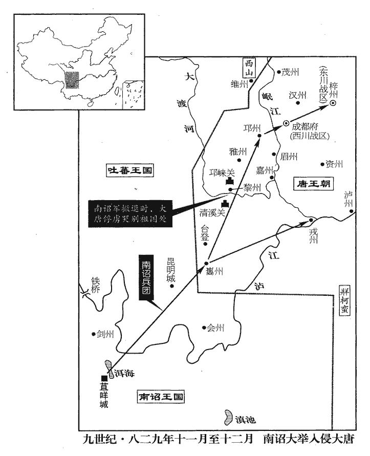
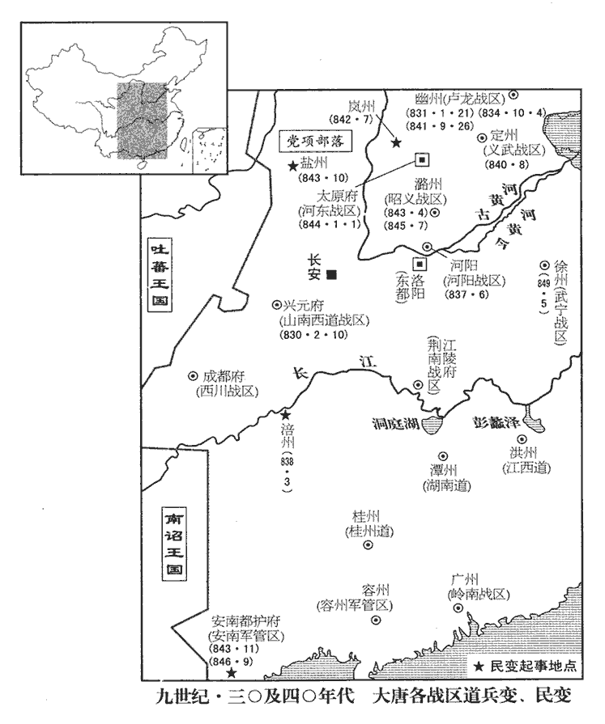
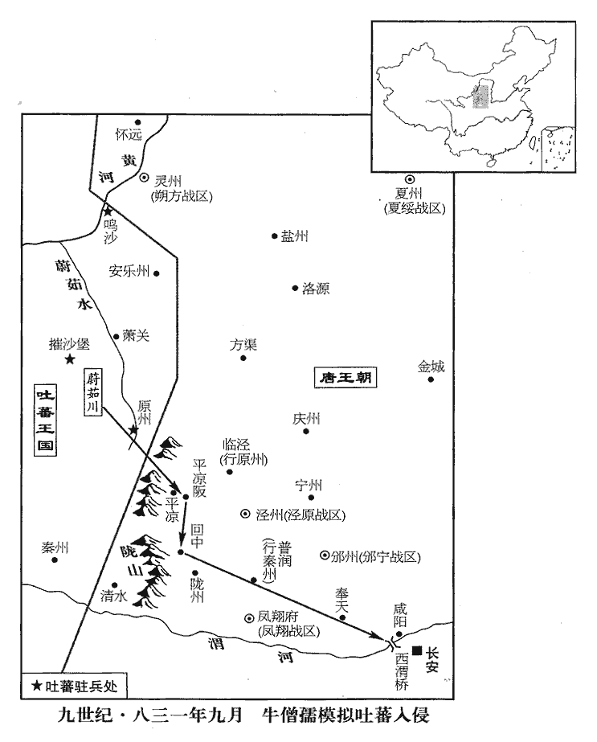
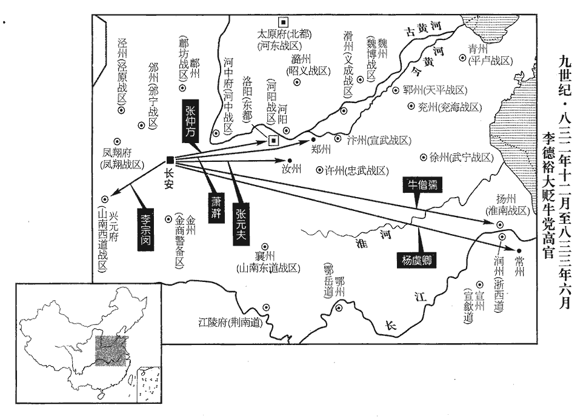
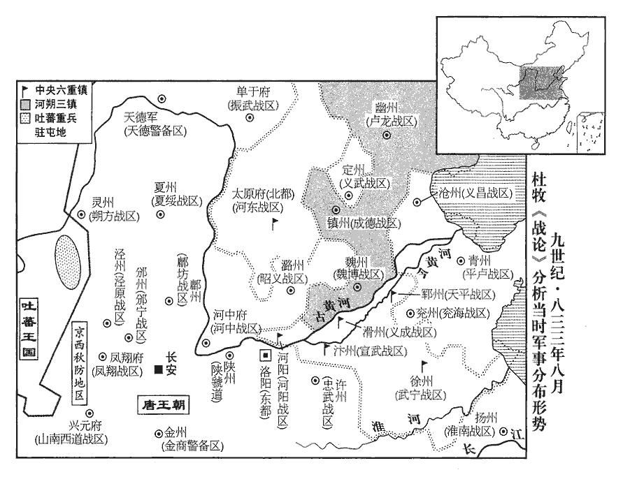

 唐紀六十起屠維作噩（己酉），盡昭陽赤奮若（癸丑），凡五年。

# 文宗元聖昭獻孝皇帝上之下

## 太和三年（己酉、八二九）

1春，正月，亓志紹‹魏博战区，总部设魏州河北省大名县›與成德‹总部设镇州河北省正定县›合兵掠貝州‹河北省清河县›。貝州，在魏州北二百一十里。

〖译文〗 [1]春季，正月，亓志绍与成德兵联合掠夺贝州。

2義成‹总部设滑州河南省滑县›行營兵三千人先屯齊州‹山东省济南市›，使之禹城‹山东省禹城县›，之，往也，一作「屯」。禹城，漢祝阿縣地，天寶元年改為禹城，以縣西有禹息古城也，屬齊州。九域志：在州西北一百三十里。中道潰叛；橫海‹总部设沧州河北省沧州市东南›節度使李祐討誅之。

〖译文〗 [2]义成参予讨伐李同捷的行营兵三千人屯驻在齐州，后来奉命调防禹城，途中溃乱叛变，被新任横海节度使李诛杀。

3李聽、史唐合兵擊亓志紹，破之；志紹將其眾五千奔鎮州‹成德战区总部·河北省正定县›。

〖译文〗 [3]李听和史唐率军联合进攻亓志绍，打败他的军队，亓志绍率五千人逃往镇州。

4李載義‹卢龙战区，总部设幽州北京市›奏攻滄州‹河北省沧州市东南›長蘆‹沧州市›，拔之。滄州，治青池縣。九域志：長蘆鎮屬清池。

〖译文〗 [4]李载义奏称攻占横海沧州长芦镇。

5甲辰‹二十三›，昭義‹总部设潞州山西省长治市›奏亓志紹餘眾萬五千人詣本道降，置之洛【章：十二行本「洛」作「洺」；乙十一行本同；孔本同。】州‹洺州，河北省永年县东南旧永年镇›。

〖译文〗 [5]甲辰（二十三日），昭义奏报：亓志绍余众一万五千人来本道请降，已安置在洛州。

6二月，橫海‹总部设沧州河北省沧州市东南›節度使李祐帥諸道行營兵擊李同捷，破之，帥，讀曰率。進攻德州‹山东省陵县。德州属横海战区›。九域志：德州，東北至滄州二百三十里。

〖译文〗 [6]二月，新任横海节度使李率诸道行营兵击败李同捷，接着，进攻德州。

7武寧‹总部设徐州江苏省徐州市›捉生兵馬使石雄，勇敢，愛士卒；王智興殘虐，軍中欲逐智興而立雄，智興知之，因雄立功，奏請除刺史。丙辰‹六›，以雄為壁州‹四川省通江县›刺史。宋白曰：壁州本漢宕渠縣地，後魏大統中於今州理置諾水縣；唐武德八年立壁州，以縣西一里壁山為名，京師西南一千八百二十二里。

〖译文〗 [7]武宁捉生兵马使石雄作战勇敢，爱护士卒。节度使王智兴对部下残虐无道，军中打算驱逐王智兴，然后拥立石雄为节度使。王智兴得知，于是乘石雄在前线作战立功的机会，奏请朝廷任命他为刺史。丙辰（初六），朝廷任命石雄为壁州刺史。

8史憲誠聞滄景將平而懼，其子唐勸之入朝。丙寅‹十六›，憲誠使唐奉表請入朝，且請以所管聽命。

〖译文〗 [8]史宪诚听说沧景（横海）即将平定的消息，十分恐惧。他的儿子史唐趁机劝他前往京城朝拜，归顺朝廷。丙寅（十六日），史宪诚让史唐携带上奏朝廷的表章前往长安，请求朝廷批准自己入朝参拜，同时，请求以自己管辖的魏博六州听从朝廷诏令。

9石雄既去武寧‹江苏省徐州市›，王智興悉殺軍中與雄善者百餘人。夏，四月，戊午‹九›，智興奏雄搖動軍情，請誅之。上‹李昂（李涵）本年二十二岁›知雄無罪，免死，長流白州‹广西博白县›。為武宗復用石雄張本。武德三年，析合浦縣地置博白縣，四年置南州，六年改白州，至京師六千七百一十五里。州縣皆因博白江為名。

〖译文〗 [9]石雄离开武宁后，王智兴杀军中平日和石雄关系密切的将士一百多人。夏季，四月，戊午（初九），王智兴奏称，石雄煽动军情，请朝廷把他杀掉。文宗知道石雄被王智兴诬陷而无罪，于是，下令免死，流放到白州。

10戊辰‹十九›，李載義奏攻滄州，破其羅城。羅城，外城也。李祐拔德州‹山东省陵县›，城中將卒三千餘人奔鎮州‹河北省正定县›。李同捷與祐書請降，降，戶江翻。祐并奏其書，諫議大夫柏耆受詔宣慰行營，好張大聲勢以威制諸將，諸將已惡之矣；好，呼到翻。惡，烏露翻。及李同捷請降於祐，祐遣大將萬洪代守滄州；耆疑同捷之詐，自將數百騎馳入滄州，以事誅洪，取同捷及其家屬詣京師。乙亥‹二十六›，至將陵‹山东省陵县北›，將陵，漢安德縣地，隋分安德，於將陵故城置縣，唐屬德州。或言王庭湊欲以奇兵篡同捷，篡，初患翻，奪也。乃斬同捷，傳首，滄景悉平。

〖译文〗 [10]戊辰（十九日），李载义奏报进攻李同捷的治所沧州，已攻破外城。李率军攻拔德州，城中将士三千人逃奔镇州。李同捷写书给李，请求投降。李把李同捷的降书一并上奏朝廷。这时，谏议大夫柏耆奉诏前来安抚行营将士，他好大张自己的声威，以威严钳制诸将，诸将已深恶痛绝。等到李同捷向李请降，李派遣大将万洪代理自己镇守沧州。柏耆怀疑李同捷请降有诈，于是，率几百名骑兵赴沧州，寻找借口诛杀万洪，然后，把李同捷和他的家属一并带往京城。乙亥（二十六日），柏耆走到德州将陵县，有人对他说，王庭凑策划出奇兵夺取李同捷。于是，柏耆斩李同捷，把他的首级送往京城。至此，沧景（横海）全部平定。

五月，庚寅‹十二›，加李載義同平章事。考異曰：實錄作「庚寅」，誤。諸道兵攻李同捷，三年，僅能下之，上初元即討同捷，至是三年。而柏耆徑入城，取為己功，諸將疾之，爭上表論列。辛卯‹十三›，貶耆為循州‹广东省惠州市›司戶。循州，古龍川地，隋置循州。考異曰：實錄：「四月，李祐收德州，同捷請降于祐。祐疑其詐，柏耆請以騎兵三百入滄州；祐從之。耆徑入滄，收同捷與其家屬赴京師。」又詔曰：「假勢張皇，乘險縱恣，指揮彈壓，奏報蔑聞。擅入滄州，專殺大將，補署逆校，潛送兇渠。」舊傳曰：「滄、德平，諸將害耆邀功，爭上表論列。上不獲已，貶循州司戶。」新傳曰：「同捷請降，祐使萬洪代守滄州，同捷未出也。耆以三百騎馳入滄，以事誅洪，與同捷朝京師。既行，諜言王庭湊欲以奇兵劫同捷，耆遂斬其首以獻。諸將疾其功，比奏攢詆，文宗不獲已，貶耆循州司戶參軍。」蓋耆張皇邀功則有之，然諸將疾之而論奏，文宗不得已而貶黜，亦其實也。至於賜死，則因馬國亮奏其受同捷奴婢、綾絹故也。李祐尋薨。

〖译文〗 五月，庚寅（十二日），唐文宗加封李载义同平章事的职务。朝廷征发诸道兵马围攻李同捷，用了三年之久，才迫使他投降。而柏耆径直进入沧州城，抓获李同捷作为自己的功劳。诸将都憎恨他，争相上奏予以抨击。辛卯（十三日），朝廷贬柏耆为循州司户。不久，李去世。

11壬寅‹二十四›，攝魏博副使史唐奏改名孝章。

〖译文〗 [11]壬寅（二十四日），暂代魏博节度副使史唐奏称，改名为史孝章。

12六月，丙辰‹八›，詔：「鎮州‹河北省正定县›四面行營各歸本道休息，但務保境，勿相往來；惟庭湊效順，為達章表，為，于偽翻。餘皆勿受。」

〖译文〗 [12]六月，丙辰（初八），唐文宗下诏：“镇州（成德）四面行营各道兵马，各自返回本道休整，只求保卫边境安全，而不要互相有所往来，只有当王庭凑表示愿意归顺朝廷时，才可为他转达上奏朝廷的奏折，其余一概不要接受。”

13辛酉‹十三›，以史憲誠為兼侍中、河中‹总部设河中府山西省永济市›節度使；以李聽兼魏博節度使。李聽本帥義成，使兼魏博。分相‹河南省安阳市›、衛‹河南省卫辉市›、澶‹河南省内黄县东南›三州，以史孝章為節度使。澶chán，時連翻。

〖译文〗 [13]辛酉（十三日），唐文宗任命魏博节度使史宪诚兼任侍中、河中节度使；任命义成节度使李听兼魏博节度使。同时下令把魏博管辖的相、卫、澶三州分割出来，任命史孝章为节度使。

14初，李祐聞柏耆殺萬洪，大驚，疾遂劇。上曰：「祐若死，是耆殺之也！」癸酉‹二十五›，賜耆自盡。

〖译文〗 [14]当初，李听到柏耆擅杀万洪的消息后，大为吃惊，病情更加严重。文宗得知后说：“李如果病死，就是柏耆把他害死的。”癸酉（二十五日），命柏耆自杀。

15河東‹总部设太原府山西省太原市›節度使李程奏得王庭湊書，請納景州‹河北省泊头市›；考異曰：按景州本隸橫海，蓋因李同捷之亂，庭湊據有之。同捷既平，庭湊懼而復進之也。又奏亓志紹自縊。縊，於賜翻，又一計翻。

〖译文〗 [15]河东节度使李程奏称收到王庭凑给朝廷的书信，请求把景州交还朝廷。李程又奏报说，亓志绍已经自杀。

16上遣中使賜史憲誠旌節，癸酉‹二十五›，至魏州‹魏博战区总部·河北省大名县›。時李聽自貝州‹河北省清河县›還軍館陶‹河北省馆陶县›，遷延未進，館陶，在魏州北四十五里。憲誠竭府庫以治行。【章：十二行本「行」下有「將士怒」三字；乙十一行本同；張校同，云無註本亦無。】治，直之翻。甲戌‹二十六›，軍亂，殺憲誠，奉牙內都知兵馬使靈武‹宁夏永宁县西南›何進滔知留後。李聽進至魏州，進滔拒之，不得入。秋，七月，進滔出兵擊李聽；聽不為備，大敗，潰走，考異曰：新進滔傳曰：「進滔下令曰：『公等既迫我，當聽吾令。』眾唯唯。『孰殺前使及監軍者，疏出之。』凡斬九十餘人，釋脅從者。素服臨哭，將吏皆入弔。詔拜留後。」按進滔結王庭湊以拒李聽，又襲擊聽，大破之，安能如是！新傳蓋據柳公權德政碑云：「公謂將士曰：『既迫以為長，當謹而聽承。』命都將總事者諭之曰：『害前使與監軍兇黨，籍其姓名，仍集之於庭，無使漏網。』卒獲九十三人。白黑既分，善惡無誤，會眾顯戮共棄，咸悅。公於是素服而哭，將吏序弔。」此恐涉溢美之辭耳。今從舊傳。晝夜兼行，趣淺口‹河北省馆陶县西北›，九域志：魏州館陶縣有淺口鎮。趣，七喻翻。失亡過半，輜重兵械盡棄之。重，直用翻。昭義兵救之，聽僅而得免，歸于滑臺‹河南省滑县·义成战区总部所在城›。李聽本鎮滑州。

〖译文〗 [16]唐文宗派遣宦官授予史宪诚河中节度使的旌节。癸酉（二十五日），宦官抵达魏州。这时，李听率军从贝州返回，走到魏州以北的馆陶县时，犹豫而不再前进。史宪诚竭尽魏博库存的财物为自己治办行装。甲戌（二十六日），将士哗变，杀死史宪诚，拥立牙内都知兵马使、灵武人何进滔代理留后。李听率军抵达魏州城下，遭到何进滔的抵抗，不能入城。秋季，七月，何进滔出兵攻击李听，李听毫无准备，大败而逃，昼夜兼行，直奔馆陶县浅口镇，士卒损失逃亡过半，辎重兵器全都丢弃。昭义出兵救援，李听才得以逃免，回到义成的治所滑台。

河北久用兵，饋運不給，朝廷厭苦之。八月，壬子‹五›，以進滔為魏博節度使，復以相、衛、澶三州歸之。

〖译文〗 自从太和元年朝廷出兵讨伐横海李同捷以来，长期在河北地区用兵伐叛，军需运输一直难以为继，朝廷对此十分厌烦苦恼，不愿再生事端。于是，八月，壬子（初五），任命何进滔为魏博节度使，并将相、卫、澶三州重新归还魏博管辖。

17滄州承喪亂之餘，喪，息浪翻。骸骨蔽地，城空野曠，戶口存者什無三四。癸丑‹六›，以衛尉卿殷侑為齊、德、滄、景節度使。是年，始以齊州隸橫海。侑至鎮，與士卒同甘苦，招撫百姓，勸之耕桑，流散者稍稍復業。先是，本軍三萬人皆仰給度支，先，悉薦翻。仰，牛向翻。侑至一年，租稅自能贍其半；二年，請悉罷度支給賜；三年之後，戶口滋殖，倉廩充盈。史言方鎮得其人，則可轉荒殘為富實。

〖译文〗 [17]横海的治所沧州在经过多年战乱以后，骸骨遍地，城野空旷，户口流失，现存人口不到原来的十分之三四。癸丑（初六），唐文宗任命卫尉卿殷侑为齐、德、沧、景节度使。殷侑赴任后，与士卒同甘共苦，招抚百姓，鼓励耕田植桑，流散的百姓渐渐回乡复业。此前，本军三万人的军需都由朝廷度支供给，殷侑任职一年后，依靠当地租税收入，已能供给一半军需；两年以后，全部自给，请求度支停止供给；三年以后，户口大大增加，仓库充盈。

18王庭湊因鄰道微露請服之意；壬申‹二十五›，赦庭湊及將士，復其官爵。

〖译文〗 [18]王庭凑通过邻近的藩镇透露出愿意归顺朝廷的意图。壬申（二十五日），唐文宗下诏，赦免王庭凑和成德将士的罪行，恢复他们的职务和爵位。

19徵浙西‹首府设润州江苏省镇江市›觀察使李德裕為兵部侍郎，裴度薦以為相。會吏部侍郎李宗閔有宦官之助，甲戌‹二十七›，以宗閔同平章事。

〖译文〗 [19]唐文宗征召任命浙西道观察使李德裕为兵部侍郎。裴度推荐李德裕为宰相。这时，吏部侍郎李宗闵得到宦官的帮助，甲戌（二十七日），文宗任命李宗闵为同平章事。

20上性儉素，九月，辛巳‹四›，命中尉以下毋得衣紗縠hú綾羅；衣，於既翻。聽朝之暇，惟以書史自娛，聲樂遊畋未嘗留意。駙馬韋處仁嘗著夾羅巾，處，昌呂翻。著，陟畧翻。劉昫曰：武德已來，始有巾子，文官名流上平頭小樣者。則天時，朝貴臣內賜高頭巾子，呼為武家諸王樣。中宗景龍四年三月，因內宴，賜宰臣以下內樣巾子。開元已來，文官士伍多以紫皂官絁shī為頭巾，平頭巾子，相倣為雅製。玄宗開元十九年十月，賜供奉及諸司長官羅頭巾及宮樣巾，迄于今服之。上謂曰：「朕慕卿門地清素，故有選尚。處仁尚穆宗‹李恒›女新豐公主。如此巾服，聽其他貴戚為之，卿不須爾。」

〖译文〗 [20]唐文宗生性节俭朴素。九月，辛巳（初四），命令神策护军中尉以下官员不得穿纱绫罗之类的高级丝织品。文宗在处理朝政以外的闲暇时间，仅仅以读书观史为乐，对于女色、音乐和外出打猎从来不曾留意。一次，驸马韦处仁头戴夹罗巾，文宗对他说：“朕羡慕你家门第清高素雅，所以，挑选你做驸马。像这样贵重的头巾，让那些达官贵戚去戴，你最好不要戴。”

21壬辰‹十五›，以李德裕為義成節度使。李宗閔惡其逼己，惡，烏露翻。故出之。

〖译文〗 [21]壬辰（十五日），唐文宗任命李德裕为义成节度使。宰相李宗闵忌恨李德裕可能威胁自己的地位，所以建议文宗任命他外出赴任。

22冬，十月，丙辰‹九›，以李聽為太子少師。

〖译文〗 [22]冬季，十月，丙辰（初九），唐文宗任命李听为太子少师。

23路隋言於上曰：「宰相任重，不宜兼金穀瑣碎之務，如楊國忠、元載、皇甫鎛bó皆奸臣，所為不足法也。」上以為然。於是裴度辭度支；上許之。

〖译文〗 [23]宰相路隋对文宗说：“宰相责任重大，不适合兼管钱、谷之类的琐碎事务。过去，杨国忠、元载、皇甫身为宰相，而兼管财政，但他们都是奸臣，所以，不足以效法。”文宗认为有理。这时，宰相裴度请求辞去兼任的度支使的职务，于是，文宗批准。

24十一月，甲午‹十八›，上祀圜丘；赦天下。四方毋得獻奇巧之物，其纖麗布帛皆禁之，焚其機杼。

〖译文〗 [24]十一月，甲午（十八日），唐文宗亲赴圜丘祭天，宣诏大赦天下。禁止各地进献奇技淫巧之物，凡是细密华美的布帛一律禁止生产，织造这类物品的纺织机一律焚烧。

25丙申‹二十›，西川‹总部设成都府四川省成都市›節度使杜元穎奏南詔‹首都苴咩城云南省大理市›入寇。元穎以舊相，文雅自高，杜元穎，長慶初相穆宗。不曉軍事，專務蓄積，減削士卒衣糧。西南戍邊之卒，衣食不足，皆入蠻境鈔盜以自給，鈔，楚交翻。蠻人反以衣食資之；由是蜀中虛實動靜，蠻皆知之。南詔自嵯cuó顚謀大舉入寇，嵯顚弑君立君，遂專南詔之政。嵯，才何翻。邊州屢以告，元穎不之信；嵯顛兵至，邊城一無備禦。蠻以蜀卒為鄉導，鄉，讀曰嚮，襲陷巂‹四川省西昌市›、戎‹四川省宜宾市›二州。甲辰‹二十八›，元穎遣兵與戰於邛州‹四川省邛崃市›南，蜀兵大敗；蠻遂陷邛州。邛，渠容翻。

〖译文〗 [25]丙申（二十日），剑南西川节度使杜元颖奏报：南诏国侵犯边境。杜元颖认为自己过去曾担任宰相，文才高雅，因而自诩清高。他不懂军事，却专门积蓄财产，减削士卒的衣食供给。西南戍边的士卒衣食不足，纷纷到南诏国境内去掠夺偷盗，以便自给。南诏国反而赠送他们衣物和粮食，于是，西川的动静虚实，南诏国都能知晓。南诏国自从嵯颠执掌朝政，就密谋大举侵犯西川，西南的边防州郡多次向杜元颖反映，杜元颖一概不信。这时，嵯颠率兵来临，边防的城池毫无防备。南诏军队以西川的降卒为向导，袭击并攻陷了、戎二州。甲辰（二十八日），杜元颖派兵和南诏军队在邛州以南交战，西川兵大败。南诏乘胜攻占邛州。

26武寧節度使王智興入朝。

〖译文〗 [26]武宁节度使王智兴来京城朝拜。

27詔發東川‹总部设梓州四川省三台县›、興元‹总部设兴元府陕西省汉中市›、荊南‹总部设江陵府湖北省江陵县›兵以救西川‹总部成都府›；十二月，丁未朔‹一›，又發鄂岳‹总部设鄂州湖北省武汉市›、襄鄧‹总部设襄州湖北省襄樊市›、陳許‹总部设许州河南省许昌市›等兵繼之。

〖译文〗 [27]唐文宗下诏，征发剑南东川、兴元、荆南三道的兵马前往西川救援。十二月，丁未朔（初一），又征发鄂岳、襄邓、陈许等道兵再住增援。

28以王智興為忠武‹总部设许州河南省许昌市›節度使。智興自徐徙陳。

〖译文〗 [28]唐文宗任命王智兴为忠武节度使。

29己酉‹三›，以東川節度使郭釗為西川節度使，兼權東川節度事。

〖译文〗 [29]己酉（初三），唐文宗任命剑南东川节度使郭钊为剑南西川节度使，并代理东川节度使。

嵯顛自邛州引兵徑抵成都‹四川省成都市›，九域志：自邛州東至成都二百六十里。庚戌‹四›，陷其外郭。杜元穎帥眾保牙城以拒之，帥，讀曰率。考異曰：實錄：「寇及子城，元穎方覺知。」按實錄：「十一月丙申，元穎奏南詔入寇。乙巳，奏圍清溪關。十二月丙辰，奏官軍失利，蠻陷邛州。」至此乃云「寇及子城，元穎方覺知。」似尤之太過，今不取。欲遁者數四。壬子‹六›，貶元穎為邵州‹湖南省邵阳市›刺史。

〖译文〗 嵯颠从邛州出兵，径直抵达成都城下，庚戌（初四），攻陷成都外城。杜元颖率领将士退守牙城，抵抗南诏军队。杜元颖几次想离城逃亡。壬子（初六），唐文宗贬杜元颖为邵州刺史。

30己未‹十三›，以右領軍大將軍董重質為神策、諸道西川行營節度使，又發太原、鳳翔‹总部设凤翔府陕西省凤翔县›兵赴西川。南詔寇東川，入梓州西川【章：十二行本「川」作「郭」；乙十一行本同；知「川」字乃「郭」之誤。退齋校云，下「川」字宋作「郭」。嚴：「西川」改「西郭」。】東川節度，治梓州。釗兵寡弱不能戰，「釗」上當更有「郭」字，蜀本正如此。以書責嵯顛。嵯顛復書曰：「杜元穎侵擾我，故興兵報之耳。」與釗脩好而退。好，呼到翻。

〖译文〗 [30]己未（十三日），唐文宗任命右领军大将军董重质为神策军及诸道西川行营节度使。同时，征发太原、凤翔两道兵增援西川。这时，南诏军队又侵犯东川，进入东川节度使驻地梓州的西城。郭钊兵力寡弱，无力坚守，于是写信责备嵯颠入侵，嵯颠回信说：“杜元颖侵扰我国，所以，我国兴兵报复。”嵯颠和郭钊休兵和好，率兵退去。

蠻留成都西郭十日，其始慰撫蜀人，市肆安堵；將行，乃大掠子女、百工數萬人及珍貨而去。蜀人恐懼，往往赴江，流尸塞江而下。塞，悉則翻。嵯顛自為軍殿，殿，丁練翻。及大度水‹大渡河›，嵯顛謂蜀人曰：「此南吾境也，聽汝哭別鄉國。」眾皆慟哭，赴水死者以千計。自是南詔工巧埒於蜀中。埒liè，龍輒翻，等也。

〖译文〗 南诏军队驻留成都西城十天。开始时，还安抚西川人民，因而集市安然。临走时，方才大肆掠夺妇女和各种工匠几万人，以及各种珍宝奇货，然后退去。西川百姓大为恐惧，往往跳江而逃，尸首沿江漂流而下。嵯颠亲自率军断后，走到大渡河时，他对俘掠来的西川人说：“从这里往南，就进入我国的境内了。现在，允许你们哭别故乡。”西川人都大声痛哭，投河而死者有千人。从此以后，南诏国工匠的技术水平可以和西川媲美。

嵯顛遣使上表，稱：「蠻比脩職貢，比，毗至翻。豈敢犯邊，正以杜元穎不恤軍士，怨苦元穎，競為鄉導，祈我此行以誅虐帥。帥，所類翻。誅之不遂，無以慰蜀士之心，願陛下誅之。」丁卯‹二十一›，再貶元穎循州司馬。詔董重質及諸道兵皆引還。郭釗至成都，與南詔立約，不相侵擾。詔遣中使以國信賜嵯顛。

〖译文〗 嵯颠派遣使者来朝上表，说：“我国近年来一直向贵国称臣纳贡，岂敢擅自侵犯边境，只是由于杜元颖不爱护士卒，士卒痛恨他，才争相做我的向导，请求我出兵诛杀杜元颖。不料此行未能把他诛杀，我已无法安抚西川士卒，实现自己的诺言，希望陛下把他杀掉。”丁卯（二十一日），唐文宗再次贬杜元颖为循州司马。同时下诏，命董重质和诸道增援西川的兵马都退回。新任西川节度使郭钊抵达成都后，和南诏国签订友好条约，规定两国互不侵扰。于是，文宗又下诏，命宦官携带朝廷信件前往南诏国，递交嵯颠。

 

## 太和四年（庚戌、八三零）

1春，正月，辛巳‹六›，武昌‹总部设鄂州湖北省武汉市›節度使牛僧孺入朝。

〖译文〗 [1]春季，正月，辛巳（初六），武昌节度使牛僧孺来京城朝拜。

2戊子‹十三›，‹李昂，李涵。本年二十三岁›立子永為魯王。

〖译文〗 [2]戊子（十三日），唐文宗立儿子李永为鲁王。

3李宗閔引薦牛僧孺；辛卯‹十六›，以僧孺為兵部尚書、同平章事。於是二人相與排擯李德裕之黨，排，擠也。擯，斥也。稍稍逐之。

〖译文〗 [3]宰相李宗闵向文宗推荐牛僧孺。辛卯（十六日），文宗任命牛僧孺为兵部尚书、同平章事。于是，二人一起排挤李德裕的党羽，逐渐把他们从朝廷中贬逐出去。

4南詔‹首都苴咩城云南省大理市›之寇成都也，詔山南西道‹总部设兴元府陕西省汉中市›發兵救之，事見上年。興元兵少，山南西道節度，治興元府。節度使李絳募兵千人赴之，未至，蠻退而還。還，從宣翻，又如字。

〖译文〗 [4]南诏国当初侵犯成都的时候，朝廷诏命山南西道派兵前往增援。山南西道节度使驻地兴元府的兵力太少，于是，节度使李绛招募新兵一千人前往，尚未到达西川，南诏兵已经退走，新兵于是返回兴元。

興元兵有常額，詔新募兵悉罷之。二月，乙卯‹十›，絳悉召新軍，諭以詔旨而遣之，仍賜以廩麥，皆怏怏而退。怏，於兩翻。往辭監軍，監軍楊叔元素惡絳不奉己，以賜物薄激之。眾怒，大譟，掠庫兵，趨使牙。惡，烏露翻。趣，七喻翻。節度使所居為使宅，治事之所為使牙。使，疏吏翻。絳方與僚佐宴，不為備，走登北城。或勸縋而出，縋，馳偽翻。絳曰：「吾為元帥，豈可逃去！」麾推官趙存約令去。存約曰：「存約受明公知，何可苟免！」牙將王景延與賊力戰死，絳、存約及觀察判官薛齊皆為亂兵所害‹李绛本年六十七岁›，賊遂屠絳家。考異曰：新傳曰：「楊叔元素疾絳，遣人迎說軍士曰：『將收募直，而還為民。』士皆怒，乃譟而入劫庫兵。絳方宴，不設備，遂握節登陴。或言縋城可以免，絳不從，遂遇害。」實錄：「絳召諸卒，以詔旨諭而遣之，發廩麥以賞眾，皆怏怏而退。出壘門，眾有請辭監軍者，而監軍楊叔元貪財怙寵，素怨絳之不奉己，與絳為隙久矣，至是因以賞薄激之。散卒遂作亂。」今從之。

〖译文〗 兴元府的兵力编制历来有严格规定，因此朝廷诏命新招募的兵士一律遣返。二月，乙卯（初十），李绛召集新兵，传达朝廷的诏令，然后，每人赏赐麦子，命令他们回家。新兵闷闷不乐而退，前去向监军杨叔元辞别。杨叔元向来恨李绛不阿谀奉迎自己，就借口说赏赐的东西太少，故意激怒新兵对李绛不满。新兵果然被激怒，顿时哗变，掠抢库存的兵器后，直向节度使衙门冲去。这时，李绛正和自己的幕僚在一起饮酒宴乐，毫无防备，于是慌忙向北城跑去。有人劝李绛从城上缒下逃走，李绛说：“我是节度使，岂能逃走！”命令推官赵存约赶快走。赵存约说：“我以往得到您的赏识和重用，岂可现在自己苟且偷生！”牙将王景延和乱兵拼力厮杀而死。李绛、赵存约和观察判官薛齐都被乱兵杀害。接着，乱兵屠杀了李绛的全家。

戊午‹十三›，叔元奏絳收新軍募直以致亂。庚申‹十五›，以尚書右丞溫造為山南西道節度使。是時，三省官上疏共論李絳之冤；諫議大夫孔敏行具呈叔元激怒亂兵，上始悟。

〖译文〗 戊午（十三日），杨叔元上奏朝廷说，李绛擅自收取招募新兵用的财物，因而导致新兵哗变。庚申（十五日），唐文宗任命尚书右丞温造为山南西道节度使。这时，中书省、门下省、尚书省的官员联名上疏，申诉李绛冤枉，谏议大夫孔敏行把杨叔元如何激怒新兵作乱的事实经过呈奏文宗，文宗这才明白李绛被害的事实真相。

 

5三月，乙亥朔‹一›，以刑部尚書柳公綽為河東‹总部设太原府山西省太原市›節度使。先是，回鶻‹瀚海沙漠群›入貢及互市，先，悉薦翻。所過恐其為變，常嚴兵迎送防衛之。公綽至鎮，回鶻遣梅錄李暢以馬萬匹互市，公綽但遣牙將單騎迎勞於境，勞，力到翻。至則大闢牙門，受其禮謁。暢感泣，戒其下，在路不敢馳獵，無所侵擾。

〖译文〗 [5]三月，乙亥朔（初一），唐文宗任命刑部尚书柳公绰为河东节度使。以前，回鹘国派人来唐贡奉特产或进行商品交易时，凡是他们经过的地方，都担心回纥兵变作乱，因而，常常在迎来送往时，严阵以待，以防不测。柳公绰上任后，回鹘国派遣梅李畅带马一万匹前来交易，柳公绰只派一名牙将骑马到边境上去迎接。李畅到达太原后，柳公绰命令大开节度使衙门，接受李畅的拜谒。李畅被柳公绰的信任所感动，潸然泪下，告诫他的部下，不得在沿途驰猎，侵扰百姓。结果，回鹘此行交易一无侵扰。

陘‹山西省代县西北句注山›北沙陀素驍勇，沙陀保神武川‹山西省山阴县东·位陉岭北›，在陘嶺之北。陘，音刑。為九姓‹山西省西北部›、六州‹河曲六州›胡所畏伏。公綽奏以其酋長朱邪執宜為陰山都督、代‹山西省代县›北行營招撫使，使居雲‹山西省大同市›、朔‹山西省朔州市›塞下，捍禦北邊。執宜與諸酋長入謁，公綽與之宴。執宜神彩嚴整，進退有禮，公綽謂僚佐曰：「執宜外嚴而內寬，言徐而理當，酋，慈由翻。長，知兩翻。邪，讀曰耶。當，都浪翻。福祿人也。」執宜母妻入見，公綽使夫人與之飲酒，饋遺之。見，賢遍翻。遺，唯季翻。執宜感恩，為之盡力。為，于偽翻。塞下舊有廢府十一，舊書作「廢柵」，當從之，蓋考之唐志，雲、朔塞下無十一府也。執宜脩之，使其部落三千人分守之，自是雜虜不敢犯塞。雜虜，謂退渾‹即吐谷浑·山西省北部及黄河河套›、回鶻、韃dá靼dá‹散布于蒙古国中部至瀚海沙漠群›、奚‹滦河上游›、室韋‹内蒙古东北部›之屬。

〖译文〗 居住在河东陉岭以北的沙陀部落，向来以骁勇著称，九姓回鹘和六州胡都被沙陀的骁勇所折服。柳公绰奏请朝廷任命沙陀酋长朱邪执宜为阴山都督、代北行营招抚使，批准他们迁居到云州、朔州的边塞之间，以便保卫河东的北方边境。朱邪执宜和沙陀的诸位酋长前来太原拜访柳公绰，柳公绰设宴招待。朱邪执宜神色严肃，见人彬彬有礼，柳公绰对幕僚说：“执宜看起来外表严肃，实际上内心对人宽容；说话虽然缓慢但却言之成理，真是一个有福相的人啊！”执宜的母亲和妻子前来拜见，柳公绰让自己的夫人和她们一起喝酒，然后，赠送礼物。执宜感谢柳公绰的赏识和信任，表示愿意尽力效劳。云州和朔州有过去残留作废的营栅十一个，执宜派人加以修建，命令他的部落兵三千人分别镇守。从此以后，在边境上游牧的退浑、回鹘、鞑靼、奚、室韦等蛮族部落不敢再轻易侵犯。

6溫造行至褒城‹陕西省汉中市西北褒城镇›，褒城，漢褒中縣，唐屬興元府。九域志：褒城，在府西北四十五里。遇興元‹陕西省汉中市›都將衛志忠征蠻歸，造密與之謀誅亂者，以其兵八百人為牙隊，五百人為前軍，入府，分守諸門。己卯‹五›，造視事，饗將士於牙門，造曰：「吾欲問新軍去留之意，宜悉使來前。」既勞問，勞，力到翻。命坐，行酒。志忠密以牙兵圍之，既合，唱「殺！」圍既合，唱聲曰「殺！」眾應聲而進，殺之。新軍八百餘人皆死。楊叔元起，擁造靴求生，造命囚之。其手殺絳者，斬之百段，餘皆斬首，投尸漢水，以百首祭李絳，三十首祭死事者，具事以聞。己丑‹十五›，流楊叔元於康州‹广东省德庆县›。康州，漢端溪縣地，武德四年置南康州，貞觀十二年去「南」字；至京師五千七百五十里。

〖译文〗 [6]温造赶赴山南西道上任，走到褒城时，遇到兴元都将卫志忠刚刚讨伐蛮人回来。温造和卫志忠秘密商议诛讨新兵哗变者的方案。于是，以卫志忠所率领的八百人作为自己的亲兵，另外五百人作为前锋，到达兴元后，进入节度使衙门，分兵把守各门。己卯（初五），温造开始办公，在衙门用酒肉犒劳将士，他对部下说：“我想问一问新兵是愿走还是愿留，请把他们全部找来。”温造慰劳新兵后，命大家都坐下，然后开始喝酒。这时，卫志忠秘密地布置亲兵包围新兵，包围圈刚刚完成，卫志忠大喊一声“杀！”顿时，新兵八百多人全被杀死。监军杨叔元急忙起身，抱住温造的靴子请求免死，温造下令把他拘捕。当时亲手杀死李绛的凶手，被斩成一百段，其余的新兵，都被斩首，尸体全被投到汉江中。温造命用一百个新兵的首级祭奠李绛，三十个首级祭奠其他死者，然后，把以上情况向朝廷报告。己丑（十五日），唐文宗下令，将杨叔元流放到康州。

7癸卯‹二十九›，加淮南‹总部设扬州江苏省扬州市›節度使段文昌同平章事、為荊南‹总部设江陵府湖北省江陵县›節度使。

〖译文〗 [7]癸卯（二十九日），唐文宗加封淮南节度使段文昌同平章事的职务，任荆南节度使。

8奚‹滦河上游›寇幽州‹北京市›，夏，四月，丁未‹三›，盧龍‹总部设幽州北京市›節度使李載義擊破之；辛酉‹十七›，擒其王茹羯以獻。羯jié，居列翻。

〖译文〗 [8]奚族进犯幽州，夏季，四月，丁未（初三），卢龙（幽州）节度使李载义打败奚族。辛酉（十七日），李载义活捉奚王茹羯奉献朝廷。

9裴度以高年多疾‹本年六十六岁›，懇辭機政。六月，丁未‹五›，以度為司徒、平章軍國重事，平章軍國重事者，平章大事，不復煩以細務，與同平章事之官不同。考異曰：寶曆二年度入相，時猶守司空，自後未嘗遷官。至此，實錄直言司徒裴度。按制辭云：「遷秩上公，式是殊寵。」又云：「宜其首贊機衡，弘敷教典。」蓋此時方遷司徒。實錄先云「司徒裴度」，誤也。俟疾損，三五日一入中書。疾損，猶言疾減也。

〖译文〗 [9]裴度以自己年老多病，恳请唐文宗批准自己辞去宰相职务。六月，丁未（初五），文宗任命裴度为司徒、平章军国重事，等病情减轻后，可三天或五天到中书门下办公一次。

上患宦者強盛，憲宗‹李纯›、敬宗‹李湛›弒逆之黨猶有在左右者；中尉王守澄尤專橫，橫，戶孟翻。招權納賄，上不能制。嘗密與翰林學士宋申錫言之，申錫請漸除其偪。欲以漸去其威權偪上者。偪，音逼。上以申錫沉厚忠謹，可倚以事，擢為尚書右丞；七月，癸未‹十一›，以申錫同平章事。疑則勿任，任則勿疑，文宗為負宋申錫矣。為申錫貶逐張本。

〖译文〗 唐文宗忧虑宦官势力过于强盛，这时，杀害唐宪宗、唐敬宗的凶手，仍有人在文宗左右侍从。神策军中尉王守澄尤其专横跋扈，招权纳贿，文宗无法驾驭。一次，文宗秘密地对翰林学士宋申锡谈及宦官专权的问题，宋申锡认为应当逐渐翦除宦官势力。文宗认为宋申锡性情深沉宽厚，忠正谨慎，可以信任依靠，和他密议诛除宦官。于是，提拔宋申锡为尚书右丞。七月，癸未（十一日），任命宋申锡为同平章事。

10初，裴度征淮西‹总部设蔡州河南省汝南县›，謂元和討吳元濟時也。奏李宗閔為觀察判官，由是漸獲進用。至是，怨度薦李德裕，因其謝病，九月，壬午‹十一›，以度兼侍中，充山南東道‹总部设襄州湖北省襄樊市›節度使。

〖译文〗 [10]当初，裴度率军征讨淮西吴元济叛乱时，奏请李宗闵为幕府的观察判官，由此李宗闵逐渐被提拔任用。这时，李宗闵怨恨裴度向朝廷推荐李德裕，于是，趁裴度因病提出辞职的机会，建议文宗批准并将裴度外放到藩镇任职。九月，壬午（十一日），文宗任命裴度兼任侍中，充任山南东道节度使。

11西川‹总部设成都府四川省成都市›節度使郭釗以疾求代，冬，十月，戊申‹七›，以義成‹总部设滑州河南省滑县›節度使李德裕為西川節度使。

〖译文〗 [11]剑南西川节度使郭钊由于身体有病，请求辞职。冬季，十月，戊申（初七），唐文宗任命义成节度使李德裕为剑南西川节度使。

蜀自南詔入寇，一方殘弊，郭釗多病，未暇完補。德裕至鎮，作籌邊樓，圖蜀地形，南入南詔，西達吐蕃。日召老於軍旅、習邊事者，雖走卒蠻夷無所間，蜀自清溪關則南入南詔，踰西山則西達吐蕃。間，古莧翻。訪以山川、城邑、道路險易，廣狹遠近，易，以豉翻。未踰月，皆若身嘗涉歷。

〖译文〗 西川自从遭南诏国侵掠以后，残破凋敝。郭钊由于身体多病，因而未暇修补。李德裕上任后，修建筹边楼，派人绘制西川的地形图，南到南诏国，西到吐蕃国。他又每天召集那些长期在军队中供职，熟悉边防情况的将士，即使是士卒或夷人、蛮人也不放过，向他们仔细询问山川、城市、道路的险易、宽窄和远近情况。不到一个月，就了如指掌，如身历其境一般。

上命德裕脩塞清溪關‹四川省石棉县东南›以斷南詔入寇之路，塞，悉則翻；下同。斷，音短。或無土，則以石壘之。德裕上言：「通蠻細路至多，不可塞，惟重兵鎮守，可保無虞；但黎‹四川省汉源县›、雅‹四川省雅安市›以來得萬人，成都得二萬人，精加訓練，則蠻不敢動矣。邊兵又不宜多，須力可臨制。崔旰之殺郭英乂，見二百二十四卷代宗永泰元年。張朏fěi之逐張延賞，見二百二十九卷德宗建中四年。皆鎮兵也。」時北兵皆歸本道，惟河中、陳許三千人在成都，有詔來年三月亦歸，蜀人忷懼。忷，許拱翻。德裕奏乞鄭滑五百人、陳許千人以鎮蜀；且言：「蜀兵脆弱，新為蠻寇所困，皆破膽，不堪征戍。戰勝之威，士氣百倍，敗兵之卒，沒世不復，正謂此也。脆，此芮翻。若北兵盡歸，則與杜元穎時無異，蜀不可保。恐議者云蜀經蠻寇以來，已自增兵，曏者蠻寇已逼，元穎始募市人為兵，得三千餘人，徒有其數，實不可用。郭釗募北兵僅得百餘人，臣復召募得二百餘人，復，扶又翻。此外皆元穎舊兵也。恐議者又聞一夫當關之說，一夫當關，萬夫莫前，前人所以言蜀之險也。以為清溪可塞，臣訪之蜀中老將，清溪之旁，大路有三，自餘小徑無數，皆東蠻臨時為之開通，勿鄧、豐琶、兩林，皆東蠻也。為，于偽翻。若言可塞，則是欺罔朝廷。要須大度水‹大渡河›北更築一城，迤邐接黎州，九域志：黎州南至大度河一百里。宋白曰：黎州，古沉黎地。迤，以爾翻。邐，力紙翻。以大兵守之方可。況聞南詔以所掠蜀人二千及金帛賂遺吐蕃，遺，唯季翻。若使二虜知蜀虛實，連兵入寇，誠可深憂。其朝臣建言者，蓋由禍不在身，望人責一狀，留入堂案，堂，謂政事堂。案，文案也。他日敗事，不可令臣獨當國憲。」憲，法也。敗，補邁翻。朝廷皆從其請。德裕乃練士卒，葺堡鄣，積糧儲以備邊，蜀人粗安。

〖译文〗 唐文宗命令李德裕派人堵塞清溪关，以断绝南诏国入侵西川的通道，如果没有土的话，就用石头垒。李德裕上言说：“西川通住南诏国的小路很多，所以，不能阻塞清溪关，只能派重兵镇守，才可万无一失。同时，只要从黎州，雅州召募一万人，成都召募二万人，加强训练则南诏必然不敢轻举妄动。边防戍兵不宜太多，关键在于能够驾驭，听从指挥。过去，崔旰杀节度使郭英义，张驱逐节度使张延赏，所依靠的都是边防戍兵。”这时，北方各道援救西川的兵马大多已返回本道，只有河中、陈许三千人仍留在成都，朝廷下诏，命令他们在次年三月也一并撤回。于是，西川人都恐惧不安，担心各道兵马撤走后，南诏国再乘虚进犯。李德裕上奏朝廷，请求留郑滑五百人，陈许一千人，继续镇守西川，并且说：“西川兵士本性懦弱，最近，又刚刚被南诏打败，都胆战心惊，不堪再用于征战戍防。如果北方各道救援西川的兵马都撤走，那就和杜元颖但任西川节度使时，边防空虚一样，西川肯定难以保全。我担心朝廷有人可能说，西川自从遭受南诏侵犯以后，本道已经增加兵力。其实，前不久直到南诏已经逼近时，杜元颖才开始招募成都市民为兵，总共得三千多人，徒有其数，实际上毫无战斗经验。郭钊仅在东川招募了一百多人，我又招募二百多人，此外都是杜元颖的原有兵力。我还担心朝廷中有人听信蜀道险阻，一夫当关，万夫莫开，就认为只要堵塞清溪关，就可以阻挡南诏国的侵扰了。我曾访询过西川的老将，得知在清溪关的旁边，还有三条大路，小路不计其数，这都是东蛮为南诏国临时开通的道路。如果认为只要堵塞清溪关，就能阻挡南诏国的侵扰，那就是欺骗朝廷。关键是应当在大渡河以北另外修建一个城堡，和黎州连绵相接，用重兵屯守，才可能抵挡南诏国的侵犯。况且我听说南诏国把他们俘掠的二千西川人和大批金钱财宝用来贿赂吐蕃，如果他们知道西川的虚实，两国联合入侵，国家的安危就很值得忧虑了。现在，朝廷有些人轻率地提出建议，都是由于他们不负责任的缘故。希望朝廷责令他们把自己的建议写成状子，留在政事堂存档，一旦将来出了问题，有案可查，不能找我一个人担当罪责。”朝廷全部批准了他的请求。于是，李德裕训练士卒，修补城堡边障，积储军粮，以便加强边防。西川人民初步安定下来。

12是歲，勃海‹首都龙泉府黑龙江省宁安市西南东京城›宣王仁秀卒，子新德早死，孫彝震立，改元咸和。

〖译文〗 [12]这一年，勃海国宣王大仁秀去世，他的儿子大新德早年死亡，于是，他的孙子大彝震被立为国王，改年号为咸和。

## 五年（辛亥、八三一）

1春，正月，丁巳‹十八›，‹李昂（李涵）本年二十四岁›賜滄、齊、德節度名義昌軍‹总部设沧州河北省沧州市东南›。張孝忠以程日華為滄州刺史。朱滔之亂，滄、定隔絕，日華以滄州自通於朝廷。貞元三年，以日華為橫海軍節度，領滄、景二州。元和十三年，王承宗獻德、棣二州，而橫海軍領滄、景、德、棣四州；長慶元年，省景州；明年，復領景州；太和元年，增領齊州；明年，以棣州隸淄青、平盧節度；又明年，罷橫海節度，更置齊德節度；尋平李同捷，得滄州，更號滄、齊、德節度；是年，賜號義昌軍。

〖译文〗 [1]春季，正月，丁巳（十八日），唐文宗赐沧、齐、德节度使名为义昌军节度使。

2庚申‹二十一›，盧龍‹总部设幽州北京市›監軍奏李載義與敕使宴於毬場後院，副兵馬使楊志誠與其徒呼噪作亂，載義與子正元奔易州‹河北省易县。易州属义武战区总部定州›；志誠又殺莫州‹河北省任丘市北鄚州镇›刺史張慶初。宋白曰：幽州，南至莫州二百八十里。上召宰相謀之，牛僧孺曰：「范陽‹幽州州政府所在城·北京市›自安、史以來，非國所有，劉總蹔獻其地，事見二百四十一卷穆宗長慶元年。朝廷費錢八十萬緡而無絲毫所獲。今日志誠得之，猶前日載義得之也；敬宗寶曆二年，李載義得范陽，事見上卷。因而撫之，使捍北狄，不必計其逆順。」上從之。載義自易州赴京師，上以載義有平滄景‹总部设沧州河北省沧州市东南›之功，平滄、景見上三年。且事朝廷恭順；二月，壬辰‹二十三›，以載義為太保，同平章事如故。以楊志誠為盧龍留後。

〖译文〗 [2]庚申（二十一日），卢龙（幽州）监军奏报：节度使李载义在球场后院设宴接待朝廷派来的敕使，副兵马使杨志诚乘机和他的党羽喧哗作乱，李载义和他的儿子李正元逃奔易州。杨志诚又擅自杀死莫州刺史张庆初。唐文宗召集宰相商议对策，牛僧孺说：“幽州自从安禄山、史思明以来，一直割据跋扈，实际上已不属于朝廷管辖了。穆宗皇帝在位时，幽州节度使刘总曾经归顺朝廷，然而，朝廷花费了八十万缗钱，却一无所获。所以，今天杨志诚夺取幽州，和上次李载义夺取一样，不如借此机会安抚杨志诚，让他保卫北方边境，防备奚、契丹的侵扰，而不必计较他们对朝廷的态度。”文宗采纳了牛僧孺的意见。李载义从易州奔赴京城，文宗考虑到他曾出兵参予平定横海李同捷叛乱，立有战功，而且一直对朝廷恭敬顺服，二月，壬辰（二十三日），任命李载义为太保，仍兼任同平章事的职务；任命杨志诚为卢龙（幽州）留后。

臣光曰：昔者聖人順天理、察人情，知齊民之莫能相治也，治，直之翻；下同。故置師長以正之；知群臣之莫能相使也，故建諸侯以制之；知列國之莫能相服也，故立天子以統之。自師長而上至天子，則所謂師長者，近民之官也。長，知丈翻。天子之於萬國，能褒善而黜惡，抑強而扶弱，撫服而懲違，禁暴而誅亂，然後發號施令而四海之內莫不率從也。率，循也。從，順也。一曰：相率而從上之令也。詩曰：「勉勉我王，綱紀四方。」詩大雅棫yù樸之辭。載義藩屏大臣，屏，必郢翻。有功於國，無罪而志誠逐之，此天子所宜治也。若一無所問，因以其土田爵位授之，則是將帥之廢置殺生皆出於士卒之手，天子雖在上，何為哉！國家之有方鎮，豈專利其財賦而已乎！如僧孺之言，姑息偷安之術耳，豈宰相佐天子御天下之道哉！

〖译文〗 臣司马光曰：过去，圣人顺应天理，体察民情，知道天下的百姓不能相互治理，所以，设置官吏进行统治；知道群臣百官之间不能相互指使，所以建置诸侯加以控制；知道诸侯国之间不能相互顺服，所以设立天子进行统辖。天子对于天下的诸侯各国来说，能够表彰善良而贬斥邪恶，抑制强暴而扶持弱小，禁止暴虐而诛讨叛乱，然后发号施令，天下各地无不顺从。所以，《诗经》说：“我们圣明的天子，之所以勤勉不懈，都是为了治理好国家。”李载义是堂堂的节度使，对国家曾立有战功，无罪而被杨志诚无端驱逐，这种不轨行为，作为天子，应当严惩不贷。如果坐视不问，反而将幽州节度使的职务授予他，那么，藩镇将帅的废立生杀大权就都出于士卒的手，天子虽然高高在上，又有什么用呢！国家设置藩镇，难道就是让他们擅自据有当地的财赋吗？像牛僧孺这样的处置办法，不过是姑息藩镇，以求苟且偷安罢了，怎能说是作为国家的宰相而辅佐天子治理天下的正道呢？

3新羅‹首都金城韩国庆州市›王彥昇卒，子景徽立。

〖译文〗 [3]新罗国王金彦升去世，他的儿子金景徽被立为国王。

4上與宋申錫謀誅宦官，申錫引吏部侍郎王璠為京兆尹，以密旨諭之。璠泄其謀，璠，孚袁翻。考異曰：按舊璠傳：去年七月為京兆尹，十二月遷左丞。故申錫得罪時，京兆尹乃崔琯也。鄭注、王守澄知之，陰為之備。

〖译文〗 [4]唐文宗和宰相宋申锡密谋诛除宦官，宋申锡推荐吏部侍郎王为京兆尹，把文宗打算诛除宦官的意图透露给他。王泄露了文宗的意图，郑注、王守澄得知后，暗地里进行防备。

上弟漳王湊賢，有人望，注令神策都虞候豆盧著誣告申錫謀立漳王。戊戌‹二十九›，守澄奏之，上以為信然，甚怒。漳王固上之所忌，因其所忌而讒間之，此宋申錫之所以不免於罪也。守澄欲即遣二百騎屠申錫家，飛龍使馬存亮固爭曰：「如此，則京城自亂矣！宜召他相與議其事。」以馬存亮定張韶之難及爭宋申錫之事觀之，則溫公之取存亮，固不特一事也。飛龍使，掌飛龍厩。守澄乃止。

〖译文〗 文宗的弟弟漳王李凑德才兼备，很有声望。郑注令神策军都虞候豆卢著诬告宋申锡阴谋拥立漳王，戊戌（二十九日），王守澄把豆卢著的诬告奏报文宗，文宗信以为真，大为恼怒。王守澄随即要派二百个骑兵去屠杀宋申锡全家，飞龙使马存亮一再劝阻说：“如果这样，京城肯定大乱！最好召集宰相一起商议这件事。”王守澄这才作罢。

是日，旬休，一月三旬，遇旬則下直而休沐，謂之旬休，今謂之旬假是也。遣中使悉召宰相至中書東門。中使曰：「所召無宋公名。」申錫知獲罪，望延英，以笏扣頭而退。按閣本大明宮圖：中書省與延英殿，其間僅隔殿中外院、殿中內院耳。宰相至延英，上示以守澄所奏，相顧愕眙。眙chì，丑吏翻。上命守澄捕豆盧著所告十六宅宮市品官晏敬則及申錫親事王師文等，於禁中鞫之；親事，常在左右者。今宰執侍從，猶有親事官。師文亡命。三月，庚子‹二›，申錫罷為右庶子。自宰相大臣無敢顯言其冤者，獨京兆尹崔琯、大理卿王正雅連上疏請出內獄付外廷覈實，鞫於禁中，故曰內獄。由是獄稍緩。正雅，翃hóng之子也。王翃，見德宗紀。晏敬則等自誣服，稱申錫遣王師文達意於王，結異日之知。

〖译文〗 这天，正值宰相休假，文宗派宦官召集全体宰相到中书省东门。宰相到齐后，宦官说：“皇上召集的名单中没有宋申锡。”宋申锡明白自己被人诬告，于是，遥望延英殿，手执笏板磕头后退下。宰相到延英殿后，文宗拿出王守澄的奏折让宰相看，宰相们大吃一惊，面面相觑。文宗命令王守澄派人逮捕豆卢著所诬告的管理十六宅官晏敬则、宋申锡的亲信侍从王师文等人，押到宫中由宦官审讯。王师文得知消息后逃亡。三月，庚子（初二），宋申锡被罢免宰相职务，担任太子右庶子。从宰相到大臣百官，几乎没有人敢上书为宋申锡辩冤，只有京兆尹崔、大理卿王正雅接连上疏，请求将宫中审讯的结果交付御史台复核。于是，宦官对此案的审理才稍微放缓。王正雅是王的儿子。晏敬则等人承认豆卢著所诬告的都是事实，并声称确是宋申锡派王师文向漳王转达他的意向，将来拥立漳王为皇帝。

獄成，壬寅‹四›，上悉召師保以下及臺省府寺大臣面詢之。午際，午際，方交午漏初刻，非正午時也。左常侍崔玄亮、給事中李固言、諫議大夫王質、補闕盧鈞、舒元褒、蔣係、裴休、韋溫等復請對於延英，復，扶又翻；下同。乞以獄事付外覆按。上曰：「吾已與大臣議之矣。」屢遣之出，不退。玄亮叩頭流涕曰：「殺一匹夫猶不可不重慎，況宰相乎！」上意稍解，曰：「當更與宰相議之。」乃復召宰相入，牛僧孺曰：「人臣不過宰相，今申錫已為宰相，假使如所謀，復與【章：十二行本「與」作「欲」；乙十一行本同；張校同，云無註本作「欲」。】何求！申錫殆不至此！」鄭注恐覆按詐覺，乃勸守澄請止行貶黜。癸卯‹五›，貶漳王湊為巢縣公，宋申錫為開州‹重庆市开县›司馬。存亮即日請致仕。「存亮」之上，更有一「馬」字，姓名較明白。按馬存亮自以知宋申錫之冤而不能救，惡王守澄之橫而不能退，即日乞身致事，雖宦者而有古人之風。玄亮，磁州‹河北省磁县›人；質，通五世孫；王通見一百七十九卷隋文帝仁壽三年；號文中子。係，乂之子；蔣乂見二百三十五卷德宗貞元十三年。元褒，江州‹江西省九江市›人也。晏敬則等坐死及流竄者數十百人，申錫竟卒於貶所‹开州·重庆市开县›。

〖译文〗 审讯结束后，壬寅（初四），文宗召集太子太师、太子太保以下官员，以及御史台，中书、门下、尚书三省，大理寺的大臣当面询问审讯的情况。快到中午时，左常侍崔玄亮、给事中李固言、谏议大夫王质、补阙卢钧、舒元褒、蒋系、裴休、韦温等人再次请求在延英殿面见文宗，乞请将审讯结果交御史台复审。文宗说：“我已经和朝廷大臣商议过了。”接着，多次下令这几个人退出，崔玄亮等人不退。崔玄亮一边磕头，一边哭着说：“杀掉一个百姓都不能不慎重，何况宰相呢！”文宗的怒气逐渐缓解，说：“我打算再和宰相商议。”于是，再次召集宰相来延英殿。宰相们到后，牛僧孺说：“做臣下的地位再高也不过是宰相，现在，宋申锡已经担任了宰相。假如他真的想拥立漳王而谋反，那么，他又能得到什么呢！我认为宋申锡决不会傻到这种地步！”郑注恐怕复审使他们的骗局揭穿，于是，劝王守澄奏请文宗尽快结案处理。癸卯（初五），唐文宗贬漳王李凑为巢县公，宋申锡为开州司马。飞龙使马存亮知宋申锡被冤枉，而自己无法为他辩冤，同时憎恨王守澄专横跋扈，于是，当日请求退休。崔玄亮是磁州人；王质是王通的第五代子孙；蒋系是蒋的儿子；舒元褒是江州人。晏敬则等近百人因此案牵连而被判处死刑或被流放。宋申锡最后死在被贬之地。

5夏，四月，己丑‹二十一›，以李載義為山南西道‹总部设兴元府陕西省汉中市›節度使，楊志誠為幽州節度使。

〖译文〗 [5]夏季，四月，己丑（二十一日），唐文宗任命李载义为山南西道节度使，杨志诚为幽州节度使。

6五月，辛丑‹四›，上以太廟兩室破漏，踰年不葺qì，罰將作監、度支判官、宗正卿俸；將作監，掌土木工匠。度支，掌支調。宗正卿，掌太廟齋郎。宗廟不脩，故皆罰俸。俸，扶用翻。亟命中使帥工徒，輟禁中營繕之材以葺之。帥，讀曰率。左補闕韋溫諫，以為：「國家置百官，各有所司，苟為墮曠，墮，讀曰隳。宜黜其人，更擇能者代之。更，工衡翻。今曠官者止於罰俸，而憂軫所切即委內臣，是以宗廟為陛下所私而百官皆為虛設也。」上善其言，即追止中使，命有司葺之。

〖译文〗 [6]五月，辛丑（初四）唐文宗鉴于太庙有两间房屋破损而漏雨，一年多还没有修补，于是，下令罚将作监、度支判官、宗正卿的俸禄，紧急下令暂停宫中的修建，由宦官率领工匠，用宫中修建的材料修补太庙。左补阙韦温劝阻文宗说：“国家设置百官，各负其责，如果他们有人失职，应当撤职，另选有才能的官员予以替代。但是，陛下对失职的官员仅仅罚俸禄而己，而太庙漏雨却委任宦官去进行修补，这样做，就是把太庙当作陛下的私产，百官都徒为虚设而已了。”文宗认为韦温言之成理，随即命人追回宦官，仍命有关部门负责修补太庙。

7丙辰‹十九›，西川‹总部设成都府四川省成都市›節度使李德裕奏遣使詣南詔‹首都苴咩城云南省大理市›索所掠百姓，索，山客翻。前年寇蜀所掠者也。得四千人而還。考異曰：德裕西南備邊錄曰：「南詔以所虜男女五千三百六十四人歸于我。」舊傳曰：「又遣人入南詔求其所俘工匠，得僧、道、工巧四千餘人，復歸成都。」按實錄云「約四千人」，今從之。

〖译文〗 [7]丙辰（十九日），西川节度使李德裕奏报：本道派遣使者到南诏国，索要南诏国掠夺的西川百姓，总计四千人返回。

8秋，八月，戊寅‹十三›，以陝虢‹首府设陕州河南省三门峡市›觀察使崔郾為鄂岳‹首府设鄂州湖北省武汉市›觀察使。陝，式冉翻。郾，於幰翻。鄂岳地囊山帶江，處百越、巴、蜀、荊、漢之會，處，昌呂翻。土多群盜，剽行舟，剽，匹妙翻。無老幼必盡殺乃已。郾至，訓卒治兵，作蒙衝追討，蒙衝，戰船也。治，直之翻。歲中，悉誅之。郾在陝‹河南省三门峡市›，以寬仁為治，治，直吏翻；下同。或經月不笞一人，及至鄂‹湖北省武汉市›，嚴峻刑罰；或問其故，郾曰：「陝土瘠民貧，吾撫之不暇，尚恐其驚；鄂地險民雜，夷俗慓狡為姦，慓piāo，匹妙翻。非用威刑，不能致治。治，直吏翻。政貴知變，蓋謂此也。」

〖译文〗 [8]秋季，八月，戊寅（十三日），唐文宗任命陕虢观察使崔郾为鄂岳观察使。鄂岳含有众山，长江从这里流过，该地处于百越、巴、蜀、荆汉等地的交界，多有盗贼，剽掠行人舟船，不管老人儿童，一旦抓住就全部杀死。崔郾上任后，训练士卒，制造兵器和战船，分兵追击讨伐，不到一年，就全部讨灭。崔郾在陕虢时，为政宽厚仁慈，有时一个月都不鞭打惩罚一人。但到鄂岳后，却严刑峻法。有人问他是什么原因，崔郾说：“陕虢土地贫，百姓穷困，我整天安抚都来不及，惟恐惊扰百姓；鄂岳却不大相同，这里地势险要，民族杂居，夷族风俗崇尚剽掠狡诈，不用重刑，就难以治理。为政贵在通变，说的就是这个意思。”

9西川節度使李德裕奏：「蜀兵羸疾老弱者，從來終身不簡，臣命立五尺五寸之度，簡去四千四百餘人，簡，選也。去，羌呂翻。復簡募少壯者千人以慰其心。復，扶又翻。少，詩照翻。所募北兵已得千五百人，與土兵參居，參，倉含翻，間廁也。轉相訓習，日益精練。又，蜀工所作兵器，徒務華飾不堪用；臣今取工於別道以治之，無不堅利。」治，直之翻。

〖译文〗 [9]西川节度使李德裕上奏：“西川对老弱病残的士卒，从来终身不进行精简。现在，我下令按照五尺五寸的标准，淘汰四千四百多人，同时，从淘汰的士卒家属中招募年轻身壮者一千人，以便安抚他们。又在北方各道招募兵士一千五百人，和西川士卒掺杂在一起，进行训练，日益精强。另外，西川工匠制造的兵器，只讲究装饰而不堪使用。现在，我在其他藩镇招募工匠制造，兵器无不坚韧锋利。”

九月，吐蕃維州‹四川省理县›副使悉怛謀請降，怛dá，當割翻。盡帥其眾奔成都；德裕遣行維州刺史虞藏儉將兵入據其城。庚申‹二十五›，具奏其狀，且言「欲遣生羌三千，燒十三橋‹唐吐边界桥›，擣西戎腹心，可洗久恥，是韋皋沒身恨不能致者也！」德宗之時，韋皋屢出兵攻維州，不能取。事下尚書省，集百官議，下，戶嫁翻。皆請如德裕策。牛僧孺曰：「吐蕃之境，四面各萬里，失一維州，未能損其勢。比來脩好，約罷戍兵，比，毗至翻。好，呼到翻。考異曰：舊僧孺傳載僧孺語曰：「今論董勃纔還，劉元鼎未至。」按穆宗實錄：「長慶二年八月，大理卿劉元鼎使吐蕃回。」文宗實錄：「太和六年三月，吐蕃遣論董勃藏入見，」不言元鼎再奉使。杜牧僧孺墓誌亦無董勃等名，蓋舊傳誤也。中國禦戎，守信為上。彼若來責曰：『何事失信？』養馬蔚茹川‹黄河支流清水河流域，今宁夏南部，大分裂时代，称高平川›，原州蕭關縣有蔚茹水，水西即白草軍。蔚，紆勿翻。上平涼阪‹甘肃省平凉市东南四十里铺›，上，時掌翻。阪，音反。萬騎綴回中‹陕西省陇县西北›，怒氣直辭，不三日至咸陽橋‹即西渭桥·陕西省咸阳市西南›。此時西南數千里外，得百維州何所用之！徒棄誠信，有害無利。此匹夫所不為，況天子乎！」上以為然，詔德裕以其城歸吐蕃，執悉怛謀及所與偕來者悉歸之。吐蕃盡誅之於境上，極其慘酷。德裕由是怨僧孺益深。為武宗朝李德裕追論維州事張本。

〖译文〗 九月，吐蕃国维州副使悉怛谋请求投降唐朝，率领他的全部人马奔赴成都。于是，李德裕派遣代理维州刺史虞藏俭率兵进入维州城防守。庚申（二十五日），李德裕将以上情况奏报朝廷，并且说：“我打算派遣三千没有开化的羌族人，焚烧十三桥，随后出兵直捣吐蕃的腹心之地，洗刷安史之乱以来吐蕃侵占我边防疆域的耻辱，这是西川前节度使韦皋终身努力而未能达到的目标。”文宗将李德裕的奏折交付尚书省，召集百官商议，百官都请求批准李德裕的建议。宰相牛僧孺说：“吐蕃疆域广阔，四面边境各达一万里，失去一个维州，无损于它的国力。近年来唐与吐蕃和好，双方约定共同罢减边防戍守兵力。朝廷对戎夷族的政策，一贯以信义为上。如果批准李德裕的建议，那么，吐蕃国就会派人来责问朝廷说：‘为什么要失信？’同时，他们在原州的蔚茹川蓄养战马，出兵直上平凉原，然后，用一万骑兵布置在回中，怒气冲冲，不到三天就会抵达咸阳桥头。这时，京城长安危急，即使在西川收复一百个维州，又有什么用呢！按照李德裕的建议，只能使我国丢弃诚信，有百害而无一利。即使一般百姓也不会这样做，况且陛下作为天子呢！”文宗认为僧孺言之有理，下诏命令李德裕将维州归还吐蕃国，同时把悉怛谋和随同他一起降唐的人员全部逮捕送还。吐蕃国把悉怛谋等人在边境上全部斩首，手段极为残酷。李德裕由此更加憎恨牛僧孺。

 

10冬，十月，戊寅‹十四›，李德裕奏南詔寇巂州‹四川省西昌市›，陷三縣。巂，音髓。

〖译文〗 [10]冬季，十月，戊寅（初四），李德裕奏报：南诏国出兵侵犯州，攻陷三个县城。

## 六年（壬子、八三二）

1春，正月，壬子‹十八›，‹李昂（李涵）本年二十五岁›詔以水旱降繫囚。群臣上尊號曰太和文武至德皇帝；右補闕韋溫上疏，以為：「今水旱為災，恐非崇飾徽稱之時。」稱，尺證翻。上善之，辭不受。

〖译文〗 [1]春季，正月，壬子（十八日），唐文宗下诏，鉴于各地水旱灾害严重，凡监狱中关押的罪犯，一律予以减刑。群臣为文宗上尊号，称为太和文武至德皇帝。右补阙韦温上疏认为：“现在，各地水旱灾害严重，恐怕不是推崇美饰陛下美好名声的时候。”文宗称赞韦温的规劝，辞去尊号而不受。

2三月，辛丑‹八›，以武寧‹总部设徐州江苏省徐州市›節度使王智興兼侍中，充忠武‹总部设许州河南省许昌市›節度使；以邠寧‹总部设邠州陕西省彬县›節度使李聽為武寧節度使。

〖译文〗 [2]三月，辛丑（初八），唐文宗任命武宁节度使王智兴兼任侍中，充任忠武节度使；宁节度使李听为武宁节度使。

3回鶻‹瀚海沙漠群›昭禮可汗為其下所殺，從子胡特勒立。從，才用翻。考異曰：舊傳云：「七年三月，回鶻李義節等將駞tuó馬到，且報可汗二月二十七日薨，已冊親弟薩特勒。廢朝三日。」今從新傳。

〖译文〗 [3]回鹘国昭礼可汗被部下杀死，可汗的侄子胡特勒被立为可汗。

4李聽之前鎮武寧也，有蒼頭為牙將；考新、舊書，李聽前此未嘗鎮武寧。竊意此蒼頭蓋從聽兄愿素鎮武寧，遂得為牙將也。至是，聽先遣親吏至徐州慰勞將士，勞，力到翻。蒼頭不欲聽復來，說軍士復，扶又翻。說，式芮翻。殺其親吏，臠食之。聽懼，以疾固辭。辛酉‹二十八›，以前忠武節度使高瑀為武寧節度使。

〖译文〗 [4]李听在以前担任武宁节度使时，提拔自己的一个家奴为牙将。这时，李听接到任命后，先派自己的一个亲信官吏到徐州去慰劳将士。李听的家奴不愿让李听再到武宁来担任节度使，于是，游说军士杀死李听的亲信官吏，接着，残酷地把尸体切成碎块吃掉。李听得知后大为恐惧，借口自己身体有病，再三请求辞去武宁节度使的职务。辛酉（二十八日），唐文宗任命前忠武节度使高为武宁节度使。

5夏，五月，甲辰‹十二›，李德裕‹西川战区，总部设成都府四川省成都市›奏脩邛崍關‹四川省汉源县北›及移巂州‹四川省西昌市·已沦陷›理臺登城‹四川省冕宁县南泸沽镇›。邛崍關，或作邛峽關，誤也。邛崍關在雅州榮經縣，所謂邛崍九折坂，王尊叱馭處也。祝穆曰：邛崍關在巂州北九十里。巂州先治越巂縣。宋白曰：越巂，漢邛都地。臺登，漢旄牛地。李心傳曰：邛崍關，近榮經，去黎州六十里。

〖译文〗 [5]夏季，五月，甲辰（十二日），李德裕奏报，本道修补邛崃关，同时把州刺史的驻地移到台登城。

6秋，七月，原王逵薨。逵，代宗‹李豫李俶›子。

〖译文〗 [6]秋季，七月，原王李逵去世。

7冬，十月，甲子‹五›，立魯王永為太子。初，上以晉王普，敬宗‹李湛›長子，性謹愿，欲以為嗣；會薨，晉王普，太和二年薨，見上卷。上痛惜之，故久不議建儲，至是始行之。

〖译文〗 [7]冬季，十月，甲子（初五），唐文宗立鲁王李永为皇太子。最初，文宗鉴于晋王李普是唐敬宗的长子，性情诚实，打算立为皇太子，不巧李普去世，文宗十分痛惜，所以很长时间没有考虑此事。直到这时，才决定册立。

8十一月，乙卯‹二十七›，以荊南‹总部设江陵府湖北省江陵县›節度使段文昌為西川節度使。西川監軍王踐言入知樞密，數為上言：數，所角翻。為，于偽翻。「縛送悉怛謀以快虜心，絕後來降者，非計也。」上亦悔之，尤中書侍郎、同平章事牛僧孺失策。附李德裕者因言「僧孺與德裕有隙，害其功。」上益疏之。尤者，以為愆過也。疏者，情不相親也。僧孺內不自安，會上御延英，謂宰相曰：「天下何時當太平，卿等亦有意於此乎！」責其尸位素餐，無佐理興化之心。僧孺對曰：「太平無象。今四夷不至交侵，百姓不至流散，雖非至理，至理，猶言至治也。亦謂小康。康，安也。陛下若別求太平，非臣等所及。」退，謂同列曰：「主上責望如此，吾曹豈得久居此地乎！」因累表請罷。十二月，乙丑‹七›，以僧孺同平章事，充淮南‹总部设扬州江苏省扬州市›節度使。

〖译文〗 [8]十一月，乙卯（二十七日），唐文宗任命荆南节度使段文昌为剑南西川节度使。这时西川监军王践言入朝担任枢密使，多次上言说：“朝廷命令西川把吐蕃降将悉怛谋捆绑送还，使吐蕃人心大快，以后无人再敢来降。这种处置办法实在有害。”文宗也感到后悔，埋怨中书侍郎、同平章事牛僧孺失策。依附李德裕的官员于是乘机上言说：“牛僧孺和李德裕有矛盾，所以，他故意阻碍李德裕立功。”于是文宗更加疏远牛僧孺。牛僧孺内心十分不安。这天，文宗亲临延英殿，对宰相说：“天下什么时候能够太平，你们是否也有意向这方面努力？”牛僧孺回答说：“太平没有固定的标准。现在，周边夷蛮族不至于来侵犯，百姓不至于流离失所，虽非天下大治，也可谓小康了。陛下如果还不满足，在此之外追求什么太平，那就不是我们所能考虑到的了。”退朝后，他对同僚说：“皇上对我们如此责备抱怨，我们岂能久居宰相的职位！”于是，接连上表请求辞职。十二月，乙丑（初七），文宗加封牛僧孺同平章事的头衔，充任淮南节度使。

臣光曰：君明臣忠，上令下從，俊良在位，佞邪黜遠，禮修樂舉，刑清政平，姦宄消伏，宄，音軌。兵革偃戢，諸侯順附，四夷懷服，【章：十二行本「服」下有「時和年豐」四字；乙十一行本同；張校同，云無註本亦無。】家給人足，此太平之象也。于斯之時，閽寺專權，脅君於內，弗能遠也；遠，于願翻。藩鎮阻兵，陵慢于外，弗能制也；士卒殺逐主帥，拒命自立，弗能詰也；詰，起吉翻。軍旅歲興，賦斂日急，斂，力贍翻。骨血縱橫於原野，縱，子容翻。杼軸空竭於里閭，而僧孺謂之太平，不亦誣乎！當文宗求治之時，僧孺任居承弼，進則偷安取容以竊位，退則欺君誣世以盜名，罪孰大焉！按書冏命，旦夕承弼厥辟，本不專指宰相。溫公取翊輔之義，遂以為宰相之任。又公以進退之道責牛僧孺，亦有見於後之竊位盜名如僧孺者。治，直吏翻。

〖译文〗 臣司马光曰：君主圣明而臣下忠正，上司发令而下司服从；德才兼备的人被委以重任，而奸邪小人被黜贬流放；国家的礼乐制度都能严格遵守执行，刑罚清明，政令平允；犯上作乱的行为都被清除干净，国家刀枪入库，马放南山，地方诸侯无不服从朝廷诏令，周边夷族都被安抚而顺服，百姓家给人足，这就是天下太平的景象。然而，就在唐文宗和宰相讨论什么是天下太平的时候，宦官专权，在宫廷中胁迫皇上，却未能黜贬流放。藩镇叛乱，在朝廷外凌辱皇上，却未能讨伐制服。士卒驱逐杀害主帅，抗拒朝廷命令而自立为节度使，却未能严加斥责。战乱连年不断，征税天天紧急。原野中横遍男人的尸骨和鲜血，村庄里不见女人的踪影。牛僧孺却认为这就是天下太平，难道不是在公然欺骗吗！当唐文宗孜孜不倦地励精图治的时候，牛僧孺身为宰相，被擢拔时苟且偷安、阿谀奉迎以便窃取宰相的职位，辞职时又欺骗皇上，诬蔑时事以便盗取名声，他的罪行实在是太大了！

9珍王誠薨。新書：「誠」作「諴」。諴xián，德宗‹李适›子也。

〖译文〗 [9]珍王李诚去世。

10乙亥‹十七›，昭義‹總部設潞州山西省長治市›節度使劉從諫入朝。

〖译文〗 [10]乙亥（十七日），昭义节度使刘从谏来京城朝拜。

11丁未，以前西川節度使李德裕為兵部尚書。

〖译文〗 [11]丁未（疑误），唐文宗任命前剑南西川节度使李德裕为兵部尚书。

初，李宗閔與德裕有隙，事見二百四十一卷穆宗長慶元年。及德裕還自西川，上注意甚厚，朝夕且為相，宗閔百方沮之不能。京兆尹杜悰，沮，在呂翻。悰cóng，徂宗翻。宗閔黨也，嘗詣宗閔，見其有憂色，曰：「得非以大戎乎？」兵部掌戎政，尚書其長也。故悰隱語謂之大戎。宗閔曰：「然。何以相救？」悰曰：「悰有一策，可平宿憾，恐公不能用。」宗閔曰：「何如？」悰曰：「德裕有文學而不由科第，常用此為慊慊，慊，苦簟diàn翻。慊慊，不快之意。若使之知舉，必喜矣。」知舉，知貢舉也。宗閔默然有間，曰：間，如字。「更思其次。」悰曰：「不則用為御史大夫。」不，讀曰否。宗閔曰：「此則可矣。」悰再三與約，乃詣德裕。德裕迎揖曰：「公何為訪此寂寥？」悰曰：「靖安相公令悰達意。」李宗閔蓋居靖安坊，因以稱之；如後劉崇望居光德坊，呼為光德劉公之類。即以大夫之命告之。德裕驚喜泣下，曰：「此大門官，唐制：大朝會，御史大夫帥其屬正百官之班序，遲明列於兩觀，故以為大門官。小子何足以當之！」寄謝重沓。重，直龍翻。宗閔復與給事中楊虞卿謀之，復，扶又翻。事遂中止。牛僧孺患失之心重，李德裕進取之心銳，所謂楚則失矣，齊亦未為得也。虞卿，汝士之從弟也。楊汝士見二百四十一卷穆宗長慶元年。

〖译文〗 当初，李宗闵和李德裕有矛盾，这时，李德裕从西川调来朝廷任职，文宗对他寄予很大希望，急于任命他为宰相，李宗闵千方百计阻止而未果。京兆尹杜是李宗闵的党羽，一次，往见李宗闵，发现他面有忧色，就问：“是不是忧虑兵部尚书李德裕即将被拜为宰相？”李宗闵说：“是，但又有什么办法能够阻止他呢？”杜说：“我有一计，可以消除您以往对他的仇恨，只是恐怕您不能采纳。”李宗闵说：“什么计策？”杜说：“德裕擅长文学，但没有经过科举考试而获得进士的出身，常常为此而感到不快。如果能让他掌管科举考试，肯定会喜出望外。”李宗闵沉默了一会儿，说：“是否再考虑其他的办法。”杜说：“如果您不愿意让他掌管科举考试，那么，就任命他为御史大夫。”李宗闵说：“这条计策可以。”于是，杜再三和李宗闵约定，不得泄露消息，然后，去见李德裕。李德裕作揖欢迎杜，说：“您为什么事情来到我这个被人遗忘的地方？”杜说：“靖安相公李宗闵让我来转达他关于安排您职位的意向。”随即把将要任命李德裕为御史大夫的意向透露给李德裕。李德裕听后惊喜不已，不由得流下泪来，说：“御史大夫是朝廷举行大礼时在宫门纠察百官班列的重要职务，作为晚辈，我怎敢担当！”连连请他转达对李宗闵的感谢。李宗闵又和给事中杨虞卿进行商议，结果，停止了这项计划。杨虞卿是杨汝士的堂弟。

## 七年（癸丑、八三三）

1春，正月，甲午‹六›，‹李昂（李涵）本年二十六岁›加昭義‹总部设潞州山西省长治市›節度使劉從諫同平章事，遣歸鎮。初，從諫以忠義自任，入朝，欲請他鎮；既至，見朝廷事柄不一，又士大夫多請託，心輕朝廷，考異曰：補國史曰：「文宗朝，劉從諫朝覲，渥澤甚厚。自謂河朔近無比倫，頗矜臣節，文武百辟盡湊其門。從諫廣行金帛，賂諸權要，求登台席，人情多可，相國李公固言獨無一言。從諫欲市其歡，玉不可染，欲諛其意，水不可穿，門館不敢導其誠懇，遇休假，謁於私第，投誠瀝懇，至於再三。相公正色謂曰：『僕射先君以東平之功，鎮潞二十餘年。及即世之後，僕射擅領戎務，坐邀朝命。朝廷以先君勲績，不絕賞延，任居蕃閫kǔn，位劇南宮，豈是恩澤降於等倫，欲以何事效忠報國！僕射若請邊陲一鎮，大展籌謀，拓境復疆，乃為勳業。朝廷豈不以袞職之重，命賞封功；區區躁求，一何容易！某比謂僕射英雄忠義，首冠蕃臣；今求佩相印，擁節旄，榮歸舊藩，亦河朔尋常倔強之臣所措履也，忠節安在，深為解體。』從諫矍然禁口無辭，再拜趨出。然從諫厚賂倖臣，旬日間果以本官加平章事，遽辭歸鎮。宰相餞於郵亭，李相公謂曰：『相公少年昌盛，勉報國恩，幸望保家，勿殃後嗣。』從諫以笏扣頭，灑淚而辭。及至本鎮，謂從事將校曰：『昨者入覲闕庭，遍觀朝德，唯李公峻直貞明，凜然可懼，真社稷之重臣也！』按固言此年未為相，其說妄也。今從實錄。故歸而益驕。為劉從諫倔強張本。

〖译文〗 [1]春季，正月，甲午（初六），唐文帝赐昭义节度使刘从谏兼任同平章事的荣誉职务，让他返回本镇。最初，刘从谏以忠义为己任，来京城朝拜文宗，本来打算请求朝廷把自己调到其它藩镇。但抵达京城后，发现朝廷政出多门，事权不一，士大夫大多通过行贿走门路才能做官升迁，于是，从心底里轻视朝廷。回到昭义后，更加骄横跋扈。

2徐州承王智興之後，士卒驕悖，節度使高瑀不能制；悖，蒲妹翻，又蒲沒翻。考異曰：杜牧上崔相公書曰：「高僕射寬厚聞名，不能治軍事，舉動汗流，拜于堂下。」此蓋文士筆快耳，未必然也！上以為憂。甲寅‹二十六›，以嶺南‹总部设广州广东省广州市›節度使崔珙為武寧‹总部设徐州江苏省徐州市›節度使。珙至鎮，寬猛適宜，徐‹徐州›人安之。珙，琯guǎn之弟也。崔琯，見上五年。珙gǒng，居竦翻。

〖译文〗 [2]武宁在王智兴担任节度使以后，士卒骄横无礼，新任节度使高无法控制，文宗十分担忧。甲寅（二十六日），任命岭南节度使崔珙为武宁节度使。崔珙上任后，处理问题宽严适宜，因此，武宁人心逐渐安定。崔珙是京兆尹崔的弟弟。

3二月，癸亥‹五›，加盧龍‹总部设幽州北京市›節度使、檢校工部尚書楊志誠檢校吏部尚書。進奏官徐迪徐迪，盧龍進奏官也。宋白曰：大曆十二年正月，敕諸道先置上都留後便宜，並改充諸道都知進奏官。詣宰相言：「軍中不識朝廷之制，唯知尚書改僕射為遷，不知工部改吏部為美，敕使往，恐不得出。」晉、宋以來，以吏部尚書為大尚書，諸部尚書莫敢比焉。唐諸藩進奏官豈不知之。徐迪敢詣宰相出是言者，直以下陵上替，無所忌憚耳。敕使不得出，言必將拘留之也。辭氣甚慢，宰相不以為意。

〖译文〗 [3]二月，癸亥（初五），唐文宗任命卢龙（幽州）节度使、检校工部尚书杨志诚为检校吏部尚书。幽州驻京城的进奏官徐迪面见宰相说：“军中将士不懂朝廷的制度，只知道由尚书改为仆射是升官，不知道工部尚书改为吏部尚书也是升官，如果朝廷派往幽州宣布任命书的敕使到达那里，恐怕就会被拘留。”徐迪言辞蛮横无礼，宰相却毫不责怪。

4丙戌‹二十八›，以兵部尚書李德裕同平章事。德裕入謝，上與之論朋黨事，對曰：「方今朝士三分之一為朋黨。」時給事中楊虞卿與從兄中書舍人汝士、弟戶部郎中漢公、中書舍人張元夫、給事中蕭澣huàn等善交結，依附權要，上干執政，下撓有司，為士人求官及科第，無不如志，上聞而惡之，撓，奴高翻，又奴巧翻。為，于偽翻。惡，烏露翻。故與德裕言首及之；德裕因得以排其所不悅者。昔人有評牛、李事者，謂德裕以燕伐燕，有味乎其言也。初，左散騎常侍張仲方嘗駁李吉甫諡，李吉甫薨，有司諡曰敬憲。度支郎中張仲方駁其太優，憲宗以是貶仲方，賜諡曰忠懿。宋白曰：唐制，諸職事官三品已上、散官二品已上身亡者，佐吏錄行狀申考功，責歷任勘校，下太常寺擬諡訖，復申考功，都堂集省官議定，然後奏聞。若蘊德丘園，聲實明著，雖無官爵，亦奏賜諡先生。諡，神至翻。及德裕為相，仲方稱疾不出。三月，壬辰‹五›，以仲方為賓客分司。

〖译文〗 [4]丙戌（二十八日），唐文宗任命兵部尚书李德裕为同平章事。李德裕前来拜谢，文宗和他讨论朋党的问题，李德裕说：“现今朝廷中有三分之一的人都参予了朋党活动。”这时，给事中杨虞卿和他的堂兄中书舍人杨汝士，他弟弟户部郎中杨汉公，中书舍人张元夫、给事中萧浣等人相互交结，关系亲密。他们依附于朝廷中的权贵，在上层攀附宰相，在下层干扰有关部门，为读书人求取官职和科举考试中榜及第，无不达到目的。文宗得知后十分憎恨，所以和李德裕先说起这方面的事。此后，李德裕因此而得以排挤他所不喜欢的人。当初，左散骑常侍张仲方曾经驳斥过朝廷礼官给李德裕父亲李吉甫拟定的谥号太优，这时，李德裕被任命为宰相，张仲方于是借口身体有病，请假而不上朝。三月，壬辰（初五），朝廷任命张仲方为太子宾客、分司东都。

5楊志誠怒不得僕射，留官告使魏寶義并春衣使焦奉鸞、送奚‹滦河上游›•契丹‹辽河上游›使尹士恭；唐中世已後，凡藩鎮加官，率遣中使奉命，謂之官告使。焦奉鸞以賜春衣，尹士恭以送兩蕃使者，同時至幽州，故皆為所留。甲午‹七›，遣牙將王文穎來謝恩并讓官。丙申‹九›，復以告身并批答賜之，自唐以來，凡讓官者，皆有批答不允。復，扶又翻；下同。文穎不受而去。

〖译文〗 [5]杨志诚由于没有得到仆射的职务而大怒，于是，拘留了朝廷派来的官告使魏宝义，春衣使焦奉鸾，送奚、契丹使尹士恭。甲午（初七），杨志诚派遣牙将王文颖来京城拜谢并辞让朝廷所授予的吏部尚书的职务。丙申（初九），文宗再次将吏部尚书的任命书和对杨志诚辞职的批答授予王文颖，王文颖拒不接受，离开京城返还幽州。

6和王綺薨。綺，順宗‹李诵›子。

〖译文〗 [6]和王李绮去世。

7庚戌‹二十三›，以楊虞卿為常州‹江苏省常州市›刺史，張元夫為汝州‹河南省汝州市›刺史。唐以隋毗陵郡置常州；京師東南二千八百四十三里。隋置伊州於襄城郡，後改汝州；京師東九百八十二里。他日，上復言及朋黨，李宗閔曰：「臣素知之，故虞卿輩臣皆不與美官。」李德裕曰：「給、舍非美官而何！」給、舍，謂給事中、中書舍人。宗閔失色。丁巳‹三十›，以蕭澣為鄭州‹河南省郑州市›刺史。鄭州至京師千一百五里。

〖译文〗 [7]庚戌（二十三日），朝廷任命杨虞卿为常州刺史，张元夫为汝州刺史。过了几天，文宗又谈起朋党的问题，李宗闵说：“朝廷中究竟谁朋比为党，我历来清楚。所以，现在杨虞卿等人都不授予好的官位。”李德裕说：“他们在这以前担任的给事中、中书舍人的职务难道不够好吗？这又是谁给他们授予的职务？谁在朋比为党！”李宗闵听出李德裕是讥讽自己，大惊失色。丁巳（三十日），萧浣被任命为郑州刺史。

8夏，四月，丙戌‹二十九›，冊回鶻新可汗為愛登里囉汩沒密施合句祿毗伽彰信可汗。

〖译文〗 [8]夏季，四月，丙戍（二十九日），唐文宗册立回纥国新立可汗胡特勒为登爱里汨没密施合句禄毗伽彰信可汗。

 

9六月，乙巳‹十三›，以山南西道‹总部设兴元府陕西省汉中市›節度使李載義為河東‹总部设太原府山西省太原市›節度使。先是，回鶻每入貢，所過暴掠，先，悉薦翻。州縣不敢詰，但嚴兵防衛而已。載義至鎮，回鶻使者李暢入貢，載義謂之曰：「可汗遣將軍入貢以固舅甥之好，唐公主出嫁回鶻，與為舅甥之國。好，呼到翻。非遣將軍陵踐上國也。將軍不戢部曲，使為侵盜；踐，慈演翻。戢jí，疾立翻。載義亦得殺之，勿謂中國之法可忽也。」於是悉罷防衛兵，但使二卒守其門。暢畏服，不敢犯令。

〖译文〗 [9]六月，乙巳（疑误），唐文宗任命山南西道节度使李载义为河东节度使。以前，回鹘国每次派人来唐朝贡奉，凡是经过的地方，纵兵残暴掠夺，州县官吏不敢责问，只是布置兵力，加强防守而己。李载义上任后，适逢回鹘使者李畅前来贡奉。李载义对他说：“可汗派您来朝廷进贡，目的是巩固两国的舅甥关系，不是派您来践踏我国百姓的。如果您不约束士兵，放纵他们掠夺百姓，那么，我只好出兵诛杀他们。你们不要认为大唐的法律可以随便轻视而不遵守。”于是，下令全部撤除州县的防卫兵马，只派两个士兵把守城门。李畅畏惧而顺服，不敢再违犯唐朝法令。

10壬申‹十六›，以工部尚書鄭覃為御史大夫。初，李宗閔惡覃在禁中數言事，惡，烏露翻。數，所角翻。奏罷其侍講。覃自工部侍郎進尚書，皆兼翰林侍講學士。上從容謂宰相曰：從，千容翻。「殷侑經術頗似鄭覃。」宗閔對曰：「覃、侑經術誠可尚，然論議不足聽。」李德裕曰：「覃、侑議論，他人不欲聞，惟陛下欲聞之。」後旬日，宣出，除覃御史大夫。不由宰相進擬，出宣命而除之。宗閔謂樞密使崔潭峻曰：「事一切宣出，安用中書！」潭峻曰：「八年天子，上即位，至是八年矣。聽其自行事亦可矣！」宗閔愀然而止。愀qiǎo，七小翻。

〖译文〗 [10]壬申（十六日），唐文宗任命工部尚书郑覃为御史大夫。当初，宰相李宗闵憎恨郑覃在宫中经常对文宗议论朝政得失，因此，奏请文宗罢免郑覃的翰林侍讲学士职务。一次，文宗不慌不忙地对宰相说：“殷侑精通经学，水平类似郑覃。”李宗闵说：“郑覃、殷侑的经学水平的确很高，但议论朝政却不足以听取。”李德裕反驳说：“郑覃、殷侑议政，别人不愿听，但陛下却想听。”后来，过了十来天，朝廷宣布文宗的诏令，任命郑覃为御史大夫。李宗闵对枢密使崔潭峻说：“现在，朝廷对官员的任命都由皇上直接决定，还要中书门下干什么！”潭峻说：“皇上即位已经八年多了，应当让他自己决定！”李宗闵听后神色忧惧，不再说了。

11乙亥‹十九›，以中書侍郎、同平章事李宗閔同平章事、充山南西道節度使。

〖译文〗 [11]乙亥（十九日），唐文宗任命中书侍郎、同平章事李宗闵以同平章事的头衔，充任山南西道节度使。

12秋，七月，壬寅‹十七›，以右僕射王涯同平章事、兼度支、鹽鐵轉運使。

〖译文〗 [12]秋季，七月，壬寅（十七日），唐文宗任命右仆射王涯为同平章事，兼度支、盐铁转运使。

13宣武‹总部设汴州河南省开封市›節度使楊元卿有疾，朝廷議除代，李德裕請徙劉從諫於宣武，因拔出上黨‹潞州州政府所在县›，不使與山東‹太行山以东›連結；上以為未可。癸丑‹二十八›，以左僕射李程為宣武節度使。

〖译文〗 [13]宣武节度使杨元卿身体患病，朝廷商议由其他人前往替代，李德裕请求任命昭义节度使刘从谏为宣武节度使，这样，就可以把刘从谏从昭义调出，以免他和崤山以东的割据藩镇相互交结。文宗认为不可。癸丑（二十八日），任命左仆射李程为宣武节度使。

14上患近世文士不通經術，李德裕請依楊綰議，進士試論議，不試詩賦。楊綰議見二百二十二卷代宗廣德元年。德裕又言：「昔玄宗‹李隆基›以臨淄王定內難，事見二百九卷睿宗景雲元年。難，乃旦翻。自是疑忌宗室，不令出閤；天下議皆以為幽閉骨肉，虧傷人倫。曏使天寶之末、建中之初，宗室散處方州，處，昌呂翻。雖未能安定王室，尚可各全其生；所以悉為安祿山、朱泚所魚肉者，由聚於一宮故也。事並見前紀。陛下誠因冊太子，制書聽宗室年高屬疏者出閤，且除諸州上佐，使攜其男女出外婚嫁；此則百年弊法，一旦因陛下去之，去，羌呂翻。海內孰不欣悅！」上曰：「茲事朕久知其不可，方今諸王豈無賢才，無所施耳！」八月，庚寅‹七›，册命太子，因下制：諸王自今以次出閤，授緊•望州刺史、上佐；開元中，定天下州府，自京都及諸都督護府外，以近畿同、華、岐、蒲為四輔，鄭、陝、汴、懷、衛、絳為六雄，宋、亳、滑、許、汝、晉、洺、虢、魏、相為十望，又有十緊。其後入緊、望者浸多，凡商、寧、青、汾、貝、趙、襄、常、宣皆望州也。蔡、徐、鄆、楚、鄂、彭、蜀為緊州，不及十數。又以汝、虢、鄭、汴、魏、洋、蘇為雄。蓋升雄、望者既多，所以緊不及十。十六宅縣主，以時出適；出閣而適人，使有配偶。進士停試詩賦。諸王出閤，竟以議所除官不決而罷。

〖译文〗 [14]唐文宗对近年来的文人学士不精通经学感到十分忧虑。李德裕请求按照唐代宗时宰相杨绾的建议，在科举考试时，进士科只考策论，不再考诗赋。李德裕又说：“过去，玄宗在当临淄王的时候，平定宫内的变乱，因此，即位以后，怀疑猜忌皇族子弟，不让他们出宫担任中央和地方的职务。于是，天下人都议论说，这样做是囚禁自己的亲生骨肉，损害儒家关于父子有亲的伦理准则，假如在天宝末年的安史之乱和建中初年的朱叛乱时，皇族子弟都散处各州做官，虽然他们不一定能够帮助朝廷平定叛乱，但是至少可以各自保全自己的性命。结果都被安禄山、朱杀害，原因在于都居住在十六宅宫。陛下实在应当利用册立皇太子的机会，下诏让皇族子弟中年纪已大而且亲属关系疏远者出宫，任命为各州的僚佐，让他们携带自己的子女，出宫后各自结婚成家。这样，从玄宗以来沿袭了近百年的弊法，就会由陛下断然革除，那么，天下无论什么人都会感到欢欣喜悦的！”文宗说：“这件事朕很久以来就知道不好，当今十六宅宫诸王中岂能没有德才兼备的人，只是还没有下决心革除罢了！”八月，庚寅（初七），唐文宗正式册立皇太子，于是下制：十六宅宫诸王从今以后按照辈份高低逐渐出宫，授予紧和望一级的州刺史、僚佐，十六宅宫的县主，也根据她们的年龄大小，出宫嫁人；进士科停考诗赋。诸王出宫的事，竟由于朝廷在商议任命他们职务时，意见不一，议而不决而中止。

15壬寅‹十九›，加幽州節度使楊志誠檢校右僕射；考異曰：舊傳曰：「朝廷納裴度言，務以含垢下詔諭之，因再遣使加尚書右僕射。」按此時度為襄陽節度使，舊傳恐誤。今從實錄。仍別遣使慰諭之。

〖译文〗 [15]壬寅（十九日），唐文宗任命幽州节度使杨志诚为检校右仆射，同时，另外派人出使幽州加以安抚。

16杜牧憤河朔三鎮‹卢龙总部幽州›、成德总部镇州、魏博总部魏州之桀驁，驁，五到翻。而朝廷議者專事姑息，乃作書，名曰罪言，大略以為：「國家自天寶盜起，河北百餘城不得尺寸，人望之若回鶻、吐蕃，無敢窺者。齊、梁、蔡被其風流，因亦為寇。齊，李正己；梁，李靈曜；蔡，李希烈、吳氏。被，皮義翻。未嘗五年間不戰，焦焦然七十餘年矣。今上策莫如先自治，中策莫如取魏‹魏博战区总部·河北省大名县›；最下策為浪戰，不計地勢，不審攻守是也。」

〖译文〗 [16]杜牧对河朔的幽州、成德、魏博三个藩镇割据跋扈和桀傲不驯而感到愤怒，而朝廷商议对策时，以姑息迁就作为唯一对策。于是，他撰写一篇文章，名叫《罪言》，大意认为：“国家从天宝末年安史之乱以后，对河朔三镇的一百多座城池，一直不能收复一尺一寸，人们看待那里，就好像是回鹘国、吐蕃国一样，没有人敢窥测并希望收复。淄青、宣武、淮西也受他们恶习的影响，对抗朝廷而割据叛乱。从那时到现在，兵慌马乱七十多年，没有哪五年之间不发生一次战争的。现在，朝廷要想收复河朔三镇，上策是首先整顿内部，中策不如首先出兵攻取魏博，最为下策的是轻率出兵讨伐，既不顾地势是否有利，也不慎重地制定攻守方略。”

又傷府兵廢壞，作原十六衛，以為：「國家始踵隋制，開十六衛，自今觀之，設官言無謂者，其十六衛乎！本原事迹，其實天下之大命也。唐承隋制，開十六衛，改左、右翊yì衛曰左、右衛府，左、右驍騎衛曰左、右驍衛府，左、右屯衛曰左、右威衛府，左、右禦衛曰左、右領軍衛府，左、右備身曰領左、右府。唯左•右武衛府、左•右監門府、左•右候衛府，仍隋不改。顯慶五年，改左、右府曰左、右千牛府。龍朔二年，左•右衛府、驍衛府、武衛府皆省府字。左、右威衛曰左、右武威，左、右領軍衛曰左、右戎衛，左、右候衛曰左、右金吾衛，左、右監門府曰左、右監門衛，左、右千牛府曰左、右奉宸衛，後復曰左、右千牛衛。咸亨元年，復改左、右戎衛曰領軍衛。武后光宅元年，改左、右驍衛曰左、右武威衛，左、右武衛曰左、右鷹揚衛，左、右威衛曰左、右豹韜衛，左、右領軍衛曰左、右玉鈐衛。唐初，十六衛置大將軍各一人，正三品；將軍各二人，從三品。貞元二年，十六衛各置上將軍一人，從二品。雖設官而無兵可掌，故當時以為無謂。貞觀中，內以十六衛蓄養武臣，外開折衝果毅府五百七十四，諸府，每府折衝都尉一人，上府正四品上，中府從四品下，下府正五品下。左、右果毅都尉各一人，上府從五品下，中府正六品上，下府正六品下。以儲兵伍，有事則戎臣提兵居外，無事則放兵居內。其居內也，富貴恩澤以奉其身；所部之兵散舍諸府。散者，分散之散。舍者，居舍之舍。上府不越千二百人，三時耕稼，一時治武，籍藏將府，治，直之翻。將，即亮翻。伍散田畝，力解勢破，人人自愛，雖有蚩尤為帥，亦不可使為亂耳。帥，所類翻；下同。及其居外也，緣部之兵被檄乃來，被，皮義翻。斧鉞在前，爵賞在後，飃暴交捽zuó，豈暇異略！飃，即飄字。捽，昨沒翻。雖有蚩尤為帥，亦無能為叛也。此所謂實天下之大命也。自貞觀至于開元百三十年間，戎臣兵伍未始逆篡，此大聖人所以能柄統輕重，制鄣表裏，聖算神術【張：「術」作「謨」。】也。至于開元末，愚儒奏章曰：『天下文勝矣，請罷府兵。』武夫奏章曰：『天下力強矣，請搏四夷。』於是府兵內剷chǎn，字書無「剷」字，今以類求之，音楚限翻。邊兵外作，戎臣兵伍，湍奔矢往，內無一人矣。尾大中乾，乾，音干。成燕偏重，謂成安祿山偏重之勢也。燕，於賢翻。而天下掀然，根萌燼然，七聖旰食，七聖，謂肅‹李亨›、代‹李豫›、德‹李适›、順‹李诵›、憲‹李纯›、穆‹李恒›、敬‹李湛›。求欲除之且不能也。由此觀之，戎臣兵伍，豈可一日使出落鈴【章：十二行本「鈴」作「鈐」；乙十一行本同。】鍵哉！然為國者不能無兵，居外則叛，居內則篡。使外不叛，內不篡，古今以還，法術最長，其置府立衛乎！近代以來，於其將也，弊復為甚，將，即亮翻。復，扶又翻；下同。率皆市兒輩多齎金玉、負倚幽陰、謂負倚宦官，行貨賂以進取也。折券交貨所能致也；絕不識父兄禮義之教，復無慷慨感概之氣。百城千里，一朝得之，其強傑愎勃者則撓削法制，愎，弼力翻。撓，奴教翻。不使縛己，斬族忠良，不使違己，力一勢便，罔不為寇；其陰泥巧狡者，「泥」，恐當作「昵」。亦能家算口斂，委於邪倖，由卿市公，去郡得都，郡，謂列郡。都，謂五都。四履所治，指為別館；左傳：管仲曰：賜我先君履，東至於海，西至于河，南至于穆陵，北至于無棣。杜預註云：履，所踐履之界。後人言賜履者本此。此四履謂四境所至。或一夫不幸而壽，則戛jiá割生人，略帀zā天下。帀，作答翻，周也。是以天下兵亂不息，齊人乾耗，乾，音干。靡不由是矣。嗚呼！文皇帝‹李世民›十六衛之旨，其誰原而復之乎！」太宗文皇帝。

〖译文〗 杜牧又为府兵制的废除而感伤，于是，撰写《原十六卫》，认为：“国家在建国初沿袭隋朝的府兵制度，建置十六卫，统帅府兵。但就现今的制度而言，设官任职却毫无意义，不正是十六卫吗！就府兵制的本来意义说，其实，它是国家的安身立命之本。贞观年间，唐太宗在朝廷设置十六卫，用来蓄养武将；各地设置折冲、果毅府五百七十四个，用来训练储备士卒。边防发生战争，则武将统兵出征；天下太平无事，则武将交出兵权，列居朝廷。武将列居朝廷时，国家授予他们的俸禄和官爵足以奉养家眷，他们统帅的兵马也就散归各折冲、果毅府。折冲、果毅府分为三等，上等不超过一千二百人，春、夏、秋三季士卒从事农耕，冬季进行训练。这样，士卒的兵籍由折冲、果毅府掌管，平时散居于农田之间，力量分散，必然人人珍重自爱。这时，即使让蚩尤当统帅，也不可能让他们跟随叛乱。武将统兵出征时，他们统辖的兵马根据朝廷的诏令征发而来，士卒一方面惧怕朝廷军法的惩罚，另一方面又受朝廷爵赏的激励，两方面相互制约影响，这时，即使蚩尤做统帅，也不可能率领他们叛乱。从贞观到开元的一百三十年间，武将士卒没有发生过叛乱，这正是大圣太宗能够恰当地运用皇权，平衡内外军事力量的轻重分布，使之相互制约，以至圣明地计划和神奇地指挥的结果。到了开元末年，愚腐的儒生们在给玄宗的奏章中说：‘现在天下太平，偃武修文，请求罢废府兵。’武将们的奏章说：‘现在国家兵强马壮，请求讨伐四周的夷族，开拓疆域。’于是，废除府兵，扩充边兵，朝廷的武将和士卒，都大批地奔赴边防，内地空无一兵。这样，导致尾大不掉，外重内轻的局面，安禄山因此而拥重兵于幽州。一旦他发动叛乱，朝廷无力讨伐，疲于奔命，从唐肃宗到敬宗，皇上个个为此而昼夜焦虑。这时，再想讨除却毫无可能了。由此可见，对于武将和士卒，岂能有一天让他们脱离朝廷的控制！然而，国家不能没有军队，而军队又最容易在出征时发动叛乱，在朝廷被人利用来篡夺皇位。如何防止这一点？从古到今，最好的办法，不正是建立府兵制吗！近年以来，朝廷任命节度使，弊端更为严重，无论是商人平民，只要用重金贿赂当权的宦官，就能得到委任。他们既不懂父兄孝悌的儒家伦理，又没有为国慷慨赴难的气概。一旦贿赂打通关节，拥有上百个城池，周长一千里的地方，立刻唾手而得。他们中间，那些桀傲不驯、刚愎自用的节将，肆意扰乱朝廷法制，为了自己不受任何约束，不惜残酷屠害忠正贤良的幕僚；为了不违背自己的意愿，随意称兵作乱，对抗朝廷。另有一些阴险狡诈的节将，则对百姓重税盘剥，然后，委任自己的亲信，用重金交结朝廷权贵。于是，他们的职务便不断升迁，或者由卿大夫而迁任国公，或者由一般的州郡迁升到重要的都市。他们在管辖的区域，俨然像住在自家的别墅一样逍遥自在。如果他们中有一人不幸而长寿不死，那么，百姓就会被任意宰割，毒害于天下。所以，我认为，天下至今战乱不息，百姓穷困潦倒，都是由于这个缘故。鸣呼！当年文皇帝设置府兵制的深远意义，现在究竟谁能真正理解并重新恢复呢！”

 

又作戰論，以為：「河北視天下，猶珠璣也；言河北不資天下所產以為富。天下視河北，猶四支也。河北氣俗渾厚，果於戰耕，加以土息健馬，息，生也。便於馳敵，是以出則勝，處則饒，處，昌呂翻。不窺天下之產，自可封殖；亦猶大農之家，不待珠璣然後以為富也。國家無河北，則精甲、銳卒、利刀、良弓、健馬無有也，是一支，兵去矣。河東‹山西省太原市·河东战区›、盟津‹河南省孟州市·河阳战区›、滑臺‹河南省滑县·义成战区›、大梁‹河南省开封市·宣武战区›、彭城‹江苏省徐州市·武宁战区›、東平‹山东省东平县·天平战区›，盡宿厚兵以塞虜衝，不可他使，是二支，兵去矣。河東、太原之全軍。盟津，河陽軍。滑臺，義成軍。大梁，宣武軍。彭城，武寧軍。東平，天平軍。盟，讀曰孟。塞，音悉則翻。六鎮之師，厥數三億，低首仰給，仰，牛向翻。橫拱不為，橫拱者，言橫其兩肱，拱立而事其帥，他無所為也。則沿淮已北，循河之南，東盡海，西叩洛，赤地盡取，才能應費，是三支，財去矣。才能之才，即纔字，漢書作「財」，後人從省便，又去「貝」作「才」。咸陽西北，戎夷大屯，謂自咸陽西北，列大屯以防戎夷也。盡剷吳、越、荊、楚之饒以啖兵戍。啖，徒濫翻。是四支，財去矣。天下四支盡解，頭腹兀然，其能以是久為安乎！今者誠能治其五敗，則一戰可定，四支可生。夫天下無事之時，殿寄大臣偷安奉私，殿寄大臣，謂受殿邦之寄者，牧蓋謂當時節度使也。詩采菽，殿天子之邦，毛氏註云：殿，鎮也。音丁練翻。戰士離落，兵甲鈍弊，是不蒐練之過，其敗一也。百人荷戈，荷，下可翻。仰食縣官，則挾千夫之名，大將小裨，操其餘贏，小裨，謂裨將。操，七刀翻。以虜壯為幸，以師老為娛，是執兵者常少，糜食常多，此不責實料食之過，其敗二也。戰小勝則張皇其功，奔走獻狀以邀上賞，或一日再賜，或一月累封，凱還未歌，書品已崇，戰勝，則奏凱歌而還。書品，謂書其官品也。還，音旋。爵命極矣，田宮廣矣，田宮，猶言田宅也。金繒溢矣，繒，慈陵翻。子孫官矣，焉肯搜奇出死，勤於我矣！此厚賞之過，其敗三也。焉，於虔翻。多喪兵士，顛翻大都，則跳身而來，刺邦而去；跳身而來，謂逃至京師也。刺邦而去，謂貶為刺史也。喪，息浪翻。回視刀鋸，氣色甚安，一歲未更，更，工衡翻。旋已立於壇墀chí之上矣，立壇墀之上，謂復登大將之壇也。此輕罰之過，其敗四也。大將兵柄不得專，恩臣、敕使迭來揮之，恩臣，亦指宦官之怙恩者。堂然將陳，殷然將鼓，一則曰必為偃月，一則曰必為魚麗，陳，讀曰陣。麗，力知翻。偃月、魚麗，皆陳名。偃月陳，中軍偃居其中，張兩角向前。左傳：為魚麗之陳，先偏後伍，伍承彌縫。三軍萬夫，環旋翔羊愰駭之間，翔羊，猶云徜徉，徘徊也。愰，呼廣翻。虜騎乘之，遂取吾之鼓旗，此不專任責成之過，其敗五也。今者誠欲調持干戈，洒掃垢汙，【章：十二行本「汙」下有「以為萬世安」五字；乙十一行本同；退齋校同；張校同，云無註本亦無。】而乃踵前非是，不可為也。」

〖译文〗 杜牧又撰写了《战论》一文，认为：“河北对于天下来说。就像珠宝一样重要；而天下对河北来说，就像人的四肢一样，相互联系而密不可分。河北人的风俗淳厚朴实，擅长作战和农耕，加上那里牧草茂盛，适合繁息战马，地势平坦，便于骑兵作战。所以，河北藩镇只要出征作战，往往大获全胜；而平时农耕，则富饶无比，不必贪图天下其他地方的物产，就可自给自足。这就像一个农家大户，虽无珠宝，但仍然富足。国家没有河北，就失去精良的盔甲、精锐的士卒、锋利的刀剑、优良的弓箭和矫健的马匹，对于国家来说，这是第一肢，失去了兵力。国家在与河北邻接的河东、河阳、义成、宣武、武宁、天平六个藩镇中，屯防重兵，专门用来防遏河北藩镇的叛乱，而不能调作它用，对于国家来说，这是第二肢，又失去了兵力。上述六个藩镇的兵力，总计三十万人，士卒无所作为，只待朝廷衣食供给。这样，从淮河以北，黄河以南，东到大海，西至洛阳，民脂民膏搜刮干净，也才勉强供给，对于国家来说，这是第三肢，失去了财力。与此同时，国家在咸阳的西北边防，也同样屯守重兵，防备吐蕃的侵扰，吴、越、荆、楚等地的赋税，全都被调往供给军饷，对于国家来说，这是第四肢，又失去了财力。国家的四肢全被解除，仅仅留下头和身子，难道靠这两者还能继续维持生命吗？现在，如果朝廷能下决心根治五个方面的弊政，那么，必能一次出战而大获全胜，安定全国，重新恢复国家业已失去的四肢。当天下太平无事的时候，宰相大臣苟且偷安，贪求私利，而士卒流离失所，兵器朽钝。这是朝廷不重视军事训练的过失，也是导致官军出征败北的第一个原因；官军中一百个人作战，但领取军饷的花名册上却有一千个人的姓名，无论大将小将，都公然贪污军饷，吃士兵的空额。为了营私舞弊，他们总是为敌人的强大而高兴，而以官军的失败为娱乐。所以，现在军中真正能作战的士卒很少，而虚耗军饷的士卒却很多。这是朝廷不核实军饷供给情况的过失，也是导致军队出征败北的第二个原因；军队出战稍获小胜便虚张声势，向朝廷奔走相告，虚报战功，请求厚赏。朝廷对将士有时一天之内再次颁赏，有时一月之间多次封爵。因而，官军尚未凯旋班师，而军将的官品已经很高，他们朝思暮想的高官厚禄和田地住宅、金银财宝，甚至子孙的官爵都得到满足，谁还再肯出生入死为朝廷效力！这是朝廷赏赐太滥的过失，也是军队出征败北的第三条原因；军将出征失利后，死伤大批士卒，丢失重要的城市，但一旦逃回京城，却仅仅贬为州刺史了事。他们在国法军法面前，毫不在意，神色自若，不到一年半载，往往又官复原职。这是朝廷惩罚太轻的过失，也是军队出征败北的第四条原因；军队出征时，大将不能集中兵权，朝廷出使前线的宦官和监军却来往指挥，有的亲自率领兵马，有的亲自擂鼓督战，有的说应当摆偃月阵，有的说应当布鱼丽阵，常常争吵不息。三军将士不知所措，往往在徘徊慌乱的时候，被敌军骑兵乘机冲击，大败而归。这是朝廷不能集中兵权的过失，也是军队出征败北的第五条原因。现在，如果朝廷想征调兵马洗刷过去的耻辱，但又仍然沿袭过去的这些弊政，那就如同南辕而北辙，根本不可能达到预期目的。”

又作守論，以為：「今之議者皆曰：夫倔強之徒，吾以良將勁兵為銜策，倔，渠勿翻。強，其兩翻。銜策，所以馭馬。高位美爵充飽其腸，安而不撓，外而不拘，撓，奴巧翻，又火高翻。亦猶豢擾虎狼而不拂其心，豢，養也。擾，馴也，順也。拂，讀曰咈fú。則忿氣不萌；此大曆、貞元所以守邦也，亦何必疾戰，焚煎吾民，然後以為快也！愚曰：大曆、貞元之間，適以此為禍也。當是之時，有城數十，千百卒夫，則朝廷別待之，貸以法度。於是闊視大言，自樹一家，破制削法，角為尊奢，天子養威而不問，有司守恬而不呵。王侯通爵，越錄受之；凡賞功者錄其功而加之封爵，無功而超越授之以爵，是謂越錄。受，讀曰授。覲聘不來，几杖扶之；言不朝者賜之几杖，以安其心。逆息虜胤，皇子嬪之；息，子也。胤，繼嗣也。河北蕃將之子，率多尚主。裝緣采飾，無不備之。緣，以絹翻。是以地益廣，兵益強，僭擬益甚，侈心益昌。於是土田名器，分劃殆盡，劃，呼麥翻，又音畫。而賊夫貪心，未及畔岸，遂有淫名越號，或帝或王，盟詛自立，詛，莊助翻。恬淡不畏，走兵四略以飽其志者也。是以趙、魏、燕、齊卓起大唱，梁、蔡、吳、蜀躡而和之；謂朱滔、王武俊、田悅、李納相立為王。李希烈、李錡、劉闢繼亂也。和，戶臥翻。其餘混澒軒囂，澒hòng，戶孔翻。欲相效者，往往而是。運遭孝武，謂憲宗‹李纯›。宵旰不忘，宵，宵衣也，謂未明求衣也。旰，旰食也，謂日旰而食也。前英後傑，夕思朝議，故能大者誅鋤，小者惠來。不然，周、秦之郊，幾為犯獵哉！周、秦之郊，謂河南、關內也。大抵生人油然多欲，欲而不得則怒，怒則爭亂隨之，是以教笞於家，刑罰於國，征伐於天下，此所以裁其欲而塞其爭也。大曆、貞元之間，盡反此道，提區區之有而塞無涯之爭，區區之有，謂朝廷爵命。塞，悉則翻。是以首尾指支，幾不能相運掉也。幾，居於翻。掉，走弔翻。今者不知非此，而反用以為經。經，常也。愚見為盜者非止於河北而已，嗚呼！大曆、貞元守邦之術，永戒之哉！」

〖译文〗 杜牧又撰写《守论》一文，认为：“现今上奏朝廷的官员都说：‘对藩镇骄横跋扈的武夫悍将，朝廷应当用精兵良将威慑他们，高官厚禄奉养他们，使他们既安心而不敢犯法，既有行动自由而不致于拘谨。就像驯养虎狼一样，只要不违背它们的天性，就不会咆哮伤人。这是代宗大历和德宗贞元年间朝廷安抚藩镇，保持国家稳定的基本方针。因此，又何必一定要通过战争来解决问题，使百姓受尽煎熬而后快呢！’我认为，大历、贞元年间，朝廷正是由于奉行这种方针而深受其害。当时，凡是管辖几十个城池，拥有几千个士卒的节将大吏，朝廷就对他们另眼相看，甚至不惜枉法而加以宽容。于是，这些人自命不凡，口出大言，培植私党而自成体系，违法乱纪而妄自称尊。天子顾忌自己的尊严，视而不问，有关部门为了保持安宁，也不加斥责，反而把高官厚禄无功授予他们。他们不主动来朝参拜皇上，朝廷反而赐给几杖，加以安慰。尤其是对长期割据的河北三镇，不加讨伐，反而把公主嫁给他们的子孙，嫁妆竭尽豪华，无所不备。朝廷对藩镇节将如此姑息迁就，所以，他们的领地日益广大，兵力日益强盛，专横跋扈日益严重，骄奢淫逸日益滋长，国家的土地和爵位、法制几乎都被他们分割破坏，但他们仍然贪心不足，认为没有达到目的。于是，公然超越自己应有的名份，李希烈、朱先后称帝，朱滔、王武俊、田悦、李纳相继称王。随后，互相结盟而独立，对朝廷毫无惧色，出兵四处侵掠以满足他们的贪欲。这样，由成德、魏博、幽州、淄青首先发难，宣武、淮西、浙西、西川随而响应叛乱，其余混水摸鱼，喧嚣钻营，企图效法的藩镇节将，处处都是。幸好宪宗励精图治，重用德才兼备的将相大臣，废寝忘食，朝夕商议平叛大计，所以能够诛除首恶，降服随从。不然的话，京城长安到东都洛阳一带，几乎也要遭到掠夺！人从生下来的一开始就有欲望，欲望得不到满足就会恼怒，恼怒则战乱纷争随之而来。所以，家庭必须有教育和惩罚，国家必须有法律和刑罚，天子治理国家，就应当征伐天下。这些措施和手段，都是为了制裁人类的欲望，阻止战乱纷争而产生的。然而，大历、贞元年间，朝廷完全背离了这些原则，幻想用朝廷有限的官爵去满足藩镇无限的欲望，遏止战乱纷争，结果，反受其害，几乎遭到灭顶之灾。现在，朝廷中一些人不仅不对此进行抨击，反而奉若经典。我认为这样下去，恐怕割据跋扈的藩镇就不仅仅限于河北了。鸣呼！朝廷在大历、贞元年间对藩镇姑息迁就的治国方针，应当永远引以为戒！”

又註孫子，為之序，以為：「兵者，刑也；大刑，用甲兵。刑者，政事也；為夫子之徒，實仲由、冉有之事也。不知自何代何人分為二道曰文、武，離而俱行，因使縉紳之士不敢言兵，或恥言之；苟有言者，世以為粗暴異人，人不比數。嗚呼！亡失根本，斯最為甚！禮曰：『四郊多壘，此卿大夫之辱也。』記曲禮之言。歷觀自古，樹立其國，滅亡其國，未始不由兵也。主兵者必聖賢、材能、多聞博識之士乃能有功，議於廊廟之上，兵形已成，然後付之於將。將，即亮翻。漢祖‹刘邦›言『指蹤者人也，指蹤，謂指示獸蹤。此與漢書因文取義小不同。獲兔者犬也』，此其是也。彼為相者曰『兵非吾事，吾不當知。』君子曰：『勿居其位可也！』」觀溫公取杜牧此語，則其平時講明相業，可以見矣。

〖译文〗 杜牧又给《孙子》一书作注释，并撰写了序言，认为：“军队就是刑法，刑法也就是治理国家的主要手段。在孔夫子的弟子中，只有仲由和冉有真正理解他的这种思想。但是，不知道从什么时候，从什么人开始，把这本来同一的事物区分为文、武两个方面。于是，二者截然分离，并行不悖。文官不敢再谈论军事，甚至以谈论军事为耻，如果有人谈论，大家则把他视为粗人，不愿再和他接近。呜呼！现今朝廷最大的弊端，莫过于此！《礼记》中说：‘敌人包围都城，在四郊扎营结寨，这是卿大夫的耻辱。’古往今来，凡是创建一个国家，灭亡一个国家，没有不依仗军队而成功的。指挥军队的人，必须具备高度的智慧、优秀的品德、杰出的才能，并且博闻强识，才能在战争中运用自如，有所建树。所以，有关军事问题，首先应当在朝廷充分讨论，决定战略方针，然后再命将帅出征执行。这就像汉高祖说的那样‘牵狗的是人，而捉兔的是狗’。现在，有些宰相说：‘军事不关我的事，我不必懂得。’那么，君子就应当说：‘你不懂军事，就不要担任宰相！’

17前邠寧‹总部设邠州陕西省彬县›行軍司馬鄭注，依倚王守澄，權勢燻灼，上深惡之。惡，烏露翻。九月，丙寅‹十三›，侍御史李款閤內奏彈注：「內通敕使，外連朝士，兩地往來，兩地，謂往來南牙、北司間也。使，疏吏翻。朝，直遙翻。卜射財賄，晝伏夜動，干竊化權，人不敢言，道路以目；請付法司。」旬日之間，章數十上。上，時掌翻。守澄匿注於右軍，王守澄時為右軍中尉，故得以匿注。左軍中尉韋元素、樞密使楊承和、王踐言皆惡注。惡，烏露翻。左軍將李弘楚說元素曰：說，式芮翻。「鄭注姦猾無雙；卵鷇kòu不除，鷇，苦角翻，鳥子未出者。使成羽翼，必為國患。今因御史所劾匿軍中，弘楚請以中尉意，詐為有疾，召使治之，來則中尉延與坐，弘楚侍側，伺中尉舉目，擒出杖殺之。伺，相吏翻。中尉因見上叩頭請罪，具言其奸，楊、王必助中尉進言。楊、王謂楊承和、王踐言也。況中尉有翼戴之功，元和末，穆宗立，韋元素亦以預有定策之功矣。豈以除奸而獲罪乎！」元素以為然，召之。注至，蠖huò屈鼠伏，蠖，烏郭翻。易大傳曰：尺蠖之屈，以求伸也。爾雅註：蠖行，若今以指步尺，屈而後伸。佞辭泉涌；元素不覺執手款曲，諦聽忘倦。諦，都計翻，審也。弘楚詗xiòng伺【章：十二行本「伺」下有「往復」二字；乙十一行本同。】再三，元素不顧，以金帛厚遺注而遣之。詗，火迥翻，又翾xuān正翻。遺，唯季翻。弘楚怒曰：「中尉失今日之斷，必不免他日之禍矣！」斷，丁亂翻。為元素為注所去張本。因解軍職去；頃之，疽發背卒。王涯之為相，注有力焉，是必因注以結王守澄也。且畏王守澄，遂寢李款之奏。守澄言注於上而釋之；尋奏為侍御史，充右神策判官，考異曰：開成紀事曰：「五年，金吾將軍孟文亮出鎮邠郊，以與注姻懿之故，奏為軍司馬。路經奉天，防遏使、御史大夫王從亮薄其為人，不為之禮。注毀從亮於守澄，竟為守澄誣構，決杖投荒。未幾，文亮沒，罷職還城，守澄潛置為軍畫。時澤潞劉從諫本欲誅注，忌其權勢，因辟為節度副使。纔至潞州，涉旬之間，會上乖愈，大和七年十一月，驛徵之赴闕，偶遭其時，聖體獲愈；上悅之。自此恩寵漸隆，凡臺省府縣軍戎，莫不從風。七年九月十三日，侍御史李款彈注『內通敕使，外連朝臣，兩地往來，卜射財貨，晝伏夜動，干竊化權，人不敢言，道路以目。城社轉固，恐為禍胎，罪不容誅，理合顯戮，其鄭注請付有司。』時王涯重處台司，注之所致，又慮守澄黨援，遂寢不行。注潛遁軍司矣。」李德裕文武兩朝獻替記曰：「八年春暮，上對宰相歎天下無名醫，便及鄭注，精於服食。或欲置於翰林伎術院，或欲令為左神策判官。注自稱衣冠皆不願此職。守澄遂託從諫奏為行軍司馬。及赴職，宗閔又自山南令判官楊儉至澤潞與從諫要約，令卻薦入。」今從實錄。朝野駭歎。

〖译文〗 [17]前宁行军司马郑注依赖右神策军中尉王守澄，权势熏天，唐文宗十分憎恨他。九月，丙寅（十三日），侍御史李款在紫宸殿弹劾郑注说：“郑注在宫中交结宦官，在南衙交结百官，两地往来奔走，收取贿赂，窥测动向，窃取大权，人们都敢怒而不敢言。请求朝廷批准把他交付御史台审查治罪。”在十多天的时间里，他接连几十次上书弹劾郑注。王守澄把郑注藏在右神策军中。左神策中尉韦元素、枢密使杨承和、王践言也都憎恨郑注。这时，左神策军将李弘楚劝韦元素说：“郑注阴险狡诈，举世无双。如果不乘他尚在卵翼的时候及时除去，等到羽毛丰满时，必定成为国家的心腹大患。现在，他被侍御史李款弹劾，躲藏在右神策军中。我请求让我以您的名义去见他，借口说您身体有病，请他前来诊断。来后您请他坐下来谈话，我站在旁边侍候，看到您用眼睛向我示意，我就把他抓出去杀掉。然后，您面见皇上，叩头请罪，把他以往的罪行一一向皇上汇报。届时，枢密使杨承和、王践言肯定会帮助您说话。况且您对皇上有拥立的功劳，怎么会因为除去一个奸人而被怪罪！”韦元素认为很有道理，就派李弘楚去召唤郑注。郑注来后，对韦元素点头哈腰，毕恭毕敬，接着，夸夸其谈，奸邪的言辞像泉水一样，源源不断。韦元素听得入了迷，不知不觉亲切地拉住他的手，聚精会神，不觉疲倦。李弘楚在旁边多次暗示韦元韦应该动手，韦元素根本不理。随后，赠送郑注大批金银钱帛，送他回去。李弘楚大怒，说：“您失去今天诛杀他的机会，将来必然难免遭受他的陷害。”于是，辞职而去。不久，背部长疮去世。当初王涯升任宰相时，郑注曾在幕后为他活动。这时，王涯惧怕王守澄的权势，因而把李款弹劾郑注的奏章压下来，不在朝廷讨论。王守澄又在文宗的面前为郑注辩护，于是，文宗赦免了郑注。不久，王守澄又奏请朝廷任命郑注为侍御史，充任右神策军判官。朝廷内外无不惊讶感叹。

18甲寅‹二›，以前忠武‹总部设许州河南省许昌市›節度使王智興為河中‹总部设河中府山西省永济市›節度使。

〖译文〗 [18]甲寅（疑误），唐文宗任命前忠武节度使王智兴为河中节度使。

19群臣以上即位八年，未受尊號，冬，十二月，甲午‹十二›，上尊號曰太和文武仁聖皇帝。會有五坊中使薛季稜自同‹陕西省大荔县›、華‹陕西省华县›還，同、華，同州、華州。華，戶化翻。還，音旋。言閭閻彫弊。上歎曰：「關中小稔，百姓尚爾，況江、淮比年大水，其人如何！比，毗至翻。吾無術以救之，敢崇虛名乎！」因以通天帶賞季稜。通天犀帶也。群臣凡四上表，竟不受。

〖译文〗 [19]群臣考虑到文宗已即位八年了，尚未接受尊号，冬季，十二月，甲午（十二日），百官为文宗上尊号，称为太和文武仁圣皇帝。这时，五坊使薛季棱从同州、华州出使回京，向文宗汇报说百姓穷困。文宗感叹地说：“关中今年收成不错，百姓尚且如此，何况江、淮地区近年连连水灾，百姓生活可想而知！我既然没有办法救济百姓，怎么敢接受尊号的虚名呢！”于是，把自己的通天犀带赏给薛季棱。群臣百官四次为文宗上尊号，文宗最后仍不接受。

20庚子‹十八›，上始得風疾，不能言。於是王守澄薦昭義行軍司馬鄭注善醫；上徵注至京師，飲其藥，頗有驗，遂有寵。甘露之禍胎成矣。

〖译文〗 [20]庚子（十八日），唐文宗中风后不能说话。王守澄向文宗推荐说，昭义行军司马郑注擅长医术。文宗召郑注来京城，吃了他开的药后，很有效果。于是，郑注开始得到文宗的宠爱。

