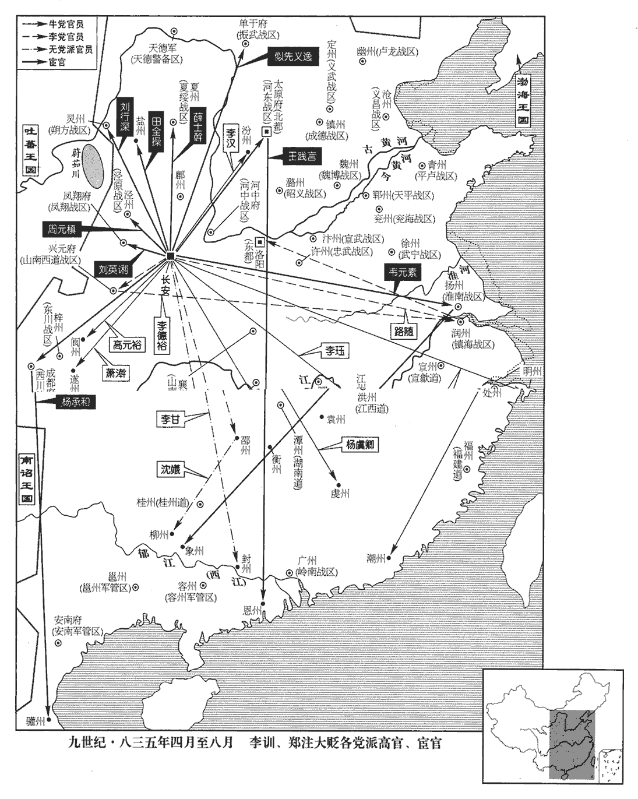
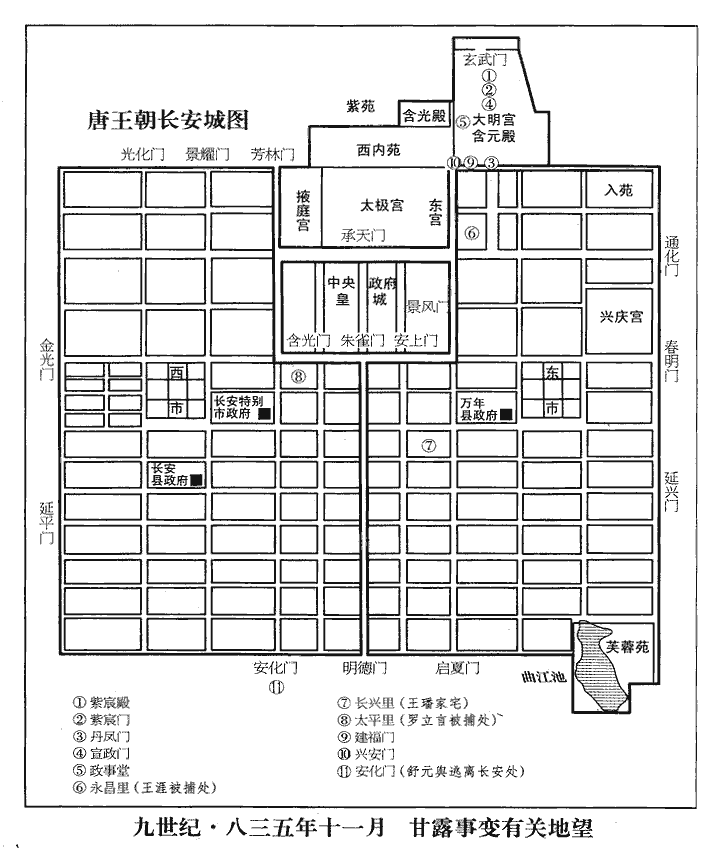

 唐紀六十一起閼逢攝提格（甲寅），盡強圉大荒落（丁巳），凡四年。

# 文宗元聖昭獻孝皇帝中

## 太和八年（甲寅、八三四）

1春，正月，上‹李昂（李涵）本年二十七岁›疾小瘳；丁巳‹五›，御太和殿按閣本大明宮圖，入左銀臺門稍北即太和殿，又西即清思殿。見近臣，然神識耗減，不能復故。

〖译文〗 [1]春季，正月，唐文宗的病情稍有好转，丁巳（初五），亲临太和殿，接见左右亲近的臣僚。然而精神萎靡不振，远不如从前。

2二月，壬午朔‹一›，日有食之。

〖译文〗 [2]二月，壬午朔（初一），出现日食。

3夏，六月，丙戌‹七›，莒王紓薨。紓，順宗‹李诵›子。紓shū，山於翻。

〖译文〗 [3]夏季，六月，丙戌（初七），莒王李纾去世。

4上以久旱，詔求致雨之方。司門員外郎李中敏上表，以為：「仍歲大旱，非聖德不至，直以宋申錫之冤濫，宋申錫事見上卷五年。鄭注之姦邪。今致雨之方，莫若斬注而雪申錫。」表留中；中敏謝病歸東都‹洛阳›。考異曰：新、舊中敏傳皆云六年夏上此疏。今據開成紀事、太和摧兇記，皆云八年六月。又，中敏疏言申錫臨終。按申錫去年七月卒，若六年則申錫尚在。今從開成紀事。

〖译文〗 [4]文宗鉴于天气大旱很久，下诏征求能够下雨的方法。司门员外郎李中敏上表认为：“现在连年大旱，并非陛下的品德不高，而是由于前宰相宋申锡被贬的案件太冤，郑注的行为奸邪不轨。因此，现在求雨的最好方法，莫过于处死郑注而为宋申锡平反。”李中敏的奏章被留在宫中，没有答复。于是，李中敏以身体有病为由，辞职回到东都洛阳。

5郯tán王經薨。經亦順宗‹李诵›子。

〖译文〗 [5]郯王李经去世。

6初，李仲言流象州‹广西象州县›，事見二百四十三卷敬宗寶曆元年。遇赦，還東都。會留守李逢吉思復入相，復，扶又翻。仲言自言與鄭注善，逢吉使仲言厚賂之。注引仲言見王守澄，守澄薦於上，云仲言善《易》；上召見之。時仲言有母服，難入禁中，乃使衣民服，衣，於既翻。號王山人。仲言儀狀秀偉，倜儻尚氣，倜，他歷翻；倜儻，不羈也；史炤曰：卓異貌。頗工文辭，有口辯，多權數。上見之，大悅，以為奇士，待遇日隆。考異曰：舊傳：「李訓初名仲言，居洛中。李逢吉為留守，思入相。訓揣知其意，即以奇計動之，自言與鄭注善。逢吉遺訓金帛珍寶數百萬，令持入長安以賂注。」又曰：「初，注搆宋申錫事，帝深惡之，欲令京兆尹杖殺。至是，以藥稍效，始善遇之。」獻替記曰：「先是，上惡鄭注極甚，嘗謂樞密使曰：『卿知有善和端公，無歎京兆尹懦弱，不能斃於枯木！』開成紀事曰：「訓除名，流象州，會恩歸于東洛。投謁諸處困乏，逢吉叱之不顧。會鄭注賓副上黨，路經東都，于道投之，廣以古今義烈披述衷款。注本兇邪，趨而附之，自此豁然相然諾，情契稠疊，及注徴赴闕，訓隨而到京，別第安置。注因陳奏，言訓文學優盛無比，上納之。太和八年三月，以布衣在翰林，注之援也。」甘露記曰：「訓為人長大美貌，口辯無前，常以英雄自任。會鄭注介上黨，出洛陽。訓慨然太息曰：『當世操權力者齷齪苛細，無足與言。吾聞鄭注為人好義而求奇士，且通於內官，易為因緣。』乃往說之。注見訓大驚，如舊相識，遂結為死交。及注赴闕，請訓行京師，為卜居供給，日夕往來，乘間奏於上。」按實錄，去年九月李款彈鄭注，云「前邠州行軍司馬」，今年九月庚申，王守澄宣召鄭注對於浴堂門。獻替記：「八年春暮，上對宰臣歎天下無名醫，便及鄭注精於服食。或欲置於伎術，或欲令為神策判官，注皆不願此職。守澄遂托從諫奏為行軍司馬。」又云：去歲春夏李仲言猶喪母，已潛入城，稱王山人，兩度對於含元殿。今年八月十三日，欲與諫官。至九月三日，鄭注自絳州至，便於宣徽對。然則訓自去年已因注謁守澄，得見上。注今年暮春後方從昭義辟。然則訓舊與注善，去春已入長安見上，非注赴昭義時始定交，亦非去年十一月徵注於潞州，又非訓隨注到京也。今從實錄、獻替記。

〖译文〗 [6]当初，李仲言被流放到象州，后来，由于朝廷大赦，回到东都洛阳。这时，东都留守李逢吉正想再入朝担任宰相。李仲言自称和郑注关系密切，于是，李逢吉派李仲言用重金向郑注行贿。郑注引李仲言拜见右神策军护军中尉王守澄，王守澄又把李仲言推荐给文宗，声称李仲言精通《周易》。于是，文宗召见李仲言。这时，李仲言正在为母亲服丧，身着丧服，不便进入宫中，文宗便让他穿上民服，号为王山人。李仲言身材魁梧，潇洒豪爽，擅长文辞，而且口才好，足智多谋。文宗召见后，十分高兴，认为他是一个奇才，因而对他的待遇日益隆重。

仲言既除服，秋，八月，辛卯‹十三›，上欲以仲言為諫官，置之翰林。李德裕曰：「仲言曏所為，計陛下必盡知之，豈宜置之近侍？」兩省官，皆近侍也。上曰：「然豈不容其改過？」對曰：「臣聞惟顏回能不貳過。彼聖賢之過，但思慮不至，或失中道耳。至於仲言之惡，著於心本，安能悛改邪！」著，直略翻。悛，丑緣翻。心本，猶言心根也。上曰：「李逢吉薦之，朕不欲食言。」對曰：「逢吉身為宰相，乃薦姦邪以誤國，亦罪人也。」上曰：「然則別除一官。」對曰：「亦不可。」上顧王涯，涯對曰：「可。」德裕揮手止之，上回顧適見，色殊不懌而罷。始，涯聞上欲用仲言，草諫疏極憤激；既而見上意堅，且畏其黨盛，遂中變。

〖译文〗 李仲言已经为母亲服丧期满。秋季，八月，辛卯（十三日），文宗想任命他为谏官，安置在翰林院。宰相李德裕说：“李仲言过去的所作所为，我想陛下都知道，这种人怎么能安排到您的身旁作为侍从呢？”文宗说：“难道不允许他改正错误？”李德裕回答说：“我听说只有孔子的弟子颜回能不犯相同的第二次错误。颜回犯的错误，是圣贤一时对问题考虑不周，偏离了中庸之道所犯的错误。而李仲言的过错，则是出自内心，怎能能改得了！”文宗说：“李逢吉推荐李仲言，朕不愿食言。”李德裕说：“李逢吉身为宰相，却不负责任地推荐李仲言这种奸人，以达到他危害国家的目的，所以，他也是罪人。”文宗说：“那么，就另外授任他一个职务。”李德裕说：“那也不行。”文宗回头看着宰相王涯，王涯赶快回答说：“可以。”李德裕连连挥手阻止他，被文宗回头看见，文宗很不高兴，宣布结束商议。在这以前，王涯听说文宗打算任用李仲言，急忙起草了一篇劝阻的上疏，措辞十分激烈。后来，他看文宗任用李仲言的态度很坚决，并且畏惧李逢吉的党羽势力强盛，于是，在文宗召集宰相讨论时临时变卦。

尋以仲言為四門助教，四門助教，從八品。給事中鄭肅、韓佽封還敕書。佽cì，七四翻。德裕將出中書，謂涯曰：「且喜給事中封敕！」涯即召肅、佽謂曰：「李公適留語，令二閣老不用封敕。」留語，謂將出之時所留下言語也。兩省官相呼曰閣老。二人即行下，書讀而行下之也。下，戶稼翻。明日，以白德裕，德裕驚曰：「德裕不欲封還，當面聞，何必使人傳言！且有司封駮，駮，北角翻。豈復稟宰相意邪！」復，扶又翻。二人悵恨而去。

〖译文〗 不久，朝廷任命李仲言为四门助教，给事中郑肃、韩封还任命敕书，打算驳回对李仲言的任命。这时，李德裕刚要从政事堂出门，对王涯说：“给事中封还敕书，真值得高兴！”王涯听后，随即召来郑肃和韩说：“李德裕刚才留话说，让二位不要封还敕书。”于是，二人署名通过。第二天，将此事告诉李德裕，李德裕大吃一惊，说：“我如果不同意你们二人封还敕书，肯定会当面对你们说，何必叫别人转达！况且给事中行使封驳权，难道还要秉承宰相的意图！”二人这才明白被王涯欺骗，于是，懊恨而去。

九月，辛亥‹三›，徵昭義‹总部设潞州山西省长治市›節度副使鄭注至京師。去年鄭注出佐昭義軍，事見上卷。王守澄、李仲言、鄭注皆惡李德裕，以山南西道‹总部设兴元府陕西省汉中市›節度使李宗閔與德裕不相悅，引宗閔以敵之。壬戌‹十四›，詔徵宗閔於興元‹陕西省汉中市›。惡，烏路翻。李宗閔出帥興元，見上卷元年。興元府至京師一千二百二十三里。

〖译文〗 九月，辛亥（初三），文宗命昭义节度副使郑注来京城。王守澄、李仲言、郑注都憎恨李德裕，鉴于山南西道节度使李宗闵和李德裕有矛盾，于是，向文宗推荐李宗闵，以便排挤李德裕。壬戌（十四日），文宗下诏，命李宗闵从山南西道的治所兴元来京城。

7冬，十月，辛巳‹四›，幽州‹北京市›軍亂，逐節度使楊志誠及監軍李懷仵，仵，疑古翻。推兵馬使史元忠主留務。

〖译文〗 [7]冬季，十月，辛巳（初四），幽州军队内乱，将士驱逐节度使杨志诚和监军李怀仵，推举兵马使史元忠主持留守事务。

8庚寅‹十三›，以李宗閔為中書侍郎、同平章事。甲午‹十七›，以中書侍郎、同平章事李德裕同平章事充山南西道節度使。是日，以李仲言為翰林侍講學士。給事中高銖、鄭肅、韓佽、諫議大夫郭承嘏gǔ、中書舍人權璩qú等爭之，不能得。承嘏，晞之孫；晞，郭子儀之子。璩，德輿之子也。權德輿，元和初為相。璩，求於翻。

〖译文〗 [8]庚寅（十三日），唐文宗任命李宗闵为中书侍郎、同平章事。甲午（十七日），任命中书侍郎、同平章事李德裕以同平章事头衔，充任山南西道节度使。同日，任命李仲言为翰林侍讲学士。给事中高铢、郑肃、翰，谏议大夫郭承嘏，中书舍人权璩等人争辩，认为不可，但他们的意见不被文宗采纳。郭承嘏是郭的孙子。权璩是权德舆的儿子。

9乙巳‹二十八›，貢院奏進士復試詩賦，從之。唐尚書省在朱雀門北正街之東，自占一坊，六部附麗其旁。省前一坊別有禮部南院，即貢院也。罷詩賦見上卷上年。李德裕罷相，故復之。

〖译文〗 [9]乙巳（二十九日），礼部贡院奏请进士科考试仍然加试诗赋，文宗批准。

10李德裕見上自陳，請留京師。丙午‹二十九›，以德裕為兵部尚書。

〖译文〗 [10]李德裕面见文宗，表示不愿出任山南西道节度使，请求留在京城任职。丙午（二十九日），文宗任命他为兵部尚书。

11楊志誠過太原‹山西省太原市›，李載義‹河东战区，总部设太原府山西省太原市›自毆擊，欲殺之，楊志誠逐載義見上卷五年。毆，烏口翻。幕僚諫救得免，殺其妻子及從行將卒；朝廷以載義有功，不問。李載義有平滄景之功。將，即亮翻。載義母兄【張：「兄」作「死」。】葬幽州‹北京市›，志誠發取其財。載義奏乞取志誠心以祭母，不許。

〖译文〗 [11]杨志诚被将士从幽州驱逐后，路过太原，河东节度使李载义亲自动手殴打杨志诚，并想把他杀死。李载义的幕僚极力劝阻，杨志诚才得以免死。李载义于是杀杨志诚的妻子和随从将士。朝廷鉴于李载义曾参予平定横海李同捷叛乱有功，因而不加责问。此前，李载义的母亲和兄弟去世后埋葬在幽州，杨志诚发掘他们的坟墓，掠取墓中的陪葬财物。李载义奏请挖杨志诚的心用来祭祀他的母亲，文宗不许。

12十一月，成德‹总部设镇州河北省正定县›節度使王庭湊薨，軍中奉其子都知兵馬使元逵知留後。元逵改父所為，事朝廷禮甚謹。

〖译文〗 [12]十一月，成德节度使王庭凑去世。军中将士推举他的儿子都知兵马使王元逵暂为留后。王元逵改变父亲骄横跋扈的行为，对朝廷十分恭敬。

13史元忠獻楊志誠所造袞衣及諸僭物。丁卯‹二十一›，流志誠於嶺南，道殺之。

〖译文〗 [13]史元忠把杨志诚擅自织造的皇帝兖衣和其他超越自己名份的器物奉献朝廷。丁卯（二十一日），唐文宗下令把杨志诚流放到岭南。杨志诚走到半路，被朝廷派人杀死。

14李宗閔言李德裕制命已行，不宜自便。以德裕自請留京師也。乙亥‹二十九›，復以德裕為鎮海‹总部设润州江苏省镇江市›節度使，不復兼平章事。復，扶又翻。時德裕、宗閔各有朋黨，互相擠援。非其黨則相擠，同黨則相援。擠，子西翻，又子細翻。援，于元翻，又于眷翻。上患之，每歎曰：「去河北賊易，去朝廷朋黨難！」去，羌呂翻；下同。

〖译文〗 [14]宰相李宗闵上言说，朝廷任命李德裕为山南西道的制书已经下达，不应当由于他自己不愿上任就中途改变。乙亥（二十九日），唐文宗任命李德裕为镇海节度使，不再兼任同平章事的头衔。这时，李德裕和李宗闵各有自己的党羽，相互之间极力排挤对方，声援同党。文宗对此十分忧虑，经常感叹地说：“诛除河北三镇的叛贼容易，但去除朝廷的朋党实在太难！”

臣光曰：夫君子小人之不相容，猶冰炭之不可同器而處也。故君子得位則斥小人，小人得勢則排君子，此自然之理也。然君子進賢退不肖，其處心也公，其指事也實；小人譽其所好，毀其所惡，處，昌呂翻。譽，音余。好，呼到翻。惡，烏路翻。其處心也私，其指事也誣。公且實者謂之正直，私且誣者謂之朋黨，在人主所以辨之耳。是以明主在上：度德而敘位，量能而授官；荀卿子之言。度，徒洛翻。量，音良。有功者賞，有罪者刑；奸不能惑，佞不能移。夫如是，則朋黨何自而生哉！彼昏主則不然。明不能燭，強不能斷；斷，丁亂翻。邪正並進，毀譽交至；取捨不在於己，威福潛移於人。於是讒慝得志而朋黨之議興矣。

〖译文〗 臣司马光曰：君子和小人之间不能相容，就像冰和炭火不能放在同一个器具中相处一样。所以，如果君子执政，就排斥小人；小人得势，就排斥君子，这是很自然的道理。然而，君子提拔德才兼备的人，撤免庸俗无能的人，办事出于公心，实事求是；而小人则阿谀奉迎，投其所好，毁其所恶，办事出于私心，捏造事实。办事出于公心，实事求是的人被称为正直的君子；而办事出于私心，捏造事实的人则被称为朋党。究竟是正直的君子还是朋党，关键在于君主认真辨别。所以，凡是英明的君主执政，根据国家的需要而设置不同的职位，根据官员的才能大小授予他们不同的职务。对于有突出政绩的官员，加以提拔赏赐；有严重罪行者，则撤免惩罚。既不被奸臣的谗言所迷惑，也不因他们的花言巧语而改变自己的主见，如能这样做，朋党又怎么能够产生呢？凡是昏庸的君主执政，则恰恰相反。他们既不能明辨是非，处理问题又优柔寡断，以致奸邪小人和正人君子都被任用。朝廷的大政方针自己不能作主，决策权渐渐移到他人手中。于是，奸邪小人得志猖狂，朝廷中必然出现朋党。

夫木腐而蠹生，醯xī酸而蜹集，蜹ruì，而銳翻。故朝廷有朋黨，則人主當自咎而不當以咎群臣也。文宗苟患群臣之朋黨，何不察其所毀譽者為實，為誣，譽，音余。所進退者為賢，為不肖，其心為公，為私，其人為君子，為小人！苟實也，賢也，公也，君子也，匪徒用其言，又當進之；誣也，不肖也，私也，小人也，匪徒棄其言，又當刑之。如是，雖驅之使為朋黨，孰敢哉！釋是不為，乃怨群臣之難治，治，直之翻。是猶不種不芸而怨田之蕪也。朝中之黨且不能去，況河北賊乎！溫公此論為熙、豐發也。

〖译文〗 凡是树木腐朽，就会产生蠹虫；食醋酸败，就会集聚蚋虫。所以，如果朝廷出现朋党，君主应当首先自我引咎，而不应当责备群臣百官。唐文宗如果忧虑群臣朋比为党，为什么不去核查他们所诽谤和赞誉的是事实，还是捏造？他们所荐举的官员是德才兼备，还是庸俗无能？办事是出于公心，还是出于私心？他们本人是君子，还是小人？如果他们的言行实事求是，荐举的官员德才兼备，办事出于公心，那么，他们就一定是君子，朝廷不但应当采纳这些人的意见，而且应当提拔他们。如果他们捏造事实，荐举的官员庸俗无能，办事出于私心，那么，他们就一定是小人，朝廷不但应当拒绝这些人的意见，而且应当惩罚他们。如果唐文宗能够这样去做，那么，就是命令百官结党营私，也肯定没有人胆敢那样去干！唐文宗不去这样做，反而埋怨群臣百官难以驾驭，这就好像一个农夫，自己不种田也不锄草，反而抱怨田地荒芜一样。唐文宗对朝廷中的朋党尚且不能铲除，何况对于河北三镇的叛贼呢！

15丙子‹三十›，李仲言請改名訓。

〖译文〗 [15]丙子（三十日），李仲言奏请改名为李训。

16幽州奏莫州‹河北省任丘市北鄚州镇›軍亂，刺史張元汎不知所在。

〖译文〗 [16]幽州奏报，莫州发生军队变乱，刺史张元去向不明。

17十二月，己卯‹三›，以昭義節度副使鄭注為太僕卿。郭承嘏累上疏言其不可，上不聽。於是注詐上表固辭，上遣中使再以告身賜之，不受。史極言鄭注之姦狀。

〖译文〗 [17]十二月，己卯（初三），唐文宗任命昭义节度副使郑注为太仆卿。谏议大夫郭承嘏多次上疏认为不可，文宗不听。于是，郑注上表，虚假地一再表示不能接受任命。文宗又派宦官把任命书授予郑注，郑注仍然不接受。

18癸未‹七›，以史元忠為盧龍留後。考異曰：實錄：十一月，鎮州奏幽州留後史元忠為瀛莫三軍逐出，不知所在。後不言元忠復歸幽州，而至此有新命，蓋因莫州軍亂，鎮州承傳聞之誤而奏之耳。

〖译文〗 [18]癸未（初七），唐文宗任命史元忠为幽州留后。

19初，宋申錫與御史中丞宇文鼎受密詔誅鄭注，使京兆尹王璠掩捕之。璠密以堂帖示王守澄，帖由政事堂出，故謂之堂帖。璠fán，孚袁翻。注由是得免，深德璠。璠又與李訓善，於是訓、注共薦之，自浙西觀察使徵為尚書左丞。王璠之險躁自可以得禍，史言其預甘露之難亦有所自來。

〖译文〗 [19]当初，宋申锡和御史中丞宇文鼎一同接受文宗下达的诛除郑注的密诏，二人派京兆尹王去逮捕郑注。王把逮捕令秘密地告诉王守澄。于是，郑注得以逃脱，因而他十分感激王。王又和李训关系密切，于是郑注和李训一起向文宗推荐王，王因此从浙西道观察使被召入京城，任命为尚书左丞。

## 九年（乙卯、八三五）

1春，正月，乙卯‹九›，‹李昂（李涵）本年二十八岁›以王元逵為成德‹总部设镇州河北省正定县›節度使。

〖译文〗 [1]春季，正月，乙卯（初九），唐文宗任命王元逵为成德节度使。

2巢公湊薨，追贈齊王。漳王湊貶巢公，事見上卷五年。

〖译文〗 [2]巢公李凑去世，朝廷追赠为齐王。

3鄭注上言秦地‹陕西省中部›有災，宜興役以禳之。辛卯‹十六›，發左、右神策千五百人浚曲江及昆明池。雍錄：唐曲江本秦隑州，至漢為樂遊苑，基地最高，四望寬敞。隋營京城，宇文愷以其地在京城東南隅，地高不便，故闕此地不為居人坊巷，而鑿為池以厭勝之。又會黃渠水自城外南來，故隋世遂從城外包之，入城為芙蓉池，且為芙蓉園也。漢武帝時，池周回六里餘，唐周七里，占地三十頃，又加展拓矣。其地在城東南昇道坊龍華寺之南。昆明池，漢武帝所鑿，在長安西南，周回四十里。三輔故事曰：池周三百二十頃。長安志曰：今為民田。夫既可以為民田，則非有水之地矣。然則漢於何取水也？長安志引水經曰：交水西至石堨è，武帝穿昆明池所造。有石闥堰，在縣西南三十二里。則昆明之周三百餘頃者，用此堰之水也。昆明基高，故其下流尚可壅激以為都城之用。於是並城疏別三派，城內外皆賴之。此池仍在。括地志曰：豐、鎬二水皆已堰入昆明池，無復流派。括地志作於太宗之世，則唐初仍自壅堰不廢，至文宗而猶嘗加濬也。然則圖經之作當在文宗後，故竭而為田也。

〖译文〗 [3]郑注上言朝廷，声称关中发生灾害，应当征发劳役，以便消灾。辛卯（疑误），唐文宗征发左、右神策军一千五百人疏浚曲江池和昆明池。

4三月，冀王絿薨。絿，順宗‹李诵›子。

〖译文〗 [4]三月，冀王李去世。

5丙辰‹十一›，以史元忠為盧龍‹总部设幽州北京市›節度使。

〖译文〗 [5]丙辰（十一日），唐文宗任命史元忠为幽州节度使。

6初，李德裕為浙西‹首府设润州江苏省镇江市›觀察使，漳王傅母杜仲陽坐宋申錫事放歸金陵‹江苏省南京市›，詔德裕存處之。會德裕已離浙西‹首府润州›，傅母，女師也。處，昌呂翻。離，力智翻。牒留後李蟾使如詔旨。德裕自浙西徵見上卷三年，鎮蜀見四年，宋申錫事見五年。繫年差殊，當考。至是，左丞王璠、戶部侍郎李漢奏德裕厚賂仲陽，陰結漳王，圖為不軌。上怒甚，召宰相及璠、漢、鄭注等面質之。璠、漢等極口誣之，路隋曰：「德裕不至有此。果如所言，臣亦應得罪！」言者稍息。夏，四月，以德裕為賓客分司。

〖译文〗 [6]当初，李德裕担任浙西道观察使时，漳王李凑的女师杜仲阳由于宋申锡案件的牵连，被流放到金陵。文宗诏命李德裕予以关照。正好李德裕此时已奉命调离浙江西道，于是，命留后李蟾按文宗诏令办理。这时，尚书左丞王和户部侍郎李汉上奏，说李德裕优厚地贿赂杜仲阳，秘密地和漳王交结，企图谋反。文宗大怒，召集宰相及王、李汉、郑注等人当面询问。王、李汉等人众口一辞，诬陷李德裕。宰相路隋说：“李德裕不至于这样，如果真象他们说的那样的话，我也应当有罪了！”于是，王等人这才不再说了。夏季，四月，唐文宗任命李德裕为太子宾客、分司东都。

7癸巳‹十八›，以鄭注守太僕卿，兼御史大夫，注始受之，仍舉倉部員外郎李款自代曰：「加臣之罪，雖於理而無辜；在款之誠，乃事君而盡節。」款奏注見上卷上年。考異：甘露記曰：「時論或云款外沽直名而陰事注。」按款彈注之文皆訐jié其隱慝，豈有於人如此而能陰與之合乎！此皆當時庸人見注舉款自代，遂有此疑耳。今不取。時人皆哂shěn之。笑不壞顏為哂。

〖译文〗 [7]癸巳（十八日），唐文宗任命郑注为太仆卿，兼御史大夫。郑注这才接受任命，同时推荐仓部员外郎李款代替自己原来的职务，他说：“李款以前虽然无辜地弹劾过我，但是，他这样做也是对皇上尽忠。”当时人都耻笑他假装宽宏大度。

8丙申‹二十一›，以門下侍郎、同平章事路隋【章：十二行本「隋」下有「同平章事」四字；乙十一行本同；孔本同；張校同。】充鎮海‹总部设润州江苏省镇江市›節度使，趣之赴鎮，趣，讀曰促。不得面辭；坐救李德裕故也。考異曰：舊隋傳曰：「德裕貶袁州長史，隋不署奏狀，始為鄭注所忌，出鎮浙西。」按實錄，隋出鎮在德裕貶前四日。今不取。

〖译文〗 [8]丙申（二十一日），唐文宗任命门下侍郎、同平章事路隋为镇海节度使，同时命他尽快离京上任，不得向自己当面告辞。这是由于前此在王等人诬告李德裕时，他出面为李德裕辩解的缘故。

9初，京兆尹河南‹河南省洛阳市›賈餗sù，餗，蘇谷翻。性褊躁輕率，與李德裕有隙，而善於李宗閔、鄭注。上巳，賜百官宴於曲江‹首都长安东南角›，古者上巳，正用三月之上巳日；自魏以後但用三月三日，不復用巳。唐貞元間置三令節，使百官選勝行樂，三月三日其一也。故事，尹於外門下馬，揖御史。餗恃其貴勢，乘馬直入，殿中侍御史楊儉、蘇特與之爭，餗罵曰：「黃面兒敢爾！」坐罰俸。餗恥之，求出，詔以為浙西觀察使；尚未行，戊戌‹二十三›，以餗為中書侍郎、同平章事。

〖译文〗 [9]当初，京兆尹、河南人贾性情急躁轻率。他和李德裕有矛盾，和李宗闵、郑注关系亲近。上巳（三月三日），唐文宗在曲江举行宴会，招待百官。按照以往惯例，京兆尹应当在门外下马，向御史台官员行礼，然后进门。贾依恃他的地位和权势，乘马直接入门。殿中侍御史杨俭、苏特和他争论起来，贾破口大骂，说：“你们这些黄脸儿怎么敢挡我！”于是，因罪而被罚俸禄。贾觉得十分耻辱，请求出任藩镇职务。文宗下诏，任命他为浙西道观察使。尚未成行，戊戌（疑误），唐文宗任命他为中书侍郎、同平章事。

10庚子‹二十五›，制以曏日上初得疾，謂七年冬也。王涯呼李德裕奔問起居，德裕竟不至；又在西蜀‹西川战区，总部设成都府四川省成都市›徵逋懸錢三十萬緡，百姓愁困；貶德裕袁州‹江西省宜春市›長史。

〖译文〗 [10]庚子（二十五日），朝廷下制，鉴于文宗前不久刚刚患病时，王涯招呼李德裕去看望文宗病情，李德裕竟然不去。同时，李德裕担任剑南西川节度使时，曾经征收百姓的赋税欠款三十万缗，导致百姓穷困。因此，贬李德裕为袁州长史。

11初，宋申錫獲罪，事見上卷五年。宦官益橫；橫，戶孟翻。上外雖包容，內不能堪。李訓、鄭注既得幸，揣知上意，訓因進講，數以微言動上。揣，初委翻。數，所角翻。上見其才辨，意訓可與謀大事；且以訓、注皆因王守澄以進，冀宦官不之疑，遂密以誠告之。訓、注遂以誅宦官為己任，考異曰：舊傳以為上出易義以示群臣之時，已與訓有誅宦官之謀。按補國史云：「許康佐進新註春秋列國經傳六十卷，上問閽弒吳子餘祭事，康佐託以春秋義奧，臣窮究未精，不敢容易解陳。後上以問李仲言，仲言乃精為上言之。上曰：『朕左右刑臣多矣，餘祭之禍安得不慮？』仲言曰：『陛下留意於未萌，臣願遵聖謀。』」實錄，「今年四月癸亥，許康佐進纂集左氏傳三十卷。五月，乙巳朔，以御集左氏列國經傳三十卷宣付史館。」然則上與訓謀誅宦官必在此際矣。然文宗與訓語時，宦官必盈左右，恐亦未敢班班顯言，如補國史所云也。二人相挾，朝夕計議，所言於上無不從，聲勢炟dá赫。炟，當割翻。一作「烜」xuǎn，況遠翻。【章：乙十一行本正作「烜」；孔本同；張校同。】注多在禁中，或時休沐，賓客填門，賂遺山積。遺，唯季翻。外人但知訓、注倚宦官擅作威福，不知其與上有密謀也。

〖译文〗 [11]当初，宋申锡被判罪贬官后，宦官更加骄横。文宗虽然外表不露声色，内心却不能容忍。李训、郑注得到文宗信用后，揣摸了解了文宗的心思。于是，李训在给文宗讲读经典时，多次暗示文宗。文宗觉得李训很有才能，能言善辩，认为可以和他商议诛除宦官。同时考虑到李训和郑注都是宦官王守澄推荐的，估计和二人商议，宦官不会疑心，于是，把自己的意图秘密地告诉了二人。李训、郑注因此以诛除宦官为己任。二人相互依赖，昼夜商议对策，凡给文宗的建议，文宗无不采纳，声势喧赫。郑注经常待在宫中，有时休假在家，要求拜见他的人站满他的门前，贿赂他的财物堆积如山。外面人只知道李训和郑注依靠宦官的权势擅自作威作福，却不知道他们二人和文宗密谋诛除宦官。

上之立也，右領軍將軍興寧‹广东省兴宁市›仇士良有功；興寧，漢龍川縣地，江左置興寧縣，唐屬循州。王守澄抑之，由是有隙。訓、注為上謀，為，于偽翻。進擢士良以分守澄之權。五月，乙丑‹二十一›，以士良為左神策中尉，出韋元素，以士良代之。守澄不悅。

〖译文〗 当初文宗被拥立为皇帝时，右领军将军、循州兴宁县人仇士良曾经有很大的功劳。但他受到王守澄的压制，于是，二人产生了矛盾。这时，李训、郑注向文宗建议，提拔仇士良以便分割王守澄的权力。五月，乙丑（二十一日），文宗任命仇士良为左神策军护军中尉，王守澄得知后很不高兴。

12戊辰‹二十四›，以左丞王璠為戶部尚書，判度支。

〖译文〗 [12]戊辰（二十四日），唐文宗任命尚书左丞王为户部尚书、判度支。

13京城訛言鄭注為上合金丹，合，音閤。須小兒心肝，民間驚懼，上聞而惡之。惡，烏路翻；下同。鄭注素惡京兆尹楊虞卿，與李訓共構之，云此語出於虞卿家人。上怒，六月，下虞卿御史獄。下，戶稼翻。注求為兩省官，中書侍郎、同平章事李宗閔不許，注毀之於上。會宗閔救楊虞卿，上怒，叱出之；壬寅‹二十八›，貶明州‹浙江省宁波市›刺史。明州，後漢鄮mào縣地，唐開元二十六年置明州，京師東南四千三百里。

〖译文〗 [13]京城长安盛传谣言，说郑注为皇上合制金丹，必须用小孩的心肝入药，百姓为此而惊扰惧怕。文宗得知后十分恼恨。郑注向来憎恶京兆尹杨虞卿，于是，他和李训一起诬陷杨虞卿，说谣言出于虞卿的家属。文宗大怒，六月，下令将杨虞卿逮捕，押在御史台狱中。此前，郑注曾经求做中书、门下两省的官员，中书侍郎、同平章事李宗闵不许，郑注因此在文宗面前诽谤李宗闵。这时，正好李宗闵为杨虞卿辩解，文宗大怒，呵斥李宗闵出宫。壬寅（初四），贬李宗闵为明州刺史。

14左神策中尉韋元素、樞密使楊承和、王踐言居中用事，與王守澄爭權不叶，李訓、鄭注因之出承和於西川‹总部设成都府四川省成都市›，元素於淮南‹总部设扬州江苏省扬州市›，踐言於河東‹总部设太原府山西省太原市›，皆為監軍。

〖译文〗 [14]左神策护军中尉韦元素、枢密使杨承和、王践言在宫中当权，与王守澄争权不和。李训和郑注乘机劝文宗任命杨承和为剑南西川监军，韦元素为淮南监军，王践言为河东监军。

15秋，七月，甲辰朔‹一›，貶楊虞卿虔州‹江西省赣州市›司馬。虔州，漢贛縣，晉置南康郡，隋為虔州，京師東南四千一十七里。

〖译文〗 [15]秋季，七月，甲辰朔（初一），唐文宗贬杨虞卿为虔州司马。

16庚戌‹七›，作紫雲樓於曲江‹首都长安东南角›。紫雲樓在曲江之南，洊jiàn經喪亂，頹圮pǐ不修，今再作之。

〖译文〗 [16]庚戌（初七），唐文宗下令在曲江修筑紫云楼。

17辛亥‹八›，以御史大夫李固言為門下侍郎、同平章事。

〖译文〗 [17]辛亥（初八），唐文宗任命御史大夫李固言为门下侍郎、同平章事。

 

李訓、鄭注為上畫太平之策，為，于偽翻。以為當先除宦官，次復河、湟‹甘肃省中部西部及青海省东部›，次清河北‹黄河以北›，開陳方略，如指諸掌。上以為信然，寵任日隆。

〖译文〗 李训、郑注为文宗谋划革除朝廷弊政，收复失地，达到天下大治太平的策略，认为应当首先诛除宦官，其次出兵收复河、湟地区，最后平定河北三镇。二人开陈方略，了如指掌。文宗认为言之有理，宠信日益隆重。

初，李宗閔為吏部侍郎，因駙馬都尉沈𥫃yí結女學士宋若憲、知樞密楊承和得為相。𥫃，宜奇翻。宋若憲姊妹皆善屬文，德宗召入宮，不以妾侍命之，呼學士。及貶明州，鄭注發其事，壬子‹九›，再貶處州‹浙江省丽水市›長史。代宗大曆十四年，改括州為處州，京師東南四千二百七十八里。

〖译文〗 当初，李宗闵担任吏部侍郎时，曾通过驸马都尉沈交结宫中女学士宋若宪和知枢密杨承和，因而被任命为宰相。等到李宗闵被贬为明州刺史时，郑注向文宗揭发了这件事。壬子（初九），文宗再贬李宗闵为处州长史。

著作郎、分司舒元輿與李訓善，訓用事，召為右司郎中，兼侍御史知雜，鞫楊虞卿獄；唐制：侍御史六人，以久次者一人知雜事，謂之知雜。癸丑‹十›，擢為御史中丞。元輿，元褒之兄也。舒元褒，見上卷五年。

〖译文〗 著作郎、分司东都舒元舆和李训关系亲近，李训掌权后，推荐舒元舆为右司郎中，兼侍御史知杂，负责审问杨虞卿的案件。癸丑（初十），舒元舆被擢拔为御史中丞。舒元舆是补阙舒元褒的哥哥。

貶吏部侍郎李漢為汾州‹山西省汾阳市›刺史，刑部侍郎蕭澣為遂州‹四川省遂宁市›刺史，汾州，漢文帝封代王，都中都，即其地，去京師一千二百六里。遂州，本漢德陽縣之舊壘，東晉置遂寧郡，後周置遂州，去京師二千三百二十九里。皆坐李宗閔之黨。

〖译文〗 唐文宗贬吏部侍郎李汉为汾州刺史，刑部侍郎萧浣为遂州刺史。二人都是由于李宗闵的同党而被贬。

是時李訓、鄭注連逐三相，三相，李德裕、路隋、李宗閔。威震天下，於是平生絲恩髮怨無不報者。

〖译文〗 这时，李训、郑注接连诬陷贬逐李德裕、路隋、李宗闵三位宰相，权势威震天下。于是，凡是过去对自己稍有恩德的人无不提拔，和自己稍有怨恨的人无不报复。

18李訓奏僧尼猥多，耗蠹公私。丁巳‹十四›，詔所在試僧尼誦經不中格者，皆勒歸俗；中，竹仲翻。禁置寺及私度人。

〖译文〗 [18]李训奏称，现今僧尼太多，虚耗国家和百姓的财产。丁巳（十四日），文宗下诏，命各地测试僧尼，凡读经不合格者，一律遣归还俗。同时禁止再修建新的寺院和私自剃度百姓为僧尼。

19時人皆言鄭注朝夕且為相，侍御史李甘揚言於朝曰：「白麻出，我必壞之於庭！」壞，音怪。癸亥‹二十›，貶甘封州‹广东省封开县›司馬。考異曰：舊傳曰：「鄭注入翰林侍講，舒元輿既作相，注亦求入中書。甘昌言於朝云云，貶封州。」按是時元輿未作相，舊傳誤也。然李訓亦忌注，不欲使為相，事竟寢。

〖译文〗 [19]这时，人们都认为郑注很快会被任命为宰相，侍御史李甘在朝廷扬言说：“如果皇上任命郑注为宰相的白麻诏书颁布，我一定要在这里当众予以弹劾驳回！”癸亥（二十日），李甘被贬为封州司马。不过，这时李训也妒忌郑注，不愿让他担任宰相，所以，这件事就被搁置下来。

20甲子‹二十一›，以國子博士李訓為兵部郎中、知制誥，依前侍講學士。

〖译文〗 [20]甲子（二十一日），唐文宗任命国子博士李训为兵部郎中、知制诰，并仍为翰林侍讲学士。

21貶左金吾大將軍沈𥫃為邵州‹湖南省邵阳市›刺史。八月，丙子‹三›，又貶李宗閔潮州‹广东省潮州市›司戶。賜宋若憲死。

〖译文〗 [21]唐文宗贬左金吾大将军沈为邵州刺史。八月，丙子（初三），又贬李宗闵为潮州司户。命女学士宋若宪自尽。

22丁丑‹四›，以太僕卿鄭注為工部尚書，充翰林侍講學士。注好服鹿裘，以隱淪自處，處，昌呂翻。上以師友待之。注之初得幸，上嘗問翰林學士、戶部侍郎李珏jué曰：「卿知有鄭注乎？亦嘗與之言乎？」對曰：「臣豈特知其姓名，兼深知其為人。其人奸邪，陛下寵之，恐無益聖德。臣忝在近密，安敢與此人交通！」戊寅‹五›，貶珏江州‹江西省九江市›刺史。再貶沈𥫃柳州‹广西柳州市›司戶。江州，京師東南二千九百四十八里。

〖译文〗 [22]丁丑（初四），唐文宗任命太仆寺卿郑注为工部尚书，充任翰林侍讲学士。郑注喜好穿鹿皮缝制的衣服，平日隐居，行踪诡秘，文宗把他作为老师、朋友看待。郑注最初得到文宗信用的时候，一次，文宗问翰林学士、户部侍郎李珏说：“你知道郑注这个人吗？过去曾经和他谈过话吗？”李珏回答说：“我不仅知道他的姓名，而且深知他的为人。郑注是一个奸邪小人，陛下宠信他，恐怕很不适当。我作为陛下的亲信臣僚，怎么敢和这种人交结！”戊寅（初五），文宗贬李珏为江州刺史。再贬沈为柳州司户。

23丙申‹二十三›，詔以楊承和庇護宋申錫，韋元素、王踐言，與李宗閔、李德裕中外連結，受其賂遺。遺，唯季翻。承和可驩州‹越南荣市›安置，元素可象州‹广西象州县›安置，踐言可恩州‹广东省恩平市›安置，令所在錮送。錮送者，枷錮而防送之。象州至京師四千九百八十九里，恩州至京師六千五百里。楊虞卿、李漢、蕭澣為朋黨之首，貶虞卿虔州‹江西省赣州市›司戶，漢汾州司馬，澣遂州司馬。尋遣使追賜承和、元素、踐言死。韋元素卒如李弘楚之言。時崔潭峻已卒，亦剖棺鞭尸。

〖译文〗 [23]丙申（二十三日），唐文宗下诏，鉴于剑南西川监军杨承和当年曾袒护宋申锡的罪行，淮南监军韦元素、河东监军王践言和前宰相李宗闵、李德裕在朝廷内外相互勾结，接受他们的贿赂。因此，免去三人的职务，把他们分别发放到边远的州、象州、恩州监管，命令西川、淮南和河东分别派人把他们枷锢押送到监管地区。杨虞卿、李汉、萧浣都是朋党的首领，贬杨虞卿为虔州司户，李汉为汾州司马、萧浣为遂州司马。不久，又派人追命杨承和、韦元素、王践言自尽。这时，前枢密使崔潭峻已经去世，文宗命把他剖棺鞭尸。

己亥‹二十六›，以前廬州‹安徽省合肥市›刺史羅立言為司農少卿。立言贓吏，以賂結鄭注而得之。

〖译文〗 己亥（二十六日），唐文宗任命前庐州刺史罗立言为司农寺少卿。罗立言是一个贪官污吏，他是通过贿赂郑注才得到任命的。

鄭注之入翰林也，中書舍人高元裕草制，言以醫藥奉君親，注銜之；奏元裕嘗出郊送李宗閔，壬寅‹二十九›，貶元裕閬州‹四川省阆中市›刺史。閬州，古巴子國，秦為閬中縣，西魏為隆州，唐先天中避諱改閬州，至京師一千九百一十五里。元裕，士廉之六世孫也。高士廉，長孫無忌之舅，事高祖、太宗。

〖译文〗 郑注在此前被任命为翰林侍讲学士时，是由中书舍人高元裕起草的任命制书，制书说郑注曾以医术侍奉皇上。郑注于是十分痛恨高元裕，向文宗奏称，李宗闵被贬时，高元裕曾出城到郊外送他。壬寅（二十九日），唐文宗贬高元裕为阆州刺史。

時注與李訓所惡朝士，皆指目為二李之黨，惡，烏路翻。二李，謂德裕、宗閔。貶逐無虛日，班列殆空，廷中恟恟，上亦知之。訓、注恐為人所搖，九月，癸卯朔‹一›，勸上下詔：「應與德裕、宗閔親舊及門生故吏，今日以前貶黜之外，餘皆不問。」人情稍安。

〖译文〗 这时，郑注和李训对他们所厌恶的朝官，都指斥为李德裕和李宗闵的党羽，每天都有人被贬逐。上朝时，百官的班列为之一空，朝廷上下人心恐惧。文宗也得知这种情况。郑注和李训担心被人控告，动摇自己的地位，于是，九月，癸卯朔（初一），二人劝文宗下诏：“凡是李德裕、李宗闵的亲戚朋友，以及他们的学生弟子和原来的部下，除今日以前贬黜的以外，其余一律不再追究。”于是，人心逐渐安定。

24鹽鐵使王涯奏改江淮、嶺南茶法，增其稅。德宗貞元九年，初稅茶，於出茶州縣及茶山外商人要路，委所由定三等時估，每十稅一。長慶元年，鹽鐵使王播奏茶稅一百增之五十。今又改法而增其稅愈重矣。

〖译文〗 [24]盐铁使王涯奏请改革江淮、岭南地区的茶叶税收办法，增加茶税。

25庚申‹十八›，以鳳翔‹总部设凤翔府陕西省凤翔县›節度使李聽為忠武‹总部设许州河南省许昌市›節度使，代杜悰cóng。

〖译文〗 [25]庚申（十八日），唐文宗任命凤翔节度使李听为忠武节度使，代替杜。

26憲宗‹李纯›之崩也，人皆言宦官陳弘志所為。見二百四十一卷元和十五年。時弘志為山南東道‹总部设襄州湖北省襄樊市›監軍，李訓為上謀召之，至青泥驛‹陕西省蓝田县南›，訓為，于偽翻。青泥驛在嶢yáo關南。癸亥‹二十一›，封杖殺之。考異曰：舊傳曰：「李訓既秉權衡，即謀誅內豎。陳弘慶自元和末負弒逆之名，遣人封杖決殺。」按此時李訓未為相。今從實錄。

〖译文〗 [26]当年唐宪宗去世，宫中侍从都说是被宦官陈弘志所暗害的。这时，陈弘志担任山南东道监军，李训建议文宗召陈弘志来京。陈弘志走到青泥驿，癸亥（二十一日），被朝廷派人杖杀。

27鄭注求為鳳翔節度使，門下侍郎、同平章事李固言不可。丁卯‹二十五›，以固言為山南西道‹总部设兴元府陕西省汉中市›節度使，考異曰：宋敏求宣宗實錄曰：「固言性狷juàn急，無重望。時訓、注用事，雖相之，中實惡與宗閔為黨，乃出為興元節度。」按固言鍛鍊楊虞卿獄，宗閔由是罷相而固言代之，豈得為宗閔黨也！今從開成紀事。注為鳳翔節度使。考異曰：開成紀事：「注引舒元輿、李訓俱擢相庭。注自詣宰臣李固言求鳳翔節度使，固言剛勁不許，惟王涯、賈餗贊從。」其事九月二十五日，紀事誤，今從實錄。李訓雖因注得進，及勢位俱盛，心頗忌注。謀欲中外協勢以誅宦官，故出注於鳳翔‹陕西省凤翔县›。其實俟既誅宦官，并圖注也。

〖译文〗 [27]郑注请求担任凤翔节度使，门下侍郎、同平章事李固言认为不可。丁卯（二十五日），唐文宗任命李固言为山南西道节度使，郑注为凤翔节度使。李训虽然是通过郑注推荐而被提拔的，但当他的职务和权势都已达到顶点时，心中十分妒忌郑注。他密谋在朝廷里应外合诛除宦官，所以建议郑注担任凤翔节度使。其实，是想等诛除宦官后，连同郑注也一同除掉。

注欲取名家才望之士為參佐，請禮部員外郎韋溫為副使，節度副使也。溫不可。或曰：「拒之必為患。」溫曰：「擇禍莫若輕。拒之止於遠貶，從之有不測之禍。」卒辭之。卒，子恤翻。

〖译文〗 郑注想征召朝廷中出于名门世家并有威望的官员作为自己的僚佐，以便壮大声势。于是，邀请礼部员外郎韦温为节度副使，韦温不同意。有人对韦温说：“您拒绝他的邀请，将来肯定要被诬陷。”韦温说：“如果做两件事同样都不可避免地遭受灾难的话，那么，就应当选择较轻一点的灾难。现在，我拒绝郑注的邀请，最多被他诬陷贬逐到边远的地方，但如果同意而跟随他，恐怕有难以预测的更大灾难。”最后，还是拒绝了。

28戊辰‹二十六›，以右神策中尉、行右衛上將軍、知內侍省事王守澄為左、右神策觀軍容使，兼十二衛統軍。唐因隋制，置十六衛，以十二衛統諸府之兵，曰左、右衛、曰左、右驍騎衛，曰左、右武衛，曰左、右威衛，曰左、右領軍衛，曰左、右候衛。至開元間，府兵之法寖壞，乃募彍guō騎十二萬，分隸十二衛，每衛萬人。其後洊jiàn更喪亂，十二衛之軍無復承平之舊。李訓、鄭注為上謀，以虛名尊守澄，實奪之權也。為，于偽翻；下同。

〖译文〗 [28]戊辰（二十六日），唐文宗任命右神策军护军中尉、行右卫上将军、知内侍省事王守澄为左、右神策军观军容使，兼十二卫统军。李训、郑注为文宗策划，擢拔王守澄担任荣誉性的最高级军职，以表示对他的尊崇，实际上削除他的兵权。

29己巳‹二十七›，以御史中丞兼刑部侍郎舒元輿為刑部侍郎，兵部郎中知制誥、充翰林侍講學士李訓為禮部侍郎，並同平章事。仍命訓三二日一入翰林講易。元輿為中丞，凡訓、注所惡者，則為之彈擊，惡，烏路翻。由是得為相。又上懲李宗閔、李德裕多朋黨，以賈餗及元輿皆孤寒新進，餗少孤，客江、淮間。元輿地寒，不與士齒。故擢為相，庶其無黨耳。

〖译文〗 [29]己巳（二十七日），唐文宗任命御史中丞兼刑部侍郎舒元舆为刑部侍郎，兵部郎中知制诰、充翰林侍讲学士李训为礼部侍郎，二人并为同平章事。同时，命李训仍然三天或两天到翰林院一次，为文宗讲解《周易》，舒元舆担任御史中丞时，对于李训、郑注所厌恶的朝官，一律进行弹劾，因此，被任命为宰相。同时，文宗也鉴于以前李宗闵、李德裕担任宰相时朋比为党，认为贾和舒元舆都是家世寒微而刚刚考中进士不久的朝官，所以擢任为宰相，希望他们不致朋比为党。

訓起流人，期年致位宰相，期，讀曰朞。天子傾意任之。訓或在中書，或在翰林，天下事皆決於訓。王涯輩承順其風指，惟恐不逮；自中尉、樞密、禁衛諸將，見訓皆震慴shè，迎拜叩首。慴，之涉翻。

〖译文〗 李训由被流放的罪人而重新起用，刚刚一年就被任命为宰相，得到文宗全心全意地重用，李训有时在中书门下办公，有时在翰林院办公，朝廷的大政方针都由他决断。宰相王涯等人对他阿谀奉迎，惟恐有所违背。从神策军护军中尉、枢密使以至禁军诸将，见到李训无不震惊恐惧，迎拜叩首。

壬申‹三十›，以刑部郎中兼御史知雜李孝本權知御史中丞。孝本，宗室之子，依訓、注得進。

〖译文〗 壬申（三十日），唐文宗任命刑部郎中兼御史知杂李孝本暂时代理御史中丞。李孝本是皇室的后代，依附李训、郑注，因而得到提拔。

30李聽自恃勳舊，不禮於鄭注。注代聽鎮鳳翔，先遣牙將丹駿至軍中慰勞，丹，姓；駿，名。姓譜：丹姓，丹朱之後。勞，力到翻。誣奏聽在鎮貪虐。冬，十月，乙亥‹三›，以聽為太子太保、分司，復以杜悰為忠武節度使。

〖译文〗 [30]李听自恃自己是对朝廷立有大功的老臣，对郑注不大礼貌。这时，郑注被任命为凤翔节度使，代替李听的职务，于是，先派牙将丹骏到凤翔慰问将士，随后，诬奏李听在担任凤翔节度使时贪污暴虐。冬季，十月，乙亥（初三），唐文宗任命李听为太子太保，分司东都。同时，任命杜为忠武节度使，代替李听。

鄭注每自負經濟之略，上問以富人之術，注無以對，乃請榷茶。於是以王涯兼榷茶使，榷què，古岳翻。涯知不可而不敢違，人甚苦之。

〖译文〗 郑注常常自负有治理国家才智方略，文宗向他咨询能够使百姓富裕的方法，郑注无言以对，于是，请求实行茶叶专卖制度。文宗于是任命王涯兼任榷茶使，王涯自知茶叶专卖不妥，但又不敢违背，百姓因此大受其苦。

31鄭注欲收僧尼之譽，固請罷沙汰，從之。是年七月，李訓乞沙汰僧尼。

〖译文〗 [31]郑注想得到僧尼的支持和赞誉，于是，再三请求文宗停止继续淘汰僧尼，文宗批准。

32李訓、鄭注密言於上，請除王守澄。辛巳‹九›，遣中使李好古就第賜酖，殺之，好，呼到翻。贈揚州大都督。訓、注本因守澄進，注事見二百二十三卷穆宗長慶三年，訓事見上八年。卒謀而殺之，卒，子恤翻。人皆快守澄之受佞而疾訓、注之陰狡，於是元和之逆黨略盡矣。

〖译文〗 [32]李训、郑注秘密地向文宗建议，请求诛杀王守澄。辛巳（初九），文宗派遣宦官李好古前往王守澄的住宅，赐王守澄毒酒，把他杀死。随后，追赠王守澄为扬州大都督。李训、郑注本来是通过王守澄的推荐才被提拔的，但最后却密谋把他杀死。所以，百官都为王守澄国奸佞被杀而拍手称快，同时厌恶李训、郑注的阴险狡诈。这样，元和末年暗害唐宪宗的叛贼逆党几乎被诛除干净。

乙酉‹十三›，鄭注赴镇‹陕西省凤翔县›。

〖译文〗 乙酉（十三日），郑注前往凤翔上任。

33庚子‹二十八›，以東都留守、司徒兼侍中裴度兼中書令，餘如故。李訓所獎拔，率皆狂險之士，然亦時取天下重望以順人心，如裴度、令狐楚、鄭覃皆累朝耆俊，久為當路所軋，朝，直遙翻。軋，乙轄翻。置之散地，散，悉但翻。訓皆引居崇秩。由是士大夫亦有望其真能致太平者，不惟天子惑之也。然識者見其橫甚，橫，戶孟翻。知將敗矣。

〖译文〗 [33]庚子（二十八日），唐文宗任命东都留守、司徒兼侍中裴度兼中书令，其他职务仍旧不变。这时，李训所推荐提拔的官员，大多是狂妄阴险之徒。然而，他们有时也任命个别在朝廷内外有崇高威望的人，如裴度、令狐楚、郑覃，都是几朝德高望重的老臣，但很久以来，被当朝权贵所倾轧，仅仅担任散官而无所事事。现在，都被李训推荐担任要职。于是，不仅文宗受到他的花言巧语迷惑，而且士大夫也有不少人希望他真的能够辅佐皇上达到天下太平。然而一些具有远见卓识的官员看他那么骄横，预料他肯定会失败。

34十一月，丙午‹五›，以大理卿郭行餘為邠寧‹总部设邠州陕西省彬县›節度使。癸丑‹十二›，以河東‹总部设太原府山西省太原市›節度使、同平章事李載義兼侍中。丁巳‹十六›，以戶部尚書、判度支王璠為河東節度使。戊午‹十七›，以京兆尹李石為戶部侍郎、判度支；以京兆少尹羅立言權知府事。石，神符之五世孫也。襄邑王神符，淮安王神通之弟。己未‹十八›，以太府卿韓約為左金吾衛大將軍。

〖译文〗 [34]十一月，丙午（初五），唐文宗任命大理卿郭行余为宁节度使。癸丑（十二日），任命河东节度使、同平章事李载义兼侍中。丁巳（十六日），任命户部尚书、判度支王为河东节度使。戊午（十七日），任命京兆尹李石为户部侍郎、判度支，京兆少尹罗立言暂时处理京兆府的政务。李石是李神符的第五代子孙。己未（十八日），任命太府卿韩约为左金吾卫大将军。

始，鄭注與李訓謀，至鎮，選壯士數百，皆持白棓bàng，懷其斧，以為親兵。棓，蒲項翻。白棓，猶言白梃也。是月，戊辰‹二十七›，王守澄葬於滻水‹注入灞水›，雍錄：滻水源出藍田縣境之西，稍北行至白鹿原西，即趨京城。王守澄蓋葬於白鹿原西南。注奏請入護葬事，因以親兵自隨。仍奏令內臣中尉以下盡集滻水送葬，注因闔門，令親兵斧之，使無遺類。約既定，訓與其黨謀：「如此事成，則注專有其功，不若使行餘、璠以赴鎮為名，多募壯士為部曲，并用金吾臺府吏卒，先期誅宦者，先，悉薦翻。已而并注去之。」去，羌呂翻。行餘、璠、立言、約及中丞李孝本，皆訓素所厚也，故列置要地，獨與是數人及舒元輿謀之，他人皆莫之知也。

〖译文〗 最初，郑注和李训商议，待郑注到风翔上任后，挑选几百名壮士，每人携带一根白色棍棒，怀揣一把利斧，作为亲兵。二人约定，本月戊辰（二十七日），朝廷在河旁埋葬王守澄时，由郑注奏请文宗批准率兵护卫葬礼，于是便可带亲兵随从前往。同时奏请文宗，命神策军护军中尉以下所有宦官都到河旁为王守澄送葬。届时，郑注下令关闭墓门，命亲兵用利斧砍杀宦官，全部诛除。计划已经约好，李训又和他的同党密谋说：“如果这个计划成功，那么，诛除宦官的功劳就全部归于郑注，不如让郭行余和王以赴宁、河东上任为名，多招募一些壮士，作为私兵，同时调动韩约统领的金吾兵和御史台、京兆府官吏和士卒，先于郑注一步，在京城诛除宦官，随后，把郑注除掉。”宁节度使郭行余、河东节度使王、左金吾卫大将军韩约、京兆少尹罗立言和御史中丞李孝本，都是李训所信用的官员，所以，任命他们担任要职，李训只和这几个人以及宰相舒元舆密谋，其他朝廷百官都一概不知。

壬戌‹二十一›，上御紫宸殿。百官班定，韓約不報平安，唐制：凡朝，皇帝既升御座，金吾將軍奏：「左右廂內外平安。」奏稱：「左金吾聽事後石榴夜有甘露，臣遞門奏訖。」言夜中聞奏，禁門已扃，於隔門遞入以奏也。因蹈舞再拜，宰相亦帥百官稱賀。帥，讀曰率；下同。訓、元輿勸上親往觀之，以承天貺，上許之。百官退，班於含元殿。紫宸，內殿也；含元，前殿也。上欲往觀甘露，故百官自紫宸退而出，立班於含元殿，以左、右金吾仗在含元殿前左右也。日加辰，上乘軟輿出紫宸門，軟輿，蓋以裀褥積而為之，下施棢wǎng，令人舉之。升含元殿。先命宰相及兩省官詣左仗視之，良久而還。還，音旋，又如字。訓奏：「臣與眾人驗之，殆非真甘露，未可遽宣布，考異曰：按訓與韓約共謀，詐為甘露，而自言恐非真瑞者，蓋欲使宦官盡往金吾覆視，因伏兵誅之耳。故二十二日令狐楚所草制書亦云「兇渠仍請其覆視」。今從實錄。恐天下稱賀。」上曰：「豈有是邪！」顧左、右中尉仇士良、魚志弘帥諸宦者往視之。帥，讀曰率。宦者既去，訓遽召郭行餘、王璠曰：「來受敕旨！」璠股栗不敢前，獨行餘拜殿下。時二人部曲數百，皆執兵立丹鳳門外，訓已先使人召之，令入受敕。獨東兵入，河東兵也，「東」上逸「河」字。【章：孔本正有「河」字。】邠寧兵竟不至。

〖译文〗 壬戌（二十一日），唐文宗御临紫宸殿。百官列班站定后，左金吾卫大将军韩约不按规定报告平安，奏称：“左金吾衙门后院的石榴树上，昨晚发现有甘露降临，这是祥瑞的征兆，昨晚我已通过守卫宫门的宦官向皇上报告。”于是，行舞蹈礼，再次下拜称贺，宰相也率领百官向文宗祝贺。李训、舒元舆乘机劝文宗亲自前往观看，以便承受上天赐予的祥瑞。文宗表示同意。接着，百官退下，列班于含元殿。辰时刚过，文宗乘软轿出紫宸门，到含元殿升朝，先命宰相和中书、门下两省的官员到左金吾后院察看甘露，过了很久才回来。李训奏报说：“我和众人去检查过了，不象是真正的甘露，不可匆忙向全国宣布，否则，全国各地就会向陛下祝贺。”文宗说：“难道还有这种事！”随即命左、右神策军护军中尉仇士良、鱼弘志率领诸位宦官再次前往左金吾后院察看。宦官走后，李训急忙召集郭行余、王，说：“快来接受皇上的圣旨！”王紧张得两腿发抖，不敢前去，只有郭行余一人拜倒在含元殿下接旨。这时，二人招募的私兵几百人都手执兵器，立在丹凤门外等待命令。李训已经先派人去叫他们来含元殿前，接受文宗下达的诛除宦官的命令。结果，只有郭行余率领的河东兵来了，王率领的宁兵竟没有来。

仇士良等至左仗視甘露，韓約變色流汗，士良怪之曰：「將軍何為如是？」俄風吹幕起，見執兵者甚眾，又聞兵仗聲。士良等驚駭走出，門者欲閉之，士良叱之，關不得上。關，門牡也。上，時掌翻；下來上同。士良等奔詣上告變。訓見之，遽呼金吾衛士曰：「來上殿衛乘輿者，人賞錢百緡！」宦者曰：「事急矣，請陛下還宮！」即舉軟輿，迎上扶升輿，決殿後罘fú罳sī，疾趨北出。唐宮殿中罘罳，以絲為之，狀如網，以捍燕雀，非如漢宮闕之罘罳也。今諸宦者能決之而出，則可知矣。程大昌曰：罘罳者，鏤木為之，其中疏通，可以透明。或為方空，或為連鎖，甚狀扶疏，故曰罘罳，讀如浮思，猶曰䯱fù髵ér也。因其形似而想其本狀，自可見矣。罘罳之名既立，於是隨其所施而附著以為之名，其在宮闕則為闕上罘罳，臣朝於君，至闕下復思所奏是也。在陵垣則為陵上罘罳，王莽斫去陵上罘罳，而曰使人無復思漢者是也。卻而求之上古，則禮記疏屏亦其物也。疏者，刻為雲氣而中空玲瓏也。又有網戶，刻為連文，遞為綴屬，其形如網也。宋玉曰「網戶朱綴刻方連」是也。既曰刻，則是雕木為之，其狀如網耳。後人因此遂有直織絲網而張之簷yán窗以護禽雀者。文宗甘露之變，出殿北門，裂斷罘罳而去，是真網也。此又沿放楚辭而施網焉者也。元微之為承旨時詩曰：「蘂珠深處少人知，網索西臨太液池，浴殿曉聞天語後，步廊騎馬笑相隨。」自註云：「網索在太液池上，學士候對歇於此。」予按網索，乃是無壁或有窗處，以索掛網，遮護飛雀，故云網索，猶掛鈴之索為鈴索也。宋元獻喜子京召還為學士詩曰：「網索軒窗邃，鑾坡羽衛重。」用微之句也。若並今世俗語求之，則門屏鏤明格子是也。其制與青瑣同類，顧所施之地不同而名亦隨異耳。訓攀輿呼曰：呼，火故翻。「臣奏事未竟，陛下不可入宮！」金吾兵已登殿；羅立言帥京兆邏卒三百餘自東來，邏，郎佐翻。李孝本帥御史臺從人二百餘自西來，從，才用翻。皆登殿縱擊，宦官流血呼冤，死傷者十餘人。乘輿迤邐入宣政門，迤，移爾翻。邐，力爾翻。宣政門，宣政殿門也。訓攀輿呼益急，上叱之，宦者郗志榮奮拳毆其胸，偃於地。郗，丑之翻。毆，烏口翻。偃者，偃仰而仆也。乘輿既入，門隨闔，宦者皆呼萬歲，百官駭愕散出。訓知事不濟，脫從吏綠衫衣之，衣，於既翻。走馬而出，揚言於道曰：「我何罪而竄謫！」人不之疑。王涯、賈餗、舒元輿還中書，相謂曰：「上且開延英，召吾屬議之。」兩省官詣宰相請其故，皆曰：「不知何事，諸公各自便！」士良等知上豫其謀，怨憤，出不遜語，上慙懼不復言。

〖译文〗 仇士良率领宦官到左金吾后院去察看甘露，韩约紧张得浑身流汗，脸色十分难看。仇士良觉得很奇怪，问：“将军为什么这样？”过了一会儿，一阵风把院中的帐幕吹起来，仇士良发现很多手执兵器的士卒，又听到兵器的碰撞声音。仇士良等人大惊，急忙往外跑，守门的士卒正想关门，被仇士良大声呵叱，门闩没有关上。仇士良等人急奔含元殿，向文宗报告发生兵变，被李训看见。李训急呼金吾士卒说：“快来上殿保护皇上，每人赏钱百缗！”宦官对文宗说：“事情紧急，请陛下赶快回宫！”随即抬来软轿，迎上前去搀扶文宗上轿，冲断殿后面的丝网，向北急奔而去。李训拉住文宗的软轿大声说：“我奏请朝政还没有完，陛下不可回宫！”这时，金吾兵已经登上含元殿。同时，罗立言率领京兆府担负巡逻任务的士卒三百多人从东边冲来，李孝本率领御史台随从二百多人从西边冲来，一齐登上含元殿，击杀宦官。宦官血流如注，大声喊冤，死伤十几个人。文宗的软轿一路向北进入宣政门，李训拉住软轿不放，呼喊更加急迫。文宗呵斥李训，宦官郗志荣乘机挥拳奋击李训的胸部，李训被打倒在地。文宗的软轿进入宣政门后，大门随即关上，宦官都大呼万岁。这时，正在含元殿上朝的百官都大吃一惊，四散而走。李训见文宗已入后宫，知道大事不好，于是，换上随从官吏的绿色官服，骑马而逃。一路上大声扬言说：“我有什么罪而被贬逐！”因而，人们也不怀疑。宰相王涯、贾、舒元舆回到政事堂，相互商议说：“皇上过一会儿就会开延英殿，召集我们商议朝政。”中书、门下两省的官员来问王涯三人，到底发生了什么事？三人都说：“我们也不知怎么回事，诸位各自随便先去吧！”仇士良等宦官知道文宗参予了李训的密谋，十分愤恨，在文宗面前出语不逊。文宗羞愧惧怕，不再作声。

 

士良等命左、右神策副使劉泰倫、魏仲卿等各帥禁兵五百人，露刃出閤門討賊。復，扶又翻。帥，讀曰率。王涯等將會食，諸宰相每日會食於政事堂。吏白：「有兵自內出，逢人輒殺！」涯等狼狽步走，兩省及金吾吏卒千餘人填門爭出；門尋闔，其不得出者六百餘人皆死。士良等分兵閉宮門，索諸司，捕賊黨。索，下客翻；下同。諸司吏卒及民酤販在中者皆死，死者又千餘人，橫尸流血，狼藉塗地，諸司印及圖籍、帷幕、器皿俱盡。又遣騎各千餘出城追亡者，又遣兵大索城中。舒元輿易服單騎出安化門，安化門，長安南面西頭第一門。禁兵追擒之。王涯徒步至永昌里茶肆，禁兵擒入左軍。涯時年七十餘，被以桎梏，掠治不勝苦，被，皮義翻。桎，職日翻。梏，古沃翻。掠，音亮。治，直之翻。勝，音升。自誣服，稱與李訓謀行大逆，尊立鄭注。王璠歸長興里私第，【章：十二行本「里」作「坊」；乙十一行本同；孔本同。】閉門，以其兵自防。河東節度之兵也。神策將至門，呼曰：「王涯等謀反，欲起尚書為相，魚護軍令致意！」魚弘志時為右神策護軍中尉。將，即亮翻。璠喜，出見之。將趨賀再三，將，即亮翻。璠知見紿，涕泣而行；至左軍，見王涯曰：「二十兄自反，胡為見引？」涯曰：「五弟昔為京兆尹，不漏言於王守澄，王涯第二十，王璠第五。漏言事見上卷五年。豈有今日邪！」璠俛首不言。又收羅立言於太平里，及涯等親屬奴婢，皆入兩軍繫之。戶部員外郎李元皋，訓之再從弟也，訓實與之無恩，亦執而殺之。故嶺南‹总部设广州广东省广州市›節度使胡証，家鉅富，証，音正。禁兵利其財，託以搜賈餗入其家，執其子溵，殺之。溵，音殷。又入左常侍羅讓、詹事渾鐬huì、翰林學士黎埴zhí等家，左常侍，左散騎常侍也。鐬，火外翻。掠其貲財，掃地無遺。鐬，瑊之子也。坊市惡少年因之報私仇，殺人，剽掠百貨，剽，匹妙翻。互相攻劫，塵埃蔽天。

〖译文〗 仇士良等人命令左、右神策军副使刘泰伦、魏仲卿等各率禁兵五百人，持刀露刃从紫宸殿冲出讨伐贼党。这时，王涯等宰相在政事堂正要吃饭，忽然有官吏报告说：“有一大群士兵从宫中冲出，逢人就杀！”王涯等人狼狈逃奔。中书、门下两省和金吾卫的士卒和官吏一千多人争着向门外逃跑。不一会儿，大门被关上，尚未逃出的六百多人全被杀死。仇士良下令分兵关闭各个宫门，搜查南衙各司衙门，逮捕贼党。各司的官吏和担负警卫的士卒，以及正在里面卖酒的百姓和商人一千多人全部被杀，尸体狼藉，流血遍地。各司的大印、地图和户籍档案、衙门的帷幕和办公用具被捣毁、抄掠一空。仇士良等人又命左、右神策军各出动骑兵一千多人出城追击逃亡的贼党，同时派兵在京城大搜捕。舒元舆换上民服后，一人骑马从安化门逃出，被骑兵追上逮捕。王涯步行到永昌里的一个茶馆，被禁兵逮捕，押送到左神策军中。王涯这时年迈已七十多岁，被戴上脚镣手铐，遭受毒打，无法忍受，因而，违心地承认和李训一起谋反，企图拥立郑注为皇帝。王回到长兴里家中后，闭门不出，用招募的私兵防卫。神策将前来搜捕，到他的门口时，大声喊道：“王涯等人谋反，朝廷打算任命您为宰相，护军中尉鱼弘志派我们来向您致意！”王大喜，马上出来相见。神策将再三祝贺他升迁，王发现被骗，流着眼泪跟随神策将而去。到了左神策军中，见到王涯，王说：“你参予谋反，为什么要牵连我？”王涯说：“你过去担任京兆尹时，如果不把宋申锡诛除宦官的计划透露给王守澄，哪里会发生今天的事！”王自知理亏，低头不语。神策军又在太平里逮捕了罗立言，以及王涯的亲属奴婢，都关押在左、右神策军中。户部员外郎李元皋是李训的远房表弟，其实李训并没有提拔重用他，也被逮捕杀死。前岭南节度使胡证是京城的巨富，禁军士卒想掠夺他的财物，借口说贾藏在他家，进行搜查，把他的儿子胡抓住杀死。禁军又到左常侍罗让、詹事浑、翰林学士黎埴等人的家中掠夺财产，扫地无遗。浑是中唐名将浑的儿子。这时，京城的恶少年也乘机报平日的私仇，随意杀人，剽掠商人和百姓的财物，甚至相互攻打，以致尘埃四起，漫天蔽日。

癸亥‹二十二›，百官入朝，朝，直遙翻。日出，始開建福門，建福門，在大明宮丹鳳門之右。惟聽以從者一人自隨，從，才用翻。禁兵露刃夾道。至宣政門，尚未開。時無宰相御史知班，百官無復班列。新書儀衛志曰：朝日，殿上設黼扆，躡席、熏爐、香案，御史大夫領屬官至殿西廡，從官朱衣傳呼，促百官就列。文武班于兩觀，監察御史二人立于東西朝堂甎道以涖之。平明，傳點畢，內門開，監察御史領百官入。夾階監門校尉二人執門籍，曰唱籍，既視籍，曰「在」，入畢而止。次門亦如之。序班于通乾、觀象門南，武班居文班之次。入宣政門，文班自東門而入，武班自西門而入，至閤門亦如之。夾階校尉十人同唱，入畢而止。宰相兩省官對班于香案前，百官班于殿庭，左右巡使二人分涖于鼓鍾樓下。先一品班，次二品班，次三品班，次四品班，次五品班；每班尚書省官為首。武班供奉者立于橫街之北，次千牛中郎將，次千牛將軍，次過狀中郎將一人，次接狀中郎將一人，次押柱中郎將一人，次排階中郎將一人，次押散手仗中郎將一人，次左右金吾衛大將軍。凡殿中省監、少監、尚衣、尚舍、尚輦、奉御分左右，隨繖扇而立。東宮官居上臺之次，王府官又次之。唯三太、三少、賓客、庶子、王傅隨本品。侍中奏外辦，皇帝步出西序門，索扇，扇合；皇帝升御座，扇開，左右留扇各三。左右金吾將軍一人奏「左右廂內外平安。」通事舍人贊，宰相、兩省官再拜升殿。朝罷，皇帝步入東序門。觀此，可以知甘露之亂，蕩無朝儀矣。上御紫宸殿，問：「宰相何為不來？」仇士良曰：「王涯等謀反繫獄。」因以涯手狀呈上，召左僕射令狐楚、右僕射鄭覃等升殿示之。上悲憤不自勝，勝，音升。謂楚等曰：「是涯手書乎？」對曰：「是也！」「誠如此，罪不容誅！」因命楚、覃留宿中書，參決機務。使楚草制宣告中外。楚敘王涯、賈餗反事浮汎，其敘事浮汎，蓋以王涯等非實反也。仇士良等不悅，由是不得為相。

〖译文〗 癸亥（二十三日），百官开始上朝。直到太阳已经出来时，大明宫右侧的建福门才刚刚打开。宫中传话说，百官每人只准带一名随从进门。里面禁军手持刀枪，夹道防卫。到宣政门时，大门尚未打开。这时，由于没有宰相和御史大夫率领，百官队伍混乱，不成班列。唐文宗亲临紫宸殿，问：“宰相怎么没有来？”仇士良回答：“王涯等人谋反，已经被逮捕入狱。”接着，把王涯的供词递呈文宗，文宗召左仆射令狐楚、右仆射郑覃上前，让他们观看王涯的供词。文宗既悲伤又气愤，几乎难以自持，问令狐楚和郑覃：“是不是王涯的笔迹？”二人回答说：“是！”文宗说：“如果真的这样，那就罪不容诛！”于是，命令二人留在政事堂，参予决策朝廷大政方针。同时，又命令狐楚起草制书，将平定李训、王涯等人叛乱宣告朝廷内外。令狐楚在制书中叙述王涯、贾谋反的事实时，浮泛而不切要害，仇士良等人对此很不满，由此令狐楚未能被擢拔为宰相。

時坊市剽掠者猶未止，命左、右神策將楊鎮、靳遂良等各將五百人分屯通衢，靳，居焮翻。擊鼓以警之，斬十餘人，然後定。

〖译文〗 这时，京城街坊和集市中的剽掠仍未停止。朝廷命左、右神策军将领杨镇、靳遂良等人各率五百人分别把守街道的主要路口，敲击街鼓加以警告，同时斩首十几个罪犯，这才安定下来。

賈餗變服潛民間經宿，自知無所逃，素服乘驢詣興安門，自言：「我宰相賈餗也，為奸人所污，興安門，大明宮南面西來第一門。污，烏故翻。可送我詣兩軍！」門者執送西軍。西軍，右神策軍也，在大明宮西西內苑中。李孝本改衣綠，衣，於既翻。猶服金帶，以帽障面，單騎奔鳳翔‹陕西省凤翔县›，欲依鄭注也。至咸陽西，追擒之。

〖译文〗 贾换了官服以后，潜藏在百姓家里。过了一夜，感到实在无法逃脱，于是，换上丧服，骑驴到兴安门，说：“我是宰相贾，被奸人所污蔑，你们把我抓起来送到左、右神策军去吧！”守门人随即把他押送到右神策军中。李孝本改换六品、七品官员穿的绿色官服，但仍旧系着只有五品以上官员才能穿戴的金带，用帽子摭住脸，一个人骑着马直奔凤翔，打算投靠郑注。到了咸阳城西，被追兵逮捕。

甲子‹二十三›，以右僕射鄭覃同平章事。

〖译文〗 甲子（二十二日），唐文宗任命右仆射郑覃为同平章事。

李訓素與終南僧宗密善，往投之。宗密欲剃其髮而匿之，其徒不可。訓出山，剃，他計翻。山即謂終南山。將奔鳳翔，為盩厔‹陕西省周至县›鎮遏使宋楚所擒，盩厔，音舟窒。械送京師。至昆明池，訓恐至軍中更受酷辱，謂送者曰：「得我則富貴矣！聞禁兵所在搜捕，汝必為所奪，不若取我首送之！」送者從之，斬其首以來。

〖译文〗 李训向来和终南山的僧人宗密关系亲近，于是，前往投奔。宗密想为李训剃发，装扮成僧人，然后藏在寺院中。他的徒弟们都认为不妥。李训只好出山，打算前往凤翔投靠郑注，被周至镇遏使宋楚逮捕，戴上脚镣手铐，押送到京城。走到昆明池，李训恐怕到神策军后被毒打污辱，便对押送他的人说：“无论谁抓住我都能得到重赏而富贵！听说禁军到处搜捕，他们肯定会把我夺走。不如把我杀了，拿我的首级送到京城！”押送他的人表示同意，于是，割下李训的头送往京城。

乙丑‹二十四›，以戶部侍郎、判度支李石同平章事，仍判度支。前河東節度使李載義復舊任。王璠得罪，故載義復舊任。

〖译文〗 乙丑（二十四日），唐文宗任命户部侍郎、判度支李石为同平章事，仍兼判度支。命前河东节度使李载义官复原职。

左神策出兵三百人，以李訓首引王涯、王璠、羅立言、郭行餘，右神策出兵三百人，擁賈餗、舒元輿、李孝本獻于廟社，徇于兩市。唐太廟在朱雀街東第一街之東北來第二坊。太社在街西第一街之西北來第二坊。兩市，長安城中東市、西市也。命百官臨視，腰斬于獨柳之下，梟其首於興安門外。親屬無問親疏皆死，孩穉無遺，穉，直利翻。妻女不死者沒為官婢。百姓觀者怨王涯榷茶，或詬詈，或投瓦礫擊之。詬，許候翻，又古候翻。詈，力智翻。礫，郎狄翻。

〖译文〗 左神策军出兵三百人，以李训的首级引导王涯、王、罗立言和郭行余，右神策军出兵三百人，押贾、舒元舆和李孝本，献祭太庙和太社，接着，在东、西两市游街示众，命百官前往观看。在京城独柳树下把他们腰斩，首级挂在兴安门外示众。李训等人的亲属不管亲疏老幼，全部被杀。妻子女儿没有死的，没收为官奴婢。观看的百姓都怨恨王涯主持茶叶专卖，有的人大声怒骂，有的人拿瓦块往他身上打。

臣光曰：論者皆謂涯、餗有文學名聲，初不知訓、注之謀，橫罹覆族之禍。【章：十二行本「禍」下有「憤歎其冤」四字；乙十一行本同；孔本同；退齋校同；張校同，云無註本亦無。】橫，戶孟翻。臣獨以為不然。夫顛危不扶，焉用彼相！論語載孔子之言。焉，於虔翻。涯、餗安高位，飽重祿；訓、注小人，窮奸究險，究，極也。力取將相。涯、餗與之比肩，不以為恥；國家危殆，不以為憂。偷合苟容，日復一日，復，扶又翻。自謂得保身之良策，莫我如也。若使人人如此而無禍，則奸臣孰不願之哉！一旦禍生不虞，足折刑剭wū，易曰：鼎折足，覆公餗，其刑剭，凶。剭，音屋。剭者，誅殺不於市。周制，誅大臣適甸師謂之剭。折，而設翻。蓋天誅之也，士良安能族之哉！

〖译文〗 臣司马光曰：凡是谈论甘露之变的人都认为，王涯、贾在文学方面享有声誉，他们开始并不知道李训、郑注企图诛除宦官的密谋，但最后却意外地惨遭灭族的灾难。我却不以为然。作为宰相，当国家出现危机的时候，不能奋起而救危扶难，还要宰相有什么用呢？王涯、贾安然居于朝廷的崇高职位，领取优厚的俸禄。而李训、郑注都是小人，依靠施展奸邪和阴险的才能，才窃取节度使和宰相职务的。王涯、贾和他们一起共事，不以为耻；国家危难，不以为忧；苟且偷安，一天接着一天。自以为获得保护自己的万全良策，没有人能和自己相比。如要百官人人都像他们这样尸位素餐，而不遭受灾祸，那么，奸臣谁不愿意如此呢！然而，一旦发生意想不到的灾难，就不免家破人亡。我认为，他们是被上天所诛杀，仇士良怎么能够轻易族灭他们全家呢！

35王涯有再從弟沐，從，才用翻。家於江南‹王涯是太原山西省太原市›人，老且貧。聞涯為相，跨驢詣之，欲求一簿、尉。留長安二歲餘，始得一見，涯待之殊落莫。落，冷落也。莫，薄也。落莫，唐人常語。久之，沐因嬖奴以道所欲，嬖，卑義翻，又博計翻。涯許以微官，自是旦夕造涯之門以俟命；造，七到翻。及涯家被收，被，皮義翻。沐適在其第，與涯俱腰斬。

〖译文〗 [35]王涯有一个远房弟弟名叫王沐，家住江南，年老而且贫穷。在这以前，当他听说王涯担任了宰相，于是骑着毛驴来京城求见王涯，想求得主薄或县尉一类的小官。王沐抵达长安后两年多，才见到王涯。王涯对他十分冷落。过了很久，王沐通过王涯的亲信家奴再次转达了自己的请求，王涯同意授予他一个小官。从此以后，王沐经常到王涯的家中等待消息。等到王涯的家被抄时，他正好在王涯的家中，于是和王涯一起被腰斩。

舒元輿有族子守謙，愿而敏，元輿愛之，從元輿者十年，一旦忽以非罪怒之，日加譴責，奴婢輩亦薄之。守謙不自安，求歸江南‹舒守谦是江州江西省九江市›人，元輿亦不留，守謙悲歎而去。夕，至昭應‹陕西省临潼县›，聞元輿收族，守謙獨免。王沐之并命，躁之禍也。舒守謙之幸免，愿之餘福也。禍福之應，天豈爽哉！

〖译文〗 舒元舆有一个侄子名叫舒守谦，性情既老实而又聪敏，舒元舆十分喜爱。舒守谦跟随舒元舆十年，有一天，忽然被舒元舆无端怪罪，成天受到谴责，舒元舆的奴婢们也鄙薄他。舒守谦内心十分不安，请求回江南。舒元舆也不挽留，舒守谦悲伤感叹离去。当天晚上，舒守谦走到昭应县，听到舒元舆被灭族的消息。舒元舆全家只有舒守谦一人逃脱。

是日，以令狐楚為鹽鐵轉運使，左散騎常侍張仲方權知京兆尹。考異曰：實錄，乙丑，閤門使馬元贄已宣授仲方京兆尹，至此又言者，蓋當時止是口宣，至此乃降敕耳。時數日之間，殺生除拜，皆決於兩中尉，考異曰：皮光業見聞錄曰：「崔慎由以元和元年登第，至開成，已入翰林。因寓直之夕，二更以來，有中使宣召，引入數重門。至一處，堂宇華煥，簾幕俱垂。見左右二廣燃蠟而坐，謂慎由曰：『上不豫來已數日，兼自登極後聖政多虧。今奉太后中旨，命學士草廢立令。』慎由大驚曰：『某有中外親族數千口，列在搢紳，長行、兄弟、甥姪僅三百人，一旦聞此覆族之言，寧死不敢承命！況聖上高明之德，覆于八荒，豈可輕議！』二廣默然無以為對。良久，啟後戶，引慎由至一小殿。見文宗坐於殿上，二廣徑登階而疏文宗過惡，上唯俛首。又曰：『不為此拗木枕措大，不合更在此坐矣！』街談以好拗為『拗木枕』。仍戒慎由曰：『事泄即是此措大也！』於是二廣自執炬，送慎由出邃殿門，復令中使送至本院。慎由尋以疾出翰林，遂金縢其事付胤，故胤切於勦絕北司者由此也。誅北司後，胤方彰其事。」新傳曰：「慎由記其事，藏箱枕間。將沒，以授其子胤，故胤惡中官，終討除之。」按舊傳，崔慎由大中初始入朝為右拾遺、員外郎、知制誥，文宗時未為翰林學士。蓋崔胤欲重宦官之罪而誣之，新傳承皮錄之誤也。上不豫知。

〖译文〗 同日，唐文宗任命令狐楚为盐铁转运使，左散骑常侍张仲方暂时代理京兆尹。这时，在几天之内，朝廷的大政方针，包括处决罪犯和任免官员，都由左、右神策军护军中尉决定，文宗事前全然不知。

初，王守澄惡宦者田全操、劉行深、周元稹、薛士幹、似先義逸、劉英誗chán等，惡，烏路翻。似先，姓；義逸，名。誗，直嚴翻。李訓、鄭注因之遣分詣鹽州‹陕西省定边县›、靈武‹朔方总部·宁夏灵武市›、涇原‹泾原总部·甘肃省泾川县›、夏州‹夏绥总部·陕西省靖边县北白城子›、振武‹单于府·内蒙古和林格尔县›、鳳翔‹凤翔总部·陕西省凤翔县›巡邊，夏，戶雅翻。命翰林學士顧師邕為詔書賜六道，使殺之。會訓敗，六道得詔，皆廢不行。六道即謂鹽、靈、夏、涇原、振武、鳳翔也。丙寅‹二十五›，以師邕為矯詔，下御史獄。下，遐稼翻。

〖译文〗 当初，王守澄厌恶宦官田全操、刘行深、周元稹、薛士、似先义逸、刘英等人。李训、郑注乘机建议文宗派遣他们分别到盐州、灵武、泾原、夏州、振武、凤翔去巡视边防，同时，命翰林学士顾师邕起草诏书，下令盐州等六道杀掉田全操等六人。这时，恰好李训失败，六道接到诏书后，都未执行。丙寅（二十五日），仇士良等人认为顾师邕伪造诏书，把他逮捕，押到御史台监狱。

先是，鄭注將親兵五百，已發鳳翔，至扶風‹陕西省扶风县›。宋白曰：扶風縣本漢美陽縣地，今京兆府武功縣北美陽故城是也。隋開皇十六年，於今岐陽縣置岐山縣，武德三年分岐山縣於圍川城，置圍川縣，貞觀八年改扶風縣。九域志，鳳翔府東至扶風八十里。先，悉薦翻。扶風令韓遼知其謀，不供具，攜印及吏卒奔武功‹陕西省武功县西›。注知訓已敗，復還鳳翔。仇士良等使人齎密敕授鳳翔監軍張仲清令取注，仲清惶惑，不知所為。押牙李叔和說仲清曰：「叔和為公以好召注，說，式芮翻。為，于偽翻。好，如字。以好召之，言示之以無惡意也。屏其從兵，於坐取之，屏，必郢翻，又卑正翻。從，才用翻。坐，徂臥翻。事立定矣！」仲清從之，伏甲以待注。注恃其兵衛，遂詣仲清。叔和稍引其從兵，享之於外，注獨與數人入。既啜茶，啜，樞悅翻，飲也。叔和抽刀斬注，因閉外門，悉誅其親兵。乃出密敕，宣示將士，遂滅注家，并殺副使錢可復、節度判官盧簡能、觀察判官蕭傑、掌書記盧弘茂等及其枝黨，死者千餘人。可復，徽之子；錢徽見二百四十一卷穆宗長慶元年。簡能，綸之子；盧綸與吉中孚、韓翃、錢起、司空曙、苗發、崔峒、耿緯、夏侯審、李端皆以詩齊名，號大曆十才子。傑，俛之弟也。蕭俛事憲、穆，位至宰相。史言錢可復等皆名家子，以託身非人併命。朝廷未知注死，丁卯‹二十六›，詔削奪注官爵，令鄰道按兵觀變。以左神策大將軍陳君奕為鳳翔節度使。戊辰‹二十七›夜，張仲清遣李叔和等以注首入獻，考異曰：據實錄，甲子已傳注首，而開成紀事二十六日方下詔削官爵，云鄭注初誅，京師尚未知。李潛用乙卯記亦云丁卯張仲清誘注而殺之。與開成紀事同。但開成紀事注傳云二十六日奏朝覲，恐誤。乙卯記，注庚申入覲，十九日也。至扶風，聞訓敗，乃還。似近之。實錄恐太在前。新本紀云戊辰張仲清殺注。今不書日以傳疑。梟於興安門，人情稍安，京師諸軍始各還營。

〖译文〗 此前，郑注按照事先和李训的约定，率亲兵五百人已经从凤翔出发，到达扶凤县。扶凤县令韩辽知道他和李训的密谋，因此，不加接待，携带县印和下属胥吏、士卒逃往武功。这时，郑注得到李训失败的消息，于是，又返回凤翔。仇士良等人派人携带文宗的密敕授予凤翔监军张仲清，命令他诛除郑注。张仲清疑惧不知所措。押牙李叔和劝张仲清说：“我以您的名义用好言好语召来郑注，然后设计退下他的亲兵，在坐席把他杀死，叛乱即刻就可平定！”张仲清同意，于是，设下伏兵等待郑注。郑注依恃他的亲兵，因而也不怀疑，径直进入凤翔城来见张仲清。李叔和把郑注的亲兵引到门外予以款待，只有郑注和几个随从进入监军使院。郑注刚刚喝完茶，被李叔和抽刀斩首。随即关闭外门，全部诛杀郑注的亲兵。于是，张仲清出示文宗的密敕，向将士宣布。接着，杀死郑注的家眷，以及节度副使钱可复、节度判官卢简能、观察判官萧杰、掌书记卢弘茂等人和他们的同党，总共一千多人。钱可复是钱徽的儿子；卢简能是卢纶的儿子；萧杰是萧的弟弟。这时，朝廷还不知道郑注已经被杀，丁卯（二十六日），文宗下诏，免去郑注的职务和爵位，命令与凤翔邻近的藩镇按兵不动，观察凤翔城中的动静。同时，任命左神策大将军陈君奕为凤翔节度使。戊辰（二十七日）夜晚，张仲清派李叔和等人前往京城献上郑注的首级，朝廷命挂在兴安门上示众。于是，京城的人心逐渐安定，禁军诸军开始各回军营。

詔將士討賊有功及娖chuò隊者，官爵賜賚各有差。娖，則角翻。右神策軍獲韓約於崇義坊，己巳‹二十八›，斬之。仇士良等各進階遷官有差。自是天下事皆決於北司，宰相行文書而已。宦官氣益盛，迫脅天子，下視宰相，陵暴朝士如草芥。每延英議事，士良等動引訓、注折宰相。折，之舌翻。鄭覃、李石曰：「訓、注誠為亂首，但不知訓、注始因何人得進？」宦者稍屈，搢紳賴之。

〖译文〗 唐文宗下诏，凡讨伐贼党有功的禁军将士以及追捕逃亡贼党有功者，各根据功劳大小授予官爵和赏赐财物。右神策军在崇义坊抓获韩约，己巳（二十八日），把他斩首。文宗又下令，仇士良等有功的宦官，各根据功劳大小迁升阶品和职位。从此以后，凡朝政大事都由北司的宦官决定，宰相仅仅奉命下达文书而已。宦官的气焰更加嚣张，逼迫威胁皇上，鄙视宰相，凌辱百官如同草芥。每逢延英殿商议朝政，仇士良等人动不动就拿李训、郑注谋反的事折辱宰相。郑覃、李石说：“李训、郑注的确是谋反的为首者，但究竟他们是由谁推荐提拔的呢？”宦官理屈词穷，嚣张气焰逐渐有所收敛。百官由此都倚敕郑覃和李石。

時中書惟有空垣破屋，百物皆闕。江西‹首府设洪州江西省南昌市›、湖南‹首府设潭州湖南省长沙市›獻衣糧百二十分，充宰相召募從人。分，扶問翻。從，才用翻；下導從同。辛未‹三十›，李石上言：「宰相若忠正無邪，神靈所祐，縱遇盜賊，亦不能傷。若內懷姦罔，雖兵衛甚設，鬼得而誅之。臣願竭赤心以報國，止循故事，以金吾卒導從足矣；從，才用翻。其兩道所獻衣糧，並乞停寢。」從之。

〖译文〗 这时，政事堂只有空房破屋，办公用具荡然无存。江西、湖南两道奉献一百二十个人的衣粮，让宰相招募随从警卫。辛未（三十日），李石上言说：“如果宰相忠正无邪，那么，神灵就会保佑他们的安全，即使遇到盗贼，也不可能受到伤害。但如果宰相心术不正，即使警卫严密，也会被鬼神诛杀。我愿意竭尽忠心报效国家，因此，请求按照过去的惯例，由金吾士卒作为导从也就足够了。对于江西和湖南两道奉献的衣粮，请求停罢退回。”文宗同意。

十二月，壬申朔‹一›，顧師邕流儋dān州‹海南省儋州市›，至商山‹陕西省商州市东›，賜死。儋，都甘翻。儋州，漢儋耳郡，至京師七千四百四十二里。商山即商嶺也，所謂「繞霤七盤」是也。貞元七年，刺史李西華患此路之險，自藍田至內鄉開新道七百餘里，迴山取塗，人不病涉，謂之偏路，行旅便之。

〖译文〗 十二月，壬申朔（初一），文宗下令，把翰林学士顾师邕流放到儋州。师邕走到商州，被赐其自尽。

36榷茶使令狐楚奏罷榷茶，從之。王涯誅，乃罷榷茶。

〖译文〗 [36]榷茶使令狐楚奏请停罢茶叶专卖，文宗批准。

37度支奏籍鄭注家貲，得絹百餘萬匹，他物稱是。稱，尺證翻。

〖译文〗 [37]度支上奏，没收郑注的家产，总共得到绢一百万匹，其它财物还有许多。

庚辰‹九›，上問宰相：「坊市安未？」李石對曰：「漸安。然比日寒冽特甚，比，毗至翻。蓋刑殺太過所致。」鄭覃曰：「罪人周親前已皆死，周親，孔安國曰：周，至也。其餘殆不足問。」時宦官深怨李訓等，凡與之有瓜葛親，瓜葛有所附麗。言非至親，或群從中表相附麗以敘親好，若瓜葛然。或蹔蒙獎引者，誅貶不已，故二相言之。

〖译文〗 庚辰（初九），唐文宗问宰相：“京城街坊和集市安定了没有？”李石回答说：“逐渐安定了。不过，近日天气特别寒冷，恐怕是杀人太多的缘故。”郑覃说：“犯人的直系亲属都已被杀，其余恐怕不值得再问罪了。”这时，由于宦官十分痛恨李训等人，凡是和李训稍有关系的亲友，或者一时被他们所推荐提拔过的人，仍不断地被诛杀贬逐。所以，两位宰相向文宗言及此事。

李訓、鄭注既誅，召六道巡邊使。田全操追忿訓、注之謀，在道揚言：「我入城，凡儒服者，無貴賤當盡殺之！」癸未‹十二›，全操等乘驛疾驅入金光門，金光門，長安城西面北來第二門。京城訛言有寇至，士民驚譟縱橫走，縱，子容翻。塵埃四起。兩省諸司官聞之，皆奔散，有不及束帶韈而乘馬者。韈，勿發翻。

〖译文〗 李训、郑注被杀以后，朝廷下令召回盐州等六道的巡边使。田全操追究李训、郑注企图诛杀自己的阴谋，在回京途中扬言说：“等我到京城后，凡是看到穿读书人衣服的，不管贵贱，都全部杀死！”癸未（十二日），全操等人乘驿马急速驰入京城西北的金光门。京城有谣言说盗贼攻进城中，官吏和百姓惊扰喧哗，到处奔逃，尘埃四起。中书、门下两省各司的官员听到谣言后，也都四散奔逃，有人甚至在乘马逃跑时都来不及系上带袜。

鄭覃、李石在中書，顧吏卒稍稍逃去。覃謂石曰：「耳目頗異，宜且出避之！」石曰：「宰相位尊望重，人心所屬，屬，之欲翻。不可輕也！今事虛實未可知，堅坐鎮之，庶幾可定。若宰相亦走，則中外亂矣。且果有禍亂，避亦不免！」覃然之。石坐視文案，沛然自若。

〖译文〗 这时，郑覃和李石正在政事堂办公，看到手下的官吏和士卒渐渐逃去，郑覃对李石说：“现在很乱，人心难测，最好暂且出去躲避一会儿！”李石说：“宰相的职位崇高，责任重大，一举一动，都为天下人所瞩目，不可轻动！现在，事情的虚实还不知道，如果静坐而镇守于此，也许很快可以安定。相反，如果宰相也跟着逃走，那么，朝廷内外就会大乱。况且真的发生灾祸，就是逃避也难免受害！”郑覃表示同意。李石继续坐在那里审阅公文，神情自若。

敕使相繼傳呼：「閉皇城諸司門！」六典：唐都城三重：外一重名京城，內一重名皇城，又內一重名宮城，亦名子城。左金吾大將軍陳君賞帥其眾立望仙門下，大明宮城南面五門，望仙門在丹鳳門之左。帥，讀曰率。謂敕使曰：「賊至，閉門未晚，請徐觀其變，不宜示弱！」至晡後乃定。是日，坊市惡少年皆衣緋皁，衣，於既翻。皁，在早翻。持弓刀北望，見皇城門閉，即欲剽掠，非石與君賞鎮之，京城幾再亂矣。剽，匹妙翻。幾，居衣翻。時兩省官應入直者，皆與其家人辭訣。

〖译文〗 这时，朝廷的敕使不断传达命令说：“请关皇城诸司门！”左金吾大将军陈君赏率领士卒站在大明宫南面的望仙门下，对敕使说：“如果盗贼来临，关门也不晚。请求先慢慢地观察情况的变化，不要现在马上关门，对盗贼表示出朝廷的软弱！”结果，一直到黄昏时，京城才安定下来。当天，街坊和集市中的恶少年都穿着大红色和黑色的衣服，手拿弓箭、刀枪向北眺望，一旦皇城门关闭，就要开始剽掠。如果不是李石和陈君赏镇定自若，京城几乎再次大乱。当时中书、门下两省值班的官员，都认为不可能再回来了，离开家时和亲属诀别。

38甲申‹十三›，敕罷脩曲江‹首都长安东南角›亭館。以鄭注之言而脩之，注誅乃罷。

〖译文〗 [38]甲申（十三日），文宗下敕，罢修曲江的亭榭楼馆。

39丁亥‹十六›，詔：「逆人親黨，自非前已就戮及指名收捕者，餘一切不問。諸司官【章：十二行本「官」下有「吏」字；乙十一行本同；孔本同；張校同。】雖為所脅從，涉於詿guà誤，詿，古賣翻，又戶卦翻。皆赦之。他人無得相告言及相恐愒。見亡匿者，勿復追捕，愒，許葛翻。見，賢遍翻。復，扶又翻。三日內各聽自歸本司。」

〖译文〗 [39]丁亥（十六日），文宗下诏：“凡李训等叛逆人的亲属党羽，除此前已经被杀和朝廷指名逮捕的，其余一概不予追究。南衙各司的官员，虽然被迫跟随了李训遭受牵连，一律予以赦免。其他人不得再进行揭发控告，或者加以恐吓。已经逃亡躲藏的官员，不再追寻逮捕，必须在三天内各回本司。”

時禁軍暴橫，橫，戶孟翻。京兆尹張仲方不敢詰，宰相以其不勝任，勝，音升。出為華州‹陕西省华县›刺史，華，戶化翻。以司農卿薛元賞代之。元賞常詣李石第，聞石方坐聽事與一人爭辯甚喧，元賞使覘之，覘，丑廉翻。云有神策軍將訴事。元賞趨入，責石曰：「相公輔佐天子，紀綱四海。今近不能制一軍將，使無禮如此，何以鎮服四夷！」即趨出上馬，命左右擒軍將，俟於下馬橋，閣本大明宮圖：下馬橋在建福門北。元賞至，則已解衣跽之矣。跽jì，其几翻。其黨訴於仇士良，士良遣宦者召之曰：「中尉屈大尹。」元賞曰：「屬有公事，屬，之欲翻。行當繼至。」遂杖殺之。考異曰：開成紀事以祕書少監王會為京兆尹。按薛元賞已為京兆尹，紀事誤。乃白服見士良，白服，即待罪之素服。士良曰：「癡書生何敢杖殺禁軍大將！」元賞曰：「中尉大臣也，宰相亦大臣也，宰相之人若無禮於中尉，如之何？中尉之人無禮於宰相，庸可恕乎！中尉與國同體，當為國惜法；為，于偽翻。元賞已囚服而來，惟中尉死生之！」士良知軍將已死，無可如何，乃呼酒與元賞歡飲而罷。

〖译文〗 这时，禁军暴虐骄横，无视法律。京兆尹张仲方不敢依法查办，宰相鉴于他不称职，任命他出任华州刺史，以司农卿薛元赏代任。一次，薛元赏到李石的家中，听到李石正坐在厅中和一人大声争论。薛元赏派人窥测，报告说有一个神策军将正向李石上诉事情。薛元赏急忙走到厅中，责备李石说：“您作为宰相辅佐皇上，治理天下，但现在却不能在眼前制服一个军将，使他对您这样无礼，那么，还凭什么去镇服周边的夷戎族呢！”随即又匆匆出来上马，命左右侍从擒拿军将，到下马桥待命。等到薛元赏来到时，军将已被解掉衣服，跪在那里。军将的同党向仇士良报告，仇士良派宦官召薛元赏，说：“中尉叫你屈驾前去。”薛元赏说：“我这里正有公事，等办完后马上就去。”于是，把军将用刑杖打死。接着，穿上待罪的白衣，去见仇士良。仇士良说：“你这个傻书生，怎么敢仗杀禁军的大将！”薛元赏回答说：“中尉是大臣，宰相也是大臣。如果宰相的部下对您无礼，该怎么惩处呢？您的部下对宰相无礼，难道可以宽恕吗？您和朝廷的关系，如同手足一体，应当珍惜朝廷的法律。现在，我已经穿着罪犯的囚衣而来，是死是生，由您决定！”仇士良得知军将已死，也无可奈何，于是，叫人端酒，和薛元赏一起高高兴兴地对饮，然后作罢。

初，武元衡之死，詔出內庫弓矢、陌刀給金吾仗，使衛從宰相，事見二百三十九卷憲宗元和十年。從，才用翻。至建福門而退，至是，悉罷之。

〖译文〗 当初，宰相武元衡被刺客暗杀后，唐宪宗下诏，命从内库调出弓箭、长刀给金吾兵，护送宰相上朝，到建福门而退。李训等人被杀后，全部停罢。

## 開成元年（丙辰、八三六）

1春，正月，辛丑朔‹一›，上‹李昂（李涵）本年二十九岁›御宣政殿，赦天下，改元。仇士良請以神策仗衛殿門，諫議大夫馮定言其不可，南牙十六衛之兵，至此雖名存實亡，然以北軍衛南牙，則外朝亦將聽命於北司，既紊太宗之紀綱，又增宦官之勢焰，故馮定言其不可。乃止。定，宿之弟也。馮宿，穆宗長慶初知制誥。

〖译文〗 [1]春季，正月，辛丑朔（初一），唐文宗御临宣政殿，大赦天下，改年号为开成。仇士良请求调神策军代替金吾兵护卫殿门，谏议大夫冯定上言，认为不妥，于是才作罢。冯定是冯宿的弟弟。

2二月，癸未‹十三›，上與宰相語，患四方表奏華而不典，李石對曰：「古人因事為文，今人以文害事。」

〖译文〗 [2]二月，癸未（十三日），唐文宗和宰相商议朝政时，对百官和藩镇给朝廷的上奏文字华而不实表示担忧，李石回答说：“古人写文章时，总是根据事情的不同情况来决定文章的体裁和用语，现在的人则只顾语言华丽，不惜妨碍对事实的表述。”

3昭義‹总部设潞州山西省长治市›節度使劉從諫上表請王涯等罪名，且言：「涯等儒生，荷國榮寵，荷，下可翻。咸欲保身全族，安肯構逆！訓等實欲討除內臣兩中尉，自為救死之謀，遂致相殺；誣以反逆，誠恐非辜。設若宰相實有異圖，當委之有司，正其刑典，豈有內臣擅領甲兵，恣行剽劫，延及士庶，橫被殺傷！剽，匹妙翻。橫，戶孟翻。流血千門，漢武帝起建章宮，度為千門萬戶，後世遂謂宮門為千門。僵尸萬計，搜羅枝蔓，中外恫疑。恫，音通，痛也，又敕動翻。臣欲身詣闕庭，面陳臧否，恐并陷孥戮，否，音鄙。孥，音奴，子也。孥戮，戮及子也。事亦無成。謹當脩飾封疆，訓練士卒，內為陛下心腹，外為陛下藩垣。如奸臣難制，誓以死清君側！」丙申‹二十六›，加從諫檢校司徒。

〖译文〗 [3]昭义节度使刘从谏上表朝廷，请问宰相王涯等人被杀的罪名，说：“王涯等人都是读书人出身，享受国家的荣华恩宠，谁不愿意保全自己的身家性命，怎么能够谋反呢！李训等人实际上是想诛讨宦官，左、右神策军护军中尉是为自身性命考虑，因而把他们杀掉。但是，却诬陷说他们要谋反。我认为，他们实在都是无辜的。假如宰相真是想谋反，那也应当交给御史台等有关部门，根据国家法律治罪。怎么能够由宦官擅自率领兵马，恣意剽掠杀戮，以致士大夫和百姓都遭到伤亡！宫门附近流血遍地，尸体达万人之多。接着，又以搜捕同党为名，牵连亲朋好友。朝廷内外，人人自危。我本想前往京城，向陛下当面陈述我对朝政得失的看法，但又恐怕连我也被诬陷杀害，以致于事无成。因此，我想最好还是恪守自己的职位，训练士卒，在朝廷内部，充当陛下的心腹，在朝廷外部，则充当捍卫陛下的疆吏。如果朝廷中的奸臣确实骄横难以控制的话，我向陛下保证，誓死出兵以清君侧！”丙申（二十六日），唐文宗任命刘从谏为检校司徒。

4天德軍‹总部设天德军城内蒙古乌拉特前旗东北›奏吐谷渾‹宁夏南部›三千帳詣豐州‹内蒙古五原县›降。

〖译文〗 [4]天德军奏报：吐谷浑族三千帐人马来丰州投降。

5三月，壬寅‹三›，以袁州‹江西省宜春市›長史李德裕為滁州‹安徽省滁州市›刺史。袁州，漢宜春縣地，隋置袁州，京師東南三千五百八十里。滁州，二千五百六十四里。

〖译文〗 [5]三月，壬寅（初三），唐文宗任命袁州长史李德裕为滁州刺史。

6左僕射令狐楚從容奏：「王涯等既伏辜，從，千容翻。其家夷滅，遺骸棄捐。請官為收瘞，以順陽和之氣。」為，于偽翻。瘞，於計翻。月令：孟春掩骼埋胔，以死氣逆生也。上慘然久之，命京兆收葬涯等十一人於城西，各賜一【章：十二行本「一」上有「衣」字；乙十一行本同；孔本同；退齋校同。】襲。考異曰：開成紀事云：「京兆尹薛元賞於城西張村葬涯等七人。」今從新傳。仇士良潛使人發之，棄骨於渭水。

〖译文〗 [6]左仆射令狐楚从容不迫地上奏说：“王涯等人既然已经被杀，他们的家眷也都被诛连灭绝，遗体丢弃在野外。我请求朝廷派人予以埋葬，以便顺和春天温暖的气候。”文宗听后，不免悲伤很久，命京兆府派人收集王涯等十一个人的尸体，埋葬在京城的西郊，同时，每人各赐予葬服一套。随后，仇士良秘密地派人发掘王涯等十一人的坟墓，把他们的尸骨都丢到渭河里。

7丁未‹八›，皇城留守郭皎按舊制：車駕行幸，則京城置留守。今天子在上京而皇城置留守，當考。觀下奏，則知置皇城留守，宦官之意也。奏：「諸司儀仗有鋒刃者，請皆輸軍器使，軍器使即軍器庫使，內諸司使之一也。遇立仗別給儀刀！」從之。儀刀以木為之，以銀裝之，具刀之儀而已。

〖译文〗 [7]丁未（初八），皇城留守郭皎上奏说：“南衙各司的仪仗队中，如果有锋利的刀枪，请求一律上交军器库使。以后，凡是仪仗队在列队的时候，另外给予用木头做成的仪刀！”文宗批准。

8劉從諫復遣牙將焦楚長上表讓官，讓檢校司徒。復，扶又翻。稱：「臣之所陳，繫國大體。可聽則涯等宜蒙湔洗，湔，則前翻。不可聽則賞典不宜妄加！安有死冤不申而生者荷祿！」荷，下可翻。因暴揚仇士良等罪惡。辛酉‹二十二›，上召見楚長，慰諭遣之。時士良等恣橫，橫，戶孟翻。朝臣日憂破家。及從諫表至，士良等憚之。由是鄭覃、李石粗能秉政，粗，坐伍翻。天子倚之亦差以自強。

〖译文〗 [8]昭义节度使刘从谏又派牙将焦楚长上表朝廷，辞让授予自己的检校司徒的职务。上表说：“我在这以前上奏朝廷的意见，都是关系到国家前途命运的大事。如果朝廷采纳，那么，就应当为王涯等人平反昭雪；如果不予采纳，那么，也不应当随便给我升迁。现在，怎么能不去为王涯等含冤而死的官员申冤平反，反而为我们这些活着的人升官加赏呢？”于是，他大肆抨击仇士良等人的罪恶。辛酉（二十二日），文宗召见焦楚长，好言安抚，然后命他返回。这时，仇士良等人骄横跋扈，百官人人自危，每天都担心会家破人亡。等到刘从谏的上奏送达朝廷后，仇士良等人畏惧。由此宰相郑覃、李石开始能够主持朝政，文宗也倚赖从刘从谏而得以自强。

9夏，四月，己卯‹十›，以潮州‹广东省潮州市›司戶李宗閔為衡州‹湖南省衡阳市›司馬。凡李訓指為李德裕、宗閔黨者，稍收復之。

〖译文〗 [9]夏季，四月，己卯（初十），唐文宗任命潮州司户李宗闵为衡州司马。凡是当初李训指斥为李德裕、李宗闵同党的官员，逐渐迁升复职。

10淄王協薨。協，憲宗‹李纯›子。

〖译文〗 [10]淄王李协去世。

11甲午‹二十五›，以山南西道‹总部设兴元府陕西省汉中市›節度使李固言為門下侍郎、同平章事，以左僕射令狐楚代之。

〖译文〗 [11]甲午（二十五日），唐文宗任命山南西道节度使李固言为门下侍郎、同平章事，任命左仆射令狐楚为山南西道节度使。

12戊戌‹二十九›，上與宰相從容論詩之工拙，從，千容翻。鄭覃曰：「詩之工者，無若三百篇，皆國人作之以刺美時政，王者采之以觀風俗耳，不聞王者為詩也。後代辭人之詩，華而不實，無補於事。陳後主‹陈叔宝›、隋煬帝‹杨广›皆工於詩，不免亡國，陛下何取焉！」史言鄭覃能守經學以輔其君。覃篤於經術，上甚重之。

〖译文〗 [12]戊戌（二十九日），唐文宗和宰相一起从容不迫地谈论历代诗作的优劣，郑覃说：“历代的优秀诗作，没有能够和《诗经》相媲美的。《诗经》三百篇，都是当时的国人讽刺或赞美朝政得失的作品。君主派人把这些诗篇收集起来，以便了解民间的风俗和对朝政的意见，君主自己并不写诗。《诗经》以后诗人的作品，大都华而不实，对改善朝政无所助益。陈后主、隋炀帝都擅长作诗，却不免亡国。对于他们，陛下有什么值得效法的呢！”郑覃精通经学，文宗十分器重他。

13己酉‹五月十一日›，上御紫宸殿，宰相因奏事拜謝，外間因訛言：「天子欲令宰相掌禁兵，已拜恩矣。」由是中外復有猜阻，復，扶又翻。人情忷忷，士民不敢解衣寢者數日。乙丑‹二十七›，李石奏請召仇士良等面釋其疑。上為召士良等出，為，于偽翻。上及石等共諭釋之，使毋疑懼，然後事解。

〖译文〗 [13]己酉（疑误），唐文宗御临紫宸殿。宰相上奏朝政后下拜辞谢，于是，宫外有人乘机造谣，说：“皇上要下令由宰相统辖禁军，宰相已向皇上下拜谢恩了。”由此朝廷内外又相互出现猜忌，人心喧扰不安，士大夫和百姓好几天都不敢脱衣而睡。乙丑（疑误），宰相李石奏请文宗召见仇士良等人，当面消除他们的疑忌。文宗于是派人召见仇士良等人，和李石等人一起解释事情的经过，让他不要轻信谣言，猜疑恐惧。这件事因此得以平息。

14閏月，乙酉‹十七›，以太子太保、分司李聽為河中‹总部设河中府山西省永济市›節度使。上嘗歎曰：「付之兵不疑，置之散地不怨，散，蘇旱翻。惟聽為可以然。」

〖译文〗 [14]闰五月，乙酉（十七日），唐文宗任命太子太保、分司东都李听为河中节度使。文宗曾感慨地说：“交付兵权而不必猜疑，任命为散官而毫无怨恨，只有李听才能做到这些。”

15乙未‹二十七›，李固言薦崔球為起居舍人，鄭覃再三以為不可，上曰：「公事勿相違！」覃曰：「若宰相盡同，則事必有欺陛下者矣！」

〖译文〗 [15]乙未（二十七日），宰相李固言推荐崔球为起居舍人，郑覃再三反对，认为不妥。文宗说：“对于朝廷的公事，宰相之间不要矛盾重重！”郑覃说：“如果宰相的意见都一致，那么，肯定有人欺骗陛下！”

16李孝本二女配沒右軍，右軍，右神策軍。上取之入宮。秋，七月，右拾遺魏謩mó上疏，以為：「陛下不邇聲色，屢出宮女以配鰥夫。竊聞數月以來，教坊選試以百數，莊宅收市猶未已；唐內諸司有教坊使、莊宅使，皆宦者為之。又召李孝本女入宮，不避宗姓，大興物論，臣竊惜之。昔漢光武‹刘秀›一顧列女屏風，宋弘猶正色抗言，光武即撤之。光武時，宋弘為大司空，嘗讌見，御座新屏風圖畫列女，帝數顧視之。弘正容言曰：「未見好德如好色者！」帝即為撤之。笑謂弘曰：「聞義則服，可乎？」對曰：「陛下進德，臣不勝其喜！」陛下豈可不思宋弘之言，欲居光武之下乎！」上即出孝本女。考異曰：實錄上云「取孝本女二人入內」，下魏謩疏云「取孝本次女一人入內」。所以如此不同者，蓋孝本二女皆籍沒在右軍，先取長女入內，謩不之知；又取次女，謩乃知之上疏故也。擢謩為補闕，曰：「朕選市女子，以賜諸王耳。憐孝本女【章：十二行本「女」下有「宗枝」二字；乙十一行本同；孔本同；張校同。】髫tiáo齓chèn孤露，髫，于聊翻，小兒垂髮也。齓，初覲翻，小兒毀齒也。故收養宮中。謩於疑似之間皆能盡言，可謂愛我，不忝厥祖矣！」命中書優為制辭以賞之。謩，徵之五世孫也。魏徵以直事太宗。

〖译文〗 [16]前御史中丞李孝本因参予李训诛杀宦官的密谋，他的两个女儿被诛连籍没，分配给右神策军。文宗把二人调到宫中。秋季，七月，右拾遗魏上疏，认为：“陛下以往不近声色，多次把宫女放出，让她们和鳏夫配婚。但近几个月以来，我听说教坊使已经测试挑选了一百多个擅长乐舞的宫女，庄宅使至今仍在挑选。现在，又把李孝本的女儿召入宫中，连同宗同姓都不加回避，以致议论纷纷，我为您感到痛惜。过去，汉光武帝在一次宴会上，多次回头观看画在屏风上的侍女像，大司空宋弘严肃地提出批评，光武帝随即下令撤去屏风。陛下怎能不记取宋弘的批评，难道甘居于光武帝之下吗！”文宗当即下令放出李孝本的两个女儿。同时，擢拔魏为补阙。文宗说：“我挑选女子，是打算赐给各位王。至于李孝本的两个女儿，我是可怜她们年幼孤独，所以想收养在宫中。魏对这件事虽然不清楚，但却能直言尽忠，可见他爱我之至，无愧于他的祖先！”于是，命中书省起草制书，褒奖魏。魏是魏徵的第五代子孙。

17鄜坊‹总部设鄜州陕西省富县›節度使蕭洪詐稱太后弟，事始二百四十三卷大和二年。事覺；八月，甲辰‹七›，流驩州‹越南荣市›，於道賜死。趙縝、呂璋等皆流嶺南‹南岭以南›。縝，止忍翻。

〖译文〗 [17]坊节度使萧洪诈称为萧太后弟弟的事情败露，八月，甲辰（初七），萧洪被流放到州，走到半路，被赐自尽。赵缜、吕璋等人因推荐萧洪，都被流放到岭南。

初，李訓知洪之詐，洪懼，辟訓兄仲京置幕府。先是，自神策軍出為節度使者，軍中皆資其行裝，至鎮，三倍償之。有自左軍出鎮鄜坊左軍，左神策軍。未償而死者，軍中徵之於洪，洪恃訓之勢，不與；又徵於死者之子，洪教其子遮宰相自言，訓判絕之。仇士良由是恨洪。

〖译文〗 当初，李训知道萧洪是在诈骗，萧洪恐惧，把李训哥哥李仲京召入自己的幕府。在此以前，凡神策军将出任藩镇节度使，军中都为他们准备行装。军将上任以后，再用三倍的财物偿还。有一个左神策军将曾出任坊节度使，还未偿还完军中为他准备的行装就去世了。后来，萧洪继任坊节度使，左神策军向萧洪索债，萧洪依恃李训的权势，拒不还给。左神策军又向已死军将的儿子索债，萧洪教这个军将的儿子在半路上拦住宰相进行申诉。李训判定不再偿还。于是，左神策军护军中尉仇士良因此而痛恨萧洪。

太后有異母弟在閩中‹福建省›，孱弱不能自達。孱chán，鉏山翻。有閩人蕭本從之得其內外族諱，因士良進達於上，且發洪之詐，洪由是得罪。上以本為真太后弟，戊申‹十一›，擢為右贊善大夫。

〖译文〗 萧太后有一个同父异母的弟弟在福建，性情懦弱，一直没有向官府申报自己和萧太后的姐弟关系。有一个福建人名叫萧本，跟随萧太后的弟弟，得知他家族内外的亲属姓名，于是，通过仇士良向文宗上奏，声称自己是萧太后的弟弟，同时揭发萧洪的诈骗行为。萧洪因此而被判罪。文宗认为萧本是萧太后真正的弟弟，戊申（十一日），擢拔他为右赞善大夫。

18九月，丁丑‹十一›，李石為上言宋申錫忠直，為，于偽翻。為讒人所誣，竄死遐荒，未蒙昭雪，上俛首久之，既而流涕泫然俛，美辨翻，俯也。泫，胡犬翻。曰：「茲事朕久知其誤，奸人逼我，以社稷大計，兄弟幾不能保，謂漳王湊也。幾，居衣翻。況申錫，僅全腰領耳。非獨內臣，外廷亦有助之者。皆由朕之不明，曏使遇漢昭帝‹刘弗陵›，必無此冤矣！」謂漢昭帝知燕、蓋、上官之詐也。鄭覃、李固言亦共言其冤，上深痛恨，有慙色。庚辰‹十四›，詔悉復申錫官爵，以其子慎微為成固‹陕西省城固县›尉。成固縣屬興元府。

〖译文〗 [18]九月，丁丑（十一日），宰相李石上言文宗，认为前宰相宋申锡忠厚正直，被奸臣诬陷，贬逐死在荒远的地方，至今未蒙昭雪平反。文宗听后低头无言，过了很久，忽然满面泪流，说：“这件事我很早就知道申锡冤枉。当时奸臣逼迫我，我从国家利益的大局出发，连自己的兄弟漳王几乎都不能保护，何况申锡呢。最后，也就仅仅保全他的性命而已。当时，不光宦官诬陷宋申锡，百官也有人帮助他们。这件事都是由于朕不贤明，假如申锡遇到汉昭帝，肯定不会如此冤死！”郑覃、李固言也一同称宋申锡冤枉，文宗感到十分痛心，脸上有惭愧的面色。庚辰（十四日），下诏恢复宋申锡的所有官爵，任命他的儿子为成固县尉。

19李石用金部員外郎韓益判度支桉，桉，與案同，文案也。句斷。益坐贓三千餘緡，繫獄；石曰：「臣始以益頗曉錢穀，故用之，不知其貪乃如是！」上曰：「宰相但知人則用，有過則懲，如此則人易得。易，以豉翻。卿所用人不掩其惡，可謂至公。從前宰相用人好曲蔽其過，不欲人彈劾，此大病也！」冬，十一月，丁巳，貶益梧州‹广西梧州市›司戶。梧州，因蒼梧郡而名，至京師五千五百里。好，呼到翻。劾，戶概翻，又戶得翻。

〖译文〗 [19]李石任用金部员外郎韩益兼管度支的文案工作，韩益乘机贪污三千多缗钱币，被逮捕入狱。李石说：“我原来认为韩益通晓财务，所以任用他，却没想到他如此贪心！”文宗说：“宰相只要认为一个人真正有才能，就应当任用他；发现他有过失，则加以惩罚。这样，人才就容易获得。你对自己所任用的人不掩饰他的过失，可以说是一心为公。以前，宰相对自己任用的官员，喜好掩饰他们的过失，不愿让别人弹劾，这实在是朝廷的一大弊端！”冬季，十一月，丁巳（疑误），朝廷贬韩益为梧州司户。

20上自甘露之變，意忽忽不樂，兩軍毬鞠之會什減六七，樂，音洛。史炤曰：鞠以皮為之，今通謂之毬。雖宴享音伎雜遝盈庭，遝tà，達合翻。未嘗解顏；閒居或徘徊眺望，眺，他弔翻。或獨語歎息。壬午‹十七›，上於延英謂宰相曰：「朕每與卿等論天下事，則不免愁。」對曰：「為理者不可以速成。」為理，猶言為治也。上曰：「朕每讀書，恥為凡主。」李石曰：「方今內外之臣，其間小人尚多疑阻，願陛下更以寬御之，彼有公清奉法如劉弘逸、薛季稜者，陛下亦宜褒賞以勸為善。」甲申‹十九›，上復謂宰相曰：復，扶又翻。「我與卿等論天下事，有勢未得行者，退但飲醇酒求醉耳！」對曰：「此皆臣等之罪也。」

〖译文〗 [20]唐文宗自从甘露之变以后，常常显出闷闷不乐的样子，左、右神策军踢球的集会也因此而十减六七。即使在出席宴会时，奏乐的伎工遍布庭院，也无法解除文宗的苦闷。文宗在退朝后闲暇的时候，有时徘徊眺望，有时一个人自言自语地叹息。壬午（十七日），文宗在延英殿对宰相说：“朕每次和你们商议天下大事，就不免发愁。”宰相说：“治理天下不可能速成。”文宗说：“朕每次读书，看到古往今来的君臣事迹，耻为碌碌无为的平凡君主。”李石说：“现今南衙和北司的臣僚中，有些小人对陛下还有很多的不满，但愿陛下以宽容的态度对待他们。如果他们中间有人能像刘弘逸、薛季棱那样奉公守法，就应当加以表彰，以便提倡官员们都奉公守法。”甲申（十九日），文宗又对宰相说：“我和你们商议天下大事后，有些被奸臣所迫而无法实行，只好退朝后喝醇酒，以便大醉，借酒浇愁罢了！”宰相说：“这都是我们失职的罪责。”

21有司以左藏積弊日久，藏，徂浪翻。請行檢勘，且言官典罪在赦前者，請宥之，上許之。既而果得繒帛妄稱漬污者，漬zì，疾智翻。污，烏故翻。敕赦之，給事中狄兼謩封還敕書曰：「官典犯贓，理不可赦！」上諭之曰：「有司請檢之初，朕既許之矣。與其失信，寧失罪人。卿能奉職，朕甚嘉之！」

〖译文〗 [21]有关部门考虑到左藏库在管理方面的弊端由来已久，请求朝廷批准，对库中的财物进行一次检查核对。同时上言说，如果掌管库房的官员有罪，但是在朝廷大赦以前所犯的，请求宽宥。文宗同意。检查后，果然发现掌管库房的官员虚报库中的丝织品受潮腐烂，而乘机贪污。文宗下敕赦免。给事中狄兼封还敕书，说：“掌管库房的官员贪污，根据法律，不可赦免！”文宗对他解释说：“有关部门奏请检查的时候，朕已经同意不予追究。与其让朕失信，不如赦免罪人。你能尽职守责，朕十分赞赏！”

22十二月，庚戌‹十五›，以華州‹陕西省华县›刺史盧鈞為嶺南‹总部设广州广东省广州市›節度使、李石言於上曰：「盧鈞除嶺南，朝士皆相賀。以為嶺南富饒之地，近歲皆厚賂北司而得之；今北司不撓朝權，撓，奴巧翻，又奴教翻。陛下亦宜有以褒之。庶幾內外奉法，此致理之本也。」上從之。鈞至鎮，以清惠著名。

〖译文〗 [22]十二月，庚戌（十五日），唐文宗任命华州刺史卢钧为岭南节度使。宰相李石对文宗说：“卢钧被授予岭南节度使，百官都相互庆贺，认为岭南是个富饶的地方，近年来，谁想担任此职，都必须用重金贿赂北司的当权宦官，才能如愿以偿。现在，北司不再干扰朝政，陛下也应表彰他们，以便南衙、北司的官员都能守法。这是治理朝政的根本途径。”文宗采纳了李石的建议。卢钧上任以后，以清廉宽惠而著名。

23己未‹二十四›，淑王縱薨。縱，順宗‹李诵›子。

〖译文〗 [23]己未（二十四日），淑王李纵去世。

## 二年（丁巳、八三七）

1春，二月，己未‹二十五›，上‹李昂（李涵）本年三十岁›謂宰相：「薦人勿問親疏。朕聞竇易直為相，竇易直為相於長慶、寶曆。未嘗用親故。若親故果才，避嫌而棄之，是亦不為至公也。」

〖译文〗 [1]春季，二月，己未（二十五日），文宗对宰相说：“你们向朝廷推荐官员时，不要考虑是否对自己亲近还是疏远。我听说窦易直担任宰相时，未曾任用过自己的亲戚朋友。如果自己的亲戚朋友真有才能，为了避嫌，弃而不用，也不算是真正的公正。

2均王緯薨。緯，順宗‹李诵›子。

〖译文〗 [2]均王李纬去世。

3三月，有彗星出於張，彗，祥歲翻，又旋芮翻，又徐醉翻。長八丈餘。長，直亮翻。壬申‹九›，詔撤樂減膳，以一日之膳分充十日。

〖译文〗 [3]三月，有彗星出自张宿，达八丈多长。壬申（初九），文宗下诏，撤除乐舞，减少用餐，把自己一天的御膳分充十天食用。

4夏，四月，甲辰‹十一›，上對中書舍人、翰林學士兼侍書柳公權於便殿，柳公權先除翰林侍書學士，今以翰林學士兼侍書。上舉衫袖示之曰：「此衣已三澣矣！」澣，戶管翻。眾皆美上之儉德；公權獨無言，上問其故，對曰：「陛下貴為天子，富有四海，當進賢退不肖，納諫諍，明賞罰，乃可以致雍熙。服澣濯之衣，乃末節耳。」上曰：「朕知舍人不應復為諫議，杜佑通典曰：中書舍人，文士之極任，朝廷之盛選，諸官莫得比。以卿有諍臣風采，須屈卿為之。」乙巳‹十二›，以公權為諫議大夫，餘如故。

〖译文〗 [4]夏季，四月，甲辰（十一日），文宗在一座别殿召见中书舍人、翰林学士兼侍书柳公权。文宗举起自己穿的衣服说：“这件衣服已经洗过三次了！”众人都称誉文宗节俭的美德，只有柳公权默不作声，文宗问他是什么缘故。柳公权回答说：“陛下尊贵而为天子，富裕而有四海，应当提拔贤才，撤免庸才，听取百官的规劝，赏罚分明，这样，才能够达到天下太平。至于穿洗过的衣裳，不过是小节罢了。”文宗说：“朕知道中书舍人不应当越职规劝，鉴于你有谏臣的风采，所以，要让你屈尊担任谏官。”乙巳（十二日），任命柳公权为谏议大夫，仍兼任其他职务。

5戊戌‹五›，以翰林學士、工部侍郎陳夷行同平章事。

〖译文〗 [5]戊戌（疑误），唐文宗任命翰林学士、工部侍郎陈夷行为同平章事。

6六月，河陽‹总部设河阳县河南省孟州市›軍亂，節度使李泳奔懷州‹河南省沁阳市。怀州属河阳战区›；軍士焚府署，殺泳二子，大掠數日方止。泳，長安市人，寓籍禁軍，以賂得方鎮，所至恃所交結，貪殘不法，其下不堪命，故作亂。丁未‹十五›，貶泳澧州‹湖南省澧县›長史。澧州，京師東南一千八百九十三里。澧，音禮。戊申‹十六›，以左金吾將軍李執方為河陽節度使。

〖译文〗 [6]六月，河阳发生军队变乱，节度使李泳逃奔怀州。军士焚烧节度使官署，杀死李泳的两个儿子，大肆掠夺几天后才停止。李泳是长安的市民，在禁军中取得兵籍，然后，贿赂当朝权贵，被任命为河阳节度使。他上任后，依恃自己交结当朝权贵的势力，贪婪暴虐，骄横不法，部下无法忍受，所以起兵作乱。丁未（十五日），唐文宗贬李泳为澧州长史。戊申（十六日），任命左金吾将军李执方为河阳节度使。

7秋，七月，癸亥‹二›，振武‹总部设单于府内蒙古和林格尔县›奏党項‹陕西省北部›三百餘帳剽掠逃去。剽，匹妙翻；下同。

〖译文〗 [7]秋季，七月，癸亥（初二），振武奏报：党项族三百多帐人马剽掠后逃走。

8給事中韋溫為太子侍讀，晨詣東宮，日中乃得見，溫諫曰：「太子當雞鳴而起，問安視膳，記：文王之為世子，雞初鳴而衣服，至於寢門外，問內豎之御者曰：「今日安否何如？」內豎曰：「安。」文王乃喜。其有不安節，則內豎以告文王，文王色憂，行不能正履。至於復初，然後亦復初。食上必在視寒暖之節。史炤曰：熟食曰饔，具食曰膳。膳之為言善也。不宜專事宴安！」太子不能用其言，為太子不令終張本。溫乃辭侍讀；辛未‹十›，罷守本官。考異曰：舊傳曰：「兼太子侍讀，每晨至少陽院，午見太子。溫云云，太子不能行其言。溫稱疾，上不悅，改太常少卿。未幾，拜給事中。」按溫已為給事中，乃兼太子侍讀。舊傳誤。今從新傳。

〖译文〗 [8]给事中韦温担任太子侍读，每天早晨到达东宫，一直到中午才能见到太子，韦温规劝太子说：“作为皇太子，应当在鸡鸣就起床，然后向皇上问安，检查皇上的餐食是否正常，而不应当整天游乐饮宴！”太子不采纳他的意见。于是，韦温请求辞职。辛未（初十），被免去太子侍读的职务，仍为给事中。

9振武突厥百五十帳叛，剽掠營田；戊寅‹十七›，節度使劉沔擊破之。

〖译文〗 [9]振武的一百五十帐突厥族叛乱，剽掠边防的营田。戊寅（十七日），振武节度使刘沔率兵击败突厥。

10八月，庚戌‹十九›，以昭儀王氏為德妃，昭容楊氏為賢妃。唐因隋制，有貴妃、淑妃、德妃、賢妃各一人，為夫人，正一品。立敬宗之子休復為梁王，執中為襄王，言楊為𣏌sì王，成美為陳王。癸丑‹二十二›，立皇子宗儉為蔣王。蔣，古國名。左傳：凡、蔣、邢、茅、胙、祭。

〖译文〗 [10]八月，庚戌（十九日），唐文宗册封昭仪王氏为德妃，昭容杨氏为贤妃。立唐敬宗的儿子李休复为梁王，李执中为襄王，李言杨为杞王，李成美为陈王。癸丑（二十二日），立儿子李宗俭为蒋王。

11河陽軍士既逐李泳，日相扇，欲為亂。九月，李執方索得首亂者七十餘人，索，山客翻。悉斬之，餘黨分隸外鎮，然後定。

〖译文〗 [11]河阳的军士驱逐节度使李泳以后，每天相互煽动，准备叛乱。九月，新任节度使李执方抓到叛乱的为首者七十多人，全部斩首。接着，把他们的余党分遣外镇，然后得以安定。

12冬，十月，國子監石經成。劉昫曰：時上好文，鄭覃以宰臣判國子祭酒，依後漢蔡邕刊碑列於太學，創立石壁九經，諸儒校正訛謬。上又令翰林勒字官校字體，又乖師法。故石經立後數十年，名儒皆不窺之，以為蕪累。

〖译文〗 [12]冬季，十月，国子监《石经》刻成。

13福建‹首府设福州福建省福州市›奏晉江‹福建省泉州市›百姓蕭弘稱太后族人，晉江，故晉安郡晉安縣地。吳置東安縣，晉改曰晉安，隋改曰南安，開元八年分南安置晉江縣，帶泉州。詔御史臺按之。

〖译文〗 [13]福建上奏：本道晋江县百姓萧弘自称是萧太后的同族亲属。文宗下诏，命御史台核实。

14戊申‹十八›，以門下侍郎、同平章事李固言同平章事，充西川‹总部设成都府四川省成都市›節度使。

〖译文〗 [14]戊申（十八日），唐文宗任命门下侍郎、同平章事李固言以同平章事的头衔，充任剑南西川节度使。

15甲寅‹二十四›，御史臺奏蕭弘詐妄；詔遞歸鄉里，令所過給食而遞歸也。不之罪，冀得其真。

〖译文〗 [15]甲寅（二十四日），御史台奏报：萧弘虚妄欺诈朝廷。文宗下诏，命将萧弘送回原乡，并由沿途驿站供给食宿，不加判罪，希望以后能寻到萧太后的真正亲属。

