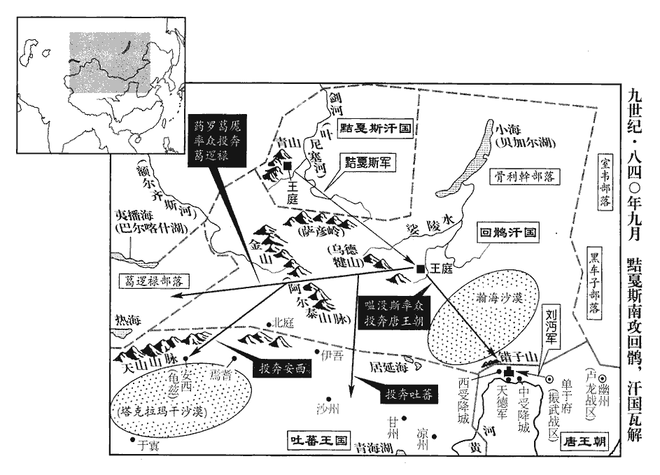
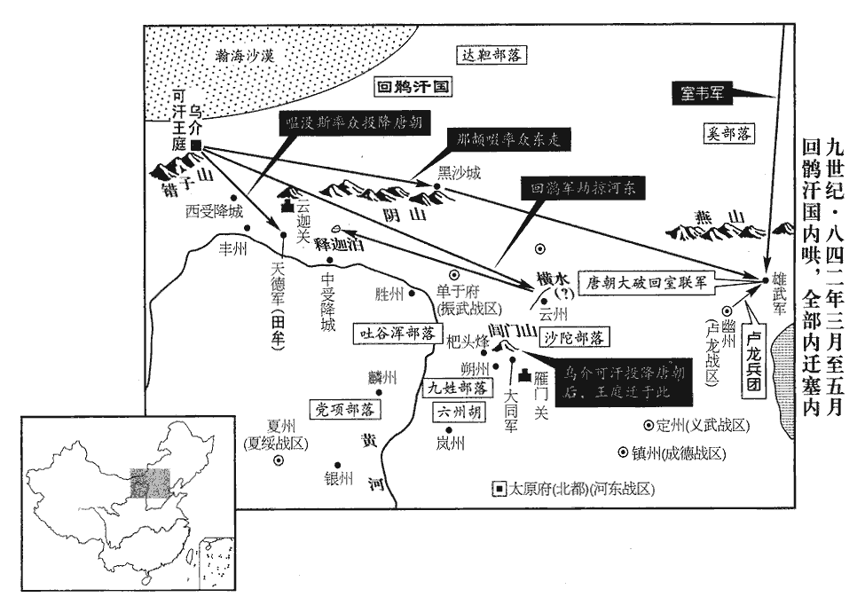
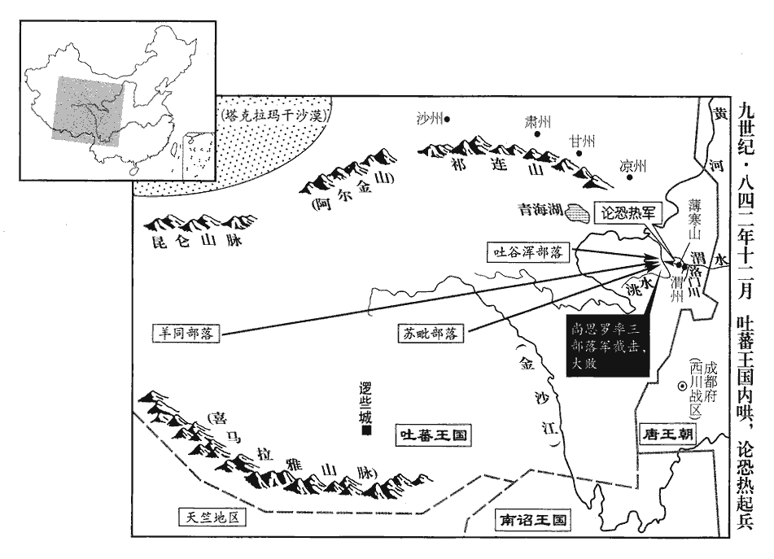

 唐紀六十二起著雍敦牂（戊午），盡玄黓閹茂（壬戌），凡五年。

# 文宗元聖昭獻孝皇帝下

## 開成三年（戊午、八三八）

1春，正月，甲子‹五›，李石入朝，中塗有盜射之，射，食亦翻。微傷，左右奔散，石馬驚，馳歸第。又有盜邀擊於坊門，斷其馬尾，唐諸坊之南皆有門，以時啟閉。斷，音短。僅而得免。上‹李昂（李涵）本年三十一岁›聞之大驚，命神策六軍遣兵防衛，敕中外捕盜甚急，竟無所獲。乙丑‹六›，百官入朝者九人而已。京城數日方安。

〖译文〗 [1]春季，正月，甲子（初五），宰相李石上朝时，半路上有盗贼用弓箭暗杀他，受了轻伤，左右侍从一哄而散。李石的马受惊后驰回他的住宅，又有盗贼在街坊的门口进行拦击，斩断马的尾巴。李石幸免于难。唐文宗得知后大惊，下令神策军和禁军六军派兵防卫宰相，同时下敕，命朝廷内外迅速派人捉拿刺客，最后一无所获。乙丑（初六），百官仅仅九个人去上朝。京城几天后才安定下来。

2丁卯‹八›，追贈故齊王湊為懷懿太子。知湊之冤也。湊被枉事見二百四十四卷太和五年。

〖译文〗 [2]丁卯（初八），唐文宗追封已经去世的齐王李凑为怀懿太子。

3戊申‹九›，以鹽鐵轉運使、戶部尚書楊嗣復，戶部侍郎、判戶部李珏jué並同平章事，考異曰：舊傳：「三年，楊嗣復輔政，薦珏，以本官同平章事。」按珏與嗣復並命，今從實錄。判、使如故。判，謂判戶部，使，謂鹽鐵轉運使。嗣復，於陵之子也。楊於陵見二百三十七卷憲宗元和三年。於，音烏。

〖译文〗 [3]戊申（疑误），唐文宗任命盐铁转运使、户部尚书杨嗣复，户部侍郎、判户部李珏并为同平章事，仍兼任原盐铁转运使和判户部的职务。杨嗣复是杨于陵的儿子。

4中書侍郎、同平章事李石，承甘露之亂，人情危懼，宦官恣橫，橫，戶孟翻。忘身徇國，故紀綱粗立。仇士良深惡之，粗，坐五翻。惡，烏路翻；下同。潛遣盜殺之，不果。石懼，累表稱疾辭位；上深知其故而無如之何。丙子‹十七›，以石同平章事，充荊南‹总部设江陵府湖北省江陵县›節度使。

〖译文〗 [4]中书侍郎、同平章事李石在甘露之变以后，人心恐惧不安、宦官骄横的情况下，为国家忘我操劳，以致朝廷的法制初步恢复，朝政运转基本正常，左神策军护军中尉仇士良因此十分痛恨他，秘密地派遣刺客去暗杀他，没有达到目的。李石非常恐惧，多次以身体有病为由，上表请求辞职。唐文宗完全明白李石辞职的原因，但也无可奈何。丙子（十七日），任命李石以同平章事的头衔，充任荆南节度使。

5陳夷行性介直，惡楊嗣復為人，每議政事，多相詆斥。壬辰‹二月四日›，夷行以足疾辭位，不許。

〖译文〗 [5]宰相陈夷行性情耿介正直，厌恶杨嗣复的为人，每次宰相在一起商议朝政，二人往往争论不休。壬辰（疑误），陈夷行以脚病为由，请求辞职。文宗不准。

6上命起居舍人魏謩獻其祖文貞公笏。魏徵諡曰文貞。鄭覃曰：「在人不在笏。」上曰：「亦甘棠之比也。」言周人思召公‹姬奭›，愛其甘棠而不敢翦伐，今思魏徵之正直，則亦當寶愛其故笏。

〖译文〗 [6]唐文宗命起居舍人魏把他的先祖魏徵用过的笏板奉献朝廷。宰相郑覃说：“关键在于表彰魏徵对朝廷忠正直言的精神，而不在于他的笏板。”文宗说：“我思念魏徵，因此，看到他的笏板就自然想起他。这就象西周时人们思念召公，因而称颂他曾休息乘凉过的甘棠树一样。”

7楊嗣復欲援進李宗閔，復，扶又翻。援，于元翻；下同。恐為鄭覃所沮，乃先令宦官諷上，上臨朝，謂宰相曰：「宗閔積年在外，宜與一官。」李宗閔貶，見上卷太和九年。鄭覃曰：「陛下若憐宗閔之遠，止可移近北數百里，近，其靳翻。不宜再用；用之，臣請先避位。」陳夷行曰：「宗閔曏以朋黨亂政，陛下何愛此纖人！」纖人，猶言小人也楊嗣復曰：「事貴得中，不可但徇愛憎。」上曰：「可與一州。」覃曰：「與州太優，止可洪州‹江西道首府·江西省南昌市›司馬耳。」洪州，京師東南三千九十里。因與嗣復互相詆訐以為黨。訐jié，居謁翻。上曰：「與一州無傷。」覃等退，上謂起居郎周敬復、舍人魏謩曰：「宰相諠爭如此，可乎？」唐制：起居郎、起居舍人掌錄天子起居法度。天子御正殿，則郎居左，舍人居右，有命，俯陛以聽。每仗下，天子與宰相議政事，郎、舍人亦分侍左右。若仗在紫宸內閣，則夾香案分立殿下。覃等喧爭既退，故上因問之。對曰：「誠為不可。然覃等盡忠憤激，不自覺耳。」丁酉‹二月九日›，以衡州‹湖南省衡阳市›司馬李宗閔為杭州‹浙江省杭州市›刺史。唐制：衡州，中。洪州，上，都督府。杭州，上。中州司馬，從五品下。大都督府司馬，從四品下。上州刺史，從三品。李固言與楊嗣復、李珏善，故引居大政以排鄭覃、陳夷行，每議政之際，是非鋒起，上不能決也。史言文宗明不足以燭理。

〖译文〗 [7]宰相杨嗣复打算向朝廷推荐提拔李宗闵，但恐怕被郑覃阻拦，于是，先让宦官在宫中私下向文宗建议。文宗上朝时对宰相说：“李宗闵被贬到外地多年，应当授予一个职位。”郑覃说：“陛下如果怜悯李宗闵贬逐的地方太远，只可把他向京城方向迁移几百里，而不宜再召回朝廷任职。如果把他召回朝廷任职，我请求先辞职。”陈夷行说：“李宗闵过去在朝廷朋比为党，扰乱朝政，陛下为什么喜爱这种卑鄙小人！”杨嗣复说：“处理问题贵在用心公道，不可只凭自己的爱憎。”文宗说：“可以让他担任一个州刺史。”郑覃说：“授予州刺史恐怕对他太优待，最多让他担任洪州司马。”于是，郑覃、陈夷行和杨嗣复相互争论攻击，指斥对方为朋党。文宗说：“授予李宗闵一个州刺史问题不大。”郑覃等人于是退下。文宗对起居郎周敬复、起居舍人魏说：“宰相之间如此争论喧哗，难道能够允许吗？”二人回答说：“这样下去确实不行，不过，郑覃等人是由于对陛下尽忠，因而不自觉地对杨嗣复态度激愤。”丁酉（疑误），唐文宗任命衡州司马李宗闵为杭州刺史。当初，宰相李固言和杨嗣复、李珏关系亲密，所以推荐二人为宰相，以便排挤郑覃、陈夷行。朝廷每次商议朝政的时候，双方争论不休，是非竞起，文宗不能决断。

8三月，牂柯‹贵州省北部›寇涪州‹重庆市涪陵区›清溪鎮‹涪陵市东南›，牂柯蠻在涪州東九百里，東距辰州二千四百里。涪，音浮。鎮兵擊卻之。

〖译文〗 [8]三月，柯族侵犯涪州清溪镇，被驻扎在当地的镇兵击退。

9初，太和之末，杜悰為鳳翔‹总部设凤翔府陕西省凤翔县›節度使，有詔沙汰僧尼。事見上卷太和八年。時有五色雲見于岐山‹陕西省岐山县东北›，見，賢遍翻；下同。近法門寺‹陕西省扶风县北法门镇›，民間訛言佛骨降祥，佛骨在法門寺，故云然。以僧尼不安之故。監軍欲奏之，悰曰：「雲物變色，何常之有！佛若果愛僧尼，當見於京師。」未幾，獲白兔，幾，居豈翻。未幾，言未得幾何時也。監軍又欲奏之，曰：「此西方之瑞也。」悰曰：「野獸未馴，且宜畜之。」馴，松倫翻。畜，吁玉翻。旬日而斃；監軍不悅，以為掩蔽聖德，獨畫圖獻之。及鄭注代悰鎮鳳翔‹陕西省凤翔县›，按通鑑上卷，太和八年，九月，庚申，以鳳翔節度使李聽為忠武節度使，代杜悰。丁卯，以鄭注為鳳翔節度使。注誣奏聽在鳳翔貪虐；冬，十月，乙亥，以聽為太子太保、分司，復以杜悰為忠武節度使。若如上卷所書，則杜悰鎮忠武，不在鳳翔。奏紫雲見，又獻白雉。是歲，八月，有甘露降於紫宸殿前櫻桃之上，上親采而嘗之，百官稱賀。其十一月，遂有金吾甘露之變。

〖译文〗 [9]当初，在太和末年的时候，杜担任凤翔节度使，朝廷曾下诏令各地淘汰寺院僧尼。这时，岐山县的天空中出现五色彩云，距离法门寺很近。于是，民间传谣说，这是僧尼得知要被淘汰恐惧不安，所以，法门寺的佛骨显灵保佑僧尼。凤翔监军打算奏报朝廷。杜说：”天上的云彩变换颜色，是常有的事！如果佛真的保佑僧尼的话，肯定五色彩云也会出现在京城的上空。”不久凤翔捉到一只白兔，监军又提出奏报朝廷，说：“这是从西方来的祥瑞。”杜说：“这类野兽未加驯服，应当暂且畜养。”过了十几天，白兔死了，监军很不高兴，认为杜不向朝廷报告祥瑞，掩盖皇上的大圣大德，于是，独自把五色彩云和白兔画成图画，奉献朝廷。等到郑注代替杜为凤翔节度使后，奏报天空出现紫色云彩，又向朝廷奉献白色的野鸡。当年八月，紫宸殿前院的樱桃树上发现有甘露降临，文宗亲自采集品尝，百官齐声称贺，认为是祥瑞。在十一月，发生了李训策划的甘露之变。

及悰為工部尚書、判度支，河中‹总部设河中府山西省永济市›奏騶虞見，詩註：騶虞，義獸，白虎黑文，不食生物，有至信之德則應之。司馬相如封禪書曰：般般之獸，樂我君囿，白質黑章，其儀可喜。師古註：謂騶虞也。山海經：騶虞如虎，五色，尾長於身。百官稱賀。上謂悰曰：「李訓、鄭注皆因瑞以售其亂，乃知瑞物非國之慶。卿前在鳳翔，不奏白兔，真先覺也。」對曰：「昔河出圖，伏羲以畫八卦；洛出書，大禹‹姒文命›以敘九疇，皆有益於人，故足尚也。至於禽獸草木之瑞，何時無之！劉聰桀逆，黃龍三見；石季龍暴虐，得蒼麟十六、白鹿七，以駕芝蓋。石虎，字季龍，唐避廟諱，故稱其字。以是觀之，瑞豈在德！玄宗‹李隆基›嘗為潞州‹山西省长治市›別駕，中宗時，玄宗為潞州別駕。及即位，潞州奏十九瑞，玄宗曰：『朕在潞州，惟知勤職業，此等瑞物，皆不知也。』願陛下專以百姓富安為國慶，自餘不足取也。」上善之。他日，謂宰相曰：「時和年豐，是為上瑞；嘉禾靈芝，誠何益於事！」宰相因言：「春秋記災異以儆人君，而不書祥瑞，用此故也！」意此必鄭覃之言。

〖译文〗 等到杜担任工部尚书、判度支时，河中奏称发现一种不吃其他兽类的驺虞，是天下祥瑞的象征。于是，百官都向文宗祝贺。文宗对杜说：“李训、郑注都是自称发现祥瑞，从而乘机作乱的。由此可见，所谓祥瑞的东西，并非是国家太平的象征。你从前在凤翔的时候，不向朝廷奏报发现白兔，真可谓是先知先觉。”杜说：“过去，黄河边发现图，伏羲用它来策画八卦；洛河旁发现天书，大禹用它来制定治理天下的九种法则。这些，都对百姓有益，所以值得效法。至于禽兽草木一类的所谓祥瑞之物，什么时候都有！刘聪桀傲不驯，叛变朝廷，但却几次发现黄龙；石虎残虐无道，但却在各地捉获了苍麟十六个，白鹿七个，用来驾驶自己的车乘。由此可见，所谓的祥瑞之物和帝王的圣德毫无关系！玄宗曾经担任过潞州别驾，他即位当皇帝以后，潞州奏报发现十九种祥瑞之物，玄宗说：‘朕在潞州的时候，只知道勤勉于本职工作，对于你们报告的祥瑞之物，丝毫不知。’因此，我但愿陛下一心一意地以百姓富足安乐作为国家兴隆的象征，对于其他所谓的祥瑞之物，都不要采纳。”文宗称赞杜的意见。过了几天，文宗对宰相说：“现在，风调雨顺，庄稼丰收，这是最大的祥瑞。至于嘉禾灵芝，对国家又有什么用呢！”宰相于是说：“孔子在《春秋》中之所以专门记载自然灾害和某些怪异的自然现象，以警告帝王要勤政爱民，但并不记载所谓的祥瑞之物，也就是这个原因！”

夏，五月，乙亥‹十九›，詔：「諸道有瑞，皆無得以聞，亦勿申牒所司。其臘饗太廟唐制：四孟及臘享于太廟。唐臘用寅。及饗太清宮‹唐朝始祖李耳庙›，玄宗天寶二年，以西京玄元皇帝廟為太清宮。元日受朝奏祥瑞，皆停。」六典：凡大祥瑞隨即表奏，文武百寮詣闕奉賀。其他並年終具表以聞，有司告廟，百寮詣闕奉賀。又儀制令：大瑞即隨表奏聞；中瑞、下瑞申報有司，元日聞奏。今皆停罷。考異曰：實錄：「初，上謂宰臣曰：『歲豐人安，豈非上瑞！』宰臣因言春秋不書祥瑞，上深然之，遂有此詔。」補國史以為因杜悰進言，今兼取之。

〖译文〗 夏季，五月，乙亥（十九日），唐文宗下诏：“各地凡发现祥瑞之物，一律不得奏报朝廷，也不准向自己的上司报告。凡腊月祭献太庙和太清宫，以及正月初一朝廷举行大典时按规定上奏祥瑞，一律停罢。”

10初，靈武‹总部设灵州宁夏灵武市›節度使王晏平自盜贓七千餘緡，上以其父智興有功，王智興有討橫海之功。免死，長流康州‹广东省德庆县›。晏平密請於魏‹魏博›、鎮‹成德›、幽‹卢龙›三節度使，魏帥，何進滔；鎮帥，王元逵；幽帥，史元忠。使上表雪己；上不得已，六月，壬寅‹十六›，改永州‹湖南省永州市›司戶。

〖译文〗 [10]当初，灵武节度使王晏平贪污七千余缗钱，文宗鉴于他的父亲王智兴对国家曾经立过战功，因而免除死刑，流放康州。晏平秘密地请求魏博、镇州和幽州三位节度使上奏朝廷，为自己申冤。唐文宗无可奈何，六月，壬寅（十六日），改任晏平为永州司户。

11八月，己亥‹十四›，嘉王運薨。運，代宗‹李豫李俶›子。

〖译文〗 [11]八月，己亥（十四日），嘉王李运去世。

12太子永之母王德妃無寵，為楊賢妃所譖而死。唐因隋制，有貴妃、淑妃、德妃、賢妃各一人，為夫人，正一品。開元中，玄宗以后妃四星，一為后，有后而復置四妃，非典法。乃置惠妃、麗妃、華妃，以代三夫人、其後復置貴妃，蓋復唐初四妃之制。太子頗好遊宴，昵近小人，好，呼到翻。昵，尼質翻。近，其靳翻。賢妃日夜毀之。九月，壬戌‹七›，上開延英，召宰相及兩省、御史、郎官，疏太子‹李永›過惡，議廢之，曰：「是宜為天子乎？」群臣皆言：「太子年少，少，詩照翻；下同。容有改過。國本至重，豈可輕動！」御史中丞狄兼謩論之尤切，至於涕泣。給事中韋溫曰：「陛下惟一子，不教，陷之至是，豈獨太子之過乎！」癸亥‹八›，翰林學士六人、神策六軍軍使十六人復上表論之，復，扶又翻。上意稍解。是夕，太子始得歸少陽院；如京使王少華等唐置如京使，以武臣為之，內職也，未知所職何事。及宦官宮人坐流死者數十人。

〖译文〗 [12]皇太子李永的母亲王德妃不得唐文宗宠爱，被杨贤妃向文宗进谗言诬陷。以致死去。太子十分喜好游乐饮宴，而且亲近身旁小人。于是，杨贤妃昼夜不停地在文宗面前诽谤太子。九月，壬戌（初七），文宗亲临延英殿，召集宰相以及中书、门下两省的官员，御史台官员和尚书省各司的郎官，向大家介绍太子的罪过，提议废除，文宗说：“象他这样，难道还适合继续当太子吗？”群臣都说：“太子年轻，应当容许他改正错误。太子作为陛下的继承人，至关重要，岂可轻易废除！”御史中丞狄兼劝阻的最为恳切，以至哭泣。给事中韦温说：“陛下只有这么一个儿子，平时不重视教诲，以致今天这样，难道仅仅是太子个人的过错！”癸亥（初八），翰林学士六人、神策军和禁军六军军使十六人再次联名上表劝阻，文宗才逐渐回心转意。当天晚上，太子才得以回到少阳院。如京使王少华等人，以及宦官、宫女几十个人因此而牵连被流放或判处死刑。

13義武‹总部设定州河北省定州市›節度使張璠在鎮十五年，穆宗長慶三年，璠代陳楚鎮義武。為幽‹卢龙战区，总部设幽州北京市›、鎮‹成德战区，总部设镇州河北省正定县›所憚；及有疾，請入朝，朝廷未及制置，疾甚，戒其子元益舉族歸朝，毋得效河北故事。及薨，軍中欲立元益，觀察留後李士季不可，眾殺之，又殺大將十餘人。壬申‹十七›，以易州‹河北省易县›刺史李仲遷為義武節度使。義武馬軍都虞候何清朝自拔歸朝，癸酉‹十八›，以為儀州‹山西省左权县›刺史。宋白曰：遼州樂平郡，唐武德三年置遼州，八年改為箕州，先天二年，以玄宗嫌名，改為儀州。

〖译文〗 [13]义武节度使张在任十五年，和他邻接的幽州、镇州两个割据藩镇十分惧怕他。等到他有病时，请求朝廷批准自己离职赴京。朝廷尚未来得及安排由谁代替他的职务，张已经病重，于是，告诫儿子张元益率全族人返归京城，不准效法河北藩镇的惯例，继承节度使的职务。张去世后，义武的将士打算拥立张元益为节度使，观察留后李士季反对，被将士杀死，同时，又杀大将十几人。壬申（十七日），唐文宗任命易州刺史李仲迁为义武节度使。义武马军都虞候何清朝率兵归顺朝廷，癸酉（十八日），被任命为仪州刺史。

14朝廷以義昌‹前横海战区·总部设沧州河北省沧州市东南›節度使李彥佐在鎮久，太和六年，李彥佐代殷侑鎮義昌。甲戌‹十九›，以德州‹山东省陵县›刺史劉約為節度副使，欲以代之。

〖译文〗 [14]朝廷鉴于义昌节度使李彦佐任职太久，甲戌（十九日），任命德州刺史刘约为义昌节度副使，准备让他代替李彦佐。

15開成以來，神策將吏遷官，多不聞奏，直牒中書令覆奏施行，遷改殆無虛日。甘露之變之後，宦官專橫，遂至於此。癸未‹二十八›，始詔神策將吏改官皆先奏聞，狀至中書，然後檢勘施行。先奏聞於上，禁中以其狀付中書，方與檢勘由歷而施行之。

〖译文〗 [15]自从开成年以来，神策军军将和下属官吏升迁，大多不向文宗上奏请求批准，而由神策军直接行文到中书省，中书省复核后便予以施行，以至神策军军将和下属官吏迁升官爵，几乎没有一日停止。癸未（二十八日），唐文宗下诏，命令今后神策军军将和官吏迁升官爵，一律首先上奏，待奏折批准送递中书省复核后再予以施行。

16冬，十月，易定監軍奏軍中不納李仲遷，請以張元益為留後。

〖译文〗 [16]冬季，十月，义武监军奏报：军中将士不予接受新任节度使李仲迁，请求任命张元益为留后。

17太子永猶不悛，悛，丑緣翻，改也。庚子‹七›，暴薨，考異曰：按文宗後見緣橦tóng者而泣曰：「朕為天子，不能全一子！」遂殺劉楚材等，然則太子非良死也。但宮省事祕，外人莫知其詳，故實錄但云「終不悛過，是日暴薨。」諡曰莊恪。

〖译文〗 [17]皇太子李永仍不改过自新，庚子（十六日），突然去世。朝廷赠他谥号为庄恪。

18乙巳‹十二›，以左金吾大將軍郭旼mín為邠寧‹总部设邠州陕西省彬县›節度使。旼，莫貧翻。考異曰：舊柳公權傳作「皎」。按子儀子姪名皆連「日」旁。今從實錄。

〖译文〗 [18]乙巳（二十一日），唐文宗任命左金吾大将军郭为宁节度使。

19宰相議發兵討易定。上曰：「易定地狹人貧，軍資半仰度支。仰，牛向翻。急之則靡所不為，緩之則自生變。但謹備四境以俟之。」乃除張元益代州‹山西省代县›刺史。頃之，軍中果有異議，乃上表以不便李仲遷為辭，朝廷為之罷仲遷。為，于偽翻。十一月，【章：十二行本「月」下有「壬戌‹八›」二字；乙十一行本同；孔本同；張校同。】詔俟元益出定州；其義武將士始謀立元益者，皆赦不問。

〖译文〗 [19]宰相商议发兵征讨义武。文宗说：“义武的地方狭小，百姓贫困，军需有一半靠朝廷度支调拨供给。如果急于攻讨，那么，他们什么事都干得出来；如果暂缓，则内部必定发生分化。现在，只要命它的四邻藩镇严密防守，等待它的内部分化。”于是，任命张元益为代州刺史。不久，义武军中果然产生分歧，他们上表借口李仲迁不适宜担任义武节度使。朝廷于是罢免李仲迁。十一月，唐文宗下诏，等张元益从定州出发，赴代州上任后，凡义武最初密谋拥立张元益的将士，一律赦免不再问罪。

20以義昌節度使李彥佐為天平‹总部设郓州山东省东平县›節度使，以劉約為義昌節度使。

〖译文〗 [20]唐文宗任命义昌节度使李彦佐为天平节度使，义昌节度副使刘约为义昌节度使。

21丁卯‹十三›，張元益出定州。考異曰：補國史曰：「易定張公璠卒，三軍請公璠子元益繼統軍務。公璠乃孝忠孫也。公璠彌留之際，誡元益歸闕。三軍復效幽、鎮、魏三道，自立連帥，坐邀制命。廟謀未決，丞相衛公欲伐而克之。貞穆公議未可興師，且行弔贈禮，追元益赴闕，若拒命跋扈，討之不遲。上前互陳短長，未行朝典。貞穆公有密疏，進追元益詔意云：『敕張元益：卿太祖孝忠，功列鼎彝，垂於不朽。卿乃祖茂昭，克荷遺訓，不墜義風。』云云。文宗覽詔意，深叶睿謀。詔下定州，元益拜詔慟哭，焚墨衰，請死於眾。三軍將士南向稽首，蹈舞流涕，扶元益就苫廬，請監軍使、幕府準諸道例各知留後。公璠遂全家赴闕。詔以神策軍使陳君賞為帥。」所謂貞穆公者，李珏也。按實錄：璠，定州牙將，非孝忠孫。又李德裕此年不為相。補國史蓋傳聞之說，不可據。今從實錄。

〖译文〗 [21]丁卯（十三日），张元益离开定州。

22庚午‹十六›，上問翰林學士柳公權以外議，對曰：「郭旼mín除邠寧，外間頗以為疑。」上曰：「旼，尚父之姪，德宗以郭子儀為尚父。太后叔父，太后，即謂太皇郭太后。在官無過，自金吾作小鎮，外間何尤焉？」對曰：「非謂旼不應為節度使也。聞陛下近取旼二女入宮，有之乎？」上曰：「然，入參太皇太后耳。」公權曰：「外間不知，皆云旼納女後宮，故得方鎮。」上俛首良久曰：「然則柰何？」對曰：「獨有自南內遣歸其家，則外議自息矣！」是日，太皇太后遣中使送二女還旼家。太皇太后居興慶宮，興慶宮謂之南內。使，疏吏翻。還，如字。

〖译文〗 [22]庚午（十六日），唐文宗问翰林学士柳公权，朝廷近日有什么议论。柳公权回答说：“郭被任命为宁节度使，朝廷不少人对此很有疑问。”文宗说：“郭是尚父郭子仪的侄子，又是太皇太后的叔父，在此以前，他做官从无过失，从左金吾大将军而转任宁这个小地方的节度使，不知朝廷百官有何疑问？”柳公权回答说：“百官并不是议论说郭不应当担任宁节度使。我听说陛下近日把郭的两个女儿选入宫中，不知是否属实？”文宗说：“是我让她俩入宫，是要她们参见太皇太后。”柳公权说：“百官不知陛下的用意，都认为郭把女儿纳入陛下后宫，所以才被任命为节度使。”文宗低头无言，过了很久才说：“那么，该怎么平息百官的非议呢？”柳公权回答说：“只要把郭女儿从兴庆宫送还她们的家里，百官的非议自然就平息了！”当天，太皇太后派宦官把郭的两个女儿送回家。

23上好詩，好，呼到翻。嘗欲置詩學士；李珏曰：「今之詩人浮薄，無益於理。」乃止。

〖译文〗 [23]唐文宗爱好诗歌，曾打算设置诗学士，宰相李珏说：“当今的诗人都很轻浮，设置诗学士，对朝廷没有什么好处。”于是作罢。

24甲戌‹二十›，以蔡州‹河南省汝南县›刺史韓威為義武節度使。張元益既出定州，乃除韓威。

〖译文〗 [24]甲戌（二十日），唐文宗任命蔡州刺史韩威为义成节度使。

25河東‹总部设太原府山西省太原市›節度使、司徒、中書令裴度以疾求歸東都‹洛阳›，裴度治第東都集賢里，號綠野堂。十二月，辛丑‹七›，詔度入知政事，遣中使敦諭上道。上，時掌翻。

〖译文〗 [25]河东节度使、司徒、中书令裴度由于疾病，请求辞职返回东都洛阳。十二月，辛丑（十七日），唐文宗下诏，命裴度来京参予朝政决策，并派宦官前往河东，传达文宗的旨意，敦促裴度上路。

26鄭覃累表辭位，丙午‹二十二›，詔：三五日一入中書。

〖译文〗 [26]宰相郑覃多次上表请求辞职，丙午（二十二日），唐文宗下诏：命郑覃三五天到政事堂办公一次。

27是歲，吐蕃‹首都逻些城西藏拉萨市›彝泰贊普卒，弟達磨立。彝泰多病，委政大臣，由是僅能自守，久不為邊患。達磨荒淫殘虐，國人不附，災異相繼，吐蕃益衰。按：吐蕃衰，回鶻衰，而唐亦衰矣。考異曰：彝泰卒及達磨立，實錄不書，舊傳、續會要皆無之。今據補國史。

〖译文〗 [27]本年，吐蕃彝泰赞普去世，他的弟弟达磨被立为新赞普。彝泰在位时身体多病，把朝政委任大臣，所以仅能自守边疆，很久没有侵扰唐朝。达磨继位后，荒淫残虐，国内人民离心离德，灾害和怪异的现象接连发生，吐蕃因此更加衰弱。

## 四年（己未、八三九）

1春，閏正月，己亥‹十六›，裴度‹河东战区，总部设大原府山西省大原市›至京師，以疾歸第，此長安平樂里第也。不能入見。見，賢遍翻。上‹李昂（李涵）本年三十二岁›勞問賜賚，使者旁午。勞，力到翻。三月，丙戌‹四›，薨‹年七十五岁›，諡曰文忠。上怪度無遺表，問其家，得半藁，以儲嗣未定為憂，言不及私。度身貌不踰中人，而威望遠達四夷，四夷見唐使，輒問度老少用捨；少，詩照翻。以身繫國家輕重如郭子儀者，二十餘年。

〖译文〗 [1]春季，闰正月，己亥（十六日），河东节度使裴度抵达京城，由于身体疾病而回到家中，未能拜见文宗。文宗接连派遣使者到他家中慰劳赏赐。三月，丙戌（初四），裴度去世，朝廷追赠谥号为文忠。文宗奇怪裴度没留下给朝廷的遗表，派人问他的家属，找到一份没有写完的手稿，手稿中只说自己为皇上没有立太子而担忧，而不提及自己个人的要求。裴度的身材和相貌并未超过一般人，但威望却远达周边的夷蛮各族，夷蛮各族酋长见到唐朝的使者，常常问裴度的年龄多少？是否还得到朝廷重用？他和郭子仪一样，都是在二十多年的时间内，德高望重，而以自己的身家性命维系国家安危的重要人物。

2夏，四月，戊辰‹十七›，上稱判度支杜悰之才，楊嗣復、李珏因請除悰戶部尚書，陳夷行曰：「恩旨當由上出，自古失其國未始不由權在臣下也。」珏曰：「陛下嘗語臣云，語，牛倨翻。人主當擇宰相，不當疑宰相。」五月，丁亥‹七›，上與宰相論政事，陳夷行復言不宜使威福在下，復，扶又翻。李珏曰：「夷行意疑宰相中有弄陛下威權者耳。臣屢求退，苟得王傅，臣之幸也。」王傅，散地，自宰執以下貶官者居之。鄭覃曰：「陛下開成元年、二年政事殊美，三年、四年漸不如前。」楊嗣復曰：「元年、二年鄭覃、夷行用事，三年、四年臣與李珏同之，罪皆在臣！」因叩頭曰：「臣不敢更入中書！」政事堂在中書省。遂趨出。上遣使召還，勞之勞，力到翻。曰：「鄭覃失言，卿何遽爾！」覃起謝曰：「臣愚拙，意亦不屬嗣復；屬，之欲翻。而遽如是，乃嗣復不容臣耳。」嗣復曰：「覃言政事一年不如一年，非獨臣應得罪，亦上累聖德。」累，良瑞翻。退，三上表辭位，上遣中使召出之，癸巳‹十三›，始入朝。丙申‹十六›，門下侍郎、同平章事鄭覃罷為右僕射，陳夷行罷為吏部侍郎。覃性清儉，夷行亦耿介，故嗣復等深疾之。史言小人排君子，不遺餘力。

〖译文〗 [2]夏季，四月，戊辰（十七日），唐文宗称誉判度支杜有才能，杨嗣复、李珏乘机奏请任命杜为户部尚书。陈夷行说：“对臣下任命的旨意应当由皇上作出。自古以来，国家大凡灭亡，最初无不是大权旁落，而由臣下专权的。”李珏说：“陛下曾对我说，帝王应当谨慎地挑选宰相，但不应当猜疑宰相。”五月，丁亥（初七），文宗和宰相一起议论朝政，陈夷行又说不应使臣下专权而作威作福，李珏说：“从陈夷行的用意看，他是怀疑宰相中有人玩弄陛下的权威。我以前多次请求辞职，现在，如果能担任皇子诸王的太傅，也就是我的幸运了。”郑覃说：“陛下在开成元年、二年处理朝政都很好，三年、四年渐渐不如以前。”杨嗣复说：“开成元年、二年是郑覃、陈夷行担任宰相。三年、四年我和李珏也一同升任宰相。看来，郑覃的意思是说罪责在我了！”于是，接着叩头说：“我不敢再到政事堂去办公！”随即退出。文宗派人把他召回，用好言安慰，说：“郑覃失言，你何必这样！”郑覃起身谢罪说：“我性情愚笨，刚才说的意思不是专指嗣复，没想到他竟然这样反感，看来，是嗣复不能容我。”杨嗣复说：“郑覃认为朝政一年不如一年，不仅我一个人应当有罪，而且也牵连皇上。”于是退下，再三上表请求辞职。文宗派宦官召他上朝。癸巳（十三日），杨嗣复才开始上朝。丙申（十六日），门下侍郎、同平章事郑覃被罢免宰相职务，担任右仆射；陈夷行被罢免宰相职务，担任吏部侍郎。郑覃的性情清正俭约，陈夷行也性情耿直。所以，杨嗣复等人十分痛恨他俩人。

3上以鹽鐵推官、檢校禮部員外郎姚勗xù能鞫疑獄，命權知職方員外郎，右丞韋溫不聽，上奏稱：「郎官朝廷清選，不宜以賞能吏。」上乃以勗檢校禮部郎中，依前鹽鐵推官。姚勗權知職方員外郎，而韋溫爭之，檢校禮部郎中，而溫不復言者，蓋唐制藩鎮及諸使僚屬率帶檢校官，而權知則為職事官故也。六月，丁丑‹二十七›，上以其事問宰相楊嗣復，對曰：「溫志在澄清流品。若有吏能者皆不得清流，則天下之事孰為陛下理之！為，于偽翻。恐似衰晉之風。」然上素重溫，終不奪其所守。

〖译文〗 [3]唐文宗鉴于盐铁推官、检校礼部员外郎姚勖擅长审断疑难狱案，任命他暂为职方员外郎。尚书右丞韦温拒不听命，上奏说：“郎官历来是朝廷任命有名望的士大夫的职位，不应当轻易用它来奖赏有才干的官吏。”于是，文宗改任姚勖为检校礼部郎中，仍担任盐铁推官。六月，癸丑（初三），文宗问宰相杨嗣复对这件事的看法，杨嗣复说：“韦温的目的在于澄清官员的出身和等级。如果官员因为出身和社会地位不高，但很有才干，却不能担任那些有名望的职务，那么，天下的种种事务谁去为陛下处理呢？我认为，这恐怕是晋朝重视出身地位的衰败遗风。”然而，文宗向来器重韦温，最后还是没有违背他的奏请。

4秋，七月，癸未‹四›，以張元益為左驍衛將軍，以其母侯莫陳氏為趙國太夫人，賜絹二百匹。易定‹总部设定州河北省定州市›之亂，侯莫陳氏說諭將士，說，式芮翻。且戒元益以順朝命，故賞之。

〖译文〗 [4]秋季，七月，癸未（初四），唐文宗任命张元益为左骁卫将军，任命他的母亲侯莫陈氏为赵国太夫人，赏赐绢二百匹。此前义武发生变乱的时候，侯莫陈氏劝说将士，同时告诫张元益听从朝廷命令，所以文宗予以赏赐。

5甲辰‹二十五›，以太常卿崔鄲同中書門下平章事。鄲，郾之弟也。鄲，多寒翻。崔郾見二百四十四卷太和五年。

〖译文〗 [5]甲辰（二十五日），唐文宗任命太常卿崔郸为同中书门下平章事。崔鄣是崔郾的弟弟。

6八月，辛亥‹二›，鄜王憬薨。憬，憲宗‹李纯›子。

〖译文〗 [6]八月，辛亥（初二），王李憬去世。

7癸酉‹二十四›，昭義‹总部设潞州山西省长治市›節度使劉從諫上言：「蕭本詐稱太后弟，上下皆稱蕭弘是真，以本來自左軍，故弘為臺司所抑。蕭本事見上卷元年。蕭弘事見二年。臺司，謂御史臺官吏，主按驗蕭弘者。今弘詣臣，求臣上聞。上，時掌翻。乞追弘赴闕，與本對推，以正真偽。」詔三司鞫之。

〖译文〗 [7]癸酉（二十四日），昭义节度使刘从谏上言朝廷：“萧本诈称是萧太后的弟弟。朝廷上下都认为萧弘才是萧太后真正的弟弟。但由于萧本是经左神策军护军中尉仇士良引见给皇上的，所以萧弘被御史台官员所冤枉。现在，萧弘来见我，请求我向朝廷奏明真象。我乞请朝廷召见萧弘，让他和萧本二人当面对证，以辨别真伪。”文宗下诏，命御史台、刑部和大理寺三司会审。

8冬，十月，乙卯‹七›，上就起居舍人魏謩取記注觀之，記注，即起居注。貞觀初，以給事中、諫議大夫兼知起居注，或知起居事。每仗下議記事，起居郎一人執筆記錄于前，史官隨之。其後復置起居舍人，分侍左右秉筆，隨宰相入殿。若仗在紫宸內閤，則夾香案，分立殿下，直第二螭chī首。和墨濡筆，皆即坳處，時號「螭頭」。高宗臨朝不決事，有所奏，惟辭見而已。許敬宗、李義府為相，奏請多畏人之知也，命起居郎、舍人對仗承旨，仗下與百官皆出，不敢聞機務矣。長壽中，宰相姚璹shú建議：仗下後，宰相一人錄軍國政要，為時政記，月送史館。然率推美讓善，事非其實，未幾亦罷。而起居郎因制敕稍稍筆削，以廣國史之闕。起居舍人本記言之職，惟編詔書，不及他事。開元初，復詔脩史官非供奉者，皆隨仗而入，位於起居郎、舍人之次。及李林甫專權，又廢。太和九年，詔起居郎、舍人，凡入閤日，具紙筆，立螭頭下，復貞觀故事。謩不可，曰：「記注兼書善惡，所以儆戒人君。陛下但力為善，不必觀史！」上曰：「朕曏嘗觀之。」對曰：「此曏日史官之罪也，若陛下自觀史，則史官必有所諱避，何以取信於後！」上乃止。

〖译文〗 [8]冬季，十月，乙卯（初七），唐文宗命起居舍人魏把记载朝政大事的《起居注》拿来观看。魏认为不妥，说：“《起居注》既记载善行，也记载恶事，用来警诫帝王，去恶从善。陛下只管努力勤政为善，而不必观看《起居注》！”文宗说：“过去我曾经看过。”魏说：“这是以往史官的过错。如果陛下亲自观看本朝的《起居注》，那么，史官在记载时就会有所避讳，将来怎样让后人相信呢！”文宗这才作罢。

9楊妃請立皇弟安王溶為嗣，上謀於宰相，李珏非之。丙寅‹十八›，立敬宗‹李湛›少子陳王成美為皇太子。為楊妃及成美見殺張本。

〖译文〗 [9]杨妃请求文宗立自己的弟弟安王李溶为太子。文宗和宰相商议，李珏反对。丙寅（十八日），文宗立敬宗的小儿子陈王李成美为皇太子。

丁卯‹十九›，上幸會寧殿作樂，有童子緣橦tóng，橦，職容翻。字樣曰：本音同，今借為木橦字。漢有都盧緣橦，即此伎也。一夫來往走其下如狂。上怪之，左右曰：「其父也。」上泫然流涕曰：「朕貴為天子，不能全一子！」泫，胡犬翻。以太子永死於非命也。召教坊劉楚材等四人，宮人張十十等十人責之曰：「構會太子‹李永›，皆爾曹也，今更立太子，更，工衡翻。復欲爾邪？」復，扶又翻。執以付吏，己巳‹二十一›，皆殺之。上因是感傷，舊疾遂增。

〖译文〗 丁卯（十九日），文宗亲临会宁殿观赏音乐杂技。有一个儿童表演爬杆，底下有一人来往如狂奔，进行保护。文宗很奇怪，左右侍从说：“那人是这个儿童的父亲。”文宗顿时伤心流泪说：“朕富贵而为天子，却不能保全自己的一个儿子！”于是，召见教坊刘楚材等四人，宫女张十十等十人责斥说：“当初设计陷害皇太子李永，都是你们这些人。现在已重新立皇太子，难道你们还要陷害他吗？”随即命人把他们逮捕。己巳（二十一日），下令全部杀死。文宗由此而感伤不已，旧病逐渐加重。

10十一月，三司按蕭本、蕭弘皆非真太后弟。本除名，流愛州‹越南清化市›，弘流儋dān州‹海南省儋州市›。愛州，漢九真郡，梁置愛州，至京師八千八百里。而太后真弟在閩中‹福建省›，終不能自達。

〖译文〗 [10]十一月，三司审问萧本、萧弘二人，结果都不是萧太后真正的弟弟。于是，萧本被免职除名，流放爱州，萧弘流放儋州。而萧太后真正的弟弟在福建，始终未能自己申报，和萧太后相认。

11乙亥‹十二月二十七日›，上疾少間，間，讀如字。坐思政殿，召當直學士周墀chí，賜之酒，因問曰：「朕可方前代何主？」對曰：「陛下堯、舜之主也。」上曰：「朕豈敢比堯、舜！所以問卿者，何如周赧‹姬延›、漢獻‹刘协›耳？」赧nǎn，奴版翻。墀驚曰：「彼亡國之主，豈可比聖德！」上曰：「赧、獻受制於強諸侯，今朕受制於家奴，以此言之，朕殆不如！」因泣下霑襟，墀伏地流涕，自是不復視朝。考異曰：高彥休唐闕史曰：「文宗開成後常鬱鬱不樂。五年，春，風痹稍間，坐思政殿，問周墀云云。既而龍姿掩抑，淚落衣襟。汝南公俯伏嗚咽，再拜而退。自是不復視朝，以至厭代。」按實錄，明年，正月，朔，上不康，不受朝賀。四日，帝崩。恐非五年春。今從新傳，仍置於此。

〖译文〗 [11]乙亥（二十七日），唐文宗病情稍有好转，这一天，坐在思政殿，召见翰林院值班学士周墀，和他一起喝酒，问道：“朕可以和前代的哪些帝王相比？”周墀回答说：“陛下是尧、舜一类的帝王。”文宗说：“朕岂敢和尧、舜相比！我问你的意思是，我是否能赶上周赧王和汉献帝？”周墀大惊，说：“周赧王和汉献帝都是最后亡国的帝王，怎么比得上陛下的大圣大德。”文宗说：“周赧王、汉献帝不过受制于各地强大的诸侯，而今朕受制于宦官家奴。就此而言，我实在还不如他们！”文宗因此哭泣，泪下沾襟。周墀也拜伏在地，流泪不已。从此以后，文宗不再上朝。

12是歲，天下户口四百九十九萬六千七百五十二。

〖译文〗 [12]本年，天下户口总计四百九十九万六千七百五十二户。

13回鶻相安允合、特勒柴革謀作亂，彰信可汗殺之。相掘羅勿將兵在外，以馬三百賂沙陀朱邪赤心，借其兵共攻可汗。可汗兵敗，自殺，國人立㕎kè馺sà特勒為可汗。㕎，安盍翻。馺，先合翻。考異曰：後唐獻祖紀年錄曰：「開成四年，回鶻大饑，族帳離散，復為黠xiá戛jiá斯所逼，漸過磧qì口，至於榆林。天德軍使溫德彝請帝為援，遂帥騎赴之。時胡特勒可汗牙帳在近，帝遣使說回鶻相嗢wà沒斯，為陳利害云云。嗢沒斯然之，決有歸國之約。俄而回鶻宰相勿篤公叛可汗，將圖歸義，遣人獻良馬三百，以求應接。帝自天德引軍至磧口援之，為回鶻所薄，帝一戰敗之，進擊可汗牙帳。胡特勒可汗勢窮自殺，國昌因奏勿篤公為署颯可汗，是歲開成五年也。文宗崩，武宗即位，遣嗣澤王溶告哀於回鶻。使還，始知特勒可汗易代。」按朱邪赤心若奏勿篤公為可汗，安得因溶告哀始知易代乎！此則自相違矣。舊傳：「開成初，其相有安允合者，與特勒柴革欲篡薩特勒可汗，可汗覺，殺柴革及安允合。又有回鶻相掘羅勿者，擁兵在外，怨誅柴革、安允合，又殺薩特勒可汗，以盧級特勒為可汗。」新傳云：「開成四年，其相掘羅勿作難，引沙陀共攻可汗。可汗自殺，國人立㕎馺特勒為可汗。」今從之。會歲疫，大雪，羊馬多死，回鶻遂衰。赤心，執宜之子也。

〖译文〗 [13]回鹘国宰相安允合、特勒柴革密谋作乱，被彰信可汗杀死。这时，宰相掘罗勿正率兵在外，于是，用三百匹马贿赂沙陀酋长朱邪赤心，借沙陀兵一起攻打彰信可汗。可汗兵败自杀，国内人民立特勒为可汗。以后，草原连年发生疾疫，天下大雪，羊马大批死亡，回鹘因此逐渐衰落。朱邪赤心是沙陀酋长朱邪执宜的儿子。

## 五年（庚申、八四零）

1春，正月，己卯‹二›，詔立潁王瀍為皇太弟，瀍chán，直連翻。應軍國事權令句當。句，古候翻。當，丁浪翻。且言太子成美年尚沖幼，未漸師資，漸，子廉翻。老子曰：善人者，不善人之師；不善人者，善人之資。可復封陳王。時上‹李昂（李涵）本年三十三岁›疾甚，命知樞密劉弘逸、薛季稜引楊嗣復、李珏至禁中，欲奉太子監國。中尉仇士良、魚弘志以太子之立，功不在己，乃言太子幼，且有疾，更議所立。更，工衡翻。李珏曰：「太子位已定，豈得中變！」士良、弘志遂矯詔立瀍為太弟。考異曰：唐闕史曰：「武宗皇帝王夫人者，燕趙倡女也，武宗為潁王，獲愛幸。文宗於十六宅西別建安王溶、潁王瀍院，上數幸其中，縱酒如家人禮。及文宗晏駕，後宮無子，所立敬宗男陳王，年幼且病，未任軍國事。中貴主禁掖者，以安王大行親弟，既賢且長，遂起左、右神策軍及飛龍、羽林、驍騎數千眾，即藩邸奉迎安王。中貴遙呼曰：『迎大者！迎大者！』如是者數四，意以安王為兄，即大者也。及兵仗至二王宅首，兵士相語曰：『奉命迎大者，不知安、潁孰為大者？』王夫人竊聞之，擁髻褰qiān裙走出，矯言曰：『大者潁王也。大家左右以王魁梧頎qí長，皆呼為大王，且與中尉有死生之契，汝曹或誤，必赤族矣！』時安王心云其次第合立，志少疑懦，懼未敢出。潁王神氣抑揚，隱于屏間，夫人自後聳sǒng出之。眾惑其語，遂扶上馬，戈甲霜擁，前至少陽院。諸中貴知已誤，無敢出言者，遂羅拜馬前，連呼萬歲。尋下詔，以潁王瀍立為皇太弟，權句當軍國事。」新后妃傳曰：「武宗賢妃王氏，開成末，王嗣帝位，妃陰為助畫，故進號才人。」蓋亦取於闕史也。按立嗣大事，豈容繆誤！闕史難信，今不取，從文宗、武宗實錄。是日，士良、弘志將兵詣十六宅，迎潁王至少陽院，百官謁見於思賢殿。瀍沈毅有斷，喜慍不形於色。見，賢遍翻。沈，持林翻。斷，丁亂翻。慍yùn，於問翻。與安王溶皆素為上所厚，異於諸王。

〖译文〗 [1]春季，正月，己卯（初二），唐文宗下诏，立颍王李为皇太弟，凡国家大事，由他全权决定。诏令又说，皇太子李成美尚年幼，没有经过老师的训导，仍封为陈王。当时，文宗病重，命知枢密刘弘逸、薛季棱引宰相杨嗣复、李珏来宫中，打算由二人辅佐太子代行皇上职权，处理朝政。左、右神策军护军中尉仇士良、鱼弘志鉴于当初立皇太子的时候，自己没有一点功劳，于是上言，说皇太子年幼，而且有病，建议废除重立。李珏说：“皇太子的地位已定，怎么能轻易改变！”于是仇士良、鱼弘志假称文宗的诏令，立李为皇太弟。当天，仇士良、鱼弘志率禁兵至十六宅宫，迎颍王李到少阳院。接着，百官在思贤殿拜见李。李性情深沉而刚毅，处理问题十分果断，喜怒不形于色。他和安王李溶，都向来为文宗所厚爱，而区别于其他皇子诸王。

辛巳‹四›，上崩于太和殿。年三十三。以楊嗣復攝冢宰。

〖译文〗 辛巳（初四），唐文宗在太和殿驾崩。朝廷任命杨嗣复暂摄冢宰，主持治丧。

癸未‹六›，仇士良說太弟‹李瀍›賜楊賢妃、安王溶、陳王成美死。說，式芮翻。考異曰：舊傳曰：「安王溶，穆宗第八子，母楊賢妃。武宗即位，李德裕秉政。或告文宗崩時，楊嗣復以與賢妃宗家，欲立安王為嗣，故王受禍，復貶官。」按是時德裕未入相。今從武宗實錄。敕大行以十四日殯，成服。考異曰：武宗實錄：裴夷直上言，「伏見二日敕，令有司以今月十四日攢斂成服。」按文宗以四日崩，豈得二日遽有此敕！必誤也。諫議大夫裴夷直上言期日太遠，不聽。時仇士良等追怨文宗，以甘露之事也。凡樂工及內侍得幸於文宗者，誅貶相繼。夷直復上言：「陛下自藩維繼統，是宜儼然在疚，記檀弓：秦穆公弔公子重耳曰：「儼然在憂服之中。」詩：閔予小子，嬛qióng嬛在疚。註：疚，病也；在憂病之中。復，扶又翻。以哀慕為心，速行喪禮，早議大政，以慰天下。而未及數日，屢誅戮先帝‹李昂›近臣，驚率土之視聽，傷先帝之神靈，人情何瞻！國體至重，若使此輩無罪，固不可刑；若其有罪，彼已在天網之內，無所逃伏，旬日之外行之何晚！」不聽。

〖译文〗 癸未（初六），仇士良劝说皇太弟李下令，命杨贤妃、安王李溶、陈王李成美自尽。李又下敕，命于本月十四日举行文宗入棺大殓的仪式，凡亲属和百官等一律穿上丧服。谏议大夫裴夷直上言大殓的日期太远，李不听。这时，仇士良等人仍怨恨文宗，于是，凡教坊的乐工和曾经被文宗宠爱的宦官，相继被诛杀或贬逐。裴夷直又上言说：“陛下由藩王的身份继承帝位，所以应当象真正忧病一样，尽心哀悼文宗皇帝，迅速举行丧礼，从而早日亲政，以便安抚天下人心。但现在文宗皇帝去世还不到几天，就多次诛杀他的亲近臣僚，以致各地的官员都被惊扰，先帝的神灵不免也被伤害。这样下去，人们会怎样看待陛下呢！现在，国家的体面最为重要，假如先帝的亲近臣僚无罪，就不应惩罚他们；假如有罪，他们已经处于国家法律的天罗地网之中，无法脱逃，等十天后先帝入棺大殓结束，再加惩罚也不晚！”李不听。

辛卯‹十四›，文宗‹李昂›始大斂。大行十一日而始大斂，非禮也。斂，力贍翻。武宗‹李瀍，本年二十七岁›即位。甲午‹十七›，追尊上母韋妃為皇太后。

〖译文〗 辛卯（十四日），文宗的尸体正式入棺大殓。同日，武宗李即位。甲午（十七日），武宗追尊母亲韦妃为皇太后。

二月，乙卯‹八›，赦天下。

〖译文〗 二月，乙卯（初八），唐武宗大赦天下。

丙寅‹十九›，諡韋太后曰宣懿。

〖译文〗 丙寅（十九日），唐武宗追赠母亲韦太后的谥号为宣懿。

2夏，五月，己卯‹四›，門下侍郎、同平章事楊嗣復罷為吏部尚書，以刑部尚書崔珙同平章事兼鹽鐵轉運使。珙gǒng，居竦翻。

〖译文〗 [2]夏季，五月，己卯（初四），唐武宗免去门下侍郎、同平章事杨嗣复的职务，任命他为吏部尚书；任命刑部尚书崔珙为同平章事兼盐铁转运使。

3秋，八月，壬戌‹十九›，葬元聖昭獻孝皇帝于章陵‹陕西省富平县西北天乳山›，章陵在京兆富平縣西北二十里。廟號文宗。

〖译文〗 [3]秋季，八月，壬戌（十九日），朝廷在章陵埋葬元圣昭献孝皇帝李昂，庙号为文宗。

4庚午‹二十七›，門下侍郎、同平章事李珏坐為山陵使龍輴chūn陷，輴，敕倫翻。記：天子龍輴。輴，載柩車也，畫龍於轅。罷為太常卿。貶京兆尹敬昕為郴州‹湖南省郴州市›司馬。郴，丑林翻。

〖译文〗 [4]庚午（二十七日），门下侍郎、同平章事李珏因担任山陵使时，运载文宗皇帝灵枢的龙因故在半路失陷，被免去宰相职务，担任太常卿。京兆尹敬昕因此被贬为郴州司马。

5義武‹总部设定州河北省定州市›軍亂，逐節度使陳君賞。君賞募勇士數百人，復入軍城，誅亂者。

〖译文〗 [5]义武发生军队变乱，驱逐节度使陈君赏。陈君赏招募勇士几百人，重新攻入义武的治所定州城，诛杀作乱的将士。

6初，上之立非宰相意，故楊嗣復、李珏相繼罷去，召淮南‹总部设扬州江苏省扬州市›節度使李德裕入朝。九月，甲戌朔‹一›，至京師，丁丑‹四›，以德裕為門下侍郎、同平章事。

〖译文〗 [6]当初，武宗被立为皇太弟，不是出于宰相的建议。所以，武宗即位后，相继罢免宰相杨嗣复、李珏的职务，召淮南节度使李德裕来京。九月，甲戌朔（初一），李德裕抵达京城。丁丑（初四），李德裕被任命为门下侍郎、同平章事。

庚辰‹七›，德裕入謝，言於上曰：「致理之要，致理，猶言致治也。在於辯群臣之邪正。夫邪正二者，勢不相容，正人指邪人為邪，邪人亦指正人為邪，人主辯之甚難。臣以為正人如松柏，特立不倚；邪人如藤蘿，非附他物不能自起。故正人一心事君而邪人競為朋黨。先帝深知朋黨之患，然所用卒皆朋黨之人，卒，子恤翻。良由執心不定，故奸人得乘間而入也。間，古莧翻；下疑間同。夫宰相不能人人忠良，或為欺罔，主心始疑；於是旁詢小臣以察執政。如德宗末年，所聽任者惟裴延齡輩，宰相署敕而已，此政事所以日亂也。陛下誠能慎擇賢才以為宰相，有奸罔者立黜去，去，羌呂翻。常令政事皆出中書，推心委任，堅定不移，則天下何憂不理哉！」又曰：「先帝於大臣好為形迹，好，呼到翻。小過皆含容不言，日累月積，累，魯水翻。以至禍敗。茲事大誤，願陛下以為戒！臣等有罪，陛下當面詰之。詰，起吉翻。事苟無實，得以辯明；若其有實，辭理自窮。小過則容其悛改，悛，丑緣翻。大罪則加之誅譴，如此，君臣之際無疑間矣。」上嘉納之。

〖译文〗 庚辰（初七），李德裕上朝向武宗谢恩。他对武宗说：“治理天下的关键，在于辨别群臣中谁是邪恶的小人，谁是正直的君子。邪恶和正直之间，难以相容。所以，君子指斥小人邪恶，而小人也指斥君子邪恶，以致皇上难以辨别。我认为，正直的君子就象松柏一样，独立生长，不必依赖别的器物。而邪恶的小人就象藤萝一样，如果不攀附其它器物，就不能自立。所以，正直的君子一心一意地侍奉皇上，而邪恶的小人则争先恐后地朋比为党。先帝文宗皇帝深知朋党的危害，然而，他所信用的官员却大多是朋党的成员。这主要是由于他自己没有主见，所以奸邪小人得以乘间而入。我认为，宰相不可能人人都是忠臣，皇上有时发现一个宰相欺骗自己，心中就开始猜疑其他宰相。于是，通过身边的侍从和宦官了解宰相的情况。例如德宗在他晚年的时候，只信任裴延龄一人，其它宰相不过在朝廷的敕书中签名而已。这是当时朝政紊乱的主要原因。陛下如果真的能谨慎地选拔德才兼备的官员担任宰相，把那些奸邪虚罔的官员立即罢免；同时，诚心诚意地委任宰相，坚定不移，凡是朝廷的政令，都由政事堂审定颁布，那么，就不必忧虑天下不会大治了。”李德裕又说：“先帝文宗皇帝在大臣面前，很注意自己的言行举止，对于群臣小的过失，一般都容忍不言。这样日积月累，以至酿成大祸。这实在是一大失误，希望陛下引以为诫。今后，如果我们有罪，陛下应该当面责问。假如事实不符，应当允许我们申辩清楚；假如确是事实，我们就会在申辩时理屈词穷。对于群臣小的过失，应当允许他们改过自新；如有大罪，则加以惩罚，甚至诛杀。这样，君臣之间就不会产生猜疑了。”武宗称赞并采纳了他的意见。

初，德裕在淮南，敕召監軍楊欽義，人皆言必知樞密，德裕待之無加禮，欽義心銜之。一旦，獨延欽義，置酒中堂，情禮極厚；陳珍玩數牀，罷酒，皆以贈之，欽義大喜過望。行至汴州‹河南省开封市›，敕復還淮南，復，扶又翻。欽義盡以所餉歸之。德裕曰：「此何直！」言此物所直能幾何也。卒以與之。卒，子恤翻。其後欽義竟知樞密；德裕柄用，欽義頗有力焉。史言李德裕亦不免由宦官以入相。

〖译文〗 当初，李德裕担任淮南节度使时，朝廷曾下敕召监军杨钦义进京，人们都说杨钦义此番进京肯定会被任命为枢密使。李德裕对待杨钦义却并未增加礼节，杨钦义心中十分痛恨。一天，李德裕单独召请杨钦义，在节度使府正厅设酒为杨钦义送行，情义和礼节都极为优厚。李德裕又拿出很多珍玩陈列在几个床上，喝完酒后，全部赠送杨钦义，杨钦义大喜过望。杨钦义进京走到汴州，朝廷又下敕命他返回淮南。于是，杨钦义把李德裕赠送他的珍玩如数奉还。李德裕说：“这能值几个钱！”最后，又都赠给杨钦义。以后，杨钦义果然担任了枢密使。李德裕被任命为宰相，和杨钦义有直接关系。

7初，伊吾‹新疆哈密市›之西，焉耆‹新疆焉耆县›之北，有黠xiá戛jiá斯部落，黠，下八翻。戛，訖黠翻。即古之堅昆，唐初結骨也，後更號黠戛斯‹西伯利亚萨彦岭北›，結骨入貢，見一百九十八卷太宗貞觀二十二年。考異曰：李德裕會昌一品集安撫回鶻制作「紇吃斯」，又作「紇扢斯」。今從德裕會昌伐叛記、杜牧集、新、舊傳、實錄。乾元中為回鶻‹瀚海沙漠群›所破，自是隔閡不通中國。閡，牛代翻。其君長曰阿熱，建牙青山‹叶尼塞河上游支流阿巴坎河西上祖布山›，去回鶻牙，橐駝行四十日。青山在劍河西。其人悍勇，悍，戶罕翻，又侯旰翻。吐蕃‹首都逻些城西藏拉萨市›、回鶻常賂遺之，遺，唯季翻。假以官號。回鶻既衰，阿熱始自稱可汗。回鶻遣相國將兵擊之，連兵二十餘年，數為黠戛斯所敗，數，所角翻。敗，補邁翻。詈回鶻曰：詈，力智翻。「汝運盡矣，我必取汝金帳！」金帳者，回鶻可汗所居帳也‹蒙古国哈尔和林市›。

〖译文〗 [7]当初，在伊州的西方，焉耆镇的北方，有一个部落名叫黠戛斯，就是古代的坚昆，唐初的结骨，以后改名叫黠戛斯。唐肃宗乾元年间，黠戛斯被回鹘国击败。从此以后，由于回鹘阻隔，和唐朝失去联系。黠戛斯的君长称为阿热，在青山建立牙帐，距离回鹘国牙帐，骑骆驼要走四十天。黠戛斯部众剽悍勇敢，因此，吐蕃国和回鹘国常常贿赂他，并授予官位名号，加以拉拢。回鹘国衰落以后，阿热开始自称可汗。回鹘国派宰相率兵攻击黠戛斯，双方大战二十多年，回鹘国多次被黠戛斯击败。黠戛斯斥责回鹘可汗说：“你的命数已经到了尽头，我必将要夺取你的金帐！”金帐，是回鹘可汗居住的帐幕。

及掘羅勿殺彰信，立㕎kè馺sà，事見上年。回鶻別將句錄莫賀引黠戛斯十萬騎攻回鶻，大破之，殺㕎馺及掘羅勿，考異曰：舊傳作「句錄末賀」。今從新傳。焚其牙帳蕩盡‹蒙古国哈尔和林市›，回鶻諸部逃散。其相馺職、特勒厖máng等十五部西奔葛邏祿‹中亚巴尔喀什湖南›，一支奔吐蕃，一支奔安西‹新疆库车县›。邏，郎佐翻。可汗兄弟嗢沒斯等嗢wà，烏沒翻。及其相赤心、僕固、特勒那頡啜啜，樞悅翻。各帥其眾抵天德塞下‹内蒙古乌拉特前旗东北›，就雜虜貿易穀食，帥，讀曰率。貿，音茂。且求內附。冬，十月，丙辰‹十四›，天德軍使溫德彝奏：「回鶻潰兵侵逼西城‹内蒙古五原县西北›，西城，朔方西受降城也。亘六十里，不見其後。亘，橫亘也。邊人以回鶻猥至，恐懼不安。」詔振武‹总部设单于府内蒙古和林格尔县›節度使劉沔屯雲迦關以備之。新志：單于府有雲伽關。振武節度治單于府。迦，古牙翻，又居伽翻。考異曰：新傳、實錄作「雲伽關」。今從一品集。

〖译文〗 等到回鹘宰相掘罗勿杀死彰信可汗，拥立特勒为新可汗，回鹘国一个名叫录莫贺的偏将勾引黠戛斯十万骑兵攻打掘罗勿，结果，大败他的兵马，杀死和掘罗勿，把回鹘国的牙帐焚烧殆尽。回鹘国的各个部落四散逃亡，宰相职、特勒等十五个部落往西方逃跑，投奔葛逻禄；另有一支投奔吐蕃国；一支逃到安西。回鹘可汗的兄弟没斯等人，以及宰相赤心、仆固、特勒那颉啜，各率自己的部落兵马抵达唐朝天德军的边塞一带，依靠和杂居这一地区的各族部落贸易而生活。同时，请求归附唐朝。冬季，十月，丙辰（十四日），天德军使温德彝奏报：“回鹘国的逃兵侵逼西受降城，逃兵连绵六十里，看不到尾。边防的居民由于回鹘国的逃兵大举侵扰，都恐惧不安。”唐武宗下诏，命振武节度使刘沔出兵屯守于迦关以防回鹘。

 

8魏博‹总部设魏州河北省大名县›節度使何進滔薨，軍中推其子都知兵馬使重順知留後。

〖译文〗 [8]魏博节度使何进滔去世，军中将士推举他的儿子都知兵马使何重顺为留后。

9蕭太后徙居興慶宮積慶殿，號積慶太后。蕭太后，文宗‹李昂›之母。

〖译文〗 [9]萧太后迁居到兴庆宫积庆殿，尊号为积庆太后。

10十一月，癸酉朔‹一›，上幸雲陽‹陕西省泾阳县北云阳镇›校獵。

〖译文〗 [10]十一月，癸酉朔（初一），唐武宗前往云阳县围猎。

11故事，新天子即位，兩省官同署名。上之即位也，諫議大夫裴夷直漏名，由是出為杭州‹浙江省杭州市›刺史。考異曰：新傳曰：「武宗立，夷直視冊牒不肯署。」今從武宗實錄。

〖译文〗 [11]按照惯例，新皇帝即位时，中书、门下两省的官员在册书上共同署名。唐武宗即位时，谏议大夫裴夷直的名字遗漏，由此而被调出朝廷，担任杭州刺史。

12開府儀同三司、左衛上將軍兼內謁者監仇士良請以開府蔭其子為千牛，唐制：千牛備身掌執御刀，服花鈿繡，衣綠，執象笏，宿衛侍從。宋白曰：唐制：千牛、進馬，並係資蔭。給事中李中敏判曰：「開府階誠宜蔭子，唐制：從五品以上皆得蔭子。開府從一品，宜得蔭子。謁者監何由有兒？」士良慚恚。恚，於避翻。李德裕亦以中敏為楊嗣復之黨，惡之，惡，烏路翻。出為婺州‹浙江省金华市›刺史。婺州，春秋越之西界，漢為會稽郡烏傷縣地。吳置東陽郡，陳置縉州。隋平陳為吳州，以其地於天文為婺女之分，改婺州。京師東南四千七百里。婺wù，亡遇翻。

〖译文〗 [12]开府仪同三司、左卫上将军兼内谒者监仇士良请求朝廷批准，根据自己的官爵等级，授予儿子千牛备身的职务。给事中李中敏批文说：“按照开府仪同三司的品级，应当授予他的儿子官位，但仇士良作为宦官，怎么能有儿子呢？”仇士良惭愧而愤怒。李德裕也因为李中敏是杨嗣复的党羽，因而厌恶他，把他调出朝廷担任婺州刺史。

13十二月，庚申‹十八›，以何重順知魏博留後事。

〖译文〗 [13]十二月，庚申（十八日），唐武宗任命何重顺为魏博留后。

14立皇子峻為𣏌sì王。

〖译文〗 [14]唐玄宗立儿子李峻为杞王。

# 武宗至道昭肅孝皇帝上諱瀍，穆宗第五子。

## 會昌元年（辛酉、八四一）

1春，正月，辛巳‹九›，上‹李瀍，本年二十八岁›祀圜丘，赦天下，改元。

〖译文〗 [1]春季，正月，辛巳（初九），唐武宗亲临圜丘祭天，大赦天下，改年号为会昌。

2劉沔‹振武战区，总部设单于府内蒙古和林格尔县›奏回鶻已退，詔沔還鎮。自雲迦關‹内蒙古乌拉特前旗东北›還鎮。

〖译文〗 [2]振武节度使刘沔奏报：回鹘国兵马已退走。武宗下诏，命刘沔返还本镇。

3二月，回鶻十三部近牙帳‹设蒙古国哈尔和林市›者立烏希特勒為烏介可汗，南保錯子山‹内蒙古狼山东北›。新志：鸊鵜泉北十里入磧，經麚jiā鹿山、鹿耳山至錯甲山。據李德裕言，錯子山東距釋迦泊三百里。考異曰：據伐叛記，烏介立在二月，今從之。後唐獻祖繫年錄曰：王子烏希特勒者，曷薩之弟，胡特勒之叔，為黠戛斯所迫，帥眾來歸，至錯子山，乃自立為可汗。二年七月，冊為烏介可汗。

〖译文〗 [3]二月，回鹘国邻近可汗牙帐的十三个部落拥立乌希特勒为乌介可汗，往南迁移，驻守于错子山。

4三月，甲戌‹三›，以御史大夫陳夷行為門下侍郎、同平章事。

〖译文〗 [4]三月，甲戌（初三），唐武宗任命御史大夫陈夷行为门下侍郎、同平章事。

5初，知樞密劉弘逸、薛季稜有寵於文宗，仇士良惡之。惡，烏路翻。上之立，非二人及宰相意，故楊嗣復出為湖南‹首府设潭州湖南省长沙市›觀察使，李珏出為桂管‹首府设桂州广西桂林市›觀察使。士良屢譖弘逸等於上，勸上除之，乙未‹二十四›，賜弘逸、季稜死，遣中使就潭、桂州誅嗣復及珏。湖南觀察使治潭州。桂管觀察使治桂州。潭州，古長沙郡，京師南二千四百四十五里。秦取陸梁地為桂林郡，吳於桂林置始安郡，梁置桂州，至京師水陸路四千七百六十里。戶部尚書杜悰奔馬見李德裕曰：「天子年少，少，詩照翻。新即位，茲事不宜手滑！」丙申‹二十五›，德裕與崔珙、崔鄲、陳夷行三上奏，又邀樞密使至中書，使入奏。以為：「德宗‹李适›疑劉晏動搖東宮而殺之，中外咸以為冤，兩河不臣者由茲恐懼，得以為辭；德宗後悔，錄其子孫。劉晏之死見二百二十六卷德宗建中元年，李正己等請晏罪見二年。興元初，帝寤，許晏歸葬。貞元五年，擢晏子執經太常博士，宗經祕書郎。文宗‹李昂›疑宋申錫交通藩邸，竄謫至死；既而追悔，為之出涕。宋申錫竄事見二百四十四卷大和五年。追悔事見上卷開成元年。為，于偽翻。嗣復、珏等若有罪惡，乞更加重貶；必不可容，亦當先行訊鞫，俟罪狀著白，誅之未晚。今不謀於臣等，遽遣使誅之，人情莫不震駭。願開延英賜對！」至晡時，開延英，召德裕等入。

〖译文〗 [5]当初，知枢密刘弘逸、薛季棱很得唐文宗的宠信，因而仇士良厌恶他二人。唐武宗即位，并非出于刘、薛二人和宰相的本意，所以武宗即位后，罢免宰相杨嗣复、李珏的职务，把他们调出朝廷，分别担任湖南观察使和桂管观察使。仇士良又多次在武宗面前说刘弘逸等人的坏话，劝武宗诛除他们。乙未（二十四日），武宗命刘弘逸、薛季棱自尽，并派宦官前往潭州、桂州杀杨嗣复和李珏。户部尚书杜得知后，急忙骑马去见李德裕，说：“皇上年轻，刚刚即位，这件事不应当让他放手蛮干！”丙申（二十五日），李德裕和同僚崔珙、崔郸、陈夷行联名几次上奏，又邀请枢密使到中书省，让他们也劝阻武宗。李德裕等人的奏折说：“过去，德宗曾怀疑刘晏动摇自己当初为皇太子时的地位，因而把他诛杀。朝廷内外的官员都认为刘晏冤枉，黄河南北割据跋扈的藩镇因而都感到恐惧，于是，以此为理由，更加骄横跋扈。德宗后来悔悟，录用刘晏的子孙到朝廷做官。文宗曾猜疑宋申锡和漳王李凑交结，结果，贬逐宋申锡，以致于死。但后来又后悔，为宋申锡冤死而流泪。杨嗣复、李珏等人如果真有罪恶，请求陛下再加重贬。假如陛下还不能容忍，也应当先进行审讯，待他们的犯罪事实昭然若揭，再杀也不晚。现在，陛下不和我们商议，就急忙派使者前往诛杀，百官得知后，无不震惊。希望陛下开延英殿让我们当面奏对！”直到傍晚，武宗才命开延英殿，召见李德裕等人。

德裕等泣涕極言：「陛下宜重慎此舉，毋致後悔！」上曰：「朕不悔。」三命之坐，德裕等曰：「臣等願陛下免二人於死，勿使既死而眾以為冤。今未奉聖旨，臣等不敢坐。」久之，上乃曰：「特為卿等釋之。」特為，于偽翻。德裕等躍下階舞蹈。上召升坐，坐，徂臥翻。歎曰：「朕嗣位之際，宰相何嘗比數！李珏、季稜志在陳王，陳王，成美也。嗣復、弘逸志在安王。安王，溶也。陳王猶是文宗遺意，安王則專附楊妃。楊妃請立安王，故云然。嗣復仍與妃書云：『姑何不效則天臨朝！』曏使安王得志，朕那復有今日？」復，扶又翻。德裕等曰：「茲事曖昧，虛實難知。」上曰：「「楊妃嘗有疾，文宗聽其弟玄思入侍月餘，以此得通指意。朕細詢內人，情狀皎然，非虛也。」遂追還二使，二使一往潭，一往桂。更貶嗣復為潮州‹广东省潮州市›刺史，李珏為昭州‹广西平乐县›刺史，昭州至京師四千四百三十六里。裴夷直為驩州‹越南荣市›司戶。考異曰：舊紀：「開成五年八月十七日，葬文宗于章陵。知樞密劉弘逸、薛季稜率禁軍護靈駕。二人素為文宗獎遇，仇士良惡之，心不自安，因是欲倒戈誅士良、弘志。鹵簿使王起、山陵使崔鄲覺其謀，先諭鹵簿諸軍。是日弘逸、季稜伏誅，以楊嗣復為湖南觀察使，李珏為桂管觀察使，中丞裴夷直為杭州刺史，皆坐弘逸、季稜也。」賈緯唐年補錄曰：「五年八月，云是月誅樞密使劉弘逸、薛季稜。帝即位，尤忌宦官，季稜、弘逸深懼之。及將葬文宗於章陵，聚禁兵，欲議廢立。賴山陵使崔鄲、鹵簿使王起等拒而獲濟，遂擒弘逸，季稜殺之。」舊王起傳：「八月，充山陵鹵簿使。樞密使劉弘逸、薛季稜懼誅，欲因山陵兵士謀廢立。起與山陵使知其謀，密奏，皆伏誅。」舊嗣復傳：「五年九月，貶湖南。明年，誅季稜、弘逸。中人言：『二人頃附嗣復、李珏，不利於陛下。』武宗性急，立命中使往湖南、桂管殺嗣復與珏。」按去年八月若已誅弘逸、季稜，不當至此月始再貶嗣復等。舊紀、王起傳與嗣復傳自相違，今從實錄。實錄又曰：「時有再以其事動帝意者，帝赫怒，欲殺之。中使既發，雖宰相亦不知之。戶部尚書、判度支杜悰奔馬見德裕」云云。舊嗣復傳曰：「宰相崔鄲、崔珙等亟請開延英，極言」云云。獻替記曰：「會昌元年三月二十四日，偶假在宅，向晚聞有中使一人向東，一人向南，處置二故相及裴夷直。余遣人問鹽鐵崔相、度支杜尚書、京兆盧尹，皆言聞有使去，不知其故。余遂草約奏狀。二十五日早入中書，崔相珙gǒng續至，崔鄲次至，陳相最後至，已巳時矣。余令三相會食，自歸廳寫狀，請開延英賜對。進狀後更無報答。至午又自寫第二狀封進，兼請得樞密使至中書問有此事無。樞密使對曰：『向者不敢言。相公既知，只是二人：嗣復、李珏。』德裕言：『此事至重，陛下都不訪問，便遣使去，物情無不驚懼。請附德裕奏。聖旨若疑德裕情故，請先自遠貶，惟此一事不可更行！德裕等至夜不敢離中書，請早開延英賜對。』至申時，報開延英。余邀得丞相、兩省官謂曰：『上性剛，若有一人進狀伏問，必不捨矣。容德裕極力救解，繼以叩頭流血，德裕救不得，他人固不可矣。』及召入延英殿，德裕率三相公立當御榻奏事，嗚咽流涕云云。上既捨之，又令德裕召丞郎、兩省官宣示。」今從實錄，亦采獻替記。宋白曰：天福六年，脩撰起居注賈緯奏：「伏覩史館唐高祖至代宗已有紀傳，德宗亦存實錄，武宗至濟陰廢帝凡六代，惟有武宗實錄一卷，餘皆闕落。臣今采訪遺文及耆舊傳說，編六十五卷，目為唐年補遺錄，以備將來史館修述。」詔褒美，付史館。

〖译文〗 李德裕等人哭泣着，极力劝阻武宗说：“陛下应慎重地决定这件事，不要以后再后悔！”武宗说：“朕不后悔。”随即几次命李德裕等人坐下。李德裕等人说：“我们希望陛下赦免杨嗣复和李珏的死刑，以免二人死后，百官都认为冤枉。现在，陛下尚未批准，我们不敢坐。”过了很久，武宗才说：“朕考虑到你们的请求，特此赦免他们。”李德裕等人高兴地跳下台阶，向武宗行舞蹈礼。武宗命李德裕等人向前坐下，唉叹说：“朕被立为皇太弟的时候，当时的宰相哪里曾想到要我继位！李珏、薛季棱的意图是立陈王李成美，杨嗣复、刘弘逸的意图是立安王李溶。立陈王还算是文宗的遗言，立安王，则是专意阿附杨妃。据说杨嗣复曾给杨妃写信说：‘您为什么不效法武则天而临朝称帝！’假如安王被立为皇太子继承帝位，朕哪里还有今日？”李德裕等人说：“这件事十分暧昧，是真是假难以得知。”武宗说：“杨妃曾经患病，文宗同意他的弟弟到宫中侍候过一个多月，杨嗣复就是通过他向杨妃转达自己的书信的。朕已经仔细问过宫中的宦官，事实一清二楚，绝不是虚构。”于是，武宗派人追回诛杀杨嗣复和李珏的使者，再贬杨嗣复为潮州刺史，李珏为昭州刺史，裴夷直为州司户。

6夏，六月，乙巳‹六›，詔：「自今臣下論人罪惡，並應請付御史臺按問，毋得乞留中，以杜讒邪。」

〖译文〗 [6]夏季，六月，乙巳（三十日），唐武宗下诏：“从今以后，凡百官奏论他人罪恶时，应当同时奏请将犯罪人交付御史台审问，而不得请求留在宫中审问，以便杜绝奸臣的谗言。”

7以魏博‹总部设魏州河北省大名县›留後何重順為節度使。

〖译文〗 [7]唐武宗任命魏博留后何重顺为节度使。

8上命道士趙歸真等於三殿建九天道場，親授法籙lù。道家符籙起於張道陵，盛於寇謙之，崇而信之則後魏世祖、唐武宗也。「授」，當作「受」。右拾遺王哲上疏切諫，坐貶河南府士曹。考異曰：實錄：「道士趙歸真等八十一人於三殿建九天道場，帝親傳法籙。右拾遺王哲上疏，請不度進士、明經為道士，不從。又上書諫求仙事，詞甚切直，貶河南府士曹參軍。」舊紀：「以衡山道士劉玄靜為崇玄館學士，令與道士趙歸真於禁中脩法籙。左補闕劉彥謨切諫，貶彥謨河南府戶曹。」實錄，去年九月已命歸真建道場，親受法籙。哲疏言，「王業之始，不宜崇信過篤。」至此又有此事，與舊紀劉彥謨事相類。今從實錄。

〖译文〗 [8]唐武宗命道士赵归真等人在三殿建置九天道场，武宗亲自接受赵归真等人授予的道家法。右拾遗王哲上疏极力规劝，被贬为河南府士曹参军。

9秋，八月，加仇士良觀軍容使。

〖译文〗 [9]秋季，八月，唐武宗再任左神策军护军中尉仇士良为观军容使。

10天德軍‹内蒙古乌拉特前旗东北›使田牟、監軍韋仲平欲擊回鶻以求功，奏稱：「回鶻叛將嗢沒斯等侵逼嗢wà，烏沒翻。塞下，吐谷渾、沙陀‹山西省北部›、党項‹陕西省北部›皆世與為仇，請自出兵驅逐。」党，底朗翻。上命朝臣議之，議者皆以為嗢沒斯叛可汗而來，不可受，宜如牟等所請，擊之便。上以問宰相，李德裕以為：「窮鳥入懷，猶當活之。況回鶻屢建大功，謂助收兩京，平安、史之亂也。今為鄰國所破，部落離散，窮無所歸，遠依天子，無秋毫犯塞，柰何乘其困而擊之！宜遣使者鎮撫，運糧食以賜之，此漢宣帝‹刘病已›所以服呼韓邪也。」呼韓邪事見二十七卷漢宣帝之甘露三年。陳夷行曰：「此所謂借寇兵資盜糧也，史記秦李斯之言。不如擊之。」德裕曰：「彼吐谷渾等各有部落，見利則銳敏爭進，不利則鳥驚魚散，各走巢穴，走，音奏。安肯守死為國家用！今天德城兵纔千餘，若戰不利，城陷必矣。不若以恩義撫而安之，必不為患。縱使侵暴邊境，亦須徵諸道大兵討之，豈可獨使天德擊之乎！」

〖译文〗 [10]天德军使田牟、监军韦仲平想出兵攻击回鹘，以便求取功名，于是奏称：“回鹘国的叛将没斯等人侵逼天德边塞。吐谷浑、沙陀、党项族部落都和回鹘世代为仇，请求朝廷批准我们出兵驱逐回鹘。”武宗命百官商议。百官都认为没斯叛变可汗而来，不可接受他的归附，应当批准田牟等人的请求，出兵驱逐回鹘。武宗又问宰相，李德裕认为：“鸟飞不动了落到人的怀里，尚且应当保护存活，何况回鹘帮助国家平定安史之乱，多次立有大功。现在，回鹘被邻国黠戛斯击败，部落分离逃散，穷困无所依靠，远来归附皇上，并无丝毫侵犯边塞，为什么要乘他们穷困的时候进行攻击呢！我认为，朝廷应当派遣使者前往安抚他们，运送粮食赈济他们，这也就是当年汉宣帝之所以能臣服匈奴呼韩邪单于的策略。”陈夷行说：“德裕的建议，正象古人所说，是借给乱人兵马，而资助盗贼粮食。恐怕对国家不利，不如出兵驱逐。”李德裕说：“吐谷浑等族各有许多部落，他们认为有利可图，就争先出兵进攻，形势不利则象鸟兽一样四散而去，各回自己的巢穴，怎么会尽死为国家效力呢！现在，天德城仅有一千多士卒，如果出战不利，该城必定失陷。因此，不如对回鹘用恩德和大义进行安抚，使他们在边塞安定下来，必然不会成为国家的祸害。假如回鹘果真侵掠边境，也需征发各道的大批兵力讨伐，怎么能让天德独自出兵攻击呢！”

時詔以鴻臚卿張賈為巡邊使，使察回鶻情偽，臚，陵如翻。邊使，疏吏翻。考異曰：一品集賜嗢沒斯等詔曰：「天德軍遞至，覽所奉表。」又曰：「方圖鎮撫，已命使臣。今又知堅昆等五族深入陵虐，可汗被害，公主及新可汗播越他所，特勒等相率遁逃，萬里歸命。」又曰：「豈非欲討除外寇，匡復本蕃？」又曰：「但緣未知指的，難便聽從。」又曰：「又慮邊境守臣或懷疑沮。」又曰：「故遣張賈往安撫。」又曰：「秋熱。」然則詔下必在此際也。未還。上問德裕曰：「嗢沒斯等請降，可保信乎？」對曰：「朝中之人，臣不敢保，況敢保數千里外戎狄之心乎！然謂之叛將，則恐不可。若可汗在國，嗢沒斯等帥眾而來，則於體固不可受。今聞其國敗亂無主，將相逃散，或奔吐蕃，或奔葛邏祿‹中亚巴尔喀什湖南›，惟此一支遠依大國。觀其表辭，危迫懇切，豈可謂之叛將乎！降，戶江翻。朝，直遙翻。將，即亮翻。況嗢沒斯等自去年九月至天德，今年二月始立烏介，自無君臣之分。分，扶問翻。願且詔河東‹总部设太原府山西省太原市›、振武‹总部单于府›嚴兵保境以備之，俟其攻犯城鎮，然後以武力驅除。或於吐谷渾等部中少有抄掠，聽自讎報，亦未可助以官軍。先鬬之以離其交，此在兵法，習者不察耳。抄，楚交翻。仍詔田牟。仲平毋得邀功生事，常令不失大信，懷柔得宜，彼雖戎狄，必知感恩。」辛酉‹二十四›，詔田牟約勒將士及雜虜，雜虜即吐谷渾、沙陀、党項等部落。毋得先犯回鶻。考異曰：舊紀：「八月，烏介遣使告故可汗死，部人推為可汗。今奉公主南投大國。時烏介至塞上，嗢沒斯與赤心相攻殺，赤心率數千帳近西城，田牟以聞。烏介又令其相頡干迦斯表借天德城，仍乞糧儲牛羊。詔王會、李師偃往宣慰，令放公主入朝，賑粟二萬石。」舊德裕傳曰：「開成末，回鶻為黠戛斯所破，部族離散，烏介奉太和公主南來。會昌二年二月，牙於塞上，遣使求助兵糧，收復本國，權借天德軍。田牟請以沙陀、退渾諸部擊之；下百寮議，議者多云如牟之奏。德裕云云。帝以為然，許借米三萬石。」伐叛記曰：「會昌元年二月，回鶻遠涉沙漠，飢餓尤甚，將金寶於塞上部落博糴糧食。邊人貪其財寶，生攘奪之心。至其年秋，城使田牟、監軍韋仲平上表稱退渾、党項與回鶻宿有嫌怨，願出本部兵馬驅逐。其時天德城內只有將士一千人，職事又居其半，上令宰臣商量，德裕面奏云云。八月二十四日，請賜田牟、仲平詔，漢兵及蕃、渾不得先犯回鶻，語在會昌集奏狀中。」按舊紀、實錄皆采集眾書為之，事前後多差互。今從伐叛記、一品集。九月，戊辰朔‹一›，詔河東、振武嚴兵以備之。牟，布之弟也。田布，弘正之子，死於史憲誠之亂。

〖译文〗 这时，唐武宗下诏命鸿胪卿张贾为巡边使，让他侦察回鹘的动向，尚未返回。武宗问李德裕：“回鹘没斯等人请求投降，你能保证他们守信用吗？”李德裕回答说：“对于朝廷百官是否每个人都讲信用，我都不敢保证，何况对几千里之外的戎狄呢！不过，要说没斯等人是回鹘的叛将，则恐怕不妥。如果回鹘的可汗还在位，没斯等人率部落来投降，从两国关系的大局考虑，的确不能接受。现在，听说回鹘国败乱无主，大将和宰相都逃跑离散，有的投奔吐蕃，有的投奔葛逻禄，只有没斯这一部分远来依附我国。我看了他们请求归附的上表，感觉他们现在的处境确实很窘迫，请求归附的心情也十分恳切。因此，怎么能说他们是叛将呢！何况没斯等人是去年九月抵达天德，而回鹘国内今年二月才立乌介可汗，自然他们没有君臣之间的关系。希望陛下下诏，命河东、振武两道严兵保卫边境，做好防守的准备，等到回鹘进犯城镇，然后用兵，以武力驱除。如果回鹘对吐谷浑等其他部族的部落稍有掠夺，朝廷应允他们出兵报仇，让他们相互残杀，而不必出动官军助战。同时下诏命田牟、韦仲平不得为了立功而妄生事端，攻击回鹘，而必须给予适当的笼络和安抚，表示朝廷对他们不失信义。回鹘虽然是不知诗书礼仪的戎狄，也会对朝廷感恩不尽的。”辛酉（二十四日），武宗下诏，命田牟约束将士和吐谷浑、沙陀、党项等部族，不得首先出兵侵犯回鹘。九月，戊辰朔（初一），下诏命河东、振武严兵防备回鹘。田牟是前魏博节度使田布的弟弟。

11癸巳‹二十六›，盧龍‹总部设幽州北京市›軍亂，殺節度使史元忠，推陳【章：十二行本「陳」上有「牙將」二字；乙十一行本同；退齋校同。】行泰主留務。

〖译文〗 [11]癸巳（二十六日），幽州军队发生哗乱，杀节度使史元忠，推举陈行泰主持留后。

12李德裕請遣使慰撫回鶻，且運糧三萬斛以賜之，上以為疑；閏月，己亥‹三›；開延英，召宰相議之。陳夷行於候對之所，唐自德宗以後，群臣乞對延英，率於延英門請對。會要曰：元和十五年，詔於西上閤門西廊內開便門，以通宰臣自閤中赴延英路。宋申錫之得罪也，召諸宰相自中書入對延英。屢言資盜糧不可。德裕曰：「今徵兵未集，天德‹内蒙古乌拉特前旗东北›孤危。儻不以此糧噉飢虜，噉，徒濫翻。且使安靜，萬一天德陷沒，咎將誰歸！」李德裕之本計是也；至於此言，特以箝陳夷行之喙耳。若以用兵大勢言之，固將不計一城得失也。此弊自唐及宋皆然，嗚呼，可易言哉！夷行至上前，遂不敢言。上乃許以穀二萬斛賑之。賑，止忍翻。考異曰：伐叛記云：「降使賜米二萬石，尋又烏介至天德。」按實錄，十一月初猶未知公主所在，遣苗縝至嗢沒斯處訪問。月末始云公主遣使言烏介可汗乞冊命，及降使宣慰。十二月，庚辰，制曰：「公主遣使入朝，已知新立可汗寓居塞下，宜令王會慰問，仍賑米二萬斛。」然則閏九月中烏介未至天德，德裕但欲賑嗢沒斯等耳。上雖許賜米而未遣使，會聞烏介在塞下，因遣王會，併賜之二萬斛耳，非再賜也。伐叛記終言其事，非以閏九月中即降使賜米也。

〖译文〗 [12]李德裕请求朝廷派遣使者慰问并安抚回鹘，同时运粮三万斛赈济回鹘，武宗怀疑这样做是否妥当。闰月，己亥（初三），武宗开延英殿，召集宰相商议。商议开始前，陈夷行在延英门外一再对李德裕说，不能用粮食帮助盗贼。李德裕说：“现在，朝廷征发各道的兵马尚未到前线集中，天德城孤立无援，如果不用这些粮食救济处于饥饿边缘的回鹘，使他们暂且安定下来，那么，万一天德城被回鹘攻陷，谁担当这个罪责！”于是，陈夷行在武宗面前，不敢再加反对。武宗于是同意运粮二万斛赈济回鹘。

13以前山南東道‹总部设襄州湖北省襄樊市›節度使、同平章事牛僧孺為太子太少師。先是漢水溢，壞襄州‹湖北省襄樊市›民居。先，悉薦翻。壞，音怪。故李德裕以為僧孺罪而廢之。廢之者，使居散地也。史言李德裕以私怨而廢牛僧孺。

〖译文〗 [13]唐武宗任命山南东道节度使、同平章事牛僧孺为太子太师。此前，汉江发生水灾，毁坏襄州百姓的房屋。于是，李德裕认为是牛僧孺失职，建议罢免他的职务，改任散官。

14盧龍軍復亂，復，扶又翻；下同。殺陳行泰，立牙將張絳。考異曰：舊紀：「十月，幽州雄武軍使張絳遣軍吏吳仲舒入朝，言行泰慘虐，請以鎮軍加討，許之。是月，誅行泰，遂以絳知兵馬事。二年，正月，以絳知留後，仍賜名仲武。」以兩人為一人，誤也。今從舊仲武傳、伐叛記、實錄。

〖译文〗 [14]幽州军队再次哗变，杀陈行泰，拥立牙将张绛。

初，陳行泰逐史元忠，遣監軍傔傔，苦念翻。監軍傔，監軍之傔從也。以軍中大將表來求節鉞。李德裕曰：「河朔事勢，臣所熟諳。比來朝廷遣使賜詔常太速，諳，烏含翻。比，毗至翻。故軍情遂固。若置之數月不問，必自生變。今請留監軍傔，勿遣使以觀之。既而軍中果殺行泰，立張絳，復求節鉞，朝廷亦不問。會雄武軍‹河北省兴隆县›使張仲武起兵擊絳，雄武軍，在薊州廣漢川。且遣軍吏吳仲舒奉表詣京師，稱絳慘虐，請以本軍討之。

〖译文〗 当初，陈行泰发动兵变，驱逐节度使史元忠后，派遣幽州监军的侍从赴京城，以军中大将的名义上表朝廷，请求授任自己为留后。宰相李德裕说：“对于河朔藩镇的情况，我了如指掌，以往那里发生兵变后，朝廷往往匆匆下诏，任命被拥立的军将为留后，以致军心稳定下来。如果朝廷搁置几个月不理，他们内部肯定会再次动乱。因此，我请求朝廷把幽州派来的监军侍从暂留京城，不要派遣使者前往幽州任命陈行泰，坐以待变。”不久，果然幽州又发生变乱，杀陈行泰，立张绛，再次派人来朝廷请求任命。朝廷仍然不理。这时，幽州雄武军使张仲武起兵进攻张绛，派遣军中官吏吴仲舒携带上奏朝廷的表章来京城，声称张绛对将士残虐无道，请求批准以本部兵马讨伐。

冬，十月，仲舒至京師。詔宰相問狀，仲舒言：「行泰、絳皆遊客，故人心不附。仲武幽州舊將，仲武，范陽舊將張光朝之子。性忠義，通書，習戎事，人心嚮之。曏者張絳初殺行泰，召仲武，欲以留務讓之，牙中一二百人不可；仲武行至昌平‹北京市昌平县›，絳復卻之。今計仲武纔發雄武，軍中已逐絳矣。」李德裕問：「雄武士卒幾何？」對曰：「軍士八百，外有土團五百人。」團結土人為兵，故謂之土團。德裕曰：「兵少，何以立功？」對曰：「在得人心。苟人心不從，兵三萬何益？」德裕又問：「萬一不克，如何？」對曰：「幽州糧食皆在媯州‹河北省怀来县›及北邊七鎮，媯州南至幽州二百九十里，東至檀州二百五十里。檀州有大王‹北京市平谷县›、北來、保要、鹿固、赤城、邀虜、石子𪗜háng‹以上六地，都在北京市密云县境›七鎮。媯guī，居為翻。萬一未能入，則據居庸關‹北京市昌平县西北›，幽州昌平縣軍都陘西北三十五里有納款關，即居庸故關，亦謂之軍都關。按今居庸關在燕京之北一百一十里。絕其糧道，幽州自困矣！」李德裕因吳仲舒之言，固心服張仲武之方略矣，命掌燕留務，豈徒然哉！

〖译文〗 冬季，十月，吴仲舒抵达京城。武宗下诏，命宰相向吴仲舒询问幽州的情况。吴仲舒说：“陈行泰和张绛都是外地来幽州的游客，所以军心不附。张仲武则是幽州的老将，不但性情忠义，精通书札，而且熟悉军事，众望所归。过去，张绛刚刚诛杀陈行泰时，曾派人召张仲武到幽州，打算把留后让给他。后来，亲兵中有一二百人不同意，于是，张仲武走到昌平县时，张绛又命他返回。现在，估计张仲武率兵刚从雄武军出发，幽州的将士已经驱逐张绛。”李德裕问：“雄武军有多少士卒？”吴仲舒回答说：“士卒有八百人，另外还有不脱离生产的土团五百人。”李德裕问：“士卒这么少，怎么能够攻打幽州成功？”吴仲舒回答说：“关键在于是否得人心。如果人心不附，就是有三万大军又有什么用？”李德裕又问：“万一攻打幽州而不克，该怎么办？”吴仲舒说：“幽州的粮食都储存在妫州和北边的七个军镇。万一攻打不下幽州，就据守居庸关，断绝通往幽州的运粮道路，幽州自然会被困死！”

德裕奏：「行泰、絳皆使大將上表，脅朝廷，邀節鉞，故不可與。今仲武先自【章：十二行本「自」下有「表請」二字；乙十一行本同；張校同；退齋校同。】發兵為朝廷討亂，為，于偽翻。與之則似有名。」德裕既未敢保張仲武，又恐與其初論河朔事勢者相違，故然。乃以仲武知盧龍留後。仲武尋克幽州‹北京市›。

〖译文〗 于是，李德裕上奏说：“陈行泰、张绛都是让军中大将上表，胁迫朝廷授予他们留后，所以不能同意。现在，张仲武先率兵为朝廷讨伐叛乱，同时上奏朝廷，授予他留后，似乎还有点名份。”唐武宗于是任命张仲武为幽州留后。张仲武不久攻克幽州。

15上校獵咸陽‹陕西省咸阳市›。

〖译文〗 [15]唐武宗在咸阳围猎。

16十一月，李德裕上言：「今回鶻破亡，太和公主未知所在。若不遣使訪問，則戎狄必謂國家降主虜庭，本非愛惜，既負公主，又傷虜情。請遣通事舍人苗縝齎詔詣嗢沒斯，縝，止忍翻。令轉達公主，兼可卜嗢沒斯逆順之情。」從之。

〖译文〗 [16]十一月，李德裕上言说：“现在，回鹘国破人亡，太和公主不知去向。如果不派遣使者访问寻找，那么，回鹘就会认为，国家把公主嫁给可汗，本来就不珍惜。这样，既辜负公主，又伤害回鹘的感情。建议派遣通事舍人苗缜携带陛下的诏书去见没斯，让他转送公主。这样，也可试探没斯对朝廷的真正态度。”武宗批准。

17上頗好田獵及武戲，武戲，謂毬鞠、騎射、手搏等。好，呼到翻。五坊小兒得出入禁中，賞賜甚厚。嘗謁郭太后，郭太后妃憲宗，於上為祖母，時居興慶宮以養。從容問為天子之道，從，千容翻。太后勸以納諫。上退，悉取諫疏閱之，多諫遊獵。自是上出畋稍稀，五坊無復橫賜。橫，下孟翻。

〖译文〗 [17]唐武宗十分喜爱打猎，以及踢球、骑射、摔跤等习拳练武一类的游戏。于是，五坊使下属的当差杂役得以出入宫中，武宗常常给予他们优厚的赏赐。一次，武宗到兴庆宫去看望祖母郭太后，从容不迫地问她怎样当好皇帝，太后劝武宗虚心听取百官的劝阻。武宗回宫后，把百官规劝自己的上疏都拿出来阅览，发现百官大多劝阻自己游乐打猎。从此以后，武宗外出打猎逐渐减少，对于五坊的当差杂役也不再随便赏赐。

18癸亥‹二十七›，以中書侍郎、同平章事崔鄲同平章事，充西川‹总部设成都府四川省成都市›節度使。

〖译文〗 [18]癸亥（二十七日），唐武宗任命中书侍郎、同平章事崔郸以同平章事的头衔，充任西川节度使。

19初，黠戛斯‹西伯利亚萨彦岭北›既破回鶻，得太和公主；自謂李陵之後，唐書曰：黠戛斯人皆長大，赤髮，皙面，綠瞳，以黑髮者為不祥，黑瞳者必曰李陵苗裔也。與唐同姓，遣達干十人奉公主歸之於唐。回鶻烏介可汗引兵邀擊達干，盡殺之，質公主，南度磧，質，音致。磧，七迹翻。屯天德軍‹内蒙古乌拉特前旗东北›境上。天德軍境，北至磧口三百里。公主遣使上表，言可汗已立，求冊命。烏介又使其相頡干伽斯等上表，借振武‹总部单于府·内蒙古和林格尔县›一城以居公主、可汗。考異曰：新傳曰：「達干奉主來歸，烏介怒，擊達干殺之，劫主南度磧，進攻天德城，劉沔屯雲伽關拒卻之。」按烏介方倚唐為援，豈敢攻天德！今從舊紀、傳、實錄。十二月，庚辰‹十四›，制遣右金吾大將軍王會等慰問回鶻，仍賑米二萬斛。又賜烏介可汗敕書，諭以「宜帥部眾漸復舊疆，帥，讀曰率。漂寓塞垣，殊非良計，」又云：「欲借振武一城，前代未有此比。比，毗至翻，例也。或欲別遷善地，求大國聲援，亦須於漠南駐止。朕當許公主入覲，親問事宜。儻須應接，必無所吝。」

〖译文〗 [19]当初，黠戛斯打败回鹘以后，俘虏了太和公主。黠戛斯自认为是汉朝李陵的后裔，与唐朝皇帝同姓，于是，派遣达干十人送公主回唐。走到半路，遭回鹘乌介可汗率兵袭击，达干都被杀死。乌介可汗以太和公主作人质，往南迁移，越过沙漠，屯兵于天德军北境。太和公主派遣使者上表朝廷，说回鹘国新可汗已经继位，请求朝廷册封。乌介可汗又让他的宰相颉干迦斯等人上表朝廷，请求暂借振武城，以便让太和公主和乌介可汗居住。十二月，庚辰（十四日），武宗下制，命右金吾大将军王会等人前往慰问回鹘，并赈济米二万斛。接着，又赐乌介可汗一封敕书，说：“你应当率领部落兵马，逐渐收复失去的国土。象现在这样漂流不定，暂时寓居边塞，决不是长久之计。”又说：“你提出想借振武城，但前代还没有这样的先例。如果你们打算迁移到其它有水草的地方，请求我大唐声援，也须把牙帐设置在沙漠以南。现在，我同意太和公主来京城风面，以便向她亲自询问有关情况。如果你们确实需要朝廷应接的话，我们肯定不会拒绝。”

## 二年（壬戌，八四二）

1春，正月，‹李瀍，本年二十九岁›以張仲武為盧龍‹总部设幽州北京市›節度使。

〖译文〗 [1]春季，正月，唐武宗任命张仲武为卢龙节度使。

2朝廷以回鶻‹瀚海沙漠群›屯天德‹内蒙古乌拉特前旗东北›、振武‹内蒙古和林格尔县›北境，以兵部郎中李拭為巡邊使，察將帥能否。拭，鄘之子也。李鄘見二百四十卷元和十二年。

〖译文〗 [2]朝廷鉴于回鹘屯居天德、振武北边边境，任命兵部郎中李拭为巡边使，让他考察将帅的军事才能。李拭是李的儿子。

3二月，淮南‹总部设扬州江苏省扬州市›節度使李紳入朝。丁丑‹十二›，以紳為中書侍郎、同平章事、判度支。

〖译文〗 [3]二月，淮南节度使李绅来到京城。丁丑（十二日），唐武宗任命李绅为中书侍郎、同平章事、判度支。

4河東‹总部设大原府山西省太原市›節度使苻澈脩杷頭烽‹山西省朔州市西北›舊戍以備回鶻。杷頭烽北臨大磧，東望雲、朔，西望振武。杷，蒲巴翻。李德裕奏請增兵鎮守，及脩東‹内蒙古托克托南›、中‹内蒙古包头市›二受降城以壯天德形勢，從之。

〖译文〗 [4]河东节度使苻澈修筑杷头烽的旧有营垒，以便防备回鹘。宰相李德裕奏请增兵镇守杷头烽，同时修筑东受降城和中受降城，以便策应天德的防务。武宗批准。

5右散騎常侍柳公權素與李德裕善，崔珙奏為集賢學士、判院事。玄宗開元十三年，改麗正修書院為集賢殿書院，五品以上為學士，六品以下為直學士，宰相一人為學士知院事，常侍一人為副知院事，又置判院一人，押院中使一人。元和四年，集賢御書院學士、直學士皆用五品，如開元故事，以學士一人年高者判院事。德裕以恩非己出，因事左遷公權為太子詹事。此德裕所以不能免朋黨之禍也。

〖译文〗 [5]右散骑常侍柳公权向来和李德裕关系亲密，宰相崔珙推荐柳公权担任集贤学士、判院事。李德裕鉴于提拔柳公权的恩德不是出于自己，于是，因故而贬柳公权为太子詹事。

6回鶻復奏求糧，復，扶又翻。及尋勘吐谷渾‹黄河河套及山西省北部›、党項‹陕西省北部›所掠，又借振武城‹内蒙古和林格尔县›；詔遣內使楊觀賜可汗書，諭以城不可借，餘當應接處置。處，昌呂翻。

〖译文〗 [6]回鹘又上奏朝廷请求赈济粮食，以及寻找被吐谷浑、党项族所掠夺的人口。同时，再次请借振武城。唐武宗下诏，命内使杨观递交可汗敕书，说振武城不能借给，其他要求可以批准。

三月，【章：十二行本「月」下有「戊申‹十三›」二字；乙十一行本同；孔本同；退齋校同。】李拭巡邊還，稱振武‹总部设单于府内蒙古和林格尔县›節度使劉沔有威略，可任大事。時河東節度使苻澈疾病，疾甚曰病。庚申‹二十五›，以沔代之；以金吾上將軍李忠順為振武節度使。遣將作少監苗縝冊命烏介可汗，使徐行，駐於河東‹总部太原府›，俟可汗位定，然後進。既而可汗屢侵擾邊境，縝竟不行。

〖译文〗 三月，李拭巡边结束回到京城，报告说振武节度使刘沔很有谋略威望，可以担当大任。这时，河东节度使苻澈患病。庚申（二十五日），唐武宗任命刘沔代替苻澈为河东节度使，任命金吾上将军李忠顺为振武节度使。派遣将作少监苗缜前往册命乌介可汗，要求他暂缓起程，暂时驻在河东，等乌介可汗的地位巩固后，再前往册封。后来，可汗多次侵扰边境，苗缜一直未能成行。

7回鶻嗢沒斯以赤心桀黠難知，黠xiá，下八翻。先告田牟云，赤心謀犯塞；乃誘赤心并僕固殺之，那頡啜收赤心之眾七千帳東走。考異曰：伐叛記曰：「赤心宰相欲謀犯塞，嗢沒斯先布誠於田牟，然後誘赤心同謁可汗，戮於可汗帳下。赤心所領兵馬遂潰散東去，歸投幽州。」一品集幽州紀聖功碑曰：「赤心怙力負氣，潛圖厲階；為嗢沒斯所紿，誘以俱謁可汗，戮於帳下。其眾大潰，東逼漁陽。」舊傳曰：「回鶻相赤心者與連位相姓僕固者與特勒那頡啜擁部眾不賓烏介。赤心欲犯塞，烏介遣其屬嗢沒斯先布誠於田牟，然後誘赤心同謁烏介，戮赤心於可汗帳下，并僕固二人。那頡戰勝，全占赤心下七千帳，東瞰振武、大同，據室韋、黑沙、榆林，東南入幽州雄武軍西北界。」新傳曰：「嗢沒斯以赤心姦桀，難得要領，即密約田牟，誘赤心斬帳下。」按一品集賜可汗敕書雖云「去歲嗢沒斯已至近界，今可汗既立，彼又降附。」然賜可汗書意又云：「嗢沒斯自本國破亡之初，奔迸先至塞上，不随可汗、公主已是二年。」是則嗢沒斯自有部眾，雖遙降烏介，身未嘗往也，安得斬赤心、僕固於可汗帳下乎！且赤心若不賓烏介，又安肯随嗢沒斯同謁烏介乎！蓋嗢沒斯自惡赤心桀黠，誘至己之帳下而殺之耳。今從新傳。又，伐叛記嗢沒斯殺赤心，於烏介至天德下連言之，舊傳亦然。新傳在召諸道兵討烏介下。按一品集，據回鶻到橫水柵，未知是那頡特下，為復是可汗遣來。蓋「那頡特」下脫「勒」字，即那頡啜也。然則虜犯橫水在赤心死後，故置於此。河東奏：「回鶻兵至橫水‹山西省大同市西北›，考異曰：實錄：苻澈奏回鶻掠橫水，事在正月李拭巡邊前。按一品集此狀云「宜密詔劉沔、忠順，」則狀必在李忠順鎮振武之後也。蓋澈在太原時奏之，沔除河東後德裕方有此奏，故置於此。殺掠兵民，今退屯釋迦泊‹内蒙古包头市北›東。」李德裕上言：「釋迦泊西距可汗帳三百里，烏介時移帳保錯子山‹内蒙古狼山东北›。未知此兵為那頡所部，為可汗遣來。宜且指此兵云不受可汗指揮，擅掠邊鄙。密詔劉沔‹河东总部太原府›、仲武‹卢龙总部幽州›仲武，張仲武也。先經略此兵，如可以討逐，事亦有名。摧此一支，可汗必自知懼。」

〖译文〗 [7]回鹘没斯认为宰相赤心桀傲狡黠，内心难测。于是，他先告诉天德军使田牟说，赤心密谋侵犯边塞。然后，设计诱杀赤心和仆固。那颉啜收留赤心的七千帐部落往东逃去。河东奏报：“回鹘兵已到横水，杀掠士卒百姓，现在退到释迦泊东屯守。”宰相李德裕上言说：“释迦泊往西，距离乌介可汗的牙帐三百里，不知这部分回鹘兵是那颉啜率领的，还是可汗派来的。我们就说这部分回鹘兵不听可汗的指挥，擅自侵掠边境。因而，下密诏给刘沔和张仲武，命他二人先筹划处置这部分回鹘兵。如果可以讨伐驱逐的话，也算是师出有名。先把这一支回鹘兵打败，可汗肯定会闻讯而恐惧的。”

 

夏，四月，庚辰‹十六›，天德都防禦使田牟奏：「回鶻侵擾不已，不俟朝旨，已出兵三千拒之。」壬午‹十八›，李德裕奏：「田牟殊不知兵。戎狄長於野戰，短於攻城。牟但應堅守以待諸道兵集，今全軍出戰，萬一失利，城中空虛，何以自固！望亟遣中使止之。如已交鋒，即詔雲‹山西省大同市›、朔‹山西省朔州市›、天德以來羌、渾各出兵奮擊回鶻，凡所虜獲，並令自取。回鶻羇旅二年，糧食乏絕，人心易動。易，以豉翻。宜詔田牟招誘降者，給糧轉致太原，不可留於天德。嗢沒斯情偽雖未可知，然要早加官賞。考異曰：一品集異域歸忠傳序云：「二年，四月，甲申，回鶻大特勒嗢沒斯率其國特勒、宰相等內附。」而此四月十八日狀已言嗢沒斯送款者，蓋嗢沒斯自欲誅赤心之時已送款於田牟，至二十日乃帥眾至天德耳。故其授左金吾大將軍制云：「屢獻款誠，布于邊將；尋執反虜，不遺君親。戢jí其餒něi殍piǎo之徒，曾靡秋毫之犯。旋觀所履，大節甚明。」蓋回鶻亂亡，嗢沒斯本與赤心等來歸唐，而邊吏疑阻，故赤心等怒欲犯塞。而嗢沒斯先告邊吏，誘赤心之眾東走，而嗢沒斯帥其眾降唐也。縱使不誠，亦足為反間。間，古莧翻。且欲獎其忠義，為討伐之名，令遠近諸蕃知但責可汗犯順，非欲盡滅回鶻。石雄善戰無敵，請以為天德都團練副使，佐田牟用兵。」上皆從其言。

〖译文〗 夏季，四月，庚辰（十六日），天德都防御使田牟上奏说：“回鹘不断侵扰边境，我不等朝廷下令，已经出兵三千抵抗回鹘兵马。”壬午（十八日），李德裕上奏说：“田牟根本不懂军事。戎狄骑兵擅长野战，而不善于攻城。所以，他应该坚守天德城，等待各道兵增援。现在，他率领全部兵力出战，万一失利，而城中空虚，将来怎样防守天德城呢？希望陛下快派宦官去阻止他。如果他已经和回鹘交战，就请陛下赶快下诏，命云州、朔州和天德一带的党项和吐谷浑族各自出兵，奋勇攻击回鹘。凡是他们所俘虏缴获的战利品，都一律归己。回鹘至今已流亡在边境两年，粮食困乏断绝，人心易于动摇，陛下应当下诏，命田牟引诱招降，然后给予粮食，把他们转送太原，不可留在天德。没斯对朝廷的态度，现在虽然还不真正了解，但是，也应早日加官进赏，以便安抚。即使他归降朝廷的用心不诚，这样做，也足以起到离间他们内部关系的作用。况且朝廷奖赏他忠心归降，也可作为今后讨伐叛乱的理由。让远近周围的戎狄部落明白，朝廷只是指责乌介可汗侵犯边境，并非要灭绝回鹘。另外，石雄善战而无敌，建议任命他为天德都团练副使，辅佐田牟用兵。”武宗全部采纳了他的意见。

初，太和中，河西‹陕西山西二省界河以西›党項擾邊，文宗召石雄於白州‹广西博白县›，雄流白州見二百四十四卷太和三年。隸振武軍為裨將，屢立戰功，以王智興故，未甚進擢。至是，德裕舉用之。

〖译文〗 当初，太和年间，河西的党项族侵扰边境，唐文宗把石雄从白州召回，任命他为振武的副将。石雄在振武屡立战功，但文宗鉴于王智兴忌恨他，所以，尚未擢拔。至此，被李德裕推荐而得到任用。

甲申‹二十›，嗢沒斯帥其國特勒、宰相等二千二百餘人來降。考異曰：一品集，嗢沒斯特勒等狀五月四日上，實錄在五月丙申，蓋據奏到之日也。今從歸忠傳序。

〖译文〗 甲申（二十日），没斯率回鹘特勒、宰相等二千二百多人前来归降。

8上信任李德裕，觀軍容使仇士良惡之。惡，烏路翻。會上將受尊號，御丹鳳樓宣赦。或告士良，宰相與度支議草制減禁軍衣糧及馬芻粟，士良揚言於眾曰：「如此，至日，軍士必於樓前諠譁！」德裕聞之，乙酉‹二十一›，乞開延英自訴。上怒，遽遣中使宣諭兩軍：「赦書初無此事。且赦書皆出朕意，非由宰相，爾安得此言！」士良乃惶愧稱謝。丁亥‹二十三›，群臣上尊號曰仁聖文武至神大孝皇帝；赦天下。

〖译文〗 [8]唐武宗信任宰相李德裕，观军容使仇士良因此憎恨李德裕。这时，武宗即将由百官上尊号，御临丹凤楼宣赦天下。于是，有人告诉仇士良，说宰相正和度支商议起草制书，减少禁军的衣粮待遇，以及军马的草料。仇士良在稠人广众中扬言说：“如果这样，那么到了百官上尊号的那天，禁军军士肯定要在丹凤楼前喧哗闹事！”李德裕得知后，乙酉（二十一日），请求武宗开延英殿，让自己当面申诉。武宗得知后大怒，立即派宦官转告左、右神策军中尉说：“赦书从一开始就没有这方面的内容，况且赦书的内容都出自朕的本意，而不是宰相的意思，你们怎能这样讲！”仇士良惊慌而惭愧，连连谢罪。丁亥（二十三日），君臣为武宗上尊号，称为仁圣文武至神大孝皇帝。然后，武宗大赦天下。

9五月，戊申‹十四›，遣鴻臚卿張賈安撫嗢沒斯等，以嗢沒斯為左金吾大將軍、懷化郡王；其次酋長官賞有差。酋，慈由翻。長，知丈翻。賜其部眾米五千斛，絹三千匹。

〖译文〗 [9]五月，戊申（十四日），唐武宗派遣鸿胪卿张贾安抚没斯等人，任命没斯为左金吾大将军、怀化郡王；其余酋长，根据他们的地位分等级任命官爵赏赐。同时，赐给没斯的部落米五千斛，绢三千匹。

那頡啜帥其眾自振武、大同‹山西省朔州市›，東因室韋‹内蒙古东北部›、黑沙‹内蒙古阴山北麓。东突厥可汗阿史那默啜曾在此建王庭›，南趣雄武軍‹河北省兴隆县›，窺幽州‹北京市›。趣，七喻翻。盧龍節度使張仲武遣其弟仲至將兵三萬迎擊，大破之，斬首捕虜不可勝計，勝，音升。悉收降其七千帳，分配諸道。那頡啜走，烏介可汗獲而殺之。考異曰：伐叛記曰：「仲武招降赤心下潰兵及可汗下部落前後三萬餘人，分配諸道，回鶻種族遂至寡弱。」新、舊紀皆無仲武破回鶻事。舊回紇傳曰：「仲武大破那頡之眾，全收七千帳，殺戮收擒老小共九萬人。那頡中箭，透駝群潛脫，烏介獲而殺之。」一品集幽州紀聖功碑曰：「公前後受降三萬人、特勒二人、可汗姊一人、大都督外宰相四人，其他裨王、騎將不可備載。」諸書皆不言仲武破那頡啜月日，故附於此。

〖译文〗 那颉啜率领他的部落从振武、大同向东迁徙，经过室韦、黑沙，向南直到雄武军，窥测幽州。卢龙节度使张仲武派遣他的弟弟张仲至率兵三万人迎战，大败那颉啜，斩首和俘虏回鹘部落兵不计其数，全部收降他的七千帐部落，分配到各道安置。那颉啜逃走，被乌介可汗擒获斩首。

時烏介眾雖衰減，尚號十萬，駐牙於大同軍‹山西省朔州市›北閭門山‹朔州市北›。楊觀自回鶻還，還，音旋。可汗表求糧食、牛羊，因楊觀之還而上表。且請執送嗢沒斯等。詔報以「糧食聽自以馬價於振武糴三千石；回鶻自肅、代以來，以馬與中國互市，随其直而償其價。牛，稼穡之資，中國禁人屠宰；羊，中國所鮮，鮮，息淺翻。出於北邊雜虜，國家未嘗科調。調，徒弔翻。嗢沒斯自本國初破，先投塞下，不隨可汗已及二年，慮彼猜嫌，彼謂烏介。窮迫歸命。前可汗正以猜虐無親，致內離外叛。今可汗失地遠客，尤宜深矯前非。若復骨肉相殘，復，扶又翻；下同。則可汗左右信臣誰敢自保！朕務在兼愛，已受其降。謂受嗢沒斯降也。於可汗不失恩慈，於朝廷免虧信義，豈不兩全事體，深叶良圖！」

〖译文〗 这时，乌介可汗虽然势力衰弱，但仍号称有十万人，他的牙帐设在河东大同军以北的闾门山。杨观出使回鹘回到京城，向武宗转达乌介可汗的上表，请求朝廷赈济粮食和牛羊，以及把没斯逮捕送还等。武宗下诏答复说：“朝廷同意你们用马匹在振武换取三千石粮食；牛是百姓耕地所不可缺少的，中国的法律禁止随便屠宰；羊则中国很少畜养，大多出于北边杂居的各夷族部落，国家未曾向他们课取调拨，所以，无法给予你们。没斯自从回鹘刚刚被黠戛斯击败，就率先投奔到天德边塞，已经有两年没有随从可汗了。他正是由于受到可汗的猜忌，穷困走投无路，才归降朝廷的。前可汗也正是由于猜忌臣下，残虐无道，以至内外无亲，众叛亲离而国破人亡。现今可汗失地远来，客居于边塞，特别应当痛改前非。如果仍然兄弟之间互相残杀，那么，可汗左右的亲信大臣人人自危，谁能保证自己不被猜忌而受害呢！朕从来都尽力平等爱人，所以，已经接受了他的归降。这样，对于可汗来说，不致失去兄弟间的恩爱仁慈；对于朝廷来说，也不致亏欠信义，岂不两全其美。希望你深切地领会朕的一片好意。”

10嗢沒斯入朝。六月，甲申‹二十一›，以嗢沒斯所部為歸義軍，以嗢沒斯為左金吾大將軍，充軍使。

〖译文〗 [10]没斯来京朝拜。六月，甲申（二十一日），唐武宗授予没斯所统辖的部落以归义军的名号，任命没斯为左金吾大将军，充任归义军使。

11門下侍郎、同平章事陳夷行罷為左僕射。秋，七月，以尚書右丞李讓夷為中書侍郎、同平章事。

〖译文〗 [11]门下侍郎、同平章事陈夷行被罢免宰相职务，担任左仆射。秋季，七月，唐武宗任命尚书右丞李让夷为中书侍郎、同平章事。

12嵐州‹山西省岚县，岚州属河东战区›人田滿川據州城作亂，劉沔討誅之。

〖译文〗 [12]河东岚州人田满川作乱，占领州城，被节度使刘沔讨伐诛杀。

13嗢沒斯請置家太原，與諸弟竭力扞邊；詔劉沔存撫其家。

〖译文〗 [13]没斯请求把家属安置在太原，以便和自己的兄弟们尽力防守边境。唐武宗下诏，命河东节度使刘沔安抚并供养没斯的家属。

烏介可汗復遣其相上表，借兵助復國，又借天德城，詔不許。

〖译文〗 乌介可汗派遣宰相上表朝廷，请求借兵帮助他收复失地，同时再次请求借天德城。武宗下诏不准。

初，可汗往來天德、振武之間，剽掠羌、渾，剽，正妙翻。又屯杷頭烽北。宋白曰：杷頭烽在朔川。朝廷屢遣使諭之，使還漠南，可汗不奉詔。李德裕以為「那頡啜屯於山‹恒山›北，烏介恐其與奚‹滦河上游›、契丹‹辽河上游›連謀邀遮，故不敢遠離塞下。離，扐lè智翻。望敕張仲武諭奚、契丹與回鶻共滅那頡啜，使得北還。」及那頡啜死，可汗猶不去。議者又以為回鶻待馬價；詔盡以馬價給之，又不去。八月，可汗帥眾過杷頭烽南，突入大同川‹桑乾河上游›，驅掠河東‹山西省›雜虜牛馬數萬，轉鬬至雲州‹山西省大同市›城門。宋白曰：雲州，古平城之地，北至長城三百里即蕃界，今大元大同府治大同縣，領雲中、白登二縣；又有雲內州，領柔服、蠻川二縣。刺史張獻節閉城自守，吐谷渾‹原居黄河河套及山西省北部›、党項‹原居陕西省北部›皆挈家入山避之。庚午‹九›，詔發陳‹河南省淮阳县›、許‹河南省许昌市›、徐‹江苏省徐州市›、汝‹河南省汝州市›、襄陽‹湖北省襄樊市›等兵屯太原及振武、天德，俟來春驅逐回鶻。考異曰：實錄：「六月，回鶻寇雲州，劉沔出太原兵禦之。」又云：「劉沔救雲州，為回鶻所敗。」七月又云：「烏介過天德，至杷頭烽，突入大同川，驅太原部落牛馬數萬，轉戰至雲州。」新紀：「正月，回鶻寇橫水柵，略天德、振武軍。三月，回鶻寇雲、朔。六月，劉沔及回鶻戰于雲州，敗績。」按一品集奏回鶻事宜狀：「臣等見楊觀說，緣回鶻赤心下兵馬多散在山北，恐與奚、契丹、室韋同邀截可汗，所以未敢遠去。今因賜仲武詔，令諭以朝旨。緣回鶻曾有忠效，又因殘破，歸附國家，朝廷事體須有存恤。今奚、契丹等與其同力，討除赤心下散卒，遣可汗漸出漢界，免有滯留。」此狀雖無月日，約須在楊觀自回鶻還、赤心死、那頡啜未敗前也。又賜可汗書云：「一昨數使卻回，皆言可汗只待馬價。及令交付之次，又聞所止屢遷。」則是可汗邀求馬價，而朝廷於此盡給之也。又七月十九日狀云：「望賜可汗書：『得嗢沒斯表，稱在本國之時各有本分馬，其馬價絹並合落下，請充進奉。以可汗本國殘破，久在邊陲，此已量與嗢沒斯優當，其嗢沒斯以下本分馬價絹，便賜可汗。』」然則給其馬價必在七月十九日前。當是時，回鶻必未寇雲州，敗劉沔，突入大同川，掠太原牛馬，故朝廷曲徇其所求，欲其早離塞下北去，尚未有攻討之意也。又實錄：「八月，壬戌朔，李德裕奏請遣石雄斫營取公主，擒可汗。戊辰，又奏斫營事令且住。辛未，詔發陳、許、徐、汝、襄陽兵屯太原、振武、天德救援。」按一品集，德裕論討襲回鶻狀云：「臣頻奉聖旨，緣回鶻漸逼杷頭烽，早須討襲。臣比聞戎虜不解攻城，只知馬上馳突。臣料必無遊弈伏道，又不會斫營。儻令石雄以義武馬軍兼退渾馬騎，精選步卒以為羽翼，銜枚夜襲，必易成功。」狀無月日。實錄據七日狀云，今月一日所商量石雄斫營事，望且令住，故置之朔日耳。此時猶云漸逼杷頭烽，則是尚未知過杷頭烽南也。又八月七日論回鶻事宜狀云：「回鶻自至杷頭烽北，已是數旬，奏報寂然，更無侵軼。察其情狀，只與在天德、振武界首不殊。臣等今月一日所商量石雄斫營事，望且令住，更審候事勢。」據此狀意，則是殊未知可汗深入犯雲州也。又八月十日請發陳許等兵狀云：「臣等昨日已於延英面奏，請太原、振武、天德各加兵備，請更徵發陳、許、徐、汝、襄陽等兵。至河冰合時，深慮可汗突出過河，兼與吐蕃連結，則為患不細，深要防虞。其所徵諸道兵恐不可停，須令及冰未合前，各到所在。」然則回鶻突入大同川犯雲州必在八月之初，一日、七日猶未知，九日始奏到，故議發兵守備驅逐。實錄、新紀皆誤。今從舊紀。

〖译文〗 当初，乌介可汗率兵往来于天德和振武之间，剽掠党项和吐谷浑部落，后来，又屯驻在杷头烽的北面。朝廷多次派遣使者督促他返回沙漠以南，可汗拒不听命。宰相李德裕认为：“那颉啜屯驻在燕山以北，乌介可汗恐怕他和奚族、契丹族同谋，在自己返回沙漠以南时半路袭击，所以不敢远离边塞。建议朝廷命幽州节度使张仲武向奚族、契丹族传达朝廷的命令，让他们和乌介可汗一起消灭那颉啜，消除乌介可汗的后顾之忧。然后，得以返回沙漠以南。”后来，那颉啜被杀后，乌介可汗仍不走。朝廷有人认为乌介可汗是等待朝廷支付他马匹的价钱。于是，武宗下诏，命将回鹘和国家交易的马匹价钱全部支给，但乌价可汗还是不走。八月，乌介可汗率兵越过杷头烽以南，驰骋突击，进入大同川，掠夺驱赶杂居在河东一带的戎狄各族牛马几万头，然后，转战到云州城门下。云州刺史张献节闭门坚守，吐谷浑、党项族部落都携家带口逃入山中躲避。庚午（初九），武宗下诏，征发陈州、许州、徐州、汝州、襄阳等地的兵力屯防太原和振武、天德，待来年春天出兵驱逐回鹘。

丁丑‹十六›，賜嗢沒斯與其弟阿歷支、習勿啜、烏羅思皆姓李氏，名思忠、思貞、思義、思禮。嗢沒斯曰思忠，阿歷支曰思貞，習勿啜曰思義，烏羅思曰思禮。考異曰：舊紀：六月，嗢沒斯等至京師，制以嗢沒斯充歸義軍使，賜姓名李思忠。以回鶻宰相受邪勿為歸義軍副使，賜姓名李弘順。」舊回鶻傳曰：「二年冬，三年春，回鶻七部共三萬眾相次降於幽州，詔配諸道。有嗢沒斯、受邪勿等諸部降振武，皆賜姓李氏，及名思忠、思貞、思義。」今從實錄。國相愛邪勿姓愛，名弘順；仍以弘順為歸義軍副使。

〖译文〗 丁丑（十六日），唐武宗赐予没斯和他的弟弟阿历支、习勿啜、乌罗思都姓李，分别名叫李思忠、李思贞、李思义、李思礼；宰相爱邪勿姓爱，名叫爱弘顺；任命爱弘顺为归义军副使。

上遣回鶻石戒直還其國，賜可汗書，考異曰：舊紀此詔在劉沔、張仲武為招討使下。按一品集八月十八日狀：「兩日來臣等竊聞外議云，石誡直久在京城，事無巨細，靡不諳悉。昨緣收入鴻臚，懼朝廷處置，因求奉使，意在脫身。」又云：「石誡直先有兩男逃走，必是已入回鶻，料其此去豈肯盡心！伏望速詔劉沔，所在勒迴。」然則遣石誡直賜可汗書必在此狀之前，未知後來果曾勒回否也。諭以「自彼國為紇吃斯所破，黠戛斯一名紇吃斯，蓋語音相近。來投邊境，撫納無所不至。今可汗尚此近塞，近，其靳翻。未議還蕃，或侵掠雲、朔等州，或鈔擊羌、渾諸部。鈔，楚交翻。遙揣深意，似恃姻好之情；謂質太和公主以邀中國。揣，初委翻。好，呼到翻。每觀蹤由，實懷馳突之計。中外將相咸請誅翦，朕情深屈己，未忍幸災。可汗宜速擇良圖，無貽後悔！」

〖译文〗 唐武宗命久留京城的回鹘人石戒直携带给乌介可汗的书信返回。书信说：“自从你们国家被黠戛斯灭亡以后，你率领残余部落远来投居我国边境，朝廷对你们接纳安抚，无所不周。但至今可汗仍居住在边塞，不打算返回。甚至还侵犯掠夺云州、朔州等地，攻击剽掠党项、吐谷浑等各族部落。朕猜想你的用意，似乎是依恃以太和公主作为人质，因而每次行动都恣意驰骋唐突，无所顾忌。现在，朝廷内外的将相大臣都一致要求诛讨你们，但朕仍然从以往两国的友好关系出发，宁愿自己受委屈，也不忍使你们遭受灾难。所以，可汗应当迅速作出正确抉择，率领部落尽快返回沙漠以南，以免将来后悔！”

上又命李德裕代劉沔答回鶻相頡干迦斯書，以為：「回鶻遠來依投，當效呼韓邪遣子入侍，身自入朝。呼韓邪事見漢宣帝紀。及令太和公主入謁太皇太后，求哀乞憐，則我之救卹，無所愧懷。言無所愧於懷也。而乃睥睨邊城，桀驁自若，睥，匹詣翻。睨，研計翻。驁，五到翻。邀求過望，如在本蕃，又深入邊境，侵暴不已，求援繼好，好，呼到翻。豈宜如是！來書又云胡人易動難安，若令忿怒，不可復制。復，扶又翻；下同。回鶻為紇吃斯所破，舉國將相遺骸棄於草莽，累代可汗墳墓，隔在天涯，回鶻忿怒之心，不施於彼，彼，謂紇吃斯。而蔑棄仁義，逞志中華，天地神祇豈容如此！昔郅支不事大漢，竟自夷滅，事見漢宣帝、元帝紀。往事之戒，得不在懷！」

〖译文〗 武宗又命宰相李德裕代河东节度使刘沔起草答复回鹘宰相颉干迦斯的书信，信中说：“回鹘远来投靠我国边境，应当效法当年匈奴呼韩邪单于投靠汉朝时，派遣儿子入京侍卫，并且亲自来京城拜见汉宣帝的榜样。现在，如果可汗同意让太和公主来京城看望她的母亲郭皇后，届时请求朝廷可怜回鹘国破人亡，那么，朝廷救济你们，也就无愧于心了。但是，你们却一直桀傲不驯，鄙视我国的边防军将，不断提出非份的要求，就好象是在自己部落中一样。有时，甚至还出兵深入到我国境内，侵扰掠夺不已。你们一再请求援助，两国和好，难道就是这样吗！前不久，你来信又说回鹘人性情躁动，难以安定，如果不满足要求把他们激怒，就无法制止。我认为，回鹘被黠戛斯灭亡，将相大臣的遗骨都被抛弃在荒草中，历代可汗的陵墓远隔天涯海角，回鹘人的怒气不往黠戛斯身上发泄，却蔑视朝廷，抛弃仁义，在我国逞威。天地神灵如果知道的话，怎么能够容忍你们这样做！过去，匈奴郅支单于不顺从汉朝，结果被消灭。前车之鉴，怎能不认真记取！”

戊子‹二十七›，李德裕等上言，「若如前詔，河東等三道嚴兵守備，三道，河東、盧龍、振武也。俟來春驅逐，乘回鶻人困馬羸之時，羸，倫為翻。又官軍免盛寒之苦，則幽州兵宜令止屯本道以俟詔命。若慮河冰既合，回鶻復有馳突，須早驅逐，則當及天時未寒，決策於數月【章：十二行本「月」作「日」；乙十一行本同；孔本同。】之間。以河朔兵益河東兵，必令收功於兩月之內。今聞外議紛紜，互有異同，儻不一詢群情，終為浮辭所撓。撓，奴教翻，又奴巧翻。望令公卿集議！」詔從之。時議者多以為宜俟來春。

〖译文〗 戊子（二十七日），宰相李德裕等人上言说：“按照陛下前日所下诏书，命河东等三道严兵守备，等来年春天出兵驱逐回鹘。这样，既可乘回鹘人困马乏的大好时机，又可免除官军严冬出兵不堪寒冷的苦恼。按照这个部署，则应当命幽州兵暂且屯防本道，等待朝廷诏令。如果陛下担忧黄河在冬天结冰后，回鹘再次纵兵侵扰，打算早日出兵驱逐他们，那么，就应当在天气尚未寒冷以前，尽早作出决策，把河朔藩镇的兵力调拨给河东，争取在两个月内完成战斗。现在听说朝廷议论纷纷，对作战方案各持己见，如果不广泛听取百官意见，恐怕陛下的决心终究会被某些不切实际的意见所阻挠，希望召集百官进行商议！”武宗批准。百官多数人认为等明年春天出兵为妥。

九月，以劉沔‹河东总部太原府›兼招撫回鶻使，如須驅逐，其諸道行營兵權令指揮；以張仲武‹卢龙总部幽州›為東面招撫回鶻使，其當道行營兵及奚、契丹、室韋‹内蒙古东北部›等並自指揮。以李思忠為河西‹陕西省北部›党項都將回鶻西南面招討使；此河西，謂北河之西。皆會軍于太原。令沔屯鴈門關‹山西省代县北›。鴈門關在代州鴈門縣，即陘岭關。

〖译文〗 九月，唐武宗任命河东节度使刘沔兼招抚回鹘使。同时下令，如出兵驱逐回鹘，凡各道抵达前线的行营兵马一律由刘沔暂时指挥；任命张仲武为东面招抚回鹘使，指挥幽州的行营兵和奚族、契丹族、室韦族的部落兵；任命李思忠为河西党项都将、回鹘西南面招讨使。各道兵马都赶赴太原集中。又命刘沔率兵屯防雁门关。

初，奚、契丹羈屬回鶻，各有監使，歲督其貢賦，且詗xiòng唐事。監，古銜翻。使，疏吏翻。詗，火迥翻，又翾xuān正翻。張仲武遣牙將石公緒統二部，盡殺回鶻監使等八百餘人。仲武破那頡啜，得室韋酋長妻子。酋，慈由翻。長，知丈翻。室韋以金帛羊馬贖之，仲武不受，曰：「但殺【章：十二行本「殺」下有「回鶻」二字；乙十一行本同；孔本同；張校同；退齋校同。】監使則歸之！」

〖译文〗 当初，奚族、契丹族都隶属于回鹘。回鹘在这两个民族的部落中分别设置了监使，每年督征上贡回鹘的赋税，并且侦察唐朝的动向。这时，幽州节度使张仲武命牙将石公绪统辖奚族和契丹族部落，把回鹘的监使等八百多人一律诛杀。张仲武打败那颉啜后，俘获室韦酋长的妻子，室韦派人用金子、丝帛、牛马前来赎回，张仲武拒不接受，说：“只要杀死回鹘的监使，我就把她送回！”

癸卯‹十二›，李德裕等奏：「河東奏事官孫儔適至，云回鶻移營近南四十里。近，其靳翻。劉沔以為此必契丹不與之同，恐為其掩襲故也。據此事勢，正堪驅除。臣等問孫儔，若與幽州合勢，迫逐回鶻，更須益幾兵。儔言不須多益兵，唯大同兵少，得易定‹总部设定州河北省定州市›千人助之足矣。」上皆從之。詔河東、幽州、振武、天德各出大兵，移營稍前，以迫回鶻。

〖译文〗 癸卯（十二日），宰相李德裕等人上奏：“河东的奏事官孙俦刚才来京城，报告说回鹘往南迁移了四十里，刘沔认为这肯定是契丹族与回鹘不和，回鹘恐怕被契丹袭击的缘故。根据这个情况，现在正是出兵驱除回鹘的大好时机。我们已问孙俦，如果河东和幽州联合出兵驱逐回鹘，还要增加多少兵力。孙俦说不用增加多少，只是大同军的兵力少，只要得易定一千人援助就足够了。”武宗都予以批准，下诏命河东、幽州、振武、天德各出动大军，军营逐渐向边境迁移，以便逼迫回鹘。

14上聞太子少傅白居易名，欲相之，易，以豉翻。相，息亮翻。以問李德裕。德裕素惡居易，惡，烏路翻。乃言居易衰病‹本年七十一岁›，不任朝謁。任，音壬。其從父弟左司員外郎敏中，辭學不減居易，且有器識。甲辰‹十三›，以敏中為翰林學士。為敏中排德裕張本。

〖译文〗 [14]唐玄宗听说太子少傅白居易很有名望，打算任命他为宰相，于是，问宰相李德裕。李德裕向来厌恶白居易，因而说白居易衰老多病，不堪担负朝廷重任。白居易的堂弟左司员外郎白敏中的学问不低于白居易，而且很有见识和器量。甲辰（十三日），武宗任命白敏中为翰林学士。

15李思忠請與契苾bì‹九姓部落之一›、沙陀‹山西省北部›、吐谷渾六千騎合勢擊回鶻。乙巳‹十四›，以銀州‹陕西省榆林市南鱼河堡›刺史何清朝、蔚州‹河北省蔚县›刺史契苾通分將河東蕃兵詣振武，受李思忠指揮。通，何力之五世孫。契苾種帳，太和中附於振武；契苾何力，太宗時來朝，遂留宿衛。蔚，紆勿翻。契，欺訖翻。

〖译文〗 [15]李思忠请求率兵和契、沙陀、吐谷浑族六千骑兵联合攻击回鹘。乙巳（十四日），唐武宗命银州刺史何清朝、蔚州刺史契通分别率领河东的各族蕃兵前往振武，受李思忠指挥。契通是契何力的第五代子孙。

16冬，十月，丁卯‹七›，立皇子峴xiàn為益王，岐為兗王。

〖译文〗 [16]冬季，十月，丁卯（初七），唐武宗立儿子李岘为益王，李岐为兖王。

17黠xiá戛jiá斯‹西伯利亚萨彦岭北›遣將軍踏布合祖等至天德軍，言「先遣都呂施合等奉公主歸之大唐，至今無聲問，不知得達，或為奸人所隔。今出兵求索，索，山客翻。上天入地，期於必得。」索，山客翻。上，時掌翻。又言「將徙就合羅川‹蒙古国中部›，居回鶻故國，回鶻舊居薛延陀北娑陵水上，去長安七千里。開元中破突厥，徙牙烏德鞬山昆河之間，南距漢高闕塞一千七百里。兼已得安西‹龟兹·新疆库车县›、北庭‹新疆吉木萨尔县›達靼dá等五部落。」李心傳曰：達靼之先與女真同種，靺鞨之後也。靺鞨本臣高麗，唐滅高麗，其遺人迸入勃海，惟黑水完疆。及勃海盛，靺鞨皆役屬。後為奚、契丹所攻，部族分散。其居混同江之上者曰女真，乃黑水遺種也。其居陰山者，自號為韃靼。韃靼之人皆勇悍善戰，其近漢地者謂之熟韃靼，尚能種秫shú穄jì，以平底瓦釜煮而食之。其遠者謂之生韃靼，以射獵為生，無器甲，矢貫骨鏃而已。余謂李心傳蜀人也，安能知直北事，特以所傳聞書之。

〖译文〗 [17]黠戛斯派遣将军踏布合祖等人到天德军，说：“以前，我国派遣都吕施合等人保护太和公主返归大唐，但至今却无消息，不知是已经回到长安了呢？还是被奸人在半路劫持了。现在，我们出兵搜寻，即使是上天入地，也决心找到。”又说：“我国即将迁居合罗川，占据回鹘国以往的疆域，加上已经攻占的安西、北庭和居住在那里的鞑靼族等五个部落。”

18十一月，辛卯朔‹一›，昭義‹总部设潞州山西省长治市›節度使劉從諫上言，請出部兵五千討回鶻，詔不許。

〖译文〗 [18]十一月，辛卯朔（初一），昭义节度使刘从谏上言朝廷，请求出动本道兵力五千人征讨回鹘。武宗下诏不准。

19上遣使賜太和公主冬衣，命李德裕為書賜公主，略曰：「先朝割愛降婚，義寧家國，謂回鶻必能禦侮，安靜塞垣。今回鶻所為，甚不循理，每馬首南向，姑得不畏高祖‹李渊›、太宗‹李世民›之威靈！欲侵擾邊疆，豈不思太皇太后之慈愛！為其國母，足得指揮；若回鶻不能稟命，則是棄絕姻好，今日已後，不得以姑為詞！」太和公主，憲宗女也，於上為姑。

〖译文〗 [19]唐武宗派遣使者给太和公主送去冬装，命宰相李德裕起草书信给太和公主，信中的大概意思是：“穆宗皇帝割爱让你出嫁回鹘可汗，目的是为了国家安宁。当时认为回鹘肯定能抵御外来侵略，保卫朝廷的北部边疆。但今天回鹘的所作所为，根本不遵循常理，往往铁骑南下，侵扰边境。这样做，难道姑姑就不惧怕高祖、太宗的在天威灵，不思念太皇太后对你的慈爱。你作为回鹘的国母，应当能够指使他们。如果回鹘不听你的指令，那么，就是断绝两国长期和亲的友好关系。从今以后，回鹘不得再以姑姑的名义和朝廷交往。”

20上幸涇陽‹陕西省泾阳县›校獵。乙卯‹二十五›，諫議大夫高少逸、鄭朗於閤中諫曰：「陛下比來遊獵稍頻，比，毗志翻。出城太遠，侵星夜歸，萬機曠廢。」上改容謝之。少逸等出，上謂宰相曰：「本置諫官使之論事，朕欲時時聞之。」宰相皆賀。己未‹二十九›，以少逸為給事中，朗為左諫議大夫。

〖译文〗 [20]唐武宗前往泾阳县围猎。乙卯（二十五日），谏议大夫高少逸、郑朗在紫宸殿劝阻武宗说：“陛下近来游猎逐渐频繁，出离京城也太远，早出晚归，荒废了朝政。”武宗脸色一变，承认错误。高少逸等人退出后，武宗对宰相说：“朝廷设置谏官的本意，就是让他们直言朝政得失，朕愿常常听到。”宰相齐声祝贺。己未（二十九日），武帝擢拔高少逸为给事中，郑郎为左谏议大夫。

21劉沔、張仲武固稱盛寒未可進兵，請待歲首，唐以建寅之月為歲首，欲待來春進兵。李忠順獨請與李思忠俱進。十二月，丙寅‹七›，李德裕奏請遣思忠進屯保大柵，從之。

〖译文〗 [21]河东节度使刘沔、幽州节度使张仲武再三奏称，寒冬季节不可出兵，请求等待明年春天。振武节度使李忠顺独自请求和归义军使李思忠共同进兵，攻击回鹘。十二月，丙寅（初七），宰相李德裕上奏，建议命李思忠率军进驻保大栅。武宗同意。

22丁卯‹八›，吐蕃‹首都逻些城西藏拉萨市›遣其臣論普熱來告達磨贊普之喪，會要：會昌二年贊普卒，至十二月遣論贊等來告喪。考異曰：實錄：「丁卯，吐蕃贊普卒，遣使告喪，廢朝三日。贊普立僅三十餘年，有心疾，不知國事，委政大臣焉。命將作少監李璟為弔祭使。」據補國史，彝泰卒後又有達磨贊普，此年卒者達磨也。文宗實錄不書彝泰贊普卒，舊傳及續會要亦皆無達磨。新書據補國史，疑文宗實錄闕略，故他書皆因而誤。彝泰以元和十一年立，至此二十七年，然開成三年已卒。達磨立至此五年，而實錄云僅三十年，亦是誤以達磨為彝泰也。命將作少監李璟為弔祭使。

〖译文〗 [22]丁卯（初八），吐蕃国派遗大臣论普热前来长安，报告达磨赞普去世。武宗任命将作少监李为吊祭使。

23劉沔奏移軍雲州。

〖译文〗 [23]河东节度使刘沔奏报已率军移到云州。

24李忠順奏擊回鶻，破之。

〖译文〗 [24]振武节度使李忠顺奏报率军击败回鹘。

25丙戌‹二十七›，立皇子嶧yì為德王，嵯cuó為昌王。嶧，音亦。嵯，才何翻。

〖译文〗 [25]丙戌（二十七日），唐武宗立儿子李峄为德王，李嵯为昌王。

 

26初，吐蕃達磨贊普有佞幸之臣，以為相；達磨卒，無子，佞相立其妃綝氏兄尚延力之子乞離胡為贊普，綝，丑林翻。纔三歲，佞相與妃共制國事，吐蕃老臣數十人皆不得預政事。首相結都那見乞離胡不拜，曰：「贊普宗族甚多，而立綝氏子，國人誰服其令，鬼神誰饗其祀！國必亡矣；比年災異之多，乃為此也。比，毗至翻。為，于偽翻。老夫無權，不得正其亂以報先贊普之德，有死而已！」拔刀剺lí面，慟哭而出。佞相殺之，滅其族。國人憤怒；又不遣使詣唐求冊立。

〖译文〗 [26]当初，吐蕃国达磨赞普有一个靠谄媚阿谀而得宠信的大臣，达磨任命他为宰相。达磨去世后，没有儿子，这个宰相立达磨的妃子氏的哥哥尚延力的儿子乞离胡为赞普。赞普即位仅仅三年，这个宰相就和氏联合起来专制朝政，吐蕃的十来个老臣都被排斥，不能过问朝政。首席宰相结都那见乞离胡不下拜，说：“赞普的同宗后代很多，但却把氏家的人立为赞普，国内人民谁愿服从他；如果他死了，鬼神又有谁愿意祭祀他呢！看来，国家是必亡无疑了。近年来天灾和怪异的现象不断发生，也是这个原因。我现在手中无权，无法制止朝政紊乱，以报答达磨赞普的恩德，只有一死而已！”于是，拔刀割脸流血，表示对达磨的忠诚哀痛，然后痛哭而出。随即他被专制朝政的那个宰相杀死，并杀死他的家属和族人，国内人民无不愤怒。与此同时，乞离胡又不派遣使者到唐朝来请求正式册立他为赞普。

洛門川‹甘肃省武山县东南›討擊使論恐熱，洛門川在渭州隴西縣東南，漢來歙破隗純於落門，即此。考異曰：補國史曰：恐熱姓末，名農力。吐蕃國法不呼本姓，但王族則曰論，官族則曰尚，其中字即蕃號也。熱者，例皆言之，如中華呼郎。性悍忍，多詐謀，乃屬其徒告之曰：屬，之欲翻，聚會其徒也。「賊捨國族立綝氏，專害忠良以脅眾臣，且無大唐冊命何名贊普！吾當與汝屬舉義兵，入誅綝妃及用事者以正國家。天道助順，功無不成。」遂說三部落，得萬騎。三部落，吐蕃種落之分居河、隴者；或云，吐渾、党項、嗢末。說，式芮翻。是歲，與青海‹青海省›節度使同盟舉兵，自稱國相。

〖译文〗 吐蕃国洛门川讨击使论恐热性情悍残忍，奸诈而有谋略。召集将士说：“叛贼不立达磨赞普的宗族后代，反而拥立氏兄弟的儿子，专门坑害朝廷的忠良大臣以胁迫群臣，而且至今没有大唐皇帝的正式册命，怎么能称为赞普呢！现在，我要和你们一起共举义兵，诛讨氏和当权的宰相，以便扶正国家的名分。天道历来帮助正义的一方，所以，我们兴举义兵，一定会大功告成。”接着，论恐热又去劝说居住在周围的三个部落，获得一万骑兵。这一年，论恐热和吐蕃国青海节度使同盟举兵，自称宰相。

至渭州‹甘肃省陇西县›，遇國相尚思羅屯薄寒山‹陇西县南›，恐熱擊之，思羅棄輜重西奔松州‹今地不详·地望非四川省松潘县›。王涯曰：從龍州青川鎮入吐蕃界直抵故松州之城，是吐蕃舊置節度之所。恐熱遂屠渭州。思羅發蘇毗‹青海省杂多县›、吐谷渾、羊同‹西藏西北部›等兵，合八萬，保洮水‹于甘肃省永靖县西刘家峡镇注入黄河›，焚橋拒之。洮，土刀翻。恐熱至，隔水語蘇毗等曰：語，牛倨翻。「賊臣亂國，天遣我來誅之，汝曹柰何助逆！我今已為宰相，國內兵我皆得制之，汝不從，將滅汝部落！」蘇毗等疑不戰，恐熱引驍騎涉水，蘇毗等皆降。思羅西走，追獲，殺之。恐熱盡併其眾，合十餘萬。自渭川【章：十二行本「川」作「州」；乙十一行本同；張校同，云無註本作「川」。】至松州，所過殘滅，尸相枕藉。枕，職任翻。藉，慈夜翻。

〖译文〗 论恐热率兵到渭州时，遇到宰相尚思罗正屯驻在薄寒山。论恐热率兵进攻尚思罗，尚思罗丢弃军需辎重，往西逃奔松州。论恐热于是大肆屠杀渭州的军民。尚思罗征发苏毗、吐谷浑、羊同等族的部落兵共八万人，屯保洮河一带，焚烧桥梁以抗拒论恐热。论恐热率兵抵达洮河后，隔河水对苏毗等部落说：“叛臣败乱国家，上天派我率兵前来诛讨，你们为什么帮助叛贼！现在，我已经身为宰相，国内的兵马都必须听从我的调遣，你们如果不听，我就消灭你们的部落！”苏毗等部落顿时对尚思罗产生疑心，不再帮助他作战。这时，论恐热乘机率骁骑渡河，苏毗等部落一齐投降。尚思罗急忙往西逃走，被论恐热的追兵擒获杀死。论恐热于是全部兼并了尚思罗的兵马，共计十多万人。论恐热率军从渭州到达松州，凡是经过的地方，烧杀抢掠，尸体随处可见。

