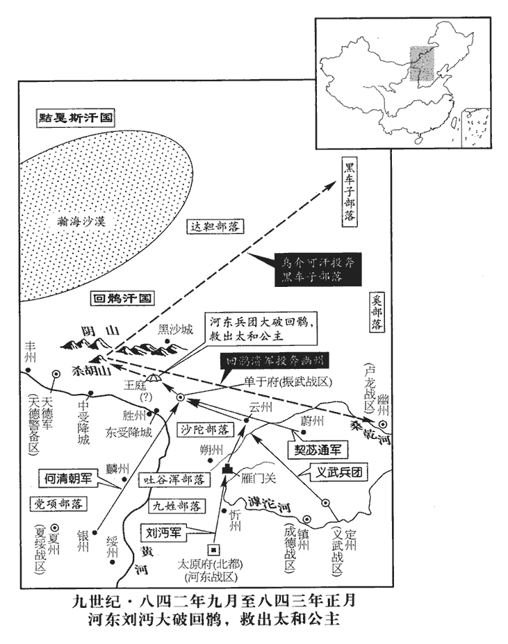
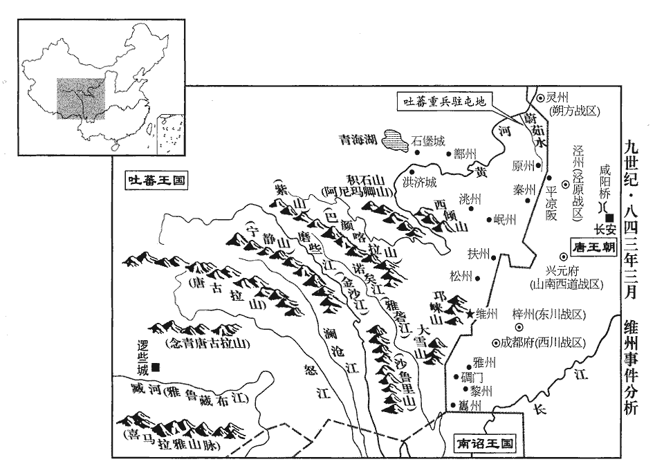
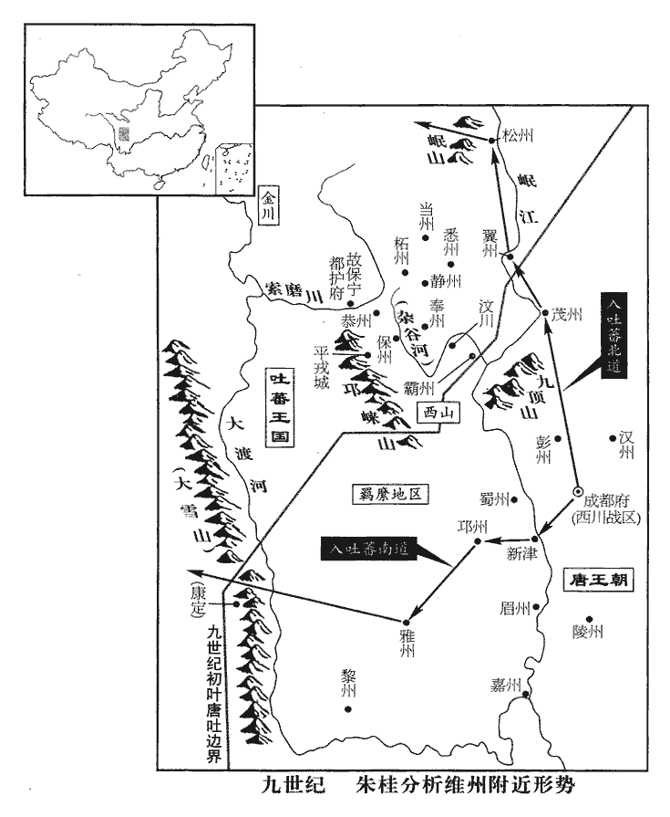
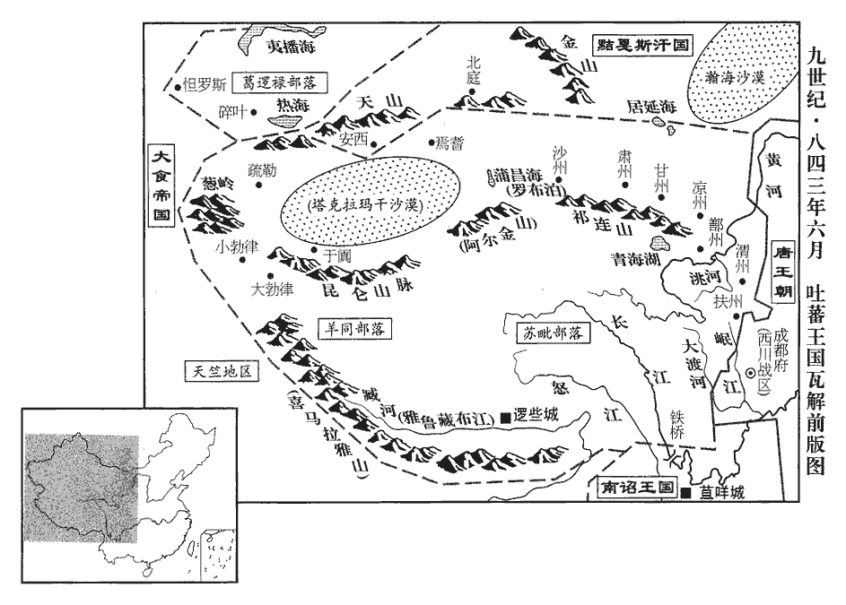
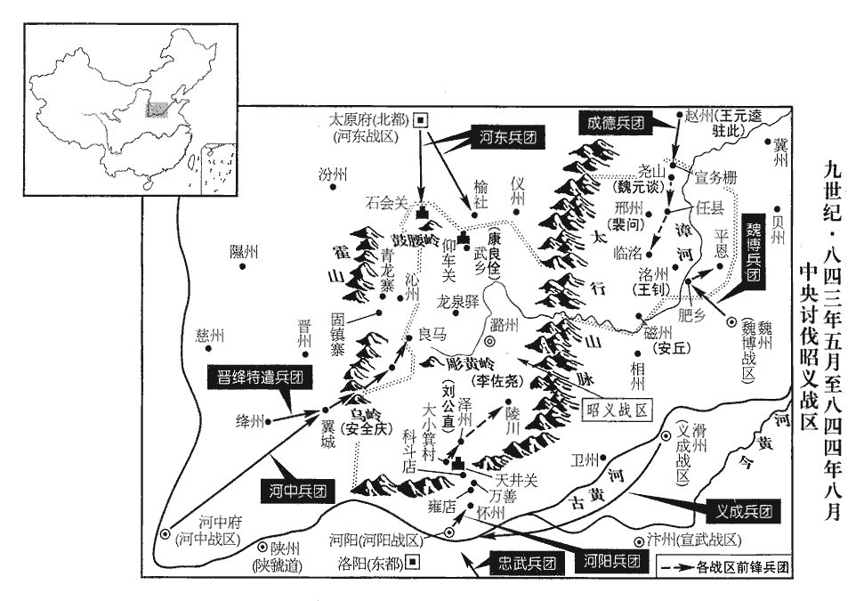
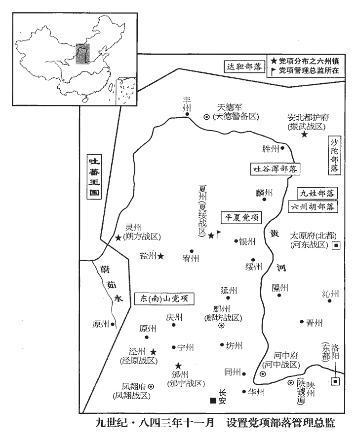
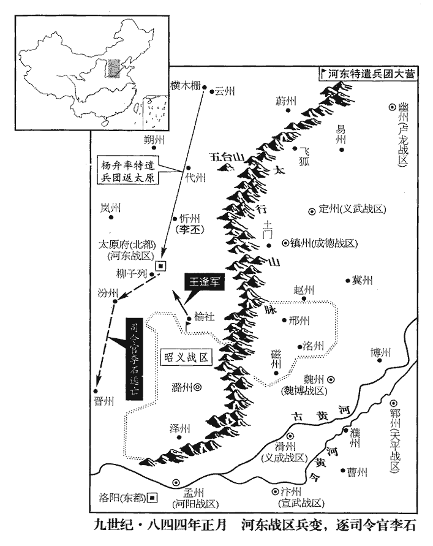
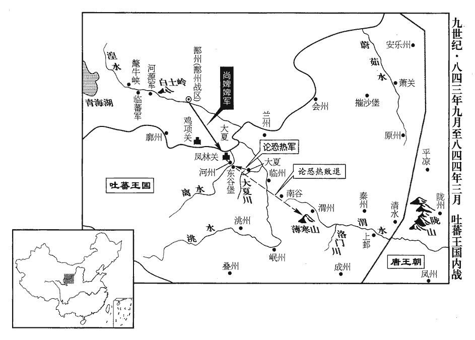

 唐紀六十三起昭陽大淵獻（癸亥），盡閼逢困敦（甲子）七月，凡一年有奇。

# 武宗至道昭肅孝皇帝中

## 會昌三年（癸亥、八四三）

1春，正月，回鶻烏介可汗帥眾侵逼振武‹总部设安北府内蒙古和林格尔县›，劉沔‹河东战区，总部设太原府山西省太原市›遣麟州‹陕西省神木县›刺史石雄、都知兵馬使王逢帥沙陀‹山西省北部›朱邪赤心三部及契苾、拓跋三千騎襲其牙帳，拓跋，即党項部落也。帥，讀曰率，契，欺訖翻。考異曰：舊回鶻傳云豐州刺史石雄。後唐獻祖紀年錄云石州刺史石雄。按是時田牟為豐州刺史。今從實錄。沔自以大軍繼之。雄至振武‹安北府·内蒙古和林格尔县›，登城望回鶻之眾寡，見氈車數十乘，氈車，以氈為車屋。乘，繩證翻。從者皆衣朱碧，類華人；從，才用翻；下侍從同。衣，於既翻。華人，謂中國人也。使諜問之，曰：「公主帳也。」雄使諜告之曰：諜，達協翻，間也。「公主至此，家也，當求歸路！今將出兵擊可汗，請公主潛與侍從相保，駐車勿動！」雄乃鑿城為十餘穴，引兵夜出，直攻可汗牙帳，至其帳下，虜乃覺之。可汗大驚，不知所為，棄輜重走，重，直用翻。雄追擊之；庚子‹十一›，大破回鶻於殺胡山‹内蒙古包头市北大青山›，殺胡山即黑山。可汗被瘡，與數百騎遁去，雄迎太和公主以歸。考異曰：舊石雄傳曰：「三年，回鶻大略雲、朔，劉沔以太原之師屯於雲州。沔謂雄曰：『國家以公主之故，不欲急攻；我輩捍邊，但能除患，專之可也。』雄受教，自選勁騎，得沙陀部落，兼契苾、拓跋雜虜，夜發馬邑，徑趨烏介之牙。時虜帳逼振武，雄既入城，登堞視其眾寡，見氈車數十云云。遂迎公主還太原。」回鶻傳：「烏介去幽州八十里下營。是夜，河東劉沔帥兵奄至。烏介驚走，東北依和解室韋下營，不及將太和公主同走。石雄兵遇公主帳，因迎歸國。」後唐獻祖紀年錄曰：「沔表帝為前鋒。回鶻可汗樹牙於殺胡山，帝與石雄銜枚夜進，圍其牙帳，烏介可汗輕騎而遁。帝於牙帳謁見太和公主，奉而歸國。」按一品集，會昌二年十月十七日狀：「訪聞劉沔頗練邊事，唯臨機決策，不免遲疑。深恐過為慎重，漸失事機。望賜劉沔詔：『比緣回鶻未為侵擾，且務綏懷。今既殺戮邊人，驅劫牛馬，頻已有詔速令驅除。自度便宜，臨機應變，不得過懷疑慮，皆待朝廷指揮。既假以使名，令為諸軍節制，邊境之事皆以責成。向後或要移營進軍，一切自取機便，不必皆候進止！』實錄：戊寅，詔劉沔云云如前。據德裕此狀，則沔豈敢不俟詔旨，擅遣石雄襲擊可汗牙帳，況已有不須聞奏之詔也。舊德裕傳：「德裕曰：『杷頭烽北便是沙磧，彼中野戰須用騎兵，若以步卒敵之，理難必勝。今烏介所恃者公主，如令勇將出騎，奪得公主，虜自敗矣。』上然之，即令德裕草制處分。」伐叛記曰：「上問討襲之計，德裕奏：『若以步兵與回鶻野戰，必無勝理。回鶻常質公主同行，臣思得一計。料回鶻必未知有斫營，石雄驍勇無敵，若令揀蕃、渾及漢兵銳卒，銜枚夜進，必取得公主，兼可汗可擒。』上從之。遂令石雄領蕃、渾及漢兵夜進，回鶻果無遊弈伏道，直至帳幕方覺。遂取得公主，惟可汗輕騎而遁。」按德裕尋自請駐斫營事，而石雄於城上見公主牙帳迎得之，非因德裕之策。今不取。斬首萬級，降其部落二萬餘人。丙午‹十七›，劉沔捷奏至。

〖译文〗 [1]春季，正月，回鹘乌介可汗率兵逼近振武，河东节度使刘沔派遣麟州刺史石雄、都知兵马使王逢率领沙陀朱邪赤心三部，以及契、党项族三千骑兵袭击可汗的牙帐，刘沔亲率大军随后赶来。石雄到达振武后，登到城上察看回鹘有多少兵马，发现回鹘的队伍中有十来辆毡车，跟随毡车的人都穿着红色和青绿色的衣服，类似汉人。于是，派侦探前去询问，随从毡车的人回答说：“这是太和公主的帐幕。”石雄又派侦探去告诉公主说：“公主到这里，也就算是到家啦，应当寻找安全返回的办法。现在，官军即将出兵袭击可汗，请公主秘密地和侍从相互保护，毡车驻守原地，不要惊慌乱动！”石雄随即下令从城里向城外挖凿十多个地道，半夜率兵从地道冲出，直攻可汗的牙帐。石雄的兵马抵达可汗牙帐外面的时候，回鹘兵才发觉，可汗大惊失色，不知所措，丢弃辎重逃走。石雄率兵追击，庚子（十一日），在杀胡山大败回鹘兵，可汗被枪刺伤，和几百名骑兵慌忙逃走。于是，石雄迎接太和公主返回。这一仗，石雄斩首回鹘一万人，收降回鹘部落二万多人。丙午（十七日），刘沔上奏朝廷的捷报到达京城。

 

李思忠‹嗢没斯›入朝，自以回鶻降將，懼邊將猜忌，降，戶江翻。將，即亮翻。乞并弟思貞等及愛弘順皆歸闕庭。【章十二行本「庭」下有「上從之」三字；乙十一行本同；孔本同；張校同；退齋校同。】

〖译文〗 归义军使李思忠来京城朝拜，李思忠鉴于自己是回鹘的降将，惧怕朝廷边防将领的猜忌，于是，乞请自己和弟弟李思贞等人，以及副使爱弘顺都留居京城。

庚戌‹二十一›，以石雄為豐州‹内蒙古五原县›都防禦使。賞破回鶻之功也。

〖译文〗 庚戌（二十一日），唐武宗任命石雄为丰州都防御使。

烏介可汗走保黑車子族‹内蒙古呼伦湖南›，胡嶠曰：轄戛之北單于突厥，又北黑車子，善作車帳，其人知孝義，地貧無所產。詳考新舊書，黑車子即室韋之一種。按是時賜黠戛斯詔云，黑車子去漢界一千餘里。考異曰：舊回鶻傳云：「烏介驚走東北約四百里外，依和解室韋下營，嫁妹與室韋，依附之。」今從伐叛記、實錄、新傳。舊張仲武傳又云：「烏介既敗，乃依康居求活，盡徙餘種寄託黑車子。」蓋以李德裕紀聖功碑云：「烏介并丁令以圖安，依康居而求活，盡徙餘種，屈意黑車。」彼所謂康居，用郅支故事耳；致此誤也。其潰兵多詣幽州‹北京市›降。

〖译文〗 乌介可汗往东北方向逃去，依附黑车子族，回鹘溃散的士兵大多到幽州投降。

2二月，庚申朔‹一›，日有食之。

〖译文〗 [2]二月，庚申朔（初一），出现日食。

3詔停歸義軍，置歸義軍見上卷上年。以其士卒分隸諸道為騎兵，優給糧賜。

〖译文〗 [3]唐武宗下诏，停罢归义军，归义军的回鹘士卒分别隶属各道为骑兵，从优供给衣粮。

4辛未‹十二›，黠戛斯‹瀚海沙漠群›遣使者注吾合索獻名馬二；新書曰：注吾，虜姓也。合言猛，素者左也，謂武猛善左射者。「索」作「素」。宋白曰：索，上聲。詔太僕卿趙蕃飲勞之。飲，於禁翻。勞，力到翻。甲戌‹十五›，上‹李瀍，本年三十岁›引對，班在勃海‹首都龙泉府黑龙江省宁安市西南东京城›使之上。

〖译文〗 [4]辛未（十一日），黠戛斯派遣使者注吾合索来长安，向唐武宗奉献两匹名马。武宗命太仆卿赵蕃设宴招待注吾合索。甲戌（十五日），武宗召见各族使者，命注吾合索列班于勃海国使者的前面。

上欲令趙蕃就黠戛斯求安西‹新疆库车县›、北庭‹新疆吉木萨尔县›，李德裕等上言：「安西去京師七千餘里，北庭五千餘里，借使得之，當復置都護，復，扶又翻。以唐兵萬人戍之。不知此兵於何處追發，饋運從何道得通，此乃用實費以易虛名，非計也。」考異曰：德裕傳曰：「三年二月，趙蕃奏黠戛斯攻安西、北庭都護府，宜出師影援。」德裕奏辭與此同。獻替記曰：「三年，二月十一日，延英，德裕奏：『九日奉宣，令臣等向趙蕃說，於黠戛斯處邀求安西、北庭。深恐不可，』其下辭亦與此同。按實錄：「辛未，注吾合索始至，命趙蕃飲勞之。丙子，中書門下奏九日奉宣，」其辭亦與獻替記同。不知宋據何書得此辛未及丙子日也。今且沒其日，繫於注吾合索入對之下以傳疑。上乃止。

〖译文〗 唐武宗打算命赵蕃出使黠戛斯，要求把安西、北庭归还唐朝。宰相李德裕等人上言说：“安西离京城长安七千多里，北庭五千多里，假如黠戛斯归还，朝廷就必须重新设置都护府，征发一万名唐兵防守。不知道这么多的兵力从哪里征发，军需物资从哪条路打通运输。这实在是耗费大量的钱财去换取一个收复失地的好名声，恐怕不妥。”武宗于是作罢。

5中書侍郎、同平章事崔珙罷為右僕射。

〖译文〗 [5]中书侍郎、同平章事崔珙被罢免宰相职务，担任右仆射。

6黠戛斯求冊命，李德裕奏，宜與之結歡，令自將兵求殺使者罪人黠戛斯遣使者送太和公主，為回鶻所殺，事見上卷上年。及討黑車子。上恐加可汗之名即不脩臣禮，踵回鶻故事求歲遺及賣馬，遺，唯季翻；下同。猶豫未決。德裕奏：「黠戛斯已自稱可汗，今欲藉其力，恐不可吝此名。回鶻有平安、史之功，故歲賜絹二萬匹，且與之和市。黠戛斯未嘗有功於中國，豈敢遽求賂遺乎！若慮其不臣，當與之約，必如回鶻稱臣，乃行冊命；又當敘同姓以親之，使執子孫之禮。」‹黠戛斯自称是李陵的后裔›上從之。

〖译文〗 [6]黠戛斯请求唐武宗下诏正式册封自己为可汗。宰相李德裕上奏认为，应当册封黠戛斯为可汗，这样，可以下令让他率兵搜捕当年杀黠戛斯送太和公主返唐使者的回鹘罪犯，以及出兵征讨黑车子族。武宗恐怕册封黠戛斯可汗以后，黠戛斯不再对朝廷称臣纳贡，反而沿袭回鹘以往的惯例，要求朝廷每年赐给他们丝绢以及卖马交易，因而犹豫不决。李德裕上奏说：“黠戛斯已经自称可汗，现在，朝廷要想借助他的兵力消灭回鹘残余，恐怕不应当吝惜一个可汗的名号。回鹘当年帮助国家平定安史之乱，立有大功，所以才每年赐予丝绢二万匹，同时许可在边境进行交易。黠戛斯未曾对国家有功，怎敢随便要求朝廷赐给丝绢贿赂他们呢！如果担忧黠戛斯不再称臣纳贡，可以和他首先约定，必须象回鹘可汗当年向朝廷称臣以后，才能进行册封。同时，黠戛斯自称是汉朝李陵的后裔，和皇上同姓李，所以，还应当和他叙说同姓的关系，以便更加亲近，今后，按照同姓子孙的礼节对待皇上。”武宗批准。

7庚寅‹三月一日›，太和公主至京師，改封安定大長公主；太和公主以長慶元年嫁回鶻，至此得還。「安定」，新書作「定安」。長，知丈翻。詔宰相帥百官迎謁於章敬寺前。帥，讀曰率。公主詣光順門，去盛服，脫簪珥，謝回鶻負恩、和蕃無狀之罪。唐公主入蕃者謂之「和蕃公主」，今太和公主以回鶻犯邊，故自謝和蕃無狀。去，羌呂翻。上遣中使慰諭，然後入宮。陽安等六七公主不來慰問安定公主，各罰俸物及封絹。陽安公主，順宗‹李诵›之女。宋白曰：不至者，陽安、宣城‹李纯女›、真寧、義寧、臨真、真源、義昌‹李恒女›六七公主。

〖译文〗 [7]庚寅（疑误），太和公主抵达京城，唐武宗改封公主为安定大长公主，下诏命宰相率领百官在章敬寺的前面迎接拜见公主。公主到光顺门时，脱去华丽的服装，卸掉头上的首饰，对于回鹘辜负国家的恩德以及自己和亲未达到预期目的表示谢罪。武宗派宦官慰问公主，然后公主回到宫中。阳安等七位公主没有出宫来慰问安定大长公主，被罚俸禄以及朝廷每年供给他们的丝绢。

8賜魏博‹总部设魏州河北省大名县›節度使何重順名弘敬。

〖译文〗 [8]唐武宗赐魏博节度使何重顺名叫何弘敬。

9三月，以太僕卿趙蕃為安撫黠戛斯使。上命李德裕草賜黠戛斯可汗書，諭以「貞觀二十一年黠戛斯先君身自入朝，「二十一年」，當作「二十二年」。授左屯衛將軍、堅昆‹总部设萨彦岭北阿巴坎城›都督，迄于天寶，朝貢不絕。比為回鶻所隔，比，毗至翻。回鶻淩虐諸蕃，可汗能復讎雪怨，茂功壯節，近古無儔。今回鶻殘兵不滿千人，散投山谷，可汗既與為怨，須盡殲夷；殲，子廉翻，滅也。儻留餘燼，必生後患。又聞可汗受氏之源，與我同族，孔穎達曰：天子賜姓、賜氏；諸侯但得賜氏，不得賜姓，降於天子也。故隱八年左傳云：無駭卒，公問族於眾仲。眾仲對曰：「天子建德，因生以賜姓，胙之土而命之氏。諸侯以字為諡，因以為族。官有世功，則有官族；邑亦如之。」以此言之，天子因諸侯先祖所生賜之曰姓。杜預註云：若舜生媯guī汭ruì，賜姓曰媯；封舜之後於陳，以所封之土命為氏。舜後姓媯而氏曰陳。故鄭駮異義云：炎帝姓姜，太皞之所賜也。黃帝姓姬，炎帝之所賜也。故堯賜伯夷姓曰姜，賜禹姓曰姒，賜契姓曰子，賜稷姓曰姬，著在書傳。如鄭此言，是天子賜姓也。諸侯賜卿大夫以氏。若同姓，公之子曰公子，公子之子曰公孫，公孫之子其親已遠，不得上達於公，故以王父字為氏。若適夫人之子，則以五十字伯、仲為氏，若魯之仲孫、季孫是也。若庶子、妾子，則以二十字為氏，若臧氏、展氏是也。若異姓，則以父、祖官及所食之邑為氏；以官為氏者，則司馬、司城是也；以邑為氏者，若韓、趙、魏是也。凡賜氏族者，此為卿乃賜，有大功者生賜以族，若叔孫得臣是也。雖公子之身，有大功德，則以公子之字賜以為族，若襄仲遂是也。其無功德，死後乃賜族，若無駭是也。若子孫若為卿，其君不賜族，自以王父字為族也。氏、族，對之為別，散則通也。故左傳問族於眾仲下云，「公命以字為展氏」是也。其姓與氏散亦得通，故春秋有姜氏、子氏，姜、子皆姓而云氏是也。國家承北平太守之後，可汗乃都尉苗裔。北平太守，謂李廣。都尉，謂李陵。以此合族，尊卑可知。今欲冊命可汗，特加美號，緣未知可汗之意，且遣諭懷。待趙蕃回日，別命使展禮。」自回鶻至塞上及黠戛斯入貢，每有詔敕，上多命德裕草之。德裕請委翰林學士，上曰：「學士不能盡人意，須卿自為之。」

〖译文〗 [9]三月，任命太仆卿赵蕃为安抚黠戛斯使；命宰相李德裕起草《赐黠戛斯可汗书》，说：“贞观二十一年，黠戛斯的祖辈酋长来长安拜见太宗，被任命为左屯卫将军、坚昆都督。此后一直到天宝年间，向朝廷贡献不绝，但近年来被回鹘阻挠隔断。回鹘凌辱虐待周围的各藩国，可汗能够举兵而报仇雪恨，劳苦功高，近代以来无人可比。现在，回鹘的残兵不到一千人，散居在山谷中，可汗既然和回鹘有深仇大恨，那么，就应当继续出兵，把回鹘全部歼灭。如果留下残余，将来必有后患。听说可汗姓氏的渊源，和我大唐同族。大唐是汉朝北平太守李广的后代，可汗是汉朝都尉李陵的后裔。按照这种情况，我们合为同族一姓，尊卑上下的名份也就很清楚了。现在，朝廷打算册封你为可汗，特意授予你美好的名号，但由于还不知道可汗的意向，所以，先派使者传达朝廷的意图，等赵蕃返回后，再另外派遣使者正式册封。”自从回鹘亡国后逃到边境，以及黠戛斯来长安上贡，武宗每次发布诏书敕令，大多命李德裕起草。李德裕请求委托翰林学士起草，武宗说：“翰林学士的手笔不能尽如人意，我要你亲自动手起草。”

10劉沔‹河东战区，总部设太原府山西省太原市›奏：「歸義軍回鶻三千餘人及酋長四十三人準詔分隸諸道，皆大呼，連營據滹沱河，酋，慈由翻。長，知丈翻。呼，火故翻。章懷太子後漢書註曰：山海經註云：大戲之山，滹沱之水出焉，在今代州繁畤縣東，流入定州深澤縣界。九域志忻、代二州註皆有滹沱水。不肯從命，已盡誅之。回鶻降幽州者前後三萬餘人，皆散隸諸道。」

〖译文〗 [10]河东节度使刘沔奏报：“归义军回鹘三千人，以及酋长四十三人按照陛下诏令分别隶属各道。回鹘人得知后，都大声喧哗，聚集并占据滹沱河，不肯听从诏令，已经被我全部诛杀。回鹘乌介可汗被官军打败逃亡后，溃散的兵马相继有三万人投降幽州，都被分散隶属各道。”

 

11李德裕追論維州‹四川省理县›悉怛謀事事見二百四十四卷文宗太和五年。云：「維州據高山絕頂，三面臨江，在戎虜平川之衝，是漢地入兵之路；初，河‹河西，甘肃省›、隴‹陇右，青海省东部›並沒，唯此獨存。吐蕃潛以婦人嫁此州門者，二十年後，兩男長成，長，知兩翻。竊開壘門，引兵夜入，遂為所陷，號曰無憂城。從此得併力於西邊，更無虞於南路。并力於西邊，謂吐蕃并力以攻岐、隴、邠、涇、靈、夏也。無虞於南路，謂西川在吐蕃之南也。自長安言之，西川亦在劍關之南。若吐蕃寇蜀，則南路自維、茂入，北路自巂州入。憑陵近甸，旰食累朝。朝，直遙翻。旰，古案翻。貞元中，韋皋‹西川战区，总部设成都府四川省成都市›欲經略河、湟‹甘肃省及青海省东部›，須此城為始。萬旅盡銳，急攻數年，雖擒論莽熱而還，還，從宣翻，又如字。城堅卒不可克。見二百三十六卷德宗貞元十七、十八年。卒，子恤翻。

〖译文〗 [11]宰相李德裕追诉太和五年，吐蕃国维州守将悉怛谋降唐后又被送回而惨曹杀害的事件，说：“维州城位于高山险峻的地方，三面临江，是吐蕃和西川平原之间的交通要道，也是我们出兵攻打吐蕃的必经之地。当初，河西、陇右地区被吐蕃攻占后，只有维州还在我们手中。后来，吐蕃秘密地把一个妇女嫁给维州的守门人。过了二十年，守门人的两个儿子长大成人，于是，一天夜里，偷偷地打开城门，把吐蕃兵引进城中，维州因此被吐蕃攻占，称为无忧城。从此以后，吐蕃在南路无后顾之忧，集中兵力进攻我国的西部边境，连年侵犯京畿地区，以致几朝皇上都为此寝食不安。贞元年中，西川节度使韦皋准备出兵收复河、湟地区，但必须从维州首先下手，于是，调动一万多名精兵，昼夜攻打了好几年。最后，虽然擒获了吐蕃大将论莽热，班师告捷，但维州因城池坚固，始终未能攻克。

臣初到西蜀，外揚國威，中緝邊備。其維州熟臣信令，空壁來歸，臣始受其降，南蠻震懾，山西八國‹成都西方群山八九›个部落，皆願內屬。其吐蕃合水、棲雞‹二城均在四川省茂县西北›等城，翼州有合江守捉城，與棲雞城本皆唐地，沒於吐蕃。既失險阨，自須抽歸，可減八處鎮兵，坐收千餘里舊地。且維州未降前一年，吐蕃猶圍魯州，魯州，河曲六胡州之一也，在宥州西界。豈顧盟約！臣受降之初，指天為誓，面許奏聞，各加酬賞。當時不與臣者，望風疾臣，詔臣執送悉怛謀等令彼自戮，臣寧忍以三百餘人命棄信偷安！累表陳論，乞垂矜捨，答詔嚴切，竟令執還。體備三木，輿於竹畚běn，畚，布忖翻。及將就路，冤叫嗚嗚，將吏對臣，無不隕涕。其部送者更為蕃帥譏誚，云既已降彼，此言吐蕃謂中國為彼也。帥，所類翻。何用送來！復以此降人戮於漢境之上，復，扶又翻。恣行殘忍，用固攜離；謂戎蠻有攜離內向之心者，畏吐蕃屠戮之慘，不敢復懷反側，以威虐固制之。至乃擲其嬰孩，承以槍槊。絕忠款之路，快兇虐之情，從古已來，未有此事。雖時更一紀，更，工衡翻。十二年為一紀。太和五年悉怛謀死，至是年適十二年。而運屬千年，謂千載一遇之運也。屬，之欲翻。乞追獎忠魂，各加褒贈！」詔贈悉怛謀右衛將軍。

〖译文〗 “我最初到西川担任节度使时，对外宣扬国家的威严，对内则加强边防守备。吐蕃维州守将悉怛谋熟知我的政令和信誉后，举城前来归降。我刚开始接受悉怛谋的归降，南诏国就受到极大的震惊和威慑；邛崃山以西的八国，都表示愿意前来归附；吐蕃国的合水、栖鸡等城，在失去维州作为屏障后，自然会退兵。这样，不仅我国可减少八个地方的镇守兵力，而且不必出兵，即可收复一千多里的失地。况且吐蕃在维州归降的前一年，仍在围攻鲁州，这难道表明他们真有诚意遵守两国签订的长庆盟约！我在接受悉怛谋归降时，曾经指天发誓，当面保证要向朝廷上奏，对悉怛谋等人酬劳赏赐。当时，朝廷中执意和我作对的牛僧孺等人，百般对我进行攻击。于是，文宗皇帝下诏，命将悉怛谋等人逮捕送还，任凭吐蕃诛杀。我怎么能忍心背弃信义，不顾这三百人的生命，自己苟且偷安呢！因而，多次上表朝廷，请求可怜赦免他们，但朝廷诏书答复严厉，命令必须逮捕送还。结果，只好把悉怛谋等人捆绑起来，甚于不惜用竹筐抬着押送吐蕃。悉怛谋等人在即将上路时，齐声喊冤，西川的将士官吏也无不对我流泪哭泣。押送悉怛谋等人的西川将士还遭到吐蕃人的讥笑，说：‘他既然已经投降你们了，为什么又要送回来！’随即，把悉怛谋等人在我国境内全部杀害，手段极为残忍。就连婴儿也不放过，他们先把婴儿扔向空中，然后用枪尖在下面承接，目的是吓唬那些已经对吐蕃离心离德的各族部落。朝廷这种处置办法，实在是自我断绝今后再有人效忠归降朝廷的门路，而使吐蕃人心大快。从古至今，再没有比这件事更愚蠢的了！现在，这起事件已经过去十二年了，恰逢陛下即位这千载难遇的好机会，请求追念奖励悉怛谋等人的忠魂，对他们加以褒奖并追赠官爵！”于是，唐武宗下诏，追赠悉怛谋为右卫将军。

臣光曰：論者多疑維州之取捨，不能決牛、李之是非。臣以為昔荀吳圍鼓‹河北省晋州市›，鼓人或請以城叛，吳弗許，曰：「或以吾城叛，吾所甚惡也，人以城來，吾獨何好焉！惡，烏路翻。好，呼到翻；下同。吾不可以欲城而邇姦。」使鼓人殺叛者而繕守備。見春秋左氏傳。是時唐新與吐蕃脩好而納其維州，以利言之，則維州小而信大；以害言之，則維州緩而關中急。然則為唐計者，宜何先乎？悉怛謀在唐則為向化，在吐蕃不免為叛臣，其受誅也又何矜焉！且德裕所言者利也，僧孺所言者義也，匹夫徇利而忘義猶恥之，況天子乎！譬如鄰人有牛，逸而入於家，或勸其兄歸之，或勸其弟攘之。勸歸者曰：「攘之不義也，且致訟。」勸攘者曰：「彼嘗攘吾羊矣，何義之拘！牛，大畜也，畜，許救翻。鬻之可以富家。」以是觀之，牛、李之是非，端可見矣。元祐之初，棄米脂‹陕西省米脂县›等四寨以與西夏‹首都兴庆府宁夏银川市›，蓋當時國論大指如此。

〖译文〗 臣司马光曰：以往凡谈论维州事件的人，都对维州究竟应当夺取还是丢弃而感到疑惑，不能判断牛僧孺和李德裕之间的是非曲直。我认为，过去春秋的时候，荀吴有一次围攻鼓城，城中有人请求举城投降，荀吴不许，他说：“如果我国有人举城叛变，我肯定痛恨他们；但别国的人举城叛变而投降我，我怎么能反而喜欢他们呢！我不能因为想夺取鼓城就容纳他们的奸谋。”于是，纵使鼓人杀掉叛变的人，并让他们加强防守。当时，唐朝和吐蕃签订长庆盟约不久，就接纳吐蕃维州守将的归降。从国家的利益来说，夺取维州的事小，而遵守盟约的信义为大；从吐蕃对国家危害的程度来说，也是维州稍缓而关中最为紧迫。那么，从唐朝来说，究竟利益和信义、维州和关中，哪方面更重要呢？悉怛谋降唐，从唐朝方面说，他这样做是向化；但从吐蕃方面说，则不免为叛臣。因此，他被诛杀，又有什么理由值得同情呢！同时，李德裕所考虑的是国家的利益，而牛僧孺所考虑的则是国家的信义。即使老百姓对见利忘义的行为都以为耻，何况一个国家的天子！打个譬喻来说，如果邻居家的牛丢了，跑到自己家里，有人劝这家人的哥哥把牛还给邻居，有人劝他的弟弟把牛留下。劝还的人说：“留下来不仁义，而且可能被人告发。”劝留的人说：“邻居过去曾偷过我的羊，对他还拘泥什么仁义！牛是大牲畜，卖了可以使家里富裕。”对于牛僧孺和李德裕争论维州事件的是非曲直，由此最终可以作出明确的判断了。

 

12夏，四月，辛未‹十三›，李德裕乞退就閒局，上曰：「卿每辭位，使我旬日不得所。不得所，猶言不安其所也。今大事皆未就，卿豈得求去！」

〖译文〗 [12]夏季，四月，辛未（十三日），宰相李德裕乞请辞职，退居闲散的职位。唐武宗说：“你每次提出辞职，都让我十来天心神不宁，现在，朝廷的大政方针还都没有安排就序，你怎么能辞职呢！”

13初，昭義‹总部设潞州山西省长治市›節度使劉從諫累表言仇士良罪惡，見二百四十五卷文宗太和八年。士良亦言從諫窺伺朝廷。伺，相吏翻。及上即位，從諫有馬高九尺，獻之，上不受。周禮：馬八尺以上為龍，七尺以上為騋lái，六尺以上為馬。馬高九尺，蓋稀有也。高，古報翻。從諫以為士良所為，怒殺其馬，由是與朝廷相猜恨。遂招納亡命，繕完兵械，鄰境皆潛為之備。

〖译文〗 [13]当初，昭义节度使刘从谏多次上表指斥左神策军护军中尉仇士良的罪行，仇士良也向朝廷上言，说刘从谏窥伺朝廷的动向。唐武宗即位以后，刘从谏把自己一匹高达九尺的良马献给武宗，武宗拒绝没有接受。刘从谏认为是仇士良从中作梗，大怒，杀掉了这匹良马。从此以后，和朝廷之间相互猜忌怨恨。于是，招收亡命之徒，修造完善各种兵器军械。与昭义邻接的藩镇都秘密地防备他。

從諫榷馬牧及商旅，歲入錢五萬緡，榷，古岳翻。又賣鐵、煮鹽亦數萬緡。大商皆假以牙職，牙職，牙前將校之職。使通好諸道，因為販易。商人倚從諫勢，所至多陵轢將吏，諸道皆惡之。好，呼到翻。轢，郎狄翻。惡，烏路翻。

〖译文〗 刘从谏对昭义境内的马场和商业实行专卖，每年收入钱五万缗。同时，又由官府主持卖铁和盐，每年收入也有几万缗。对于大商人，刘从谏授予他们节度使衙前的军职，然后，派他们出使各个藩镇，发展双方的友好关系，同时贩运买卖商品。商人都依赖刘从谏的权势，每到一个地方，往往凌辱将士官吏，各个藩镇无不厌恶他们。

從諫疾病，謂妻裴氏曰：「吾以忠直事朝廷，而朝廷不明我志，諸道皆不我與。我死，他人主此軍，則吾家無炊火矣！」乃與幕客張谷、陳揚庭謀效河北諸鎮，以弟右驍衛將軍從素之子稹為牙內都知兵馬使，從子匡周為中軍兵馬使，稹，止忍翻。考異曰：實錄作「莊周」。今從一品集。孔目官王協為押牙親事【嚴：「事」改「軍」。】兵馬使，以奴李士貴為使宅十將兵馬使，劉守義、劉守忠、董可武、崔玄度分將牙兵。谷，鄆州‹山东省东平县›人；鄆，音運。揚庭，洪州‹江西省南昌市›人也。

〖译文〗 后来，刘从谏身患疾病，对他的妻子裴氏说：“我对朝廷忠心直言，但朝廷却不明了我的心意，各个藩镇也都不了解我。我死了以后，如果朝廷另外派人来担任昭义节度使，我们家的香火从此也就断绝了！”于是，他和幕僚张谷、陈扬庭密谋效法河北藩镇，实行割据，任命他的弟弟右骁卫将军刘从素的儿子刘稹为牙内都知兵马使，侄子刘匡周为中军兵马使，孔目官王协为押牙亲事兵马使，家奴李士贵为使宅十将兵马使。命令刘守义、刘守忠、董可武、崔玄度分别统辖亲兵。张谷是郓州人；陈扬庭是洪州人。

從諫尋薨‹本年四十一岁›，稹秘不發喪。王協為稹謀曰：為，于偽翻。「正當如寶曆年樣為之，敬宗寶曆元年，劉悟死，從諫得襲，事見二百四十三卷。不出百日，旌節自至。但嚴奉監軍，厚遺敕使，遺，唯季翻。四境勿出兵，城中暗為備而已。」使押牙姜崟yín奏求國醫，上遣中使解朝政以醫問疾。崟，魚音翻。解，戶買翻，姓也。稹又逼監軍崔士康奏稱從諫疾病，請命其子稹為留後。上遣供奉官薛士幹往諭指云：「恐從諫疾未平，宜且就東都療之；俟稍瘳，別有任使。仍遣稹入朝，必厚加官爵。」供奉官，亦宦者也。

〖译文〗 不久，刘从谏去世，刘稹封锁消息，不为刘从谏治丧。王协为刘稹谋划说：“现在，只要你按照宝历元年刘悟去世后，刘从谏得以世袭而为节度使那样行事，尊奉监军，对朝廷的使者厚加贿赂，四邻边境切勿出兵侵扰，城中秘密地进行防备。这样，不出一百天，朝廷任命你为节度使的旌节自然就会送来。”于是，刘稹命押牙姜向朝廷上奏，请求派宫廷中著名的医生为刘从谏治病。武宗派遣宦官解朝政携朝廷医官前往昭义，为刘从谏诊断。刘稹又逼迫监军崔士康上奏，说刘从谏身患疾病，请求朝廷任命他的侄子刘稹为留后。武宗于是又派供奉官薛士干出使昭义，传达武宗的旨意说：“朝廷恐怕刘从谏的病一直不好，因此让他暂且到东都洛阳去治病，等到病情逐渐好转，再另外安排任命。并让刘从谏命刘稹到京城朝拜，朝廷必定授予优厚的官爵。”

上以澤潞事謀於宰相，宰相多以為：「回鶻餘燼未滅，邊境猶須警備，復討澤潞，復，扶又翻。國力不支，請以劉稹權知軍事。」諫官及群臣上言者亦然。李德裕獨曰：「澤潞事體與河朔三鎮‹卢龙总部幽州›、成德总部镇州、魏博总部魏州不同。河朔習亂已久，人心難化，是故累朝以來，置之度外。澤潞近處心腹，處，昌呂翻。一軍素稱忠義，嘗破走朱滔，擒盧從史。走朱滔見二百三十一卷德宗貞元元年。擒盧從史見二百三十八卷憲宗元和三年。頃時多用儒臣為帥，帥，所類翻。如李抱真成立此軍，見二百二十三卷代宗永泰元年。德宗猶不許承襲，使李緘護喪歸東都。見二百三十五卷貞元十年。敬宗不恤國務，宰相又無遠略，劉悟之死，因循以授從諫。從諫跋扈難制，累上表迫脅朝廷，事見文宗紀。今垂死之際，復以兵權擅付豎子。朝廷若又因而授之，則四方諸鎮誰不思效其所為，天子威令不復行矣！」復，扶又翻。上曰：「卿以何術制之？果可克否？」對曰：「稹所恃者河朔三鎮。但得鎮、魏不與之同，則稹無能為也。若遣重臣往諭王元逵、何弘敬，王元逵，鎮帥；何弘敬，魏帥也。以河朔自艱難以來，列聖許其傳襲，已成故事，與澤潞不同。今朝廷將加兵澤潞，不欲更出禁軍至山東‹太行山以东›。其山東三州隸昭義者，委兩鎮攻之；山東三州，謂邢‹河北省邢台市›、洺‹河北省永年县东南旧永年镇›、磁‹河北省磁县›也。兼令徧諭將士，以賊平之日厚加官賞。苟兩鎮聽命，不從旁沮橈官軍，沮，在呂翻。橈，奴教翻，又奴巧翻。則稹必成擒矣！」上喜曰：「吾與德裕同之，保無後悔。」遂決意討稹，考異曰：按舊紀、傳及實錄所載德裕之語，皆出於伐叛記。伐叛記繫於四月劉從諫始亡之時。至此，君相誅討之意已決，百官集議及宰臣再議，皆備禮耳。德裕之言當在事初，實錄置此，誤也。群臣言者不復入矣。復，扶又翻；下同。

〖译文〗 唐武宗召集宰相商议如何处置昭义的事宜，多数宰相认为：“回鹘的残余还未消灭，边境仍然需要加强防守。现在，又要征讨昭义，恐怕国家的财政难以支持。因此，请求任命刘稹暂为昭义留后。”谏官和凡是上言朝廷的百官也都持同样看法。只有宰相李德裕说：“昭义的情况和河朔地区的魏博、成德、幽州三个割据跋扈的藩镇不同。河朔地区割据跋扈已有很长时间，人心难以感化，所以，几朝皇上都承认现状，不再讨伐他们。昭义则邻近京城，处于国家的心腹地区。昭义的将士向来以忠义而闻名，曾经在贞元元年出兵击退幽州节度使朱滔的叛乱，元和三年擒拿本镇的叛将卢从史。过去，朝廷大多任用文官担任昭义节度使。如李抱真，最初组建昭义的军队，有很大的功劳，唐德宗仍不许他的儿子李缄世袭为该镇的节度使，命令他护送父亲的灵柩回归东都洛阳。后来，唐敬宗不理朝政，当时的宰相也缺乏远见卓识，因此，在节度使刘悟去世后，命他的儿子刘从谏世袭担任了节度使。刘从谏跋扈骄横，朝廷难以控制，他多次上表逼迫威胁朝廷。现在，在临死的时候，又擅自把兵权传给自己的侄子。如果朝廷又沿袭过去的惯例，任命刘稹为节度使，那么，全国各地的藩镇谁不想效法他们的做法。这样一来，皇上的威严和诏令也就难以在全国贯彻执行了！”武宗问：“你有什么办法能够制服刘稹？而且，果真能够奏效吗？”李德裕回答说：“刘稹所依赖的是河朔魏博、成德和幽州三个割据藩镇。如果能使成德和魏博不与他相互勾结，那么，刘稹就无所作为了。假如朝廷能够派遣一位德高望重的大臣前往成德和魏博，向两镇的节度使王元逵、何弘敬转达皇上的旨意，说明自从安史之乱以后，历代皇上许可他们传位子孙，世袭节度使，已经成为惯例，和昭义不同。现在，朝廷准备出兵讨伐昭义，但不打算派禁军攻打昭义在太行山以东的邢、、磁三州，而命成德和魏博两镇攻讨；同时也向这两个藩镇的将士转达皇上的旨意，在平定昭义的叛乱后，朝廷将给予将士优厚的官爵和赏赐。如果成德和魏博听从朝廷的命令，不从旁阻挠官军的行动，那么，刘稹肯定会被官军擒获！”武宗大喜，说：“我和德裕意见一致，以后保证不后悔。”于是，决心讨伐刘稹，百官再有人上言劝阻，武宗不再听取。

上命德裕草詔賜成德節度使王元逵、魏博節度使何弘敬，其略曰：「澤潞一鎮，與卿事體不同，勿為子孫之謀，欲存輔車之勢。古語云：輔車相依。車，尺遮翻。但能顯立功效，自然福及後昆。」丁丑‹十九›，上臨朝，稱其語要切，曰：「當如此直告之是也！」又賜張仲武詔，以「回鶻餘燼未滅，塞上多虞，專委卿禦侮。」以烏介可汗尚在黑車子也。元逵、弘敬得詔，悚息聽命。

〖译文〗 武宗命李德裕起草给成德节度使王元逵、魏博节度使何弘敬的诏令，大略说：“昭义和你们两镇的情况不同，你们不必为自己的子孙考虑，而和刘稹相互勾结，互相依存。只要在讨伐刘稹时卓立战功，朝廷自然承认你们两镇的现状，允许传位于子孙。”丁丑（十九日），武宗上朝时，称赞李德裕起草的诏令切中要害，说：“就应当这样直言不讳地告诉他们！”接着，又命德裕起草给幽州节度使张仲武的诏令，说：“回鹘的残余还没有消灭干净，北方边境不免遭受侵扰。现在，朝廷委任你专门防备。”王元逵、何弘敬二人接到朝廷诏令后，都恐惧惊慌，表示听从。

解朝政至上黨，考異曰：實錄云：「時從諫死二十日矣。」按姜崟yín等云，自四月六日後不見本使。而辛巳為從諫輟朝，自六日至辛巳，纔十八日耳。實錄自相違，今不取。劉稹見朝政曰：「相公危困，不任拜詔。」任，音壬。朝政欲突入，兵馬使劉武德、董可武躡簾而立，朝政恐有他變，遽走出。稹贈賮直數千緡，賮jìn，徐刃翻。復遣牙將梁叔文入謝。薛士幹入境，俱不問從諫之疾，直為已知其死之意。都押牙郭誼等乃大出軍，至龍泉驛‹山西省屯留县西北›迎候敕使，請用河朔事體；又見監軍言之，崔士康懦怯，不敢違。於是將吏扶稹出見士眾，發喪。士幹竟不得入牙門，稹亦不受敕命。誼，兗州‹山东省兖州市›人也。解朝政復命，上怒，杖之，配恭陵‹李治的儿子李弘墓，在河南省偃师市南›；囚姜崟、梁叔文。

〖译文〗 朝廷派宦官解朝政出使昭义，抵达昭义的治所上党后，刘稹会见解朝政，说：“相公刘从谏病重，无法出来接诏。”解朝政想乘其不备，突然冲进去，看看刘从谏到底病情如何，忽然发现昭义兵马使刘武德、董可武踩着门帘站在门口。解朝政恐怕有什么变故，急忙走出。随后，刘稹赠送解朝政钱几千缗，又派牙将梁叔文向朝廷拜谢。供奉官薛士干抵达昭义境内后，从不询问刘从谏的病情如何，好象他已经知道刘从谏死去的样子。昭义都押牙郭谊得知后，出动大批人马，前往龙泉驿迎接薛士干，请他向朝廷上奏，按照河朔藩镇的惯例，任命刘稹为昭义的留后。郭谊又去见昭义的监军崔士康，向他表明同样的意图。崔士康性情怯懦，不敢违抗。于是，昭义节度使府的部将和官吏扶刘稹出来，与将士见面，公开为刘从谏治丧。薛士干最后竟然未能进入昭义节度使的衙门，刘稹也不接受朝廷命他赴京城另有任命的敕令。郭谊是兖州人。解朝政回到京城后，向武宗报告出使昭义的经过。武宗大怒，下令用刑仗责打，然后，发配守护恭陵；同时下令拘捕昭义的使者姜、梁叔文。

辛巳‹二十三›，始為從諫輟朝，為，于偽翻。贈太傅，詔劉稹護喪歸東都。又召見劉從素，令以書諭稹，令父以書諭其子也。從素時在朝為右驍衛將軍。見，賢遍翻。稹不從。丁亥‹二十九›，以忠武‹总部设许州河南省许昌市›節度使王茂元為河陽‹总部设河阳县河南省孟州市›節度使，邠寧‹总部设邠州陕西省彬县›節度使王宰為忠武節度使。茂元，栖曜之子；宰，智興之子也。王栖曜見二百三十卷德宗興元元年。王智興始見二百二十七卷建中二年。

〖译文〗 辛巳（二十三日），唐武宗下令停止上朝，为刘从谏去世哀悼，追封刘从谏为太子太傅，同时下诏，命刘稹护送刘从谏的灵柩回东都洛阳。武宗又召见刘从素，命他写信给儿子刘稹，劝他执行朝廷的诏令。刘稹拒不服从。丁亥（二十九日），武宗任命忠武节度使王茂元为河阳节度使，宁节度使王宰为忠武节度使。王茂元是王栖曜的儿子；王宰是王智兴的儿子。

黃州‹湖北省新洲县›刺史杜牧上李德裕書，自言：「嘗問淮西將董重質以三州‹蔡州、光州、申州›之眾四歲不破之由，重質以為由朝廷徵兵太雜，客軍數少，既不能自成一軍，事須帖付地主。勢羸力弱，心志不一，多致敗亡。故初戰二年，戰則必勝，是多殺客軍。及二年已後，客軍殫少，止與陳許、河陽全軍相搏，陳許，謂李光顏之兵；河陽，謂烏重胤之兵。縱使唐州兵不能因虛取城，唐州謂李愬之兵。蔡州事力亦不支矣。其時朝廷若使鄂州‹鄂岳道首府·湖北省武汉市›、壽州‹安徽省寿县›、唐州‹唐随邓战区总部·河南省泌阳县›只保境，不用進戰，但用陳許、鄭滑‹总部设滑州河南省滑县›兩道全軍，帖以宣‹宣歙道首府·安徽省宣州市›、潤‹浙西道首府·江苏省镇江市›弩手，令其守隘，即不出一歲，無蔡州矣。今者上黨之叛，復與淮西不同。復，扶又翻。淮西為寇僅五十歲，其人味為寇之腴，見為寇之利，風俗益固，氣燄已成，自以為天下之兵莫與我敵，根深源闊，取之固難。夫上黨則不然。自安、史南下，不甚附隸；肅宗時蔡希德攻上黨不能克。建中之後，每奮忠義；是以郳公抱真能窘田悅，走朱滔，郳ní，五稽翻。李抱真封郳公。窘田悅見二百二十七卷德宗建中二年、三年。常以孤窮寒苦之軍，橫折河朔強梁之眾。折，之舌翻。以此證驗，人心忠赤，習尚專一，可以盡見。劉悟卒，從諫求繼，與扶同者，只鄆州‹山东省东平县›隨來中軍二千耳。扶同，猶今俗言扶合也。劉悟自鄆帥滑，自滑徙潞，鄆兵二千實從之，唐末所謂元從也。值寶曆多故，因以授之。今纔二十餘歲，按寶曆元年，以昭義節授劉從諫，至是年纔十九年。風俗未改，故老尚存，雖欲劫之，必不用命。今成德、魏博雖盡節效順，亦不過圍一城，攻一堡，係纍穉老而已。纍，倫追翻。穉，直二翻。若使河陽萬人為壘，窒天井之口，天井關‹山西省晋城市南›在澤州晉城縣南，亦名太行關，關南有天井泉三所，故名。杜牧此說，欲杜潞人之南窺懷、洛也。高壁深塹，勿與之戰。只以忠武、武寧兩軍，忠武，陳•許兵；武寧，徐州兵。帖以青州五千精甲，宣、潤二千弩手，徑擣上黨‹潞州州政府所在县·山西省长治市›，不過數月，必覆其巢穴矣！」時德裕制置澤潞，亦頗采牧言。

〖译文〗 黄州刺史杜牧向宰相李德裕上书，说：“我曾经询问淮西的大将董重质，为什么淮西只有三个州的兵力，当年官军四面围攻四年却不能攻克。董重质认为，主要是因为朝廷征发各个藩镇的兵力太杂，从远地调来的藩镇兵力人数较少，不能独挡一面，因而，必须依附于当地的藩镇军队。这样，官军各支兵马势单力弱，众心不齐，就经常招致失败。所以，在最初交战的两年中，淮西出战必胜，主要是杀伤从远地调来的藩镇军队。两年以后，从远地调来的藩镇军队人数减少，淮西只与陈许、河阳两个藩镇的军队作战，即使李不能率唐州兵乘虚攻取淮西的治所蔡州，淮西的兵力也难于继续和官军抗衡。当时，如果朝廷命令鄂州、寿州、唐州不用出兵，仅仅防守州境；只用陈许、郑滑两个藩镇的全部兵力攻打淮西，同时，命宣州、润州的弓箭手防守淮西周围的交通要塞，不出一年，淮西就可平定。现在，昭义叛变的情况和淮西很不相同。当年淮西割据跋扈将近五十年，那里的将士和官吏都亲身体会到割据的实际好处，亲眼看到割据给自己带来的很多利益，所以，桀傲不驯的风俗日益强化，骄横跋扈的嚣张气焰业已形成，自认为天下的兵马无人敢与我为敌，割据势力盘根错节，出兵攻讨确实困难。但是，昭义则不同，早在安史叛军大举南下时，昭义曾顽强坚守，不肯依附叛军；建中年以后，国家多难，昭义将士每每以忠义而激奋报效朝廷，所以，当时担任该镇节度使的李抱真，常常在孤立无援的情况下，率领这支处于贫寒之地的军队，多次挫败河朔叛乱藩镇的骄兵悍将。他不仅击退并进而围攻魏博节度使田悦的叛军，而且还打败幽州节度使朱滔的狂妄叛乱。由此充分证明，昭义的将士历来是忠于朝廷的，那里的风俗习惯也一直没有变化。后来，昭义节度使刘悟去世后，他的儿子刘从谏请求继承父亲的职务，真正同心同德支持他的，也不过是当初刘悟从郓州带去的二千亲兵。当时正值宝历年间朝廷多事之秋，所以，只好任命他为节度使。至今才二十多年，昭义的风俗未变，过去的将士和官吏也还有不少人在世，虽然刘稹企图胁迫他们一起叛乱，肯定他们不会轻易跟从。成德、魏博这两个河朔地区的藩镇，目前尽管已表示尽力效忠朝廷，但他们如果出兵攻打昭义，最多不过围一城，攻一堡。然后乘机俘掠那里的人口而已。假如朝廷命令河阳出动一万兵力在天井关修筑营垒，堵塞昭义向南的通道，高壁深沟，坚守而不出战；同时，只要征调忠武、武宁两个藩镇的军队，加上青州的五千精兵，宣州和润州的二千弓箭手，大军长驱直捣上党，不出几个月，必定倾复刘稹的巢穴！”这时，李德裕正在制定讨伐昭义的军事方案，对杜牧的建议，多所采纳。

14上雖外尊寵仇士良，內實忌惡之。惡，烏路翻。士良頗覺之，遂以老病求散秩。詔以左衛上將軍兼內侍監、知省事。知內侍省事。

〖译文〗 [14]唐武宗虽然在外表上尊重和宠遇左神策军护军中尉仇士良，心中其实非常忌恨厌恶他。仇士良也逐渐感觉到了，于是，以年老多病为由，请求辞职担任散官。武宗因此下诏，任命他为左卫上将军兼内侍监，主持内侍省的事宜。

15李德裕言於上曰：「議者皆云劉悟有功，劉悟以誅李師道為功。稹未可亟誅，宜全恩禮。請下百官議，下，戶稼翻。以盡人情。」上曰：「悟亦何功，當時迫於救死耳，非素心徇國也。藉使有功，父子為將相二十餘年，國家報之足矣，稹何得復自立！復，扶又翻。朕以為凡有功當顯賞，有罪亦不可苟免也。」德裕曰：「陛下之言，誠得理國之要。」

〖译文〗 [15]李德裕对武宗说：“现在，凡是议论昭义的官员都说，刘悟曾经立过战功，因此不可匆忙诛讨他的孙子刘稹，应当保全朝廷对他以往的恩典。我请求陛下将此事交百官讨论，以便让大家充分发表意见。”武宗说：“刘悟有什么功劳，当年他起兵诛杀李师道，只不过是迫于李师道要杀他，为了自救而已，并非一贯忠于朝廷。即使他有战功，父子二人担任将相职务二十多年，国家对他的报答也足够了。现在，刘稹凭什么又要世袭自立！朕认为凡是对国家有功的人，都应当重赏。但如果犯罪，也不可苟且赦免。”李德裕说：“陛下这番话，确实抓住了治理国家的关键。”

16五月，李德裕言太子賓客、分司李宗閔與劉從諫交通，不宜寘之東都。戊戌‹十›，以宗閔為湖州‹浙江省湖州市›刺史。史言李德裕脩怨。考異曰：獻替記曰：「四月十九日，上言：『東都李宗閔，我聞比與從諫交通。今澤潞事如何？可別與一官，不要令在東都。』德裕曰：『臣等續商量。』上又云：『不可與方鎮，只與一遠郡！』德裕又奏云：『須與一郡！』」此蓋德裕自以宿憾因劉稹事害宗閔，畏人譏議，故於獻替記載此語以隱其跡耳。今從實錄。

〖译文〗 [16]五月，李德裕对武宗说，太子宾客、分司东都李宗闵曾和刘从谏交结，不宜再让他继续留在东都，以免妨碍讨代昭义的军事行动。戊戌（初十），武宗任命李宗闵为湖州刺史。

17河陽節度使王茂元以步騎三千守萬善‹河南省沁阳市北›；九域志：懷州河內縣有萬善鎮。河東‹总部设太原府山西省太原市›節度使劉沔步騎二千守芒車關‹山西省武乡县东北›，芒車關即昂車關。魏收地形志：上黨郡沾縣有昂車岭。其地當在唐儀州東南界石會關之西。新唐志：潞州武鄉縣北有昂車關。步兵一千五百軍榆社‹山西省榆社县›；九域志：遼州遼山縣有榆社鎮，唐之榆社縣也。宋白曰：榆社縣，隋開皇十六年置，今潞州襄垣縣理是也。因今縣西北榆社故城為名。成德節度使王元逵以步騎三千守臨洺‹河北省永年县›，掠堯山‹河北省隆尧县›；堯山本柏人縣，天寶元年更名，屬邢州。宋白曰：以唐堯大麓之地名之。洺，音名。河中‹总部设河中府山西省永济市›節度使陳夷行以步騎一千守翼城‹山西省翼城县›，步兵五百益【嚴：「益」改「掠」。】冀氏‹山西省安泽县南›。冀氏，本漢猗氏縣地，後魏於古猗氏縣城南置冀氏郡及冀氏縣，隋廢郡存縣，唐屬晉州。九域志：在州東北二百八十里。辛丑‹十三›，制削奪劉從諫及子稹官爵，以元逵為澤潞北面招討使，何弘敬為南面招討使，與夷行、劉沔、茂元合力攻討。

〖译文〗 [17]河阳节度使王茂元命三千步兵和骑兵防守万善镇；河东节度使刘沔命二千步兵和骑兵防守芒车关，一千五百步兵驻屯于榆社县；成德节度使王元逵命三千步兵和骑兵防守临，进而掠夺昭义的尧山；河中节度使陈夷命一千步兵和骑兵屯守翼城，五百步兵增援冀氏县。辛丑（十三日），武宗下制令，削除刘从谏和他的侄子刘稹的官爵，任命王元逵为昭义北面招讨使，何弘敬为南面招讨使，与陈夷行、刘沔、王茂元共同出兵，讨伐刘稹。

先是，河朔諸鎮有自立者，先，悉薦翻。朝廷必先有弔祭使，次冊贈使，宣慰使繼往商度軍情。度，徒洛翻。必不可與節，則別除一官；俟軍中不聽出，然後始用兵。故常及半歲，軍中得繕完為備。至是，宰相亦欲且遣使開諭，上即命下詔討之。考異曰：獻替記曰：「五月十一日，德裕疾病，先請假在宅。李相紳其日亦請假。李相讓夷獨對，上便決攻討之意。李相歸中書後，錄聖意四紙，令德裕草制。至薄晚封進，明日遂降麻處分。」舊本紀，九月下制討稹。今從實錄。王元逵受詔之日，出師屯趙州‹河北省赵县›。九域志：鎮州南至趙州九十五里。

〖译文〗 此前，河朔地区的藩镇凡是有节度使去世，他们的子孙世袭自立，朝廷一般先派遣吊祭使，然后册赠使、宣慰使相继前往了解军心向背。如果肯定不可任命，则另外授予一个职务；如果他们拒不从命，然后才开始发兵征讨。所以，从朝廷开始派遣吊祭使到最后发兵征讨，往往中间有半年的时间，以致他们能够做好防守的准备。这时，宰相仍打算先派遣使者前往昭义，开导规劝刘稹听从朝廷的诏令，武宗则立即命令下诏讨伐。王元逵接到诏令的当天，出兵屯驻赵州。

18壬寅‹十四›，以翰林學士承旨崔鉉為中書侍郎、同平章事。翰林學士第一廳為承旨廳，以翰林學士久次者為之。考異曰：實錄，李讓夷引鉉為相。今從補國史。鉉，元略之子也。崔元略見二百四十三卷敬宗寶曆元年。上夜召學士韋琮，以鉉名授之，令草制，宰相、樞密皆不之知。時樞密使劉行深、楊欽義皆愿慤què，不敢預事，老宦者尤之曰：「此由劉、楊懦怯，墮敗舊風故也。」墮，讀曰隳。敗，補邁翻。琮，乾度之子也。韋乾度憲宗朝為吏部郎中。

〖译文〗 [18]壬寅（十四日），唐武宗任命翰林学士承旨崔铉为中书侍郎、同平章事。崔铉是崔元略的儿子。此前，武宗在夜里召见翰林学士韦琮，把崔铉的名字告诉他，令他起草任命的制书，宰相和枢密使都不得知。这时，枢密使刘行深、杨钦义二人都谨慎朴实，不敢干预朝政。老宦官们都埋怨二人说：“这都是由于刘、杨二人懦弱胆怯，败坏以往风气的缘故。”韦琮是韦乾度的儿子。

19以武寧節度使李彥佐為晉絳‹总部设绛州山西省新绛县›行營諸軍節度招討使。

〖译文〗 [19]唐武宗任命武宁节度使李彦佐为晋绛行营诸军节度招讨使。

20劉沔自代州‹山西省代县›還太原。以回鶻已破走也。

〖译文〗 [20]河东节度使刘沔从代州返回太原。

21築望仙觀於禁中。會要，是年脩望仙樓及廊舍，共五百三十九間。觀，古玩翻。

〖译文〗 [21]唐武宗下令，在宫中修建望仙观。

22六月，王茂元遣兵馬使馬繼等將步騎二千軍於天井關‹山西省晋城市南›南科斗店，劉稹遣衙內十將薛茂卿將親軍二千拒之。

〖译文〗 [22]六月，河阳节度使王茂元命兵马使马继等人率步兵和骑兵二千人，屯驻于天井关南面的科斗店。刘稹命衙内十将薛茂卿率亲军二千人前往抵抗。

23黠戛斯可汗遣將軍溫仵合入貢。仵，音午。上賜之書，諭以速平回鶻、黑車子‹内蒙古呼伦湖南›，乃遣使行冊命。

〖译文〗 [23]黠戛斯可汗派遣将军温仵合来长安向唐朝贡献物产。武宗写信给黠戛斯可汗，让他从速出兵平定回鹘和黑车子族。唐朝派遣使者正式册命他为可汗。

24癸酉‹十六›，仇士良以左衛上將軍、內侍監致仕。其黨送歸私第，士良教以固權寵之術曰：「天子不可令閒，常宜以奢靡娛其耳目，使日新月盛，無暇更及他事，然後吾輩可以得志。慎勿使之讀書，親近儒生，近，其靳翻。彼見前代興亡，心知憂懼，則吾輩疏斥矣。」其黨拜謝而去。觀仇士良之教其黨，則閹寺豈可親近哉！

〖译文〗 [24]癸酉（十六日），仇士良以左卫上将军、内侍监的职位退休。他的党羽送他返回家中，仇士良教给他们保持权力和恩宠的秘诀，说：“对于天子，不能让他有闲暇的时间。应当经常变换花样，供他游戏玩乐，以便沉湎于骄奢侈靡的生活之中，无暇顾及朝政。这样，我们才可以得志。千万不要让他读书，亲近读书人。如果天子喜爱读书，明白了以前各个朝代兴亡更替的经验教训，惧怕丧失政权，就会励精图治，那么，我们就会被斥责疏远。”他的党羽都下拜感谢，然后离去。

25丙子‹十九›，詔王元逵‹成德›、李彥佐‹武宁›、劉沔‹河东›、王茂元‹河阳›、何弘敬‹魏博›以七月中旬五道齊進，劉稹求降皆不得受。又詔劉沔自將兵取仰車關‹山西省武乡县东北›路以臨賊境。仰車關即昂車關。

〖译文〗 [25]丙子（十九日），唐武宗下诏，命王元逵、李彦佐、刘沔、王茂元、何弘敬五个藩镇，于七月中旬共同进兵讨伐刘稹。刘稹如果请求投降，都不得接受。同时又下诏命刘沔亲自率兵，取道仰车关，以兵临昭义的边境。

 

26吐蕃鄯州‹总部设鄯州青海省乐都县›節度使尚婢bì婢，世為吐蕃相，婢婢好讀書，不樂仕進，好，呼到翻。樂，音洛。國人敬之；年四十餘，彝泰贊普強起之，使鎮鄯州。彝泰，達磨之兄，文宗開成三年卒。強，其兩翻。婢婢寬厚沈勇，有謀略，沈，持林翻。訓練士卒多精勇。

〖译文〗 [26]吐蕃国鄯州节度使尚婢婢，世代担任吐蕃国宰相。尚婢婢爱好读书，不愿做官，国内人民都很敬重他。尚婢婢四十多岁，彝泰赞普强行召他出来做官，任命为鄯州节度使。尚婢婢性情宽厚大度，深沉果敢，很有计谋权略，训练的士卒大多精锐勇敢。

論恐熱雖名義兵，實謀篡國，論恐熱起兵事始上卷二年。忌婢婢，恐襲其後，欲先滅之。是月，大舉兵擊婢婢，旌旗雜畜千里不絕。至鎮西‹青海省循化县›，鎮西軍，在河州西一百八十里。畜，許救翻。大風震電，天火燒殺裨將十餘人，雜畜以百數，恐熱惡之，惡，烏路翻。盤桓不進。婢婢謂其下曰：「恐熱之來，視我如螻蟻，以為不足屠也。今遇天災，猶豫不進，吾不如迎伏以卻之，使其志益驕而不為備，然後可圖也。」乃遣使以金帛、牛酒犒師，且致書言：「相公舉義兵以匡國難，難，乃旦翻。闔境之內，孰不向風！苟遣一介，賜之折簡，敢不承命！何必遠辱士眾，親臨下藩！婢婢資性愚僻，惟嗜讀書，先贊普授以藩維，誠為非據，夙夜慚惕，惟求退居。相公若賜以骸骨，聽歸田里，乃愜平生之素願也。」愜，詰叶翻。恐熱得書喜，徧示諸將曰：「婢婢惟把書卷，安知用兵！待吾得國，當位以宰相，坐之於家，亦無所用也。」乃復為書，勤厚答之，引兵歸。婢婢聞之，撫髀bì笑曰：「我國無主，則歸大唐，豈能事此犬鼠乎！」

〖译文〗 论恐热虽然自称是义兵，实际上密谋篡夺国家大权，因此，忌恨尚婢婢。他恐怕尚婢婢袭击他的后方，打算先歼灭尚婢婢的军队。本月，论恐热大举出兵进攻尚婢婢，旌旗和各种家畜长达一千里，绵延不绝。到达镇西时，碰到大风雷电，十几个部将和几百头家畜被雷电引起的大火烧死。论恐热认为是不祥之兆，心中厌恶，犹豫不进。这时，尚婢婢对部下说：“论恐热这次出兵，把我们看作蝼蛄和蚂蚁，以为可以轻易地消灭。现在，他在途中遇到天灾，犹豫不进，我们不如假装欢迎并服从他，以便让他退兵，使他更加骄横而不防备，然后乘机消灭他。”于是派遣使者带大批金银、丝帛和牛、酒前往犒劳论恐热的军队，同时写信给论恐热说：“您这次大举义兵挽救国家的危难，国内谁不闻风而仰慕您的作为。如果您写信派遣一个使者送来，我怎么敢不服从！何必兴师动众，劳您大驾亲临鄯州！我的本性愚笨，只是爱好读书。已经去世的彝泰赞普命我镇守鄯州，我感到很不称职，昼夜惶恐不安，只求能够辞职引退。现在，假如您同意我辞职回家，也就了却了我平生的愿望。”论恐热接到尚婢婢的信后大喜，拿给部将看，说：“尚婢婢只知道读书，怎么会用兵作战呢！等我夺取国家大权，就任命他为宰相，让他坐在家里，也不会有所作为。”于是，复信给尚婢婢，用好言好语答复，随后引兵退去。尚婢婢得知后，拍着大腿大笑说：“即使我国没有赞普，则归降大唐，怎能服从像论恐热这种老鼠和狗一样的败类呢！”

27秋，七月，以山南東道‹总部设襄州湖北省襄樊市›節度使盧鈞為昭義節度招撫使。朝廷以鈞在襄陽寬厚有惠政，得眾心，故使領昭義以招懷之。

〖译文〗 [27]秋季，七月，唐武宗任命山南东道节度使卢钧为昭义节度使。朝廷认为卢钧在山南东道宽厚大度，很有政绩，得到人们的拥护，所以任命他担任昭义节度使，以便招抚昭义的将士、官吏和百姓。

28上遣刑部侍郎兼御史中丞李回宣慰河北三鎮，令幽州乘秋早平回鶻，鎮、魏早平澤潞。回，太祖之八世孫也。太祖‹李虎›第六子禕yī生德良，六世至回。

〖译文〗 [28]唐武宗命刑部侍郎兼御史中丞李回出使安抚河北的幽州、成德、魏博三个藩镇，令幽州乘秋季早日平定回鹘余部；令成德和魏博早日进兵平定昭义的叛乱。李回是唐太祖李虎的第八代子孙。

甲辰‹十七›，李德裕言於上曰：「臣見曏日河朔用兵，諸道利於出境仰給度支。仰，牛向翻。或陰與賊通，借一縣一柵據之，自以為功，坐食轉輸，輸，舂遇翻。延引歲時。今請賜諸軍詔指，令王元逵取邢州，何弘敬取洺州‹河北省永年县东南旧永年县›，王茂元取澤州‹山西省晋城市›，李彥佐、劉沔取潞州，毋得取縣。」上從之。

〖译文〗 甲辰（十七日），宰相李德裕对唐武宗说：“据我观察，朝廷过去发兵讨伐河朔的叛乱藩镇时，各个藩镇都贪图出兵离开自己管辖区域后，由朝廷度支供给军需。有的甚至与敌军秘密交往，暂借敌人一个县城或一个营地驻屯，然后向朝廷谎报战功，坐食朝廷的军需供给，故意拖延时间。现在，我请陛下下诏给各个藩镇，令王元逵攻取昭义管辖的邢州，何弘敬攻取州，王茂元攻取泽州，李彦佐、刘沔攻取潞州，不许进攻县城。”武宗同意李德裕的建议。

晉絳行營節度使李彥佐自發徐州，行甚緩，又請休兵於絳州，兼請益兵。李德裕言於上曰：「彥佐逗遛顧望，殊無討賊之意，所請皆不可許，宜賜詔切責，令進軍翼城。」九域志：翼城縣在絳州東北一百里。宋白曰：翼城本漢絳縣地。後魏明帝置北絳縣於曲沃縣東，隋改為翼城縣，因縣東古翼城而名。上從之。德裕因請以天德‹内蒙古乌拉特前旗东北›防禦使石雄為彥佐之副，俟至軍中，令代之。乙巳‹十八›，以雄為晉絳行營節度副使，仍詔彥佐進屯翼城。

〖译文〗 晋绛行营节度使李彦佐自从徐州出发赴任后，行动十分缓慢，他又请求在绛州暂且休整部队，又请求朝廷给他增加兵力。李德裕对唐武宗说：“李彦佐在沿途不断停顿观望，根本没有讨伐贼兵的意向，凡是他的请求，都不可准许。应当下诏严厉责斥，命他向翼城进发。”武宗同意。李德裕于是请求任命天德防御使石雄为李彦佐的副手，等石雄上任后，代替李彦佐。乙巳（十八日），武宗任命石雄为晋绛行营节度副使，同时下诏，命李彦佐进兵屯驻翼城。

劉稹上表自陳：「亡父從諫為李訓雪冤，言仇士良罪惡，事見二百四十五卷文宗開成元年。為，于偽翻。由此為權倖所疾，謂臣父潛懷異志，臣所以不敢舉族歸朝。乞陛下稍垂寬察，活臣一方！」何弘敬亦為之奏雪，為，于偽翻。皆不報。李回至河朔，何弘敬、王元逵、張仲武皆具櫜gāo鞬郊迎，櫜，姑勞翻。鞬，居言翻。立於道左，不敢令人控馬，讓制使先行，曰制使，以別宦官之敕使。自兵興以來，未之有也。兵興以來，謂天寶之後。回明辯有膽氣，三鎮無不奉詔。

〖译文〗 刘稹上表向朝廷陈诉说：“伯父刘从谏曾为李训申冤，指责仇士良的罪恶，因此而遭朝廷中得宠的当权大臣的憎恨，认为伯父在暗地里心怀异志。所以我不敢按朝廷诏令要求，带全族人赶赴京城，归顺朝廷。乞请陛下了解以上情况，给我全族人一条活路！”魏博节度使何弘敬也上奏为刘从谏申冤。武宗都不作答复。李回抵达河朔地区后，何弘敬、王元逵、张仲武都佩带到城外迎接，立在道路的左边，恭恭敬敬地等候李回。李回到达后，他们让李回走在前面，自己跟在后面，也不敢让人为自己牵马。自从安史之乱以来，河朔地区的藩镇还没有对朝廷的使者如此恭敬过。李回既能明辨是非，而且很有胆量，三个藩镇节度使都表示服从朝廷诏令。

 

王元逵奏拔宣務柵‹河北省隆尧县西北›，宣務柵當在堯山縣東北。擊堯山；劉稹遣兵救堯山，元逵擊敗之。敗，補邁翻。詔切責李彥佐、劉沔、王茂元，使速進兵逼賊境，且稱元逵之功以激厲之。加元逵同平章事。

〖译文〗 王元逵奏报攻拔昭义的宣务栅，进攻尧山。刘稹派兵援救尧山，被王元逵打败。唐武宗下诏，严厉指责李彦佐、刘沔、王茂元行动迟缓，命三人迅速进兵逼近昭义边境。诏书中还称赞王元逵的战功，以便激励三人。同时任命王元逵兼任同平章事的荣誉职务。

八月，乙丑‹九›，昭義大將李丕來降。議者或謂賊故遣丕降，欲以疑誤官軍。李德裕言於上曰：「自用兵半年，未有降者，今安問誠之與詐！且須厚賞以勸將來，但不要置之要地耳。」

〖译文〗 八月，乙丑（初九），昭义大将李丕前来向朝廷投降。这时，议论这件事的官员有人认为，刘稹故意派李丕归降，以便疑惑官军。李德裕对武宗说：“自从出兵至今已有半年，一直没有人来归降。现在李丕来降，不管是真是假，都必须给予优厚的赏赐，以使鼓励再来投降的将士。只是任命他时，不要安排到重要的地方。”

29上從容言：「文宗‹李昂›好聽外議，諫官言事多不著名，從，千容翻。好，呼到翻。著，陟略翻。有如匿名書。」李德裕曰：「臣頃在中書，文宗猶不爾。德裕謂太和間己為相時，文宗猶不如此。此乃李訓、鄭注教文宗以術御下，遂成此風。人主但當推誠任人，有欺罔者，威以明刑，孰敢哉！」上善之。

〖译文〗 [29]唐武宗从容不迫地说：“文宗爱听取朝廷以外的议论，因此，谏官向朝廷上言，大多不署名，就象匿名信一样。”李德裕说：“我当时担任宰相，文宗并不这样。这都是以后李训、郑注教给文宗的，让文宗用这种权术来驾驭百官，以致形成风气。我认为，作为皇上，应当对任用的官员以诚相待。如果有人欺骗皇上，就严刑惩罚。这样，谁还再敢如此！”武宗称赞他说的对。

30王元逵前鋒入邢州境已踰月，九域志：趙州南至邢州境七十四里。何弘敬猶未出師，元逵屢有密表，稱弘敬懷兩端。丁卯‹十一›，李德裕上言：「忠武累戰有功，軍聲頗振。王宰年力方壯，謀略可稱。自曲環、李光顏以來，忠武軍屢立戰功。王宰，智興之子，於當時諸帥蓋少年中之翹楚者。請賜弘敬詔，以『河陽、河東皆閡山險，未能進軍，河陽閡太行之險，河東閡石會、昂車之險。閡hé，牛代翻。賊屢出兵焚掠晉‹山西省临汾市›、絳。今遣王宰將忠武全軍徑魏博，直抵磁州，以分賊勢。』弘敬必懼，此攻心伐謀之術也。」從之。詔宰悉選步騎精兵自相‹河南省安阳市›、魏趣磁州‹河北省磁县›。趣，七喻翻；下同。磁，疾之翻。相州東至魏州百八十里，北至磁州六十里。

〖译文〗 [30]成德节度使王元逵的前锋兵力进入昭义邢州境内已超过一个月，而魏博节度使何弘敬仍未出兵。王元逵多次秘密地上表朝廷，说何弘敬骑墙观望，对朝廷不忠。丁卯（十一日），李德裕上言说：“忠武的军队过去曾多次立过战功，有很高的声誉。节度使王宰正值年富力强，足智多谋，为人们所称道。请求陛下下诏给何弘敬，说：‘河阳、河东两道与昭义之间，都隔着高山峻岭，不便进兵，以致贼军多次出兵焚烧掠夺晋、绛二州。现在，朝廷命王宰率领忠武的全部人马通过魏博，直抵昭义的磁州，以便分散贼军的兵力。’这样，何弘敬肯定恐惧，必然出兵。这就是用计谋而攻心的策略。”武宗同意。于是下诏，命王宰挑选步兵和骑兵的精锐兵力从魏博的相、魏二州前往磁州。

甲戌‹十八›，薛茂卿破科斗寨‹山西省晋城市南›，擒河陽大將馬繼等，焚掠小寨一十七，距懷州纔十餘里。茂卿以無劉稹之命，故不敢入。言不敢入懷州。時議者鼎沸，以為劉悟有功，不可絕其嗣。又，從諫養精兵十萬，糧支十年，如何可取！上亦疑之，以問李德裕，對曰：「小小進退，兵家之常。願陛下勿聽外議，則成功必矣！」上乃謂宰相曰：「為我語朝士：為，于偽翻。語，牛倨翻。朝，直遙翻。有上疏沮議者，我必於賊境上斬之！」議者乃止。沮，在呂翻。

〖译文〗 甲戌（十八日），昭义衙内十将薛茂卿率兵攻破河阳的科斗寨，擒获河阳大将马继等人，焚烧并掠夺河阳的小营寨十七个，进兵距怀州十几里才停止。薛茂卿鉴于没有刘稹的命令，所以才没敢进攻怀州。朝廷得知后，议论哗然，百官都认为刘悟过去有功，不应该讨伐灭绝他的后代。又有人说，刘从谏豢养精兵十万，储存的粮食可以支持十年，怎么能够轻易攻取！武宗也感到疑惑，问李德裕，李德裕说：“小小失败，是兵家的常事。希望陛下不要听外人的议论，肯定讨伐昭义能够成功！”于是，武宗对宰相说：“请向百官转达我的命令，如果有人胆敢上疏劝阻讨伐昭义，我一定要在贼兵的边境上把他斩首！”百官的议论这才停止。

何弘敬聞王宰將至，恐忠武兵入魏境，軍中有變，蒼黃出師。丙子‹二十›，弘敬奏，已自將全軍渡漳水、趣磁州。

〖译文〗 魏博节度使何弘敬听说王宰率兵即将到来，恐怕忠武兵进入魏博境内后，自己军中发生变乱，于是仓促出兵。丙子（二十日），何弘敬奏报已率魏博全部人马渡过漳河，向昭义的磁州进发。

庚辰‹二十四›，李德裕上言：「河陽兵力寡弱，自科斗店之敗，賊勢愈熾。王茂元復有疾，復，扶又翻。人情危怯，欲退保懷州。臣竊見元和以來諸賊，常視官軍寡弱之處，併力攻之，一軍不支，然後更攻他處。今魏博未與賊戰，西軍閡險不進，西軍，謂河東晉、絳兵也。故賊得併兵南下。自太行南趨懷州謂之下。若河陽退縮，不惟虧沮軍聲，兼恐震驚洛師。東都，謂之洛師。書洛誥曰：朝至于洛師。望詔王宰更不之磁州，魏博既出師攻磁州，故請詔王宰移軍。之，往也。亟以忠武軍應援河陽；不惟扞蔽東都，兼可臨制魏博。若令【章：十二行本「令」作「慮」；乙十一行本同；孔本同；張校同。】全軍供餉難給，且令發先鋒五千人赴河陽，亦足張聲勢。」張：知亮翻。甲申‹二十八›，又奏請敕王宰以全軍繼進，仍急以器械繒帛助河陽窘乏。上皆從之。繒，慈陵翻。

〖译文〗 庚辰（二十四日），李德裕上言说：“河阳的兵力寡弱，自从在科斗店被昭义军打败后，贼兵的气焰越来越嚣张。节度使王茂元现在又在生病，因此，河阳的人都惊慌胆怯，准备退守怀州。我发现，自从元和年以来，朝廷发兵讨伐叛乱，贼兵往往窥测官军兵力寡弱的地方，集中兵力进攻，得手以后，又集中兵力再攻别处。现在，魏博出兵还未与贼兵交战；西面的官军由于和昭义隔着高山峻岭，暂时不便进攻。所以，贼兵得以集中全力南下，进攻河阳。如果河阳败退，不仅影响官军士气，而且恐怕震惊东都洛阳。希望陛下下诏，命王宰不再率军前往磁州，急速援救河阳。这样，不仅能够保障东都安全，而且还可临近制约魏博。假如命王宰全部人马出动，朝廷军需供给困难，可以先让他征发先锋五千人援救河阳，也足以壮大河阳的声势。”甲申（二十八日），李德裕又请武宗下敕，命王宰率忠武的全部人马随后出发，援救河阳；同时，急速运军械和丝帛救助河阳的窘困。武宗对李德裕的建议都予以采纳。

王茂元軍萬善，劉稹遣牙將張巨、劉公直等會薛茂卿共攻之，期以九月朔圍萬善。乙酉‹二十九›，公直等潛師先過萬善南五里，焚雍店‹沁阳市稍北›。巨引兵繼之，過萬善，覘知城中守備單弱，覘，丑廉翻。欲專有功，遂攻之。日昃，城且拔，乃使人告公直等。時義成軍適至，時以河陽兵寡，令王宰以忠武軍合義成兵援之。義成軍，滑州兵。茂元困急，欲帥眾棄城走。帥，讀曰率。都虞候孟章諫【章：十二行本「諫」上有「遮馬」二字；乙十一行本同；孔本同；退齋校同。】曰：「賊眾自有前卻，半在雍店，半在此，乃亂兵耳。今義成軍纔至，尚未食，聞僕射走，則自潰矣。願且強留！」強，其兩翻。茂元乃止。會日暮，公直等不至，巨引兵退，始登山，登太行阪也。微雨晦黑，自相驚曰：「追兵近矣！」皆走，人馬相踐，墜崖谷死者甚眾。踐，慈演翻。

〖译文〗 河阳节度使王茂元率兵屯驻在万善，刘稹命牙将张巨、刘公直等人会同薛茂卿一起进攻，准备在九月初一包围万善。乙酉（二十九日），刘公直等人先率军秘密地从万善南面五里的地方通过，焚烧雍店。张巨率兵随后应接，从万善城外经过的时候，探知城中守备薄弱，张巨想独占战功，于是，率兵攻城。太阳快落的时候，眼看万善城就要攻克，才派人去转告刘公直等人。这时，义成的军队奉命援助河阳，恰好赶到。王茂元被攻打的困乏危急，准备率兵弃城逃走，都虞候孟章劝阻他说：“贼兵自然应当有进有退。现在，贼兵一半在雍店，一半在这里攻城，可见不过是乱兵而已。义成兵现在刚刚到达，还没有吃饭，如果知道您率兵逃走，就会不战自溃。希望暂且留下坚守！”王茂元这才作罢。等到傍晚的时候，刘公直仍未率兵来到，张巨只好引兵退走。他们开始登太行山，天已昏暗，又下起毛毛细雨，士卒自相惊扰，说：“追兵来了！”都拼命逃跑，人马相互践踏，很多士卒从山崖上被挤下去跌死。

上以王茂元、王宰兩節度使共處河陽非宜，處，昌呂翻。庚寅‹四›，李德裕等奏：「茂元習吏事而非將才，將，即亮翻。請以宰為河陽行營攻討使。茂元病愈，止令鎮河陽，病困亦免他虞。」九月，辛卯‹五›，以宰兼河陽行營攻討使。

〖译文〗 唐武宗认为王茂元、王宰两个节度使同处河阳一地，很不妥当。唐寅（疑误），李德裕等人上奏说：“王茂元熟悉吏治，而非将才，请求任命王宰为河阳行营攻讨使。王茂元病好以后，只让他镇守河阳，即使再病重也没有关系。”九月，辛卯（初五），唐武宗任命王宰兼河阳行营攻讨使。

何弘敬奏拔肥鄉‹河北省肥乡县›、平恩‹河北省曲周县东南›，肥鄉，漢邯溝縣地，曹魏置肥鄉縣，至唐，與平恩皆屬洺州。九域志：肥鄉在州東三十五里，平恩在州東九十里。殺傷甚眾。得劉稹牓帖，皆謂官軍為賊，云遇之即須痛殺。癸巳‹七›，上謂宰相：「何弘敬已克兩縣，可釋前疑。謂王元逵密奏弘敬持兩端也。既有殺傷，雖欲持兩端，不可得已。」乃加弘敬檢校左僕射。

〖译文〗 何弘敬奏报攻拔昭义州的肥乡、平恩两县，杀伤很多贼兵。同时报告说，缴获刘稹公开张贴的告示，都把官军称为贼，说如果遇到官军，即应痛杀。癸已（初七），武宗对宰相说：“何弘敬已攻克昭义两县，可以消除以前对他的怀疑。既然他已经杀伤了昭义的兵马，再想采取骑墙观望的态度，谁也不得罪，已经不可能了。”于是，擢拔何弘敬为检校左仆射。

丙午‹二十›，河陽奏王茂元薨。李德裕奏：「王宰止可令以忠武節度使將萬善營兵，不可使兼領河陽，恐其不愛河陽州縣，恣為侵擾。又，河陽節度先領懷州刺史，常以判官攝事，割河南五縣租賦隸河陽。見二百二十有七卷德宗建中二年。不若遂【章：十二行本「遂」下有「以五縣」三字；乙十一行本同；孔本同；張校同。】置孟州，始置孟州，因孟津為名也。其懷州別置刺史。俟昭義平日，仍割澤州隸河陽節度，則太行之險不在昭義，而河陽遂為重鎮，東都無復憂矣！」上采其言。戊申‹二十二›，以河南尹敬昕為河陽節度、懷孟觀察使，王宰將行營以扞敵，昕供饋餉而已。昕，許斤翻。

〖译文〗 丙午（二十日），河阳奏报：王茂元去世。李德裕上奏说：“对于王宰，只可令他以忠武节度使的身份统辖万善的行营兵，不可让他兼任河阳节度使，以免他不爱惜河阳的州县百姓，恣意侵扰。河阳节度使以前曾兼怀州刺史，而通常由判官主持州里的政事，河南府有五个县的租税被朝廷割让隶属河阳。不如现在以这五个县设置孟州，怀州也另外任命刺史；等昭义平定以后，把泽州割让归属河阳。这样，太行山的天险就不全为昭义所有，而河阳则成为重要的藩镇，东都洛阳的安危就不必再忧虑了！”武宗采纳了李德裕的意见。戊申（二十二日），任命河南尹敬昕为河阳节度使、怀孟观察使，王宰率行营兵攻讨昭义，敬昕供给军饷而已。

庚戌‹二十四›，以石雄代李彥佐為晉絳行營節度使，考異曰：實錄：「召彥佐入奉朝請，俟罷兵日赴鎮。」按：彥佐前已罷武寧，今又罷晉絳，復赴何鎮！實錄誤也。令自冀氏‹山西省安泽县南›取潞州，仍分兵屯翼城以備侵軼。軼yì，徒結翻，突也。

〖译文〗 庚戌（二十四日），唐武宗任命石雄代替李彦佐为晋绛行营节度使，令他由冀氏县进兵攻取昭义的治所潞州，同时分兵屯守翼城，以便防备昭义军队的侵扰。

31是月，吐蕃論恐熱屯大夏川‹发源甘肃省和政县南，注入洮水›，大夏川，在河州大夏縣西，有大夏水，漢古縣也。夏，戶雅翻。尚婢婢‹鄯州战区，总部设鄯州青海省乐都县›遣其將厖結心及莽羅薛呂將精兵五萬擊之。至河州‹甘肃省临夏市›南，莽羅薛呂伏兵四萬於險阻，厖結心伏萬人於柳林中，以千騎登山，飛矢繫書罵之。恐熱怒，將兵數萬追之，厖結心陽敗走，時為馬乏不進之狀。恐熱追之益急，不覺行數十里，伏兵發，斷其歸路，斷，音短。夾擊之。會大風飛沙，溪谷皆溢，恐熱大敗，伏尸五十里，溺死者不可勝數，勝，音升。恐熱單騎遁歸。

〖译文〗 [31]本月，吐蕃国论恐热屯驻于河州大夏川，鄯州节度使尚婢婢命部将结心和莽罗薛吕率五万精兵进击论恐热。到了河州的南面，莽罗薛吕率四万人埋伏在险要的地方，结心率一万人埋伏在柳树林中，然后，率一千骑兵登山，写信辱骂论恐热，把信系在箭上，射向论恐热的军营。论恐热接信后大怒，率兵几万人追击，结心假装败逃。逃跑中，经常表现出马匹困乏跑不动的样子。于是，论恐热追击的更加性急，不知不觉已追了几十里。这时，伏兵冲出，切断他的归路，结心和莽罗薛吕前后夹击。正好天又刮起大风，飞沙走石，山谷中的溪水四溢而出。论恐热大败，尸体横卧五十里，淹死者不计其数。论恐热一人骑马逃回。

32石雄代李彥佐之明日，即引兵踰烏岭，五代志：翼城縣有烏嶺山。破五寨，殺獲千計。時王宰軍萬善，劉沔軍石會‹山西省榆社县西›，皆顧望未進。上得雄捷書，喜甚。冬，十月，庚申‹五›，臨朝，謂宰相曰：「雄真良將！」考異曰：獻替、伐叛記皆云「十月五日，上言石雄破賊」，而實錄己巳奏到，庚午對宰臣言，乃是十五日。恐誤。李德裕因言：「比年前潞州市有男子磬折唱曰：比，毗至翻。磬折，言屈折其身，如磬之形。折，之舌翻。『石雄七千人至矣！』劉從諫以為妖言，斬之。妖，於驕翻。破潞州者必雄也。」詔賜雄帛為優賞，雄悉置軍門，自依士卒例先取一匹，餘悉分將士，故士卒樂為之致死。樂，音洛。為，于偽翻。

〖译文〗 [32]石雄接到朝廷任命自己代替李彦佐职务的第二天，立即率兵从翼城出发，越过乌岭，攻破昭义五个营寨，杀死和擒获近千人。这时，王宰屯驻于万善，刘沔屯驻在石会，都观望不进。唐武宗接到石雄上奏的捷报，大喜。冬季，十月，庚申（初五），武宗上朝时，对宰相说：“石雄真是一员优秀的将领！”李德裕借机说：“几年前，潞州集市上有一个男人卷曲着身体喊道：‘石雄率七千人来了！’刘从谏认为是荒诞不经的妖言，下令将他斩首。看来，能够攻破潞州的人肯定是石雄了。”武宗下诏，命赐予石雄大批丝帛作为重赏。石雄把丝帛都放在军营门口，自己先按士卒应得的份额拿一匹，其余都分给将士，所以士卒都甘愿为他尽死效力。

33初，劉沔破回鶻，得太和公主，見上會昌三年。張仲武疾之，由是有隙；上使李回至幽州和解之，仲武意終不平。朝廷恐其以私憾敗事，敗，補邁翻。辛未‹十六›，徙沔為義成節度使，以前荊南‹总部设江陵府湖北省江陵县›節度使李石為河東節度使。

〖译文〗 [33]当初，河东节度使刘沔击败回鹘乌介可汗，接回太和公主，幽州节度使张仲武忌妒刘沔的功劳，由此二人产生矛盾。武宗派李回赴幽州进行调解，但张仲武仍然很不服气。朝廷担忧张仲武由于个人的恩怨而影响讨伐昭义的军事行动，辛未（十六日），调刘沔担任义成节度使，任命前荆南节度使李石为河东节度使。

34党項‹陕西省北部›寇鹽州，以前武寧節度使李彥佐為朔方靈鹽節度使。十一月，邠寧奏党項入寇。李德裕奏：「党項愈熾，不可不為區處。處，昌呂翻。聞党項分隸諸鎮，綏‹陕西省绥德县›、銀‹陕西省榆林市南鱼河堡›、靈‹宁夏灵武市›、鹽‹陕西省定边县›、夏‹陕西省靖边县北白城子›、邠‹陕西省彬县›、寧‹甘肃省宁县›、延‹陕西省延安市›、麟‹陕西省神木县›、勝‹内蒙古托克托县›、慶‹甘肃省庆阳县›等州皆有党項，諸鎮分領之。剽掠於此則亡逃歸彼。剽，匹妙翻。節度使各利其駝馬，不為擒送，為，于偽翻。以此無由禁戢。臣屢奏不若使一鎮統之，陛下以為一鎮專領党項權太重。臣今請以皇子兼統諸道，擇中朝廉幹之臣為之副，居於夏州，理其辭訟，庶為得宜。」乃以兗王岐為靈、夏等六道元帥岐，皇子也。夏，戶雅翻。兼安撫党項大使，又以御史中丞李回為安撫党項副使，史館修撰鄭亞為元帥判官，令齎詔往安撫党項及六鎮百姓。六鎮，鹽州、夏州、靈武、涇原‹甘肃省泾川县›及振武‹内蒙古和林格尔县›、邠寧也。

〖译文〗 [34]党项族侵扰盐州，唐武宗任命前武宁节度使李彦佐为朔方灵盐节度使。十一月，宁奏报党项族侵扰。李德裕上奏说：“党项族的势力越来越强盛，不能不制定对策了。我听说以往由于党项族的部落分别隶属各个藩镇统辖，他们在这里剽掠，然后就逃到那里，各个节度使都贪图他们的骆驼和马匹。因此，也不擒拿送回。这样，就一直不能禁止。我曾多次上奏朝廷，认为不如让一个藩镇统辖党项族。陛下认为如果由一个藩镇专门统辖，权力太大，所以没有批准。现在，我请求由陛下的一个皇子兼领各个有党项族部落的藩镇，从朝廷中挑选一位廉正能干的臣僚作为他的副手，居留在夏州，统一处理党项族的诉讼是非。这样，估计比较适宜。”武宗同意，于是，任命兖王李岐为灵、夏等六道元帅兼安抚党项大使，御史中丞李回为安抚党项副使，史馆修撰郑亚为元帅判官，令他们携带诏书前往安抚党项族以及灵、夏等六个藩镇的百姓。

 

35安南‹总部设安南府越南河内市›經略使武渾役將士治城，治，直之翻。將士作亂，燒城樓，劫府庫。渾奔廣州‹广东省广州市›，監軍段士則撫安亂眾。

〖译文〗 [35]安南经略使武浑役使将士修筑城池，将士不满而作乱，焚烧城楼，劫夺仓库。武浑逃奔广州，监军段士则安抚作乱的将士，使他们安定下来。

36忠武軍素號精勇，王宰治軍嚴整，昭義人甚憚之。薛茂卿以科斗寨之功，意望超遷。或謂劉稹曰：「留後所求者節耳。茂卿太深入，多殺官軍，激怒朝廷，此節所以來益遲也。」由是無賞。茂卿慍懟，慍yùn，於問翻。懟，直類翻。密與王宰通謀，十二月，丁巳‹三›，宰引兵攻天井關，茂卿小戰，遽引兵走，宰遂克天井關守之。關東西寨聞茂卿不守，皆退走，宰遂焚大小箕村。茂卿入澤州，密使諜召宰進攻澤州，當為內應；宰疑，不敢進，失期不至，茂卿拊膺頓足而已。稹知之，誘茂卿至潞州，殺之，并其族，誘，音酉。以兵馬使劉公直代茂卿，安全慶守烏嶺‹山西省安泽县西›，李佐堯守彫黃嶺‹山西省长子县西南›，彫黃嶺在潞州長子縣西。郭僚守石會，康良佺守武鄉。武鄉，漢垣縣，後魏改曰鄉縣，移治於南亭川，武后加「武」字，屬潞州。僚，誼之姪也。

〖译文〗 [36]忠武藩镇的军队向来以精锐勇敢闻名，节度使王宰治军严格，昭义人对王宰十分惧怕。昭义衙内十将薛茂卿在科斗寨战役立功后，希望能够得到升迁。有人对刘稹说：“您所企求的是节度使的职位，薛茂卿入河阳境内太深，杀死很多官军，激怒了朝廷，这正是朝廷迟迟不任命您的缘故。”于是，刘稹对薛茂卿不加赏赐。薛茂卿十分怨恨，秘密地和王宰通谋，十二月，丁已（初三），王宰率兵进攻天井关，薛茂卿假装交战一会儿，就率兵退走，王宰于是攻克天井关，进行防守。天井关东西两翼的昭义营寨得知薛茂卿失守，也都退走。于是，王宰出兵焚掠大小箕村。薛茂卿退回泽州，密派侦探召王宰进攻泽州，表示愿做内应。王宰猜疑有诈，不敢出兵，按约定的日期没有到达。薛茂卿捶胸顿足，无可奈何。刘稹得知后，把薛茂卿诱骗到潞州，连同他的宗族，全部杀死。然后，命兵马使刘公直代替薛茂卿；命安全庆防守乌岭，李佐尧防守雕黄岭，郭僚防守石会关，康良守武乡县。郭僚是郭谊的侄子。

戊辰‹十四›，王宰進攻澤州，考異曰：一品集，十月二十三日狀：「緣王宰兵已深入，須取澤州。」按此月三日宰始得天井關，於十月之末豈能深入取澤州！蓋十二月十三日狀，「二」字誤在「月」下耳。與劉公直戰，不利，公直乘勝復天井關‹晋城市南›。甲戌‹二十›，宰進擊公直，大破之；遂圍陵川‹山西省陵川县›，克之。陵川，漢泫氏縣地，隋開皇十六年置陵川縣，唐屬澤州。九域志：在州東北一百五里。河東奏克石會關。

〖译文〗 戊辰（十四日），王宰率军进攻泽州，与刘公直交战失利，刘公直乘胜收复天井关。甲戌（二十日），王宰率军进击刘公直，大败刘公直的军队。于是，进兵围攻陵川县城，随即攻克。这时，河东奏报攻克石会关。

洺州刺史李恬，石之從兄也。石至太原，劉稹遣軍將賈群詣石，以恬書與石云：「稹願舉族歸命相公，奉從諫喪歸葬東都。」石囚群，以其書聞。李德裕上言：「今官軍四合，捷書日至，賊勢窮蹙，故偽輸誠款，冀以緩師，稍得自完，復來侵軼。軼，徒結翻。望詔石答恬書云：『前書未敢聞奏。若郎君誠能悔過，舉族面縛，待罪境上，則石當親往受降，護送歸闕。若虛為誠款，先求解兵，次望洗雪，則石必不敢以百口保人。』考異曰：一品集，正月四日狀曰：「臣等得李石狀，報劉稹潛有款誠」云云。又曰：「今饋運之費計至春末並足，如二月已來尚未殄滅，然議納降，亦未為晚。」又草詔賜石曰：「必不得因此遷延，令其得計。仍不得先受章表，便與奏聞。」實錄：「上貶崔碣，仍詔敢言罷兵者送賊境戮之。」德裕狀正月四日上，然石發奏必在楊弁未亂前，故置於此。仍望詔諸道，乘其上下離心，速進兵攻討，不過旬朔，必內自生變。」上從之。右拾遺崔碣上疏請受其降，碣，渠列翻。上怒，貶碣鄧城‹湖北省襄樊市汉水北岸›令。

〖译文〗 昭义州刺史李恬，是河东节度使李石的堂兄。李石抵达太原后，刘稹派遣军将贾群携带李恬的书信去见李石，信中说：“刘稹愿率全族人归降您，同时，护送刘从谏的灵柩回东都洛阳埋葬。”李石把贾群拘禁起来，将李恬的书信上奏朝廷。李德裕上言说：“现在，官军四面围攻昭义，捷报频传，贼军内外交困，所以伪装投降，企图暂缓官军的讨伐，得以喘息休整，然后再来侵扰。因此，希望陛下下诏，命李石写信答复李恬说：‘前此来信未敢向朝廷奏报。如果刘稹真心悔过自新，那么，就应把自己和全族亲戚的双手反绑，到边境上待罪投降。这样，我就会亲自前往接受他的归降，然后派人把他护送到京城。如果刘稹伪装投降，企图借此机会暂缓官军的进攻，进而再让朝廷为他洗冤雪耻，那么，我就肯定不敢用我宗族一百多人的性命为您替刘稹作保。’陛下同时给前线各个藩镇下诏，命他们乘刘稹上下离心离德的机会，迅速进兵攻讨。这样，不出一个月，刘稹的内部肯定会发生变乱。”武宗同意。右拾遗崔碣上疏，请求接受刘稹的归降。武宗大怒，贬崔碣为邓城令。

37初，劉沔破回鶻，留兵三千戍橫水柵‹山西省大同市西北›；河東行營都知兵馬使王逢奏乞益榆社‹山西省榆社县›兵，王逢時以河東兵屯榆社。詔河東以兵二千赴之。時河東無兵，守倉庫者及工匠皆出從軍，李石召橫水戍卒千五百人，使都將楊弁將之詣逢，壬午‹二十八›，戍卒至太原。先是，軍士出征，人給絹二匹。先，悉薦翻。劉沔之去，竭府庫自隨，石初至，軍用乏，以己絹益之，人纔得一匹。時已歲盡，軍士求過正旦而行，監軍呂義忠累牒趣之。趣，讀曰促。楊弁因眾心之怒，又知城中空虛，遂作亂。

〖译文〗 [37]当初，河东节度使刘沔击败回鹘乌介可汗后，留下三千兵马防戍横水栅。这时，河东行营都知兵马使王逢率军讨伐刘稹，驻屯在榆社县，上奏乞请增援。朝廷诏命河东出兵二千人赴援。河东的兵马都已调往前线，无兵可发。于是，守仓库的差役和工匠都被征发从军，仍然不够，新任河东节度使李石下令调横水栅的戍卒一千五百人，命都将杨弁率领前往榆社。壬午（二十八日），戍卒到达太原。此前，凡军士出征，每人赏赐丝绢二匹。刘沔从河东离任时，把仓库的储备几乎全部随身带走。因而，李石刚刚上任时，军需物资十分困乏，李石便把自己家中的丝绢拿出来添补，这样，每个士卒也才得到一匹。这时，又正值年终，士卒请求过了初一上路，监军吕义忠却多次催促。杨弁乘士卒怨怒，又得知太原城中空虚，于是发动兵变。

## 四年（甲子、八四四）

1春，正月，乙酉朔‹一›，楊弁帥其眾剽剠qíng城市，殺都頭梁季叶，帥，讀曰率。李石奔汾州‹山西省汾阳县›。太原府西南至汾州二百餘里。弁據軍府，釋賈群‹昭义战区，总部设潞州山西省长治市›之囚，使其姪與之俱詣劉稹‹潞州，山西省长治市›；約為兄弟。稹大喜。石會關‹山西省榆社县西›守將楊珍聞太原亂，復以關降於稹。

〖译文〗 [1]春季，正月，乙酉朔（初一），杨弁率士卒剽掠太原集市。杀死都头梁季叶，李石逃奔汾州。杨弁占据河东节度使府衙门，释放昭义的使者贾群，派自己的侄子和贾群一起前往昭义去见刘稹，和刘稹结拜为兄弟，刘稹大喜。石会关守将杨珍得知太原发生兵乱，又以石会关投降刘稹。

戊子‹四›，呂義忠遣使言狀，朝議喧然。或言兩地皆應罷兵，兩地謂并、潞也。王宰‹忠武战区，总部设许州河南省许昌市›又上言：「遊弈將得劉稹表，將，即亮翻。臣近遣人至澤潞，賊有意歸附。若許招納，乞降詔命！」李德裕上言：「宰擅受稹表，遣人入賊中，曾不聞奏，觀宰意似欲擅招撫之功。昔韓信破田榮，「榮」當作「橫」，事見十卷漢高祖三年、四年。李靖擒頡利，見一百九十三卷太宗貞觀四年。皆因其請降，潛兵掩襲。止可令王宰失信，豈得損朝廷威命！建立奇功，實在今日，必不可以太原小擾，失此事機。望即遣供奉官至行營，督其進兵，掩其無備，必須劉稹與諸將皆舉族面縛，方可受納。考異曰：一品集奏狀云：「如劉稹自來，卻令送入，輒不得受。」按稹若自來，豈有卻送入之理？恐是「稹」下脫「不」字。兼遣供奉官至晉絳行營，密諭石雄以王宰若納劉稹，則雄無功可紀。雄於垂成之際，須自取奇功，勿失此便。」又為相府與宰書，言：「昔王承宗雖逆命，猶遣弟承恭奉表詣張相祈哀，又遣其子知感、知信入朝，憲宗‹李纯›猶未之許。見二百四十卷元和十三年。今劉稹不詣尚書面縛，又不遣血屬祈哀，血屬，謂父子兄弟至親同出於一氣者。置章表於衢路之間，遊弈將不即毀除，實恐非是。況稹與楊弁通姦，逆狀如此，而將帥大臣容受其詐，是私惠歸於臣下，不赦在於朝廷，事體之間，交恐不可。自今更有章表，宜即所在焚之。惟面縛而來，始可容受。」德裕又上言：「太原人心從來忠順，止是貧虛，賞犒不足。況千五百人何能為事！必不可姑息寬縱。且用兵未罷，深慮所在動心。頃張延賞為張朏fěi所逐，逃奔漢州‹四川省广汉市›，還入成都。事見德宗紀。朏，敷尾翻。望詔李石、義忠還赴太原行營，召旁近之兵討除亂者。」上‹李瀍，本年三十一岁›皆從之。

〖译文〗 戊子（初四），河东监军吕义忠派遣使者向朝廷奏报杨弁兵乱的情况，百官议论哗然。有人认为朝廷对昭义和河东两地都应罢兵休战。这时，王宰又上言说：“前不久，我部下的游弈将收到刘稹送来的上表；近日，我又派人到昭义的泽州，发现贼军确实有诚意归降。如果朝廷许可我招降贼军。请求下达诏书！”李德裕上言说：“王宰擅自接收刘稹的表章，又派人到贼军中去，却从不向朝廷奏报。我看他的用意似乎是想独占招降刘稹的功劳。过去，韩信击败田横，李靖擒获突厥颉利可汗，都是乘他们请求投降的时候，秘密地出兵袭击，而大获全胜的。所以，现在只能让王宰对刘稹失信，而不能损害朝廷的威严。自从讨伐昭义以来，官军建立奇功，一举平定贼军的机遇，正是在今天。所以，绝不可由于杨弁在太原的小小骚扰丧此良机。希望陛下立即派遣供奉官到前线行营，乘贼军没有防备的机会，督促各个藩镇急速进兵攻讨。只有刘稹和他的部将与同族的亲戚一起把双手反绑前来投降，才可接受。同时，再派一名供奉官到晋绛行营，秘密地转告石雄，如果王宰招降刘稹成功，那么，石雄就无功可言。石雄现在正处于垂手可破昭义的时候，肯定会自动进兵，建立奇功，而不会放弃目前的机遇。”李德裕又为政事堂起草一封给王宰的书信，说：“过去，成德节度使王承宗虽然叛乱抗拒朝廷，还派自己的弟弟王承恭向宰相张弘靖祈请哀怜，请求朝廷赦免，后又把儿子王知感、王知信遣送京城，作为人质，宪宗仍然不许。现在，刘稹既不把自己反绑起来向你请降，又不派遣亲属到京城作人质，请求朝廷哀怜，而在野外的道路上向游弈将递交请降的章表。游弈将接到后不及时焚毁，反而向上奏报，恐怕很不妥当。况且刘稹和杨弁勾结为奸，反叛朝廷如此严重，你作为朝廷的将帅大臣，竟然接受他的欺诈。这样做，就是把个人的恩惠归于臣下，而不予赦免的名声归于朝廷，从国家大局出发，恐怕不妥。从今以后，如果刘镇再有请降的章表，应当命接收的将吏当即焚毁。只有刘稹把自己反绑着前来投降，才能接受。”李德裕又上言说：“太原的人心从来就忠于朝廷，只是由于一时贫乏，对士卒犒赏不足，才导致兵乱。况且一千五百人怎么能闹事成功！，因此，决不可对杨弁姑息放纵。而且，现在朝廷正用兵讨伐昭义，如果姑息族纵杨弁，恐怕又有人会效法作乱。过去，西川节度使张延赏被部将张驱逐，逃奔汉州，后来又攻入成都，杀张。所以，希望陛下下诏，命李石和吕义忠返回太原行营，召集驻屯在附近的兵马讨除杨弁。”武宗都予以采纳。

 

是時，李石已至晉州‹山西省临汾市›，詔復還太原。辛卯‹七›，詔王逢悉留太原兵守榆社‹山西省榆社县›，以易定千騎、宣武兗海步兵三千討楊弁；又詔王元逵以步騎五千自土門‹河北省鹿泉市›入，應接逢軍。考異曰：實錄：「詔側近行營量抽兵翦撲。又詔王元逵以兵五千扼土門，張仲武把鴈門，以為聲援。」今從伐叛記。忻州‹山西省忻州市›刺史李丕奏：「楊弁遣人來為遊說，說，式芮翻。臣已斬之，兼斷其北出之路，斷，音短。恐楊弁之軍北出，扇動雜虜與回鶻餘眾合，故斷其路。發兵討之。」

〖译文〗 这时，李石已到达晋州，武宗诏命他返回太原。辛卯（初七），武宗下诏，命王逢将河东兵全部留守榆社县，率易定的一千骑兵、宣武和兖海的三千步兵讨伐杨弁；又命王元逵率五千步兵和骑兵从土门进发，接应王逢。忻州刺史李丕上奏说：“杨弁派人前来游说，我已把他斩首，并切断杨弁往北方的出路，同时发兵南下讨伐杨弁。”

辛丑‹十七›，上與宰相議太原事，李德裕曰：「今太原兵皆在外，為亂者止千餘人，諸州鎮必無應者。計不日誅翦，惟應速詔王逢進軍，至城下必自有變。」上曰：「仲武見鎮、魏討澤潞有功，必有慕羨之心，使之討太原何如？」德裕對曰：「鎮州趣太原路最便近。九域志：鎮州西至太原府四百三十里。武宗之意，蓋欲使張仲武出兵道鎮州趣太原耳。趣，七喻翻。仲武去年討回鶻，與太原爭功，恐其不戢士卒，平人受害。」乃止。

〖译文〗 辛丑（十七日），唐武宗和宰相商议太原杨弁作乱的事，李德裕说：“现在，太原兵都在前线讨伐昭义，作乱者仅一千多人，各州镇肯定无人响应，估计不出几天就可诛除。只要下诏命王逢迅速进兵，到太原城下，杨弁的内部就会发生变乱。”武宗说：“幽州节度使张仲武眼看成德、魏博讨伐昭义有功，必定十分羡慕，如果让他出兵讨伐杨弁怎样？”李德裕回答说：“成德出兵太原，距离最近，也最方便。张仲武去年讨伐回鹘时，和前河东节度使刘沔争功，恐怕他出兵不加约束士卒，使百姓受害。”武宗于是作罢。

上遣中使馬元實至太原，曉諭亂兵，且覘其強弱。楊弁與之酣飲三日，且賂之。戊申‹二十四›，元實自太原還，上遣詣宰相議之，元實於眾中大言：「相公須早與之節！」李德裕曰：「何故？」元實曰：「自牙門至柳子列‹太原市西南河堤›十五里曳地光明甲，柳子列，因其地列植柳樹而名。若之何取之？」德裕曰：「李相正以太原無兵，李石，舊相也，故呼為李相。故發橫水‹山西省大同市西北›兵赴榆社。庫中之甲盡在行營，弁何能遽致如此之眾乎？」元實曰：「太原人勁悍，皆可為兵，弁召募所致耳。」德裕曰：「召募須有貨財，李相止以欠軍士絹一匹，無從可得，故致此亂，弁何從得之？」元實辭屈。德裕曰：「從其有十五里光明甲，必須殺此賊！」因奏稱：「楊弁微賊，決不可恕。以其起於卒伍而逐節帥也。如國力不及，寧捨劉稹」當時君相志叶議從，劉稹勢已窮蹙，必不肯捨之而不討。德裕此言，蓋深激武宗，以明楊弁之決不可恕耳。河東兵戍榆社者聞朝廷令客軍取太原，恐妻孥為所屠滅，乃擁監軍呂義忠自取太原。壬子‹二十八›，克之，生擒楊弁，盡誅亂卒。

〖译文〗 武宗派遣宦官马元实出使太原，向乱兵讲明利害得失，规劝他们归顺朝廷，同时窥测杨弁的兵力强弱。杨弁盛宴接待马元实，二人醉饮了三天。杨弁又向马元实行贿。戊申（二十四日），马元实从太原返回京城，武宗命马元实与宰相一起商议太原的情况，马元实在众人中夸大其辞地说：“你们应当早日任命杨弁为节度使！”李德裕说：“为什么呢？”马元实说：“从河东节度使衙门到柳子列之间十五里内，遍地都是光明甲。这么强盛的兵力，怎么能讨伐平定呢？”李德裕说：“李石正是由于太原无兵可发，才命横水栅的戍兵赴榆社增援，库房中的兵器都已带到前线行营，杨弁怎么能骤然有这么多的兵士和兵器！”马元实说：“太原人性情剽悍，都可当兵。这些兵士都是杨弁召募的。”李德裕说：“招募兵士必须要有财物，李石正是由于欠兵一匹丝绢无处可得，才导致兵乱。杨弁又从哪里得到财物呢？”马元实被问得无言可答。李德裕说：“即使杨弁有十五里光明甲，也必须诛杀这个叛贼！”于是，上奏说：“杨弁小贼，决不可宽恕。如果朝廷顾虑昭义和太原两处用兵，财力不支，那么，宁愿赦免刘稹。”这时，在榆社县屯戍的河东兵听说朝廷命其它藩镇的兵马进攻太原，恐怕自己的妻子儿女被他们所屠杀，于是，簇拥着监军吕义忠，自动出兵攻取太原。壬子（二十八日），河东兵攻克太原，活捉杨弁，把乱卒全部诛杀。

2二月，甲寅朔‹一›，日有食之。

〖译文〗 [2]二月，甲寅朔（初一），出现日食。

3乙卯‹二›，呂義忠奏克太原。丙辰‹三›，李德裕言於上曰：「王宰久應取澤州‹山西省晋城市›，今已遷延兩月。蓋宰與石雄素不相叶，王宰父智興奏石雄罪，流白州，故不叶。今得澤州，距上黨‹潞州州政府所在县·山西省长治市›猶二百里，而石雄所屯距上黨纔百五十里。宰恐攻澤州綴昭義大軍，而雄得乘虛入上黨獨有其功耳。又宰生子晏實，其父智興愛而子之，晏實今為磁州‹河北省磁县›刺史，為劉稹所質。質，音致。宰之顧望不敢進，或為此也。」為，于偽翻。上命德裕草詔賜宰，督其進兵。且曰：「朕顧茲小寇，終不貸刑。亦知晏實是卿愛弟，將申大義，在抑私懷。」

〖译文〗 [3]乙卯（初二），吕义忠奏报攻克太原。丙辰（初三），李德裕对唐武宗说：“王宰早就应当攻取昭义的泽州，至今已拖延两个月了。原因是他和石雄向来不和，如果他攻取了泽州，距离昭义的治所上党还有二百里，而石雄现在屯驻的地方距离上党只有一百五十里。王宰恐怕攻取泽州后牵制昭义的大军，石雄得以乘虚攻入上党独有战功。另外，王宰有一个儿子名叫王晏实，王宰的父亲王智兴喜爱晏实，把他作为自己的儿子对待。晏实现在担任昭义磁州刺史，被刘稹扣押作为人质。王宰观望迟迟不敢进兵，可能是由于这个缘故。”武宗命李德裕起草给王宰的诏令，督促他进兵。诏令说：“朕对于刘稹这个小贼，决不宽恕。但也知道晏实是你的爱子，希望你从大义出发，暂且抑制自己的私情。”

4丁巳‹四›，以李石為太子少傅、分司，以河中‹总部设河中府山西省永济市›節度使崔元式為河東‹总部设太原府山西省太原市›節度使，石雄為河中節度使。元式，元略之弟也。元略，時宰崔鉉之父。

〖译文〗 [4]丁巳（初四），唐武宗任命李石为太子少傅、分司东都；任命河中节度使崔元式为河东节度使，石雄为河中节度使。崔元式是崔元略的弟弟。

5己未‹六›，石雄拔良馬‹山西省安泽县东北›等三寨一堡。初，退渾李萬江歸李抱玉於潞州，牧津梁寺。地美水草，馬如鴨而健，世謂之津梁種。良馬寨蓋置於其地。

〖译文〗 [5]己未（初六），石雄攻拔昭义的良马等三个营寨，一个城堡。

6辛酉‹八›，太原獻楊弁及其黨五十四人；皆斬於狗脊嶺‹陕西省西安市西›。按宋白續通典，狗脊嶺在京城東市。

〖译文〗 [6]辛酉（初八），太原把杨弁和他的党羽五十四人押送到京城，奉献朝廷，全部被斩首于京城东市的狗脊岭。

7壬申‹十九›，李德裕言於上曰：「事固有激發而成功者：陛下命王宰趣磁州，趣，七喻翻。而何弘敬出師；遣客軍討太原，而戍兵先取楊弁。今王宰久不進軍，請徙劉沔鎮河陽‹总部设孟州河南省孟州市›，仍令以義成精兵二千直抵萬善‹河南省沁阳市北›，處宰肘腋之下。處，昌呂翻。若宰識朝廷此意，必不敢淹留。若宰進軍，沔以重兵在南，聲勢亦壯。」上曰：「善！」戊寅‹二十五›，以義成‹总部设滑州河南省滑县›節度使劉沔為河陽節度使。

〖译文〗 [7]壬申（十九日），李德裕对唐武宗说：“有些事只有给予必要的刺激才能成功，例如：陛下命王宰取道魏博攻打昭义的磁州，魏博节度使何弘敬担忧内部发生变故，慌忙出兵讨伐昭义；陛下命讨伐昭义的各个藩镇出兵诛讨河东杨弁的乱兵，结果河东驻屯榆社的戍兵恐怕妻子儿女遭受蹂躏，自动出兵平定了杨弁的叛乱。现在，王宰拖延很久而不进兵，请调义成节度使刘沔为河阳节度使，令他率义成精兵二千人直达万善，和王宰邻近相处。如果王宰理解朝廷的意图，必定不敢再观望不前；如果他随即出兵，刘沔率精兵在南面，也可为他声援。”武宗说：“好！”戊寅（二十五日），任命刘沔为河阳节度使。

8王逢擊昭義將康良佺，敗之。敗，補邁翻。良佺棄石會關，退屯鼓腰嶺‹榆社县西南›。佺，丑緣翻。鼓腰嶺，當在潞州武鄉縣北。考異曰：實錄：「王宰奏賊將康良佺敗，棄石會關，移軍入三十里，守鼓腰嶺。」按石會關在潞州北，與河東接。宰時在澤州南，何以得敗良佺！蓋「逢」字誤為「宰」耳。

〖译文〗 [8]王逢出兵打败昭义将康良。康良丢弃石会关，退兵屯守腰鼓岭。

9黠戛斯‹瀚海沙漠群›遣將軍諦德伊斯難珠等入貢，諦，音帝。言欲徙居回鶻牙帳‹蒙古国哈尔和林市›，請發兵之期，集會之地‹此时，黠戛斯王庭仍在原来的西伯利亚萨彦岭北之地›。上賜詔，諭以「今秋可汗擊回鶻、黑車子‹内蒙古呼伦湖南›之時，當令幽州、太原、振武、天德四鎮出兵要路，邀其亡逸，便申冊命，並依回鶻故事。」

〖译文〗 [9]黠戛斯可汗派遣将军谛德伊斯难珠等人来京城页献物产，说可汗打算迁居原回鹘国可汗居住的牙帐；同时请示出兵平定回鹘乌介可汗的日期，以及和唐兵会合的地点。武宗下诏给黠戛斯可汗说：“今年秋季，可汗出兵攻击回鹘和黑车子族的时候，朕下令，让幽州、河东、振武、天德四个藩镇出兵屯守于交通要道，拦击回鹘和黑车子族的逃亡人员。然后，按照过去册封回鹘国可汗的惯例，册封您为可汗。”

10朝廷以回鶻衰微，吐蕃內亂，議復河、湟四鎮十八州。開元之盛，隴右‹总部设鄯州·青海省乐都县›、河西‹总部设凉州·甘肃省武威市›分為兩鎮而已。蓋淪陷之後，吐蕃分為四鎮也。十八州：秦‹甘肃省秦安县西北›、原、河‹甘肃省临夏市›、渭‹甘肃省陇西县›、蘭‹甘肃省兰州市›、鄯、階、成‹甘肃省成县›、洮‹甘肃省临潭县›、岷‹甘肃省岷县›、臨‹甘肃省临洮县›、廓‹青海省化隆县›、疊‹甘肃省迭部县›、宕‹甘肃省舟曲县›、甘‹甘肃省张掖市›、涼‹甘肃省武威市›、瓜‹甘肃省安西县›、沙‹甘肃省敦煌市›也。乃以給事中劉濛為巡邊使，考異曰：實錄，以濛為巡邊使在明年二月壬寅。壬寅，二十五日也。按一品集，會昌四年二月二十二日奏狀曰：「緣李回等稱黠戛斯使云，今冬必欲就黑車子收回鶻可汗餘燼，切望國家兵馬應接。黠戛斯使回日已賜敕書，許令幽州、太原、振武、天德各於要路出兵邀截。」又曰：「仍令代北諸軍摐chuāng摐排比。」又曰：其幽州兵馬至多，不必先令排比，待至冬初續降中使賜詔。黠戛斯使來在四年二月，德裕奏狀所謂今冬、防秋、冬初者，皆四年事也。不容至五年二月始以濛為巡邊使。濛之奉使要在今年春夏，不知的何月日，且附於此。使之先備器械糗糧及詗xiòng吐蕃守兵眾寡。糗，去久翻。詗，翾xuān正翻，又火迥翻。又令天德、振武、河東訓卒礪兵，以俟今秋黠戛斯擊回鶻‹瀚海沙漠南›，邀其潰敗之眾南來者，皆委濛與節度團練使詳議以聞。濛，晏之孫也。劉晏以讒死於建中之初。

〖译文〗 [10]朝廷鉴于回鹘国已灭亡，部落逃散，吐蕃国也发生了内战，商议收复河、湟地区的四个藩镇，总共十八个州的失地。于是，任命给事中刘为巡边使，让他先准备兵器、干粮，并侦察吐蕃防守兵力的情况。又命天德、振武、河东三个藩镇训练士卒，修造兵器，等待今年秋季黠戛斯攻击回鹘残余时，拦击回鹘向南逃亡的残兵败将。上述部署，都委托刘和各个藩镇的节度使、团练使详细商议安排，然后向朝廷报告。刘是刘晏的孙子。

11以道士趙歸真為右街道門教授先生。

〖译文〗 [11]唐武宗任命道士赵归真为右街道门教授先生。

12吐蕃論恐熱之將岌藏豐贊惡恐熱殘忍，降於尚婢婢。惡，烏路翻。降，戶江翻。恐熱發兵擊婢婢於鄯州，婢婢分兵為五道拒之。恐熱退保東谷‹甘肃省临夏市东南›，九域志：河州東南一十五里有東谷堡，宋熙寧七年置。婢婢為木柵圍之，絕其水原。恐熱將百餘騎突圍走保薄寒山‹甘肃省陇西县西南›，餘眾皆降於婢婢。

〖译文〗 [12]吐蕃国论恐热的部将岌藏丰赞厌恶论恐热残忍无道，投降鄯州节度使尚婢婢。论恐热出兵前往鄯州攻击尚婢婢，尚婢婢将军队分成五支兵马，拒抗论恐热。论恐热退兵屯守河州的东谷。尚婢婢命将士伐木修筑栅栏，围困论恐热；同时，切断论恐热的水源。于是，论恐热率一百多名骑兵突围逃跑，屯守薄寒山，其余将士都投降了尚婢婢。

 

13夏，四月，王宰進攻澤州。

〖译文〗 [13]夏季，四月，王宰出兵进攻昭义的泽州。

14上好神仙，好，呼到翻。道士趙歸真得幸，諫官屢以為言。丙子‹二十三›，李德裕亦諫曰：「歸真，敬宗‹李湛›朝罪人，見二百四十三卷寶曆二年。不宜親近！」近，其靳翻。上曰：「朕宮中無事時與之談道滌煩耳。至於政事，朕必問卿等與次對官，雖百歸真不能惑也。」德裕曰：「小人見勢利所在，則奔趣之，如夜蛾之投燭。聞旬日以來，歸真之門，車馬輻湊。願陛下深戒之！」

〖译文〗 [14]唐武宗喜好道教的神仙，于是，道士赵归真等人得到宠爱。谏官多次上言劝阻武宗。丙子（二十三日），李德裕劝阻武宗说：“赵归真是敬宗朝的罪人，这种人不应当亲近！”武宗说：“朕只不过是在宫中没事的时候和他谈论道教，以便解除烦闷罢了。至于朝政大事，朕肯定要和你以及其他宰相、次对官商议，即使有一百个赵归真，也不可能迷惑我。”李德裕说：“小人唯利是图，看到有利的地方，就拼命钻营，就象黑夜中的飞蛾扑向烛火一样。听说近十多天以来，赵归真的门口，车马拥挤，不少人看他得陛下的宠爱，争相去和他交结。希望陛下深加戒备。”

15戊寅‹二十五›，以左僕射王起同平章事，充山南西道‹总部设兴元府陕西省汉中市›節度使，起以文臣未嘗執政，直除使相，前無此比，固辭；唐中世以後，節度使、同平章事者則謂之使相。比，毗至翻，例也。上曰：「宰相無內外之異；朕有闕失，卿飛表以聞！」

〖译文〗 [15]戊寅（二十五日），唐武宗任命左仆射王起以同平章事的头衔，充任山南西道节度使。王起鉴于自己是文官，并未曾担任宰相，现在，直接被任命为使相，以前还没有这种先例，因此，一再推辞。武宗说：“作为宰相，无论是在朝廷执政，还是出任藩镇节度使，都没有什么不同。今后，如果朕有缺点失误，你就送紧急的奏表指出。”

16李德裕以州縣佐官太冗，奏令吏部郎中柳仲郢裁減。六月，仲郢奏減一千二百一十四員。考異曰：獻替記曰：「減得二千二員。」新傳曰：「罷二千餘員。」舊柳仲郢傳曰：「減一千二百員」，今從之。仲郢，公綽之子也。柳公綽事憲、穆，歷方鎮、京尹，有聲績。

〖译文〗 [16]宰相李德裕鉴于州县的僚佐官员太多，奏请命吏部郎中柳仲郢裁减。六月，柳仲郢奏报减少州县僚佐官员一千二百一十四人。柳仲郢是柳公绰的儿子。

17宦官有發仇士良宿惡，於其家得兵仗數千。詔削其官爵，籍沒家貲。

〖译文〗 [17]宦官中有人揭发仇士良过去的罪恶，朝廷派人在仇士良家中检查，发现几千件兵器。于是，武宗下诏，削除仇士良的官爵，没收所有家产。

18秋，七月，辛卯‹十›，上與李德裕議以王逢將兵屯翼城‹山西省翼城县›，上曰：「聞逢用法太嚴，有諸？」對曰：「臣亦嘗以此詰之，逢言：『前有白刃，法不嚴，其誰肯進！』」上曰：「言亦有理，卿更召而戒之！」德裕因言劉稹不可赦。上曰：「固然。」德裕曰：「昔李懷光未平，京師蝗旱，米斗千錢，太倉米供天子及六宮無數旬之儲。德宗‹李适›集百官，遣中使馬欽緒詢之。左散騎常侍李泌取桐葉摶破，以授欽緒獻之。德宗召問其故，對曰：『陛下與懷光君臣之分，如此葉不可復合矣！』分，扶問翻，或讀如字。復，扶又翻。由是德宗意定。既破懷光，遂用為相，獨任數年。」見德宗紀。上曰：「亦大是奇士！」李泌相業，卓有可稱，觀此則可以傳信，唐人毀之者皆妄也。

〖译文〗 [18]秋季，七月，辛卯（初十），唐武宗和李德裕商议命王逢率兵屯守翼城县，武宗说：“听说王逢在军中用法太严，有没有这回事？”李德裕回答说：“我曾经当面问过王逢，他说：‘军队打仗前有刀枪，军法不严，士卒谁肯冒死前进！’”武宗说：“这样说也有道理，不过，你要再召见他，告诫不要太严了。”李德裕借机说，对刘稹千万不可赦免。武宗说：“当然。”李德裕说：“过去，李怀光叛乱尚未平定的时候，京城一带发生蝗灾和旱灾，一斗米涨价到一千钱，国家太仓的米不够供给天子和六宫几十天。德宗召集百官，让他们讨论讨伐李怀光还能不继续进行，随后，派宦官马钦绪去询问讨论的结果。左散骑常侍李拿一片桐树叶子，用手拍破，送给马钦绪，让他转献德宗。德宗召见李，问他这是什么意思。李回答说：‘陛下和李怀光的君臣关系，就象这片树叶一样，不可能再重新复合了！’于是，德宗平定李怀光的决心大大坚定。平定李怀光以后，就任命李为宰相，让他主持朝政好几年。”武宗说：“李也确实是一个奇才！”

19上聞揚州‹江苏省扬州市›倡女善為酒令，倡，音昌。酒令者，行令而飲酒也。唐人多好為之。卻掃編曰：皇甫松著醉鄉日月，載骰tóu子令，又有旗旛令、閃壓令、拋打令。今人不復曉其法，惟優伶家猶用手打令以為戲云。敕淮南‹总部扬州›監軍選十七人獻之。監軍請節度使杜悰同選，且欲更擇良家美女，教而獻之。悰曰：「監軍自受敕，悰不敢預聞！」監軍再三請之，不從。監軍怒，具表其狀，上覽表默然。左右請并敕節度使同選，上曰：「敕藩方選倡女入宮，豈聖天子所為！杜悰不徇監軍意，得大臣體，真宰相才也。朕甚愧之！」遽敕監軍勿復選。甲辰‹二十三›，以悰同平章事，考異曰：新表，悰入相在閏月壬戌。今從實錄。兼度支、鹽鐵轉運使。及悰中謝，既受命入謝，謂之中謝。上勞之曰：勞，力到翻。「卿不從監軍之言，朕知卿有致君之心。今相卿，如得一魏徵矣！」武宗之期望杜悰者如此，然悰在相位，其所論諫，史無稱焉。

〖译文〗 [19]唐武宗听说扬州的歌女擅长酒令，命淮南监军挑选十七人奉献宫中。监军请求节度使杜一同挑选，同时打算再挑几个良家美女，教会酒令后一并奉献给武宗。杜说：“你个人接受皇上敕令，我不敢参预这件事！”监军再三请求，杜仍然不同意。监军大怒，把杜的情况上奏武宗，武宗看后沉默不语。左右侍从请求武宗下敕，命杜和监军一起挑选，武宗说：“敕令藩镇挑选歌女入宫，难道是圣明的天子应该做的事吗！杜不曲从监军的意见，很符合大臣的身份，真正具有宰相才能。朕感到非常惭愧！”随即敕令监军停止挑选歌女。甲辰（十三日），任命杜为同平章事，兼度支、盐铁转运使。杜向武宗感谢任命时，武宗安慰他说：“你不曲从监军的请求，朕知道你有爱护朕的心意。现在，任命你为宰相，朕如同得到一个魏徵！”

