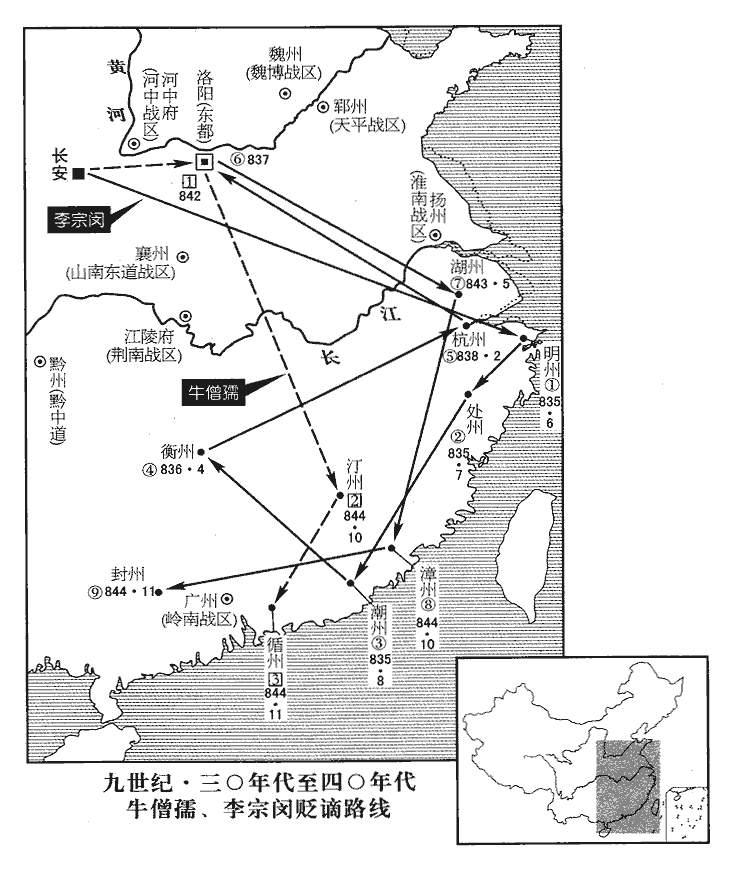
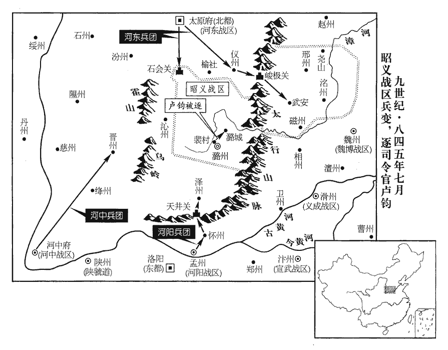
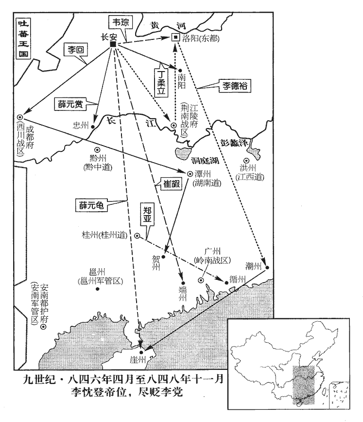
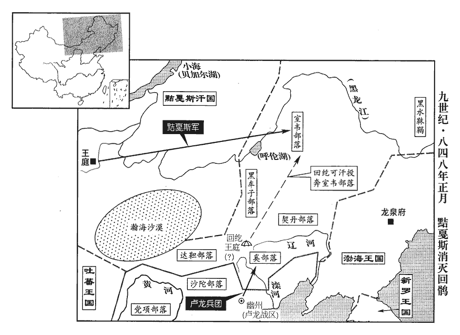
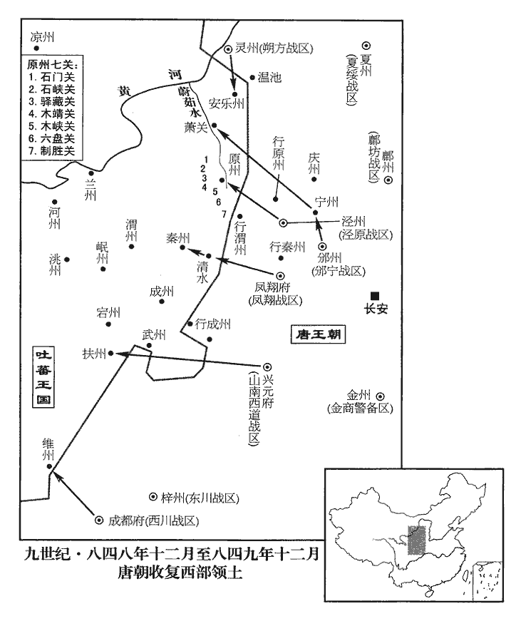

 唐紀六十四起閼逢困敦（甲子）閏月，盡屠維大荒落（己巳），凡五年有奇。

# 武宗至道昭肅孝皇帝下

## 會昌四年（甲子、八四四）

1閏月，壬戌‹闰七月十一日›，以中書侍郎、同平章事李紳同平章事，充淮南‹总部设扬州江苏省扬州市›節度使。

〖译文〗 [1]闰七月，壬戌（初十），唐武宗任命中书侍郎、同平章事李绅挂同平章事衔，出任淮南节度使。

2李德裕奏：「鎮州奏事官高迪方鎮遣牙職入奏事，因謂之奏事官。密陳意見二事：其一，以為『賊中好為偷兵術，好，呼到翻。潛抽諸處兵聚於一處，官軍多就迫逐，以致失利；經一兩月，又偷兵詣他處。官軍須知此情，自非來攻城柵，慎勿與戰。彼淹留不過三日，須散歸舊屯，如此數四空歸，自然喪氣。喪，息浪翻。官軍密遣諜者詗xiòng其抽兵之處，乘虛襲之，無不捷矣。』詗，翾xuān正翻，又火迥翻。其二，『鎮、魏屯兵雖多，終不能分賊勢。何則？下營不離故處，離，力智翻。每三兩月一深入，燒掠而去。賊但固守城柵，城外百姓，賊亦不惜。宜令進營據其要害，以漸逼之。若止如今日，賊中殊不以為懼。』望詔諸將各使知之！」

〖译文〗 [2]宰相李德裕上奏唐武宗：“镇州派遣来朝廷的奏事官高迪，秘密地向朝廷陈述两条意见：第一，‘泽潞叛贼喜好用偷兵术对付官军，他们暗中抽调诸处兵马，聚集于一处，官军往往就其聚兵之处攻击追逐，以致大都失利；经过一两个月之后，叛贼又偷偷地移兵聚于他处。官军必须知道这些情况，如果不是贼众主动来攻掠城堡栅寨，就应谨慎，按兵不动，不与贼军接战。贼军在聚屯处停留不会超过三天，就会分散回归其旧屯居地，这样往返到多次，不战而空归，自然要影响军心，士兵垂头丧气。官军则可秘密地派遣间谍，探知贼军调出兵马的地方，乘虚袭击，则没有不取胜告捷的。’第二，‘朝廷派遣的藩镇军队如镇州、魏州兵虽然屯驻很多，但最终不能分叛贼的军势。这是为什么呢？因为镇、魏诸藩军队扎营没有远离他们原先的驻扎地。每三两个月才派军深入敌境一次，而仅仅是大肆烧杀掠夺一番就匆匆离去。叛贼只要固守其城栅寨，军队就不会受到什么损失，而对于城外百姓，叛贼当然不加顾惜。朝廷应该命令镇、魏诸藩镇军队深入进兵占据要害之处扎营，逐渐进逼叛贼老巢。如果仅仅只是像今天的作法，叛贼当然不会感到畏惧。’希望皇上将高迪的两条意见用诏书颁布各路讨贼将领，务使周知！”

劉稹腹心將高文端降，言賊中乏食，令婦人挼ruó穗舂之以給軍。挼，奴禾翻，兩手相切摩也。德裕訪文端破賊之策，文端以為：「官軍今直攻澤州，恐多殺士卒，城未易得。易，以豉翻。澤州兵約萬五千人，賊常分兵太半，潛伏山谷，伺官軍攻城疲弊，則四集救之，官軍必失利。伺，相吏翻。今請令陳許軍過乾河立寨，乾，音干。自寨城連延築為夾城，環繞澤州，環，音宦。日遣大軍布陳於外以扞救兵。陳，讀曰陣。賊見圍城將合，必出大戰；待其敗北，然後乘勢可取。」德裕奏請詔示王宰。

〖译文〗 刘稹的心腹将领高文端向官军投降，说叛贼军营中缺乏粮食，以致于命令妇女们用手搓麦穗，再将麦粒舂碎，供军队食用。李德裕又访问高文端，求破贼的计策，高文端认为：“官军如果现在就直接进攻泽州，恐怕造成士卒大量伤亡，而未可轻易攻破城池。泽州叛军约有兵一万五千人，叛贼经常分出一大半兵力，暗中埋伏于山谷之间，刺探得官军攻城未克，疲惫不堪之时，伏兵便从四周集合，回救城下，官军为此必遭失利。如果朝廷今天能命令陈许的军队渡过乾河扎下营寨，自寨城连延到泽州，环绕泽州筑起两边立栅、中间留有通道的夹城，每天派遣大军于夹城外布阵，以抵御救兵，叛贼看到环绕泽州的夹城行将合围，必定要出城拼死决战；官军可待击败出城的贼军后，乘势将泽州城攻破。”李德裕上奏唐武宗，请求将高文端的建议诏告前线将领王宰。

文端又言：「固鎮寨‹山西省沁源县西南十五千米›四崖懸絶，勢不可攻。九域志：磁州武安縣有固鎮鎮，武安西北至遼州三百餘里。然寨中無水，皆飲澗水，在寨東【章：十二行本「東」下有「南」字；乙十一行本同；孔本同；張校同。】約一里許。宜令王逢進兵逼之，絶其水道，不過三日，賊必棄寨遁去，官軍即可追躡。前十五里至青龍寨‹山西省沁源县西›，亦四崖懸絶，水在寨外，可以前法取也。其東十五里則沁州城。‹山西省沁源县。沁州›属河东战区」沁州治沁源縣，漢上黨穀遠縣地。沁，七鴆翻。德裕奏請詔示王逢。

〖译文〗 高文端又说：“叛贼所据的固镇寨四面崖悬绝壁，其形势险要，不可攻取。然而寨中没有水，军士都饮用涧水，这股涧水在固镇寨以东约一里路外。应该命令王逢率官军进逼，断绝固镇寨贼军的水道，这样不过三天，贼军必定放弃固镇寨而逃走，官军即可跟踪追击。固镇寨前面十五里外可到青龙寨，也处于四崖悬绝的山上，水也在寨外，可以依照同样的方法攻取。青龙寨以东十五里就是沁州城。”李德裕又奏请唐武宗将此策用诏书告示王逢。

文端又言：「都頭王釗將萬兵戍洺州‹河北省永年县东南旧永年镇›，劉稹既族薛茂卿，又誅邢洺救援兵馬使談朝義兄弟三人，釗自是疑懼；稹遣使召之，釗不肯入，士卒皆譁譟，釗必不為稹用。但釗及士卒家屬皆在潞州，又士卒恐已降為官軍所殺，招之必不肯來。惟有諭意於釗，使引兵入潞州取稹，事成之日，許除別道節度使，仍厚有賜與，庶幾肯從。」幾，居依翻。德裕奏請詔何弘敬潛遣人諭以此意。

〖译文〗 高文端又建议说：“叛军都头王钊率领士兵万人戍守州，贼首刘稹既已将薛茂卿灭族，又诛杀邢救援兵马使谈朝义兄弟三人，王钊于是深感疑惧。刘稹派遣使者召王钊，王钊不肯入潞州城，士卒们也都喧哗噪骂，可知王钊必定不会为刘稹所用。但王钊及所部士卒家属都在潞州，另外，士卒们恐怕自己投降后会被官军所杀，所以招谕他们，他们肯定不敢前来。只有向王钊宣示上谕，使他引所部兵马入潞州攻取刘稹，事成之日，许诺任命他为别道节度使，并给予丰厚的赏赐，或许王钊肯听从。”李德裕再奏告唐武宗，并请武宗诏告何弘敬，让何弘敬暗中派人向王钊告喻皇上的旨意。

劉稹年少懦弱，少，詩照翻。押牙王協、宅內兵馬使李士貴用事，專聚貨財，府庫充溢，而將士有功無賞，由是人心離怨。劉從諫妻裴氏，冕之支孫也，裴冕相肅、代兩朝。憂稹將敗，其弟問，典兵在山東，欲召之使掌軍政。士貴恐問至奪己權，且泄其奸狀，乃曰：「山東之事仰成於五舅，仰，牛向翻。裴問，第五。若召之，是無三州也。」乃止。三州，邢‹河北省邢台市›、洺、磁。

〖译文〗 刘稹年轻性情懦弱，其部将押牙王协、宅内兵马使李士贵居中用事掌权，二人专事聚敛财货，使府库财货充斥溢满，而部下将士却有功而得不到赏赐，于是人心离散怨恨。刘从谏的妻子裴氏，是前宰相裴冕的旁支孙女，忧虑刘稹将遭败亡，她的弟弟裴问，率领军队在太行山以东戍守，裴氏想召裴问回来掌握昭义镇的军政。李士贵担心裴问到来后收夺自己的权柄，且使自己的奸状暴露，于是向刘稹进言说：“太行山以东的军政大事全仰仗于五舅裴问，如果将裴问召回，邢、、磁三州之地将无法控制。”由于李士贵从中作梗，所以召裴问回镇之事不再提了。

王協薦王釗為洺州都知兵馬使；釗得眾心，而多不遵使府約束，同列高元武、安玉言其有貳心。稹召之，釗辭以「到洺州未立少功，實所慚恨，乞留數月，然後詣府。」許之。

〖译文〗 昭义军府押牙王协推荐王钊为州都知兵马使；王钊很得部众的心，而其部众大都不尊从节度使府的约束，王钊的同僚将领高元武、安玉声言王钊有二心。刘稹召王钊，王钊推辞说：“到州来没有立下多少功劳，实在是惭愧自恨，乞求再留任州几个月，然后再回节度使府效劳。”刘稹也只好准许。

王協請稅商人，每州遣軍將一人主之，名為稅商，實籍編戶家貲，編戶，猶言編民也。將，即亮翻。至於什器無所遺，皆估為絹匹，十分取其二，率高其估。民竭浮財及糗糧輸之，不能充，皆忷忷不安。民財非地著，轉易以致利者為浮財。糗，去久翻。忷，許拱翻。

〖译文〗 王协又请刘稹向商人收税，每州派遣军将一人主持收税事宜，名义上说是收税，实际上却是把所有百姓的财产都登记造册，以致于连家庭日用器具也一扫无遗，这些器具全用来估价折算成绢匹，按其价值十分收取其二，并动不动就将其价估高，多收税钱。百姓虽然竭尽浮财以及存粮交纳给军府，也无法充实军府的税收，以致群情激愤，上下不安。

軍將劉溪尤貪殘，劉從諫棄不用；溪厚賂王協，協以邢州富商最多，命溪主之。裴問所將兵號「夜飛」，多富商子弟，溪至，悉拘其父兄；軍士訴於問，問為之請，為，于偽翻。溪不許，以不遜語答之。問怒，密與麾下謀殺溪歸國，并告刺史崔嘏gǔ，嘏從之。丙子‹二十五›，嘏、問閉城，斬城中大將四人，請降於王元逵。時高元武在党山，聞之，亦降。「党山」，恐當作「堯山」‹河北省隆尧县›。

〖译文〗 昭义军将刘溪尤其贪暴残忍，以前刘从谏对他弃而不用。刘溪用丰厚的财物贿赂王协，王协见邢者富商最多，任命刘溪为邢州主税官。当时裴问所率领的兵将号称“夜飞”，大多是富商子弟，刘溪到邢州主税，将他们的父兄全部拘捕；夜飞军士向裴问申诉，裴问为他们向刘溪求情，并请求释放士兵家属，刘溪不许，竟用极不礼貌的语言回答裴问。裴问勃然大怒，秘密与麾下谋划杀刘溪，归降朝廷，并告知邢州刺史崔嘏，崔嘏表示赞同。丙子（二十五日），崔嘏、裴问将邢州城关闭，斩城中四员大将，向成德节度使王元逵请降，当时高元武在党山，闻知此讯，也向官军投降。

先是，使府賜洺州軍士布，人一端，尋有帖以折冬賜。先，悉薦翻。以前所賜布折充冬賜。折，之舌翻。會稅商軍將至洺州，王釗因人不安，謂軍士曰：「留後年少，少，詩照翻。政非己出。今倉庫充實，足支十年，豈可不少散之少，詩沼翻。以慰勞苦之士！使帖不可用也。」乃擅開倉庫，給士卒人絹一匹，穀十二石，士卒大喜。釗遂閉城請降於何弘敬。安玉在磁州，聞二州降，亦降於弘敬。堯山‹河北省隆尧县›都知兵馬使魏元談等降於王元逵，元逵以其久不下，皆殺之。

〖译文〗 先前昭义节度使府曾赐给州军士布匹，每人得一端，不久使府又下帖文，要以这一端布折充为冬赐。恰值使府派遣的税商军将来到州，致使人心不安，王钊趁机向军士鼓动说：“留后刘稹年少，军政命令并非由刘稹所出。今军府仓库充实，足可支付十年的用度，岂可以不稍微散出一些财物，用以慰劳辛苦备至的士兵！节度使府的使帖我们不能从命。”于是擅自打开仓库，分给士卒每人绢一匹，谷十二石，士卒皆大为欢喜。王钊趁势关闭州城门，请降于魏博节度使何弘敬。安玉在滋州，闻知邢州、州都已投降，也以磁州请降于何弘敬。尧山都知兵马使魏元谈等也降于成德节度使王元逵，王元逵对魏元谈等人据守尧山久攻不克，于是，将他们全都杀掉。

八月，辛卯‹十一›，鎮、魏奏邢、洺、磁三州降，宰相入賀。李德裕曰：「昭義根本盡在山東，三州降，則上黨不日有變矣。」上曰：「郭誼必梟劉稹以自贖。」德裕曰：「誠如聖料。」上曰：「於今所宜先處者何事？」處，昌呂翻。德裕請以【章：十二行本「以」下有「給事中」三字；乙十一行本同；孔本同；張校同；退齋校同。】盧弘止為三州留後，考異曰：「舊紀、傳皆作「弘正」。實錄、新紀、傳皆作「弘止」，今從之。曰：「萬一鎮、魏請占三州，占，之贍翻。朝廷難於可否。」上從之。詔山南東道‹总部设襄州湖北省襄樊市›兼昭義節度使盧鈞乘驛赴鎮。

〖译文〗 八月，辛卯（十一日），镇州、魏州藩镇使府向朝廷上奏，称邢、、磁三州皆已投降，宰相们入朝向唐武宗庆贺。李德裕对唐武宗说：“昭义镇的根本尽在太行山以东，邢、、磁三州归降朝廷后，上党肯定在不久之内会有变故。”唐武宗说：“郭谊必定会斩下刘稹的首级，挂在竹杆上，归降朝廷以赎自己的罪。”李德裕回答说：“实际情况必定会如皇上所预料的那样。”唐武宗说：“那么，现在首先应该处理什么事呢？”李德裕请求以卢弘止为邢、、磁三州留后，说：“万一镇、魏藩镇请求占有三州，朝廷将难于表态。”唐武宗同意了李德裕的请求。颁下诏书任命山南东道兼昭义节度使卢钧乘驿马赶赴镇治。

潞‹昭义战区总部所在州·山西省长治市›人聞三州降，大懼。郭誼、王協謀殺劉稹以自贖；稹再從兄中軍使匡周兼押牙，再從兄，同曾祖。從，才用翻。誼患之，言於稹曰：「十三郎在牙院，劉匡周，第十三。牙院，押牙治事之所。諸將皆莫敢言事，恐為十三郎所疑而獲罪，以此失山東。今誠得十三郎不入，則諸將始敢盡言，采於眾人，必獲長策。」稹召匡周諭之，使稱疾不入。匡周怒曰：「我在院中，故諸將不敢有異圖；我出院，家必滅矣！」稹固請之，匡周不得已，彈指而出。

〖译文〗 潞州人听说邢、、磁三州降唐，大为恐惧。郭谊、王协密谋杀刘稹以向朝廷赎罪；刘稹的远房堂兄中军使刘匡周兼任押牙，郭谊对他有顾虑，于是对刘稹说：“由于十三郎刘匡周在牙院，诸位将领都不敢说话言事，恐怕为十三郎猜疑而获罪，正因如此，我们才失去了太行山以东三个州。今天如果使十三郎不入牙院，诸位将领才敢于尽其所言，您如果听计于众人，必定能获得万全长策。”刘稹听后召刘匡周晓以道理，让刘匡周宣称有疾病而不入牙院。刘匡周勃然大怒说：“正由于我在牙院中，诸将领才不敢有异图；我若出牙院，刘家必遭破天！”刘稹还是坚持要刘匡周出牙院，刘匡周不得已，又气又恨，只得即刻走出了牙院。

誼令稹所親董可武說稹曰：說，式芮翻。「山東之叛，事由五舅，城中人人誰敢相保！留後今欲何如？」五舅，謂裴問。劉稹自為留後，故稱之。稹曰：「今城中尚有五萬人，且當閉門堅守耳。」可武曰：「非良策也。留後不若束身歸朝，如張元益，元益事見二百四十六卷文宗開成三年。不失作刺史。且以郭誼為留後，俟得節之日，徐奉太夫人及室家金帛歸之東都，不亦善乎？」太夫人，謂從諫妻裴氏。稹曰：「誼安肯如是？」可武曰：「可武已與之重誓，必不負也。」乃引誼入。稹與之密約既定，乃白其母，母曰：「歸朝誠為佳事，但恨已晚。吾有弟不能保，謂裴問以邢州降也。安能保郭誼！汝自圖之！」稹乃素服出門，以母命署誼都知兵馬使。王協已戒諸將列於外廳，誼拜謝稹已，已，猶畢也。出見諸將，稹治裝於內廳。治，直之翻。李士貴聞之，帥後院兵數千攻誼。帥，讀曰率。誼叱之曰：「何不自取賞物，乃欲與李士貴同死乎！」軍士乃退，共殺士貴。誼易置將吏，部署軍士，一夕俱定。

〖译文〗 郭谊又指使刘稹所信任的董可武游说刘稹说：“太行山以东三州的叛变，事由您的五舅裴问发起，现在上党城中人谁敢保护您！您今天想怎么办？”刘稹回答说：“目前上党城中尚有五万人，应当紧闭城门坚守吧！”董可武说：“这不是良策，留后您不如将自己捆绑起来归降朝廷，如文宗时张元益那样，还不失作一个刺史。应暂让郭谊充任留后，待得到旌节的时候，从容不迫地奉太夫人以及家室财产归居东都洛阳，不是也很好吗？”刘稹说：“郭谊怎么肯这么做呢？”董可武说：“我已与郭谊立下重誓，必定不会背负誓约的。”于是引郭谊入见刘稹。刘稹与郭谊密谋降唐事宜，密约既定，然后告诉母亲裴氏，裴氏说：“归降朝廷当然是一件好事，只恨已经太晚。我弟裴问尚不忠于你，又如何能保证郭谊不背负于你呢！请您自己再三考虑吧！”刘稹不加思索，穿着素服出使府牙门，以母亲裴氏之命任郭谊为都知兵马使。这时王协已经告诫诸将领，于使府外庭站立排列，郭谊拜谢刘稹礼毕后，出使府门接见诸位将领，刘稹则于内厅整理行装。李士贵听说事变，率领后院兵数千人攻击郭谊。郭谊向后院兵大喊说：“你们为何不各自求取赏物，而想与李士贵同死吗！”军士听后纷纷后退，共同将李士贵杀死。郭谊改换使府将吏，安插自己的亲信，重新部署军士，一个晚上就全部准备就绪。

明日，使董可武入謁稹曰：「請議公事。」稹曰：「何不言之！」可武曰：「恐驚太夫人。」乃引稹步出牙門，至北宅，北宅，昭義節度使別宅也，在使宅之北，故曰北宅。置酒作樂。酒酣，乃言：「今日之事欲全太尉一家，劉悟贈太尉。須留後自圖去就，則朝廷必垂矜閔。」稹曰：「如所言，稹之心也。」可武遂前執其手，崔玄度自後斬之，因收稹宗族，匡周以下至襁褓中子皆殺之。襁，舉兩翻。褓，音保。穆宗長慶初，劉悟始帥昭義，三世，二十六年而滅。又殺劉從諫父子所厚善者張谷、陳揚庭、李仲京、郭台、王羽、韓茂章、茂實、王渥、賈庠等凡十二家，并其子姪甥壻無遺。仲京，訓之兄，台，行餘之子；羽，涯之從孫；茂章、茂實，約之子；渥，璠之子；庠，餗之子也。甘露之亂，仲京等亡歸從諫，從諫撫養之。李仲京等僅脫甘露之禍，卒與劉從諫之族俱屠，蓋天聚而殲之也。凡軍中有小嫌者，誼日有所誅，流血成泥。乃函稹首，遣使奉表及書，降於王宰。首過澤州，劉公直舉營慟哭，亦降於宰。

〖译文〗 次日，郭谊又指使董可武入室谒见刘稹，说：“郭公请您商讨公事。”刘稹说：“为何不到此对我讲？”董可武说：“恐怕惊动了太夫人。”于是引刘稹步行出使府牙门，来到使府之北的别宅，摆设酒宴作乐痛饮。当喝得痛快之时，董可武对刘稹说：“今天的事是想保全您祖父太尉刘悟传下的一家人，但您必须自己决定去留，这样朝廷才会同情和照顾您的家属。”刘稹回答说：“如您所说，我心里也这么想！”于是董可武上前抓住刘稹的手，崔玄度自后面将刘稹斩首。接着，收捕刘稹宗族家人，刘匡周以下以至襁褓之中的婴儿全部杀死。又杀死原刘从谏父子所信任善待的张谷、陈扬庭、李仲京、郭台、王羽、韩茂章、韩茂实、王渥、贾庠等总共十二家，并株连他们的子侄、外甥、女婿等，无一人能幸存。李仲京是李训的兄长；郭台为郭行余的儿子；王羽是王涯的族孙；韩茂章、韩茂实兄弟皆为韩约的儿子；王渥是王的儿子；贾庠为贾的儿子。唐文宗时甘露之变，李仲京等人逃亡投奔刘从谏，得到刘从谏的保护和抚养。这时郭谊总揽昭义军政大权，凡军中对他稍有嫌隙的人，郭谊也将其诛杀，以致每天都要杀人，血流在地上碾成了血泥。大局稳定后，郭谊将刘稹的首级封装在一个盒子里，派遣使者带着表文和书札，向王宰投降。刘稹的首级经过泽州，刘公直及其营垒的将士痛哭失声，也就一同投降王宰。

乙未‹十五›，宰以狀聞。丙申‹十六›，宰相入賀。李德裕奏：「今不須復置邢、洺、磁留後，復，扶又翻；下同。但遣盧弘止宣慰三州及成德、魏博兩道。」上曰：「郭誼宜如何處之？」德裕曰：「劉稹騃孺子耳，處，昌呂翻。騃ái，五駭翻，癡也。阻兵拒命，皆誼為之謀主；及勢孤力屈，又賣稹以求賞。此而不誅，何以懲惡！宜及諸軍在境，并誼等誅之！」上曰：「朕意亦以為然。」乃詔石雄將七千人入潞州，以應謠言。謠言見上卷三年。杜悰以饋運不給，謂誼等可赦，上熟視不應。德裕曰：「今春澤潞未平，太原復擾，自非聖斷堅定，斷，丁亂翻。二寇何由可平！外議以為若在先朝，赦之久矣。」上曰：「卿不知文宗‹李昂›心地不與卿合，安能議乎！」罷盧鈞山南東道‹总部设襄州湖北省襄樊市›，專為昭義節度使。

〖译文〗 乙未（十五日），王宰将情况写成状奏告朝廷。丙申（十六日），宰相们入朝向唐武宗祝贺。李德裕奏言：“如今不需要再设置邢、、磁留后，只须派遣卢弘止去宣慰这三者以及成德、魏博两道。”唐武宗问：“郭谊应当如何处置呢？”李德裕说：“刘稹是个傻小子罢了，其调兵遣将抗拒朝廷命令，都是郭谊为他出主意，作谋主；到刘稹势孤力单不能支持时，郭谊又出卖刘稹以求朝廷的赏赐。对这种人不加以诛除，又如何能说是惩治罪魁祸首。应该趁诸征讨大军压境之时，将郭谊等人一并诛除！”唐武宗说：“我也认为这样处置为好。”于是下诏命石雄率领七千人进入潞州，以和先前的谣言相应。杜则以军饷运输困难，不能供给为由，声言郭谊等人可以赦免，唐武宗对其奏议不予理睬。李德裕说：“今年春天泽潞未能平定，太原又出现骚扰，如果不是皇上圣明坚决果断，两处贼寇怎么可能平定！朝外议论认为如果是先朝皇上，像郭谊这样情况早就赦免了。”唐武宗说：“你不知文宗心里和你意见不合，怎么能议到一处去呢！”于是，罢除卢钧山南东道节度使的职务，让他专任昭义节度使。

戊戌‹十八›，劉稹傳首至京師。詔：「昭義五州給復一年，復，方目翻，除其賦役也。軍行所過州縣免今年秋稅。昭義自劉從諫以來，横増賦歛，横，户孟翻。歛，力贍翻。悉從蠲免。所籍土團並縱遣歸農。諸道將士有功者，等級加賞。」

〖译文〗 戊戌（十八日），刘稹的首级被传送至京师长安。唐武宗颁布诏书：“昭义镇所属泽、潞、邢、、磁五州免除赋役一年，为攻打刘稹，官军行军所过的州县也免除今年秋季的税收。昭义镇所辖之境自刘从谏以来，所增加的无理赋税，全部予以免除。抽调平民所组建的土团也全部解散回家务农。诸道征讨刘稹的军队中有功的将士，按等级给予赏赐。”

郭誼既殺劉稹，日望旌節；既久不聞問，乃曰：「必移他鎮。」於是閱鞍馬，治行裝；治，直之翻。及聞石雄將至，懼失色。雄至，誼等參賀畢，敕使張仲清曰：「郭都知告身來日當至；郭誼為昭義都知兵馬使，故稱之。諸高班告身在此，晚牙來受之！」諸高班，謂諸將。凡方鎮及州縣率早晚兩牙，將校吏卒皆集。乃以河中兵環毬場，河中兵，石雄所統入潞州者。環，讀如宦。晚牙，誼等至，唱名引入，凡諸將桀黠拒官軍者，黠，下八翻。悉執送京師。加何弘敬‹魏博战区，总部设魏州河北省大名县›同平章事。丁未‹二十七›，詔發劉從諫尸，暴於潞州市三日；石雄取其尸置毬場斬剉之。

〖译文〗 郭谊既已杀死刘稹，日夜盼望着朝廷赐予留后的旗子和符节；却久没有消息，朝廷对此不闻也不问，为此郭谊自言自语：“必定要移往其它藩镇。”于是开始检阅自己的鞍马，整治自己的行装；待听说石雄将到来，大惊失色。石雄赶到，郭谊等人参贺既毕，显示皇帝诏书的敕者张仲清说：“都知兵马使郭谊的委任状过几天就会到来，其他诸将领的委任状在我这里，晚上牙院参拜时来受命！”于是调河中镇兵马包围场。至晚牙院参拜时，郭谊等人纷纷赶到，张仲清点名将他们一个一个地引入场，凡是诸将领狡猾凶狠曾死命抗拒官军者，全都逮捕，囚送京师长安。唐武宗又加何弘敬为同平章事衔。丁未（二十七日），武宗下诏命令掘刘从谏墓，将刘从谏尸首暴露于潞州街市三天；石雄又取刘从谏尸放置于场斩杀并剁成碎块。

戊申‹二十八›，加李德裕太尉、趙國公，德裕固辭。上曰：「恨無官賞卿耳！卿若不應得，朕必不與卿。」

〖译文〗 戊申（二十八日），唐武宗加封李德裕为太尉、赵国公，李德裕坚决推辞。唐武宗说：“我只恨没有什么好官赏给你呀！你如果不该得，朕必定不会轻易赏给你的。”

初，李德裕以「韓全義以來，德宗遣韓全義討吳少誠，敗於溵水。將帥出征屢敗，其弊有三：一者，詔令下軍前，日有三四，下，戶嫁翻。宰相多不預聞。二者，監軍各以意見指揮軍事，將帥不得專進退。三者，每軍各有宦者為監使，悉選軍中驍勇數百為牙隊，其在陳戰鬬者，皆怯弱之士；每戰，監使自有信旗，信旗者，別為一旗，軍中視之以為進退。監，古銜翻。使，疏吏翻。乘高立馬，以牙隊自衛，視軍勢小卻，輒引旗先走，陳從而潰。」陳，讀曰陣。德裕乃與樞密使楊欽義、劉行深議，約敕監軍不得預軍政，每兵千人聽監使取十人自衛，有功隨例霑賞。二樞密皆以為然，白上行之。自禦回鶻至澤潞罷兵，皆守此制。自非中書進詔意，更無他詔自中出者。號令既簡，將帥得以施其謀略，故所向有功。史因李德裕之事而敘之，以見唐中世之所以敗，武宗之所以勝。

〖译文〗 起初，李德裕认为：“自德宗派遣韩全义讨吴少诚失败以来，官军将帅出征屡遭失败，分析其弊约有三条：第一，皇帝的诏令下达于军队之前，有三四天时间，宰相大多不能预先知道。第二，宦官监军每人都总是以自己的意见来指挥军事，领军将帅反而不能指挥军队的进退。第三，官军都各有宦官为监军使，他们都选择军队中骁勇精壮的士兵数百人组成牙队，而在阵上战斗的士兵，却都是一些怯懦体弱的人；每次战斗，监军使自己掌有指挥进退的信号旗，乘马登高处观察，而以牙队自卫，见军队稍有退却，便立即带着旗帜先逃走，其他军队跟着跑，阵势于是溃散。”李德裕与枢密使杨钦义、刘行深商议，相约监军不得干预军政，军队每一千人听任监军选取十人自卫，有战功时监军照例可沾光得到奖赏。两位枢密使都认为有道理，表示同意，于是奏告唐武宗下诏执行。自后抵御回鹘的骚扰以至泽潞镇的罢兵，都是遵守以上制度。在朝廷，如果不是中书门下宰相们向皇帝进言颁布诏书旨意，就不再有其他诏旨自宫禁中通过宦官颁发出来。号令既简明统一，将帅们也就得以施展他们的谋略，所以每战所向无敌，立有战功。

自用兵以來，河北三鎮‹卢龙、成德、魏博›每遣使者至京師，李德裕常面諭之曰：「河朔兵力雖強，不能自立，須藉朝廷官爵威命以安軍情。歸語汝使：語，牛倨翻。使，疏吏翻。與其使大將邀宣慰敕使以求官爵，何如自奮忠義，立功立事，結知明主，使恩出朝廷，不亦榮乎！且以耳目所及者言之，李載義在幽州，為國家盡忠平滄景，為，于偽翻。及為軍中所逐，不失作節度使，後鎮太原，位至宰相。楊志誠遣大將遮敕使馬求官，及為軍中所逐，朝廷竟不赦其罪。事並見前紀。此二人禍福足以觀矣。」德裕復以其言白上，復，扶又翻。上曰：「要當如此明告之。」由是三鎮不敢有異志。

〖译文〗 自对泽潞用兵以来，河北三大藩镇经常派遣使者到京师长安，李德裕常当面告谕他们说：“河朔藩镇的兵力虽然强大，但不能依恃兵力自立，必须凭藉朝廷委任官爵，凭借威命，才能安定军情。回去告诉你们的节度使：与其派大将请求宣慰敕使代为邀求官爵，还不如自己奋发忠义，为朝廷立功做事，结好圣明的天子，让皇上知道你们的忠义，而使恩命由朝廷主动直接地赐予，不是更为光荣吗！就以我自己耳闻目睹的来说吧，李载义当年在幽州，为国家尽忠平定沧景的叛乱，后来被幽州镇军队驱逐，朝廷未忘他的功劳，使他仍不失为节度使，后移镇太原，位至于宰相。杨志诚派遣大将，挡住朝廷所派敕使的坐马，邀求官爵，后来被所部军队驱逐，朝廷最后竟不赦免他的罪。这两个人的荣辱福祸足以看得很清楚。”李德裕将这些话告诉唐武宗，唐武宗说：“就是要这样明白地告诫他们”。因此，河北三镇不敢趁朝廷对泽潞用兵而有异志。

3九月，詔以澤州隸河陽‹总部设孟州河南省孟州市›節度。用李德裕三年之議也。

〖译文〗 [3]九月，唐武宗颁下诏书将泽州改由河阳镇节度。

4丁巳‹七›，盧鈞入潞州。鈞素寬厚愛人，劉稹未平，鈞已領昭義節度，事見上卷三年。襄州士卒在行營者，與潞人戰，常對陳揚鈞之美。陳，讀曰陣。及赴鎮，入天井關‹山西省晋城市东南›，昭義散卒歸之者，鈞皆厚撫之，人情大洽，昭義遂安。

〖译文〗 [4]丁巳（初七），卢钧进入潞州。卢钧平素待人宽厚爱护，刘稹还未平定时，卢钧已经领昭义节度使衔，襄州士卒在征讨行营与潞州人作战时，常对阵喊话，宣扬卢钧的美德。到卢钧赴镇上任，入天井关，昭义溃散的士卒归镇者，卢钧都善意抚慰，待他们十分厚道，以致上下人情大为融洽，昭义镇于是安定。

劉稹將郭誼、王協、劉公直、安全慶、李道德、李佐堯、劉武德、董可武等至京師，皆斬之。

〖译文〗 刘稹的部将郭谊、王协、刘公直、安全庆、李道德、李佐尧、刘武德、董可武等被押送至京师长安，全被斩首。

臣光曰：董重質之在淮西，事見憲宗紀。郭誼之在昭義，吳元濟、劉稹，如木偶人在伎兒之手耳。伎，渠綺翻。彼二人始則勸人為亂，終則賣主規利，其死固有餘罪。然憲宗‹李纯›用之於前，武宗‹李瀍›誅之於後，臣愚以為皆失之。何則？賞姦，非義也；殺降，非信也。失義與信，何以為國！昔漢光武‹刘秀›待王郎、劉盆子止於不死，知其非力竭則不降故也。樊崇、徐宣、王元、牛邯之徒，豈非助亂之人乎？而光武不殺；事並見光武紀。蓋以既受其降，則不可復誅故也。若既赦而復逃亡叛亂，復，扶又翻；下同。則其死固無辭矣！如誼等，免死流之遠方，沒齒不還，可矣；殺之，非也！

〖译文〗 臣司马光曰：唐宪宗时董重质在淮西叛乱，今郭谊又在昭义叛乱，其淮西镇主吴元济和昭义镇主刘稹，实际上如木偶在耍把戏人的手掌上。董重质、郭谊二人起初劝主人作乱，最后又都卖主谋求私利，处死他们当然是死有余辜。然而，唐宪宗任用董重质在前，唐武宗诛杀郭谊在后，二者处置却截然不同，谁是谁非？我虽然愚钝，但认为以上两种处置都有不当。为什么这样说呢？唐宪宗赏赐奸贼董重质，是不义；唐武宗杀死已降的郭谊，是不守信用。先去义和信，如何能治好国家！过去汉光武帝刘秀对待向他投降的王郎、刘盆子，仅止于不死，除留他们一条命外，没有任何赏赐，这是因为汉光武帝知道王郎、刘盆子不到穷途末路，力竭不能抵抗时，是不会投降的。另外樊崇、徐宣、王元、牛邯这帮人，岂能说他们不是助纣为乱之人？而光武帝刘秀也不杀他们，大概是因为既已接受他们的投降，就不可再诛杀他们的缘故。如果他们不知恩义，既已受到赦免不死，却又逃亡叛乱，那么，再行诛杀他们也没什么好说的！而如果唐武宗对待郭谊等人，免他们死罪，流放到远方，到老也不让他们归还，不是也可以吗！将他们一古脑儿全杀死，实在是不对的！

5王羽、賈庠等已為誼所殺，李德裕復下詔稱「逆賊王涯、賈餗等已就昭義誅其子孫，宣告中外」，識者非之。王涯、賈餗，非為逆也。設以其附麗非人，害于而家，凶于而國，罪亦不至於殄滅而無遺育。李德裕明底其罪，若真假手於郭誼而致天誅者，宜識者之非之也。劉從諫妻裴氏亦賜死；又令昭義降將李丕、高文端、王釗等疏昭義將士與劉稹同惡者，悉誅之，死者甚眾。盧鈞疑其枉濫，奏請寬之，不從。

〖译文〗 [5]王羽、贾庠等已经被郭谊所杀，李德裕又以唐武宗的名义下诏宣称：“逆贼王涯、贾等人在昭义的子孙已被诛灭”，宣告朝野内外，有见识的人对此颇有非议。刘从谏的妻子裴氏也被赐死；又命令昭义镇的降将李丕、高文端、王钊等人揭发昭义镇将士中与刘稹共同作恶者，将他们全部诛灭，被杀死的人很多。卢钧疑虑杀人太多恐有冤枉，怕滥杀了无辜，奏请朝廷宽待他们，朝廷没有听从。

昭義屬城有嘗無禮於王元逵者，元逵推求得二十餘人，斬之；餘眾懼，復閉城自守。戊辰‹十八›，李德裕等奏：「寇孽既平，盡為國家城鎮，豈可令元逵窮兵攻討！望遣中使賜城內將士敕，招安之，仍詔元逵引兵歸鎮，并詔盧鈞自遣使安撫。」從之。

〖译文〗 昭义镇所属城堡有人曾对成德节度使王元逵无礼，王元逵穷加追究，抓到二十余人，处以斩首；其余人感到恐惧，将城门再行关闭自守抵抗，戊辰（十八日），李德裕等人上奏唐武宗说：“叛寇余孽既全部平定，昭义所属城垒现已尽为国家的城镇，岂可以任王元逵随意穷兵攻讨！希望皇上派遣宦官，赐昭义所属城堡内的将士敕书，招安他们，并且下诏书命令王元逵率领成德镇的军队归还本镇，再下诏书给卢钧，让他自己派遣使者去进行安抚。”唐武宗表示同意。

乙亥‹二十五›，李德裕等請上尊號，且言：「自古帝王，成大功必告天地；又，宣懿太后祔廟，上初即位，追諡母韋妃曰宣懿太后。陛下未嘗親謁。」上瞿jù然曰：「郊廟之禮，誠宜亟行，至於徽稱，非所敢當！」凡五上表，乃許之。瞿，紀具翻。瞿然，失其常度之貌。徽，美也。稱，昌孕翻。

〖译文〗 乙亥（二十五日），李德裕等人奏请给唐武宗上尊号，并且声言：“自古以来帝王成就大功者，必定要告天地；再者，宣懿太后追谥名号时，陛下也没有亲自到陵墓去拜谒。”唐武宗听后有失常态地回答说：“郊庙谒陵的礼仪，当然应该赶快举行，至于给我加什么美称，真是不敢当啊！”李德裕等人共上了五次表，唐武宗才准许。

6李德裕奏：「據幽州奏事官言：詗知回鶻上下離心，詗，火迥翻，又翾正翻。可汗欲之安西‹新疆库车县›，其部落言親戚皆在唐，不如歸唐；又與室韋‹内蒙古东北部›已相失，計其不日來降，或自相殘滅。望遣識事中使欲遣識事宜者出使。賜仲武詔，諭以鎮、魏已平昭義，惟回鶻未滅，仲武猶帶北面招討使，宜早思立功。」

〖译文〗 [6]李德裕上奏唐武宗，称：“根据幽州奏事官所说，已探知回鹘上下离心，可汗想迁往安西，而其部落声称亲戚都在唐朝，不如归降大唐；加上回鹘与室韦已经失和，估计不几天回鹘将会来投降，或者回鹘内部将自相残杀，自我毁灭。希望陛下派遣识事知情的宦官使者往幽州赐给张仲武诏书，告谕说镇州、魏州藩镇军队已协助朝廷讨平昭义的叛乱，现在只有回鹘还未消灭，而张仲武仍然带有北面招讨使的职衔，应该尽早想着立功报国。”

7李德裕怨太子太傅•東都留守牛僧孺、湖州‹浙江省湖州市›刺史李宗閔，言於上曰：「劉從諫據上黨十年，太和中入朝，僧孺、宗閔執政，不留之，加宰相縱去，事見二百四十四卷文宗太和七年。以成今日之患，竭天下力乃能取之，皆二人之罪也。」德裕又使人於潞州求僧孺、宗閔與從諫交通書疏，無所得，乃令孔目官鄭慶言從諫每得僧孺、宗閔書疏，皆自焚毀。詔追慶下御史臺按問，下，遐嫁翻。中丞李回、知雜鄭亞以為信然。唐制：御史臺侍御史六人，以久次者一人知雜事，謂之雜端。河南少尹呂述與德裕書，言稹破報至，僧孺出聲歎恨。此希德裕意而誣僧孺也。德裕奏述書，上大怒，以僧孺為太子少保、分司，宗閔為漳州刺史；戊子‹十月九日›，再貶僧孺汀州‹福建省长汀县›刺史，宗閔漳州‹福建省漳州市›長史。垂拱元年，分福州西南境置漳州，以南有漳水為名。舊志：京師東南七千三百里。

〖译文〗 [7]李德裕怨恨太子太傅、东都留守牛僧孺和湖州刺史李宗闵，他对唐武宗上言说：“刘从谏占据上党有十年，文宗太和年间曾入朝，当时牛僧孺、李宗闵执政，不扣留刘从谏，反而给他加上宰相头衔，放纵他归还上党，以致形成今天的祸患，竭尽天下人力物力才将上党攻取，这都是牛僧孺、李宗闵二人的罪过。”李德裕又派人到潞州搜求牛僧孺、李宗闵与刘从谏相互交往的书信，却一无所得，于是命令孔目官郑庆上言，称刘从谏每次得到牛僧孺、李宗闵的书信，都要自己将信烧毁。唐武宗下诏催促郑庆往御史台进行查问，御史中丞李回、御史台侍御史知杂事郑亚查问后认为情况属实。河南少尹吕述也给李德裕写信，声称刘稹被剿灭的捷报传到东都洛阳时，牛僧孺发出叹惜声，有怨恨之言。唐武宗得知后勃然大怒，将牛僧孺降为太子少保、分司东都，李宗闵降为漳州刺史；十月，戊子（初九），再将牛僧孺贬为汀州刺史，将李宗闵贬为漳州长史。

 

8上幸鄠‹陕西省户县›校獵。鄠，音戶。

〖译文〗 [8]唐武宗到县进行游猎。

9十一月，復貶牛僧孺循州‹广东省惠州市›長史，宗【章：十二行本「宗」上有「李」字；乙十一行本同。】閔長流封州‹广东省封开县›。復，扶又翻。

〖译文〗 [9]十一月，唐朝廷再贬牛僧孺为循州长史，李宗闵长期流放于封州。

10十二月，以忠武節度使王宰為河東節度使，河中節度使石雄為河陽節度使。考異曰：實錄：「九月，盧鈞奏，十七日，石雄回軍赴孟州。」按雄於時未為河陽節度使，實錄誤也。

〖译文〗 [10]十二月，唐武宗任命忠武节度使王宰为河东节度使，任命河中节度使石雄为河阳节度使。

11上幸雲陽‹陕西省泾阳县北云阳镇›校獵。

〖译文〗 [11]唐武宗到云阳进行游猎。

## 五年（乙丑、八四五）

1春，正月，己酉朔‹一›，群臣上尊號曰仁聖文武章天成功神德明道大孝皇帝，尊號始無「道」字，中旨令加之。是時帝崇信道士趙歸真等，至親受道籙，故旨令群臣於尊號中加「道」字；而不知其所謂道者，非吾之所謂道也。庚戌‹二›，上‹李瀍，本年三十二岁›謁太廟；辛亥‹三›，祀昊天上帝，赦天下。

〖译文〗 [1]春季，正月，己酉朔（初一），满朝大臣给唐武宗上尊号，称仁圣文武章天成功神德明道大孝皇帝，尊号起初并没有“道”字，唐武宗崇信道教，中间下旨命令群臣加上道字。庚戌（初二），唐武宗行谒太庙之礼；辛亥（初三），唐武宗又祭祀昊天上帝，宣诏大赦天下。

2築望仙臺于南郊。

〖译文〗 [2]在南郊筑望仙台。

3庚申‹十二›，義安太后王氏崩。太和五年，宰相建白，以太皇太后與寶曆太后稱號未辨，前代詔令不敢斥言，皆以宮為稱。今寶曆太后居義安殿，宜曰義安太后。詔可。

〖译文〗 [3]庚申（十二日），义安太后王氏驾崩。

4以祕書監盧弘宣為義武‹总部设定州河北省定州市›節度使。弘宣性寬厚而難犯，為政簡易，易，以豉翻。其下便之。河北之法，軍中偶語者斬；弘宣至，除其法。河北諸帥防其下相與聚謀以圖己，故嚴軍中偶語之法，以剛制之。盧弘宣至中山，乃除其法。詔賜粟三十萬斛，在飛狐‹河北省涞源县›西，計運致之費踰於粟價，弘宣遣吏守之。會春旱，弘宣命軍民隨意自往取之，粟皆入境，約秋稔償之。時成德、魏博皆饑，獨易定之境無害。

〖译文〗 [4]朝廷任秘书监卢弘宣为义武节度使。卢弘宣性情宽厚，而态度严肃，人们不敢冒犯，为政比较简易，其部下称便。按河北的法规，军队中相对私语者就要斩首；卢弘宣来到义武镇，废除这种残酷的法规。唐武宗下诏赐给义武粟米三十万斛，存放在飞狐之西，从飞狐将这些粟米运至义武镇，所需费用超过粟米本身的价值，卢弘宣于是派遣官吏至飞狐仓加以看守。恰值春季大旱，卢弘宣命令义武军民自己随意往飞狐仓领取粟米，使粟米全部运入义武辖境，卢弘宣又向得到粟米的军民相约，待到秋天粮食丰收时再向官府偿还。当时成德和魏博两镇也都因旱灾发生饥馑，唯独义武节度使卢弘宣所辖的易定境内没有出现饥馑灾害。

5淮南‹总部设扬州江苏省扬州市›節度使李紳按江都‹扬州州政府所在县·江苏省扬州市›令吳湘盜用程糧錢，新書百官志：主客郎中，主蕃客。東南蕃使還者，給入海程糧；西北蕃使還者，給度磧程糧。至於官吏以公事有遠行，則須計程以給糧，而糧重不可遠致，則以錢準估，故有程糧錢。強娶所部百姓顏悅女，估其資裝為贓，罪當死。湘，武陵之兄子也，吳武陵見二百三十九卷憲宗元和十年。李德裕素惡武陵。惡，烏路翻。議者多言其冤，諫官請覆按，詔遣監察御史崔元藻、李稠覆之。還言：「湘盜程糧錢有實；顏悅本衢州‹浙江省衢州市›人，嘗為青州‹山东省青州市›牙推，妻亦士族，與前獄異。」德裕以為無與奪。二月，貶元藻端州‹广东省肇庆市›司戶，稠汀州‹福建省长汀县›司戶。不復更推，亦不付法司詳斷，即如紳奏，處湘死。復，扶又翻。斷，丁亂翻。處，昌呂翻。為德裕以吳湘獄致禍張本。諫議大夫柳仲郢、敬晦皆上疏爭之，不納。稠，晉江‹泉州州政府所在县·福建省泉州市›人；宋白曰：泉州治晉江縣，晉為晉安縣地，隋廢郡為邑。晦，昕之弟也。敬昕見上卷三年。

〖译文〗 [5]淮南节度使李绅按查所部江都县令吴湘，说他擅自盗用官家因公出差用的程粮钱，并强横逼娶管下百姓颜悦的女儿，将他家的资产衣装估价作为赃款，论其罪当处死刑。吴湘是吴武陵哥哥的儿子，李德裕平素就厌恶吴武陵。议论此案的人都声言吴湘冤枉，谏官于是向唐武宗请求重新审理，唐武宗颁下诏书，派遣监察御史崔元藻、李稠复审此案。崔元藻、李稠经过复查，回奏朝廷说：“吴湘偷盗税粮钱实有其事；而颜悦这个人本是衢州人，曾经任青州牙推官，他的妻子也是士族，情况与初审论罪事实有异。”李德裕认为崔元藻和李稠论事模棱两可，没有给吴湘定重罪论死刑，二月，朝廷将崔元藻贬为端州司户，李稠贬为汀州司户。对吴湘案不再复审，也不交付司法官署依法详细判罪论刑，即按照李绅所奏，将吴湘处死。谏议大夫柳仲郢、敬晦都上疏论争，均不被采纳。李稠是晋江人；敬晦是敬昕的弟弟。

6李德裕以柳仲郢為京兆尹；素與牛僧孺善，謝德裕曰：「不意太尉恩獎及此，仰報厚德，敢不如奇章公門館！」德裕不以為嫌。隋封牛弘為奇章公，牛僧孺蓋其後也，故時人亦呼之為奇章公。宋白曰：奇章縣屬巴州，本漢葭萌縣地，梁置奇章縣，取縣東八里奇章山為名。

〖译文〗 [6]李德裕提拔柳仲郢任京兆尹；柳仲郢平素与牛僧孺相友善，于是向李德裕道谢说：“想不到李太尉对我如此恩奖，为报答您的厚德，我怎敢不再去奇章公牛僧孺的门馆呢！”李德裕对这些话并不以为嫌。

7夏，四月，壬寅‹二十六›，以陝虢‹首府设陕州河南省三门峡市›觀察使李拭為冊黠戛斯可汗使。陝，失冉翻。

〖译文〗 [7]夏季，四月，壬寅（二十六日），朝廷任命陕虢观察使李拭为册封黠戛斯可汗使。

8五月，壬戌‹十六›，葬恭僖皇后于光陵‹李恒墓园·陕西省蒲城县北尧山›柏城之外。義安太后諡曰恭僖。后於穆宗非伉儷，故陪葬光陵而不合。

〖译文〗 [8]五月，壬戌（十六日），唐武宗命将唐穆宗恭僖皇后安葬于光陵的柏城之外。

9門下侍郎、同平章事杜悰罷為右僕射，中書侍郎、同平章事崔鉉罷為戶部尚書。乙丑‹十九›，以戶部侍郎李回為中書侍郎、同平章事，判戶部如故。

〖译文〗 [9]门下侍郎、同平章事杜被唐武宗罢相，改任右仆射，中书侍郎、同平章事崔铉也被罢相，改领户部尚书衔。乙丑（十九日），唐武宗任命户部侍郎李回为中书侍郎、同平章事，依旧叛户部。

10祠部奏括天下寺四千六百，蘭若四萬，僧尼二十六萬五百。祠部掌僧尼，故使括之。若，人者翻。釋氏要覽曰：蘭若者，梵言阿蘭若，唐言無諍也；四分律云，空靜處；智度經云，遠離處；大悲經云，離諸忿。

〖译文〗 [10]祠部上奏朝廷，全国有佛教寺院四千六百座，小佛祠四万，僧尼有二十六万五百人。

11詔冊黠戛斯‹瀚海沙漠群›可汗為宗英雄武誠明可汗。

〖译文〗 [11]唐武宗册封黠戛斯可汗为宗英雄武诚明可汗。

12秋，七月，丙午朔‹一›，日有食之。

〖译文〗 [12]秋季，七月，丙午朔（初一），出现日食。

13上惡僧尼耗蠹天下，欲去之，惡，烏路翻。去，羌呂翻。道士趙歸真等復勸之；復，扶又翻。乃先毀山野招提、蘭若，釋書曰：招提、菩薩，皆佛名，故號寺或謂之招提。增輝記曰：「招提者，梵言拓鬬提奢，唐言四方僧物。後人傳寫之誤，以「拓」為「招」，又省去「鬬奢」二字，只稱招提，即今十方寺院是也。薩波論云：西天度地以四肘為一弓，去村店五百弓不遠不近，以閒靜為蘭若。史炤曰：今若以唐尺計之，度二里許。敕【章：十二行本「敕」上有「至是」二字；乙十一行本同；孔本同；張校同。】上都、東都兩街各留二寺，唐謂長安曰上都。時左街留慈恩、薦福，右街留西明、莊嚴。每寺留僧三十人；天下節度觀察使治所及同‹陕西省大荔县›、華‹陕西省华县›、商‹陕西省商州市›、汝州‹河南省汝州市›各留一寺，華，戶化翻。分為三等：上等留僧二十人，中等留十人，下等五人。考異曰：實錄：「中書門下奏請上都、東都兩街各留寺十所，每寺留僧十人，大藩鎮各一所，僧亦依前詔。敕上都、東都每街各留寺兩所，每寺僧各留三十人。中書門下奏，『奉敕諸道所留僧尼數宜令更商量，分為三等：上至二十人，中至十人，下至五人。今據天下諸道共五十處四十六道，合配三等：鎮州、魏博、淮南、西川、山南東道、荊南、嶺南、汴宋、幽州、東川、鄂岳、浙西、浙東、宣歙、湖南、江西、河南府，望每道許留僧二十人；山南西道、河東、鄭滑、陳許、潞磁、鄆曹、徐泗、鳳翔、兗海、淄青、滄景、易定、福建、同、華州，望令每道許留十人；夏桂、邕管、黔中、安南、汝、金、商州、容管，望每道許留五人；一道河中已敕下留十三人。』」按鎮州等凡五十六州，四十一道，今云五十處四十六道，誤也。杜牧杭州南亭記曰：「武宗即位，始去其山臺野邑四萬所，冠其徒幾至十萬人。後至會昌五年，始命西京留佛寺四，僧惟十人；東都二寺。天下所謂節度觀察、同、華、汝三十四治所得留一寺，僧準西京數；其他刺史州不得有寺。凡除寺四千六百，僧、尼笄冠二十六萬五百。」實錄註又云：按唐時石刻云，「兩都留寺四，僧各十人；郡國留寺二，僧各三人。」數皆不同。今從實錄前文。餘僧及尼并大秦穆護、祆xiān僧皆勒歸俗。大秦穆護又釋氏之外教，如回鶻摩尼之類。是時敕曰：「大秦穆護等祠，釋教既已釐革，邪法不可獨存。其人並勒還俗，遞歸本貫，充稅戶；如外國人送遠處收管。」祆，呼煙翻，胡神也。唐制：祠部歲再祀磧西諸州火祆，而禁民祈祭。官品令有祆正，蓋主祆僧也。寺非應留者，立期令所在毀撤，仍遣御史分道督之。財貨田產並沒官，寺材以葺公廨驛舍，廨，古隘翻。銅像、鍾磬以鑄錢。

〖译文〗 [13]唐武宗厌恶象蠹虫一样耗费天下财物的和尚和尼姑，企图将他们罢废还俗。道士赵归真等人又竭力劝武宗废佛。于是唐武宗下令先拆毁山野之间的寺庙，上都长安和东都洛阳的左、右两街各留佛寺两所，每个寺院留僧侣三十人；天下各镇凡节度使、观察使的治所以及同州、华州、商州、汝州各留一所佛寺，将佛寺分为三等：上等可留僧侣二十人，中等可留僧侣十人，下等可留僧侣五人。其余僧侣及尼姑以及大秦穆护（摩尼教）、袄教僧人也一并勒令还俗。寺庙除应该留下的以外，立即命令所在官府拆毁，并且由朝廷派遣御史到各道去进行监督。佛寺的财产、田产全部没收入官府，寺庙的建筑材料用以修缮公家的官舍和驿站的房屋，佛教铜像、钟磐等器物熔化后用以铸造钱币。

14以山南東道‹总部设襄州湖北省襄樊市›節度使鄭肅檢校右僕射、同平章事。

〖译文〗 [14]唐武宗任命山南东道节度使郑肃为检校右仆射、同平章事。

 

15詔發昭義‹总部设潞州山西省长治市›騎兵五百、步兵千五百戍振武‹总部设安北府内蒙古和林格尔县›，節度使盧鈞出至裴村‹长治市西北二千米›餞之；潞卒素驕，憚於遠戍，乘醉，回旗入城‹山西省长治市›，閉門大譟，鈞奔潞城‹山西省潞城县›以避之。宋白曰：潞城縣，春秋潞子嬰兒之國，漢為潞縣。十三州志云：潞水出焉。後魏太武改為刈陵縣，隋開皇十三年置潞城縣。九域志：潞城在潞州東北四十里。監軍王惟直自出曉諭，亂兵擊之，傷，旬日而卒。李德裕奏：「請詔河東‹总部设太原府山西省太原市›節度使王宰以步騎一千守石會關‹山西省榆社县西›，三千自儀州‹山西省左权县›路據武安‹河北省武安市›，以斷邢‹河北省邢台市›、洺‹河北省永年县东南旧永年镇›之路；斷，音短。又令河陽‹总部设孟州河南省孟州市›節度使石雄引兵守澤州‹山西省晋城市›，河中‹总部设河中府山西省永济市›節度使韋恭甫發步騎千人戍晉州‹山西省临汾市›。如此，賊必無能為。」分守四境，使潞之亂卒不得越逸而奔他鎮。皆從之。

〖译文〗 [15]唐武宗下诏调发昭义骑兵五百、步兵一千五百人戍守振武，昭义节度使卢钧出城行至裴村为戍卒饯行；潞州士卒素来骄横，害怕出门远戍，乘着酒醉，举旗回到上党城，关闭城门大声喧噪，卢钧逃奔于潞城以躲避军乱。昭义监军王惟直亲自出来晓以大义，对乱军进行劝谕，乱兵竟大打出手，将王惟直击伤，十天后死去。李德裕为此上奏唐武宗说：“请皇上下诏命令河东节度使王宰率步、骑兵一千人守石会关，派三千人自仪州的道路去据守武安，以便截断潞州去邢州、州的道路；再命令河阳节度使石雄率领军队驻守泽州，河中节度使韦恭甫调发步、骑兵一千人戍守晋州。这样的话，叛贼必定无所作为。”唐武宗接受了这些建议。

16八月，李德裕等奏：「東都‹洛阳›九廟神主二十六，今貯於太微宮小屋，玄宗天寶二年，改東都玄元皇帝廟曰太微宮。劉昫曰：東都太微宮本武后家廟。神龍初，中宗反正，廢武氏廟主，立太祖已下神主祔主。安祿山陷洛陽，以廟為馬厩，棄其神主，協律郎嚴郢收而藏之。史思明再陷洛陽，尋又散失。賊平，東都留守盧正己又募得之。廟已焚毀，乃寄主於太微宮。貯，丁呂翻。請以廢寺材復脩太廟。

〖译文〗 [16]八月，李德裕等人向唐武宗奏言：“东都洛阳九庙有高祖以来神主二十六尊，现在贮藏在太微宫小屋子里，请求用拆毁佛寺所得的木材来修复太庙。”

17壬午‹七›，詔陳釋教之弊，宣告中外。凡天下所毀寺四千六百餘區，歸俗僧尼二十六萬五百人，大秦穆護、祆僧二千餘人，毀招提、蘭若四萬餘區。考異曰：會要：元和二年，薛平奏請賜中條山蘭若額為大和寺。蓋官賜額者為寺，私造者為招提、蘭若，杜牧所謂「山臺野邑」是也。收良田數千萬頃，奴婢十五萬人。所留僧皆隸主客，不隸祠部。時中書門下奏：「據大唐六典，祠部掌天地宗廟大祭，與僧事殊不相當。又萬務根本合歸尚書省，隸鴻臚寺亦未為允當。又據六典，主客掌朝貢之國七十餘蕃，五天竺國並在數內。釋氏出自天竺國，今陛下以其非中國之教，已有釐革。僧尼名籍便令係主客，不隸祠部及鴻臚寺，至為允當。」從之。百官奉表稱賀。尋又詔東都止留僧二十人，諸道留二十人者減其半，留十人者減三人，留五人者更不留。

〖译文〗 [17]壬午（初七），唐武宗下诏陈述佛教的危害弊端，并宣告朝廷内外。在全国范围内拆毁佛寺四千六百余区，勒令还俗的僧侣、尼姑有二十六万零五百人，大秦穆护（摩尼教）、袄教僧人也有二千余人，又拆毁大小佛祠四万余区。从寺院收得良田数千万顷，收得寺院奴婢十五万人。其余所留下的僧侣都隶属于尚书省礼部主客郎中管辖，而不再隶属于尚书省礼部祠部郎中。对于上述处置，朝廷百官都奉表称赞庆贺。不久，唐武宗又命令东都只留僧侣二十人。诸道原留僧侣二十人者减去一半，留十人者减去三人，留五人者全部减去，一个不留。

五臺‹山西省五台县东北›僧多亡奔幽州‹北京市›。五臺在代州五臺縣，山形五峙，相傳以為文殊示現之地。華嚴經疏云：清涼山者，即代州鴈門五臺山也。以歲積堅冰，夏仍飛雪，曾無炎暑，故曰清涼。五峰聳出，頂無林木，有如壘土之臺，故曰五臺。古傳云：山在長安東北一千六百餘里，代州之所管。山頂至州城一百餘里。其山左鄰恆山，右接天池，南屬五臺縣，北至繁畤縣，環基所至五百餘里。靈記云：五臺山有四埵duǒ，去臺各一百二十里。據古經所載，今北臺即是中臺，中臺即是南臺，大黃尖即是北臺，栲栳山即是西臺，漫天石即是東臺。惟北臺、中臺古時無異，東臺、西臺古今無別。無恤臺，恆山頂是也。昔趙襄子名無恤，曾登此山觀代國，下瞰東海。西瞢méng𧄼téng山，有宮池古廟；隋煬帝避暑於此而居，因天池造立宮室，龍樓鳳閣，遍滿池邊，號為西埵。南繫舟山，上有銅環，船軸猶在。昔帝堯遭水，繫舟於此。世傳文殊見於南臺，號為南埵。北有覆宿堆，即夏屋山也；後魏孝文皇帝避暑往復宿此，下見雲州，謂之北埵。中臺稍近西北，有太華泉，有古寺二十餘處。東臺去太華泉四十二里，臺上遙見滄、瀛諸州；日出時，下視大海猶陂澤焉，有古寺十五處。西臺去太華泉四里，危嶝dèng干雲，喬林拂日，有古寺十二處。南臺去太華泉八十里，最為幽寂，有古寺九處。北臺去太華泉十二里，有古寺八處，唐末所添寺不在其數。五臺縣本漢慮虒sī縣。慮虒，音驢夷。隋大業二年改為五臺縣。李德裕召進奏官謂曰：「汝趣白本使，趣，讀曰促。五臺僧為將必不如幽州將，為卒必不如幽州卒，何為虛取容納之名，染於人口！將，即亮翻。染，如豔翻，又而險翻。獨不見近日劉從諫招聚無算閒人，竟有何益！」張仲武乃封二刀付居庸關‹北京市昌平县西北›曰：「有游僧入境則斬之。」

〖译文〗 五台山的僧侣有很多逃亡投奔幽州。李德裕召来幽州的进奏官，对他说：“你回去告诉你的节度使，五台山的僧人充当将领必定不如幽州的将领，为士卒也必定不如幽州的士卒，为何要凭白无故地得一个容纳僧侣的恶名，而成为人家的口实！你没有看见不久前刘从谏招纳收聚无数的闲人，最终有什么好处！”幽州节度使张仲武于是将两把刀封好送给居庸关的守将，宣称：“若有游僧进入幽州之境，一概斩首。”

主客郎中韋博以為事不宜太過，李德裕惡之，惡，烏路翻。出為靈武‹总部设灵州宁夏灵武市›節度副使。

〖译文〗 主客郎中韦博认为毁佛之事不应做得太过份，李德裕深感厌恶，将韦博贬谪为灵武节度副使。

18昭義亂兵奉都將李文矩為帥；帥，所類翻。文矩不從，亂兵亦不敢害。文矩稍以禍福諭之，亂兵漸聽命，乃遣人謝盧鈞於潞城。鈞還入上黨‹潞州州政府所在县·山西省长治市›，復遣之戍振武；行一驛，乃潛選兵追之；明日，及於太平驛‹潞州山西省长治市›北六十里，唐制：三十里一驛。太平驛在潞州北六十里。宋白曰：太平驛東南距潞州八十里。盡殺之。考異曰：獻替記：「上信任宰臣，無不先訪問，無獨斷之事。唯誅討澤潞，不肯捨赴振武官健及誅翦党項，此二事並禁中發詔處分，更不顧問。振武官健回旗，不肯進發，先害監軍傔一人，監軍王惟直自出曉諭，又被傷痍，旬日而卒。禁中兩軍樞密已下，恨其不殺節將，唯害中人。所以激上之怒，盡須勦戮。上問宰臣曰：『我送石雄領兵至澤潞，令盧鈞不誅討罪人，如何？』德裕曰：『盧鈞已失律，性又寬愞nuò，必恐自誅不得。若便替卻盧鈞，亂卒罪惡轉大，須興兵討伐。恐不如先除替，令新帥誅翦。』上謂德裕曰：『勿惜盧鈞！本非材將。救澤潞叛兵，疑李丕報嫌。往劉稹平後，處置澤潞與劉稹同惡，僅五千餘人，皆是取得高文端、王釗狀，通姓名，勘李丕狀同，然後處分。其間有三兩人或王釗狀無名，並不更問，足明是李丕不能逞其憾。』又云：『惟務苟安、因循為政。凡方鎮發兵，只合不出軍城，嚴兵自衛，於城門閱過部伍，更令軍將慰安。豈有自出送兵馬，又令家口縱觀！事同兒戲，實不足惜！』『緣大兵之後，須有防虞，臣不敢隱默。』由是中詔處分，不復顧問。」按盧鈞還入潞州，諭戍兵使赴振武，尋遣兵追擊，盡殺之，非上不肯捨也。既云「不可便替」，又云「不如先除替」，語自相違，上云「勿惜盧鈞」，是上語，下云「臣不敢隱默」，乃是德裕語。獻替記至此差舛chuǎn尤甚，不可復據。又處置澤潞五千餘人太多，必是「五十」字誤耳。具以狀聞，且請罷河東、河陽兵在境上者，從之。

〖译文〗 [18]\]昭义乱兵推举都将李文矩为帅；李文矩不从命，乱兵也不敢加害。李文矩趁机对乱军进行一些劝谕，晓以祸福，乱兵渐渐听命，于是派人到潞城向卢钧谢罪。卢钧回到上党城，再派遣这些士卒往振武镇去戍守；走过一个驿程，卢钧暗中挑选兵追赶这些士卒，第二天，至太平驿追及，将曾参与叛乱的士兵全部杀死。卢钧又将情况写成状文向朝廷汇报，并且请求罢除河东、河阳在昭义边境防驻守的军队，朝廷一概听从。

19九月，詔脩東都太廟。如李德裕所奏也。

〖译文〗 [19]九月，唐武宗下诏修复东都太庙。

20李德裕請置備邊庫，令戶部歲入錢帛十二萬緡匹，度支鹽鐵歲入錢帛十二萬緡匹，明年減其三之一凡諸道所進助軍財貨皆入焉，以度支郎中判之。

〖译文〗 [20]李德裕向唐武宗请求设置备边仓库，命令户部每年输入钱、帛十二万缗、匹，度支使和盐铁使每年输入钱、帛十二万缗、匹，第二年减少其三分之一的输入，全国诸道所进的助军财产财物也都输入备边仓库，任命度支郎中来掌管这项事务。

21王才人寵冠後庭，冠，古玩翻。上欲立以為后；李德裕以才人寒族，且無子，恐不厭天下之望，厭，益涉翻，伏也，合也。乃止。

〖译文〗 [21]唐武宗的王才人在后宫最得武宗喜爱，唐武宗想立王才人为皇后；李德裕认为王才人出身寒族，而且没有生儿子，恐怕不合天下人的愿望，因而上言劝阻，唐武宗于是放弃了这一想法。

22上餌方士金丹，性加躁急，喜怒不常。冬，十月，上問李德裕以外事，對曰：「陛下威斷不測，斷，丁亂翻。外人頗驚懼。曏者寇逆暴橫，橫，戶孟翻。固宜以威制之；今天下既平，願陛下以寬理之，但使得罪者無怨，為善者不驚，則為寬矣。」

〖译文〗 [22]唐武宗吃下道教方士炼的金丹，性情更加暴躁，喜怒无常。冬季，十月，唐武宗问李德裕朝外之事，李德裕回答说：“您的严厉决断人们难以猜测，朝外人士感到很惊诧和恐惧。以前贼寇叛逆专横暴虐，当然应该用严厉的威邢来制服他们；但如今天下既已平定，希望您能以宽容治理政事，如果能使犯罪的人服罪无怨言，为善的人不感到惊慌恐怖，那就能称得上为政宽容了。”

23以衡山‹南岳·湖南省衡山县西›道士劉玄靜為銀青光祿大夫、崇玄館學士，賜號廣成先生，為之治崇玄館，置吏鑄印。唐有崇玄署令，掌僧道，屬宗正寺。又有崇玄學博士，掌教玄學生。玄宗天寶二年改崇玄學曰崇玄館，改博士曰學士。為之，于偽翻。治，直之翻。玄靜固辭，乞還山，許之。

〖译文〗 [23]唐武宗任命衡山道士刘玄静为银青光禄大夫、崇玄馆学士，赐号广成先生，为他建崇玄馆，并署置吏员，铸有印章。刘玄静坚决推辞，乞求让他回衡山继续修道，唐武宗同意了他的请求。

24李德裕秉政日久，好徇愛憎，好，呼到翻。人多怨之。自杜悰、崔鉉罷相，宦官左右言其太專，上亦不悅。給事中韋弘質上疏，言宰相權重，不應更領三司錢穀。德裕奏稱：「制置職業，人主之柄。弘質受人教導，所謂賤人圖柄臣，傳曰：下輕其上爵，賤臣圖柄臣，則國家動搖，而人不靜。非所宜言。」十二月，弘質坐貶官，由是眾怒愈甚。史言李德裕以自專自用速禍。

〖译文〗 [24]李德裕掌权的时间久了，喜欢根据自己的好恶处置官吏，使很多人心怀怨言。自从杜、崔铉罢免相位后，宦官在唐武宗左右说李德裕太专权，唐武宗也感到不高兴。给事中韦弘质上疏于唐武宗，声言宰相的权力太重，不应该再掌管户部、度支、盐铁三司的钱谷。李德裕为此也上奏唐武宗，声称：“任用官员，本是皇帝的权柄。韦弘质受人教唆，竟然对皇帝赋予宰相的权力妄持异议，真是卑贱人企图谮害掌有权柄的大臣，这些话哪里是韦弘质这种人可以妄说的呢！”十二月，韦弘质为此贬官，于是众朝臣大抱不平，怨怒更甚。

25上自秋冬以來，覺有疾，而道士以為換骨。上祕其事，外人但怪上希復遊獵，復，扶又翻；下同。宰相奏事者亦不敢久留。詔罷來年正旦朝會。以有疾也。

〖译文〗 [25]唐武宗自从秋冬之际以来，感觉患有疾病，而道士却认为是换骨。唐武宗将疾病隐瞒起来，宫禁之外的朝臣只是奇怪唐武宗很少出来游猎，宰相入朝奏事也不敢停留太久。武宗又下诏书停罢明年元旦的大朝会。

26吐蕃‹首都逻些城西藏拉萨市›論恐熱復糾合諸部擊尚婢婢‹鄯州战区，总部设鄯州青海省乐都县›，婢婢遣厖結藏將兵五千拒之，恐熱大敗，與數十騎遁去。婢婢傳檄河、湟‹甘肃省及青海省东部›，數恐熱殘虐之罪數恐，所具翻。曰：「汝輩本唐人，吐蕃無主，則相與歸唐，毋為恐熱所獵如狐兔也！」於是諸部從恐熱者稍稍引去。

〖译文〗 [26]吐蕃的论恐热又纠合诸部落攻击吐蕃宰相尚婢婢，尚婢婢派遣结藏率领五千兵进行抵抗，论恐热被打得大败，只与数十个骑兵逃走。尚婢婢传布檄文于河、湟地区，历数论恐热的残忍暴虐罪行，说：“你们本来都是大唐的臣民，吐蕃没有了国王，你们应该相互联结归奉唐朝，不应该被论恐热所控制，象狐狸抓免子一样！”于是河、湟地区汉人诸部民跟从论恐热者，逐渐离他而去。

27是歲，天下户四百九十五萬五千一百五十一。

〖译文〗 [27]这一年，全国共有四百九十五万五千一百五十一户。

28朝廷雖為党項置使，帝以侍御史為使，分三部招定党項，以邠、寧、延屬崔彥曾，鹽、夏、長澤屬李鄠，靈武、麟、勝屬鄭賀。党項侵盜不已，攻陷邠‹陕西省彬县›、寧‹甘肃省宁县›、鹽州‹陕西省定边县›界城堡，屯叱利寨‹陕西省定边县东›。宰相請遣使宣慰；上決意討之。

〖译文〗 [28]唐朝廷虽然为对付党项设置了三处使职，但党项部族仍然侵盗唐边境不已，攻陷唐州、宁州、盐州边境的城堡，屯兵于叱利寨。宰相请求唐武宗派遣使者宣慰招抚，但唐武宗决意要派军队讨伐。

## 六年（丙寅、八四六）

1春，二月，庚辰‹九›，以夏州‹陕西省靖边县北白城子›節度使米暨為東北道招討党項‹陕西省北部›使。米姓出於西域，康居枝庶分為米國。復入中國，子孫遂以為姓。

〖译文〗 [1]春季，二月，庚辰（九日），唐武宗任命夏州节度使米暨为东北道招讨党项使。

2上‹李瀍，本年三十三岁›疾久未平，以為漢火德，改「洛」為「雒」；漢光武改洛陽為雒陽。唐土德，不可以王氣勝君名，三月，下詔改名炎。王，于況翻。唐以土德王，而帝名瀍，瀍旁從水，土勝水，故言以王氣勝君名。今改名炎，炎從火，火能生土，取以君名生王氣也。帝未幾而晏駕，厭勝果何益哉！

〖译文〗 [2]唐武宗患疾病很久未能痊愈，认为汉朝属火德，光武帝刘秀因而改洛阳的“洛”为“雒”；唐朝属土德，不可以王气胜过君主的名字，三月，唐武宗李颁下诏书，宣告改名为炎。炎从火，火能生土。

上自正月乙卯‹三›不視朝，考異曰：實錄作「十五日」。按獻替記：「自正月十三日後至三月二十日更不開延英，時見中詔處分，莫得預焉。」今從之。宰相請見，不許；見，賢遍翻。中外憂懼。

〖译文〗 唐武宗自从正月乙卯（十三日）以来就不再上朝视事，宰相请求见皇上，也不获允许；朝廷内外都深感忧惧。

初，憲宗‹李纯›納李錡妾鄭氏，生光王怡。怡幼時，宮中皆以為不慧，太和以後，益自韜匿，群居遊處，處，昌呂翻。未嘗發言。文宗‹李昂›幸十六宅宴集，好誘其言以為戲笑，【章：十二行本「笑」下有「號曰光叔」四字；乙十一行本同；孔本同；張校同；退齋校同。】好，呼到翻。上性豪邁，尤所不禮。考異曰：韋昭度續皇王寶運錄曰：「宣宗即憲皇第四子。自憲皇崩，便合紹位，乃與姪文宗。文宗崩，武皇慮有他謀，乃密令中常侍四人擒宣宗於永巷，幽之數日，沉於宮廁。宦者仇公武愍之，乃奏武宗曰：『前者王子，不宜久於宮廁。誅之。』武宗曰：『唯唯。』仇公武取出，於車中以糞土雜物覆之，將別路歸家，密養之。三年後，武皇宮車晏駕，百官奉迎於玉宸殿立之。尋擢仇公武為軍容使。」尉遲偓wò中朝故事曰：「敬宗、文宗、武宗相次即位，宣皇皆叔父也。武宗初登極，深忌焉。一日，會鞠於禁苑間，武宗召上，遙覩瞬目於中官仇士良。士良躍馬向前曰：『適有旨，王可下馬！』士良命中官輿出，軍中奏云：『落馬，已不救矣！』尋請為僧，遊行江表間。會昌末，中人請還京，遂即位。」令狐澄貞陵遺事曰：「上在藩時，嘗從駕迴，而上誤墮馬，人不之覺。比二更，方能興。時天大雪，四顧悄無人聲。上寒甚，會巡警者至，大驚。上曰：『我光王也。不悟至此，方困且渴，若為我求水！』警者即於旁近得水以進，遂委而去。上良久起，舉甌將飲，顧甌中水盡為芳醪láo矣。上獨喜自負，一舉盡甌。已而體微煖nuǎn有力，遂步歸藩邸。」此三事皆鄙妄無稽，今不取。及上疾篤，旬日不能言。諸宦官密於禁中定策，辛酉‹二十›，下詔稱：「皇子沖幼，須選賢德，光王怡可立為皇太叔，考異曰：舊紀：「三月一日，立為皇太叔。」武宗實錄云「壬戌」。宣宗實錄云「辛酉」。按獻替記云，「自正月十三日後至三月二十日更不開延英」，蓋二十一日則宣宗見百寮也。今從宣宗實錄。更名忱chén，更，工衡翻。忱，時壬翻。應軍國政事令權句當。」以武宗之英達，李德裕之得君，而不能定後嗣，卒制命於宦豎，北司掌兵，且專宮禁之權也。句，古候翻。當，丁浪翻；下咸當同。太叔見百官，哀戚滿容；裁決庶務，咸當於理，人始知有隱德焉。當，丁浪翻。

〖译文〗 起初，唐宪宗收纳李的妾郑氏，生光王李怡。李怡年幼时，后宫中人们都认为他不聪明，唐文宗太和年以后，李怡更是自己韬光养晦，在大庭广众游乐相处时，从不发言。唐文宗到十六宅为诸王设宴集会，喜欢引逗李怡发言以作笑料，唐武宗性格强韧豪迈，对光王李怡更加无礼。唐武宗危病，十来天不能说话，诸宦官于是暗中在宫禁内策划立新皇帝，辛酉（二十日），禁中传出以唐武宗名义颁发的诏书称：“皇子们都太年幼，必须选择贤德的皇族成员继承皇位，光王李怡可以立为皇太叔，改其名称李忱，所有军国政事可让他暂时处置。”皇太叔李忱出宫见百官时，满脸悲哀戚惨的样子；而裁决细小军政事务时，都能合情合理，人们这才知道他很内秀。

甲子‹二十三›，上崩。年三十三。以李德裕攝冢宰。丁卯‹二十六›，宣宗‹李忱（李怡），本年三十七岁›即位。宣宗素惡李德裕之專，惡，烏路翻。即位之日，德裕奉冊；既罷，謂左右曰：「適近我者非太尉邪？每顧我，使我毛髮洒淅。」近，其靳翻。洒淅，肅然之意，言可畏憚也。夏，四月，辛未朔‹一›，上始聽政。

〖译文〗 甲子（二十三日），唐武宗驾崩。李德裕受命兼任冢宰办理后事。丁卯（二十六日），唐宣宗李忱即皇帝位。唐宣宗李忱平素厌恶李德裕专权，即皇帝位的那一天，由李德裕手捧册封的诏书；册立仪式既罢，宣宗对左右近侍说：“刚才靠近我的是不是李太尉呢？每看我一眼，都使人毛骨耸然。”夏季，四月，辛未朔（初一），唐宣宗开始上朝听政。

3尊母鄭氏為皇太后。

〖译文〗 [3]唐宣宗尊自己的生母郑氏为皇太后。

 

4壬申‹二›，以門下侍郎、同平章政事【章：十二行本無「政」字；乙十一行本同。】李德裕同平章事，充荊南‹总部设江陵府湖北省江陵县›節度使。考異曰：實錄、新表、傳皆云：「德裕自守太尉檢校司徒為荊南節度使。」按制辭皆無責降之語，豈可遽自守太尉檢校司徒！今從舊紀。又貞陵遺事曰：「上初即位於太極殿，時宰相李德裕與行冊禮。及退，上謂宦侍云云。聽政之二日，遂出為荊門。」舊德裕傳曰：「五年，武宗上徽號，累表乞骸，不許。德裕病月餘，堅請解機務，乃以本官平章事兼江陵尹、荊南節度使。數月，追復知政事。宣宗即位，罷相，出為東都留守。」按舊紀、新表及諸書，武宗朝德裕未嘗罷免。此年九月，方自江陵除東都留守。舊傳謬誤，今從實錄。德裕秉權日久，位重有功，眾不謂其遽罷，聞之莫不驚駭。甲戌‹四›，貶工部尚書、判鹽鐵轉運使薛元賞為忠州‹重庆市忠县›刺史，弟京兆少尹、權知府事元龜為崖州‹海南省琼山市›司戶，皆德裕之黨也。

〖译文〗 [4]壬申（初二），唐宣宗下令调门下侍郎、同平章政事李德裕仍带平章事衔，出任荆南节度使。李德裕在朝掌握权柄很久，位望崇重，立有大功，众朝官想不到他突然被罢免，消息传来，百官无不感到惊骇。甲戌（初四），唐宣宗又下令贬工部尚书、判盐铁转运使薛元赏为忠州刺史，他的弟弟京兆少尹、权知府事薛元龟贬为崖州司户，因为他们都是李德裕的党羽。

5杖殺道士趙歸真等數人，流羅浮山‹广东省博罗县西北›人軒轅集于嶺南。五月，乙巳‹五›，赦天下。上京兩街先聽留兩寺外，更各增置八寺；左街先留慈恩、薦福，今增置興唐、保壽二寺。寶應寺改為資聖寺，青龍寺改為護國寺，菩提寺改為保唐寺，清禪寺改為安國寺。尼寺二所，法雲寺改為唐安寺，崇敬寺改為唐昌寺。右街先留西明寺，改為福壽寺，莊嚴寺改為聖壽寺。添置僧寺一所，千福寺，尼寺一所，興聖寺依舊名。化度寺改為崇福寺，永泰寺改為萬壽寺，清國寺改為崇聖寺，經行寺改為龍興寺，奉恩寺改為興福寺。尼寺一所，萬善寺改為延唐寺。考異曰：杭州南亭記曰：「今天子即位，天下州率與二寺，用齒衰男女為其徒，各止三十人，兩京數倍其四五焉。」實錄：「準五日敕，兩街先留寺兩所外，更添置八所。」註：唐石刻云，「京師兩街各置十寺，寺僧五十人。」蓋謂二年正月赦後，非今赦也。僧、尼依前隸功德使，不隸主客，唐初，天下僧、尼、道士、女官皆隸鴻臚寺。武后延載元年，以僧、尼隸祠部。開元二十四年，道士、女官隸宗正寺。天寶二載，以道士隸司封。貞元四年，崇玄館罷大學士後，復置左•右街大功德使、東都功德使、脩功德使，總僧、尼之籍及功役。元和二年，以道士、女官隸左•右街功德使。會昌二年，以僧、尼隸主客。太清宮置玄元館，亦有學士，至六年廢，而僧、尼復隸兩街功德使，即是年也。所度僧、尼仍令祠部給牒。改武宗之政也。牒，即今祠部所給僧、道度牒也。

〖译文〗 [5]唐宣宗下令用棍棒打杀道士赵归真等数人，将罗浮山人轩辕集流放到岭南。五月，乙巳（初五），宣告大赦天下。又宣告上京长安两街除以前留下的两座佛教寺庙外，再各增置八座寺庙；佛教僧侣、尼姑依照以前的规定隶属于左、右街功德使，不隶属于尚书省礼部主客郎中，这些寺庙所度的僧侣、尼姑都可由祠部发给度牒，准许他们出家。

6以翰林學士、兵部侍郎白敏中同平章事。

〖译文〗 [6]唐宣宗任命翰林学士、兵部侍郎白敏中为同平章事。

7辛酉‹二十一›，立皇子溫為鄆王，渼為雍王，渼měi，音美。涇為雅王，滋為夔王，沂為慶王。

〖译文〗 [7]辛酉（二十一日），唐宣宗立皇子李温为郓王，李为雍王，李泾为雅王，李滋为夔王，李沂为庆王。

8六月，禮儀使奏「請復代宗‹李豫›神主於太廟，開成五年，文宗升祔，代宗神主以親盡祧tiāo遷，今請復之。以敬宗‹李湛›、文宗‹李昂›、武宗‹李炎李瀍›同為一代，於廟東增置兩室，為九代十一室。」從之。

〖译文〗 [8]六月，礼仪使向唐宣宗上奏称：“请陛下恢复唐代宗的神主像于太庙，由于唐敬宗、唐文宗、唐武宗为同一代，都是唐穆宗的儿子，所以可于太庙之东增置两个室，共为九代十一室神主像。”唐宣宗表示同意。

9秋，七月，壬寅‹三›，淮南‹总部设扬州江苏省扬州市›節度使李紳薨。

〖译文〗 [9]秋季，七月，壬寅（初三），淮南节度使李绅去世。

10回鶻烏介可汗之眾稍稍降散及凍餒死，所餘不及三千人；國相逸隱啜殺烏介於金山，烏介可汗自殺胡山之敗，竄於黑車子族，今為其下所殺。立其弟特勒遏捻為可汗。捻，奴協翻。

〖译文〗 [10]回鹘国乌介可汗的部众渐渐减少，有的降唐，有的离散，有的冻饿而死，所余下的已不及三千人。回鹘宰国相逸隐啜在金山将乌介可汗杀死，立乌介可汗的弟弟特勒遏捻为可汗。

11八月，壬申‹三›，葬至道昭肅孝皇帝于端陵‹陕西省富平县西南›，端陵，在京兆三原縣東十里。廟號武宗。

〖译文〗 [11]八月，壬申（初三），唐宣宗及朝臣将至道昭肃孝皇帝李炎葬于端陵，庙号为武宗。

初，武宗‹李炎›疾困，顧王才人曰：「我死，汝當如何？」對曰：「願從陛下於九泉！」武宗以巾授之。武宗崩，才人即縊。武宗之問，王才人之死，懲楊妃之禍也。上聞而矜之，贈貴妃，葬於端陵‹李炎李瀍›墓柏城之內。考異曰：蔡京王貴妃傳曰：「帝疾亟，才人久視帝而歸燕息處，濃粧絜服如常日，乃取所翫用物散與內家淨盡；持帝所授巾至帝前，已見升遐，容易自縊，而仆於御座下，以縊為名而得卒。」舊紀：「武宗葬端陵，德妃王氏祔焉。」李德裕獻替記：「自上臨御，王妃有專房之寵。至是，以嬌妬忤旨，一夕而殞，群情無不驚懼，以謂上功成之後喜怒不測。德裕因以進諫。」在五年十月，與王貴妃傳不同，恐獻替記誤。康軿píng劇談錄曰：「孟才人善歌，有寵於武宗。屬一旦聖體不豫，召而問之曰：『我或不諱，汝將何之？』對曰：『若陛下萬歲之後，無復生為！』是日令於御前歌河滿子一曲，聲調悽咽，聞者涕零。及宮車晏駕，哀慟數日而殞，窆biǎn於端陵之側。」此事恐正是王才人，傳聞不同。

〖译文〗 起初，唐武宗被疾病困扰，望着宠妃王才人说：“我死了，你该怎么办呢？”王才人回答说：“我愿意随从您一起到九泉之下！”唐武宗即送给她一条绫巾。待唐武宗驾崩，王才人即用绫巾上吊自缢而死。唐宣宗听说后对王才人深感怜悯，赠给她贵妃的名号，安葬于端陵柏城之内。

12以循州‹广东省惠州市›司馬牛僧孺為衡州‹湖南省衡阳市›長史，封州‹广东省封开县›流人李宗閔為郴州‹湖南省郴州市›司馬，恩州‹广东省恩平市›司馬崔珙gǒng為安州‹湖北省安陆市›長史，安州，漢安陸縣地，京師東南二千五十一里。潮州‹广东省潮州市›刺史楊嗣復為江州‹江西省九江市›刺史，昭州‹广西平乐县›刺史李珏為郴州刺史。僧孺等五相皆武宗所貶逐，楊嗣復貶見二百四十六卷元年。三年，崔玭pín罷相，崔鉉代之，奏珙妄費宋滑院鹽鐵錢九十萬緡，又劾與劉從諫厚，數護其姦，貶澧州刺史，再斥恩州司馬。僧孺、宗閔貶見上四年。至是，同日北遷。宗閔未離封州而卒。離，力智翻。

〖译文〗 [12]唐宣宗任命循州司马牛僧孺为衡州长史，任命流放封州的李宗闵为郴州司马，任命恩州司马崔珙为安州长史，任命潮州刺史杨嗣复为江州刺史，任命昭州刺史李珏为郴州刺史。牛僧孺等五位前宰相都是唐武宗所贬逐的，到这时，五人同日北还。李宗闵还未离开封州就死了。

13九月，以荊南節度使李德裕為東都留守，解平章事；以中書侍郎、同平章事鄭肅同平章事、充荊南節度使。

〖译文〗 [13]九月，唐宣宗任荆南节度使李德裕为东都留守，解除他平章事的官衔；加中书侍郎、同平章事郑肃同平章事衔，充任荆南节度使。

14以兵部侍郎、判度支盧商為中書侍郎、同平章事。商，翰之族孫也。盧翰相德宗於興元、貞元之間。

〖译文〗 [14]唐宣宗任命兵部侍郎、判度支卢商为中书侍郎、同平章事。卢商是卢翰的族孙。

15冊黠戛斯‹瀚海沙漠群，王庭蒙古国哈尔和林市›可汗使者以國喪未行，或以為僻遠小國，不足與之抗衡；回鶻未平，不應遽有建置。詔百官集議，事遂寢。

〖译文〗 [15]唐武宗派出册封黠戛斯可汗的使者李拭等，因为国丧而未前行，有人认为黠戛斯是僻远小国，不足以与大国抗衡；回鹘王国的侵扰并未平定，不应该马上有所建置。唐宣宗于是下诏请百官来集体议论，册封黠戛斯可汗的事也就放下来了。

16蠻寇安南‹首府设安南府越南河内市›，經略使裴元裕帥鄰道兵討之。帥，讀曰率。

〖译文〗 [16]蛮族南诏入侵安南，唐安南经略使裴元裕率领相邻几道的军队攻讨蛮族。

17以右常侍李景讓為浙西‹首府设润州江苏省镇江市›觀察使。右常侍，右散騎常侍也。

〖译文〗 [17]唐宣宗任命右散骑常侍李景让为浙西观察使。

初，景讓母鄭氏，性嚴明，早寡，家貧，居於東都。諸子皆幼，母自教之。宅後古牆因雨隤陷，隤，杜回翻，下墜也。得錢盈船，奴婢喜，走告母；母往，焚香祝之曰：「吾聞無勞而獲，身之災也。天必以先君餘慶，矜其貧而賜之，則願諸孤他日學問有成，乃其志也，此不敢取！」遽命掩而築之。三子景讓、景溫、景莊，皆舉進士及第。景讓官達，髮已斑白，小有過，不免捶楚。捶，止橤翻。

〖译文〗 起初，李景让的母亲郑氏，性格严明，很早就守寡，家境贫困，居住在东都洛阳。几个儿子的年纪都很小，由郑氏亲自教育。李景让家住宅后面的古旧墙壁因为下雨而陷塌，得到的钱能装满一船，奴婢们欢喜，跑来告诉李景让的母亲；李母赶来，烧香祷告，说：“我听说没有劳动而获利，是自身的灾祸。老天必定是因为我死去的丈夫积下了功德，怜悯我家贫困而赐给我们钱财，但愿几个孤儿将来学问有成，这才是我丈夫的志向，这些份外之钱我不敢取！”于是即命人将钱掩埋于原处，并重新修筑好墙壁。郑氏的三个儿子李景让、李景温、李景庄，都中进士及第，李景让已当上大官，头发都已斑白，在家小有过错，仍不免遭母亲的捶打。

景讓在浙西，有左都押牙迕景讓意，迕，五故翻。景讓杖之而斃。軍中憤怒，將為變。母聞之，景讓方視事，母出坐聽事，聽，讀曰廳。立景讓於庭而責之曰：「天子付汝以方面，國家刑法，豈得以為汝喜怒之資，妄殺無罪之人乎！萬一致一方不寧，豈惟上負朝廷，使垂年之母銜羞入地，垂，末垂也；垂年，猶言末垂之年。何以見汝之先人乎！」命左右褫其衣坐之，褫，丑豸翻。將撻其背。將佐皆為之請，為，于偽翻。拜且泣，久乃釋之，軍中由是遂安。

〖译文〗 李景让在浙西做官，部下左都押牙违背他的意旨，李景让竟举杖将左都押牙打死。引起军中愤怒，眼看就将发生变乱。景让母郑氏得知消息，时李景让正在官厅办理公事，郑氏出来坐于厅堂，然后让李景让站在庭院中，愤怒地责备说：“天子付给你镇守一方的重任，国家的刑法，岂能成为你个人喜怒的凭借，由你随意杀无罪的人！万一造成一方不安宁，岂只是上负于朝廷，就是垂老之年的我也要含羞而死，有什么脸面见你的先人前辈！”说完命令左右家人剥下李景让的衣服，坐于庭中，将鞭挞李景让的背。将佐们都为李景让求情，拜谢以致于哭泣，郑氏很久才将李景让释放，军中于是安定下来了。

景莊老於場屋，唐人謂貢院為場屋，至今猶然。每被黜，母輒撻景讓。然景讓終不肯屬主司，屬，之欲翻。主司，校文主司也，禮部侍郎知貢舉者是也。曰：「朝廷取士自有公道，豈敢效人求關節乎！」久之，宰相謂主司曰：「李景莊今歲不可不收，可憐彼翁每歲受撻！」由是始及第。

〖译文〗 李景庄多年入贡院参加科举考试，每次考不上被黜退时，母郑氏就要鞭挞李景让。然而李景让始终不肯依附于主考官，说：“朝廷科举取士自会有公道的，岂敢象别人那样去打通关节呢！”过了很久，宰相对知贡举的主司说：“李景庄今年科举不能不予录取，可怜他的哥哥每年都要受鞭挞！”于是李景庄始得以进士及第。

18冬，十月，禮院奏禘祭祝文於穆‹李恒›、敬‹李湛›、文‹李昂›、武‹李炎李瀍›四室，但稱「嗣皇帝臣某昭告」，從之。太常有禮院。帝於穆宗，弟也；於敬、文、武，叔也。

〖译文〗 [18]冬季，十月，礼院向唐宣宗奏称，在祭的祝文上，对于唐穆宗及其儿子唐敬宗、唐文宗、唐武宗四室，因唐宣宗辈份并不比他们低，所以祝文上只是自称“嗣皇帝臣某昭告”，唐宣宗表示同意。

19甲申‹十六›，上受三洞法籙於衡山‹南岳·湖南省衡山县西›道士劉玄靜。既杖殺趙歸真而復受法籙，所謂尤而效之。會昌五年，劉玄靜還衡山。

〖译文〗 [19]甲申，（十六日），唐宣宗接受道教三洞法于衡山道士刘玄静。

20十二月，戊辰朔‹一›，日有食之。

〖译文〗 [20]十二月，戊辰朔（初一）出现日食。

# 宣宗元聖至明成武獻文睿智章仁神聰懿道大孝皇帝上諱怡，即位改名忱，憲宗第十二子。按通鑑書唐諸帝號，自玄宗以後，皆以葬陵諡冊為正。宣宗諡聖武獻文孝皇帝，若元聖至明成武獻文睿智章仁神聰懿道大孝，則咸通十三年追崇之號也。

## 大中元年（丁卯、八四七）

1春，正月，甲寅‹十七›，上‹李忱（李怡）本年三十八岁›祀圜丘，赦天下，改元。

〖译文〗 [1]春季，正月，甲寅（十七日），唐宣宗举行祀圜丘大礼，大赦天下，改年号为大中。

2二月，加【章：十二行本「加」上有「庚午‹四›」二字；乙十一行本同；退齋校同；張校同，云無註本亦無。】盧龍‹总部设幽州北京市›節度使張仲武同平章事，賞其破回鶻也。石雄獨非破回鶻者乎！

〖译文〗 [2]二月，唐宣宗加给卢龙节度使张仲武同平章事的名号，以奖赏他击破回鹘的功劳。

3癸未‹十七›，上以旱故，減膳徹樂，出宮女，縱鷹隼，隼，聳尹翻。止營繕，命中書侍郎、同平章事盧商與御史中丞封敖疏理京城繫囚。大理卿馬植奏稱：「盧商等務行寬宥，凡抵極法，一切免死。彼官典犯贓及故殺人，平日大赦所不免，今因疏理而原之，使貪吏無所懲畏，死者銜冤無告，恐非所以消旱災、致和氣也。昔周饑，克殷而年豐；左傳寧莊子之言，為討邢發也。衛‹河南省淇县›旱，討邢‹河北省邢台市›而雨降。是則誅罪戮姦，式合天意，雪冤決滯，乃副聖心也。乞再加裁定。」詔兩省五品以上議之。兩省五品以上官，自給事中、中書舍人以上也。

〖译文〗 [3]癸未（十七日），由于旱灾，唐宣宗减少自己的膳食，撤除伎乐，将后宫宫女放回家，将宫廷中养的鹰和鹘放飞天空，并停止经营修缮宫庭，命令中书侍郎、同平章事卢商与御史中丞封敖审查疏理关押在京城监狱中的囚徒。大理卿马植奏告唐宣宗说：“卢商等人尊从您的旨意疏理囚徒时，务行宽大原宥，罪囚凡须抵命处极刑的，也一概免死。有些得罪的官是因为贪赃犯罪以及故意杀人，平日就是遇到大赦也不能免罪，今天因为卢商等人的疏理而获得赦免，这样做必定使贪官污吏得不到应有的惩罚，因而更加不怕触犯法律；被无辜杀死的人含冤无告，因为没有人为他们主持公道，这恐怕不是消除旱灾，导致和气的好办法。过去周朝遇到大饥荒，灭亡暴虐的殷朝而致丰收年；卫国发生旱灾，因攻讨邢国而降下大雨。说明诛讨罪犯，杀戮奸邪盗贼，正合天意，使冤杜昭雪，滞留的案情得到判决，我认为这才是符合皇上的圣心呀。乞求陛下对疏理囚徒之事再加以裁定。”唐宣宗于是颁下诏书，请中书、门下两省五品以上的官员集体加以议论。

4初，李德裕執政，引白敏中為翰林學士；見二百四十六卷會昌二年。及武宗‹李炎（李瀍›）崩，德裕失勢，敏中乘上下之怒，竭力排之，使其黨李咸訟德裕罪，考異曰：實錄：「白敏中、令狐綯，在會昌中，德裕不以朋黨疑之，置之臺閣。及德裕失勢，抵掌戟手，同謀斥逐。而崔鉉亦以會昌末罷相怨德裕，大中初，敏中復薦鉉在中書，乃令其黨人李咸者訟德裕輔政時陰事，罷德裕留守，以太子少保分司東都。」按舊傳，綯以大中二年自湖州刺史入知制誥，鉉以三年自河中節度使入為相，此時未也。實錄誤。今按通鑑所書令狐綯知制誥，在是年六七月之間。湖州刺史有「前」字。德裕由是自東都‹洛阳›留守以太子少保、分司。分司東都也。

〖译文〗 [4]起初，李德裕任宰相执掌朝政时，提拔白敏中为翰林学士；到唐武宗死后，李德裕失势，白敏中于是趁朝廷上下对李德裕一片愤怒，竭力排挤李德裕，指使李德裕的党羽李咸揭发李德裕执政时的罪过，李德裕因此而由东都留守贬为太子少保、分司东都，为闲官。

左諫議大夫張鷺等上言：「陛下以旱理繫囚，慮有冤滯。今所原死罪，無冤可雪，恐凶險僥倖之徒常思水旱為災，宜如馬植所奏。」詔從之，皆論如法。以植為刑部侍郎，充鹽鐵轉運使。

〖译文〗 左谏议大夫张鹭等人向唐宣宗上言：“您因为旱灾而疏理被关押的囚犯，并为冤情和滞留案件而深感忧虑。目前所原宥的犯有死罪的囚徒，本没有冤情可昭雪，恐怕因此凶恶阴险而心存侥幸的罪犯常希望发生水旱灾害，所以应该听从马植的奏请。”唐宣宗颁下诏书，批准了马植的奏议，对关押于狱中的罪徒，全都依法论处。并提升马植为刑部侍郎，充任盐铁转运使。

植素以文學政事有名於時，李德裕不之重。及白敏中秉政，凡德裕所薄者，皆不次用之。以盧商為武昌‹总部设鄂州湖北省武汉市›節度使。以刑部尚書、判度支崔元式為門下侍郎，翰林學士，戶部侍郎韋琮為中書侍郎，並同平章事。

〖译文〗 马植平素以有文学才能和善理政事而闻名于当时，李德裕对他不加以重用。到白敏中任宰相执政之时，凡以前受李德裕鄙薄的人，都一个接一个地加以重用。唐宣宗听白敏中的荐举，任命卢商为武昌节度使。任命刑部尚书、判度支崔元式为门下侍郎，翰林学士、户部侍郎韦琮为中书侍郎，三人并为同平章事。

5閏三月，敕：「應會昌五年所廢寺，有僧能營葺者，聽自居之，有司毋得禁止。」是時君、相務反會昌之政，相，息亮翻。故僧、尼之弊皆復其舊。觀通鑑所書，則會昌、大中之是非可見矣。

〖译文〗 [5]三月，唐宣宗颁下诏敕：“在会昌五年毁佛时所拆毁的寺庙，如果僧人有能力修缮或营造的，听任他自己居处，官府不得禁止。”这时，唐宣宗和白敏中等君主、宰相，都竭力反对会昌年间唐武宗和李德裕的政策，所以僧侣、尼姑的弊端全部恢复了原样。

6己酉‹四月十五日›，積慶太后蕭氏崩。蕭后，文宗之母也，武宗時徙居積慶殿，故以稱之。

〖译文〗 [6]己酉（十五日），唐文宗的母亲积庆太后萧氏驾崩。

7五月，幽州節度使張仲武大破諸奚‹滦河上游›。

〖译文〗 [7]五月，幽州节度使张仲武率军大破诸奚族部落。

8吐蕃論恐熱乘武宗之喪，誘党項‹陕西省北部›及回鶻餘眾寇河西‹陕西省北部›，誘，音酉。詔河東‹总部设太原府山西省太原市›節度使王宰將代北‹山西省北部›諸軍擊之。代北諸軍，謂陘嶺以北諸軍也。宰以沙陀朱邪赤心為前鋒，自麟州‹陕西省神木县›濟河，與恐熱戰於鹽州‹陕西省定边县›，破走之。

〖译文〗 [8]吐蕃统帅论恐热趁唐武宗丧事的机会，引诱党项族以及回鹘国的残余部众入侵唐朝河西诸郡，唐宣宗颁下诏书，令河东节度使王宰率领代北诸支军队讨伐论恐热。王宰任命沙陀族酋领朱邪赤心为前锋，从麟州渡过黄河，与论恐热接战于盐州，将论恐热击败并赶走。

9六月，以鴻臚卿李業為冊黠戛斯‹瀚海沙漠群›英武誠明可汗使。

〖译文〗 [9]六月，唐宣宗任命鸿胪卿李业为册封黠戛斯英武诚明可汗使。

10上謂白敏中曰：「朕昔從憲宗‹李纯›之喪，道遇風雨，百官、六宮四散避去，惟山陵使長而多髯，髯，如占翻。攀靈駕不去，誰也？」對曰：「令狐楚。」上曰：「有子乎？」對曰：「長子緒今為隨州‹湖北省随州市›刺史。」上曰：「堪為相乎？」對曰：「緒少病風痹。少，詩照翻。痹，必至翻，腳冷濕病也。次子綯，前湖州‹浙江省湖州市›刺史，有才器。」上即擢為考功郎中、知制誥。綯入謝，上問以元和故事，綯條對甚悉，綯，徒刀翻。悉，詳也。上悅，遂有大用之意。為令狐綯柄用張本。

〖译文〗 [10]唐宣宗将白敏中请到便殿问道：“朕以前为宪宗发丧，去陵墓的路途中遇到大风雨，朝臣百官和六宫妃主都四散逃走避雨，只有长得高大而多胡须的山陵使扶着宪宗的灵柩车驾不走，这个人是谁呢？”白敏中回答说：“是令狐楚。”唐宣宗说：“他有儿子吗？”敏中回答说：“他的长子令狐绪现在是随州刺史。”唐宣宗又问：“是不是可以当宰相？”白敏中回答说：“令狐绪年少时得过风湿病，令狐楚的次子令狐是前湖州刺史，很有才器。”唐宣宗立即将令狐提拔为考功郎中、知制诰。令狐入朝向唐宣宗谢恩，唐宣宗问起元和年间的事，令狐逐条对答，十分熟悉，唐宣宗甚为欢喜，于是有重用令狐的意思。

11秋，八月，丙申‹三›，以門下侍郎、同平章事李回同平章事、充西川‹总部设成都府四川省成都市›節度使。

〖译文〗 [11]秋季，八月，丙申（初三），唐宣宗任命门下侍郎、同平章事李回挂同平章事衔、出任西川节度使。

12葬貞獻皇后于光陵‹李恒墓·陕西省蒲城县北尧山›之側。積慶蕭后，諡貞獻。

〖译文〗 [12]安葬贞献皇后萧氏于穆宗光陵旁侧。

13上敦睦兄弟，作雍和殿於十六宅，會要，是年敕，親親樓號雍和殿，別造屋宇廊舍七百間。宋白曰：雍和殿在睦親院。數臨幸，置酒，作樂，擊毬盡歡。數，所角翻。諸王有疾，常親至臥內存問，憂形於色。

〖译文〗 [13]唐宣宗为了与兄弟们和睦友爱，于十六宅建造雍和殿，并多次亲临此殿，设置酒宴，与兄弟诸王饮酒作乐，击游戏，尽情欢乐。诸王患有疾病，唐宣宗经常亲自来到患病亲王的卧室内加以慰问，忧虑焦急之形现于脸上。

14突厥掠漕米及行商，振武‹总部设安北府内蒙古和林格尔县›節度使史憲忠擊破之。考異曰：按突厥亡已久，蓋猶有餘種在振武之北者。余謂此突厥餘種保塞內屬者也。

〖译文〗 [14]突阙部族掠夺唐朝的漕米和行商，振武节度使史宪忠率军讨击，大破突阙。

15九月，丁卯‹五›，以金吾大將軍鄭光為平盧‹总部设青州山东省青州市›節度使。光，潤州‹江苏省镇江市›人，太后之弟也。

〖译文〗 [15]九月，丁卯（初五），唐宣宗任命金吾大将军郑光为平卢节度使。郑光是润州人，郑太后的弟弟。

16乙酉‹二十三›，前永寧‹河南省洛宁县北›尉吳汝納，訟其弟湘罪不至死，「李紳與李德裕相表裏，欺罔武宗，枉殺臣弟，乞召江州‹江西省九江市›司戶崔元藻等對辨。」吳湘死見上卷武宗會昌五年。丁亥‹二十五›，敕御史臺鞫實以聞。鞫實，窮治其實也。冬，十二月，庚戌‹十九›，御史臺奏，據崔元藻所列吳湘冤狀，如吳汝納之言。戊午‹二十七›，貶太子少保、分司李德裕為潮州‹广东省潮州市›司馬。

〖译文〗 [16]乙酉（二十三日），前永宁县尉吴汝纳，上表申诉其弟弟吴湘犯罪不至于处死，而“李绅与李德裕内外相通，互为表里，欺瞒迷惑唐武宗，冤枉杀死我弟吴湘，乞求皇帝陛下召江州司户崔元藻等人来对质辨诬。”丁亥（二十五日），唐宣宗颁下敕书给御史台，令调查出真实情况向上汇报。冬季，十二月，庚戌（十九日），御史台上奏唐宣宗，据崔元藻所列举的吴湘冤枉情况，和吴汝纳申诉的差不多。戊午（二十七日），唐宣宗下令贬太子太保、分司东都李德裕为潮州司马。

17吏部奏，會昌四年所減州縣官內復增三百八十三員。讀者至此，以減者為是邪？以於既減之後而復增者為是邪？

〖译文〗 [17]吏部奏报唐宣宗：在会昌四年所减少的州、县官中，恢复三百八十三员官吏。

## 二年（戊辰、八四八）

1正月，甲子‹三›，群臣上尊號曰聖敬文思和武光孝皇帝；思，相吏翻。赦天下。

〖译文〗 [1]正月，甲子（初三），群臣给唐宣宗上尊号，称为圣敬文思和武光孝皇帝；唐宣宗为此大赦天下。

2初，李德裕執政，有薦丁柔立清直可任諫官者，德裕不能用。上‹李忱（李怡）本年三十九岁›即位，柔立為右補闕；德裕貶潮州‹广东省潮州市›，柔立上疏訟其冤。丙寅‹五›，坐阿附貶南陽‹河南省南阳市›尉。史言丁柔立有是非之心。南陽縣，漢南陽郡所治宛縣地也，隋改為南陽縣，唐屬鄧州。九域志：在州東北一百二十里。

〖译文〗 [2]起初，李德裕任宰相执朝政，有人推荐丁柔立为人清廉正直，可以担任谏官，李德裕不予任用。唐宣宗即皇帝位后，任丁柔立为右补阙；李德裕被贬至潮州，丁柔立向唐宣宗上疏为李德裕申冤。丙寅（初五），朝廷以丁柔立阿附李德裕而将他贬为南阳县尉。

3西川‹总部设成都府四川省成都市›節度使李回、桂管‹首府设桂州广西桂林市›觀察使鄭亞坐前不能直吳湘冤，乙酉‹二十四›，回左遷湖南‹首府设潭州湖南省长沙市›觀察使，亞貶循州‹广东省惠州市›刺史，李紳追奪三任告身。李紳已薨，故追奪。中書舍人崔嘏gǔ坐草李德裕制不盡言其罪，己丑‹二十八›，貶端州‹广东省肇庆市›刺史。

〖译文〗 [3]西川节度使李回、桂管观察使郑亚因为以前不能辨白吴湘的冤情，乙酉（二十四日），李回被降职调任湖南观察使，郑亚被贬为循州刺史，李绅虽死，也被追夺三任委任状。中书舍人崔嘏因为起草贬李德裕官的制书没有全部写上李德裕的罪状，已丑（二十八日），也被贬为端州刺史。

4回鶻遏捻可汗仰給於奚‹滦河上游›王石舍朗；仰，牛向翻。及張仲武大破奚眾，見去年五月。回鶻無所得食，日益耗散，至是，所存貴人以下不滿五百人，依於室韋‹内蒙古东北部›。使者入賀正，此回鶻使者也。過幽州，張仲武使歸取遏捻等；遏捻聞之，夜與妻葛祿、子特勒毒斯等九騎西走，餘眾追之不及，相與大哭。室韋分回鶻餘眾為七，七姓共分之；室韋有嶺西部、山北部、黃頭部、如者部、婆萵wō部、訥北部、駱丹部，凡七姓，悉居柳城東北，近者三千里，遠者六千里而贏。居三日，黠戛斯‹瀚海沙漠群›遣其相阿播帥諸胡兵號七萬來取回鶻，帥，讀曰率。大破室韋，悉收回鶻餘眾歸磧北。猶有數帳，潛竄山林，鈔盜諸胡；鈔，楚交翻。其別部厖勒，先在安西‹新疆库车县›，亦自稱可汗，居甘州‹甘肃省张掖市›，總磧西諸城，種落微弱，時入獻見。見，賢遍翻。回鶻至五季時入獻見者皆厖勒種類也。種，章勇翻。

〖译文〗 [4]回鹘国的遏捻可汗因穷困，生活仰仗于奚族王石舍朗。至唐卢龙节度使张仲武大破奚族部众，回鹘没有地方可求得食物，于是部众日益消耗离散，到这时，所留下的贵族以下人员还不满五百人，转而依附于室韦部族。回鹘派遣使者入唐朝祝贺正旦佳日，路过幽州，张仲武让其使者回去擒取遏捻可汗等人；遏捻可汗得知消息，趁夜与妻子葛禄、儿子特勒毒斯等九人骑马西走，回鹘余众追遏捻可汗不及，相对痛哭流泪。于是室韦将回鹘余众分为七个部分，由室韦族的七姓部落平分，每姓分得一部；留居了三天，黠戛斯派遣宰相阿播率领诸胡族之兵号称七万来夺取回鹘人，大破室韦部族，将回鹘余众全部收归沙漠之北。还有几帐回鹘人，秘密地逃窜到山林之中，经常出来攻掠劫取诸胡部落；回鹘族的别部勒，起先在安西，也自称可汗，居住于甘州，总领沙漠以西诸城镇，这时回鹘部落已很微弱，时常入唐朝贡献，朝见大唐皇帝。

 

5二月，庚子‹十›，以知制誥令狐綯為翰林學士。上嘗以太宗‹李世民›所撰金鏡金鏡書，太宗所著也。授綯，使讀之，「至亂未嘗不任不肖，至治未嘗不任忠賢，」治，直吏翻。上止之曰：「凡求致太平，當以此言為首。」又書貞觀政要於屏風，每正色拱手而讀之。觀，古玩翻。上欲知百官名數，令狐綯曰：「六品已下，官卑數多，皆吏部注擬；五品以上，則政府制授，各有籍，命曰具員。」上命宰相作具員御覽五卷，上之，上之，時掌翻。常置於案上。

〖译文〗 [5]二月，庚子（初十），唐宣宗任知制诰令狐为翰林学士。唐宣宗曾经以唐太宗所撰写的《金镜》授与令狐，让他读给自己听，书中有“在大乱之世也不应该委任不肖之徒为官，在大治之世也不应该不委忠贤之士掌政，”唐宣宗听到这句时止住令狐，说：“凡是要求致太平的，应当以这句话为首要信条。”又将《贞观政要》书写于屏风之上，经常严肃地拱手细读其中的警句。唐宣宗想知道朝廷百官的名字和数额，令狐说：“六品以下的官，官位卑下而数目很多，都由尚书省吏部注拟授职；五品以上的官，则由中书门下政事党节制授理，他们各有名籍，叫做具员。”唐宣宗于是命令宰相撰写《具员御览》五卷，宰相撰修完后奏上，唐宣宗将其经常放置于桌上，以备查考。

6立皇子澤為濮王。上欲作五王院於大明宮，以處皇子之幼者，處，昌呂翻。召術士柴嶽明使相其地。嶽明對曰：「臣庶之家，遷徙不常，故有自陽宅入陰宅，陰宅入陽宅。刑克禍福，師有其說，陰陽家所謂三刑，謂寅刑巳，巳刑申，申刑寅，丑刑戌，戌刑未，未刑丑，子刑卯，卯刑子，辰刑辰，午刑午，酉刑酉，亥刑亥。克，謂金克木，木克土，土克水，水克火，火克金。今陛下深拱法宮，如淳曰：法宮，路寢正殿也。萬神擁衛，陰陽書本不言帝王家。」上善其言，賜束帛遣之。

〖译文〗 [6]唐宣宗立皇子李泽为濮王。唐宣宗想在大明宫内建造五王院，以让年龄幼小的皇子居处，召来术士柴岳明，让他来相风水。柴岳明回答说：“一般臣民之家，常迁徒不定，所以有的从向阳的屋子迁入朝阴的屋子，有的从朝阴的屋子迁进向阳的屋子。阴阳家所谓三刑祸福，五行相克，是有这种说法，但陛下您高筑起宏伟的路寝正殿，受到万神的拥戴守卫，而阴阳家的书是无法预测帝王之家的。”唐宣宗对柴岳明的话表示赞同，赐给他束帛将他送走。

7夏，五月，己未朔‹一›，日有食之。

〖译文〗 [7]夏季，五月，己未朔（初一），出现日食。

8門下侍郎、同平章事崔元式罷為戶部尚書；以兵部侍郎•判度支•戶部周墀、刑部侍郎•鹽鐵轉運使馬植并同平章事。「并」，當作「並」

〖译文〗 [8]唐宣宗将门下侍郎、同平章事崔元式罢相，任为户部尚书；任命兵部侍郎、判度支、户部周墀和刑部侍郎，盐铁转运使马植一并为同平章事。

初，墀為義成‹总部设滑州河南省滑县›節度使，辟韋澳為判官，及為相，謂澳曰：「力小任重，何以相助？」澳曰：「願相公無權。」墀愕然，不知所謂。澳曰：「官賞刑罰，與天下共其可否，勿以己之愛憎喜怒移之，天下自理，何權之有！」墀深然之。澳，貫之之子也。澳，烏到翻。韋貫之，元和中為相。

〖译文〗 起初，周墀为义成节度使，召聘韦澳为判官，及为宰相，周墀对韦澳说：“我的能力很小，而任务很重，你将如何帮助我呢？”韦澳回答说：“希望相公没有权力。”周墀听后感到愕然，不知道韦澳指的是什么意思。韦澳解释说：“对于官的赏赐和用刑处罚，您应该与天下人持相同的意见，不要以自己的爱憎喜怒来转移公论，这样天下就自然得到治理，又有什么必要去谋求权力！”周墀听后深表赞同。韦澳是韦贯之的儿子。

9己卯‹二十一›，太皇太后郭氏‹李纯的妻子，现任帝李忱的嫡母›崩于興慶宮。

〖译文〗 [9]已卯（二十一日），太皇太后郭氏于兴庆宫驾崩。

六月，禮院檢討官王皞hào貶句容‹江苏省句容市›令。唐太常寺有禮院脩撰、檢討官各一員。宋白曰：貞元九年四月，敕太常寺宜署禮院脩撰、檢討官各一員，使為定額。句容縣，屬昇州。宋白曰：句容縣，本漢縣，以界內茅山本名句曲山，因立名。

〖译文〗 六月，礼院的检讨官王被贬为句容县令。

初，憲宗‹李纯›之崩，上疑郭太后預其謀；又，鄭太后本郭太后侍兒，有宿怨，故上即位，待郭太后禮殊薄。郭太后意怏怏，一日，登勤政樓，即玄宗所起勤政務本之樓，在興慶宮。欲自隕；上聞之，大怒，是夕，崩，外人頗有異論。

〖译文〗 起初，唐宪宗崩驾，唐宣宗怀疑郭太后参预了谋害唐宪宗的密谋；另外，郑太后本是侍侯郭太后的小婢，她们之间有宿怨，因此，唐宣宗即皇帝位后，对待郭太后的礼遇特别薄。郭太后为此怏怏不得意。有一天，郭太后登上兴庆宫的勤政楼，企图跳楼自杀；唐宣宗得知情状，勃然大怒，这天夜里，郭太后身死，宫禁外人们对此有不少异议。

上以鄭太后故，不欲以郭后祔憲宗‹李纯›，有司請葬景陵‹李纯墓·陕西省蒲城县西北金炽山›外園；皞奏宜合葬景陵，神主配憲宗室，奏入，上大怒。白敏中召皞詰之，皞曰：「太皇太后，汾陽王之孫，郭子儀封汾陽王。憲宗‹李纯›在東宮為正妃，逮事順宗‹李诵›為婦。憲宗厭代之夕，事出曖昧；太皇太后母天下，歷五朝，五朝，穆、敬、文、武、宣。豈得以曖昧之事遽廢正嫡之禮乎！」敏中怒甚，皞辭氣愈厲。諸相會食，周墀立於敏中之門以俟之，敏中使謝曰：「方為一書生所苦，公弟先行。」弟，與第同。墀入，至敏中廳問其事，見皞爭辨方急，墀舉手加顙，歎皞孤直。明日，皞坐貶官。考異曰：實錄：「五月，戊寅，以太皇太后寢疾，權不聽政，宰臣帥百寮問太后起居。己卯，復問起居，下遺令。是日，太后崩。初，上纂位，以憲宗遇弒，頗疑后在黨中，至是，暴得疾崩，帝之志也。甲申，白敏中帥百寮上表請聽政，不許。乙酉，又上表，不許。丙戌，三上表，乃依。六月，貶禮院檢討官王皞為潤州句容令。」舊傳曰：「宣宗繼統，即后之諸子也，恩禮愈異於前朝。大中年崩，祔景陵。后歷位七朝，五居太母之尊，人君行子孫之禮，福壽隆貴四十餘年，雖漢之馬、鄧無以加焉，識者以為汾陽社稷之功未泯，復鍾慶於懿安焉。」裴延裕東觀奏記曰：「憲宗皇帝晏駕之夕，上雖幼，頗記其事，追恨光陵商臣之酷，即位後，誅鉏chú惡黨，無漏網者。郭太后以上英察孝果，且懷慚懼，時居興慶宮，一日，與一二侍兒同升勤政樓，倚衡而望，便欲殞於樓下，欲成上過；左右急持之，即聞於上。上大怒，其夕，太后暴崩，上志也。」又曰：「懿安郭太后既崩，喪服許如故事。禮院檢討官王皞抗疏，請后合葬景陵，配饗憲宗廟室。既入，上大怒。宰臣白敏中召皞詰其事。皞對云云。翌日，皞貶潤州句容縣令；周墀亦免相。」按實錄所言暴崩事，皆出於東觀奏記。若實有此事，則既云是夕暴崩，何得前一日先下詔云，以太后寢疾，權不聽政。若無此事，則廷裕豈敢輒誣宣宗！或者郭后實以病終，而宣宗以平日疑忿之心，欲黜其禮，故皞爭之。疑以傳疑，今參取之。東觀奏記又曰：「杜悰通貴日久，門下有術士姓李。悰任西川節度使，馬植罷黔中赴闕，至西川，李術士一見植，謂悰曰：『馬中丞非常人也，相公厚遇之。』悰未之信。術士一日密言於悰曰：『相公將有甚禍，非馬中丞不能救，乞厚結之。』悰始驚信。發日，厚幣贈之，仍令邸吏為植於闕下買宅，生生之費無闕焉。植至門，方知感悰，不知其旨。尋除光祿卿，報狀至蜀，悰謂術士曰：『貴人到闕作光祿勳矣。』術士曰：『姑待之。』稍進大理卿，又遷刑部侍郎，充諸道鹽鐵使。悰始驚憂。俄而作相。懿安皇太后崩後，悰，懿安子壻也，忽一日，內榜子索檢責宰相元載故事。植諭旨。翌日延英，上前萬端營救。植素辯，能回上旨，事遂中寢。」按植，會昌中已自黔中入為大理卿。悰今年二月始為西川節度。今不取。按裴延裕後作「廷裕」，必有一誤。

〖译文〗 唐宣宗因为郑太后的缘故，不希望让郭太后于唐宪宗的墓中安葬，主管丧礼的官府请求将郭太后埋葬于景陵的外园；王向唐宣宗上奏论说应该与唐宪宗同葬于景陵，郭太后的神主像也应该和唐宪宗的神主像配置于同一室，王的奏状入于朝廷，唐宣宗勃然大怒。白敏中召来王质问并指责他，王说：“太皇太后，是汾阳王郭子仪的孙女，宪宗在东宫时就是正妃娘娘，成为顺宗的媳妇。宪宗驾崩的那天夜里，似乎死得有些不明不白；但太皇太后郭氏为天下之母，已经历了穆、敬、文、武及今朝共五朝，岂可以因为不明不白的事就突然废止按正宫嫡妻安葬的礼仪呢？”白敏中听完后怒气冲天，而王却越说越有劲，语气更加严厉。待到宰相于政事堂会餐，周墀站在白敏中的公堂门口等待，白敏中派人向周墀道谢说：“刚才正为一个书生所困扰，您请先走一步。”周墀于是进入白敏中的公堂，问事出何由，只见王正争辩得厉害，周墀不由得举手按住脑门，赞叹王为人正直。第二天，王即因此而被贬官。

10秋，九月，甲子‹八›，再貶潮州‹广东省潮州市›司馬李德裕為崖州‹海南省琼山市›司戶，湖南觀察使李回為賀州‹广西贺县›刺史。崖州去京師七千四百六十里。賀州，京師東南四千一百三十里。

〖译文〗 [10]秋季，九月，甲子（八日），唐宣宗再次将潮州司马李德裕贬为崖州司户，将湖南观察使李回贬为贺州刺史。

11前鳳翔‹总部设凤翔府陕西省凤翔县›節度使石雄詣政府自陳黑山‹内蒙古包头市北›、烏嶺‹山西省安泽县西›之功，政府，即謂政事堂。黑山、烏嶺功並見上卷武宗會昌三年。考異曰：此出范攄shū雲谿友議。彼以烏嶺為天井，誤也。求一鎮以終老。執政以雄李德裕所薦，曰：「曏日之功，朝廷以蒲、孟、岐三鎮酬之，足矣。」蒲，河中。孟，河陽。岐，鳳翔。除左龍武統軍。雄怏怏而薨。

〖译文〗 [11]前凤翔节度使石雄来到中书门下政事堂，向宰相们陈述自己在黑山、乌岭建立的功劳，请求领一藩镇任节度使，直至终老。当朝执政的宰相认为石雄是李德裕所推荐，对石雄说：“以前的战功，朝廷已经让你统辖蒲州、孟州岐州三镇，算是给你的酬劳，够可以的了。”于是任石雄为左龙武统军，石雄怏怏不乐而死。

12十一月，庚午‹十四›，萬壽公主適起居郎鄭顥hào。顥，絪之孫，鄭絪為相於元和之初。登進士第，為校書郎、右拾遺內供奉，以文雅著稱。公主，上之愛女，故選顥尚之。有司循舊制請用銀裝車，上曰：「吾欲以儉約化天下，當自親者始。」令依外命婦以銅裝車。唐制：公主乘厭翟車。外命婦一品，乘白銅厭犢車。詔公主執婦禮，皆如臣庶之法，戒以毋得輕夫族，毋得預時事。又申以手詔曰：「苟違吾戒，必有太平、安樂之禍。」樂，音洛。顥弟顗yǐ，嘗得危疾，上遣使視之，還，問「公主何在？」曰：「在慈恩寺觀戲場。」上怒，歎曰：「我怪士大夫家不欲與我家為婚，良有以也！」亟命召公主入宮，立之階下，不之視。公主懼，涕泣謝罪。上責之曰：「豈有小郎病，不往省視，乃觀戲乎！」自晉以來，嫂謂叔為小郎。省，悉景翻。遣歸鄭氏。由是終上之世，貴戚皆兢兢守禮法，如山東‹崤山以东›衣冠之族。

〖译文〗 [12]十一月，庚午（十四日），万寿公主嫁起居郎郑颢。郑颢是郑的孙子，举进士第，任校书郎、右拾遗内供奉，以文才风度儒雅而著称于士林。而万寿公主是唐宣宗的爱女，所以宣宗选郑颢娶公主。有关礼官请遵循旧制度用银子装饰马车，唐宣宗说：“我正想以俭朴节约来教化天下人，应当从我的亲人开始。”于是命令礼官依照一品外命妇的标准用铜装饰车辆。唐宣宗又颁下诏书令万寿公主要执守妇人的礼节，不能因为自己是皇帝的女儿而失礼不守规矩，一切规矩都依照臣下庶民的习惯法律，并告诫万寿公主不得轻视丈夫家族的人，不得干预时事。唐宣宗自写诏书告诫万寿公主说：“如果违背我给你的告诫，必然会有当年太平公主、安乐公主那样的祸患。”郑颢之弟郑，曾患有重病，十分危急，唐宣宗派遣使者去探视，回宫后，唐宣宗问道：“万寿公主在什么地方”使者回答说：“在慈恩寺观戏场。”唐宣宗听后勃然大怒，叹惜说：“我一直奇怪士大夫家族不想与我家结婚，现在看来是有原因的！”立即命令召万寿公主入禁宫，让她站立在庭殿台阶之下，看也不看她一眼。万寿公主感到恐慌，流泪满面，向父皇谢罪。唐宣宗责备女儿说：“哪有小叔子病危，嫂子不去探望，反而有兴致去看戏的道理！”派人将万寿公主送回郑颢家。于是直到唐宣宗死，终其朝，皇亲遗戚都兢兢尊守礼法，不敢有违逆，象崤山以东以礼法门风相尚的世族一样。

13壬午‹二十六›，葬懿安皇后於景陵之側。非禮也。憲宗不為正其始，以致宣宗不為正其終。

〖译文〗 [13]壬午（二十六日），将懿安皇后安葬于景陵旁侧。

14以中書侍郎、同平章事韋琮為太子賓客、分司。

〖译文〗 [14]唐宣宗将中书侍郎、同平章事韦琮罢相，改任太子宾客、分司东都。

15十二月，鳳翔節度使崔珙奏破吐蕃，克清水‹甘肃省清水县›。清水先隸秦州‹甘肃省秦安县西北›，宋白曰：清水，漢舊縣，其地即秦仲始所封。九域志：清水縣在秦州九十里。宋白曰：長興中，移清水縣於上邽鎮。九域志之清水，長興所移也。詔以本州未復，權隸鳳翔‹陕西省凤翔县›。

〖译文〗 [15]十二月，凤翔节度使崔珙上奏朝廷，称击破吐蕃，攻克清水县，清水县起先隶属于秦州，唐宣宗颁下诏书称，由于秦州尚未收复，清水县暂时隶属于凤翔。

16上見憲宗朝公卿子孫，多擢用之。刑部員外郎杜勝次對，上問其家世，對曰：「臣父黃裳，首請憲宗監國。」事見二百三十六卷永貞元年。朝，直遙翻。即除給事中。翰林學士裴諗shěn，度之子也，上幸翰林，面除承旨。諗，式荏翻。以裴度相元和之功，自足以賞延于世，但翰林學士承旨非賞功之官耳。

〖译文〗 [16]唐宣宗凡是看到宪宗朝公卿大臣的子孙，多半要提拔选用。刑部员外郎杜胜上朝参加次对，唐宣宗问到他的家世，杜胜回答说：“我父亲杜黄裳，首先提议请宪宗监国。”唐宣宗立即任命杜胜为给事中。翰林学士裴谂，是裴度的儿子，唐宣宗来到翰林院，当面提升裴谂为翰林学士承旨。

17吐蕃‹首都逻些城西藏拉萨市›論恐熱遣其將莽羅急藏將兵二萬略地西鄙，尚婢婢‹鄯州战区，总部设鄯州青海省乐都县›遣其將拓跋懷光擊之於南谷‹甘肃省渭源县西北›，大破之，急藏降。降，戶江翻。

〖译文〗 [17]吐蕃首领论恐热派遣部将莽罗急藏率兵二万人攻略西部边境之地，尚婢婢派遣部将拓跋怀光抗击论恐热于南谷，结果大破论恐热军。莽罗急藏投降尚婢婢。

## 三年（己巳、八四九）

1春，正月，上‹李忱（李怡）本年四十岁›與宰相論元和循吏孰為第一，周墀曰：「臣嘗守土江西‹首府设洪州江西省南昌市›，聞觀察使韋丹功德被於八州，被，皮義翻。八州，洪‹江西省南昌市›、江‹江西省九江市›、鄂、岳、虔‹江西省赣州市›、吉‹江西省吉安市›、袁‹江西省宜春市›、撫‹江西省临川市›也。沒四十年，老稚歌思，稚，直利翻。如丹尚存。」乙亥‹二十›，詔史館脩撰杜牧撰丹遺愛碑以紀之，仍擢其子河陽‹总部设孟州河南省孟州市›觀察判官宙為御史。

〖译文〗 [1]春季，正月，唐宣宗与宰相讨论唐宪宗元和年间地方上循职守法的官吏谁为第一，周墀说：“我曾经在江西做官，听说江西观察使韦丹的功德被江西道所辖洪、江、鄂、岳、虔、吉、袁、抚八州人民传诵，在他死后四十年，江西无论是老人还是小孩，仍然歌唱思念他，就象韦丹还活着一样。”乙亥（二十日），唐宣宗下诏命令史馆修撰杜牧撰写《丹遣爱碑》以资纪念，并且拔擢韦丹的儿子河阳观察判官韦宙为御史。

2二月，吐蕃論恐熱軍于河州‹甘肃省临夏市›，尚婢婢軍于河源軍‹青海省西宁市›。河源軍在鄯州東。宋白曰：河源軍置在湼湟州東西，本趙充國亭堠hòu也。婢婢諸將欲擊恐熱，婢婢曰：「不可。我軍驟勝而輕敵，彼窮困而致死，戰必不利。」諸將不從。婢婢知其必敗，據河橋以待之，諸將果敗。婢婢收餘眾，焚橋，歸鄯州。據河橋，敗兵敗而退者有歸路。敗兵既渡，焚橋阻河，則可以截論恐熱之追掩。史言尚婢婢善兵。

〖译文〗 [2]二月，吐蕃酋领论恐热屯军于河州，尚婢婢屯军于唐鄯州以东的河源军。尚婢婢部下诸将企图攻击论恐热，尚婢婢说：“不可轻易出战。我军骤然间获得胜利而产生了轻敌情绪，敌军因战败穷困无路，只有拼死战斗才能求生，所以现在接战对我军必然不利。”诸将领不信，不肯听从。尚婢婢知道部将出战必然失败，于是占据河桥以等待败军的归来，果然诸将进击遭受败绩。尚婢婢于是收集余众，焚烧河桥，率军退归鄯州。

3吐蕃秦‹甘肃省秦安县西北›、原‹宁夏固原县›、安樂‹宁夏中宁县东北鸣沙洲›三州及石門‹宁夏固原县西北二十五千米›等七關來降；高宗時，吐谷渾為吐蕃所逼，徙于鄯州，不安其居，又徙于靈州之境。咸亨三年，以靈州故鳴沙縣地置安樂州以居之。安、史之亂，吐蕃取安樂州，吐谷渾又徙朔方、河東之境。原州界有石門‹固原县西北二十五千米›、驛藏‹固原县西›、制勝‹宁夏泾源县›、石峽‹固原县西北三十五千米›、木靖‹固原县西›、木峽‹固原县西南›、六盤‹宁夏隆德县东北›七關。考異曰：實錄：「涇原節度使康季榮奏吐蕃宰相論恐熱殺東道節度使，奉表以三州、七關來降。」獻祖紀年錄亦云「殺東道節度使，奉表。」按補國史敘論恐熱事甚詳。至五年五月始來降，此際未降也。又不云殺東道節度使。且恐熱若以三州、七關來降，朝廷必官賞之，何故但賞邊將而不及恐熱。蓋三州、七關，以吐蕃國亂，自來降唐，朝廷遣諸道應接撫納之，非恐熱帥以來。實錄誤耳。以太僕卿陸耽為宣諭使，詔涇原、靈武、鳳翔、邠寧、振武皆出兵應接。

〖译文〗 [3]吐蕃占领的秦、原、安乐三州以及石门等七座关隘遣使向唐朝投降。唐宣宗任命太仆卿陆耽为宣谕使，颁发诏令让泾原、灵武、凤翔、宁、振武等镇调发军队去接应。

 

4河東‹总部设太原府山西省太原市›節度使王宰入朝，以貨結權倖，求以使相領宣武‹总部设汴州河南省开封市›；刑部尚書、同平章事周墀上疏論之，宰遂還鎮。駙馬都尉韋讓求為京兆尹；墀言京兆尹非才望不可為，讓議竟寢。墀又諫上開邊，開邊，謂經略河西‹甘肃省中部西部›也。由是忤旨。忤，五故翻。夏，四月，以墀為東川‹总部设梓州四川省三台县›節度使。以御史大夫崔鉉為中書侍郎、同平章事，兵部侍郎、判戶部魏扶同平章事。

〖译文〗 [4]河东节度使王宰入朝，用财货交结当权的幸臣，求他们游说唐宣宗让自己能以使相的身份领宣武节度使；刑部尚书、同平章事周墀向唐宣宗上疏评论此事，王宰于是回到河东镇。附马都尉韦让请求任京兆尹；周墀声言京兆尹没有才能和声望的人不可以担当，韦让的请求最后没有实现。周墀又谏阻唐宣宗开拓边境，经略河西，因而触犯了唐宣宗的旨意。夏季，四月，唐宣宗任周墀为东川节度使。提拔御史大夫崔铉为中书侍郎、同平章事；又任命兵部侍郎、判户部魏扶为同平章事。

5癸巳‹九›，盧龍‹总部设幽州北京市›奏節度使張仲武薨，軍中立其子節度押牙直方。

〖译文〗 [5]癸已（初八），卢龙镇上奏节度使张仲武去世，军中立张仲武的儿子节度押牙张直方继掌卢龙军政。

6翰林學士鄭顥言於上曰：「周墀以直言入相，亦以直言罷相。」上深感悟，甲午‹十›，墀入謝，加檢校右僕射。

〖译文〗 [6]翰林学士郑颢向唐宣宗上言：“周墀因为敢于直言而升任宰相，也因为敢于直言而罢除相职。”唐宣宗听后深为感动而觉悟，甲午（九日），周墀入朝谢恩，唐宣宗给他加检校右仆射的衔名。

7戊戌‹十四›，以張直方為盧龍留後。

〖译文〗 [7]戊戌（十三日），唐宣宗任命张直方为卢龙留后。

8五月，徐州‹江苏省徐州市›軍亂，逐節度使李廓。廓，程之子也，李程見二百四十三卷長慶四年。在鎮不治，治，直之翻。右補闕鄭魯上言其狀，且曰：「臣恐新麥未登，徐師必亂；速命良帥，救此一方。」帥，所類翻。上未之省。省，悉景翻。徐州果亂，上思魯言，擢為起居舍人。

〖译文〗 [8]五月，徐州发生军乱，驱逐节度使李廓。李廓是李程的儿子，在镇不修政治，右补阙郑鲁曾向唐宣宗告发其情状，并且说：“我恐怕还等不到新麦丰收，徐州的军队就已发生变乱；请陛下赶快派一位优秀的统帅，去解救这一方大难。”唐宣宗并未省悟。而徐州果然发生军乱，唐宣宗回想起郑鲁的上言，于是提擢郑鲁为起居舍人。

以義成‹总部设滑州河南省滑县›節度使盧弘止為武寧節度使。武寧士卒素驕，有銀刀都尤甚，屢逐主帥。弘止至鎮，都虞候胡慶方復謀作亂；復，扶又翻。弘止誅之，撫循其餘，訓以忠義，軍府由是獲安。

〖译文〗 唐宣宗任命义成节度使卢弘止为武宁节度使。武宁的士卒一惯骄横，其中银刀都尤其凶暴，屡次驱逐主帅。卢弘止来到武宁，都虞候胡庆方企图作乱，被卢弘止诛杀，卢弘止好言安抚其他人，向士卒们训以忠义，武宁军府于是获得了平安。

9六月，戊申‹二十六›，以張直方為盧龍節度使。

〖译文〗 [9]六月，戊申（二十六日），唐宣宗任命张直方为卢龙节度使。

10涇原‹总部设泾州甘肃省泾川县›節度使康季榮取原州原州本治高平，安、史亂後沒於吐蕃。及石門、驛藏、木峽、制勝、六磐、石峽六關。秋，七月，丁巳‹六›，靈武‹宁夏灵武市›節度使朱叔明取長樂州。「長樂」當作「安樂」。宋白曰：安樂州置於靈州鳴沙縣。樂，音洛；下同。甲子‹十三›，邠寧‹总部设邠州陕西省彬县›節度使張君緒取蕭關‹宁夏同心县›。蕭關縣，舊志，屬原州。甲戌‹二十三›，鳳翔‹总部设凤翔府陕西省凤翔县›節度使李玭pín取秦州‹甘肃省秦安县西北›。玭，蒲蠲juān翻。凡取，言易也。秦州本治上邽。宋白曰：時治成紀，在舊州南一百里。詔邠寧節度權移軍於寧州‹甘肃省宁县›以應接河西。

〖译文〗 [10]唐泾原节度使康季荣从吐蕃手中夺得原州，以及石门、驿藏、木峡、制胜、六磐、石峡六座关隘。秋季，七月，丁巳（初六），唐灵武节度使朱叔明从吐蕃手中攻取得长乐州。甲子（十三日），唐宁节度使张君绪又从吐蕃手中夺回萧关县。甲戌（二十三日），唐凤翔节度使李从吐蕃手中攻取秦州。唐宣宗颂下诏书令宁节度使暂将军队移驻于宁州，以便应接河西地区。

八月，乙酉‹四›，改長樂州為威州。宋白曰：靈州鳴沙縣本漢富平縣地；後周立會州，隋立環州，以大河環曲為名。唐神龍中，默啜寇掠，移縣於廢豐安城，咸通三年歸復，以舊縣基置安樂州，大中三年，改為威州。

〖译文〗 八月，乙酉（初四），唐朝改长乐州为威州。

河、隴‹甘肃省东部›老幼千餘人詣闕，考異曰：實錄云數千人。今從舊傳。己丑‹八›，上御延喜門樓見之，延喜門在皇城東北角。六典：皇城東面二門，北曰延喜，南曰景風。延喜門則承天門外橫街，東直通化門。歡呼舞躍，解胡服，襲冠帶，觀者皆呼萬歲。詔「募百姓墾闢三州、七關土田，五年不租稅；自今京城罪人應配流者皆配十處；十處，三州、七關也。四道將吏能於鎮戍之地營田者，官給牛及種糧。四道，涇原、邠寧、靈武、鳳翔。宋白曰：史臣曰：營田之名，蓋緣邊多隙地，蕃兵鎮戍，課其播殖以助軍須，謂之屯田。其後中原兵興，民戶减耗，野多閒田，而治財賦者如沿邊例開置，名曰營田。行之歲久，不以兵，乃招致農民強戶，謂之營田戶。復有主務敗闕犯法之家，沒納田宅，亦係於此。自此諸道皆有營田務。種，章勇翻。溫池‹宁夏灵武市东南七十千米›鹽利可贍邊陲，委度支制置。神龍元年，置溫池縣，屬靈州，是年度屬威州，縣有鹽池。其三州、七關鎮戍之卒，皆倍給衣糧，言衣糧倍於其他戍卒。仍二年一代。道路建置堡柵，有商旅往來販易及戍卒子弟通傳家信，關鎮毋得留難。其山南、劍南邊境有沒蕃州縣，亦令量力收復。」廣德以來，西羌內侵山南巡內，階、成陷沒。文州移治劍南，西山諸州亦多有沒於吐蕃者。按階州時為武州。宋白曰：階州，漢武都之地；後魏平武都，築城於仙陵山，置武都鎮，西魏始置武州。大曆初，與秦州俱沒於吐蕃，大中三年收復，復立武州，景曆元年改階州。

〖译文〗 河西、陇右地区的百姓老幼一千余人来到长安，已丑（初八），唐宣宗登上延喜门楼接见他们，河西、陇右人欢呼雀跃，脱下胡人服装，戴上唐人的冠带，围观的人都高呼万岁。唐宣宗为此颁发诏书，宣告：“招募百姓开辟耕垦河西、陇右三州、七关土地农田，五年免收租税；自今以后凡京城长安的罪人应发配流放的，全都发配这三州、七关地方；泾原、宁、灵武、凤翔四道的将领官吏能在镇戍的地方经营田者，由官府发给耕牛和种粮。温池的盐利可以用来赡养边陲，委任度支办理。凡三州、七关的镇守戍卫士卒，都加倍发给衣服和粮食，两年即进行轮换。在通往边陲的道路上建置城堡栅寨，凡有商旅往来贩卖贸易以及戍军士兵的子弟寄家信的，据守关、镇的官员都不得滞留刁难。山南、剑南边境地区有陷没于吐蕃的州县，也命令量力而收复。”

11冬，十月，改備邊庫為延資庫。備邊庫初置見上武宗會昌五年。

〖译文〗 [11]冬季，十月，唐朝廷将备边库改为延资库。

12西川‹总部设成都府四川省成都市›節度使杜悰奏取維州‹四川省理县›。

〖译文〗 [12]西川节度使杜上奏朝廷，宣告已从吐蕃手中夺取维州。

13閏十一月，丁酉‹十七›，宰相以克復河、湟‹甘肃省及青海省东部›請上尊號，上曰：「憲宗‹李纯›常有志復河、湟，見二百三十八卷元和五年。以中原方用兵，謂方用兵於兩河也。未遂而崩，今乃克成先志耳。其議加順‹李诵›、憲二廟尊諡以昭功烈。」

〖译文〗 [13]闰十一月，丁酉（十七日），唐朝宰相们以收复河、湟地区为由，请给唐宣宗上尊号。唐宣宗说：“宪宗常有志要收复河、湟地区，由于当时正用兵中原，未能如愿而身死，今天才完成了先辈的遗志。应该议论加给顺宗、宪宗二庙的尊谥，以昭示先辈的功烈。”

14盧龍節度使張直方，暴忍，喜遊獵。喜，許記翻。軍中將作亂，直方知之，託言出獵，遂舉族逃歸京師；軍中推牙將周綝為留後。綝，丑林翻。考異曰：舊紀：「十一月，幽州軍亂，逐張直方，軍人推周綝為留後。四年，九月，周綝卒，軍人立張允伸為留後。」直方傳曰：「直方多不法，慮為將卒所圖；三年冬，託以遊獵，奔赴闕廷。」張允伸傳曰：「四年，戎帥周綝寢疾，表允伸為留後。」新紀：「四年，八月，幽州軍亂，逐張直方，張允伸自稱留後。」傳亦言直方出奔，即以允伸為留後。實錄直方赴闕，亦在去年八月至九月。又云張允伸知留後。皆無周綝姓名。今從舊書。直方至京師，拜金吾大將軍。

〖译文〗 [14]卢龙节度使张直方残暴凶狠，喜欢游猎。军中将要发生变乱，张直方知道情况不妙，假说外出行猎，带着全族逃归京师长安；卢龙军中推牙将周为留后。张直方来到京师，被任为金吾大将军。

15甲戌‹十二月二十五日›，追上順宗‹李诵›諡曰至德弘道大聖大安孝皇帝；憲宗‹李纯›諡曰昭文章武大聖至神孝皇帝。仍改題神主。自天寶已來，加上諸帝諡號，陵中玉冊及神主未嘗改題。

〖译文〗 [15]甲戌（二十五日），唐宣宗君臣给唐顺宗追上谥号为至德弘道大圣大安孝皇帝；给唐宪宗追上谥号为昭文章武大圣至神孝皇帝。并据新谥号改题唐顺宗和唐宪宗的神主。

16己未‹十›，崖州‹海南省琼山市›司戶李德裕卒‹年六十三岁›。

〖译文〗 [16]已未（疑误），崖州司户李德裕去世。

17山南西道‹总部设兴元府陕西省汉中市›節度使鄭涯奏取扶州‹四川省九寨沟县›。劉昫曰：扶州，治同昌縣，歷代吐谷渾所據。西魏逐吐谷渾，於此置鄧州及鄧寧郡，蓋以平定鄧至羌為名。隋初，改置扶州及同昌縣，在長安西南一千六百九十里。廣德後沒於吐蕃。

〖译文〗 [17]山南西道节度使郑涯奏告朝廷已从吐蕃手中攻取扶州。

