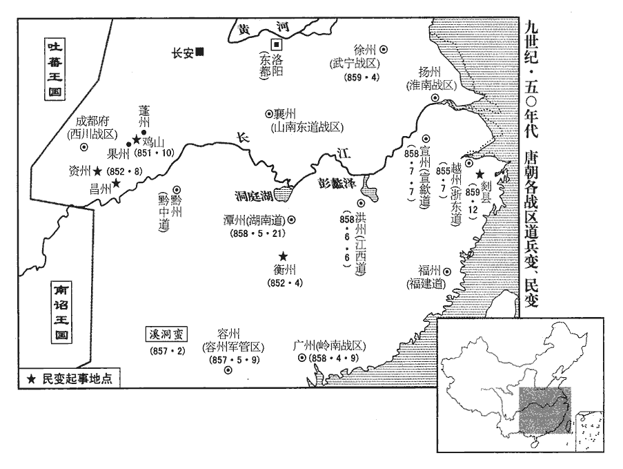
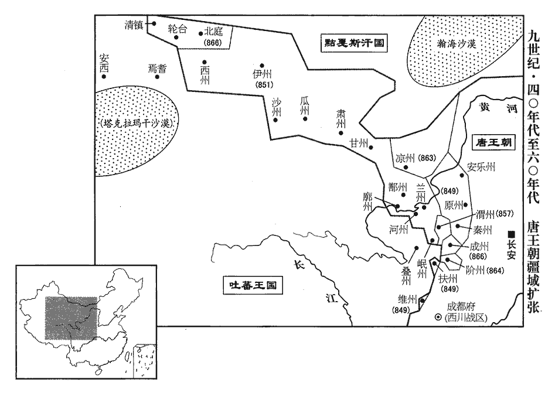

 唐紀六十五起上章敦牂（庚午），盡屠維單閼（己卯），凡十年。

# 宣宗元聖至明成武獻文睿智章仁神聰懿道大孝皇帝下

## 大中四年（庚午、八五零）

1春，正月，庚辰朔‹一›，赦天下。

〖译文〗 [1]春季，正月，庚辰朔（初一），唐宣宗宣告大赦天下。

2二月，以秦州‹甘肃省秦安县西北›隸鳳翔。秦州本屬隴右節度，是時新復，以屬鳳翔。

〖译文〗 [2]二月，唐朝廷将秦州隶属于凤翔。

3夏，四月，庚戌‹二›，以中書侍郎、同平章事馬植為天平‹总部设郓州山东省东平县›節度使。上‹李忱（李怡）本年四十一岁›之立也，左軍中尉馬元贄有力焉，武宗之大漸也，馬元贄為左神策護軍中尉，立上為皇太叔。由是恩遇冠諸宦者，冠，古玩翻。植與之敘宗姓。上賜元贄寶帶，元贄以遺植，遺，唯季翻。植服之以朝，朝，直遙翻。上見而識之，植變色，不敢隱。明日，罷相，收植親吏董侔，下御史臺鞫之，盡得植與元贄交通之狀，下，戶嫁翻。再貶常州‹江苏省常州市›刺史。常州，古延陵季子之邑，後為毗陵，晉為晉陵，唐為常州，京師東南二千八百四十三里。

〖译文〗 [3]夏季，四月，庚戌，（初二），唐宣宗任命中书侍郎、同平章事马植为天平节度使。唐宣宗被立为皇帝，宦官左神策军中尉马元贽出了大力，于是唐宣宗对他的恩遇超过其他宦官。马植与马元贽攀亲，叙为马姓宗族，唐直宗赐给马元贽金宝腰带，马元贽转赠给马植，马植系上宝带上朝，被唐宣宗看见并认出，马植当即脸上变色，不敢隐瞒。第二天，唐宣宗罢马植宰相官位，收捕马植的亲信胥吏董侔，送交御史台加以审问，将马植与马元贽内外交通的情状全部查清，于是再贬马植为常州刺史。

4六月，戊申‹二›，兵部侍郎、同平章事魏扶薨。以戶部尚書、判度支崔龜從同平章事。

〖译文〗 [4]六月，戊申（初二），兵部侍郎、同平章事魏扶去世。唐宣宗任命户部尚书、判度支崔龟从为同平章事。

5秋，八月，以白敏中判延資庫。去年改備邊庫為延資庫。

〖译文〗 [5]秋季，八月，唐宣宗任白敏中领掌延资库。

6盧龍‹总部设幽州北京市›節度使周綝薨，軍中表請以押牙兼馬步都知兵馬使張允伸為留後，九月，丁酉‹二十三›，從之。考異曰：四年七月，周綝薨，張允伸為留後。註曰：舊紀亦無朝廷命綝為節度使年月。至此但云「幽州節度使周綝卒，軍人立張允伸為留後。」實錄：「九月，幽州大將表請押衙張允伸知留後事。」舊允伸傳曰：「大中四年，戎帥周綝寢疾，表允伸為留後。」朝廷可其奏。」今參取之。註曰：今按通鑑書八月周綝薨。考異以為七月。

〖译文〗 [6]卢龙节度使周去世，卢龙藩镇军中向朝廷上表请求任押牙兼马步都知兵马使张允伸为留后，九月，丁酉（二十三日），唐宣宗表示同意。

7党項‹陕西省北部›為邊患，發諸道兵討之，連年無功，戍饋不已；右補闕孔溫裕上疏切諫，上怒，貶柳州‹广西柳州市›司馬。溫裕，戣kuí之兄子也。孔戣見二百四十卷憲宗元和十二年。

〖译文〗 [7]党项族成为唐朝的边境祸患，朝廷调发诸道兵攻讨，连年未获成功，而戌边的给养却输送不已；右补阙孔温裕向唐宣宗上疏进行谏阻，词语痛切，唐宣宗发怒，将孔温裕贬为柳州司马。孔温裕是孔哥哥的儿子。

8吐蕃‹首都逻些城西藏拉萨市›論恐熱遣僧莽羅藺真將兵於雞項關‹青海省循化县东›南造橋，以擊尚婢婢，軍於白土嶺‹青海省西宁市东›。水經註：左南津西六十里有白土城，城西北有白土川水。其地在唐河州鳳林縣西。以此推之，雞項關亦在河州界。婢婢遣其將尚鐸羅榻藏將兵據臨蕃軍‹青海省西宁市西›以拒之，不利，復遣磨離羆pí子燭盧鞏力復，扶又翻。將兵據氂牛峽‹青海省湟源县东›以拒之。氂，力之翻。鞏力請「按兵拒險，勿與戰，以奇兵絕其糧道，使進不得戰，退不得還，不過旬月，其眾必潰。」羆子不從。鞏力曰：「吾寧為不用之人，不為敗軍之將。」稱疾，歸鄯州。羆子逆戰，敗死。婢婢糧乏，留拓跋懷光守鄯州，帥部落三千餘人就水草於甘州‹甘肃省张掖市›西。帥，讀曰率。宋白曰：甘州，西南至肅州福祿縣界赤柳澗三百三十里。肅州，南至吐蕃界四百里。恐熱聞婢婢棄鄯州，自將輕騎五千追之，至瓜州‹甘肃省安西县›，宋白曰：瓜州，東南至肅州界三百四十里。聞懷光守鄯州，遂大掠河西鄯、廓‹青海省化隆县›等八州，宋白曰；廓州，北至鄯州百八十里，東南至河州鳳林縣二百八十里。殺其丁壯，劓刖其羸老劓yì，魚氣翻。刖yuè，魚決翻。羸，倫為翻。及婦人，以槊貫嬰兒為戲，焚其室廬，五千里間，赤地殆盡。

〖译文〗 [8]吐蕃酋领论恐热派遣僧人莽罗蔺真统兵于鸡项关以南造桥，用以攻击尚婢婢部，在白土岭屯驻军队。尚婢婢派遣其部将尚铎罗榻藏统兵据守临蕃军，以抗拒论恐热军，接战不利，尚婢婢又派遣磨离罴子、烛卢巩力统率军队据守牛峡以抗拒论恐热的进攻。烛卢巩力请求“按兵不动，据守险要，不与敌军接战，而出奇兵断绝敌军的粮道，使论恐热进不能作战，退又不得回还，不过几个月，敌军必然溃败。”磨离罴子不加理会。烛卢巩力说：“我宁愿成为不被任用的人，也不愿成为败军之将。”于是宣称有疾病，回到鄯州。磨离罴子率领军队与论恐热军逆战，大败而死。尚婢婢由于部众缺乏粮草，留下拓跋怀光据守鄯州，率领部落三千余人逐水草来到甘州西部地区。论恐热听说尚婢婢放弃鄯州，亲自统率轻骑五千人追赶，追至瓜州，听说拓跋怀光据守鄯州，于是命令部下在河西鄯州、廓州等八州地方大肆杀掠，将青壮年男子杀死，将老弱者以及妇女的鼻子和膝盖骨割去，用长矛刺婴儿作为游戏，焚烧居民的住房，使河西五千里之内，一片赤红。烧了个精光。

9冬，十月，辛未‹二十七›，以翰林學士承旨、兵部侍郎令狐綯同平章事。考異曰：舊紀在十一月。今從實錄、新紀。

〖译文〗 [9]冬季，十月，辛未（二十七日），唐宣宗任命翰林学士承旨、兵部侍郎令狐为同平章事。

10十一月，壬寅‹二十八›，以翰林學士劉瑑zhuàn為京西招討党項行營宣慰使。瑑，持兗翻。

〖译文〗 [10]十一月，壬寅（二十八日），唐宣宗任命翰林学士刘为京西招讨党项行营宣慰使。

11以盧龍留後張允伸為節度使。

〖译文〗 [11]唐宣宗任命卢龙留后旨允伸为节度使。

12十二月，以鳳翔‹总部设凤翔府陕西省凤翔县›節度使李業、河東‹总部设太原府山西省太原市›節度使李拭並兼招討党項使。

〖译文〗 [12]十二月，唐宣宗任命凤翔节度使李业、河东节度使李拭一并兼任招讨党项吏。

13吏部侍郎孔溫業白執政求外官，白敏中謂同列曰：「我輩須自點檢，孔吏部不肯居朝廷矣。」溫業，戣kuí之弟子也。孔溫業之操行不見於史，時人蓋以其家世而敬之。

〖译文〗 [13]吏部侍郎孔温业向执政宰相请求到地方上任外官，白敏中对同列宰相说：“我们这些当朝宰相应该检点一些，孔吏部不肯居于朝廷为官了。”孔温业是孔弟弟的儿子。

## 五年（辛未、八五一）

1春，正【章：十二行本「正」作「二」；乙十一行本同；退齋校同。】月，壬戌‹十九›，天德軍‹内蒙古乌拉特前旗东北›奏攝沙州‹甘肃省敦煌市›刺史張義潮遣使來降。降，戶江翻；下同。沙州，東南至長安三千八百五十九里。義潮，沙州人也，時吐蕃大亂，義潮陰結豪傑，謀自拔歸唐；一旦，帥眾被甲譟於州門，帥，讀曰率。被，皮義翻。唐人皆應之，吐蕃守將驚走，義潮遂攝州事，奉表來降。考異曰：補國史作「議潮」。今從實錄、新、舊紀、傳。以義潮為沙州防禦使。

〖译文〗 [1]春季，正月，壬戌（疑误），唐天德军向朝廷奏称代理沙州刺史张义潮派遣使者来归降。张义潮是沙州人，时值吐蕃内部发生大变乱，张义潮暗中连结沙州豪杰之士，谋划以自己的力量攻拔沙州，归降唐朝；一天早晨，张义潮率领部众全副武装在州门前喧噪鼓动，原属唐朝的汉族人全都响应，吐蕃族的守将惊慌失措逃走，于是张义潮摄领沙州军政事务，向唐朝上表归降。唐宣宗任命张义潮为沙州防御使。

2以兵部侍郎裴休為鹽鐵轉運使。休，肅之子也。裴肅見二百三十五卷德宗貞元十二年。自太和以來，歲運江、淮米不過四十萬斛，吏卒侵盜、沈沒，舟達渭倉‹永丰仓·陕西省潼关县北›者什不三四，大墮劉晏之法，沈，持林翻。墮，讀曰隳。劉晏法見二百二十六卷德宗建中元年。休窮究其弊，立漕法十條，歲運米至渭倉者百二十萬斛。

〖译文〗 [2]唐宣宗任命兵部侍郎裴休为盐铁转运使。裴休是裴肃的儿子。自从唐文宗太和年间以来，每年漕运到京师的江、淮地区的大米不过四十万斛，由于路上遭受官吏和士卒的偷盗侵吞以及船沉没于河底，运米船到达谓仓的不到十分之三四，使刘晏创立的漕运之法遭到极大的破坏，裴休坚决追究漕运过程中的弊端，制定漕运法规十条，使每年通过漕运输送至渭仓的江、淮大米达到一百二十万斛。

3上‹李忱（李怡）本年四十二岁›頗知党項‹陕西省北部›之反由邊帥利其羊馬，數欺奪之，或妄誅殺，党項不勝憤怨，故反，帥，所類翻。數，所角翻。勝，音升。乃以右諫議大夫李福為夏綏‹总部设夏州陕西省靖边县北白城子›節度使。自是繼選儒臣以代邊帥之貪暴者，行日復面加戒勵，復，扶又翻。党項由是遂安。福，石之弟也。

〖译文〗 [3]唐宣宗很清楚党项族的反叛是由于唐边镇将帅贪图党项族的羊、马，经常欺侮党项人，夺取他们的羊、马，有的竟妄加诛杀，党项族人民不胜愤怒和怨恨，所以被迫造反。唐宣宗为此任命右谏议大夫李福为夏绥节度使。此后继续选任文臣来替代边镇贪暴的将帅，临行前唐宣宗还要当面告诫和勉励戌边的文臣，于是党项的叛乱得以安定。李福是李石的弟弟。

4上以南山‹陕西省长城以南›、平夏‹陕西省长城以北›党項久未平，党項居慶州者，號東山部；居夏州者，號平夏部；其竄居南山者，為南山党項。趙珣聚米圖經；党項部落在銀、夏以北居川澤者，謂之平夏党項；在安、鹽以南，居山谷者，謂之南山党項。考異曰：唐年補錄曰：「松州南有雪山，故曰南山。平夏，川名也。」余按唐年補錄，乃末學膚受者之為耳。今不欲復言地理，姑以通鑑義例言之。考異者，考群書之同異而審其是，訓釋其義，付之後學。南山之說，既無同異之可考，今而引之，疑非考異本指也。頗厭用兵。崔鉉建議，宜遣大臣鎮撫。三月，以白敏中為司空、同平章事，充招討党項行營都統、制置等使，職源曰：制置使始此。南北兩路供軍使兼邠寧‹总部设宁州甘肃省宁县›節度使。敏中請用裴度故事，擇廷臣為將佐，許之。裴度故事見二百四十卷憲宗元和十二年。夏，四月，以左諫議大夫孫景商為左庶子，充邠寧行軍司馬；知制誥蔣伸為右庶子，充節度副使。伸，係之弟也。蔣係見二百四十四卷文宗太和五年。

〖译文〗 [4]南山、平夏党项部族的叛乱许久不能平息，唐宣宗不愿动用军队进行征讨。崔铉建议，应该派遣朝中大臣去进行镇压招抚，方能有成效。三月，唐宣宗任命白敏中为司空、同平章事，充任招讨党项行营都统、制置等使，南北两路供军使兼宁节度使。白敏中请求依照裴度过去的做法，选择朝廷的大臣为部下将佐，唐宣宗表示同意。夏季，四月，唐宣宗任命左谏议大夫孙景商为左庶子，充任宁行军司马；又任命知制诰蒋伸为右庶子，充任宁节度副使。蒋伸是蒋系的弟弟。

初，上令白敏中為萬壽公主選佳壻，為，于偽翻。敏中薦鄭顥hào；時顥已婚盧氏，行至鄭州‹河南省郑州市›，堂帖追還，萬壽公主適鄭顥見上卷上年。鄭州去京師一千一百五里。顥甚銜之，由是數毀敏中於上。敏中將赴鎮，言於上曰：「鄭顥不樂尚主，數，所角翻。樂，音洛。怨臣入骨髓。臣在政府，無如臣何；今臣出外，顥必中傷，臣死無日矣！」中竹仲翻。上曰：「朕知之久矣，卿何言之晚邪！」命左右於禁中取小檉chēng函以授敏中曰：「此皆鄭郎譖卿之書也。朕若信之，豈任卿以至今日\!」敏中歸，置檉函於佛前，焚香事之。檉，丑貞翻；說文曰：河柳也。

〖译文〗 起初，唐宣宗命令白敏中为女儿万寿公主选择佳婿，白敏中选中并推荐郑颢；当时郑颢已经与卢氏女订婚，走到郑州时，被宰相府的堂贴追回，为此郑颢对白敏中很不满意，经常在唐宣宗面前诋毁白敏中。白敏中将赶赴边镇，对唐宣言说：“郑颢不愿意娶公主，对我怨恨入于骨髓。我在政事堂掌政，他不能对我有什么奈何；今我要出朝，郑颢必定趁机恶语中伤，我恐怕死期不远了！”唐宣宗说：“朕早就知道了，您为什么这么晚才提醒我！”于是命左、右近侍从宫禁中取出一个红柳木盒子，交给白敏中说：“这里面都是郑郎谮毁您的书信，朕如果相信，哪里能重用您到今天呢！”白敏中回到家中，将红柳木盒子放到佛象前，烧香下拜，供若神明。

敏中軍於寧州，壬子‹十›，定遠‹宁夏平罗县›城使史元破党項九千餘帳於三交谷‹陕西省靖边县境›，三交谷在夏州界。敏中奏党項平。辛未‹二十九›，詔：「平夏党項，已就安帖。平夏，地名，在夏州界。宋朝李繼遷之叛也，徙綏州吏民之半置平夏以為巢穴，蓋銀、夏之要地也。南山党項，聞出山者迫於飢寒，猶行鈔掠，鈔，楚交翻。平夏不容，窮無所歸；宜委李福存諭，於銀‹陕西省榆林市南鱼河堡›、夏‹陕西省靖边县北白城子›境內授以閒田。如能革心向化，則撫如赤子，從前為惡，一切不問，或有抑屈，聽於本鎮投牒自訴。若再犯疆埸，或復入山林，復，扶又翻；下同。不受教令，則誅討無赦。將吏有功者甄獎，甄，稽延翻。死傷者優恤，靈、夏、邠、鄜四道百姓，給復三年，鄰道量免租稅。鄜，音膚。復，方目翻。量，音良。曏由邊將貪鄙，致其怨叛，自今當更擇廉良撫之。若復致侵叛，當先罪邊將，後討寇虜。」

〖译文〗 白敏中驻军于宁州，壬子（十日），定远城使史元于三交谷击破党项族九千余帐，白敏中奏告朝廷称党项已平定。辛未（二十九日），唐宣宗颁下诏令：“平夏党项部族现在已经安定帖服了，听说南山党项部族有些出山的帐落，由于饥寒交迫，仍然在进行抢掠，而为平夏党项部所不容，穷困得无路可走，没有归处；应该请李福向南山党项部存抚告谕，在银州、夏州境内授给他们一些闲置的田地。如果他们能洗心革面，听从教化，而不再剽掠，就应该象赤子一样抚慰他们；从前他们作恶多端，现在一切不加追究，如果有的帐落有冤屈，可让他们自己随时到所在军镇向主管官吏投牒中诉。如果再敢侵犯我边疆牧场，或者重新逃入山林之中，不受我大唐王朝的教令，就对他们进行诛讨，决不赦免。我边镇将领有功劳的人在经过甄别后给予奖赏，战死、受伤的人给予优厚的抚恤，凡是灵州、夏州、州、州四道的百姓，给予免征赋税三年的优待，相邻的道根据具体情况适当地减一些租税。过去由于边镇将帅贪暴卑鄙，致使党项族怨愤而叛乱，自今以后应当更慎重地选择廉洁、品行优良的将吏来安抚党项部族。如果党项族再侵扰边疆发动叛乱，应当先问边镇将吏的罪，然后再征讨叛乱的族人。”

5吐蕃論恐熱殘虐，所部多叛；拓跋懷光‹时守鄯州，青海省乐都县›使人說誘之，說，式芮翻。誘，以久翻，導引也。其眾或散居【章：十二行本「居」作「歸」；乙十一行本同；孔本同；張校同。】部落，或降於懷光。恐熱勢孤，乃揚言於眾曰：「吾今入朝於唐，借兵五十萬來誅不服者，然後以渭州‹甘肃省陇西县›為國城，請唐冊我為贊普，誰敢不從！」五月，恐熱入朝，上遣左丞李景讓就禮賓院問所欲。恐熱氣色驕倨，語言荒誕，誕，徒旱翻，誇大也。求為河渭節度使；上不許，召對三殿，如常日胡客，勞賜遣還。勞，力到翻。還，從宣翻。恐熱怏怏而去，復歸落門川‹甘肃省武山县东南›，聚其舊眾，恐熱本吐蕃落門討擊使。欲為邊患。會久雨，乏食，眾稍散，纔有三百餘人，奔于廓州‹青海省化隆县›。

〖译文〗 [5]吐蕃酋领论恐热残忍暴虐，所率部众大多叛亡；拓跋怀光派人去游说引诱其部众，使论恐热的部众或者从部落中从散居出去，或者投降拓跋怀光。论恐热的势力越来越孤单，于是向其部众扬言说：“我今天要朝拜大唐，向唐朝借兵五十万人来诛讨不服从我的人，然后将渭州当作国都，请大唐皇帝册封我为吐蕃赞普，谁敢不服从我！”五月，论恐热来到长安朝见大唐皇帝，唐宣宗派遣左丞李景让到礼宾院问论恐热有什么要求。论恐热趾高气扬，骄横傲慢，出言不逊，语句荒诞，请求唐宣宗任命他为河渭节度使；唐宣宗没有允许，将论恐热召到三殿问对，就象对待一般的胡人宾客，稍事慰劳，赐给一些东西后即让他回去。论恐热没有达到目的，怏怏不乐而去，回到落门川，聚集他原先的部众，企图作乱，成为唐朝的边患。正遇上久雨时节，缺乏粮食，其部众逐渐散去，仅剩下三百余人，投奔廓州。

6六月，立皇子潤為鄂王。

〖译文〗 [6]六月，唐宣宗立皇子李润为鄂王。

7進士孫樵上言：「百姓男耕女織，不自溫飽，而群僧安坐華屋，美衣精饌，饌，雛晥翻，又雛戀翻。率以十戶不能養一僧。武宗‹李瀍›憤其然，憤其然，猶言憤其如此也。髮十七萬僧，言使僧長髮復為齊民也。是天下一百七十萬戶始得蘇息也。陛下即位以來，修復廢寺，天下斧斤之聲至今不絕，度僧幾復其舊矣。幾，居依翻。陛下縱不能如武宗除積弊，柰何興之於已廢乎！日者陛下欲脩國東門，諫官上言，遽為罷役。為，于偽翻。今所復之寺，豈若東門之急乎？所役之功，豈若東門之勞乎？願早降明詔，僧未復者勿復，寺未脩者勿脩，庶幾百姓猶得以息肩也。」秋七月，中書門下奏：「陛下崇奉釋氏，群下莫不奔走，恐財力有所不逮，因之生事擾人，望委所在長吏量加撙節。撙zǔn，慈損翻。所度僧亦委選擇有行業者，行，下孟翻。若容凶粗之人，則更非敬道也。鄉村佛舍，請罷兵日脩。」時用兵以復河、湟。從之。

〖译文〗 [7]进士孙樵向唐宣宗上言：“老晨姓男耕女织，辛勤劳动却不能使自己获得温饱，而一大群不劳而获的佛教僧侣却安然自得地坐在华丽的房间里，身穿华美的衣裳，吃精美的饭菜，大概十户农家也养不起一个僧侣。武宗对僧侣不劳而食，蠹耗国家感到愤慨，勒令十七万僧侣蓄发还俗，使得天下一百七十万农户得以喘息复苏，而陛下即位以来，即下令修复被废的佛教诗庙，以致到今天天下修复庙宇的斧头刀锯之声仍不绝于耳，重新剃度的僧尼几乎恢复到以前的数目。您即使不能象武宗那样革除僧侣蠹国的积弊，又为什么要使已废除的积弊重新复兴呢！近日您想修缮长安城东门，谏官上言劝阻，您立即就罢除这项工役。而目前所恢复的寺庙，岂能比修复东门更加急迫？所花费的工役，岂能比修缮东门更少？希望您尽早降下圣明的诏书，命令凡僧尼还没有恢复身份的不准再予恢复，寺庙还未修复的也不准再作，或许劳苦的百姓为此仍然可以获得喘息的机会。”秋季，七月，中书门下奏称：“陛下您崇奉佛教，使下面的人莫不为之奔走，恐怕国家的财力无法承受，且因为推奉佛教而引发事端，骚扰人民，希望陛下能命令掌管佛事的有关官吏，对修建寺庙的费用适当地加以节约。对所剃度的僧侣也让有关部门加以选择，让有道行通佛性的人出家，如果容纳凶残粗野的人入佛门，当然就不是敬奉佛法了。乡村间的小佛舍，请等到收复河、湟罢兵后再修。”唐宣宗表示同意。

8八月，白敏中奏南山‹陕西省长城以南›党項亦請降。時用兵歲久，國用頗乏，詔并赦南山党項，使之安業。

〖译文〗 [8]八月、白敏中奏告朝廷称南山党项请求投降唐朝。当时用兵的时间已经很久，国家各项用度的费用相当困乏，唐宣宗颁下诏书，命令对南山党项部族一并赦免，使他们能安居乐业。

9冬，十月，乙卯‹十七›，中書門下奏：「今邊事已息，而州府諸寺尚未畢功，望且令成之。其大縣遠於州府者，聽置一寺，其鄉村毋得更置佛舍。」從之。

〖译文〗 [9]冬季，十月，乙卯（十七日），中书门下政事堂向唐宣宗上奏：“如今边境上的事已经平息，而地方州府所要修复的诸寺庙还没有完工，希望这时下令让州府完成此项工程。如果大县离州府较远者，可以建置一座寺庙，而乡村就不得再建置佛舍了。”唐宣宗表示同意。

 

10戊辰‹三十›，以戶部侍郎魏謩mó同平章事，仍判戶部，時上‹本年李忱四十二岁›春秋已高，未立太子，群臣莫敢言。謩入謝，因言：「今海內無事，惟未建儲副，使正人輔導，臣竊以為憂。」且泣。時人重之。重之者，以其能言人所不敢言也。

〖译文〗 [10]戊辰（三十日），唐宣宗任命户部侍郎魏为同平章事，仍然负责户部事务。当时唐宣宗年事已高，还未立皇太子，群臣没有谁敢提这件事。魏入朝向宣宗谢恩，趁机上言：“现在海内已经无事，只是至今还没有建立储君，使正人君子加以辅导，我心里对此深感忧虑。”说着就流下眼泪。当时人对魏敢说别人不敢说的话而特别敬重。

11蓬‹四川省仪陇县南›、果‹四川省南充市›群盜依阻雞山‹四川省营山县境›，寇掠三川；雞山在蓬、果二州之界，而群盜依阻以寇掠三川，則其結根也廣矣。三川，謂東‹四川省东北部›、西川‹四川省中部›及山南西道‹陕西省南部›也。以果州刺史王贄弘充三川行營都知兵馬使以討之。

〖译文〗 [11]逢州、果州的群盗以鸡山为根据地，侵扰掠夺东川、西川、山南西道等三川地区；唐宣宗任命果州刺史王贽弘充当三川行营都知兵马使进行讨伐。

12制以党項‹陕西省北部›既平，罷白敏中都統，但以司空，平章事充邠寧節度使。

〖译文〗 [12]唐宣宗颁下制书，以党项的叛乱既已平定，罢除白敏中的招讨党项行营都统的职务，只以司空、平章事的名义充任宁节度使。

 

13張義潮發兵略定其旁瓜‹甘肃省安西县›、伊‹新疆哈密市›、西‹新疆吐鲁番市东›、甘‹甘肃省张掖市›、肅‹甘肃省酒泉市›、蘭‹甘肃省兰州市›、鄯、河‹甘肃省临夏市›、岷‹甘肃省岷县›、廓‹青海省化隆县›十州，遣其兄義澤奉十一州圖籍入見，十州并沙州為十一州。見，賢遍翻。宋白曰：瓜州，西至沙州二百八十里，西北至伊州九百里。西州，東至伊州七百五十里。甘州，西至肅州四百二十里。肅州，西至瓜州五百二十六里。蘭州，西至鄯州四百九十里。鄯州，南至廓州二百八十里。河州，東北至蘭州三百里。岷州，北至蘭州狄道縣五百三十四里，西北至河州大夏縣三百六十三里。於是河、湟之地‹甘肃省及青海省东部›盡入于唐。十一月，置歸義軍於沙州，以義潮為節度使、考異曰：唐年補錄、舊紀、義潮降在五年八月。獻祖紀年錄及新紀在十月。按實錄：「五年，二月，壬戌，天德軍奏沙州刺史張義潮、安景旻及部落使閻英達等差使上表，請以沙州降。十月，義潮遣兄義澤以本道瓜、沙、伊、肅等十一州地圖戶籍來獻。河、隴陷沒百餘年，至是悉復故地。十一月，建沙州為歸義軍，以張義潮為節度使，河、沙等十一州觀察、營田、處置等使。」新紀：「五年，十月，沙州人張義潮以瓜、沙、伊、肅、鄯、甘、河、西、蘭、岷、廓十一州歸于有司。」新傳：「三州、七關降之明年，沙州首領張義潮奉十一州地圖以獻，擢義潮沙州防禦使，俄號歸義軍，遂為節度使。」參考諸書，蓋二月義潮使者始以得沙州來告，除防禦使，十月又遣義澤以十一州圖籍來上，除節度使也。今從實錄。新傳云三州降之明年，誤也。十一州觀察使；又以義潮判官曹義金為歸義軍長史。按新書百官志：節度使有行軍司馬、節度副使、判官、支使等；其兼都督、都護，則有長史。

〖译文〗 [13]张义潮调发军队大致平定沙州近旁的瓜、伊、西、甘、肃、兰、鄯、河、岷、廓十州之地，派遣他的兄长张义泽奉十一州地图名籍入朝见唐宣宗，于是河、湟之地全部归入唐朝版图。十一月，唐宣宗置归义军于沙州，任命张义潮为归义军节度使、十一州观察使；又任命张义潮的判官曹义金为归义军长史。

14以中書侍郎、同平章事崔龜從同平章事，充宣武‹总部设汴州河南省开封市›節度使。

〖译文〗 [14]唐宣宗任命中书侍郎、同平章事崔龟从为同平章事衔，充任宣武节度使。

15右羽林統軍張直方坐出獵累日不還宿衛，貶左驍衛將軍。

〖译文〗 [15]右羽林统军张直方因为外出游猎，数日不回来宿卫宫城，玩忽职守，被贬为左骁卫将军。

## 六年（壬申、八五二）

1春，二月，王贄弘討雞山‹四川省营山县境›賊，平之。

〖译文〗 [1]春季，二月，王贽弘讨伐鸡山盗贼，将贼寇平定。

是時，山南西道‹总部设兴元府陕西省汉中市›節度使封敖奏巴南妖賊‹指蓬、果二州变民，二州都在川、陕交界大巴山脉以南›言辭悖慢，上‹李忱（李怡）本年四十三岁›怒甚。妖，於驕翻。悖，蒲妹翻。又蒲沒翻。崔鉉曰：「此皆陛下赤子，迫於飢寒，盜弄陛下兵於谿谷間，不足辱大軍，但遣一使者可平矣。」乃遣京兆少尹劉潼詣果州‹四川省南充市›招諭之。潼上言請不發兵攻討，且曰：「今以日月之明燭愚迷之眾，使之稽顙歸命，其勢甚易。稽，音啟。易，以豉翻。所慮者，武臣恥不戰之功，議者責欲速之效耳。」潼至山中，盜彎弓待之，潼屏左右直前屏，必郢翻，又卑正翻。曰：「我面受詔赦汝罪，使汝復為平人。聞汝木弓射二百步，今我去汝十步，汝真欲反者，可射我！」射，而亦翻。賊皆投弓列拜，請降。降，戶江翻。潼歸館，而王贄弘與中使似先義逸引兵已至山下，竟擊滅之。

〖译文〗 这时，山南西道节度使封敖向唐宣宗上奏，称巴南的妖贼出言不逊，言辞傲慢，唐宣宗怒气冲天。崔铉说：“这些人都是陛下的赤子，由于饥寒交迫，于谷之间抢夺并戏弄您的军队，其实并不足以辱没您强大的军队，只要派遣一个使者就可以平定他们。”于是派遣京兆少尹刘潼到果州去招抚劝谕。刘潼向唐宣宗上言，请求不要调发军队去攻讨，并且说：“今天我用太阳和月亮的光明去照亮那群愚昧迷惑之众的心，让他们向您叩头归命，做到这一点十分容易。所忧虑的是，武臣们对不战之功感到耻辱，议论者追求速成的功效。”刘潼来到山中，贼盗弯着弓接待他，刘潼屏去左右随从独自走上前说：“我已经面受皇帝的诏敕，赦免你们的罪，使你们重新做平民百姓。听说你们的木弓能射二百步，现在我距你们只有十步，你们如果真想造反，可以射死我！”贼众全都将弓箭抛在一边，排成列队向刘潼拜谢，请求投降。刘潼回到馆舍，王贽弘与宦官使者似先义逸率领军队已来到山下，竟然袭击已投降的人，将他们消灭。

2三月，敕先賜右衛大將軍鄭光鄠縣‹陕西省户县›及雲陽‹陕西省泾阳县北云阳镇›莊並免稅役。中書門下奏，以為：「稅役之法，天下皆同。陛下屢發德音，欲使中外畫一，漢書：蕭何為法，講若畫一。師古註曰：畫一，言整齊也。今獨免鄭光，似稍乖前意。事雖至細，繫體則多。」敕曰：「朕以鄭光元舅之尊貴，欲優異令免征稅，初不細思。況親戚之間，人所難議，卿等苟非愛我，豈進嘉言！庶事能盡如斯，天下何憂不理！有始有卒，卒，子恤翻。當共守之。並依所奏。」

〖译文〗 [2]三月，唐宣宗下敕令原先赐给右卫大将军郑光县以及云阳的庄园一并免除税役。为此中书门下上奏，认为：“收取税役的法规，天下都应相同。您屡次发布德音，希望使中外法令齐整划一，今天唯独先除郑光的税役，似乎与前面的意思稍有悖离。虽然这是一件很细微的事，但牵涉的问题却很多。”唐宣宗为此下敕宣称：“朕以为郑光皇帝元舅的尊贵身份，企图给他优异的待遇，免征租税，起初没有细加思考。况且亲戚之间，正是人们难以议论的，你们如果不是热爱我，岂能向我进如此好的意见！其他一般性事务如果都能这样，天下何忧不能治理！有始有终，君臣应当共同遵守。按照你们所奏请的去办。”

3夏，四月，甲辰‹八›，以邠寧‹总部设宁州甘肃省宁县›節度使白敏中為西川‹总部设成都府四川省成都市›節度使。

〖译文〗 [3]夏季，四月，甲辰（初八），唐宣宗任命宁节度使白敏中为西川节度使。

4湖南‹首府设潭州湖南省长沙市›奏，團練副使馮少端討衡州‹湖南省衡阳市›賊帥鄧裴，平之。帥，所類翻；下同。

〖译文〗 [4]湖南奏告朝廷，团练副使冯少端讨伐衡州贼帅邓裴，将他们讨平。

5党項‹陕西省北部›復擾邊，上欲擇可為邠寧帥者而難其人，從容與翰林學士、中書舍人須昌‹山东省东平县›畢諴xián論邊事，諴援古據今，具陳方略。從，千容翻。諴，戶嵓翻。援，于元翻。上悅曰：「吾方擇帥，不意頗、牧近在禁廷。卿其為朕行乎！」諴欣然奉命。上欲重其資履，為，于偽翻。資，以序進。履，所歷之官也。六月‹七月›，壬申‹七日›，先以諴為刑部侍郎，癸酉‹八›，乃除邠寧節度使。考異曰：舊傳，懿宗召問邊事。今從實錄。

〖译文〗 [5]党项部族又侵扰边，唐宣宗想选择可充任宁统帅的人，而难以找到合适者，便从容地与翰林学士、中书舍人须昌人毕议论边境之事，毕援古据今，向唐宣宗陈述征讨党项的一整套方略。唐宣宗欢喜地说：“朕正要选择统帅，想不到廉颇、李牧就近在朕禁廷。您愿意为朕出征边镇吗？”毕欣然表示愿奏命前往。唐宣宗企图加重毕的官资履历，六月，壬申（疑误），先任命毕为刑部侍郎，癸酉（疑误），再任命毕为宁节度使。

6雍王渼薨，追諡靖懷太子。渼，音美。

〖译文〗 [6]雍王李去世，被追谥为靖怀太子。

7河東‹总部设太原府山西省太原市›節度使李業縱吏民侵掠雜虜，又妄殺降者，由是北邊擾動。閏月，庚子‹六›，以太子少師盧鈞為河東節度使。業內有所恃，人莫敢言，魏謩獨請貶黜；上不許，但徙義成‹总部设滑州河南省滑县›節度使。

〖译文〗 [7]河东节度使李业放纵所部吏民侵犯和掠夺杂居的各族胡人，又随意乱杀投降的胡人，于是北部边境出现动乱。闰七月，庚子（初六），唐宣宗任命太子少师卢钧为河东节度使。李业因为在宫内有所依侍，人们不敢说他的罪过，唯独魏暮请唐宣宗将李业贬黜罢官；唐宣宗没有允许，只是将李业徙为义成节度使。

盧鈞奏度支郎中韋宙為副使。宙徧詣塞下，悉召酋長，諭以禍福，酋，慈由翻。長，知丈翻。禁唐民毋得入虜境侵掠，犯者必死，雜虜由是遂安。

〖译文〗 卢钧向唐宣宗奏请度支郎中韦宙为河东节度副使。韦宙走遍塞下，将诸杂胡酋长全部召来，向他们告谕以祸福，又禁止唐朝民众，要他们不得进故胡人地境侵占掠夺，有犯者必处死，诸杂居胡人部落由此安定下来。

掌書記李璋杖一牙職，明日，牙將百餘人訴於鈞，鈞杖其為首者，謫戍外鎮，餘皆罰之，曰：「邊鎮百餘人，無故橫訴，橫，戶孟翻。不可不抑。」璋，絳之子也。李絳相憲宗，以直諒聞；帥梁，為亂卒所殺。

〖译文〗 掌书记李璋用棍杖打一名牙职小官，第二天，牙将一百余人来向卢钧申诉，卢钧用棍杖打其中为首者，将他贬谪于外镇戌守，其余的人都受到了处罚，卢钧说：“边镇一百余人，无故强横地申诉，不能不予抑制。”李璋是李绛的儿子。

8八月，甲子‹一›，以禮部尚書裴休同平章事。

〖译文〗 [8]八月，甲子（初一），唐宣宗任命礼部尚书裴休为同平章事。

9獠‹贵州省北部›寇昌‹重庆市荣昌县›、資‹四川省资中县›二州。獠，魯皓翻。資州，漢資中縣地，宋、齊為資陽戍，西魏置資州，至京師三千五百六十里。

〖译文〗 [9]獠族人侵掠昌州、资州之地。

10冬，十月，邠寧節度使畢諴奏招諭党項‹陕西省北部›皆降。

〖译文〗 [10]冬季，十月，节度使毕奏告唐宣宗，称招抚告谕党项叛乱部众，已使他们全部归降。

11驍衛將軍張直方坐以小過屢殺奴婢，貶恩州‹广东省恩平市›司戶。

〖译文〗 [11]骁卫将军张直方多次以小过失杀死奴婢，被贬官徙任恩州司户。

12十一月，立憲宗子惴為棣王。惴，之捶翻。

〖译文〗 [12]十一月，唐宣宗立唐宪宗的儿子李惴为棣王。

13十二月，中書門下奏：「度僧不精，則戒法墮壞；墮，讀曰隳。造寺無節，則損費過多。請自今諸州準元敕許置寺外，有勝地靈迹許脩復，繁會之縣許置一院。繁會，謂人物浩繁，舟車所會之地。嚴禁私度僧、尼；若官度僧、尼有闕，則擇人補之，仍申祠部給牒。此今所謂度牒者。其欲遠遊尋師者，須有本州公驗。」從之。公驗者，自本州給公文，所至以為照驗。

〖译文〗 [13]十二月，中书门下上奏：“剃度僧尼不精，就会使佛教的戒法堕坏；建造寺庙没有节制，就会耗损费用过多。请求自今以后，诸州在原先所颁布的诏敕所允许设置的寺庙之外，在有名胜灵迹的地方许予修复寺庙，人烟车马繁盛的县准许设置一所寺院。严禁私自剃度僧侣、尼姑；如果官府剃度僧侣、尼姑有缺额，可以选择合格的人补上，但仍要申报祠部发给度牒。远游寻找师傅的僧侣，必须有本州颁发的公文，以便到达目的地时，由当地官府对照验正。”唐宣表示同意。

## 七年（癸酉、八五三）

1春，正月，戊申‹十七›，上‹李忱（李怡）本年四十四岁›祀圜丘；赦天下。

〖译文〗 [1]春季，正月，戊申（十七日），唐宣宗举行祀圜丘典礼，大赦天下。

2夏，四月，丙寅‹六›，敕：「自今法司處罪，處，昌呂翻。用常行杖。杖脊一，折法杖十；法杖，謂常行臀杖也。脊，資昔翻。折，之截翻。杖臀一，折笞五。臀，徒渾翻。使吏用法有常準。」

〖译文〗 [2]夏季，四月，丙寅（初六），唐宣宗颁布诏敕：“自今以后司法衙门处以刑罚，用经常行用的杖刑。用棍仗打脊背一下，依法规折算为用棍杖打臀部十下；用棍杖打臀部一下，折算为用鞭挞五下。这样可以使官吏用刑有一定的标准。”

3冬，十二月，左補闕趙璘請罷來年元會，止御宣政。上以問宰相，對曰：「元會大禮，不可罷。況天下無事。」上曰：「近華州‹陕西省华县›奏有賊光火劫下邽‹陕西省渭南市北›，明火行劫，言盜無所憚。華，戶化翻。關中‹陕西省中部›少雪，少，詩沼翻。皆朕之憂，何謂無事！雖宣政亦不可御也。」

〖译文〗 [3]冬季，十二月，左补阙赵请求罢除明年元旦大朝会典礼，让唐宣宗只到宣政殿见朝臣。唐宣宗就此问于宰相，宰相们回答说：“元旦朝会大礼，不可以罢废。况且现在天下无事。”唐宣宗说：“最近华州奏称有盗贼无所忌惮，在光天化日之下抢劫下城，关中地区下雪太少，这都是朕的忧虑，怎么能说无事！即使是让我到宣政殿举行典礼，也是不可以的。”

4上事鄭太后甚謹，不居別宮，朝夕奉養。養，余亮翻。舅鄭光歷平盧‹总部设青州山东省青州市›、河中‹总部设河中府山西省永济市›節度使，上【章：十二行本「上」上有「入朝」二字；乙十一行本同；孔本同；張校同；退齋校同。】與之論為政，光應對鄙淺，上不悅，留為右羽林統軍，使奉朝請。太后數言其貧，數，所角翻。上輒厚賜金帛，終不復任以民官。復，扶又翻。民官，謂治民之官。

〖译文〗 [4]唐宣宗服侍郑太后甚为谨慎，不让她居住于别宫，以便自己能朝夕奉养。舅舅郑光历官平卢节度使和河中节度使，唐宣宗与他议论为政之道，郑光应对时表现得鄙陋浅薄，唐宣宗很不高兴，留郑光于朝廷任佑羽林统军，使他便于奉朝请示。郑太后几次向唐宣宗说郑光贫穷，唐宣宗即厚厚地赐给郑光金帛，而始终不再委任他以为治民之官。

5度支奏：「自河、湟‹甘肃省及青海省东部›平，每歲天下所納錢九百二十五萬餘緡，內五百五十萬餘緡租稅，八十二萬餘緡榷酤，二百七十八萬餘緡鹽利。」榷，古岳翻。酤gū，工護翻。考異曰：續皇王寶運錄具載是歲度支支收之數，舛錯不可曉，今特存其可曉者。溫公拳拳於史之闕文，蓋其所重者，制國用也。

〖译文〗 [5]度支奏告唐宣宗：“自河、湟地区得到平定，每年天下所收纳的钱有九百二十五万余缗，其中五百五十万余缗是租税，八十二万余缗是专卖酒的税钱，二百七十八万余缗是盐利。”

## 八年（甲戌、八五四）

1春，正月，丙戌朔‹一›，日有食之。罷元會。

〖译文〗 [1]春季，正月，丙戌朔（初一），出现日食，罢除元旦大朝会。

2上‹李忱（李怡）本年四十五岁›自即位以來，治弒憲宗之黨，宦官、外戚乃至東宮官屬，誅竄甚眾。宣宗絕郭后景陵之合葬，誅元和東宮之官屬，則以為穆宗母子誠預陳弘志之謀者。然文宗於穆宗，父子也。文宗憤元和逆黨，欲盡誅之而不克，以成甘露之禍。使父果為商臣，則子必為潘崇諱矣。慮人情不安，丙申‹十一›，詔：「長慶之初，亂臣賊子，頃搜擿tì餘黨，流竄已盡，溫公於郭后之崩，王皞hào之貶，既詳書之矣；復書此詔。然王皞之議，卒伸於咸通之初，通鑑又書之。懿宗以子繼父，而天理所在者公議所在，不可得而違也，不可得而揜yǎn也。讀通鑑者宜以是觀之。其餘族從疏遠者，一切不問。」從，一從、再從、三從兄之親。族，袒免以外之親也。從，才用翻。

〖译文〗 [2]唐宣宗自从即皇帝位以来，整治弑唐宪宗的逆党，宦官、外戚以至东宫的官属，很多人受牵连，被诛杀的和被流放的人很多。由于怕造成人心不安，丙申（十一日），唐宣宗颁布诏书宣称：“长庆初年的乱臣贼郭，前一段时间搜捕其余党，已经全部依罪流放，其余与罪犯较疏远的亲族，一概不予追究。”

3二月，中書門下奏，拾遺、補闕缺員，請更增補。上曰：「諫官要在舉職，不必人多，如張道符、牛叢、趙璘輩數人，使朕日聞所不聞足矣。」叢，僧孺之子也。李德裕排牛僧孺；上惡德裕；故親僧孺之子。

〖译文〗 [3]二月，中书门下政事堂奏告唐宣宗，称拾遗、补阙官员缺额，请求再增补一些。唐宣宗说：“谏官关键在于能称职，不必要人很多，如张道符、牛丛、赵这样几个人，使朕每天能知道许多朕所无法知道的事，这样就足够了。”牛丛是牛僧孺的儿子。

久之，叢自司勳員外郎出為睦州‹浙江省建德市›刺史，睦州，吳置新都郡，隋置睦州，取俗阜人和、內外輯睦為義，京師東南三千六百五十九里。入謝，上賜之紫。叢既謝，前言曰：謝恩之後，前進而言。「臣所服緋，刺史所借也。」上遽曰：「且賜緋。」上重惜服章，有司常具緋、紫衣數襲從行，以備賞賜，或半歲不用其一，故當時以緋、紫為榮。上重翰林學士，至於遷官，必校歲月，以為不可以官爵私近臣也。

〖译文〗 一段时间之后，牛丛自司勋员外郎出任睦州刺史，入朝向唐宣宗谢恩，唐宣宗赐给他紫衣。牛丛谢恩之后，走上前进言说：“我现在穿的绯衣，是刺史的凭借。”唐宣宗立即说：“那就再赐给您一件绯衣吧。”唐宣宗重视和珍惜代表官吏身份和地位的官服，有关部门经常预备绯衣、紫衣好几套跟从着唐宣宗，以备随时赏赐给官吏，但有时半年也不用其中一件，所以当时人均以穿绯衣、紫衣为荣耀。唐宣宗信重翰林学士，但翰林学士升迁官位时，唐宣宗必定要查对他们任官的年月，看是否任期届满，有足够的资历升迁新位，认为不可以随意将官爵私下赏赐给近密的臣下。

4秋，九月，丙戌‹四›，以右散騎常侍高少逸為陜虢‹首府设陕州河南省三门峡市›觀察使。有敕使過硤xiá石‹河南省三门峡市东硖石镇›，硤石，隋之崤縣，貞觀十四年移治硤石塢，改名硤石，屬陜州。陜，失冉翻。怒餅黑，鞭驛吏見血；少逸封其餅以進。敕使還，還，音旋，又如字。上責曰：「深山中如此食豈易得！」易，以豉翻。讁配恭陵‹李治的儿子李弘墓·位于河南省偃师县南›。

〖译文〗 [4]秋季，九月，丙戌（初四），唐宣宗任命右散骑常侍高少逸为陕虢观察使。有一位宦官敕使路过硖石县，对驿馆供给他食用的饼太黑感到愤怒，用鞭抽打驿吏，使驿使流血；高少逸将那块饼封于盒送交朝廷，当这位宦官敕使还朝时，唐宣宗斥责他说：“在深山中这样的食物，又岂能是容易得到的！”即将他降职发配去守恭陵。

5立皇子洽為懷王，汭ruì為昭王，汶為康王。汶，音問。考異曰：唐年補錄：「五年，正月，甲戌朔，封三王。」今從實錄、新紀。

〖译文〗 [5]唐宣宗立皇子李洽为怀王，李为昭王，李汶为康王。

6上獵於苑北，此又出苑城而北獵。遇樵夫，問其縣，曰：「涇陽‹陕西省泾阳县›人也。」「令為誰？」曰：「李行言。」「為政何如？」曰：「性執。有強盜數人，軍家索之，軍家，謂北司諸軍也。唐人謂諸道節度及觀察為使家，諸州為州家，諸縣為縣家。索，山客翻。竟不與，盡殺之。」上歸，帖其名於寢殿之柱。冬，十月，行言除海州‹江苏省连云港市›刺史，入謝，上賜之金紫。問曰：「卿知所以衣紫乎？」衣，於既翻；下至衣紫、衣黃並同。對曰：「不知。」上命取殿柱之帖示之。

〖译文〗 [6]唐宣宗出苑城之北游猎，遇到一位樵夫，问他是哪个县的人，椎夫回答：“泾阳县人。”又问：“县令是谁？”回答说：“李行言。”唐宣宗再问：“李行言在县为政情况怎么样？”樵夫回答说：“李行言性格固执。有几个强盗关押在县监狱，宦官领掌的北司禁军来县府要人，李行言就是不放人，硬是将这几个强盗全部处死了。”唐宣宗回宫后，将李行言的名字行事写在一个帖子上，挂于自己寝殿中的柱子上。冬季，十月，李行言被任命为海州刺史，入朝向唐宣宗谢恩时，唐宣宗赐给他金紫衣裳。并问李行言说：“你知道为什么赐给你紫衣吗？”李行言回答说：“不知道。”唐宣宗即命左右取来挂于寝殿柱子上的帖文，给李行言看。

7上以甘露之變，見二百四十五卷文宗大和八年。惟李訓、鄭注當死，自餘王涯、賈餗等無罪，詔皆雪其冤。

〖译文〗 [7]唐宣宗认为甘露之变，唯有李训、郑注应当处死，其余王涯、贾等人无罪，颁布诏书昭雪他们的冤枉。

上召翰林學士韋澳，託以論詩，屏左右與之語曰：「近日外間謂內侍權勢何如？」對曰：「陛下威斷，非前朝之比。」澳，音奧。屏，必郢翻，又卑正翻。斷，丁亂翻。朝，直遙翻。上閉目搖首曰：「全未，全未！尚畏之在。句斷。卿謂策將安出？」對曰：「若與外廷議之，恐有太和之變，不若就其中擇有才識者與之謀。」上曰：「此乃末策。【章：十二行本「策」下有「朕已試之矣」五字；乙十一行本同；孔本同；張校同。】自衣黃、衣綠至衣緋，皆感恩，纔衣紫則相與為一矣！」唐自上元以後，三品已上服紫，四品服深緋，五品服淺緋，六品服深綠，七品服淺綠，八品服綠，九品深青，流外官及庶人服黃。太宗定制，內侍省不置三品官；內侍是長官，階四品，其職但在閤門守禦，黃衣廩食而已。至玄宗，宦官至三品將軍，門施棨qǐ戟，得衣紫矣。衣，於既翻。上又嘗與令狐綯謀盡誅宦官，綯恐濫及無辜，密奏曰：「但有罪勿捨，有闕勿補，自然漸耗，至於盡矣。」宦者竊見其奏，由是益與朝士相惡，南北司如水火矣。

〖译文〗 唐宣宗召来翰林学士韦澳，假借讨论诗文，屏去左右近侍对韦澳说：“近日禁宫外对内侍宦官的权势有哪些说法？”韦澳回答说：“都说陛下对宦官的处置威严果断，不是前朝皇帝可以相比的。”唐宣宗闭上眼睛摇摇头说：“都不是这么回事，都不是这么回事！朕对宦官还有畏惧呢。你看有什么良策能对付宦官呢？”韦澳回答说：“如果与宫廷之外的宰相大臣谋议诛除宦官，恐怕会有象太和年间那样的变故，还不如就在宦官当中选择一些有才识的人，与他们来谋议。”唐宣宗说：“这是末策，朕已试行过，当朕提拔他们，让他们穿上黄色衣裳、绿色衣裳，以至绯衣时，他们都感恩戴德，一旦赐给他们紫衣时，他们便与为首作恶的宦官抱成一团，不再听朕的话了！”唐宣宗又曾经与令狐密谋，企图将宦官全部诛杀干净，令狐恐怕会滥杀无辜，秘密地奏告唐宣宗说：“只要对有罪的宦官不予放过，宦官有缺不邓补充，就会自然而然地慢慢消耗，最后死光，用不着您的操劳忧虑了。”有宦官偷偷地看到了令狐的奏状，于是更加与外朝士大夫过不去，使南衙朝官与北司宦官势如水火。

## 九年（乙亥、八五五）

1春，正月，甲申‹四›，成德‹总部设镇州河北省正定县›軍奏節度使王元逵薨‹年四十三岁›，軍中立其子節度副使紹鼎，癸卯‹二十三›，以紹鼎為成德留後。

〖译文〗 [1]春季，正月，甲申（初四），唐成德军奏告朝廷称节度使王元逵去世，军中立王元逵的儿子节度副使王绍鼎主掌军政，癸卯（二十三日），唐宣宗任命王绍鼎为成德军留后。

2二月，以醴泉‹陕西省礼泉县›令李君奭為懷州‹河南省沁阳市›刺史。初，上‹李忱（李怡）本年四十六岁›校獵渭上，有父老以十數，聚於佛祠，上問之，對曰：「醴泉百姓也。縣令李君奭有異政，考滿當罷，詣府乞留，故此祈佛，冀諧所願耳。」及懷州刺史闕，上手筆除君奭，宰相莫之測。君奭入謝，上以此獎厲，以所得於父老之言獎厲。眾始知之。

〖译文〗 [2]二月，唐宣宗任命醴泉县令李君为怀州刺史。起初，唐宣宗于渭上游猎，看见十几位父老聚集在一个佛祠前，唐宣宗上前讯问其缘故，父老们回答说：“我们是醴泉县百姓，县令李君有优异的政绩，任期届满当罢官，我们到官府乞求他留任，为此而祈祷于佛祠，希望都能如我们所愿。”后来怀州刺史空缺，唐宣宗亲手写诏敕任命李君，宰相们对李君的升迁摸不到头脑。李君入朝向唐宣宗谢恩，唐宣宗才以所得于父老之言来奖励李君，众人这才明白了李君超升的缘故。

3三月，詔邠寧‹总部宁州甘肃省宁县›節度使畢諴還邠州‹陕西省彬县›。先是，以河、湟‹甘肃省及青海省东部›初附，党項未平，移邠寧軍於寧州，事見上卷三年。先，悉薦翻。至是，南山‹陕西省长城以南›、平夏‹陕西省长城以北›【章：十二行本「夏」下有「党項」二字；乙十一行本同；孔本同；張校同。】皆安，威‹宁夏中宁县东北鸣沙洲›、鹽‹陕西省定边县›、武‹宁夏同心县·原萧关›三州軍食足，五年，以原州之蕭關置武州。故令還理所。理所，猶言治所。邠寧軍本理邠州，北至寧州一百二十五里。

〖译文〗 [3]三月，唐宣宗颁下诏书令宁节度使毕还治州。起先，由于河、湟地区刚归附朝廷，党项部族的叛乱还未平息，于是移宁军于宁州，到这时，南山党项和平夏党项部族都已安定下来，威州、盐州、武州三州的军粮充足，所以命令毕归还州洽所。

4夏，閏四月，詔以「州縣差役不均，自今每縣據人貧富及役輕重作差科簿，送刺史檢署訖，鏁suǒ於令廳，鏁，蘇果翻。令廳，縣令廳事也。每有役事委令據薄定【章：十二行本「定」作「輪」；乙十一行本同；孔本同；張校同。】差。」今之差役薄始此。

〖译文〗 [4]夏季，闰四月，唐宣宗颁布诏令，认为：“州县对民户调发的差役不平均，自今以后每县官府根据人的贫富情况，以及差役的轻重制作差科簿，送交州刺史检查签署完毕后，再收藏于县令衙署存档，每有派役之事委交县令时，即依据差科簿来定当差的人。”

5五月，丙寅‹十九›，以王紹鼎為成德節度使。

〖译文〗 [5]五月，丙寅（十九日），唐宣宗任命王绍鼎为成德节度使。

6上聰察強記，宮中廝役給灑掃者，廝，音斯。灑，所買翻，又所賣翻。掃，蘇老翻，又素報翻。皆能識其姓名，識，職吏翻。才性所任，任，音壬。呼召使令，無差誤者。天下奏獄吏卒姓名，一覽皆記之。度支奏漬zì污帛，污，烏故翻。誤書「漬」為「清」，樞密承旨孫隱中謂上不之見，輒足成之。唐末，樞密承旨以院吏充，五代以諸衛將軍充，宋朝以士人充，遂為清選。及中書覆入，內出度支奏付中書，中書宣署申覆，還而奏之，謂之覆入。上怒，推按擅改章奏者罰讁之。

〖译文〗 [6]唐宣宗聪敏明察并且记忆力强，对宫禁中当差扫地身份低贱的厮役，也都能知道他们的姓名，并熟悉这些人的性格及特长，所以召呼他们干活，从不会叫错人，出现差误。天下各个地方官府奏告于朝廷的狱吏小卒的姓名，唐宣宗也一看便都记得。有一次度支给唐宣宗上的奏文中有渍污帛一句，渍字被误写为清字，枢密承指孙隐中以为唐宣宗不一定看到了这个错字，即将错字改正，然后送交中书门下，奏状经宰相府官员签署后再送入宫禁，唐宣宗发现奏状被改，大为愤怒，加以追究，将擅自修改章奏的人处罚降职。

上密令翰林學士韋澳纂次諸州境土風物及諸利害為一書，自寫而上之，而上，時掌翻；下上疏同。雖子弟不知也，號曰處分語。他日，鄧州‹河南省邓州市›刺史薛弘宗入謝，鄧州，京師東南九百三十里。出，謂澳曰：「上處分本州事驚人。」澳詢之，皆處分語中事也。處，昌呂翻。分，扶問翻。澳在翰林，上或遣中使宣旨草詔；事有不可者，澳輒曰：「茲事須降御札，方敢施行。」淹留至旦，上疏論之；上多從之。

〖译文〗 唐宣宗密令翰林学士韦澳将各州境内的风俗名物以及各种利害关系次第编纂成为一本书，韦澳自己写完后即交给唐宣宗，就连自己的子弟也不知道这件事，书名为《处分语》。有一天，邓州刺史薛弘宗入宫向唐宣宗拜谢后出朝，对韦澳说：“皇上对邓州的事务了如指掌，处置和分析令人惊讶。”韦澳询问其中之事，都是《处分语》中所写的事。韦澳在翰林院，唐宣宗有时派宦官中使向韦澳传宣旨意，令他据以草写诏书；有些事韦澳认为处置不当，即对传旨的宦官说：“此事必须皇上亲笔写下字据，我才敢据以草诏。”于是拖延至第二天天亮，再上疏向唐宣宗论说；唐宣宗一般都能听从韦澳的意见。

7秋，七月，浙東‹首府设越州浙江省绍兴市›軍亂，逐觀察使李訥。訥，遜之弟子也，李遜見二百三十九卷憲宗元和十年。性卞急，杜預曰：卞，躁疾也，音皮彥翻。遇將士不以禮，故亂作。

〖译文〗 [7]秋季，七月，浙东发生军乱，驱逐观察使李讷。李讷是李逊弟弟的儿子，性情急躁，对部下将士不以礼相待，因此引起军乱。

8淮南‹总部设扬州江苏省扬州市›饑，民多流亡，節度使杜悰荒於遊宴，政事不治。上聞之，甲午‹八月十八日›，以門下侍郎、同平章事崔鉉同平章事，充淮南節度使；丁酉‹二十一›，以悰為太子太傅、分司。

〖译文〗 [8]淮南发生饥荒，人民大多流亡他乡，节度使杜游宴过多，不理政事。唐宣宗得知了这些情况，甲午（十八日），任命门下侍郎、同平章事崔铉挂同平章事衔，充任淮南节度使；丁酉（二十一日），唐宣宗任杜为太子太傅、分司东都，为闲官。

9九月，乙亥‹二十九›，貶李訥為朗州‹湖南省常德市›刺史，監軍王宗景杖四十，配恭陵‹李治的儿子李弘墓·河南省偃师县南›。仍詔「自今戎臣失律，并坐監軍。」以禮部侍郎沈詢為浙東‹首府设越州浙江省绍兴市›觀察使。詢，傳師之子也。傳師者，沈既濟之子。

〖译文〗 [9]九月，乙亥（二十九日），唐宣宗下令将浙东观察使李讷贬为朗州刺史，监军王宗景受杖刑四十下，发配去守恭陵。并颁下诏书：“自今以后凡镇守一方的武臣违法乱纪，监军也要一同判罪。”唐宣宗另外任命礼部侍郎沈询为浙东观察使。沈询是沈传师的儿子。

10冬，十一月，以吏部侍郎柳仲郢為兵部侍郎，充鹽鐵轉運使。有閭閻醫工劉集醫工無職於尚藥局，不待詔於翰林院，但以醫術自售於閭閻之間，故謂之閭閻醫工。因緣交通禁中，上敕鹽鐵補場官。凡銅鐵鹽場皆有官主之。仲郢上言：「醫工術精，宜補醫官；若委務銅鹽，何以課其殿最！殿，丁練翻。且場官賤品，非特敕所宜親，臣未敢奉詔。」上遽批：「劉集宜賜絹百匹，遣之。」他日，見仲郢，勞之曰：批，匹迷翻。勞，力到翻。「卿論劉集事甚佳。」

〖译文〗 [10]冬季，十一月，唐宣宗任命吏部侍郎柳仲郢为兵部侍郎，充当盐铁转运使。有一位在闾巷自由行医的医生刘集通过关系交接宫庭，唐宣宗下敕任命刘集为盐铁补场官。柳仲郢向唐宣宗上言：“医工刘集医术精明，应该补为医官；如果让他管理铜盐事务，怎么来考课他的政绩，论优劣！况且场官是品秩低贱的小官，本不是陛下的特别敕令所应该亲任的，我不敢奉陛下的诏命。”唐宣宗立即批道：“刘集应赐给他绢一百匹，让他回去。”几天后，唐宣宗见到柳仲郢，慰劳他说：“你所议论刘集的事好极了。”

上嘗苦不能食，召醫工梁新診脈，診，止忍翻。切脈以候驗受病之原。治之數日，良已。治，直之翻。新因自陳求官，上不許，但敕鹽鐵使月給錢三千【章：十二行本「千」作「十」；乙十一行本同；孔本同；熊校同。】緡而已。

〖译文〗 唐宣宗曾经为不能吃东西而困扰，召医工梁新来把脉诊治，治疗了几天，病情好转。梁新为此自己开口向唐宣宗要求赏一个官位，唐宣宗不予准许，只是下敕命令盐铁使每月给梁新三千缗钱而已。

11右威衛大將軍康季榮前為涇原‹总部设泾州甘肃省泾川县›節度使，擅用官錢二百萬緡，事覺，季榮請以家財償之。上以季榮有開河、湟‹甘肃省及青海省东部›功，季榮有功見上卷三年。許之。給事中封還敕書，唐制：凡詔敕有不便者，給事中塗竄而奏還之，謂之塗歸。諫官亦上言，十二月，庚辰‹五›，貶季榮夔州‹重庆市奉节县›長史。夔州，京師南二千二百四十三里。

〖译文〗 [11]右威卫大将军康季荣先前为泾原节度使，曾擅自动用官府二百万缗钱，事被察觉，康季荣请求用自己的家财抵偿。唐宣宗以康季荣有开辟河、湟地区的战功，表示允许。给事中封还诏敕，谏官也向唐宣宗上言劝谏，十二月，庚辰（初五），康季荣被贬官任夔州长史。

12江西‹首府设洪州江西省南昌市›觀察使鄭祗德以其子顥尚主通顯，固求散地，散，悉但翻。甲午‹十九›，以祗德為賓客、分司。太子賓客，分司東都。

〖译文〗 [12]江西观察使郑祗德因为自己的儿子的郑颢娶公主为妻，位望通显，一再要求得到一个散官的头衔，甲午（十九日），唐宣宗调郑祗德为太子宾客、分司东都，任闲职。

## 十年（丙子、八五六）

1春，正月，丁巳‹十三›，以御史大夫鄭朗為工部尚書、同平章事。

〖译文〗 [1]春季，正月，丁已（十三日），唐宣宗任命御史大夫郑朗为工部尚书，同平章事。

2上‹李忱（李怡）本年四十七岁›命裴休極言時事，休請早建太子，上曰：「若建太子，則朕遂為閒人。」孰謂唐宣宗明察，吾不信也。休不敢復言。復，扶又翻。二月，丙戌‹十三›，休以疾辭位；不許。

〖译文〗 [2]唐宣宗让裴休极尽所言，议论当大事，裴休请求唐宣宗尽早立皇太子，唐宣宗说：“如果立皇太子，那朕就将成为闲人了。”裴休不敢再说了。二月，丙戌（十三日），裴休以有病要求辞去官位，唐宣宗不允许。

3三月，辛亥‹八›，詔以「回鶻有功於國，世為婚姻，有功於國，謂討安、史。世為婚姻，謂世尚公主。稱臣奉貢，北邊無警。會昌中虜廷喪亂，喪，息浪翻。可汗奔亡，屬姦臣當軸，屬，之欲翻。姦臣，謂李德裕。此大中君臣愛憎之論也。遽加殄滅。近有降者云，已厖歷今為可汗，尚寓安西‹新疆库车县。参考八四八年正月，当时已从安西徙居甘州甘肃省张掖市›，可能唐政府仍未得到此消息，已厖歷，即厖勒，以華言譯夷言，語轉耳。厖勒立見上卷二年。俟其歸復牙帳‹王庭·蒙古国哈尔和林市›，當加冊命。」

〖译文〗 [3]三月，辛亥（初八），唐宣宗颁布诏书，以“回鹘曾有功于我大唐，世代与皇室通婚姻，向我大唐皇帝称臣并奉献贡物，使我北部边境无须警戒。会昌年间回鹘王廷丧乱，可汗四外奔亡，当时正值奸臣李德裕掌握大唐中枢朝政，于是对回鹘残部加以歼灭。近来有归降我朝的回鹘人说，已历现在已为回鹘可汗，目前寓居于安西地区，等到他收复并回到原先回鹘王廷所在的牙帐时，朕将正式册命他为回鹘国可汗。”

4上以京兆久不理，夏，五月，丁卯‹二十四›，以翰林學士、工部侍郎韋澳為京兆尹。考異曰：貞陵遺事、東觀奏記皆曰：「帝以崔罕、崔郢併敗官，面除澳京兆尹。」按大中制集，澳代罕，郢代澳，云罕、郢併敗官，誤也。今從實錄、新紀、舊紀、新傳。澳為人公直，既視事，豪貴斂手。鄭光莊吏恣橫，【章：十二行本「橫」下有「為閭里患」四字；乙十一行本同；孔本同；張校同；退齋校同。】莊吏，掌主家田租者也。橫，戶孟翻。積年租稅不入，澳執而械之。上於延英問澳，澳具奏其狀，上曰：「卿何以處之？」處，昌呂翻。澳曰：「欲置於法。」上曰：「鄭光甚愛之，何如？」對曰：「陛下自內庭用臣為京兆，翰林學士院在內庭。欲以清畿甸之積弊；若鄭光莊吏積年為蠹，得寬重辟，辟，毗亦翻。是陛下之法獨行於貧戶，臣未敢奉詔。」上曰：「誠如此。言韋澳所奏誠合於理。但鄭光殢tì我不置；此實言牽於母黨之愛。殢，他計翻。卿與痛杖，貸其死，可乎？」對曰：「臣不敢不奉詔，願聽臣且繫之，俟徵足乃釋之。」上曰：「灼然可。言韋澳之言，灼然可行也。朕為鄭光故橈卿法，為，于偽翻。橈náo，奴巧翻，又奴教翻。殊以為愧。」澳歸府，府，謂京兆府。即杖之；督租數百斛足，乃以吏歸光。考異曰：東觀奏記曰：「太后為上言之，上於延英問澳。澳具奏本末。上曰：『今日納租足，放否？』澳曰：『尚在限內。明日則不得矣。』上入奏太后曰：『韋澳不可犯。且與送錢納卻。』頃刻而租入。」今從柳玭pín續貞陵遺事。

〖译文〗 [4]唐宣宗因为京兆地方很久得不到治理，夏季，五月，丁卯（二十五日），任命翰林学士、工部侍郎韦澳为京兆尹。韦澳为人公正爽直，既到京兆府上任办公，豪猾贵戚均有所收敛，不敢为非做歹。国舅郑光庄国的庄吏骄横无比，多年的租税不交官府，韦澳将他逮捕并锁了起来。唐宣宗于延英殿问韦澳，韦澳将逮捕郑光庄吏的原委全部向唐宣宗陈奏，唐宣宗说：“你怎么处置他呢？”韦澳回答说：“将依照法律处置。”唐宣宗又说：“郑光特别喜爱这位庄吏，怎么办呀？”韦澳回答说；“陛下从宫禁内庭的翰林院任用我为京兆尹，希望我清扫京畿地区多年的积弊；如果郑光的庄吏多年为蠹害，却能得到宽大免于刑事处分，那么陛下所制定的法律，看来只是用来约束贫困户，我实在是不敢奉陛下的诏命再去办事了。”唐宣宗说：“你说的确实全合乎道理，但联舅舅郑光的面子朕不能不顾；你可以用棍杖狠狠地处罚庄吏，但免他一死，行吗？”韦澳回答说：“我不敢不听从陛下的当面诏告，请求陛下让我关押那个骄横的庄吏，等到他租税交足之后再释放他。”唐宣宗说：“你的话灼然可行，朕为母舅郑光的缘故阻挠你依法行事，的确是惭愧呀。”韦澳回到京兆府，即重杖庄吏；督促他交满数百斛租税后，才将他交还郑光。

5六月，戊寅‹七›，以中書侍郎、同平章事裴休同平章事，充宣武‹总部设汴州河南省开封市›節度使。

〖译文〗 [5]六月，戊寅（初七），唐宣宗任命中书侍郎、同平章事裴休挂同平章事衔，出任宣武节度使。

6司農卿韋厪jǐn欲求夏州‹陕西省靖边县北白城子›節度使，厪，渠遴翻。夏，戶雅翻。有術士知之，詣厪門曰：「吾善醮jiào星辰，求官無不如意。」厪信之，夜，設醮具於庭。術士曰：「請公自書官階一通。」既得之，仰天大呼曰：呼，火故翻。「韋厪有異志，令我祭天。」厪舉家拜泣曰：「願山人賜百口之命！」家之貨財珍玩盡與之。邏者怪術士服鮮衣，邏，郎佐翻。執以為盜；術士急，乃曰：「韋厪令我祭天，我欲告之，彼以家財求我耳。」事上聞。上，時掌翻。秋，九月，上召厪面詰之，具知其冤，謂宰相曰：「韋厪城南甲族，京城之南，韋、杜二族居之，謂之韋曲、杜曲。語云：「城南韋、杜，去天尺五。」為姦人所誣，勿使獄吏辱之。」立以術士付京兆，杖死，貶厪永州‹湖南省永州市›司馬。考異曰：東觀奏記、實錄，貶司農卿韋厪為永州司馬；厪夜令術士為厭勝之術，御史臺劾奏故也。范攄shū雲谿友議曰：太僕卿韋厪欲求夏州節度使云云，貶潘州司馬。今官名從東觀奏記及實錄，事采雲谿友議。

〖译文〗 [6]司农卿韦企图求夏州节度使官位，有一个术士知道了韦的心事，即登韦家门造访，说：“我善于占星术，为人求官没有不如愿的。”韦相信了术士的话，夜晚，于庭院摆设好占星用的用具。术士说；“请您自己在纸上写上您想求得的官阶。”术士得到韦手写的求官字条后，即对着天空大声呼喊：“韦有异志，让我为他祭天。”韦惊恐万状，举家向术士拜求并哭泣，说；“希望山人赐给百口之家活命之路！”家中的财产珍玩全部给术士。巡逻闾巷的军吏对术士穿一身新衣服感到奇怪，以为是他盗贼加以逮捕；术士窘急，于是招供说：“韦让我为他祭天，我要告发他，他即以家财求我闭嘴。”此事上报唐宣宗。秋季，九月，唐宣宗将韦召来当面审问，知道了韦的全部冤情，便对宰相说：“韦出身于京城之南最大的望族，被奸人所诬谄，不要让狱吏任意污辱了他。”立即将术士送交京兆府治罪，杖刑打死，韦被贬为永州司马。

7戶部侍郎、判戶部、駙馬都尉鄭顥hào唐自中世以後，天下財賦皆屬戶部，度支、鹽鐵率以他官分判。戶部侍郎判戶部，乃得知戶部一司錢貨、穀帛出入之事。駙馬都尉，尚主者為之。營求作相甚切。其父祗德【章：十二行本「德」下有「聞之」二字；乙十一行本同；孔本同。】與書曰：「聞汝已判戶部，是吾必死之年；又聞欲求宰相，是吾必死之日也！」考異曰：劉崇遠金華子雜編：「顥既判戶部，馳逐台司甚切。時家君猶鎮山東，聞之，遣書謂顥」云云。按實錄，九年十二月，顥父祗德以賓客、分司。金華子云鎮山東，誤也。顥懼，累表辭劇務。戶部之務繁劇。冬，十月，乙酉‹十五›，以顥為祕書監。

〖译文〗 [7]户部侍郎、判户部、驸马都尉郑颢急切地钻营权位，企图当宰相。郑颢的父亲郑祗德给郑颢写信说：“听说你已掌判户部事务，这可是我必死之年；又听说你企图求得宰相职，这更是我必死之日呀！”郑颢收信后深感畏惧，多次向唐宣宗上表请求辞去繁重的政务。冬季，十月，乙酉（十五日），唐宣宗任命郑颢为秘书监。

8上遣使詣安西‹新疆库车县›鎮撫回鶻，使者至靈武‹宁夏灵武市›，會回鶻可汗遣使入貢，十一月，辛亥‹十二›，冊拜為嗢祿登里羅汩沒密施合俱錄毗伽懷建可汗，以衛尉少卿王端章充使。

〖译文〗 [8]唐宣宗派遣使者到安西去镇抚回鹘部族，使者来到灵武，正值回鹘可汗派遣使臣入唐朝朝贡，十一月，辛亥（十二日），唐宣宗册拜回鹘可汗为禄登里罗汩没密施合俱录毗伽怀建可汗，使命卫尉少卿王端章充当册封使者。

9吏部尚書李景讓上言：「穆宗‹李恒›乃陛下兄，敬宗‹李湛›、文宗‹李昂›、武宗‹李瀍›乃兄之子，陛下拜兄尚可，拜姪可乎！是使陛下不得親事七廟也，宜遷四主出太廟，四主，謂穆、敬、文、武四宗神主。還代宗‹李豫›以下入廟。」詔百官議其事，不決而止。時人以是薄景讓。薄其逢君之惡也。

〖译文〗 [9]吏部尚书李景让向唐景宗上言：“穆宗是陛下的兄长。敬宗、文宗、武宗是陛下兄长的儿子，陛下敬拜兄长还说得过去，敬拜自己的侄子怎么说得过去呢！为要让陛下不必亲自去敬拜七庙，所以应该将穆宗、敬宗、文宗、武宗四位神主移出太庙，而将唐代宗以下各宗移入太庙。”唐宣宗诏命朝廷百官讨论这件事，众口不一，无法裁决，最后不了了之，当时人对李景让逢迎宣宗的这种作法表示鄙薄。

10敕「於靈感、會善二寺置戒壇，僧、【章：十二行本「僧」上有「諸道」二字；乙十一行本同；孔本同；張校同。】尼應填闕者委長老僧選擇，給公憑，赴兩壇受戒，兩京各選大德十人主其事。僧之能持戒行者謂之大德。宋白曰：唐制：諸寺有綱維，有大德；大德主教授。有不堪者罷之，堪者給牒，遣歸本州。不見戒壇公牒，毋得私容。仍先選舊僧、尼，舊僧、尼無堪者，乃選外人。」

〖译文〗 [10]唐宣宗颁下诏敕：“在灵感、会善二座寺庙设置戒坛，应该填补空缺的僧侣和尼姑交由长老僧来进行选择，官府发给证书，让他们赴灵感、会善两坛受佛教戒律，两京长安、洛阳各选出能持戒行的大德和尚十人主持受戒之事。有不堪受戒的就罢除他的僧尼身份，能接受佛教戒律的不发给度牒，让他们回归本州。各地寺院若不见灵感、会善二寺发给的公家度牒，不得私容任何僧、尼。要先选择旧僧侣和尼姑，旧僧侣、尼姑没有合适者，再选择外人。”

11壬辰‹十二月二十三日›，以戶部侍郎、判戶部崔慎由為工部尚書、同平章事。上每命相，左右無知者。前此一日，令樞密宣旨於學士院，以兵部侍郎、判度支蕭鄴同平章事。樞密使王歸長、馬公儒覆奏：「鄴所判度支應罷否？」上以為歸長等佑之，佑，助也。即手書慎由名及新命付學士院，仍云「落判戶部事」。鄴，明之八世孫也。明，梁貞陽侯蕭淵明也，唐諱淵，故止曰明。

〖译文〗 [11]壬辰（疑误），唐宣宗任命户部侍郎、判户部崔慎由为工部尚书、同平章事。唐宣宗每次任命宰相，左右人没有谁能预先知道。前一日，唐宣宗命令枢密使于翰林学士院宣旨，任命兵部侍郎、判度支萧邺为同平章事。枢密使王归长、马公儒当即复奏于唐宣宗，问道：“萧邺所任判度支是否应该罢除？”唐宣宗认为宦官王归长等人是想于内廷助萧邺一把，当即手写崔慎由的名字及新的使命交付翰林学士院，然后说道：“不再判户部事。”萧邺是南朝梁贞阳侯萧渊阳的八世孙。

12內園使李敬寔內園使，亦內諸司之一。五代時，有內園栽接使。遇鄭朗不避馬，朗奏之，上責敬寔，對曰：「供奉官例不避。」上曰：「汝銜敕命，橫絕可也；橫度曰絕。豈得私出而不避宰相乎！」命剝色，配南牙。禠其本色，使配役南牙也。

〖译文〗 [12]宦官内园使李敬在路上遇到宰相郑朗，不躲避郑朗的马，郑朗奏告唐宣宗，唐宣宗责备李敬，李敬回答说：“供奉皇帝的宦官按惯例可以不避宰相的马。”唐宣宗说：“如果你奉朕的敕命办公事，骄横也还可以；岂能私自了宫而不躲避宰相的马呢！”于是命令李敬脱去有标志其内官身份地位颜色的衣服，发配到南衙服役。

## 十一年（丁丑、八五七）

1春，正月，丙午‹七›，以御史中丞兼尚書右丞夏侯孜為戶部侍郎、判戶部事。先是，判戶部有缺，先，悉薦翻。京兆尹韋澳奏事，上‹李忱（李怡）本年四十八岁›欲以澳補之。辭曰：「臣比年心力衰耗，難以處繁劇，比，毗至翻。處，昌呂翻。屢就陛下乞小鎮，聖恩未許。」上不悅。及歸，其甥柳玭pín尤之，玭，蒲蠲翻，又蒲賓翻。澳曰：「主上不與宰輔僉qiān議，私欲用我，人必謂我以他歧得之，歧，路也。何以自明！且爾知時事浸不佳乎？由吾曹貪名位所致耳。」丙辰‹十七›，以澳為河陽‹总部设孟州河南省孟州市›節度使。考異曰：舊傳云「十二年」誤也。今從實錄。玭，仲郢之子也。柳仲郢見上卷武宗會昌五年。

〖译文〗 [1]春季，正月，丙午（初七），唐宣宗任命御史中丞兼尚书右丞夏侯孜为户部侍郎、判户部事。先前，判户部一职有缺，京兆尹韦澳上朝向唐宣宗奏事，唐宣宗想让韦澳补任判户部一官。韦澳推辞说：“我这些年精神和身体都衰老消耗过度，实在难以再处置繁杂艰巨的事务，多次向陛下乞求去主管一个小镇，而一直没有获得陛下的恩准。”唐宣宗听后很不高兴。韦澳回到家中，外甥柳怕韦澳说错了话，深感忧虑，韦澳说；“皇上不与宰辅官商议，私下里想任用我，人们必定会说我通过其他关系得官，这怎么能够说得清楚！你知道当今的政治越来越糟吗？这都是由于我们这些当的贪图名位所引起的呀。”丙辰（十七日）唐宣宗任命韦澳为河阳节度使。柳柳仲郢的儿子。

2上欲幸華清宮‹陕西省临潼县西›，諫官論之甚切，上為之止。為，于偽翻。上樂聞規諫，樂，音洛。凡諫官論事、門下封駮，苟合於理，多屈意從之；得大臣章疏，必焚香盥手而讀之。史炤曰：盥手，澡手也。

〖译文〗 [2]唐宣宗想去华清宫，谏官们极力上言加以劝阻，为此唐宣宗放弃了去华清宫游玩的想法。唐宣宗喜欢听规谏之言，凡是谏官们论事、门下省封驳，只要合乎情理，大都能虚心接受，表示听从。得到重臣所奏上的章疏，必烧香洗手然后阅读。

3二月，辛巳‹十三›，以門下侍郎、同平章事魏謩同平章事，充西川‹总部设成都府四川省成都市›節度使。謩為相，議事於上前，他相或委曲規諷，謩獨正言無所避，上每歎曰：「謩綽有祖風，謂有魏徵之風。我心重之。」然竟以剛直為令狐綯所忌而出之。

〖译文〗 [3]二月，辛巳（十三日），唐宣宗任命门下侍郎、同平章事魏暮挂同平章事衔，充任西川节度使。魏暮为宰相，在唐宣宗面前议政事时，其他宰相多不敢直言，有时不过委曲婉转地规劝几句，唯独魏暮敢直言无所避讳，唐宣宗每次听到魏暮的直言规讽之后，总是赞叹说：“魏暮有其先祖魏徽的遗风，我从心里敬重他。”然而，竟因为刚直不阿而为令狐所忌，被挤出朝廷外任节度使。

4嶺南溪洞蠻‹广东西部及广西苗族部落›屢為侵盜；夏，四月，壬申‹五›，以右千牛大將軍宋涯為安南‹首府设安南府越南河内市›、邕管‹首府设邕州广西南宁市›宣慰使。五月，乙巳‹九›，以涯為安南經略使。容州軍亂，逐經略使王球。六月，癸巳‹二十七›，以涯為容管‹首府设容州广西容县›經略使。

〖译文〗 [4]岭南地区的溪洞蛮人屡次侵盗；夏季，四月，壬申（初五），唐宣宗任命右千牛大将军宋涯为安南、邕管宣慰使。五月，乙巳（初九），又任命宋涯为安南经略使。容州发生军乱，驱逐经略使王球。六月，癸巳（二十七日），唐宣宗任命宋涯为容管经略使。

5甲午‹二十八›，立皇子灌為衛王，澭為廣王。澭，紆容翻。又紆用翻。

〖译文〗 [5]甲午（二十八日），唐宣宗立皇子李灌为卫王，李为广王。

6秋，七月，庚子‹五›，以兵部侍郎、判度支蕭鄴同平章事，仍判度支。

〖译文〗 [6]秋季，七月，庚子（初五），唐宣宗任命兵部侍郎、判度支萧邺为同平章事，依旧掌判度支。

7教坊祝漢貞，滑稽敏給，史記索隱曰：滑，謂亂也。稽，同也。以言辯捷之人，言非若是，說是若非，能亂同異也。崔浩云：滑，音骨。稽，流酒器也。轉注吐酒，終日不已，言出口成章，辭不窮竭，若滑稽之吐酒。故揚雄酒賦云：「鴟chī夷滑稽，腹大如壼，盡日盛酒，人復借沽。」是也。又姚察曰：滑稽，俳pái諧也。滑，讀如字。稽，音計。以言諧語滑利，其智計捷出，故云滑稽也。上或指物使之口占，摹詠有如宿構，由是寵冠諸優。冠，古玩翻。一日，在上前抵掌詼諧，頗及外事，上正色謂曰：「我畜養爾曹，正供戲笑耳，畜，吁玉翻。豈得輒預朝政邪！」自是疏之。會其子坐贓，杖死，流漢貞於天德軍‹内蒙古乌拉特前旗东北›。考異曰：實錄：「大中十一年，七月，貶嗣韓王乾裕於嶺外。初，伶人祝漢貞寵冠諸優，復出入宮邸，乾裕以金帛結之，求刺史，雖已納賂而未敢言。至是，為御史臺劾奏，故貶；杖漢貞，流天德軍。」今從貞陵遺事。

〖译文〗 [7]宫廷教坊里有一个优人名祝汉贞，为人滑稽敏捷，唐宣宗有时随意指着某一物件，让祝汉贞当场表演口戏，祝汉贞即照着唐宣宗所指物编造故事笑话，口若悬河，就象早已编造好了一样，使听者捧腹大笑，于是得到唐宗的喜爱，受宠超过其他各位伎优。一天，祝汉贞又在唐宣宗面前拍着手掌表演诙谐戏，所说口戏涉及到许多外朝政事，唐宣宗马上正色训斥祝汉贞：“我养你们这群优人，只是要你演戏以供我嬉笑休息罢了，你岂得随意干预朝政呢！”从此以后即对祝汉贞疏远。正值祝汉贞的儿子因贪赃判杖刑被乱棍打死，唐宣宗即将祝汉贞流放于天德军。

樂工羅程，善琵琶，自武宗‹李瀍›朝已得幸；上素曉音律，尤有寵。程恃恩暴橫，以睚眦殺人，橫，戶孟翻。睚，五懈翻。眦，士懈翻。睚眦，恨視也，又瞋目貌。顏師古曰：睚，舉眼也。眦，即眥字，謂目匡睚眦，言舉目相斥也。繫京兆獄。諸樂工欲為之請，因上幸後苑奏樂，為，于偽翻。乃設虛坐，坐，徂臥翻。置琵琶，而羅拜於庭，且泣。上問其故，對曰：「羅程負陛下，萬死，然臣等惜其天下絕藝，不復得奉宴遊矣！」復，扶又翻。上曰：「汝曹所惜者羅程藝，朕所惜者高祖‹李渊›、太宗‹李世民›法。」竟杖殺之。

〖译文〗 宫廷乐工罗程，善于弹奏琵琶，自唐武宗朝已得到宠幸；唐宣宗平素通晓音律，对罗程更加宠爱。罗程依恃皇帝的恩宠暴虐专横，有人对他瞪一眼，就将人杀死，因此被京兆府逮捕入狱。宫廷诸乐工想请求唐宣宗赦罗程，待唐宣宗到后苑听音乐演奏时，为罗程设一虚坐，放上罗程的琵琶，并一起跪拜于庭前，哭泣不已。唐宣宗问诸乐工为何哭泣，乐工们回答说：“罗程辜负了陛下的恩情，罪该万死，但我们可惜罗程的琵琶演奏是天下无双的绝艺，恐怕以后在陛下的宴会和游乐中，再也听不到这样精美的表演了。”唐宣宗说：“你们可惜的是罗程的琵琶演奏技艺，朕所珍惜的是高祖、太宗留下的法律。”最后，罗程被判处杖刑，被乱棍打死。

8八月，成德‹总部设镇州河北省正定县›節度使王紹鼎薨。紹鼎沉湎無度，沉，持林翻。湎，面善翻。飲酒齊色曰湎。韓詩云：飲酒閉門不出客曰湎。好登樓彈射人以為樂，好，呼到翻。彈，徒案翻，又徒丹翻。射，而亦翻。樂，音洛。眾欲逐之；會病薨，軍中立其弟節度副使紹懿。戊寅‹十四›，以紹懿為成德留後。

〖译文〗 [8]八月，成德节度使王绍鼎去世。王绍鼎沈缅于酒色，狂饮无度，喜欢登楼台用弓弹射楼下路人，作为娱乐，部下兵众企图驱逐他；正好王绍鼎得病死，成德军立他的弟弟节度副使王绍懿主掌军政。戊寅（十四日），唐宣宗任命王绍懿为成德留后。

9九月，辛酉‹二十七›，以太子太師盧鈞同平章事，充山南西道‹总部设兴元府陕西省汉中市›節度使。

〖译文〗 [9]九月，辛酉（二十七日），唐宣宗任命太子太师卢钧以同平章事衔，充任山南西道节度使。

10冬，十月，己巳‹五›，以秦成‹总部设秦州甘肃省秦安县西北›防禦使李承勛為涇原‹总部设泾州甘肃省泾川县›節度使。承勛，光弼之孫也。勛，與勳同。先是，吐蕃酋長尚延心以河‹甘肃省临夏市›、渭‹甘肃省陇西县›二州部落來降，拜武衛將軍；先，悉薦翻。酋，慈由翻。長，知丈翻。承勛利其羊馬之富，誘之入鳳林關‹甘肃省临夏市西北›，河州鳳林縣北有鳳林關。鳳林，漢之白石縣地，天寶元年以關名縣。誘，音酉。居秦州之西。承勛與諸將謀執延心，誣云謀叛，盡掠其財，徙其眾於荒遠；延心知之，因承勛軍宴，坐中謂承勛曰：宴於軍中曰軍宴。坐，徂臥翻。「河、渭二州，土曠人稀，因以饑疫。唐人多內徙三川，三川，平涼川‹甘肃省平凉市境›、蔚茹川‹清水河流域·宁夏南部›、落門川‹甘肃省武山县东南›也。吐蕃皆遠遁於疊‹甘肃省迭部县›、宕‹甘肃省舟曲县›之西，宕，徒浪翻。二千里間，寂無人煙。延心欲入見天子，見，賢遍翻。請盡帥部眾分徙內地，為唐百姓，帥，讀曰率。使西邊永無揚塵之警，其功亦不愧於張義潮矣。」張義潮以沙、瓜等州歸唐。承勛欲自有其功，猶豫未許，延心復曰：「延心既入朝，部落內徙，但惜秦州無所復恃耳。」復，扶又翻；下同。承勛與諸將相顧默然。明日，諸將言於承勛曰：「明公首開營田，置使府，擁萬兵，仰給度支，使府，謂秦、成防禦使府。仰，牛向翻。將士無戰守之勞，有耕市之利。耕，謂營田之利。市，謂互市之利。若從延心之謀，則西陲無事，朝廷必罷使府，省戍兵，還以秦州隸鳳翔‹总部设凤翔府陕西省凤翔县›，吾屬無所復望矣。」承勛以為然，即奏延心為河、渭都遊弈使，使統其眾居之。史言唐之邊鎮，自將帥至於偏裨，詳於身謀，略於國事，故夷人窺見其肺肝，亦得行其自全之謀。考異曰：此事出補國史。按張義潮以十一州降，河、渭已在其間。今延心復以河、渭降者，義潮所帥者漢民，延心所帥者蕃族也。又補國史不云延心以何年月降。新傳但云張義潮降，其後河、渭州虜將尚延心以國破亡，亦獻款。秦州刺史高駢pián誘降延心及渾末部萬帳，遂收二州，拜延心武衛將軍。駢收鳳林關，以延心為河、渭等州都遊弈使。按舊傳，高駢懿宗時始為秦州刺史。新傳誤也。今從補國史。因承勛移鎮涇原，并延心事置於此。

〖译文〗 [10]冬季，十月，己巳（初五），唐宣宗任命秦成防御使李承勋为泾原节度使。李承勋是李光弼的孙子。先前，吐蕃酋长尚延心率河州、谓州两州的部落归降唐朝，被任为武卫将军；李承勋贪图尚延心部众的羊马财富，将尚延心引诱至凤林关，居住到秦州以西地区。李承勋与部下诸将又谋划逮捕尚延心，诬称他谋叛，将他的财产全部抢来，并将他的部众迁徙于荒凉的边外地区；尚延心知道李承勋的阴谋，有一次参加李承勋的军宴，于坐席之中对李承勋说；“河州、渭州两州之地，土地空旷，人烟稀少，因此常闹饥荒瘟疫。唐朝人多向内地平凉川、蔚如川、落门川这三川地区迁徙，吐蕃人也都远远地逃遁于叠宕以西地区，致使二千里地间，寂静而无人烟。尚延心我想入朝廷去见大唐天子，请求率领部众分别迁徙于内地，成为唐朝的百姓，使唐朝的西部边境永远不再出现战马扬尘的警报，这样的功劳也许不会亚于张义潮吧。”李承勋企图将此功劳归于自己，犹豫不决，未给尚延心以许诺，尚延心又说：“我既然准备入朝廷，将部落迁徙到内地，只是可惜秦州不再有所依恃了。”李承勋听后与部下诸将面面相觑，无话可说。第二天，诸将向李承勋上言说：“您首先在秦州开置营田，设置防御使府，拥有军队万人，由朝廷度支发给军饷，我们将士没有作战守御的劳苦，却能收到耕垦交易的厚利。如果听从尚延心的谋议，就会使西部边陲无战事，朝廷必定要罢除防御使府，裁省戍边军队，将秦州归还凤翔镇领辖，我们就再也没有什么希望了。”李承勋认为说得有理，即向唐宣宗上奏，请求任命尚延心为河、谓两州都游弈使，让他统率其部众居住于这两州地方。

11中書侍郎、同平章事鄭朗以疾辭位；壬申‹八›，以朗為太子太師。

〖译文〗 [11]中书侍郎、同平章事郑朗因患疾病要求辞去相位；壬申（初八），唐宣宗任命郑朗为太子太师。

12上晚節頗好神仙，遣中使迎道士軒轅集於羅浮山‹广东省博罗县西北›。流軒轅集見上卷會昌六年。羅浮山在循州博羅縣西北三十里。漢志曰：浮山自會稽浮來，博於羅山，故曰博羅山，亦曰羅浮山。

〖译文〗 [12]唐宣宗晚年很迷信神仙道教，派遣宦官充当使者到罗浮山迎接道士轩辕集。

13王端章冊立回鶻可汗，道為黑車子所塞，不至而還。王端章去年十一月使回鶻。還，從宣翻，又如字。辛卯‹二十七›，貶端章賀州‹广西贺州市›司馬。

〖译文〗 [13]王端章被派往安西册立回鹘可汗，因道路被黑车子所堵塞，没有到达目的地而返回。辛卯（二十七日），唐宣宗将王端章贬为贺州司马。

14十一月，壬寅‹八›，以成德軍留後王紹懿為節度使。

〖译文〗 [14]十一月，壬寅（初八），唐宣宗任命成德军留后王绍懿为节度使。

15十二月，蕭鄴罷判度支。

〖译文〗 [15]十二月，萧邺被罢去判度支的职务。

## 十二年（戊寅、八五八）

1春，正月，‹李忱（李怡）本年四十九岁›以康王傅、分司王式為安南‹都护府设越南河内市›都護、經略使。康王汶，上子也。考異曰：舊紀：式為安南在二月。今從實錄。式有才略，至交趾‹安南府所在城·越南河内市›，樹芀tiáo木為柵，可支數十年。史炤曰：芀，都聊切，又音調。余按廣韻，芀，都聊切。又音調者，葦華也，其字從艸、從刀。又類篇有從艸、從力者，香菜也，歷得切。昔嘗見一書從艸從力者，讀與棘同。棘，羊矢棗也，此木可以支久。深塹其外，泄城中水，塹外植竹，寇不能冒。范成大桂海虞衡志：竻lè竹，刺竹也，芒刺森然。廣東新州素無城，桂林人黃齊守郡，始以此竹植之，羔豚不能徑，號竹城，至今以為利。傳聞交趾外城亦是此竹，正王式所植者也。竻，盧得翻。選教士卒甚銳。頃之，南蠻‹南诏，首都苴咩城云南省大理市›大至，【章：十二行本「至」下有「屯錦田步」四字；乙十一行本同；孔本同；張校同；退齋校同。】南蠻，謂南詔蠻也。去交趾半日程；唐制：凡陸行之程，馬日七十里，步及驢日五十里，車三十里。水行之程，舟之重者泝河日三十里，江四十里，餘水四十五里。空舟泝河四十里，江五十里，餘水六十里。沿流之舟，則輕重同制，河日一百五十里，江一百里，餘水七十里。式意思安閒，思，相吏翻。遣譯諭之，中其要害，中，竹仲翻。要害，謂諭之以守禦之事，於我為要，於彼為害者。蠻一夕引去，遣人謝曰：「我自執叛獠耳，非為寇也。」安南都校羅行恭，久專府政，都校，猶言都將也。獠，魯皓翻。校，戶教翻。麾下精兵二千，都護中軍纔羸兵數百；式至，杖其背，黜於邊徼。羸，倫為翻。徼jiào，吉弔翻。

〖译文〗 [1]春季，正月，唐宣宗任命康王傅、分司东都王式为安南都护、经略使。王式有雄才大略，到达交趾，用棘树木扎栅寨，其牢固可以支持数十年。栅寨外掘深壕堑，可将城中的水排泄出去，壕堑外种植竹子，使贼寇不能冒犯。又精选并教练士兵，使军队勇锐无比。不久。南诏蛮军来侵，距离交趾只有半天的路程；王式意态安闲，派遣翻译往南诏军中，告谕唐军早已作好防御准备，于蛮军不利，南诏蛮军闻讯后在一个夜间即退走，并派人向王式道谢说：“我们是来追捕叛乱的獠族人的，并不是要侵寇唐朝境土。”安南都护府的都将罗行恭，专制府政已很久，麾下有精兵二千人，都护府的中军才有弱兵几百人；王式来到安南，用棍杖打罗行恭的背，以处罚他的专横，并将他罢黜到边境地方。

2初，戶部侍郎、判度支劉瑑瑑zhuàn，柱兗翻。為翰林學士，上器重之。時為河東‹总部设太原府山西省太原市›節度使，手詔徵入朝，瑑奏發河東，外人始知之。戊午‹二十五›，以瑑同平章事。考異曰：東觀奏記曰：「十一年，上手詔追之，既至，拜戶部侍郎、判度支。十二月十七日，次對，上以御案曆日付瑑，令於下旬擇一吉日。瑑不諭上旨，上曰：『但擇一拜官日即得。』瑑跪奏：『二十五日甚佳。』上笑曰：『此日命卿為相。』祕，世無知者。高湜shí為鳳翔從事，湜即瑑舊僚也。二十四日，辭瑑於宣平里私第。湜曰：『竊度旬時，必副具瞻之望。』瑑笑曰：『來日具瞻，何旬時也！』湜不敢發。詰旦，果爰立矣，始以此事洩於湜。」實錄，瑑傳曰：「明年正月十七日，次對，帝以曆日付瑑，令擇吉日。瑑跪奏：二十五日。」今從之。瑑，仁軌之五世孫也。劉仁軌事高宗、武后，出入將相。

〖译文〗 [2]起初，户部侍郎、判度支刘为翰林学士，唐宣宗对他十分器重。这时刘任河东节度使，被唐宣宗以手诏征召回朝廷，刘向唐宣宗上奏，告知已从河东出发，朝外百官才知道这件事。戊午（二十五日），唐宣宗任命刘为同平章事。刘是刘仁轨第五世孙。

瑑與崔慎由議政於上前，慎由曰：「惟當甄別品流，甄，稽延翻。別，彼列翻。上酬萬一。」瑑曰：「昔王夷甫祖尚浮華，晉王衍字夷甫。妄分流品，致中原丘墟。今盛明之朝，當循名責實，使百官各稱其職；朝，直遙翻。稱，尺證翻。而遽以品流為先，臣未知致理之日！」慎由無以對。

〖译文〗 刘与崔慎由唐宣宗面前议论政事，崔慎由说；“应该甄别百官的等级辈份，皇上据此赐与职位。”刘说：“西晋时王夷甫祖尚浮华，妄将官员分为清浊流品，结果演成大祸，使中原地区变成了废丘。今天是明君在位，盛明之朝，应当根据实际才能任命官职，使百官能各称其职；如果为政以甄别百官的品流为先务，我不知道哪一天才能使国家得到治理，安享太平！”崔慎由无言以对。

3軒轅集至長安，上召入禁中，問曰：「長生可學乎？」對曰：「王者屏欲而崇德，屏，必郢翻。則自然受大【章：孔本「大」作「天」；張校同。】遐福，何處更求長生！」留數月，堅求還山‹罗浮山，广东省博罗县西北›，乃遣之。軒轅集之求還，懲會昌末年之事也。

〖译文〗 [3]道士轩辕集来到长安，唐宣宗将他召入宫禁中，问道：“长生不死可以学得到吗？”轩辕集回答说：“为帝王的人只要屏弃欲念，崇尚道德，就自然会有长命延年的福气，哪里还有什么地方能求得长生不死呢！”留居宫禁几个月后，轩辕集坚决要求返回罗浮山，唐宣宗于是放他回去。

4二月，甲子朔‹一›，罷公卿朝拜光陵‹李恒墓·位陕西省蒲城县北尧山›及忌日行香，悉移宮人於諸陵。以陳弘志弒逆之罪歸穆宗也。唐初，皇帝有謁陵之禮，天子不躬謁，則以太常卿行陵。高宗顯慶五年，詔歲春秋季一巡，宜以三公行陵，太常少卿貳之。太常給鹵簿，仍著於令。始，貞觀禮歲以春秋仲月巡陵，至武后時，乃以四季月、生日、忌日遣使詣陵起居。貞元四年，國子祭酒包佶jí言：「歲二月、八月，公卿朝拜諸陵，陵臺所由，導至陵下，禮略，無以盡恭。」於是太常約舊禮草定其儀，公卿眾官以次奉行，朝拜而還。忌日行香，即詣陵起居之禮也。又有忌日詣僧寺行香之禮。宋白曰：唐制：國忌行香，初只行於京城寺觀。貞元五年，八月，敕天下諸上州並宜國忌日准式行香之禮。凡諸帝升遐，宮人無子者悉遣詣山陵供奉朝夕，具盥櫛zhì，治衾枕，事死如事生。朝，直遙翻。

〖译文〗 [4]二月，甲子朔（初一），唐宣宗罢除公卿大臣朝拜唐穆宗光陵的礼仪，以及唐穆宗忌日到其陵墓起居行香之礼，又命令将全部宫人移居于诸皇帝的陵墓前居住，朝夕供奉。

5戊辰‹五›，以中書侍郎、同平章事崔慎由為東川‹总部设梓州四川省三台县›節度使。考異曰：唐闕史曰：「丞相太保崔公一日備顧問於便殿，上欲御樓肆赦。太保奏云云。後旬日，罷知政事。」舊傳：「初，慎由與蕭鄴同在翰林，情不相洽，及慎由作相，罷鄴學士。俄而鄴自度支，平章事，恩顧甚隆，鄴引瑑zhuàn同知政事，遂出慎由東川。」東觀奏記：「劉瑑既入相，與慎由議政於上前。慎由曰：『唯當甄別品流。』瑑云云。慎由不能對。因此恩澤浸衰，尋罷相為東川節度使，削平章事。」今從唐闕史。

〖译文〗 [5]戊辰（初五），唐宣宗任命中书侍郎、同平章事崔慎由为东川节度使。

上欲御樓肆赦，唐初，天子居西內，肆赦率御承天門樓。自高宗以後，天子居東內，肆赦率御丹鳳門樓令狐綯曰：「御樓所費甚廣，事須有名；且赦不可數。」唐制：凡御樓肆赦，六軍十二衛皆有恩賚，故云所費甚廣。劉溫叟曰：故事，非肆大眚shěng不御樓，軍庶皆有恩給。數，所角翻。上不悅，曰：「遣朕於何得名！」慎由曰：「陛下未建儲宮，四海屬望。屬，之欲翻。若舉此禮，雖郊祀亦可，況於御樓！」時上餌方士藥，已覺躁渴，而外人未知，疑忌方深，聞之，俛首不復言。史言宣宗不早定國本，使王宗實得以立長而竊定策之功。復，扶又翻。旬日，慎由罷相。

〖译文〗 唐宣宗想登丹凤楼宽赦罪犯，令狐说：“登楼大赦，军士庶民都要有恩给，费用太大，而且做这样一件影响巨大的事，应该有正当的名份；何况大赦的事不可多。”唐宣宗听后很不高兴，说：“对于朕来讲，登楼大赦以什么名份为最合适！”崔慎由说：“陛下至今还没有建立储宫，安排皇位继承人是四海之内广大臣民所日夜盼望的事。如果举行册立皇太子的典礼，就是举行郊祀典礼也可以，更何况于登楼大赦呢！”当时唐宣宗吃方士所炼的丹药，内心已感觉燥热饥渴，而外人并不知道，唐宣宗对臣下的猜忌疑虑已经很深重，听到崔慎由的话，低头不再说话。几天后，崔慎由即被罢除宰相位。

6勃海‹首都上京龙泉府黑龙江省宁安市西南东京城›王彝震卒。癸未‹二十›，立其弟虔晃為勃海王。

〖译文〗 [6]勃海王李彝震去世。癸未（二十日），唐宣宗立彝震的弟弟李虔晃为勃海王。

7夏，四月，以右街使、駙馬都尉劉異為邠寧‹总部设邠州陕西省彬县›節度使。左、右街使與左、右金吾將軍，掌分察六街徼巡。異尚安平公主，上妹也。

〖译文〗 [7]夏季，四月，唐宣宗任命右街使、驸马都尉刘异为宁节度使。刘异所娶安平公主，是唐宣宗的妹妹。

8庚子‹九›，嶺南‹总部设广州广东省广州市›都將王令寰作亂，囚節度使楊發。發，蘇州‹江苏省苏州市›人也。

〖译文〗 [8]庚子（初九），岭南都将王令环发动叛乱，将节度使杨发囚禁。杨发是苏州人。

9戊申‹十七›，以兵部侍郎、鹽鐵轉運使夏侯孜同平章事。

〖译文〗 [9]戊申（十七日），唐宣宗任命兵部侍郎、盐铁转运使夏侯孜为同平章事。

10五月，丙寅‹六›，工部尚書、同平章事劉瑑薨‹年六十三岁›。瑑病篤，猶手疏論事，上甚惜之。

〖译文〗 [10]五月，丙寅（初六），工部尚书、同平章事刘去世。刘病重之时，仍然给唐宣宗手写疏奏议论政事，唐宣宗对他的死深感痛惜。

11以右金吾大將軍李燧為嶺南節度使，已命中使賜之節，給事中蕭倣封還制書；上方奏樂，不暇別召中使，使優人追之，節及燧門而返。考異曰：此出東觀奏記，而璲不知以何時除嶺南。按實錄，大中九年，韋曙除嶺南節度使。今年正月薨，楊發代之。三月，蕭倣言柳珪。四月，璲自司農卿為右金吾大將軍。五月，聞嶺南亂。蓋於此除璲嶺南；而倣封還，以璲為非定亂之才故也。今置於此。倣，俛之從父弟也。蕭俛，穆宗長慶初為相。辛巳‹二十一›，以涇原‹总部设泾州甘肃省泾川县›節度使李承勛為嶺南節度使，發鄰道兵討亂者，平之。

〖译文〗 [11]唐宣宗将任命右金吾大将军李燧为岭南节度使，已经命令宦官中使赐给李燧岭南节度使的符节，但所颁诏书被给事中萧封驳退还；当时唐宣宗正在奏乐游玩，没有闲暇再召宦官中使执行任务，即派遣身边的一名伎优去追回符节，结果，岭南节度使的符节在刚送到李燧的家门口时被追回。萧是萧的堂弟。辛已（二十一日），唐宣宗任命泾源节度使李承勋为岭南节度使，调发与岭南相邻的数道军队，征讨王令环的叛乱，最后将岭南平定。

12是日，湖南‹首府设潭州湖南省长沙市›軍亂，都將石載順等逐觀察使韓悰，殺都押牙王桂直。悰待將士不以禮，故及於難。難，乃旦翻。

〖译文〗 [12]这一天，湖南又发生军乱，都将石载顺等人将湖南观察使韩驱逐出境，杀死都押牙王桂直。韩不以礼对待部下将士，所以遭此动乱。

13六月，丙申‹六›，江西‹首府设洪州江西省南昌市›軍亂，都將毛鶴逐觀察使鄭憲。

〖译文〗 [13]六月，丙申（初六），江西发生军乱，都将毛鹤将江西观察使郑宪驱逐出境。

14初，安南都護李涿考異曰：實錄，或作「琢」，或作「涿」。樊綽蠻書亦作「涿」。實錄及新書皆有李琢傳，聽之子也。大中三年，自洺州刺史除義昌節度使。九年，九月，自金吾將軍除平盧節度使，不云曾為安南都護。按都護位卑，琢既為義昌節度使，不應為都護。疑作都護者別一李涿，非聽子也。為政貪暴，強市蠻中馬牛，一頭止與鹽一斗；又殺蠻酋杜存誠。群蠻怨怒，導南詔侵盜邊境。考異曰：舊紀：「琢侵刻獠民，群獠引林邑蠻攻安南府。」按蠻書，寇安南者南詔，非林邑也。

〖译文〗 [14]起初，安南都护府都护李涿为政贪鄙暴虐，强迫蛮人将马牛卖给他，一头马或一头牛只给盐一斗，又杀死蛮人酋长杜存诚。广大蛮人怨恨愤怒，于是勾结南诏王国的军队侵犯唐朝边境。

峰州‹越南永安县河内市西北›有林西原‹永安县西›，峰州在安南西北，林西原當又在峰州西。舊有防冬兵六千，南方炎瘴，至冬，瘴輕。蠻乘此時為寇，故置防冬兵。其旁七綰洞蠻‹越南西北部土著›，其酋長曰李由獨，常助中國戍守，輸租賦。酋，慈由翻。長，知丈翻。知峰州者言於涿，請罷戍兵，專委由獨防遏；於是由獨勢孤，不能自立，南詔拓東‹总部设善阐府云南省昆明市›節度使以書誘之，以甥妻其子，補拓東押牙，妻，七細翻。交趾在南詔東，南詔於東境置拓東節度，言將開拓東境也。又新志，自戎州開邊縣七十里，至曲州，又一千九百七十五里，至柘東城。柘zhè，從木。又曰：柘東城有諸葛亮石刻，文曰：「碑即仆，蠻為漢奴。」夷畏誓，常以石榰zhī梧。由獨遂帥其衆臣於南詔。帥，讀曰率。自是安南‹越南河内市›始有蠻患；是月，蠻寇安南。考異曰：實錄無涿除安南年月。蠻書云：「大中八年，安南都護擅罷林西原防冬戍卒，洞主李由獨等七綰首領被蠻誘引，復為親情，日往月來，漸遭侵軼。」又曰：「桃花蠻本屬由獨管轄，亦為界上戍卒，自大中八年，被峰州知州官申文狀與李涿，請罷防冬將健六千人，不要味、真、登等州界上防遏。其由獨兄弟力不禁，被蠻柘東節度使與書信，將外甥嫁與由獨小男，補柘東押衙，自此後七綰洞悉為蠻收管。」舊紀：「咸通四年，十一月，劉蛻等言：令狐綯受李涿賄，除安南，生蠻寇。」實錄：「咸通二年六月，詔：『如聞李琢在安南日，殺害杜存誠，貪殘頗甚，致令溪洞懷怨。』據此，則本因李涿貪暴無謀以致蠻寇，明矣。然則大中八年至十一年，舊紀、實錄不言蠻為邊患，蓋但時於邊境小有鈔盜，未敢犯州縣；至此寇安南，而舊紀、實錄始載之。又不知此寇安南，即鄭言平剡錄所謂至錦田步時非也。

〖译文〗 安南都护府所辖峰州有林西原，原有防冬兵六千人，在林西原旁边有七绾洞蛮，有酋长名叫李由独，经常协助中国戍守边境，并向唐朝州县地方官输纳租赋。掌峰州行政的地方官向李涿上言，请求罢去林西原防冬的六千戍兵，把戍守边境防止蛮寇的责任委交给李由独。李由独由于势力孤单，不能自立，南诏王国的拓东节度使给李由独写信，劝诱他叛唐，并将外甥女嫁给李由独的儿子，补任李由独为南诏王国的拓东押牙，李由独于是率领其部众向南诏王称称臣。从此以后安南开始有了蛮患；这一月，南诏蛮军侵寇安南。

15秋，七月，丙寅‹七›，宣州‹宣歙道，安徽省宣州市›都將康全泰作亂，逐觀察使鄭薰；薰奔揚州‹淮南战区总部·江苏省扬州市›。

〖译文〗 [15]秋季，七月，丙寅（初七），宣州都将康全泰发动叛乱，将宣州观察使郑薰驱逐出境；郑熏逃奔到扬州。

16丁卯‹八›，右補闕內供奉張潛上疏，以為：「藩府代移之際，皆奏倉庫蓄積之數，以羨餘多為課績，羨，弋線翻。朝廷亦因而甄獎。甄，稽延翻。竊惟藩府財賦，所出有常，苟非賦斂過差，及停廢將士，減削衣糧，則羨餘何從而致！比來南方諸鎮數有不寧，皆此故也。一朝有變，所蓄之財悉遭剽掠；比，毗至翻。數，所角翻。剽，匹妙翻。又發兵致討，費用百倍，然則朝廷竟有何利！乞自今藩府長吏，不增賦斂，不減糧賜，獨節遊宴，省浮費，能致羨餘者，然後賞之。」上嘉納之。

〖译文〗 [16]丁卯（初八），右补阙内供奉张潜向唐宣宗上疏，认为：“藩镇使府每当主政官按期调任它官的时候，都得向朝廷奏告使府仓库所蓄积的钱粮数目，将规定数额之外的余额多作为吏部考课的治绩，朝廷也以此来进行甄别奖励。我想藩镇使府的财赋，所出有常数，如果不是对所管下的民众聚敛过多，以及停废所部将士的军饷，减扣士兵的衣，那朝廷所定税额之外的余额从什么地方而来！近来南方几个藩镇常有不安宁，都是这个缘故。一旦发生变故，使府仓库所积蓄的财富全部遭到抢劫，而朝廷又调发军队去讨伐，所需费用更是使府仓库所畜财物的百倍，这们来看对朝廷又有什么利益！希望自今以后，凡藩镇使府主政官吏，不必增加对管内民众的赋敛，不准减少所税将士的赐粮，并且节制府帅长官的游宴之费，省下一切浮华费用，能这样在朝廷现定的赋税数额之外而有余额，当然可以得到奖赏。”唐宣宗对张潜的疏奏表示同意，并对他的建议加以采纳。

17容管‹首府设容州广西容县›奏都虞候來正謀叛，經略使宋涯捕斬之。

〖译文〗 [17]容管军奏告朝廷，都虞候来正阴谋策动叛乱，被经略使宋涯拘捕并斩首。

初，忠武軍‹总部设许州河南省许昌市›精兵皆以黄冒首，號黄頭軍。李承勛以百人定嶺南‹总部设广州广东省广州市›，宋涯使麾下效其服裝，亦定容州。

〖译文〗 起初，忠武军的精兵都头戴黄帽，号称黄头军。李承勋率黄头军一百人平定岭南，宋涯让麾下精兵仿效忠武黄头军的服装，也平定了容州。

安南‹首府设安南府越南河内市›有惡民，屢為亂，聞之，驚曰：「黃頭軍渡海求襲我矣！」「求」，當作「來」。【章：乙十一行本正作「來」】相與夜圍交趾城，鼓譟：「願送都護北歸，我須此城禦黃頭軍。」王式方食，或勸出避之。式曰：「吾足一動，則城潰矣。」徐食畢，擐甲，擐，音宦。率左右登城，建大將旗，坐而責之，亂者反走。明日，悉捕誅之。有杜守澄者，自齊、梁以來擁眾據溪洞，不可制。言杜守澄之先，自齊、梁以來不可制也。式離間其親黨，守澄走死。間，古莧翻。參考本末，則杜守澄，杜存誠之子也。存誠後為安南都護李鄠所殺。前又云李涿所殺。未知孰是。安南饑亂相繼，六年無上供，上供者，錢帛之輸京師以供上用者也。軍中無犒賞，式始脩貢賦，饗將士。占城‹即环，首都占城越南茶荞城›、真臘‹柬埔寨›皆復通使。占城在大海中，西直三佛齊，南與崖州對岸。真臘，一名吉蔑，本扶南屬國，去長安二萬八百里，東距車渠，西屬驃，南濱海，北與道明接，東北抵驩州。

〖译文〗 安南有一群顽固刁民，屡次发动叛乱，听说宋涯率黄头军平定了容州，惊慌失措地呼喊：“黄头军渡海来袭击我们了！”于是一同在夜晚围住交趾城，大声说：“我们愿送都护回到北方去，这座城须留给我们抵御黄头军。”安南都护王式正在吃饭，有人劝他出城躲避一下。王式说：“我的脚只要一动，交趾城就要被攻破了。”他慢慢地将饭吃完，然后披甲，率左右将佐登上城楼，将大将旗挂好，坐在帅椅上怒声责备城下叛民全部逮捕，一齐处死。有一个叫杜守澄的人，其家族自南朝齐、梁以来拥宗族部众占据溪洞，官府不能制服。王式采取离间杜氏宗族亲党的办法，使杜守澄逃走并被打死。安南地区由于饥荒和变乱相继，有六年时间没有向京师供输钱帛，都护府军中也没有犒赏，王式开始修复贡赋，犒赏将士，使客内安宁。占城国、真腊国也都重新派来使者与唐朝通使。

18淮南‹总部设扬州江苏省扬州市›節度使崔鉉奏已出兵討宣州賊；八月，甲午‹六›，以鉉兼宣歙觀察使。己亥‹十一›，以宋州‹河南省商丘市›刺史溫璋為宣州團練使。璋，造之子也。溫造見二百四十四卷文宗太和四年。

〖译文〗 [18]淮南节度使崔铉奏告朝廷，声称已经派出军队去征讨宣州叛贼；八月，甲午（初六），唐宣宗命崔铉兼任宣歙观察使。己亥（十一日），又任命宋州刺史温璋为宣州团练使。温璋是温造的儿子。

19河‹黄河›南、北、淮‹淮河›南大水，徐‹江苏省徐州市›、泗‹江苏省盱眙县淮河北岸›水深五丈，深，式禁翻。漂沒數萬家。

〖译文〗 [19]河南、河北、淮南地区发生大水灾，徐州、泗州地方的洪水深达五丈，有数万户人家被漂没于洪水中。

20冬，十月，建州‹福建省建瓯市›刺史于延陵入辭，上曰：「建州去京師幾何？」對曰：「八千里。」舊志：建州在長安東南四千九百三十五里。上曰：「卿到彼為政善惡，朕皆知之，勿謂其遠！此階前則萬里也，遠，于願翻。卿知之乎？」延陵悸懾失緒，悸，其季翻。懾，之涉翻。絲端曰緒。言延陵悸懾，應對錯亂，失其端緒。上撫而遣之。到官，竟以不職貶復州‹湖北省天门市›司馬。復州，京師東南一千八百里。

〖译文〗 [20]冬季，十月，建州刺史于延陵入朝向唐宣宗辞行，唐宣宗说：“建州距离京师有多远？”于延陵回答说：“八千里。”唐宣宗说：“你到建州后为政的善恶，朕都知道，不要以为距朝廷太远就胡作非为！万里之遥就象在这台阶之前一样，你知道吗？”于延陵被吓得惊恐失措，应对错乱，唐宣宗抚慰他并让他出宫。于廷陵到建州刺史任，最后因为不称职而被贬为复州司马。

令狐綯擬李遠杭州‹浙江省杭州市›刺史，吳分餘杭立臨水縣，晉改臨水為臨安，陳為錢塘郡。隋置杭州，自臨安移居錢塘，尋移州於柳浦西，依山築城。京師東南三千五百五十六里。上曰：「吾聞遠詩云：『長日惟消一局棊，』安能理人！」綯曰：「詩人託此為高興耳，興，許應翻。未必實然。」上曰：「且令往試觀之。」

〖译文〗 令狐想任用李远为杭州刺史，唐宣宗说：“我听说李远写过这么一句诗：‘长日唯消一局棋’，这样一个棋迷怎么能处理好人事！”令狐说：“诗人写诗，假托下棋以尽其兴致，以为高兴罢了，李远未必当真如此。”唐宣宗说：“可暂且让李远任杭州刺史，试一试看吧。”

上詔刺史毋得外徙，必令至京師，面察其能否，然後除之。令狐綯嘗徙其故人為鄰州刺史，便道之官。上見其謝上表。謝上，時掌翻。今諸州守臣有謝到任表。以問綯，對曰：「以其道近，省送迎耳。」上曰：「朕以刺史多非其人，為百姓害，故欲一一見之，訪問其所施設，知其優劣以行黜陟。而詔命既行，直廢格不用，格，音閣。宰相可畏【嚴：「畏」改「謂」。】有權！」如令狐綯之欺蔽，罷其相而罪之可也。若任之為相而畏其有權，則宰相取充位而已。時方寒，綯汗透重裘。重，直龍翻。

〖译文〗 唐宣宗颁布诏令，命令各州刺史不得外调到他处做官，必须先到京师长安朝见皇帝，由皇帝当面考察其能否胜任政务，然后再委任官职。令狐曾经将其故旧迁任邻州刺史，未到京师就顺路赶到任所上任。唐宣宗见到这位刺史所上的谢恩表文，就其不到京师朝见皇帝一事询问令狐，令狐回答说：“因为所迁州治任所较远，所以不来长安，以省去迎送的礼节。”唐宣宗说：“朕以天下各州刺史大多用非其人，成为百姓的蠹害，所以想一一召见，当面询问他们上任后的施政方略，以知道他们的优劣，便于对他们进行升降黜陟。然而，我的诏令既已颁发，你却废弃搁置不用，看来宰相有权真可畏！”当时天气还很寒冷，令狐竟吓得汗流浃背，连几层衣服都湿透了。

上臨朝，接對群臣如賓客，朝，直遙翻。雖左右近習，未嘗見其有惰容。每宰相奏事，旁無一人立者，威嚴不可仰視。奏事畢，忽怡然曰：「可以閒語矣！」因問閭閻細事，或談宮中遊宴，無所不至。一刻許，漏上一刻許也。復整容曰：「卿輩善為之，朕常恐卿輩負朕，後日不復得相見。」復，扶又翻。乃起入宮。令狐綯謂人曰：「吾十年秉政，大中四年，令狐綯為相，至懿宗即位方罷。最承恩遇；然每延英奏事，未嘗不汗霑衣也！」

〖译文〗 唐宣宗临朝听政视事时，接待问对群臣犹如对待宾客，就是他的左右近侍，也不曾见过他有倦意。每次宰相奏对政事时，近旁没有一人站立，其威严的神态令人不敢仰视。宰相奏事完毕后，唐宣宗忽然会怡然放松地说：“我们可以谈些闲话了！”接着就问宰相们街道闾巷的细微事，有时谈论宫禁中游宴的事，凡琐絮之事无所不谈。谈了一刻钟左右，唐宣宗又收起面孔，训诫宰相们说：“你们这几人应当好自为之，朕经常忧虑你们会辜负朕，使以后不再能相见。”说完后即自御座起身回宫。令狐对人说：“我当了十年宰相，操掌政柄，最得皇上的恩遇；但每次在延英殿与皇上奏对政事，没有不汗流沾衣的！”

21初，山南東道‹总部设襄州湖北省襄樊市›節度使徐商，以封疆險闊，素多盜賊，選精兵數百人別置營訓練，號捕盜將。及湖南逐帥，事見上五月，將，即亮翻。帥，所類翻。詔商討之。商遣捕盜將二百人討平之。

〖译文〗 [21]山南东道节度使徐商因为所管辖的疆域峻险广阔，平素就多有盗贼出没，于是挑选精兵数百人另外编成营队进行训练，号称捕盗将。当湖南发生驱逐主帅的军乱时，唐宣宗颁发诏书命令徐商率军队去镇压。徐商奉诏派遣捕盗将二百人即将湖南叛乱的军队平灭。

22崔鉉奏克宣州‹宣歙道首府·安徽省宣州市›，斬康全泰及其黨四百餘人。

〖译文〗 [22]崔铉奏告朝廷，宣称已攻克宣州城，斩叛将康全泰及其党羽四百余人。

23上以光祿卿韋宙父丹有惠政於江西，事見上卷三年。以宙為江西觀察使，發鄰道兵以討毛鶴。

〖译文〗 [23]唐宣宗因为光禄卿韦宙的父亲韦丹在江西主政时曾有良好的政绩，任命韦宙为江西观察使，并调发与江西相邻道的军队，以讨伐毛鹤。

24崔鉉以宣州已平，辭宣歙觀察使。十一月，戊寅‹二十一›，以溫璋為宣歙觀察使。

〖译文〗 [24]崔铉以宣州已经平定，请求辞去宣歙观察使的职务。十一月，戊寅（二十一日），唐宣宗任命温璋为宣歙观察使。

25兵部侍郎、判戶部蔣伸從容言於上曰：「近日官頗易得，人思徼幸。」從，千容翻。易，以豉翻。徼，堅堯翻。上驚曰：「如此，則亂矣！」對曰：「亂則未亂；但徼幸者多，亂亦非難。」上稱歎再三。伸【章：十二行本「伸」下有「三」字；乙十一行本同；孔本同。】起，上三留之，曰：「異日不復得獨對卿矣。」次對官獨坐，宰相皆同入對。復，扶又翻。伸不諭。不諭者，不解上旨。十二月，甲寅‹二十七›，以伸同平章事。

〖译文〗 [25]兵部侍郎、判户部蒋伸从容地向唐宣宗上言：“近日来官位得来似乎很容易，人们都存有侥幸心理。”唐宣宗大为惊奇地说：“如果是这样，就乱了！”蒋伸接着说：“乱倒还不至于；但心存侥幸的人太多，要乱倒是不难。”唐宣宗对蒋伸的上言倍加称叹。蒋伸起身要走，唐宣宗再三留住他，说：“别的时间就不再能单独与你谈论政事了。”十二月，甲寅（二十七日），唐宣宗任命蒋伸为同平章事，充任宰相。

26韋宙奏克洪州‹江西道首府·江西省南昌市›，斬毛鶴及其黨五百餘人。宙過襄州，徐商遣都將韓季友帥捕盜將從行。宙至江州‹江西省九江市›，季友請夜帥其眾自陸道間行，比明，至洪州，帥，讀曰率。間，古莧翻。比，必利翻，及也。江州西南至洪州一百九十五里。州人不知，即日討平之。宙奏留捕盜將二百人於江西‹首府洪州›，以季友為都虞候。

〖译文〗 [26]韦宙向朝廷奏告攻克洪州，斩叛军都将毛鹤及其党羽五百余人。韦宙路过襄州时，徐商派遣都将韩季友率领捕盗将随韦宙赴任讨贼。韦宙等至江州，韩季友请求乘夜率其部众由陆路小道先行，至第二天天亮即赶到兴州城下，城里人毫不知觉，于是当天即将毛鹤叛军讨平。韦宙奏请朝廷留下捕盗将二百人于江西，以韩季友任都虞候。

## 十三年（己卯、八五九）

1春，正月，戊午朔‹一›，赦天下。

〖译文〗 [1]春季，正月，戊午朔（初一），唐宣宗宣布大赦天下。

2三月，割河東‹总部设太原府山西省太原市›雲‹山西省大同市›、蔚‹河北省蔚县›、朔‹山西省朔州市›三州隸大同軍‹总部设云州山西省大同市›。時置大同軍節度，治雲州。宋白曰：朔州東至蔚州四百六十里，東北至故雲州二百六十里。今雲州治雲中，本古平城地。

〖译文〗 [2]三月，唐朝廷将河东所辖云州、蔚州、朔州三州之地割归大同军领辖。

3夏，四月，辛卯‹五›，以校書郎于琮cóng為左拾遺內供奉。初，上‹李忱（李怡）本年五十岁›欲以琮尚永福公主，既而中寢，宰相請其故，上曰：「朕近與此女子會食，對朕輒折匕筯。性情如是，豈可為士大夫妻！」乃更命琮尚廣德公主。折，而設翻。更，工衡翻。二公主皆上女。琮，敖之子也。

〖译文〗 [3]夏季，四月，辛卯（初五），唐宣宗任命校书郎于琮为左拾遣内供奉。起初，唐宣宗想让于琮娶永福公主，后又将婚事搁置下来，宰相问其中缘故，唐宣宗说：“朕近日与这个女儿在一起吃饭，当朕的面她就把筷子折断。她性情这样坏，怎么可以做士大夫的妻子！”于是命于琮改娶广德公主。二位公主都是唐宣宗的亲生女儿。于琮是于敖的儿子。

4武寧‹总部设徐州江苏省徐州市›節度使康季榮不卹士卒，士卒譟而逐之。上以左金吾大將軍田牟嘗鎮徐州，有能名，新書曰：牟三為武寧帥，皆有能名。按武宗會昌四年，田牟方為天德軍使，則其初除武寧必在會昌之間，而史不記其歲月。復以為武寧節度使，一方遂安。貶季榮於嶺南。

〖译文〗 [4]武宁节度使康季荣不体恤部下士卒，士卒们起而喧噪，将康季荣驱逐出境。唐宣宗以左金吾大将军田牟曾经镇守过徐州，被人们称赞有才干，于是再任田牟为武宁节度使，徐州一方于是安定下来。康季荣被贬到岭南。

5六月，癸巳‹九›，封憲宗子惕為彭王。惕，他歷翻。

〖译文〗 [5]六月，癸巳（初九），唐宣宗封唐宪宗的儿子李惕为彭王。

6初，上長子鄆王溫，無寵，居十六宅，餘子皆居禁中。夔王滋，第三子也，上愛之，欲以為嗣，為其非次，為其，于偽翻。故久不建東宮。

〖译文〗 [6]起初，唐宣宗的长子郓王李温不为父亲喜爱，居住于十六宅，而唐宣宗的其他儿子都居住于宫中。夔王李滋，是唐宣宗第三个儿子，倍受父亲宠爱，唐宣宗想以他为皇嗣；因为李滋上有兄长，依照礼法轮不到他当皇太子，所以唐宣宗久久不建东宫。

上餌醫官李玄伯、道士虞紫芝、山人王樂藥，疽發於背。八月，疽甚，宰相及朝士皆不得見。見，賢遍翻。上密以夔王屬樞密使王歸長、馬公儒、宣徽南院使王居方，使立之。屬，之欲翻。三人及右軍中尉王茂玄，皆上平日所厚也。獨左軍中尉王宗實素不同心，三人相與謀，出宗實為淮南‹总部设扬州江苏省扬州市›監軍；宗實已受敕於宣化門外，將自銀臺門出，左軍副使亓元實考異曰：或作「邢元實」。今從東觀奏記、懿宗實錄。幵，苦堅翻。海陵本作「亓」渠之切，姓也。謂宗實曰：「聖人不豫踰月，中尉止隔門起居；中尉，謂王宗實。今日除改，未可辨也。何不見聖人而出？」宗實感寤，復入，諸門已踵故事增人守捉矣。亓元實翼導宗實直至寢殿，上已崩，年五十。東首環泣矣。首，式又翻。環，音宦。宗實叱歸長等，責以矯詔；皆捧足乞命。乃遣宣徽北院使齊元簡迎鄆王‹李温›。壬辰‹九›，下詔立鄆王為皇太子，權句當軍國政事，仍更名漼。句，古候翻。當，丁浪翻。鄆，音運。更，工衡翻。漼cuǐ，七罪翻。收歸長、公儒、居方，皆殺之。癸巳‹十›，宣遺制，以令狐綯攝冢宰。

〖译文〗 唐宣宗吃了医官李玄伯、道士虞紫芝、山人王乐所炼的丹药，背上长起毒疮。八月，毒疮发作，唐宣宗卧病不起，宰相和朝士都不得见。唐宣宗密将夔王李滋托付给宦官枢密使王归长、马公儒、宣徽南院使王居方，让他们出来立李滋继承皇位。三人和右神策军中尉王茂玄都是唐宣宗平日所信重的人。唯有左神策军中尉王宗实素来就不与他们同心，王归长等三人密谋，将王宗实挤出禁廷，外任淮南监军；王宗实已于宣化门外接受出任淮南监军的敕令，将由银台门出禁宫，左神策军副使亓元实对王宗实说：“皇上卧病不起已一个多月了，中尉您只是隔着门问皇上的起居；今日改任你为淮南监军的诏敕，真假未可分辨。为什么不见到皇上之后再出来呢！”王宗实恍然大悟，再入禁宫，禁宫诸门已按旧规矩增人把守。亓元实引导王宗实直走到唐宣宗的寝殿，唐宣宗已经驾崩，周围的人正都在失声痛哭。王宗实大骂王归长等人，斥责他们假造皇帝的诏命；王归长等人皆跪下乞求饶命。王宗实于是派遣宣徽北院使齐元简去十六宅迎接郓王李温，壬辰（初九），王宗实等以唐宣宗的名义颁布诏书，立郓王为皇太子，暂时掌管军事，并改名为李。将王归长、马公儒、王居方收捕，全部杀死。癸巳（初十），宣布唐宣宗的遗诏，以令狐摄冢宰，主持后事。

宣宗‹李忱›性明察沉斷，沉，持林翻。斷，丁管翻。考異曰：續貞陵遺事曰：「越守嘗進女樂，有絕色者，上初悅之，數月，錫賚盈積。一旦晨興，忽不樂，曰：『玄宗只一楊妃，天下至今未平，我豈敢忘！』乃召美人曰：『應留汝不得。』左右或奏『可以放還。』上曰：『放還我必思之，可命賜酒一盃。』此太不近人情，恐譽之太過。今不取。用法無私，從諫如流，重惜官賞，恭謹節儉，惠愛民物，故大中之政，訖於唐亡，人思詠之，謂之小太宗。衛嗣君之聰察，不足以延衛；唐宣宗之聰察，不足以延唐。

〖译文〗 唐宣宗聪明细致，沉着果断，用法不徇私情，能虚心纳谏，从谏如流，不轻易将官位赏人，谦恭谨慎，生活节俭，爱护百姓的财物，所以大中年间的政治较清明，一直到唐朝灭亡，都有人思念歌咏，称唐宣宗为小太宗。

丙申‹十三›，懿宗‹李漼，本年二十七岁›即位。癸卯‹二十›，尊皇太后為太皇太后。以王宗實為驃騎上將軍。李玄伯、虞紫芝、王樂皆伏誅。考異曰：東觀奏記：「畢諴在翰林，上恩顧特異，許用為相，深為丞相令狐綯緩其入相之謀。諴思有以結綯，在北門求得絕色，非人世所有，盛飾珠翠，專使獻綯。綯一見之心動，謂其子曰：『畢太原於吾無分，今以是餌吾，將傾吾家族也！』一見立返之。諴又瀝血輸啟事於綯，綯終不納，乃命邸貨之。東頭醫官李玄伯，上所狎昵者，以錢七十萬致於家，乃舍正堂坐之，玄伯夫妻執賤役以事焉。踰月，盡得其歡心矣，乃進于上。上一見惑之，寵冠六宮。玄伯燒伏火丹砂連進，以市恩澤，致上瘡疾，皆玄伯之罪也。懿宗即位，玄伯與山人王岳、道士虞紫芝俱棄市。」今從實錄。

〖译文〗 丙申（十三日），唐懿宗即皇帝位。癸卯（二十日），唐懿宗尊皇太后为太皇太后。任命王宗实为骠骑上将军。给唐宣宗吃丹药的李玄伯、虞紫芝、王乐都被处死。

7九月，追尊上母晁昭容為元昭皇太后。

〖译文〗 [7]九月，唐懿宗追尊自己的母亲晁昭容为元昭皇太后。

8加魏博‹总部设魏州河北省大名县›節度使何弘敬兼中書令，考異曰：東觀奏記：「大中十三年，三月，魏博何弘敬就加中書令。」據實錄，二月弘敬加太傅，此月乃加中書令，在懿宗即位後。東觀奏記誤也。幽州‹北京市›節度使張允伸同平章事。

〖译文〗 [8]唐懿宗下令加魏博节度使何弘敬兼中书令，幽州节度使张允仲加同平章事衔。

9冬，十月，辛卯‹九›，赦天下。

〖译文〗 [9]冬季，十月，辛卯（初九），唐懿宗宣告大赦天下。

10十一月，戊午‹七›，以門下侍郎、同平章事蕭鄴同平章事，充荊南‹总部设江陵府湖北省江陵县›節度使。

〖译文〗 [10]十一月，戊午（初七），唐懿宗任命门下侍郎、同平章事萧邺以同平章事衔，出任荆南节度使。

11十二月，甲申‹三›，以翰林學士承旨、兵部侍郎杜審權同平章事。審權，元穎之弟子也。杜元穎，穆宗長慶初為相，後以帥西川致寇，貶。

〖译文〗 [11]十二月，甲申（初二），唐懿宗任命翰林学士承旨、兵部侍郎杜审权为同平章事。杜审权是杜元颖弟弟的儿子。

12浙東‹首府设越州浙江省绍兴市›賊帥裘甫攻陷象山‹浙江省象山县›，孫愐曰：裘，本仇氏，避仇改作「裘」。或曰衛大夫柳莊邑於裘氏。神龍元年，分寧海及鄮置象山縣，屬台州，廣德二年，度屬明州。帥，所類翻。考異曰：實錄作「仇甫」。按平剡錄作「裘甫」，今從之。官軍屢敗，明州‹浙江省宁波市›城門晝閉，進逼剡shàn縣‹浙江省嵊州市›，剡，漢古縣，唐屬越州。九域志：在州東南一百八十里。有眾百人，浙東騷動。觀察使鄭祗德遣討擊副使劉勍、勍qíng，渠京翻。副將范居植將兵三百，合台州‹浙江省临海市›軍共討之。

〖译文〗 [12]浙江盗贼首领裘甫率众攻陷象山县，官军屡次被裘甫贼众击败，明州的城门白天都紧紧关闭，裘甫率众进副剡县，所部贼众有一百人，使浙东地区一片骚动。浙东观察使郑祗德派遣讨击副使刘、副将范居植率兵三百，会合台州军共同讨伐裘甫贼众。

13司空、門下侍郎、同平章事令狐綯執政歲久，忌勝己者，中外側目，其子滈hào頗招權受賄。滈，湖老翻。宣宗既崩，言事者競攻其短，丁酉‹十六›，以綯同平章事，充河中‹总部设河中府山西省永济市›節度使。以前荊南節度使、同平章事白敏中守司徒、兼門下侍郎、同平章事。

〖译文〗 [13]司空、门下侍郎、同平章事令狐任宰相执掌朝政多年，对才能胜过自己的人猜忌排挤，受到朝里朝外人士的怨恨，令狐的儿子令狐延揽权力，接受贿赂。唐宣宗己崩驾，在唐懿宗面前言事的人竞相对令狐的短处加以攻击，丁酉（十六日），唐懿宗令令狐以同平章事衔，出任河中节度使。任命前荆南节度使、同平章事衔的白敏中为守司徒、兼门下侍郎、同平章事。

14初，韋皋在西川‹总部设成都府四川省成都市›，開青溪道‹穿过青溪关四川省石棉县东南›以通群蠻，青溪道即清溪關路。使由蜀入貢。又選群蠻子弟聚之成都，教以書數，欲以慰悅羈縻之，業成則去，復以他子弟繼之。復，扶又翻。如是五十年，群蠻子弟學於成都者殆以千數，軍府頗厭於稟給。又，蠻使入貢，利於賜與，所從傔人浸多，傔qiàn，苦念翻。杜悰為西川節度使，奏請節減其數，詔從之。南詔‹首都苴咩城云南省大理市›豐祐怒，其賀冬使者留表付巂州‹四川省冕宁县南泸沽镇›而還。又索習學子弟，移牒不遜，還，從宣翻，又如字；下同。索，山客翻。自是入貢不時，頗擾邊境。

〖译文〗 [14]起初，韦皋在西川主持军政时，开辟青溪道以通南诏诸蛮族人，让他们通过新开道路由蜀地向朝廷入贡。韦皋又选南诏诸蛮族人的子弟聚居于成都，教他们读书计数，企图以慰抚和欢悦来约束他们，群蛮子弟学成后即回去，其他子弟继续再来成都留学，这样前后五十年过去了，南诏群蛮子弟留学于成都的几乎有上千人，西川军府对供应留学生资粮已厌烦。另外，南诏蛮人的使者向朝廷入贡时，贪图朝廷丰厚的赏赐，所带的随员私仆日渐增多，杜为西川节度使，向唐宣宗奏请减少南诏使者所带仆从的数目，唐宣宗下诏同意了杜的奏请。南诏国王丰对此极感愤怒，他派往长安向唐朝皇帝贺冬的使者将贺表留下交付给州就回到南诏去了。丰又向杜索回留学成都的子弟，送交给杜的牒文也出言不逊，从此以后不按时向唐朝入贡，还时常侵扰唐朝边境。

會宣宗‹李忱›崩，遣中使告哀，時南詔豐祐適卒，子酋龍立，酋，慈秋翻。怒曰：「我國亦有喪，朝廷不弔祭。又詔書乃賜故王。」遂置使者於外館，禮遇甚薄。使者還，具以狀聞。上以酋龍不遣使來告喪，又名近玄宗諱，龍字近玄宗諱。遂不行冊禮。酋龍乃自稱皇帝，國號大禮，至今雲南國號大理。改元建極，遣兵陷播州‹贵州省遵义市›。為南詔攻蜀、攻交趾張本。考異曰：舊紀、實錄今年皆無陷播州事，惟新紀有之。實錄：「咸通六年三月，盧潘奏云：大中十三年，南蠻陷播州。」補國史曰：「雲南自大中初朝貢使及西川質子人數漸多，節度使奏請釐革減省，有詔許之，錄詔報雲南，雲南回牒不遜。」新南詔傳曰：朝貢歲至，從者多，杜悰自西川入朝，表無多內蠻傔。豐祐怒，即慢言索質子，蓋謂蠻子弟學成都者也。」按杜悰以咸通二年十月入朝，而豐祐大中十三年已死，則建議減蠻傔者，必非悰入朝後事。新傳誤也。

〖译文〗 正值唐宣宗崩驾，唐懿宗派遣宦官充当使者往南诏王国告哀，当时南诏国王丰恰巧也去世，丰的儿子酋龙继位，愤怒地说：“我国也有国丧，唐朝廷为什么不派使来吊祭。另外，唐皇帝颁下的诏书还仍然赐给已故的国王，真不象话。”于是将唐朝使者安置于外面的旅馆，对他的礼遇很薄。使者回到朝廷，将情况全部向唐懿宗汇报。唐懿宗以酋龙不派遣使者入朝告丧，而且酋龙的名字与唐玄宗李隆基的讳字近音，于是也不给酋龙行册封为南诏国王的册礼。酋龙也就自称皇帝，国号为大礼，改年号为建极，并派遣军队攻陷唐朝的播州。

