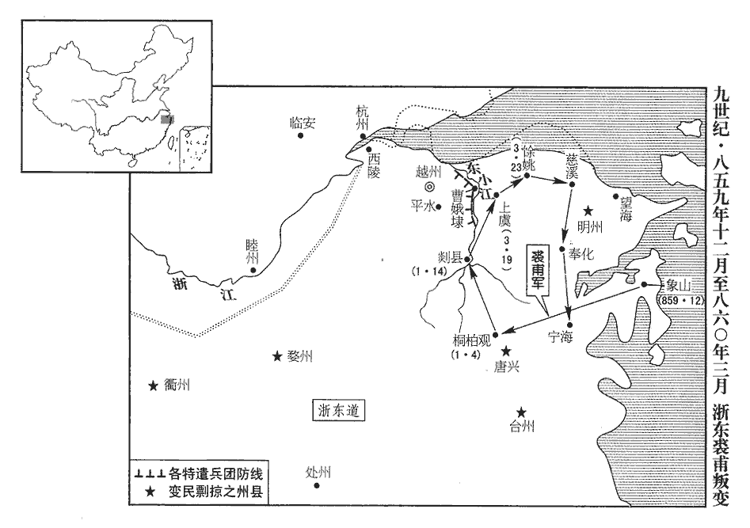
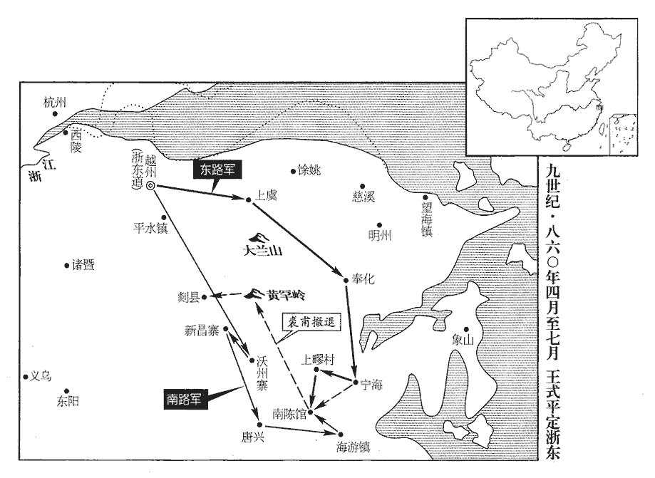
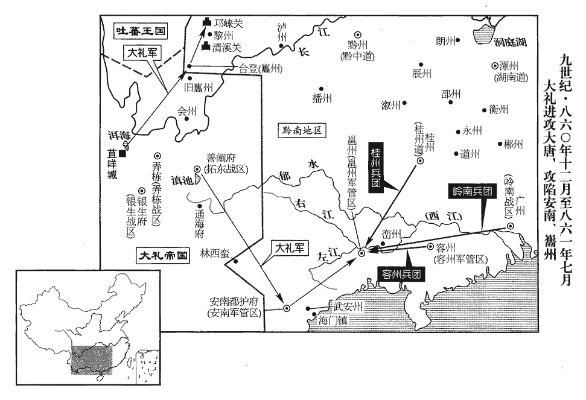
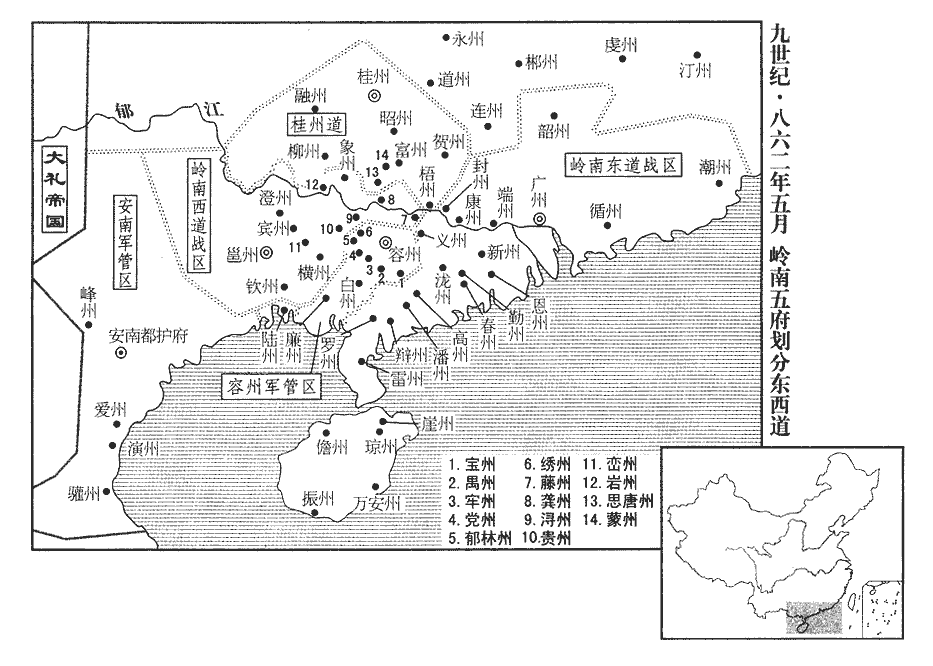
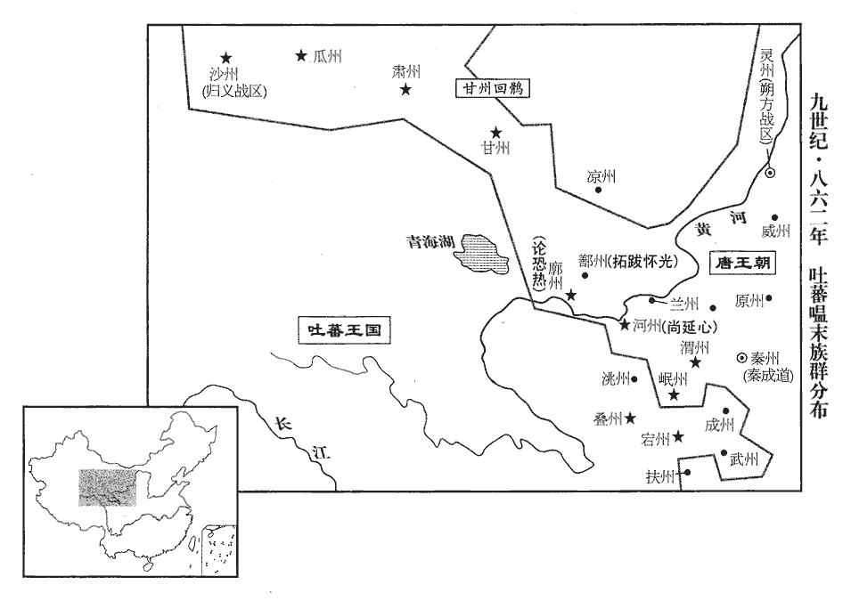
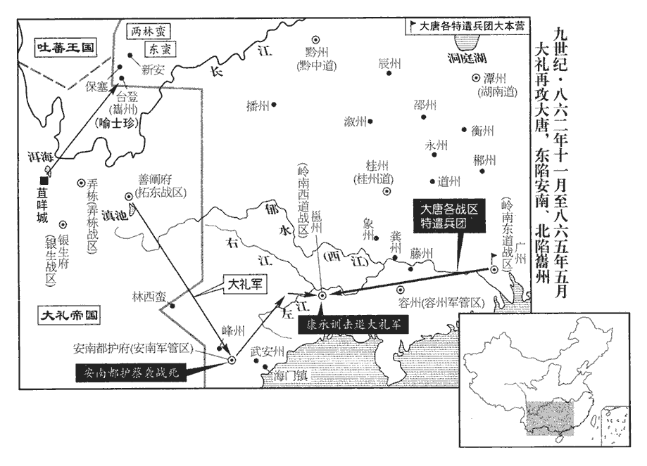
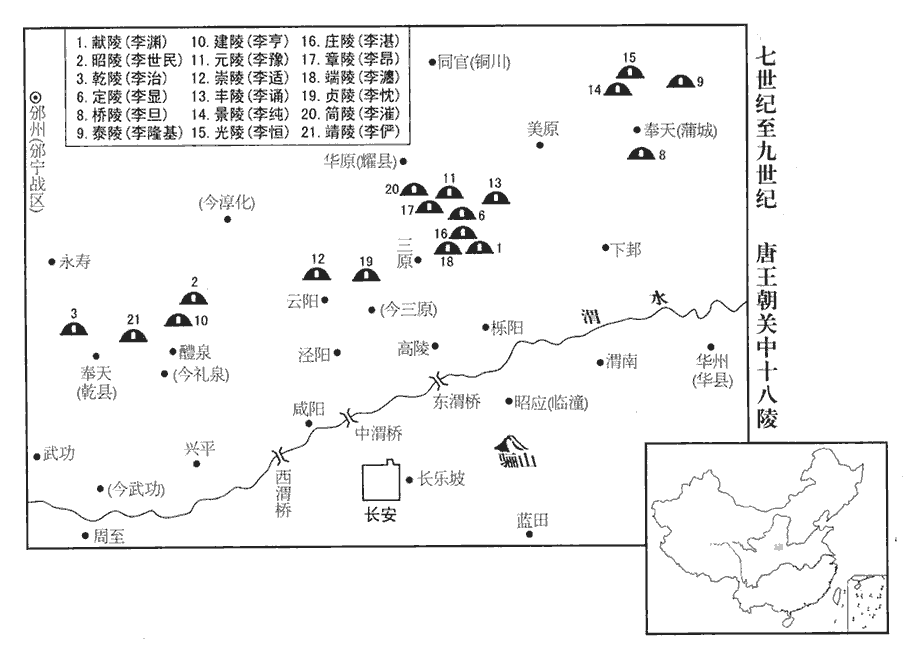
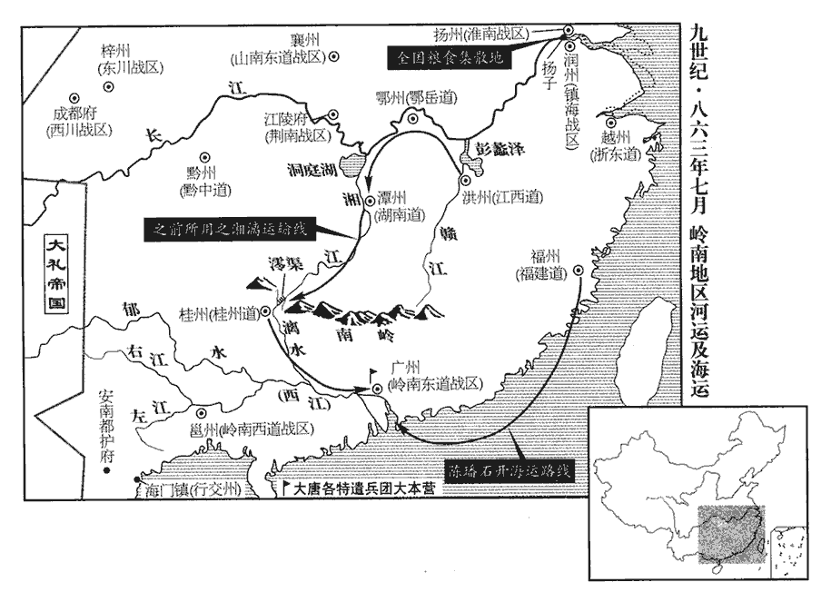
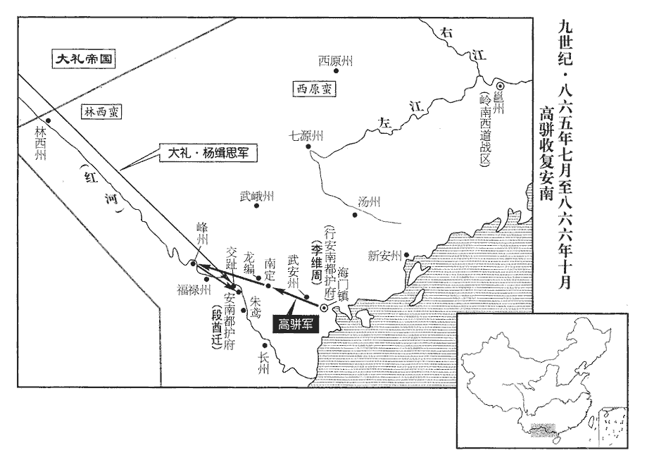

 唐紀六十六起上章執徐（庚辰），盡強圉大淵獻（丁亥），凡八年

# 懿宗昭聖恭惠孝皇帝上諱漼，宣宗長子也初諱溫，嗣位更名

## 咸通元年（庚辰、八六零）是年十一月，始改元咸通。

1春，正月，乙卯‹四›，浙東軍‹首府设越州浙江省绍兴市›與裘甫戰於桐柏觀‹浙江省天台县西北二十五千米桐柏山寺庙›前，桐柏觀在台州唐興縣天台山，宋改唐興縣為天台縣，桐柏觀賜額崇道觀。觀，古玩翻。范居植死，劉勍僅以身免。乙丑‹十四›，甫帥其徒千餘人陷剡縣‹浙江省嵊州市›，帥，讀曰率。開府庫，募壯士，眾至數千人；越州大恐。

〖译文〗 [1]春季，正月，乙卯（初四），唐浙东官军与裘甫军在桐柏观前交战，唐讨击副将范居植战死，讨击副使刘只身逃出，仅得免死。乙丑（十四日），裘甫率领部下徒众一千余人攻陷剡县，打开县府仓库，召募壮丁，部众发展到好几千人，使越州上下一片慌恐。

時二浙‹首府设润州江苏省镇江市›久安，人不習戰，甲兵朽鈍，見卒不滿三百；見，賢遍翻。鄭祗德更募新卒以益之，軍吏受賂，率皆得孱弱者。孱，鉏山翻。祗德遣子將沈君縱、副將張公署、望海‹浙江省宁波市东北镇海镇›鎮將李珪子將，小將也。望海鎮在明州界，今定海縣即其地。元和十四年，浙東觀察使薛戎奏望海鎮去明州七十餘里，俯臨大海，與新羅、日本諸蕃接界。將，即亮翻；下同。將新卒五百擊裘甫。二月，辛卯‹十›，與甫戰於剡西‹浙江省嵊州市西›，賊設伏於三溪之南，而陳於三溪之北，三溪，在今嵊shèng縣西南，一溪自新昌縣東來，一溪自磕下山南來，與新昌溪會於湖塍chéng，屈而西北流，溪流若三派然，故謂之三溪。壅溪上流，使可涉。既戰，陽敗走，官軍追之，半涉，決壅，水大至，官軍大敗，三將皆死，官軍幾盡。幾，居依翻。

〖译文〗 当时两浙地区由于长期平安无事，人民不习战阵，武器甲杖也都腐朽锈钝，现役士卒不满三百人；浙东观察使郑德增募新兵来补充军队，但军吏接受贿赂，所召新兵几乎全是软弱无能者。郑德派遣部将沈君纵、副将张公署、望海镇将李率领新兵五百人去袭击裘甫。二月，辛卯（初十），官军与裘甫军战天剡县以西，裘甫军在三溪之南设下埋伏，而在三溪之北虚摆阵势，堵溪水上流，使人可在溪水下游涉渡。既开始交战，裘甫军假装败走，官军随后追击，至溪水下游，当官军一半人涉过溪水时，贼军将上流堵水闸决开，大水袭来，官军大败，三位领兵将领都战死，部下官军几乎全部丧命。

於是山海諸盜及他道無賴亡命之徒，四面雲集，眾至三萬，分為三十二隊。其小帥有謀略者推劉暀wǎng，帥，所類翻。暀，于放翻，又乎曠翻。勇力推劉慶、劉從簡。群盜皆遙通書幣，求屬麾下。甫自稱天下都知兵馬使，改元曰羅平，鑄印曰天平。大聚資糧，購良工，治器械，聲震中原。治，直之翻。

〖译文〗 由于裘甫打败浙东官军，山林海岛中的盗贼以及其他地方的无赖亡命之徒，四面云集于裘甫的旗帜之下，部从发展到三万余人，分为三十二个队。各队小帅中较有谋略者首推刘，有武勇力气者推刘庆、刘从简。群盗都由远外地方向裘甫通信送款，要求归属于裘甫麾下。裘甫自称天下都知兵马使，改元称罗平，铸造的大印上刻着天平。于是大量聚积资财粮草，雇请优良的工匠，制造军用器械，其浩大的声势震动了中原。

 

2丙申‹十五›，葬聖武獻文孝皇帝‹李忱（李怡）›于貞陵‹陕西省三原县北›，此諡正葬貞陵陵中册諡也。貞陵在京兆雲陽縣西北四十里。廟號宣宗。

〖译文〗 [2]丙申（十五日），唐懿宗率群臣将圣武献文孝皇帝李忱安葬于贞陵，并给他定庙号称宣宗。

3丙午‹二十五›，白敏中入朝，墜陛，傷腰，肩輿以歸。

〖译文〗 [3]丙午（二十五日），白敏中来到朝廷朝见唐懿宗，从马上不慎坠落于地，将腰摔伤，唐懿宗让他坐上轿子回去。

4鄭祗德累表告急，且求救於鄰道；浙西遣牙將淩茂貞將四百人、宣歙‹首府设宣州安徽省宣州市›遣牙將白琮將三百人赴之。歙，書涉翻。祗德始令屯郭門及東小江‹曹娥江›，越州有東小江、西小江。東小江出剡溪，至曹娥百官渡而東入海。西小江出諸暨，至錢清渡而東入于海。皆曰小江者，以浙江為大江也。尋復召還府中以自衛。復，扶又翻。祗德饋之，比度支常饋多十三倍，而宣、潤將士猶以為不足。史言元帥威令不振，則惠褻而將士不以為德。度，徒洛翻。宣、潤將士請土軍為導，以與賊戰；諸將或稱病，或陽墜馬，其肯行者必先邀職級，職者，軍職。級者，勳級。竟不果遣。賊遊騎至平水東小江‹曹娥江支流›，越州，會稽縣東南有平水鎮，又東踰山，即小江也。北又一小江，源出大木山，南流合于剡江，故係平水東，以別東小江。城中士民儲舟裹糧，夜坐待旦，各謀逃潰。

〖译文〗 [4]浙东观察使郑德一再向朝廷上表告急，并且向附近相邻的道求救；浙西道派遣牙将凌茂贞率领四百人、宣歙镇派遣牙将白琮率领三百人赶往援救。郑德开始命令援军屯驻于城郭大门外及东小江边，不久又将他们如还帅府，用以守卫。郑德大肆犒赏援军，所赏钱物比朝廷度支一般发给的要多十三倍，而宣州、润州的将士仍然不满足。宣州、润州将士要求当地土军为先导，以便与裘甫贼军交战；浙东军诸将领有的假称患病，有的假装从马上跌于地上，而肯出征的人又必先要求提升官职级别，以致军队竟派不出去。裘甫贼军的游骑来到平水以东的小江，浙东城中士民准备好船只，带不粮食，从夜晚一直坐到天亮，各自谋求逃散。

朝廷知祗德懦怯，議選武將代之。夏侯孜曰：「浙東山海幽阻，可以計取，難以力攻。西班中無可語者。唐凡朝會，文官班於東，武官班於西，故謂武臣為西班。前安南‹越南河内市›都護王式，雖儒家子，王式，王播弟起之子也，舊史以為播子。在安南威服華夷，名聞遠近，聞，音問。可任也。」諸相皆以為然。相，息亮翻。遂以式為【章：十二行本「為」下有「浙東」二字；乙十一行本同；孔本同；張校同。】觀察使，徵祗德為賓客。太子賓客，閒慢局員也。

〖译文〗 朝廷知道郑德懦弱胆怯，议论要选择武将去替代他。夏侯孜说：“浙东地方山海幽深，阻拦通路，只可以用计谋攻取，难以用强力夺得。朝中武将没有谁可以说是有智谋。前安南都护王式，虽然是儒家文士的儿子，却在安南使当地华人夷人都归服于他，他的威武之名远近都知道，可以任用他往浙东征讨裘甫贼。”诸位宰相都认为夏侯孜说得有理。于是唐懿宗任命王式为浙东观察使，将郑德徵归朝廷，任为太子宾客。

三月，辛亥朔‹一›，式入對，上‹李漼（李温）本年二十八岁›問以討賊方略。對曰：「但得兵，賊必可破。」有宦官侍側，曰：「發兵，所費甚大。」式曰：「臣為國家惜費則不然。為，于偽翻。兵多賊速破，其費省矣。若兵少不能勝賊，延引歲月，賊勢益張，張：知亮翻。則江、淮群盜將蜂起應之。國家用度盡仰江、淮，仰，牛向翻。若阻絕不通，則上自九廟，下及十軍，肅宗以後，羽林、龍武、神武、神威、神策皆分左右，號北門十軍。元和二年，省神武軍，明年，又省神威軍，以其兵騎分隸左右神策，而猶存十軍之名。皆無以供給，其費豈可勝計哉！」勝，音升。上顧宦官曰：「當與之兵。」乃詔發忠武‹总部设许州河南省许昌市›、義成‹总部设滑州河南省滑县›、淮南‹总部设扬州江苏省扬州市›等諸道兵授之。

〖译文〗 三月，辛亥朔（初一），王式入朝问对，唐懿宗问王式有关讨伐裘甫贼军的方略。王式回答说：“只要给我军队，贼军必然可以攻破。”有宦官侍立在唐懿宗近侧，说：“调发军队，所花费的军费太大。”王式说：“我为国家珍惜费用就不是这样。调发的军队多，贼军可迅速消灭，所用军费反而可以节省。若调发军队少，不能战胜贼军，或者是将战事拖延几年几月，贼军的势力日益壮大，江、淮之间的群盗就将蜂起响应。现在国家的败政用度几乎全部仰仗于江、淮地区，如果这一地区被叛乱的贼众阻绝，使财赋输送之路不通，就会使上自九庙，下及北门十军，都没有办法保证供给，那样耗费的费用岂可胜计！”唐懿宗望着宦官说：“应当给王式调兵。”于是颁下诏书，调发忠武、义成、淮南等诸道军队交给王式指挥。

裘甫分兵掠衢‹浙江省衢州市›、婺州‹浙江省金华市›。婺州押牙房郅、散將樓曾、散將者，牙將之散員也。散，悉但翻。將，即亮翻；下同。衢州十將方景深將兵拒險，賊不得入。又分兵掠明州‹浙江省宁波市›，明州之民相與謀曰：「賊若入城，妻子皆為葅zū醢hǎi，況貨財，能保之乎！」乃自相帥出財募勇士，帥，讀曰率。治器械，樹柵，浚溝，斷橋，為固守之備。治，直之翻。斷，丁管翻賊又遣兵掠台州‹浙江省临海市›，破唐興‹浙江省天台县›。吳分章安之西界置始平縣，晉改為始豐縣，宋廢。唐武德初，分臨海置唐興縣，宋改曰天台。九域志：在台州西一百一十里。己巳‹十九›，甫自將萬餘人掠上虞‹浙江省上虞市东南›，焚之。上虞，漢古縣，唐屬越州。九域志：在州東一百一十里。癸酉‹二十三›，入餘姚‹浙江省余姚市›，殺丞、尉；餘姚，漢古縣，唐屬越州。九域志：在州東一百四十七里。宋白曰：餘姚舊縣在餘姚山西。風土記云：舜支庶所封。舜姓姚，故曰餘姚。東破慈溪‹浙江省宁波市西北慈城镇›，入奉化‹浙江省奉化市›，抵寧海‹浙江省宁海县›，殺其令而據之；開元二十六年，分明州之鄮縣置慈溪縣，在州西三十七里；又分鄮縣置奉化縣，在州南八十里。武德四年，分臨海縣置寧海縣，屬台州。九域志：在州東北一百七十里。分兵圍象山‹浙江省象山县›。所過俘其少壯，少，詩照翻。餘老弱者蹂踐殺之。蹂，忍久翻。踐，慈演翻。

〖译文〗 裘甫派兵分别攻掠衢州、婺州。婺州军府押牙房郅、散将楼曾、衢州十将之一的方景深等人率领军队拒守险要，贼军无法进入。裘甫又分兵攻掠明州，明州的民众相聚在一起谋划说：“贼军如果进入城中，我们的妻子儿子都要被剁成肉酱，何况家中的财产货物，就更加难以保存了！”于是相率捐出自己的财产来招募勇士，制造兵器枪械，树立栅栏，疏浚壕沟，截断桥梁，为固守城池作好准备。贼寇又派兵攻掠台州攻破唐兴县。已巳（十九日），裘甫亲自率领军队一万余人攻掠上虞县，并焚烧县城。癸酉（二十三日），裘甫率军攻入余姚县，杀县丞、县尉；又向东攻破慈溪县，进入奉化县，又抵达宁海县，杀宁海县令，并将宁海县城占据；分一部分军队进围象山县。裘甫军在所过的地方俘虏少壮居民，所余老弱居民在遭受蹂躏摧残后，全部被杀死。

及王式除書下，浙東人心稍安。下，遐稼翻。裘甫方與其徒飲酒，聞之不樂。聞王式來，心有所憚。樂，音洛。劉暀歎曰：「有如此之眾而策畫未定，良可惜也！今朝廷遣王中丞將兵來，王式蓋檢校御史中丞。聞其人智勇無敵，不四十日必至。兵馬使宜急引兵取越州，憑城郭，據府庫，遣兵五千守西陵‹浙江省萧山市西北西兴镇›，循浙江‹钱塘江›築壘以拒之西陵渡在越州西一百二十二里，今西興渡是也。吳越王錢鏐惡西陵之名，改曰西興。大集舟艦。得間，則長驅進取浙西，間，古莧翻。過大江，掠揚州‹淮南战区总部·江苏省扬州市›貨財以自實，揚州，江、淮之都會也，轉運鹽鐵使及度支之貨財聚焉，故劉暀朵頤。還脩石頭城‹江苏省南京市西北›而守之，宣歙‹首府宣州›、江西‹首府洪州›必有響應者。遣劉從簡以萬人循海而南，襲取福‹福建省福州市›、建‹福建省建瓯市›。如此，則國家貢賦之地盡入於我矣；唐自中世以後，貢賦皆仰東南，故云然。但恐子孫不能守耳，終吾身保無憂也。」觀劉暀策畫，豈可以小盜待之乎！甫曰：「醉矣，明日議之！」暀以甫不用其言，怒，陽醉而出。有進士王輅lù在賊中，賊客之。輅說甫曰：「如劉副使之謀，乃孫權所為也。彼乘天下大亂，故能據有江東‹太湖流域›；今中國無事，此功未易成也。說，式芮翻。易，以豉翻。不如擁眾據險自守，陸耕海漁，急則逃入海島‹指舟山群岛›，此萬全策也。」甫畏式，猶豫未決。

〖译文〗 当王式任浙东观察使的委任文书颁发下后，浙东地区的人心才稍微安定。裘甫正与部下徒从饮酒，得知王式到来，很不高兴。刘唉叹说：“我们有如此众多的军队，而战略计划还没有制定，实在是可惜！今天朝廷派遣王中丞率军队来镇压，听说这个人智勇双全，所向无敌，不过四十天时间必然会赶到。裘将军您应该赶快率领军队攻取越州，凭藉州高大的城郭，占据官府的仓库，再派遣五千军队驻守西陵，沿浙江修筑堡垒，以抗拒王式所率官军，同时要大量地收集各种船舰。如果获得机会，就率大军长驱进取浙西，渡过长江，掠取扬州的货物财宝来充实自己的军资费用，回军后，修缮石头城坚守，这时宣歙、江西地区必定会有人起而响应。您再派遣刘从简率领军队一万人沿海南征，袭取福建。这样，就使唐朝的东南贡赋之地全部归于我们手中；虽然说我们的子孙恐怕不能守住东南半壁山河，但我们这辈子可以保证无忧虑了。”裘甫说：“你喝醉了，明天再商议吧！”刘因为裘甫不用他的战略谋划，十分愤怒，假装喝醉走出。有一位名叫王辂的唐朝进士在裘甫军中，被当作宾客受到优礼。王辂对裘甫说：“如果按兵马副从使刘的谋划行事，正是当年孙权所做的割据江东的事业。但孙权是乘天下大乱的机会，因而能保据江东；如今中原无事，划江称帝诉功业不容易办成。不如率领部众去占据险要地方，自守天涯一角，在陆地上耕种，在大海中捕鱼，事危急时就逃入海岛，这才是万全的计策。”裘甫畏惧王式，犹豫而不能决。

夏，四月，式行至杮口，義成‹总部滑州›軍不整，式欲斬其將，久乃釋之，將，即亮翻。自是軍所過若無人。至西陵，裘甫遣使請降，式曰：「是必無降心，直欲窺吾所為，且欲使吾驕怠耳。」乃謂使者曰：「甫面縛以來，當免而死。」而，汝也。

〖译文〗 夏季，四月，王式率大军束到柿口，义成军的军容不整，王式想把领兵将领斩首，过了一段又把他释放，于是军队号令齐一，队形整齐，所过这处如入无人之境。行至西陵，裘甫派遣使者来请求投降，王式说：“裘甫必定没有投降之心，实际上是想来刺探我的动静，并想用投诚的姿态使我军骄傲，放松警惕。”于是对使者说：“如果裘甫把自己捆绑起来，亲自来投降，当免他一死。”

乙未‹十五›，式入越州，既交政，為鄭祗德置酒，為，于偽翻。曰：「式主軍政，不可以飲，監軍但與眾賓盡醉。」迨夜，繼以燭，曰：「式在此，賊安能妨人樂飲！」樂，音洛；下同。丙申‹十六›，餞祗德于遠郊，復樂飲而歸。杜子春周禮註曰：五十里為近郊，百里為遠郊。以今地里考之，越州百里至蕭山縣，王式豈能送鄭祗德至此邪！記事者華言耳。復，扶又翻。於是始脩軍令，告饋餉不足者息矣，稱疾臥家者起矣，先求遷職者默矣。

〖译文〗 乙未（十五日），王式进入越州，与郑德交接政务后，即为郑德设置酒宴，王式说：“我因为要主管军政大事，不能饮酒，监军以下的将校可以与众宾客痛饮尽醉。”至夜晚，点上蜡烛继续宴饮，王式说：“有我在这里叛贼怎么能妨碍我们饮酒作乐。”丙申（十六日），王式到远郊为郑德饯行，再次欢快痛饮而归。于是开始重新修订军令，先前宣告军饷用度不足的人不再吭声了，声称患病卧床的人也起来干事了，要求先升官再出战的人也不再说话了。

賊別帥洪師簡、許會能帥所部降，別帥，所類翻。能帥，讀曰率。降，戶江翻。式曰：「汝降是也，當立效以自異。」立效，謂立功也。使帥其徒為前鋒帥，讀曰率。與賊戰有功，乃奏以官。

〖译文〗 裘甫手下的小头目洪师简、许会能率所部投降官军，王式说：“你们归降是好事，应当立功自效，以区别于贼寇。”于是让他们率领原先的部众充当先锋，与裘甫军作战，作战有功的，上奏朝廷授以官爵。

先是，賊諜入越州，軍吏匿而飲食之。先，悉薦翻。諜，徒協翻。飲，於禁翻。食，祥吏翻。文武將吏往往潛與賊通，求城破之日免死及全妻子；或詐引賊將來降，實窺虛實，城中密謀屏語，屏，必郢翻。賊皆知之。式陰察知，悉捕索，斬之；刑將吏尤橫猾者；索，山客翻。橫，戶孟翻。嚴門禁，無驗者不得出入，警夜周密，賊始不知我所為矣。

〖译文〗 先前，裘甫派间谍潜入越州，越州军府官吏竟把他们藏起来，给他们供应饮食。州府文武将吏也往往暗中与裘甫军通款，以求城被贼军攻破的日子，能免死并存全妻子儿女；有的人假装引裘甫手下的将领来投降，实际上是来窥探军情虚实；城中官府的密谋和暗语，裘甫军全都知道。王式暗中将这一切查明，把通敌将吏全部逮捕，并处斩；又对州府中特别专横狡猾的将吏用刑，严格门禁法规，没有经过检查的人不得出入，夜里安排周密的警戒，裘甫贼军于是不再能探知官军的虚实了。

式命諸縣開倉廩以賑貧乏，或曰：「賊未滅，軍食方急，不可散也。」式曰：「非汝所知。」

〖译文〗 王式命令越州所属诸县打开仓库的储粮，用以赈救贫若乏食的百姓，有人说：“裘甫贼寇还未消灭，军粮正急于要用，不可散发。”王式说：“这就不是你所能知道的了。”

官軍少騎卒，少，詩沼翻。式曰：「吐蕃、回鶻比配江、淮者，比，毗至翻。其人習險阻，便鞍馬，可用也。」舉籍府中，得驍健者百餘人。凡吐蕃、回鶻之配隸浙東觀察府者，舉其籍而取之。虜久羈旅，所部遇之無狀，無善狀也。困餧甚；餧，與餒同。式既犒飲，又賙zhōu其父母妻子，皆泣拜讙呼，讙，與喧同。願效死，悉以為騎卒，使騎將石宗本將之。凡在管內者，皆視此籍之，又奏得龍陂‹河南省正阳县东›監馬二百匹，龍陂，漢潁川郟縣之摩陂也。唐在汝州界置馬監。宋白曰：元和十三年，十一月，賜蔡州群牧號龍陂牧。於是騎兵足矣。

〖译文〗 唐官军缺少骑兵，王式说：“吐蕃、回鹘的降俘发配到江、淮的人不少，这些人在艰难险阻的环境中生活惯了，熟悉鞍马骑射，可以起用他们。”于是到官府查名籍，得到骁勇强健的吐蕃族、回鹘族人一百余。这些胡虏远离家乡，被流放看管的年月已久，看管他们的军吏对他们凶恶狠毒，又接济他们的父母妻儿，于是都感恩欢呼哭拜，愿为王式效劳出死力，王式将他们配为骑兵，让骑兵将领石宗本统率他们。凡是流放在越州管辖境内的吐蕃、回鹘族人，均按照这种办法征集来，又上奏求得汝州龙破监好马二百匹，于是骑兵充足了。

或請為烽燧以詗賊遠近眾寡，詗xiòng，翾xuān正翻，又火迥翻。式笑而不應，選懦卒，使乘健馬，少與之兵，以為候騎；少，詩沼翻。眾怪之，不敢問。

〖译文〗 有人请求建设烽火台，用来警报来犯贼寇的远近、众寡，王式只是笑一笑，而不予答应；王式又选懦弱的士兵，让他们骑强健的战马，配以很少的武器作为侦察骑兵，部下众人感到奇怪，但也不敢多问。

於是閱諸營見卒見，賢遍翻。及土團子弟，得四千人，使導軍分路討賊；府下‹越州·浙江省绍兴市›無守兵，更籍土團千人以補之。乃命宣歙將白琮cóng、浙西將淩茂貞帥本軍，北來將韓宗政等帥土團，合千人，石宗本帥騎兵為前鋒，自上虞趨奉化，解象山之圍，號東路軍。將，即亮翻。帥，讀曰率。趨，七喻翻。又以義成將白宗建、忠【張：「忠」下脫「武」字。】將游君楚、唐無建忠軍，按此時發忠武軍從王式，史逸「武」字也。白宗建，人姓名。淮南將萬璘帥本軍與台州‹浙江省临海市›、唐興軍合，號南路軍。令之曰：「毋爭險易，易，以豉翻。毋焚廬舍，毋殺平民以增首級！平民脅從者，募降之。降，戶江翻。得賊金帛，官無所問。俘獲者，皆越人也，釋之。」

〖译文〗 王式察看越州城内诸军营，当时有州府士兵以及土团私家子弟四千人，王式让他们引导入援官军分路讨伐贼寇；越州府下没有守兵，王式又再征土团民兵一千人来补充。然后王式命令宣歙将领白琮、浙西将领凌茂贞率领本部军队，北来将领韩宗政等人率领土团，合起来有一千人，由石宗本率领骑兵为前锋，从上虞县开往奉化县，去解象山之围，这支军队号称东路军。王式又命令义成镇将领白宗建、忠武镇将领游君楚、淮南将领万率令本部军队，与台州军会合，号称南路军。王式下令说：“不管是艰险还是容易，各军不要对所布置的任务进行争夺，不准焚烧老百姓的房屋茅舍，不准杀平民来增加首级冒功，平民被迫参加贼寇的，应招募他们归降。缴获贼寇的金帛财产，官府不加过问，擒获的俘虏，都是越州本地人，放他们回家。”

癸卯‹二十三›，南路軍拔賊沃州寨‹浙江省新昌县东南›，沃州，在今越州新昌縣東南。甲辰‹二十四›，拔新昌寨‹浙江省新昌县›，新昌，時屬剡縣界。今置新昌縣，在越州東南二百二十里。破賊將毛應天，進拔【章：十二行本「拔」作「抵」；乙十一行本同，孔本同。】唐興。

〖译文〗 癸卯（二十三日），南路军攻拔裘甫贼军的沃州寨，甲辰（二十四日），又攻拔新昌寨，击破贼将毛应天，进而又攻拔唐兴县。

5白敏中三表辭位，上不許。右補闕王譜上疏，以為：「陛下致理之初，乃宰相盡心之日，不可暫闕。敏中自正月臥矣，今四月矣，陛下雖與他相坐語，未嘗三刻，天下之事，陛下嘗暇與之講論乎！相，息亮翻。願聽敏中罷去，延訪碩德，以資聰明。」己酉‹二十九›，貶譜為陽翟‹河南省禹州市›令。譜，珪之六世孫也。王珪事太宗，以直聞。譜，博古翻。五月，庚戌朔‹一›，給事中鄭公輿封還貶譜敕書。上令宰相議之，宰相以為譜侵敏中，竟貶之。

〖译文〗 [5]白敏中三次向唐懿宗上表辞宰相位，唐懿宗不批准。右补阙王谱上疏，认为：“陛下即皇帝位不久，治理天下大事，尚缺乏经验，这正是宰相辅臣尽心出力的时刻，因此宰相不可暂缺。白敏中自从今年正月以来就患病卧床，至今已经四个月了，陛下虽然与他坐着谈论政事，也从不超过三刻，天下大事多如乱麻，您哪有时间与他计论呢！希望批准白敏中辞职的请求，另外寻访有才能德望的人，来帮助您更加圣明。”已酉（二十九日），唐懿宗将王谱贬官为阳翟县令。王谱是王的六世孙。五月，庚戌朔（初一），给事中郑公舆将的诏书封还。唐懿宗命令宰相议论这件事，宰相们认为王谱官的诏书封还。唐懿宗命令宰相议论这件事，宰相们认为王谱侵犯了白敏中，最后还是将王谱贬了官。

 

6辛亥‹二›，浙東東路軍破賊將孫馬騎于寧海。戊午‹九›，南路軍大破賊將劉暀、毛應天于唐興南谷‹天台县境›，斬應天。

〖译文〗 [6]辛亥（初二），浙东东路军于宁海击败裘甫部将孙马骑率领的军队。戊午（初九），南路军在唐兴县南谷大破裘甫部将刘、毛应天率领的军队，并在战阵上斩毛应天。

先是，王式以兵少，奏更發忠武、義成軍及請昭義軍，詔從之。先，悉薦翻。三道兵至越州，式命忠武將張茵將三百人屯唐興，斷賊南出之道；斷，音短，下同。義成將高羅銳將三百人益以台州土軍，徑趨寧海，趨，七喻翻。攻賊巢穴；昭義將𨁂xié跌戣kuí將四百人，𨁂，奚結翻。跌，徒結翻。戣，渠龜翻。益東路軍，斷賊入明州‹浙江省宁波市›之道。庚申‹十一›，南路軍大破賊於海遊鎮‹浙江省三门县›，海遊鎮，在寧海南九十里。賊入甬溪洞‹浙江省天台县东›。甬溪洞，在寧海西南百餘里，屬唐興縣界，又西則楢yóu溪，產鐵。戊辰‹十九›，官軍屯於洞口，賊出洞戰，又破之。己巳‹二十›，高羅銳襲賊別帥劉平天寨，破之。帥，所類翻。自是諸軍與賊十九戰，賊連敗。劉暀謂裘甫曰：「曏從吾謀入越州，寧有此困邪！」王輅等進士數人在賊中，皆衣綠，衣，於既翻。暀悉斬之，曰：「亂我謀者，此青蟲也。」

〖译文〗 起先，王式因为军队少，向唐懿宗奏请再调发忠武军、义成军，并要求调昭义军，唐懿宗表示同意。忠武、义成、昭义三道兵来到越州，王式命令忠武军将领张茵率领三百人屯驻于唐兴县，切断裘甫军逃往南方的道路；命令义成军将高罗锐率领三百人，加上台州地方军队，径直奔赴宁海县，进攻裘甫贼军的巢穴；命令昭义军将领跌率领四百人，去加强东路军，切断裘甫军进入明州的道路。庚申（十一日），南路在海游镇大破裘甫贼军，裘甫军队逃入甬溪洞。戊辰（十九日），唐官军于洞口屯驻，裘甫出洞交战，又被打败。已巳（二十日），高罗锐袭击裘甫部将刘平天的营寨，将营寨攻破。到此为止唐诸路军队与裘甫贼军作战十九次，裘甫军边续失败。刘对裘甫说：“如果您能听从我的谋划，进入越州，那会有今天这样的困境呢！”王辂等几个唐朝科举入第的进士在裘甫军中，都穿绿衣做小官，刘将他们全部斩首，说：“破坏我的计谋的，正是你们这些青虫！”

高羅銳克寧海，收其逃散之民，得七千餘人。王式曰：「賊窘且飢，必逃入海，入海則歲月間未可擒也。」命羅銳軍海口以拒之。海口在寧海東北四十餘里。又命望海‹浙江省宁波市东北镇海镇›鎮將雲思益、浙西將王克容將水軍巡海澨shì。澨，市制翻。水際曰澨。思益等遇賊將劉【章：孔本「劉」下有「從」字；張校同。】簡於寧海東，賊不虞水軍遽至，虞，度也。皆棄船走山谷，走，音奏。得其船十七，盡焚之。式曰：「賊無所逃矣，惟黃罕嶺‹浙江省嵊州市东四明山一峰›可入剡，黃罕嶺，在奉化縣西北，剡縣之東，其路深險。度黃罕嶺，則平川四十里至剡。恨無兵以守之。雖然，亦成擒矣！」裘甫既失寧海，乃帥其徒屯南陳館‹浙江省宁海县西南三十千米›下，南陳館在寧海西南六十餘里。帥，讀曰率。眾尚萬餘人。辛未‹二十二›，東路軍破賊將孫馬騎於上疁liú村‹宁海县西北二十千米›，上疁村在寧海西北四十餘里、疁，力留翻。今謂之上寮山。賊將王皋懼，請降。

〖译文〗 高罗锐攻克宁海县，收集光散在外的平民百姓，得七千余人。王式说：“贼军窘迫，加上饥饿，必然要逃入大海，如果贼寇逃入海岛，那么今年几个月间是不能擒获他们的。”于是命令高罗锐驻军海口拒守，又命令望海镇将领云思益、浙西将领王克容率领水军于海岸水际巡逻。云思益等率水军在宁海以东海面与裘甫军将领刘从简所率船队遭遇，裘甫军船队没有料到官军水师这么快就赶到，都将船抛弃，上岸窜入山谷，云思益的水军缴获裘甫军十七条船，全部烧毁。王式说：“贼军已没有什么地方可逃了，只有黄罕岭可以进入剡县，可恨没有兵守黄罕岭。虽然这样，裘甫贼也可擒获！”裘甫既失去宁海，于是率领部下徒众屯驻宁海县西南六十余里处的南陈馆下，部众仍然有一万余人。辛未（二十二日），东路军在宁海西北四十里的上村击败裘甫军将领孙马骑的部队，王畏惧官军，请求投降。

7壬申‹二十三›，右拾遺內供奉薛調上言，以為：「兵興以來，賦斂無度，上，時掌翻。斂，力贍翻。所在群盜，半是逃戶，固須翦滅，亦可閔傷。望敕州縣稅外毋得科率，仍敕長吏嚴加糾察。」從之。

〖译文〗 [7]壬申（二十三日），右拾遗内供奉薛调向唐懿宗上言，认为：“自从兴兵征讨以来，赋敛税科无度，地方上的群盗，多半都是逃亡的农户，固然应该消灭他们，但他们处境也很可怜，令人伤心。希望陛下向州县颁布诏敕，凡朝廷所定的正税以外，不得再有课税门目，并且敕令有关官吏，对税目加以严格的纠察监督。”唐懿宗表示同意。

8袁王紳薨。紳，順宗‹李诵›子

〖译文〗 [8]袁王李绅去世。

9戊寅‹二十九›，浙東東路軍大破裘甫於南陳館，斬首數千級，賊委棄繒帛盈路，繒，慈陵翻。以緩追者。𨁂跌戣令士卒：「敢顧者斬！」毋敢犯者。賊果自黃罕嶺遁去，六月，甲申‹五›，復入剡。復，扶又翻；下同。諸軍失甫，不知所在，義成將張茵在唐興獲俘，將苦之，俘曰：「賊入剡矣。苟捨我，我請為軍導。」從之。茵後甫一日至剡，壁其東南。府中聞甫入剡，復大恐，王式曰：「賊來就擒耳！」命趣東、南兩路軍會於剡，趣，讀曰促。辛卯‹十二›，圍之。賊城守甚堅，攻之，不能拔；諸將議絕溪水以渴之，剡城東南臨溪，西北負山，城中多鑿井以引山泉，非絕溪水所能渴，作史者乃北人臆說耳。今浙東諸縣皆無城，獨剡縣有城，猶為完壯。賊知之，乃出戰。三日，凡八十三戰，賊雖敗，官軍亦疲。賊請降，諸將出【章：十二行本「出」作「以」；乙十一行本同；孔本同；熊校同。】白式，式曰：「賊欲少休耳，少，詩沼翻。益謹備之，功垂成矣。」賊果復出，又三戰。庚子‹二十一›夜，裘甫、劉暀、劉慶從百餘人出降，遙與諸將語，離城數十步，官軍疾趨，斷其後，離，力智翻。斷，音短。遂擒之。壬寅‹二十三›，甫等至越州，式腰斬暀、慶等二十餘人，械甫送京師。考異曰：平剡錄曰：「諸軍圍賊於剡，賊悍甚，其所謂女軍者，亦乘城摘礫以中人。三日，凡八十三戰，賊雖衄nǜ，官軍亦疲。裘甫佯言乞降，諸將使騎來白。公曰：『賊憊蹔休耳，謹備之。』仍遣押牙薛敬義謂諸將曰：『功成矣，勉之，勿怠也。』果復三戰，二十一日夜，甫與劉暀、劉慶十餘輩又從百餘人出，遙與諸將語，伺我軍之懈，將使勇者潰圍焉。諸將得公誡，夜皆設伏於營前。甫輩離城數十步，伏兵疾走以間之，銳師數百復繼之，城中賊不出。甫遽甚不知所為，遂成擒焉。至是，用兵六十六日矣。二十三日，縛致府城，公於衙門陳兵以見，執其徒劉暀、劉慶二十餘輩，三斬之，械裘甫獻闕下。」玉泉子見聞錄曰：「王式討裘甫。甫始起於剡，既為官軍所敗，復入于剡，城堅卒銳，不可遽拔。式乃約降，許奏以金吾將軍，甫許焉，其將劉暀獨以為不可。比及越城，左右則械手以木，曳頸以組。甫曰：『吾既已降，何用是為？』左右曰：『法也。到越則釋去，公且行，有命矣。』既至，式登南樓俟之，曰：『裘甫何罪，罪皆劉暀輩。』命三斬之。暀顧謂甫曰：『君竟拜金吾乎！』斬甫于長安東市。初，甫之入剡也，雖已累敗，向使城守，朞歲未可平也。玉泉子曰：古人有言，殺降不祥。李廣所以不侯，良有以也！王公亦不聞大貴。鄭公述平剡錄一何曲筆哉！雖驟歷清顯，而卒以喪明不復起，可不慎哉！」按二書所言莫知孰是。然裘甫在剡城，窮困已極，勢不能久，式不必更以詐誘之，或者諸將為之，不可知也。甫之出降也，或欲突走，或被誘而來，皆不可知，要之為出城乞降，官軍因邀斷其後擒之耳。

〖译文〗 [9]戊寅（二十九日），唐浙东东路军在南陈馆大破裘甫军，斩首数千人，贼军抛弃大量丝绸缯帛，布满道路，企图延缓官军的追击。跌对士兵下命令：“谁敢顾盼不前，留恋财物，立即斩道！”于是官军士兵没有人敢违犯。贼军果然从黄罕岭逃去，交月，甲申（初五），再入剡县。贼军诸将不见裘甫，不知道他在何处，唐义成镇将张茵在唐兴县曾获俘虏，将要对他用刑，俘虏说：“贼军已进入剡县。你如果释放我，我愿意作官军的向导。”张茵信以为真，听从了建议。张茵跟在俘虏后面，比裘甫晚一天到达剡县，于是义成军在剡县城东南筑垒驻扎。裘甫进入剡县城，官军府探知情报，感到恐慌，王式说：“裘甫贼不过是来束手就擒而已！”于是命令东、南两路军到剡县来会合，辛卯（十二日），将剡县城团团围住。裘甫军的城防守卫十分坚固，官军攻城，无法攻拔；王式部下诸将议论断绝溪水，渴死城内人，裘甫贼军知道官军要断绝其水源，于是出城交战。三天内共交战八十三次，贼军虽被战败，官军也很疲倦。裘甫贼军请求投降，王式部下诸将向王式报告，王式说：“裘甫贼企图获得稍许休整时间，我们应更加谨慎守备，大功就要告成了。“裘甫贼军果然出城，又与官军交战了三次。庚子（二十一日）夜，裘甫、刘、刘庆率百余人出城投降，并远远地对官军诸将喊话，请求收纳，官军迅速赶往城下，切断裘甫等人的后路，于是被押送到越州，王式下令将刘、刘庆等二十余人拦腰处斩，将裘甫锁于车上，押送到京师长安去报功。

剡城猶未下，諸將已擒甫，不復設備。劉從簡帥壯士五百突圍走；諸將追至大蘭山‹浙江省余姚市南四十千米›，今明州奉化縣西北有大蘭山，山在越州分界。復，扶又翻。帥，讀曰率。從簡據險自守，秋，七月，丁巳‹九›，諸將共攻克之。台州‹浙江省临海市›刺史李師望募賊相捕斬之以自贖，所降數百人，得從簡首，獻之。大蘭既破，劉從簡走入台州界，方為其黨所殺。

〖译文〗 剡城仍未攻下，唐官军诸将因为已把裘甫擒获，不再布置防备。刘从简率领壮士五百人突围逃走；官军诸将追到奉化县西北的大兰山，刘从简在山上据险自守，秋季，七月，丁已（初九），唐官军诸军将领率领所部士兵一同攻山，将大兰山攻克。台州刺史李师望招募贼军士兵，让他们去捕杀还没有投降的同伙，以赎免自己的罪，又迫使贼军数百人投降，并获得刘从简的首级，献给上司。

諸將還越，式大置酒。諸將乃請曰：「某等生長軍中，久更行陳，長，知兩翻。更，工衡翻。行，戶剛翻。今年得從公破賊，然私有所不諭者，敢問：公之始至，軍食方急，而遽散以賑貧乏，何也？」式曰：「此易知耳。易，以豉翻。賊聚穀以誘飢人，吾給之食，則彼不為盜矣。且諸縣無守兵，賊至，則倉穀適足資之耳。」又問「不置烽燧，何也？」式曰：「烽燧所以趣救兵也，趣，讀曰促。兵盡行，城中無兵以繼之，徒驚士民，使自潰亂耳。」又問：「使懦卒為候騎而少給兵，何也？」式曰：「彼勇卒操利兵，操，七高翻。遇敵且不量力而鬬，鬬死，則賊至不知矣。」皆曰：「非所及也！」自至德以來，浙東盜起者再，袁晁、裘甫是也。裘甫之禍不烈於袁晁。袁晁之難，張伯儀平之，通鑑所書，數語而已。今王式之平裘甫，通鑑書之，視張伯儀平袁晁事為詳。蓋唐中世之後，家有私史。王式，儒家子也。成功之後，紀事者不無張大，通鑑因其文而序之，弗覺其煩耳。容齋隨筆曰：通鑑書討裘甫事用平剡錄，蓋亦有見於此。考異三十卷，辯訂唐事者居太半焉，亦以唐私史之多也。

〖译文〗 官军诸将回到越州，王式大摆酒宴庆功。诸镇将领于向王式请教说：“我们这些人生长在军队行伍之中，久经战阵，今年能够随从您攻破裘甫贼党，实在是荣幸，但我们有些事仍没有明白过来，请问：您刚到越州上任时，军粮正紧张，而您立即将官府仓库的屯粮散给老百姓，赈救贫困乏粮者，其中用意是什么？”王式回答说：“这个道理容易理解，裘甫贼众屯聚谷米来引诱饥饿的人民，我分发粮食，饥民就不会被裘甫引诱入伙为盗贼。况且诸县没有守兵，裘甫贼军赶到，官府仓库的谷米正好成为贼寇的资粮，为资贼所用。”诸将又问道：“您不设置烽火台，这又是为什么？”王式说：“设烽火台是为了求取救兵，我手下的军队都已安排了任务，越州城中没有军队可用作援兵，设烽火台不过是徒费功夫，惊扰士民，使我军自乱溃散而已。”诸部将领又问：“您派懦弱的士兵充当侦察骑兵，而且给他们配以很少的武器，这是什么道理呢？”王式回答说：“如果侦察骑兵选派勇武敢斗的士兵，并配给锋利的兵器，遇到敌军就可能会不自量力上前搏斗，搏斗战死，就没有人回来报告，我们就不知道贼军来了，这样的侦察兵有什么用呢。”众部将听完后，都十分佩服，说：“这都不是我们的智力所能达到的啊！”

10封憲宗子𢗔為信王。𢗔miǎn，彌遣翻。

〖译文〗 [10]唐懿宗封唐宪宗的儿子李为信王。

11八月，裘甫至京師，斬于東市‹属万年县·长安东半城›。加王式檢校右散騎常侍，諸將官賞各有差。先是，上每以越盜為憂，先，悉薦翻。夏侯孜曰：「王式才有餘，不日告捷矣。」孜與式書曰：「公專以執裘甫為事，軍須細大，此期悉力。」軍須，謂行軍所須糧仗衣物。悉力，謂盡力應辦也。故式所奏求無不從，由是能成其功。

〖译文〗 [11]八月，裘甫被监车押送至京师，在长安东市处斩。唐懿宗给王式加检校右散骑常侍的衔名，王式部下诸将也分别给予赏赐。起先，唐懿宗经常为越的贼乱忧虑，夏侯孜说：“王式的才干有余，过不了几天就会告捷的。”夏侯孜给王式写信说：“您专心以擒获裘甫为事，行军所需的粮仗衣物，不管多少，我们一定按期尽力协办。”因此王式上奏有所要求，朝廷无不应从，所以能大功告成。

12衛王灌薨。灌，上弟也。

〖译文〗 [12]卫王李灌去世。

13九月，白敏中五上表辭位；辛亥‹四›，以敏中為司徒、中書令。

〖译文〗 [13]九月，白敏中第五次向唐懿宗上表，请求恩准辞职；辛亥（初四），唐懿宗任白敏中为司徒、中书令。

14右【章：十二行本「右」上有「癸酉‹二十六›」二字；乙十一行本同；孔本同；張校同；退齋校同。】拾遺句容‹江苏省句容市›劉鄴上言：「李德裕父子為相，有聲迹功效，李德裕父吉甫，相憲宗‹李纯›，德裕相武宗‹李瀍›，皆有勳勞在於王室，備著前紀。竄逐以來，血屬將盡，生涯已空，宜賜哀閔，贈以一官。」冬，十月，丁亥‹十一›，敕復李德裕太子少保、衛國公，贈左僕射。德裕貶見二百四十八卷宣宗大中元年。考異曰：裴旦李太尉南行錄，載咸通二年九月二十六日右拾遺內供奉劉鄴表，略云：「子曄，貶立山尉，去年獲遇陛下惟新之命，覃作解之恩，移授郴縣尉，今已沒於貶所。」又曰：「血屬已盡，生涯悉空。」又曰：「枯骨未歸於塋yíng域，一男又殞於江、湘。」又曰：「其李德裕，請特賜贈官。」敕依奏。實錄註引東觀奏記云：「令狐相綯夢德裕曰：『某已謝明時，幸相公哀之，許歸葬故里。』綯具為其子滈hào言之。滈曰：『李衛公犯眾怒，又崔相鉉、魏相謩mó皆敵人也，見持政，必將上前異同，未可言也。』後數日，上將坐延英，綯又夢德裕曰：『某委骨海上，思還故里，與相公有舊，幸憫而許之。』既寤，復謂滈曰：『向見衛公精爽尚可畏，吾不言，必掇禍。明日入中書，且為同列言之。』既而於帝前論奏，許其子蒙州立山尉曄護喪歸葬。」又，是時柳仲郢鎮東蜀，設奠於荊南，命從事李商隱為文曰：「恭承新渥，言還舊止。」又云：「身留蜀郡，路隔伊川。」鄴奏乃云：「孤骨未歸塋域。」曄，懿宗初纔徙郴縣尉，未詳，或者後人偽作之，非鄴本奏也。實錄註又云：「白敏中為中書令，時與右庶子段全緯書云『故衛公、太尉，災興鵂xiū鳥，怨結江魚，親交雨散於西園，子弟蓬飄於南土。嘗蒙一顧，繼履三台，保持獲盡於天年，論請爰加於寵贈。』全緯嘗為德裕西川從事，故敏中語及云。」按此似繇敏中開發，而數本追復贈官，多連鄴奏。德裕素有恩於敏中，敏中前作相，既遠貶之，至此又掠其美，鄙哉！按劉鄴表云：「去年獲遇陛下惟新之命，覃作解之恩。」則上此表在咸通元年，非二年也。舊傳：「鄴為翰林學士承旨，以李德裕貶死朱崖。大中朝，令狐綯當權，累有赦宥，不蒙恩列。懿宗即位，綯在方鎮，屬郊天大赦，鄴奏論之。」李太尉南行錄，鄴此時未為翰林學士，因上此表，敕批「便令內養宣喚入翰林充學士，餘依奏。」金華子雜編曰：「宣宗嘗私行經延資庫，見廣廈連綿，錢帛山積，問左右曰：『誰為此庫？』侍臣對曰：『宰相李德裕執政日，以天下每歲備用之餘，自是已來，邊庭有急，支備無乏者，茲實有賴。』上曰：『今何在？』曰：『頃以坐吳湘獄貶于崖州。』上曰：『如有此功於國，微罪豈合深譴！』由是劉公鄴得以進表乞追雪之。上一覽表，遂許其加贈、歸葬焉。」按宣宗素惡德裕，故始即位即逐之，豈有不知其在崖州而云「豈合深譴」！又劉鄴追雪在懿宗時，此說殊為淺陋，今不取。

〖译文〗 [14]右拾遗句容刘邺向唐懿宗上言：“李吉甫、李德裕父子为宰相时，有政绩功劳，但自从李德裕被流放以来，他的亲属几乎全部流放远外，李德裕已死，陛下应该对他发慈悲，赠给一个官爵。”冬季，十月丁亥（十一日），唐懿宗颁布敕令，恢复李德裕太子少保、卫国公官爵，赠左仆射。

15己亥‹二十三›，以門下侍郎、同平章事夏侯孜同平章事，充西川‹总部设成都府四川省成都市›節度使。以戶部尚書、判度支畢諴xián為禮部尚書、同平章事。

〖译文〗 [15]已亥（二十三日），唐懿宗任命门下侍郎、同平章事夏侯孜挂同平章事衔，也朝充当西川节度使。又任命户部尚书、判度支毕为礼部尚书、同平章事。

16安南都護‹驻越南河内市›李鄠復取播州‹贵州省遵义市›。播州屬黔中道，大中十三年，為雲南所陷。此非安南巡屬也。李鄠越境收復，欲以為功，而不知蠻兵乘虛已陷安南也。鄠，音戶。復，扶又翻。

〖译文〗 [16]安南都护李收复播州。

17十一月，丁丑‹二›，上祀圜丘；赦，改元。

〖译文〗 [17]十一月，丁丑（初二），唐懿宗举行祀圆丘大典；宣告赦令，改年号为咸通。

18十二月，戊申‹三›，安南‹首府设安南府越南河内市›土蠻引南詔‹首都苴咩城云南省大理市›兵合三萬餘人乘虛攻交趾‹安南府所在城›，陷之。考異曰：新南詔傳：「大中時，李琢為安南經略使，苛墨自私，以斗鹽易一牛。夷人不堪，結南詔將段酋遷陷安南都護府，號白衣沒命軍。懿宗絕其朝貢，乃陷播州。安南都護李鄠屯武州，咸通元年，為蠻所攻，棄州走，天子斥鄠，以王寬代之。」按宣宗時，南詔未嘗陷安南。據新傳，則似大中時已陷安南，咸通元年又陷武州也。且李鄠安南失守，然後奔武州，非在武州而棄之。新傳誤也，今從實錄。都護李鄠與監軍奔武州‹或为武安州越南海防市›。新志：邕管所領，又有顯州、武州、沈州，後皆廢省。據此，則武州當在宜州界。

〖译文〗 [18]十二月，戊申（初三），安南本地人勾结南诏王国军队共合三万人乘虚进攻交趾，将交趾城攻陷。安南都护李与监军逃奔到武州。

## 二年（辛巳、八六一）

1春，正月，‹李漼（李温）本年二十九岁›詔發邕管‹首府设邕州广西南宁市›及鄰道兵救安南‹越南河内市›，擊南蠻‹首都苴咩城云南省大理市›。

〖译文〗 [1]春季，正月，唐懿宗颁下诏书，调发邕管以及相邻诸道的军队援救安南，讨击南蛮。

2二月，以中書令白敏中兼中書令、充鳳翔‹总部设凤翔府陕西省凤翔县›節度使；以左僕射、判度支杜悰兼門下侍郎同平章事。

〖译文〗 [2]二月，唐懿宗任命中书令白敏中仍兼中书令，充当凤翔节度使；又任命左仆射、判度支杜兼任门下侍郎、同平章事。

一日，兩樞密使詣中書，宣徽使楊公慶繼至，獨揖悰受宣，受宣，受宣命也。三相起，避之西軒。三相，畢諴、杜審權、蔣伸也。公慶出斜封文書以授悰，發之，乃宣宗大漸時【章：十二行本「時」下有「宦官」二字；乙十一行本同；孔本同；張校同；退齋校同。】請鄆王監國奏也。且曰：「當時宰相無名者，當以反法處之。」悰反復讀處，昌呂翻。復，音覆，又如字。良久，曰：「聖主登極，萬方欣戴。今日此文書，非臣下所宜窺。」復封以授公慶，曰：「主上欲罪宰相，當於延英面示聖旨，明行誅譴。」公慶去，悰復與兩樞密坐，謂曰：「內外之臣，事猶一體，宰相、樞密共參國政。今主上新踐阼，未熟萬機，資內外裨補，固當以仁愛為先，刑殺為後，豈得遽贊成殺宰相事！若主上習以性成，則中尉、樞密權重禁闈，時以兩中尉、兩樞密為四貴。豈得不自憂乎！言殺宰相，則上手滑矣，中尉、樞密亦將及禍，豈得不自以為憂！悰受恩六朝，六朝，謂憲、穆、敬、文、武、宣。所望致君堯、舜，不欲朝廷以愛憎行法。」兩樞密相顧默然，徐曰：「當具以公言白至尊，非公重德，無人及此。」慙悚而退。三相復來見悰，微請宣意，悰無言。三相惶怖，乞存家族，悰曰：「勿為他慮。」既而寂然，無復宣命。及延英開，上色甚悅。意此亦是據杜悰家傳書之，其辭旨抑揚容有過其實者。洪邁隨筆曰：按懿宗即位之日，宰相四人：曰令狐綯，曰蕭鄴，曰夏侯孜，曰蔣伸。至是惟有伸在，三人者罷去矣。諴及審權乃懿宗自用者，無有斯事，蓋野史之妄。溫公‹司马光›以唐事屬之范祖禹，其審取可謂詳盡，尚如此。信乎修史之難哉！考異曰：新傳云：「宣宗大漸，樞密使王歸長等矯詔迎鄆王立之。懿宗即位，欲罪大臣，悰解之。」按立鄆王者王宗實。新傳云歸長，誤也。今從補國史。

〖译文〗 有一天，两位宦官枢密使来到中书门下政事堂，宣徽使杨公庆接着也来了，只向杜作揖，让杜接受宣命，另外毕、杜审权、蒋伸三位宰相当即起身出门，于西面客厅暂避，杨公庆拿出一札斜封的文书交给杜，启封一看，原来是唐宣宗病重时，请求郓王李温监国的奏折。几个宦官说：“请查看这些奏折，凡当时在位的宰相没有题名的，应当以谋反罪处分。”杜反复阅读这些奏折，读了很久，说：“圣明的皇上登极以来，天下万方欢欣鼓舞，衷心拥戴。今天这些文书，并不是我所应该窥视的。”于是将奏折再封好，还给宣徽使杨公庆，说：“皇上如果想给宰相加罪，应当在延英殿当面向宰相出示圣旨，公天地进行诛讨谴责。”杨公庆走后，杜与两位枢密使坐下交谈，杜说：“禁宫内外的臣子，同样是服侍辅佐皇上，宰相和枢密使更是共同参议国家大政。今天皇上登基不久，对万般机务还不熟悉，需要宫内宫外的大臣同心协力，给予辅助，我们处理政事当然应该以仁爱为先，以刑杀为后，岂能在刚登基不久就赞成皇上干诛杀宰相的事！如果皇上滥杀重臣习以成性，那么宦官两军中尉、枢密使在宫廷禁闱中权柄更重，岂不是更加要忧虑自己的身家性命吗？杜我自宪宗以来受恩于六朝皇帝，我所希望的是让皇上都成为尧、舜那样的圣主，不希望朝廷以个人的爱憎来执行法律。”两位枢密使听后互相观望，默默无言，过了一会儿，才慢慢地说：“我们会把您所说的话全部面告皇上，如果不是您德高望重，哪有人能够想得这么深远。”说完后惭愧地退了出去。另外三位宰相再进屋来见杜，询问宦官所宣告的旨意，杜默然无言。三位宰相于是惶恐不安，向杜请求保存他们的家族。杜说：“不要有什么忧虑。”然后是一片寂静，再也不见宦官来政事堂宣命。等到延英殿大门打开，宰相上朝奏对，唐懿宗和颜悦色地与宰相们商讨政事。

是時士大夫深疾宦官；事有小相涉，則眾共棄之。建州‹福建省建瓯市›進士葉京嘗預宣武軍‹总部设汴州河南省开封市›宴，識監軍之面。既而及第，在長安與同年出遊，遇之於塗，馬上相揖；因之謗議諠然，遂沈廢終身。其不相悅如此。東漢黨錮之禍蓋亦如此。但李、杜諸公風節凜凜，千載之下，讀其事者猶使人心神肅然。晚唐詩人不能企其萬一也，而亦以胎清流之禍，哀哉！沈，持林翻。

〖译文〗 当时士大夫们对官深为疾恶，谁如果与宦官稍有接触，就会遭到士人们的唾弃。建州的进士叶京过去曾参加宣武军的宴会，在宴度上认识一个宦官监军。后来进士及第，在长安与同年登第的进士出游，路上遇到那位宦官监军，于是在马上互相作揖行礼；为此，对叶京进行毁谤的各种议论至沓而来，一片喧嚣，以致叶京终身抬不起头，沉默在家，未再出来做官。士大夫讨厌宦官竟达到了这种程度。

3福王綰薨。綰wǎn，順宗‹李诵›子。

〖译文〗 [3]福王李绾去世。

4夏，六月，癸丑‹十›，以鹽州‹陕西省定边县›防禦使王寬為安南‹首府设安南府越南河内市›經略使。時李鄠自武州收集土軍，攻群蠻，復取安南；朝廷責其失守，貶儋dān州‹海南省儋州市›司戶。鄠初至安南，殺蠻酋杜守澄，其宗黨遂誘道群蠻陷交趾‹安南府所在城›。道，讀曰導。朝廷以杜氏強盛，務在姑息，冀收其力用，乃贈守澄父存誠金吾將軍，再舉鄠殺守澄之罪，長流崖州‹海南省琼山市›。劉昫曰：唐武德四年，以隋朱崖郡為崖州。自雷州徐聞縣南，舟行四百三十里，渡大海，達崖州。宋白曰：宋開寶六年，割舊崖州之地屬瓊州，卻改振州為崖州。考異曰：實錄：「又賜寬手詔云云：『如聞李琢在安南日，殺害杜存誠，李鄠又處置其子守澄，使誘導群蠻，陷沒城邑。卿到鎮日，於李鄠處索取前後敕詔，一一參詳。』初，李琢在鎮，蠻首領愛州刺史兼土軍兵馬使杜存誠密誘溪洞夷、獠為之鄉導，涿察其不忠，戮死焉。及李鄠至鎮，蠻陷安南，鄠走武州，召土軍收復城邑，而存誠家兵甚眾，朝廷務姑息，乃贈存誠金吾將軍。鄠以失備貶儋州。」補國史：「蠻陷安南，李鄠投武州，召土軍收復，頗有功績，殺首領杜存誠，以捍禦盤桓，不戮力盡敵，兼洞夷獠為鄉導之罪也。鄠貶儋州後，以存誠谿洞強獷，家兵數多，子弟繼總軍旅，皆輸忠勇，軍府倚賴方甚，朝廷亦加姑息乃再舉憲章，長流鄠崖州，贈存誠金吾將軍，以誘其竭力。命前鹽州刺史王宙為都護。」按鄠所殺存誠之子守澄，已為王式所逐，鄠至旬日殺之，非因扞禦不戮力也。代鄠者乃王寬，非王宙。補國史誤也。今獨取鄠克復安南一事，餘皆從平剡錄、實錄。按唐朝若以杜守澄之戮為李鄠罪，則當贈守澄官，不當贈其父官，此余所以致疑於前也。

〖译文〗 [4]夏季，六月，癸丑（十日），唐懿宗任命盐州防御史王宽为安南经略使。当时李自武州收集当地土军，攻讨群蛮，收复安南；朝廷责备李将安南失守，贬官为赡州司户。李初到安南时，杀蛮族酋领杜守澄，杜守澄的宗党于是诱导群蛮攻陷交趾，朝廷因为杜氏澄的宗党于是诱导群蛮攻陷交趾，朝廷因为杜氏宗族强盛，对他们采取尽量姑息的政策，希望使杜氏的巨大影响力能为朝廷所用，于是赠给杜守澄的父亲杜存诚金吾将军的名号，再次举发李杀杜守澄的罪过，将李长年流放于崔州。

5秋，七月，南詔【章：十二行本「詔」作「蠻」；乙十一行本同；孔本同。】攻邕州‹广西南宁市›，陷之。先是，廣‹总部设广州广东省广州市›、桂‹首府设桂州广西桂林市›、容‹首府设容州广西容县›三道共發兵三千人戍邕州，三年一代。先，悉薦翻。經略使段文楚請以三道衣糧自募土軍以代之，朝廷許之，所募纔得五百許人。文楚入為金吾將軍，經略使李蒙利其闕額衣糧以自入，悉罷遣三道戍卒，止以所募兵守左、右江‹都是邕江上游支流，流经广西西南部›，比舊什減七八，故蠻人乘虛入寇。時蒙已卒，經略使李弘源至鎮纔十日，無兵以禦之，城陷，弘源與監軍脫身奔巒州‹广西横县西峦城镇›，宋白曰：邕州，古南越城，晉置晉興郡，隋廢郡為宣化縣，唐武德四年，於此置南晉州，貞觀六年，改邕州，至長安五千六百里。巒州，秦桂林郡地，唐置淳州，後改巒州，至京師五千三百里，西至邕州三百里。二十餘日，蠻去，乃還。還，從宣翻，又如字。弘源坐貶建州‹福建省建瓯市›司戶。文楚時為殿中監，復以為邕管經略使，至鎮，城邑居人什不存一。文楚，秀實之孫也。段秀實死於朱泚之難。

〖译文〗 [5]秋季，七月，南诏出兵进攻唐朝的邕州，将邕州攻陷。先前，广州、桂州、容州三道总共调发了军队三千人，去戍守邕州，三年一轮换。邕管经略使须文楚向朝廷请求用三道的衣粮，自己招募当地土军来替代三州戍卒，朝廷批准了段文楚的请求，但段文楚在邕州才招募了五百多本地人当兵。段文楚调回朝廷任金吾将军，新任经略使李蒙贪图兵员缺额所余的衣粮，归入自己的腰包，于是将三道戍守左江、右江地区，这比原有军队减少了十分之七八，所以南诏蛮人乘虚入寇进犯。这时李蒙已去世，经略使李弘源到镇上任才十天，手上没有军队抵御南诏蛮人的进犯，城被攻陷，李弘源与监军从邕州城脱身投到峦州，二十多天后，南诏蛮军退走，李弘源等人才回到邕州。为此李弘源被贬官任建州司户。段文楚当时在朝廷任殿中监，唐懿宗再任他为邕管经略使，段文楚来到邕州，城邑内居民已十不存一。段文楚是段秀实的孙子。

 

6杜悰cóng上言：「南詔向化七十年，貞元間，南詔復向化。蜀中寢兵無事，群蠻率服。率服，謂相率而服從也。今西川‹总部设成都府四川省成都市›兵食單寡，未可輕與之絕，且應遣使弔祭，曉諭清平官等以新王名犯廟諱，故未行冊命，事始見上卷大中十三年。待其更名謝恩，更，工衡翻。然後遣使冊命，庶全大體。」上從之。命左司郎中孟穆為弔祭使；未發，會南詔寇巂州‹四川省冕宁县南泸沽镇›，攻邛崍關‹四川省汉源县北›，穆遂不行。考異曰：實錄在此年十二月。按補國史：「杜邠公再入輔，建議遣使弔祭，令其改名，纔命使臣。已破越巂城池，攻邛崍關鎮，使臣逗留數月不發。然則命穆充使當在寇巂州前，實錄書於十二月，誤也。按南詔已稱帝，陷安南，豈可彌縫！悰但欲姑息，故陽不知其僭號及以陷安南者為土蠻耳。

〖译文〗 [6]杜向唐懿宗上言：“南诏臣服向化于唐朝已七十年，蜀中地区因此罢兵无战事，群蛮大都服从州郡官府。今天西川的军队和粮草都很单薄，不可轻易与南诏王国断绝关系，而且我们应该派遣使者去吊祭，向南诏清平官等晓谕大义，告知南诏新国王的名字触犯了我玄宗皇帝的庙讳，因此才没有给他颁行册命，等到新国王改名并向大唐皇帝谢恩后，我们会派遣使者去册命大礼，似乎这样更能顾全大体。”唐懿宗表示同意。于是任命左司郎中孟穆为吊祭使；还没有出发，恰值南诏军队侵寇州，攻邛崃关，孟穆于是不再成行。

7冬，十月，以御史大夫鄭涯為山南東道‹总部设襄州湖北省襄樊市›節度使；十一月，加同平章事。

〖译文〗 [7]冬季，十月，唐懿宗任命御史大夫郑涯为山南东道节度使；十一月，又加郑涯同平章事衔，为使相。

## 三年（壬午、八六二）

1春，正月，庚寅朔‹一›，群臣上尊號曰睿文明聖孝德皇帝‹李漼（李温）本年三十岁›；赦天下。

〖译文〗 [1]春季，正月，庚寅朔（初一），朝廷大臣给唐懿宗上尊号，称睿文明圣孝德皇帝；唐懿宗为此大赦天下。

2以中書侍郎、同平章事蔣伸同平章事，充河中‹总部设河中府山西省永济市›節度使。

〖译文〗 [2]唐懿宗任命中书侍郎、同平章事蒋伸以同平章事衔，出任河中节度使。

3二月，棣王惴薨。

〖译文〗 [3]二月，棣王李惴去世。

4南詔‹首都苴咩城云南省大理市›復寇安南‹首府设安南府越南河内市›，經略使王寬數來告急，復，扶又翻。數，所角翻。朝廷以前湖南‹首府设潭州湖南省长沙市›觀察使蔡襲代之，考異曰：補國史：「王宙有緝理撫眾才，遠人懷惠。纔未周歲，南蠻復侵封部，請兵設備，累以危急上聞。乃命桂管都防禦使蔡襲代之。」實錄：「以前湖南觀察使蔡襲為安南經略等使。王寬亦制置失宜，諸部蠻相帥內寇，故命襲往代焉。」今從之。仍發許、滑、徐、汴、荊、襄、潭、鄂等道兵各三萬人各三萬人，則八道之兵為二十四萬，不既多乎！疑「各」字誤，否則「萬」字誤。蜀本作「合三萬人」，良是。【章：十二行本正作「合」；孔本同。】授襲以禦之。兵勢既盛，蠻遂引去。考異曰：實錄：「咸通三年，二月，以蔡襲為安南經略、招討、處置等使。三月，以蔡京充荊襄以南宣慰安撫使。五月，以京為嶺南西道節度使。」舊紀：「三年，十一月，遣蔡襲帥禁軍三千赴援安南。」按補國史云：「咸通三年，使左庶子蔡京制置嶺南事。」又云：「命桂管都防禦使蔡襲代王宙。其明年，使蔡京制置嶺南事。」然則襲除安南，似在咸通二年也。又按樊綽蠻書云：「臣咸通三年三月四日奉本使尚書蔡襲手示，密委臣深入賊帥朱道古營寨。三月八日，入賊重圍之中，臣卻回，一一白於都護王寬，領得臣書牒，全無指揮，擅放軍回，苟求朝獎，致襲枉傷矢石，陷失城池，徵之其由，莫非蔡京、王寬之過。」綽既謂襲為本使，為之入蠻，則是襲已到官。又云回白都護王寬，則是寬猶未去任也。不知綽不白襲而白寬何故也。又，襲將兵代寬，寬為已替之人，安能擅放軍回，令襲陷沒！疑蠻書「擅放軍回」字上少「蔡京」二字。襲除安南，不知的在何年月。今從實錄。邕管‹首府设邕州广西南宁市›經略使段文楚坐變更舊制，謂募土軍以代廣、桂、容戍軍。更，工衡翻。左遷威衛將軍、分司。考異曰：補國史：「文楚到後，城邑牢落，人戶彫殘。纔得數月，朝廷責其更改舊制，降授威衛分司。」蓋文楚既之官，而朝議責邕州陷沒由文楚請罷三道戍兵自募土軍，故云更改舊制。而實錄云：「及文楚再至，城池圮pǐ廢，人戶殘耗，由是頗更舊制，未數月，朝廷慮致煩擾，復改命懷玉焉。」新傳：「文楚數改條約，眾不悅，以胡懷玉代之。」蓋因補國史改更舊制之語，相承致誤也。

〖译文〗 [4]南诏王国再派遣军队侵寇安南，唐安南经略使王宽几次上表向朝廷告急，朝廷派前湖南观察使蔡袭取代王宽任安南经略使，并且调发许州、滑州、徐州、汴州、荆州、襄州、潭州、鄂州等诸道军队共三万人，交蔡袭指挥，以抵御南诏蛮军。唐军兵势既很强盛，南诏蛮军也就引兵退还。邕管经略使段文楚由于改换旧制度，招募土军代戍卒，，降职迁任威卫将军、分司东都为闲官。

5左庶子蔡京，性貪虐多詐，時相以為有吏才，相，息亮翻。奏遣制置嶺南事。三月，京還，奏事稱旨，稱，尺證翻。復以京權知太僕卿，充荊‹湖北省江陵县›、襄‹湖北省襄樊市›以南宣慰安撫使。為蔡京奔敗張本。復，扶又翻。

〖译文〗 [5]左庶子蔡京，性情贪鄙暴虐，善于欺诈，当时宰相认为他有做官的才能，奏请唐懿宗，派遣他去处置岭南军政事务。三月，蔡京回到长安，向唐懿宗奏事时迎合懿宗的旨意，唐懿宗再提拔蔡京为权知太仆卿，充任荆襄以南宣慰安抚使。

6夏，四月，己亥朔‹一›，敕於兩街四寺各置戒壇，度人三七日。兩街四寺，謂慈恩、薦福、西明、莊嚴也。三七，二十一日。上奉佛太過，怠於政事，嘗於咸泰殿築壇為內寺尼受戒，內寺尼，蓋宮人捨俗者；就禁中為寺以處之，非教也。兩街僧、尼皆入預；又於禁中設講席，自唱經，手錄梵夾；梵夾者，貝葉經也；以板夾之，謂之梵夾。段成式曰：貝多葉出摩伽陀西國土，用以寫經，其樹長六七丈，經冬不凋。又數幸諸寺，施與無度。數，所角翻。施，式豉翻。吏部侍郎蕭倣上疏，以為：「玄祖之道，慈儉為先，素王之風，仁義為首，玄祖，謂唐祖老子，尊為玄元皇帝也。素王，謂孔子也。垂範百代，必不可加。佛者，棄位出家，割愛中之至難，取滅後之殊勝，人情莫不愛其親，莫不愛富貴；佛者棄父母之親，捨王子之貴而出家，是割愛中之至難。又釋氏為宏闊勝大之言，以為佛滅度後，諸天神王，供養莊嚴，皆人世所希有。後人又奉其法而尊事之，是取滅後之殊勝也。非帝王所宜慕也。願陛下時開延英，接對四輔，力求人瘼，瘼，音莫，病也。虔奉宗祧tiāo；思繆賞與濫刑，其殃必至，知勝殘而去殺，得福甚多。罷去講筵繆，靡幼翻。勝，音升。去，羌呂翻。講筵，與僧、尼講經之筵。躬勤政事。」上雖嘉獎，竟不能從。

〖译文〗 [6]夏季，四月，已亥朔（初一），唐懿宗颁下诏敕，命令在长安左、右两街的四座佛寺，各设置一座戒坛，在二十一天时间里可剃度人当和尚、尼姑。唐懿宗信奉佛教太过分，处理朝政事务却懒惰怠慢，曾在禁官内咸泰殿建筑戒坛，为弃俗出家当尼姑的宫女受戒，长安两街的僧侣、尼姑都参预了此事；唐懿宗又在禁中设置佛经讲席，自己唱佛经文，并手抄梵文贝叶经；唐懿宗还多次来到各大寺庙，施舍财物没有限制。吏部侍郎萧为此向唐懿宗上疏，认为：“玄祖老子的大道，以慈爱节俭为先事，素王孔子的作风，以仁义道德为首要，他们已经成为百代的楷模，没有人能超越他们。佛陀舍弃王位和父母出家，割舍弃了人情至爱中最难割舍的东西，同时，佛徒出家后不婚嫁，断子绝孙没有后代，这也是人情最难以接受的，这些都不是帝王所应该羡慕的事。希望陛下能经常开延英殿召对宰相，与四辅官商讨大政，力求除去人民的疾苦，虔诚地侍奉宗庙；如果老是想着给寺不该给的赏赐，而又对民众滥施刑狱，必然会降来灾祸，如果知道施仁政减少刑杀的道理，比崇信佛都有用得多，必能得到更多的幸福。请求陛下罢去与僧、尼讲经用的宫廷讲席，多费些精力过问军国政事。”唐懿宗虽然对萧的上言给予喜奖，但却不能按萧所说的去做。

7嶺南舊分五管，廣‹广东省广州市›、桂‹广西桂林市›、邕‹广西南宁市›、容‹广西容县›、安南‹越南河内市›，皆隸嶺南‹总部设广州广东省广州市›節度使，蔡京奏請分嶺南為兩道節度；從之。五月，敕以廣州為東道，邕州‹广西南宁市›為西道，又割桂管龔‹广西平南县›、象‹广西象州县›二州，容管藤‹广西藤县›、巖‹广西来宾县›二州隸邕管。尋以嶺南節度使韋宙為東道節度使，以蔡京為西道節度使。

〖译文〗 [7]岭南地区过去分为五管，即广、桂、邕、容、安南，全部隶属于岭南节度使，蔡京奏请唐懿宗，请将岭南分成两道来节度管理；唐懿批准了这一请求。五月，唐懿宗下敕以广州岭南东道，邕州为岭南西道，又割桂管所辖的龚州、象州二州，容管的辖的藤州、岩州二州隶属于邕管。不久唐懿宗又任命岭南节度使韦宙为岭南东道节度使，任命蔡京为岭南西道节度使。

蔡襲將諸道兵在安南‹驻越南河内市›，蔡京忌之，恐其立功，奏稱：「南蠻遠遁，邊徼無虞，徼，吉弔翻。武夫邀功，妄占戍兵，占，之贍翻。虛費餽運。蓋以荒陬路遠，陬zōu，將侯翻。難於覆驗，故得肆其姦詐。請罷戍兵，各還本道。」朝廷從之。襲累奏群蠻伺隙日久，不可無備，伺，相吏翻。乞留戍兵五千人；不聽。襲以蠻寇必至，交趾兵食皆闕，謀力兩窮，作十必死狀申中書；時相信京之言，終不之省。時相苟求省餽運之費，故京之言易入，襲之請不行。省，悉景翻。

〖译文〗 蔡袭率领诸道兵在安南，蔡京对他极为猜忌，恐怕他立功，于是向唐懿宗奏称：“南诏蛮军已经遁逃远去，边境地区已没有危险，一些武夫悍将为了邀取战功，硬是虚报敌情以扩充自己部下的戍兵，使朝廷耗费大量军需补给品，也虚耗了大量运费。大概由于地处荒山，路途遥远，朝廷对武将报的情况难以查对，所以邀功武夫的奸诈能得逞。请求陛下罢去安南的戍兵，让各阵军队归还本道。”朝廷对蔡京的建议予以批准。蔡袭连续向朝廷上奏，称群蛮对安南窥伺已久，企图乘隙侵寇，不可没有防备，乞求留下戍兵五千人；朝廷不听蔡袭的奏请。蔡袭认为南诏蛮军必定要入侵，交趾的军队和粮食都缺乏，既无计谋又无军力，于是写了十道必死的状子向朝廷中书门下申诉；当时宰相苟求节省输送军需的费用，只相信蔡京，对蔡袭所阐述的安南险情始终不理。

 

8秋，七月，徐州‹江苏省徐州市›軍亂，逐節度使溫璋。考異曰：舊傳曰：「璋，咸通末為徐泗節度使。徐州牙卒曰銀刀軍，頗驕橫。璋至，誅其凶惡者五百餘人，自是軍中畏法。」按誅銀刀軍者，王式也。舊傳誤。

〖译文〗 [8]秋季，七月，徐州发生军乱，乱军将徐州节度使温璋驱逐出境。

初，王智興既得徐州，募勇悍之士二千人，號銀刀、彫旗、門槍、挾馬等七軍，常以三百餘人自衛，露刃坐於兩廡夾幕之下，每月一更。更，工衡翻。其後節度使多儒臣，其兵浸驕，小不如意，一夫大呼，呼，火故翻。其眾皆和之，和，戶臥翻。節度使輒自後門逃去。前節度使田牟至與之雜坐飲酒，把臂拊背，或為之執板唱歌；為，于偽翻。犒賜之費，日以萬計，風雨寒暑，復加勞來，復，扶又翻。勞，力到翻。來，力代翻。猶時喧譁，邀求不已。牟薨，璋代之，驕兵素聞璋性嚴，憚之。璋開懷慰撫，而驕兵終懷猜忌，賜酒食皆不歷口，一旦，竟聚譟而逐之。朝廷知璋無辜，乙亥‹八›，以璋為邠寧‹总部设邠州陕西省彬县›節度使，以浙東‹首府设越州浙江省绍兴市›觀察使王式為武寧節度使。

〖译文〗 起初，王智兴既取得徐州，召募勇敢强悍之士二千人，号称银刀、雕旗、门枪、挟马等七军，经常带着三百余人自卫，他们全副武装地坐在州府使院两侧的夹幕之下，每月轮换一批。此后的节度使大多是儒臣文士，银刀等七军士兵逐渐骄横，稍有不如意处，只要一人振臂一呼，其他士兵就一齐响应，节度使只得从后门逃走躲避。前徐州节度使田牟为了安抚这些骄兵悍将，甚至与他们不分上下地杂坐，在一起饮酒，士兵与节度使手把手，背靠背，有时田牟还为士兵们边敲竹板边唱歌；节度使府用于犒赏士兵的费用，每天以一万计，遇到风雨或寒暑之日，还要加倍慰劳，即使是这样，银刀等七军士兵仍然时常喧哗闹事，要求赏赐，贪图不已。田牟去世后，温璋代任徐州节度使，骄兵早就听说温璋性情严厉，心怀畏惧。温璋虽然畅开心扉慰问存抚七军士兵，但骄兵们始终对温璋心怀猜忌，凡温璋赐予的酒食，没有人敢喝一口，一天早上，骄兵们竟聚集在一起，大喊大叫将温璋驱逐。朝廷知道温璋被逐事出无辜，乙亥（初八），任命温璋为宁节度使，改任浙东观察使王林为武宁节度使。

9以前西川‹总部设成都府四川省成都市›節度使、同平章事夏侯孜為左僕射、同平章事。

〖译文〗 [9]唐懿宗任命前西川节度使、同平章事夏侯孜入朝为左仆射、同平章事。

10忠武、義成兩軍從王式討裘甫者猶在浙東，詔式帥以赴徐州，帥，讀曰率。驕兵聞之，甚懼。八月，式至大彭館‹江苏省徐州市东南›，大彭館在徐州城外。大彭，即彭祖，所謂「商有大彭霸諸侯」者也。一曰：彭祖姓籛jiān，名鏗kēng，事帝堯，歷虞、夏至商，年八百歲，封於彭城，故彭城人以名館。始出迎謁。式視事三日，饗兩鎮將士，遣還鎮，【章：十二行本「鎮」作「既」；乙十一行本同；孔本同；張校云：「還」下衍「鎮」字脫「既」字。】擐甲執兵，命圍驕兵，盡殺之，銀刀都將邵澤等數千人皆死。考異曰：舊傳曰：「式至鎮，盡誅銀刀等七軍，徐方平定。」金華子雜編曰：「溫璋失律於徐州，自河陽移式往鎮之，式領河陽全軍赴任。徐州將士聞式到近境，先遣衙隊三百人遠接。式衩衣坐胡床受參，既畢，乃問其逐帥之罪，命皆斬於帳前，不留一人。既而相次繼來，莫知前死者音耗，至則又斬之，亦無脫者。如是數日，銀刀都數千人垂盡。虎狼之眾，居常咸謂能吞噬於人，及于斯際，式衣襖子、半臂，曳屐危坐，逐人皆拱手就戮，無一敢旅拒者。其後親戚相訝，不能自會焉。」按若頓殺數千人，豈有人不知者。又式自浙東除武寧，非河陽也。今從實錄。甲子‹二十八›，敕以徐州先隸淄青道‹总部设郓州山东省东平县›，李洧wěi自歸，始置徐海使額。見二百二十七卷德宗建中三年。及張建封以威名寵任，特帖濠‹安徽省凤阳县东北临淮关›、泗‹江苏省盱眙县淮河北岸›二州。見二百三十三卷貞元四年。當時本以控扼淄青、光蔡。自寇孽消弭，而武寧一道職為亂階。今改為徐州團練使，隸兗海‹总部设兖州山东省兖州市›節度；復以濠州歸淮南道‹总部扬州›，更於宿州‹安徽省宿州市›置宿泗都團練觀察使；憲宗元和四年，析徐州之苻離、蘄qí，泗州之虹，置宿州，治埇yǒng橋，在徐州南界汴水上，當舟車之會。宋白曰：宿州，取古宿國為名。留將士三【章：十二行本「三」作「二」；乙十一行本同；孔本同；張校同。】千人守徐州，餘皆分隸兗、宿。且以王式為武寧節度使，兼徐、泗、濠、宿制置使。委式與監軍楊玄質分配將士赴諸道訖，然後將忠武、義成兩道兵至汴滑‹宣武战区总部·河南省开封市›，各遣歸本道，身詣京師。其銀刀等軍逃匿將士，聽一月內自首，首，手又翻。一切勿問。

〖译文〗 [10]忠武、义成两镇随王式征讨裘甫的军队仍然留在浙东，唐懿宗下令王式率领两镇军队赶赴徐州，徐州骄兵得知消息，极为恐惧。八月，王式来到徐州城外的大彭馆，银刀等七军兵将出来迎接拜见。王式在徐州使处理了三天军务，然后为忠武、义成两镇军队设宴，声称将遣送他们回本镇，两镇士兵披甲执锐，全副武装，王式突然命令他们将徐州银刀等七军骄兵团团围住，全部诛斩，一进银刀都将邵泽等数千人全被杀死。甲子（二十八日），唐懿宗颁下敕令，徐州原先录属于淄青道，自李洧归附朝廷以来，开始置徐海节度使名义，到张建封镇徐州时，因他有威名，并受到宠信重用，特将濠州时，因他有威名，并受到宠信重用，特将濠州、泗州两州拨归徐州令辖。当时的用意本来是以徐州来控扼淄青、光蔡两大镇。自后贼寇余孽全被消灭，而设在徐州的武宁使职衔名已相当混乱。现将徐、泗、濠节度使改为徐州团练使，录属兖海节度使管辖；将濠州归还淮南道，再于宿州设置宿泗都团练观察使；留下将士三千人驻守徐州，其余军队都分别录属于兖海和宿泗两镇。另外仍以王式为武宁节度使，兼任徐州、泗州、濠州、宿州制置使。并委王式与宦官监军杨玄质来分配徐州将士奔赴诸道，分派完毕后，再将忠武、义成两藩镇军队调至汴州、滑州，然后分别回归本镇，王式完成这些任务后，再到京师汇报。徐州银刀等七军士兵逃亡躲藏在外者，可以在一个月之内自首，过去的一切不再追究。

11嶺南西道‹总部设邕州广西南宁市›節度使蔡京為政苛慘，設炮烙之刑，闔境怨之，遂為邕州軍士所逐，嶺南分二節鎮，西道治邕州。奔藤州‹广西藤县›，藤州，漢猛陵縣地，唐置藤州，至京師五千六百里。詐為敕書及攻討使印，募鄉丁及旁側土軍以攻邕州。眾既烏合，動輒潰敗，往依桂州‹桂州道首府·广西桂林市›，桂州人怨其分裂，不納。以其割桂管巡屬隸西道節度也。京無所自容，敕貶崖州‹海南省琼山市›司戶，不肯之官；還，至零陵‹永州州政府所在县·湖南省永州市›，敕賜自盡。以桂管觀察使鄭愚為嶺南西道節度使。

〖译文〗 [11]岭南西道节度使蔡京为政苛刻残暴，设用烧红的铁烙犯人肉身的惨烈刑法，辖境内人民对酷政怨恨万分，于是邕州军士将蔡京驱逐出境，蔡京投奔藤州，假造皇帝的敕书以及攻讨使的印信，招募乡村壮丁及附近州县土军，以进攻邕州。蔡京召来的军队既是乌合之众，一接触敌军就溃散败退，根本不能打仗，蔡京只好投依桂州，桂州人对分割桂管巡属归岭南西道领辖的举动怨恨极深，不肯接纳他。蔡京无地容身，唐懿宗颁下诏敕，将蔡京贬为崖州司户，蔡京不肯往崖州任官；于是擅自回朝，来到零陵，唐懿宗赐他自杀。唐懿宗改以桂管观察使郑愚任岭南西道节度使。

12冬，十月，丙申朔‹一›，立皇子佾yì為魏王，侹為涼王，佶為蜀王。侹tǐng，他鼎翻。佶jí，其吉翻。

〖译文〗 [12]冬季，十月，丙申朔（初一），唐懿宗立皇子李佾为魏王，李为凉王，李佶为蜀王。

13十一月，立順宗‹李诵›子緝為蘄王，憲宗‹李纯›子憤為榮王。

〖译文〗 [13]十一月，唐懿宗立唐顺宗的儿子李缉为蕲王，立唐宪宗的儿子李愤为荣王。

 

14南詔‹首都苴咩城云南省大理市›帥群蠻五萬寇安南‹越南河内市›，帥，讀曰率。考異曰：補國史云：「四年，春，南蠻帥眾五萬攻安南。」按蠻書，「咸通三年，十二月二十一日，桃花人安南城西南角下營，茫蠻於蘇歷江岸屯聚，裸形蠻亦當陳面，二十七日，蠻賊逼交州城。」則是今年冬末，蠻已圍交州也。今從實錄。都護蔡襲告急，敕發荊南‹总部设江陵府湖北省江陵县›、湖南兩道兵二千，桂管義征子弟三千，詣邕州義征子弟，因其應募從軍名之。受鄭愚節度。

〖译文〗 [14]南诏派遣将领率群蛮族军队五万人入寇安南，唐安南都护蔡袭向朝廷告急，唐懿宗下诏敕调发荆南、湖南两道军队二千人，又调发桂管应募从军的子弟三千人，到邕州接受郑愚的指挥。

15嶺南東道‹总部设广州广东省广州市›節度使韋宙奏：「蠻寇必向邕州，若不先保護，遽欲遠征，恐蠻於後乘虛扼絕餉道。」乃敕蔡襲屯海門‹越南海防市›，考異曰：實錄：「詔襲且住海門。」是令棄交趾，退屯海門也。按襲死時猶在交趾。蓋詔書到時，襲已被圍，不得通也。鄭愚分兵備禦。十二月，襲又求益兵，敕山南東道‹总部设襄州湖北省襄樊市›發弩手千人赴之。時南詔已圍交趾，襲嬰城固守，救兵不得至。

〖译文〗 [15]岭南东道节度使韦宙上奏朝廷：“南诏蛮寇必定要入侵邕州，如果急于派军队远征，而不事先派军保护入邕州的通路。”于是唐懿宗颁下诏敕，让蔡袭率军屯驻于海门，放弃交趾，命令郑愚分别调派军队作防御准备。十二月，蔡袭又向朝廷请求增调军队，唐懿宗下敕令山南东道调弓弩手一千人前往救援。这时南诏军队已围住交趾城，蔡袭关闭城门，固守，唐朝救兵不能立即赶到。

16翼王繟chǎn薨。繟，順宗‹李诵›子；音齒善翻。

〖译文〗 [16]翼王李去世

17是歲，嗢末始入貢。嗢末者，吐蕃之奴號也。嗢wà，烏沒翻。吐蕃每發兵，其富室多以奴從，從，才用翻。往往一家至十數人，由是吐蕃之眾多。及論恐熱作亂，奴多無主，遂相糾合為部落，散在甘‹甘肃省张掖市›、肅‹甘肃省酒泉市›、瓜‹甘肃省安西县›、沙‹甘肃省敦煌市›、河‹甘肃省临夏市›、渭‹甘肃省陇西县›、岷‹甘肃省岷县›、廓‹青海省化隆县›、疊‹甘肃省迭部县›、宕‹甘肃省舟曲县›之間，宕，徒浪翻。吐蕃微弱者反依附之。

〖译文〗 [17]这一年，末开始向唐朝进贡。末是吐蕃奴隶的称号。吐蕃王国每次调发军队，富室人家多有奴隶随从，往往一家有奴隶十几人，所以吐蕃军队的人数众多。到论恐热作乱时，奴隶大多无主人，于是自相纠集在一起，合成部落，散布在甘州、肃州、瓜州、沙州、河州、渭州、岷州、廓州、叠州、宕州之间，一些微弱的吐蕃奴隶主反而依附于他们。

## 四年（癸未、八六三）

1春，正月，庚午‹七›，上‹李漼（李温）本年三十一岁›祀圜丘；赦天下。

〖译文〗 [1]春季，正月，庚午（初十），唐懿宗举行祀圆丘大典礼；宣告大赦天下。

2是日，南詔‹首都苴咩城云南省大理市›陷交趾‹越南河内市›，蔡襲左右皆盡，徒步力戰，身集十矢，欲趣監軍船，趣，七喻翻。船已離岸，遂溺海死；離，力智翻。蔡襲死矣，而十必死之狀，曾無朝臣一人為之申理。自是之後，唐之紀綱大壞，凡藩鎮有片言隻字，則朝廷聳動，惟恐拂其意，朝臣反與之關通，依以為外主矣。幕僚樊綽攜其印浮渡江。自白州博白縣西南百里下北戍灘，出馬門江，渡海，抵安南界。樊綽攜印渡處，即此江。荊南、江西、鄂岳、襄州將士四百餘人，走至城東水際，荊南虞候元惟德等謂眾曰：「吾輩無船，入水則死，不若還向城與蠻鬬，人以一身易二蠻，亦為有利。」遂還向城，入東羅門；東羅門，安南羅城東門也。蠻不為備，惟德等縱兵殺蠻二千餘人，考異曰：實錄：「二月，安南經略使蔡襲奏：『蠻賊楊思僭、羅伏州扶耶縣令麻光高部領其眾五六千人，於城西角下營。』嶺南東道節度使韋宙奏：『蠻賊去十二月二十七日，逼安南城池，經略使檢校工部尚書蔡襲出兵格鬬，殺傷相當。正月三日，賊眾圍城，進攻甚急，襲城上以車弩射之，至七日，城陷，襲右膞中弩箭死，家口并元從七十餘人悉隕於賊，從事樊綽攜印渡江。其荊南、江西、鄂岳、襄州兵突到城東水際，無船卻回，相率入東羅門，殺蠻僅一二千人，至夜，賊救兵至，遂屠其城。』」按此二奏似後人采集蠻書為之，其中又多差舛chuǎn。如楊思僭，蠻書中兩處有之，皆作「楊思縉」，蓋草書誤為「僭」耳。彼雖蠻夷，豈肯名「思僭」也！張𩇕jìng錦里耆舊傳載高駢與雲南牒，亦云楊思縉，善蘭節度使。新書亦承此誤為「僭」。又蠻書所云思縉、光高部領者，桃花蠻五六千人耳，非謂盡將群蠻也。補國史云蠻眾五萬攻安南，非止五六千人也。又十二月二十一日，裸形蠻、茫蠻、桃花人已在城下，豈至二十七日始逼安南也！蠻書言二十七日逼城者，但記見河蠻、尋傳蠻之日耳；又言正月二日、三日者，但記以車弩射得苴jū子之日耳，非其日始圍城也。且城陷奔迸之際，非樊綽身在其間，豈知其詳！四道兵入城所殺人數，猶因僧無旱說始知之。韋宙身在廣州，何得所奏一如樊綽之書，其偽明矣。新傳曰：「是夜，蠻遂屠城」，亦承實錄而誤。逮夜，蠻將楊思縉始自子城出救之，子城，城內小城也。惟德等皆死。南詔兩陷交趾，所殺虜且十五萬人。留兵二萬，使思縉據交趾城，谿洞夷獠無遠近皆降之。獠，魯皓翻。降，戶江翻。詔諸道兵赴安南者悉召還，分保嶺南【章：十二行本「南」下有「東」字；乙十一行本同；張校同，云無註本「南東」二字誤倒。】西道‹总部设邕州广西南宁市›。

〖译文〗 [2]这一天，南诏的军队攻陷交趾，唐安南都护蔡袭的左右侍卫全被杀死，他仍然徒步奋力拼杀，身上中了十箭，仍企图爬上监军的船，船已离岸，于是赴海而死；蔡袭的幕僚樊绰携带都护的大印游泳渡过马门江。荆南、江西、鄂岳、襄州戍边将士四百余人，走到交趾城东边临海的地方，荆南虞侯元惟德等对大家说：“我们没有船，入海只有死路一条，不如回到城里去与南诏蛮人搏斗，如果每人能以一条命换蛮人两条命，也死得合算。”于是返回交趾城，从东罗门进入，南诏蛮军没用作防备，元惟德等人纵兵厮杀，杀死南诏蛮军两千余人。到夜晚晚，南诏蛮将杨思缙才从城内的小城出来救援，元惟德等四百余人全部战死。南诏蛮军两次攻陷交趾，被杀和被俘的唐人达十五万。南诏留下二万人的军队，让杨思缙据守交趾城，周围山洞里的夷人獠人不管是远是近都归降于杨思缙。唐懿宗于是颁下诏书，召调赴安南的诸道军队全部归还，分别派驻岭南西道进行守卫。

 

3上遊宴無節，左拾遺劉蛻上疏曰：蛻，輸芮翻。「今西涼‹甘肃省武威市›築城，應接未決於與奪；西涼，即涼州，蓋此時謀進築也。南蠻侵軼軼，徒結翻，突也。干戈悉在於道塗。旬月以來，不為無事。陛下不形憂閔以示遠近，則何以責其死力！望節娛遊，以待遠人乂安，未晚。」言待遠人乂安之後，然後娛遊，尚未為晚。弗聽。

〖译文〗 [3]唐懿宗的游玩宴饮毫无节制，左拾遣刘蜕上疏谏说：“目前西面有凉州请求建筑城堡，您因游宴应接不暇，对筑城的奏议未予裁决，南面有蛮人的侵寇，大批军队在道途上奔走调动。十天以来，不是没有事情。陛下不在表面上做出忧虑哀悯的样子，给远近臣民看，又怎能让将士们去疆场拼死出力！希望陛下能节制娱乐游戏，等到远地区太平无事之后，再行游乐，尚不为晚。”唐懿宗不听。

4二月，甲午朔‹一›，上歷拜十六陵。十六陵，謂獻陵‹李渊墓·陕西省富平县南›、昭陵‹李世民墓·陕西省礼泉县东北九嵕山›、乾陵‹李治墓·陕西省乾县西北›、定陵‹李显墓·陕西省富平县西北龙泉山›、橋陵‹李旦墓·陕西省蒲城县西北›、泰陵‹李隆基墓·陕西省蒲城县东北金粟山›、建陵‹李亨墓·陕西省礼泉县北武将山›、元陵‹李豫墓·陕西省富平县西北檀山›、崇陵‹李适墓·陕西省泾阳县北›、豐陵‹李诵墓·陕西省富平县东北瓮金山›、景陵‹李纯墓·陕西省蒲城县西北金炽山›、光陵‹李恒墓·陕西省蒲城县北尧山›、莊陵‹李湛墓·陕西省富平县西›、章陵‹李昂墓·陕西省富平县西北天乳山›、端陵‹李瀍墓·陕西省富平县西南›、貞陵‹李忱墓·陕西省三原县西北›。考異曰：拜十六陵，非一日可了，而舊史無還宮之日。唐年補錄云：二月，庚子。一日拜十六陵，尤難信也。

〖译文〗 [4]二月，甲午朔（初一），唐懿宗一个接一个地拜谒十六座先帝陵墓。

 

5置天雄軍於秦州‹甘肃省秦安县西北›，代宗姑息田承嗣，以天雄軍號寵魏博，尋以其悖傲，削之。今復於秦州置天雄軍，至於唐末，魏博復天雄軍號，秦州不復號天雄矣。以成‹甘肃省成县›、河‹甘肃省临夏市›、渭‹甘肃省陇西县›三州隸焉；以前左金吾將軍王晏實為天雄觀察使。晏實，宰之子。宰父智興子之，見二百四十七卷會昌四年。

〖译文〗 [5]唐朝廷在秦州设置天雄军，以成州、河州、渭州三州之地隶属于它；任命前左金吾将军王晏实为天雄军观察使。

6三月，歸義‹总部设沙州甘肃省敦煌市›節度使張義潮奏自將蕃、漢兵七千克復涼州‹甘肃省武威市›。將，即亮翻；下同。

〖译文〗 [6]三月，归义军节度使张义潮奏告朝廷，称他自己率领由蕃族、汉族七千人组成的军队，收复了凉州。

7南蠻寇左、右江，浸逼邕州‹广西南宁市›。鄭愚‹岭南西道，总部设邕州广西南宁市›懼，自言儒臣無將略，請任武臣。朝廷召義武‹总部设定州河北省定州市›節度使康承訓詣闕，欲使之代愚，仍詔選軍校數人、士卒數百人自隨。就義武軍中選之也。校，戶教翻。

〖译文〗 [7]南诏蛮军侵寇左江、右江地区，逐渐进逼邕州。唐岭南西道节度使郑愚心情恐惧，自称儒臣没有将才战略，请求朝廷任命武臣充任节度使。朝迁将义武军节度使康承训召到长安，想让他往邕州替代郑愚，唐懿宗还颁下诏书，让康承训在义武军中选将领数人、士兵几百人，随同前往赴任。

8中書侍郎、同平章事畢諴以同列多徇私不法，稱疾辭位；夏，四月，罷為兵部尚書。

〖译文〗 [8]中书侍郎、同平章事毕因为同列宰相中多徇么舞弊，目无法纪，声称患有疾病，辞去宰相职位；夏季，四月，唐懿宗罢去毕的相位，任为兵部尚书。

9庚戌‹十八›，群盜入徐州‹江苏省徐州市›，殺官吏，刺史曹慶討平之。

〖译文〗 [9]庚戌（十七日），一群盗贼攻入黎州，杀死官府官吏；徐州刺史曹庆将盗贼镇压平定。

10康承訓至京師，以為嶺南西道節度使，發荊、襄、洪、鄂四道兵萬人與之俱。

〖译文〗 [10]康承训来到京师长安，唐懿宗任命他为岭南西道节度使，调发荆州、、襄州、洪州、鄂州等四道军队一万人，由康承训率领赴邕州。

11五月，戊辰‹六›，以翰林學士承旨、兵部侍郎楊收同平章事。收，發之弟也。宣宗以開河、湟，追加順、憲二宗尊號，有司議改造廟主，署新謚；發以為作主，求古無其文，執不可。知禮者韙wěi之，由是知名。與左軍中尉楊玄价敍同宗相結，故得為相。价，音介。為楊收與玄价交惡張本。

〖译文〗 [11]五月，戊辰（初六），唐懿宗任命翰林学士承旨、兵部侍郎杨收为同平章事。杨收是杨发的弟弟。杨收与宦官首领左神策军护军中尉杨玄价攀结同祖宗亲，得杨玄价的内助，所以升迁为宰相。

12乙亥‹十三›，廢容管‹首府设容州广西容县›，隸嶺南西道，【章：十二行本「道」下有「以供軍食」四字；乙十一行本同；孔本同；張校同；退齋校同。】復以龔‹广西平南县›、象‹广西象州县›二州隸桂管。去年以龔、象隸嶺南西道。

〖译文〗 [12]乙亥（十三日），唐朝廷废除容管，将其隶属于岭南西道，再将龚州、象州二州隶属于桂管。

13戊子‹二十六›，以門下侍郎、同平章事杜審權同平章事，充鎮海‹总部设润州江苏省镇江市›節度使。

〖译文〗 [13]戊子（二十六日），唐懿宗任命门下侍郎、同平章事杜权仍领同平章事衔，充任镇海节度使。

14六月，廢安南都護府，置行交州於海門鎮‹越南海防市›；以右監門將軍宋戎為行交州刺史，以康承訓兼領安南及諸軍行營。

〖译文〗 [14]六月，朝廷下令废除安南都护府，设置行交州于海门镇；任命右监门将军宋戎为行交州刺史，又以康承训兼领安南以及诸军行营。

15閏月，以門下侍郎同平章事杜悰同平章事，充鳳翔‹总部设凤翔府陕西省凤翔县›節度使；以兵部侍郎、判度支河南‹东都洛阳所在县›曹確同平章事。

〖译文〗 [15]闰六月，唐懿宗任命门下侍郎同平章事杜仍领同平章事衔，充任凤翔节度使；又任命兵部侍郎、判度支河南人曹确为同平章事。

16秋，七月，辛卯朔‹一›，日有食之。

〖译文〗 [16]秋季，七月，辛卯朔（初一），出现日食。

17復置安南都護府於行交州‹越南海防市›，考異曰：實錄以郡州為交州。補國史亦同。又云，夏侯貞孝公請用高駢為郡州進討使。按地理志，無郡州。補國史又云：海門，今晏州。地理志，晏州乃屬瀘州都督府，嶺南亦無之。以宋戎為經略使，發山東‹崤山以东›兵萬人鎮之。時諸道兵援安南者屯聚嶺南，句斷。江西、湖南、此四字衍。江西、湖南餽運者皆泝湘江入澪渠‹灵渠，漓江与湘江之间的人工运河›、灕水‹桂江上游›，酈道元曰：湘、灕同源，分為二水，南則灕水，北則湘川。湘、灕之間，陸地廣百餘步，謂之始安嶠。漢伐南越，出零陵，下灕水，即此路也。湘水出零陵始安縣陽朔山，自零陵西南，謂之澪渠。新書曰：桂州有灕水，出海陽山。世言秦命史祿伐越，鑿為漕。馬援討徵側，復治以通餽。後為江水潰毀，渠遂廞xīn淺。唐李渤復浚之。范成大桂海虞衡志曰：湘、灕二水，皆出靈川之海陽，行百里，分南北下，北下曰湘，稠灘急瀧，又二千里至長沙，水始緩。南下曰灕，名灘三百六十，又千二百里至番禺以入海。又曰：靈渠在桂之興安縣，秦始皇戍嶺時，史祿鑿此以運之遺迹。湘水源於雲泉之陽海山，在此下瀜江、牂柯下流，本南下廣西興安，水行其間，地勢最高。二水遠不相謀，祿始作此渠，派湘之流而注之瀜，使北水南合，北舟踰嶺。其作渠之法，於湘流沙磕中壘石作鏵huá觜，銳其前，逆分湘流為兩，激之，六十里行渠中，以入瀜江，與俱南。渠繞興安界，深不數尺，廣丈餘，六十里間，置斗門三十六，土人但謂之斗舟。入一斗則復閘斗，伺水積漸進，故能循崖而上，建瓴而下千斛之舟，亦可往來。治水巧妙，無如靈渠者。澪，音零。灕，音离。勞費艱澀，諸軍乏食。潤州人陳磻石上言磻pán，薄官翻。請造千斛大舟，自福建‹首府设福州福建省福州市›運米泛海，不一月至廣州‹广东省广州市›，從之，軍食以足。然有司以和雇為名，奪商人舟，委其貨於岸側，舟入海或遇風濤沒溺，有司囚繫綱吏、舟人，使償其米，人頗苦之。

〖译文〗 [17]朝廷于行交州重新设置安南都护府，任命宋戎为安南经略使，调发崤山以东诸道连队一万人镇戍安南。当时诸道救援安南的军队都屯集在岭南，江西、湖南为大军运输军需粮饷的人都溯湘江而上，经渠进入漓江，役夫劳累艰苦，运费极高，在岭南的诸道军因而缺乏粮食。润州人陈石上言朝廷，请求建造能载千粮食的大船，从福建运米渡海，不要一个月就能到达广州，得到朝廷的批准，于是岭南的军粮很充足。但有关官司以和雇的名义，抢夺商人的海船，将商人的商品货物堆积在海岸边，商船运米入海若遇上风暴海涛沉没，有关官司就逮捕押船运粮的官吏和船夫，逼他们偿还米价，使沿海一带船主船夫怨声载道。

 

18八月，嶺南東道‹总部设广州广东省广州市›節度使韋宙奏，蠻必向邕州，請分兵屯容、藤州‹广西藤县›。容、藤二州相去二百七十里。

〖译文〗 [18]八月，岭南东道节度使韦宙奏告朝廷，声称南诏蛮军必定要向邕州入寇，请求分兵屯驻于容州、藤州。

19夔王滋薨。滋，上弟也。

〖译文〗 [19]夔王李滋去世。

20敕以閤門使吳德應等為館驛使。臺諫上言：故事，御史巡驛，唐中世置閤門使，以宦者為之，掌供奉朝會，贊引親王、宰相、百官、蕃客朝見、辭；唐初，中書通事舍人之職也。玄宗開元中，以監察御史兼巡傳驛，至二十五年，以監察御史檢校兩京館驛。大曆十四年，兩京以御史一人知館驛，號館驛使。宋白曰：元和初，征劉闢，郵傳多事，憲宗命中人為館驛使；監察御史薛存誠及諫官相繼論奏，罷之。不應忽以內人【章：十二行本「人」作「臣」；乙十一行本同。】代之。上諭以敕命已行，不可復改。左拾遺劉蛻上言：「昔楚子‹楚庄王芈侣›縣陳‹河南省淮阳县›，得申叔一言而復封之；左傳：楚子為陳夏氏亂，故伐陳，遂入陳，殺夏徵舒，因縣陳。申叔時不賀。楚子問其故，對曰：「夏徵舒弒其君，其罪大矣，討而戮之，君之義也。今縣陳，貪其富也，無乃不可乎！」王曰：「善哉！」乃復封陳。太宗‹李世民›發卒脩乾元殿，聞張玄素諫，即日罷之。見一百九十三卷貞觀四年。自古明君所尚者，從諫如流，豈有已行而不改！且敕自陛下岀之，自陛下改之，何為不可！」弗聽。

〖译文〗 [20]唐懿宗颁下诏，任命阁门使宦官吴德应等人为馆驿使，御史台和谏官向唐懿宗上言劝谏：按照惯例，两京以御史一人掌管馆驿事务，号馆驿使，不应该突然以内廷宦官来取代御史台朝臣。唐懿宗声言敕令已经颁布，不可更改。左拾遗刘蜕上言：“春秋时期楚国灭亡陈国，将陈国置为楚国的一个县，由于申叔的一言劝谏，楚王就恢复了陈国。当年唐太宗征发役卒修筑乾元殿，听到张玄素的劝谏，当天就停止了这项工程。自古以来圣明的君主所崇尚的，是善于纳谏，从谏如流，哪有借口已经行文就不改正的！而且诏敕是由陛下颁布发出，再由陛下改正，有什么不可以的呢！”唐懿宗还是不听。

21黠戛斯‹瀚海沙漠群›遣其臣合伊難支表求經籍及每年遣使走馬請曆，又欲討回鶻，使安西‹新疆库车县›以來悉歸唐，不許。

〖译文〗 [21]黠戛斯派遣使臣伊难支向唐懿宗上表，请求唐朝的经籍文书，并要求每年派遗使者往来请颁唐历，又希望征讨回鹘，使安西广大地区全部归附唐朝，唐懿宗不予批准。

22冬，十月，甲戌‹十五›，以長安尉、集賢校理令狐滈hào為左拾遺。乙亥‹十六›，左拾遺劉蛻上言：「滈專家無子弟之法，布衣行公相之權。」相，息亮翻。起居郎張雲言：「滈父綯用李涿為安南，見上卷宣宗大中十二年。致南蠻至今為梗，由滈納賄，陷父於惡。」十一月，丁酉‹八›，雲復上言：「滈父綯執政之時，復，扶又翻。人號『白衣宰相』。」滈亦上表引避，乃改詹事府司直。唐太子詹事府有司直二人，正七品上，掌糾劾宮寮及率府之兵。

〖译文〗 [22]冬季，十月，甲戌（十五日），唐懿宗任命长安县尉、集贤书院校理令狐为左拾遗。乙亥（十六日），左拾遗刘蜕向唐懿宗上言：“令狐治家没有官家子弟的家法，任命他犹如让平民百行使肥卿宰相的权力。”起居郎张云说：“令狐的父亲令狐用李涿为安南都护，致使南诏蛮军至今仍狂妄侵寇，当时正因为令狐收陬李涿的贿赂，使他父亲背上恶名。”十一月，丁酉（初八），张云再次向唐懿宗上言：“令狐在父令狐当宰相执掌朝政时，人们称他为‘白衣宰相’。令狐由于舆论的攻击，也向唐懿宗上表要求引退躲避，于是唐懿宗将令狐改任为太子詹事府司府司直。

23辛巳，廢宿泗‹首府设宿州安徽省宿州市›觀察使，復以徐州‹江苏省徐州市›為觀察府，以濠‹安徽省凤阳县东北临淮关›、泗‹江苏省盱眙县淮河北岸›隸焉。去年八月，廢徐州軍額。

〖译文〗 [23]辛巳（疑误），朝廷废除宿泗观察使，再将徐州升格为观察使府，将濠州、泗州隶属于徐州观察使府管辖。

24十二月，南詔‹首都苴咩城云南省大理市›寇西川‹总部设成都府四川省成都市›。

〖译文〗 [24]十二月，南诏军队入寇唐朝西川地区。

25昭義‹总部设潞州山西省长治市›節度使沈詢奴歸秦，與詢侍婢通，詢欲殺之，未果；乙酉‹二十七›，歸秦結牙將作亂，攻府第，殺詢。

〖译文〗 [25]昭义节度使沈询的奴隶名叫归秦，与沈询的女婢通奸，沈询想杀死归秦，还没有动手；乙酉（二十七日），归秦勾结昭义牙将作乱，进攻节度使府内沈询的住宅，将沈询杀死。

## 五年（甲申、八六四）

1春，正月，‹李漼（李温）本年三十二岁›以京兆尹李蠙pín為昭義‹总部设潞州山西省长治市›節度使，蠙，部田翻。取歸秦心肝以祭沈詢。

〖译文〗 [1]春季，正月，唐懿宗任使京兆尹李为昭义节度使，李到任后将归秦的心肝挖出来，用以祭奠沈询的亡灵。

2淮南‹总部设扬州江苏省扬州市›節度使令狐綯為其子滈訟冤。為，于偽翻。貶張雲興元‹陕西省汉中市›少尹，劉蛻華陰‹陕西省华阴市›令，華，戶化翻。敕曰：「雖嘉蹇諤之忠，難逃疏易之責。」易，以豉翻。

〖译文〗 [2]淮南节度使令狐为他的儿子令狐诉冤。唐懿宗将张云贬为兴元府少尹，将刘蜕为华阴县令并颁布诏敕说：“虽然嘉奖直言之士的忠诚，也不能不追究出言草率的责任。”

3丙午‹十九›，西川‹总部设成都府四川省成都市›奏，南詔‹首都苴咩城云南省大理市›寇巂州‹四川省冕宁县南泸沽镇›，刺史喻士珍破之，獲千餘人。觀明年喻士珍以貪獪kuài而失守，則此捷虛張功狀也。詔發右神策兵五千及諸道兵戍之。忠武大將顏慶復請築新安‹四川省越西县北›、遏戎二城，從之。二城，蓋築於巂州界。

〖译文〗 [3]丙午（十九日），西川节度使奏告朝廷，南诏蛮军侵寇州，州刺史珍将蛮军击败，俘获一千余人。唐懿宗颁布诏令，调发右神策军五千人以及诸道军队往西川戍守。忠武镇大将颜复请求修筑新安、遏戎二座城堡，唐懿宗予以批准。

4以容管‹首府设容州广西容县›經略使張茵兼句當交州事；句，古候翻。當，丁浪翻。時交州寄治海門，欲使張茵進取。益海門鎮‹交州·越南海防市›兵滿二萬五千人，令茵進取安南‹越南河内市›。

〖译文〗 [4]唐懿宗任命管经略使张茵兼管交州事；又向海门镇增补军队，使驻军达二万五千人，于是命令张茵进兵收复安南。

5二月，己巳‹十二›，以刑部尚書、鹽鐵轉運使李福同平章事、充西川節度使。

〖译文〗 [5]二月，已巳（十二日），唐懿宗任命弄部尚书、盐铁转运使李福挂同平章事衔，出任西川节度使。

6甲申‹二十七›，前西川節度使蕭鄴左遷山南西道‹首府设兴元府陕西省汉中市›觀察使。

〖译文〗 [6]甲申（二十七日），前西川节度使萧邺降职调任山南西道观察使。

7三月，丁酉‹十一›，彗星出於婁，長三尺。彗，祥歲翻，又徐醉翻，又音歲。長，直亮翻。己亥‹十三›，司天監奏：「按星經，是名含譽，瑞星也。」上大喜。唐司天監，正三品，掌察天文、稽曆數。史言唐末司天官昏迷天象，以妖為祥。「請宣示中外，編諸史策。」從之。

〖译文〗 [7]三月，丁酉（十一日），有彗星出自娄宿，长三尺。己亥（十三日），司天监奏告，“按照《星经》的记载，这颗彗星的名字含有荣誉，是一颗象征祥瑞的彗星。”唐懿宗听后极为欢喜。司天监又奏：“请皇上将彗星告吉祥之事宣告中外，并在史策上作记载。”唐懿宗表示同意。

8康承訓至邕州‹广西南宁市›，蠻寇益熾，詔發許、滑、青、汴、兗、鄆、宣、潤八道兵以授之。承訓不設斥候；南詔帥群蠻近六萬寇邕州，帥，讀曰率。近，其靳翻。將入境，承訓乃遣六道兵凡萬人拒之，以獠為導，紿之。熾，昌志翻。獠，音老，紿，徒亥翻。敵至，不設備，五道兵八千人皆沒，惟天平軍後一日至，得免。天平軍，鄆兵也。承訓聞之，惶怖不知所為。怖，普布翻。節度副使李行素帥眾治壕柵，甫畢，蠻軍已合圍。留四日，治攻具，將就，諸將請夜分道斫蠻營，承訓不許；有天平小校再三力爭，乃許之。小校將勇士三百，夜，縋而出，將，即亮翻。校，戶教翻。縋，馳偽翻。散燒蠻營，斬首五百餘級。蠻大驚，間一日，解圍去。承訓乃遣諸軍數千追之，所殺虜不滿三百級，皆溪獠脅從者。承訓騰奏告捷，云大破蠻賊，中外皆賀。

〖译文〗 [8]唐岭南西道节度使康承训来到邕州，南诏蛮军的侵寇更加凶猛，唐懿宗于是颁发诏书调集许州、滑州、青州、汴州、兖州、郓州、宣州、润州八道军队交他指挥。康承训不设哨兵，南诏军率群蛮近站万人侵寇邕州，即将入边境，康承训才派六道兵总计一万人去抵抗，以獠人为向导，被獠人哄骗。蛮军开到，唐军不设戒备，五道军队八千人全被消灭，只有天平军晚一天赶到，得以幸免。康承训得知消息，惶恐不安，不知道怎么办才好。岭南西道节度副使李行素率领部众开挖壕沟，修筑栅栏，正好修治完毕，南诏蛮军已将邕州城团团围住。蛮军留在城下四天，制造攻城器械，行将完工，城内唐军诸将请求康承训乘夜分几路袭击蛮军营帐，康承训不予批准。有一位天平军小校再三力争，康承训才同意。天平小校率领勇士三百人，乘夜用绳索由城上吊出，到处放火烧南诏蛮军的营帐，斩蛮军首级五百余级。南诏蛮军大为惊恐，只停留了一天，即解围而去。康承训于是派遣诸道军队数千人追击，所杀和俘获蛮军不过三百人，且都是被南诏胁从入伍的诸溪獠人。康承训立即向朝廷上表奏告胜利，声称大破南诏蛮寇，朝廷内外都表示祝贺。

9夏，四月，以兵部侍郎、判戶部蕭寘zhì同平章事。寘，復之孫也。蕭復相德宗。

〖译文〗 [9]夏季，四月，懿宗任鸽命兵部侍郎、判户部萧为同平章事。萧是萧复的孙子。

10加康承訓檢校右僕射，賞破蠻之功也。自餘奏功受賞者，皆承訓子弟親昵；昵，尼質翻。燒營將校不遷一級，由是軍中怨怒，聲流道路。

〖译文〗 [10]唐懿宗加给康承训检校右仆射的官衔，奖赏他大破南诏蛮军的功劳。其余上报给朝廷而受到奖赏的人，都是康承训的子弟或亲信左右；而烧南诏蛮军营帐的天平军小校却没升迁一级，于是军中怨恨愤怒，流言蜚语传布于道路。

11五月，敕：「徐州‹江苏省徐州市›土風雄勁，甲士精強，比因罷節，比，毗至翻。四年，罷徐州武寧節度。頗多逃匿，宜令徐泗團練使選募軍士三千人赴邕州防戍，待嶺外事寧，即與代歸。」

〖译文〗 [11]五月，懿宗颁布诏敕：“徐州地方风俗雄健刚劲，军队精锐强悍，近因罢废节度使府，不少人逃亡藏匿于山林草泽，所以命令罢废节度使府，不少人逃亡藏匿于山林草泽，所以命令徐泗团练使选拔召募军士三千人赶赴邕州戍守边境，等到岭外战事宁息下来，给予替代，让他们归还。”

12秋，七月，西川奏兩林‹四川省喜德县东›鬼主邀南詔蠻，敗之，史炤曰：兩林部落，東蠻國也，去勿鄧國七十里，地雖狹而諸部推為長，號大鬼主。敗，補邁翻。殺獲甚眾；保塞城‹四川省冕宁县›使杜守連不從南詔，帥眾詣黎州‹四川省汉源县›降。帥，讀曰率。降，戶江翻。

〖译文〗 [12]秋季，七月，西川节度使奏告朝廷，称两林部落酋长邀击南诏蛮军，将蛮军击败，杀死和俘获很多南诏军；南诏所署的保塞城使杜守连不服从南诏蛮军的命令，率领部众到黎州归降唐朝。

13嶺南東道‹总部设广州广东省广州市›節度使韋宙具知康承訓所為，以書白宰相；承訓亦自疑懼，累表辭疾，乃以承訓為右武衛大將軍、分司，考異曰：補國史：「嶺南東道節度使韋宙兼領供軍使，將吏在邕州者，潛令申報，事無巨細，莫不知之；復究尋克捷事多虛妄，具所聞啟於丞相。承訓已自懷疑懼，辭疾免責，授右武衛大將軍、分司東都。」僖宗實錄承訓傳曰：「南蠻陷交趾，以承訓為嶺南西道節度使，踰歲，討平之，加檢校右僕射。與鄰帥不叶，以右武衛大將軍罷歸。」蓋其家行狀云爾。今從補國史、懿宗實錄、新傳。以容管經略使張茵為嶺南西道節度使，復以容管四州別為經略使。新書方鎮表，咸通元年，罷容管，以所管州隸邕管。

〖译文〗 [13]岭南东道节度使韦宙对康承训的所作所为一清二楚，写信告诉当朝宰相；康承训也自己感到疑虑恐惧，多次向朝廷上表请求辞官养病，于是唐懿宗调康承训为右武卫大将军、分司东都，任命容管经略使张茵为岭南西道节度使，又将容管所辖四州另外设置经略使。

時南詔知邕州空竭，不復入寇，茵久之不敢進軍取安南‹越南河内市›；夏侯孜薦驍衛將軍高駢代之，考異曰：補國史：「茵驍將，無遠略，經年不敢進軍。丞相夏侯貞孝公獨獻密疏，請用驍衛將軍高駢；有制，以本官充郡州進討使，旋拜安南節度使。其茵所領兵並付高公指揮。」按今年正月，詔茵進軍收復安南，若經年，則孜已罷相。今從實錄附於此。實錄，駢官為右領軍上將軍，太高。今從補國史。舊紀：「五年四月，南蠻寇邕管，以秦州經略使高駢率禁軍五千，會諸道之師禦之。」今不取。乃以駢為安南都護、本管經略招討使，茵所將兵悉以授之。駢，崇文之孫也，憲宗朝，高崇文有定蜀之功。世在禁軍。駢頗讀書，好談今古，好，呼到翻。兩軍宦官多譽之，兩軍，謂左、右神策兩軍也。譽，音余。累遷右神策都虞候；党項叛，將禁兵萬人戍長武‹陕西省长武县西北›，屢有功，遷秦州‹甘肃省秦安县西北›防禦使，復有功，故委以安南。復，扶又翻。

〖译文〗 这时南诏知道邕州经过几次侵寇，财物已经空竭，于是不再入寇，张茵坐镇邕州很久，不进军收复安南。夏侯孜于是推荐骁卫将军高骈代张茵为岭南西道节度使，唐懿宗也就任命高骈为安南都护、本管经略招讨使，将张茵统领的军队全部交给高骈指挥。高骈是高崇文的孙子，世代在禁军中服役。高骈读了不少书，喜欢谈论今古时事，左右两神策军的宦官统帅对他多有称誉，经过多次升迁任右神策军都虞侯；常项族叛乱，高骈率领禁军一万人戊守长武，屡有战功，因此升任秦州防御使，又有战功，所以委以经略安南的重任。

14冬，十一月，以門下侍郎同平章事夏侯孜同平章事，充河東‹总部设太原府山西省太原市›節度使。

〖译文〗 [14]冬季，十一月，唐懿宗命门下侍郎、同平章事夏侯孜仍领同平章事衔，出任东节度使。

15壬寅‹十九›，以翰林學士承旨、兵部侍郎路巖同平章事；時年三十六。為路巖以高位疾僨fèn張本。

〖译文〗 [15]壬寅（十九日），唐懿宗任命翰林学士承旨、兵部侍郎路岩为同平章事；当时路岩才三十六岁。

## 六年（乙酉、八六五）

1春，正月，丁巳‹二月六日›，‹李漼（李温）本年三十三岁›始以懿安皇后配饗憲宗室。時王皞hào復為禮院檢討官，更申前議，朝廷竟從之。王皞議見二百四十八卷宣宗大中二年。

〖译文〗 [1]春季，正月，丁巳（疑误），唐懿宗同意将懿安皇后的神位配置于唐宪宗神主像的庙室。当时王再任礼院检讨官，重申先前的议论，朝廷最后批准了他的奏议。

2諸道進私白者，唐時諸道歲進閹兒，號曰私白。閩中為多，故宦官多閩人。福建‹首府设福州福建省福州市›觀察使杜宣猷yóu每寒食遣吏分祭其先壠，宦官德之，庚申‹九›，以宣猷為宣歙‹首府设宣州安徽省宣州市›觀察使，時人謂之「敕使墓戶」。

〖译文〗 [2]地方诸道向朝廷进献阉割小儿，以闽中为最多，所以官大多是闽人。福建观察使杜宣猷每当寒食之时，都要派遣官员分别去祭祀宦官祖先的坟墓，宦官们感恩戴德，在唐懿宗面前为杜宣猷说好话，庚申（疑误），唐懿宗任命杜宣猷为宣歙观察使，当时人戏称杜宣猷为“宦官敕使的守墓户”。

3三月，中書侍郎、同平章事蕭寘薨。

〖译文〗 [3]三月，中书侍郎、同平章事、萧去世。

4夏，四月，以前東川‹总部设梓州四川省三台县›節度使高璩qú為兵部侍郎、同平章事。璩，元裕之子也。璩，其於翻。元裕見二百四十五卷文宗太和八年。

〖译文〗 [4]夏季，四月，唐懿宗任使前东川节度使高琚为兵部侍郎、同平章事。高琚是高元裕的儿子。

5楊收建議，以「蠻寇積年未平，兩河兵戍嶺南冒瘴霧物故者什六七，請於江西‹首府设洪州江西省南昌市›積粟，募強弩三萬人，以應接嶺南‹岭南西道，总部设邕州广西南宁市›，道近便，仍建節以重其權。」從之。五月，辛丑‹二十一›，置鎮南軍於洪州‹江西省南昌市›。

〖译文〗 [5]杨收向唐懿宗建议，以“南诏蛮寇的侵扰多年不能平定，两河军队远戍岭南由于瘴气和水土不服而死掉的人有十分之六七，请求在江西屯积军粮，召募强健的弓弩手三万人，用以应接岭南的军事需要，距离岭南也较近，军队调动也更方便，并且在江西建节设军镇，以加重江西镇帅的权力。”唐懿宗表示同意。五月，辛丑（二十一日），唐懿宗下令于洪州设置镇南军。

6巂州‹四川省冕宁县南泸沽镇›刺史喻士珍貪獪，獪，古外翻。掠兩林‹四川省喜德县东›蠻以易金；南詔復寇巂州，復，扶又翻。兩林蠻開門納之，南詔盡殺戍卒，士珍降之。降，戶江翻。

〖译文〗 [6]州刺史喻士珍贪鄙狡猾，掠夺两林蛮人部落，强迫两林蛮人用黄金赎身；南诏蛮军再次侵寇州，两林蛮族人于是开城门接纳南诏军，南诏蛮军入州城杀尽唐军戍卒，喻士珍向南诏蛮军投降。

7壬寅‹二十二›，以桂管‹首府设桂州广西桂林市›觀察使嚴譔zhuàn為鎮南‹总部设洪州›節度使。譔，震之從孫也。譔，雛免翻。嚴震鎮興元，德宗播遷，震有迎奉之功。從，才用翻。

〖译文〗 [7]壬寅（二十二日），唐懿宗任命桂管观察使来为镇南军节度使。严是是来震的从孙。

8六月，高璩薨。

〖译文〗 [8]六月，高琚去世。

 

9以御史大夫徐商為兵部侍郎、同平章事。

〖译文〗 [9]唐懿宗任命御史大夫徐商为兵部侍郎、同平章事。

10秋，七月，立皇子侃為郢王，儼為普王。

〖译文〗 [10]秋季，七月，唐懿宗立皇子李侃为郢王，立李俨为普王。

11高駢治兵於海門‹越南海防市›，未進；監軍李維周惡駢，欲去之，屢趣駢使進軍。治，直之翻。惡，烏路翻。去，羌呂翻。趣，讀曰促。駢以五千人先濟，約維周發兵應援；駢既行，維周擁餘眾，不發一卒以繼之。九月，駢至南定‹越南河内市东›，高祖武德四年，分交趾所管宋平縣置南定縣，時屬安南府。安南府，即交趾。宋白曰：南定縣，漢日南郡西捲縣地。峰州‹越南永安县›蠻眾近五萬；方穫田，近，其靳翻。劉昫曰：峰州，隋交趾郡之嘉寧縣，唐武德四年置峰州嘉寧，漢麊mí冷縣地。駢掩擊，大破之，考異曰：舊紀、實錄皆云五月駢奏於邕管大敗林邑蠻。按林邑在海南，自至德後號環王，與中國久絕。劉昫但見南蠻則謂之林邑，誤也。新南詔傳亦云駢以選士五千渡江，敗林邑兵於邕州，亦承此而誤也。舊紀又云：「是歲秋，高駢自海門進軍，破蠻軍，收復安南府。」蓋因駢今秋發海門，遂云復安南耳。復安南實在明年也。補國史云：「五年，九月，高公力戰，破峰州蠻於南定縣。」按張茵以五年正月句當交州，受詔收復安南。補國史云經年不進軍，乃以駢代之。則駢豈得以其年九月已破峰州蠻乎！補國史又云：「駢破峰州蠻後，近四月餘日，表報不至，朝廷以王晏權代之。六月，高公進軍收復安南。」亦不云幾年六月。蓋駢以六年九月破峰州蠻。七年六月破安南耳。實錄又云：「九月，駢奏破蠻龍州營寨，并燒食糧等事。詔駢令於當界守備，緣近有赦文已許恩宥，伺其悛改，亦未要更深加討逐。」按赦在明年十一月，此詔必在駢已平安南後，實錄誤也。新傳又云駢擊南詔龍州屯，蠻酋燒貲畜走。龍州，即安南所管龍編縣也。收其所穫以食軍。穫，戶郭翻，刈稻也。食，祥吏翻。

〖译文〗 [11]高骈在海门整治军队，尚未进兵；宦官监军李维周讨厌高骈，想将高骈挤走，多次催促高骈，要他赶快向安南进军。高骈派五千人先渡海进发，与李维周约好，让他发兵前去支援；高骈既已出发，李维周接管其余留在海门的军队，却不调一兵一卒继后跟进。九月，高骈率军来到南定县，峰州的蛮军五万人正在田里收割水稻，高骈突然袭击，大破蛮军，得蛮人所收获的稻米，用来供应军粮。

12冬，十二月，壬子‹五›，太皇太后鄭氏崩。考異曰：舊傳，大中末崩，誤也。今從實錄。

〖译文〗 [12]冬季，十二月，壬子（初五），太皇太后郑氏驾崩。

## 七年（丙戌、八六六）

1春，二月，歸義‹总部设沙州甘肃省敦煌市›節度使張義潮奏北庭‹新疆吉木萨尔县›回鶻固俊克西州‹新疆吐鲁番市东›、北庭‹新疆吉木萨尔县›、輪臺‹新疆乌鲁木齐市›、清鎭‹新疆沙湾县东›等城。北庭，本貞觀所置之庭州，長安二年，置北庭都護府，西七百里有清海鎮，又西延城，西行三百二十里至輪臺縣。「回鶻固俊」，新書及考異正文皆作「僕固俊」。考異曰：實錄：「義潮奏俊收西河及部落胡、漢皆歸伏，并表賀收西州等城事。」新吐蕃傳曰：「七年，俊擊取西州，收諸部。」按大中五年，義潮以十一州圖籍來上，西州已在其中。今始云收西州者，蓋當時雖得其圖籍，其地猶為吐蕃所據耳。

〖译文〗 [1]春季，二月，归义军节度使张义潮奏告朝廷，称北庭回鹘酋领仆固俊从吐蕃手中攻克西州、北庭、轮台、清镇等城。

論恐熱寓居廓州‹青海省化隆县›，糾合旁側諸部，欲為邊患，皆不從；所向盡為仇敵，無所容。仇人以告拓跋懷光於鄯州‹青海省乐都县›，懷光引兵擊破之。宋白曰：鄯州南至廓州一百八十里。考異曰：實錄：「義潮又奏鄯州城使張季顒押領拓跋懷光下使送到尚恐熱將，并隨身器甲等，並以進奉。」新吐蕃傳曰：「鄯州城使張季顒與尚恐熱戰，破之，收器鎧以獻。」今從補國史、實錄。

〖译文〗 论恐热居留于廓州，纠集附近诸吐蕃部落，企图侵犯唐边境，诸部落都不听从；四周部落都是论恐热的仇敌，使论恐热无处容身。仇人将论热的处境报告鄯州的拓跋怀光，拓跋怀光率领军队将论恐热部击败。

2三月，戊寅‹二›，以河東‹总部设太原府山西省太原市›節度使劉潼為西川‹总部设成都府四川省成都市›節度使。初，南詔圍巂州‹四川省冕宁县南泸沽镇›，東蠻‹四川省越西县西北各少数民族›浪稽部竭力助之，遂屠其城，謂去年陷巂州也。卑籠部怨南詔殺其父兄，導忠武戍兵襲浪稽，滅之。南詔由是怨唐。

〖译文〗 [2]三月，戊寅（初二），唐懿宗任命河东节度使刘潼为西川节度使。起初，南诏蛮军围困州，东蛮浪稽部竭力协助南诏军，于是攻陷并屠杀州城，卑龙部族对南诏蛮军杀害他们的父史怨恨无比，因此引导唐忠武镇戍军袭击浪稽部落，将浪稽部消灭。南诏为此怨恨唐朝。

南詔‹首都苴咩城云南省大理市›遣清平官董成等詣成都，節度使李福盛儀衛以見之。故事，南詔使見節度使，拜伏於庭，成等曰：「驃信已應天順人，南詔自尋夢湊以來，自稱驃信，夷語君也。因僭號，自謂應天順人。我見節度使當抗禮。」傳言往返，自旦至日中不決；將士皆憤怒，福乃命捽而毆之，捽zuó，昨沒翻。毆，烏口翻。因械繫於獄。劉潼至鎮，釋之，奏遣還國。詔召成等至京師，見於別殿，厚賜，‹李漼，本年三十四岁›勞而遣之。見，賢遍翻。勞，力到翻。

〖译文〗 南诏派遣清平官董成等人到成都，唐西川节度使李福排列盛大的仪仗对来迎接董成。按以前的惯例，南诏的使者见唐朝的节度使，要在院庭伏拜行礼，董成等人声称：“南诏骠信已应天顺人，自为君主，我见贵国节度使应当分庭抗礼。”传话的人往返多次，从早晨直到中午无法决定；西川将士对南诏使者的傲慢都极为愤怒，李福于是命令将士揪往董成等人殴打，将他们用链子锁进监狱。刘潼来到西川镇治成都，将董成等人释放，并奏请唐懿宗遣董成等人回南诏国。唐懿宗颁下诏书令召董成等人至京师长安，接见于别殿，厚给赏赐，慰劳赏赐，慰劳备至，并遂他们回南诏。

3成德‹总部设镇州河北省正定县›節度使王紹懿，在鎮十年，大中十一年，紹懿襲鎮。為政寬簡，軍民便之。疾病，召兄紹鼎之子都知兵馬使景崇而告之曰：「吾兄以汝之幼，以軍政授我。汝今長矣‹本年王景崇二十岁›，長，知兩翻。我復以軍政歸汝。努力為之，上忠朝廷，下和鄰藩，勿墜吾兄之業，汝之功也。」言竟而薨。史言王紹懿垂沒，精神不亂。

〖译文〗 [3]成德节度使王绍懿，在镇主掌军政十年，为政宽厚简便，受到部下军民的称赞。王绍懿病重，将兄长王绍鼎的儿子成德都知兵马使王景崇召来，告谕他说：“我兄王绍鼎因为当时你还年幼，将成德的军政大权授予我掌握。你今天已长成人，我再将军政权转归于你。希望你努力效劳，上要忠诚于朝廷，下要结好于相邻的藩镇，不要败坏我史王绍鼎开创的基业，这就是你的功业啊。”说完就去世了。

4閏月，吐蕃寇邠寧‹总部设邠州陕西省彬县›，節度使薛弘宗拒卻之。

〖译文〗 [4]闰三月，吐蕃的军队侵寇唐宁镇，宁节度使薛弘宗率军拒战，将吐蕃军赶走。

5夏，四月，【章：十二行本「月」下有「辛巳‹七›」二字，乙十一行本同；孔本同；張校同。】貶前西川節度使李福為蘄王傅。以毆繫南詔使者也。蘄王緝，順宗‹李诵›子。

〖译文〗 [5]夏季，四月，唐懿宗将前西川节度使李福贬官，任他为蕲王李缉的师傅。

6五月，葬孝明皇后於景陵‹李纯墓·陕西省蒲城县西北金炽山›之側，主祔別廟。孝明皇后，宣宗母鄭太后也，懿安郭后，憲宗‹李纯›之元妃也，配食于太廟，鄭后，側室也，祔別廟，禮也。

〖译文〗 [6]五月，将孝明皇后安葬于唐宪宗的景陵旁侧，将她的神主象配于另外一个庙室。

7六月，魏博‹总部设魏州河北省大名县›節度使何弘敬薨，軍中立其子左司馬全皞為留後。

〖译文〗 [7]六月，魏博节度使何弘敬去世，魏博军中立何弘敬的儿子左司马何全为留后。

8以王景崇為成德留後。

〖译文〗 [8]朝廷任命王景崇为成德留后。

9南詔酋龍遣善闡‹前拓东战区，总部设善阐府云南省昆明市›節度使楊緝【章：十二行本「緝」下有「思」字；乙十一行本同；孔本同；張校同。】助安南‹总部设安南府越南河内市›節度使段酋遷守交趾‹安南府所在城›，善闡府，南詔別都也，在交趾西北。以范昵些為安南都統，昵，尼質翻。些，蘇个翻，又音細。趙諾眉為扶邪‹罗伏州·越南海万市›都統。按實錄，扶邪縣屬羅伏州，蓋南詔所置也。監陳敕使韋仲宰將七千人至峰州‹河内市西北永安县›，監，古銜翻。陳，讀音陣。高駢得以益其軍，進擊南詔，屢破之。捷奏至海門‹行交州·越南海防市›，李維周皆匿之，數月無聲問。上怪之，以問維周，維周奏駢駐軍峰州，玩寇不進。上怒，以右武衛將軍王晏權代駢鎮安南，考異曰：補國史謂駢及晏權皆云安南節度使。按時安南止有都護、經略、招討使耳，無節度使也。舊王智興傳，九子，無晏權名。實錄亦云命晏權代駢為節度而無月日，蓋闕漏也。召駢詣闕，欲重貶之。晏權，智興之從子也。王智興歷德、順、憲、穆四朝，後為武寧帥，尤貪橫。是月，駢大破南詔蠻於交趾，殺獲甚眾，遂圍交趾城。

〖译文〗 [9]南诏国王尊龙遣阐节度使杨缉、安南节度使段酋迁驻守交趾，任命范昵些为安南都统，赵诺眉为扶邪都统。唐朝为宦官监阵敕使韦仲宰率领七千人赶到峰州，高骈的军队得到补充，于是进攻南诏蛮军，屡次南败南诏军队。高骈告捷的奏表送至海门，李维周全部收藏起来，使朝廷好几个月得不到高骈的音信。唐懿宗咸到奇怪，遣使问李维周，李维周上奏唐懿宗称高骈驻军于峰州，与南诏蛮军周旋，不敢进兵。唐懿宗勃然大怒，任命右武卫将军王晏权替代高骈镇安南，并召高骈还朝，企图对高骈重贬降官。王晏权是王智兴的侄子。这个月，高骈在交趾大破南诏蛮军，杀死和俘获大量蛮军士兵，于是进围交趾城。

10秋，七月，以何全皞為魏博留後。

〖译文〗 [10]秋季，七月，朝廷任命何全为魏镇留后。

11冬，十月，甲申‹十三›，以門下侍郎、同平章事楊收為宣歙‹首府设宣州安徽省宣州市›觀察使。收性侈靡，門吏僮奴多倚為姦利。楊玄价兄弟受方鎮之賂，屢有請託，收不能盡從；玄价怒，以為叛己，故出之。

〖译文〗 [11]冬季，十月，甲申（十三日），唐懿宗命门下侍郎、同平中杨收出朝任宣歙观察使。杨收性好奢侈，其门下小吏奴仆也都依恃杨收的权势作奸求利。杨玄价的兄弟接受藩镇的贿赂，对杨收屡有请托，杨收不能全部听从；杨玄价感到愤怒，认为杨收是背判自己，所以在唐懿宗面前说杨收的坏话，将杨收赶出朝廷。

12拓跋懷光以五百騎入廓州，生擒論恐熱，先刖其足，數而斬之，數，所具翻。傳首京師。其部眾東奔秦州‹甘肃省秦安县西北›，尚延心‹总部设河州甘肃省临夏市›邀擊，破之，悉奏遷於嶺南。吐蕃自是衰絕，乞離胡君臣不知所終。乞離胡事始見二百四十六卷武宗會昌二年。

〖译文〗 [12]吐蕃将领拓跋怀光率领五百骑进入廓州，活捉吐蕃酋领论恐热，先砍断他的肢，然后历数他的罪恶，将他处死，并将论恐热的头送交唐朝长安。论恐热的部众向东投秦州，遭到吐蕃部族酋领尚延心的邀击，被击败，尚延心奏告唐朝廷，请将论恐热余众全部迁于岭南地区。吐蕃从此以后衰亡灭绝，吐蕃的乞离胡君王和臣子也都不知下落，更不知他们的结局。

13高駢圍交趾十餘日，蠻困蹙甚，城且下，會得王晏權牒，已與李維周將大軍發海門，駢即以軍事授韋仲宰，與麾下百餘人北歸。先是，仲宰遣小使王惠贊，駢遣小校曾袞入告交趾之捷，先，悉薦翻。至海中，望見旌旗東來，問遊船，遊船，遊奕之船。云新經略使與監軍也。二人謀曰：「維周必奪表留我，」乃匿於島間，維周過，即馳詣京師。上得奏，大喜，即加駢檢校工部尚書，復鎮安南‹海门镇·越南海防市›。駢至海門而還。

〖译文〗 [13]高骈围困交趾城十多天，南诏蛮军困乏至极，城差不多要被攻克，恰好得到新任安南主帅王晏权的牒文，宣称已经与李维周率领大军从海门出发，高骈得到牒文后立即将军事大权交给监军韦仲宰，与麾下士兵一百余人北归。在此之前，韦仲宰派遣小使王惠赞，高骈派遣小校官曾衮入朝廷报告交趾大捷，行至海中，望见有挂着大旗的船队东来，于是问在海上游弋的船夫，船夫说是新任经略使与监军的船队。王惠赞与曾衮互相商量，说：“李维周必定要收夺我们告捷的表文，并扣留我们。”于是于海岛间躲藏，待李维周的船队过去，即赶往京师长安，唐懿宗得到高骈和韦仲宰的告捷奏表，大喜过望，立即加给高骈检校工部尚书的衔名，恢复高骈镇讨安南的军职。高骈行至海门，收到唐懿宗的新任命，又归还交趾。

王晏權闇懦，動稟李維周之命；維周凶貪，諸將不為之用，遂解重圍，重，直龍翻。蠻遁去者太半。駢至，復督勵將士攻城，復，扶又翻。遂克之，殺段酋遷及土蠻為南詔鄉導者朱道古，鄉，讀曰嚮。蠻居安南界內者為土蠻。斬首三萬餘級，考異曰：舊紀：十月，駢奏蠻寇悉平。實錄：「九月，駢奏殺戮蠻都統皈首遷、朱道古及斬首三千餘級。」十月丙申日下，又云「駢奏收復安南，蠻寇遁散。」又云「敗楊緝思、段酋遷、朱道古，殺戮三萬餘級。」新紀：「十月，高駢克安南。」按皈首遷，即段酋遷字之誤也。補國史收城與敗緝思等共是一事。實錄分在兩月，不知其何所據也。新南詔傳曰：「七年，六月，駢次交州，戰數勝，士酣鬬，斬其將張詮，李溠zhà龍舉眾萬人降，拔波風三壁。緝思出戰敗，還走城，士乘之，超堞入，斬酋遷、昵些、諾眉，上首三萬級，安南平。」蓋因駢以六月至安南，終言之耳，安南實不以六月平也。今從新、舊紀。南詔遁去。駢又破土蠻附南詔者二洞，誅其酋長，土蠻帥眾歸附者萬七千人。酋，慈由翻。長，知兩翻。帥，讀曰率。

〖译文〗 王晏权昏庸胆小，一切军务都听命于监军李维周；李维周凶狠贪鄙，诸道将领不听他的调遣，于是交趾城的重围得以解开，南诏蛮军得以逃出一大半。高骈赶到交趾城下，重新部署并督促唐军将士攻城，最后将交趾城攻下，重新部署并督促唐军将土攻城，最后将交趾城攻克，杀南诏所署安南节度使段酋迁以及为南诏军队作向导的当地蛮人朱道古，斩蛮军首级三成余颗。残余的南诏蛮军逃走后，高骈又击败依附于南诏聚居于两个洞中的当地蛮族人，处死这两个蛮族的酋长，当地土蛮率部众归附唐朝的有一万七千人。

14十一月，壬子‹十一›，赦天下。詔安南、邕州、西川諸軍各保疆域，勿復進攻南詔；委劉潼曉諭，如能更脩舊好，復，扶又翻。好，呼到翻；下同。一切不問。

〖译文〗 [14]十一月，壬子（十一日），唐懿宗宣告大赦天下。又向安南、邕州、西川诸军颁发诏书，要求他们各保自己的疆域，不要再进攻南诏蛮军，唐懿宗还委任西川节度使刘潼告谕南诏王国，如果南诏王国能再与大唐修复旧好，唐朝将对南诏以往的侵略罪行一概不加追究。

15置靜海軍‹总部设安南府越南河内市›於安南，以高駢為節度使。自此迄宋朝，安南遂為靜海軍節鎮。自李涿侵擾安南，【章：十二行本「安南」作「群蠻」；乙十一行本同；孔本同；張校同；退齋校同。】事見上卷宣宗大中十二年。為安南患殆將十年，至是始平。駢築安南城，周三千步，造屋四十餘萬間。

〖译文〗 [15]唐朝廷于安南设置静海军，任命高骈为节度使。自从李涿为安南都护，误杀蛮酋杜存诚而激起变乱以来，南诏蛮军乘机侵扰，成为安南边患差不多有十年，至这时才得以平定。高骈建筑安南城，城周长三千步，又建造屋四十余万间。

16十二月，黠戛斯‹瀚海沙漠群›遣將軍乙支連幾入貢，奏遣鞍馬迎冊立使及請亥年曆日。是年丙戌；亥，明年也。

〖译文〗 [16]十二月，黠戛斯派遗将军乙支连几入朝进贡，向唐懿宗奏称已派鞍马迎接唐朝的册立使，并请求颁发明年的年历。

17以成德留後王景崇為節度使。

〖译文〗 [17]唐懿宗任命成德留后王景崇为成德节度使。

18上好音樂宴遊，殿前供奉樂工常近五百人，近，其靳翻。每月宴設不減十餘，宴設，謂宮中置宴也。宋朝內臣謂之排當。水陸皆備，言殽膳備水陸之品。聽樂觀優，不知厭倦，賜與動及千緡。曲江‹首都长安东南角›、昆明‹大明宫内›、灞滻‹渭水支流›、南宮‹兴庆宫›、北苑‹宫城以北›、南宮，即興慶宮。禁苑，在皇城之北。昭應‹陕西省临潼县·华清宫›、咸陽‹陕西省咸阳市›，昭應有華清宮。咸陽有望賢樓。所欲遊幸即行，不待供置，有司常具音樂、飲食、幄帟yì，帟，羊益翻。小幕曰帟。諸王立馬以備陪從。從，才用翻；下同。每行幸，內外諸司扈從者十餘萬人，所費不可勝紀。勝，音升。

〖译文〗 [18]唐懿宗喜好音乐，经常设宴游玩，在内廷殿前为他演奏的乐工经常有五百人，每个月设宴不下十余次，山珍海味一概具备，听音东看优戏，不知疲倦，赏赐给东工优伎的钱动不动就下千缗。曲江、昆明、灞、南宫、北苑、昭应、咸阳等处禁苑离宫，唐懿宗想要去游玩立即成行，不等派人先行布置，有关部门经常准备着乐器、钦食用具和小账蓬，以备随时调用，诸亲王也都备好马随时准备着陪同皇帝去游玩。每次出宫游玩，宦宫内诸使司和朝官部门随从人员达十余万人，花费不可胜计。

## 八年（丁亥、八六七）

1春，正月，‹李漼（李温）本年三十五岁›以魏博‹总部设魏州河北省大名县›留後何全皞為節度使。

〖译文〗 [1]春季，正月，唐懿宗任命魏博留后何全为魏博节度使。

2二月，歸義‹总部设沙州甘肃省敦煌市›節度使張義潮入朝，宣宗大中五年，張義潮以沙州降，尋授以歸義節，至是入朝。以為右神武統軍，命其族子惟深守歸義。

〖译文〗 [2]二月，归义军节度使张义潮入长安朝见唐懿宗，唐懿宗任命张义潮为右神武统军，又命令张义潮的侄子张淮深留守归义军使府。

3自安南‹越南河内市›至邕‹广西南宁市›、廣‹广东省广州市›，海‹北部湾›路多潛石覆舟，靜海‹总部设安南府›節度使高駢募工鑿之，漕運無滯。

〖译文〗 [3]由安南到邕州、广州，海路有很多暗礁，使船触礁沉没，静海节度使高骈召募工匠凿开暗礁，使海上漕运不受阻挡。

4西川‹总部设成都府四川省成都市›近邊六姓蠻‹四川省越西县西北少数民族›，六姓蠻：一曰蒙蠻，二曰夷蠻，三曰訛蠻，四曰狼蠻，五曰勿鄧蠻，六曰白蠻。近，其靳翻。常持兩端，無寇則稱效順，有寇必為前鋒；卑籠部‹四川省西南部›獨盡心於唐，與群蠻為讎，朝廷賜姓李，除為刺史。節度使劉潼遣將將兵助之，將，即亮翻。討六姓蠻，焚其部落，斬首五千餘級。

〖译文〗 [4]西川近边有蒙蛮、夷蛮、讹蛮、狼蛮、勿邓蛮、白蛮等六姓蛮，常在唐朝与南诏之间左右摇摆，首鼠两端，南诏蛮军不来侵寇时则对唐朝宣称效忠恭顺，南诏蛮军来侵寇时则常充当南诏的前锋；只有蛮族卑笼部尽心效忠于唐朝，与群蛮各族姓世代为仇，朝廷赐卑笼部姓李，任命为刺史。西川节度使刘潼派遗将领率军帮助卑笼部，讨伐六姓蛮，焚烧六姓蛮族的部落帐蓬，斩蛮人首级五千余。

5樂工李可及善為新聲，三月，上以可及為左威衛將軍，曹確諫曰：「太宗‹李世民›定文武官六百餘員，謂房玄齡曰：『朕以待天下賢士，工商雜流，不可處也。』處，昌呂翻。大和中，文宗‹李昂›欲以樂工尉遲璋為王府率，尉，紆勿翻。東宮有十率，諸王有府率。拾遺竇洵直諫，即改光州‹河南省潢川县›長史。乞以兩朝故事，別除可及官。」不從。

〖译文〗 [5]乐工李可及善于谱新曲，三月，唐懿宗任命李可及为左威卫将军。曹确劝谏唐懿宗说：“唐太宗当年确定朝廷文武官六百余名额，对房玄龄说：‘朕以官爵委任给天下贤能之士，工匠商人伎巧等杂流人物不可委以官爵。’大和年间，唐文宗想任命伎乐尉迟璋为王府率，拾遗窦洵当面真谏，唐文宗当场就将尉迟璋改派到地方上去，任光州长史。希望陛下依照太宗、文宗两朝的旧例，不要委任会优为中央朝官，可以任李可及别的官。”唐懿宗不加理会。

6夏，四月，上不豫，群臣希進見。見，賢遍翻。

〖译文〗 [6]夏季，四月，唐懿宗身体不舒服，朝廷群臣很少进宫觐见皇上。

7五月，丙辰‹十八›，疏理天下繫囚，非巨蠹不可赦者，皆遞降一等。

〖译文〗 [7]五月，丙辰（十八日），朝廷对天下在押的囚徒普遍进行审理，如果不是十恶不赦的重大案犯，都依次减免刑一等。

8秋，七月，壬寅‹五›，蘄qí王緝薨。緝，順宗‹李诵›子。

〖译文〗 [8]秋季，七月，壬寅（初五），蕲王李缉去世。

9懷州‹河南省沁阳市›民訴旱，刺史劉仁規揭牓禁之，揭，其列翻。民怒，相與作亂，逐仁規，仁規逃匿村舍。民入州宅，掠其家貲，登樓擊鼓，久之乃定。

〖译文〗 [9]怀州百姓向官府申诉旱灾情形，刺史刘仁规四处张榜禁止百姓诉灾，激起民愤，民众相互串联，发动暴动，驱逐刘仁规，刘仁规逃到乡村房舍中躲避。民众攻入州府宅院，抢劫刘二规的家财私产，登上城楼击鼓，很久才安定下来。

10甲子‹二十七›，以兵部侍郎、充諸道鹽鐵轉運等使、駙馬都尉于琮同平章事。

〖译文〗 [10]甲子（二十七日），唐懿宗任命兵部侍郎、充诸道铁转运等使、驸马都尉于琮为同平章事。

11宣歙‹首府设宣州安徽省宣州市›觀察使楊收過華嶽廟‹西岳华山·陕西省华阴市南›，華嶽廟在華州華陰縣。華，戶化翻。施衣物，施，式豉翻。使巫祈禱；縣令誣以為收罪。右拾遺韋保衡復言，收前為相，除嚴譔zhuàn江西‹总部设洪州江西省南昌市›節度使，受錢百萬，又置造船務，人訟其侵隱。復，扶又翻。八月，庚寅‹二十四›，貶收端州‹广东省肇庆市›司馬。考異曰：舊傳曰：「韋保衡作相，又發收陰事，言前用嚴譔為江西節度，納賂百萬。明年，貶為端州司馬。」按是時保衡未作相，舊傳誤。今從實錄。

〖译文〗 [11]宣歙观察使杨收路过华岳庙，施舍衣物，让巫士为自己祈祷；华阴县令将杨收的行为认作为犯罪，上告朝廷，右拾遗韦保稀又在朝堂说，杨收先前为宰相时，利用职权任严撰为江西节度使，受贿纳钱一百万，在置办造船事备时，有人告他侵吞隐瞒公费。八月，庚寅（二十四日），杨收被贬为端州司马。

12九月，上疾瘳chōu。

〖译文〗 [12]九月，唐懿宗的疾病痊愈。

13冬，十二月，信王𢗔miǎn薨。𢗔，憲宗‹李纯›子，音彌兗翻。

〖译文〗 [13]冬季，十二月，信王李去世。

14加嶺南東道‹总部设广州广东省广州市›節度使韋宙同平章事。

〖译文〗 [14]唐懿宗加给岭南东道节度使韦宙领同平章事头衔。

