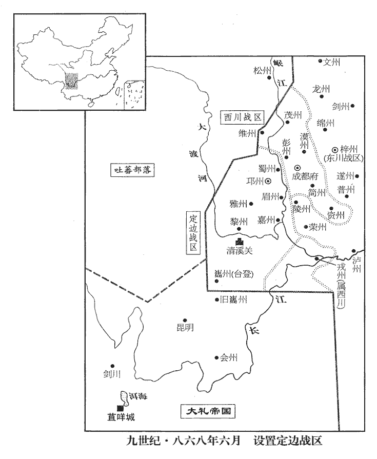
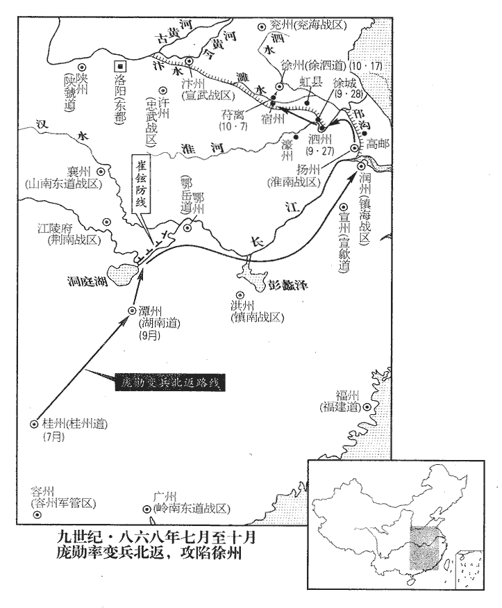
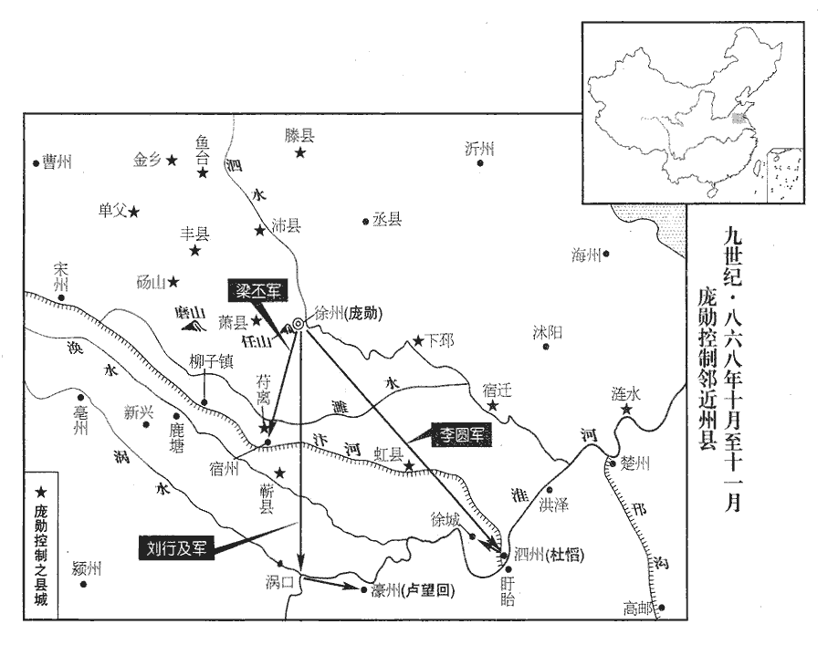
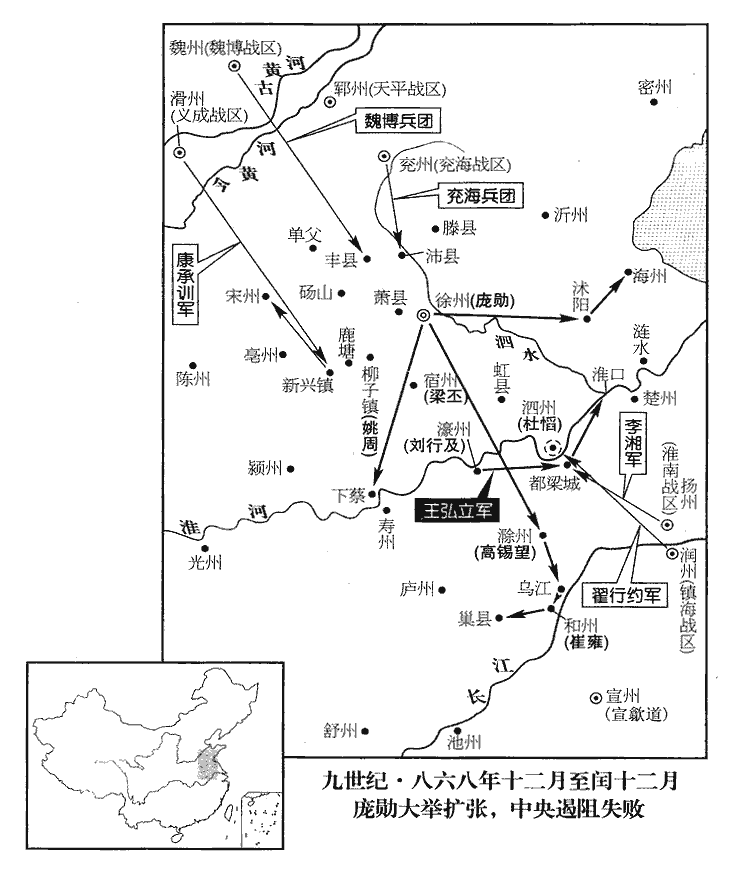
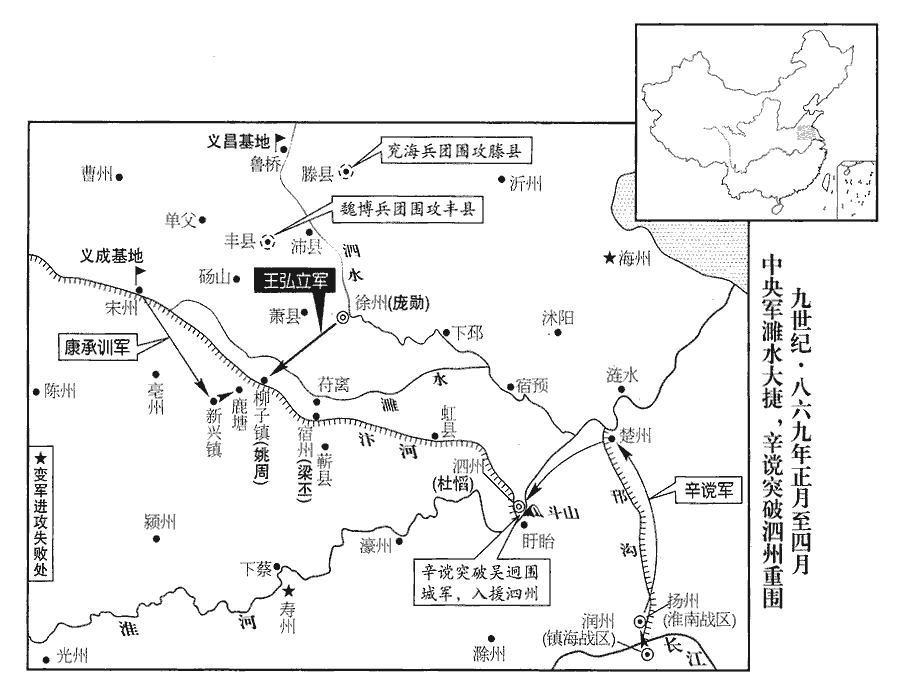
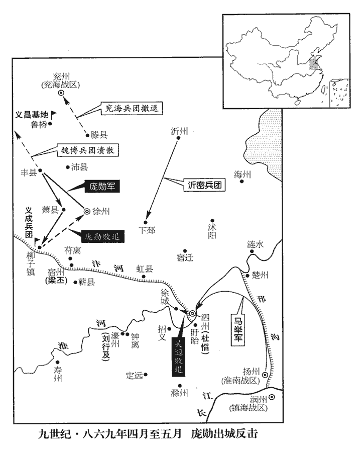
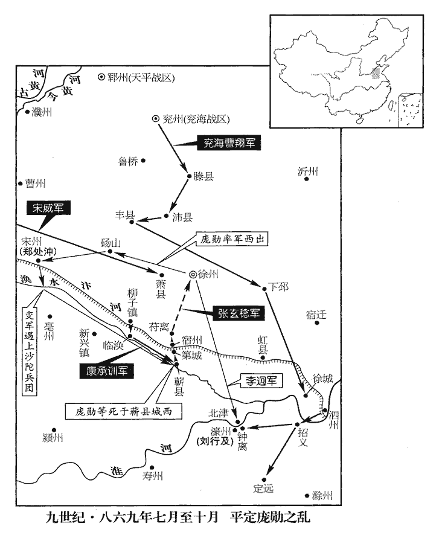
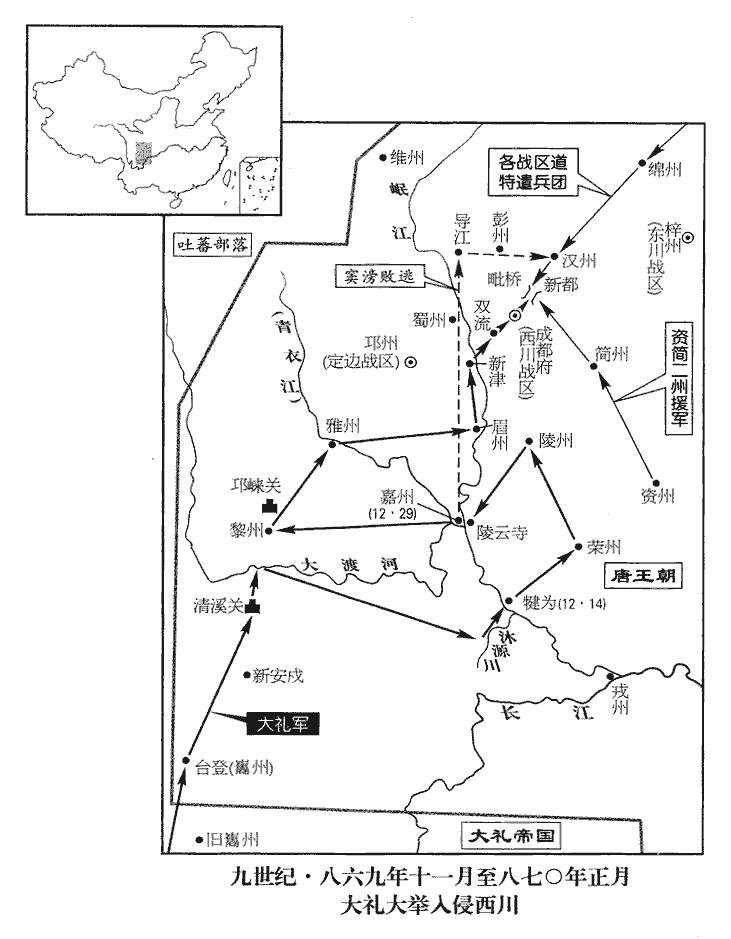

 唐紀六十七起著雍困敦（戊子），盡屠維赤奮若（己丑），凡二年。

# 懿宗昭聖恭惠孝皇帝中

## 咸通九年（戊子、八六八）

1夏，六月，鳳翔‹陕西省凤翔县›少尹李師望上言：「巂州‹四川省冕宁县南泸沽镇›控扼南詔‹大礼国·首都苴咩城云南省大理市›，為其要衝，成都‹西川战区总部·四川省成都市›道遠，難以節制，請建定邊軍，屯重兵於巂州，以邛州‹四川省邛崃市›為理所。」理所，猶言治所也。上，時掌翻。巂，音髓。邛，渠容翻。朝廷以為信然，以師望為巂州刺史，充定邊軍節度，眉‹四川省眉山县›、蜀‹四川省崇州市›、邛‹四川省邛崃市›、雅‹四川省雅安市›、嘉‹四川省乐山市›、黎‹四川省汉源县›等州觀察，統押諸蠻并統領諸道行營、制置等使。師望利於專制方面，故建此策；其實邛距成都纔百六十里，巂距邛千里，其欺罔如此。為李師望以定邊軍致寇張本。

〖译文〗 [1]夏季，六月，凤翔少尹李师望向朝廷上言：“州可控扼南诏，是西川地区抗击南诏蛮军的要冲，成都道路遥远，难以对州进行有效的节制，请求建置定边军。在州屯驻重兵，以邛州为定边军的治所。”朝廷信以为真，即设置定边军。任命李师望为州刺史，充当定边军节度使，眉州蜀州、邛州、邪州、嘉州、黎州等州观察使，统领诸蛮并诸道行营制使等。李师望企图获得专制某一方面的权力，于是建策置定边军；其实邛州距离成都才一百六十里，州距离邛州达千里之遥，李师望欺骗朝廷竟到了如此地步。

 

2初，南詔陷安南，見上卷四年。敕徐泗‹首府设徐州江苏省徐州市›募兵二千赴援，分八百人別戍桂州‹广西桂林市›，初約三年一代。徐泗觀察使崔彥曾，慎由之從子也，崔慎由始見上卷宣宗大中十一年。從，才用翻；下從孫同。性嚴刻；朝廷以徐兵驕，命鎮之。都押牙尹戡kān、教練使杜璋、大中六年五月，敕天下軍府有兵馬處，宜選會兵法、能弓馬等人充教練使，每年合教習時，常令教習。兵馬使徐行儉用事，軍中怨之。戍桂州者已六年，屢求代還，戡言於彥曾，以軍帑空虛，帑，他朗翻。發兵所費頗多，請更留戍卒一年；彥曾從之。戍卒聞之，怒。

〖译文〗 [2]起初，南诏蛮军攻隐安南，唐懿宗下敕令徐泗镇召募士兵二千人往安南赴援，并分其中八百人另往桂州屯戍，最初约定三年轮换一批。徐泗观察使崔彦曾是崔慎由的侄子，性情严酷刻薄；朝廷因为徐州士兵骄横，所以任命崔彦曾镇抚徐泗。都押牙尹戡、教练使杜璋、兵马使徐行俭在使府用事掌权，遭到军中将士的怨愤，当时戍守桂州的徐泗士兵已戍边六年，屡次请求轮换回乡，尹戡向崔彦曾上言，军府帑藏空虚，再调军队往桂州轮换替代，费用太多，请让桂林戍卒再留一年；崔彦曾听从了尹戡的建议。戍卒们得知消息，怒火冲天。

都虞候許佶jí、佶，其吉翻。軍校趙可立、姚周、張行實皆故徐州群盜，州縣不能討，招出之，補牙職。會桂管觀察使李叢移湖南‹首府设潭州湖南省长沙市›，新使未至，校，戶教翻。使，疏吏翻。秋，七月，佶等做亂，殺都將王仲甫，將，即亮翻。推糧料判官龐勛為主，唐制，凡行軍，置隨軍糧料使，兵少者置糧料判官。勛，許云翻。劫庫兵北還，所過剽掠，劫桂州庫兵北歸徐州。還，音旋，又如字。剽，匹妙翻。州縣莫能禦。朝廷聞之，八月，遣高品張敬思赦其罪，新書百官志：內侍省有高品一千六百九十六人。部送歸徐州，戍卒乃止剽掠。

〖译文〗 戍军都虞候许佶、军校赵可立、姚周、张行实都是以前的徐州盗贼，州县不能征讨，于是招安出山，用以被充军队，出任牙职。恰值桂管观察使李丛调往湖南镇守，新任观察使尚未到任，秋季，七月，许佶等人发动叛乱，杀死都将王仲甫，推举粮料判官庞勋为主帅，抢劫军用仓库的兵器，武装起来结队北还，他们在所过之地四处劫掠，地方州县不能抵卸。朝廷得知消息，八月，派遣高品宦官张敬思来赦免戍卒，由官府资送他们回归徐州，于是戍卒们才停止沿途抢劫。

3‹李漼（李温）本年三十六岁›以前靜海‹总部设安南府越南河内市›節度使高駢為右金吾大將軍。駢請以從孫潯代鎮交趾‹安南府所在城·越南河内市›，從之。潯，徐林翻。考異曰：補國史曰：「高公姪孫潯將先鋒軍，每遇陳敵，身當矢石。及高公內舉交代，朝廷命潯節制交趾。」實錄但云高潯以下勒姓名於碑陰，不云潯為節度使。新傳曰：「駢之戰，其從孫潯常為先鋒，冒矢石以勸士。駢徙天平，薦潯自代；詔拜交州節度使。」按駢為金吾半歲始除天平。今從補國史。

〖译文〗 [3]唐懿宗任命前静海节度使高骈为右金吾大将军。高骈请求任命他的侄孙高浔替代自己镇守交趾，唐懿宗表示同意。

4九月，戊戌‹八›，以山南東道‹总部设襄州湖北省襄樊市›節度使盧耽為西川‹总部设成都府四川省成都市›節度使；以有定邊軍‹总部设邛州四川省邛崃市›之故，不領統押諸蠻安撫等使。既分西川置定邊軍，則諸蠻皆在定邊軍巡內。

〖译文〗 [4]九月，戊戌（初八），唐懿宗任命山南东道节度使卢耽为西川节度使；由于设置了定边军的缘故，西川节度使不再兼领统押诸蛮安抚等使。

5龐勛等至湖南，湖南觀察治潭州‹湖南省长沙市›。監軍以計誘之，使悉輸其甲兵。誘，音酉。山南東道節度使崔鉉嚴兵守要害，徐卒不敢入境，泛舟沿江東下。許佶等相與謀曰：「吾輩罪大於銀刀，銀刀見上卷三年。朝廷所以赦之者，慮緣道攻劫，或潰散為患耳，若至徐州，必葅zū醢矣！」乃各以私財造甲兵旗幟。幟，昌志翻。過浙西，入淮南‹总部设扬州江苏省扬州市›，淮南節度使令狐綯遣使慰勞，給芻米。勞，力到翻。芻，以飼馬；米，以給軍。

〖译文〗 [5]庞勋等徐泗戍卒行至湖南，宦官监军用计诱骗他们，让他们将武器全部交出。山南东道节度使崔铉派兵严守要害之地，徐泗戍卒不敢北上入境，于是乘船沿长江东下。许佶等人互相谋划说：“我们犯的罪比当年银刀等七军要大得多，朝廷现在所以要赦免我们，是因为怕我们沿途攻击抢劫，又怕我们溃散到山野为患，如果我们到达徐州，必定要被剁肉酱！”于是每人都用自己的私财打造兵器，作制军旗。戍卒经过浙西，进入淮南，淮南节度使令狐派遣使者赶来慰劳，给予喂马的饲料和军队米粮。

都押牙李湘言於綯曰：「徐卒擅歸，勢必為亂，雖無敕令誅討，藩鎮大臣當臨事制宜。高郵‹江苏省高邮市›岸峽【章：十二行本「峽」作「峻」；乙十一行本同；張校同，云無註本作「峽」。】而水深狹，請將奇兵伏於其側，焚荻舟以塞其前，塞，悉則翻。以勁兵蹙其後，可盡擒也。不然，縱之使得渡淮，至徐州，與怨憤之眾合，為患必大。」綯素懦怯，且以無敕書，乃曰：「彼在淮南不為暴，聽其自過，餘非吾事也。」

〖译文〗 淮南镇都押牙李湘对令狐说：“徐泗戍卒擅自回归，势必造反叛乱，虽然没有皇上的敕令对他们进行诛讨，藩镇大臣应当因事制宜。高邮的江岸高峻，水深港狭，请让我率一支奇兵理伏于江岸旁边，烧着装满柴草的船，以堵塞徐泗戍卒前行的水路，派劲兵在他们后面追赶，可以将他们全部擒获。要不然，放纵他们，让他们渡过淮河，回到徐州，与心怀怨愤的民众会合，为患国家就更大了。”令狐平素一贯懦弱胆小，加上没有皇帝颁下的敕书，于是对李湘说：“他们只要在淮南不行凶逞暴，就听任他们过淮河，其余就不关我的事了。”

勛招集銀刀等都竄匿及諸亡命匿於舟中，眾至千人。丁巳‹二十七›，至泗州‹江苏省盱眙县淮河北岸›。泗州，晉、宋宿豫之地，後魏置南徐州，又置宿豫郡，又改東徐州，又改東楚州，周大象三年改泗州，開元二十四年，移州治臨淮縣。臨淮本漢徐城縣地，當泗水口，南北衝要之所。刺史杜慆tāo饗之於毬場，慆，他刀翻。優人致辭；致辭者，今諸藩府有大宴，則樂部頭當筵致辭，稱頌賓主之美，所謂致語者是也。徐卒以為玩己，擒優人，欲斬之，坐者驚散。慆素為之備，徐卒不敢為亂而止。慆，悰之弟也。杜悰，歷事穆、文、武、宣，屢入相位，咸通初，又為相。

〖译文〗 庞勋如集徐州银刀等七军逃亡山泽者以及亡命之徒，将他们藏于船中，部众发展到一千人。丁巳（二十七日），来到泗州。泗州刺史杜在球场为戍卒们设宴，有唱戏的优人致辞，徐泗戍卒以为是取笑自己，抓住优人就要问斩，在坐的宾客吓得四散而逃。但杜早已作好戒备，徐泗戍卒不敢过份作乱，就此算了。杜是杜的弟弟。

先是，朝廷屢敕崔彥曾慰撫戍卒擅歸者，勿使憂疑。先，悉薦翻。彥曾遣使以敕意諭之，道路相望。勛亦申狀相繼，辭禮甚恭。戊午‹二十八›，行及徐城‹江苏省盱眙县西北›，徐城縣，屬泗州，宋朝省徐城為鎮，入臨淮縣，在泗州北百於里，自此而西北，則入徐州界。然其道里迂遠，故龐勛等西入宿州，至苻離，則距徐州纔一百四十里耳。勛與許佶等乃言於眾曰：「吾輩擅歸，思見妻子耳。今聞已有密敕下本軍，至則支分滅族矣！下，戶嫁翻。支分，謂被支解，而支體異處也，即冎刑。丈夫與其自投網羅，為天下笑，曷若相與戮力同心，赴蹈湯火，豈徒脫禍，兼富貴可求！況城中將士皆吾輩父兄子弟，吾輩一唱於外，彼必響應於內矣。然後遵王侍中故事，王侍中，謂王智興也，事見二百四十二卷穆宗長慶二年。五十萬賞錢，可翹足待也！」眾皆呼躍稱善。將士趙武等十二人獨憂懼，欲逃去，悉【章：十二行本「悉」上有「勛」字；乙十一行本同；張校同。】斬之，遣使致其首於彥曾，且為申狀，稱：「勛等遠戍六年，實懷鄉里；而武等因眾心不安，輒萌姦計。將士誠知詿guà誤，詿，古賣翻。敢避誅夷！今既蒙恩全宥，輒共誅首惡以補愆尤。」冬，十月，甲子‹四›，使者至彭城‹徐州州政府所在县›，彥曾執而訊之，具得其情，乃囚之。丁卯‹七›，勛復於遞中申狀，復，扶又翻。遞中，謂入郵筒遞送使府。稱：「將士自負罪戾，各懷憂疑，今已及苻離‹安徽省宿州市北符离集›，尚未釋甲。苻離，漢古縣，時屬宿州。九域志：宿州北至徐州一百二十里。宋白曰：爾雅：莞，苻離。此地尤多此草，故名。蓋以軍將尹戡、杜璋、徐行儉等狡詐多疑，必生釁隙，乞且停此三人職任，以安眾心，仍乞戍還將士別置二營，共為一將。」將，並即亮翻。

〖译文〗 先前，朝廷屡次命令崔彦曾去抚慰自桂林擅自归来的戍卒，以使他们不对官府产生忧虑和猜疑。崔彦曾派遣使者告谕皇帝的旨意，使者一个接着一个，在道路上前后相望。庞勋也派人向崔彦曾送申诉状，信使也一个接着一个，申诉状的言辞相当恭敬。戊午（二十八日），庞勋等行至徐城县，决定与官府翻脸，庞勋与许佶等人对部众宣称：“我辈擅自归来，是因为思念妻儿，日夜想和他们相见啊。今天听说，已有皇帝的密敕到了徐州军府，到徐州我们将被肢解灭族！大丈夫与其自投罗网，为天下人所笑，还不如大家同心协力，赴汤蹈火干一番大事业。这样不仅摆脱祸殃，而且可求得富贵！更何况徐州城内的将士都是我们的父兄子弟，我们在外一声高喊，他们在城内必然响应。然后遵照王智兴侍中过去所做的事去办，五十万缗赏钱，可以翘足以待！”众戍卒听后都欢呼雀跃，拍手称好。只有将士赵武等十二人感到忧虑和恐惧，企图逃之夭夭，庞勋将他们全部处斩，派遣使者将赵武等十二人的首级送交崔彦曾，并且再递上申诉状，宣称：“庞勋等远戍桂州六年，实在是怀念故乡故里；而赵武等人因为众心不安，竟萌生奸计，骗我们擅自归来。将士们当然知道被赵武等迷误将受到处罚，怎敢冒着诛灭全家的危险不听府使的命令！今天既承蒙观察使的大恩，得以免罪保全性命，大家也就立即将首恶分子赵武等十二人诛死，以弥补我们所犯下的罪过。”冬季，十月，甲子（初四），庞勋的使者来到彭城，崔彦曾将他逮捕并严加审问，将庞勋的反状全部搞清，于是囚禁使者。丁卯（初七），庞勋通过邮筒再次向使府递送申诉状，宣称：“将士们身负重罪，每人都心怀疑虑，今天已到达苻离，还没有解下身穿的重甲。这是因为徐州军府将领尹戡、杜璋、徐行俭等人狡诈多疑，必定对我辈怀有间隙隔阂，乞求观察使暂停尹戡等三人的职任，以便能安定众心；同时，乞求从桂州回还的戍军将士能专门编成两个营，由一个将领管辖。”

 

時戍卒拒彭城止四驛，唐制：三十里一驛。四驛，百二十里。闔城忷懼。彥曾召諸將謀之，皆泣曰：「比以銀刀兇悍，比，毗至翻。悍，侯旰翻，又下罕翻。使一軍皆蒙惡名，殲夷流竄，不無枉濫。今冤痛之聲未已，而桂州戍卒復爾猖狂，復，扶又翻；下同。若縱使入城，必為逆亂，如此，則闔境塗地矣！不若乘其遠來疲弊，發兵擊之，我逸彼勞，往無不捷。」彥曾猶豫未決。團練判官溫廷【章：十二行本「廷」作「庭」；乙十一行本同；孔本同。】皓復言於彥曾曰：「安危之兆，已在目前，得失之機，決於今日。今擊之有三難，而捨之有五害：詔釋其罪而擅誅之，一難也。帥其父兄，討其子弟，二難也。帥，讀曰率。枝黨鉤連，刑戮必多，三難也。然當道戍卒擅歸，不誅則諸道戍邊者皆効之，無以制禦，一害也。將者一軍之首，而輒敢害之，謂戍卒殺都將王仲甫也。則凡為將者何以號令士卒！二害也。所過剽掠，剽，匹妙翻。自為甲兵，招納亡命，此而不討，何以懲惡！三害也。軍中將士，皆其親屬，銀刀餘黨，潛匿山澤，一旦內外俱發，何以支梧！四害也。如淳曰：枝梧，猶枝扞也。薛瓚曰：小柱為枝，邪柱為梧，今屋梧邪柱是也。逼脅軍府，誅所忌三將，又欲自為一營，三將，謂尹戡、杜璋、徐行儉。及乞別營，事並見上。從之則銀刀之患復起，違之則託此為作亂之端，五害也。惟明公去其三難，去，羌呂翻。絕其五害，早定大計，以副眾望。」

〖译文〗 当时自桂州归还的戍卒距彭城只有四个驿程，共一百二十里路程，这使徐州城内惶然，一片恐惧。崔彦曾召部下诸将谋划对策，诸将都哭着说：“以前因为银刀等军凶悍不羁，使徐州镇一军都蒙受恶名，遭到夷灭，有的流窜山谷，这不能说没有冤枉、诉除太滥，至今冤痛之声仍不绝于耳。而桂州戍卒又恢复了往昔的猖狂，如果放纵他们，让他们入城，必然会造反作乱，这样，徐州全境就要肝脑涂地了！不如乘他们自远道而来，精力疲惫，调集军队前往讨击，以逸待劳，往无不捷。”崔彦曾犹豫不决。徐泗团练判官温廷皓再向崔彦曾上言说：“全城的安然情状，已呈现在眼前，是得还是失，全在于今天的决策。目前讨击桂州戍卒有三大难处，而舍弃他们不如讨伐又有五大害处：皇帝既已颁下诏书释免戍卒的罪，我们擅自讨击，这是第一大难处。我们率领戍卒的父兄，去讨击他们的子弟，人情难违，这是第二大难处。戍卒犯罪，牵连的枝党多而复杂，追究起来判刑和处死的人必然很多，这是第三大难处。但是，本道戍边的士卒擅自归还，不诛讨就会使其他道戍边的士卒群仿效，使朝廷的法制失去作用，不能制服叛乱，这是第一大害处。将领是一军的首长，而桂林戍卒竟敢杀害都将王仲甫，不对这些犯上作乱的士卒进行诛讨，担任帅的人怎么能够去号令士兵！这是第二大害处。擅自归还的戍卒一路上剽掠抢劫，自己制造兵器，招纳亡命之徒，对这样的叛贼不加征讨，又怎么去惩除恶徒！这是第三大害处。徐州军中的将士，都是擅归戍卒的亲属，而银刀等七军的余党，潜伏在山谷草泽间，一旦内外勾结一同叛乱，又如何来支撑徐州的局面！这是第四大害处。桂州戍卒竟敢胁迫徐泗军府，要按他们的意愿诛除他们所忌恨的三名将领，真是气焰嚣张，又要求同伙编在一起，自己成立营队，如果答应他们的要求，那么当年银刀等七军叛乱的祸患又将重起，如果不答应他们，戍卒就会以此为借口，发动叛乱，这是第五大害处。只有您能除去三大难处，根绝这五大害，希望您毅然决然，早定大计，不辜负我们大家的希望。”

時城中有兵四千三百，彥曾乃命都虞候元密等將兵三千人討勛，數勛之罪以令士眾，數，所具翻。且曰：「非惟塗炭平人，實亦汙染將士。汙，烏故翻。染，如艷翻，又如險翻。儻國家發兵誅討，則玉石俱焚矣！」書曰：火炎崑岡，玉石俱焚。天吏逸德，烈于猛火。又曰：「凡彼親屬，無用憂疑，罪止一身，必無連坐。」仍命宿州‹安徽省宿州市›出兵苻離，泗州出兵於虹‹安徽省泗县›以邀之，虹，漢古縣，宋、魏廢省，古城在夏丘縣界；武德置虹縣於古虹城，貞觀八年移治夏丘，故城時屬宿州。九域志：在州東一百八十里。顏師古曰：虹，音貢，今音絳。且奏其狀。彥曾戒元密無傷敕使。時張敬思尚在勛等軍中。

〖译文〗 当时徐州城中有军队四千三百人，崔彦曾于是命令都虞候元密等率领军队三千人去讨伐庞勋，又历数庞勋的罪恶，以鼓动士气，并且说：“庞勋等叛卒不但使平民百姓生灵涂炭，实际上也是沾污了广大将士的名声。如果让朝廷调集军队来诛讨，恐怕就要玉石俱焚，叛贼连带我们都要受罪！”又说：“凡是叛乱戍卒中有你们的亲属，你们也用不着忧虑，罪只在一人身上，必定不会有任何株连。”于是命令宿州派军队至苻离，泗州派军队到虹县，以邀击桂州归来的戍卒，并向朝廷奏告使府布置。崔彦曾还特别告诫元密说，不要伤害还在庞勋军中的宦官敕使张敬思。

戊辰‹八›，元密發彭城，軍容甚盛。諸將至任山‹徐州市西南十五千米›北數里，任山在彭城西南三十里。頓兵不進，共思所以奪敕使之計，欲俟賊入館，乃縱兵擊之，遣人變服負薪以詗賊。詗xiòng，翾正翻，又火迥翻。日暮，賊至任山，館中空無人，又無供給，疑之，見負薪者，執而榜之，榜，音彭。果得其情。乃為偶人【章：十二行本「人」下有「執旗幟」三字；乙十一行本同；孔本同；張校同。】列於山下而潛遁。比夜，官軍始覺之，比，必利翻，及也；下比官軍、比追及，皆同音。恐賊潛伏山谷及間道來襲，間，古莧翻。復引兵退宿於城南，明旦，乃進追之。

〖译文〗 戊辰（初八），元密从鼓城出发，军容相当盛大。诸将领率军来到任山以北数里地外，停止进兵，共同商量救出宦官敕使的计划。元密企图等待叛归的戍卒进入旅馆时，再纵兵攻击，于是派遗一些士兵化装成挑柴卖薪的人，在周围侦察敌情。太阳下山之时，戍卒来到任山，旅馆中空无一人，又没有米饭茶水供给，于是众士卒产生了怀疑，看见挑柴的人，抓来捆绑起来，经追问，果然获得了官军设伏的情况。于是戍卒们制作木偶人，排列在山下，自己全潜逃而去。至夜深时，官军才察觉，恐怕叛乱的戍卒潜伏在山谷或小路边，对他们发动偷击，于是引兵退走，在任山城南宿营，第二天早晨，才进兵追击戍卒们。

時賊已至苻離，宿州戍卒五百人出戰於濉水上‹古濉水流经苻离城北›，濉水，在虹縣靈壁東。望風奔潰，賊遂抵宿州。時宿州闕刺史，觀察副使焦璐攝州事，城中無復餘兵，庚午‹十›，賊攻陷之，璐走免。璐，音路。考異曰：舊紀：「九月，甲午，勛陷宿州。」今從鄭樵彭門紀亂及新紀。賊悉聚城中貨財，令百姓來取之，一日之中，四遠雲集，然後選募為兵，有不願者立斬之，自旦至暮，得數千人。於是勒兵乘城，龐勛自稱兵馬留後。

〖译文〗 这时叛乱的戍卒已来到苻离，宿州派出戍卒五百人于濉水上抵抗，官军望风而逃，叛贼于是进抵宿州。当时宿州缺刺史，观察副使焦璐掌摄州政事务，城内不再有军队，庚午（初十），叛贼攻陷宿州，焦璐逃出城，得免一死。叛乱的戍卒将城中的财货全部聚集在一起，让老百姓随意来取，一天之内，四面八方的人不怕路远都赶来了，贼军先分财，然后选募丁壮参军，有不愿入伙的人立即被斩首，自清晨到日暮，选得丁壮数千人。于是分派士兵登上城楼，分关把守，庞勋自称兵马留后。

再宿，官軍始至，賊守備已嚴，不可復攻。先是，焦璐聞苻離敗，先，悉薦翻。決汴水‹流经宿州城南›以斷北路，斷，音短。賊至，水尚淺可涉，比官軍至，已深矣。壬申‹十二›，元密引兵渡水，將圍城，會大風，賊以火箭射城外茅屋，射，而亦翻。延及官軍營，士卒進則冒矢石，退則限水火，賊急擊之，死者近三百人。近，其靳翻。元密等以為賊必固守，但為攻取之計。

〖译文〗 第二天晚上，官军才赶到宿州城下，叛贼的守备已很严密，一时无法攻取。起先，焦璐听说苻离官军战败，决汴水堤企图淹断北面的道路，叛乱的戍卒赶到时，水尚浅，可以涉过，到官军赶来时，水已很深，无法行走了。壬申（十二日），元密率领军队渡过水面，行将把宿州城团团困住，恰值一阵大风，叛贼趁势用火箭射城外的茅屋，大火延绵烧到官军的营帐，官军士卒前进要冒城上投下的矢石，后退又受到水和火的限制，叛贼于是趁机急攻，杀死官军近三百人。元密等人认为叛贼必定要固守宿州城，只为攻城考虑计策。

賊夜使婦人持更，夜有五更，使人各直一更，擊鼓以警眾，謂之持更。顏之推曰：一更、二更、三更、四更，皆以五為節。西都賦云：「衛以嚴更之署。」所以爾者，假令正月建寅，斗柄夕則指寅，晝則指午，自寅至午，凡歷五辰。冬、夏之月，雖復長短，然辰間遼闊，盈不至六，縮不至四，進退常在五者之間。更，歷也，經也，故曰五更。更，工衡翻。掠城中大船三百艘，備載資糧，順流而下，欲入江湖為盜；宿州，古汴河之會，漕運及商旅所經，故城中有大船沿汴而下，入淮，則可以入江湖矣。艘，蘇遭翻。以千縑贈張敬思，遣騎送至汴‹宣武战区总部·河南省开封市›之東境，此謂汴州東境也。縱使西歸。謂西歸長安。

〖译文〗 叛贼夜晚让妇女击鼓打更，掠夺城中的大船三百艘，装满军资粮食，顺汴水而下，企图流入江湖为盗贼；又赠给宦官中使张敬思丝绢千匹，派遣骑兵护送至汴州境东面，放他西归长安。

明旦，官軍知賊已去，狼狽追之，士卒皆未食，比追及，已飢乏。賊檥yǐ舟隄下而陳於隄外，陳，讀曰陣；下同。伏千人於舟中，檥，魚豈翻。官軍將至，陳者皆走入陂中。密以為畏己，縱兵追之；賊自舟中出，夾攻之，自午及申，官軍大敗。密引兵走，陷於荷涫，涫guān，古丸翻。賊追及之，密等諸將及監陳敕使皆死，士卒死者殆千人，其餘皆降於賊，無一人還徐者。賊問降卒以彭城人情計謀，知其無備，始有攻彭城之志。

〖译文〗 第二天一早，官军才知道叛贼已出城远去，狼狈追赶，士卒们都没吃饭，到追上叛贼时，官军已是饥饿疲乏到了极点。叛贼把船停靠在堤边，而在堤外列阵，在船中埋伏了一千余人，官军将杀过来时，列于阵前的叛贼全逃跑逃跑到池泽中。元密以为叛贼畏惧自己，命部下官兵全线追击；埋伏在船中的叛贼从船中出来，与池泽中的叛贼一同夹击官军，从中午一直战到黄昏，官军大败。元密带着残兵退走，陷于荷花泥泽中，叛贼追上来，元密等徐泗诸将及监阵的宦官中使全被死，士卒也被杀死了上千人，其余人全都投降叛贼，没有一个回到徐州城。叛贼问投降的士卒关于彭城内的人情和官府的部署，知道城中没有戒备，于是有了攻占彭城的企图。

乙亥‹十五›，龐勛引兵北渡濉水，踰山趣彭城。趣，七喻翻。其夕，崔彥曾始知元密敗，移牒鄰道求救；明日，塞門，塞，悉則翻。選城中丁壯為守備，內外震恐，無復固志。或勸彥曾奔兗州‹兖海战区总部·山东省兖州市›，九域志：徐州北至兗州三百六十里。彥曾怒曰：「吾為元帥，城陷而死，職也！」立斬言者。

〖译文〗 乙亥（十五日），庞勋率领军队北渡濉水，越山往彭城进发。这天傍晚，崔彦曾才得知元密战败的情况，于是写信请求相邻的道发兵救援；第二天，崔彦曾紧闭城门，选城中的丁壮入伍守备城防，城内外一片震惊恐慌，没有人愿在城中坚守，都想逃走。有人劝崔彦曾投奔兖州，崔彦曾愤怒地说：“我身为元帅，城若被攻陷只有死而已，守城是我的职责。”并立即将劝他逃走的人斩首。

丁丑‹十七›，賊至城下，眾六七千人，鼓譟動地，民居在城外者，賊皆慰撫，無所侵擾，由是人爭歸之，不移時，克羅城。彥曾退保子城，羅城，外大城也。子城，內小城也。民助賊攻之，推草車塞門而焚之，推，吐雷翻。塞，悉則翻。城陷。考異曰：舊紀：「九月，乙未，龐勛陷徐州，殺節度使崔彥曾、判官焦璐等。賊令別將梁丕守宿州，又遣劉行及、丁景琮、吳迥攻圍泗州。」今從彭門紀亂及新紀。舊彥曾傳曰：「九年九月十四日，賊逼徐州。十五日後，每旦大霧。十六日，彥曾並誅逆卒家口。十七日，昏霧尤甚，賊四面斬關而入。」實錄，自勛知徐州出兵退至苻離已後，皆置於十一月。今從彭門紀亂。賊囚彥曾於大彭館‹招待外宾的宾馆›，執尹戡、杜璋、徐行儉，刳kū而剉之，刳其腹而寸剉之。盡滅其族。勛坐聽事，徐州觀察廳事也。聽，讀曰廳。盛陳兵衛，文武將吏伏謁，莫敢仰視。即日，城中願附從者萬餘人。

〖译文〗 丁丑（十七日），叛贼来到徐州城下，部众有六七千人，击鼓喧噪，声音震天动地，百姓居住在城外的，叛贼均对他们慰问保护，一点也不侵扰，于是人们争相归附，不多时，就攻克了外城。崔彦曾退到内城进行抗拒，百姓协助叛贼攻城，推来装满草的车堵塞城门，放火焚烧，使内很快陷落。叛贼将崔彦曾抓获，囚禁于大彭馆，又逮捕尹戡、杜璋、徐行俭，剐开他们的肚皮，将他们剁成碎片，并将他们的家属全部杀死。庞勋坐于徐州观察使府处置军政大事，卫兵整整齐齐地排列，文武将吏行跪拜礼，没有人敢抬头正视厅堂上的主帅庞勋。当天，城中愿意归附庞勋的人就达一万余人。

戊寅‹十八›，勛召溫庭皓，使草表求節鉞，庭皓曰：「此事甚大，非頃刻可成，請還家徐草之。」勛許之。明旦，勛使趣之，趣，讀曰促。庭皓來見勛曰：「昨日所以不即拒者，欲一見妻子耳。今已與妻子別，謹來就死。」勛熟視，笑曰：「書生敢爾，不畏死邪！龐勛能取徐州，何患無人草表！」遂釋之。

〖译文〗 戊演（十八日），庞勋将温庭皓召至使府，要他起草给朝廷的表，请求徐州节度使的符节斧杖，温庭皓说；“这件事关系重大，不是顷刻间可以完成的，请让我回家慢慢地起草。”庞勋准许他回家去写。第二天早上，庞勋派人去温庭皓家取表文，温庭皓来到使府见庞勋说：“昨天所以不立即拒绝起草表文，是想回家看一下妻子儿子，今天已经与妻儿决别，现在就是来送死的了。”庞勋看了温庭皓几眼，笑着说：“书生敢顶撞我，不怕死吗！我庞勋能攻取徐州，怎么怕找不到人为我起草表文！”说完将温庭皓释放。

有周重者，每以才略自負，勛迎為上客，重為勛草表，重為，于偽翻。稱：「臣之一軍，乃漢室興王之地。漢高帝起於沛。唐沛縣屬徐州，故稱之以自夸大。頃因節度使刻削軍府，刑賞失中，遂致迫逐。言士卒所以迫逐主帥者，皆其所自致。陛下奪其節制，翦滅一軍，見上卷三年。或死或流，冤橫無數。橫，戶孟翻。今聞本道復欲誅夷，將士不勝痛憤，推臣權兵馬留後，彈壓十萬之師，撫有四州之地。勝，音升。四州，謂徐、宿、濠‹安徽省凤阳县东北临淮关›、泗。臣聞見利乘時，帝王之資也。臣見利不失，遇時不疑；伏乞聖慈，復賜旌節。不然，揮戈曳戟，詣闕非遲！」庚辰‹二十›，遣押牙張琯奉表詣京師。

〖译文〗 有一个名叫周重的人，常常以有文思才略自负，庞勋迎他为上宾，为庞勋起草上给朝廷的表文，声称：“我所统领的一支军队，驻在汉王朝的龙兴之地。不久前因为节度使对将士太苛刻，滥施刑赏，于是将士们被迫将他驱逐。六年前皇上削夺徐州军号，消灭一镇军队，我银刀等军壮士有的被处死，有的被流放，含冤而死的无可胜计。今天听说本道又企图诛杀将士，我们更是愤慨万分，众人推我暂时掌管军事，权任兵马留后，以弹压十万雄师，抚慰徐、宿、濠、泗等四州之地。我听说因势利导，不失时机，是成帝王的资本。我见到利而不失去，遇到时运而不迟疑；恳切地希望皇帝陛下大发慈悲，赐给我节度使的符节和旗帜。要不然，我就统率数万大军，进攻长安，这并不是难事！”庚辰（二十日），庞勋派遣押牙张带上表文送往长安。

勛以許佶為都虞候，趙可立為都遊弈使，黨與各補牙職，分將諸軍。又遣舊將劉行及將千五百人屯濠州，李圓將二千人屯泗州，梁丕將千人屯宿州，自餘要害縣鎮，悉繕完戍守。徐人謂旌節之至不過旬月，願效力獻策者遠近輻湊，乃至光‹河南省潢川县›、蔡‹河南省汝南县›、淮‹淮河›、浙‹钱塘江›、兗‹山东省兖州市›、鄆‹山东省东平县›、沂‹山东省临沂市›、密‹山东省诸城市›群盜，皆倍道歸之，闐溢郛郭，闐，停年翻。郛fú，芳無翻。旬日間，米斗直錢二百。人來從亂者多，故米踊貴。勛詐為崔彥曾請翦滅徐州表，其略曰：「一軍暴卒，盡可翦除；五縣愚民，各宜配隸。」五縣，彭城、蕭‹安徽省萧县›、豐‹江苏省丰县›、沛‹江苏省沛县›、滕‹山东省滕州市›也。又作詔書，依其所請，傳布境內。徐人信之，皆歸怨朝廷，曰：「微桂州將士回戈，吾徒悉為魚肉矣！」

〖译文〗 庞勋委任许佶为都虞候，赵可立任都游弈使，所信用的党羽都各自被以牙职，分别率领诸部军队。又派遣徐州旧将刘行及率领一千五百人屯驻于濠州，派李圆率二千人屯驻于泗州，派梁丕率一千人屯驻于宿州，其余要害县镇，都修缮守备。徐州人传说朝廷赐给庞勋的节度使符节旌旗不过半个月就会到，所以愿献策效力的人不问远近齐集而来，以致光州、蔡州、淮州、浙州、兖州、郓州、沂州、密州等地的群盗，也都不畏路远赶来归附，使徐州城里城外充满了人，十天多时间，一斗米的价钱就涨到二百缗。庞勋假造崔彦曾向朝廷请求歼灭徐州一镇将士的表文，表文的大概内容是：“徐州一军士卒狂暴，可以全部翦除；附近彭城、萧县、丰县、沛县、滕县等五县愚昧的民众，都应该配作奴隶。”又伪造皇帝的诏书，宣言皇帝已批准了崔彦曾的请求，在境内广为传布。徐州人相信了谣言，都把怨恨转向朝廷，说：“如果不是桂将士挥戈挥戈回来，我们就要全部成为油锅里的鱼肉了！”

劉行及引兵至渦口‹涡水注入淮河处·安徽省怀远县›，渦口至濠州，僅隔淮水耳。渦，音戈。道路附從者增倍，濠州兵纔數百，刺史盧望回素不設備，不知所為，乃開門具牛酒迎之。行及入城，囚望回，自行刺史事。考異曰：舊紀、實錄、新紀，濠州陷在十一月。按濠本徐之屬郡，勛始得徐州，則遣行及取之，望回猶未及為備，豈得至十一月！今從彭門紀亂。泗州刺史杜慆聞勛作亂，完守備以待之，且求救於江、淮。李圓遣精卒百人先入泗州，封府庫，慆遣人迎勞，勞，力到翻。誘之入城，悉誅之。誘，音酉。明日，圓至，即引兵圍城，城上矢石雨下，賊死者數百，乃斂兵屯城西。勛以泗州當江、淮之衝，益發兵助圓攻之，眾至萬餘，終不能克。史於此略言其終，下文始詳言其事。

〖译文〗 刘行及率领叛军来到涡口，一路上归附从军的人使军队增加了几倍，濠州的官军才数百人，刺史卢望回平时从不设戒备，不知怎么办才好，于是开城门并带着牛肉美酒出城迎接。刘行及进入濠州将卢望回囚禁，自行刺史职务。泗州刺史杜听说庞勋作乱，完缮城内守备，以等待叛军来进攻，并向江、淮地区的官军求救。李圆派遣精锐士卒一百人先进入泗州，查封州府的仓库，杜派人来迎接慰劳，将这一百叛兵诱骗入泗州城，然后将他们全部杀死。次日，李圆赶到，立即派军队围攻泗州城，城上官军顽强抵抗，箭头和石块如雨点般落下来，叛贼被打死的有数百人，李圆于是收兵屯驻于城西。庞勋因为泗州地处江、淮的冲要，增调军队来援助李圆攻城，军队达到一万余人，但始终不能攻克泗州城。

初，朝廷聞龐勛自任山還趣宿州，趣，七喻翻。遣高品康道偉齎敕書撫慰之。十一月，道偉至彭城。勛出郊迎，自任山至子城三十里，大陳甲兵，號令金鼓響震山谷，城中丁壯，悉驅使乘城。宴道偉於毬場，使人詐為群盜降者數千人，諸寨告捷者數十輩；復作求節鉞表，復，扶又翻。附道偉以聞。

〖译文〗 起初，朝廷听说庞勋从任山回到宿州，派遣高品宦官康道伟带着皇帝诏敕来抚慰。十一月，康道伟来到彭城。庞勋来到徐州城郊迎接，自任山到徐州小城的三十里路上，排列大批武装士兵，号令之声和锣鼓声参杂，声震山谷，徐州城的丁壮居民，全被驱赶到城墙上。庞勋在场上设宴招待康道伟，又派人假装成投降的群盗，有数千人，诸营寨赶来告捷的有几十批，庞勋这样做是想在朝廷派遣的使者面前表示自己已牢牢控制住了徐州的局面。庞勋再次让人草写了请求充任徐州节度使的表文，让康道伟带回朝廷，转达于唐懿宗。

 

初，辛雲京之孫讜，辛雲京見二百二十二卷肅宗寶應二年。讜dǎng，多曩翻。寓居廣陵‹扬州州政府所在县›，喜任俠，喜，許記翻。如淳曰：相與信為任，同是非為俠，所謂權行州里，力折公侯者也。或曰：俠之為言挾也，以權力俠輔人也。年五十不仕；與杜慆有舊，聞龐勛作亂，詣泗州，勸慆挈家避之，慆曰：「安平享其祿位，危難棄其城池，難，乃旦翻。吾不為也！且人各有家，誰不愛之？我獨求生，何以安眾！誓與將士共死此城耳！」讜曰：「公能如是，僕與公同死！」乃還廣陵，與其家訣，壬辰‹三›，復如泗州。復，扶又翻。時民避亂，扶老攜幼，塞塗而來，塞，悉則翻。見讜，皆止之曰：「人皆南走，子獨北行，取死何為！」讜不應。至泗州，賊已至城下，讜急棹zhào小舟得入，慆即署團練判官。城中危懼，都押牙李雅有勇略，為慆設守備，帥眾鼓譟，四出擊賊，賊退屯徐城，眾心稍安。

〖译文〗 起初，辛云京的孙子辛谠，在广陵闲居，行侠仗义，已五十岁了却不愿入朝做官；辛谠与杜年友好，听说庞勋在徐泗叛乱，来到泗州，劝杜携带家属弃城逃走，杜说：“平安时期享有朝廷的俸禄官位，危难时期抛弃朝廷委交给我管理的城池，这是我所不能干的！况且人各有自己的家，谁不爱自己的家呢？我独自逃走求生，如何来安定部众的心！我誓与将士同生死，要死也一起死在泗州城！”辛谠说：“您能这样做，我也与您一同死在城里！”于是回到广陵，与自己的家属诀别，壬辰（初三），再回到泗州城。当时民众为避战乱，扶老携幼，向南逃亡，道路也被人流所堵塞，逃亡的百姓见到辛谠，都劝阻他说：“人们都往南走，您独自北行，不是去找死吗！”辛谠不答理。来到泗州，叛军已开到城下，辛谠拼命地划小船，得入城内，杜当即任命辛谠为团练判官。城中由于危急，人人感到恐惧，都押牙李雅有勇有谋，为杜布置守备，率领部众击鼓喧噪，出城四处袭击叛贼，贼军被迫退却，屯驻于徐城，徐州城内人心才稍微安定下来。

龐勛募人為兵，人利於剽掠，爭赴之，帥，讀曰率。剽，匹妙翻。至父遣其子，妻勉其夫，皆斷鉏首而銳之，據陸德明春秋左氏傳釋文：斷，音丁管翻，讀如短。齊景公使王黑以靈姑鉟pī率，請斷三尺而用之。楚令尹圍為王旌以田，芈尹無宇斷之，是也。執以應募。

〖译文〗 庞勋招募人民当兵，人们贪图剽掠所得的财利，争先恐后地赶来参军，甚至父亲送儿子，妻子勉励丈夫，农民们都把锄头磨得更锐利，扛着它作为武器来应募。

鄰道聞勛據徐州，各遣兵據要害，而官軍尚少，賊眾日滋，官軍數不利。少，詩沼翻。數，所角翻。賊遂破魚臺‹山东省鱼台县›近十縣。近，其靳翻。宋州‹河南省商丘市›東有磨山‹河南省永城县东北芒砀山›，民逃匿其上，勛遣其將張玄稔圍之。會旱，山泉竭，數萬口皆渴死。

〖译文〗 与徐州相邻的几个道得知庞勋占据了徐州，各自派军队占据要塞据点，但官军人少，叛贼的军队越来越多，官军抗拒叛贼，多次交战都不利。叛贼于是攻破鱼台等近十个县。宋州东面有一座磨山，民众逃到山上射藏，庞勋哌遣部将张玄稔率兵围困。正值天旱，山上的泉水枯竭，数万口人全部渴死。

或說勛曰：說，式芮翻；下同。「留後止欲求節鉞，當恭順盡禮以事天子，外戢士卒，內撫百姓，庶幾可得。」勛雖不能用，然國忌猶行香，唐自中世以後，每國忌日，令天下州府悉於寺觀設齋焚香。開成初，禮部侍郎崔蠡以其事無經，據奏罷之，尋而復舊。畢仲荀幕府燕閒錄曰：「國忌行香，起於後魏。唐會要曰：天寳七年，敕華、同等州僧、尼、道士，國忌日各就龍興寺行道散齋。至貞元五年，處州奏，「當州不在行香之數，乞同衢、婺等州行香。」有旨「依」。註又見前。饗士卒必先西向拜謝。凡方鎮大饗將士，必朝服，帥將佐西向望闕謝恩，言皆出於君賜也。癸卯‹十四›，勛聞敕使入境，以為必賜旌節，眾皆賀。明日，敕使至，但責崔彥曾及監軍張道謹，貶其官。勛大失望，遂囚敕使，不聽歸。

〖译文〗 有人劝宠勋说：“留后您如果只是想求得节度使的符节斧杖，就应当对当朝天子恭顺尽礼，对外安士卒，不致骚扰，对内安抚百姓，不使惊恐，或许可以得到节度使的官位。“庞勋虽然不能用，但在国家的忌日仍然设斋行香，为将士摆设宴席时必先向西望振谢，表示向唐懿宗谢恩。癸卯（十四日），庞勋听说朝廷派来的宦官敕使已以徐州境内，以为必定是唐懿宗赐予节度使的符节旌旗，部众都表示祝贺。第二天，宦官使者来到使府，只是谴责崔彦曾以及宦官监军张道谨，贬他们的官。庞勋大为失望，于是将朝廷派来的宦官敕使囚禁起来，不让他归还朝廷。

詔以右金吾大將軍康承訓為義成‹总部设滑州河南省滑县›節度使、徐州行營都招討使，神武大將軍王晏權為徐州北面行營招討使，羽林將軍戴可師為徐州南面行營招討使，考異曰：舊紀：「十年正月，以神武大將軍王晏權為武寧節度使。晏權，智興之從子也。以右神策大將軍康承訓充徐泗行營都招討使，凡十八將，分董諸道之兵七萬三千一十五人。正月一日，進軍攻徐州。」又曰：「承訓大軍攻宿州，賊將梁伾出戰，屢敗，乃授承訓義成節度使。」實錄：「九年十二月，以右金吾大將軍康承訓為義成軍節度使、充徐泗行營兵馬都招討使。承訓不赴鎮，以節度副使陳魴句當留後，以王晏權為徐、泗、濠、宿等州觀察使、充徐州北面行營招討等使，羽林將軍戴可師為徐州南面行營招討等使。」彭門紀亂、新紀，承訓等除招討使皆在十一月。唐年補錄：「十一月庚申，以太原節度使康承訓為都統，討徐州。」按庚申乃十二月一日，承訓舊官亦非太原節度使。補錄誤也。今從彭門紀亂、新紀。大發諸道兵以隸三帥。帥，所類翻。承訓奏乞沙陀三部落‹山西省北部›使朱邪赤心沙陀、薩葛、安慶分為三部。及吐谷渾‹黄河河套及山西省北部›、達靼‹瀚海沙漠南›、契苾‹九姓部落之一·山西省西北部›酋長各帥其眾以自隨；靼，當葛翻。帥，讀曰率。詔許之。

〖译文〗 唐懿宗颁下诏书任命右金吾大将军康承训为义成节度使、徐州行营都招讨使，任命神武大将军王晏权为徐州北面行营招讨使，任命忌林将军戴可师为徐州南面行营招讨使，征发诸藩镇大批军队交给三位统帅指挥。康承训上奏康懿宗，请求派沙陀族三部落使朱邪赤心以及吐谷浑、达靼、契等族酋长各自率领其部众，跟随他一同征讨徐泗；唐懿宗下诏批准。

龐勛以李圓攻泗州久不克，遣其將吳迥代之。丙午‹十七›，復進攻泗州，晝夜不息。時敕使郭厚本考異曰：舊紀、實錄作「郗厚本」，今從彭門紀亂及舊傳。將淮南兵千五百人救泗州，至洪澤‹江苏省洪泽县西北›，九域志：楚州淮陰縣有洪澤鎮。畏賊強，不敢進。辛讜請往求救，杜慆許之。丁未‹十八›夜，乘小舟潛渡淮，至洪澤，說厚本，厚本不聽，比明，復還。己酉‹二十六›，賊攻城益急，欲焚水門，城中幾不能禦；說，式芮翻。比，必利翻。幾，居依翻。讜請復往求救。慆曰：「前往徒還，今往何益？」讜曰：「此行得兵則生返，不得則死之。」慆與之泣別。讜復乘小舟負戶突圍出，見厚本，為陳利害，為，于偽翻；下皆為同。厚本將從之，淮南都將袁公弁曰：「賊勢如此，自保恐不足，何暇救人！」讜拔劍瞋目謂公弁曰：瞋，昌真翻。「賊百道攻城，陷在朝夕；公受詔救援而逗留不進，豈惟上負國恩！若泗州不守，則淮南遂為寇場，公詎能獨存邪！我當殺公而後止【章：十二行本「止」作「死」；乙十一行本同；退齋校同，云無註本作「止」。】耳！」起，欲擊之，厚本起，抱止之，公弁僅免。讜乃回望泗州，慟哭终日，士卒皆為之流涕。為，于偽翻。厚本乃許分五百人與之，仍問將士，將士皆願行。讜舉身【章：十二行本「身」下有「自擲」二字；乙十一行本同；孔本同；張校同。】叩頭以謝將士，遂帥之抵淮南岸，帥，讀曰率。望賊方攻城，有軍吏言曰：「賊勢已似入城，還去則便。」憚賊不敢進兵，言還軍而去，則於事為便也。讜逐之，攬得其髻，攬，撮持也。舉劍擊之，士卒共救之，曰：「千五百人判官，不可殺也。」讜曰：「臨陳妄言惑眾，陳，讀曰陣。必不可捨！」眾請不能得，乃共奪之。讜素多力，眾不能奪。讜曰：「將士但登舟，我則捨此人。」眾競登舟，乃捨之。士卒有回顧者，則斫之。驅至淮北，勒兵擊賊。慆於城上布兵與之相應，賊遂敗走，鼓譟逐之，至晡而還。還，從宣翻，又如字。

〖译文〗 庞勋因为李圆攻泗州城久不能攻克，派遣部将吴迥替代李圆指挥。丙午（十七日），贼军再攻泗州，日夜不停。当时宦官敕使郭厚本率领淮南军队一千五百人来救援泗州，来到洪泽镇，畏惧贼军强盛，不敢前进。辛谠在泗州城内请求往洪泽求救，杜同意。丁未（十八日）夜晚，辛谠乘小船偷渡淮河，来到洪泽，游说郭厚本，郭厚本不听，到天亮，辛谠回到泗州城。已酉（二十日），贼军攻城更加急迫，企图焚烧泗州城的水门，城中将士几乎不能抵御；辛谠请救再往洪泽求救。杜说：“您前次去没有搬来救兵，独自回来，今天再去又有何用？”辛谠说：“这次去能搬来救兵就活着回来，搬不到救兵就死在那里。”杜于是与辛谠流着眼泪告别。辛谠再乘小船背朝着泗州围而出，见到郭厚本，陈说利害。郭厚本正要听从辛谠的劝说，淮南镇都将袁公弁说：“叛贼势力这样强大，我们自保恐怕还不足够，还有什么余力去援救别人！”辛谠拔出剑瞪着眼对袁公弁说：“叛贼从四面八方进攻泗州城，泗州城沦陷就在朝夕之间；您受皇上的诏敕率军前来援救，却逗留不进，岂只是上负国家的恩情！如果泗州城守不住，淮南就要成为贼寇逐鹿的战场，您怎么能够独自生存呢？我应当先杀死您，然后自杀！”于是愤然起身，举剑要杀袁公弁，郭厚本忙起来抱住辛谠，按住辛谠的手，袁公弁得免遭一剑。辛谠于是回头望着泗州，痛哭终日，士卒们都被感动得流泪。郭厚本于是准许分五百人给辛谠，并问将士谁愿随辛谠去，将士们都表示愿意前往。辛谠转身向将士们叩头，表示感谢，于是率领士兵进抵淮河南岸，看见贼军正在围攻泗州城，有一个军吏叫喊：“贼军势强，似乎已攻入了城，还是回去为好。”辛谠追上前去，抓住军吏的头发，举起剑将杀死他，士兵们都来救情赦免，说：“他是一千五百人的判官，不可杀死。”辛谠说：“临阵信口胡说，妖言惑众，绝对不能免他的死！”大家见求情无效，于是一齐来夺辛谠手中的剑。辛谠很有力气，众人夺不下他的剑。于是辛谠说：“大家只要登上船，我就放下这个人。”众人竞相登船，辛谠这才放手舍下那位军吏。船上士卒有谁回头看，辛谠即用剑砍谁。船行至淮河北岸，辛谠即率领士卒向贼军发动袭击。杜在泗州城上布置军队与辛谠相接应，贼军于是被打败退走，官军敲鼓呼喊着追逐，直到午后脯时才回城。

龐勛遣其將劉【張：「劉」作「許」。】佶將精兵數千助吳迥攻泗州，劉行及自濠州遣其將王弘立引兵會之。戊午‹二十九›，鎮海節度使杜審權鎮海軍治潤州。遣都頭翟行約將四千人救泗州，翟，直格翻。己未‹三十›，行約引兵至泗州，賊逆擊於淮南，圍之，城中兵少，不能救，行約及士卒盡死。先是，令狐綯遣李湘將兵數千救泗州，先，悉薦翻。與郭厚本、袁公弁合兵屯都梁城‹盱眙县南›，都梁城，在泗州盱眙縣北都梁山。項安世曰：都梁縣有小山，山上水極清淺，其山中悉產蘭草，綠葉紫莖，俗謂蘭為都梁，因以名縣。與泗州隔淮相望。賊既破翟行約，乘勝圍之。十二月，甲子‹五›，李湘等引兵出戰，大敗，賊遂陷都梁城，執湘及郭厚本送徐州；考異曰：舊紀：「十月，賊攻泗州勢急，令狐綯慮失泗口，乃令大將李湘赴援，舉軍皆沒。湘與都監郭厚本俱為賊所執，送徐州。」令狐綯傳曰：「賊聞湘來援，遣人致書于綯，辭情遜順，言『朝廷累有詔赦宥，但抗拒者三兩人耳，旦夕圖去之，即束身請命，願相公保任之。』綯即奏聞，請賜勛節鉞，仍誡李湘但戍淮口，賊已招降，不得立異。繇是湘軍解甲安寢，去警徹備，日與賊軍相對，歡笑交言。一日，賊軍乘間步騎徑入湘壘，淮卒五千人皆被生縶，送徐州，為賊烝而食之。湘與監軍郭厚本為龐勛斷手足，以徇於康承訓軍。時浙西杜審權發軍千人，與李湘約會兵，大將翟行約勇敢知名，浙軍未至而湘軍敗。賊乃分兵，立淮南旗幟，為交鬬之狀，行約軍望見，急趣之，千人並為賊所縛，送徐州。綯既喪師，朝廷以馬舉代綯為淮南節度使。」辛讜傳曰：「湘率五千來援，賊詐降，敗于淮口，湘與郭厚本皆為賊所執。」彭門紀亂曰：「勛以泗州堅守，遣劉佶共謀攻取。時淮南、宣、潤三道發兵戍都梁山舊城，與泗州隔淮而已，賊眾乃夜潛師渡淮，及明而逼城，濠州賊帥劉行及亦遣王弘立侵掠淮南，於是合眾急攻，官軍遂棄城出戰。十一月三十日，賊乃大敗官軍，殺害二千人，生降七八百人，并虜其將李湘等，咸送於徐州，賊遂據有淮口，斷絕驛路。」又曰：「賊既破戴可師，令狐綯懼，乃遣使誘諭，約為奏請節旄。」續皇王寶運錄曰：「十一月二十九日，浙西節度使杜審權差都頭翟行約將兵二千來救。三十日，行約領兵方欲入泗州，又被賊奔來，行約占山，尋被圍合，城中兵士無可出救。賊又開圍，行約不知是計，便走欲去，而築著山下伏兵，須臾被殺，匹馬不餘，賊遂圍淮口鎮。有淮南都押衙李湘、鎮將袁公弁領馬步三千人被圍，從十一月三十日至十二月五日，李湘束甲出軍，被襲逐殺盡，卻入鎮者，使豎降旗，鎮內兵士老小一萬餘人，被劫驅送濠州。郭厚本此時遇害。」今從續寳運錄。據淮口‹江苏省淮阴市西南›，泗水入淮之口。漕驛路絕。謂東南漕驛入上都之路絕也。

〖译文〗 庞勋派遣部将刘佶率领精锐军队数千人来帮助吴迥围攻泗州，刘行及自濠州也派遣部将王弘立率领军队来会合。戊午（二十九日），唐镇海节度使杜审权派遣所部都头翟行约率领四千人来救泗州，已未（三十日），翟行约率兵赶到泗州，贼军在淮河南岸阻击镇海军，将翟行约等团团围住，泗州城内兵太少，不能出城救援，翟行约及部下士兵全部战死。起先，淮南节度使令狐派遣李湘率领军队数千人来救援泗州，与宦官敕使郭厚本、都将袁公弁合兵屯驻于都梁城，与泗州隔着准河相望。贼军既已攻破翟行约率领的镇海军，乘胜进围淮南军。十二月，甲子（初五），李湘等人率领淮南军出战，被打得大败，贼军于是攻陷都梁城，活捉李湘及郭厚本，押送至徐州；贼军占据淮口，堵住泗水入淮河的水路，使东南漕运、驿传入长安的水陆道路安全断绝。

康承訓軍於新興‹安徽省涡阳县北›，九域志：宋州寧陵縣有新興鎮。賊將姚周屯柳子‹安徽省濉溪县西南柳孜乡›，九域志：宿州臨漢縣有柳子鎮，在今宿州北九十里。范成大北使錄曰：自臨渙縣北行四十五里，至柳子鎮。張舜民郴行錄曰：柳子鎮在永城縣南。九域志：永城屬亳州，在州東北一百一十五里。出兵拒之。時諸道兵集者纔萬人，承訓以眾寡不敵，退屯宋州。龐勛以為官軍不足畏，乃分遣其將丁從實等各將數千人南寇舒‹安徽省潜山县›、廬‹安徽省合肥市›，北侵沂‹山东省临沂市›、海‹江苏省连云港市›，破沭陽‹江苏省沭阳县›、下蔡‹安徽省凤台县›、烏江‹安徽省和县东北乌江镇›、巢縣‹安徽省巢湖市›，沭陽，漢廩丘縣，後魏改曰沭陽，唐属海州。九域志：在州西南一百八十里。下蔡，漢古縣，唐属潁州。烏江，漢東城縣之烏江亭也，隋置烏江縣，唐屬和州。九域志：在州東北三十五里。巢，漢居巢縣，隋為襄安縣，武德七年，改襄安為巢縣，屬廬州。沭shù，食聿翻。攻陷滁州‹安徽省滁州市›，殺刺史高錫望。又寇和州‹安徽省和县›，滁州南至和州百五十里。刺史崔雍遣人以牛酒犒之，引賊登樓共飲，命軍士皆釋甲，指所愛二人為子弟，乞全之，其餘惟賊所處。處，昌呂翻。賊遂大掠城中，殺士卒八百餘人。考異曰：彭門紀亂：「光、蔡山中草賊數百，攻破滁州，殺刺史高錫望，歸附龐勛。」舊紀：「十一月，吳迥既執李湘，乃令小將張行簡、吳約攻滁州，執刺史高錫望，手刃之，屠其城而去。行簡又進攻和州，刺史崔雍登城樓，謂吳約云云，遂剽城中居民，殺判官張涿，以涿浚城濠故也。勛又令劉贄攻濠州，陷之，囚刺史盧望回於迴車館，望回鬱憤而死。」實錄：「閏月，賊陷和州、濠州。」明年二月又云：「勛遣張行簡攻滁州，入城，害刺史高錫望。」新紀：「十二月，賊陷滁、和。」今陷濠州從彭門紀亂，陷滁、和置執李湘下。

〖译文〗 康承训率军于新兴布陈驻扎，贼将姚周屯驻于柳子，出兵阻击官军。当时诸道兵集合在新兴的才一万来人，康承训因为寡不敌众，退兵于宋州屯驻。庞勋认为官军已没有什么可怕的，于是分别派遣部下将领丁从实等人各率数千人向南侵寇舒州、庐州，向北侵寇沂州、海州，攻破沐阳县、下蔡县、乌江县、巢县，并攻陷滁州，杀害滁州刺吏高锡望。又侵寇和州，唐和州刺吏崔雍派遣人送牛羊酒菜犒军，引贼军登上和州城楼共同饮酒，命令和州官军解去兵甲，指着所喜爱的二人说是自己的子弟，乞求保全生命，其余人随贼处分。贼军于是在城中大肆劫掠，杀官军士卒八百余人。

泗州援兵既絕，糧且盡，人食薄粥。閏月，己亥‹十›，辛讜言於杜慆，請出求救於淮、浙，夜，帥敢死士十人，執長柯斧，柯，斧柄也。帥，讀曰率。乘小舟，潛往斫賊水寨而出。明旦，賊乃覺之，以五舟遮其前，以五千人夾岸追之。賊舟重行遲，讜舟輕行疾，力鬬三十餘里，乃得免。癸卯‹十四›，至揚州，見令狐綯；甲辰‹十五›，至潤州，見杜審權。揚州南至潤州五十餘里。時泗州久無聲問，或傳已陷，讜既至，審權乃遣押牙趙翼將甲士二千人，與淮南共輸米五千斛、鹽五百斛以救泗州。

〖译文〗 泗州的援兵既已断绝，粮食也将吃尽，人们只能喝稀粥。闰十二月，已亥（初十），辛谠对杜说，请出城向淮、浙地区请求救兵，夜晚，辛谠率领敢死战士十人，手持长柄斧，乘小船，偷偷地砍断贼军水寨栅围逃出。次日早晨，贼军才发现，于是派五艘船阻击辛谠的小船，又派五千军队夹着河岸追击。贼军的船大体重，行动迟缓，辛谠的船小轻便，划得较快，辛谠与贼军奋力拼斗了三十余里，终于突出重围。癸卯（十四日），来到扬州，见到唐淮南节度使令狐；甲辰（十五日），又来到润州，见到唐镇海节度使杜审权。当时已很久没有得到泗州的消息，有传言说泗州已沦陷，辛谠既赶到，杜审权于是派遣押牙赵翼率领武装得很好的士兵二千人，与淮南共输送大米五千斛、盐五百斛，前往援救泗州。

戴可師將兵三萬渡淮，轉戰而前，賊盡棄淮南之守。可師欲先奪淮口，後救泗州。壬申‹十三›，圍都梁城；城中賊少，少，詩沼翻。拜於城上曰：「方與都頭議出降。」可師為之退五里。為，于偽翻。賊夜遁，明旦，惟空城。可師恃勝不設備，是日大霧，賊【章：十二行本「賊」上有「濠州」二字；退齋校同。】將王弘立引兵數萬疾徑奄至，疾徑，猶言捷徑也。不由正路，直徑而行，取其便疾。縱擊官軍，官軍不及成列，遂大敗，將士觸兵及溺淮死，得免者纔數百人，亡器械、資糧、車馬以萬計，賊傳可師及監軍、將校首於彭城。考異曰：續寶運錄曰：「正月十八日，戴可師陷失，賊遂凶狂。」彭門紀亂曰：「可師引兵三萬欲先奪淮口，遂救泗州。十二月十三日，遲明，圍賊於都梁山下，賊已就降，而可師自恃兵強，不為備，賊將王弘立者，將兵數萬人，捷徑赴救，奔突而前，官軍潰亂，遂為所敗，可師并監使、將校已下咸沒於陣。於是龐勛自謂前無強敵矣。」舊紀：「十二月，可師與賊轉戰，賊黨屢敗，盡棄淮南之守。十年正月，以可師充曹州行營招討使。時賊將劉行及、吳迥攻圍泗州，可師乘勝救之，屯於石梁驛。賊退去，可師追擊，生擒行及。賊保都梁城，登城拜曰：『見與都頭謀歸降。』可師既知其窘，乃退軍五里。其城西面有水，三面大軍，賊乃夜中涉水而遁。明早，開城門，惟病嫗數人而已。王師入壘未整，翌日，詰旦，重霧，賊軍大至，可師方大醉，單馬奔出，為虹縣人郭真所殺，一軍盡沒。賊將吳迥進軍復圍泗州。」又曰：「龐勛奏：『當道先發戍嶺南兵士三千人春冬衣，今欲差人送赴邕管。』鄂岳觀察使劉允章上書言：『龐勛聚徒十萬，今若遣人達嶺表，如戍卒與勛合勢，則禍難非細。』尋詔龐勛止絕，兼令江、淮諸道紀綱捕之。」實錄，可師敗繫於閏月下，而亦云十二月十三日。新紀，十二月壬申，亦用紀亂之日也。按紀亂上有臘月，又云，十二月十三日，其下無閏月，疑謂閏月十三日也。然據續寶運錄，閏月十一日，辛讜離泗州，十四日，至揚州乞兵糧。若於時可師在都梁，則讜必不舍可師而詣揚、潤也。若讜出在可師敗後，則令狐綯方自救不暇，何暇救泗州！若可師敗在正月，則新紀十二月已除馬舉南面招討使。要之，必在辛讜適揚、潤之後，故置於此。

〖译文〗 戴可师率领三万官军渡过淮河，转战前进，贼军将淮河以南的守备全部放弃。戴可师企图先夺取淮口，然后援救泗州，壬申（疑误），进军围困都梁城；城中贼军很少，在城上向戴可师拜谢说：“我们正在与都头商议开城出降。”戴可师为此退兵五里，以接受投降。都梁城贼军乘夜逃走，次日早晨，只留下一座空城。戴可师自恃打了胜仗不设防备，这天有大雾，贼将王弘立率领数万军队走捷径突然赶到，纵兵袭击官军，官军还没有来得及摆好阵势，于是大败，官军将士有的被贼军杀死，有的跳入淮河被水淹死，得免死的才几百人，丢弃军械武器、资财军粮、车马数以万计，贼军将戴可师及宦官监军、将校的首级割下，送到彭城。

 

龐勛自謂無敵於天下，作露布，散示諸寨及鄉村，於是淮南士民震恐，往往避地江左。令狐綯畏其侵軼，軼，徒結翻。遣使詣勛說諭，說，式芮翻。許為奏請節鉞，為，于偽翻。勛乃息兵俟命。由是淮南稍得收散卒，脩守備。

〖译文〗 庞勋自以为无敌于天下，编写捷报，向诸营寨及乡村散布，于是淮南地区的士民震恐惊慌，纷纷渡过长江避地江南。唐淮南节度使令狐畏惧贼军的侵寇，派遣使者到庞勋那里游说劝谕，同意为宠勋向朝延奏请节度使的符节斧杖，庞勋信以为真，于是息兵等待诏命。为此淮南镇稍微获得了一些时间，得以收集溃败的士卒，修缮守备。

時汴路既絕，江、淮往來皆出壽州‹安徽省寿县›，自壽州泝淮即入潁、汴路。賊既破戴可師，乘勝圍壽州，掠諸道貢獻及商人貨，其路復絕。復，扶又翻；下同。勛益自驕，日事遊宴，周重諫曰：「自古驕滿奢逸，得而復失，成而復敗，多矣，況未得未成而為之者乎！」

〖译文〗 当时由汴水输运东南财赋的路既已断绝，江、淮地区与朝廷的往来都由寿州入淮河上游，再转入颍水，庞勋贼军既已攻破戴可师所率官军，于是乘胜进围寿州，掠夺东南诸道贡献给朝廷的财货，以及商人的货物，使这条通路也被截断。庞勋更加自负骄傲，每天摆设酒宴游乐，周重劝谏说：“自古以来，由于骄傲自满，奢侈淫逸，使得到手的江山又失去，成功的事业再归失败，事例太多，应引以为戒，况且您尚未得到江山，更没成就大业，有什么值得骄傲自满的呢！”

諸道兵大集於宋州，徐州始懼，應募者益少，而諸寨求益兵者相繼。勛乃使其黨散入鄉村，驅人為兵。又見兵已及數萬人，見，賢遍翻。資糧匱竭，乃斂富室及商旅財，什取其七八，坐匿財夷宗者數百家。又與勛同舉兵於桂州者尤驕暴，奪人資財，掠人婦女，勛不能制，由是境內之民皆厭苦之，不聊生矣！

〖译文〗 唐诸道军队大批地云集于宋州，徐州贼党才开始感到惧怕，应募参加贼军的人日益减少，而部下诸营寨相继要求增兵。庞勋于是派遣部下党徒分散进入乡村，驱赶乡民当兵。又因为军队已达数万人，所贮军用物资和粮草枯竭，于是收敛富室人家及商人旅客的财产，凡十取其七八，因为藏匿私财而诛灭宗族的有数百家。另外，与庞勋同在桂州举兵反叛的人尤其骄横贪暴，随意抢夺别人的资财，掠取民间妇女，庞勋也无法制止，于是徐泗境内的百姓都厌恶贼军，处境悲惨至极，无法生活下去。

王晏權兵數退衂nǜ，數，所角翻。朝廷命泰寧‹总部设兖州山东省兖州市›節度使曹翔代晏權為徐州北面招討使。兗海，號泰寧軍。考異正文曰：曹翔、馬舉為徐州南、北招討使。註曰：彭門紀亂作「馬士舉」，今從新紀。紀亂曰：「王晏權數為賊所攻，雖不敗傷，亦時退縮。朝廷復除隴州牧曹翔領兗海節度使，充北面都統招討等使。又魏博元帥何公遣行軍薛尤將兵三萬人掎角破賊，曹翔軍於滕、沛，魏博軍於豐、蕭，其眾都六七萬人。」又言賊寇海州、壽州，皆敗。又言辛讜救泗州，雖繫正月之下，蓋追敘以前之事。實錄：「二月，以馬舉為淮南節度使，充南面招討使。初，康承訓率諸將正月一日進軍攻徐州，不克，賊圍壽州。王晏權數為賊所攻，退縮不敢出戰，乃以曹翔為兗海等州節度使，充北面招討使。魏博遣薛尤將兵三千，掎角討賊，賊眾攻海州，戍兵擊之，大敗。康承訓率眾屯於柳子之西。」皆承此而誤也。新紀，翔、舉除南、北招討，在十二月而無閏。今因翔與魏博同討徐州而見之，置於歲末。據考異，及明年馬舉解泗州圍事，則通鑑正文，「曹翔為徐州北面招討使」之下，當有以「馬舉為淮南節度使、充南面招討使」十四字。傳寫逸之也。前天雄‹总部设魏州河北省大名县›節度使何全皞按何全皞為魏博節度使。魏博本號天雄軍，未嘗徙它鎮，疑史衍「前」字。或曰：是時秦州號天雄軍，罷魏博軍號，故加「前」字。遣其將薛尤將兵萬三千人討龐勛，考異曰：彭門紀亂曰：「尤將三萬人，并曹翔軍，都六七萬人。」實錄：「魏博奏請出兵三千人助討徐、泗。」舊紀：「魏博何弘敬奏：當道點檢兵馬一萬三千赴行營。」姓名雖誤，今取其人數。翔軍於滕‹山东省滕州市›、沛‹江苏省沛县›，尤軍於豐‹江苏省丰县›、蕭‹安徽省萧县›。四縣皆屬徐州。滕，春秋滕子之國，隋置滕縣。宋白曰：以縣西南四十里有滕城也。豐，漢古縣。九域志：滕在州北一百九十五里。沛在西北一百四十里。豐在西北一百四十里。蕭在西五十里。蕭縣亦以古蕭國為名。

〖译文〗 王晏权率领的官军数次败退，朝廷任命泰宁节度使曹翔代替王晏权为徐州北面招计使。前天雄节度使何全派遣部下将领薛尤率领军队一万三千人讨伐庞勋，曹翔驻军于滕县、沛县，薛尤驻军于丰县、萧县。

9是岁，江、淮旱，蝗。

〖译文〗 [6]这一年，江、淮地区发生旱灾、蝗灾。

## 十年（己丑，八六九）

1春，正月，康承訓將諸道軍七萬餘人屯柳子‹安徽省濉溪县西南柳孜乡›之西，自新興‹安徽省涡阳县北›至鹿塘‹河南省永城市南›三十里，壁壘相屬。屬，之欲翻。徐兵分戍四境，城中不及數千人，龐勛始懼。民多穴地匿其中，勛遣人搜掘為兵，日不過得三二十人。

〖译文〗 [1]春季，正月，康承训率领诸道军队七万余人屯驻于柳子之西，从新兴到鹿塘三十里，官军筑造的堡垒前后相望。徐州军分别戍守于四境，徐州城的守军不超过几千人，庞勋这才感到恐惧。城中居民多挖地洞躲藏，庞勋派人去挖掘搜查，抓人当兵，每天不过抓得二三十人。

勛將孟敬文守豐縣‹江苏省丰县›，狡悍而兵多，謀貳於勛，自為符讖。勛聞之，會魏博攻豐，勛遣腹心將將三千助敬文守豐；敬文與之約共擊魏博軍，且譽其勇，「三千」之下，當有「人」字。將將，並即亮翻。譽，音余。使為前鋒。新軍既與魏博戰，新軍，謂龐勛新附之軍。敬文引兵退走，新軍盡沒。勛乃遣使紿之曰：紿，徒亥翻。「王弘立已克淮南，留後欲自往鎮之；悉召諸將，欲選一人可守徐州者。」敬文喜，即馳詣彭城。未至城數里，勛伏兵擒之，辛酉‹三›，殺之。

〖译文〗 庞勋的部将孟敬文戍守丰县，为人狡猾而强悍，手下军队较多，于是孟敬文企图背叛庞勋，自己制造符谶。庞勋得知情况时，正值魏博藩镇的军队进攻丰县，庞勋于是派遣心腹将领率三千人援助孟敬文守丰县；孟敬文与援军将领相约共同袭击魏博军队，并且称赞援军将领勇猛，让他当先锋打头阵，新到的援军既与魏博军交战，孟敬文却率领军队退走，使新到援军尽遭歼灭。庞勋为此派使者哄骗孟敬文说：“王弘立已攻克淮南，留后想亲自去淮南镇抚；请诸位将领都来徐州商讨大计，希望能选一个可以镇守徐州的人。”孟敬文十分高兴，立即骑马赶往徐州。离徐州还几里路，庞勋预先埋伏好的士兵一跃而起，将孟敬文擒获，辛酉（初三），庞勋将孟敬文处死。

2丁卯‹九›，同昌公主‹李漼的女儿›適右拾遺韋保衡，以保衡為起居郎、駙馬都尉。同昌，隋郡名，唐為疊州常芬縣。公主，郭淑妃之女，上‹李漼（李温）本年三十七岁›特愛之，傾宮中珍玩以為資送，賜第於廣化里，窗戶皆飾以雜寶，井欄、藥臼、槽匱亦以金銀為之，編金縷以為箕筐，賜錢五百萬緡，他物稱是。稱，尺證翻。

〖译文〗 [2]丁卯（九日），唐同昌公主嫁右拾遗韦保衡，唐懿宗任命韦保衡为起居郎、驸马都尉。同昌公主是郭淑妃生的女儿，唐懿宗特别喜爱，宫廷中的珍宝古玩几乎全部作为嫁妆，于长安广化里赐予宅第，连窗户都用珠宝修饰，院内的井栏，平时用的药臼、马槽柜子也用金银制造，用金丝编成筐箕，赐给钱五百万缗，其他财物不可胜数。

3徐賊寇海州‹江苏省连云港市›。徐賊者，龐勛所遣兵也。九域志：徐州東至海州四百八十里。時諸道兵戍海州者已數千人，斷賊所過橋柱而弗殊，殊，絕也。斷橋柱而不使絕，待賊過踐踏而自陷。斷，音短；下鎖斷、斧斷同。仍伏兵要害以待之。賊過，橋崩，蒼黃散亂，伏兵發，盡殪之。殪yì，壹計翻。其攻壽州‹安徽省寿县›者復為南道軍所破，斬獲數千人。南道軍，淮、浙之兵也。復，扶又翻。

〖译文〗 [3]徐州叛贼侵寇海州。当时唐诸道军队在海州戍守的已有几千人，官军砍坏贼军必经桥梁的桥墩，而不使桥断绝，以等待贼军过桥时自陷，又在要害处埋下伏兵。贼军到来，桥崩塌下陷，士兵们仓皇溃散，官军伏兵齐发，将贼军全部歼灭。庞勋派往进攻寿州的贼车也被南方淮、浙诸道兵击败，被斩和被俘的有好几千人。

辛讜以浙西‹总部设润州江苏省镇江市›之軍至楚州‹江苏省淮安市›，敕使張存誠以舟助之。徐賊水陸布兵，鎖斷淮流，浙西軍憚其強，不敢進，讜曰：「我請為前鋒，勝則繼之，敗則汝走。」猶不可；讜乃募選軍中敢死士數十人，牒補職名，先以米舟三艘、鹽舟一艘乘風逆流直進，賊夾攻之，矢著舟板如急雨，夾攻者，兩岸賊兵也。艘，蘇遭翻。著，直略翻。及鎖，讜帥眾死戰，斧斷其鎖，乃得過。城上人喧呼動地，帥，讀曰率。呼，火故翻。杜慆及將佐皆泣迎之。乙酉‹二十七›，城上望見舟師張帆自東來，識其旗浙西軍也；去城十餘里，賊列火船拒之，帆止不進。慆令讜帥死士出迎之，乘戰艦衝賊陳而過，陳，讀曰陣。見張存誠帥米舟九艘，曰：「將士在道前卻，存誠屢欲自殺，憚敵而不敢進，故為之一前一卻。僅得至此，今又不進。」讜揚言：「賊不多，甚易與耳。」所以作眾氣而使之進。易，以豉翻。帥眾揚旗鼓譟而前，帥，讀曰率；下同。賊見其勢猛銳，避之，遂得入城。

〖译文〗 辛谠率领浙西军队赶到楚州，宦官敕使张存诚率领船队来协助。徐州叛贼在水上和陆上布置了军队，封锁截断了淮河水流，浙西军队畏惧贼军的强大，不敢前进，辛谠对张存诚及诸将领们说：“我请求当前锋，得胜你们就跟着我前进，失败你们就赶快撤退。”仍然得不到同意；辛谠于是招募军中的敢死士兵数十人，用牒写下每个人的职位姓名，先驾驶装米的船三艘，装盐的船一艘，乘风逆流而进，直冲泗州城，贼军在两岸夹击，箭头射在船板上，犹如急雨，船行至贼军封锁河道的铁锁前，辛谠率领部众奋力死战，用斧砍断铁锁，船得以通过，泗州城上欢呼之声震天动地，杜及部下将佐都哭着赶来迎接。乙酉（二十七日），泗州城上官军望见有战船张帆自东方而来，认出船上的旗帜是浙西军；离泗州城有十余里，徐州贼军排列火船进行阻挡，使浙西船队拉下船帆无法前进。杜命令辛谠率领敢死士兵出城迎接，辛谠乘战船冲向贼军阵地，冲过敌船后，看见张存诚率领装米的船九艘停在河中，张存诚喊：“将士们惧怕贼军不敢前进，在河道中停留，我几次要自杀，才将船开到这里，现在船又不敢前进。”辛谠扬言说：“贼军不多，前进并不太难。”于是率领众军扬起军旗，打鼓喧噪，奋力前进。贼军见浙西船队来势相当凶猛，避不敢迎战，于是船队得入泗州城。

4二月，端州‹广东省肇庆市›司馬楊收長流驩州‹越南荣市›，尋賜死，其僚屬黨友坐長流嶺表者十餘人。

〖译文〗 [4]二月，唐懿宗将端州司马杨所长年流放于边远的州，不久又赐他自杀，杨收的僚属党羽受牵连长流南岭远外的有十余人。

初，尚書右丞裴坦子娶收女，資送甚盛，器用飾以犀玉；坦見之，怒曰：「破我家矣！」立命壞之。壞，音怪。已而收竟以賄敗。

〖译文〗 起初，尚书右丞裴坦的儿子娶杨收的女儿，嫁妆极为丰盛，日常用具都用犀牛角和玉石来装饰；裴坦看见这些器物，愤怒地说：“这要使我家破人亡的呀！”立即命儿子毁掉这些奢侈品。后来杨收终于因为受贿而破败。

5康承訓使朱邪赤心將沙陀三千騎為前鋒，陷陳卻敵，陳，讀曰陣。十鎮之兵伏其驍勇。十鎮，謂義成、魏博、鄜延、義武、鳳翔、橫海、泰寧、宣武、忠武、天平也。承訓嘗引麾下千人渡渙水，宿州臨渙縣，以臨渙水得名。南北對境圖：渙水出亳州，南流入淮，正直五河口。賊伏兵圍之，赤心帥五百騎奮檛zhuā衝圍，拔出承訓，賊勢披靡，檛，則瓜翻。披，普彼翻。因合擊，敗之。敗，補邁翻。承訓數與賊戰，數，所角翻。賊軍屢敗。

〖译文〗 [5]康承训派遣朱邪赤心率领沙陀族骑兵三千人为前锋，冲锋陷阵击退徐州贼军，十藩镇的军队都佩服沙陀骑兵骁勇善战。康承训曾经率领麾下一千人渡涣水，遭贼军坦伏，被围困，朱邪赤心率领五百骑兵奋勇拼杀冲入重围，将康承训救出，贼军丧胆，官军乘机夹击，将贼军击败。康承训多次与贼军交战，贼军屡遭失败。

王弘立自矜淮口之捷，謂破戴可師也。請獨將所部三萬人破承訓，龐勛許之。己亥‹十一›，弘立引兵渡濉水，夜，襲鹿塘寨‹河南省永城市南›，黎明，圍之。弘立與諸將臨望，自謂功在漏刻。沙陀‹山西省北部›左右突圍，出入如飛，賊紛擾移避，沙陀縱騎蹂之，蹂，人九翻。寨中諸軍爭出奮擊，賊大敗。官軍蹙之於濉水，溺死者不可勝紀，勝，音升。自鹿塘至襄城，此襄城非汝州之襄城，蓋徐、宿間別自有襄城也。伏尸五十里，斬首二萬餘級。弘立單騎走免，所驅掠平民皆散走山谷，不復還營，復，扶又翻。委棄資糧、器械山積。時有敕，諸軍破賊，得農民，皆釋之，自是賊每與官軍遇，其驅掠之民先自潰。龐勛、許佶以弘立驕惰致敗，欲斬之，周重為之說勛曰：為，于偽翻；下為敵同。說，式芮翻。「弘立再勝未賞，再勝，謂取濠州，破戴可師。一敗而誅之，棄功錄過，為敵報讎，諸將咸懼矣；不若赦之，責其後效。」勛乃釋之。弘立收散卒纔數百人，請取泗州以補過，勛益其兵而遣之。

〖译文〗 庞勋部将王弘立因淮口大捷破戴可师军，骄傲自负，请求独自率领所部三万人去进攻承训率领的的官军，得到庞勋的批准。已亥（十一日），王弘立率领军队渡过濉水，夜晚，袭击鹿塘寨的官军，至第二天黎明，将官军团团围住。王弘立与部下诸将登高远望，自以为马到成功，歼灭官军不在话下。沙陀骑兵左右突围，在贼军中出入如飞，使贼军队不成列，士兵纷纷躲避沙陀铁骑，沙陀骑兵纵马践踏贼军，鹿塘寨的诸道官军争相出营奋击，贼军大败。官军将王弘立部贼军逼到濉水，淹死的人不可胜数，从鹿塘到襄城，倒伏的尸体长达五十里，斩贼军首级二万余颗。王弘立骑着马只身逃出阵来，被他驱使的平民都逃散到山谷中，不再回营，抛弃的物资粮草，军用器械堆积如山，当时唐懿布宗颁诏敕，诸道官军击贼军时，凡俘获农民，全部释放免死，于是贼军每次与官军遭遇，贼军中被抓来驱使的农民就自动溃散。庞勋、许佶因为王弘立骄傲自大，麻痹大意而遭致惨败，想处以斩型，周重为此向庞勋说情：“王弘立多次打胜仗，没有给予奖赏，遭到一次失败，就要诛死，不记他的功而专录他的过，这等于为敌人报仇，使我部诸将都感到恐惧；不如赦免王弘立，让他带罪立功，将功补过，以观后效。”庞勋于是释放王弘立。王弘立收集散卒，才得数百人，请求攻取泗州以补罪过，庞勋给他补充军队后派他往泗州督战。

 

6三月，辛未‹十三›，以起居郎韋保衡為左諫議大夫，充翰林學士。

〖译文〗 [6]三月，辛未（十三日），唐懿宗任命起居郎韦保衡为左谏议大夫，充当翰林学士。

7徙郢王侃為威王。侃，皇子也。

〖译文〗 [7]唐懿宗改封郢王李侃为威王。

8康承訓既破王弘立，進逼柳子，與姚周一月之間數十戰。丁亥‹二十九›，周引兵渡水，謂渡渙水也。官軍急擊之，周退走，官軍逐之，遂圍柳子。會大風，四面縱火，賊棄寨走，沙陀以精騎邀之，屠殺殆盡，自柳子至芳城‹安徽省宿州市稍北›，芳城，新書作「芳亭」。死者相枕，枕，職任翻。斬其將劉豐。周將麾下數十人奔宿州‹安徽省宿州市›，宿州守將梁丕素與之有隙，開城聽入，執而斬之。

〖译文〗 [8]康承训既已攻破王弘立，率军进逼柳子，与庞勋部将姚周在一个月之间交战数十次。丁亥（二十九日），姚周率领贼军渡过涣水，官军乘机急攻贼军，姚周率军退走，官军追逐，于是进围柳子，恰值大风起，官军趁势四面纵火，贼军抛弃营寨逃走，沙陀族以精锐骑兵于半路邀击，将贼军几乎屠杀干净，自柳子直到芳城，死尸一个接一个躺倒在地，姚周部将刘丰也被斩道。姚周率领麾下数十人投奔宿州，宿州的贼军守将梁丕平素与姚周有私仇，开城门让姚周进入，然后抓来斩首。

龐勛聞之大懼，與許佶議自將出戰。將，即亮翻。周重泣言於勛曰：「柳子地要兵精，姚周勇敢有謀，今一旦覆沒，危如累卵，不若遂建大號，悉兵四出，決力死戰。」又勸殺崔彥曾以絕人望。術士曹君長亦言：「徐州‹江苏省徐州市›山川不容兩帥，帥，所類翻。今觀察使尚在，故留後未興。」賊黨皆以為然。夏，四月，壬辰‹五›，勛殺彥曾及監軍張道謹、宣慰使仇大夫，僚佐焦璐、溫庭皓，并其親屬、賓客、僕妾皆死；斷淮南監軍郭厚本、都押衙李湘手足，斷，丁管翻。以示康承訓軍。勛乃集眾揚言曰：「勛始望國恩，大言以播告曰揚言。望國恩，謂望旌節也。庶全臣節；今日之事，前志已乖。自此，勛與諸君真反者也，當掃境內之兵，戮力同心，轉敗為功耳。」眾皆稱善。於是命城中男子悉集毬場，仍分遣諸將比屋大索，比，毗必翻。索，山客翻。敢匿一男子者族其家。選丁壯，得三萬人，更造旗幟，更，工衡翻。幟，昌至翻。給以精兵。許佶等共推勛為天冊將軍、大會明王。勛辭王爵。

〖译文〗 庞勋得知姚周军覆没，大为惊恐，与许佶商议亲自率领军队出战。周重哭着对庞勋说：“柳子地势险要，军队精良，姚周有勇有谋，今天一旦全军覆没，可知我们已到了极危险的境地，犹如蛋壳一碰就破，不如马上就建立国号，自立为王，率领全部军队四出攻击，与官军拼死决战。”周重又劝庞勋杀死崔彦曾，以断绝城里人对崔彦曾所抱有的一线希望。术士曹君长也说：“徐州的山川容不得两位统帅，今天观察使崔彦曾仍然在城中，所以留后您不得兴旺。”叛贼党羽都认为应该如此。夏季，四月，壬辰（初五），庞勋将崔彦曾及宦官监军张道谨、宣慰使仇大夫，崔彦曾的僚佐焦璐、温庭皓，以及他们的亲属、宾客、奴婢妻妾等全部处死；又将淮南宦官临军郭厚本、都押衙李湘的手足砍断，并出示给康承训率领的官军看。庞勋于是集合部众大声说：“庞勋起初希望得到国家的恩典，获得节度使的符节旌旗，或许可为唐朝保持臣节；今天的事已很清楚，我原先的希望已全部落空。从此以后，我与诸位是真造反了，这就应当收集徐州全境的军队，戮力同心去与官军拼斗，转败为胜，才是我们的活路。”众人都拍手称好。于是命令徐州城中的男子都集中于场，又分别派遣诸将挨家挨户地大肆搜索，敢藏匿一个男子的就灭其全家。于是选得丁壮三万人，重新制造旗帜，发给精锐的武器。许佶等人共同推戴庞勋为天册将军、大会明王。庞勋辞去王爵不肯接受。

先是，辛讜復自泗州引驍勇四百人迎糧於揚、潤，先，悉薦翻。復，扶又翻。賊夾岸攻之，轉戰百里，乃得出。至廣陵，止于公館，不敢歸家，舟載鹽米二萬石，錢萬三千緡，乙未‹八›，還至斗山‹江苏省盱眙县东北五里›。斗山，在今盱眙縣，亦曰陡山，臨淮流；斗山之東，則古盱眙。賊將王弘芝帥眾萬餘，拒之於盱眙，密布戰艦百五十艘以塞淮流，帥，讀曰率。塞，悉則翻。又縱火船逆之。讜命以長叉托過，自卯戰及未，眾寡不敵，官軍不利。賊縛木於戰艦，艦，戶黯翻。旁出四五尺為戰棚，棚，蒲庚翻。讜命勇士乘小舟入其下，矢刃所不能及，以槍揭火牛焚之，揭，其謁翻。火牛，縛草為之，爇ruò以燒敵。今沿邊州郡防城庫積草，謂之火牛草。戰艦既然，然，謂火燃也。賊皆潰走，官軍乃得過入城。考異曰：續寶運錄曰：「二月七日，辛讜揀點驍勇，領空船十二隻般糧，二十日，卻到楚州，四月六日，離楚，八日，至斗山下，是日二更後，入泗州。」按正月二十七日，讜迎米船九隻入泗州，二月六日，未應食盡復出。又二十日卻到楚州，不應住四十五日然後離彼。又上有二月十日授讜御史，不應下云二月七日讜出般糧。疑是「三月」字也

〖译文〗 此前，辛谠再次从泗州率领骁勇士兵四百人到扬州、润州迎粮，贼军在河岸夹击，辛谠转战一百里，才突围而出。来到广陵，住宿于官府旅馆，不敢回家，用船运载盐米二万石、钱一万三千缗回泗州，乙未（初八），来到斗山。贼军将领王弘芝率领一万余人，将辛谠阻挡于盱眙县，贼军在淮河密布战船一百五十艘，用以堵塞淮河水道，又放火船冲撞辛谠的船队。辛谠命令将士用长杈将火船拖走，自卯时战到未时，由于寡不敌众，官军处境极为不利。贼军在战船上绑上木头，出船侧四五尺作为战棚，辛谠派勇士划小船钻入贼船战棚下，船上的刀箭均打不到，用长茅绑上草，放火烧贼船。贼船即已燃烧，贼军都跳船逃走，辛谠于是得率船队进入泗州城。

龐勛以父舉直為大司馬，與許佶等留守徐州。或曰：「將軍方耀兵威，不可以父子之親，失上下之節。」乃令舉直趨拜於庭，勛據桉而受之。時魏博屢圍豐縣，龐勛欲先擊之，丙申‹九›，引兵發徐州。

〖译文〗 庞勋委任父亲庞举直为大司马，与许佶等人留下来守徐州。有人对宠勋说：“将军您正向四方炫耀兵威，不可以因为父子之亲，而丧失上下臣节。”于是让宠举直在庭堂向庞勋跪拜谢恩，庞勋坐在椅子上接受父亲的跪拜礼。当时魏博藩镇军队屡次围攻丰县，庞勋企图先调集军队打击魏博军，丙申（初九），庞勋率领军队自徐州出发。

9戊戌‹十一›，以前淮南‹总部设扬州江苏省扬州市›節度使、同平章事令狐綯為太保、分司。以綯在淮南喪師，命馬舉代之。

〖译文〗 [9]戊戌（十一日），唐懿宗任命前淮南节度使、同平章事令狐为太保、分司东都为闲职。

 

10龐勛夜至豐縣，潛入城，魏博軍皆不之知。魏博分為五寨，其近城者屯數千人，近，其靳翻。勛縱兵圍之，諸寨救之，勛伏兵要路，殺官軍二千人，餘皆返走。賊攻寨不克，至夜，解圍去。官軍畏其眾，且聞勛自來，諸寨皆宵潰。曹翔方圍滕縣，聞魏博敗，引兵退保兗州‹山东省兖州市›。曹翔，泰寧帥，本治兗州，故退保之。賊悉毀其城柵，運其資糧，傳檄徐州，盛自誇大，謂官軍為國賊云。

〖译文〗 [10]庞勋夜晚来到丰县，偷偷地进入城中，魏博藩镇军队都不知道。魏博军分为五个营寨，其中靠近丰城的一个营寨屯驻有数千人，庞勋纵兵将这个营寨团团围住，其他四人宫寨赶来救援，庞勋在要道上埋下伏兵，杀死官军二千人，其余的官军都返回本寨。贼军攻魏博军营寨不能克，到夜晚，解围离去。魏博军因贼军人多而畏惧惊恐，又听说庞勋亲自到来，五个营寨都乘夜溃逃。曹翔正在围攻滕县，听说魏博军队败退，率军退到兖州来据守。贼军将官军的栅墙全部拆毁，将官军丢弃的物资粮草运走，并传檄于徐州，夸大战果，称官军为国贼。

馬舉將精兵三萬救泗州，乙巳‹十八›，分軍三道度淮，至中流，大譟，聲聞數里。聞，音問。賊大驚，不測眾寡，斂兵屯城西寨。舉就圍之，縱火焚柵，賊眾大敗，斬首數千級；王弘立死，吳迥退保徐城‹江苏省盱眙县西北›，泗州之圍始解。泗州被圍凡七月，泗州自去年九月末受圍。守城者不得寐，面目皆生瘡。

〖译文〗 马举率领精锐官军三万人救援泗州，乙巳（十八日），将军队分成三路渡淮河，船至河中流，大声喊叫，声音传布数里。贼军极为震惊，不知官军数量的多寡，于是收兵屯驻于泗州城西寨。马举率军进围贼军，放火焚烧贼军营寨的栅栏，贼军大败，被斩首的达数千人；王弘立战死，吴迥退兵保据徐城，泗州的围困始得解开。泗州城被围总共有七个月，守城的官军无法睡觉，脸上和眼睛上都生了疮。

龐勛留豐縣數日，欲引兵西擊康承訓，或曰：「天時向暑，蠶麥方急，不若且休兵聚食，然後圖之。」或曰：「將軍出師數日，摧七萬之眾，謂破魏博之兵也。西軍震恐，西軍，謂康承訓之軍也，時屯柳子，其地在豐縣之西。乘此聲勢，彼破走必矣，時不可失。」龐舉直以書勸勛乘勝進軍，勛意遂決。丁未‹二十›，發豐縣，庚戌‹二十三›，至蕭‹安徽省萧县›，約襄城、留武、小睢‹三地都是安徽省萧县小村落›諸寨兵合五六萬人，以二十九日遲明攻柳子。遲，直利翻，待也。淮南敗卒在賊中者，李湘、袁公弁之兵也。逃詣康承訓，告以其期，承訓得先為之備，秣馬整眾，設伏以待之。丙辰‹二十九›，襄城等兵先至柳子，遇伏，敗走。龐勛既自失期，遽引兵自三十里外赴之，比至，比，必利翻。諸寨已敗，勛所將皆市井白徒，覩官軍勢盛，皆不戰而潰。承訓命諸將急追之，以騎兵邀其前，步卒蹙其後，賊狼狽不知所之，自相蹈藉，僵尸數十里，藉，慈夜翻。僵，居良翻。死者數萬人。勛解甲服布襦而遁，襦rú，汝朱翻，短衣也。收散卒，纔及三千人，歸彭城，考異曰：實錄，勛敗於柳子在五月。蓋約奏到書之，其他皆如此，雖有月日，不可用。今從彭門紀亂。使其將張實分諸寨兵屯第城驛‹安徽省宿州市西›。第城驛在宿州西。

〖译文〗 庞勋在丰县留居数天，企图率领军队向西进攻康承训率领的官军，有人说：“天气已接近暑季，养蚕收麦等农事正急需人手，不如暂且休兵，聚集粮食，然后再图进取。”另有人说：“将军亲自出师才几天，就摧毁魏博军七万余人，西面康承训率领的官军极为恐慌，我军乘战胜的声势，击破并赶走康承训军是必然的，时机不可失。”庞举直也写信劝庞勋乘胜进军，庞勋于是决定西时。丁未（二十日），庞勋从丰县出发，庚戌（二十三日），贼军到达萧县，约请襄城、留武、小睢诸营寨的贼军来会合，有众五六万人，定于二十九日天刚亮时进攻柳子。庞勋军中的淮南俘虏兵逃到康承训营帐，告诉庞勋来进攻的日期，康承训于是得以事先作好准备，将战马喂饱，军队排列得整整齐齐，埋设伏兵，等待贼军来进攻。丙辰（二十九日），襄成等营寨的贼兵先赶到柳子，遭到官军埋伏，战败逃走。庞勋既然自己迟到战场，立即率领军队从三十里外赶来，来到柳子，诸寨贼军已经败下阵来，庞勋听率领的将领都是市井无赖，见官军势力雄厚，都不战而溃散。康承训命令部下诸将领率兵急追贼军，派骑兵在前面阻挡，派步兵在后面逼迫，贼军狠狈不知往何处逃，自相践踏，尸体布满十里，死亡达数万人。庞勋解除衣甲穿短衣逃走，收集溃散的士卒，才有三千人，回归彭城，派部将张实分诸营寨的军队屯驻第城驿。

勛初起下邳‹江苏省睢宁县北古邳镇›，土豪鄭鎰鎰，音逸。聚眾三千，自備資糧器械以應之，勛以為將，謂之義軍。五月，沂州‹山东省临沂市›遣軍圍下邳，下邳縣，屬徐州。九域志：在州東一百八十里。勛命鎰救之，鎰帥所部來降。帥，讀曰率。

〖译文〗 庞勋初起时，下邳县土豪郑镒聚集民众三千人，自备钱粮兵器军械响应庞勋，庞勋用郑镒为将领，称所部民兵为义军。五月，沂州官府派遣军队围攻下邳县，庞勋命令郑镒前去救援，郑镒率领所部义军归降官军。

11六月，陝‹河南省三门峡市›民作亂，逐觀察使崔蕘。陝，失冉翻。蕘ráo，如招翻。蕘以器韻自矜，不親政事，民訴旱，蕘指庭樹曰：「此尚有葉，何旱之有！」杖之。民怒，故逐之。蕘逃於民舍，渴求飲，民以溺飲之。溺，奴弔翻。飲之，於鴆翻。坐貶昭州‹广西平乐县›司馬。

〖译文〗 [11]六月，陕州民众发动叛乱，驱逐观察使崔荛。崔荛以气韵风度自负，不躬亲政务，人民申诉旱灾，崔荛指着庭院中的树说：“树上还长有树叶，哪来的旱灾！”即用棍杖打诉旱的农民。民众被激怒，于是驱逐崔荛。崔荛逃于民宅，口渴求水喝，居民给尿让他饮用。为此崔荛被贬官为昭州司马。

12以中書侍郎、同平章事徐商同平章事，充荊南‹总部设江陵府湖北省江陵县›節度使。癸卯‹十七›，以翰林學士承旨、戶部侍郎劉瞻同平章事。考異曰：玉泉子聞見錄曰：「徐公商判鹺cuó，以瞻為從事。商拜相，命官曾不及瞻。瞻出於羈旅，以楊玄翼樞密權重，可倚以圖事，而密啗閽者謁焉。瞻有儀表，加之詞辯俊利，玄翼一見悅之。每玄翼歸第，瞻輒候之，由是日加親熟，遂許以內廷之拜。既有日矣，瞻即復謁徐公曰：『相公過聽，以某辱在門館，幸遇相公登庸，四海之人孰不受相公之惠！某故相公從事，窮飢日加，且環歲矣；相公曾不以下位處之，某雖不佞，亦相公之恩不終也。今已別有計矣，請從此辭。』即下拜焉。商初聞瞻言，徒唯唯而已。迨聞別有計，不覺愕然，方欲遜謝，瞻已疾趨出矣。明日，內牓子出，以瞻為翰林學士。」舊瞻傳：「劉瑑zhuàn作相，以宗人遇之，薦為翰林學士。」按瞻素有清節，必不至如玉泉子所云，恐出於愛憎之說。聞見錄又云：「玄翼為鳳翔監軍，瞻即出為太原亞尹，鄭從讜為節度使，殊不禮焉。洎復入翰林而作相也，常謂人曰：『吾在北門，為鄭尚書冷將息，不復病熱矣。』從讜南海之命，瞻所致也。」按舊傳，瞻自戶部侍郎承旨出為太原尹、河東節度使，瞻為學士，若非以罪謫，恐不為少尹。又舊紀，咸通十二年十二月，鄭從讜自宣武節度使為廣州，在瞻驩州後，故知玉泉子所記皆虛。今不取。瞻，桂州‹广西桂林市›人也。

〖译文〗 [12]唐懿宗命中书侍郎、同平章事徐商挂同平章事衔，出任荆南节度使。癸卯（十七日），唐懿宗任命翰林学士承旨、户部侍郎刘瞻为同平章事，刘瞻是桂州人。

13馬舉自泗州引兵攻濠州‹安徽省凤阳县东北临淮关›，拔招義‹安徽省明光市东北›、鐘離‹临淮关东›、定遠‹安徽省定远县东南›。招義，漢睢陵縣地，宋置濟陰郡，隋廢郡為化明縣，武德七年，改為招義。鐘離，漢古縣；定遠，漢曲陽縣地，梁改為定遠；唐皆屬濠州。九域志：招義在州東一百二十四里。定遠在州南八十里。劉行及設寨於城外以拒守，舉先遣輕騎挑戰，挑，徒了翻。賊見其眾少，爭出寨西擊之，舉引大軍數萬自他道擊其東南，遂焚其寨。賊入固守，舉塹其三面而圍之，北面臨淮，賊猶得與徐州通。龐勛遣吳迥助行及守濠州，屯兵北津‹临淮关淮河对岸›以相應，北津，淮水之北岸也。凡臨水濟渡之處謂之津。舉遣別將渡淮擊之，斬獲數千，平其寨。

〖译文〗 [13]马举从泗州率领官军进攻濠州，攻拔招义县、钟离县、定远县。贼将刘行及于濠州城外设营寨据守，马举先派遣轻骑兵来挑战，贼军见官军人少，争相出寨向西攻击官军，马举率领大军数万人从另外一条道路攻击贼营寨的东南，于是焚烧贼军营寨。贼军进入濠州城固守，马举在濠州城三面挖壕沟进行围困，北面就是淮河，贼军仍然可通过淮河与徐州联络。庞勋派遣吴迥率军协助刘行及守濠州，屯兵于淮河北岸与濠州相应，马举派遣部将渡过淮河攻击吴迥，杀死和俘虏贼军好几千，将吴迥的营寨夷为平地。

14曹翔之退屯兗州也，留滄州‹义昌战区，总部设沧州河北省沧州市东南›卒四千人戍魯橋‹山东省济宁市东南鲁桥镇›，滄州卒，橫海之兵也。九域志：濟州任城縣有魯橋鎮。卒擅還，翔曰：「以龐勛作亂，故討之。今滄卒不從約束，是自亂也！」勒兵迎之，圍於兗州城外，擇違命者二千人，悉誅之。朝廷聞魏博軍敗，以將軍宋威為徐州西北面招討使，將兵三萬屯於豐‹江苏省丰县›、蕭‹安徽省萧县›之間，翔復引兵會之。復，扶又翻。

〖译文〗 [14]曹翔退到兖州屯驻，留下沧州士兵四千人戍守鲁桥镇，沧州士兵擅自归还，曹翔说：“因为庞勋作乱，所以出兵征讨。今天沧州士卒不服从约束，是自谋叛乱！”于是派军队迎击逃卒，将沧州士卒围困于兖州城外，抓出违抗命令的士兵二千人，全部处死。朝廷听说魏博藩镇军战败，派将军宋威任徐州西北面诏讨使，率领军队三万人屯驻于丰县与萧县之间，曹翔又率领所部军队赶来会合。

秋，七月，康承訓克臨渙‹安徽省濉溪县西南临涣集›，殺獲萬人，遂拔襄城、留武、小睢等寨。曹翔拔滕縣‹山东省滕州市›，進擊豐、沛‹江苏省沛县›。賊諸寨戍兵多相帥逃匿，保據山林，帥，讀曰率。賊抄掠者過之，抄，楚交翻。輒為所殺，而五八村尤甚。有陳全裕者為之帥，帥，所類翻。凡叛勛者皆歸之，眾至數千人，戰守之具皆備，環地數千【章：十二行本「千」作「十」；乙十一行本同；退齋校同；張校同，云無註本作「千」。】里，環，音宦。賊莫敢近。近，其靳翻。康承訓遣人招之，遂舉眾來降，賊黨益離。蘄縣‹安徽省宿州市南二十千米蕲县集›土豪李袞殺賊守將，舉城降於承訓。蘄，漢古縣，唐屬宿州。九域志：在州南三十六里。沛縣守將李直詣彭城計事，裨將朱玫舉城降於曹翔。玫，莫柸翻。直自彭城還，玫逆擊，走之，翔發兵戍沛。玫，邠州‹陕西省彬县›人也。勛遣其將孫章、許佶各將數千人攻陳全裕、朱玫，皆不克而還。還，從宣翻。康承訓乘勝長驅，拔第城‹安徽省宿州市南›，進抵宿州之西，築城而守之。龐勛憂懣不知所為，但禱神飯僧而已。懣mèn，莫困翻，心煩也。飯，扶晚翻。

〖译文〗 秋季，七月，康承训攻克临涣，杀死和俘获贼军一万人，进而攻拔襄城、留城、小睢等贼军营寨。曹翔率军进拔滕县，进击丰县、沛县。贼军诸营寨的戍兵都相率逃跑藏匿，脱离庞勋，保据山林，凡在贼军抢劫至山林之下，立即被他们所杀，尤其是五八村最为厉害。有一个名叫陈全裕的人，是五八村逃兵的首领，凡是从宠勋贼军处叛逃的人都归到他的旗帜下，有众达数千人，作战和防守的武器都具备，周围数十里，贼军不敢靠近他们。康承训派人招降陈全裕，陈全裕于是率领部众来归降，贼军党羽更加离散。蕲县土豪李衮杀死贼军守将，举蕲县城归降于康承训。贼沛县守将李直前往彭城与宠勋计谋攻守事宜，所部裨将朱攻举沛县城降于曹翔。李直从彭城返回，朱玫率军阻止李直，将李直赶走，于是曹翔调派官军戍守沛县。朱玫是州人。庞勋派遣部将孙章、许佶各率领数千人进攻陈全裕、朱玫，均不能攻克而退还，康承训于是乘胜率官军长驱直入，攻拔第城，抵达宿州西部，筑城据守。庞勋因连续失败忧虑万分，不知如何办，只是祈祷神仙保护，供和尚吃饭而已。

 

15初，龐勛怒梁丕專殺姚周，黜之，使徐州舊將張玄稔代之治州事，治，直之翻。以其黨張儒、張實等將城中兵數萬拒官軍。儒等列寨數重於城外，環水自固；重，直龍翻。環，音宦。康承訓圍之。張實夜遣人潛出，以書白勛曰：「今國兵盡在城下，國兵，謂官軍也。西方必虛，將軍宜引兵出其不意，掠宋‹河南省商丘市›、亳‹安徽省亳州市›之郊，彼必解圍而西，將軍設伏要害，迎擊其前，實等出城中兵蹙其後，破之必矣！」時曹翔使朱玫擊豐，破之，乘勝攻徐城、下邳，皆拔之，斬獲萬計。勛方憂懼欲走，得實書，即從其策，使龐舉直、許佶守徐州，引兵而西。

〖译文〗 [15]起初，庞勋对梁丕不经请示就杀死姚周极为愤怒，罢黜梁丕的官位，派原徐州镇将张玄稔代梁丕领掌宿州的政事，派党羽张儒、张实等率领宿州城中的军队数万人抗拒官军。张儒等人在宿州城外列营寨好几重，环靠水边，借以自固；康承训率官军围困张儒军。张实乘夜派人偷出重围，给庞勋送上一封密信，说：“今天官军尽在宿州城下，西部地方必然空虚，将军您应该率领军队出敌不意，千里转战，攻掠宋州、毫州郊外，敌军必然解宿州之围西去，将军您在要害处设伏，在前面迎击敌军，我等率宿州城中的军队于敌军后追逼，必定能击破敌军！”当时曹翔派朱玫进攻丰县，将丰县攻破，乘胜进攻徐城、下邳，全都攻拔，斩杀和俘获贼军以万计。庞勋正因为忧虑恐惧要逃走，得到张实的书信，立即听从了他的计策，让宠举直、许佶据守徐州，自己率领军队向西进发。

八月，壬子‹二十七›，康承訓焚外寨，張儒等入保羅城，外寨，宿州城外之寨。羅城，宿州羅城也。官軍攻之，死者數千人不能克，考異曰：舊紀、實錄皆云，八月，康承訓攻柳子寨，垂克，而賊將王弘立救至，王師大敗，承訓退保宋州。龐勛乘勝自帥徐州勁卒併攻泗州，留其都將許佶守徐州。詔馬舉援泗州。按弘立救柳子，為承訓所敗。兼於時弘立已死於泗州，勛亦未嘗親攻泗州。舊紀、實錄誤也、承訓患之，遣辯士於城下招諭之。張玄稔嘗戍邊有功，雖脅從於賊，心嘗憂憤，心「嘗」，當作「常」。時將所部兵守子城，夜，召所親數十人謀歸國，因稍令布諭，協同者眾，乃遣腹心張皋夜出，以狀白承訓，約期殺賊將，舉城降，至日，請立青旌為應，使眾心無疑。木行色青，木主生，使立青旌以示不殺。承訓大喜，從之。九月，丁巳‹三›，張儒等飲酒於柳溪亭，玄稔使部將董厚【嚴，「厚」改「原」。】等勒兵於亭西，玄稔先躍馬而前，大呼曰：「龐勛已梟首於僕射寨中，呼，火故翻。僕射，謂承訓也。此輩何得尚存！」士卒競進，遂斬張儒等數十人。城中大擾，玄稔諭以歸國之計，及暮而定。戊午‹四›，開門出降。玄稔見承訓，肉袒膝行，涕泣謝罪。承訓慰勞，勞，力道翻；下賞勞同。即宣敕，拜御史中丞，賜遺甚厚。遺，唯季翻。

〖译文〗 八月，壬子（二十七日），康承训焚毁宿州城外贼军的营寨，张儒等人入宿4州城据守外城，官军攻城，战死数千人，不能破城，康承训深感攻城艰难，于是派遣有口才的人于宿州城下大声招谕，要城中贼军投降。张玄稔曾经戍边立过功，虽然被胁迫从贼反叛，内心却很忧愤，当时他率领所中军队驻守内小城，夜晚，召自己平时亲信几十人密谋归降朝廷，张玄稔让亲信向部下稍作劝谕，表示赞同的人即有很多，于是张玄稔派遣心腹张皋乘夜出城，将情况通知康承训，约定时间在城内杀贼军主将，举宿州城投降，到时请官军树立青色旗帜为信号，表示不杀城内胁从士兵，使众人解除疑虑，放心归朝。康承训得报喜出望外，即表示同意。九月，丁巳（初三），贼将张儒等人于柳溪亭饮酒，张玄稔派部将董厚等人在亭西面部署军队，自己先骑着马快步向前，大声叫喊：“庞勋已在康承训的营寨中被砍头示众，张儒这些鼠辈怎么得在这里偷生！”士卒们争先恐后，蜂拥而前，于是斩张儒等数十人。宿州城内一时秩序大乱，人们惊慌失措，张玄稔于是向众人宣谕归降朝廷的计划，到傍晚才安定下来。戊午（初四），张玄稔打开宿州城门率众出城投降。张玄稔见康承训时，袒胸露臂，跪地爬行，嚎器流泪，口称请罪。康承训慰劳张玄稔等人，当即宣布唐懿宗的敕令，拜张玄稔为御史中丞，赐给的也相当丰厚。

玄稔復進言：復，扶又翻。「今舉城歸國，四遠未知，請詐為城陷，引眾趨苻離‹安徽省宿州市北符离集›及徐州，趨，七喻翻；下同。賊黨不疑，可盡擒也！」承訓許之。宿州舊兵三萬，承訓益以數百騎，皆賞勞而遣之。玄稔復入城，暮發平安火如常日。己未‹五›向晨，玄稔積薪數千束，縱火焚之，如城陷軍潰之狀，直趨苻離，苻離納之，既入，斬其守將，號令城中，皆聽命，收其兵，復得萬人，復，扶又翻。北趨徐州。龐舉直、許佶聞之，嬰城拒守。

〖译文〗 张玄稔之向康承训进言南策：“我今天举宿州城归降朝廷，远方四邻尚不知道，请让我假装为城被攻陷，率部众往苻离及徐州，贼将党羽不会猜疑我，可将他们部擒获！”康承训表示同意。宿州原有军队三万人，康承训再增补数百骑兵，均给予赏钱，厚加慰劳，派遣他们出征。张玄稔再入宿州城，至傍晚时象平常一样点燃平安火。己未（初五）凌晨，张玄稔堆积干柴数千捆，纵火焚烧，做出城被攻陷军队溃散的模样，率领军队直奔符离城，苻离贼军收纳张玄稔，既入城，张玄稔率军斩苻离贼军守将，向城中军民发号施令，众人都听从命令，于是纠集苻离城中军队，再收得一万人，向北进攻徐州。庞举直、许佶是知张玄稔叛变的情况，紧闭徐州城门拒守。

辛酉‹七›，玄稔至彭城，引兵圍之，按兵未攻，先諭城上人曰：「朝廷唯誅逆黨，不傷良人；汝曹柰何為賊城守？為，于偽翻。若尚狐疑，須臾之間，同為魚肉矣！」於是守城者稍稍棄甲投兵而下。崔彥曾故吏路審中開門納官軍，龐舉直、許佶帥其黨保子城，帥，讀曰率。日昃，賊黨自北門出，玄稔遣兵追之，斬舉直、佶首，餘黨多赴水‹泗水›死，悉捕戍桂州者親族，斬之，死者數千人，徐州遂平。

〖译文〗 辛酉（初七），张玄稔赶到彭城，指挥军队将城团团围住，按兵未作进攻，先告谕城上的人说：“朝廷只诛杀叛贼逆党，不会伤害好人；你们为什么要为叛贼守城呢？如果还迟疑不降，要不了多少时间，你们就要同叛贼逆党一同去见阎王，成为俎上的鱼肉！”于是城上渐渐有人脱去衣甲，抛下武器而跳下城。原先在崔彦曾手下办过事的官吏路审中打开徐州城门接纳官军，庞举直、许佶率领部下党羽退到内城拒守，太阳偏西时，庞举直等贼党从北门逃出，张玄稔派遣军队追击，砍下庞举直、刘佶的头，其余党羽大都跳到水里淹死，张玄稔将桂州戍卒叛乱者的亲属家族全部逮捕，处斩荆，被杀死的人有好几千，徐州于是被讨平。

龐勛將兵二萬自石山‹安徽省砀山县›西出，所過焚掠無遺。庚申‹六›，承訓始知，引步騎八萬西擊之，使朱邪赤心將數千騎為前鋒。考異曰：彭門紀亂云「沙陀‹山西省北部›都頭朱邪赤衷」，按獻祖紀年錄當作「赤心」，紀亂誤也。勛襲宋州‹河南省商丘市›，陷其南城，刺史鄭處沖守其北城，處，昌呂翻。賊知有備，捨去，渡汴，南掠亳州，九域志：宋州南至亳州一百二十里。沙陀追及之。勛引兵循渙水而東，將歸彭城，為沙陀所逼，不暇飲食，至蘄，蘄，秦、漢古縣，宋置譙郡，齊為北譙郡；時為縣，屬宿州。九域志：在州南三十六里。將濟水，李袞發橋，勒兵拒之。賊惶惑不知所之，至縣西，官軍大集，縱擊，殺賊近萬人，近，其靳翻。餘皆溺死，降者纔及千人，勛亦死而人莫之識，數日，乃獲其尸。考異曰：彭門紀亂曰：「初，龐勛之求節也，必希歲內得之，於是閭里小兒競歌之曰：『得節不得節，不過十二月。』即龐勛九年十月十七日作亂，十年九月十九日就戮，通其閏月計之，正一歲而滅。」按六日，承訓知勛掠亳、宋，即追之，至蘄縣，得之。恐未至十九日，疑是九日也。新紀，九月癸酉，龐勛伏誅用彭門紀亂也。賊宿遷‹江苏省宿迁市›等諸寨皆殺其守將而降。宿遷，晉宿豫縣也，唐避代宗諱，改曰宿遷，屬徐州，在下邳東南一百八十里。宋威亦取蕭縣，吳迥獨守濠州不下。

〖译文〗 庞勋率领军队二万人从石山向西进发，所过之处烧杀抢掠，一无所存。庚申（初六），康承训才知道庞勋的动向，于是率领步兵和骑兵八万人向西讨击庞勋，派遣朱邪赤心率领数千骑兵为前锋。庞勋袭击宋州，攻破州南城，宋州刺史郑处冲据守宋州北城，庞勋等知道城里官军有准备，即放弃宋州，渡过汴水，向南攻掠亳州，结果被沙陀骑兵追上。庞勋率领军队沿涣水向东走，企图回彭城，由于沙陀骑兵的迫逼，日夜奔波，连吃饭的功夫都没有，赶到蕲县，准备渡河，李衮阻断桥梁，令官军摆好阵势准备抵抗。庞勋及其部众无法渡河，惶恐疑惑不知往那里去为好，转至蕲县西面，大官军赶到，纵兵进击，杀死贼军近一万人，其余的人都跳于河中淹死，投降的才一千人，庞勋也战死，但没有人认识他，数天后，才获得他的尸体。贼军设在宿迁县等地的几个营寨的士兵都杀死守将投降。宋威也攻取萧县，只有贼将吴迥据守濠州城未能攻下。

冬，十月，以張玄稔為右驍衛大將軍、御史大夫。

〖译文〗 冬季，十月，朝廷任命张玄稔为右骁卫大将军、御史大夫。

馬舉攻濠州，自夏及冬不克，城中糧盡，殺人而食之，官軍深塹重圍以守之。重，直龍翻。辛丑‹十七›夜，吳迥突圍走，舉勒兵追之，殺獲殆盡，迥死於招義。

〖译文〗 马举率领官军进攻濠州，自夏季直到冬季都不能攻克，城中的粮食吃尽，于是杀人充饥，官军深挖壕沟，重重围困，严加防守。辛丑（十七日）夜，吴迥率军突围逃走，马举派军队追击，几乎将吴迥部贼军斩杀擒获干净，吴迥也死于招义县。

以康承訓為河東‹总部设太原府山西省太原市›節度使、同平章事，以杜慆為義成‹总部设滑州河南省滑县›節度使。上嘉朱邪赤心之功，置大同軍於雲州‹山西省大同市›，以赤心為節度使，會昌中，已置大同軍團練使於雲州，尋為防禦，今陞shēng為節鎮。召見，留為左金吾上將軍，賜姓名李國昌，其後李國昌父子卒以雲州起兵，蓋尋遣之還鎮也。薛史曰：赤心賜姓名，系鄭王房。見，賢遍翻。賞賚甚厚。以辛讜為亳州刺史。讜在泗州，犯圍出迎兵糧，往返凡十二，及除亳州，上表言：「臣之功，非杜慆不能成也！」賜和州‹安徽省和县›刺史崔雍自盡，以其開門延賊也。考異曰：舊紀：「八月，和州防虞行官石侔等訟雍罪，其月，賜自盡。」實錄訟在八月，賜自盡在十月。今從之。家屬流康州‹广东省德庆县›，兄弟五人皆遠貶。

〖译文〗 唐懿宗任命康承训为河东节度使、同平章事，任命杜为义成节度使。唐懿宗为嘉奖朱邪赤心的战功，在云州设置大同军，任命朱邪赤心为大同军节度使，赐给他姓名叫李国昌，赏赐钱物十分丰厚。任命辛谠为亳州刺史。辛谠在泗州城，突围出城迎接军粮，往返总共十二次，当任命他当亳州刺史时，辛谠向唐懿宗上表说：“我的功劳，没有杜是不能成功的！”唐懿宗又赐和州刺史崔雍自尽，他的家属流放到康州，兄弟五人都贬官流放至远处。

16上荒宴，不親庶政，委任路巖；巖奢靡，頗通賂遺，遺，唯季翻。左右用事。至德‹安徽省东至县›令陳蟠叟因上書召對，肅宗至德元載，分鄱陽秋浦置至德縣，屬饒州。言：「請破邊咸一家，可贍軍二年。」上問：「咸為誰？」對曰：「路巖親吏。」上怒，流蟠叟於愛州‹越南清化市›，自是無敢言者。

〖译文〗 [16]唐懿宗游宴无度，不躬亲一般政务，大事都委任给宰相路岩去办；路岩生活奢侈豪华，经常收贿赂，左右小人也参预政事。至德县令陈蟠叟为此上书给唐懿宗要求召对，说：“请皇上抄边咸一家，抄得的财物可用以赡养国家军队两年。”唐懿宗问：“边咸是谁？”陈蟠叟说：“是路岩亲任的小吏。”唐懿宗听后极为愤怒，将陈蟠叟流放于爱州，自后没有人再敢说话。

17初，南詔‹大礼国，首都苴咩城云南省大理市›遣使者楊酋慶來謝釋董成之囚，釋董成見上卷七年。定邊‹总部设邛州四川省邛崃市›節度使李師望欲激怒南詔以求功，遂殺酋慶。西川‹总部设成都府四川省成都市›大將恨師望分裂巡屬，謂分西川巡屬邛、巂等州別立定邊軍也，事見上九年六月。陰遣人致意南詔，使入寇。師望貪殘，聚私貨以百萬計，戍卒怨怒，欲生食之，師望以計免。朝廷徵還，以太府少卿竇滂代之。滂貪殘又甚於師望，故蠻寇未至，而定邊固已困矣。

〖译文〗 [17]起初，南诏派遣使者杨酋庆来唐朝，拜谢唐懿宗从监狱里释放董成，定边节度使李师望想激怒南诏以邀取功名，竟将杨酋庆杀死。西川大将痛恨李师望分裂西川使府巡属，使所属邛、等州别属定边军，因此暗中派遣人向南诏蛮军通牒致意，招引南诏蛮军入寇。李师望贪鄙残暴，聚敛的私财宝货数以百万计，戍卒们也都怨恨愤怒，希望活活把李师望吃了，李师望用计辞去定边军节度使的官位。朝廷把他征还，任命太府少卿窦滂代为定边军节度使。窦滂贪鄙残酷比李师望更甚，所以南诏蛮寇未到来，定边军就已经混乱窘困了。

是月，南詔驃信酋龍傾國入寇，引數萬眾擊董舂烏部，破之。董舂烏部，西川附塞蠻也。十一月，蠻進寇巂州‹四川省冕宁县南泸沽镇›，定邊都頭安再榮守清溪關‹四川省石棉县东南›，蠻攻之，再榮退屯大渡河北，與之隔水相射射，而亦翻。九日八夜。蠻密分軍開【章：十二行本「開」上有「伐木」二字；乙十一行本同；張校同；退齋校同。】道，逾雪坡，奄至沐源川‹岷江支流·流经四川省沐川县›，雪坡，雪嶺之坡也。沐源川在嘉州羅目縣界，麟德二年，開生獠，置羅目縣及沐州；後廢沐州，以羅目屬嘉州；宋朝又廢羅目為鎮，屬峨眉縣。又今嘉州犍為縣有沐川鎮。滂遣兗海將黃卓帥五百人拒之，舉軍覆沒。帥，讀曰率。十二月，丁酉‹十四›，蠻衣兗海之衣，詐為敗卒，至江岸呼船，蠻衣，於既翻。此江，青衣江也。已濟，眾乃覺之，遂陷犍為‹四川省犍为县›，縱兵焚掠陵‹四川省仁寿县›、榮‹四川省荣县›二州之境。犍為，漢郡名，後周置武陽縣，隋開皇初，改名犍為，因山為名也，唐屬嘉州。九域志：在州東南一百二十里。犍，居言翻。後數日，蠻軍大集於陵雲寺‹位四川省乐山市大渡河南岸›，與嘉州‹四川省乐山市›對岸，嘉州，漢犍為郡南安縣地。梁武帝開通外徼，立青州，取青衣以為名。西魏改青州為眉州，取峨眉山以為名。後周復曰青州，又改曰嘉州，取漢嘉郡以為名。隋又改曰眉州，唐復曰嘉州，別置眉州於漢武陽縣地。陵雲寺在嘉州南山，開元中，僧海通於瀆江、沫水、濛水三江之會，悍流怒浪之濱，鑿山為彌勒大像，高踰三百六十尺，建七層閣以覆之。刺史楊忞忞mín，莫巾翻。與定邊監軍張允瓊勒兵拒之。蠻潛遣奇兵自東津濟，夾擊官軍，殺忠武‹总部设许州河南省许昌市›都將顏慶師，餘眾皆潰，忞、允瓊脫身走。壬子‹二十九›，陷嘉州。慶師，慶復之弟也。

〖译文〗 这月，南诏骠信酋龙举全国军队侵寇唐西川边境，派数军进击归附于唐朝的董舂乌部蛮，将该部蛮攻破。十一月，南诏蛮军进一步侵入州，唐定边军都头安再荣据守清溪关，蛮军攻关，安再荣退军屯驻于大渡河以北，与南诏蛮军隔水互射箭有九天八夜。南诏蛮军秘密地分派军队开辟道路，越过雪坡，突然来到沐源川，窦滂派遣兖海镇将黄卓率领五百人去拒战，全军覆没。十一月，丁酉（十四日），南诏蛮军穿上唐兖海镇军人的衣服，假装成逃归的败兵，到江岸呼叫渡船，已渡过河，唐军士众才发觉，于是南诏蛮军乘机攻陷犍为，纵兵焚烧抢劫陵州、荣州地境。几天以后，南诏蛮军大批集结于陵云寺，与嘉州对岸相望，唐嘉州刺史杨与定边军监军张允琼摆开阵势抗拒蛮军。南诏蛮军暗中派遣一支奇兵从江东面渡过，夹击唐朝官军，杀死唐忠武都将颜庆师，残余的官军全部溃逃，杨和张允琼也从战场上脱身逃走。壬子（二十九日），南诏蛮军攻陷嘉州。杨庆师是杨庆复的弟弟。

 

竇滂自將兵拒蠻於大渡河，驃信詐遣清平官數人詣滂結和，滂與語未畢，蠻乘船栰爭渡，忠武、徐宿兩軍結陳抗之。徐宿，舊武寧軍，以其軍數亂逆，罷節鎮。陳，讀曰陣。滂懼，自經於帳中。徐州將苗全緒解之，曰：「都統何至於是！」全緒與安再榮及忠武將勒兵出戰，滂遂單騎宵遁。三將謀曰：「今眾寡不敵，明旦復戰，吾屬盡矣；復，扶又翻。不若乘夜攻之，使之驚亂，然後解去。」於是夜入蠻軍，弓弩亂發，蠻大驚，三將乃全軍引去。蠻進陷黎‹四川省汉源县›、雅‹四川省雅安市›，民竄匿山谷，敗軍所在焚掠。滂奔導江‹四川省都江堰市东›。導江，本劉蜀所置都安縣，後周改為汶山，唐改曰導江，屬彭州。九域志：在州西九十里。邛州‹定边战区总部·四川省邛崃市›軍資儲偫皆散於亂兵之手，偫zhì，丈里翻。蠻至，城已空，通行無礙矣。考異曰：張雲咸通解圍錄曰：「十年，十月，南蠻眾擊董舂烏部落，傾其巢窟，舂烏以其眾保北柵。俄而蠻掩至沐源川，遂逼嘉州，南自清溪關寇黎、雅。」張𩇕jìng錦里耆舊傳曰：「十一年，庚寅，節度使盧僕射耽。冬，雲南蠻數萬寇邊，突破清溪關，犯大渡河，遂進陷沈黎，突邛崍，直過雅、邛。」按解圍錄、新、舊紀，蠻入寇皆在十年冬，而𩇕獨以為十一年冬，誤也。新傳曰：「十年，乃入寇，以兵綴清溪關，密引眾伐木開道，徑雪坡，盛夏，卒凍死者二千人，出沐源，闚嘉州。」按蠻以十一月至沐源川，非盛夏，新傳誤也。實錄又曰：「驃信以十月三日離善闡，每人止將米炒一斗隨身。乃詔高駢乘其國內無兵備，進攻善闡，以解衝突。」按駢時為鄆州節度使，不在安南，恐實錄誤也。

〖译文〗 窦滂亲自率领军队于大渡河抗拒南诏蛮军，南诏骠信假装派遣清平官数人到窦滂处请求缔结和约，窦滂与南诏清平官话还没有说完，南诏蛮军就乘坐木筏争相渡河，唐忠武军、徐宿军结好阵势进行抵抗，窦滂惊恐万状，于帐篷里自缢。徐州将领苗全绪解开绳带，说：“都统何至于这样做！”于是苗全绪与安再荣以及忠武军整顿好军队出战，窦滂趁机一个人骑着马乘夜逃走了。三位将领谋划说：“今天我军寡不敌众，明天天亮后再战，我军将全部覆没；不如乘夜进攻，使蛮军惊慌混乱，然后离去。”于是率领军队乘夜攻入南诏蛮军中，用弓箭乱射，蛮军惊慌失措，三将于是率领全部唐军离去。南诏蛮军进军攻陷黎州、雅州，当地百姓窜到山谷中躲藏，战败的唐军却在所过之处烧杀抢劫。窦滂逃奔至导江县。邛州的军用物资全部散于乱兵手中，南诏蛮军赶到，邛州城已空，蛮军于是得以通行无阻地前进。

詔左神武將軍顏慶復將兵赴援。

〖译文〗 唐懿宗颁下诏书派左神武将军颜庆复率领军队赴援西川。

