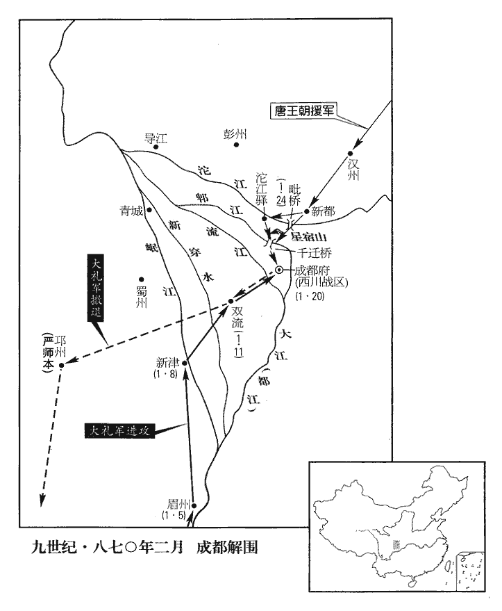
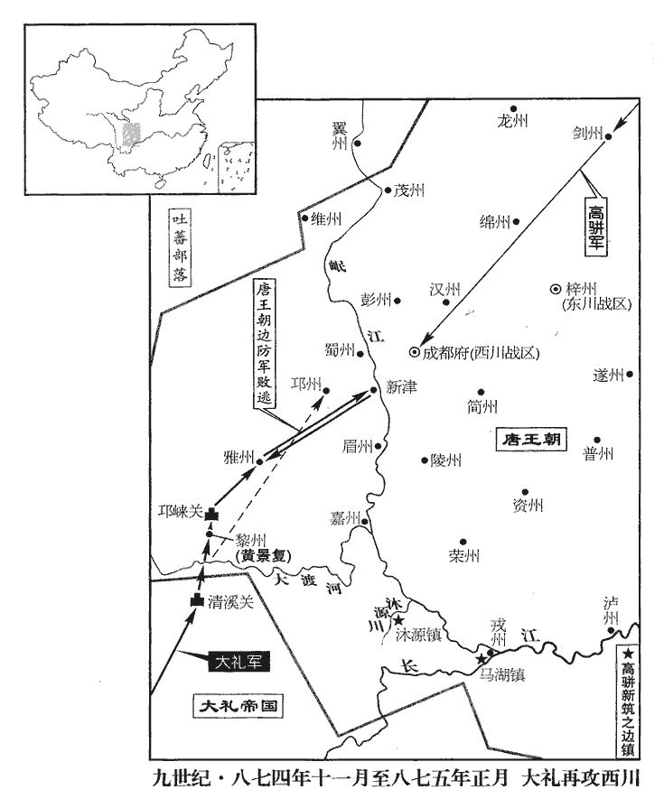
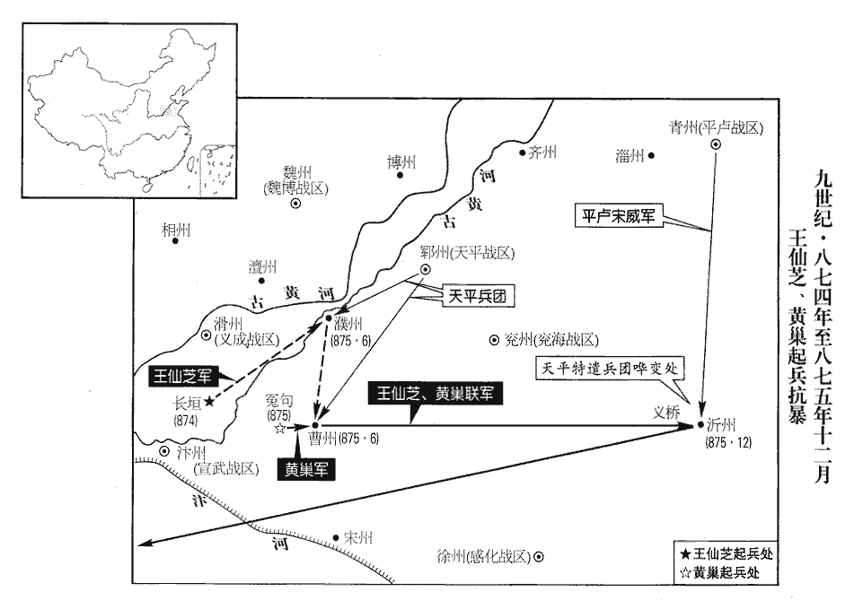
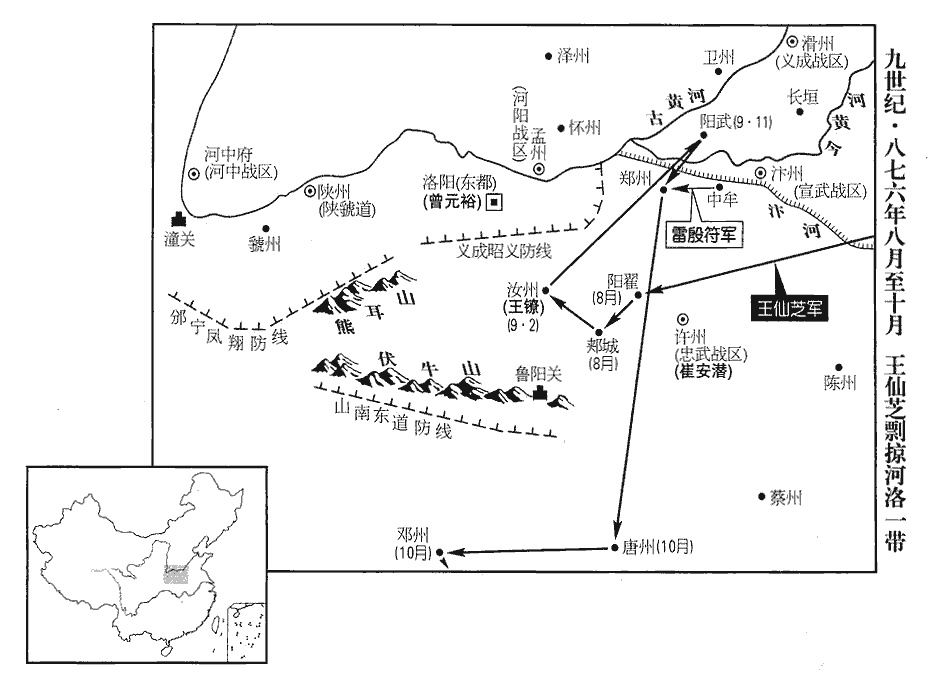
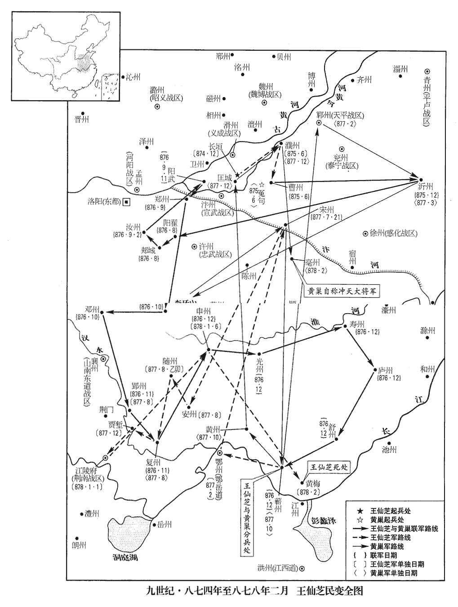

 唐紀六十八起上章攝提格（庚寅），盡柔兆涒灘（丙申），凡七年。

# 懿宗昭聖恭惠孝皇帝下

## 咸通十一年（庚寅、八七零）

1春，正月，甲寅朔‹一›，群臣上尊號曰睿文英武明德至仁大聖廣孝皇帝‹李漼（李温）本年三十八岁›；赦天下。

〖译文〗 [1]春季，正月，甲寅朔（初一），唐朝群臣给皇帝李上尊号，称为睿文英武明德至仁大圣广孝皇帝；大赦天下。

2西川‹总部设成都府四川省成都市›之民聞蠻寇‹大礼国，首都苴咩城云南省大理市›將至，爭走入成都‹四川省成都市›。時成都但有子城，亦無壕，人所占地占，之贍翻。各不過一席許，雨則戴箕盎以自庇；又乏水，取摩訶池‹成都市东南角›泥汁，澄而飲之。成都記：摩訶池在張儀子城內。隋蜀王秀取土築廣子城，因為池。有胡僧見之曰：「摩訶宮毗羅。」蓋胡僧謂「摩訶」為大，「宮毗羅」為龍，謂此池廣大有龍耳。因名摩訶池。或曰蕭摩訶所開，非也。池今在成都縣東南十二里。

〖译文〗 [2]西川人民听说南诏蛮军将要入侵，争相避难逃入成都，使城中人口爆满。当时成都只有内城，连护城壕也没有，每人平均所占不过一席之地，因无住房，下雨天只好戴斗笠和木盆以避雨淋。又缺乏饮水，只好取摩诃池泥汁，待沉淀见清后饮用。

將士不習武備，節度使盧耽召彭州‹四川省彭州市›刺史吳行魯使攝參謀，與前瀘州‹四川省泸州市›刺史楊慶復考異曰：新傳云「瀘州刺史楊慶」。錦里耆舊傳云「嘉州」，誤也。今從解圍錄。共脩守備，選將校，分職事，將，即亮翻；下同。校，戶教翻。立戰棚，具礟檑，棚，蒲庚翻。礟，普教翻。檑，盧對翻，檑木也；自城上下之以壓敵。造器備，嚴警邏。先是，西川將士多虛職名，亦無稟給。先，悉薦翻。至是，揭牓募驍勇之士，邏，郎佐翻。揭，丘傑翻。補以實職，厚給糧賜，應募者雲集。慶復乃諭之曰：「汝曹皆軍中子弟，年少材勇，少，詩照翻。平居無由自進，今蠻寇憑陵，乃汝曹取富貴之秋也，可不勉乎！」皆歡呼踊躍。於是列兵械於庭，使之各試所能，兩兩角勝，察其勇怯而進退之，得選兵三千人，號曰「突將」。行魯，彭州人也。

〖译文〗 西川军队缺少训练，将士不习武备，节度使卢耽为此召彭州刺史吴行鲁充当参谋，与前泸州刺史杨庆复共同修复守备，选拔将校，分配守城职事。又搭起临时战棚，储存大量石炮和檑木，修造各种军用器械。并在城内设警备巡逻。先前，西川将士中很多是虚额职名，也没有固定的粮饷给养。至此开始揭榜公开招募，招徕骁勇之士以补充军队缺额，充实军官队伍，并厚给粮饷，因而应募的人很多。杨庆复教谕应募者说：“你们都是军人子弟，年轻有为，有智有勇，平时太平无事，没有施展才能的机会，而今南蛮入侵，欺凌百姓，这正是你们报效国家，获取功名富贵的时刻，与诸位共勉，切莫错失良机啊！”应募者听后都情绪高涨，欢呼雀跃。于是在大庭排列各式兵器，让应募者大央手，各试所能，并让他们两人一组进行角力，通过考察选用勇者，辞退怯者。于是选得精壮三千人。号称“突将”。吴行鲁是彭州人。

戊午‹五›，蠻至眉州‹四川省眉山县›，耽遣同節度副使王偃等齎書見其用事之臣杜元忠，與之約和。蠻報曰：「我輩行止，只繫雅懷。」

〖译文〗 戊午（初五），南诏军队进行至眉州，卢耽派遣同节度副使王偃等人带着书信往见蛮军掌握权柄的官员杜元忠，与其约和，杜元忠称：“我军的行止，一定尊重贵方”。

3路巖、韋保衡上言：「康承訓討龐勛時，逗橈不進，上，時掌翻。逗，音豆。橈，奴教翻。又不能盡其餘黨，又貪虜獲，不時上功。」上，時掌翻。辛酉‹八›，貶蜀王傅、分司；蜀王佶，皇子也。考異曰：新傳曰：「宰相路巖、韋保衡劾承訓討賊逗橈，貪虜獲，不時上功，貶蜀王傅、分司東都。」按此時保衡未為相，蓋以尚主之故，上用其言，故得擠承訓也。尋再貶恩州‹广东省恩平市›司馬。

〖译文〗 [3]路岩、韦保衡向唐懿宗上言弹劾康承训说：“康承训征讨庞勋时，逗留不进，既不能剿尽庞勋余党，反而贪图虏获，动不动就上表请功。”辛酉（初八）朝廷贬康承训为蜀王傅，分司东都。不久，再贬为恩州司马。

4南詔進軍新津‹四川省新津县›，新津，漢武陽縣，後周改為新津，唐屬蜀州。九域志：在州東南七十里。定邊‹总部设邛州四川省邛崃市›之北境也。盧耽遣同節度副使譚奉祀致書于杜元忠，問其所以來之意；蠻留之不還。耽遣使告急于朝，朝，直遙翻。且請遣使與和，以紓一時之患。朝廷命知四方館事、太僕卿支詳為宣諭通和使。晏公類要曰：舊儀，於通事舍人中，以宿長一人總知館事，謂之館主，凡四方貢納及章表皆受而進之。唐自中世以後，始以他官判四方館事。蠻以耽待之恭，亦為之盤桓，為，于偽翻。而成都守備由是粗完。粗，坐五翻。

〖译文〗 [4]南诏进军新津，进入定边北境。唐西川节度使卢耽又遣同节度副使谭奉祀致书于杜元忠，质问南诏军来犯意图，杜元忠将谭奉祀扣留。卢耽于是遣使向朝廷告急，希望朝廷出面遣使与南诏王国请和，以缓解当前的边患。朝廷任命知四方馆事、太仆卿支详为宣谕通和使，赶赴成都。南诏军见卢耽待他们相当恭顺，也就稍事盘桓，进军速度放慢，而成都城内的守备由此得以大致完工。

甲子‹十一›，蠻長驅而北，陷雙流‹四川省双流县›。雙流，漢廣都縣地，隋置雙流縣，唐屬成都府。九域志：在府南四十里。庚午‹十七›，耽遣節度副使柳槃往見之，杜元忠授槃書一通，曰：「此通和之後，驃信與軍府相見之儀也。」其儀以王者自處，處，昌呂翻。語極驕慢。又遣人負綵幕至城南，云欲張陳蜀王廳以居驃信。隋蜀王秀鎮蜀，起聽事，極為宏壯。廳，他經翻。

〖译文〗 甲子（十一日），南诏军队长驱北进，攻陷双流。庚午（十七日），卢耽再遣节度副使柳入南诏军见其统帅，杜元忠授予柳一封书信，说“信中写有关于此次通和之后，我南诏骠信与贵节度使府相见的礼仪”，其言语极端骄横傲慢，而其信中所规定的礼仪，更是处处以王者自居。杜元忠甚至派人将彩色帷幕搬到成都城南，声称要在城内蜀王厅布置，以便南诏骠信居处。

癸酉‹二十›，廢定邊軍，復以七州歸西川。七州，邛、眉、蜀、雅、嘉、黎、嶲也。

〖译文〗 癸酉（二十日），唐废定边军，将其所领七州复归西川节度使管辖。

是日，蠻軍抵成都城下。前一日，盧耽遣先鋒遊弈使王晝至漢州‹四川省广汉市›詗xiòng援軍，且趣之。詗，翾正翻，又火迥翻。趣，讀曰促。時興元六千人、鳳翔四千人已至漢州，會竇滂以忠武‹总部许州›、義成‹总部滑州›、徐宿‹首府徐州›四千人自導江‹四川省都江堰市东›奔漢州、就援軍以自存。

〖译文〗 这一天，南诏军队进抵成都城下，而前一天，卢耽已派遣先锋游奕使王昼往汉州催促援军。当时有兴元兵六千人、凤翔兵四千人已到达汉州，恰在此时窦滂也以忠武、义成、徐宿之兵四千人自导江来到汉州，与援军会合以自保。丁丑（二十四日），王昼率兴元、资州、简州之兵三千余人进军于毗桥，与南诏军前锋遭遇，王昼出战失利，退保汉州。当时成都军民日夜盼望援军的到来，而窦滂自以为所领定边军辖地尽失，希望西川也相继失陷，以便分担和减轻自己的罪责，因而每有援军自北而至，即往游说：“南蛮兵众多于官军数十倍，官军远道而来，疲惫不堪，最好不要贸然前进。”唐援军将领听后都狐疑不敢进。成都十将李自孝暗中与南诏军通款，企图焚城东仓为蛮军作内应，被城中军民察觉，而被逮捕处死。数天后，蛮军果然来攻城，等待许久，未得城中李自孝的接应而退兵。

 

丁丑‹二十四›，王晝以興元‹陕西省汉中市›、資‹四川省资中县›、簡‹四川省简阳市›兵三千餘人軍於毗橋‹四川省新都县西南›，毗橋，在漢州南界。遇蠻前鋒，與戰不利，退保漢州。時成都日望援軍之至，而竇滂自以失地，謂失定邊軍也。欲西川相繼陷沒以分其責，每援軍自北至，輒說之曰：「蠻‹大礼国›眾多於官軍數十倍，官軍遠來疲弊，未易遽前。」說，式芮翻。易，以豉翻。諸將信之，皆狐疑不進。成都十將李自孝陰與蠻通，欲焚城東倉為內應，城中執而殺之。後數日，蠻果攻城，久之，城中無應而止。二月，癸未朔‹一›，蠻合梯衝四面攻成都，城上以鉤繯挽之使近，梯，雲梯；衝，衝車也。繯，于善翻，屈轉其索如環鉤，施於其端。投火沃油焚之，攻者皆死。盧耽以楊慶復、攝左都押牙李驤各帥突將出戰，帥，讀曰率。殺傷蠻二千餘人，會暮，焚其攻具三千餘物而還。蜀人素怯，其突將新為慶復所獎拔，且利於厚賞，勇氣自倍，其不得出者，皆憤鬱求奮。後數日，賊取民籬，重沓濕而屈之，以為蓬，重，直龍翻。「蓬」，當作「篷」。編竹以覆舟曰篷。言濕籬而屈之，狀如舟之眠篷也。置人其下，舉以抵城而斸之，斸zhú，陟玉翻，斫也，掘也。矢石不能入，火不能然，然，與燃同，燒也。慶復鎔鐵汁以灌之，攻者又死。

〖译文〗 二月，癸未朔（初一），南诏蛮军架云梯和冲车向成都城四面围攻，城上唐军用环钩套住云梯，向下浇滚烫的沸油，并投火焚烧，城下攻城的蛮军大都被烧死。卢耽命杨庆复和摄左都押牙李骧各率突将出城袭击，杀伤南诏蛮军二千余人，至日暮之时，焚南诏攻城器械三千余具，回到城中。蜀人一向懦怯，而“突将”却是最近选拔出来的勇士，加上给赏优厚，所以勇气百倍，未能出城作战的人，也个个求战请缨，深为自己未能出战而惋惜。几天之后，南诏军又取民间的篱笆，用水浇湿后编成竹篷，兵将在其下举着进抵城下，一时城上矢石不能入，火也不能燃烧。南诏军在竹篷掩护下挖掘城墙，杨庆复命唐军熔铁汁往下顷倒，结果城下蛮军全被烧死。

乙酉‹三›，支詳遣使與蠻約和。丁亥‹五›，蠻斂兵請和。戊子‹六›，遣使迎支詳。時顏慶復以援軍將至，詳謂蠻使曰：「受詔詣定邊約和，今雲南乃圍成都，則與曏日詔旨異矣。且朝廷所以和者，冀其不犯成都也。今矢石晝夜相交，何謂和乎！」蠻見和使不至，使，並疏吏翻。庚寅‹八›，復進攻城。復，扶又翻。辛卯‹九›，城中出兵擊之，乃退。

〖译文〗 乙酉（初三），唐朝廷宣谕通和使支详遣使与南诏通和。丁亥（初五），南诏始收兵请和，戊子（初六），又派遣使者来迎接支详。当时颜庆复以为唐援军将赶到，支详因而未赴南诏军中，并对面诏的使者说：“我受诏到定边城约和，而你们却在围攻成都，这与我不久所受诏旨迥异。况且我朝廷所以约和，正是希望你们不要侵犯成都，而今昼夜矢石相交，怎么谈得上是请和呢?”南诏军见和使不到，庚寅（初八），复又攻城。辛卯（初九），城中出兵迎击，南诏军才退。

初，韋皋招南詔以破吐蕃，既而蠻訴以無甲弩，皋使匠教之，數歲，蠻中甲弩皆精利。又，東蠻‹四川省越西县西北各少数民族›苴那時、勿鄧、夢衝三部助皋破吐蕃有功，事見二百三十三卷德宗興元五年。其後邊吏遇之無狀，東蠻怨唐深，自附於南詔，每從南詔入寇，為之盡力，為，于偽翻。得唐人，皆虐殺之。

〖译文〗 先前，韦皋招致南诏军队以进攻吐蕃，南诏军声称没有兵甲弓弩，韦皋于是派工匠往南诏教其制造，几年后，南诏所造兵甲弓弩都很精制锋利。另外，东蛮苴那时、勿邓、梦冲三部曾协助韦皋击破吐蕃军队，有功于唐朝，而后来唐朝的边境官吏却对他们敲诈勒索，引致东蛮怨恨唐朝，依附于南诏，经常随南诏军入侵唐朝边境，为南诏尽力，凡捕获唐人，都横加虐待并杀死。

朝廷貶竇滂為康州‹广东省德庆县›司戶，以顏慶復為東川‹总部设梓州四川省三台县›節度使，凡援蜀諸軍，皆受慶復節制。癸巳‹十一›，慶復至新都‹四川省新都县›，九域志：新都縣在成都府北四十五里。蠻分兵往拒之。甲午‹十二›，與慶復遇，慶復大破蠻軍，殺二千餘人，蜀民數千人爭操芟shān刀、白棓bàng以助官軍，操，七刀翻。芟刀，農家所以芟草。棓，蒲項翻。呼聲震野。呼，火故翻。乙未‹十三›，蠻步騎數萬復至，復，扶又翻。會右武衛上將軍宋威以忠武‹总部设许州河南省许昌市›【章：十二行本「武」下有「軍」字；乙十一行本同；孔本同。】二千人至，即與諸軍會戰，蠻軍大敗，死者五千餘人，退保星宿山‹成都市北十千米›。宿，音秀。威進軍沱江驛‹成都市北十五千米›，沱江驛，在成都府新繁縣。禹貢，岷山導江，別為沱。沱，徒河翻。距成都三十里。蠻遣其臣楊定保詣支詳請和，詳曰：「宜先解圍退軍。」定保還，蠻圍城如故。城中不知援軍之至，但見其數來請和，數，所角翻。知援軍必勝矣。戊戌‹十六›，蠻復請和，使者十返，城中亦依違答之。蠻以援軍在近，攻城尤急，驃信以下親立矢石之間。庚子‹十八›，官軍至城下與蠻戰，奪其升遷橋‹成都市西北八千米›，升遷橋，即升僊橋。秦時李冰所起，舊名七星橋。是夕，蠻自燒攻具遁去，比明，官軍乃覺之。比，必利翻，及也。

〖译文〗 朝廷将窦滂贬为康州司户，任颜庆复为东川节度使，凡援蜀的诸路军队，全都受颜庆复节制。癸巳（十一日）颜庆复到达新都，南诏分兵往新都抗拒颜庆复。甲午（十二日），南诏军与颜庆复所统率的唐军相遇，颜庆复指挥唐军大破南诏蛮军，杀死二千多人，蜀中老百姓数千人也拿着刀和木棒争先恐后地赶来助战，呼喊声震动山野。乙未（十三日），南诏蛮军步骑数万人又来拒战，恰好唐右武卫上将军宋威率忠武军二千人赶到，与颜庆复指挥的诸路唐军会合，南诏蛮军被杀得大败，死者五千多人，蛮军退守星宿山，宋威率军进至沱江驿，距成都仅三十里。这时，南诏再遣使臣杨定保往支详处请秘，支详声言：“应先解成都围退军”。杨定保回到军中，南诏军仍然围城如故。成都城内并不知道唐援军已至，但见到南诏屦派使者来请和，推测援军必定胜利。戊戌（十六日），南诏又遣使者来成都请和，使者往返十来次，城中也不给予明确答复。南诏军见唐援军就在成都近边，攻城更加急迫，骠信以下军官都亲自立于矢石之间。庚子（十八日），唐官军赶到城下与蛮军接战，夺得南诏的升迁桥，至夜晚，南诏军烧毁其攻城器具而遁走，至第二天清晨，唐军才察觉南诏蛮军已离去。

初，朝廷使顏慶復救成都，命宋威屯綿‹四川省绵阳市›、漢‹四川省广汉市›為後繼。綿、漢，二州名。威乘勝先至城下，破蠻軍功居多，慶復疾之。威飯士欲追蠻軍，飯，扶晚翻。城中戰士亦欲與北軍合勢俱進，慶復牒威，奪其軍，勒歸漢州。蠻至雙流‹四川省双流县›，阻新穿水‹流经四川省新津县›，九域志：蜀州新津縣有新穿鎮。造橋未成，狼狽失度，失度者，失其常度也。三日，橋成，乃得過，斷橋而去。斷，丁管翻。甲兵服物遺棄於路，蜀人甚恨之。黎州‹四川省汉源县›刺史嚴師本收散卒數千保邛州，蠻圍之，二日，不克，亦捨去。

〖译文〗 起初，朝廷派颜庆复往救成都，而命宋威率军屯于绵州、汉州作后继。但宋威乘胜先至成都城下，破南诏蛮军所立战功最多，遭到颜庆复的妒嫉。南诏蛮军乘夜逃走后，宋威令士兵赶紧吃饭，企图追击蛮军，成都城中的战士也想与自北而来的唐军合势共同追击，颜复行文给宋威，收夺其兵权，令宋威归汉州据守。南诏蛮军退至双流，被新穿水阻挡，一时造桥不成，军队狼狈拥挤失去控制，三天后才造好桥，得以通过新穿水，其兵甲器物衣服很多都遗弃于路上。蜀中人士对颜庆复不准宋威追击蛮军的举动极为痛恨。黎州刺史严师本收集散卒数千人保据邛州，被南诏军围困，围攻两天不能克，南诏军也只得舍城而去。

顏慶復始教蜀人築壅門城，城門之外，別築垣牆以遮城門謂之壅門，今人謂之八卦牆者是也。穿塹引水滿之，植鹿角，分營鋪，斬木為鹿角，植之城外，以限衝突，今人謂之排杈者是。分立寨屋，謂之營，以居士卒。城上分立小屋，使守卒居之以候望，謂之鋪。鋪，普故翻。蠻知有備，自是不復犯成都矣。復，扶又翻。

〖译文〗 颜庆复开始教蜀中士民筑壅门城，即于城门之外再筑垣墙以遮住城门，又挖壕堑并灌满水，在城外空旷之地插木杈为鹿角，在城上分立营寨，住守士卒。南诏知唐人已严加守备，自后不再进犯成都了。

先是，西川牙將有職無官，先，悉薦翻。及拒卻南詔，四人以功授監察御史，此所謂官也。堂帖，人輸堂例錢三百緡；貧者苦之。有功授官而徴其輸錢；史言唐之紀綱大壞。

〖译文〗 先前，西川牙将虽有其职而无其官，及至击退南诏蛮军后，有四人以功授官为监察御史，按照政事堂的通知，每人要交堂例钱三百缗；家境贫苦的人深感忧虑。

5三月，左僕射、同平章事曹確同平章事，充鎮海‹总部设润州江苏省镇江市›節度使。

〖译文〗 [5]三月，左仆射、同平章事曹确以同平章事衔，充任镇海节度使。

6夏，四月，丙午‹二十四›，以翰林學士承旨、兵部侍郎韋保衡同平章事。

〖译文〗 [6]夏季，四月，丙午（二十四日），任命翰林学士承旨、兵部待郎韦保衡为同平章事。

7徐賊餘黨猶相聚閭里為群盜，散居兗‹山东省兖州市›、鄆‹山东省东平县›、青‹山东省青州市›、齊‹山东省济南市›之間，詔徐州‹江苏省徐州市›觀察使夏侯瞳招諭之。瞳，徒紅翻。

〖译文〗 [7]徐州庞勋余党仍然相聚于乡闾为盗贼，散居于兖州、郓州、青州、齐州之间，诏命徐州观察使夏侯瞳对这群人进行招谕。

8五月，丁丑‹二十六›，以邛州刺史吳行魯為西川留後。

〖译文〗 [8]五月，丁丑（二十六日），任命邛州刺史吴行鲁为西川留后。

9光州‹河南省潢川县›民逐刺史李弱翁，弱翁奔新息‹河南省息县›。新息，漢古縣，唐屬蔡州。九域志：在州東南一百五十五里，去光州九十里。左補闕楊堪等上言：「刺史不道，百姓負冤，當訴於朝廷，置諸典刑，豈得群黨相聚，擅自斥逐，亂上下之分！此風殆不可長，分，扶問翻。長，知兩翻。宜加嚴誅以懲來者。」

〖译文〗 [9]光州民众驱逐刺史李弱翁，出奔李弱翁新息。左补阙杨堪等向朝廷进言称：“刺史贪暴无道，使百姓冤狱遍地，应当及时上诉于朝廷，按朝廷刑典来进行处置，怎么可以民众群党相聚，擅自驱逐刺史，扰乱上下名份！决不能助长这种风气，应该严刑诛杀这些人，以使今后不再发生此类事情”。

10上令百官議處置徐州之宜。處，昌呂翻。六月，丙午‹二十五›，太子少傅李膠等狀，以為：「徐州雖屢搆禍亂，謂銀刀及桂州戍卒也。未必比屋頑凶；比，毗必翻。蓋由統御失人，是致姦回乘釁。今使名雖降，謂降節度為觀察。使，疏吏翻。兵額尚存，以為支郡則糧餉不給，分隸別藩則人心未服；或舊惡相濟，更成披猖。惟泗州‹江苏省盱眙县淮河北岸›向因攻守，結釁已深，事見上卷九年、十年。宜有更張，庶為兩便。」更，工衡翻。詔從之，徐州依舊為觀察使，統徐‹江苏省徐州市›、濠‹安徽省凤阳县东北临淮关›、宿‹安徽省宿州市›三州，泗州為團練使，割隸淮南‹总部设扬州江苏省扬州市›。

〖译文〗 [10]唐懿宗令朝廷百官议论如何处置徐州的党羽。六月，丙午（二十五），太子少傅李胶等给懿宗进状，认为“徐州虽然屡次发生祸乱，不见得所有的人都是凶顽，那是由于治民官不得其人，致使奸诈之人乘隙起事，今天虽然将节度使降为观察使，但兵额却仍然很多，将这些军队交由郡来管辖，郡又无法提供足够的粮饷，将其交由别的藩镇来管辖，军士们必定不服；或许和旧的怨恨搅在一起，造成更大的祸乱。徐州所领，只有泗州向来因为攻守，与其他州结怨已深，应该有所更改，使两者都能相安无事。”懿宗听从李胶的建议，诏命徐州依旧置观察使，统辖徐州、濠州、宿州三州，泗州置团练使，从徐州改隶于淮南。

11加幽州‹总部设幽州北京市›節度使張允伸兼侍中。

〖译文〗 [11]朝廷加幽州节度使张允伸官，命他兼任侍中。

12秋，八月，乙未‹十五›，同昌公主薨。上痛悼不已，殺翰林醫官韓宗劭等二十餘人，悉收捕其親族三百餘人繫京兆獄。中書侍郎、同平章事劉瞻召諫官使言之，諫官莫敢言者，乃自上言，上，時掌翻。以為：「脩短之期，人之定分。昨公主有疾，深軫zhěn聖慈。宗劭等診療之時，診，止忍翻，候脈也。療，力照翻，治疾也。惟求疾愈，備施方術，非不盡心，而禍福難移，竟成差跌，跌，徒結翻。原其情狀，亦可哀矜。而械繫老幼三百餘人，物議沸騰，道路嗟jiē歎。奈何以達理知命之君，涉肆暴不明之謗！蓋由安不慮危，忿不思難之故也。伏願少回聖慮，寬釋繫者。」上覽疏，不悅。瞻又與京兆尹溫璋力諫於上前；上大怒，叱出之。

〖译文〗 [12]秋季，八月，乙未（十五日），同昌公主病死。唐懿宗极为痛苦，悲伤不已，竟下令杀翰林院医官韩宗劭等二十余人，并将他们的亲族三百余人全部逮捕，关押在京兆监狱。中书侍郎同平章事刘瞻召请诸谏官，请他们上言劝谏，但谏官竟没有一人敢进谏，刘瞻只好自己上言，认为：“生命的长短，每个人都有定分。昨天公主患有疾病，受到陛下深深的慈爱，医官韩宗劭等为公主诊断治疗时，只是希望能将病治好，施展了多种医术和药方，不能说是不尽，但人的祸福难移，竟然不能妙手回春，各种医术未能奏效，当时医官们的情状，也是值得哀怜。但因此怪罪医官，用刑具收捕医官们的家属老幼三百余人，致使朝野议论纷纷，群情沸腾，道路上也常听到人的叹息声。知天命达人理的君主，何至于要遭到肆行暴虐不明事理的诽谤呢！大概是由于居安不忧虑危难，愤怒时不思常理的缘故吧。希望陛下能回心转意，宽大并释放这些无辜被捕人吧。”懿宗看到刘瞻疏文，很不高兴。刘瞻又与京兆尹温璋在朝堂当面力谏；唐懿宗勃然大怒，喝令刘瞻、温璋退出朝堂。

13魏博節度使何全皞年少，驕暴好殺，少，詩照翻。好，呼到翻。又減將士衣糧。將士作亂，全皞單騎走，追殺之，何進滔得魏博，傳三世，四十二年而滅。推大將韓君雄為留後。成德‹总部设镇州河北省正定县›節度使王景崇為之請旌節；為之，于偽翻。九月，庚戌‹一›，以君雄為魏博留後。

〖译文〗 [13]魏博节度使何全年纪较轻，骄横残暴，动不动就杀人，又减扣将士的衣粮。其部下将士作乱，何全单骑逃走，被乱军追杀而死。魏博将士推大将韩君雄为留后。成德节度使王景崇向朝廷为韩君雄请求留后的旌旗节钺。九月，庚戌（初一）。朝廷命韩君雄为魏博留后。

14丙辰‹七›，以劉瞻同平章事，充荊南‹总部设江陵府湖北省江陵县›節度使，貶溫璋振州‹海南省三亚市西崖城镇›司馬。璋歎曰：「生不逢時，死何足惜！」是夕，仰藥卒。仰，牛向翻。敕【章：十二行本「敕」上有「庚申」二字；乙十一行本同；孔本同；退齋校同。】曰：「苟無蠹害，何至於斯！惡實貫盈，死有餘責。宜令三日內且於城外權瘞，瘞，於計翻。俟經恩宥，方許歸葬，使中外快心，姦邪知懼。」己巳‹二十›，貶右諫議大夫高湘、比部郎中知制誥楊知至、禮部郎中魏簹dāng等於嶺南，比，音毗。簹，都郎翻。皆坐與劉瞻親善，為韋保衡所逐也。知至，汝士之子；汝士，虞卿從兄也，見二百四十一卷穆宗長慶元年。簹，扶之子也。魏扶見二百四十八卷宣宗大中三年。保衡又與路巖共奏劉瞻，云與醫官通謀，誤投毒藥；譖言誤投毒藥，以至同昌公主於死。然既言誤矣，又安可以為通謀邪！丙子‹二十七›，貶瞻康州‹广东省德庆县›刺史。康州去京師五千七百五十里。翰林學士承旨鄭畋草瞻罷相制辭曰：「安數畝之居，仍非己有；卻四方之賂，惟畏人知。」巖謂畋曰：「侍郎乃表薦劉相也！」坐貶梧州‹广西梧州市›刺史。梧州，漢蒼梧郡所治廣信縣地，唐置梧州，去京師五千五百里。御史中丞孫瑝坐為瞻所引用，亦貶汀州‹福建省长汀县›刺史。瑝，戶盲翻，又音皇。路巖素與劉瞻論議多不叶，瞻既貶康州，巖猶不快，閱十道圖，以驩州‹越南荣市›去長安‹西安›萬里，再貶驩州司戶，驩州，陸路至長安一萬二千四百五十二里，水路一萬七千里。考異曰：實錄、新傳皆云「巖志欲殺之，賴幽州節度使張公素表論瞻冤，乃止。」按是時，張允伸鎮幽州，云公素，恐誤也。

〖译文〗 [14]丙辰，（初七），唐懿宗命刘瞻以同平章事衔，充当荆南节度使，贬温璋为振州司马。温璋叹息说：“生不逢时，死又保足惜”！这天晚上，饮药自杀而亡。唐懿宗为此下敕：“如果不是蠹害，何至于此！温璋实在是恶贯满盈，死有余辜，三天内暂且埋尸于城外，待有恩宥之时，方许归葬，使中外人心大快，奸邪之人知道畏惧。”己巳（二十日），贬右谏议大夫高湘、比部郎中知制诰杨知至、礼部郎中魏等人，皆流于岭南，这些人都是由于平时与刘瞻相亲善，因而遭到韦保衡的贬逐。杨知至是杨汝士的儿子、魏是魏扶的儿子。韦保衡又与路岩共同奏劾刘瞻，称刘瞻与翰林医官通谋，误投毒药，导致同昌公主死亡。丙子（二十七日），再贬刘瞻为康州刺史。翰林学士承旨郑畋起草罢免刘瞻宰相的制文，其中有“安居于数亩之地，却非自己所有；拒绝四方贿赂，也生怕有人知道。”路岩为此指责郑畋说：“这明明是表荐刘瞻宰相嘛！”郑畋竟因此被贬为梧州刺史。御史中丞孙因为是刘瞻所引荐重用，也被贬为汀州刺史。路岩平素与刘瞻论政事多不合，刘瞻被贬至康州，路岩仍觉得贬得不够远，而犹感不快，遍查《十道图》，找到州距长安有万里，于是再贬刘瞻为州司户。

15冬，十月，癸卯‹二十五›，以西川留後吳行魯為節度使。

〖译文〗 [15]冬季，十月，癸卯（二十五日），唐廷任命西川留后吴行鲁为西川节度使。

16十一月，辛亥‹三›，以兵部尚書、鹽鐵轉運使王鐸為禮部尚書、同平章事。鐸，起之兄子也。王起見二百四十一卷長慶元年。鐸，起兄炎之子。

〖译文〗 [16]十一月，辛亥（初三），唐懿宗任命兵部尚书、盐铁转运使王铎为礼部尚书、同平章事。王铎是王起之兄王炎的儿子。

17丁卯‹十九›，復以徐州為感化軍節度。徐州本武寧軍，中有銀刀之亂，罷節鎮為觀察，今復為感化軍。

〖译文〗 [17]丁卯（十九日），朝廷复以徐州为感化军，置节度使。

18十二月，加成德節度使王景崇同平章事。以左金吾上將軍李國昌‹朱邪赤心›為振武‹总部设安北府内蒙古和林格尔县›節度使。

〖译文〗 [18]十二月，唐懿宗下令加成德节度使王景崇为同平章事。任命左金吾上将军李国昌为振武节度使。

## 十二年（辛卯、八七一）

1春，正月，辛酉‹十四›，葬文懿公主。同昌公主諡文懿。韋氏之人爭取庭祭之灰，汰其金銀。敕祭之於韋氏之庭，故曰庭祭。汰，淘也。凡服玩，每物皆百二十輿，以錦繡、珠玉為儀衛、明器，輝煥三十餘里；記檀弓：孔子謂為明器者，知喪道矣，備物而不可用也。其曰明器，神明之也，何取於輝煥乎！賜酒百斛，餅餤四十橐駝，以飼体夫。餤dàn，于廉翻，又徒甘翻。飼，祥吏翻。体，蒲本翻。体夫，轝yú柩之夫也。上‹李漼（李温）本年三十九岁›與郭淑妃思公主不已，樂工李可及作歎百年曲，其聲悽惋，歎百年曲，歷敘人自少而壯，自壯而老，少時娟好，壯時追歡極樂，老時衰颯之狀；其聲悽切，感動人心。惋，烏貫翻。舞者數百人。發內庫雜寶為其首飾，以絁shī八百匹為地衣，舞罷，珠璣覆地。絁，式支翻。覆，敷救翻。

〖译文〗 [1]春季，正月，辛酉（十四日），为文懿公主下葬。在韦氏的家中设祭，韦氏家人争相拾取庭祭后的灰，淘出其中的金银。公主的服装玩具，每种都有一百二十车，送葬时用锦绣、珠玉为仪卫、明器，五彩缤纷的送葬队伍延绵三十余里。又赐酒一百多斛，装了四十骆驼的饼，以给抬柩的役夫食用。唐懿宗与郭淑妃追思公主不已，乐工李可及为此创作了《叹百年曲》，曲声切惋转，感动人心，舞女数百人配以舞蹈，懿宗又调发内库杂宝为舞女作首饰，用八百匹作地毯，一曲歌舞过后，地毯上尽是珠宝玑玉。

2以魏博‹总部设魏州河北省大名县›留後韓君雄為節度使。

〖译文〗 [2]朝廷正式任命魏博留后韩君雄为节度使。

3門下侍郎、同平章事路巖與韋保衡素相表裡，勢傾天下。既而爭權，浸有隙，保衡遂短巖於上。夏，四月，癸卯‹二十七›，以巖同平章事，充西川‹总部设成都府四川省成都市›節度使。巖出城，路人以瓦礫擲之。礫，郎狄翻。權京兆尹薛能，巖所擢也，巖謂能曰：「臨行，煩以瓦礫相餞！」能徐舉笏對曰：「曏來宰相出，府司無例發人防衛。」府司，謂京兆府所司。巖甚慚。能，汾州‹山西省汾阳县›人也。能，音囊來切。

〖译文〗 [3]门下侍郎、同平章事路岩与韦保衡相互勾结，互为表里，权势倾于天下。但不久两人互相争权，渐渐有了隔阂。韦保衡于是在唐懿宗面前揭路岩的短，并进行诋毁。夏季，四月癸卯（初七），唐懿宗命路岩挂同平章事衔，充任西川节度使，贬出京城。路岩出长安城时，街道上的百姓用瓦砾向他掷去。当时暂任京兆尹的薛能是路岩所提拔，路岩于是向薛能打招呼，说；“我临行时，恐怕要受到瓦砾的饯行”！薛能慢吞吞地举起笏回答说：“向来宰相出城，京兆府司没有派兵防卫的惯例。”路岩听后惭愧极了。薛能是汾州人。

4五月，上幸安國寺，賜僧重謙、僧澈沈檀講座二，各高二丈。以沈香、檀香為講座也。沈，持林翻。高，古號翻。設萬人齋。

〖译文〗 [4]五月，唐懿宗来安国寺，赐予佛僧重谦、僧澈两个用沉香、檀香木制作的讲座椅子，每个都有二丈高。又设万人斋戒。

5秋，七月，以兵部尚書盧耽同平章事，充山南東道‹总部设襄州湖北省襄樊市›節度使。

〖译文〗 [5]秋季，七月，唐懿宗任命兵部尚书卢耽挂同平章事衔，充任山南东道节度使。

6冬，十月，以兵部侍郎、鹽鐵轉運使劉鄴為禮部尚書、同平章事。

〖译文〗 [6]冬季，十月，唐懿宗任命兵部侍郎、盐铁转运使刘邺为礼部尚书、同平章事。

## 十三年（壬辰、八七二）

1春，正月，幽州‹卢龙战区，总部设幽州北京市›節度使張允伸得風疾，請委軍政就醫；許之，以其子簡會知留後。疾甚，遣使上表納旌節；丙申‹二十五›，薨‹年八十八岁›。允伸鎮幽州二十三年，宣宗大中四年，張允伸代周綝鎮幽州。勤儉恭謹，邊鄙無警，上下安之。

〖译文〗 [1]春季，正月，唐幽州节度使张允伸患中风病，向朝廷请求将幽州镇军政事务委交他人，自己就医治疗，得到朝廷的准许，于是以张允伸之子张简会为幽州留后。不久疾病转重，张允伸又派遣使者上表朝廷请交还节度使旌旗节钺，丙申（二十五日），因病不治而死。张允伸坐镇幽州二十三年，勤于军政事务，处事恭谨小心，使边境没有出现过危机，军民上下和睦相处，安居乐业。

2二月，丁巳‹十七›，以兵部侍郎、同平章事于琮為山南東道‹总部设襄州湖北省襄樊市›節度使，以刑部侍郎、判戶部奉天趙隱為戶部侍郎、同平章事。

〖译文〗 [2]二月，丁巳（初五）唐懿宗任命兵部侍郎、同平章事于琮出朝为山南东道节度使；任命刑部侍郎、判户部奉天人赵隐为户部侍郎、同平章事。

3平州‹河北省卢龙县›刺史張公素，素有威望，為幽人所服。張允伸薨，公素帥州兵來奔喪。帥，讀曰率。張簡會懼，三月，奔京師，以為諸衛將軍。汎言諸衛將軍，不言何衛，史略之也。

〖译文〗 [3]唐平州刺史张公素，平时很有威望，为幽州人所信服。张允伸死后，张公素率领平州兵为幽州奔丧。张简会害怕张公素将不利于己，三月，投奔京城，被朝廷任命为诸卫将军之一。

4夏，四月，立皇子保為吉王，傑為壽王，倚為睦王。

〖译文〗 [4]夏季，四月，唐懿宗立皇子李保为吉王，李杰为寿王，李倚为睦王。

5以張公素為平盧留後。「平盧」，當作「盧龍」。

〖译文〗 [5]朝廷任命张公素为卢龙留后。

6五月，國子司業韋殷裕詣閤門告郭淑妃弟內作坊使敬述陰事；內作坊使，內諸司使之一，掌造內庫軍器。上‹李漼（李温）本年四十岁›大怒，杖殺殷裕，籍沒其家。考異曰：續寶運錄曰：「內作使郭敬述與宰臣韋保衡、張能順頻於內宅飲酒，潛通郭妃，荒穢頗甚。每封進文書於金合內，詐稱果子，內連郭妃、郭敬述，外結張能順、國子司業韋殷裕，擬傾皇祚，別立太子，事泄，遽加貶降。五月十四日，內牓子，貶工部尚書嚴祈郴州刺史，給事中李貺kuàng勤州刺史，給事中張鐸滕州刺史，左金吾大將軍李敬仲儋州司戶。國子司業韋殷裕，敕京兆府決痛杖一頓，處死，家資、妻女沒官。又貶敘州刺史韋君卿愛州崇平縣尉，右僕射、右羽林統軍張直方康州司馬。續又貶駙馬于琮並扶會與韋保衡等同謀不軌事，其月十七日，又貶尚書左丞李當道州刺史，吏部侍郎王諷建州刺史，左常侍李都賀州刺史，翰林承旨張裼封州司馬，中書舍人封彥卿潮州司戶，諫議大夫楊塾新州司戶。駙馬韋保衡雷州刺史，又貶儋州澄邁縣尉，又貶驩州長流百姓，又賜自盡，家貲沒官，仍三族不許朝廷錄用。」其語雜亂無稽。今從實錄。乙亥‹六›，閤門使田獻銛奪紫，改橋陵‹李旦墓·陕西省蒲城县西›使，銛xiān，思廉翻。以其受殷裕狀故也。殷裕妻父太府【章：十二行本「府」作「僕」；乙十一行本同。】少卿崔元應、妻從兄中書舍人崔沆、從，才用翻。沆hàng，下黨翻。季父君卿皆貶嶺南官；給事中杜裔休坐與殷裕善，亦貶端州‹广东省肇庆市›司戶。沆，鉉之子也。崔鉉見二百四十七卷武宗會昌三年。裔休，悰之子也。

〖译文〗 [6]五月，国子司业韦殷裕来到禁内阁门，告发郭淑妃之弟内作坊使郭敬述所作许多见不得人的事。唐懿宗勃然大怒，将殷裕杖杀，并籍没其家产。乙亥（初六），阁门使田献被剥夺穿紫衣的权利，改任桥陵使，他所以降职是因为接受韦裕所上的诉状。韦殷裕的岳父太府少卿崔元应、韦殷裕妻子的堂兄中书舍人崔沆、叔父韦君卿也都受到牵连，贬往岭南。给事中杜裔休因为与韦殷裕友善，也被贬为端州司户。崔沆是崔铉的儿子。杜裔休是杜的儿子。

7丙子‹七›，貶山南東道節度使于琮為普王傅、分司，普王儼，皇子也，後踐阼，是為僖宗。韋保衡譖之也。辛巳‹十二›，貶尚書左丞李當、吏部侍郎王渢、渢fēng，房戎翻。左散騎常侍李都、翰林學士承旨兵部侍郎張裼、裼tì，他計翻，又先擊翻。xī前中書舍人封彥卿、左諫議大夫楊塾，癸未‹十四›，貶工部尚書嚴祁、給事中李貺、給事中張鐸、左金吾大將軍李敬仲、起居舍人蕭遘、李瀆、鄭彥特、李藻，皆處之湖、嶺之南，處，昌呂翻。不詳言各人所貶之地，以其無罪，故略之也。坐與琮厚善故也。貺，漢之子；遘，寘之子也。李漢見二百四十五卷文宗大和九年。蕭寘見二百五十卷五年。甲申‹十五›，貶前平盧‹总部设青州山东省青州市›節度使于琄xuàn為涼王府長史、分司，琄，胡犬翻。涼王侹，皇子也。前湖南‹首府设潭州湖南省长沙市›觀察使于瓌guī為袁州‹江西省宜春市›刺史。瓌、琄，皆琮之兄也。尋再貶琮韶州‹广东省韶关市›刺史。隋於曲江縣置韶州，以縣北八十里韶石為名，至京師四千九百三十二里。

〖译文〗 [7]丙子（初七），唐懿宗下令贬山南东道节度使于琮为普王李俨的师傅、分司东都。这也是由于韦保衡的诋毁。辛巳（十二日），朝廷又贬尚书左丞李当、吏部侍郎王、左散骑常侍李都、翰林学士承旨兵部侍郎张裼、前中书舍人封彦卿、左谏议大夫杨塾等人的官，癸未（十四日），再贬工部尚书严祁、给事中李贶、给事中张铎、左金吾大将军李敬仲、起居舍人萧遘、李渎、郑彦特、李藻等人的官，全都流放湖南、岭南，而遭贬的原因，也都是平素与于琮相友善。李贶是李汉的儿子；萧遘是萧的儿子。甲申（十五日），贬前平卢节度使于为凉王府长史、分司东都，贬前湖南观察使于为袁州刺史。于、于都是于琮之兄。不久，再贬于琮为韶州刺史。

琮妻廣德公主，上之妹也，廣德縣，屬宣州。與琮偕之韶州，行則肩輿門相對，坐則執琮之帶，琮由是獲全。時諸公主多驕縱，惟廣德動遵法度，事于氏宗親尊卑無不如禮，內外稱之。

〖译文〗 于琮的妻子广德公主是唐懿宗的妹妹，与于琮一同往韶州，行时与于琮的轿子门相对，坐时牵着于琮的衣带，所以于琮得以保全性命。当时唐诸位公主大多骄慢放纵，只有广德公主举动遵守法度，对于氏一家宗亲无论尊卑均待之以礼，受到内外人士的称道。

8六月，以盧龍留後張公素為節度使。

〖译文〗 [8]六月，朝廷任命卢龙留后张公素为节度使。

9韋保衡欲以其黨裴條為郎官，憚左丞李璋方嚴，恐其不放上，尚書左、右丞，分總六曹、二十四司，郎官，凡除授非其人，左右丞得以糾劾之，不令赴省供職。上，時掌翻。先遣人達意。璋曰：「朝廷遷除，不應見問。」秋，七月，乙未‹二十七›，以璋為宣歙‹首府设宣州安徽省宣州市›觀察使。歙，書涉翻。

〖译文〗 [9]韦保衡企图用自己的党羽裴条为郎官，怕尚书左丞李璋太严厉，不同意裴条赴省供职，于是事先派人向李璋打招呼。李璋回答说：“朝廷官员的升迁，是不应该来问的。”秋季，七月，乙未（二十七日），李璋被贬出朝，任宣歙观察使。

10八月，歸義‹总部设沙州甘肃省敦煌市›節度使張義潮薨，沙州長史曹義金代領軍府；制以義金為歸義節度使。是後中原多故，朝命不及，回鶻陷甘州‹甘肃省张掖市›，自餘諸州隸歸義者多為羌、胡所據。自唐末迄于宋朝，河、湟之地遂悉為戎，中國不能復取。朝，直遙翻。

〖译文〗 [10]八月，唐归义军节度使张义潮去世，沙州长史曹义金代张义潮领掌军府。懿宗下诏，任曹义金为归义军节度使。自此以后，中原地区变故很多，朝廷的命令不能及时传达至边远，于是甘州沦陷于回鹘之手，归义军所隶其余诸州也多被羌人、胡族所占据。

11冬，十二月，追上宣宗‹李忱（李怡）›諡曰元聖至明成武獻文睿智章仁神聰懿道大孝皇帝。上，時掌翻。

〖译文〗 [11]冬季，十二月，唐懿宗令朝臣追上唐宣宗谥号为元圣至明成武献文睿智章仁神聪懿道大孝皇帝。

12振武‹总部设安北府内蒙古和林格尔县›節度使李國昌‹朱邪赤心›，恃功恣橫，橫，戶孟翻。專殺長吏。長，知丈翻。朝廷不能平，徒國昌為大同軍‹云州·山西省大同市›防禦使，國昌稱疾不赴。史言沙陀跋扈，不待殺段文楚而後動於惡。

〖译文〗 [12]唐振武节度使李国昌自恃有功，骄横恣肆，专杀朝廷任命的官吏。朝廷对此极表不满，于是将李国昌调换为大同军防御使，李国昌抗拒朝令，竟假称有病而不赴大同。

## 十四年（癸巳、八七三）

1春，三月，癸巳‹二十九›，上‹李漼（李温）本年四十一岁›遣敕使詣法門寺‹陕西省扶风县北法门镇›迎佛骨，群臣諫者甚眾，至有言憲宗‹李纯›迎佛骨尋晏駕者。事見憲宗紀元和十四年。死者，人所甚諱也，況言之於人主之前乎！言之至此，人所難也。上曰：「朕生得見之，死亦無恨！」廣造浮圖、寶帳、香轝、幡花、幢蓋以迎之，幡，孚袁翻。幢，傳江翻。史炤曰：幢，童也，其狀童童然。皆飾以金玉、錦鏽、珠翠。自京城至寺三百里間，道路車馬，晝夜不絕。夏，四月，壬寅‹八›，佛骨至京師，導以禁軍兵仗、公私音樂，沸天燭地，綿亘數十里；儀衛之盛，過於郊祀，元和之時‹宪宗李纯›不及遠矣。富室夾道為綵樓及無遮會，競為侈靡。上御安福門，降樓膜拜，膜拜，胡禮拜也。膜，莫乎翻。流涕霑臆，賜僧及京城耆老嘗見元和事者金帛。迎佛骨入禁中，三日，出置安國崇化寺‹在万年县长乐坊›。宰相已下競施金帛，不可勝紀。施，式豉翻。勝，音升。因下德音，降中外繫囚。

〖译文〗 [1]春季，三月，癸巳（二十九日），唐懿宗派遣宦官使者往法门寺迎佛骨，满朝大臣有许多人出来劝谏，有的人甚至说唐宪宗迎佛骨不久便崩驾。唐懿宗说：“朕在世时能见到佛骨，死了也无遗恨！”于是大量建造佛塔、宝帐、香、幡花、幢盖，并且都以金玉、锦绣、珠翠修饰，准备迎接佛骨。自京城长安至法门寺之间有三百里，道路上的车马昼夜不绝。夏季，四月，壬寅（初八），佛骨被运到京城，迎接队伍以禁军兵仗为前导，公家和私人的音乐之声响成一片，欢迎的人群铺天盖地，绵延数十里。盛大的仪卫，较郊祀有过之而无不及，空前的盛况远超过了元和之时。长安富室在道路两旁结彩楼，并举办赦免诸恶的无遮会，竞相靡费奢侈。唐懿宗登上安福门，从楼上走下，向佛骨顶礼膜拜，激动得连眼泪都流了下来。于是赐予佛教僧侣及长安城中年高望重并曾亲眼见过元和年间迎佛骨的人金子和玉帛。唐懿宗将佛骨迎入禁宫，三天后又将佛骨运出，放置于安国崇化寺。宰相以下百官大臣又竞相施舍金、帛等物，其数无法胜记。为此唐懿宗发布德音，关押在狱囚犯酌量减刑。

2五月，丁亥‹二十四›，以西川‹总部设成都府四川省成都市›節度使路巖兼中書令。考異曰：錦里耆舊傳：「十二年八月，路公用邊咸、郭籌策，奏於邛州置定邊軍節度使，復制扼大渡河，脩邛崍關南路，米點檀丁子弟，教之斫刺刀，補義軍將，主管教練兵士。」新傳：「巖至西川，承蠻盜邊後，巖力拊循，置定邊軍於邛州，扼大渡，治故關，取檀丁子弟教擊刺，補屯籍，由是西山八國來朝；以勞，遷兼中書令。」按置定邊軍乃李師望。耆舊傳、新傳皆誤也。

〖译文〗 [2]五月，丁亥（二十四日），唐懿宗命西川节度使路岩兼任中书令。

3南詔‹大礼国，首都苴咩城云南省大理市›寇西川，又寇黔南‹贵州省中南部›，黔中‹首府设黔州重庆市彭水县›經略使秦匡謀兵少不敵，棄城奔荊南‹总部设江陵府湖北省江陵县›；黔，渠今翻。少，詩沼翻。荊南節度使杜悰囚而奏之。六月，乙未‹二›，敕斬匡謀，籍沒其家貲，親族應緣坐者，令有司搜捕以聞。匡謀，鳳翔人也。

〖译文〗 [3]南诏派军队侵犯西川，又侵犯黔南，唐经略使秦匡谋因兵少不能抵御，弃黔中城逃奔荆南；荆南节度使杜将秦匡谋囚禁并奏告朝廷。六月，乙未（初二），唐懿宗下令将秦匡谋斩首，并籍没其家产，其亲属家族因秦匡谋罪连坐在逃的人员，则命官府进行搜捕并上告朝廷。秦匡谋是凤翔人。

4以中書侍郎、同平章事王鐸同平章事，充宣武‹总部设汴州河南省开封市›節度使。時韋保衡挾恩弄權，以劉瞻、于琮先在相位，不禮於己，譖而逐之。王鐸，保衡及第時主文也，唐禮部校文主司謂之主文。蕭遘，同年進士也，二人素薄保衡之為人，保衡皆擯斥之。考異曰：舊傳曰：「保衡以楊收、路巖在中書，不加禮接，媒孽逐之。」按收獲罪時，保衡未為相。蓋保衡雖為學士，懿宗寵任之，故能譖收也。又曰：「公主薨，自後恩禮漸薄。」按路巖、于琮、王鐸、蕭遘被擯，皆在公主薨後。今從實錄。

〖译文〗 [4]朝廷任命中书侍郎、同平章事王铎为同平章事，充任宣武节度使。当时韦保衡仗恃着唐懿宗对他的恩宠专政弄权，由于刘瞻、于琮在他之先居宰相位，对自己不够恭敬，因此在唐懿宗面前进行谮毁，以致被贬逐远外。王铎是韦保衡科举考试及第时的礼部校文主司，萧遘与韦保衡是同年进士，二人一贯鄙薄韦保衡的为人，为此韦保衡又将二人都摈斥排挤。

5秋，七月，戊寅‹十六›，上疾大漸，左軍中尉劉行深、右軍中尉韓文約立少子普王儼。考異曰：范質五代通錄：「梁李振謂陝州護軍韓彝範曰：『懿皇初升遐，韓中尉殺長立幼以利其權，遂亂天下。今將軍復欲爾邪！』彝範，即文約孫也。」按懿宗八子，僖宗第五，餘子新、舊書不載長幼，又不言所終，不言所殺者果何王也。庚辰‹十八›，制：「立儼為皇太子，考異曰：續寶運錄曰：「其日，宰臣蕭鄴等直至寢幄問疾，上微道『朕』三字而止，群臣不覺號哭失聲，中外悉皆垂泣。」按是時宰相韋保衡最在上，蕭鄴不為相。今不取。權句當軍國政事。」句，古候翻。當，丁浪翻。辛巳‹十九›，上崩于咸寧殿，年四十一。遺詔以韋保衡攝冢宰。僖宗‹李俨，本年十二岁›即位。八月，丁未‹十五›，追尊母王貴妃為皇太后，劉行深、韓文約皆封國公。

〖译文〗 [5]秋季，七月，戊寅（十六日），唐懿宗得病转危，神策军左军中尉刘行深、右军中尉韩文约立懿宗最小的儿子普王李俨嗣位。庚辰（十八日）诏“立李俨为皇太子，暂时掌管军国政事。”辛巳（十九日），懿宗于咸宁殿驾崩，立下遗诏以韦保衡摄冢宰。当天唐僖宗李俨即皇帝位。八月，丁未（十五日），唐僖宗追尊其生母王贵妃为皇太后，刘行深、韩文约皆被封为国公。

6關東，河南大水。

〖译文〗 [6]关东、河南地区发生大水灾。

7九月，有司上先太后諡曰惠安。先太后，謂上母王貴妃也。上，時掌翻。

〖译文〗 [7]九月，有关官府给已去世的皇太后王氏上谥号，称惠安太后。

8司徒、門下侍郎、同平章事韋保衡，怨家告其陰事，貶保衡賀州‹广西贺县›刺史。

〖译文〗 [8]司徒、门下侍郎、同平章事韦保衡因冤家告发他的阴私、被贬为贺州刺史。

樂工李可及流嶺南。可及有寵於懿宗‹李漼›，嘗為子娶婦，為，于偽翻。懿宗賜之酒二銀壺，啟之無酒而中實。右軍中尉西門季玄屢以為言，懿宗不聽。可及嘗大受賜物，載以官車；季玄謂曰：「汝他日破家，此物復應以官車載還；非為受賜，徒煩牛足耳！」及流嶺南，籍沒其家，果如季玄言。史言小人寵過而禍及。

〖译文〗 乐工李可及被流放到岭南。李可及得到唐懿宗的宠爱，其儿子娶媳妇时，唐懿宗曾赐给两个银酒壶，打开酒壶盖，无酒而壶却是实的。神策军右军中尉西门季玄屡次向唐懿宗劝说不宜对李可及优宠太过，懿宗不听。李可及曾经受到唐懿宗大量的财物赏赐，用官府的车子运载回私宅。西门季玄对人说：“李可及今后必定破家，这些财物必定还会用官府的车子运还。倒不可惜赐给他这么多财物，而是徒然耗费了拉车的牛的足力罢了！”待到李可及被流放到岭南，籍没其家中一切财产，果然如西门季玄先前所预言的那样。

9以西川節度使路巖兼侍中，加成德‹总部设镇州河北省正定县›節度使王景崇中書令，魏博‹总部设魏州河北省大名县›節度使韓君雄、盧龍‹总部设幽州北京市›節度使張公素、天平‹总部设郓州山东省东平县›節度使高駢並同平章事。君雄仍賜名允中。考異曰：舊傳作「允忠」。實錄、新傳皆作「允中」。今從之。

〖译文〗 [9]唐僖宗命西川节度使路岩兼任侍中，加给成德节度使王景崇中书令的官号，并加给魏博节度使韩君雄、卢龙节度使张公素、天平节度使高骈等人同平章事的官号，均为使相。又赐韩君雄名为韩允中。

10冬，十月，乙未‹四›，以左僕射蕭倣為門下侍郎、同平章事。

〖译文〗 [10]冬季，十月，乙未（初四），任命左仆射萧为门下侍郎、同平章事。

11韋保衡再貶崖州‹海南省琼山市›澄邁‹海南省澄迈县东北老城镇›令，澄邁，隋縣，唐屬瓊州。九域志：在州西五十五里。尋賜自盡。又貶其弟翰林學士、兵部侍郎保乂為賓州‹广西宾阳县›司戶，所親翰林學士、戶部侍郎劉承雍為涪州‹重庆市涪陵区›司馬。涪，音浮。承雍，禹錫之子也。劉禹錫見二百三十六卷順宗永貞元年。

〖译文〗 [11]再贬韦保衡为崖州澄迈县令，不久又赐韦保衡自尽。又贬韦保衡之弟翰林学士、兵部侍郎韦保义为宾州司户，韦保衡的亲信翰林学士、户部侍郎刘承雍被贬为涪州司马。刘承雍是刘禹锡的儿子。

12癸卯‹十二›，赦天下。

〖译文〗 [12]癸卯（十二日），宣告大赦天下囚徒。

13西川節度使路巖，喜聲色遊宴，喜，許記翻。委軍府政事於親吏邊咸、郭籌，皆先行後申，上下畏之。嘗大閱，二人議事，默書紙相示而焚之，軍中以為有異圖，驚懼不安。朝廷聞之，十一月，戊辰‹七›，徙巖荊南節度使。咸、籌潛知其故，遂亡命。

〖译文〗 [13]唐西川节度使路岩喜好声色，游宴无度，将节度使军府的政事委托给其所亲信的官吏边咸、郭筹等人，边咸、郭筹处置军政事务时都是先自行其事，然后才申报路岩，上下官吏对二人十分畏惧。有一次军府议事，边咸与郭筹二人不说话，却互相在纸条上写字，传阅后烧毁，军府官兵疑惑不解，以为二人密谋有异图，都惊恐不安。朝廷得之这些情况后，于十一月戊辰（初七），将路岩调任为荆南节度使。边咸、郭筹私下里也得知路岩改官的原因，于是赶忙逃走。

14以右僕射蕭鄴同平章事，充河東‹总部设太原府山西省太原市›節度使。

〖译文〗 [14]唐僖宗任命右仆射萧邺为同平章事，出任河东节度使。

15十二月，己亥‹八›，詔送佛骨還法門寺。

〖译文〗 [15]十二月，己亥（初八），唐僖宗下诏将佛骨送还法门寺。

16再貶路巖為新州‹广东省新兴县›刺史。

〖译文〗 [16]朝廷再将路岩贬为新州刺史。

# 僖宗惠聖恭定孝皇帝上之上初名儼，改名儇xuān，懿宗‹李漼›第五子。

## 乾符元年（甲午、八七四）是年十一月方改元。

1春，正月，丁亥‹二十七›，翰林學士盧攜上言，上，時掌翻。以為：「陛下初臨大寶，宜深念黎元。國家之有百姓，如草木之有根柢，柢，典禮翻，又丁計翻。若秋冬培溉，則春夏滋榮。臣竊見關東去年旱災，自虢‹河南省灵宝市›至海‹东海›，自虢州東至于海也。麥纔半收，秋稼幾無，冬菜至少，貧者磑wèi蓬實為麵，蓄槐葉為齏jī；或更衰羸，亦難收【章：十二行本「收」作「采」，；乙十一行本同；退齋校同。】拾。幾，居依翻。少，詩沼翻。磑，五對翻，䃺mó也。麵，眠見翻。齏，牋西翻。羸，倫為翻。常年不稔，則散之鄰境；之，往也。今所在皆饑，無所依投，坐守鄉閭，待盡溝壑。其蠲免餘稅，實無可徵；而州縣以有上供及三司錢，戶部、轉運、鹽鐵為三司。督趣甚急，趣，讀曰促。動加捶撻，雖撤屋伐木，雇妻鬻子，止可供所由酒食之費，所由，謂催督租稅之吏卒。未得至於府庫也。或租稅之外，更有他傜；朝廷儻不撫存，百姓實無生計。乞敕州縣，應所欠殘稅，並一切停徵，以俟蠶麥；仍發所在義倉，亟加賑給。太宗置義倉及常平倉以備凶荒，高宗以後，稍假義倉以給他費，至神龍中略盡。玄宗即位復置之，安、史之亂復廢。至文宗大和九年，以天下回殘錢置常平義倉本錢，歲增市之以備賑給。至深春之後，有菜葉木牙，繼以桑椹，漸有可食；在今數月之間，尤為窘急，行之不可稽緩。」敕從其言，而有司竟不能行，徒為空文而已。

〖译文〗 [1]春季，正月，丁亥（二十七日），翰林学士卢携向唐僖宗上言，认为：“陛下刚刚登临皇帝宝座，应该多关心百姓的生活。国家有百姓，就象草木有根柢一样。如果秋天和冬天着力培育和灌溉，春天和夏天就能滋长繁茂。我在关东地区看到了去年的旱灾，自虢州东至大海的广大地方，小麦仅仅只有一半收成，秋季的庄稼几乎没有，冬季的蔬菜就更少了。百姓贫苦之家只好将草籽捣碎当面粉，将槐树叶子收藏起来当菜。有些老弱病残的百姓，连草籽、槐叶也无力采集。以往没有收成的年头，老百姓就逃散到相邻的州县，而现在到处都是饥荒，连一处投靠的地方都没有，只好坐守在本乡本土，待饿死后就抛尸至沟壑，悲惨极了。说是免除灾区的余税，实际上是无税可征，但州、县官吏因为有上供的税钱以及户部、转运、盐铁三司钱要向朝廷交纳，仍然急迫地督促百姓交粮交款，动不动就捶打鞭挞无法交齐税款的百姓。一般民户虽然拆除自己的房屋，砍倒门前的树木加以变卖，甚至卖儿卖女，卖妻室，所得的钱也只可供催督租税的吏卒的酒食费用，一文钱也到不了官府的仓库。有时租税之外，还有其他各类徭役。百姓已苦到了极处，朝廷如果还不加以救抚，老百姓们就没有活路了。希望陛下开恩，下令各州、县官吏，停征一切还没有收上来的租税，待到蚕丝和小麦都有收获时再说。并且将各地的义仓打开，迅速赈给饥饿无粮的百姓，一直到春暖花开之时，树木发芽菜长叶，桑树长出了桑椹，百姓有充饥的食物之时，才能停止义仓的赈给。在目前几个月之间，饥馑尤其危急，赈救行动的推行切不可有迟疑稽缓。”唐僖宗对卢携的上言和建议表示同意，即下诏按卢携所说的办，但官府最后不能推行，僖宗的诏令徒具一纸空文而已。

2路巖行至江陵‹荆南战区总部·湖北省江陵县›，敕削官爵，長流儋州‹海南省儋州市›。儋，都甘翻。巖美姿儀，囚於江陵獄再宿，須髮皆白。尋賜自盡‹年四十五岁›，籍沒其家。巖之為相也，密奏，「三品以上賜死，皆令使者剔取結喉三寸以進，結喉，喉嚨上下相接之處。驗其必死。」至是，自罹其禍，所死之處乃楊收賜死之榻也。史言天之報應不爽。楊收賜死見上卷咸通十年。邊咸、郭籌捕得，皆伏誅。

〖译文〗 [2]路岩行至江陵，又得到唐僖宗敕令，削去一切官爵，长流于儋州。路岩仪表堂堂，被囚禁于江陵监狱中住宿，一夜之间胡须和头发全部白了。不久，唐僖宗又赐路岩自尽，并籍没其家产。路岩在唐懿宗朝任宰相时，曾密奏说：“凡三品以上的大官赐死，都应让使者将死者结喉三寸处喉骨剔下，交给有关衙门，以验正死者已必死无疑。”到如今，自己也遭杀身之祸。处死路岩正是在先时杨收赐死时所睡的床上。另外，边咸、郭筹也被捕获，也都被处死。

初，巖佐崔鉉於淮南‹总部设扬州江苏省扬州市›，為支使，唐制，節度使幕屬有掌書記；觀察有支使，以掌表牋書翰，亦書記之任也。鉉知其必貴，曰：「路十終須作彼一官。」巖，第十。作彼一官，謂作相也。既而入為監察御史，不出長安城，十年至宰相。其自監察入翰林也，鉉猶在淮南，聞之，曰：「路十今已入翰林，如何得老！」皆如鉉言。

〖译文〗 先前，路岩在淮南任崔铉的佐吏，为掌文书的支使，崔铉测知路岩日后必定有富贵，亲昵地称路岩的排行说：“路十最终将做到宰相的高位。”不久路岩即调到朝廷任监察御史，以后迁官不出长安城，十年后升任宰相。当路岩由监察御史升任翰林学士时，崔铉却仍然在淮南任观察使，崔铉得到消息时羡慕地说：“路十如今已入翰林官，哪里得老？还会升迁！”果然，路岩官运亨通，就象崔铉所预言的那样。

3以太子少傅于琮同平章事，充山南東道‹总部设襄州湖北省襄樊市›節度使。

〖译文〗 [3]唐僖宗任命太子少傅于琮以同平章事衔充任山南东道节度使。

4二月，甲午‹五›，葬昭聖恭惠孝皇帝于簡陵‹陕西省富平县西北二十千米›，簡陵在京兆富平縣西北四十五里。廟號懿宗‹李漼›。

〖译文〗 [4]二月，甲午，（初五）将昭圣恭惠孝皇帝葬于简陵，庙号为懿宗。

5以中書侍郎、同平章事趙隱同平章事，充鎮海‹总部设润州江苏省镇江市›節度使；以華州‹陕西省华县›刺史裴坦為中書侍郎、同平章事。華，戶化翻。

〖译文〗 [5]唐僖宗任命中书侍郎、同平章事赵隐以同平章事衔，充任镇海节度使；又任华州刺史裴坦为中书侍郎、同平章事。

6以虢州‹河南省灵宝市›刺史劉瞻為刑部尚書。瞻之貶也，懿宗咸通十二年瞻貶。人無賢愚，莫不痛惜。及其還也，長安兩市人率錢雇百戲迎之。長安城中分東、西兩市。瞻聞之，改期，由他道而入。考異曰：玉泉子見聞錄曰：「初，瞻南遷，無問賢不肖，一口皆為之痛惜。殆將至京，東西市豪俠共率泉帛，募集百戲，將逆於城外。瞻知之，差其期而易路焉。瞻為相，亦無他才能，徒以路巖遭時嫉怒，瞻為所排，而人心歸向耳，其實未足譚也。」按瞻以清慎著聞，及懿宗暴怒，瞻獨能不顧其身，救數百人之死，而玉泉子以為未足談，不亦誣乎。

〖译文〗 [6]唐僖宗任命虢州刺史刘瞻为刑部尚书。刘瞻贬官之时，人们不管是贤者愚者，没有不深感痛惜的。及刘瞻由虢州回京，长安东西两市百姓花钱雇百戏来欢迎，刘瞻闻知此情，恐百姓破费，更改入京日期，改走其他道路而入京。

7夏，五月，乙未‹八›，裴坦薨，以劉瞻為中書侍郎、同平章事。

〖译文〗 [7]夏季，五月，乙未（初八），裴坦去世，唐僖宗任命刘瞻为中书侍郎、同平章事。

初，瞻南遷，劉鄴附於韋、路，共短之。韋、路，謂韋保衡、路巖。及瞻還為相，鄴內懼。秋，八月，丁巳朔‹一›，鄴延瞻，置酒於鹽鐵院，劉鄴以鹽鐵轉運使為相，故延劉瞻宴於鹽鐵院。瞻歸而遇疾，辛未‹十五›，薨；時人皆以為鄴鴆之也。

〖译文〗 先前，刘瞻贬官南迁，刘邺依附于韦保衡、路岩，共同诋毁刘瞻。及刘瞻回京再任宰相，刘邺内心十分恐惧。秋季，八月，丁巳朔（初一），刘邺邀请刘瞻，于盐铁院设宴置酒，刘瞻宴罢归宅后发病，辛未（十五日）病逝；当时人都认为是刘邺在酒中下毒将刘瞻鸠杀。

8以兵部侍郎、判度支崔彥昭為中書侍郎、同平章事。彥昭，群之從子也。崔群相憲、穆。從，才用翻。兵部侍郎王凝，正雅之從孫也，王正雅見二百四十四卷文宗大和五年。其母，彥昭之從母。母之姊妹謂之從母。凝、彥昭同舉進士，凝先及第，嘗衩衣見彥昭，衩，差賣翻。衩衣，便服不具禮也。且戲之曰：「君不若舉明經。」彥昭怒，遂為深仇。唐世重進士而輕明經，故當時有「焚香禮進士，設幕試明經」之語。崔彥昭之仇怒王凝，蓋以此也。及彥昭為相，其母謂侍婢曰：「為我多作襪履，為我，于偽翻。王侍郎母子必將竄逐，吾當與妹偕行。」彥昭拜且泣，謝曰：「必不敢。」凝由是獲免。考異曰：此出中朝故事，曰：「彥昭代凝判鹽鐵，半載而入相。」按實錄，彥昭不代凝為鹽鐵。其餘則取之。

〖译文〗 [8]唐僖宗任命部侍郎、判度支崔彦昭为中书侍郎、同平章事。崔彦昭是崔群的侄子。兵部侍郎王凝是王正雅的侄孙，而其母亲又是崔彦昭的姨母。王凝与崔彦昭一同参加科举进士科考试，王凝先进士及第，曾经穿着便衣往见崔彦昭，戏辱崔彦昭说：“你还不如去参加明经科的考试呢！”崔彦昭被羞辱后十分愤怒，于是表兄弟俩结下了深仇。及崔彦昭当上宰相，其母亲吩咐侍侯她的婢女说：“为我多制作些袜子和鞋子，我儿必定要将王侍郎母子贬逐至边远，我将跟随我妹妹同行。”崔彦昭听到后赶忙下拜并哭泣，拜谢母亲说：“儿必不敢妄为。”王凝于是免除了贬官流放的命运。

冬，十月，以門下侍郎、同平章事劉鄴同平章事，充淮南節度使。以吏部侍郎鄭畋為兵部侍郎，翰林學士承旨、戶部侍郎盧攜守本官，並同平章事。考異曰：舊畋傳曰：「乾符四年，遷吏部侍郎；尋降制，可本官同平章事。」今從實錄此年為相。

〖译文〗 冬季，十月，唐僖宗任命门下侍郎、同平章事刘邺以同平章事衔，充当淮南节度使。又任命吏部侍郎郑畋为兵部侍郎，翰林学士承旨、户部侍郎卢携仍旧任户部侍郎，二人均为同平章事。

9十一月，庚寅‹五›，日南至，冬至，日南至。夏至，日北至。群臣上尊號曰聖神聰睿仁哲孝皇帝；改元。改元乾符。上，時掌翻。

〖译文〗 [9]十一月，庚寅（初五），冬至，满朝大臣给唐僖宗上尊号，称圣神聪睿仁哲孝皇帝；改年号为乾符。

10魏博‹总部设魏州河北省大名县›節度使韓允中‹韩君雄›薨‹年六十一岁›，軍中立其子節度副使簡為留後。

〖译文〗 [10]魏博节度使韩允中去世，军中立韩允中之子魏博节度副使韩简为留后。

11南詔寇西川‹总部成都府›，作浮梁，濟大渡河‹岷江支流›。防河都知兵馬使、黎州‹四川省汉源县›刺史黃景復俟其半濟，擊之，蠻敗走，斷其浮梁。斷，丁管翻。蠻以中軍多張旗幟當其前，而分兵潛出上、下流各二十里，夜，作浮梁，詰朝，俱濟，詰，其吉翻。朝，陟遙翻，旦也。襲破諸城柵，夾攻景復。力戰三日，景復陽敗走，蠻盡銳追之，景復設三伏以待之，蠻過三分之二，乃發伏擊之，蠻兵大敗，殺二千餘人，追至大渡河南而還，還，從宣翻，又如字。復脩完城柵而守之。蠻歸，至之羅谷，遇國中發兵繼至，新舊相合，新者，繼至之兵。舊者，敗歸之兵。鉦鼓聲聞數十里。聞，音問。復寇大渡河，復，扶又翻。與唐夾水而軍，詐云求和，又自上下流潛濟，與景復戰連日。西川援軍不至，而蠻眾日益，景復不能支，軍遂潰。

〖译文〗 [11]南诏派军队侵犯西川，架浮桥渡过大渡河。唐防河都知兵马使、黎州刺史黄景复待南诏军队刚渡过一半时，突然发兵袭击，南诏蛮军被击败退走，唐军将浮桥拆断。南诏以中路军举着许多旗帜走在前面，而分兵两路偷偷地潜往大渡河上游和下游各二十里，入夜，又造起浮桥，到第二天早上，全部渡过大渡河，袭破唐军许多城堡栅寨，并夹击黄景复军。黄景复率唐军奋力拼战了三天，假装败走，南诏蛮军全力追击，黄景复设伏三处等待着，待蛮军通过了三分之二，即发伏兵攻击，南诏蛮兵被打得大败，杀死二千余人，唐军一直追到大渡河南才还军，并修复好城栅进行防守。南诏蛮军因败归国，行至之罗谷，遇到南诏国发出的援兵，新旧两军相合，锣鼓声震荡数十里，于是再举兵入侵大渡河，与唐军夹水对峙，假称求和，却又自上游和下游偷渡，与黄景复率领的唐军连日激战，由于西川援军不能到达，而南诏蛮军日渐增加，黄景复支撑不住蛮军的进攻，唐军于是溃散。

 

12十二月，党項‹陕西省北部›、回鶻寇天德軍‹内蒙古乌拉特前旗东北›。

〖译文〗 [12]十二月，党项、回鹘侵犯唐天德军防境。

13感化軍‹总部设徐州江苏省徐州市›奏群盜寇掠，感化軍治徐州。群盜，龐勛餘黨也。州縣不能禁；敕兗‹山东省兖州市›、鄆‹山东省东平县›等道出兵討之。

〖译文〗 [13]徐州感化军向朝廷奏称庞勋余党攻掠剽盗，州县官府不能禁止；唐僖宗下令兖州、郓州等道出兵帮徐州进行征讨。

14南詔乘勝陷黎州‹四川省汉源县›，入邛崍關‹四川省汉源县北›，攻雅州‹四川省雅安市›。大渡河潰兵奔入邛州‹四川省邛崃市›，九域志：雅州，東北至邛州一百六十里。大渡河潰兵，黃景復之軍也。成都‹四川省成都市›驚擾，民爭入城，或北奔他州。城中大為守備，而塹壘比曏時嚴固，驃信使其坦綽遺節度使牛叢書云：坦綽，南詔清平官之首也。遺，唯季翻。「非敢為寇也，欲入見天子，面訴數十年為讒人離間冤抑之事。見，賢遍翻。間，古莧翻。儻蒙聖恩矜恤，當還與尚書永敦鄰好。今假道貴府，欲借蜀王廳留止數日，即東上。」好，呼到翻。上，時掌翻。詐言將自成都而東上長安。叢素懦怯，欲許之，楊慶復以為不可；斬其使者，留二人，授以書，遣還，書辭極數其罪，詈辱之，數，所具翻。蠻兵及新津‹四川省新津县›而還。宋白曰：新津縣，本漢犍為郡武陽縣地。李膺益州記云：皂里江津之所，曰新津。市周北圖記云：閔帝元年，於此立新津縣。九域志：縣在蜀州東南七十里。叢恐蠻至，豫焚城外，民居蕩盡，考異曰：錦里耆舊傳：「咸通十四年，十一月五日，雲南蠻寇再犯大渡河，黃景復擊敗之。十一月二十五日，復攻大渡河，三十日，蠻乘勝進攻黎州。十二月二十八日，蠻來，只到新津前後蜀州界左右便退，竟不到城下。」按咸通十四年南詔寇西川事，舊紀、南詔傳、唐年補錄、唐錄備闕、續寶運圖皆無之，獨耆舊傳載之甚詳，新書取之作南詔傳。而實錄但云，「十二月，西川奏南蠻入寇，黎州刺史黃景復擊退之。」新紀但云，「十二月，雲南蠻寇黎州。」蓋亦出於耆舊傳耳。舊紀：「乾符元年冬，南詔蠻寇西蜀，詔河西、河東、山南西道、東川徵兵赴援。」實錄：「乾符元年，十月，西川奏雲南蠻入寇。十二月，雲南蠻寇西川。坦綽致書於牛叢，欲求入覲，河東、山南西道及東川兵援之。」月末，又云：「南蠻侵犯黎州，而成都守禦無備，殊不拒敵，踰河越嶺，洞無籬障，賴積雪丈餘，遂阻隔奔衝之勢。又邛、雅二州刺史望風奔遁，蠻燒劫一空。牛叢不曉兵，失於探候，而奏報差戾；詔切責之。蠻劫略黎、雅間，破黎州，入邛崍關，成都閉三日，蠻乃去。」新紀：「乾符元年，十二月，雲南蠻寇黎、雅二州，河西、河東、山南東道、東川兵伐雲南。」按實錄，咸通十四年，十一月七日，路巖始移荊南，八日，牛叢始除西川。而耆舊傳，蠻入寇皆叢任內事，恐誤先一年也。實錄、新紀因此於十四年十二月添雲南寇黎州事，實皆在乾符元年冬也。蜀人尤之。詔發河東‹总部设太原府山西省太原市›、山南西道‹总部设兴元府陕西省汉中市›、東川‹总部设梓州四川省三台县›兵援之，仍命天平‹总部设郓州【山东省东平县›節度使高駢詣西川制置蠻事。

〖译文〗 [14]南诏蛮军乘胜攻陷黎州，进入邛崃关，又攻雅州。大渡河溃散下来的唐兵逃奔入邛州，消息传来，成都一片惊慌，士民争先恐后地逃入成都城，有的人还向北逃奔其他州府。成都城中更加强守备，修筑的堑壕与保垒比先时更中严固。南诏骠信遣其官员给唐节度使牛丛送信，声称：“我们不敢侵犯唐境，是想入朝见唐天子，当面诉说数十年来南诏受小人进谗离间所遭受的冤屈事，若蒙唐天子的圣恩怜悯和抚恤，我们就将与牛尚书永远结为睦邻友好。今天借道来到贵军府，希望能借成都城内的蜀王厅留住数天，然后我们就东上长安。”牛丛一向胆小懦怯，想要准许南诏的要求，杨庆复认为这样做不可；于是斩南诏使者，仅留下二人，让他们持回信回到南诏蛮军中。牛丛的复信尽数南诏蛮军侵犯唐境的罪恶，并恶语辱骂，南诏军进至新津后即退走。牛丛恐怕蛮军来攻，事先将成都城外的居民住屋烧了个精光，使蜀地百姓非常怨恨。唐僖宗颁下诏书调发河东、山南西道、东川的军队救援成都，并且命令天平军节度使高骈前往西川布置和指挥对南诏蛮军抗战之事。

15以韓簡為魏博‹总部设魏州河北省大名县›留後。

〖译文〗 [15]朝廷任命韩简为魏博留后。

16商州‹陕西省商州市›刺史王樞以軍州空窘，減折糴dí錢，窘，巨隕翻。德宗時，度支以稅物頒諸司，皆增本價為虛估給之，而繆以濫惡督州縣剝價，謂之折納。其後又以稅物折錢，使輸米粟，謂之折糴。折，音之舌翻。民相帥以白梃毆之，帥，讀曰率。梃，徒鼎翻，白棓bàng也。毆，烏口翻。又毆殺官吏二人。朝廷更除刺史李誥到官，收捕民李叔汶等三十餘人，斬之。汶，音問。

〖译文〗 [16]商州刺史王枢因军府库和州府库均相当空虚，下令减少唐德宗以来形成的以税物折钱，使输米粟的折钱，让民户交已升值的钱纳税，引起民变。农民相率以铁棍殴打收税钱的官吏，并打死官吏二人。朝廷改任李诰为商州刺史，李诰上任后即逮捕起事的农民李叔汶等三十余人，将他们全部斩首。

17初，回鶻屢求冊命，詔遣冊立使郗宗莒詣其國‹当在罗川甘肃省正宁县西南›。會回鶻為吐谷渾嗢末所破，嗢末者，吐蕃奴部也。虜法，出師必發豪室，皆以奴從，平居散處田牧。及論恐熱亂，無所歸，共相嘯合數千人，以嗢末自號，居甘、肅、河、沙、瓜、渭、岷、廓、疊、宕間，其近蕃牙者最勇而馬尤良。嗢，烏沒翻。逃遁不知所之，詔宗莒以玉冊、國信授靈鹽‹朔方战区，总部设灵州宁夏灵武市›節度使唐弘夫掌之，還京師。

〖译文〗 [17]起初，回鹘屡屡请求唐朝给予册命，于是唐僖宗下诏派遣册立使郗宗莒来到回鹘。恰值回鹘被吐谷浑、吐蕃末部攻破，其可汗酋领不知逃往何处，于是唐僖宗诏命郗宗莒将玉册、国印交给唐灵盐节度使唐弘夫收掌，并命郗宗莒回到京师。

18上年少‹本年十三岁›，少，詩沼翻。政在臣下，南牙、北司互相矛楯。自懿宗‹李漼›以來，奢侈日甚，用兵不息，賦斂愈急。斂，九贍翻。關東‹潼关以东›連年水旱，州縣不以實聞，上下相蒙，百姓流殍，流，散也。殍，餓殍。殍，音被表翻。無所控訴，相聚為盜，所在蜂起。州縣兵少，加以承平日久，人不習戰，每與盜遇，官軍多敗。是後王仙芝、黃巢遂為大盜。史先言唐末所以致盜之由。是歲，濮州‹山东省鄄城县›人王仙芝始聚眾數千，起於長垣‹河南省长垣县›。滑州匡城縣，本後齊之長垣縣，開皇十六年改曰長城，是年又分韋城縣置長垣縣。新志：匡城有長垣縣。宋朝以長垣縣屬開封府。九域志：在府東北一百五里。考異曰：實錄：「二年，五月，仙芝反於長垣。」按續寶運錄：「濮州賊王仙芝自稱天補平均大將軍、兼海內諸豪都統，傳檄諸道，」檄末稱「乾符二年正月三日」。則仙芝起必在二年前，今置於歲末。

〖译文〗 [18]唐僖宗年龄尚小，军国大政多听从臣下，南衙朝官和北司宦官为争权互相攻击，矛盾很深。自从唐懿宗以来，奢侈之费一日甚过一日，加上用兵不息，加给人民的赋税也愈益急迫。潼关以东地区连年水旱灾害，州县官吏不以实情上报朝廷，上下蒙骗，百姓却大批饿死，处于水深火热中的农民无处控诉，只好相聚为盗，以求生路，于是到处盗贼成群，犹如蜂起云涌。唐地方州县的兵员很少，加上过了很长一段时间的太平日子，一般人也久不习惯于战阵，每次遭遇盗贼，官军多半被打败。这一年，濮州人王仙芝开始聚众数千人，在长垣县起事。

## 二年（乙未、八七五）

1春，正月，丙戌‹三›，以高駢為西川‹总部设成都府四川省成都市›節度使。

〖译文〗 [1]春季，正月，丙戌（初二），朝廷任命高骈为西川节度使。

2辛巳‹八›，【嚴：「巳」改「卯」。】上‹李俨（儇）本年十四岁›祀圜丘；赦天下。

〖译文〗 [2]辛巳（疑误，或二月二十七日）唐僖宗在圆丘祭天；大赦天下。

3高駢至劍州‹四川省剑阁县›，先遣使走馬開成都‹四川省成都市›門。開成都城諸門也。考異曰：錦里耆舊傳：「鄆州節度使高相公駢，乘急詔，除劍南西川節度副大使。乾符元年，正月二十一日，行李到劍州，先遣使走馬開城門，並令放出百姓。二月十六日，至府，豁開城門，並放人出。」今從實錄置今年。又劍州至成都止十二程，駢正月二十一日，自劍州遣使走馬開城門，二月十六日始至府下。又云：駢三十日到上。按長曆二月小，無三十日。蓋二十六日誤為二月十六日也。或曰：「蠻寇逼近成都，相公尚遠，萬一豨xī突，奈何？」近，其靳翻。豨，香衣翻，又許豈翻。豨，豕也，豕健於突。駢曰：「吾在交趾‹安南府·越南河内市›破蠻二十萬眾，事見二百五十卷懿宗咸通七年。蠻聞我來，逃竄不暇，何敢輒犯成都！今春氣向暖，數十萬人蘊積城中，生死共處，污穢鬱蒸，將成癘疫，不可緩也！」使者至成都，開城縱民出，各復常業，乘城者皆下城解甲；民大悅。蠻方攻雅州‹四川省雅安市›，聞之，遣使請和，引兵去。駢又奏：「南蠻小醜，易以枝梧。易，以豉翻。今西川新舊兵已多，所發長武‹总部设安北府内蒙古和林格尔县›、鄜坊‹总部设鄜州陕西省富县›、河東‹总部设太原府山西省太原市›兵，徒有勞費，並乞勒還。」敕止河東兵而已。考異曰：舊紀，此奏在元年十二月。實錄在二月，今因駢開成都門言之。

〖译文〗 [3]高骈来到剑州，先派遣使者骑马让成都打开诸城门，有人声称：“南诏蛮寇已逼近成都，高相公距成都尚很远，万一出现意外，将如何是好？”高骈回答说：“我在交趾大破蛮军二十万众，蛮军听说我来了，逃窜都来不及，如何敢在这时侵犯成都！目前春季气候转暖，数十万军民拥挤在城中，虽生死共处，但污秽郁积，恐怕发生疾疫，这就更难办了。请传我命令，开城门切不可缓！”使者赶到成都，打开诸城门纵士民出城使他们各自恢复日常产业，守城的军人也都下城解去兵甲，一时士民欢悦，紧张的情绪一下子放松了。南诏蛮军正进攻雅州，听到高骈到来，成都解除戒备，也遣使向唐军请和，引兵归国。高骈因此又上奏朝廷：“南蛮小丑，很容易对付。目前西川新兵、旧兵已很多，原先征发来赴援的长武、坊、河东军队自远道来赴，只是徒然耗费军饷，请求让这些军队归还原处。”朝廷得到高骈奏文后，只是下令河东兵归镇而已。

4上之為普王也，小馬坊使田令孜有寵，小馬坊使，亦內諸司使之一，後梁改為天驥使，後唐復舊。長興元年，改飛龍院為左飛龍院，小馬坊為右飛龍院，宋太平興國三年，改左右天廄坊，至雍熙二年，又改左右騏驥院使。及即位，使知樞密，遂擢為中尉。考異曰：舊本紀，此年正月，「令孜為右軍中尉。」新傳云：「帝即位，擢為左神策中尉。」舊傳但云「神策中尉」。今從之。上時年十四，專事遊戲，考異曰：續寶運錄曰：「上是年十五歲。」中朝故事曰：「僖宗皇帝以咸通三年降誕，十四年七月十九日即位，年十二。」按舊紀亦云：「僖宗，咸通三年五月八日生於東內，即位年十二。」今從之。據考異，「四」，當作「二」。政事一委令孜，呼為「阿父」。阿，烏葛翻，一讀如字。阿，保也。令孜頗讀書，多巧數，招權納賄，除官及賜緋紫皆不關白於上。每見，常自備果食兩盤，與上相對飲啗，從容良久而退。見，賢遍翻。從，千容翻。上與內園小兒狎昵，賞賜樂工、伎兒，所費動以萬計，府藏空竭。昵，尼質翻。伎，渠綺翻。藏，徂浪翻。令孜說上籍兩市商旅寶貨悉輸內庫，說，式芮翻。有陳訴者，付京兆杖殺之；宰相以下，鉗口莫敢言。鉗，其廉翻。

〖译文〗 [4]唐僖宗为普王时，宦官小马坊使田令孜受到宠爱，至登上皇帝位，任命田令孜知枢密使，这时更提升为掌禁兵的神策军中尉。当时僖宗才十四岁，特别喜欢游戏玩乐，军国政事一概委交田令孜办，称呼田令孜为“阿父”。田令孜颇读过一些书，很有心计巧思，招致权柄，收纳贿赂，任命官吏并赐给官吏绯衣、紫衣均不请示僖宗。每次与唐僖宗相见，总是准备水果食物两盘，与僖宗一起边吃边饮酒，二人相对慢饮，从从容容，许久田令孜才退。唐僖宗与禁中内园小儿亲昵戏狎，给陪他玩耍的乐工、伎儿的赏赐动不动就以万计，以致内府库藏空竭。田令孜又给僖宗出主意，令籍没长安东西两市商旅的宝货，全部收归内库，有谁敢陈诉，即行逮捕，交付京兆府用乱棍打死。自宰相以下满朝大臣对此事谁也不敢上言劝谏，犹如铁钳钳住了口，都不敢发言。

5高駢至成都，明日，發步騎五千追南詔，至大渡河‹岷江支流›，殺獲甚眾，擒其酋長數十人，至成都，斬之。酋，慈由翻。長，知丈翻。脩復邛崍關‹四川省汉源县北›、大渡河諸城柵，又築城於戎州‹四川省宜宾市›馬湖鎮‹宜宾市西南›，號平夷軍，馬湖鎮，當馬湖江之要。又築城於沐源川‹四川省沐川县境›，皆蠻入蜀之要路也，各置兵數千戍之。自是蠻不復入寇。復，扶又翻。駢召黃景復，責以大渡河失守，腰斬之。考異曰：耆舊傳曰：「乾符元年，三月十五日，處置前黎州刺史、充大渡河把截制置土軍都知兵馬使黃景復。」實錄：「乾符二年，三月，駢奏斬景復。」今事從耆舊傳，年從實錄。駢又奏請自將本管本管，謂西川兵。及天平、昭義、義成等軍共六萬人擊南詔，詔不許。

〖译文〗 [5]高骈到达成都，第二天即调发步兵和骑兵五千人追击南诏军队，至大渡河，俘获和杀死南诏军人很多，并擒获南诏酋长几十人，送至成都斩首。高骈又下令修复邛崃关和大渡河诸城堡、栅寨，并于戎州马湖镇筑城，号为平夷军，又于沐源川筑城，这些城堡都是南诏入蜀的要路，每个城堡和栅寨均各置数千士兵戍守。此后南诏蛮军不再敢侵犯蜀地。高骈将黄景复召至西川节度使府，指责他在大渡河失守，处以腰斩。高骈又上奏朝廷，请求亲自率领西川兵马及天平、昭义、义成等军队共六万人进击南诏，僖宗下诏不许。

先是，南詔督爽屢牒中書，南詔清平官，坦綽、布燮、久贊之下，有幕爽，主兵；琮爽，主戶籍；慈爽，主禮；罰爽，主刑；勸爽，主官人；厥爽，主工作；萬爽，主財用；引爽，主客；禾爽，主商賈：亦皆清平官。爽，猶言省也。督爽，總三省也。先，悉薦翻。辭語怨望，中書不答。盧攜奏稱：「如此，則蠻益驕，謂唐無以答，宜數其十代受恩以責之。南詔之先曰細奴邏，高宗朝，遣使入朝，生邏盛炎，邏盛炎生炎閤，炎閤死，弟盛邏皮立。盛邏皮生皮邏閤，玄宗賜名歸義，於開元間合六詔為一，而國始強。歸義子曰閤羅鳳，閤羅鳳子曰鳳迦異，鳳迦異子曰異牟尋，異牟尋子曰尋閤勸，尋閤勸子曰勸龍晟，勸龍晟弟曰勸利，勸利弟曰豐祐，豐祐死而酋龍立。自細奴邏至酋龍十三代，中間鳳迦異未立而死，而豐祐、酋龍與唐為敵，是受恩十代也。數，所具翻。然自中書發牒，則嫌於體敵，請賜高駢及嶺南‹总部设广州广东省广州市›西道節度使辛讜詔，使錄詔白，牒與之。」錄詔白，今謂之「錄白」是也。從之。

〖译文〗 先前，南诏督爽屡次向唐中书门下送牒文，牒文辞语怨望无礼，中书门下不予回答。卢携上奏称：“倘若这样不理不睬，南蛮必定越来越骄横，以为唐廷无言以答，应该历烽南诏十代受恩于唐，责备他们负义背恩。然而由朝廷中书门下发牒文，又有将南蛮置与朝廷平起平坐的地位的嫌疑，请将诏文赐于高骈及岭南西道节度使辛谠，让他们抄录诏文，以地方官的身份给南诏下牒文。”唐僖宗遵从卢携的建议。

6三月，以魏博‹总部设魏州河北省大名县›留後韓簡為節度使。

〖译文〗 [6]三月，朝廷正式任命魏博留后韩简为魏博节度使。

7去歲，感化軍‹总部设徐州江苏省徐州市›發兵詣靈武‹宁夏灵武市›防秋，會南詔寇西川，敕往救援。【章：十二行本「援」下有「未至成都」四字；乙十一行本同；退齋校同。】蠻退，遣還；至鳳翔‹陕西省凤翔县›，不肯詣靈武，欲擅歸徐州。內養王裕本都將劉逢搜擒唱帥者胡雄等八人，斬之，內養，亦宦者也。帥，讀曰率；下同。眾然後定。

〖译文〗 [7]去年，感化军曾发兵往灵武防备北方，正值南诏入侵西川，唐僖宗即令他们往西川救援。南蛮退兵后，将感化军遣还，及至凤翔，却不肯往灵武防边，企图擅自返回徐州。军中宦官内养王裕本、都将刘逢将其中倡议闹事的头头胡雄等八人逮捕斩首，才使这支军队安定下来。

8初，南詔圍成都，楊慶復以右職優給募突將以禦之，事見上懿宗咸通十一年。將，即亮翻；下同。成都由是獲全。及高駢至，悉令納牒。牒，職牒也。又託以蜀中屢遭蠻寇，人未復業，停其稟給，既奪其職牒，又停其優給。突將皆忿怨。駢好妖術，每發兵追蠻，皆夜張旗立隊，對將士焚紙畫人馬，好，呼到翻。妖，於遙翻。畫，讀曰𦘕。散小豆，曰：「蜀兵懦怯，今遣玄女神兵前行。」軍中壯士皆恥之。高駢之好妖術，終以此敗。又索闔境官有出於胥吏者，皆停之。索，山客翻；下索之同。令民間皆用足陌錢，陌不足者皆執之，劾以行賂，取與皆死。劾，舊音戶概翻，今紇得翻。刑罰嚴酷，由是蜀人皆不悅。

〖译文〗 [8]起初，南诏军队围困成都时，杨庆复用军职和优厚的俸给招募突将抵御蛮军，使成都获得安全。高骈来到成都后，命令突将们职牒全部交至军府，又托言称蜀中因屡遭南蛮侵犯，百姓尚未恢复产业，将突将的俸给停发，突将都异常怨愤。高骈喜好妖术，每当调发军队追南蛮时，都要于夜晚张开旗帜，排列队形，对着将士焚烧纸画的人和马，并散发小豆，说道：“蜀中士兵懦弱胆怯，今天我要派遣玄女神兵在前面行进。”成都军中的壮士听后都感到耻辱。高骈又搜索境内官员中出身于胥吏者，全部停官。又命令民间均使用足陌钱进行交易，钱不足百的人都要被逮捕，以行贿罪受审劾，全部处以死刑。由于刑罚严厉残酷，蜀中百姓均感不安。

夏，四月，突將作亂，大譟突入府廷；駢走匿於廁間，廁，初利翻，圊qīng也，溷hùn也。突將索之，不獲。索，山客翻。天平‹总部设郓州·山东省东平县›都將張傑帥所部數百人被甲入府擊突將，高駢自天平徙西川，張傑蓋元從部曲將。被，皮義翻。突將撤牙前儀注兵仗，節度使牙前，列兵仗以壯威容。無者奮梃揮拳，乘怒氣力鬬，天平軍不能敵，走歸營。突將追之，營門閉，不得入。監軍使人招諭，許以復職名稟給，久之，乃肯還營。天平軍復開門出，為追逐之勢；至城北，時方脩毬場，役者數百人，天平軍悉取其首，還，詣府，云「已誅亂者」。駢出見之，厚以金帛賞之。明日，牓謝突將，悉還其職名、衣糧。自是日令諸道將士從己來者更直府中，嚴兵自衛。備突將復為亂也。更，工衡翻。

〖译文〗 夏季，四月，成都突将起事作乱，大喊大叫攻入节度使府廷；高骈逃走藏于厕所里，突将搜索未获。天平都将张杰率领所部兵几百人披甲入节度使府向突将进攻，突将将节度使府衙前的兵仗仪卫撤下来进行抵抗，无兵器者就挥舞木棍，有的挥拳战斗，他们乘着满腹怒气奋斗拼杀，天平军抵挡不住，败走归营。突将追至天平军营，由于营门紧闭而不得进入。宦官监军派人出来招谕突将，许以恢复军职和禀给，许久，突将才肯还归本营。天平军见突将退走，开营门出击，作出追逐突将的架势；追至城北，正值有役夫数百人在修筑球场，天平军竟将这些役夫全部杀死，砍下首级，还至节度使府，宣称已将作乱者诛尽。高骈出来接见，给天平军丰厚的金、帛作为奖赏。第二天，揭榜告示突将，将所扣突将的职名与衣粮全部归还。自后，高骈日夜令随从自己入蜀的诸道将士在节度使府轮流值班，严兵以作自卫，以防备突将再行叛乱。

9加成德‹总部设镇州河北省正定县›節度使王景崇兼侍中。

〖译文〗 [9]朝廷加成德节度使王景崇官，使其兼任侍中。

10浙西‹镇海战区，总部设润州江苏省镇江市›狼山‹江苏省南通市东南›鎮遏使王郢等六十九人有戰功，今通州靜海縣南有狼山，五山相連，上接大江，下達巨海，絕江南渡，抵蘇州常熟縣福山鎮，順江東至崇明沙，揚帆乘順，南抵明州定海縣，陶隱居所謂「狼五山對句章岸」者也。節度使趙隱賞以職名而不給衣糧，郢等論訴不獲，論，盧昆翻。遂劫庫兵作亂，行收黨眾近萬人，攻陷蘇‹江苏省苏州市›、常‹江苏省常州市›，蘇、常，二州名，相去一百八十里。乘舟往來，泛江入海，轉掠二浙，南及福建，大為人患。考異曰：新紀：「浙西突陳將王郢反。五月，遣右龍武大將軍宋皓討之。」按四年二月，郢執魯寔，始命皓討之。置此，誤也。程匡柔唐補紀曰：「六月，浙西突將王郢反，聚黨萬眾，燒劫蘇、常。三年，正月，貶蘇州刺史李繪，以郢亂棄城故也。」舊紀：「二年，四月，海賊王郢攻剽浙西郡邑。」實錄：「乾符三年，二月，浙西奏突陳將王郢等六十九人劫庫兵為亂。三月，浙西奏王郢聚眾萬人，攻陷州縣。」續寶運錄：「元年，王郢於兩浙叛，敕差山北兵士討之，不逾月而剋，乃組頸于闕下。」今從舊紀。

〖译文〗 [10]浙西狼山镇遏使王郢等六十九人因作战而立有战功，浙西节度使赵隐仅赏给他们空头职名，却不赏给衣服粮食，王郢等人不服，上诉论理而未得结果，于是抢劫府库兵器进行叛乱，招收到党徒近万人，攻陷苏州、常州，乱军乘船往来于长江大海之中，转而剽掠浙东和淅西，最南及于福建，成为这一带的大患。

11五月，以太傅、分司令狐綯同平章事，充鳳翔‹总部设凤翔府陕西省凤翔县›節度使。

〖译文〗 [11]五月，唐僖宗任命太傅、分司东都为闲官的令狐以同平章事衔，充任凤翔节度使。

12司空、同平章事蕭倣薨‹年八十岁›。考異曰：舊傳曰：「俄而盜起河南，內官握兵，王室濁亂。倣氣勁論直，同列忌之，罷知政事，出為廣州刺史、嶺南節度使，遇亂，不至京師而卒。」舊紀：「三年，春，正月，己卯朔，倣以病免，罷為太子太傅。」新紀，此月，蕭倣薨，新傳亦云卒于位，為嶺南節度在前，舊紀、傳皆誤。今從實錄。

〖译文〗 [12]司空、同平章事萧去世。

13六月，以御史大夫李蔚為中書侍郎、同平章事。蔚，紆勿翻。

〖译文〗 [13]六月，唐僖宗任命御史大夫李蔚为中书侍郎、同平章事。

14辛未‹二十›，高駢陰籍突將之名，使人夜掩捕之，圍其家，挑牆壞戶而入，挑，他凋翻；蜀本作「排」，讀如字。壞，音怪。老幼孕病，悉驅去殺之，嬰兒或撲於階，撲，弼角翻。或擊於柱，流血成渠，號哭震天，號，戶高翻。死者數千人，夜，以車載尸投之於江。有一婦人，臨刑，戟手大罵曰：「高駢！汝無故奪有功將士職名、衣糧，激成眾怒；幸而得免，不省己自咎，省，悉景翻。乃更以詐殺無辜近萬人，近，其靳翻。天地鬼神，豈容汝如此！我必訴汝於上帝，使汝他日舉家屠滅如我今日，冤抑汙辱如我今日，驚憂惴恐如我今日！」言畢，拜天，怫fú然就戮。惴，之睡翻。怫，扶弗翻。觀異日高駢之禍，則信如婦人之言矣。天地鬼神，臨之在上，質之在旁，豈可多殺無辜以逞私忿！久之，突將有自戍役歸者，駢復欲盡族之，復，扶又翻；下同。有元從親吏王殷諫曰：「相公奉道，宜好生惡殺，元從，言從高駢歲久，非隸新也。從，才用翻。好，呼到翻。惡，烏路翻。此屬在外，初不同謀，若復誅之，則自危者多矣！」駢乃止。

〖译文〗 [14]辛未（二十日），高骈暗中记下突将的姓名，派人乘夜逮捕突将，他们先将突将的家围住，跳墙破户入其宅，不管是老幼和孕妇病人，全都赶出去处死，有的婴儿被扑杀于门阶上，有的被在柱上撞死，一时流血成渠，哭喊之声震天，被杀死者达数千人。夜晚，派人用车载以尸体投入江中。有一位妇女临刑时挥手大骂：“高骈！你无辜剥夺有功将士的职名和衣粮，激怒众人攻打府廷，虽有幸得以免死，不但不反省自己的错误，反而用狡诈奸计滥杀近万无辜士民，天地鬼神岂能容忍你如此作恶！我一定要到上天那里控诉你，使你象我今日一样举家遭屠灭，象我今日一样含冤受辱，象我今日一样遭受惊忧！”说完后向天跪拜，从容就刑。有的突将自戍役处归来，高骈又想将他们举族杀尽，有跟随高骈多年的亲吏王殷劝谏说：“高相公既奉信道教，应尊重生命，厌恶杀人。这些突将在外戍役，起初并没有参与叛乱阴谋，如果将他们也诛杀，恐怕使人人自危，反而不利于军府！”高骈觉得有理，这才停止屠杀。

15王仙芝及其黨尚君長攻陷濮州‹山东省鄄城县›、曹州‹山东省定陶县›，濮，博木翻。衆至數萬；天平節度使薛崇出兵擊之，為仙芝所敗。敗，補邁翻。

〖译文〗 [15]王仙芝及其党羽尚君长率军攻陷濮州、曹州，其队伍发展至数万人，唐天平军节度使薛崇出兵讨伐，被王仙芝打败。

冤句‹山东省东明县南马头集›人黃巢亦聚眾數千人應仙芝。冤句，漢縣，唐屬曹州。九域志：在州西四十五里。顏師古曰：句，音朐。黃巢始此。巢少與仙芝皆以販私鹽為事，少，詩照翻。巢善騎射，喜任俠，粗涉書傳，喜，許紀翻。粗，坐五翻。傳，柱戀翻。屢舉進士不第，遂為盜，與仙芝攻剽州縣，剽，匹妙翻。橫行山東‹崤山以东›，民之困於重斂者爭歸之，斂，力贍翻。數月之間，眾至數萬。

〖译文〗 冤句人黄巢也聚集了数千人响应王仙芝。黄巢少年时与王仙芝都以贩私盐为生，黄巢善于骑马射箭，性格豪爽任侠，粗略地猎涉了史传经书，但屡次参加进士科考试均未及第，于是成为盗贼，与王仙芝攻略州、县，横行于山东，农民在官府重敛下无以为生，于是争相投奔黄巢，几个月内，队伍即发展到数万人。

16盧龍‹总部设幽州北京市›節度使張公素，性暴戾，不為軍士所附。大將李茂勳，本回鶻阿布思之族，回鶻敗，降於張仲武；李茂勳之降，蓋在會昌間也。仲武使戍邊，屢有功，賜姓名。納降軍使陳貢言者，幽之宿將，為軍士所信服，納降軍，在幽州丁零川。茂勳潛殺貢言，聲云貢言，舉兵向薊‹北京市›；公素出戰而敗，奔京師。茂勳入城，眾乃知非貢言也，不得已，推而立之，朝廷因以【章：十二行本「以」下有「茂勳」二字；乙十一行本同。】為留後。

〖译文〗 [16]唐卢龙节度使张公素，性情凶狠残暴，不为士卒所依附。大将李茂勋本是回鹘阿布思的后裔，回鹘败亡时，投降卢龙节度使张仲武，张仲武收下他，并让他入军籍戍边，因屡立战功，赐予他李茂勋的姓名。纳降军使陈贡言是幽州的宿将，受到军士们的信服，李茂勋暗中将陈贡言杀死，却打着陈贡言的旗号举兵攻蓟州，张公素出战失败，逃奔京师，李茂勋进入幽州城，众人这才知道并不是陈贡言，但不得已也只好推李茂勋为主，朝廷因此任命李茂勋为卢龙军留后。

 

17秋，七月，蝗自東而西，蔽日，所過赤地。言蝗之多，所過食草木葉及五穀皆盡。京兆尹楊知至奏「蝗入京畿，不食稼，皆抱荊棘而死。」宰相皆賀。楊國忠以霖雨不害稼，韓晃以霖雨不敗鹽，今楊知至以蝗不食稼，抱荊棘而死，唐之臣以蒙蔽人主而成習，其來久矣。

〖译文〗 [17]秋季，七月，蝗虫自东飞到西边，遮天蔽日，所过之地尽为赤地，草木五谷皆被吃尽。京兆尹杨知至向唐僖宗上奏称：“蝗虫飞入京畿地区，不吃庄稼，全都抱着荆棘而死去。”宰相们都来致贺。

18八月，李茂勳為盧龍節度使。「八月」之下，當有「以」字。

〖译文〗 [18]八月，朝廷正式任命李茂勋为卢龙节度使。

19九月，右補闕董禹諫上遊畋、乘驢擊毬；上賜金帛以褒之。邠寧‹总部设邠州陕西省彬县›節度使李侃奏為假父華清宮‹陕西省临潼县西›使道雅求贈官，李侃為宦者假子。為，于偽翻。禹上疏論之，語頗侵宦官。樞密使楊復恭等列訴於上，冬，十月，禹坐貶郴州‹湖南省郴州市›司馬。谷永專攻上身，不失為九卿。王章斥言王鳳，則死于牢獄。嗚呼，有以也哉！復恭，欽義之養孫也。楊欽義見二百四十六卷文宗開成五年。

〖译文〗 [19]九月，右补阙董禹上言谏唐僖宗施猎太过、乘驴击球，僖宗赐给董禹金、帛，以示褒奖。宁节度使李侃是已故宦官华清宫使道雅的义子，因而上奏僖宗为其义父求赠官，董禹又上疏对此事提出异论，其疏文有一些冒犯宦官的言语。枢密使杨复恭等人在僖宗面前列举诉说，冬季，十月，董禹因冒犯宦官被贬为郴州司马。杨复恭是杨钦义的养孙。

20昭義‹总部设潞州山西省长治市›軍亂，大將劉廣逐節度使高湜，湜shí，承職翻。自為留後。以左金吾大將軍曹翔為昭義節度使。

〖译文〗 [20]唐藩镇昭义军发生变乱，大将刘广将节度使高驱逐，自任留后，朝廷任命左金吾大将军曹翔为昭义节度使。

21回鶻還至羅川‹甘肃省正宁县西南›，唐寧州真寧縣，隋羅川縣也，其地即漢上郡陽周縣地。宣宗大中二年，回鶻西奔，至是方還。十一月，遣使者同羅榆祿入貢；賜拯接絹萬匹。

〖译文〗 [21]回鹘部族回到罗川，十一月，派遣同罗榆禄为使节向唐朝进贡，唐僖宗赐给绢万匹，以接济回鹘。

22群盜侵淫，侵，當作浸。剽掠十餘州，至于淮南‹总部设扬州江苏省扬州市›，多者千餘人，少者數百人；詔淮南、忠武‹总部设许州河南省许昌市›、宣武‹总部设汴州河南省开封市›、義成‹总部设滑州河南省滑县›、天平五軍節度使、監軍亟加討捕及招懷。十二月，王仙芝寇沂州‹山东省临沂市›，平盧‹总部设青州山东省青州市›節度使宋威表請以步騎五千別為一使，兼帥本道兵所在討賊。帥，讀曰率。仍【章：十二行本「仍」作「乃」；乙十一行本同；張校同，云無註本作「仍」。】以威為諸道行營招討草賊使，仍給禁兵三千、甲騎五百。騎，奇寄翻。因詔河南方鎮所遣討賊都頭並取威處分。處，昌呂翻。分，扶問翻。

〖译文〗 [22]各路盗贼势力转盛，攻掠十余个州，势力达于淮南，多的有千余人，少的也有数百人；唐僖宗颁下诏书命令淮南、忠武、宣武、义成、天平等五军节度使、监军迅速加以征讨搜捕，并用计怀柔招抚。十二月，王仙芝率军侵入沂州，唐平卢节度使宋威上表，请求发步兵和骑兵五千人，另给招讨使名义，让他兼领本道兵在盗贼众多的地方进行征讨。朝廷于是任命宋威为诸道行营招讨草贼使，并调发禁兵三千人、铁甲骑兵五百人交宋威指挥。又下诏给河南方镇，命令各镇所派遣的讨贼军都头一并接受宋威的布置和指挥。

## 三年（丙申、八七六）

1春，正月，天平軍‹总部设郓州山东省东平县›奏遣將士張晏等救沂州‹山东省临沂市›，還，至義橋‹山东省临沂市西›，聞北境復有盜起，復，扶又翻。留使扞禦；晏等不從，喧譟趣鄆州。趣，七喻翻。都將張思泰、李承祐走馬出城，裂袖與盟，以俸錢備酒殽慰諭，然後定。詔本軍宣慰一切，無得窮詰。詰，區吉翻。唐自中世以來，姑息藩鎮，至其末也，姑息亂軍，遂陵夷以至於亡。

〖译文〗 [1]春季，正月，唐天平军上奏朝廷，宣称已经派遣将士张晏等人往沂州救授，大军归还时，来到义桥，闻知北方又有盗贼起事，于是留下来捍卫，张晏等人不服从命令，大喊大闹前往郓州。郓州都将张思泰、李承骑马出城，撕下袖子与张晏等人起盟，并用自已的薪俸买酒菜抚慰劝喻张晏等，使事情得以平息。唐僖宗下诏，令天平军对这一切都进行宣慰，不对张晏等人穷加追究。

2敕【章：十二行本「敕」上有「二月」二字；乙十一行本同；孔本同；張校同。】福建‹首府设福州福建省福州市›、江西‹首府设洪州江西省南昌市›、湖南‹首府设潭州湖南省长沙市›諸道觀察、刺史，皆訓練士卒；又令天下鄉村各置弓刀鼓板以備群盜。

〖译文〗 [2]唐僖宗下令福建、江西、湖南等诸道观察使、刺史，都应训练本道士卒；又命令全国各地乡村都应自备弓箭、刀枪、鼓板，以防备盗贼。

3賜兗海‹总部设兖州山东省兖州市›節度號泰寧軍。

〖译文〗 [3]朝廷给兖海节度使府赐以泰宁军的称号。

4三月，盧龍‹总部设幽州北京市›節度使李茂勳請以其子幽州左司馬可舉知留後，自求致仕。詔茂勳以左僕射致仕，以可舉為盧龍留後。

〖译文〗 [4]三月，唐卢龙节度使李茂勋请求让他的儿子幽州左司马李可举为留后，自己请求退休。唐僖宗下诏给李茂勋以左仆射的官衔退休，并任命李可举为卢龙留后。

5門下侍郎、同平章事崔彥昭罷為太子太傅；以左僕射王鐸兼門下侍郎、同平章事。

〖译文〗 [5]门下侍郎、同平章事崔彦昭被唐僖宗罢，任太子太傅，又命左仆射王铎兼任门下侍郎、同平章事。

6南詔遣使者詣高駢求和而盜邊不息，駢斬其使者。蠻之陷交趾也，事見二百五十卷懿宗咸通六年。虜安南‹总部设安南府越南河内市›經略判官杜驤妻李瑤。瑤，宗室之疏屬也。蠻遣瑤還，遞木夾以遺駢，遞牒，以木夾之，故云木夾。范成大桂海虞衡志曰：紹興元年，安南與廣西帥司及邕通信問，用兩漆板夾繫文書，刻字其上，謂之木夾。按宋白續通典，諸道州府巡院傳遞敕書，皆有木夾。是中國亦用木夾也。遺，唯季翻。稱「督爽牒西川節度使」，辭極驕慢。駢送瑤京師。甲辰‹二十六›，復牒南詔，數其負累聖恩德、暴犯邊境、殘賊欺詐之罪，安南、大渡覆敗之狀，折辱之。數，所具翻。懿宗咸通七年，高駢破蠻於安南。上乾符二年，駢破蠻於大渡河。折，之舌翻。

〖译文〗 [6]南诏一面派遣使者至成都向高骈求和，一面又不断地侵盗边境，高骈于是将南诏使者斩首。南诏于唐懿宗咸通六年攻陷交趾时，曾虏获唐安南经略判官杜骧的妻子李瑶。李瑶是唐朝皇帝宗室远亲。于是南诏送李瑶回唐朝。让她给高骈传送一个木夹信件，信中称“督爽牒西川节度使”，其信言辞极其傲慢。高骈于是将李瑶送归京师。甲辰（二十六日），再向南诏送上一牒，历数南诏辜负唐朝的恩德，残暴地侵犯唐朝边境，以及其侵唐失败回国后欺诈的罪恶，还有蛮军在安南、大渡河惨遭失败的情状，以折煞羞辱南诏君臣。

7原州‹宁夏固原县›刺史史懷操貪暴；夏，四月，軍亂，逐之。

〖译文〗 [7]唐原州刺史史怀操贪鄙残暴；夏季，四月，原州发生军乱，史怀操被乱军驱逐。

8賜宣武、感化節度、泗州防禦使密詔，選精兵數百人於巡內遊弈，防衛綱船，五日一具上供錢米平安狀聞奏。汴、徐、泗三鎮，汴水所經，東南綱運輸上都者，皆由此道。群盜從橫，恐為所掠，故密詔選兵遊弈防衛。

〖译文〗 [8]唐僖宗赐予宣武军节度使、感化军节度使、泗州防御使密诏，让他们在所部选出精兵数百人于其辖地巡游，防卫沿汴水向关中输运东南财赋的纲船，五天即要向朝廷上一奏状，汇报上供的钱米是否平安。

9五月，昭王汭薨。汭ruì，宣宗‹李忱›子。

〖译文〗 [9]五月，唐宣宗之子昭王李去世。

10以盧龍留後李可舉為節度使。

〖译文〗 [10]朝廷任命卢龙留后李可举为卢龙节度使。

11六月，撫王紘薨。紘hóng，順宗‹李诵›子。

〖译文〗 [11]六月，唐顺宗之子抚王李去世。

12雄州‹宁夏中宁县东北›地震裂，水涌，壞州城及公私廬舍俱盡。雄州，在靈州西南百八十里。壞，音怪。

〖译文〗 [12]雄州发生地震，地表裂开，水喷涌而出，毁坏州城，使城内公私房屋全部毁坏。

13秋，七月，以前巖州‹广西来宾县›刺史高傑為左驍衛將軍，充沿海水軍都知兵馬使，新志：調露二年，折橫、貴二州，置巖州，因巖岡之北以為名。以討王郢。

〖译文〗 [13]秋季，七月，朝廷任命前岩州刺史高杰为左骁卫将军，充任沿海水军都知兵马使，专门征讨王郢。

14鄂王潤薨。潤，宣宗‹李忱›子。

〖译文〗 [14]唐宣宗之子鄂王李润去世。

15加魏博‹总部设魏州河北省大名县›節度使韓簡同平章事。

〖译文〗 [15]朝廷加魏博节度使韩简同平章事的官街。

16宋威擊王仙芝於沂州城下，大破之，考異曰：實錄，去年十二月，「宋威自青州與副使曹全晸zhěng進軍擊王仙芝，仙芝敗走。」按仙芝若以去年十二月敗走，中間半年，豈能靜處，蓋實因威除招討使連言之。其實仙芝敗在此月，不在十二月也。仙芝亡去。威奏仙芝已死，縱遣諸道兵，身還青州‹山东省青州市›；百官皆入賀。居三日，州縣奏仙芝尚在，攻剽如故。剽，匹妙翻。時兵始休，詔復發之，復，扶又翻。士皆忿怨思亂。八月，仙芝陷陽翟‹河南省禹州市›、郟城‹河南省郏县›，郟jiá，訖洽翻。詔忠武‹总部设许州河南省许昌市›節度使崔安潛發兵擊之。安潛，慎由之弟也。崔慎由，相宣宗。又昭【章：十二行本「昭」上有「命」字；乙十一行本同；孔本同；張校同。】義‹总部设潞州山西省长治市›節度使曹翔將步騎五千及義成‹总部设滑州河南省滑县›兵衛東都宮，以左散騎常侍曾元裕為招討副使，守東都，又詔山南東道‹总部设襄州湖北省襄樊市›節度使李福選步騎二千守汝‹河南省汝州市›、鄧‹河南省邓州市›要路。仙芝進逼汝州，詔邠寧‹总部设邠州陕西省彬县›節度使李侃、鳳翔‹总部设凤翔府陕西省凤翔县›節度使令狐綯選步兵一千、騎兵五百守陝州‹陕虢道首府·河南省三门峡市›、潼關‹陕西省潼关县›。陝，失冉翻。

〖译文〗 [16]宋威在沂州城下讨伐王仙芝，大破王仙芝军，王仙芝因兵败逃走。宋威上奏称王仙芝已死，请将诸道讨贼军遣还，自己回到青州；朝廷百官听说王仙芝已被宋威打死，都入朝向唐僖宗祝贺。过了三天，州、县上奏称王仙芝仍然生存，并且和原先一样攻剽州县。当时诸道兵刚开始休整，即又得到诏命被调发去追剿，士兵几经折腾，也都愤怒怨恨，一心想造反作乱。八月，王仙芝率军攻陷阳翟、郏城，唐僖宗下诏书命忠武节度使崔安潜去发兵讨伐。崔安潜是崔慎由的弟弟。唐僖宗又命令昭义节度使曹翔率领步兵和骑兵五千人，加上义成兵守卫东都洛阳的宫殿。任命左散骑常侍曾元裕为招讨副使，据守东都洛阳。又下诏命令山南东道节度使李福选步兵、骑兵二千人守卫汝州、邓州的重要道路。王仙芝率军进逼汝州，唐僖宗又下诏命令宁节度使李侃、凤翔节度使令狐选拔步兵一千、骑兵五百据守陕州、潼关。

 

17加成德節度使王景崇兼中書令。

〖译文〗 [17]朝廷加成德节度使王景崇兼任中书令。

18九月，乙亥朔‹一›，日有食之。

〖译文〗 [18]九月，乙亥朔（初一），出现日食。

19丙子‹二›，王仙芝陷汝州，執刺史王鐐。鐐，鐸之從父兄弟也。鐐，力彫翻，又力弔翻。從，才用翻。東都大震，九域志：汝州北至東都一百六十里。士民挈家逃出城。乙酉‹十一›，敕赦王仙芝、尚君長罪，除官，以招諭之。仙芝陷陽武‹河南省原阳县›，攻鄭州‹河南省郑州市›，昭義監軍判官雷殷符屯中牟‹河南省中牟县›，中牟，漢古縣，隋曰郟城，大業元年，改曰圃田，唐武德三年，改曰中牟，屬鄭州。九域志：在汴州西七十里。擊仙芝，破走之。冬，十月，仙芝南攻唐‹河南省泌阳县›、鄧。

〖译文〗 [19]丙子（初二），王仙芝攻陷汝州城，活捉唐汝州刺史王镣。王镣是王铎的叔伯堂兄弟。消息传来，东都洛阳人心震动，一片惊慌，士民携带家眷争先恐后地逃出城去。乙酉（十一日），颁下诏敕赦免王仙芝、尚君长的罪，给二人任以官爵，企图招降他们。王仙芝攻陷阳武，又转攻郑州，唐昭义监军判官雷殷符率军屯驻于中牟县，领兵袭击王仙芝军，将其攻破并击退。冬季，十月，王仙芝向南攻打唐州、邓州。

20西川節度使高駢築成都羅城‹外城›，使僧景仙規度，度，徒洛翻。周二十五里，悉召縣令庀pǐ徒賦役，成都府領成都、華陽‹二县皆在成都府城内›、新都‹四川省新都县›、犀浦‹四川省郫县东南犀浦镇›、新繁‹四川省新都县西北新繁镇›、雙流‹四川省双流县›、廣都‹双流县东南›、郫‹四川省郫县›、溫江‹四川省温江县›、靈池‹成都市东南龙泉镇›十縣。庀，匹婢翻，具也。賦，布也；分布使之就役也。吏受百錢以上皆死。蜀土疏惡，以甓pì甃zhòu之，環城十里內取土，皆剗chǎn丘垤dié平之，甓，蒲力翻，甎zhuān也。甃，敗救翻。環，音宦。剗，初限翻，削也。垤，徒結翻。無得為坎埳以害耕種；埳，徒感翻。坎，旁入也。役者不過十日而代，眾樂其均，樂，音洛。不費扑撻而功辦。扑，普卜翻。自八月癸丑‹九›築之，至十一月戊子‹十五›畢功。

〖译文〗 [20]西川节度使高骈在成都修筑罗城，让和尚景仙进行设计规划，罗城周长二十五里，并将所辖县的县念悉数召来，让他们将各县的赋税尽行交来，并分派役夫，县吏受贿超过百钱以上者统统处死。蜀中土质疏松，于是先将土制成砖块，在环城十里内取土，取土后又挖丘将原取土处填平，不准破坏田地造成坑洼而损害农家耕种，各县赴役的农民不过十天就可轮换，所以赴役的农夫认为派役均平，都乐于接受，不用皮鞭督役而工效卓著。从八月癸丑（初九）开始筑城。到十一月戊子（十五日）工程就圆满完毕。

役之始作也，駢恐南詔揚聲入寇，雖不敢決來，役者必驚擾，乃奏遣景仙託遊行入南詔，說諭驃信使歸附中國，仍許妻以公主，新書曰「浮屠景仙」，如此，則文意明。說，輸芮翻。妻，七細翻。因與議二國禮儀，久之不決。駢又聲言欲巡邊，朝夕通烽火，至大渡河，而實不行，蠻中惴恐。惴，之睡翻。由是訖於城成，邊候無風塵之警。先是，西川將吏入南詔，先，悉薦翻。將，即亮翻。驃信皆坐受其拜，駢以其俗尚浮屠，故遣景仙往，驃信果帥其大臣迎拜，帥，讀曰率。信用其言。

〖译文〗 罗城修筑开始，高骈恐怕南诏扬言入侵，虽然不一定敢真的闯来，但在心理上必定会造成役夫的惊慌，于是上奏朝廷派遣和尚景仙托言云游而入南诏之境，劝说南诏骠信归附中国，并且许以唐朝公主和亲，景仙与南诏骠信议论两国礼仪，各不相让，因此久议不能决。高骈又声言要巡视边境，自早至晚烽火通天，来到大渡河，却并不前行，南诏蛮人听说高骈率军南下，惶恐不安。于是一直到罗城筑完，边防哨所没有出现一点警报。先前，西川将吏去南诏，均无一例外地要向南诏骠信行跪拜礼，高骈却以南诏有崇尚佛教的风俗，特意派遣景仙前往，由于景仙是高僧大德，南诏骠信果然率国中大臣迎拜景仙，并相信景仙所说的话，采用景仙之策。

21王仙芝攻郢‹湖北省钟祥市›、復‹湖北省天门市›二州，陷之。

〖译文〗 [21]王仙芝率军攻陷郢州、复州。

22王郢因溫州‹浙江省温州市›刺史魯寔請降，寔屢為之論奏，為，于偽翻。敕郢詣闕。郢擁兵遷延，半年不至，固求望海‹浙江省宁波市东北镇海区›鎮使；朝廷不許，以郢為右率府率，唐有十率府率，右率府率其一也。仍令左神策軍補以重職，其先所掠之財，並令給與。

〖译文〗 [22]王郢向唐温州刺史鲁请降，鲁屡次为王郢向朝廷上表论奏，唐僖宗于是下诏让王郢前往长安朝见。王郢拥兵拖延，半年未能入朝，并请求任望海镇使；朝廷不答应，任王郢官为右率府率，并且许王郢入朝可于左神策禁军中补给重要军职，王郢先前攻剽州县所掠夺的财物统统归他所有。

23十二月，王仙芝攻申‹河南省信阳市›、光‹河南省潢川县›、廬‹安徽省合肥市›、壽‹安徽省寿县›、舒‹安徽省潜山县›、通‹蕲，湖北省蕲春县›等州。按唐書地理志，通州屬山南東道，宋之達州是也。周世宗以南唐靜海軍置通州，今淮東之通州是也，其地在唐則為揚州海陵縣之東境。唐時淮南道未有通州，此必誤。參考下文，「通」當作「蘄」。淮南‹总部设扬州江苏省扬州市›節度使劉鄴奏求益兵，敕感化‹总部设徐州江苏省徐州市›節度使薛能選精兵數千助之。

〖译文〗 [23]十二月，王仙芝率军进攻申州、光州、庐州、寿州、舒州、通州等地。唐淮南节度使刘邺上奏朝廷要求增派军队。唐僖宗下诏命令感化军节度使薛能选派精兵数千人往淮南救助刘邺。

鄭畋以言計不行，稱疾遜位，不許；乃上言：「自沂州‹山东省临沂市›奏捷之後，謂宋威奏破王仙芝於沂州城下。上，時掌翻。仙芝愈肆猖狂，屠陷五六州，瘡痍數千里。宋威衰老多病，自妄奏以來，諸道尤所不服，妄奏，謂奏仙芝已死。今淹留亳州‹安徽省亳州市›，殊無進討之意。曾元裕擁兵蘄、黃‹湖北省新洲县›，專欲望風退縮。若使賊陷揚州，則江南亦非國有。崔安潛威望過人，張自勉驍雄良將，宮苑使李瑑zhuàn，西平王晟之孫，瑑，柱兗翻。言瑑奕世將家。嚴而有勇。請以安潛為行營都統，瑑為招討使代威，自勉為副使代元裕。」考異曰：實錄雖於此月載畋所上書，亦不言行與不行。新紀遂於此言「安潛為諸道行營都統，李瑑為招討草賊使，張自勉副之。」按明年，威、元裕為使、副猶如故。新紀誤也。上頗采其言。

〖译文〗 郑畋由于自己谋划讨平贼乱的策略得不到朝廷的采纳，借口有疾病而要求去职逊位，唐僖宗不予批准。于是郑畋又向僖宗上言：“自从宋威于沂州上奏告捷之后，王仙芝更加猖狂，攻陷屠杀五六个州，战乱造成疮痍数千里。招讨草贼使宋威已衰老并且多病，自从妄奏告捷以来，诸道军尤其对宋威不服，而今宋威滞留于毫州一带，根本没有向草贼进攻征讨的意思。招讨草贼副使曾元裕拥兵于蕲州、董州一带，更是一心想望风退缩。如果让草贼攻陷扬州，就会使江南地区脱离朝廷的控制，”后果不堪设想。我以为崔安潜有过人的威望，张自勉是最骁勇雄壮的良将，宫苑使李是西平王李晟的孙子，治军严厉而勇猛。请求陛下能任命崔安潜为行营都统，李为招讨使，取代宋威，张自勉为招讨副使，取代曾元裕。”唐僖宗对郑畋的建议大都采纳。

 

24青、滄‹河北省沧州市东南›軍士戍安南，青州，平盧軍；滄州，義昌軍。還，至桂州‹广西桂林市›，逐觀察使李瓚。瓚，才但翻。考異曰：新紀在四年十二月，今從實錄。瓚，宗閔之子也。李宗閔，大和中為相。以右諫議大夫張禹謨為桂州觀察使。

〖译文〗 [24]青州、沧州军远戍安南，归还原籍时，来到桂州，将桂州观察使李瓒驱逐。李瓒是李宗闵的儿子。朝廷为此任命右谏议大夫禹谟为桂州观察使。

桂管監軍李維周驕橫，橫，戶孟翻。瓚曲奉之，浸不能制。桂管有兵八百人，防禦使纔得百人，餘皆屬監軍；又預於逐帥之謀，強取兩使印，兩使印，謂觀察使及防禦使印也。帥，所類翻。使，疏吏翻；下同。擅補知州官，奪昭州‹广西平乐县›送使錢。唐制，諸州之稅分為三：一曰上供，以輸京師；二曰送使，以輸本道；三曰留州，留充本州經費。詔禹謨并按之。禹謨，徹之子也。張徹見二百四十二卷穆宗長慶元年。

〖译文〗 桂管监军李维周骄横暴虐，李瓒对他曲意奉承，渐渐不能控制。桂管军有兵八百人，防御使只能统领一百人，其余全统属于监军；监军李维周又参预了驱逐观察使李瓒的阴谋，并强迫观察使和防御使交出使印，擅自补选下属知州官，抢夺昭州送于本道的送使钱。为此唐僖宗下诏命令张禹谟对此调查，对监军李维周作出处置。张禹谟是张彻的儿子。

25招討副使、都監楊復光奏尚君長弟讓據查牙山‹即碴砑山·河南省遂平县西›，查，耡chú加翻。官軍退保鄧州‹河南省邓州市›。復光，玄价之養子也。楊玄价見二百五十卷懿宗咸通四年。

〖译文〗 [25]招讨副使、都监宦官杨光上奏朝廷，告尚君长之弟尚让率军占据查牙山，唐官军退保邓州。杨复光是宦官杨玄价的养子。

26王仙芝攻蘄州。蘄州刺史裴偓wò，【章：十二行本「偓」作「渥」；下同；乙十一行本同；孔本同。】王鐸知舉時所擢進士也。王鐐在賊中，為仙芝以書說偓。為，于偽翻；下同。偓與仙芝約，斂兵不戰，許為之奏官；鐐亦說仙芝許以如約。偓乃開城延仙芝及黃巢輩三十餘人入城，置酒，大陳貨賄以贈之，表陳其狀。諸宰相多言：「先帝‹李漼›不赦龐勛，朞年卒誅之。事見上卷咸通九年、十年。卒，子恤翻。今仙芝小賊，非龐勛之比，赦罪除官，益長姦宄。」長，知兩翻。王鐸固請，許之；乃以仙芝為左神策軍押牙兼監察御史，遣中使以告身即蘄州授之。

〖译文〗 [26]王仙芝率军攻蕲州。蕲州刺史裴是王铎主掌科举考试时所选取的进士。王镣被俘后在贼军中，为王仙芝写书信劝说裴，于是裴与王仙芝约和，将军队收回不再进行争战，并答应为王仙芝向朝廷奏请求得一个官爵。王镣也劝说王仙芝准许裴的约和请求。于是裴大开蕲州城请王仙芝及黄巢等三十余人入城，置酒投宴，并摆出大量的宝货赠送给王仙芝等人，以表示其约和的城意。朝廷诸宰相大都以为不可，说：“先帝唐懿宗不赦宠勋之罪，当年就将庞勋诛除，今天王仙芝不过是一个小贼，其势力无法与庞勋相比，赦免他的罪而给予官爵，只能是更加助长奸贼的反叛气焰。”只有王铎坚持招降王仙芝，唐僖宗听信王铎之言，准许招降；于是任命王仙芝为左神策军押牙兼监察御史，派遣宦官中使将委任状送到蕲州以授给王仙芝。

仙芝得之甚喜，鐐、偓【嚴：「偓」改「渥」。】皆賀。未退，黃巢以官不及己，大怒曰：「始者共立大誓，橫行天下，今獨取官赴左軍，使此五千餘眾安所歸乎！」考異曰：仙芝、巢初起時，云數月間眾至數萬。至此纔有五千者，蓋烏合之眾，聚散無常耳。因毆仙芝，傷其首，毆，烏口翻。其眾諠譟不已。仙芝畏眾怒，遂不受命，大掠蘄州，城中之人，半驅半殺，焚其廬舍。偓奔鄂州‹鄂岳道首府·湖北省武汉市›，敕使奔襄州‹山南东道战区总部·湖北省襄樊市›，敕使，授告身之中使也。鐐為賊所拘。賊乃分其軍三千餘人從仙芝及尚君長，二千餘人從巢，各分道而去。考異曰：王坤驚聽錄曰：「乾符四年，丁酉，仲夏，天示彗星。草寇黃巢、尚君長奔突，即五年戊戌之歲。狂寇王仙芝起自鄆、封，而侵汝、鄭，即大寇黃巢、尚君長並賊帥之徒黨，僅一千餘人，攻陷汝州」云云。又曰：「黃巢望閩、廣而去，仙芝指鄆州南行，尚君長期陳、蔡間。取群凶之願，三千餘寇屬仙芝、君長，二千餘人屬黃巢所管。」明年，二月，仙芝陷鄂州，巢陷鄆州，則非巢趣閩、廣，仙芝趣鄆也。王坤此書，年月事迹差舛chuǎn尤多，但擇其可信者取之。

〖译文〗 王仙芝得到委任状欢喜万分，王镣、裴均来祝贺。王仙芝等尚未退出蕲州，黄巢以朝廷给官没有自己的份，勃然大怒，对王仙芝说：“我与你曾共同立下誓言，要横行天下，今天你独自获得朝廷的官爵而要赴长安为禁军左军军官，让我们五千多弟兄怎么办？归于何处？”愤怒之余，黄巢竟殴打王仙芝，将王仙芝的头打伤，其余部众也喧闹不已。王仙芝畏惧士众的怒气，于是不接受唐廷的委任状，在蕲州大肆剽掠，蕲州城内的百姓，一半被驱出城外，一半被屠杀，居民的房屋被焚毁。唐蕲州刺史裴逃奔鄂州，宦官中使逃奔襄州，王镣被贼军拘留。于是贼军分兵行动，三千余人跟从王仙芝及尚君长，二千余人随黄巢北上。

