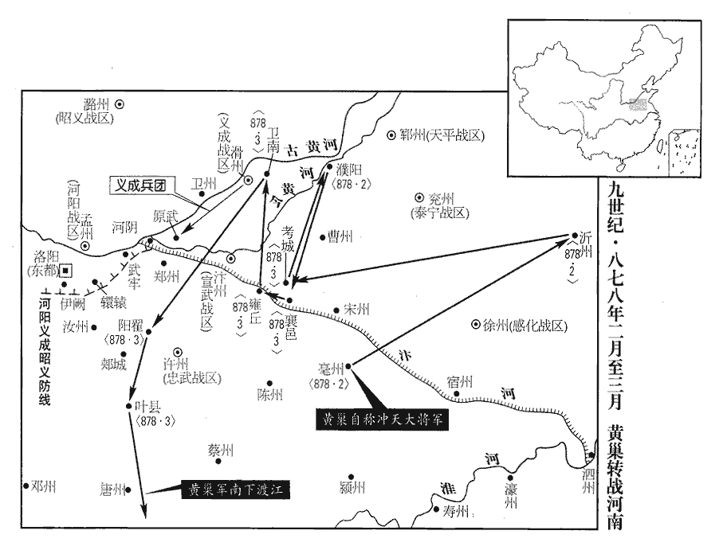
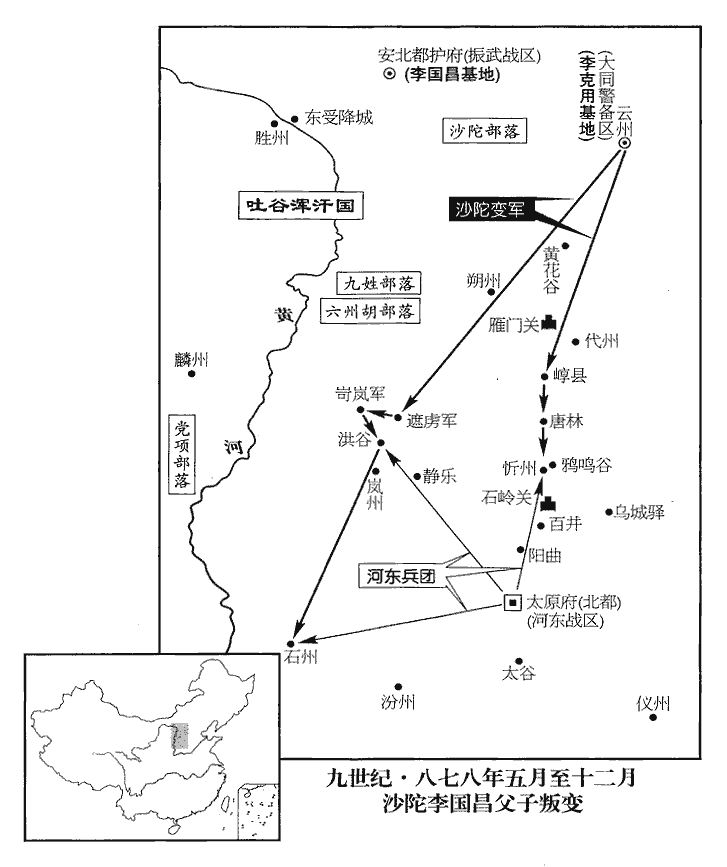
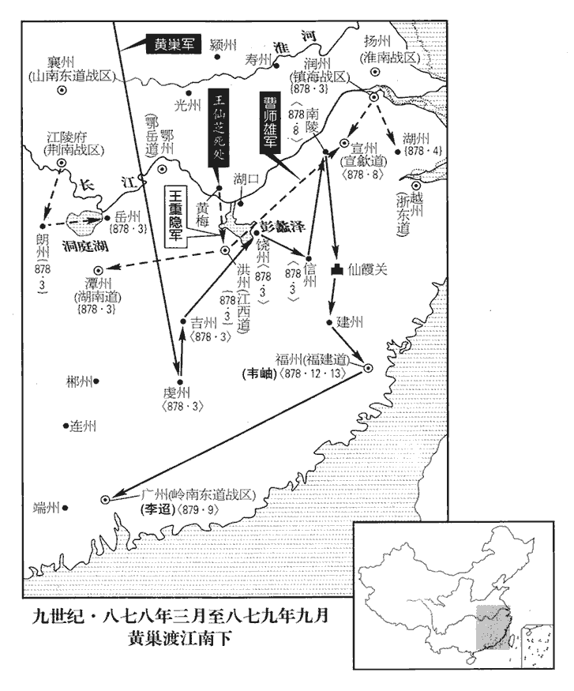
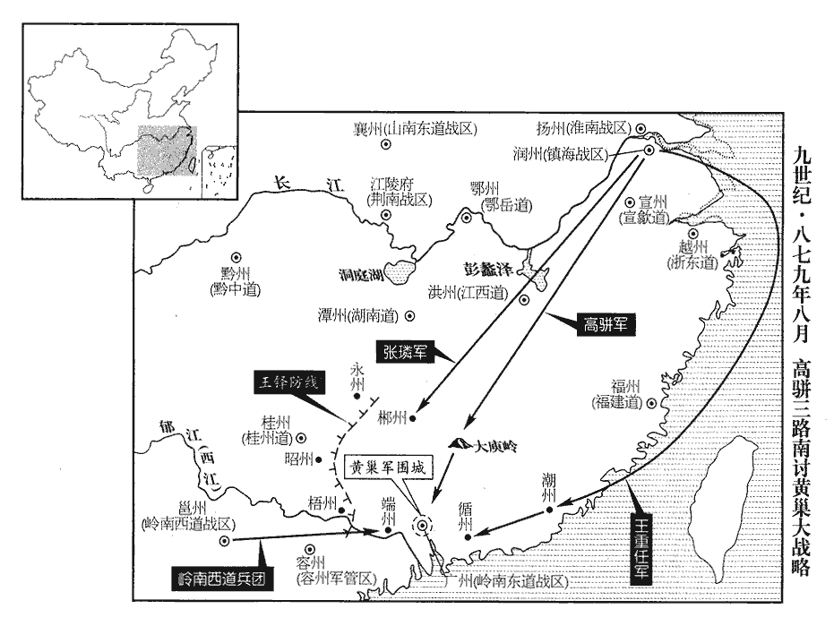
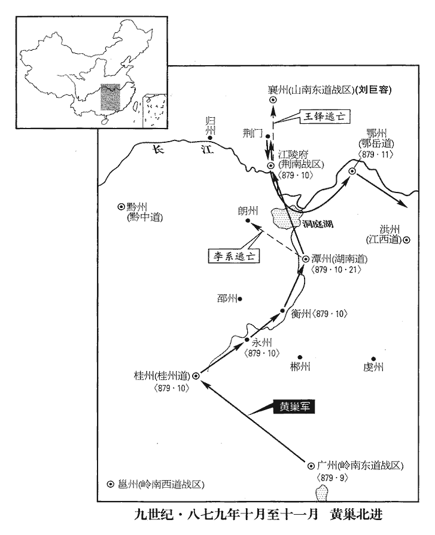
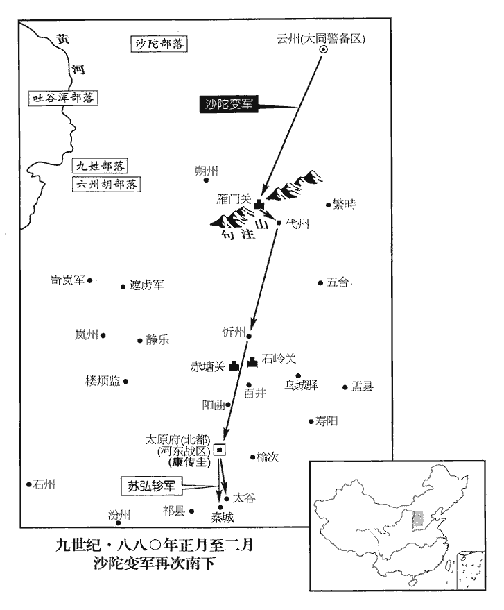
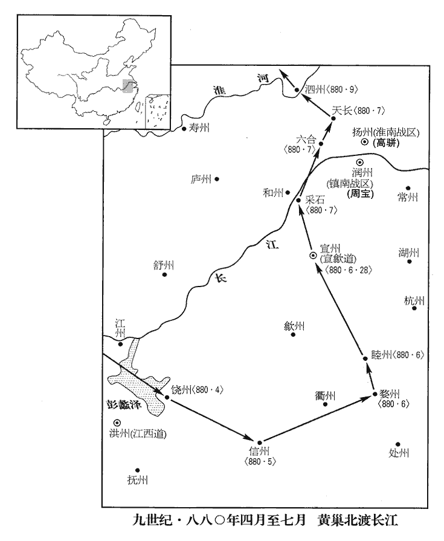
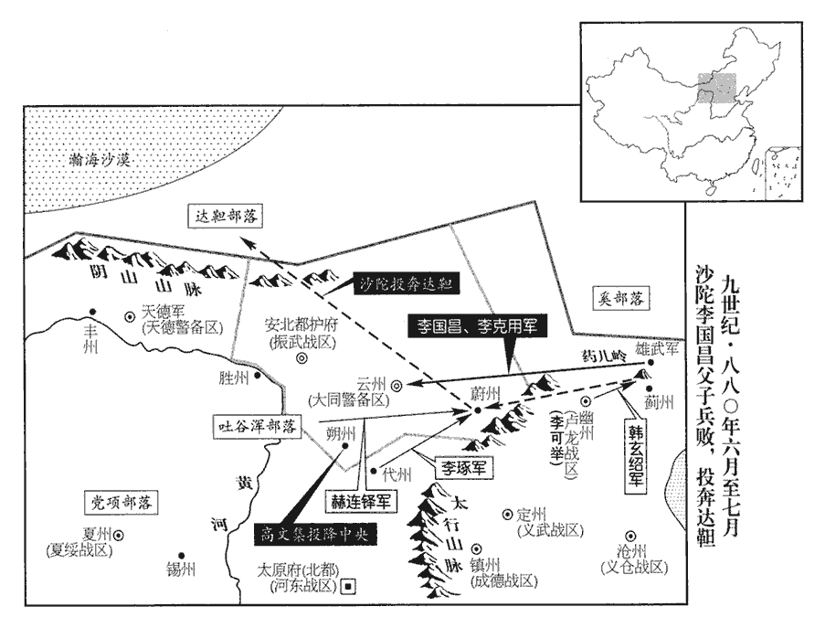

 唐紀六十九起強圉作噩（丁酉），盡上章困敦（庚子）十月，凡三年有奇。

# 僖宗惠聖恭定孝皇帝上之下

## 乾符四年（丁酉、八七七）

1春，正月，王郢誘魯寔入舟中，執之，王郢因魯寔請降，事見上卷上年。將士從寔者皆奔潰。朝廷聞之，以右龍武大將軍宋皓為江南諸道招討使，先徵諸道兵外，更發忠武、宣武、感化三道、陳許，忠武軍；汴宋，宣武軍；徐州，感化軍。宣、泗‹江苏省盱眙县淮河北岸›二州兵，新舊合萬五千餘人，並受皓節度。二月，郢攻陷望海鎮‹浙江省宁波市东北镇海镇›，掠明州‹浙江省宁波市›，又攻台州‹浙江省临海市›，陷之；刺史王葆退守唐興‹浙江省天台县›。唐興，即今天台縣，在台州西一百一十里。‹李俨（儇）本年十六岁›詔二浙、福建各出舟師以討之。

〖译文〗 [1]春季，正月，王郢将唐温州刺史鲁诱骗入他的船中，将鲁逮捕，随从鲁的将士全部逃奔溃散。朝廷得知情报，任命史龙武大将军宋皓为江南诸道招讨使，除先征发诸道兵以外，更调发忠武、宣武、感化三道兵和宣州、泗州二州兵，新旧合计调集军队一万五千余人，全部接受宋皓的节度。二月，王郢率军攻陷望海镇，剽掠明州，转而攻陷台州；台州刺史王葆退到唐兴拒守。唐僖宗下诏令浙东浙西和福建各调发水师乘船讨击王郢。

2王仙芝陷鄂州‹鄂岳道首府·湖北省武汉市›。

〖译文〗 [2]王仙芝率军攻陷鄂州。

3黃巢陷鄆州‹山东省东平县›，殺節度使薛崇。

〖译文〗 [3]黄巢率军攻陷郓州，杀死唐节度使薛崇。

4南詔‹大礼国，首都苴咩城云南省大理市›酋龍嗣立以來，為邊患殆二十年，宣宗大中十三年，酋龍立。酋，慈由翻。中國為之虛耗，為，于偽翻。而其國中亦疲弊。酋龍卒，諡曰景莊皇帝；子法立，改元貞明承智大同，國號鶴拓，亦號大封人。考異曰：徐雲虔南詔錄曰：「南詔別名鶴拓，其後亦自稱大封人」，是以封為國號也。

〖译文〗 [4]南诏酋龙自嗣位为国王以来，为唐朝边患几乎达二十年，朝廷为抵御其侵犯致使府库虚耗，而南诏国中也由于连年战争而疲弊不堪。酋龙去世，其子法嗣立为国王，谥酋龙号为景庄皇帝，改其年号为贞明承智大同，国号为鹤拓，又号称大封人。

法好畋獵酣飲，好，呼到翻。委國事於大臣。閏月，嶺南西道‹总部设邕州广西南宁市›節度使辛讜奏南詔遣陁西段瑳cuō寶等來請和，南詔官有陁西，猶中國判官也。瑳，七何翻，又七可翻。且言「諸道兵戍邕州歲久，餽餉之費，疲弊中國，請許其和，使羸瘵息肩。」羸，倫為翻。瘵zhài，側介翻。詔許之。讜遣大將杜弘等齎書幣，送瑳寶還南詔，但留荊南‹总部设江陵府湖北省江陵县›、宣歙‹首府设宣州安徽省宣州市›數軍戍邕州，歙，書涉翻。自餘諸道兵什減其七。

〖译文〗 南诏王法喜欢打猎和饮酒，将国政委交给大臣。闰二月，唐岭南西道节度使辛谠上奏朝廷称南诏派遣西段宝来请和，并且宣称：“我诸道军队在邕州戍守多年，军队粮饷费用使得中原疲弊，请许与南诏约和，使病弱的人民得到喘息的机会。”唐僖宗下诏准许。于是辛谠派遣大将杜弘等人带着书信和钱物，送段宝回归南诏国，只留下荆南、宣歙等数支军队戍守邕州，其余诸道军队裁减十分之七。

5王郢橫行浙西，鎮海節度使裴璩嚴兵設備，璩qú，求於翻。不與之戰，密招其黨朱實降之，降，戶江翻。散其徒六七千人，輸器械二十餘萬，舟航、粟帛稱是。稱，尺證翻。敕以實為金吾將軍。於是郢黨離散；郢收餘眾，東至明州，甬橋‹安徽省宿州市汴河桥›鎮遏使劉巨容以筒箭射殺之，劉巨容以宿州甬橋鎮遏使將兵討王郢。筒箭，長纔尺餘，內之竹筒，注之弦上，繫竹筒於手腕，彀gòu弓既發，豁筒向後，激矢射敵，皆洞貫。詳見辯誤。乾符二年，王郢反，至是而平。射，而亦翻。餘黨皆平。璩，諝xū之從曾孫也。裴諝見二百六卷代宗大曆十四年。從，才用翻。

〖译文〗 [5]王郢乱军横行于浙西，镇海节度使裴琚调集军队严加守备，不与王郢军交战，而暗中招纳王郢党羽朱实投降，使王郢党徒六七千人散伙逃走，朱实又向裴琚输缴军用器械二十余万件，舟船、粟米布帛数量也很多。唐僖宗下诏敕任命朱实为金吾将军。于是王郢乱党大都离散；王郢收集余众，东窜至明州，被甬桥镇遏使刘巨容用筒箭射死，其余乱党全部平定。裴琚是裴的曾侄孙。

6三月，黃巢陷沂州‹山东省临沂市›。

〖译文〗 [6]三月，黄巢率军攻陷沂州。

7夏，四月，壬申朔‹一›，日有食之。

〖译文〗 [7]夏季，四月，壬申朔（初一），出现日食。

8賊帥柳彥璋剽掠江西‹江西省›。帥，所類翻。剽，匹妙翻。

〖译文〗 [8]贼军首领柳彦璋率军剽掠江西地区。

9陝州‹河南省三门峡市›軍亂，逐觀察使崔碣；貶碣懷州‹河南省沁阳市›司馬。陝，失冉翻。碣jié，其謁翻。

〖译文〗 [9]陕州发生军乱，观察使崔碣被乱军驱逐；朝廷将崔碣贬为怀州司马。

10黃巢與尚讓合兵保查牙山‹河南省遂平县西›。考異曰：舊紀：「四年三月，巢陷鄆州。七月，入查牙山，與王仙芝合。五年二月，君長、仙芝皆死。尚讓以兄遇害，大掠淮南。」舊傳：「五年八月，王鐸斬王仙芝。先是，尚君長弟讓以兄奉使見誅，帥部眾入查牙山。黃巢、黃揆昆仲八人率盜數千依讓。」按實錄，乾符二年，仙芝陷曹、濮，巢已起兵應之。三年十二月，招討副都監楊復光奏：「草賊尚讓據查牙山，官軍退保鄧州。」四年四月，黃巢引其眾保查牙山。其年冬，君長乃死。驚聽錄：「巢與仙芝俱入蘄州，以仙芝獨受官而怒，毆仙芝傷面，由是分隊。」時君長亦在座，非仙芝死後，巢方依讓也。又按舊紀，仙芝死後，王鐸始為都統討賊。而舊傳云「王鐸斬仙芝」，又先云「殺張璘，乃陷廣州」，先云「陷華州，方攻潼關」，敘事顛錯不倫。今從實錄。

〖译文〗 [10]黄巢与尚让合兵据守查牙山。

11五月，甲子‹二十四›，以給事中楊損為陝虢觀察使。損至官，誅首亂者。損，嗣復之子也。楊嗣復事文宗。

〖译文〗 [11]五月，甲子（二十四日），朝廷任命给事中杨损为陕虢观察使。杨损到官上任，诛除乱军为首分子。杨损是杨嗣复的儿子。

12初，桂管‹首府设桂州广西桂林市›觀察使李瓚失政，支使薛堅石屢規正之，瓚不能從。及瓚被逐，李瓚被逐見上卷上年。被，皮義翻。堅石攝留務，移牒鄰道，禁遏亂兵，一方以安。詔擢堅石為國子博士。

〖译文〗 [12]起初，唐桂管观察使李瓒使政事败坏，观察支使薛坚石屡次向李瓒规劝指正，但李瓒不能听从。等到李瓒被乱军驱逐，薛坚石暂代留守职务，下府牒移达邻道，将乱兵遏制禁止，使一方得以安定。唐僖宗于是下诏提拔薛坚石为国子博士。

13六月，柳彥璋襲陷江州‹江西省九江市›，執刺史陶祥，使祥上表，彥璋亦自附降狀。上，時掌翻。降，戶江翻。敕以彥璋為右監門將軍，令散眾赴京師；以左武衛將軍劉秉仁為江州刺史。彥璋不從，以戰艦百餘固湓江‹龙开河，流经九江市东›為水寨，湓pén江在江州城外，接于大江，故謂之湓江。湓，蒲奔翻。剽掠如故。剽，匹妙翻。

〖译文〗 [13]六月，贼军柳彦璋部袭击并攻陷江州，擒获唐江州刺史陶祥，于是让陶祥向朝廷上表，柳彦璋自己也附上一份乞降状子一同呈上。唐僖宗上诏敕任命柳彦璋为右监门将军，并命令柳彦璋将部众解散后奔赴京师做官；又下诏任命左武卫将军刘秉仁为江州刺史。柳彦璋接到诏敕后不肯答应，率领战船百余艘在湓江投立水寨，仍然和以前一样剽掠州县。

14忠武‹总部设许州河南省许昌市›都將李可封戍邊還，至邠州‹邠宁战区总部·陕西省彬县›，迫脅主帥索舊欠糧鹽，帥，所類翻。索，山客翻。留止四日，闔境震驚。秋，七月，還至許州‹河南省许昌市›，節度使崔安潛悉按誅之。

〖译文〗 [14]忠武军都将李可封从戍边地还许州，路过州，胁迫其军队主帅，索取先前所欠粮食和盐，在州滞留四天，使州全境惊恐不安。秋季，七月，李可封等回到许州，节度使崔安潜将他们全部逮捕诛杀。

15庚申‹二十一›，王仙芝、黄巢攻宋州‹河南省商丘市›，三道兵與戰，不利，三道兵，平盧‹总部青州›、宣武‹总部汴州›、忠武‹总部许州›也。賊遂圍宋威於宋州。甲寅‹十五›，左威衛上將軍張自勉將忠武兵七千救宋州，殺賊二千餘人，賊解圍遁去。

〖译文〗 [15]庚申（二十一日），王仙芝、黄巢进攻宋州，唐平卢、宣武、忠武三道兵赶来与其交战，官军失利，贼军于是将宋威围困于宋州城内。甲寅（疑误），唐左威卫上将军张自勉率领忠武兵七千人来救宋州，斩杀贼军二千余人，解宋州之围，贼军逃走。

王鐸、盧攜欲使張自勉以所將兵受宋威節度，鄭畋以為威與自勉已有疑忿，若在麾下，必為所殺，不肯署奏。八月，辛未‹三›，鐸、攜訴於上，求罷免；庚辰‹十二›，畋請歸滻川‹陕西省蓝田县西南›養疾；滻川在長安東。滻，音產。上皆不許。史言僖宗不能定國是。

〖译文〗 宰相王铎和卢携企图让张自勉将所部兵接受宋威的节度，另一宰相郑畋认为宋威与张自勉之间已产生疑虑，并各怀愤恨，如果将张自勉归于宋威麾下，必为宋威杀害，所以不肯在奏状上署名。八月，辛未（初三），王铎、卢携在唐僖宗面前指诉郑畋，要求僖宗将郑畋宰相职罢免；庚辰（十二日），郑畋请求归川养病，唐僖宗对两方的请求均不予批准。

16王仙芝陷安州‹湖北省安陆市›。

〖译文〗 [16]王仙芝攻陷安州。

17鹽州‹陕西省定边县›軍亂，逐刺史王承顏，詔高品牛從珪往慰諭之；貶承顏象州‹广西象州县›司戶。承顏及崔碣素有政聲，以嚴肅為驕卒所逐，朝廷與貪暴致亂者同貶，時人惜之。史言唐末賞罰失當，且言主昏政亂，能吏不惟不得展其才，亦不免於罪。從珪自鹽州還，軍中請以大將王宗誠為刺史。詔宗誠詣闕，將士皆釋罪，仍加優給。

〖译文〗 [17]盐州发生军乱，刺史王承颜被乱军驱逐，唐僖宗令高品位宦官牛从往盐州抚慰劝谕，同时将王承颜贬为象州司户。王承颜与崔碣为官严正，都很有政绩，却因为过于严肃而为部下骄兵悍将驱逐，朝廷不问青红皂白，将他们同暴致乱的地方官吏一样贬官，当时舆论深表痛惜。牛从自盐州回朝廷，盐州军人请牛从向朝廷奏请任命大将王宗诚为刺史，唐僖宗下诏让王宗诚入朝，盐州作乱的将士全都不加追究，反而给予优厚的禀给。

18乙卯，王仙芝陷隨州‹湖北省随州市›，執刺史崔休徵。山南東道‹总部设襄州湖北省襄樊市›節度使李福遣其子將兵救隨州，戰死。福奏求援兵，遣左武衛大將軍李昌言將鳳翔‹总部设凤翔府陕西省凤翔县›五百騎赴之，仙芝遂轉掠復‹湖北省天门市›、郢‹湖北省钟祥市›。忠武大將張貫等四千人與宣武‹总部设汴州河南省开封市›兵援襄州，自申‹河南省信阳市›、蔡‹河南省汝南县›間道逃歸；間，古莧翻。詔忠武節度使崔安潛、宣武節度使穆仁裕遣人約還。約還者，戒約將士，使還赴援也。

〖译文〗 [18]乙卯（九月十七日），王仙芝率军攻陷随州，活捉唐随州刺史崔休征。山南东道节度使李福派遣自己的儿子率兵往救随州，被贼军打死。李福上奏朝廷请求援兵，朝廷派遣左武卫大将军李昌言率领凤翔骑兵五百赶赴随州。王仙芝转而攻掠复州、郢州。唐忠武军大将张贯等四千人与宣武军赴援襄州，却从小道自申州、蔡州逃归原籍。唐僖宗又下诏令忠武节度使崔安潜、宣武节度使穆仁裕派人戒约张贯等将士，要他们还赴襄州救援。

19冬，十月，邠寧節度使李侃奏遣兵討王宗誠，斬之，餘黨悉平。逐王承顏之黨也。

〖译文〗 [19]冬季，十月，宁节度使李侃上表奏称已派遣军队讨伐王宗诚，并将王宗诚斩首，其余乱党全部讨平。

20鄭畋與王鐸、盧攜爭論用兵於上前，畋不勝，退，復上奏，復，扶又翻；下同。以為：「自王仙芝俶chù擾，按孔安國尚書註：俶，始也。擾，亂也。俶，尺六翻。崔安潛首請會兵討之，繼發士卒，罄竭資糧；言竭本道所有以供征行士卒資糧。賊往來千里，塗炭諸州，獨不敢犯其境。又以本道兵授張自勉，解宋州圍，使江、淮漕運流通，不輸寇手。今蒙盡以自勉所將七千兵令張貫將之，將，即亮翻；下同。隸宋威。句斷。自勉獨歸許州，威復奏加誣毀。因功受辱，臣竊痛之。安潛出師，前後克捷非一，一旦強兵盡付他人，良將空還，若勍敵忽至，勍，渠京翻。何以枝梧！臣請以忠武四千人授威，餘三千人使自勉將之，守衛其境，既不侵宋威之功，又免使安潛愧恥。」時盧攜不以為然，上不能決。畋復上言：「宋威欺罔朝廷，敗衄狼藉。衄，女六翻。藉，秦昔翻。又聞王仙芝七狀請降，威不為聞奏。為，于偽翻。朝野切齒，以為宜正軍法。迹狀如此，不應復典兵權，願與內大臣參酌，內大臣，謂兩中尉、兩樞密也。早行罷黜。」不從。

〖译文〗 [20]宰相郑畋与王铎、卢携在唐僖宗面前争论如何用兵征讨王仙芝等，郑畋争论未获胜，退朝后再上表奏称：“自王仙芝开始起事以来，崔安潜最先奏请诸道会兵征过，按着就调发本道士卒，竭尽本道所有以供行征士卒的资粮，王仙芝贼众四处剽掠，往来千里，使诸州涂炭，而唯独不敢侵犯崔安潜所领地区。崔安潜又将本道兵授予张自勉指挥，使宋州之围得以解脱，江、淮的漕运得以流通，东南财赋不致输入贼寇之手。今天陛下又尽将张自勉所统率的七千兵交予张贯率领，隶属于宋威。而让张自勉独自归还许州，宋威又上奏诬毁张自勉。张自勉因立战功而受到诬辱，我深感痛心。崔安潜出师征讨王仙芝以来，前后胜利捷报不止一次，一旦将强兵全部交付于他人，良将空自回城，而强敌急然来进攻，又如何抵挡，作何交待！我请求将忠武军四千人授予宋威指挥，其余三千人让张自勉率领，守卫其本道，这样既不侵夺宋威的战功，又能使崔安潜史去耻辱和羞愧。”当时卢携对郑畋的奏言表示反对，唐僖宗不能作出裁决。郑畋又再次上言：“宋威欺骗朝廷，被王仙芝打败得不成样子。我又听说王仙芝曾七次上状请求投降，宋威都不上报朝廷，朝野对此恨得咬牙切齿，我认为应该将宋威按军法处置。宋威劣迹昭彰，不应该再让他典掌兵权，希望能与左、右神策军中尉和左、右枢密使商量，尽早将败将宋威罢免。”唐僖宗没有听从。

21河中‹总部设河中府山西省永济市›軍亂，逐節度使劉侔，縱兵焚掠。以京兆尹竇璟為河中宣慰制置使。璟，俱永翻。

〖译文〗 [21]河中发生军乱，节度使刘侔被乱军驱逐，乱军纵兵四处烧杀剽掠，无人能禁。朝廷任命京兆尹窦为河中宣慰制置使。

22黃巢寇掠蘄、黃，蘄、黃相去一百六十五里。曾元裕擊破之，斬首四千級。巢遁去。

〖译文〗 [22]黄巢率军侵掠蕲州、黄州，曾元裕出兵击破黄巢军，斩首四千级。黄巢率军逃走。

23十一月，己酉‹一›，以竇璟為河中節度使。

〖译文〗 [23]十一月，已酉（十二日），朝廷任命窦为河中节度使。

24招討副都監楊復光遣人說諭王仙芝，仙芝遣尚君長等請降於復光，監，古銜翻。說，輸芮翻。降，戶江翻。楊復光時屯鄧州‹河南省邓州市›。宋威遣兵於道中劫取君長等。十二月，威奏與君長等戰於潁州‹安徽省阜阳市›西南，生擒以獻；復光奏君長等實降，非威所擒。詔侍御史歸仁紹等鞫之，姓譜曰：左傳，胡，子國，姓歸，為楚所滅，子孫或以國為氏，或以姓為氏。竟不能明；斬君長等於狗脊嶺‹陕西省长安县境›。

〖译文〗 [24]招讨副使、宦官都监杨复光派遣使者往王芝处劝谕，王仙芝派遣尚君长等为代表向杨复光请降，宋威企图邀功，派遣士兵于道路上将尚君长等人劫走。十二月，宋威向朝廷奏称与贼帅尚君长等在颖州西南战斗，生擒尚君长等献给朝廷；杨复光向朝廷奏称尚君长等人确实是来投降，并不是宋威于战阵中擒获。唐僖宗下诏命侍御使归仁绍等进行审查，居然无法查明真相；于是将尚君长等人斩于狗脊岭。

25黃巢陷匡城‹河南省长垣县西南›，遂陷濮州‹山东省鄄城县›。匡城縣，屬滑州，本漢長垣縣。宋白曰：隋開皇於婦姑城置匡城縣，以縣南有故匡城為名，即孔子所畏之所。濮，博木翻。詔潁州刺史張自勉將諸道兵擊之。

〖译文〗 [25]黄巢率军攻陷匡城县，接着又攻陷濮州。唐僖宗下诏令颖州刺史张张自勉率诸道军队进击。

26江州‹江西省九江市›刺史劉秉仁乘驛之官，單舟入柳彥璋水寨，賊出不意，即迎拜，秉仁斬彥璋，散其眾。柳彥璋為盜九月而敗。

〖译文〗 [26]唐江州刺史刘秉仁乘驿马上任，单独驾一小船来到柳彦璋水寨中，贼军出乎意料，一时不知所措，当即迎拜，刘秉仁乘机将柳彦璋斩首，将柳彦璋所部贼军解散。

27王仙芝寇荊南‹总部设江陵府湖北省江陵县›。節度使楊知溫，知至之兄也，楊知至見上卷懿宗咸通十一年。以文學進，不知兵，或告賊至，知溫以為妄，不設備。時漢水淺狹，賊自賈塹‹湖北省钟祥市南›渡。九域志：郢州長壽縣有賈塹鎮。塹，七豔翻。

〖译文〗 [27]王仙芝进犯荆南。荆南节度使杨知温是杨知至的兄长，以文章才学仕进，不知用兵，有人报告盗贼来到，杨知温以为是妄造遥言，不设戒备。当时正值汉水浅而河道较窄，贼军于是从贾堑渡过汉水。

## 五年（戊戌、八七八）

1春，正月，丁酉朔‹一›，大雪，知溫‹荆南战区，总部设江陵府湖北省江陵县›方受賀，凡元旦、冬至，諸州鎮皆受將吏牙賀，下至縣邑亦然。賊已至城下，遂陷羅城‹外城›。將佐共治子城‹中城›而守之，治，直之翻。及暮，知溫猶不出。將佐請知溫出撫士卒，知溫紗帽皁裘而行，將佐請知溫擐甲以備流矢。皁，才早翻。擐，音宦。知溫見士卒拒戰，猶賦詩示幕僚，遣使告急於山南東道‹总部设襄州湖北省襄樊市›節度使李福，福悉其眾自將救之。時有沙陀‹山西省北部›五百在襄陽，福與之俱，至荊門‹湖北省荆门市›，遇賊，晉分編縣，置長林縣。德宗貞元二十一年又分長林置荊門縣，屬江陵府。九域志：在府北一百六十許里。沙陀縱騎奮擊，破之。仙芝聞之，焚掠江陵‹湖北省江陵县›而去。江陵城下舊三十萬戶，至是死者什三四。

〖译文〗 [1]春季，正月，丁酉朔（初一），天下大雪，荆南节度使杨知温正在接受将吏的新年祝贺，王仙芝率军已来到江陵城下，攻陷外围罗城。荆南将佐齐心协力将内城修治以拒守，至天黑，杨知温仍然没有出节度使府。将佐们请杨知温出来抚尉士兵，杨知温不着戎装，穿戴纱帽皮衣而出，于是将佐们又请杨知温披甲以防备暗箭流矢。杨知温见士兵们正在拒战，却仍然赋诗给幕僚们听，又派遣使者向山南东道节度使李福告急，李福调集部下全部下马，亲自率领赶往赴救。当时有五百沙陀族士兵驻扎襄阳，李福与他们会合，行到荆门，与贼军遭遇，沙陀骑兵纵马横冲直撞，大破贼军。王仙芝得到消息，在江陵一带大肆烧杀抢掠一阵后离去。以前江陵城下有户三十余万，经这次杀掠，约有十分之三四的居民死去。

2壬寅‹六›，招討副使曾元裕大破王仙芝於申州‹河南省信阳市›東，所殺萬人，招降散遣者亦萬人。敕以宋威久病，罷招討使，還青州‹山东省青州市›；宋威本平盧帥，罷招討使還鎮。以曾元裕為招討使，潁州‹安徽省阜阳市›刺史張自勉為副使。

〖译文〗 [2]壬寅（初六），唐招讨副使曾元裕在申州以东大破王仙芝军，杀死万人，招降遣散的也有万人。唐僖宗下诏，以宋威生病许久为理由，罢免他招讨草贼使的职务，归还青州本镇。任命曾元裕为招讨使，颍州刺史张自勉为招讨副使。

3庚戌‹十四›，以西川‹总部设成都府四川省成都市›節度使高駢為荊南節度使兼鹽鐵轉運使。

〖译文〗 [3]庚戌（十四日），唐僖宗任命西川节度使高骈为荆南节度使，并兼任盐铁转运使。

4振武‹总部设安北府内蒙古和林格尔县›節度使李國昌‹朱邪赤心›之子克用為沙陀副兵馬使，戍蔚州‹河北省蔚县›。宋白曰：蔚州，秦、趙間亦為代郡之地，後魏置懷荒、禦夷二鎮於此。東魏於此置北靈丘郡，後周大象二年，置蔚州，唐開元初，移郡治於靈丘西南一百三十里，西至朔州三百八十里。時河南盜賊蠭起，謂王仙芝、黃巢等也。雲州‹山西省大同市›沙陀兵馬使李盡忠與牙將康君立、薛志勤、程懷信、李存璋等謀曰：「今天下大亂，朝廷號令不復行於四方，復，扶又翻。此乃英雄立功名富貴之秋也。吾屬雖各擁兵眾，然李振武功大官高，名聞天下，言李國昌討平龐勛，於當時功為大；帥振武，於諸將官為高。聞，音問。其子勇冠諸軍，冠，古玩翻。若輔以舉事，代北‹山西省北部›不足平也。」眾以為然。君立，興唐‹蔚州州政府所在县›人；隋分靈丘縣置安邊縣，中廢；唐開元十二年，復置，治橫野軍，至德三載，更名興唐縣，屬蔚州。存璋，雲州人；志勤，奉誠‹内蒙古宁城县西南›人也。貞觀二十二年，以內屬奚可度者部落置饒樂都督府，開元二十三年更名奉誠都督府。薛志勤，其府人也。

〖译文〗 [4]振武节度使李国昌的儿子李克用为沙陀副兵马使，戍守蔚州。这时，河南地区的盗贼纷纷起兵，云州沙陀兵马使李尽忠与牙将康君立、薛志勤、程怀信、李存璋等人谋划说：“当今天下大乱，唐朝廷的号令不再能行四方。这正是英雄树立功名、获取富贵的好时机。我们虽然各自都拥有兵众，但振武节度使李国昌功大官高，名闻于天下，他的儿子也勇冠诸军，如果我们辅佐他们来举事，平定代北是没有问题的。”众人都觉得有道理。康君立为兴唐人，李存璋是云州人，薛志勤是奉诚人。

會大同‹总部云州›防禦使段文楚兼水陸發運使，宋白曰：朔州馬邑縣，貞觀已來已為大同軍職，開元五年，分鄯陽縣之東三十里，置大同軍以戍邊，後於軍內置馬邑，徵漢舊名也。建中間，馬燧自鄯陽移朔州於馬邑縣。代北荐饑，荐，才甸翻，再也。再歲五穀不熟曰荐饑。漕運不繼，文楚頗減軍士衣米；又用法稍峻，軍士怨怒。盡忠遣君立潛詣蔚州說克用起兵，除文楚而代之。說，式芮翻。克用曰：「吾父在振武‹内蒙古和林格尔县›，俟我稟之。」君立曰：「今機事已泄，緩則生變，何暇千里稟命乎！言道里遼遠，使命往返，則事必泄而害成。於是盡忠夜帥牙兵攻牙城‹内城›，攻雲州‹山西省大同市›牙城也。帥，讀曰率；下同。執文楚及判官柳漢璋繫獄，自知軍州事，遣召克用。克用帥其眾趣雲州，趣，七喻翻。行收兵。二月，庚午‹四›，至城下，眾且萬人，屯於鬬雞臺下‹山西省大同市东›。壬申‹六›，盡忠遣使送符印，請克用為防禦留後。癸酉‹七›，盡忠械文楚等五人送鬬雞臺下，克用令軍士冎guǎ而食之，以騎踐其骸。冎，古瓦翻。踐，慈演翻。甲戌‹八›，克用入府舍視事。考異曰：趙鳳後唐太祖紀年錄曰：「乾符三年，河南水災，盜寇蜂起，朝廷以段文楚為代北水陸發運、雲州防禦使，以代支謨。時歲荐饑，文楚削軍人衣米，諸軍咸怨。太祖為雲中防邊督將，部下爭訴以軍食不充，請具聞奏。邊校程懷信、康君立等十餘帳，日譁於太祖之門，請共除虐帥以謝邊人。眾因大譟，擁太祖上馬，比及雲中，眾且萬人，城中械文楚出以應太祖。」後唐閔帝時，史官張昭遠撰莊宗功臣列傳曰：「康君立為雲中牙校，事防禦使段文楚。時天下將亂，代北仍歲阻饑，諸部豪傑咸有嘯聚邀功之志。文楚法令稍峻，軍食轉餉不給，戍兵咨怨。雲州沙陀兵馬使李盡忠私謂君立等曰：『段公儒者，難與共事。方今四方雲擾，皇威不振，丈夫不能於此時立功立事，非人豪也。吾等雖擁部眾，然以雄勁聞於時者，莫若李振武父子，官高功大，勇冠諸軍，吾等合勢推之，則代北之地，旬月可定，功名富貴，事無不濟也。』時武皇為沙陀三部落副兵馬使，在蔚州，盡忠令君立私往圖之，曰：『方今天下大亂，天子付將臣以邊事，歲偶饑荒，便削儲給，我等邊人，焉能守死！公家父子素以威惠及五部，當共除虐帥以謝邊人。』武皇曰：『予家尊在振武，萬一相逼，俟予稟命。』君立曰：『事機已泄，遲則變生。』咸通十三年十二月，盡忠夜帥牙兵攻牙城，執文楚及判官柳漢璋、陳韜等，繫之於獄，遂自知軍州事，遣君立召太祖於蔚州。是月，太祖與退渾、突厥三部落眾萬人趨雲中，十四年正月六日，至鬬雞臺，盡忠遣監軍判官符印請太祖知留後事。七日，盡忠械文楚、漢璋等五人送鬬雞臺，軍人亂食其肉。九日，太祖權知留後。府牙受上三軍表，請授太祖大同防禦使，懿宗不悅。時已除盧簡方代文楚，未至而文楚被害。」實錄：「乾符元年，十二月，李克用殺大同軍防禦使段文楚，自稱防禦留後，塞下之亂自茲始矣。」薛居正五代史君立傳皆與莊宗列傳同，惟削去李盡忠名，但云君立與薛鐵山、程懷信、王行審、李存璋等謀，悉以盡忠語為君立之語，云「君立等乃夜謁武皇，言曰：『方今天下大亂』云云。眾因聚譟擁武皇，比及雲州，眾且萬人，師營鬬雞臺，城中械文楚以應。武皇之軍既收城，推武皇為大同軍防禦留後，眾狀以聞。」舊紀：「咸通十三年十二月，李國昌小男克用，殺雲州防禦使段文楚，據雲州，自稱防禦留後。乾符五年，正月，沙陀首領李盡忠陷遮虜軍，竇澣huàn遣康傳圭率土團二千屯代州，將發，求賞呼譟，殺馬步軍使鄧虔。」有唐末三朝見聞錄者，不著撰人姓名，專記晉陽事，其書云：「乾符五年戊戌，竇澣自前守京兆尹拜河東節度使，在任，便值大同軍變，殺防禦使段文楚。正月二十六日軍於石窯yáo。二十七日，到白泊。二十九日，至靜邊軍。三十日，築卻四面城門。二月一日，在城將士三人共賞絹一匹，監軍使差仇判官聞奏，李盡忠等准詔各賞馬一匹，銀鞍轡一副，银三鋌，銀椀一枚，絹一束，錦二匹，紫羅三匹，諸軍將銀椀絹等。三日，李盡忠卻入。四日，兩面馬步五萬餘人，城四面下營。五日，又賞土團牛酒。六日，監軍使送牌印與李九郎。七日，城南門樓上繫縛下段尚書、柳漢璋、雍侍御、陳韜等四人。尋分付軍兵於鬬雞臺西剮卻，又令馬軍踐踏卻骸骨。八日，李九郎被土團馬步軍約一千人持弓刀送上。」與舊紀五年事微合。實錄亦頗采之，云：「五年正月，壬戌，竇澣奏沙陀首領李盡忠寇石窯、白泊，至靜邊軍。二月，奏李盡忠求賞，詔賞馬一匹，銀鞍勒、綿絹等。」按莊宗列傳、舊紀，克用殺文楚在咸通十三年十二月，歐陽修五代史記取之；太祖紀年錄在乾符三年，薛居正五代史、新沙陀傳取之；見聞錄在乾符五年二月，新紀取之；惟實錄在乾符元年，不知其所據何書也。克用既殺文楚，豈肯晏然安處，必更侵擾邊陲，朝廷亦須發兵征討，而自乾符四年以前皆不見其事。唐末見聞錄敘月日，今從之。令將士表求敕命；朝廷不許。

〖译文〗 恰值大同防御使段文楚兼任水陆发运使，当时代北地区一再饥荒，加上漕运不断，朝廷无法接济，段文楚于是经常减扣军士的衣粮；且用刑法稍严峻，使军士怨恨愤怒。李尽忠暗中派遣康君立往蔚州劝说李克用起兵，除掉段文楚而取代其大同防御使的职位。李克用回答：“我的父亲在振武，请等我禀告他后作决定。”康君立说：“今天机密已经泄漏，起事缓了恐怕发生变故，哪有时间往返千里禀告承命呢！”于是李尽忠连夜率领牙兵攻下牙城，将段文楚及其判官柳汉璋逮捕关押于监狱中，自己暂掌州事，并派遣人召李克用来主政。李克用率领他的部众赶往云州，一边行军一边招兵，二月，庚午（初四），到达云州城下，其部众已达万人，屯军于斗鸡台下。壬申（初六），李尽忠派遣使者向李克用送符印，请李克用任大同防御留后。癸酉（初七），李尽忠用刑具将段文楚等五人押送至斗鸡台下，李克用令士兵们用刀剐他们身上的肉吃，又用铁骑践踏他们剩下的骨骸。甲戌（初九），李克用入防御使府处理事务。并命将士们上表朝廷请求皇帝的正式任命；朝廷不予同意。

李國昌‹朱邪赤心›上言：「乞朝廷速除大同防禦使；若克用違命，臣請帥本道兵討之，終不愛一子以負國家。」朝廷方欲使國昌諭克用，會得其奏，乃以司農卿支詳為大同軍宣慰使，詔國昌語克用，令迎候如常儀，除克用官，必令稱愜。李克用始此。語，牛倨翻。稱，尺證翻。愜，詰叶翻。又以太僕卿盧簡方為大同防禦使。考異曰：舊紀：「咸通十三年七月，以前義昌節度使盧簡方為太僕卿。十二月，以振武節度使李國昌為雲州刺史、大同軍防禦等使。國昌稱病，辭軍務，乃以太僕卿盧簡方為雲州刺史，充大同軍防禦等使。上召簡方於思政殿，謂之曰：『卿以滄州節制，屈居大同。然朕以沙陀、退渾撓亂邊鄙，以卿曾在雲中，惠及部落，且忍屈為朕此行，具達朕旨，安慰國昌，勿令有所猜嫌也。』十四年正月，辛未，以雲、朔暴亂，代北騷動，賜盧簡方詔曰：『近知大同軍不安，殺害段文楚。李國昌小男克用主領兵權。』又曰：『若克用暫勿主兵務，束手待朝廷除人，則事出權宜，不足猜慮。若便圖軍柄，欲奄大同，則患繫久長，故難依允。料國昌輸忠效節，必當已有指揮。』簡方準詔諭之，國昌不奉詔。乃詔太原節度使崔彥昭、幽州節度使張公素出師討之。三月，以簡方為振武節度使，至嵐州卒。」實錄乾符元年十二月簡方除大同。二年正月賜詔，亦不云使彥昭、公素討之。蓋舊紀、實錄各隨段文楚死之後，載除簡方及詔書，使事相接續耳，恐皆未足據也。舊紀所云太原、幽州討之，蓋因敘後來事。實錄所以不取者，方加招諭，未必攻討也。唐末見聞錄又云：「五年四月，敕除簡方振武節度使；五月，卒。」實錄亦在五年，而云六月卒。蓋約奏到之月耳。今從三朝見聞錄。

〖译文〗 李国昌上言：“请求朝廷速任命大同防御使；倘若李克用违抗朝廷命令，我请求率领本道兵马讨伐他，决不会因爱自己一个儿子而背负国家。”朝廷正想让李国昌去劝谕李克用，恰好得到他的奏状，于是唐僖宗任命司农卿支详为大同军宣慰使，并下诏命李国昌告诉李克用，要求李克用用平常的礼仪迎候支详，朝廷会给李克用官职，必定会使他满意。又任命太仆卿卢简方为大同防御使。

5貶楊知溫為郴州‹湖南省郴州市›司馬。以王仙芝犯江陵，城幾失守，士民多為所殺略也。

〖译文〗 [5]朝廷下令将杨知温贬为郴州司马。

6曾元裕奏大破王仙芝於黃梅‹湖北省黄梅县›，黃梅縣，屬蘄州。宋白曰：宋分江夏郡置南新蔡郡；隋開皇十八年，改為黃梅縣，界內有黃梅山，因名。殺五萬餘人，追斬仙芝，傳首，餘黨散去。

〖译文〗 [6]曾元裕上奏，称在黄梅大破王仙芝率领的贼军，杀五万余人，并追斩王仙芝，传首京师，王仙芝党羽大都散去。

黃巢方攻亳州‹安徽省亳州市›未下，尚讓帥仙芝餘眾歸之，帥，讀曰率。考異曰：實錄：「元裕奏大破仙芝於黃梅縣，殺戮五萬餘人；追至曹州南華縣，斬仙芝，傳首京師。」舊紀：「二月，王仙芝餘黨攻江西，詔討使宋威出軍，屢敗之，仍宣詔書諭仙芝。仙芝致書於威，求節鉞，威偽許之。仙芝令其大將尚君長、蔡溫玉奉表入朝，威乃斬君長、溫玉以徇。仙芝怒，急攻洪州，陷其郛fú。宋威赴援，與賊戰，大敗之，殺仙芝，傳首京師。君長弟讓與黃巢大掠淮南。」舊傳曰：「齊克讓為兗州節度使，以本軍討仙芝，仙芝懼，引眾歷陳、許、襄、鄧，無少長，皆虜之，眾號三十萬。三年七月，陷江陵。十月，又遣將徐唐莒陷洪州。時仙芝表請符節，不允，以宋威為荊南節度招討使，楊復光為監軍。復光遣判官吳彥宏諭以朝旨，釋罪，別加官爵。仙芝乃令尚君長、蔡溫玉、楚彥威相次詣闕請罪，且求恩命，時宋威害復光之功，並擒送闕，敕於狗脊嶺斬之。賊怒，悉精銳擊官軍，威軍大敗。復光收其餘眾以統之，朝廷以王鐸代為招討。五年八月，收復荊州，斬仙芝首，獻于闕下。」新傳：「黃巢自蘄州與王仙芝分其眾，尚君長入陳、蔡，巢北掠齊、魯，眾萬人，入鄆州，殺節度使薛崇，進陷沂州，由潁、蔡保查岈山，引兵復與仙芝合，圍宋州。會自勉救兵至，仙芝解而南渡漢，攻荊南，陷之，賊不能守。巢攻和州未克。仙芝自圍洪州，取之，使徐唐莒守，進破朗、岳，遂圍潭州，觀察使崔瑾拒卻之。乃向浙西，擾宣、潤，不能得所欲，身留江西，趣別部還入河南。帝詔崔安潛歸忠武，復起宋威、曾元裕，以招討使還之，而楊復光監軍。復光以詔諭賊。仙芝遣尚君長等詣闕請罪，又遺威書求節度。威陽許之，上言與君長戰，擒之。復光固言其降。命侍御史與中人即訊，不能明，卒斬之。仙芝怒，還攻洪州，入其郛。威自將往救，敗仙芝於黃梅，斬五萬級，獲仙芝，傳首京師。當此時，巢方圍亳州未下，君長弟讓帥仙芝潰黨歸巢。」新、舊傳敘賊所經歷皆不同，又云「宋威殺仙芝。」今皆從實錄。推巢為主，號衝天大將軍，改元王霸，考異曰：續寶運錄：「乾符元年，黃巢聚眾於會稽反，建元曰王霸元年。」舊傳：「先是，尚君長弟讓以兄見誅，率眾入查牙山，黃巢、黃揆昆仲八人率盜數千依讓，月餘，眾至數萬，陷汝州，虜刺史王鐐，大掠關東，官軍加討，屢為所敗，其眾十餘萬。尚讓乃與群盜推巢為王，曰衝天大將軍，仍署官屬，藩鎮不能制。」新傳曰：「尚君長弟讓率仙芝潰黨歸巢，推巢為王，號衝天大將軍，署拜官屬，驅河南、山南之民十餘萬，掠淮南，建元王霸。」今從之。署官屬。巢襲陷沂州‹山东省临沂市›、濮州‹山东省鄄城县›。既而屢為官軍所敗，乃遺天平‹总部设郓州山东省东平县›節度使張楊【章：十二行本「楊」作「裼」；乙十一行本同；孔本同；熊校同。】書，敗，補邁翻。遺，于季翻。裼，先擊翻，又徒計翻。請奏之。詔以巢為右衛將軍，令就鄆州解甲；巢竟不至。考異曰：舊傳：「及王仙芝敗，巢東攻亳州不下，乃襲破沂州據之，仙芝餘黨悉附焉。」實錄：「巢自稱黃王，建元王霸，連為王師所敗，詣天平乞降，除右衛將軍，復叛去，自是兵不能制。」新傳曰：「曾元裕敗賊於申州，死者萬人。帝以宋威殺尚君長非是，且討賊無功，詔還青州，以元裕為招討使，張自勉為副。巢破考城，取濮州，元裕軍荊、襄，援兵阻，更拜自勉東北面行營招討使，督諸軍急捕巢。巢方掠襄邑、雍丘，詔滑州節度使李嶧yì壁原武。巢寇葉、陽翟，欲窺東都。會左神武大將軍劉景仁以兵五千援東都，河陽節度使鄭延休兵三千壁河陰。巢兵在江西者為鎮海節度使高駢所破；寇新鄭、郟、襄城、陽翟者為崔安潛逐走；在浙西者為節度使裴璩qú斬二長，死者甚眾。巢大沮畏，乃詣天平軍乞降。詔授巢右衛將軍。巢度藩鎮不一，未足制己，即叛去，轉寇浙東，執觀察使崔璆qiú。」與實錄先後不同。今從實錄。

〖译文〗 黄巢率军正围攻亳州不下，尚让率领王仙芝余众来归，合兵一处，众人共推黄巢为盟主，号称“冲天大将军”，改年号为王霸，设置官职属僚。又领兵攻陷沂州、濮州。然后却屡次被唐朝官军打败，于是黄巢给唐天平节度使张杨一封求信降，请求代向朝廷上奏。唐僖宗得到奏文后下诏任命黄巢为右卫将军，命令黄巢率部众到郓州解除武装；黄巢没有从命，根本未去郓州。

7加山南東道節度使李福同平章事，賞救荊南之功也。

〖译文〗 [7]唐僖宗加给山南东道节度使李福同平章事的官号，以奖赏他援救刑南的战功。

 

8三月，群盜陷朗州‹湖南省常德市›、岳州‹湖南省岳阳市›。朗、岳相去五百五十里。曾【章：十二行本「曾」上有「招討使」三字；乙十一行本同；孔本同；張校同；退齋校同。】元裕屯荊、襄，荊、襄相去三百四十里。黃巢自滑【章：十二行本「滑」作「濮」；乙十一行本同；孔本同；張校同。】州略宋‹河南省商丘市›、汴‹河南省开封市›，滑州南至汴州二百一十里，汴州東至宋州三百五十里。乃以副使張自勉充東南面行營招討使。黃巢攻衛南‹河南省滑县东›，隋置楚丘縣於古楚丘城，以曹有楚丘，改曰衛南，唐時屬滑州。遂攻葉‹河南省叶县›、陽翟‹河南省禹州市›。詔發河陽‹总部设孟州河南省孟州市›兵千人赴東都‹洛阳›，與宣武‹总部设汴州河南省开封市›、昭義‹总部设潞州山西省长治市›兵二千人共衛宮闕；衛東都宮闕也。以左神武大將軍劉景仁充東都應援防遏使，并將三鎮兵，三鎮，河陽、宣武、昭義。仍聽於東都募兵二千人。景仁，昌之孫也。劉昌見德宗紀。又詔曾元裕將兵徑還東都，發義成‹总部设滑州河南省滑县›兵三千守轘huàn轅‹河南省登封县西北›、伊闕‹洛阳市南五千米›、河陰‹河南省郑州市西北桃花峪›、武牢‹河南省荥阳市汜水镇西›。河南緱gōu氏縣，北有轘轅故關。伊闕縣北有伊闕故關。孟州汜水縣有虎牢關。唐避先諱，以「虎」為「武」。

〖译文〗 [8]三月，一群盗贼攻陷朗州、岳州。曾元裕率唐军屯驻于荆州、襄州，黄巢率军自滑州攻略宋州、汴州，朝廷于是以招讨副使张自勉充任东南面行营招讨使。黄巢率军进攻卫南县，接着进攻叶县、阳翟等县。唐僖宗下诏调发河阳兵一千人赶赴东都洛阳，与宣武、昭义兵二千人共同保卫宫阙；又任命左神武大将军刘景仁充任东都应援防遏使，并且统帅河阳、宣武、昭义三镇军队，同时听任在东都招募二千兵员。刘景仁是刘昌的孙子。僖宗又下诏命曾元裕将兵直接归还东都，调发义成兵三千人守卫辕、伊阙、河阴、武牢。

9王仙芝餘黨王重隱陷洪州‹江西省南昌市›，江西‹首府设洪州›觀察使高湘奔湖口‹江西省湖口县›。江州東北六十里有湖口鎮，當彭蠡湖入江之口，宋朝置湖口縣。賊轉掠湖南‹首府设潭州湖南省长沙市›，別將曹師雄掠宣‹宣歙道首府·安徽省宣州市›、潤‹镇海战区总部·江苏省镇江市›。詔曾元裕、楊復光引兵救宣、潤。

〖译文〗 [9]王仙芝余党王重隐率部攻陷洪州，唐江西观察使高湘逃奔至湖口。贼军转而攻掠湖南，王重隐部别将曹师雄还攻掠了宣州、润州。朝廷命令曾元裕、杨复光率军队援救宣州、润州。

10湖南軍亂，都將高傑逐觀察使崔瑾。瑾，郾yǎn之子也。崔郾見二百四十四卷文宗太和五年。郾，音偃。

〖译文〗 [10]湖南发生军乱，都将高杰将观察使崔瑾驱逐。崔瑾是崔郾的儿子。

11黃巢引兵渡江，攻陷虔‹江西省赣州市›、吉‹江西省吉安市›、饒‹江西省波阳县›、信‹江西省上饶市›等州。

〖译文〗 [11]黄巢指挥贼军渡过长江，攻陷虔州、吉州、饶州、信州。

12朝廷以李克用據雲中，夏，四月，以前大同軍防禦使盧簡方為振武節度使，以振武節度使李國昌為大同節度使，以為克用必無以拒也。是時朝議謂使李國昌以父臨子，子必無以拒，豈知李國昌父子欲兼據兩鎮。考異曰：唐末見聞錄：「遮虜軍及代州告急，竇尚書差回鶻五百騎邊界巡檢，至四月三日，進發至五里堠hòu北，副將康叔譚恃酒叛逆，射損都將趙歸義、斫損將判官閻建弘擒縛入府。尚書令下於衙南門全家處斬，使司差副兵馬使趙元掠領馬軍進發，閻建弘遞送海西。當月內有敕送節到，除前大同軍防禦使盧簡方充振武節度使，除振武節度使李尚書充大同軍節度使。」實錄云：「戊辰，以簡方為振武，國昌為大同。」蓋誤以康叔譚作亂之日為簡方等建節之日也。新沙陀傳曰：「李克用既殺段文楚，諸校共丐克用為大同防禦留後，不許，發諸道兵進捕。諸道不甚力，而黃巢方引兵渡江，朝廷度未能制，乃赦之，以國昌為大同軍防禦使。國昌不受命，詔河東節度使崔彥昭、幽州張公素共擊之，無功。」據此，則是大同防禦使非節度使也。薛居正五代史紀曰：「武皇殺段文楚，諸將列狀以聞，請授武皇旄鉞，朝廷不允，徵諸道兵以討之。乾符五年，黃巢渡江，其勢滋蔓，天子乃悟其事，以武皇為大同軍節度使、檢校工部尚書。」是克用為大同軍節度使，非國昌。實錄國昌傳及獻祖紀年錄、舊唐本紀俱不言國昌為大同節度使，獨實錄於此言之。下五月又云「國昌殺監軍，不肯代。」必有所據。蓋國昌父子俱不肯受代，朝廷以為用國昌代克用，必無違命，故徙國昌為大同軍節度使，而以盧簡方鎮振武，二人竟不受命，故簡方不得赴鎮而死於嵐州，國昌亦未嘗赴大同也。

〖译文〗 [12]朝廷由于李克用占据着云中，于夏季四月任命前大同军防御使卢简方为振武节度使，又以振武节度使李国昌任大同节度使，认为这样处置李克用必定不会抵制。

13詔以東都軍儲不足，貸商旅富人錢穀以供數月之費，仍賜空名殿中侍御史告身五通，監察御史告身十通，有能出家財助國稍多者賜之。時連歲旱、蝗，寇盜充斥，耕桑半廢，租賦不足，內藏虛竭，無所佽cì助。藏，徂浪翻。佽，音次，亦助也。兵部侍郎、判度支楊嚴三表自陳才短，不能濟辦，【章：十一行本「辦」下有「乞解使務」四字；乙十一行本同；孔本同；張校同；退齋校同。】辭極哀切，詔不許。人見美官，誰不欲之，乃有辭而不獲者，可以觀世道矣。

〖译文〗 [13]唐僖宗下诏，以东都洛阳军粮储备不足，向商人富家借贷钱谷，以便能供数月的费用，于是赐予空名殿中待御史委任状五份，监察御史委任状十份，赐给能借出家财资助国家并出资稍多的人。但由于当时连年旱灾、蝗灾，以及盗贼充斥，农桑废坏大半，连租赋都难以足数，各家各户内藏虚竭，竟致没有人出来资助。兵部侍郎、判度支杨严三次上表自诉自己才能短浅，无法办理，言辞极为哀痛悲切，但唐僖宗不予批准。

14曹師雄寇湖州‹浙江省湖州市›，曹師雄自宣、潤進寇湖州。鎮海‹总部设润州江苏省镇江市›節度使裴璩遣兵擊破之。王重隱死，其將徐唐莒據洪州‹江西省南昌市›。曹師雄、王重隱，皆王仙芝之黨。

〖译文〗 [14]曹师雄进犯湖州，唐镇海节度使裴琚遣军队将其击破。王重隐死去，其部将徐唐莒占据洪州。

15饒州將彭幼璋合義營兵克復饒州。饒州比為黄巢所陷。義營兵，饒州之起義者也。

〖译文〗 [15]唐饶州将领彭幼璋会合自发组织起来抵抗王重隐的义营失，收复饶州。

16南詔‹鹤拓，首都苴咩城云南省大理市›遣其酋望趙宗政來請和親，南詔官有酋望，在大將之下，久贊之上，亦清平官也。酋，慈由翻。無表，但令督爽牒中書，請為弟而不稱臣。詔百僚議之，禮部侍郎崔澹等以為：「南詔驕僭無禮，高駢不識大體，反因一僧呫chè囁niè卑辭誘致其使，呫，他協翻。囁，而涉翻，又之涉翻。僧，謂景仙也。景仙使南詔見上卷上年。若從其請，恐垂笑後代。」考異曰：實錄置澹議於二月至四月。又云，「南詔遣酋望趙宗政來朝，且議和好。」今因盧、鄭爭蠻事置此。高駢聞之，上表與澹爭辯，詔諭解之。澹，璵之子也。璵yú，珙gǒng之弟也。珙相武宗。

〖译文〗 [16]南诏派遣其酉望赵宗政来唐朝，请求和亲，但没有上给唐朝皇帝的表文，却让其国中督爽官上牒文于中书门下，请求对唐朝皇帝称弟而不称臣。唐僖宗下诏请百官议论，礼部侍郎崔澹等人认为：“南诏王骄横僭越，实属无礼，西川节度使高骈不识大体，反倒因为一介和尚的主意，就卑辞诱来南诏国的使者，如果听从南诏的请求，恐怕要垂笑于后代。”高骈听到这番议论，上表朝廷与崔澹争辩，唐僖宗下诏劝谕高骈，解释此事。崔澹即崔的儿子。

五月，丙申朔‹一›，鄭畋、盧攜議蠻事，攜欲與之和親，畋固爭以為不可。攜怒，拂衣起，袂罥juàn硯墮地，破之。罥，古泫翻，繫取也，掛也。釋名曰；硯，研也，研墨使和濡也。上聞之，曰：「大臣相詬，詬，古候翻，又許候翻。何以儀刑四海！」丁酉‹二›，畋、攜皆罷為太子賓客、分司。考異曰：舊紀：「六年五月，賊圍廣州，與李苕tiáo、崔璆qiú書，求天平節鉞。畋、攜爭論於中書，辭語不遜，俱罷，分司。」畋傳曰：「五年，黃巢東渡江、淮，眾百萬，所經屢陷郡邑。六年，陷安南府，據之，致書與浙東觀察使崔璆求鄆州節鉞。璆言：『賊勢難圖，宜因授之，以絕北顧之患。』天子下百僚議。初，黃巢之起也，宰相盧攜以浙西觀察使高駢素有軍功，奏為淮南節度使，令扼賊衝。尋以駢為諸道行營都統。及崔璆之奏，朝臣議之，有請假節以紓患者。畋採眾議，欲以南海節制縻之。攜以始用高駢，欲其立功以圖勝，曰：『高駢將略無雙，淮土甲兵甚銳，今諸道之師方集，蕞爾纖寇，不足平殄，何事捨之示怯，而令諸軍解體邪！』畋曰：『巢賊之亂，本因饑歲，人以利合，乃至寔繁，江、淮以南，荐食殆半。國家久不用兵，皆忘戰，所在節將閉門自守，尚不能枝，不如釋咎包容，權降恩澤。彼本以饑年利合，一遇豐歲，孰不懷思鄉土！其眾一離，則巢賊几上肉耳。若此際不以計攻，全恃兵力，恐天下之憂未艾也！』群議然之。而左僕射于琮曰：『南海有市舶之利，歲貢珠璣，如令妖賊所有，國藏漸當廢竭。』上亦望駢成功，乃依攜議。及中書商量制敕，畋曰：『妖賊百萬，橫行天下，高公遷延玩寇，無意翦除，又從而保之，彼得計矣。國祚安危，在我輩三四人畫度，公倚淮南用兵，吾不知稅駕之所矣！』攜怒，拂衣而起，染袂於硯，因投之。僖宗聞之，怒曰：『大臣相詬，何以表儀四海！』二人俱罷政事。」攜傳曰：「五年，黃巢陷荊南、江西外郛及饒、吉、虔、信等州，自浙東陷福建，遂至嶺南，陷廣州，殺節度使李岧tiáo，遂抗表求節鉞。初，王仙芝起河南，攜舉宋威、齊克讓、曾袞等有將略，用為招討使。及宋威殺尚君長，致賊充斥，朝廷遂以宰臣王鐸為都統，攜深不悅。浙帥崔璆等上表請假黃巢廣州節鉞，上令宰臣議。攜以王鐸為統帥，欲激怒黄巢，堅言不可假賊節制，止授率府率而已；與同列鄭畋爭論，投硯於地，由是兩罷之。」實錄：「五年五月，丙申朔，是日，宰臣鄭畋、盧攜議南蠻事，攜請降公主通和，畋固爭以為不可，抗論是非。攜怒，拂衣而起，袂染於硯，因投碎之。丁酉，以畋、攜並為太子賓客、分司。」註云：「舊史洎雜說皆云『畋、攜議黄巢節制，忿爭賜罷。』而鄭延昌撰畋行狀乃云『議蠻事』，無可證之。然當時所述恐不謬。」又畋傳曰：「時黃巢攻陷江、浙，上表乞節鉞，畋與同列盧攜謀議攻討及拔用將帥，事多異同。又南詔蠻請降公主和好，畋固爭以為不可，遂抗論之，乃與攜俱罷相。」又攜傳曰：「攜人質甚陋，語亦不正，與鄭畋俱李翱之外孫，及同輔政，議論不協。初，王仙芝起河南，攜舉宋威、齊克讓、曾袞等有將略，用為招討使，討賊皆無功，致賊充斥。又主高駢之請，欲以公主和南詔蠻，鄭畋執之，以為不可，帝前忿爭，由是兩罷之。」舊紀：「六年五月，賊圍廣州，仍與廣南節度使李岧、浙東觀察使崔璆書，求保薦，乞天平節鉞，璆、岧上表論之。宰相鄭畋、盧攜爭論於中書，詞語不遜，俱罷為太子賓客、分司東都。」按新舊傳、舊紀皆以畋、攜罷相在六年。實錄、新紀、表在此年五月，實錄、新書皆自相矛楯。然宋氏多書，知二人罷在五月，必有所據，今從之。以翰林學士承旨、戶部侍郎豆盧瑑zhuàn為兵部侍郎，吏部侍郎崔沆為戶部侍郎，並同平章事。

〖译文〗 五月，丙申朔（初一），宰相郑畋、卢携议论关于南诏蛮人的事，卢携主张与南诏和亲，郑畋却力争，认为不可和亲。卢携勃然大怒，拂衣而起，其衣袖挂起桌上的砚台堕于地上摔碎。唐僖宗闻知后，很不高兴地说：“大臣相骂，怎么能成为四海表率呢？”丁酉（初二），郑畋、卢携都被罢免为太子宾客、分司东都。而任命翰林学士承旨、户部侍郎豆卢为兵部侍郎，吏部侍郎崔沆为户部侍郎，并均为同平章事。

時宰相有好施者，常使人以布囊貯錢自隨，施，式豉翻。貯，丁呂翻。行施匄者，每出，襤褸盈路。襤，力三翻，衣無緣也。褸，力主翻，衣醜敝也。有朝士以書規之曰：「今百姓疲弊，寇盜充斥，相公宜舉賢任能，紀綱庶務，捐不急之費，杜私謁之門，使萬物各得其所，則家給人足，自無貧者，何必如此行小惠乎！」宰相大怒。

〖译文〗 当时宰相中有人喜好施舍，上朝时经常让随从用布袋装钱跟随，以向乞丐行施，宰相每次朝会出殿，衣着褴褛的乞丐充盈于道路。有的朝士上书规劝宰相说：“如今天下百姓疲弊，寇盗充斥于各地，相公们应该举贤任能，整顿纲纪，着力处置庶务，将不急用的费用捐献出来，杜绝私下拜竭你们的门路，使天下万物各得其所，才能使各家各户富足自给，自然就没有贫困无活路的人，又何必这样施行小惠，而邀取虚名呢？”宰相们闻知后竟恼羞成怒。

17邕州‹广西南宁市›大將杜弘送段瑳cuō寶至南詔，踰年而還。杜弘去年閏二月送段瑳寶。還，從宣翻。甲辰‹九›，辛讜復遣攝巡官賈宏、大將左瑜、曹朗使於南詔。復，扶又翻。

〖译文〗 [17]唐邕州大将杜弘将段宝护送到南诏，一年多后才回国。甲辰（十日），辛谠再遣摄巡官贾宏、大将左瑜、曹朗出使南诏。

18李國昌欲父子并據兩鎮‹振武总部安北府›、大同总部云州，得大同制書，毀之，殺監軍，不受代，與李克用合兵陷遮虜軍‹山西省岢岚县东南›，遮虜軍在洪谷東北，亦曰遮虜平。進擊寧武及岢kě嵐軍‹山西省岢岚县›。媯guī州懷戎縣西有寧武軍，非此；此當在遮虜平南。嵐州嵐谷縣有岢嵐軍。按宋白續通典，雲州東取寧武、媯州路，至幽州七百里。朔州西至岢嵐軍二百二十里。此李國昌合雲、朔之兵東西攻掠，既陷遮虜，東擊寧武，西擊岢嵐也。此即媯州之西寧武軍。岢嵐軍在嵐州東北百里。岢，枯我翻。嵐，盧含翻。盧簡方赴振武，至嵐州‹山西省岚县›而薨。

〖译文〗 [18]李国昌企图父子俩共同占据有两镇，得到唐僖宗令他任大同节度使的制书时，竟将诏制毁掉，并杀死监军，不接受卢简方来代替他振武节度使的职位，又与李克用合兵攻陷遮虏军，进而攻击宁武及岢岚军。卢简方于赴振武去上任的路上，至岚州时去世。

丁巳‹二十二›，河東‹总部设太原府山西省太原市›節度使竇澣發民塹晉陽‹太原府所在县›。己未‹二十四›，以都押牙康傳圭為代州‹山西省代县›刺史，又發土團千人赴代州。土團至城北，娖chuò隊不發，娖，則角翻。言娖整其隊而不行也。求優賞。時府庫空竭，澣遣馬步都虞候鄧虔往慰諭之，土團冎虔，冎，古瓦翻。牀舁yú其尸入府。舁，羊茹翻。澣與監軍自出慰諭，人給錢三百，布一端，眾乃定。押牙田公鍔給亂軍錢布，眾遂劫之以為都將，赴代州，澣借商人錢五萬緡以助軍。考異曰：唐末見聞錄：「五月，振武損卻別敕，不受除替。李尚書收卻遮虜軍，進打寧武及岢嵐軍；代州告急。二十二日，指揮在府三城，排門差夫一人齊掘四面壕塹。盧尚書發赴振武，至嵐州，身薨。二十四日，拜都押牙康傳圭充代州刺史。又發太原、晉陽兩縣點到土團子弟一千人往代州屯駐，至城北，卓隊不發，索出軍優賞。差馬步都虞候鄧虔安慰，尋被冎卻，牀舁尸柩入府。尚書、監軍自出安慰，定每人各給錢三百文，布一端，差押牙田公鍔給散，不放卻回，便被請將充都將，發赴軍前。使司有榜，借商人助軍錢五萬貫文。」實錄：「五月，李國昌殺監軍使，不肯受代，起兵進打寧武及岢嵐軍，代州出兵禦之。始，國昌遣克用以兵襲大同，三軍表克用為留後，朝廷不允，乃以國昌命之，欲以其子無能拒也。時國昌貪其土地，欲父子分統，故拒命焉。」實錄：「六月，乙丑朔，嵐州奏新除振武節度使盧簡方卒。以太原府都押衙康傳圭為代州刺史，發太原、晉陽土團千人戍代州，至城北，卓隊不發，索優賞；馬步都虞候鄧虔安慰，為其眾殺之；節度使竇澣自出撫慰，乃定。初，太原府帑空竭，每有賞賚，必科民家，至是尤窘迫，乃牓借商人助軍錢五萬。」此皆約唐末見聞錄為之，而後其月日以象奏到之時耳。唐末見聞錄又云：「六月十一日，左散騎常侍支謨奉敕到府，充大同軍制置使，兼攝河東節度副使、軍前同指揮事。」此謂到府之日。而實錄云「甲戌，以謨為制置使。」甲戌乃六月十日，亦誤也。朝廷以澣為不才。六月，以前昭義‹总部设潞州山西省长治市›節度使曹翔為河東節度使。

〖译文〗 丁巳（十一日），为对付李国昌父子，唐河东节度使窦浣调发民夫至晋阳挖壕堑。已未（二十五日），任命都押牙康传圭为代州刺史。又调发地方的土团千余人赴代州。土团行至晋阳城北，整顿好队伍后却不出发，向窦浣请求丰厚的赏赐。当时河东府库空竭，窦浣派遣马步都虞侯邓虔前往慰问劝谕，土团竟将邓虔活活剐死，用床将邓虔尸体抬入节度使府。窦浣只好与监军亲自出城向土团士卒宣谕慰问，每人给钱三百，布一端，才使土团安定下来。押牙官田公锷给乱军发放钱、布，士兵们将田公锷劫持，让他当都将，奔赴代州。窦浣又借商人五万缗钱以助军。而朝廷竟认为窦浣没有才干，六月，任命前昭义节度使曹翔为河东节度使。

 

19王仙芝餘黨剽掠浙西，剽，匹妙翻；下同。朝廷以荊南節度使高駢先在天平有威名，高駢之威名，以破蠻於交趾而徙鎮天平，鄆人遂畏之耳。仙芝黨多鄆人，乃徙駢為鎮海節度使。

〖译文〗 [19]王仙芝的余党仍然在浙西一带剽掠，朝廷以荆南节度使高骈原先在天平军中时威名卓著，而王仙芝余党多为郓州人，于是将高骈移为镇海节度使。

20沙陀‹山西省北部›焚唐林‹山西省原平市›、崞guō縣‹原平市北崞阳镇›，入忻州‹山西省忻州市›境。武后證聖元年，分五臺、崞置武延縣，唐隆元年，更名唐林。崞，漢古縣也，時並屬代州。宋白曰：唐林本漢廣武縣地。九域志：崞在州西南五十里。崞，音郭。

〖译文〗 [20]沙陀军队焚烧唐林、崞县，入侵忻州地境。

21秋，七月，曹翔至晉陽；己亥‹五›，捕土團殺鄧虔者十三人，殺之。義武‹总部设定州河北省定州市›兵至晉陽‹山西省太原市›，不解甲，讙譟求優賞，讙huān，與諠同。翔斬其十將一人，乃定。發義成、忠武、昭義、河陽兵會于晉陽，以禦沙陀。八月，戊寅‹十三›，曹翔引兵救忻州。沙陀攻岢嵐軍，陷其羅城‹外城›，敗官軍于洪谷，洪谷在岢嵐軍南。敗，補邁翻。晉陽閉門城守。

〖译文〗 [21]秋季，七月，河东节度使曹翔来到晋阳；已亥（初五），将杀害邓虔的土团士卒十三人逮捕并诛杀。义武兵来至晋阳，不解衣甲，大喊大叫要求优厚的赏赐，曹翔斩其十将中的一员，于是安定下来。朝廷调发义成、忠武、昭义、河阳军队于晋阳会合，以抵御沙陀族军队。八月，戊寅（十五日），曹翔率军队援救忻州。沙陀族军队进攻岢岚军，将外围罗城攻陷，又于洪谷打败唐朝官军，晋阳将城门关闭拒守。

22黃巢寇宣州‹安徽省宣州市›，宣歙‹首府宣州›觀察使王凝拒之，敗於南陵‹安徽省南陵县›。九域志：南陵縣在宣州西一百五里。巢攻宣州不克，乃引兵攻浙東‹首府设越州浙江省绍兴市›，開山路七百里攻剽福建‹首府设福州福建省福州市›諸州。按九域志，自婺州至衢州界首一百九十里。衢州治所至建州七百五里。此路豈黃巢始開之邪！剽，匹妙翻。

〖译文〗 [22]黄巢进犯宣州，宣歙观察使王凝率兵抵抗，在南陵战败。黄巢攻宣州未能攻克，引兵转攻浙东，开辟山路七百里，进入福建，攻剽诸州。

23九月，平盧軍‹总部设青州山东省青州市›奏節度使宋威薨。老病而死，固其宜也。史書威死，以為握兵玩寇不能報國之戒。

〖译文〗 [23]九月，平卢军奏报朝廷，称节度使宋威去世。

24辛丑‹九›，以諸道行營招討使曾元裕領平盧節度使。

〖译文〗 [24]辛丑（十日），朝廷以诸道行营招讨使曾元裕兼领平卢节度使。

25壬寅‹十›，曹翔暴薨。丙午‹十四›，昭義兵大掠晉陽，坊市民自共擊之，殺千餘人，乃潰。

〖译文〗 [25]壬寅（十一日）。河东节度使曹翔突然暴亡。丙午（十五日），昭义兵在晋阳大肆抢劫，坊市居民自己动手共同讨击，杀昭义军乱兵千余人，使乱军溃散。

26中書侍郎、同平章事李蔚罷為東都留守。蔚，紆勿翻。守，手又翻。以吏部尚書鄭從讜為中書侍郎、同平章事。從讜，餘慶之孫也。鄭餘慶始見二百三十五卷德宗貞元十四年。

〖译文〗 [26]中书侍郎、同平章事李蔚被罢为东都留守。唐僖宗又以吏部尚书郑从谠为中书侍郎、同平章事。郑从谠是郑余庆的孙子。

27以户部尚書、判户部事李都同平章事兼河中‹总部设河中府山西省永济市›節度使。

〖译文〗 [27]唐僖宗任命户部尚书、判户部事李都为同平章事，兼任河中节度使。

28冬，十月，詔昭義節度使李鈞、幽州節度使李可舉與吐谷渾‹黄河河套及山西省北部›酋長赫連鐸、白義誠、沙陀酋長安慶、薩葛酋長米海萬，合兵討李國昌父子於蔚州‹河北省蔚县›。參考新、舊書，安慶、薩葛，皆部落之名，更以後廣明元年安慶都督史敬存證之可見。酋，慈由翻。長，知丈翻。，薩，桑葛翻。十一月，【章：十二行本「月」下有「甲午‹三›」二字；乙十一行本同；孔本同；張校同；退齋校同。】岢嵐軍翻城應沙陀。丁未‹十六›，以河東宣慰使崔季康為河東節度、代北‹山西省北部›行營招討使。沙陀攻石州‹山西省离石县›，庚戌‹十九›，崔季康救之。

〖译文〗 [28]冬季，十月，唐僖宗下诏命令诏义节度使李钧、幽州节度使李可举与吐谷浑酉长赫连铎、白义诚、沙陀族酋长安庆、萨葛部酋长米海万，合兵于蔚州讨伐李国昌父子。十一月，岢岚军翻越城墙接应沙陀军。丁未（十六日），唐僖宗任命河东宣尉使崔季康为河东节度、代北行营招讨使。沙陀军攻打石州，康戌（十九日），崔季康率兵往石州援救。

 

29十二月，甲戌‹十三›，黃巢陷福州‹福建省福州市›，觀察使韋岫xiù棄城走。

〖译文〗 [29]十二月，甲戌（十三日），黄巢攻陷福州，福州观察使韦岫弃城逃走。

30南詔使者趙宗政還其國。是年四月，趙宗政來請和。中書不答督爽牒，但作西川節度使崔安潛書意，使安潛答之。

〖译文〗 [30]南诏的使者赵宗政归还本国。唐中书门下对南诏督爽的牒文不直接回答，而以西川节度使的名义写了一封信，让崔安潜以地方官的身份答复南诏。

31崔季康及昭義節度使李鈞與李克用戰於洪谷，兩鎮兵敗，鈞戰死。昭義兵還至代州，士卒剽掠，剽，匹妙翻。代州民殺之殆盡，餘眾自鵶鳴谷‹山西省忻州市东北›走歸上黨。鵶鳴谷在忻州秀容縣東北。考異曰：舊紀：「河東節度使崔季康與北面行營招討使李鈞與沙陀李克用戰于岢嵐軍之洪谷，王師大敗，鈞中流矢而卒。戊戌，至代州，昭義軍亂，為代州百姓所殺殆盡。」此年實錄略同。廣明元年八月實錄：「河東奏昭義節度使李鈞為猛虎軍所殺。」又曰：「詔統本道兵由鴈門出討雲州，與賊戰，敗歸，為其下殺之。」新紀：「庚辰，崔季康、李鈞及李克用戰於洪谷，敗績。」薛居正五代史紀曰：「乾符六年春，朝廷以昭義節度使李鈞充北面招討使，將上黨、太原之師過石嶺關，屯于代州，與幽州李可舉會赫連鐸同攻蔚州。獻祖以一軍禦之，武皇以一軍南抵遮虜城以拒李鈞。是冬，大雪，弓弩折（弦）絕，南軍苦寒，臨戰大敗，奔歸代州，李鈞中流矢而卒。」唐末見聞錄曰：「十九日崔尚書發往岢嵐軍，請別敕賈敬嗣大夫權兵馬留後，觀察判官李劭shào權觀察留後。昭義節度使李鈞領本道兵馬到代州，軍變，被代州殺戮並盡，捉到李鈞，殘軍潰散，取鵶鳴谷各歸本道。」按昭義軍變，必非李鈞所為。代州百姓捉到李鈞，不知如何處之。今從舊紀。

〖译文〗 [31]崔季康及昭义节度使李钧率军与李用率领的沙陀军在洪谷大战，唐河东、昭义二镇兵被打败，李钧战死。昭义兵退还至代州，士卒四处抢劫，几乎被代州百姓杀净，残余兵自鸦鸣谷归走上党。

32王郢之亂，事始上卷二年，終本卷四年。臨安‹浙江省临安市›人董昌以土團討賊有功，補石鏡‹临安市东南›鎮將。垂拱四年，分餘杭、於潛地，以故臨水城置臨安縣，屬杭州，有石鏡山、石鏡鎮。九域志：臨安縣在州西一百二十里。臨安志：石鏡山在臨安縣南一里，錢鏐liú改為衣錦山。是歲，曹師雄寇二浙，杭州‹浙江省杭州市›募諸縣鄉兵各千人以討之，昌與錢塘‹杭州州政府所在县·浙江省杭州市›劉孟安、阮結、富陽‹浙江省富阳市›聞人宇、鹽官‹浙江省海宁市西南盐官镇›徐及、新城‹富阳市西南新登镇›杜稜、餘杭‹浙江省余杭市西南余杭镇›凌文舉、臨平‹浙江省余杭市›曹信各為之都將，號杭州八都，‹杭州境内设置八个”都”特别营›：石镜都浙江省临安市东南、清平都浙江省余杭市、於潜都浙江省临安市西於潜镇、盐官都浙江省海宁市南盐官镇、新登都浙江省富阳市西南新登镇、唐山都浙江省临安市西昌化镇、富春都浙江省富阳市、龙泉都今地不详，每个特别营设一指挥官錢唐、餘杭皆漢縣。富陽，漢富春縣，晉避諱，改為富陽。新城，吳縣。鹽官，漢海鹽縣地，有鹽官，吳遂名縣。臨平鎮，在錢唐北。隋之餘杭縣，置杭州，後移州治錢唐，後又移於柳浦西，今州城是。九域志：富陽在州西南七十三里，鹽官在州東一百二十九里，新城在州西南一百三十里，餘杭在州西北七十二里。將，即亮翻；下同。昌為之長。長，知兩翻。其後宇卒，錢塘人成及代之。卒，子恤翻。臨安人錢鏐以驍勇事昌，以功為石鏡都知兵馬使。錢鏐事始此。鏐，力求翻。

〖译文〗 [32]王郢之乱时，临安人董昌在本乡组织土团参与讨伐，并立有战功，被补为石镜镇将。这一年，曹师雄侵犯二浙地区，杭州府帅召募所属诸县乡兵各出千人征讨，董昌与钱塘县人刘孟安、阮结、富阳县人闻人宇、盐官县人徐及、新城县人杜棱、余杭县人凌文举、临平县人曹信等各率所部土团应征，任都将，号称杭州八都。后来闻人宇去世，钱塘人成及代领其军职。临安人钱跟随董昌，以骁勇著称，团立战功而升任石境都知兵马使。

## 六年（己亥、八七九）

1春，正月，魏王佾薨。佾yì，懿宗‹李漼›子。

〖译文〗 [1]春季，正月，唐懿宗之子魏王李佾去世。

2鎮海‹总部设润州江苏省镇江市›節度使高駢遣其將張璘、梁纘考異曰：舊紀「張璘」作「張麟」，新紀、傳、實錄作「潾」。今從舊高駢、黃巢傳及唐年補錄、妖亂志、唐補紀、續寶運錄。舊紀「梁纘」作「梁績」，今從眾書。分道擊黃巢，屢破之，降其將秦彥、畢師鐸、李罕之、許勍等數十人；降，戶江翻。勍，渠京翻。為後秦彥、畢師鐸反攻高駢張本。考異曰：郭延誨妖亂志曰：「初，黃巢將蹂踐淮甸，委師鐸為先鋒，攻脅天長，累日不克，師鐸之志沮焉。及巢北向，師鐸遂降勃海。」按舊師鐸傳，駢敗巢於浙西，皆師鐸之效，故置於此。巢遂趣廣南‹岭南·南岭以南›。趣，七喻翻。彥，徐州‹江苏省徐州市›人；師鐸，冤句‹山东省东明县南马头集›人；罕之，項城‹河南省沈丘县›人也。

〖译文〗 [2]唐镇海节度使高骈遣其部将张、梁缵分道围剿黄巢军，屡次将黄巢军击破。黄巢部下将领秦彦、毕师铎、李罕之、许等数十人投降高骈。黄巢于是率军向广南进军。秦彦是徐州人；毕师铎是冤句了；李罕之是项城人。

3賈宏等未至南詔‹鹤拓›，相繼卒於道中，去年五月，辛讜使賈宏使南詔。卒，子恤翻。從者死亦太半。從，才用翻。時辛讜已病風痹，痹，必至翻，腳冷濕病也。召攝巡官徐雲虔，執其手曰：「讜已奏朝廷發使入南詔，而使者相繼物故，柰何？使，疏吏翻；下同。吾子既仕則思徇國，能為此行乎？讜恨風痹不能拜耳。」因嗚咽流涕。雲虔曰：「士為知己死！古語云：士為知己者死，女為悅己者容。為，于偽翻。明公見辟，恨無以報德，敢不承命！」讜喜，厚具資裝而遣之。史言辛讜垂死不忘國事。

〖译文〗 [3]贾宏等人未能到达南诏，而相继在道中去世，随从他们出使的人员也死了大半数。这时辛谠已得了风痹病，将部下摄巡官徐云虔召来，握着他的手说：“我已经向朝廷上奏请求派遣使者入南诏，但使者相继病死，怎么办？你既然入仕做官，就应该想着报效国家，是否能出使南诏？我痛恨自己患风痹不能拜你呀！”说完后即痛哭流泪。徐云虔回答说：“士为知已者死！既然明公能任用我，一直恨自己没有机会报告恩德，岂敢不尊承您的命令。”辛谠听后心里十分欢喜，给徐云虔准备丰厚的行装和钱物，作为使者出使南诏王国。

二月，丙寅‹六›，雲虔至善闡城‹云南省昆明市›，驃信見大使抗禮，受副使已下拜。己巳‹九›，驃信使慈雙羽、楊宗就館謂雲虔曰：「貴府牒欲使驃信稱臣，奉表貢方物；驃信已遣人自西川‹总部成都府›入唐，與唐約為兄弟，不則舅甥。不讀曰否。夫兄弟舅甥，書幣而已，何表貢之有？」雲虔曰：「驃信既欲為弟、為甥，驃信景莊之子，景莊豈無兄弟，酋龍諡景莊皇帝。於驃信為諸父，驃信為君，則諸父皆稱臣，況弟與甥乎！且驃信之先，由大唐之命，得合六詔為一，事見二百一十四卷玄宗開元二十六年。恩德深厚，中間小忿，罪在邊鄙。謂南詔與西川爭恨細故，以致興戎。今驃信欲脩舊好，好，呼到翻。豈可違祖宗之故事乎！順祖考，孝也；事大國，義也；息戰爭，仁也；審名分，禮也。分，扶問翻。四者，皆令德也，可不勉乎！」驃信待雲虔甚厚，雲虔留善闡十七日而還。驃信以木夾二授雲虔，其一上中書門下，上，時掌翻。其一牒嶺南西道，然猶未肯奉表稱貢。

〖译文〗 二月，丙寅（初六），徐云虔来到善阐城，南诏王国骠信见朝王朝的大使徐云虔不肯行礼，只好接受副使以下人员的跪拜。已巳（初九），骠信派慈双羽、杨宗到馆舍，对徐云虔说：“贵节度使府的牒文想使南诏骠信称臣，向唐朝奉表贡献方物；骠信已经派遣人自西川入唐廷，与唐朝皇帝约为兄弟，要不就约为舅甥。不管是兄弟还是舅甥，通书信或输钱币而已，哪有上表纳贡的道理？”徐云虔说：“骠信既然想称弟，或为甥，而骠信正是已故景庄王酋龙的儿子，景庄又岂能没有兄弟，他们是骠信的叔父辈，而现在骠信为君主，叔父辈对骠信也都要称臣，更何况弟和甥呢！况且骠信的先祖，是由大唐册立，才得以将六诏合而为一，唐朝皇帝对南诏有深恩厚德，虽然中间有些小的摩擦，但罪过都在于边境官吏。今天骠信想与唐朝重修旧好，怎么能违背祖宗的惯例呢？顺从祖先，可称为孝；服事大国，可称为义；平息战争，可称为仁；审正名分，可称为礼。这四项，都是最高的美德，难道不可勉力而行吗！”骠信于是待徐云虔以厚礼；徐云虔留居善阐城十七天才返回。南诏骠信将木二片交给徐云虔，一片是交中书门下的信，一片是给岭南西道的牒文，终于没有向唐朝廷奉表称臣纳贡。

4辛未‹十一›，河東‹总部设太原府山西省太原市›軍至靜樂‹山西省静乐县›，靜樂，漢汾陽縣地，齊、周之際改曰岢嵐，隋開皇十八年改曰汾源，大業四年改曰靜樂，唐屬嵐州。九域志：在州東北五十里。士卒作亂，殺孔目官石裕等。壬申‹十二›，崔季康逃歸晉陽‹太原府所在县›。甲戌‹十四›，都頭張鍇、郭昢pò帥行營兵攻東陽門，鍇，器駭翻。昢，滂佩翻，又普罪翻，又普沒翻。帥，讀曰率。入府，殺季康。辛巳‹二十一›，以陝虢‹首府设陕州河南省三门峡市›觀察使高潯為昭義‹总部设潞州山西省长治市›節度使；陝，失冉翻。以邠寧‹总部设邠州陕西省彬县›節度使李侃為河東節度使。考異曰：唐末見聞錄：「二十日，安慰使到府，李侃充河東節度使。」實錄因云「庚寅除侃」，誤也。

〖译文〗 [4]辛未（十一日），河东军开到静乐，士卒作乱，将孔目官石裕等人杀死。壬申（十二日），节度使崔季康逃回到晋阳。甲戌，（十四日）乱军都头张锴、郭率领行营兵进攻东阳门，进入节度使府，杀崔季康。辛巳（二十一日），朝廷任命陕虢观察使高浔为昭义节度使；任命宁节度使李侃为河东节度使。

5三月，天平軍‹总部设郓州山东省东平县›節度使張裼薨，牙將崔君裕自知州事，淄州刺史曹全晸討誅之。晸zhěng，知領翻。

〖译文〗 [5]三月，天平军节度使张裼去世，牙将崔君裕自任知州，被淄州刺史曹全发兵诛讨杀死。

6夏，四月，庚申朔‹一›，日有食之。

〖译文〗 [6]夏季，四月，庚申朔（初一），出现日食。

7西川‹总部设成都府四川省成都市›節度使崔安潛到官不詰盜，蜀人怪之。詰，去吉翻。安潛曰：「盜非所由通容則不能為。所由，謂捕盜官吏。今窮覈則應坐者眾，覈，下格翻。搜捕則徒為煩擾。」甲子‹五›，出庫錢千五百緡，分置三市，成都城中鬻花果、蠶器於一所，號蠶市；鬻香、藥於一所，號藥市；鬻器用者號七寶市。置牓其上曰：「有能告捕一盜，賞錢五百緡。盜不能獨為，必有侶，侶者告捕，釋其罪，賞同平人。」未幾，幾，居豈翻。有捕盜而至者，盜不服，曰：「汝與我同為盜十七年，贓皆平分，汝安能捕我！我與汝同死耳。」安潛曰：「汝既知吾有牓，何不捕彼以來！則彼應死，汝受賞矣。汝既為所先，死復何辭！」先，悉薦翻。復，扶又翻。立命給捕者錢，使盜視之，然後冎盜於市，并滅其家。於是諸盜與其侶互相疑，無地容足，夜不及旦，散逃出境，境內遂無一人之盜。

〖译文〗 [7]西川节度使崔安潜到官上任不追究盗贼，蜀中人感奇怪。崔安潜说：“盗贼不是因为捕盗官吏的通容是无所作为的，如今要追究恐怕牵连很多人，进行大搜捕只能是徒劳烦扰。”甲子（初五），崔安潜拨出节度使府库钱一千五百缗，分别放置于成都蚕市、药市、七宝市等三市，在市上张榜，称：“有能告发并逮捕一个盗贼者，赏钱五百缗。盗贼不可能独自一个行窃，必定有同伙，若同伙告发，可以释免他的罪，和平常人一样领赏。”不久，就有人捕获盗贼来到官府的，盗贼不服，说：“你与我同伙为盗已十七年，脏物都是平分，你怎么敢逮捕我，即使到官府，你与我与一样要被处死。”崔安潜对盗贼说：“你既然知道我有榜，为何不将你的同伙逮捕送官府，如果你这样做，他就该处死，你就该受到奖赏了。现在你既然被他告发，还有什么话好说！”于是立即给捕贼的人赏钱，让盗贼看见，然后将盗贼押到市上剐死，并诛灭其一家。于是盗贼与他们的同伙互相猜疑，在成都无容身之地，不到第二天天亮，盗贼们就乘夜逃跑，西川境内没有一个盗贼。

安潛以蜀兵怯弱，奏遣大將齎牒詣陳‹河南省淮阳县›、許‹河南省许昌市›募壯士，與蜀人相雜，訓練用之，得三千人，分為三軍，亦戴黃帽，號黃頭軍。襲忠武黃頭軍之名也。又奏乞洪州‹江西道首府·江西省南昌市›弩手，教蜀人用弩走丸而射之，選得千人，號神機弩營。蜀兵由是浸強。余嘗謂兵之強弱，在將不在兵。以秦之兵強天下，而漢高祖以蜀兵定三秦。自唐以來，蜀兵號為懦怯，然韋皋用以制吐蕃而有餘，未嘗借工於他道也。至李德裕始募工於他道以治器械，崔安潛蓋倣李德裕之故智耳。諸葛孔明治蜀，作木牛、連弩之法，自晉以下，倣而為之。宋自女真侵噬，吳玠兄弟畫境而守蜀，東南以西路兵為天下最。夫豈借工於別路哉！射，而亦翻。

〖译文〗 崔安潜以蜀中士兵懦弱胆怯，上奏朝廷请奉牒文到陈州、许州招募壮士，与蜀人混合编排，经训练后作为军队，共得三千士兵，分成三军，每人头裁黄帽，号称黄头军。又上奉朝廷乞求派来洪州弓弩手，教蜀人用弓弩射丸的技术，又选得弓弩手一千人，号称神机弩营。蜀兵于是渐渐强悍起来。

8涼王侹薨。侹，懿宗‹李漼›子，音他頂翻。

〖译文〗 [8]唐懿宗子凉王李去世。

9上以群盜為憂，王鐸曰：「臣為宰相之長，長，知兩翻。在朝不足分陛下之憂，請自督諸將討之。」乃以鐸守司徒兼侍中，充荊南‹总部设江陵府湖北省江陵县›節度使、南面行營招討都統。考異曰：舊紀：「五年二月，鐸自請督眾討賊。天子以宋威失策殺尚君長，乃以鐸檢校司徒兼侍中、門下侍郎、江陵尹、荊南節度使，充諸道兵馬都統。」舊傳：「四年，賊陷江陵，楊知溫失守，宋威破賊失策。朝議統帥，盧攜稱高駢累立戰功，宜付軍柄；物議未允。鐸廷奏：『臣願自率諸軍盪滌群盜。』朝議然之。五年，以鐸守司徒、門下侍郎、同平章事，兼江陵尹、荊南節度使，充諸道行營兵馬都統。」今從實錄及新紀、表。

〖译文〗 [9]唐僖宗因为群盗猖狂而十分忧虑。王铎说：“我为宰相之首，在朝廷不足以分担陛下的忧虑，请让我出朝督促诸将讨伐盗贼。”于是以王铎为试署司徒兼侍中，充当荆南节度使、南面行营招讨都统。

10五月，辛卯‹二›，敕賜河東軍士銀。牙將賀公雅所部士卒作亂，焚掠三城，新書地理志：唐自高祖起兵於晉陽，自天授已來，以為北都，而晉陽宮仍隋不廢。宮在都之西北，宮城周二千五百二十步，崇四丈八尺。都城左汾右晉，潛丘在中，長四千三百二十一步，廣三千一百二十步，周萬五千一百五十三步，其崇四丈。汾東曰東城，貞觀十一年長史李勣築。兩城之間有中城，武后時築，以合東城。宮南有大明城，故宮城也。執孔目官王敬送馬步司。節度使李侃與監軍自出慰諭，為之斬敬於牙門，乃定。

〖译文〗 [10]五月，辛卯，（初二），唐僖宗下诏敕赐给河东军士银饷。河东牙将贺公雅部下的士卒起而作乱，焚烧并劫掠晋阳三城，并将孔目官王敬逮捕押送至马步司，河东节度使李侃与宦官监军亲自出来宣慰劝谕，在乱军逼迫下将王敬斩杀于牙门，乱事才平定。

11泰寧‹总部设兖州山东省兖州市›節度使李係，晟之曾孫也，有口才而實無勇略，王鐸以其家世良將，奏為行營副都統兼湖南‹首府设潭州湖南省长沙市›觀察使，官人以世而不考其才，古今之通患也。為鐸、係失守殄民張本。使將精兵五萬并土團屯潭州，以塞嶺北‹南岭以北›之路，拒黃巢。塞，悉則翻。

〖译文〗 [11]泰宁节度使李系是李晟的曾孙，能说会道，而实际上无勇无谋，王铎以为他一家世代出良将，上奏请任李系为行营副都统兼湖面南观察使，让他率领精兵五万加上土团屯于潭州，用以堵塞南岭以北的道路，以抗拒黄巢军的北进。

12河東都虞候每夜密捕賀公雅部卒，【章：十二行本「卒」下有「作亂者」三字；乙十一行本同；孔本同張校同。】族滅之。丁巳‹二十八›，餘黨近百人稱「報冤將」，近，其靳翻。大掠三城，焚馬步都虞候張鍇、府城都虞候郭昢pò家。節度使李侃下令，以軍府不安，曲順軍情，收鍇、昢，斬於牙門，并逐其家；以賀公雅為馬步都虞候。鍇、昢臨刑，泣言於眾曰：「所殺皆捕盜司密申，今日冤死，獨無烈士相救乎！」於是軍士復大譟，篡取鍇、昢歸都虞候司。復，扶又翻；下巢復同。尋下令，復其舊職，并召還其家；收捕盜司元義宗等三十餘家，誅滅之。己未‹三十›，以馬步都教練使朱玫等為三城斬斫使，玫，莫杯翻。將兵分捕報冤將，悉斬之，軍城始定。

〖译文〗 [12]河东都虞候每夜秘密逮捕贺公雅所部曾参与作乱的士卒，抓到后即杀其全家族。丁巳（二十八日），乱军余党近百人自称“报冤将”，于晋阳三城大肆抢掠，焚烧马步都虞候张锴、府城都虞候郭的家。河东节度使李侃以军府不得安宁，曲意顺从乱军的愿望，竟下令将张锴、郭逮捕，于牙门斩首，并驱逐他们的家属；任命贺公雅为马步都虞候。张锴、郭监刑时，哭着对众人说：“我们只是奉命而行，所杀的人都是捕盗司所申报的名单，今日死得实在是兔枉，难道这里就没有英烈之士仗义相救吗？”军士们听后再次喧噪起来，将张锴、郭劫下刑场，送归都虞候衙门。不久李侃下令恢复二人旧职，并且召还他们的家属；将捕盗司元义宗等三十余人收捕，连同其全家一起诛杀。已示（三十日），又任命马步都教练使朱玫等为三城所斩斫使，率领士兵分头逮捕报冤将，将他们全部斩首，军城始得以安定下来。

13黃巢與浙東‹首府设越州浙江省绍兴市›觀察使崔璆qiú、嶺南東道‹总部设广州广东省广州市›節度使李迢書，求天平節度使，璆，渠幽翻。二人為之奏聞；為，于偽翻。朝廷不許。巢復上表求廣州節度使，考異曰：續寶運錄曰：「黃巢先求廣府兼使相，朝廷不與。黃巢夏初兵屯廣南，屢候敕旨不下，遂恣行攻劫。黃巢夏六月上表，稱『義軍百萬都統兼韶、廣等州觀察處置等使。』末云『六月十五日表。』秋，遣內侍仇公度齎手詔并廣南、邕府、安南、安東等道節度使、指揮觀察使、開國公、食邑五百戶官告六通，又賜節度將吏空名尚書僕射官告五十通。九月二十日，仇公度到廣州，至十月一日，巢與公度雜匹段、藥物等五馱、表函并所賜官告並卻付公度。表末云：『廣明元年十月一日上表。』公度等其年十月二十九日至京。」如寶運錄所言，則是廣明元年十月一日，巢猶在廣州也。按其月巢已入長安。今從舊紀。上命大臣議之。左僕射于琮以為：「廣州市舶寶貨所聚，舶，薄陌翻，大舟也。唐置市舶司於廣州，以招來海中蕃舶。豈可令賊得之！」亦不許，乃議別除官。六月，宰相請除巢府【章：十二行本「府」上有「率」字；乙十一行本同；孔本同；張校同。】率，從之。考異曰：舊紀：「五月賊圍廣州，仍與廣南節度使李迢、浙東觀察使崔璆書求保薦，乞天平節鉞。迢、璆上表論之。實錄：「迢、璆上表論請，詞甚懇激，乃詔公卿集議。巢又自表乞廣州節度、安南都護。巢自春夏其眾大疫，死者什三四，欲據有嶺表，永為巢穴，乃繼有是請。右僕射于琮議云云。時朝廷倚高駢成功，不允其奏，乃議除官。或云，以正員將軍縻之；宰相亦沮其議，乃除率府率。」舊巢傳曰：「時高駢鎮淮南，表請招討賊，許之，議加都統。巢乃渡淮，偽降于駢，駢遣將張潾帥兵受降于天長鎮。巢禽潾，殺之，因虜其眾。尋南陷湖、湘，遂據交、廣，託崔璆奏乞天平節度，朝議不允。又乞除官，時宰臣鄭畋與樞密使楊復恭欲請授同正員將軍；盧攜駮其議，請授率府率，如其不受，請以高駢討之。」新巢傳曰：「有詔，高駢為諸道行營都統。巢進寇廣州，詒李迢書，求表為天平節度使，又脅崔璆言于朝。宰相鄭畋欲許之，盧攜、田令孜執不可。巢又乞安南都護、廣州節度使，書聞，右僕射于琮議云云。乃拜巢率府率。」舊盧攜傳亦皆以為攜議授巢率府率。按此時攜已罷相。今從實錄。

〖译文〗 [13]黄巢为唐浙东观察使崔、岭南东道节度使李迢投书，请求天平节度使的职位，崔和李迢为黄巢奏闻于朝廷；朝廷不准。黄巢再向朝廷上表乞求广州节度使的职位，唐僖宗命满朝大臣对此事讨论。左仆射于琮认为：“广州有市舶司，每年蕃船往来，聚集到大量宝货，这样重要的地方岂能让盗贼控制。”于是又不批准黄巢乞任广州节度使的要求，而让大臣们议论给黄巢其他官职。六月，宰相们提出可任黄巢为率府率，唐僖宗表示同意。

14河東節度使李侃以軍府數有亂，數，所角翻。稱疾，請尋醫。敕以代州‹山西省代县›刺史康傳圭為河東行軍司馬，徵侃詣京師。秋，八月，甲子‹七›，侃發晉陽‹太原府所在县›。尋以東都留守李蔚同平章事，充河東節度使。蔚，音鬱。

〖译文〗 [14]由于军府经常发生变乱，河东节度使李侃称病请求朝廷批准他寻医治疗。唐僖宗于是下诏任命代州刺史康传圭为河东行军司马，将李侃征还京师。秋季，八月，甲子（初七），李侃自晋出发赴京。不久，唐僖宗任命东都留守李蔚以同平章事衔，充任河东节度使。

15鎮海‹总部设润州江苏省镇江市›節度使高駢奏：「請以權舒州‹安徽省潜山县›刺史郎幼復充留後，守浙西，遣都知兵馬使張璘將兵五千於郴州‹湖南省郴州市›守險，兵馬留後王重任將兵八千於循‹广东省惠州市›、潮‹广东省潮州市›二州邀遮，臣將萬人自大庾嶺趣廣州擊黃巢。趣，七喻翻。巢聞臣往，必當遁逃，乞敕王鐸以所部兵三萬於梧‹广西梧州市›、桂‹广西桂林市›、昭‹广西平乐县›、永‹湖南省永州市›四州守險。」詔不許。

〖译文〗 [15]镇海节度使高骈向朝廷上奏：“请任命暂代舒州刺史郎幼复为镇海军留后，守浙西，调遣都知兵马使张充兵五千到郴州据守险要，兵马留后王重任统兵八千于循州、潮州阻挡黄巢军，我亲自统领一万军队翻过大瘐岭直趋广州进攻黄巢，黄巢得知我来，必定要北逃，请朝廷命令王铎以所部军队三万人于梧州、桂州、昭州、永州等四州扼守险要。”唐僖宗不予批准。

16九月，黃巢得率府率告身，大怒，詬執政，急攻廣州，即日陷之，執節度使李迢，轉掠嶺南州縣。巢使迢草表述其所懷，迢曰：「予代受國恩，親戚满朝，腕可斷，表不可草。」朝，直遙翻。腕，烏貫翻。巢殺之。考異曰：驚聽錄曰：「擁李迢在寇，復併爇ruò海隅，又陷桂州，次攻湖南，屯衡州，方知王仙芝已山東沒陣，又尚君長生送咸京，遂召李迢，怒而躓害。」新紀：「十一月，辛酉，黃巢陷江陵，殺李迢。」新傳曰：「其十月，巢據荊南，脅李迢草表報天子；迢不可，巢怒，殺之。」北夢瑣言曰：「黃巢入廣州，執李佋，隨軍至荊州，令佋草表述其所懷。佋曰：『某骨肉滿朝，世受國恩，腕即可斷，表終不為領。』於江津害之。」今從實錄。

〖译文〗 [16]九月，黄巢得到朝廷给予的率府率的的委任状，大怒，大骂当朝宰相，并率军急攻广州，当天即将广州攻陷，活捉广州节度使李迢，并挥师转掠岭南地区各州县。黄巢又让李迢草写表文向朝廷申述自己想当广州节度使的愿望，李迢回答说：“我世代蒙受国家的恩典，亲戚当官的布满朝廷，我宁愿被斩断手腕，决不为你草写表文。”黄巢将其杀死。

 

17冬，十月，以鎮海節度使高駢為淮南‹总部设扬州江苏省扬州市›節度使，充鹽鐵轉運使，以涇原‹总部设泾州甘肃省泾川县›節度使周寶為鎮海節度使，為駢、寶鬬鬩xì張本。以山南東道‹总部设襄州湖北省襄樊市›行軍司馬劉巨容為節度使。寶，平州‹河北省卢龙县›人也。

〖译文〗 [17]冬季，十月，唐僖宗任命镇海节度使高骈为淮南节度使，并充任盐铁转运使，而以泾原节度使周宝为镇海节度使；又任命山南东道行军司马刘巨容为山南东道节度使。周宝是平州人。

18黃巢在嶺南，士卒罹瘴疫死者什三四，其徒勸之北還以圖大事，巢從之。自桂州編大栰數十，乘暴水，沿湘江而下，歷衡‹湖南省衡阳市›、永州‹湖南省永州市›，癸未‹二十一›，抵潭州‹湖南道首府·湖南省长沙市›城下。李係嬰城不敢出戰，巢急攻，一日，陷之，係奔朗州‹湖南省常德市›。九域志：自潭州至朗州三百八十餘里。巢盡殺戍兵，流尸蔽江而下。尚讓乘勝進逼江陵‹荆南战区总部·湖北省江陵县›，眾號五十萬。時諸道兵未集，江陵兵不滿萬人，王鐸留其將劉漢宏守江陵，自帥眾趣襄陽，九域志：自江陵至襄陽四百四十里。帥，讀曰率。趣，七喻翻。云欲會劉巨容之師。鐸既去，漢宏大掠江陵，考異曰：舊紀：「廣明元年二月，巢陷潭州，王鐸棄江陵，奔襄陽，漢宏大掠。」實錄：「閏月，湖南奏：黃巢賊眾自衡、永州下，十月二十七日攻陷潭州。」新巢傳曰：「廣明初，賊自嶺南寇湖南諸郡，攻潭州，陷之。」舊巢傳：「巢欲據南海之地，坐邀朝命。是歲，自春及夏，其眾大疫，死者十三四。眾勸請北歸以圖大利，巢不得已，廣明元年，北踰五嶺犯湖、湘、江、浙。」按舊紀、傳皆云廣明元年敗王鐸。今月日從實錄，事從舊書。又據舊紀、傳，則劉漢宏本王鐸將，鐸去而漢宏留江陵大掠，遂為盜也。實錄用之，而於鐸奔襄陽下添「先是」字。若鐸在江陵，漢宏時為羣盜，安能入其城大掠？借使漢宏先曾冦掠江陵，與黃巢事了不相干，何必言「後半月餘，賊眾乃據其城」也！吳越備史云：「漢宏本兗州小吏，領本州兵禦巢寇，遂殺將首，劫輜重而叛。後命前濠州刺史崔鍇招降之。」據此，則漢宏本群盜也。新傳用之，而云鐸招降之。或者漢宏本群盜，中間降鐸為部將，鐸去江陵，漢宏復大掠為盜，其後又降於崔鍇，遂為唐臣也。焚蕩殆盡，士民逃竄山谷。會大雪，僵尸滿野。僵，居良翻。後旬餘，賊乃至。漢宏，兗州人也，帥其眾北歸為群盜。帥，讀曰率。

〖译文〗 [18]黄巢军在岭南地区，士卒得瘴疫死者有十分之三四，黄巢的部下劝黄巢北还以图大事，黄巢表示赞同。于是自桂州编制大木筏数十个，乘洪水沿湘江顺流而下，穿过衡州、永州，癸未（二十七日），抵达潭州城下。李系紧把城门不敢出来迎战，黄巢急攻一日，将城攻陷，李系逃奔朗州。黄巢将潭州戍兵全部杀死，将尸体抛入湘江顺流而下，以致死尸把江面都遮盖住了。尚让率军乘胜进逼江陵，号称五十万。当时诸道军队尚未集结，江陵官军兵不满万人，王铎留下部将刘汉宏据守江陵，自己率众赶往襄阳，宣称将要会合刘巨容所率军队。王铎既已离去，刘汉宏趁机对江陵大肆抢劫，几乎将江陵城烧了个干净。士民逃窜于山谷，值天降大雪，大批冻死于山野，使山上一片僵尸。十多天后，黄巢的军队才赶到。刘汉宏是兖州人，这时率领其部队向北逃亡成为群盗。

19閏月，丁亥朔‹一›，河東節度使李蔚有疾，以供軍副使李卲權觀察留後，監軍李奉皋權兵馬留後。己丑‹三›，蔚薨。都虞候張鍇、郭昢pò署狀絀卲，狀，奏狀。鍇、昢因署狀，黜李卲而進丁球。絀，丑律翻。以少尹丁球知觀察留後。

〖译文〗 [19]闰十月，丁亥朔（初一），唐河东节度使李蔚患疾病，让供军副使李邵暂时任观察留后，监军李奉皋暂时任兵马留后。己丑（初三），李蔚病逝。都虞侯张锴、郭签署奏状将李邵废黜，让少尹丁球任知观察留后。

 

20十一月，戊午‹三›，以定州‹河北省定州市›已來制置使萬年‹首都长安东半城›王處存為義武節度使，河東行軍司馬、鴈門關‹山西省代县西北›已來制置使康傳圭為河東節度使。四朝志：宣宗大中五年，以白敏中充招討党項行營都統制置等使。制置使之名始此。宋朝初不常置，掌經畫邊鄙軍旅之軍。政和中，熙、秦用兵，以內侍童貫為之。迄南渡之後，江、淮、荊、蜀皆置制置使，其任重矣。

〖译文〗 [20]十一月，戊午（初三），朝廷任命定州已来制置使万年人王处存为义武军节度使，又任命河东行军司马、雁门关已来制置使康传圭为河东节度使。

21黃巢北趣襄陽，趣，七喻翻。劉巨容與江西招討使淄州刺史曹全晸合兵屯荊門‹湖北省荆门市›以拒之。九域志：襄陽南至荊門二百七十餘里。賊至，巨容伏兵林中，全晸以輕騎逆戰，陽不勝而走，賊追之，伏發，大破賊眾，乘勝逐北，比至江陵，比，必利翻，及也。九域志：荊門南至江陵一百六十五里。俘斬其什七八。巢與尚讓收餘眾渡江東走。或勸巨容窮追，賊可盡也。巨容曰：「國家喜負人，喜，許記翻。有急則撫存將士，不愛官賞，事寧則棄之，或更得罪；唐末之政，誠如劉巨容之言。不若留賊以為富貴之資。」眾乃止。全晸渡江追賊，會朝廷以泰寧都將段彥謨代為招討使，全晸亦止。由是賊勢復振，復，扶又翻。攻鄂州‹湖北省武汉市›，陷其外郭，轉掠饒‹江西省波阳县›、信‹江西省上饶市›、池‹安徽省贵池市›、宣‹安徽省宣州市›、歙‹安徽省歙县›、杭‹浙江省抗州市›十五州，眾至二十萬。

〖译文〗 [21]黄巢向北进攻襄阳，唐山南东道节度使刘巨容与江西招讨使淄州刺史曹全合兵，屯于荆门以抗拒黄巢。贼军赶到，刘巨容在林中埋下伏兵，曹全率轻骑迎战，假装不胜而走，贼军追赶，伏兵齐发，大破贼军，并乘胜追逐到江陵，俘虏和斩杀贼军十分之七八。黄巢与尚让收集余众渡过长江向东转移。有人劝刘巨容穷追不舍，可将贼军杀尽，但刘巨容却有不同看法，他说：“国家常说话不算数，有危急时就抚存将士，不惜赏官予人，事情平定下来时就将我们抛弃于一边，有的人甚至因功得罪；不如将残留下来，以为我辈取富贵的资本。”部众于是不再提追击黄巢之事。曹全率军渡过长江追赶贼军，恰好朝廷任命泰宁都将段彦谟代曹全为招讨使，于是曹全也停止了追击。贼军得以逃走，势力复振，进攻鄂州，将其外城攻陷，转而挥师掠夺饶州、信州、池州、宣州、歙州、杭州等十五州之地，部众又发展到二十万人。

22康傳圭自代州赴晉陽，庚辰‹二十五›，至烏城驛‹山西省盂县西北›；張鍇、郭昢pò出迎，亂刀斫殺之，至府，又族其家。

〖译文〗 [22]康传圭自代州赶赴晋阳，庚辰（二十五日），来到乌城驿；河东都虞候张锴、郭出城来迎接，康传圭命部下用乱刀将二人砍杀。进入河东军府，又将二人家族全部诛灭。

23十二月，以王鐸為太子賓客、分司。以江陵之敗也。

〖译文〗 [23]十二月，朝廷任命王铎为太子宾客、分司东都任闲职。

24初，兵部尚書盧攜嘗薦高駢可為都統，至是，駢將張璘等屢破黃巢，乃復以攜為門下侍郎、平章事，凡關東節度使，王鐸、鄭畋所除者，多易置之。為盧攜倚高駢以誤國張本。

〖译文〗 [24]起初，兵部尚书卢携曾举荐高骈可担任都统，至此，高骈部将张等屡次攻破黄巢，于是唐僖宗再任卢携为门下侍郎、平章事，举凡关东诸镇的节度使，由王铎、郑畋所任命的多罢免改任。

25是歲，桂陽‹连州州政府所在县·广东省连州市›賊陳彥謙陷柳州‹广西柳州市›，殺刺史董岳。

〖译文〗 [25]这一年，桂阳贼帅陈彦谦攻陷郴州，将郴州刺史董岳杀死。

## 廣明元年（庚子、八八零）

1春，正月，乙卯朔‹一›，改元。

〖译文〗 [1]春季，正月，乙卯朔（初一），改年号为广明元年。

2沙陀‹山西省北部›入鴈門關‹山西省代县西北›，寇忻‹山西省忻州市›、代‹山西省代县›。二月，庚戌‹二十六›，沙陀二萬餘人逼晉陽‹太原府所在县·山西省太原市›，辛亥‹二十七›，陷太谷‹山西省太谷县›。宋白曰：太谷縣，本漢陽邑縣，隋開皇十八年，改名太谷，因縣西太谷為名。遣汝州‹河南省汝州市›防禦使博昌‹山东省博兴县›諸葛爽帥東都‹洛阳›防禦兵救河東‹总部太原府›。博昌，漢古縣名，後魏置樂安郡及樂安縣，隋時改樂安縣為博昌縣，唐時屬青州。帥，讀曰率。

〖译文〗 [2]沙陀族军队侵入雁门关，进犯忻州、代州。二月，庚戌（二十六日），沙陀族军队二万余人进逼晋阳，辛亥（二十七日），攻陷太谷。朝廷派遣汝州防御使博昌人诸葛爽率领东都防御兵援救河东。

3河東‹总部设太原府山西省太原市›節度使康傳圭，專事威刑，多復仇怨，強取富人財。遣前遮虜軍‹山西省岢岚县东南›使蘇弘軫擊沙陀於太谷，至秦城‹山西省太谷县西南›，遇沙陀，戰不利而還，傳圭怒，斬弘軫。時沙陀已還代北‹山西省北部›，傳圭遣都教練使張彥球將兵三千追之。壬子‹二十八›，至百井‹山西省阳曲县东北›，百井鎮，在太原陽曲縣。軍變，還趣晉陽‹山西省太原市›。趣，七喻翻。傳圭閉城拒之，亂兵自西明門入，殺傳圭；監軍周從寓自出慰諭，乃定，以彥球為府城都虞候。朝廷聞之，遣使宣慰曰：「所殺節度使，事出一時，各宜自安，勿復憂懼。」復，扶又翻。

〖译文〗 [3]河东节度使康传圭，对部下专用威刑，结下了许多仇怨，又强夺富人家财。康传圭派遣前遮虏军使苏弘轸讨击沙陀军于太谷，在秦城与沙陀军遭遇，作战失利后退兵。康传圭发怒，将苏弘轸斩首。这时沙陀军已退回代北，康传圭派遣都教练使张彦球率领三千军队追击。壬戌（三月初九），到来百井，军队发生变乱，回归晋阳。康传圭关闭城们将乱军拒于城外，乱兵自西明门进入，杀康传圭；监军周从寓亲自出来抚慰劝喻，才使局面平定下来，于是以张彦球为府城都虞候。朝廷得知情况，派遣使者宣慰说：“你们杀了节度使，事出于一时，大家各自安心，不要再忧惧了。”

 

4左拾遺侯昌業以盜賊滿關東‹潼关以东›，而上‹李俨，本年十九岁›不親政事，專務遊戲，賞賜無度，田令孜專權無上，天文變異，社稷將危，上疏極諫。上大怒，召昌業至內侍省，賜死。考異曰：續寶運錄云：「司天少監侯昌業上疏，其略曰，『陛下不納李蔚、杜希敖之諫；』又曰，『臣乃明祈五道，暗祝冥官，悚息於班列之中，願早過於閻浮之世；』又曰，『受爵不逢於有德之君，立戟每佐於無道之主；』又曰，『不望堯、舜之年，得同先帝之日；』又曰，『明取尹希復指揮，暗策王士成進狀，強奪波斯之寶貝，抑取茶店之珠珍，渾取匱坊，全城般運；』又曰，『莫是唐家合盡之歲，為復是陛下壽足之年；』又曰：『伏惟陛下，蹔停戲賞，救接蒼生，於殿內立揭諦道場，以無私財帛供養諸佛，用資世祿，共力攘災。』表奏，聖上龍威震怒，侍臣驚悸。宣徽使宣云：『侯昌業付內侍省，候進止。』翌日午時，又內養劉季遠宣口敕云：『侯昌業出自寒門，擢居清近，不能脩慎，妄奏閒詞，訕謗萬乘君王，毀斥百辟卿士，在我彝典，是不能容！其侯昌業宜賜自盡。』」北夢瑣言曰：「唐自廣明後，閹人擅權，置南北廢置使，軍容田令孜有回天之力，中外側目；而王仙芝、黃巢剽掠江、淮，朝廷憂之。左拾遺侯昌業上疏極言時病，留中不出，命於仗內戮之。後有傳侯昌業疏詞不合事體，其末云，『請開揭諦道場以銷兵厲，』似為庸僧偽作也。必若侯昌業以此識見犯上，宜其死也。」今從之。

〖译文〗 [4]左拾遗侯昌业认为盗贼遍于潼关以东，而唐僖宗却不亲政事，一心游戏，对臣下赏赐没有节度，宦官田令孜专权，无视皇上，使天象发生变异，社稷将有危险，因而向唐僖宗上疏极谏。唐僖宗恼羞成怒，将侯昌业召至内侍省，赐他自尽。

5上好騎射、劍槊、法算，唐國子監有算學博士，掌教九章、海島、孫子、五曹、張丘【建、夏侯】陽、周髀、五經算、綴術、緝古，為專業，皆法算也。好，呼到翻；下同。至於音律、蒱pú博，無不精妙；好蹴鞠、鬬雞，與諸王賭鵝，鵝一頭至五十緡。考異曰：新田令孜傳：「帝沖騃，喜鬬鵝，一鵝至直五十萬錢。」按鵝非可鬬之物，至直五十萬錢，亦恐失實，新傳誤也。今從續寶運錄。尤善擊毬，嘗謂優人石野豬曰：「朕若應擊毬進士舉，須為狀元。」對曰：「若遇堯、舜作禮部侍郎，恐陛下不免駮放。」駮，糾駮也。放，黜也。駮放者，糾駮其非是而放黜之也。駮，北角翻。上笑而已。

〖译文〗 [5]唐僖宗好骑马射箭，舞剑弄槊，还喜爱阴阳算学，对音律、掷色子赌博也无不精妙；常玩蹴鞠、斗鸡，与诸王赌鹅，一只鹅赌五十缗钱。尤其是善于击马球，曾经对伎优石野猪说：“朕如果参加击球进士的考试，必定考得状元。”石野猪回答说：“如果遇到尧、舜作礼部侍郎，恐怕陛下不免要被放逐。”唐僖宗听后大笑。

6度支以用度不足，奏借富戶及胡商貨財；敕借其半。鹽鐵轉運使高駢上言：「天下盜賊蜂起，皆出於飢寒，獨富戶、胡商未耳。」乃止。

〖译文〗 [6]度支官因国家国度不足，上奏请借富户及胡商的财产、货物。唐僖宗颁下诏数，令富户、胡商将一半财货借给国家。盐铁转运使高骈上言朝廷：“如今天下盗贼蜂起，起因都是由于饥寒交迫，只有富户、胡商没有造反了。”唐僖宗于是撤销借富户、胡商一半财产的诏令。

7高駢奏改楊子院為發運使。楊子院舊置留後，今改為發運使。宋朝江淮發運使本此。

〖译文〗 [7]淮南节度使高骈上奏请求将杨州留后所居的扬子院改为发运使。

8三月，庚午‹十七›，以左金吾大將軍陳敬瑄為西川‹总部设成都府四川省成都市›節度使。敬瑄，許州‹河南省许昌市›人，田令孜之兄也。田令孜本姓陳，咸通中，随義父入內侍省為宦者，遂冒田姓。

〖译文〗 [8]三月，庚午（十七日），唐僖宗任命左金吾大将军陈敬为西川节度使。陈敬是许州人，为田令孜的兄长。

初，崔安潛鎮許昌，許昌，許州也，忠武節度治所。令孜為敬瑄求兵馬使，安潛不許。敬瑄因令孜得隸左神策軍，數歲，累遷至大將軍。令孜見關東群盜日熾，陰為幸蜀之計，奏以敬瑄及其腹心左神策大將軍楊師立、牛勗、羅元杲gǎo鎮三川‹东川总部设梓州·四川省三台县›、西川总部设成都府·四川省成都市、山南西道总部设兴元府·陕西省汉中市，上令四人擊毬賭三川，敬瑄得第一籌，凡擊毬，立毬門於毬場，設賞格。天子按轡入毬場，諸將迎拜。天子入講武榭，升御座，諸將羅拜於下，各立馬於毬場之兩偏以俟命。神策軍吏讀賞格訖，都教練使放毬於場中，諸將皆駷sǒng馬趨之，以先得毬而擊過毬門者為勝。先勝者得第一籌，其餘諸將再入場擊毬，其勝者得第二籌焉。即以為西川節度使，代安潛。

〖译文〗 起初，崔安潜坐镇许昌，田令孜为陈敬向崔安潜求兵马使的官位，崔安潜没有许诺。陈敬又因田令孜得到左神策军的军籍，几年后，多次迁官作到大将军。田令孜看到潼关以东广大地区群盗势力日益壮大，暗中为日后逃入西蜀作准备，于是上奏请以陈敬及其心腹左神策大将军杨师立、牛勖、罗元杲坐镇三川，唐僖宗命令四人以击来打睹，陈敬获得第一筹，僖宗即以陈敬为西川节度使，以取代崔安潜。

9辛未‹十八›，以門下侍郎、同平章事鄭從讜同平章事，充河東節度使。康傳圭既死，河東兵益驕，故以宰相鎮之，使自擇參佐。從讜奏以長安‹首都长安西半城›令王調為節度副使，前兵部員外郎、史館脩撰劉崇龜為節度判官，前司勳員外郎、史館脩撰趙崇為觀察判官，前進士劉崇魯為推官。進士及第而於時無官，謂之前進士。時人謂之小朝廷，言名士之多也。崇龜、崇魯，政會之七世孫也。劉政會，唐初功臣。時承晉陽新亂之後，日有殺掠，從讜貌溫而氣勁，多謀而善斷，斷，丁亂翻。將士欲為惡者，從讜輒先覺，誅之，奸軌惕息。惕，他歷翻。為善者撫待無疑，如【章：十二行本「如」作「知」；乙十一行本同；孔本同；張校同。】張彥球有方略，百井‹山西省阳曲县西北›之變，非其本心，獨推首亂者殺之，召彥球慰諭，悉以兵柄委之，軍中由是遂安。彥球為從讜盡死力，為，于偽翻。卒獲其用。卒，子恤翻。

〖译文〗 [9]辛未（十八日），朝廷任命门下侍郎、同平章事郑从谠以同平章事衔，充任河东节度使。康传圭既已死亡，河东兵更加骄横，所以任命宰相坐镇河东，并让郑从谠自己选择辅佐官。郑从谠上奏请以长安令王调为节度副使，前兵部员外郎、史馆修撰刘崇龟为节度判官，前司勋员外郎、史馆修撰赵崇为观察判官，进士及第而尚未授官的刘崇鲁为推官。当时人将郑从谠这个班子称为小朝廷，指的是这个班子名士众多。刘崇龟和刘崇鲁是刘政会七世孙。当时正是晋阳新近发生军乱之后，每日都出现杀掠，郑从谠面貌温和而内气刚劲，多谋善断，有企图作恶的将士，郑从谠总是先有察觉，将他诛杀，使心术不正的人有所警惕。郑从谠对善良的人抚慰亲信不加怀疑，如张彦球很有方略，百井之变，不是他的本心，郑从谠只是将首谋作乱者查出处死，而将张彦球召来慰问劝谕，将全部兵权委交给他，军中于是逐渐得到安定。张彦球也为郑从谠竭尽死力，发挥了很大的作用。

10淮南‹总部设扬州江苏省扬州市›節度使高駢遣其將張璘等擊黃巢屢捷，盧攜奏以駢為諸道行營【章：十二行本「營」下有「兵馬」二字；乙十一行本同；孔本同；張校同。】都統。考異曰：續寳運錄載駢上表及答詔云：「今以卿為諸道都統，應行營將士兵馬，悉受指揮。」詔旨未到之間，朝廷猜貳，續敕：「卻不許行軍，只令固守封疆，不得擅行征討。」於是高駢乃引淮水繞江都城三重，坐甲不討，黃巢自此轉盛。舊紀、傳，王鐸出鎮荊南，亦為諸道行營都統，而實錄及新紀、表，皆云「為南面行營都統。」舊紀：「乾符四年六月，以駢為鎮海節度使、江西招討使。六年十月，以駢為淮南節度使、江南行營招討使。廣明元年三月，朝廷以鐸統眾無功，乃授駢諸道行營兵馬都統。」駢傳：「四年，為鎮海節度使，尋授諸道兵馬都統。六年冬，徙淮南節度使，兵馬都統如故。」盧攜傳曰：「及王鐸失守，罷都統，以高駢代之。」實錄：「五年六月，駢移鎮海。六年正月，以駢為諸道行營兵馬都統，」仍賜詔如寶運錄所載者。八月駢上表亦如之。十月駢徙淮南，依前充都統。按駢表請追郎幼復備守浙西，則是在鎮海時也。詔云「周旋六鎮」，則是駢已移淮南後也。六鎮，謂安南、天平、西川、荊南、鎮海、淮南也。又詔云，「今以卿為諸道都統」，則似移淮南後方為都統也。疑駢在浙西方為招討使，既數破巢軍，乃以滅巢為己任，上表請布置諸軍，自攻巢於廣州。及王鐸敗，盧攜遂以駢代之。攜欲重其權，故為諸道都統。若駢先為諸道都統，鐸但為南面都統，則鐸已在駢統下，可以指揮，表不須云「乞降敕指揮鐸」也。且鐸自宰相都統諸將討賊，故立都統之名，不應同時有兩都統也。其在浙西領江西招討使者，時黃巢方掠虔、吉、饒、信故也。今從舊紀及盧攜傳。駢乃傳檄徵天下兵，且廣召募，得土客之兵共七萬，土兵，謂淮南之兵也；客兵，謂諸道之兵也。威望大振，朝廷深倚之。為朝廷為駢所誤張本。

〖译文〗 [10]淮南节度使高骈派遣其部将张等人讨击黄巢军，屡次获得胜利，卢携于是上奏唐僖宗请以高骈为诸道行营兵马都统。高骈于是传檄征发天下兵马，并且广为招募，得到淮南本土士兵和诸道军队士兵共七万人。势力的壮大使高骈威望大振，朝廷对他更深加倚重。

11安南‹越南河内市›軍亂，節度使曾袞出城避之，諸道兵戍邕管‹总部设邕州广西南宁市›者往往自歸。

〖译文〗 [11]安南发生军乱，节度使曾衮逃出城外躲避乱军。诸道戍守邕管的士兵纷纷擅自返归原籍。

12夏，四月，丁酉‹十四›，以太僕卿李琢為蔚‹河北省蔚县›、朔‹山西省朔州市›等州招討都統、行營節度使。琢，聽之子也。聽，李晟之子。考異曰：「琢」作「瑑zhuàn」者，誤也。

〖译文〗 [12]夏季，四月，丁酉（十四日），朝廷任命太仆卿李琢为蔚、朔等州招讨都统、行营节度使。李琢是李听的儿子。

13張璘渡江擊賊帥王重霸，降之；帥，所類翻。重，直龍翻。屢破黃巢軍，巢退保饒州‹江西省波阳县›，別將常宏以其眾數萬降。降，戶江翻。璘攻饒州，克之，巢走。時江、淮諸軍屢奏破賊，率皆不實，宰相已下表賀，朝廷差以自安。賈誼有言：厝cuò火積薪之下，火未及然，因謂之安。唐則薪已然矣，尚可以自安邪！

〖译文〗 [13]张渡过长江袭击贼军将帅王重霸，迫使王重霸投降；又屡次袭破黄巢军，于是黄巢退保饶州，其部下别将常宏率所部数万人降唐。张进攻饶州，将城攻克，黄巢又撤走。这时江、淮间诸官军屡有破贼报捷的奏文，几乎全不是实情，宰相以下百官得到虚假的捷报，都上表唐僖宗表示祝贺，朝廷便自觉安稳。

14以李琢為蔚朔節度使，仍充都統。

〖译文〗 [14]朝廷任命李琢为蔚朔节度使，并仍旧充任都统。

15以楊師立為東川節度使，牛勗為山南西道節度使。田令孜之志也。

〖译文〗 [15]又任命杨师立为东川节度使；牛勖为山南西道节度使。

16以諸葛爽為北面行營副招討。

〖译文〗 [16]任命诸葛爽为北面行营副招讨。

17初，劉巨容既還襄陽，還襄陽見上年。荊南‹总部设江陵府湖北省江陵县›監軍楊復光以忠武‹总部许州›都將宋浩權知府事，泰寧‹总部兖州›都將段彥謩mó以兵守其城；詔以浩為荊南安撫使，彥謩恥居其下。浩禁軍士翦伐街中槐柳，彥謩部卒犯令，浩杖其背，彥謩怒，挾刃馳入，并其二子殺之。復光奏浩殘酷，為眾所誅；詔以彥謩為朗州‹湖南省常德市›刺史，以工部侍郎鄭紹業為荊南節度使。

〖译文〗 [17]起初，刘巨容在大破黄巢后回到襄阳，荆南监军杨复光命令忠武都将暂时掌管府事，泰宁都将段彦率所部兵守荆南城；唐僖宗下诏任命宋浩为荆南安抚使，段彦感到居于宋浩之下是耻辱。宋浩禁止伐街中的槐柳树，段彦所部士卒违犯禁令，宋浩用刑杖打犯禁士兵的背，段彦极感愤怒，怀挟利刀驰入军府，杀宋浩及其两个儿子。杨复光上奏朝廷称宋浩残酷，被激愤的士众诛杀；于是唐僖宗下诏任命段彦为朗州刺史，又任命工部待郎郑绍业为荆南节度使。

18五月，丁巳‹十六›，以汝州防禦使諸葛爽為振武‹总部设安北府内蒙古和林格尔县›節度使。

〖译文〗 [18]五月，丁巳（初四），朝廷任命汝州防御使诸葛爽为振武节度使。

19劉漢宏之黨浸盛，侵掠宋‹河南省商丘市›、兗‹山东省兖州市›；甲子‹二十三›，徵東方諸道兵討之。東方諸道，宣武、忠武、義成、天平、泰寧、平盧、感化也。

〖译文〗 [19]刘汉宏的部众逐渐壮大，侵入宋州，兖州劫掠；甲子（十一日），朝廷征东方诸道兵讨伐刘汉宏。

20黃巢屯信州‹江西省上饶市›，遇疾疫，卒徒多死。張璘急擊之，巢以金啗璘，啗，徒濫翻。且致書請降於高駢，求保奏；駢欲誘致之，許為之求節鉞。降，戶江翻。誘，音酉。為，于偽翻。時昭義、感化、義武等軍皆至淮南，駢恐分其功，乃奏賊不日當平，不煩諸道兵，請悉遣歸；朝廷許之。賊詗知諸道兵已北渡淮，詗，翾正翻，又火迥翻。乃告絕於駢，且請戰。駢怒，令璘擊之，兵敗，璘死，巢勢復振。復，扶又翻。考異曰：舊紀，是歲春末，「賊在信州，疫癘，其徒多喪。淮南將張潾急擊之，賊懼，以金啗潾，仍致書高駢乞保明歸國。駢信之，許求節鉞。時昭義、武寧、義武等軍兵馬數萬，赴淮南，駢欲收功於己，乃奏賊已將殄滅，不假諸道之師，並遣還淮北。賊知諸軍已退，以求節鉞不獲，暴怒，與駢絕，請戰。駢怒，令張潾整軍擊之，為賊所敗，臨陣殺潾。賊遂乘勝渡江，攻天長、六合等縣，駢不能拒，但自固而已。朝廷聞賊復振，大恐。」高駢傳曰：「廣明元年夏，黃巢自嶺表北趨江、淮，由採石渡江，潾勒兵天長，欲擊之。」黃巢傳曰：「巢乃渡淮，偽降於駢，駢遣將張潾率兵受降于天長鎮，巢擒潾，殺之。」實錄，五月潾已為巢所殺，七月巢乃過江。其言潾所以死與舊紀同，新紀、傳皆與實錄同。據舊傳，則潾死在江北也。舊紀及實錄、新紀、傳，潾死在江南也。按潾既死，巢又陷睦州、婺州、宣州，然後渡江。潾死在江南是也。

〖译文〗 [20]黄巢军驻扎在信州，遇到传染病，士卒死了很多。张趁机急攻贼军，黄巢以黄金引诱张，并向高骈致书请降，请求高骈向朝廷保奏；高骈也想诱黄巢上钩，许诺愿为黄巢向朝廷求得节。当时昭义、感化、义武等军队都赶到淮南，高骈恐怕这些军队瓜分他的功劳。于是上奏朝廷说贼众不几日就当平定，不用麻烦诸道军队，请求将诸道军队全部遣归本镇。朝廷相信高骈，批准了他的奏请。黄巢刺探到唐诸道兵已经北渡淮河，于是与高骈绝交，并且出战。高骈得知后怒气冲天，命令张向黄巢军进攻，被杀得大败，张也战死，于是黄巢的势力复振。

21乙亥‹二十二›，以樞密使西門思恭為鳳翔‹总部设凤翔府陕西省凤翔县›監軍。丙子‹二十三›，以宣徽使李順融為樞密使。皆降白麻，於閤門出案，與將相同。唐制，凡拜將相，先一日，中書納案，遲明，降麻，於閤門出案。會要：凡將相，翰林學士草制，謂之白麻。韋執誼翰林故事曰：故事，中書省用黃白二麻，為綸命重輕之辨。近者所出，獨得黃麻；其白麻皆在翰林院，自非國之重事，拜授將相、德音赦宥，則不得由於斯。史言唐末宦官恣橫，監軍與樞密使，恩數埒liè於將相。程大昌曰：凡欲降白麻，若商量於中書門下省，皆前一日進文書，然後付翰林草麻制。註已見前。

〖译文〗 [21]乙亥（二十二日），朝廷派宦官枢密使西门思恭为凤翔监军。丙了（二十三日），唐僖宗任宣微使李顺融为枢密使。对这些宦官的任命，都是由阁门出案降白麻，与朝官将相命官的手续相同。

22西川節度使陳敬瑄素微賤，報至蜀，蜀人皆驚，莫知為誰。有青城‹四川省温江县西北›妖人乘其聲勢，帥其黨詐稱陳僕射，【章：十二行本「射」下有「止逆旅，呼巡虞候索白馬甚急」十二字；乙十一行本同；孔本同；張校同；退齋校同。】青城縣，漢江源縣地，南齊置齊基縣，後周改為青城，以縣西北三十二里有青城山也，唐屬蜀州。九域志：縣在州北五十里。帥，讀曰率。馬步使瞿大夫覺其妄，馬步使，掌馬步軍，蓋唐末節度牙前職也。執之，沃以狗血，即引服，悉誅之。六月，庚寅‹八›，敬瑄至成都‹四川省成都市›。考異曰：錦里耆舊傳云：「敬瑄九月二十五日上任。」按實錄，敬瑄除西川在三月庚午。又雲南事狀，敬瑄與布燮xiè以下牒云：「某謬膺朝寄，獲授藩條，以六月八日到鎮上訖。」今從之。

〖译文〗 [22]西川节度使陈敬向来很微贱，让他主管西蜀的消息传出，蜀中人士都感到惊讶，不知道陈敬是谁。有一个青城无名妖人借用这种声势，率领其徒伪称是陈仆射，马步使瞿大夫察觉其妖妄，将他逮捕，灌以狗血，他便服罪了，将他及其党羽全部诛死。六月，庚寅（初八），陈敬到达成都。

23黃巢別將陷睦州‹浙江省建德市›、婺州‹浙江省金华市›。睦、婺相去一百八十里。

〖译文〗 [23]黄巢别将攻陷睦州、婺州。

24盧攜病風不能行，謁告；謁告，謂請假居私第養疾也。己亥‹十七›，始入對，敕勿拜，遣二黃門掖之。攜內挾田令孜，外倚高駢，上寵遇甚厚，由是專制朝政，高下在心。朝，直遙翻。既病，精神不完，事之可否決於親吏楊溫、李修，貨賂公行。豆盧瑑zhuàn無他材，專附會攜。崔沆時有啟陳，常為所沮。沮，在呂翻。

〖译文〗 [24]卢携得中风病不能行走，请假居于私宅养病；已亥（十七日），始上朝议政，唐僖宗令他不用下拜，派两个宦官扶掖着他视事。卢携在内挟恃着宦官田令孜的势力，在外倚靠高骈的军事力量，加上唐僖宗对他极为宠信，所以专制朝政，政事无论高下都出自他的主意。既已病倒，精神不好，政事由他的亲吏杨温、李修裁决，贿赂公然而行。宰相豆卢没有什么才能，专意附会卢携。另一宰相崔沆对政事时常有一些建议，常为卢携所阻遏。

25庚子‹十八›，李琢奏沙陀‹山西省北部›二千來降。琢時將兵萬人屯代州，降，戶江翻。將，即亮翻；下同。與盧龍‹总部设幽州北京市›節度使李可舉、吐谷渾‹黄河河套及山西省北部›都督赫連鐸共討沙陀。李克用遣大將高文集守朔州‹山西省朔州市›，自將其眾拒可舉於雄武軍‹河北省兴隆县南›。鐸遣人說文集歸國，說，式芮翻。文集執克用將傅文達，與沙陀酋長李友金，薩葛都督米海萬、安慶都督史敬存皆降於琢，開門迎官軍。酋，慈由翻。長，知兩翻。薩，桑葛翻。考異曰：實錄六月云：「國昌遣文達守蔚州。」七月云：「李琢、赫連鐸奏破沙陀於蔚州，降傅文達等。」薛居正五代史記：「武皇令軍使傅文達起兵於蔚州，高文集等縛送李琢。」按國昌時在蔚州，何必令文達守之！今從薛史。友金，克用之族父也。

〖译文〗 [25]庚子（十八日），李琢奏告朝廷，称有沙陀族二千人来降。李琢当时统率军队万人驻屯代州，与卢龙节度使李可举、吐谷浑都督赫连铎共同讨伐沙陀。李克用派遣大将高文集据守朔州，自己率军抗拒李可举于雄武军。赫连铎派遣人游说高文集归附国家，高文集逮捕李克用部将傅文达，与沙陀酋长李友金、萨葛都督米海万、安庆都督史敬存等人均投降于李琢，开城门迎接唐官军。李友金是李克用的族父。

26庚戌‹二十八›，黃巢攻宣州‹宣歙道首府·安徽省宣州市›，陷之。

〖译文〗 [26]庚戌（二十八日），黄巢军进攻宣州，将城攻陷。

27劉漢宏南掠申‹河南省信阳市›、光‹河南省潢川县›。

〖译文〗 [27]刘汉宏向南攻掠申州、光州。

28趙宗政之還南詔‹鹤拓国，首都苴咩城云南省大理市›也，西川節度使崔安潛表以崔澹之說為是，崔澹議見上五年。且曰：「南詔小蠻，本雲南一郡之地；劉蜀分建寧、永昌置雲南郡。今遣使與和，彼謂中國為怯，復求尚主，復，扶又翻。何以拒之！」上命宰相議之。盧攜、豆盧瑑上言：「大中之末，府庫充實。自咸通以來，蠻兩陷安南‹越南河内市›、邕管‹首府设邕州广西南宁市›，一入黔中‹首府设黔州重庆市彭水县›，四犯西川，咸通元年，蠻陷安南；二年，陷邕州；四年，又陷安南，進逼邕管；明年，又圍邕州；十四年，寇黔中；咸通二年，寇巂州；四年，寇西川；六年，陷巂州；十五年，寇西川；明年，逼成都；乾符元年，寇西川。事並見前紀。徵兵運糧，天下疲弊，踰十五年，租賦太半不入京師，三使、內庫由茲空竭，度支、戶部、鹽鐵，謂之三使。戰士死於瘴癘，百姓困為盜賊，致中原榛杞，皆蠻故也。前歲冬，蠻不為寇，由趙宗政未歸。去歲冬，蠻不為寇，由徐雲虔復命，蠻尚有覬望。今安南子城為叛卒所據，節度使攻之未下，節度使，謂曾袞。自餘戍卒，多已自歸，事見上三月。邕管客軍，又減其半。冬期且至，儻蠻寇侵軼，何以枝梧！不若且遣使臣報復，縱未得其稱臣奉貢，且不使之懷怨益深，堅決犯邊，則可矣。」乃作詔賜陳敬瑄，許其和親，不稱臣，考異曰：實錄：「六月，丙申，陳敬瑄奏請遣使和蠻。丁酉，中書奏請令百官集議。甲辰，百官議定。壬子，中書奏遣使。按敬瑄此月八日上；丙申，乃十四日也，奏報豈能遽至！今不取。新傳：「先是，南詔知蜀強，故襲安南，陷之。會西川節度使陳敬瑄申和親議，時盧攜復輔政，與豆盧瑑皆厚高駢，乃議通和。」今從雲南事狀。雲南事狀又曰：「中書奏：『玄宗冊蒙歸義為雲南王，其子閤羅鳳降於吐蕃，其孫異牟尋卻歸朝廷，自請改雲南王，賜號南詔。德宗從之。至曾孫蒙豐祐，杜悰奏以入朝人多，減之，後索質子，漸為侮慢。』」卷末載陳敬瑄與雲南書牒，或稱鶴拓，或稱大封人。雲南事狀不著撰人姓名，似是盧攜奏草也。令敬瑄錄詔白，并移書與之，仍增賜金帛。以嗣曹王龜年為宗正少卿充使，以徐雲虔為副使，別遣內使，共齎詣南詔。內使，即中使。

〖译文〗 [28]赵宗政回到南诏时，当时的西川节度使崔安潜上表朝廷，指出崔澹所说的对付南诏蛮人的政策是对的，并且声言：“南诏小蛮，本不过云南一郡之地；今天派遣使者与我朝约和，是他们以为中国怯弱，如果再来求公主，将以何种理由拒绝！”唐僖宗命令宰相就此事议论。卢携、豆卢说：“大中末年，府库充实。而自咸通年以来，南诏蛮军两次攻陷安南、邕管，一次侵入黔中，四次进犯西川，朝廷征兵运粮，天下百姓疲弊至极，已超过十五年，有大半租赋不能输入京师，度支、户部、盐铁三使和禁宫内库由此而空竭，战士由于荒蛮之地的瘴气瘟疫而死亡，百姓由于贫困无告而结伙为盗贼，以致中原地区只剩下榛子杞柳，这都是由于南诏蛮人的缘故。前年冬季，南诏蛮人没有侵犯唐境，是由于赵宗政尚未归国。去年冬季，南诏蛮人没有侵犯唐境，是由于徐云虔自南诏回朝复命，使南诏蛮人尚存有约和的企望。今天安南内城被叛乱的士卒占据，节度使曾衮率军围攻不能克，其余戍卒，大多已擅自归返原籍，邕管军辖下的外来诸道戍兵已减少一半。冬季就要来临，倘若南诏蛮军入寇侵犯，将如何对付！还不如暂且派遣使臣往南诏回报，即使不能使得南诏王向大唐皇帝称臣纳贡，也不会使他们对我大唐王朝怀抱更深的怨恨，而坚持要进犯我边境，若能达到这样的目的，也就可以了。”于是唐僖宗令作诏书赐予西川节度使陈敬，准许与南诏和亲，而不必强求其向唐朝称臣。命令陈敬抄录诏书，并将书派人送往南诏，又增赐黄金玉帛。任命嗣曹王李龟年为宗正少卿充当使臣，任命徐云虔为副使，另外还派遣宦官中使随同，一道带着书信前往南诏。

 

29秋，七月，黃巢自采石‹安徽省马鞍山市西南›渡江，圍天長‹安徽省天长市›、六合‹江苏省六合县›，采石戍，在宣州當塗縣西北，渡江即和州界。天寶元年，分江都、六合、高郵三縣地，置千秋縣，天寶七載，改為天長。六合，漢堂邑縣地，東晉屬秦郡，北齊改秦州，後周改方州，隋為六合縣，唐並屬揚州。宋白曰：六合縣，春秋時楚之棠邑，秦滅楚，以棠邑為縣。九域志：天長在揚州西一百一十里。六合在真州西北七十里。兵勢甚盛。淮南將畢師鐸言於高駢曰：「朝廷倚公為安危，今賊數十萬眾乘勝長驅，謂乘殺張璘之勝勢也。若涉無人之境，不據險要之地以擊之，使踰長淮‹长淮关，安徽省蚌埠市东›，不可復制，復，扶又翻；下同。必為中原大患。」駢以諸道兵已散，張璘復死，自度力不能制，度，徒洛翻。畏怯不敢出兵，但命諸將嚴備，自保而已，且上表告急，稱：「賊六十餘萬屯天長，去臣城‹江苏省扬州市›無五十里。」先是，盧攜謂「駢有文武長才，先，悉薦翻。若悉委以兵柄，黃巢不足平。」朝野雖有謂駢不足恃者，然猶庶幾望之。幾，居希翻。及駢表至，上下失望，人情大駭。詔書責駢散遣諸道兵，致賊乘無備渡江。駢上表言：「臣奏聞遣歸，亦非自專。今臣竭力保衛一方，必能濟辦；但恐賊迤邐過淮，迤，移爾翻。邐，力紙翻。宜急敕東道將士善為禦備。」東道，謂關東諸道。遂稱風痹，不復出戰。痹，必至翻。考異曰：舊駢傳：「駢怨朝議有不附己者，欲賊縱横河、洛，令朝廷聳振，則從而誅之，大將畢師鐸說駢云云。駢駭然曰：『君言是也。』即令出軍。有愛將呂用之者，以左道媚駢，駢頗用其言，用之懼師鐸等立功，即奪己權，從容謂駢曰：『相公勳業高矣，妖賊未殄，朝廷已有間言。賊若盪平，則威望震主，功居不賞，公安稅駕邪！為公良畫，莫若觀釁，自求多福。』駢深然之，乃止。諸將但握兵保境而已。」驚聽錄：「朝廷議駢以文以武，國之名將，今此黃巢，必喪於淮海也，尋淮南表至云：『今大寇忽至，入臣封巡，未肯綿伏狼狐，必能晦沈大眾。但以山東兵士屯駐揚州，各思故鄉，臣遂放去，亦具聞奏，非臣自專。今奉詔書責臣無備，不合放回武勇，又告城危，致勞徵兵勞於徃返。臣今以寡擊衆，然曰武經，與賊交鋒，已當數陣，粗成勝捷，不落姦謀，固護一方，臣必能了。但慮寇設深計，支梧官軍，迤邐過淮，彼岸無敵，即東道將士以至藩臣，繫朝廷速下明詔，上委中書門下，速與商量。』表至，中書咸有異議，遂京國士庶浮謗日興，云淮南與巢衷私通連，自固城池，放賊過淮也。」妖亂志曰：「廣明元年七月，黃巢自采石北渡，直抵天長。時城內土客諸軍尚十餘萬，皆良將勁兵，議者慮狂寇有奔犯關防之患，悉願盡力死戰。用之等慮其立功之後，侵奪己權，謂勃海曰：『黃巢起於群盜，遂至橫行，所在雄藩，望風瓦解，天時人事，斷然可知。令公既統強兵，又居重地，只得坐觀成敗，不可更與爭鋒。若稍損威名，則大事去矣。』勃海深以為然，竟不議出軍。巢遂至北焉。初，巢寇廣陵也，江東諸侯以勃海屯數道勁卒，居將相重任，巢江海一逋逃耳，固可掉折箠而擒之，及聞安然渡淮，由是方鎮莫不解體。」按駢宿將，豈不知賊過淮之後不可復制！若怨朝議不附己者，則尤欲破賊立功，以間執讒慝之口。若縱賊過淮，乃適足實議者之言，非所以消謗也。借使駢實有意使賊震驚朝廷，從而誅之，則賊入汝、洛之後，當晨夜追擊以爭功名，豈得返坐守淮南數年，逗留不出兵乎！又舊傳呂用之云「恐成功不賞」，妖亂志云「恐敗衄稍損威名」，夫大功既成，則有不賞之懼；豈有未戰不知勝負，豫憂威望震主乎！駢為都統，控扼江、淮，而擁兵縱賊，使安然北渡，其於威名獨無損乎！雖用之淺謀無所不至，駢自無參酌，一至此邪！蓋駢好驕矜大言，自恃累有戰功，謂巢烏合疲弊之眾，可以節鉞誘致淮南，坐而取之。不意巢初無降心，反為所欺，張潾驍將，一戰敗死，巢奄濟采石，諸軍北去，見兵不多，狼狽惴恐，自保不暇，故斂兵退縮，任賊過淮，非故欲縱之，實不能制也。盧攜闇於知人，致中原覆沒；駢先銳後怯，致京邑丘墟；呂用之妖妄姦回，致廣陵塗炭；皆人所深疾，故眾惡歸焉，未必實然也。又唐末見聞錄：「廣明二年十二月五日，黄巢傾陷京國，轉牒諸軍，」據牒云：「屯軍淮甸，牧馬潁陂。」則似在淮南時，非入長安後。又續寶運錄云：「王仙芝既叛，自稱天補均平大將軍兼海內諸豪帥都統，傳檄諸道，」其文與此略同，末云：「願垂聽知，謹告，乾符二年正月三日。」此蓋當時不逞之士偽作此文，託於仙芝及巢以譏斥時病，未必二人實有此檄牒也。

〖译文〗 [29]秋季，七月，黄巢军从采石渡过长江，围攻天长、六合。兵势相当强大。淮南军将毕师铎向高骈进言：“朝廷把安危倚仗于您，如今贼众数十万乘胜长途驱进，有如进入无人之境，倘若不及时占据险要之地攻击贼军，让他们越过长淮，就再也没有办法制服他们了，必这要成为中原的大患。”高骈因诸道援军已遣散，张又战死，自己感到不能制止黄巢北进，畏惧之心加上懦怯使他不敢出兵，只是命令诸将严加戒备，采取自保策略而已，并且上表朝廷告急，声称：“黄巢贼六十余万众屯聚天长，距我城不到五十里。”先前，卢携声言：“高骈有文武大才，如果将兵柄全都委交于他，平定黄巢将不在话下。”朝野人士虽然有不少人说高骈不足以依恃，但犹对他抱有一线希望。当高骈的表文送达朝廷，使朝野上下一片失望，人情震恐。唐僖宗下诏谴责高骈妄自遣散诸道军，致使黄巢贼众乘唐军无备而渡过长江。高骈上表辩解说：“我上奏建议遣归诸道军队，不能算是自我专权。今天我竭尽全力保卫一方，必定是能办到的，只是恐怕贼众连绵曲折渡过淮河，应紧急命令东面诸道将士加强戒备，奋力抵御为是。”于是高骈宣称患风痹症，不再派兵与黄巢作战。

30詔河南諸道發兵屯溵水‹沙河·流经河南省项城县西北›，泰寧‹总部设兖州山东省兖州市›節度使齊克讓屯汝州，以備黃巢。

〖译文〗 [30]唐僖宗下诏命令河南诸道调发军队驻扎在水，泰宁节度使齐克让驻扎在汝州，以防备黄巢。

31辛酉‹九›，以淄州‹山东省淄博市›刺史曹全晸為天平‹总部设郓州山东省东平县›節度使、兼東面副都統。

〖译文〗 [31]辛酉（九日），任命淄州刺史曹全为天平军节度使，兼任东面副都统。

32劉漢宏請降；戊辰‹十六›，以為宿州‹安徽省宿州市›刺史。考異曰：實錄：「漢宏寇擾荊、襄，王鐸遣前濠州刺史崔鍇招之，至是，始歸降。辛未，漢宏奏請於濠州倒戈歸降，優詔褒之。」按鐸奔襄陽，漢宏始掠江陵叛去。鐸尋分司，蓋未分司時遣鍇招之。又戊辰漢宏除宿州，云至是始降，是已降也。辛未又云請於濠州歸降者，朝廷聞其降，戊辰已除官，而辛未漢宏表方至也。

〖译文〗 [32]刘汉宏向唐朝廷请求投降；戊辰（十六日），朝廷任命刘汉宏为宿州刺史。

33李克用自雄武軍‹河北省兴隆县南›引兵還擊高文集於朔州‹山西省朔州市›，李可舉遣行軍司馬韓玄紹邀之於藥兒嶺‹河北省兴隆县西南›，藥兒嶺，在雄武軍西。大破之，殺七千餘人，李盡忠、程懷信皆死；盡忠、懷信，與克用同起兵於蔚、朔者也。又敗之於雄武軍之境，殺萬人。敗，補邁翻。李琢、赫連鐸進攻蔚州‹河北省蔚县›，李國昌‹朱邪赤心›戰敗，部眾皆潰，獨與克用及宗族北入達靼‹瀚海沙漠南›。宋白曰：達靼者，本東北方之夷，蓋靺鞨之部也。貞元、元和之後，奚、契丹漸盛，多為攻劫，部眾分散，或投屬契丹，或依于勃海，漸流徙于陰山，其俗語訛，因謂之達靼。唐咸通末，有首領每相溫、于越相溫部，帳于漠南，隨草畜牧。李克用為吐渾所困，嘗往依焉。達靼善待之。及授鴈門節度使，二相溫帥族帳以從克用，收復長安，逐黃巢於河南，皆從戰有功，由是俾牙于雲、代之間，恣其畜牧。詔以鐸為雲州‹山西省大同市›刺史、大同軍防禦使；吐谷渾白義成為蔚州刺史；「白義成」，一作「白義誠」。薩葛米海萬為朔州‹山西省朔州市›刺史；加李可舉兼侍中。

〖译文〗 [33]沙陀李克用自雄武军率领军队回朔州，还击背叛自己的高文集部，唐卢龙节度使李可举派遣行军司马韩玄绍于药儿岭邀击，大破李克用军，杀死七千余人，李尽忠、程怀信也都被杀死，李克用军又在雄武军境内被打败，上万人被杀。李琢、赫连铎率军进攻蔚州，沙陀李国昌被击败，其部众全部溃散，只身与李克用及其宗族向北逃入鞑靼部落。唐僖宗下诏任命赫连铎为云州刺史、大同军防御使；吐谷浑人白义成为蔚州刺史；萨葛人米海万为朔州刺史；又加李可举官兼侍中。

達靼本靺羯‹黑龙江下游›之別部也，居于陰山‹内蒙古阴山山脉›。歐陽修曰：靺鞨本在奚、契丹東北，後為契丹所攻，部族分散，居陰山者自號達靼。洪景盧曰：蕃語以華言譯之，皆得其近似耳。天竺，語轉而為捐篤、身毒；禿髮，語轉而為吐蕃；達靼，乃靺鞨也。契丹之讀如喫，惟新唐書有音。冒頓讀如墨突，惟晉書音義有之。後數月，赫連鐸陰賂達靼，使取李國昌父子，李克用知之，時與其豪帥遊獵，置馬鞭木葉，或懸針射之，無不中，帥，所類翻；下同。射，而亦翻。中，竹仲翻。豪帥心服。又置酒與飲，酒酣，克用言曰：「吾得罪天子，願效忠而不得。今聞黃巢北來，必為中原患，一旦天子若赦吾罪，得與公輩南向共立大功，不亦快乎！人生幾何，誰能老死沙磧邪！」達靼知無留意，乃止。赫連鐸蓋說誘達靼豪帥，以李克用父子才勇，久留達靼，必將并有其部落，故使殺之。而克用與其豪帥言，欲與之南向勤王，達靼豪帥知其志大，決不肯久居陰山，圖并其部落，彼既無圖我之心，我何苦殺之，於是遂止。

〖译文〗 鞑靼本是族的别部，居住阴山一带，以后数月，赫连铎暗中贿赂鞑靼，让他们捕送李国昌父子，李克用知道其中阴谋，经常与鞑靼豪帅出游巡猎，将马鞭、木叶或悬针放在远处当靶子，没有一次不中靶心，使鞑靼豪帅心服。又设酒宴与鞑靼豪帅对饮，喝到兴头上，李克用说：“我得罪了大唐天子，愿为唐效忠而没有门路，如今听说黄巢大军北进，必定成为中原的大患，一旦大唐天子要赦免我的罪过，就将会同你们一起南下，共立大功，不是也很痛快吗！人生并不长久，谁愿意老死于沙碛之中！”鞑靼听说这些话后，知道李克用并无留在鞑靼的意思，于是不再接受赫连铎的贿赂以谋害李克用等。

34八月，甲午‹三十›，以前西川節度使崔安潛為太子賓客、分司。盧攜惡之也。

〖译文〗 [34]八月，甲午（十三日），朝廷任命前川节度使崔安为太子宾客，分司东都充闲职。

35九月，東都奏：「汝州所募軍李光庭等五百人自代州還，過東都，燒安喜門，焚掠市肆，由長夏門去。」燒洛城東北門，由東南門去。

〖译文〗 [35]九月，东都上表奏告朝廷：“汝州所招募的军队李光庭百人从代州还朝，路过东都时，烧安喜门进入洛阳坊市，在坊市大肆焚烧抢劫，由长夏门出走。”

36黃巢眾號十五萬，曹全晸以其眾六千與之戰，頗有殺獲；以眾寡不敵，退屯泗上‹江苏省盱眙县淮河北岸›，泗上，即泗州。以俟諸軍至，併力擊之；而高駢竟不之救，賊遂擊全晸，破之。

〖译文〗 [36]曹巢军号称十五万，唐将曹全率所部兵六千人与黄巢军接战，杀获不少人，但由于寡不敌众，退兵屯于泗州，以等待诸道援军的到来，并合力围剿；但高骈居然不出兵救援，黄巢派兵攻击曹全军，将其击败。

37徐州‹感化战区，总部设徐州江苏省徐州市›遣兵三千赴溵水，過許昌‹许州州政府所在县·河南省许昌市›。徐卒素名凶悖，悖，蒲妹翻，又蒲沒翻。節度使薛能，自謂前鎮彭城，乾符初，能鎮徐州，今鎮許。有恩信於徐人，館之毬場。館，古玩翻。及暮，徐卒大譟，能登子城樓問之，對以供備疏闕，慰勞久之，方定；勞，力到翻。許人大懼。時忠武亦遣大將周岌詣溵水，岌，逆及翻。行未遠，聞之，夜，引兵還，比明，入城，比，必利翻。襲擊徐卒，盡殺之；且怨能之厚徐卒也，遂逐之。能將奔襄陽，亂兵追殺之，并其家。岌自稱留後。汝‹河南省汝州市›、鄭‹河南省郑州市›把截制置使齊克讓恐為岌所襲，引兵還兗州，齊克讓本泰寧節度使，引兵還鎮。諸【章：十二行本「諸」上有「於是」二字；乙十一行本同；孔本同；張校同。】道屯溵水者皆散。黃巢遂悉眾渡淮，所過不虜掠，惟取丁壯以益兵。志在攻長安。

〖译文〗 [37]徐州派遣三千兵赴水，经过许昌。徐州士卒一惯有凶狠的名声。节度使薛能自称以前曾镇守彭城，对徐州人有恩信，于是将士兵安排在场宿营。至入夜之时，徐州士卒大声喧噪，薛能登上内城楼问讯，徐州士卒回答说宿地设备太差，供应缺少，薛能慰劳许久，众情才安定。许州人闻知后惊恐万状。当时忠武军也派遣大将周岌率兵往水，未走多远，闻知城中徐州士卒闹事，引兵还，到第二天天亮，忠武军入许州城袭击徐州军队，将徐州兵全部杀死；又怨薛能待徐州兵卒太厚，将薛能驱逐。薛能将要逃奔襄阳，乱兵将他追杀，并杀其全家。于是周岌自称留后。唐汝、郑把截制置使齐克让恐怕遭到周岌袭击，带着军队归还兖州，屯于水的诸道军队也全部散去。黄巢于是乘机率全部军队渡过淮河，所过之处不虏不掠，只是收纳丁壮以扩充兵员。

 

38先是，徵振武節度使吳師泰為左金吾大將軍，以諸葛爽代之。先，悉薦翻。師泰見朝廷多故，使軍民上表留己。冬，十月，復以師泰為振武節度使，以爽為夏綏‹总部设夏州陕西省靖边县北白城子›節度使。夏，戶雅翻。

〖译文〗 [38]先前，唐僖宗征振武节度使吴师泰为左金吾大将军，以诸葛爽代吴师泰任振武军节度使。吴师泰看到唐朝朝廷多有变故，私下让军民上表请留自己。冬季，十月，理任吴师泰为振武节度使，任诸葛爽为夏绥节度使。

39黃巢陷申州‹河南省信阳市›，遂入潁‹安徽省阜阳市›、宋‹河南省商丘市›、徐‹江苏省徐州市›、兗‹山东省兖州市›之境，所至吏民逃潰。

〖译文〗 [39]黄巢率军攻陷申州，于是进入颍州、宋州、徐州、兖州境内，所到之处，吏民均逃跑溃散。

40群盜陷澧州‹湖南省澧县›，殺刺史李詢、判官皇甫鎮。鎮舉進士二十三上，不中第，上禮部者二十三，而不中第，可謂老於場屋矣。上，時掌翻。中，竹仲翻。詢辟之。賊至，城陷，鎮走，問人曰：「使君免乎？」曰：「賊執之矣。」鎮曰：「吾受知若此，去將何之！」遂還詣賊，竟與同死。士為知己死，皇甫鎮有焉。科舉之設，烏足以盡天下之士哉！

〖译文〗 [40]一群盗贼攻陷澧州，将刺史李询、判官皇甫镇杀死。皇甫镇参加科举进士科考试达二十三次，都未中举，被李询召辟入幕府。黄巢军攻陷州城，皇甫镇逃出城，向出城者询问：“李使君得出城否？”有人告诉说：“刺史李询已被贼捉住。”皇甫镇说：“我受李询知遇大恩，出城又能往何处去！”于是回到城中，竟与李询同死。

