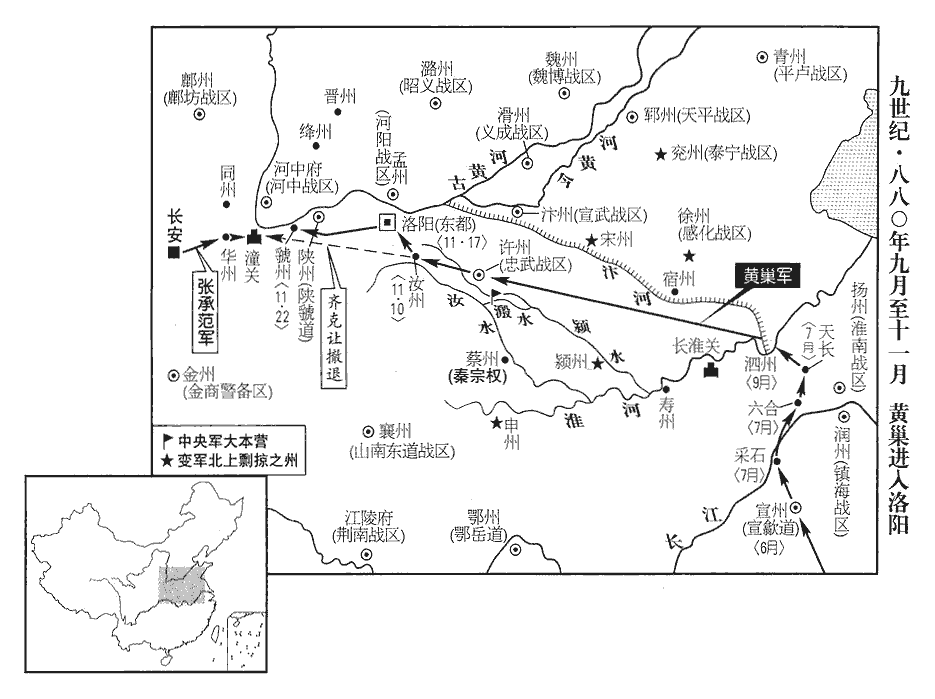
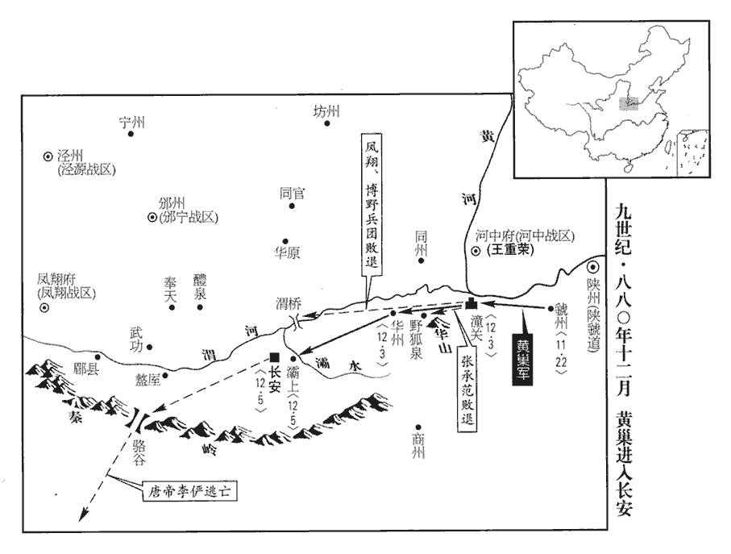
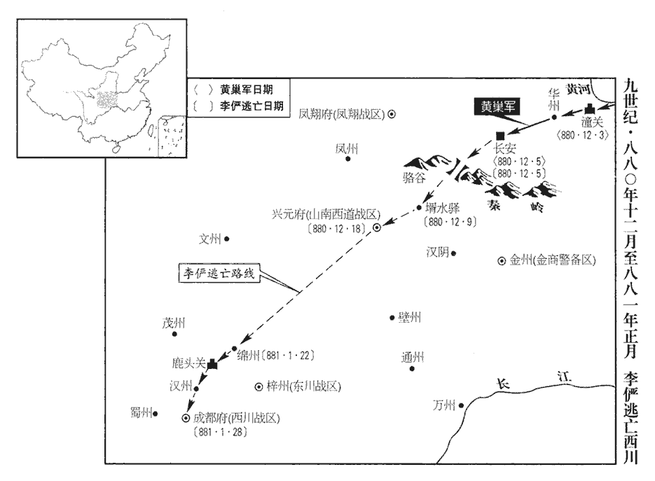
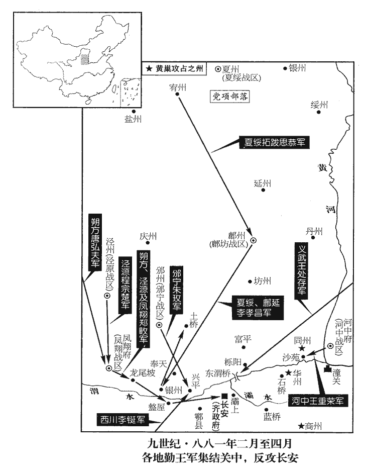
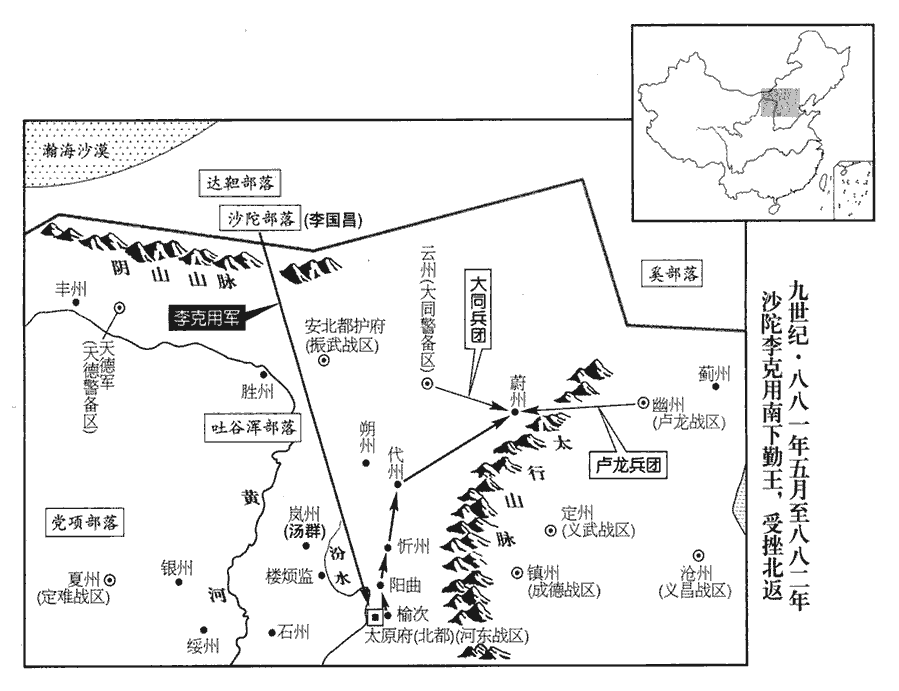
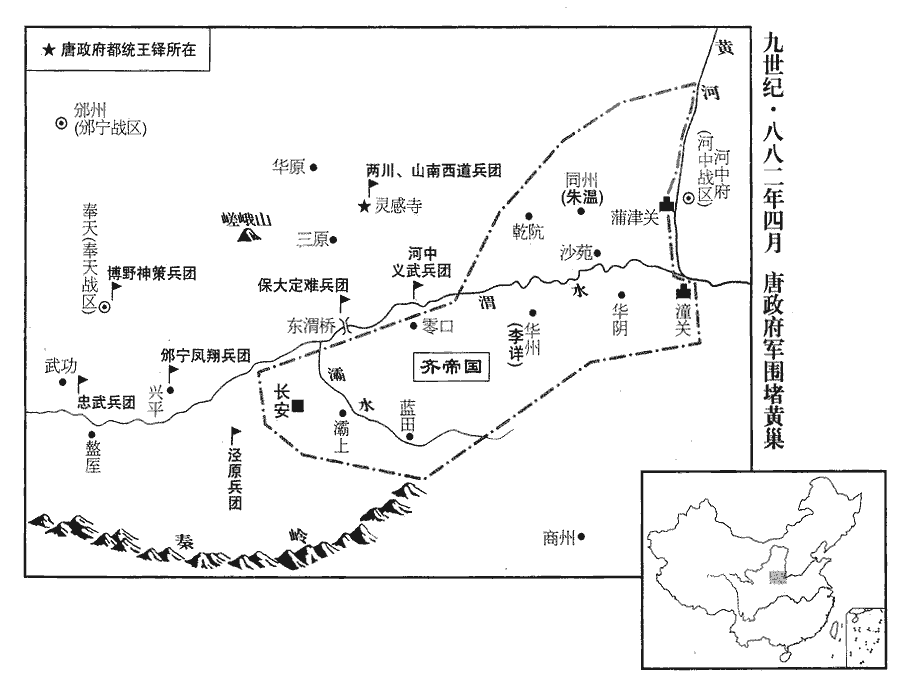

 唐紀七十起上章困敦（庚子）十一月，盡玄黓攝提格（壬寅）四月，凡一年有奇。

# 僖宗惠聖恭定孝皇帝中之上

## 廣明元年（庚子、八八零）

1十一月，河中‹总部设河中府山西省永济市›都虞候王重榮作亂，剽掠坊市俱空。重，直龍翻。剽，匹妙翻。

〖译文〗 [1]十一月，唐河中都虞侯王重荣兴兵作乱，四乱抢劫，河中坊市被抢夺一空。

2宿州刺史劉漢宏怨朝廷賞薄，漢宏降見上卷七月。賞盜而盜怨其賞薄，彼固有以窺朝廷也。甲寅‹四›，以漢宏為浙東‹首府设越州浙江省绍兴市›觀察使。為漢宏為錢鏐所滅張本。

〖译文〗 [2]唐宿州刺史刘汉宏抱怨朝廷给他的赏赐太轻薄，甲寅（初四），朝廷任命刘汉宏为浙东观察使。

3詔河東節度使鄭從讜以本道兵授諸葛爽及代州刺史朱玫，使南討黃巢。玫，莫杯翻。乙卯‹五›，以代北‹山西省北部›都統李琢為河陽‹总部设孟州河南省孟州市›節度使。代北已定，李琢內徙，亦以備黃巢也。

〖译文〗 [3]唐僖宗下诏。令河东节度使郑从谠将所率本道军队授予诸葛爽及代州刺史朱玫，让他们率领南下攻讨黄巢。乙卯（初五），任命代北都统李琢为河阳节度使。

4初，黃巢將渡淮，豆盧瑑zhuàn請以天平節鉞授巢，黃巢初求天平節，豆盧瑑欲以是中其欲。俟其到鎮討之。盧攜曰：「盜賊無厭，厭，於鹽翻。雖與之節，不能止其剽掠，剽，匹妙翻。不若急發諸道兵扼泗州，汴州‹河南省开封市›節度使為都統，賊既前不能入關‹长淮关·安徽省蚌埠市东›，必還掠淮、浙‹钱塘江›，偷生海渚耳！」從之。既而淮北相繼告急，攜稱疾不出，考異曰：驚聽錄曰：「宰臣豆盧瑑奏：『緣淮南九驛便至泗州，恐高駢固守城壘，不遮截大寇；黃巢必若過淮，落寇之計。又徵兵不及，須且誘之，請降節旄，授鄆州節度使，候其至止，討亦不難。』宰臣盧攜言之不可，奏以『黃巢為國之患久矣，昨與江西節制，擁節而行，攻劫荊南。卻奪其節，但徵諸道驍勇，把截泗州，』因此不發內使，罷建雙旌，乃發使臣諸道而去。尋汴州、徐州兩道告急到京，報黃巢過淮，盧攜託疾不出。」按朝廷未嘗以江西節與巢，借使與之，安可復奪！此驚聽錄不足信也。京師大恐。庚申‹十›，東都奏黃巢入汝州境。

〖译文〗 [4]起初，黄巢将军要率领军队北渡淮河，唐宰相豆卢请求唐僖宗将天平节度使的节授予黄巢，待黄巢到镇上任时，再行攻讨。宰相卢携说：“盗贼们都是贪得无厌，虽然给黄巢节，也未必能制止他四处剽掠，不如赶快调发诸道军队扼守泗州，任命汴州节度使为都统，率大军阴击黄巢贼众。黄巢既往前不能进入关中，必定转而攻掠淮、浙一带，逃至大海中去偷生！”唐僖宗听后表示同意。谁知不久淮北诸州相继来使告急，卢携知道情势不妙，于是宣称有疾病，而不再上朝议政，京师长安上下一片恐慌。庚申（十日），东都送来奏状，声称黄巢已攻入汝州境内。

5辛酉‹十一›，以王重榮權知河中留後，以河中節度使同平章事李都為太子少傅。以王重榮作亂不能制，故召李都，以河中授之。

〖译文〗 [5]辛酉（十一日），朝廷命王重荣暂时充任河中镇留后，而以河中节度使、同平章事李都为太子少傅，召回京师。

6汝、鄭‹河南省郑州市›把截制置都指揮使齊克讓奏黃巢自稱天補大將軍，轉牒諸軍，云，「各宜守壘，勿犯吾鋒！吾將入東都，即至京邑，自欲問罪，無預眾人。」言自欲問罪於朝廷，於眾人無預也。上召宰相議之。豆盧瑑、崔沆請發關內‹潼关以西›諸鎮及兩神策軍守潼關‹陕西省潼关县›。壬戌‹十二›，日南至。上開延英，對宰相泣下。大盜將至，無以禦之，君相相對灑泣，果何益哉！觀軍容使田令孜奏：「請選左右神策軍弓弩手守潼關，臣自為都指揮制置把截使。」上曰：「侍衛將士，不習征戰，恐未足用。」令孜曰：「昔安祿山搆逆，玄宗‹李隆基›幸蜀以避之。」崔沆曰：「祿山眾纔五萬，比之黃巢，不足言矣。」豆盧瑑曰：「哥舒翰以十五萬眾不能守潼關，事見玄宗、肅宗紀。今黃巢眾六十萬，而潼關又無哥舒之兵。若令孜為社稷計，三川帥臣皆令孜腹心，謂陳敬瑄、楊師立、牛勗也。帥，所類翻。比於玄宗則有備矣。」上不懌，僖宗雖曰童昏，此時此意，豈不知高枕京邑之為樂，越在草莽之為可憂也哉！禍至而後憂之，則無及矣。古之明主居安而思危，所以能常有其安也。謂令孜曰：「卿且為朕發兵守潼關。」為，于偽翻。是日，上幸左神策軍，親閱將士。令孜薦左軍馬軍將軍張承範、右軍步軍將軍王師會、左軍兵馬使趙珂。珂，丘何翻。上召見三人，見，賢遍翻。以承範為兵馬先鋒使兼把截潼關制置使，師會為制置關塞糧料使，珂為句當寨柵使，句，古候翻。當，丁浪翻。令孜為左右神策軍內外八鎮及諸道兵馬都指揮制置招討等使，飛龍使楊復恭為副使。

〖译文〗 [6]汝郑把截制置都指挥使齐克让向朝廷奏称：黄巢已自称天补大将军，并写牒文转送给唐诸镇军，宣称：“你们应各自据守自己的城垒，不要阻犯我军的兵锋！我将亲率大军攻入东都，接着攻入京师，向朝廷问罪，与你们没有关系。”唐僖宗将宰相们召到内殿商议对策。豆卢、崔沆建议调发在关内的诸藩镇军及左、右神策军去拒守潼关。壬戍（十二日），冬至，唐僖宗开延英殿最高决策会议，由于找不到御敌良策，竟对着宰相们流泪。观军容使宦官田令孜奏称：“请皇上选左、右神策军中的弓弩手去守潼关，我亲自任都指挥制置把截使，前去拒敌。”唐僖宗回答说：“禁军侍卫将士，久不习征战，恐怕未必能派上用场。”田令孜说：“过去安禄山判乱时，玄宗去四川避难。”崔沆说：“过去安禄山部众只有五万人，无法和黄巢相比。”豆卢说：“先前哥舒翰率领十五万大军尚不能把守潼关，今天黄巢贼众有六十万，而潼关又没有象哥舒翰当年那样强大的军队。如果说田令孜真为大唐社稷考虑的话，蜀中三川帅臣陈敬、杨师立、牛勖倒都是田令孜的心腹，可以往西川躲避，这比起唐玄宗时的情况来，当然可以说是有备无患了。”唐僖宗听后很不高兴，对田令孜说：“请你且为朕调发军队，去潼关拒守。”这一天，唐僖宗来到左神策军军营，亲自视察将士。田令孜又向唐僖宗推荐左神策军马军将军张承范、右神策军步军将军王师会、左神策军兵马使赵珂。唐僖宗于是召见三人，任命张承范为兵马先锋使兼把截潼关制置使，王师会为制置关塞粮料使，赵珂为勾当寨栅使，并任命田令孜为左、右神策军内外八镇及诸道马都指挥制置招讨等使，飞龙使杨复恭被任命为副使。

癸亥‹十三›，齊克讓奏：「黃巢已入東都境，臣收軍退保潼關，於關外置寨。將士屢經戰鬬，久乏資儲，州縣殘破，人煙殆絕，東西南北不見王人，凍餒交逼，兵械刓wán弊，刓，吾官翻，鈍也。各思鄉閭，恐一旦潰去，乞早遣資糧及援軍。」上命選兩神策弩手得二千八百人，令張承範等將以赴之。將，即亮翻。

〖译文〗 癸亥（十三日），齐克让向朝廷上奏：“黄巢贼众已进入东都，我收集散兵退到潼关继续进行抵抗，驻扎在潼关之外设置营寨。我部战士经过多次战斗，缺乏战备物质已经很久，关东州县残破不堪，人烟几乎继绝，东西南北四方不见大唐朝廷管辖下的人。官军饥寒交迫，兵械军器又钝又劣，士兵们各自思念故乡闾里，恐怕很容易溃散，乞请朝廷尽早运送资粮和援军。”唐僖宗命令选拔左、右神策军弓弩手共得二千八百人，令张承范等将率领以赴潼关。

丁卯‹十七›，黃巢陷東都，留守劉允章帥百官迎謁；巢入城，勞問而已，帥，讀曰率。勞，力到翻。閭里晏然。允章，迺nǎi之曾孫也。劉迺見二百三十卷德宗興元元年。允章可謂忝厥祖矣。田令孜奏募坊市人數千以補兩軍。

〖译文〗 丁卯（十七日），黄巢军攻陷东都，唐东都留守刘允章率领百官迎拜；黄巢大军入城，对城中百姓劳问而已，坊里和平常一样，人民生活正常。刘允章是刘的曾孙。田令孜上奏请召募长安坊市居民数千人以补充左、右神策军。

辛未‹二十一›，陝州‹河南省三门峡市›奏東都已陷。壬申‹二十二›，以田令孜為汝‹河南省汝州市›、洛‹河南省洛阳市›、晉‹山西省临汾市›、絳‹山西省新绛县›、同‹陕西省大荔县›、華‹陕西省华县›都統，將左、右軍東討。左、右神策軍。陝，失冉翻。華，戶化翻。是日，賊陷虢州‹河南省灵宝市›。九域志：虢州東北至陝州八十五里。

〖译文〗 辛未（二十一日），陕州地方官向朝廷上奏，告东都已陷落。壬申（二十二日），唐僖宗任命田令孜为汝、洛、晋、绛、同、华等州都统，率领左、右神策军出发东讨黄巢。这一天，黄巢军攻陷虢州。

7以神策將羅元杲為河陽節度使。羅元杲亦田令孜之腹心。

〖译文〗 [7]朝廷任命神策军将领罗元杲为河阳节度使。

8以周岌為忠武節度使。周岌既殺薛能，遂以忠武節授之。岌，逆及翻。初，薛能遣牙將上蔡‹河南省上蔡县›秦宗權調發至蔡州‹河南省汝南县›，調，徒弔翻。自元和末，廢彰義軍，以蔡州屬忠武軍，故得而調發之。聞許州亂，託云赴難，難，乃旦翻。選募蔡兵，遂逐刺史，據其城。及周岌為節度使，即以宗權為蔡州刺史。為秦宗權以蔡州稱兵僭號張本。

〖译文〗 [8]又任命周岌为忠武军节度使。起初，薛能派遣其牙将上蔡人秦宗权调发军队到蔡州，闻知许州发生军乱，托言赴难，选募蔡州人为兵，于是驱逐蔡州刺史，占据蔡州城。这时周岌为忠武军节度使，当即任命秦宗权为蔡州刺史。

 

9乙亥‹二十五›，張承範等將神策弩手發京師。將，即亮翻。神策軍士皆長安富家子，賂宦官竄名軍籍，厚得稟賜，稟，給也。稟賜，猶言給賜也。但華衣怒馬，怒馬者，鞭之以發其怒而疾馳也。憑勢使氣，未嘗更戰陳；更，工衡翻。陳，讀曰陣。聞當出征，父子聚泣，多以金帛雇病坊貧人代行，唐置病坊於京城以養病人。會要：開元五年，宋璟等奏：「悲田病坊，從長安已來置使專知，乞罷之。」至二十二年，京城乞兒有疾病，分置諸寺病坊。至德二年，兩京市各置普救病坊。病坊之置，其來久矣。往往不能操兵。操，七刀翻。是日，上御章信門樓臨遣之。考異曰：新傳曰：「帝餞令孜章信門，賚遺豐優。」按令孜雖為招討都統，賜節賚物，其實不離禁闥，是日所遣者承範等耳。新傳云餞令孜，誤也。承範進言：「聞黃巢擁數十萬之眾，鼓行而西，齊克讓以飢卒萬人依託關外，復遣臣以二千餘人屯於關上，又未聞為饋餉之計，以此拒賊，臣竊寒心。願陛下趣諸道精兵早為繼援。」趣，讀曰促。上曰：「卿輩第行，兵尋至矣！」丁丑‹二十七›，承範等至華州。會刺史裴虔餘徙宣歙‹首府设宣州安徽省宣州市›觀察使，軍民皆逃入華山‹西岳·陕西省华阴市南›，城中索然，華，戶化翻。索，昔各翻。州庫唯塵埃鼠迹，賴倉中猶有米千餘斛，軍士裹三日糧而行。

〖译文〗 [9]乙亥（二十五日），张承范等率领神策军弓弩手自京师出发，神策军士兵都是长安富家子弟，贿赂宦官而挂名于军籍，以获得优厚的赐给，但这些人平时穿着华丽的衣服，骑着快马疾驰，凭借宦官的势力气焰嚣张，却从未参加过战阵；听说要上前线，父子相聚抱头大哭，许多人用金帛雇佣居住在病坊的贫苦人代行，这些人往往不能操持兵器。这一天，唐僖宗登上章信门楼遣送征人出发，张承范向唐僖宗进言：“听说黄巢拥兵数十万，战鼓咚咚向西涌来，齐克让仅率领饥饿不堪的士卒万人在潼关外拒敌，今天又派遣我率二千余军队驻屯于潼关上，也没有听到为我们调拨粮饷的议论，就这样让我们去抗拒强敌，实在令我寒心。希望陛下调集诸道精兵尽早我们的后援。”唐僖宗回答说：“你们先行一步，随后援兵将至！”丁丑（二十七日），将承范等率军赶到华州。正值华州刺史裴虔馀迁任宣歙观察使，军民全都逃入华山，城中空荡荡的，州库只剩下尘埃鼠迹，幸运的是粮仓中仍有米千余斛，军士们带上三天的粮食再上征程。

十二月，庚辰朔‹一›，承範等至潼關，搜菁jīng中，菁中，草茂密處也。史炤曰：林菁。得村民百許，使運石汲水，為守禦之備；與齊克讓軍皆絕糧，士卒莫有鬬志。是日，黃巢前鋒軍抵關下，白旗滿野，不見其際，克讓與戰，賊小卻，俄而巢至，舉軍大呼，聲振河、華。呼，火故翻。華，戶化翻。華山臨河。言黃巢軍聲之盛，撼振河山也。克讓力戰，自午至酉始解，士卒飢甚，遂諠譟，燒營而潰，克讓走入關。關左有谷，平日禁人往來，以榷征稅，榷，訖岳翻。謂之「禁阬」。賊至倉猝，官軍忘守之，忘，巫放翻。潰兵自谷而入，谷中灌木壽藤茂密如織，灌木，叢生之木。壽藤，即今之萬歲藤。一夕踐為坦塗。承範盡散其輜囊以給士卒，輜囊，謂輜重、囊橐也。輜重，隨軍之物。囊橐，私裝也。遣使上表告急，稱：「臣離京六日，離，力智翻。甲卒未增一人，餽餉未聞影響。到關之日，巨寇已來，以二千餘人拒六十萬眾，外軍飢潰，蹋開禁阬。蹋，與踏同。臣之失守，鼎鑊甘心；朝廷謀臣，愧顔何寄！或聞陛下已議西巡，謂議幸蜀。苟鑾輿一動，則上下土崩。臣敢以猶生之軀奮冒死之語，願與近密及宰臣熟議，【章：十一行本「議」下有「未可輕動」四字；乙十一行本同；孔本同；張校同。】近密，謂兩中尉、兩樞密。急徵兵以救關防，則高祖‹李渊›、太宗‹李世民›之業庶幾猶可扶持，幾，居依翻。使黃巢繼安祿山之亡，微臣勝哥舒翰之死！」

〖译文〗 十二有，庚辰朔（初一），张承范等率军赶到潼关，在青草茂密处搜得村民一百来人，即让他们为役运石汲水，作守城的准备。这时张承范军与齐克让军都已绝粮，士卒个个都没有斗志。这一天，黄巢军的前锋进抵潼关城下，白旗遍布山野，一望无际，齐克让率军出战，黄巢军小败，接着黄巢率大军赶到，全军大声呐喊，声音震撼黄河、华山。齐克让备力拼战，自午时至酉时才停战，这时士卒已饿极了，于是呼喊喧闹着把营寨烧毁，溃散而去，齐克让也走入潼关。潼关边有山谷，平时禁止人在谷中往来，以便榷征商税，人们称此谷为“禁坑”。黄巢大军来得仓促，官军猝不及防，溃兵自山谷而入禁坑，里面灌木长藤茂密犹如蜘蛛网，一夕之间踏成一条平坦的大道。张承范将辎重和私囊全部散发给士卒，派人上表朝廷告急，表称：“我率军离京六天，士卒没有增加一人，军饷更连影也未见到。到潼关之日，黄巢巨寇已来关下，我以二千余人抗拒六十万敌众，在关外的齐克让军因饥饿而溃散，踏开禁坑。我如果将潼关失守，就是处以投身油锅的极刑也心甘情愿；但是朝廷宰相谋臣，羞愧之颜又寄托于何处！听人说陛下已经议论要西巡至蜀中，而如果陛下的金銮轿子一动，恐怕朝廷上下将士崩瓦解。我敢在战死之前，以尚存一刻的身躯，大胆说几冒死话，希望陛下与亲近宦官及宰相大臣深思熟虑，紧急征兵来救援潼关的关防，如果潼关能守，我大唐高祖、太宗创立的基业或许还可以扶持，使黄巢步安禄山的后尘遭到灭亡，而微臣我战死了也比哥舒翰要强！”

辛巳‹二›，賊急攻潼關，承範悉力拒之，自寅及申，關上矢盡，投石以擊之。關外有天塹，賊驅民千餘人入其中，掘土填之，塹，七豔翻。掘，其月翻。填，亭年翻。須臾，即平，引兵而度。夜，縱火焚關樓俱盡。承範分兵八百人，使王師會守禁阬，比至，比，必利翻。賊已入矣。壬午‹三›旦，賊夾攻潼關，關上兵皆潰，師會自殺，承範變服帥餘眾脫走。至野狐泉‹陕西省华阴市西南›，遇奉天‹陕西省乾县›援兵二千繼至，承範曰：「汝來晚矣！」博野、鳯翔軍還至渭橋‹中渭桥·陕西省咸阳市东›，博野軍，即穆宗長慶二年李寰帥以歸京師之兵也，見二百四十二卷。帥，讀曰率。見所募新軍衣裘温鮮，新軍，即田令孜所募坊市人以補兩軍者也。怒曰：「此輩何功而然，我曹反凍餒！」遂掠之，更為賊鄉導鄉，讀曰嚮。以趣長安。趣，七喻翻。

〖译文〗 辛巳（初二），黄巢军猛攻潼关，张承范竭尽全力进行抵抗，自寅时到申时，关上官军弓箭已无矢可射，于是用石头投向黄巢军，潼关外有壕沟，黄巢军驱赶平民千余人来壕中，掘土将壕沟填上，不一会儿，即将壕沟填平。于是，黄巢军渡过壕沟。入夜，纵火将关楼全部焚烧干净。张承范于是分八百士兵，交王师会，令他拒守禁坑，当王师会率军赶到禁坑时，黄巢军已经通过。壬午（初三）早晨，黄巢军夹攻潼关，关上唐守军全部溃散，王师会自杀，张承范身穿便服率领残余士兵逃脱回到长安，行至野狐泉，遇到相继到来的奉天援兵二千人，张承范对他们说：“你们来晚了！”于是退还。博野镇和凤翔镇的军队退至渭桥，见田令孜所召募的新军穿着新衣皮裘，十分愤怒，说：“这些家伙有什么功劳能穿上这样好的衣，我们殊死拼战反倒受冻挨饿！”于是抢劫新军，并为黄巢军作向导，往长安进发。

賊之攻潼關也，朝廷以前京兆尹蕭廩為東道轉運糧料使；廩稱疾，請休官，貶賀州‹广西贺县›司戶。賀州，漢蒼梧郡之臨賀縣，吳置臨賀郡，唐置賀州，京師東南四千一百三十里。

〖译文〗 黄巢军进攻潼关时，朝廷任命前京兆尹萧廪为东道转运粮料使。萧廪不敢当，称病请求退休，结果被贬为贺州司户。

黃巢入華州‹陕西华县›，留其將喬鈐守之。鈐qián，其廉翻。河中留後王重榮請降於賊。降，戶江翻。癸未‹四›，制以巢為天平節度使。

〖译文〗 黄巢率军攻入华州，留部将乔钤据守。唐河中留后王重荣向黄巢请降。癸未（初四），唐僖宗颁下诏制，给予黄巢天平节度使的官职。

甲申‹五›，以翰林學士承旨、尚書左丞王徽為戶部侍郎，翰林學士、戶部侍郎裴澈為工部侍郎，並同平章事。以盧攜為太子賓客、分司。田令孜聞黃巢已入關，恐天子責己，乃歸罪於攜而貶之，薦徽、澈為相。是夕，攜飲藥死。澈，休之從子也。裴休見二百四十九卷宣宗大中六年。

〖译文〗 甲申（初五），唐僖宗任命翰林学士承旨、尚书左丞王徽为户部侍郎，任翰林学士、户部侍郎裴澈为工部侍郎，二人都为同平章事。贬宰相卢携为太子宾客、分司东都。田令孜听说黄巢率大军已进入关中，恐怕天下人追究自己的责任，于是归罪于卢携，而将他贬官，荐举王徽、裴澈为宰相。这天傍晚，卢携喝毒药自杀身亡。裴澈是裴休的侄子。

百官退朝，聞亂兵入城，布路竄匿。布路，分路也。朝，直遙翻。令孜帥神策兵五百奉帝自金光門出，帥，讀曰率；下同。長安城西面三門，北來第一門曰開遠門，第二門曰金光門，第三門曰延平門。惟福、穆、澤、壽四王及妃嬪數人從行，從，才用翻；下皆同。百官皆莫知之。上奔馳晝夜不息，從官多不能及。車駕既去，軍士及坊市民競入府庫盜金帛。

〖译文〗 百官退出朝堂，听说乱兵已入长安城，分路躲藏。田令孜率领神策军士兵五百人护卫着唐僖宗自金光门出城，只有福王、穆王、泽王、寿王等四王及几个妃嫔随銮驾而去，百官竟无人知晓，不知皇帝去向。唐僖宗昼夜不停地奔驰，随从安员大多跟不上。唐僖宗的车驾既已远去，长安城中的军士及坊市百姓争先恐后地闯入皇家府库盗取金帛。

晡時，黃巢前鋒將柴存入長安，金吾大將軍張直方帥文武數十人迎巢於霸上‹陕西省西安市东灞河畔›。巢乘金裝肩輿，其徒皆被髮，約以紅繒，衣錦繡，執兵以從，甲騎如流，輜重塞塗，被，皮義翻。衣，於既翻。騎，奇寄翻。重，直龍翻。塞，悉則翻。千里絡繹不絕。民夾道聚觀，尚讓歷諭之曰：「黃王起兵，本為百姓，為，于偽翻。非如李氏不愛汝曹，汝曹但安居無恐。」巢館于田令孜第，其徒為盜久，不勝富，館，古玩翻。勝，音升。見貧者，往往施與之。施，式豉翻。居數日，各出大掠，焚市肆，殺人滿街，巢不能禁；尤憎官吏，得者皆殺之。

〖译文〗 临近傍晚时，黄巢部下前锋将柴存进入长安城，唐金吾大将军张直方率文武官数十人往霸上迎接黄巢。黄巢坐着用黄金装饰的轿子，其部下全都披着头发，穿着红丝锦绣衣裳，手持兵器跟从着，铁甲骑兵行如流水，辎重车辆塞满道路，大军延绵千里络绎不绝。长安居民夹道聚观，尚让挨个向士民们宣谕说：“我黄王起兵，本为了百姓！不象唐朝李氏皇帝不爱你们，你们只管安居乐业，不要恐慌。”黄巢住宿于田令孜的家，其部下将士为盗贼既久，极为富有，看到贫穷的人，往往施舍财物。但居住几天以后，又各自出来大肆抢动劫，梦烧坊市，到处杀人，使死尸满街，黄巢无法禁上。黄巢部下尤其憎恨唐朝官吏，凡抓获到的全部杀死。

 

10上趣駱谷‹陕西省周至县西南›，趣，七喻翻。鳳翔節度使鄭畋謁上於道次，考異曰：續寶運錄：「戊子，帝至駱谷壻水驛，乃下詔與牛勗、楊師立、陳敬瑄，云今月七日，已次駱谷壻水驛。」按此月庚辰朔，戊子九日，而詔云七日，「九」誤為「七」也。實錄：「辛卯，車駕次鳳翔，鄭畋候謁於路。」舊畋傳云候駕於斜谷。新紀：「辛卯，次鳳翔。丁酉，至興元。」按甲申上離長安，辛卯始次鳳翔，太緩，丁酉已至興元，太速。又路出駱谷則不過鳳翔及斜谷。蓋車駕涉鳳翔之境，而畋往見耳，非鳳翔與斜谷也。實錄：「賊以數萬眾西追車駕。」而不言追不及，又不言為誰所拒而還。諸書皆無之。今不取。請車駕留鳳翔。上曰：「朕不欲密邇巨寇，且幸興元‹陕西省汉中市›，徵兵以圖收復。卿東扞賊鋒，西撫諸蕃，糾合鄰道，勉建大勳。」畋曰：「道路梗澁，奏報難通，請得便宜從事。」許之。戊子‹九›，上至壻水‹汉水支流，流经陕西省洋县西北›，九域志：洋州興道縣有壻水鎮，相傳云仙人唐公昉盡室升天，其壻不得偕升，遂以名水；誕矣。詔牛勗、楊師立、陳敬瑄，諭以京城不守，且幸興元，若賊勢猶盛，將幸成都，宜豫為備擬。

〖译文〗 [10]唐僖宗向骆谷奔逃，凤翔节度使郑畋于道旁拜谒，请求唐僖宗的车驾留在凤翔。唐僖宗对郑畋说：“朕不愿距强大的贼寇太近，暂且到兴元，征发天下兵以图收复京师。你留在这里东拒贼军的兵锋，西向招抚诸蕃族，纠合邻道的军队，尽最大努力建立丰功伟业。”郑畋回奏说：“这一带道路堵塞，有事向陛下上奏报告难以通达，请求给我便宜从事的权力。”唐僖宗当即表示同意。戊子（初九），唐僖宗奔至婿水，颁下诏书给牛勖、杨师立、陈敬，告谕京城已为黄巢贼寇攻陷，皇帝车驾暂时留居兴元，如果黄巢贼军势力仍然强盛，车驾将行幸成都，请他们预先作好迎驾的准备。

庚寅‹十一›，黃巢殺唐宗室在長安者無遺類。辛卯‹十二›，巢始入宮。壬辰‹十三›，巢即皇帝位于含元殿，畫皁繒為袞衣，擊戰鼓數百以代金石之樂。登丹鳳樓，下赦書；國號大齊，改元金統。謂廣明之號，去唐下體而著黃家日月，以為己符瑞。著，側略翻。言「唐」字去「丑」「口」而著「黃」字為「廣」字，合「日」「月」為「明」字也。唐官三品以上悉停任，四品以下位如故。以妻曹氏為皇后。考異曰：實錄、巢傳，立妻曲氏為皇后。今從新傳。以尚讓為太尉兼中書令，趙璋兼侍中，崔璆qiú、楊希古並同平章事，孟楷、蓋洪為左右僕射、知左右軍事，蓋，古盍翻。黃巢自以其軍分左右耳。費傳古為樞密使。費，父沸翻，姓也。以太常博士皮日休為翰林學士。陸游老學菴筆記曰：該聞錄言皮日休陷黃巢為翰林學士，巢敗，被誅；今唐書取其事。按尹師魯作大理寺丞皮子良墓誌稱：「曾祖日休，避廣明之難，徙藉會稽，依錢氏，官太常博士，贈禮部尚書。祖光業，為吳越丞相。父璨，為元帥府判官。三世皆以文雄江東。」據此，則日休未嘗陷黃巢為其翰林學士被誅也。小說謬妄，無所不有。師魯文章傳世，且剛正有守，非欺後世者。璆，邠之子也，【嚴改「邠」爲「郾」】崔邠，郾之兄也，德宗朝為右補闕，嘗論裴延齡，有直聲。「子」恐當作「孫」。時罷浙東觀察使，在長安，巢得而相之。璆之在浙東也，固與巢信使往來，又為之表奏朝廷。

〖译文〗 庚寅（十一日），黄巢将留在长安的唐朝宗室全部杀光，一个不剩。在黑色丝织物上作画，辛卯（十二日），黄巢始入居禁宫。壬辰（十三日），黄巢称帝，在含元殿即皇帝位，作天子礼服，敲响数百只战鼓替代金石音乐，作为登基之礼。黄巢登上丹凤楼，颁下赦书：定国号为大齐，改年号为金统。宣称当朝年号明是“唐”字去“”而留“广”，“广”字加“黄”字为“”，再将日、月合并为“明”字，指的是黄家日月，认为这正是自己将当皇帝的符瑞。黄巢又发布命令，凡唐朝三品以上官员全部停任，四品以下官员保留官位如故。又册立其妻子曹氏为皇后。任命尚让为太尉兼中书令，赵璋为兼侍中，崔、杨希古并为同平章事，孟楷、盖洪为左右仆射、知左右军事，费传古为枢密使。又任命太常博士皮日休为翰林学士。崔即崔的儿子，当时正罢去浙东观察使的官职，居住在长安，被黄巢俘获而任为宰相。

諸葛爽以代北行營兵屯櫟陽‹陕西省临潼县北栎阳镇›，黃巢將碭山‹安徽省砀山县›朱溫屯東渭橋‹陕西省高陵县南›，碭山，在漢碭縣界，後魏置安陽縣，治麻城，隋開皇十八年改名碭山，唐屬宋州。九域志：在單州東南九十里。碭，徒郎翻。朱溫始此。巢使溫誘說之，說，式芮翻。爽遂降於巢。溫少孤貧，與兄昱、存隨母王氏依蕭縣‹安徽省萧县›劉崇家，崇數笞辱之，按五代史，溫凶悍無賴，崇患太祖慵惰不作業，數笞責之。獨崇母憐之，時時自為櫛沐，戒家人曰：「朱三非常人也，宜善遇之。」數，所角翻。崇母獨憐之，戒家人曰：「朱三非常人也，汝曹善遇之。」朱溫第三。巢以諸葛爽為河陽節度使，爽赴鎮，羅元杲發兵拒之，士卒皆棄甲迎爽，元杲逃奔行在。

〖译文〗 唐将诸葛爽率领代北行营的军队屯驻于栎阳，黄巢部下大将砀山人朱温率军驻扎在东渭桥，黄巢让朱温游说诱降诸葛爽，于是诸葛爽向黄巢投降。朱温年少时失去父亲且贫困，与哥哥朱昱、朱存随母亲王氏依靠萧县刘崇家为生，刘崇多次鞭笞污辱朱温，只有刘崇的母亲可怜朱温，并告诫自家人说：“朱三不是平常人，你们要好好对待他。”诸葛爽既降于黄巢，被黄巢任命为河阳节度使，当诸葛爽回到河阳之时，将军罗元杲调军队抗拒，但罗元杲部下士卒都抛弃兵器迎接诸葛爽，罗元杲无奈，只好逃奔唐僖宗的所在行营。

 

11鄭畋還鳳翔，召將佐議拒賊，皆曰：「賊勢方熾，宜且從容以俟兵集，從，千容翻。從容，舒徐不迫之貌。言欲以緩圖之。乃圖收復。」畋曰：「諸君勸畋臣賊乎！」因悶絕仆地，甃zhòu傷其面，鄭畋以將佐怠於勤王，忠憤之氣一時鬱勃，至於悶絕而僵仆於地，故甃傷其面。甃，則救翻，甓pì也。自午至明旦，尚未能言。會巢使者以赦書至，監軍袁敬柔與將佐序立宣示，代畋草表署名以謝巢。監軍與巢使者宴，樂奏，將佐以下皆哭，使者怪之，幕客孫儲曰：「以相公風痹不能來，故悲耳。」痹，必至翻。民間聞者無不泣。畋聞之曰：「吾固知人心尚未厭唐，賊授首無日矣！」乃刺指血為表，遣所親間道詣行在，刺，七亦翻；下同。間，古莧翻。召將佐諭以逆順，皆聽命，復刺血與盟，復，扶又翻。然後完城塹，繕器械，訓士卒，密約鄰道合兵討賊，鄰道皆許諾發兵，會於鳳翔。時禁兵分鎮關中者尚數萬，禁兵分鎮關中，即神策八鎮兵也。聞天子幸蜀，無所歸，畋使人招之，皆往從畋，畋分財以結其心，軍勢大振。

〖译文〗 [11]唐凤翔节度使郑畋回到凤翔，召集部下将佐议论抗拒黄巢军，部将们都声称：“黄巢贼众的势力正强盛，应该缓慢地做好准备，等待各路军队聚集后，再图收复京师。”郑畋失望地说：“你们是否要劝我投降贼寇呢！”并因气愤而昏倒在地，被砖瓦碰伤脸部，从中午一直到第二天早上，都不能言语。恰巧黄巢派使者带着赦免诸军的赦书赶到，监军袁敬柔与众将佐对黄巢使者毕恭毕敬，并草写降书宣示于众，代郑畋署名，对黄巢的赦免表示感谢。监军袁敬柔为黄巢所派使者举行宴会，音乐奏起，将佐以下兵卒都失声痛哭；使者感到奇怪，节度使府幕客孙储解释说：“由于军府相公郑畋因病不能来参加宴会，所以大家感到悲痛。”民间百姓闻知后无不流泪。郑畋得知这些情况后说：“我为此知道天下人心尚未对大唐王朝感到厌恶，黄巢贼身首异地指日可待了！”于是刺破手指，用血书写表文，派遣自己亲信的人走小路赶到唐僖宗的行营，以表忠心。又召集部下将佐都谕以逆顺忠义的道理，部下官兵都表示愿意听命，再刺血与大家盟誓，然后将凤翔的城墙壕堑修复完好，将兵器军械修复完善，训练士卒，并秘密地约请邻道合兵攻讨黄巢，邻道也都许诺愿意发兵，一齐到凤翔会合。当时神策军八镇兵分别坐镇于关中的还有数万人，听说唐僖宗逃往西蜀，一时无所归从，郑畋派人往各军招抚，诸军都赴凤翔听从郑畋的调遣，郑畋于是将财产分给诸军，以连结诸军的心，于是军势大振。

12丁酉‹十八›，車駕至興元，詔諸道各出全軍收復京師。悉所統之軍皆行，謂之全軍。

〖译文〗 [12]丁酉（十八日），唐僖宗的车驾来到兴元，即向天下诸道颁发诏书，命令各道调发全军收复京师。

13己亥‹二十›，黃巢下令，百官詣趙璋第投名銜者，復其官。名銜，題官位姓名也。豆盧瑑、崔沆及左僕射于琮、右僕射劉鄴、太子少師裴諗shěn、御史中丞趙濛、刑部侍郎李漙tuán、京兆尹李湯扈從不及，匿民間，巢搜獲，皆殺之。廣德公主曰：「我唐室之女，誓與于僕射俱死！」執賊刃不置，賊并殺之。發盧攜尸，戮之於市。將作監鄭綦qí、庫部郎中鄭係義不臣賊，舉家自殺。唐屢更喪亂，至于廣明，舉家殉國猶不乏人，恩義有結之素也。左金吾大將軍張直方雖臣於巢，多納亡命，匿公卿於複壁；巢殺之。

〖译文〗 [13]己亥（二十日），黄巢颁布命令：唐朝百官到大齐宰相赵璋的宅第投报官位姓名者，可以恢复其官位。唐宰相豆卢、崔沆以及左仆射于琮、右仆射刘邺、太子少师裴谂、御史中丞赵、刑部侍郎李、京兆尹李汤由于来不及跟从唐僖宗出逃，留在长安，躲藏在民间，被黄巢军搜获，全部被杀死。广德公主说：“我是唐帝室之女，誓与于仆射同死！”抓住行刑队的刀不放手，被黄巢军一并杀死。黄巢军又发掘卢携的坟墓，将他的尸体放于街市砍杀。唐将作监郑綦、库部郎中郑系坚守臣节，不肯向黄巢军投诚，全家自杀。唐左金吾大将军张直方虽然投降于黄巢，但收容许多亡命之徒，将唐公卿大臣藏于私宅复壁中，被黄巢处死。

14初，樞密使楊復恭薦處士河間‹河北省河间市›張濬jùn，拜太常博士，處，昌呂翻。遷度支員外郎。黃巢逼潼關，濬避亂商山‹陕西省商州市东›。上幸興元，道中無供頓，漢陰‹陕西省汉阴县›令李康以騾負糗糧數百馱獻之，漢陰，漢中安陽縣地，晉武帝改為安康縣，唐至德二載更名漢陰縣，屬金州。九域志：在州西北一百六十五里。馱，徒何翻。以驢馬負物為馱。唐遞馱，每馱一百斤。從行軍士始得食。上問康：「卿為縣令，何能如是？」對曰：「臣不及此，乃張濬員外教臣。」上召濬詣行在，拜兵部郎中。唐諸司郎中，從五品上；員外郎，從六品上。

〖译文〗 [14]起初，唐枢密使杨复恭向唐舍宗荐举处士河间人张浚，唐僖宗拜张浚为太常博士，不久迁官为度支员外郎。黄巢率大军进逼潼关，张浚避乱于商山。唐僖宗逃往兴元，一路上没有人供给粮食，汉阴县令李康用骡子运粮数百驮献给行营，随从逃亡的军士才有饭吃。唐僖宗问李康：“你官仅至县令，怎么能想到这些？”李康回答说：“我实在想不到，是张浚员外教我这样干的。”唐僖宗于是召张浚到行营，拜为兵部郎中。

15義武節度使王處存聞長安失守，號哭累日，號，戶高翻。不俟詔命，舉軍入援，遣二千人間道詣興元衛車駕。

〖译文〗 [15]唐义武节度使王处存听说长安失守，痛哭了好几天，不等收到诏令，就派军队入援，调遣军队二千人走小道到达兴元，以护卫唐僖宗的车驾。

16黃巢遣使調發河中，調，徒釣翻。前後數百人，吏民不勝其苦。勝，音升。王重榮謂眾曰：「始吾屈節以紓軍府之患，屈節，謂臣賊也。紓，商居翻，緩也。今調財不已，又將徵兵，吾亡無日矣！不如發兵拒之。」眾皆以為然，乃悉驅巢使者殺之。巢遣其將朱溫自同州‹陕西省大荔县›，弟黃鄴自華州，合兵擊河中，重榮與戰，大破之，獲糧仗四十餘船，遣使與王處存結盟，引兵營於渭北。考異曰：舊王處存傳曰：「時李都守河中，降賊。會王重榮斬偽使，通使於處存，乃同盟誓，營於渭北。時巢賊僭號。天下藩鎮多受其偽命，惟鄭畋守鳳翔，鄭從讜守太原，處存、王重榮首倡義舉。俄而鄭畋破賊前鋒，王鐸自行在至，故諸鎮翻然改圖，以出勤王之師。」按鐸中和二年始至，於時未也。王重榮傳曰：「初，重榮為河中馬步都虞候，巢賊據長安，蒲帥李都不能拒，稱臣於賊，賊偽授重榮節度副使。重榮以賊徵求無已，欲拒之，都曰：『吾兵微力寡，絕之立見其患，願以節鉞假公。』翌日，都歸行在，重榮知留後事，乃斬賊使，求援鄰藩。」北夢瑣言曰：「重榮始為牙將，黃巢犯闕，元戎李都奉偽，畏重榮黨附者多，因薦為副使。一日，忽謂都曰：『令公助賊，陷一邦於不忠，而又日加箕斂，眾口紛紜，倐忽變生，何以遏也。』遽命斬其偽使。都無以對，因以軍印授重榮而去。及都至行在，朝廷又以前京兆尹竇潏yù間道至河中代都，重榮迎之。潏前為京兆尹，有慘酷之名，時謂之『垜疊』。及至，翌日，進軍校于庭，謂曰：『天子命重臣作鎮將，遏賊衝，安可輕議斥逐令北門出乎！且為惡者必一兩人而已，爾等可言之。』潏不知軍校皆重榮之親黨也，眾皆不對。重榮乃屏肅佩劍歷階而上，謂潏曰：『為惡者非我而誰！』遂召潏之僕吏控馬及階，請依李都前例，乃云『速去！』潏不敢仰視，躍馬復由北門而出。」新傳取之。按十一月辛亥朔，重榮已作亂，掠坊市。辛酉，以重榮為留後，都為太子少傅，則都已去河中矣。及黃巢犯闕，都何嘗奉偽，亦未嘗聞以潏代都。今不取。

〖译文〗 [16]黄巢派遣使者到河中调发兵粮，使者前后达数百人，河中吏民无法负担，苦不堪言。王重荣于是对部众说：“起初我屈节事贼，是想缓解军府的急患，如今黄巢来调财不已，又要征调士兵，我们早晚要死于他手，不如发兵抗拒黄巢。”部众都认为应加以抗拒，于是将黄巢派来的使节全部处死。黄巢派遣部将朱温从同州发兵，弟黄邺从华州发兵，两军会合进攻河中，王重荣出兵拒战，大破黄巢军，缴获粮食兵仗四十多船，又派遣使者与唐义武节度使王处存结盟，率领军队到渭北扎营。

17陳敬瑄聞車駕出幸，遣步騎三千奉迎，表請幸成都。時從兵浸多，興元儲偫zhì不豐，偫，丈里翻。田令孜亦勸上；上從之。

〖译文〗 [17]唐西川节度使陈敬闻知僖宗的车驾出幸兴元，派遣步兵和骑兵三千人来奉迎，上表请唐僖宗往成都暂住。当时随从车驾的军队渐渐增多，兴元的储粮不多，田令孜也劝唐僖宗出幸成都。唐僖宗表示同意。

## 中和元年（辛丑、八八一）是年七月方改元

1春，正月，車駕發興元‹陕西省汉中市›。加牛勗‹山南西道战区，总部兴元府›同平章事。陳敬瑄‹西川战区，总部设成都府四川省成都市›以扈從之人驕縱難制，從，才用翻。有內園小兒先至成都‹四川省成都市›，唐時給役於坊厩及內園者，皆謂之小兒。遊於行宮，笑曰：「人言西川是蠻，今日觀之，亦不惡！」敬瑄執而杖殺之，考異曰：新傳曰：「敬瑄殺五十人，尸諸衢。」錦里耆舊傳曰：「有內園小兒三箇連手行，遶行宮，數內一人笑云云。巡者亂打，執之。敬瑄咄之曰：『今日且欲棒殺汝三五十輩，必不令錯。』」按三五十輩者，敬瑄語也，非實殺五十人也。新傳誤。由是眾皆肅然。敬瑄迎謁於鹿頭關‹四川省德阳市北黄许镇›。辛未‹二十二›，上‹李俨，本年二十岁›至綿州‹四川省绵阳市›，東川‹总部设梓州四川省三台县›節度使楊師立謁見。東川治梓州，北至綿州一百六十八里。見，賢遍翻。壬申‹二十三›，以工部侍郎、判度支蕭遘同平章事。

〖译文〗 [1]春季，正月，唐僖宗的车驾自兴元出发。颁布命令加牛勖为同平章事。陈敬感到唐僖宗的扈从人员骄横而难以控制，有一长安禁宫内园中的小儿先期到达成都，在行宫游荡，笑着说：“人们说西川人是蛮人，今天看来，也不算恶！”陈敬将他逮捕并乱棒打死，于是扈从人员都肃然遵纪。陈敬赶到鹿头关迎接唐僖宗。辛未（二十二日），唐僖宗到达绵州，东川节度使杨师立来拜谒。壬申（二十三日），唐僖宗任命兵部侍郎、判度支萧遘为同平章事。

2鄭畋‹凤翔战区，总部设凤翔府陕西省凤翔县›約前朔方‹总部设灵州宁夏灵武市›節度使唐【章：十二行本「唐」作「田」；乙十一行本同；孔本同；退齋校同。】弘夫、涇原‹总部设泾州甘肃省泾川县›節度使程宗楚同討黃巢。巢遣其將王暉齎詔召畋，畋斬之，遣其子凝績詣行在，凝績追及上於漢州‹四川省广汉市›。自綿州西南至漢州一百九十里。

〖译文〗 [2]唐凤翔节度使郑畋约请前朔方节度使唐弘夫、泾原节度使程宗楚共讨黄巢。黄巢派遣部将王晖捧着诏书来招降郑畋，被郑畋斩首。郑畋又派遣其儿子郑凝绩到行营，郑凝绩赶到汉州追上唐僖宗的车驾。

3丁丑‹二十八›，車駕至成都，自漢州西南至成都八十五里。館於府舍。館，古玩翻。就西川府舍為行宮。

〖译文〗 [3]丁丑（二十八日），唐僖宗的车驾到达成都，在节度使府舍安歇。

4上遣【章：十二行本「遣」下有「中」字；乙十一行本同；孔本同；張校同。】使趣高駢‹淮南战区，总部设扬州江苏省扬州市›討黃巢，趣，讀曰促。道路相望，駢終不出兵。上至蜀，猶冀駢立功，詔駢巡內刺史及諸將有功者，自監察至常侍，聽以墨敕除訖奏聞。

〖译文〗 [4]唐僖宗派遣使者往淮南节度使高骈处催促他出兵讨伐黄巢，使者往来于道路，前后相望，但高骈始终不肯奉命出兵。唐僖宗来到成都，仍然寄希望于高骈能讨贼立功，颁下诏书给高骈，凡其巡辖境内的刺史及诸将领讨贼有功者，可用墨敕给予自监察御史到散骑常侍的官爵，先任命然后再向朝廷奏报。

5裴澈自賊中奔詣行在。時百官未集，乏人草制，右拾遺樂朋龜謁田令孜而拜之，由是擢為翰林學士。張濬先亦拜令孜。令孜嘗召宰相及朝貴飲酒，朝，直遙翻。濬恥於眾中拜令孜，乃先謁令孜謝酒。及賓客畢集，令孜言曰：「令孜與張郎中清濁異流，嘗蒙中外，中外，謂與之相表裹。既慮玷辱，何憚改更，更，工衡翻。今日於隱處謝酒則又不可。」濬慚懼無所容。

〖译文〗 [5]裴澈从黄巢贼众中逃奔到成都朝廷。当时朝廷百官未能会集，缺乏草写诏制的人才，右拾遗乐朋龟面见田令孜并下拜，于是被提拔为翰林学士。张浚起先也曾向田令孜下拜。田令孜曾经召集宰相及宦官权贵们一起饮酒，张浚感到在大庭广众面前向宦官田令孜下拜是件耻辱的事，于是在宴会前先拜见田令孜谢酒，及宾客全部来齐之时，田令孜说：“我田令孜与张郎中分属内外朝，清浊异流，今天共同敬酒，的确是愉快的事，朝官如果顾虑和宦官一起饮酒玷辱了身份，又何必要改时间于宴会前来谢酒呢？今天张郎中于隐蔽之处向我谢酒，这怎么可能以呢？”一番话说得张浚又惭愧又恐惧，满脸通红，无地自容。

6二月，乙【嚴：「乙」改「己」。】卯朔‹一›，以太子少師王鐸守司徒兼門下侍郎、同平章事。

〖译文〗 [6]二月，乙卯朔（初一），唐僖宗任命太子少师王铎守司徒兼门下侍郎、同平章事。

7丙申‹十八›，加鄭畋同平章事。

〖译文〗 [7]丙申（十八日），加给郑畋同平章事的官衔。

8加淮南‹总部设扬州江苏省扬州市›節度使高駢東面都統，加河東‹总部设太原府山西省太原市›節度使鄭從讜兼侍中，依前行營招討使。代北‹山西省北部›監軍陳景思考異曰：實錄作「景斯」，今從薛居正五代史。帥沙陀酋長李友金及薩葛、安慶、吐谷渾諸部入援京師。帥，讀曰率。酋，慈由翻。長，知兩翻。薩，桑葛翻。至絳州‹山西省新绛县›，將濟河；絳州刺史瞿稹，亦沙陀也，瞿，權俱翻。稹，止忍翻。謂景思曰：「賊勢方盛，未可輕進，不若且還代北募兵。」遂與景思俱還鴈門‹山西省代县西北›。

〖译文〗 [8]加淮南节度使高骈东面都统官衔，加河东节度使郑从谠兼侍中，先前所任行营招讨使依旧充任。唐代北监军陈景思率领沙陀族酋长李友金以及由萨葛、安庆、吐谷浑等部族人组成的军队向关中进发，入援京师。行至绛州，将要渡过黄河；绛州刺史翟稹也是沙陀族人，对陈景思说：“黄巢贼众势头正盛，你我所率军队兵员太少，不可轻易前进，不如暂且回到代北去召募兵员。”于是瞿稹会同陈景思一同回到雁门。

9以樞密使楊復光為京西南面行營都監。

〖译文〗 [9]唐僖宗任命枢密使杨复光为京西南面行营都监。

10黃巢以朱溫為東南面行營都虞候，將兵攻鄧州‹河南省邓州市›；三月，辛亥‹三›，陷之，執刺史趙戒，【章：十二行本「戒」作「戎」；乙十一行本同；孔本同；退齋校同。】因戍鄧州以扼荊‹湖北省江陵县›、襄‹湖北省襄樊市›。九域志：鄧州南至襄州一百八十里，襄州南至荊州四百五十七里。

〖译文〗 [10]黄巢任命朱温为东南面行营都虞候，率领军队进攻邓州；三月，辛亥（初三），朱温攻陷邓州，活捉邓州刺史赵戒，于是率军戍守邓州，以控扼荆州、襄州地区。

11壬子‹四›，加陳敬瑄同平章事。甲寅‹六›，敬瑄奏遣左黃頭軍使李鋋chán將兵擊黃巢。西川黃頭軍，崔安潛所置也，事始見上卷乾符六年。鋋，時延翻。

〖译文〗 [11]壬子（初四），唐僖宗加给陈敬同平章事的官衔。甲寅（初六），陈敬奏告唐僖宗，派遣左黄头军使李铤率领西川黄头军袭击黄巢军。

12辛酉‹十三›，以鄭畋為京城四面諸軍行營都統。賜畋詔：「凡蕃、漢將士赴難有功者，難，乃旦翻。並聽以墨敕除官。」畋奏以涇原節度使程宗楚為副都統，前朔方節度使唐弘夫為行軍司馬。黃巢遣其將尚讓、王播帥眾五萬寇鳳翔，「王播」，新書作「王璠」。畋使弘夫伏兵要害，自以兵數千，多張旗幟，疏陳於高岡。陳，讀曰陣。賊以畋書生，輕之，鼓行而前，無復行伍，行，戶剛翻。伏發，賊大敗於龍尾陂‹陕西省岐山县东›，新、舊書皆作「龍尾坡」，惟舊紀作「陂」。鳳翔府岐山縣，唐初治張堡，武德七年移治龍尾城，在平陽故城之東北。斬首二萬餘級，伏尸數十里。

〖译文〗 [12]辛酉（十三日），唐僖宗任命郑畋为京城四面诸军行营都统。又赐给郑畋诏书：“凡是我军队不管是蕃族，还是汉族的将士赴难讨贼有功者，都可以用墨敕先赏给他们官职。”郑畋上奏，请以泾原节度使程宗楚为副都统，并请任前朔方节度使唐弘夫为行军司马。这时，黄巢派遣其部将尚让、王播率领兵众五万余人进攻凤翔，郑畋布置唐弘夫在长安至凤翔路上的要害之处设下伏兵，自己率数千军队，举着许多旗帜，疏疏拉拉地于山岗高处布阵。黄巢军认为郑畋是一介书生，对他相当轻视，敲着战鼓蜂涌而进，军队没有队形，向前乱冲乱杀，一时唐伏兵四起，黄巢军大败于龙尾陂，被斩首者达二万余级，伏卧于地的尸体长达数十里。

13有書尚書省門為詩以嘲賊者，尚讓怒，應在省官及門卒，悉抉目倒懸之；抉，於決翻。大索城中能為詩者，索，山客翻。盡殺之，識字者給賤役，凡殺三千餘人。

〖译文〗 [13]有人在长安尚书省都堂官府大门上涂写诗句，嘲弄黄巢军，尚让见后勃然大怒，将当时在尚书省的官员和守门的士兵，全部挖去眼睛，头足倒悬挂于门前；又于长安城中大肆搜索能写诗的人，抓到的全部杀死，凡认识字的人均罚作贱役，所杀总计有三千余人。

14瞿稹、李友金至代州，募兵踰旬，得三萬人，皆北方雜胡，屯於崞‹山西省原平市北崞阳镇›西，代州崞縣之西也。崞，音郭。獷悍暴橫，獷，古猛翻。悍，下罕翻，又侯幹翻。橫，戶孟翻。稹與友金不能制。友金乃說陳景思曰：說，式芮翻。「今雖有眾數萬，苟無威信之將以統之，終無成功。吾兄司徒父子，勇略過人，為眾所服；驃騎誠奏天子赦其罪，召以為帥，李國昌以平龐勛功檢校司徒。驃騎，唐制武散階極品。唐自高力士以來，宦官多官至驃騎，故以稱景思。則代北之人一麾響應，狂賊不足平也！」景思以為然，遣使詣行在言之；詔如所請。友金以五百騎齎詔詣達靼迎之，李克用入達靼，見上卷廣明元年。李克用帥達靼‹瀚海沙漠南›諸部萬人赴之。考異曰：實録：「陳景斯齎詔入達靼召李克用，軍屯蔚州。克用因大掠雁門以北軍鎮。」薛居正五代史：「先是，景思與李友金發沙陀諸部五千騎南赴京師。友金，即武皇之族父也。中和元年二月，友金軍至絳州，將渡河，刺史瞿稹謂景思曰：『巢賊方盛，不如且還代北，徐圖利害。』四月，友金旋軍鴈門，瞿稹至代州，半月之間，募兵三萬，營於崞縣之西，其軍皆北邊五部之眾，不閑軍法，瞿稹、李友金不能制。友金謂景思云云，景思然之，促奏行在。天子乃以武皇為鴈門節度使，仍令以本軍討賊。李友金發五百騎齎詔召武皇於達靼，武皇即帥達靼諸部萬人趨鴈門。」按景思請赦國昌父子，而獨克用至者，蓋國昌已老，獨使克用來耳。是歲，克用但攻掠太原，又陷忻、代二州。明年十二月，始自忻、代留後除鴈門節度使。蓋此際止赦其罪，復為大同防禦使。及陷忻、代，自稱留後，朝廷再召之，始除鴈門。薛史誤也。新表，「中和二年，以河東忻、代二州隸鴈門節度，更大同節度為鴈門節度，治代州。」此其證也。

〖译文〗 [14]唐将瞿稹、李友金来到代州，十多天后，募得士兵三万人，都是北方的杂胡，驻扎在崞县之西，这些胡族士兵粗犷骠悍，暴虐凶横，瞿稹和李友金都无法控制。李友金于是游说陈景恩：“今天虽然有兵众好几万人，如果没有威信卓著的将领统帅他们，最终是不能成功的。我的兄长司徒李国昌与他的儿子李克用，均有过人的勇力和智略，为兵众所推服；陈骠骑如果能上奏大唐天子赦免他们的罪，召回他们任为统帅，就可以使代北诸胡士兵群起响应，贼寇再猖狂也不足以平定了！”陈景恩听后感到有道理，于是派遣使者到成都行宫向唐僖宗奏请；唐僖宗颁下诏书批准了陈景恩的请求。李友金于是怀着诏书带五百骑兵到鞑靼往迎李国昌、李克用父子，李克用奉诏后立即率领鞑靼诸部兵万余人开进塞内赴援。

15群臣追從車駕者稍集成都，南北司朝者近二百人，朝，直遙翻。近，其靳翻。諸道及四夷貢獻不絕，蜀中府庫充實，與京師無異，賞賜不乏，士卒欣悅。

〖译文〗 [15]唐朝诸大臣追从唐僖宗车驾者逐渐聚集于成都，南衙和北司朝见皇上者有近二百人，诸道地方官和四姨酋领贡献给成都行宫的物资连绵不起，蜀中府库很充实，与往年在京师时没有两样，于是唐僖宗给予将士的赏赐并不缺乏，士卒欢欣鼓舞。

16黃巢得王徽，逼以官，徽陽瘖，不從；月餘，逃奔河中，遣人間道奉絹表詣行在。間，古莧翻。詔以徽為兵部尚書。

〖译文〗 [16]黄巢捕获王徽，逼他出任大齐的官职，王徽装聋不说话，不肯从命。一个月后，王徽逃奔于河中，派人走小路将写于绢上的表文送到成都行宫。唐僖宗颁下诏书任命王徽为兵部尚书。

17前夏綏節度使諸葛爽復自河陽‹总部设孟州河南省孟州市›奉表自歸，去年黄巢入關，諸葛爽降之。即以為河陽節度使。

〖译文〗 [17]唐前绥节度使诸葛爽自河阳奉表朝廷，表示要弃暗投明，复归大唐，唐僖宗立即任诸葛爽为河阳节度使。

18宥州‹内蒙古鄂托克前旗东南›刺史拓跋思恭，開元十六年，以六胡州殘人置宥州，乾元元年，理經略軍，後移治長澤縣。長澤，漢朔方郡三封縣地。考異曰：歐陽修五代史作「拓跋思敬」，意謂薛史避國諱耳。按舊唐書、實錄皆作「思恭」。實錄：「天復二年九月，武定軍節度使李思敬以城降王建。思敬本姓拓跋，鄜夏節度使思恭、保大節度使思孝之弟也。思孝致仕，以思敬為保大留後，遂升節度，又徙武定軍。」新唐書党項傳曰：「思恭為定難節度使，卒，弟思諫代為節度。思孝為保大節度，以老，薦弟思敬為保大留後，俄為節度。」然則思恭、思敬乃是兩人。思敬後附李茂貞，或賜國姓，故更姓李。修合以為一人，誤也。本党項‹陕西省北部›羌也。新書：党項以姓別為部落，而拓跋氏最強。糾合夷、夏兵會鄜延‹总部鄜州›節度使李孝昌於鄜州‹陕西省富县›，同盟討賊。夏，戶雅翻。鄜，音夫。

〖译文〗 [18]唐宥州刺史拓跋思恭本为党项羌族人，这时纠合夷族、汉族士兵，在州会合延节度使李者昌，结成同盟以讨伐黄巢军。

奉天‹陕西省乾县›鎮使齊克儉遣使詣鄭畋求自效。甲子‹十六›，畋傳檄天下藩鎮，合兵討賊。時天子在蜀，詔令不通，天下謂朝廷不能復振，及得畋檄，爭發兵應之。賊懼，不敢復窺京西。復，扶又翻。

〖译文〗 唐奉天镇使齐克俭派遣使者到郑畋处要求投军自效，以雪洗潼关外战败的耻辱。甲子（十六日），郑畋向全国各藩镇发布檄文，号召天下藩镇合兵攻讨黄巢贼寇。当时大唐天子居留于蜀地，诏令不通畅，天下藩镇由于消息不通，都传言大唐王朝不能再复兴振作，这时得到郑畋的檄文，都争着调发军队响应。黄巢对于这种形势感到恐惧，不敢再派兵窥伺长安以西的地方。

19夏，四月，戊寅朔‹一›，加王鐸兼侍中。

〖译文〗 [19]夏季。四月，戊寅朔（初一），唐僖宗加王铎官兼侍中。

20以拓跋思恭權知夏綏‹总部设夏州陕西省靖边县北白城子›節度使。為拓跋氏強盛遂跨據西夏張本。

〖译文〗 [20]任命拓跋思恭为权知夏绥节度使。

21黃巢以其將王玫為邠寧‹总部设邠州陕西省彬县›節度使，邠州通塞鎮‹陕西省彬县北›將朱玫起兵誅之，玫，莫杯翻。讓別將李重古為節度使，自將兵討巢。

〖译文〗 [21]黄巢任命其部将王玫为宁节度使。唐州通塞镇将朱玫起兵将王玫诛杀，让别将李重古为州节度使，自己率领军队攻讨黄巢军。

是時，唐弘夫屯渭北，王重榮屯沙苑‹陕西省大荔县东南›，王處存屯渭橋，拓跋思恭屯武功‹陕西省武功县西›，鄭畋屯盩厔‹陕西省周至县›。弘夫乘龍尾之捷，進薄長安。

〖译文〗 这时，唐弘夫率军驻扎于渭北，王重荣率军屯驻沙苑，王处存驻军渭桥，拓跋思恭屯军武功，郑畋统率大军进驻，形成四面合围长安的形势。唐弘夫乘龙尾大捷的余威率军猛进，逼近长安。

壬午‹五›，黃巢帥眾東走，程宗楚先自延秋門入，長安苑城有門，西出謂之延秋門。弘夫繼至，處存帥銳卒五千夜入城。帥，讀曰率；下同。坊市民喜，爭讙呼出迎官軍，讙，讀曰喧。或以瓦礫擊賊，礫，狼狄翻。或拾箭以供官軍。宗楚等恐諸將分其功，不報鳳翔、鄜夏，句斷。軍士釋兵入第舍，掠金帛、妓妾。妓，渠綺翻。處存令軍士繫白𢄼xū為號，𢄼，詢趨翻，繒頭也；以約髮謂之頭𢄼。坊市少年或竊其號以掠人。賊露宿霸上‹陕西省西安市东灞河畔›，宿無室廬曰露宿。詗知官軍不整，詗，翾正翻，又火迥翻。且諸軍不相繼，引兵還襲之，自諸門分入，大戰長安中，宗楚、弘夫死，考異曰：舊紀、傳、新傳皆云弘夫敗在二年二月，驚聽錄、唐年補錄、新紀、實錄皆在此年四月。新紀日尤詳，今從之。軍士重負不能走，是以甚敗，死者什八九。處存收餘眾還營。

〖译文〗 壬午（初五），黄巢率军出长安城向东方撤退，唐将程宗楚率军首先自延秋门进入长安城，唐弘夫紧接着率军赶到，王处存率领精锐士兵五千人于夜晚也进入长安。长安坊市居民十分欢喜，争先恐后地出来欢迎官军，欢呼声响成一片，有的人还用瓦砾投击黄巢军，也有人收拾箭头供给官军。入城的程宗楚等人恐怕其他将领入城分去他们的战功，竟不通报凤翔节度使郑畋和夏节度使拓跋思恭，入城的官军士兵们放下军器进入居民私宅，抢夺金帛，掠取妓妾。王处存下令军士系上白色丝绸头作为记号，但坊市无赖少年不少人也载上白丝头，照样掠人劫货，使长安城内一片混乱。黄巢率军露宿于霸上，侦察到城内官军号令不整，而且围长安的诸路官军互不联系，于是率军还袭长安，黄巢军自诸城门分别进入，大战于城中，唐将程宗楚、唐弘夫都被杀死，官军士兵由于抢劫物太多，负重而走不动路，被黄巢军杀得大败，死者有十分之八九。王处存收拾残兵余众归还到渭桥扎营地。

丁亥‹十›，巢復入長安，怒民之助官軍，縱兵屠殺，流血成川，謂之洗城。於是諸軍皆退，賊勢愈熾。

〖译文〗 丁亥，（十月）黄巢再进入长安，对长安居民帮助官军感到极为愤怒，于是纵兵进行屠杀，长安城血流成河，称之为洗城。于是唐诸路军全部撤退，黄巢军的声势更盛。

賊所署同州‹陕西省大荔县›刺史王溥pǔ、華州‹陕西省华县›刺史喬謙、商州‹陕西省商州市›刺史宋巖聞巢棄長安，皆率眾奔鄧州‹河南省邓州市›，朱溫斬溥、謙，釋巖，使還商州。

〖译文〗 黄巢所任命的同州刺史王溥、华州刺史乔谦、商州刺史宋岩听黄巢已放弃长安，均率领部众投奔邓州，朱温将王溥、乔谦问斩，而将宋岩释放，让他率军还商州。

22庚寅‹十三›，拓跋思恭、李孝昌與賊戰於土章十二行本「土」作「王」，乙十一行本同；孔本同；熊校同。橋‹陕西省旬邑县东南›，不利。

〖译文〗 [22]庚寅（十三日），唐将拓跋思恭、李孝昌率官军与黄巢军在土桥激战，官军失利。

 

23詔以河中留後王重榮為節度使。

〖译文〗 [23]唐僖宗颁发诏书任命河中留后王重荣为河中节度使。

24賊眾上黃巢尊號曰承天應運啟聖睿文宣武皇帝。

〖译文〗 [24]大齐百官给黄巢上尊号，称为承天应运启圣睿文宣武皇帝。

25有雙雉集廣陵府舍，占者以為野鳥來集，城邑將空之兆。高駢惡之，惡，烏路翻。乃移檄四方，云將入討黃巢，悉發巡內兵八萬，舟二千艘，旌旗甲兵甚盛。五月，乙【章：十二行本「乙」作「己」；乙十一行本同；孔本同；張校同。】未‹十二›，出屯東塘‹江苏省扬州市东›。東塘，在今揚州城東，即今灣頭至宜陵一帶塘岸也。艘，蘇遭翻。考異曰：妖亂志曰：「自五月十二日出東塘，至九月六日歸府，九十餘日，禳雉雊gòu之變也。」按五月十二日至九月六日，乃是一百六十三日，非九十餘日。今從舊傳。諸將數請行期，數，所角翻。駢託風濤為阻，或云時日不利，竟不發。

〖译文〗 [25]有一对野鸡飞集于广陵淮南节度使府舍，占卜者认为野鸟飞来集合，是广陵城邑将要淘空的徵兆。高骈对此感到厌恶和恐惧，于是向四方传布檄文，声言将要入关中讨伐黄巢，调发所巡辖地境所有军队八万人、船二千艘，旌旗挥舞，军势旺盛。五月，己未（十二日），大军出屯于东塘。淮南诸将领多次向高骈问出征的行期，高骈托言江河风涛太大阻挡大军行军，又托言时日不吉利，结果最终没有出发。

26李克用牒河東，稱奉詔將兵五萬討黃巢，令具頓遞，縁道設酒食以供軍為頓，置郵驛為遞。鄭從讜閉城以備之。克用屯於汾東，從讜犒勞，犒，口到翻。勞，力到翻。給其資糧，累日不發。克用自至城下大呼，呼，火故翻。求與從讜相見，從讜登城謝之。癸亥‹十六›，復求發軍賞給，復，扶又翻。從讜以錢千緡、米千斛遺之。遺，唯季翻。甲子‹十七›，克用縱沙陀剽掠居民，剽，匹妙翻。城中大駭。從讜求救於振武‹总部设安北府内蒙古和林格尔县›節度使契苾璋，契，期訖翻。璋引突厥、吐谷渾救之，破沙陀兩寨，克用追戰至晉陽城南，璋引兵入城，沙陀掠陽曲‹山西省阳曲县›、榆次‹山西省榆次市›而歸。

〖译文〗 [26]李克用给河东节度使府发送牒文，声称奉唐僖宗诏命率兵五万征讨黄巢，要求节度使府沿道准备酒食以供军，并设置邮驿。河东节度使郑从谠紧闭城门对李克用严设戒备。李克用率军于汾东驻屯，郑从谠派人去犒劳，并送给李克用军资粮草，全李克用驻留多日而不开拔。李克用亲自来到晋阳城下呼喊，要求与河东节度使郑从谠相见，郑从谠登上城楼向李克用致谢。癸亥（十六日），又要求发给粮饷赏钱，郑从谠送给钱干，米千斛。甲子（十七日），李克用放纵沙陀军抢掠居民，城中大为惊恐。郑从谠派人向振武节度使契璋求救，契璋率领突厥、吐谷浑兵赶来援救，攻破沙陀军两个寨，李克用率大军出战，追契璋军至于晋阳城南，契璋率军进入晋阳城，于是李克用所率沙陀军队抢掠阳曲、榆次后北归。

27黃巢之克長安也，忠武‹总部设许州河南省许昌市›節度使周岌降之。去年十一月授周岌忠武節，十二月而黃巢克長安。岌嘗夜宴，急召監軍楊復光，先是，以楊復光為忠武監軍，屯鄧州，扼賊右衝。巢既陷長安，遣朱溫屯鄧州，復光遂至許州依周岌，故召之夜宴。左右曰：「周公臣賊，將不利於內侍，不可往。」唐內侍省以內侍監為之長，內侍為貳，故左右以稱復光。復光曰：「事已如此，義不圖全。」即詣之。酒酣，岌言及本朝，朝，直遙翻。復光泣下，良久，曰：「丈夫所感者恩義耳！公自匹夫為公侯，柰何捨十八葉天子而臣賊乎！」自高祖至僖宗十八世。岌亦流涕曰：「吾不能獨拒賊，故貌奉而心圖之。今日召公，正為此耳。」為，于偽翻。因瀝酒為盟。史炤曰：以酒滴瀝也。是夕，復光遣其養子守亮殺賊使者於驛。

〖译文〗 [27]黄巢攻克长安之时，唐忠武军节度使周发投降于黄巢。周岌有一次举行夜宴，急召忠武监军杨复光赴宴，杨复光左右部属劝道：“周公已投降于黄巢贼，恐怕将不利于内侍监，不可轻易前往。”杨复光回答说：“事情已到这般境地，为赴义就不能希图自己身家性命。”于是前往赴宴。往酒一通至兴头上时，周岌谈到大唐王朝，杨复光一边听一边流泪，过了一会儿，杨复光对周岌说：“大丈夫最为感戴的东西，当是恩义！你自一介匹夫而位列公侯，为何要舍弃立国已十八世的唐朝，而向黄巢贼称臣呢？”周岌听后也泪流满面，说：“我不能孤军抗贼寇，所以表面上向贼称臣，而内心却在杨办法拒贼呀！今天召你来，正是为商议此事的。”因此将酒滴洒于地而起盟，誓言忠于唐朝而扫平寇难。这天晚上，杨复光派遣其养子在驿馆将黄巢派来的使者杀死。

時秦宗權據蔡州，不從岌命，復光將忠武兵三千詣蔡州，說宗權同舉兵討巢。說，式芮翻。宗權遣其將王淑將兵三千從復光擊鄧州，逗留不進，復光斬之，併其軍，分忠武八千人為八都，遣牙將鹿晏弘、晉暉、王建、韓建、張造、李師泰、龐從等八人將之。考異曰：劉恕十國紀年上云八都，而下止有王建等七人姓名，諸書不可考故也。王建始此。王建，舞陽‹河南省舞阳县›人；韓建，長社人；晏弘、暉、造、師泰，皆許州人也。復光帥八都與朱溫戰，敗之，帥，讀曰率。敗，補邁翻。遂克鄧州，逐北至藍橋‹陕西省蓝田县东›而還。藍橋，在藍田關南。還，從宣翻，又如字。

〖译文〗 当时秦宗权占据蔡州，不听从周岌的命令，杨复光率领忠武军三千人来到蔡州，劝说秦宗权一同举兵讨伐黄巢。秦宗权于是派遣其部将王淑率领三千人的军队随从杨复光进击邓州，王淑逗留不进，杨复光将他斩首，兼并他的军队，又将忠武军八千人分为八都，派遣牙将鹿宴弘、晋晖、王建、韩建、张造、李师泰、庞从等八人分别统率。王建是舞阳人，韩建是长社人；鹿晏弘、张造、李师泰都是许州人。杨复光率领八都军队与黄巢部将朱温作战，将朱温击败，于是攻克邓州，向北追逐朱温残军，至蓝桥才还师。

28昭義‹总部设潞州山西省长治市›節度使高潯會王重榮攻華州，克之。

〖译文〗 [28]唐昭义军节度使高浔会合河中王重荣军进攻华州，将城攻克。

29六月，戊戌‹二十二›，以鄭畋為司空兼門下侍郎、同平章事，都統如故。

〖译文〗 [29]六月，戊戌（二十二日），唐僖宗任命郑畋为司空兼门下侍郎、同平章事，并依旧任都统。

30李克用遇大雨，【章：十二行本「雨」下有「己亥‹二十三›」二字；乙十一行本同；孔本同；張校同。】引兵北還，陷忻‹山西省忻州市›、代二州，因留居代州。考異曰：唐末見聞錄：「六月三十日，沙陀軍卻回，收卻忻、代州。」太祖紀年錄：「遇大雨，六月二十三日，班師鴈門。」薛居正五代史與紀年錄同。按忻、代先屬河東，中和二年始割隸鴈門。今從見聞錄、實錄。鄭從讜遣教練使論安等軍百井‹山西省阳曲县西北›以備之。

〖译文〗 [30]李克用沙陀军遇以大雨，于是引军北还，攻陷忻州、代州，因而留居于代州。郑从谠派遣教练使论安等率军驻扎于百井，以防备沙陀军。

31邠寧節度副使朱玫屯興平‹陕西省兴平市›，興平縣，在長安西八十五里。余靖曰：周丈丘，今之興平。黃巢將王播【嚴：「播」改「璠」。】圍興平，玫退屯奉天及龍尾陂。

〖译文〗 [31]唐宁节度副使朱攻率领军队驻扎在兴平，黄巢派部将王播围攻兴平，朱攻率军撤退，驻扎在奉天及龙尾陂。

32西川黃頭軍使李鋋chán將萬人，鞏咸將五千人鞏，姓也。周卿士鞏簡公，晉大夫鞏朔。屯興平，為二寨，與黃巢戰，屢捷；陳敬瑄遣神機營使高仁厚將二千人益之。神機營，亦崔安潛置，事見上卷乾符六年。

〖译文〗 [32]西川黄头军使李铤率领万余人，巩咸率领五千人，进屯兴平，扎下两个营寨，出兵与黄巢军作战，屡有捷获；西川节度使陈敬派遣神机营使高仁厚率领二千人增援李铤、巩咸二军。

33秋，七月，丁巳‹十一›，改元，赦天下。改元中和。

〖译文〗 [33]秋季，七月，丁巳（十一日），改年号为中和，大赦天下。

34庚申‹十四›，以翰林學士承旨、兵部侍郎韋昭度同平章事。

〖译文〗 [34]庚申（十四日），唐僖宗任命翰林学士承旨，兵部侍郎韦昭度为同平章事。

35論安自百井擅還，鄭從讜不解鞾xuē衫，斬之，滅其族。鞾，與靴同。考異曰：唐末見聞錄：「六月三十日，沙陀收卻忻、代州，使司差教練使論安、軍使王蟾、高弁、回鶻、吐蕃等軍於百井下寨守禦。當月內，論安等拔寨，卻迴到府。」按當月內，即三十日也。一日之中，不容有爾許事，必非也。又曰：「至七月十四日，相公排飯大將等，於坐上把起論安，不脫靴，於毬場內處置，族滅其家。又差都頭溫漢臣將兵依前於百井下寨。當月內，契苾尚書領兵馬卻歸振武。」今從之。更遣都頭溫漢臣將兵屯百井。契苾璋引兵還振武。

〖译文〗 [35]论安擅自由百井率军回晋阳，河东节度使郑从谠极为愤怒，将论安不脱靴，不解衣衫即行问斩，并诛灭其家族。另外派遣都头温汉臣率领军队进屯百井，契璋也率本部军队回到振武。

36初，車駕至成都，蜀軍賞錢人三緡。田令孜為行在都指揮處置使，每四方貢金帛，輒頒賜從駕諸軍無虛日，【章：十二行本「日」作「月」；乙十一行本同；孔本同；熊校同。】不復及蜀軍，復，扶又翻。蜀軍頗有怨言。丙寅‹二十›，令孜宴土客都頭，土軍，蜀軍。客軍，從駕諸軍。唐之中世，以諸軍總帥為都頭。至其後也，一部之軍謂之一都，其部帥呼為都頭。以金杯行酒，因賜之，諸都頭皆拜而受。西川黃頭軍使郭琪獨不受，起言曰：「諸將月受俸料，豐贍有餘，常思難報，豈敢無厭！俸，扶用翻。厭，於鹽翻。顧蜀軍與諸軍同宿衛，而賞賚懸殊，頗有觖望，觖jué，古穴翻，怨望。恐萬一致變。願軍容減諸將之賜以均蜀軍，使土客如一；則上下幸甚！」令孜默然有間，曰：間，如字。「汝嘗有何功？」對曰：「琪生長山東‹崤山以东›，長，知兩翻。征戍邊鄙，嘗與党項‹陕西省北部›十七戰，契丹‹辽河上游›十餘戰，契，欺訖翻。金創滿身，創，初良翻。又嘗征吐谷渾‹黄河河套及山西省北部›，傷脇腸出，線縫復戰。」復，扶又翻。令孜乃自酌酒於別樽以賜琪。琪知其毒，不得已，再拜飲之；歸，殺一婢，吮其血以解毒，吐黑汁數升，吮，如兗翻。吐，土故翻。遂帥所部作亂，帥，讀曰率。丁卯‹二十一›，焚掠坊市。令孜奉天子保東城，閉門登樓，命諸軍擊之。琪引兵還營，陳敬瑄命都押牙安金山將兵攻之，琪夜突圍出，奔廣都‹四川省双流县东南›，隋改廣都縣為雙流縣，唐龍朔二年復分雙流置廣都縣，屬成都府。九域志：在府西四十五里。從兵皆潰，從，才用翻。獨廳吏一人從，息於江岸。琪謂廳吏曰：「陳公知吾無罪；然軍府驚擾，不可以莫之安也。汝事吾能始終，今有以報汝。汝齎吾印劍詣陳公曰：『郭琪走渡江，我以劍擊之，墜水，尸隨湍流下矣；得其印劍以獻。』陳公必據汝所言，牓懸印劍於市以安眾。汝當獲厚賞，吾家亦保無恙。吾自此適廣陵‹扬州州政府所在县›，歸高公，言欲奔揚州歸高駢也。後數日，汝可密以語吾家也。」語，牛倨翻。遂解印劍授之而逸。廳吏以獻敬瑄，果免琪家。

〖译文〗 [36]起初，唐僖宗的车驾来到成都时，蜀中军队每人赏钱三缗。田令孜任行在都指挥处置使后，每有四方贡输而来的金帛，就自作主张颁发和赐予随从车驾来到成都的外镇诸军，而且几乎每日都有赏赐，而蜀中军队却不再得到什么奖赏，于是蜀军有很多怨言。丙寅（二十日），田令孜为本土蜀军和外来客军都头设宴，用金杯行酒，并因此将金杯赐给诸都头，都头们都拜而接受，独有西川黄头军使郭琪不受赐，并站起来说：“诸都将每月领有俸料钱，所得丰厚，赡养一家而有余，经常想到难以报答所蒙受的厚恩，岂敢贪得无厌，再受金杯。我看到蜀中军队与外镇诸军同作宿卫，而所给赏赐却大有悬殊，故蜀军多有怨气，恐怕万一激致变乱，难以收拾。愿田军容减免给予诸将的特别赏赐，用以平均地赐给蜀军，使土军与客军奖赏如一，这样上下都会感到庆幸和欢天喜地的！”田令孜听罢默然无言，好一会儿才问郭琪说：“你曾立过什么军功？”郭琪回答说：“我生长在崤山以东地区，并不是蜀地人，曾在边远地区征讨屯戌，率军与党项作战十七次，与契丹作战十余次，满身都有金创伤疤，又曾经出征吐谷浑，被击伤肚皮，肠子都流出来了，用线缝上后马上又投入战斗。”田令孜于是用另外一个酒杯亲自斟满酒赐给郭琪，郭琪知道酒中已下毒，不得已，再拜将酒饮下。回到家中后，杀死一个婢女，吮吸她的血来解毒，结果吐出黑色的毒汁好几升，于是率领所部造反作乱，丁卯（二十一日），焚烧和抢劫成都坊市，成都城一片混乱。田令孜奉拥着唐僖宗保居东城，紧闭城门并登上城楼，命令诸军攻击郭琪所率领的乱军。郭琪率领军队回到营地，陈敬命令都押牙安金山率领军队来围攻，郭琪于夜晚突围而出，逃奔广都，随从他的士兵他部溃散，只有其军府厅吏一人跟从，于江岸休息。郭琪对厅吏说：“陈公敬知道我无罪，但军府已被惊扰，不可能不清除我而使军府安定下来。你追随我能始终如一，今天有一个办法可以报答你。你可奉我的官印和利剑去向陈公报告，就说：‘郭琪渡江逃走，我用剑将他击落于水中，尸体随急流而下，缴得他的官印和剑，献给陈公。’陈公必定会根据你所说的，将我的印和剑悬于成都坊市，张榜以安定众心。你也必定能为此获得丰厚的奖赏，我的一家人也可因此得保而无恙。我由此前往广陵，投奔淮南节度使高骈，几天过后，你可以私下将我的情况告诉我家。”于是将印和剑解下授予厅吏，顺流东逃。厅吏将官印和剑献给陈敬，果然，郭琪一家得到赦免。

上日夕專與宦者同處，議天下事，待外臣殊疏薄。處，昌呂翻。外臣，謂外廷之臣，宰相以下百執事皆是也。庚午‹二十四›，左拾遺孟昭圖上疏，以為：「治安之代，遐邇猶應同心；治，直吏翻。多難之時，中外尤當一體。難，乃旦翻。去冬車駕西幸，不告南司，遂使宰相、僕射以下悉為賊所屠，謂豆盧瑑、崔沆及于琮等也。獨北司平善。況今朝臣至者，皆冒死崎嶇，遠奉君親，所宜自茲同休等戚。伏見前夕黃頭軍作亂，陛下獨與令孜、敬瑄及諸內臣閉城登樓，並不召王鐸已下及收朝臣入城；翌日，又不對宰相，又不宣慰朝臣。翌日，明日也。臣備位諫官，至今未知聖躬安否，況疏冗乎！冗，而隴翻，散也。儻群臣不顧君上，罪固當誅；若陛下不恤群臣，於義安在！夫天下者，高祖‹李渊›、太宗‹李世民›之天下，非北司之天下；天子者，四海九州之天子，非北司之天子。北司未必盡可信，南司未必盡無用。豈天子與宰相了無關涉，朝臣皆若路人！如此，恐收復之期，尚勞聖慮，尸祿之士，得以宴安。臣躬被寵榮，被，皮義翻。職在裨益，雖遂事不諫，而來者可追。」二語皆本之論語。疏入，令孜屏不奏。屏，必郢翻。辛未‹二十五›，矯詔貶昭圖嘉州‹四川省乐山市›司戶，遣人沉於蟇má頤津‹四川省眉山县东北›，蟇頤山，在眉州眉山東七里，山狀如蟇頤，因名。山臨江津，今有孟拾遺祠。蟇，謨加翻。聞者氣塞而莫敢言。天子殺諫臣者，必亡其國。以閹官而專殺諫臣，自古以來未之有也。此不特害于而國，實亦凶于而身。是以唐未亡而令孜之身先亡也。塞，悉則翻。

〖译文〗 唐僖宗日夜专门与宦官同处，共议天下之事，而待禁外朝臣越来越疏远，礼遇也越来越薄。庚午（二十四日），左拾遗孟昭图上疏谏诤，认为：”太平治安时期，远近犹应同心协力；国家多难时期，中朝外朝更应该同为一体。去年冬季，皇上车驾西行，不告诉南司宰相朝臣，以致使宰相、仆射以下百官都被黄巢贼寇所屠杀，只有北司宦官得平安无事。况且如今朝臣能到达这里，都是冒着生命危险，经过崎岖之道，才得以远道来侍奉君上，所以应当从此休戚与共。而我看到前天傍晚西川黄头军作乱，陛下只是与田令孜，陈敬及诸宦官内臣紧闭城门登上城楼躲避，并不召宰相王铎并让朝世入城；第二天，又不召对宰相，也不宣慰朝臣。我位至谏臣，却至今不知道陛下圣体是否安泰。倘若群臣不顾君上，其罪固然应当遭诛，若陛下不抚恤群臣，于理义上也说不过去。大唐天下是高祖、太宗开创的天下，并不是北司宦官的天下；大唐天子是四海九州百姓的天子，也不是北司宦官的天子。北司宦官未必人人尽可信任，南司朝官也未必人人都夫用。岂有天子与宰相毫无关系，朝臣都视如路人！这样下去，恐怕收复京师之期，还要有劳于陛下思虑，而尸位素餐之士，却得以安享酒宴。我受到陛下的宠任有幸被任为谏臣，职责就是上言谏诤，以有裨益于国家，虽然我不一定尽到了随事谏诤的职责，但有后来者可以继续谏诤。”疏状送入行宫禁内，被田令令孜扣留，而不上奏于唐僖宗。辛未（二十五日），田令孜假借唐僖宗的名义矫诏贬孟昭图为嘉州司户，又派人于颐津将孟昭图投入江中淹死。朝臣闻知此事都义愤填膺，敢怒而不敢言。

37鄜延節度使李孝昌、權夏州節度使拓跋思恭屯東渭橋，黃巢遣朱溫拒之。

〖译文〗 [37]唐延节度使李孝昌、权夏州节度使拓跋思恭率军驻扎在东渭桥，黄巢派朱温率军抵抗。

以義武‹总部设定州河北省定州市›節度使王處存為東南面行營招討使，以邠寧節度副使朱玫為節度使。

〖译文〗 唐僖宗任命义武节度使王处存为东南面行营招讨使，又任命宁节度副使朱玫为宁节度使。

38八月，己丑‹十三›夜，星交流如織，或大如杯椀，至丁酉‹二十一›乃止。

〖译文〗 [38]八月，己丑（十三日）夜晚，天空流星交织如梭，有的大如杯，有的大如碗，到丁酉（二十一日）才止。

39武寧節度使支詳按新書方鎮表，懿宗咸通十一年，復徐州節鎮，賜號感化軍‹总部设徐州江苏省徐州市›。自此迄於天復，未嘗復武寧舊額。以下文以感化留後時溥為節度使證之，武寧誤也，當作「感化」。遣牙將時溥、陳璠將兵五千入關‹潼关›討黃巢，璠fán，孚袁翻。二人皆詳所獎拔也。溥至東都，矯稱詳命，召師還與璠合兵，屠河陰‹河南省郑州市西北桃花峪›，掠鄭州‹河南省郑州市›而東。及彭城‹徐州州政府所在县›，詳迎勞，犒賞甚厚。璠，音番。勞，力到翻。溥遣所親說詳曰：說，式芮翻。「眾心見迫，請公解印以相授。」詳不能制，出居大彭館，溥自知留務。璠謂溥曰：「支僕射有惠於徐人，不殺，必成後悔。」溥不許，送詳歸朝。朝，直遙翻。璠伏甲於七里亭‹江苏省徐州市西七里›，亭去彭城七里，因名。并其家屬殺之。詔以溥為武寧留後。溥表璠為宿州‹安徽省宿州市›刺史，璠到官貪虐，溥以都將張友代還，殺之。

〖译文〗 [39]唐武宁节度使支详派遣牙将时溥、陈率领军队五千人进入关中讨伐黄巢，二人均为支详所奖励提拔的将领。时溥来到东都，假称支详的命令，将军队召还与陈合兵一处，在河阴大肆屠杀，劫掠郑州后向东走。回到彭城，支详出来迎接慰劳，犒赏丰厚。时溥派亲信对支详说：“受兵众的拥载被迫充当军府总统领，请你解下节度使的大印授予时溥。”支详不能制止，只好搬出军府居在大彭馆。时溥于是自掌武宁军留后事务。陈对时溥说：“支仆射对徐州人有恩惠，不杀他，一定会后悔的。”时溥没有同意，将支详送归朝廷。陈在七里亭埋伏甲兵，杀支详及其家属。唐僖宗颁下诏书，任命时溥为武宁军留后。时溥上表请任陈为宿州刺史，陈到官后贪鄙暴虐，于是时溥另派都将张友替代陈，陈回到徐州后被时溥杀死。

40楊復光奏升蔡州為奉國軍，以秦宗權為防禦使。壽州‹安徽省寿县›屠者王緒與妹夫劉行全聚眾五百，盜據本州‹寿州›，月餘，復陷光州‹河南省潢川县›，復，扶又翻；下同。自稱將軍，有眾萬餘人；秦宗權表為光州刺史。固始‹河南省固始县›縣佐王潮世率以縣丞為縣佐。唐制，諸縣丞、簿、尉之下有司功佐、司倉佐、司戶佐、司兵佐、司法佐、司士佐，皆縣佐也。路振九國志：王潮少為縣佐史。或者傳寫逸「史」字歟？及弟審邽、審知皆以材氣知名，緒以潮為軍正，使典資糧，閱士卒，信用之。王潮兄弟始此，為潮廢緒張本。

〖译文〗 [40]杨复光向唐僖宗奏请将蔡州升为奉国军，任秦宗权为防御史。寿州的屠户王绪与妹夫刘行全聚集五百余众，占据寿州，一个月后，又攻陷徐州，自称为将军，都众发展到一万余人。秦宗权上表请朝廷任命王绪为光州刺史。固始县佐丞王潮及其弟王审、王审知都以有才气而知名，王绪于是任命王潮为军正，让他典掌物资和粮草，巡阅士卒，并对他十分信任。

41高潯與黃巢將李詳戰于石橋‹陕西省华县西南›，石橋，即晉將王鎮惡破秦兵處。潯敗，奔河中，詳乘勝復取華州。是年五月，高潯克華州。巢以詳為華州刺史。

〖译文〗 [41]唐昭义节度使高浔率官军与黄巢部将李详战于石桥，高浔被打败，逃奔河中，李详率军乘胜收复华州。黄巢任命李详为华州刺史。

42以權知夏綏節度使拓跋思恭為節度使。

〖译文〗 [42]唐僖过任命权夏绥节度使拓跋思恭为王式的夏绥节度使。

43宗正少卿嗣曹王龜年自南詔還，驃信上表款附，請悉遵詔旨。龜年使南詔，見上卷廣明元年六月。上，時掌翻。

〖译文〗 [43]唐宗正少卿嗣曹王李龟年由南诏归还，南诏骠信上表表示愿意通款归附，请求以后一切处置都遵从唐朝皇帝的旨意行事。

44李【章：十二行本「李」上有「九月」二字；乙十一行本同；孔本同；退齋校同。】孝昌、拓跋思恭與尚讓、朱溫戰于東渭橋，不利，引去。史言諸鎮之勤王者，皆以師老遷延引退。

〖译文〗 [44]唐将李孝昌、拓跋思恭与大齐将尚让、朱温各率军队战于东渭桥，唐军大利，引兵退去。

45初，高駢與鎮海‹总部设润州江苏省镇江市›節度使周寶俱出神策軍，駢以兄事寶。及駢先貴有功，浸輕之；既而封壤相鄰，數爭細故，遂有隙。淮南與鎮海軍鄰壤，止一江為界耳。數，所角翻。駢檄寶入援京師，寶治舟師以俟之，治，直之翻。怪其久不行；訪諸幕客，或曰：「高公幸朝廷多故，有并吞江東‹太湖流域·镇海战区接境›之志，聲云入援，其實未必非圖我也！宜為備。」寶未之信，使人覘駢，殊無北上意。覘，丑廉翻。上，時掌翻。自淮南而北向勤王為北上。會駢使人約寶面會瓜洲‹江苏省扬州市南长江北岸›議軍事，寶遂以言者為然，辭疾不往，且謂使者曰：「吾非李康，高公復欲作家門功勳以欺朝廷邪！」高崇文斬李康，事見二百三十七卷憲宗之元和元年。駢怒，復遣使責寶，「何敢輕侮大臣？」復，扶又翻。寶詬之曰：「彼此夾江為節度使，汝為大臣，我豈坊門卒邪！」詬，古候翻，又許候翻。寶自言與駢等夷，非有貴賤之異也。長安城中百坊，坊皆有垣有門，門皆有守卒。由是遂為深仇。

〖译文〗 [45]起初，淮南节度使高骈与镇海节度使周宝都出身于神策禁军，高骈称周宝为兄，对周宝很恭敬。后来高骈先富贵，立有战功，渐渐对周宝轻视而不恭。随后各任节度使，所辖地境相邻，常常因为小事发生争执，于是两人有隔阂。高骈传檄周宝请率军入援京师，周宝整治水师船舰等待高骈，却奇怪高骈很久都不成行，于是访诸幕客，有人说：“高公对朝廷多故深表庆幸，有志要吞并江东，独霸一方，声言入援讨黄巢贼，其实未必不是虚张声势，而趁机图谋于我！应对他加强戒备。”周宝开始不相信，派人往高骈军中侦察，发觉高骈始终没有北上赴援的意思。恰值高骈派人来约请周宝到瓜洲会面商议军事，周宝于是相信了幕客的推测，刮以有病而不前往，并对高骈的使者说：“我不是李康，高公又想在家门口寻找借口，假称谋反而收捕大将，作为自己的功勋来欺骗朝廷吗？”高骈得知后勃然大怒大，再派使者去谴责周宝，称：“你怎么胆敢轻侮当朝大臣？”周宝也不示弱，对骂说：“你我彼此夹着长江为节度使，你为大臣，难道我是坊门的小卒吗？”于是两人结为深仇。

駢留東塘‹江苏省扬州市东›百餘日，詔屢趣之，趣，讀曰促。駢上表，託以寶及浙東‹首府设越州浙江省绍兴市›觀察使劉漢宏將為後患。辛亥‹六›，復罷兵還府，其實無赴難心，但欲禳「雉集」之異耳。難，乃旦翻。禳，如羊翻，厭除也。

〖译文〗 高骈屯兵留居东塘一百余日，唐僖宗屡下诏书催促他率兵赴援，高骈向唐僖宗上表，托言周宝和浙东观察使刘汉宏将为后患而不发兵。辛亥（九月初六），再自东塘罢兵回到广陵军府。其实，高骈并无北上赴难之心，只是想要避让双雉齐集军府的灾异之兆而已。

46高駢召石鏡‹浙江省临安市东南›鎮將董昌至廣陵，欲與之俱擊黃巢。昌將錢鏐說昌曰：說，式芮翻。「觀高公無討賊心，不若以扞禦鄉里為辭而去之。」昌從之，駢聽昌還。會杭州‹浙江省杭州市›刺史路審中將之官，行至嘉興‹浙江省嘉兴市›，嘉興，漢由拳縣，吳改名，唐屬蘇州，在州西南百四十里。昌自石鏡引兵入杭州，審中懼而還。昌自稱杭州都押牙、知州事，遣將吏請於周寶。寶不能制，表為杭州刺史。

〖译文〗 [46]高骈将石镜镇将董昌召到广陵，想与他共同去讨击黄巢。董昌部将钱对董昌说：“我看高公根本没有讨贼之心，不知以捍卫乡里为理由辞职归去。”董昌表示同意，而高骈也听任董昌率部伍还乡。正值杭州刺史路审中将赴任到官，刚走到嘉兴，董昌自石镜率兵先进入杭州，路审中感到惧怕而退还。于是董昌自称杭州都押牙、知州事，派遣将军文吏向周宝请官，周宝没有能力制止，只好上表任董昌为杭州刺史。

47臨海‹台州州政府所在县·浙江省临海市›賊杜雄陷台州。

〖译文〗 [47]临海县盗贼杜雄率众攻陷台州。

48辛酉‹十六›，立皇子震為建王。

〖译文〗 [48]辛酉（十六日），唐僖宗立皇子李震为建王。

49昭義十將成麟殺高潯‹时驻河中府›，成麟因高潯石橋敗退而殺之。引兵還據潞州；天井關‹山西省晋城市南›戍將孟方立起兵攻麟，殺之。考異曰：實錄：「澤潞牙將劉廣據潞州叛，天井關戍將孟方立帥戍卒攻廣，殺之，自稱留後，仍移軍額於邢州。初，高潯援京師，廣帥師至陽平，謀為亂，不行，還據潞州，自稱留後，用法嚴酷，三軍畏之。方立乘虛襲殺焉。」又曰：「貶昭義節度使高潯為端州刺史。」中和三年實錄又曰：「初，孟方立殺高潯自立。」薛居正五代史方立傳曰：「中和二年，為澤州天井關戍將，時黃巢犯關輔，州郡易帥有同博弈。先是，沈詢、高湜shí相繼為昭義節度，怠於軍政，及有歸秦、劉廣之亂，方立見潞帥交代之際，乘其無備，率戍兵徑入潞州，自稱留後。」新紀：「八月，昭義軍節度使高潯及黃巢戰于石橋，敗績，十將成麟殺潯，入于潞州。九月，己巳，昭義軍戍將孟方立殺成麟，自稱留後。」方立傳惟以成麟為成鄰，餘如新紀。按乾符二年實錄，「十月，昭義軍亂，逐節度使高湜，貶湜象州司戶。」柳玭pín傳云「貶高要尉」。三年十一月，詔魏博韓簡云：「劉廣逐帥擅權」云云。是廣逐湜，擅據潞州也。薛史孟方立傳亦云沈詢、髙湜怠於軍政，致有歸秦、劉廣之亂，是廣亂在前也。舊紀：「九月，髙潯牙將劉廣擅還據潞州。是月，潯天井關戍将孟方立攻廣，殺之，自稱留後，貶潯端州刺史。」此蓋舊紀誤，實録因之。薛史方立傳曰：「見潞帥交代之際，帥兵入潞州。」不言何帥交代，若不逐帥，何能據州！事無所因，殊為疏略。舊紀恐是誤以高湜事為高潯事。實錄此云殺廣，明年又云殺潯，自相違。新紀、傳皆云成麟殺潯，方立斬麟，月日事實頗詳，必有所出。今從之。方立，汧【章：十二行本「汧」作「邢」；乙十一行本同；孔本同；張校同。】州‹邢州，河北省邢台市›人也。

〖译文〗 [49]昭义军十将之一成麟杀凶度使高浔，率兵占据潞州，天井关戌将孟方立起兵攻打成麟，将他杀死。孟方立是州人。

50忠武監軍楊復光屯武功‹陕西省武功县西›。

〖译文〗 [50]忠武军监军杨复光率军屯驻武功。

51永嘉‹温州州政府所在县·浙江省温州市›賊朱褒陷溫州。宋白曰：溫州永嘉郡，漢會稽郡之東境，後漢永和四年置永寧縣，晉明帝立永寧郡，尋屬永嘉郡，隋平陳，廢郡，唐武德六年置東嘉州，貞觀元年廢州，以縣屬栝州，上元二年分栝州之永嘉、安固二縣置溫州，以溫嶠嶺為名。

〖译文〗 [51]永嘉盗贼朱褒率众攻陷温州。

52鳳翔行軍司馬李昌言將本軍屯興平。時鳳翔倉庫虛竭，犒賞稍薄，糧饋不繼，昌言知府中兵少，因激怒其眾，冬，十月，引軍還襲府城。鄭畋登城與士卒言，其眾皆下馬羅拜曰：「相公誠無負我曹。」畋曰：「行軍苟能戢兵愛人，為國滅賊，亦可以順守矣。」逐帥為逆取，討賊以取旌節為順守。為，于偽翻。乃以留務委之。即日西赴行在‹成都›。

〖译文〗 [52]唐凤翔行军司马李昌言率本部军队屯驻兴平。当时凤翔仓库已虚竭，给军士的犒赏较之先前稀少，且粮不运继，李昌言知道凤翔节度使府兵员很少，故意以粮饷减少激怒其部下士兵。冬季，十月，李昌言率领其本部军队回凤翔，袭击军府。凤翔节度使郑畋登上城楼向城下的士卒喊话，士兵们都下马向郑畋下拜，说：“郑相公确实没有背负我们。”郑畋说：“行军司马李昌言如果能聚集军队爱护人民，为国家讨灭盗贼，虽夺得节度使旌旗，也可以说是顺守。”于是委李昌言为凤翔留务，自己立即出发西赴成都行宫。

53天平節度使、南面招討使曹全晸與賊戰死，軍中立其兄子存實為留後。

〖译文〗 [53]唐天平军节度使、南面招付使曹全与黄巢军作战战死，军中立他哥哥的儿子曹存实为天平军留后。

54十一月，乙巳‹一›，孟楷、朱溫襲鄜、夏二軍於富平‹陕西省富平县›，二軍敗，奔歸本道。二軍，李孝昌、拓跋思恭之軍也。

〖译文〗 [54]十一，乙巳（初一），大齐将领孟楷、朱温在富平袭击唐延、夏绥二军，唐军被击败，逃奔回本道。

55鄭畋至鳳州‹陕西省凤县›，自鳳翔西至鳳州三百九十五里。累表辭位；詔以畋為太子少傅、分司。以李昌言為鳳翔節度行營招討使。

〖译文〗 [55]郑畋由凤翔行至凤州，多次向唐僖宗上表请求辞去官位；唐僖宗颁下诏书，改任郑畋为太子少傅、分司东都。任命李昌言为凤翔节度行营招讨使。

56以門下侍郎、同平章事裴澈為鄂岳‹首府设鄂州湖北省武汉市›觀察使。

〖译文〗 [56]唐僖宗任命门下侍郎、同平章事裴澈为鄂岳观察使。

57加鎮海節度使周寶同平章事。

〖译文〗 [57]下令加给镇海节度使周宝同平章事衔。

58遂昌‹浙江省遂昌县›賊盧約陷處州‹浙江省丽水市›。吳孫權赤烏二年，分太末立平昌縣，晉武帝改曰遂昌，唐武德八年併入松陽，景雲元年復置遂昌縣，屬處州。九域志：在州西二百四十里。按溫、處二州本晉永嘉一郡之地，隋為栝州永嘉郡，唐武德置栝州，又分置東嘉州，始分為二州。東嘉州後為溫州；栝州改為處州，避德宗‹李适kuò›名也。

〖译文〗 [58]遂昌贼卢约率众攻陷处州。

59十二月，江西‹首府设洪州江西省南昌市›將閔勗戍湖南‹首府设潭州湖南省长沙市›，還，過潭州，逐觀察使李裕，自為留後。考異曰：實錄、新傳作「閔頊xū」。今從程匡柔唐補紀。

〖译文〗 [59]十二月，江西将领闵勖戌守湖南，还江西时，路过潭州，将潭州观察使李裕驱逐，自己任潭州留后。

60以感化留後時溥為節度使。

〖译文〗 [60]唐僖宗任命感化军留后时溥为感化军节度使。

61賜夏州號定難軍。難，乃旦翻。

〖译文〗 [61]唐僖宗赐给夏州以定难军的称号。

62初，高駢鎮荊南，乾符五年，駢鎮荊南。補武陵蠻‹湖南省西部境内少数民族›雷滿為牙將，領蠻軍，從駢至淮南，逃歸，聚眾千人，襲朗州‹湖南省常德市›，殺刺史崔翥，翥zhù，章恕翻。詔以滿為朗州留後。歲中，率三四引兵寇荊南‹总部江陵府›，入其郛fú，焚掠而去，大為荊人之患。

〖译文〗 [62]志初，高骈镇守荆南时，将武陵蛮人雷满补为牙将，以统率蛮军，雷满跟从高骈至淮南，后逃归故土，聚集兵众千余人，袭击朗州，将朗州刺史崔翥杀死。唐僖宗下诏书任雷满为朗州留后。这年中，雷满仍然军侵扰荆南三四次，入入荆南城外围的大城，放火焚烧并大肆抢劫而去，成为荆南地区的大患。

陬zōu溪‹湖南省常德市境›人周岳嘗與滿獵，爭肉而鬬，欲殺滿，不果。陬溪，當在武陵界。陬，側鳩翻。聞滿據朗州，亦聚眾襲衡州‹湖南省衡阳市›，逐刺史徐顥hào，詔以岳為衡州刺史。石門‹湖南省石门县›【章：十二行本「門」下有「洞」字；乙十一行本同；孔本同；張校同。】蠻向瓌guī亦集夷獠數千攻陷澧州‹湖南省澧县›，殺刺史呂自牧，自稱刺史。吳分零陽縣置天門郡，隋廢為石門縣，唐屬澧州。九域志：在州西九十二里。

〖译文〗 陬溪人周岳曾经与雷满在一起打猎，为抢夺猎物而发生争头，想将雷满杀死，没有成功，当听到雷满占据了朗州，也聚集兵众袭击衡州，驱逐唐衡州刺史徐颢，唐僖宗下诏书任周岳为衡州刺史。石门蛮人向也召集夷、獠等蛮族兵数千人攻陷沣州，将唐澧州刺史吕自牧杀死，自称澧州刺史。

63王鐸以高駢為諸道都統無心討賊，自以身為首相，發憤請行，懇款流涕，至於再三；上許之。懇款，懇誠也。相，息亮翻。

〖译文〗 [63]王铎见高骈虽身任诸道军队都统却无心讨伐黄巢贼众，认为自己既身为大唐宰相，在唐僖宗面前慷慨发誓，请求统兵讨贼，其言恳切真诚，竟致泪流满面，情事感人，并再三恳求，唐僖宗终于准许。

## 二年（壬寅，八八二）

1春，正月，辛亥‹八›，‹李俨，本年二十一岁›以王鐸兼中書令，充諸道行營都都統，考異曰：舊紀：「中和元年七月，鐸為都統。十二月，帥師三萬至京畿，屯於盩厔。」舊鐸傳亦在元年。唐年補錄：「元年十一月，乙巳，制以鐸為都統。十二月，乙亥，鐸屯盩厔。」續寶運錄：「元年八月，鐸拜天下都統。」唐補紀：「中和元年四月，高駢帥師駐泊東塘，自五月出府，九月卻歸。朝廷即以鐸都統諸道兵馬，收復長安。」鐸為都統，諸書年月不同如此。新紀：「二年正月，辛亥，王鐸為諸道行營都都統，高駢罷都統。」據實錄四月答高駢詔，罷都統當在此年。今從實錄。新紀、舊駢傳云：「僖宗知駢無赴難意，乃以鐸為京城四面諸道行營兵馬都統，韋昭度領江淮鹽鐵轉運使。駢既失兵柄，又落利權，攘袂大詬，累上章論列，語詞不遜。」按駢罷都統，依前為諸道鹽鐵轉運使，五月方罷。北夢瑣言曰：「王鐸初鎮荊南，黃巢入寇，望風而遁。他日，將兵潼關，黃巢令人傳語云：『相公儒生，且非我敵，無污我鋒刃，自取敗亡也。』後到成都行朝，拜諸道都統。所以高駢上表，目之為敗軍之將也。」按鐸自荊南喪師貶官，未嘗將兵潼關。皮光業見聞錄，為都統在此年二月，亦誤。又舊紀、傳、新傳，鐸止為都統。新紀作都都統，實錄初除及罷時皆為都統，中間多云都都統。又西門思恭為都都監。按時諸將為都統者甚多，疑鐸為都都統是也。權知義成‹总部设滑州河南省滑县›節度使，俟罷兵復還政府。高駢但領鹽鐵轉運使，罷其都統及諸使。聽王鐸自辟將佐，以太子少師崔安潛為副都統。辛未‹二十八›，以周岌、王重榮為都都統左右司馬，諸葛爽及宣武節度使康實為左右先鋒使，時溥為催遣綱運租賦防遏使。綱運自江、淮來者，皆由徐州巡內，故以溥任此職。以右神策觀軍容使西門思恭為諸道行營都都監。又以王處存、李孝昌、拓跋思恭為京城東北西面都統，以楊復光為南面行營都監使。又以中書舍人鄭昌圖為義成節度行軍司馬，給事中鄭畯為判官，直弘文館王摶tuán為推官，畯jùn，祖峻翻。摶，徒官翻。司勳員外郎裴贄為掌書記。昌圖，從讜之從祖兄弟；畯，畋之弟；摶，璵之曾孫；王璵以祠禱歷事玄、肅，見前紀。贄，坦之子也。裴坦見二百五十一卷懿宗咸通十年。又以陝虢‹首府设陕州河南省三门峡市›觀察使王重盈為東面都供軍使。重盈，重榮之兄也。陝，失冉翻。重，直龍翻。

〖译文〗 [1]春季，正月，辛亥（初八），唐僖宗任命王铎兼中书令，充任诸道行营都都统，并暂代义成军节度使，待讨贼成功罢兵之后再归还朝廷。高骈只领有盐铁转运使的官职，罢去他的都统及诸使职衔。又准许王铎自行召辟将佐，任命太子少师崔安潜为副都统。辛未（二十八日），唐僖宗又任命周岌、王重荣为都都统左右司马，任命诸葛爽及宣武节度使康实为左右先锋使，任命时溥为催遣纲运租赋防遏使。又任命右神策军观军容使西门思恭为诸道行营都都监。分别任命王处存、李孝昌、拓跋思恭为京城东、北、西面都统，任命杨复光为南面行营都监使。又任命中书舍人郑昌图为义成军节度行军司马，给事中郑充任判官，直弘文馆王抟为推官、司勋员外郎裴贽为掌书记。郑昌图是郑从谠的叔祖兄弟；郑即郑畋的弟弟；王抟是王的曾孙；裴贽是裴坦的儿子。又任命陕虢观察使王重盈为东面都供军使。王重盈即王重荣的哥哥。

2黃巢以朱溫為同州‹陕西省大荔县›刺史，令溫自取之。二月，同州刺史米誠奔河中‹山西省永济市›，溫遂據之。為朱溫以同州歸國張本。

〖译文〗 [2]黄巢任命朱温为同州刺史，让朱温自己去攻取同州后上任。二月，唐同州刺史米诚逃奔河中，朱温于是占据了同州。

3己卯‹六›，以太子少傅、分司鄭畋為司空兼門下侍郎、同平章事，召詣行在‹时郑畋在凤州陕西省凤县›，李俨在成都府，軍務一以咨之。以王鐸判戶部事。

〖译文〗 [3]己卯（初六），唐僖宗任命太子少傅、分司东都郑畋为司空兼门下侍郎、同平章事，召至成都行宫，凡军务都要向郑畋咨询。又任王铎判户部事。

4朱溫寇河中‹总部设河中府山西省永济市›，王重榮擊敗之。敗，補邁翻。

〖译文〗 [4]大齐将朱温侵犯河中，唐河中节度使王重荣率军迎击，将朱温击败。

5以李昌言‹凤翔战区，总部设凤翔府陕西省凤翔县›為京城西面都統，朱玫為河南都統。朱玫時鎮邠寧‹总部设邠州陕西省彬县›，安得出關東統河南諸鎮！此河南，蓋自龍門河東至蒲津一帶大河南岸也。

〖译文〗 [5]唐僖宗又任命李昌言为京城西部都统，任朱玫为河南都统。

6涇原‹总部设泾州甘肃省泾川县›節度使胡公素薨，軍中請命於都統王鐸，承制以大將張鈞為留後。

〖译文〗 [6]唐泾原节度使胡公素去世，泾原军将士向都统王铎请求任命新统帅，王铎承用制书任命大将张钧为泾原军留后。

7李克用寇蔚州‹河北省蔚县›。蔚，紆勿翻。三月，振武‹总部设安北府内蒙古和林格尔县›節度使契苾璋奏與天德‹内蒙古乌拉特前旗东北›、大同‹山西省大同市›共討克用。詔鄭從讜‹河东战区，总部设太原府山西省太原市›與相知應接。

〖译文〗 [7]李克用率沙陀军侵犯蔚州，三月，唐振武节度使契璋上奏朝廷，请求与天德军、大同军共同讨伐李克用。唐僖宗颁诏书让河东节度使郑从谠与知情者接应。

8陳敬瑄‹西川战区，总部设成都府四川省成都市›多遣人歷縣鎮詗事，詗xiòng，翾xuān正翻，又火迥翻。謂之尋事人，所至多所求取。有二人過資陽鎮‹四川省资阳市›，時蓋置鎮於資州資陽縣。後魏分資中置資陽縣，以其地在資水之陽也。九域志：資陽在資州西北一百二十里。獨無所求。鎮將謝弘讓邀之，不至；自疑有罪，夜，亡入群盜中。明旦，二人去，弘讓實無罪也。捕盜使楊遷誘弘讓出首而執以送使，首，式又翻；下同。送使，送之節度使府也。使，疏吏翻。云討擊擒獲，以求功。敬瑄不之問，杖弘讓脊二十，釘於西城二七日，煎油潑之，又以膠麻掣其瘡，釘，丁定翻。二七，十四日也。潑，普活翻。掣，尺列翻。備極慘酷，見者冤之。又有邛州‹四川省邛崃市›牙官阡能，邛，渠容翻。考異曰：張𩇕jìng錦里耆舊傳作「千能」。句延慶錦里耆舊傳作「忏能」。續寶運錄作「𤣳能」。實錄、新傳作「阡能」。按北夢瑣言，安仁土豪阡能。注云：姓纂無此，蓋西南夷之種。今從之。因公事違期，避杖，亡命為盜，楊遷復誘之。復，扶又翻。能方出首，聞弘讓之冤，大罵楊遷，發憤為盜，驅掠良民，不從者舉家殺之，踰月，眾至萬人，立部伍，署職級，職級，謂牙前將吏自押牙、孔目官而下，分職各有等級。横行邛‹四川省邛崃市›、雅‹四川省雅安市›二州間，攻陷城邑，所過塗地。先是，蜀中少盜賊，先，悉薦翻。少，詩沼翻。自是紛紛競起，州縣不能制。敬瑄遣牙將楊行遷將三千人，胡洪略、莫匡時各將二千人以討之。

〖译文〗 [8]西川节度使陈敬多次派遣人员到各地县、镇侦探阴事，称为“寻事人”，所到之处向地方官多有所求，索取财物。有两个寻事人过资阴镇，独无所求取。镇将谢弘让于路上邀请，仍然未至。谢弘让自疑恐有得罪，夜晚，逃亡入群盗中。第二天早晨，二寻事人离去，谢弘让实际上无罪。捕盗使杨迁诱使谢弘让出来自首，却将谢弘让逮捕给西川节度使府，声称经过讨击将谢弘让擒获，以求取功赏。陈敬不进行审问，令用木杖打谢弘让背脊二十杖，将谢弘让钉在成都西城十四天，将沸油往他身上泼，又用胶麻拉开他的伤疮，其刑惨酷至极，看见的人无不称其冤。又有邛州牙官阡能，因公事违失期限，为躲避杖刑，逃亡为盗，杨迁又进行诱捕，阡能正想出山自首，听到谢弘让的冤情，大骂杨迁无耻，义愤填地发誓要当盗贼，驱赶和掠夺良民，不从命者将其举家杀光。一个多月后，发展了一支一万人的队伍，建立部伍，设置各级军官，横行于邛州、雅州之间，攻陷城镇乡邑，所过之处，肝脑涂地。先前，蜀中盗贼很少，自此以后盗贼纷纷竞起，州、县官吏不能制止。陈敬派遣牙将杨行迁率领三千人的军队，胡洪略、莫匡时各率领二千人的军队，四出攻讨贼众。

9以右神策將軍齊克儉為左右神策、內外八鎮兼博野、奉天‹总部设奉天陕西省乾县›節度使。

〖译文〗 [9]唐僖宗任命右神策将军齐克俭为左右神策内外八镇兼博野、奉天军节度使。

10賜鄜坊軍‹总部设鄜州陕西省富县›號保大。鄜，音夫。

〖译文〗 [10]唐僖宗赐予坊军以保大军的称号。

11夏，四月，甲午‹二十二›，加陳敬瑄兼侍中。

〖译文〗 [11]夏季，四月，甲午（二十二日），唐僖宗加陈敬兼侍中。

 

12赫連鐸‹云州山西省大同市›、李可舉‹卢龙战区，总部设幽州北京市›與李克用‹沙陀，瀚海沙漠南›戰，不利。

〖译文〗 [12]唐将赫连铎、李可举率领军队与沙陀李克用接战，官军失利。

13初，高駢‹淮南战区，总部设扬州江苏省扬州市›好神仙，好，呼到翻。有方士呂用之坐妖黨亡命歸駢，駢厚待之，補以軍職。妖，於遙翻。用之，鄱陽‹饶州州政府所在县·江西省波阳县›茶商之子也，鄱陽，漢古縣，唐帶饒州，古縣在今縣東界。久客廣陵‹扬州州政府所在县·江苏省扬州市›，熟其人情，爐鼎之暇，爐鼎，所以鍊金石，化丹砂為金銀之類。頗言公私利病，故駢愈奇之，稍加信任。駢舊將梁纘、陳珙gǒng、馮綬、董瑾、俞公楚、姚歸禮素為駢所厚，用之欲專權，浸以計去之，駢遂奪纘兵，族珙家，綬、瑾、公楚、歸禮咸見疏。

〖译文〗 [13]起初，高骈喜好神仙，方士吕用之因为参与妖党事发而亡命于高骈处，高骈待吕用之优厚，给他补以军职。吕用之是鄱阳茶商的儿子，客居于广陵很久，熟悉广陵城中的人情世故，在烧炼丹药的空暇时间，常常谈及公家和私人间的利弊得失，使高骈越加感到奇异，因此稍加以信任。高骈旧有部将梁缵、陈珙、冯绶、董瑾、俞公楚、姚归礼平素都受到高骈的优厚礼遇，吕用之想专权，慢慢地用计排斥他们，高骈于是收夺梁缵的兵权，诛灭陈珙一家族，冯绶、董瑾、俞公楚、姚归礼也都被疏远。

用之又引其黨張守一、諸葛殷共蠱惑駢。守一本滄‹河北省沧州市东南›、景‹河北省泊头市›村民，去，羌呂翻。張守一蓋居滄、景二州間。以術干駢，無所遇，窮困甚，用之謂曰：「但與吾同心，勿憂不富貴。」遂薦於駢，駢寵待埒於用之。埒liè，龍輟翻，等也。殷始自鄱陽來，用之先言於駢曰：「玉皇以公職事繁重，輟左右尊神一人佐公為理，公善遇之；欲其久留，亦可縻以人間重職。」明日，殷謁見，詭辯風生，駢以為神，補鹽鐵劇職。駢嚴潔，甥姪輩未嘗得接坐。殷病風疽，史炤曰：疽jū，千余切，又子與切，痒病。一本從「疒」，從「旦」，音多但翻，又音旦；釋云，瘡也。搔捫不替手，膿血滿爪，駢獨與之同席促膝，傳杯器而食。左右以為言，駢曰：「神仙以此試人耳！」駢有畜犬，搔，爬也。捫，摸也。替，廢也。畜，吁玉翻。聞其腥穢，多來近之。近，其靳翻。駢怪之，殷笑曰：「殷嘗於玉皇前見之，道家謂天帝為玉皇大帝。別來數百年，猶相識。」駢與鄭畋有隙，用之謂駢曰：「宰相有遣劍客來刺公者，刺，七亦翻。今夕至矣！」駢大懼，問計安出。用之曰：「張先生嘗學斯術，可以禦之。」駢請於守一，守一許諾。乃使駢衣婦人之服，衣，於既翻。潛於他室，而守一代居駢寢榻中，夜擲銅器於階，令鏗然有聲，又密以囊盛彘血，鏗kēng，丘耕翻。盛，時征翻。彘，豕也。灑於庭宇，如格鬬之狀。及旦，笑謂駢曰：「幾落奴手！」幾，居希翻。駢泣謝曰：「先生於駢，乃更生之惠也！」厚酬以金寶。有蕭勝者，賂用之，求鹽城‹江苏省盐城市›監，鹽城，漢鹽瀆縣地，久無城邑，唐武德七年置鹽城縣，有監鹽？亭一百二十三，有監，屬楚州。九域志：縣在州東南二百四十里。駢有難色，用之曰：「用之非為勝也，為，于偽翻。近得上仙書云，有官【章：十二行本「官」作「寶」；乙十一行本同；孔本同；熊校同。】劍在鹽城井中，須一靈官往取之。以勝上仙左右之人，欲使取劍耳。」駢乃許之。勝至監數月，函一銅匕首以獻，用之見，稽首曰：稽，音啟。「此北帝所佩，得之，則百里之內，五兵不能犯。」駢乃飾以珠玉，常置坐隅。坐，徂臥翻。用之自謂磻pán溪‹河川名。在今陕西省宝鸡县东南，源出南山兹谷，合成道宫水，北流入渭水。相传为姜太公垂钓处。也称为「璜溪」›真君，謂守一乃赤松子，殷乃葛將軍，勝乃秦穆公‹嬴任好›之壻也。各以其姓傅會以為仙。磻，蒲官翻。

〖译文〗 吕用之又引荐他的党羽张守一、诸葛殷共同用道术来蛊惑高骈。张守一本是沧州、景州之间的村民，用道术求见高骈，而无法知遇，以致穷困，吕用之对张守一说：“只要与我同心协力，不愁没有富贵。”于是推荐于高骈，高骈宠待张守一仅亚于吕用之。诸葛殷自鄱阳初来广陵，吕用之事先对高骈说：“玉皇大帝因为高公职事太繁重，挑选其左右尊神一人来辅佐你，以为治理，你应好好招待他，如果想让他久留，也可以给他以人间的重要官职，羁縻他不能离去。”第二天，诸葛殷来拜见高骈，一口诡辩，鬼话连篇，而谈笑风生，高骈以为是神仙，给诸葛殷补以盐铁重要官职。高骈平时特别爱清洁，他的外甥、侄儿辈从未与他坐过一条凳。诸葛殷患有风疽疮，身上奇痒不止，成天用手不停地扪骚，手爪上尽是脓血，高骈独与他同席促膝而坐，手传酒杯瓷器饮酒吃饭。左右侍从为此劝说几句，高骈说：“这不过是神仙以脏体来试我而已。”高骈养有狗，嗅到诸葛殷身上的脓腥味，多跑近其身边，高骈感到奇怪，诸葛殷笑着说：“我曾经在玉皇大帝前面见过它们，一别数百年，它们仍然认识我呀。”高骈与郑畋之间有矛盾，吕用之对高骈说：“宰相有人派遣剑客来行刺你，今天晚上就到。”高骈极感恐惧，向吕用之询问对策。吕用之说：“张守一先生曾学过制服剑客的法术，可以抵御刺客。”高骈于是请张守一施展法术，张守一也表示答应。于是让高骈穿妇女的衣服，躲藏于其他房屋，而张守一借居于高骈寝床上，夜里抛掷铜器于台阶上，使音响哗然，传向屋外，又暗中用袋子装好猪血，泼洒于庭堂，做出好象有一场格斗的样子。到天亮时，张守一笑着对高骈说：“几乎落于贱奴之手！”高骈竟流着泪道谢说：“张先生对于我高骈，真是有再生之恩呀！”酬以丰厚的金宝。有一个人名萧胜，贿赂吕用之，求盐城县监官职，高骈面有难色，吕用之说：“我并不是为萧胜求官，最近得到上仙的书，书上写有一把宝剑在盐城的井中，须得一有灵气的官去取出来，萧胜是上仙左右的人，想让他去取剑呀。”高骈听后马上表示准许。萧胜至盐城监任上数月后，用盒子装一把铜匕首来献高骈，吕用之见到，装模做样地稽首鞠躬说：“这是北帝所佩的剑，得到它，可以百里之内使种种兵器不能侵犯。”高骈于是在铜匕首上装饰珠玉，经常放在座位角落。吕用之自称为溪真君，称张守一为赤松子，诸葛为葛将军，又称萧胜是秦穆公的女婿。

用之又刻青石為奇字云：「玉皇授白雲先生高駢。」密令左右置道院香案。駢得之，驚喜。用之曰：「玉皇以公焚脩功著，將補真官，計鸞鶴不日當降此際。用之等謫限亦滿，必得陪幢節，同歸上清耳！」用之自言與守一、殷等本皆神仙，以謫降在人間，限期既滿，當復升天，列於仙官。又道家之說，有太清、玉清、上清，是為三清之境。幢chuáng，傳江翻。是後，駢於道院庭中刻木鶴，時著羽服跨之，著，陟略翻。日夕齋醮，鍊金燒丹，費以巨萬計。

〖译文〗 吕用之又在青石上刻写奇怪的文字：“玉皇授白先生高骈。”命令左右随从秘密地放在道院烧香用的香案上。高骈得到奇石，又惊又喜。吕用之说：“玉皇大帝由于你修炼仙道，功德卓著，所以将要补给你真的仙官，估计有仙鹤鸾鸟不几日当飞临此地。我和张守一、诸葛殷是神仙下凡，在人间的期限已满，必定得陪同你一同归上清宫为神仙了！”自后，高骈在道院庭堂中刻一只大木鹤，时常穿着羽绒服，跨在木鹤背上，日夜做斋戒，烧炼金丹，费钱巨万，企图飞上天去成仙。

用之微時，依止江陽后土廟，貞觀十八年，分江都置江陽縣，與江都俱在揚州郭下。后土廟，今揚州城東南隅蕃釐觀是也。然揚州古城在蜀岡之上，北連雷塘，今城周世宗所徙，則此時后土廟在揚州城外也。宋白曰：宋武帝分江都縣置廣陵縣；隋初，改為江陽縣，以處江之正北，故曰江陽。舉動祈禱。及得志，白駢崇大其廟，極江南工材之選，每軍旅大事，以少牢禱之。少，詩照翻。用之又言神仙好樓居，用漢方士語。好，呼到翻。說駢作迎仙樓，說，式芮翻。費十五萬緡，又作延和閣，高八丈。高，居傲翻。

〖译文〗 吕用之卑微之时，住于江阳县后土庙，每有举动即先行祈祷。及其得志后，劝高骈扩建后土庙，于是极尽江南工匠和材料，选用来筑庙，以后每有军旅大事，即用牲畜祭祀祷告。吕用之又说神仙喜好居住于楼上，劝说高骈造迎仙楼，费钱十五万缗，又造延和阁，高达八丈。

用之每對駢呵叱風雨，仰揖空際，云有神仙過雲表。駢輒隨而拜之。然常厚賂駢左右，使伺駢動靜，共為欺罔，駢不之寤。伺，相吏翻。左右小有異議者，輒為用之陷死不旋踵，但潛撫膺鳴指，鳴指，即彈指也。口不敢言。駢倚用之如左右手，公私大小之事皆決於用之，退賢進不肖，淫刑濫賞，駢之政事於是大壞矣！

〖译文〗 吕用之经常当高骈的面咱风唤雨，并仰望着天空作揖，声称有神仙穿过云层，高骈听后即随时向神仙下拜。吕用之又常常用丰厚的贿赂拉拢高骈的左右随从人员，让他们伺侯高骈的动静，共同进行迷惑欺骗，高骈始终不能觉悟。高骈左右的人若对神仙小有议异，立即就会被吕用之陷于死地。人们只敢暗暗地抚胸弹指，敢怒而不敢言。高骈把吕用之倚为左右手，无论公事私事、事大事小都交由吕用之裁决，辞退贤人君子，引进不肖之徒，滥施淫刑，又滥加赏赐，淮南的政事于是受到极大的破坏。

用之知上下怨憤，恐有竊發，請置巡察使，駢即以用之領之，募險獪kuài者百餘人，縱横閭巷間，獪，古外翻。縱，子容翻。謂之「察子」，民間呵妻詈子，靡不知之。用之欲奪人貨財，掠人婦女，輒誣以叛逆，搒掠取服，搒，音彭。掠，音亮。殺其人而取之，所破滅者數百家，道路以目，將吏士民雖家居，皆重足屏氣。重，直龍翻。屏，必郢翻。

〖译文〗 吕用之心里知道军府上下对自己一片怨愤，恐怕有人暗中揭发自己，于是请高骈设置巡察使，高骈立即任命吕用之掌其领事，召募阴险奸猾之徒百余人，纵横交错于广陵城闾巷之间，称为“察子”，即特务，民间咒妻骂子的事，也无不知道。吕用之又想夺取百姓的财货，掠夺民间妇女，凡被看中的即将家诬为叛逆贼，屈打成招，掠取口供，杀其人而取得财货或美女，广陵城中因此而家破人亡者，有数百家。致路人侧目而视，将吏士民虽然居处家中，也都重足而立，连粗气也不敢喘一口。

用之又欲以兵威脅制諸將，請選募諸軍驍勇之士二萬人，號左、右莫邪都。邪，讀曰耶。駢即以張守一及用之為左、右莫邪軍使，署置將吏如帥府，帥，所類翻。器械精利，衣裝華潔，每出入，導從近千人。從，才用翻。近，其靳翻。

〖译文〗 吕用之又想用军队来威胁制服淮南诸将，诸高骈在诸军中选募骁勇之士二人，号称左、右莫邪都。高骈即任命张守和吕用之为左、右莫邪都军使，可以和节度使府一样自己署置将领。左、右莫邪都的军用器械都相当精良，衣服也华丽整洁，吕用之和张守一每次出入使府，都有导从人员近千人。

用之侍妾百餘人，自奉奢靡，用度不足，輒留三司綱輸其家。三司綱，謂戶部、度支、鹽鐵所發綱運輸朝廷者。

〖译文〗 吕用之有侍妾百余人，俸禄不够他奢费，用度不足时，即将户部、度支、盐铁三司所发运给朝廷的贡赋运往自己家。

用之猶慮人泄其姦謀，乃言於駢曰：「神仙不難致，但恨學者不能絕俗累，累，良瑞翻。故不肯降臨耳！」駢乃悉去賓客，【章：十二行本作「姬妾」；乙十一行本同：孔本同；退齋校同。】去，羌呂翻。謝絕人事，賓客、將吏皆不得見；有不得已見之者，皆先令沐浴齋祓fú，祓，敷勿翻，又方廢翻，祓除穢惡也。然後見，拜起纔畢，已復引出。由是用之得專行威福，無所忌憚，境內不復知有駢矣。為畢師鐸討用之殺駢張本。復，扶又翻。

〖译文〗 吕用之装神弄鬼，内心空虚，也忧惧有人泄露他的奸诈和阴谋，于是对高骈说：“神仙不难学到，只是恨学神仙的人不能断绝俗世的拖累，为此神仙就不肯降临军府。”高骈于是将自己的宾客全部除去，谢绝人间世事，凡宾客、将吏请见者都不得见；有不得已必须要见的人，都让他们先沐浴洗澡，行斋戒除秽气，然后才接见，刚才拜起，就被高骈请出。因此，吕用之得以专断独行，专行威福，以致淮南节度使巡境之内不再有人知有高骈。

14王鐸將兩川、興元之軍屯靈感寺‹陕西省富平县西›，涇原屯京西，易定、河中屯渭北，邠寧、鳳翔屯興平‹陕西省兴平市›，保大、定難屯渭橋‹陕西省高陵县南›，難，乃旦翻。忠武屯武功‹陕西省武功县西›，官軍四集。黃巢勢已蹙，號令所行不出同‹陕西省大荔县›、華‹陕西省华县›。黃巢將朱溫時據同州，李詳據華州，故號令之行止此二州。華，戶化翻。民避亂皆入深山築柵自保，農事俱廢，長安城中斗米直三十緡。賊賣【章：十行本「賣」作「買」；乙十一行本同；孔本同；張校同。】人於官軍以為糧，官軍或執山寨之民鬻之，人直數百緡，以肥瘠論價。

〖译文〗 [14]王铎率两川、兴元的官军驻扎在灵感寺，泾原军扎于京西，易定军、河中军屯驻于渭北，宁军、凤翔军屯驻于兴平，保大军、定难军屯驻于渭桥，忠武军屯驻于武功，这样，官军从四面八方会集。黄巢军的势力范围越来越小，号令所行不出同州、华州，平民百姓为避战乱都逃入深山，修筑栅栏进行自卫，以致农事全都荒毁，长安城中一斗米值三十缗钱。黄巢部下只好卖以获取粮食，有的官军也收捕山寨贫民来卖钱，每人值数百缗钱，进行贩人交时竟以肥瘦来论价。

