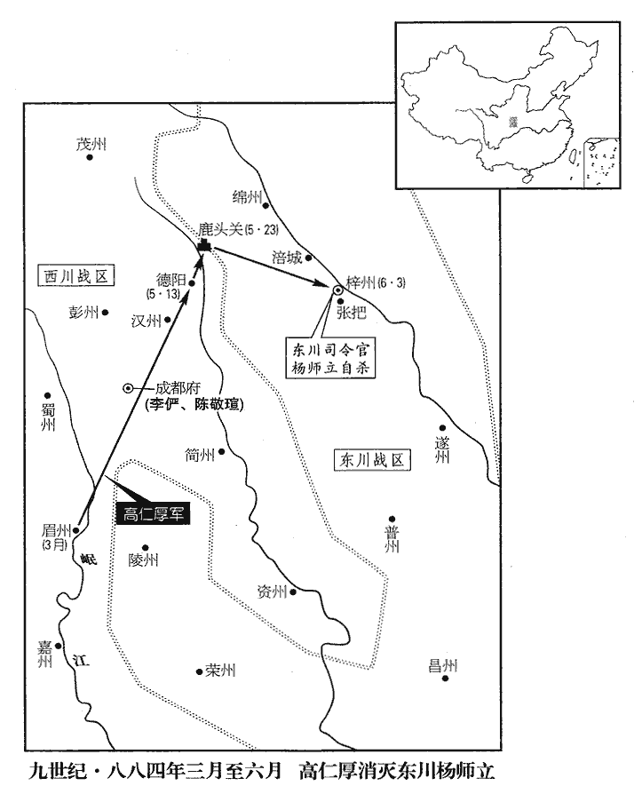
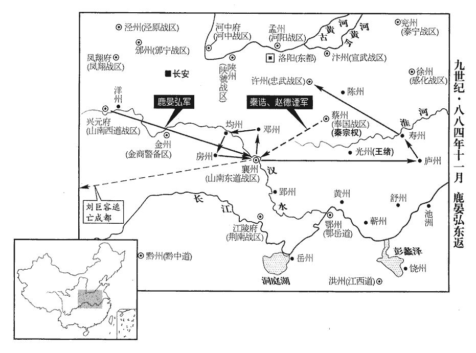
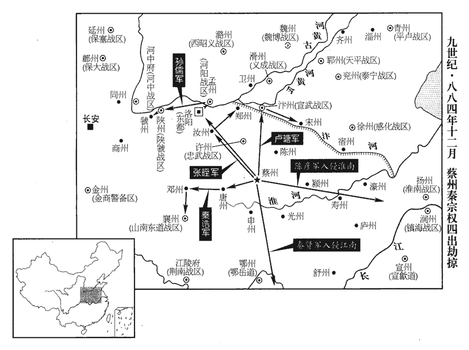
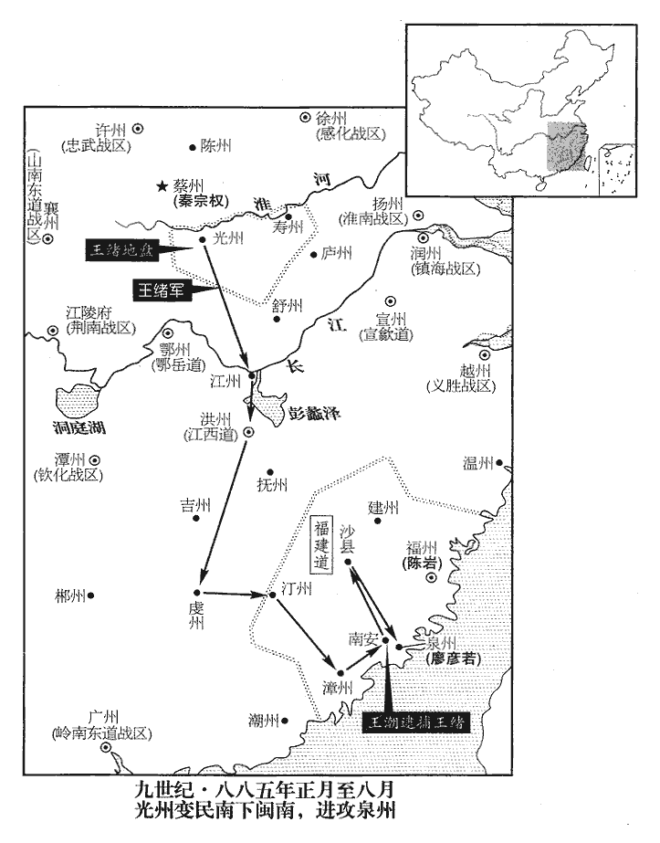
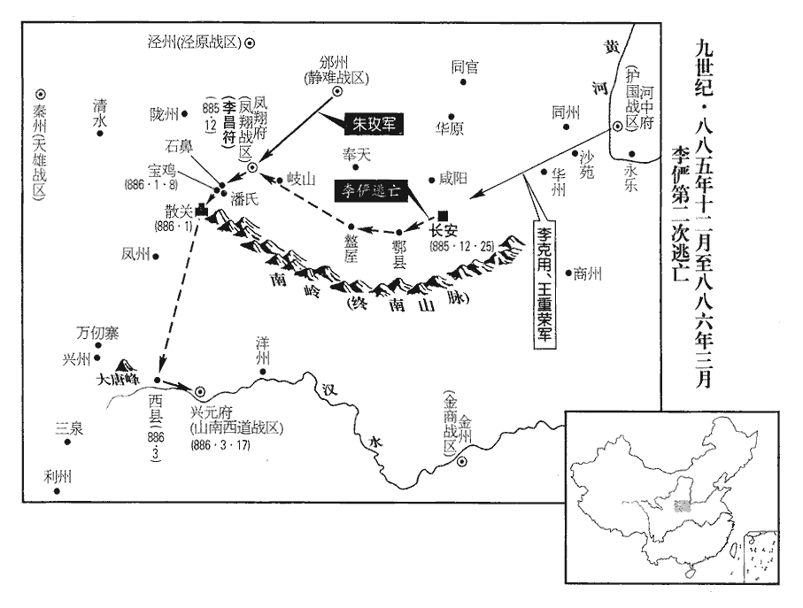
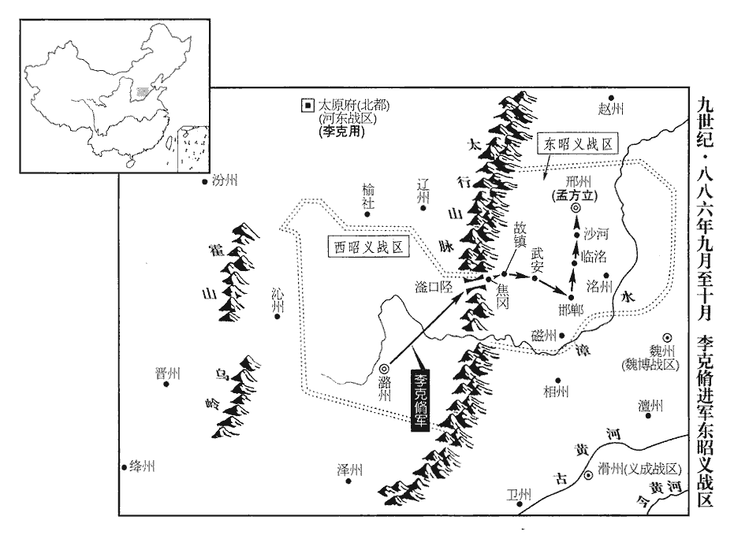
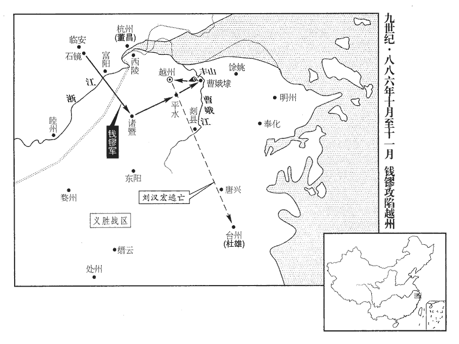

 唐紀七十二起閼逢執徐（甲辰）六月，盡強圉協洽（丁未）三月，凡二年有奇。

# 僖宗惠聖恭定孝皇帝下之上

## 中和四年（甲辰、八八四）

1六月，壬辰‹三›，東川留後高仁厚奏鄭君雄斬楊師立出降。仁厚圍梓州久不下，乃為書射城中，道其將士曰：「仁厚不忍城中玉石俱焚，為諸君緩師十日，射，而亦翻。道，讀曰導。為，于偽翻。使諸君自成其功。若十日不送師立首，當分見兵為五番，見，賢遍翻。番分晝夜以攻之，於此甚逸，於彼必困矣。五日不下，四面俱進，克之必矣。諸君圖之！」數日，君雄大呼於眾曰：呼，火故翻。「天子所誅者元惡耳，他人無預也。」眾呼萬歲，大譟，突入府中，師立自殺，君雄挈其首出降。考異曰：張𩇕jìng耆舊傳：「四年，七月一日，高僕射羽檄入城云云，師立自殺。七月三日，張、鄭二將持師立首級出降。七月七日，高僕射上東川。」句延慶傳曰：三年，五月，高公進軍東川城下，飛檄入城，師立自刎。七月辛酉，師立首級至成都。」實錄：「六月丙申，高仁厚奏東川都將鄭君雄梟斬楊師立，傳首於行在。是日，詔以仁厚為東川節度使。」續寶運錄：「二月，梓州觀察使楊師立反，敕差蜀將高仁厚等討平。六月三日，收得梓州并楊師立首級至駕前。」新紀：「七月辛酉，楊師立伏誅。」今日從續寶運錄，事從實錄。仁厚獻其首及妻子于行在，陳敬瑄釘其子於城北，釘，丁定翻。敬瑄三子出觀之，釘者呼曰：呼，火故翻。「茲事行及汝曹，汝曹於後努力領取！」三子走馬而返。以高仁厚為東川節度使。

〖译文〗 [1]六月，壬辰（初三），东川留后高仁厚上奏说郑君雄斩杀杨师立出来投降。高仁厚围攻梓州城好长时间拿不下来，于是写了一封信用箭射入城中，对城内的将领士卒说：“高仁厚不忍心看到城内良莠不分都遭杀戮，暂缓进攻十天，让你们自己完成这一功业。如果十天内不送出杨师立的脑袋，就要把这些官兵分为五番，分番别在白天和黑夜轮流攻打，这样对于我们是很安逸的，对于你们则一定是疲困不堪。五天若还没有攻打下来，就从四面八方一同进攻，一定会攻克的。你们考虑吧！”过了几天，郑君雄对众人大声疾呼说：“天子所要杀戮的是罪魁祸首，与别的人没有关系。”大家高喊万岁，嚷嚷吵吵，冲进府第，杨师立自杀身亡，郑君雄提着杨师立的头出来投降。高仁厚将杨师立的头和他的妻子儿女送到唐僖宗那里，陈敬下令把杨师立的儿子钉死在城的北面，陈敬的三个儿子出去观看这场景，被钉的人大叫：“这种事也会轮到你们，你们以后等着努力领取吧！”陈敬的三个儿子骑上马逃了回去。朝廷任命高仁厚为东川节度使。

 

2甲辰‹十五›，武寧將李師悅與尚讓追黃巢至瑕丘‹兖州州政府所在县·山东省兖州市›，敗之。宋白曰：春秋以邾子益來，囚諸負瑕。杜預註云：魯邑也，高平郡南平陽縣西北有瑕丘城，漢為瑕丘縣。敗，補邁翻。巢眾殆盡，走至狼虎谷，狼虎谷，在泰山東南萊蕪界。丙午‹十七›，巢甥林言斬巢兄弟妻子首，將詣時溥；遇沙陀博野軍，奪之，并斬言首以獻於溥。黃巢乾符三年起兵為盜，至是凡十年而滅。考異曰：續寶運錄曰：「尚讓降徐州，黃巢走至碣山，路被諸軍趁逼甚，乃謂外甥朱彥之云云。外甥再三不忍下手，黃巢乃自刎過與外甥。外甥將至，路被沙陀博野奪卻，兼外甥首級一時送都統軍中。」舊紀：「七月，癸酉，賊將林言斬黃巢、黃揆、黃秉三人首級降。」舊傳：「巢入泰山，徐帥時溥遣將張友與尚讓之眾掩捕之。至狼虎谷，巢將林言斬巢及二弟鄴、揆等七人首并妻子函送徐州。」新紀：「七月壬午，黃巢伏誅。」新傳：「巢計蹙，謂林言曰：『汝取吾首獻天子，可得富貴，毋為他人利。』言，巢甥也，不忍。巢乃自刎，不殊，言因斬之，函首將詣時溥，而太原博野軍殺言與巢首俱上。」今從新傳。

〖译文〗 [2]甲辰（十五日），武宁将军李师悦和尚让追击黄巢到瑕丘，打败黄巢。黄巢的人马没剩下多少，逃到泰山东南部的狼虎谷。丙午（十七日），黄巢的外甥林言斩下黄巢和黄巢的兄弟、妻子的头颅，正要拿着送到时溥那里，遇上了沙陀人博野军，将黄巢等人的头颅夺去，并且砍下林言的脑袋，一同献给了时溥。

3蔡州‹河南省汝南县›節度使秦宗權縱兵四出，侵噬鄰道；天平‹总部设郓州山东省东平县›節度使朱瑄，有眾三萬，從父弟瑾，勇冠軍中。瑄，荀緣翻，當作「宣」。瑾，渠吝翻。冠，古玩翻。宣武節度使朱全忠為宗權所攻，勢甚窘，窘，渠隕翻。求救於瑄，瑄遣瑾將兵救之，敗宗權於合鄉‹山东省枣庄市西南›。敗，補邁翻。全忠德之，與瑄約為兄弟。朱全忠反覆小人也，兵勢單弱，則與朱瑄為兄弟，兵勢既強，則反眼為仇敵，必誅屠以快其志而後已，如斯人可與共功名哉！

〖译文〗 [3]蔡州节度使秦宗权放纵士兵四处出击，侵犯邻近各道；天平节度使朱，有人马三万，堂弟朱瑾，勇猛过人，在军营中可称第一。宣武节度使朱全忠受到秦宗权的进攻，处境十分紧迫，向朱求救，朱派遣朱瑾带领军队前往救援，在合乡打败了秦宗权。朱全忠很感激他，与朱结为兄弟。

4秋，七月，壬午‹二十四›，時溥遣使獻黃巢及家人首并姬妾，上御大玄樓受之。大玄樓，成都羅城正南門樓。高駢之築成都羅城，既訖功，以周易筮之，得大畜。駢曰：「畜者，養也。濟以剛健篤實，輝光日新，吉孰大焉！文宜去下存上。」因名大玄城。宣問姬妾：「汝曹皆勳貴子女，世受國恩，何為從賊？」其居首者對曰：「狂賊凶逆，國家以百萬之眾，失守宗祧tiāo，播遷巴、蜀；祧，他彫翻。今陛下以不能拒賊責一女子，置公卿將帥於何地乎！」上不復問，皆戮之於市。復，扶又翻。人爭與之酒，其餘皆悲怖昏醉，居首者獨不飲不泣，至於就刑，神色肅然。考異曰：張𩇕耆舊傳：「中和三年，五月二十日，北路軍前進到黃巢首級、妻、男。」今不取其年月而取其事。

〖译文〗 [4]秋季，七月，壬午（二十四日），时溥派遣使臣进献黄巢和他家人的头颅以及他的众妾，唐僖宗亲临成都大玄楼接受进献。僖宗向黄巢的众妾问话：“你们都是显贵人家的子女，世代接受国家的恩惠，为什么要跟随贼寇呀？”站在前面的一位回答说：“贼寇逞凶作乱，大唐有百万军队，却不能固守祖庙，流落到巴蜀一带，今天陛下责备一个女子不能抗拒贼寇，那么朝中的王公大臣将军统帅们又怎么说呢！”僖宗不再问话，下令全部在集市杀掉。人们争着给黄巢的众妾送酒，其余的人都悲痛恐惧昏昏沉沉地喝醉了，唯独站在前面的那位既不饮酒也不哭泣，到了处刑的时候，神态脸色肃穆坦然。

5朱全忠擊秦宗權，敗宗權于溵水‹沙河，流经河南省项城县北›。敗，補邁翻。

〖译文〗 [5]朱全忠攻击秦宗权，在水将他打败。

6李克用至晉陽‹太原府所在县›，大治甲兵，治，直之翻。遣榆次鎮將鴈門李承嗣奉表詣行在‹成都府›，自陳「有破黃巢大功，為朱全忠所圖，僅能自免，將佐已下從行者三百餘人，并牌印皆沒不返。古者授官賜印綬，常佩之於身，至解官則解印綬。至唐始置職印，任其職者，傳而用之。其印盛之以匣，當官者寘之臥內，別為一牌，使吏掌之，以謹出入，印出而牌入，牌出則印入，故謂之牌印。全忠仍牓東都、陜、孟，云臣已死，行營兵潰，令所在邀遮屠翦，勿令漏失，將士皆號泣冤訴，號，戶刀翻。請復仇讎。臣以朝廷至公，當俟詔命，拊循抑止，復歸本道。乞遣使按問，發兵誅討，臣遣弟克勤將萬騎在河中俟命。」時朝廷以大寇初平，方務姑息，得克用表，大恐，但遣中使賜優詔和解之。克用前後凡八表，稱：「全忠妬功疾能，陰狡禍賊，異日必為國患。惟乞下詔削其官爵，臣自帥本道兵討之，不用度支糧餉。」唐舊制，諸鎮兵出境征討，皆仰給度支。帥，讀曰率。上累遣楊復恭等諭指，稱：「吾深知卿冤，方事之殷，杜預曰：殷，盛也。余謂殷，眾也，言方事之眾多也。姑存大體。」克用終鬱鬱不平。時藩鎮相攻者，朝廷不復為之辯曲直。復，扶又翻。為，于偽翻。由是互相吞噬，惟力是視，皆無所稟畏矣！

〖译文〗 [6]李克用到达晋阳，大规模地修整盔甲武器，派遣镇守榆次的将军雁门人李承嗣恭奉表文到唐僖宗那里，部陈述道：“李克用有打败黄巢的大功劳，却中了朱全忠的阴谋圈套，仅是免于一死，身边的将领辅佐官员之下跟随的三百余人，和朝廷授给的牌印都全覆没。朱全忠还屡屡在东都、陕州、孟州张贴告示，说我已经死亡，军营中的人马溃散，他命令各地拦截阻击全部斩杀，不许漏网一个，为此军营中的将领和士兵都哭诉冤屈，请求报仇。我认为朝廷最为公正，应当等皇上颁发了诏命再行动，因此安抚手下人马遵循朝纲，制止了他们要擅自报仇的请求，又回到原来的营地。现在恳求皇上派遣使臣审查讯问这一事件，发兵讨伐朱全忠，我派弟弟李克勤带领一万骑兵在河中府等候命令。”当时朝廷认为黄巢大寇刚刚平灭，为政应当宽容一些，接到李克用的表文，大为吃惊，只是派遣宦官赐发褒嘉奖励李克用诏书，劝二人和解。李克用先后共八次进呈表文，说：“朱全忠妒忌他人的功劳和才能，是阴险狡诈的乱臣贼子，将来一定会成为国家的祸患。只皇上颁发诏令削去朱全忠的官职和爵位，我亲自率领本道官兵对他进行讨伐，不用朝廷支给粮食和兵饷。”唐僖宗几次派遣杨复恭等人向李克用传达谕令，说：“我深知你的冤屈，可是现在事务繁多，你姑且以大局为重吧。”对此李克用一直愤懑不平。当时对各藩镇的相互攻打，朝廷不再为他们明辨谁是谁非。由于这样，各藩镇尽管互相侵吞，只看实力，都没有什么因禀告朝廷而畏惧的了。

7八月，李克用奏請割麟州‹陕西省神木县›隸河東，麟州，本屬振武‹总部安北府·内蒙古和林格尔县›節度。考異曰：新方鎮表：「中和二年，河東節度增領麟州。」誤也。今從唐末見聞錄。又請以弟克脩為昭義‹总部设潞州山西省长治市›節度使，皆許之。由是昭義分為二鎮。澤、潞為一鎮，邢、洺、磁為一鎮。進克用‹本年二十九岁›爵隴西郡王。克用奏罷雲‹山西省大同市›蔚‹河北省蔚县›防禦使，依舊隸河東，武宗會昌三年，分河東雲、蔚、朔三州置大同軍都團練使，次年，升為都防禦使。從之。

〖译文〗 [7]八月，李克用上奏请求朝廷把麟州割让隶属河东节度使管辖，又请求任命他的弟弟李克为昭义节度使，朝廷都准许了他。从此，昭义分成了两个镇。朝廷还为李克用晋升爵位为陇西郡王。李克用奏请裁撤云蔚防御使，云州、蔚州、朔州仍隶属河东节度使管辖，朝廷也依从了他。

8九月，己未‹二›，加朱全忠同平章事。

〖译文〗 [8]九月，己未（初二），朝廷加封朱全忠为同平章事。

9以右僕射、大明宮留守王徽知京兆尹事。上以長安宮室焚毀，故久留蜀未歸。徽招撫流散，戶口稍歸，復繕治宮室，百司粗有緒。治，直之翻。粗，坐五翻。冬，十月，關東‹潼关以东›藩鎮表請車駕還京師。

〖译文〗 [9]朝廷任命右仆射、大明宫留守王徽为知京兆尹牧事。唐僖宗因为长安宫殿被黄巢烧毁，所以长期留在蜀地而没回去。王徽招抚流散的百姓，长安的居民稍微回来一些，又修缮治理宫室，各官署粗略地有了些头绪。冬季，十月，关东的藩镇进呈表文请求唐僖宗回京师长安。

10朱全忠之降也，義成節度使王鐸為都統，承制除官。事見上卷二年。降，戶江翻。全忠初鎮大梁，事鐸禮甚恭，鐸依以為援。汴、滑鄰道，而鐸於全忠有恩，故欲依以為援。而全忠兵浸強，益驕倨，鐸知不足恃，表請還朝，朝，直遙翻。徙鐸為義昌‹总部设沧州河北省沧州市东南›節度使。

〖译文〗 [10]朱全忠投降的时候，义成节度使王铎是都统，受命为朱全忠封官授职。起初朱全忠镇守大梁，侍奉王铎礼节十分恭谦，王铎依赖朱仓忠为援。随着朱全忠人马的渐渐强大，他越来越骄横傲慢，王铎知道朱全忠这人靠不住，便进呈表文请求回到朝廷任职，朝廷于是将王铎调任义昌节度使。

11鹿晏弘之去河中，王建、韓建、張造、晉暉、李師泰各帥其眾與之俱；見上卷本年。帥，讀曰率。及據興元，以建等為巡內刺史，不遣之官。晏弘猜忌，眾心不附，王建、韓建素相親善，晏弘尤忌之，數引入臥內，數，所角翻。待之加厚，二建相謂曰：「僕射甘言厚意，疑我也，禍將至矣！」田令孜密遣人以厚利誘之。十一月，二建與張造、晉暉、李師泰帥眾數千逃奔行在‹成都府›，誘，音酉。考異曰：實錄：「九月，山南西道節度使鹿晏弘為禁軍所討，棄城奔許州。晏弘大將韓建、王建、張造、晉暉、李師泰各帥本軍降。田令孜以建等楊復光故將，薄其賞，皆除諸衛將軍。十一月戊午朔，建等以軍三千至行在，田令孜錄為假子，統以舊軍，號隨駕五都。」按建等既降，始遣禁軍討晏弘。實錄云九月晏弘棄城去，太早。十一月又云建等降，重複。上云賞薄，下云為假子，自相違。新傳：「帝還，晏弘懼見討，引兵走許州。王建帥義勇四軍迎帝西縣。」按帝尚在成都，云迎帝西縣，亦誤也。今月從實錄，事從薛居正五代史王建、韓建傳。令孜皆養為假子，賜與巨萬，拜諸衛將軍，使各將其眾，號隨駕五都。田令孜先已募新軍五十四都分隸兩神策軍，今得王建、韓建、張造、晉暉、李師泰五將之兵，不敢分其眾隸兩軍，別號隨駕五都。又遣禁兵討晏弘，晏弘棄【章：十二行本「棄」上有「率眾」二字；乙十一行本同；張校同。】興元走。鹿晏弘得興元，未朞年而棄之。

〖译文〗 [11]鹿晏弘离开河中时，王建、韩建、张造、晋晖、李师泰分别率领所部人马与他一同前去，等到占据了兴元，便任命王建等人为巡内剌史，但没有派遣他们赴任。鹿晏弘猜疑各将领不再真心依附，王建、韩建二人平时相互亲近友善，鹿晏弘尤为忌恨，多次把他俩带进内室，以很厚的礼节款待他们，王建、韩建相互说：“鹿仆射以好言美意招侍我们，是在怀疑我们，大祸快要降临了。”田令孜秘密派人以丰厚利益去引诱王建等人。十一月，王建、韩建与张造、晋晖、李师泰率领几千人马逃奔到成都唐僖宗那里，田令孜把他们都收养为义子，赏赐给他们大量钱财，封他们为各卫将军，让他们分别带领自己的人马，号称随驾五都。朝廷又派遣禁卫军讨伐鹿晏弘，鹿晏弘放弃兴元城逃跑。

12初，宦者曹知慤què，本華原‹陕西省耀县›富家子，有膽略。黃巢陷長安，知慤歸鄉里，集壯士，據嵯峨山‹陕西省三原县西北›南，為堡自固，嵯峨山在京兆雲陽縣北十五里。巢黨不敢近。近，其靳翻。知慤數遣壯士變衣服語言，效巢黨，夜入長安攻賊營，數，所角翻。賊驚以為鬼神；又疑其下有叛者，由是心不自安。朝廷聞而嘉之，就除內常侍，賜金紫。知慤聞車駕將還，謂人曰：「吾施小術，使諸軍得成大功，曹知慤自言賊眾病於己之宵攻，已無固志，諸鎮大軍臨之，因得成收復京城之功。從駕群臣但平步往來，俟至大散關‹陕西省宝鸡市西南›，當閱其可歸者納之。」從，才用翻。行在聞之，恐其為變；田令孜尤惡之，惡，烏路翻。密以敕旨諭邠寧‹总部设邠州陕西省彬县›節度使王行瑜，使誅之，按光啟二年，王行瑜斬朱玫，三年，始命為邠寧節度使，此時蓋為邠寧將也。行瑜潛師自嵯峨山北乘高攻之，知慤不為備，舉營盡殪。令孜益驕橫，禁制天子‹本年李俨二十三岁›，不得有所主斷。上患其專，時語左右而流涕。殪，壹計翻。橫，戶孟翻。斷，丁亂翻。語，牛倨翻。

〖译文〗 [12]当初，宦官曹知悫，本来是华原富贵人家的儿子，有勇气和智谋。黄巢攻陷长安后，曹知悫回到故乡，招集强壮勇士，占据嵯峨山南部，建筑营垒固守，黄巢的人马不敢接近。曹知悫多次派遣招集的强壮勇士变换衣服和言语，仿效黄巢手下的人，夜间进入长安攻打贼寇军营，贼寇惊恐万状以为是鬼神作怪。黄巢又怀疑手下人有叛变的，因此心神不定。朝廷得知这一情况特地嘉奖曹知悫，授给他内常侍官职，赐给金印紫绶。曹知悫听说唐僖宗要回京师长安，对人讲：“我略施小说，使各路官军取得了收复长安的大功，那些跟随皇上的百官只是轻松地来来往往，等到他们到达大散关，我要审视其中应该返回京师任职的人才能接纳。”这话传到僖宗那里，朝廷担心曹知悫会发动变乱。田令孜尤其仇视曹知悫，便暗中假借僖宗的旨意谕令宁节度使王行瑜，让他将曹知悫杀掉，王行瑜秘密派出军队从嵯峨山的北面登上高处发起进攻，曹知悫没有任何准备，全部人马都被杀死。田令孜更加骄横起来，控制皇上，使僖宗不能主断事务。僖宗厌恨田令孜的专权，经常向身边的人谈起这事而痛哭流涕。

 

13鹿晏弘引兵東出襄州，秦宗權遣其將秦誥、趙德諲將兵會之，諲yīn，伊真翻。共攻襄州，陷之；山南東道節度使劉巨容奔成都。劉巨容不肯追滅黃巢，欲養寇以自資，自以襄陽為菟裘也，而地奪於趙德諲，身死於田令孜之手，玩寇而邀君，果何益哉！考異曰：實錄：「光啟元年四月，蔡賊攻陷襄州，劉巨容死焉。」新傳：「晏弘引麾下東出襄、鄧，宗權遣趙德諲合晏弘兵攻襄州，巨容不能守，奔成都。龍紀元年，田令孜殺之。」按晏弘中和四年十一月已據許州，又，巨容所以奔成都，以天子在蜀故也。今從新傳。德諲，蔡州人也。晏弘引兵轉掠襄、鄧、均‹湖北省丹江口市西北›、房‹湖北省房县›、廬‹安徽省合肥市›、壽‹安徽省寿县›，復還許州；鹿晏弘自許州從楊復光勤王，見二百五十四卷中和元年。宋白曰：均州，漢武當縣地，齊永明七年，於今鄖鄉縣置齊興郡，西魏置興州，尋改豐州，周武成元年，自今鄖鄉城移延岑城，今郡理是也。隋改均州，因均水為名。忠武節度使周岌聞其至，棄鎮走，晏弘遂據許州，考異曰：實錄：「鹿晏弘陷許州，殺節度使周岌，據其鎮。」又曰：「初，晏弘據有興元，都將王建等帥眾歸行在，乃詔禁兵討之。晏弘懼，棄城歸鄉里。周岌聞其至，遁去。晏弘自稱留後，朝廷因以節旄命之。」始云「殺」，後云「遁去」，自相違，今從其後。自稱留後，朝廷不能討，因以為忠武節度使。

〖译文〗 [13]鹿晏弘带领军队往东出发奔向襄州，秦宗权派遣将领秦诰、赵德率领军队与鹿晏弘会合，共同攻陷襄州。山南东道节度使刘巨容逃奔成都。赵德是蔡州人。鹿晏弘带领人马，在襄州、邓州、均州、房州、庐州、寿州各州之间辗转抢掠，又回到许州。忠武节度使周岌听说鹿晏弘来到，放弃州城逃跑，鹿晏弘于是占据了许州，自称留后，朝廷难以对他进行讨伐，便任命他为忠武节度使。

14十二月，己丑‹三›，陳敬瑄表辭三川都指揮、招討、制置、安撫等使；從之。去年以楊師立舉兵，敬瑄兼三川都指揮等使，師立既死，故辭之。

〖译文〗 [14]十二月，己丑（初三），陈敬具呈表章请求辞去三川都指挥、招讨、制置、安抚等官职、朝廷依从。

15初，黃巢轉掠福建‹首府设福州福建省福州市›，見二百五十三卷乾符五年。建州‹福建省建瓯市›人陳巖聚眾數千保鄉里，號九龍軍，福建觀察使鄭鎰yì奏為團練副使。泉州‹福建省泉州市›刺史、左廂都虞候李連有罪，亡入溪洞，【章：十二行本「洞」下有「合眾攻福州」五字；乙十一行本同；孔本同；張校同；退齋校同。】巖擊敗之。敗，補邁翻。鎰畏巖之逼，表巖自代，壬寅‹十六›，以巖為福建觀察使。巖為治有威惠，閩‹福建省›人安之。治，直吏翻。考異曰：實錄：「七月，泉州刺史陳巖逐福建觀察使鄭鎰，自知使務。」又曰：「十二月壬寅，以巖為福建觀察使。巖既逐鎰，逼鎰薦己為代，朝廷因命之。」按巖既逐鎰，則鎰不在福州，巖安能逼之薦己！新王潮傳亦曰：「黃巢將竊有福州，王師不能下，建人陳巖帥眾拔之。又逐觀察使鄭鎰，自領州，詔即授刺史。」按劉恕閩錄：「黃巢陷閩越，巖聚眾千餘人，號九龍軍，福建觀察使鄭鎰奏為團練副使。左廂都虞候李連驕慢不法，縱其徒為郡人患，巖將按誅之，連奔谿洞中，合眾攻福州，巖擊破之。鎰表巖自代，拜觀察使。」今從之。

〖译文〗 [15]当初，黄巢辗转掠侵福建时，建州人陈岩招集了几千人保卫家乡，号称九龙军，福建观察使郑镒奏请，朝廷，任命陈岩为团练副使。泉州剌史、左厢都虞候李连犯了罪，逃入河间石洞，陈岩将李连打败。郑镒害怕陈岩威逼自己，便上表请让陈岩代替自己，壬寅（十六日），朝廷任命陈岩为福建观察使。陈岩治理地方恩威并用，福建民人都较安定。

16義昌‹总部设沧州河北省沧州市东南›節度使兼中書令王鐸，厚於奉養，過魏州‹河北省大名县›，侍妾成列，服御鮮華，如承平之態；魏博節度使樂彥禎之子從訓，伏卒數百於漳南‹山东省武城县›高雞泊‹武城县南›，圍而殺之，及賓僚從者三百餘人皆死，掠其資裝、侍妾而還。史言王鐸以承平之態處亂世，至於喪身亡家，誨盜誨淫，自取之也。從，才用翻。還，從宣翻，又如字。彥禎奏云為盜所殺，朝廷不能詰。

〖译文〗 [16]义昌节度使兼中书令王铎，生活享受极其丰厚，当他经过魏州时，侍从众妾竟站成一排，穿着打扮鲜艳华丽，像天下太平时的样子。魏博节度使乐彦祯的儿子乐从训，在漳南鸡泊一带设下几百名伏兵，围攻并将王铎杀掉，连同王铎的宾客幕僚三百多人也都处死，然后掠抢王铎所带的行李侍妾回去。乐彦祯上奏说王铎被盗贼杀害，朝廷也未能查问。

17賜邠寧軍號曰靜難。難，乃旦翻。

〖译文〗 [17]朝廷赐宁军名号为静难。

18是歲，餘杭‹浙江省余杭市西南余杭镇›鎮使陳晟逐睦州‹浙江省建德市›刺史柳超，潁州‹安徽省阜阳市›都知兵馬使汝陰‹颍州州政府所在县›王敬蕘逐其刺史，汝陰，漢縣，唐帶潁州。蕘ráo，如招翻。各領州事，朝廷因命為刺史。

〖译文〗 [18]这一年，余杭镇使陈晟驱逐睦州剌史柳超，颍州都知兵马使汝阴人王敬荛赶走当地剌史，分别主持本州事宜，朝廷于是分别任命他们为睦州剌史、颍州剌史。

19均州‹湖北省丹江口市西北›賊帥孫喜聚眾數千人，謀攻州城，刺史呂燁yè不知所為。都將武當‹均州州政府所在县›馮行襲伏兵江南，武當，漢縣，唐帶均州。江南，漢江之南也。帥，所類翻。將，即亮翻。自乘小舟迎喜，謂曰：「州人得良牧，無不歸心，然公所從之卒太多，州人懼於剽掠，剽，匹妙翻。尚以為疑。不若置軍江北，獨與腹心輕騎俱進，行襲請為前道，道，讀為導，一讀如字。以請為前道告諭為一句，言先路告諭均州之人也。請為，于偽翻。告諭州人，無不服者矣。」喜以為然，從之；既渡江，軍吏迎謁，伏兵發，行襲手擊喜，斬之，從喜者皆死，從，才用翻。江北軍望之俱潰。山南東道節度使上其功，上，時掌翻。考異曰：薛居正五代史行襲傳曰：「洋州節度使葛佐奏辟為行軍司馬，請將兵鎮谷口，通秦、蜀道，由是益知名。」新傳曰：「行襲乘勝逐刺史呂燁，據均州，劉巨容因表為刺史。武定節度使楊守忠表為行軍司馬，使領兵搤谷口以通秦、蜀。」新紀：「光啟元年，四月，武當賊馮行襲陷均州，逐刺史呂燁。」在劉巨容奔成都後。行襲傳云巨容以功上言，誤也。今從薛史。按若以薛史為據，當言洋州節度使上其功。詔以行襲為均州刺史。州西有長山，當襄、鄧入蜀之道，群盜據之，抄掠貢賦，抄，楚交翻。行襲討誅之，蜀道以通。

〖译文〗 [19]均州地方的贼寇头目孙喜召集几千人，筹划攻打均州城，剌史吕烨不知如何应付，都将武当人冯行袭在汉江南岸设下伏兵，自己乘坐小船过江迎接孙喜，对孙喜说：“均州城内的百姓得到象你这样贤良的长官，没有不归顺的，可是跟随你的兵卒太多了，均州城内的人害怕抢劫，尚且对你有疑心。你不如把人马放在江北，单独与左右亲信轻装过江，我冯行袭请求在前面为你开道，告诉均州城内的人，那么就没有人不顺服你的人了。”陈喜认为这样不错，便听从冯行袭的安排。不久，孙喜渡过汉江，军中官吏前来迎接拜见，原来设下的伏兵突然发起进攻，冯行袭亲手与孙喜搏头，将孙喜斩杀，跟随孙喜过来的人也都被杀死，江北面孙喜的人马看到这种情况都溃散了。山南东道节度使上疏奏报冯行袭的功劳，唐僖宗颁诏任命冯行袭为均州剌史。均州西面有座长山，正对着从襄州、邓州进入蜀地的交通要道，不少盗贼占据长山，掠抢送往成都的贡品赋税，冯行袭消灭了长山的盗贼，使去往蜀地的道路得以通行。

 

20鳳翔節度使李昌言病，表弟昌符知留後。昌言薨，制以昌符為鳳翔節度使。考異曰：諸書皆無昌言卒年月，惟實錄於李昌符傳中云：「李昌言病，請昌符權留後，昌言死，詔除節度使。」按實錄，中和三年五月，昌言加檢校司徒，光啟元年二月，昌符始見。故以昌言薨附於中和四年之末。

〖译文〗 [20]凤翔节度使李昌言患病，进表请让他的弟弟李昌符主管留后事宜。李昌言死去，唐僖宗便颁诏任命李昌符为凤翔节度使。

21時黃巢雖平，秦宗權復熾，復，扶又翻。命將出兵，寇掠鄰道，陳彥侵淮南，秦賢侵江南，秦誥陷襄、唐‹河南省泌阳县›、鄧‹河南省邓州市›，孫儒陷東都、孟、陜、虢‹河南省灵宝市›，張晊zhì陷汝‹河南省汝州市›、鄭‹河南省郑州市›，盧瑭攻汴‹河南省开封市›、宋‹河南省商丘市›，自孫儒以下，事皆在是年之後，史概言之。所至屠翦焚蕩，殆無孑遺。晊，之日翻。孑，吉列翻。毛萇曰：孑遺，孑然遺失也。按孑，單也，孤也。無孑遺者，言無孤單之遺餘也。其殘暴又甚於巢，軍行未始轉糧，車載鹽尸以從。以死人尸實之以鹽，以供軍糧。從，才用翻。北至衛‹河南省卫辉市›、滑‹河南省滑县›，西及關輔‹陕西省中部›，東盡青‹山东省青州市›、齊‹山东省济南市›，南出江、淮，州鎮存者僅保一城，極目千里，無復煙火。上將還長安，畏宗權為患。

〖译文〗 [21]当时黄巢虽已消灭，可是秦宗权又兴起作乱，命令各将领派出军队，抢掠邻近各道，陈彦进攻淮南，秦贤进攻江南，秦诰攻克襄州、唐州、邓州，孙儒攻克东都、孟州、陕州、虢州，张攻克汝州、郑州，卢瑭攻打汴州、宋州，所到之处烧杀抢掠，无人能免，其残暴程度比黄巢更为厉害。军队出征未来得及转运粮食，竟把盐腌的死尸装在车上随军出发。北面到卫州、滑州，西及关辅，东面包括青州、齐州，南面直达江、淮以远，上此范围内州镇得以保存的仅有一城，千里远望，也见不到烟火。唐僖宗将要返回长安，又害怕秦宗权作乱危害。

## 光啟元年（乙巳、八八五）是年三月改元。

1春，正月，戊午‹二›，下詔招撫之‹蔡州河南省汝南县›变军首领秦宗权。

〖译文〗 [1]春季，正月，戊午（初二），唐僖宗颁发诏令招抚秦宗权。

2己卯‹二十三›，車駕‹李俨，本年二十四岁›發成都‹四川省成都市›，陳敬瑄‹西川战区节度使，总部设成都府四川省成都市›送至漢州‹四川省广汉市›而還。

〖译文〗 [2]已卯（十九日），唐僖宗从成都出发，陈敬将皇帝送到汉州才回去。

3荊南‹总部设江陵府湖北省江陵县›監軍朱敬玫所募忠勇軍暴橫，【章：十二行本「橫」下有「節度使」三字；乙十一行本同；退齋校同。】陳儒患之。鄭紹業之鎮荊南也，廣明元年，朱敬玫募忠勇軍；鄭紹業鎮荊南，亦是年也。事並見上卷。橫，戶孟翻。遣大將申屠琮cóng將兵五千擊黃巢於長安；軍還，儒告琮，使除之。忠勇將程君從聞之，帥其眾奔朗州‹湖南省常德市›，奔雷滿也。帥，讀曰率。琮追擊之，殺百餘人，【章：十二行本「人」下有「餘眾皆潰」四字；乙十一行本同；退齋校同；孔本有「皆潰」二字，無「餘眾」二字。】自是琮復專軍政。復，扶又翻。

〖译文〗 [3]荆南监军朱敬玫招募来的忠勇军残暴横行，节度使陈儒很是担忧。郑绍业镇守荆南，派遣大将申屠琮带领军队五千到长安攻打黄巢；军队回来，陈儒告诉申屠琮忠勇军的暴行，让申屠琮消灭它。忠勇军将领程君从得知，便率领人马奔往朗州，中屠琮追击攻打忠勇军，斩杀一百多人，此后申屠琮又独自掌管军政大权。

雷滿‹朗州，湖南省常德市›屢攻掠荊南，儒重賂以卻之。淮南‹总部设扬州江苏省扬州市›將張瓌guī、韓師德叛高駢，據復‹湖北省天门市›、岳‹湖南省岳阳市›二州，自稱刺史，儒請瓌攝行軍司馬，師德攝節度副使，將兵擊雷滿。師德引兵上峽大掠，上，時掌翻。峽，巫峽也。歸于岳州；瓌還兵逐儒而代之。儒將奔行在，瓌劫還，囚之。中和二年，陳儒代鄭紹業，至是而敗。瓌，渭‹滑州，河南省滑县›【嚴：「渭」改「滑」。】州人，性貪暴，荊南舊將夷滅殆盡。

〖译文〗 雷满多次攻打抢掠荆南，陈儒用丰厚的资财贿赂让他退兵。淮南将领张、韩师德背叛高骈，分别占据复州、岳州，自称刺史，陈儒请张暂为行军司马，韩师德暂为节度副使，带领军队攻打雷满。韩师德率领军队到巫峡一带大肆抢掠，回到岳州；张率军回去驱逐陈儒而取代了他。陈儒要逃奔唐僖宗那里，被张挟持回去，囚禁起来。张是滑州人，性情贪婪暴虐，荆南地方的旧有将领几乎全被他杀光了。

先是，朱敬玫屢殺大將及富商以致富，先，悉薦翻。朝廷遣中使楊玄晦代之。敬玫留居荊南，嘗曝衣，瓌見而欲之，遣卒夜攻之，殺敬玫，盡取其財。瓌惡牙將郭禹慓piāo悍，惡，烏路翻。慓，匹妙翻。悍，下罕翻，又侯旰翻。欲殺之，禹結黨千人亡去，庚申‹四›，襲歸州‹湖北省秭归县›，據之，自稱刺史。禹，青州‹山东省青州市›人成汭ruì也，因殺人亡命，更其姓名。禹先為盜，詣陳儒降，以為將。更，工衡翻。按薛史，成汭少年任俠，乘醉殺人，為讎家所捕，因落髮為僧，冒姓郭氏。

〖译文〗 在这之前，朱敬玫多次屠杀军中大将和富商，霸占他们的资财使自己富有，朝廷派遣宦官杨玄晦去取代了他。朱敬玫留居荆南，他曾经晾晒衣服，被张看到而产生了贪欲，便派遣军队夜间前去攻打，杀掉朱敬玫，把财物全部抢去。张很忌恨牙将郭禹的勇悍，想杀害他，郭禹联合党羽一千人逃离。庚申（初四），郭禹攻占归州，予以占据，自称刺史。郭禹本来是青州人叫成，因为杀人逃亡，更改了姓名。

4南康‹江西省南康市›賊帥盧光稠陷虔州‹江西省赣州市›，自稱刺史，以其里人譚全播為謀主。南康，漢南野縣地，吳分南野置南安縣，晉改為南康，唐屬虔州。九域志，在州西八十里。考異曰：歐陽修五代史曰：「盧光稠、譚全播皆南康人。光稠狀貌雄偉，無他材能，而全播勇敢有識略，然全播常奇光稠為人。唐末群盜起，全播聚眾，立光稠為帥。是時王潮攻陷嶺南，全播攻潮，取其虔、韶二州。」十國紀年：「全播推光稠為之謀主，所向克捷，光啟初，據虔州，光稠自稱刺史。天復中，陷韶州，光稠使其子延昌守之。」按新紀，光啟元年正月，光稠陷虔州，天復二年，陷韶州。歐陽修以為同時取虔、韶二州，誤也，今從新紀。

〖译文〗 [4]南康贼寇头目卢光稠攻克虔州，自称刺史，用他的同乡谭全播为主谋。

5秦宗權責租賦於光州‹河南省潢川县›刺史王緒，緒不能給；宗權怒，發兵擊之。緒懼，悉舉光‹河南省潢川县›、壽‹安徽省寿县›兵五千人，驅吏民渡江，以劉行全為前鋒，轉掠江‹江西省九江市›、洪‹江西省南昌市›、虔州‹江西省赣州市›，是月，陷汀‹福建省长汀县›、漳‹福建省漳州市›二州，然皆不能守也。王緒之兵自此入閩，為王潮兄弟割據之資。

〖译文〗 [5]秦宗权责令光州刺史王绪提供田租赋税，王绪不能供给；秦宗权大为震怒，发兵攻打王绪。王绪恐惧，调动光州、寿州全部军队五千人，驱赶这里的百姓过江，任命刘行全为前锋，辗转抢掠江州、洪州、虔州，这个月，又攻克了汀州、漳州，但都不能固守。

6秦宗權寇潁‹安徽省阜阳市›、亳‹安徽省亳州市›，朱全忠‹宣武战区，总部设汴州河南省开封市›敗之於焦夷‹安徽省亳州市东南›。焦夷在亳州城父縣界。按薛史梁紀，龍德元年，改亳州焦夷縣為夷父。則焦夷時已為縣。敗，補邁翻。「夷父」，當作「城父」。

〖译文〗 [6]秦宗权进犯颍州、毫州，朱全忠在焦夷将他打败。

7二月，丙申‹十›，車駕至鳳翔。三月，丁卯‹十二›，至京師；荊棘滿城，狐兔縱橫，縱，子容翻。上淒然不樂。樂，音洛。己巳‹十四›，赦天下，改元。改元光啟。時朝廷號令所行，惟河西‹黄河以西·陕西省北部›、山南‹秦岭以南·陕西省南部及四川省东北部›、劍南‹剑阁以南·四川省中南部›、嶺南‹南岭以南·广东、广西、海南三省及越南北部›數十州而已。

〖译文〗 [7]二月，丙申（初十），唐僖宗到达凤翔。三月，丁卯（十二日），唐僖宗回到京师。长安城内到处野草丛生，狐狸野兔四下乱跑，唐僖宗悲伤难过，闷闷不乐。已巳（十四日），唐僖宗下诏赦免犯人，改用光启年号。当时，朝廷号令能够达到的，只有河西、山南、剑南、岭南的几十个州罢了。

8秦宗權稱帝，置百官，考異曰：舊宗權傳，但云巢賊既誅，僭稱帝號。實錄：「明年十月，襄王即位，宗權已稱帝。不從。」新、舊紀皆無之，不知宗權以何年月稱帝，今因時溥為都統書之。詔以武寧‹感化战区，总部设徐州江苏省徐州市›節度使時溥為蔡州四面行營兵馬都統以討之。

〖译文〗 [8]秦宗权自称皇帝，设置百官。朝廷下诏命令武宁节度使时溥任蔡州四面行营兵马都统讨伐秦宗权。

 

9盧龍‹总部设幽州北京市›節度使李可舉、成德‹总部设镇州河北省正定县›節度使王鎔惡李克用‹河东战区，总部设太原府山西省太原市›之強，惡，烏路翻。考異曰：太祖紀年錄、薛居正五代史作「王景崇」，誤也，今從舊紀。而義武‹总部设定州河北省定州市›節度使王處存與克用親善，為姪鄴娶克用女。為，于偽翻。又，河北諸鎮，惟義武尚屬朝廷，可舉等恐其窺伺山東，此山東，謂恆山以東。伺，相吏翻。終為己患，乃相與謀曰：「易‹河北省易县›、定，燕、趙之餘也。」易州之地，本燕南界，中山本屬趙國，故曰燕、趙之餘。約共滅處存而分其地；又說雲中‹云州·山西省大同市›節度使赫連鐸使攻克用之背。說，式芮翻。可舉遣其將李全忠將兵六萬攻易州，鎔遣將將兵攻無極‹河北省无极县›。無極，漢古縣，因無極山而名。唐屬定州。九域志：在州南九十里。處存告急於克用，克用遣其將康君立等將兵救之。

〖译文〗 [9]卢龙节度使李可举、成德节度使王熔忌恨李克用的强大，但是义武节度使王处存与李克用亲善，为侄子王邺迎取李克用的女儿为妻。河北各镇中，只有义武节度使还归属朝廷，李可举等人担心义武节度使会图谋恒山以东的地盘，最终成为自己的隐患，于是他们互相筹谋说：“易州、定州，本来是燕国、赵国的旧地方。”相约一起消灭王处存然后瓜分他的地盘，又劝说云中节度使赫连锋，让他攻打克用的后方。李可举派遣将领李全忠带领六万人马攻打易州，王熔派遣将领带领军队攻打定州的无极。王处存向李克用报急，李克用派遣将领康君立等人带领军队前往救援。

10閏月，秦宗權遣其弟宗言寇荊南。

〖译文〗 [10]闰三月，秦宗权派令他的弟弟秦宗言进犯荆南。

11初，田令孜在蜀募新軍五十四都，每都千人，分隸兩神策，為十軍以統之，又南牙、北司官共萬餘員，是時藩鎮各專租稅，河南•北、江、淮無復上供，三司轉運無調發之所，度支惟收京畿、同‹陕西省大荔县›、華‹陕西省华县›、鳳翔等數州租稅，不能贍，調，徒弔翻。度，徒洛翻。華，戶化翻。賞賚不時，士卒有怨言。令孜患之，不知所出。先是，安邑‹山西省运城市东北安邑镇›、解縣‹运城市西南解州镇›兩池鹽皆隸鹽鐵，置官榷之；宋白曰：兩池鹽務，舊隸度支，其職是諸道巡院。貞元十六年，史牟以金部郎中主池務，遂奏置榷鹽使。解，戶買翻。榷，訖岳翻。中和以來，河中‹总部设河中府山西省永济市›節度使王重榮專之，天子幸蜀，內外百司各失其官守，王重榮竊據河中，得專鹽池之利。歲獻三千車以供國用，令孜奏復如舊制隸鹽鐵。夏，四月，令孜自兼兩池榷鹽使，唐會要：元和十五年，改河北稅鹽使為榷鹽使，其後復失河北，止於安邑、解縣兩池，置榷鹽使。收其利以贍軍。重榮上章論訴不已，論，盧昆翻，說也，辯也。遣中使往諭之，重榮不可。時令孜多遣親信覘藩鎮，覘，丑廉翻。有不附己者，輒圖之。令孜養子匡祐使河中，使，疏吏翻。重榮待之甚厚，而匡祐傲甚，舉軍皆憤怒。重榮乃數令孜罪惡，數，所具翻。責其無禮，監軍為講解，為，于偽翻。僅得脫去；匡祐歸，以告令孜，勸圖之。五月，令孜徙重榮為泰寧‹总部设兖州山东省兖州市›節度使，以泰寧節度使齊克讓為義武節度使，以義武節度使王處存為河中節度使，仍詔李克用以河東兵援處存赴鎮。為李克用、王重榮連兵犯闕張本。

〖译文〗 [11]起初，田令孜在蜀地招募新的军队设五十四都，每都一千人，分别隶属左右神策军，共组成十个军进行统率，还有南牙、北司的官员共一万余人，当时各藩镇独占田租赋税，河南道、河北道、江南道、淮南道不再向朝廷进贡纳赋，朝廷的盐铁使、度支使、户部使三司转运钱粮而没有调取征发的地方，财政上只是收取京畿、同州、华州和凤翔等几个州的田租赋税，不够用，赏赐不能准时，军中士卒有怨言。田令孜对此很担心，但又不知从何处开辟财源。在这以前，安邑、解县的两池盐都隶属户部的盐铁使，朝廷命官吏管理池盐专卖事宜。中和年号以来，河中节度使王重荣独占池盐收入，每年向朝廷进献三千车盐供国家调用，田令孜上奏请求恢复过去的制度仍由盐铁使管理安邑、解县的两盐池。夏季，四月，田令孜自己兼任安邑、解县两盐池的榷盐使，收取所得利钱来供养军队。王重荣不停地上奏辩论申诉，唐僖宗派遣宦官前往晓谕，王重荣仍不罢休。当时，田令孜派遣许多亲信侦探各个藩镇的内情，有不归附自己的，田令孜就暗算他。田令孜的养子匡被派往河中任职，王重荣对待他十分优厚，可是匡极其傲慢，全军士卒都怨恨他。这时，王重荣便历数田令孜的罪状，谴责匡放肆无礼，监军为他们讲和劝解，匡才逃脱走掉。匡回去，把王重荣的所做所为告诉田令孜，劝田令孜设法整治王重荣。五月，田令孜将王重荣调任泰宁节度使，以泰宁节度使齐克让为义武节度使，而将义武节度使王处存调任河中节度使，多次诏令李克用动用河东军队援助王处存前赴镇所。

12盧龍‹总部幽州›兵攻易州，裨將劉仁恭穴地入城，遂克之。仁恭，深州‹河北省深州市›人也。李克用自將救無極，敗成德兵；敗，補邁翻。成德兵退保新城‹河北省高碑店市东南新城镇›，克用復進擊，大破之，復，扶又翻；下同。拔新城，成德兵走，追至九門‹河北省藁城市西北›，斬首萬餘級。盧龍兵既得易州，驕怠，王處存夜遣卒三千蒙羊皮造城下，造，七到翻。盧龍兵以為羊也，爭出掠之，處存奮擊，大破之，復取易州，李全忠走。

〖译文〗 [12]卢龙的军队攻打易州，副将刘仁恭挖地道进入城内，予以攻克。刘仁恭是深州人。李克用亲自率领人马救援无极，打败成德军队。成德军退到新城固守，李克用再次发动进攻，大破守兵，攻占了新城，成德军队逃跑，李克用追到九门，斩杀一万余人。卢龙军队占据了易州，骄傲松懈，王处存夜间派遣士兵三千人蒙上羊皮到易州城下，卢龙军队以为是羊群，争先恐后地出来抢掠，王处存率兵奋力攻打，大破卢龙军，又夺回易州，李全忠逃跑。

13加陜虢‹总部设陕州河南省三门峡市›節度使王重盈同平章事。

〖译文〗 [13]朝廷加封陕虢节度使王重盈同平章事。

14李全忠既喪師，喪，息浪翻。恐獲罪，收餘眾還襲幽州‹北京市›；六月，李可舉窘急，舉族登樓自焚死，乾符二年，李茂勳得幽州，二世，十一年而滅。全忠自為留後。

〖译文〗 [14]李全忠损兵折将丧失了人马，担心会被治罪，便召集剩下的人回去攻打幽州。六月，李可举因形势紧迫，带全族人登上幽州城楼自焚而死，李全忠便自称幽州留后。

15東都留守李罕之與秦宗權將孫儒相拒數月；罕之兵少食盡，棄城，西保澠池‹河南省渑池县›，宗權陷東都。九域志：澠池縣在都城西一百五十六里。澠，彌兗翻。孫儒陷東都，而曰宗權者，儒，宗權將也。

〖译文〗 [15]东都留守李罕之与秦宗权的将领孙儒相互攻打持续了几个月。李罕之人马缺少，粮食也用完，最后放弃东都城，往西退到渑池固守，于是秦宗权攻占了东都。

16秋，七月，以李全忠為盧龍留後。

〖译文〗 [16]秋季，七月，朝廷任命李全忠为卢龙留后。

17乙巳‹二十三›，右補闕常濬上疏，以為：「陛下姑息藩鎮太甚，是非功過，駢首並足，言齊是非，一功過，無所差別也。致天下紛紛若此，猶未之寤，豈可不念駱谷‹陕西省周至县西南›之艱危，復懷西顧之計乎！復，扶又翻；下同。宜稍振典刑以威四方。」田令孜之黨言於上曰：「此疏傳於藩鎮，豈不致其猜忿！」庚戌‹二十八›，貶濬萬州‹重庆市万州区›司戶，尋賜死。宋白曰：萬州，春秋夔國之地，秦、漢為朐䏰縣地。後魏分朐䏰之地置安鄉及魚泉縣，後周置萬川郡兼立南州；唐置浦州，貞觀初，改萬州，以舊萬川郡為稱。考異曰：實錄不言令孜黨為誰。按蕭遘等請誅令孜表云：「韋昭度無致君許國之心，多醜正比頑之迹。」令孜黨，蓋謂昭度也。續寶運錄曰：「七月三日，表入，上覽之，不悅，顧謂侍臣曰：『藩鎮若見此表，深為忿恨。自此猜間，其何可堪！』至二十八日，敕貶濬為萬州司戶。」疑三日脫誤，當為二十三日。今從實錄。

〖译文〗 [17]乙巳（二十三日），右补阙常浚向唐僖宗具呈奏章，他认为：“陛下对藩镇的宽容放纵太过份了，是非曲直功劳过错，齐头并足不分高低，致使天下纷纷攘攘这样混乱，可是皇上对此还不醒悟，怎么能不想想骆谷时的艰难险境，难道还有西走蜀地的打算吗！现在应该整顿一下朝纲法纪以使四方敬畏朝廷的威严。”田令孜的党羽对唐僖宗说：“常浚这个奏疏的内容若是传到各藩镇，岂不是让他们产生猜忌怨恨吗？”庚戌（二十八日），朝廷将常浚贬为万州司户，不久赐死。

18滄州‹河北省沧州市东南›軍亂，逐節度使楊全玫，立牙將盧彥威為留後，全玫奔幽州。以保鑾都將曹誠為義昌節度使，保鑾，神策五十四都之一也。以彥威為德州‹山东省陵县›刺史。

〖译文〗 [18]沧州军队发生叛乱，赶走节度使杨全玫，拥立牙将卢彦威为留后，杨全玫逃奔幽州。朝廷任命保銮都将曹诚为义昌节度使，任命卢彦威为德州刺史。

19孫儒據東都月餘，燒宮室、官寺、民居，大掠席卷而去，卷，讀曰捲。城中寂無雞犬。李罕之復引其眾入東都，築壘於市西而居之。城大難守，且無居人，故築壘以自保聚。

〖译文〗 [19]孙儒占据东都一个多月，焚烧宫殿、官府、寺庙、民房，大肆抢掠席卷而去，留下的东都城寂静得连鸡鸣狗叫之声都听不到。李罕之又带领他的人马进入东都，在市西筑造营垒驻守。

20王重榮自以有復京城功，見上卷中和三年。為田令孜所擯，不肯之兗州，累表論令孜離間君臣，間，古莧翻。數令孜十罪；數，所具翻。令孜結邠寧節度使朱玫、鳳翔節度使李昌符以抗之。王處存亦上言：「幽、鎮兵新退，臣未敢離易‹河北省易县›、定‹河北省定州市›。幽、鎮兵，謂李可舉、王鎔之兵。離，力智翻。且王重榮無罪，有大功於國，不宜輕有改易。」【章：十二行本「易」下有「搖藩鎮心」四字；乙十一行本同；張校同，云無註本亦無。】詔趣其上道，趣，讀曰促。上，時掌翻。八月，處存引軍至晉州‹山西省临汾市›，刺史冀君武閉城不內而還。河中節度統晉、絳、慈、隰等州，君武、重榮之巡屬。冀，晉大夫冀芮之後，以采邑為姓。還，從宣翻，又如字。

〖译文〗 [20]王重荣自以为有收复京城长安的功劳，却受到田令孜的排挤，不肯到兖州任职，多次上表诉说田令孜挑拔皇帝和臣僚不和，历数田令孜的十大罪状；田令孜交结宁节度使朱玫、凤翔节度使李昌符，来与王重荣抗衡。王处存也上疏言道：“李可举、王的人马刚刚退去，我不敢轻易离开易州、定州一带。而且，王重荣没有罪过，却对国家有莫大的功劳，不应该草率地有所变更。”唐僖宗颁诏催促王处存启程，八月，王处存带领军队到达晋州，刺史冀君武关闭城门不让他进入，王处存只好回去。

21洺州刺史馬爽，與昭義‹总部设邢州河北省邢台市›行軍司馬奚忠信不叶，起兵屯邢州南，脅孟方立請誅忠信；既而眾潰，爽奔魏州，忠信使人賂樂彥禎而殺之。

〖译文〗 [21]州刺史马爽，与昭义行军司马奚忠信不和，起兵驻扎邢州南部，胁迫孟方立请求诛杀奚忠信。不久，马爽的军队溃败，马爽本人逃奔魏州，奚忠信派人贿赂乐彦祯而杀死了马爽。

22秦宗權攻鄰道二十餘州，陷之；唯陳州‹河南省淮阳县›距蔡百餘里，兵力甚弱，刺史趙犨日與宗權戰，宗權不能屈。詔以犨為蔡州節度使。犨德朱全忠之援，自中和三年以來，黃巢攻陳州，後為秦宗權所攻逼，惟倚朱全忠為援。與全忠結婚，凡全忠所調發，無不立至。調，力釣翻。奉全忠者，趙犨也。蹙梁祚者，趙犨子孫也。

〖译文〗 [22]秦宗权攻打临近各道二十多个州，都予攻克。唯有陈州距离蔡州一百余里，兵力很弱，刺史赵每天与秦宗权对阵，秦宗权不能使赵屈服。唐僖宗颁诏任命赵为蔡州节度使。赵感激朱全忠的救援，与朱全忠结为姻亲，凡是朱全忠有所调动分派，赵马上就到。

23王緒至漳州‹福建省漳州市›，以道險糧少，少，詩沼翻。令軍中「無得以老弱自隨，犯者斬！」唯王潮兄弟扶其母董氏崎嶇從軍，崎，丘奇翻。嶇，音區。緒召潮等責之曰：「軍皆有法，未有無法之軍。汝違吾令而不誅，是無法也。」三子曰：王潮兄弟三人從緒。「人皆有母，未有無母之人；將軍柰何使人棄其母！」緒怒，命斬其母。三子曰：「潮等事母如事將軍，既殺其母，安用其子！請先母死。」先，悉薦翻。將士皆為之請，乃捨之。為，于偽翻；下竊為、為之同。

〖译文〗 [23]王绪到达漳州，因为道路艰险粮食缺少，便传令军中“不许老弱家人跟随，违犯命令者斩首！”唯有王潮兄弟搀扶母亲董氏在崎岖不平的道路上跟随军队行走，王绪召来王潮兄弟斥责他们说：“军队都有军法，没有军法的军队是没有的。你们违犯我的命令而不诛杀，那就没有军法了。”王潮兄弟三人说：“人都有自己的母亲，没有母亲的人是没有的；将军你怎么能叫人抛弃他们的生母呢？”王绪勃然大怒，命令斩杀王潮的母亲。王潮兄弟三人说：“我们兄弟侍奉母亲如同侍奉将军一样，既然要杀我们的母亲，还怎么能用母亲的儿子！请在处死母亲之前先把我们杀了吧！”军中将士都为王潮兄弟求情，这才免除处罚。

有望氣者謂緒曰：「軍中有王者氣。」於是緒見將卒有勇略踰己及氣質魁岸者皆殺之。劉行全亦死，眾皆自危，曰：「行全親也，行全，緒妹夫也，故云然。且軍鋒之冠，猶不免，況吾屬乎！」行至南安‹福建省南安市›，冠，古玩翻。吳置東安縣，晉武帝更名晉安，隋改曰南安，唐屬泉州。九域志：南安，在州西一十二里。王潮說其前鋒將曰：說，式芮翻。「吾屬違墳墓，捐妻子，羈旅外鄉為群盜，謂棄光、壽而入閩也。豈所欲哉！乃為緒所迫脅故也。今緒猜刻不仁，妄殺無辜，軍中孑孑者受誅且盡，孑孑，特立之貌。子須眉若神，騎射絕倫，又為前鋒，吾竊為子危之！」竊為，于偽翻。前鋒將執潮手泣，問計安出。潮為之謀，伏壯士數十人於篁竹中，伺緒至，挺劍大呼躍出，挺劍，拔劍也。呼，火故翻。就馬上擒之，反縛以徇，軍中皆呼萬歲。中和元年，王緒起兵為盜，至是為王潮所囚。按新書王潮傳，縛王緒者即劉行全也，與此小異。通鑑所書，本之路振九國志。潮推前鋒將為主，前鋒將曰：「吾屬今日不為魚肉，皆王君力也。天以王君為主，誰敢先之！」先，悉薦翻。相推讓數四，推，吐雷翻。卒奉潮為將軍。卒，子恤翻。緒歎曰：「此子在吾網中不能殺，豈非天哉！」

〖译文〗 有个观望云气以测吉凶征兆的方士对王绪说：“军营中云气显示有的人要称王。”于是，王绪见到将领士卒中有胆略智谋超过自己以及气质不凡身材魁梧的人都杀掉。刘行全也被斩杀，军营中人人自危，大家说：“刘行全是王绪的亲戚，而且在军中的勇猛数第一，这样的人还不能免于杀身之祸，更何况我们这些人！”军队行到南安，王潮劝说前锋将说：“我们背井离乡，舍弃老婆孩子，流落外乡做一群盗贼，这难道是我们希望的吗？这都是王绪裹胁逼迫的结果。现在王绪猜忌苛刻不仁不义，乱杀无罪之人，军营中有气度、才干出众的人都快要杀光了，你的容貌如同天神，骑马射箭的技艺在军中独一无二，而且又是前锋将，我暗地里为你的安危担忧呀！”前锋将拉着王潮的手哭泣，问他该怎么办。王潮为前锋将谋划，在竹林里埋伏下几十名强壮士兵，等到王绪来到，这些人拔出剑大声呼喊着跳出来，在马背上将王绪擒获，然后把他反绑起来游行，军营中的将士都呼喊万岁。王潮推举前锋将做主帅，前锋将说：“我们今天避免了杀身之祸，都是王先生的功劳。天意让王先生做主帅，有谁敢争！”他们相互推让了好多次，最后尊王潮为将军。王绪叹息道：“王潮这个人是我手中之物而没能杀掉他，难道不是天意吗！”

潮引兵將還光州，約其屬，所過秋豪無犯。行及沙縣‹福建省沙县›，永徽六年，分建安置沙縣，屬汀州。九域志：在南劍州西一百二十四里。宋白曰：沙縣，古南平餘跡也。晉為延平縣，太元四年，改為沙戍；唐武德初，立為沙縣。泉州‹福建省泉州市›人張延魯等以刺史廖彥若貪暴，廖，力救翻，今俗音力弔翻，姓也。帥耆老奉牛酒遮道，請潮留為州將，帥，讀曰率。將，即亮翻。潮乃引兵圍泉州。

〖译文〗 王潮带领人马准备回光州，约令他的部属，所经过的地方不能有丝毫的侵犯。队伍行到沙县，有泉州人张延鲁等带领年高望重的老人敬献牛肉美酒拦住道路，诉说刺史廖彦若的贪婪残暴，请求王潮留下做泉州的刺史，王潮于是率领人马围攻泉州。

24九月，戊申‹二十七›，以陳敬瑄為三川及峽內‹长江三峡以西›諸州都指揮、制置等使。唐分三川各自為一鎮，峽內諸州歸、峽，屬荊南節度，今陳敬瑄皆指揮制置之，田令孜右之也。

〖译文〗 [24]九月，戊申（二十七日），朝廷任命陈敬为三川及三峡之内各州都指挥、制置等使。

25蔡軍圍荊南，蔡軍，秦宗權所遣秦宗言之軍也。馬步使趙匡謀奉前節度使陳儒以出，是年正月，張瓌囚陳儒。留後張瓌覺之，殺匡及儒。

〖译文〗 [25]蔡州军队围攻荆南，马步使赵匡谋划拥立被张囚禁的前任节度使陈儒重出来主政，被留后张察觉，杀死了赵匡和陈儒。

26冬，十月，癸丑‹二›，秦宗權敗朱全忠于八角‹河南省开封市西›。九域志：汴州浚儀縣有八角鎮。敗，補邁翻。

〖译文〗 [26]冬季，十月，癸丑（初二），秦宗权在八角镇打败朱全忠。

27王重榮求救於李克用，考異曰：太祖紀年錄曰：「朱玫、李昌符每連衡入覲於天子，指陳利害，規畫方略，不祐太祖，黨庇逆溫，太祖拗怒滋甚。時田令孜惡太祖與河中膠固，奏云：『王重榮北引太原，其心可見，不可處之近輔。定州王處存忠孝盡心，請授以蒲帥，移重榮於定州。』天子從之。重榮憤憤不悅，告於太祖曰：『主上新返正，大臣播棄，此際無辜遽被斥逐，明公當鑑其深心。今日使僕安歸！』會太祖憤怒朱玫輩，即報曰：『當與公提鼓出汜水關，誅逆賊之後，則去此鼠輩，如疾風之去鴻毛耳。』重榮曰：『吾地迫邠、岐，公若師出關東，二兇必傅吾城下。不若先滅一兇，去其君側。』歐陽修五代史：「重榮使人紿克用曰：『天子詔重榮，俟克用至，與處存共誅之。』因偽為詔書示克用曰：『此是朱全忠之謀也。』克用信之。」按時朝廷疏忌重榮，克用亦知之，恐無是事。今從紀年錄。克用方怨朝廷不罪朱全忠，朱全忠攻克用於上源驛，朝廷不能治其罪，故克用以為怨。選兵市馬，聚結諸胡，議攻汴州，報曰：「待吾先滅全忠，還掃鼠輩如秋葉耳！」重榮曰：「待公自關東‹潼关以东›還，吾為虜矣。不若先除君側之惡，退擒全忠易矣。」易，以豉翻。時朱玫、李昌符亦陰附朱全忠，克用乃上言：「玫、昌符與全忠相表裏，欲共滅臣，臣不得不自救，已集蕃、漢兵十五萬，決以來年濟河，自渭北討二鎮；不近京城，保無驚擾。近，其靳翻。既誅二鎮，乃旋師滅全忠以雪讎恥。」上遣使者諭釋，釋，解也。冠蓋相望。

〖译文〗 [27]王重荣向李克用请求救援，李克用正在怨恨朝廷对朱全忠在上源驿陷害他而不治罪，挑选兵卒购买马匹，聚集联合北方的各胡族部落，商议攻打汴州，他回答王重荣说：“等我先消灭了朱全忠，回头再收拾这些鼠辈就象秋风落叶一样容易！”王重荣说：“等您从关东回来，我已成为阶下囚了。不如先除掉皇帝身边的恶棍，然后再退兵擒拿朱全忠就容易了。”当时朱玫、李昌符也暗中归附朱全忠、李克用于是上疏说：“朱玫、李昌符与朱全忠内外勾结，要一起消灭我，我不得不自救，现已集结蕃夷和汉族的军队十五万，决意在明年过河，从渭河的北面讨伐朱玫、李昌符；但不逼近京城，保证长安不会受到惊扰。杀掉朱玫、李昌符二人之后，便撤回军队消灭朱全忠，以报仇雪耻。”唐僖宗接连不断地派遣使臣前往李克用处进行规劝解释。

朱玫欲朝廷討克用，數遣人潛入京城，燒積聚，數，所角翻。積，子賜翻。聚，從遇翻，又皆如字。或刺殺近侍，刺，七亦翻。聲云克用所為，於是京師震恐，日有訛言。令孜遣玫、昌符將本軍及神策鄜、延、靈、夏等軍各【章：十二行本「各」作「合」。】三萬人刺，七亦翻。按是時諸鎮分裂，如鄜如延，以一州為一鎮，使掃境出師，一鎮亦恐不及三萬人之數，田令孜張大言之耳。屯沙苑‹陕西省大荔县东南›，以討王重榮，考異曰：新令孜傳云：「令孜自將討重榮，帥玫等兵三萬壁沙苑。」今從實錄。重榮發兵拒之，告急於李克用，克用引兵赴之。十一月，重榮遣兵攻同州，刺史郭璋出戰，敗死。重榮與玫等相守月餘，克用兵至，與重榮俱壁沙苑，表請誅令孜及玫、昌符；詔和解之，克用不聽。十二月，癸酉‹二十三›，合戰，玫、昌符大敗，考異曰：新傳曰：「克用上書請誅令孜、玫，帝和之，不從；大戰沙苑，王師敗。玫走還邠州，與昌符皆恥為令孜用，還與重榮合。神策兵潰，克用逼京師。令孜計窮，乃劫帝夜啟開遠門出奔。自賊破長安，火宮室、廬舍什七，後京兆王徽葺復粗完，至是，令孜唱曰：『王重榮反。』命火宮城，唯昭陽、蓬萊三宮僅存。」按令孜奉車駕幸近藩避亂，其志亦俟兵退復還，何為火宮城！殆必不然。實錄：「六月，令孜遣邠、岐討重榮，九月，邠、岐始屯沙苑，重榮求援於克用。十一月，克用、重榮對壘于沙苑，表請誅令孜、朱玫。十二月癸酉，合戰，朱玫敗走。」太祖紀年錄：「十一月，重榮遣使乞師，且言二鎮欲加兵於己，太祖欲先討朱溫，重榮請先滅二鎮。太祖表言二鎮黨庇朱溫，請自渭北討之。」亦不言其附令孜，攻河中也。又言重榮與邠、鳳兵對壘月餘，十二月，太祖渡河，與朱玫戰，朱玫敗走。若自九月至十二月，非止月餘矣。疑實錄遣邠、岐討河中及邠、岐屯沙苑太近前，今並因十二月戰沙苑見之。各走還本鎮，玫還邠州，昌符還鳳翔。潰軍所過焚掠。克用進逼京城，乙亥‹二十五›夜，令孜奉天子自開遠門出幸鳳翔。開遠門，長安城西面北來第一門。

〖译文〗 朱玫想使朝廷讨伐李克用，多次派人偷偷进入京城，纵火焚烧积聚的财物，或者刺杀近臣，放出风声说是李克用干的，于是京师长安震惊恐慌，每天都有谣言传出。田令孜派遣朱玫、李昌符带领他们自身的军队以及神策军、州、延州、灵州、夏州等地的军队共三万人，驻扎在沙苑，以征伐王重荣，王重荣派出军队进行抵抗，并向李克用告急，李克用带领人马赶往这里。十一月，王重荣派遣军队攻打同州，刺史郭璋出来迎战，战败身亡。王重荣与朱玫、李昌符相互对持一个多月，李克用的军队赶到，与王重荣一起在沙苑设置营垒，进呈表文请求诛杀田令孜及朱玫、李昌符。唐僖宗颁诏劝李克用与田令孜等和解，李克用拒绝接受。十二月，癸酉（二十三日），双方会战，朱玫、李昌符大败，分别逃回自己的镇所，溃败的军队在所经过的地方大肆焚烧抢掠。李克用逼近京城，乙亥（二十五日）夜间，田令孜侍奉唐僖宗从长安城的开远门出奔凤翔。

初，黃巢焚長安宮室而去，諸道兵入城縱掠，焚府寺民居什六七，王徽累年補葺，僅完一二，自中和三年黃巢東走，王徽即補葺長安宮室。葺，七入翻。至是復為亂兵焚掠，無孑遺矣。復，扶又翻。

〖译文〗 当初，黄巢离开长安时曾纵放火焚烧宫殿房舍，各道官兵进入长安城后大肆抢掠，焚烧官府、寺庙和民房有十分之六七，经王徽多年修补，仅完成了十分之一二，到这时再次遭到作乱军队的焚烧抢掠，就没有什么遗留的了。

28是歲，賜河中軍號護國。

〖译文〗 28本年，朝廷赐河中官军护国称号。

## 二年（丙午，八八六）

1春，正月，鎮海‹总部设润州江苏省镇江市›牙將張郁作亂，攻陷常州‹江苏省常州市›。考異曰：皮光業見聞錄曰：「郁，潤州小將也。周寶差郁押兵士三百人戍於海次，因正旦酗酒，殺使府安慰軍將，度不免禍，遂作亂。潤州差拓跋從領兵討之，郁自常熟縣取江陰而入常州。刺史劉革到任方一月，親執牌印於戟門而降。」新紀曰：「正月辛巳，郁陷常州。」按皮錄但言郁以正旦殺安慰軍將耳，非當日即陷常州。新紀誤也。

〖译文〗 [1]春季，正月，镇海牙将张郁兴兵作乱，攻占常州。

2李克用‹河东战区，总部设太原府山西省太原市›還軍河中‹山西省永济市›，與王重榮同表請大駕還宮，因罪狀田令孜，請誅之。上‹李俨，本年二十五岁›復以飛龍使楊復恭為樞密使。田令孜擯斥楊復恭，見上卷中和三年。

〖译文〗 [2]李克用撤军回到河中，与王重荣一同进呈表章请唐僖宗返回长安，并指出田令孜的罪状，请求诛杀田令孜。唐僖宗再次任命飞龙使杨复恭为枢密使。

戊子‹八›，令孜請上幸興元‹陕西省汉中市›，上不從。是夜，令孜引兵入宮，此宮，謂行宮也。劫上幸寶雞‹陕西省宝鸡市›，黃門衛士從者纔數百人，從，才用翻。宰相朝臣皆不知。翰林學士承旨杜讓能宿直禁中，天子行幸所至，宿次之地，宿衛將士外設環衛，近臣宿直各有其次，與宮禁無異，故行宮內亦謂之禁中。聞之，步追乘輿，乘，繩證翻。出城‹陕西省凤翔县›十餘里，得人所遺馬，遺馬，棄而不及收者。無羈勒，解帶繫頸而乘之，獨追及上於寶雞；九域志：寶雞縣，在鳳翔西南六十五里。明日，乃有太子少保孔緯等數人繼至。讓能，審權之子，杜審權見二百四十九卷宣宗大中十三年。緯，戣kuí之孫也。孔戣見憲宗紀。宗正奉太廟神主至鄠‹陕西省户县›，鄠，音戶。九域志：鄠縣在長安南六十里。遇盜，皆失之。朝士追乘輿者至盩厔‹陕西省周至县›，九域志：盩厔，在鳳翔東南二百里，音舟窒。為亂兵所掠，衣裝殆盡。

〖译文〗 戊子（初八），田令孜请僖宗前往兴元，唐僖宗不同意。这天夜间，田令孜带领军队进入僖宗的行宫，劫持僖守前去宝鸡，跟随的宦官侍卫士兵仅几百人，宰相和朝中大臣都不知道。翰林学士承旨杜让能这天正在唐僖宗行宫值宿，听说僖宗被劫持，跑步追赶皇帝的车舆，出以凤翔城十几里，杜让能碰到一匹别人遗弃的马，没有笼头缰绳，便下腰带绑在马脖子上，骑马独自追到宝鸡见到僖宗。第二天，才有太子少保孔纬等几个人相继赶到。杜让能是杜审权的儿子；孔纬是孔的孙子。宗正官奉持太庙先帝的牌位行至县时，遇到盗贼，神主牌位都散失了。朝臣追赶僖宗到达，遭到作乱军队的抢掠，衣服几乎都丢光了。

 

庚寅‹十›，上以孔緯為御史大夫，使還召百官，上留寶雞以待之。

〖译文〗 庚寅（初十），唐僖宗任命孔纬为御史大夫，派他回凤翔召来朝中百官，僖宗留在宝鸡等待他们。

時田令孜弄權，再致播遷，帝始焉避黃巢而奔蜀，今又避并、蒲之兵而出，再致播遷，其禍皆本於田令孜弄權。天下共忿疾之；朱玫、李昌符亦恥為之用，且憚李克用、王重榮之強，更與之合。

〖译文〗 当时田令孜玩弄权势，以致皇帝再次离开京城流亡迁徒，天下的人们都对田令孜愤怒痛恨。朱玫、李昌符也感到被田令孜利用的羞耻，并且惧怕李克用、王重荣兵力的强大，便改弦更张与李克用、王重荣联合起来。

蕭遘因邠寧‹总部设邠州陕西省彬县›奏事判官李松年至鳳翔，唐末藩鎮遣其屬奏事，皆謂之奏事官。判官，幕府右職也，朱玫遣之奏事行在所，故曰奏事判官，以別於尋常奏事官。蕭遘為相，天子播越而不扈從，惡得無罪！遣召朱玫亟迎車駕，朱玫尋有異圖，蕭遘既不能制，又不能死，為法受惡，基於此矣。癸巳‹十三›，玫引步騎五千至鳳翔。孔緯詣宰相，欲宣詔召之；蕭遘、裴澈以令孜在上側，不欲往，辭疾不見。緯令臺吏趣百官詣行在‹李俨时在宝鸡›，趣，讀曰促。皆辭以無袍笏，緯召三院御史，唐志：御史大夫之屬有三院：一曰臺院，侍御史屬焉；二曰殿院，殿中侍御史屬焉；三曰察院，監察御史屬焉。泣謂：「布衣親舊有急，猶當赴之。豈有天子蒙塵，為人臣子，累召而不往者！」御史請辦裝數日而行，緯拂衣起曰：「吾妻病垂死且不顧，諸君善自為謀，請從此辭！」乃詣李昌符‹凤翔总部凤翔府›，請騎衛送至行在，昌符義之，贈裝錢，遣騎送之。

〖译文〗 宰相萧遘见宁的奏事判官李松年到达凤翔，便派他召令朱玫快来迎接唐僖宗。癸巳（十三日），朱玫带领步兵和骑兵五千人赶到凤翔。孔纬到达宰相那里，想宣读诏令请他们去宝鸡；萧遘、裴澈因为田令孜在皇帝身边，不想去，就以有病为托辞而不见孔纬。孔纬命令台吏催促朝中百官去宝鸡唐僖宗驻地，都以没有衣袍和朝笏为词拒绝前往。孔纬再召请台院、殿院和察院这三院的御史大夫，流着眼泪对他们说：“普通平民的亲朋旧友有了危难，还应当前去帮忙。哪里有皇帝蒙受风法流亡在外，做臣僚的被再三召请仍不动身前往的！”御史大夫们请求置办行装过几天再启程，孔纬把衣袖一甩起身说：“我的妻子患病都快要死了我尚且不顾，你们如此为自己打算，那么我们从此分手吧！”孔纬于是去见李昌符，请李昌符派骑兵护送他回宝鸡唐僖宗那里，李昌符感佩孔纬的大义行动，便向他赠送服装钱粮，派遣骑兵护送孔纬启行。

邠寧、鳳翔兵追逼乘輿，敗神策指揮使楊晟於潘氏‹陕西省宝鸡市东北›，鉦鼓之聲聞於行宮。敗，補邁翻。聞，音問。田令孜奉上發寶雞，留禁兵守石鼻‹宝鸡市东›為後拒。潘氏，在寶雞東北。石鼻，在寶雞西南，亦曰靈壁。蘇軾曰：鳳翔府寶雞縣武城鎮，即俗所謂石鼻寨也，諸葛武侯所築城，去寶雞三十里。置感義軍於興‹陕西省略阳县›、鳳‹陕西省凤县›二州，以楊晟為節度使，守散關‹宝鸡市西南›。興州，漢武都郡沮縣地，自晉及宋、魏為武興藩王楊氏之國。魏滅楊氏，為武興鎮，尋改東益州，唐為興州，今州城即古武興城也。鳳州，漢武都郡故道、河池二縣之地，後魏為仇池鎮，孝昌中置南岐州；廢帝三年，改為鳳州，以西界有鳳凰山而名。時軍民雜糅，鋒鏑縱橫，糅，女救翻。縱，子容翻。以神策軍使王建、晉暉為清道斬斫使，建以長劍五百前驅奮擊，乘輿乃得前。考異曰：毛文錫王建紀事云：「光啟二年，正月辛巳，車駕次陳倉。二月辛亥，朱玫遣兵攻逼行在，庚申，陷虢縣。三月甲午，將移幸梁、洋，以上為清道斬斫使。戊戌，邠師至石鼻，己亥，石鼻不守。庚子，寇逼寶雞。辛丑，車駕南引。」今但取其事，不取其月日。上以傳國寶授建負之以從，登大散嶺。從，才用翻。大散嶺，在鳳州梁泉縣松陵堡南。李昌符焚閣道丈餘，將摧折，折，而設翻。王建扶掖上自煙焰中躍過；夜，宿板下，上枕建膝而寢，既覺，始進食，枕，之酖翻。覺，居效翻。解御袍賜建曰：「以其有淚痕故也。」車駕纔入散關，朱玫已圍寶雞。石鼻軍潰，玫長驅攻散關，不克。嗣襄王熅yūn，肅宗之玄孫也，熅，肅宗子襄王僙guāng之曾孫，音於云翻，又於問翻。有疾，從上不及，留遵塗驛‹石鼻城里›，據熅傳，遵塗驛在石鼻，亦謂之石鼻驛。為玫所得，與俱還鳳翔。

〖译文〗 宁、凤翔的军队追赶逼近宝鸡唐僖宗的行宫，在宝鸡东北的潘氏打败神策军指挥使杨晟，激战的锣鼓声在僖宗的行宫都能听见。田令孜侍奉皇帝离开宝鸡，留下禁卫军固守石鼻寨在后面阻击掩护。又在兴州、凤州置感义军，任命杨晟为节度使，坚守散关。当时军队和百姓混杂在一起，交战的刀刃和箭头纵横飞舞，僖宗任命神策军使王建、晋晖为清道斩斫使。王建率领王百人手持长剑在前面奋力冲杀开路，僖宗乘坐的车舆才得以向前行进。僖宗把传国之宝交给王建背着随行，攀登大散岭。李昌符放火将登山的栈道焚烧了一丈多长，栈道就要折断，王建搀扶着僖宗从烟火中跳过。夜里，就睡在木板下，僖宗枕着王建的膝盖入睡，睡完觉开始吃饭，僖宗脱下身穿的御袍赏给王建说：“这上面粘满了泪痕，所以赏赐给你。”僖宗刚刚进入散关，朱玫的人马已经围攻宝鸡。石鼻的军队溃败，朱玫长驱直入进攻散关，没有攻克。襄王的儿子李，是肃宗的第五代孙子，身患疾病，跟不上僖宗，便留在遵涂驿，被朱玫俘获，和他一起回到凤翔。

庚戌‹三十›，李克用‹河东总部太原府›還太原。

〖译文〗 庚戌（三十日），李克用回到太原。

3二月，王重榮、朱玫、李昌符復上表請誅田令孜。復，扶又翻。

〖译文〗 [3]二月，王重荣、朱玫、李昌符再次进呈表章，请求诛杀田令孜。

4以前東都‹洛阳›留守鄭從讜為守太傅兼侍中。考異曰：新宰相表，從讜入三公門，不為真相。按新傳，拜司空，復秉政，進太傅兼侍中，從至興元，以太子太保還第。新表誤也。

〖译文〗 [4]朝廷任命从前的东都留守郑从谠为守太傅兼侍中。

5朱玫、李昌符使山南西道節度使石君涉柵絕險要，燒郵驛，上由他道以進；山谷崎嶇，邠軍迫其後，邠軍，朱玫之軍。危殆者數四，僅得達山南‹秦岭以南›。三月，壬午‹三›，石君涉棄鎮逃歸朱玫。石君涉黨於邠、岐，車駕猝至，故棄鎮而逃。

〖译文〗 [5]朱玫、李昌符指使山南西道节度使石君涉在险要的地方安设栅栏断绝交通，烧毁邮传驿站，唐僖宗一行只好经由其他道路向前行进；高山深谷，道路崎岖不平，朱玫的军队在后面副近，险情再三出现，最后才勉强到达山南。三月，壬午（初三），石君涉放弃镇所逃奔朱玫。

癸未‹四›，鳳翔百官蕭遘等罪狀田令孜及其黨韋昭度，請誅之。初，昭度因供奉僧澈結宦官，得為相。昭度為相，見二百五十四卷廣明元年。澈師知玄鄙澈所為，昭度每與同列詣知玄，皆拜之，知玄揖使詣澈啜茶。

〖译文〗 癸未（初四），留在凤翔的百官萧遘等谴责田令孜及其党羽韦昭度的罪行，奏请将他们斩杀。当初，韦昭度因为侍奉和尚澈而得以与宦官交结，最后当上宰相。澈的师傅知玄鄙视澈的所做所为，韦昭度每次与澈一同去知玄那里，都向知玄行礼，而知玄却作揖让他们到澈那里去喝茶。

山南西道監軍馮翊yì‹同州州政府所在县·陕西省大荔县›嚴遵美迎上于西縣‹陕西省勉县›，節度使既逃，故監軍自迎車駕。後魏分漢沔陽縣置嶓bō冢縣，隋大業初，改曰西縣，唐屬興元府。九域志：縣在府西一百里。宋白曰：西縣本名白馬城，又曰濜jìn江城，宋於此城僑立華陽郡，後魏置嶓冢縣，隋大業三年改為西縣。丙申‹十七›，車駕至興元。考異曰：皮光業見聞錄：「正月乙酉，車駕次寶雞。」王建紀事：「正月辛巳，次陳倉。二月辛亥，朱玫將𨀙xī跌師瑀逼行在，破楊晟於潘氏。庚申，陷虢縣。三月甲午，僖宗將移幸梁、洋，戊戌，邠師至石鼻。己亥，石鼻不守。庚子，寇逼寶雞。辛丑，車駕南引。四月庚申，達褒中。」舊紀：「正月戊子，田令孜迫乘輿幸興元。庚寅，次寶雞。癸巳，朱玫至鳳翔，令孜聞邠軍至，奉帝入散關。三月丙申，車駕至興元。」唐年補錄：「三月十七日，車駕至興元」，即丙申也。實錄：「正月乙酉，車駕次寶雞」，戊子、癸巳、三月丙申，與舊紀同。新紀：「正月戊子，如興元，癸巳，朱玫叛，寇鳳翔。三月丙申，次興元。」諸書月日不同如此。若依新、舊紀、實錄，則離寶雞六十四日乃至興元，似太緩。若依紀事，則寶雞危逼之地，車駕留彼八十日，似太久。要之，僖宗以棧道燒絕，自他道崎嶇至山南，容有六十餘日之久；至於留寶雞八十日，必無此理。今從新、舊紀。

〖译文〗 山南西道监军冯翊人严遵美在西县迎接唐僖宗，丙申（十七日），唐僖宗到达兴元。

戊戌‹十九›，以御史大夫孔緯、翰林學士承旨•兵部尚書杜讓能並為兵部侍郎、同平章事。

〖译文〗 戊戌（十九日），朝廷任命御史大夫孔纬、翰林学士承旨、兵部尚书杜让能二人同为兵部侍郎、同平章事。

保鑾都將李鋋chán等敗邠軍於鳳州‹陕西省凤县›。鋋，音蟬。敗，補邁翻。

〖译文〗 保銮都将李铤等人在凤州打败朱玫的军队。

詔加王重榮應接糧料使，【章：十二行本「使」下重「使」字；乙十一行本同。】調本道穀十五萬斛以濟國用。調，徒釣翻。重榮表稱令孜未誅，不奉詔。

〖译文〗 唐僖宗颁诏加封王重荣为应接粮料使，命令他调集本道的粮谷十五万斛以接济国家急用。王重荣进呈表章声称田令孜没有斩除，不能奉行诏令。

以尚書左丞盧渥為戶部尚書，充山南西道留後。以嚴遵美為內樞密使，遣王建帥部兵戍三泉‹四川省广元市东北›，武德四年，分利州之綿谷置三泉縣，時屬興元府。宋白曰：三泉縣本漢葭萌縣地，後魏正始中，分置三泉縣，以界內三泉山為名。九域志：在府西南二百一十里。帥，讀曰率。晉暉及神策軍使張造帥四都兵屯黑水‹流经陕西省城固县境›，從駕五都，王建以一都戍三泉，暉、造以四都屯黑水。黑水，在興元成固縣西北太白山，南流入漢。諸葛亮牋所謂「朝發南鄭，夕宿黑水」者也。脩棧道以通往來。以建遙領壁州‹四川省通江县›刺史。將帥遙領州鎮自此始。

〖译文〗 朝廷任命尚书左丞卢渥为户部尚书，充任山南西道留后。任命严遵美为内枢密使，派遣王建率领本部人马在三泉防守，晋晖和神策军使张造率领从驾的四都人马驻扎黑水，修建栈道以便相互交通往来。朝廷任命王建隔地遥领壁州刺史。军中将帅隔地兼任州镇官职从这时开始。

6陳敬瑄‹西川战区，总部设成都府四川省成都市›疑東川‹总部设梓州四川省三台县›節度使高仁厚，欲去之。去，羌呂翻；下同。遂州‹四川省遂宁市›刺史鄭君立【嚴：「立」改「雄」。】起兵攻陷漢州‹四川省广汉市›，進向成都；敬瑄遣其將李順之逆戰，君立敗死。敬瑄又發維‹四川省理县›、茂‹四川省茂县›羌軍擊仁厚，殺之。考異曰：張𩇕耆舊傳不言仁厚所終。惟數敬瑄六錯云：「太師殺高仁厚，一錯。」又云：「高僕射權謀智勇，累有大功於太師，又極忠孝，若在，王司徒不過梓潼。」昭宗實錄，文德元年八月，仁厚、楊師立、羅元杲、王師本俱贈官，云皆先朝以疑似獲罪。今從新紀、新傳，參以二書，自他仁厚事更無所見。

〖译文〗 [6]陈敬对东川节度使高仁厚起了疑心，想除掉他。遂州刺史郑君雄兴兵攻占了汉州，向成都进发。陈敬派遣将领李顺之迎战，郑君雄战败身亡。陈敬又派出维、茂两地羌族军队攻打高仁厚，将高仁厚杀掉。

7朱玫以田令孜在天子左右，終不可去，言於蕭遘曰：「主上播遷六年，中原將士冒矢石，百姓供饋餉，戰死餓死，什減七八，僅得復京城。天下方喜車駕還宮，主上更以勤王之功為敕使之榮，勤王之功，楊復光實預有之。田令孜以其出於北司，眩惑人主以為己榮。委以大權，使墮綱紀，騷擾藩鎮，召亂生禍。墮，讀曰隳。言田令孜易置王重榮以召亂。玫昨奉尊命來迎大駕，言遘召玫使迎車駕。不蒙信察，反類脅君。吾輩報國之心極矣，戰賊之力殫矣，安能垂頭弭耳，受制於閹寺之手哉！李氏孫尚多，相公盍改圖以利社稷乎？」遘曰：「主上踐阼十餘年，無大過惡；正以令孜專權肘腋，致坐不安席，上每言之，流涕不已。近日上初無行意，令孜陳兵帳前，迫脅以行，不容俟旦。罪皆在令孜，人誰不知！足下盡心王室，正有引兵還鎮，拜表迎鑾。廢立重事，伊、霍所難，遘不敢聞命！」玫出，宣言曰：「我立李氏一王，敢異議者斬！」

〖译文〗 [7]朱玫因为田令孜在唐僖宗身边，到头来还是没有把他除掉，就对萧遘说：“六年来皇上流离迁徙，中原一带的将领士卒出入于刀箭之中，老百姓供给军粮，交战中阵亡和饥饿致死的人，十分已去了七八，才得以收复京师。天下官民正为皇上返回长安宫殿高兴，皇上却把拯救皇室的功劳归于宦官田令孜，将朝廷大权委任给他，致使朝纲法纪遭到践踏，各藩镇不进受到骚扰，召致王重荣兴兵作乱惹出祸害。我昨天奉您的命令来迎接皇上，不但没有受到信任理解，反而似乎有胁迫皇上的嫌疑。我们这些人报效国家的一片忠心最为赤诚，征讨贼寇竭尽全力，现在怎能俯首贴耳，去受宦官们的控制管束！大唐皇室李氏的子孙还有许多，你为什么不为杜稷国家的长治久安而另做图谋呢？”萧遘对他说：“当今皇上即位十几年，没有什么大的过错。正是因为，田令孜在皇上身边擅揽大权，致使皇上坐立不安，皇上每当谈到这些，都痛苦器流涕不止。近些天的事，皇上起初没有意图迁移，无奈田令孜在皇上的住所安置兵卒，强迫皇上出走，竟不容许等到天亮。一切罪过都在田令孜身上，人们有谁不知。你对皇室尽心效力，正应当带领人马回到镇所，进呈表章迎接皇上。废黜和拥立皇上事关重大，商朝伊尹放逐商王太甲、汉朝霍光废黜昌邑王都曾感到为难，我萧遘可不敢遵命。”朱玫出去后，公开宣告说：“我拥立大唐皇室李氏的一个王，有敢反对的人一律斩头！”

夏，四月，壬子‹三›，玫逼鳳翔百官奉襄王熅yūn權監軍國事，承制封拜指揮，仍遣大臣入蜀迎駕，盟百官于石鼻驛。玫使蕭遘為冊文，遘辭以文思荒落；思，相吏翻。乃使兵部侍郎判戶部鄭昌圖為之。乙卯‹六›，熅受冊，玫自兼左、右神策十軍使，考異曰：實錄：「玫自補大丞相。」按唐無此官。又下五月，玫自加侍中。蓋唐末著小說者，謂平章事或侍中為大丞相耳，實錄因其文而誤也。帥百官奉熅還京師；事至於此，蕭遘無所逃於天地之間。帥，讀曰率。以鄭昌圖同平章事、判度支、鹽鐵、戶部，各置副使，三司之事一以委焉。河中百官崔安潛等上襄王牋，賀受冊。上之出長安，百官不扈從；而奔河中者，謂之河中百官。

〖译文〗 夏季，四月，壬子（初三），朱玫逼迫留在凤翔的朝中百官尊奉襄王李暂且监管军国大事，受命授任指挥各官，仍派遣大臣进入蜀地迎接车驾，在石鼻驿会盟百官。朱玫让萧遘撰写拥立襄王李的册文，萧遘以文笔生疏思路下畅为托词推辞了。于是朱玫委命兵部侍郎判户部郑昌图起草册文。乙卯（初六），李接受众官拥立他的册文，朱玫自己兼任左、右神策十军使，率领朝中百官侍奉李返回京师长安。又任命郑昌图为同平章事，判度支、盐钱、户部事，分别设置副使，所有三司的事务都委托给他一人。留在河中府的朝中百官崔安潜等人向襄王李进呈表笺，恭贺他接受拥立。

8田令孜自知不為天下所容，乃薦樞密使楊復恭為左神策中尉、觀軍容使，自除西川監軍使，考異曰：舊紀、實錄皆云「二月，以令孜為西川監軍。」舊傳云：「令孜懼，引楊復恭代己，從幸梁州，求為西川監軍。」新傳云：「令孜留不去，及帝病，乃赴成都，表解官求醫。」蓋取張𩇕之說耳。按王建紀事：「四月，庚申，達褒中，令孜以罪釁貫盈，且慮禍及，於是自授西川監軍使，以避指斥，復規與敬瑄為巢窟。」今從之。往依陳敬瑄。為敬瑄、令孜併命張本。復恭斥令孜之黨，出王建為利州‹四川省广元市›刺史，晉暉為集州‹四川省南江县›刺史，張造為萬州‹重庆市万州区›刺史，李師泰為忠州‹重庆市忠县›刺史。王建等歸田令孜，見上中和四年十一月。

〖译文〗 [8]田令孜自己知道天下官民不会饶恕他，于是推荐枢密使杨复恭为左神策中尉、观军容使，自己充任西川监军使，前去依附陈敬，杨复恭排斥田令孜的党羽，调出王建为利州刺史，晋晖为集州刺史，张造为万州刺史，李师泰为忠州刺史。

9五月，朱玫以中書侍郎、同平章事蕭遘為太子太保，自加侍中、諸道鹽鐵、轉運等使；加裴澈判度支，鄭昌圖判戶部；以淮南‹总部设扬州江苏省扬州市›節度使高駢兼中書令，充江•淮鹽鐵、轉運等使、諸道行營兵馬都統；淮南右都押牙、和州‹安徽省和县›刺史呂用之為嶺南東道‹总部设广州广东省广州市›節度使；大行封拜以悅藩鎮。遣吏部侍郎夏侯潭宣諭河北，戶部侍郎楊陟宣諭江、淮諸藩鎮，受其命者什六七，高駢仍奉牋勸進。史言僖宗再幸山南，天下已絕望矣，其得還者幸也。

〖译文〗 [9]五月，朱玫委任中书侍郎、同平章事萧遘为太子太保，自加侍中、诸道盐铁、转运等使官职；加授裴澈判度支，郑昌图判户部；委任淮南节度使高骈兼中书令，充任江淮盐铁、转运等使，及诸道行营兵马都统；任命淮南右都押牙、和州刺史吕用之为岭南东道节度使。朱玫大行封爵拜官，目的是以此求得各藩镇的支持。他还派遣吏部侍郎夏侯潭到河北，派户部侍郎杨陟到江州淮，分别传达旨意，各处藩镇接受朱玫命令的占十分之六七，高骈因而进呈表笺劝襄王李称帝。

呂用之建牙開幕，一與駢同，凡駢之腹心及將校能任事者，皆逼以從己，諸所施為，不復咨稟。復，扶又翻。駢頗疑之，陰欲奪其權，而根蔕已固，無如之何。用之知之，甚懼，訪於其黨前度支巡官鄭𣏌sì、前知廬州‹安徽省合肥市›事董瑾，𣏌曰：「此固為晚矣。」言駢早不知覺。用之問策安出，𣏌曰：「曹孟德有言：『寧我負人，無人負我。』」後漢末，曹操避董卓之難，間行東歸，過故人呂伯奢，伯奢出五子備賓主禮。操聞食器聲，以為圖己，手劍殺八人而去。既而悽愴曰：「寧我負人，無人負我。」孟德，曹操字也。鄭𣏌蓋勸用之圖駢。明日，與瑾共為書一緘授用之，其語祕，人莫有知者。𣏌、瑾謀見下卷光啟三年

〖译文〗 吕用之设置的官府衙署，都与高骈相同，所有高骈的亲信及各将校中能够委任的人，都逼迫他们顺从自己，所做所为，不再向高骈禀告，可是吕用之已是根深蒂固，没有办法对付。吕用之察觉到骈有疑心，十分恐惧，便去征询他的党羽、以前的度支巡官郑和以前主管庐州事宜的董瑾，郑说：“高骈现在为时已晚了。”吕用之问郑有什么计策，郑杞说：“曹操曾经有这样的话：‘宁可我负别人，决不能让别人负我。”第二天，郑与董瑾共同写了一封信给吕用之，信中所谈十分秘密，人们都不知道。

蕭遘稱疾歸永樂‹山西省永济市东南›。按新書，遘弟蘧qú為永樂令，遘往從之。永樂縣，屬河中府，武德初置。宋白曰：永樂縣本漢河北縣地，周武帝武成二年，改為永樂，保定二年省，以地屬芮城，唐武德二年，分芮城復置。樂，音洛。

〖译文〗 萧以身体有病为托辞回到永乐县。

初，鳳翔節度使李昌符與朱玫同謀立襄王，既而玫自為宰相，專權；昌符怒，不受其官，更通表興元。詔加昌符檢校司徒。

〖译文〗 当初，凤翔节度使李昌符和朱玫共同谋划拥立襄王李，后来朱玫自己做宰相独揽大权；李昌符很恼怒，不接受朱玫封给他的官职，改变立场向兴元唐僖宗进呈表章。唐僖宗颁诏加封李昌符为检校司徒。

朱玫遣其將王行瑜將邠寧、河西兵五萬追乘輿，自代宗時，河西沒于吐蕃，宣宗復河、湟，張義潮收涼州，河西復羈屬於唐。感義‹总部设兴州陕西省略阳县›節度使楊晟戰數卻，數，所角翻。棄散關走，行瑜進屯鳳州。

〖译文〗 朱玫派遣手下将领王行瑜带领宁、河西军队五万人追赶唐僖宗，感义节度使杨晟交战后再三退却，最后放弃散关逃走，王行瑜开进凤驻扎。

是時，諸道貢賦多之長安‹西安›，不之興元，之，往也。從官衛士皆乏食，從，才用翻。上涕泣，不知為計。杜讓能言於上曰：「楊復光與王重榮同破黃巢，復京城，相親善；事見上卷中和三年。復恭其兄也。若遣重臣往諭以大義，且致復恭之意，宜有回慮歸國之理。」上從之，遣右諫議大夫劉崇望使于河中，齎詔諭重榮，重榮即聽命，遣使表獻絹十萬匹，且請討朱玫以自贖。

〖译文〗 当时，各道进贡纳赋大多都是送往长安，而不关给唐僖宗，跟随唐僖宗的官员和卫士都缺乏粮食，唐僖宗痛器流涕，不知如何是好。杜让能向唐僖宗进言说：“杨复光与王重荣一同打败黄巢，收复京师长安，彼此亲近友好；杨复恭是他的哥哥。如果派遣朝中重臣前往王重荣那里，向他申明大义，并且转达杨复恭规劝他的意愿，按理说王重荣应当回心转意归顺朝廷。”唐僖宗采纳了杜让能的意见，派遣右谏议大夫刘崇望出使河中，拿着唐僖宗的诏书向王重荣传达谕旨，王重荣当即表示听从朝廷的命令，派遣使臣向唐僖宗进呈表章，献绢十万匹，并请征讨朱政以赎罪。

戊戌‹二十›，襄王熅yūn遣使至晉陽‹太原府所在县›賜李克用詔，言「上至半塗，六軍變擾，蒼黃晏駕，吾為藩鎮所推，今已受冊。」朱玫亦與克用書，克用聞其謀皆出於玫，大怒。大將蓋寓說克用曰：「鑾輿播遷，天下皆歸咎於我，蓋，古盍翻。說，式芮翻。寓言上之播越，由克用與王重榮兵逼京城，為天下之所歸咎。今不誅玫，黜李熅，無以自湔洗。」湔，則前翻。考異曰：實錄：「楊復恭兄弟，於李克用、王重榮有破賊連衡之舊，乃奏遣劉崇望齎詔宣諭，兼達復恭之意，重榮、克用皆聽命。」按後唐太祖紀年錄：「偽使至太原，太祖詰其事狀，曰：『皆朱玫所為。』將斬之以徇，大將蓋寓等言云云。太祖燔偽詔，械其使，馳檄喻諸鎮曰：『今月二十日，得襄王偽詔及朱玫文字，云：「田令孜脅遷鑾駕，播越梁、洋，行至半塗，六軍變擾，遂至蒼黃而晏駕，不知殺逆者何人。永念丕基不可無主。昨四鎮藩后推朕纂承，已於正殿受冊畢，改元大赦者。」李熅出自贅疣，名汙藩邸，智昏菽麥，識昧機權。李符虜之以塞辭，朱玫賣之以為利；呂不韋之奇貨，可見姦邪，蕭世誠之土囊，期於匪夕。近者當道徑差健步，奉表起居，行朝見駐巴、梁，宿衛比無騷動。而朱玫脅其孤騃ái，自號台衡，敢首亂階，明言晏駕，熒惑藩鎮，淩弱廟朝』云云。」按舊復恭、崇望傳及諸家五代史，亦不言克用因復恭、崇望而推戴僖宗，今不取。又於時熅未即位，改元偽詔，亦恐非也。編遺錄：「二年，春正月壬午，唐室有襄王之亂，僖宗駐蹕梁、洋，襄王遂下偽命，以檢校太傅，令邸吏左環賫jī所授偽官告一通。左環至，具事以聞。上怒，切責環，將加其罪，久乃赦之，遂令焚毀於庭。」按正月，朱玫未立襄王。編遺錄亦誤也。今從薛居正五代史梁紀。克用從之，燔詔書，囚使者，移檄鄰道，稱：「玫敢欺藩方，明言晏駕。當道已發蕃、漢三萬兵進討凶逆，當共立大功。」寓，蔚州‹河北省蔚县›人也。蔚，紆勿翻。

〖译文〗 戊戌（二十日），襄王李派遣使臣赴晋阳赐给李克诏书，诏书上说：“皇帝行至半路，朝廷的禁卫军发生变乱纷扰，皇帝不幸死去，我被各藩镇推举拥立，现在已接受册封。”朱玫也给李克用写了信，李克用听说拥立襄王李这件事都是朱玫谋划的，勃然大怒。大将军盖寓规劝李克用说：“皇帝流离迁徒，天下都归罪于我们当初进逼京师，现在如果不诛杀朱玫，废黜襄王李，就没有办法洗清我们自己。”李克用听从盖寓的话，焚烧了襄王李的诏书，囚禁派来的使臣，向邻近各道发出檄文，说：“朱玫竟敢欺骗藩镇，公然说皇帝死了。本道已派出蕃夷、汉族军队三万人讨伐这一凶顽恶逆，大家应当一起建立大的功业。”盖寓是蔚州人。

10秦賢寇宋汴，朱全忠敗之於尉氏‹河南省尉氏县›南；敗，補邁翻。癸巳‹十五›，遣都將郭言將步騎三萬擊蔡州‹河南省汝南县›。

〖译文〗 [10]秦贤侵扰宋州、汴州，被朱全忠在尉氏的南部打败，癸巳（十五日），又派遣都将郭言带领步、骑步三万攻打蔡州。

11六月，以扈蹕都將楊守亮為金商‹总部设金州陕西省安康市›節度、京畿制置使，扈蹕都，亦神策五十四都之一。將兵二萬出金州，與王重榮、李克用共討朱玫。守亮本姓訾zī，名亮，訾，即移翻。漢書功臣表有樓虛侯訾順。曹州‹山东省定陶县›人，與弟信皆為楊復光假子，更名守亮、守信。更，工衡翻。

〖译文〗 [11]六月，朝廷任命随从御驾的扈跸都将杨守亮为金商节度使、京畿制置使，带领军队二万从金州出征、与王重荣、李克用联合讨伐朱玫。杨守亮本来姓訾名亮，曹州人，与弟弟訾信都是杨复光的养子，更改姓名为杨守亮、杨守信。

李克用遣使奉表稱：「方發兵濟河，除逆黨，迎車駕，願詔諸道與臣協力。」先是，山南‹秦岭以南›之人皆言克用與朱玫合，先，悉薦翻。人情恟懼；表至，上出示從官，并諭山南諸鎮，由是帖然。然克用表猶以朱全忠為言，上使楊復恭以書諭之云：「俟三輔事寧，漢以京兆、馮翊、扶風為三輔，唐京畿之地是也。別有進止。」

〖译文〗 李克用派遣使臣恭奉表章进呈，说：“现在我片派军队渡过黄河，消灭朱玫逆党，迎接皇帝车驾，希望诏令各道人马与我一道齐心协力攻打朱玫。”在这之前，山南道的人都传说李克用与朱玫和好，人心惶惶，李克用的表章送到，唐僖宗向跟随的官员们展示，并且谕告山南各镇，从此才稳定下来。但是李克用的表章仍坚持要朝廷治朱全忠当年谋害他的罪，唐僖宗命令杨复恭写信告诉李克用说：“待京畿一带的事情安宁下来，后上会另有一番安排。”

12衡州‹湖南省衡阳市›刺史周岳發兵攻潭州‹湖南省长沙市›，欽化‹总部设潭州›節度使閔勗招淮西將黃皓入城共守，淮西將，秦宗權將也。皓遂殺勗。中和元年，閔勗據潭州，至是而敗。岳攻拔州城，擒皓，殺之。

〖译文〗 [12]衡州刺史周岳派发军队攻打潭州，钦化节度使闵勖招来淮西将领黄皓进入潭州共同固守，黄皓却杀掉闵勖。周岳攻克占据潭州城后，抓获黄皓，将他杀掉。

13鎮海節度使周寶遣牙將丁從實襲常州‹江苏省常州市›，考異曰：新紀：「武寧軍將丁從實陷常州。」今從皮氏見聞錄。逐張郁；郁奔海陵‹江苏省泰州市›，是年正月，張郁陷常州。依鎮遏使南昌‹洪州州政府所在县·江西省南昌市›高霸。霸，高駢將也，鎮海陵‹属淮南战区›，有民五萬戶，兵三萬人。

〖译文〗 [13]镇海节度使周宝派遣牙将丁从实攻打常州，驱逐张郁，张郁逃往海陵，投奔镇遏使南昌人高霸。高霸是高骈的部将，镇守海陵，拥有百姓五万户，军队三万人。

14秋，七月，秦宗權陷許州‹忠武战区总部所在·河南省许昌市›，殺節度使鹿晏弘。中和四年，晏弘據許州，至是敗亡。

〖译文〗 [14]秋季，七月，秦宗权攻克许州，杀节度使鹿晏弘。

15王行瑜進攻興州‹陕西省略阳县›，感義節度使楊晟棄鎮走，據文州‹甘肃省文县›，詔保鑾都將李鋋chán、扈蹕都將李茂貞、陳佩屯大唐峰‹略阳县东南›以拒之。茂貞，博野‹河北省蠡县›人，本姓宋，名文通，以功賜姓名。李茂貞始此。

〖译文〗 [15]王行瑜进攻兴州，感义节度使杨晟放弃兴州逃跑，占据文州，唐僖宗诏令保銮都将李铤、扈跸都将李茂贞和陈佩驻扎大唐峰来抵抗王行瑜。李茂贞是博野人，本来姓宋，名叫文通，因为有功赐姓名李茂贞。

16更命欽化軍曰武安，湖南觀察升欽化軍見上卷中和三年。更，工衡翻。以衡州刺史周岳為節度使。

〖译文〗 [16]朝廷更改钦化军名为武安军，任命衡州刺史周岳为节度使。

17八月，盧龍‹总部设幽州北京市›節度使李全忠薨，以其子匡威為留後。

〖译文〗 [17]八月，卢龙节度使李全忠死去，朝廷任命他的儿子李匡威为留后。

18王潮拔泉州‹福建省泉州市›，殺廖彥若。去年八月王潮圍泉州，至是乃拔之。考異曰：新紀：「八月，王潮陷泉州，刺史劉彥若死之。」按諸書皆云「廖彥若」，新紀作「劉」，恐誤。潮聞福建‹首府设福州福建省福州市›觀察陳巖威名，不敢犯福州境，遣使降之，使，疏吏翻。降，戶江翻。巖表潮為泉州刺史。潮沈勇有智略，沈，持林翻。既得泉州，招懷離散，均賦繕兵，吏民悅服。幽王緒於別館，緒慚，自殺。

〖译文〗 [18]王潮攻克泉州，杀廖彦若。王潮久知福建观察使陈岩的威名，不敢进犯福州地区，派遣使者向他降服，陈岩便进呈表章请求任命王潮为泉州刺史。王潮沉稳勇敢又有智谋，占据泉州之后，他招募安抚流离失所的百姓，均平赋税修武器，官吏和百姓都心悦诚服。王潮把王绪幽禁在别一所馆舍，王绪羞愧沮丧，自杀身亡。

19九月，朱玫將張行實攻大唐峰，李鋋等擊卻之。金吾將軍滿存與邠軍戰，破之，復取興州，復，扶又翻。進守萬仞寨‹陕西省略阳县北›。

〖译文〗 [19]九月，朱玫带领张行实攻打大唐峰，李铤等人将他们击退。金吾将军满存与朱玫的军队交战，将其打败，再次占领了兴州，开进万仞寨驻守。

20李克脩‹西昭义战区，总部设潞州山西省长治市›攻孟方立‹东昭义战区，总部设邢州河北省邢台市›，甲午‹十八›，擒其將呂臻於焦岡‹河北省涉县境›，拔故鎮‹河北省武安市西›、武安‹河北省武安市›、臨洺‹河北省永年县›、邯鄲‹河北省邯郸市›、沙河‹河北省沙河市西沙河城›；九域志：洺州武安縣有固鎮鎮。以大將安金俊為邢州‹河北省那台市›刺史。

〖译文〗 [20]李克攻打孟方位，甲午（十八日），焦冈擒获孟方立的将领吕臻，攻克故镇、武安、临、邯郸、沙河，任命大将安金俊为邢州刺史。

21長安百官太子太師裴璩等勸進於襄王熅。璩qú，其於翻。冬，十月，熅即皇帝位，改元建貞、遙尊上為太上元皇聖帝。

〖译文〗 [21]留在京师长安的朝廷百官太子太师裴璩等人劝说襄王李称帝。冬季，十月，李登基称帝，改年号为建贞，隔地尊奉唐僖宗为太上元皇圣帝。

22董昌謂錢鏐曰：「汝能取越州‹义胜战区总部·浙江省绍兴市›，吾以杭州授汝。」考異曰：實錄：辛未，以杭州刺史董昌為浙東觀察使。」按此年十一月，鏐始拔越州。十二月擒漢宏，昌始自稱知浙東軍府事。實錄誤也。鏐曰：「然，不取終為後患。」遂將兵自諸暨‹浙江省诸暨市›趨平水‹绍兴市东南平水镇›，趨，七喻翻。鑿山開道五百里，出曹娥埭dài‹浙江省上虞市西南曹娥村›，九域志：越州會稽縣有平水鎮、曹娥鎮。平水、今在越州東南四十餘里，自此南踰山，出小江，沿剡溪而東二十里，至曹娥埭。埭，徒耐翻。浙東‹总部越州›將鮑君福帥眾降之。帥，讀曰率。降，戶江翻。鏐與浙東軍戰，屢破之，進屯豐山‹曹娥埭西北›。

〖译文〗 [22]董昌对钱说：“你如果能攻占越州，我就把杭州刺史的官员职授给你。”钱说：“好吧，不拿下越州最终也是个后患。”于是钱带领军队从诸暨奔赴越州会稽县的平水镇，凿挖高山开辟道路长达五百里，经由曹娥埭杀出，浙东将军鲍君福率领所部人马向钱投降。钱与浙东的军队交战，多次将其打败，其进丰山驻扎。

23感化‹总部设徐州江苏省徐州市›牙將張雄、馮弘鐸得罪於節度使時溥，徐州本號武寧軍，自咸通罷節鎮之後，尋復節鎮，改為感化軍，中間有書武寧者，誤也。是後時溥既死，朱梁始復徐州為武寧軍。聚眾三百，走渡江，襲蘇州‹江苏省苏州市›，據之。雄自稱刺史，稍聚兵至五萬，戰艦千餘，自號天成軍。

〖译文〗 [23]感化军牙将张雄、冯弘铎得罪了节度使时溥，召集三百人马，渡过长江，攻打苏州，予以占据。张雄自称苏州刺史，逐渐招募军队达到五万人，战舰一千余艘，自己号称天成军。

 

24河陽‹总部设孟州河南省孟州市›節度使諸葛爽薨，大將劉經、張全義立爽子仲方為留後。全義，臨濮‹山东省鄄城县西南临濮集›人也。武德四年，分雷澤縣置臨濮縣，屬濮州。九域志：在州南六十里。濮，博木翻。

〖译文〗 [24]河阳节度使诸葛爽死去，大将刘经、张全义拥立诸葛爽的儿子诸葛仲方做留后。张全义是临濮人。

25李克脩攻邢州，不克而還。考異曰：太祖紀年錄：「邢人出戰，又敗之。孟方立求救於鎮州王鎔，出兵三萬赴援，我軍乃退。」舊鎔傳：「是時天子蒙塵，九有羹沸。河東李克用虎視山東，方謀吞據，鎔以重賂結納，以脩和好。晉軍討孟方立於邢州，鎔常奉以芻糧。」據此，則鎔助克用攻邢州也。未知孰是。今皆不取。

〖译文〗 [25]李克攻打邢州，未能攻克又带兵回去。

26十一月，丙戌‹十一›，錢鏐克越州‹浙江省绍兴市›，劉漢宏奔台州‹浙江省临海市›。考異曰：實錄，漢宏被殺在董昌除浙東前。據范坰jiōng吳越備史，漢宏敗走至十二月死皆有日，今從之。

〖译文〗 [26]十一月，丙戌（十一月），钱攻克越州，刘汉宏逃往台州。

27義成‹总部设滑州河南省滑县›節度使安師儒委政於兩廂都虞候夏侯晏、杜標，二人驕恣，軍中忿之；小校張驍潛出，聚眾二千攻州城‹河南省滑县›，師儒斬晏、標首諭之，軍中稍息。天平‹总部设郓州山东省东平县›節度使朱瑄謀取滑州，遣濮州‹山东省鄄城县›刺史朱裕將兵誘張驍，殺之。朱全忠先遣其將朱珍、李唐賓襲滑州，入境，遇大雪，珍等一夕馳至壁下，百梯並升，遂克之，虜師儒以歸。考異曰：實錄：「告於行在，命全忠兼領義成節度使。」按大順元年始以全忠兼宣義節度使，全忠猶辭，以授胡真，此際未也。實錄誤。全忠以牙將江陵‹湖北省江陵县›胡真知義成留後。義成自此屬朱全忠。

〖译文〗 [27]义成节度使安师儒委任两厢都虞候夏候晏、杜标主持政务，这两个人傲慢专横，军营中对他们愤愤不平。小校张骁偷偷出去，召集了二千人马前来攻打滑州城，安师儒砍下夏侯晏、杜标二人的脑袋谕告手下人马，军中的愤怒情绪才稍微平息一些。天平节度使朱谋划夺取滑州，派遣濮州刺史朱裕带领军队引诱张骁上当，将斩杀张骁。朱全忠先派遣手下将领朱珍、李唐宾攻打滑州，进入滑州境内，恰遇大雪，朱珍等人一个夜晚就赶到滑州城下，百个云梯一同升起，攻克了滑州城，抓获安师儒。朱全忠委任牙将江陵人胡真掌管义成留后事宜。

28田令孜至成都請尋醫，許之。解西川監軍使。

〖译文〗 [28]田令孜到达成都请求寻找医生治病，朝廷予以准许。

29十二月，戊寅，諸軍拔鳳州，以滿存為鳳州防禦使。

〖译文〗 [29]十二月，戊寅（疑误），各路军队攻克凤州，朝廷满存为凤州防御使。

 

30楊復恭傳檄關中，稱「得朱玫首者，以靜難節度使賞之。」以朱玫職任授之也。難，乃旦翻。王行瑜戰數敗，屢為李鋋、滿存等所破。數，所角翻。恐獲罪於玫，與其下謀曰：「今無功，歸亦死；曷若與汝曹斬玫首，【章：十二行本「首」下有「定京城」三字；乙十一行本同；退齋校同；張校同，云無註本亦無。】迎大駕，取邠寧節鉞乎？」眾從之。甲寅‹十›，行瑜自鳳州擅引兵歸京師，此諸軍所以於戊寅得取鳳州。玫方視事，聞之，怒，召行瑜，責之曰：「汝擅歸，欲反邪？」行瑜曰：「吾不反，欲誅反者朱玫耳！」遂擒斬之，并殺其黨數百人。諸軍大亂，焚掠京城，士民無衣凍死者蔽地。裴澈、鄭昌圖帥百官二百餘人奉襄王奔河中，帥，讀曰率。王重榮詐為迎奉，執熅，殺之，襄王熅自監國至竊號，涉八月而敗。囚澈、昌圖；百官死者殆半。

〖译文〗 [30]杨复恭向关中传发檄文，说：“谁能斩下朱玫脑袋，就把朱玫静难节度使转授给他。”王行瑜与李铤、满存交战，屡战屡败，担心朱玫治他的罪，就与属下谋划说：“现在没有战功，回去也是死，不如和你们一起砍下朱玫的脑袋，迎接皇帝回来，拿到宁的符节与黄钺，怎样样？”大家依从王行瑜的意见。甲寅（初十），王行瑜从凤州擅自带领军队返回京师长安，朱玫正在料理政事，听说此事，十分震怒，召来王行瑜，责问他说：“你擅自回来。要谋反吗？”王行瑜说：“我不谋反，而是要诛杀谋反的人朱玫！”于是将朱玫擒获斩杀，并且杀死朱玫的党羽几百人，各路军队顿时乱成一团，焚烧抢掠京城长安，士人百姓没有衣服被冻死的，尸体遍地都是。裴澈、郑昌图率领众官二百多人侍奉襄王李奔往河中，王重荣假装出来迎接，抓住李，将他杀死，囚禁裴澈、郑昌图，众官被处死的将近一半。

31台州‹浙江省临海市›刺史杜雄誘劉漢宏，執送董昌，斬之。廣明元年，劉漢宏得浙東，至是而亡。考異曰：十國紀年：「十二月，丙午，杜雄執漢宏。」按十二月丙子朔，無丙午。紀年誤。昌徙鎮越州，自稱知浙東軍府事，以錢鏐知杭州事。為錢鏐以杭州跨有二浙張本。

〖译文〗 [31]台州刺史杜雄引诱刘汉宏，把他抓获送到董昌那里，将他处斩。董昌将镇所迁到越州，自称主持浙东军府事宜，委任钱掌管杭州事宜。

32王重榮函襄王熅首至行在，刑部請御興元城南樓獻馘guó，百官畢賀。太常博士殷盈孫議，以為：「熅為賊臣所逼，正以不能死節為罪耳。禮，公族罪在大辟，君為之素服不舉。記文王世子：公族其有死罪者，有司讞于公曰：「某之罪在大辟。」公三宥之，有司不對，走出，致刑于甸人。公又使人追之曰：「雖然，必赦之。」對曰：「無及也。」反命于公。公素服不舉，為之變，如其倫之喪，無服，親哭之。為，于偽翻。今熅已就誅，宜廢為庶人，令所在葬其首。其獻馘稱賀之禮，請俟朱玫首至而行之。」從之。盈孫，侑之孫也。殷侑見二百四十二卷文宗大和二年。

〖译文〗 [32]王重荣将襄王李的头装在匣内送到唐僖宗那里，刑部请僖宗到兴元城南楼接受进献，朝廷百官都前往祝贺。太常博士殷盈孙提出意见，他认为：“李是被朱玫一伙逼迫的，他的罪过在于不能以死相拒。《礼记》上载，公族里有人犯了死罪被处斩，君主为他穿素服停止奏乐。现在襄王李已被斩杀，应当颁诏把他废为平民，命令所在的地方安葬他的头颅。至于献馘称贺的大礼，请等朱玫的头颅送到再举行。”唐僖宗采纳了殷盈孙的意见。殷盈孙是殷侑的孙子。

33河陽大將劉經，畏李罕之難制，自引兵鎮洛陽，襲罕之於澠池‹河南省渑池县›，為罕之所敗；敗，補邁翻；下同。經棄洛陽走，罕之追殺殆盡。罕之軍于鞏‹河南省巩县›，鞏，漢古縣，唐屬河南府。九域志：在府東一百一十里。將渡河，經遣張全義將兵拒之。時諸葛仲方幼弱，政在劉經，諸將多不附，全義遂與罕之合兵攻河陽，為經所敗，罕之、全義走保懷州‹河南省沁阳市›。

〖译文〗 [33]河阳大将刘经，担心李罕之难以控制，亲自领军镇守洛阳，在渑池袭击李罕之，却被李罕之打败。刘经放弃洛阳逃跑，李罕之追击斩杀，把他的人马几乎消灭光。李罕之在巩县驻扎军队，正要渡过黄河，刘经派遣张全义前来拒挡。当时诸葛仲方幼小软弱，正权在刘经的手中，各位将领多有不服，张全义于是与李罕之联合起来攻打河阳，但被刘经打败，李罕之、张全义退守怀州。

34初，忠武決勝指揮使孫儒與龍驤指揮使朗山‹河南省确山县›劉建鋒戍蔡州，拒黃巢，扶溝‹河南省扶沟县›馬殷隸軍中，以材勇聞。扶溝，漢縣，中廢，隋復置，唐屬許州。陳留風俗傳：小扶亭有洧wěi水之溝，因以名縣。九域志：縣在汴州南一百九十里。馬殷始此。及秦宗權叛，儒等皆屬焉。宗權遣儒【章：十二行本「儒」下有「將兵」二字；乙十一行本同。】攻陷鄭州‹河南省郑州市›，刺史李璠奔大梁‹汴州州政府所在城·河南省开封市›。璠，孚袁翻。儒進陷河陽，留後諸葛仲方奔大梁。廣明元年，諸葛爽得河陽，及子而敗。儒自稱節度使，張全義據懷州，李罕之據澤州‹山西省晋城市›以拒之。

〖译文〗 [34]当初，忠武决胜指挥使孙儒与龙骧指挥使朗山人刘建锋驻防蔡州，抵抗黄巢，扶沟人马殷隶属军营中，因为身材魁梧勇猛果敢而出名。等到秦宗权反叛，孙儒等人都归属了秦宗权。秦宗权派遣孙儒攻关克郑州，郑州刺史李逃奔大梁。孙儒再进军攻克河阳，河阳留后诸葛仲方也逃往大梁。孙儒自称节度使，张全义占据怀州，李罕之占据泽州来抵抗孙儒。

初，長安‹首都长安西半城›人張佶為宣州‹安徽省宣州市›幕僚，惡觀察使秦彥之為人，棄官去；過蔡州，宗權留以為行軍司馬。佶謂劉建鋒曰：「秦公剛鷙而猜忌，亡無日矣，吾屬何以自免！」建鋒方自危，遂與佶善。佶，其吉翻。惡，烏路翻。為劉建鋒、張佶協力取湖南張本。

〖译文〗 起初，长安人张佶在宣州做幕僚，憎恨观察使秦彦的为人，辞去官职离开。张佶经过蔡州时，秦宗权留下他做行军司马。张佶对刘建锋说：“秦宗权刚愎凶恨又猜疑忌妒，他的末日就要到了，我们应该考虑怎么能够免除大祸！”刘建锋正为自己安危担忧，于是与张佶结为好友。

35壽州‹安徽省寿县›刺史張翱考異曰：妖亂志作「張敖」，吳錄作「張滶áo」。今從十國紀年。遣其將魏虔將萬人寇廬州‹安徽省合肥市›，廬州刺史楊行愍遣其將田頵jūn、李神福、張訓拒之，敗虔于褚城‹安徽省合肥市西北›。敗，補邁翻。滁州‹安徽省滁州市›刺史許勍襲舒州‹安徽省潜山县›，刺史陶雅奔廬州。中和四年，行愍使雅取舒州。高駢命行愍更名行密。更，工衡翻。

〖译文〗 [35]寿州刺史张翱派遣属下将领魏虔带领一万人马侵扰庐州，庐州刺史杨行愍派遣手下将领田、李神福、张训进行抗击，在褚城打败魏虔。滁州刺史许攻打舒州，舒州刺史陶雅逃往庐州。高骈命令杨行愍改名为杨行密。

36是歲，天平‹总部设郓州山东省东平县›牙將朱瑾逐泰寧‹总部设兖州山东省兖州市›節度使齊克讓，考異曰：薛居正五代史云虜克讓。今從舊傳。自稱留後。瑾將襲兗州，求婚於克讓，乃自鄆盛飾車服，私藏兵甲以赴之。親迎之夕，甲士竊發，逐克讓而代之。迎，魚敬翻。朝廷因以瑾為泰寧節度使。

〖译文〗 [36]本件，天平牙将朱瑾赴走泰宁节度使齐克让，自称泰宁留后。朱瑾要攻打兖州，假装向齐克让请求通婚讲和。又安排华丽的车辆服装，暗中派出军队裹藏武器，从郓州前赴兖州。刘克让迎接朱瑾的当天夜晚，朱瑾的人马偷偷发起进攻，赶走了齐克让而取代了他。朝廷于是任命朱瑾为泰宁节度使。

37安陸‹湖北省安陆市›賊帥周通攻鄂州‹湖北省武汉市›，路審中亡去；中和四年，路審中據鄂州。帥，所類翻；下同。岳州‹湖南省岳阳市›刺史杜洪乘虛入鄂，自稱武昌留後，朝廷因以授之。湘陰‹湖南省湘阴县›賊帥鄧進思復乘虛陷岳州。湘陰，漢羅縣地，宋分置湘陰縣，唐武德八年，省羅縣入焉，屬岳州。九域志：在州西南二百七十里。復，扶又翻。

〖译文〗 [37]安陆贼寇头目周通攻打鄂州，据守鄂州的路审中逃离。岳州刺史杜洪乘虚而入占据鄂州，自称武昌留后，朝廷便正式任命杜洪为武昌留后。汀阴贼寇头目邓进思也是乘虚而入攻占了岳州。

38秦宗言圍荊南二年，去年九月圍荊南。張瓌嬰城自守，城中米斗直錢四十緡，食甲鼓皆盡，擊門扉以警夜，死者相枕。枕，職任翻。宗言竟不能克而去。

〖译文〗 [38]秦宗言围攻荆南长达两年之久，张在荆南顽强固守，城内的米价每米高达四十缗钱，粮食、武器、更鼓都用尽了，只好击打门板在夜间报时辰，死尸在地上横竖相枕。可是秦宗言最后还是未能攻克荆南城而离去。

## 三年（丁未，八八七）

1春，正月，以邠州都將王行瑜為靜難軍‹总部设邠州陕西省彬县›節度使，以朱玫之官賞之。難，乃旦翻。扈蹕都頭李茂貞領武定‹总部设洋州陕西省洋县›節度使，據舊紀以洋州為武定節鎮。扈蹕都頭楊守宗為金商‹总部设金州陕西省安康市›節度使，右衛大將軍顧彥朗為東川‹总部设梓州四川省三台县›節度使，金商節度使楊守亮為山南西道‹总部设兴元府陕西省汉中市›節度使。彥朗，豐縣‹江苏省丰县›人也。

〖译文〗 [1]春季，正月，朝廷任命州都将王行瑜为静难军节度使，扈跸都头李茂贞兼任武定节度使，扈跸都头杨守宗为金商节度使，右卫大将军顾彦朗为东川节度使，金商节度使杨守亮为山南西道节度使。顾彦朗是丰县人。

2辛巳‹七›，以董昌為浙東‹首府设越州浙江省绍兴市›觀察使，錢鏐為杭州‹浙江省杭州市›刺史。

〖译文〗 [2]辛巳（初七），朝廷任命董昌为浙东观察使，钱为杭州刺史。

3秦宗權‹河南省汝南县，皇帝›自以兵力十倍於朱全忠‹宣武战区，总部设汴州河南省开封市›，而數為所敗，恥之，數，所角翻。敗，補邁翻。欲悉力以攻汴州。全忠患兵少，二月，以諸軍都指揮使朱珍為淄州‹山东省淄博市›刺史，募兵於東道，淄州本平盧‹总部青州›巡屬，全忠欲募兵於東方，輒以刺史授珍。期以初夏而還。薛居正五代史曰：使朱珍募兵於東道，懼蔡人暴其麥，期以夏首迴歸。

〖译文〗 [3]泰宗权自以为兵力是朱全忠的十倍，多次被朱全忠打败，感到耻辱，想集中全部兵力攻打汴州。朱全忠担心兵马太少，二月，他委任诸军都指挥使朱珍为淄州刺史，到东道招募军队，预期初夏时回来。

4戊辰‹二十四›，‹李俨本年二十六岁›削奪三川都監田令孜官爵，長流端州‹广东省肇庆市›。然令孜依陳敬瑄，竟不行。考異曰：實錄載敕曰：「令孜雖已削奪在身官爵，宜剝服色，配端州長流百姓。」新傳曰：「削官爵，流儋州，然猶依敬瑄不行。」張𩇕耆舊傳曰：「大駕廣明二年春孟到蜀，叟嘗接識北司，諸官子弟有光啟門承旨，似先大夫，為叟言：去年黃巢淩犯，聖上蒼忙就路，諸王多是徒行。壽王至斜谷，行不得，韈一足，跣一足，偃臥磻石上。田軍容在後收拾，驅壽王。壽王起告軍容：『行不得，與箇馬騎。』軍容云：『山谷間何處得馬！』以鞭一抶chì之令行，雖迴首無言，衷心深銜此恨。爾後經今八年，僖宗皇帝在寶雞行宮寢疾月餘，彌留，臣下皆知不起于疾，內外屬望在於壽王。壽王仁孝大度，弘寬有斷，眾所歸心。軍容聞，大恐，就御寢問：『識臣否？』帝目瞪不語。軍容大驚，尋時矯制除西川監軍使，仍馳驛赴任，遂將拱宸、奉鑾兩都自衛，星夜倍程。軍容才到西川，僖宗已崩，國朝果冊壽王登極皇帝位，於是積年怨恨，今日逞其志矣。」新令孜傳取之。據實錄：令孜光啟二年為西川監軍，此月流端州，在昭宗即位前，自為楊復恭所擯耳。十國紀年曰：「三月，僖宗東還，詔流令孜儋州，敬瑄端州，皆拒朝命。」此據張𩇕耆舊傳致誤耳。今從實錄。

〖译文〗 [4]戊辰（二十四日），朝廷革除三川都监田令孜的官职爵位，把他长期流放端州。可是田令孜依附陈敬，竟然不启程。

5代北‹总部设代州山西省代县›節度使李國昌‹朱邪赤心›薨。考異曰：薛居正五代史武皇紀：「國昌，中和三年薨。」唐末見聞錄：「中和三年，十月，老司徒薨。」舊書：「中和三年，十月，國昌卒。」後唐獻祖紀年錄：「光啟中，薨於位。」新沙陀傳：「光啟三年，國昌卒。」太祖紀年錄光啟三年正月云：「是歲獻祖文皇帝之喪，太祖哀毀行服，不獲專征。」實錄置此年二月。今從之。

〖译文〗 [5]代北节度使李国昌去世。

6三月，癸未‹九›，詔偽宰相蕭遘、鄭昌圖、裴澈，於所在集眾斬之，皆死於岐山‹陕西省岐山县·凤翔县东二十千米›。岐山，在鳳翔東四十里。按舊書帝紀：河中械送偽宰相裴澈、鄭昌圖，命斬之於岐山縣，太子少師致仕蕭遘賜死于永樂縣。與此不同。時朝士受熅官者甚眾，法司皆處以極法；法司，謂刑部。處，昌呂翻。杜讓能力爭之，免者什七八。

〖译文〗 [6]三月，癸未（初九），唐僖宗颁发诏令，命令将襄王李任命的伪宰相萧、郑昌图、裴澈于所在地召集兵民当众处斩，这几个人都死在岐山县。当时朝廷官员接受李授给官职的人很多，刑部要将他们全部处斩；杜让能为这些人极力争辨，最后有十分之七八的人免于一死。

7壬辰‹十八›，車駕至鳳翔，節度使李昌符，恐車駕還京雖不治前過，前過，謂與朱玫迫逐乘輿也。治，直之翻。恩賞必疏，乃以宮室未完，固請駐蹕府舍，從之。

〖译文〗 [7]壬辰（十八日），唐僖宗到达凤翔，节度使李昌符担心，唐僖宗回到京城长安即使不追究他从前与朱玫驱赶圣驾的罪过，对他的恩赏也一定少了，于是以长安宫室还没修整完毕为理由，再请求唐僖宗在凤翔府第留住，唐僖宗依从了他。

8太傅兼侍中鄭從讜罷為太子太保。

〖译文〗 [8]朝廷将太傅兼侍中郑从谠贬斥为太子太保。

9鎮海‹总部设润州江苏省镇江市›節度使周寶募親軍千人，號後樓兵，稟給倍於鎮海軍；鎮海軍皆怨，而後樓兵浸驕不可制。寶溺於聲色，不親政事，築羅城二十餘里，建東第，人苦其役。寶與僚屬宴後樓，有言鎮海軍怨望者，寶曰：「亂則殺之！」度支催勘使薛朗以其言告所善鎮海軍將劉浩，戒之使戢士卒，浩曰：「惟反可以免死耳！」是夕，寶醉，方寢，浩帥其黨作亂，帥，讀曰率；下同。攻府舍而焚之。寶驚起，徒跣叩芙蓉門呼後樓兵，後樓兵亦反矣。寶帥家人步走出青陽門，遂奔常州‹江苏省常州市›，考異曰：實錄寶被逐在四月，恐四月奏到耳。吳越備史三月壬辰。新紀癸巳，今從之。依刺史丁從實。浩殺諸僚佐，癸巳‹十九›，迎薛朗入府，推為留後。為錢鏐誅薛朗張本。寶先兼租庸副使，城中貨財山積，是日，盡於亂兵之手。

〖译文〗 [9]镇海节度使周宝招募随身护卫军一千人，号称号楼兵，供给的粮饷是镇海军的几倍。镇海军的兵卒都怨气冲天，而后楼兵却是越来越骄横无法遏制。周宝沉溺于歌舞和女色，不亲自料理政务活动，修筑罗城长达二十多里，建造府第“东第”，人们都苦于沉重的劳役。周宝和他的臣僚属下曾在后楼饮宴，有人说镇海军有抱怨的人，周宝说：“谁敢作乱就杀掉谁！”度支催勘使把周宝的话告诉与他相好的镇海军将领刘浩，告诫他命令手下士卒注意一些，刘浩说：“只有造反可以免于一死了！”当天夜晚，周宝喝醉，刚刚入睡，刘浩率领手下人马发动叛乱，攻打节度使府第，并放火焚烧。周宝惊慌失措地起来，光着脚去敲芙蓉门呼喊后楼兵，但后楼兵也谋反了。周宝带领全家人徒步跑出青阳门，于是奔往常州，前去依附刺史丁从实。刘浩将周宝的属僚佐官斩杀，癸巳（十九日），迎接薛朗进入府第，推举他做留后。周宝以前兼任租庸副使，城内货物资财堆积如山，这一天，全都落入作乱士兵的手中。

高駢‹淮南战区，总部设扬州江苏省扬州市›聞寶敗，列牙受賀，遣使饋以齏粉。駢與寶為仇，故幸其敗。為仇事見二百五十四卷中和元年。齏，子西翻。細切為齏，碎䃺mò為粉。寶怒，擲之地曰：「汝有呂用之在，他日未可知也！」揚州連歲饑，城中餒死者日數千人，坊市為之寥落，災異數見，駢悉以為周寶當之。史言高駢阽diàn於死亡而不悟。為，于偽翻。數，所角翻。見，賢遍翻。

〖译文〗 高骈听说仇敌周宝惨败，命令牙将列队庆贺，又派遣使臣向周宝送去细粉。周宝十分恼怒，把高骈送来的细粉扔在地上怒骂高骈：“有吕用之在你身边，日后结果怎样还难以预料！”扬州连续几年闹饥荒，城内被饿死的人每天都有几千，店市冷落，灾害经常出现，高骈把罪过都加在周宝身上。

10山南西道節度使楊守亮忌利州‹四川省广元市›刺史王建驍勇，屢召之；建懼，不往。利州，山南西道巡屬也，建懼為守亮所殺，故不敢往。前龍州‹四川省平武县东南›司倉周庠xiáng路振九國志，作「周博雅」。說建曰：「唐祚將終，藩鎮互相吞噬，皆無雄才遠略，不能戡濟多難。說，式芮翻；下同。難，乃旦翻。公勇而有謀，得士卒心，立大功者非公而誰！然葭萌‹四川省广元市西南›四戰之地，利州，古葭萌之地，世傳古蜀王封其弟葭萌於此，因以名邑。難以久安。閬州‹四川省阆中市›地僻人富，楊茂實，陳、田之腹心，不脩職貢，若表其罪，興兵討之，可不【章：十二行本「不」作「一」；乙十一行本同；孔本同；張校同。】戰而擒也。」建從之，召募溪洞酋豪，有眾八千，沿嘉陵江而下，襲閬州，西漢水出秦州嘉陵谷，亦謂之嘉陵水，東南過葭萌，又東南過閬中。閬州，東川巡屬。酋，慈由翻。逐其刺史楊茂實而據之，自稱防禦使，招納亡命，軍勢益盛，守亮不能制。

〖译文〗 [10]山南西道节度使杨守亮嫉妒利州刺史王建的勇猛果敢，多次召令王建前往他的镇所。王建担心被杨守视谋害，始终不去。原龙州司仓周痒规劝王建说：“大唐王朝将要完结，现在藩镇之间相互吞并，但都没有雄才大略，不能够平定拯救这个多灾多难的天下。你勇敢又有智谋，深得士卒拥护，建功立业的人除了你还有谁呢！但是利州这个地方是军事要地争战最多，难以长久安定。阆州偏僻人民富有，刺史杨茂实，是陈敬、田令孜的心腹，不服朝廷管辖，不纳税贡，如果进呈表章列举他的罪状，发动军队进行讨伐，可以一交战就把他擒获。”王建采纳了痒的意见，召请河沟山洞间的部落首领，聚集八千人，沿着嘉陵江而下，袭击阆州，赶走阆州刺史杨茂实，攻占其地。王建自称防御使，招收接纳四处逃亡的人们，军队的势力更加盛大起来，杨守亮已不能控制他了。

部將張虔裕說建曰：「公乘天子微弱，專據方州，若唐室復興，公無種矣。種，章勇翻。宜遣使奉表天子，杖大義以行師，蔑不濟矣。」部將綦qí毋諫復說建養士愛民以觀天下之變。綦毋，姓也。毋，音無。建【章：十二行本「建」下有「皆」字；乙十一行本同；孔本同。】從之。庠、虔裕、諫，皆許州‹河南省许昌市›人也。汝、潁多奇士，自古然也。史言英雄角逐，天必生人才以羽翼之。

〖译文〗 王建的属下将领张虔裕劝诫他说：“你乘着天子的势力还微弱，独自战据一方，如果唐朝皇室重新兴盛起来，你就要遭受灭族之灾。你应该派遣使臣向皇帝进呈表章，以大义统率军队，没有不能战胜的。”手下将领綦毋谏也规劝王建，叫他招养人才爱护百姓，静观天下的变化。王建都听从了这些劝诫。周痒、张虔裕、綦毋谏三个人，都是许州人。

初，建與東川節度使顧彥朗俱在神策軍，同討賊；建既據閬州，彥朗畏其侵暴，數遣使問遺，數，所角翻。遺，唯季翻。饋以軍食，建由是不犯東川。豺狼不噬，要非仁也，力未及耳。觀後顧彥暉之事可見已。

〖译文〗 当初，王建与东川节度使顾彦朗都在神策军，一同讨贼伐贼寇；王建占据了阆州之后，顾彦朗害怕王建侵扰暴掠，多次派出使者前往问候和赠送礼物，送难王建军需粮食，因此王建没有进犯东川顾彦朗的地盘。

11初，周寶‹时逃亡常州›聞淮南六合‹江苏省六合县›鎮遏使徐約兵精，誘之使擊蘇州‹江苏省苏州市›。為下卷徐約逐張雄始事。

〖译文〗 [11]起初，周宝听说淮南六合镇遏使徐约的军队精壮，便引诱他去攻打苏州。

