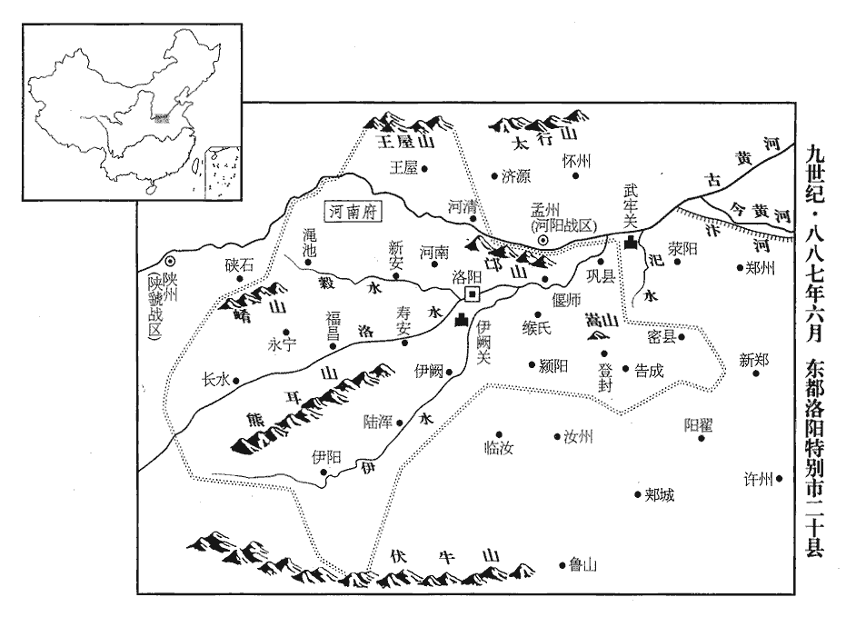
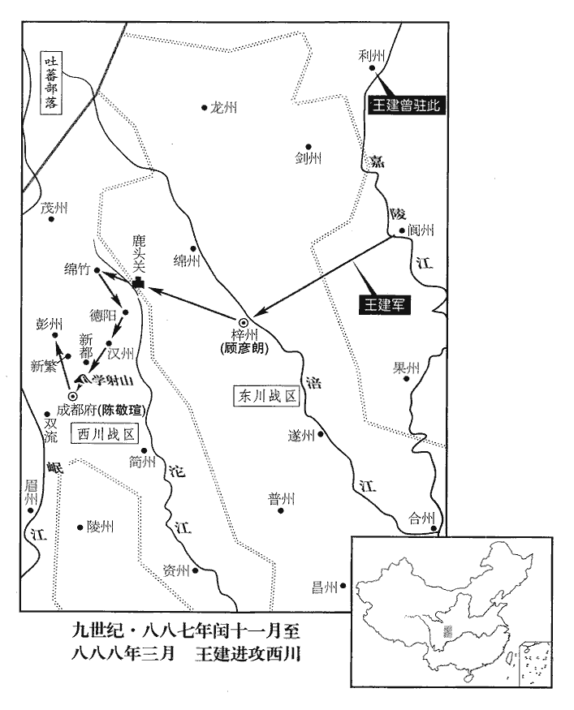
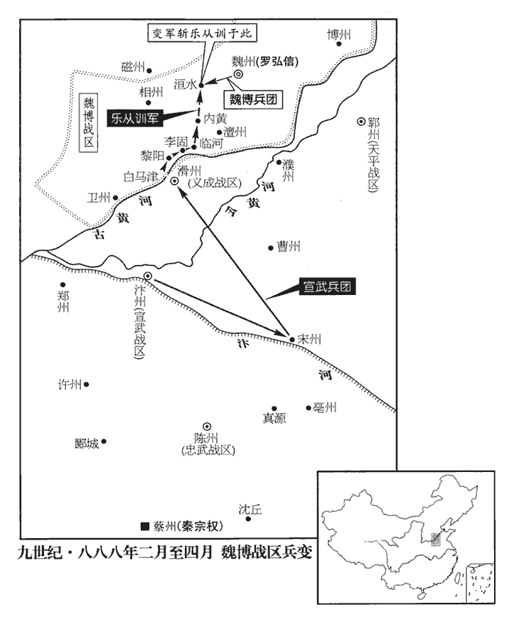
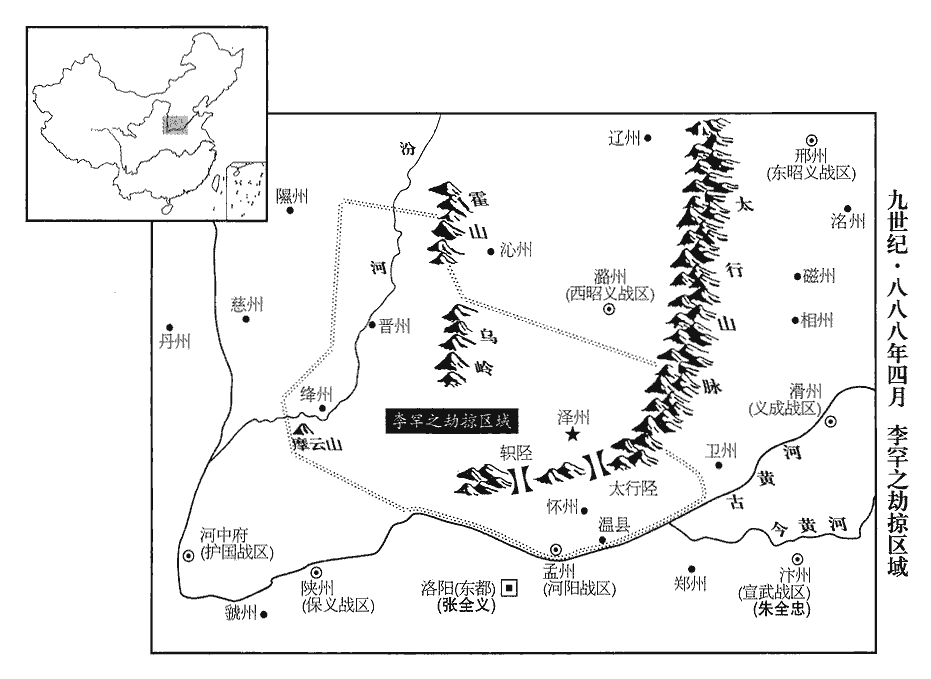
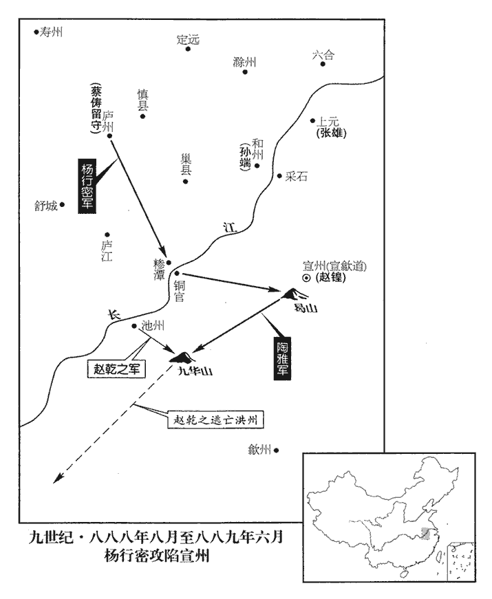

 唐紀七十三起強圉協洽（丁未）四月，盡著雍涒灘（戊申），凡一年有奇。

# 僖宗惠聖恭定孝皇帝下之下

## 光啟三年（丁未、八八七）

1夏，四月，甲辰朔‹一›，約逐蘇州刺史張雄，考異曰：吳越備史：「四月，六合鎮將徐約攻陷蘇州。約，曹州人也，初從黃巢攻天長，遂歸高駢，駢用為六合鎮將。浙西周寶子壻楊茂實為蘇州刺史，約攻破之，遂有其地。」據實錄，寶以其壻為蘇州刺史，朝廷已除趙載代之。張雄據蘇州必在載後，備史恐誤。今從新紀、傳。帥其眾逃入海‹东海›。此句上更有一「雄」字，文意乃足。張雄據蘇州見上卷上年。帥，讀曰率。

〖译文〗 [1]夏季，四月，甲辰朔（初一），徐约赶走苏州刺史张雄，张雄率领他的人马逃往海上。

2高駢聞秦宗權將寇淮南，遣左廂都知兵馬使畢師鐸將百騎屯高郵‹江苏省高邮市›。鐸將以下皆即亮翻。

〖译文〗 [2]高骈听说秦宗权将要侵扰淮南，派遣左厢都知兵马使毕师铎带领一百骑兵驻扎高邮。

時呂用之用事，宿將多為所誅，師鐸自以黃巢降將，常自危。畢師鐸降高駢，見二百五十三卷乾符六年。師鐸有美妾，用之欲見之，師鐸不許；用之因師鐸出，竊往見之，師鐸慚怒，出其妾，由是有隙。

〖译文〗 当时吕用之当权，有丰富经验的老将大多被他诛杀，毕师铎因为是从黄巢那里投降过来的将领，常常为自己的安危担忧。毕师铎有一个漂亮的小妾，吕用之想见见她，毕师铎不准许；吕用这趁着毕师铎外出的机会，偷偷地前去看那美妾，毕师铎羞愧恼怒，将小妾休掉，为此毕师铎与吕用之结下了仇怨。

師鐸將如高郵，用之待之加厚，師鐸益疑懼，謂禍在旦夕。師鐸子娶高郵鎮遏使張神劍女，師鐸密與之謀，神劍以為無是事。神劍名雄，人以其善用劍，故謂之「神劍」。考異曰：十國紀年：「張雄，淮南人，善劍，號張神劍。」今欲別於前蘇州刺史張雄，故從妖亂志，但稱神劍。時府中籍籍，亦以為師鐸且受誅，漢書：事籍籍如此。顏師古註云：籍籍，紛紛也。其母使人語之曰：「設有是事，汝自努力前去，勿以老母、弱子為累！」語，牛倨翻。累，良瑞翻。師鐸疑未決。

〖译文〗 毕师铎将要去高邮，吕用之对待他更加优厚，毕师铎却越来越疑虑恐惧，认为大祸就在眼前了。毕师铎的儿子纳娶高邮镇遏使张神剑的女儿为妻，毕师铎去与张神剑秘密商谋，张神剑认为吕用之不会加害毕师铎。张神剑本名张雄，人们因为他善于用剑，所以叫他张神剑。当时高邮府内众说纷纭，也有的人认为毕师铎将要遭受杀身大祸，毕师铎的母亲派人对毕师铎说：“如果有这样的事，你自己要想方设法离开逃走，不要因为年老的母亲、弱小的儿子拖累了你！”毕师铎犹豫不决。

會駢子四十三郎者素惡用之，惡，烏路翻。欲使師鐸帥外鎮將吏疏用之罪惡，聞於其父，帥，讀曰率。密使人紿之曰：「用之比來頻啟令公，比，毗至翻，近也。襄王熅加駢中書令，故稱令公。紿，徒亥翻。欲因此相圖，已有委曲在張尚書所，當時機密文書謂之委曲。張尚書，謂神劍。宜備之！」師鐸問神劍曰：「昨夜使司有文書，使司，謂淮南節度使司。翁胡不言？」以婚姻呼之為翁。神劍不寤，曰：「無之。」師鐸不自安，歸營，謀於腹心，皆勸師鐸起兵誅用之，師鐸曰：「用之數年以來，人怨鬼怒，安知天不假手於我誅之邪！淮寧‹淮口·泗水注入淮河处›軍使鄭漢章，我鄉人‹冤句·山东省东明县南马头集›，按新書高駢傳：駢置淮寧軍於淮口。畢師鐸、鄭漢章皆冤句人。昔歸順時副將也，謂去黃巢歸高駢時也。素切齒於用之，聞吾謀，必喜。」乃夜與百騎潛詣漢章，漢章大喜，悉發鎮兵及驅居民合千餘人從師鐸至高郵。師鐸詰張神劍以所得委曲，詰，極吉翻。神劍驚曰：「無有。」師鐸聲色浸厲，神劍奮曰：「公何見事之暗！用之姦惡，天地所不容。況近者重賂權貴得嶺南‹总部设广州广东省广州市›節度，復不行，事見上卷上年。復，扶又翻。或云謀竊據此土，使其得志，吾輩豈能握刀頭事此妖物邪！要冎此數賊以謝淮海，何必多言！」冎，古瓦翻。禹貢曰：淮海惟揚州。漢章喜，遂命取酒，割臂血瀝酒，共飲之。乙巳‹二›，眾推師鐸為行營使，為文告天地，移書淮南境內，言誅用之及張守一、諸葛殷之意。以漢章為行營副使，神劍為都指揮使。

〖译文〗 恰好高骈的一个叫四十三郎的儿子一向憎恨吕用之，想让毕师铎率领在外镇守的将领官吏分条陈述吕用之的罪恶行径，报告给他的父亲高骈，并且暗中派人欺骗毕师铎说：“吕用之近年来一再诱导高骈，想要以此来谋害你，已经有机密文书在张神剑那里，应当早作防备！”毕师铎去问张神剑说：“昨天夜间淮南节度使司送来了机密信函，你怎么不对我说？”张神剑不清楚怎么回事，说：“没有什么机密信函。”毕师铎不能安下心来，便回到军营中，与心腹亲信商量对策，都劝毕师铎发兵讨伐吕用之，毕师铎说：“多年来，对吕用之人民怨恨，鬼神愤怒，苍天是不是要借助我的力量来诛灭吕用之呀！淮宁军使郑汉章，是我的同乡，当初离开黄巢投奔高骈时是个副将，一向痛恨吕用之，如果知道了我讨伐吕用之的计谋，他一定会高兴的。”于是毕师铎连夜与一百骑兵秘密到达郑汉章那里，郑汉章大为高兴，把镇所的军队全部发动起来又驱使当地百姓总共一千余人跟随毕师铎到达高邮。毕师铎追问张神剑收到的秘密文书，张神剑惊异地说：“根本没有机密信函。”毕师铎的声色更加严厉，张神剑激奋地说道：“你看事情怎么这样糊涂！吕用之奸邪凶恶，是天地所不容的。况且近来他大肆贿赂身居高位有权势的人，得到岭南东道节度使的官职，又不前去赴任，有的人说吕用之是在筹谋夺取这里的地盘，假使他的狂妄野心得逞，我们这些人怎么能够手握刀把为这种妖魔鬼怪做事！我们要把吕用之这几个乱臣贼子千刀万剐以答谢淮海一带的人民，还有什么可说的！”郑汉章听后大快，于是命令拿酒来，用刀划破胳膊让血滴到酒里，把酒喝掉，乙巳（初二），大家推举毕师铎为行营使，起草檄文祭告天地，向淮南境内传送檄文，说明讨伐吕用之以及张守一、诸葛殷的意图。委任郑汉章为行营副使，张神剑为都指挥使。

神劍以師鐸成敗未可知，請以所部留高郵，曰：「一則為公聲援，二則供給糧餉。」師鐸不悅，漢章曰：「張尚書謀亦善，苟終始同心，事捷之日，子女玉帛相與共之，今日豈可復相違！」復，扶又翻。師鐸乃許之。戊申‹五›，師鐸、漢章發高郵。

〖译文〗 张神剑因为毕师铎的成功和失败还难以预料，请求带领所部人马留在高邮，他对毕师铎说：“这样，一则为你做声援，二则可供给军粮兵饷。”毕师铎对此不高兴，郑汉章说：“尚书张神剑的计谋也不错，如果你们自始至终同心同德，等到事毕告捷的日子，美女宝玉缎帛共同分享，现在怎么可以不保持一致！”毕师铎于是同意张神剑留守高邮。戊申（初五），毕师铎、郑汉章从高邮出发。

庚戌‹七›，詗騎以白高駢，自高郵東南至揚州一百里。詗，翾正翻，又火迥翻。呂用之匿之。

〖译文〗 庚戌（初七），毕师铎派告密骑兵前往广陵向高骈禀告出师情由，被吕用之隐匿起来。

3朱珍至淄青旬日，應募者萬餘人，又襲青州‹山东省青州市›，獲馬千匹；時王敬武鎮淄青，朱珍以他鎮之將來募兵，既不能制，又為所襲。蓋群盜縱橫，力強者勝，莫適為主故也。辛亥‹八›，還，至大梁‹汴州州政府所在城·河南省开封市›，朱全忠喜曰：「吾事濟矣。」

〖译文〗 [3]朱珍到达淄青召募军队，十几天内就有一万余人应募，朱珍又率众攻打青州，获得马匹一千。辛亥（初八），朱珍返回，到达大梁，朱全忠高兴地说：“我的事业成功了！”

時蔡‹河南省汝南县›人方寇汴州，其將張晊zhì屯北郊，秦賢屯板橋‹大梁西郊›，北郊，謂汴州城北郊原之地，即赤岡也。據舊史，板橋在汴州城西。各有眾數萬，列三十六寨，連延二十餘里。全忠謂諸將曰：「彼蓄銳休兵，方來擊我，未知朱珍之至，謂吾兵少，畏怯自守而已；宜出其不意，先擊之。」乃自引兵攻秦賢寨，士卒踊躍爭先；賢不為備，連拔四寨，斬萬餘級，蔡人大驚，以為神。

〖译文〗 当时蔡州人正在寇略汴州，他们的将领张晊屯守在汴州城北的郊外，秦贤屯驻在板桥，各自拥有部众数万人，分成三十六个营寨，彼此连接，延绵二十多里。朱全忠对诸位将领说：“他们先让士兵养精蓄锐，然后才来攻打我们，而不知道朱珍的人马已经到来，认为我们士兵少，只会害怕胆怯闭城自守而已；我们应该出其不意地先攻打他们。”于是朱全忠亲自率领军队攻打秦贤的营寨，士兵们竞相奋勇向前；秦贤没有防备，被朱全忠接连攻克了四个营寨，斩杀一万多人，蔡州军队大为惊恐，认为是神兵降临。

全忠又使牙將新野‹河南省新野县›郭言募兵於河陽、陝、虢‹总部陕州›，得萬餘人而還。陝，失冉翻。還，從宣翻，又如字。

〖译文〗 朱全忠又派牙将新野人郭言到河阳、陕州、虢州一带招募士兵，得到一万多人后返回。

4畢師鐸兵奄至廣陵城下，城中驚擾。壬子‹九›，呂用之引麾下勁兵，誘以重賞，出城力戰。誘，音酉。師鐸兵少卻，用之始得斷橋塞門為守備。是日，駢登延和閣，斷，丁管翻。塞，悉則翻。延和閣，駢所起，見二百五十四卷中和二年。聞諠譟聲，左右以師鐸之變告。駢驚，急召用之詰之，用之徐對曰：「師鐸之眾思歸，為門衛所遏，適已隨宜區處，處，昌呂翻。計尋退散；儻或不已，正煩玄女一力士耳，願令公勿憂！」駢曰：「近者覺君之妄多矣，君善為之，勿使吾為周侍中！」周侍中，謂周寶也，事見上卷本年。言畢，慘沮；久之，用之慙懅而退。懅jù，亦慚也，音遽。

〖译文〗 [4]毕师铎的军队突然来到广陵城下，城中的军民都惊慌失措。壬子日，吕用之带领麾下的精兵，用厚重的赏赐引诱他们，出了广陵城，奋力作战。毕师铎的军队稍微退却，吕用之才得以砍断壕堑上的桥梁，把城门堵住了，来加固防守。这一天，高骈登上延和阁，听到喧嚣鼓噪的声音，左右的人把毕师铎发动叛变的消息报告给他。高骈非常吃惊，立刻把吕用之召来诘问，吕用之从容地回答说：“毕师铎的部众想要回去，被城门的卫兵阻止了，我刚才已经随机应变地做了恰当的处理，估计不用多久就会撤退散去，如果毕师铎还不停止的话，只有烦劳九天玄女的一个力士来平定他们了，希望您不要忧愁。”高骈说：“近来我觉得你虚妄不实的地方太多了，你好自为之，不要让我如同周宝那样众叛亲离。”说完后神色沮丧了很长时间，吕用之羞惭地退下去了。

師鐸退屯山光寺‹扬州市北›，山光寺，在廣陵城北。以廣陵‹扬州市›城堅兵多，甚有悔色；癸丑‹十›，遣其屬孫約與其子詣宣州‹安徽省宣州市›，乞師於觀察使秦彥，且許以克城之日迎彥為帥。帥，所類翻。會師鐸館客畢慕顏自城中逃出，言「眾心離散，用之憂窘，若堅守之，不日當潰。」師鐸乃悅。

〖译文〗 毕师铎退兵屯守在山光寺，因为广陵城防守坚固，士兵众多，露出了后悔的神色。癸丑日，毕师铎派遣他的部属孙约和他的儿子到宣州去，向观察使秦彦请求派兵支援，并且许诺攻克了广陵城之后迎接秦彦做统帅。恰逢毕师铎馆舍的客人毕慕颜从广陵城里逃出来，说“城里人心离散，吕用之忧愁困窘，如果坚决防守，用不了几天吕用之的部众一定溃败。”毕师铎这才高兴起来。

是日未明，駢召用之，問以事本末，用之始以實對，駢曰：「吾不欲復出兵相攻，復，扶又翻。君可選一溫信大將，溫，柔和也。信，誠實不妄言者也。以我手札諭之，若其未從，當別處分。」處，昌呂翻。按書及春秋「分器」。記曲禮「分毋求多」，漢書「分職」、「分部」，並音扶問翻；則處分之分亦當同音。今人讀為分判之分，誤也。用之退，念諸將皆仇敵，必【章：十二行本「必」上有「往」字；乙十一行本同。】不利於己，甲寅‹十一›，遣所部討擊副使許戡，齎駢委曲委曲，即駢手札也。及用之誓狀并酒殽出勞師鐸，勞，力到翻。師鐸始亦望駢舊將勞問，得以具陳用之姦惡，披泄積憤，披，開也，分也。決壅為泄。見戡至，大罵曰：「梁纘、韓問何在，乃使此穢物來！」戡未及發言，已牽出斬之。乙卯‹十二›，師鐸射書入城，射，而亦翻。用之不發，即焚之。

〖译文〗 这一天天还没有亮的时候，高骈把吕用之召来，询问他这件事情的原委始末，吕用之这才说出了实情，高骈说：“我不愿意再派军队出城攻打他，你可以挑选一个温和诚信的大将，拿我的亲笔信晓谕毕师铎。如果他不听从劝告，就再做另外处置。”吕用之退了下去，想到诸位将领都是自己的仇敌，如果派他们去，一定对自己不利，甲寅日，派遣他的部将讨击副使许戡拿着高骈的亲手信与吕用之的誓言，连同美酒佳肴出了广陵城，去慰劳毕师铎。毕师铎开始时也希望高骈的旧部将出城来犒劳慰问，然后乘机陈述吕用之的奸邪罪恶，来发泄积压在心中的愤恨，但是看到来的人是许戡，就大声怒骂说：“梁缵、韩问他们到哪里去了，竟然这种污秽下贱的东西来！”许戡还来不及说话，就被拉出斩首了。乙卯日，毕师铎写了一封信，用箭射入城内，吕用之连看都没看，就烧毁了。

丁巳‹十四›，用之以甲士百人入見駢於延和閣下，駢大驚，匿于寢室，久而後出，曰：「節度使所居，無故以兵入，欲反邪！」命左右驅出。用之大懼，出子城南門，舉策指之曰：「吾不可復入此！」復，扶又翻。自是高、呂始判矣。

〖译文〗 丁巳日，吕用之带领一百名身穿战甲的士兵到延和阁下去看高骈，高骈非常吃惊，隐藏在卧室中，很久之后才出来，说：“你竟然无故带领士兵进入节度使居住的地方，是想造反吗！”命令左右的侍卫把他们赶出去。吕用之大为恐惧，从子城的南门逃出去，手举马鞭指着子城说：“我绝不再来这里了！”从此，高骈与吕用之才分开。

是夜，駢召其從子前左金吾衛將軍傑密議軍事；戊午‹十五›，署傑都牢城使，泣而勉之，以親信五百人給之。

〖译文〗 这一天夜里，高骈把他的侄子前左金吾卫将军高杰召来，秘密商谋军事要务。戊午日，高骈署任高杰为都牢城使，流着眼泪勉励他，授给他亲信兵卒五百人。

用之命諸將大索城中丁壯，索，山客翻。無問朝士、書生，悉以白刃驅縛登城，令分立城上，自旦至暮，不得休息；又恐其與外寇通，數易其地，數，所角翻。家人餉之，莫知所在。由是城中人亦恨師鐸入城之晚也。

〖译文〗 吕用之命令各位部将大肆搜索广陵城中的壮丁，不过问他们是朝中人士，还是书生，都用雪亮锐利的刀剑逼迫他们，并且捆绑着登上城墙，命令他们分开站立在城墙上，从早晨一直到晚上，不得休息。吕用之又担心他们与城外毕师铎的人暗中联络，屡次更换他们防守的地方，家人送饭给他们，都不知道他们在哪里。广陵城中的人们因此都怨恨毕师铎为什么不早日攻入城中。

駢遣大將石鍔鍔è，逆各翻。以師鐸幼子及其母書并駢委曲至揚子‹扬州市南长江渡口›諭師鐸，師鐸遽遣其子還，曰：「令公但斬呂、張以示師鐸，師鐸不敢負恩，願以妻子為質。」質，音致。駢恐用之屠其家，收師鐸母妻子置使院。使院，節度使司官屬治事之所。

〖译文〗 高骈派遣大将石锷带着毕师铎的小儿子以及他的母亲的信并同高骈的亲笔信到扬子县，告谕毕师铎，毕师铎立刻把他的儿子遣返，对高骈说：“您只要把吕用之与张守一斩首了，我绝对不敢辜负您的恩惠，愿意用我的妻子、儿子作人质。”高骈担心吕用之会屠杀毕师铎的家人，就把毕师铎的母亲、妻子及儿子都安置在使院。

辛酉‹十八›，秦彥遣其將秦稠將兵三千至揚子助師鐸。壬戌‹十九›，宣州軍攻南門，不克；癸亥‹二十›，又攻羅城東南隅，城幾陷者數四。幾，居依翻。甲子‹二十一›，羅城西南隅守者焚戰格以應師鐸，戰格，列木為之，漢人謂之笓格，今謂之排杈。師鐸毀其城以內其眾。用之帥其眾千人力戰于三橋北，帥，讀曰率。師鐸垂敗，會高傑以牢城兵自子城出，欲擒用之以授師鐸，用之乃開參佐門北走。駢召梁纘以昭義軍百餘人保子城。

〖译文〗 辛酉日，秦彦派遣他的部将秦稠率领三千士兵到达扬子县援助毕师铎。壬戌日，宣州军队对广陵城南门发动攻击，没有攻克。癸亥日，又攻打罗城的东南角，多次差一点就攻破了。甲子日，罗城西南角的护卫士兵烧毁防守的木栅，来接应毕师铎，毕师铎捣毁那里的外围小城的城墙，接纳里面的众人。吕用之率领他的部众一千人在三桥北面奋力作战，毕师铎眼看就要战败了，恰好高杰带领牢城军队从内城杀了出来，想要抓住吕用之，然后把他交给毕师铎，吕用之于是把参佐门打开，向北逃走了。高骈召来梁缵所带领的一百名昭义兵保卫子城。

乙丑‹二十二›，師鐸縱兵大掠。駢不得已，命徹備，與師鐸相見於延和閣下，交拜如賓主之儀，署師鐸節度副使、行軍司馬，仍承制加左僕射，鄭漢章等各遷官有差。

〖译文〗 乙丑日，毕师铎放纵军队大肆掠夺。高骈迫不得已，命令撤除防备，与毕师铎在延和阁下见面，互相行礼，如同主人和宾客一样，高骈署任毕师铎为节度副使、行军司马，仍然承制加封他为左仆射，擢升郑汉章等人的官职，各有等差。

左莫邪都虞候申及，本徐州健將，高駢置左、右莫邪都，見二百五十四卷中和二年。入見駢，說之曰：說，式芮翻。「師鐸逆黨不多，【章：十二行本「多」下有「諸門尚未有守者」七字；乙十一行本同；孔本同；張校同；退齋校同。】請令公及此選元從三十人，及此，言及此時也。從，才用翻。夜自教場門出，比師鐸覺之，追不及矣。比，必利翻，及也。然後發諸鎮兵，還取府城，此轉禍為福也。若一二日事定，浸恐艱難，及亦不得在左右矣。」言之，且泣，駢猶豫不聽。楚靈王‹芈围›有言：「大福不再，祇取辱耳。」高駢蓋知行留皆禍，故猶豫不聽。及恐語泄，遂竄匿，會張雄至東塘‹江苏省扬州市东›，張雄棄蘇州逃入海，又自海泝江而上，至揚州東塘。及往歸之。

〖译文〗 左莫邪都虞候申及原本是徐州的健将，他入城拜谒高骈，游说他说：“毕师铎这个逆贼的党徒不多，请求趁着这个机会挑选原先就跟随您的亲信三十人，在今天夜里从教场门出去，等到毕师铎发觉，再去追赶就来不及了。然后再发动各个镇所的军队，回来攻取广陵城，这是转祸为福的计策。您必须在一两天之内决定这件事，再拖延恐怕形势会更加危急紧迫，我申及也不能再留在您左右事奉了。”申及说完这些话，就流下了眼泪，高骈迟疑不定，没有采纳申及的建议。申及怕自己的话泄漏出去，所以逃窜躲藏起来，恰好遇到张雄来到东塘，申及就前往投奔张雄了。

丙寅‹二十三›，師鐸果分兵守諸門，搜捕用之親黨，悉誅之。師鐸入居使院，秦稠以宣‹首府宣州›軍千人分守使宅及諸倉庫。使，疏吏翻。丁卯‹二十四›，駢牒請解所任，以師鐸兼判府事。

〖译文〗 丙寅日，毕师铎果真分派军队守卫广陵城的各个城门，搜索逮捕吕用之的亲信、同党，将他们全部诛杀。毕师铎进入使院居住，秦稠派遣一千名宣州兵分别守卫使宅以及所有仓库。丁卯日，高骈上呈公文请求解除他所担任的职务，任命毕师铎兼管府中的事务。

師鐸遣孫約至宣城‹宣州州政府所在县·安徽省宣州市›，趣秦彥過江。趣，讀曰促。或說師鐸曰：說，式芮翻。「僕射曏者舉兵，蓋以用之輩姦邪暴橫，橫，戶孟翻。高令公坐自聾瞽，不能區理，區，分別也。理，調治也。故順眾心為一方去害。去，羌呂翻。今用之既敗，軍府廓然，僕射宜復奉高公而佐之，但總其兵權以號令，誰敢不服！用之乃淮南一叛將耳，移書所在，立可梟擒。如此，外有推奉之名，內得兼并之實，雖朝廷聞之，亦無虧臣節。使高公聰明，必知內愧；如其不悛，悛，丑緣翻，改也。乃机上肉耳，柰何以此功業付之他人，豈惟受制於人，終恐自相魚肉！前日秦稠先守倉庫，其相疑已可見。且秦司空為節度使，廬州、壽州其肯為之下乎！廬州，楊行密。壽州，張翱。僕見戰攻之端未有窮已，豈惟淮南之人肝腦塗地，竊恐僕射功名成敗未可知也！不若及今亟止秦司空亟，紀力翻，急也。勿使過江，彼若粗識安危，必不敢輕進；粗，坐五翻。就使他日責我以負約，猶不失為高氏忠臣也。」師鐸大以為不然，明日，以告鄭漢章，漢章曰：「此智士也！」散求之，其人畏禍，竟不復出。復，扶又翻。

〖译文〗 毕师铎把孙约派到宣城，催促秦彦渡江。有人游说毕师铎说：“您之前兴起兵事，是因为吕用之一伙人奸邪残暴蛮横，高骈坐在那里如同耳聋眼瞎一样，不能处理政务，因此顺从大家的心愿，翦除这个地方的祸害。现在吕用之既已失败，广陵城内的军府也都肃清了，您应当再尊奉高骈，并且辅佐他，只要您总领兵权，发号施令，谁敢不服从！吕用之只是淮南的一名叛将，把檄文移送到他所在的地方，立刻就能擒获他。如此一来，您在外面获得了推奉高骈的美名，在里面又得到了吞并他人力量的实惠，纵使朝廷得知了，你也没有亏损臣子的节操。假使高骈聪明的话，内心必然会感到羞惭；假使高骈并不能醒悟改过，他也只是菜板上任人摆布的肉罢了，为什么要把这样的功业交付给他人，那样岂不只能受到他人的牵制，恐怕最终还会自相残杀。昨天秦稠抢先守卫仓库，他的可疑之处已经可以看出来了。何况一旦秦彦做了淮南节度使，庐州的杨行密、寿州的张翱又哪里肯屈居在他之下！我预见攻占征伐的事端将不会有终止的一天，岂是只有淮南的百姓要惨遭战祸，肝脑涂地，我私下担心你的功名和成败还不可预知！不如趁着现在赶紧阻止秦司空，不能让他渡过长江，如果他还能大略意识到安危的情势，一定不敢轻易前进。就算日后秦彦责备您背弃了先前的约定，您仍然还是高骈的忠诚臣子。”毕师铎却完全不以为然，第二天，把这些话对郑汉章说了，郑汉章说：“这是一个有智谋人啊！”四处寻找他，这个人畏惧祸患，竟然不再露面了。

戊辰‹二十五›，駢遷家出居南第，師鐸以甲士百人為衛，其實囚之也。是日，宣軍以所求未獲，焚進奉兩樓數十間，寶貨悉為煨燼。新書高駢傳：駢自乾符以來，貢獻不入天子，寶貨山積於進奉樓。按駢乾符末始自浙西徙淮南，中和二年罷兵權利權，貢獻始絕矣。煨，烏回翻。燼，徐刃翻。己巳‹二十六›，師鐸於府廳視事，凡官吏非有兵權者皆如故，復遷駢於東第。復，扶又翻；下同。自城陷，諸軍大掠【章：十二行本「掠」下有「晝夜」二字；乙十一行本同；孔本同；張校同。】不已，至是，師鐸始以先鋒使唐宏為靜街使，禁止之。

〖译文〗 戊辰日，高骈举家搬出延和阁，住在城南的府第，毕师铎派出一百名甲士做高骈的护卫，实际上是把他监禁起来。这一天，秦稠率领的宣州军队因为所要求的东西没有拿到，于是放火焚烧进奉两楼的数十间房屋，钱财、货物都被烧成了灰烬。己巳日，毕师铎在府厅中处理事情，凡是没有掌管兵权的官吏都担任原先的职位，再次把高骈迁居到城东的府第。自从广陵城被攻陷以后，各路军队大肆掠夺没有止息。到此时，毕师铎才开始派先锋使唐宏为静街使，禁止军队劫掠。

駢先為鹽鐵使，乾符六年，駢為鹽鐵轉運使，中和二年，解使職。積年不貢奉，貨財在揚州者，填委如山。駢作郊天、御樓六軍立仗儀服，郊天及御樓肆赦，六軍皆立仗。及大殿元會、內署行幸供張器用，皆刻鏤金玉、蟠龍蹙鳳數十萬事，悉為亂兵所掠，歸于閭閻，張陳寢處其中。供，居用翻。張，知亮翻；張陳同。鏤，郎豆翻。處，昌呂翻。

〖译文〗 高骈原先担任盐铁转运使，连续多年不向朝廷进贡，储存在扬州的货物钱财堆积起来像小山一样。高骈制作了郊外祭天与登楼大赦罪人时六军的陈设仪仗与礼仪服装，以及大殿中元旦的大会、内附官署中供天子巡行时陈设的器物用品，都镶嵌上金银、宝玉，雕刻着盘旋的蛟龙、敛翼的彩凤，多达几十万件，全部被乱兵抢夺一空，散入里巷人家，摆放在卧室居所之中。

庚午‹二十七›，獲諸葛殷，杖殺之，棄尸道旁，怨家抉其目，斷其舌，決，於決翻。斷，都管翻；下斷手同。眾以瓦石投之，須臾成冢。呂用之之敗也，其黨鄭𣏌sì首歸師鐸，師鐸署𣏌知海陵‹江苏省泰州市›監事。海陵監，筦榷鬻鹽。𣏌至海陵，陰記高霸得失，聞於師鐸。高霸時為海陵鎮遏使。霸獲其書，杖𣏌背，斷手足，刳目截舌，然後斬之。

〖译文〗 庚午日，毕师铎虏获诸葛殷，把他用棍棒打死，并把尸体弃置在大路旁边，他的仇家挖出他的眼睛，割断他的舌头，民众往尸体上投掷碎瓦、石块，没多久就堆成了小山。吕用之失败的时候，他的同党郑杞率先归服毕师铎，毕师铎署任郑杞掌管海陵监事。郑杞到了海陵，暗地里记下海陵镇遏使高霸的利弊得失，以便向毕师铎报告。高霸截获了他的文书，用杖责打他的背，斩断他的手、脚，挖出眼睛，割断舌头，然后才杀死他。

5蔡將盧瑭屯于萬勝‹河南省中牟县西北›，萬勝鎮在中牟縣。夾汴水而軍，以絕汴州運路，薛史梁紀曰：盧瑭於圃田北夾汴水為梁，以扼運路。宋白亦曰：萬勝寨在圃田北。朱全忠乘霧襲之，掩殺殆盡。考異曰：薛居正五代史云「四月庚午。」按長曆，四月甲辰朔，無庚午。薛史誤。於是蔡兵皆徙就張晊，屯於赤岡‹河南省开封市东北›；赤岡在汴城北。全忠復就擊之，殺二萬餘人。蔡人大懼，或軍中自相驚，全忠乃還大梁，養兵休士。

〖译文〗 [5]蔡州军队将领卢瑭驻扎中牟县万胜镇，他在汴水两侧安置军营，以便断绝汴州城的运输途径，朱全忠乘着大雾去攻打，将卢瑭的人马几乎消灭光了。于是，蔡州的军队都转移到张那里，汴州城北的赤冈驻扎；朱全忠再次率众前去攻打，斩杀二万余人。蔡州人十分恐惧，有时在军营内就自相惊慌起来，朱全忠于是回到大梁，休养整顿军队。

6辛未‹二十八›，高駢密以金遺守者，駢冀守者恩之，因以求出。遺，唯季翻。畢師鐸聞之，壬午‹二十九›，復迎駢入道院，道院，高駢所起以迎神仙。收高氏子弟甥姪十餘人同幽之。

〖译文〗 [6]辛未（二十八日），高骈暗中向看守他的士兵赠送金钱，毕师铎察觉到这事，壬午（疑误），又把高骈接入道院，把高骈的儿子兄弟外甥侄子十几个都一同集中幽禁起来。

7前蘇州刺史張雄帥其眾自海泝江，屯於東塘，遣其將趙暉入據上元‹江苏省南京市›。張雄、馮弘鐸由此得據昇州。帥，讀曰率。

〖译文〗 [7]以前的苏州刺史张雄率领他的人马从海上沿着长江逆流而上，在东塘驻扎，他还派遣属下将领赵晖开进并占据了上元。

8畢師鐸之攻廣陵也，呂用之詐為高駢牒，署廬州刺史楊行密行軍司馬，追兵入援。廬江‹安徽省庐江县›人袁襲說行密曰：「高公昏惑，用之姦邪，師鐸悖逆，凶德參會，三者合集為參會。說，式芮翻。而求兵於我，此天以淮南授明公也，趣赴之。」趣，讀曰促。行密乃悉發廬州兵，復借兵於和州‹安徽省和县›刺史孫端，復，扶又翻。考異曰：妖亂志：「中和三年，高駢差梁纘知和州。纘以孫端窺伺和州已久，不如因而與之以責其效。駢強之，既行，果為端所敗。及歸，和州尋陷於端。」蓋端自是遂據和州也。合數千人赴之，五月，至天長‹安徽省天长市›。鄭漢章之從師鐸也，留其妻守淮口‹泗水注入淮河处·江苏省淮阴市西南›，用之帥眾攻之，帥，讀曰率。旬日不克，漢章引兵救之。用之聞行密至天長，引兵歸之。為用之為行密所誅張本。

〖译文〗 [8]毕师铎攻打广陵时，吕用之假借高骈的名义颁布公文，暂任庐州刺史杨行密为行军司马，命他派军队来广陵救援。庐江人袁袭劝告杨行密说：“高骈昏庸糊涂，吕用之奸诈邪恶，毕师铎叛逆作乱，这三个人合在一起可以说是恶劣德行的大汇聚，现在来请求我们出兵救援，这是天意把淮南授给你，你应当马上前赴广陵。”杨行密于是把庐州军队全部发动起来，又向和州刺史孙端求借军队，集合几千人马开赴广陵。五月，到达天长。当初郑汉章跟随毕师铎出征广陵，留下他的妻子守卫淮口，吕用之便带领人马攻打淮口，十天时间没有攻克，郑汉章率领军队回来应救。吕用之听说杨行密到达天长，便带着人马返回。

9丙子‹三›，朱全忠出擊張晊，大破之。秦宗權聞之，自鄭州‹河南省郑州市›引精兵會之。宗權引兵會晊以擊全忠。

〖译文〗 [9]丙子（初三），朱全忠派出军队攻打张，张大败。秦宗权获悉，从郑州带领精壮军队与张相会以抗击朱全忠。

10張神劍求貨於畢師鐸，師鐸報以俟秦司空之命，神劍怒，亦以其眾歸楊行密；及海陵鎮遏使高霸、曲溪‹江苏省盱眙县西南›人劉金、盱眙‹江苏省盱眙县›人賈令威悉以其眾屬焉。揚州盱眙縣西南十里有曲溪。劉金，曲溪屯將也。行密眾至萬七千人，張神劍運高郵糧以給之。

〖译文〗 [10]张神剑向毕师铎请求资财，毕师铎回答他要等秦彦的命令，张神剑很恼怒，也带领他的人马投归了杨行密；接着海陵镇遏使高霸、曲溪人刘金、盱眙人贾令威都率领所部人马归属杨行密。杨行密的军队达到一万七千人，张神剑运送高邮的粮食供给这些军队需用。

11朱全忠求救於兗、鄆，朱瑄、朱瑾皆引兵赴之，義成‹总部设滑州河南省滑县›軍亦至。二年，朱全忠并義成軍，徵其兵以擊蔡人。辛巳‹八›，全忠以四鎮兵攻秦宗權於邊孝村‹河南省开封市北›，大破之，邊孝村，在汴州北郊。斬首二萬餘級；宗權宵遁，全忠追之，至陽武橋‹河南省原阳县南›而還。陽武橋在鄭州陽武縣，縣在汴州西北九十里。還，從宣翻，又如字。全忠深德朱瑄，兄事之。蔡人之守東都、河陽、許、汝‹河南省汝州市›、懷‹河南省沁阳市›、鄭、陝‹河南省三门峡市›、虢‹河南省灵宝市›者，聞宗權敗，皆棄去。宗權發鄭州，孫儒發河陽，皆屠滅其人，焚其廬舍而去，宗權之勢自是稍衰。朝廷以扈駕都頭楊守宗知許州事，朱全忠以其將孫從益知鄭州事。

〖译文〗 [11]朱全忠向兖州、郓州请求救援，朱、朱瑾都带领人马前往，义成军也赶到。辛巳（初八），朱全忠指挥四个镇所的军队在汴州北郊的边孝村攻打秦宗权，将他打败，斩杀两万余人。秦宗权夜间逃跑，朱全忠追赶他，直到阳武桥才返回。朱全忠深深地感恩朱，把他当作兄弟对待。蔡州军队中护守东都、河阳、许州、汝州、怀州、郑州、陕州、虢州的人，听说秦宗权失败，都纷纷离去。秦宗权征发郑州，孙儒征发河阳，都大肆屠杀那里的人民，焚烧当地的房屋而后离去，秦宗权的势力从这以后有所衰落。朝廷任命扈驾都头杨守宗掌管许州事宜，朱全忠委任属下将领孙从益掌管郑州事宜。

12錢鏐遣東安都將杜稜、浙江‹钱塘江›都將阮結、靜江都將成及將兵討薛朗。九域志：杭州新城縣有東安鎮。浙江、靜江二都，蓋分屯杭州城外沿江一帶，自定山下至海門。討薛朗，以其逐周寶也。

〖译文〗 [12]钱派遣东安都将杜棱、浙江都将阮结、静江都将成及带领军队讨伐薛朗。

13甲午‹二十一›，秦彥將宣歙兵三萬餘人，乘竹筏沿江而下，趙暉邀擊於上元，殺溺殆半。歙，書涉翻。丙申‹二十三›，彥入廣陵，自稱權知淮南節度使，【章：十二行本「使」作「事」；乙十一行本同；張校同，云無註本作「使」。】仍以畢師鐸為行軍司馬，補池州‹安徽省贵池市›刺史趙鍠為宣歙觀察使。鍠，戶盲翻。戊戌‹二十五›，楊行密帥諸軍抵廣陵城下，為八寨以守之，帥，讀曰率；下同。秦彥閉城自守。考異曰：妖亂志：「六月，癸卯朔，秦彥命鄭漢璋等守諸門。」按寇至城下，即應城守，豈有戊戌行密至，癸卯始守城乎！今不取。

〖译文〗 [13]甲午（二十一日），秦彦带领宣歙军队三万余人，乘坐竹筏沿着长江向下开进，赵晖在上元拦截阻击，斩杀和溺死水中的人将近一半。丙申（二十三日），秦彦进入广陵城，自称暂时管理淮南节度使事务，仍然委任毕师铎为行军司马，补授池州刺史赵为宣歙观察使。戊戌（二十五日），杨行密率领各路军队抵达广陵城下，安设八个营寨自守，秦彦则关闭城门固守。

14六月，戊申‹六›，天威都頭楊守立天威，亦神策五十四都之一。與鳳翔節度使李昌符爭道，麾下相毆，毆，烏口翻，擊也。帝命中使諭之，不止。是夕，宿衛皆嚴兵為備。己酉‹七›，昌符擁兵燒行宮，庚戌‹八›，復攻大安門。復，扶又翻。守立與昌符戰於通衢，昌符兵敗，帥麾下走保隴州‹陕西省陇县›。九域志：鳳翔西至隴州一百五十里。杜讓能聞難，挺身步入侍；韋昭度質其家於軍中，難，乃旦翻。質，音致。誓誅反賊，故軍士力戰而勝之。守立，復恭之假子也。壬子‹十›，以扈駕都將、武定‹总部设洋州陕西省洋县›節度使李茂貞李茂貞時領武定節宿衛。為隴州招討使，以討昌符。

〖译文〗 [14]六月，戊申（初六），神策军中的天威都头杨守立与凤翔节度使李昌符二人争抢道路，部下殴打起来，唐僖宗命令宦官传谕劝解，竟不能罢休。这天夜晚，宫中值宿士兵严阵以待防备不测。已酉（初七），李昌符带领军队焚烧唐僖宗的行宫；庚戌（初八），李昌符又攻打大安门。杨守立与李昌符在宫外道路上对战，最后李昌符的军队战败，率领手下人马逃往陇州固守。在这期间，杜让能听说皇宫有难，挺身而出进入宫中护卫唐僖宗；韦昭度则把他的家人放在军营中作为人质，以表示他誓死斩杀谋反贼子的决心，因此军中士卒竭力苦战，终于战胜。杨守立，是杨复恭的养子。壬子（初十），朝廷任命扈驾都武、武定节度李茂贞为陇州招讨使，以讨伐李昌符。

15甲寅‹十二›，河中‹山西省永济市›牙將常行儒殺節度使王重榮。重榮用法嚴，末年尤甚；行儒嘗被罰，恥之，被，皮義翻。遂作亂。夜，攻府舍，重榮逃於別墅；墅，承與翻。明旦，行儒得而殺之。制以陝虢‹总部设陕州河南省三门峡市›節度使王重盈為護國節度使，又以重盈子珙權知陝虢留後。珙gǒng，居勇翻。重盈至河中，執行儒，殺之。舊書帝紀云：常行儒殺王重榮，推重榮兄重盈為兵馬留後。

〖译文〗 [15]甲寅（十二日），河中牙将常行儒将节度使王重荣杀死。王重荣执行法度极其严格，到了晚年更为厉害；常行儒曾经被王重荣处罚，对此感到很耻辱，于是发动了叛乱。夜间，常行儒攻打王重荣的府第，王重荣逃到别墅；第二天早晨，常行儒抓获王重荣并将他杀掉。朝廷下命委任王重荣的哥哥陕虢节度使王重盈为护国节度使，又任命王重盈的儿子王珙暂任陕虢留后。王重盈到达河中，抓获常行儒，将他杀掉。

16戊午‹十六›，秦彦遣畢師鐸、秦稠將兵八千出城，西撃楊行密，稠敗死，士卒死者什七八。城中乏食，樵採路絶，宣州軍始食人。宣州軍，秦彦兵也。

〖译文〗 [16]戊午（十六日），秦彦派遣毕师铎、秦稠带领军队八千人出广陵城，向西攻打杨行密，秦稠战败身亡，所部士卒战死的占十分之七八。广陵城内缺乏粮食，出外打柴的道路也被断绝，秦彦率领的宣州军队开始吃人充饥。

17壬戌‹二十›，亳州‹安徽省亳州市›將謝殷逐其刺史宋袞。

〖译文〗 [17]壬戌（二十日），毫州将领谢殷驱逐毫州刺史宋衮。

 

18孫儒既去河陽，李罕之召張全義於澤州‹山西省晋城市›，去年，孫儒陷河陽，張全義據懷州，李罕之據澤州以拒之。蓋懷州逼近河陽，全義尋退屯澤州也。舊書帝紀云：李罕之自澤州收河陽，懷州刺史張全義收洛陽。與之收合餘眾。罕之據河陽，全義據東都，共求援於河東；李克用以其將安金俊為澤州刺史，將騎助之，考異曰：太祖紀年錄：「七月，癸巳，澤州刺史張全義棄城而遁，太祖以安金俊為澤州刺史。」薛居正五代史亦云：「七月，武皇以金俊為澤州刺史。」按實錄，六月，全義已除河南尹。薛史罕之傳，罕之求援，克用遣澤州刺史安金俊助之，蓋二人先以澤州賂克用，非七月也。表罕之為河陽節度使，全義為河南尹。考異曰：薛居正五代史：「克用表張言為河南尹、東都留守。」實錄：「以澤州刺史李罕之為河陽節度使，懷州刺史張全義為河南尹。」按諸葛爽表全義為澤州刺史，及仲方敗，罕之據澤州，全義據懷州耳，非刺史也。

〖译文〗 [18]孙儒既然已离开了河阳，李罕之便在泽州召来张全义，和他一道把剩下的人马收集起来。李罕之占据河阳，张全义占据东都洛阳，一同向河东节度使李克用请求援助；李克用任命手下将领安金俊为泽州刺史，带领骑兵前往援助，并进呈表章任命李罕之为河阳节度使，张全义为河南尹。

初，東都經黃巢之亂，遺民聚為三城以相保，繼以秦宗權、孫儒殘暴，僅存壞垣而已。全義初至，白骨蔽地，荊棘彌望，居民不滿百戶，全義麾下纔百餘人，相與保中州城，城在二城之中間，故謂之中州城。四野俱無耕者。全義乃於麾下選十八人材器可任者，人給一旗一牓，謂之屯將，將，即亮翻。使詣十八縣故墟落中，植旗張牓，招懷流散，勸之樹藝。河南二十縣，河南、洛陽二縣在城中，其外偃師‹河南省偃师市›、鞏‹河南省巩义市›、緱gōu氏‹河南省偃师县南缑氏镇›、陽城‹河南省登封市东南›、登封‹河南省登封市›、陸渾‹河南省嵩县›、伊闕‹河南省伊川县›、新安‹河南省新安县›、澠池‹河南省渑池县›、福昌‹河南省洛宁县东北›、長水‹河南省洛宁县西南长水镇›、永寧‹河南省洛宁县北›、壽安‹河南省宜阳县›、密‹河南省新密市›、河清‹河南省济源市南›、潁陽‹河南省登封市西南颍阳镇›、伊陽‹河南省嵩县西南旧县治›、王屋‹河南省济源市西›，凡十八縣。惟殺人者死，餘但笞杖而已，無嚴刑，無租稅，民歸之者如市。又選壯者教之戰陳，以禦寇盜。陳，讀曰陣。數年之後，都城坊曲，漸復舊制，諸縣戶口，率皆歸復，桑麻蔚然，野無曠土。蔚，音鬱。不耕之土曰曠土。曠，空也。其勝兵者，勝，音升。大縣至七千人，小縣不減二千人，乃奏置令佐以治之。治，直之翻。全義明察，人不能欺，而為政寬簡。出，見田疇美者，輒下馬，與僚佐共觀之，召田主，勞以酒食；勞，力到翻。有蠶麥善收者，蠶四伏無病而成繭，麥就實黃熟而豐厚，為善收。或親至其家，悉呼出老幼，賜以茶綵衣物。民間言：「張公不喜聲伎，喜，許記翻。伎，渠綺翻。見之未嘗笑；獨見佳麥良繭則笑耳。」有田荒穢者，則集眾杖之；或訴以乏人牛，乃召其鄰里責之曰：「彼誠乏人牛，何不助之！」眾皆謝，乃釋之。由是鄰里有無相助，故比戶皆有蓄積，比，毗至翻，又毗必翻。凶年不饑，遂成富庶焉。史究言張全義治河南之績效。

〖译文〗 当初，东都洛阳经过黄巢的战乱，劫后遗留的百姓聚集成为三个城以相互保护，接着又有秦宗权、孙儒的残酷暴行，留下的仅仅是残垣断壁。张全义刚到这里时，只见白骨遍地，放眼望去到处是丛生的草木，居民总共不到一百户，张全义的部下才一百多人，共同守卫三城中间的中州城，四周田野都没有耕作的人。张全义于是在手下中挑选了十八个才能器度可以任用的人，每人发给一面旗帜一张榜文，称作屯将，派他们分别到河南十八个县旧有的村落之中，立起大旗张贴榜文，招收抚恤四处流散的百姓，规劝他们种植耕作。只有犯了杀人罪的处死，其他罪过仅予笞打杖击，没有严酷刑罚，不收田租赋税，因此老百姓前来归顺的象赶集一样。张全义还挑选精明强壮百姓教授作战阵法，以防御贼寇强盗。几年之后，河南各地的城市店铺乃至小巷，都渐渐地恢复了原来的规模式样，各县的民户人口，大多都回归，各种农作物生长茂盛，田野里再也没有空旷的地方。各地负担供养的军队，大县达到七千人，小县也不少于二千人，于是张全义进呈奏章请设置县令佐官治理地方。张全义精明强士，人们对他不能有欺隐，同时他办理政务又宽厚简明。张全义外出，看见田地中的作物很茂盛，就下马，与身边的臣僚共同观赏，召来田地的主人，用美酒好饭慰劳他；有善于养蚕种麦的人获得丰收，张全义有时就到这些人的家里，把男女老幼都叫出来，赏赐给他们茶叶丝绸和衣物等物。当时在民间传着这样的话：“张全义大人不喜好歌妓舞女，看到这些没见过他发笑；唯独看到茂盛的麦田和上好的蚕丝他就满面笑容。”有的人将田地荒芜了，张全义就召集众人当面杖打进行惩罚；有的人申诉说缺乏人手和耕牛，张全义便把他的邻居叫来责问：“他如果确实缺少劳力耕牛，你们为什么不帮助他！”大家都表示谢罪，张全义才把人放回。由于这样，在邻里之间互通有无彼此帮助，因此各户钱粮都有积蓄，灾年也不致有饥荒，于是富庶起来。

19杜稜等敗薛朗將李君暀wǎng于陽羨‹江苏省宜兴市南›。敗，補邁翻。暀，于放翻。陽羨，漢古縣，晉立義興郡，隋廢郡，改陽羨為義興縣。唐武德七年，分義興置陽羨縣，尋省併入義興。九域志：義興縣在常州西南百二十里。

〖译文〗 [19]杜棱等人在阳羡打败薛朗的将领李君。

20秋，七月，癸未‹十二›，淮南將吳苗帥其徒八千人踰城降楊行密。帥，讀曰率。

〖译文〗 [20]秋季，七月，癸未（十二日），淮南将领吴苗率领手下八千人马越过城池向杨行密投降。

21八月，壬寅朔‹一›，李茂貞奏隴州刺史薛知籌以城降，斬李昌符，滅其族。中和元年，李昌言逐鄭畋據岐，兄弟七年而滅。

〖译文〗 [21]八月，壬寅朔（初一），李茂贞奏报陇州刺史薛知筹献出陇州城投降，斩杀李昌符，诛灭了李昌符的全族人。

22朱全忠引兵過亳州‹安徽省亳州市›，遣其將霍存襲謝殷，斬之。是年六月，謝殷殺刺史，據亳州。

〖译文〗 [22]朱全忠带领军队经过毫州，派遣属下将领霍存攻打谢殷，将他斩杀。

23丙子‹七月五日›，以李茂貞同平章事、充鳳翔節度使。為李茂貞以岐兵跋扈張本。

〖译文〗 [23]丙子（疑误），朝廷任命李茂贞为同平章事、充任凤翔节度使。

24以韋昭度守太保、兼侍中。

〖译文〗 [24]朝廷任命韦昭度兼理太保、兼任侍中。

25朱全忠欲兼兗、鄆，而以朱瑄兄弟有功於己，朱瑄兄弟救汴州，破蔡兵。攻之無名，乃誣瑄招誘宣武軍士，移書誚讓。瑄復書不遜，考異曰：編遺錄：「八月，丙午，都指揮使朱珍以諸都將士日有逃逸者，初未曉其端，今乃知為鄆帥朱瑄因前年與我師會合討伐蔡寇，睹將士驍勇，潛有窺覬之心，密於境上懸金帛招誘，如至者皆厚而納焉。積亡既多，上察之，且不平。是事，因移文追索亡者，朱瑄來言不遜，上益怒其欺罔，乃議舉兵伐之。」新傳：「全忠與朱瑄情好篤密，而內忌其雄，且所據皆勁兵地，欲造怨，乃圖之，即聲言瑄納汴亡命，移書詆讓，瑄以新有恩於全忠，故答檄恚望。全忠由是顯結其隙。」高若拙後史補曰：「梁太祖皇帝到梁園，深有大志，然兵力不足，常欲外掠，又虞四境之難，每有鬱然之狀。時有薦敬秀才於門下，乃白梁祖曰：『明公方欲圖大事，輕重必為四境所侵，但令麾下將士詐為判者而逃，即明公奏于主上及告四鄰，以自襲叛徒為名。』梁祖曰：『天降奇人以佐於吾。』初從其謀，一出而致眾十倍。」蓋翔為溫畫策，詐令軍士叛歸瑄，以為釁端也。全忠遣其將朱珍、葛從周襲曹州‹山东省定陶县›，壬子‹十一›，拔之，殺刺史丘弘禮。又攻濮州‹山东省鄄城县›，與兗、鄆兵戰於劉橋‹鄄城县南›，劉橋，在曹州乘氏縣東北，濮州范縣西南。按薛史，戰于臨濮之劉橋。殺數萬人，朱瑄、朱瑾僅以身免。全忠與兗、鄆始有隙。

〖译文〗 [25]朱全忠想要兼并兖州、郓州，可是因为朱兄弟曾经救援汴州对自己有功，攻打没有理由，于是朱全忠诬陷朱招纳引诱宣武军的士卒，送去书信责备他。朱给朱全忠的回信也不恭谨，朱全忠便派遣属下将领朱珍、葛从周袭击曹州，壬子（十一日），攻克，杀死曹州刺史丘弘礼。接着朱全忠的军队又攻打濮州，在刘桥与兖州、郓州的军队展开激战，斩杀几万人，朱、朱瑾仅仅保住性命。朱全忠与兖州的朱、郓州的朱瑾从此结下了怨仇。

26秦彥以張雄兵強，冀得其用，以僕射告身授雄，以尚書告身三通授裨將馮弘鐸等。此等告身，蓋高駢為諸道都統時，朝廷所給空名告身也。廣陵‹扬州州政府所在县·江苏省扬州市›人競以珠玉金繒詣雄軍貿食，貿，音茂。以物易物曰貿。通犀帶一，得米五升，通犀帶，通天犀帶也。陸佃埤雅曰：犀形似水牛，大腹庳bēi腳，腳有三蹄，黑色，三角：一在頂上，一在額上，一在鼻上，鼻上即食角也，小而不橢。亦有一角者。舊說犀之通天者惡影，常飲濁水，重霧厚露之夜不濡其裏，白星徹端，世云：「犀望星而徹角，」即此也，可以破水、駭雞。又犀之美者有光，故雞見影而驚。其次，角理復有正插、倒插。正插者角腰以上通，倒插者角腰以下通。亦曰，尖花小而根花大，謂之倒插。犀亦絕愛其角，墮角，即自埋之。王粲遊海賦曰：「群犀代角，巨象解齒，」是也。交州記曰：犀有二角，鼻上角長，額上角短。或曰：三角者，水犀也；二角者，山犀也；在頂者謂之頂犀，在鼻者謂之鼻犀。犀有四輩。其文或如桑椹，或如狗鼻者，上；黔犀無文，螺犀文旋，牸zì犀文細，牯犀文大而匀。錦衾一，得糠五升。雄軍既富，不復肯戰，未幾，復助楊行密。幾，居豈翻。復，扶下翻；下同。

〖译文〗 [26]秦彦感到张雄的军队强大，希望能够被他所用，便把仆射告身的职衔授给张雄，又将尚书告身文书三份授给副将冯弘铎等人。广陵城内的人们竞相带着珠宝玉器黄金绸缎到张雄的军营换取粮食，一个通天犀带，只换得大米五升，一个锦缎被子，只换得粗糠五升。张雄的军队既然富有起来，便不愿意再去交战，不久，又去协助杨行密。

丁卯‹二十六›，彥悉出城中兵萬二千人，遣畢師鐸、鄭漢章將之，陳於城西，延袤數里，楊行密軍於揚子，蓋並廣陵之西山，以逼廣陵城。陳，讀曰陣；下同。袤，音茂。軍勢甚盛。行密安臥帳中，曰：「賊近告我。」牙將李宗禮曰：「眾寡不敵，宜堅壁自守，徐圖還師。」李濤怒曰：「吾以順討逆，何論眾寡，大軍至此，去將安歸！濤願將所部為前鋒，保為公破之！」保為，于偽翻。濤，趙州‹河北省赵县›人也。行密乃積金帛麰móu米於一寨，麰，音牟，小麥也。使羸弱守之，多伏精兵於其旁，自將千餘人衝其陳。兵始交，行密陽不勝而走，廣陵兵追之，入空寨，爭取金帛麰米，伏兵四起，廣陵眾亂，行密縱兵擊之，俘斬殆盡，積尸十里，溝瀆皆滿，師鐸、漢章單騎僅免。自是秦彥不復言出師矣。

〖译文〗 丁卯（二十六日），秦彦将广陵城内的军队一万二千人全部调出，派毕师铎、郑汉章统率，布置在广陵城的西部，绵延几里地，军队气势很盛。杨行密却安安稳稳地躺在军帐里面说：“贼寇靠近时再告诉我。”牙将李宗礼说：“敌我人数相差太大，我们应当加固壁垒自我坚守，再慢慢图谋把军队迁回。”李涛愤怒地说：“我们顺应天道讨伐逆贼，哪管人多人少，军队已经来到这里，回去能到哪里去！我愿意带领所部人马做前锋，保证为杨公你打败贼寇！”李涛是赵州人。杨行密于是把金钱布帛小麦稻米都堆积到一个营寨，派瘦弱的士卒看守，在这旁边埋伏下许多精壮强兵，自己带领一千多人冲击广陵军队的阵营。双方军队开始交战后，杨行密假装不能取胜而逃跑，广陵军队追击他，进入没有强兵防守的那个营寨，争先恐后地抢夺金钱布帛、小麦稻米，这时，埋伏的杨行密军队从四面发起进攻，广陵军队大乱，杨行密指挥军队勇猛攻打，俘虏斩杀，几乎将广陵军队消灭光，地上的死尸有十里，沟渠里都填满了，毕师铎、郑汉章仅以单身骑马逃走。从这以后秦彦再也不提出动军队了。

27九月，以戶部侍郎、判度支張濬為兵部侍郎、同平章事。

〖译文〗 [27]九月，朝廷任命户部侍郎、判度支张浚为兵部侍郎、同平章事。

28高駢在道院，秦彥供給甚薄，左右無食，至然木像、煮革帶食之，有相啗者。彥與畢師鐸出師屢敗，疑駢為厭勝，厭，於涉翻，又於琰翻。外圍益急，恐駢黨有為內應者。有妖尼王奉仙言於彥曰：「揚州分野極災，分，扶問翻。必有一大人死，自此喜矣。」甲戌‹四›，命其將劉匡時殺駢，并其子弟甥姪無少長皆死，同坎瘞之。瘞，於計翻。乙亥‹五›，楊行密聞之，帥士卒縞素向城大哭三日。帥，讀曰率。

〖译文〗 [28]高骈被囚禁在广陵城内的道院，秦彦供给他的吃用东西极其缺少，身边的人没有吃的，以致燃烧道院内的木像煮皮带吃，有的竟相互吃人肉。秦彦与毕师铎出动军队一再失败，怀疑是高骈通过巫术诅咒他们，广陵城外的围攻又越来越紧迫，秦彦担心高骈的党羽中有作内应的人。有一个行妖术的尼姑王奉仙对秦彦说：“扬州上空的天象预兆这里要有大灾大难，一定要有一个大人物死去，而后才会顺心如意。”甲戌（初四），秦彦命令属下将领刘匡时将高骈斩杀，连同高骈的儿子兄弟外甥侄子不论年龄大小全都处死，把他们一同埋葬在一个大坑内。乙亥（初五），杨行密得知高骈被害，率领军中士卒身穿丧服向着广陵城大声痛哭三天。

29朱珍攻濮州‹山东省鄄城县›，朱瑄遣弟罕將步騎萬人救之；辛卯‹二十一›，朱全忠逆擊罕於范‹河南省范县›，范，漢縣，唐屬濮州。九域志：在州東六十里。擒斬之。

〖译文〗 [29]朱珍攻打濮州，朱派遣弟弟朱罕带领步兵、骑兵一万人前往救援；辛卯（二十一日），朱全忠在濮州的范县迎战朱罕，将朱罕擒获斩杀。

30冬，十月，秦彥遣鄭漢章將步騎五千出擊張神劍、高霸寨，破之，神劍奔高郵，霸奔海陵‹江苏省泰州市›。張神劍、高霸各奔歸舊屯之地。

〖译文〗 [30]冬季，十月，秦彦派遣郑汉章带领步兵骑兵五千人前去攻打张神剑、高霸的营寨，取得胜利，张神剑逃奔高邮，高霸逃奔海陵。

31丁未‹七›，朱珍拔濮州，刺史朱裕奔鄆；珍進兵攻鄆。九域志：濮州東至鄆州一百八十里。瑄使裕詐遺珍書，遺，唯季翻。約為內應，珍夜引兵赴之，瑄開門納汴軍，閉而殺之，死者數千人，汴軍乃退。瑄乘勝復取曹州‹山东省定陶县›，復，扶又翻。以其屬郭詞為刺史。

〖译文〗 [31]丁未（初七），朱珍攻克濮州，濮州刺史朱裕逃奔郓州；朱珍进兵攻打郓州。朱让朱裕假装给朱珍写信，相约为朱珍做内应，朱珍夜间带领人马前赴郓州，朱打开城门接纳汴州军队，然后关门斩杀，杀死了几千人，汴州军队于是退走。朱乘胜又攻占曹州，委任属下郭词为曹州刺史。

32甲寅‹十四›，立皇子陞為益王。

〖译文〗 [32]甲寅（十四日），唐僖宗立皇子李升为益王。

33杜稜等拔常州‹江苏省常州市›，丁從實奔海陵‹江苏省泰州市›。光啟二年，六月，丁從實取常州，至是而敗。考異曰：實錄：「五月，鏐攻常州，丁從實投高霸。」吳越備史在十月。新紀：「十月，甲寅，陷常州。」今從之。錢鏐奉周寶歸杭州，屬櫜gāo鞬，具部將禮，郊迎之。杭州，本鎮海巡屬，故鏐以部將禮迎寶。屬，音之欲翻。櫜，音羔。鞬，其言翻。

〖译文〗 [33]杜棱等人攻克常州，丁从实奔往海陵。钱迎奉周宝返回杭州，佩戴衣甲弓箭，向周宝行部将礼节，亲自到杭州郊外迎接他。

34楊行密圍廣陵且半年，秦彥、畢師鐸大小數十戰，多不利；城中無食，米斗直錢五十緡，草根木實皆盡，以堇泥為餅食之，堇jǐn，居隱翻。堇泥，黏土也。餓死者太半。宣軍掠人詣肆賣之，驅縛屠割如羊豕，訖無一聲，積骸流血，滿於坊市。彥、師鐸無如之何，嚬蹙而已。攢眉為嚬，皺頞è為蹙。外圍益急，彥、師鐸憂懣，殆無生意，懣，音悶。相對抱膝，終日悄然。悄，七小反。詩曰：憂心悄悄。行密亦以城久不下，欲引還。欲引還廬州。己巳‹二十九›夜，大風雨，呂用之部將張審威帥麾下士三百，晨，伏於西壕，帥，讀曰率；下同。俟守者易代，潛登城，啟關納其眾，守者皆不鬬而潰。先是，彥、師鐸信重尼奉仙，雖戰陳日時，賞罰輕重，皆取決焉。先，悉薦翻。陳，讀曰陣。至是復咨於奉仙曰：「何以取濟？」復，扶又翻。奉仙曰：「走為上策！」乃自開化門出奔東塘。行密帥諸軍合萬五千人入城，以梁纘不盡節於高氏，為秦、畢用，斬於戟門之外；唐設戟之制，廟社宮殿之門二十有四，東宮之門一十有八，一品之門十六，二品及京兆、河南、太原尹、大都督、大都護之門十四，三品及上都督、中都督、上都護、上州之門十二，下都督、下都護、中州、下州之門各十。設戟于門，故謂之戟門。韓問聞之，赴井死。梁纘、韓問，一體之人，纘既誅，問知不免於罪，故赴井而死。以高駢從孫愈攝副使，使改殯駢及其族。城中遺民纔數百家，飢羸非復人狀，行密輦西寨米以賑之。楊行密寨在廣陵城西，此餉軍之米也。行密自稱淮南留後。

〖译文〗 [34]杨行密围攻广陵将近半年，秦彦、毕师铎与他交战大大小小几十次，大多失利。城内没有粮食，一斗米竟值五十缗钱，草根和花木的果实都吃完了，便用黏土做饼充饥，饿死的人超过一半。宣州军队抢掠百姓到店铺出卖，驱赶捆绑屠杀宰割就象对待猪羊一样，一直到街上没有一点声音，堆积的尸骨和流淌的鲜血，布满了店铺。秦彦、毕师铎对这种状况也没办法，只是皱眉头罢了。广陵城外的围攻更加紧迫，秦彦和毕师铎忧心重重抑郁不快，笼罩着死气沉沉的气氛，两个人面对面抱着膝盖，一天到晚都是一副忧愁的样子。而杨行密也因为好长时间不能攻下广陵城，想要带领军队返回庐州。已巳（二十九日）夜晚，狂风暴雨大作，吕用之的属下将领张审威率领手下士卒三百人，在早晨埋伏在城西堑壕，等到城内的护守士卒换班，偷偷地登上城墙，打开关卡把他的人马都放进去，城内的守卫士卒未经一战就溃散了。在这之前，秦彦、毕师铎信赖器重尼姑王奉仙，连兴兵作战的阵容日期时辰，奖赏惩罚的多少，都由尼姑王奉仙来决定。到这时，秦彦、毕师铎又询问王奉仙说：“怎样才能挽救局面？”王奉仙回答说：“离城出走是最好的对策！”于是，秦彦、毕师铎从开化门出城奔往东塘。杨行密带领各路人马合计一万五千人进入广陵城，因为梁缵未能对高骈效忠至死，后来为秦彦、毕师铎效力，杨行密便在戟门外的外面将他斩杀；韩问听说与他一样的梁缵已被杨行密处死，便跳井自杀。杨行密委任高骈胞弟的孙子高愈暂为副使，命令重新安葬高骈和被害的族人。广陵城内剩下的百姓仅有几百家，饥饿瘦弱得都没有人样子，杨行密便从广陵城西的营寨载运粮米来赈济他们。杨行密自称淮南留后。

35秦宗權遣其弟宗衡將兵萬人渡淮，與楊行密爭揚州，以孫儒為副，張佶、劉建鋒、馬殷及宗權族弟彥暉皆從。從，才用翻。十一月，辛未‹二›，抵廣陵城西，據行密故寨，攻守之勢，地有所必爭。楊行密之攻廣陵也，寨于城西；蔡人之攻行密，又據其故寨。蓋爭形勝者難以他圖也。行密輜重之未入城者，為蔡人所得。重，直用翻。秦彥、畢師鐸至東塘，張雄不納，將渡江趣宣州；秦彥欲還趣舊治。趣，七喻翻。宗衡召之，乃引兵還，與宗衡合。

〖译文〗 [35]秦宗权派遣胞弟秦宗衡带领军队一万人渡过淮河，与杨行密争夺扬州。委任孙儒为副将，将张佶、刘建锋、马殷以及秦宗权的族弟秦彦晖都跟随前往。十一月，辛未（初二），秦宗衡率领人马抵达广陵城西部，占据杨行密原有的营寨，杨行密军队没有运入城内的器械、粮草等物，都被蔡州军队缴获。秦彦、毕师铎到达东塘，张雄拒不接纳，便想渡过长江奔赴宣州。这时秦宗衡召请他们，于是秦彦、毕师铎带领人马返回，秦宗衡联合起来。

未幾，宗權召宗衡還蔡，拒朱全忠。孫儒知宗權勢不能久，稱疾不行；宗衡屢促之，儒怒，甲戌‹五›，與宗衡飲酒，坐中手刃之，傳首於全忠。坐，徂臥翻。宗衡將安仁義降於行密。仁義，本沙陀‹山西省北部›將也，路振九國志：安仁義初事李國昌於塞上，以過奔河陽，因入秦宗權軍中。行密悉以騎兵委之，列於田頵之上。楊行密起於合肥，一時諸將，田頵為冠，一旦得安仁義，列於頵上，卒收其力用。史言其知人善任。儒分兵掠鄰州，未幾，眾至數萬，孫儒未即攻廣陵，先掠鄰州以益其眾。幾，居豈翻。以城下乏食，與彥、師鐸襲高郵。

〖译文〗 不久，秦宗权召令秦宗衡回蔡州，抗击朱全忠。孙儒知道秦宗权的权势不会太长久，便以有病为托辞拒不开拔。秦宗衡多次催促他，孙儒十分恼怒。甲戌（初五），孙儒与秦宗衡一起喝酒，在座位中亲手将秦宗衡斩杀，又把他的首级送到朱全忠那里。秦宗衡的将领安仁义向杨行密投降。安仁义本来是李克用沙陀军的将领，杨行密把全部骑兵都交给他带领，并且把他的地位排列在田的前面。孙儒分派人马抢掠邻近各州，不久，他的军队就达到几万人，因为广陵城一带缺乏粮食，孙儒便与秦彦、毕师铎去攻打高邮。

36初，宣武都指揮使朱珍與排陳斬斫使李唐賓，勇略、功名略相當，陳，讀曰陣。全忠每戰，使二人偕，往無不捷；然二人素不相下。珍使人迎其妻於大梁，不白全忠，全忠怒，追還其妻，殺守門者，使親吏蔣玄暉召珍，以漢賓代總其眾。「漢賓」，當作「唐賓」。館驛巡官馮翊‹陕西省大荔县›敬翔諫曰：唐制，節度使屬官有行軍司馬、副使、判官、支使、掌書記、巡官、衙推各一人，同節度副使十人，館驛巡官四人。「朱珍未易輕取，易，以豉翻。恐其猜懼生變。」全忠悔，使人追止之。珍果自疑，丙子‹七›夜，珍置酒召諸將。唐賓疑其有異圖，斬關奔大梁，珍亦棄軍單騎繼至。全忠兩惜其才，皆不罪，遣還濮州，為珍殺唐賓張本。因引兵歸。

〖译文〗 [36]当初，宣武都指挥使朱珍与排阵斩斫使李唐宾二人勇猛与胆略、功劳与声誉不相上下，朱全忠每次作战，都让二人同行，所到之处没有不取胜的，可是朱珍、李唐宾二人却一向不肯屈居下位。朱珍派人到大梁迎接妻子，而没告诉朱全忠，朱全忠很恼怒，追回他的妻子，杀掉守门的人，派他的亲近吏员蒋玄晖去召朱珍来，让李唐宾代替朱珍总理他的人马。馆驿巡官冯翊人敬翔规劝朱全忠说：“朱珍不可轻易取代，恐怕他会猜疑畏惧发动变乱。”朱全忠后悔，便派人追上蒋玄晖，停止原有的安排。朱珍果然已有疑心，丙子（初七）夜晚，朱珍设置酒席召请各位将领。李唐宾怀疑朱珍要有叛乱的图谋，斩杀关卡士卒奔赴大梁，朱珍也扔下军队只身一人骑马接着赶到大梁。朱全忠爱惜这两个人的才能，都不加谴责，派遣他们返回濮州，二人便带领人马回去。

全忠多權數，將佐莫測其所為，惟敬翔能逆知之，往往助其所不及，全忠大悅，自恨得翔晚，凡軍機、民政悉以咨之。全忠之移唐祚，敬翔之力也，李振之徒何關成敗之數哉！薛史翔傳曰：太祖初鎮大梁，有觀察支使王發者，翔里人也，往依之，發無由薦達。翔久之計窘，乃與人為牋刺，往往有警句，傳於軍中。太祖不知書，喜淺近語，聞翔所作，愛之，召署館驛巡官。太祖與蔡賊相拒，機略之間，翔頗預之，太祖大悅，恨得翔之晚。考異曰：薛居正五代史翔傳曰：「翔每有所裨贊，亦未嘗顯諫上，俛仰顧步間，微示持疑爾，而太祖已察，必改行之，故裨佐之跡，人莫得知。」按張昭遠莊宗列傳曰：「溫狡譎多謀，人不測其際，唯翔視彼舉錯，即揣知其心，或有所不備，因為之助。溫大悅，自以為得翔之晚，故軍謀政術，一切諮之。」薛史誤。

〖译文〗 朱全忠善于玩弄权术，手下将领臣僚对他的所做所为都难以预测，只有敬翔能够预先知道，往往帮助朱全忠完善他未想到的地方，朱全忠很是高兴，为自己这么晚才得到敬翔这一人才感到遗憾，所有机要军务、地方行政事宜都和敬翔商议。

37辛巳‹十二›，高郵鎮遏使張神劍帥麾下二百人逃歸揚州；帥，讀曰率。丙戌‹十七›，孫儒屠高郵。戊子‹十九›，高郵殘兵七百人潰圍而至，楊行密慮其為變，分隸諸將，一夕盡阬之，明日，殺神劍於其第。張神劍反覆於呂、畢之間，而死於楊行密之手，挾狡用數者有時而窮也。

〖译文〗 [37]辛巳（十二日），高邮镇遏使张神剑率领部下二百人出逃归附扬州的杨行密；丙戌（十七日），孙儒在高邮城展开大屠杀。戊子（十九日），高邮的残余军队七百人突围赶到扬州，杨行密担心他们发生变乱，把他们分由各位将领管领，在一个夜晚全部活埋了，第二天，杨行密在府第又将张神剑杀死。

楊行密恐孫儒乘勝取海陵，壬寅，命鎮遏使高霸帥其兵民悉歸府城，揚州府城。曰：「有違命者，族之。」於是數萬戶棄資產、焚廬舍、挈老幼遷於廣陵。戊戌‹二十九›，霸與弟暀、暀，于放翻。部將余繞山、史炤曰：風俗通：余姓，秦由余之後。前常州刺史丁從實至廣陵，行密出郭迎之，與霸、暀約為兄弟，甘言以安其心。置其將卒於法雲寺。今揚州城中江都縣廨之西有法雲寺，然非其舊也。

〖译文〗 杨行密担心孙儒在攻战高邮后会乘胜进攻海陵，壬寅（疑误），命令镇遏使高霸率领海陵的军队人民全部迁入广陵城内，并说：“如有违犯命令的人，斩灭全族。”于是，几万户百姓抛弃资财家产、焚烧田间房舍、扶老携幼迁到广陵城。戊戌（二十九日），高霸与胞弟高、属下将领余绕山、前任常州刺史丁从实一同赶到广陵，杨行密到城外迎接，与高霸、，高结拜为兄弟，把他们的将领士卒安置在法云寺。

38己亥‹三十›，秦宗權陷鄭州。宗權既棄鄭州，今復攻陷之。

〖译文〗 [38]乙亥（三十日），秦宗权攻克郑州。

39朝廷以淮南久亂，閏月‹闰十一月›，以朱全忠兼淮南節度使、東南面招討使。為朱全忠與楊行密爭淮南張本。考異曰：舊紀：「十一月，秦彥引孫儒之兵攻廣陵，行密遣使求援于朱全忠，制授全忠兼淮南節度使、行營兵馬都統。」薛居正五代史梁太祖紀，朝廷就加帝兼領淮南節度，在八月。十國紀年曰：「初，僖宗聞淮南亂，以朱全忠兼淮南節度使。至是，行密遣使以破賊告全忠」，在十月行密初入揚州時。今從實錄。

〖译文〗 [39]朝廷因为淮南一带长期以来战乱不停，于闰十一月，任命朱全忠兼任淮南节度使、东南面招讨使。

 

40陳敬瑄惡顧彥朗與王建相親，惡，烏路翻。恐其合兵圖己，謀於田令孜，令孜曰：「建，吾子也，令孜養建為子，見上卷中和四年。不為楊興元所容，故作賊耳。楊興元，謂楊守亮，事見上卷三年。今折簡召之，可致麾下。」乃遣使以書召之，建大喜，詣梓州見彥朗曰：「十軍阿父見召，令孜先為神策十軍觀軍容使，待建同父子，故稱之。當往省之。省，悉景翻。因見陳太師，帝之自成都東還也，陳敬瑄進檢校太師，故稱之。求一大州，若得之，私願足矣！」乃留其家於梓州，顧彥朗治梓州。帥麾下精兵二千，帥，讀曰率。與從子宗鐬huì、從，才用翻。鐬，火外翻。假子宗瑤、宗弼、宗侃、宗弁俱西。宗瑤，燕‹北京市›人姜郅；燕，於賢翻。宗弼、許人魏弘夫，宗侃，許人田師侃；宗弁，鹿弁也。

〖译文〗 [40]陈敬对顾彦朗与王建相互亲近友好耿耿于怀，担心他们会联合军队来算计自己，便去和田令孜商量，田令孜说：“王建是我的养子，因为杨兴元容不下他，所以作了贼寇。现在我写封信相召，他会到你的手下效力的。”于是，田令孜派人给王建送去信函召请他，王建十分高兴，前赴梓州会见顾彦朗说：“神策十军观军容使我的义父田令孜召请我，我应当前去探望。顺便去见见太师陈敬，向他要一个大州，如果得到了，我的愿望就得到满足了！”于是，王建把家人留在梓州，率领手下精壮人马二千，与侄子王宗、养子王宗徭、王宗弼、王宗侃、王宗弁一同向西开进。王宗瑶是燕州人，原名叫姜郅；王宗弼是许州人，原名叫魏弘夫；王宗侃也是许州人，原名叫田师侃；王宗弁原名叫鹿弁。

建至鹿頭關‹四川省德阳市北黄许镇›，西川參謀李乂謂敬瑄曰：「王建，虎也，柰何延之入室？彼安肯為公下乎！」敬瑄悔，亟遣人止之，且增脩守備。建怒，破關而進，敗漢州刺史張頊xū於綿竹‹四川省绵竹县›，綿竹，漢縣，江左置晉熙郡，隋廢郡為李水縣，大業三年，改曰綿竹，唐屬漢州。九域志：在州東北九十三里。敗，補邁翻，下同。遂拔漢州‹四川省广汉市›，進軍學射山‹四川省成都市北›，又敗西川將句惟立於蠶此‹成都市北›，九域志：成都府成都縣有蠶此鎮。句，古侯翻，又古候翻。又拔德陽‹四川省德阳市›。敬瑄遣使讓之，對曰：「十軍阿父召我來，及門而拒之，重為顧公所疑，重，直用翻。進退無歸矣。」田令孜登樓慰諭之，建與諸將於清遠橋‹成都市南门楼外护城河桥›上髡kūn髮羅拜，成都南門樓，即大玄樓也，樓前有清遠橋。曰：「今既無歸，且辭阿父作賊矣！」顧彥朗以其弟彥暉為漢州刺史，發兵助建，急攻成都，考異曰：始，建宿衛之時，嘗領壁州刺史，光啟二年四月，已出為利州刺史，而舊紀、薛居正五代史、實錄、新紀皆云以壁州刺史攻成都，誤也。張𩇕jìng耆舊傳曰：「光啟四年戊申，十月十日，田軍容除西川監軍使，此月到。十一月一日，僖宗皇帝晏駕，昭宗即位，改文德元年。文德二年己酉，太師有除未下。聞朝廷降使，三軍百姓僧道詣驛，就使車訴論二十年鐵券。有一人驛亭截耳，時有微雨，臥蹍於泥。天使視之無言，良久曰：『不必不必，』索馬揮鞭便發。太師軍容專差親信於人眾中，探使有何言。既聞，二人神色俱喪，乃理兵講武，更創置三都，黃頭都以親密者管之，諸軍頻閱隊。十月，探知朝廷除韋相公授西川節度使，已宣麻。軍容甚有懼色，乃以書召閬州王司徒，計其過綿州，即出兵拒之，令其怒，怒必攻諸州，所在發兵交戰。此是軍容計，恐韋相公來交代，以兵隔之，言王司徒來侵我，我所舉兵，蓋與王氏相敵，欲遮其反名。十二月二十日，驅人上城，一更，出兵數千人，排於城外北面堤上。二十一日，王司徒大軍已至城下，於城北街去來鬬數合。巳時，川軍被一時築過橋，堤上排者大走，並收入城。至暮，王司徒收軍，宿七里亭。二十二日早，又進軍逼城，至午又退，止七里亭。二十三日早，引軍入新繁、濛陽諸縣界，城內出軍，日有相持。此年十一月，改元龍紀元年己酉。二月二十五日，大戰三郊。〈「郊」當作「交」。〉乃各下數寨相守，所至縣邑，大遭焚燒，戶口逃竄。」十國紀年曰：「王建起兵攻成都，諸書歲月不同，蓋建事成之後，其徒以擅舉兵侵盜為恥，為之隱惡，襲據閬州，多言除移，尤諱光啟末寇西川攻陳敬瑄事。或移在文德年韋昭度鎮蜀敬瑄不受代後，或云朝廷削奪敬瑄官爵，建始會昭度討伐，皆若受命勤王之師。故李昊蜀書、毛文錫紀事、張𩇕錦里耆舊傳、楊堪平蜀德政碑、吳融生祠堂碑、馮涓大廳壁記、收復邛州壁記，皆當是時撰錄，而自相牴牾。吳融云：歲在作噩之年，相國韋公奉命伐蜀。又云：聖上即位之明年，詔大丞相韋公鎮蜀，起兵屬丞相以討不庭。尋拜公永平節度兼都指揮使。」今按舊僖宗紀：「光啟三年，十二月，東川顧彥朗、壁州刺史王建連兵五萬攻成都，陳敬瑄告難于朝，詔中使諭之。」唐年補錄：「光啟三年，十二月，以西川陳敬瑄、東川顧彥朗相持，詔李茂貞移書和解。」與唐莊宗功臣列傳、唐烈祖實錄、五代史王建傳、莊宗實錄、范質五代通錄王衍傳所載略同。韋昭度以文德元年六月始除西川節度使，十月至成都，陳敬瑄不受代。昭度表敬瑄叛，十二月丁亥，除昭度招討使，王建永平節度使。據長曆，是年十二月甲子朔，丁亥，二十四日也。龍紀元年丁酉歲正月，詔命始至成都。吳融據昭度受招討使歲月，故云作噩之年伐蜀，是歲乃昭宗即位之明年，韋公鎮蜀在前一年，蓋融誤以伐蜀為鎮蜀耳。舊紀云：「文德元年六月，以韋昭度為西川節度、兩川招撫制置使。」新書昭宗本紀：「文德元年十月，陳敬瑄反。十二月丁亥，韋昭度為招討使。」皆是也。而舊紀誤云龍紀元年正月，除昭度東都留守。五月，王建陷成都，自稱留後。新書陳敬瑄傳全用張𩇕耆舊傳，云先除昭度節度使，然後田令孜召建以限朝廷，與本紀及韋昭度傳自相違戾，最為差繆。張𩇕自言年僅八十，追記為兒童以來平生見聞，為耆舊傳，故其敘事鄙俚倒錯，與舊史年月不相符合。今從五代史王建傳。又新紀：「文德元年六月，王建陷漢州，執刺史張頊xū。」實錄：「龍紀元年正月，建破鹿頭關，張頊來拒戰，敗之。」按光啟三年十二月，韋昭度討陳敬瑄，以漢州刺史顧彥暉為軍前指揮使，蓋其年冬，建破漢州，顧彥朗即以彥暉為刺史。新紀、實錄皆誤。今從十國紀年。三日不克而退，還屯漢州。

〖译文〗 王建到达鹿头关，西川人参谋李对陈敬说：“王建这个人，是一头猛虎，怎么能引他入室呢？他哪里会甘心情愿地在你的手下！”陈敬感到后悔，立即派人去阻止王建西进，并且加强守卫防备。王建很恼怒，攻破鹿头关向前开进，在绵竹打败汉州刺史张顼，于是攻克汉州，向学射山进军，又在成都县的蚕此镇打败西川将领句惟立，接着攻克德阳。陈敬派出使者斥责王建，王建回答说：“神策十军观军容使我的义父田令孜召我来，到了门口却又拒绝我，这会让顾彦朗怀疑，我前后都没有归宿了。”田令孜登上大玄楼慰问劝说王建，王建与各位将领在大玄楼前的清远桥上剃去头发围着下拜，说：“现在我们既然已经没有归宿，那么就辞别义父去作贼寇了！”顾彦朗委任他的弟弟顾彦晖为汉州刺史，发兵援助王建，猛烈进攻成都，三天没有攻克下来，便退兵撤走，回到汉州驻扎。

敬瑄告難於朝，難，乃旦翻。朝，直遙翻。詔遣中使和解之；又令李茂貞以書諭之，皆不從。

〖译文〗 陈敬把王建谋乱一事呈报朝廷，唐僖宗派遣宦官为他们劝和，又命令李茂贞写信劝解，结果都不听从。

41楊行密欲遣高霸屯天長以拒孫儒，袁襲曰：「霸，高氏舊將，常挾兩端，我勝則來，不勝則叛。今處之天長，處，昌呂翻。是自絕其歸路也，不如殺之。」己酉‹十›，行密伏甲執霸及丁從實、余繞山，皆殺之。高霸之死，猶張神劍之死也。又遣千騎掩殺其黨於法雲寺，死者數千人。是日，大雪，寺外數坊地皆赤。高暀出走，明日，獲而殺之。

〖译文〗 [41]杨行密想派遣高霸驻扎天长以抗击孙儒，袁袭对杨行密说：“高霸是高骈的旧将，反复无常，我们胜了，他前来归附，失利了他又反叛。现在要把他安排到天长，这样他就再也不可能回来了，不如把他杀掉。”已酉（初十），杨行密埋伏下甲士拿获高霸以及丁从实、余绕山，把他们全部杀死。又派遣一千骑兵在法云寺乘其不备袭击了高霸的部下，杀死几千人。这一天，下大雪，法云寺外几条街的地面却都被鲜血染红。高出寺逃跑，第二天，也被抓获杀死。

呂用之之在天長也，是年五月，用之歸行密於天長。紿楊行密曰：「用之有銀五萬鋌，鋌，徒鼎翻。埋於所居，克城之日，願備麾下一醉之資。」庚戌‹十一›，行密閱士卒，顧用之曰：「僕射許此曹銀，何食言邪！」因牽下械繫，命田頵鞫之，云：「與鄭𣏌、董瑾謀因中元‹七月十五日›夜，邀高駢至其第建黃籙齋，道書以正月十五為上元，七月十五為中元，十月十五為下元。黃籙大齋者，普召天神、地祇、人鬼而設醮焉，追懺罪根，冀升仙界，以為功德不可思議，皆誕說也。乘其入靜，道家所謂入靜，即禪家入定而稍異。入靜者，靜處一室，屏去左右，澄神靜慮，無思無營，冀以接天神。縊殺之，聲言上升。因令莫邪都帥諸軍推用之為節度使。」帥，讀曰率。是日，腰斬用之，怨家刳kū割立盡，并誅其族黨。軍士發其中堂，得桐人，書駢姓名於胸，桎梏而釘之。釘，丁定翻。

〖译文〗 吕用之在天长时，欺骗杨行密说：“我有银子五万，埋在住所地下，等到攻克广陵城时，我愿意献给你做饮酒庆功的资财。”庚戌（十一日），杨行密检阅士卒，回头对吕用之说：“你许诺给他们银子，怎么不履行诺言呀！”于是把他拉下戴上刑具，命令田审讯，吕用之说：“我曾与郑杞、董瑾谋划趁七月十五道家的中元日夜晚，邀请高骈到住所摆设黄斋，趁着他入静时，把他勒死，对外就声称高骈升天了。乘机命令莫邪都帅各军拥立我吕用之为节度使。”当天，吕用之被腰斩，和吕用之有怨仇的人立刻把他的尸体切割光，接着又将吕用之的家族党羽诛杀。军中士卒打开吕用之的厅堂，搜得一个桐木做的人像，胸部写着高骈的姓名，手上戴着镣铐，身上钉着钉子。

袁襲言於行密曰：「廣陵飢弊已甚，蔡賊復來，民必重困，蔡賊，謂孫儒也。復，扶又翻。重，直用翻；下輜重同。不如避之。」甲寅‹十五›，行密遣和州將延陵宗以其眾二千人歸和州‹安徽省和县›，孫端所遣助楊行密者，今遣還。乙卯‹十六›，又命指揮使蔡儔將兵千人，輜重數千兩，歸于廬州。為蔡儔背楊行密張本。

〖译文〗 袁袭对杨行密说：“广陵城内的饥荒已相当严重，孙儒的蔡州贼寇又来进攻，老百姓一定更加困苦，不如避开这里。”甲寅（十五日），杨行密派遣和州将领延陵宗带领所部人马二千返回和州。乙卯（十六日），杨行密又命令指挥使蔡俦带领一千人马，和几千辆车的军需器械、粮草等，回到庐州。

42趙暉據上元，會周寶敗，浙西潰卒多歸之，周寶敗見上卷本年。上元縣近京口，故浙西潰卒多歸之。眾至數萬。暉遂自驕大，治南朝臺城而居之，隋之平陳也，悉毀建康臺城，平蕩耕墾，更於石頭城置蔣州。唐廢蔣州，以其地隸潤州。光啟二年，復置昇州，治上元縣。蓋臺城之堙廢久矣。治，直之翻。服用奢僭。張雄在東塘，暉不與通問；雄泝江而上，上，時掌翻。暉以兵塞其中流。塞，悉則翻。雄怒，戊午‹十九›，攻上元，拔之。暉奔當塗‹安徽省当涂县›，未至，為其下所殺。餘眾降，雄悉阬之。是年夏，張雄遣趙暉入據上元，今忿其拒己而阬其降者。降，戶江翻。

〖译文〗 [42]赵晖占据了上元县，适逢周宝军队溃败，浙西溃散的兵卒大多投归赵晖，他的人马达到几万。赵晖于是骄傲自大起来，修治南朝的台城而在那里居住，穿着衣服和使用器物奢侈华丽超越本份。张雄在东塘，赵晖不和他通信问候。张雄沿着长江逆行向上开进，赵晖派出军队在长江中流阻塞张雄人马。张雄勃然大怒，戊午（十九日），攻打上元县，予以占据。赵晖逃奔当涂，还没到达那里，就被属下斩杀。剩余的人马投降，张雄将他们全部活埋。

43朱全忠遣內客將張廷範致朝命於楊行密，致閏月之朝命也。以行密為淮南節度副使，又以宣武行軍司馬李璠fán為淮南留後，遣牙將郭言將兵千人送之。

〖译文〗 [43]朱全忠派遣内客将张廷范向杨行密传达朝廷的命令，任命杨行密为淮南节度副使，并委任宣武行军司马李为淮南留后，派遣牙将郭言带领军队一千人护送他赴送。

感化‹总部设徐州江苏省徐州市›節度使時溥自以於全忠為先進，官為都統，顧不得領淮南，而全忠得之，意甚恨望。全忠以書假道於溥，溥不許。璠至泗州‹江苏省盱眙县淮河北岸›，溥以兵襲之，郭言力戰得免而還，徐、汴始構怨。自此以後，豈特徐、汴構怨哉，朱全忠以得朝命，遂與楊行密爭淮南，再交兵而再不得志，然後息心耳。璠，孚袁翻。

〖译文〗 感化节度使时溥自以为在朱全忠之前入仕做官，官职当到都统，反而不能管领淮南，而被朱全忠获得，心中很是怨恨不满。朱全忠写信给时溥希望让李借道经过他那里，时溥不准许。李到达泗州，时溥派令军队袭击他，护送的牙将郭言奋力应战才免于一死退了回来，徐州、汴州从此结下了怨恨。

44十二月，考異曰：長曆，閏十一月庚子朔，十二月己巳朔。新、舊紀閏月無事，不見。新紀十二月癸巳在此月，是亦以十一月為閏。妖亂志有後十一月。十國紀年亦閏十一月，惟薛居正五代史、梁紀十二月後有閏月。實錄，閏十二月庚子朔。今不取。癸巳‹二十五›，秦宗權所署山南東道留後趙德諲yīn陷荊南，節【張：「節」上脫「殺」字。】度使張瓌，留其將王建肇守城而去，光啟元年，張瓌據荊南，至是而敗。新書：城陷，瓌死，人無識者，并投於井。復州長史陳璠從瓌至江陵，密斷首置囊中，走京師獻之，授安州刺史。與此異。遺民纔數百家。

〖译文〗 [44]十二月，癸巳（二十五日），秦宗权所任命的山南东道留后赵德攻克荆南，杀死节度使张，留下属将王建肇守护荆南城然后离去，城中遗留下的百姓只有几百家。

45饒州‹江西省波阳县›刺史陳儒陷衢州‹浙江省衢州市›。按路振九國志：陳儒，同安賊也。九域志：饒州東南至衢州七百二十九里。宋白曰：衢州，春秋越西鄙之地，晉為東陽之境。輿地志云：漢獻帝初平三年，分太末立新安縣，晉太康元年，以弘農有新安，改名信安；唐武德四年，析婺州西境於信安縣置衢州，先有洪水，派山為三道，因曰三衢，州以是名。

〖译文〗 [45]饶州刺史陈儒攻克衢州。

46上蔡賊帥馮敬章陷蘄州‹湖北省蕲春县›。帥，所類翻。地名解：蘄州，以水隈多蘄菜，因名。州北有蘄水，南入于江。蘄，渠希翻。

〖译文〗 [46]上蔡贼寇头目冯敬章攻克蕲州。

47乙未‹二十七›，周寶‹前镇海，总部润州江苏省镇江市›司令官卒於杭州‹年七十四岁›。考異曰：吳越備史：「寶病卒。」實錄：「鏐迎至郡，氣卒於樟亭鐸。」新紀：「十月丁卯，鏐殺周寶。」十國紀年：「此月乙未，寶卒。或曰：鏐殺之。」新傳云：「鏐迎寶舍樟亭，未幾，殺之。」今從吳越備史。

〖译文〗 [47]乙未（二十七日），周宝死于杭州。

48錢鏐以杜稜為常州制置使。命阮結等進攻潤州‹江苏省镇江市›，丙申‹二十八›，克之；劉浩走，擒薛朗以歸。光啟三年，劉浩逐周寶而奉薛朗，至是而敗。又，自是而後，楊行密、孫儒之兵迭爭常、潤，二州之民死於兵荒，其存者什無一二矣。考異曰：吳越備史：「明年，正月丙寅，克潤州，斬薛朗。」按朗斬於杭州，必不同在一日。今從十國紀年。

〖译文〗 [48]钱委任杜陵为常州制置使。命令阮结等人进攻润州，丙申（二十八日），攻克润州；刘浩逃走，阮结擒获薛朗返回。

## 文德元年（戊申、八八八）是年二月改元。

1春，正月，甲寅‹十六›，孫儒‹时驻高邮江苏省高邮市›殺秦彥、畢師鐸、鄭漢章。彥等之歸【章：十二行本「歸」下有「秦」字；乙十一行本同；退齋校同；張校同，云無註本亦無。】宗衡也，其眾猶二千餘人，其後稍稍為儒所奪；裨將唐宏知其必及禍，恐并死，乃誣告彥等潛召汴‹河南省开封市›軍。儒殺彥等，以宏為馬軍使。

〖译文〗 [1]春季，正月，甲寅（十六日），孙儒将秦彦、毕师铎、郑汉章杀死。秦彦等人归附秦宗衡时，他们的人马还有二千多，后来被孙儒逐渐吞并，秦彦的裨将唐宏知道会遇到大的灾祸，担心一起去送死，于是诬告秦彦等人暗中召来汴州军队。孙儒杀掉秦彦等人，任命唐宏为马军使。

2張守一與呂用之同歸楊行密，復為諸將合仙丹，復，扶又翻。為，于偽翻。合，音閤。又欲干軍府之政，行密怒而殺之。張守一之死宜哉，嗜利而招權，弗可改也已。

〖译文〗 [2]张守一当初和吕用之一起归附杨行密，他为各位将领做仙丹，又想干预节度使司的政务，杨行密很恼怒，把他杀掉。

3蔡將石璠將萬餘人寇陳‹河南省淮阳县›、亳‹安徽省亳州市›，陳、亳二州。朱全忠遣朱珍、葛從周將數千騎擊擒之。癸亥‹二十五›，以全忠為蔡州四面行營都統，代時溥，考異曰：新紀：「正月癸亥，全忠為蔡州都統。」編遺錄：「二月癸未，上以時溥阻我兼鎮，具事奏聞。丙戌，上奉唐帝正月二十五日制命，授蔡州四面行營都統。」則丙戌乃全忠受詔之日。實錄、薛居正五代史皆云二月丙戌，因此而誤也。舊紀：「「五月丁酉朔，制以全忠為蔡州都統。」月日尤誤。今從編遺錄、新紀。諸鎮兵皆受全忠節度。

〖译文〗 [3]蔡州将领石带领一万余人侵扰陈州、毫州、朱全忠派遣朱珍、葛从周带领几千骑兵攻打擒拿石。癸亥（二十五日），唐僖宗颂诏任命朱全忠为蔡州四面行营都统，取代时溥，各镇军队都受朱全忠指挥调遣。

4張廷範至廣陵，楊行密厚禮之；及聞李璠來為留後，怒，有不受之色。廷範密使人白全忠，宜自以大軍赴鎮，全忠從之；至宋州‹河南省商丘市›，廷範自廣陵逃來，曰：「行密未可圖也。」甲子‹二十六›，李璠至，言徐‹江苏省徐州市›軍遮道，徐軍，謂時溥軍。全忠乃止。

〖译文〗 [4]张廷范到达广陵，杨行密以隆重的礼节接待他；等到听说李要来做淮南留后，便很不满，显同不接受的脸色。张廷范秘密派人告诉朱全忠，应当亲自率领大军赶赴广陵，朱全忠听从了他的意见；朱全忠到达宋州时，张廷范从广陵逃来，说：“杨行密不便谋取。”甲子（二十六日），李赶到，说时溥的徐州军队拦住了前方的道路，朱全忠于是停止进军。

5丙寅‹二十八›，錢鏐斬薛朗，考異曰：新紀：「丙寅，薛朗伏誅。鏐陷潤州。」十國紀年：「丁巳，斬朗。」今從吳越備史。剖其心以祭周寶，薛朗逐周寶，見上卷上年。以阮結為潤州‹江苏省镇江市›制置使。

〖译文〗 [5]丙寅（二十八日），钱斩杀薛朗，剖开他的心脏以癸奠周宝，委任阮结为润州制置使。

6二月，朱全忠奏以楊行密為淮南留後。

〖译文〗 [6]二月，朱全忠奏请任命杨行密为淮南留后。

7乙亥‹七›，上‹李俨，本年二十七岁›不豫；壬午‹十四›，發鳳翔‹陕西省凤翔县›，己丑‹二十一›，至長安‹西安›。庚寅‹二十二›，赦天下，改元。以韋昭度兼中書令。

〖译文〗 [7]乙亥（初七），唐僖宗患病。壬午（十四日），唐僖宗从凤翔出发，己丑（二十一日），到达长安。庚寅（二十二日），天下大赦，改年号为文德。朝廷任命韦昭度兼任中书令。

8魏博‹总部设魏州河北省大名县›節度使樂彥禎，驕泰不法，發六州民六州，魏‹河北省大名县›、博‹山东省聊城市›、貝‹河北省清河县›、相‹河南省安阳市›、澶‹河南省内黄县东南›、衛‹河南省卫辉市›。築羅城‹外城›，方八十里，羅城，魏州羅城也。人苦其役；其子從訓，尤凶險；既殺王鐸，事見上卷中和四年。魏人皆惡之。惡，烏路翻。從訓聚亡命五百餘人為親兵，謂之子將，牙兵疑之，籍籍不安；魏博牙兵始於田承嗣，廢置主帥率由之。今樂從訓復置親兵，牙兵疑其見圖，故不安。將，即亮翻。從訓懼，易服逃出，止於近縣，彥禎因以為相州刺史。從訓遣人至魏運甲兵、金帛，交錯於路，牙兵益疑。彥禎懼，請避位，居龍興寺為僧，中和三年，樂彥禎得魏博，至是而敗。考異曰：舊傳：「彥禎危懼而卒。」實錄：「彥禎懼，自求避位，退居龍興寺，軍眾迫令為憎。」舊紀：「魏博軍亂，逐彥禎。」若卒，不應云逐。今從實錄。眾推都將趙文㺹biàn知留後事。㺹，皮變翻。

〖译文〗 [8]魏博节度使乐彦祯，骄横不法，征发六州的人民，在魏州城墙外修筑外城方圆八十里，人们苦于沉重的劳役。乐彦祯的儿子乐从训尤其凶狠险恶，他杀害了王铎以后，魏州的老百姓都憎恨他。乐从训召集亡命徒五百多人组成亲军，称为“子将”，魏州牙兵对此有了疑心，吵闹不安。乐从训十分恐惧，更换衣服逃出魏州城，停留在附近州县，乐彦祯于是委任乐从训做相州刺史。乐从训派人到魏州拉运甲胄武器、金银布帛，来往于道路，牙兵更加疑虑。乐彦祯害怕出事，请求离开魏博节度使的官位，隐居到龙兴寺做僧人，大家公推都将赵文主持魏博留后事宜。

從訓引兵三萬至城下；文㺹不出戰，眾復殺之，復，扶又翻。推牙將貴鄉‹魏州州政府所在县·河北省大名县›羅弘信知留後事。先是，人有言「見白須翁，言弘信當為地主者」，先，悉薦翻。文㺹既死，眾群聚呼曰：呼，火故翻。「誰欲為節度使者？」弘信出應曰：「白須翁已命我矣。」眾環視曰：「可也，」遂立之。弘信引兵出，與從訓戰，敗之。舊書帝紀書是年魏博軍亂，逐其帥樂彥禎。彥禎子相州刺史從訓帥眾攻魏州，牙軍立其小校羅宗弁為留後，出兵拒之。蓋并趙文㺹、羅弘信姓名為一人。敗，補邁翻。從訓收餘眾保內黃‹河南省内黄县›，內黃，漢縣，時屬魏州。九域志：縣在州西南一百二十四里。宋白曰：魏以河北為內，河南為外，以陳留有外黃，此為內黃。故縣城在今縣西北十九里。魏人圍之。

〖译文〗 乐从训带领军队三万到达魏州城下；赵文不出城迎战，大家又把他杀掉，推举牙将、贵乡人罗弘信掌管魏博留后事宜。在这之前，有人说：“看到一个白胡须老人，他说罗弘信应当做这里的主将。”赵文既然死了，众人便聚集呼喊说：“有谁想做节度使？”罗弘信出来答应说：“那个白须老人已经指定我了。”众人围看后说：“可以。”于是拥立罗弘信为魏博留后。罗弘信带领军队出城，与乐从训交战，打败了乐从训。乐从训收集剩余的人马退保内黄，魏州军队随着围攻内黄。

先是，朱全忠將討蔡州，遣押牙雷鄴以銀萬兩請糴於魏；先，悉薦翻。牙兵既逐彥禎，殺鄴於館。從訓既敗，乃求救於全忠。

〖译文〗 在这之前，朱全忠要讨伐蔡州，派遣押牙将雷邺带着白银一万两到魏州请求购买粮食，魏州牙兵既然驱逐了节度使乐彦祯，便将雷邺在馆舍斩杀。乐从训失败以后，即向朱全忠请求救援。

 

9初，河陽‹总部设孟州河南省孟州市›節度使李罕之與【章：十二行本「與」下有「河南尹」三字；乙十一行本同；孔本同；張校同。】張全義刻臂為盟，相得歡甚。罕之勇而無謀，性復貪暴，復，扶又翻。意輕全義，聞其勤儉力穡，笑曰：「此田舍一夫耳！」全義聞之，不以為忤。忤，五故翻。罕之屢求穀帛，全義皆與之；而罕之徴求無厭，厭，於鹽翻。河南不能給，小不如所欲，輒械河南主吏至河陽杖之，九域志：河南東北至河陽八十五里。河南將佐皆憤怒。全義曰：「李太尉【章：十二行本「尉」作「傅」；乙十一行本同。】所求，柰何不與！」竭力奉之，狀若畏之者，罕之益驕。罕之所部不耕稼，專以剽掠為資，啗人為糧，剽，匹妙翻。啗dàn，徒濫翻。至是悉其眾攻絳州‹山西省新绛县›，絳州刺史王友遇降之；進攻晉州‹山西省临汾市›，護國‹总部设河中府山西省永济市›節度使王重盈密結全義以圖之。全義潛發屯兵，張全義尹河南，十八縣各置屯將以領屯兵，屯兵即民兵也。夜，乘虛襲河陽，黎明，入三城，河陽有南城、北城、中潬城。罕之踰垣步走，全義悉俘其家，遂兼領河陽節度使。罕之奔澤州‹山西省晋城市›，九域志：河陽北至澤州九十里。求救於李克用。

〖译文〗 [9]当初，河阳节度使李罕之与河南尹张全义在臂膀刺字结盟，彼此相处十分融洽。李罕之勇猛而没有智谋，性情又贪婪粗暴，心中轻视张全义，他听说张全义勤奋节俭注重农耕，嘲笑说：“这不过是一个田间的农夫罢了！”张全义听到这话，并不和他计较做对。李罕之多次向张全义索要谷物布帛，张全义每次都给他。可是李罕之索要没有止境，河南难以供给，稍微不能满足他的欲望，他就用刑具拘拿河南的官吏押到河阳用棍棒欧打，河南的将领佐官都很愤怒。张全义却说：“太尉李罕之所要的东西，怎么能不给！”竭力奉送，样子象怕李罕之似的，李罕之便更加骄横起来。李罕之的手下人马不耕种庄稼，专门通过抢劫掠夺搜刮资财，吃人肉当作粮食，到这时李罕之发动全部人马攻打绛州，绛州刺史王友遇投降。李罕之又进攻晋州，护国节度使王重盈暗中联合张全义以图谋对付李罕之。张全义暗中派发河南各县的民兵，夜间，趁着李罕之防备空虚攻打河阳，黎明时分，张全义的人马进入河阳三个城区，李罕之翻过城墙徒步逃跑，张全义把李罕之的家人全部俘获，于是兼任河阳节度使。李罕之逃奔泽州，向李克用请求救援。

10三月，戊戌朔‹一›，日有食之，既。考異曰：舊紀：「僖宗百僚上徽號曰聖文睿德光武弘孝皇帝。三月，戊戌朔，御正殿受冊。」昭宗紀：「大順元年，正月，戊子朔，百僚上徽號曰聖文睿德光武弘孝皇帝。」豈有二帝徽號正同！今從新紀，止是昭宗尊號

〖译文〗 [10]三月，戊戌朔（初一），发生日食，是日全食。

11己亥‹二›，上疾復作，復，扶又翻。壬寅‹五›，大漸。皇弟吉王保，長而賢，群臣屬望。屬，之欲翻。十軍觀軍容使楊復恭請立其弟壽王傑；是日，下詔，立傑為皇太弟，監軍國事。考異曰：唐年補錄：「僖宗御樓後，疾復作，暴崩。楊復恭等祕喪不發，時十六宅諸王從行，乃於大宅中推帝為監國。帝之上有盛王、儀王，皆懿宗之子，帝居六宅之第三人。」舊紀：「群臣以吉王最賢，又在壽王之上，將立之，唯楊復恭請以壽王監國。」按昭宗，懿宗第七子。吉王保，第六。新、舊傳懿宗八子，無盛王、儀王。今從舊紀。右軍中尉劉季述遣兵迎傑於六王宅，帝兄弟八人，侹早薨，見王六人，居六王宅。入居少陽院，少，詩照翻。宰相以下就見之。癸卯‹六›，上崩於靈符殿。年二十七。遺制，太弟傑更名敏，更，工衡翻。以韋昭度攝冢宰。

〖译文〗 [11]己亥（初二），唐僖宗疾病再次发作，壬寅（初五），病情恶化。僖宗的弟弟吉王李保，年龄大又有才能，朝中群臣都寄希望于他。神策十军观军容使杨复恭却请求拥立僖宗的弟弟寿王李杰。这一天，颁下诏书，立李杰为皇太弟，摄理军国大事。右军中尉刘季述派遣军队到六王宅迎接李杰，迁入少阳院居住，自宰相以下朝中大臣都到少阳院拜见李杰。癸卯（初六），唐僖宗在灵符殿驾崩。留下诏令，太弟李杰改名李敏，任命韦昭摄冢宰，主持后事。

昭宗‹李敏（李杰）本年二十二岁›即位，體貌明粹，有英氣，喜文學，喜，許記翻。以僖宗‹李俨›威令不振，朝廷日卑，有恢復前烈之志，尊禮大臣，夢想賢豪，踐阼之始，中外忻忻焉。人心厭亂思治，承僖宗之後，見昭宗之初政，意其足以有為也。

〖译文〗 唐昭宗李敏即位，昭宗体貌精明强干，有英武气概，喜好书文学习，因为唐僖宗时皇威法令不振作，朝廷的地位越来越低下，他便有恢复他从前功业的大志，尊重朝中大臣，渴望贤能豪杰，登基不久，朝廷内外很有些起色。

12朱全忠裹糧於宋州，將攻秦宗權；會樂從訓來告急，乃移軍屯滑州‹河南省滑县›，遣都押牙李唐賓等將步騎三萬攻蔡州，遣都指揮使朱珍等分兵救樂從訓。考異曰：薛居正五代史珍傳曰：「珍軍于內黃，敗樂從訓萬餘人。」按珍往救從訓而云敗從訓，誤也。葛從周傳曰：「從太祖渡河，拔黎陽、李固、臨河等鎮，至內黃，破魏軍萬餘眾。」據薛史紀、傳，皆云太祖遣朱珍等救從訓，獨從周傳云從太祖，恐誤也。自白馬‹滑州州政府所在县·河南省滑县›濟河，下黎陽‹河南省浚县›、臨河‹河南省濮阳市西›、李固‹应在河南省浚县附近›三鎮；元豐九域志，澶州有臨河縣，在州西六十里。魏州魏縣有李固鎮。薛史晉紀：鄴西有柵曰李固，清淇合流在其側。進至內黃，敗魏軍萬餘人，獲其將周儒等十人。敗，補邁翻。

〖译文〗 [12]朱全忠在宋州裹带粮食，要攻打秦宗权。恰逢乐从训前来向他求援，朱全忠于是把军队调到滑州驻扎，派遣都押牙李唐宾等人带领步兵、骑兵三万人攻打蔡州，派遣都指挥使朱珍等人分别带领军队去救援乐从训。从白马渡过黄河，攻克黎阳、临河、李固三个镇，开进到内黄，打败魏州军队一万余人，擒获魏州军队将领周儒等十人。

13李克用‹河东总部太原府›以其將康君立為南面招討使，督李存孝、薛阿檀、史儼、安金俊、安休休五將、騎七千，助李罕之攻河陽。張全義嬰城自守，城中食盡，求救於朱全忠，以妻子為質。質，音致。

〖译文〗 [13]李克用委任属将康君立为南面招讨使，督率李存孝、薛阿檀、史俨、安金俊、安休休五位将领和骑兵七千，前去援助李罕之攻打河阳。张全义据城固守，河阳城内粮食没有了，张全义向朱全忠请求救援，让妻子儿女做人质。

14王建攻彭州‹四川省彭州市›，陳敬瑄‹西川战区，总部设成都府四川省成都市›救之，乃去。建大掠西川，十二州皆被其患。西川統益、彭‹四川省彭州市›、蜀‹四川省崇州市›、漢‹四川省广汉市›、嘉‹四川省乐山市›、眉‹四川省眉山县›、邛‹四川省邛崃市›、簡‹四川省简阳市›、資‹四川省资中县›、雅‹四川省雅安市›、黎‹四川省汉源县›、茂‹四川省茂县›十二州。被，皮義翻。

〖译文〗 [14]王建进攻彭州，陈敬救助彭州，王建于是离去。王建到西川大肆抢掠，西川的十二个州都遭受蹂躏。

15夏，四月，庚午‹三›，追尊上母王氏曰恭憲皇后。

〖译文〗 [15]夏季，四月，庚午（初三），唐昭宗追尊生母王氏为恭宪皇后。

16壬午‹十五›，孫儒襲揚州，克之；考異曰：實錄儒陷揚州在五月，恐是約奏到日。今據舊紀云四月戊辰朔，壬午，新紀云戊辰，妖亂志云四月癸未朔，甲申，儒陷揚州。吳錄、十國紀年無日，但云四月。今從舊紀、紀年。楊行密出走，儒自稱淮南節度使。行密將奔海陵‹江苏省泰州市›，袁襲勸歸廬州‹安徽省合肥市›，再為進取之計，從之。

〖译文〗 [16]壬午（十五日），孙儒攻打扬州，攻克扬州城；杨行密离开扬州逃走，孙儒自称淮南节度使。杨行密要投奔海陵，袁袭劝他回到庐州，再作进攻打算，杨行密听从了袁袭的意见。

17朱全忠遣其將丁會、葛從周、牛存節將兵數萬救河陽。李存孝令李罕之以步兵攻城，自帥騎兵逆戰於溫‹河南省温县›，溫縣，屬孟州。孟州治河陽。九域志：溫在河陽東七十里。帥，讀曰率。河東軍敗，安休休懼罪，奔蔡州。汴人分兵欲斷太行路‹太行八陉的轵陉河南省济源市西›及太行陉河南省沁阳市北，都属河阳战区，斷，都管翻。行，戶剛翻。太行路在河陽北，河東兵之歸路也。康君立等懼，引兵還。全忠表丁會為河陽留後，復以張全義為河南尹。會，壽春‹安徽省寿县›人；存節，博昌‹山东省博兴县›人也。全義德全忠出己，由是盡心附之，朱全忠至此又併有洛、孟矣。全忠每出戰，全義主給其糧仗無乏。

〖译文〗 [17]朱全忠派遣属下将领丁会、葛从周、牛存节带领军队几万人救援河阳。李存孝命令李罕之带领步兵攻城，自己率领骑兵在温县迎战，河东军队大败，安休休惧怕治罪，逃奔蔡州。朱全忠分派汴州军队想要截断河阳以北的太行路，康君立等河东将领很恐惧，当即带领人马返回。朱全忠进呈表章，任命丁会为河阳留后，又任命张全义为河南尹。丁会，是寿春人；牛存节，是博昌人。张全义感激朱全忠救出自己，因此诚心实意地归附他，朱全忠每次出兵作战，张全义主持供给粮食兵器，从来没有缺乏。

李罕之為澤州刺史，領河陽節度使。罕之留其子頎事克用，頎，渠希翻。身還澤州，專以寇鈔為事，鈔，楚交翻。自懷‹河南省沁阳市›、孟、晉‹山西省临汾市›、絳‹山西省新绛县›數百里間，州無刺史，縣無令長，田無麥禾，邑無煙火者，殆將十年。令，力正翻。長，知兩翻。河中、絳州之間有摩雲山，絕高，民保聚其上，寇盜莫能近，近，其靳翻。罕之攻拔之，時人謂之「李摩雲」。

〖译文〗 李罕之做泽州刺史，兼任河阳节度使。留下他的儿子李颀侍奉李克用，自己回到泽州，专门做侵扰掠夺等事，从怀州、孟州、晋州、绛州几百里的范围，州府没有刺史，县衙没有县令长官，田间见不到谷麦庄稼，落小城看不到百姓做饭的烟火，持续将近十年。河中、绛州之间有一座摩云山，高耸入云，百姓自相保护聚集在这座山上，贼寇强盗不能接近，李罕之攻打占据了这座山，因此当时人们都叫他“李摩云”。

 

18樂從訓移軍洹水‹河北省魏县西南›，羅弘信遣其將程公信擊從訓，斬之，與父彥禎皆梟首軍門。癸巳‹二十六›，遣使以厚幣犒全忠軍，請脩好，好，呼到翻。全忠乃召軍還。詔以羅弘信權知魏博留後。

〖译文〗 [18]乐从训率领军队转移到洹水，罗弘信派遣属下将领程公信攻打乐从训，将乐从训斩杀，与他的父亲乐彦祯一起在军营大门悬首示众。癸巳（二十六日），罗弘信派出使者带着十分丰厚的礼物犒劳朱全忠的军队，希望与他和好，朱全忠于是召令军队撤回。昭宗颁布诏令，任命罗弘信暂代魏博留后。

19歸州‹湖北省秭归县›刺史郭禹擊荊南‹总部江陵府›，逐王建肇，王建肇去年據荊南。建肇奔黔州‹黔中道首府·重庆市彭水县›。詔以禹為荊南‹总部设江陵府湖北省江陵县›留後。荊南兵荒之餘，止有一十七家，禹勵精為治，撫集彫殘，通商務農，晚年殆及萬戶。昭宗天復三年，成汭為淮南將李神福所敗而死。所謂晚年，殆此時也。治，直吏翻。時藩鎮各務兵力相殘，莫以養民為事，獨華州‹陕西省华县›刺史韓建招撫流散，勸課農桑，數年之間，民富軍贍。時人謂之北韓南郭。

〖译文〗 [19]归州刺史郭禹攻打荆南，驱逐王建肇，王建肇逃奔黔州。昭宗颁诏任命郭禹为荆南留后。荆南兵荒马乱之后，仅仅剩下十七家，郭禹振作精神设法治理，抚慰安定疲惫受难的人民，疏通货物买卖，注重农田耕作，到郭禹死前夕，荆南已将近一万民户。那时各藩镇把招兵买马相互残杀视作要务，而不抚养人民，唯有华州刺史韩建招抚流散的百姓，勉励督促人民勤于农间耕种和栽桑养蚕，几年的时间，百姓家中富有，军队供给充裕。当时人们称之北有韩建南有郭禹。

秦宗權別將常厚據夔州‹重庆市奉节县›，禹與其將汝陽‹蔡州州政府所在县·河南省汝南县›許存攻奪之。久之，朝廷以禹為荊南節度使，建肇為武泰‹总部设黔州重庆市彭水县›節度使。黔州武泰軍。禹奏復姓名為成汭。禹奏姓名事見上卷光啟元年。

〖译文〗 秦宗权的另外一个将领常厚占据夔州，郭禹与他的手下将领汝阳人许存攻打夺占了夔州。过了很久，朝廷任命郭禹为荆南节度使，王建肇为武泰节度使。郭禹向皇帝奏请恢复他的原姓名成。

20加李克用兼侍中。

〖译文〗 [20]朝廷加封李克用兼任侍中。

21五月，己亥‹三›，加朱全忠兼侍中。

〖译文〗 [21]五月，己亥（初三），朝廷加封朱全忠兼任侍中。

22趙德諲‹山南东道战区，总部设襄州湖北省襄樊市›既失荊南，荊南時為成汭所奪。且度秦宗權必敗，度，徒洛翻。壬寅‹六›，舉山南東道來降，中和四年，秦宗權遣趙德諲據襄陽，至是來降。降，戶江翻。且自託於朱全忠。全忠表請以德諲自副，制以山南東道為忠義軍，以德諲為節度使，充蔡州四面行營副都統。

〖译文〗 [22]赵德既然失去了荆南，并且推测秦宗权一定会失败，便于壬寅（初六），带领山南东道的全部人马来向朱中投降，并且把他自己托付给朱全忠。朱全忠进呈表章奏请以赵德做自己的辅佐，唐昭宗颁发诏令，命山南东道军队为忠义军，任命赵德为节度使，充任蔡州四面行营副都统。

23朱全忠既得洛、孟，無西顧之憂，乃大發兵擊秦宗權，大破宗權於蔡州之南，舊書帝紀云：蔡州行營奏大破賊於龍陂，遂進兵以逼賊城。克北關門；宗權屯守中州，中州，蔡州中城也。全忠分諸將為二十八寨以環之。環，音宦。

〖译文〗 [23]朱全忠既然获得了洛州、孟州，没有西面的顾虑，于是大规模发动军队攻打秦宗权，在蔡州的南部把秦宗权打得大败，攻克北关门。秦宗权驻扎固守中州，朱全忠分派各位将领设置二十八个营寨，把秦宗权围困起来。

24加鳳翔‹总部设凤翔府陕西省凤翔县›節度使李茂貞檢校侍中。

〖译文〗 [24]朝廷加封凤翔节度使李茂贞为检校侍中。

25陳敬瑄方與王建相攻，貢賦中絕。言敬瑄前此常輸貢賦，中困於兵，以致斷絕，王建因以為敬瑄罪而間之。建以成都尚強，退無所掠，欲罷兵，周庠、綦毋諫以為不可，庠曰：「邛州城塹完固，食支數年，可據之以為根本。」邛，渠容翻。建曰：「吾在軍中久，觀用兵者不倚天子之重，則眾心易離；易，以豉翻。不若疏敬瑄之罪，表請朝廷，命大臣為帥而佐之，則功庶可成。」帥，所類翻。乃使庠草表，請討敬瑄以贖罪，因求邛州。顧彥朗亦表請赦建罪，移敬瑄他鎮以靖兩川。王建於東川巡內起兵以攻西川，連兵不決，兩川皆為之不安。

〖译文〗 [25]陈敬正与王建相互攻战，因而断绝了向朝廷进贡纳赋。王建因为成都的军队还很强大，后退又没有什么可抢掠的，想停战撤兵，周庠、綦毋谏认为不能这样，周庠说：“邛州城堑壕完整坚固，粮食可供给几年，应当占据这里作为立脚之地。”王建说：“我在军营中的时间很长了，观察那些统率军队的人，如果不倚仗天子的恩威，就容易造成人心离散；我们不如东述斥责陈敬罪状，进呈表章请求朝廷，任命朝中大臣做统帅，我们来辅助他，那么大业差不多就可以成功了。”于是，王建让周庠起草表章，向朝廷请求讨讨陈敬来赎自己的罪过，并趁便索求邛州。顾彦朗也上表请求赦免王建的罪过，把陈敬调到其他镇所，以便安定东川、西川。

初，黃巢之亂，上‹李敏›為壽王，從僖宗‹李俨›幸蜀。事見二百五十四卷僖宗廣明元年。時事出倉猝，諸王多徒行至山谷中，壽王‹时十四岁›疲乏，不能前，臥磻石上；田令孜自後至，趣之行，璠，蒲官翻。趣，讀曰促。王曰：「足痛，幸軍容給一馬。」令孜曰：「此深山，安得馬！」以鞭抶王使前，抶chì，丑栗翻，擊也。王顧而不言，心銜之。及即位，遣人監西川軍，令孜不奉詔。令孜倚陳敬瑄，不肯離西川。上方憤藩鎮跋扈，欲以威制之。會得彥朗、建表，以令孜所恃者敬瑄耳，六月，以韋昭度兼中書令，充西川節度使，兼兩川招撫制置等使，徵敬瑄為龍武統軍。

〖译文〗 起初，黄巢发动叛动，昭宗身为寿王，跟随僖宗巡行蜀地。当时事发仓猝匆忙，各王大多步行在高山深谷之中，寿王疲惫乏力，难以向前行进，躺在岩石上面休息。田令孜从后面赶来，催促他行走，寿王说：“我脚疼，希望你给我一匹马。”田令孜说：“在这深山里，哪里有马！”用鞭子抽打寿王命他起身快走，寿王回头盯着田令孜而不说话，心中十分怨恨他。等到即位，派遣他人摄理西川军队，田令孜拒不奉行诏令。昭宗正在愤恨各藩镇骄横跋扈，想通过皇帝的威势制裁。恰有顾彦朗、王建进呈表章，认为田令孜有恃无恐是因为他依靠陈敬，六月，昭宗便任命韦昭度兼任中书令，充当西川节度使，兼任两川招抚制置等使，征调陈敬为龙武统军。

王建軍新都‹四川省新都县›，時綿竹‹四川省绵竹县›土豪何義陽、安仁‹四川省大邑县东南安仁镇›費師懃qín等武德三年，分臨邛、依政置安仁縣，屬邛州。九域志：在州東北三十八里。費，父沸翻。懃，巨斤翻。所在擁兵自保，眾或萬人，少者千人；建遣王宗瑤說之，說，式芮翻。皆帥眾附於建，帥，讀曰率。給其資糧，建軍復振。復，扶又翻。

〖译文〗 王建在新都驻扎，当时绵竹土豪何义阳、安仁人费师等人在当地拥有军队自相保护，人马多的达一万人，少的也有一千人；王建派遣王宗瑶去劝说他们，结果都率领所部人马归附王建，向王建供给资财粮食，王建的军队又振作起来。

26置佑國軍於河南府‹东都洛阳特别市·河南省洛阳市›，以張全義為節度使。

〖译文〗 [26]朝廷在河南府设置佑国军，任命张全义为节度使。

27秋，七月，李罕之引河東兵寇河陽，丁會擊卻之。

〖译文〗 [27]秋季，七月，李罕之带领河东军队侵扰河阳，丁会将李罕之打退。

28升鳳州‹陕西省凤县›為節度府，割興‹陕西省略阳县›、利州‹四川省广元市›隸之，以鳳州防禦使滿存為節度使、同平章事。僖宗中和二年，以興、鳳二州置感義軍，楊晟為節度使，以守散關，未及立軍府。晟既敗走，不再除帥。今始立軍府於鳳州，就除滿存為節度使。

〖译文〗 [28]朝廷将凤州升格为节度使司，把兴州、利州划归其下，任命凤州防御使满存为节度使、同平章事。

29以權知魏博留後羅弘信為節度使。

〖译文〗 [29]朝廷任命暂代魏博留后罗弘信为节度使。

30八月，戊辰‹三›，朱全忠拔蔡州南城。

〖译文〗 [30]八月，戊辰（初三），朱全忠攻克蔡州的南城。

 

31楊行密畏孫儒之逼，欲輕兵襲洪州‹江西省南昌市›，袁襲曰：「鍾傳定江西‹首府洪州›已久，中和二年，鍾傳據洪州。兵強食足，未易圖也。趙鍠新得宣州‹安徽省宣州市›，去年趙鍠得宣州。鍠，戶𦨻翻。怙亂殘暴，眾心不附。公宜卑辭厚幣，說和州‹安徽省和县›孫端、上元‹江苏省南京市›張雄說，式芮翻。使自採石‹安徽省马鞍山市西南›濟江侵其境，彼必來逆戰，公自銅官‹安徽省铜陵市西北›濟江會之，今池州東北一百四十里銅陵縣有銅官渚。破鍠必矣。」行密從之，使蔡儔守廬州‹安徽省合肥市›，帥諸將濟自糝sǎn潭‹安徽省无为县西南›。九域志：無為軍無為縣有糝潭鎮。今江行自糝潭口東過泥汊口，又東過柵江口。帥，讀曰率；下同。糝，桑感翻。

〖译文〗 [31]杨行密担心孙懦逼近，想派轻便军队袭击洪州，袁袭说：“钟传平定江西已经很长时间，军队强大粮食充足，不容易谋取。赵刚刚占据宣州，他乘乱取利凶残粗暴，手下人马心中都不归附他。你应当以十分恭谦的辞令和丰厚的礼物，劝说和州的孙瑞、上元的张雄，让他们从采石渡过长江侵入宣州境内，赵一定会前来迎战，你从铜官渡过长江与孙端、张雄会合，一定会打败赵。”杨行密听从袁袭的建议，派蔡俦守卫庐州，自己率领各位将领从糁潭过江。

孫端、張雄為趙鍠所敗，敗，補邁翻。鍠將蘇塘、漆朗將兵二萬屯曷山‹安徽省宣州市西南›。宣州當塗縣西南有曷山，其東則東梁山。袁襲曰：「公引兵急趨曷山，趨，七喻翻。堅壁自守，彼求戰不得，謂我畏怯，因其怠，可破也。」行密從之。塘等大敗，遂圍宣州。鍠兄乾之自池州‹安徽省贵池市›帥眾救宣州，武德四年，以宣州之秋浦、南陵二縣置池州，貞觀元年，州廢；永泰元年，復分宣州之秋浦、青陽、饒州之至德置池州。九域志：池州東至宣州三百二十五里。行密使其將陶雅擊乾之于九華‹安徽省青阳县南九华山›，破之。九華山，在池州青陽縣界，舊名九子山，李白以峰有如蓮華，改曰九華。乾之奔江西，以雅為池州制置使。

〖译文〗 孙端、张雄被赵打败，赵的将领苏塘、漆朗带领二万驻扎曷山。袁袭对杨行密说：“你率领军队立即奔赴曷山，在那儿坚守营垒，赵来挑战我们不理，他们便会认为我们畏惧胆怯，趁他们轻慢松懈，可以一举打败他们。”杨行密采纳袁袭的意见。结果苏塘等人的军队大败，杨行密于是围攻宣州。赵的哥哥赵乾之从池州率领人马来救援宣州，杨行密派令属将陶雅在九华山截击赵乾之，将他打败。赵乾之奔往江西，杨行密委任陶雅为池州制置使。

32九月，朱全忠以饋運不繼，且秦宗權殘破不足憂，引兵還。丙申‹二›，遣朱珍將兵五千送楚州‹江苏省淮安市›刺史劉瓚之官。朱全忠自以兼領淮南‹总部扬州›，楚州其巡屬也，故自除刺史。

〖译文〗 [32]九月，朱全忠因为粮食输送跟不上，并且秦宗权的军队残败破落已不值得忧虑，便带领人马返回。丙申（初二），派遣朱珍带领军队五千护送楚州刺史刘瓒到任所。

33錢鏐遣其從弟銶將兵攻徐約于蘇州‹江苏省苏州市›。銶，音求。

〖译文〗 [33]钱派遣堂弟钱带领军队攻打苏州的徐约。

34冬，十月，徐兵邀朱珍、劉瓚不聽前，徐兵，時溥之兵也。珍等擊之，取沛‹江苏省沛县›、滕‹山东省滕州市›二縣，斬獲萬計。

〖译文〗 [34]冬季，十月，时溥的徐州军队半路拦击朱珍、刘瓒，不让他们前往楚州，朱珍等攻打徐州军队，夺取沛县、滕县，斩杀擒获一万余人。

35孟方立‹东昭义战区，总部设邢州河北省邢台市›遣其將奚忠信將兵三萬襲遼州‹山西省左权县›，遼州本漢上艾、沾二縣之地，晉置樂平郡，武德三年，置遼州，八年，改曰箕州，先天元年，避玄宗名，改曰儀州，中和三年，復曰遼州。李克脩‹西昭义战区，总部设潞州山西省长治市›邀擊，大破之，擒忠信送晉陽‹山西省太原市›。

〖译文〗 [35]孟方立派遣手下将领奚忠信带领军队三万攻打辽州，李克半路拦截，大败奚忠信的军队，抓获奚忠信送往晋阳。

36辛卯‹二十七›，葬惠聖恭定孝皇帝‹李俨›於靖陵‹陕西省乾县东北›，靖陵，在京兆奉天縣東北十里。廟號僖宗。

〖译文〗 [36]辛卯（二十七日），在京兆奉天县的靖陵安葬惠圣恭定孝皇帝，庙号为僖宗。

37陳敬瑄、田令孜聞韋昭度將至，治兵完城以拒之。治，直之翻。

〖译文〗 [37]陈敬、田令孜听说韦昭度要到来，修理兵器整治城墙以便抵抗。

38十一月，時溥‹感化总部徐州›司令官自將步騎七萬屯吳康鎮‹江苏省丰县南›，薛居正五代史，朱珍攻豐，下之。時溥以全師會戰豐南吳康里。朱珍與戰，大破之。朱全忠又遣別將攻宿州‹安徽省宿州市›，刺史張友降之。降，戶江翻；下同。

〖译文〗 [38]十一月，时溥亲自率领步兵骑兵七万人驻扎吴康镇，朱珍与他交战，时溥大败。朱全忠又派遣别的将领攻打宿州，宿州刺史张友投降。

39丙申‹三›，秦宗權別將攻陷許州‹河南省许昌市›，執忠武‹总部设许州河南省许昌市›留後王蘊，復取許州。去年宗權為全忠所敗，棄許州，王蘊蓋全忠所命也。

〖译文〗 [39]丙申（初三），秦宗权的另一将领攻克许州，抓获忠武留后王蕴，又收复了许州。

40十二月，蔡將申叢執宗權，折其足而囚之，折，而設翻。降於全忠，全忠表叢為蔡州留後。

〖译文〗 [40]十二月，蔡州军队将领申丛抓获秦宗权，砍断他的脚囚禁起来，然后向朱全忠投降，朱全忠上表以申丛为蔡州留后。

41初，感義‹总部设兴州陕西省略阳县›節度使楊晟既失興‹陕西省略阳县›、鳳‹陕西省凤县›，見上卷光啟二年。走據文‹甘肃省文县›、龍‹四川省平武县东南›、成‹甘肃省成县›、茂‹四川省茂县›四州。王建攻西川，田令孜以晟己之故將，假威戎軍節度使，使守彭州‹四川省彭州市›。楊晟，故神策指揮使。王建攻彭州，陳敬瑄眉州‹四川省眉山县›刺史山行章將兵五萬壁新繁‹四川省新都县西北新繁镇›以救之。新繁，漢繁縣，蜀後主加「新」字，唐屬成都府。九域志：在府西北二十五里。宋白曰：新繁本漢繁縣，蜀後主延熙十年，涼州胡率眾降禪，居之繁縣，移戶於此，俗謂之新繁。縣名因俗而改。

〖译文〗 [41]当初，感义节度使杨晟失守兴州、凤州以后，离去占据了文州、龙州、成州、茂州四个州。王建攻打西川，田令孜因为杨晟是自己神策军的旧将，让杨晟代理威戎军节度使，命他守卫彭州。王建攻打彭州，陈敬的眉州刺史山行章带领军队五万在新繁建造营垒以便救援彭州。

42丁亥‹二十四›，以韋昭度為行營招討使，山南西道‹总部设兴元府陕西省汉中市›節度使楊守亮副之，東川節度使顧彥朗為行軍司馬；割邛、蜀‹四川省崇州市›、黎‹四川省汉源县›、雅‹四川省雅安市›置永平軍，以王建為節度使，治邛州，充行營諸軍都指揮使。

〖译文〗 [42]丁亥（二十四日），朝廷任命韦昭度为行营招讨使，山南西道节度使杨守亮为副，东川节度使顾彦朗为行军司马；把邛州、蜀州、黎州、雅州划归永平军，任命王建为节度使，官署设在邛州，充任行营诸军都指挥使。

戊子‹二十五›，削陳敬瑄官爵。

〖译文〗 戊子（二十五日），削去陈敬的官职爵位。

43山南西道節度使楊守厚【張：「厚」作「亮」。】陷夔州‹重庆市奉节县。夔州属荆南战区总部江陵府›。按新書，楊守亮時帥山南西道，守厚為綿州刺史，無亦楊守亮遣守厚陷夔州歟？

〖译文〗 [43]山南西道节度使杨守亮攻克夔州。

