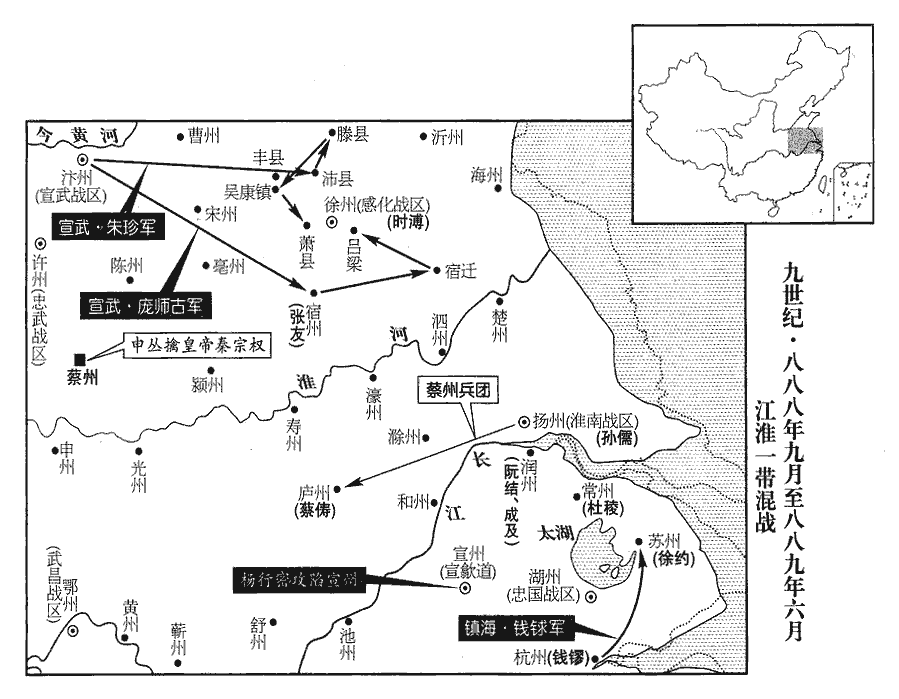
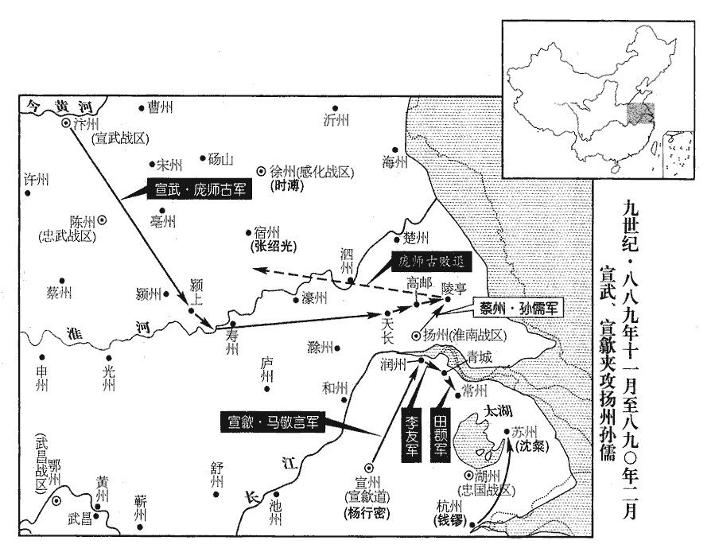
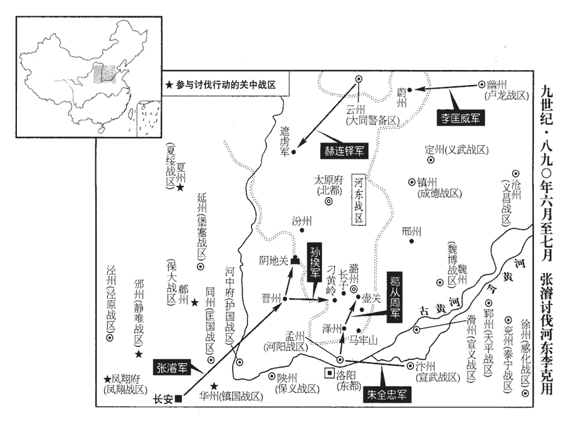
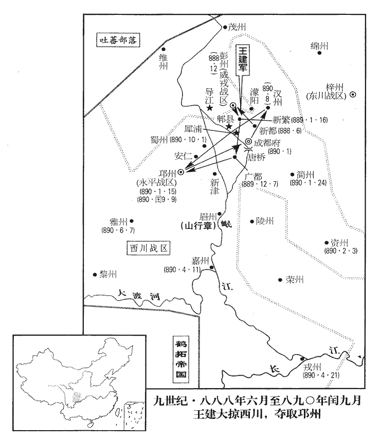
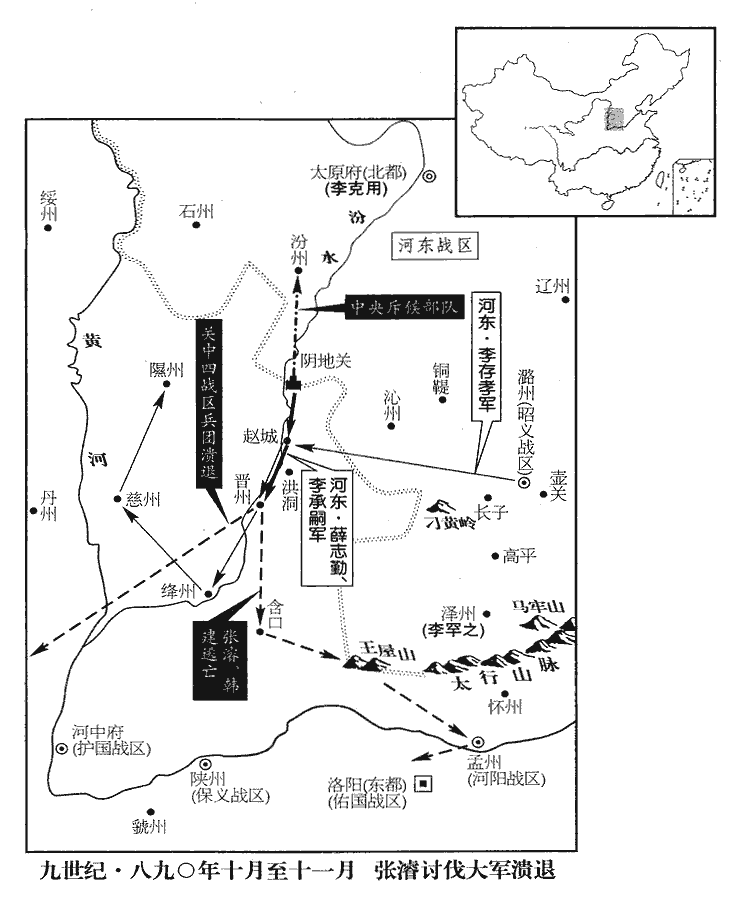
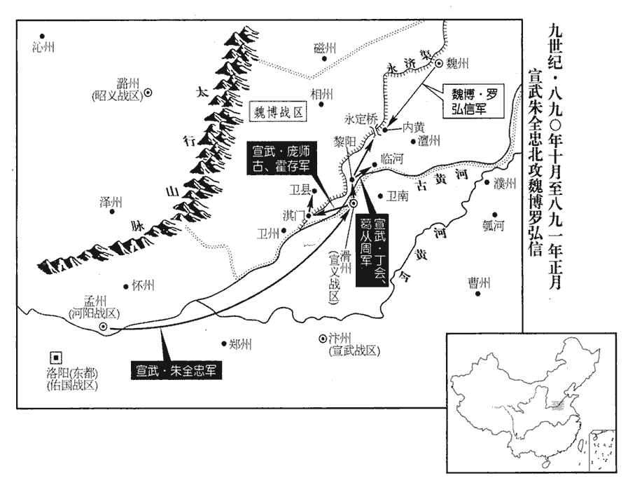
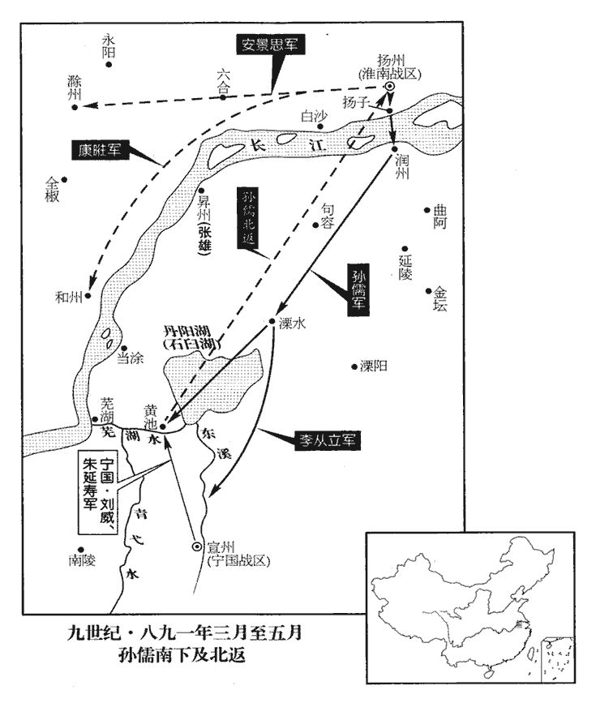
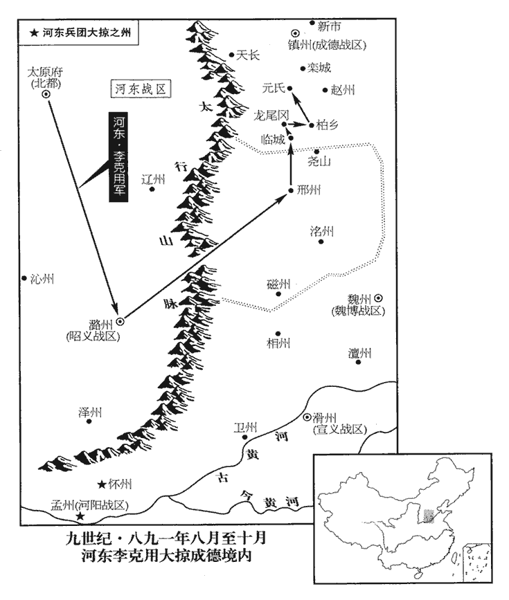
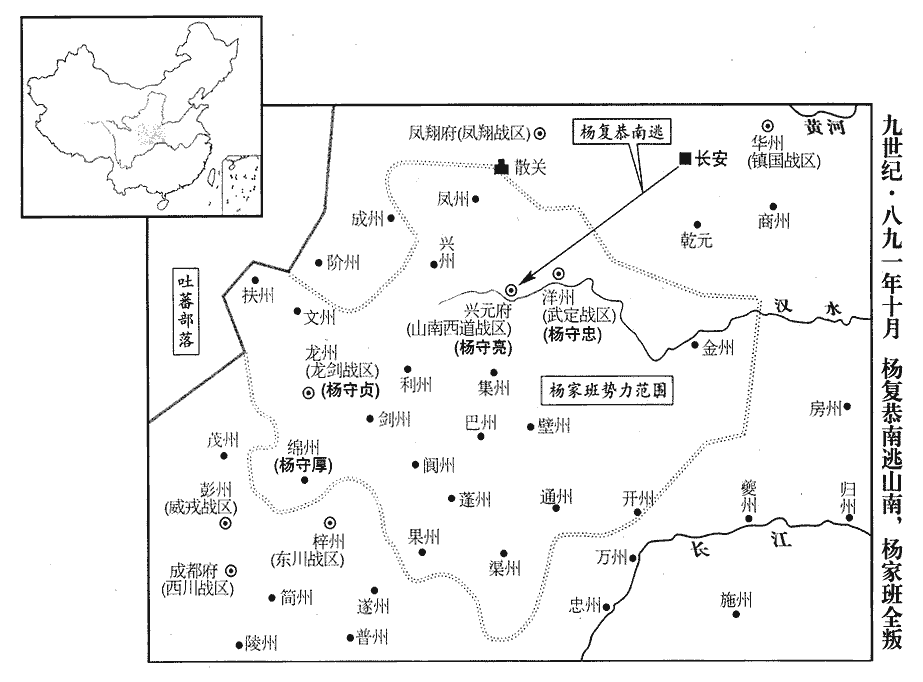

 唐紀七十四起屠維作噩（己酉），盡重光大淵獻（辛亥），凡三年。

# 昭宗聖穆景文孝皇帝上之上諱傑，懿宗第七子，及即位，改名敏，又改名曄。

## 龍紀元年（己酉、八八九）

1春，正月，癸巳朔‹一›，‹李敏（李杰）本年二十三岁›赦天下，改元。考異曰：唐年補錄曰：「正月，癸巳，改文德二年為龍紀元年，百寮上帝徽號曰聖文睿德光武弘孝皇帝。」新、舊紀、實錄，明年正月乃上尊號，補錄誤也。舊紀又云：「以劍南西川節度、兩川招撫制置使韋昭度為東都留守。」按昭度大順二年乃為留守，舊紀誤也。今皆從實錄。

〖译文〗 [1]春季，正月，癸巳朔（初一），唐昭宗大赦天下，改年号为龙纪。

2以翰林學士承旨、兵部侍郎劉崇望同平章事。

〖译文〗 [2]朝廷任命翰林学士承旨、兵部侍郎刘崇望为同平章事。

3汴‹河南省开封市›將龐師古拔宿遷‹江苏省宿迁市›，軍于呂梁‹江苏省徐州市东南›。九域志：徐州彭城縣有呂梁洪鎮。時溥逆戰，大敗，還保彭城‹徐州州政府所在县›。

〖译文〗 [3]汴州军队将领庞师古攻克宿迁，在叶梁洪镇驻扎军队。时溥前去迎战，结果大败，退回彭城固守。

4壬子‹二十›，蔡‹河南省汝南县›將郭璠殺申叢，送秦宗權於汴，璠，孚袁翻。考異曰：實錄：「申叢、裴涉欲復立宗權為帥，汴將李璠知之，斬叢、涉，以宗權送汴州。」薛居正五代史：「初，申叢縛宗權，折足而囚之，雖納款於太祖，欲自獻於長安以邀旄鉞。及姦謀不就，乃欲復奉宗權以接取其柄，為其將郭璠所殺，縶宗權送于太祖，即以璠為留後。太祖遣都統判官韋震奏事，且疏時溥之罪，願委討伐，仍請降滄、兗二帥之命。」按全忠若自求兼領滄、兗二鎮，則明年朝廷命兼領滑州，全忠猶辭不受，今豈敢遽求滄、兗邪！若為滄、兗二帥求之，則兗帥朱瑾，乃仇讎也。當時不知全忠欲以何人為滄帥，諸書皆無其名。薛史、實錄皆云申叢欲復立宗權，按叢折宗權足而囚之，豈有復奉為帥之理！蓋郭璠欲奪其功，誣之云爾。新、舊紀、五代紀、傳皆云郭璠殺申叢，而實錄云李璠，誤也。李璠乃檻送宗權者。告朱全忠云：「叢謀復立宗權。」全忠以璠為淮西‹总部设蔡州›留後。朱全忠又并淮西以連襄、鄧，其勢愈盛矣。

〖译文〗 [4]壬子（二十日），蔡州军队将领郭杀死申丛，把秦宗权送到汴州，对朱全忠说：“申丛筹划再次拥立秦宗权。”朱全忠于是任命郭为淮西留后。

 

5戊申‹二十六›，王建‹永平战区，总部设邛州四川省邛崃市›大破山行章於新繁‹四川省新都县西北新繁镇›，殺獲近萬人，行章僅以身免。楊晟‹威戎战区，总部设彭州四川省彭州市›懼，徙屯三交‹四川省彭州市西›，行章屯濛陽‹四川省彭州市东濛阳镇›，與建相持。儀鳳二年，分九隴、雒、什邡三縣置濛陽縣，屬彭州。九域志：在州東三十一里。宋白曰：縣在濛江之北，故曰濛陽。

〖译文〗 [5]戊申（十六日），王建在新繁大败山行章，斩杀擒获将近一万人，山行章仅能逃脱性命。杨晟恐惧，便把军调到三交驻扎，山行章在阳驻扎，与王建相互对持。

6二月，朱全忠送秦宗權至京師，斬于獨柳‹位于长安西市›。考異曰：舊紀：「二月己丑，汴州行軍司馬李璠監送秦宗權并妻趙氏以獻，斬於獨柳。」實錄：「三月，全忠獻宗權，斬於獨柳。」新紀：「二月戊辰，朱全忠俘宗權以獻。己丑，宗權伏誅。」按宗權正月離汴，不應三月始至長安；戊辰獻俘，不應至己丑始伏誅。故但云二月。京兆尹孫揆監刑，監，古銜翻。宗權於檻車中引首謂揆曰：「尚書察宗權豈反者邪？但輸忠不效耳。」觀者皆笑。揆，逖tì之族孫也。孫逖仕至刑部侍郎，揆五世從孫也。

〖译文〗 [6]二月，朱全忠把秦宗权送到京师长安，在独柳斩杀。京兆尹孙揆主持行刑，秦宗权在槛车里伸出脑袋对孙揆说：“尚书你察看我秦宗权难道是造反的人吗？只是献纳忠心没有功效罢了。”围观的人都笑了。孙揆是刑部侍郎孙逖的从孙。

7三月，加朱全忠兼中書令，進爵東平郡王。考異曰：舊紀在四月，封東平郡王。薛居正五代史在三月，亦云封東平。今從實錄，止加中書令。據考異，則「進爵東平郡王」六字合汰。然按舊書帝紀，光啟元年，封全忠沛郡王。此時雖未進爵東平，固已封王矣。全忠既克蔡州，軍勢益盛。

〖译文〗 [7]三月，朝廷加封朱全忠兼任中书令，晋升爵位为东平郡王。朱全忠攻克蔡州以后，军队的势力更加强大起来。

加奉國‹忠义，总部设襄州湖北省襄樊市›節度使趙德諲中書令，僖宗中和二年，以蔡州為奉國軍，命秦宗權為節度使。文德元年，以襄州為忠義軍，命趙德諲為節度使。宗權既亡，未嘗以奉國節授人，趙德諲亦未嘗兼奉國節，當改「奉國」為「忠義」。加蔡州節度使趙犨同平章事，充忠武‹总部设许州河南省许昌市›節度使，以陳州‹河南省淮阳县›為理所。忠武本治許州；趙犨，陳人也，又守陳有功，因徙治所於陳。犨，昌牛翻。會犨有疾，悉以軍府事授其弟昶，表乞骸骨，詔以昶代為忠武節度使。未幾，犨薨。幾，居豈翻。考異曰：薛居正五代史趙犨傳曰：「文德元年，蔡州平，朝廷議勳，犨檢校司徒，充泰寧軍節度使，又改授浙西節度使，不離宛丘，兼領二鎮。龍紀元年，三月，又以平巢、蔡功，就加平章事，充忠武軍節度使，仍以陳州為理所。犨一日念弟昶共立軍功，乃下令盡以軍州事付於昶，遂上表乞骸。後數月，寢疾卒。」昶傳曰：「犨遙領泰寧軍節度使，以昶為本州刺史。俄而犨有疾，遂以軍州盡付於昶。詔授兵馬留後，旋遷忠武軍節度使，亦以陳州為理所。時宗權未滅，陳、蔡封疆相接，昶每選精銳深入蔡境，蔡賊雖眾，終不能抗，以至宗權敗焉。」上云「蔡州平，以犨為忠武節度使」，下云「昶為節度使，時宗權未滅」，自相違。今從犨傳。

〖译文〗 朝廷加封奉国节度使赵德为中书令，加封蔡州节度使赵为同平章事，充任忠武节度使，以陈州作为忠武节度使的任所。适逢赵忠有疾病，把节使司的军政事务全部交给他弟弟赵昶办理，自己上表请求辞掉官职返回故乡，于是唐昭宗颁发诏令任命赵昶代理忠武节度使。不久，赵死去。

8丙申‹五›，錢銶【章：十二行本「銶」作「銖」；乙十一行本同。】拔蘇州‹江苏省苏州市›，去年冬，錢銶攻蘇州，事見上卷。徐約亡入海而死。光啟三年，徐約據蘇州，今走死。錢鏐以海昌都將沈粲權知蘇州。

〖译文〗 [8]丙申（初五），钱攻克苏州，徐约逃入海上身亡。钱委任海昌都将沈粲暂代苏州刺史。

9夏，四月，賜陝虢‹总部设陕州河南省三门峡市›軍號保義。陝，失冉翻。

〖译文〗 [9]夏季，四月，朝廷赐给陕虢军队名号保义。

10五月，甲辰‹十三›，潤州‹江苏省镇江市›制置使阮結卒，錢鏐以靜江都將成及代之。

〖译文〗 [10]五月，甲辰（十三日），润州制置使阮结死去，钱委任静江都将成及代任润州制置使。

11李克用‹河东战区，总部设太原府山西省太原市›大發兵，遣李罕之、李存孝‹安敬思›攻孟方立‹东昭义战区，总部设邢州河北省邢台市›，六月，拔磁‹河北省磁县›、洺‹河北省永年县东南旧永年镇›二州。方立遣大將馬溉、袁奉韜將兵數萬拒之，戰於琉璃陂‹河北省邢台市西南›，方立兵大敗，二將皆為所擒，克用乘勝進攻邢州。方立性猜忌，諸將多怨，至是皆不為方立用，方立慙懼，飲藥死。中和二年，孟方立據邢州。弟攝洺州刺史遷，素得士心，眾奉之為留後，考異曰：實錄：「克用以弟克脩守潞，遣澤州刺史安金俊討方立。方立因結諸鎮救援，其將奚忠信攻遼州。克用復遣李罕之等急攻，方立將馬溉出戰，為罕之所擒。溉謂曰：『欲圖邢州，當先取磁州。』及并師圍磁州，方立與奚忠信帥兵大戰，軍敗，陷磁州，而方立單騎還邢州，忠信死焉。方立愧之，乃自圖死。三軍立其弟遷，求援汴州。朱全忠遣王虔裕赴之，鎮州王鎔遺克用書和解而退。」唐年補錄：「方立有謀將石元佐為安金俊所獲，金俊問之，元佐請攻磁州，破奚忠信，金俊乃殺之。方立果與忠信引兵入磁，金俊與之戰，大敗，忠信死，方立單騎入邢州，愧見父老，遂自裁。」薛居正五代史方立傳：「六月，李存孝下洺、磁兩郡，方立遣馬溉、袁奉韜盡率其眾逆戰於琉璃陂，存孝擊之，盡殪，生獲馬溉、奉韜。初，方立性苛急，恩不逮下，攻圍累旬，夜自巡城慰諭，守陴者皆倨。方立知其不可，乃飲酖而卒。其從弟洺州刺史遷，素得士心，眾乃推為留後，求援於汴。時梁祖方攻時溥，援兵不出。」按李罕之攻下磁州，進攻洺州，乃擒馬溉。實錄云「溉為罕之謀取磁州」，蓋誤以石元佐為溉也。又，奚忠信去年已為李克脩所擒，乃云「與方立率兵大戰」，亦誤也。舊紀：「六月，邢、洺節度使孟方立卒，三軍推其弟洺州刺史遷為留後，李克用出軍攻之。」新紀：「六月，李克用寇邢州，昭義軍節度使孟方立卒，其弟遷自稱留後。」按唐年補錄載王鎔奏得邢洺大將等狀，以「孟方立奄辭昭代，三軍、百姓同以親弟攝洺州刺史遷權知兵馬留後事。」及新、舊紀、實錄、薛史方立傳皆云立其弟遷，唯太祖紀年錄及薛史武皇紀云立其姪遷，恐誤。今從諸書。求援於朱全忠‹朱温·宣武总部汴州›。全忠假道於魏博‹总部设魏州河北省大名县›，羅弘信不許；全忠乃遣大將王虔裕將精甲數百，間道入邢州‹河北省邢台市›共守。間，古莧翻。為孟遷執王虔裕降河東張本。

〖译文〗 [11]李克用大举发兵，派遣李罕之、李存孝攻打孟方立，六月，攻克磁州、州。孟方立派遣大将马溉、袁奉韬带领军队几万抗击，在琉璃陂展开激战，孟方立的军队大败，马溉、袁奉韬两位将领都被擒获，李克用乘胜进攻邢州。孟方立性情猜忌，属下将领大多怨恨，到这时都不肯为他效力，孟方立惭愧恐惧，服药自杀。孟方立的弟弟、摄理州刺史孟迁，一向深得士卒的拥护，大家尊奉他为昭义军留后。孟迁向朱全忠请求救援。朱全忠要借道经过魏博，罗弘信不准许；朱全忠于是派遣大将王虔裕带领精壮人马几百名，通过偏僻的小路进入邢州与孟迁共同防守。

12楊行密圍宣州，城中食盡，人相啗，指揮使周進思據城逐趙鍠；鍠將奔廣陵‹江苏省扬州市。时孙儒在广陵›，田頵追擒之。未幾，城中執進思以降。幾，居豈翻。降，戶江翻。行密入宣州，諸將爭取金帛，徐溫獨據米囷qūn，為粥以食餓者。溫，朐山‹江苏省连云港市›人也。囷，去倫翻。倉圓曰囷。食，祥吏翻。徐溫之遠略已見於此矣。鍠將宿松‹安徽省宿松县›周本，勇冠軍中，行密獲而釋之，以為裨將。宿松，漢皖縣地，梁置高塘郡，隋廢郡，置宿松縣，唐屬舒州。九域志：在州西南一百四十里。宋白曰：宿松縣，漢元始中為松滋縣，屬廬江郡，晉武帝以荊州有松滋縣，遂改為宿松。冠，古玩翻。鍠既敗，左右皆散，惟李德誠從鍠不去，行密以宗女妻之。妻，七細翻。李德誠自此遂委質於楊氏。海陵讓皇之世，此心復能如從鍠之時乎？德誠，西華‹河南省西华县›人也。行密表言於朝，詔以行密為宣歙觀察使。朝，直遙翻。歙，書涉翻。

〖译文〗 [12]杨行密围攻宣州，城内粮食用光了，就相互残杀吃人肉充饥，指挥使周进思占据宣州城赶走赵；赵要逃奔广陵，被田追击擒获。不久，城内的军队捉拿周进思向杨行密投降。杨行密进入宣州城，各位将领争先恐后地抢夺金银布帛，唯独徐温占据粮仓，做粥给饥饿的人们吃。徐温是朐山人。赵的手下将领宿松县人周本，勇猛果敢在军营中堪称第一，杨行密抓获他后又将他释放，任命为裨将。赵失败时，身边的人都纷纷离去，只有李德诚跟随赵不走，杨行密把同族人的女儿嫁给李德诚为妻子来拉拢他。李德城是西华人。杨行密进呈表章向朝廷论政言事，昭宗颁发诏令任命杨行密为宣歙观察使。

朱全忠與趙鍠有舊，遣使求之；行密謀於袁襲，襲曰：「不若斬首以遺之。」遺，唯季翻。行密從之。未幾，襲卒，行密哭之曰：「天不欲成吾大功邪，何為折吾股肱也！折，而設翻。吾好寬而襲每勸我以殺，好，呼到翻。此其所以不壽與！」與，讀曰歟。

〖译文〗 朱全忠与赵早有交情，派遣使者向杨行密索要赵。杨行密和袁袭商量，袁袭说：“不如把赵砍掉脑袋去送给朱全忠。”杨行密依从了袁袭的意见。不久，袁袭死去，杨行密痛哭着说：“老天不想让我成就大的功业吗？为什么要折损我的得力助手！我喜好宽厚，可是袁袭常常劝说我斩杀，这大概是他不能长寿的原因吧！”

孫儒遣兵攻廬州‹安徽省合肥市›，蔡儔以州降之。降，戶江翻。

〖译文〗 孙儒派遣军队攻打庐州，蔡俦向孙儒献城投降。

13朱珍拔蕭縣‹安徽省萧县›，據之，與時溥相拒，朱全忠欲自往臨之。珍命諸軍皆葺馬厩，李唐賓部將嚴郊獨惰慢，軍吏責之，唐賓怒，見珍訴之；珍亦怒，以唐賓為無禮，拔劍斬之，珍、唐賓交惡久矣，乘怒殺之，不復顧慮。遣騎白全忠，云唐賓謀叛。淮南左司馬敬翔，恐全忠乘怒，倉猝處置違宜，處，昌呂翻。故留使者，逮夜，然後從容白之，從，千容翻。朱全忠兼領淮南節度，以敬翔為左司馬。逮夜而後言，則全忠雖怒而未能發其暴。全忠果大驚。翔因為畫策，為，于偽翻；下為之同。詐收唐賓妻子繫獄，遣騎往慰撫，全忠從之，軍中始安。秋，七月，全忠如蕭縣，未至，珍出迎，命武士執之，責以專殺而誅之。敬翔為全忠謀取朱珍，猶用前計。諸將霍存等數十人叩頭為之請，全忠怒，以牀擲之，乃退。使全忠不殺朱珍，珍其肯為全忠用乎？霍存等為之請，弗思爾矣。為，于偽翻。丁未‹十七›，至蕭縣，以龐師古代珍為都指揮使。八月，丙子‹十七›，全忠進攻時溥壁，會大雨，引兵還。

〖译文〗 [13]朱珍攻克萧县，占据该县，与时溥相互抗拒，朱全忠想亲自前往指挥作战。朱珍命令各军都修盖马棚。唯有李唐宾的部将严郊懒惰怠慢，军中官吏斥责他，李唐宾很气愤，去谒见朱珍申诉。朱珍对此极其愤怒，认为李唐宾太无礼了，拔剑将李唐宾斩杀，派遣骑兵要去告诉朱全忠，说李唐宾图谋叛乱。淮南左司马敬翔，担心朱全忠会乘着怒气仓促处理，免不了失当欠妥，所以把朱珍派来的使者留下，到了夜晚之后，才从容不迫地把这件事告诉朱全忠，朱全忠大为震惊。敬翔趁机为朱全忠筹划计策，假装逮捕李唐宾的妻子、孩子拘禁在监狱，派遣骑兵前往慰问安抚，朱全忠依从敬翔的安排，军营上下才安定下来。秋季，七月，朱全忠前往萧县，还未到达，朱珍出城迎接，朱全忠命令武士将朱珍拿下，以擅自杀人罪要将他处死。霍存等几十位将领跪下磕头为朱珍求情，朱全忠很恼怒，用坐卧器具投打他们，这些将领才退去。丁未（十七日）朱全忠到达萧县，他任命庞师古代替朱珍做都指挥使。八月，丙子（十七日），朱全忠进攻时溥的营垒，适逢天下大雨，又带领军队返回萧县。

14冬，十月，平盧‹总部设青州山东省青州市›節度使王敬武薨；子師範，年十六，軍中推為留後，棣州‹山东省惠民县›刺史張蟾不從。詔以太子少師崔安潛兼侍中，充平盧節度使。蟾迎安潛至州，與之共討師範。為王師範殺張蟾張本。

〖译文〗 [14]冬季，十月，平卢节度使王敬武死去；儿子王师范，年龄仅十六岁，军中将士推举他做平卢留后，棣州刺史张蟾拒不服从。昭宗颁发诏令任命太子少师崔安潜兼任侍中，充任平卢节度使。张蟾把崔安潜迎接到棣州，和他一起筹商讨代王师范。

15以給事中杜孺休為蘇州刺史。錢鏐‹杭州州长›不悅，以知州事沈粲為制置指揮使。沈粲制其兵權，杜孺休直寄坐耳。

〖译文〗 [15]朝廷任命给事中杜孺休为苏州刺史。钱对此很不高兴，委任主持苏州事宜的沈粲为制置指挥使。

16楊行密遣馬步都虞候田頵等攻常州。時錢鏐將杜稜守常州。

〖译文〗 [16]杨行密派遣马步都虞候田攻打常州。

17十一月，上改名曄yè。

〖译文〗 [17]十一月，昭宗改名为李晔。

18上‹李晔•李敏•李杰›將祀圜丘。故事，中尉樞密皆䙆衫侍從；僖宗之世，已具襴笏；䙆，睽桂翻，衣裾分也。襴，音闌，即今之袍也。下施橫幅，因謂之襴。新志曰：唐初士人以棠苧zhù襴衫為上服，貴女功之始也。一命以黃，再命以黑，三命以纁，四命以綠，五命以紫。中書令馬周上議：禮無服衫之文，三代之制有深衣；請加襴袖褾biǎo襈zhuàn，為士人上服；間骻者為缺骻衫，庶人服之。長孫無忌又議，服袍者下加襴，緋紫皆視其品。從，才用翻。至是，又令有司制法服，法服，謂冕服劍佩也。孔緯及諫官、禮官皆以為不可，上出手札諭之曰：「卿等所論至當。當，丁浪翻。事有從權，勿以小瑕遂妨大禮。」於是宦官始服劍佩侍祠。考異曰：按田令孜、楊復恭雖威權震主，官不過金吾衛上將軍，則其餘宦官必卑矣，但諸書不見當時宦官所欲衣者何品秩之法服也。己酉‹二十一›，祀圜丘，赦天下。

〖译文〗 [18]昭宗要去祭坛祭天。按照旧例，朝廷中的中尉、枢密都要身穿大襟分开的衣衫侍奉跟随皇帝。僖宗时代，已经具备了袍服和朝笏，到这时，昭宗又命令有关官吏制做礼服，孔纬和谏官、礼官都认为不适当。唐昭宗传出亲手写的谕令对他们说：“你们所谈论的很得当。办事应当权宜处理，不能因为微小的不当而妨碍了朝廷的大礼。”于是，宦官开始身穿法服佩剑侍奉皇帝祭礼。己酉（二十一日），唐昭宗赴祭坛祭天，大赦天下。

上在藩邸，素疾宦官，及即位，楊復恭恃援立功，援立見上卷上年。所為多不法，上意不平；政事多謀於宰相，孔緯、張濬勸上舉大中故事抑宦者權。復恭常乘肩輿至太極殿。太極殿，西內前殿也。他日，上與宰相言及四方反者，孔緯曰：「陛下左右有將反者，況四方乎！」上矍然問之，緯指復恭曰：「復恭陛下家奴，乃肩輿造前殿，矍，居縛翻。造，七到翻。多養壯士為假子，使典禁兵，或為方鎮，非反而何！」楊復恭以假子守立為天威軍使，守信為玉山軍使，守貞為龍劍節度，守忠為武定節度，守厚為綿州刺史，其餘假子為州刺史者甚眾，號外宅郎君。又養子六百人，監諸道軍。復恭曰：「子壯士，欲以收士心，衛國家，豈反邪！」上曰：「卿欲衛國家，何不使姓李而姓楊乎？」復恭無以對。

〖译文〗 昭宗身为寿王居住藩邸时，一向憎恨宦官，到了他登基称帝以后，杨复恭倚仗着当初拥立昭宗即位有功，所做所为大多违犯法度，昭宗在心中对他愤愤不平。有关朝政事务，昭宗大多和宰相商讨，孔纬、张浚奉劝皇帝施行内宫以往的成例，抑制宦官的权力。杨复恭经常乘坐轿子到太极殿。有一天，昭宗与宰相谈率四方谋反叛乱的人，孔纬说：“陛下的身边就有将要谋反的人，何四方呢！”昭宗惊惶地追问他，孔纬指着杨复恭说：“杨复恭是陛下的家奴，竟敢乘坐轿子到前殿，招养许多壮士为养子，委任他们统管朝廷的军队，有的则充任地方节度使、刺史，这不是谋反是什么！”杨复恭辩解说：“我招养壮士为义子，是想收拢将士的心，保卫国家，哪里是谋反呀！”昭宗说：“你想保卫国家，为什么不让这些壮士姓李而姓杨？”杨复恭无话可答。

復恭假子天威軍使楊守立，本姓胡，名弘立，勇冠六軍，冠，古玩翻。人皆畏之。上欲討復恭，恐守立作亂，謂復恭：「朕欲得卿胡子在左右。」復恭見守立於上，見，賢遍翻。上賜姓名李順節，使掌六軍管鑰，北軍六軍，皆分屯苑中，屯營各有門，晨夕啟閉。不期年，擢至天武都頭，領鎮海‹总部设润州江苏省镇江市›節度使，俄加同平章事。天武亦神策五十四都之一。期，讀曰朞。及謝日，臺吏申請班見百僚，孔緯判不集；判臺申，不使集百官。順節至中書，色不悅。他日，語微及之，緯曰：「宰相師長百僚，長，知兩翻。故有班見。相公職為都頭，而於政事堂班見百僚，於意安乎？」順節不敢復言。復，扶又翻。

〖译文〗 杨复恭的养子天威军使杨守立，本来姓胡，名叫弘立，以其勇猛果敢在朝廷的军队中闻名，人们对他都很畏惧。昭宗想要整治杨复恭，担心杨守立兴兵作乱，便对杨复恭说：“朕想把你的养子杨守立留在朕的身边。”杨复恭把杨守立引见给昭宗，昭宗赏赐给他新的姓名李顺节，派令他掌管朝廷军队各屯营营门的启闭，不到一年，提升为神策军的天武都头，兼任镇海节度使，不久又加封同平章事。等到谢恩的日子，御史大夫请求朝中百官排班拜见李顺节，孔纬裁决不准召集朝中百官。李顺节到中书省，脸色显得很不高兴。有天，孔纬在和李顺节的言谈中委婉地涉及到这件事，孔纬说：“宰相是朝中百官的师长，所以有百官排班拜见。你的官职是神策军的天武都头，而在政事堂上让百官排班拜见，能心安吗？”李顺节不敢再说。

朱全忠求領鹽鐵，孔緯獨執以為不可，謂進奏吏曰：「朱公須此職，非興兵不可！」全忠乃止。史言孔緯相唐，欲振紀綱，惜制於時，不得行其志耳。

〖译文〗 朱全忠请求兼任盐铁转运使，唯独孔纬坚持认为不可以，他对进奏官吏说：“朱全忠想要盐铁使这一职，除非他兴兵来抢不可！”朱全忠这才停止索求该职。

19田頵攻常州‹江苏省常州市›，為地道入城；中宵，旌旗甲兵出於制置使杜稜之寢室，遂虜之，以兵三萬戍常州。

〖译文〗 [19]田攻打常州，挖凿地道进城；半夜时分，田的旌旗甲兵出现在制置使杜棱的寝室，将杜棱俘获，田派令三万军队驻扎常州。

20朱全忠遣龐師古將兵自潁上‹安徽省颍上县›趨淮南‹总部扬州›，擊孫儒。宋僑置樓煩縣於汝陰郡界，後魏以縣為下蔡郡治所，後齊廢郡，隋改為潁上縣，唐屬潁州。九域志：在州東一百一十七里。趨，七喻翻。

〖译文〗 [20]朱全忠派遣庞师古带领军队从颍上县赶赴淮南，攻打孙儒。

21十二月，甲子‹七›，王建敗山行章及西川騎將宋行能於廣都‹四川省双流县东南华阳镇›；敗，補邁翻。行能奔還成都，行章退守眉州。壬申‹十五›，行章請降於建。

〖译文〗 [21]十二月，甲子（初七），王建在广都打败山行章及西川骑兵将领宋行能；宋行能逃回成都，山行章退到眉州固守。壬申（十五日），山行章向王建请求投降。

22戊寅‹二十一›，孫儒自廣陵‹江苏省扬州市›引兵渡江，壬午‹二十五›，逐田頵，取常州，以劉建鋒守之。儒還廣陵，建鋒又逐成及，取潤州‹江苏省镇江市›。成及為錢鏐守潤州。

〖译文〗 [22]戊寅（二十一日），孙儒从广陵带领军队渡过长江，壬午（二十五日），孙儒赶走田，占据常州，委任刘建锋守卫常州。孙儒返回广陵，刘建锋又驱逐成及，占据润州。

23前山南東道‹总部设襄州湖北省襄樊市›節度使劉巨容之在襄陽也，有申屠生教之燒藥為黃金。田令孜之弟過襄陽，巨容出金示之。及寓居成都，中和四年，巨容自襄陽奔成都。令孜求其方，不與，恨之，是歲，令孜殺巨容，滅其族。

〖译文〗 [23]从前山南东道节度使刘巨容在襄阳时，有个叫申屠生的人教他烧炼药物制做黄金。田令孜的弟弟经过襄阳，刘巨容拿出烧炼的黄金给他看。等到刘巨容到成都住下，田令孜向他索求炼金秘方，刘巨容不给，田令孜于是衔恨，这一年，田令孜杀刘巨容，并且灭了他的家族。

## 大順元年（庚戌、八九零）

1春，正月，戊子朔‹一›，群臣上尊號曰聖文睿德光武弘孝皇帝‹李晔•李敏•李杰，本年二十四岁›；改元。上，時掌翻。

〖译文〗 [1]春季，正月，戊子朔（初一），朝中文武群臣为昭宗上尊号为圣文睿德光武弘孝皇帝，改年号为大顺。

2李克用急攻邢州‹河北省邢台市›，孟遷食竭力盡，執王虔裕及汴兵以降。僖宗中和二年，孟方立據邢、磁、洺三州，至是而亡。考異曰：唐末見聞錄：「龍紀元年，大軍守破邢州城，孟遷投來，拜李存孝邢州刺史。十一月，四日，孟遷補充教練使。」太祖紀年錄及薛居正五代史太祖紀，皆曰「大順元年，李存孝攻邢州急，邢帥孟遷以邢、洺、磁三州歸于我，執朱溫之將王虔裕等三百人以獻」，而無月。太祖紀年錄又曰：「太祖徙孟遷于太原，以大將安金俊為邢洺團練使。」薛史孟遷傳曰：「大順元年，二月，遷執王虔裕等乞降，武皇令安金俊代之。」今從實錄。薛史虔裕傳曰：「時太祖大軍方討兗、鄆，未及救援，邢人困而攜貳，遷乃縶虔裕送于太原，尋為所殺。」按是時全忠方攻時溥，未討兗、鄆也。虔裕傳誤。克用以安金俊為邢洺團練使。

〖译文〗 [2]李克用猛烈攻打邢州，孟迁粮食吃尽兵力疲惫，抓住王虔裕，带着汴州军队向李克用投降。李克用任命安金俊为邢团练使。

3壬寅‹十五›，王建‹永平战区，总部设邛州四川省邛崃市›攻邛州，邛，渠容翻。陳敬瑄‹西川战区，总部设成都府四川省成都市›遣其大將彭城‹江苏省徐州市›楊儒將兵三千助刺史毛湘守之，湘出戰，屢敗。楊儒登城，見建兵盛，歎曰：「唐祚盡矣，王公治眾，嚴而不殘，殆可以庇民乎！」治，直之翻。遂帥所部出降。帥，讀曰率。降，戶江翻。建養以為子，更其姓名曰王宗儒。更，工衡翻。乙巳‹十八›，建留永平節度判官張琳為邛南‹邛州以南›招安使，引兵還成都。復攻陳敬瑄也。琳，許州‹河南省许昌市›人也。

〖译文〗 [3]壬寅（十五日），王建攻打邛州，陈敬派遣属下大将彭城人杨儒带领军队三千援助邛州刺史毛湘守城，毛湘出城作战，多次败阵。杨儒登上城楼，看见王建的军队声势浩大，叹息着说道：“大唐气数已到了尽头，王建治理民众，严厉而不残暴，大概可以庇护老百姓！”于是，杨儒率领所部人马出城向王建投降。王建收养杨儒为了义子，改其姓名叫王宗儒。乙巳（十八日），王建留下永平节度判官张琳为邛南招安使，带领军队返回成都。张琳是许州人。

陳敬瑄分兵布寨於犀浦‹四川省郫县东南犀浦镇›、郫‹四川省郫县›、導江‹四川省都江堰市东›等縣，垂拱二年，分成都縣置犀浦縣。郫，漢古縣，唐並屬成都府。九域志：郫縣在府西四十五里。發城中民戶一丁，不計其家丁數多少，一戶則發一丁。晝則穿重壕，採竹木運磚石，重，直龍翻。史炤曰：古史考：烏曹作塼。夜則登城，擊柝巡警，無休息。

〖译文〗 陈敬在犀浦县、郫县、导江县等地分别安设营寨，对城内居住的百姓一户征发一名壮丁，白天挖掘重重堑壕，采伐竹木，运送砖头石块，夜里则登上城墙，打柝巡夜，从无休息。

韋昭度營於唐橋‹四川省成都市东南›，王建營於東閶門外；建事昭度甚謹。

〖译文〗 韦昭度在唐桥安设军营，王建在东阊门外安设军营。王建侍奉韦昭度相当谨慎。

辛亥‹二十四›，簡州‹四川省简阳市›將杜有遷執刺史員虔嵩降於建，員，音云，又音運，姓也。建以有遷知州事。

〖译文〗 辛亥（二十四日），简州将领杜有迁抓获刺史员虔嵩向王建投降，王建委任杜有迁掌管简州事务。

4汴‹河南省开封市›將龐師古等眾號十萬，渡淮，聲言救楊行密，攻下天長‹安徽省天长市›，壬子‹二十五›，下高郵‹江苏省高邮市›。下者，降下。

〖译文〗 [4]汴州军队将领庞师古等人的军队号称十万，渡过淮河，扬言要救杨行密，攻下天长县，壬子（二十五日），攻克高邮。

5二月，己未‹三›，資州‹四川省资中县›將侯元綽執刺史楊戡降於王建，建以元綽知州事。

〖译文〗 [5]二月，己未（初三），资州将领侯元绰抓住刺史杨戡向王建投降，王建委任侯元绰掌管资州事务。

 

6乙丑‹九›，加朱全忠守中書令。

〖译文〗 [6]乙丑（初九），朝廷加封朱全忠兼理中书令。

7龐師古引兵深入淮南，己巳‹十三›，與孫儒‹淮南总部扬州›戰於陵亭‹江苏省兴化市南›，九域志：泰州興化縣有陵亭鎮。師古兵敗而還。還，從宣翻，又如字。

〖译文〗 [7]庞师古带领军队深入淮南，己巳（十三日），与孙儒在陵亭镇展开激战，庞师古的军队失利而返回。

8楊行密遣其將馬敬言將兵五千，乘虛襲據潤州‹江苏省镇江市›。李友將兵二萬屯青城‹江苏省常州市西北青城›，將攻常州‹江苏省常州市›。安仁義、劉威、田頵敗劉建鋒於武進‹常州州政府所在县›，去年，孫儒使劉建鋒據常、潤。晉分曲阿縣置武進縣，梁改為蘭陵，隋廢，唐垂拱二年，又分晉陵置武進縣，屬常州。九域志，縣有青城鎮。敬言、仁義、威屯潤州。友，合肥‹庐州州政府所在县›人；威，慎縣‹安徽省肥东县›人也。

〖译文〗 [8]杨行密派遣属下将领马敬言率领军队五千，乘虚攻打并占据了润州。李友带领军队二万驻扎青城，要攻打常州。安仁义、刘威、田在武进县打败刘建锋。马敬言、安仁义、刘威于是驻扎润州。李友是合肥人；刘威是慎县人。

9李克用將兵攻雲州‹山西省大同市›防禦使赫連鐸，克其東城。鐸求救於盧龍‹总部设幽州北京市›節度使李匡威，匡威將兵三萬赴之。丙子‹二十›，邢洺團練使安金俊中流矢死，中，竹仲翻。考異曰：實錄：「四月，丙辰朔，李克用遣安金俊率師攻雲州，赫連鐸求援於幽州李匡威，匡威出師赴之，戰于蔚州，太原府軍大敗，燕師執金俊，獻于朝。」據太祖紀年錄，攻雲州在三月。舊紀、實錄皆在四月，恐是約奏到。然紀年錄不言克用敗，蓋諱之也。今從唐末見聞錄。又紀年錄、唐末見聞錄皆云金俊戰死。實錄云執獻之，亦誤。河東‹总部太原府›萬勝軍使申信叛降於鐸。會幽州軍至，克用引還。

〖译文〗 [9]李克用带领军队攻打云州防御使赫连铎，攻克云州东城。赫连铎向卢龙节度使李匡威请求救援，李匡威带领军队三万赶赴云州。丙子（二十日），李克用的将领邢团练使安金俊在激战中被乱飞的箭击中身亡，河东万胜军使申信向赫连铎投降。又恰有幽州的军队赶来，李克用便率领人马返回。

10時溥‹感化战区，总部设徐州江苏省徐州市›求救於河東，李克用遣其將石君和將五百騎赴之。

〖译文〗 [10]时溥向河东节度使李克用求救，李克用派遣属下将领石君和带领五骑兵前去救援。

11李克用巡潞州‹山西省长治市›，以供具不厚，怒昭義‹总部设潞州›節度使李克脩，詬而笞之；詬，古候翻，又許候翻。克脩慙憤成疾，三月，薨‹年三十一岁›。考異曰：太祖紀年錄：「太祖遣李罕之、李存孝攻邢州。十月，且命班師，由上黨而歸。克脩性吝嗇，太祖左右徵賂於克脩，旬日間，費數十萬，尚以為供張不豐，掎其事，笞克脩而歸太原。俄而克脩憤恥寢疾。」薛史克脩傳曰：「龍紀元年，武皇大舉以伐邢洺，及班師，因撫封於上黨。」按太祖紀但遣罕之、存孝攻邢州，不云親行。蓋罕之、存孝圍邢州，克用但以大軍屯境上為之聲援，去十月先還，罕之、存孝猶圍邢州，故正月孟遷降也。克用表其弟決勝軍使克恭為昭義留後。為潞州叛克用張本。

〖译文〗 [11]李克用巡视潞州，因为供给的酒食等用品不够丰厚，便对昭义节度使李克很恼怒，将他辱骂并笞打一顿。李克羞愧怨愤以致身患重病，三月，便死去了。李克用上呈表章，任命他的弟弟决胜军使李克恭为昭义留后。

12賜宣歙‹首府设宣州安徽省宣州市›軍號寧國，以楊行密爲節度使。

〖译文〗 [12]唐昭宗赐宣歙军名号为宁国，任命杨行密为节度使。

13夏，四月，宿州‹安徽省宿州市›將張筠逐刺史張紹光，附于時溥；去年朱全忠取宿州。朱全忠帥諸軍討之。帥，讀曰率。溥出兵掠碭山‹安徽省砀山县›，碭，徒郎翻。全忠遣牙內都指揮使朱友裕擊之，殺三千餘人，擒石君和。考異曰：郗象梁太祖實錄，前云四月丙辰，後云乙卯溥出兵。按長曆，乙卯，四月晦日。實錄誤也。友裕，全忠之子也。

〖译文〗 [13]夏季，四月，宿州将领张筠驱逐刺史张绍光，归附时溥。朱全忠率领各地军队讨伐张筠。时溥派出军队到砀山一带抢劫，朱全忠派遣牙内都指挥使朱友裕攻打时溥的军队，杀死三千余人，擒获石君和。朱友裕是朱全忠的儿子。

14乙丑‹十›，陳敬瑄遣蜀州‹四川省崇州市›刺史任從海將兵二萬救邛州，戰敗，欲以蜀州降王建；敬瑄殺之，任，音壬。以徐公鉥shù代為蜀州刺史。鉥，時橘翻。丙寅‹十一›，嘉州‹四川省乐山市›刺史朱實舉州降于建。丙子‹二十一›，僰道‹戎州州政府所在县·四川省宜宾市›土豪文武堅執戎州‹四川省宜宾市›刺史謝承恩降于建。僰道，故僰侯國，漢立縣，為犍為郡治所，梁置戎州。僰，蒲北翻。

〖译文〗 [14]乙丑（初十），陈敬派遗蜀州刺史任从海带领军队二万救援邛州，结果被打败，任从海便想献出蜀州向王建投降。陈敬杀掉任从海，任命徐公代理蜀州刺史。丙寅（十一日），嘉州刺史朱实献出全州向王建投降。丙子（二十一日），道土豪文武坚抓获戎州刺史谢承恩向王建投降。

15赫連鐸‹大同总部云州›、李匡威‹卢龙总部幽州›表請討李克用。乘其不利也。朱全忠亦上言：「克用終為國患，今因其敗，臣請帥汴、滑、孟三軍，汴、滑、孟三鎮，時皆屬全忠。帥，讀曰率。與河北三鎮共除之。河北三鎮，謂盧龍‹总部幽州›李匡威、成德‹总部镇州›王鎔、魏博‹总部魏州›羅弘信。乞朝廷命大臣為統帥。」帥，所類翻。

〖译文〗 [15]赫连铎、李匡威进呈表章请求讨伐李克用。朱全忠也向朝廷进言说：“李克用最终是国家祸患，现在趁着他势力衰败，我请求率领汴州、滑州、孟州三路军队，和河北的三镇人马一起去除掉李克用。恳望朝廷任命大臣充任统帅。”

初，張濬因楊復恭以進，事見二百五十四卷僖宗廣明元年。復恭中廢，更附田令孜而薄復恭。更，工衡翻，改也。附令孜事見中和元年。及復恭再用事，深恨之。襄王熅之亂，田令孜往依陳敬瑄，自是之後，復恭再用事。上知濬與復恭有隙，特親倚之；考異曰：舊傳：「再幸山南，復恭代令孜為中尉，罷濬知政事。昭宗初在藩邸，深疾宦官，復恭有援立大勳，恃恩任事，上心不平之。當時趨向者多言濬有方略，能畫大計，復用為宰相，判度支。」據舊紀、實錄、新紀、表，濬自光啟三年九月拜平章事，至大順二年兵敗坐貶，中間未嘗罷免。舊傳誤也。今從新傳。濬亦以功名為己任，每自比謝安、裴度。克用之討黃巢屯河中‹山西省永济市›也，見二百五十五卷僖宗中和二十三年。濬為都統判官。王鐸為都統，張濬為判官。克用薄其為人，聞其作相，私謂詔使曰：「張公好虛談而無實用，好，呼到翻。傾覆之士也。主上采其名而用之，他日交亂天下，必是人也。」濬聞而銜之。

〖译文〗 当初，张浚凭借杨复恭的势力得以晋升，杨复恭后来失宠，张浚便又去依附田令孜而疏了杨复恭。等到杨复恭再次当权，他对张浚深怀忌恨。唐昭宗知道张浚与杨复恭有怨仇，便格外地亲近倚重张浚；张浚也把已有的功名成是自己所能胜任的，常常把自己比作谢安、裴度。李克用讨代黄巢驻扎在河中时，张浚充任都统判官。李克用蔑视张浚的为人，听说他做了宰相，私下对传达诏令的使臣说：“张浚喜好空谈而不能务实办事，是个颠覆朝廷的人，皇上听信他的虚名而重用他，将来有一天导致天下大乱的，一定是这个人。”张浚听到这些，对李克用怀恨在心。

上從容與濬論古今治亂，從，千容翻。濬曰：「陛下英睿如此，而中外制於強臣，言中則制於宦官，外則制於方鎮。此臣日夜所痛心疾首也。」上問以當今所急，對曰：「莫若強兵以服天下。」上於是廣募兵於京師，至十萬人。

〖译文〗 昭宗从容地与张浚谈论从古到今的乱世治理，张浚说：“陛下这样英明聪慧，却在内在外受制于宦官、藩镇，这是我日日夜夜所痛心疾首的事。”昭宗向张浚询问当今最为紧迫的事情是什么，张浚回答说：“任何事情都不如增强军队以威服天下重要。”唐昭宗于是大规模招募军队，聚集在京师长安，人数达到十万。

及全忠等請討克用，上命三省、御史臺四品以上議之，三省：尚書省、門下省、中書省也。四品以上，尚書左右丞及六部侍郎，門下、中書省自左右諫議以上，御史臺自中丞以上，皆四品也。以為不可者什六七，杜讓能、劉崇望亦以為不可。杜讓能、劉崇望，二相也。濬欲倚外勢以擠楊復恭，宰相主兵，則外廷之勢重。擠，子細翻，又子西翻。乃曰：「先帝‹李俨›再幸山南‹秦岭以南›，沙陀所為也。謂光啟二年，事見二百五十六卷。臣常慮其與河朔相‹河北平原›表裏，致朝廷不能制。今兩河藩鎮共請討之，河南獨朱全忠、河北獨李匡威請討克用耳，餘皆不欲也。此千載一時。載，子亥翻。但乞陛下付臣兵柄，旬月可平。失今不取，後悔無及。」考異曰：舊濬傳曰：「會朱全忠誅秦宗權，安居受殺李克恭，以潞州降全忠，幽州李匡威、雲州赫連鐸等奏請出軍討太原。」按時安居受未殺李克恭，舊傳誤也。太祖紀年錄曰：「太祖中和破賊時，濬為諫議大夫，出軍判官，常以虛誕誘太祖，太祖薄其為人。及聞濬入中書，太祖常私於詔使曰：『張公傾覆之士，先帝知其為人，不至大任。主上付之重位，必亂天下。』濬知之，陰銜太祖。」按濬自僖宗時為宰相，紀誤。孔緯曰：「濬言是也。」復恭曰：「先朝播遷，雖藩鎮跋扈，亦由居中之臣措置未得其宜。今宗廟甫安，不宜更造兵端。」上曰：「克用有興復大功，謂破黃巢、復京城也。今乘其危而攻之，天下其謂我何？」緯曰：「陛下所言，一時之體也；張濬所言，萬世之利也。昨計用兵、饋運、犒賞之費，一二年間未至匱乏，在陛下斷志行之耳。」上以二相言叶，僶俛從之，斷，丁亂翻。僶，民尹翻。僶俛，勉強不得已之意。曰：「茲事今付卿二人，無貽朕羞！」觀帝此言，亦知河東之不可伐矣。

〖译文〗 等到朱全忠等人请求讨伐李克用，昭宗便命令尚书省、门下省、中书省和御史台四品以上的官员共同商议这件事，认为不能兴兵讨伐的人占十分之六七，杜让能、刘崇望也认为不能这样做。张浚试图凭借外边的势力来排挤杨复恭，于是说：“先帝第二次巡幸山南，是李克用带着沙陀人马逼迫的。我常常忧虑担心李克用与黄河以北的藩镇内外勾结，致使朝廷不能控制。现在河南的朱全忠、河北的李匡威共同请求讨伐李克用，这是千载难逢的一个时机。只请求陛下授予我统领军队的大权，一个月就可以消灭李克用。如果错失现在的良机而不争取，那么将后悔莫及。”孔纬附和道：“张浚说得对。”杨复恭则说：“先帝流离迁徒，虽然由于藩镇骄横跋扈造成，但也是因为朝中大臣举止不当措施不力。现在朝廷刚刚安定下来，不应当再兴兵大战。”昭宗说：“李克用有打败黄巢收复京城的大功，现在趁着他处于困境而去攻打，天下的们会怎样说我？”孔纬说：“陛下所说的，是现在一时的体面；张浚所说的，是今后世代的大利。昨天计算调遣军队、运送物资、犒劳奖赏的费用，一两年内都不致于缺乏，就在陛下当机立断兴兵讨伐了！”昭宗因为张浚和孔纬两位宰相一唱一和，不得已依从了他们的意见，说：“这件事现在就交给你们二人去办理，但不要给朕带来羞辱！”

五月，詔削奪克用官爵、屬籍，克用賜姓，故編之屬籍，註已見前。以濬為河東‹山西省›行營都招討制置宣慰使，京兆尹孫揆副之，以鎮國‹总部设华州陕西省华县›節度使韓建為都虞候兼供軍糧料使，以朱全忠‹朱温·宣武总部汴州›為南面招討使，李【章：十二行本「李」上有「王鎔‹成德总部镇州›為東面招討使」八字，乙十一行本同；孔本同；張校同；退齋校同。】匡威為北面招討使，赫連鐸副之。

〖译文〗 五月，昭宗颁发诏令削去李克用的官职、爵位及赐他李姓后所编的属籍，任命张浚为河东行营都招讨制置宣慰使，京兆尹孙揆为副使，任命镇国节度使韩建为都虞候兼任供军粮料使，任命朱全忠为南面招讨使，李匡威为北面招讨使，赫连铎为副使。

濬奏給事中牛徽為行營判官，徽曰：「國家以喪亂之餘，喪，息浪翻。欲為英武之舉，橫挑強寇，挑，徒了翻。離諸侯心，吾見其顛沛也！」沛，音貝。遂以衰疾固辭。徽，僧孺之孫也。牛僧孺，文宗太和中為相。

〖译文〗 张浚奏请任命给事中牛徽为行营判官，牛徽说：“国家刚刚经历了先帝丧事和战乱，却又要做出威武壮举，粗暴地挑起与李克用强大人马的争斗，离间各藩镇的归心，我看天下又要动荡变乱了！”于是，牛徽以年纪衰老身体有病为借口坚拒绝担任行营判官。牛徽是唐文宗宰相牛僧孺的孙子。

16李克恭驕恣不曉軍事；潞人素樂李克脩之簡儉，樂，音洛。且死非其罪，潞人憐之，由是將士離心。初，潞人叛孟氏，牙將安居受等召河東兵以取潞州；見二百五十五卷僖宗中和三年。及孟遷以邢‹河北省邢台市›、洺‹河北省永年县东南旧永年镇›、磁州‹河北省磁县›歸李克用，克用寵任之，以遷為軍城都虞候，群從皆補右職，從，才用翻。其後孟知祥見任於莊宗，亦遷之兄子也。居受等咸怨且懼。

〖译文〗 [16]李克用新委任的昭义留后李克恭骄横放纵不懂得军事，而潞州人一向对李克的简朴节俭有好感，并且他不是因为自身的罪过而致死，潞州人都怜悯他，因此军中将领士卒离心离德。当初，潞州人背叛昭义节度使孟方位，潞州牙将安居受等人召来河东军队攻取潞州，等到孟迁将邢州、州、磁州献给李克用，李克用对孟迁宠信，委以重任，任命孟迁为军城都虞候，跟随他的人都补授重要的职位，安居受等人对此都很怨恨并且惧怕。

昭義‹总部潞州›有精兵，號「後院將」。克用既得三州，將圖河朔，令李克恭選後院將尤驍勇者五百人送晉陽‹山西省太原市›，潞人惜之。克恭遣牙將李元審及小校馮霸部送晉陽，至銅鞮dī‹山西省沁县西南故县镇›，銅鞮，漢縣，唐屬潞州。九域志：在州西北一百四十五里。校，戶教翻。鞮，丁奚翻。霸招【章：十二行本「招」作「劫」；乙十一行本同；孔本同；退齋校同。】其眾以叛，循山而南，至于沁水‹沁河·注入黄河›，沁水，漢縣名。唐之沁水，後魏泰寧郡地也。北齊廢郡，為永安縣，隋開皇十八年改曰沁水，唐屬澤州。九域志：在州西北二百里。眾已三千人。李元審擊之，為霸所傷，歸于潞。考異曰：元審與霸同部送後院將，霸所以能獨叛而元審所以得不死者，蓋後院將有叛有不叛者，叛者從霸，不叛者從元審，故克用益元審兵使討霸也。此段考異疑有闕文。庚子‹十五›，克恭就元審所館視之，安居受帥其黨作亂，帥，讀曰率。攻而焚之，克恭、元審皆死。眾推居受為留後，附于朱全忠。居受使召馮霸，不至。居受懼，出走，為野人所殺。霸引兵入潞，自為留後。考異曰：編遺錄：「八月，甲寅，馮霸殺李克恭來降，上請河陽帥朱崇節領兵入潞，兼充留後。戊辰，李克用圍之，上遣葛從周率驍勇夜銜枚斫營突入上黨，以壯潞人之心。」薛居正五代史梁太祖紀亦同。按克用未嘗自圍潞也。克恭傳：「李元審戰傷，收軍於潞，五月十五日，克恭視元審於孔目吏劉崇之第，是日，州縣將安居受引兵攻克恭，克恭、元審並遇害，州民推居受為留後。居受遣人召馮霸於沁水，霸不受命；居受懼，將奔歸朝廷，至長子，為野人所殺，傳首馮霸軍。霸乃引眾據潞州，自稱留後，求援於汴。武皇令康君立討之，汴將葛從周來援霸。」唐末見聞錄曰：「五月十七日，昭義狀申軍變，殺節使，當日點汾州五縣土團將士赴昭義。二十三日，昭義僕射家累入府。」新紀：「五月，壬寅，安居受殺李克恭。」按壬寅，十七日，乃報到太原日也。今從太祖紀年錄。薛史克恭傳、舊紀，「五月丙午，潞州軍亂，殺李克恭。監軍使薛績本函克恭首獻之于朝，濬方起兵，朝廷稱賀。此蓋克恭首到日也。舊紀又曰：「七月，全忠遣從周帥千騎入潞州。」唐太祖紀年錄、薛史唐紀，五月葛從周入潞，太早。蓋因克恭死終言之。編遺錄、薛史梁紀，八月克恭死，太晚。蓋因從周入潞推本之。又從周入潞，全忠始請孫揆赴鎮，當在揆被執前也。今克恭死從紀年錄。從周入潞從舊紀。

〖译文〗 昭义节度使有精良军队，号称“后院将”。李克用获得邢州、州、磁州三州以后，便要图谋黄河以北的地盘，他命令李克恭挑选“后院将”中特别勇猛的将士五百人送往晋阳，潞州人对挑走这些将士很惋惜。李克恭派遣牙将李元审以及小校冯霸部送赴晋阳，队伍行到潞州的铜县，冯霸劫持这批人马叛逃，沿着高山向南开进，到达沁水时，人马已达三千。李元审追击冯霸，被冯霸打伤，便回到潞州。庚子（十五日），李克恭到李元审的馆舍去看望，安居受率领手下人马发动叛乱，攻打并将李元审的馆舍焚烧，李克恭、李元审二人都死于变乱之中。大家推举安居受为留后，归附朱全忠。安居受派人召请冯霸，冯霸不来。安居受有些畏惧，离开潞州外走，被乡下人杀死。冯霸带领军队进入潞州，自称昭义留后。

時朝廷方討克用，聞克恭死，朝臣皆賀。全忠遣河陽‹总部设孟州河南省孟州市›留後朱崇節將兵入潞州，權知留後。克用遣康君立、李存孝‹安敬思›將兵圍之。

〖译文〗 当时朝廷正在兴兵讨伐李克用，听说李克恭死了，朝中大臣都向昭宗表示祝贺。朱全忠派遣河阳留后朱崇节带领军队进入潞州，暂任昭义留后。李克用派遣康君立、李存孝带领人马围攻潞州。

壬子‹二十七›，張濬帥諸軍五十二都及邠‹陕西省彬县›、寧‹甘肃省宁县›、鄜‹陕西省富县›、夏‹陕西省靖边县北白城子›雜虜合五萬人發京師，帥，讀曰率；下同。鄜，音夫。夏，戶雅翻。上御安喜樓餞之。安喜樓，安喜門樓也。按楊復恭之亂，上御安喜門，劉崇望謂禁軍曰：「天子親在街東督戰。」竊意安喜門即朱雀街東之安上門也。濬屏左右言於上曰：屏，必郢翻，又必正翻。「俟臣先除外憂，然後為陛下除內患。」為，于偽翻。楊復恭竊聽，聞之。兩軍中尉餞濬於長樂坂，長樂坂，在長安城東，即滻坡。樂，音洛。坂，音反。復恭屬濬酒，屬，之欲翻。濬辭以醉，復恭戲之曰：「相公杖鉞專征，作態邪？」濬曰：「俟平賊還，方見作態耳！」未能成事而先為大言，此張濬之疏也。復恭益忌之。

〖译文〗 壬子（二十七日），张浚率领各路军队五十二都以及从州、宁州、州、夏州各胡族总共五万人，从京师长安出发，昭宗在安喜楼上为张浚饯行。张浚命令身边的人都退避后对唐昭宗说：“等我先消灭了外忧，然后再为陛下铲除内患。”杨复恭在外偷听，知道了这些。两军中尉在长安城东的长乐坂为张浚饯行，杨复恭向张浚劝酒，张浚以已经喝醉为托辞而不饮，杨复恭取笑他说：“你奉有皇帝号令信物专门出征，现在是故作姿态吗？”张浚说：“等我消灭了贼寇回到京师，再让你看我的故作姿态。”杨复恭更加忌恨他了。

癸丑‹二十八›，削奪李罕之‹山西省晋城市州长›官爵；以附李克用也。六月，以孫揆為昭義節度使，充招討副使。

〖译文〗 癸丑（二十八日），朝廷削除李罕之的官职爵位；六月，朝廷任命孙揆为昭义节度使，充任招讨副使。

17丁巳‹三›，茂州‹四川省茂县›刺史李繼昌帥眾救成都，己未‹五›，王建擊斬之。辛酉‹七›，資‹四川省资中县›簡‹四川省简阳市›都制置應援使謝從本殺雅州‹四川省雅安市›刺史張承簡，舉城降建。資、簡相去二百十六里。簡州北至成都百五十里。雅州與邛州接壤，相去二百七十里。王建圖邛州以為根本，兵威所及，故謝從本以雅州降之。

〖译文〗 [17]丁巳（初三），茂州刺史李继昌率领部众救援成都，己未（初五），王建攻击杀死李继昌。辛酉（初七），资简都制置应援使谢从本杀死雅州刺史张承简，献出雅州全城向王建投降。

18孫儒求好於朱全忠，全忠表為淮南‹总部设扬州江苏省扬州市›節度使。未幾，全忠殺其使者，遂復為仇敵。好，呼到翻。幾，居豈翻。復，扶又翻。

〖译文〗 [18]孙儒向朱全忠求情修好，朱全忠进呈表章请以孙儒为淮南节度使。不久，朱全忠又杀死孙儒派去的使者，于是他们又成为仇敌。

19光啟末，【嚴：「末」改「初」。】德州‹山东省陵县›刺史盧彥威逐義昌節度使楊全玫，自稱留後，見二百五十六卷僖宗光啟元年。玫，莫杯翻。求旌節，朝廷未許。至是，王鎔、羅弘信因張濬用兵，為之請，為，于偽翻。乃以彥威為義昌‹总部设沧州河北省沧州市东南›節度使。

〖译文〗 [19]光启末年，德州刺史卢彦威驱逐义昌节度使杨全玫，自称留后，向朝廷请求颁给他节度使的仗仪，朝廷没有准许。到这时，王、罗弘信趁张浚发动军队，又为卢彦威请求，朝廷于是任命卢彦威为义昌节度使。

20張濬會宣武‹总部汴州›、鎮國‹总部华州›、靜難‹总部邠州›、鳳翔‹总部凤翔府›、保大‹总部鄜州›、定難‹总部夏州›諸軍於晉州‹山西省临汾市›。難，乃旦翻。

〖译文〗 [20]张浚与宣武、镇国、静难、凤翔、保大、定难各路军队在晋州相会。

21更命義成‹总部设滑州河南省滑县›軍曰宣義；辛未‹十七›，以朱全忠為宣武、宣義節度使。按方鎮表，全忠以父名誠，請改義成曰宣義。更，工衡翻。全忠以方有事徐、楊，徵兵遣戍，殊為遼闊，乃辭宣義，請以胡真為節度使，從之；然兵賦出入，皆制於全忠，一如巡屬。及胡真入為統軍，竟以全忠為兩鎮節度使，罷淮南不領焉。領淮南見上卷僖宗光啟三年。

〖译文〗 [21]朝廷将义成军改名为宣义军。辛未（十七日），朝廷任命朱全忠为宣武、宣义节度使。朱全忠因为徐州、场州正有战事，征调军队派遣驻扎，地域过于广阔，于是推辞这一官职，请求任命胡真为宣义节度使，朝廷依从了朱全忠的意见，可是军队调动和粮赋收支诸事，都由朱全忠统管控制，胡真如同属员一样。等到胡真进入京师做了统军，竟然让朱全忠充任宣武、宣义两镇节度使，而不再兼任淮南节度使。

 

22秋，七月，官軍至陰地關‹山西省灵石县西南南关镇›，汾州靈石縣西南有陰地關。考異曰：舊紀：「七月，乙酉朔，王師屯于陰地，太原大將康君立以兵拒戰。」按君立時圍潞州，何暇至陰地關！又不言勝負。今不取。朱全忠遣驍將葛從周將千騎潛自壺關‹山西省壶关县›夜抵潞州，犯圍入城。九域志：壺關西至潞州二十五里。宋白曰：壺關縣以山形似壺，古於此置關，故名。考異曰：舊紀、實錄皆云：從周權知留後。又，汴人圍澤州，呼李罕之云：「葛司空已入潞府。」李存孝圍潞州，呼城上人云：「葛僕射可歸大梁。」似從周實為留後也。然薛居正五代史梁太祖紀云：「帝請以河陽節度使朱崇節為潞州留後。」實錄：「明年五月，以前昭義節度使朱崇節為河陽節度使。」按河陽自解張全義圍以來，常附屬於汴，朱全忠以部將丁會、張宗厚等為之留後，非一人，崇節蓋亦汴將為河陽留後，全忠使權昭義留後，既不能守，復歸河陽耳。諸書因謂之節度使，蓋誤也。從周但與崇節共守潞州，以其名著，故外人但稱從周，不數崇節也。又遣別將李讜、李重胤、鄧季筠將兵攻李罕之於澤州‹山西省晋城市›，又遣張全義、朱友裕軍於澤州之北，為從周應援。考異曰：編遺錄：「八月，遣從周入上黨。九月，壬寅，上往河陽，令李讜救應朱崇節，又命朱友裕、張全義簡精銳過山，於澤州北應接，取崇節、從周以歸。」薛居正五代史梁太祖紀：「九月，壬寅，上至河陽，遣李讜引軍趨澤潞，為晉人所敗。帝又遣朱友裕、張全義率精兵至澤州北，以為應援。既而崇節、從周棄潞來歸，戊申，帝斬李重裔，遂班師。」按讜等初圍澤州時，語城上人云：「張相公圍太原，葛司空已入潞府，」是當時南兵方盛，非孫揆就擒，從周棄潞州之後也。故置於此。季筠，下邑‹河南省夏邑县›人也。全忠奏：臣已遣兵守潞州，請孫揆赴鎮。張濬亦恐昭義遂為汴人所據，分兵三【章：十二行本「三」作「二」；乙十一行本同。】千，使揆將之趣潞州。趣，七喻翻。

〖译文〗 [22]秋季，七月，张浚统领的官军到达阴地关，朱全忠派遣猛将葛从周带领一千骑兵从壶关在夜间偷偷地抵达潞州，冲破外围进入潞州城。朱全忠又派遣其他将领李谠、李重胤、邓季筠带领人马在泽州的北面驻扎，作为葛从周的援助。邓季筠是下邑人。朱全忠上奏说：我已经派遣军队守卫潞州，请命孙揆前赴潞州镇所。张浚也恐怕潞州昭义节度使司重镇从此被朱全忠的汴州军队占据，便分派军队三千，命令孙揆带领奔赴潞州。

八月，乙丑‹十二›，揆發晉州，九域志：自晉州東至潞州，三百八十五里。李存孝聞之，以三百騎伏於長子‹山西省长子县›西谷中。長子，漢縣，唐屬潞州。九域志：在州西南四十五里。揆建牙杖節，褒衣大蓋，擁眾而行；凡節度使，其行前建牙旗，杖所賜節。褒衣，大袖博裾之衣。大蓋，即今之清涼繖。存孝突出，擒揆及賜旌節中使韓歸範、牙兵五百餘人，追擊餘眾於刁黃岭‹山西省长子县西南›，盡殺之。存孝械揆及歸範，𥿊chè以素練，𥿊，充夜翻，維縶之也。徇於潞州城下曰：「朝廷以孫尚書為潞帥，命韓天使賜旌節，韓歸範銜天子之命，故謂之天使。帥，所類翻。使，疏吏翻。葛僕射可速歸大梁，令尚書視事。」遂𥿊以獻於克用。克用囚之，既而使人誘之，欲以為河東副使，誘，音酉。揆曰：「吾天子大臣，兵敗而死，分也，分，扶問翻。豈能伏事鎮使邪！」節度使任居方鎮，孫揆鄙薄之，呼為鎮使。復，扶又翻。克用怒，命以鋸鋸之，鋸不能入。揆罵曰：「死狗奴！鋸人當用板夾，汝豈知邪！」乃以板夾之，至死，罵不絕聲。

〖译文〗 八月，乙丑（十二日），孙揆从晋州出发，李存孝得知这一消息，带领三百骄兵埋伏在潞州长子县西面的山谷中。孙揆建立军旗执拿节度使的仪仗，身穿宽大的衣服，头顶清凉伞，在队伍的族拥下行进。李存孝在山谷中突然杀出，擒获孙揆和颁赐节度使仪仗的宦官韩归范以及牙兵五百余人，追击剩余的人马直到刁黄岭，全部斩杀。李存孝给孙揆和韩归范戴上刑具，用白色的布带捆绑起来，在潞州城下巡示说：“朝廷任命尚书孙揆为潞州统帅，派使臣韩归范来赐发节度使仪仗，葛从周你可以立即返回大梁了，好让孙揆到职就任。”于是，李存孝把孙揆和韩归范捆绑着献给李克用。李克用把孙揆和韩归范囚禁起来，不久派人去诱导孙揆，打算委任他做河东副使，孙揆说：“我是天子委派的大臣，军队溃败而身亡，这是我的天数，怎么能屈服侍奉镇守一方的节度使！”李克用十分恼怒，命令用锯锯断孙揆的身体，可是锯不进去，孙揆骂道：“该死的狗奴才！锯人应当用木板夹起来，你们哪里知道！”于是用木板把孙揆夹起来，一直到死，孙揆都骂不绝口。

23丙寅‹十三›，孫儒攻潤州‹江苏省镇江市›。

〖译文〗 [23]丙寅（十三日），孙儒攻打润州。

24蘇州‹江苏省苏州市›刺史杜孺休到官，去年朝廷命杜孺休刺蘇州。錢鏐密使沈粲害之。會楊行密將李友拔蘇州，粲歸杭州‹浙江省杭州市›；鏐欲歸罪於粲而殺之，粲奔孫儒。

〖译文〗 [24]苏州刺史杜孺休到达衙署后，钱密令沈粲将杜孺休杀害。适逢杨行密的将领李友攻克苏州，沈粲便回到杭州。钱要把谋害杜孺休的罪过归到沈粲的身上从而杀掉他，沈粲便投奔了孙儒。

25王建退屯漢州‹四川省广汉市›。自成都退屯漢州。

〖译文〗 [25]王建从成都退到汉州驻扎。

26陳敬瑄括富民財以供軍，置徵督院，逼以桎梏箠楚，使各自占；凡有財者如匿贓、虛占、急徵，箠，止橤翻。占，之瞻翻。無其財而自占為有，謂之虛占。咸不聊生。

〖译文〗 [26]陈敬搜刮富人的财产以供给军需，设置征督院，使用镣铐及鞭打百姓，命令他们自报家中资财数目；凡是家中有资财而隐匿，或者本来没资财占有他人的，都急迫催征，老百姓都无法生存下去了。

27李罕之告急於李克用，為汴兵所圍也。克用遣李存孝將五千騎救之。

〖译文〗 [27]李罕之在泽州向李克用告急求救，李克用派遣李存孝带领五千骑兵前去救援

28九月，壬寅‹十九›，朱全忠軍于河陽‹河南省孟州市›。汴軍之初圍澤州也，呼李罕之曰：「相公每恃河東，輕絕當道；當道，猶云本道，汴軍自謂也。今張相公圍太原，葛僕射入潞府，張相公，謂張濬；葛僕射，謂葛從周。旬月之間，沙陀無穴自藏，相公何路求生邪！」及李存孝至，選精騎五百，繞汴寨呼曰：呼，火故翻。「我，沙陀之求穴者也，欲得爾肉以飽士卒；可令肥者出鬬！」汴將鄧季筠，亦驍將也，引兵出戰，存孝生擒之。是夕，李讜、李重胤收眾遁去，存孝、罕之随而擊之，至馬牢山‹山西省晋城市东南›，大破之，斬獲萬計，追至懷州‹河南省沁阳市›而還。存孝復引兵攻潞州，復，扶又翻。葛從周、朱崇節棄潞州而歸。戊申‹二十五›，全忠庭責諸將橈敗之罪，橈，奴教翻。斬李讜、李重胤而還。考異曰：唐太祖紀年錄：「六月，朱崇節、葛從周據潞州，李重胤、鄧季筠、張全義將兵七萬攻澤州，李存孝將三千騎赴援。初，汴軍攻城門，呼李罕之云云。李存孝憤其言，引鐵騎五百追擊，入季筠營門，生獲其都將十數。是夜，汴將李讜收軍而遁，存孝、罕之追擊至馬牢山，斬首萬級，追襲掩擊，至於懷州而還。存孝復引軍攻潞州，九月二日，葛從周帥眾棄城而遁。」唐末見聞錄：「閏九月，昭義軍前狀申昭義軍人拔滅逃遁，收下城池，擒獲到餘黨五十人，巾縛送上；至二十日，行營都指揮使李存孝迴戈歸府。」薛居正五代史梁太祖紀：「九月，壬寅，帝至河陽，遣李讜引軍趨澤潞，行至馬牢川，為晉人所敗。帝又遣朱友裕、張全義率精兵至澤州北以為應援。既而崇節、從周棄潞來歸。戊申，帝廷責諸將敗軍之罪，斬李重胤以徇，遂班師焉。」實錄：「九月，甲申朔，康君立急攻潞州，朱全忠駐河陽，遣李讜引軍趨澤潞，至馬牢山川，與并師大戰，不利，鄧季筠被執。復遣朱友裕、張全義至澤州北應援，葛從周、朱崇節率眾棄潞州歸。」按六月李存孝若已破李讜，追至懷州，懷州去河陽止一程，豈得九月方到河陽！讜之敗必在九月戊申前一兩日也。蓋紀年錄因從周據潞州事終言之。九月，甲申朔，十九日壬寅，二十五日戊申。若全忠至河陽始遣讜等趣澤潞，既敗，而從周等棄潞來歸，七日之間，豈容許事！蓋薛史因讜敗，追本前事耳。若九月二日從周已棄潞州，何得十九日後攻澤州者，猶云葛司空入潞府乎！蓋實錄承紀年錄而誤也。今全忠往來月日從薛史，事則兼采諸書。

〖译文〗 [28]九月，壬寅（十九日），朱全忠在河阳驻扎。朱全忠的汴州军队开始围攻泽州时，向李罕之呼喊说：“你常常倚仗河东节度使李克用，与汴州军队随便绝交；现在宰相张浚围攻太原，仆射葛从周进入潞州官府，一月之间，李克用的沙陀人马便无藏身之地，你到哪里谋求活路呀！”等到李存孝赶到泽州，挑选精壮骑兵五百人，绕着汴州军队的营寨呼喊着说：“我们就是沙陀寻找藏身之地的人，现在要拿你们身上的肉来喂饱我们的士卒，可以让肥胖的人出来决斗！”汴州军队将领邓季筠，也是一员猛将，带领军队出营交战，结果李存孝把邓季筠活捉。当天傍晚，李谠、李重胤收集人马离去，李存孝、李罕之跟随追击，到马牢山，大破汴州军队，斩杀擒获以万计算，一直追到怀州才返回。李存孝又带领军队攻打潞州，葛从周、朱崇节弃城逃回。戊申（二十五日），朱全忠在庭堂上责罚各位将领打了败仗的罪过，斩杀了李谠、李重胤，然后退兵返回。

李克用以康君立為昭義留後，李存孝為汾州‹山西省汾阳县›刺史。存孝自謂擒孫揆功大，當鎮昭義，而君立得之，憤恚不食者數日，縱意刑殺，始有叛克用之志。

〖译文〗 李克用任命康君立为昭义留后，李存孝为汾州刺史。李存孝自认为擒获孙揆功劳最大，应当由他充任昭义留后，可是却被康君立抢去这一官职，气愤怨恨，连续几天不思饭食，随意刑罚斩杀属下士卒，开始产生了背叛李克用的意图。

李匡威攻蔚州‹河北省蔚县›，虜其刺史邢善益，赫連鐸引吐蕃、黠戛斯‹瀚海沙漠群›眾數萬攻遮虜軍‹山西省岢岚县东南›，【章：十二行本「軍」作「平」，乙十一行本同；孔本同；熊校同。】殺其軍使劉胡子。克用遣其將李存信擊之，不勝；更命李嗣源為存信之副，遂破之。克用以大軍繼其後，匡威、鐸皆敗走，考異曰：太祖紀年錄：「是月，幽帥李匡威會赫連鐸，引吐蕃、黠戛斯之眾十萬寇我北鄙，攻遮虜軍，太祖御親軍出塞，營於渾河川之田村。李存孝引前鋒與賊戰於樂安鎮，賊軍大敗，遁走。」舊紀：「九月，幽州、雲州蕃、漢兵三萬攻鴈門，太原府將李存信、薛阿檀擊敗之。」實錄：「閏月，甲寅朔，幽州李匡威下蔚州，克用援兵至，匡威大敗。赫連鐸引吐蕃、黠戛斯之眾攻遮虜軍，克用營渾河川，戰於樂安鎮，破之，鐸乃退軍。」此蓋約奏到日。唐末見聞錄：「十一月十五日，發往向北打鹿，有使報稱幽州李匡威收卻蔚州，十六日至十八日，旋發諸州兵士至軍前。二十九日，大捷，有牓曉告殺燕軍三萬餘人。十九日，知客押衙苗仲周齎榜到，殺得退渾一千帳。」二十九日下復云十九日，亦誤。今但繫此月，不書日。獲匡威之子武州‹河北省宣化县›刺史仁宗新志：河東道有武州，領文德縣，闕其建置之年。及鐸之壻，俘斬萬計。

〖译文〗 李匡威攻打蔚州，抓获蔚州刺史邢善益，赫连铎带领吐蕃、黠戛斯的军队几万人攻打遮虏军，杀掉遮虏军使刘胡子。李克用派遣属下将领李存信与李匡威、赫连铎交战，未能取胜，又命令李嗣源做李存信的副将，于是打败了李匡威、赫连铎。李克用率领大军随后赶到，于是李匡威、赫连铎都溃败逃跑，李克用抓获李匡威的儿子武州刺史李仁宗以及赫连铎的女婿，俘虏斩杀以万计算。

李嗣源性謹重廉儉，諸將相會，各自詫勇略，詫，丑亞翻，誇也。嗣源獨默然，徐曰：「諸君喜以口擊賊，喜，許記翻。嗣源但以手擊賊耳。」眾慙而止。

〖译文〗 李嗣源性情谨慎稳重、廉洁节俭，各位将领相聚，纷纷自夸有勇有谋，唯独李嗣源保持沉默，他慢慢地说：“各位喜好用嘴皮子攻打贼寇，我李嗣源只是用手去攻打贼寇。”大家都羞愧地停止了自夸。

29楊行密以其將張行周為常州制置使。閏月，孫儒遣劉建鋒攻拔常州，殺行周，遂圍蘇州。考異曰：吳錄：「十一月，孫儒攻破望亭、無錫諸屯，遂至蘇州。」今從吳越備史，在閏月。

〖译文〗 [29]杨行密委任手下将领张行周为常州制置使。闰九月，孙儒派遣刘建锋攻打并占据常州，杀死张行周，于是又围攻苏州。

 

30邛州‹四川省邛崃市›刺史毛湘，本田令孜親吏，王建攻之急，食盡，救兵不至。壬戌‹九›，湘謂都知兵馬使任可知曰：「吾不忍負田軍容，吏民何罪！爾可持吾頭歸王建。」乃沐浴以俟刃。可知斬湘及二子降於建，士民皆泣。甲戌‹二十一›，建持永平旌節入邛州，以節度判官張琳知留後。時朝命以邛州建永平軍，王建為節度使。是年正月，建攻邛州，至是克之。繕完城隍，撫安夷獠，經營蜀‹四川省崇州市›、雅‹四川省雅安市›。九域志：邛州北至蜀州七十里，西南至雅州一百六十里。獠，魯皓翻。冬，十月，癸未朔‹一›，建引兵還成都，蜀州將李行周逐徐公鉥，舉城降建。鉥，辛律翻。

〖译文〗 [30]邛州刺史毛湘，本来是田令孜的亲信官吏，王建攻打邛州越来越紧迫，城内粮食吃尽，救援的军队还没到达。壬戌（初九），毛湘对都知兵马使任可知说：“我不忍心辜负观军容使田令孜，可是邛州城内的老百姓有什么罪！你可以拿着我的头颅去投奔王建。”说完，毛湘便洗澡更衣等待砍头。任可知遵命斩杀了毛湘和他的两个儿子向王建投降，城内的士卒民人都为此痛哭流泪。甲戌（二十一日），王建手持永平节度使的旌旗节钺进入邛州城，委任节度判官张琳主持留后事宜。王建把邛州城池修缮完好，抚恤安定夷獠边民，筹划管理蜀州、雅州。冬季，十月，癸未朔（初一），王建带领军队返回成都，蜀州将领李行周驱逐徐公，献出蜀州城向王建投降。

31乙酉‹三›，朱全忠自河陽如滑州視事，朱全忠既領宣義節，遂如滑州視事。遣使者請糧馬及假道於魏以伐河東，羅弘信不許，又請於鎮，鎮人亦不許；全忠乃自黎陽‹河南省浚县›濟河撃魏‹魏博，总部魏州›。

〖译文〗 [31]乙酉（初三），朱全忠从河阳到滑州治理政事，朱全忠派遣使者向魏州的罗弘信请供给粮食马匹及借道经过魏州去讨伐河东节度使李克用，罗弘信不答应，又请求借道镇州，镇州人也不准许，朱全忠于是从黎阳渡过黄河攻打魏州。

32加邠寧‹总部设邠州陕西省彬县›節度使王行瑜侍中，佑國‹总部设河南府河南省洛阳市›節度使張全義同平章事。

〖译文〗 [32]朝廷为宁节度使王行瑜加封侍中，为佑国节度使张全义加封同平章事。

33官軍出陰地關‹山西省灵石县西南南关镇›，遊兵至于汾州。李克用遣薛志勤、李承嗣將騎三千營于洪洞‹山西省洪洞县›，洪洞，漢楊縣，義寧元年，改曰洪洞，取縣北洪洞嶺為名，屬晉州。九域志：在州北五十五里，又北二百九十五里至汾州。李存孝將兵五千營于趙城‹山西省洪洞县北赵城镇›。義寧元年，分霍邑置趙城縣，以春秋時晉獻公滅耿以賜趙夙，因謂之趙城，屬晉州。九域志：在州北八十五里。宋白曰：史記：周穆王封造父於趙城。註云：在河東永安縣。余按宋白既以趙城為造父所封之地，此又引史記註，何所折衷哉！鎮國‹总部设华州陕西省华县›節度使韓建以壯士三百夜襲存孝營，存孝知之，設伏以待之；建兵不利，靜難、鳳翔之兵不戰而走。【章：十二行本「走」下有「禁軍自潰」四字；乙十一行本同；孔本同；張校同；退齋校同。】難，乃旦翻。河東兵乘勝逐北，抵晉州西門；張濬出戰，又敗，官軍死者近三千人。近，其靳翻。靜難、鳳翔、保大‹总部鄜州›、定難‹总部夏州›之軍先渡河西歸，濬獨有禁軍及宣武軍合萬人，與韓建閉城拒守，自是不敢復出。復，扶又翻。存孝引兵攻絳州‹山西省新绛县›，九域志：晉州南至絳州一百二十五里。十一月，刺史張行恭棄城走。存孝進攻晉州，三日，與其眾謀曰：「張濬宰相，俘之無益；天子禁兵，不宜加害。」乃退五十里而軍；李存孝雖悍，猶不敢攻執宰相，犯獵禁兵，分尚存故也。濬、建自含口‹山西省绛县西南冷口›遁去。水經註：洮水源出河東聞喜縣清襄山，其水東逕大嶺下西流，出，謂之含口，又西，合于涑水，即含山之口也。存孝取晉‹山西省临汾市›、絳‹山西省新绛县›二州，大掠慈‹山西省吉县›、隰‹山西省隰县›之境。

〖译文〗 [33]张浚统领的官军从阴地关开出，游击的军队到达汾州。李克用派遣薛志勤、李承嗣带领骑兵三千在洪洞县安设营寨，李存孝带领军队五千在赵城县安设营寨。镇国节度使韩建派出强壮士卒三百人在夜间去袭击李存孝的军营，李存孝事先知道了，便设下埋伏等待韩建人马的到来；韩建军队没有得手，静难、凤翔军队也未经交战就后撤，李克用的河东军队乘胜追击，直达晋州城的西门；张浚带领军队出城交战，再次打了败仗，官军被斩杀的将近三千名。静难、凤翔、保大、定难各路军队于是抢先渡过黄河往西回奔，张浚只剩下长安禁军和宣武军总共一万人，与韩建一起关闭晋州城门固守，从此不敢再出城。李存孝带领军队先去攻打绛州，十一月，刺史张行恭放弃绛州城逃跑。李存孝再回兵进攻晋州，围攻了三天，他与属下商议说：“张浚身为宰相，我们俘获他也没有什么好处，天子手下的京师禁军，我们不应当斩杀。”于是，李存孝率领军队后退五十里驻扎。张浚、韩建从含口逃走。李存孝攻取了晋州、绛州，大肆抢掠慈州、隰州一带。

先是，克用遣韓歸範歸朝，韓歸範與孫揆俱擒，李克用遣之歸朝。附表訟冤，考異曰：實錄：「十一月，王師入陰地關，至汾隰，李克用遣將薛阿檀、李承嗣拒之。李存信以兵五千圍趙城，韓建以華州兵戰，存信設伏擊破之；邠、鳳之師未戰而走，禁軍自潰，由是大敗。存信直壓晉州西門，引軍攻絳州。十二月，壬午朔，晉州刺史張行恭棄城而遁。韓建以諸軍保晉州，李存信追擊，戰敗，退保絳州。張濬以汴卒、禁軍屯晉州，存信攻之三日，濬、建拔晉、絳遁還，存信收二州。」舊紀：「克用遣李存信、薛阿檀拒王師于陰地，三戰三捷，由是河西、鄜、夏、邠、岐之軍渡河西歸。韓建以諸軍保平陽，存信追之，建軍又敗，建退保絳州。張濬在晉州，存信攻之三日，相與謀云云，遂退舍五十里。十二月，壬午朔，濬、建拔晉、絳遁去。存信收晉、絳，大掠河中四郡。」張濬傳曰：「十月，濬軍至陰地，邠、岐、華三鎮之師營平陽，李存孝擊之，一戰而敗，進攻晉州。」薛居正五代史武皇紀曰：「十月，張濬之師入晉州，遊軍至汾隰。武皇遣薛鐵山、李承嗣將騎三千出陰地關，營於洪洞，遣李存孝將兵五千營於趙城。華州韓建以壯士三百人冒犯存孝之營，存孝追擊，直壓晉州西門，張濬之師出戰，為存孝所敗，自是閉壁不出。存孝引軍攻絳州。」李存孝傳曰：「十月，存孝引收潞之師圍張濬于平陽云云。存孝引軍攻絳州。十一月，刺史張行恭棄城而去，張濬、韓建亦由含口而遁，存孝收晉、絳。」太祖紀年錄：「十月，張濬之師入陰地關，犯汾隰，令薛鐵山、李承嗣將騎三千出陰地，繼發李存孝將兵五千進擊，營於趙城，敗韓建，直壓晉州西門，自是閉壁不出。存孝攻絳州。十二月，晉州刺史張行恭棄城遁，建、濬由含山路逃遁，遂收晉、絳。初，濬部禁軍至晉州，邠、鳳之師望風遁歸，蓋楊復恭陰沮之也。」唐末見聞錄曰：「八月五日，相公差晉州捉到天使閭大夫入京奏事，兼貢表曰：『臣某乙言：今月二十六日，臣所部南界晉州長寧關使張承暉等投臣當道齎到宰臣張濬牓一道，內稱招討處置使兼錄到詔白云：陛下削臣屬籍，奪臣本官，仍欲會兵討問』」云云。唐補紀曰：「朱全忠自攻破徐州，頻貢章表，『克用與朱玫同立襄王以為大逆，其朱玫以下並已誅鋤，克用時最為魁首，據其罪狀，請舉天兵。臣率師關東。掎角相應。』朝廷遂以宰臣張濬為都統，授崔胤為河中節度應援使。大軍行到同州，克用領蕃、漢馬步稱三十萬入河北界。其張濬使人探朱全忠兵馬，並不來相應，乃於昭義西與太原交戰，不利而回。朝廷知為全忠所賣，便差使至克用所，與賞給令回，貶都統張濬於雲夢，除崔胤於嶺外」薛史李承嗣傳：「初，大軍入陰地，薛志勤與承嗣率騎三千抗之，敗韓建之軍於蒙坑，進收晉、絳，以功授忻州刺史。時鳳翔軍營霍邑，承嗣帥一軍收之，岐人夜遁，追擊至趙城，合大軍攻平陽，旬有三日而拔。」按李存信傳無攻晉、絳事。蓋舊紀，十月存孝已背太原，故此戰皆云存信，實錄因之而誤。據五代紀、傳、太祖紀年錄，當是存孝。又隰州隸河中節度，所云入陰地關犯汾隰者，蓋謂汾水之旁，下濕曰隰耳。又紀年錄、實錄以張行恭為晉州刺史，亦誤也。今從薛史。晉州刺史若已走，則濬、建安能保城！實錄誤也。今從李存孝傳。唐補紀云崔胤為河中節度，尤為疏繆。自餘諸書參取之。言：「臣父子三代，受恩四朝，破龐勛，翦黃巢，黜襄王，存易定‹总部设定州河北省定州市›，執宜、國昌、克用三代歷武、宣、懿、僖四朝。破龐勛見二百五十一卷懿宗咸通十年。翦黃巢見二百五十五卷僖宗中和三年、四年，黜襄王見二百五十六卷光啟二年。存易定見光啟元年。致陛下今日冠通天之冠，日冠，古玩翻。佩白玉之璽，未必非臣之力也！若以攻雲州‹山西省大同市›為臣罪，則拓跋思恭之取鄜‹陕西省富县›、延‹陕西省延安市›，拓跋思恭取鄜延，以授其弟思孝。朱全忠之侵徐‹江苏省徐州市›、鄆‹山东省东平县›，謂朱全忠攻時溥於徐，攻朱瑄於鄆，事並見上。何獨不討？賞彼誅此，臣豈無辭！且朝廷當阽危之時，則譽臣為韓、彭、伊、呂；阽diàn，余廉翻，又丁念翻。臨危曰阽危。譽，音余，稱譽。及既安之後，則罵臣為戎、羯、胡、夷。今天下握兵立功之人，獨不懼陛下他日之罵乎！況臣果有大罪，六師征之，自有典刑，何必幸臣之弱而後取之邪！今張濬既出師，則固難束手，已集蕃、漢兵五十萬，欲直抵蒲‹陕西省大荔县东蒲津关›、潼‹陕西省潼关县›，與濬格鬬；若其不勝，甘從削奪。不然，方且輕騎叩閽，頓首丹陛，訴姦回於陛下之扆yǐ坐，扆，隱豈翻。記：天子負扆南面而立。扆，畫斧屏風也，設之戶牖間。坐，徂臥翻。納制敕於先帝之廟庭，然後自拘司敗，恭俟鈇fū質。」司敗，即司寇之官。表至，濬已敗，朝廷震恐。濬與韓建踰王屋‹太行山一峰·山西省垣曲县东›至河陽，撤民屋為栰以濟河，河南王屋縣有王屋山。王屋，漢河東垣縣地，後魏置長平縣，後周置王屋郡，隋廢郡為縣。九域志：縣在孟州西北一百三十里。考異曰：實錄明年二月云：「時張濬、韓建兵敗後，為克用騎將李存信所追，至是，方自含山踰王屋，出河清，達于河陽。河溢無舟檝，建壞民廬舍為木罌數百渡河，人多覆溺。」似太晚。今因濬、建走，終言之。師徒失亡殆盡。

〖译文〗 在此之前，李克用放韩归范回到朝廷，附带表章诉冤说：“我家父子三代人，蒙受武宗、宣宗、懿宗、僖宗四朝皇帝的恩德，攻破庞勋叛逆，翦除黄巢贼寇，废黜襄王李，保存易州定州，使得陛下现在头戴帝王的冠冕，身佩洁白的玉玺，这不能说没有我的功劳！如果因为攻打云州而认为我有罪，那么拓跋思恭夺取延，朱全忠攻打徐州的时溥、郓州的朱，为什么朝廷却不进行讨伐？同样的举动，那里受到奖赏，这里却遭受讨伐，我怎么会没有话说呢！况且当朝廷处在危机时刻，就赞誉我是当今的韩信、彭越、伊尹、吕尚；等到天下稍微安定以后，就辱骂我是北戎、羯族、胡人、蛮夷。这样，现在天下掌握重兵立有战功的人，难道就不担心陛下将来有一天会辱骂他们吗？！而且，若是我果真有弥天大罪，派出朝廷的军队进行征伐，自然有刑法惩处，何必趁我的军力衰弱以后再来攻取！现在张浚既然已经出动军队，我就很难束手待擒，我已经集聚了蕃族、汉人的军队五十万，要直抵蒲州、潼关，与张浚决一死战；如果不能获胜，我也甘心被革除官职削去爵位。不然，我就要轻装骑马去敲皇宫的大门，在殿阶前磕头，至陛下屏宝座下自陈奸恶回人，去先帝的庙堂缴纳诏令敕书，然后把自己捆绑起来到刑官那里，恭敬地等候用刑被斩。”表章送到时，张浚已经兵败，朝中群臣震惊恐慌。张浚和韩建经过王屋山到达河阳，拆除民人的房屋做成木筏以便渡过黄河，军中士卒失踪死亡几乎没剩下多少。

是役也，朝廷倚朱全忠及河朔三鎮‹卢龙总部幽州›、成德总部镇州、魏博总部魏州；及濬至晉州，全忠方連兵徐、鄆，雖遣將攻澤州而身不至。行營乃求兵糧於鎮、魏，鎮、魏倚河東為扞蔽，皆不出兵；惟華、邠、鳳翔、鄄、夏之兵會之。華，戶化翻。「鄄juàn」，當作「鄜」。詳見辯誤。兵未交而孫揆被擒，幽、雲俱敗，幽，李匡威；雲，赫連鐸。楊復恭復從中沮之，故濬軍望風自潰。復從，扶又翻。史言張濬志節可憐。

〖译文〗 这次战役，朝廷想倚助朱全忠和黄河以北三镇。但等到张浚到达晋州，朱全忠才联合徐州、郓州的军队，虽然派遣将领攻打泽州却不亲身前往。张浚的行营于是向镇州、魏州求助军队和粮食，可是镇州、魏州把李克用的河东军队当作自己的屏障，都拒不出兵，只有华州、州、凤翔、州、夏州的军队前去和张浚会合。军队还没有交战，孙揆就被擒获，幽州的李匡威、云州的赫连铎都打了败仗，杨复恭又在这中间作梗，因此张浚的军队一战即溃，望风而逃。

 

34十二月，【章：十二行本「月」下有「己丑」二字；乙十一行本同；張校同】孫儒拔蘇州，殺李友。考異曰：莊宗列傳：「楊行密，壽州壽春人。初據本州，秦宗權遣孫儒及行密同攻陷揚州，儒專據之。龍紀元年，儒出軍攻宣州，行密襲據揚州，稱留後，北通時溥，儒引軍攻之。大順元年，行密禦備力竭，率眾夜遁，出據宣州。」此說最為差誤。國朝開寶中，薛居正脩五代史，江南未平，不見本國舊史，據昭遠所記及唐年補錄作行密傳，但知行密非壽春人，改為廬州；又知行密非受宗權命與孫儒同陷揚州，餘皆無次敘。今按吳錄太祖紀及高遠唐烈祖實錄行密傳云：「光啟三年，十月，秦彥、畢師鐸出走，行密入揚州。十一月，孫儒圍揚州。文德元年，四月，儒陷揚州，行密奔廬州。八月，自廬州帥兵攻宣州。龍紀元年，六月，陷宣州，殺趙鍠。大順二年，七月，孫儒再渡江攻宣州。景福元年，六月，執斬儒，復歸揚州。」且龍紀元年孫儒方強，行密新得宣州，安能襲據揚州踰年哉！近脩唐書行密傳，全用吳錄事迹，乃云「儒進攻行密，行密復入揚州，北通時溥，扞儒。朱全忠遣龐師古助行密，敗於高郵，行密懼，退還宣州。」蓋承莊宗列傳、五代史之誤而不考正也。安仁義等聞之，焚潤州廬舍，夜遁。儒使沈粲守蘇州，又遣其將歸傳道守潤州。楊行密遣安仁義破錢鏐之兵而取常、蘇、潤，孫儒又從而奪之，民之死於兵者，不知其幾矣。

〖译文〗 [34]十二月，孙儒攻克苏州，杀死李友。安仁义等得知后，焚烧润州的房舍，夜里逃走。孙儒派沈粲留守苏州，又派遣属下将领归传道坚守润州。

35辛丑‹二十›，汴將丁會、葛從周擊魏，渡河，取黎陽‹河南省浚县›、臨河‹河南省浚县东北›，黎陽，漢古縣，唐屬衛州。九域志：在州東北一百二十里，隋分黎陽縣置臨河縣，唐屬相州。龐師古、霍存下淇門‹河南省淇县东南淇门渡›、衛縣‹河南省淇县东›，衛，漢朝歌縣；紂所都朝歌城，在今縣西；隋大業二年，改曰衛縣，唐屬衛州。九域志：衛州汲縣有淇門鎮。朱全忠自以大軍繼之。

〖译文〗 [35]辛丑（二十日），汴州军队将领丁会、葛从周攻打魏州，渡过黄河，攻取卫州的黎阳县、相州的临河县，庞师古、霍存攻下卫州淇门镇、卫县，朱全忠亲自带领大军相继赶到。

36是歲，置昇州於上元縣‹江苏省南京市›，以張雄為刺史。至德二載，以潤州江寧縣置昇州，上元二年廢，今復置。考異曰：新地理志：「光啟三年，以上元等四縣置昇州。」張雄傳：「大順初，以上元為昇州，授雄刺史。」吳錄馮弘鐸傳：「大順元年，復以上元為昇州，命弘鐸為刺史。」按是時雄尚存。今從雄傳。

〖译文〗 [36]这一年，朝廷在上元县设置州，任命张雄为刺史。

## 二年（辛亥、八九一）

1春，正月，羅弘信軍于內黃‹河南省内黄县›。丙辰‹五›，朱全忠擊之，五戰皆捷，至永定橋‹河南省内黄县南›，斬首萬餘級。弘信懼，遣使厚幣請和。全忠命止焚掠，歸其俘，還軍河上。魏博自是服於汴。

〖译文〗 [1]春季，正月，罗弘信率领军队在内黄驻扎。丙辰（初五），朱全忠攻打罗弘信，交战五次都获得胜利，到达永定桥，斩杀一万余人。罗弘信十分畏惧，派遣使者带着丰厚的礼物向朱全忠求和。朱全忠命令停止焚烧抢掠，将俘获士卒归还，返回河阳驻扎。魏博罗弘信从此服从了朱全忠。

2庚申‹九›，‹李晔（李敏）本年二十五岁›制以太保、門下侍郎、同平章事孔緯為荊南‹总部设江陵府湖北省江陵县›節度使，中書侍郎、同平章事張濬為鄂岳‹首府设鄂州湖北省武汉市›觀察使。二人罷相，以晉、絳喪師也。以翰林學士承旨、兵部侍郎崔昭緯同平章事，御史中丞徐彥若為戶部侍郎、同平章事。昭緯，慎由從子；崔慎由相宣宗。從，才用翻。彥若，商之子也。徐商見二百四十九卷宣宗大中十二年。

〖译文〗 [2]庚申（初九），唐昭宗颁发诏令，将太保、门下侍郎、同平章事孔纬贬职为荆南节度使，中书侍郎、同平章事张浚贬为鄂岳观察使。任命翰林学士承旨、兵部侍郎崔昭纬为同平章事，御史中丞徐彦若为户部侍郎、同平章事。崔昭纬是崔慎由的侄子；徐彦若是徐商的儿子。

楊復恭使人劫孔緯於長樂坡‹长安城东›，長樂坡即長樂坂。斬其旌節，資裝俱盡，緯僅能自免。李克用復遣使上表曰：復，扶又翻。「張濬以陛下萬代之業，邀自己一時之功，知臣與朱溫深仇，私相連結。臣今身無官爵，名是罪人，不敢歸陛下藩方，且欲於河中‹山西省永济市›寄寓，進退行止，伏俟指麾。」竊謂克用此表，楊復恭密教之也。詔再貶孔緯均州‹湖北省丹江口市西北›刺史，張濬連州‹广东省连州市›刺史。賜克用詔，悉復其官爵，使歸晉陽‹山西省太原市›。考異曰：舊紀：「太原軍屯晉州，克用遣中使韓歸範還朝，因上表訴冤，言『賊臣張濬依倚全忠，離間功臣』。朝廷欲令釋憾，下群臣議其可否，左僕射韋昭度等議」云云。在十二月。按是年昭度討陳敬瑄，舊紀誤。今從實錄。

〖译文〗 杨复恭派出人马在长乐坡拦截抢劫孔纬，斩断孔纬的节度使旌旗节钺，抢光了孔纬的资财装备，孔纬仅能保住自身一命。李克用再次派遣使者向唐昭宗进呈表章说：“张浚用陛下世世代代的基业，来谋取他自己一时的功名，他知道我与朱温有着很深的怨仇，便与朱温在暗中勾结。我现在身上已没有官职爵位，是被朝廷指名讨伐的罪人，不敢再回去做陛下的藩镇，只是想在河中一带留居，是进是退如何举动，敬候朝廷指示。”唐昭宗诏令将孔纬再次贬职，降为均州刺史，张浚也再次贬职，降为连州刺史。同时，向李克用赐发诏书，全部恢复他以前的官职爵位，让他回到晋阳。

 

3孫儒‹淮南战区，总部设扬州江苏省扬州市›盡舉淮、蔡‹河南省汝南县›之兵濟江，癸酉‹二十二›，自潤州‹江苏省镇江市›轉戰而南，田頵、安仁義屢敗退，楊行密城戍皆望風奔潰。儒將李從立奄至宣州‹安徽省宣州市›東溪‹宛溪·宣州市东水阳江支流›，東溪，在宣城東，今謂之宛溪。行密守備尚未固，眾心危懼，夜，使其將合肥‹安徽省合肥市›臺濛將五百人屯溪西；溪西，即宛溪之西。濛使士卒傳呼，往返數四，從立以為大眾繼至，遽引去。儒前軍至溧水‹江苏省溧水县›，溧水，漢溧陽縣，隋分置溧水縣，時屬昇州。九域志：在州東八十五里。行密使都指揮使李神福拒之。神福陽退以示怯，儒軍不設備，神福夜帥精兵襲之，俘斬千人。帥，讀曰率，下同。

〖译文〗 [3]孙儒发动淮州、蔡州的全部军队渡过长江，癸酉（二十二日），从润州辗转作战向南开进，田、安仁义屡屡败退，杨行密的守城士卒都望风而逃。孙儒手下将领李从立突然到达宣州城的东溪，杨行密的守卫防备还没有巩固，军中人心惶惶，夜里，杨行密派属将合肥人台带领五百人马到宛溪的西侧驻扎，台命令士卒狂呼乱喊，往返多次，李从立以为是杨行密的大队人马相继赶到，急忙带领队伍退走。孙儒的前军到达溧水县，杨行密派都指挥使李神福抗击。李神福假装退却表示怯弱，孙儒的军队便不设防备，李神福夜间率领精兵前去袭击，俘获、斩杀一千人。

4二月，加李克用守中書令，復李罕之‹山西省晋城市›官爵；再貶張濬繡州‹广西桂平县南›司戶。

〖译文〗 [4]二月，朝廷加封李克用守中书令，恢复李罕之的官职爵位，再次将张浚贬职为绣州司户。

5韋昭度‹西川战区，总部设成都府四川省成都市›將諸道兵十餘萬討陳敬瑄，三年不能克，文德元年遣昭度討西川，至是三年矣。饋運不繼，朝議欲息兵。三月，乙亥‹二十五›，制復敬瑄官爵，考異曰：新紀：「二月，乙巳，赦陳敬瑄、己未，詔王建罷兵，不受命。」十國紀年亦曰：「二月，乙巳，復敬瑄官爵。」按二月辛巳朔，無己未，新紀誤也。今從實錄。令顧彥朗‹东川总部梓州›、王建‹永平总部邛州›各帥眾歸鎮。使顧彥朗歸梓州，王建歸邛州。

〖译文〗 [5]韦昭度带领各道军队十余万人马讨伐陈敬，已经三年而不能攻克成都，军粮物资的运送供应不上，朝中大臣商议想停战退兵。三月，乙亥（二十五日），唐昭宗颁发诏令恢复陈敬的官职爵位，命令顾彦朗、王建率领人马分别回到梓州、邛州。

 

6王師範‹平卢战区，总部设青州山东省青州市›遣都指揮使盧弘擊棣州‹山东省惠民县›刺史張蟾，弘引兵還攻師範，師範使人以重賂迎之，曰：「師範童騃，騃ái，語駭翻，癡愚也。不堪重任，願得避位，使保首領，公之仁也。」弘以師範年少‹王师范本年十八岁›，信之，不設備；少，詩照翻。師範密謂小校安丘‹山东省安丘市›劉鄩曰：安丘，漢縣，古根牟國；唐屬密州。九域志：在州西北一百二十里。校，戶教翻。鄩xún，徐心翻。「汝能殺弘，吾以汝為大將。」弘入城，師範伏甲而享之，鄩殺弘於座及其黨數人。師範慰諭士卒，厚賞重誓，自將以攻棣州，執張蟾，斬之；崔安潛逃歸京師。師範以鄩為馬步副都指揮使。詔以師範為平盧節度使。

〖译文〗 [6]王师范派遣都指挥使卢弘攻打棣州刺史张蟾，卢弘却带领人马回来攻击王师范，王师范派人赠送丰厚的财物来迎接他，说：“我王师范年少痴呆，不能胜任重大官职，愿意退位让给你，能让我保住脑袋，就是你的仁德。”卢弘因为王师范年龄较小，就相信了这番话，不设置防备。王师范秘密地对小校安丘人刘说：“你如果能将卢弘斩杀，我就委任你做大将。”卢弘进入城池，王师范埋伏下人马又款待卢弘，刘在宴席座位上将卢弘及其党羽好几人杀死。王师范安慰传告手下士卒，对有功人员大加奖赏，庄重盟誓，亲自率领大军攻打棣州，抓获棣州刺史张蟾，将他斩杀；崔安潜逃回到京师。王师范任命刘为马步副都指挥使。唐昭宗颁发诏令，任命王师范为平卢节度使。

師範和謹好學，好，呼到翻。每本縣‹青州州政府所在县·山东省青州市›令到官，師範輒備儀衛往謁之；令不敢當，師範命客將挾持，令坐於聽事，客將，主唱導，儐贊賓客，漢、晉鈴下威儀之職。將，即亮翻。令，力丁翻。聽，讀曰廳。自稱「百姓王師範」，拜之於庭。僚佐或諫，師範曰：「吾敬桑梓，所以教子孫不忘本也！」詩：維桑與梓，必恭敬止。註云：父之所樹，子不敢不恭敬。

〖译文〗 王师范待人平和，办事谨慎好学，每当有本地新县令到任，王师范就置备仪仗和卫士前往拜见；县令不敢担当，王师范就命令主持仪礼的宾客挟持县令，强迫县令坐在厅堂上，王师范自称“百姓王师范”，在厅堂上叩拜县令。有的属官劝阻他，王师范说：“我敬重家乡，是因为要教导子子孙孙永不忘本。”

7張濬至藍田‹陕西省蓝田县›，逃奔華州‹陕西省华县›依韓建‹镇国总部华州›，與孔緯密求救於朱全忠。全忠上表為緯、濬訟冤，為，于偽翻。朝廷不得已，並聽自便。緯至商州‹陕西省商州市›而還，亦寓居華州。

〖译文〗 [7]张浚到达蓝田，逃奔华州依附韩建，与孔纬一起秘密向朱全忠求救。朱全忠进呈表章为孔纬、张浚申诉冤屈，朝廷不得已，让孔纬、张浚各随其便。孔纬到达商州后返回，也在华州留居下来。

8邢洺‹总部设邢州河北省邢台市›節度使安知建潛通朱全忠，安金俊既死，李克用以安知建代鎮邢、洺。李克用表以李存孝代之。知建懼，奔青州，朝廷以知建為神武統軍。知建帥麾下三千人將詣京師，過鄆州‹山东省东平县›，朱瑄‹天平战区，总部郓州›與克用方睦，伏兵河上，斬之，薛史：安知建奔青州，自棣州泝河歸朝，朱瑄邀斬之河上。帥，讀曰率。傳首晉陽‹山西省太原市›。

〖译文〗 [8]邢节度使安知建暗中与朱全忠交往，李克用进呈表章请以李存孝取代他。安知建知道后很是恐惧，逃奔青州，朝廷于是任命安知建为神武统军。安知建率领属下三千人要到京师长安，经过郓州，郓州的朱与李克用正相和睦，便在黄河上设下埋伏，将安知建斩杀，并把安知建的头颅传送到晋阳李克用那里。

9夏，四月，有彗星見于三台，斗魁下六星兩兩而比曰三台。見，賢遍翻。東行入太微，長十丈餘。長，直兩翻。甲申‹五›，赦天下。

〖译文〗 [9]夏季，四月，有慧星出现在三台，向东行去进入太微，尾长十丈多。甲申（初五），昭宗诏令大赦天下。

10成都城中乏食，棄兒滿路。父子不能相贍，至於棄之。民有潛入行營販米入城者，邏者得之，邏，郎佐翻。以白韋昭度，昭度曰：「滿城飢甚，忍不救之！」釋勿問。亦有白陳敬瑄者，敬瑄曰：「吾恨無術以救餓者，彼能如是，勿禁也！」由是販者浸多，然所致不過斗升，截筒，徑寸半，深五分，量米而鬻之，每筒百餘錢，餓殍狼籍。深，式禁翻。量音良。殍，被表翻。軍民強弱相陵，將吏斬之不能禁；乃更為酷法，或斷腰，或斜劈，斷，都管翻。劈，普壁翻。死者相繼而為者不止，人耳目既熟，不以為懼。吏民日窘，窘，巨隕翻。多謀出降，敬瑄悉捕其族黨殺之，慘毒備至。內外都指揮使、眉州‹四川省眉山县›刺史成都徐耕，性仁恕，所全活數千人。田令孜曰：「公掌生殺而不刑一人，有異志邪？」耕懼，夜，取俘囚戮於市。

〖译文〗 [10]成都城中缺乏粮食，被遗弃的婴儿到处都是。百姓中有人偷偷进入围城行营，贩卖粮米入城，巡逻的人将他们抓获，禀告韦昭度，韦昭度说：“成都全城的人都在饥饿中挣扎，怎能忍心不准救呢！”下令把卖米人放掉而不治罪。也有的人把这种情况禀告陈敬，陈敬说：“我正痛心没有办法救助城内这些忍饥饿的人，他们能这样做不要禁止！”因此，贩卖粮米的人越来越多，可是这些人携带的粮米最多不过一斗数升，他们截断竹筒，竹筒的直径有一寸半，深有五分，量米出卖，每筒卖得一百余钱，城内被饿死的人横竖满地。军中士卒和城内百姓强者欺凌弱者，将领和官吏即使斩杀横行霸道的人也不能禁止。于是改为更为严酷的刑法，有的拦腰砍断，有的斜着劈斩，被处斩的人一个接一个，可是无视法度的人仍然层出不穷，人们对酷刑斩杀听到和看到的多了，也不再感到恐惧。成都城内的官吏和百姓的处境一天比一天窘迫，许多人筹划出城投降，陈敬把这些人的家庭党羽全部逮捕斩杀，惨忍到了极点。内外都指挥使、眉州刺史成都人徐耕，性情仁厚宽恕，被他保全的人有几千，田令孜对徐耕说：“你掌握着生杀大权却不惩处一个人，是不是有叛变的打算？”徐耕害怕起来，夜里，把俘获的囚犯提出来在市街上处斩。

王建見罷兵制書，曰：「大功垂成，柰何棄之！」謀於周庠，庠勸建請韋公還朝，獨攻成都，克而有之。朝，直遙翻。建表請：【章：十二行本作「稱」；乙十一行本同；張校同，云無註本亦誤「請」。】「陳敬瑄、田令孜罪不可赦，「請」，恐當作「稱」。考異曰：十國紀年：朝議以建不奉詔，而不能制，更授西川行營招討制置使。按此命蓋在昭度還朝之後也。願畢命以圖成功。」昭度無如之何，由是未能東還。建說昭度曰：「今關東藩鎮迭相吞噬，此腹心之疾也，相公宜早歸廟堂，與天子謀之。敬瑄，疥㿅耳，㿅xuǎn，與癬同，音息淺翻。當以日月制之，責建，可辦也！」昭度猶豫未決。庚子‹二十一›，建陰令東川‹总部设梓州四川省三台县›將唐友通等擒昭度親吏駱保於行府門，臠食之，韋昭度攻成都，置行府以治事。臠，力兗翻。云其盜軍糧。昭度大懼，遽稱疾，以印節授建，牒建知三使留後三使，節度使、招撫使、制置使也。兼行營招討使，即日東還。建送至新都‹四川省新都县›，跪觴馬前，泣拜而別。跪觴，跪而奉觴也。昭度甫出劍門‹四川省剑阁县北剑门关›，劍門，諸葛亮立關，唐聖曆二年，分普安、永歸、陰平，置劍門縣，屬劍州。九域志：在州東北五十五里。即以兵守之，不復內東軍。復，扶又翻。昭度至京師，除東都‹洛阳›留守。考異曰：舊紀：「龍紀元年，正月，昭度為東都留守。」實錄：「大順二年，三月，乙亥，復陳敬瑄官爵。丙子，以昭度為東都留守。」按昭度若已除留守，不領西川節度及招討使，則便應釋兵東歸，不應更留在彼；縱使強留，諸軍亦安肯稟服，王建亦何必更說之云「相公宜早歸廟堂，與天子籌之」！舊傳：「建脅說昭度，奏請還都。建以重兵守劍門，急攻成都。昭度還，以檢校司空充東都留守。」新傳亦同。蓋今年三月，既復敬瑄官爵，但召昭度還朝。王建不肯罷兵，昭度為所牽率，亦同執奏，以為敬瑄不可赦。既而為建所脅，授兵東歸，朝廷責其進退失據，故左遷留守，如新、舊傳所云者是也。今從之。又昭度初圍成都，楊守亮為招討副使，顧彥朗為行軍司馬，王建為都指揮使，同在成都城下。及昭度東歸，時獨建在彼，以兵授之。不見二人者，按三月乙亥詔書，但云令彥朗各歸本鎮，則是守亮先已歸也、彥朗得此詔必亦歸，獨昭度與建留在彼耳。然建令東川將唐友通食駱保，是彥朗身歸而留兵共攻成都也。

〖译文〗 王建看到停战退兵的诏令，说：“大功就要告成了，怎么能舍弃！”他和周庠商议，周庠劲说王建去请韦昭度返回朝廷，独自攻打成都，攻克并占据该城。王建于是进呈表章声称：“陈敬、田令孜的罪恶不可赦免，我愿意竭尽全力效命以求成功。”韦昭度拿他没办法，因此也不能东返京师。王建劝韦昭度说：“现在并东各藩镇相互吞并，这是国家的心腹大患，您应当早回朝廷，与天子共同谋划。陈敬就象疥疮皮癣一样，我会用一定的时间来制服他，责成我王建，就可以办理了！”韦昭度对此犹豫不决。庚子（二十一日），王建暗中命令东川将领唐友通等人在行府门口擒获韦昭度的亲信官吏骆保，把他切成肉块吃掉，说他偷窃了军粮。韦昭度大为恐慌，急忙声称有病，他帅印符节授给王建，发布公文任命王建掌管节度使、招抚使、制置使三使留后事宜，并兼任西川行营招讨使，当天就启程东返长安。王建把韦昭度送到新都，在战马前跪下向韦昭度敬酒，流着眼泪行礼告别。韦昭度刚刚出了剑门，王建就命令士卒把守剑门，不再让东面的军队进来。韦昭度到达京师长安，授职东都留守。

建急攻成都，環城烽塹亘五十里。環，音患。有狗屠王鷂，鷂，亦肖翻。請詐得罪亡入城說之，說，式芮翻。使上下離心，建遣之。鷂入見陳敬瑄、田令孜，則言「建兵疲食盡，將遁矣」，出則鬻茶於市，陰為吏民稱建英武，兵勢強盛；為，于偽翻。由是敬瑄等懈於守備懈，古隘翻。而眾心危懼。建又遣其將京兆鄭渥詐降以覘之，敬瑄以為將，使乘城，既而復以詐得歸。復，扶又翻，又如字。建由是悉知城中虛實，以渥為親從都指揮使，更姓名曰王宗渥。從，才用翻。更，工衡翻。

〖译文〗 王建急迫攻打成都，环绕成都城烽火堑壕绵延五十里。有个宰狗的屠夫王鹞，向王建请救假装获罪逃进城里游说，让城内的士卒百姓和陈敬离心离德，王建便派他前往。王鹞入城拜见东敬、田令孜，说：“王建人马疲困粮食吃尽，快要逃跑了”，出来就在市街上卖茶，暗中向官吏百姓称颂王建英雄威武，兵势强盛；于是，陈敬等防备松懈，而城内的人民却心感危惧。王建又派遣属下将领京兆人郑渥假装投降以便察看城内军情，陈敬任命郑渥为将领，让他登上城楼观看，不久郑渥又以诈骗出城回到军营。王建因此全部知道了城内的虚实情况，任命郑渥为亲从都指挥使，更改姓名叫王宗渥。

11以武安‹总部设潭州湖南省长沙市›節度使周岳為嶺南西道‹总部设邕州广西南宁市›節度使。方鎮表：中和三年，升湖南觀察為欽化軍節度，光啟元年，改武安軍。

〖译文〗 [11]朝廷任命武安节度使周岳为岭南西道节度使。

12李克用‹河东总部太原府›大舉擊赫連鐸‹大同云州›，敗其兵於河上，北河之上。敗，補邁翻。進圍雲州‹山西省大同市›。

〖译文〗 [12]李克用大规模进攻赫连铎，在北河将他打败，接着围攻云州。

13楊行密‹宁国总部宣州›遣其將劉威、朱延壽將兵三萬擊孫儒于黃池‹安徽省当涂县东南黄池镇›，九域志：宣州當塗縣有黃池鎮。威等大敗。延壽，舒城‹安徽省舒城县›人也。孫儒軍于黃池，五月，大水，諸營皆沒，乃還揚州‹江苏省扬州市›，使其將康暀據和州‹安徽省和县›，暀，于放翻。安景思據滁州‹安徽省滁州市›。和、滁，相去一百五十里。

〖译文〗 [13]杨行密派遣属下将领刘威、朱延寿带领军队三万在黄池镇攻打孙儒，结果刘威、朱延寿的人马大败。朱延寿是舒城人。孙儒率领军队在黄池镇驻扎，五月，洪水暴发，各个营寨都被淹没，于是返回扬州，他派令手下将领康占据和州，安景思占据滁州。

14丙午‹六月二十八日›，立皇子祐為德王。

〖译文〗 [14]丙午（疑误），唐昭宗颁诏立皇子李为德王。

15楊行密遣其將李神福攻和、滁，康暀降，降，戶江翻。安景思走。

〖译文〗 [15]杨行密派遣属下将领李神福攻打和州、滁州，康投降，安景思逃跑。

16秋，七月，李克用急攻雲州，赫連鐸食盡，奔吐谷渾部，赫連鐸，本吐谷渾酋長，開成中，其父帥種人三千帳自歸，守雲州十五年，至是而亡。考異曰：舊紀、實錄皆云，「克用率兵出井陘，屯常山，大掠深、趙、盧龍李匡威自率步騎萬餘援王鎔。」按唐太祖紀年錄，是時克用方攻赫連鐸，既平雲州，乃討王鎔。實錄蓋因舊紀之誤。又紀年錄曰：「七月，太祖進軍，至於柳城，會赫連鐸力屈食盡，奔入吐渾」云云。實錄云：「克用遣將急攻雲州。」蓋以前云克用親討王鎔故也。按紀年錄，討王鎔在後。實錄誤。既而歸於幽州‹卢龙战区总部，北京市›。克用表大將石善友為大同防禦使。

〖译文〗 [16]秋季，七月，李克用猛攻云州，赫连铎粮食用光，投奔吐谷浑部，不久归附幽州。李克用进呈表章请任命大将石善友为大同防御使。

17朱全忠遣使與楊行密約共攻孫儒。儒恃其兵強，欲先滅行密，後敵全忠，移牒藩鎮，數行密、全忠之罪，且曰：「俟平宣、汴，當引兵入朝，除君側之惡。」數，所具翻。於是悉焚揚州廬舍，盡驅丁壯及婦女渡江，殺老弱以充食。行密將張訓、李德誠潛入揚州，滅餘火，得穀數十萬斛以賑飢民。揚州之民仇孫儒而德楊行密，使孫儒不死於宣州，揚州之民亦必歸楊行密矣。泗州‹江苏省盱眙县淮河北岸›刺史張諫貸數萬斛以給軍，訓以行密之命饋之，諫由是德行密。為張諫降行密張本。

〖译文〗 [17]朱全忠派遣使者与杨行密相约共同攻打孙儒。孙儒倚仗军队强大，想先灭掉杨行密，然后再抗击朱全忠，他向各个藩镇传送檄文，历数杨行密、朱全忠的罪行，并且说：“等我消灭了杨行密的宣州人马和朱全忠的汴州人马，就率领军队进入京师，清除皇帝身边的奸臣。”于是，孙儒把扬州城的房屋全部放火焚烧，驱赶所有少壮男人和妇女渡过长江，斩杀年老体弱的人当作粮食。杨行密的将领张训、李德成偷偷进入扬州城，扑灭余火，获得粮谷几十万斛用来赈济饥民。泗州刺史张谏求借几万斛食供给军队，张训以杨行密的命令向张谏赠送，张谏因此很感激杨行密。

18邢洺節度使李存孝勸李克用攻鎮州‹成德战区总部·河北省正定县›，克用從之。八月，克用南巡澤潞‹总部设潞州山西省长治市›，遂涉懷‹河南省沁阳市›孟‹河阳战区总部·河南省孟州市›之境。

〖译文〗 [18]邢节度使李存孝劝说李克用攻打镇州，李克用听从了他的意见。八月，李克用到南面的泽州、潞州一带巡视，于是进入到怀州、孟州的境内。

19朱全忠遣其將丁會攻宿州‹安徽省宿州市。属感化战区总部徐州›，克其外城。元年，夏，四月，宿州將張筠附于時溥。

〖译文〗 [19]朱全忠派遣属下将领丁会攻打宿州，攻克了外城。

20乙未‹十八›，孫儒自蘇州‹江苏省苏州市›出屯廣德‹安徽省广德县›，沈約曰：廣德縣，疑吳所立。劉昫曰：廣德縣，漢故障也；宋分宣州之廣德，吳興之故障，置綏安縣，唐至德二年，改為廣德，以縣界廣德故城為名，屬宣州。九域志：在州東一百二十里。楊行密引兵拒之。儒圍其寨，行密將上蔡‹河南省上蔡县›李簡帥百餘人力戰，破寨，拔行密出之。帥，讀曰率。

〖译文〗 [20]乙未（十八日），孙儒从苏州出征到广德县驻扎，杨行密带领军队进行抗击。孙儒率军围攻杨行密的营寨，杨行密的将领上蔡人李简率领一百余人竭力奋战，冲破被包围的营寨，救杨行密逃出。

21王建攻陳敬瑄益急，敬瑄出戰輒敗，巡內州縣率為建所取。威戎‹总部设彭州四川省彭州市›節度使楊晟時饋之食，建以兵據新都‹四川省新都县›，彭州道絕。田令孜以彭州為威戎軍。敬瑄出，慰勉士卒，皆不應。

〖译文〗 [21]王建攻打陈敬越来越急，陈敬每次派兵出战都被打败，成都附近的州县都被王建占取。彭州的威戎节度使杨晟不时向陈敬运送粮食，王建派出军队占据新都，截断了从彭州通往成都的道路。陈敬出来，慰问勉励士卒，士卒都不应答。

辛丑‹二十四›，田令孜登城謂建曰：「老夫曏於公甚厚，何見困如是？」建曰：「父子之恩豈敢忘！言令孜養建為假子也。但朝廷命建討不受代者，不得不然。儻太師改圖，建復何求！」太師，謂陳敬瑄。復，扶又翻。是夕，令孜自攜西川印節詣建營授之，舊書：龍紀元年，五月壬辰朔，漢州刺史王建陷成都，遷陳敬瑄於雅州，建自稱兵馬留後，復用田令孜為監軍。記事既有不同，而紀年前後復有兩年之差。將士皆呼萬歲。建泣謝，請復為父子如初。

〖译文〗 辛丑（二十四日），田令孜登上城楼对王建说：“老夫我待你一向相当宽厚，为什么要这样围攻？”王建说：“我身为你的养子，不敢忘记养父的恩德！可是朝廷命令我讨伐不接受来取代他的人，我不得不这样。倘若太师你改弦易辙，我王建还有什么谋求的？！”这天傍晚，田令孜亲自携带西川官印符节到达王建的军营交给王建，军中将领士卒都高呼万岁。王建流着眼泪感谢田令孜，请求恢复他们当初那种父子关系。

先是，建常誘其將士曰：「成都城中繁盛如花錦，一朝得之，金帛子女恣汝曹所取，節度使與汝曹迭日為之耳！」先，悉薦翻。壬寅‹二十五›，敬瑄開門迎建。僖宗廣明元年，陳敬瑄鎮西川，至是而亡。建署其將張勍為馬步斬斫使，使先入城。乃謂將士曰：「吾與汝曹三年百戰，今始得城，汝曹不憂不富貴，慎勿焚掠坊市。吾已委張勍護之矣，彼幸執而白我，我猶得赦之；若先斬而後白，吾亦不能救也！」既而士卒有犯令者，勍執百餘人，皆捶其胸而殺之，積尸於市，眾莫敢犯。故時人謂勍為「張打胸」。勍，渠京翻。捶，止橤翻。

〖译文〗 在这之前，王建常常引诱属下将士们说：“成都城内繁荣昌盛如花似锦，有朝一日占据了成都，城内的金银布帛和女人任你们取用，我与你们交替着做节度使！”壬寅（二十五日），陈敬打开成都城门迎接王建。王建。王建任命属下将领张为马步斩斫使，派他先行入城，而对将领士卒们说：“我和你们三年来苦战上百次，现在才获得城池，你们不要担忧不会富贵，千万不要焚烧抢掠店铺市街。我已经委派张护卫成都城，对于违令杜法的人，他若是抓来告诉我，我还可以赦免；如果他先行斩杀了然后才告诉我，我也不能救助了！”不久，入城士卒中有违反命令的人，张拘拿一百余人，都击打胸膛而处死，尸体堆积在市街上，见此情况，军中士卒不敢再违犯禁令。因此，当时人们称张是“张打胸”。

癸卯‹二十六›，建入城，自稱西川留後。小校韓武數於使廳上馬，牙司止之，使廳，節度使廳事也。牙司，吏也，掌使牙之事。數，所角翻。上，持掌翻。武怒曰：「司徒許我迭日為節度使；上馬何為！」建密遣人刺殺之。刺，七亦翻。

〖译文〗 癸卯（二十六日），王建进入成都城，自称西川留后。小校韩武几次在节度使司的厅堂上起身上马，牙司制止他，韩武怒气冲冲地说：“司徒王建许诺我过几天作节度使，在厅堂上马算什么！”王建暗中派人刺杀了韩武。

初，陳敬瑄之拒朝命也，田令孜欲盜其軍政，謂敬瑄曰：「三兄尊重，敬瑄第三。朝，直遙翻。軍務煩勞，不若盡以相付，日具記事咨呈，兄但高居自逸而已。」敬瑄素無智能，忻然許之。自是軍事皆不由己，以至於亡。建表敬瑄子陶為雅州‹四川省雅安市›刺史，使隨陶之官，明年，罷歸，寓居新津‹四川省新津县›，以一縣租賦贍之。

〖译文〗 当初，陈敬拒绝接受朝廷的任命时，田令孜想窃取他统军行政的大权，便对陈敬说：“三哥你尊贵庄重，军中事务繁琐劳苦，不如全部交给我来办理，每天把所有记录的事项向你呈报，老兄你只是高高在上悠闲自得便可以了。”陈敬一向没有什么智谋才能，便愉快地答应了。从这以后，陈敬对军中事务都不能自做主张，以至于灭亡。王建进呈表章请任命陈敬的儿子陈陶为雅州刺史，让陈敬随同陈陶到雅州刺史的官所，第二年，贬黜陈敬回到故里，在新津县居住，用一个县的田租赋税赡养他。

癸丑，建分遣士卒就食諸州，更文武堅姓名曰王宗阮，謝從本曰王宗本。更其姓名，以為假子。更，工衡翻。陳敬瑄將佐有器幹者，建皆禮而用之。史言王建所以能有蜀。

〖译文〗 癸丑（疑误），王建派遣手下士卒分别前赴各州并食用当地粮租，更改文武坚的姓名叫王宗阮，改谢从本的姓名叫王宗本。对陈敬原有将领中有器量才干的人，王建都以礼相待并重用他们。

22六軍十二衛觀軍容使、左神策軍中尉楊復恭總宿衛兵，專制朝政，諸假子皆為節度使、刺史，又養宦官子六百人，皆為監軍。假子龍劍‹总部设龙州四川省平武县东南›節度使守貞、武定‹总部设洋州陕西省洋县›節度使守忠不輸貢賦，上表訕薄朝廷。龍劍節度，領龍、劍、利、閬四州。武定節度，領洋、果、階、扶四州。

〖译文〗 [22]六军十二卫观军容使、左神策军中尉杨复恭统领宫中宿卫兵，对朝廷政务独断专行，各位养子都充任节度使、刺史，还收养宦官儿子六百人，都充做监军。杨复恭的养子龙剑节度使杨守贞、武定节度使杨守忠竟不向朝廷进送贡品赋税，还上呈表章毁谤鄙视朝廷。

上舅王瓌guī求節度使，上訪於復恭，復恭以為不可，瓌怒，詬之。詬，古候翻，又許候翻。瓌出入禁中，頗用事，復恭惡之，奏以為黔南‹即黔中战区。总部设黔州重庆市彭水县›節度使，是時以黔中節度為永泰軍，黔中以南則羈縻諸蠻州矣。未知黔南節度置於何所，豈楊復恭欲殺王瓌，特創置此鎮以授之邪？惡，烏路翻。黔，渠今翻。至吉柏津‹四川省广元市西南昭化镇›，利州益昌縣有桔柏津，益昌驛有古柏，土人謂之桔柏，因以名津。據楊復恭傳，王瓌取道興元至桔柏津。令山南西道‹总部设兴元府陕西省汉中市›節度使楊守亮覆諸江中，宗族賓客皆死，以舟敗聞。上知復恭所為，深恨之。

〖译文〗 唐昭宗的舅舅王瑰谋救节度使官职，昭宗征求杨复恭的意见，杨复恭认为不行，王瑰恼怒，大骂杨复恭。王瑰在宫中出入，很权力，杨复恭忌恨他，便向唐昭宗奏请任命王瑰为黔南节度使，当王瑰赴任到达利州益昌县的吉柏津时，杨复恭命令山南西道节度使杨守亮弄翻王瑰的船只淹没江中，王瑰的家族宾客都丧了命，杨守亮向朝廷奏报说王瑰乘船遇难。昭宗知道是杨复恭暗害王瑰，更加憎恨他。

李順節既寵貴，與復恭爭權，盡以復恭陰事告上，上乃出復恭為鳳翔監軍；復恭慍懟，不肯行，慍，於運翻，怒也。懟，直類翻，怨也。稱疾，求致仕。九月，乙卯‹八›，以復恭為上將軍致仕，賜以几杖。使者致詔命還，復恭潛遣腹心張綰刺殺之。刺，七亦翻。

〖译文〗 李顺节获宠位尊以后，与杨复恭争夺权力，以杨复恭暗地里做的事情全都告诉了昭宗，昭宗于是下令以杨复恭为凤翔监军；杨复恭心怀怨恨，不肯启程赴任，声称有病，请求退休。九月，乙卯（初八），昭宗准许杨复恭以上将军官衔退休，向他赐赏几仗以示敬重。昭宗的使者颁发诏令返回，杨复恭暗中派遣心腹亲信张绾将使者刺杀。

23加護國‹总部设河中府山西省永济市›節度使王重盈兼中書令。

〖译文〗 [23]朝廷加封护国节度使王重盈兼任中书令。

24東川節度使顧彥朗薨，軍中推其弟彥暉知留後。

〖译文〗 [24]东川节度使顾彦朗死去，军营中推举他的弟弟顾彦晖主持留后事宜。

25冬，十月，壬午‹五›，宿州‹安徽省宿州市›刺史張筠降于丁會。

〖译文〗 [25]冬季，十月，壬午（初五），宿州刺史张筠向丁会投降。

26癸未‹六›，以永平節度使王建為西川節度使；甲申‹七›，廢永平軍。去年置永平節鎮於邛州以授王建。建既得西川，授以西川節而廢永平軍，建志也。建既得西川，留心政事，容納直言，好施樂士，好，呼到翻。施，式豉翻。用人各盡其才，謙恭儉素；然多忌好殺，諸將有功名者，多因事誅之。

〖译文〗 [26]癸未（初六），朝廷任命永平节度使王建为西川节度使；甲申（初七），朝廷取消永平节度使。王建得到西川节度使的官职后，注重行政事务，采纳进谏直言，喜好布施，乐于结交人才，用人各尽其能，待人谦虚有礼，穿用节俭朴素。可是，王建性情多疑容易猜忌，因而常常杀人，手下将领中立功出名的人，大多因事而被杀。

 

27楊復恭居第近玉山營，據舊史，楊復恭居第在昭化里。近，其靳翻。假子守信為玉山軍使，數往省之。數，所角翻。省，悉景翻。或告復恭與守信謀反，乙酉‹八›，上御安喜樓，陳兵自衛，命天威都將李順節、神策軍使李守節將兵攻其第。張綰帥家眾拒戰，家眾，楊復恭私所蓄養之人也。帥，讀曰率。守信引兵助之，順節等不能克。丙戌‹九›，禁兵守含光門，含光門，皇城南面西來第一門也。俟其開，欲出掠兩市，遇劉崇望，立馬諭之曰：「天子親在街東督戰，汝曹皆宿衛之士，當於樓前殺賊立功，勿貪小利，自取惡名！」眾皆曰：「諾。」遂從崇望而東。守信之眾望見兵來，遂潰走。守信與復恭挈其族自通化門出，趣興元，通化門，長安城東面北來第一門。趣，七喻翻。永安都頭權安追之，擒張綰，斬之。永安都，亦神策五十四都之一。復恭至興元，楊守亮、楊守忠、楊守貞及綿州刺史楊守厚同舉兵拒朝廷，以討李順節為名。守厚，亦復恭假子也。

〖译文〗 [27]杨复恭居住的府第靠近玉山营，他的养子杨守信是玉山营军使，多次前往看望杨复恭。有人告发杨复恭与杨守信谋划叛乱，乙酉（初八），昭宗来到安喜楼，调派军队列阵以自卫，命令天威都将李顺节、神策军使李守节带领人马攻打杨复恭的府第。张绾率领杨复恭在家中蓄养的士卒抗击迎战，杨守信带领军队前往援助，李顺节、李守节未能攻克杨复恭的府第。丙戌（初九），守护皇城南面含光门的宫中卫兵，等到城门打开，想要出去抢劫两边的市街，遇到刘崇望，他停下马对这些士卒说：“天子亲自在街东督率作战，你们都是护卫皇宫的士兵，应当到安喜楼前杀贼建功，不要贪图那点小财物，而去获取罪恶的名声！”大家都说：“是。”于是跟随刘崇望向东奔去。杨守信的人马看到宫中卫兵来了，当即溃散逃跑。杨守信与杨复恭带着家人从安城东面的通化门出走，奔往兴元。神策军永安都头权安追击，抓获张绾，将他斩杀。杨复恭到达兴元，杨守亮、杨守忠、杨守贞以及绵州刺史杨守厚以讨伐李顺节为名，一同发动军队抗拒朝廷。杨守厚也是杨复恭的养子。

李克用攻王鎔，大破鎮兵於龍尾岡‹河北省临城县西北›，斬獲萬計，遂拔臨城‹河北省临城县›，攻元氏‹河北省元氏县›、柏鄉‹河北省柏乡县›；薛居正曰：龍尾岡在臨城西北。臨城本房子，天寶元年更名，與元氏、柏鄉皆屬趙州。九域志：臨城在趙州西南一百三十里。考異曰：唐太祖紀年錄曰：「攻元氏，斬首千級，進拔雹水，攻柏鄉。」按雹水屬易州。克用方攻鎮州以救易、定，必不取其地，恐誤也。李匡威引幽州兵救之。克用大掠而還，軍于邢州‹河北省邢台市›。

〖译文〗 [28]李克用攻打王，在临城西北的龙尾冈大败镇州军队，斩杀擒获数以万计，于是攻克临城，接着又攻打赵州的元氏、柏乡；李匡威带领幽州军队前去救援。李克用大肆抢掠之后返回，率军在邢州驻扎。

29十一月，曹州‹山东省定陶县›都將郭銖殺刺史郭詞，降於朱全忠。曹州，天平節度使朱瑄巡屬也。

〖译文〗 [29]十一月，天平节度使朱所属的曹州都将郭铢杀害了刺史郭词，向朱全忠投降。

30泰寧‹总部设兖州山东省兖州市›節度使朱瑾將萬餘人攻單州‹山东省单县›。唐末，以宋州之單父、碭山，曹州之成武，兗州之魚臺，置單州。九域志：兗州西南至單州二百八十里。單州時屬朱全忠。單，音善。

〖译文〗 [30]泰宁节度使朱瑾带领一万余人攻打属于朱全忠的单州。

31乙丑‹十九›，時溥‹感化总部徐州›將劉知俊帥眾二千降於朱全忠。帥，讀曰率。知俊，沛‹江苏省沛县›人，徐‹江苏省徐州市›之驍將也，溥軍自是不振。全忠以知俊為左右開道指揮使。

〖译文〗 [31]乙丑（十九日），时溥的将领刘知俊率领二千人马向朱全忠投降。刘知俊是沛县人，徐州军队的一员猛将，时溥的军队从此一蹶不振。朱全忠任命刘知俊为左右开道指挥使。

 

32辛未‹二十五›，壽州‹安徽省寿县›將劉弘鄂惡孫儒殘暴，惡，烏路翻；下同。舉州降朱全忠。

〖译文〗 [32]辛未（二十五日），寿州将领刘弘鄂憎恨孙儒的残暴，献出寿州向朱全忠投降。

33十二月，乙酉‹九›，汴將丁會、張歸霸與朱瑾戰於金鄉‹山东省金乡县›，大破之，殺獲殆盡，瑾單騎走免。

〖译文〗 [33]十二月，乙酉（初九），汴州军队将领丁会、张归霸在金乡与朱瑾交战，朱瑾大败，他的人马被斩杀擒获几乎全军覆没，朱瑾自己骑马逃跑免于一死。

34天威都將李順節恃恩驕橫，橫，戶孟翻。出入常以兵自隨。兩軍中尉劉景宣、西門君遂惡之，白上，恐其作亂。戊子‹十二›，二人以詔召順節，順節入至銀臺門，二人邀順節於仗舍坐語，供奉官似先知自後斬其首，似先知，宦官也。舊書帝紀作部將嗣光審斬順節頭。考異曰：唐補紀：「景福二年，四月，十七日夜，見掃星長十餘丈。承旨陳匡用奏，『當有亂臣，將入宮內。』昭宗乳母名曰芥子，自即位加夫人，眾呼白婆。左神策軍天威都軍使胡弘立，先是軍中馬騎官，巧佞取容，朝廷達官多重之。楊復恭為軍主，與改姓名為楊守節。主上每出畋遊，經天威軍內，其楊守節以憸xiān巧趨附，乞與主上為兒，既而允從，頗生驕縱。於是引聖人入堂室，令妻妾對於庭簷yán，或入內中，經旬不出，致主有撫楹之咎，為臣懷通室之非。承醉奏云：『玉印金箱，兒未曾識，望阿郎略將宣示，以慰平生。』其白婆在側，曰：『此寶非凡人得見，不用發言！』於是奏曰：『除此老嫗，才應太平。』從此白婆得罪，不見蹤由。兩神策軍以其事漸乖，必為大禍，與諸王商議，須急去除。於重陽節向樞密院中排宴，喚入謝恩，卻出宣化門，供奉官似先知袖劍揮之，諸王相次剚zì刃，以為葅zū醢。」按胡弘立，即順節也。新、舊紀及諸書，景福二年皆無此事。蓋程匡柔傳聞之誤。今日從實錄，事則參取諸書。從者大譟而出。從，才用翻。於是天威、捧日、登封三都大掠永寧坊，三都，皆神策五十四都之數。至暮乃定。百官表賀。

〖译文〗 [34]天威都将李顺节倚仗皇恩骄傲专横，出入皇宫常常带着卫兵跟随着他。两军中尉刘景宣、西门君遂憎恨他，告诉昭宗说，恐怕李顺节会发动叛乱。戊子（十二日），刘景宣、西门君遂二人用昭宗的诏令召请李顺节，李顺节进入皇宫到银台门，他们二人邀请李顺节到仪仗房舍坐下说话，供奉官似先知从后面砍下李顺节的头颅，跟随李顺节的卫兵大声呼喊着跑了出去。于是，神策军的天威、捧日、登封三都人马大肆抢掠永宁坊，一直到天黑才安定下来。朝中百官向昭宗上表庆贺。

35孫儒焚掠蘇‹江苏省苏州市›、常‹江苏省常州市›，引兵逼宣州，錢鏐復遣兵據蘇州。蘇州自此為錢氏所有。復，扶又翻。儒屢破楊行密之兵，旌旗輜重亘百餘里。重，直用翻。行密求救於錢鏐，鏐以兵食助之。

〖译文〗 [35]孙儒焚烧抢掠苏州，常州，带领军队进逼宣州，钱又派遣军队占据了苏州。孙儒接连多次打败杨行密的人马，他的军队的旌旗和器械粮草等物绵延达一百余里。杨行密向钱请求救援，钱便援助他军需粮食。

36以顧彥暉為東川節度使，遣中使宋道弼賜旌節。楊守亮使楊守厚囚道弼，奪旌節，發兵攻梓州。癸卯‹二十七›，彥暉求救於王建；甲辰‹二十八›，建遣其將華洪、李簡、王宗侃、王宗弼救東川。華，戶化翻，姓也。建密謂諸將曰：「爾等破賊，彥暉必犒師，汝曹於行營報宴，因而執之，無煩再舉。」宗侃破守厚七砦，砦，與寨同；音士賣翻。守厚走歸綿州‹四川省绵阳市›。彥暉具犒禮，諸將報宴，宗弼以建謀告之，彥暉乃以疾辭。

〖译文〗 [36]朝廷任命顾彦晖为东川节度使，派遣宦官宋道弼前往向他颁发节度使的旌旗节钺。杨守亮让杨守厚把宋道弼囚禁起来，夺取了节度使的旌旗节钺，发动军队攻打梓州。癸卯（二十七日），顾彦晖向王建请求救援；甲辰（二十八日），王建派遣属下将领华洪、李简、王宗侃、王宗弼救援东川节度使顾彦晖。王建秘密对各位将领说：“你们打败杨守厚，顾彦晖一定会来犒劳慰问军队，你们在军队驻地摆设酒宴回报，趁机抓获顾彦晖，就可不必再有其他举动了。”王宗侃打败了杨守厚的七个营寨，杨守厚逃跑回到绵州。顾彦晖备办犒劳王建军队的礼物，各位将领也要设宴答谢，王宗弼却把王建的计谋告诉顾彦晖，顾彦晖于是以有病为托辞拒绝前往。

初，李茂貞‹宋文通·凤翔总部凤翔府›養子繼臻據金州‹陕西省安康市›，均州‹湖北省丹江口市西北›刺史馮行襲攻下之，九域志：均州西至金州七百里。詔以行襲為昭信防禦使，治金州‹陕西省安康市›。方鎮表：僖宗光啟元年，置昭信防禦於金州。考異曰：薛居正五代史：「行襲破楊守亮兵，詔升金州節鎮，以戎昭為軍額，即以行襲為節度使。」按實錄，光化元年正月，始以昭信防禦使馮行襲為昭信節度使。新方鎮表，光啟元年，升金商都防禦使為節度使，是年，罷節度，置昭信軍防禦使，治金州。光化元年，始升昭信軍防禦使為節度使；天祐二年，賜號戎昭軍。薛史誤也。楊守亮欲自金、商襲京師，行襲逆擊，大破之。

〖译文〗 当初，李茂贞的养子李继臻占据金州，均州刺史冯行袭攻打夺占了金州，朝廷于是任命冯行袭为昭信防御使，管理金州。杨守亮要从金州、商州去攻打京师长安，冯行袭迎战抗击，大败杨守亮。

37是嵗，賜涇原‹总部设泾州甘肃省泾川县›軍號曰彰義，考異曰：新表在乾寜元年。今從實録。增領渭‹甘肃省平凉市›、武‹甘肃省平凉市东›二州。

〖译文〗 [37]这一年，朝廷赏赐泾原军名为彰义，将谓州、武州拨归彰义节度使管辖。

38福建‹首府设福州福建省福州市›觀察使陳巖疾病；遣使以書召泉州‹福建省泉州市›刺史王潮，欲授以軍政，未至而巖卒。巖妻弟都將范暉諷將士推己為留後。【章：十二行本「後」下有「發兵拒潮」四字；乙十一行本同；孔本同；張校同；退齋校同。】考異曰：蔣文懌yì閩中實錄云：「大順中，巖薨。」十國紀年在大順二年，昭宗實錄在明年三月：恐約奏到。今從閩中錄、十國紀年。又薛史、閩中錄、閩書皆云范暉，巖壻，餘書皆云妻弟。林仁志王氏啟運圖載監軍程克諭表云妻弟。此最得實。今從之。

〖译文〗 [38]福建观察使陈岩身患重病，便派遣使者带着书信召请泉州刺史王潮，想要把军事行政大权转授给他，使者还未到泉州，陈岩便死了。陈岩的妻弟都将范晖暗示劝说军中将士推举自己为留后。

