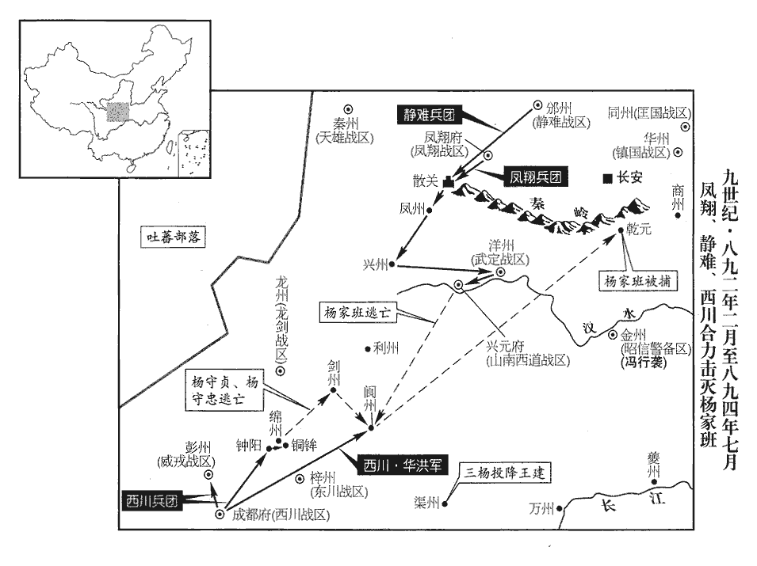
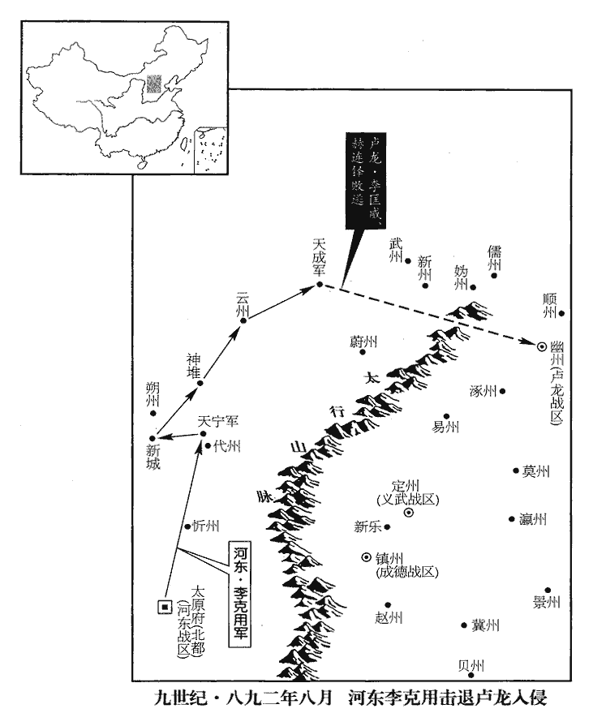
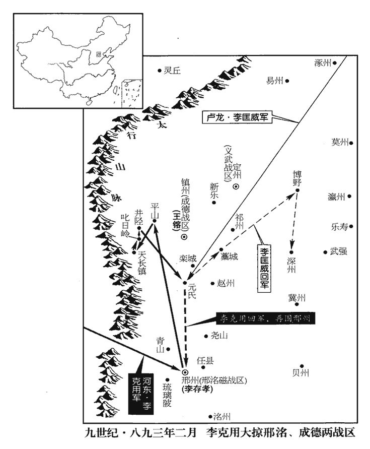
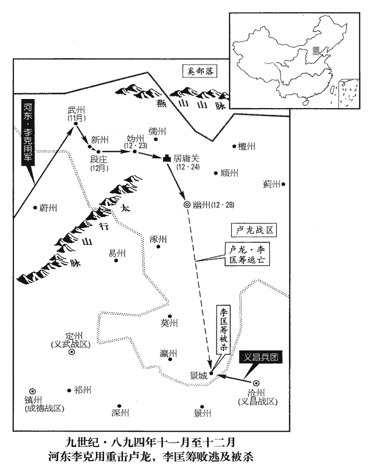

 唐紀七十五起玄黓困敦（壬子），盡閼逢攝提格（甲寅），凡三年。

# 昭宗聖穆景文孝皇帝上之中

## 景福元年（壬子、八九二）

1春，正月，丙寅‹二十一›，‹李晔（李敏）本年二十六岁›赦天下，改元。

〖译文〗 [1]春季，正月，丙寅（二十一日），唐昭宗诏令赦免天下，改年号为景福。

2鳳翔‹总部设凤翔府陕西省凤翔县›李茂貞、靜難‹总部设邠州陕西省彬县›王行瑜、難，乃旦翻。鎮國‹总部设华州陕西省华县›韓建、同州‹匡国总部设同州陕西省大荔县›王行約、秦州‹天雄总部设秦州甘肃省秦安县西北›李茂莊五節度使上言：楊守亮容匿叛臣楊復恭，事見上卷上年。上，時掌翻。請出軍討之，乞加茂貞山南西道‹总部设兴元府陕西省汉中市›招討使。朝議以茂貞得山南‹秦岭以南›，不可復制，復，扶又翻。下詔和解之，皆不聽。

〖译文〗 [2]凤翔节度使李茂贞、静难节度使王行瑜、镇国节度使韩建、同州节度使王行约、秦州节度使李茂庄五人一同向朝廷上疏进言：杨守亮容纳藏匿叛逆乱臣杨复恭，请发兵讨伐杨守亮，并请求加封李茂贞为山南西道招讨使。朝廷商议认为，李茂贞如果获得山南西道招讨使的官职，就不可能再控制住他了，于是颁下诏令劝李茂贞等五位节度使与杨守亮和解，结果都不听从。

3王鎔‹成德总部镇州›、李匡威‹卢龙总部幽州›合兵十餘萬攻堯山‹河北省隆尧县西尧山镇›，李克用‹河东总部太原府›遣其將李嗣勳擊之，大破幽、鎮兵，斬獲三萬。考異曰：實錄在二月，恐約奏到。今從唐太祖紀年錄。

〖译文〗 [3]王熔、李匡威联合军队总共十余万人攻打尧山，李克用派遣属下将领李嗣勋进行抗击，大败幽州、镇州的军队，斩杀擒获三万人。

4楊行密‹杨行愍·宁国总部宣州›謂諸將曰：「孫儒‹淮南总部扬州›之眾十倍於我，吾戰數不利，數，所角翻。欲退保銅官‹安徽省铜陵市西北›何如？」劉威、李神福曰：「儒掃地遠來，利在速戰。宜屯據險要，堅壁清野以老其師，時出輕騎抄其饋餉，抄，楚交翻。奪其俘掠。彼前不得戰，退無資糧，可坐擒也！」戴友規曰：「儒與我相持數年，僖宗光啟三年，楊行密、孫儒爭揚州，至是五年矣。勝負略相當。今悉眾致死於我，我若望風棄城，正墮其計。淮南士民從公渡江及自儒軍來降者甚眾，公宜遣將先護送歸淮南，降，戶江翻。將，即亮翻。使復生業；儒軍聞淮南安堵，皆有思歸之心，人心既搖，安得不敗！」行密悅，從之。以孫儒驅淮南人以攻楊行密，故其謀云爾。為行密擒孫儒張本。友規，廬州‹安徽省合肥市›人也。

〖译文〗 [4]杨行密对各位将领说：“孙儒的军队人数是我们的十倍，我们作战多次失利，现在想退到铜官固守，怎么样？”刘威、李神福说：“孙儒调动全部军队从远处前来，速战速决对他有利。我们应当占险要的地方，坚守城堡，转移周围的人畜财粮，使孙儒的军队疲劳困苦，我方再不时派出轻便骑兵抄掠他们输送的军粮，夺取他们掳掠的东西。孙儒向前没有交战的机会，后退又没有资财粮食，我们擒获孙儒可以说是马到成功的事！”戴友规对杨行密说：“孙儒与我们争夺扬州相持了五个年头，彼此胜负大体相当。现在孙儒发动全部军队要把我们致于死地，我们若是望风而走放弃城池，那就正中了孙儒的计谋。淮南的士子人民跟随你渡过长江以及从孙儒的军营中前来投降的人相当多，你应当派遣将领护送这些人先回淮南，让他们象原来一样谋生立业；孙儒军队的士兵听说淮南一带人民安居，生活稳定，都会产生回归故里的念头，孙儒的军心既然动摇，怎么会不失败呢！”杨行密听后很高兴，依从了属下将领的意见。戴友规是庐州人。

5威戎‹总部设彭州四川省彭州市›節度使楊晟僖宗文德元年，置威戎軍於彭州。與楊守亮等約攻王建‹西川总部成都府›。二月，丁丑‹二›，晟出兵掠新繁‹四川省新都县西北新繁镇›、漢州‹四川省广汉市›之境，使其將呂蕘將兵二千會楊守厚攻梓州‹东川战区总部所在·四川省三台县›；蕘，如招翻。梓州，東川節度使顧彥暉治所。建遣行營都指揮使李簡擊蕘，斬之。

〖译文〗 [5]威戎节度使杨晟与李守亮等人相约共同攻打王建，二月，丁丑（初二），杨晟派出军队到新繁、汉州境内抢掠，命令手下将领吕荛带领军队二千会同杨守厚攻打梓州。王建派遣行营都指挥使李简抗击吕荛，将吕荛斩杀。

6戊寅‹三›，朱全忠‹朱温·宣武总部汴州›出兵擊朱瑄‹天平总部和州›，遣其子友裕將兵前行，軍于斗門‹河南省濮阳市东南›。據舊書李師道傳，斗門城在濮陽縣界。

〖译文〗 [6]戊寅（初三），朱全忠派出军队攻打朱，派遣他的儿子朱友裕督率军队前行，在濮阳县的斗门城驻扎下来。

7李茂貞、王行瑜擅舉兵擊興元‹陕西省汉中市›。不以天子之命舉兵，故曰擅。茂貞表求招討使不已，遺杜讓能、西門君遂書，遺，唯季翻。杜讓能時為相，西門君遂時為神策中尉，此內外二大臣也。陵蔑朝廷。上意不能容，御延英，召宰相、諫官議之。時宦官有陰與二鎮相表裏者，宰相相顧不敢言，上不悅。給事中牛徽曰：「先朝多難，茂貞誠有翼衛之功；此謂僖宗再幸山南時也。難，乃旦翻。諸楊阻兵，亟出攻討，其志亦在疾惡，但不當不俟詔命耳。比聞兵過山南‹秦岭以南›，比，毗至翻。殺傷至多。陛下儻不以招討使授之，使用國法約束，則山南之民盡矣！」上曰：「此言是也。」乃以茂貞為山南西道招討使。牛徽之言，上所以誘掖其君，下所以彌縫悍將；若以之為國謀則未也。

〖译文〗 [7]李茂贞、王行瑜未奉朝廷命令擅发动军队攻打兴元。李茂贞不断上表请求授给他山南西道招讨使，给宰相杜让能、神策中尉西门君遂送去书信，凌辱蔑视朝廷。昭宗认为不能容许李茂贞如此放肆，便御临延英殿，召令宰相、谏官进行商议。当时宦官中有人暗中与李茂贞、王行瑜勾，因而宰相们相互观望不敢发言，昭宗很不高兴。给事中牛徽说：“先朝皇帝多灾多难，李茂贞当即派出军队攻伐征讨，他的意向就在于痛恨杨复恭一伙奸恶小人，但是不应当不等待朝廷的诏命就行动。近来听说他的军队经过山南，斩杀伤害的人相当多。陛下倘若不以山南西道招讨使的官职授给李茂贞，使用国家法度来约束他，那么山南的人民就会被斩尽杀绝了！”昭宗说：“这知说的话。”于是任命李茂贞为山南西道招讨使。

 

8甲申‹九›，朱全忠至衛南‹河南省滑县东›，朱瑄將步騎萬人襲斗門‹河南省濮阳市东南›，朱友裕棄營走，瑄據其營。全忠不知，乙酉‹十›，引兵趣斗門，趣，七喻翻。至者皆為鄆人所殺。全忠退軍瓠河‹山东省鄄城县东南›，九域志：濮州雷澤縣有瓠河鎮。丁亥‹十二›，瑄擊全忠，大破之，全忠走。張歸厚於後力戰，全忠僅免，考異曰：歸厚傳云十一月，誤也。今從梁紀。副使李璠等皆死。璠，音煩。

〖译文〗 [8]甲申（初九），朱全忠到达卫州南部，朱率领步，骑兵一万人攻打斗门城，朱友裕放弃营寨逃走，朱于是占据了斗门的营寨。朱全忠不知道斗门城已被朱夺取，乙酉（初十），他带领军队赶往斗门，到达那里的人都被朱的郓州军队斩杀。朱全忠退到濮州雷泽县的瓠河镇驻扎，丁亥（十二日），朱攻打朱全忠，朱全忠大败逃跑。张归厚在后面竭力阻击掩护，朱全忠仅兔一死，副使李等人都在交战中阵亡。

9朱全忠奏貶河陽‹总部设孟州河南省孟州市›節度使趙克裕，考異曰：實錄在正月末，云「全忠欲全義得河陽，乃奏克裕有誣謗之言而貶。」新紀云，「己未，朱全忠陷孟州，逐河陽節度使趙克裕。」今從編遺錄。以佑國‹总部设河南府河南省洛阳市›節度使張全義兼河陽節度使。二鎮時皆屬朱全忠，或貶或兼，唯其所奏。

〖译文〗 [9]朱全忠奏请将河阳节度使赵克裕贬职，让佑国节度使张全义兼任河阳节度使。

10孫儒‹淮南战区，总部设扬州江苏省扬州市›圍宣州‹安徽省宣州市›。初，劉建鋒為孫儒守常州‹江苏省常州市›，將兵從儒擊楊行密，甘露鎮使陳可言帥部兵千人據常州。潤州城東角土山上有甘露寺‹江苏省镇江市北长江南岸甘露寺›，前對北固山，後枕大江。寶曆中，李德裕建寺，適有甘露降，因以名之。孫儒蓋因此寺而置甘露鎮也。帥，讀曰率。行密將張訓引兵奄至城下，可言倉猝出迎，訓手刃殺之，遂取常州。考異曰：新紀：「景福二年二月，楊行密陷常州。」按行密自宣歸揚，過常州，已歎張訓之功；新紀誤也。今從十國紀年。行密別將又取潤州‹江苏省镇江市›。楊行密自此遂有潤州，而與錢氏爭常州矣。

〖译文〗 [10]孙儒围攻宣州。起初，刘建锋为孙据守常州，当他带领军队跟随孙儒攻打杨行密时，甘露镇使陈可言率领所部人马一千人据守常州。杨行密的将领张训带领军队忽然来到常州城下，陈可言仓猝出城迎战，张训亲手将陈可言斩杀，于是占取常州。杨行密的另一将领又攻取了涧州。

11朱全忠連年攻時溥‹感化总部徐州›，光啟三年，徐、汴始交兵。徐‹江苏省徐州市›、泗‹江苏省盱眙县淮河北岸›、濠‹安徽省凤阳县东北临淮关›三州民不得耕穫，兗、鄆、河東兵救之，皆無功，復值水災，復，扶又翻。人死者什六七。溥困甚，請和於全忠，全忠曰：「必移鎮乃可。」溥許之。全忠乃奏請移溥他鎮，仍命大臣鎮徐州。詔以門下侍郎、同平章事劉崇望同平章事，充感化‹总部设徐州江苏省徐州市›節度使，以溥為太子太師。溥恐全忠詐而殺之，據城不奉詔，崇望及華陰‹陕西省华阴市›而還。華，戶化翻。還，從宣翻，又如字。

〖译文〗 [11]朱全忠连年攻打时溥，徐州、泗州、濠州三州的人民都无法耕种收获，兖州、郓州、河东的军队救援时溥，都没有成功，又赶上闹水灾，人民死亡的占十分之六七。时溥极其困乏，向朱全忠请求和解，朱全忠回答说：“你必须迁移镇所离开徐州才可以。”时溥表示同意。朱全忠便奏请将时溥调往其他镇所，仍然任命朝中大臣镇守徐州。于是，唐昭宗任命门下侍郎、同平章事刘崇望以同平章事衔，充任感化节度使，任命时溥为太子太师。时溥担心朱全忠欺骗谋杀他，依然占据徐州城而不奉行朝廷的诏令，刘崇望到达华阴便又返回长安。

12忠義‹总部设襄州湖北省襄樊市›·前山南东道战区節度使趙德諲薨，子匡凝代之。考異曰：實錄，此月以前，忠義軍節度使趙匡凝起復某官，不言德諲卒在何時。新傳、薛史但云「匡凝為唐州刺史兼七州馬步軍都校；及德諲卒，自為襄州留後，朝廷即以旄鉞授之。」亦不言年月。今附於此。

〖译文〗 [12]忠义节度使赵德死去，他的儿子赵匡凝代任忠义节度使。

13范暉驕侈失眾心，范暉據福州‹福建省福州市›，見上卷上年。王潮以從弟彥復為都統，弟審知為都監，將兵攻福州。從，才用翻。監，古銜翻。民自請輸米餉軍，平湖洞‹福建省仙游县›及濱海蠻夷皆以兵船助之。平湖洞在泉州莆田縣界外。九域志曰：今興化軍大飛山，地本平湖數頃，一夕風雨暴至，旦見此山聳峙，一名大飛。

〖译文〗 [13]福建观察使范晖骄横奔侈造成属下离心离德，王潮任命堂弟王彦复为都统，胞弟王审知为都监，带领军队攻打福州，人民自动请求运送粮米给王潮的军队，平湖洞以及海边的蛮夷都用战船援助王潮。

14辛丑‹二十六›，王建‹西川战区，总部设成都府四川省成都市›遣族子嘉州‹四川省乐山市›刺史宗裕、雅州‹四川省雅安市›刺史王宗侃、威信都指揮使華洪、茂州‹四川省茂县›刺史王宗瑤將兵五萬攻彭州‹四川省彭州市›，按九域志：彭州距成都九十餘里。此其壤地相接，煙火相望，所謂「臥榻之側，豈容他人鼾睡」者也。王建安得而不急攻之邪！楊晟逆戰而敗，宗裕等圍之。楊守亮遣其將符昭救之，徑趨成都，營三學山‹四川省金堂县东北五千米三学山›。趨，七喻翻。漢州金堂縣東北十里有三學山。建亟召華洪還。洪疾驅而至，王建一時諸將唯華洪饒智略，建所倚也，故亟召之以禦符昭。華，戶化翻。後軍尚未集，以數百人夜去昭營數里，多擊更鼓；昭以為蜀軍大至，引兵宵遁。更，工衡翻。更鼓，持更之鼓，官府及行軍，每更擊之以為節。更鼓多則敵人以為營寨多，故宵遁。

〖译文〗 [14]辛丑（二十六日），王建派遣同族子弟嘉州刺史王宗裕、雅州刺史王宗侃、威信都指挥使华洪、茂州刺史王宗瑶带领军队五万攻打彭州，杨晟迎战失败，王宗裕等当即围攻杨晟。杨守亮派遣属下将领符昭前去救助杨晟，符昭直接奔赴成都，在汉州金堂县的三学山安营扎寨。王建紧急召令华洪返回成都。华洪火速赶到，后面的军队还没有来得及集结，就带领几百人的夜间到离符昭营寨几里以外的地方，频繁地击打更鼓。符昭以为是王建的军队大规模来到，便带领军队连夜逃跑了。

15三月，以戶部尚書鄭延昌為中書侍郎、同平章事。延昌，從讜之從兄弟也。僖宗乾符間，鄭從讜鎮河東有聲績。之從，才用翻。

〖译文〗 [15]三月，朝廷任命户部尚书郑延昌为中书侍郎、同平章事。郑延昌是郑从谠的堂兄弟。

16左神策勇勝三都都指揮使楊子實、子遷、子釗，皆守亮之假子也，勇勝三都，亦神策五十二都之數。自渠州‹四川省渠县›引兵救楊晟，知守亮必敗，壬子‹八›，帥其眾二萬降於王建。帥，讀曰率。

〖译文〗 [16]左神策勇胜三都都指挥使杨子实、杨子迁、杨子钊，都是杨守亮的养子，他们从渠州带领军队救援杨晟，知道杨守亮一定要失败，便于壬子（初八），率领所部人马共计二万向王建投降。

17李克用、王處存合兵攻王鎔，癸丑‹九›，拔天長鎮‹河北省井陉县西天长镇›。天長鎮，在滹沱河東北。戊午‹十四›，鎔與戰於新市‹河北省正定县东北新城铺›，大破之，殺獲三萬餘人；新市，漢古縣，唐併入鎮州九門縣。辛酉‹十七›，克用退屯欒城‹河北省栾城县›。詔和解河東及鎮、定、幽四鎮。

〖译文〗 [17]李克用、王处存联合军队攻打王熔，癸丑（初九），攻克滹沱河东北的天长镇。戊午（十四日），王熔在镇州九门县的新市与李克用、王处存展开激战，结果大败李克用、王处存，斩杀擒获三万余人；辛酉（十七日），李克用率众退到城驻扎。唐昭宗颁发诏令劝河东及镇州、定州、幽州四镇和解。

18楊晟遺楊守貞‹龙剑总部龙州›、楊守忠‹武定总部洋州›、楊守厚‹绵州州长›書，遺，于季翻。使攻東川‹总部设梓州四川省三台县›以解彭州之圍，守貞等從之。神策督將竇行實戍梓州‹四川省三台县›，守厚密誘之為內應；誘，音酉。守厚至涪城‹四川省三台县西北›，行實事泄，顧彥暉斬之。考異曰：實錄：「明年正月，楊守厚攻東川，以竇行實為內應。事泄，行實死，守厚遁去。」因李茂貞與王建爭東川，追敘今年事耳。今從十國紀年。守厚遁去。守貞、守忠軍至，無所歸，盤桓綿‹四川省绵阳市›、劍‹四川省剑阁县›間，綿、劍，二州名。宋白曰：綿州，漢涪城縣地，西魏置潼州；隋置綿州，以綿水為稱。九域志：綿州東北至劍州二百九十四里。王建遣其將吉諫襲守厚，破之。癸亥‹十九›，西川將李簡邀擊守忠於鍾陽‹四川省绵阳市西南›，九域志：綿州巴西縣有鍾陽鎮。斬獲三千餘人。夏，四月，簡又破守厚於銅鉾‹绵阳市东›，鉾máo，亡侯翻。斬獲三千餘人，降萬五千人；守忠、守厚皆走。

〖译文〗 [18]杨晟给杨守贞、杨守忠、杨守厚送去书信，让他们攻打东川以求解除彭州之围，杨守贞等遵命行动。神策督将窦行实驻守梓州，杨守厚暗中引诱他做内应；杨守厚到达涪城，窦行实要做内应的事情泄漏，顾彦晖将窦行实斩杀。杨守厚于是逃走离去。杨守贞、杨守忠的军队赶到，找不到去处，在绵州、剑州之间徘徊。王建派遣手下将领吉谏攻打杨守厚，将他打败。癸亥（十九日），西川将领李简在绵州巴西县的钟阳镇拦击杨守忠，斩杀擒获三千余人。夏季，四月，李简又在铜打败杨守厚，斩杀擒获三千余人，前往投降的有一万五千人；杨守忠、杨守厚都逃跑了。

19乙酉‹十二›，置武勝軍於杭州‹浙江省杭州市›，以錢鏐為防禦使。

〖译文〗 [19]乙酉（十二日），朝廷在杭州武胜军，任命钱为防御使。

20天威軍使賈德晟，以李順節之死，頗怨憤，李順節死見上卷上年。西門君遂惡之，惡，烏路翻。奏而殺之。德晟麾下千餘騎奔鳳翔‹陕西省凤翔县›，李茂貞由是益強。

〖译文〗 [20]天威军使贾德晟，因为李顺节之死，很是怨恨愤怒，西门君遂憎恨他，上奏唐昭宗将贾德晟杀死。贾德晟属下一千余名骑兵投奔凤翔，李茂贞的势力从此更加大起来。

21李匡威出兵侵雲‹山西省大同市›、代‹山西省代县›，壬寅‹二十九›，李克用始引兵還。自鎮州‹河北省正定县›引還。

〖译文〗 [21]李匡威派出军队侵扰云州、代州，壬寅（二十九日），李克用开始从镇州带领军队返回。

22時溥遣兵南侵，至楚州‹江苏省淮安市›，楊行密將張訓、李德誠敗之于壽河‹江苏省淮安市东南›，敗，補邁翻；下同。遂取楚州，執其刺史劉瓚。朱全忠以劉瓚刺楚州，見二百五十七卷僖宗光啟三年。張訓等既破徐兵，乘勝遂取汴之楚州。考異曰：新紀，「三月乙巳，楊行密陷楚州，執刺史劉瓚。」十國紀年，「三月，時溥遣兵三萬南侵至楚州；四月，楊行密將張訓、李德誠敗徐兵于壽河，俘斬三千級，取楚州，執瓚。」今從之。

〖译文〗 [22]时溥派遣军队向南侵扰，到达楚州，杨行密的将领张训、李德诚在寿河将时溥的人马打败，乘胜攻占了楚州，抓获楚州刺史刘瓒。

23加【章：十二行本「加」上有「五月」二字；乙十一行本同；孔本同；張校同；退齋校同。】邠寧節度使王行瑜兼中書令。

〖译文〗 [23]朝廷加封宁节度使王行瑜兼任中书令。

24楊行密屢敗孫儒兵，破其廣德‹安徽省广德县›營，廣德營，孫儒之兵營於廣德者也。敗，補邁翻。張訓屯安吉‹浙江省安吉县北安城镇›，斷其糧道。義寧二年，沈法興分烏程置安吉縣，唐因之，屬湖州。九域志：在州西南百七十一里。斷，音短。儒食盡，士卒大疫，遣其將劉建鋒、馬殷分兵掠諸縣。六月，行密聞儒疾瘧，瘧nüè，逆約翻，疾而寒熱迭作，謂之瘧。戊寅‹六›，縱兵擊之。會大雨、晦冥，儒軍大敗，安仁義破儒五十餘寨，田頵擒儒於陳，陳，讀曰陣。斬之，傳首京師，儒眾多降於行密。光啟三年，孫儒始與行密交兵，至是而敗。孫儒以十倍之眾攻行密，其智勇亦無以大相過，而卒斃於行密者，儒專務殺掠，人心不附，又後無根本。行密雖為儒所困，分遣張訓、李德誠略淮、浙之地以自廣，又斥餘廩以飼飢民，既得人心，又有根本，所以勝也。劉建鋒、馬殷收餘眾七千，南走洪州‹江西省南昌市›，走，音奏。推建鋒為帥，殷為先鋒指揮使，張【章：十一行本「張」上有「以行軍司馬」五字；乙十一行本同；孔本同；張校同；退齋校同。】佶為謀主，比至江西，眾十餘萬。帥，所類翻。比，必利翻，及也。

〖译文〗 [24]杨行密多次击败孙儒的军队，攻破了孙儒在广德安设的营寨，张训则在安吉驻扎，截断了孙儒的运粮道路。孙儒军中粮食吃尽，大闹瘟疫，孙儒派遣属下将领刘建锋、马殷分别带领军队到各县抢掠。六月，杨行密听说孙儒军中正闹瘟疫，戊寅（初六），便派出军队攻打孙儒。当地正赶上大雨滂沱，天昏地暗，孙儒军队大败，安仁义攻破孙儒五十多个营寨，田在阵地上擒获孙儒，将他斩杀，把他的头传送到京师长安，孙儒的手下人马大多向杨行密投降。刘建锋、马殷收集剩余的人马七千人，向南奔往洪州，大家推举刘建锋为统帅，马殷为先锋指挥使，委任张佶为谋主，等到队伍到达江西，人数已达十余万。

丁酉‹二十五›，楊行密帥眾歸揚州‹江苏省扬州市›；帥，讀曰率。考異曰：十國紀年，「行密過常州，謂左右曰：『常州大城也，張訓以一劍下之，不亦壯哉！』舊紀：「大順二年三月，淮南節度使孫儒為宣州觀察使楊行密所殺。初，行密揚州失守，據宣州，孫儒以兵攻圍三年。是春，淮南大饑，軍中疫癘。是月，孫儒亦病，為帳下所執，降行密；行密乃併孫儒之眾，復據廣陵。」薛居正五代史行密傳曰：「大順元年，行密危蹙，出據宣州，儒復入揚州。二年，儒攻行密。屬江、淮疾疫，師人多死，儒亦臥病，為部下所執，送於行密，殺之。行密自宣城長驅入于廣陵。」唐補紀：「大順二年六月，孫儒兵敗於宛陵城下，楊行密進首級於西京。」吳錄曰：「景福元年，六月六日，太祖盡率諸將晨出擊儒，田頵臨陳擒儒以獻，斬儒於市，傳首京師。」新紀、實錄、十國紀年皆據此。舊紀、薛史、唐補紀皆誤。秋，七月，丙辰‹十四›，至廣陵‹扬州州政府所在城›，表田頵守宣州‹安徽省宣州市›，安仁義守潤州。

〖译文〗 丁酉，杨行密帅众归杨州；秋，七月，丙辰（十四日），杨行密回到广陵，向朝廷上表请令田守宣州，安仁义守润州。

先是，揚州富庶甲天下，先，悉薦翻。時人稱揚一、益二，言揚州居一，益州為次也。及經秦、畢、孫、楊兵火之餘，秦彥、畢師鐸、孫儒、楊行密也。江、淮之間，東西千里掃地盡矣。

〖译文〗 在此之前，扬州的富庶天下无比，当时人们称颂扬州第一，益州第二，等到经过秦彦、毕师铎、孙儒、杨行密各股军队的战火之后，江、淮之间，东西千里方圆一片败落景象。

25王建圍彭州‹四川省彭州市›，久不下，民皆竄匿山谷；諸寨日出俘掠，謂之「淘虜」，都將先擇其善者，餘則士卒分之，以是為常。將，即亮翻。

〖译文〗 [25]王建围攻彭州，很久不能攻克，当地百姓都窜逃藏匿在高山深谷之中。王建各个营寨的士卒每天出去掳掠抢劫，把这叫做“淘虏”，对搜抢来的人民财物，军中将领先挑选好的，剩余的让士兵们瓜分，以此为常事。

有軍士王先成者，新津‹四川省新津县›人，本書生也，世亂，為兵，度諸將惟北寨王宗侃最賢，乃往說之曰：度，徒洛翻。說，式芮翻。「彭州本西川之巡屬也，陳、田召楊晟，割四州以授之，見二百五十七卷文德元年，陳、田，謂陳敬瑄、田令孜。偽署觀察使，與之共拒朝命。朝，直遙翻。今陳、田已平而晟猶據之，州民皆知西川乃其大府巡屬諸州，以節度使府為大府，亦謂之會府。而司徒乃其主也，時朝命以王建檢校司徒，故稱之。故大軍始至，民不入城而入山谷避之，以俟招安。今軍至累月，未聞招安之命，軍士復從而掠之，復，扶又翻。與盜賊無異，奪其貲財，驅其畜產，分其老弱婦女以為奴婢，使父子兄弟流離愁怨；其在山中者暴露於暑雨，殘傷於蛇虎，孤危飢渴，無所歸訴。彼始以楊晟非其主而不從，今司徒不加存恤，彼更思楊氏矣。」宗侃惻然，不覺屢移其牀前問之，先成曰：「又有甚於是者：今諸寨每旦出六七百人，入山淘虜，薄暮乃返，薄，迫也。曾無守備之意。賴城中無人耳，萬一有智者為之畫策，為，于偽翻。使乘虛奔突，先伏精兵千人於門內，登城望淘虜者稍遠，出弓弩手、礮手各百人，礮，與砲同，匹貌翻。攻寨之一面，隨以役卒五百，負薪土填壕為道，然後出精兵奮擊，且焚其寨；又於三面城下各出耀兵，耀兵者，以耀敵使不知所備。諸寨咸自備禦，無暇相救，城中得以益兵繼出，如此，能無敗乎！」宗侃矍然曰：矍，居縛翻。「此誠有之，將若之何？」

〖译文〗 有一个军士王先成，是新律人，本来是个书生，适逢天下大乱，便参军从武，他揣测各位将领中只有北面营寨的王宗侃最为贤明，就前往劝王宗侃说：“彭州本来是西川的属地，陈敬、田令孜召来杨晟，割出四个州授给杨晟，任杨晟为观察使，与他们共同抗拒朝廷命令，现在陈敬、田令孜已经平灭，而杨晟仍然占据着彭州，彭州的人民都知道西川是他们的大府，而检校司徒王建是他们的官长，所以王建的大队人马到达彭城一带之初，当地百姓并不进入城内归附杨晟，而是逃往高山深谷躲避起来，等待着王建的招抚。现在王建军队到达已经几个月了，百姓没有听到招抚劝降的命令，相反纵容军中士卒一再大肆抢掠，与强盗贼寇没有什么两样，他们抢夺百姓的资财货物，追逐百姓的家畜财产，把年老体弱的人以及妇女分给士兵做奴婢，使这里的父子兄弟骨肉分离愁苦怨怒。那些在山谷中的人，酷暑暴雨之下无遮无盖，不时受到毒蛇猛虎的残害，孤苦危险，又饿又渴，没有诉苦的地方。彭州百姓开始时认为杨晟不是他们的官长而不遵从他，现在检校司徒王建对他们不加爱抚救济，他们就会改变初衷想念杨晟了。”王宗侃十分悲戚，不由得一再移动他坐着的床向前询问王先成，王先成说：“还有比这更为危险的事：现在各个营寨每天早晨出动六七百人，进入深山搜掠百姓财物，天黑时才返回来，竟然没有守寨防备的意思。这不过是赖于彭州城内没有能人罢了，万一有足智多谋的人为杨晟出谋划策，让他乘虚出击，事先在彭州城门的里面埋伏下精壮人马一千人，当登上城楼望到王建营寨的士兵外出去抢掠走远时，便派出弓弩手、炮手各一百人，攻打营寨的一面，紧随着派五百名役夫士兵，身背柴草土石填满堑壕垫好道路，然后出动精锐军队奋勇攻打，并且焚烧王建的营寨；又从彭州城的另三面突然派出军队，各个营寨都自己忙着防备抵御，没有功夫相互救援，彭州城内得以增派军队相继杀出，这样一来，王建怎么能不失败呢！”王宗侃惊慌地说：“这种情况确定有司能发生，该怎么办好呢！”

先成請條列為狀以白王建，宗侃即命先成草之，大指言：「今所白之事，須四面通共，時西川兵圍彭州，四面下寨，宗裕、宗侃、華洪、宗瑤各當一面。宗侃所司止於北面，或所白可從，乞以牙舉施行。」牙舉，謂從使牙檢舉而見之施行。事凡七條：「其一，乞招安山中百姓。其二，乞禁諸寨軍士及子弟無得一人輒出淘虜，仍表諸寨之旁七里內聽樵牧，敢越表者斬。其三，乞置招安寨，中容數千人，以處所招百姓，處，昌呂翻。宗侃請選所部將校謹幹者為招安將，使將三十人晝夜執兵巡衛。其四，招安之事須委一人總領，今牓帖既下，下，戶嫁翻。諸寨必各遣軍士入山招安，百姓見之無不驚疑，如鼠見貍，誰肯來者！貍，捕鼠者也。鼠見貍則知必死，特恨不可得而走耳，詎肯前就之哉！故以為喻。欲招之必有其術，願降帖付宗侃專掌其事。其五，乞嚴勒四寨指揮使，悉索前日所虜彭州男女老幼集於營場，有父子、兄弟、夫婦自相認者即使相從，牒具人數，部送招安寨，有敢私匿一人者斬；仍乞勒府中諸營，亦令嚴索，府，謂成都府。索，山客翻。有自軍前先寄歸者，量給資糧，量，音良。悉部送歸招安寨。其六，乞置九隴行縣於招安寨中，彭州治九隴縣，彭州未下，故乞置行縣。九隴故漢繁縣地，後魏改曰九隴，以州西有九隴山為名。九隴，一伏隴，二豆隴，三秋隴，四龍奔隴，五走馬隴，六駱駝隴，七千秋隴，八較車隴，九橫擔隴。以前南鄭‹兴元府所在县·陕西省汉中市›令王丕攝縣令，南鄭，漢古縣，唐帶興元府。設置曹局，撫安百姓，擇其子弟之壯者，給帖使自入山招其親戚；彼知司徒嚴禁侵掠，前日為軍士所虜者，皆獲安堵，必歡呼踴躍，相帥下山，帥，讀曰率。如子歸母，不日盡出。其七，彭州土地宜麻，益州記：彭之地號小郫，言土地肥良，比之郫邑也。百姓未入山時多漚藏者，漚，烏候翻，久漬也。宜令縣令曉諭，各歸田里，出所漚麻鬻之，以為資糧，必漸復業。」建得之大喜，即行之，悉如所申。考異曰：張𩇕jìng耆舊傳曰：「五月二十日，諸軍馬步兵士到彭州城下。至七月初，已經五十餘日，諸軍兵士始到，刈麥充糧。至七月初，麥盡，並無顆粒。兵士但託求食，乃每日遠去入山，虜劫逃避百姓。有一軍士，本是儒生，乃往北面寨說於統帥」云云。十國紀年：「王先成謂王宗侃云云。先成上招攜七事，建皆納之。先成，蜀州新津人。」按十國紀年，王建自二月辛丑遣王宗裕等擊楊晟，遂圍彭州。又晟遺楊守忠書云：「弊邑雖小，圍守三年矣。」而張𩇕云五月二十日方圍彭州，或者先圍之不克而再往歟？𩇕但云有一軍士，而十國紀年姓王名先成，不知其本出何書也。

〖译文〗 王先成请求分条开列写成状纸以便禀告王建，王宗侃当即命令王先成起草状文，大意是说：“今天所禀告的事，必须是围攻彭州城的王宗裕、王宗侃、华洪、王宗瑶四面相通共同行动，我王宗侃所统管的只是北面的营寨，或许所禀告的事可以依从，请求命令西川军队的使牙检举全都施行。”事情共有七条：“其一，请求招抚山谷中的百姓。其二，请求禁止各营寨的军中士兵和子弟，一个也不准出去搜掠百姓，在各营寨的旁边立石碑，七里方圆之内听凭打柴放牧，有敢超越石碑的斩杀。其三，请求设置招安寨，寨中能容纳下几千人，以安置所招来的百姓，我王宗侃请求从所部将校中挑选谨慎干练的人为招安将领，令他带领三十人日夜手持武器巡逻护卫。其四，招抚百姓这件事，必须委派一个人总管，现在招安的榜帖既然发了下去，各个营寨一定是分头派遣军中士兵进入山谷招抚百姓，躲藏在那里的百姓看到这种情形，没有不惊慌疑惧的，就会象老鼠见了猫，有谁还肯前来投降！要想招抚山谷中的百姓，必须有恰当的方法，希望颁下文告委任我王宗侃专门掌管这桩事。其五，请求严格勒令四面营寨的指挥使，把从前掳掠来的彭州男女老幼全都集结在营寨的广场上，有父亲与儿子、哥哥与弟弟、丈夫与妻子自己相互认出的，就让他们相聚，在公文上注明人数，分部送往招安寨，有胆敢私自隐匿一个人的当即处斩；并请求勒令成都府中的各个营寨，也严格搜索，有先前从军队前沿送回来的百姓，酌量支给资财粮食，全都分部送回招安寨。其六，请求在招安寨中设置九陇行县，委任从前的南郑县令王丕暂摄九陇行县县令，设置曹局，招抚安顿百姓，从这些百姓中挑选身强力壮的子弟，发给他们文告，让他们自己入山招请他们的亲戚，百姓知道王司徒严令禁止士兵侵扰抢掠，前些时候被军中士兵抢虏去的人，也都很平安，必定会欢呼跳跃，纷纷走下山来，如同儿子回到母亲的怀抱，用不了几天就会全部从山中出来。其七，彭州的土地适于种麻，这里的百姓在没有进山时将大量的麻沤藏起来，应当命令县令明确告知百姓，分别回到田间故里，挖出沤藏的麻卖掉，换取资财粮食，这样必定会逐渐恢复旧业。”王建接到状文大为欢喜，当即施行，全部照办。

明日，牓帖至，威令赫然，無敢犯者。三日，山中民競出，赴招安寨如歸市，寨不能容，斥而廣之；浸有市井，又出麻鬻之。民見村落無抄暴之患，抄，楚交翻。稍稍辭縣令，復故業。月餘，招安寨皆空。

〖译文〗 第二天，发布的告示传下，威严的军令赫然在目，没有人敢违。第三天，躲藏在山谷中的百姓竞相出来，象赶集一样奔赴招安寨，招安寨容不下，就开辟地盘扩展寨子。逐渐地又有了集市，百姓又拿出收藏的麻贩卖。招安寨的人民看到自己村落没有被残暴抢掠的苦难，逐渐告辞九陇行县县令，回到故里重操旧业。一个多月的时间，招安寨里都空了。

26己巳‹二十七›，李茂貞克鳳州‹陕西省凤县›，感義‹总部设凤州陕西省凤县›節度使滿存奔興元。僖宗光啟二年，滿存得鳳州，至是而敗。奔興元，就楊守亮。茂貞又取興‹陕西省略阳县›、洋‹陕西省洋县›二州；皆表其子弟鎮之。考異曰：薛居正五代史茂貞傳曰：「大順二年，楊復恭得罪奔山南，與楊守亮據興元叛，茂貞與王行瑜討平之。詔以徐彥若鎮興元。茂貞違詔，表其假子繼徽為留後，堅請旄鉞，昭宗不得已而授之。自是茂貞始萌問鼎之志。既而逐涇原節度使張球、洋州節度使楊守忠、鳳州刺史滿存，皆奪據其地。」云大順二年，誤也。今從新紀。

〖译文〗 [26]己巳（二十七日），李茂贞攻克凤州，感义节度使满存逃奔兴元，李茂贞又连续攻占了兴州、洋州，向朝廷上表请求委任他的子弟统管。

27八月，以楊行密為淮南節度使、同平章事，以田頵知宣州‹安徽省宣州市›留後，安仁義為潤州刺史。

〖译文〗 [27]八月，朝廷任命杨行密为淮南节度使、同平章事，委任田为宣州留后，任命安仁义为润州刺史。

孫儒降兵多蔡‹河南省汝南县›人，降，戶江翻。行密選其尤勇健者五千人，厚其稟賜，以皁衣蒙甲，稟，筆錦翻，給也。皁，才早翻。號「黑雲都」，每戰，使之先登陷陳，陳，讀曰陣。四鄰畏之。

〖译文〗 孙儒投降过来的军队大多是蔡州人，杨行密挑选他们当中特别勇猛强健的人五千名，予以丰厚的俸饷和赏赐，用黑色的外衣蒙盖上甲胄，号称“黑云都”，每当作战时，就让这些人首先冲锋陷，四周邻近的军队都很惧怕他们。

行密以用度不足，欲以茶鹽易民布帛，掌書記舒城‹安徽省舒城县›高勖xù曰：「兵火之餘，十室九空，又漁利以困之，記坊記：諸侯不下漁色。註曰：象捕魚然，中網取之，是無所擇。漁利之「漁」猶漁色之「漁」。將復離叛。復，扶又翻；下同。不若悉我所有易鄰道所無，足以給軍；選賢守令勸課農桑，數年之間，倉庫自實。」行密從之。守，式又翻。令，力正翻。田頵聞之曰：「賢者之言，其利遠哉！」行密馳射武伎，皆非所長，伎，渠綺翻。而寬簡有智略，善撫御將士，與同甘苦，推心待物，無所猜忌。嘗早出，從者斷馬鞦，取其金，從，才用翻。斷，音短。鞦，七由翻，史炤曰：馬紂也。行密知而不問，他日，復早出如故，人服其度量。

〖译文〗 杨行密因为军中费用缺乏，想用茶叶和食盐换取百姓的布帛，掌书记舒城人高勖说：“战乱刚刚过去，老百姓十户有九家是空的，官府却又要以商谋利使他们艰难窘迫，这将会使百姓再次叛离我们。不如拿出我们拥有的东西去与缺少此物的邻道贸易，这样完全可以供给军队，再挑选贤明的地方长官劝勉人民耕作纺织，几年的时间，仓库自然就会充盈。”杨行密采纳了高勖的意见。田听到这件事后说：“贤明人士的话，其利益深远呀！”杨行密对于骑马射箭比武这些技艺，都没有什么专长，可是他对人宽厚，生活节俭又有智谋胆略，善于安抚驾御宫中将士，与他们同甘共苦，待人处事推心置腹，没有任何猜疑顾忌。有一次早晨出去，跟随的人剪断驾辕马臀部的皮带，拿走那上面的金饰，杨行密知道了也不追问，后来，仍象以前一样在早晨外出，人们都佩服他的心胸度量。

 

淮南被兵六年，光啟三年，畢師鐸亂，淮南始被兵。被，皮義翻。士民轉徙幾盡；幾，居依翻；下幾復同。行密初至，賜與將吏，將，即亮翻。帛不過數尺，錢不過數百；而能以勤儉足用，非公宴，未嘗舉樂。招撫流散，輕傜薄斂，斂，力贍翻。未及數年，公私富庶，幾復承平之舊。復，還也，讀如字。

〖译文〗 淮南一带遭受战乱接连六年，当地士人和百姓辗转迁移几乎走光了；杨行密刚到这里时，赏赐将领官吏，布帛不过几尺，银钱不到几百。可是杨行密能够靠勤奋节俭保证军中供给充足，除非因公摆设宴会，他自己从不举办歌舞声乐。杨行密招收安抚流离的人民，减轻徭役少征赋税，没有几年的功夫，官府和人民都富有起来，几乎恢复到太平盛世时的状态。

28李克用北巡至天寧軍‹山西省代县北›，代州西有天安軍，天寶十二載置。聞李匡威、赫連鐸將兵八萬寇雲州，遣其將李君慶發兵於晉陽‹太原府所在县›。克用潛入新城‹山西省山阴县东北›，伏兵於神堆‹山阴县北›，神堆在雲州城南，新城又在神堆東南。神堆，即神武川之黃花堆，新城在其側，蓋克用祖執宜保黃花堆時所築也。按薛史唐紀，李克用生於神武川之新城。宋白曰：雲州西南至神堆柵九十里。擒吐谷渾邏騎三百；邏，郎佐翻。匡威等大驚。丙申‹二十五›，君慶以大軍至，克用遷入雲州。丁酉‹二十六›，出擊匡威等，大破之。己亥‹二十八›，匡威等燒營而遁；追至天成軍‹山西省天镇县›，蔚州東北有天成軍。斬獲不可勝計。勝，音升。

〖译文〗 [28]李克用往北巡视到达天宁军，听说李匡威、赫连铎率领军队八万侵扰云州，便派遣属下将领李君庆从晋率军出发。李克用偷偷进入新城，而在云州城南的神堆设下伏兵，擒获吐谷浑的巡逻骑兵三百人；李匡威等大为震惊。丙申（二十五日），李君庆率领大军赶到，李克用便迁入云州。丁酉（二十六日），李克用派出军队攻打李匡威等焚烧营寨逃跑；李克用的军队追到蔚州东北的天成军，斩杀擒获无法计算。

29辛丑‹三十›，李茂貞攻拔興元，楊復恭、楊守亮、楊守信、楊守貞、楊守忠、滿存奔閬州‹四川省阆中市›。光啟三年，楊守亮鎮興元，至是而敗。考異曰：舊紀：「景福元年十一月辛丑，鳳翔、邠寧之眾攻興元，陷之，節度使楊守亮、前中尉楊復恭、判官李巨川突圍而遁。十二月，辛未，華州刺史韓建奏於乾元縣遇興元散兵，擊敗之，斬楊守亮、楊復恭，傳首。」實錄：「乾寧元年七月，鳳翔、邠寧之兵攻興元，陷之，楊守亮、楊復恭突圍而遁。」新紀：「景福元年八月，茂貞寇興元，守亮、滿存奔閬州。乾寧元年七月，茂貞陷閬州，八月，守亮伏誅。」新復恭傳：「景福元年，茂貞攻興元，破其城，復恭、守亮、守信奔閬州。」十國紀年蜀史：「景福元年十月，行瑜、茂貞表守亮招納叛臣，請討之。感義節度使滿存救守亮，為茂貞所敗，奔興元。十一月，邠、岐攻陷興元，楊復恭帥守亮、守貞、守忠、滿存同奔閬州。十二月，壬午，華洪敗守亮等於州。」按實錄，景福二年正月移茂貞山南，於時守亮不應猶在山南。今年月從新紀，事則參取諸書。茂貞表其子繼密權知興元府事。

〖译文〗 [29]辛丑（三十日），李茂贞攻克兴元，杨复恭、杨守亮、杨守信、杨守贞、杨守忠、满存一同逃奔阆州。李茂贞上表朝廷请求委任他的儿子李继密暂时主持兴元府事宜。

30九月，加荊南‹总部设江陵府湖北省江陵县›節度使成汭同平章事。

〖译文〗 [30]九月，朝廷加封荆南节度使成为同平章事。

31時溥迫監軍奏稱將士留己，是年二月，召時溥為太子太師。冬，十月，復以溥為侍中、感化‹总部设徐州江苏省徐州市›節度。朱全忠奏請追溥新命；詔諭解之。

〖译文〗 [31]时溥逼迫监军向朝廷奏称军中将士一定要挽留他自己，而不应召到京师，冬季，十月，朝廷又任命时溥为侍中、感化节度使。朱全忠上奏请求朝廷追回对时溥新的任命；唐昭宗颁发诏令劝朱全忠与时溥和解。

32初，邢•洺•磁州‹总部设邢州河北省邢台市›留後李存孝，與李存信俱為李克用假子，不相睦。存信有寵於克用，存孝在邢州，欲立大功以勝之，乃建議取鎮冀‹总部设镇州河北省正定县›；見上卷大順二年。存信從中沮之，不時聽許。及王鎔圍堯山‹河北省隆尧县西尧山镇›，存孝救之，不克。克用以存信為蕃、漢馬步都指揮使，與存孝共擊之，二人互相猜忌，逗留不進；克用更遣李嗣勳等擊破之。事見上是年正月。存信還，譖存孝無心擊賊，疑與之有私約。存孝聞之，自以有功於克用，而信任顧不及存信，顧，反也。憤怨，且懼及禍，乃潛結王鎔及朱全忠，上表以三州自歸於朝廷，考異：實錄：「大順元年十月，太原將邢州刺史李存孝自晉州帥行營兵據邢州。」舊紀：「十一月，癸丑朔，太原將邢州刺史李存孝自恃擒孫揆功，合為昭義帥，怨克用授康君立。存孝自晉州帥行營兵歸邢州，據城，上表歸明，仍致書與張濬、王鎔求援。」唐末見聞錄：「十月二十四日，李存孝領兵打晉州，遁歸邢州，背叛，與宰臣張濬狀曰：『某自主三郡，已近二年。』又曰：『常思安知建在此之日，歸順朝廷之時。四鄰不有保持，一家俄受塗炭，以此猶豫，莫敢申明，遂至去年遽絕鄰好。豈是某之情願。蓋因李某之指揮。』又曰：『自今春戰爭之後，實願休罷戈鋋。自九月十五日以來，有李某之人，使促令某南面進軍至趙州牽脅，李某即土門路入，直屆鎮州。今月十四日，昭義軍人百姓等眾請某權知兵馬留後，歸順朝廷。』大王聞存孝致逆，大震雄威，令下，先差大將進軍，速至邢州，仍候指揮，不得輒有鬬敵，但圍小壘，專俟大軍。」據唐太祖紀年錄、薛居正五代史紀、傳、實錄、新紀，皆云景福元年十月，存孝叛太原，歸朝廷；而舊紀、唐末見聞錄在大順元年十月。舊紀恐是連言以後事。按二年三月，安知建方叛太原，而此書中已說知建。又云：「自主三郡，已近二年。」存孝大順二年方為邢、洺、磁節度，至景福元年，乃二年也。然則實錄云邢州刺史據邢州，亦因舊紀之誤。見聞錄所載存孝書，蓋與王鎔，誤云與張濬也。乞賜旌節及會諸道兵討李克用；詔以存孝為邢•洺•磁‹总部设邢州河北省邢台市›節度使，不許會兵。

〖译文〗 [32]当初，邢州、州、磁州的留后李存孝，与李存信都是李克用的养子，可是他们相互不和睦。李存信在李克用那里很受宠，李存孝在邢州，想要建立大功以求超过李存信，于是建议攻取镇冀，李存信从中作梗，李克用不时听从李存信的意见。等到王围攻尧山，李存孝前往救援，未能获胜。李克用便任命李存信为蕃、汉马步都指挥使，与李存孝一同攻打王，李存孝、李存信二人互相猜疑忌恨，彼此逗留观望而不前进；李克用改派李嗣勋等将王打败。李存信回到李克用那里，诬陷李存孝根本不想攻打贼寇，怀疑他与贼寇暗中有密约。李存孝听到这事，自认为对李克用颇有功劳，可是李克用对他的信任反不如李存信，很是愤恨，又怕大祸降临，于是暗中与王和朱全忠交结，向朝廷上呈表章以邢州、州、磁州三州归顺朝廷，并请求赏赐给他节使度的旌旗节铽，以及会同各道军队讨伐李克用。唐昭宗颁发诏令，任命李存孝为邢州、州、磁州节度使，但不同意会合军队的举动。

33十一月，時溥濠州‹安徽省凤阳县东北临淮关›刺史張璲、泗州‹江苏省盱眙县淮河北岸›刺史張諫以州附于朱全忠。璲，徐醉翻。史言時溥巡屬皆附于汴，溥僅保徐州。

〖译文〗 [33]十一月，时溥的濠州刺史张、泗州刺史张谏分别献出濠州、泗州，归附朱全忠。

34乙未‹五›，朱全忠遣其子友裕將兵十萬攻濮州‹山东省鄄城县。属天平战区总部郓州›，拔之，執其刺史邵倫，濮州，朱瑄巡屬。濮，博木翻。遂令友裕移兵擊時溥。

〖译文〗 [34]乙未（疑误），朱全忠派遣他的儿子朱友裕带领军队十万人攻打濮州，予以攻克，抓获濮州刺史部伦，于是，朱全忠又命令朱友裕调转军队攻打时溥。

35孫儒將王壇陷婺州‹浙江省金华市›，刺史蔣瓌奔越州‹浙江省绍兴市›。中和四年，蔣瓌據婺州。

〖译文〗 [35]孙儒的将领王坛攻陷婺州，婺州刺史蒋逃奔越州。

36廬州‹安徽省合肥市›刺史蔡儔發楊行密祖父墓，光啟三年，楊行密留蔡儔守廬州；明年，儔以州附孫儒；儒既敗，儔遂阻兵以拒行密。與舒州‹安徽省潜山县›刺史倪章連兵，遣使送印於朱全忠以求救。全忠惡其反覆，惡，烏路翻。納其印，不救，且牒報行密；行密謝之。行密遣行營都指揮使李神福將兵討儔。

〖译文〗 [36]庐州刺史蔡俦挖开杨行密祖父的坟墓，与舒州刺史倪章联合军队，派遣使者向朱全忠送去官印求救。朱全忠厌恶蔡俦反复无常，接收了他送来的官印，而不派兵救援，并且给杨行密送去书信通报消息；杨行密对朱全忠表示感谢。接着，杨行密派遣行营都指挥使李神福带领军队讨伐蔡俦。

37宣明曆浸差，穆宗立，以為累世纘緒，必更曆紀，乃詔日官改撰曆術，名曰宣明。太子少詹事邊岡造新曆成，十二月，上之。命曰景福崇玄曆。邊岡與司天少監胡秀林、均州司馬王墀改治新曆，然術一出於岡。岡用算巧，能馳騁反覆於乘除間，由是簡捷超徑等接之術興，而經制遠大衰序之法廢矣。雖籌策便易，然皆冥於本原。上，時掌翻。

〖译文〗 [37]唐穆宗时建立的《宣明历》逐渐出现误差，太子少詹事边冈改造新历完工，十二月，进献朝廷。昭宗把新历命名为《景福崇玄历》。

38壬午‹十二›，王建遣其將華洪擊楊守亮於閬州，破之。建遣節度押牙延陵‹江苏省丹阳市西南延陵镇›鄭頊xū使於朱全忠；延陵，漢曲阿縣地，晉分置延陵郡，隋移治丹徒。武德三年，移於舊郡治，屬潤州。今丹陽縣之延陵鎮即其地。全忠問劍閣‹四川省剑阁县北剑门关›，頊極言其險。全忠不信，頊曰：「苟不以聞，恐誤公軍機。」全忠大笑。

〖译文〗 [38]壬午（十二日），王建派遣属下将领华洪在阆州进攻杨守亮，将其打败。王建派遣节度押牙、延陵人郑顼出使到朱全忠那里，朱全忠询问剑阁的情况，郑顼极力述说剑阁的险峻。朱全忠不信，郑顼说：“假如不相信我说的话，恐怕要误了你的军机大事。”朱全忠听后哈哈大笑。

39是歲，明州‹浙江省宁波市›刺史鍾文季卒，其將黃晟自稱刺史。路振九國志：黃晟，明州鄞yín縣人，歷為將領，會刺史鍾文季卒，遂據其郡。

〖译文〗 [39]这一年，明州刺史钟文季去世，他的手下将领黄晟自称明州刺史。

## 二年（癸丑、八九三）

1春，正月，時溥‹感化总部徐州›遣兵攻宿州‹安徽省宿州市›，刺史郭言戰死。大順二年，朱全忠取宿州，事見上卷。

〖译文〗 [1]春季，正月，时溥派遣军队攻打宿州，宿州刺史郭言战死。

2東川‹总部设梓州四川省三台县›留後顧彥暉既與王建‹西川总部成都府›有隙，大順二年，楊守亮攻東川，王建遣兵救之，欲因而取之，不克，由是與顧彥暉有隙，事亦見上卷。李茂貞‹凤翔总部凤翔府›欲撫之使從己，奏請更賜彥暉節；大順二年，朝廷遣中使賜顧彥暉節，楊守厚邀而奪之，故請更賜。詔以彥暉為東川節度使。申前命也。茂貞又奏遣知興元‹陕西省汉中市›府事李繼密救梓州，梓州未受兵而救之，何也？非救之也，遣兵助顧彥暉以致西川之師耳。未幾，建遣兵敗東川、鳳翔之兵於利州‹四川省广元市›。幾，居豈翻。敗，補邁翻；下同。彥暉求和，請與茂貞絕；乃許之。

〖译文〗 [2]东川留后顾彦晖既然与王建有矛盾，李茂贞便想招抚顾彦晖使他随从自己，于是上奏请求再次赏赐给顾彦晖节度使旌旗节钺，唐昭宗颁诏任命顾彦晖为东川节度使。李茂贞又奏请派遣掌管兴元府事宜的李继密救援梓州，不久，王建派遣军队在利州打败了东川、凤翔的军队。顾彦晖向王建求和，表示要与李茂贞断绝往来，王建这才许可与他和解。

3鳳翔‹总部设凤翔府陕西省凤翔县›節度使李茂貞自請鎮興元，‹李晔（李敏）本年二十七岁›詔以茂貞為山南西道‹总部设兴元府陕西省汉中市›兼武定‹总部设洋州陕西省洋县›節度使，以中書侍郎、同平章事徐彥若同平章事，充鳳翔節度使，考異曰：舊紀在七月癸未。今從實錄、新紀。又割果‹四川省南充市›、閬‹四川省阆中市›二州隸武定軍。茂貞欲兼得鳳翔，不奉詔。

〖译文〗 [3]凤翔节度使李茂贞请求镇守兴元府，唐昭宗颁诏任命李茂贞为山南西道兼武定节度使。委任中书侍郎、同平章事徐彦若为同平章事，充任凤翔节度使，又割出果州、阆州隶属武定节度使管辖。李茂贞试图同时获得凤翔，因而拒不奉行诏令。

4二月，甲戌‹五›，加西川‹总部设成都府四川省成都市›節度使王建同平章事。

〖译文〗 [4]二月，甲戌（初五），朝廷加封西川节度使王建为同平章事。

5李克用引兵圍邢州‹河北省邢台市›，王鎔遣牙將王藏海致書解之。克用怒，斬藏海，進兵擊鎔，敗鎮兵於平山‹河北省平山县›。平山，漢蒲吾縣，隋為房山縣，至德元年，改為平山縣，屬鎮州。九域志：在州西六十五里。辛巳‹十二›，攻天長鎮‹河北省井陉县西天长镇›，旬日不下。鎔出兵三萬救之，克用逆戰於叱日嶺‹井陉县西北库隆峰›下，大破之，斬首萬餘級，餘眾潰去。河東‹总部太原府›軍無食，脯其尸而啗之。啗，徒濫翻。

〖译文〗 [5]李克用带领军队围攻邢州，镇州的王派遣牙将王藏海给李克用送去书信劝解。李克用大怒，将王藏海斩杀，派军队攻打王，在平山县打败镇州的军队。辛巳（十二日），李克用攻打天长镇，十几天都没有攻克。王派出军队三万前往救援，李克用在叱日岭下迎战，把王军队打得大败，斩杀一万余人，剩余的人马溃散逃去。李克用的河东军队没有粮食，就把被杀士卒的尸体切割而食。

 

6時溥求救於朱瑾‹泰宁总部兖州›，朱全忠‹朱温·宣武总部汴州›遣其將霍存將騎兵三千軍曹州‹山东省定陶县›以備之。瑾將兵二萬救徐州‹江苏省徐州市›，存引兵赴之，與朱友裕合擊徐、兗兵於石佛山‹江苏省徐州市西›下，大破之，石佛山近彭城。薛史曰：石佛山在彭門南。述征記：彭城南有石佛山，頂方二丈二尺。瑾遁歸兗州‹山东省兖州市›。辛卯‹二十二›，徐兵復出，存戰死。霍存恃勝而不虞徐兵之復出，故戰敗而死。復，扶又翻。

〖译文〗 [6]徐州的时溥向兖州的朱瑾请求救援，朱全忠派遣属下将领霍存带领骑兵三千在曹州驻扎防备朱瑾军队的进攻。朱瑾率领军队二万人前去救援徐州，霍存带领人马前往迎战，他和朱友裕在彭城附近的石佛山下联合攻击徐州、兖州的军队，结果徐州、兖州军队大败，朱瑾逃回兖州。辛卯（二十二日），徐州军队再次出击，霍存恃胜不备战死。

7李克用進下井陘‹河北省井陉县西北南陉乡›，李存孝將兵救王鎔，遂入鎮州‹河北省正定县›，與鎔計事。鎔又乞師於朱全忠，全忠方與時溥相攻，不能救，但遺克用書，遺，唯季翻。言「鄴下有十萬精兵，抑而未進。」克用復書：「儻實屯軍鄴下，顒望降臨；顒，魚容翻，仰也。必欲真決雌雄，願角逐於常山之尾。」甲午‹二十五›，李匡威引兵救鎔，敗河東兵於元氏‹河北省元氏县›，敗，補邁翻。克用引還邢州‹河北省邢台市›。鎔犒匡威於藁城‹河北省藁城市›，輦金帛二十萬以酬之。

〖译文〗 [7]李克用进军攻下井陉，李存孝带领军队前往救援王熔，于是进入镇州，与王熔商议攻防事宜。王熔又请朱全忠派出军队救援，朱全忠正忙于与时溥交战，不能派兵救援，不过却给李克用送去书信，说：“我在邺下驻有十万精兵，只因我的抑制才未让他们推进。”李克用给朱全忠回信说：“倘若你在邺下确实驻有强兵，那么我恭候大军的到来；如果一定真要分出胜负，请到常山脚下决战。”甲午（二十五日），李匡威带领军队救助王熔，在元氏打败李克用的河东军队，李克用率领人马返回郑州。王熔的藁城犒劳李匡威，拿出金帛二十万来酬谢。

8朱友裕圍彭城‹徐州州政府所在县›，時溥數出兵，友裕閉壁不戰。去年十一月，朱全忠遣友裕攻彭城。此言其積時相持之事。數，所角翻。朱瑾宵遁，友裕不追，謂石佛山下戰時。都虞候朱友恭以書譖友裕於全忠，全忠怒，驛書下都指揮使龐師古，下，戶嫁翻。使代之將，且按其事。書誤達於友裕，友裕大懼，以二千騎逃入山中，按薛史元貞張后傳作「二十騎」，朱友裕傳作「數騎」。二千騎太多，當以二十騎為是。潛詣碭山‹安徽省砀山县·朱全忠故乡›，匿於伯父全昱之所。朱全忠兄弟本居碭山；全昱，全忠長兄也。碭，音唐。全忠夫人張氏聞之，使友裕單騎詣汴州‹河南省开封市›見全忠，泣涕拜伏於庭；全忠命左右捽zuó抑，將斬之，捽者，持其髻；抑者，按其頸。捽，昨沒翻。夫人趨就抱之，泣曰：「汝捨兵眾，束身歸罪，無異志明矣。」全忠悟而捨之，使權知許州‹河南省许昌市›。友恭，壽春‹安徽省寿县›人李彥威也，幼為全忠家僮，考異曰：薛居正五代史高季興傳，以友恭為汴之賈人李七郎，十國紀年以為壽春賈人。友恭傳云：「彥威丱guàn角事太祖。」今從之。全忠養以為子。張夫人，碭山人，多智略，全忠敬憚之，雖軍府事，時與之謀議；或將兵出，中塗，夫人以為不可，遣一介召之，全忠立為之返。為，于偽翻。

〖译文〗 [8]朱友裕围攻彭城，时溥几次派出军队挑战，朱友裕都关闭营垒拒不出战。朱瑾在石佛山下战败于夜间逃跑，朱友裕也不追击，都虞候朱友恭写信给朱全忠诬陷朱友裕，朱全忠看信后勃然大怒，当即通过驿站传信给都指挥使宠师古，命令他代替朱友裕统领军队，并且审查朱友裕的可疑事件。不料，朱全忠的这封信误传到朱友裕的手里，朱友裕看到极其恐惧，当即带着二千骑兵逃进深山，秘密到达砀山，在伯父朱全昱那里藏匿起来。朱全忠的夫人张氏听说这件事，让朱友裕单人骑马到济州拜见朱全忠，朱友裕在厅堂上痛哭流涕跪下求饶，朱全忠命令身边侍卫揪住他的头发，按住他的脖子，要把他拉出去处斩，张夫人急忙跑过去抱住朱友裕，流着泪说：“你离开手下马，只身回来认罪，没有其他图谋已经很明显了。”朱全忠听后顿时醒悟而免除对朱友裕的刑罚，命他暂且主持许州事宜。朱友恭，本来是寿春人李彦威，幼小时候便为朱全中家的童仆，被朱全忠收养为义子。张夫人是砀山人，足智多谋，朱全忠敬重而又惧怕她，即使是节度使司的要事，也时常与她谋划高议。有时朱全忠率领军队出征，已经行进到半路，而张夫人认为这次出征不可取，只派遣一个人去召请，朱全忠立即因此而返回。

龐師古‹宣武总部汴州›攻佛山寨‹石佛山营寨·江苏省徐州市西›，拔之；佛山寨，即石佛山寨。自是徐兵不敢出。

〖译文〗 庞师古攻打石佛山营寨，予以占据。从此以后，时溥的徐州军队不敢再出来交战。

9李匡威之救王鎔也，將發幽州‹北京市›，家人會別，家人悉會於使宅以送別。弟匡籌之妻美，匡威醉而淫之。二月，匡威自鎮州還，至博野‹河北省蠡县›，匡籌據軍府自稱留後，以符追行營兵。匡威眾潰歸，但與親近留深州‹河北省深州市。属成德战区›，深州在博野東南一百五十里。進退無所之，遣判官李抱真【張：「抱真」作「正抱」。】入奏，請歸京師。京師屢更大亂，更，工衡翻，經也。聞匡威來，坊市大恐，曰：「金頭王來圖社稷。」士民或竄匿山谷。王鎔德其以己故致失地，德其救己以致失幽州。迎歸鎮州，為築第，父事之。為，于偽翻。為李匡威劫王鎔而死張本。薛史曰：鎔館匡威於寶壽佛寺。

〖译文〗 [9]李匡威救援王熔时，将要从幽州出发，家族里的人都会聚为他送别，李匡威胞弟李匡筹的妻子长得秀美，李匡威喝醉酒后将她奸淫。三月份，李匡威从镇州返回，到达博野，李匡筹占据节度使司自称留后，用节度使司的符节追回李匡威行营的军队。李匡威的人马溃散投归幽州，他只得与一些亲近的士卒留在深州，进退无去处，便派遣判官李抱真向朝廷上奏，请求回到京师长安。京师接连几次遭受大的战乱，听说李匡威要来，巷头巷尾的人们大为恐慌，都说：“金头王李匡威要来图谋大唐皇位了。”长安的士人百姓有的竟逃窜到山谷中藏匿起来。因为李匡威是为救援王熔而失去了幽州的，因此王熔对李匡威感恩戴德，迎接李匡威回到镇州，并为他建造了府第，当作父亲一样侍奉他。

10以渝州‹重庆市›刺史柳玭pín為瀘州‹四川省泸州市›刺史。九域志：渝州西至瀘州七百六十里。玭，部田翻。考異曰：新傳云：「玭坐事貶瀘州刺史，卒。」北夢瑣言亦云謫授瀘州。新、舊書，玭貶官無年月。今據實錄。此月玭自渝為瀘州刺史，當是初貶渝州後移瀘州；新傳、北夢瑣言誤也。柳氏自公綽以來，世以孝悌禮法為士大夫所宗。言自元和以來為名家。玭為御史大夫，上欲以為相，宦官惡之，惡，烏路翻。故久謫於外。玭嘗戒其子弟曰：「凡門地高，可畏不可恃也。立身行己，一事有失，則得罪重於他人，死無以見先人於地下，此其所以可畏也。門高則驕心易生，族盛則為人所嫉；懿行實才，人未之信，行，下孟翻；下同。小有玼cī纇lèi，玼，疾移翻。纇，盧對翻。玉病曰玼；絲節曰纇。眾皆指之：此其所以不可恃也。故膏粱子弟，學宜加勤，行宜加勵，僅得比他人耳！」使柳氏子姪常能守玭之戒，各務脩飭，雖至今為名家可也。

〖译文〗 [10]朝廷任命渝州刺史柳为泸州刺史。柳氏家族自从元和年间和柳公绰以来，世代都因敬老尊长、重礼守法而被士大夫们所尊崇。柳曾任御史大夫，皇帝想委任他做宰相，宦官们憎恶他，因而长期贬职在外。柳曾经告诫他家中的子弟说：“门第地位高贵，是可怕而不是可以自恃的事。这些人为人处事，如果一件事上出现失误，招来的罪过就会比别人严重得多，死后也没有脸面在地下祖先相见，这是所以说可怕的原因。门第高就容易产生骄傲心理，家族昌盛就要被人嫉妒；他们的美德善行、真才实学，人们未必相信，而稍微有一点美中不足，大家都会去指责他们，这是所以说不可自恃的原因。因此，高贵人家的子弟，学习应当更加勤奋，行为应当再接再励，这样也仅仅是能和其他普通人相比而已！”

11王建屢請殺陳敬瑄、田令孜，朝廷不許。夏，四月，乙亥‹七›，建使人告敬瑄謀作亂，殺之新津‹四川省新津县›。陳敬瑄居新津，見上卷大順二年。又告令孜通鳳翔書，下獄死。下，遐嫁翻。建使節度判官馮涓草表奏之曰：「開匣出虎，孔宣父不責他人；當路斬蛇，孫叔敖蓋非利己。論語：孔子責冉有、季路曰：「虎兕出於柙xiá，是誰之過歟！」楚孫叔敖為嬰兒，出遊而還，憂而不食。其母問其故；泣而對曰：「今日吾見兩頭蛇，恐去死無日矣。」母曰：「今蛇安在？」曰：「吾聞見兩頭蛇者死，吾恐他人復見，已埋之也。」母曰：「無憂，汝不死。吾聞之，有陰德者天報以福。」人聞之，皆諭其為仁也。專殺不行於閫外，先機恐失於彀中。」彀gòu，古候翻。涓，宿之孫也。馮宿事見二百四十五卷開成元年。涓，圭淵翻。

〖译文〗 [11]王建一再请求杀掉陈敬、田令孜，朝廷不准许。夏季，四月，乙亥（初七），王建指使人告发陈敬谋反作乱，在新津将他杀死。又指使人告发田令孜与凤翔节度使李茂贞暗中通信，把他囚禁狱中致死。王建命令节度判官冯涓起草表章奏报说：“打开木笼放出猛虎，孔子责备其弟子不责备别人；孙叔敖将两头蛇杀死，并不是为了他自己的利益。统兵在外的将帅如果没有专杀大权，重要的机会就要在奸臣的圈套中丧失。”冯涓是冯宿的孙子。

12汴軍攻徐州，累月不克。自去年十一月攻徐州，至是五月矣。通事官張濤以書白朱全忠云：「進軍時日非良，故無功。」全忠以為然。敬翔曰：「今攻城累月，所費甚多，徐人已困，旦夕且下，使將士聞此言，則懈於攻取矣。」全忠乃焚其書。癸未‹十五›，全忠自將如徐州；戊子‹二十›，龐師古拔彭城‹徐州州政府所在县·江苏省徐州市›，時溥舉族登燕子樓自焚死。僖宗中和元年，時溥據徐州，至是而亡。張建封之鎮徐也，有愛妓曰盻盻。建封既歿，張氏舊第有小樓，名燕子，盻盻念舊愛而不嫁，居是樓十餘年，幽獨悵然。出白樂天集。考異曰：實錄：「五月，汴州奏拔徐州。」舊紀：「四月，汴將王重師、牛存節陷徐州。」舊傳：「溥求援于兗州朱瑾，出兵救之，值大雪，糧盡而還。汴將王重師、牛存節夜乘梯而入，溥與妻子登樓自焚而卒。景福二年也。」新紀：「四月，戊子，朱全忠陷徐州，時溥死之。」薛居正五代史梁紀：「丁亥，師古下彭門，梟溥首以獻。」唐太祖紀年錄：「四月，澤州李罕之上言：『懷孟降人報汴將龐師古於今月八日攻陷徐州，徐帥時溥舉族皆沒。』」溫既下徐，方詐請朝廷命帥，昭宗乃以兵部尚書孫儲為徐帥，既而溫以他詞斥去，自以其將鎮之。四月八日，蓋河東傳聞之誤。今從編遺錄、新紀。己丑‹二十一›，全忠入彭城，以宋州‹河南省商丘市›刺史張廷範知感化‹总部设徐州江苏省徐州市›留後，奏乞朝廷除文臣為節度使。

〖译文〗 [12]汴州军队攻打徐州，连续几个月未能攻克。通事官张涛写信给朱全忠说：“进军的时机没有把握好，所以劳而无功。”朱全忠同意他的看法。敬翔却说：“现在攻打徐州城已经几个月了，耗费人力财力相当大，时溥的徐州军队已经困乏不堪，攻下徐州是早晚的事了，如果让军中将士知道张涛的这些话，那么进攻的劲头就会松懈下来。”朱全忠于是将张涛的书信烧掉。癸未（十五日），朱全忠亲自率领人马到达徐州；戊子（二十日），庞师古攻克彭城，时溥全家族的登上燕子楼自焚而死。已丑（二十一日），朱全忠进入彭城，委任宋州刺史张廷范主持感化留后事宜，奏请朝廷任命文臣做节度使。

13李匡威在鎮州‹河北省正定县›，為王鎔完城塹，繕甲兵，【章：十二行本「兵」下有「訓士卒」三字；乙十一行本同；孔本同；張校同。】視之如子。匡威以鎔年少，且樂真定‹镇州州政府所在县›土風，為，于偽翻；下為之同。鎮州，漢之真定國也。樂，音洛。潛謀奪之。李抱真自京師還，為之畫策，陰以恩施悅其將士。施，式豉翻。王氏在鎮久，鎮人愛之，不徇匡威。匡威忌日，鎔就第弔之，父母終之日，子以為忌日。第者，李匡威寓第也。匡威素服衷甲，伏兵劫之，鎔趨抱匡威曰：「鎔為晉人所困，幾亡矣，晉人，謂河東李克用之兵。幾，居衣翻。賴公以有今日；公欲得四州，此固鎔之願也，鎮‹河北省正定县›、冀‹河北省冀州市›、深‹河北省深州市›、趙‹河北省赵县›四州。不若與公共歸府，以位讓公，則將士莫之拒矣。」匡威以為然，與鎔駢馬，駢pián馬，並馬也。陳兵入府。會大風雷雨，屋瓦皆震。匡威入東偏門，此鎮州牙城之東偏門也。鎮之親軍閉之，既入門而為鎮兵所閉，絕其繼至者。有屠者墨君和自缺垣躍出，拳毆匡威甲士，毆，烏口翻。挾鎔於馬上，負之登屋。鎮人既得鎔，攻匡威，殺之，并其族黨。考異曰：實錄，殺匡威在五月，恐約奏到。舊紀：「六月乙卯，幽州李匡威謀害王鎔，恆州三軍攻匡威，殺之。」舊傳、唐太祖紀年錄皆云五月。新紀，四月丁亥。按匡籌奏云四月十九日。是月己巳朔，十九日，丁亥也。今從之。鎔時年十七，體疏瘦，為君和所挾，頸痛頭偏者累日。李匡籌奏鎔殺其兄，請舉兵復冤；詔不許。

〖译文〗 [13]李匡威留在镇州，为王熔整治护城堑壕，修理盔甲武器，把王熔当成儿子一样看等。李匡威因为王熔年纪小，又喜好镇州的水土气候，便秘密谋划夺取镇州。李抱真从京师长安返回镇州，为李匡威出谋划策，暗中给予王熔军中将士小恩小惠以换取他们的好感。王熔家族在镇州已经很长时间，镇州人爱戴王熔，而不曲从李匡威。在李匡威的父母去世的纪念日，王熔到李匡威的寓所吊唁，李匡威身套丧服里面却穿着盔甲，埋伏下士兵将王劫持，王奔到李匡威的面前抱着他说：“我王熔被河东李克用围困时，几乎要兵败身亡了，依靠你的救援才有今天；你想获得镇州、冀州、深州、赵州这四个州，这本来是我的愿望，不如我和你一同回到节度使司，把节度使的官位让给你，这样军中将士就不会抗拒你了。”李匡威认为可以，与王熔并排骑着马，摆开军队进入节度使的司。恰逢狂风大作雷雨交加，房屋上的瓦都被震动。李匡威进入镇州城的东偏门，王熔的镇州亲军当即把东偏门关闭，有个屠夫叫墨君和从残破的墙壁后面跳出来，用拳头猛打李匡威的披甲士兵，把王熔从马背上夹在腋下，背着他登上房层。镇州军队既然已经夺回王熔，便攻打李匡威，将他杀死，李匡威的亲族党羽也一同被杀掉。王熔当时年仅十七岁，身体瘦弱，这次被墨君和夹着走，竟好几天脖子疼痛脑袋偏斜。李匡筹向朝廷奏报王熔杀害了他的哥哥李匡威，请求发动军队报仇，昭宗颁诏不许他擅动。

14幽州將劉仁恭將兵戍蔚州‹河北省蔚县›，過期未代，士卒思歸。會李匡籌立，戍卒奉仁恭為帥，還攻幽州，蔚，紆勿翻。帥，所類翻。至居庸關‹北京市昌平县西北›，為府兵所敗。府兵，幽州節度使府之兵也。敗，補邁翻。仁恭奔河東，李克用厚待之。為李克用取幽州張本。

〖译文〗 [14]幽州将领刘仁恭带领军队守卫蔚州，过了期限还没有士兵来替代，军中士兵都想回归。正逢李匡筹自称节度使，蔚州的士兵当即尊奉刘仁恭为统帅，返回攻打幽州，到达居庸关，被李匡筹的幽州节度使府军队打败。刘仁恭逃奔河东，李克用对待他相当优厚。

15李神福圍廬州‹安徽省合肥市›；甲午‹二十六›，楊行密自將詣廬州，田頵自宣州‹安徽省宣州市›引兵會之。初，蔡‹河南省汝南县›人張顥以驍勇事秦宗權，後從孫儒，儒敗，歸行密，行密厚待之，使將兵戍廬州。蔡儔叛，顥更為之用。及圍急，顥踰城來降，降，戶江翻。行密以隸銀槍都使袁稹。使，疏吏翻。稹，止忍翻。稹以顥反覆，白行密，請殺之，行密恐稹不能容，置之親軍。為張顥殺楊渥張本。稹，陳州‹河南省淮阳县›人也。稹，止忍翻。

〖译文〗 [15]李神福围攻庐州。甲午（二十六日），杨行密亲自率领军队到达庐州，田宣州带领军队来与他会合。当初，蔡州人张颢以其勇猛果敢侍奉秦宗权，后来又跟随孙儒，孙儒失败后，张颢归附杨行密，杨行密对待他很优厚，委任他带领军队驻扎庐州。蔡俦反叛后，张颢又改旗易帜为他所用。等到庐州被围紧急时，张颢越过城墙再投奔杨行密，杨行密把张颢派到银枪都使袁稹手下。袁稹认为张颢反复无常，向杨行密陈说，请求将张颢杀死，杨行密担心袁稹容不下张颢，便把张颢安置在亲军中。袁稹是陈州人。

16王彥復、王審知攻福州‹福建省福州市›，久不下。去年二月，王潮遣彥復等攻福州。范暉求救於威勝‹总部设越州浙江省绍兴市›節度使董昌，僖宗中和三年，升浙東觀察為義勝節度；光啟三年，改為威勝節度。昌與陳巖婚姻，發溫‹浙江省温州市›、台‹浙江省临海市›、婺州‹浙江省金华市›兵五千救之。彥復、審知以城堅，援兵且至，士卒死傷多，白王潮，欲罷兵更圖後舉，潮不許。請潮自臨行營，潮報曰：「兵盡添兵，將盡添將，兵將俱盡，吾當自來。」將，即亮翻。彥復、審知懼，親犯矢石急攻之。五月，城中食盡，暉知不能守，夜，以印授監軍，棄城走，援兵亦還。庚子‹二›，彥復等入城。辛丑‹三›，暉亡抵沿海都，為將士所殺。文德二年，范暉據福州。潮入福州，自稱留後，素服葬陳巖，以女妻其子延晦，厚撫其家。妻，七細翻。汀‹福建省长汀县›、建‹福建省建瓯市›二州降，嶺海間群盜二十餘輩皆降潰。言群盜或降或潰也。王氏自此遂據有七閩矣。降，戶江翻。

〖译文〗 [16]王潮派遣王彦复、王审知攻打福州，很久未能攻克。范晖向威胜节度使董昌求救，董昌与陈岩是姻亲，便派遣温州、台州、婺州军队五千前往救援。王彦夏、王审知因为福州城坚固，救援军队即将赶到，军中士卒死亡受伤的已相当多，向王潮述说，想要撤回军队以后再作打算，王潮不准许。王彦复、王审知请王潮亲自前来军营，王潮回答他们说：“士兵光了增加士兵，将领没了添派将领，等到士兵将领都没了，我自然要亲自来。”王彦复、王审知被王潮的话吓呆了，他们亲自昌着箭石猛烈进攻。五月份，福州城内粮食吃尽，范晖知道不能再固守，夜里，把官印交给监军，离开福州城逃跑，前来救援的军队也纷纷返回。庚子（初二），王彦复、王审知进入福州城。辛丑（初三），范晖逃亡到沿海城中，被军中将士斩杀。王潮进入福州城。自称留后，身穿丧服安葬陈岩，把自己的女儿嫁给陈岩的儿子陈延晦，对陈岩家族的抚恤十分丰厚。汀州、建州两个州也向王潮投降，从岭南到沿海之间的二十多股成伙盗贼或者归顺王潮或者溃散。

17閏月，以武勝‹杭州·浙江省杭州市›防禦使錢鏐為蘇杭觀察使。錢鏐以杭并蘇，因以命之。又以扈蹕都頭曹誠為黔中‹总部设黔州重庆市彭水县›節度使，耀德都頭李鋋chán為鎮海‹总部设润州江苏省镇江市›軍節度使，宣威都頭孫惟晟為荊南‹总部设江陵府湖北省江陵县›節度使，耀德、宣威，亦皆神策五十二都之數。黔，渠今翻。鋋，音蟬。六月，以捧日都頭陳珮為嶺南東道‹总部设广州广东省广州市›節度使，並同平章事。時李茂貞跋扈，上以武臣難制，欲用諸王代之，故誠等四人皆加恩，解兵柄，令赴鎮。後四人不聞至鎮，蓋各有分據者，四人不得而赴也。考異曰：舊紀：「三月庚子，以陳珮為嶺南東道節度使，曹誠為黔中節度使，李鋋為鎮海節度使，孫惟晟為荊南節度使。時朝議以茂貞傲侮王命，武臣難制，故罷五將之權。」今從實錄，止是四將。

〖译文〗 [17]闰五月，朝廷任命武胜防御使钱为苏杭观察使。又任命扈跸都头曹诚为黔中节度使，耀德都头李为镇海军节度使，宣威都头孙惟晟为荆南节度使。六月，朝延又任命捧日都头陈为岭南东道节度使，并同平章事。当时李茂贞骄磺跋扈，昭宗感到武臣难以控制，想要用皇族各王取代他们，因此曹诚、李、孙惟晟、陈四人都接到皇帝的恩诏，解除在京师的兵权，命令他们前赴镇所。

18李匡籌出兵攻王鎔之樂壽‹河北省献县›、武強‹河北省武强县›，以報殺匡威之恥。

〖译文〗 [18]李匡筹派出军队攻打王熔的乐寿、武强两地，以报王杀害其兄李匡威这一耻辱。

19秋，七月，王鎔遣兵救邢州；李克用敗之于平山‹河北省平山县›，敗，補邁翻。壬申‹六›，進擊鎮州‹河北省正定县›。鎔懼，請以兵糧二十萬助攻邢州，克用許之。克用治兵於欒城‹河北省栾城县›，合鎔兵三萬進屯任縣‹河北省任县›，任，漢古縣，中廢。唐之任，漢南䜌luán縣地。武德四年，置任縣，治苑鄉城，在邢州東南。治，直之翻。李存信屯琉璃陂‹河北省邢台市西南›。琉璃陂，在邢州龍岡縣界。

〖译文〗 [19]秋季，七月，王熔派遣军队救援邢州，被李克用在平山将他打败，壬申（初六），李克用进击镇州。王熔十分惧怕，请求拿出军粮二十万来帮助李克用攻打邢州，李克用许可了王熔的请求。李克用在栾城整训军队，会合王熔军队总共三万人在邢州东南的任县驻扎，李存信则在邢州龙冈县的琉璃陂驻扎。

20丁亥‹二十一›，楊行密克廬州，斬蔡儔。左右請發儔父母冢，行密曰：「儔以此得罪，吾何為效之！」蔡儔發行密祖父冢，見上年。

〖译文〗 [20]丁亥（二十一日），杨行密攻克庐州，将庐州刺史蔡俦斩杀。杨行密身边的人请求挖毁蔡俦父母的坟，杨行密说：“蔡俦因为挖掘了我的祖坟而获罪，我怎么能去效法他呢！”

21加天雄‹总部设秦州甘肃省秦安县西北›節度使李茂莊同平章事。時以秦州為天雄軍。

〖译文〗 [21]朝廷加封秦州的天雄节度使李茂庄为同平章事。

22錢鏐發民夫二十萬及十三都軍士築杭州羅城，周七十里。錢鏐以八都兵起，後其眾日盛，置十三都。今杭州羅城，鏐所築也。

〖译文〗 [22]钱征发民夫二十万连同十三都的士兵筑造杭州的外围城，围绕杭州城有七十里长。

23昇州‹江苏省南京市›刺史張雄卒，考異曰：新紀八月庚子，蓋約奏到之日。今從十國紀年。馮弘鐸代之為刺史。

〖译文〗 [23]州刺史张雄死去，冯弘铎接替为升州刺史。

24李茂貞恃功驕橫，上表及遺杜讓能書，橫，戶孟翻。上，時掌翻。遺，唯季翻。辭語不遜。上怒，欲討之。茂貞又上表，略曰：「陛下貴為萬乘，不能庇元舅之一身；元舅，謂王瓌，事見上卷大順二年。尊極九州，不能戮復恭之一豎。」又曰：「今朝廷但觀強弱，不計是非。」又曰：「約衰殘而行法，隨盛壯以加恩；李茂貞之表辭固慢，然當時之政事實亦如此。體物錙銖，言體物有錙銖之重，則待之亦重；有錙銖之輕，則待之亦輕。看人衡纊kuàng。」劉峻廣絕交論曰：衡所以揣其輕重，纊所以屬其鼻息。註云：謂操衡揣勢之輕重，持纊量氣之粗細。又曰：「軍情易變，戎馬難羈，唯慮甸服生靈，因茲受禍，古之王者，畿方千里以為甸服。未審乘輿播越，自此何之！」乘，繩證翻。上益怒，決討茂貞，命杜讓能專掌其事，讓能諫曰：「陛下初臨大寶，國步未夷，茂貞近在國門，按九域志，鳳翔東距長安二百八十里耳。臣愚以為未宜與之構怨，萬一不克，悔之無及。」上曰：「王室日卑，號令不出國門，此乃志士憤痛之秋。藥弗瞑眩，厥疾弗瘳。書說命之辭。註云：如服藥，必瞑眩極，其病乃除。瞑，莫遍翻。眩，玄遍翻。瞑眩，困極也。朕不能甘心為孱懦之主，孱，鉏山翻。愔愔度日，愔yīn，於禽翻。愔愔，深靜貌。坐視陵夷。卿但為朕調兵食，為，于偽翻。調，徒釣翻。朕自委諸王用兵，成敗不以責卿！」讓能曰：「陛下必欲行之，則中外大臣共宜協力以成聖志，不當獨以任臣。」上曰：「卿位居元輔，杜讓能時為首相。與朕同休戚，無宜避事！」讓能泣曰：「臣豈敢避事！況陛下所欲行者，憲宗‹李纯›之志也；顧時有所未可，勢有所不能耳。但恐他日臣徒受晁錯之誅，不能弭七國之禍也。晁錯事見漢景帝紀。敢不奉詔，以死繼之！」杜讓能固已知必死矣。上乃命讓能留中書，計畫調度，月餘不歸。不歸私第也。調，徒弔翻。崔昭緯陰結邠、岐，為之耳目，讓能朝發一言，二鎮夕必知之。李茂貞使其黨糾合市人數百千人，擁觀軍容使西門君遂馬訴曰：「岐帥無罪，岐帥，謂李茂貞。鳳翔本岐州。帥，所類翻。不宜致討，使百姓塗炭。」君遂曰：「此宰相事，非吾所及。」市人又邀崔昭緯、鄭延昌肩輿訴之，舊制：朝臣入朝，皆乘馬。宋建炎播遷，以揚州街路滑，始許朝士乘擔子。觀此，則唐末宰相亦有乘肩輿者矣。二相曰：「茲事主上專委杜太尉，吾曹不預知。」市人因亂投瓦石，二相下輿走匿民家，僅自免，喪堂印及朝服。上命捕其唱帥者誅之，喪，息浪翻。朝，直遙翻；下同。帥，讀曰率。用兵之意益堅。京師民或亡匿山谷，嚴刑所不能禁。八月，以嗣覃王嗣周為京西招討使，考異曰：按順宗子經封郯王，嗣周當是其後。會昌後，避武宗諱，改「郯」作「覃」。按武宗諱瀍chán，後改諱炎。如考異所云，蓋避「郯」字旁從「炎」字也。神策大將軍李鐬副之。鐬huì，火外翻。

〖译文〗 [24]李茂贞倚仗有功骄傲强横，向昭宗进呈表章以及给杜让能写信，言语很不恭谦。昭宗十分愤怒，想要讨伐李茂贞。李茂贞再次上表，大略说：“陛下身为一统天下的大唐皇帝，却不能庇护皇舅王瑰一人的性命；陛下在天下最受尊崇，却不能斩杀杨复恭这个家伙。”又说：“现在朝廷只看各节度使的强弱与否，而不计议是非曲直。”还说：“朝廷约束势力弱者对他们行之以法，附合势力强盛者对他们施加恩赏；处事视其轻重而斤斤计较，看人权衡利害而仰人鼻息。”他又说：“军中情形千变万化，战争胜负难以约束，我是担心京畿一带的百姓因此遭受祸害，不知道皇帝流离迁徙，今后还能到哪里去！”昭宗更加愤怒，决心讨伐李茂贞，命令杜让能专门掌管征讨事宜，杜让能劝昭宗说：“陛下刚刚即位不久，国家的命运还不平安，凤翔的李茂贞离京师长安这样近，我认为不应当与他结下怨仇，万一不能消灭他，那么后悔也来不及了。”昭宗说：“现在皇室的地位越来越低下，朝廷的号令在京师以外的地方就得不到推行，这正是仁人志士痛心疾首的时刻。服药不到使眼晴昏花程度，疾病就不会痊愈。朕不能甘心做一个软弱可欺的君主，默默无闻地度过时日，坐在这里看着别人来欺侮。你只管为朕调动军队粮食，朕亲自委派各王统领军队，不论成功与失败都不会追究你的责任。”杜让能回答说：“陛下一定要兴兵讨伐李茂贞，那么朝廷内外的大臣都应当齐心协力效助陛下实现宏图大志，而不应当唯独任用我一人。”昭宗对杜让能说：“你身为宰相，与朕应当同甘共苦，不应遇事躲避！”杜让能流着泪说：“我怎么敢遇事躲避呢！况且陛下所要施行的事情，是当年宪宗皇帝的志愿；只是天时还有所不利，形势也不允许罢了。史恐怕将来有一天我会象汉景帝时的晁错一样白白遭受杀身大祸，而不能平息吴楚等七国叛乱的战祸。我怎敢不奉行诏令，以死相报！”昭宗于是任命杜让能留在中书省，筹划调度，一个多月没有回家。崔昭纬暗中与州、岐州交结，探听消息，杜让能早晨说一句话，州、岐州傍晚就一定会知道。李茂贞指使他的党羽纠集集市中成百上千的人，包围在观军容使西门君遂马前诉说：“李茂贞大帅没有罪，不应当对他进行征讨，而使百姓遭受战祸。”西门君遂说：“这是宰相的事，不是我力所能及的。”那些被收集的人又拦截崔昭纬、郑延昌乘坐的轿子进行诉说，两位宰相说：“这件事皇帝专门委任太尉杜让能料理，我们事先也不知道。”市中百姓于四处乱投砖瓦石块，崔昭纬、郑延昌两位宰相慌忙下了轿子跑到民户家里躲藏起来，仅以自身得免，大堂官印和上朝服装都丢失了。唐昭宗命令捕拿这次闹事中倡导的人予以诛杀，出兵讨伐的念头更加坚定。京师长安的人民有的逃到山谷中藏匿起来，虽然动用严酷的刑法也禁止不住。八月，唐昭宗任命续任覃王李嗣周为京西招讨使，神策大将军李为副使。

25丙辰‹二十一›，楊行密遣田頵將宣州兵二萬攻歙州‹安徽省歙县›；歙州刺史裴樞城守，久不下。歙，書涉翻。時諸將為刺史者多貪暴，獨池州‹安徽省贵池市›團練使陶雅寬厚得民，歙人曰：「得陶雅為刺史，請聽命。」行密即以雅為歙州刺史，歙人納之。雅盡禮見樞，送之還朝。樞，遵慶之曾孫也。裴遵慶見二百二十二卷肅宗上元二年。

〖译文〗 [25]丙辰（二十一日），杨行密派遣田带领军队二万攻打歙州；歙州刺史裴枢据城固守，田很久不能攻克。当时各军中将领当了刺史以后大多贪婪粗暴，唯有池州团练使陶雅待人宽厚很得民心，歙州人说：“如果让陶雅来做刺史，我们愿意服从命令。”杨行密当即任命陶雅为歙州刺史，歙州人便接受了他。陶雅用极高的礼节拜见裴枢，送裴枢返回朝廷。裴枢是裴遵庆的第三代孙子。

26朱全忠命龐師古移兵攻兗州‹泰宁战区总部所在·山东省兖州市›，與朱瑾戰，屢破之。

〖译文〗 [26]朱全忠命令庞师古调动军队攻打兖州，与朱瑾作战，多次打败朱瑾。

27九月，丁卯‹二›，以錢鏐為鎮海‹总部设润州江苏省镇江市›節度使。升杭州武勝防禦使為鎮海節度使。唐本置鎮海軍於潤州，今以命錢鏐於杭州，至光化元年，鏐遂請徙軍於杭州。考異曰：今年五月，以李鋋為鎮海節度使，令赴鎮。今復除鏐者，按是時安仁義已據潤州，又孫惟晟除荊南，時成汭已據荊南，二人安得赴鎮！蓋但欲罷其軍權，其實不至鎮而返耳。實錄云，仍徙鎮海軍額於杭州。按吳越備史，是歲鏐初除鎮海節度使，猶領潤州刺史，至光化元年，始移鎮海軍於杭州。實錄誤也。

〖译文〗 [27]九月，丁卯（初二），朝廷任命钱为镇海节度使。

28李存孝夜犯李存信營，虜奉誠軍使孫考老。李克用自引兵攻邢州，掘塹築壘環之。環，音宦。存孝時出兵突擊塹壘，不能成。河東牙將袁奉韜密使人謂存孝曰：「大王惟俟塹成即歸晉陽，尚書所憚者獨大王耳，李克用時封隴西郡王，存孝蓋亦檢校尚書。諸將非尚書敵也。大王若歸，咫尺之塹，安能沮尚書之鋒銳邪！」存孝以為然，按兵不出。旬日，塹壘成，飛走不能越，存孝由是遂窮。汴將鄧季筠從克用攻邢州，輕騎逃歸。鄧季筠被擒，見上卷大順元年。朱全忠大喜，使將親軍。將，即亮翻。

〖译文〗 [28]李存孝在夜间进攻李存信的营寨，虏获了奉诚军使孙考老。李克用亲自率领军队攻打邢州，环绕邢州挖掘堑壕修筑营垒。李存孝不时派出军队突然袭击，使他的堑壕营垒不能建成。河东牙将袁奉韬秘密派人对李存孝说：“陇西郡王李克用只是等着堑壕营垒修成就返回晋阳，尚书你所惧怕的只有大王李克用罢了，他手下的各位将领都不是你的对手。大王李克用如果返回晋阳，几尺宽的堑壕，怎么能阻止住尚书你的锋芒锐势呢！”李存孝认为很对，便止住军队不再出城袭击。十几天的时间，李克用的堑壕营垒修造完毕，即使插上翅膀飞也越不过去，李存孝因此处境艰难。汴州军队的原来将领邓季筠这时也跟随李克用攻打邢州，他乘马轻装逃回汴州。朱全忠见了他大为高兴，命令他统领亲军。

29乙亥‹十›，覃王嗣周帥禁軍三萬送鳳翔節度使徐彥若赴鎮，軍于興平‹陕西省兴平市›。帥，讀曰率。考異曰：舊紀：「覃王率扈駕五十四軍進攻岐陽。」今從實錄。李茂貞、王行瑜合兵近六萬，軍于盩厔‹陕西省周至县›以拒之。近，其靳翻。禁軍皆新募市井少年，茂貞、行瑜所將皆邊兵百戰之餘，壬午‹十七›，茂貞等進逼興平，禁軍皆望風逃潰，茂貞等乘勝進攻三橋‹陕西省西安市西北三桥镇›，京城大震，士民奔散，市人復守闕請誅首議用兵者。復，扶又翻。崔昭緯心害太尉、門下侍郎、同平章事杜讓能，密遺茂貞書曰：「用兵非主上意，皆出於杜太尉耳。」遺，于季翻。甲申‹十九›，茂貞陳於臨皋驛‹陕西省西安市西›，臨皋驛，在長安城西。表讓能罪，請誅之。讓能言於上曰：「臣固先言之矣，請以臣為解。」言歸罪於讓能以解兵也。上涕下不自禁，禁，居吟翻。曰：「與卿訣矣！」是日，貶讓能梧州‹广西梧州市›刺史，梧州去京師五千五百里。宋白曰：漢武帝置蒼梧郡，理廣信縣；隋置蒼梧郡，理蒼梧縣；唐為梧州。制辭略曰：「棄卿士之臧謀，構藩垣之深釁，咨詢之際，證執彌堅。」又流觀軍容使西門君遂于儋州‹海南省儋州市›，內樞密使李周潼于崖州‹海南省琼山市›，段詡于驩州‹越南荣市›。乙酉‹二十›，上御安福門，斬君遂、周潼、詡，再貶讓能雷州‹广东省雷州市›司戶。遣使謂茂貞曰：「惑朕舉兵者，三人也，非讓能之罪。」以內侍駱全瓘guàn、劉景宣為左右軍中尉。

〖译文〗 [29]乙亥（初十），覃王李嗣周率领禁军三万护送风翔节度使徐彦若前赴镇所，在兴平驻扎。李茂贞、王行瑜联合军队约近六万人，驻扎在进行抗击。朝廷禁军都是刚刚从市街上召募来的少年，而李茂贞、王行瑜所带领的都是边防士兵，经历过大大小小上百次的战斗，壬午（十七日），李茂贞等进军逼近兴平，朝廷禁军都望风逃散，李茂贞等乘胜进攻三桥，京师长安大为震惊，士人百姓四处奔逃，市街的百姓又踞守在皇宫门前请求诛杀首先倡仪发兵进行征伐的人。崔昭纬存心陷害太尉、门下侍郎、同平章事杜让能，秘密给李茂贞送去书信说：“朝延用兵征伐并不是皇帝的意图，都是太尉杜让能出的主意罢了。”甲申（十九日）。李茂贞在长安城西的临皋驿陈列军队，向唐昭宗进呈表章历数杜让能的罪行，请求将他诛杀。杜让能对唐昭宗说：“我本来就有言在先，现在就请通过惩处我来排解战事吧。”唐昭宗痛器流涕不能控制，对杜让能说：“只能与你分别了！”当天，就把杜让能贬职为梧州刺史，诏令大略说：“朕没有听取谋臣的深谋远虑，构成了藩镇的挑衅，最后商议之时，争执更加坚决。”接着，唐昭宗又把观军容使西门君遂流放到儋州，内枢密使李周潼流放到崖州，段诩流放到州。乙酉（二十日），唐昭宗亲临安福门，将西门君遂、李周潼、段诩处斩，将杜让能再次贬为雷州司户，派遣使臣对李茂贞说：“蛊惑朕出兵的，是西门君遂、李周潼和段诩这三个人，不是杜让能的罪过。”朝廷任命臣官骆全、刘景宣为左、右军中尉。

壬辰‹二十七›，以東都留守韋昭度為司徒、門下侍郎、同平章事，御史中丞崔胤為戶部侍郎、同平章事。胤，慎由之子也，崔慎由歷事文、武、宣，大中間為相。外寬弘而內巧險，與崔昭緯深相結，故得為相。季父安潛謂所親曰：「吾父兄刻苦以立門戶，終為緇郎所壞！」壞，音怪。考異曰：舊傳，胤初拜平章事，安潛有此言。按安潛去年卒，必先時嘗有此言也。緇郎，胤小字也。

〖译文〗 壬辰（二十七日），朝廷任命东都留守韦昭度为司徒、门下侍郎、同平章事，任命御史中丞崔胤为户部侍郎、同平章事。崔胤是崔慎由的儿子，他表面上对人宽宏大量，内心里却奸巧阴险，与崔昭纬相互往来交情很深，因此得以做宰相。崔胤的叔父崔安潜对亲信说：“我的父亲哥哥兢兢业业为崔家创立了基业，最终要败在缁郎的手里了！”缁郎是崔胤的小名。

李茂貞勒兵不解，請誅杜讓能然後還鎮，崔昭緯復從而擠之。復，扶又翻；下同。擠，牋西翻，又子細翻。冬，十月，賜讓能及其弟戶部侍郎弘徽自盡‹杜让能本年五十三岁›。考異曰：續寶運錄曰：「大順二年，相國杜讓能、孔緯值上京頻嬰離亂，朝綱紊墜，是時徇意諸道，扈駕兵五十四都，坊坊皆滿，兼近藩連帥，要行征討，便自統軍。至如岐陽李茂貞，先朝封為太子，本姓宋，洋州牧，先祖討昭義劉從諫有功，子孫爵賞不絕。洎壽王登位後，遣禮部侍郎薛廷珪持璽書具禮，冊為岐王。茂貞先中和年中，投判軍容使田令孜作養男，姓田名彥賓，蓋趨其勢也。汴州朱溫先朝冊東平王，至今上，又遣薛廷珪為禮儀使，延王為冊命使，封為梁王。且岐王與北司，人情方洽，宰相甚不和睦，累表章云：『臣今駐旆咸陽，未敢入中書問罪，杜讓能等請置極法。』表奏，上不悅，遂詔孔、杜二相國令往咸陽謝過；及二相到咸陽見岐王，戰不能言。岐王大怒，卻令歸中書省過。纔到中書，上又發遣，令祈謝岐王。如是往來三度。岐王又奏曰：『二相見臣，並不措一言。如此曠官，有辱聖代，請行朝典，別選英賢。』上不樂，敕罷知政事，不得已除孔緯荊南節度，杜讓能河中節度；三日後，貶于嶺表；出國門三十里，並賜自盡。時岐王率驍果五千人住咸陽，及貶二相，乃退。」此皆誤謬之說。今從實錄。復下詔布告中外，稱「讓能舉枉錯直，用論語孔子之言，謂枉者舉之，直者錯而不用也。衰亂之朝，安有公是非邪！錯，千故翻。愛憎繫於一時，鬻獄賣官，聚斂踰於巨萬。」斂，力贍翻。自是朝廷動息皆稟於邠、岐，南、北司往往依附二鎮以邀恩澤。有崔鋋、王超者，鋋，音蟬。為二鎮判官，凡天子有所可否，其不逞者，輒訴於鋋、超，二人則教茂貞、行瑜上章論之，朝廷少有依違，其辭語已不遜。

〖译文〗 李茂贞控制军队而不解除对京师的威胁，表示只有朝廷杀掉杜让能才能返回凤翔，崔昭纬又在内怂恿施加压力。冬季，十月，昭宗赐令杜让能和他的弟弟户部侍郎杜弘徽自杀。还向朝廷内外人颁布诏书，说：“杜让能荐举邪恶的人而不用直朴的人，对人的喜好和憎恶都凭一时决定；他拿案狱官司做买卖，卖官卖爵，搜刮的钱财超过上万。”从这以后，朝廷的一举一动都要禀告州、岐州，朝廷官员和宫内宦官也往往依附李茂贞、王行瑜以博得恩赏提拔。崔、王超二人，是州、岐州的判官，凡是昭宗对一些事情的决断，使某些人未能得逞，他们就向崔、王超申诉，崔、王超二人便教唆李茂贞、王行瑜上呈表章进行辩论，朝廷对他们的事稍微有些不同意见，李茂贞、王行瑜便出言不逊。

制復以茂貞為鳳翔節度使兼山南西道節度使、守中書令，於是茂貞盡有鳳翔、興元、洋、隴秦等十五州之地。鳳翔本一鎮，興元山南西道又一鎮，洋州武定軍又一鎮，秦隴天雄軍又一鎮；史言李茂貞兼有四鎮之地。以徐彥若為御史大夫。

〖译文〗 昭宗颁发诏令重新任命李茂贞为凤翔节度使兼任山南西道节度使、守中书令，于是李茂贞占据了凤翔、兴元、洋州、陇秦等十五个州的全部地盘。朝廷又任命徐彦若为御史大夫。

30戊戌‹四›，以泉州‹福建省泉州市›刺史王潮為福建‹首府设福州福建省福州市›觀察使。

〖译文〗 [30]戊戌（初四），朝廷任命泉州刺史王潮为福建观察使。

31舒州‹安徽省潜山县›刺史倪章棄城走，倪章與蔡儔連兵，儔已敗，故章走。楊行密以李神福為舒州刺史。

〖译文〗 [31]舒州刺史倪章放弃舒州城逃跑，杨行密委任李神福为舒州刺史。

32邠寧節度使、守侍中兼中書令王行瑜求為尚書令；韋昭度密奏：「太宗‹李世民›以尚書令執政，遂登大位，自是不以授人臣。惟郭子儀以大功拜尚書令，終身避讓。行瑜安可輕議！」十一月，以行瑜為太師，賜號尚父，仍賜鐵券。

〖译文〗 [32]宁节度使、守侍中兼中书令王行瑜谋求尚书令官职；韦昭度秘密上奏说：“太宗皇帝是以尚书令执掌政务大权，从而登基即位的，所以从此不再授职尚书令，但郭子仪一直到死都推辞。王行瑜怎么可以轻率地议求此职！”十一月，朝廷任命王行瑜为太师，赐给尚父名号，尚袭旧制颁赐铁券。

33十二月，朱全忠請徙鹽鐵於汴州以便供軍；崔昭緯以為全忠新破徐、鄆，兵力倍增，若更判鹽鐵，不可復制，復，扶又翻。乃賜詔開諭之。

〖译文〗 [33]十二月，朱全忠请求把盐铁转运使衙署迁到汴州，以便供给军需。崔昭纬认为朱全忠刚刚打败时溥的徐州军队和朱的郓州军队，兵力倍增，如果再让他兼任盐铁转运使，就不可能再控制他了，于是朝廷颁诏令劝导朱全忠。

34汴將葛從周攻齊州‹山东省济南市›刺史朱威，朱瑄、朱瑾，引兵救之。按方鎮表，齊州時屬平盧節度。以後乾寧三年朱瓊降汴之事觀之，則齊州已為兗、鄆所并也。考異曰：編遺錄云十月乙未。今從薛居正五代史梁紀。

〖译文〗 [34]汴州军队将领葛从周攻打齐州刺史朱威，朱、朱瑾带领军队救援朱威。

35初，武安‹总部设潭州湖南省长沙市›節度使周岳殺閔勗xù，據潭州，見二百五十六卷僖宗光啟二年。邵州‹湖南省邵阳市›刺史鄧處訥聞而哭之，諸將入弔，處訥曰：「吾與公等咸受僕射大恩，閔勗檢校尚書右僕射、欽化節度使，以處訥刺邵州，故言受恩。路振九國志，鄧處訥自唐乾符中，從閔勗征蠻于安南。勗帥潭，署處訥邵州兵馬留後。處，昌呂翻。今周岳無狀殺之，吾欲與公等竭一州之力，為僕射報仇，可乎？」為，于偽翻。皆曰：「善！」於是訓卒厲兵，八年，乃結朗州‹湖南省常德市›刺史雷滿雷滿與周岳有爭肉之仇。共攻潭州，克之，斬岳，自稱留後。鄧處訥甫得潭州，而劉建鋒、馬殷已擬其後矣。

〖译文〗 [35]当初，武安节度使周岳杀死闵勖，占据潭州，邵州刺史邓处讷得知后悲伤痛哭，各位将领前来祭奠闵勖，邓处讷对他们说：“我和你们都蒙受闵仆射的大恩大德，现在周岳无端将他杀害，我要和你们竭尽邵州的全部军力，为闵仆射报仇，可以吗？”大家一起回答说：“好！”于是，邓处讷训练士卒，整顿装备，八年后，便联合朗州刺史雷满共同攻打潭州，攻克潭州城，将周岳斩杀，自称留后。

## 乾寧元年（甲寅、八九四）

1春，正月，乙丑朔‹一›，‹李晔（李敏）本年二十八岁›赦天下，改元。

〖译文〗 [1]春季，正月，乙丑朔（初一），朝廷下令天下大赦，改年号为乾宁。

2李茂貞‹宋文通·凤翔总部凤翔府›入朝，大陳兵自衛，數日歸鎮。

〖译文〗 [2]李茂贞进入京师长安，布置大量军队自卫，几天后返回凤翔。

3以李匡籌為盧龍‹总部设幽州北京市›節度使。

〖译文〗 [3]朝廷任命李匡筹为卢龙节度使。

4二月，朱全忠‹朱温·宣武总部汴州›自將擊朱瑄‹天平总部郓州›軍于魚山‹山东省东阿县西南鱼山乡›。魚山，在鄆州須昌、東阿兩縣之間。瑄與朱瑾‹泰宁总部兖州›合兵攻之，兗、鄆兵大敗，死者萬餘人。

〖译文〗 [4]二月，朱全忠亲自率领大军攻打郓州的朱，在鱼山安营扎寨。朱与朱瑾联合军队进攻朱全忠的营地，结果朱瑾的兖州军队和朱的郓州军队大败，死亡一万多人。

5以右散騎常侍鄭綮qǐ為禮部侍郎、同平章事。綮，康禮翻。考異曰：舊傳云「光化初為相」，恐誤。北夢瑣言曰：「綮雖有詩名，本無廊廟之望。嘗典廬州，吳王楊行密為本州步奏官，因有遺闕而笞責之；然其儒懦清慎，弘農常重之。昭宗時，吳王雄據淮海，朝廷務行姑息，因盛言鄭公之德，由是登庸，中外驚駭。太原兵至渭北，天子震恐，渴於攘卻。相國奏對，請於文宣王諡號中加一『哲』字。其不究時病，率此類也。」按明年李克用舉兵至渭北，綮已罷相。今從實錄、新紀。綮好詼諧，好，呼到翻。多為歇後詩，譏嘲時事；歇後者，敘所以為詩而歇後語不發。上以為有所蘊，手注班簿，命以為相，班簿，著在朝者姓名。聞者大驚。堂吏往告之，綮笑曰：「諸君大誤，使天下更無人，未至鄭綮！」吏曰：「特出聖意。」綮曰：「果如是，柰人笑何！」既而賀客至，綮搔首言曰：「歇後鄭五作宰相，鄭綮第五，為歇後詩，時謂之歇後鄭五體。時事可知矣！」累讓不獲，乃視事。

〖译文〗 [5]朝廷任命右散骑常侍郑綮为礼部侍郎、同平章事。郑綮说话诙谐，经常写一些歇后诗，讥讽嘲笑时事。唐昭宗认为郑綮内蕴才干，亲手把他的姓名添入在朝大臣的登记册上，任命郑綮为宰相，听到这一消息的人很吃惊。宫中官吏前往告诉郑綮这一任命，郑綮笑着说：“你们一定是大错了，即使天下再没有人，也轮不到我郑綮做宰相呀！”宫中官吏说：“这是特出自皇帝的旨意。”郑綮说：“果真是这样，让人们怎么笑话啊！”接着，前来恭贺的宾客来到，郑綮用手抓着头说：“歇后诗人郑五充任宰相，当朝的事情可以知道了！”他一再推辞而没有获得准许，这才前赴宰相任。

6以邵州‹湖南省邵阳市›刺史鄧處訥為武安‹总部设潭州湖南省长沙市›節度使。

〖译文〗 [6]朝廷任命邵州刺史邓处讷为武安节度使。

7彰義‹总部设泾州甘肃省泾川县›節度使張鈞薨，表其兄鐇為留後。時以涇州為彰義節度。鐇fán，甫袁翻。

〖译文〗 [7]泾州的彰义节度使张钧死去，有表章奏请任命张钧的哥哥张为留后。

8三月，黃州‹湖北省黄州市›刺史吳討舉州降楊行密。黃州時隸鄂岳，鄂岳，武昌軍也。按新書杜洪傳，吳討，鄂州永興縣民，以土團帥起，據黃州。

〖译文〗 [8]三月，黄州刺史吴讨献出黄州，向杨行密投降。

9邢州‹河北省邢台市›城中食盡，甲申‹二十一›，李存孝‹安敬思·邢洺总部邢州›登城謂李克用‹河东总部太原府›曰：「兒蒙王恩得富貴，苟非困於讒慝，安肯捨父子而從仇讎乎！願一見王，死不恨！」克用使劉夫人視之。夫人引存孝出見克用，存孝泥首謝罪曰：「兒粗立微勞，存信‹张污落›逼兒，失圖至此！」粗，坐五翻。克用叱之曰：「汝遺朱全忠、王鎔書，毀我萬端，遺，唯季翻。亦存信教汝乎！」囚之，歸于晉陽‹山西省太原市›，車裂於牙門。考異曰：太祖紀年錄：「先獲汴將鄧筠、安康八、軍吏劉藕子、潞州所俘供奉官韓歸範，皆與存孝連坐，同日誅之。騎將薛阿檀懼，自刺。」按舊紀，克用擒歸範，尋遣歸，因附表訴冤，不聞復往晉陽也。薛居正五代史鄧季筠傳，後復自邢州逃歸汴。紀年錄誤也。存孝傳曰：「武皇出井陘，將逼真定，存孝面見王鎔，陳軍機。武皇暴怒，誅先獲汴將安康八耳。」存孝驍勇，克用軍中皆莫及；常將騎兵為先鋒，所向無敵，身被重鎧，腰弓髀bì槊，獨舞鐵檛zhuā陷陳，萬人辟易。被，皮義翻。重，直龍翻。檛，陟瓜翻。陳，讀曰陣；下同。辟，讀曰闢。易，如字。每以二馬自隨，馬稍乏，言馬稍疲而乏力也。就陳中易之，出入如飛。克用惜其才，意臨刑諸將必為之請，為，于偽翻；下同。因而釋之。既而諸將疾其能，竟無一人言者。既死，克用為之不視事者旬日，私恨諸將，而於李存信竟無所譴。又有薛阿檀者，其勇與存孝相侔，諸將疾之，常不得志，密與存孝通；存孝誅，恐事泄，遂自殺。自是克用兵勢浸弱，而朱全忠獨盛矣。史言克用自翦羽翼，故不競於汴。克用表馬師素為邢洺‹总部设邢州河北省邢台市›節度使。

〖译文〗 [9]邢州城内粮食吃尽，甲申（二十一日），李存孝登上城楼对围困他的李克用说：“儿子我承蒙大王您的恩德才得以富贵，若不是被奸邪小人逼迫，我怎么能舍弃父子之恩而去随从你的仇人呢！我希望再见大王一面，便死无遗恨！”李克用让刘夫人去看望李存孝。刘夫人带领李存孝出邢州城去拜见李克用。李存孝跪在地上向李克用磕头认罪说：“儿子我刚立了一点功劳，李存信便威逼我，以致于失去考虑到这种地步！”李克用怒喝他说：“你写给朱全忠、王熔的信，大肆毁谤我，这也是李存信逼你干的吗？！”于是把李存孝囚禁起来，回到晋阳，在牙门将李存孝车裂处死。李存孝勇猛果敢，李克用军营中的将领都比不过他；他经常带领骑兵做李克用的先锋，所向无敌，他身披沉重铁甲，腰挎弓箭长矛，独自挥舞铁冲锋陷阵，成千上万的人在他面前都丧胆逃退。李存孝常常带着两匹马跟随作战，骑着的马稍微疲乏，他就在阵地上改骑另一匹马，出入如飞。李克用很爱惜李存孝的才能，他估计临到动刑前各位将领一定会为李存孝求情，他便可以趁机将李存孝释放。后来却是军中各位将领妒忌李存孝的才能，竟然没有一个人出来说话。李存孝被处死后，李克用为此悲伤而不办理政务长达十几天，在心中憎恨手下将领，可是对李存信竟然没有什么责罚。还有一个叫薛阿檀的将领，他的勇猛与李存孝不相上下，军中各将也嫉妒他，常常不得志，他暗中与李存孝相通；李存孝被处死后，薛阿檀担心事情泄漏，于是自杀了。从此，李克用军队的势力逐渐衰弱下去，而朱全忠却独自强盛。李克用上表请求朝廷任命马师素为邢节度使。

10朱全忠遣軍將張從晦慰撫壽州‹安徽省寿县›。從晦陵侮刺史江彥溫而與諸將夜飲；彥溫疑其謀己，明日，盡殺在席諸將，以書謝全忠而自殺。軍中推其子從頊知軍州事，全忠為之腰斬從晦。

〖译文〗 [10]朱全忠派遣军中将领张从晦慰问安抚寿州。张从晦凌辱欺侮寿州刺史江彦温，而和寿州各位将领整夜饮酒；江彦温怀疑张从晦要图谋自己，第二天，他把在席间饮酒的各位将领全都杀掉，留下遗书向朱全忠谢罪，也自杀了。军中将士推举江彦温的儿子江从顼主持军中和寿州事宜，朱全忠为此将张从晦腰斩处死。

11五月，加鎮海‹总部设杭州浙江省杭州市›節度使錢鏐同平章事。

〖译文〗 [11]五月，朝廷加封镇海节度使钱同平章事。

12劉建鋒、馬殷引兵至澧陵‹湖南省醴陵市›，「澧」，當作「醴」。醴陵，在漢臨湘縣界，後漢分為醴陵縣，隋廢；武德四年，分長沙置醴陵縣，屬潭州。九域志：在州東一百六十里。鄧處訥遣邵州指揮使蔣勛、鄧繼崇將步騎三千守龍回關‹湖南省长沙市东›。殷先至關下，遣使詣勛，勛等以牛酒犒師。殷使說勛曰：「劉驤智勇兼人，觀後姚彥章說馬殷曰：「公與劉龍驤一體之人，」此必逸「龍」字。說，式芮翻。術家言當興翼、軫間。翼、軫，楚荊州分；長沙入軫十六度。今將十萬眾，精銳無敵而君以鄉兵數千拒之，難矣。按新書，蔣勛、鄧繼崇皆邵州土豪，所領之兵皆其土人，故謂之鄉兵。不如先下之，取富貴，還鄉里，不亦善乎！」勛等然之，謂眾曰：「東軍許吾屬還。」劉建鋒等兵從東來，故蔣勛等謂之東兵。士卒皆懽呼，棄旗幟鎧仗遁去。建鋒令前鋒衣其甲，張其旗，趨潭州。衣，於既翻。趨，七喻翻。潭人以為邵州兵還，不為備。建鋒徑入府，處訥方宴，擒斬之。戊辰‹七›，建鋒入潭州，自稱留後。

〖译文〗 [12]刘建锋、马殷带领军队到达澧陵县，邓处讷派遣邵州指挥使蒋勋、邓继崇率领步兵骑兵三千人驻守龙回关。马殷首先来到龙回关下，派使者去拜望蒋勋。蒋勋等拿出牛肉美酒犒劳马殷的人马，马殷的使者劝蒋勋说：“刘骧既有智谋又有胆略，占卜算命的人说他会在荆州、长沙这一带兴起。现在刘骧率领十万军队，装备精良，士兵强壮，所向无敌，而你带着几千名乡兵去抗击，实在太难了。你不如抢先从龙回关撤下，谋取富贵荣华，返回乡里，不是也很好吗？！”蒋勋等认为这样不错，便对手下人马说：“从东面来的刘建锋、马殷的军队允许我们返回故里了。”士兵们听后都欢呼跳跃，扔下旗帜盔甲和仪仗纷纷逃去。刘建锋命令前锋士兵穿戴上蒋勋队伍扔下盔甲，并打着蒋勋、邓继崇的旗帜，奔赴潭州。潭州城内的人以为是邵州的军队回来了，不做任何防备。刘建锋的军队直接进入潭州官署，邓处讷这时正在举行宴会，于是被擒获斩杀。戊辰（初七），刘建锋进入潭州，自称留后。

13王建‹西川总部成都府›攻彭州‹四川省彭州市›，城中人相食，彭州內外都指揮使趙章出降。降，戶江翻。王先成請築龍尾道，屬于女牆。自城外築墱道，陂陀而上，屬于城上短垣，其道前高後庳，後塌于地，若龍之垂尾然，故謂之龍尾道。屬，之欲翻。女牆，即城上短垣，所謂陴也。丙子‹十五›，西川‹总部成都府›兵登城，楊晟‹威戎总部彭州›猶帥眾力戰，帥，讀曰率。刀子都虞候王茂權斬之。文德元年，楊晟得彭州。王建攻彭州，踰兩朞而後克，亦憊矣。獲彭州馬步使安師建，建欲使為將，師建泣謝曰：「師建誓與楊司徒同生死，不忍復戴日月，復，扶又翻。惟速死為惠。」再三諭之，不從，乃殺之，禮葬而祭之。更趙章姓名曰王宗勉，王茂權名曰宗訓，又更王釗名曰宗謹，李綰姓名曰王宗綰。更，工衡翻。

〖译文〗 [13]王建攻打彭州，城内缺乏粮食，吃人充饥，彭州内外都指挥使赵章出城向王建投降。王先成建议在彭州城外修筑象龙尾一样的登道，连接到城上的短墙，以便攻入城内。丙子（十五日），王建的西川军队登上彭州城墙，杨晟仍率领人马竭力奋战，刀子都虞候王茂权将杨晟斩杀。彭州马步使安师建被抓获，王建想任命他做手下将领，安师建流着泪谢绝说：“我安师建誓与司徒杨晟同生共死，不忍心仍留在世上，只求快把我处死就是恩惠了。”王建再三劝导，安师建还是不听从，王建只好将安师建杀死，按一定的礼仪埋葬并祭奠他。王建把赵章的姓名改为，收为养子。

14辛卯‹三十›，中書侍郎、同平章事鄭延昌罷為右僕射。

〖译文〗 [14]辛卯（三十日），朝延将中书侍郎、同平章事郑延昌贬职为右仆射。

15朱瑄、朱瑾求救於河東‹总部太原府›，李克用遣騎將安福順及弟福慶、福遷督精騎五百假道於魏，渡河應之。

〖译文〗 [15]朱、朱瑾向河东节度使李克用求救，李克用派遣骑兵将领安福顺和他的弟弟安福庆、安福迁督率精壮骑兵五百借道经魏州，渡过黄河前往应援。

16武昌‹总部设鄂州湖北省武汉市›節度使杜洪攻黃州‹湖北省黄州市›，以吳討叛附楊行密也。楊行密遣行營都指揮使朱延壽等救之。

〖译文〗 [16]武昌节度使杜洪派军队攻打黄州，杨行密派遣行营都指挥使朱延寿等前往救援。

17六月，甲午‹三›，以宋州‹河南省商丘市›刺史張廷範為武寧‹原感化战区·总部设徐州江苏省徐州市›節度使，從朱全忠之請也。徐州先時改感化軍，既屬朱全忠，復為武寧軍。

〖译文〗 [17]六月，甲午（初三），朝廷根据朱全忠的请求，任命宋州刺史张廷范为武宁节度使。

18蘄州‹湖北省蕲春县·属武昌战区›刺史馮敬章邀擊淮南軍，朱延壽攻蘄州，不克。蘄州，武昌巡屬也。

〖译文〗 [18]蕲州刺史冯敬章拦击朱延寿淮南军队，朱延寿攻打蕲州，未能攻克。

19戊午‹二十七›，以翰林學士承旨、禮部尚書李谿同平章事；方宣制，水部郎中知制誥劉崇魯出班掠麻慟哭。強奪取之為掠。上召崇魯，問其故，對言：「谿姦邪，依附楊復恭、西門君遂，得在翰林，無相業，恐危社稷。」谿竟罷為太子少傅。谿，鄘之孫也。李鄘見憲宗紀。上師谿為文，崔昭緯恐谿為相，分己權，故使崇魯沮之。谿十表自訟，醜詆「崇魯父符受贓枉法，事覺自殺；弟崇望與楊復恭深交，崇魯庭拜田令孜，為朱玫作勸進表，為，于偽翻。乃云臣交結內臣，何異抱贓唱賊！且故事，絁shī巾慘帶，不入禁庭。絁巾，絹巾也。慘，淺色。絁，式支翻。臣果不才，崇魯自應上章論列，上，時掌翻；下上表同。豈於正殿慟哭！「豈」下有「宜」字或「當」字，文意乃明。為國不祥，無人臣禮，乞正其罪。」詔停崇魯見任。見，賢遍翻。谿猶上表不已，乞行誅竄，表數千言，詬詈無所不至。詬，古候翻，又許候翻。劉崇魯固可罪，李谿亦褊biǎn矣。當是時，強藩遙制朝廷，視當朝宰相特鬼朴耳，李谿急於作相，將以何為！此其所以有都亭驛之禍也。

〖译文〗 [19]戊午（二十七日），朝廷任命翰林学士承旨、礼部尚书李为同平章事，刚刚宣布这一诏令，水部郎中知制诰刘崇鲁从朝中大臣的班次里出来强行夺过诏书大声痛哭。唐昭宗召来刘崇鲁，问他原因，刘崇鲁回答说：“李奸诈邪恶，依附杨复恭、西门君遂，才得到翰林学士官职，根本没有做宰相的品行，恐怕他会危害大唐天下的。”李终于被贬为太子为傅。李是唐宪宗时李的孙子。唐昭宗向李学习写作文章，崔昭纬怕李做了宰相，会分去他的权力，因而指使刘崇鲁出来阻挠。李十次进呈表章自行申诉，表内痛骂道：“刘崇鲁的父亲刘符贪污受贿践踏法度，事情被觉察后自杀；刘崇鲁的弟弟刘崇望与杨复恭交情很深，刘崇鲁本人则曾在庭堂上叩拜田令孜，为朱玫起草篡夺帝位的表文，可是他却说我交结宦官，这与怀里抱着赃物嘴里高喊捉贼有什么两样！况且按成例，身着粗绸巾和浅色衣带等不吉利的服饰都不能进入宫内殿堂。我若是果真没有才识，刘崇鲁自然应当上呈表章论说陈述，怎么能在宫中正殿上嚎啕大哭呢！此事他不顾忌国家的吉祥，丧失了做臣子的礼节，请求治他的罪。”为此，唐昭宗诏令中止刘崇鲁当时所任的官职。李仍然不停地上呈表章，请将刘崇鲁诛杀或流放，表文有几千字，痛骂严斥无所不至。

20李克用大破吐谷渾，殺赫連鐸，擒白義誠。考異曰：舊紀：「六月壬辰，克用攻陷雲州，執赫連鐸，以薛志勤守雲中。」按唐太祖紀年錄、莊宗列傳、薛居正五代史武皇紀皆云，大順二年，武皇拔雲州，鐸奔吐谷渾；誤也。新紀：「六月，赫連鐸及李克用戰于雲州，死之。」太祖紀年錄：「十月，討李匡籌，師次新城，邊兵願從者眾。赫連鐸、白義誠數敗，至是窮蹙無歸，自縶zhí膝行，詣於軍門。太祖微數其罪，命笞而脫之。」薛史武皇紀、吐谷渾傳亦云「鐸等來歸，命笞而釋之」。薛志勤傳云：「王暉據雲州叛，討平之，以志勤為大同防禦使。」與舊紀異。唐末見聞錄，「六月，收雲州，處置赫連鐸，活擒白義誠，進兵幽州界，巡檢迴府。」新紀蓋據此。今從之。

〖译文〗 [20]李克用大破吐谷浑部，杀死赫连铎，擒获白义诚。

21秋，七月，李茂貞遣兵攻閬州‹四川省阆中市›，拔之，楊復恭、楊守亮、楊守信帥其族黨犯圍走。楊復恭等奔閬州，見上景福元年。帥，讀曰率。

〖译文〗 [21]秋季，七月，李茂贞派遣军队进攻阆州，予以攻克，杨复恭、杨守亮、杨守信率领家族党羽冲破包围逃走。

22禮部侍郎、同平章事鄭綮自以不合眾望，累表避位，詔以太子少保致仕；以御史大夫徐彥若為中書侍郎兼吏部尚書、同平章事。

〖译文〗 [22]礼部侍郎、同平章事郑綮感到自己得不到群臣的拥护，多次上表请求退位，唐昭宗诏令郑綮以太子少保官衔退休；朝廷任命御史大夫徐彦若为中书侍郎兼吏部尚书、同平章事。

23綿州‹四川省绵阳市›刺史楊守厚卒，其將常再榮舉城降王建。

〖译文〗 [23]绵州刺史杨守厚死去，他的将领常再荣献出绵州城向王建投降。

24楊復恭、守亮、守信將自商山‹陕西省商州市东›奔河東，至乾元‹陕西省柞水县›，萬歲通天元年，分商州豐陽置安業縣，乾元元年，更名乾元縣，屬商州。遇華州‹镇国战区，总部设华州陕西省华县›兵，獲之。八月，韓建‹镇国总部华州›獻于闕下，斬于獨柳‹长安西市›。復恭父子至是夷矣。李茂貞獻復恭遺守亮書，訴致仕之由遺，唯季翻。楊復恭致仕，見上卷大順元年。云：「承天門乃隋家舊業，承天門，長安太極宮南門，隋文帝使宇文愷所營。本名昭陽門，唐改曰承天門，故復恭云然。大姪但積粟訓兵，勿貢獻。守亮，復光養子，故呼為姪。吾於荊榛中立壽王，上本封壽王。纔得尊位，廢定策國老，有如此負心門生天子！」

〖译文〗 [24]杨复恭、杨守亮、杨守信要从商山奔往河东，到达商州的乾元县时，遇到华州军队，将他们抓获。八月，韩建把杨复恭父子三人送交朝廷，在独柳将他们斩杀。李茂贞献上杨复恭以前给杨守亮的信，信上陈诉他退职的情由说：“唐朝的江山本是隋朝的旧业，大侄你只管积存粮食训练士兵，不要向朝廷进贡。我当初在荆棘榛丛一样的因境中拥立寿王继承帝位，才使得他得到皇位，可是皇帝即位后却废掉了我这个制定大策的国家元老，哪里有象这样忘恩负义的学生天子呀！”

25昭義‹总部设潞州山西省长治市›節度使康君立詣晉陽謁李克用。己未‹三十›，克用會諸將飲博，酒酣，克用語及李存孝，流涕不已。君立素與李存信善，一言忤旨，克用拔劍斫之，囚於馬步司。唐末諸鎮皆於馬步司置獄，今謂之兵馬司。忤，五故翻。九月，庚申朔‹一›，出之，君立已死。考異曰：薛居正五代史：「李存孝既死，武皇深惜之，怒諸將無解慍者；君立以一言忤旨，武皇賜酖而殂。」唐末見聞錄曰：「八月三十日，相公於左街宅夜飲，行劍斫損昭義節度使康君立，把送馬步司收禁，至九月一日，放出，尋已身薨。」薛史賜酖，恐是文飾其事。克用表雲州‹山西省大同市›刺史薛志誠為昭義留後。

〖译文〗 [25]昭义节度使康君立前赴晋阳拜见李克用。已未（三十日），李克用会聚属下各位将领尽情饮酒，喝到兴头上，李克用谈起李存孝，泪水不停地往下流。康君立平时和李存信亲近友好，不慎一句话触怒了李克用，李克用拔出剑来就向康君立砍去，把他囚禁在马步司。九月，康申朔（初一），李用克命令把康君立放出来，可是康君立已经死了。李克用于上表朝廷请求任命云州刺史薛志诚为昭义留后。

26冬，十月，【章：十二行本「月」下有「丁酉‹八›」二字；乙十一行本同；孔本同。】封皇子祤為棣王，禊為虔王，祤yǔ，兄羽翻。禊xì，胡計翻。禋yīn為沂王，禕yī為遂王。

〖译文〗 [26]冬季，十月，唐昭宗封皇子李为棣王，李禊为虔王，李为沂王，李为遂王。

27劉仁恭數因蓋寓獻策於李克用，數，所角翻；下同。蓋，古盍翻。願得兵萬人取幽州‹北京市›。克用方攻邢州‹河北省邢台市›，分兵數千，欲納仁恭於幽州，不克。此言是年十一月以前事。李匡籌益驕，數侵河東之境。數，所角翻。克用怒。十一月，大舉兵攻匡籌，拔武州‹河北省宣化县›，進圍新州‹河北省涿鹿县›。新州，領永興、礬山、懷安、龍門四縣。史失其建置之始，其地在媯州西北。考異曰：唐太祖紀年錄：「十一月，壬辰，大軍拔截寇，進收楊門、九子；戊戌，下武州。甲寅，攻新州，營於西北隅。」按十一月己未朔，無壬辰、戊戌、甲寅。紀年錄誤。今從實錄。

〖译文〗 [27]刘仁恭几次经由盖寓向李克用献计献策，希望给他一万军队攻取李匡筹的幽州。李克用正在攻打刑州，便分派出几千人马，想让刘仁恭进入幽州，却未能攻克。李匡筹更加骄傲起来，几次侵扰李克用的河东地盘，李克用大为震怒，十一月，发动军队大规模进攻李匡筹，攻克武州，进军围攻新州。

28以涇原留後張鐇fán為彰義‹原泾原战区·总部设泾州甘肃省泾川县›節度使。

〖译文〗 [28]朝廷任命泾原留后张为彰义节度使。

29朱全忠遣使至泗州‹江苏省盱眙县淮河北岸›，陵【章：十二行本「陵」上有「使者」二字；乙十一行本同；孔本同；退齋校同。】慢刺史張諫，諫舉州降楊行密。泗州，本徐州巡屬，自此遂為楊行密所有。行密遣押牙唐令回持茶萬餘斤如汴、宋‹河南省商丘市›貿易，貿，音茂。全忠執令回，盡取其茶。揚、汴始有隙。為全忠攻行密張本。

〖译文〗 [29]朱全忠派遣使者到泗州，使者凌辱轻慢泗州刺史张谏，张谏于是献出泗州城向杨行密投降。杨行密派遣押牙将唐令回带着一万多斤茶叶到汴州、宋州一带贸易，朱全忠抓获唐令回，把茶叶全部夺去。扬州的杨行密和汴州的朱全忠从此开始有了怨仇。

 

30十二月，李匡籌遣大將將步騎數萬救新州，李克用選精兵逆戰於段莊‹涿鹿县东南›，大破之，段莊，在新州東南。斬首萬餘級，生擒將校三百人，以練𥿊chè之，𥿊，充夜翻。徇於城下。是夕，新州降。辛亥‹二十三›，進攻媯州‹河北省怀来县›。宋白曰：媯州東南至幽州二百八十里，西南至蔚州二百四十里。媯guī，居為翻。壬子‹二十四›，匡籌復發兵出居庸關‹北京市昌平县西北›，復，扶又翻。下同。克用使精騎當其前以疲之，遣步將李存審自他道出其背夾擊之，幽州兵大敗，殺獲萬計。甲寅‹二十六›，李匡籌挈其族奔滄州‹河北省沧州市东南›，義昌‹总部设沧州河北省沧州市东南›節度使盧彥威利其輜重、妓妾，遣兵攻之於景城‹河北省沧州市西›，殺之，盡俘其眾。重，直用翻。僖宗光啟元年，李全忠得幽州，三世十年而滅。景城，漢成平縣，唐屬滄州，宋廢為鎮，屬瀛州樂壽縣。九域志：樂壽在瀛州南六十里。宋白曰：自幽州東南至滄州五百五十里。妓，渠綺翻。考異曰：唐太祖紀年錄作「匡儔」，今從新舊紀、傳、實錄。存審本姓符，宛丘‹陈州州政府所在县·河南省淮阳县›人，克用養以為子。薛史，符存審初從李罕之；罕之為諸葛爽所逼，出保懷州，部下分散，存審乃歸李克用。丙辰‹二十八›，克用進軍幽州，其大將請降。匡籌素暗懦，初據軍府，兄匡威聞之，謂諸將曰：「兄失弟得，不出吾家，亦復何恨！但惜匡籌才短，不能保守，得及二年，幸矣。」景福二年，匡籌得幽州，至是僅及二年。

〖译文〗 [30]十二月，李匡筹派遣大将率领步兵、骑兵几万人前往救援新州，李克用挑选精壮士兵在新州东南的段庄迎战，把李匡筹的人马打得大败，斩杀一万余人，活捉将校三百人，用绳索捆绑起来，在新州城下示众。当天傍晚，新州军队便向李克用投降。辛亥（二十三日），李克用进攻妫州。壬子（二十四日），李匡筹又派遣军队出居庸关，李克用派令精锐骑兵阻击其前锋以使李匡筹的人马疲惫，另外派遣步兵将领李存审从其他道路绕到背后进行夹击，李匡筹的幽州军队大败，被斩杀擒获数以万计。甲寅（二十六日），李匡筹携带家人逃奔沧州，义昌节度使卢彦威看上了李匡筹的行李资财、歌妓妻妾，派出军队在景城攻击，将李匡筹杀死，所有人马都被卢彦威俘获。李存审本来姓符，是宛丘人，李克用将他收养为义子。丙辰（二十八日），李克用进军幽州，幽州大将请求投降。李匡筹平是愚昧软弱，当他刚刚出任幽州节度使时，他的哥哥李匡威知道后，对各位将领说：“我做哥哥的失去，让弟弟获得，仍然没有出我们的家门，也没有什么可遗恨的，只可惜李匡筹缺乏才干，不能够保住，能占据两年时间，就值得庆幸了！”

31加匡國‹总部设同州陕西省大荔县›節度使王行約檢校侍中。

〖译文〗 [31]朝廷加封匡国节度使王行约为检校侍中。

32吳討畏杜洪之逼，杜洪攻吳討見上五月。納印請代于楊行密，行密以先鋒指揮使瞿章權知黃州‹湖北省黄州市›。為瞿章為汴兵攻執張本。

〖译文〗 [32]黄州刺史吴讨畏惧杜洪的逼攻，便交纳官印请杨行委人代理，杨行密委任先锋指挥使瞿章暂管黄州刺史事宜。

33是歲，黃連洞‹福建省宁化县›蠻二萬圍汀州‹福建省长汀县›，黃連洞，在汀州寧化縣南，今潭飛磜qì即其地。福建觀察使王潮遣其將李承勳將萬人擊之；蠻解去，承勳追擊之，至漿水口‹宁化县南›，破之。閩地略定。潮遣僚佐巡州縣，勸農桑，定租稅，交好鄰道，好，呼到翻。保境息民，閩人安之。

〖译文〗 [33]这一年，汀州宁化县的黄连洞有蛮人二万围攻汀州，福建观察使王朝派遣手下将领李承勋带领一万人马前往攻击。蛮人解除围攻离去，李承勋追击，到达浆水口，将蛮人打败。福建一带大略定安下来。王潮派遣属下官员到各州县巡视，勉励人民耕种纺织，制定地租赋税限额，和邻近各道友好交往，保护境内让人民休养，福建人民都很安定。

34封州‹广东省封开县›刺史劉謙卒，子隱居喪於賀江‹于广东省封开县注入郁江西江›，賀水源出賀州富川縣石龍，置亘州城，合桂嶺水，謂之賀江。土民百餘人謀亂，隱一夕盡誅之。嶺南‹总部设广州广东省广州市›節度使劉崇龜召補右都押牙兼賀水鎮使；未幾，表為封州刺史。劉隱始此。

〖译文〗 [34]封州刺史刘谦死去，刘谦的儿子刘隐在贺江守丧，当地土著居民一百多人谋举叛乱，刘隐在一晚将他们全部杀掉。岭南节度使刘崇龟召来刘隐补授右都押牙兼任贺水镇使，不久，又上表朝廷请求任命刘隐为封州刺史。

35義勝‹总部设越州浙江省绍兴市›節度使董昌【章：十二行本「昌」下有「為政」二字；乙十一行本同；孔本同；張校同。】苛虐，詳考下卷，浙東乃威勝節度。又按新書方鎮表，廣明三年，升浙東道觀察為義勝軍節度，光啟三年，改威勝軍。威勝為是。於常賦之外，加斂數倍，以充貢獻及中外饋遺，斂，力贍翻。遺，唯季翻。每旬發一綱gāng，金萬兩，銀五千鋌，越綾萬五千匹，他物稱是，稱，尺證翻，適相等也。用卒五百人，或遇雨雪風水違程，則皆死。唐制：陸行之程，馬日七十里，步及驢五十里，車三十里。水行之程，舟之重者泝河日三十里，江四十里，餘水四十五里。空舟泝河四十里，江五十里，餘水六十里、沿流之舟則輕重同制，河日一百五十里，江一百里，餘水七十里。轉運徵斂送納，皆準程節其遲速。其三峽、砥柱之類，不拘此限。若遇風水淺不得行者，即於隨近官司申牒驗記，聽折半；功不及是，則為違程。董昌蓋計日限程以至長安，又不許以雨雪風水準折也。貢奉為天下最，由是朝廷以為忠，寵命相繼，官至司徒、同平章事，爵隴西郡王。

〖译文〗 [35]越州义胜节度使董昌政治苛刻为人暴虐，在正常的赋税之外，又增加几倍征收，拿来向朝廷进贡奉献和内外馈送，董昌每十天向京师长安发送贡品一纲，有黄金一万两，白银五千铤，浙东绫绢一万五千匹，其他物品也都大体相当，指派士兵五百人运送，有时因为遇到暴雨大雪狂风洪水而延误行程，运送贡品的士兵就会被全部处死。他向朝廷进贡献的财物，为天下第一，因此朝廷认为董昌忠诚，奖赏诏令连接不断，他的官职高升到司徒、同平章事，并获得陇西郡王的爵位。

昌建生祠於越州，制度悉如禹‹姒文命›廟‹绍兴市东›，禹廟，在越州會稽縣東南七里。命民間禱賽者，賽，先代翻。先祈福於神，其後報祠謂之賽。無得之禹廟，皆之生祠。昌求為越王，朝廷未之許，昌不悅曰：「朝廷欲負我矣，我累年貢獻無算，而惜【章：十二行本「惜」下有「一」字；乙十一行本同；孔本同。】越王邪！」有諂之者曰：「王為越王，曷若為越帝。」於是民間訛言時世將變，競相帥填門喧譟，請昌為帝。帥，讀曰率。昌大喜，遣人謝之曰：「天時未至，時至我自為之。」其僚佐吳瑤、都虞候李暢之等皆勸成之，吏民獻謠讖符瑞者不可勝紀，勝，音升。其始賞之以錢數百緡，既而獻者日多，稍减至五百、三百而已。昌曰：「讖云『兔子上金牀』，此謂我也。我生太歲在卯，明年復在卯，復，扶又翻。二月卯日卯時，吾稱帝之秋也。」為董昌僭號，錢鏐舉兵討之張本。

〖译文〗 董昌在世就在越州为自己建造祠庙，规模形状完全和越州大禹庙一样，命令民间祈福求神的百姓，不准到大禹庙去，必须都到他的生祠。董昌向朝廷请求任命他为越王，朝廷没有准许，董昌便很不高兴地说：“朝廷要辜负我了，我多年来向朝廷进贡奉献无数，百朝廷竟舍不得一个越王的爵位！”有谄媚阿谀的人对董昌说：“大王与其做越王，还不如称做越帝。”于是民间谣传世道要有变更，人们争着挤满董昌的府门喧嚷喊叫，纷纷请求董昌称帝。董昌欣喜若狂，派人出去答谢说：“时机还不成熟，时机一到我自然要称帝的。”董昌的僚佐吴瑶、都虞候李畅之等人都劝说促成此事，于是官吏百姓纷纷进献预示大吉的隐语和祥瑞征兆，举不胜举，开始时对进献的人赏给几百缗钱，后来进献的人越来越多，赏钱逐渐减少到不过五百、三百文而已。董昌说：“有谶语说‘兔子上金床’，这指的就是我。我的生辰在卯年，明年又恰是卯年，二月的卯日卯时，就是我称帝的时间。”

