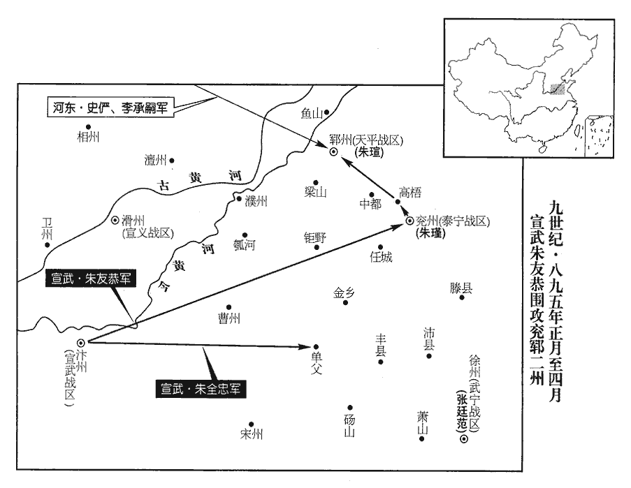
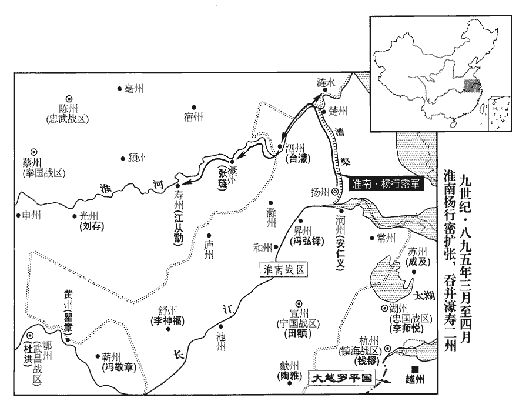
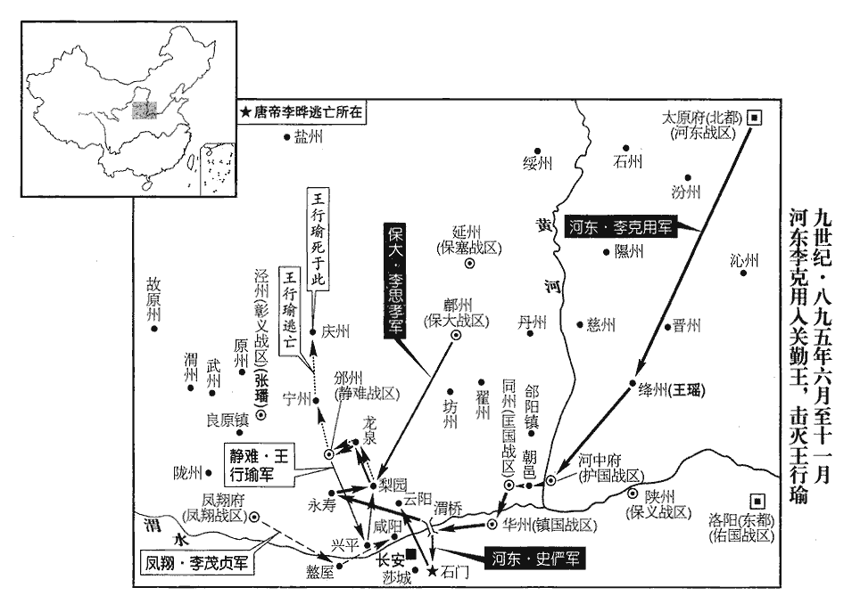
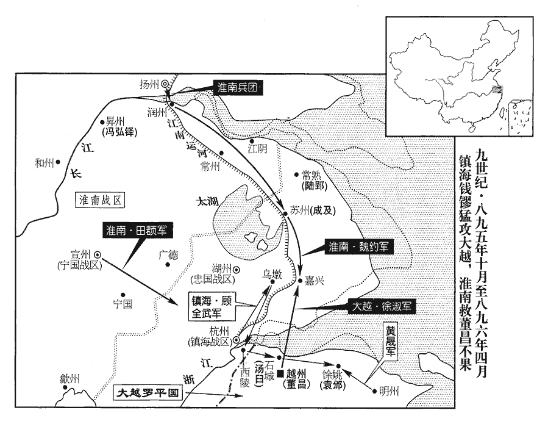
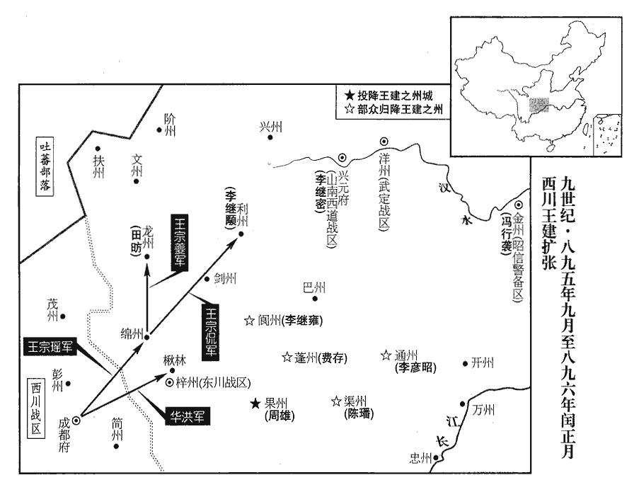
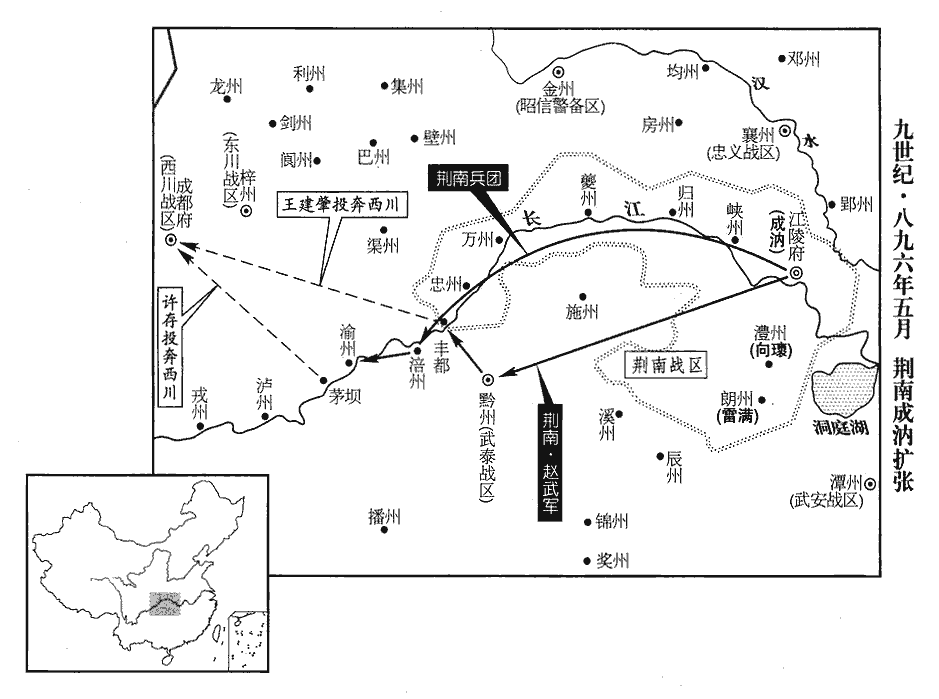
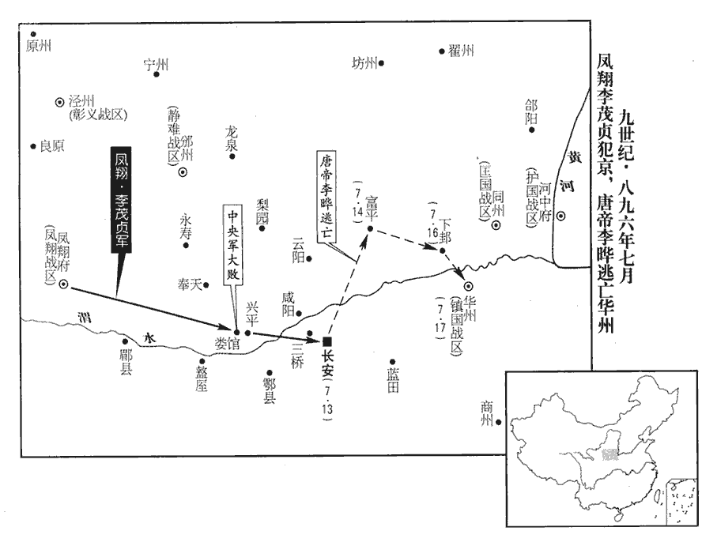

 唐紀七十六起旃蒙單閼（乙卯），盡柔兆執徐（丙辰），凡二年。

# 昭宗聖穆景文孝皇帝上之下

## 乾寧二年（乙卯、八九五）

1春，正月，辛酉‹三›，幽州‹卢龙战区总部所在·北京市›軍民數萬以麾蓋歌鼓迎李克用‹河东总部太原府›入府舍；克用命李存審、劉仁恭將兵略定巡屬。幽‹北京市›、涿‹河北省涿州市›、瀛‹河北省河间市›、莫‹河北省任丘市北鄚mào州镇›、媯‹河北省怀来县›、檀‹北京市密云县›、薊‹天津市蓟县›、順‹北京市顺义县›、營‹辽宁省朝阳市›、平‹河北省卢龙县›、新‹河北省涿鹿县›、武‹河北省宣化县›等州，皆盧龍巡屬也。

〖译文〗 [1]春季，正月，辛酉（初三），幽州的军队百姓几万人张起伞盖、敲锣打鼓、载歌载舞欢迎李克用进入卢龙节度使官署；李克用命令李存审、刘仁恭带领军队巡视安定卢龙节度使所属的各个州县。

2癸未‹五›，【嚴：「未」改「亥」。】朱全忠‹朱温·宣武总部汴州›遣其將朱友恭圍兗州‹山东省兖州市›，朱瑾據兗州，屢為汴人所敗，兵力俱困，至是受圍。朱瑄‹天平总部郓州›自鄆‹山东省东平县›以兵糧救之，友恭設伏，敗之於高梧‹山东省郓城县北›，敗，補邁翻。高梧，即春秋魯國之高魚。杜預註曰：高魚在東郡廩丘縣東南。續漢志：廩丘有鄆城、高魚城。盡奪其餉，擒河東‹总部太原府›將安福順、安福慶。去年河東遣安福順等救兗、鄆，事見上卷。

〖译文〗 [2]癸亥（初五），朱全忠派遣属下将领朱友恭围攻朱瑾据守的兖州，朱从郓州带着军器粮食前往救援朱瑾，朱友恭设下埋伏，在高梧打败朱的人马，把朱携带的军响全部夺去，并擒获河东将领安福顺、安福庆。

 

3己巳‹十一›，‹李晔（李敏）本年二十九岁›以給事中陸希聲為戶部侍郎、同平章事。希聲，元方五世孫也。陸元方見二百五卷武后長壽二年。

〖译文〗 [3]已巳（十一日），朝廷任命给事中陆希声为户部侍郎、同平章事。陆希声是陆元方的第五代孙子。

4壬申‹十四›，護國‹总部设河中府山西省永济市›節度使王重盈薨，軍中請以重榮子行軍司馬珂知留後事。珂，重盈兄重簡之子也，重榮養以為子。為王珙gǒng、王珂爭河中張本。重，直龍翻。珂，丘何翻。

〖译文〗 [4]壬申（十四日），护国节度使王重盈死去，军中将士向朝廷请求任命他的儿子行军司马王珂主持留后事宜。王珂是王重盈的哥哥王重简的儿子，被王重荣收养为义子。

5楊行密‹杨行愍·淮南总部扬州›表朱全忠罪惡，請會易定、兗、鄆、河東兵討之。

〖译文〗 [5]杨行密向朝廷进呈表章历数朱全忠的罪恶，请求会同易定、兖州、郓州、河东的军队一同讨伐朱全忠。

6董昌‹总部设越州浙江省绍兴市›將稱帝，集將佐議之。節度副使黃碣曰：碣jié，其謁翻。「今唐室雖微，天人未厭。齊桓‹姜小白›、晉文‹姬重耳›皆翼戴周室以成霸業。大王興於畎畝，昌爵隴西郡王，故稱之。畎quǎn，古泫翻。受朝廷厚恩，位至將相，富貴極矣，柰何一旦忽為族滅之計乎！碣寧死為忠臣，不生為叛逆！」昌怒，以為惑眾，斬之，投其首於廁中，罵之曰：「奴賊負我！好聖明時三公不能待，而先求死也！」并殺其家八十口，同坎瘞之。瘞yì，於計翻。又問會稽‹越州州政府所在东半城·浙江省绍兴市›令吳鐐，會，古外翻。鐐，力彫翻，又力弔翻。對曰：「大王不為真諸侯以傳子孫，乃欲假天子以取滅亡邪！」「乃欲」之下有「為」字，文意方足。昌亦族誅之。又謂山陰‹越州州政府所在西半城›令張遜曰：「汝有能政，吾深知之，俟吾為帝，命汝知御史臺。」遜曰：「大王起石鏡鎮‹浙江省临安市东南›，見二百五十三卷僖宗乾符五年。建節浙東‹首府越州›，榮貴近二十年，近，其靳翻。何苦效李錡qí、劉闢之所為乎！李錡、劉闢以反誅，事皆見憲宗紀。浙東僻處海隅，處，昌呂翻。巡屬雖有六州，大王若稱帝，彼必不從，台‹浙江省临海市›、明‹浙江省宁波市›、溫‹浙江省温州市›、處‹浙江省丽水市›、婺‹浙江省金华市›、衢‹浙江省衢州市›，浙東巡屬也；時豪傑並起，各自為刺史，昌羈縻而已。徒守空【章：十二行本「空」作「孤」；乙十一行本同；張校同，云無註本作「空」。】城，為天下笑耳！」昌又殺之，謂人曰：「無此三人者，則人莫我違矣！」

〖译文〗 [6]董昌将要称帝，他召集手下将领僚佐进行商议。节度副使黄碣说：“现在大唐皇室虽然衰败，但是天道民心还没有厌弃它。春秋时代的齐桓公、晋文公都辅佐尊奉周室才成就了称霸一方的大业。您爵至陇西郡王，是从田间民夫逐渐兴起的，承蒙朝廷的宽厚恩泽，官位做到镇将和宰相，荣华富贵已到了极点，为什么突然做出灭九族的打算呀！我黄碣宁可死也要做大唐的忠臣，而不为了活命去做朝廷叛逆！”董昌大为震怒，认为黄碣是在蛊惑手下，当即将他斩杀，把他的脑袋扔到厕所里面，并痛骂说：“这个奴才贼子背叛了我！我如此的圣明时代他不等着坐三公高位，而先要找死！”董昌并县把黄碣全家的八十口人全部斩杀，将他们埋葬在一个墓穴里。董昌又问会稽令吴镣，吴镣回答说：“大王您不做诸候让子孙世袭相传，而要做假天子去自取灭亡吗？”董昌听后，把吴镣的全家也杀光。董昌又对阴山令张逊说：“你有行政才能，我清楚地知道，等我称皇帝后，任命你主管御史台。”张逊回答他说：“大王您当初从石镜镇兴起，在浙东建下节度使的基业，荣华富贵快二十年了，何苦像李、刘辟那样背离朝廷最后遭受杀身大祸呢！浙东地方偏僻处在海边，管辖的虽然有台州、明州、温州、处州、婺州、衢州这六个州，但大王您若是自己称帝，他们一定不会附合，你徒然据守越州一座空城，只让天下人耻笑！”董昌又将张逊杀掉，对人们说：“没有了黄碣、吴镣、张逊这三个人，就没有再敢违背我的人了！”

二月，辛卯‹三›，昌被袞冕登子城門樓，即皇帝位。被，皮義翻。考異曰：吳越備史云，「癸卯，昌僭號」。按會稽錄，「昌自云應兔子之讖，欲以二月二日僭號，取卯月卯日也」，而實錄、長曆皆云「二月己丑朔」，非當時曆誤，即今日曆誤。要之昌必以二月辛卯日僭號。悉陳瑞物於庭以示眾。先是，咸通末，先，悉薦翻。吳、越間‹太湖流域及钱塘江流域›訛言山中有大鳥，四目三足，聲云「羅平天冊」，見者有殃，民間多畫像以祀之，及昌僭號，曰：「此吾鸑鷟也。」鸑yuè，五角翻。鷟zhuó，士角翻。鸑鷟，鳳屬。乃自稱大越羅平國，改元順天，考異曰：吳越備史曰，「癸卯，昌僭稱皇帝，建元順天，國號羅平。」年號或云天冊，或云大聖，皆非也。羅隱撰吳越行營露布曰：「羅平者，啟國之名；順天者，建元之始。」又曰：「將軍門稱天冊之樓，以會府為宣室之地。明告我其所稱，曰『權即羅平國位』。昌狀印文曰『順天治國之印』。」十國紀年亦云「年號順天」。會稽錄云天冊，蓋誤。今從備史。署城樓曰天冊之樓，令群下謂己曰「聖人」。以前杭州‹浙江省杭州市›刺史李邈、前婺州刺史蔣瓌、兩浙鹽鐵副使杜郢、前屯田郎中李瑜為相。又以吳瑤等皆為翰林學士、李暢之等皆為大將軍。

〖译文〗 二月，辛卯（初三），董昌身穿帝王的冠服登上越州内城，即位称帝。他把官吏百姓进献的祥瑞物品全都摆放在庭堂上向众人展示。在这之前，咸通末年，浙东一带民间谣传山中有一个大鸟，四只眼睛三条腿，叫喊“罗平天册”，见到这个在鸟的人就会有灾祸，于是民间百姓纷纷画像祭祀它，等到董昌自行称大越罗平国，改年号为顺天，给越州城楼题字为“天册之楼”，命令所有属下称他为“圣人”。董昌任命以前的杭州刺史李邈、婺州刺史蒋、两浙盐铁副使杜郢、屯田郎中李瑜为宰相。又任命吴瑶等人都做翰林学士、李畅之等人都做大将军。

昌移書錢鏐‹镇海总部杭州›，告以權即羅平國位，以鏐為兩浙都指揮使。鏐遺昌書曰：遺，唯季翻。「與其閉門作天子，與九族、百姓俱陷塗炭，豈若開門作節度使，終身富貴邪！及今悛悔，悛，且緣翻，改也。尚可及也！」昌不聽，鏐乃將兵三萬詣越州城下，至迎恩門迎恩門，越州城西門。見昌，再拜言曰：「大王位兼將相，柰何捨安就危！鏐將兵此來，以俟大王改過耳。【章：十二行本「耳」下有「若天子命將出師」七字；乙十一行本同；退齋校同；張校同，云無註本亦無。】縱大王不自惜，鄉里士民何罪，隨大王族滅乎！」昌懼，致犒軍錢二百萬，執首謀者吳瑤及巫覡數人送於鏐，犒，苦到翻。覡，刑狄翻。且請待罪天子。鏐引兵還，以狀聞。聞於朝也。

〖译文〗 董昌给钱送去书信，告诉他已暂且即罗平国皇帝位，任命钱为两浙都指挥使。钱写信给董昌说：“您与其关起门来称帝作天子，与家族和百姓一同遭殃，不如打开城门作节度使，终身享受荣华富贵呢！即使到现在改正错误，还来得及！”董昌不听钱的劝告，钱于是带领军队三万奔赴越州城下，钱到越州城西迎恩门与董昌相见，再次奉劝董昌说：“大王你的地位既是镇将又是宰相，为什么要舍弃安宁而自找祸患呢！钱我带领军队到这里来，就是等着大王你改过。即使大王你不顾惜自己，可里乡里的士人百姓有什么罪，要随着你被毁灭家族呢！”董昌这才惧怕起来，送给钱犒劳军队的钱财二百万，抓获首先为他谋划称帝的吴瑶以及几名男女巫士送交钱，并且请求等待皇帝治他的罪。钱带领军队返回，把这件事报知朝廷。

7王重盈‹护国总部河中府›之子保義‹总部设陕州河南省三门峡市›節度使珙、王重盈先鎮陝虢；王重榮為其下所殺，重盈代鎮河中，以其子珙繼鎮陝虢。陝虢號保義軍。珙，居勇翻。晉【嚴：「晉」改「絳」。】州‹绛州，山西省新绛县›刺史瑤舉兵擊王珂，表言珂非王氏子。與朱全忠書，言「珂本吾家蒼頭，不應為嗣。」珂上表自陳，珂，丘何翻。上，時掌翻。且求援於李克用。上遣中使諭解之。

〖译文〗 [7]王重盈的儿子保义节度使王珂、绛州刺史王瑶发动军队攻打王珂，向朝廷上表说王珂并不是王家的儿子。又给朱全忠送去书信，说：“王珂本来是我家的奴仆，不应该做继承人。”王珂本人则上呈表章向朝廷自行陈述，并且向李克用请求救援。昭宗派遣宦官传谕，劝王珙、王瑶与王珂和解。

8上重李谿文學，乙未‹七›，復以谿為戶部侍郎、同平章事。去年命李谿為相，劉崇魯沮之而止，事見上卷。

〖译文〗 [8]唐昭宗很器重李的文才学识，乙未（初七），再次任命李为户部侍郎、同平章事。

9朱【章：十二行本「朱」上有「己酉‹二十一›」二字；乙十一行本同；孔本同；張校同；退齋校同。】全忠軍于單父‹山东省单县›，單父縣，時帶單州。單，音善。父，音甫。為朱友恭聲援。朱友恭時圍朱瑾於兗州‹泰宁战区总部所在·山东省兖州市›。

〖译文〗 [9]朱全忠率军在单父县驻扎，声援正在围攻兖州的朱友恭。

10李克用表劉仁恭為盧龍‹总部设幽州北京市›留後，留兵戍之；壬子‹二十四›，還晉陽‹山西省太原市›。

〖译文〗 [10]李克用进呈表章请朝廷任命刘仁恭为卢龙留后，留下军队驻守幽州；壬子（二十四日），李克用从幽州返回晋阳。

媯州‹河北省怀来县›人高思繼兄弟，有武幹，為燕人所服，克用皆以為都將，分掌幽州兵；部下士卒，皆山北之豪也，媯、檀諸州皆在幽州山北，亦謂之山後。仁恭憚之。久之，河東兵戍幽州者暴橫，橫，戶孟翻。思繼兄弟以法裁之，所誅殺甚多。克用怒，以讓仁恭，仁恭訴稱高氏兄弟所為，克用俱殺之。仁恭欲收燕人心，復引其諸子置帳下，厚撫之。為仁恭叛克用張本。復，扶又翻；下同。

〖译文〗 妫州人高思继兄弟几人，勇猛强干，为燕地一带人所折服，李克用任命他们为都将，分别常管幽州的军队；他们部下士兵，都是幽州山北等地的豪杰之士，刘仁恭惧怕他们。时间长了，河东军队驻守幽州的士卒残暴横行，高思继兄弟用法度制裁他们，诛杀的人很多。李克用很愤怒，以此责备刘仁恭，刘仁恭便向李克用诉说高思继兄弟的所做所为，李克用于是把高思继兄弟全部杀掉。刘仁恭想收买燕地人民的心，便又把高思继兄弟的几个儿子安置在身边，优厚地安抚他们。

11崔昭緯與李茂貞‹宋文通·凤翔总部凤翔府›、王行瑜‹静难总部邠州›深相結，得天子過失，朝廷機事，悉以告之。邠寧節度副使崔鋋，昭緯之族也，鋋，音蟬。李谿再入相，昭緯使鋋告行瑜曰：「曏者尚書令之命已行矣，而韋昭度沮之，事見上卷景福二年。今又引李谿為同列，相與熒惑聖聽，恐復有杜太尉之事。」杜讓能，事亦見上卷景福二年。行瑜乃與茂貞表稱谿姦邪，昭度無相業，宜罷居散秩。散，悉亶翻。上報曰：「軍旅之事，朕則與藩鎮圖之；至於命相，當出朕懷。」行瑜等論列不已，三月，谿復罷為太子少師。復，扶又翻。

〖译文〗 [11]崔昭纬与李茂贞、王行瑜交结很深，得知唐昭宗的过错失误和朝廷的机密事务，他全都告诉李茂贞、王行瑜。宁节度副使崔，是崔昭纬同族人，当李再次进入朝廷做宰相时，崔昭纬让崔告诉王行瑜说：“以前皇帝任命你做尚书令的诏令已颁发了，可是韦昭度极力阻挠，现在韦昭度又引荐李同为宰相，相互勾结迷惑皇帝视听，恐怕又要有太尉杜让能那样的事了。”王行瑜于是与李茂贞上表朝廷声称李奸诈邪恶，韦昭度没有做宰相的才具，应当罢免他们的宰相做闲官。昭宗回答他们说：“军营中的战事，朕即与各藩镇图谋商议；至于任命宰相，则应当出自联的意向。”王行瑜等论争不休，三月，李又被贬为太子少师。

12王珙、王瑤請朝廷命河中帥，帥，所類翻；下同。詔以中書侍郎、同平章事崔胤同平章事，充護國節度使；以戶部侍郎、判戶部王摶為中書侍郎、同平章事。

〖译文〗 [12]王珙、王瑶请求朝廷任命河中节度使，唐昭宗诏令任命中书侍郎、同平章事崔胤为同平章事，充任护国节度使；任命户部侍郎、判户部王抟为中书侍郎、同平章事。

13王珂，李克用之壻也。克用表重榮有功於國，言破黃巢、黜襄王‹李煴›，王重榮皆有功也。請賜其子珂節鉞。王珙厚結王行瑜、李茂貞、韓建‹镇国总部华州›三帥，更上表稱珂非王氏子，更，工衡翻，迭也。請以珂為陝州、珙為河中。上諭以先已允克用之奏，不許。允，從也。為三帥稱兵入京城，克用誅王瑤討三帥張本。陝，失冉翻。

〖译文〗 [13]王珂是李克用的女婿。李克用向朝廷上表说王重荣对国家有功，请求赐给他的儿子王珂节度使旌旗节钺。王珙进一步与王行瑜、李茂贞、韩建三位节度使交结，交替着向朝廷进呈表章声称王珂并不是王重荣的儿子，请求任命王珂为陕州刺史，王珙为河中节度使。唐昭宗颁谕说先前已经许可了李克用的奏请，而没有准行王行瑜等人的请求。

14加王鎔‹成德总部镇州›兼侍中。

〖译文〗 [14]朝廷加封王兼任待中。

 

15楊行密浮淮至泗州‹江苏省盱眙县淮河北岸›，防禦使臺濛盛飾供帳，姓苑：臺姓，臺駘tái之後，後漢有高士臺佟，晉有術士臺彥，前趙有特進臺彥皋。供，居用翻。行密不悅。既行，濛於臥內得補綻衣，馳使歸之。「綻」，當作「䘺zhàn」，丈莧翻。䘺，亦補也。使，疏吏翻。行密笑曰：「吾少貧賤，不敢忘本。」少，詩照翻。濛甚慚。

〖译文〗 [15]杨行密沿淮河到达泗州，泗州防御使台为杨行密大肆装饰营帐，杨行密对此并不高兴。杨行密启程离开泗州后，台在杨行密的卧室内发现一件补钉衣服，台骑马追赶把那件衣服送还杨行密。杨行密笑着说：“我小时候家中贫寒，出身低贱，现在我也不敢忘本。”台听后十分惭愧。

行密攻濠州‹安徽省凤阳县东北临淮关›，拔之，執刺史張璲suì。璲附朱全忠見上卷景福元年。

〖译文〗 杨行密攻打濠州，予以攻克，抓获濠州刺史张。

行密軍士掠得徐州‹江苏省徐州市›人李氏之子，生八年矣，行密養以為子，南唐世家曰：李昪，徐州人，李榮之子。榮遇亂不知所終。昪少孤，流寓濠、泗間，楊行密攻濠州得之，養為子。行密長子渥憎之；行密謂其將徐溫曰：「此兒質狀性識，頗異於人，吾度渥必不能容，度，徒洛翻。今賜汝為子。」溫名之曰知誥。知誥事溫，勤孝過於諸子。嘗得罪於溫，溫笞而逐之；及歸，知誥迎拜於門。溫問：「何故猶在此？」知誥泣對曰：「人子捨父母將何之！父怒而歸母，人情之常也。」溫以是益愛之，使掌家事，家人無違言。及長，喜書善射，長，知兩翻。喜，許既翻。識度英偉。行密常謂溫曰：「知誥俊傑，諸將子皆不及也。」徐知誥事始此，後復姓李，名昪。

〖译文〗 杨行密的军中士兵抢掠到一个徐州姓李人家的孩子，已经八岁了，杨行密把他收为养子，杨行密的长子杨渥憎恨这个孩子；杨行密对他的属将徐温说：“这个孩子质朴聪颖，和别人很不一样，我揣测杨渥一定容不下他，现在赐给你为养子。”徐温给这个孩子起名叫徐知诰。徐知诰侍奉徐温，勤谨孝敬超过徐温的其他几个儿子。有一次，徐知诰得罪了徐温，徐温鞭打他并赶他走；等到徐温回到家里，徐知诰跪在门口迎接。徐温问他：“为什么还在这里？”徐知诰流着眼泪回答说：“做儿子的离开了父母还能到哪里去呢！父亲盛怒时候就先回到母亲的身边，这是人之常情。”徐温因此更加疼爱徐知诰，让他掌管家中事务，家里的人没有不听他话的。等到徐知诰长大了，喜好读书善于射箭，见识不凡，器度英伟。杨行密经常对徐温说：“徐知诰英俊杰出，各位将领的儿子都比不上他。”

丁亥‹三十›，行密圍壽州‹安徽省寿县›。

〖译文〗 丁亥（三十日），杨行密围攻寿州。

16上以郊畿多盜，至有踰垣入宮或侵犯陵寢者，欲令宗室諸王將兵巡警，又欲使之四方撫慰藩鎮。南北司用事之臣恐其不利於己，交章論諫。上不得已。夏，四月，下詔悉罷之。

〖译文〗 [16]昭宗因为京师长安的郊区盗贼很多，甚至有越过城墙进入皇宫或挖掘皇陵的，便想命令宗室各王带领军队巡查警防，又想派他们到各地安抚慰问藩镇。朝中大臣及宦官中掌权的人担心这样对自己不利，交相进呈奏章进行劝阻，昭宗不得已，于夏季四月份，颁下诏令全部停止。

17朝廷以董昌有貢輸之勤，輸，舂遇翻。今日所為，類得心疾，詔釋其罪，縱歸田里。

〖译文〗 [17]朝廷因为董昌有进贡纳赋殷勤的功劳，这次称帝的叛逆举动，好象他得了疯病，唐昭宗便颁诏赦免董昌的罪过，放他回到故里。

18戶部侍郎、同平章事陸希聲罷為太子少師。

〖译文〗 [18]昭宗把户部侍郎、同平章事陆希声贬为太子少师。

19楊行密圍壽州，不克，將還；庚寅‹三›，其將朱延壽請試往更攻，一鼓拔之，以行密將還而懈於守備，故一鼓而拔。執刺史江從勗。高彥溫舉壽州附朱全忠，全忠以江從勗為刺史，楊行密執之，遂有濠、壽二州。行密以延壽權知壽州團練使。

〖译文〗 [19]杨行密围攻寿州，未能攻克，想要返回；庚寅（初三），杨行密的手下将领朱延寿请求再次前往攻打试试，结果一鼓作气攻克，抓获寿州刺史江从勖。杨行密任命朱延寿暂任寿州团练使。

未幾，幾，居豈翻。汴兵數萬攻壽州，州中兵少，吏民忷懼。忷，許勇翻。延壽制，軍中每旗二十五騎。命黑雲隊長李厚將十旗擊汴兵，不勝；延壽將斬之，長，知兩翻。厚稱眾寡不敵，願益兵更往，不勝則死。都押牙汝陽‹河南省汝南县›柴再用亦為之請，路振九國志：柴再用始名存，事孫儒，與一小校結死友。有告小校反，儒斬之。執存至，詰何故反，不對。又問，對曰：「與彼結死友，彼反則某反，公誅之，復何問焉！」儒奇之曰：「汝果不反，吾再用汝。」因改名。為，于偽翻。乃益以五旗。厚殊死戰，再用助之，延壽悉眾乘之，汴兵敗走。厚，蔡州‹河南省汝南县›人也。李厚者，孫儒之遺兵。

〖译文〗 不久，朱全忠的汴州军队几万人攻打寿州，州内兵力较少，官吏百姓人心惶惶。朱延寿便规定，军队每面旗帜下二十五名骑兵。命令黑云队长李厚带领十旗袭击汴州军队，没有取胜。朱延寿要将李厚斩杀，李厚说敌众我寡难以抵敌，希望给他增添军队再次前往迎战，如果还不能获胜甘愿一死。都押牙将汝阳人柴再用也为李厚请求，于是朱延寿又给李厚增拨了五旗兵力。李厚拼死奋战，柴再用从中协助，朱延寿也率全部人马后援，汴州军队终于败撤走。李厚是蔡州人。

行密又遣兵襲漣水‹江苏省涟水县›，拔之。史言楊行密壤地浸廣。泗州漣水縣，杜佑曰：漢仇猶縣。宋白曰：按厹qiú猶城，今宿豫縣也，魏曰海安縣，晉為宿豫之境，宋置東海郡，後魏改海安郡，隋廢郡，置漣水縣。

〖译文〗 杨行密又派遣军队袭击泗州涟水县，予以攻克。

20錢鏐表董昌僭逆，不可赦，請以本道兵討之。錢鏐本有并董昌之心，因其僭號，仗大順而請討之。

〖译文〗 [20]钱向昭宗上表说董昌犯有自行称帝叛逆大罪，不应赦免，请求率领本道军队讨伐董昌。

21太傅、門下侍郎、同平章事韋昭度以太保致仕。

〖译文〗 [21]昭宗诏令太傅、门下侍郎、同平章事韦昭度以太保官衔退休。

22戊戌‹十一›，以劉建鋒為武安‹总部设潭州湖南省长沙市›節度使。建鋒以馬殷為內外馬步軍都指揮使。為馬殷代建鋒張本。

〖译文〗 [22]戊戌（十一日），朝廷任命刘建锋为武安节度使。刘建锋委任马殷为内外马步军都指挥使。

23楊行密遣使詣錢鏐，言董昌已改過，宜釋之；楊行密欲存董昌以制錢鏐之後，使不得與己爭衡耳。亦遣詣昌，使趣朝貢。趣，讀曰促。朝，直遙翻；下同。

〖译文〗 [23]杨行密派遣使者前往钱那里，说董昌已经知罪悔过，应当赦免他，也派使者到董昌那里，让他立即向朝廷进贡纳赋。

24河東遣其將史儼、李承嗣以萬騎馳入于鄆，李克用遣史儼等再往救兗、鄆，則不得還矣。勞師遠圖，自古忌之。朱友恭退歸于汴‹河南省开封市›。

〖译文〗 [24]河东节度使李克用派遣属下将领史俨、李承嗣带领一万骑兵疾驰进入郓州，朱友恭退走返回汴州。

25五月，詔削董昌官爵，委錢鏐討之。

〖译文〗 [25]五月，唐昭宗诏令革除董昌的官职爵位，委派钱征讨董昌。

26初，王行瑜求尚書令不獲，見上卷景福二年。由是怨朝廷。畿內有八鎮兵，隸左右軍。左、右神策軍也。郃陽鎮‹陕西省合阳县›近華州‹陕西省华县›，韓建求之；郃陽，漢縣，唐屬同州。九域志：縣在州東一百二十里。郃，音合。近，其靳翻；下同。良原鎮‹甘肃省灵台县西梁原镇›近邠州‹陕西省彬县›，王行瑜求之。良原縣，屬涇州。宦官曰：「此天子禁軍，何可得也！」王珂、王珙爭河中，行瑜、建及李茂貞皆為珙請，不能得，恥之。珙使人語三帥曰：為，于偽翻。語，牛倨翻。帥，所類翻。「珂不受代而與河東婚姻，必為諸公不利，請討之。」行瑜使其弟匡國‹总部设同州陕西省大荔县›節度使行約攻河中‹山西省永济市›，時以同州為匡國軍。九域志：同州東至河中七十五里。珂求救於李克用。行瑜乃與茂貞、建各將精兵數千入朝，甲子‹八›，至京師，坊市民皆竄匿。上御安福門以待之，三帥盛陳甲兵，拜伏舞蹈於門下。上臨軒，親詰之曰：宇末曰軒。詰，去吉翻。「卿等不奏請俟報，輒稱兵入京城，其志欲何為乎？若不能事朕，今日請避賢路！」行瑜、茂貞流汗不能言，獨韓建粗述入朝之由。粗，坐五翻。上與三帥宴，三帥奏稱：「南、北司互有朋黨，墮紊朝政。墮，讀曰隳。紊，音問。韋昭度討西川失策，討西川事見二百五十七卷、二百五十八卷。李谿作相，不合眾心，請誅之。」上未之許。是日，行瑜等殺昭度、谿於都亭驛，都亭驛，在朱雀門外西街，含光門北來第二坊。又殺樞密使康尚弼及宦官數人。又言：「王珂、王珙嫡庶不分，請除王珙河中，徙王行約於陝，王珂於同州。」上皆許之。始，三帥謀廢上，立吉王保；至是，聞李克用已起兵於河東，行瑜、茂貞各留兵二千人宿衛京師，與建皆辭還鎮。貶戶部尚書楊堪為雅州‹四川省雅安市›刺史。堪，虞卿之子，楊虞卿見文宗紀。昭度之舅也。

〖译文〗 [26]当初，王行瑜谋求尚书令官职未能获得，因此怨恨朝廷。京师长安所辖地区有八镇军队，隶属左、右神策军。阳镇靠近华州，韩建请求兼管；良远镇接近州，王行瑜希望由他统领。宫内宦宫说：“这都是皇帝的禁卫军，怎么能让他们得到！”王珂、王珙争夺河中节度使这一官职，王行瑜、韩建以及李茂贞都为王珙请求，结果王珙却未能得到，这几个人都感到很耻辱。王珙派人对王行瑜、韩建、李项贞三位节度使说：“王珂在河中不接受我的代替而与河东节度使李克用结成姻亲，对你们各位一定不利，请求你们讨伐王珂。”王行瑜便派他的弟弟匡国节度使王行约攻打河中，王珂向李克用请求救援。王行瑜于是与李茂贞、朝建各带领精兵几千人奔赴朝廷。甲子（初八），王行瑜等人率军到达京师，长安街市居民都到处逃窜躲藏。唐昭宗来到安福门等待他们，三位节度使把披甲军队大规模排列开来，在安福门下行大跪大拜礼仪。昭宗走到门楼前，亲自责问他们说：“你们不上表奏请等待朝廷回话，就发动军队进入京城，你们的意图究竟要干什么？如果你们不能侍奉朕，今天就请你们退离官位让给贤明的人！”王行瑜、李茂贞听后浑身冒冷汗而不能说一句话，唯有韩建粗略地陈述了前来京师的原因。昭宗与三位节度使宴会，三位节度使向皇帝奏道：“朝中大臣和宫内宦官互相结党为奸，败坏扰乱朝廷大政。韦昭度讨伐西川决策失误，李充任宰相，不合群臣的心愿，请将李诛杀。”昭宗没有准许他们的奏请。这一天，王行瑜等在朱雀门外都亭驿将韦昭度、李杀死，又杀掉枢密使康尚弼及宦官好几人。王行瑜等又向唐昭宗进言说：“王珂、王珙的作用是不分子嫡子和庶子的尊卑，现在请求任命王珙为河中节度使，把王行约调往陕州，王珂调到同州。”昭宗都予以同意。开始，王行瑜等三位节度使谋划废黜唐昭宗，拥立吉王李保称帝。这时，听说李克用已在河东起兵，王行瑜、李茂贞便分别留下军队二千人守护京师，与韩建一同辞别返回镇所。昭宗又诏令把户部尚书杨堪贬职为雅州刺史。杨堪是杨虞卿的儿子，韦昭度的舅舅。

27初，崔胤除河中節度使，河東進奏官薛志勤揚言曰：「崔公雖重德，以之代王珂，不若光德劉公於我公厚也。」光德劉公者，太常卿劉崇望也。光德，里名，在長安城中。唐末，大臣有時望者，時人率以其所居里稱之。光德坊，朱雀街西第三街北來第六坊，京兆府在焉。及三帥入朝，聞志勤之言，貶崇望昭州‹广西平乐县›司馬。李克用聞三鎮兵犯闕，即日遣使十三輩發北部兵，北部兵，代北諸蕃落兵也。期以來月渡河入關‹陕西省大荔县东蒲津关›。

〖译文〗 [27]当初，崔胤授职河中节度使，河东节度使司的进奏官薛志勤便扬言说：“崔胤虽然是注重德行的人，但是让他取代王珂，不如长安城内光德坊的刘公对我主公李克用感情好。”光德坊刘公，就是太常卿刘崇望。等到王行瑜等三位节度使进入京师，知道了薛志勤说的话，便把刘崇望贬职为昭州司马。李克用听说三位节度使率领军队侵犯京师，当天就派遣使者十三起去征发北部蕃族部落军队，约定下个月渡过黄河进入潼关。

28六月，庚寅‹四›，以錢鏐為浙東招討使；鏐復發兵擊董昌。復，扶又翻。

〖译文〗 [28]六月，庚寅\(初四），朝廷任命钱为浙东招讨使，钱于是再次征发军队攻打董昌。

29辛卯‹五›，以前均州‹湖北省丹江口市西北›刺史孔緯、繡州‹广西桂平县南›司戶張濬並為太子賓客。壬辰‹六›，以緯為吏部尚書，復其階爵，癸巳‹七›，拜司空，兼門下侍郎、同平章事。以張濬為兵部尚書、諸道租庸使。孔緯、張濬貶見二百五十八卷大順元年。今欲復用之。時緯居華州‹陕西省华县›，濬居長水‹河南省洛宁县西南长水镇›，上以崔昭緯等外交藩鎮，朋黨相傾，思得骨鯁之士，故驟用緯、濬。緯以有疾，扶輿至京師，見上，涕泣固辭；上不許。

〖译文〗 [29]辛卯（初五），朝廷任命以前的均州刺史孔纬、绣州司户张浚一同为太子宾客。壬辰（初六），朝廷任命孔纬为吏部尚书，恢复他的官级爵位；癸巳（初七），又授职孔纬司空，兼任门下侍郎、同平章事。朝廷还任命张浚为兵部尚书、诸道租庸使。当时孔纬居住在华州，张浚居住在长水，昭宗因为崔昭纬等在外交结藩镇，结党营私，相互倾轧，而想起用刚直人士，因此突然任用孔纬、张浚。孔纬因为身体有病，抱病乘车来到京师，他见到昭宗，流着泪坚决推辞；昭宗不准。

30李克用大舉蕃、漢兵南下，上表稱王行瑜、李茂貞、韓建稱兵犯闕，賊害大臣，請討之，李克用實黨王珂，聲三帥之罪而表請致討。又移檄三鎮，行瑜等大懼。克用軍至絳州‹山西省新绛县›，刺史王瑤閉城拒之；克用進攻，旬日，拔之，斬瑤於軍門，殺城中違拒者千餘人。秋，七月，丙辰朔‹一›，克用至河中‹山西省永济市›，王珂迎謁於路。

〖译文〗 [30]李克用大规模地发动蕃族和汉人的军队向南开进，他向唐昭宗上表声称王行瑜、李茂贞、韩建派兵进犯京师，残害朝中大臣，请求讨伐他们。李克用又向王行瑜、李茂贞、韩建三位节度使发去征讨檄文，王行瑜等大为恐惧。李克用的军队到达绛州，绛州刺史王瑶关闭城门抵抗；李克用发动进攻，十天，就将绛州攻克，在军营的大门将王瑶斩杀，并杀掉城内进行抵抗的一千余人。秋季，七月，丙辰朔（初一），李克用到达河中，王珂在路上迎接拜见他。

匡國‹总部设同州陕西省大荔县›節度使王行約敗於朝邑‹陕西省大荔县东朝邑镇›，朝，直遙翻。戊午‹三›，行約棄同州走，己未‹四›，至京師。行約弟行實時為左軍指揮使，神策左軍非此。帥眾與行約大掠西市。朱雀街西，謂之西市。行實奏稱同‹陕西省大荔县›、華‹陕西省华县›已沒，沙陀將至，請車駕幸邠州‹静难总部·陕西省彬县›。庚申‹五›，樞密使駱全瓘guàn奏請車駕幸鳳翔‹陕西省凤翔县›。上曰：「朕得克用表，尚駐軍河中。就使沙陀至此，朕自有以枝梧，卿等但各撫本軍，勿令搖動。」

〖译文〗 匡国节度使王行约在朝邑打了败仗，戊午（初三），王行约放弃同州逃路，己未（初四），到达京师长安。王行约的弟弟王行实当时充任京师左军指挥使，他率领手下人马与王行约一起在长安西市大肆抢掠。王行实向唐昭宗上表奏称，同州、华州已经沦陷，李克用的沙陀人马就要到了，请皇帝的车驾到州去避难。庚申（初五），枢密使骆全上表奏请皇帝出巡凤翔。唐昭宗说：“朕收到了李克用的表章，他尚且率军在河中驻扎。即使是李克用的沙陀人马到达这里，朕自然有办法应付他，你们只要各自安抚好自己的军队。不要让他们动摇骚动。”

 

右軍指揮使李繼鵬，茂貞假子也，程大昌雍錄曰：北軍左、右兩軍，皆在苑內。左三軍在內東苑之東，大明宮苑東也。右三軍在九仙門之西，九仙在內東苑之西北角。左三軍，左神策、左龍武、左羽林軍也。右三軍，右神策、右龍武、右羽林軍也。余按雍錄所云左、右六軍，代、德以後宿衛者也。僖宗廣明幸蜀，此六軍潰散，田令孜於成都募新軍五十二都，分屬左、右神策軍；自時厥後，凡所謂左、右軍者，皆此軍也，分營於京城內外，又不專在苑中。若此時王行實、李繼鵬為左、右軍指揮使，疑是邠、岐二帥所留兵以宿衛者自分為左、右也。本姓名閻珪，與駱全瓘謀劫上幸鳳翔；中尉劉景宣與王行實知之，欲劫上幸邠州；孔緯面折景宣，以為不可輕離宮闕。折，之舌翻。離，力智翻。向晚，繼鵬連奏請車駕出幸，於是王行約引左軍攻右軍，鼓譟震地。上聞亂，登承天樓，欲諭止之，捧日都頭李筠將本軍，於樓前侍衛。李繼鵬以鳳翔兵攻筠，王行約以李繼鵬欲先劫車駕幸岐，故攻右軍。李繼鵬當與行約戰，而乃攻李筠者，以筠衛上，不得而劫幸也。矢拂御衣，著于樓桷，著，直略翻。桷jué，榱cuī也。椽方曰桷。左右扶上下樓；繼鵬復縱火焚宮門，煙炎蔽天。時有鹽州‹陕西省定边县›六都兵屯京師，炎，讀與燄同。鹽州六都兵，孫德昭等所領兵也。素為兩軍所憚，上急召令入衛；既至，兩軍退走，各歸邠州及鳳翔。城中大亂，互相剽掠，剽，匹妙翻。上與諸王及親近幸李筠營，護蹕都頭李居實帥眾繼至。護蹕都亦神策五十四都之一，或曰即扈蹕都。帥，讀曰率。

〖译文〗 右军指挥使李继鹏，是李茂贞的养子，原本叫阎，他与骆全策划劫持唐昭宗前往凤翔。中尉刘景宣与王行实知道了，则想劫持昭宗前赴州。孔纬当面驳斥刘景宣，认为皇帝不能轻易离开长安宫殿。近傍晚时，李继鹏接连上奏请昭宗出走凤翔，王行约见李继鹏要抢先劫走昭宗，便带领他的左军攻打李继鹏的右军，锣鼓喧闹声惊天动地。昭宗听到外面混乱，便登上承天楼，想谕令制止他们，捧日都头李筠带领自己的军队，在承天楼前护卫昭宗。李继鹏指挥凤翔军队攻打李筠，飞箭掠过昭宗的衣服，落在承天楼椽木上，身边的侍卫搀扶着昭宗下楼；李继鹏又放火焚烧宫门，浓烟烈炎遮盖了天空。当时有盐州六都军队驻扎京师，平时左、右两军都很惧怕他们，昭宗便紧急召令这支军队入宫护卫；盐州六都军队到达后，左、右两军队都撤退离去，分别返回州和凤翔。长安城内大为混乱，到处抢劫掠夺，昭宗与各王以及亲近人员到李筠的军营躲避，神策军护跸都头李居实率领人马随后也赶到。

或傳王行瑜、李茂貞欲自來迎車駕，上懼為所迫，辛酉‹六›，以筠、居實兩都兵自衛，出啟夏門，啟夏門，長安城南面東來第一門。趣南山‹秦岭›，宿莎城鎮‹陕西省蓝田县西南›。莎城鎮，在長安城南，近郊之地也。趣，七喻翻。士民追從車駕者數十萬人，比至谷口‹秦岭山道南口›，暍yē死者三之一，谷口，南山谷口也。暍，於歇翻。暍死者，中熱而死。比，必寐翻。夜，復為盜所掠，哭聲震山谷。時百官多扈從不及，從，才用翻。戶部尚書、判度支及鹽鐵轉運使薛王知柔獨先至，知柔，薛王業之曾孫。上命權知中書事及置頓使。

〖译文〗 有人传说王行瑜、李茂贞要亲自来长安迎接皇帝，昭宗担心被他们逼迫，辛酉（初六），命令李筠、李居实的两都军队进行护卫，出长安城南面的启夏门，急速奔往南山，在莎城镇过夜。追随昭宗车驾的人民有几十万，等到抵达南山的谷口时，中暑而死的人竟有三分之一，夜里，流亡的百姓又遭受盗贼的抢掠，哭喊的声音震动山谷。当时朝廷百官大多没有来得及跟随上昭宗，唯有户部尚书、判度支及盐铁转运使薛王李知柔首先赶到，昭宗便任命他暂时掌管中书省事务及兼任置顿使。

壬戌‹七›，李克用入同州，崔昭緯、徐彥若、王摶tuán至莎城。甲子‹九›，上徙幸石門鎮‹陕西省蓝田县西南›，路振九國志：昭宗出啟夏門，駐華嚴寺，晡晚，出幸南山之莎城，駐于石門山之佛寺。與此稍異。命薛王知柔與知樞密院劉光裕還京城，制置守衛宮禁。丙寅‹十一›，李克用遣節度判官王瓌奉表問起居。丁卯‹十二›，上遣內侍郗廷昱新書百官志：內侍在內侍監之下，內常侍之上，員四人，從四品上。郗，丑之翻。齎jí詔詣李克用軍，令與王珂各發萬騎同赴新平‹邠州州政府所在县·陕西省彬县›。赴新平以討王行瑜。邠州新平郡。又詔彰義‹总部设泾州甘肃省泾川县›節度使張鐇以涇原兵控扼鳳翔‹陕西省凤翔县›。

〖译文〗 壬戌（初七），李克用进入同州。崔昭纬、徐彦若、王抟到达莎城。甲子（初九），昭宗迁移到石门镇，诏令薛王李知柔与主管枢密院的刘光裕返回京城，安置守卫皇宫。丙寅（十一日），李克用派遣节度判官王敬奉表文问候昭宗的起居情况。丁卯（十二日），昭宗派遣内侍郗廷昱带着诏令前赴李克用的军营，命令李克用与王珂分别派发一万骑兵，一同赶往州新平郡讨伐王行瑜，又诏令彰义节度使张带领泾原军队控制凤翔的李茂贞。

李克用遣兵攻華州；韓建登城呼曰：呼，火故翻。「僕於李公未嘗失禮，何為見攻？」克用使謂之曰：「公為人臣，逼逐天子，公為有禮，孰為無禮者乎！」會郗廷昱至，言李茂貞將兵三萬至盩厔‹陕西省周至县›，王行瑜將兵至興平‹陕西省兴平市›，皆欲迎車駕，克用乃釋華州之圍，移兵營渭橋‹陕西省高陵县南渭河大桥›。考異曰：唐太祖紀年錄：「王師攻華州，俄而郗廷昱至，且言茂貞領兵三萬至盩厔，行瑜領軍至興平，欲往石門迎駕，乃解華圍，進營渭橋。」按實錄，八月延王戒丕至河中，克用已發前鋒至渭北。己丑克用進營渭橋。又紀年錄載詔曰：「省表，已部領大軍，前月二十七日離河中。」蓋克用不親圍華州，但遣別將將兵往，及聞邠、岐謀迎駕，乃遣華兵詣渭橋，即所謂前鋒者也。克用既以七月二十七日離河中，則戒丕至彼必在其前，實錄云八月至河中，誤也。今從紀年錄。

〖译文〗 李克用派遣军队进攻华州；韩建登上华州城楼呼喊着说：“我对李公不曾失礼，为什么要攻打我？”李克用派人对他说：“你是大唐的臣子，却逼迫驱赶皇帝，你这样如果还算有礼，那么天下还有谁是无礼呢？”恰巧这时郗廷昱赶到，他对李克用说，李茂贞带领军队三万已到，王行瑜率领军队到达兴平，都想迎接唐昭宗的车驾，李克用于是解除对华州的围攻，把军队开赴渭桥安营扎寨。

以薛王知柔為清海‹总部设广州广东省广州市›節度使、是年，賜嶺南節度使軍額曰清海。同平章事，仍權知京兆尹、判度支，充鹽鐵轉運使，俟反正日赴鎮。

〖译文〗 昭宗任命薛王李知柔为清海节度使、同平章事，仍然暂任京兆尹、判度支，并充任盐铁转运使，让他等待平乱反正后再前赴岭南镇所。

上在南山‹秦岭›旬餘，士民從車駕避亂者日相驚曰：「邠、岐兵至矣！」上遣延王戒丕詣河中，趣李克用令進兵。延王邠，玄宗子，戒丕其後也。趣，讀曰促。壬午‹二十七›，克用發河中。上遣供奉官張承業詣克用軍。張承業，內供奉官也。承業，同州人，屢奉使於克用，因留監其軍。為張承業盡心於李克用父子張本。己丑‹五›，克用進軍渭橋，遣其將李存貞為前鋒；辛卯‹七›，拔永壽‹陕西省永寿县›，又遣史儼將三千騎詣石門侍衛。癸巳‹九›，遣李存信、李存審會保大‹总部设鄜州陕西省富县›節度使李思孝攻王行瑜梨園寨‹陕西省淳化县›，梨園寨，在京兆雲陽縣。九域志：雲陽在華州西北九十里。考異曰：莊宗列傳曰：「三鎮亂長安，李存信從太祖入關，以前軍先自夏陽渡河，攻同華屬邑，下之。時太祖在渭北，伶官群小或勸太祖入朝自握兵柄。太祖亦以全忠圖己，朝廷不能斷，心微有望，月餘不進軍。存信與蓋寓乘間密啟曰：『大王家世效忠，此行討逆，上為邠、鳳不臣，但令臣節為天下所知，即三賊不足平也。而悠悠之徒，不達大體，或以弗詢之畫苟悅台情，雖俳pái優之言，不宜縱其如此。京師咫尺，天聽非遙，實無益於英德也。今三凶正蹙，須速圖之，事留變生，無宜猶豫。』太祖曰：『公言是也。』即日出師，下梨園砦。」按克用謀大事，固非伶官所豫。又實錄，己丑克用進營渭橋，癸巳克梨園，中間四日耳，無月餘不進事。且既云群小勸入朝，即當詣行在，不當留渭北。此特李存信之人欲歸功於存信耳。今不取。擒其將王令陶等，獻於行在。思孝本姓拓跋，思恭之弟也。李茂貞懼，斬李繼鵬，傳首行在，李茂貞委劫乘輿之罪於繼鵬。上表請罪，且遣使求和於克用。上復遣延王戒丕、丹王允諭克用，丹王逾，代宗子，允其後也。復，扶又翻。令且赦茂貞，併力討行瑜，俟其殄平，當更與卿議之。且命二王拜克用為兄。

〖译文〗 昭宗在南山已有十几天了，跟随唐昭宗车驾的士人百姓每天都惊慌失措地相互惊叫：“州、岐州的军队到了！”昭宗派遣延王李戒丕前赴河中，催促李克用下令开进军队。壬午（二十七日），李克用的军队从河中出发。唐昭宗派遣供奉官张承业前往李克用的军营。张承业是同州人，多次奉唐昭宗的谕令出使李克用，昭宗趁便把他留在李克用的军营监视。己丑（八月初五），李克用命令军队向渭桥开进，派遣属下将领李存贞为前锋；辛卯（初七），李克用攻克永寿，又派遣史俨带领三千骑兵前赴石门护卫唐昭宗。癸巳（初九），李克用派遣李存信、李存审会同保大节度使李思孝攻打在梨园寨的王行瑜，擒获王行瑜的将领王令陶等人，送往南山昭宗那里。李思孝本姓拓跋，是拓跋思恭的弟弟。李茂贞兵败很是恐惧，他斩杀李继鹏，把头颅传送到石门镇昭宗的住地，向朝廷进呈表章请求治他的罪，并且派出使者向李克用求和。昭宗再次派遣延王李戒丕、丹王李允传谕李克用，命令暂且赦免李茂贞，联合军队全力讨伐王行瑜，等到把王行瑜消灭了，朝廷会再与李克用商议处置李茂贞。昭宗并且命令延王李戒丕、丹王李允拜李克用为兄长。

31以前河中節度使崔胤為中書侍郎、同平章事。

〖译文〗 [31]朝廷任命前河中节度使崔胤为中书侍郎、同平章事。

32戊戌‹十四›，削奪王行瑜官爵。癸卯‹十九›，以李克用為邠‹陕西省彬县›寧‹甘肃省宁县›四面行營都招討使，保大節度使李思孝為北面招討使，定難‹总部设夏州陕西省靖边县北白城子›節度使李思諫為東面招討使，難，乃旦翻。彰義節度使張鐇為西面招討使。命李克用自南臨討之。克用遣其子存勗詣行在，李存勗始此。考異曰：實錄作「存貞」。據後唐實錄、薛居正五代史，莊宗未嘗名存貞。實錄蓋誤。年十一，上奇其狀貌，撫之曰：「兒方為國之棟梁，他日宜盡忠於吾家。」克用表請上還京；上許之。令克用遣騎三千駐三橋‹陕西省西安市西北三桥镇›為備禦。辛亥‹二十七›，車駕還京師。

〖译文〗 [32]戊戌（十四日），朝廷革除王行瑜的官职爵位。癸卯（十九日），朝廷任命李克用为宁四面行营都招讨使，保大节度使李思孝为北面招讨使，定难节度使李思谏为东面招讨使，彰义节度使张为四面招讨使。李克用派遣他的儿子李存勖到昭宗住地，李存勖当时才十一岁，昭宗对他的外貌就称奇不已，抚摸着他说：“你是国家的栋梁之才，将来要对天子我家尽忠效力。”李克用上表请求昭宗返回京师长安，昭宗同意。命令李克用派遣骑兵三千驻扎三桥作为防备。辛亥（二十七日），昭宗的车驾返回京师。

壬子‹二十八›，司空兼門下侍郎、同平章事崔昭緯罷為右僕射。

〖译文〗 壬子（二十八日），朝廷将司空兼门下侍郎、同平章事崔昭纬罢职降为右仆射。

33以護國留後王珂、盧龍留後劉仁恭各為本鎮節度使。李克用之志也。

〖译文〗 [33]朝廷任命护国留后王珂、卢龙留后刘仁恭分别充任本镇节度使。

34時宮室焚毀，未暇完葺，上寓居尚書省，程大昌曰：尚書省，在朱雀門正街之東，自占一坊，六部附麗其旁。百官往往無袍笏僕馬。

〖译文〗 [34]当时宫殿被焚烧毁坏，没有来得及修建整理，昭宗暂时住在尚书省，朝中百官常常没有长袍期笏和仆役马匹。

35以李克用為行營都統。

〖译文〗 [35]朝廷任命李克用为行营都统。

36九月，癸亥‹十›，司空兼門下侍郎、同平章事孔緯薨。

〖译文〗 [36]九月，癸亥（初十），司空兼门下侍郎、同平章事孔纬去世。

37辛未‹十八›，朱全忠自將擊朱瑄，戰於梁山‹山东省梁山县›；新志：鄆州壽張縣有刀梁山。水經註，梁山在壽張縣，濟水逕其東。瑄敗走還鄆。

〖译文〗 [37]辛未（十八日），朱全忠亲自率领军队攻打朱，在寿张县的梁山展开激放，朱战败逃走返回郓州。

38李克用急攻梨園‹陕西省淳化县›，王行瑜求救於李茂貞，茂貞遣兵萬人屯龍泉鎮‹陕西省旬邑县东›，九域志：邠州三水縣有龍泉鎮，在州東北。自將兵三萬屯咸陽‹陕西省咸阳市›之旁。克用請詔茂貞歸鎮，仍削奪其官爵，欲分兵討之。上以茂貞自誅繼鵬，前已赦宥，不可復削奪誅討，復，扶又翻。但詔歸鎮，仍令克用與之和解。以昭義‹总部设潞州山西省长治市›節度使李罕之檢校侍中，充邠寧四面行營副都統。史儼敗邠寧兵於雲陽‹陕西省泾阳县北云阳镇›，敗，補邁翻；下同。擒雲陽鎮使王令誨等，獻之。

〖译文〗 [38]李克用率军猛攻梨园寨，王行瑜向李茂贞求救，李茂贞派遣军队一万人驻扎在州的龙泉镇，自己率领军队三万在咸阳附近驻扎。李克用奏请朝廷诏令李茂贞返回凤翔镇所，再革除他的官职爵位，想分兵对李茂贞进行讨伐。昭宗认为李茂贞自己诛杀了李继鹏，前些时候已经赦免了他的罪过，不便重新颁诏将他革除官职进行征伐，只是诏令李茂贞返回凤翔镇所，依然命令李克用与李茂贞和解。朝廷任命昭义节度使李罕之任检校侍中，充任宁四面行营副都统。史俨在云阳打败王行瑜的宁军队，擒获云阳镇使王令诲等人，进献给朝廷。

39王建‹西川总部成都府›遣簡州‹四川省简阳市›刺史王宗瑤等將兵赴難；難，乃旦翻。甲戌‹二十一›，軍于綿州‹四川省绵阳市›。春秋之法，書救而書次者，以次為貶。貶者，以其頓兵觀望不進，無救難解急之意也。王建遣兵赴難而軍于綿州，何日至長安邪！

〖译文〗 [39]王建派遣简州刺史王宗瑶等人带领军队前来为朝廷解难；甲戌（二十一日），王宗瑶等在绵州驻扎下来。

40董昌求救於楊行密，行密遣泗州防禦使臺濛攻蘇州以救之，蘇州時屬錢鏐，攻之，所以牽制鏐兵不得專攻董昌。且表昌引咎，願脩職貢，請復官爵。又遺錢鏐書，稱：「昌狂疾自立，已畏兵諫，遺，唯季翻。春秋左氏傳，鬻拳強諫，楚子不從，臨之以兵。執送同惡，謂董昌執首謀者吳瑤及巫覡數人送於鏐也。不當復伐之。」復，扶又翻。

〖译文〗 [40]董昌向杨行密请求救援，杨行密便派遣泗州防御使台攻打钱所属的苏州，以此援救董昌，杨行密并且向朝廷上表说，董昌已经自行认错悔过，愿意修好进贡，请恢复他的官职爵位。杨行密又给钱送去书信，信中说：“董昌发疯自行称帝，在你率军劝阻时已经惧怕，并将蛊惑他称帝的奸恶之人捉拿交送给你，这样就不应当再讨伐他了。”

41冬，十月，丙戌‹三›，河東將李存貞敗邠寧軍於梨園北，殺千餘人。敗，補邁翻。自是梨園閉壁不敢出。

〖译文〗 [41]冬季，十月，丙戌（初三），河东军队的将领李存贞在梨园寨北部打败王行瑜的宁军队，斩杀一千余人。从此，梨园寨关团营垒不敢再出战。

42貶右僕射崔昭緯為梧州‹广西梧州市›司馬。以黨附邠、岐也。

〖译文〗 [42]朝廷把右仆射崔昭纬贬为梧州司马。

43魏國夫人陳氏，才色冠後宮；冠，古玩翻。戊子‹五›，上以賜李克用。薛史曰：後克用薨，陳氏為尼，至晉天福中乃卒。

〖译文〗 [43]魏国夫人陈氏，才能姿色在后宫堪数第一，戊子（初五），昭宗把陈氏赐给李克用。

克用令李罕之、李存信等急攻梨園；城中食盡，棄城走。罕之等邀擊之，所殺萬餘人，克梨園等三寨，獲王行瑜子知進及大將李元福等；克用進屯梨園。庚寅‹七›，王行約、王行實燒寧州遁去。九域志：寧州南至邠州一百二十五里。克用奏請以匡國節度使蘇文建為靜難節度使，趣令赴鎮，且理寧州，招撫降人。以蘇文建代王行瑜也；時邠州未下，故令且治寧州。趣，讀曰促。降，戶江翻。

〖译文〗 李克用命令李罕之、李存信等紧急攻打梨园寨；梨园城内粮食吃尽，王行瑜的军队弃城逃跑。李罕之等拦截攻打，斩杀一万余人，攻克了梨园等三个营寨，擒获王行瑜的儿子王知进以及大将李元福等。李克用开进梨园寨驻扎。庚寅（初七），王行约、王行实放火焚烧宁州然后逃跑。李克用上奏朝廷请任用匡国节度使苏文建为静难节度使，催促他赶赴镇所，暂且把镇所设在宁州，招收安抚前来投降的人。

44上遷居大內。葺理稍完，自尚書省還居大內。

〖译文〗 [44]昭宗迁回修缮稍完的皇宫。

45朱全忠遣都將葛從周擊兗州，自以大軍繼之。癸卯‹二十›，圍兗州。是年春，汴兵圍兗州，以河東救至而退，今復圍之。

〖译文〗 [45]朱全忠派遣都将葛从周攻打兖州的朱瑾，他本人亲自督率大军在后面跟随。癸卯（二十日），朱全忠的军队包围兖州。

46楊行密遣寧國‹总部设宣州安徽省宣州市›節度使田頵、景福元年，升宣歙團練使為寧國節度使。潤州‹江苏省镇江市›團練使安仁義攻杭州鎮戍以救董昌，昌使湖州‹浙江省湖州市›將徐淑會淮南將魏約共圍嘉興。錢鏐遣武勇都指揮使顧全武救嘉興‹浙江省嘉兴市›，破烏墩‹浙江省桐乡市西北乌镇›、光福‹应在浙江省湖州市境›二寨。九域志：湖州烏程縣有烏墩鎮。墩，都昆翻。淮南將柯厚破蘇州水柵。全武，餘姚人也。

〖译文〗 [46]杨行密派遣宁国节度使田、润州团练使安仁义攻打在杭州镇守驻防的钱军队以应援董昌，董昌派湖州将领徐淑会同淮南将领魏约共同围攻嘉兴。钱派遣武勇都指挥使顾全武救援嘉兴，攻破乌墩、光福二个营寨。淮南将领柯厚攻破苏州水中栅栏。顾全武是余姚人。

47義武‹总部设定州河北省定州市›節度使王處存薨‹年六十五岁›，軍中推其子節度副使郜為留後。郜，古到翻。

〖译文〗 [47]义武节度使王处存死去，军中将士推举他的儿子节度副使王郜为留后。

48以京兆尹武邑‹河北省武邑县›孫偓為兵部侍郎、同平章事。

〖译文〗 [48]朝廷任命京兆尹、武邑人孙为兵部侍郎、同平章事。

49王行瑜以精甲五千守龍泉寨‹陕西省旬邑县东›，李克用攻之；李茂貞以兵五千救之，營於鎮西。鎮西，龍泉鎮之西也。李罕之擊鳳翔兵，走之。十一月，丁巳‹五›，拔龍泉寨。行瑜走入邠州，遣使請降於李克用。

〖译文〗 [49]王行瑜带领精壮甲兵五千驻守龙泉寨，李克用率军攻打。李茂贞带领军队五千救援王行瑜，在龙泉镇的西面安营扎寨。李罕之袭击李茂贞的凤翔军队，将李茂贞赶跑，十一月，丁巳（初五日），李罕之攻克龙泉寨。王行瑜于是逃进州，派遣使者向李克用请求投降。

50齊州‹山东省济南市›刺史朱瓊舉州降於朱全忠。為朱瑾誘斬瓊張本。考異曰：薛居正五代史梁紀，瓊降及死皆在十月。按編遺錄：「十一月丁巳，瓊遣軍將王自新奉檄歸義。壬申，瓊自來，辛巳，死。」今從之。瓊，瑾之從父兄也。從，才用翻。

〖译文〗 [50]齐州刺史朱琼献出齐州向朱全忠投降。朱琼是朱瑾的堂兄。

51衢州‹浙江省衢州市›刺史陳儒卒，弟岌代之。

〖译文〗 [51]衢州刺史陈儒死去，他的弟弟陈岌代任衢州刺史。

 

52李克用引兵逼邠州，王行瑜登城，號哭號，戶刀翻。謂克用曰：「行瑜無罪，迫脅乘輿，皆李茂貞及李繼鵬所為，請移兵問鳳翔，行瑜願束身歸朝。」乘，繩證翻。朝，直遙翻。克用曰：「王尚父何恭之甚！王行瑜賜號尚父，時已削奪，克用稱之以戲之。僕受詔討三賊臣，謂王行瑜、李茂貞、韓建也。公預其一，束身歸朝，非僕所得專也。」丁卯‹十五›，行瑜挈族棄城走。克用入邠州，封府庫，撫居人，命指揮使高爽權巡撫軍城，奏趣蘇文建赴鎮。趣，讀曰促。行瑜走至慶州‹甘肃省庆阳县›境，部下斬行瑜，傳首。光啟三年，王行瑜得靜難節，至是而誅。

〖译文〗 [52]李克用带领军队进逼州，王行瑜登上城楼，号哭着对李克用说：“我王行瑜没有罪过，逼迫威胁皇帝的车驾，都是李茂贞和李继鹏干的事，请你调开军队去讨伐凤翔节度使李茂贞，我王行瑜愿意捆绑自己回到朝廷。”李克用说：“王尚父真是太恭谦了！我受朝廷的诏令讨伐你和李茂贞、韩建三个乱臣贼子，你是其中的一个，你想自己捆绑入朝，这不是我能擅自做主的。”丁卯（十五日），王行瑜带着全家族的人弃城逃跑。李克用进入州城，封闭官府库房，安抚居民，任命指挥使高爽暂且掌管巡抚军城事宜，又奏请朝廷催促苏文建赶赴镇所。王行瑜逃到庆州境内，部下将他斩杀，把头颅传送朝廷。

53朱瑄遣其將賀瓌、柳存及河東將薛【章：十二行本「薛」作「何」；乙十一行本同；孔本同。】懷寶將兵萬餘人襲曹州‹山东省定陶县›，曹州降汴，見二百五十八卷大順二年。以解兗州‹山东省兖州市›之圍。瓌，濮陽‹河南省濮阳市›人也。濮，博木翻。丁卯‹十五›，全忠自中都‹山东省汶上县›引兵夜追之，比明，至鉅野‹山东省钜野县›南，及之，比，必利翻。中都，漢平陸縣，天寶元年改曰中都；鉅野，漢古縣：唐並屬鄆州。九域志：中都縣在州東南六十里；鉅野縣在州南百八十里。屠殺殆盡，生擒瓌、存、懷寶，俘士卒三千餘人。是日晡後，大風沙塵晦冥，全忠曰：「此殺人未足耳！」下令所得之俘盡殺之。庚午‹十八›，縛瓌等徇於兗州城下，謂朱瑾曰：「卿兄已敗，何不早降！」

〖译文〗 [53]朱派遣属下将领贺、柳存以及河东将领薛怀宝，带领军队一万余人袭击曹州，以图解除汴州军队对兖州的围攻。贺是濮阳人。丁卯（十五日），朱全忠从中都带领军队在夜间追赶贺等的人马，天亮时，到达钜野的南部，追赶上，几乎将他们全部杀光，贺、柳存、薛怀宝被活捉，另俘虏三千多名士兵。这天傍晚，狂风大作沙尘弥漫，朱全忠说：“这是杀人还不够数的原因！”于是下令将擒获的俘虏全部杀掉。庚午（十八日），朱全忠把贺等捆绑起来在兖州城下巡示，对朱瑾说：“你哥哥朱已经被我打败，你为什么还不早点投降！”

54丁丑‹二十五›，雅州‹四川省雅安市›刺史王宗侃攻拔利州‹四川省广元市›，執刺史李繼顒，斬之。王宗侃，西川將。李繼顒，鳳翔將。

〖译文〗 [54]丁丑（二十五日），雅州刺史王宗侃攻克凤翔节度使李茂贞管辖的利州，抓获利州刺史李继，将他斩杀。

55朱瑾偽遣使請降於朱全忠，因其誘降而行詐。全忠自就延壽門下與瑾語。延壽門，蓋兗州城門也。瑾曰：「欲送符印，願使兄瓊來領之。」

〖译文〗 [55]朱瑾派出使者假装向朱全忠请求投降，朱全忠亲自到兖州城的延寿门下与朱瑾商谈。朱瑾对朱全忠说：“我想向你交送符节官印，希望让我的堂兄齐州刺史朱琼来领取。”

辛巳‹二十九›，全忠使瓊往，瑾立馬橋上，伏驍果董懷進於橋下，瓊至，懷進突出，擒之以入，須臾，擲首城外。全忠乃引兵還，全忠知瑾無降心，攻之未易猝下，故還。以瓊弟玭為齊州‹山东省济南市›防禦使，玭pín，蒲田翻。殺柳存、懷【章：十二行本「懷」上有「何」字；乙十一行本同；張校「何」作「薛」，云「存」下脱「薛」字。】寶；聞賀瓌名，釋而用之。賀瓌自此遂為朱氏用。

〖译文〗 辛巳（二十九日），朱全忠派朱琼前往兖州，朱瑾骑马站立在兖州城的桥上，叫勇猛果敢的董怀进躲藏在桥下，朱琼来到桥上，董怀进突然从桥下奔出，抓获朱琼带入兖州城内，不一会儿，朱琼的脑袋被扔到兖州城墙外边。朱全忠于是带领军队返回汴州，委任朱琼的胞弟朱为齐州防御使，斩杀了柳存、薛怀宝。朱全忠听说贺有名气，便把他释放留用。

56李克用旋軍渭北。自邠寧回屯渭北。

〖译文〗 [56]李克用回到渭州北部驻扎。

57加靜難節度使蘇文建同平章事。

〖译文〗 [57]朝廷加封静难节度使苏文建为同平章事。

58蔣勛求為邵州‹湖南省邵阳市›刺史，劉建鋒不許，乾寧二年，蔣勛棄回龍關，以開劉建鋒之取長沙，故邀之以求邵州。勛乃與鄧繼崇起兵，連飛山‹湖南省靖州县›、梅山‹湖南省新化县西雪峰山›蠻寇湘潭‹湖南省衡山县›，飛山蠻，在邵州西北界，今其山在靖州北十五里，比諸山為最高峻，四面絕壁千仞。梅山蠻，在潭州界，宋朝開為安化縣，在州西三百二十里。湘潭，後漢湘南縣地，吳分湘南置衡陽縣，天寶八年，移治於洛口，因改名湘潭縣，屬潭州。九域志：在州南一百六十里。據邵州，使其將申德昌屯定勝鎮‹湖南省双峰县›定勝鎮，在邵州東北界。以扼潭人。

〖译文〗 [58]将勋谋求邵州刺史这一官职，刘建锋不准许，蒋勋于是与邓继宗发动军队，联合邵州西北飞山和潭州界内梅山的蛮人侵扰湘潭，占据邵州，蒋勋还派手下将领申德昌在定胜镇驻扎，以扼制潭州人。

59十二月，甲申‹二›，閬州‹四川省阆中市›防禦使李繼雍、蓬州‹四川省仪陈县南›刺史費存、費，父沸翻。渠州‹四川省渠县›刺史陳璠各帥所部兵奔王建。三人皆鳳翔將。帥，讀曰率。

〖译文〗 [59]十二月，甲申（初二），阆州防御使李继雍、蓬州刺史费存、渠州刺史陈等分别率领所部人马投奔王建。

60乙酉‹三›，李克用軍于雲陽‹陕西省泾阳县北云阳镇›。

〖译文〗 [60]乙酉（初三），李克用的军队到达云阳驻扎。

61王建奏：「東川‹总部设梓州四川省三台县›節度使顧彥暉不發兵赴難，而掠奪輜重，遣瀘州‹四川省泸州市›刺史馬敬儒斷峽路‹长江三峡水道›，請興兵討之。」難，乃旦翻。重，直用翻。觀此，則去年王宗瑤赴難之軍，非真有勤王之心，特借此以開東川兵端耳。斷，音短。戊子‹六›，華洪‹西川总部成都府›大破東川兵於楸qiū林‹四川省三台县东北秋林镇›，俘斬數萬，拔楸林寨。楸，七由翻。

〖译文〗 [61]王建向朝廷上奏说：“东川节度使顾彦晖不派兵前来为朝廷解难，却抢掠夺去我的器械、粮草，又派遣泸州刺史马敬儒截断峡路，请朝廷发兵讨伐顾彦晖。”戊子（初六），王建的将领华洪在楸林把东川军队打得大败，俘获斩杀几万人，攻克楸林寨。

62乙未‹十三›，進李克用爵晉王，自隴西郡王進爵晉王。加李罕之兼侍中，以河東大將蓋寓領容管‹首府设容州广西容县›觀察使；蓋，古盍翻。領，遙領也。自餘克用將佐、子孫並進官爵。克用性嚴急，左右小有過輒死，無敢違忤；惟蓋寓敏慧，能揣其意，忤，五故翻。揣，初委翻。婉辭裨益，無不從者。克用或以非罪怒將吏，寓必陽助之怒，克用常釋之；有所諫諍，必徵近事為喻；由是克用愛信之，境內無不依附，權與克用侔。朝廷及鄰道遣使至河東，其賞賜賂遺，先入克用，次及寓家。朱全忠數遣人間之，遺，于季翻。數，所角翻。間，古莧翻。及揚言云蓋寓已代克用，而克用待之益厚。自古英雄之爭天下，必倚勇智之士以為用；而出入左右，伺候顏色者，亦有敏慧軟媚之人，若蓋寓之於李克用是也。

〖译文〗 [62]乙未（十三日），朝廷将李克用的爵位升为晋王，加封李罕之兼侍中，任命河东大将盖寓兼任容管观察使；其余的李克用将领佐僚以及儿子孙子都得以加官升爵。李克用性情严厉急躁，手下的人稍微有点过错就被处死，没人敢与他相违抗；只有盖寓敏锐聪慧，能够揣测出李克用的心意，他婉言相劝予以完善，李克用没有不听从的。李克用有时错怪迁怒于手下将吏，盖寓必定表面上为李克用助威加油，结果往往使李克用消去怒气。盖寓劝说李克用改正过错时，必定拿近前的一些事作比喻。因此李克用对盖寓宠爱信任，所辖境内的将领官吏也无不依附盖寓，他的权力几乎与李克用等同。朝廷和邻近各道派遣使者到河东来，凡是赏赐和赠送财物时，先送到李克用那里，接着就去盖寓的家。朱全忠几次派人挑拨离间李克用和盖寓的关系，扬言说盖寓已经取代了李克用，可是李克用对待盖寓却更加友好。

 

63丙申‹十四›，王建攻東川，別將王宗弼為東川兵所擒，路振九國志曰：王宗弼掠地飛烏，為顧彥暉所獲。顧彥暉‹东川总部梓州›畜以為子。畜，吁玉翻。戊戌‹十六›，通州‹四川省达川市›刺史李彥昭‹凤翔总部凤翔府›將所部兵二千降於建。通州，今之達州。李彥昭亦鳳翔將。

〖译文〗 [63]丙申（十四日），王建攻打东川节度使顾彦晖，手下将领王宗弼被东川军队抓获，顾彦晖把王宗弼收为养子。戊戌（十六日），通州刺史李彦昭带领所部人马二千向王建投降。

64李克用遣掌書記李襲吉入謝恩，景鳳元年，行軍府置掌書記；開元以後，諸節鎮皆置之；掌朝覲、聘慰、薦祭祀、祈祝之文，與號令、升絀之事。密言於上曰：「比年以來，比，毘至翻。關輔不寧，關，謂蒲、潼、隴、蜀、藍田諸關。輔，謂三輔。關內，即漢三輔之地。乘此勝勢，遂取鳳翔，一勞永逸，時不可失。臣屯軍渭北，專俟進止。」上謀於貴近，或曰：「茂貞復滅，復，扶又翻；下同。則沙陀‹李克用›大盛，朝廷危矣！」上乃賜克用詔，褒其忠款，款，誠也。而言：「不臣之狀，行瑜為甚。自朕出幸以來，茂貞、韓建自知其罪，不忘國恩，職貢相繼，且當休兵息民。」克用奉詔而止。既而私於詔使曰：「觀朝廷之意，似疑克用有異心也。然不去茂貞，去，羌呂翻。關中無安寧之日。」其後李茂貞再犯京師，克用亦不能救矣。又詔免克用入朝，將佐或言：「今密邇闕庭，豈可不入見天子！」見，賢遍翻。克用猶豫未決，蓋寓言於克用曰：「曏者王行瑜輩縱兵狂悖，悖，蒲妹翻，又蒲沒翻。致鑾輿播越，百姓奔散。今天子還未安席，人心尚危，大王若引兵渡渭，竊恐復驚駭都邑。蓋寓言李克用既不可釋兵入朝，若以眾入，是復邠、岐、華三帥之事耳。人臣盡忠，在於勤王，不在入覲，願熟圖之！」克用笑曰：「蓋寓尚不欲吾入朝，況天下之人乎！」乃表稱：「臣總帥大軍，帥，讀曰率。不敢徑入朝覲，且懼部落士卒侵擾渭北居人。」辛亥‹二十九›，引兵東歸。表至京師，上下始安。詔賜河東士卒錢三十萬緡。克用既去，李茂貞驕橫如故，橫，下孟翻。河西州縣多為茂貞所據，河西，謂涼、瓜、沙、肅諸州。以其將胡敬璋為河西‹总部设凉州甘肃省武威市›節度使。

〖译文〗 [64]李克用派遣军府的掌书记李袭吉进入京师向朝廷谢恩，秘密对唐昭宗说：“近些年来，浦、潼、陇、蜀、蓝田诸关和京师长安一带不得安宁，现在乘着朝廷取胜的优势，应一举攻克凤翔，一劳永逸，时机不可丧失。我时下在渭水北部驻扎，专门等候朝廷的命令以便行动。”唐昭宗和朝中权贵及近臣商谋，有人说：“李茂贞如果被消灭，那么李克用的势力就会大大膨胀，朝廷则在危险之中了！”唐昭宗于是向李克用颁赐诏书，赞扬他对朝廷的忠诚，但又说：“叛逆朝廷的罪行，王行瑜十分严重。这次自从朕离开京师出巡以来，李茂贞、韩建已经知道他们自己的罪过，没有忘记朝廷的恩德，进献的赋税贡品接连不断，姑且停止对他们的征伐让军队休整百姓安宁。”李克用接奉这一诏令后便不行动。不久，李克用私下里对朝廷传达诏令的使臣说：“我看朝廷的意思，似乎怀疑我李克用有别的意图。可是不铲除李茂贞，关中一带就没有安宁的日子。”唐昭宗又诏令免去李克用入京上朝，李克用的将领佐僚中有人说：“现在与朝廷近在咫尺，怎么能不进入京师拜见皇帝呢？”李克用自己犹豫不决，盖寓这时对李克用说：“从前王行瑜一伙放纵士兵背叛朝廷，致使皇帝车驾流离迁徙，百姓逃散。现在天子返回京师还没有安宁下来，人心尚在忧惧之中，大王你如果带领军队渡过渭水，我担心会再次让京城惊恐。做臣子的效忠朝廷，在于为皇室起兵救难，而不在于入朝拜见皇帝，然望大王你仔细考虑！”李克用笑着说：“盖寓尚且不希望我入京上朝，更何况天下的人们呢！”于是，李克用上表朝廷奏称：“我统领着大军，不敢随意进入京城拜见皇上，并且担心所部士兵会侵扰渭水以北的居民。”辛亥（二十九日），李克用率领手下人马东返晋阳。他的表文送达京师，上至朝廷下到百姓才安宁下来。唐昭宗诏令赐给河东士兵三十万缗钱。李克用离开后，李茂贞骄横如同以往，河西的州县大多被李茂贞占据，他又任命手下将领胡敬璋为河西节度使。

65朱全忠之去兗州也，朱瓊死而全忠還。留葛從周將兵守之，朱瑾閉城不復出。從周將還，乃揚言「天平、河東救兵至，引兵西北邀之，」夜半，潛歸故寨。瑾以從周精兵悉出，果出兵攻寨。從周突出奮擊，殺千餘人，擒其都將孫漢筠而還。

〖译文〗 [65]朱全忠离开兖州时，留下葛从周带领军队继续看守围困兖州，朱瑾关闭城门不再出来交战。葛从周想要返回，于是四处扬言说：“天平和河东的救援军队到了，我军到西北方向去拦截他们。”半夜，葛从周把人马又偷偷带回原来的营寨。朱瑾以为葛从周的精兵都离开了，果然派军队来攻打城外的营寨。葛从周率领人马突然杀出奋勇攻打，斩杀一千余人，擒获朱瑾的都将孙汉筠之后返回。

66加鎮海‹总部设杭州浙江省杭州市›節度使錢鏐兼侍中。

〖译文〗 [66]朝廷加封镇海节度使钱兼侍中。

67彰義節度使張鐇薨，以其子璉權知留後。璉，力展翻。

〖译文〗 [67]彰义节度使张死去，朝廷任命张的儿子张琏暂任彰义留后。

68朱瑄、朱瑾屢為朱全忠所攻，民失耕稼，財力俱弊。告急於河東，李克用遣大將史儼、李承嗣將數千騎假道於魏‹河北省大名县›以救之。史儼、李承嗣自此遂與朱瑾入淮南矣。

〖译文〗 [68]朱、朱瑾一再受到朱全忠的进攻，地方百姓无法耕种收获，军中资财人力都已困乏。便向河东节度使李克用告急，李克用派遣大将史俨、李承嗣带领几千骑兵借道经过魏州前去救援。

69安州‹湖北省安陆市›防禦使家晟姓苑：家姓，周大夫家父之後；又魯公族有子家氏。與朱全忠親吏蔣玄暉有隙，恐及禍，與指揮使劉士政、兵馬監押陳可璠將兵三千襲桂州‹广西桂林市›，殺經略使周元靜而代之。自安州遠襲桂州而克之者，江、湘城邑荒殘，守兵單弱，道無邀截之患，桂人不意其至，遂殺其帥而代之。璠，孚袁翻。晟醉侮可璠，可璠手刃之，推士政知軍府事，可璠自為副使。詔即以士政為經【章：十二行本「經」上有「桂管」二字；乙十一行本同；孔本同；退齋校同。】略使。玄暉，吳‹江苏省苏州市›人也。為劉、陳又為馬殷所併張本。

〖译文〗 [69]安州防御使家晟与朱全忠的亲近官吏蒋玄晖有怨仇，恐怕大祸临头，便与指挥使刘士政、兵马监押陈可带领军队三千袭击桂州，杀死桂州经略使周元静，家晟代管桂州。家晟喝醉酒后侮辱陈可，陈可亲手将家晟杀死，推举刘士政主管军府事宜，陈可自己做副使。朝廷当即颁下诏令任命刘士政为经略使。蒋玄晖是吴州人。

## 三年（丙辰、八九六）

1春正月，西川‹总部成都府›將王宗夔攻拔龍州‹四川省平武县东南›，殺刺史田昉。此時龍州當屬李茂貞‹凤翔总部凤翔府›。昉，方往翻。

〖译文〗 [1]春季，正月，西川将领王宗夔攻克龙州，杀死龙州刺史田。

2丁巳‹五›，劉建鋒‹武安总部潭州›遣都指揮使馬殷將兵討蔣勛，攻定勝寨‹湖南省双峰县›，破之。去年，蔣勛遣兵守定勝寨。

〖译文〗 [2]丁巳（初五），刘建锋派遣都指挥使马殷带领军队讨伐蒋勋，进攻定胜寨，打败蒋勋。

3辛未‹十九›，安仁義‹淮南，总部扬州›以舟師至湖州‹浙江省湖州市›，欲渡江‹浙江›應董昌‹首都越州浙江省绍兴市›，安仁義自潤州以舟師至湖州，何從而渡江哉！蓋欲自湖州舟行入柳浦而渡西陵耳，然錢鏐在杭，未容得至西陵。錢鏐‹镇海总部杭州›遣武勇都指揮使顧全武、都知兵馬使許再思守西陵‹浙江省萧山市西北西兴镇›，仁義不能渡。昌遣其將湯臼守石城‹浙江省绍兴市北›，會稽志：石城山在山陰縣東北三十里。袁邠守餘姚‹浙江省余姚市›。

〖译文〗 [3]辛未（十九日），安仁义从润州率军乘船到达湖州，想要渡过长江接应董昌，钱派遣武勇都指挥使顾全武、都知兵马使许再思驻守西陵，使得安仁义不能渡江。董昌派遣属下将领汤臼据守石城山，袁据守余姚。

4閏月，克用‹河东总部太原府›遣蕃、漢都指揮使李存信‹张污落›此又是一段起事；「克用」之上當有「李」字。將萬騎假道于魏以救兗、鄆，軍于莘縣‹山东省莘县›。朱全忠‹朱温·宣武总部汴州›使人謂羅弘信‹魏博总部魏州›曰：「克用志吞河朔，師還之日，貴道可憂。」存信戢眾不嚴，戢，則立翻。侵暴魏人，弘信怒，發兵三萬夜襲之。存信軍潰，退保洺州‹河北省永年县东南旧永年镇›，喪士卒什二三，按九域志，莘縣西距魏州九十里。羅弘信欲襲李存信，亦必朝出軍而後能乘夜而至；李存信之敗，斥候不明故也。喪，息浪翻。委棄資糧兵械萬數；史儼、李承嗣之軍隔絕不得還。弘信自是與河東‹总部太原府›絕，專志於汴。全忠方圖兗、鄆，畏弘信議其後，弘信每有贈遺，遺，于季翻。全忠必對使者北向拜授之，曰：「六兄於予，倍年以長，固非諸鄰之比。」‹本年，罗弘信年六十一岁，朱全忠年四十五岁›「授」當作「受」。羅弘信，第六。記曲禮：年長以倍，則父事之。朱全忠豈知禮者？繆為恭敬以離并、魏之交耳。長，知兩翻。諸鄰，謂與宣武鄰道諸帥也。弘信信之，全忠以是得專意東方。謂專意攻兗、鄆也。

〖译文〗 [4]闰正月，李克用派遣蕃、汉都指挥使李存信带领一万骑兵借道经过魏州前往救援兖州、郓州，在莘县驻扎下来。朱全忠派人对罗弘信说：“李克用的意图是在侵吞黄河以北的地盘，他的军队返回的时候，你那里令人担忧。”李存信管束士兵不严，侵扰残害魏州人民，罗弘信大为愤怒，发兵三万在夜间袭击李存信。李存信的军队溃败，退到州据守，损失士兵十分之二三，丢弃资财粮食兵器数以万计；史俨、李承嗣的军队被隔绝不能返回。罗弘信从此与河东节度使李克用决裂，专心依附汴州的朱全忠。朱全忠正在筹划攻打兖州、郓州，担心罗弘信在背后算计他，所以每当罗弘信向他赠送财物，朱全忠必定当着罗弘信使者的面向北跪拜接受这些东西，嘴里说着：“六哥对我来说，是上一辈的人，不是邻近各道节度使所能比的。”罗弘信相信了这话，朱全忠因此得以专心攻打东面。

5丁亥‹五›，果州‹四川省南充市›刺史張【嚴：「張」改「周」。】雄降于王建‹西川总部成都府›。宋白曰：果州南充郡，劉璋初分墊江已上置巴郡，理此。建安六年，璋改郡為巴西，徙理閬中。今郡在嘉陵江之西。魏平蜀，於今州北三十七里石苟埧jù置南宕渠郡，其縣亦移就郡理。隋廢郡，併入閬中，復為巴西縣地，仍移巴西縣，理安漢城。開皇十八年，改為南充縣。唐武德四年，分置果州，以郡南八里有果山為名。

〖译文〗 [5]丁亥（初五），果州刺史周雄向王建投降。

6二月，戊辰‹十七›，顧全武、許再思敗湯臼‹义胜总部越州›於石城‹浙江省绍兴市北›。敗，補邁翻；下同。上‹李晔（李敏）本年三十岁›用楊行密‹杨行愍·淮南总部扬州›之請，赦董昌，復其官爵；錢鏐不從。

〖译文〗 [6]二月，戊辰（十七日），顾全武、许再思在石城山打败汤臼。唐昭宗根据杨行密的请求，赦免了董昌的罪过，恢复他的官职爵位；钱对此不服。

7以通王滋判侍衛諸將事。通王滋，宣宗子。

〖译文〗 [7]朝廷任命通王李滋兼管侍卫诸将事宜。

8朱全忠薦兵部尚書張濬，上欲復相之；李克用表請發兵擊全忠，且言「濬朝為相，臣則夕至闕庭！」觀李克用此表，謂非脅君，吾不信也。京師震懼，上下詔和解之。

〖译文〗 [8]朱全忠向朝廷荐举兵部尚书张浚，唐昭宗想要重新任命张浚为宰相。李克用上表请求派军队攻打朱全忠，并且说：“张浚如果早晨做了宰相，我傍晚就要赶到朝廷！”京师上下震惊恐慌，唐昭宗颁下诏书劝李克用与朱全忠和解。

9三月，以天雄‹总部设秦州甘肃省秦安县西北›留後李繼徽為節度使。

〖译文〗 [9]三月，朝廷任命天雄留后李继徽为节度使。

10保大‹总部设鄜州陕西省富县›節度使李思孝‹拓跋思孝›表請致仕，薦弟思敬‹拓跋思敬›自代，詔以思孝為太師，致仕，思敬為保大留後。

〖译文〗 [10]保大节度使李思孝向朝廷上表请求退休，推荐他的胞弟李思敬接替自己，唐昭宗下诏命李思孝以太师官衔辞退，李思敬为保大留后。

11朱全忠遣龐師古將兵伐鄆州‹山东省东平县›，敗鄆兵於馬頰‹山东省商河县北惠德新河›，馬頰，禹疏九河之一也。水經註：濟水自須昌縣北逕魚山東，左合馬頰水；水首受濟，西北流，歷安民山北，又逕桃城東，又東北逕魚山南，又東注于濟，曰馬頰口。敗，補邁翻。遂抵其城下。

〖译文〗 [11]朱全忠派遣庞师古带领军队讨伐郓州，在马颊水一带打败朱的郓州军队，于是抵达郓州城下。

12己酉‹二十八›，顧全武等攻餘姚‹浙江省余姚市›，明州‹浙江省宁波市›刺史黃晟遣兵助之；董昌遣其將徐章救餘姚，全武擊擒之。

〖译文〗 [12]己酉（二十八日），顾全武等攻打余姚，明州刺史黄晟派遣军队协助。董昌派遣属下将领徐章救援余姚，结果徐章被顾全武拦击擒获。

13夏，四月，辛酉‹十›，河漲，將毀滑州城‹河南省滑县›，朱全忠命決為二河，夾滑城而東，為害滋甚。

〖译文〗 [13]夏季，四月，辛酉（初十），黄河大水上涨，眼看就要淹毁滑州城，朱全忠命令再行决口把黄河一分为二，两条河夹着滑州城向东滚滚流去，危害相当严重。

14李克用擊羅弘信，報李存信之敗也。攻洹水‹河北省魏县西南›，洹huán，于元翻。殺魏兵萬餘人，進攻魏州‹河北省大名县›。

〖译文〗 [14]李克用攻打罗弘信，进攻洹水，斩杀罗弘信的军队一万余人，接着进军攻打魏州。

15武安‹总部设潭州湖南省长沙市›節度使劉建鋒既得志，小人之器易盈，劉建鋒甫得長沙，已得志矣。嗜酒，不親政事。長直兵陳贍妻美，建鋒私之，贍袖鐵撾zhuā擊殺建鋒；諸將殺贍，迎行軍司馬張佶為留後。佶將入府，馬忽踶dì齧niè，傷左髀bì。佶，巨乙翻。踶，大計翻。齧，五結翻。時馬殷攻邵州‹湖南省邵阳市›未下，是年正月，劉建鋒遣馬殷攻邵州。佶謝諸將曰：「馬公勇而有謀，寬厚樂善，吾所不及，真乃主也。」乃，汝也。樂，音洛。乃以牒召之。殷猶豫未行，聽直軍將姚【章：十二行本「姚」上有「汝南‹河南省汝南县西›」二字；乙十一行本同；孔本同；張校同。】彥章說殷曰：「公與劉龍驤、張司馬，一體之人也，聽，讀曰廳。直廳事之軍將也。劉建鋒、張佶、馬殷同在孫儒軍中，儒敗，三人者叶力成軍以取湖南，故彥章云然。路振曰：乾符中，黃巢亂，詔遣忠武決勝指揮使孫儒、龍驤指揮使劉建鋒戍淮西，隸秦宗權。宗權為巢所敗，遂降之，儒等皆為所脅制。今龍驤遇禍，司馬傷髀，天命人望捨公尚誰屬哉！」屬，之欲翻。殷乃使親從都副指揮使李瓊留攻邵州，從，才用翻。徑詣長沙。

〖译文〗 [15]武安节度使刘建锋占据长沙后便觉得已经得志，饮酒成性，不料理政务事宜。长年值日卫兵陈赡的妻子貌美，刘建锋与她通奸，陈赡在衣袖内藏带铁打死刘建锋。各将领将陈赡杀掉，迎接行军司马张佶为武安留后。张佶将要进入节度使司时，他骑的马忽然狂踢乱咬，伤了张佶的左大腿。当时马殷攻打邵州还没有攻克，张佶便谢绝各位拥立他的将领说：“马殷有勇有谋，待人宽厚与人为善，我比不上他，他才是真正的主帅。”于是给马殷送去公文召请他到长沙来。马殷犹豫不决没有启程，听直军将姚彦章劝马殷说：“你与刘建锋、张佶同属一样的人才，现在刘建锋遇难死去，张佶大腿受伤，上天的安排人们的期望，舍去你还能有谁呢！”马殷于是派令亲从都副指挥使李琼留下继续攻打邵州，他本人直接前往长沙。

16淮南兵與鎮海兵戰于皇天蕩‹江苏省苏州市境›，大江過昇州界，浸以深廣，自老鸛觜渡白沙，横闊三十餘里，俗呼為皇天蕩。是時淮南兵既敗浙兵於皇天蕩，遂圍蘇州，則非前所言皇天蕩矣。宋熙寧三年，崑山人郟亶dǎn上疏言水利，謂長洲縣界有長蕩、黃天蕩，其水上承湖，下通海，正淮、浙兵戰處也。鎮海兵不利，楊行密遂圍蘇州‹江苏省苏州市›。

〖译文〗 [16]淮南军队与镇海军队在皇天荡展开激战，结果镇海军队战败失利，杨行密于是率军围攻苏州。

17錢鏐、鍾傳‹镇南总部洪州›、杜洪‹武昌总部部州›畏楊行密之強，皆求援於朱全忠；其後鍾、杜皆不能保其土，而錢氏獨傳子及孫，以此知有國有家者，久近存乎其人。全忠遣許州‹河南省许昌市›刺史朱友恭將兵萬人渡淮，聽以便宜從事。

〖译文〗 [17]钱、钟传、杜洪畏惧杨行密的强大，都向朱全忠求援；朱全忠派遣许州刺史朱友恭带领军队一万人渡过淮水，让他根据情况随机料理，便宜行事。

18董昌使人覘錢鏐兵，覘，丑廉翻。有言其強盛者輒怒，斬之；言兵疲食盡，則賞之。戊寅‹二十七›，袁邠以餘姚降於鏐；顧全武、許再思進兵至越州城下。五月，昌出戰而敗，嬰城自守，全武等圍之。昌始懼，去帝號，去，羌呂翻。復稱節度使。

〖译文〗 [18]董昌派人侦察钱军队的情况，有说钱军队强盛的人，董昌就勃然大怒，将他斩杀。那些说钱军队疲惫不堪粮食已光的人，就受到董昌的奖赏。戊寅（二十七日），袁献出余姚向钱投降；顾全武、许再思进兵到达越州城下。五月，董昌率军出越州城交战失败，只好环绕着越州城固守，顾全武等便将董昌围困起来。董昌这才恐惧，去掉帝号，重新称做节度使。

19馬殷至長沙，張佶肩輿入府，坐受殷拜謁，已，乃命殷升聽事，以留後讓之，即趨下，帥將吏拜賀，坐受拜謁，留後受將校牙參之禮；帥將吏拜賀，行軍司馬賀新留後之禮。帥，讀曰率。復為行軍司馬代殷將兵攻邵州。

〖译文〗 [19]马殷到达长沙，张佶乘坐轿子进入节度使司，坐在那里接受马殷的拜见。事毕，张佶让马殷升堂治理政事，把留后的官职让给马殷，当即下来，率领将领官吏恭贺马殷任留后，张佶重新充任行军司马，代替马殷带领军队攻打邵州。

20癸未‹三›，蘇州常熟‹江苏省常熟市›鎮使陸郢以州城‹苏州城›應楊行密，虜刺史成及。行密閱及家所蓄，惟圖書、藥物，賢之，歸，署行軍司馬。及拜且泣曰：「及百口在錢公所，失蘇州不能死，敢求富貴！願以一身易百口之死！」引佩刀欲自刺。刺，七亦翻。行密遽執其手，止之，館於府舍。館，古玩翻。其室中亦有兵仗，行密每單衣詣之，與之共飲膳，無所疑。使楊行密待俘虜皆如成及，不亦汎乎？是必有所見也。

〖译文〗 [20]癸未（初三），苏州常熟镇使陆郢献出苏州城接应杨行密，并虏获苏州刺史成及。杨行密察看成及家里收藏的东西，只有图书、药物，很敬重他，把他放回，并任命为行军司马。成及跪谢杨行密并且流着泪说：“我全家族有一百口人在钱那里，我身为刺史失掉苏州而不能以身殉职，怎敢再谋求荣华富贵！希望用我一个人除全家百口人的死！”说着举起身上佩刀就要自杀。杨行密立即抓住成及的手，阻止的行动，在节度使司的宅院里为成及安设馆舍。成及的屋里也有兵器，杨行密常常身穿单衣到成及那里，与他一同喝酒吃饭，毫无疑虑。

錢鏐聞蘇州陷，急召顧全武，使趨西陵‹浙江省萧山市西北西兴镇›備行密，趨，七喻翻。既恐其得蘇而乘勝攻杭，又恐其自海道趨西陵也。全武曰：「越州賊之根本，柰何垂克棄【章：十二行本「棄」上有「而」字；乙十一行本同；孔本同。】之！請先取越州，後復蘇州。」鏐從之。史言顧全武頗識用兵先後。

〖译文〗 钱听说苏州失陷，立即召顾全武，命他赶赴西陵防备杨行密，顾全武说：“越州是董昌这伙贼寇的大本营，为什么马上就要攻克却又舍弃它！请让我先攻取越州，然后再去收复苏州。”钱听从了顾全武的意见。

21淮南將朱延壽奄至蘄州‹湖北省蕲春县›，圍其城。大將賈公鐸方獵，不得還，伏兵林中，命勇士二人衣羊皮夜入延壽所，掠羊群，潛入城，約夜半開門舉火為應，復衣皮反命。衣，於既翻。公鐸如期引兵至城南，門中火舉，力戰，突圍而入。延壽驚曰：「吾常恐其潰圍而出，反潰圍而入，如此，城安可猝拔！」乃白行密，求軍中與公鐸有舊者持誓書金帛往說之，許以婚。說，式芮翻。壽州‹安徽省寿县›團練副使柴再用請行，臨城與語，為陳利害。為，于偽翻。數日，公鐸及刺史馮敬章請降。以敬章為左都押牙，淮南左都押牙也。公鐸為右監門衛將軍。此是領環衛官。僖宗光啟三年，馮敬章陷蘄州，至是降。路振九國志曰：賈鐸生於上蔡‹河南省上蔡县›，叛秦宗權，渡淮，遇故人馮敬章，導之襲破蘄春，推敬章為帥，鐸為牙將，塹城礪兵以自固。延壽進拔光州‹河南省潢川县›，殺刺史劉存。楊行密自此全有淮南之地。

〖译文〗 [21]淮南将领朱延寿忽然来到蕲州城下，围攻蕲州城。蕲州大将贾公铎正在城外打猎，不能返回，贾公铎把军队埋伏在树林里，命令勇猛士兵二人身披羊皮乘夜进入朱延寿的驻地，掠赶羊群，偷偷进入城内，与城里的人相约半夜时候打开城门举起火把相接应，这两个人又身披羊皮回到贾公铎的营地，报告情况。贾公铎按着约定的时间来到蕲州城南面，城门中间火把高举，贾公铎极力奋战，突破朱延寿的包围圈进入城内。朱延寿吃惊地说：“我常常担心贾公铎会冲破包围逃出，现在反倒是打破包围进来，这样看来，蕲州城怎么可能立即攻克！”朱延寿于是告诉杨行密，请求派军中与贾公铎有旧交情的人手持盟誓书信和金银布帛前往劝说，并许诺和贾公铎结成姻亲。寿州团练副使柴再用请求前去劝说，在临近蕲州城的地方，柴再用与贾公铎会晤，为贾公铎陈述利弊得失。几天之后，贾公铎与蕲州刺史冯敬章向朱延寿请求投降。杨行密任命冯敬章为左都押牙，贾公铎为右监门卫将军。朱延寿乘势进军攻克光州，杀死光州刺史刘存。

22丙戌‹六›，上遣中使詣梓州‹四川省三台县›和解兩川，王建雖奉詔還成都‹四川省成都市›，然猶連兵未解。

〖译文〗 [22]丙戌（初六），唐昭宗派遣宦官到达梓州，劝说西川节度使王建和东川节度使顾彦晖和解，王建虽然奉诏令返回成都，可是仍然布署军队没有停止进攻势态。

23崔昭緯復求救於朱全忠。戊子‹八›，遣中使賜昭緯死，行至荊南‹总部江陵府›，追及，斬之，中外咸以為快。崔昭緯結邠、岐以殺杜讓能、韋昭度、李谿，卒亦以殺其身；朋比為姦，果何益哉！

〖译文〗 [23]崔昭纬再次向朱全忠请求救援。戊子（初八），朝廷派遣宦官将崔昭纬赐死，崔昭纬行到荆南，宦官追上，斩杀了崔昭纬，京城内外都感到大快人心。

24荊南‹总部设江陵府湖北省江陵县›節度使成汭‹郭禹›與其將許存泝江略地，盡取濱江州縣，武泰‹总部设黔州重庆市彭水县›節度使王建肇棄黔州，收餘眾保豐都‹重庆市丰都县›。豐都，漢巴郡枳縣地，後漢置平都縣，因山以名縣也。梁置臨江郡，隋廢郡為縣。義寧二年，分臨江置豐都縣。唐屬忠州。九域志：在州西九十里。存又引兵西取渝‹重庆市›、涪‹重庆市涪陵区›二州，汭以其將趙武為黔中留後，存為萬州‹重庆市万州区›刺史。

〖译文〗 [24]荆南节度使成与属下将领许存沿着长江逆而上侵占地盘，把长江沿岸的州县全都夺取。武泰节度使王建肇放弃黔州，收集剩余人马固守忠州的丰都县。许存又带领军队向西攻取渝州、涪州，成委任手下将领赵武为黔中留后，许存为万州刺史。

汭知存不得志，使人詗xiòng之，曰：「存不治州事，日出蹴鞠。」汭曰：「存將逃走，先勻足力也。」詗，古迥翻，又翾正翻。治，直之翻。蹴，子六翻。鞠，居六翻。蹴，蹋也；鞠，毬也。顏師古曰：鞠以皮為之，實以毛。崔豹曰：蹴鞠起黃帝，習用兵之勢。勻yún，于倫翻。遣兵襲之，存棄城走；成汭不見容於張瓌，而己又不能容許存；忌賢疾能，常人之情也。其眾稍稍歸之，屯于茅垻‹重庆江津市东›。垻，必駕翻。蜀人謂平川為垻。宋白曰：渝州江津縣有茅垻驛。趙武數攻豐都，王建肇不能守，文德元年，王建肇得黔中節，今敗走。數，所角翻。與存皆降于王建。建忌存勇略，欲殺之，掌書記高燭曰：「公方總攬英雄以圖霸業，彼窮來歸我，柰何殺之！」建使戍蜀州‹四川省崇州市›，陰使知蜀州王宗綰察之。宗綰密言存忠勇謙謹，有良將才，建乃捨之，更其姓名曰王宗播，更，工衡翻。而宗綰竟不使宗播知其免己也。宗播元從孔目官柳修業，每勸宗播慎靜以免禍。從，才用翻。其後宗播為建將，遇強敵，諸將所憚者以身先之，先，悉薦翻。及有功，輒稱病，不自伐，由是得以功名終。

〖译文〗 成知道许存不得志，派人去刺探许存的举动，回来的人说；“许存不料理州内的事宜，每天出去踢球取乐。”成说：“许存是想要逃跑，现在先调整脚的力量。”便派军队袭击许存，许存放弃万州城逃跑；许存的人马渐渐投归，在茅坝驻扎下来。赵武几次攻打丰都，王建肇不能据守，与许存一同向王建投降。王建顾忌许存有勇有谋，想把许存杀掉，掌书记高烛说：“你正在招揽天下的英雄豪杰以谋求称霸大业，许存在处境艰难时来投靠我们，怎么能杀害他呢！”王建便令许存驻守蜀州，暗中让主持蜀州事务的王宗绾监视许存。王宗绾秘密向王建说，许存忠诚勇敢谦恭谨慎，具有贤良将领的才能，王建于是放弃了先前的成见，把许存的姓名改为王宗播认做养子，可是王宗绾却不让王宗播知道，当初是他向王建美言而免除了对王宗播的不信任。原来追随王宗播的孔目官柳修业，常常劝说王宗播要谨慎镇静以免不测大祸。在这以后，王宗播作为王建的手下将领，凡遇到强敌而各位将领有所畏惧时，他就身先士卒冲锋陷阵，等到有了功劳，就声称有病，不高傲自夸，因此王宗播得以终身保全功名。

 

25甲午‹十四›，夜，顧全武急攻越州，乙未‹十五›旦，克其外郭，董昌猶據牙城拒之。戊戌‹十八›，鏐遣昌故將駱團紿昌云：「奉詔，令大王致仕歸臨安‹浙江省临安市›。」昌乃送牌印，出居清道坊。今越州牙城外東街猶有橋曰清道橋。己亥‹十九›，全武遣武勇都監使吳璋以舟載昌如杭州，至小江‹浙江省绍兴市东南曹娥江支流›南，斬之，據新書董昌傳，小江，西江也，蓋錢清江也，源出諸暨縣界，東流過錢清鎮，又東入于海，去越州四十五里，又西至杭州八十里。光啟二年，董昌得越州，至是而亡。監，古銜翻。并其家三百餘人，宰相李邈、蔣瓌以下百餘人。昌在圍城中，貪吝日甚，口率民間錢帛，計口而率之。減戰士糧。及城破，庫有【章：十二行本「有」下有「金帛」二字；乙十一行本同；孔本同；退齋校同。】雜貨五百間，倉有糧三百萬斛。錢鏐傳昌首於京師，散金帛以賞將士，開倉以振貧乏。

〖译文〗 [25]甲午（十四日）夜间，顾全武猛烈攻打越州，乙未（十五日），早晨，攻克越州外城，董昌仍然占据内城顽强抗拒。戊戌（十八日），钱派遣董昌的原来将领骆团欺骗董昌说：“奉到朝廷的诏令，命令大王你退休返回临安。”董昌于是送上牌照官印，迁出内城到清道坊居住。已亥（十九日），顾全武派遣武勇都监使吴璋用船只把董昌从越州送往杭州，到了小江的南部，将董昌斩杀，连同董昌家族三百余人，董昌任用的宰相李邈、蒋以下的官员一百余人，全部杀掉。董昌在越州城内被围困时，一天更比一天贪婪吝啬，按人口计算征收民间的钱财布帛，减少作战士兵的粮食。等到越州城被攻克，府库内藏有各种货物五百间，粮仓里还有粮食三百万斛。钱把董昌的头颅传送到京师长安，散发金银布帛以奖赏军中将士，打开粮仓振济贫困的百姓。

26李克用攻魏博，侵掠徧六州。魏‹河北省大名县›、博‹山东省聊城市›、貝‹河北省清河县›、衛‹河南省卫辉市›、澶‹河南省内黄县东南›、相‹河南省安阳市›六州。朱全忠召葛從周於鄆州‹山东省东平县›，使將兵營洹水‹河北省魏县西南›以救魏博，葛從周，汴之騎將也。沙陀便於鞍馬，故召使敵之。留龐師古攻鄆州。六月，克用引兵擊從周，汴人多鑿坎於陳前，陳，讀曰陣。戰方酣，克用之子鐵林指揮使落落馬遇坎而躓，躓，陟利翻。汴人生擒之；考異曰：唐太祖紀年錄、薛居正五代史武皇紀、實錄，禽落落皆在七月。葛從周、李存信傳在五月。今從梁太祖紀。克用自往救之，馬亦躓，幾為汴人所獲；克用顧射汴將一人，斃之，幾，居依翻。射，而亦翻。乃得免。克用請脩好以贖落落，全忠不許，以與羅弘信，使殺之。羅弘信既殺李克用之子，則與克用為深仇，而汴、魏之交益固矣；此全忠之術也。好，呼到翻。克用引軍還。

〖译文〗 [26]李克用攻打魏博节度使罗弘信，在魏州、博州、贝州、卫州、澶州、相州这六个州的范围内大肆侵扰抢掠。朱全忠召令正在攻打郓州的葛从周，让他带领军队在洹水驻扎以便救援魏博节度使罗弘信，留下庞师古继续攻打郓州的朱。六月，李克用率领军队攻打葛从周，汴州军队在洹水的阵地前挖凿了许多沟坎，双方交战正激烈的时候，李克用的儿子铁林指挥李落落骑的马遇到沟坎被绊倒，汴州军队将他活捉。李克用亲自去救李落落，战马也被绊倒，几乎就要被汴州军队擒获，李克用这时回身发箭射中一名汴州军队的将领，将他击毙，这才免于被俘。李克用向朱全忠请求和好以赎回儿子李落落，朱全忠不答应，把李落落交给魏博节度使罗弘信，让他把李落落杀掉。李克用带领军队从洹水返回晋阳。

葛從周自洹水引兵濟河，屯于楊劉‹山东省东阿县东北古黄河渡口›，復擊鄆，復，扶又翻。及兗、鄆、河東之兵戰于故樂亭，破之。兗、鄆屬城皆為汴人所據，屢求救於李克用，克用發兵赴之，為羅弘信所拒，不得前，兗、鄆由是不振。

〖译文〗 朱全忠的将领葛从周从洹水带领军队渡过黄河，在杨刘驻扎，接着又攻打郓州的朱，兖州、郓州、河东的军队在故乐亭与汴州军队交战，打败葛从周。但兖州、郓州所属的城镇都被朱全忠的汴州军队占据，兖州的朱瑾、郓州的朱多次向李克用求救，李克用派军队前往，又受到魏博节度使罗弘信的阻截，无法向前开进，兖州的朱瑾、郓州的朱从此一蹶不振。

27初，李克用屯渭北，謂自邠寧還屯渭北時也。李茂貞、韓建憚之，事朝廷禮甚恭。克用去，謂歸河東也。二鎮貢獻漸疏，表章驕慢。上自石門‹陕西省蓝田县西南›還，於神策兩軍之外，更置安聖、捧宸、保寧、宣化等軍，選補數萬人，使諸王將之；嗣延王戒丕、嗣覃王嗣周又自募麾下數千人。茂貞以為欲討己，語多怨望，嫌隙日構。茂貞亦勒兵揚言欲詣闕訟冤；京師士民爭亡匿山谷。上命通王滋及嗣周、戒丕分將諸軍以衛近畿，戒丕屯三橋‹陕西省西安市西北三桥镇›。茂貞遂表言「延王無故稱兵討臣，臣今勒兵入朝請罪。」考異曰：薛居正五代史：「五月，制授茂貞東川節度使，仍命通王、覃王治禁軍於闕下，如茂貞違詔，即討之。茂貞懼，將赴鎮。王師至興平，夜，自驚潰，茂貞因出乘之，官軍大敗。」唐補紀曰：「五月，朝廷除覃王為鳳翔節度使，除茂貞為興元節度使。茂貞拒命不發，亦無向闕之心，自是京國人心驚憂，出投郊坰jiōng，京城為之一空，上潛謀行幸。」按實錄、新、舊紀諸書，茂貞未嘗除東川，薛史誤。移鎮興元，乃景福二年事，唐補紀誤。今從實錄。上遽遣使告急於河東。丙寅‹十七›，茂貞引兵逼京畿，覃王與戰於婁館‹陕西省兴平市西›，官軍敗績。婁館，蓋在京兆興平縣西。考異曰：舊紀：「是月，茂貞請入覲，上令通王、覃王、延王分統四軍以衛近畿。丙寅，鳳翔軍犯京畿，覃王拒之於婁館，接戰不利。」實錄：「命延王部神策諸軍於三橋防遏。茂貞上言：『延王稱兵討臣，臣有何罪！』言將朝覲。丙寅，李茂貞大軍犯京師，覃王拒之於婁館，王師戰不利。」新紀：「六月，庚戌，李茂貞犯京師，嗣延王戒丕禦之，丙寅，及茂貞戰于婁館，敗績。」今從舊紀。

〖译文〗 [27]当初，李克用在渭水以北一带驻扎时，李茂贞、韩建惧怕他，侍奉朝廷的礼节十分恭谦。李克用离开后，李茂贞、韩建二人向朝廷进献贡品逐渐减少，进呈的表章也骄横傲慢起来。昭宗从石门返回京师后，在左、右神策军之外，又设置安圣军、捧宸军、保宁军、宣化军等军队，挑选增补几万人，命令各王统领。继任延王李戒丕和继任覃王李嗣周又自己招募属下人马几千人。李茂贞认为朝廷这样扩充军队是要讨伐他，言语中有很多抱怨，朝廷和李茂贞之间的怨恨越来越深。李茂贞也布署军队扬言说要前赴京师向朝廷诉讼冤屈；京城长安的士民争先恐后地逃到山谷里躲藏起来。昭宗命令通王李滋和覃王李嗣周、延王李戒丕分别带领各军，护卫京师一带，并命李戒丕到三桥驻扎。李茂贞于是向朝廷进呈表章说：“延王李戒丕无缘无故地发动军队讨伐我，我现在率领军队前赴京师请朝廷治我的罪。”唐昭宗立即派使臣向河东节度使李克用告急。丙寅（十七日），李茂贞带领军队逼近京畿一带，覃王李嗣周在西部的娄馆迎战，结果朝廷的官军战败失利。

秋，七月，茂貞進逼京師。果如李克用之言。延王戒丕曰：「今關中藩鎮無可依者，不若自鄜州濟河，幸太原，自鄜州濟河，道汾、隰至太原，路甚回遠，以韓建在華州，李茂貞養子繼瑭在同州，不敢由同州出河中也。鄜，音夫。臣請先往告之。」辛卯‹十二›，詔幸鄜州；壬辰‹十三›，上出至渭北；韓建遣其子從允奉表請幸華州‹陕西省华县›，上不許。華，戶化翻。以建為京畿都指揮、安撫制置及開通四面道路、催促諸道綱運等使。而建奉表相繼，上及從官亦憚遠去，從，才用翻。癸巳‹十四›，至富平‹陕西省富平县›，遣宣徽使元公訊召建，面議去留。甲午‹十五›，建詣富平見上，頓首涕泣言：「方今藩臣跋扈者，非止茂貞。陛下若去宗廟園陵，遠巡邊鄙，臣恐車駕濟河，無復還期。今華州兵力雖微，控帶關輔‹陕西省中部›，亦足自固。臣積聚訓厲，十五年矣，按韓建從鹿晏弘至興元‹陕西省汉中市›之時，僖宗在蜀，遂奔行在，中和四年也。僖宗還長安，光啟元年也。建刺華州，當在此時，至是纔十二年耳。西距長安不遠，九域志：華州西至長安一百五十里。願陛下臨之，以圖興復。」上乃從之。乙未‹十六›，宿下邽‹陕西省渭南市北下吉镇›；丙申‹十七›，至華州，九域志：自富平至下邽三十五里。自下邽至華州六十五里。以府署為行宮；建視事於龍興寺。茂貞遂入長安，自中和以來所葺宮室、市肆，燔燒俱盡。黃巢之亂，宮室燔毀，中和以來，留守王徽補葺qì粗完。襄王之亂，又為亂兵所焚，及僖宗還京，復加完葺。上出石門，重罹燒爇ruò，還又葺之，至是為茂貞所燔。

〖译文〗 秋季，七月，李茂贞进军逼近京师长安。延王李戒丕说：“现在关中一带的藩镇没有可以依靠的，不如从州渡过黄河，到太原去避难，我请求先行一步去告诉河东节度使李克用。”辛卯（十二日），昭宗颁下诏令出巡州。壬辰（十三日），唐昭宗离开京师到达渭水之北。韩建派遣他的儿子韩从允手捧表章请唐昭宗到华州，唐昭宗不同意。朝廷任命韩建为京畿都指挥、安抚制置使及开通四面道路使、催促诸道纲运使等职，可是韩建进呈的表章接二连三地送到请皇帝去华州，昭宗和跟随的朝中各官也有些怕到远处去，癸巳（十四日），昭宗到达富平，派遣宣徽使元公讯召韩建前来，要与他当面商议是东去太原还是留在华州。甲午（十五日），韩建到达富平拜见昭宗，他下跪磕头痛哭说：“当今各藩大臣骄横跋扈的，并不止李茂贞一人，陛下如果离开宗庙园陵，到边远的地方巡游，我担心皇帝的车驾渡过黄河，就再也没有返回的时候了。现在华州军队虽然不是很强大，但控制关中京畿一带，也还足以自卫。我积聚资财训练军队已经十五年了，而且华州往西距离长安也不远，希望陛下驾临华州，以图振兴光复。”昭宗于是依从了韩建的意见。乙未（十六日），昭宗在下住宿；丙申（十七日），到达华州，把韩建的节度使司作为皇帝的行宫。韩建则改在龙兴寺办理政务。唐昭宗离开京师后，李茂贞便进入长安，自从中和年间以来所修缮的宫殿、市街店铺，全都被李茂贞放火烧毁。

 

乙巳‹二十六›，以中書侍郎、同平章事崔胤同平章事，充武安節度使。上以胤，崔昭緯之黨也，故出之。

〖译文〗 乙巳（二十六日），朝廷任命中书侍郎、同平章事崔胤以同平章事衔，充任武安节度使。唐昭宗因为崔胤是崔昭纬的党羽，所以把他调出朝廷。

28丙午‹二十七›，以翰林學士承旨、尚書左丞陸扆為戶部侍郎、同平章事。扆，陝‹陕州州政府所在县·河南省三门峡市›人也。扆yǐ，隱豈翻。陝，失冉翻。

〖译文〗 [28]丙午（二十七日），朝廷任命翰林学士承旨、尚书左丞陆为户部侍郎、同平章事。陆是陕州人。

29水部郎中何迎新書百官志：水部郎中，屬工部尚書，掌津濟、船艫、渠梁、堤堰、溝洫、漁捕、運漕、碾磑wèi之事。此時惟具官，不復能舉其職矣。表薦國子毛詩博士襄陽‹湖北省襄樊市›朱朴，才如謝安，唐制：國子監置五經博士各二人，掌以其經之學教國子。周易、尚書、毛詩、左氏春秋、禮記為五經。道士許巖士亦薦朴有經濟才。上連日召對，朴有口辯，上悅之，曰：「朕雖非太宗，得卿如魏徵矣！」賜以金帛，并賜何迎。

〖译文〗 [29]水部郎中何迎向朝廷进呈表章，荐举国子监“毛诗”博士、襄阳人朱朴，说他的才能可比东晋谢安，道士许岩士也向朝廷推荐朱朴有经邦济世的才学。昭宗于是连续几天召见朱朴进行答对，朱朴有论辩口才，昭宗很欣赏他，说：“朕虽然比不上太宗，但得到你就象得到魏徵一样呀！”赏赐给朱朴金银布帛，并且赏赐何迎。

30以徐彥若為大明宮留守，兼京畿安撫制置等使。

〖译文〗 [30]朝廷任命徐彦若为大明宫留守，兼任京畿安抚制置等使。

31楊行密表請上遷都江淮，王建請上幸成都。皆欲迎天子，挾之以令諸侯。

〖译文〗 [31]杨行密上表请求唐昭宗迁都到江淮，王建则请唐昭宗到成都去。

32宰相畏韓建，不敢專決政事。八月，丙辰‹八›，詔建關議朝政；建上表固辭，乃止。韓建非避權勢者，目不知書，故辭耳。朝，直遙翻。上，時掌翻。

〖译文〗 [32]朝中宰相惧怕韩建，不敢决断政事。八月，丙辰（初八），昭宗诏令韩建入朝商议朝廷政事；韩建上呈表章坚决推辞，昭宗于是停止召见。

韓建移檄諸道，令共輸資糧詣行在。李克用聞之，歎曰：「去歲從余言，豈有今日之患！」謂欲討李茂貞，上不許也。又曰：「韓建天下癡物，為賊臣，弱帝室，為，于偽翻。是不為李茂貞所擒，則為朱全忠所虜耳！」因奏將與鄰道發兵入援。曰將入援，亦虛言耳。

〖译文〗 韩建向各道发出檄文，命令他们共同运输资财粮食送到华州唐昭宗这里。李克用听到后，叹息道：“上年皇上若是听从了我的话，怎么会有今天的祸患！”又说：“韩建是当今世上的愚人，替乱臣贼子削弱大唐皇室，这样他不被李茂贞擒拿，就被朱全忠虏获！”于是，李克用上奏韩廷要与邻近各道发兵前往救援。

33加錢鏐兼中書令。

〖译文〗 [33]朝廷加封钱兼中书令。

34癸丑‹五›，以王建為鳳翔西面行營招討使。欲使王建討李茂貞也。

〖译文〗 [34]癸丑（初五），朝廷任命王建为凤翔西面行营招讨使。

35甲寅‹六›，以門下侍郎、同平章事王摶tuán同平章事，充威勝‹义胜战区改·总部设越州浙江省绍兴市›節度使。先是已升浙東觀察使為威勝節度使。方鎮表：乾寧元年，以乾州置威勝軍節度。參考下文，則朝議以董昌已誅，欲以王摶代鎮浙東。然則此時藩鎮有兩威勝軍邪？

〖译文〗 [35]甲寅（初六），朝廷任命门下侍郎、同平章事王抟以同平章事衔，充任威胜节度使。

36上憤天下之亂，思得奇傑之士不次用之。國子博士朱朴自言：「得為宰相，月餘可致太平。」上以為然。乙丑‹十七›，以朴為左諫議大夫、同平章事。考異曰：舊傳曰：「朴腐儒，木強無他才伎。道士許巖士出入禁中，常依朴為姦利，從容上前，薦朴有經濟才。昭宗召見，對以經義，甚悅，即日拜平章事。在中書，與名公齒，筆札議論，動為笑端。」唐補紀曰：「朴亦有文詞，託識諸王下吏人以通意旨，言：『方今宰相皆非時才，致令宗社不安，頻有傾動；若使朴在相位，月餘能致太平。』諸王以為然，乃奏天聽。翌日，宣喚，顧問機宜，便入中書，令參知政事。諸相座愕然莫測，聽其籌謨；經四五月，並無所聞，遂貶出嶺外。」按朴雖庸鄙，恐不至如舊傳所云。唐補史亦恐得之傳聞，非詳實。今從新傳。朴為人庸鄙迂僻，無他長。制出，中外大驚。

〖译文〗 [36]昭宗愤恨天下战乱不得安宁，想得到特别杰出的人才破格作用。国子博士朱朴说：“让我任宰相，一个多月的时间就可以使天下太平。”唐昭宗认可。乙丑（十七日），朝廷任命朱朴为左谏议大夫、同平章事。朱朴为人处事庸俗卑鄙、迂腐冷僻，并没有什么其他的长处。诏令颁布后，朝廷内外都大为吃惊。

37丙寅‹十八›，加韓建兼中書令。

〖译文〗 [37]丙寅（十八日），朝廷加封韩建兼中书令。

38九月，庚辰‹二›，升福建‹首府设福州福建省福州市›為威武軍，以觀察使王潮為節度使。

〖译文〗 [38]九月，庚辰（初二），朝廷把福建观察使司升为威武节度使司，任命福建观察使王潮为威武节度使。

39以湖南留後馬殷判湖南軍府事。殷以高郁為謀主，郁，揚州‹江苏省扬州市›人也。殷畏楊行密、成汭之強，議以金帛結之，高郁曰：「成汭不足畏也。行密公之讎，言馬殷從孫儒攻楊行密，積年交戰，已為仇讎。雖以萬金賂之，安肯為吾援乎！不若上奉天子，下奉【章：乙十一行本「奉」作「撫」；孔本同；張校同。】士民，訓卒厲兵，以脩霸業，則誰與為敵矣。」殷從之。史言馬殷能用高郁以保據湖南。

〖译文〗 [39]朝廷任命湖南留后马殷兼管湖南节度使司事宜。马殷任用高郁做自己的主要谋士。高郁是扬州人。马殷惧怕杨行密、成势力的强大，商议想通过帛和杨行密、成结好，高郁对马殷说：“成，没有什么可怕的。杨行密和你仇恨很深，即使是向他赠送一万两黄金，他也不会援助我们的！不如对上尊奉天子，对下安抚士民，训练士兵整治装备，以谋求霸业，这样谁还敢与我们为敌呢！”马殷听从了高郁的意见。

40崔胤出鎮湖南，出崔胤為武安節度，見上。韓建之志也。胤密求援於朱全忠，且教之營東都‹洛阳›宮闕，表迎車駕。全忠與河南尹張全義表請上遷都洛陽，全忠仍請以兵二萬迎車駕，且言崔胤忠臣，不宜出外。韓建懼，復奏召胤為相，遣使諭全忠以且宜安靜，全忠乃止。乙未‹十七›，復以胤為中書侍郎、同平章事。崔胤自此與朱全忠相為表裏。考異曰：舊傳：「胤檢校兵部尚書、嶺南東道節度使。胤密致書全忠求援，全忠上疏理之。胤已至湖南，復召拜平章事。」新傳，「昭緯以罪誅，罷為武安節度使，陸扆當國。時南、北司各樹黨結藩鎮，胤素厚朱全忠，委心結之。全忠為言胤有功，不宜處外，故還相而逐扆。」按胤出為清海節度使在後，非此年，舊傳誤。今從實錄。以翰林學士承旨、兵部侍郎崔遠同平章事。遠，珙弟璵之孫也。崔珙見二百四十六卷開成五年。珙，居勇翻。璵，音余。

〖译文〗 [40]将崔胤调出朝廷派到湖南任武安节度使，是韩建的意图。崔胤暗中向朱全忠求援，并且指使朱全忠修缮东都洛阳的宫殿，向朝廷上表迎接唐昭宗车驾到洛阳。朱全忠于是与河南尹张全义向朝廷进呈表章，请唐昭宗迁都洛阳，朱全忠再三请求派出二万军队去迎接唐昭宗的车驾，并且说崔胤是位忠臣，不应当把他调到外地任职。韩建恐惧，重新上奏召请崔胤为宰相，派遣使臣传谕朱全忠暂且应当保持安静，朱全忠这才停止了行动。乙未（十七日），朝廷再次任命崔胤为中书侍郎、同平章事，任命翰林学士承旨、兵部侍郎崔远为同平章事。崔远是崔胞弟崔的孙子。

丁酉‹十九›，貶中書侍郎、同平章事陸扆為硤xiá州‹湖北省宜昌市›刺史。考異曰：舊傳曰：「九月，覃王率師送徐彥若赴鳳翔。師之起也，扆堅請曰：『播越之後，國步初集，不宜與近輔交惡，必為他盜所窺。加以親王統兵，物議騰口，無益於事，祇貽後患。』昭宗已發兵，怒扆沮議，是月十九日，責授硤州刺史。師出，果敗，車駕出幸。」按此乃景福二年杜讓能討鳳翔事，時扆未為相。舊傳誤，新傳亦同。今從實錄。崔胤恨扆代己，事見上。誣扆，云黨於李茂貞而貶之。

〖译文〗 丁酉（十九日），朝廷将中书侍郎、同平章事陆贬为硖州刺史。崔胤嫉恨陆取代了自己，便诬陷陆，说他与李茂贞结党营私，将他贬职。

己亥‹二十一›，以朱朴兼判戶部，凡軍旅財賦之事，上一以委之。以孫偓為鳳翔四面行營都統，又以前定難‹总部设夏州陕西省靖边县北白城子›節度使李思諫為靜難‹总部设邠州陕西省彬县›節度使，兼副都統。皆欲使之討李茂貞。難，乃旦翻。

〖译文〗 已亥（二十一日），朝廷任命朱朴兼管户部，所有军事费用、财政赋税等事，唐昭宗全都委交朱朴掌管。朝廷还任命孙为凤翔四面行营都统，又任命以前的定难节度使李思谏为静难节度使，兼任凤翔四面行营副都统。

41以保大留後李思敬為節度使。

〖译文〗 [41]朝廷保大留后李思敬为节度使。

42河東將李存信攻臨清‹河北省临西县›，敗汴將葛從周於宗城‹河北省威县东›北，敗，補邁翻；下同。乘勝至魏州‹河北省大名县›北門。九域志：臨清縣在魏州北一百五十里。宗城縣在魏州西北一百七十里。

〖译文〗 [42]河东将领李存信攻打临清，在宗城县北部打败汴州军队将领葛从周，乘胜进军直达魏州城的北门。

43冬，十月，壬子‹五›，加孫偓行營節度、招討、處置等使。處，昌呂翻。丁巳‹十›，以韓建權知京兆尹，兼把截使。考異曰：李巨川許國公勤王錄：「十月十日，敕命公權知京兆尹，并充把截使。」實錄作癸丑。是月戊申朔，今從勤王錄。戊午‹十一›，李茂貞上表請罪，願得自新，仍獻助脩宮室錢；考異曰：舊紀、實錄皆云茂貞進錢十五萬，助脩京闕。按十五萬乃百五十貫，太少，蓋脫「貫」字耳。韓建復佐佑之，復，扶又翻；下同。竟不出師。

〖译文〗 [43]冬季，十月，壬子（初五），朝廷加封孙为行营节度使、招讨使、处置使等职。丁巳（初十），朝廷任命韩建暂任京兆尹，兼任把截使。戊午（十一日），李茂贞向朝廷上表自请治罪，原意改过自新，并进献帮助朝廷修缮长安宫殿的钱财。韩建又从中为李茂贞情，朝廷竟然不再出动军队讨伐李茂贞。

44錢鏐令兩浙吏民上表，請以鏐兼領浙東；朝廷不得已，復以王摶為吏部尚書、同平章事，以鏐為鎮海‹总部杭州›、威勝‹总部设越州浙江省绍兴市›兩軍節度使。錢鏐自此遂跨有浙東、西。丙子‹二十九›，更名威勝‹总部设越州浙江省绍兴市›曰鎮東軍。更，工衡翻。

〖译文〗 [44]钱命令两浙官民向朝廷上呈表章，请求朝廷委任钱兼管浙东。朝廷不得已，又任命王抟为吏部尚书、同平章事，任命钱为镇海、威胜两军节度使。丙子（二十九日），朝廷将威胜军改名为镇东军。

45李克用自將攻魏州，敗魏兵於白龍潭‹河北省大名县西›，按薛史梁太祖紀：「乾化元年，九月，丙辰，幸魏縣。戊辰，幸邑西白龍潭。」則其地在魏縣西也。追至觀音門‹魏州西城门›。薛史，魏州羅城西門曰觀音門，晉天福五年閏三月，改曰金明門。朱全忠復遣葛從周救之，屯于洹水‹河北省魏县西南›，全忠以大軍繼之，克用乃還。

〖译文〗 [45]李克用亲自带领军队攻打魏州的罗弘信，在白龙潭打败魏州军队，一直追赶到魏州外城的观音门。朱全忠又派遣葛从周救援魏州，率军到洹水驻扎，朱全忠带领大队人马也相继赶到，李克用便返回晋阳。

46加河中節度使王珂同平章事。

〖译文〗 [46]朝廷加封河中节度使王珂为同平章事。

47十一月，朱全忠還大梁‹汴州州政府所在城·河南省开封市›，復遣葛從周東會龐師古，攻鄆州。

〖译文〗 [47]十一月，朱全忠返回大梁，又派遣葛从周向东会合庞师古，去攻打郓州的朱。

48湖州‹浙江省湖州市›刺史李師悅求旌節，詔置忠國軍於湖州，以師悅為節度使。賜告身旌節者未入境，戊子‹十二›，師悅卒。楊行密表師悅子前綿州‹四川省绵阳市›刺史彥徽知州事。考異曰：實錄：「乾寧二年，四月，忠國節度使李師悅卒，以其孫彥徽知留後。」今從新紀、十國紀年。

〖译文〗 [48]湖州刺史李师悦向朝廷谋求节度使旌旗节钺，唐昭宗诏令在湖州设置忠国军，任命李师悦为节度使。朝廷派出向李师悦颁赐授职文书和旌旗节钺的使臣还没有到达湖州，戊子（十二日），李师悦便死去了。杨行密于是向朝廷上表请任命李师悦的儿子、前绵州刺史李彦徽主持湖州事宜。

49淮南將安仁義攻婺州‹浙江省金华市›。

〖译文〗 [49]淮南将领安仁义攻打婺州。

50十二月，東川‹总部设梓州四川省三台县›兵焚掠漢‹四川省广汉市›、眉‹四川省眉山县›、資‹四川省资中县›、簡‹四川省简阳市›之境。漢、眉、資、簡四州，皆西川巡屬。

〖译文〗 [50]十二月，东川节度使顾彦晖的军队在西川节度使王建管辖的汉州、眉州、简州境内焚烧抢掠。

51清海‹原岭南东道战区·总部设广州广东省广州市›節度使薛王知柔行至湖南，廣州牙將盧琚、譚弘𤣱qǐ據境拒之，使弘𤣱守端州‹广东省肇庆市›。弘𤣱結封州‹广东省封开县›刺史劉隱，許妻以女。隱偽許之，託言親迎，𤣱，起里翻。妻，七細翻。迎，魚敬翻。伏甲舟中，夜入端州，斬弘𤣱；遂襲廣州‹广东省广州市›，斬琚；按九域志，自封州東南歷康州界而後至端州，自端州東至廣州二百四十里。具軍容迎知柔入視事。具軍容以迎新帥，如承平儀注。知柔表隱為行軍司馬。

〖译文〗 [51]清海节度使薛王李知柔前往赴任行至湖南，广州牙将卢琚、谭弘据守广州抗拒他入境，由谭弘固守端州。谭弘交结封州刺史刘隐，许诺把自已的女儿嫁给刘隐为妻。刘隐假装答应了这桩婚事，以娶亲为借口，把士兵武器埋藏在船上，夜里进入端州，斩杀了谭弘，又乘胜袭击广州，斩杀卢琚，接着刘隐整顿军容迎接薛王李知柔进入广州主持节度使事务。李知柔上表朝廷任命刘隐为行军司马。

