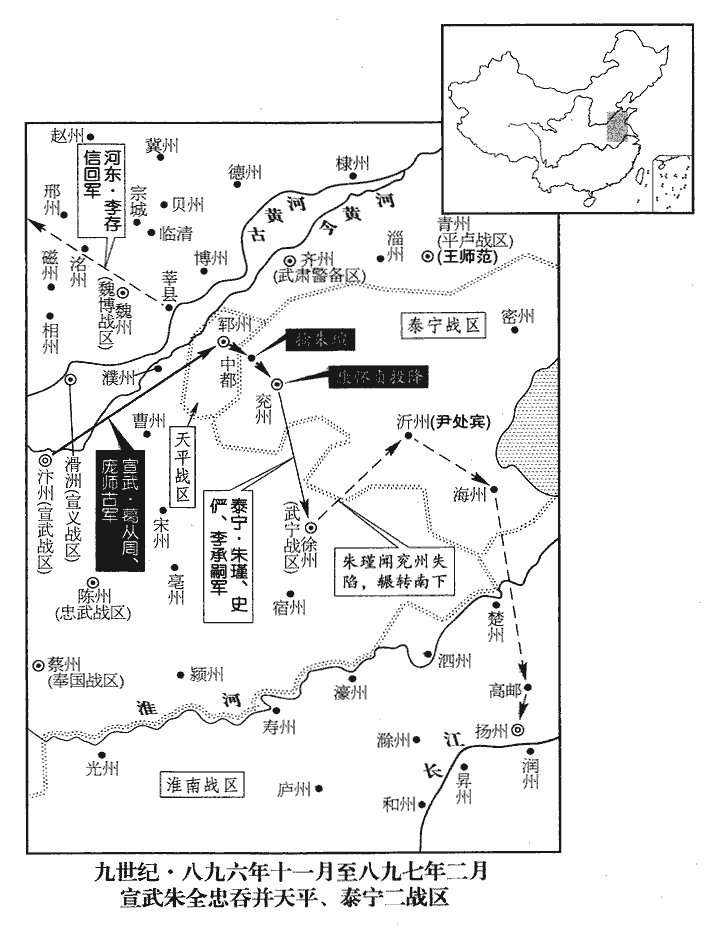
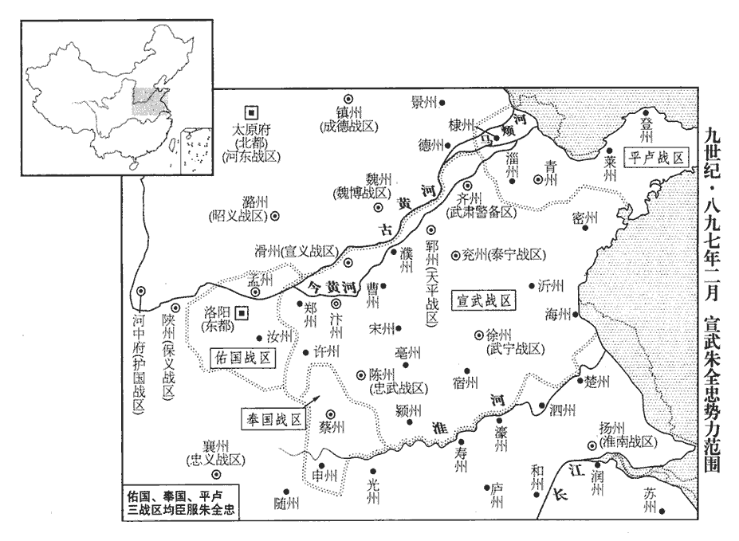
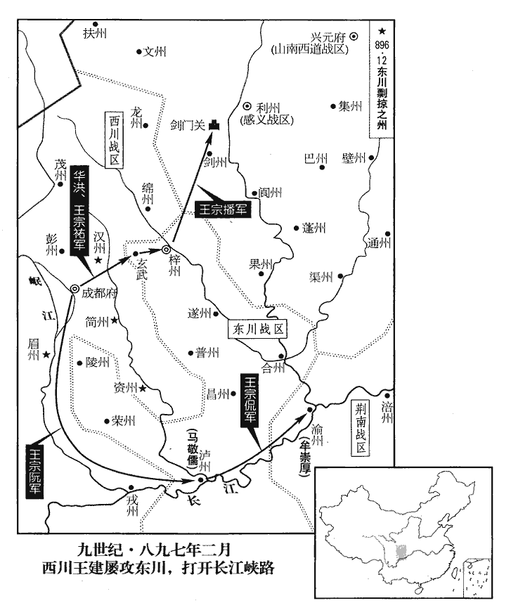
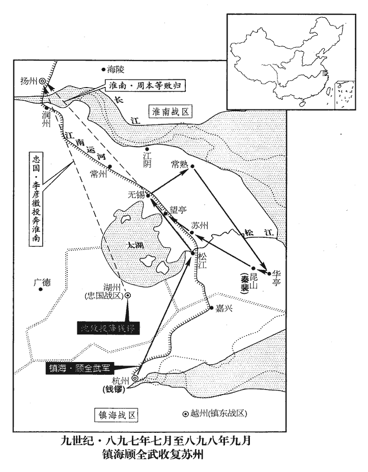
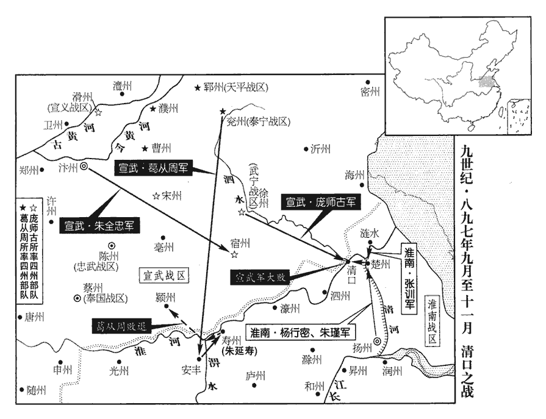
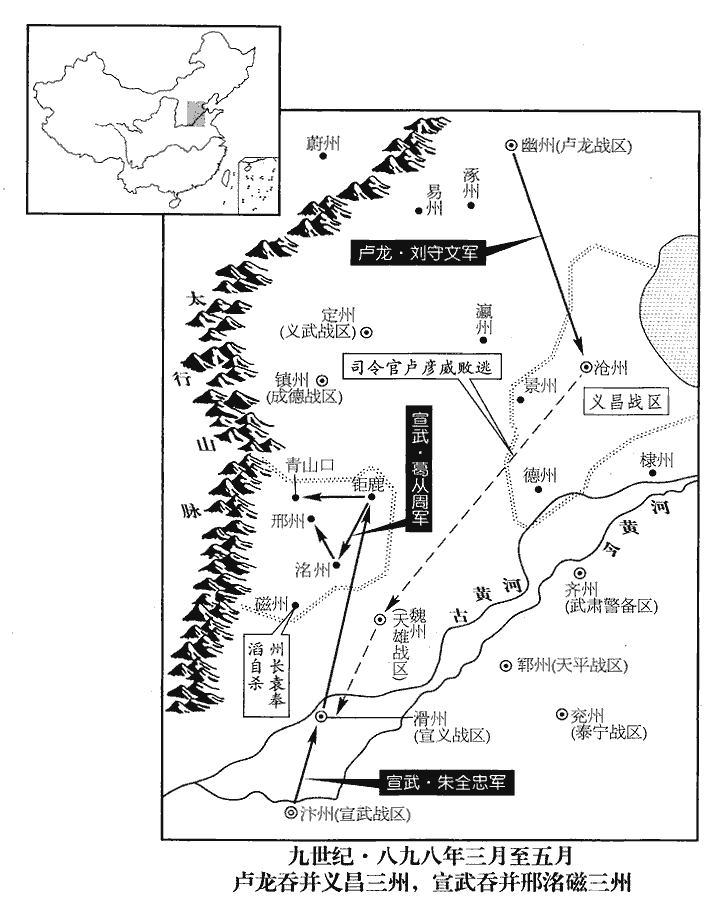
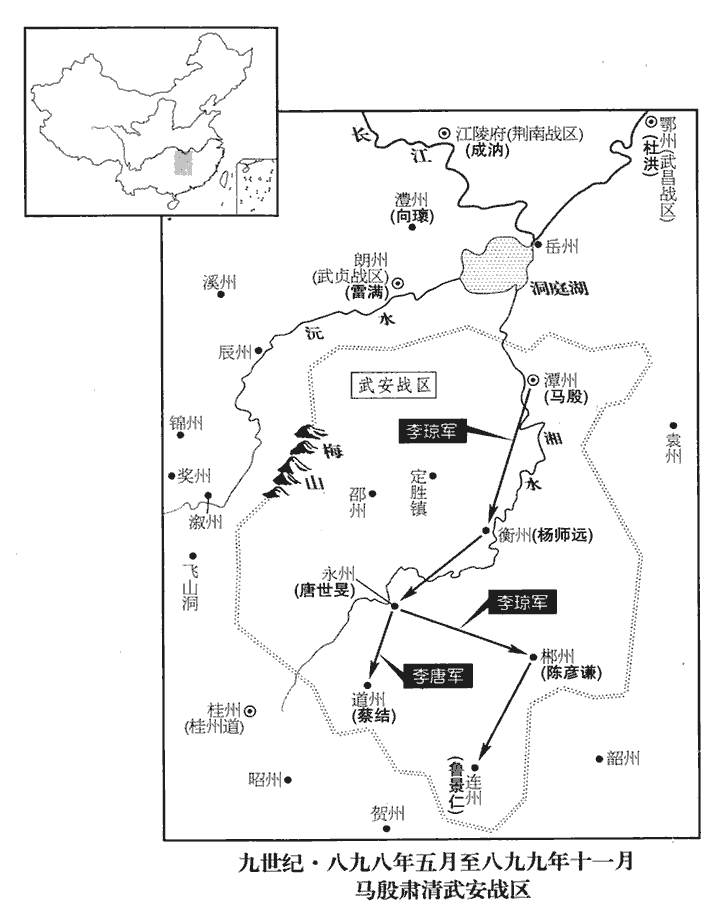
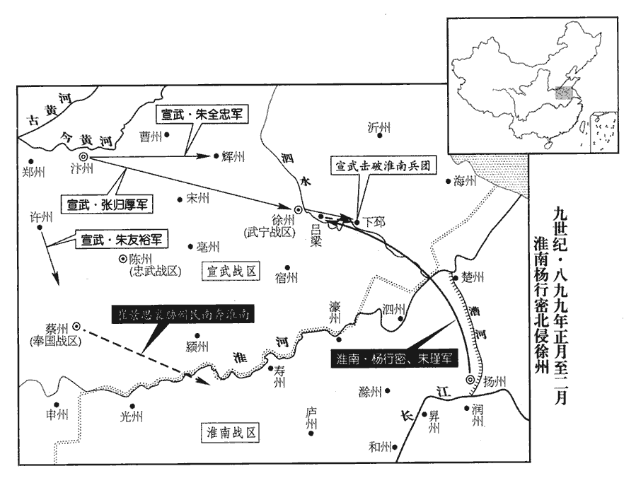
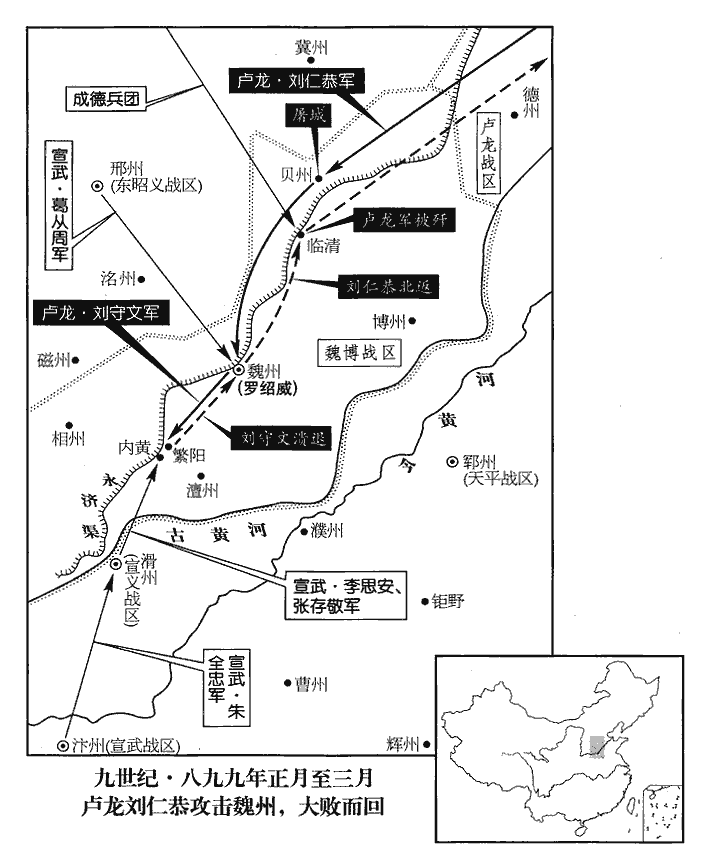
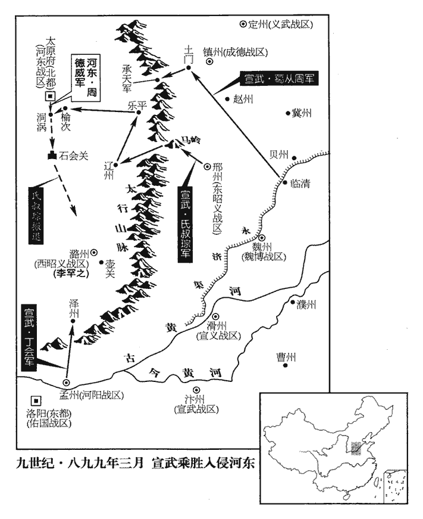

 唐紀七十七起強圉大荒落（丁巳），盡屠維協洽（己未），凡三年。

# 昭宗聖穆景文孝皇帝中之上

## 乾寧四年（丁巳、八九七）

1春，正月，甲申‹八›，韓建‹镇国战区，总部设华州陕西省华县›奏：「防城將張行思等張行思，華州防城將也。將，即亮翻。告睦、濟、韶、通、彭、韓、儀、陳八王皆嗣王也。睦、韶、韓，代宗之後；彭，肅宗之後；陳，文宗之後；史皆逸其名及其世系。謀殺臣，劫車駕幸河中‹山西省永济市›。」建惡諸王典兵，惡，烏路翻。故使行思等告之。上‹李晔（李敏）本年三十一岁›大驚，召建諭之；建稱疾不入。令諸王詣建自陳，建表稱：「諸王忽詣臣理所，不測事端。建言諸王為變，事出不測也。臣詳酌事體，不應與諸王相見。」又稱：「諸王當自避嫌疑，不可輕為舉措。陛下若以友愛含容，請依舊制，令歸十六宅，妙選師傅，教以詩書，不令典兵預政。」援開元、天寶舊制，不令諸王出閤。且曰：「乞散彼烏合之兵，用光麟趾之化。」詩序曰：關雎之化行，雖衰世之公子，皆信厚如麟趾之時。建慮上不從，引麾下精兵圍行宮，以兵脅君。表疏連上。上，時掌翻。上不得已，是夕，詔諸王所領軍士並縱歸田里，諸王勒歸十六宅，其甲兵並委韓建收掌。建又奏：「陛下選賢任能，足清禍亂，何必別置殿後四軍！四軍，即安聖、捧宸、保寧、宣化也。置見上卷上年。顯有厚薄之恩，乖無偏無黨之道。書曰：無偏無黨，王道蕩蕩。韓建安識書語，李巨川教之耳，宜其不免於誅也。一本「厚」下更有「有」字。且所聚皆坊市無賴姦猾之徒，平居猶思禍變，臨難必不為用，難，乃旦翻。而使之張弓挾刃，密邇皇輿，臣竊寒心，乞皆罷。」詔【章：十二行本「詔」上有「遣」字；乙十一行本同；張校同；孔本有「遣」字，無「亦」字。】亦從之。於是殿後四軍二萬餘人悉散，天子之親軍盡矣。捧日都頭李筠，石門‹陕西省蓝田县西南›扈從功第一，石門扈從事見上卷二年。從，才用翻。建復奏斬於大雲橋。復，扶又翻。大雲橋，在華州‹陕西省华县›大雲寺前。武后時令天下諸州各置大雲寺以藏大雲經，著受命之符也。建又奏：「玄宗‹李隆基›之末，永王璘暫出江南，遽謀不軌。事見肅宗紀至德元載、二載。代宗‹李豫›時吐蕃入寇，光啟中朱玫亂常，皆援立宗支以繫人望。謂吐蕃立廣武王承宏、朱玫立襄王熅也，事各見前紀。援，于元翻。今諸王銜命四方者，乞皆召還。」指言延王戒丕等。又奏：「諸方士出入禁庭，眩惑聖聽，宜皆禁止，無得入宮。」指言許巖士等。詔悉從之。建既幽諸王於別第，知上意不悅，乃奏請立德王為太子，欲以解之。丁亥‹十一›，詔立德王祐為皇太子，仍更名裕。更，工衡翻。考異曰：「勤王錄曰：「公以儲副之設，國之大本，上表云云，敕宜從允，時正月十一日也。當四日之間，而儲君奉冢祀，宗室歸藩邸，蓬頭突鬢之士不入於禁門，文成、五利之徒不陳其左道，君父開悟，遐邇詠歌，人不震驚，市無易肆，公之力也。」李巨川著書，矯誣善惡乃至於此！今從實錄。

〖译文〗 [1]春季，正月，甲申（初八），韩建向朝廷上奏说：“华州防城将张行思等控告皇室的睦、济、韶、通、彭、韩、仪、陈八王图谋杀害我，要劫持皇上的车驾到河中去。”韩建憎恨各王掌管军队，因此指使张行思等控告他们。昭宗接到韩建的表章大为惊慌，召见韩建，想向他说明，韩建以有病为托词拒不前来。唐昭宗又命令各王到韩建那里去自行陈述，韩建上表道：“各王若忽然来我的住所，变乱之事难以揣测。我仔细斟酌这件事，不应当和各王见面。”韩建又说：“各王应当自动避开嫌疑，不可轻举妄动。陛下如果因为同祖同宗的友爱之情而宽容他们，就请依照旧制，命令诸王回到十六宅，精心挑选师傅，教他们学习诗文书画，而不让他们掌管军队干预朝政。”韩建并且说：“请求解散各王手下的乌合之众，以光大大唐皇室子孙的教化。”韩建担心唐昭宗不依从他的意见，就带领手下精壮士兵围困昭宗的行宫，表章奏疏接二连三地向朝廷呈递。昭宗不得已，在这天傍晚，诏令各王所管领的军中士兵全都解散遣回田间故里，强迫诸王回到十六宅，各王原有的盔甲兵器全部交给韩建掌管。韩建又上奏说：“陛下挑选贤良任用能人，这样足可以清除祸患平定战乱，何必另外设置安圣、捧宸、保宁、宣化这四支亲军呢！显然皇恩有厚薄亲疏之分，与没有偏向没有私党这样的王道相背离。况且这四支陛下亲军里，聚集的都是市镇里巷中游手好闲奸邪狡猾的无赖，他们的平静安居的时候还企图作乱惹祸发动变乱，当朝廷遇到艰难处境他们一定不会为陛下效力的，可是现在却让这帮人拉弓拔刀，紧紧地跟随陛下的车驾，我私下里为陛下担惊受怕，请求立即把亲军全部解散。”昭宗颁下诏书，又依从了韩建的意见。于是，护卫昭宗的四支军队二万余人全部解散，天子的亲军完全裁撤了。捧日都头李筠，当初在石门跟随护卫昭宗，功劳堪数第一，韩建又上奏朝廷，将李筠在华州大云桥斩杀。韩建接着又向昭宗奏道：“玄宗末年，永王李暂时调出京师到江南任职，马上就背叛朝廷图谋不轨。代宗时，吐蕃侵入，拥立广武王李承宏。光启年间，朱玫叛逆作乱，拥立襄王李。他们都是靠着拥立皇族宗室的分支来笼络民心。现在奉陛下之命在各地的皇室诸王，请求把他们全都召回朝廷。”韩建还奏称：“那些鼓吹仙术的方士在皇宫出出进进，迷惑皇帝的耳目，应当一律禁止，不许他们进入皇宫。”昭宗下诏全都依从韩建的奏请。韩建把皇室各王幽禁在其他府第后，知道昭宗心中不高兴，便上呈奏章请求立德王为太子，想以此来缓解。丁亥（十一日），昭宗颁下诏令，立德王李为皇太子，按成制改名为李裕。

 

2龐師古、葛從周併兵攻鄆州‹山东省东平县›，朱瑄‹天平总部郓州›兵少食盡，不復出戰，但引水為深壕以自固。辛卯‹十五›，師古等營於水西南，命為浮梁。癸巳‹十七›，潛決濠水。丙申‹二十›，浮梁成，師古夜以中軍先濟。瑄聞之，棄城奔中都‹山东省汶上县›，按九域志，中都縣在鄆州東南六十里。葛從周逐之，野人執瑄及妻子以獻。僖宗中和二年，朱瑄得鄆州，至是而亡。考異曰：薛居正五代史梁太祖紀：「辛卯，營于濟水之次，龐師古令諸將撤木為橋。乙未夜，師古以中軍先濟，朱瑄棄壁夜走，葛從周擒瑄并妻男以獻。」按濟水自王莽時大旱，不復能絕河而南，自是河南無濟水。編遺錄曰：「五月，遣騎於鄆州軍前追從周，徑往洹水董師，以代侯言，師古留攻鄆。」梁太祖實錄：「四年正月，復以洹水之師大舉伐鄆，十五日辛卯，營其西南河外，龐師古命諸將撤木為橋以圖宵濟。癸巳，前軍以心膂百人盜決河口，甲午，浮橋集水次。乙未夜，師古中軍先濟，聲振壁內。朱瑄聞之，棄壁走。」編遺錄：「四年正月己卯，朱瑄兵少糧盡，不敢出戰，然深溝高壘，難越也。從周、師古乃取清河內小舟，採野葛草茅，索之以為巨纜，乃於其牆南建浮橋。丙申，功就，我師渡橋，朱瑄奔遁。」皆不云濟水。師古去年三月已敗鄆兵于馬頰，追至西門，據故洛亭子為寨。乙未夜先濟，蓋鄆城下清河水，疑朱瑄引之以環城固守，故師古等為浮橋以濟師。河既可決，明非自然之水也。舊紀：「癸未，龐師古陷鄆州，朱瑄與妻榮氏潰圍走。瑄至中都，為野人所殺，榮氏俘於軍。」新紀：「丙申，全忠陷鄆州。」實錄：「二月，丙午朔，陷鄆州，瑄至中都，為亂兵所殺，妻榮至汴為尼。」據薛史，辛卯營於濟水，則癸未鄆未破也。新紀云丙申陷鄆，實錄二月，蓋約奏到。今從編遺錄、新紀。

〖译文〗 [2]庞师古、葛从周联合军队攻打郓州的朱，朱人马较少粮食也吃尽，便不再出城交战，只是引水灌满堑壕自行固守。辛卯（十五日），庞师古等在水流的的西南安设营寨，命令士兵建造浮桥。癸巳（十七日），庞师古的士兵偷偷挖开堑壕放水。丙申（二十日），浮桥造成，庞师古夜里派遣中军首先越过堑壕。朱听说后放弃郓州城逃奔中都县，葛从周随即追击，乡下农人抓获朱和他的妻子儿子交送葛从周。

3己亥‹二十三›，罷孫偓鳳翔‹陕西省凤翔县›四面行營節度等使，赦李茂貞，故罷鳳翔四面行營。以副都統李思諫為寧塞‹即保塞战区·总部设延州陕西省延安市›節度使。按方鎮表，光化元年，更延州保塞節度為寧塞節度。

〖译文〗 [3]已亥（二十三日），朝廷免去孙的凤翔四面行营节度等使的官职，任命副都统李思谏为宁塞节度使。

4錢鏐使行軍司馬杜稜救婺州‹浙江省金华市›。安仁義移兵攻睦州‹浙江省建德市›，不克而還。安仁義攻婺州見上卷上年。還，從宣翻，又如字。

〖译文〗 [4]钱派令行军司马杜棱救援婺州。围攻婺州的安仁义于是调动军队去攻打睦州，结果没有攻克而率众返回。

5朱全忠入鄆州，以龐師古為天平‹总部设郓州山东省东平县›留後。考異曰：舊紀、梁太祖實錄、薛居正五代史師古傳皆云師古為鄆州留後。編遺錄、薛史梁紀皆云「友裕」。按編遺錄，「三月，丙子，以友裕為鄆州留後，師古為徐州留後。」蓋初以師古守鄆州，後以友裕代之，而徙師古於徐州也。

〖译文〗 [5]朱全忠进入郓州，任命庞师古为天平留后。

朱瑾留大將康懷貞守兗州‹山东省兖州市›，與河東‹总部太原府›將史儼、李承嗣掠徐州‹江苏省徐州市›之境以給軍食。九域志：兗州南一百一十里，即徐州界。全忠聞之，遣葛從周將兵襲兗州。懷貞聞鄆州已失守，汴兵奄至，遂降。二月，戊申‹三›，從周入兗州，獲瑾妻子。朱瑾還，無所歸，帥其眾趨沂州‹山东省临沂市›，刺史尹處賓不納，走保海州‹江苏省连云港市›，降，戶江翻。帥，讀曰率。趨，七喻翻。九域志，兗州三百四十五里，東至沂州。沂，古琅邪也。沂州東至海州一百八十里。為汴兵所逼，與史儼、李承嗣擁州民渡淮，奔楊行密‹杨行愍·淮南总部扬州›。光啟二年，朱瑾取兗州，至是而敗。行密逆之於高郵‹江苏省高邮市›，表瑾領武寧‹总部设徐州江苏省徐州市›節度使。領，遙領也。

〖译文〗 朱瑾留下大将康怀贞守卫兖州，他自己与河东李克用的将领史俨、李承嗣一起到徐州境内抢掠以供给军需粮食。朱全忠得知，便派葛从周带领军队袭击兖州。康怀贞得知郓州已经失守，朱全忠的汴州军队突然来到，于是向葛从周投降。二月，戊申（初三），葛从周进入兖州城，抓获朱瑾的妻子、儿子。朱瑾返回兖州时，没有归处，便率领手下人马奔往沂州，沂州刺史尹处宾不接纳，珠瑾无奈又奔往海州固守，又受到汴州军队的进攻逼迫，最后与史俨、李承嗣裹挟海州的百姓渡过淮水，投奔杨行密。杨行密在高邮迎接朱瑾，并向朝廷表请任命朱瑾遥领武宁节度使。

 

全忠納瑾之妻，引兵還，張夫人逆於封丘‹河南省封丘县›，九域志：封丘縣，在汴州北六十里。全忠以得瑾妻告之。夫人請見之，瑾妻拜，夫人答拜，且泣曰：「兗、鄆與司空同姓，約為兄弟，以小故恨望，起兵相攻，使吾姒辱於此。他日汴州‹河南省开封市›失守，吾亦如吾姒之今日乎！」姒，詳里翻。長婦曰姒，又兄弟之妻相呼曰姒，互相尊稱之辭也。全忠乃送瑾妻於佛寺為尼，斬朱瑄於汴橋‹河南省开封市汴水桥›。於是鄆‹山东省东平县›、齊‹山东省济南市›、曹‹山东省定陶县›、棣‹山东省惠民县›、兗‹山东省兖州市›、沂‹山东省临沂市›、密‹山东省诸城市›、徐‹江苏省徐州市›、宿‹安徽省宿州市›、陳‹河南省准阳县›、許‹河南省许昌市›、鄭‹河南省郑州市›、滑‹河南省滑县›、濮‹山东省鄄城县›皆入于全忠。鄆、齊、曹、棣，天平軍；兗、沂、密，泰寧軍；徐、宿，感化軍；陳、許，忠武軍；鄭、滑、濮，宣義軍。此五鎮之地也。惟王師範保淄青‹总部设青州山东省青州市›一道，亦服於全忠。李存信‹张污落›在魏州‹河北省大名县›，聞兗、鄆皆陷，引兵還。

〖译文〗 朱全忠收纳的朱瑾的妻子，带领军队返回汴州，朱全忠的妻子张夫人在封丘县迎接，朱全忠把收纳朱瑾妻子的事告诉张夫人。张夫人请求会见朱瑾妻子，朱瑾妻子拜见张夫人，张夫人以同样的礼节答谢，并且流着眼泪说：“兖州的朱瑾、郓州的朱与司空朱全忠是同姓，他们相约结为兄弟，因为很小的缘故而产生怨恨，竟兵戎相见互相攻打，以致使嫂子你受到这样的侮辱。将来有一天汴州失守，我也要象嫂子你今天这样了！”朱全忠这才把朱瑾妻子送到佛寺里做尼姑，在汴桥斩杀朱。于是，天平节度使管辖的郓州、齐州、曹州、棣州，秦宁节度使管辖的兖州、沂州、密州，感化节度使管辖的徐州、宿州，忠武节度使管辖的陈州、许州，宣义节度使管辖的郑州、滑州、濮州，全都归属朱全忠统管。只有王师范保存淄青一道，也服从了朱全忠。这时，李存信在魏州，他听说兖州、郓州都被朱全忠攻占，便带领人马返回晋阳。

淮南舊善水戰，不知騎射，及得河東、兗、鄆兵，軍聲大振。史儼、李承嗣皆河東驍將，李克用深惜之，遣使間道詣楊行密請之；間，古莧翻。行密許之，亦遣使詣克用脩好。好，呼到翻。

〖译文〗 淮南节度使杨行密的军队以往擅长水上作战，而不熟悉骑马射箭，等到杨行密接收了河东李克用、兖州朱瑾、郓州朱人马，军队声势大为振作。史俨、李承嗣都是河东节度使李克用手下的勇猛战将，李克用对他们到杨行密那里很是惋惜，派遣使者从小道前去向杨行密请求放回史俨、李承嗣。杨行密同意，也派出使者到李克用那里重修和好。

6戊午‹十三›，王建‹西川总部成都府›遣邛州‹四川省邛崃市›刺史華洪、彭州‹四川省彭州市›刺史王宗祐將兵五萬攻東川‹总部设梓州四川省三台县›，邛，渠容翻。華，戶化翻。以戎州‹四川省宜宾市›刺史王宗謹‹王钊›為鳳翔‹陕西省凤翔县›西面行營先鋒使，敗鳳翔將李繼徽等於玄武‹四川省中江县›。玄武，漢氐道縣，晉改曰玄武，唐初屬益州，時屬梓州，宋朝改曰中江，在梓州西九十里。敗，補邁翻。繼徽本姓楊，名崇本，茂貞之假子也。

〖译文〗 [6]戊午（十三日），西川节度使王建派遣邛州刺史华洪、彭州刺史王宗带领军队五万攻打东川节度使顾彦晖，任命戎州刺史王宗谨为凤翔西南行营先锋使，在梓州玄武县打败凤翔节度使李茂贞的将领李继徽等。李继徽本来姓杨，名崇本，是李茂贞的养子。

7己未‹十四›，赦天下。考異曰：實錄：「降德音，曲赦天下。」云德音即非赦。既云曲赦即不及天下。實錄誤也。

〖译文〗 [7]己未（十四日），朝廷诏令天下大赦。

8上饗行廟。時駐蹕華州，太常禮院請權立行廟以備告饗。

〖译文〗 [8]唐昭宗到行庙祭献。

9庚申‹十五›，王建以決雲都知兵馬使王宗侃為應援開峽‹长江三峡›都指揮使，將兵八千趨渝州‹重庆市›；決勝都知兵馬使王宗阮為開江防送進奉使，將兵七千趨瀘州‹四川省泸州市›。辛酉‹十六›，【章：十二行本「酉」作「未」；乙十一行本同。】宗侃取渝州，降刺史牟崇厚。癸酉‹二十八›，宗阮拔瀘州，斬刺史馬敬儒，峽路始通。渝、瀘，皆東川巡屬。王建志在廣地，假通峽路進奉以為名耳。趨，七喻翻。

〖译文〗 [9]庚申（十五日），王建任命决云都知兵马使王宗侃为应援开峡都指挥使，带领军队八千奔赴渝州；任命决胜都知兵马使王宗阮为开江防送进奉使，带领军队七千奔赴泸州。辛未（二十六日），王宗侃攻取渝州，渝州刺史牟崇厚投降。癸酉（二十八日），王宗阮攻克泸州，斩杀泸州刺史马敬儒，峡路开始打通。

鳳翔將李繼昭救梓州‹四川省三台县›，留偏將守劍門‹四川省剑阁县北剑门关›，西川‹总部成都府›將王宗播擊擒之。

〖译文〗 凤翔节度使李茂贞的将领李继昭救援梓州，留下属将据守剑门，西川将领王宗播袭击擒获了他。

10乙亥‹三十›，門下侍郎、同平章事孫偓罷守本官，中書侍郎、同平章事朱朴罷為祕書監。朴既秉政，所言皆不效，朱朴自詭月餘可致太平，見上卷上年。外議沸騰。太子詹事馬道殷以天文，將作監許巖士以醫得幸於上，韓建誣二人以罪而殺之，且言偓、朴與二人交通，故罷相。馬道殷、許巖士在上左右，二相因之以白事，此必有之。

〖译文〗 [10]乙亥（三十日），朝廷将门下侍郎、同平章事孙罢去官衔，只留本职，将中书侍郎、同平章事朱朴罢职贬为秘书监。朱朴充任宰相主持朝政后，事先所说的话都没有见效，朝外议论纷纷。太子詹事马道殷因为通晓天文，将作监许岩士因为懂医而得到唐昭宗宠爱，韩建诬陷马道殷、许岩士二人有罪而斩杀了他们，并且又说孙、朱朴与这两个人相互交往窜通信息，因此将他们罢去了宰相官职。

 

11詔以楊行密為江南諸道行營都統，以討武昌‹总部设鄂州湖北省武汉市›節度使杜洪。按新書洪傳。洪附朱全忠，絕東南貢獻路，命楊行密討之者以此。

〖译文〗 [11]唐昭宗颁下诏令，任命杨行密为江南诸道行营都统，以便讨伐武昌节度使杜洪。

12張佶‹武安战区，总部设潭州湖南省长沙市›克邵州‹湖南省邵阳市›，擒蔣勛。潭兵攻蔣勛事始上卷三年正月。佶，巨乙翻。

〖译文〗 [12]张佶攻克邵州，擒获邵州刺史蒋勋。

13三月，丙子‹一›，朱全忠表曹州‹山东省定陶县›刺史葛從周為泰寧‹总部设兖州山东省兖州市›留後，朱友裕為天平‹总部设郓州山东省东平县›留後，龐師古為武寧‹总部设徐州江苏省徐州市›留後。朱全忠表以三鎮授三將以樹黨。此時蓋復改感化為武寧。

〖译文〗 [13]三月，丙子（初一），朱全忠向朝廷进呈表请求任命曹州刺史葛从周为泰宁留后，朱友裕为天平留后，庞师古为武宁留后。

14保義‹总部设陕州河南省三门峡市›節度使王珙攻護國‹总部设河中府山西省永济市›節度使王珂，珂求援於李克用，珙求援於朱全忠。宣武‹总部汴州›將張存敬、楊師厚敗河中兵於猗氏‹山西省临猗县›南；河東將李嗣昭敗陝兵於猗氏，又敗之於張店‹山西省平陆县北张店镇›，遂解河中之圍。敗，補邁翻。陝，失冉翻。師厚，斤溝‹安徽省太和县北芹沟乡›人，九域志，潁州萬壽縣有斤溝鎮。萬壽，唐汝陰縣之百尺鎮也，宋朝開寶六年置縣。嗣昭，克用弟克柔之假子也。

〖译文〗 [14]保义节度使王珙攻打护国节度使王珂，王珂向李克用求援，王珙则向朱全忠求援。宣武军将领张存敬、杨师厚在猗氏南部打败河中军队；河东军队将领李嗣昭在猗氏打败陕州人马，接着又在张店再次打败陕州军队，于是解除了对河中的围困。杨师厚是斤沟镇人，李嗣昭是李克用胞弟李克柔的养子。

15更名感義軍‹总部设利州四川省广元市›曰昭武，更，工衡翻。治利州‹四川省广元市›，以前靜難‹总部设邠州陕西省彬县›節度使蘇文建為節度使。難，乃旦翻。

〖译文〗 [15]朝廷诏令，将感义军改名为昭武军，节度使司设在利州，任命以前的静难节度使苏文建为昭武节度使。

16夏，四月，以同州‹陕西省大荔县›防禦使李繼瑭為匡國‹总部设同州›節度使。考異曰：實錄：「賜同州號匡國軍，以防禦使李繼瑭為匡國節度使。」按新方鎮表，乾寧二年，賜同州號匡國軍。王行約已嘗為匡國節度使，蓋行約死，繼瑭但為防禦使，今始復舊名耳。繼瑭，茂貞‹宋文通·凤翔总部凤翔府›之養子也。

〖译文〗 [16]夏季，四月，朝廷任命同州防御使李继瑭为匡国节度使。李继瑭是李茂贞的养子。

17以右諫議大夫李洵為兩川宣諭使，和解王建及顧彥暉‹东川总部梓州›。

〖译文〗 [17]朝廷任命右谏议大夫李洵为两川宣谕使，前往劝说西川节度使王建与东川节度使顾彦晖和解。

18辛亥‹六›，錢鏐遣顧全武等將兵三千自海道救嘉興‹浙江省嘉兴市›，己未‹十四›，至城下，擊淮南兵，大破之。淮南圍嘉興，始上卷二年。

〖译文〗 [18]辛亥（初六），钱派遣顾全武等带领军队三千乘船由海道前往救援嘉兴，己未（十四日），来到嘉兴城下，攻打正在围攻嘉兴的淮南军队，结果把淮南军队打得大败。

19杜洪為楊行密所攻，求救於朱全忠，全忠遣其將聶金掠泗州‹江苏省盱眙县淮河北岸›，聶，尼輒翻，姓也。朱友恭攻黃州‹湖北省黄州市›。行密遣右黑雲都指揮使馬珣等救黃州。黃州刺史瞿章聞友恭‹李彦威›至，棄城，擁眾南保武昌寨‹湖北省鄂州市›。武昌，漢古縣，唐屬鄂州。九域志：在州東北一百八十里，今置壽昌軍。

〖译文〗 [19]杜洪受到杨行密的进攻，向朱全忠求救，朱全忠派遣手下将领聂金掠扰泗州，命朱友恭攻打黄州。杨行密则派遣右黑云都指挥使马等救援黄州。黄州刺史瞿章听说朱友恭前来，便放弃黄州城，裹挟民众向南逃往武昌寨固守。

20癸亥‹十八›，兩浙將顧全武等破淮南十八營，虜淮南將士魏約等三千人。淮南將田頵屯驛亭埭‹浙江省嘉兴市西›，埭dài，徒耐翻。兩浙兵乘勝逐之。甲戌‹二十九›，頵自湖州‹浙江省湖州市›奔還，自嘉興退軍，取道湖州，還宣州‹安徽省宣州市›。兩浙兵追敗之，敗，補邁翻。頵眾死者千餘人。

〖译文〗 [20]癸亥（十八日），两浙军队将领顾全武等攻破围攻嘉兴的淮南军队十八个营寨，虏获淮南军队将士魏约等三千人。淮南军队将领田当时驻扎在驿亭埭，两浙军队乘胜驱逐田。甲戌（二十九日），田从湖州逃回，两浙军队在后面紧追，田军队大败，死亡达一千余人。

21韓建惡刑部尚書張禕yī等數人，皆誣奏，貶之。惡，烏路翻。褘，吁韋翻。考異曰：實錄：「貶刑部尚書張禕、趙崇、蘇循等為衡州司馬。韓建惡之，誣奏貶焉。」禕等必不皆為刑部尚書，皆貶衡州司馬。實錄誤也。

〖译文〗 [21]韩建憎恨刑部尚书张等几个人，他上呈奏章，全都进行诬陷，结果张等人被朝廷贬职。

22五月，加奉國‹总部设蔡州河南省汝南县›節度使崔洪同平章事。

〖译文〗 [22]五月，朝廷加封奉国节度使崔洪为同平章事。

23辛巳‹七›，朱友恭為浮梁於樊港‹湖北省鄂州市西北·樊水注入长江处›，武昌西三里有樊山，山下有樊溪，注于江，謂之樊口。朱友恭蓋跨江為浮梁，抵樊口，以攻武昌也。進攻武昌寨‹湖北省鄂州市›，壬午‹八›，拔之，執瞿章，遂取黃州；考異曰：薛居正五代史梁紀：「五月丁丑，朱友恭遣使上言，大破淮寇於武昌，收復黃、鄂二州。」新紀：「壬午，全忠陷黃州，刺史瞿章死之。」朱友恭傳云翟章，十國紀年作瞿章。吳錄云：執刺史瞿章，當可據。馬珣等皆敗走。

〖译文〗 [23]辛巳（初七），朱友恭在樊港建造跨江浮桥，进攻武昌营寨，壬午（初八），予以攻克，抓获刺史瞿章，于是占取黄州，马等都战败逃跑。

24丙戌‹十二›，王建以節度副使張琳守成都，張琳，王建之腹心。建之攻陳敬瑄也，亦使之守邛州。自將兵五萬攻東川‹总部梓州›。更華洪姓名曰王宗滌。華洪累戰有功，王建於是養以為子以收其力用，然殺洪之心蓋已萌於此時矣。華，戶化翻。

〖译文〗 [24]丙戌（十二日），西川节度使王建命令节度副使张琳据守成都，自己带领军队五万攻打东川节度使顾彦晖。王建把华洪的姓名改为王宗涤。

25六月，己酉‹五›，錢鏐如越州‹浙江省绍兴市›，受鎮東‹总部设越州›節鉞。

〖译文〗 [25]六月，己酉（初五），钱到达越州，接受镇东节度使的旌旗节。

26李茂貞表：「王建攻東川，連兵累歲，不聽詔命。」王建豈特攻東川哉！李茂貞山南巡屬諸州，建取之亦多矣；力不能制，欲挾天子之令以臨之。甲寅‹十›，貶建南州‹重庆市綦江县›刺史。新志：武德三年，開黔南蠻，置南州。宋白曰：南州，戰國時為巴國界，秦則巴郡之地，漢為江州之境。唐武德三年，割渝州之東界，置南州。乙卯‹十一›，以茂貞為西川節度使。以覃王嗣周為鳳翔節度使。

〖译文〗 [26]李茂贞上表朝廷说：“王建一再攻打东川，多年以来兴兵作乱，拒不听从朝廷的诏令。”甲寅（初十），唐昭宗颁下诏令，把王建贬为南州刺史。乙卯（十一日），朝廷任命李茂贞为西川节度使。同时任命覃王李嗣周为凤翔节度使。

27癸亥‹十九›，王建克梓州南寨‹四川省三台县南›，執其將李繼寧。丙寅‹二十二›，宣諭使李洵至梓州，四月，李洵受命而使，六月始至。己巳‹二十五›，見建于張杷砦‹三台县南›，建指執旗者曰：「戰士之情，不可奪也。」

〖译文〗 [27]癸亥（十九日），王建攻克梓州南寨，抓获南寨将领李继宁。丙寅（二十二日），朝廷派出的宣谕使李洵到达梓州，己巳（二十五日），李洵在张杷砦会晤王建，王建指着手拿旗帜的人说：“攻打东川是军中士兵的意意，不能强夺。”

28覃王赴鎮‹陕西省凤翔县›，李茂貞不受代，李茂貞之狡悍，豈肯以鳳翔授人，涉險而爭蜀邪！圍覃王於奉天‹陕西省乾县›。

〖译文〗 [28]覃王李嗣周前赴凤翔镇所，凤翔节度使李茂贞不接受李嗣周的替代，并在奉天将李嗣周围困起来。

29置寧遠軍於容州‹广西容县›，以李克用大將蓋寓領節度使。李克用之平王行瑜也，蓋寓以功領容管觀察使，今升領節度使。

〖译文〗 [29]朝廷在容州设置宁远军，任命李克用的大将盖寓兼任宁远节度使。

30秋，七月，加荊南‹总部设江陵府湖北省江陵县›節度使成汭‹郭禹›兼侍中。

〖译文〗 [30]秋季，七月，朝廷加封荆南节度使成兼侍中。

31韓建移書李茂貞；茂貞解奉天之圍，覃王歸華州‹陕西省华县›。

〖译文〗 [31]韩建给李茂贞送去书信，李茂贞于是解除对奉天的围困，覃王李嗣周回到华州。

32以天雄‹总部设秦州甘肃省秦安县西北›節度使李繼徽‹杨崇本›為靜難節度使。李繼徽自秦州徙邠州，邠寧亦為李茂貞有矣。難，乃旦翻。

〖译文〗 [32]朝廷任命天雄节度使李继徽为静难节度使。

33庚戌，錢鏐還杭州，自越還杭。遣顧全武取蘇州‹江苏省苏州市›；乙未‹二十二›，拔松江‹江苏省吴江市›；松江，在蘇州南四十里，淮南立寨以守之。戊戌‹二十五›，拔無錫‹江苏省无锡市›；無錫，漢縣，唐屬常州。九域志，在州東九十一里。辛丑‹二十八›，拔常熟‹江苏省常熟市›、華亭‹上海市松江县›。宋白曰：常熟縣，後漢至吳為司鹽都尉，晉置南沙縣，梁置常熟縣，今崑山縣東一百三十里，常熟故城是也。九域志，在蘇州北七十五里。天寶十載，分嘉興置華亭縣，屬蘇州，在州西南；今屬秀州。

〖译文〗 [33]庚戌（疑误），钱从越州返回杭州，派顾全武攻取苏州；乙未（二十二日），攻克松江；戊戌（二十五日），攻占无锡；辛丑（二十八日），又占据常熟、华亭。

34初，李克用取幽州‹北京市›，見二百五十九卷乾寧元年。表劉仁恭為節度使，留戍兵及腹心將十人典其機要，租賦供軍之外，悉輸晉陽‹山西省太原市›。及上幸華州，克用徵兵於仁恭，又遺成德‹总部设镇州河北省正定县›節度使王鎔、義武‹总部设定州河北省定州市›節度使王郜書，遺，唯季翻。郜，音告。欲與之共定關中，奉天子還長安。仁恭辭以契丹‹王庭西楼城内蒙古巴林左旗›入寇，洪遵曰：契丹之讀如喫，惟新唐書有音。今從欺訖翻。須兵扞禦，請俟虜退，然後承命。克用屢趣之，趣，讀曰促。使者相繼，數月，兵不出。克用移書責之，仁恭抵書於地，慢罵，囚其使者，欲殺河東‹总部太原府›戍將，戍將遁逃獲免。克用留兵戍幽州，見上卷乾寧二年。克用大怒，八月，自將擊仁恭。為克用計者，先舉河東之甲以勤王，事定之後，然後移兵臨燕以問罪，劉仁恭安所逃其死乎！不知出此，遽興忿兵，其敗宜矣。

〖译文〗 [34]当初，李克用攻取幽州，向朝廷进呈表章请求任命刘仁恭为节度使，留下戍兵和亲信将领十人掌管机要事务，幽州一带的田租赋税除了供给军需之外，全部运送到晋阳。等到唐昭宗避难前往华州后，李克用向刘仁恭征调军队，又给成德节度使王熔、义武节度使王郜送去书信，想和他们一起平定关中的叛乱，奉送天子返回京师长安。刘仁恭以契丹人正在入侵抢掠，需要有军队防备，请等契丹人退走后，然后再接受李克用的命令，予以推辞。李克用再三催促，派出的使者接二连三地到达幽州，可是几个月过去，刘仁恭的军队还是不出发。李克用送去书信责备刘仁恭，刘仁恭把信扔在地上，大肆谩骂，并把派来的使者囚禁起来，还想杀害留在幽州驻守的河东将领，那些河东将领立即逃跑才免遭杀身之祸。李克用勃然大怒，八月，亲自率领军队攻打刘仁恭。

 

35上欲幸奉天親討李茂貞，令宰相議之；宰相切諫，乃止。議者率謂昭宗忿不思難，然亦可悲矣。

〖译文〗 [35]昭宗想前往奉天亲自督率军队讨伐李茂贞，命令宰相商议这件事。宰相极力劝阻，昭宗才打消了亲征的打算。

36延王戒丕還自晉陽，戒丕使晉陽見上卷上年。韓建奏：「自陛下即位以來，與近輔交惡，近輔，邠、岐、同、華也。皆因諸王典兵，兇徒樂禍，樂，音洛。致鑾輿不安。比者臣奏罷兵權，比，毗至翻，近也。實慮不測之變。今聞延王、覃王尚苞陰計，願陛下聖斷不疑，斷，丁亂翻。制於未亂，周書云：制治於未亂。建奏引之，李巨川之辭也。則社稷之福。」韓建欲殺諸王久矣，憚李克用，故未敢發。延王既還，知克用之兵不能至，故決請殺之。上曰：「何至於是！」數日不報。建乃與知樞密劉季述矯制發兵圍十六宅，諸王被髮，或緣垣，或升屋，呼【章：十二行本「升」作「登」；「呼」上有「或升木」三字；乙十一行本同；張校同，云無註本脫誤與吳本同。】曰：「宅家救兒！」被，皮義翻。呼，火故翻。唐末宮中率稱天子曰宅家。建擁通、沂、睦、濟、韶、彭、韓、陳、覃、延、丹十一王至石隄谷‹陕西省华县西›，盡殺之，石隄谷，在華州西。歐陽修集古錄云：殽阬君祠，今謂之五部神廟，其像有石隄西戍樹谷五樓先生、東臺御史王剪將軍，莫曉其義。其碑云：「石隄樹谷，南通商、雒。」又云：「前世通利，吏民興貴，有御史大夫、將軍牧伯，故為立祠以報其功。」乃知五部之號，自漢有之。如此，則石隄者，石隄谷之神，五部神之一也。唐韓建殺諸王於石隄谷，蓋此谷也。殽阬神祠，在華州鄭縣。考異曰：舊紀：「是日，通、覃以下十一王并其侍者皆為建兵所擁，至石隄谷，無長少，皆殺之。」唐補紀曰：「六宅諸王，准前商量，請置殿後都。韓建怨怒，進狀爭論，與諸王互說短長。上乃縛韓王克良已下十人送韓建府。建以棘刺圍於大廳，經宿不與相見。軍吏諫，遂請諸王歸宮，散卻殿後都。」新紀：「八月，韓建殺通王滋、沂王湮、韶王、彭王、嗣韓王、嗣陳王、嗣覃王嗣周、嗣延王戒丕、嗣丹王允。」按舊紀韓建奏，睦王、濟王、韶王、通王、彭王、韓王、儀王、陳王八人。新宗室傳，初帝遣嗣延王戒丕，嗣丹王允往見李克用，又有覃王嗣周，則是十一人。新紀、傳「儀」作「沂」。按昭宗子禋封沂王，不應更封宗室。舊紀儀王，恐可據。以謀反聞。

〖译文〗 [36]延王李戒丕从晋阳返回华州，韩建从奏说：“自从陛下即位以来，朝廷与靠近京师的藩镇关系恶化，这都是因为皇室各王掌管兵权，逞凶作恶之徒喜好惹祸生灾，使陛下的车驾不能安稳。近来我向朝廷奏请罢免各王的兵权，实在是担心会有难以预测的变乱。现在我听说延王李戒丕、覃王李嗣周正在酝酿阴谋诡计，希望陛下圣明果断毫不迟疑，在没有发生变乱前就采取措施，那就是大唐天下的福气了。”唐昭宗看了韩建的奏章说：“哪里至于这样呀！”几天过去都没有答复。韩建于是与知枢密刘季述假借朝廷的诏令发兵围攻各王的住所十六宅，诸王披头散发，有的攀援爬上墙头，有的登高跑到屋顶，狂呼道：“皇上快来救我！”韩建把通王、沂王、睦王、济王、韶王、彭王、韩王、陈王、覃王、延王、丹王这十一个王裹挟到华州西部的石堤谷，全部杀掉，然后向唐昭宗奏报说他们谋反因而处死。

37貶禮部尚書孫偓為南州‹重庆市綦江县›司馬。祕書監朱朴先貶夔州‹重庆市奉节县›司馬，再貶郴州‹湖南省郴州市›司戶。考異曰：實錄：「朴貶郴州司戶。」薛廷珪鳳閣書詞有朴自祕書監責除蜀王傅、分司東都制云：「苞藏莫顧於朝綱，進見不由於相府。」復云：「猶希顧問之間，來撓澄清之化。」又貶渠州司馬制云：「争臣條奏，憲府極言，指陳負固之謀，忿嫉崇姦之計。」與此稍異。今從實錄。朴之為相，何迎驟遷至右諫議大夫，至是亦貶湖州‹浙江省湖州市›司馬。何迎薦朱朴見上卷上年。

〖译文〗 [37]朝廷将礼部尚书孙贬职为南州司马。秘书监朱朴先贬为夔州司马，再次贬职降为郴州司户。朱朴做宰相时，何迎的官职突然升到右谏议大夫，到这时也被贬职为湖州司马。

38鍾傳欲討吉州‹江西省吉安市›刺史襄陽‹湖北省襄樊市›周琲bèi，琲帥其衆奔廣陵‹扬州州政府所在县·江苏省扬州市›。琲，部凂měi翻。又蒲昧翻。帥，讀曰率。

〖译文〗 [38]钟传想要讨伐吉州刺史、襄阳人周，周率领所部人马逃奔广陵。

39王建與顧彥暉‹东川总部梓州›五十餘戰。九月，癸酉朔‹一›，圍梓州。蜀州‹四川省崇州市›刺史周德權言於建曰：「公與彥暉爭東川三年，士卒疲於矢石，百姓困於輸輓。輓wǎn，音晚。東川群盜多據州縣，彥暉懦而無謀，欲為偷安之計，皆啗以厚利，啗，徒濫翻。恃其救援，故堅守不下。今若遣人諭賊帥以禍福，帥，所類翻。來者賞之以官，不服者威之以兵，則彼之所恃，反為我用矣。」建從之，彥暉勢益孤。德權，許州‹河南省许昌市›人也。

〖译文〗 [39]西川的王建与东川的顾彦晖大小交战五十多次，九月，癸酉朔（初一），王建围攻梓州。蜀州刺史周德权对王建说：“你与顾彦晖争夺东川已经三年，士兵对征战已感到疲惫，地方百姓对运输接送军需已感到困乏。东川的州县大多被一群强盗贼寇占据着，顾彦晖怯懦而没有智谋，想用苟且偷安的办法，对州县属官都用丰厚的利益来引诱笼络他们，倚仗他们的救援，而坚守梓州使我们不能攻克。现在你如果派人向贼寇的头目说明祸福利弊，对于前来附顺的人赏给官职，对于拒不服从的人就派出军队威逼，这样顾彦晖所依伏的势力，便反被我们利用了。”王建采纳了周德权的意见，于是顾彦晖的势力越来越孤单。周德权是许州人。

40丁丑‹五›，李克用至安塞軍‹河北省蔚县东›，安塞軍在蔚州之東，媯州之西。新志：幽州丁零川西南有安塞軍。辛巳‹九›，攻之。幽州將單可及引騎兵至，單，上演翻，姓也；又都寒翻，亦姓也。元魏孝文帝改代北內入諸渴單氏為單氏。克用方飲酒，前鋒白：「賊至矣！」克用醉，曰：「仁恭何在？」對曰：「但見可及輩。」克用瞋目曰：瞋，昌真翻。「可及輩何足為敵！」亟命擊之。是日大霧，不辨人物，幽州將楊師侃伏兵於木瓜澗‹河北省涞源县东南二十千米›，據新書，木瓜澗亦在蔚州界。河東兵大敗，失亡太半。史言李克用輕敵，又不得天時，故敗。會大風雨震電，幽州兵解去。史言克用敗而得免者亦天也。克用醒而後知敗，責大將李存信等曰：「吾以醉廢事，汝曹何不力爭！」邢州之叛，莘縣之潰，木瓜澗之敗，皆李存信之罪也。克用終親任之，可謂失刑矣。

〖译文〗 [40]丁丑（初五），李克用率领人马到达安塞军，辛巳（初九），李克用进攻安塞军。幽州的将领单可及带领骑兵赶到这里，李克用这时正在喝酒，前锋将士报信说：“幽州的贼寇来到了！”李克用喝得大醉，说；“刘仁恭在哪里？”手下人回答他说：“只看到单可及一伙人。”李克用瞪着眼说：“单可及这伙人哪里是我的对手！”当即下令向幽州军队发动进攻。这一天大雾弥漫，分辨不清人和物，幽州将领杨师侃在木瓜涧埋伏下军队，李克用的河东军队在交战中大败，丧失人马超过多半。适逢狂风暴雨电闪雷鸣，幽州军队于是解围离去。李克用醒酒后知道自己的人马吃了败仗，便责怪大将李存信等人说：“我因为喝醉酒而耽误大事，你们为什么不极力劝阻！”

41湖州刺史李彥徽欲以州附於楊行密，去年楊行密表彥徽知湖州，故欲附之。其眾不從；彥徽奔廣陵‹扬州州政府所在县›，都指揮使沈攸以州歸錢鏐。錢鏐自此遂有湖州。

〖译文〗 [41]湖州刺史李彦徽想要献出湖州归附杨行密，他手下众人不依从；李彦徽逃奔广陵，湖州的都指挥使沈攸率领湖州归附钱。

42以彰義‹总部设泾州甘肃省泾川县›節度使張璉為鳳翔西北行營招討使，以討李茂貞。

〖译文〗 [42]朝廷任命彰义节度使张琏为凤翔西北行营诏讨使，以讨伐李茂贞。

43復以王建為西川節度使、同平章事。加義武‹总部设定州河北省定州市›節度使王郜同平章事。削奪新西川節度使李茂貞官爵，復姓名宋文通。始以李茂貞之請而討王建，既而又以茂貞拒命，赦王建而討茂貞。朝廷號令，朝出而暮改，諸侯其孰尊而信之！皇威不振，自取之也。李茂貞賜姓名見二百五十六卷光啟二年。

〖译文〗 [43]昭宗重新任命王建为西川节度使、同平章事。加封义武节度使王郜为同平章事。革除不久前任命的西川节度使李茂贞的官职爵位，恢复李茂贞原来的姓名宋文通。

44朱全忠既得兗、鄆，甲兵益盛，乃大舉擊楊行密，遣龐師古以徐‹江苏省徐州市›、宿‹安徽省宿州市›、宋‹河南省商丘市›、滑‹河南省滑县›之兵七萬壁清口‹江苏省淮阴市西南·古泗水注入淮河处›，清口，即今之清河口。將趨揚州‹江苏省扬州市›，趨，七喻翻；下同。葛從周以兗‹山东省兖州市›、鄆‹山东省东平县›、曹‹山东省定陶县›、濮‹山东省鄄城县›之兵壁安豐‹安徽省寿县西南›，將趨壽州‹安徽省寿县›，安豐，漢六縣，故城在縣南；後漢置安豐縣；至唐屬壽州。九域志曰：安豐縣，在州東南六十餘里。蓋唐之壽州，治壽春縣，即六朝壽陽之地。五代之末，周世宗克壽州，徙治下蔡，故宋朝安豐在壽州東南。全忠自將屯宿州；淮南震恐。

〖译文〗 [44]朱全忠获得兖州、郓州之后，军队的势力更加强盛，于是大规模发动军队进攻杨行密，他派遣庞师古带领徐州、宿州、宋州、滑州的军队七万人在清口安设营垒，准备进军扬州，又派遣葛从周带领兖州、郓州、曹州、濮州的军队在安丰县设置营垒，准备进军寿州，朱全忠自己率领人马在宿州驻扎；淮南军队得知十分震惊恐慌。

45匡國節度使李繼瑭聞朝廷討李茂貞而懼，韓建復從而搖之，復，扶又翻。繼瑭奔鳳翔。冬十月，以建為鎮國‹总部华州›、匡國‹总部同州›兩軍節度使。韓建始兼有同、華。

〖译文〗 [45]匡国节度使李继瑭听说朝廷要讨伐李茂贞，十分惧怕，韩建又从中威逼他，李继瑭于是逃奔凤翔。冬季，十月，朝廷任命韩建为镇国、匡国两军节度使。

46壬子‹十›，知遂州‹四川省遂宁市›侯紹帥眾二萬，乙卯‹十三›，知合州‹重庆合川市›王仁威帥眾千人，戊午‹十六›，鳳翔李繼溥以援兵二千，皆降於王建。帥，讀曰率。建攻梓州益急。庚申‹十八›，顧彥暉聚其宗族及假子共飲，遣王宗弼自歸于建；王宗弼為東川兵所擒事見上卷二年。酒酣，命其假子瑤殺己及同飲者，然後自殺。僖宗光啟三年，顧彥朗得東川，傳至弟彥暉，至是而滅。建入梓州，乾寧二年，王建始攻東川，蓋三年而後克之。城中兵尚七萬人，建命王宗綰分兵徇昌‹重庆市大足县›、普‹四川省安岳县›等州，以王宗滌‹华洪›為東川留後。

〖译文〗 [46]壬子（初十），主持遂州事务的侯绍率领所部人马二万，乙卯（十三日），主持合州事务的王仁威带领手下一千人，戊午（十六日），凤翔将领李继溥带领增援队伍二千，都先后向王建投降。王建攻打梓州便更加猛烈。庚申（十八日），梓州城内的顾彦晖招聚他的宗族和养子共同饮酒，把从前擒获的西川将领王宗弼遣返到王建那里。顾彦晖开怀畅饮之后，命令养子顾瑶将自己和一同喝酒的人杀死，然后顾瑶本人自杀。王建于是进入梓州城，城内的军队还有七万人，王建命令王宗绾分兵前往昌州、普州等地巡行，又委任王宗涤为东川留后。

47劉仁恭‹卢龙总部幽州›奏稱：「李克用無故稱兵見討，本道大破其黨于木瓜澗，請自為統帥以討克用。」帥，所類翻。詔不許。又遺朱全忠書。遺，唯季翻。全忠奏加仁恭同平章事，朝廷從之。仁恭又遣使謝克用，陳去就不自安之意。克用復書略曰：「今公仗鉞控兵，理民立法，擢士則欲其報德，選將則望彼酬思；己尚不然，人何足信！克用言仁恭背己，人亦將背之也。將，即亮翻。僕料猜防出於骨肉，嫌忌生於屏帷，持干將而不敢授人，捧盟盤而何詞著誓！」

〖译文〗 [47]刘仁恭向朝廷上表奏称：“李克用无缘无故发动军队来讨伐我，我已经在木瓜涧将他的人马打得大败，现在我请求自己做统帅征伐李克用。”唐昭宗下诏不准。刘仁恭又给朱全忠送去书信。朱全忠便向朝廷奏请加封刘仁恭为同平章事，朝廷予以同意。刘仁恭又派遣使者前赴李克用那里道歉，陈述他与李克用分手而不能自安的心情。李克用给刘仁恭回信大略说道：“现在你凭借朝廷符节控制军队，管理百姓自立法度，提拔人才要让他报答你的恩德，选用将领希望他酬谢你的恩惠；而你自己就不是这样，对别人又怎么能够充分相信呢！我估计你会猜忌亲人骨肉，疑心身边的文武官员，手持利剑而不敢转授他人，那么你手捧盟誓之盘时在誓词里又能说些什么呢！”

48甲子‹二十二›，立皇子祕為景王，祚zuò為輝王，祺為祁王。

〖译文〗 [48]甲子（二十二日），昭宗颁发诏令，立皇子李秘为景王，李祚为辉王，李祺为祁王。

49加彰義節度使張璉同平章事。

〖译文〗 [49]朝廷加封彰义节度使张琏为同平章事。

50楊行密與朱瑾將兵三萬拒汴軍於楚州‹江苏省淮安市›，別將張訓自漣水‹江苏省涟水县›引兵會之，乾寧二年，楊行密始取漣水，令張訓守之。行密以為前鋒。龐師古營於清口，或曰：「營地汙下，不可久處。」不聽。汙，烏瓜翻。處，昌呂翻。師古恃眾輕敵，居常弈棊。朱瑾壅淮上流，欲灌之；或以告師古，師古以為惑眾，斬之。十一月，癸酉‹二›，瑾與淮南‹总部扬州›將侯瓚瓚，才旱翻。將五千騎潛渡淮，用汴人旗幟，自北來趣其中軍，趣，七喻翻。張訓踰柵而入；士卒蒼黃拒戰，淮水大至，汴軍駭亂。行密引大軍濟淮，與瑾等夾攻之，汴軍大敗，斬師古及將士首萬餘級，餘眾皆潰。葛從周營於壽州‹安徽省寿县›西北，壽州團練使朱延壽擊破之，退屯濠州‹安徽省凤阳县东北临淮关›，聞師古敗，奔還。行密、瑾、延壽乘勝追之，及於淠pì水‹在安徽省寿县西南注入淮河›。水經註：淠水出廬江潛縣西南，霍山東北，又東北過六縣東，又西北過安豐縣故城西，北入于淮。類篇：淠，必至切，水名，在弋陽。按今淠河在來遠鎮西十里，來遠鎮即東正陽也，東至壽州二百里。從周半濟，淮南兵擊之，殺溺殆盡，從周走免。遏後都指揮使牛存節棄馬步鬬，諸軍稍得濟淮，凡四日不食，會大雪，汴卒緣道凍餒死，還者不滿千人；全忠聞敗，亦奔還。行密遺全忠書曰：「龐師古、葛從周，非敵也，公宜自來淮上決戰。」遺，于季翻。

〖译文〗 [50]杨行密与朱瑾领军队三万在楚州抗击朱全忠的汴州军队，另一员大将张训从涟水带领人马与他们会合。杨行密委任张训做前锋。庞师古在清口安营扎寨，有人向庞师古建议说：“这个营地低洼如同池塘，不能长久停留。”庞师古拒不听从。他倚仗人马众多而轻视敌手，在住地常常下棋取乐。朱瑾堵塞淮水上游的水流，打算灌淹庞师古的营地；有人把这一消息告诉庞师古，庞师古却认为这人是在蛊惑众心，竟把他斩杀。十一月，癸酉（初二），朱瑾与准南军队将领侯瓒带领五千骑兵偷偷渡过淮水，打首汴州军队的旗帜，从北面奔赴庞师古的中军，张训越过栅栏冲入营帐。庞师古的士兵仓惶迎战抵抗，准水又决口滚滚而来，汴州军队顿时惊惶失措混乱不堪。杨行密率领大军渡过淮水，与朱瑾等两面夹击庞师古，结果汴州军队大败，庞师古和将士一万余人被斩杀，剩下的人马都溃散逃跑。葛从周在寿州西北安营扎寨，寿州团练使朱延寿攻破他的营寨，葛从周被迫退到濠州固守，他听说庞师古战败后，便逃奔返回。杨行密、朱瑾、朱延寿乘胜追击葛从周，一直追到淠水。葛从周的人马涉渡淠水到一半的时候，淮南军队发起进攻，葛从周的军队几乎全部被斩杀和溺死，葛从周本人逃跑免于一死。遏后都指挥使牛存节下马徒步战斗，各军才稍得渡过淮水，连续四天军中士兵没有进食，又恰逢天降大雪，汴州军队士兵连冻带饿纷纷死亡的路上，返回的人还不至一千。朱全忠听说他的人马打了大败伏，也逃跑返回。杨行密给朱全忠送去书信说：“诚师古、葛从周，都不是我的对手，你亲自来淮水上游一决胜负。”

行密大會諸將，謂行軍副使李承嗣曰：「始吾欲先趣壽州，趣，七喻翻。副使云不如先向清口，師古敗，從周自走，今果如所料。」賞之錢萬緡，賞其勝算先定。表承嗣領鎮海節度使。行密待承嗣及史儼甚厚，第舍、姬妾，咸選其尤者賜之，故二人為行密盡力，屢立功，竟卒於淮南。為，于偽翻。卒，子恤翻。史言楊行密能用人。安仁義亦沙陀也，行密待之非不厚，而終於叛行密，狼子野心，固自有難馴養者。行密由是遂保據江、淮之間，全忠不能與之爭。

〖译文〗 杨行密与各位将领举行隆重的宴会进行庆贺，他对行军副使李承嗣说；“开始时，我想先奔寿州，你说不如先前往清口，庞师古溃败后，葛从周自然逃跑，现在果然象你预料的那样。”杨行密于是赏给李承嗣一万缗钱，向朝廷上表请任命李承嗣兼任镇海节度使。杨行密对待李承嗣和史俨相当优厚，居住的府第房舍，美女姬妾，杨行密都挑选最好的赏赐给他们，所以李承嗣、史俨二人也为杨行密尽忠效力，多次建立战功，最终死在淮南。杨行密因此而占据固守长江、淮水之间，朱全忠不能够与他再争夺。

51戊寅‹七›，立淑妃何氏為皇后。后，東川人，生德王、輝王。

〖译文〗 [51]戊寅（初七）唐昭宗立淑妃何氏为皇后。何皇后是东川人，生下德王、辉王。

 

52威武‹总部设福州福建省福州市›節度使王潮弟審知，為觀察副使，有過，潮猶加捶撻，捶，止橤翻。審知無怨色。潮寢疾，捨其子延興、延虹、延豐、延休，命審知知軍府事。十二月，丁未‹六›，潮薨。審知以讓其兄泉州‹福建省泉州市›刺史審邽，審邽以審知有功，辭不受。審知自稱福建留後，表于朝廷。

〖译文〗 [52]威武节度使王潮的弟弟王审知，是福建观察副使，他曾经犯有过错，王潮对他也捶打惩处，王审知丝毫没有怨恨。王潮卧病在床时，舍去他的儿子王延兴、王延虹、王延丰、王延休不用，而命令胞弟王审知主持节度使司事宜。十二月，丁未（初六），王潮死去。王审知让他的哥哥泉州刺史王审来接替，王审认为王审知立有功劳，坚决推辞而不接受。王审知于是自称福建留后，进呈表章上报朝廷。

53壬戌‹二十一›，王建自梓州還；戊辰‹二十七›，至成都。

〖译文〗 [53]壬戌（二十一日），王建从梓州启程返回；戊奈（二十七日），到达成都。

是歲，南詔‹鹤拓，首都苴咩城云南省大理市›驃信舜化有上皇帝書函及督爽牒中書木夾，年號中興。朝廷欲以詔書報之。王建上言：「南詔小夷，不足辱詔書。臣在西南，彼必不敢犯塞。」從之。

〖译文〗 这一年，南诏骠信舜化有上奏给昭宗的书函及督爽官送给唐中书省用木板夹着的书牒，上面写的年号是中兴。朝廷想要颁发诏书来答复南诏王。王建向朝廷进言说：“南诏不过是小小的蕃夷，不值得颁发诏书。我身在西南，南诏王一定不敢进犯边塞。”朝廷听从了王建的建议。

黎‹四川省汉源县›、雅‹四川省雅安市›間有淺蠻曰劉王、郝王、楊王，各有部落，黎、雅西南大山長谷，皆蠻居之，所在深遠，而三王部落居近漢界，故曰淺蠻。西川‹总部成都府›歲賜繒帛三千匹，使覘南詔，亦受南詔賂，詗成都虛實。繒，慈陵翻。覘，丑廉翻，又丑豔翻。詗xiòng，古迥翻，又翾正翻。每節度使到官，三王帥酋長詣府，帥，讀曰率。酋，慈由翻。長，知兩翻。節度使自謂威德所致，表于朝廷；而三王陰與大將相表裏，節度使或失大將心，則教諸蠻紛擾。先是，節度使多文臣，先，悉薦翻。不欲生事，故大將常藉此以邀姑息，而南詔亦憑之屢為邊患。及王建鎮西川，絕其舊賜，斬都押牙山行章以懲之。山行章，陳、田舊將，王建因其與淺蠻表裏而斬之，既以威示諸蠻，亦除舊務盡。邛崍‹邛崃关·四川省汉源县北›之南，不置鄣候，不戍一卒，謂邛崍關以南也。蠻亦不敢侵盜。其後遣王宗播‹许存›擊南詔，三王漏泄軍事，召而斬之。史言安邊之術，惟洞知近塞蕃落情偽而折其姦，則外夷不敢有所侮而動。

〖译文〗 在黎州、雅州之间有接近汉化的蛮人，其中刘王、郝王、杨王三个王分别有自己的部落，西川节度使每年向他们赠送绢帛三千匹，让他们监视南诏的举动，这三个王也接受南诏的馈送，侦探成都的虚实。每当有西川节度使到任，这三个王就率领地方酋长前往节度使司恭贺，节度使自以为是朝廷的威武恩德使他们顺从敬服，就上表呈报朝廷。可是刘王、郝王、杨王这三个王却在暗中与节度使手下的大将相互勾结串通，有的节度使失去大将的拥护，这三个王就指使各地蛮人纷纷滋扰变乱。以前，朝廷派往西川的节度使大多是文臣，不想惹事生非，因此属下大将常常凭借节度使的心理姑息怂恿蛮人的作乱，而南诏也借助这点在边地多次扰乱为患。等到王建做了西川节度使，断绝了以往对三个王的赏赐，斩杀与三王相通的都押牙将山行章以示惩治。在邛崃关以南的地方，不设置要塞与内线，不驻扎一兵一卒，蛮人也不敢入侵抢掠。后来王建派遣王宗播攻打南诏，三王泄漏了军事消息，王建便把他们召来斩杀。

54右拾遺張道古上疏，稱：「國家有五危、二亂。昔漢文帝‹刘恒›即位未幾，明習國家事。幾，居豈翻。見十三卷漢文帝元年。今陛下登極已十年，帝文德元年踐阼，至此十年；若以即位踰年改元數之，則九年。而曾不知為君馭臣之道。太宗‹李世民›內安中原，外開四夷，海表之國，莫不入臣。今先朝封域日蹙幾盡。幾，居依翻。臣雖微賤，竊傷陛下朝廷社稷始為姦臣所弄，終為賊臣所有也！」漢、唐之亡，誠如張道古之言。上怒，貶道古施州‹湖北省恩施市›司戶。宋白曰：施州，漢巫縣地；吳大帝分巫縣立沙渠縣；後周建德三年於此置施州；唐因之。舊志：施州，京師南二千七百九里。仍下詔罪狀道古，宣示諫官。昭宗處艱危之中，猶罪言者，其亡宜矣。道古，青州‹山东省青州市›人也。張道古見於通鑑者惟此事，著其州里，蓋傷之。

〖译文〗 [54]右拾遗张道古向昭宗上疏奏请：“现在国家有五大危机、二大祸乱。从前，汉文帝即位不久，就已明了熟悉国家的政务大事。现在陛下登极已经十年了，却还不曾知晓作为帝王驾驭天下群臣的方法。唐太宗时对内安定中原，对外开拓四周蕃夷疆土，四海之国，没有不向大唐朝廷称臣归附的。可是现在，先朝开壁留下的疆界日益紧缩，几乎丧尽。我虽然低微下贱，却认为陛下、朝廷、社稷，开始时受到奸臣的捉弄，最终会被那些乱臣贼子篡夺！”昭宗大为愤怒，把张道古贬职为施州司户。还颁下诏令历数张道古的罪状，向进谏言官们宣示。张道古是青州人。

## 光化元年（戊午、八九八）是年八月還京，方改元。

1春，正月，兩浙、江西、武昌、淄青各遣使詣闕‹时在华州陕西省华县›，請以朱全忠‹朱温·宣武总部汴州›為都統，討楊行密‹杨行愍·淮南总部扬州›；兩浙錢鏐，江西鍾傳，武昌杜洪，淄青王師範，皆憚楊行密之強，而黨附朱全忠者也。‹李晔（李敏）本年三十三岁›詔不許。

〖译文〗 [1]春季，正月，两浙的钱、江西的钟传、武昌的杜洪、淄青的王师范分别派遣使者前赴昭宗的驻地，请任命朱全忠为都统，讨伐杨行密；唐昭宗下诏不准。

2加平盧‹总部设青州山东省青州市›節度使王師範同平章事。淄青，平盧軍。

〖译文〗 [2]朝廷加封平卢节度使王师范为同平章事。

3以兵部尚書劉崇望同平章事，充東川‹总部设梓州四川省三台县›節度使；以昭信‹金州·陕西省安康市›防禦使馮行襲為昭信節度使。方鎮表，光化元年置昭信防禦使，治金州，與此異。

〖译文〗 [3]朝廷任命兵部尚书刘崇望为同平章事，充任东川节度使；任命昭信防御使冯行袭为昭信节度使。

4上下詔罪己息兵，復李茂貞‹宋文通›姓名官爵，應諸道討鳳翔兵皆罷之。韓建之志也。

〖译文〗 [4]昭宗颁下诏书检讨自己的过失，下令停止攻战，恢复李茂贞的姓名和官职爵位，把各道讨伐凤翔李茂贞的军队全都撤退。

5壬辰‹二十二›，河中‹护国战区，总部设河中府山西省永济市›節度使王珂親迎於晉陽‹太原府所在县›，迎，魚敬翻。李克用‹河东总部太原府›遣其將李嗣昭守河中‹山西省永济市›。

〖译文〗 [5]壬辰（二十二日），河中节度使王珂到晋阳亲自迎接李克用，李克用派遣属下将领李嗣昭前往据守河中。

6李茂貞‹宋文通·凤翔总部凤翔府›、韓建‹镇国总部华州›皆致書於李克用，言大駕出幸累年，乞脩和好，好，呼到翻。同獎王室，兼乞丁匠助脩宮室；克用許之。

〖译文〗 [6]李茂贞、朝建都给李克用送去书信，说皇帝的车驾离开京师外出巡行已经多年了，请求和睦相处友好交往，共同辅助大唐皇室，同时请李克用派出人丁匠役帮助修建长安的宫殿，李克用予以同意。

7初，王建‹西川总部成都府›攻東川‹总部梓州›，顧彥暉求救於李茂貞，茂貞命將出兵救之，事見上。不暇東逼乘輿，詐稱改過，與韓建共翼戴天子。及聞朱全忠營洛陽宮，累表迎車駕，茂貞、韓建懼，請脩復宮闕，奉上歸長安。詔以韓建為脩宮闕使。考異曰：實錄：「建以行宮卑庳，無眺覽之所，表獻城南別墅。建初脩南莊，起樓觀，疏池沼，欲為南內，行廢立之事。其叔父豐見其跋扈，謂建曰：『汝陳、許間一民，乘時危亂，位至方鎮，不能感君父之惠，而欲以同、華兩州百里之地行廢立，覆族在旦莫矣。吾不如先自裁，免為汝所累。』由是建稍弭其志。及李茂貞表請助營宮苑，又聞朱全忠繕治洛陽，累表迎駕，建懼，故急營葺長安，率諸道助役，而又親程功焉。」按建若欲廢立，何必先營南內！今不取。諸道皆助錢及工材；建使都將蔡敬思督其役。既成，二月，建自往視之。

〖译文〗 [7]当初，王建攻打东川，东川节度使顾彦晖向李茂贞请求救援，李茂贞命令手下将领出动军队救援顾彦晖，而无暇向东逼攻昭宗的车驾，因此假称改过悔罪，与韩建共同辅助拥戴天子。等到听说朱全忠营建东都洛阳宫殿，并一再上呈表章要迎接昭宗的车驾去洛阳，李茂贞、韩建很是恐惧，请求立即修复京师宫殿，奉陪唐昭宗返回长安。唐昭宗诏令任命韩建为修宫阙使，各道都援助资财和工役材料；韩建派都将蔡敬思监督修复宫殿的工程。长安宫殿修复完善后，二月份，韩建亲自前往京师察看。

8錢鏐請徙鎮海軍於杭州‹浙江省杭州市›，從之。鎮海軍本治潤州‹江苏省镇江市›，今徙軍額於杭州。

〖译文〗 [8]钱请求把镇海节度使司从润州迁往杭州，朝廷依从了他的请求。

9復以李茂貞為鳳翔‹总部设凤翔府陕西省凤翔县›節度使。

〖译文〗 [9]朝廷重新任命节茂贞为凤翔节度使。

10三月，己丑‹二十›，以王審知充威武‹总部设福州福建省福州市›留後。

〖译文〗 [10]三月，己丑（二十日），朝廷任命王审知为威武留后。

11朱全忠遣副使萬年‹首都长安东半城›韋震入奏事，求兼鎮天平‹总部设郓州山东省东平县›，朝廷未之許，震力爭之；穆、敬以後，威令已不振，然藩鎮所遣奏事官不敢力爭於朝也。朝廷不得已，以全忠為宣武‹总部汴州›、宣義‹总部滑州›、天平‹总部郓州›三鎮節度使。全忠以震為天平留後，以前台州‹浙江省临海市›刺史李振為天平節度副使。按歐史李振傳，振為金吾衛將軍，拜台州刺史。盜起浙東，不果行，乃西歸過汴，以策干朱全忠；全忠留之，遂為全忠用。振，抱真之曾孫也。代、德之間，李抱真‹安抱真›鎮昭義，有大功。

〖译文〗 [11]朱全忠派遣副使万年县人韦震入朝奏报事宜，请求兼任天平度使，朝廷没有准许，韦震极力争取。朝廷出于不得已，任命朱全忠为宣武、宣义、天平三镇节度使。朱全忠便委任韦震为天平留后，委任以前的台州刺史李振为天平节度副使。李振是李抱真的第四代孙子。

12淮南‹总部扬州›將周本救蘇州‹江苏省苏州市›，兩浙‹总部杭州›將顧全武擊破之。淮南將秦裴以兵三千人拔崑山‹上海市青浦县›而戍之。崑山，漢婁縣地；梁分婁縣置信義縣，又分信義置崑山縣，取縣界崑山為名；唐屬蘇州。九域志，在州東七十里。

〖译文〗 [12]准南军队将领周本救援苏州，两浙军队将领顾全武将周本打败。准南军队将领秦裴带领三千人马攻占昆山县并驻扎下来。

13以潭州‹湖南省长沙市›刺史、判湖南軍府事馬殷知武安‹总部潭州›留後。時湖南管內七州，賊帥楊師遠據衡州‹湖南省衡阳市›，唐世旻據永州‹湖南省永州市›，蔡結據道州‹湖南省道县›，陳彥謙據郴州‹湖南省郴州市›，魯景仁據連州‹广东省连州市›，路振九國志：唐旻、蔡結皆以郡人聚兵據郡。陳彥謙，桂陽人，殺刺史黃岳，據郴州。魯景仁本從黃巢，以病留連州，遂據之。帥，所類翻。郴，丑林翻。殷所得惟潭‹湖南省长沙市›、邵‹湖南省邵阳市›而已。為馬殷盡取諸州張本。

〖译文〗 [13]朝廷任命潭州刺史、判湖南军府事马殷主持武安留后事宜。当时湖南管辖境内有七个州，贼寇头目杨师远占据衡州，唐世占据永州，蔡结占据道州，陈彦谦占据郴州，鲁景仁占据连州，这样马殷所得到的只是潭州、邵州两个州而已。

14義昌‹总部设沧州河北省沧州市东南›節度使盧彥威，性殘虐，又不禮於鄰道；與盧龍‹总部设幽州北京市›節度使劉仁恭爭鹽利，仁恭遣其子守文將兵襲滄州‹河北省沧州市东南›，彥威棄城，挈家奔魏州‹河北省大名县›；羅弘信‹魏博总部魏州›不納，乃奔汴州‹河南省开封市›。光啟元年，盧彥威得滄、景，至是而亡。仁恭遂取滄‹河北省沧州市东南›、景‹河北省泊头市西交河镇›、德‹山东省陵县›三州，以守文為義昌留後。仁恭兵勢益盛，併幽、滄兩鎮之兵，故勢益盛。自謂得天助，有併吞河朔‹河北平原›之志，為守文請旌節，為，于偽翻；下為吾同。朝廷未許。會中使至范陽‹幽州州城古称›，仁恭語之曰：語，牛倨翻。「旌節吾自有之，但欲得長安本色耳，何為累章見拒！為吾言之！」其悖慢如此。悖，蒲內翻，又蒲沒翻。

〖译文〗 [14]义昌节度使卢彦威，性情残忍暴虐，对邻近各道又不礼善。卢彦威与卢龙节度使刘仁恭争夺盐利，刘仁恭派遣他的儿子刘守文带领军队袭击沧州，卢彦威放弃沧州城，带着家人逃奔魏州；魏州的罗弘信拒不接纳，卢彦威便投奔汴州。刘仁恭于是占取沧州、景州、德州三个州，委任刘守文为义昌留后。刘仁恭的军队势力更加强盛，自以为得到上天的帮助，便有了吞并黄河以北地盘的企图，向朝廷为刘守文请求节度使旌旗节，朝廷没有准许。适逢宦官到达范阳，刘仁恭对宦官说：“节度使的旌旗节我自己就有，只是想得到京师长安颁发的正宗而已，为什么我一再上呈表章请求却被拒绝！替我向朝廷说说！”刘仁恭的狂妄傲慢竟到达这种地步。

15朱全忠與劉仁恭脩好，好，呼到翻。會魏博兵擊李克用。夏，四月，丁未‹八›，全忠至鉅鹿‹河北省巨鹿县›城下，敗河東兵萬餘人，逐北至青山口‹河北省邢台市西北›。五代志：邢州龍岡縣，隋文帝開皇十六年置青山縣，煬帝大業初省入龍岡。敗，補邁翻。

〖译文〗 [15]朱全忠与刘仁恭和好亲善，恰逢魏博军队攻打李克用。夏季，四月，丁未（初八），朱全忠到达钜鹿城下，打败河东李克用的军队一万余人，一直追赶到青山口

 

16以護國節度使王珂兼侍中。珂，丘何翻。

〖译文〗 [16]朝廷任命护国节度使王珂兼任侍中。

17丁卯‹二十八›，朱全忠遣葛從周分兵攻洺州‹河北省永年县东南旧永年镇›，戊辰‹二十九›，拔之，斬刺史邢善益。

〖译文〗 [17]丁卯（二十八日），朱全忠派遣葛从周分兵攻打州，戊辰（二十九日），予以攻克，斩杀州刺史邢善益。

18五月，己巳朔‹一›，赦天下。

〖译文〗 [18]五月，己巳朔（初一），朝廷大赦天下。

19葛從周攻邢州‹河北省邢台市›，刺史馬師素棄城走。辛未‹三›，磁州‹河北省磁县›刺史袁奉滔自剄。全忠以從周為昭義‹东昭义·总部邢州›留後，守邢‹河北省邢台市›、洺‹河北省永年县东南旧永年镇›、磁‹河北省磁县›三州而還。并、汴自此歲爭邢、洺、磁三州。

〖译文〗 [19]葛从周攻打邢州，剌史马师素放弃邢州城逃跑。辛未（初三），磁州剌史袁奉滔自杀。朱全忠委任葛从周为昭义留后，守卫邢州、州、磁州三州，然后他自己返回汴州。

20以武定‹总部设洋州陕西省洋县›節度使李繼密為山南西道‹总部设兴元府陕西省汉中市›節度使。李繼密自洋州徙興元。

〖译文〗 [20]朝廷任命武安节度使李继密为山南西道节度使。

21朝廷聞王建已用王宗滌‹华洪›為東川‹总部梓州›留後，乃召劉崇望還，為兵部尚書，仍以宗滌為留後。

〖译文〗 [21]朝廷听说王建已经委任王宗涤为东川留后，于是召刘崇望返回，任命他为兵部尚书，仍以王宗涤为东川留后。

 

22湖南將姚彥章言於馬殷，請取衡‹湖南省衡阳市›、永‹湖南省永州市›、道‹湖南省道县›、連‹广东省连州市›、郴‹湖南省郴州市›五州，仍薦李瓊為將。殷以瓊及秦彥暉為嶺北‹南岭以北›七州游弈使，張圖英、李唐副之，五州，併潭、邵為七。將兵攻衡州，斬楊師遠，引兵趣永州，趣，七喻翻。圍之月餘，唐世旻走死。殷以李唐為永州刺史。

〖译文〗 [22]湖南军队将领姚彦章向马殷进言，请求攻取衡、永、道、连、郴五个州，仍然荐举李琼为统军将领。马殷任命李琼和秦彦晖为岭北七州游弈使，张图英、李唐为副使，带领军队攻打衡州，斩杀衡州剌史杨师远，接着又率领军队奔赴永州，围攻了一个多月，剌史唐世逃跑后死去。马殷于是任命李唐为永州剌史。

23六月，以濠州‹安徽省凤阳县东北临淮关›刺史趙珝為忠武‹总部设陈州河南省淮阳县›節度使。珝，犨之弟也。珝xǔ，況羽翻。犨，昌牛翻。

〖译文〗 [23]六月，朝廷任命濠州剌史赵为忠武节度使。赵是赵的胞弟。

24秋，七月，加武貞‹总部设朗州湖南省常德市›節度使雷滿同平章事，方鎮表：光化元年，置武貞節度，領澧、朗、溆三州，治澧州。加鎮南‹总部设洪州江西省南昌市›節度使鍾傳兼侍中。

〖译文〗 [24]秋季，七月，朝廷加封武贞节度使雷满为同平章事，加封镇南节度使钟传兼任侍中。

25忠義‹总部设襄州湖北省襄樊市›節度使趙匡凝聞朱全忠有清口‹江苏省淮阴市西南·古泗水注入淮河处›之敗，忠義軍，山南東道。清口之敗見去年十一月。陰附於楊行密。全忠遣宿州‹安徽省宿州市›刺史尉氏‹河南省尉氏县›氏叔琮將兵伐之，丙申‹二十八›，拔唐州‹河南省泌阳县›，擒隨州‹湖北省随州市›刺史趙匡璘，敗襄州兵於鄧城‹湖北省襄樊市汉水北岸›。敗，補邁翻。

〖译文〗 [25]山南东道的忠义节度使赵匡凝听说朱全忠的人马在清口打了败仗，暗中依附淮南的杨行密。朱全忠派遣宿州剌史尉氏人氏叔琮带领军队讨伐赵匡凝，丙申（二十八日），氏叔琮攻克唐州，擒获随州剌史赵匡，在邓城打败襄州军队。

26八月，庚戌‹十三›，改華州‹陕西省华县›為興德府。以車駕駐蹕故也。

〖译文〗 [26]八月，庚戌（十三日），朝廷把华州改名为兴德府。

27戊午‹二十一›，汴將康懷貞襲鄧州‹河南省邓州市›，克之，擒刺史國湘。趙匡凝懼，遣使請服於朱全忠，全忠許之。為朱全忠再攻趙匡凝張本。

〖译文〗 [27]戊午（二十一日），汴州军队将领康怀贞袭击邓州，予以攻克，擒获邓州剌史国湘。赵匡凝十分惧怕，派出使者请求臣服于朱全忠，朱全忠予以同意。

28己未‹二十二›，車駕發華州‹陕西省华县›；壬戌‹二十五›，至長安；甲子‹二十七›，赦天下，改元。改元光化。

〖译文〗 [28]己未（二十二日），昭宗的车驾从华州出发；壬戌（二十五日），到达京师长安；甲子（二十七日），朝廷诏令天下大赦，改年号为光化。

上欲藩鎮相與輯睦，以太子賓客張有孚為河東、汴州宣慰使，賜李克用、朱全忠詔，又令宰相與之書，使之和解。克用欲奉詔，而恥於先自屈，乃致書王鎔，使通於全忠；全忠不從。朱全忠兵力方強，故不從。

〖译文〗 唐昭宗希望天下藩镇相互和睦，便任命太子宾客张有孚为河东、汴州宣慰使，向李克用、朱全忠颁赐诏书，又命令宰相致信李克用、朱全忠，让他们和解。李克用想要遵奉诏令与朱全忠讲和，可是又为自己首先屈服而感到耻辱，于是他给王熔送去书信，让王熔与朱全忠沟通解释，但朱全忠拒不答应。

29九月，乙亥‹八›，加韓建‹镇国总部兴德府›守太傅、興德‹陕西省华县›尹；先是，上駐蹕華州，因以華州為興德府。加王鎔兼中書令，羅弘信‹魏博总部魏州›守侍中。

〖译文〗 [29]九月，乙亥（初八），朝廷加封韩建守太傅、兴德府尹；加封王兼任中书令，罗弘信守侍中。

30己丑‹二十二›，東川‹总部设梓州四川省三台县›留後王宗滌‹华洪›言於王建，以東川封疆五千里，文移往還，動踰數月，請分遂‹四川省遂宁市›、合‹重庆合川市›、瀘‹四川省泸州市›、渝‹重庆市›、昌‹重庆市大足县›五州別為一鎮；建表言之。

〖译文〗 [30]己丑（二十二日），东川留后王宗涤对王建说，东川的封土疆界有五千里，公文往返投送，常常超过几个月，请将遂、合、泸、渝、昌五个州分出去另外设置一镇；王建向朝廷进呈表章陈述。

31顧全武‹镇海总部杭州›将领攻蘇州；城中及援兵食皆盡，甲申‹十七›，淮南所署蘇州刺史臺濛棄城走，金城湯池，非粟不守，臺濛雖淮南良將，柰之何哉！援兵亦遁。全武克蘇州，乾寧三年，淮南陷蘇州，今果如顧全武之言而復之。追敗周本等于望亭‹江苏省吴县市西北望亭镇›。九域志：常州無錫縣有望亭鎮，在蘇州北四十五里，又四十五里至無錫。敗，補邁翻。獨秦裴守崑山‹上海市青浦县›不下，全武帥萬餘人攻之；帥，讀曰率。裴屢出戰，使病者被甲執矛，壯者彀弓弩，全武每為之卻。見其弓弩之力及遠，故為之卻。彀，居候翻。為，于偽翻。全武檄裴令降。降，戶江翻；下同。全武嘗為僧，裴封函納款，全武喜，召諸將發函，乃佛經一卷，全武大慙，曰：「裴不憂死，何暇戲予！」益兵攻城，引水灌之，城壞，食盡，裴乃降。錢鏐設千人饌以待之，饌，雛晥翻，又雛戀翻。乃出，「乃」，當作「及」。【章：乙十一行本正作「及」。】羸兵不滿百人。觀通鑑上文，秦裴以三千人取崑山而守之，及其降也，羸兵不滿百人，則其兵死於戰守者殆盡，其存者僅三十之一耳。鏐怒曰：「單弱如此，何敢久為旅拒！」旅，眾也。怙眾而拒捍，曰旅拒。對曰：「裴義不負楊公，今力屈而降耳，非心降也。」鏐善其言。顧全武亦勸鏐宥之，鏐從之。時人稱全武長者。顧全武甚識而度，所以能佐錢鏐保據一方。長，知兩翻。

〖译文〗 [31]钱属将顾全武攻打苏州；苏州城内以及前来救援的军队粮食都吃尽，甲申（十七日），淮南杨行密所委任的苏州剌史台放弃苏州城逃跑，前来救援的军队也纷纷逃走。顾全武攻克苏州城后，又追击周本，在望亭镇将他打败。唯独由秦裴据守的昆山县城未被攻下，顾全武率领一万余人展开进攻。秦裴多次出城交战，让病弱的士兵身披戎衣手持长矛，身强力壮的士兵张满弓弩，顾全武的人马往往被打退。顾全武送去檄文命令秦裴投降。因为顾全武曾经当过和尚，秦裴便封上给顾全武的信函派人送去表示降服，顾全武大喜，召来各位将领当众打开信函，里面竟然是一卷佛经，顾全武十分羞恼，说：“秦裴不怕死到临头，还有什么功夫戏弄我！”于是增调军队进攻昆山城，并引水灌城，城墙塌坏，城内粮食吃尽，秦裴才表示投降。钱准备下一千人的食物等待他率众出城，秦裴出来，只有不到一百名瘦弱不堪的士兵。钱气愤地对秦裴说：“你势单力薄到了这种地步，怎么还敢顽固抗拒！”秦裴回答说：“我秦裴讲义气不辜负杨行密，今天不过是因为兵力衰竭而降服罢了，并不是从内心里归顺你，”钱很赞赏秦裴说的话。顾全武也劝钱宽恕秦裴，钱便依从顾全武的意见。当时人们都称顾全武是个宽厚的人。

32魏博節度使羅弘信薨‹年六十三岁›，考異曰：薛居正五代史梁紀、弘信傳、太祖紀年錄皆云弘信八月卒。按八月昭宗還京，弘信猶加官。舊紀、傳九月卒，今從之。實錄十月，約奏到也。軍中推其子節度副使紹威知留後。

〖译文〗 [32]魏博节度使罗弘信死去，军中将士推举他的儿子节度副使罗绍威主持留后事宜。

33汴將朱友恭將兵還自江、淮，過安州‹湖北省安陆市›，朱友恭克黃州，還過安州。九域志：黃州西至安州三百里。或告刺史武瑜潛與淮南通，謀取汴軍，冬，十月，己亥‹三›，友恭攻而殺之。

〖译文〗 [33]汴州军队将领朱友恭带领军队从长江、淮水一带返回，经过安州，有的人向朱友恭告发说安州剌史武瑜暗中与淮南的杨行密相互勾通，企图攻击汴州军队，冬季，十月，己亥（初三），朱友恭率军攻打安州，将武瑜杀死。

34李克用遣其將李嗣昭、周德威將步騎二萬出青山‹河北省邢台市西北›，將復山東‹太行山以东›三州。山東三州，邢、洺、磁也；是年五月，葛從周取之。壬寅‹六›，進攻邢州‹河北省邢台市›；葛從周‹东昭义总部邢州›出戰，大破之。嗣昭等引兵退入青山，從周追之，將扼其歸路；步兵自潰，嗣昭不能制。會橫衝都將李嗣源以所部兵至，薛史明宗紀曰：羅弘信襲破李存信於莘縣，帝奮命殿軍而還，武皇嘉其功，即以所屬五百騎號曰橫衝都。謂嗣昭曰：「吾輩亦去，則勢不可支矣，我試為公擊之。」為，于偽翻。嗣昭曰：「善！我請從公後。」嗣源乃解鞍厲鏃，乘高布陳，陳，讀曰陣。左右指畫，邢人莫之測。嗣源直前奮擊，嗣昭繼之，從周乃退。德威，馬邑‹山西省朔州市东›人也。馬邑，秦、漢舊縣名，久廢；開元五年，分朔州善陽縣，置馬邑縣於古大同軍城，屬朔州。

〖译文〗 [34]李克用派遣属下将领李嗣昭、周德威带领步兵骑兵二万人出青山，打算收复山东的邢州、州、磁州三个州。壬寅（初六）， 河东军队进攻邢州；邢州剌史葛从周出城迎战，把河东军队打得大败。李嗣昭等带领军队退回青山，葛从周跟随追击，想要截断河东军队的退路；河东军队的步兵自行溃散，李嗣昭不能控制。适逢横冲都将李嗣源带领所部人马赶到，他对李嗣昭说：“我们这些人如果也离去，那么河东军队的势力就支持不住了，让我试为你攻打葛从周的邢州军队。”李嗣昭说：“太好了！我愿意跟随在你的后面。”李嗣源于是命令解下鞍具让战马休息，磨砺箭头，整修刀剑，登上高处布置作战阵容，左右来回指指画画，邢州军队揣测不出李嗣源的意图。李嗣源率领军队径直向前奋勇进攻，李嗣昭在后面紧跟，葛从周的军队于是向后败退。周德威是马邑人。

35癸卯‹七›，以威武‹总部设福州福建省福州市›留後王審知為節度使。

〖译文〗 [35]癸卯（初七），朝廷任命威武留后王审知为威武节度使。

36以羅紹威知魏博留後。

〖译文〗 [36]朝廷任命罗弘信的儿子罗绍威主持魏博留后事宜。

37丁巳‹二十一›，以東川留後王宗滌為節度使。

〖译文〗 [37]丁巳（二十一日），朝廷任命东川留后王宗涤为东川节度使。

38加佑國‹总部设河南府河南省洛阳市›節度使張全義兼侍中。

〖译文〗 [38]朝廷加封佑国节度使张全义兼任侍中。

39王珙‹保义总部陕州›引汴兵寇河中‹山西省永济市›，珙gǒng，居勇翻。王珂‹护国总部河中府›告急於李克用；克用遣李嗣昭救之，敗汴兵於胡壁‹山西省万荣县西南›，九域志：河中府榮河縣有胡壁鎮。榮河，唐寶鼎縣也，宋祥符中更名。敗，補邁翻。汴人走。

〖译文〗 [39]王带领汴州军队侵扰河中，王向李克用告急；李克用派遣李嗣昭救援王珂，在胡壁镇打败汴州军队，汴州人马逃跑。

前常州‹江苏省常州市›刺史王柷，柷zhù，之六翻。性剛介，有時望；詔徵之，時人以為且入相。相，息亮翻。過陝‹河南省三门峡市›，王柷就徵，道過陝州。陝，失冉翻。王珙延奉甚至，請敘子姪之禮拜之，柷固辭不受。‹王珙是太原祁县山西省祁县›人，王柷则是大分裂时代南迁的琅邪王氏的后裔，二人并不同宗珙怒，珙以柷同姓，年輩在前行，且入相，請敘子姪之禮，以親結之，而柷辭不受。珙以柷薄其門地本出寒微而絕之也，故怒。使送者殺之，考異曰：柷為給事中并遇害，舊紀、實錄皆無年月，今因珙伐河中事附此。并其家人悉投諸河，掠其資裝，以覆舟聞。朝廷不敢詰。史言唐之威令不行，藩鎮暴橫，王柷罹其虐殺而不敢問。詰，去吉翻。

〖译文〗 以前的常州剌史王，性情刚正耿直，很有威望；朝廷下诏征召王，人们都认为他将要做宰相。王应召前往经过陕州，王接迎侍奉王十分周到，请用子侄的礼节行礼下拜，王坚决推辞而不接受。王转为愤怒，指使送行的人将王杀害，连同王的家人全都投进黄河，又将王的资财行装全都抢去，然后向朝廷奉报说王船翻而亡。朝廷竟不敢追查。

40閏月，錢鏐以其將曹圭為蘇州制置使，遣王球攻婺州‹浙江省金华市›。

〖译文〗 [40]闰十月，钱任命属下将领曹圭为苏州制置使，派遣王球攻打婺州。

41十一月，甲寅‹十九›，立皇子禎為雅王，祥為瓊王。

〖译文〗 [41]十一月，甲寅（十九日），唐昭宗立皇子李祯为雅王，李祥为琼王。

42以魏博留後羅紹威為節度使。

〖译文〗 [42]朝廷任命魏博留后罗绍威为魏博节度使。

43衢州‹浙江省衢州市›刺史陳岌請降于楊行密，錢鏐使顧全武討之。降，戶江翻。

〖译文〗 [43]衢州剌史陈岌向杨行密请求投降，钱得知后派顾全武讨伐陈岌。

44朱全忠以奉國‹总部设蔡州河南省汝南县›節度使崔洪與楊行密交通，淮西，淮南鄰道也。遣其將張存敬攻之；洪懼，請以弟都指揮使賢為質，質，音致。考異曰：十國紀年：「洪託以將士不受節制，遣兄賢質於汴‹河南省开封市›。」按舊紀，「十月，汴將張存敬以兵襲蔡州，刺史崔洪納款，請以弟賢質于汴，許之。」實錄亦云「弟賢」，今從之。且言：「將士頑悍，悍，下罕翻，又侯旰翻。不受節制，請遣二千人詣麾下從征伐。」全忠許之，為朱全忠遣崔賢徵兵、蔡將殺賢劫洪奔淮南張本。召存敬還。存敬，曹州‹山东省定陶县›人也。

〖译文〗 [44]朱全忠因为淮西的奉国节度使崔洪与淮南的杨行密交通往来，便派遣属下将领张存敬攻打崔洪；崔洪十分惧怕，向朱全忠请求让他的胞弟都指挥使崔贤去做人质，并且说：“手下将领士兵愚笨蛮横，不接受我的指挥调遣，请允许派遣二千人到你的手下跟随征伐。”朱全忠予以准许，召令张存敬返回。张存敬是曹州人。

45十二月，昭義‹西昭义·总部设潞州山西省长治市›節度使薛志勤薨。

〖译文〗 [45]十二月，昭义节度使薛志勤死去。

李克用之平王行瑜也，見上卷乾寧二年。李罕之求邠寧‹总部设邠州陕西省彬县›於克用。克用曰：「行瑜恃功邀君，故吾與公討而誅之。昨破賊之日，吾首奏趣蘇文建赴鎮。事見同上。趣，讀曰促。今纔達天聽，遽復二三，復，扶又翻；下同。朝野之論，必喧然謂吾輩復如行瑜所為也。吾與公情如同體，固無所愛，俟還鎮‹山西省太原市›，當更為公論功賞耳。」為，于偽翻；下同。罕之不悅而退，私於蓋寓曰：「罕之自河陽‹河南省孟州市›失守，依託大庇，蓋，古盍翻。李罕之失河陽見二百五十七卷僖宗文德元年。歲月已深。比來衰老，比，毗至翻，近也。倦於軍旅，若蒙吾王與太傅哀愍，王，謂李克用，太傅，謂蓋寓。賜一小鎮，使數年之間休兵養疾，然後歸老閭閻，幸矣。」寓為之言，克用不應。每藩鎮缺，議不及罕之，罕之甚鬱鬱。寓恐其有他志，亟為之言，亟，去吏翻，頻也，數也。克用曰：「吾於罕之豈愛一鎮，但罕之，鷹也，飢則為用，飽則背飛！」祖曹操駕御呂布之意而言之。背，蒲妹翻。

〖译文〗 李克用平定王行瑜时，李罕之向李克用谋求守节度使官职。李克用对李罕之说：“王行瑜倚仗有功胁迫皇帝，因而我与你讨伐并将他杀死。日前打败王行瑜这一贼寇时，我首先上奏朝廷催促苏文建赴任宁节度使。现在这一奏请刚刚送达朝廷，我们又马上出尔反尔，朝廷内外的舆论，一定会喧然，指责我们的所做所为象王行瑜一样。我和你情深谊长如同一人，所以没给你什么恩惠，等到返回镇所，我会再为你论功行赏的。”李罕之闷闷不乐地退了下去，私下对盖寓说：“我李罕之自从河阳失守以后，就依靠大王李克用的庇护，已是多少年月了。近些年来，我越来越衰老，对出征攻战已感到疲倦，如果承蒙大王李克用和太傅你的怜悯，就请赏赐给我一个小镇，让我用几年的时间停止戎马生涯治疗疾病，然后回到里巷做个平民，那就是我的万幸了。”盖寓为李罕之说情，李克用仍不答应。每当有藩镇官缺出现，商议人选时总是不考虑李罕之，李罕之心情相当忧闷。盖寓担心李罕之会产生异心，再三地为李罕之说话，李克用对盖寓说：“我对于李罕之哪里是舍不得一个镇，只是李罕之这个人，象鹰一样，饥饿的时候为你效力，吃饱了以后就会背离飞去！”

及志勤薨，旬日無帥，罕之擅引澤州兵夜入潞州，據之，九域志：澤州北至潞州一百六十五里。帥，所類翻。以狀白克用，曰：「薛鐵山死，薛志勤從克用起代北，初名鐵山。州民無主，慮不逞者為變，故罕之專命鎮撫，取王裁旨。」裁旨者，旨裁其可否也。克用怒，遣人讓之。罕之遂遣其子【章：十二行本「子」下有「顥hào」字；乙十一行本同；孔本同；張校同。】請降於朱全忠，執河東將馬溉等及沁州‹山西省沁源县›刺史傅瑤送汴州。克用遣李嗣昭將兵討之，自此，李克用不能與朱全忠爭邢、洺、磁而爭澤、潞矣。嗣昭先取澤州，收罕之家屬送晉陽‹太原府所在县·山西省太原市›。先取澤州，既掩李罕之不備，且俘其家。史言李嗣昭用兵有方略。

〖译文〗 等到薛志勤死去，潞州地方十几天的时间没有统帅，李罕之擅自带领泽州军队在夜间进入潞州，占据了潞州城，然后送上状文告诉李克用，说：“薛志勤死后，潞州民众没有主帅，我担心不得志的人会发动变乱，因此未作请示就擅自进入潞州城镇守安抚，请大王你裁定。”李克用十分愤怒，派人前去责备李罕之。李罕之于是派遣他的儿子去向朱全忠请求投降，抓获河东军队将领马溉等人和沁州剌史傅瑶送往汴州朱全忠那里。李克用派李嗣昭带领军队讨伐李罕之，李嗣昭首先攻取泽州，搜获李罕之的家属送往晋阳李克用那里。

46楊行密遣成及【章：十二行本「及」下有「等」字；乙十一行本同。】歸兩浙以易魏約等，淮南禽成及見上卷乾寧三年。兩浙擒魏約見上去年四月。楊、錢爭蘇州，臺濛、周本、秦裴皆淮南名將也，為浙人所困，終不能守。楊行密知錢鏐未易可輕，故歸成及以易魏約，意在講解也。錢鏐許之。錢鏐亦自知不如楊行密之強，故許之之速。

〖译文〗 [46]杨行密把从前擒获的两浙将领成及遣返回去，以换回被两浙的钱俘获的淮南将领魏约等人，钱同意交换。

47韶州‹广东省韶关市›刺史曾袞舉兵攻廣州‹广东省广州市›，州將王瓌帥戰艦應之；帥，讀曰率。清海‹总部设广州广东省广州市›行軍司馬劉隱一戰破之。韶州將劉潼復據湞‹广东省英德市›、浛‹广东省英德市西北浛洭县›，復，扶又翻。湞、浛當在韶州湞昌縣界。或曰：劉潼據湞陽、浛洭二縣之間。湞，癡貞翻。浛，胡南翻。隱討斬之。

〖译文〗 [47]韶州剌史曾衮发动军队攻打广州，广州将领王率领战舰接应曾衮；清海行军司马刘隐一交战就将曾衮的人马打败。韶州将领刘潼重新占据了浈阳县、县，刘隐率军讨伐，将刘潼斩杀。

## 二年（己未、八九九）

1春，正月，丁未‹十三›，中書侍郎兼吏部尚書【章：十二行本「書」下有「同平章事」四字；乙十一行本同；孔本同；張校同。】崔胤罷守本官；以兵部尚書陸扆同平章事。崔胤、陸扆迭為拜罷。

〖译文〗 [1]春季，正月，丁未（十三日），朝廷将中书侍郎兼吏部尚书崔胤罢官留职；任命兵部尚书陆为同平章事。

2朱全忠‹朱温·宣武总部汴州›表李罕之為昭義‹西昭义·总部设潞州山西省长治市›節度使，又表權知河陽‹总部设孟州河南省孟州市›留後丁會、武寧‹总部设徐州江苏省徐州市›留後王敬蕘ráo、蕘，如招翻。彰義‹总部设泾州甘肃省泾川县›留後張珂並為節度使。河陽、武寧皆附屬朱全忠，獨張珂在涇州，而為之請節鉞，亦所以結之。

〖译文〗 [2]朱全忠向朝廷上表请求任命李罕之为昭义节度使，又表请将暂任河阳留后丁会、武宁留后王敬尧、彰义留后张珂一同任命为节度使。

3楊行密‹杨行愍·淮南总部扬州›與朱瑾‹前泰宁总部兖州›司令官將兵數萬攻徐州，軍于呂梁‹江苏省徐州市东南›，朱全忠遣騎將張歸厚救之。

〖译文〗 [3]杨行密与朱瑾带领军队几万人攻打徐州，在吕梁驻扎，朱全忠派遣骑兵将领张归厚前往救援徐州。

 

4劉仁恭‹卢龙总部幽州›發幽‹北京市›、滄‹河北省沧州市东南›等十二州兵十萬，十二州：幽、涿、瀛、莫、平、營、薊、媯、檀、滄、景、德也。幽州巡屬更有蔚、新、武三州，劉仁恭留以備河東，不發其兵。欲兼河朔‹河北平原›；攻貝州‹河北省清河县›，拔之，城中萬餘戶，盡屠之，投尸清水‹永济渠›。清水，即清河之水。由是諸城各堅守不下。仁恭進攻魏州‹河北省大名县›，營于城北；魏博‹总部设魏州河北省大名县›節度使羅紹威求救於朱全忠。

〖译文〗 [4]刘仁恭征发幽州、沧州等十二个州的军队十万人，想兼并黄河以北地盘。先去攻打贝州，予以攻克，城内一万余户居民，全都遭受屠杀，尸体被扔弃到清河水中。从此各城都顽强固守不投降。刘仁恭进军攻打魏州，在城北安营扎寨，魏博节度使罗绍威向朱全忠求救。

5朱全忠遣崔賢還蔡州‹河南省汝南县›，崔洪以弟賢為質，見上年。發其兵二千詣大梁‹汴州州政府所在城·河南省开封市›。二月，蔡將崔景思等殺賢，劫崔洪‹奉国总部蔡›州，悉驅兵民渡淮奔楊行密。兵民稍稍遁歸，安土重遷，人情之常也。至廣陵‹扬州州政府所在城·江苏省扬州市›者不滿二千人。全忠命許州‹河南省许昌市›刺史朱友裕守蔡州。

〖译文〗 [5]朱全忠把蔡州剌史崔洪的弟弟遣送回蔡州，征发蔡州军队二千人前赴大梁。二月份，蔡州军队将领崔景思等杀害了崔贤，劫持崔洪，驱赶蔡州的全部军队和百姓渡过淮水投奔杨行密。士兵和百姓渐渐地都逃了回去，到达广陵的人不到二千名。朱全忠命令许州剌史朱友裕兼守蔡州事宜。

6朱全忠自將救徐州，楊行密聞之，引兵去；汴人追及之於下邳‹江苏省睢宁县北古邳镇›，下邳，古縣，唐屬徐州。九域志，在徐州東一百八十里。殺千餘人。全忠行至輝州‹安徽省砀山县›，是年，朱全忠表以宋州之碭山、虞城、單父，曹州之成武，置輝州，即單州之封域也。聞淮南‹总部扬州›兵已退，乃還。

〖译文〗 [6]朱全忠亲自率领军队救援徐州，杨行密得知，带领人马离去。朱全忠军队一直追击到下邳县，杀死一千余人。朱全忠赶到辉州时，听说淮南军队已经撤退，于是返回。

 

7三月，朱全忠遣其將李思安、張存敬將兵救魏博，屯于內黃‹河南省内黄县›；九域志：內黃縣在魏州西南二百一十四里。癸卯‹十›，全忠以中軍軍于滑州‹河南省滑县›。劉仁恭謂其子守文曰：「汝勇十倍於思安，當先虜鼠輩，後擒紹威耳！」乃遣守文及其妹壻單可及將精兵五萬擊思安於內黃。丁未‹十四›，思安使其將袁象先伏兵於清水‹永济渠›之右，淇水東過內黃，謂之白溝水，亦謂之清河水。思安逆戰於繁陽‹古内黄东北›，繁陽，漢古縣，唐併省入內黃。杜佑曰：漢繁陽縣故城在內黃縣西北。陽不勝而卻；守文逐之，及內黃之北，思安勒兵還戰，伏兵發，夾擊之。幽州兵大敗，斬可及，殺獲三萬人，守文僅以身免。可及，幽州驍將，號「單無敵」，燕軍失之喪氣。李克用輕單可及而有木瓜澗之敗，劉仁恭輕李思安而單可及喪元，是以用兵者戒於輕敵。喪，息浪翻。思安，陳留‹河南省开封市东南陈留镇›人也。

〖译文〗 [7]三月，朱全忠派遣属下将领李思安、张存敬带领军队救援魏博节度使罗绍威，在内黄县驻扎，癸卯（初十），朱全忠派中军在滑州安营。刘仁恭对他的儿子刘守文说：“你的勇猛是李思安的十倍，你应当首先俘虏这些无能鼠辈，然后再擒获罗绍威！”刘仁恭于是派遣刘守文和他的妹夫单可及带领精兵五万人在内黄攻打李思安。丁未（十四日），李思安派遣手下将领袁象先在清河水的右侧埋伏下军队，李思安在繁阳迎战刘守文，假装不能取胜而后退；刘守文追击李思安，到内黄县的北部，李思安率领军队回头攻打，埋伏下的军队也发起进攻，两面夹击。结果刘仁恭的幽州军队打了大败仗，单可及被斩杀，三万人被斩杀擒获，刘守文本人仅仅免于一死。单可及是幽州的勇猛将领，号称“单无敌”，刘仁恭的军队失去单可及后大伤元气。李思安是陈留人。

時葛從周‹宣武总部汴州›自邢州‹河北省邢台市›將精騎八百已入魏州。戊申‹十五›，仁恭攻上水關‹大名县北城›、館陶門‹大名县北门›，館陶門，魏州城北門，由此門出，趣館陶縣，因以為門名。從周與宣義‹总部滑州›牙將賀德倫出戰，顧門者曰：「前有大敵，不可返顧。」命闔其扉。闔，轄臘翻。扉，門扇也。從周等殊死戰，仁恭復大敗，復，扶又翻；下同。擒其將薛突厥、王鄶郎。鄶kuài，古外翻。明日，汴、魏乘勝合兵擊仁恭，破其八寨，仁恭父子燒營而遁。汴、魏之人長驅追之，至臨清‹河北省临西县›，擁其眾入永濟渠，殺溺不可勝紀。勝，音升。鎮人亦出兵邀擊於東境，鎮人，王鎔之兵，深、冀，趙之東境。自魏至滄‹河北省沧州市东南›五百里間，僵尸相枕。僵，居良翻。枕，職任翻。仁恭自是不振，而全忠益橫矣。幽、并之兵勢皆挫，故全忠益橫。橫，戶孟翻。德倫，河西‹陕西省北部›胡人也。薛史：賀德倫，其先河西部落人，父懷慶，隸滑州軍，為小校，故德倫少為滑牙將。

〖译文〗 这时，葛从周从邢州带领精壮骑兵八百人已进入魏州。戊申（十五日），刘仁恭攻打上水关、馆陶门，葛从周与宣义牙将贺德伦出城交战，回头对守护城门的士兵说：“前方有强大的敌人，不能让出战的将士有返回念头。”命令把城门关死。葛从周等率军拼死奋战，刘仁恭的人马又一次大败，他的手下将领薛突厥、王郐郎被擒获。第二天，汴州军队和魏州军队联合起来乘胜追击刘仁恭，攻破八个营寨，刘仁恭、刘守文父子烧毁营帐逃跑。汴州和魏州的军队长驱直追，到达临清，把刘仁恭的人马拥挤逼迫到永济渠里，被斩杀和溺死的数不胜数。镇州的王也派出军队在东边的深州、冀州一带拦击刘仁恭。从魏州到沧州五百里的范围内，僵硬的尸体相互枕籍。刘仁恭从此一蹶不振，而朱全忠更加骄横。贺德伦是河西的胡人。

劉仁恭之攻魏州也，羅紹威遣使脩好於河東，好，呼到翻。且求救。壬午‹十九›，李克用‹河东总部太原府›遣李嗣昭將兵救之。會仁恭已為汴兵所敗，敗，補邁翻。紹威復與河東絕，自李存信莘縣之敗，魏與并絕矣，今因求救而通好；并兵未至，而汴人有功，故復與并絕。嗣昭引還。

〖译文〗 刘仁恭攻打魏州时，魏博节度使罗绍威派遣使者向河东的李克用谋求和好，并且请求李克用救援。壬午（疑误），李克用派遣李嗣昭带领军队救援刘仁恭。恰逢刘仁恭已经被汴州军队打败，罗绍威于是又与河东李克用绝交，李嗣昭带领军队返回。

 

8葛從周乘破幽州之勢，自土門‹河北省鹿泉市西南›攻河東，拔承天軍‹山西省平定县东北娘子关›；別將氏叔琮自馬嶺‹河北省邢台市西北›入，馬嶺，在太原府太谷縣東南八十里。拔遼州‹山西省左权县›、樂平‹山西省昔阳县›，晉分漢沾縣置樂平縣，唐屬遼州。進軍榆次‹山西省榆次市›；榆次，古縣，唐屬太原府。李克用遣內牙軍副周德威擊之。

〖译文〗 [8]葛从周乘着打败幽州刘仁恭的威势，从土门攻打河东军队，攻克承天军。汴州军队的另一将领氏叔琮从马岭攻入，攻克辽州乐平县，进军榆次县驻扎。李克用派遣内牙军副周德威予以抗击。

叔琮有驍將陳章，號「陳夜叉」，為前鋒，俗言陰府有鬼使曰夜叉；時人以陳章鷙悍可畏如夜叉然，因稱之。請於叔琮曰：「河東所恃者周楊五，周德威小字楊五。請擒之，求一州為賞。」克用聞之，以戒德威，德威曰：「彼大言耳。」戰于洞渦guō‹山西省清徐县东同戈城›，洞渦水出沾縣北山，東流南屈，過受陽縣故城東，西過榆次縣南。此據水經註也。魏收地形志：洞渦水一出木瓜嶺，一出沾嶺，一出大廉山，一出原過祠下，五水合流，故曰同過，後語轉為洞渦。按高歡建大丞相府于晉陽，魏收已策名霸府。齊受魏禪，以晉陽為別都。魏收多從其主往來晉陽宮，宜知地名之的。德威微服往挑戰，挑，徒了翻。謂其屬曰：「汝見陳夜叉即走。」章果逐之，德威奮鐵檛擊之墜馬，檛，側瓜翻。生擒以獻。因擊叔琮，大破之，斬首三千級。叔琮棄營走，德威追之，出石會關‹山西省榆社县西›，又斬千餘級。從周亦引還。

〖译文〗 氏叔琮手下有一员猛将陈章，绰号“陈夜叉”，是军中前锋，他向氏叔琮请求说：“河东李克用所依赖的人是周德威，请让我去擒获他，给我一个州作为奖赏。”李克用得知这一消息，告诉周德威让他有所戒备，周德威说：“陈章不过是说大话罢了。”双方在洞涡展开激战，周德威身穿便服前往挑战，并对属下将领说：“你看见陈夜叉就走开。”陈章果然追逐周德威，周德威奋力挥舞铁将陈章打下马，活捉他献给李克用。又趁势攻打氏叔琮，将氏叔琮打得大败，斩杀三千人。氏叔琮放弃营寨逃跑，周德威紧追不舍，出了石会关，又斩杀一千余人。葛从周也带领军队撤回。

9丁巳‹二十四›，朱全忠遣河陽節度使丁會攻澤州‹山西省晋城市›，下之。去年十二月，河東兵取澤州。考異曰：實錄：「丁巳，葛從周復取澤州。」按編遺錄：「丁巳，河陽丁會收復澤州。」實錄云從周，誤也。唐太祖紀年錄：「三月，周德威敗氏叔琮於洞渦驛。先是逆溫令丁會將兵助李罕之，戍潞州。至是，葛從周復入潞州以代丁會，賊復陷我澤州。」梁實錄、薛史梁紀皆云六月方遣從周入潞州，紀年錄於此連言後事耳。

〖译文〗 [9]丁巳（二十四日），朱全忠派遣河阳节度使丁会攻打泽州，予以攻克。

10婺州‹浙江省金华市›刺史王壇為兩浙‹总部杭州›所圍，去年閏月，兩浙兵攻婺州。求救於宣歙‹宁国战区，总部设宣州安徽省宣州市›觀察使田頵，按宣歙觀察，先是已升寧國軍，以田頵為節度使。歙，書涉翻。夏，四月，頵遣行營都指揮使康儒等救之。

〖译文〗 [10]婺州剌史王坛被两浙钱的军队围困，向宣歙观察使田求救，夏季，四月，田派遣行营都指挥使康儒等救援王坛。

11五月，甲午‹二›，置武信軍於遂州‹四川省遂宁市›，以遂、合‹重庆合川市›等五州隸之。王建之志也。

〖译文〗 [11]五月，甲午（初二），朝廷在遂州设置武信节度使司，划出遂州、合州等五个州隶属其下。

12李克用遣蕃、漢馬步都指揮使李君慶將兵攻李罕之，己亥‹七›，圍潞州‹山西省长治市›。朱全忠出屯河陽‹河南省孟州市›，辛丑‹九›，遣其將張存敬救之，壬寅‹十›，又遣丁會將兵繼之；大破河東兵，君慶解圍去。克用誅君慶及其裨將伊審、李弘襲；以李嗣昭為蕃、漢馬步都指揮使，代之攻潞州。

〖译文〗 [12]罕之，己亥（初七），李君庆围攻潞州。朱全忠派出军队驻扎河阳，辛丑（初九），朱全忠派遣属下将领张存敬救援潞州的李罕之，壬寅（初十），朱全忠又派丁会带领军队相继增援，把河东军队打得大败，李君庆被迫解除潞州之围退去。李克用把败将李君庆及其副将伊审、李弘袭斩杀；任命李嗣昭为蕃、汉马步都指挥使、代替李君庆继续攻打潞州。

13庚戌‹十八›，康儒等敗兩浙兵於龍丘‹浙江省龙游县›，龍丘，本漢太末縣，貞觀八年更名龍丘，即今龍遊縣。九域志：屬衢州，在州東七十五里。敗，補邁翻。擒其將王球，王球為主將，以攻婺州而見擒於龍丘，蓋以浙兵逆與宣兵戰也。遂取婺州。景福元年，王壇得婺州，至是失之。

〖译文〗 [13]庚戌（十八日），田派遣的行营都指挥使康儒等在龙丘县打败两浙钱的军队，擒获两浙军队将领王球，于是占据婺州。

14六月，乙丑‹三›，李罕之疾亟。亟，紀力翻。丁卯‹五›，全忠表罕之為河陽節度使，以丁會為昭義節度使；未幾，幾，居豈翻。又以其將張歸霸守邢州，遣葛從周代會守潞州。考異曰：編遺錄：「六月，乙丑，李罕之疾甚，請歸河陽。丁卯，上令抽大軍迴，以丁會權制置，綏懷上黨，上乃東歸。」不言遣從周入潞。薛居正五代史梁紀：「六月，帝表丁會為潞州節度使，以李罕之疾亟故也。又遣葛從周由固鎮路入于潞州，以援丁會。」梁實錄、後唐紀皆云代會。自此至潞州破，賀德倫走，不復見會名。或者李罕之既卒，復召會守河陽，以從周代之，不可知也。今因會鎮潞，終言之。

〖译文〗 [14]六月，乙丑（初三），李罕之病重。丁卯（初五），朱全忠向朝廷上呈表章请求任命李罕之为河阳节度使，任命丁会为昭义节度使。不久，朱全忠又委派属下将领张归霸据守邢州，派遣葛从周代替丁会据守潞州。

15以西川‹总部成都府›大將王宗佶為武信節度使。王建之請也。宗佶，本姓甘，洪州‹江西省南昌市›人也。

〖译文〗 [15]朝廷任命西川大将王宗佶为武信节度使。王宗佶本姓甘，是洪州人。

16丁丑‹十五›，李罕之薨‹年五十八岁›于懷州‹河南省沁阳市›。李罕之自潞州赴河陽，至懷州而卒。

〖译文〗 [16]丁丑（十五日），李罕之在怀州死去。

17保義‹总部设陕州河南省三门峡市›節度使王珙，性猜忍，雖妻子親近，常不自保；至是軍亂，為麾下所殺，僖宗中和初，王重盈鎮陝，傳子珙，至是而亡。推都將李璠為留後。璠，音煩。

〖译文〗 [17]保义节度使王珙，性情猜忌残忍，即使是妻子儿子这样的骨肉亲人，也常常为自己的安危担忧。这时军中发生变乱，王珙被手下人马斩杀，大家推举都将李为保义留后。

18秋，七月，朱全忠海州‹江苏省连云港市›戍將陳漢賓請降于楊行密。淮海遊弈使張訓以漢賓心未可知，與漣水‹江苏省涟水县›防遏使廬江‹安徽省庐江县›王綰將兵二千直趣海州，遂據其城。楊行密自此遂有海州。趣，七喻翻。

〖译文〗 [18]秋季，七月，朱全忠属下海州守将陈汉宾向杨行密请求投降。杨行密属将淮海游弈使张训认为陈汉宾居心难测，便与涟水防遏使、庐江人王绾带领军队二千直接奔赴海州，于是占据海州城。

19加荊南‹总部设江陵府湖北省江陵县›節度使成汭兼中書令。

〖译文〗 [19]朝廷加封荆南节度使成兼任中书令。

20馬殷遣其將李唐攻道州‹湖南省道县›，蔡結聚群蠻，伏兵于隘以擊之，大破唐兵。唐曰：「蠻所恃者山林耳，若戰平地，安能敗我！」敗，補邁翻。乃命因風燔林，火燭天地，群蠻驚遁，遂拔道州，擒結，斬之。

〖译文〗 [20]长沙的武安节度使马殷派遣属下将领李唐攻打道州，道州剌史蔡结聚集众多蛮人，在险要地段埋伏下军队予以抗击，把李唐的人马打得大败。李唐说：“蛮人所依仗的不过是山林罢了，如果在平地交战，他们怎么会打败我！”便下令借助风势放火焚烧山林，顿时天是间一片火海，蛮人惊惶逃跑，李唐于是攻克道州，擒获蔡结，将他斩杀。

21朱全忠召葛從周於潞州，使賀德倫守之。八月，丙寅‹五›，李嗣昭引兵至潞州城下，分兵攻澤州‹山西省晋城市›。己巳‹八›，汴將劉𤣱qǐ棄澤州走，河東兵進拔天井關‹晋城市南›，以李孝璋為澤州刺史。「李孝璋」，當作「李存璋」。賀德倫閉城不出，李嗣昭日以鐵騎環其城，捕芻牧者，環，音宦。附城三十里禾黍皆刈之。乙酉‹二十四›，德倫等棄城宵遁，趣壺關‹山西省壶关县›，賀德倫之兵既不得出城芻牧，城外禾黍又空，糧援俱絕，宜其遁也。九域志：壺關縣在潞州東二十五里。趣，七喻翻。河東將李存審李存審，即符存審。伏兵邀擊之，殺獲甚眾。葛從周以援兵至，聞德倫等已敗，乃還。

〖译文〗 [21]朱全忠召回在潞州的葛从周，委令贺德伦前去据守。八月，丙寅（初五），李嗣昭带领军队到达潞州城下，分兵攻打泽州。己巳（初八），汴州军队将领刘放弃泽州城逃跑，河东军队开进攻克天井关，李克用委任李孝璋为泽州剌史。潞州的贺德伦关闭城门拒不出战，李嗣昭每天派出骑兵环绕潞州城巡游，捕捉打草放牧的人，把靠近潞州城三十里方圆的田禾稻谷都割光。乙酉（二十四月），贺德伦等放弃潞州城，乘夜逃跑，奔赴壶关县，河东军队将领李存审埋伏下士兵拦截攻打，斩杀擒获相当多。葛从周带领救援人马赶到，听说贺德伦等已经失败，于是率众返回。

22九月，癸卯‹十二›，以鳳翔‹总部设凤翔府陕西省凤翔县›節度使李茂貞‹宋文通›為鳳翔、彰義節度使。是年，春正月，朱全忠表張珂為彰義節度使。張氏鎮涇州，凡三帥矣，今命李茂貞兼領之。

〖译文〗 [22]九月，癸卯（十二日），朝廷任命凤翔节度使李茂贞为凤翔、彰义节度使。

23李克用表汾州‹山西省汾阳县›刺史孟遷為昭義留後。為孟遷以潞州叛李克用張本。

〖译文〗 [23]李克用向朝廷进呈表章，请求任命汾州剌史孟迁为昭义留后。

24淄青‹总部设青州山东省青州市›節度使王師範以沂‹山东省临沂市›、密‹山东省诸城市›內叛，當是時，朱全忠盡有河南一道之地，王師範亦附屬焉。若沂、密內叛，將安歸邪？又不乞師於全忠而乞師於楊行密，此事當考。乞師于楊行密。冬，十月，行密遣海州刺史臺濛、副使王綰將兵助之，拔密州，歸于師範；將攻沂州，先使覘之，覘，丑廉翻。曰：「城中皆偃旗息鼓。」綰曰：「此必有備，而救兵近，不可擊也。」諸將曰：「密已下矣，沂何能為！」綰不能止，乃伏兵林中以待之。諸將攻沂州不克，救兵至，引退；此救兵果誰兵歟？州兵乘之，綰發伏擊敗之。敗，補邁翻。

〖译文〗 [24]淄青节度使王师范因为沂州、密州发生内部叛乱，向杨行密请求派军队救援。冬季，十月，杨行密派遣海州剌史台、副使王绾带领军队求助王师范，攻占密州城，归还王师范；接着要攻打沂州，先派人前去侦察，回来的人说：“城内偃旗息鼓，毫无动静。”王绾说：“沂州城内一定有所准备，而救援的军队又很近，因此不能前去攻打。”各位将领却说：“密州都已攻下了，沂州还能怎么样！”王绾不能阻止属下将领，便在树林中埋伏下军队，以待战事发展。各位将领攻打沂州未能攻克，沂州的援兵又赶到了，便率兵后退。沂州城内的军队乘机追击，王绾发动埋伏军队将沂州人马打败。

25十一月，陜州都將朱簡殺李璠，自稱留後，附朱全忠，仍請更名友謙，預於子姪。朱全忠又兼有陝、虢。更，工衡翻。

〖译文〗 [25]十一月，陕州都将朱简杀死李，自称留后，归附朱全忠，请求更改名字为朱友谦，加入到朱全忠的子侄辈中。

26加忠義‹总部设襄州湖北省襄樊市›節度使趙匡凝兼中書令。

〖译文〗 [26]朝廷加封忠义节度使赵匡凝兼任中书令。

27馬殷遣其將李瓊攻郴州‹湖南省郴州市›，執陳彥謙，斬之；進攻連州‹广东省连州市›，魯景仁自殺，湖南‹总部设潭州湖南省长沙市›皆平。馬殷始盡有湖南之地。

〖译文〗 [27]马殷派遣属下将领李琼攻打郴州，抓获陈彦谦，将他斩杀；又进军攻打连州，鲁景仁自杀身亡，湖南各州全部平定。

28十二月，加魏博節度使羅紹威同平章事。

〖译文〗 [28]十二月，朝廷加封魏博节度使罗绍威为同平章事。

