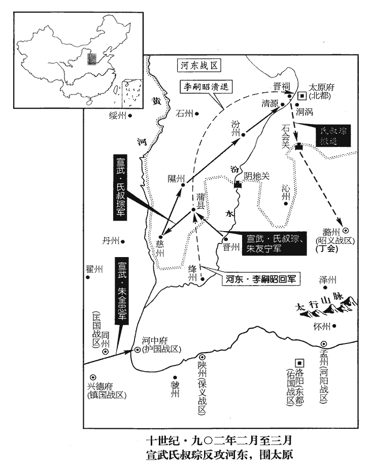
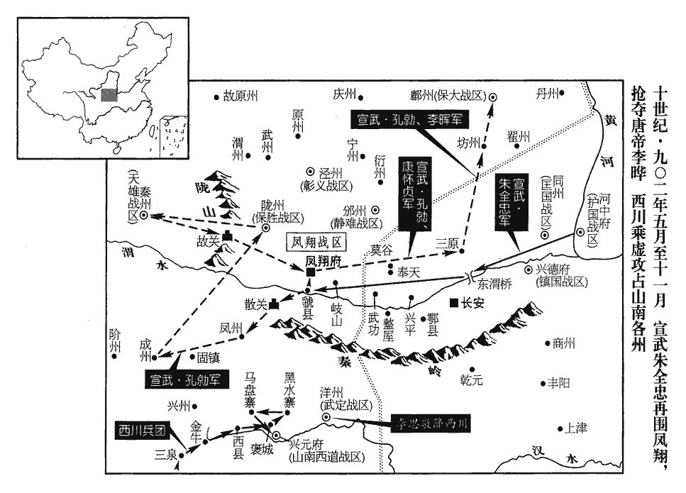
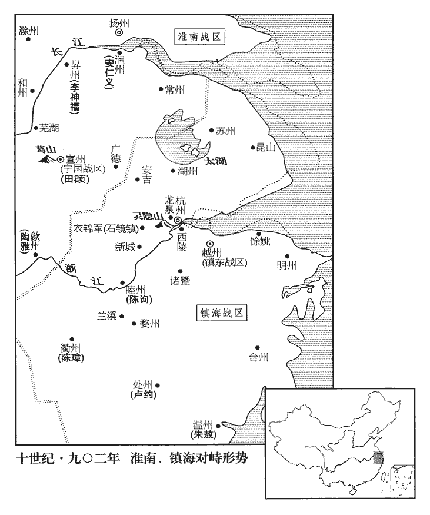
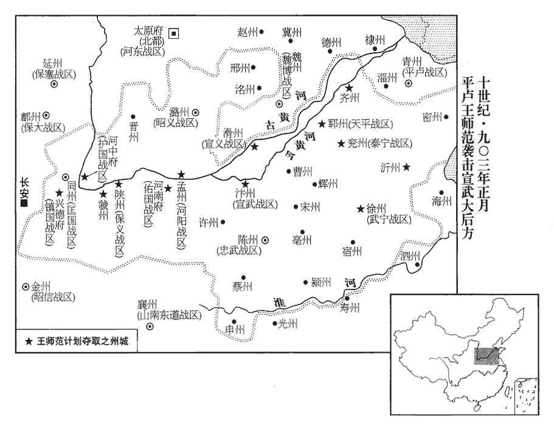

 唐紀七十九起玄黓閹茂（壬戌），盡昭陽大淵獻（癸亥）正月，凡一年有奇。

# 昭宗聖穆景文孝皇帝中之下

## 天復二年（壬戌、九零二）

1春，正月，癸丑‹六›，朱全忠‹朱温·宣武总部汴州›復屯三原‹陕西省三原县东北›，又移軍武功‹陕西省武功县西›。將復逼鳳翔也。宋白曰：三原縣，本漢池陽縣地，苻堅於嶻jié嶭niè北置三原護軍，以其地南有酆原，西有孟侯原，北有白鹿原，是為三原。後魏太平真君七年，罷護軍，置縣。河東‹总部太原府›將李嗣昭、周德威攻慈‹山西省吉县›、隰‹山西省隰县›，以分全忠兵勢。朱全忠兼有河中，慈、隰二州，其巡屬也。

〖译文〗 [1]春季，正月癸丑（初六），朱全忠率领军队再次驻扎三原，不久又移驻武功。河东将领李嗣昭、周德威攻击慈州、隰州，藉以分散朱全忠的兵势。

2丁卯‹二十›，‹李晔（李敏）本年三十六岁›以給事中韋貽範為工部侍郎、同平章事。

〖译文〗 [2]丁卯，（二十日），朝廷任命给事中韦贻范为工部侍郎、同平章事。

3丙子‹二十九›，以給事中嚴龜充岐、汴和協使，賜朱全忠姓李，與李茂貞‹宋文通›為兄弟；全忠不從。

〖译文〗 [3]丙子（二十九日），朝廷以给事中严龟充任岐、汴和协使，赐朱全忠姓李，与李茂贞为兄弟。朱全忠没有听从。

時茂貞不出戰。全忠聞有河東兵，二月，戊寅朔‹一›，還軍河中‹山西省永济市›。考異曰：實錄在正月。按編遺錄：「二月戊寅，上以久駐兵車於三原，乃議東歸蒲阪，遂取高陵、櫟陽、左馮入于蒲津。」梁太祖實錄：「正月，戊申朔，上總御戎馬，發自三原，復至武功縣駐焉；貢章奉辭，迴軍赴蒲阪。」今從唐年補錄、舊紀。

〖译文〗 当时，李茂贞不出城迎战。朱全忠听说河东军队攻打慈州等地，就率军于二月戊寅朔（初一）回河中。

李嗣昭等攻慈、隰，下之，進逼晉‹山西省临汾市›、絳‹山西省新绛县›。己丑‹十二›，全忠遣兄子友寧將兵會晉州刺史氏叔琮擊之。李嗣昭襲取絳州，汴將康懷英復取之。康懷英即康懷貞，後避梁均王友貞名，始改名懷英，斯時未改也；史雜書之。嗣昭等屯蒲縣‹山西省蒲县›；乙未‹十八›，汴軍十萬營于蒲南‹山西省蒲县南›，蒲，漢古縣，唐屬隰州。九域志：在州東南九十五里。按漢蒲反縣，古蒲邑也，屬河東郡。河東郡又有蒲子縣，春秋晉公子所居蒲城也。汴州長垣縣，古名蒲邑，子路所治之地也。古邑之以蒲名者，蓋非一處。宋白曰：後魏孝文帝改蒲子為長壽縣，隋開皇十八年改為隰川。後魏孝武帝於蒲子東南置石城縣，尋廢；後周大象元年，於廢縣置蒲子縣，取古蒲子為名；隋大業二年改為蒲縣，移今理。叔琮夜帥眾斷其歸路帥，讀曰率。斷，音短。而攻其壘，破之，殺獲萬餘人。己亥‹二十二›，全忠自河中赴之，乙巳‹二十八›，至晉州。

〖译文〗 李嗣昭等攻克慈州、隰州，向晋州、绛州进逼。己丑（十二日），朱全忠派遣他哥哥的儿子朱友宁率领军队，会同晋州刺史氏叔琮攻击河东军队。李嗣昭偷袭并攻取绛州，汴军将领康怀英又收复绛州。李嗣昭等驻扎蒲县。乙未（十八日），汴州军队十万在蒲南扎营，氏叔琮乘夜率众截断李嗣昭等的归路，并进攻他们的营垒，将河东军队打得大败，杀获一万余人。己亥（二十二日），朱全忠自河中前往，乙巳（二十八日）到达晋州。

4盜發簡陵‹陕西省富平县西北›。簡陵，懿宗‹李漼›陵。

〖译文〗 [4]盗贼掘开唐懿宗的简陵。

5西川‹总部成都府›兵至利州‹四川省广元市›，昭武‹总部设利州›節度使李繼忠棄鎮奔鳳翔；王建‹西川总部成都府›以劍州‹四川省剑阁县›刺史王宗偉為利州制置使。光啟二年，升興、鳳二州為感義軍節度使；時僖宗在山南，欲以捍東兵也。文德元年，感義軍增領利州。至乾寧四年，更感義軍曰昭武軍，徙鎮利州。李茂貞既兼山南，欲以鎮兵捍王建而終不能捍也。建自此遂有利州。

〖译文〗 [5]西川军队到达利州，昭武节度使李继忠放弃镇所逃奔凤翔。西川节度使王建以剑州刺史王宗伟担任利州制置使。

6三月，庚戌‹四›，上與李茂貞及宰相、學士、中尉、樞密宴，酒酣，茂貞及韓全誨亡去。上問韋貽範：「朕何以巡幸至此？」對曰：「臣在外不知。」固問，不對。上曰：「卿何得於朕前妄語云不知？」又曰：「卿既以非道取宰相，當於公事如法；謂處事當皆如國法。若有不可，必準故事。」謂貶竄之也。怒目視之，怒，奴古翻。微言曰：「此賊兼須杖之二十。」顧謂韓偓曰：「此輩亦稱宰相！」貽範屢以大盃獻上，上不即持，貽範舉盃直及上頤。史言昭宗以酣酗納侮。

〖译文〗 [6]三月庚戌（初四），昭宗与李茂贞及宰相、学士、中尉、枢密宴饮，酒喝得正畅快，李茂贞及韩全诲离走。昭宗问韦贻范：“朕为什么巡幸这到里？”韦贻范回答说：“我在外地，不知道。”昭宗坚持追问，韦贻范不回答。昭宗说：“你怎么能够在朕前胡说不知道？”又说：“你既已用不正当的手段取得宰相职位，凡公事都要按照国法办理；如果有办理不合宜的，一定准照旧例贬黜。”昭宗怒目瞪着韦贻范，小声说：“这贼子同时要杖责二十。”回头对韩说：“这种人也称得上宰相！”韦贻范屡次用大杯呈献昭宗，昭宗不立刻拿着，韦贻范举杯直到昭宗的下巴。

 

7戊午‹十二›，氏叔琮、朱友寧進攻李嗣昭、周德威營。時汴軍橫陳十里，陳，讀曰陣。而河東軍不過數萬，深入敵境，眾心忷懼。忷，許拱翻。德威出戰而敗，密令嗣昭以後軍前去，德威尋引騎兵亦退。叔琮、友寧長驅乘之，河東軍驚潰，禽克用子廷鸞，兵仗輜重委棄略盡。重，直用翻。朱全忠令叔琮、友寧乘勝遂攻河東。

〖译文〗 [7]戊午（十二日），氏叔琮、朱友宁进攻李嗣昭、周德威的营寨。当时，汴州军队横阵十里，而河东军队不过数万人，深入敌人境内，众人心中恐惧。周德威出战失败，密令嗣昭率领后军在前面离去，周德威随即率领骑兵也撤退。氏叔琮、朱友宁率兵长驱追逐，生擒李克用的儿子李廷鸾，河东军队惊慌溃逃，兵器粮草等物几乎全部抛弃。朱全忠命令氏叔琮、朱友宁乘胜进攻河东。

李克用‹河东总部太原府›聞嗣昭等敗，遣李存信‹张污落›以親兵逆之，李克用親兵皆代北雜虜，最為驍勁。至清源‹山西省清徐县›，清源縣在晉陽南五十里。遇汴軍，存信走還晉陽‹太原府所在县·山西省太原市›；眾寡不敵，故走。汴軍取慈、隰、汾‹山西省汾阳县›三州。辛酉‹十五›，汴軍圍晉陽，營於晉祠‹太原市西南›，晉陽有晉王祠。攻其西門。周德威、李嗣昭收餘眾依西山得還。汾水過晉陽東；晉陽西南接界休縣之介山、綿山。城中兵未集，叔琮攻城甚急，每行圍，行，下孟翻。褒衣博帶，以示閒暇。

〖译文〗 李克用听说李嗣昭等失败，派遣李存信率领亲兵前去迎敌。李存信到达清源县，遇见汴州军队，又逃回晋阳，汴州军队夺取取慈、隰、汾三州。辛酉（十五日），汴州军队包置晋阳，在晋祠扎营，攻击晋阳城的西门。周德威、李嗣昭收集余众，沿着西山得以返回晋阳。晋阳城中的军队没有集结，氏叔琮攻城非常紧急，每次巡视围城的军队，总是宽袍大带，借以表示优闲。

克用晝夜乘城，不得寢食。召諸將議保雲州‹山西省大同市›，李嗣昭、李嗣源‹邈佶烈›、周德威曰：「兒輩在此，必能固守。考異曰：唐太祖紀年錄：「嗣昭與今上日夜入賊營，斬將搴qiān旗，賊多驚擾。」梁太祖實錄：「三月，癸丑，虜眾悉出，友寧以飛騎犯其左右翼，虜大敗北，掩殺不知其數，擒克用男廷鸞及將校健卒數千人。」實錄：「朱友寧圍太原營西北隅，攻其西門，城內大恐。克用欲奔雲中，弟克寧止之。又遣李嗣昭與克用子存勗日夜擾賊營，友寧乃燒營而遁。」按紀年錄所謂今上者，乃明宗，非莊宗也。實錄誤。王勿為此謀，動搖人心！」李存信曰：「關東‹潼关以东›、河北‹河北平原›皆受制於朱溫，我兵寡地蹙，守此孤城，彼築壘穿塹環之，環，音宦。以積久制我，我飛走無路，坐待困斃耳。今事勢已急，不若且入北虜，徐圖進取。」嗣昭力爭之，克用不能決。劉夫人‹李克用正妻›言於克用曰：「存信，北川‹山西省陉岭以北›牧羊兒耳，代北之地謂之北川，以陘嶺之北皆平川也。安知遠慮！王常笑王行瑜輕去其城，死於人手，王行瑜死見二百六十卷乾寧二年。今日反效之邪！且王昔居達靼，幾不自免，賴朝廷多事，乃得復歸。事見二百五十三卷僖宗廣明元年。幾，居依翻。今一足出城，則禍變不測，塞外可得至邪！」克用乃止。居數日，潰兵復集，軍府浸安。克用弟克寧為忻州‹山西省忻州市›刺史，聞汴寇至，中塗復還晉陽，晉陽北至忻州一百七十餘里。復，扶又翻。曰：「此城吾死所也，去將何之！」眾心乃定。

〖译文〗 李克用日夜登城，不能睡觉吃饭。他召集各位将领商议退守云州，李嗣昭、李嗣源、周德威说：“儿子在这里，一定能固守。您不要做退守云州的打算，动摇人心！”李存信说：“关东、河北都受朱温授制，我们兵力缺少，地方狭小，据守这个孤城，他们环城垒砌墙垣，挖掘壕沟，用长期围固制服我们，我们上天无路，坐等困死罢了。现在情势已急，不如暂时进入北方鞑靼，慢慢再设法进取。”李嗣昭极力争辩，李克用不能决断。刘夫人对李克用说：“李存信不过是北川的放羊娃罢了，哪里知道长远打算！您常笑王行瑜轻率地弃城逃走，死于敌人之手，今天反要效法他吗！况县您从前在鞑靼居住，几乎不能自免，幸亏朝廷多事，这才能够再回来。现在一只脚出城，就会立即发生意外祸乱，塞外哪能到达呢！”李克用这才打消离城出走的念头。过了数日，逃散的兵卒又集结起来，节度使军府逐渐安定。李克用的弟弟李克宁任忻州刺史，听说汴州军队到了，途中又返回晋阳，说：“此城是我战死的地方，离开此城，将往哪里去！”众心这才安定下来。

壬戌‹十六›，朱全忠還河中，遣朱友寧將兵西擊李茂貞，軍于興平‹陕西省兴平市›、武功之間。興平縣在長安西，武功縣在長安西北。李嗣昭、李嗣源數將敢死士夜入氏叔琮營，數，所角翻。將，即亮翻；下同。斬首捕虜，汴軍驚擾，備禦不暇。會大疫，丁卯‹二十一›，叔琮引兵還。嗣昭與周德威將兵追之，及石會關‹山西省榆社县西›，叔琮留數馬及旌旗於高岡之巔。嗣昭等以為有伏兵，乃引去，復取慈、隰、汾三州。自是克用不敢與全忠爭者累年。兵少力疲，故閉境養晦以俟時。

〖译文〗 壬戌（十六日），朱全忠回河中，派遣朱友宁率兵向西攻击李茂贞，驻扎在兴平、武功之间。李嗣昭、李嗣源屡次率领敢死队进入氏叔琮军营之中，斩杀捕虏，汴州军队惊慌纷扰，防备守御没有空闲。恰好当地发生严重瘟疫，丁卯（二十一日），氏叔琮带领军队撤走。李嗣昭与周德威率兵追赶，追到石会关，氏叔琮在高坡顶上留下几匹马及旌旗。李嗣昭等以为有埋伏的军队，于是领兵退走，又攻取慈、隰、汾三州。自这以后，李克用有数年不敢与朱全忠相争。

克用以使引咨幕府使引，節度府所行文引。謀事曰咨。今北人以文書達於上曰咨。使，疏吏翻。曰：「不貯軍食，何以聚眾？不置兵甲，何以克敵？不脩城池，何以扞禦？利害之間，請垂議度！」貯，丁呂翻。度，徒洛翻。掌書記李襲吉獻議，略曰：「國富不在倉儲，兵強不由眾寡，人歸有德，神固害盈。書咸有一德曰：非商求于下民，惟民歸于一德。易謙卦彖tuàn辭曰：鬼神害盈而福謙。聚斂寧有盜臣，大學載孟獻子之言曰：「與其有聚斂之臣，寧有盜臣。」斂，尹贍翻。苛政有如猛虎，記檀弓載孔子之言曰：「苛政猛於虎也。」所以鹿臺將散，周武以興；武王伐紂，散鹿臺之財，一戎衣而天下大定。齊庫既焚，晏嬰入賀。」韓詩外傳曰：晉平公之藏臺火，救火，三日三夜，乃勝之。公子晏束帛而賀曰：「臣聞王者藏於天下，諸侯藏於百姓，農夫藏於囷qūn庾yǔ。今百姓乏於外，而賦斂無已。昔桀、紂殘賊，為天下戮。今皇天降災於藏臺，是君之福也。」李襲吉以為齊庫焚而晏嬰入賀，蓋別有所據。又曰：「伏以變法不若養人，溫公讀此語，感熙、豐之政，蓋深有味乎其言也。改作何如舊貫！論語：魯人為長府，閔子騫曰：「仍舊貫，如之何，何必改作！」韓建‹镇国总部兴德府›蓄財無數，首事朱溫；事見上卷上年十一月。王珂‹护国总部河中府›變法如麻，一朝降賊；事見上卷上年正月。珂，丘何翻。降，戶江翻。中山‹定州河北省定州市›城非不峻，謂王郜不能守定州城。蔡上‹河南省汝南县›兵非不多；謂秦宗權恃眾，卒為朱溫禽。自韓建以下，又以克用耳目之所睹記者動悟之。前事甚明，可以為戒。且霸國無貧主，強將無弱兵。伏願大王崇德愛人，去奢省役，去，羌呂翻。設險固境，訓兵務農。定亂者選武臣，制理者選文吏，制理，猶言制治也，避唐廟諱。錢穀有句，出納之籍明，則姦弊自無所容。句，讀曰鉤。刑法有律。依律定刑，則吏手不得而輕重。誅賞由我，則下無威福之弊；近密多正，則人無譖謗之憂。順天時而絕欺誣，敬鬼神而禁淫祀，則不求富而國富，不求安而自安。外破元凶，元凶，指朱溫。內康疲俗，名高五霸，杜預曰：五霸：夏昆吾、商大彭、豕韋，周齊桓、晉文。又曰：齊桓‹姜小白›、晉文‹姬重耳›、宋襄‹子兹甫›、秦穆‹嬴任好›、楚莊‹芈侣›為五霸。道冠八元。冠，古玩翻。高辛氏有才子八人，伯奮、叔堪、叔獻、季仲、伯虎、仲熊、叔豹、季貍，忠肅恭懿，宣慈惠和，天下之民謂之八元。至於率閭閻，定間架，增麴糵niè，糵，魚列翻。檢田疇，開國建邦，恐未為切。」

〖译文〗 李克用以节度使文书咨询幕府，说：“不贮备军粮，用什么聚集兵众？不添置兵器，用什么战胜敌人？不修筑城池，用什么防卫抵御？利益与危害之间，请商议权衡！”掌书记李袭吉进献意见，大意是说：“国家富裕不在仓库储备，兵力强大不在人数多少，百姓归依有德行之君，鬼神原本降灾骄盈之人。与其有聚财搜刮之吏，不如有偷盗之臣，残酷的政治如同吃人的猛虎，所以散发鹿台的钱财，周武王由此兴盛；齐国的仓库被火烧毁，晏婴入朝庆贺。”又说：“我以为变更法制不如教养百姓，改行新制怎么比得上老法！韩建在华州积蓄钱财难以计数，首先侍奉朱全忠；王珂变更法制像乱麻一样多，一个早晨投降了敌人；王郜不能守卫定州不是因为中山城不高峻，秦宗权终于被朱全忠擒住不是因为蔡上的军队不多。前面这些事情非常明显，可以引为鉴戒。况且称霸诸侯的国家没有贫穷的君主，强将的手下没有儒弱的兵士。希望大王您崇尚德政，爱护百姓；去掉奢侈，简省徭役；设置险要，巩固边境；训练军队，致力农业。平定动乱可选任武官，治理政事可选任文吏，钱谷出纳有簿册登记，判刑执法有律令依据。生杀赏罚大权由自己掌握，那么下边就没有作威作福的弊端；身边亲近的人多是正人君子，那么人们就没有被诬陷诽谤的忧虑。顺应天时而杜绝欺骗诬陷，敬奉鬼神而禁绝淫滥祭祀，那么不求富裕而国家富裕，不求安定而自己安定。外可打败元凶祸首，内可振兴颓废习俗，名声高过春秋五霸，道义冠于上古八元。至于计算里巷户数，规定房产税，增加酒税，检查田地，这些对于建立邦国，恐怕不是迫切的事情。”

克用親軍皆沙陀雜虜，喜侵暴良民，喜，許記翻。河東甚苦之。其子存勗‹本年十八岁›以為言，克用曰：「此輩從吾攻戰數十年，比者帑藏空虛，比，毗至翻。帑，他朗翻。藏，才浪翻。諸軍賣馬以自給；今四方諸侯皆重賞以募士，我若急之，則彼皆散去矣，吾安與同保此乎！此高歡告杜弼之說也。異時莊宗既得天下，兒郎寒冷，遮馬邀求，以養成驕軍之禍，得非此語誤之邪！俟天下稍平，當更清治之耳。」如此語，則克用之意蓋有待也。莊宗得天下之後，豈不復記憶此語邪！治，直之翻。存勗幼警敏，有勇略，克用為朱全忠所困，封疆日蹙，憂形於色。存勗進言曰：「物不極則不返，惡不極則不亡。朱氏恃其詐力，窮凶極暴，吞滅四鄰，人怨神怒。今又攻逼乘輿，窺覦神器，乘，繩證翻。覦，音俞。此其極也，殆將斃矣！吾家世襲忠貞，謂自朱邪執宜以來，皆輸力於唐室。勢窮力屈，無所愧心。大人當遵養時晦詩酌之篇曰：於鑠王師，遵養時晦。毛傳曰：遵，率；養，取；晦，昧也。鄭箋曰：文王之用師，率殷之叛國以事紂，養是暗昧之君以老其惡。以待其衰，柰何輕為沮喪，喪，息浪翻。使群下失望乎！」克用悅，即命酒奏樂而罷。

〖译文〗 李克用的亲军都是沙陀胡人，喜好侵犯良民百姓，河东的人民非常痛苦。他的儿子李存勖把这些情况陈告，李克用说：“这些人跟随我征战数十年，过去库藏空虚，各军都靠卖马来维持供给；现在四方藩镇都用重赏来招募兵士，我如果逼急他们，那么他们都要散去了，我怎么与他们同保这个基业呢！等到天下稍为安定，当再肃清治理罢了。”李存勖小时候机警敏捷，有勇有谋，李克用被朱全忠围困，疆界一天天缩小，忧虑挂在脸上。李存勖进言说：“事物不到极点就不会走向反面，坏人不到极点就不会灭亡。朱全忠仗恃他的奸诈和力量，穷凶极恶，并吞消灭四邻，百姓怨恨，天神愤怒。今又攻击逼迫皇上，窥伺帝位，这是他走到极点了，将要灭亡了！我家世代忠贞不渝，今势穷力亏，处境困难，无可羞愧的。父亲应当忍耐静观，以待朱全忠衰弱，怎么轻易就灰心丧气，使属下朱望呢！”李克用很高兴，立即吩咐摆酒宴奏乐而散。

劉夫人無子；克用寵姬曹氏生存勗，劉夫人待曹氏加厚。克用以是益賢之，諸姬有子，輒命夫人母之；夫人教養，悉如所生。

〖译文〗 刘夫人没有儿子；李克用的宠妾曹氏生李存勖，刘夫人待曹氏更加优厚。李克用因此更加敬重刘夫人，诸妾生了儿子，就吩咐刘夫人做母亲；刘夫人教养他们，都像亲生的一样。

8上以【章：乙十一行本「以」下有「左」字；張校同。】金吾將軍李儼為江、淮宣諭使，書御札賜楊行密‹杨行愍·淮南总部扬州›，拜行密東面行營都統、中書令、吳王，以討朱全忠。以朱瑾為平盧‹总部设青州山东省青州市›節度使，馮弘鐸為武寧‹总部设徐州江苏省徐州市›節度使，朱延壽為奉國‹总部设蔡州河南省汝南县›節度使。平盧軍，青州；武寧軍，徐州；奉國軍，蔡州：朱瑾等皆遙領耳。加武安‹总部设潭州湖南省长沙市›節度使馬殷同平章事。淮南‹总部扬州›、宣歙‹总部宣州›、湖南‹总部潭州›等道立功將士，聴用都統牒承制遷補，然後表聞。儼，張濬之子也，賜姓李。考異曰：唐補紀：「二年，昭宗自鳳翔遣金吾將軍李儼齎御札自巫峽間道潛行，宣告吳王楊行密為討伐逆賊朱全忠事。李儼者，宰臣張濬男。其張濬先為都統討太原，退軍，朝貶，韓建力救，不赴貶所，只在三峰，其男留行在，乃授金吾將軍。昭宗差來，宣告於吳王行密。朱全忠探知，張濬一門盡遭殺戮。」按此年濬未死，儼賜姓李，見此年十月註。

〖译文〗 [8]昭宗任命左金吾将军李俨为江淮宣谕使，写御札赐给杨行密，授予杨行密东面行营都统、中书令、吴王，以讨朱全忠。任命朱瑾为平卢节度使，冯弘铎为武宁节度使，朱延寿为奉国节度使。武安节度使马殷加官为同平章事。淮南、宣歙、湖南等道立功将士，听任杨行密用都统牒文承用皇帝制书迁升补官，然后上表奏闻。李俨是张浚的儿子，赐姓李。

9夏，四月，丁酉‹二十一›，崔胤自華州‹兴德府·陕西省华县›詣河中，泣訴於朱全忠，恐李茂貞劫天子幸蜀，宜以時迎奉，勢不可緩。全忠與之宴，胤親執板，為全忠歌以侑酒。板，拍板也。古樂無之。玄宗時，教坊散樂用橫笛一，拍板一，腰鼓三，後人因之，歌舞率以板為節，以木若象凡八片，以韋貫之，兩手各執其外一片而拍之。為，于偽翻。

〖译文〗 [9]夏季，四月丁酉（二十一日），崔胤从华州往河中，流着眼汪向朱全忠诉说，恐怕李茂贞劫持天子驾临蜀中，应该及时迎驾东来，形势不许再有延缓。朱全忠与崔胤饮宴，崔胤亲自执板击节，为朱全忠唱歌劝酒。

10辛丑‹二十五›，回鶻遣使入貢，請發兵赴難；難，乃旦翻。上命翰林學士承旨韓偓答書許之。乙巳‹二十九›，偓上言：「戎狄獸心，不可倚信。彼見國家人物華靡，而城邑荒殘，甲兵彫弊，必有輕中國之心，啟其貪婪。婪，盧含翻。且自會昌以來，回鶻為中國所破，事見二百四十七卷武宗會昌三年。恐其乘危復怨。所賜可汗書，宜諭以小小寇竊，不須赴難，虛愧其意，實沮其謀。」從之。

〖译文〗 [10]辛丑（二十五日），回鹘派遣使臣前来进贡，请求发兵前来救难；昭宗命令翰林学士承旨韩复信允许。乙巳（二十九日），韩进言：“戎狄野兽心肠，不可以倚靠信任。他们看见国家人物豪华奢侈，但城邑荒芜残破，装备破旧兵士疲备，必定有轻视中国之心，从而引起他们贪得无厌的念头。况且自会昌年间以来，回鹘被中国打败，恐怕他们乘着危难报复仇怨。赐给回鹘可汗的书信，应当告诉他：小小盗贼，不需前来救难。表面上是要使他们的内心惭愧不安，实际上是要阻止他们的侵犯阴谋。”昭宗听从了韩的意见。

兵部侍郎參知機務盧光啟罷為太子太保。

〖译文〗 兵部侍郎参知机务卢光启被罢免为太子太保。

11楊行密遣顧全武歸杭州以易秦裴；顧全武為淮南兵所禽見上卷上年。秦裴降錢鏐見二百六十一卷光化元年。錢鏐‹镇海总部杭州›大喜，遣裴還。

〖译文〗 [11]杨行密遣送顾全武回杭州，以便换回秦裴；钱大喜，遣送秦裴返回广陵。

12汴將康懷貞擊鳳翔將李繼昭於莫谷‹陕西省乾县北›，莫谷，即漠谷，在奉天城北。大破之。繼昭，蔡州人也，本姓符，名道昭。為繼昭降汴復舊姓名張本。

〖译文〗 [12]汴州将领康怀贞在莫谷袭击凤翔将领李继昭，把他打得大败。李继昭是蔡州人，本姓符，名道昭。

13五月，庚戌‹五›，溫州‹浙江省温州市›刺史朱褒卒，兄敖自稱刺史。薛史：朱褒，溫州人，兄弟皆為本州牙校。刺史胡璠卒，朱誕據郡，褒逼誕而代之。與通鑑稱異。

〖译文〗 [13]五月庚戌（初五），温州刺史朱褒去世，他的哥哥朱敖自称刺史。

14鳳翔人聞朱全忠且來，皆懼；癸丑‹八›，城外居民皆遷入城。己未‹十四›，全忠將精兵五萬發河中，考異曰：金鑾記：「五月三日，岐馬步軍敗，迴戈傷中不少。八日，聞四面百姓盡般移入城內。二十一日，聞汴帥於郿縣築城及寶雞下寨。二十三日，聞汴帥至石鼻，又至橫渠。二十四日，聞汴帥至城南十里。」按編遺錄：「六月，全忠始離渭橋。」此蓋全忠下遊兵耳。實錄據金鑾記云，「癸亥，朱全忠引軍在石鼻，乙丑，至橫渠，己巳，駐師城南」，誤也。至東渭横橋‹陕西省高陵县南›，遇霖雨，留旬日。

〖译文〗 [14]凤翔人听说朱全忠将来，都害怕；癸丑（初八），城外居民都迁入城中。己未（十四日），朱全忠率领五万精锐军队从河中出发，到东渭横桥，遇到连日阴雨，留住十天。

15庚午‹二十五›，工部侍郎、平章事韋貽範遭母喪，「平章事」之上，當有「同」字。宦官薦翰林學士姚洎為相。洎，渠至翻。洎謀於韓偓，偓曰：「若圖永久之利，則莫若未就為善；儻出上意，固無不可。且汴軍旦夕合圍，孤城難保，家族在東，可不慮乎！」洎乃移疾，移文稱有疾。上亦自不許。

〖译文〗 [15]庚午（二十五日），工部侍郎、平章事韦贻范的母亲死了，宦官荐翰林学士翰洎为宰相。姚洎与韩商量，韩说：“如果考虑永久的利益，那么不如推辞不去就职为好；倘若是出于皇上的意思，本来没有不可以的。况且汴州军队早晚就要合围，孤城难于保卫，家族在东面，可以不考虑吗！”姚洎于是移交称病，昭宗还是不允。

16鎮海、鎮東‹总部越州›節度使彭城王錢鏐進爵越王。自郡王進爵國王。

〖译文〗 [16]镇海、镇东节度使彭城王钱进爵越王。

17六月，丙子‹二›，以中書舍人蘇檢為工部侍郎、同平章事。時韋貽範在草土，居喪者寢苫枕塊，故曰草土。薦檢及姚洎於李茂貞。上既不用洎，茂貞及宦官恐上自用人，協力薦檢，遂用之。

〖译文〗 [17]六月丙子（初二），朝廷任命中书舍人苏检为工部侍郎、同平章事。当时韦贻范居家守丧，向李茂贞推荐苏检和姚洎。昭宗既然不能用姚洎，李茂贞及宦官担心昭宗自己用人，协力荐举苏检，于是用了他。

18丁丑‹三›，朱全忠軍于虢縣‹陕西省宝鸡县›。九域志：虢縣，在鳳翔府南三十五里。宋白曰：虢縣，禮記註謂「虢」為「郭」，在武都南一百里有虢叔城是也。又案地理志云：虢，漢併於雍。今虢縣，後魏立為武都郡，西魏大統十三年，遷同州洛邑縣城於武都城西，置洛邑縣；隋大業三年，改洛邑為虢縣。

〖译文〗 [18]丁丑（初三），朱全忠驻军虢县。

 

19武寧‹流亡总部设昇州江苏省南京市›節度使馮弘鐸介居宣、揚之間，宣，田頵；揚，楊行密。馮弘鐸以昇州居二鎮之間。常不自安；然自恃樓船之強，不事兩道。寧國‹总部设宣州安徽省宣州市›節度使田頵欲圖之，頵，居筠翻。募弘鐸工人造戰艦，艦，戶黯翻。工人曰：「馮公遠求堅木，故其船堪久用，今此無之。」頵曰：「第為之，第，但也。吾止須一用耳。」弘鐸將馮暉、顏建說弘鐸先擊頵，弘鐸從之，帥眾南上，說，式芮翻。上，時長翻。聲言攻洪州‹镇南战区总部所在·江西省南昌市›，鍾傳據洪州。實襲宣州‹安徽省宣州市›也。楊行密使人止之；不從。楊行密時為南面諸道都統，故欲制其行師進止。辛巳‹七›，頵帥舟師逆擊于葛山‹安徽省宣州市西南›，大破之。新書作「曷山」，當從之。張舜民郴行錄曰：褐山磯在大信口稍西，南去蕪湖縣四十餘里。帥，讀曰率。

〖译文〗 [19]武宁节度使冯弘铎在升州，居于宣州田、扬州杨行密之间，经常自己觉得不安定；但是自恃楼船强大，不侍奉宣州田、扬州杨行密。宁国节度使田想要谋取冯弘铎，召募冯弘铎的工人制造战舰，工人说：“冯公在远处寻来坚实的木料，所以他的战船能够长久耐用，现在这里没有这些木料。”田说：“只管制造好了，我只需用一次罢了。”冯弘铎的将领冯晖、颜建劝说冯弘铎先攻击田，冯弘铎听从了他们的意见，率众南下，声言进攻洪州，实际上是袭击宣州。杨行密派人制止，冯弘铎没有听从。辛巳（初七），田率领水军在葛山迎击，把冯弘的军队打得大败。

20甲申‹十›，李茂貞大出兵，自將之，與朱全忠戰于虢縣之北，大敗而還，將，即亮翻；下同。還，音旋，又如字。死者萬餘人。丙戌‹十二›，全忠遣其將孔勍出散關‹陕西省宝鸡市西南›勍，渠京翻。散關，在鳳翔府寶雞縣西南。自諸葛亮以來，多以自蜀出師為出散關，今朱全忠自虢縣遣孔勍進攻鳳州為出散關，彼我之說也。攻鳳州‹陕西省凤县›，拔之。丁亥‹十三›，全忠進軍鳳翔城下。全忠朝服嚮城而泣，曰：「臣但欲迎車駕還宮耳，朱全忠借正說以行其譎。朝，直遙翻。不與岐王角勝也。」遂為五寨環之。環，音宦。考異曰：梁太祖實錄：「六月，丁丑，暨虢縣。辛未，文通涸兵驟出，布陳俟敵。我之將卒躍進決鬬，始辰暨午，寇大敗，屍仆萬餘人。命諸軍徙寨，逼其壘。自是岐人繼出師，靡不喪衄。六月，乙亥，上以盩厔有博野軍與岐人往來以窺我，命李暉討平。丙戌，復遣孔勍領兵由大散關取鳳州。按六月乙亥朔，無辛未。前云丁丑，後云辛未，又再云六月，皆誤。從唐實錄。

〖译文〗 [20]甲申（初十），李茂贞亲自统率大军从凤翔出发，在虢县以北与朱全忠的军队激战，被打得大败而回，一万余人死去。丙戌（十二日），朱全忠派遣他的部将孔出散关，攻打凤州，夺取了州城。丁亥（十三日），朱全忠进军凤翔城下。朱全忠穿着朝服向城哭泣，说：“我只想迎车驾回宫，不想与岐王较量胜负哪！”于是，环城设置五座营寨。

21馮弘鐸收餘眾沿江將入海，僖宗光啟元年，張雄據上元；雄死，弘鐸繼之，至是而亡；楊行密遂有昇州。楊行密恐其為後患，遣使犒軍，且說之曰：說，式芮翻。「公徒眾猶盛，胡為自棄滄海之外！吾府雖小，足以容公之眾，使將吏各得其所，如何？」弘鐸左右皆慟哭聽命。眾心既攜，馮弘鐸欲不歸楊行密，其可得乎！弘鐸至東塘‹江苏省扬州市东›，行密自乘輕舟迎之，從者十餘人，從，才用翻。常服，不持兵，升弘鐸舟，慰諭之，舉軍感悅。署弘鐸淮南‹总部设扬州江苏省扬州市›節度副使，館給甚厚。館，古玩翻。

〖译文〗 [21]冯弘铎收集余众，沿着长江东下将要入海，杨行密恐怕他成为后患，派遣使者前去犒劳军队，并且劝他说：“您的徒众尚且强盛，为什么自己弃置于沧海之外！我的府舍虽小，足以容纳您的徒众，使将吏各得其所，怎么样。”冯弘铎左右的将吏全都恸哭，听从命令。冯弘铎到达东塘，杨行密亲自乘轻便小船迎接他，跟随的十几个人，穿着常服，不带兵器，登上冯弘铎的船，慰问晓谕，全军感动欢悦。以冯弘铎署理淮南节度副使，食宿供给非常优厚。

初，弘鐸遣牙將丹徒‹润州州政府所在县·江苏省镇江市›尚公迺nǎi詣行密求潤州‹江苏省镇江市›，行密不許。公迺大言曰：「公不見聽，但恐不敵樓船耳。」至是，行密謂公迺曰：「頗記求潤州時否？」公迺謝曰：「將吏各為其主，為，于偽翻。但恨無成耳。」行密笑曰：「爾事楊叟如事馮公，無憂矣！」為田頵、朱延壽之亂，尚公迺盡忠力於楊行密張本。

〖译文〗 当初，冯弘铎派遣牙将丹徒人尚公前往广陵谒见杨行密，要求把润州归属自己统辖。杨行密没有允淮。尚公大声说：“您不听从，只怕敌不过楼船罢了。”到这时候，杨行密对尚公说：“还记得索求润州时说的话吗？”尚公道歉说：“将吏各为其主，只恨没有成功罢了。”杨行密大笑说：“你侍奉我能如同侍奉冯公一样，就没有忧虑了！”

行密以李神福為昇州‹江苏省南京市›刺史。楊行密用李神福刺昇州，以橫制宣、潤。

〖译文〗 杨行密任命李神福为升州刺史。

22楊行密發兵討朱全忠，以副使李承嗣權知淮南軍府事。軍吏欲以巨艦運糧，都知兵馬使徐溫曰：「運路久不行，葭葦堙yīn塞，黃巢作亂，高駢不臣，江、淮之運不復至京師，故其路久不行。塞，悉則翻。請用小艇，庶幾易通。」軍至宿州‹安徽省宿州市。经汴河而至›，會久雨，重載不能進，士有飢色，而小艇先至，艇，徒鼎翻。載，昨代翻。行密由是奇溫，始與議軍事。為徐溫竊楊氏三世國命以成養子張本。行密攻宿州，不克，竟以糧運不繼引還。

〖译文〗 [22]杨行密发兵讨伐朱全忠，以副使李承嗣暂时主持淮南节度使府中事务。军吏想要用大船运送军粮，都知兵马使徐温说：“运路很久没有通行，芦苇堵塞，请用小艇，也许容易通行。”军队到达宿州，适逢久雨不停，载重的大船不能前进，兵士面有菜色，然而小艇先到了。杨行密因此认为徐温才能出众，开始与他商议军事。杨行密攻宿州，没有攻下，终于因为粮运供应不上而退兵回广陵。

23秋，七月，孔勍取成‹甘肃省成县›、隴‹陕西省陇县›二州，士卒無鬬者。至秦州‹甘肃省秦安县西北›，州人城守，乃自故關‹陕西省陇县西固关›歸。九域志：鳳州西至成州二百七十里，北至隴州二百五十里；又自隴州西至秦州亦二百五十里。孔勍自鳳州西取成州，自成州北取隴州，又自隴州西至秦州。三州時皆屬李茂貞。又，秦州清水縣東五十里有大震關，大中六年，隴州防禦使薛逵徙築安戎關於隴山，由是謂大震關為故關。今隴州之西有故關山，又西南則清水縣。大中六年，隴州防禦使薛逵奏：「伏以汧qiān源西境，切在故關，雖有隄防，全無制置。僻在重岡之上，苟務高深，今移要會之中，實堪控扼，伏乞改為安戎關。」

〖译文〗 [23]秋季，七月，孔攻取成、陇二州，兵士没有经过战斗。到秦州，州居据城守御，于是从故关回来。

24韋貽範之為相也，多受人賂，許以官；既而以母喪罷去，日為債家所譟。譟，喧聒也。親吏劉延美，所負尤多，故汲汲於起復，日遣人詣兩中尉、樞密及李茂貞求之。甲戌‹十六›，命韓偓草貽範起復制，偓曰：「吾腕可斷，腕，烏貫翻。斷，音短。此制不可草！」即上疏論貽範遭憂未數月，遽令起復，實駭物聽，傷國體。學士院二中使怒曰：「學士勿以死為戲！」時韓全誨等使二中使監學士院，以防上與之密議國事，兼掌傳宣回奏。以偓不肯草制，故怒。偓以疏授之，解衣而寢；二使不得已奏之。上即命罷草，罷草制也。仍賜敕褒賞之。八月，乙亥朔‹二›，班定，無白麻可宣；班定，謂百官立班已定也。學士不草制，故無麻可宣。宦官喧言韓侍郎不肯草麻，聞者大駭。茂貞入見上曰：見，賢遍翻。「陛下命相而學士不肯草麻，與反何異！」上曰：「卿輩薦貽範，朕不之違；學士不草麻，朕亦不之違。況彼所陳，事理明白，若之何不從！」茂貞不悅而出，至中書，見蘇檢曰：「姦邪朋黨，宛然如舊。」扼腕者久之。貽範猶經營不已，茂貞語人曰：「我實不知書生禮數，為貽範所誤，語，牛倨翻。李茂貞因此乃知居喪起復之非禮。會當於邠州‹陕西省彬县›安置。」言將出貽範。貽範乃止。【章：十二行本「止」下有「劉延美赴井死」六字；乙十一行本同；孔本同；張校同；退齋校同。】

〖译文〗 [24]韦贻范做宰相的时候，经常接受人家的贿赂，然后许给官职；不久因母死免官居丧，每天被讨债的人吵闹骚扰。亲吏刘延美，负债尤其多，所以对韦贻范的起复再用极为迫切，每天派人晋见两中尉、枢密及李茂贞，向他们求情。甲戌（疑误），命令韩草拟起复韦贻范的制书，韩说：“我的手腕可以折断，这件制书不能草拟！”立即耻疏辩论韦贻范为母守丧没有几个月，急忙让他起复，实在骇人听闻，损害国家的体面。左军中尉韩全诲等派往监视学士院的二个宦官勃然大怒，说：“学士不要将死当作儿戏！”韩把疏交给他们，脱去衣服就睡觉了。二个宦官不得已，把奏疏呈进。唐昭宗立即命令停止草拟制书，并赐敕令褒扬奖赏韩。八月乙亥朔（疑误），百官立班已定，没有制书可以宣布，宦官喧嚷说是韩侍郎不肯草拟制书，听到的人大为惊骇。李茂贞进内见昭宗，说：“陛下任命宰相而学士不肯草拟制书，与谋反有什么不同！”昭宗说：“你们保荐韦贻范，朕没有违背你们；学士不草拟制书，朕也不违背他。况且他陈述的事情，事理明白，岂能不依从！”李茂贞听了不高兴，从宫内出来，到中书省，见苏检说：“奸邪小人的朋党，同过去一样！”扼腕痛惜。韦贻范仍然筹划营谋不停，李茂贞对人说：“我实不知道书生们的礼数，被韦贻范所误，该当在州安置他。”韦贻范这才停止活动。刘延美投井而死。

25保大‹总部设鄜州陕西省富县›節度使李茂勳將兵屯三原‹陕西省三原县东北›，救李茂貞；朱全忠遣其將康懷貞、【章：十二行本「貞」作「英」；乙十一行本同。】孔勍擊之，茂勳遁去。茂勳，茂貞之從弟也。從，才用翻。

〖译文〗 [25]保大节度使李茂勋率兵驻扎三原，救李茂贞；朱全忠派遣他的部将康怀英、孔攻击李茂勋，李茂勋逃走。李茂勋是李茂贞的堂弟。

 

26初，孫儒死，見二百五十九卷景福元年。其士卒多奔浙西，錢鏐愛其驍悍，悍，下罕翻，又侯旰翻。以為中軍，號武勇都。行軍司馬杜稜諫曰：「狼子野心，他日必為深患，請以土人代之。」不從。土人，謂浙西人也。

〖译文〗 [26]当初，孙儒死了，他部下的士卒大多跑到浙西，钱喜爱他们骁勇骠悍，编为中军，号称“武勇都”。行军司马杜棱劝谏说：“狼子野心，将来必定成为大患，请用本地人代替他们。”钱不从。

鏐如衣錦軍，錢鏐，臨安‹浙江省临安市›人，既貴，改所居營曰衣錦營，又升曰衣錦城；每遊衣錦城，宴故老，山林皆覆以錦。命武勇右都指揮使徐綰帥眾治溝洫；治衣錦軍溝洫。帥，讀曰率。治，直之翻。洫xù，泥逼翻。鎮海節度副使成及聞士卒怨言，白鏐請罷役，不從。甲【章：乙十一行本「甲」作「丙」；張校同。】戌‹十三›，鏐臨饗諸將，綰謀殺鏐於座，不果，稱疾先出。鏐怪之，丁亥‹十四›，命綰將所部兵先還杭州。及外城，縱兵焚掠。武勇左都指揮使許再思以迎候兵與之合，迎候兵者，許再思以錢鏐將還，領兵迎候。進逼牙城。鏐子傳瑛瑛，音英。與三城‹杭州内中外三城›都指揮使馬綽等閉門拒之，牙將潘長擊綰，綰退屯龍興寺。鏐還，及龍泉，龍泉即龍井，在杭州城西南風篁嶺上，去城十五里。聞變，疾驅至城北，使成及建鏐旗鼓與綰戰，鏐微服乘小舟，夜抵牙城東北隅，踰城而入。宋自高宗駐蹕杭州，以杭州牙城為宮城。東北隅，則今之和寧門外也。直更卒憑鼓而寐，更，工衡翻。鼓，更鼓也。鏐親斬之，城中始知鏐至。武安都指揮使杜建徽自新城‹浙江省富阳市西南新登镇›入援，九域志：新城縣，在杭州西南一百三十里。徐綰聚木將焚北門，建徽悉焚之。建徽，稜之子也。湖州‹浙江省湖州市›刺史高彥聞難，遣其子渭將兵入援，至靈隱山，九域志：湖州南至杭州一百五十五里。靈隱山，在杭州城西十二里，有靈隱寺。難，乃旦翻。綰伏兵擊殺之。

〖译文〗 钱前往前锦军，命令武勇右都指挥使徐绾率部众治理护城河道，镇海节度副使成及听到士卒的怨言，报告钱，请求停止徭役，钱不从。丙戌（十三日），钱亲自宴请各位将领，徐绾谋划在酒席宴前杀死钱，没有成功，声称有病先退席。钱感到奇怪，丁亥（十四日），命令徐绾率领部下的军队先回杭州。到达杭州外城，徐绾听任兵干焚烧抢掠。武勇左都指挥使许再思率领迎侯钱回杭州的军队，与徐绾会合，向前进逼节度使所居牙城。钱的儿子钱传瑛与三城都指挥使马绰等闭门抵御，牙将潘长攻击徐绾，徐绾撤退驻扎龙兴寺。钱回杭州，到达龙泉，听说变乱，急驰到杭州城北，派成及竖起钱的旗鼓与徐绾作战，钱改换平民服装，乘小舟在夜里到牙城的东北角，越过城墙进入城内，打更的兵卒倚着鼓睡觉，钱亲自杀了他，城中才知道钱到了。武安都指挥使杜建徽从新城前来援救，徐绾聚集大柴将要焚烧北门，杜建徽把木柴全部烧掉。杜建徽是杜棱的儿子。湖州刺史高彦听说钱遇到危难，派遣他的儿子高渭率兵来杭州救援，到灵隐山，徐绾埋伏的军队把他击杀。

初，鏐築杭州羅城，事見二百五十九卷景福二年。謂僚佐曰：「十步一樓，可以為固矣。」掌書記餘姚‹浙江省馀姚市›【章：十二行本「姚」作「杭」；乙十一行本同；孔本同；張校同。】羅隱曰：「樓不若內向。」至是人以隱言為驗。樓，謂城上敵樓也。樓外向，所以禦敵。今徐綰據杭州羅城，而錢鏐自外攻之，故人以羅隱不若內向之言為驗。

〖译文〗 当初，钱修筑杭州护卫内城的罗城，对属官说：“十步一座城楼，可以称得上坚固了。”掌书记余杭人罗隐说：“罗城的城楼不如向内。”到这时人们以为罗隐的话应验了。

27庚戌，李茂貞出兵夜襲奉天‹陕西省乾县›，虜汴將倪章、邵棠以歸。乙未‹二十二›，茂貞大出兵，與朱全忠戰，不勝；暮歸，汴兵追之，幾入西門。幾，居依翻。西門，鳳翔城之西門。

〖译文〗 [27]庚戌（疑误），李茂贞出兵夜袭奉天，俘虏汴州将领倪章、邵棠而回。乙未（二十二日），李茂贞派遣大批军队出城，与朱全忠交战，没有取胜；傍晚回城，汴州军队追击，差点儿攻入凤翔城的西门。

28己亥‹二十六›，再起復前戶部侍郎、同平章事韋貽範，使姚洎草制。貽範不讓，即表謝，明日，視事。

〖译文〗 [28]己亥（二十六日），朝廷再次起用前户部侍郎、同平章事韦贻范，让姚洎草拟制书。韦贻范不推辞，立即上表谢恩，第二天就到职任事。

29西川‹总部成都府›兵請假道於興元，言假道以勤王。山南西道‹总部设兴元府陕西省汉中市›節度使李繼密‹王万弘›遣兵戍三泉‹陕西省宁强县西北阳平关›以拒之；辛丑‹二十八›，西川前鋒將王宗播‹许存›攻之，不克，退保山寨。親吏柳脩業謂宗播曰：「公舉族歸人，不為之死戰，何以自保？」柳脩業，王宗播元從孔目官也。王宗播，許存也；歸王建見二百六十卷乾寧二年。為，于偽翻。宗播令其眾曰：「吾與汝曹決戰，取功名；不爾，死於此！」遂破金牛‹陕西省宁强县北›、黑水‹陕西省城固县西北›、西縣‹陕西省勉县西›、褒城‹陕西省汉中市西北褒河镇›四寨。武德三年，分利州之綿谷置金牛縣，寶曆元年，省入興元府西縣。今三泉縣東六十里有金牛驛。輿地廣記：大劍山有小石門，穿山通道，六丈有餘。昔秦欲伐蜀而不知道，乃作五石牛，以金置尾下，言能糞金，欲以遺蜀。蜀王負力而貪，乃令五丁開道引之。秦因使張儀、司馬錯引兵伐蜀，滅之，謂之石牛道；置牛之地，謂之金牛驛。褒城，漢褒中縣，古褒國也，隋改曰褒城，唐屬興元府。九域志：縣在府西四十五里；又有褒城鎮。軍校秦承厚攻西縣，矢貫左目，達于右目，鏃不出。王建‹西川总部成都府›自舐其創，膿潰鏃出。王建髣髴吳起吮疽、太宗吮血之意。校，戶教翻。舐，直氏翻。創，初良翻。王宗播攻馬盤寨‹勉县东北›，繼密戰敗，奔還漢中‹兴元府所在城·陕西省汉中市›。西川軍乘勝至城下，王宗滌‹华洪›帥眾先登，遂克之，帥，讀曰率。繼密請降，遷于成都‹四川省成都市›；光化二年，李繼密得興元，至是而敗。王建遂并有山南西道。降，戶江翻。得兵三萬，騎五千，宗滌入屯漢中。王建曰：「繼密殘賊三輔，」李繼密從李茂貞，茂貞犯獵畿甸，繼密蓋預有罪，故王建云然。以其降，不忍殺，復其姓名曰王萬弘，不時召見。諸將陵易之，易，以豉翻。萬弘終日縱酒，俳優輩亦加戲誚；萬弘不勝憂憤，醉投池水而卒。誚，才笑翻。勝，音升。

〖译文〗 [29]西川军队请求借路过兴元，山南西道节度使李继密派兵驻守三泉进行抗拒。辛丑（二十八日），西川前锋将领王宗播攻打三泉，没有攻下，退兵保守山上的营寨。亲吏柳修业对王宗播说：“您全族归顺了人家，不为人家拼死战斗，用什么保全自己？”王宗播命令他的部众说：“我与你们进行决战，取得功名；不然，死在这里！”于是，攻克金牛、黑水、西县、褒城西寨。军校秦承厚攻打西县，箭穿过左眼，达于右眼，箭头没有出来。王建亲自用舌头舔他的伤口，脓血溃派，箭头随出。王宗播攻打马盘寨，李继密战败，逃回汉中。西川军队乘胜追到汉中城下，王宗涤率众先登上城墙，于是攻克了汉中，李继密请求投降，迁往成都；王宗涤得到步兵三万，骑兵五千，进入汉中城内驻扎。王建说：“李继密残害京畿三辅地区，因为他投降，不忍心杀他。”于是恢复李继密原来的姓名叫王万弘，随时召见。西川诸将欺凌轻视他。王万弘终日毫无节制地饮酒，戏子艺人也对他加以戏弄；王万弘十分忧愁烦闷，醉后投入水池淹死了。

詔以王宗滌為山南西道節度使。宗滌有勇略，得眾心，王建忌之。建作府門，繪以朱丹，蜀人謂之「畫紅樓」，建以宗滌姓名應之，宗滌本姓華名洪。更姓名見二百六十一卷乾寧四年。王宗佶等疾其功，復構以飛語。佶，巨乙翻。復，扶又翻。建召宗滌至成都，詰責之，宗滌曰：「三蜀略平，東、西川及漢川為三蜀。詰，去吉翻。大王聽讒，殺功臣可矣。」建命親隨馬軍都指揮使唐道襲夜飲之酒，縊殺之，飲，於禁翻。成都為之罷市，連營涕泣，如喪親戚。為，于偽翻。華洪，王建之一將耳，其死也，連營涕泣，謂其有勇略、得士心可也；而蜀人為之罷市，是必有以得民者，宜乎不能免於雄猜之主也！為，于偽翻。喪，息浪翻。建以指揮使王宗賀權興元留後。道襲，閬州‹四川省阆中市›人也，始以舞童事建，後浸預謀畫。為王建太子元膺殺唐道襲張本。

〖译文〗 昭宗颁布诏令，任命王宗涤为山志西道节度使。王宗涤有勇有谋，深得众心，王建嫉妒他。王建兴建节度使府大门，用朱红色涂饰绘画，蜀人称它为“画红楼”，王建认为同王宗涤的原名“华洪”应和。王宗佶等妒忌王宗涤的功劳，又制造诽语流言。王建召王宗涤到成都，责问他，王宗涤说：“三蜀大致平定，大王听信谗言，可以杀功臣了。”王建命令亲随马军都指挥使唐道袭晚上让王宗涤饮酒，把他勒死，成都商民为此罢市，全军士卒伤心流泪，像死了亲戚一样。王建指挥使王宗贺暂时为兴元留后。唐道袭是阆州人，开始以舞童的身份侍奉王建，后来逐渐参与谋划。

30九月，乙巳‹二›，朱全忠以久雨，士卒病，召諸將議引兵歸河中。親從指揮使高季昌、左開道指揮使劉知俊曰：「天下英雄，窺此舉一歲矣；朱全忠自去年冬舉兵，至此時幾一歲。從，才用翻。今茂貞已困，柰何捨之去！」全忠患李茂貞堅壁不出，季昌請以譎計誘致之。譎，古穴翻。誘，音酉。募有能入城為諜者，諜，達協翻，間也。騎士馬景請行，曰：「此行必死，願大王錄其妻子。」錄，收恤之也。全忠惻然止之，景不可。時全忠遣朱友倫發兵於大梁‹河南省开封市›，明日將至，當出兵迓之。迓，魚駕翻，迎也。景請因此時給駿馬雜眾騎而出，全忠從之，命諸軍皆秣馬飽士。丁未‹四›旦，偃旗幟潛伏，【章：十二行本「伏」下有「無得妄出」四字；乙十一行本同；孔本同；張校同；退齋校同。】營中寂如無人。景與眾騎皆出，忽躍馬西去，詐為逃亡，入城告茂貞曰：「全忠舉軍遁矣，獨留傷病者近萬人守營，近，其靳翻。今夕亦去矣，請速擊之！」於是茂貞開門，悉眾攻全忠營；全忠鼓於中軍，百營俱出，縱兵擊之，又遣數百騎據其城門，遮其歸路也。鳳翔軍進退失據，自蹈藉，藉，慈夜翻。殺傷殆盡。茂貞自是喪氣，喪，息浪翻。始議與全忠連和，奉車駕還京，不復以詔書勒全忠還鎮矣。復，扶又翻。全忠表季昌為宋州‹河南省商丘市›團練使。賞其謀也。季昌，硤石‹河南省三门峡市东硖石镇›人，本朱友恭之僕夫也。歐史：高季昌、董璋皆為汴富人李讓家奴，世呼為李七郎者也。朱全忠養以為子，更姓名曰朱友恭。十國紀年以為友恭本壽州賈人李彥威；通鑑從之。今按歐史據薛史，十國紀年與王舉天下大定錄同。

〖译文〗 [30]九月乙巳（初二），朱全忠因为长期下雨，士卒患病，召集各将领商议带领军队回河中。亲随指挥使刘季昌、左开道指挥使刘知俊说：“天下英雄，窥伺这里快一年了；现在茂贞已经困难窘迫，为什么放弃这里回河中去！”朱全忠担心李茂贞坚守不出，高季昌请用欺诈的计策诱使他出来。于是，招募有能够进城做暗探的人，骑士马景请求前去，说：“这次前去一定死，希望大王收养抚恤我的妻子儿女。”朱全忠悲伤地阻止他，马景坚决要去。当时朱全忠派遣朱友伦从大梁发兵，第二天将要到达，应当出兵迎接他们。马景请求趁着这个时机，给骏马混杂在众骑中出去，朱全忠依从了他，命令各军都让马匹、将士吃饱。丁未（初四）早晨，朱全忠命令将士放倒旗帜，秘密埋伏，营中静寂如同无人。马景与众骑兵都从营中出来，忽然跃马西去，假装逃跑，进入凤翔城内报告李茂贞说：“朱全忠全军逃走了，只留下将近一万负伤患病的人守营，今晚也要走了，请急速攻击他们！”于是，李茂贞打开城门，全部军队攻击朱全忠的营寨；朱全忠在中军击鼓，百营齐出，发兵攻击李茂贞的军队，又派遣数百骑兵占据凤翔城门，凤翔军队进退朱去凭依，自相践踏，杀伤几尽。李茂贞从此意气沮丧，才开始商议与朱全忠联合，迎奉昭宗回京城长安，不再用诏书勒令朱全忠返回藩镇了。朱全忠上表奏请任高季昌为宋州团练使。高季昌是硖石人，本来是朱友恭的仆人。

31戊申‹五›，武定‹总部设洋州陕西省洋县›節度使李思敬以洋州降王建。王建又并有洋州之地。

〖译文〗 [31]戊申（初五），武定节度使李思敬率洋州投降王建。

32辛亥‹八›，李茂貞盡出騎兵於鄰州就芻糧。壬子‹九›，朱全忠穿蚰蜒壕圍鳳翔，設犬鋪、鈴架以絕內外。蚰，與周翻。蜒，以然翻。蚰蜒，蟲也，多涎，天陰雨則出行，地皆有跡。穿壕塹如蚰蜒行地之狀，故謂之蚰蜒壕。凡行軍下營，四面設犬鋪，以犬守之。敵來則群吠，使營中知所警備。鈴架者，繞營設架，掛鈴其上，敵來觸之則鳴。

〖译文〗 [32]辛亥（初八），李茂贞派出全部骑兵到邻州去征运粮草。壬子（初九），朱全忠掘像蚰蜒行地形状的堑壕包围凤翔，设置由狗守护的犬辅、挂着铃铛的铃架，藉以隔绝城内外。

33癸亥‹二十›，以茂貞為鳳翔、靜難‹总部邠州›、武定‹总部洋州›、昭武‹总部利州›四鎮節度使。武定、昭武時已為王建所取。

〖译文〗 [33]癸亥（初十），朝廷任命李茂贞为凤翔、静难、武定、昭武四镇节度使。

34或勸錢鏐渡江‹钱塘江›東保越州‹浙江省绍兴市›，以避徐、許之難。徐、許，徐綰、許再思也。難，乃旦翻；下同。杜建徽按劍叱之曰：「事或不濟，同死於此，豈可復東渡乎！」復，扶又翻。

〖译文〗 [34]有人劝说钱渡过钱塘江东去守保越州，以便避开徐绾、许再思叛乱造成的危难。杜建徽握剑大声怒斥那人说：“事情如果不能成功，大家一同死在此地，怎么能够再东渡呢！”

鏐恐徐綰等據越州，遣大將顧全武將兵戍之。全武曰：「越州不足往，不若之廣陵。」之，亦往也。廣陵，楊行密所治。鏐曰：「何故？」對曰：「聞綰等謀召田頵；田頵至，淮南助之，不可敵也。」建徽曰：「孫儒之難，王嘗有德於楊公，難，乃旦翻。事見二百五十八卷大順二年。今往告之，宜有以相報。」鏐命全武告急於楊行密，全武曰：「徒往無益，請得王子為質。」質，音致。鏐命其子傳璙【章：十二行本「璙」下有「微服」二字；乙十一行本同；孔本同；張校同；退齋校同。】為全武僕，璙，力弔翻，又力小翻。與偕之廣陵‹扬州州政府所在城·江苏省扬州市›，且求婚於行密。過潤州‹江苏省镇江市›，團練使安仁義愛傳璙清麗，將以十僕易之；全武夜半賂閽者逃去。安仁義號淮南名將，居專城之任，而門關出入之禁不嚴，非善守者也。

〖译文〗 钱提心徐绾等占据越州，派遣大将顾全武率领军队守卫。顾全武说：“越州不值得前去，不如去广陵。”钱问：“什么缘故？”顾全武回答说：“听说徐绾等密谋召来田；田到达，淮南军队帮助他，就不可对付了。”杜建徽说：“孙儒之难，您曾经对杨公有恩德，现在前去求他应当有所回报。”钱派遣顾全武前往广陵向杨行密告急，顾全武说：“空着手去没有用，请以王子作为人质。”钱让他的儿子钱传装作顾全武的仆人，一同前往广陵，并且向杨行密求婚。顾全武等经过润州，团练使安仁义喜爱钱传清秀漂亮，打算用十个仆人换他；顾全武在半夜里贿赂看门人逃走了。

綰等果召田頵，頵引兵赴之，先遣親吏何饒謂鏐曰：「請大王東如越州，空府廨以相待，廨，古隘翻。無為殺士卒！」鏐報曰：「軍中叛亂，何方無之！公為節帥，乃助賊為逆。戰則亟戰，帥，所類翻。亟，紀力翻。又何大言！」頵築壘絕往來之道，鏐患之，募能奪其地者賞以州。衢州‹浙江省衢州市›制置使陳璋將卒三百出城奮擊，遂奪其地，鏐即以為衢州刺史。觀此，則當時諸州制置使在刺史下。

〖译文〗 徐绾等果然召请田，田率兵前往，先派遣亲吏何饶对钱说：“请大王东往越州，腾出节度使府相等待，不必杀戮士卒！”钱答复说：“军中发生叛乱，哪里没有这种事！您身为节度使，却助贼做叛逆之事。战就赶快战，又何必说此大话！”田修筑堡垒断绝往来的道路，钱为此很忧虑，召募能够夺取田所据之地的人赏给州刺史。衢州制置使陈璋率领兵卒三百人出城奋勇攻击，于是夺取了田所据之地，钱就立即让陈璋担任衢州刺史。

顧全武至廣陵，說楊行密曰：「使田頵得志，必為王患。王召頵還，錢王請以子傳璙為質，且求婚。」行密許之，以女妻傳璙。說，式芮翻。妻，七細翻。

〖译文〗 顾全武到达广陵，劝说杨行密道：“如果田得志，一定成为您的祸患。您召田回来，钱王请将他的儿子钱传作为人质，并且向您求婚。”杨行密应允了他的要求，把女儿嫁给钱传为妻。

35冬，十月，李儼至揚州，考異曰：十國紀年註，李昊蜀書張格傳云：「弟休，仕唐為御史，奉使揚州，聞長水之禍，改姓名為李儼。」九國志云：「李儼本左僕射張濬之少子，名播，起家校書郎，遷右拾遺。濬為朱全忠所害，播自長水奔鳳翔，昭宗賜其姓名，來使，欲徵兵復讎。」行密與朱全忠書云：「選張述於諫省，俾銜命於敝藩，授秩執金，賜編屬籍。」新舊唐書昭宗紀及濬傳皆云：「天復三年，十二月，全忠殺濬於長水。」然則儼來使時，濬猶未死，「述」字與「休」字相亂，或一名播乎？實錄，是月，始以儼為江淮宣諭使，以行密充吳王、東面行營都統；誤也。據行密書，則儼父在時，已賜姓李，宣諭行密以討全忠。明年春，全忠既克鳳翔，儼遂留淮南，不敢歸朝耳。楊行密始建制敕院，每有封拜，輒以告儼，於紫極宮玄宗像前陳制書，再拜然後下。玄宗詔天下州郡，皆立紫極宮以奉玄元皇帝‹李耳›。下，戶嫁翻。

〖译文〗 [35]冬季，十月，淮南宣谕使李俨到达扬州。杨行密开始建立制敕院，每有封爵授官，就告诉李俨，在紫极宫玄宗像前陈列制书，跪拜两次，然后退下。

36王建攻拔興州‹陕西省略阳县，属昭武战区总部利州›，以軍使王宗浩為興州刺史。王建又併有興州。宋白曰：興州，漢武都之沮縣也。蜀置武興督，後魏為武興鎮，後改為東益州。隋改州為順政郡，唐武德置興州，因武興為州名。

〖译文〗 [36]王建攻克兴州，让军使王宗浩担任兴州刺史。

37戊寅‹六›夜，李茂貞假子彥詢帥三團步兵奔于汴軍；帥，讀曰率；下同。己卯‹七›，李彥韜繼之。

〖译文〗 [37]戊寅（初六）夜里，李茂贞的义子李彦询率领三团步兵投奔汴州军队。己卯（初七），李彦韬也随后投奔。

庚辰‹八›，朱全忠遣幕僚司馬鄴奉表入城；考異曰：實錄：「庚辰，司馬酆奉表。壬午，對全忠使司馬酆。」薛居正五代史司馬鄴傳：「大軍在岐下，遣奏事於昭宗，再入復出。」實錄作「酆」，誤也。甲申‹十二›，又遣使獻熊白；陸佃埤雅曰：熊脂一名熊白。熊，山居，冬蟄，當心有白脂如玉，味甚美，俗呼熊白。自是獻食物、繒帛相繼。繒，慈陵翻。上皆先以示李茂貞，使啟視之，茂貞亦不敢啟。丙戌‹十四›，復遣使請與茂貞議連和，復，扶又翻；下同。民出城樵采者皆不抄掠。抄，楚交翻。丁亥‹十五›，全忠表請脩宮闕及迎車駕。己丑‹十七›，遣國子司業薛昌祚、內使王延繢齎詔賜全忠。內使，即中使。往往梁臣避朱全忠名，改中為內耳。繢，戶外翻，又戶對翻。

〖译文〗 庚辰（初八），朱全忠遣幕僚司马邺捧表进入凤翔城；甲申（十二日），又派遣使者进献熊脂；从这以后，进献食物、缯帛连续不断。昭宗都先给李茂贞，让他打开看，李茂贞也不敢打开。丙戌（十四日），朱全忠又派遣使者请求与李茂贞商议讲和，出城打柴草的百姓都不检查没收。丁亥（十五日），朱全忠上表请求修理宫阙和迎接昭宗回京。己丑（十七日），昭宗派遣国子监司业薛昌祚、内使王延缋带诏书赐给朱全忠。

癸巳‹二十一›，茂貞復出兵擊汴軍城西寨，敗還。全忠以絳袍衣降者，衣，於既翻。降，戶江翻。使招呼城中人，鳳翔軍夜縋去縋，馳偽翻。及因樵采去不返者甚眾。是後茂貞或遣兵出擊汴軍，多不為用，散還。茂貞疑上與全忠有密約，壬寅‹三十›，更於御院北垣外增兵防衛。

〖译文〗 癸巳（二十一日），李茂贞又派兵出城攻击汴州军队在凤翔城西的营寨，失败退回。朱全忠给投降的人穿上绛红色长袍，让他们招呼城中的人，凤翔城内兵士在夜里悬绳坠下城而逃走和趁着出城打柴离去不回的人很多。此后，李茂贞有时派兵出城攻击汴州军队，但大多不按他的命令行事，逃散回城。李茂贞怀疑昭宗与朱全忠有密约，壬寅（三十日），又在御院北墙外增兵防卫。

38十一月，癸卯朔‹一›，保大節度使李茂勳帥其眾萬餘人救鳳翔，屯於城北阪上，阪，音反。與城中舉烽相應。

〖译文〗 [38]十一月癸卯朔（初一），保大节度使李茂勋统率部众一万余人救援凤翔，在城北山坡上驻守，点燃烽火与城中相互呼应。

39甲辰‹二›，上使趙國夫人詗學士院二使皆不在，詗，古迥翻，又翾正翻。二使，二中使之直學士院者。韓全誨等置之以防上密召對學士，前此怒韓偓者即其人也。亟召韓偓、姚洎，竊見之於土門外，執手相泣。洎請上速還，恐為他人所見；上遽去。

〖译文〗 [39]甲辰（初二），昭宗派赵国夫人探明学士院二使都不在，便急召翰林学士韩、姚洎，在土门外暗中相见，拉着手相对流泪。姚洎请昭宗赶快回去，担心被别人看见；昭宗急忙离去。

40朱全忠遣其將孔勍、李暉將兵乘虛襲鄜‹陕西省富县›、坊‹陕西省黄陵县›；鄜，音夫；下同。壬子‹十›，拔坊州。甲寅‹十二›，大雪，汴軍冒之夕進，五鼓，抵鄜州城下。九域志：坊州北至鄜州一百一十里。鄜人不為備，汴軍入城，城中兵尚八千人，格鬬至午，鄜人始敗，格鬬者，短兵接鬬，兩兩相當，以力角力。考異曰：編遺錄：「十二月癸酉，遣孔勍、李暉領兵襲鄜州，以牽李周彝之兵。己亥，我師攻陷鄜牆，獲周彝親族，遂令李暉權知鄜畤軍事。不數曰，周彝乃遣幕賓投分通好，然後上許抽兵。」梁太祖實錄：「十一月癸卯，鄜帥李周彝統州兵萬餘人屯于老聃祠之下，上命孔勍、李暉乘虛捷取之。壬子，勍等破中部郡。甲寅，大雨雪，大軍冒之夕進，五鼓，及其壘，克之。」按癸卯距己亥近六十日，鄜、汴相守，豈得全不交兵！今從唐、梁二實錄。擒留守【章：十二行本「守」作「後」；乙十一行本同；孔本同；張校同。】李繼璙。勍撫存李茂勳及將士之家，按堵無擾，命李暉權知軍府事。茂勳聞之，引兵遁去。重戰輕防，此李茂勳之所以敗也；厚撫其家以攜之，茂勳所以歸心於朱全忠也。

〖译文〗 [40]朱全忠派遣他的部将孔、李晖率兵乘虚袭击州、坊州。壬子（初十），攻克坊州。甲寅（十二日），下大雪，汴州军冒雪乘夜前进，五更时分，到达州城下。州人没有防备，汴州军队入城，城中兵尚有八千人，激烈搏斗到午时，州人才被打败，生擒州留后李继。孔安抚慰问李茂勋及将士的家属，相安无扰，命令李晖暂且处置军府事务。李茂勋听到这消息，率领军队逃走。

汴軍每夜鳴鼓角，城中地如動。攻城者詬城上人云「劫天子賊」，乘城者詬城下人云「奪天子賊」。詬，古候翻，又許候翻。是冬，大雪，城中食盡，凍餒死者不可勝計；或臥未死已為人所冎。勝，音升。冎guǎ，古瓦翻。市中賣人肉，斤直錢百，犬肉直五百。茂貞儲偫zhì亦竭，偫，丈里翻。以犬彘供御膳。上鬻御衣及小皇子衣於市以充用，削漬松柹fèi以飼御馬。柹，方廢翻，斫木札也，詳見辯誤。飼，祥吏翻。

〖译文〗 汴州军队每夜击鼓鸣角，城中好像在地震。攻城的人骂城上的人是“劫天子贼”，城上的人骂城下的人是：“夺天子贼”。这年冬天，天下大雪，城中食物吃完了，冻饿而死的人不可计数；有的躺下还没有死已经被人割肉离骨。市中卖人肉，一斤值一百钱，狗肉一斤值五百钱。李茂贞贮存的食物也用完了，用猪狗供应昭宗的膳食。昭宗在市上卖掉自己及小皇子的衣服以供日用，削松木片浸水来喂御马。

41丙子‹十四›，戶部侍郎、同平章事韋貽範薨。

〖译文〗 [41]丙子（疑误），户部侍郎、同平章事韦贻范去世。

42癸亥‹二十一›，朱全忠遣人薙tì城外草以困城中。薙，他計翻，除草也。甲子‹二十二›，李茂貞增兵守宮門，行宮門也。諸宦者自度不免，互相尤怨。

〖译文〗 [42]癸亥（二十一日），朱全忠派人割除城外的草，以困城中。甲（二十二日），李茂贞增兵守卫宫门，宦官们自己估计不能幸免，互相埋怨。

蘇檢數為韓偓經營入相，度，徒洛翻。數，所角翻。為，于偽翻。言於茂貞及中尉、樞密，且遣親吏告偓，偓怒曰：「公與韋公自貶所召歸，旬月致位宰相，訖不能有所為；今朝夕不濟，乃欲以此相污邪！」污，烏路翻。

〖译文〗 苏检屡次为韩谋划担任宰相，对李茂贞及中尉、枢密说，并且派亲吏告诉韩，韩勃然大怒，说：“您与韦公自贬所召回来，一个月位至宰相，至今不能有什么作为；现在朝不保夕，还想要拿这个宰相来玷污我吗！”

43田頵急攻杭州，仍具舟將自西陵‹浙江省萧山市西北西兴镇›渡江‹钱塘江›；錢鏐遣其將盛造、朱郁拒破之。

〖译文〗 [43]宁国节度使田急攻杭州，并且准备船只将要自西陵渡江；钱派遣他的部将盛造、朱郁进行抵抗击败田的军队。

44十二月，李茂勳遣使請降於朱全忠，更名周彝。更，工衡翻。於是茂貞山‹秦岭›南州鎮皆入王建，關中州鎮皆入全忠，坐守孤城；乃密謀誅宦官以自贖，遺全忠書曰：遺，唯季翻。「禍亂之興，皆由全誨；僕迎駕至此，以備他盜。公既志匡社稷，請公迎扈還宮，僕以弊甲彫兵，從公陳力。」弊甲彫兵，用戰國張儀語。半殘為彫。全忠復書曰：「僕舉兵至此，正以乘輿播遷；乘，繩證翻。公能協力，固所願也。」

〖译文〗 [44]十二月，李茂勋派遣使者向朱全忠请求归降，改名李周彝。于是，李茂贞所辖的山南州镇都归属王建，关中州镇都归属朱全忠。李茂贞坐守孤城，于是密谋死宦官来赎罪，送书信给朱全忠说：“祸乱的发生，都是由韩全诲而起；我迎驾到凤翔，是为了防备别的盗贼。您既然立志匡复国家，请您迎接扈从皇上回宫，我带领破甲残兵，跟您效力。”朱全忠复信说：“我发兵到这里，正是因为皇上车驾流离迁徒；您能够协力合作，本来是我的希望啊！”

45楊行密使人召田頵曰：「不還，吾且使人代鎮宣州。」顧全武之說行矣。庚辰‹八›，頵將還，徵犒軍錢二十萬緡於錢鏐，且求鏐子為質，將妻以女。質，音致。妻，七細翻。鏐謂諸子：謂，語之也，句斷。「孰能為田氏婿者？」莫對。鏐欲遣幼子傳球，傳球不可。鏐怒，將殺之。次子傳瓘guàn請行，吳夫人泣曰：「柰何置兒虎口！」傳瓘曰：「紓國家之難，紓，緩也。難，乃旦翻。安敢愛身！」再拜而出，鏐泣送之。當此之時，錢鏐置後之意，固已屬於傳瓘矣。傳瓘從數人縋北門而下。敵情叵測，不敢開城門直出，故縋而下。頵與徐綰、許再思同歸宣州。鏐奪傳球內牙兵印。以其不肯出質也。

〖译文〗 [45]杨行密派人召回田说：“不回来，我就派人代镇宣州。”庚辰（初八），田将要回宣州，向钱征收犒劳军士钱二十万缗，并且要求钱的儿子作为人质，将自己的女儿嫁给他。钱对诸子说：“谁能作田氏的女婿？”没有人答应。钱想要派遣他的小儿子钱传球，钱传球不愿意。钱勃然大怒，要杀他。次子钱传请求前去，吴夫人流着泪说：“怎么把孩儿放入老虎口中！”钱传说：“解除国家的危难，哪敢吝惜自身！”说完，拜了两拜就出去了，钱哭着送他。钱传随从数人在北门用绳索坠下城去。田与徐绾、许再思一同回宣州。钱收回钱传球的内牙兵印。

越州客軍指揮使張洪以徐綰之黨自疑，客軍，蓋亦孫儒散卒。帥步兵三百奔衢州，刺史陳璋納之。帥，讀曰率。溫州‹浙江省温州市›將丁章逐刺史朱敖，敖奔福州‹威武战区总部所在·福建省福州市›。僖宗中和元年，朱褒陷溫州，至是而敗。王審知時據福州。章據溫州，田頵遣使招之，道出衢州；陳璋聽其往還，錢鏐由是恨璋。為錢鏐圖陳璋張本。按田頵時鎮宣州。九域志：宣州南至歙州，自歙州南至睦州，自睦州南至婺州，自婺州南至處州，自處州東至溫州，其路徑捷。今自溫州取道衢州者，蓋睦州兩浙巡屬，其守不與田頵通，頵使不敢由此道也。自衢州取婺州，自婺州取處州，自處州取溫州，更無他岐。時盧約據處州，亦兩浙巡屬也。錢鏐不恨約而恨璋者，以盧約猶是羈縻，而陳璋乃其部曲將故也。

〖译文〗 越州客军指挥使张洪因是徐绾的同党而自觉不安，率领步兵三百人投奔衢州，衢州刺史陈璋接纳了他。温州将领丁章驱逐刺史朱敖，朱敖投奔福州。丁章占据温州，田派遣使者招他，途中经过衢州；陈璋听任他们来往，钱因此怨恨陈璋。

46丁酉‹二十五›，上召李茂貞、蘇檢、李繼誨、李彥弼、李繼岌、李繼遠、李繼忠食，【張：「食」作「入」。】議與朱全忠和，上曰：「十六宅諸王以下，凍餒死者日有數人。在內諸王及公主、妃嬪，十六宅諸王，上之兄弟及群從也。在內諸王及公主，皇子、皇女也。一日食粥，一日食湯餅，湯餅者，磑wèi麥為麪，以麪作餅，投之沸湯煮之，黃庭堅所謂「煮餅深注湯」是也。程大昌續演繁露曰：釋名：餅，併也；溲麥使合并也。蒸餅，湯餅之屬，各隨形名之。今亦竭矣。卿等意如何？」皆不對。上曰：「速當和解耳！」

〖译文〗 [46]丁酉（二十五日），昭宗召集李茂贞、苏检、李继诲、李彦弼、李继岌、李继远、李继忠吃饭，商议与朱全忠和解，昭宗说：“十六宅诸王以下，每天冻饿死的有好几个人；在内诸王及公主、妃嫔、一天吃粥，一天吃汤饼，现在也完了。卿等意下如何？”李茂贞等都不回答。昭宗说：“应当赶快和解了！”

鳳翔兵十餘人遮韓全誨於左銀臺門，長安大明宮城門有左、右銀臺門，而鳳翔行宮亦設此門，示若在長安宮中也。諠罵曰：「闔境塗炭，闔城餒死，正為軍容輩數人耳！」為，于偽翻。全誨叩頭訴於茂貞，茂貞曰：「卒輩何知！」命酌酒兩盃，對飲而罷。又訴於上，上亦諭解之。李繼昭‹符道昭›謂全誨曰：「昔楊軍容破楊守亮‹訾亮›一族，見二百五十九卷景福元年、乾寧元年。今軍容亦破繼昭一族邪！」慢罵之，遂出降於全忠，降，戶江翻。復姓符，名道昭。

〖译文〗 凤翔兵十余人在左银台门拦住韩全诲，大声喧嚷斥骂，说：“全境困窘，全城饿死，都是因为你们军容使几个人！”韩全诲向李茂贞叩头诉说这件事，李茂贞说：“兵卒们知道什么！”命斟酒两杯，与韩全诲对饮后散去。韩全诲又向昭宗去诉说，唐昭宗也向他解释。李继昭对韩全诲说：“从前杨军容毁掉杨守亮一族，现在你韩军容也想毁掉继昭一族吗！”李继昭轻蔑地嘲骂韩全诲，随后就出城归降朱全忠，恢复原姓符，名道昭。

47是歲，虔州‹江西省赣州市›刺史盧光稠攻嶺南‹南岭以南›，陷韶州‹广东省韶关市›，韶、虔二州相去雖六百餘里，特以大庾嶺為阻，而實鄰境也。考異曰：新紀，是歲光稠卒，牙將李圖自稱知州事。按十國紀年、歐陽修五代史光稠傳，開平五年方卒。新紀誤也。使其子延昌守之，進圍潮州‹广东省潮州市›。清海‹总部设广州广东省广州市›【章：十二行本「海」下有「留後」二字；乙十一行本同；孔本同；張校同；退齋校同。】劉隱發兵擊走之，乘勝進攻韶州。隱弟陟以為延昌有虔州之援，未可遽取；隱不從，遂圍韶州。會江漲，餽運不繼，自廣州運糧以餽韶州行營，當泝流而上；江漲則水湍急，不可以泝，餽運由此不繼。光稠自虔州引兵救之；其將譚全播伏精兵萬人於山谷，以羸弱挑戰，羸，倫為翻。挑，徒了翻。大破隱于城南，隱奔還。全播悉以功讓諸將，光稠益賢之。

〖译文〗 [47]这一年，虔州刺史卢光稠进攻岭南，攻取韶州，让他的儿子卢延昌驻守，进兵围攻潮州。清海留后刘隐发兵把卢光稠打跑，乘胜进攻韶州。刘隐的弟弟刘陟认为卢延昌有虔州军队的援助，不能匆忙攻取；刘隐不听，于是包围了韶州。适逢江水涨发湍急，粮草输送跟不上，卢光稠自虔州带兵救援韶州；卢光稠的部将谭全播在山谷之中埋伏精锐部队一万人，用瘦弱的兵士挑战，在韶州城南大败刘隐的军队，刘隐逃回广州。谭全播把功劳全部让给各位将领，卢光稠更加敬重他。

48岳州‹湖南省岳阳市›刺史鄧進思卒，弟進忠自稱刺史。

〖译文〗 [48]岳州刺史邓进思去世，他的弟弟邓进忠自称岳州刺史。

## 三年（癸亥、九零三）

1春，正月，甲辰‹二›，‹流亡首都凤翔府陕西省凤翔县›唐昭宗李晔（李敏）本年三十七岁遣殿中侍御史崔構、供奉官郭遵誨詣朱全忠‹朱温·宣武总部汴州›營；丙午‹四›，李茂貞‹宋文通·凤翔总部凤翔府›亦遣牙將郭啟期往議和解。

〖译文〗 [1]春季，正月甲辰（初二），朝廷派遣殿中侍御史崔构、供奉官郭遵诲前往朱全忠的军营中；丙午（初四），李茂贞也派遣牙将郭启期前往商议和解。

2平盧‹总部设青州山东省青州市›節度使王師範，頗好學，好，呼到翻。以忠義自許，為治有聲迹。聲聞於時而治有實迹，所謂名與實稱。好，呼到翻。治，直吏翻。朱全忠圍鳳翔，韓全誨以詔書徵藩鎮兵入援乘輿，師範見之，泣下霑衿，曰：「吾屬為帝室藩屏，乘，繩證翻。衿，音今。屏，必郢翻。豈得坐視天子困辱如此；各擁強兵，但自衛乎！」會張濬自長水‹河南省洛宁县西南长水镇›亦遺之書，遺，于季翻。勸舉義兵。師範曰：「張公言正會吾意，夫復何疑！夫，音扶。復，扶又翻。雖力不足，當死生以之。」

〖译文〗 [2]平卢节度使王师范，很喜爱学习，以忠诚正义自勉，治理政事既有声望又有成绩。朱全忠包围凤翔，韩全诲以昭宗的诏书征召各藩镇军队前来救援，王师范看见诏书，不禁潸然泪下沾湿了衣襟，说：“我等作为捍卫皇室屏障，岂能对天子如此困窘耻辱的处境坐视不管；各自拥有强大的军队，只是自卫吗！”适逢张浚从长水也给他来信，劝他为正义发兵。王师范说：“张公的话正合我的心意，还有什么可犹疑的！即使力量不足，也当将生死置之度外。”

時關東兵多從全忠在鳳翔，師範分遣諸將詐為貢獻及商販，包束兵仗，載以小車，入汴‹河南省开封市›、徐‹江苏省徐州市›、兗‹山东省兖州市›、鄆‹山东省东平县›、齊‹山东省济南市›、沂‹山东省临沂市›、河南‹河南省洛阳市›、孟‹河南省孟县›、滑‹河南省滑县›、河中‹山西省永济市›、陝‹河南省三门峡市›、虢‹河南省灵宝市›、華‹兴德府·陕西省华县›等州，諸州皆朱全忠所有之地。鄆，音運。陝，失冉翻。華，戶化翻。期以同日俱發，討全忠。適諸州者多事泄被擒，獨行軍司馬劉鄩取兗州。鄩，徐林翻。時泰寧‹总部设兖州山东省兖州市›節度使葛從周悉將其兵屯邢州‹河北省邢台市›，朱全忠攻鳳翔，使葛從周悉泰寧之兵屯邢州以備河東。鄩先遣人為販油者入城，詗其虛實及兵所從入；詗xiòng，古永翻，又翾正翻。丙午‹四›，鄩將精兵五百夜自水竇入，比明，軍城悉定，市人皆不知。比，必利翻，及也。軍城，泰寧軍牙城也。以此觀之，軍人與市人異處，營屋之立，自唐然矣。考異曰：舊紀：「丙午，青州牙將劉鄩陷全忠之兗州，又令牙將張厚入奏，是日，亦竊發於華州，殺州將婁敬思。」唐太祖紀年錄：「是月四日，青州帥王師範將劉鄩竊據兗州。同日，師範將張厚輦戈甲十乘至華州，為華人所詰，因竊發，燔其郛fú，殺華州指揮使婁敬思而去。」新紀：「丙午，師範取兗州。」梁太祖實錄：「丙辰，青州綱將亂于華而敗；是日，劉鄩陷我兗州。」唐實錄亦在丙辰。按長曆，丙午，正月四日；丙辰，十四日。編遺錄云：「魏師及朱友寧告急，劉鄩正月四日襲陷兗州」，與紀年錄等同。梁太祖實錄多謬誤，恐難據，今從諸書，移置丙午。唐祖補紀云天復二年，尤誤。鄩據府舍，拜從周母，每旦省謁；待其妻子，甚有恩禮；子弟職掌，供億如故。省，悉景翻。鄩料從周必還攻兗州，故善視其家。

〖译文〗 当时，关东的军队大多跟随朱全忠在凤翔，王师范分别派遣各个将领假装是进献贡品的使者及商贩，包捆兵器，用小车装载，进入汴、徐、兖、郓、齐、沂、河南、孟、滑、河中、陕、虢、华等州，约定在同日一齐发兵，讨伐朱全忠。前往各州的人多数事情泄露被捉住，只有行军司马刘取得兖州。其时泰宁节度使葛从周将他的军队全部驻扎刑州，刘先派人扮做卖油郎进城，侦察城内虚实及军队进城的地点。丙午（初四），刘率领五百精锐兵士从水洞里钻入城中，等到天明，泰宁军主帅所居的牙城全部平定，市民全不知道。刘占据葛从周的府宅，拜见葛从周的母亲，每天早晨探望。对待葛从周的妻子，甚有恩惠礼貌；至于子弟的职守、供给一切照旧。

 

是日，青州牙將張居厚帥壯士二百將小車至華州‹兴德府·陕西省华县›東城，帥，讀曰率；下同。知州事婁敬思疑其有異，剖視之；其徒大呼，呼，火故翻。殺敬思，攻西城。崔胤在華州，帥眾拒之，天復元年十二月，崔胤帥百官遷於華州，事見上卷。不克，為崔胤所拒，遂不能克華州。走至商州‹陕西省商州市›，追獲之。九域志：華州南至商州一百八十里。

〖译文〗 这一天，青州牙将张居厚率领二百壮士推着小车到华州东城，主持华州事务的娄敬思怀疑他们有些异常，打开小车上的东西查看，张居厚的部下壮士大声呼喊，杀死娄敬思，进攻西城。崔胤当时在华州，率领众人进行抵抗；张居厚没有攻克西城，逃到商州，被追上擒获。

全忠留節度判官裴迪守大梁‹汴州州政府所在城·河南省开封市›，師範遣走卒齎書至大梁，迪問以東方事，走卒色動。走卒，謂卒之備趨走者。後漢志有門闌走卒。迪察其有變，屏人問之，屏，必郢翻，又卑正翻。走卒具以實告。迪不暇白全忠，亟請馬步都指揮使朱友寧將兵萬餘人東巡兗、鄆。亟，紀力翻。將，即亮翻；下同。友寧召葛從周於邢州，共攻師範。全忠聞變，亦分兵先歸，使友寧并將之。為朱友寧戰死、朱全忠後夷王師範張本。

〖译文〗 朱全忠留节度判官裴迪驻守大梁。王师范派差役带信到大梁，裴迪向他询问东方王师范的情形，差役变了脸色。裴迪察觉差役脸色有变化，就让左右的人退出询问差役，差役把实情全部讲出。裴迪来不及报告朱全忠，紧急请求马步都指挥使朱友宁率兵一万余人，前往东面的兖州、郓州巡视。朱友宁又召驻守邢州的葛从周速回，共同进攻王师范。朱全忠听到事变的消息，也分兵先回大梁，让朱友宁一并统率。

3戊申‹六›，李茂貞獨見上，見，賢遍翻。中尉韓全誨、張彥弘、樞密使袁易簡、周敬容皆不得對。易，以豉翻。茂貞請誅全誨等，與朱全忠和解，奉車駕還京。上喜，即遣內養帥鳳翔卒四十人收全誨等，斬之。內養，亦宦者也。帥，讀曰率。以御食使第五可範為左軍中尉，御食使，掌御膳，亦唐末所置內諸司使之一也。宣徽南院使仇承坦為右軍中尉，王知古為上院樞密使，楊虔朗為下院樞密使。樞密分東西院，東院為上院，西院為下院。是夕，又斬李繼筠、李繼誨、李彥弼及內諸司使韋處廷等十六人。處，昌呂翻。己酉‹七›，遣韓偓及趙國夫人詣全忠營；又遣使囊全誨等二十餘人首以示全忠，考異曰：舊紀：「丁巳，蔣玄暉與中使押送全誨等二十人首級，告諭四鎮兵士回鑾之期。」新紀：「正月，戊申，殺全誨等。」唐太祖紀年錄：「正月，甲辰，鳳翔李茂貞殺其子繼筠、觀軍容韓全誨、張彥弘、樞密使袁易簡、周敬容等二十二人，皆斬首囊盛，押領出城，以示朱溫。」金鑾記：「六日，誅全誨等。」唐年補錄：「正月，癸卯，賜朱全忠詔。」唐補紀云：「天復三年，二月，誅全誨等八人。」其全誨等伏誅日，今從金鑾記、實錄、新紀。按金鑾記、唐年補錄、唐實錄、後唐紀年錄載六日所誅宦官名，可見者全誨等四人，處廷等十六人，而金鑾記云，「是夜處置內官一十九人。」唐年補錄云，「全誨以下二十二人首級。」紀年錄云，「殺全誨等二十二人。」北夢瑣言亦云「二十二人首。」新傳云，「繼筠、繼誨、彥弼皆伏誅。是夜，誅內諸司使韋處廷等二十二人。」若并繼筠等數之，則多一人；若只數宦官，則少二人；若如金鑾記，是夜又誅十九人，則多一人。或者二人名不見歟？曰：「曏來脅留車駕，懼罪離間，間，古莧翻。不欲協和，皆此曹也。今朕與茂貞決意誅之，卿可曉諭諸軍以豁眾憤。」辛亥‹九›，全忠遣觀察判官李振奉表入謝。朱全忠先此以李振為天平節度副使，今蓋為四鎮觀察判官。

〖译文〗 [3]戊申（初六），李茂贞单独进见昭宗，中尉韩全诲、张彦弘，枢密使袁易简、周敬容都不能进对。李茂贞请求杀死韩全诲等，与朱全忠和好，护送昭宗回长安。昭宗听后非常高兴，立即派遣宦官率领凤翔兵卒四十人拘捕韩全诲等，将他们斩首。任命御食使第五可范为左军中尉，宣徽南院使仇承坦为右军中尉，王知古为上院枢密使，杨虔朗为下院枢密使。这天晚上，又将李继筠、李继诲、李彦弼及皇宫内诸司使韩处廷等十六人斩首。己酉（初七），唐昭宗派遣韩及赵国夫人前往朱全忠军营；又派遣使臣用口袋装着韩全诲等二十余人的首级给朱全忠看，说：“以前胁持扣留天子车驾，恐惧获罪挑拨离间，不愿亲睦和谐的，都是这等人。现在朕与李茂贞决意把他们杀死，卿可明白告诉各军以平众愤。”辛亥（初九），朱全忠派遣观察判官李振上表进城谢罪。

全誨等已誅，而全忠圍猶未解。茂貞疑崔胤教全忠欲必取鳳翔，白上急召胤，令帥百官赴行在。帥，讀曰率。凡四降詔，三賜朱書御札，薛史載莊宗朝段徊奏曰：「唐制，或歲時災歉，國用不足，天子將求經濟之要，則內出朱書御札以訪群臣。」言甚切至，悉復故官爵，胤竟稱疾不至。茂貞懼，自致書於胤，辭甚卑遜。全忠亦以書召胤，且戲之曰：「吾未識天子，須公來辨其是非。」胤始來。崔胤其初所以未敢來者，待朱全忠之命耳。然君命累召而不來，朱全忠一書而遽至，人臣事君者，必知所先後輕重矣。

〖译文〗 韩全诲等已经杀死，但朱全忠的包围没有解除。李茂贞怀疑崔胤教朱全忠一定要攻取凤翔，于是禀告昭宗急召崔胤，命令他率领百官奔赴凤翔。共四次下诏令，三次赐给朱笔御札，言语非常恳切，全部恢复原来的官爵，崔胤竟然称病不到。李茂贞害怕，亲自给崔胤去信，言辞非常卑恭谦逊。朱全忠也以书信召崔胤，并且开他的玩笑说：“我不认识天子，须您来辨别他的是非。”崔胤这才前来凤翔。

甲寅‹十二›，鳳翔始啟城門。丙辰‹十四›，全忠巡諸寨，至城北，有鳳翔兵自北山下，全忠疑其逼己，遣兵擊之，擒其將李繼欽。上遣趙國夫人、馮翊夫人詣全忠營詰其故，二夫人於內命婦爵秩有國郡之殊。詰者，詰其已和解而復遣兵相擊。全忠遣親吏蔣玄暉奉表入奏。

〖译文〗 甲寅（十二日），凤翔始开城门。丙辰（十四日），朱全忠巡视各个营寨，到城北，有凤翔军队从北山上下来，朱全忠怀疑他们要逼近自己，派兵攻击他们，捉住他们的将领李继钦。昭宗派遣赵国夫人、冯翊夫人前往朱全忠的营中查问原故。朱全忠派遣亲吏蒋玄晖奉上表章进城陈奏。

4李茂貞請以其子侃尚平原公主，又欲以蘇檢女為景王祕妃以自固。平原公主，何后之女也，后意難之，上曰：「且令我得出，嗚呼！唐昭宗惟幸於得出，徐令全忠取平原，茂貞必不敢距；豈知夫婦委命於全忠，不復有能取之者乎！何憂爾女！」后乃從之。壬戌‹二十›，平原公主嫁宋侃；嫌於同姓嫁娶，故復侃本姓。納景王妃蘇氏。古者猶謂師婚為非禮，唏矣！

〖译文〗 李茂贞请以他的儿子李侃娶平原公主为妻，又想要以苏检的女儿嫁给景王李秘为妃，借此巩固自己的地位。平原公主是何皇后的女儿，何皇后感到为难，昭宗说：“姑且让我能够出去，你的女儿有什么可担忧的！”何皇后这才依从了。壬戌（二十日），平原公主嫁给宋侃为妻；景王娶苏氏为妃。宋侃即李侃，因避同姓嫁娶之嫌，所以恢复了本姓。

時鳳翔所誅宦官已七十二人，朱全忠又密令京兆搜捕致仕不從行者，誅九十人。

〖译文〗 当时凤翔已杀宦官七十二人，朱全忠又密令京兆搜捕辞官家居、没有随从到凤翔的宦官，捕杀九十人。

甲子‹二十二›，車駕出鳳翔，幸全忠營。全忠素服待罪；命客省使宣旨釋罪，時客省使，蓋通知閤門事，故令宣旨釋罪。去三仗，止報平安，唐制：正衙有親、勳、翊三衛立仗，左、右金吾將軍以一人報平安。去三仗者，恐全忠以羽衛之嚴不敢入也。考異曰：王禹偁五代史闕文曰：「昭宗佯為鞋系脫，呼梁祖曰：『全忠為吾繫鞋。』梁祖不得已，跪而結之，流汗浹背。時天子扈蹕尚有衛兵，昭宗意謂左右擒梁祖以殺之，其如無敢動者。自是梁祖被召多不至；其後盡去昭宗禁衛，皆用汴人矣。」按全忠時擁十萬之眾，昭宗方脫茂貞虎口，託身全忠，豈敢遽為此謀！或者欲效漢高祖之折黥qíng布，亦恐昭宗不能辦耳。今不取。去，羌呂翻。以公服入謝。唐章服之制，有朝服、公服。朝服，具服也；公服，從省服也。全忠見上，頓首流涕；上命韓偓扶起之。上亦泣，曰：「宗廟社稷，賴卿再安；朕與宗族，賴卿再生。」親解玉帶以賜之。少休，即行。全忠單騎前導十餘里，上辭之；此皆朱全忠繆為恭敬也。全忠乃令朱友倫將兵扈從，自留部分後隊，焚撤諸寨。從，才用翻；下同。分，扶問翻。友倫，存之子也。存，全忠仲兄也。

〖译文〗 甲子（二十二日），昭宗车驾出凤翔，驾临朱全忠的军营。朱全忠穿上素色衣服，等待处罚。昭宗命令客省使宣布谕旨，宽释罪过，撤去亲、勋、翊三卫立仗，只以左右金吾将军报告平安，让朱全忠穿公服进内叩谢。朱全忠见到唐昭宗，磕头流泪，昭宗命韩把他扶起。昭宗也抽泣，说：“宗庙社稷，倚赖你再次安定；朕与宗族，倚赖你再次逢生。”亲自解下玉带赐给朱全忠。稍事休息，就起程。朱全忠单骑在前面引导十余里，昭宗向他告辞；朱全忠于是派朱友伦率兵护送，自己留下部署后面部队，焚烧撤除各个营寨。朱友伦是朱存的儿子。

是夕，車駕宿岐山‹陕西省岐山县›；丁卯‹二十五›，至興平‹陕西省兴平市›，崔胤始帥百官迎謁，帥，讀曰率。復以胤為司空、門下侍郎、同平章事，領三司如故；車駕至鳳翔，貶崔胤官，今復之。己巳‹二十七›，入長安‹陕西省西安市›。

〖译文〗 当天晚上，昭宗车驾在岐山住宿。丁卯（二十五日），到达兴平，崔胤才带领百官迎接谒见，昭宗又任命崔胤为司空、门下侍郎、同平章事，领户部、度支、盐铁三司如故。己巳（二十七日），昭宗进入长安。

庚午‹二十八›，全忠、崔胤同對。胤奏：「國初承平之時，宦官不典兵預政。天寶以來，宦官浸盛。貞元之末，分羽林衛為左、右神策軍以便衛從，始令宦官主之，以二千人為定制。神策軍入衛苑中，自代宗魚朝恩始。德宗貞元末始分為左、右。從，才用翻。自是參掌機密，奪百司權，上下彌縫，共為不法，大則構扇藩鎮，傾危國家；小則賣官鬻獄，蠹害朝政。朝，直遙翻。王室衰亂，職此之由，不翦其根，禍終不已。請悉罷諸司使，其事務盡歸之省寺，諸道監軍俱召還闕下。」上從之。是日，全忠以兵驅宦官第五可範等數百人於內侍省，盡殺之，考異曰：舊紀：「辛未，內官第五可範已下七百人，並賜死於內侍省。」金鑾記：「二十八日，處置第五可範已下四百五十人。」太祖紀年錄：「內諸司百餘人及隨駕鳳翔群小二百餘人，一時斬首于內侍省。」舊傳與紀年錄同。新傳：「胤、全忠議誅第五可範等八百餘人於內侍省。」梁太祖實錄：「己巳翌日，誅宦官第五可範等五百餘人于內侍省，仍命畿內及諸道搜索處置以盡厥類。」唐年補錄云：「誅宦官七百一十人。」按舊紀、編遺錄皆云「正月辛未，誅可範等」。而梁實錄、唐補紀、續寶運錄、金鑾記、唐年補錄、薛居正五代史梁紀、新唐紀，或云己巳翊日，或云二十八日，今從之。蓋全忠、胤雖奏云罷諸司使務，追監軍赴闕，其實即日已擅誅之，至二月癸酉始下詔賜死，故昭宗哀而祭之耳。冤號之聲，徹於內外。號，戶刀翻。徹，敕列翻。其出使外方者，詔所在收捕誅之，使，疏吏翻；下同。止留黃衣幼弱者三十人以備洒掃。宦官品秩之卑者衣黃。洒，所賣翻，又如字。掃，蘇報翻，又如字。又詔成德‹总部设镇州河北省正定县›節度使王鎔選進五十人充敕使，取其土風深厚，人性謹樸也。上愍可範等或無罪，為文祭之。自是宣傳詔命，皆令宮人出入；其兩軍內外八鎮兵悉屬六軍，謂左、右神策所統內外八鎮兵也。以崔胤兼判六軍十二衛事。

〖译文〗 庚午（二十八日），朱全忠、崔胤一同进宫奏对。崔胤奏称：“国初太平的时候，宦官不掌管军权、干预朝政。天宝以来，宦官逐渐强盛。贞元末年，分羽林卫为左、右神策军以便随从护卫，开始令宦官主管，以二千人为定制。从此，宦官参与掌管机密事务，夺取百司权力，上下遮掩，共为不法之事，大则勾结煽动藩镇，倾覆危害国家；小则以官爵猝讼做买卖，败坏朝政。朝廷衰微扰乱，正是由于这个原由，不铲除它的根源，祸患终究不能停止。请全部罢免诸司使，他们掌管的事务尽归省寺管理，各道监军全都召还京城。”昭宗听从他的建议。当天，朱全忠领兵驱赶宦官第五可范等数百人到内侍省，全部把他们杀死，呼冤喊屈、号啕大哭之声，响彻内外。宦官中有出使外地的，诏令所在地方把他们收捕处死，只留品秩卑微的幼弱宦官三十人以备洒扫。又诏令成德节度使王选进五十人充任敕使。因为那地方的风俗淳厚，人性谨朴。昭宗哀怜第五可范等有的无罪，撰文祭奠他们。自这以后，宣布传达诏命，全令宫人出入办理；左、右神策两军所辖的内外八镇军队，也都归属左右龙武、羽林、神策等六军，任命崔胤兼领六军十二卫事务。

臣光曰：宦官用權，為國家患，其來久矣。蓋以出入宮禁，人主自幼及長，長，知兩翻。與之親狎，非如三公六卿，進見有時，可嚴憚也。見，賢遍翻。其間復有性識儇xuān利，儇，許緣翻，智也，疾也，利也。語言辯給，【章：十二行本「給」下有「善」字；乙十一行本同；孔本同；張校同。】伺候顏色，承迎志趣，伺，相吏翻。受命則無違迕之患，使令則有稱㥦qiè之效。迕，五故翻。稱，尺證翻。㥦，與愜同，詰叶翻。自非上智之主，燭知物情，慮患深遠，侍奉之外，不任以事，則近者日親，遠者日疏，甘言卑辭之請有時而從，浸潤膚受之愬有時而聽。論語：孔子曰：「浸潤之譖，膚受之愬，不行焉，可謂明也已矣。」朱熹註云：浸潤，如水之浸灌，滋潤漸漬而不驟也。膚受，謂肌膚所受利害切身者也。於是黜陟刑賞之政，潛移於近習而不自知，如飲醇酒，嗜其味而忘其醉也。黜陟刑賞之柄移而國家不危亂者，未之有也。

〖译文〗 臣司马光曰：宦官当权，成为国家祸患，由来已久了。大概因为宦官经常出入皇宫，君主从小到大，与他们亲近狎昵，不像三公六卿，进见有一定的时间，有威严畏惧。宦官中间又有的性情乖巧，言语敏捷，察颜观色，迎合君主的志向兴趣，这样，接受命令就没有违逆抵触的顾虑，使唤差遣就有称心满意的效果。如果不是圣明的君主，洞察事物的情理，考虑祸患的深远，除了侍奉以外，不委任宦官掌管事务，那么，近在内宫的宦官就会一天天地亲近，远在外朝的百官就会一天天地疏远，君主就会时常应允甜言卑辞的请求，听从逐渐渗透的诉说。于是，降革升迁、刑罚奖赏的国家政令，就无形中转由亲信宦官掌握而不能自知，如同饮美酒一样，喜好它的味道而忘记它能醉人了。所以降革升迁、刑罚奖赏的权力已经转移而国家不发生危险祸乱，是从来没有过的。

東漢之衰，宦官最名驕橫，橫，戶孟翻。然皆假人主之權，依憑城社，言宦官在人主左右有所依憑，如城狐、社鼠，不畏熏燒。以濁亂天下，未有能劫脅天子如制嬰兒，廢置在手，東西出其意，使天子畏之若乘虎狼而挾蛇虺虺，許鬼翻。如唐世者也。所以然者非他，漢不握兵，唐握兵故也。

〖译文〗 东汉衰亡之时，宦官的骄傲专横最为闻名，然而人们都是借助君主的权力，如同城狐社鼠有所仗恃凭依，来扰乱天下，没有能够像唐代这样，劫持胁迫天子如同控制婴儿，废立在手，往东往西出己意，使天子惧怕他们如同骑着猛虎恶狼而腋下夹着毒蛇一样。所以如此不是别的原因，是东汉宦官不掌握兵权，唐代宦官掌握兵权的原故。

太宗‹李世民›鑒前世之弊，深抑宦官無得過四品。明皇‹李隆基›始隳舊章，是崇是長，宋祁曰：太宗詔內侍省不立三品官，以內侍為之長，階第四，不任以事，惟門閤守禦、廷內掃除、稟食而已。武后時，稍增其人。至中宗，黃衣乃二千員，七品以上員外置千員，然衣朱紫者尚少。玄宗承平日久，財用富足，志大事奢，不愛惜賞賜爵位，開元、天寶中，宦官黃衣以上三千員，衣朱紫者千餘人，其稱旨者輒拜三品將軍，列戟于門，其在殿頭供奉，委任華重。長，知兩翻。晚節令高力士省決章奏，省，悉景翻。乃至進退將相，時與之議，自太子王公皆畏事之，宦官自此熾矣。及中原板蕩，肅宗‹李亨›收兵靈武‹宁夏灵武市›，李輔國以東宮舊隸參豫軍謀，寵過而驕，不能復制，復，扶又翻。遂至愛子‹建宁王李倓›慈父‹李隆基›皆不能庇，以憂悸終。悸，其季翻。代宗‹李豫›踐阼，仍遵覆轍，程元振、魚朝恩相繼用事，竊弄刑賞，壅蔽聰明，視天子如委裘，賈誼曰：臥赤子天下之上而安，植遺腹，朝委裘，而天下不亂。孟康註云：委裘若容衣，天子未坐朝，事天子裘衣也。朝，直遙翻；下同。陵宰相如奴虜。是以來瑱入朝，遇讒賜死；吐蕃深侵郊甸，匿不以聞，致狼狽幸陝‹河南省三门峡市›；陝，失冉翻。李光弼危疑憤鬱，以隕其生；郭子儀擯廢家居，不保丘壟；僕固懷恩冤抑無訴，遂棄勳庸，更為叛亂。更，工衡翻，改也。德宗‹李适›初立，頗振綱紀，宦官稍絀。絀，讀曰黜。而返自興元，猜忌諸將，以李晟、渾瑊為不可信，悉奪其兵，而以竇文場、霍仙鳴為中尉，使典宿衛，自是太阿之柄，落其掌握矣。憲宗‹李纯›末年，吐突承璀欲廢嫡立庶，以成陳洪志之變。寶曆‹李湛›狎暱群小，璀，七罪翻。暱，尼質翻。劉克明與蘇佐明為逆，其後絳王‹李悟›及文‹李昂›、武‹李瀍›、宣‹李瀍›、懿‹李漼›、僖‹李俨›、昭‹李晔›六帝，皆為宦官所立，勢益驕橫。王守澄、仇士良、田令孜、楊復恭、劉季述、韓全誨為之魁傑，至自稱「定策國老」，目天子為門生，根深蔕固，疾成膏肓，不可救藥矣！左傳：晉侯疾病，求醫於秦，秦伯使醫緩為之，未至。公夢疾為二孺子曰：「彼良醫也，懼傷我，焉逃之？」其一曰：「居肓之上，膏之下，若我何！」醫至，曰：「疾不可為也，在肓之上，膏之下，攻之不可，達之不及，藥不至焉，不可為也。」，肓，音荒，鬲也。心下為膏。文宗深憤其然，志欲除之，以宋申錫之賢，猶不能有所為，反受其殃；況李訓‹李仲言›、鄭注反覆小人，欲以一朝譎詐之謀，譎，古穴翻。翦累世膠固之黨，遂至涉血禁塗，積尸省戶，公卿大臣，連頸就誅，闔門屠滅，天子陽瘖yīn縱酒，飲泣吞氣，自比赧‹姬延›、獻‹刘协›，不亦悲乎！瘖，於金翻。赧，奴板翻。以宣宗之嚴毅明察，猶閉目搖首，自謂畏之。況懿、僖之驕侈，苟聲色毬獵足充其欲，則政事一以付之，呼之以父，固無怪矣。賊污宮闕，污，烏故翻。兩幸梁‹兴元府·陕西省汉中市›、益‹成都府·四川省成都市›，皆令孜所為也。昭宗不勝其恥，力欲清滌，而所任不得其人，所行不由其道。始則張濬覆軍於平陽‹指晋州·山西省临汾市›，增李克用跋扈之勢；復恭亡命於山南‹秦岭以南›，啟宋文通不臣之心；李茂貞本宋文通，以軍功賜姓名。終則兵交闕庭，矢及御衣，漂泊莎城‹陕西省长安县西南›，流寓華陰，幽辱東內，劫遷岐陽‹岐山南麓，指凤翔府·陕西省凤翔县›。莎，素何翻。華，戶化翻。崔昌遐無如之何，崔胤字昌遐；通鑑稱其字，避宋朝太祖廟諱也。更召朱全忠以討之。連兵圍城，再罹寒暑，御膳不足於糗糒，糗，去久翻。糒，音備。王侯斃踣於飢寒，踣，蒲北翻。然後全誨就誅，乘輿東出，翦滅其黨，靡有孑遺，而唐之廟社因以丘墟矣！此論歷敘唐宦官之禍，其事皆具見前紀。乘，繩證翻。然則宦官之禍，始於明皇，盛於肅、代，成於德宗，極於昭宗。易曰：「履霜堅冰至。」為國家者，防微杜漸，可不慎其始哉！易坤之初六曰：履霜堅冰至。象曰：履霜堅冰，陰始凝也；馴致其道，至堅冰也。文言曰：臣弒其君，子弒其父，非一朝一夕之故，其所由來者漸矣。此其為患，章章尤著者也。自餘傷賢害能，召亂致禍，賣官鬻獄，沮敗師徒，敗，補邁翻。蠹害烝民，不可徧舉。

〖译文〗 唐太宗鉴于前代的弊病，对宦官严加抑制，官阶不得超过四品。唐明皇开始毁坏原有的章程，对宦官尊重任用，晚年让高力士省阅批复章奏，甚至任免将军、宰相，也时常与他商议，自太子王公都敬畏地侍奉他，宦官的势焰自此炽烈了。等到中原动荡，肃宗在灵武即位，撤回军队，李辅国以东宫太子的旧属参预军事计划。过分的庞信使他骄横放纵，不能再加控制，竟至爱子慈父不能庇护，因忧虑恐惧而死。唐代宗即位，仍蹈覆辙，程元振、鱼朝恩相继当权，暗中玩弄刑赏大权，阻塞蒙蔽视听，看待天子如同仅有衣裳，欺凌宰相如同奴隶。所以来入京朝见，遇谗言而被赐死；吐蕃深入侵犯京师郊野，隐匿军情不行奏报，致使唐代宗狼狈驾临陕州；李光弼忧惧怀疑，烦闷怨恨，因此丧生；郭子仪被排斥罢官，赋闲家居，不保坟墓；仆固怀恩被冤枉压制，无处申诉，于是舍弃功劳，改为叛乱。唐德宗刚即位，大力整顿法纪，宦官稍被贬斥。但自兴元返京后，猜忌诸将，认为李晟、浑不可信任，全部夺取他们的兵权，而任命窦文场、霍仙呜为中尉，让他们主管宫禁的值宿警卫，从此军权落入他们手里。唐宪宗末年，吐突承璀想要废掉嫡子，改立庶子，酿成陈洪志之变。宝历年间敬宗过分亲近宦官，刘克明与苏佐明进行叛逆，此后绛王及文宗、武宗、宣宗、懿宗、僖宗、昭宗六帝，都是宦官所立，势力越发骄横。王守澄、仇士良、田令孜、杨复恭、刘季述、韩全诲是宦官中的首领，以至于自称“定策国老”，视天子为门生，根深蒂固，病入膏肓，不可救药了！唐文宗非常怨恨宦官这样，立志要除掉他们，以宋申锡那样贤德的人，尚且不能够有所作为，反受祸殃，何况李训、郑注这些反复无常的小人，想要用一个早晨的奸诈计谋，剪除数代胶粘固结的死党，竟至鲜血流满宫禁道路，尸体堆积台省门前，公卿大臣一个接一个被杀，全家屠灭，天子假装哑巴，纵情饮酒，泪流满面，不敢出声，自比周赧王、汉献帝，不可悲吗！以唐宣宗的严正坚毅，明察秋毫，尚且闭目摇头，自称害怕，何况懿宗、僖宗那样骄奢淫逸，只要歌舞美女、踢球游猎可满足欲望，便将一切政事交付宦官，称呼宦官为父亲，就不足为怪了。贼寇玷污宫殿，两次驾临梁州、益州，都是田令孜造成的。昭宗不能忍受这样的耻辱，想要尽力清洗，但是任用的人不合适，使用的方法不对头。开始就是张浚在平阳全军覆没，增强了李克用专横暴戾的气势；杨得恭向山南逃命，开启了宋文通不守臣节的心思；结果在皇宫里彼此交战，箭头射中皇上的衣服，昭宗漂泊莎城，流寓华阴，被幽禁在东宫受辱，又被劫持胁迫到岐阳。崔胤无可奈何，再召朱全忠发兵讨伐。朱全忠统帅大军包围岐阳城，再次遭受寒暑之苦，昭宗的御膳不足，王侯遭受饥寒饿死冻僵，然后韩全诲被杀，昭宗圣驾东行，剪除韩全诲的同党，一个不留，然而唐朝的宗庙社稷因此成了坟墓废墟！这样看来，宦官的祸乱，始于明皇，盛于肃宗、代宗，成于德宗，极于昭宗。《易经》说：“行于霜上而知道严寒冰冻将要到来。”治理国家的人，应防微杜渐，怎么能不重视它的起始呢！以上这些是宦官为害尤其明显昭著的事例。另外像伤害贤才，招致祸乱灾难，贿卖官爵讼事，败坏军队，坑害百姓，不能一一遍举。

去【章：十二行本「去」作「夫」；乙十一行本同；孔本同；退齋校同；熊校同。】寺人之官，寺，音侍。自三王之世，具載於詩、禮，詩有巷伯之篇。禮有寺人之職。所以謹閨闥之禁，通內外之言，安可無也。如巷伯之疾惡，周幽王之時，寺人傷於讒而作巷伯之詩。記曰：好賢如緇衣，惡惡如巷伯。寺人披之事君，左傳：晉獻公信讒，使寺人披伐公子重耳於蒲城；重耳踰垣而出，披斬其袪。及其反國，披請見，公使讓之曰：「蒲城之役，君命一宿，汝即至。其後予從狄君，以田渭濱，汝為惠公來求殺余，命汝三宿，汝中宿至。雖有君命，何其速也！」對曰：「君命無二，古之制也。除君之惡，惟力是視，蒲人狄人，予何有焉！今君即位，其無蒲、狄乎？」公見之，以呂、卻之難告，公由是得免。鄭眾之辭賞，事見四十八卷漢和帝永元元年。呂彊之直諫，事見五十七卷漢靈帝光和二年，五十八卷中平元年。曹日昇之救患，馬存亮之弭亂，楊復光之討賊，嚴遵美之避權，事並見前紀。張承業之竭忠，事見後梁紀。其中豈無賢才乎！顧人主不當與之謀議政事，進退士大夫，使有威福足以動人耳。果或有罪，小則刑之，大則誅之，無所寬赦；如此，雖使之專橫，孰敢焉！橫，戶孟翻。豈可不察臧否，不擇是非，欲草薙而禽獮xiǎn之，否，音鄙。薙，他計翻。獮，息淺翻。杜預曰：獮，殺也。能無亂乎！是以袁紹行之於前而董卓弱漢，事見漢靈、獻紀。崔昌遐襲之於後而朱氏篡唐，雖快一時之忿而國隨以亡。是猶惡衣之垢而焚之，惡，烏路翻。患木之蠹而伐之，其為害豈不益多哉！孔子曰：「人而不仁，疾之已甚，亂也。」見論語。斯之謂矣！

〖译文〗 寺人的官职，始自夏禹、商汤、周文王三王的时代，备载于《诗》、《礼》，用来谨严皇宫内室的门禁，传达皇宫内外的话语，怎么能够没有呢？如《巷伯》的痛恨邪恶，寺人披的忠诚侍奉君主，郑众的辞却赏赐，吕强的直言规劝，曹日的解救患难，马存亮的消弭祸乱，杨复光的讨伐逆贼，严遵美的避让权位，张承业的竭尽忠诚，他们中间难道没有贤才吗？只是国君不应当与他们谋划商议国家政务和进退升降官吏的大事，使他们有威福能够左右他人罢了。倘若宦官有人犯罪，小罪就惩罚他，大罪就杀死他，不予宽恕赦免。这样，即使让他专横跋扈，又有谁敢呢？怎么能够不详察善恶，不区别是非，想要像割除蔓草、捕杀禽兽那样除尽杀绝，能够没有祸乱吗！因此，袁绍实行屠杀于前而董卓削弱汉室，崔胤重复杀戮于后，而朱全忠篡夺大唐，虽然痛快发泄了一时的愤恨，但国家也随着灭亡了。这如同厌恶衣服上的污垢就烧掉衣服，忧虑树木上的蛀虫就砍伐树木，那造成的损害不是更多吗！孔子说：“人如果不仁慈，痛恨过分，就要发生祸乱了。”说的就是这个道理啊！

4王師範‹平卢总部青州›遣使以起兵告李克用‹河东总部太原府›，克用貽書褒贊之。河東監軍張承業亦勸克用發兵救鳳翔，克用攻晉州‹山西省临汾市›，聞車駕東歸，乃罷。

〖译文〗 [4]平卢节度使王师范派遣使者把发兵讨伐朱全忠的事告诉李克用，李克用致送书信赞扬他。河东监军张承业也劝说李克用发兵救援凤翔，李克用攻打晋州，听说昭宗车驾已经东归，就停止了。

5楊行密‹杨行愍·淮南总部扬州›承制加朱瑾東面諸道行營副都統、同平章事，以昇州‹江苏省南京市›刺史李神福為淮南‹总部设扬州江苏省扬州市›行軍司馬、鄂岳行營招討使，舒州‹安徽省潜山县›團練使劉存副之，將兵擊杜洪‹武昌战区，总部设鄂州湖北省武汉市›。洪將駱殷戍永興‹湖北省阳新县›，棄城走，縣民方詔據城降。神福曰：「永興大縣，饋運所仰，已得鄂之半矣！」永興，漢鄂縣地；吳分鄂置新陽縣，隋改新陽曰永興，唐屬鄂州。九域志：在鄂州東南四百五里，今壽昌軍即其地。降，戶江翻。

〖译文〗 [5]淮南节度使杨行密秉制命加授朱瑾为东面诸道行营副都统、同平章事，任命升州刺史李神福为淮南行军司马、鄂岳行营招讨使，以舒州团练使刘存充任他的副手，率领军队攻击杜洪。杜洪部将骆殷驻守永兴，抛弃城池逃走，县民方诏占据永兴城投降。李神福说：“永兴是大县，是输送军需粮饷的依靠，等于已经得到鄂州的一半了！”

