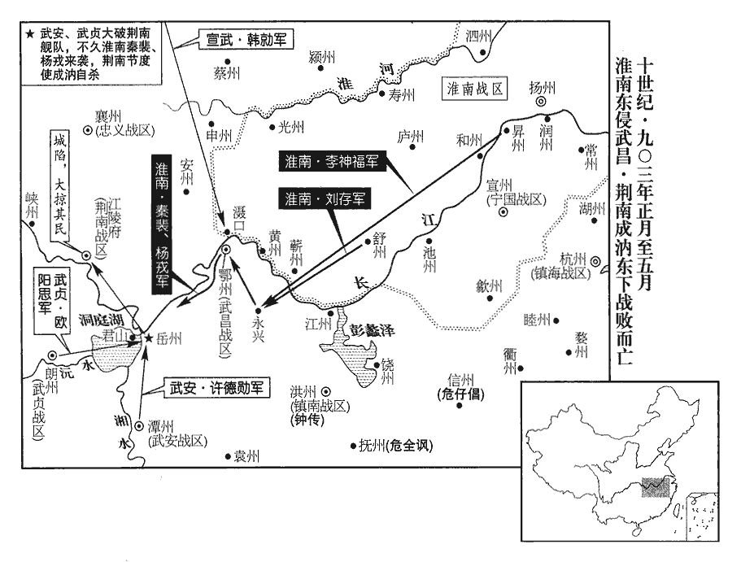
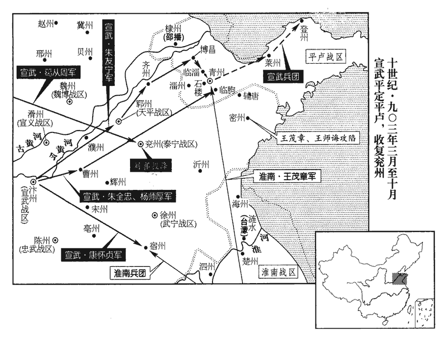
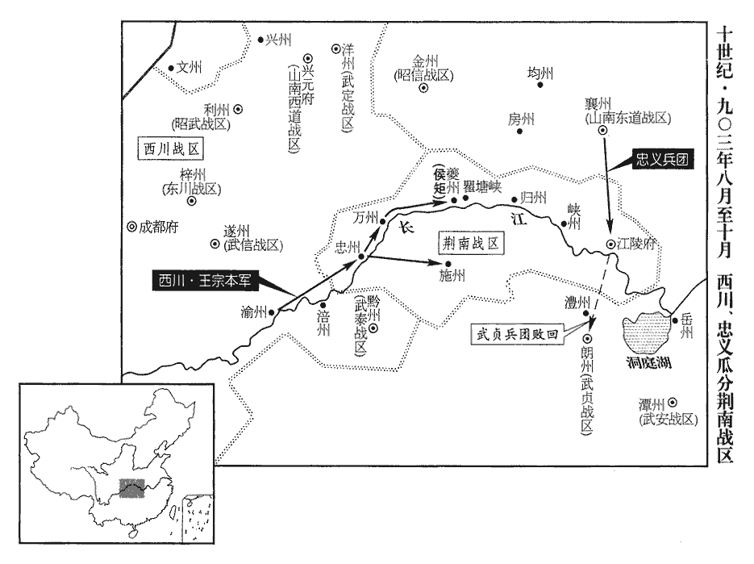
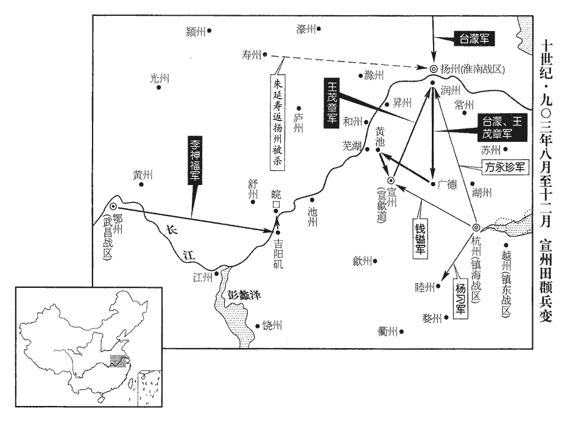
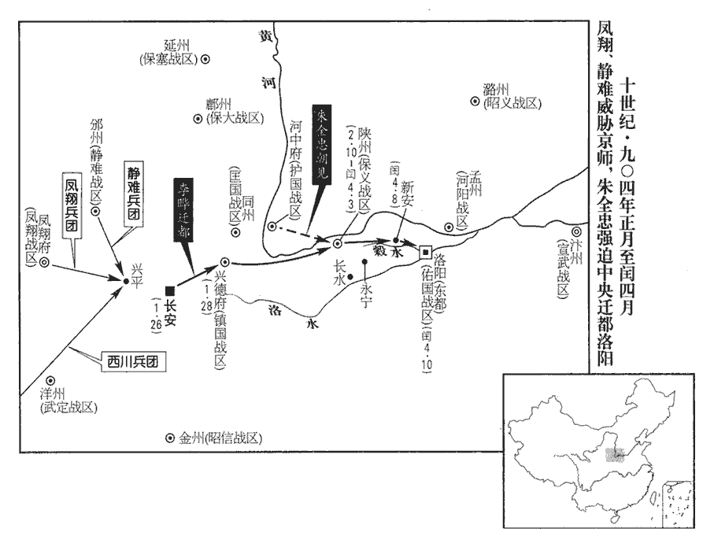

 唐紀八十起昭陽大淵獻（癸亥）二月，盡閼逢困敦（甲子）閏月，凡一年有奇。

# 昭宗聖穆景文孝皇帝下之上

## 天復三年（癸亥、九零三）

1二月，壬申朔‹一›，詔：「比在鳳翔府所除官，一切停。」比，毗至翻，近也。停所除官者，以皆出李茂貞、韓全誨之意也。

〖译文〗 [1]二月壬申朔（初一），昭宗颁布诏令：“近来在凤翔府任命的官员，全部解除职务。”

時宦官盡死，惟河東‹总部大原府›監軍張承業、幽州監軍張居翰、清海‹总部广州›監軍程匡柔、西川‹总部成都府›監軍魚全禋及致仕嚴遵美‹隐居青城山四川省都江堰市西南›，為李克用、劉仁恭、楊行密、王建所匿得全，斬他囚以應詔。禋，伊真翻。嚴遵美時隱蜀之青城山。據通鑑所書，程匡柔，蓋楊行密匿之。

〖译文〗 这时，宦官都被杀死，只有河东监军张承业、幽州监军张居翰、清海监军程匡柔、西川监军鱼全，以及退休家居的原枢密使严遵美，被李克用、刘仁恭、杨行密、王建藏匿起来，斩了其他囚犯来应付诏令，才保存了性命。

2甲戌‹三›，門下侍郎、同平章事陸扆責授沂王傅、分司。沂王禮，皇子也。「禮」，一作「禋」。車駕還京師，賜諸道詔書，獨鳳翔無之。扆曰：「茂貞罪雖大，然朝廷未與之絕；今獨無詔書，示人不廣。」考異曰：舊傳：「帝還京後赦諸道，皆降詔書，獨鳳翔無詔，扆奏」云云。按是時未赦，恐止是降詔書；或赦前扆議如此，故胤怒耳。崔胤怒，奏貶之。宮人宋柔等十一人皆韓全誨所獻，獻宋柔等見上卷元年。及僧、道士與宦官親厚者二十餘人，並送京兆杖殺。

〖译文〗 [2]甲戌（初三），门下侍郎、同平章事陆受责降补沂王傅分司。昭宗回到京师后，给各道颁赐诏书，唯独凤翔节度使李茂贞没有。陆说：“李茂贞的罪恶虽然重大，但朝廷并没有与他决绝；现在唯独不给他颁赐诏书，给人看着不宽大为怀。”崔胤勃然大怒，奏请将陆贬斥了。宫人宋柔等十一人都是韩全诲献进宫的，以及和尚、道士与宦官亲近交深的二十余人，一并送交京兆尹乱杖打死。

3上謂韓偓曰：「崔胤雖盡忠，然比卿頗用機數。」對曰：「凡為天下者，萬國皆屬之耳目，屬，之欲翻。安可以機數欺之！莫若推誠直致，雖日計之不足而歲計之有餘也。」用莊子語。

〖译文〗 [3]昭宗对韩说：“崔胤虽然竭尽忠诚，但比你多用心机权术。”韩回答说：“凡治理天下的人，万国都耳目专注，哪里能够用心机权术欺骗蒙蔽他们呢！不如推心置腹直接了当，这样，虽然按日计算不充足，但按年计算就有剩余了。”

4丙子‹五›，工部侍郎、同平章事蘇檢，吏部侍郎盧光啟，並賜自盡；丁丑‹六›，以中書侍郎、同平章事王溥為太子賓客、分司，皆崔胤所惡也。（自「丁丑」至「所惡也」二十六字，據章鈺資治通鑑校宋記增。）蘇檢、盧光啟皆鳳翔所命相，崔胤惡其黨附韓全誨、李茂貞，故殺之。考異曰：實錄：「檢、光啟並賜自盡。一說，檢長流環州。」唐太祖紀年錄：「初從幸鳳翔，命盧光啟、韋貽範為相，又命蘇檢平章事。及車駕還宮，胤積前事怒之，不一月，皆貶謫之，左遷陸扆沂王傅，王溥太子賓客，蘇檢自盡。」續寶運錄：「二月五日，應是岐王駕前宰臣盧光啟等一百餘人，並賜自盡。」新紀：「朱全忠殺蘇檢、盧光啟。」舊胤傳：「昭宗初幸鳳翔，命盧光啟、韋貽範、蘇檢等作相，及還京，胤皆貶斥之。」新光啟傳云「檢長流環州，光啟賜死」，與寶運錄註同。「檢流環州」，不見本出何書。

〖译文〗 [4]丙子（初五），工部侍郎、同平章事苏检，吏部侍郎卢光，一并被赐令自杀。丁丑（初六），中书侍郎、同平章事王溥降补太子宾客、分司。他们都是崔胤憎恨的人。

5戊寅‹七›，賜朱全忠號回天再造竭忠守正功臣，賜其僚佐敬翔等號迎鑾協贊功臣，諸將朱友寧等號迎鑾果毅功臣，都頭以下號四鎮靜難功臣。難，乃旦翻。

〖译文〗 [5]戊寅（初七），朝廷赐朱全忠号“回天再造竭忠守正功臣”，赐他的属官敬翔等人号“迎銮协赞功臣”、诸将朱友宁等人号“迎銮果毅功臣”、都头以下号“四镇静难功臣”。

上議褒崇全忠，欲以皇子為諸道兵馬元帥，以全忠副之；崔胤請以輝王祚為之，上曰：「濮王‹李裕›長。」帥，所類翻。濮，博木翻。長，知兩翻。胤承全忠密旨，利祚沖幼，固請之，己卯‹八›，以祚為諸道兵馬元帥。考異曰：金鑾記：「上曰：『朕以濮王處長』云云。新傳：「帝十七子，德王裕、棣王祤yǔ、虔王禊xì、沂王禋、遂王禕yī、景王祕、輝王祚、祁王祺、雅王禛、瓊王祥、端王禎、豐王祁、和王福、登王禧、嘉王祜、潁王禔tí、蔡王祐。何皇后生裕及祚，餘皆失其母之氏位。」舊傳云昭宗十子，無端王禎以下七人。按新、舊傳，昭宗諸子皆無濮王。孫光憲續通曆：「濮王名紃xún，昭宗之子，母曰太后王氏。哀帝被殺，朱全忠冊紃為天子，改元天壽；明年，禪位於梁。」此乃光憲傳聞謬誤也。昭宗亦無王皇后。金鑾記所云濮王，蓋德王改封耳。庚辰‹九›，加全忠守太尉，充副元帥，進爵梁王。以胤為司徒兼侍中。

〖译文〗 昭宗与群臣商议嘉奖尊崇朱全忠，想要任命皇子担任诸道兵马元帅，以朱全忠担任副职。崔胤请让辉王李祚担任诸道兵马元帅，昭宗说：“濮王居长。”崔胤秉承朱全忠的秘密旨意，以李祚年幼于己有利，坚决请求以李祚为元帅。己卯（初八），昭宗任命李祚为诸道兵马元帅。庚辰（初九），昭宗加封朱全忠署太尉，充任诸道兵马副元帅，进爵梁王，任命崔胤为司徒兼侍中。

胤恃全忠之勢，專權自恣，天子動靜皆稟之。稟，筆錦翻。朝臣從上幸鳳翔者，凡貶逐三十餘人。黨附宦官者可罪，扈從天子者何罪邪！朝，直遙翻。刑賞繫其愛憎，愛者賞之，憎者刑之。中外畏之，重足一迹。重，直龍翻。史言崔胤怙權，不知死期將至。

〖译文〗 崔胤仗恃朱全忠的势力，独揽朝政，恣意妄为，皇上的行止动静都要禀报他。扈从昭宗前去凤翔的大臣， 降低官职和放逐外地的共三十余人。朝廷的刑罚、赏赐都取决于他的爱憎，朝廷内外的官吏都惧怕他，重足而立不敢妄动。

以敬翔守太府卿，朱友寧領寧遠‹总部设容州广西容县›節度使。寧遠軍，容州，時為龐巨昭所據。五季以來有名號節度使，此類是也。全忠表符道昭‹李继昭›同平章事，充天雄‹总部设秦州甘肃省秦安县西北›節度使，遣兵援送之秦州，之，往也。不得至而還。岐兵塞道，故不得至。還，從宣翻，又如字。

〖译文〗 朝廷任命敬翔署太府卿，朱友宁兼任宁远节度使。朱全忠上表奏请以符道昭为同平章事，充任天雄节度使，派遣军队护送往秦州赴任；没能到达而返回。

6初，翰林學士承旨韓偓之登進士第也，御史大夫趙崇知貢舉。上返自鳳翔，欲用偓為相，偓薦崇及兵部侍郎王贊自代；上欲從之，崔胤惡其分己權，惡，烏路翻。使朱全忠入爭之。全忠見上曰：見，賢遍翻。「趙崇輕薄之魁，王贊無才用，韓偓何得妄薦為相！上見全忠怒甚，不得已，癸未‹十二›，貶偓濮州‹山东省鄄城县›司馬。上密與偓泣別，偓曰：「是人非復前來之比，謂朱全忠也。臣得遠貶及死乃幸耳，不忍見篡弒之辱！」嗚呼！韓偓何見之晚也！然昭宗聞偓此言，亦何以為懷哉！惟有縱酒而已。

〖译文〗 [6]当初，翰林院学士承旨韩考中进士的时侯，御史大夫赵崇任主考官。昭宗自凤翔返回后，想要用韩任宰相，韩推荐赵崇及兵部侍郎王赞代替自己。昭宗想依从，崔胤恨他们分享自己的权力，就让朱全忠入宫争辩反对。朱全忠进见昭宗说：“赵崇是轻佻浮薄之首，王赞没有才能，韩怎么能随便保荐他们做宰相！”昭宗见朱全忠愤怒得很，无可奈何，于癸未（十二日）将韩贬为濮州司马。昭宗秘密地与韩哭着告别，韩说：“这个人不能再与从前相比了，我能够被贬往远离京师的地方任职到死就是幸运了，不忍心看见篡位杀君的屈辱！”

7己丑‹十八›，上令朱全忠與李茂貞書，取平原公主；茂貞不敢違，遽歸之。平原公主嫁茂貞子宋侃，見上卷上年。

〖译文〗 [7]己丑（十八日），昭宗叫朱全忠给李茂贞去信，要接回平原公主。李茂贞不敢违抗，急忙将平原公主送回。

8壬辰‹二十一›，以朱友裕為鎮國‹总部设兴德府陕西省华县›節度使。考異曰：實錄：「壬辰，以興德府復為華州，賜名感化軍，以友裕為節度使。」按編遺錄，天祐三年，閏十二月乙丑敕，「鎮國之號，興德之名，並宜停。」薛居正五代史地理志：「華州，梁為感化軍。」梁功臣傳：「天復三年，友裕權知鎮國軍留後。」今從實錄。

〖译文〗 [8]壬辰（二十一日），朝廷任命朱友裕为镇国节度使。

 

9乙未‹二十四›，全忠奏留步騎萬人於故兩軍，時神策兩軍已散，而營署尚存。以朱友倫為左軍宿衛都指揮使；又以汴將張廷範為宮苑使，王殷為皇城使，蔣玄暉充街使。於是全忠之黨布列徧於禁衛及京輔。唐北門禁衛之兵，皆屯於宮苑；百司庶府及南衙諸衛，皆分居皇城之內；百官私第及坊市居人，皆分居朱雀街之左右街。今全忠悉以腹心為使，則京輔之權一歸之矣。去虺得虎，昭宗之謂也。

〖译文〗 [9]乙未（二十四日），朱全忠奏请留步、骑兵一万人在原神策左右两军营署，以朱友伦担任左军宿卫都指挥使，又任命汴州将领张廷范为宫苑使，王殷为皇城使，蒋玄晖充会街使。于是，朱全忠的党羽布列遍及宫禁宿防及京辅各处。

戊戌‹二十七›，全忠辭歸鎮，辭歸大梁。留宴壽春殿，又餞之於延喜樓。上臨軒泣別，令於樓前上馬。示寵異之也。前上，時掌翻。上又賜全忠詩，全忠亦和進；和，胡臥翻。又進【章：十二行本「進」作「賜」；乙十一行本同。】楊柳枝辭五首。楊柳枝辭，即今之令曲也。今之曲如清平調、水調歌、柘zhè枝、菩薩蠻、八聲甘州，皆唐季之餘聲。又唐人多賦楊柳枝，皆是七言四絕，相傳以為出於開元棃園樂章，故張祜有折楊柳詞云：「莫折宮前楊柳枝，玄宗曾向笛中吹。」百官班辭於長樂驛‹长安城东›。崔胤獨送至霸橋‹陕西省西安市东北灞桥镇›，以唐制驛程考之，霸橋驛當在長樂驛東三十里。自置餞席，夜二鼓，胤始還入城；上復召對，復，扶又翻。問以全忠安否；置酒奏樂，至四鼓乃罷。史言帝徵召不時，宴飲無節。

〖译文〗 戊戌（二十七日），朱全忠告辞回大梁，昭宗先在寿春殿设宴挽留，又在延喜楼为他饯行。昭宗亲临楼前长廊与朱全忠哭着告别，并命他在楼前上马。昭宗又赐诗给朱全忠，朱全忠也和诗呈进，又赐《杨柳枝词》五首。文武官员在长乐驿列班辞别。崔胤独自送至霸桥，自摆酒席饯行，到晚上二更时侯，崔胤才回城；昭宗又召入询问朱全忠平安与否，并摆酒奏乐，到四更方散。

10以清海‹总部设广州广东省广州市›節度使裴樞為門下侍郎、同平章事。【章：十二行本「事」下有「朱全忠薦之也」六字；乙十一行本同；孔本同。】裴樞以朱全忠之薦而相，以忤朱全忠之意而死。白馬之禍，皆自取之也。

〖译文〗 [10]朝廷任命清海节度使裴枢为门下侍郎、同平章事，是朱全忠举荐的。

11李克用使者還晉陽‹太原府所在县›，言崔胤之橫，橫，戶孟翻。克用曰：「胤為人臣，外倚賊勢，內脅其君，既執朝政，又握兵權。權重則怨多，勢侔則釁生，破家亡國，在眼中矣！」史言李克用有識。朝，直遙翻。

〖译文〗 [11]李克用的使者自京师回到晋阳，讲述崔胤专横霸道的情形，李克用说：“崔胤身为人臣，在外倚靠强贼的势力，在内胁迫自己的君主，既主持朝政，又掌握兵权。权力过重就结怨多，势均力敌就要生出事端，破家亡国，近在眼前了！”

12朱全忠將行，奏：「克用於臣，本無大嫌，乞厚加寵澤，遣大臣撫慰，俾知臣意。」進奏吏以白克用，河東進奏吏也。克用笑曰：「賊欲有事淄青，畏吾掎其後耳！」有事淄青，謂攻王師範。史言朱全忠狡譎，李克用已逆知其情。掎，居蟻翻。

〖译文〗 [12]朱全忠将要起身回大梁，奏称：“李克用对我来没有大的仇怨，恳求皇上对他厚加恩宠，派遣大臣前去安慰，使他知道我的心意。”河东进奏吏将朱全忠的话禀报李克用，李克用大笔道：“这强贼想要进攻淄青，怕我在后面牵制他罢了！”

13三月，戊午‹十七›，朱全忠至大梁‹汴州州政府所在城·河南省开封市›。王師範弟師魯圍齊州‹山东省济南市›，朱全忠并兗、鄆，遂兼有齊州。九域志：兗州北至齊州三百六十里。朱友寧‹宣武，总部汴州›引兵擊走之。師範遣兵益劉鄩軍，友寧擊取之。由是兗州援絕，葛從周‹泰宁，总部兖州›引兵圍之。劉鄩取兗州見上卷本年正月。友寧進攻青州；戊辰‹二十七›，全忠引四鎮‹宣武、宣义总部滑州›、天平总部郓州、护国总部河中府及魏博‹总部魏州›兵十萬繼之。

〖译文〗 [13]三月戊午（十七日），朱全忠回到大梁。王师范的弟弟王师鲁围攻齐州，朱友宁率兵将他打跑。王师范派兵增加刘的兵力，朱友宁率兵攻击打败援兵。因此，兖州援兵断绝，葛从周率兵包围了兖州。朱友宁进攻青州；戊辰（二十七日），朱全忠统率四镇及魏博的军队十万人，继续开往青州。

14淮南將李神福圍鄂州，是年正月，楊行密遣李神福攻杜洪，事始上卷。望城中積荻，謂監軍尹建峰曰：「今夕為公焚之。」為，于偽翻。建峰未之信。時杜洪求救於朱全忠，神福遣部將秦皋乘輕舟至灄shè口‹湖北省黄陂县南二十千米·滠水注入长江处›，灄口在武口之上，對岸即夏浦。灄，書涉翻。舉火炬於樹杪；杪miǎo，弭沼翻。洪以為救兵至，果焚荻以應之。

〖译文〗 [14]淮南将领李神福围攻鄂州，望见城中堆积着荻草，对监军尹建峰说：“今天晚上为您把它焚烧了。”尹建峰还不相信。当时，杜洪向朱全忠求救，李神福派遣部将秦皋乘轻舟到滠口，在树林上举起火炬，杜洪以为救兵到了，果然焚烧荻草来接应。

15夏，四月，己卯‹九›，以朱全忠判元帥府事。輝王沖幼，以朱全忠判元帥府事，則天下兵權盡歸之矣。

〖译文〗 [15]夏季，四月己卯（初九），朝廷任命朱全忠总管元帅府事务。

16知溫州‹浙江省温州市›事丁章為木工李彥所殺，丁章得溫州見上卷二年。未有朝命為刺史，止稱知州事。其將張惠據溫州。

〖译文〗 [16]知温州事丁章被木工李彦杀死，他的将领张惠占据温州。

17王師範求救於淮南，乙未‹二十五›，楊行密遣其將王茂章以步騎七千救之，又遣別將將兵數萬攻宿州‹安徽省宿州市›。全忠遣其將康懷英救宿州，淮南兵遁去。「康懷英」當作「懷貞」，是時未改名也。

〖译文〗 [17]王师范向淮南节度使杨行密求救。乙未（二十五日），杨行密派遣他的部将王茂章率领步兵、骑兵七千人前往援救，又遣别将率兵数万人攻打宿州。朱全忠派遣他的部将康怀英率兵援救宿州，淮南军队逃跑了。

18楊行密遣使詣馬殷‹武安总部潭州›，言朱全忠跋扈，請殷絕之，約為兄弟。湖南大將許德勳曰：「全忠雖無道，然挾天子以令諸侯，明公素奉王室，不可輕絕也。」言絕全忠，則道路梗塞，併絕朝廷貢奉。殷從之。馬殷附汴之心，自此堅矣。

〖译文〗 [18]杨行密派遣使者去见马殷，说朱全忠专横跋扈，请马殷与他断绝交往，约定结为兄弟。湖南大将许德勋说：“朱全忠虽然无道，但是他挟天子以令诸侯，您向来尊奉王室，不可轻易与他绝交。”马殷听从了。

19杜洪‹武昌总部鄂州›求救於朱全忠，全忠遣其將韓勍將萬人屯灄口，勍，渠京翻。遣使語荊南‹总部设江陵府湖北省江陵县›節度使成汭‹郭禹›、武安‹总部设潭州湖南省长沙市›節度使馬殷、武貞‹总部设朗州湖南省常德市›節度使雷彥威，語，牛倨翻。曰語者，無朝廷詔敕，以意諭之。令出兵救洪。汭畏全忠之強，且欲侵江、淮之地以自廣，發舟師十萬，沿江東下。汭作巨艦，三年而成，艦，戶黯翻。制度如府署，謂之「和舟載」，署，廨舍也；言其舟長闊，和荊州皆載其上。「舟」，當作「州」。【章：十二行本正作「州」；乙十一行本同。】其餘謂之「齊山」、「截海」、「劈浪」之類甚眾。齊山，言其高也。截海，言其長也。劈浪，言其輕疾也。劈，匹歷翻。掌書記李珽諫曰：珽，他鼎翻。「今每艦載甲士千人，稻米倍之，緩急不可動也。吳兵剽輕，剽，匹妙翻。輕，苦定翻。難與角逐；武陵、長沙，皆吾讎也；武陵，謂雷彥威。長沙，謂馬殷。豈得不為反顧之慮乎！不若遣驍將屯巴陵‹岳州州政府所在县·湖南省岳阳市›，九域志：巴陵東北至鄂州三百五十里。大軍與之對岸，堅壁勿戰，不過一月，吳兵食盡自遁，鄂圍解矣。」楊行密時封吳王，故謂其兵為吳兵。汭不聽。珽，憕chéng之五世孫也。李憕，天寶之末死於安祿山之難。珽後歸中原，仕於梁。

〖译文〗 [19]杜洪向朱全忠求救，朱全忠派遣他的部将韩率领一万军队驻扎滠口，派遣使者前告诉荆南节度使成、武安节度使马殷、武贞节度使雷彦威，叫他们出兵救援杜洪。成畏惧朱全忠的强大，并且想要侵占江、淮之地来扩张自己的地盘，于是派遣水师十万，沿江东下。成制造巨舰，三年才完工，规模法度如同府第官署，叫做“和州载”，其余叫做“齐山”、“截海”、“劈浪”之类的很多。掌书记李劝告说：“现在每舰载甲士一千人，稻米又多一倍，有个缓急，不能移动。吴兵敏捷轻快，难与角逐。武陵雷彦威、长沙马殷都是我们的仇敌，怎么能不考虑后顾之忧呢！不如派遣勇猛的将领驻守巴陵，大军与之隔岸相对，坚守壁垒不出战，不过一个来月，吴兵食尽就会自己退走，鄂州就解围了。”成没有听从。李是李的五世孙。

20王建‹西川总部成都府›出兵攻秦、隴‹甘肃省南部›，乘李茂貞之弱也；遣判官韋莊入貢，亦脩好於朱全忠。好，呼到翻。全忠遣押牙王殷報聘，建與之宴。殷言：「蜀甲兵誠多，但乏馬耳。」建作色曰：「當道江山險阻，騎兵無所施；然馬亦不乏，押牙少留，當共閱之。」乃集諸州馬，大閱於星宿山‹四川省成都市北十千米›，官馬八千，私馬四千，部隊甚整。殷歎服。王建以多馬衒王殷，殷遽歎服，非善覘者也。宿，音秀。建本騎將，王建從楊復光起許州，及扈從昭宗，皆為騎將。故得蜀之後，於文‹甘肃省文县›、黎‹四川省汉源县›、維‹四川省理县›、茂州‹四川省茂县›市胡馬，十年之間，遂及茲數。史言蜀中互市，可以得西蕃之馬。然王建取興元而得騎五千，則東、西川之馬亦必多，此一萬二千之數，蓋集成都近州耳。

〖译文〗 [20]王建乘李茂贞势力削弱的时机，出兵进攻秦州、陇州，并派遣判官韦庄到京师进献物品，也向朱全忠谋求和好。朱全忠派遣押牙王殷前回访，王建设宴招待。王殷说：“蜀地的兵士确实众多，只是缺少马匹罢了。”王建变了脸色说：“蜀地道路险恶，山河阻隔，骑兵没有施展之处。然而马匹也不缺少，押牙稍留时日，当共同检阅一番。”于是，王建调集各州的马匹，在星宿山举行大规模检阅，计官马八千匹，私马四千匹，部队非常整齐。王殷赞叹佩服。王建本来是骑兵将领，所以在取得蜀地以后，就往文州、黎州、维州、茂州一带购买胡地出产的马匹，十年之间，就达到了这个数目。

 

21五月，丁未‹七›，李克用雲州‹山西省大同市›都將王敬暉殺刺史劉再立，叛降劉仁恭；克用遣李嗣昭、李存審將兵討之。李存審，即符存審。降，戶江翻。仁恭遣將以兵五萬救敬暉，嗣昭退保樂安‹山西省代县北›，畏燕兵之強也。敬暉舉眾棄城而去。乘嗣昭之退，棄城而走。先是，振武‹总部设安北府内蒙古和林格尔县›將契苾讓先，悉薦翻。契，欺訖翻。逐戍將石善友，據城叛；嗣昭等進攻之，讓自燔死；復取振武城，殺吐谷渾叛者二千餘人。吐谷渾自赫連鐸與克用作敵，鐸雖敗死，其部落終未肯心服，故屢叛。克用怒嗣昭、存審失王敬暉，皆杖之，削其官。爾朱榮以失万俟道洛而杖爾朱天光，事亦如此。

〖译文〗 [21]五月丁未（初七），李克用属下的云州都将王敬晖杀死刺史刘再立，叛变投降刘仁恭。李克用派遣李嗣昭、李存审率兵讨伐。刘仁恭派遣将领带兵五万救援王敬晖，李嗣昭退兵保卫乐安，王敬晖率众弃城逃走。在这以前，振武将领契让驱逐防守的将领石善友，据城叛乱，李嗣昭等率兵攻伐，契让自焚而死。李嗣昭等又夺取振武城，杀死叛乱的吐谷浑二千余人，李克用恼怒李嗣昭、李存审没有能够擒杀王敬晖，将他们杖责，并削去官职。

22成汭行未至鄂州，馬殷遣大將許德勳將舟師萬餘人，雷彥威遣其將歐陽思將舟師三千餘人會於荊江口‹洞庭湖注入长江处›，大江自蜀東流入荊州界，謂之荊江。荊江口，即洞庭之水與大江之水會處。乘虛襲江陵‹湖北省江陵县›，庚戌‹十›，陷之，盡掠其人及貨財而去。將士亡其家，皆無鬬志。此言成汭之將士也。

〖译文〗 [22]荆南节度使成率军东下，还没有到鄂州，武安节度使马殷派遣部将许德勋率领水军一万余人，武贞节度使雷彦威派遣部将欧阳思率领水军三千余人在荆江口会合，乘虚突袭江陵，庚戌（初十）将江陵攻克，尽掠人口及货财而去。成的将士家亡财空，都没有了斗志。

李神福‹淮南总部扬州›聞其將至，自乘輕舟前覘之，覘，丑廉翻，又丑豔翻。謂諸將曰：「彼戰艦雖多而不相屬，易制也，屬，之欲翻，易，以豉翻。當急擊之！」壬子‹十二›，神福遣其將秦裴、楊戎將眾數千逆擊汭於君山‹洞庭湖中小岛›，君山在洞庭湖中，方六十里，亦名洞庭之山。巴陵志曰：湘君所遊，故曰君山。將，即亮翻。大破之，因風縱火，焚其艦，士卒皆潰，汭赴水死，僖宗文德元年，成汭襲據荊南，至是敗亡。考異曰：新紀：「彥威之弟彥恭陷江陵。」今從編遺錄。舊紀及薛居正五代史、十國紀年皆云：「汭未至鄂渚，江陵已陷，將士亡其家，皆無鬬志。」按新紀、十國紀年皆云：「壬子，汭敗死。」壬子，此月十二日也，而編遺錄云二十二日陷江陵，今不取。北夢瑣言云天祐中汭死，尤誤也。獲其戰艦二百艘。艘，蘇遭翻。韓勍聞之，亦引兵去。

〖译文〗 淮南将领李神福听说成率领水师将要到达，就亲自乘着轻舟前去察看，对各位将领说：“他们的战舰虽多，但彼此不相连续，容易制伏，应当急速发兵攻击！”壬子（十二日），李神福派遣部将秦裴、杨戎率众数千人在洞庭湖君山迎击，把成打得大败，趁着风势放火焚烧成的舰只，将士争相逃散，成投湖淹死，缴获成的战舰二百艘。韩听到此讯，也退兵离去。

許德勳‹武安总部潭州›還過岳州‹湖南省岳阳市›，刺史鄧進忠開門具牛酒犒軍，德勳諭以禍福，進忠遂舉族遷于長沙‹潭州州政府所在县·湖南省长沙市›。僖宗光啟二年，鄧進思取岳州，傳弟進忠，至是而亡。考異曰：馬氏行年記：「天復三年，自荊南振旅還，遂入岳州，降刺史鄧進思。」九國志楚世家：「天祐二年七月，岳州刺史鄧進忠帥其眾來降。」許德勳傳云：「天祐二年，領兵略地荊南，還經岳州，刺史鄧進忠以城歸附。」新紀全用九國志年月。湖湘故事言：「開平中，收荊南回，進忠以城降。」又載何致雍天策寺碑銘云：「乃克桂林，乃襲荊渚，彼岳之陽，旋師而取。」天祐二年十月，朱全忠謀討襄州趙匡凝，九月，克襄州，始命楊師厚攻荊南。然則七月許德勳何繇略地荊南！蓋九國志之誤。天復三年，成汭敗死，德勳及雷彥威襲江陵，還取岳州，與何致雍碑意略同，故以行年記為據。馬殷以德勳為岳州刺史，以進忠為衡州‹湖南省衡阳市›刺史。

〖译文〗 雷彦威狡狯残忍，有父风，常泛舟焚掠邻境，荆、鄂之间，殆至无人。

雷彥威狡獪殘忍，有父風，獪kuài，古外翻。雷彥威父滿。常泛舟焚掠鄰境，荊、鄂之間，殆至無人。

〖译文〗 雷彦威狡诈残忍，具有他父亲的作风。经常架船到邻近的地方烧杀抢掠，荆州、鄂州之间，几乎无人居住。

23李茂貞畏朱全忠，自以官為尚書令，在全忠上，朱全忠守中書令，茂貞為尚書令，官在其上。累表乞解去；詔復以茂貞為中書令。

〖译文〗 [23]李茂贞畏惧硃全忠，自认为官做到尚书令，在硃全忠之上，多次上表要求免去。皇上下诏又任命李茂贞做中书令。

24崔胤奏：「左右龍武、羽林、神策等軍此崔胤所判六軍也。名存實亡，侍衛單寡；請每軍募步兵四將，每將二百五十人，騎兵一將百人，合六千六百人，六軍，各軍步兵千人，騎兵百人，合六千六百人。選其壯健者，分番侍衛。」從之。令六軍諸衛副使、京兆尹鄭元規立格召募於市。朱全忠自此疑崔胤而有圖之之心。

〖译文〗 [24]崔胤奏称：“左右龙武、羽林、神策等军队，名存实亡，侍卫力量单薄；请求每军募步兵四将，每将二百五十人，骑兵一将一百人，共六千六百人，从中选择健壮者，分班轮流侍从护卫，”昭宗批准。令六军诸卫副使、京兆尹郑元规立标准在街市招募。

25朱全忠表潁州‹安徽省阜阳市›刺史朱友恭‹李彦威›為武寧‹总部设徐州江苏省徐州市›節度使。

〖译文〗 [25]朱全忠上表秦请任命颖州刺史朱友恭为武宁节度使。

26朱友寧攻博昌‹山东省博兴县›，博昌，漢縣，唐屬青州。十三州志云：昌水，其勢平，故曰博昌。後唐避廟諱，改曰博興。九域志：博興，在青州西北一百二十里，管下有博昌鎮。月餘不拔；朱全忠怒，遣客將劉捍往督之。今閫府州軍皆有客將，主贊導賓客，蓋古之舍人、中涓，漢之鈴下、威儀之職。唐末藩鎮置客將，往往升轉至大官，位望不輕。捍至，友寧驅民丁十餘萬，負木石，牽牛驢，詣城南築土山，既成，并人畜木石排而築之，冤號聲聞數十里。俄而城陷，盡屠之。爭城而戰，殺人盈城，朱友寧之隕身喪元，未足以謝冤魂也。號，戶刀翻。聞，音問。考異曰：唐太祖紀年錄：「師範之舉兵也，朱溫令朱友寧討之。三月，己酉，朱溫至汴州，大舉四鎮、魏博之眾十萬擊師範。朱友寧、楊師厚攻博興，旬餘不下，攻城之眾，死者太半。俄而朱溫至，大怒，斬其主將，復起土山，翌日而拔，城中無少長皆屠之，仍毀其垣。四月，進陷臨淄，傅青州。別將攻北海，渡膠水，寇登、萊等郡。」實錄據此而置於四月。梁太祖實錄：「四月，丙子，上至鄆領事。辛卯，從子友寧帥師破青州之博昌、臨淄二邑，殺戮五千餘眾，暨北海焉。」編遺錄：「五月，辛亥，卻離歷下，宿豐齊驛。甲寅，上到汶陽。乙卯，奏王師範逆狀。己未，上又往歷下。壬戌，上以兵士攻取博昌，寨下少樹木，時當炎毒，卻勒親從騎兵皆歸齊州，因又前行。夜將半，客將劉捍謀曰：『捍請馳赴軍前傳諭上意，敦將士，令戮力速攻，必可尅也。今請上卻歸歷下。』上悅而從之，便令捍馳騎東往，上乃西歸汶陽。丙寅，捷音至，攻拔博昌，盡戮其黨矣。」據此，則破博昌在五月。今從朱友寧傳。進拔臨淄‹山东省淄博市东临淄镇›，臨淄，漢古縣，久廢；隋復置於古齊國城；唐屬青州。九域志在州西北四十里。抵青州‹山东省青州市›城下，遣別將攻登‹山东省蓬莱市›、萊‹山东省莱州市›。

〖译文〗 [26]宁远节度使朱友宁进攻博昌，一个多月没有攻克。朱全忠大怒，派遣客将刘捍前往监督。刘捍到后，朱友宁驱赶壮丁十余万人，背负木石，牵着牛驴，到城南修筑土山。土山筑成以后，连同人畜木石排列在一起填土捣实，喊冤号哭之声传出数十里。即刻破都昌城，把城内男女老少全部杀死。随后进兵攻克临淄，抵达青州城下，派遣别将率兵攻打登州、莱州。

淮南將王茂章會王師範弟萊州刺史師誨攻密州‹山东省诸城市›，拔之，斬其刺史劉康乂，九域志：萊州南至密州三百里，東北至登州二百四十里。劉康乂，朱全忠所用也。以淮海都游弈使張訓為刺史。楊行密據有淮南，西盡淮源，東暨于海，邊面延袤數千里，故置都遊弈使，以謹防遏也。

〖译文〗 淮南将领王茂章会同王师范的弟弟莱州刺史王师诲进攻密州，将城攻破，杀死刺史刘康义，并以淮海都游弈使张训为密州刺史。

六月，乙亥‹六›，汴兵拔登州。師範帥登、萊兵拒朱友寧於石樓‹山东省青州市西›，為兩柵。據舊書石樓近臨淄。丙子‹七›夜，友寧擊登州柵，柵中告急，師範趣茂章出戰，趣，讀曰促。茂章按兵不動。友寧破登州柵，進攻萊州柵。比明，茂章度其兵力已疲，比，必利翻，及也。度，徒洛翻；下同。乃與師範合兵出戰，大破之。友寧旁自峻阜馳騎赴敵，馬仆，青州將張土梟斬之，梟，堅堯翻。傳首淮南。兩鎮兵逐北至米河，王師範以平盧之兵，王茂章以淮南之兵，是兩鎮兵也。俘斬萬計，魏博‹总部魏州›之兵殆盡。

〖译文〗 六月乙亥（初六），汴州军队攻克登州。王师范率领登州、莱州军队，在石楼抵抗朱友宁，树立两道栅栏。丙子（初七）夜里，朱友宁率兵攻击登州栅，栅内情况紧急，王师范催促王茂章出战，王茂章按兵不动。朱友攻破登州栅，进攻莱州栅。天快明时，王茂章估计朱以宁的兵力己经疲惫，才与王师范合兵出战，把朱友宁的军队打得大败。朱友宁从旁侧高峻的土山上纵马出击敌人，马失前蹄倒下，青州将领张士将他斩首，传首淮南示众。平卢、淮南两镇军队追击败走的敌人到米河，俘获斩杀敌人以万计，魏博军队几乎完了。

全忠聞友寧死，自將兵二十萬晝夜兼行赴之。秋，七月，壬子‹十四›，至臨朐‹山东省临朐县›，臨朐，漢縣，唐屬青州。九域志曰：在州東南四十里。命諸將攻青州。王師範出戰，汴兵大破之。王茂章閉壘示怯，伺汴兵稍懈，伺，相吏翻。懈，古隘翻。毀柵而出，驅馳疾戰，戰酣退坐，召諸將飲酒，已而復戰。全忠登高望見之，問降者，降，戶江翻。知為茂章，歎曰：「使吾得此人為將，天下不足平也！」朱全忠見王茂章臨敵整暇，故欲得之。然茂章後歸梁，攻淮南、攻鎮，并皆折北而不振，人固未易知也。至晡，汴兵乃退。茂章度眾寡不敵，度，徒洛翻。是夕，引軍還。全忠遣曹州‹山东省定陶县›刺史楊師厚追之，及於輔唐‹山东省安丘市›。輔唐，漢安丘縣，乾元二年，移治古昌安城，因改曰輔唐，屬密州。九域志：在州西北一百二十里。薛史地理志曰：密州輔唐縣，梁開平二年，改為安丘，唐同光元年，復舊名；晉天福七年，改為膠西，避廟諱也；宋復曰安丘。茂章命先鋒指揮使李虔裕將五百騎為殿，殿，丁練翻；下同。虔裕殊死戰，師厚擒而殺之。李虔裕以死全王茂章之軍，其勇難能也。楊師厚自此受知於朱全忠矣。師厚，潁州‹安徽省阜阳市›人也。

〖译文〗 朱全忠听说朱友宁死了，亲自率领二十万大军日夜兼行奔赴救援。秋季，七月壬子（十四日），朱全忠率军到临朐，命令各将领攻打青州。王师范率兵出战，被汴州军打得大败。王茂章闭垒不出表示怯懦，侦察汴州军队稍微懈怠，率兵毁栅冲出，驰驱快攻，打得尽兴，退回坐下，召集诸将饮酒，不久又冲出奋战。朱全忠登高观战望见他，问投降的人，知道是王茂章，叹说：“假使我能得以此人做将领，天下就不够我平定了！”黄昏时分，汴州军队才撤退。王茂章估计敌众我，不能取胜，当天晚上就率领军队回淮南。朱全忠派遣曹州刺史杨师厚率兵追赶，直到辅唐。王茂章命令先锋指挥使李虔裕率领五百骑兵殿后，与追兵拼死战斗，杨师厚将李虔裕擒获杀死。杨师厚是颍州人。

張訓聞茂章去，謂諸將曰：「汴人將至，何以禦之？」諸將請焚城大掠而歸。訓曰：「不可。」封府庫，植旗幟於城上，遣羸弱居前，植，直吏翻。幟，昌志翻。羸，倫為翻。自以精兵殿其後而去。全忠遣左踏白指揮使王檀攻密州，凡軍行，前軍之前有踏白隊，所以踏伏。候望敵之遠近眾寡。既至，望旗幟，數日乃敢入城；疑其有伏，故遲遲不敢進。見府庫城邑皆完，遂不復追。復，扶又翻。訓全軍而還。史言楊行密所以能保有江、淮，一時諸將皆能盡其智力。全忠以檀為密州刺史。

〖译文〗 密州刺史张训听说王茂章离去，对各位将领说：“汴州军将要到达，用什么抵御呢？”诸将请求焚烧城池，大掠财物而回淮南。张训说：“不能这样做。”于是，封闭府库，在城上树立旗帜，然后让老弱兵士在前，自己率领精兵断后而离去。朱全忠派遣左踏白指挥使王檀攻打密州，到达以后，望见城上旗帜，过了数日才敢进城。王檀见府库、城邑全都完好，就不再追赶。张训全军回到淮南。朱全忠以王檀担任密州刺史。

27丁卯‹二十九›，以山南西道‹总部设兴元府陕西省汉中市›留後王宗賀為節度使。王建之請也。

〖译文〗 [27]丁卯（二十九日），朝廷任命山南西道留后王宗贺为节度使。

28睦州‹浙江省建德市›刺史陳詢叛錢鏐‹镇海总部杭州›，舉兵攻蘭溪‹浙江省兰溪市›，咸亨五年，分婺州之金華西界置蘭溪縣，因溪水為名。九域志：在州西北五十五里。鏐遣指揮使方永珍擊之。武安都指揮使杜建徽與詢連姻，鏐疑之，建徽不言。會詢親吏來奔，得建徽與詢書，皆勸戒之辭，鏐乃悅。建徽從兄建思譖建徽私蓄兵仗，謀作亂；鏐使人索之，從，才用翻。索，山客翻。建徽方食，使者直入臥內，使，疏吏翻。建徽不顧，鏐以是益親重之。

〖译文〗 [28]睦州刺史陈询背叛钱，率兵进攻兰溪，钱派遣指挥使方永珍率兵前去攻打陈询。武安都指挥使杜建徽与陈询是姻亲，钱怀疑他，杜建徽不辩解。恰巧陈询的亲信属吏前来投奔，钱得到杜建微给陈询的书信，都是劝告陈询改过的话，钱这才喜悦。杜建徽的堂兄杜建思诬陷杜建徽私自贮备兵器，阴谋作乱。钱派人前去搜索，杜建徽正在吃饭，使者径直进入卧室搜查，杜建徽毫不顾忌，钱因此更加亲近推重他。

29八月，戊辰朔‹一›，朱全忠留齊州刺史楊師厚攻青州，身歸大梁。朱全忠以朱友寧之死，興忿兵以攻青州，豈不欲一鼓而屠之；乃置之而歸汴者，知青州城堅而王師範兵力尚強，未易以旦夕取，故使楊師厚圍守之。

〖译文〗 [29]八月戊辰朔（初一），朱全忠留下齐州刺史杨师厚攻打青州，自己回大梁。

30庚辰‹十三›，加西川‹总部设成都府四川省成都市›節度使西平王王建守司徒，進爵蜀王。自郡王進國王。

〖译文〗 [30]庚辰，（十三日），朝廷给西川节度使西平王王建加官署司徒，进爵蜀王。

31前渝州‹重庆市›刺史王宗本‹谢从本›王宗本前此刺渝州，亦王建命之也，罷官歸成都，故稱前。言於王建，請出兵取荊南‹总部江陵府›；建從之，以宗本為開道都指揮使，將兵下峽。峽，三峽也。

〖译文〗 [31]前渝州刺史王宗本向王建进言，请出兵攻取荆南。王建听从，任命王宗本为开道都指挥使，率兵船下三峡。

 

32初，寧國‹总部设宣州安徽省宣州市›節度使田頵破馮弘鐸，事見上卷二年。詣廣陵‹江苏省扬州市›謝楊行密，因求池‹安徽省贵池市›、歙‹安徽省歙县›為巡屬，唐置宣、歙、池觀察使。二州本宣州巡屬，故田頵因有功而求之。行密不許。與之則田頵愈強，故不許。行密左右下及獄吏，皆求賂於頵，以其破馮弘鐸多得寶貨也。頵怒曰：「吏知吾將下獄邪！」下，戶嫁翻。及還，指廣陵南門曰：「吾不可復入此矣！」復，扶又翻；下復出同。頵兵強財富，好攻取；好，呼到翻。行密既定淮南，欲保境息民，每抑止之，頵不從。及解釋錢鏐，事見上卷二年。頵尤恨之，陰有叛志。李神福言於行密曰：「頵必反，宜早圖之。」行密曰：「頵有大功，田頵從楊行密起廬州，破趙鍠、孫儒、馮弘鐸，皆有大功。反狀未露，今殺之，諸將人人自危矣！」頵有良將曰康儒，與頵謀議多不合，行密知之，擢儒為廬州‹安徽省合肥市›刺史。擢儒，所以間頵也。頵以儒為貳於己，族之。儒曰：「吾死，田公亡無日矣！」頵遂與潤州‹江苏省镇江市›團練使安仁義同舉兵，考異曰：十國紀年：「朱全忠聞田頵等叛，矯制削奪王官爵，命頵及杜洪、鍾傳、錢鏐充四面招討使，布制書於境上。王知其詐妄。」按新、舊紀、實錄、梁太祖紀，皆無削奪行密官爵、命杜洪等為招討使事。今不取。仁義悉焚東塘‹江苏省扬州市东›戰艦。東塘，即揚州東塘，淮南之戰艦聚焉。對岸即潤州界，故仁義得焚之。艦，戶黯翻。

〖译文〗 [32]当初，宁国节度使田打败冯弘铎，前往广陵告谢淮南节度使杨行密，因有功要求把池州、歙州作为自己的巡视属地，杨行密没有答应。杨行密左右的人以及狱吏，都向田索要财物，田勃然大怒说：“你狱吏知道我将要下狱吗！”等到回去的时侯，田指着广陵的南门说：“我不能再入此城了！”田兵强财富，喜好攻战夺取；杨行密己经平定淮南，想要保境安民，往往加以压抑制止，田不从。等到杨行密与钱亲善友好，田就更加恨他，暗中己有背叛杨行密的志向。李神福向杨行密进言说：“田一定要谋反，应当尽早设法应付。”杨行密说：“田有大功劳，谋反的行迹没有暴露，现在杀他，各位将官就要人人自危了！”田有个良将叫康儒，与田商议事情经常意见不合，杨行密知道这情况以后，擢升康儒为庐州刺史。田以为康儒对自己有二心，将他全族杀死。康儒说：“我死了，田公灭亡就没有几天了！”田于是与润州团练使安仁义一同起兵，安仁义全部焚烧了杨行密停在扬州东塘的战舰。

頵遣二使詐為商人，詣壽州‹安徽省寿县›約奉國‹总部设蔡州河南省汝南县›節度使朱延壽，朝廷命朱延壽領奉國節度使，見上卷二年。使，疏吏翻。行密將尚公迺遇之，曰：「非商人也。」殺一人，得其書，以告行密。尚公迺歸行密，見上卷二年。行密召李神福於鄂州，神福恐杜洪邀之，宣言奉命攻荊南，勒兵具舟楫；及暮，遂沿江東下，始告將士以討田頵。

〖译文〗 田派遣两个使者假装商人，往寿州邀约奉国节度使朱延寿，杨行密的将领尚公遇见他们，说：“不是商人。”杀死一人，搜得田给朱延寿的书信，把这情况告诉杨行密。杨行密从鄂州召回李神福，李神福担心杜洪进行拦击，扬言奉命攻打荆南，准备武器船只；等到日落的时侯，就沿长江顺流东下，这才告诉将士前去讨伐田。

己丑‹二十二›，安仁義襲常州‹江苏省常州市›，九域志：潤州東南至常州一百七十一里。常州刺史李遇逆戰，極口罵仁義，仁義曰：「彼敢辱我，必有備。」乃引去。壬辰‹二十五›，行密以王茂章為潤州行營招討使，擊仁義，不克，使徐溫‹淮南总部扬州›將兵會之。溫易其衣服旗幟，皆如茂章兵，仁義不知益兵，復出戰，復，扶又翻。溫奮擊，破之。李存審救河中，擒梁騎兵，亦用此術。

〖译文〗 己丑（二十二日），安仁义袭击常州，常州刺史李遇迎战，开口极力大骂安仁义，安仁义说：“他敢辱骂我，一定有准备。”于是带领军队退走。壬辰（二十五日），杨行密任命王茂章为润州行营招讨使，攻击安仁义，没有攻克，派徐温率兵会同攻击。徐温改换所率军队的衣服旗帜，都像王茂章的军队，安仁义不知道对方增加了军队，再次出战，徐温奋力攻击，把安仁义打败。

行密夫人，朱延壽之姊也。行密狎侮延壽，延壽怨怒，陰與田頵通謀。《書·旅獒》曰：德盛不狎侮。狎侮君子，罔以盡其心；狎侮小人，罔以盡其力。楊行密狎侮朱延壽，幾至於亡國喪家，蓋危而後濟耳，可不戒哉！頵遣前進士杜荀鶴至壽州，與延壽相結；又遣至大梁告朱全忠，全忠大喜，遣兵屯宿州‹安徽省宿州市›以應之。朱全忠喜楊行密有隙之可乘，而不能舉大兵以掎其後者，內有淄青未服，而西又有鳳翔、北又有太原，恐其乘間動搖朝廷也。荀鶴，池州人也。

〖译文〗 杨行密的夫人是朱延寿姐姐。杨行密轻慢侮辱朱延寿，朱延寿怨恨愤怒，暗中与田串通策划反叛。田派遣前进士杜荀鹤到寿州，与朱延寿相互交结；又遣杜荀鹤到大梁告诉朱全忠，朱全忠大喜，派兵驻扎宿州来接应。杜荀鹤是池州人。

33楊師厚屯臨朐，聲言將之密州，留輜重於臨朐。九域志：臨朐縣在青州東南四十里，又二百六十里至密州。朐，音劬。重，直用翻。九月，癸卯‹六›，王師範出兵攻臨朐，師厚伏兵奮擊，大破之，殺萬餘人，獲師範弟師克。明日，萊州兵五千救青州，師厚邀擊之，殺獲殆盡，遂徙寨抵其城下。考異曰：梁太祖實錄：「九月，癸卯，楊師厚勵眾決鬬，青人大敗，北走，殺戮一萬人，擒師範弟師克。翌日，東萊郡遣州兵洎土團等五千人將援青壘，我師邀截翦撲，無一二存焉，即時徙寨逼其闉yīn闍dū。」唐實錄略與此同。編遺錄：「冬，十月，丁卯，楊師厚繼告捷於臨朐，北及青州四面，累殺破賊黨，擒斬頗眾。至十一月，萊州刺史王師克領六千人欲徑入青丘，助其守禦；師厚伏兵邀之，殺戮將盡。」下又有「丁亥，上誕辰，聞朱友倫死。」誕辰乃十月二十一日，友倫死亦十月中事也。下又別有十一月。疑上十一月，是「十一日」字或「七日」字。又曰：「一日，師範請降，」疑脫「二十」字。二十一日，即戊午也。今從梁實錄。

〖译文〗 [33]杨师厚驻兵临朐，声言将要前往密州，把器械粮草等留在临朐。九月癸卯（初六），王师范出兵进攻临朐，杨师厚伏兵奋力攻击，把王师范打得大败，击杀一万余人，擒获王师范的弟弟王师克。第二天莱州军队五千人救援青州，杨师厚进行拦击。将莱州军队几乎全部杀死擒获，于是将营寨移到青州城下。

34朱延壽謀頗泄，朱延壽與田頵通謀，久而頗露。楊行密詐為目疾，對延壽使者多錯亂所見，或觸柱仆地。見甲以為乙，見犬以為貓，是錯亂所見也。柱至易見者，而行觸之，皆詐為失明以愚人。謂夫人曰：「吾不幸失明，諸子皆幼，軍府事當悉以授三舅。」夫人屢以書報延壽；夫人，即延壽姊也，延壽第三。行密又自遣召之，陰令徐溫為之備。延壽至廣陵，行密迎及寢門，執而殺之；按尚公迺執田頵二使，田頵繼遣杜荀鶴至壽州，朱延壽亦必知前二使之見執矣。楊行密召之，了不自疑，至於送死，豈其智有所不及邪？抑天奪之鑒也！部兵驚擾，徐溫諭之，皆聽命，徐溫從楊行密起廬州，與劉威、陶雅之徒號三十六英雄，是必有以服朱延壽部兵之心矣，故諭之皆聽命。遂斬延壽兄弟，黜朱夫人。

〖译文〗 [34]朱延寿串通田计划略有泄露，杨行密知道后假装患了眼病，对朱延寿的使者经常认错人，或者撞着柱子扑倒在地。杨行密对夫人朱氏说：“我不幸失明，诸子幼小，军府的事情应当全部交给三舅管理。”朱夫人屡次给朱延寿写信告诉他。杨行密又自己派人召唤朱延寿到广陵来，暗中却命令徐温为他做好防备。朱延寿到广陵，杨行密迎到卧室门口，将他逮捕并杀死。朱延寿的部下将士惊慌扰乱， 徐温晓谕他们，全都听从命令。于是，斩杀朱延寿的兄弟，并把朱夫人废黜。

初，延壽赴召，其妻王氏謂曰：「君此行吉凶未可知，願日發一使以安我！」一日，使不至，王氏曰：「事可知矣！」部分僮僕，使，疏吏翻；下同。分，扶問翻。授兵闔門，捕騎至，乃集家人，聚寶貨，發百燎焚府舍，曰：「妾誓不以皎然之軀為讎人所辱。」赴火而死。史言朱延壽妻有智識而能守節。

〖译文〗 起初，朱延寿应杨行密的召请前去广陵，他的妻子王氏对他说：“您此行的吉凶未卜，希望每天派一个使者来给我报平安！”一天，使者没有到来，王氏说：“事情己经可以知道了！”于是布置家僮仆役，发给兵器，把大门关闭；杨行密派来捉人的骑兵一到，王氏就召集家人，把珍宝财物聚积一起，点燃很多火炬焚烧府舍，王氏说：“我发誓不把自己洁白无瑕的躯体让仇人玷辱。”于是投火自焚而死。

延壽用法嚴，好以寡擊眾，好，呼到翻。嘗遣二百人與汴兵戰，有一人應留者，請行，延壽以違命，立斬之。

〖译文〗 朱延寿执法严厉，喜好以少击多，曾经派二百人与朱全忠的汴州军队作战，有一个应该留下的人，请求前往，朱延寿以违抗命令，将他立即斩首。

35田頵襲昇州‹江苏省南京市›，得李神福妻子，善遇之。天復二年，田頵克昇州，楊行密以李神福為昇州刺史；時行密遣神福攻鄂，故頵乘虛襲之。九域志：宣州北至昇州三百六十里。神福自鄂州東下，頵遣使謂之曰：「公見機，與公分地而王；不然，妻子無遺！」神福曰：「吾以卒伍事吳王，楊行密封吳王，故稱之。今為上將，義不以妻子易其志。頵有老母，不顧而反，三綱且不知，或疑行密留田頵之母於廣陵。詳考本末，田頵母殷自從頵在宣州，李神福蓋言頵有母在，不當輕為舉措，稱兵而敗，則禍必及母也。三綱者，謂君為臣綱，父為子綱，夫為妻綱。烏足與言乎！」斬使者而進，士卒皆感勵。頵遣其將王壇、汪建將水軍逆戰。光化二年，田頵將康儒取婺州，王壇歸之。丁未‹十›，神福至吉陽磯‹安徽省东至县西北长江东岸›，與壇、建遇，壇、建執其子承鼎示之，神福命左右射之。射，而亦翻。神福謂諸將曰：「彼眾我寡，當以奇取勝。」及暮，合戰，神福佯敗，引舟泝流而上；逆流曰泝。泝，蘇故翻。上，時掌翻。壇、建追之，神福復還，順流擊之。壇、建樓船大列火炬，神福令軍中曰：「望火炬輒擊之。」望壇、建所在而擊之。船列火炬，不能以自照見，而敵人望之，洞見表裏，聚而攻之，安有不敗者乎！壇、建軍皆滅火，旗幟交雜，神福因風縱火，焚其艦，壇、建大敗，李神福之陽敗也，必逆風而戰，故引舟順風泝流而上；其縱火焚壇、建之艦也，必因風轉，乘風水之勢以破之，居然可知也。士卒焚溺死者甚眾；戊申‹十一›，又戰于皖口‹皖河注入长江处·安徽省安庆市›，舒州懷寧縣有皖口鎮，當皖水入江之口。皖，胡板翻。壇、建僅以身免。獲徐綰，行密以檻車載之，遺錢鏐；鏐剖其心以祭高渭。徐綰殺高渭事見上卷二年。遺，唯季翻。

〖译文〗 [35]宁国节度使田袭击升州，俘获李神福的妻儿，待他们很好，李神福从鄂州东下，田派遣使者前去对他说：“您看机会行事，与您分地称王，不然的话，您的妻儿难以存活！”李神福说：“我以兵卒身份侍奉吴王，今为上将，道义上不能因为妻儿改变志向。田有老母，毫不顾念而反叛，连君为臣纲、父为子纲、夫为妻纲尚且不知道，哪里值得与他说！”于是，将使者杀死，率兵前进，士兵全都感动振奋。田派遣他的部将王坛、汪建率领水军迎战。丁未（初十），李神福到达吉阳矶，与王坛、汪建相遇，王坛、汪建拿他的儿子李承鼎给他看，李神福命令左右的人放箭射他。李神福对诸将说：“他们人多，我们人少，应当用奇兵取胜。”傍晚，合兵作战，李神福假装打败，带领战船逆流而逃，王坛、汪建率船排列着大量火炬，李神福命令中军说：“望见火炬就攻击。”王坛、汪建的军队全都熄灭火炬，旗帜交错杂乱，李神福趁着风势放火，焚烧敌舰，王坛、汪建大败，士兵烧死淹死的很多。戊申（十一日），双方又在皖口交战，王坛、汪建仅以身免。李神福擒获徐绾，杨行密用槛车载着他，送给镇海节度使钱；钱将徐绾的心挖出，用来祭奠高渭。

頵聞壇、建敗，自將水軍逆戰。神福曰：「賊棄城而來，此天亡也！」臨江堅壁不戰，遣使告行密，請發步兵斷其歸路；斷，音短。行密遣漣水‹江苏省涟水县›制置使臺濛將兵應之。王茂章攻潤州，久未下，行密命茂章引兵會濛擊頵。安仁義雖善戰而兵弱，自守虜耳。田頵兵勢方挫，故命合兵擊之。

〖译文〗 田听说王坛、汪建失败，亲自率领水军前去迎战。李神福说：“贼弃城前来，这是上天要他灭亡啊！”于是临江坚守壁垒，不与田决战，一而派遣使者报告杨行密，请求派遣步兵断绝田的归路。杨行密得到报告，立即派遣涟水制置使台率领步兵前去接应。王茂章进攻润州，很久没有攻下，杨行密又命令王茂章带领军队前去会同台攻击田。

36辛亥‹十四›，汴將劉重霸拔棣州‹山东省惠民县›，執刺史邵播，殺之。全忠滅朱瑄，已得棣州，邵播又以州叛附王師範。重，直龍翻。

〖译文〗 [36]辛亥（十四日），汴州将领刘重霸攻克棣州，逮住刺史邵播，将他杀死。

37甲寅‹十七›，朱全忠如洛陽，遇疾，復還大梁。考異曰：梁實錄云壬戌。唐實錄云十月丁卯朔。今從編遺錄。

〖译文〗 [37]甲寅（十七日），朱全忠到洛阳，患了病，又回大梁。

38戊午‹二十一›，王師範遣副使李嗣業及弟師悅請降於楊師厚，曰：「師範非敢背德，降，戶江翻；下同。背，蒲妹翻。韓全誨、李茂貞以朱書御札使之舉兵，師範不敢違。」仍請以其弟師魯為質。質，音致。時朱全忠聞李茂貞、楊崇本‹李继徽·静难总部邠州›將起兵逼京畿，邠、岐連兵，其事詳見後。岐本亦京畿，李茂貞據之，遂為強藩。今所謂京畿，特京兆府之京縣、畿縣耳。恐其復劫天子西去，復，扶又翻。欲迎車駕都洛陽，乃受師範降，考異曰：舊紀及薛居正五代史劉鄩傳皆云：「十一月，師範降」。編遺錄曰：「十一月，敗萊州刺史王師克。一日，師範差人捧款檄至軍前，請舉牆歸降。」按梁太祖實錄、薛史梁紀、唐實錄皆云九月戊午。今從之。選諸將使守登、萊、淄、棣‹山东省惠民县›等州，即以師範權淄青‹平卢总部设青州山东省青州市›留後。史言朱全忠本欲殺王師範而力有所未及，為後屠師範一家張本。師範仍言先遣行軍司馬劉鄩將兵五千據兗州，事始見上卷本年。非其自專，願釋其罪；亦遣使語鄩。語，牛倨翻。

〖译文〗 [38]戊午（二十一日），平卢节度使王师范派遣副使李嗣业及弟弟王师悦向杨师厚请求投降，说：“师范不是胆敢背弃大德，韩全诲、李茂贞用皇上朱笔写的信札命令我发兵，师范不敢违反。”并请求用他的弟弟王师鲁作为人质。当时朱全忠听说李茂贞、杨崇本将要起兵进逼京畿，恐怕他们再次劫持昭宗西去凤翔，想要迎接昭宗建都洛阳，于是接受了王师范投降，选择诸将守卫登、莱、淄、棣等州，当即以王师范暂时为淄表留后。王师范并说明先前遣行军司马刘率兵五千占据兖州，不是他擅自做主，希望宽免他的罪过；也派遣使者告诉刘。

39田頵聞臺濛將至，自將步騎逆戰，留其將郭行悰cóng以精兵二萬及王壇、汪建水軍屯蕪湖‹安徽省芜湖市›，悰，徂宗翻。蕪湖，漢古縣。晉氏南渡，以上黨、襄垣遺民僑立郡縣於蕪湖，江左遂為襄垣縣；隋廢襄垣入當塗；至唐，蕪湖之地入當塗、太平二縣界，唐末，始復置蕪湖縣，屬宣州；今以屬太平州。九域志：在太平州西南六十五里。以拒李神福。覘者言：「濛營寨褊小，纔容二千人。」頵易之，覘，昌占翻，又丑豔翻。褊biǎn，補典翻。易，以豉翻。不召外兵。濛入頵境‹宁国战区，总部设宣州安徽省宣州市›，番陳而進，番陳者，分兵為數部，更番列陳，整兵而後進，以備倉猝薄戰。陳，讀曰陣。軍中笑其怯，濛曰：「頵宿將多謀，不可不備。」將，即亮翻。冬，十月，戊辰‹二›，與頵遇於廣德‹安徽省广德县›，九域志：廣德西至宣州一百八十里。宋白曰：廣德縣，秦鄣郡地，漢為故鄣縣。濛先以楊行密書徧賜頵將，皆下馬拜受；濛因其挫伏，挫伏者，言其將士之氣摧挫而厭伏也。縱兵擊之，頵兵遂敗。又戰于黃池‹安徽省当涂县东南黄池镇›，兵交，濛偽走；頵追之，遇伏，大敗，奔還宣州城守，濛引兵圍之。頵亟召蕪湖兵還，不得入。郭行悰、王壇、汪建及當塗‹安徽省当涂县›、廣德諸戍皆帥其眾降。帥，讀曰率。行密以臺濛已破田頵，命王茂章復引兵攻潤州。知臺濛兵力足以制田頵，故命王茂章復攻安仁義。復，扶又翻。

〖译文〗 [39]宁国节度使田听说台将要到达，亲自统帅步、骑兵迎战，留下他的部将郭行率领二精锐部队及王坛、汪建的水军驻扎芜湖，来抵抗李神福。侦控敌情的人说：“台的营寨狭小，才容纳二千人。”田轻视台，不召集外地的军队。台进入田的地界，把军队分为数部轮番阵前进，军中有人笑他怯懦，台说：“田是久经战阵的老将，足智多谋，不能不防备。”冬季，十月戊辰（初二），台与田在广德 相遇，台先把杨行密的书信遍赐田的各位将领，各将都下马叩拜领受；台趁着田的将士士气受到摧挫，发兵攻击，田的军队于是失败。又在黄池作战，军队一交战，台假装逃走，田率兵追赶，遇到埋伏，被打得大败，逃奔回宣州，闭城防守，台率领军队包围宣州。田紧急召回芜湖的军队，但不能入城。郭行、王坛、汪建及当涂、广德等地的驻防将都率众投降。杨行密因台己经打败田，命令王茂章又率领军队前去攻打润州。

40初，夔州‹重庆市奉节县›刺史侯矩從成汭救鄂州，汭死，矩奔還。成汭死見上四月。會王宗本‹谢从本›兵至，【章：十二行本「至」下有「甲戌」二字；乙十一行本同；孔本同；退齋校同。】矩以州降之，宗本遂定夔、忠‹重庆市忠县›、萬‹重庆市万州区›、施‹湖北省恩施市›四州。夔、忠、萬，荊南巡屬；施，黔中巡屬。王建‹西川总部成都府›復以矩為夔州刺史，更其姓名曰王宗矩。更，工衡翻。宗矩，易州‹河北省易县›人也。蜀之議者，以瞿唐‹重庆市奉节县东›，蜀之險要，瞿唐峽，在夔州東一里，舊名西陵峽；乃三峽之門，兩崖對峙，中貫一江，望之如門。乃棄歸‹湖北省秭归县›、峽‹湖北省宜昌市›，屯軍夔州。荊南自此止領荊、歸、峽三州。

〖译文〗 [40]当初，夔州刺史侯矩随从荆南节度使成援救鄂州，成兵败淹死，侯矩逃回夔州。适逢开道都指挥使、前渝州刺史王宗本率兵到达夔州，甲戌（初八），侯矩献州投降，王宗本于是平定夔、忠、万、施四州。西川节度使王建仍以侯矩为夔州刺史，给他改姓名叫王宗矩。王宗矩是易州人。议事的蜀人认为瞿唐峡是蜀地的险竣要冲，于是舍弃归、峡二州，驻军于夔州。

建以宗本為武泰‹总部设黔州重庆市彭水县›留後。武泰軍舊治黔州，宗本以其地多瘴癘，請徙治涪州‹重庆市涪陵区›，建許之。史言王建全據峽、江之險。九域志：自黔州西北至涪州一百八十二里。黔，其今翻，又其炎翻。瘴，之亮翻。涪，音浮。

〖译文〗 王建任命王宗本为武泰留后。武泰军的旧治所在黔州，王宗本因当地潮湿高温，经常流行传染病，请将治所迁到涪州，王建答应了他。

 

41葛從周‹泰宁总部兖州›急攻兗州，劉鄩使從周母乘板輿登城，謂從周曰：「劉將軍事我不異於汝，新婦輩皆安居，人各為其主，汝可察之。」從周歔欷而退，攻城為之緩。新婦，謂葛從周妻也。為，于偽翻。歔，音虛。欷，音希，又許既翻。劉鄩用兵，十步九計，自得兗州，先定此策以伐葛從周之心。鄩悉簡婦人及民之老疾不足當敵者出之，獨與少壯者少，詩照翻。同辛苦，分衣食，堅守以扞敵；號令整肅，兵不為暴，民皆安堵。久之，外援既絕，節度副使王彥溫踰城出降，城上卒多從之，不可遏。鄩遣人從容語彥溫曰：從，千容翻。語，牛倨翻。「軍士非素遣者，勿多與之俱。」又遣人徇於城上曰：「軍士非素遣從副使而敢擅往者，族之！」士卒皆惶惑不敢出。敵人果疑彥溫，斬之城下，由是眾心益固。及王師範力屈，謂屢為汴兵所敗也。從周以禍福諭之，鄩曰：「受王公命守此城，一旦見王公失勢，不俟其命而降，非所以事上也。」及師範使者至，王師範所遣語鄩使降者也。丁丑‹十一›，始出降。考異曰：梁實錄：「四年，正月，辛丑，劉鄩自兗州來降。」舊紀：「十一月，鄩以兗州降。」實錄：「十一月，鄩降。」薛居正五代史梁紀：「十一月丁酉，鄩降。」鄩傳曰：「天復三年十一月，師範告降，且言先差鄩領兵入兗州，請釋其罪，亦以告鄩；鄩即出城聽命。」新紀：「十月丁丑，劉鄩以兗州叛附于朱全忠。」按青、兗相距不遠，師範之降，亦以告鄩，豈有自戊午至丁酉四十日師範使者始至兗州邪！十月丁丑，日差近；今從新紀。

〖译文〗 [41]葛从周急攻兖州，刘让葛从周的母亲乘坐板车登上城楼，对葛从周说：“刘将军侍奉我不比你差，你的妻子等也都安居，人各为其主，你可以详细察看。”葛从周抽噎叹息而退，攻城因此延缓。刘挑选妇人及年老有病不能御敌的人，让他们全都出去，只与年轻力壮者同辛苦，分衣食，坚守城池来抵御敌人；号令整齐严肃，军队不做残暴的事，百姓全都安定。过了一段时间，外援已经继绝，节度副使王彦温越过城墙出去投降，城上的兵卒多跟随他去，不能制止。刘派人不慌不忙地告诉王彦温说：“不是你向来差遣的军士，不要多让他们与你一同去。”又派人在城上巡示说：“不是向来派遣跟随节度副使而擅自前往的军士，把他的全族杀死！”士兵听后，全都恐惧疑惑，不敢出城。敌人果然怀疑王彦温，把他在城下斩首，因此，众心更加稳定。等到王师范屡次被汴州军队打败，葛从周用祸福得失晓示他，刘说：“我受王公的命令守卫此城，一旦看见王公失去权势，不等他的命令就投降，不是用来侍奉尊上的态度。”等到王师范劝降的使者到来之后，刘才于丁丑（十一日）出城投降。

從周為具齎裝，送鄩詣大梁。鄩曰：「降將未受梁王‹朱全忠›寬釋之命，安敢乘馬衣裘乎！」為，于偽翻。衣，於既翻。乃素服乘驢至大梁。素服，囚服也。渠帥俘虜，載以驢。全忠賜之冠帶，辭；請囚服入見，不許。全忠慰勞，飲之酒，辭以量小。勞，力到翻。飲，於禁翻。量，音亮。飲酒之多少各有量。全忠曰：「取兗州，量何大邪！」以為元從都押牙。從，才用翻。是時四鎮‹宣武总部汴州›、天平总部郓州、宣义总部滑州、护国总部河中府將吏皆功臣、舊人，朱全忠迎車駕於鳳翔，諸將皆賜迎鑾果毅功臣。舊人，與全忠出入於行間最久者。鄩一旦以降將居其上，諸將具軍禮拜於廷，鄩坐受自如，全忠益奇之；劉鄩自降將擢為四鎮牙前右職，而居之若固有之，自知其才之足以當之也，全忠以此益奇之。未幾，表為保大‹总部设鄜州陕西省富县›留後。幾，居豈翻。保大軍鄜州，以捍李茂貞。

〖译文〗 葛从周为刘备办行装，送他前往大梁。刘说：“降将没有得到梁王宽大释放的命令，哪里敢骑马穿裘呢！”于是穿着囚犯的衣服骑驴到大梁。朱全忠赏赐给他衣冠腰带，刘推辞；请求穿着囚服进见，朱全忠不允许。朱全忠慰劳刘，让他饮酒，刘以量小推辞。朱全忠说：“你夺取兖州，量多么大啊！”于是任命刘为元从都押牙。这时，四镇的将领官吏都是朱全忠的功臣、旧人，刘一旦以降将高居于他们之上，诸将都行军礼在公堂上叩拜。刘坐着受礼，神态如常，朱全忠更加惊奇。过了不久，就上表奏请任命刘为保大留后。

葛從周久病，全忠以康懷英為泰寧‹总部设兖州山东省兖州市›節度使代之。「懷英」，當作「懷貞」。

〖译文〗 葛从周长期患病，朱全忠命康怀英为泰宁节度使，代替他。

42宿【章：十二行本「宿」上有「辛巳‹十五›」二字；乙十一行本同；孔本同；張校同。】衛都指揮使朱友倫‹朱全忠的侄儿›與客擊毬於左軍，墜馬而卒。考異曰：編遺錄：「丁亥，趙廷隱自長安馳來告，今月十四日，朱友倫墜馬而卒。」十四日，則庚辰也。後唐紀年錄、薛居正五代史、昭宗實錄皆云辛巳，今從之。全忠悲怒，疑崔胤故為之，有為為之，謂之故。凡與同戲者十餘人盡殺之，遣其兄子友諒代典宿衛。

〖译文〗 [42]辛巳（十五日），宿卫都指挥使朱友伦在左军与客人击，掉下马来摔死。朱全忠悲痛愤怒，怀疑是崔胤故意搞的，凡与朱友伦一同玩耍的十余人全部杀死，派遣他哥哥的儿子朱友谅代管皇宫中的直宿警卫。

43山南東道‹忠义战区，总部设襄州湖北省襄樊市›節度使趙匡凝遣兵襲荊南‹总部江陵府湖北省江陵县›，朗‹湖南省常德市›人棄城走，朗人，雷彥威之兵。成汭既死，荊南無帥，朗人遂守之。匡凝表其弟匡明為荊南留後。時天子微弱，諸道貢賦多不上供，惟匡明兄弟委輸不絕。唐二稅，有上供以輸京師。供，居用翻。輸，舂遇翻。

〖译文〗 [43]山南东道节度使赵匡凝派遣军队袭击荆南，朗州人弃城逃走；赵匡凝上表请以他的弟弟赵匡明担任荆南留后。当时昭宗势微力弱，各道的贡品赋税多不缴纳，只有赵匡明兄弟派人运送京师，从不间断。

44楊行密求兵於錢鏐，鏐遣方永珍屯潤州，從弟鎰屯宣州；屯潤州以助攻安仁義，屯宣州以助攻田頵。從，才用翻。鎰，弋質翻。又遣指揮使楊習攻睦州‹浙江省建德市›。陳詢時據睦州，背錢鏐而睦於田頵。

〖译文〗 [44]淮南节度使杨行密向镇海节度使钱请求派兵援助，钱派遣方永珍率兵驻扎润州，堂弟钱镒率兵驻扎宣州，又派遣指挥使杨习率兵攻打睦州。

45鳳翔、邠州屢出兵近京畿，鳳翔，李茂貞；邠，李繼徽。近，其靳翻。朱全忠疑其復有劫遷之謀，復，扶又翻。十一月，發騎兵屯河中。

〖译文〗 [45]凤翔节度使李茂贞、州静难节度使李继徽屡次出兵逼近京畿，朱全忠怀疑他们又有劫持昭宗迁往凤翔的图谋，于十一月派遣骑兵驻扎河中。

46十二月，乙亥‹九›，田頵帥死士數百出戰，帥，讀曰率。臺濛陽退以示弱。頵兵踰濠而鬬，濛急擊之；頵不勝，還走城，走，音奏。橋陷墜馬，斬之‹年四十六岁›。其眾猶戰，以頵首示之，乃潰，濛遂克宣州。景福元年，田頵鎮宣州，至是而亡。

〖译文〗 [46]十二月乙亥（初九），宁国节度使田率领敢死队数百人出战，台假装退走表示软弱。田的军队越过护城河战斗，台急速反击。田不能取胜，往回逃跑进城，桥梁陷落，掉下马来，被斩首。田的敢死队仍在战斗，见到田的首级，这才溃散，台于是攻克宣州。

初，行密與頵同閭里，少相善，約為兄弟，少，詩照翻。及頵首至廣陵，行密視之泣下；赦其母殷氏，行密與諸子皆以子孫禮事之。行密以通家諸子禮事殷氏，其子以諸孫禮事之。史言行密雖以法裁部曲，而有恩於故舊。

〖译文〗 当初，杨行密与田同乡里，年轻时相好，结为兄弟。等到田的首级送到广陵，杨行密看着不禁潸然泪下。于是，杨行密赦免田的母亲殷氏，并与自己的儿子们以子孙之礼侍奉她。

行密以李神福為寧國‹总部设宣州安徽省宣州市›節度使；欲以代田頵。神福以杜洪未平，固讓不拜。宣州長史【章：十二行本「史」下有「合肥」‹庐州州政府所在县·安徽省合肥市›二字；乙十一行本同；孔本同；張校同；退齋校同。】駱知祥善治金穀，治，直之翻。觀察牙推沈文昌為文精敏，嘗為頵草檄罵行密，嘗為，于偽翻。行密以知祥為淮南支計官，支計官，蓋唐世節度支度判官之屬，唐末藩鎮變其名稱耳。文昌為節度牙推。唐制，節度觀察牙推在巡官之下，幕府右職也。文昌，湖州‹浙江省湖州市›人也。

〖译文〗 杨行密任命李神福为宁国节度使，李神福因杜洪还没有平定，坚决辞让，没有接受。宣州长史合肥骆知祥善于管理钱粮，观察牙推沈文昌作文精致敏捷，曾经为田起草檄文大骂杨行密。杨行密骆知祥为淮南支计官，沈文昌为节度牙推。沈文昌是湖州人。

初，頵每戰不勝，輒欲殺錢傳瓘guàn，其母及宣州都虞候郭師從常保護之。師從，合肥人，頵之婦弟也。頵敗，傳瓘歸杭州‹浙江省杭州市›，錢傳瓘質於田頵見上卷上年。錢鏐以師從為鎮東‹总部设越州浙江省绍兴市›都虞候。

〖译文〗 当初，田多次攻战都不能取胜，就想杀死钱传，他的母亲及宣州都虞候郭师从经常保护他。郭师从是合肥人，田的妻弟。田失败被杀，钱传回杭州，钱任命郭师从为镇东都虞候。

47辛巳‹十五›，以禮部尚書獨孤損為兵部侍郎、同平章事。損，及之從曾孫也。獨孤及見二百二十三卷代宗永泰元年。從，才用翻。中書侍郎兼戶部尚書、同平章事裴贄罷為左僕射。

〖译文〗 [47]辛巳（十五日），朝廷任命礼部尚书独孤损为兵部侍郎、同平章事。独孤损是独孤及的从曾孙。中书侍郎兼户部尚书、同平章事裴枢被免职降为左仆射。

48左僕射致仕張濬居長水‹河南省洛宁县西南长水镇›，王師範之舉兵，濬豫其謀。事見上卷上年。朱全忠將謀篡奪，恐濬扇動藩鎮，諷張全義‹佑国总部河南府›使圖之。丙申‹三十›，全義遣牙將楊麟將兵詐為劫盜，圍其墅而殺之。張濬之死，夷考本末，過於白馬朝士遠矣。墅，承與翻。永寧縣‹河南省洛宁县北›吏葉彥素為濬所厚，知麟將至，密告濬子格曰：「相公禍不可免，郎君宜自為謀。」濬謂格曰：「汝留則俱死，去則遺種。」種，章勇翻。格哭拜而去，葉彥帥義士三十人送之渡漢而還，帥，讀曰率。還，從宣翻，又如字。格遂自荊南‹总部江陵府›入蜀。張格入蜀，而亡王氏者格也。

〖译文〗 [48]告老退休的左仆射张浚住在长水，平卢节度使王师范当初发兵进攻朱全忠，张浚曾参与谋划。朱全忠将篡夺帝位，恐怕张浚煽动藩镇反对，就示意佑国节度使张全义设法除掉他。丙申（三十日），张全义派遣牙将杨麟率兵假装劫盗，包围张浚的别墅，把他杀死。永宁县吏叶彦一直受到张浚的厚待，知道杨麟将要到来，秘密告诉张浚的儿子张格说：“相公祸不可免，你应当自己谋求生路。”张浚对张格说：“你留下来就要一同死，逃走还可以传种接代。”张格哭着拜辞而去，叶彦率领义士三十人护送他渡过汉水而返回，张格于是自荆南入蜀。

49盧龍‹总部设幽州北京市›節度使劉仁恭習知契丹‹王庭西楼城内蒙古巴林左旗›情偽，常選將練兵，乘秋深入，踰摘星嶺‹辽宁省凌源市西北›擊之，契丹畏之。每霜降，仁恭輒遣人焚塞下野草，契丹馬多飢死，常以良馬賂仁恭買牧地。北荒寒早，至秋，草先枯死。近塞差暖，霜降草猶未盡衰，故契丹南並塞放牧；焚其野草，則馬無所食而飢死。契，欺訖翻。契丹王【章：十二行本「王」下有「邪律」二字；乙十一行本同。】阿保機遣其妻兄阿【章：十二行本「阿」上有「述律」二字；乙十一行本同；退齋校同；孔本「述律」二字在「阿」字下。】鉢將萬騎寇渝關‹河北省抚宁县东榆关镇›，契丹阿保機始此。宋白曰：平州東北至榆關守捉一百九十里。渝，漢書音義音喻，今讀如榆。仁恭遣其子守光戍平州‹河北省卢龙县›，守光偽與之和，設幄犒饗於城外，犒，苦到翻。酒酣，伏兵執之以入。虜眾大哭，契丹以重賂請於仁恭，然後歸之。考異曰：薛居正五代史及莊宗列傳皆云：「光啟中，守光禽舍利王子，其王欽德以重賂贖之。」按是時仁恭猶未得幽州也。今從薛史蕭翰傳及王皞唐餘錄。

〖译文〗 [49]卢龙节度使刘仁恭熟悉契丹的情况，常选将练兵，趁着秋季深入，越过摘星岭发动攻击，契丹惧怕。每到霜降，刘仁恭就派人焚烧塞下野草，契丹的马多饿死，契丹常用良马贿赂刘仁恭来买牧地。契丹王耶律阿保机派遣他的妻兄述律阿钵率领一万骑兵侵犯渝关，刘仁恭派遣他的儿子对刘守光驻守平州。刘守光假装与述律阿钵和好，在城外设置帐篷，犒劳招待他；酒喝得正畅快，埋伏的兵士把述律阿钵抓入城中，契丹部众大哭。契丹王用丰厚的财物向刘仁恭请求，然后得以返归。

50初，崔胤假朱全忠兵力以誅宦官，事始二百六十二卷天復元年，終上卷三年。全忠既破李茂貞，併吞關中，威震天下，遂有篡奪之志。胤懼，與全忠外雖親厚，私心漸異，乃謂全忠曰：「長安密邇茂貞，不可不為守禦之備。六軍十二衛，但有空名，請召募以實之，使公無西顧之憂。」全忠知其意，曲從之，陰使麾下壯士應募以察其變。胤不之知，與鄭元規等繕治兵仗，日夜不息。及朱友倫死，募兵見上五月；朱友倫死見上十月。治，直之翻。全忠益疑胤，且欲遷天子都洛，恐胤立異。恐其立異論以沮遷洛之計。

〖译文〗 [50]当初，崔胤借助朱全忠的兵力来诛杀宦官，朱全忠已经打败李茂贞，并吞了关中，声威震动天下，于是有篡夺帝位的志向。崔胤大惧，与朱全忠表面上虽然亲厚，内心里渐渐背离，于是对朱全忠说：“长安靠近李茂贞，不可不做守御的准备。六军十二卫，只有空名，请召募补足，使您没有西顾的忧虑。”朱全忠知道他的意图，勉强依从他，暗地里让部下壮士应募来观察他的变化。崔胤不知道其中的情由，与郑元规等整治兵器，日夜不停。等到宿卫都指挥使朱友伦摔死，朱全忠更加怀疑崔胤，并且想劫持昭宗迁都洛阳，恐怕崔胤另立异论阻止。

## 天祐元年（甲子、九零四）是年四月，方改元。

1春，正月，全忠‹朱温·宣武总部汴州›密表司徒兼侍中、判六軍十二衛事、充鹽鐵轉運使、判度支崔胤專權亂國，離間君臣，間，古莧翻。并其黨刑部尚書兼京兆尹•六軍諸衛副使鄭元規、威遠軍使陳班等，皆請誅之。乙巳‹九›，‹李晔（李敏）本年三十八岁›詔責授胤太子少傅、分司，貶元規循州‹广东省惠州市›司戶，班湊州‹溱州，重庆市綦江县东南›司戶。時無湊州，「湊」當作「溱」。丙午‹十›，下詔罪狀胤等；以裴樞判左三軍事、充鹽鐵轉運使，獨孤損判右三軍事、兼判度支；胤所募兵並縱遣之。以兵部尚書崔遠為中書侍郎，翰林學士、左拾遺柳璨為右諫議大夫，並同平章事。考異曰：舊傳：「崔胤得罪前一日，召璨入內殿草制敕。胤死之日，既夕，璨自內出，前驅傳呼『相公來』；人未見制敕，莫測所以。」新傳曰：「崔胤死，昭宗密許璨相，外無知者。日暮，自禁中出，傳呼宰相，人大驚。」按胤未死，璨已除平章事；新、舊傳云胤死後，誤也。璨，公綽之從孫也。自元和以來，柳氏以清正文雅，世濟其美，至柳璨而隤tuí其家聲，所謂「九世卿族一舉而滅之」，柳玭pín之家訓為空言矣。從，才用翻。戊申‹十二›，朱全忠密令宿衛都指揮使朱友諒以兵圍崔胤第，殺胤及鄭元規、陳班并胤所親厚者數人。崔胤有誤國之罪，無負國之心。考異曰：舊傳：「全忠攻鳳翔，胤寓居華州，為全忠畫圖王之策。」又曰：「天子還宮，全忠東歸，胤以事權在己，慮全忠急於篡代，乃與鄭元規謀招致兵甲，以扞茂貞為辭。全忠知其意，從之，令汴州軍人入關應募者數百人。及友倫死，全忠怒，遣其子宿衛軍使友諒誅胤，而應募者突然而出。」唐太祖紀年錄曰：「及事權既大，知朱溫懷篡奪之志，慮一朝禍發，與國俱亡，因圖自安之計，與朱溫外貌相厚，私心漸異；與元規密為計畫，倍招兵數，繕治鎧甲，朝夕不止。朱溫察之，乃陰令部下驍果數千，紿為散卒，於京師應募。胤每日教閱弓弩，梁卒偽示怯懦，或倒弓背矢，有若不能，胤莫之識。俄而朱友倫打毬墜死，溫愈不悅。又聞胤欲挾天子出幸荊襄，溫乃抗言：『胤將交亂天下，傾覆朝廷，宜急誅之，無令事發。』天子將罷胤知政事，貶太子賓客，鄭元規循州司戶。事未行，溫子友諒引兵攻胤，詰旦，擒之，又攻鄭元規於京府，擒之，崔、鄭俱獻首岐下。」實錄：「胤重世宰相，而志滅唐祚。」按崔胤陰狡險躁，其罪固多；然本召全忠，欲假其兵力以除宦官耳。宦官既誅，全忠兵勢益強，遂有篡奪之心。胤復欲以譎詐并圖全忠，故全忠覺而殺之。若云唐室因胤而亡則可矣；舊傳云「胤為全忠畫圖王之策」，實錄云「胤志滅唐祚」，恐未必然也。胤仕唐已為上相，滅唐立梁，於己何益！假令胤實有此志，則惟患全忠篡代之不速，何故復謀拒之！此所謂天下之惡皆歸焉者也。紀年錄序朱、崔之情，近得其實，今從之；然紀年錄云傳首岐下，誤也。又，全忠之去長安也，留步騎萬人，何患無兵，何必更令汴卒應募！若在訓練之際突出擒胤，猶須此卒，胤既貶官家居，一夫可制，安用此計邪！蓋全忠以胤募兵既多，或能圖己，故使汴卒應募，察其動靜以壞其謀，非藉此兵以誅胤也。人始不知，及誅胤之際皆突出，人方知是汴卒耳。

〖译文〗 [1]春季，正月，朱全忠上密表揭发司徒兼侍中、判六军十二卫事、充盐铁转运使、判度支崔胤专权乱国，离间君臣，连同他的党羽刑部尚书兼京兆尹、六军诸卫副使郑元规，威远军使陈班等，奏请全部处死。乙巳（初九），昭宗颁布诏令，谴责并改授崔胤为太子少傅、分司，贬郑元规为循州司户，陈班为溱州司户。丙午（初十），昭宗颁下诏令，公布崔胤等的罪状；任命裴枢判左三军事、充盐铁转运使，独孤损判右三军事、兼判度支；崔胤召募的兵士一并放走遣返；任命兵部尚书崔远为中书侍郎，翰林学士、左拾遣柳璨为右谏议大夫，都为同平章事。柳璨是柳公绰的从孙。戊申（十二日），朱全忠密令宿卫都指挥使朱友谅率兵包围崔胤的住宅，杀死崔胤及郑元规、陈班以及崔胤的亲信数人。

2初，上在華州‹陕西省华县›，乾寧三年、四年，上在華州，事見二百六十卷、二百六十一卷。朱全忠屢表請上遷都洛陽，發此機者，則崔胤之罪也。上雖不許，全忠常令東都留守佑國軍‹总部设河南府河南省洛阳市›節度使張全義繕脩宮室。

〖译文〗 [2]当初，昭宗在华州，朱全忠屡次上表请昭宗迁都洛阳，昭宗虽然没有允许，朱全忠却常令东都留守佑国军节度使张全义缮修宫室。

全忠之克邠州‹陕西省彬县›也，質靜難軍‹总部设邠州›節度使楊崇本‹李继徽›妻子於河中‹山西省永济市›。事見二百六十二卷天復元年。質，音致。難，乃旦翻。崇本妻美，全忠私焉，既而歸之。崇本怒，使謂李茂貞‹宋文通›曰：「唐室將滅，父何忍坐視之乎！」李茂貞養崇本為子，更姓名曰李繼徽，故呼之為父。遂相與連兵侵逼京畿，復姓名為李繼徽。楊崇本復本姓名，見二百六十二卷天復元年。

〖译文〗 朱全忠攻克州的时候，将静难军节度使杨崇本的妻子作为人质留在河中。杨崇本的妻子容貌美丽，朱全忠与她通奸，不久把她归还杨崇本。杨崇本知情大怒，派遣使者对李茂贞说：“唐室将要灭亡，父亲怎么忍心坐视唐室灭亡呢！”于是，杨崇本与李茂贞联合出兵侵逼京畿，又恢复姓名为李继徽。

己酉‹十三›，全忠引兵屯河中。丁巳‹二十一›，上御延喜樓，朱全忠遣牙將寇彥卿奉表，稱邠、岐兵逼畿甸，請上遷都洛陽；及下樓，裴樞已得全忠移書，促百官東行。裴樞為首相，且朱全忠所薦也，故使之促百官；以此觀之，謂非朋附全忠可乎！戊午‹二十二›，驅徙士民，號哭滿路，號，戶刀翻。罵曰：「賊臣崔胤召朱溫來傾覆社稷，使我曹流離至此！」歸罪於天復元年胤召朱全忠誅宦官，其禍遂至此，胤不得不任其責也。老幼繈屬，月餘不絕。繈，舉兩翻，錢貫也。屬，之欲翻。言老幼相隨而東，若繈之貫錢，相屬不絕也。

〖译文〗 己酉（十三日），朱全忠率兵驻扎河中。丁巳（二十一日），昭宗在延禧楼，朱全忠派遣牙将寇彦卿捧着奏表，称州、岐州的军队已经逼近京城管区，请昭宗迁都洛阳；等到昭宗下楼，裴枢已经收到朱全忠迁都的文书，催促文武百官东行。戊午（二十二日），被驱赶迁徙的士人百姓，号哭满路，大骂道：“贼臣崔胤召朱温前来颠覆社稷，使我们颠沛流离到这种地步！”扶老携幼鱼贯而行，一个多月没断。

 

壬戌‹二十六›，車駕發長安，全忠以其將張廷範為御營使，時以天子東遷，扈衛兵士為御營，置使以提舉一行事務。御營使之官始此。毀長安宮室百司及民間廬舍，取其材，浮渭沿河而下，長安自此遂丘墟矣。

〖译文〗 壬戌（二十六日），昭宗从长安出发，朱全忠任命他的部将张廷范为御营使，拆毁长安的宫室、官署及民间房舍，取出木材，抛入渭河之中，顺黄河漂浮东下，长安自此成为废墟了。

全忠發河南、北諸鎮丁匠數萬，時河南、北諸鎮皆附於朱全忠，發丁匠必不及鎮、定、幽、滄四鎮。令張全義治東都宮室，治，直之翻。江、浙‹钱塘江›、湖‹洞庭湖及鄱阳湖›、嶺諸鎮附全忠者，皆輸貨財以助之。江則鄂岳杜洪，洪州鍾傳，浙則錢鏐，湖則潭州馬殷，澧州雷彥威，嶺則廣州劉隱，皆附全忠者也。

〖译文〗 朱全忠征发河南、河北各镇民夫工匠数万人，命令东都留后张全义建造东都宫室，江、浙、湖、岭诸镇归附朱全忠的，都运送钱物到洛阳来帮助修建。

甲子‹二十八›，車駕至華州‹兴德府·陕西省华县›，民夾道呼萬歲，上泣謂曰：「勿呼萬歲，朕不復為汝主矣！」館於興德宮，復，扶又翻。館，古玩翻。光化元年，上將自華州還長安，以華州為興德府，以所居府署為興德宮。謂侍臣曰：「鄙語云：『紇干‹山西省大同市东›山頭凍殺雀，何不飛去生處樂。』樂，音洛。朕今漂泊，不知竟落何所！」因泣下霑襟，左右莫能仰視。

〖译文〗 甲子（二十八日），昭宗到达华州，百姓夹道呼万岁，昭宗哭着对他们说：“不要呼万岁，朕不再是你们的君主了！”当晚，昭宗在兴德宫住宿，对侍臣说：“俗语说：‘纥干山头冻得要死的山雀，为什么不飞到能够活的地方去快乐。’朕今东奔西走，行止无定，不知道究竟流落到哪里！”因此哭湿了衣襟，左右的人不能抬头仰视。

二月，乙亥‹十›，車駕至陝‹河南省三门峡市›，陝，失冉翻。考異曰：梁實錄：「丁巳，詔以今月二十二日，先遣士庶出京，朕將翌日命駕。壬戌，襄宗發自秦、雍；甲子，暨華州。二月，丁卯，上至河中。乙亥，天子駐蹕陝郡，翌日，上來覲于行在。」編遺錄：「正月，丁酉，上聞闕下人心不遑，遂往河中以審都邑動靜。己酉，離梁園，行至汜水，聞崔胤死。是時皆言崔胤已下潛諫帝，不令東遷雒陽，又密與岐、鳳交通，及斯禍也。洎上至蒲津，帝謀東幸，決取二十一日屬車離長安。是日丁巳，玉鑾東指；癸亥，到甘棠。二月乙亥，上離河中；丁丑，到陝郊；戊寅，朝。上欲躬往洛下催促百工，壬辰朝辭，明日東邁。」唐太祖紀年錄，丁巳下詔，與梁實錄同。又曰：「壬戌，昭宗發長安，遷幸洛陽，丁卯，車駕次華州，乙亥，駐蹕陝州。丙子，朱溫自汴州迎覲，見已先發，自此人使相望于路，請駕早行幸洛陽。」舊紀：「正月己酉，全忠帥師屯河中，遣牙將寇彥卿奉表請車駕遷都洛陽。丁巳，車駕發京師；癸亥，次陝州，全忠迎謁于路。二月丙寅朔。乙亥，全忠辭赴洛陽，親督工作。」薛居正五代史梁紀：「正月，辛酉，帝發自大梁，西赴河中，京師聞之，為之震懼。」唐年補錄：「丁巳，帝御延喜樓，全忠迎扈表至。及還宮，至暮，全忠已移書宰臣裴樞促百官東行，是日下詔。」與梁實錄同。「尋以張廷範為御營使，便毀拆宮室，沿河而下；仍起豪民從行，貧者亦繼焉。車駕以其月二十三日己未至華州。二月，丙寅，車駕駐陝郊。」又曰：「三月三日戊辰，車駕離華下。其差舛chuǎn如此。實錄：「丁巳，全忠遣牙將寇彥卿奉表言：『慮邠、岐兵士侵迫，請車駕遷都洛陽，』乃下詔。」與梁實錄同。「二月丙寅朔。丁卯，次華州，時朱全忠屯河中。乙亥，駐陝州。丙子，全忠來朝。又賜王建絹詔云：『正月二十日，朕登樓。二十二日，東軍兵士擁脅朕東去。』」新紀：「正月戊午，全忠遷唐都于洛陽。二月戊寅，次陝州，朱全忠來朝。」按梁實錄、唐紀年錄、唐年補錄、唐實錄所載詔書，皆云「二十二日遣士庶出京，朕翌日命駕」，而諸書月日各不同，莫有與此詔相應者。編遺，汴人所錄，比唐紀年宜得其實，而正月二十一日丁巳，全忠請遷都表始至長安。車駕當日豈能便發！長安去陝猶八程，而癸亥已到甘棠，首尾七日，太似怱遽。實錄全用紀年錄，正月二十六日始離長安，二月二日至華州，駐留數日，故同以十日至陝，差似相近。今從之。以東都宮室未成，駐留於陝。丙子‹十一›，全忠自河中來朝，上延全忠入寢室見何后，后泣曰：「自今大家夫婦委身全忠矣！」

〖译文〗 二月乙亥（初十），昭宗到达陕州，因为东都洛阳的宫室还没有建成，就在陕州停留暂住。丙子（二十一日），朱全忠从河中前来朝见，昭宗邀请朱全忠进寝室见何皇后，何皇后哭着说：“自今我们夫妇托身给全忠了！”

3甲申‹十九›，立皇子禎為端王，祈為豐王，福為和王，禧為登王，祐為嘉王。

〖译文〗 [3]甲申（二十九日），昭宗立皇子李祯为端王，李祈为丰王，李福为和王，李禧为登王，李为嘉王。

4上遣間使以御札告難于王建‹西川总部成都府›，間，古莧翻。使，疏吏翻；下同。難，乃旦翻。建以邛州‹四川省邛崃市›刺史王宗祜hù為北路行營指揮使，邛，渠容翻。將兵會鳳翔兵迎車駕，至興平‹陕西省兴平市›，遇汴兵，不得進而還。建始自用墨制除官，云「俟車駕還長安表聞。」楊行密以便宜除官，猶曰以李儼將命為據，至王建則自為之矣。

〖译文〗 [4]昭宗派遣密使拿着亲笔信札向西川节度使王建通报危难。王建以邛州刺史王宗为北路行营指挥使，率兵会同凤翔的军队迎接昭宗，到达兴平后，遭遇汴州军队，不能前进而返回。王建开始自用墨笔手令任命官员，说：“等候陛下回到长安再上表奏报。”

5三月，丁未‹十二›，以朱全忠兼判左、右神策及六軍諸衛事。崔胤既誅，朱全忠遂專總禁衛；其實布分私人於天子左右，而駕言判其事耳。癸丑‹十八›，全忠置酒私第，朱全忠奔走兵間，得陝州，何暇建私第！其實以到陝州所即安之地即為私第耳。邀上臨幸。天王狩于河陽，晉文公以諸侯見也。仲尼曰：「以臣召君，不可以訓。」安有置酒私第邀人主臨之者乎！乙卯‹二十›，全忠辭上，先赴洛陽督脩宮室。上與之宴群臣，既罷，上獨留全忠及忠武‹总部设陈州河南省淮阳县›節度使韓建飲，皇后出，自捧玉巵以飲全忠，以飲，於禁翻。晉國夫人可證附上耳語。建躡全忠足，躡，尼輒翻。全忠以為圖己，不飲，陽醉而出。全忠奏以長安為佑國軍‹总部设河南府河南省洛阳市›，光啟三年，置佑國軍節度於洛陽。今遷都洛陽，故徙佑國軍於長安。考異曰：按河南府先已為佑國軍，今京兆府乃與同名者。蓋車駕既在河南，則無用軍額，故移其名於京兆耳。天祐二年，鄭賨cóng猶為西京留守判官。然則雖立軍額，京名尚在耳。以韓建為佑國‹总部设长安陕西省西安市›節度使，以鄭州‹河南省郑州市›刺史劉知俊為匡國‹总部设同州陕西省大荔县›節度使。

〖译文〗 [5]三月丁未（十二日），昭宗任命朱全忠兼判左右神策军及六军诸卫事。癸丑（十八日），朱全忠在私宅摆设酒筵，邀请昭宗前去赴宴。乙卯（二十日），朱全忠辞别昭宗，先往洛阳去监督修建宫室。昭宗与他一同宴请群臣，宴会散后，昭宗只留下朱全忠及忠武节度使韩建继续饮酒，何皇后走出，亲自捧着玉杯请朱全忠喝，晋国夫人可证贴着昭宗耳朵说话。韩建踩朱全忠的脚，朱全忠以为暗算自己，便不喝，假装喝醉而离去。朱全忠奏请将长安改为佑国军，任命韩建为佑国节度使，任命郑州刺命名刘知俊为匡国节度使。

丁巳‹二十二›，上復遣間使以絹詔告急於王建、楊行密‹杨行愍·淮南总部扬州›、李克用‹河东总部太原府›等，令糾帥藩鎮以圖匡復，上復，扶又翻。帥，讀曰率。考異曰：續寶運錄：「天復四年，三月二十二日丑時，襄宗在陝府行營，密遣絹詔告晉、楚、蜀，末云，『三月二十三日。』四月二十七日賚lài到西川，頒示管內州縣。」實錄，此月絹詔在四月。據十國紀年，楊行密三月、王建四月得詔。與寶運錄略相應。今移置此月。曰：「朕至洛陽，則為所幽閉，詔敕皆出其手，朕意不復得通矣！」昭宗絹詔，當時居方面者未必動心，而讀其書者往往掩卷。

〖译文〗 丁巳（二十二日），昭宗又派遣密使以绢写诏令向王建、杨行密、李克用等告急，命令他们纠集统帅藩镇来设法匡复国家，诏令说：“朕到洛阳，就被朱全忠幽禁了，诏令敕书都出自他的手，朕意不再能够传达了！”

6楊行密遣錢傳璙及其婦并顧全武歸錢塘‹杭州州政府所在县·浙江省杭州市›。錢傳璙為質於楊行密，見上卷天復二年。

〖译文〗 [6]淮南节度使杨行密遣送钱传及他的妻子并顾全武回钱塘。

以淮南行軍司馬李神福為鄂岳‹湖北省东部›招討使，復將兵擊杜洪‹武昌总部鄂州›。田頵已平，故復遣李神福擊杜洪。朱全忠遣使詣行密，請捨鄂岳，復脩舊好。行密報曰：「俟天子還長安，然後罷兵脩好。」楊行密之心在廣土，朱全忠之心在篡唐。全忠力不能救杜洪，故有是言。行密之報，假天討以折其辭，其所志不在此也。好，呼到翻。

〖译文〗 杨行密以淮南行军司马李神福为鄂岳招讨使，再次率兵攻击杜洪。朱全忠派遣使者谒见杨行密，请他舍弃鄂岳，恢复旧时的友好。杨行密答复说：“等天子回到长安，然后停止攻战重修和好。”

7夏，四月，辛巳‹十六›，朱全忠奏洛陽宮室已成，請車駕早發，表章相繼。上屢遣宮人諭以皇后新產，未任進路，任，音壬，堪也。請俟十月東行。全忠疑上徘徊俟變，疑上徘徊以待諸道勤王之師。怒甚，謂牙將寇彥卿曰：「汝速至陝，即日促官家發來！」以臣迎君，此何等語！華督有無君之心而後動於惡，君子於其攻孔氏之時始知之。若朱全忠之心，徵於色，發於聲，為有君乎，為無君乎！又按西漢群臣謂天子為「縣官」，東漢以來謂為「國家」，唐時宮中率呼天子為「宅家」。又群小呼之為「官家」。或曰：其義蓋取五帝官天下，三王家天下。閏月，丁酉‹三›，車駕發陝；壬寅‹八›，全忠逆於新安‹河南省新安县›。九域志：新安縣在洛陽西七十里。上之在陝也，司天監奏：「星氣有變，期在今秋，不利東行。」此椒殿弒逆之徵也。天之垂象示戒，豈不昭昭也哉！故上欲以十月幸洛。至是，全忠令醫官許昭遠告醫官使閻祐之、司天監王墀、內都知韋周、晉國夫人可證等謀害元帥，悉收殺之。唐末置醫官使以主醫官。內都知，盛唐知內侍省之職事也。至宋，沿唐之制，有內侍省左•右班都都知、左•右班都知、副都知。閻祐之、王墀之死，以言星氣也；韋周、可證之死，以附耳語也。元帥，朱全忠。

〖译文〗 [7]夏季，四月辛巳（十六日），朱全忠奏报洛阳宫室已经建成，请昭宗车驾早日出发，表章接连不断，一再催促。昭宗屡次派遣宫人告诉他皇后刚生婴儿，不能登路，请等到十月东去洛阳。朱全忠怀疑昭宗故意徘徊不前等待事变，勃然大怒，对牙将寇彦卿说：“你速到陕州，即日催促天子出发前来！”闰四月丁酉（初三），昭宗从陕州出发；壬寅（初八），朱全忠迎于新安。昭宗在陕州的时候，司天监曾经奏称：“星气有变化，时间在今年秋天，东行不利。”所以昭宗想要在十月前往洛阳。到这个时候，朱全忠命医官许昭远告发医官使阎之、司天监王墀、内都知韦周、晋国夫人可证等谋害元帅朱全忠，于是把他们全都拘捕杀死。

癸卯‹九›，上憩於穀水‹流经洛阳城西›。穀水，在洛城西。憩，音去例翻。自崔胤之死，六軍散亡俱盡，所餘擊毬供奉、內園小兒共二百餘人，從上而東。考異曰：後唐紀年錄云五百人；實錄據之。今從舊紀、薛史。全忠猶忌之，為設食於幄，盡縊殺之。為，于偽翻。縊，一計翻，又於賜翻。豫選二百餘人大小相類者，衣其衣服，衣其，於既翻。代之侍衛。上初不覺，累日乃寤。自是上之左右職掌使令令，音零。皆全忠之人矣。

〖译文〗 癸卯（初九），昭宗在水边休息。自崔胤被杀之后，六军全都逃散，余下的击球供奉、内园小儿共二百余人，跟从昭宗来东行。朱全忠还忌恨他们，就在帷幄中为他们设置食物，把他们全部勒死。预先挑选大小相似的二百余人，穿上他们的衣服，代替他们侍从护卫。昭宗开始没有察觉，过了几天才发觉。从此，昭宗左右的管事调遣全是朱全忠的人了。

甲辰‹十›，車駕發穀水，入宮，御正殿，受朝賀，時以貞觀殿為正殿，崇勳殿為入閤。朝，直遙翻。乙巳‹十一›，御光政門，時遷洛之後，易宮門名，改長樂門為光政門。赦天下，改元。改元天祐。更命陝州曰興唐府。更，工衡翻。詔討李茂貞‹宋文通·凤翔总部凤翔府›、楊崇本‹李继徽·静难总部邠州›。

〖译文〗 甲辰（初十），昭宗从水出发，进入皇宫升座正殿，接受朝驾。乙巳（十一日），昭宗至光政门，大赦天下，改年号为天元年，将陕州改名为兴唐府；颁布诏令讨伐李茂贞、杨崇本。

戊申‹十四›，敕內諸司惟留宣徽等九使時惟留宣徽兩院、小馬坊、豐德庫、御廚、客省、閤門、飛龍、莊宅九使。外，餘皆停廢，仍不以內夫人充使。考異曰：編遺錄曰：「戊申，鑾輿初到洛都，經費甚廣；況國用未豐，庶事草創，因刪略閒冗司局，今後除留宣徽等九使外，餘並停廢，仍不差內中夫人充使。」蓋初誅宦官後，內諸司使皆以內夫人領之，至此始用外人也。而實錄改充使為宣事，誤也。按宦官既誅，以內夫人宣傳詔命及充內諸司使。夫既宣傳詔命，則實錄云宣事，亦未為誤。但天祐三年，方罷宮人宣傳詔命，故以實錄為誤。以蔣玄暉為宣徽南院使兼樞密使，王殷為宣徽北院使兼皇城使，張廷範為金吾將軍、充街使，以韋震為河南尹兼六軍諸衛副使，又徵武寧‹总部设徐州江苏省徐州市›留後朱友恭為左龍武統軍，保大‹总部设鄜州陕西省富县›節度使氏叔琮為右龍武統軍，典宿衛，皆全忠之腹心也。

〖译文〗 戊申（十四日），敕命宫内各司只留宣徽两院、小马坊、丰德库、御厨、客省、阁门、飞龙、庄宅等九使外，其余都停止废除，仍旧不让内夫人充任各司使。任命蒋玄晖为宣徽南院使兼枢密使，王殷为宣徽北院使兼皇城使，张廷范为金吾将军、充任街使；任命韦震为河南尹兼六军诸卫副使；双征召武宁留后未友恭为左龙武统军，保大节度使氏叔琮为右龙武统军，主管宫中值宿警卫。他们都是朱全忠的心腹亲信。

癸丑‹十九›，以張全義為天平‹总部设祁州山东省东平县›節度使。

〖译文〗 癸丑（十九日），朝廷任命张全义为天平节度使。

乙卯‹二十一›，以全忠為護國、宣武、宣義、忠武四鎮節度使。朱全忠先為宣武、天平、宣義、護國四鎮節度使；以張全義有積年葺理洛陽之功，今洛陽建都，不為節鎮，故以天平授全義，而己兼忠武為四鎮。

〖译文〗 乙卯（二十一日），朝廷任命朱全忠为护国、宣武、宣义、忠武四镇节度使。

8鎮海、鎮東節度使越王錢鏐求封吳越王；朝廷不許。朱全忠為之言於執政，乃更封吳王。天復元年，錢鏐封越王。為，于偽翻。更，工衡翻。

〖译文〗 [8]镇海、镇东节度使越王钱求封吴越王；朝廷没有应允。朱全忠在主管官员面前为钱说情，于是改封钱为吴王。

9更命魏博‹总部设魏州河北省大名县›曰天雄軍。代宗以魏博為天雄軍以寵田承嗣；至德宗時，田悅逆命，後復歸順，命為魏博節度使。今復舊天雄軍號。癸亥‹二十九›，進天雄節度使長沙郡王羅紹威爵鄴王。

〖译文〗 [9]朝廷将魏博改名为天雄军。癸亥（二十九日），天雄节度使长沙郡王罗绍威进爵为邺王。

