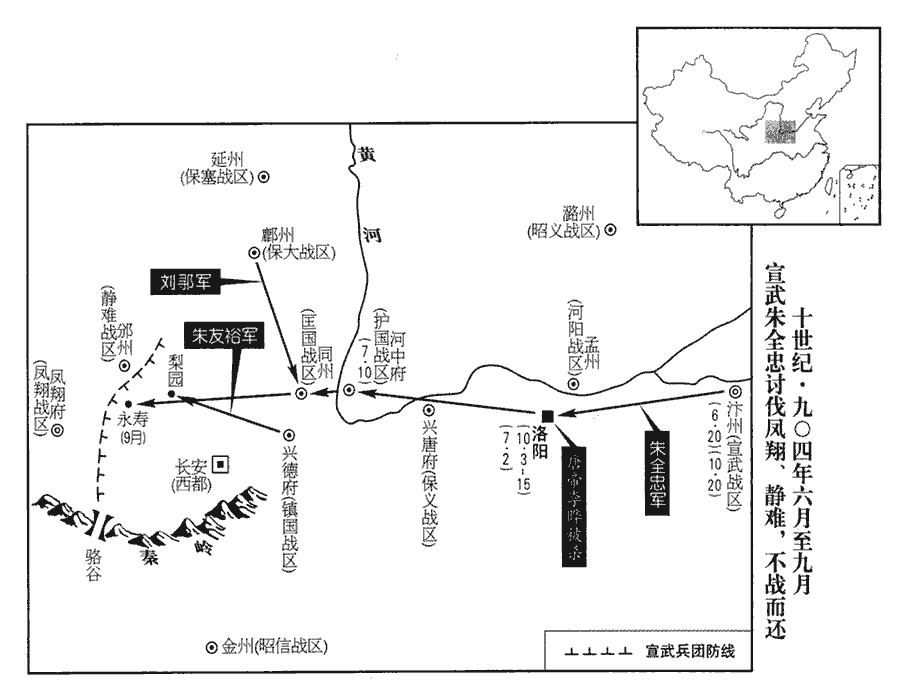
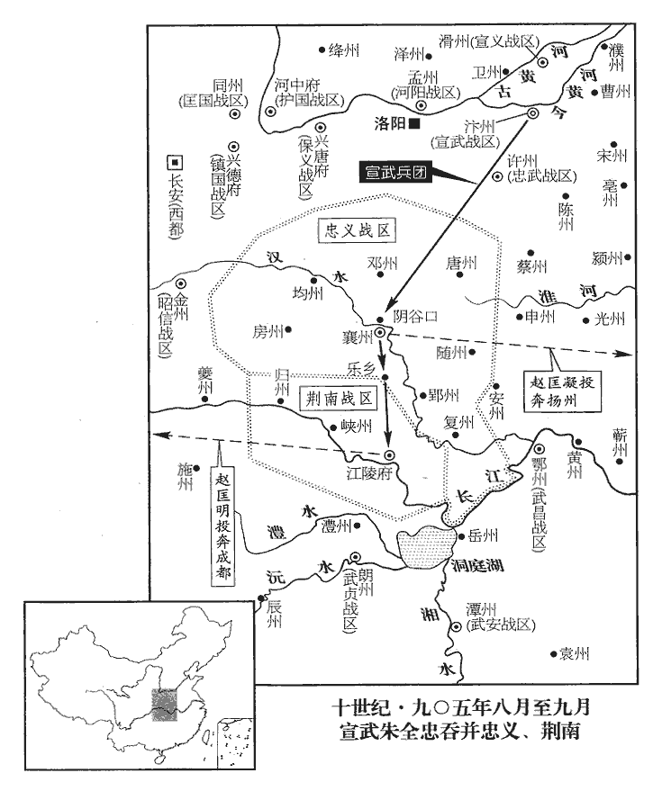
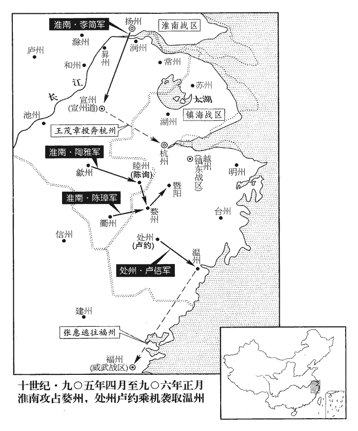
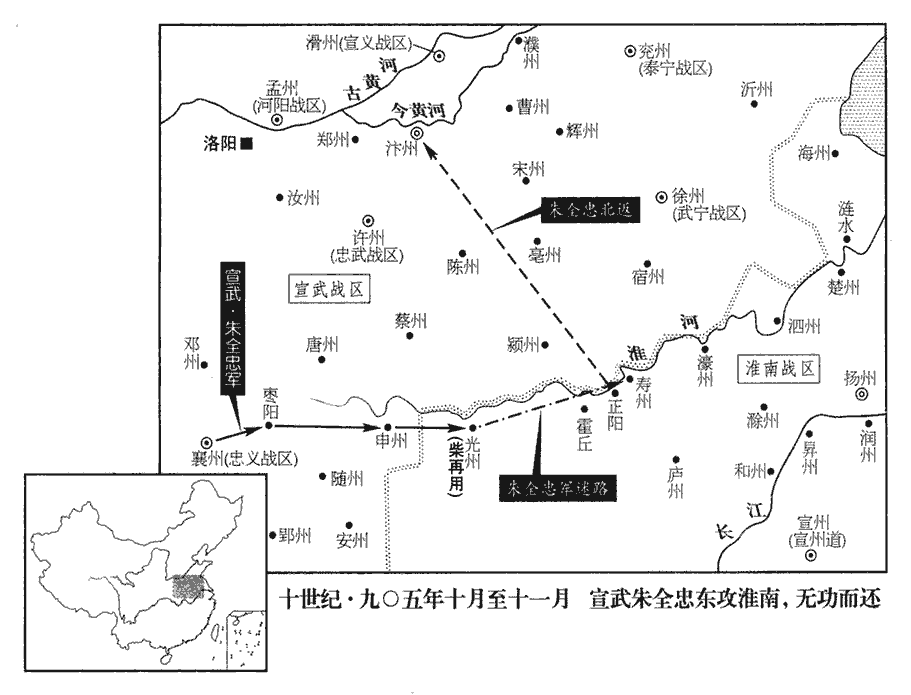
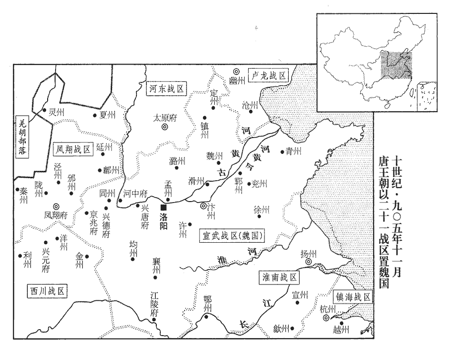
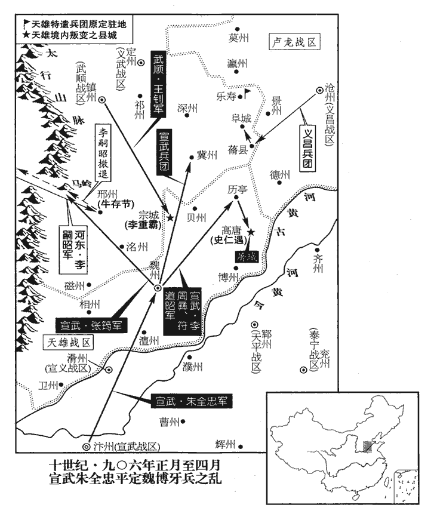
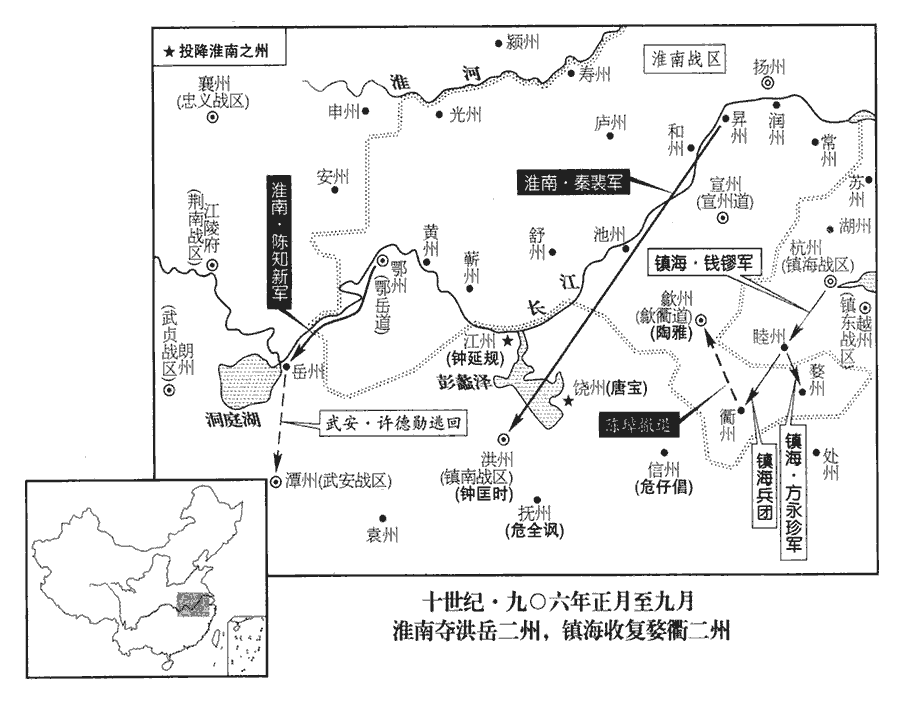
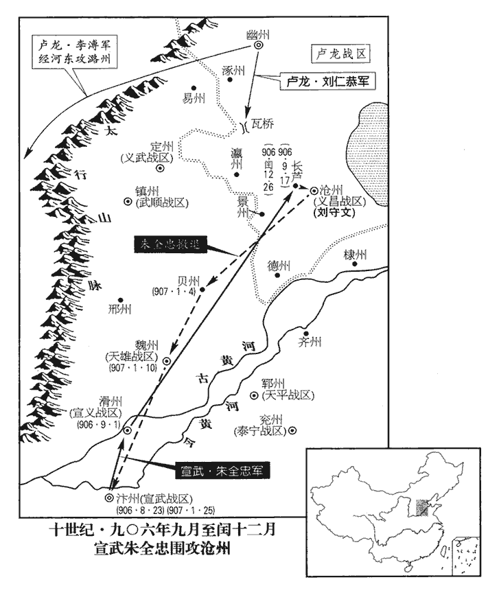
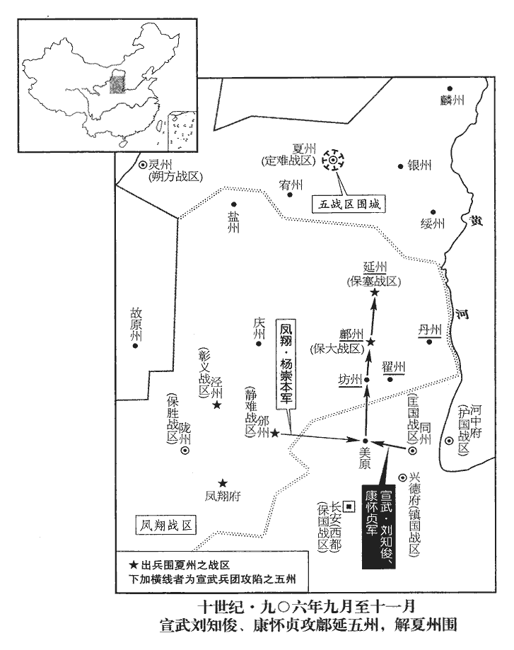

 唐紀八十一起閼逢困敦（甲子）五月，盡柔兆攝提格（丙寅），凡二年有奇。

# 昭宗聖穆景文孝皇帝下之下

## 天祐元年（甲子、九零四）

1五月，丙寅‹二›，加河陽‹总部设孟州河南省孟州市›節度使張漢瑜同平章事。

〖译文〗 [1]五月丙寅（初二），朝廷加授河阳节度使张汉瑜为同平章事。

2帝宴朱全忠及百官於崇勳殿，時以洛陽宮前殿為貞觀殿，內朝為崇勳殿。既罷，復召全忠宴於內殿；復，扶又翻。全忠疑，不入。帝曰：「全忠不欲來，可令敬翔來。」全忠擿tī翔使去，曰：「翔亦醉矣。」全忠疑帝欲圖己，敬翔其腹心也，故亦不使之入。擿，他狄翻。辛未‹七›，全忠東還；還，從宣翻，又如字。乙亥‹十一›，至大梁‹汴州州政府所在城·河南省开封市›。

〖译文〗 [2]昭宗在崇政殿宴请朱全忠及文武百官。宴席散后，昭宗又召朱全忠进内殿饮宴；朱全忠怀疑昭宗要谋害自己，不进去。昭宗说：“朱全忠不想来，可以让敬翔进来。”朱全忠指使敬翔离去，说：“敬翔也醉了。”辛未（初七），朱全忠东归；乙亥（十一日），朱全忠回到大梁。

3忠義‹总部设襄州湖北省襄樊市›節度使趙匡凝遣水軍上峽攻王建夔州‹重庆市奉节县›，趙匡凝以襄陽之甲窺夔門。夔在三峽上游，泝流攻之，故曰上峽。上，時掌翻。知渝州‹重庆市›王宗阮等擊敗之。萬州‹重庆市万州区›刺史張武作鐵絙絕江中流，立柵於兩端，謂之「鏁峽」。敗，補邁翻。絙，古恆翻。鏁，即鎖字。

〖译文〗 [3]忠义节度使赵匡凝派遣水军溯流上三峡，攻打王建所辖之夔州，主持渝州事务的王宗阮等将他们打败。万州刺史张武作粗铁绳断绝长江水流中央的航道，在两端设立栅栏，称为“锁峡”。

4六月，李茂貞、王建、李繼徽‹杨崇本·静难总部邠州›傳檄合兵以討朱全忠；全忠以鎮國‹总部设兴德府陕西省华县›節度使朱友裕為行營都統，將步騎擊【章：十二行本「擊」上有「數萬」二字；乙十一行本同；孔本同。】之；當是時，蜀兵不出，朱全忠之兵力不能及也，令朱友裕擊岐、邠耳。命保大‹总部设鄜州陕西省富县›節度使劉鄩棄鄜州‹陕西省富县›，引兵屯同州‹陕西省大荔县›。劉鄩在鄜州，逼近李茂貞、繼徽，聲援不接，故使棄鄜還屯同州，與朱友裕合勢。鄜，音夫。癸丑‹二十›，全忠引兵自大梁西討茂貞等；秋，七月，甲子‹二›，過東都‹洛阳›入見；見，賢遍翻。壬申‹十›，至河中‹山西省永济市›。

〖译文〗 [4]六月，李茂贞、王建、李继徽传布檄文合兵讨伐朱全忠。朱全忠任命镇国节度使朱友裕为行营都统，率领步兵、骑兵数万人攻击岐州、州；命令保大节度使刘放弃州，带兵前往同州驻扎。癸丑（二十日），朱全忠统帅大军自大梁出发，向西讨伐李茂贞等。秋季，七月甲子（初二），朱全忠路过东都洛阳，入城朝见昭宗；壬申（初十），到达河中。

 

5西川‹总部成都府›諸將勸王建乘李茂貞之衰，攻取鳳翔。建以問節度判官馮涓，涓，圭淵翻。涓曰：「兵者凶器，殘民耗財，不可窮也。言不可窮兵。極其兵力，好戰不休，是窮兵也。今梁、晉虎爭，勢不兩立，梁，朱全忠。晉，李克用。若併而為一，舉兵向蜀，雖諸葛亮復生，不能敵矣。復，扶又翻。鳳翔，蜀之藩蔽，不若與之和親，結為婚姻，無事則務農訓兵，保固疆埸，埸，音亦。有事則覘其機事，觀釁而動，可以萬全。」覘，丑廉翻，又丑豔翻。釁，許覲翻。建曰：「善！茂貞雖庸才，然有強悍之名，悍，下罕翻，又侯旰翻。遠近畏之，與全忠力爭則不足，自守則有餘，使為吾藩蔽，所利多矣。」乃與茂貞脩好。王建既併山南諸州，阻關而守，關外倚李茂貞為藩蔽，故與之脩好。好，呼到翻。丙子‹十四›，茂貞遣判官趙鍠如西川，為其姪天雄‹总部设秦州甘肃省秦安县西北›節度使繼勳求婚；鍠，戶盲翻。為，于偽翻。此天雄軍治秦州，屬李茂貞。建以女妻之。妻，七細翻。茂貞數求貨及甲兵於建，建皆與之。墮軍實以厚寇讎，豈王建之本心哉！倚以自蔽，不厭其數也。數，所角翻。

〖译文〗 [5]西川诸将劝节度使王建乘李茂贞衰弱的机会，攻取凤翔。王建为此询问节度判官冯涓，冯涓说：“战争是凶器，残害百姓，耗损钱财，因此，不应穷兵黩武。现在大梁朱全忠、晋阳李克用两虎相争，势不两立，如果朱全忠、李克用的两支军队合而为一，发兵攻蜀，虽然诸葛亮再生，也是不能抵挡的。凤翔是蜀的屏障，不如与李茂贞和睦亲善，结为婚姻，无事就致力农业生产，操练军队，保卫巩固边界，有事就察看时机，看准破绽而行动，可以万无一失。”王建说：“好！李茂贞虽然是个庸才，然而有勇猛无所顾忌的名声，远近都怕他，与朱全忠拼力抗争虽不足，但保卫自己却有余，使他作为我的屏障，得利很多啊！”于是，与李茂贞建立亲善关系。丙子（十四日），李茂贞派遣判官赵前往西川，替他的侄子天雄节度使李继勋求婚；王建把女儿嫁给李继勋为妻。李茂贞屡次向王建求索财物及铠甲兵器，王建都给了他。

王建賦斂重，人莫敢言。馮涓因建生日獻頌，先美功德，後言生民之苦。建愧謝曰：「如君忠諫，功業何憂！」賜之金帛。自是賦斂稍損。史言馮涓因獻頌而進規，故其諫易入。斂，力贍翻。

〖译文〗 王建征收赋税很重，没有人敢说。冯涓借王建的生日进献颂词，先赞美他的功德，后陈述百姓的困苦。王建看了非常惭愧，致谢说：“像您这样忠言直谏，成就功业又有什么可忧虑的呢！”于是，赏赐给冯涓金帛。从此赋税稍有减少。

6初，朱全忠自鳳翔迎車駕還，見二百六十三卷天復三年。還，從宣翻，又如字。見德王裕眉目疏秀，且年齒已壯，惡之，惡，烏路翻。全忠欲篡，利立庸幼；德王裕貌秀而齒長，立之非己之利也，故惡之。私謂崔胤曰：「德王‹李裕›嘗奸帝位，謂為劉季述所立也。事見二百六十二卷光化三年、天復元年。豈可復留！奸，音干。復，扶又翻。公何不言之！」胤言於帝。帝問全忠，全忠曰：「陛下父子之間，臣安敢竊議，此崔胤賣臣耳。」史言朱全忠之狡猾。帝自離長安，日憂不測，與皇后終日沈飲，或相對涕泣。離，力智翻。是年正月壬戌，帝離長安而東。沈，持林翻。全忠使樞密使蔣玄暉伺察帝，動靜皆知之。伺，相吏翻。帝從容謂玄暉曰：「德王朕之愛子，全忠何故堅欲殺之？」因泣下，齧中指血流。玄暉具以語全忠，史言昭宗之輕脫以速禍。從，千容翻。齧niè，五結翻。語，牛倨翻。全忠愈不自安。

〖译文〗 [6]当初，朱全忠自凤翔迎接昭宗车驾返回长安，见德王李裕眉目清秀，并且已经成年，很厌恶他，私下对崔胤说：“德王曾经窃据帝位，哪里能够再留下！您为什么不向陛下说！”崔胤把朱全忠的话向昭宗说了。昭宗问朱全忠，朱全忠说：“陛下父子之间的事情，我怎么敢私下议论，这是崔胤出卖我罢了。”昭宗自从离开长安，每天忧虑发生意外事变，整天与何皇后沉湎酒中，或者相对哭泣。朱全忠让枢密使蒋玄晖侦察昭宗的言行，昭宗的动静他都知道。昭宗从容对蒋玄晖说：“德王是朕的爱子，朱全忠为什么一定要杀他？”因此落泪，咬中指流血不止。蒋玄晖将此情形详细告诉朱全忠，朱全忠更加不安。

時李茂貞、楊崇本、李克用‹河东总部太原府›、劉仁恭‹卢龙总部幽州›、王建、楊行密、趙匡凝移檄往來，皆以興復為辭。全忠方引兵西討，西討岐、邠。以帝有英氣，恐變生於中，欲立幼君，易謀禪代。易，以豉翻。乃遣判官李振至洛陽，與玄暉及左龍武統軍朱友恭、右龍武統軍氏叔琮等圖之。

〖译文〗 当时，李茂贞、杨崇本、李克用、刘仁恭、王建、杨行密、赵匡凝往来传移檄文，都以兴复皇室为辞。朱全忠正在率领军队向西讨伐岐州、州，因昭宗有英武之气，恐怕宫中产生变故，想要另立幼君，以谋求禅让取代。于是，朱全忠派遣判官李振到洛阳，与蒋玄晖及左龙武统军朱友恭、右龙武统军氏叔琮等谋划。

八月，壬寅‹十一›，帝‹李晔›在椒殿，椒殿，皇后殿也。史炤曰：椒殿亦猶椒房之稱。玄暉選龍武牙官史太等百人夜叩宮門，言軍前有急奏，軍前，謂西討行營軍前也。欲面見帝。夫人裴貞一開門見兵，曰：「急奏何以兵為？」史太殺之。玄暉問：「至尊安在？」昭儀李漸榮臨軒呼曰：呼，火故翻。「寧殺我曹，勿傷大家！」帝方醉，遽起，單衣繞柱走，史太追而弒之。年三十八。漸榮以身蔽帝，太亦殺之。又欲殺何后，后求哀於玄暉，乃釋之。何后祈生於蔣玄暉而卒以玄暉死，屈節以苟歲月之生，豈若以身殉昭宗之不失節也！

〖译文〗 八月壬寅（十一日），昭宗在何皇后殿内，枢密使蒋玄晖选择龙武牙官史太等一百人，在夜里敲击宫门，说军事前线有急事奏报，要面见昭宗。夫人裴贞一开门见兵士，说：“有急事奏报用兵士做什么？”史太杀了她。蒋玄晖问：“陛下在哪里？”昭仪李渐荣对窗大叫道：“宁可杀了我们，不要伤害陛下！”昭宗刚醉，急忙起来，穿着单衣绕柱逃跑，史太追上并把他杀死。李渐荣用身体遮挡昭宗，史太也杀了她。史太又要杀何皇后，何皇后向蒋玄晖哀求，才放了她。

癸卯‹十二›，蔣玄暉矯詔稱李漸榮、裴貞一弒逆，宜立輝王祚為皇太子，更名柷zhù，更，工衡翻。柷，昌六翻。監軍國事。監，古銜翻。又矯皇后令，太子於柩前即位。宮中恐懼，不敢出聲哭。丙午‹十五›，昭宣帝‹李柷›即位，時年十三。

〖译文〗 癸卯（十二日），蒋玄晖假造诏令，称李渐荣、裴贞一谋杀昭宗，应该立辉王李祚为皇太子，更名李，代理军国政事。又假传皇后令，太子于灵柩前即位。宫中一片恐惧气氛，不敢哭出声来。丙午（十五日），昭宣帝即位，时年十三岁。

7李克用復以張承業為監軍。李克用匿張承業見上卷天復三年。監，古銜翻。

〖译文〗 [7]李克用再以张承业为监军。

8淮南‹总部扬州›將李神福攻鄂州‹湖北省武汉市›未下，天復三年，李神福始攻鄂州，天祐元年又攻鄂州，事並見上卷。會疾病，還廣陵‹江苏省扬州市›，楊行密以舒州‹安徽省潜山县›團練使泌陽‹河南省唐河县›劉存代為招討使；泌陽，漢湖陽縣地，後魏置石馬縣，後訛為上馬，貞觀元年廢，開元十六年復割湖陽置上馬縣，天寶元年改曰泌陽，屬唐州。宋白曰：泌陽縣本漢舞陰縣地云云，同上。唐改泌陽，以地在泌水之陽也，唐州治焉。泌，兵媚翻。神福尋卒。宣州‹首府设宣州安徽省宣州市›觀察使臺濛卒，卒，子恤翻。楊行密以其子牙內諸軍使渥為宣州觀察使，右牙都指揮使徐溫謂渥曰：「王寢疾而嫡嗣出藩，此必姦臣之謀。他日相召，非溫使者及王令書，慎無亟來！」諸侯下令於境內，謂之令書，以異於天子所下制、詔、敕之書也。亟，紀力翻。為徐溫召渥張本。渥泣謝而行。

〖译文〗 [8]淮南将领李神福攻打鄂州，没有攻克，适逢病重，回广陵，杨行密以舒州团练使泌阳刘存代为招讨使；李神福不久就死了。宣州观察使台去世，杨行密以自己的儿子牙内诸军使杨渥为宣州观察使。右牙都指挥使徐温对杨渥说：“吴王卧病，而令嫡子出藩，这一定是奸臣的阴谋。他日召您回来，不是我派遣的使者及吴王的令书，千万不要立即回来！”杨渥哭着道谢，就上路了。

9九月，己巳‹八›，尊皇后為皇太后。

〖译文〗 [9]九月己巳（初八），昭宣帝尊何皇后为皇太后。

10朱全忠引兵北屯永壽‹陕西省永寿县›，南至駱谷‹陕西省周至县西南›，軍永壽，所以致邠兵；自此而南至駱谷，所以致岐兵。鳳翔、邠寧兵竟不出。辛未‹十›，東還。

〖译文〗 [10]朱全忠率领的军队北边驻扎永寿，南边到达骆谷，凤翔、宁的军队竟不出战。辛未（初十），朱全忠率兵东还。

11冬，十月，辛卯朔‹一›，日有食之。

〖译文〗 [11]冬季，十月，辛卯朔（初一），出现日食。

12朱全忠聞朱友恭等弒昭宗，陽驚，號哭號，戶刀翻。自投於地，曰：「奴輩負我，令我受惡名於萬代！」癸巳‹三›，至東都，自軍前東還至東都。伏梓宮慟哭流涕，又見帝自陳非己志，請討賊。帝，昭宣帝也。賊，弒君之賊。先是，護駕軍士有掠米於市者，先，悉薦翻。甲午‹四›，全忠奏朱友恭、氏叔琮不戢士卒，侵擾市肆，以此為二人罪，猶不敢昌然以弒逆之罪罪之。友恭貶崖州‹海南省琼山市›司戶，復姓名李彥威，李彥威，壽州人，客汴州，殖財任俠，朱全忠愛而子之。考異見二百五十九卷景福二年。叔琮貶白州‹广西博白县›司戶，尋皆賜自盡。彥威臨刑大呼曰：「賣我以塞天下之謗，呼，火故翻。塞，悉則翻。如鬼神何！行事如此，望有後乎！」

〖译文〗 [12]朱全忠听到朱友恭等杀死昭宗的消息，假装震惊，放声大哭，自己扑倒在地上，说：“奴才们害死我了，让我千秋万代蒙受恶名！”癸巳（初三），朱全忠到达东都洛阳，伏在昭宗的灵柩上恸哭流涕；又进见昭宣帝，自陈杀死昭宗不是自己的心意，请求讨伐乱臣贼子。在这之先，护卫皇帝的军士有在市上抢米的，甲午（初四），朱全忠奏参朱友恭、氏叔琮不能约束士卒，侵扰街市店铺，将朱友恭贬为崖州司马，恢复原姓名李彦威，氏叔琮贬为白州司马，不久都赐令自尽。李彦威自杀前大声呼喊说：“出卖我来堵塞天下的指责，但拿鬼神怎么办！如此行事，还指望有后代吗！”

丙申‹六›，天平‹总部设郓州山东省东平县›節度使張全義來朝。丁酉‹七›，復以全忠為宣武、護國‹总部河中府›、宣義、天平節度使；以全義為河南尹兼忠武‹总部设陈州河南省淮阳县›節度使、判六軍諸衛事。朱全忠兼忠武，張全義帥天平，見上卷上年。朱友恭、氏叔琮既誅，以全義領宿衛。乙巳‹十五›，全忠辭赴鎮，庚戌‹二十›，至大梁。

〖译文〗 丙申（初六），平天节度使张全义来朝见。丁酉（初七），又任命朱全忠为宣武、护国、宣义、天平节度使；任命张全义为河南尹兼忠武节度使、判六军诸卫事。乙巳（十五日），朱全忠辞别前往藩镇，庚戌（二十日）到大梁。

13鎮國‹总部设兴德府陕西省华县›節度使朱友裕薨於棃園‹陕西省淳化县›。死於棃園行營。

〖译文〗 [13]镇国节度使朱友裕在梨园行营去世。

14光州‹河南省潢川县›叛楊行密，降朱全忠，降，戶江翻。行密遣兵圍之，與鄂州皆告急於全忠。楊行密使其將劉存攻杜洪於鄂州。十一月，戊辰‹八›，全忠自將兵五萬自潁州‹安徽省阜阳市›濟淮，自潁州潁上縣取正陽濟淮。軍于霍丘‹安徽省霍邱县›，九域志，霍丘縣在壽州東一百二十七里。按元豐之壽州治下蔡。分兵救鄂州。淮南兵釋光州之圍還廣陵，按兵不出戰，全忠分命諸將大掠淮南以困之。

〖译文〗 [14]光州背叛杨行密，投降朱全忠，杨行密派遣军队包围光州。光州与鄂州都向朱全忠告急。十一月戊辰（初八），朱全忠亲自统帅五万军队自颍州渡过淮河，在霍丘驻扎，分派军队救援鄂州。淮南军队解除对光州的包围返回广陵，按兵不出来迎战，朱全忠分派诸将大肆虏掠淮南来让广陵陷于困境。

15錢鏐潛遣衢州‹浙江省衢州市›羅城使葉讓殺刺史陳璋，事泄；錢鏐恨陳璋見二百六十二卷天復二年。十二月，璋斬讓而叛，降于楊行密。降，戶江翻。

〖译文〗 [15]钱暗中派遣衢州罗城使叶让杀死衢州刺史陈璋，事情泄露。十二月，陈璋斩杀叶让而背叛钱，投降杨行密。

16初，馬殷‹武安总部潭州›弟賨，性沈勇，賨cóng，徂宗翻。沈，持林翻。事孫儒，為百勝指揮使；以百戰百勝名軍。儒死，事楊行密，屢有功，遷黑雲指揮使。行密嘗從容問其兄弟，從，千容翻。乃知為殷之弟，大驚曰：「吾常怪汝器度瓌偉，瓌guī，古回翻。果非常人。當遣汝歸。」賨泣辭曰：「賨淮西殘兵，馬賨從秦宗權、孫儒起於淮西，故云然。大王不殺而寵任之；湖南地近，嘗得兄聲問，賨事大王久，不願歸也。」行密固遣之。是歲，賨歸長沙‹潭州州政府所在县·湖南省长沙市›，行密親餞之郊。

〖译文〗 [16]当初，武安节度使马殷的弟弟马，生性沉着勇敢，侍奉孙儒，任百胜指挥使。孙儒死后，侍奉杨行密，屡次立有战功，升任黑云指挥使。杨行密曾无意中询问他的兄弟，才知道是马殷的弟弟，大为惊讶，说：“我常常奇怪你的器度奇特，果然不是平常的人。应当让你回去。”马哭着推辞说：“我是淮西的残兵，大王不杀而宠信任用。湖南离此不远，曾经得到哥哥的问讯，我侍奉大王已经很久，不愿意回去了。”杨行密坚决让他回去。这一年，马回长沙，杨行密亲自到郊外为他饯行。

賨至長沙，殷表賨為節度副使。他日，殷議入貢天子，賨曰：「楊王地廣兵強，楊行密封吳王，故稱之。與吾鄰接，不若與之結好，好，呼到翻。大可以為緩急之援，小可通商旅之利。」殷作色曰：「楊王不事天子，一旦朝廷致討，罪將及吾。汝置此論，勿為吾禍！」史言馬殷畏朱全忠。

〖译文〗 马到长沙，马殷上表请任马为节度副使。有一天，马殷与马商议向皇上进贡的事，马说：“杨王地广兵强，与我疆界接连，不如与他结为友好，从大处说可以作为缓急之援，从小处讲可以有通商旅之利。”马殷变色说：“杨王不侍奉天子，一旦朝廷发兵讨伐，罪将涉及我们。你放弃这种主张，不要为我招祸！”

17初，清海‹总部设广州广东省广州市›節度使徐彥若遺表薦副使劉隱權留後，事見二百六十二卷天復元年。朝廷以兵部尚書崔遠為清海節度使。遠至江陵‹湖北省江陵县›，聞嶺南多盜，且畏隱不受代，不敢前，朝廷召遠還。隱遣使以重賂結朱全忠，乃奏以隱為清海節度使。史言劉隱自託於朱全忠。

〖译文〗 [17]当初，清海节度使徐彦若临终上表荐举副使刘隐代理留后，朝廷任命兵部尚书崔远为清海节度使。崔远到达江陵，听说岭南盗贼很多，并且畏惧刘隐不接受替代，不敢前进，朝廷召崔远回京师。刘隐派遣使者用重贿交结朱全忠，朱全忠于是奏请以刘隐为清海节度使。

# 昭宣光烈孝皇帝諱祚，即位更名柷，昭宗第九子。後唐明宗天成三年立廟于曹州，四年乃追崇諡號。

## 天祐二年（乙丑，九零五）

1春，正月，朱全忠‹朱温·宣武总部汴州›遣諸將進兵逼壽州‹安徽省寿县›。是時壽州治壽春，朱全忠自霍丘遣諸將進逼之。

〖译文〗 [1]春季，正月，朱全忠派遣诸将率兵进逼寿州。

2潤州‹江苏省镇江市›團練使安仁義勇決得士心，故淮南將王茂章攻之，踰年不克。王茂章攻潤州事，始上卷天復三年八月。楊行密‹杨行愍·淮南总部扬州›使謂之曰：「汝之功吾不忘也，安仁義歸楊行密，破趙鍠、孫儒，平宣、潤，皆有功。能束身自歸，當以汝為行軍副使，但不掌兵耳。」仁義不從。茂章為地道入城，遂克之。仁義舉族登樓，眾不敢逼。安仁義在淮南軍中號最善射，眾憚之，故不敢逼。先是，攻城諸將見仁義輒罵之，先，悉薦翻。惟李德誠不然，至是仁義召德誠登樓，謂曰：「汝有禮，吾今以為汝功。」且以愛妾贈之。【章：十二行本「之」下有「乃擲弓於地」五字；乙十一行本同；孔本同；張校同；退齋校同。】德誠掖之而下，并其子斬於廣陵‹扬州州政府所在城·江苏省扬州市›市。田頵、朱延壽、安仁義，淮南諸將中之鎗鎗者也。三叛連衡，不足以病楊行密。朞年之餘，相次禽殄，行密未易才也。

〖译文〗 [2]润州团练安仁义勇敢决断，深得军心，所以淮南将领王茂章攻打润州，过了一年没有攻克。杨行密派遣使者对安仁义说：“你的功劳我不会忘记，能够自缚归来，当让你任行军副使，只是不掌兵权罢了。”安仁义没有投降。王茂章挖地道进城，于是占领了润州。安仁义带全族上楼，众人不敢逼近。此前，攻城各将领望见安仁义就骂他，只有李德诚不这样，到这时，安仁义召李德诚登楼，对他说：“你有礼貌，我现在把功劳给你。”并且把自己的爱妾赠送给他。于是，把弓箭扔在地上。李德诚夹着安仁义下楼，连同他的儿子在广陵街市斩首。

3兩浙兵圍陳詢于睦州‹浙江省建德市›，陳詢叛錢鏐事始上卷天復三年。楊行密遣西南招討使陶雅將兵救之；軍中夜驚，士卒多踰壘亡去，左右及裨將韓球奔告之，雅安臥不應，須臾自定，亡者皆還。史言御眾之術，惟靜足以制動。錢鏐遣其從弟鎰及指揮使顧全武、王球禦之，為雅所敗，從，才用翻。鎰，夷質翻。敗，補邁翻。虜鎰及球以歸。

〖译文〗 [3]两浙军队在睦州把陈询包围，杨行密派遣西南招讨使陶雅率领军队前去救援。陶雅的军营中夜里受惊，许多士卒越过营垒逃走，左右及裨将韩球跑来报告陶雅，陶雅安睡不理。片刻便自行安定，逃走的士卒都回来了。钱派遣他的堂弟钱镒及指挥使顾全武、王球抵御，被陶雅打败，俘虏钱镒及王球返回广陵。

4庚午‹十一›，朱全忠命李振知青州‹山东省青州市›事，代王師範‹平卢总部青州›。朱全忠寬西顧之虞，然後命李振代王師範。

〖译文〗 [4]庚午（十一日），朱全忠任命李振主持青州事务，替代王师范。

5全忠圍壽州，州人閉壁不出。全忠乃自霍丘‹安徽省霍邱县›引歸，朱全忠遣諸將逼壽州城下，而留屯霍丘為後勢。二月，辛卯‹二›，至大梁‹河南省开封市›。霍丘至大梁九百餘里。

〖译文〗 [5]朱全忠包围寿州，州人关闭营垒不出战。朱全忠于是从霍丘带兵回去，二月辛卯（初二）到大梁。

6李振至青州，王師範舉族西遷，至濮陽‹河南省濮阳市西南›，素服乘驢而進；至濮陽已入朱全忠巡屬，故囚服乘驢以請罪。濮，博木翻。至大梁，全忠客之。表李振為青州留後。

〖译文〗 [6]李振到青州，王师范全族西迁，到濮阳，换上素服骑驴前进。到达大梁，朱全忠以客人对待。上表请任李振为青州留后。

7戊戌‹九›，以安南‹静海总部设安南府越南河内市›節度使、同平章事朱全昱為太師，致仕。全昱，全忠之兄也，戇樸無能，戇zhuàng，竹巷翻。先領安南，全忠自請罷之。

〖译文〗 [7]戊戌（初九），朝廷以安南节度使、同平章事全昱为太师，退休。朱全昱是朱全忠的哥哥，戆厚朴实，没有能力，先兼任安南，朱全忠自己请求罢免他。

8是日社，自古以來，以戊日社。戊，土也。立春以後歷五戊則社日。全忠使蔣玄暉邀昭宗‹李晔（李敏）›諸子德王裕、棣王祤yǔ、虔王禊xì、沂王禋、遂王禕yī、景王祕、祁王琪、【章：十二行本「琪」作「祺」；乙十一行本同；孔本同。】雅王禛、禛，之人翻。瓊王祥，置酒九曲池‹洛阳宫中›，九曲池在洛苑中。酒酣，悉縊殺之，投尸池中。

〖译文〗 [8]这一天是社日，朱全忠让蒋玄晖邀请唐昭宗诸子德王李裕、棣王李、虔王李禊、沂王李、遂王李、景王李秘、祁王李琪、雅王李、琼王李祥，在九曲池摆酒，喝得酣醉，把他们全都勒死，抛尸九曲池中。

9朱全忠遣其將曹延祚將兵與杜洪‹武昌总部鄂州›共守鄂州‹湖北省武汉市›，庚子‹十一›，淮南‹总部扬州›將劉存攻拔之，天復二年正月，淮南兵攻鄂州，踰兩朞而後克。執洪、延祚及汴兵千餘人送廣陵，悉誅之。僖宗光啟二年，杜洪據鄂州，至是而亡。行密以存為鄂岳‹首府设鄂州湖北省武汉市›觀察使。

〖译文〗 [9]朱全忠派遣他的部将曹延祚率领军队与杜洪共同守卫鄂州。庚子（十一日），淮南将领刘存攻取鄂州，生擒杜洪、曹延祚及汴州兵士一千余人送往广陵，把他们全部杀死。杨行密任命刘存为鄂岳观察使。

10己酉‹二十›，葬聖穆景文孝皇帝‹李晔›於和陵‹河南省偃师县南缑山›，和陵在河南緱gōu氏縣懊來山，是年更名太平山。廟號昭宗。

〖译文〗 [10]已酉（二十日），将圣穆景文孝皇帝葬于和陵，庙号昭宗。

11三月，庚午‹十一›，以王師範為河陽‹总部设孟州河南省孟州市›節度使。

〖译文〗 [11]三月庚午（十一日），朝廷任命王师范为河阳节度使。

12戊寅‹十九›，以門下侍郎、同平章事獨孤損同平章事，充靜海‹总部设安南府越南河内市›節度使；罷獨孤損政事耳。靜海軍治交州，在嶺海之外，損安得至邪！以禮部侍郎河間‹瀛州州政府所在县·河北省河间市›張文蔚同平章事。蔚，紆勿翻。甲申‹二十五›，以門下侍郎、同平章事裴樞為左僕射，崔遠為右僕射，並罷政事。

〖译文〗 [12]戊寅（十九日），朝廷任命门下侍郎、同平章事独孤损同平章事，充静海节度使；任命礼部侍郎河间张文蔚同平章事。甲申（二十五日），任命门下侍郎、同平章事裴枢为左仆射，崔远为右仆射，一并停止参与政事。

初，柳璨及第，不四年為宰相，性傾巧輕佻。佻，他彫翻。時天子左右皆朱全忠腹心，璨曲意事之。同列裴樞、崔遠、獨孤損皆朝廷宿望，意輕之，璨以為憾。和王傅張廷範，和王福亦昭宗之子。本優人，有寵於全忠，奏以為太常卿。樞曰：「廷範勳臣，幸有方鎮，言幸有方鎮可以處之。何藉樂卿！太常卿掌禮樂，故曰樂卿。言勳人處之之職當各當其分，不藉樂卿以榮。恐非元帥之旨。」朱全忠時為諸道元帥，故稱之。持之不下。下，戶嫁翻。全忠聞之，謂賓佐曰：「吾常以裴十四器識真純，不入浮薄之黨；裴樞，第十四。觀此議論，本態露矣。」言其猶持清議也。璨因此并遠、損譖於全忠，故三人皆罷。

〖译文〗 起初，柳璨中进士，不到四年升为宰相，生性乘巧轻浮。当时皇上左右都是朱全忠的亲信，柳璨想尽办法去侍奉他们。同时位列宰相的裴枢、崔远、独孤损都是朝廷素负重望的人，心中看轻他，柳璨以此怀恨在心。和王李福的师傅张廷范本是戏子，朱全忠宠爱信任他，柳璨奏请任命他为太常卿。裴枢说：“张廷范是有功劳的大臣，有方镇来安置他，何必给他掌管礼乐的太常卿！恐怕不是元帅的意思。”相持不下，朱全忠听到这些话，对宾客僚佐说：“我常认为裴十四的器量见识真诚纯粹，不入轻浮浅薄之流，观此议论，本来的面目显露出来了。”柳璨借此在朱全忠面前诬陷裴枢以及崔远、独孤损，所以三人都被罢去宰相之职。

以吏部侍郎楊涉同平章事。涉，收之孫也。楊收見懿宗紀，為相，以罪貶死。為人和厚恭謹，聞當為相，與家人相泣，謂其子凝式曰：「此吾家之不幸也，必為汝累。」累，良瑞翻。

〖译文〗 朝廷任命吏部侍郎杨涉为同平章事。杨涉是杨收的孙子。为人和平宽厚，恭敬谨慎，听到任为宰相，与家里人相对哭泣，对他的儿子杨凝式说：“这是我家的不幸，一定成为你的连累。”

13加清海‹总部设广州广东省广州市›節度使劉隱同平章事。

〖译文〗 [13]清海节度使刘隐加封同平章事。

14壬辰，河東‹总部太原府›都押牙蓋寓卒，遺書勸李克用‹河东总部太原府›省營繕，薄賦斂，求賢俊。史言蓋寓垂歿不忘效忠於李克用。蓋，古盍翻，姓也。省，所景翻。

〖译文〗 [14]壬辰，（疑误），河东都押牙盖寓死，遗书劝李克用减少营建工程，减轻赋税，征求贤才。

15夏，四月，庚子‹十二›，有彗星出西北。彗，祥歲翻，又徐醉翻，又音歲。

〖译文〗 [15]夏季，四月庚子（十二日），有彗星从西北方出现。

16淮南將陶雅會衢‹浙江省衢州市›、睦‹浙江省建德市›兵攻婺州‹浙江省金华市›，光化三年，田頵取婺州。既而頵為楊行密所攻，錢鏐取婺州，使沈夏守之。錢鏐使其弟鏢將兵救之。鏢，匹燒翻。

〖译文〗 [16]淮南将领陶雅会同衢州、睦州的军队攻打婺州，钱派遣他的弟弟钱镖率兵前去救援。

17五月，禮院奏，皇帝‹李柷zhù（李祚）本年十四岁›登位應祀南郊；敕用十月甲午‹九›行之。為朱全忠殺柳璨、蔣玄暉張本。

〖译文〗 [17]五月，礼院上奏，皇帝登位应该祭祀南郊；敕令在十月甲午（初九）举行。

18乙丑‹七›，彗星長竟天。彗所以除舊布新，易姓之徵也。薛居正五代史曰：是年正月甲辰，有彗出于北河，貫文昌，其長三丈餘。五月乙丑，復出軒轅、大角，及于天市垣，光耀嚴猛。

〖译文〗 [18]乙丑（初七），彗星尾长贯穿天空。

柳璨恃朱全忠之勢，恣為威福。會有星變，占者曰：「君臣俱災，宜誅殺以應之。」璨因疏其素所不快者於全忠曰：「此曹皆聚徒横議，怨望腹非，橫，戶孟翻。非，亦作誹。宜以之塞災異。」塞，悉則翻。李振亦言於朱全忠曰：「朝廷所以不理，良由衣冠浮薄之徒紊亂綱紀；紊，音問。且王欲圖大事，謂篡奪也。此曹皆朝廷之難制者也，不若盡去之。」去，羌呂翻。全忠以為然。癸酉‹十五›，貶獨孤損為棣州‹山东省惠民县›刺史，裴樞為登州‹山东省蓬莱市›刺史，崔遠為萊州‹山东省莱州市›刺史。乙亥‹十七›，貶吏部尚書陸扆為濮州‹山东省鄄城县›司戶，工部尚書王溥為淄州‹山东省淄博市›司戶。庚辰‹二十二›，貶太子太保致仕趙崇為曹州‹山东省定陶县›司戶，兵部侍郎王贊為濰州‹山东省潍坊市›司戶。濰，音維。唐武德二年分青州北海縣置濰州，八年州廢，以北海還屬青州。此時蓋復置濰州也。自餘或門胄高華，或科第自進，居三省臺閣，以名檢自處，處，昌呂翻。聲迹稍著者，皆指為浮薄，貶逐無虛日，搢紳為之一空。為，于偽翻。辛巳‹二十三›，再貶裴樞為瀧shuāng州‹广东省罗定市南›司戶，劉昫曰：瀧州治瀧水縣，本漢端溪縣地。晉分端溪立龍鄉縣，隋改龍鄉為平原縣，又改為瀧水。唐平蕭銑，置瀧州。瀧，閭江翻。獨孤損為瓊州‹海南省定安县›司戶，崔遠為白州‹广西博白县›司戶。

〖译文〗 柳璨仗恃朱全忠的势力，恣意作威作福。适逢有彗星出现，占卜的人说：“君臣都有灾祸，应该诛杀以应天意。”柳璨因此向朱全忠上书列举他平日所不喜欢的人说：“这些人都聚集同伙横加议论，怨恨不满，应该拿他们遏止灾祸。”李振也对朱全忠说：“朝政不能治理的缘故，确实是由于官员中的轻浮浅薄之徙紊乱法纪；况且大王想要图谋大事，这些人都是朝廷中难于制服的人，不如全部除去他们。”朱全忠以为是这样。癸丑（十五日），贬独孤损为棣州刺史，裴枢为登州刺史，崔远为莱州刺史。乙亥（十七日），贬吏部尚书陆为濮州司户，工部尚书王溥为淄州司户。庚辰（二十二日），贬以太子太保退休的赵崇为曹州司户，兵部侍郎王赞为潍州司户。其余或者豪门贵胄，或者科举及第，在三省台阁任职，以名节自居，声誉政迹稍为显著的人，都被指为轻浮浅薄，贬官驱逐连日不断，朝中官员为之一空。辛巳（二十三日），又贬裴枢为泷州司户，独孤损为琼州司户，崔远为白州司户。

19甲申‹二十六›，忠義‹总部设襄州湖北省襄樊市›節度使趙匡凝遣使脩好於王建‹西川总部成都府›。趙匡凝東結淮南，西通巴蜀，欲交鄰以抗朱全忠也，適以動朱全忠之兵。好，呼到翻。

〖译文〗 [19]甲申（二十六日），忠义节度使赵匡凝派遣使者与王建和好。

20六月，戊子朔‹一›，敕裴樞、獨孤損、崔遠、陸扆‹年五十九岁›、王溥、趙崇、王贊等並所在賜自盡。

〖译文〗 [20]六月戊子朔（初一），敕令裴枢、独孤损、崔远、陆、王溥、赵崇、王赞等同时在当地赐令自杀。

時全忠聚樞等及朝士貶官者三十餘人於白馬驛，白馬驛在滑州白馬縣。一夕盡殺之，投尸于河。初，李振屢舉進士，竟不中第，中，竹仲翻。故深疾搢紳之士，言於全忠曰：「此輩常自謂清流，宜投之黃河，使為濁流！」全忠笑而從之。

〖译文〗 当时朱全忠把裴枢等人及被贬斥的朝中官员三十余人聚集在滑州白马驿，一个晚上把他们全部杀死，将尸体抛入黄河。起初，李振屡次参加进士考试，结果不中，所以很嫉妒科举出身的官员，对朱全忠说：“这些人常自称为清流，应该把他们投入黄河，使他们成为浊流！”朱全忠笑着依从了李振。

振每自汴‹河南省开封市›至洛‹洛阳›，朝廷必有竄逐者，時人謂之鴟chī梟。朝，直遙翻。；下同。梟，堅堯翻。見朝士皆頤指氣使，以頤指麾，以氣使令，言其怙朱全忠之勢而肆其驕豪也。旁若無人。

〖译文〗 李振每次从汴州到洛阳，朝廷一定有被放逐的官员，当时人称他为猫头鹰。每见朝中的官员，都是颐指气使，旁若无人。

全忠嘗與僚佐及遊客坐於大柳之下，全忠獨言曰：「此柳宜為車轂。」轂，古鹿翻。眾莫應。有遊客數人起應曰：「宜為車轂。」全忠勃然厲聲曰：「書生輩好順口玩人，皆此類也！好，呼到翻。言順口附和以玩狎人。車轂須用夾榆，說文：榆，白枌fén。所謂夾榆，乃今之田榆也，生田塍chéng間，其皮類槐，其肉理堅緻而赤，鋸以為器，堅而耐久。車轂眾輻所湊，其木宜堅緻者。呂俛曰：櫅jī榆宜作車轂。爾雅云，白棗也。櫅，相稽翻。柳木豈可為之！」顧左右曰：「尚何待！」左右數十人，捽言「宜為車轂」者悉撲殺之。捽zuó，昨沒翻。撲，弼角翻。

〖译文〗 朱全忠曾经与属官及游客坐在大柳树下面，朱全忠自言自语地说：“这株柳树适宜于做车毂。”属官没有响应。有几个游客起身响应说：“适宜做车毂。”朱全忠勃然大怒，声音严厉地说：“书生之辈喜好顺口附和以玩弄人，都像这样！车毂必须用榆木制作，柳木岂能制作！”环视左右的人说：“还等待什么！”左右数十人，拉出说“适宜做车毂”的游客全部打死。

己丑‹二›，司空致仕裴贄貶青州司戶，尋賜死。

〖译文〗 已丑（初二），辞官家居的司空裴贽，被贬为青州司户，不久赐死。

柳璨餘怒所注，猶不啻chì十數，張文蔚力解之，乃止。

〖译文〗 柳璨余怒所注视的人，还不止数十人，张文蔚尽力排解，才停止。

時士大夫避亂，多不入朝，壬辰‹五›，敕所在州縣督遣，無得稽留。前司勳員外郎李延古，德裕之孫也，去官居平泉莊‹河南省洛阳市南十五千米›，李德裕有平泉莊，在河南府界。德裕平泉記曰：先公眺想，屬注伊川，吾於是有退居河洛之志。於龍門得喬處士故居，翦荊棘，驅狐狸而為之。康駢曰：平泉莊去洛城三十里。詔下未至，【章：十二行本「至」下有「戊申‹二十一›」二字；乙十一行本同；退齋校同。】責授衛尉寺主簿。

〖译文〗 当时士大夫躲避祸乱，多不到朝廷来。壬辰（初五），敕令所在州县督催遣送他们到东都洛阳来，不得滞留。前司勋员外郎李延古是李德裕的孙子，离官住在河南府的平泉庄，诏令下达后没有到洛阳来，戊申（二十一日）责授卫尉寺主簿。

秋，七月，癸亥‹六›，太子賓客致仕柳遜貶曹州‹山东省定陶县›司馬。

〖译文〗 秋季，七月癸亥（初六），以太子宾客退休的柳逊被贬为曹州司马。

21庚午‹十三›夜，天雄‹总部设魏州河北省大名县›牙將李公佺與牙軍謀亂，羅紹威覺之；公佺焚府舍，剽掠，奔滄州‹河北省沧州市东南›。為羅紹威誅牙將張本。佺，且縁翻。剽，匹妙翻。時劉守文據滄州。

〖译文〗 [21]庚午（十三日）夜里，天雄牙将李公与牙军谋划作乱，天雄节度使罗绍威察觉了他们的活动；李公焚烧节度使府舍，抢劫虏掠，逃奔沧州。

22八月，王建遣前山南西道‹总部设兴元府陕西省汉中市›節度使王宗賀等將兵擊昭信‹总部设金州陕西省安康市›節度使馮行襲於金州。馮行襲附朱全忠。

〖译文〗 [22]八月，王建派遣前山南西道节度使王宗贺等率兵在金州攻击昭信节度使冯行袭。

23朱全忠以趙匡凝東與楊行密交通，西與王建結婚，乙未‹九›，遣武寧‹总部设徐州江苏省徐州市›節度使楊師厚將兵擊之；己亥‹十三›，全忠以大軍繼之。考異曰：梁太祖實錄、薛居正五代史梁紀皆云：「七月庚午，遣楊師厚帥前軍討趙凝於襄州，辛未，帝南征。」唐實錄：「七月，全忠奏匡凝擅通好西川、淮南，又遣弟專領荊南，請削奪官爵，已遣都將楊師厚討之。翌日，全忠自帥軍以進。」編遺錄：「八月壬辰，先抽武寧楊師厚，是日到，乃議伐襄州帥趙匡凝。乙未，大發車徒，委楊師厚總其軍政。己亥，上領親從步騎繼大軍之後，是夜宿尉氏。」今從之。薛史：「太祖將圖禪代，以匡凝兄弟並據藩鎮，乃遣使先諭旨焉。凝對使者流涕，答以『受國恩深，豈敢隨時妄有他志！』使者復命，太祖大怒。天祐二年秋七月，遣楊師厚帥師討之。辛未，全忠南征，表匡凝罪狀，請削官爵。」按全忠劫遷昭宗於洛陽，匡凝與行密等移檄諸道共討之，全忠安肯以禪代問之！今不取。

〖译文〗 [23]朱全忠因为山南东道节度使赵匡凝东面与杨行密彼此相通，西面与王建结为婚姻，乙未（初九），派遣武宁节度使杨师厚率军前去攻打他；已亥（十三日），朱全忠亲自统帅大军随后前进。

24處州‹浙江省丽水市›刺史盧約使其弟佶攻陷溫州‹浙江省温州市›，佶，巨乙翻。考異曰：新紀：「正月，約陷溫州。」十國紀年在此月戊戌，今從之。張惠奔福州‹威武战区总部所在·福建省福州市›。天復三年，張惠據溫州，至是而敗。王審知時據福州。自溫州南出平陽縣渡海浦即福州界。九域志，溫州東南至福州界三百二十里，自界首至福州五百二十里。

〖译文〗 [24]处州刺史卢约派遣他的弟弟卢佶攻下温州，张惠逃奔福州。

25錢鏐遣方永珍救婺州。淮南兵自正月攻婺州。

〖译文〗 [25]钱派遣方永珍救援婺州。

26初，禮部員外郎知制誥司空圖棄官居虞鄉‹山西省永济市东虞乡镇›王官谷‹虞乡东南五老峰一谷›，王官谷在虞鄉縣中條山。昭宗屢徵之，不起。柳璨以詔書徵之，圖懼，詣洛陽入見，見，賢遍翻。陽為衰野，墜笏失儀。璨乃復下詔，略曰：「既養高以傲代，類移山以釣名。」又曰：「匪夷匪惠，難居公正之朝。復，扶又翻。柳璨言司空圖既非伯夷之清，又非柳下惠之和。且朝政如彼，而自謂公正。通鑑直敘其辭而媺měi惡自見。可放還山。」圖，臨淮‹泗州州政府所在县·江苏省盱眙县淮河北岸›人也。

〖译文〗 [26]起初，礼部员外郎和制诰司空图放弃官职住在虞乡王官谷，唐昭宗屡次征召他，都不出来做官。柳璨用诏书征召他，司空图害怕，到洛阳入朝进见，假装是衰老粗野，朝芴掉落，丧失仪态。柳璨于是又颁下诏书，大略说：“司空图既自命清高来轻蔑世人，却似扬言移山者沽名钓誉。”又说：“司空图不是伯夷，也不是柳下惠，难以在公平正直的朝廷里担任官职，可以放他回山。”司空图是临淮人。

 

27楊師厚攻下唐‹河南省泌阳县›、鄧‹河南省邓州市›、復‹湖北省天门市›、郢‹湖北省钟祥市›、隨‹湖北省随州市›、均‹湖北省丹江口市西北›、房‹湖北省房县›七州，七州皆忠義軍‹总部设襄州湖北省襄樊市›巡屬。朱全忠軍于漢北。九月，辛酉‹五›，命師厚作浮梁於陰谷口‹襄樊市西北›，襄州穀城縣有陰城鎮。按舊史，陰谷口在襄州西六十里。癸亥‹七›，引兵渡漢。浮梁成而渡。甲子‹八›，趙匡凝將兵二萬陳于漢濱，陳，讀曰陣。師厚與戰，大破之，遂傅其城下。傅，讀如附。是夕，匡凝焚府城，帥其族及麾下士沿漢奔廣陵‹江苏省扬州市›。僖宗中和四年，趙德諲據襄州，傳子匡凝，至是而亡。楊行密時據廣陵，匡凝沿漢入江，順流東下而奔歸之。帥，讀曰率；下同。乙丑‹九›，師厚入襄陽‹襄州州政府所在县·湖北省襄樊市›；丙寅‹十›，全忠繼至。

〖译文〗 [27]杨师厚攻下唐、邓、复、郢、随、均、房七州，朱全忠驻扎在汉江北岸。九月辛亥（初五），朱全忠命令杨师厚在阴谷口作浮桥；癸亥（初七），率兵渡过汉水。甲子（初八），赵匡凝率领二万军队在汉水边上列阵，杨师厚与他作战，把他打得大败，于是逼近襄阳城下。当天晚上，赵匡凝焚烧府城襄阳，率领他的族人及部下将士沿汉水逃奔广陵。乙丑（初九），杨师厚进入襄阳；丙寅（初十），朱全忠跟着到达。

匡凝至廣陵，楊行密戲之曰：「君在鎮，歲以金帛輸全忠，今敗，乃歸我乎？」匡凝曰：「諸侯事天子，歲輸貢賦乃其職也，豈輸賊乎！輸，舂遇翻。今日歸公，正以不從賊故耳。」行密厚遇之。

〖译文〗 赵匡凝到达广陵，杨行密跟他开玩笑说：“您在藩镇，每年用金帛进纳给朱全忠，现在败了，这才归顺我吗？”赵匡凝说：“诸侯为天子做事，每年缴纳赋税是他的职分，哪里是缴纳给贼人朱全忠呢！今天归顺您，正是因为不从贼人的缘故。”杨行密厚待他。

28丙寅‹十›，封皇弟禔為潁王，禔tí，是支翻，又是兮翻。祐為蔡王。

〖译文〗 [28]丙寅（初十），敕封皇弟李为颍王，李为蔡王。

29丁卯‹十一›，荊南‹总部设江陵府湖北省江陵县›節度使趙匡明帥眾二萬，棄城奔成都‹四川省成都市›。天復三年，趙匡凝遣匡明據有荊南。匡凝既敗，匡明亦走。戊辰‹十二›，朱全忠以楊師厚為山南東道‹总部设襄州湖北省襄樊市›留後，引兵擊江陵；荊南軍府治江陵。至樂鄉‹湖北省钟祥市西北乐乡关›，九域志，江陵府長林縣有樂鄉鎮。荊南‹总部江陵府›牙將王建武遣使迎降。全忠以都將賀瓌為荊南留後。降，戶江翻。瓌，古回翻。全忠尋表師厚為山南東道節度使。

〖译文〗 [29]丁卯（十一日），荆南节度使赵匡明率领二万军队放弃江陵城投奔成都。戊辰（十二日），朱全忠以杨师厚为山南东道留后，率兵进攻江陵；到达乐乡，荆南牙将王建武派遣使者迎接投降。朱全忠任命都将贺为荆南留后。不久，朱全忠上表奏请任命杨师厚为山南东道节度使。

 

30王宗賀‹西川总部成都府›等攻馮行襲‹昭信总部金州›，所向皆捷。丙子‹二十›，行襲棄金州‹陕西省安康市›，奔均州‹湖北省丹江口市西北›；其將全師朗以城降。禧宗大順二年，馮行襲取金州，至是而敗，行襲遂歸于朱全忠。九域志，金州東至均州七百里。考異曰：李昊蜀書高祖紀作「全行思」，後主紀作「全行宗」，林思諤、王宗播、王承規傳作「全行宗」，桑弘志傳作「全行朗」。新書馮行襲傳作「金行全」。蓋傳寫差誤，不可考正。按後蜀後主實錄云：金州招安指揮使全師郁，世居金州，疑是師朗昆弟族人也。今從十國紀年。王建更師朗姓名曰王宗朗，更，工衡翻；下詔更同。補金州‹首府设金州陕西省安康市›觀察使，割渠‹四川省渠县›、巴‹四川省巴中市›、開‹重庆市开县›三州以隸之。宋白曰：渠州，春秋巴國。秦滅巴，置巴郡，漢為宕渠縣地。蜀先主分巴郡置宕渠郡，梁大同三年於郡理置渠州。巴州亦漢宕渠地，後漢分宕渠北界置漢昌縣，今州理是也。後魏於漢昌縣理置大谷郡，又於郡北置巴州。開州，漢朐䏰縣地，後漢建安二年分朐䏰西北界置漢豐縣，後周置開江郡，隋改郡為開州。

〖译文〗 [30]王宗贺等进攻冯行袭，打到哪里都取得胜利。丙子（二十日），冯行袭放弃金州，逃奔均州。他的部将全师朗献城投降。王建将全师朗姓名改作王宗朗，补授金州观察使、分割渠、巴、开三州归他管辖。

31乙酉‹二十九›，詔更用十一月癸酉‹十九›親郊。

〖译文〗 [31]乙酉（二十九日），诏令改用十一月癸酉（十九日）亲自举行郊祀。

32淮南將陶雅、陳璋拔婺州，執刺史沈夏以歸。楊行密以雅為江南都招討使，歙‹安徽省歙县›、婺‹浙江省金华市›、衢‹浙江省衢州市›、睦‹浙江省建德市›觀察使；楊行密本用陶雅為歙州。以璋為衢、婺副招討使。璋攻暨陽‹浙江省诸暨市›，此暨陽即越州諸暨縣也，與婺州東陽縣接境。兩浙‹总部杭州›將方習敗之。敗，補邁翻。習進攻婺州。

〖译文〗 [32]淮南将领陶雅、陈璋夺取婺州，活捉刺史沈夏而回。杨行密任命陶雅为江南都招讨使，歙、婺、衢、睦观察使；任命陈璋为衢、婺副招讨使。陈璋攻打暨阳，两浙将领方习把他打败。方习进攻婺州。

33濠州‹安徽省凤阳县东北临淮关›團練使劉金卒，楊行密以金子仁規知濠州。

〖译文〗 [33]濠州团练使刘金去世，杨行密任命刘金的儿子刘仁规主持濠州事务。

34楊行密長子宣州‹安徽省宣州市›觀察使渥，長，知兩翻；下子長同。素無令譽，令，善也。令，力正翻。軍府輕之。行密寢疾，命節度判官周隱召渥。隱性憃chōng直，憃，書容翻，愚也，又陟降翻。對曰：「宣州司徒輕易信讒，喜擊毬飲酒，楊渥時守宣州，蓋加官司徒。易，以豉翻。喜，許記翻。非保家之主；餘子皆幼，未能駕馭諸將。廬州‹安徽省合肥市›刺史劉威，從王起細微，必不負王，不若使之權領軍府，考異曰：按徐溫謂隱為奸人。隱若欲為亂，當密召劉威，豈肯對其父斥渥短，請以軍府授威！隱乃戇zhuàng直之人耳。俟諸子長以授之。長，知兩翻。行密不應。左右牙指揮使徐溫、張顥hào言於行密曰：「王平生出萬死，冒矢石，為子孫立基業，為，于偽翻。安可使他人有之！」行密曰：「吾死瞑目矣。」瞑，莫定翻，閉目也。隱，舒州‹安徽省潜山县›人也。

〖译文〗 [34]杨行密的长子宣州观察使杨渥，向来没有好名声，节度使府的人都轻视他。杨行密卧病，派遣节度判官周隐前去召回杨渥。周隐为人愚直，回答说：“宣州司徒杨渥轻易听信谗言，喜好击球饮酒，不是保家的主人，其余的儿子都幼小，不能控制各位将领。庐州刺史刘威，跟随您从低贱时兴起，一定不辜负您，不如让他暂时代领军府事务，等到诸子长大再传授给他们。”杨行密不应声。左右牙指挥使徐温、张颢对杨行密说：“您一生出万死，冒箭石，为子孙建立基业，怎么能让别人占有它呢！”杨行密说：“我死也瞑目了。”周隐是舒州人。

他日，將佐問疾，行密目留幕僚嚴可求；眾出，可求曰：「王若不諱，如軍府何？」行密曰：「吾命周隱召渥，今忍死待之。」可求與徐溫詣隱，隱未出見，牒猶在案上，可求即與溫取牒，遣使者如宣州召之。為楊渥不終張本。可求，同州‹陕西省大荔县›人也。路振九國志曰：嚴可求本馮翊人，父實，仕唐為江、淮陸運判官，由是家于江都。行密以潤州‹江苏省镇江市›團練使王茂章為宣州觀察使。楊行密以宣州地接杭州，使良將居之，豈知楊渥與王茂章構怨乎。為茂章奔兩浙張本。

〖译文〗 某一天，将领、佐官探问病情，杨行密用眼睛示意幕僚严可求留下来；众人出去后，严可求说：“您如果有不测，军府怎么办？”杨行密说：“我命周隐前去召回杨渥，现在苟延残喘等待他。”严可求与徐温到周隐处，周隐没有出来见面，牒文还在桌子上，严可求就与徐温取了牒文，派遣使者前往宣州召回杨渥。严可求是同州人。杨行密任命润州团练使王茂章为宣州观察使。

35冬，十月，丙戌朔‹一›，以朱全忠為諸道兵馬元帥，別開幕府。別開元帥府。

〖译文〗 [35]冬季，十月丙戌朔（初一），朝廷任命朱全忠为诸道兵马元帅，另外开设元帅府。

是日，全忠部署將士，將歸大梁，將自襄陽歸大梁。忽變計，欲乘勝擊淮南。洛陽以丙戌除全忠諸道元帥，全忠猶在行營，以是日變計，欲攻淮南。敬翔諫曰：「今出師未踰月，平兩大鎮，謂荊、襄兩鎮。闢地數千里，遠近聞之，莫不震懾。懾，之涉翻。此威望可惜，不若且歸息兵，俟釁而動。」敬翔知淮南之不可攻。釁，許覲翻。不聽。

〖译文〗 这一天，朱全忠部署将士，将要返回大梁，忽然改变计划，想要乘胜进攻淮南。敬翔直言劝说道；“现在出兵不到一月，平定荆州、襄阳两大藩镇，开辟疆域数千里，远近听到这事，没有不震惊的。这个威望值得珍惜，不如暂且回去，停止战争，等待时机行动。”朱全忠不听。

36改昭信軍為戎昭軍‹总部设均州湖北省丹江口市西北›。【章：十二行本「軍」下有「仍割均州隸之」六字；乙十一行本同；孔本同；張校同；退齋校同。】昭信軍本置於金州，時已為王建所取。

〖译文〗 [36]朝廷改昭信军为戎昭军。

37辛卯‹六›，朱全忠發襄州；壬辰‹七›，至棗陽‹湖北省枣阳市›，棗陽縣屬隨州。自襄陽至棗陽一百三十餘里。遇大雨。自申州‹河南省信阳市›抵光州‹河南省潢川县›，宋白曰：申州，春秋之申國。漢置平氏縣，魏文帝立義陽郡，宋立司州，入魏改為郢州，周武帝改郢州為申州。光州，春秋弦國。漢為西陽縣，魏置弋陽郡，梁末於光城置光州，北齊置南郢州，後周為淮南郡，隋復為光州。九域志，自申州東南至光州三百五十五里。考異曰：梁太祖實錄：「十月壬申，上御大軍發自襄州，由安、黃，涉申、光，暨壽春之霍丘駐焉。」十國紀年：「十月，朱全忠自襄州帥眾二十萬趨光、壽。」按十月丙戌朔，無壬申，梁實錄誤。今從編遺錄。道險狹塗潦，人馬疲乏，士卒尚未冬服，多逃亡。全忠使人謂光州刺史柴再用曰：「下，我以汝為蔡州‹河南省汝南县›刺史；柴再用汝陽人也，故以衣錦啗之。不下，且屠城！」再用嚴設守備，戎服登城，見全忠，拜伏甚恭，曰：「光州城小兵弱，不足以辱王之威怒。王苟先下壽州，敢不從命。」全忠留其城東旬日而去。

〖译文〗 [37]辛卯（初六），朱全忠自襄州出发；壬辰（初七）到达枣阳，遇到大雨。自申州到光州，道路崎岖狭窄，满是烂泥积水，人马疲乏，士卒还没有冬衣，多数逃跑了。全忠派人对光州刺史柴再用说：“献城归降，我任命你为蔡州刺史；不献城归降，将要屠杀全城人！”柴再用严加防守戒备，披甲登城，看见朱全忠，拜伏在地，非常恭敬，说：“光州城小兵弱，不值得惹大王动威发怒。大王如果先攻克寿州，岂敢不听从命令。”朱全忠在光州城东留驻十天，就走了。

 

38起居郎蘇楷，禮部尚書循之子也，裴樞等既死而蘇循等進矣，奉唐璽綬而輸之梁者此輩也。素無才行，行，下孟翻。乾寧中登進士第，昭宗覆試黜之，仍永不聽入科場。洪邁隨筆曰：昭宗乾寧三年，試進士，刑部尚書崔凝以下二十五人放榜。詔於武德殿前覆試，但放十五人，自狀頭張貽範以下重落，其六人許再入舉場；四人所試最下，不許再入，蘇楷其一也。唐人謂貢院為科場，亦謂之場屋，言由此而決科進取，爭名之場也。甲午‹九›，楷帥同列上言：「諡號美惡，臣子不得而私。先帝‹李晔›諡號多溢美，乞更詳議。」按舊書帝紀，楷時帥起居郎羅袞、起居舍人盧鼎上駮議。楷目不知書，僅能執筆，其文羅袞作也。帥，讀曰率。上，時掌翻。事下太常，下，戶嫁翻。丁酉‹十二›，張廷範奏改諡恭靈莊愍孝皇帝，廟號襄宗，詔從之。

〖译文〗 [38]起居郎苏楷是礼部尚书苏循的儿子，向来既无才能，又无品行，乾宁年间考中进士，昭宗复试将他贬斥，并且永远不准他再入科场考试。甲午（初九），苏楷率领同僚奏言：“谥号美恶，臣子不能私定。先帝的谥号大多溢美之词，乞求再详细商议。”这件事下达太常去办，丁酉（十二日），张廷范奏请改昭宗谥号为恭灵庄愍孝皇帝，庙号为襄宗，诏令依从张廷范的建议。

39楊渥至廣陵。渥自宣州至廣陵。辛丑‹十六›，楊行密承制以渥為淮南留後。

〖译文〗 [39]杨行密的长子宣州观察使杨渥到达广陵。辛丑（十六日），杨行密承制任命杨渥为淮南留后。

40戊申‹二十三›，朱全忠發光州，迷失道百餘里，又遇雨，比及壽州，九域志，光州東至壽州三百五十里。比必利翻。壽人堅壁清野以待之。全忠欲圍之，無林木可為柵，乃退屯正陽‹东正阳·安徽省寿县西南正阳关›。淮水流出潁、壽之間，夾淮有正陽鎮；東正陽屬壽州安豐縣界，西正陽屬潁州潁上縣界。

〖译文〗 [40]戊申（二十三日），朱全忠从光州出发，迷失道路一百余里，又遇雨，等到抵达寿州，寿州兵民已经坚壁清野来等待他。朱全忠想要包围寿州城，但没有树木可以用来修建栅栏，于是退兵驻扎正阳。

41癸丑‹二十八›，更名成德軍‹总部设镇州河北省正定县›曰武順。以朱全忠父名誠，故改成德為武順。更，工衡翻。

〖译文〗 [41]癸丑（二十八日），朝廷将成德军改名为武顺。

42十一月，丙辰‹二›，朱全忠渡淮而北，柴再用抄其後軍，抄，楚交翻。斬首三千級，獲輜重萬計。全忠悔之，悔不用敬翔之言也。躁忿尤甚。躁，則到翻。丁卯‹十三›，至大梁。

〖译文〗 [42]十一月丙辰（初二），朱全忠渡过淮河往北去，光州刺史柴再用绕道袭击他的后军，斩首三千级，获得器械粮草数以万计。朱全忠后悔此行，暴躁发怒格外厉害。丁卯（十三日），朱全忠到达大梁。

先是，全忠急於傳禪，先，悉薦翻。密使蔣玄暉等謀之。玄暉與柳璨等議：以魏、晉以來皆先封大國，加九錫、殊禮，然後受禪，當次第行之。乃先除全忠諸道元帥，以示有漸，仍以刑部尚書裴迪為送官告使，全忠大怒。宣徽副使王殷、趙殷衡疾玄暉權寵，欲得其處，蔣玄暉時為樞密使，內專朝廷之權，外結朱全忠之寵。因譖之於全忠曰：「玄暉、璨等欲延唐祚，故逗遛其事以須變。」須，待也。玄暉聞之懼，自至壽春‹寿州州政府所在县·安徽省寿县›，具言其狀。時朱全忠在壽春行營，蔣玄暉懼罪，故自往言狀。全忠曰：「汝曹巧述閒事以沮我，沮，在呂翻，止也。借使我不受九錫，豈不能作天子邪！」禪代之事，先封大國，次加九錫、殊禮，此王莽創為之也。魏、晉踵而行之，諱其名而受其實。魏文帝所謂「舜、禹之事，吾知之矣」，其言雖不至如朱全忠之凶暴，其欲篡之心則一也。玄暉曰：「唐祚已盡，天命歸王，愚智皆知之。玄暉與柳璨等非敢有背德，背，蒲妹翻。但以今茲晉、燕、岐、蜀皆吾勍敵，晉，李克用‹河东总部太原府›。燕，劉仁恭‹卢龙总部幽州›。岐，李茂貞‹宋文通·凤翔总部凤翔府›。蜀，王建‹西川总部成都府›。勍，渠京翻。王遽受禪，彼心未服，不可不曲盡義理，然後取之，欲為王創萬代之業耳。」為，于偽翻。全忠叱之曰：「奴果反矣！」玄暉惶遽辭歸，與璨議行九錫。時天子將郊祀，百官既習儀，唐制：大祀，百官皆先習儀，受誓戒，散齋，致齋，而後行事。裴迪自大梁還，裴迪先至壽春行營，從朱全忠還大梁，自大梁還洛陽。言全忠怒曰：「柳璨、蔣玄暉等欲延唐祚，乃郊天也。」璨等懼，庚午‹十六›，敕改用來年正月上辛‹七›。殷衡本姓孔名循，為全忠家乳母養子，故冒姓趙，後漸貴，復其姓名。

〖译文〗 在这以前，朱全忠急于传位禅让称帝，密令蒋玄晖等商议筹划。蒋玄晖与柳璨等人商议：由于魏、晋以来，都是先封大国，加九锡之礼、特殊的礼遇，然后接受禅让，应当依次序进行。于是，先授给朱全忠诸道元帅，用以表示有先后次序，并以刑部尚书裴迪担任送官告使，朱全忠勃然大怒。宣徽副使王殷、赵殷衡嫉妒蒋玄晖专权受宠，想要得到他的位置，因此向朱全忠诬陷蒋玄晖说：“蒋玄晖、柳璨等想要延续唐室的宗脉，所以迟缓禅让的事来等待事变。”蒋玄晖听说后非常害怕，亲自到寿春，详细地说明这件事的情形。朱全忠说：“你们巧言陈述无关紧要的事情来阻止我，假使我不受九锡之礼，难道不能做天子吗！”蒋玄晖说：“唐室的气数已尽，天命归属大王，无论愚笨还是聪明的人都知道。玄晖与柳璨等不敢违背恩德，但由于现在晋、燕、岐、蜀都是我们的劲敌，大王突然接受禅让帝位，他们心里不服，不能不设法尽理尽义，然后取得帝位，这只想为大王创建万代基业罢了。”朱全忠大声责骂他说：“奴才果然反了！”蒋玄晖惊惧立即告辞回洛阳，与柳璨商议行九锡之礼。当时，唐昭宣帝将要举行祭天祀典，百官已经练习礼仪，裴迪从大梁回到洛阳，传达朱全忠生气时说的话：“柳璨、蒋玄晖等想要延长唐室的福运，才郊祀祭天。”柳璨等惧怕，庚午（十六日）敕令改用来年正月上旬的辛日，赵殷衡本来姓孔名循，是朱全忠家奶妈的养子，所以冒充姓赵，后来渐渐显贵，恢复原来姓名。

43壬申‹十八›，趙匡明至成都，正月丁卯，棄荊南，至是方至成都。王建以客禮遇之。

〖译文〗 [43]壬申（十八日），赵匡明到成都，王建用客礼招待他。

昭宗之喪，朝廷遣告哀使司馬卿宣諭王建，至是始入蜀境。西川掌書記韋莊為建謀，為，于偽翻；下思為同。使武定‹总部设洋州陕西省洋县›節度使王宗綰諭卿曰：武定節度使治洋州，蜀之東北鄙也，故使諭卿。「蜀之將士，世受唐恩，去歲聞乘輿東遷，凡上二十表，乘，繩證翻。上，時掌翻。皆不報。尋有亡卒自汴來，聞先帝‹李晔›已罹朱全忠弒逆。蜀之將士方日夕枕戈，枕，職任翻。思為先帝報仇。不知今茲使來以何事宣諭？舍人宜自圖進退。」司馬卿抑時為中書舍人歟？否則，唐制中書通事舍人掌受四方章奏及宣傳詔命，今以卿將命出使，故稱之歟？卿乃還。還，從宣翻。

〖译文〗 唐昭宗发丧，朝廷派遣哀使司马卿前往成都宣谕王建，到这时才进入蜀境。西川掌书记韦庄替王建谋划，派武定节度使王宗绾告诉司马卿说：“蜀地将士，世受唐室恩惠，去年听说皇上东迁洛阳，共上二十表，都没有回答。不久有逃跑的兵卒从汴州前来，听说先帝已经遭朱全忠杀害。全蜀将士正在日夜枕戈以待，想为先帝报仇。不知道现在使者前来宣谕什么事？舍人您应该自己考虑去留。”司马卿于是回洛阳。

44庚辰‹二十六›，吳武忠王楊行密薨。年五十四。考異曰：十國紀年註、吳錄、唐烈祖實錄及吳史官王振撰楊本紀，皆云「天祐二年十一月庚辰，行密卒」。敬翔梁編遺錄云：「天祐三年三月，潁州獲河東諜者，言去年十一月持李克用絹書往淮南，十二月至揚州，方知楊行密已死。」與莊宗功臣列傳行密傳所載略同。沈顏《行密神道碑》、殷文圭《行密墓誌》、游恭《渥墓誌》皆云「天祐三年丙寅，二月十三日丙申卒」，薛居正五代史行密傳亦云「天祐三年卒」。行密之亡，嗣君幼弱，不由朝命承襲，或始死未敢發喪，赴以明年二月，疑沈顏等從而書之。墓誌云，十一月，吳王寢疾，付渥後事，授淮南使。或本紀等誤以此月為行密卒。王振、沈顏、殷文圭、游恭皆仕吳，而記錄差異，固不可考。今從舊史而存碑誌年月，以廣傳聞。將佐共請宣諭使李儼承制授楊渥淮南節度使、東南諸道行營都統，兼侍中、弘農郡王。楊行密請李儼承制，見二百六十三卷天復二年。渥字承天，楊行密長子。

〖译文〗 [44]庚辰（二十六日），吴武忠王杨行密病逝。淮南将佐共同请求宣谕使李俨承制任命杨渥为淮南节度使、东南诸道行营都统，兼侍中、弘农郡王。

 

45柳璨、蔣玄暉等議加朱全忠九錫，朝士多竊懷憤邑，朝，直遙翻。禮部尚書蘇循獨揚言曰：「梁王‹朱全忠›功業顯大，曆數有歸，朝廷速宜揖讓。」朝士無敢違者。辛巳‹二十七›，以全忠為相國，總百揆。以宣武、宣義‹总部滑州›、天平‹总部郓州›、護國‹总部河中府›、天雄‹总部魏州›、武順‹总部镇州›、佑國‹总部京兆府›、河陽‹总部孟州›、義武‹总部定州›、昭義‹总部潞州›、保義‹总部兴唐府›、戎昭‹总部均州›、武定‹流亡总部均州›、泰寧‹总部兖州›、平盧‹总部青州›、忠武‹总部许州›、匡國‹总部同州›、鎮國‹总部兴德府›、武寧‹总部徐州›、忠義‹总部襄州›、荊南‹总部江陵府›等二十一道為魏國，宣武領汴、宋、亳、單，宣義領汝、鄭、滑，天平領鄆、曹、濮、濟，護國領河中、晉、絳、慈、隰，天雄領魏、博、貝、衛、澶、相，武順領鎮、冀、深、趙，佑國領京兆、商、華，河陽領孟、懷，義武領定、祁、易，昭義軍領潞、澤，保義領邢、洺、磁，戎昭領金、均、房，武定領洋，泰寧領兗、沂、密，平盧領青、淄、齊、棣、登、萊，忠武領陳、許，匡國領同，鎮國領陝、虢，武寧領徐、宿，忠義領襄、鄧、隨、郢、唐、復、安，荊南領荊、歸、峽。進封魏王，仍加九錫。全忠怒其稽緩，讓不受。十二月，戊子‹四›，命樞密使蔣玄暉齎手詔詣全忠諭指。癸巳‹九›，玄暉自大梁還，言全忠怒不解。甲午‹十›，柳璨奏稱：「人望歸梁王，陛下釋重負，今其時也。」即日遣璨詣大梁達傳禪之意，全忠拒之。

〖译文〗 [45]柳璨、蒋玄晖等商议加朱全忠九锡之礼，朝中官吏多数心怀愤恨，唯独礼部尚书苏循扬言说：“梁王功业显赫盛大，天道所归，朝廷应该迅速把帝位让给梁王。”朝中官吏没有敢违抗的。辛巳（二十七日），任命朱全忠为相国，总理一切事务；以宣武、宣义、天平、护国、天雄、武顺、佑国、河阳、义武、昭义、保义、戎昭、武定、泰宁、平卢、忠武、匡国、镇国、武宁、忠义、荆南等二十一道为魏国，进封魏王，并加九锡之礼。朱全忠怨恨他们迟缓，辞让不接受。十二月戊子（初四），派枢密使蒋玄晖捧着亲笔诏书到朱全忠处宣旨。癸巳（初九），蒋玄晖自大梁回到洛阳，说朱全忠的怒气没有消解。甲午（初十），柳璨奏称：“众望归向梁王，陛下放弃沉重的负担，现在正是时候。”当天，派遣柳璨前往大梁传达禅让帝位的意思，朱全忠拒绝接受。

初，璨陷害朝士過多，謂白馬之禍也。全忠亦惡之。惡，烏路翻。璨與蔣玄暉、張廷範朝夕宴聚，深相結，為全忠謀禪代事。為，于偽翻。何太后泣遣宮人阿虔、阿秋達意玄暉，語以他日傳禪之後，求子母生全。阿，烏葛翻。語，牛倨翻。帝及德王裕皆何太后子也。昭宗已弒，裕與諸弟稍長，相繼而死。事已至此，后之母子能獨全乎！后素號多智，臨難乃爾，蓋當時以能隨時上下以全生者為智也。王殷、趙殷衡譖玄暉，云「與柳璨、張廷範於積善堂【章：十二行本「堂」作「宮」；乙十一行本同；孔本同；張校同。】夜宴，對太后焚香為誓，期興復唐祚。」何太后時居積善宮。全忠信之，乙未‹十一›，收玄暉及豐德庫使應頊xū、御廚使朱建武繫河南獄；河南府獄。以王殷權知樞密，趙殷衡權判宣徽院事。全忠三表辭魏王、九錫之命；丁酉‹十三›，詔許之，朱全忠懠qí怒，正欲殺蔣玄暉等乃復行魏、晉之事。表辭者，敬翔教之也；詔許之者，王殷等承朱全忠之風指也。更以為天下兵馬元帥，然全忠已脩大梁府舍為宮闕矣。史誅其心迹以示天下後世。是日，斬蔣玄暉，杖殺應頊、朱建武。庚子‹十六›，省樞密使及宣徽南院使，獨置宣徽使一員，以王殷為之，趙殷衡為副使。辛丑‹十七›，敕罷宮人宣傳詔命天復三年誅宦官，以內夫人宣傳詔命。考異見前。及參隨視朝。開元禮疏曰：晉康獻褚后臨朝不坐，則宮人傳命百僚。周、隋相因，國家承之不改。唐六典曰：宮嬪司贊掌朝會贊相之事，凡朝，引客立於殿庭。至天祐三年詔曰：「宮嬪女職，本備內任。今後遇延英坐日，只令小黃門祗候引從，宮人不得出內。」正是年詔敕也。追削蔣玄暉為凶逆百姓，令河南揭尸於都門外，聚眾焚之。河南，河南府也。揭，其謁翻，舉也。

〖译文〗 当初，柳璨陷害朝中官吏过多，朱全忠也厌恶他。柳璨与蒋玄晖、张廷范日夜饮宴聚会，深相交结，替朱全忠谋划禅让帝位的事。何太后哭着派遣宫人阿虔、阿秋向蒋玄晖转达意愿，说他日禅让帝位之后，请求保全母子活命。王殷、赵殷衡诬陷蒋玄晖，说他“与柳璨、张廷范在积善宫夜宴，对着何太后焚香发誓，约定兴复唐室帝位”。朱全忠相信他们的话，乙未（十一日），逮捕蒋玄晖及丰德库使应顼、御厨使朱建武关押在河南府监狱；任命王殷暂时主持枢密院，赵殷衡暂时署理宣徽院事务。朱全忠三次上表辞让关于魏、九锡的诏命。丁酉（十三日），颁诏允准朱全忠的辞让，再任命他为天下兵马元帅，然而朱全忠已经改修大梁府舍为宫殿了。这一天，斩蒋玄晖，仗杀应顼、朱建武。庚子（十六日），取消枢密使及宣徽南院使，只设宣徽使一员，任命王殷担任，赵殷衡任副使。辛丑（十七日），敕令停止宫人宣传诏命及参与朝会。追革蒋玄晖官职为凶逆百姓，令河南府把蒋玄晖的尸体抬到都门外，聚众焚烧。

玄暉既死，王殷、趙殷衡又誣玄暉私侍何太后，令阿秋、阿虔通導往來。己酉‹二十五›，全忠密令殷、殷衡害太后于積善宮，敕追廢太后為庶人，子而廢母，是復晉峻陽之事也。阿秋、阿虔皆於殿前撲殺。撲，弼角翻。庚戌‹二十六›，以皇太后喪，廢朝三日。既廢母為庶人，又廢朝三日。廢為庶人，天性滅矣，廢朝三日，既非喪母之禮，又不足以塞天性之傷，唐之臣子非唐之臣子也。朝，直遙翻。

〖译文〗 蒋玄晖已经死了，王殷、赵殷衡又诬陷蒋玄晖与何太后私通，让宫人阿秋、阿虔通导往来。已酉（二十五日），朱全忠密令王殷、赵殷衡在积善宫害死何太后，敕令追废何太后为平民，阿秋、阿虔都在殿前用刑仗打死。庚戌（二十六日），因为皇太后之丧，停朝三日。

辛亥‹二十七›，敕以宮禁內亂，罷來年正月上辛謁郊廟禮。唐不復郊矣。

〖译文〗 辛亥（二十七日），颁布敕令，因为宫廷内乱，停止来年正月上辛南郊祭天祀典。

癸丑‹二十九›，守司空兼門下侍郎、同平章事柳璨貶登州‹山东省蓬莱市›刺史，太常卿張廷範貶萊州司戶。甲寅‹三十›，斬璨於上東門外，車裂廷範於都市。自罷謁郊廟以下，皆朱全忠之夙心。璨臨刑呼曰：「負國賊柳璨，死其宜矣！」呼，火故翻。

〖译文〗 癸丑（二十九日），守司空兼门下侍郎、同平章事柳璨被贬为登州刺史，太常卿张廷范被贬为莱州司户。甲寅（三十日），将柳璨在上东门外斩首，在都中闹市车裂张廷范。柳璨临刑时大喊说：“负国贼子柳璨，死得应该呀！”

46西川將王宗朗不能守金州，焚其城邑，奔成都。王宗朗守金州纔三月耳。戎昭節度使馮行襲復取金州，奏請【章：十二行本「請」作「稱」；乙十一行本同；張校同。】「金州荒殘，乞徙理均州，」從之。更以行襲領武安軍。考異曰：實錄云改為武寧軍，新表云改為武定軍。按武寧乃徐州軍額，武定乃洋州軍額，不應同名。續寶運錄註云：「天復七年秋，汴軍都頭號馮青面，改姓朱，授全忠印綬，為洋州刺史（「授」當作「受」）。洋州自景福元年刺史楊守佐歸順鳳翔，後被朱全忠除。此年秋，蜀第二指揮使王宗綰收獲金州，都押衙全貴帥眾降，賜姓王，名宗朗，拜金州刺史。」又編遺錄，天佑三年二月云：「行襲已於均州建節，因署韓恭知金州事，請朝廷落下防禦使，并不建戎昭軍。」以此諸書參驗，似是今者以行襲兼領洋州節制，非改戎昭為武定軍，實錄、新表皆誤，續寶運錄天復七年亦誤也。按考異，則「武安軍」當作「武定軍」，參考新、舊書亦然。

〖译文〗 [46]西川将领王宗朗不能守卫金州，便焚毁城邑，逃奔成都。戎昭节度使冯行袭又夺取金州，奏称：“金州荒凉残败，乞求将军府迁往均州。”朝廷准从。改任冯行袭统领武安军。

47陳詢不能守睦州，奔于廣陵，為兩浙兵所逼也。僖宗中和四年，陳晟據睦州，至詢而敗。淮南招討使陶雅入據其城。

〖译文〗 [47]陈询不能守卫睦州，逃奔到广陵，淮南招讨使陶雅入城占据睦州。

48楊渥之去宣州也，欲取其幄幕及親兵以行，觀察使王茂章不與，渥怒。既襲位，遣馬步都指揮使李簡等將兵襲之。楊渥襲位曾幾何時，而脩怨於一州將，其褊量如此，固不足以君國子民。

〖译文〗 [48]杨渥离开宣州时，想要带着他的帐幕及亲兵起程，观察使王茂章不同意，杨渥怨怒。袭位以后，派遣马步都指挥使李简等率兵袭击王茂章。

49湖南兵寇淮南，淮南牙內指揮使楊彪擊卻之。

〖译文〗 [49]湖南军队侵犯淮南，淮南牙内指挥使杨彪把湖南军队击退。

## 三年（丙寅，九零六）

1春，正月，壬戌‹八›，靈武‹朔方战区，总部设灵州宁夏灵武市›節度使韓遜奏吐蕃七千餘騎營於宗高谷‹青海省西宁市东一段湟水河谷›，將擊嗢wà末‹吐蕃奴隶族群，分布河西走廊›及取涼州‹甘肃省武威市›。趙珣聚米圖經曰：靈武自賀蘭山路過，西至涼州九百里。

〖译文〗 [1]春季，正月壬戌（初八），灵武节度使韩逊奏报吐蕃七千余骑兵在宗高谷扎营，将要攻击末及攻取凉。

2李簡‹淮南总部扬州›将领兵奄至宣州‹安徽省宣州市›，王茂章度不能守，度，徒洛翻。帥眾奔兩浙‹镇海，总部杭州›。帥，讀曰率。親兵上蔡‹河南省上蔡县›刁彥能辭以母老，不從行，登城諭眾曰：「王府命我招諭汝曹，楊渥父子皆以王爵鎮廣陵，故稱淮南軍府為王府。大兵行至矣。」眾由是定。陶雅畏茂章斷其歸路，斷，音短。引兵還歙州‹安徽省歙县›，錢鏐‹镇海总部杭州›復取睦州‹浙江省建德市›。睦州自此屬錢氏，楊氏不能爭。歙，書涉翻。鏐以茂章為鎮東‹总部设越州浙江省绍兴市›節度副使，更名景仁。更，工衡翻。

〖译文〗 [2]李简的军队突然到达宣州，王茂章估计不能守住，率众投奔两浙。亲兵上蔡人刁彦能以母亲年老推辞，不跟从同行，登城告诉兵众说：“王府命我召集告谕你们，大兵就要到了。”众人因此安定下来。陶雅害怕王茂章断绝他的归路，带兵回歙州，钱又夺取睦州。钱任命王茂章担任镇东节度副使，改名王景仁。

3乙丑‹十一›，加靜海‹总部设安南府越南河内市›節度使曲承裕同平章事。曲承裕乘亂據有安南。

〖译文〗 [3]乙丑（十一日），静海节度使曲承裕加官同平章事。

 

4初，田承嗣鎮魏博‹总部设魏州河北省大名县›，選募六州驍勇之士五千人為牙軍，事見二百二十二卷代宗廣德元年。厚其給賜以自衛，為腹心；自是父子相繼親黨膠固，歲久益驕橫；橫，戶孟翻。小不如意，輒族舊帥而易之，帥，所類翻。自史憲誠以來皆立於其手。穆宗長慶二年立史憲誠，文宗大和三年立何進滔，懿宗咸通十一年立韓允中，僖宗中和三年立樂彥禎，文德元年立趙文㺹biàn，尋立羅弘信。天雄節度使羅紹威心惡之，力不能制。惡，烏路翻。朱全忠之圍鳳翔‹陕西省凤翔县›也，圍鳳翔見昭宗天復元年、二年、三年。紹威遣軍將楊利言密以情告全忠，欲借其兵以誅之。全忠以事方急，未暇如其請，陰許之。及李公佺作亂，去年七月李公佺亂，見上。紹威益懼，復遣牙將臧延範趣全忠。趣，讀曰促。全忠乃發河南諸鎮兵十萬，遣其將李思安將之，會魏、鎮兵屯深州‹河北省深州市›樂城‹乐寿·河北省献县›；魏、鎮，魏博、鎮冀兩鎮。「樂城」恐當作「樂壽」。聲言擊滄州‹河北省沧州市东南›，討其納李公佺也。會全忠女適紹威子廷規者卒，卒，子恤翻。全忠遣客將馬嗣勳實甲兵於橐中，有底曰囊，無底曰橐。橐tuó，撻各翻。選長直兵千人為擔夫，長直兵，蓋選驍勇之士，長使之直衛，不以番代者也。擔，都濫翻。帥之入魏，帥，讀曰率；下同。詐云會葬；全忠自以大軍繼其後，云赴行營；牙軍皆不之疑。庚午‹十六›，紹威潛遣人入庫斷弓弦、甲襻pàn，斷，音短。襻，普患翻。是夕，紹威帥其奴客數百，與嗣勳合擊牙軍，牙軍欲戰而弓甲皆不可用，遂闔營殪之，殪，一計翻。凡八千家，嬰孺無遺。詰旦，全忠引兵入城。詰，去吉翻。

〖译文〗 [4]当初，田承嗣镇守魏博，选募六州矫健勇猛武士五千人为牙军，给与他们优厚的给养赏赐，藉以保卫自己，作为心腹亲信。从此，父子相继，亲族团结，年久更加骄傲专横，稍不如意，就消灭旧主帅而更换，自史宪诚以来的节度使都是立于他们之手。天雄节度使罗绍威心里厌恶他们，但力量小不能制服他们。朱全忠包围凤翔的时候，罗绍威派遣军将杨利言秘密地把情况告诉朱全忠，想借他的军队诛灭牙军。朱全忠因为当时军情紧急，没有空闲时间依照罗绍威的请求，暗中答应了他。等到李公作乱，罗绍威更加畏惧，又派遣牙将臧延范崔促朱全忠。朱全忠这才发河南等镇兵十万，派遣他的部将李思安率领，会同魏博、镇冀的军队驻扎深州乐城；声言攻击沧州刘守文，讨伐他接纳天雄叛将李公。适逢嫁给罗绍威之子罗廷规的朱全忠之女死了，朱全忠派遣客将马嗣勋在口袋里装满铠甲兵器，挑选长年警卫的兵士一千人装做挑夫，率领他们进入魏州，欺骗说是前来会葬。朱全忠亲自统帅大军跟在他们的后边，说是到行营去，魏博的牙军都没有怀疑他们。庚午（十六日），罗绍威秘密地派人进入武库把弓弦、铠甲系带弄断，当天晚上，罗绍威率领他的家奴宾客数百人，与马嗣勋合击牙军，牙军想要应战但弓甲都不能用了，于是全营牙军都被杀死，一共八千家，婴儿幼童没有遗留一个。第二天早晨，朱全忠带领军队进入魏州城。

5辛未‹十七›，以權知寧遠‹总部设容州广西容县›留後龐巨昭、嶺南西道‹总部设邕州广西南宁市›留後葉廣略並為節度使。二人皆能保據本道，因而命之。

〖译文〗 [5]辛未（十七日），朝廷任命暂时为宁远留后事务的庞巨昭、岭南西道留后叶广略同时为节度使。

6庚辰‹二十六›，錢鏐如睦州。九域志，杭州西南至睦州三百一十五里。

〖译文〗 [6]庚辰（二十六日），钱前往睦州。

7西川‹总部成都府›將王宗阮攻歸州‹湖北省秭归县›，獲其將韓從實。歸州屬荊南。

〖译文〗 [7]西川将领王宗阮攻打归州，俘获归州将领韩从实。

8陳璋聞陶雅歸歙，自婺州‹浙江省金华市›退保衢州‹浙江省衢州市›。兩浙將方永珍等取婺州，進攻衢州。去年九月，淮南兵取婺州。陳璋本以衢州附淮南，今自婺州退保之。

〖译文〗 [8]陈璋听说陶雅回歙州，自婺州退走保卫衢州。两浙将领方永珍等攻取婺州，进攻衢州。

9楊渥遣先鋒指揮使陳知新攻湖南‹武安，总部设潭州湖南省长沙市›。三月，乙丑‹十二›，知新拔岳州‹湖南省岳阳市›，逐刺史許德勳，昭宗天復三年，湖南將許德勳取岳州，今棄之。渥以知新為岳州刺史。為陳知新等覆軍張本。

〖译文〗 [9]杨渥派遣先锋指挥使陈知新攻打湖南。三月乙丑（十二日），陈知新攻克岳州，驱逐刺史许德勋。杨渥任命陈知新为岳州刺史。

 

10戊寅‹二十五›，以朱全忠為鹽鐵、度支、戶部三司都制置使。三司之名始于此。全忠辭不受。

〖译文〗 [10]戊寅（二十五日），朝廷任命朱全忠为盐铁、度支、户部三司都制置使。三司之名开始于此时。朱全忠辞谢不接受。

11夏，四月，癸未朔‹一›，日有食之。

〖译文〗 [11]夏季，四月癸未朔（初一），发生日食。

12羅紹威既誅牙軍，魏之諸軍皆懼，紹威雖數撫諭之，數，所角翻。而猜怨益甚。朱全忠營於魏州城東數旬，將北巡行營，會天雄牙將史仁遇作亂，聚眾數萬據高唐‹山东省高唐县›，高唐，漢古縣，唐屬博州。九域志，在州東北一百一十里。自稱留後，天雄巡內諸縣多應之。全忠移軍入城，遣使召行營兵還攻高唐，至歷亭‹山东省武城县›，歷亭縣屬貝州。九域志，在州東九十里。宋白曰：歷亭縣之地，自後魏至高齊，其地屬鄃縣，隋開皇十六年於永濟渠南置歷亭縣，遙取漢歷城縣為名。按漢地理志，歷城屬信都郡，在蓨tiáo縣‹河北省景县›界，王莽改曰歷亭。唐萬歲登封元年移就盤河置，在古歷城西七十里。魏兵在行營者作亂，與仁遇相應。元帥府左司馬李周彝、右司馬苻道昭擊之，所殺殆半，進攻高唐，克之，城中兵民無少長皆死。少，詩照翻。長，知兩翻。擒史仁遇，鋸殺之。

〖译文〗 [12]罗绍威消灭牙军后，魏博各军都非常害怕，罗绍威虽然屡次安抚晓谕他们，但猜疑怨恨更加厉害。朱全忠在魏州城东扎营数十天，将要北上巡视行营，恰巧天雄牙将史仁遇作乱，聚众数万，占据高唐，自称天雄留后，天雄巡内各县多数响应他。朱全忠把军队移入魏州城内，派遣使者召唤行营兵回来攻高唐；行营兵到达历亭，其中的魏兵作乱，与史仁遇相呼应。元帅府左司马李周彝、右司马符道昭攻击作乱魏兵，杀死近一半，又进攻高唐，将城夺取，城中兵民无论年少年长全都死了。活捉了史仁遇，用据把他锯死了。

先是，仁遇求救於河東‹总部太原府›及滄州，先，悉薦翻。李克用遣其將李嗣昭將三千騎攻邢州‹河北省邢台市›以救之。時邢州兵纔二百，團練使牛存節守之，嗣昭攻七日不克。全忠遣右長直都將張筠將數千騎助存節守城，筠伏兵於馬嶺‹邢台市西北›，擊嗣昭，敗之，敗，補邁翻。嗣昭遁去。

〖译文〗 在这以前，史仁遇向河东及沧州求救，李克用派遣他的部将李嗣昭率领三千骑兵进攻邢州来救援。当时，邢州兵才二百名，团练使牛存节守城，李嗣昭连攻七日没有攻下。朱全忠派遣右长直都将张筠率领数千骑兵帮助牛存节守城，张筠在马岭埋伏军队，攻击李嗣昭，把他打败，李嗣昭逃跑离去。

義昌‹总部设沧州河北省沧州市东南›節度使劉守文遣兵萬人攻貝州‹河北省清河县›，又攻冀州‹河北省冀州市›，拔蓨縣‹河北省景县›，進攻阜城‹河北省阜城县›。蓨、阜城，並漢古縣，唐屬冀州。九域志，蓨縣在州東北一百五十里；阜城在州東一百六十里。蓨，音條。時鎮州大將王釗攻魏州叛將李重霸於宗城‹河北省威县东›。宗城縣屬魏州。九域志，在州西北一百七十里。全忠遣歸救冀州，滄州兵去。滄州兵即劉守文所遣。丙午‹二十四›，重霸棄城走，汴將胡規追斬之。

〖译文〗 义昌节度使刘守文遣一万军队攻贝州，又攻冀州，攻克县，进攻阜城。当时，镇州大将王剑在宗城攻打魏州叛将李重霸。朱全忠派他回去救冀州，沧州军离去。丙午（十四日），李重霸弃城逃走，汴州将领胡规追击，把他杀了。

13鎮南‹总部设洪州江西省南昌市›節度使鍾傳以養子延規為江州‹江西省九江市›刺史。傳薨，軍中立其子匡時為留後。延規恨不得立，遣使降淮南‹总部扬州›。考異曰：實錄：初，鍾傳養上藍院僧為子，曰延圭，補江州刺史。傳卒，遂召淮師陷其城。」今從十國紀年、吳史。

〖译文〗 [13]镇南节度使钟传任命养子钟延规为江州刺史。钟传去世，军中立钟传的儿子匡时为留后。钟延规怨恨不立自己为留后，派遣使者投降淮南。

14五月，丁巳‹五›，朱全忠如洺州‹河北省永年县东南旧永年镇›，遂巡北邊，視戎備，還，入于魏。

〖译文〗 [14]五月丁巳（初五），朱全忠前往州，于是巡视北边，察看兵器装备，然后返回，进入魏州。

15丙子‹二十四›，廢戎昭軍‹总部设均州湖北省丹江口市西北›，并均、房‹湖北省房县›隸忠義軍‹总部设襄州湖北省襄樊市›；併屬山南東道。以武定‹总部原设洋州陕西省洋县›，流亡总部设均州節度使馮行襲為匡國‹总部设同州陕西省大荔县›節度使。馮行襲自均州徙同州。

〖译文〗 [15]丙子（二十四日），撤销戎昭军，均州、房州合并属忠义军；任命武定节度使冯行袭为匡国节度使。

16楊渥以昇州‹江苏省南京市›刺史秦裴為西南行營都招討使，將兵擊鍾匡時‹镇南总部洪州›於江西。鍾延規啟之也。

〖译文〗 [16]杨渥任命州刺史秦裴为西南行营都招讨使，率兵在江西攻击镇南留后钟匡时。

17六月，甲申‹二›，復以忠義軍為山南東道。僖宗文德元年以山南東道為忠義軍。

〖译文〗 [17]六月甲申（初二），又恢复忠义军为山南东道。

18朱全忠以長安鄰於邠、岐，數有戰爭，九域志，長安西北至邠州二百七十五里，西至鳳翔三百九里。數，所角翻。奏徙佑國‹总部设京兆府陕西省西安市›節度使韓建於淄青‹总部设青州山东省青州市›，韓建本與李茂貞連結者也，朱全忠恐其復然，故徙之。以淄青節度使長社‹许州州政府所在县·河南省许昌市›王重師為佑國節度使。

〖译文〗 [18]朱全忠以长安与州，岐州相邻，屡有战争，上奏将佑国节度使韩建调到淄青，任命淄青节度使长社人王师重为佑国节度使。

19秋，七月，朱全忠克相州‹河南省安阳市›。時魏之亂兵散據貝‹河北省清河县›、博‹山东省聊城市›、澶‹河南省内黄县东南›、相‹河南省安阳市›、衛州‹河南省卫辉市›，【章：十二行本「州」下有「及魏之諸縣」五字；乙十一行本同；孔本同；張校同。】澶chán，時連翻。相，息亮翻。全忠分命諸將攻討，至是悉平之，引兵南還。考異曰：實錄在六月。今從編遺錄、唐太祖紀年錄。編遺錄：「七月癸未，上起兵離魏都。」按長曆，是月壬子朔，無癸未，編遺錄誤也。

〖译文〗 [19]秋季，七月，朱全忠攻克相州。当时魏博乱兵散据贝、博、澶、相、卫五州，朱全忠分别派遣诸将攻击讨伐，到这时全都平定了，于是带兵回河南。

全忠留魏半歲，自正月入魏，至是半歲。羅紹威供億，所殺牛羊豕近七十萬，資糧稱是，所賂遺又近百萬；此去，蓄積為之一空。近，其靳翻。稱，尺證翻。遺，唯季翻。比，必利翻。為，于偽翻。紹威雖去其逼，去，羌呂翻。而魏兵自是衰弱。紹威悔之，謂人曰：「合六州四十三縣鐵，不能為此錯也！」魏州領貴鄉、元城、魏、館陶、冠氏、莘、朝城、昌樂、臨河、洹水、成安、內黃、宗城、永濟十四縣。博州領聊城、博平、武水、清平、堂邑、高唐六縣。相州領安陽、鄴、湯陰、林慮、堯城、臨漳六縣。衛州領汲、衛、共城、新鄉、黎陽五縣。貝州領清河、清陽、武城、經城、臨清、漳南、歷亭、夏津八縣。澶州領頓丘、清豐、觀城、臨黃四縣。錯，鑢lǜ也，鑄為之；又釋錯為誤。羅以殺牙兵之誤，取鑄錯為諭。

〖译文〗 朱全忠在魏州留居半年，罗绍威按需要供给，所杀牛、羊、猪近七十万钱，物资粮草与此相当，贿赂赠送的财货又近百万，等到朱全忠离开，积蓄贮藏全空了。罗绍威虽然除去了威胁自己的牙军，但是魏博军队从此衰弱了。罗绍威为此非常悔恨，对人说：“聚集所属六州四十三县的铁也铸不成这次大错啊！”

壬申‹二十一›，全忠至大梁。考異曰：編遺錄云壬辰，亦誤。

〖译文〗 壬申（二十一日），朱全忠到达大梁。

20秦裴至洪州，軍于蓼洲‹南昌市东›。諸將請阻水‹赣江流经洪州城西›立寨，裴不從；鍾匡時果遣其將劉楚據之。諸將以咎裴，裴曰：「匡時驍將獨楚一人耳，若帥眾守城，不可猝拔，帥，讀曰率；下同。吾故以要害誘致之耳。」誘，音酉。未幾，裴破寨，執楚，幾，居豈翻。遂圍洪州，饒州‹江西省波阳县›刺史唐寶請降。降，戶江翻。

〖译文〗 [20]秦裴到达洪州，在蓼州驻扎，众将领请依江水设立营寨，秦裴没有听从；钟匡时果然派遣部将刘楚占据其地。诸将因此抱怨秦裴，秦裴说：“钟匡时的勇将只有刘楚一人，如果他率众守城，不能突然攻克，我故意让出要害之地引他出来罢了。”不久，秦裴攻破营寨，俘获刘楚，于是包围洪州，饶州刺史唐宝请求投降。

21八月，乙酉‹四›，李茂貞‹宋文通·凤翔总部凤翔府›遣其子侃為質於西川‹总部成都府›；質，音致。王建以侃知彭州‹四川省彭州市›。

〖译文〗 [21]八月乙酉（初四），李茂贞派遣他的儿子李侃到西川作人质；王建让李侃主持彭州事务。

22朱全忠以幽、滄相首尾為魏患，幽，劉仁恭；滄，劉守文；父子相為首尾。欲先取滄州，甲辰‹二十三›，引兵發大梁。

〖译文〗 [22]朱全忠认为幽州刘仁恭、沧州刘守文父子相为首尾是魏州罗绍威的威胁，想要先攻取沧州；甲辰（二十三日），率领军队从大梁出发。

 

23兩浙兵圍衢州‹浙江省衢州市›，此即方永珍之兵也。衢州刺史陳璋告急於淮南，楊渥遣左廂馬步都虞候周本將兵迎璋。本至衢州，浙人解圍，陳於城下，璋帥眾歸于本，兩浙兵取衢州。淮南與浙人爭婺、睦、衢三州，至是復悉歸於錢氏。陳，讀曰陣。帥，讀曰率。呂師造曰：「浙人近我而不動，輕我也，請擊之！」呂師造狃niǔ於青山之捷，氣陵浙人。近，其靳翻。本曰：「吾受命迎陳使君‹陈璋›，今至矣，何為復戰！彼必有以待我也。」遂引兵還。本為之殿，浙人躡之，復，扶又翻。殿，丁練翻。躡，尼輒翻。本中道設伏，大破之。

〖译文〗 [23]两浙的军队包围衢州，衢州刺史陈璋向淮南告急，杨渥派遣左厢马步都虞候周本率兵迎接陈璋。周本到达衢州，浙人解除包围，在城下列阵，陈璋率众归于周本，两浙军队夺取衢州。吕师造说：“浙人离我们很近却不发动进攻，是轻视我们，请攻击他们！”周本说：“我受命迎接陈使君，现在他已到了，为什么再战！他们一定有对付我们的办法。”于是带领军队返回。周本为军队殿后，浙人在后面跟踪，周本中途设下埋伏，把渐军打得大败。

24九月，辛亥朔‹一›，朱全忠自白馬‹河南省滑县›渡河，丁卯‹十七›，至滄州‹河北省沧州市东南›，軍於長蘆‹河北省沧州市›；杜佑曰：滄州長蘆縣，漢參蘆戶縣地，宋廢縣為長蘆鎮，屬清池縣。滄人不出。羅紹威饋運，自魏至長蘆五百里，不絕於路；又建元帥府舍於魏，所過驛亭供酒饌、幄幕、什器，饌，雛皖翻，又，雛戀翻。上下數十萬人，無一不備。羅紹威厚奉朱全忠，不惟以報德，亦懼因伐虢之便而取虞也。

〖译文〗 [24]九月辛亥朔（初一），朱全忠由白马渡过黄河，丁卯（十七日），到沧州，驻扎在长芦县，沧州军队不出战。罗绍威运送粮饷，自魏州到长芦五百里，路上连续不断；又在魏州建筑元帅府舍，经过的驿亭都供应酒食、帐幕、各种器具，上下数十万人，没有一件不准备周全。

25秦裴拔洪州，虜鍾匡時等五千人以歸。僖宗中和二年，鍾傳據洪州，至匡時而亡。楊渥自兼鎮南節度使，以裴為洪州制置使。淮南楊氏遂兼有江西之地。

〖译文〗 [25]秦裴攻克洪州，俘虏钟匡时等五千人而回。杨渥自己兼任镇南节度使，任命秦裴为洪州制置使。

26靜難‹总部设邠州陕西省彬县›節度使楊崇本以鳳翔、保塞‹总部延州›、彰義‹总部泾州›、保義‹保大，总部鄜州›之兵攻夏州‹陕西省靖边县北白城子›，「保義」當作「保大」，蓋保義軍領邢、洺、磁，在山東；而保大軍領鄜、坊，與邠、岐等鎮皆在關西也。難，乃旦翻。夏，戶雅翻。匡國節度使劉知俊邀擊坊州‹陕西省黄陵县›之兵，斬首三千餘級，擒坊州刺史劉彥暉。坊州，保大軍巡屬也。以此證上文「保義」，其誤明矣。

〖译文〗 [26]静难节度使杨崇本用凤翔、保塞、彰义、保义四镇的军队攻打夏州，匡国节度使刘知俊拦击坊州的军队，斩首三千余级，生擒坊州刺史刘彦晖。

27劉仁恭‹卢龙总部幽州›救滄州，戰屢敗。乃下令境內：「男子十五以上，七十以下，悉自備兵糧詣行營，軍發之後，有一人在閭里，刑無赦！」或諫曰：「今老弱悉行，婦人不能轉餉，此令必行，濫刑者眾矣。」乃命勝執兵者盡行，勝，音升。文其面曰「定霸都」，士人則文其腕或臂腕，烏貫翻。曰「一心事主」，於是境內士民，穉孺之外無不文者。穉，直利翻。得兵十萬，軍于瓦橋‹河北省雄县›。

〖译文〗 [27]刘仁恭率兵救援沧州，屡次战败，于是下令境内百姓：“男子十五岁以上，七十岁以下，全部自备兵粮前来行营，军队出发以后，如有一人在乡里，立即诛杀不宽赦！”有人劝谏说：“现在老弱全部前来，妇女不能转运粮饷，这命令一定要执行，滥杀的人太多了。”刘仁恭这才命令胜任持拿兵器的人全部出行，在他们的脸上刺字“字霸都”，读书人就在他们的手腕或者胳膊上刺字“一心事主”，于是境内的士人百姓，除婴儿小孩以外没有不刺字的人。刘仁恭得到十万兵卒，驻扎在瓦桥。

時汴軍築壘圍滄州‹河北省沧州市东南›，鳥鼠不能通。仁恭畏其強，不敢戰。城中食盡，丸土而食，或互相掠啖。啖，徒濫翻。朱全忠使人說劉守文‹义昌总部沧州›曰：說，式芮翻。「援兵勢不相及，何不早降！」守文登城應之曰：「僕於幽州，父子也。梁王方以大義服天下，若子叛父而來，將安用之！」全忠愧其辭直，為之緩攻。為，于偽翻。

〖译文〗 当时，汴州军队修筑营垒包围沧州，连鸟鼠都不能通过。刘仁恭惧怕他们强盛，不敢出战。城中食物吃尽，把土揉搓成丸子吞吃，或者互相掳掠啖食。朱全忠派人到城下劝说刘守文：“援兵势必不能等到了，为什么不早些投降！”刘守文登上城楼回答说：“我同幽州是父子关系，梁王正在用大义征服天下，假如儿子背叛父亲前来，将怎么任用他呢！”朱全忠因他的言辞直率而感到羞惭，为此延缓了攻击。

28冬，十月，丙戌‹六›，王建始立行臺於蜀，考異曰：續寶運錄曰：天復六年十月六日行下此牓帖。則是此年十月也。建東向舞蹈，號慟，號，戶刀翻。稱：「自大駕東遷，謂昭宗遷洛也。制命不通，請權立行臺，用李晟、鄭畋故事，承制封拜。」按李晟討朱泚，屯東渭橋，但請假裨佐趙光銑、唐良臣、張彧為洋、利、劍三州刺史，以通蜀、漢喉衿，上不暇從也。其後假張彧京兆少尹以調畿內芻米，表李懷光降將孟涉、段威勇以要官，未嘗承制封拜也。鄭畋便宜從事見二百五十四卷僖宗廣明元年。仍以牓帖告諭所部藩鎮州縣。

〖译文〗 [28]冬季，十月丙戌（初六），王建开始在蜀建立行台，王建面向东方舞拜，放声大哭，声称：“自从先帝大驾迁往东都洛阳，制命不能通达，请暂时设立行台，用李晟、郑畋的旧时成例，秉承制令拜官封爵。”并用榜帖文书告知所属藩镇州县。

29劉仁恭求救於河東，前後百餘輩；李克用恨仁恭返覆，劉仁恭以幽州叛李克用，又約朱全忠共攻之，此克用之所深恨也。竟未之許，其子存勗諫曰：「今天下之勢，歸朱溫者什七八，雖強大如魏博、鎮、定，莫不附之。自河以北，能為溫患者獨我與幽‹卢龙总部·北京市›、滄‹义昌总部·河北省沧州市东南›耳，今幽、滄為溫所困，我不與之併力拒之，非我之利也。夫為天下者不顧小怨，且彼嘗困我而我救其急，以德懷之，乃一舉而名實附也。此乃吾復振之時，不可失也。」史言李存勗智識能輔其父所不逮。克用以為然，與將佐謀召幽州兵與攻潞州‹山西省长治市›，曰：「於彼可以解圍，於我可以拓境。」乃許仁恭和，召其兵。仁恭遣都【章：十二行本「都」下有「指」字；乙十一行本同；孔本同；熊校同。】揮使李溥將兵三萬詣晉陽‹太原府所在县·山西省太原市›，克用遣其將周德威、李嗣昭將兵與之共攻潞州。

〖译文〗 [29]刘仁恭向河东李克用请求救援，前后一百余次；李克用痛恨刘仁恭反复无常，始终没有答应，他的儿子李存勖说：“现在天下的形势，归降朱全忠的藩镇已经十之七八，像魏博、镇、定那样强大的藩镇都没有不归附朱全忠的。自黄河以北，能成为朱全忠忧患的，只有我们河东与幽州、沧州了；现在幽州、沧州被朱全忠围困，我们不与他们协力抗拒朱全忠，不符合我们的利益。打天下的人不顾念小的仇怨，况且他们曾经使我们困难而我们解救他们的危急，用恩德安抚他们，才是一举而名实相合呢。这是我们再振兴的时机，不能失掉啊。”李克用认为对，与将佐商量召请幽州军队一同攻打潞州，说：“对于他们可以解除包围，对于我们可以开拓疆域。”于是应允刘仁恭和好，召请他的军队，刘仁恭派遣都指挥使李溥率领三万军队前往晋阳，李克用派遣他的部将周德威、李嗣昭率兵与李溥共同攻打潞州。

30夏州告急於朱全忠；戊戌‹十八›，全忠遣劉知俊及其將康懷英救之。楊崇本將六鎮之兵五萬，軍于美原‹陕西省富平县东北美原镇›。據上文，則楊崇本所將者五鎮之兵耳，蓋併將秦、隴之兵為六鎮。知俊等擊之，崇本大敗，歸于邠州‹陕西省彬县›。

〖译文〗 [30]夏州向朱全忠告急，戊戌（十八日），朱全忠派遣刘知俊及他的部将廉怀英前往援救。杨崇本统率六镇的五万军队，在美原驻扎。刘知俊等发动攻击，杨崇本被打得大败，回归州。

 

31武貞‹总部设朗州湖南省常德市›節度使雷彥威【章：十二行本「威」作「恭」；乙十一行本同；孔本同。】屢寇荊南‹总部江陵府›，留後賀瓌閉城自守；去年九月，汴將賀瓌守荊南。朱全忠以為怯，以潁州‹安徽省阜阳市›防禦使高季昌代之，高季昌自此遂據有荊南。又遣駕前指揮使倪可福將兵五千戍荊南以備吳、蜀。倪可福自此遂委質於高季昌。朗兵引去。朗兵，雷彥威之兵也。

〖译文〗 [31]武贞节度使雷彦恭屡次侵犯荆南，荆南留后贺关闭城门自守。朱全忠以为贺怯懦，命颖州防御使高季昌代替他，又派遣驾前指挥使倪可福率兵五千戍守荆南来防备吴、蜀。朗州军队引退离去。

32十一月，劉知俊、康懷貞以此觀之，上文誤作「懷英」。乘勝攻鄜‹陕西省富县›、延‹陕西省延安市›等五州‹鄜州、延州、坊州、丹州陕西省宜川县›、翟州陕西省洛川县东南，下之；加知俊同平章事，以懷貞為保義‹保大，总部设鄜州陕西省富县›節度使。恐即命康懷貞以鄜畤，「保義」當作「保大」；以通鑑明年書保平節度使康懷貞證之，又恐自是保義。西軍自是不振。西軍，謂邠、岐軍也。

〖译文〗 [32]十一月，刘知俊、康怀英乘胜进攻、延等五州，全部攻下了。刘知俊加为同平章事，以廉怀英担任保义节度使。州、岐州的军队从此一蹶不振。

33湖州‹浙江省湖州市›刺史高彥卒，子澧代之。澧，音禮。

〖译文〗 [33]湖州刺史高彦去世。他的儿子高澧接替他。

34十二月，乙酉‹七›，錢鏐‹镇海总部杭州›表薦行軍司馬王景仁‹王茂章›；詔以景仁領寧國‹总部设宣州安徽省宣州市›節度使。王景仁即王茂章，是年正月棄宣州歸錢鏐。考異曰：薛居正五代史：「鏐辟為兩府行軍司馬，具以狀聞。太祖復命遙領宣州節度使、同平章事。」歐陽脩五代史曰：「鏐表景仁領宣州節度使。」今從之。

〖译文〗 [34]十二月乙酉（初七），钱上表举荐行军司马王景仁；诏令王景仁兼任宁国节度使。

35朱全忠分步騎數萬，遣行軍司馬李周彝將之，自河陽‹河南省孟州市›救潞州。

〖译文〗 [35]朱自忠分出步、骑兵数万人，派遣行军司马李周彝率领，自河阳出发救援潞州。

36閏月，乙丑‹十七›，廢鎮國軍興德府復為華州，隸匡國節度，割金‹陕西省安康市›、商州‹陕西省商州市›隸佑國軍‹总部设京兆府陕西省西安市›。併同、華為一鎮，割金、商以隸佑國，皆欲厚其資力以扞邠、岐。

〖译文〗 [36]闰十二月乙丑（十七日），取消镇国军兴德府，恢复华州，隶属匡国节度，分割金州、商州隶属佑国军。

37初，昭宗‹李晔›凶訃至潞州，訃，音赴，告喪曰訃。昭義節度使丁會帥將士縞素流涕久之。帥，讀曰率。及李嗣昭攻潞州，會舉軍降於河東。考異曰：唐太祖紀年錄：「丁酉，丁會開門迎降，閏十二月，太祖以李嗣昭為潞帥。薛居正五代史梁紀在閏月，後唐紀在十二月。今從新、舊唐紀、薛史梁紀及編遺錄。李克用以嗣昭為昭義留後。會見克用，泣曰：「會非力不能守也。梁王陵虐唐室，會雖受其舉拔之恩，誠不忍其所為，故來歸命耳。」無是非之心非人也，丁會其有是非之心者乎！克用厚待之，位於諸將之上。

〖译文〗 [37]当初，唐昭宗被杀的恶耗传到潞州，昭义节度使丁会率领将士身穿白色丧服长时间哭泣流泪。等到李嗣昭进攻潞州，丁会全军归降河东李克用。李克用任命李嗣昭为昭义留后。丁会进见李克用，哭着说：“丁会我不是力量不足不能守卫。梁王朱全忠欺凌虐待唐室，丁会我虽然受他举荐提拔的恩情，实在不能容忍他的作为，所以前来归附听命。”李克用对待他非常优厚，地位在诸将之上。

己巳‹二十一›，朱全忠命諸軍治攻具，將攻滄州。治，直之翻。壬申‹二十四›，聞潞州不守；甲戌‹二十六›，引兵還。

〖译文〗 己巳（二十一日），朱全忠命令各军备办攻城器具，将要攻打沧州。壬申（二十四日），听说潞州失守，甲戌（二十六日），朱全忠带兵回去。

先是，調河南北芻糧，水陸輸軍前，先，悉薦翻。調，徒吊翻。輸，舂遇翻。諸營山積，全忠將還，悉命焚之，煙炎數里，在舟中者鑿而沈之。炎，讀曰燄。沈，持林翻。朱全忠舉兩河之兵力以攻劉守文，滄州孤城，破在旦夕，遽以潞州內叛燒營而退者，豈不知功壞於垂成哉？蓋潞州天下之脊，而河東之兵，全忠之所素憚者也。自潞州而南下太行，直抵懷、孟之郊，可以進據洛都，一正唐室，全忠之篡事不成矣。此其所以狼狽而返。劉守文使遺全忠書曰：「王以百姓之故，赦僕之罪，解圍而去，王之惠也。城中數萬口，不食數月矣，與其焚之為煙，沈之為泥，願乞其餘以救之。」全忠為之留數囷qūn以遺之，劉守文之辭卑而情可矜，故全忠之凶暴亦為之感動。遺，惟季翻。乞，音氣。為，于偽翻。滄人賴以濟。

〖译文〗 在这以前，朱全忠征调黄河南北的粮草，由水陆两路运往军前，各营的粮草堆积如山。朱全忠将要撤退，命令全部烧毁，烟雾火光蔓延数里，在舟中的粮草就凿舟沉入水中。刘守文派人给朱全忠送书信说：“您为了百姓的缘故，赦免我的罪过，解除包围而去，这是您的恩惠。沧州城中数万人，几个月没有粮食吃了，与其把粮草烧毁化为烟雾，沉水化为淤泥，希望乞求剩余的粮草来救百姓。”朱全忠留下几堆粮食送给他，沧州百姓赖以得到接济。

河東兵進攻澤州‹山西省晋城市›，不克而退。

〖译文〗 河东军队进攻泽州，没有攻下就撤退了。

38吉州‹江西省吉安市›刺史彭玕gān遣使請降於湖南。鍾氏既亡，故彭玕請降於馬氏。玕，音干。路振九國志作「玗」yú。玕本赤石洞‹江西省吉安市西南›蠻酋，鍾傳用為吉州刺史。酋，慈由翻。

〖译文〗 [38]吉州刺史彭派遣使者向湖南请求归降。彭本来是赤石洞蛮的首领，钟传用他为吉州刺史。

