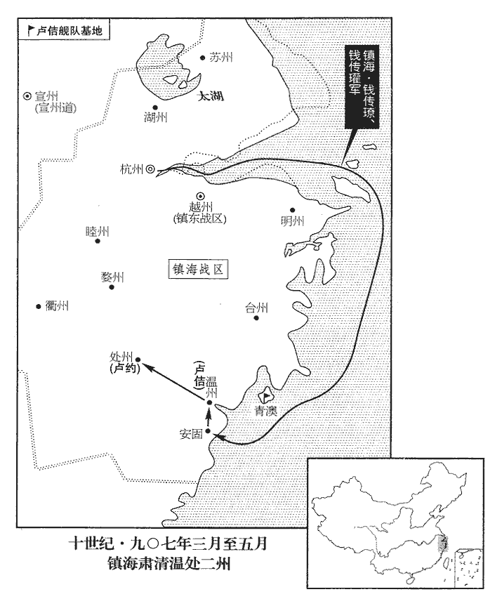
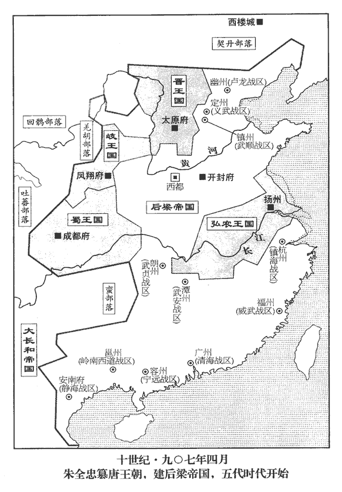
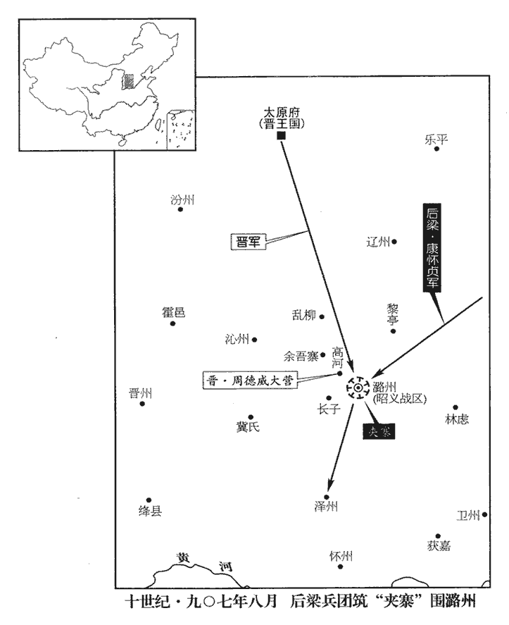
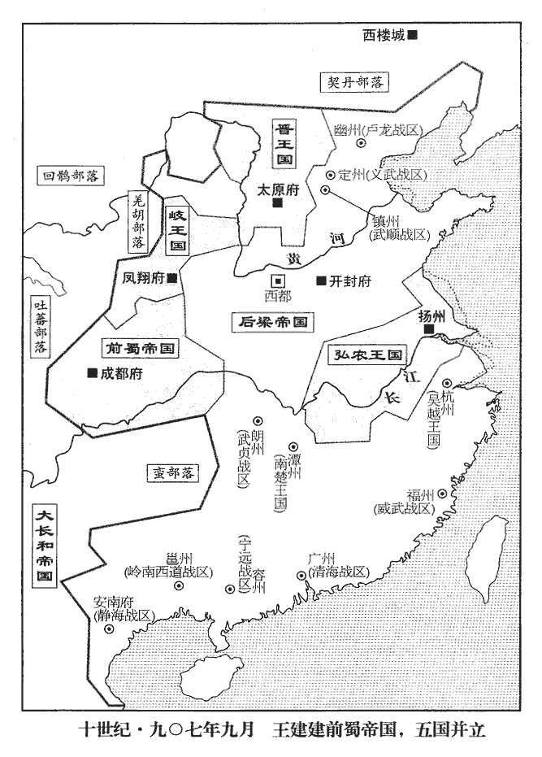
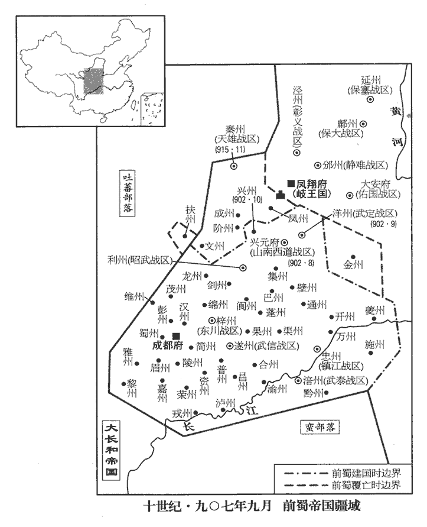
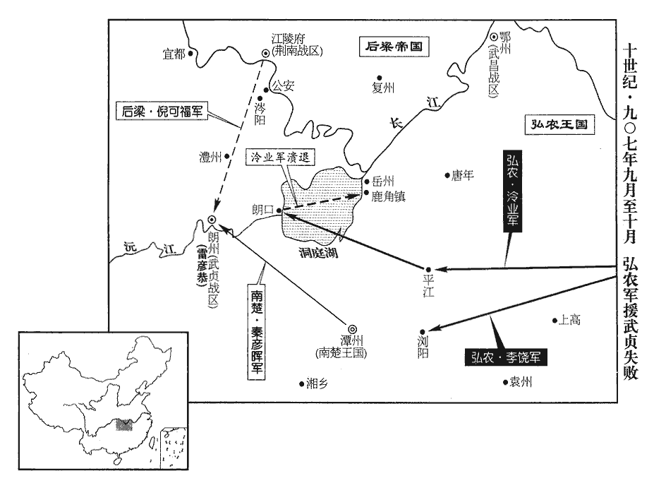
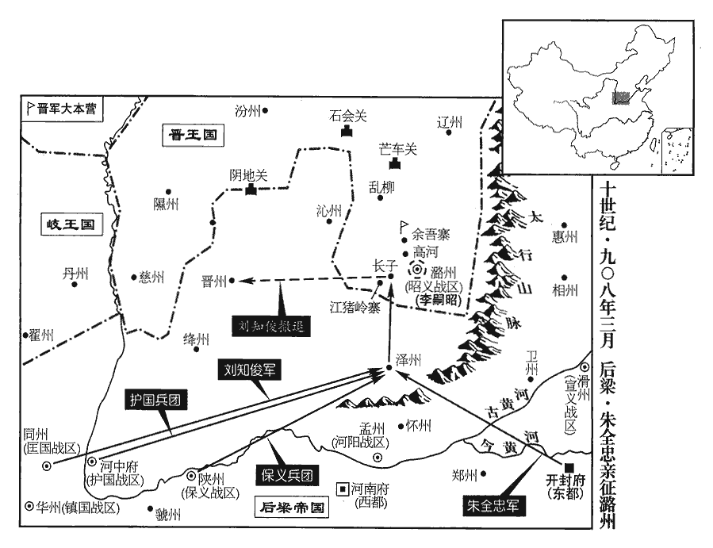
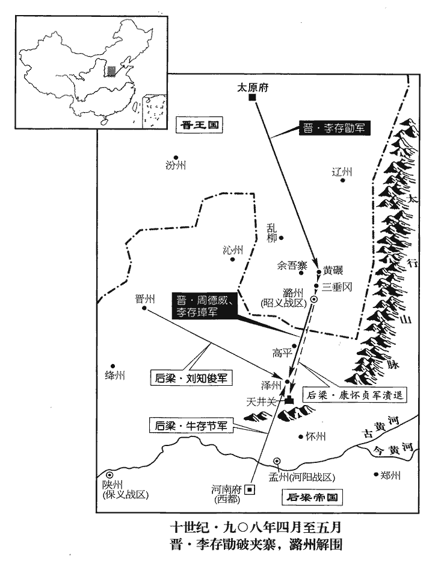

 後梁紀一起強圉單閼（丁卯），盡著雍執徐（戊辰）七月，凡一年有奇。
>  
> 朱氏本碭山人。碭山，戰國時屬梁地。太祖以宣武節度使創業，宣武軍治汴州，古大梁也；寖益強盛，進封梁王，國遂號曰梁。通鑑以前紀已有蕭梁，故此稱曰後梁。

# 太祖神武元聖孝皇帝上姓朱氏，名溫，宋州碭山午溝里人。背黃巢歸唐，賜名全忠。即位，改名晃。

## 開平元年（丁卯、九零七）是年四月即位，始改元。

1春，正月，辛巳‹四›，梁王休兵于貝州‹河北省清河县›。自滄州還，休兵貝州，且因魏博糧餉也。

〖译文〗 [1]春季，正月辛巳（初四），梁王朱全忠率兵在贝州休整。

2淮南‹总部设扬州江苏省扬州市›節度使兼侍中、東面諸道行營都統弘農郡王楊渥既得江西‹总部设洪州江西省南昌市›，謂并鍾匡時也。事見上卷天祐三年。驕侈益甚，謂節度判官周隱曰：「君賣人國家，何面復相見！」遂殺之。以隱言其不克負荷，欲屬國於劉威也。事見上卷天祐二年。復，扶又翻。由是將佐皆不自安。既逐王茂章，又殺周隱，宜餘人之不自安也。

〖译文〗 [2]淮南节度使兼侍中、东面诸道行营都统弘农郡王杨渥夺取江西以后，骄横奢侈更加厉害，对节度判官周隐说：“您出卖我们的国家，有什么脸面再相见！”于是杀了周隐。因此属下将佐都自感不安。

黑雲都指揮使呂師周與副指揮使綦qí章將兵屯上高‹江西省上高县›，上高在洪州高安縣界，宋置上高縣，屬筠州，在州西南九十五里。宋白曰：上高縣本高安縣之上鎮，以地形高上，故曰上高。南唐昇元中立上高場，保大十年升為縣。師周與湖南‹武安，总部设潭州湖南省长沙市›戰，屢有功，渥忌之。師周懼，謀於綦章曰：「馬公寬厚，謂馬殷也。吾欲逃死焉，可乎？」章曰：「茲事君自圖之，吾舌可斷，不敢泄！」斷，都管翻。師周遂奔湖南，章縱其孥nú使逸去。路振九國志：呂師周父珂以勇敢事楊行密，累有功，拜黑雲都指揮使。珂卒，師周代之，自言「三代將家不可保富貴」，每恣為盃酌，醉必起舞，或擊節狂歌，慷慨泣下。行密聞而疑之，密使人偵其動靜。師周不自安，乃謀於綦章而奔湖南。據此則為渥所疑，非行密也。孥，音奴，子也。師周，揚州‹江苏省扬州市›人也。

〖译文〗 [3]黑云都指挥使吕师周与副指挥使綦章率领军队驻扎上高。吕师周与湖南作战，屡次立功，杨渥忌恨他。吕师周害怕，与綦章商议说：“马殷宽厚，我想要死里逃奔，可以吗？”綦章说：“这件事您自己考虑，我的舌头可以断，但决不敢泄露！”吕师周于是投奔湖南马殷，綦章放走他的妻子儿女让他们逃走。吕师周是扬州人。

渥居喪，居其父行密之喪也。晝夜酣飲酣，戶甘翻，樂飲也，湛嗜也，應劭曰：洽也，張晏曰：中酒也。作樂句斷。然十圍之燭以擊毬，一燭費錢數萬。或單騎出遊，從者奔走道路，不知所之。從，才用翻。之，往也。左、右牙指揮使張顥hào、徐溫泣諫，蜀註曰：牙者，旗名，執牙者因以名之。分左、右隊，故稱左、右牙。余謂牙兵以衛府牙。渥怒曰：「汝謂我不才，何不殺我自為之！」二人懼。渥選壯士，號「東院馬軍」，廣署親信為將吏；所署者恃勢驕橫，橫，戶孟翻。陵蔑勳舊。顥、溫潛謀作亂。渥父行密之世，有親軍數千營於牙城之內，蜀註曰：古者軍行有牙，尊者所在。後人因以所治為衙，曰牙城，即衙城也。渥遷出於外，以其地為射場，顥、溫由是無所憚。史言楊渥自去其爪牙。

〖译文〗 杨渥服丧期间日夜饮酒，点燃粗大围的蜡烛来击球，一支蜡烛费钱数万。有时单独骑马外出游玩，随从的人在道路奔走，不知他到哪里去了。左、右牙指挥使张颢、徐温哭着劝谏，杨渥勃然大怒说：“你们认为我没有才能，为什么不杀死我自己当节度使！”张颢、徐温二人非常惧怕。杨渥挑选壮士，号称“东院马军”，广泛安置亲信为将领官吏；所任命的人仗势骄傲专横，欺凌蔑视功臣旧人。张颢、徐温暗中谋划发动叛乱。杨渥父亲杨行密在世的时候，有数千名亲军驻扎在节度使所居的牙城之内，杨渥把他们迁出在外，用腾出的空地作为骑射的场地，张颢、徐温因此没有忌惮了。

渥之鎮宣州‹安徽省宣州市›也，天祐元年，楊渥鎮宣州，二年召為嗣。命指揮使朱思勍、范思從、陳璠將親兵三千；勍，渠京翻。璠，音番。及嗣位，召歸廣陵。顥、溫使三將從秦裴擊江西，因戍洪州‹江西省南昌市›，誣以謀叛，命別將陳祐往誅之。史言張顥、徐溫又翦去渥之爪牙。祐間道兼行，間，古莧翻。六日至洪州，微服懷短兵徑入秦裴帳中，裴大驚，祐告之故，告之以所以徑入之故。乃召思勍等飲酒，祐數思勍等罪，數，所具翻；下因數同；俗從所主翻。執而斬之。渥聞三將死，益忌顥、溫，欲誅之。丙戌‹九›，渥晨視事，顥、溫帥牙兵二百，露刃直入庭中，帥，讀曰率。渥曰：「爾果欲殺我邪？」對曰：「非敢然也，欲誅王左右亂政者耳！」因數渥親信十餘人之罪，曳下，以鐵檛擊殺之檛，側瓜翻。考異曰：歐陽史：「四年正月，渥視事，陳璠等侍側。溫、顥擁牙兵入，拽璠等下，斬之。渥不能止，由是失政。」按璠等已死於宣州。今從十國紀年。按通鑑本文，「宣州」當作「洪州」。謂之「兵諫」。左傳：鬻拳強諫楚子，不從；臨之以兵，懼而從之，遂自刖也。張顥、徐溫以兵諫自文，鬻拳之罪人也。諸將不與之同者，顥、溫稍以法誅之，於是軍政悉歸二人，渥不能制。為顥、溫弒渥張本。

〖译文〗 杨渥镇守宣州的时候，命令指挥使朱思、范思从、陈率领亲兵三千人；等到继位以后，召回广陵。张颢、徐温让朱思等三位将领跟随秦裴攻打江西，因此防守洪州，又诬陷三将图谋叛变，派别将陈前去杀他们。陈从偏僻小路兼程前进，六天到达洪州，穿着平民衣服、怀揣短兵器直接进入秦裴帐中。秦裴大惊，陈告诉他缘故，于是召朱思等饮酒，陈数说朱思等的罪状，把他逮捕斩首。杨渥听说三将被杀，更加忌恨张颢、徐温，想要杀死他们。丙戌（初九），杨渥早晨处理事务，张颢、徐温率领二百牙兵，手执刀剑直入庭中，杨渥说：“你们真的要杀我吗？”张颢、徐温回答说：“不敢这样做，想要杀您左右扰乱政事的人罢了！”于是数说杨渥的亲信十余人的罪状，拖下去，用铁打死。称之为“兵谏”。诸将当中不与张颢、徐温同心合力的，二人逐渐设法将其处死，于是军政大权全归二人，杨渥不能控制。

3初，梁王以河北諸鎮皆服，唯幽、滄未下，故大舉伐之，欲以堅諸鎮之心。既而潞州內叛，王燒營而還，事見上卷天祐三年。還，從宣翻，又如字。威望大沮。沮，在呂翻。恐中外因此離心，欲速受禪以鎮之。丁亥‹十›，王入館于魏‹河北省大名县›，館，古玩翻。有疾，臥府中；【章：十二行本「中」下有「魏博節度使」五字；乙十一行本同；孔本同。】羅紹威‹天雄总部魏州›恐王襲之，入見王曰：「今四方稱兵為王患者，皆以翼戴唐室為名，王不如早滅唐以絕人望。」王雖不許而心德之，乃亟歸。亟，紀力翻。壬寅‹二十五›，至大梁‹河南省开封市›。

〖译文〗 [3]当初，梁王朱全忠因河北各藩镇全都归服，只有幽州刘仁恭、沧州刘守文父子没有攻下，所以大举讨伐他们，想要藉以坚定各藩镇的归服之心。不久，潞州内部叛变，朱全忠烧毁营寨而返回，威望大受损害。朱全忠恐怕内外因此离心离德，想要迅速接受唐昭宣帝禅让来镇慑他们。丁亥（初十），朱全忠进入魏州，患病，躺在节度使府中。魏博节度使罗绍威担心朱全忠袭击自己，进见朱全忠说：“现在四方发兵成为您祸患的人，都以拥戴唐室为名义，您不如先灭唐室来断绝众望。”朱全忠虽然没有应允，心里却感激他，于是急忙起程回归。壬寅（二十五日），到达大梁。

甲辰‹二十七›，唐昭宣帝‹李柷zhù（李祚）›遣御史大夫薛貽矩至大梁勞王‹朱全忠›，勞，力到翻。貽矩請以臣禮見，見，賢遍翻。王揖之升階，貽矩曰：「殿下功德在人，三靈改卜，三靈，天、地、人之靈也。言天、地、人之心皆已去唐室，改卜君而命之。皇帝方行舜、禹之事，臣安敢違！」乃北面拜舞於庭。王側身避之。貽矩還，言於帝曰：「元帥有受禪之意矣！」帝乃下詔，帝，皆謂唐昭宣帝。元帥，謂梁王。以二月禪位于梁。又遣宰相以書諭王；王辭。

〖译文〗 甲辰（二十七日），唐昭宣帝派遣御史大夫薛贻矩到大梁慰劳朱全忠，薛贻矩请以臣子见君之礼请见，朱全忠拱手作揖让他登阶而上，薛贻矩说：“殿下的功业德行都在人们心里，天、地、人三灵已经另选新君，皇帝正要举行舜、禹禅让事宜，我怎么敢违抗！”于是，面朝北在厅堂行朝拜皇帝之礼。朱全忠侧身避开。薛贻矩回到东都洛阳，对唐昭宣帝说：“元帅有接受禅让帝位的意思了！”唐昭宣帝于是颁下诏书，在二月让位给梁王朱全忠。又派遣宰相拿着书信告诉朱全忠；朱全忠推辞。

4河東‹总部太原府›兵猶屯長子‹山西省长子县›，欲窺澤州‹山西省晋城市›。九域志：長子，西南至澤州一百四十里。王命保平‹保大，总部设鄜州陕西省富县›節度使康懷貞悉發京兆、同華之兵屯晉州‹山西省临汾市›以備之。宋太宗皇帝太平興國元年始改保義軍為保平軍，避藩邸舊名也。此因史臣避廟諱而書之。然觀令康懷貞發京兆、同華兵屯晉州，則恐自鄜州而東發兩鎮兵屯晉州。蓋懷貞若自邢州發京兆、同華兵，道里隔涉，邢州與潞州相近，亦當備河東兵之來，無緣使懷貞離邢州而屯晉州。竊謂「保平」亦當作「保大」。據歐史懷英傳亦書「保義」，蓋以美原之捷方除保義節。朱全忠急於篡唐，未暇舉兵攻潞州，自備而已，故潞州益得以嚴備。

〖译文〗 [4]河东李克用的军队仍然驻扎长子，想要南下窥伺泽州。梁王朱全忠命令保平节度使康怀贞全部征发京兆、同华的军队驻扎晋州来防御守备。

5二月，唐大臣共奏請昭宣帝遜位。壬子‹五›，詔宰相帥百官詣元帥府勸進；梁王建元帥府于大梁。相帥，讀曰率。王遣使卻之。於是朝臣、藩鎮乃至湖南、嶺南上牋勸進者相繼。朝，直遙翻。上，時掌翻。

〖译文〗 [5]二月，唐大臣共同奏请昭宣帝退位。壬子（初五），诏令宰相率领百官前往元帅府劝即帝位，朱全忠派遣使者到洛阳推却不受。于是，朝中大臣、藩镇乃至湖南、岭南呈进奏笺劝朱全忠即帝位的接连不断。

6三月，癸未‹六›，王以亳州‹安徽省亳州市›刺史李思安為北路行軍都統，將兵擊幽州。擊劉仁恭也。

〖译文〗 [6]三月癸未（初六），梁王朱全忠任命毫州刺使李思安为北路行军都统，率领军队攻击幽州。

7庚寅‹十三›，唐昭宣帝詔薛貽矩再詣大梁諭禪位之意，又詔禮部尚書蘇循齎jí百官牋詣大梁。

〖译文〗 [7]庚寅（十三日），唐昭宣帝诏命薛贻矩再往大梁告知禅让帝位的意愿，又诏命礼部尚书苏循携带文武百官的奏笺前往大梁。

8鎮海‹总部设杭州浙江省杭州市›、鎮東‹总部设越州浙江省绍兴市›節度使吳王錢鏐遣其子傳璙、傳瓘討盧佶於溫州‹浙江省温州市›。璙，力小翻，又力弔翻。佶，其吉翻。

〖译文〗 [8]镇海、镇东节度使吴王钱派遣他的儿子钱传、钱传率领军队到温州讨伐卢佶。

9甲辰‹二十七›，唐昭宣帝降御札禪位于梁。考異曰：實錄、薛居正五代史、唐餘錄皆云四月，唐帝御札敕宰臣張文蔚等備法駕奉迎梁朝，而無日。五代通錄云四月丁未。丁未，四月一日也。舊唐書云三月甲辰。甲辰，三月二十七日也。唐年補錄：三月二十七日甲子降此御札，四月戊辰朱全忠即位。尤為差誤。按此年三月戊寅朔，四月丁未朔。今從舊唐書。以攝中書令張文蔚為冊禮使，禮部尚書蘇循副之；冊禮使，奉傳禪冊寶，押金吾仗衛、太常鹵簿等。攝侍中楊涉為押傳國寶使，唐有傳國八寶。武后惡璽字，改為寶，其受命傳國八寶並改雕寶字。翰林學士張策副之；御史大夫薛貽矩為押金寶使，唐六典曰：天子八寶，其用以玉，其封以泥。皇后及太子之信曰寶，其用以金。尚書左丞趙光逢副之；帥百官備法駕詣大梁。唐六典：大駕備五輅，五輅皆有副車；又有指南車、記里鼓車、白鷺車、鸞旗車、辟惡車、皮軒車、耕根車、安車、四望車、羊車、黃鉞車、豹尾車，屬車一十有二。若法駕則減五副輅，白鷺、辟惡、安車、四望車，四分屬車之一。帥，讀曰率。

〖译文〗 [9]甲辰（二十七日），唐昭宣帝颁下诏书让位给梁王。任命代理中书令的张文蔚为册礼使、礼部尚书苏循为副使，代理侍中杨涉为押传国宝使、翰林院学士张策为副使，御史大夫薛贻矩为押金宝使、尚书左丞赵光逢为副使，率领文武百官准备皇帝车驾仪仗前往大梁。

楊涉子直史館凝式貞觀三年，置史館於門下省，以他官兼領，或卑位有才者亦以直館稱，以宰相涖脩撰。天寶後，他官兼史職者曰史館脩撰，初入為直館。元和元年，宰臣裴垍建議，登朝領史職者為脩撰，以官高人判館事，未登朝者為直館。言於涉曰：「大人為唐宰相，而國家至此，不可謂之無過。況手持天子璽綬與人，雖保富貴，柰千載何！盍辭之！」璽，斯氏翻。綬，音受。載，子亥翻。考異曰：陶岳五代史補曰：「凝式恐事泄，即日佯狂，時謂之『風子』。」按周世宗實錄凝式本傳，仕梁未嘗有疾；唐同光初知制誥，始以心疾罷。明宗時及清泰帝末，俱以心恙罷官。天福初致仕在洛，有「風子」之號。非梁初佯狂也。今不取。涉大駭曰：「汝滅吾族！」神色為之不寧者數日。楊涉之相也，知必為凝式之累；今乃駭凝式之言，何邪？為，于偽翻。

〖译文〗 杨涉的儿子直史馆杨凝式对杨涉说：“大人为唐朝宰相，国家到了这个地步，不能说没有过错。况且亲手拿着天子的印玺组绶送给别人，虽然保住了荣华富贵，千年以后怎么说？何不辞职！”杨涉听了大惊说：“你想要灭我全族！”为此好几天神色不安。

策，敦煌‹甘肃省敦煌市›人。敦，徒門翻。光逢，隱之子也。趙隱見二百五十二卷懿宗咸通之十三年。

〖译文〗 张策是郭煌人。赵光逢是赵隐的儿子。

10盧龍‹总部设幽州北京市›節度使劉仁恭，驕侈貪暴，常慮幽州城不固，築館於大安山‹北京市西百花山›，薛史：幽州西有名山曰大安山。曰：「此山四面懸絕，可以少制眾。」其棟宇壯麗，擬於帝者。選美女實其中。與方士鍊丹藥，求不死。悉斂境內錢，瘞於山顛；令民間用堇泥為錢。瘞，於計翻。堇，几隱翻。堇泥，黏土也。又禁江南茶商無得入境，自采山中草木為茶，鬻之。

〖译文〗 [10]卢龙节度使刘仁恭，骄横奢侈，贪婪凶残，经常顾虑幽州城垣不坚固，在大安山上建筑馆舍，说：“这山四面悬崖绝壁，可以少制众。”馆舍的房屋雄壮美丽，与皇帝的宫殿相匹。选美女住在里面。与方士炼丹药，寻求长生不死。聚敛境内全部的钱，埋藏在山顶上，让民间用粘土作钱使用，又禁止江南茶商入境，自采山中草木做茶，卖给民间百姓。

仁恭有愛妾羅氏，其子守光通焉。仁恭杖守光而斥之，不以為子數。不齒之於諸子之列。李思安引兵入其境，所過焚蕩無餘。夏，四月，己酉‹三›，直抵幽州城下。仁恭猶在大安山，城中無備，幾至不守。幾，居依翻。守光自外引兵入，登城拒守；又出兵與思安戰，思安敗退。守光遂自稱節度使，令部將李小喜、元行欽將兵攻大安山。仁恭遣兵拒戰，為小喜所敗。敗，補邁翻。虜仁恭以歸，囚於別室。仁恭將佐及左右，凡守光素所惡者皆殺之。惡，烏路翻。

〖译文〗 刘仁恭有爱妾罗氏，他的儿子刘守光与她私通。刘仁恭杖责刘守光并把他赶走，不把他排在儿子之列。李思安率兵进入刘仁恭的境内，经过的地方焚烧毁坏没有剩余。夏季，四月己酉（初三），直抵幽州城下。刘仁恭还在大安山，城中没有防备，几乎失守。刘守光从外面带兵进入，登城抵御防守；又出兵与李思安作战，李思安被打败退走。刘守光于是自称节度使，令部将李小喜、元行钦率兵攻打大安山。刘仁恭派遣军队抵抗，被李小喜打败。李小喜俘虏了刘仁恭把他带回幽州，囚禁在另外的屋子里。刘仁恭的将佐及左右亲信，凡是刘守光厌恶的全都杀死。

銀胡䩮都指揮使王思同帥部兵三千，䩮，盧谷翻。胡䩮，箭室也。帥，讀曰率。山後‹燕山南麓›八軍巡檢使李承約帥部兵二千盧龍以媯‹河北省怀来县›、檀‹北京市密云县›、新‹河北省涿鹿县›、武‹河北省宣化县›四州為山後。奔河東；奔李克用。守光弟守奇奔契丹‹王庭设西楼城内蒙古巴林左旗›，未幾，亦奔河東‹总部设太原府山西省太原市›。幾，居豈翻。為劉守奇引河東兵伐燕張本。河東節度使晉王克用以承約為匡霸指揮使，思同為飛騰指揮使。思同母，仁恭之女也。匡霸、飛騰，皆晉王所置軍都之號。

〖译文〗 银胡都指挥使王思同率领所部士兵三千，山后八军巡检使军李承约率领所部士兵二千，投奔河东；刘守光的弟弟刘守奇投奔契丹，不久，也投奔了河东。河东节度使晋王李克用以李承约任匡霸指挥使，王思同任飞腾指挥使。王思同的母亲是刘仁恭的女儿。

 

11梁【章：十二行本「梁」上有「庚戌‹四›」二字；乙十一行本同；退齋校同。】王始御金祥殿，王溥五代會要：梁受禪都大梁，改正衙殿為崇元殿，東殿為玄德殿，內殿為金祥殿，萬歲堂為萬歲殿，門如殿名。薛史曰：梁自謂以金德王，又以福建上獻鸚鵡，諸州相繼上白烏、白兔洎白蓮之合蒂者，以為金行應運之兆，故名殿曰金祥。受百官稱臣，此梁所自置百官也。下書稱教令，自稱曰寡人。辛亥‹五›，令諸牋、表、簿、籍皆去唐年號，但稱月、日。去，羌呂翻。丙辰‹十›，張文蔚等至大梁。

〖译文〗 [11]庚戌（初四），梁王朱全忠开始登金祥殿，接受唐室文武百官称臣，下行文书称教令，自称寡人。辛亥（初五），命令各种笺、表、簿、籍都去掉唐朝年号，只称月、日。丙辰（初十），张文蔚等到达大梁。

12盧佶聞錢傳璙等將至，將水軍拒之於青澳‹浙江省玉环县›。青澳在溫州東北海中，俗謂之青澳門。由青澳門而進舟則入溫州，其外則大洋也。澳，烏到翻。海之隈厓曰澳。錢傳瓘曰：「佶之精兵盡在於此，不可與戰。」乃自安固‹浙江省瑞安市›捨舟，間道襲溫州。安固，後漢之章安也。間，古莧翻。戊午‹十二›，溫州潰，擒佶斬之。天祐二年，盧佶陷溫州，至是敗亡。吳王鏐以都監使吳璋為溫州制置使，監，古銜翻。命傳璙等移兵討盧約於處州‹浙江省丽水市›。

〖译文〗 [12]温州卢佶听说钱传等将要到达，率领水军在青澳抵抗。钱传说：“卢佶的精锐部队都在这里，不能与他们作战。”于是自安固弃舟登岸，抄小路袭击温州。戊午（十二日），温州军队逃散，擒住卢佶斩首。吴王钱任命都监使吴璋为温州制置使，命令钱传等率领军队转移到处州讨伐卢约。

13壬戌‹十六›，梁王更名晃。更，工衡翻。薛史曰：時將受禪，下教以本名二字異帝王之稱，故改名。王兄全昱聞王將即帝位，謂王曰：「朱三，爾可作天子乎！」

〖译文〗 [13]壬戌（十六日），梁王朱全忠更名为晃。朱全忠的哥哥朱全昱听说朱全忠将要即皇帝位，对他说：“朱三，你可以作天子吗？”

甲子‹十八›，張文蔚、楊涉乘輅自上源驛‹开封市城内›從冊寶，諸司各備儀衛鹵簿前導，百官從其後，此唐之百官。從，才用翻。至金祥殿前陳之。王被袞冕，被，皮義翻。即皇帝位。張文蔚、蘇循奉冊升殿進讀，楊涉、張策、薛貽矩、趙光逢以次奉寶升殿，讀已，已者，畢也。降，帥百官舞蹈稱賀。帥，讀曰率。帝遂與文蔚等宴於玄德殿。帝舉酒曰：「朕輔政未久，此皆諸公推戴之力。」文蔚等慚懼，俯伏不能對，獨蘇循、薛貽矩及刑部尚書張禕禕yī，許韋翻。盛稱帝功德宜應天順人。

〖译文〗 甲子（十八日），张文蔚、杨涉乘大车自上源驿随从册宝，诸司各备陈仪仗、卫士、车驾在前导引，唐朝的文武百官随后，到金祥殿前排列。梁王朱全忠身披衮袍，头戴冠冕，即皇帝位。张文蔚、苏循捧着册文登殿，进读册文，杨涉、张策、薛贻矩、赵光逢依次捧着印玺登殿，读完册文，下殿，率领文武百官跪拜称颂庆贺。后梁太祖朱晃于是同张蔚等在玄德殿宴饮。后梁太祖举酒说：“朕辅佐朝政不久，这都是诸公拥护爱戴之力。”张文蔚等惭愧惶惧，俯伏在地，不能回答，只有苏循、薛贻矩及刑部尚书张盛称后梁太祖的功业德行，需要顺应天命、人心称帝。

 

帝‹朱全忠，本年五十六岁›復與宗戚飲博於宮中，宗，同姓也；戚，異姓之親也。復，扶又翻。酒酣，朱全昱忽以投瓊擊盆中迸散，鮑宏《博經》曰：《楚辭》琨蔽象碁有六博。琨蔽，玉箸也，各投六箸，行六棊，故云六博。用十二棊，六棊白，六棊黑，所擲頭謂之瓊。瓊有五采，刻為一畫者謂之塞，刻為兩畫者謂之白，刻為三畫者謂之黑。不刻者，五塞之間，謂之五塞。據歐史，此所謂投瓊，即骰tóu子也。迸，北孟翻。考異曰：王仁裕玉堂閒話曰：「骰子數匝，廣王全昱忽駐不擲，顧而白梁祖，再呼『朱三』，梁祖動容。廣王曰：『你愛他爾許大官職，久遠家族得安否？』於是大怒，擲戲具於階下，抵其盆而碎之，喑嗚眦睚，數日不止。」今從王禹偁五代史闕文。睨帝曰：「朱三，汝本碭山‹安徽省砀山县›一民也，從黃巢為盜，天子用汝為四鎮節度使，梁王始兼四鎮，見二百六十二卷唐昭宗天復元年。富貴極矣，柰何一旦滅唐家三百年社稷，唐武德元年受禪，歲在著雍攝提格，禪位于梁，歲在強圉單閼，享國二百九十年。自稱帝王！行當族滅，奚以博為！」帝不懌而罷。

〖译文〗 后梁太祖又与同宗亲属在宫中宴饮戏博，酒喝得正畅快，朱全昱忽然用骰子向盆中击去而迸碎四散，斜视着太祖说：“朱三，你本来是砀山的一介平民，跟随黄巢做强盗，天子用你任四镇节度使，富贵极了，为什么突然灭了唐朝三百年的国家，自称帝王，将要全族被杀，还玩了什么博戏！”太祖不高兴而散场。

乙丑‹十九›，命有司告天地、宗廟、社稷。丁卯‹二十一›，遣使宣諭州、鎮。皆言受禪於唐也。戊辰‹二十二›，大赦，考異曰：梁實錄、編遗錄、薛史、唐餘錄皆不云大赦；今從歐陽史。改元，改元開平。國號大梁。奉唐昭宣帝‹李柷›為濟陰王，曹州濟陰郡。濟，子禮翻。皆如前代故事；唐中外舊臣官爵並如故。以汴州為開封府，命曰東都；以故東都為西都；廢故西京，以京兆府為大安府，置佑國軍‹总部设大安府陕西省西安市›於大安府。唐以長安為西京，洛陽為東京。今梁都大梁，在洛陽之東，故以洛陽為西都，大梁為東都，而以長安為大安府。更名魏博‹总部设魏州河北省大名县›曰天雄軍。通鑑二百六十四卷昭宗天祐元年四月，已書「更命魏博曰天雄軍」，蓋亦出朱全忠之意，此復出也，但未知更軍額的在何年。更，工衡翻。遷濟陰王‹李柷›于曹州‹山东省定陶县›，栫jiàn之以棘，用左傳語。栫，在甸翻，圍也。使甲士守之。

〖译文〗 乙丑（十九日），后梁太祖命有关官吏祭祀天地、宗庙、社稷。丁卯（二十一日），派遣使者向各地州、镇宣布受禅称帝。戊辰（二十二日），大赦天下，改年号为开平，国号大梁。尊奉唐昭宣帝为济阴王，都如前代的成例；唐内外旧臣的官职爵位同过去一样。以汴州为开封府，命名为东都；以故东都洛阳为西都；废故西京长安，以京兆府为大安府，在大安府设置佑国军。改魏博名为天雄军。迁济阴王李到曹州，用荆棘圈围，派披甲的士兵守卫。

14辛未‹二十五›，以武安節度使馬殷‹本年五十六岁›為楚王。馬殷不由郡王，徑封國王，即位之初特恩也。

〖译文〗 [14]辛未（二十五日），后梁太祖封武安节度使马殷为楚王。

15以宣武‹总部开封府›掌書記、太府卿敬翔知崇政院事，梁崇政院即唐樞密院之職，後遂廢樞密院入崇政院。以備顧問，參謀議，於禁中承上旨，宣於宰相而行之。宰相非進對時有所奏請及已受旨應復請者，皆具記事因崇政院以聞，得旨則復宣於宰相。翔為人沈深沈，持林翻。有智略，在幕府三十餘年，僖宗光啟間，敬翔入汴幕，至此時二十年，史誤以「二十」為「三十」耳。軍謀、民政，帝一以委之。翔盡心勤勞，晝夜不寐，自言惟馬上乃得休息。帝性暴戾難近，近，其靳翻。人莫能測，惟翔能識其意趣。或有所不可，翔未嘗顯言，但微示持疑；帝意已悟，多為之改易。為，于偽翻。禪代之際，翔謀居多。

〖译文〗 [15]后梁太祖以宣武掌书记、太府卿敬翔主管崇政院事务，以备顾问，参与谋划计议，在宫内承受皇上谕旨，传达给宰相执行。宰相不是进宫奏对的时候有所奏请以及已经受旨应该再行请示的，都详细记事，通过崇政院奏报，敬翔得旨后再传达给宰相。敬翔为人沉着内向，有才智谋略，在幕府三十余年，军事计划、民事政务，太祖一切都委任他办理。敬翔尽心勤劳，白天晚上很少睡觉，自己说只有在马上才能休息。太祖性情残暴乖戾，难于接近，别人不能猜测，只有敬翔能够知道他的思想旨趣。有时有不能办的事情，敬翔未曾明显说出，只是稍微表示疑难，梁太祖已经理解，多数为此改变。惮让取代之际，敬翔的谋划居多。

16追尊皇高祖考、妣以來皆為帝、后；五代會要：梁以舜臣朱虎為始祖，四十二代至黯，追尊肅祖宣元皇帝，妃范氏諡宣僖皇后；黯子茂琳諡敬祖光獻皇帝，妃楊氏諡孝皇后；茂琳子信諡憲祖昭武皇帝，妃劉氏諡昭懿皇后，信子誠。皇考誠為烈祖文穆皇帝，妣王氏為文惠皇后。

〖译文〗 [16]后梁太祖追尊高祖父、母以来都为帝、后；父亲朱诚为烈祖文穆皇帝，母王氏为文惠皇后。

17初，帝為四鎮節度使，凡倉庫之籍，置建昌院以領之；至是，以養子宣武節度副使友文為開封尹、判院事，掌凡國之金穀。友文本康氏子也。

〖译文〗 [17]当初，后梁太祖任四镇节度使，凡是仓库的簿籍文书，设置建昌院来管理。称帝以后，以养子宣武节度副使朱友文担任开封尹、判建昌院事，掌管全国的钱财粮食。朱友文本来是康氏的儿子。

18乙亥‹二十九›，下制削奪李克用官爵。李克用稱唐官，用唐年號，豈梁得而削奪之哉！史姑書梁之初政耳。是時惟河東、鳳翔、淮南稱「天祐」，西川‹总部设成都府四川省成都市›稱「天復」年號；天復四年，梁王劫唐昭宗遷洛，改元曰天祐。河東、西川謂劫天子遷都者梁也，天祐非唐號，不可稱，乃稱天復五年。是歲梁滅唐，河東稱天祐四年，西川仍稱天復。餘皆稟梁正朔，稱臣奉貢。

〖译文〗 [18]乙亥（二十九日），下令削夺李克用的官职爵位。这时，只有河东、凤翔、淮南称天年号，西川称天复年号，其余各镇都接受后梁的年号，向后梁称臣纳贡。

蜀王‹王建首都成都府›與弘農王‹杨渥首都扬州›移檄諸道，淮南楊渥爵弘農王。云欲與岐王‹李茂贞（宋文通）首都凤翔府›、晉王‹李克用首都太原府›會兵興復唐室，卒無應者。卒，子恤翻。蜀王乃謀稱帝，下教諭統內吏民；又遺晉王書云：遺，唯季翻。「請各帝一方，俟朱溫既平，乃訪唐宗室立之，退歸藩服。」晉王復書不許，曰：「誓於此生靡敢失節。」史言李克用雖出於夷狄而終身為唐臣，亦天性之忠純也。

〖译文〗 蜀王王建与弘农王杨渥移送檄文给诸道，说要与岐王李茂贞、晋王李克用合兵兴复唐室，结果没有响应的。王建于是计划称帝的，下令告诉辖区内的官吏百九，又送书信晋王李克用说：“请各称帝一方，等到朱温平定以后，就寻访唐皇宗室的人立他为皇帝，我们再恢复藩镇之职。”晋王李克用回信不赞成，说：“发誓在这一生不敢丧失臣节。”

唐末之誅宦官也，詔書至河東，晉王匿監軍張承業於斛律寺，斬罪人以應詔。見二百六十四卷唐昭宗天復三年。斛律寺，蓋高齊建霸府於晉陽，斛律氏貴盛時所立。至是，復以為監軍，待之加厚，承業亦為之竭力。為，于偽翻。

〖译文〗 唐末诛杀宦官的时候，诏书传到河东，晋王李克用把监军张承业藏在斛律寺，斩了一个罪犯来应付诏旨。到这个时候，又以张承业任监军，待他更加忧厚，张承业也为李克用竭尽心力。

岐王治軍甚寬，待士卒簡易。治，直之翻。易，以豉翻。有告部將符昭反者，岐王直詣其家，悉去左右，熟寢經宿而還；還，從宣翻。由是眾心悅服；然御軍無紀律。及聞唐亡，以兵羸地蹙，羸，倫為翻。不敢稱帝，但開岐王府，置百官，名其所居為宮殿，妻稱皇后，李茂貞自為岐王，而妻稱皇后，妻之貴踰於其夫矣。卒伍之雄，乘時竊號，私立名字以相署置，豈可與之言禮乎哉！將吏上書稱牋表，鞭、扇、號令多擬帝者。鞭，鳴鞭；扇，雉尾扇也。唐制：天子視朝，從禁中出則鳴鞭傳警；既出西序門索扇，扇合，天子升御座；扇開，百官畢朝。

〖译文〗 岐王李茂贞治军很宽松，对待兵士平易坦率。有人告发部将符昭谋反，岐王李茂贞特意前往符昭家里，让左右的人全部离开，自己在符昭家里熟睡一夜而回去，所以众人心悦诚服。但他统率军队却没有纪律。听说唐室灭亡，由于兵士衰弱，地盘狭小，不敢自称皇帝，只是扩大岐王府，设置文武百官，把居住的房全称为宫殿，妻称为皇后，将领官吏上书称为笺表，鸣鞭、持扇、号令多数模仿皇帝。

鎮海節度判官羅隱說吳王鏐舉兵討梁，說，式芮翻。曰：「縱無成功，猶可退保杭、越，自為東帝；柰何交臂事賊，為終古之羞乎！」鏐始以隱為不遇於唐，必有怨心，及聞其言，雖不能用，心甚義之。

〖译文〗 镇海节度使判官罗隐劝说吴王钱讨伐梁，说：“纵然不能成功，尚且可以退保杭州、越州，自己在东边称帝，怎么能拱手侍奉盗贼，成为永远的耻辱呢！”钱开始以为罗隐在唐没得到重用，一定心有怨恨，等到听了他的话，虽然不能采用，心里很赞许他坚持正义。

19五月，丁丑朔‹一›，以御史大夫薛貽矩為中書侍郎、同平章事。

〖译文〗 [19]五月，丁丑朔（初一），后梁太祖任御史大夫薛贻矩为中书侍郎、同平章事。

20‹后梁，首都开封府›加武順‹总部设镇州河北省正定县›節度使趙王王鎔守太師，天雄節度使鄴王羅紹威守太傅，義武‹总部设定州河北省定州市›節度使王處直兼侍中。

〖译文〗 [20]后梁太祖加授武顺节度使赵王王熔守大师，天雄节度使邺王罗绍威守太傅，义武节度使王处直兼侍中。

21契丹‹王庭西楼城内蒙古巴林左旗›遣其臣袍笏梅老來通好，好，呼到翻。帝遣太府少卿高頎報之。頎qí，渠希翻。

〖译文〗 [21]契丹派遣使臣袍笏梅老到大梁互通友好，后梁太祖派遣太府少卿高颀回府。

初，契丹有八部，歐陽修曰：契丹君長曰大賀氏，後分為八部：一曰但利皆部，二曰乙室活部，三曰實活部，四曰納尾部，五曰頻沒部，六曰內會雞部，七曰集解部，八曰奚嗢部。部之長號大人。路振九國志：契丹，古匈奴之種也。代居遼澤之中，潢水南岸，南距榆關一千一百里，榆關南距幽州七百里。考異曰：蘇逢吉漢高祖實錄曰：「契丹本姓大賀氏，後分八族：一曰利皆邸，二曰乙失活邸，三曰實活邸，四曰納尾邸，五曰頻沒邸，六曰內會雞邸，七曰集解邸，八曰奚嗢邸。管縣四十一，縣有令。八族之長，皆號大人，稱刺史，常推一人為王，建旗鼓以尊之。每三年，第其名以相代。」莊宗列傳曰：「咸通末，其王曰習爾，疆土稍大，累來朝貢，光啟中，其王曰欽德，乘中原多故，北邊無備，遂蠶食諸部，達靼、奚、室韋之屬，咸被驅役。」漢高祖實錄、唐餘錄皆曰：「僖、昭之際，其王邪律阿保機怙強恃勇，距諸族不受代，自號天皇王。後諸族邀之，請用舊制。保機不得已，傳旗鼓，且曰：『我為長九年，所得漢人頗眾，欲以古漢城領本族，率漢人守之，自為一部。』諸族諾之。俄設策復併諸族，僭稱皇帝，土地日廣。大順中，後唐武皇遣使與之連和，大會於雲州東城，延之帳中，約為昆弟。」莊宗列傳又曰：「及欽德政衰，阿保機族盛，自稱國王。天祐二年，大寇我雲中。太祖遣使連和，因與之面會於雲州東城，延入帳中，約為兄弟，謂曰：『唐室為賊臣所篡，吾以今冬大舉，弟助我精騎二萬，同收汴、洛。』保機許諾。保機既還，欽德以國事傳之。」賈緯備史云：「武皇會保機故雲州城，結以兄弟之好。時列兵相去五里，使人馬上持盃往來，以展酬酢之禮。保機喜，謂武皇曰：『我蕃中酋長，舊法三年則罷，若他日見公，復相禮否？』武皇曰：『我受朝命鎮太原，亦有遷移之制，但不受代則可，何憂罷乎！』保機由此用其教，不受諸族之代。」趙志忠虜庭雜紀云：「太祖諱億，番名阿保謹，又諱斡wò里。太祖生而智，八部落主愛其雄勇，遂退其舊主阿輦氏歸本部，立太祖為王。」又云：「凡立王，則眾部酋長皆集會議，其有德行功業者立之。或災害不生，群牧孳盛，人民安堵，則王更不替代；苟不然，其諸酋會眾部別選一名為王；故王以番法，亦甘心退焉，不為眾所害。」又曰：「有韓知古、韓潁、康枚、王奏事、王郁，皆中國人，共勸太祖不受代。」新唐書載契丹八部名與漢高祖實錄所載八部名多不同，蓋年祀相遠，虜語不常耳，其實一也。阿保機云「我為長九年」，則其在國不受代久矣，非因武皇之教也。今從漢高祖實錄。又唐餘錄前云「乾寧中，劉仁恭鎮幽州，保機入寇，仁恭擒其妻兄述律阿鉢，由此十餘年不能犯塞」，下乃云「大順中與武皇會於雲中」，按大順在乾寧前，乾寧二年仁恭方為幽州節度，大順中未也。又武皇謂曰：「唐室為賊臣所篡，吾以今冬大舉。」此非大順中事，唐餘錄誤也。又編遺錄：「開平二年五月，契丹王阿保機及前國王欽德貢方物。」然則於時七部猶在也。部各有大人，相與約，推一人為王，建旗鼓以號令諸部，每三年則以次相代。咸通末，有習爾者為王，土宇始大。其後欽德為王，乘中原多故，時入盜邊。及阿保機為王，尤雄勇，五姓奚‹滦河上游›五姓奚，一阿會部，二處和部，三奧失部，四度稽部，五元俟折部，各有辱紇主為之酋領。歐陽修曰：奚當唐末居陰涼川，在營府之西，幽州之西北，皆數百里，分為五部：一曰阿薈部，二曰叕zhuó米部，三曰粤質部，四曰怒皆部，五曰黑訖支部。後徙居幽州之東北數百里。宋白曰：奚居陰涼川，東去營府五百里，西南去幽州九百里，東南接海，山川三千里。後徙居琵琶川。及七姓室韋‹内蒙古东北部›、室韋本有二十餘部，其近契丹者七姓。達靼‹阴山以北地带›咸役屬之。阿保機姓邪律氏，歐史四夷附錄曰：阿保機以其所居横帳地名為姓，曰世里。世里，譯者謂之邪律。恃其強，不肯受代。久之，阿保機擊黃頭室韋‹吉林省大安市西南›還，七部劫之於境上，求如約。如三年一代之約。阿保機不得已，傳旗鼓，且曰：「我為王九年，得漢人多，請帥種落帥，讀曰率。種，章勇翻。居古漢城‹河北省滦平县南›，與漢人守之，別自為一部。」七部許之。漢城，故後魏滑鹽縣‹河北省滦平县南›也。漢志，滑鹽縣屬漁陽郡。後漢明帝改曰鹽田。水經註：大榆河自密雲城南東南流，逕後魏安州舊漁陽郡之滑鹽縣南。滑鹽，世謂之斛鹽城，西北去禦夷鎮二百里。歐陽修曰：漢城在炭山東南欒河上。宋白曰：契丹居遼澤之中，潢水南岸。遼澤去渝關一千一百三十里，渝關去幽州一百七十四里。其地東南接海，東際遼河，西包冷陘，北界松陘山。東西三千里，地多松柳，澤多蒲葦。阿保機居漢城，在檀州西北五百五十里。城北有龍門山，山北有炭山，炭山西是契丹、室韋二界相連之地。其地濼河上源，西有鹽泊之利，則後魏滑鹽縣也。地宜五穀，有鹽池之利。其後阿保機稍以兵擊滅七部，復併為一國。又北侵室韋‹内蒙古东北部›、女真‹黑龙江下游›，女真，肅慎氏之遺種，黑水靺鞨即其地也。入遼東著籍者號熟女真，界外野處者號生女真，極邊遠者號黃頭女真。西取突厥故地‹瀚海沙漠群›，擊奚‹滦河上游›，滅之，復立奚王而使契丹監其兵。監，古銜翻。東北諸夷皆畏服之。

〖译文〗 起初，契丹有八部，每部各有大人，共同约定，推举一人为王，建置旗鼓以号令各部，每三年就依次相代。咸通末年，有名叫习尔的为王，疆土开始扩大。其后钦德为王，趁着中原多难，时常入侵中原边境抢劫。等到阿保机为王，尤其威武勇敢，五姓奚及七姓室韦、达靼都附属于他。阿保机姓邪律氏，仗恃自己强大，不肯在三年任满的时候接受替代。过了很久，阿保机攻打黄头室韦回来，其他七部在边界上胁迫他，要求遵守三年一换王的约定。阿保机无可奈何，只得传与旗鼓，并且说：“我为王九年，得到汉人很多，请率领同种部落在古汉城居住，与汉人共同守护，另外自为一部。”七部应允了他。汉城是原来的后魏滑盐县。土地适宜五谷生长，有盐池之利。后来阿保机逐渐发兵灭亡其他七部，合并成为一国。阿保机又北侵室韦、女真，西取突厥旧地，攻打、灭亡五姓奚，后来又立奚王而让契丹监督他的军队。东北各夷族都敬畏服从他。

是歲，阿保機帥眾三十萬寇雲州‹山西省大同市›，晉王‹李克用›與之連和，面會東城，約為兄弟，延之帳中，縱酒，握手盡歡，約以今冬共擊梁。考異曰：唐太祖紀年錄：「太祖以阿保機族黨稍盛，召之。天祐二年五月，阿保機領其部族三十萬至雲州東城，帳中言事，握手甚歡，約為兄弟，旬日而去。留男骨都舍利、首領沮稟梅為質，約冬初大舉渡河反正，會昭宗遇盜而止。」歐陽史曰：「梁將篡唐，晉王李克用使人聘于契丹，阿保機以兵三十萬會克用於雲州東城，握手約為兄弟，期共舉兵擊梁。」按雲州之會，莊宗列傳、薛史皆在天祐四年，而紀年録獨在天祐二年；又云「約今年冬同收汴、洛，會昭宗遇盜而止」。如此則應在天祐元年昭宗崩已前，不應在二年也。且昭宗遇盜則尤宜興兵討之，何故止也。按武皇云「唐室為賊臣所篡」，此乃四年語也；其冬武皇寢疾，蓋以此不果出兵耳。今從之。或勸晉王：「因其來，可擒也，」王曰：「讎敵未滅而失信夷狄，自亡之道也。」阿保機留旬日乃去，晉王贈以金繒數萬。阿保機留馬三千匹，雜畜萬計以酬之。阿保機歸而背盟，更附于梁，繒，慈陵翻。畜，許救翻。背，蒲妹翻。更，工衡翻。遣使通好，是附梁也。晉王由是恨之。通鑑於唐紀書「李克用」，君臣之分也；於梁紀書「晉王」，敵國之體也。吳、蜀義例同。

〖译文〗 这一年，阿保机率领部众三十万侵犯云州，晋王李克用与他和好，在云州东城会面，相约为兄弟，延请到帐中，纵情饮酒，握手尽欢，相约在当年冬天共同攻梁。有人劝晋王说：“趁着阿保机前来，可以擒住他。”晋王说：“仇敌朱全忠没有消灭，却对夷狄失信，是自取灭亡之道啊。”阿保机留住十天才离开云州，晋王赠送给他金缯数。阿保机留下马三千匹，各种牲畜数以万计，用来酬谢晋王。阿保机回去以后就背叛了盟约，又归附了后梁，晋王李克用因此怨恨阿保机。

22己卯‹三›，以河南尹兼河陽‹总部设孟州河南省孟市›節度使張全義為魏王；鎮海、鎮東節度使吳王錢鏐‹本年五十六岁›為吳越王；加清海‹总部设广州广东省广州市›節度使劉隱、威武‹总部设福州福建省福州市›節度王審知兼侍中，「威武節度」之下當有「使」字。仍以隱為大彭王。自宋武帝以彭城之裔興於江南，後多以彭城之劉為名族。劉隱封大彭王，意蓋取此。

〖译文〗 [22]已卯（初三），后梁太祖进封河南尹兼河阳节度使张全义为魏王，镇海、镇东节度使吴王钱为吴越王，加授清海节度使刘隐、威武节度使王审知兼侍中，并以刘隐为大彭王。

癸未‹七›，以權知荊南‹总部设江陵府湖北省江陵县›留後高季昌為節度使。荊南舊統八州，荊‹湖北省江陵县›、歸‹湖北省秭归县›、硤xiá‹湖北省宜昌市›、夔‹重庆市奉节县›、忠‹重庆市忠县›、萬‹重庆市万州区›、澧‹湖南省澧县›、朗‹湖南省常德市›，共八州。乾符以來，寇亂相繼，諸州皆為鄰道所據，獨餘江陵‹湖北省江陵县›。季昌到官，城邑殘毀，戶口彫耗。季昌安集流散，民皆復業。

〖译文〗 癸未（初七），后梁太祖任命暂时代理荆南留后的高季昌为荆南节度使。荆南过去统辖荆、归、硖、、忠、万、澧、朗八州，唐僖宗乾符年间以来，外寇内乱一个接一个，诸州都被相邻各道占据，只剩下了江陵。高季昌到任，城邑残破毁坏，户口零落减损。高季昌安顿抚恤流散的人，百姓全都恢复了常业。

23乙酉‹九›，立兄全昱為廣王，子友文為博王，友珪為郢王，友璋為福王，友貞為均王，友雍為賀王，友徽為建王。友文以養子居諸子之上，友珪弒逆，禍胎於此。

〖译文〗 [23]乙酉（初九），后梁太祖封立他的哥哥朱全昱为广王，儿子友文为博王、友为郢王、友璋为福王、友贞为均王、友雍为贺王、友徽为建王。

24辛卯‹十五›，以東都舊第為建昌宮，改判建昌院事為建昌宮使。薛史曰：初，帝創業之時，以四鎮兵馬倉庫籍繁總，因置建昌院以領之，至是改為宮，蓋重其事也。宋白曰：是年中書門下奏改判建昌院事為建昌宮使，仍請在京上舊邸為建昌宮。

〖译文〗 [24]辛卯（十五日），后梁太祖以东都故居为建昌宫，将判建昌院事改为建昌宫使。

25壬辰‹十六›，命保平節度使康懐貞將兵八萬會魏博兵攻潞州‹山西省长治市›。攻晉將李嗣昭也。

〖译文〗 [25]壬辰（十六日），后梁太祖命令保平节度使康怀贞率领八万大军，会同魏博军队攻打潞州。

26甲午‹十八›，詔廢樞密院，其職事皆入於崇政院，以知院事敬翔為院使。考異曰：實錄：「四月辛未，以翔知崇政院事，五月甲午，詔樞密院宜改為崇政院，始命翔為院使。」蓋崇政院之名先已有之，至是始併樞密院職事悉歸崇政院耳。

〖译文〗 [26]甲午（十八日），后梁太祖诏令撤消枢密院，它的职掌事务全都归入崇政院，任命知院事敬翔为院使。

27禮部尚書蘇循及其子起居郎楷自謂有功於梁，唐昭宣帝天祐二年蘇循鼓成禪代之事，故自以為有功。當不次擢用；循朝夕望為相。帝薄其為人，舊唐書帝紀：昭宣帝天祐二年，蘇楷上議駮昭宗諡。全忠雄猜鑒物，自楷駮諡後深鄙之，既傳代之後，父子皆斥逐，不令在朝。敬翔及殿中監李振亦鄙之。翔言於帝曰：「蘇循，唐之鴟梟，賣國求利，不可以立於惟新之朝。」朝，直遙翻。戊戌‹二十二›，詔循及刑部尚書張禕等十五人並勒致仕，楷斥歸田里。循父子乃之河中‹山西省永济市›依朱友謙‹朱简·护国总部河中府›。為同光之初蘇循諂唐莊宗張本。

〖译文〗 [27]礼部尚书苏循及他的儿子起居郎苏楷自认为对后梁有功劳，应当不按寻常的次序升用。苏循日夜盼着做宰相。后梁太祖轻视他的为人，敬翔及殿中监李振也瞧不起他。敬翔对太祖说：“苏循是唐朝如同鸱枭一样的奸邪小人，出卖国家，贪求私利，不可以立于新的朝廷。”戊戌（二十二日），诏令苏循及刑部尚书张等十五人一并强迫退休，苏楷驱逐回乡。苏循父子于是往河中依附朱友谦。

28盧約以處州‹浙江省丽水市›降吳越‹首都杭州浙江省杭州市›。僖宗中和元年，盧約據處州，至是而亡。降，戶江翻。

〖译文〗 [28]卢约以处州投降吴越王钱。

29弘農王‹杨渥›以鄂岳‹首府设鄂州湖北省武汉市›觀察使劉存為西南面都招討使，岳州‹湖南省岳阳市›刺史陳知新為岳州團練使，廬州‹安徽省合肥市›觀察使劉威為應援使，別將許玄應為監軍，將水軍三萬以擊楚‹首都潭州›。楚王馬殷甚懼，靜江軍使楊定真賀曰：「我軍勝矣！」殷問其故，定真曰：「夫戰，懼則勝，驕則敗。今淮南兵直趨吾城，趨，七喻翻。是驕而輕敵也；而王有懼色，吾是以知其必勝也。」

〖译文〗 [29]弘农王杨渥任用鄂岳观察使刘存为西南面都招讨使，岳州刺史陈知新为岳州团练使，庐州观察使刘威为应援使，别将许玄应为监军，率领三万水军攻楚。楚王马殷非常害怕，静江军使杨定真庆贺说：“我军胜利了！”马殷问是什么缘故，杨定真说：“打仗知道害怕就会胜利，骄傲就会失败。现在淮南军队直奔我城，是骄傲轻敌的表现。可是大王您有害怕的神色，我因此知道您一定胜利。”

殷命在城都指揮使秦彥暉在城都指揮使，盡統潭州在城之兵。將水軍三萬浮江而下，水軍副指揮使黃璠帥戰艦三百屯瀏陽口‹湖南省长沙市稍北·浏阳河注入湘江处›。吳分長沙置瀏陽縣，隋廢；景龍二年於故城復置，屬潭州。九域志：縣在州東北一百六十里。水經註：湘水北過漢臨湘縣西，瀏水從縣西北流注之，有瀏口戍。璠，孚袁翻。瀏，力周翻。六月，存等遇大雨，引兵還至越堤北，彥暉追之。存數戰不利，乃遺殷書詐降。數，所角翻。遺，唯季翻。彦暉使謂殷曰：「此必詐也，勿受！」存與彦暉夾水而陳，陳，讀曰陣。存遙呼曰：呼，火故翻。「殺降不祥，公獨不為子孫計耶！」彥暉曰：「賊入吾境而不擊，奚顧子孫！」鼓譟而進。存等走，黃璠自瀏陽【章：十二行本「陽」下有「引兵」二字；乙十一行本同。】絕江，與彥暉合擊，大破之，執存及知新，考異曰：編遺錄：「天祐四年四月，湖南軍陳邵告捷。淮南、朗州水陸合勢奔衝其境，馬殷出舟師於瀏陽江口大破賊黨，生擒偽鄂州節度使劉存。」按薛史梁紀，馬殷奏破淮寇在六月；十國紀年吳史，劉存攻楚在五月，敗在六月，楚史亦然；編遺錄誤也。裨將死者百餘人，士卒死者以萬數，獲戰艦八百艘。威以餘眾遁歸，彥暉遂拔岳州。陳知新取岳州見上卷上年。艦，戶黯翻。艘，蘇遭翻。殷釋存、知新之縛，慰諭之。二人皆罵曰：「丈夫以死報主，肯事賊乎！」遂斬之。史言劉存、陳知新忠壯。許玄應，弘農王之腹心也，常預政事，張顥、徐溫因其敗，收斬之。

〖译文〗 马殷命在城都指挥使秦彦晖率领水军三万顺湘江漂浮而下， 水军副指挥使黄率战舰三百条驻守浏阳口。六月，刘存等遇大雨，带兵回到越堤北边，秦彦晖追赶他们。刘存屡战失利，于是送书信给马殷假装投降。秦彦晖派人对马殷说：“这一定是诈降，不要接受！”刘存与秦彦晖夹水列阵，刘存遥呼说：“杀戮投降的人不吉祥，您难道不为子孙考虑吗！”秦彦晖说：“贼寇侵入我境却不攻击，怎么顾及子孙！”擂鼓呐喊而前进。刘存等退走，黄自浏阳带兵横渡湘江，与秦彦晖合击，把淮南军队打得大败，生擒刘存及陈知新，杀死裨将一百余人，死的士卒以万计，缴获战舰八百艘。刘威带着剩下的兵众逃回，秦彦晖于是夺取了岳州。马殷解开捆绑刘存、陈知新的绳索，安慰劝解他们。二人都大骂说：“大丈夫以死报答主人，岂肯事奉贼子吗！”于是把他们斩了。许玄应是弘农王杨渥的心腹亲信，经常参与政事，张颢、徐温因为他战败，把他拘捕斩了。

30楚‹首都潭州›王殷遣兵會吉州‹江西省吉安市›刺史彭玕gān攻洪州‹江西省南昌市›，不克。彭玕附楚見上卷唐昭宣帝天祐三年。

〖译文〗 [30]楚王马殷派遣军队会同吉州刺史彭攻打洪州，没有攻克。

31康懷貞至潞州‹山西省长治市›，晉‹首都太原府›昭義‹总部设潞州›節度使李嗣昭、副使李嗣弼閉城拒守。懷貞晝夜攻之，半月不克，乃築壘穿蚰蜒塹而守之，塹，七豔翻。內外斷絕。晉王以蕃、漢都指揮使周德威為行營都指揮使，周德威盡統蕃、漢之兵，河東大將也。帥馬軍都指揮使李嗣本、馬步都虞候李存璋、先鋒指揮使史建瑭、鐵林都指揮使安元信、五季之世，諸鎮各有都指揮使，而命官之職分有不同者，如周德威蕃、漢都指揮使，則蕃、漢之兵皆受指揮也；行營都指揮使，則行營兵皆受指揮也；鐵林都指揮使安元信，則鐵林軍一都之指揮使耳。讀史者宜各以義類求之。横衝指揮使李嗣源、騎將安金全救潞州。史言晉傾國救潞州。帥，讀曰率。嗣弼，克脩之子；克脩，晉王之弟，見唐僖、昭紀。嗣本，本姓張；建瑭，敬思之子；史敬思見二百五十五卷唐僖宗中和四年。金全，代北‹山西省代县以北›人也。

〖译文〗 [31]保平节度使康怀贞率兵到达潞州，晋昭义节度使李嗣昭、副使李嗣弼闭城拒守。康怀贞日夜攻打，半月没有攻下，于是挖筑垣墙并穿通如同蚰蜒行地形状的壕沟，日夜守护，使城内外隔绝。晋王李克用任命蕃、汉都指挥使周德威为行营都指挥使，率马军都指挥使李嗣本、马步都虞候李存璋、先锋指挥使史建瑭、铁林都指挥使安元信、横冲指挥使李嗣源、骑将安金全，救援潞州。李嗣弼是李克修的儿子；李嗣本，本姓张；史建瑭是史敬思的儿子；安金全是代北人。

32晉兵攻澤州‹山西省晋城市›，攻澤州以擬康懷貞之後。帝遣左神勇軍使范居實將兵救之。

〖译文〗 [32]晋兵攻泽州，后梁太祖派遣左神勇军使范居实率兵救援。

33甲寅‹九›，以平盧‹总部设青州山东省青州市›節度使韓建守司徒、同平章事。

〖译文〗 [33]甲寅（初九），后梁太祖任命平卢节度使韩建守为司徒、同平章事。

34武貞‹总部设朗州湖南省常德市›節度使雷彥恭會楚兵攻江陵‹湖北省江陵县›，荊南‹总部设江陵府›節度使高季昌引兵屯公安‹湖北省公安县›，公安，漢孱陵縣。漢末，劉備屯於此，改名公安。唐屬江陵府。九域志：在府南九十里。絕其糧道；彥恭敗，楚兵亦走。

〖译文〗 [34]武贞节度使雷彦恭会同楚兵进攻江陵，荆南节度使高季昌率失驻扎公安，断绝他们的粮道。雷彦恭被打败，楚兵也退走了。

35劉守光既囚其父，事見上四月。自稱盧龍留後，遣使請命。秋，七月，甲午‹十九›，以守光為盧龍節度使、同平章事。

〖译文〗 [35]刘守光囚禁他的父亲刘仁恭以后，自称卢龙留后，派遣使者请求任命。秋季，七月甲午（十九日），后梁太祖任命刘守光为卢龙节度使、同平章事。

36靜海‹总部设安南府越南河内市›節度使曲裕卒，曲裕即曲承裕。丙申‹二十一›，以其子權知留後顥為節度使。考異曰：諸書不見顥於裕何親。按薛史：「六月，丙辰，裕卒，七月，丙申，以靜海行營司馬權知留後曲顥起復為安南都護，充節度使。」既云「起復」，知其子也。「行營」當作「行軍」。

〖译文〗 [36]静海节度使曲裕去世。丙申（二十一日），后梁太祖任命他的儿子权知留后曲颢为静海节度使。

37雷彥恭攻岳州，不克。雷彥恭既與楚攻荊南，尋又攻楚岳州，可以見其反覆矣。

〖译文〗 [37]武贞节度使雷彦恭攻打岳州，没有攻克。

38丙【章：十二行本「丙」上有「八月」二字；乙十一行本同；孔本同；張校同。】午‹一›，賜河南尹張全義名宗奭。帝舊名全忠，故更全義名宗奭。

〖译文〗 [38]八月丙午（初一），后梁太祖赐河南尹张全义名宗。

39辛亥‹六›，以吳越王‹首都杭州›鏐兼淮南節度使，楚王殷兼武昌‹总部设鄂州湖北省武汉市›節度使，各充本道招討制置使。欲使兩浙、湖南攻弘農王楊渥，先分授以楊氏所統二鎮。

〖译文〗 [39]辛亥（初六），后梁太祖任命吴越王钱兼淮南节度使、楚王马殷兼武昌节度使，各充本道招讨制置使。

 

40晉周德威壁于高河‹山西省屯留县东南›，高河在潞州屯留縣東南。康懷貞遣親騎都頭秦武將兵擊之，武敗。親騎，梁之親兵，馬軍也。

〖译文〗 [40]晋周德威在高河扎营，康怀贞派遣亲骑都头秦武率兵攻击，秦武战败。

丁巳‹十二›，帝以亳州‹安徽省亳州市›刺史李思安代懷貞為潞州行營都統，黜懷貞為行營都虞候。思安將河北兵西上，上黨地高，在河北諸鎮之西，故曰西上。上，時掌翻。至潞州城下，更築重城，重，直龍翻。內以防奔突，外以拒援兵，謂之夾寨。調山東‹崤山以东›民饋軍糧，德威日以輕騎抄之，調，徒弔翻。抄，楚交翻。思安乃自東南山口築甬道，屬於夾寨。屬，之欲翻。德威與諸將互往攻之，排牆填塹，一晝夜間數十發，梁兵疲於奔命。夾寨中出芻牧者，德威輒抄之，於是梁兵閉壁不出。

〖译文〗 丁巳（十二日），后梁太祖任命亳州刺史李思安代康怀贞为潞州行营都统，贬康怀贞为行营都虞候。李思安率领河北军队西上，到达潞州城下，又修筑二重城垣，内防奔突，外拒援兵，叫作夹寨。调发山东百姓输送军粮，周德威天天派出轻骑兵抄劫，李思安于是从东南山口修筑甬道，与夹寨连接。周德威与各位将领交替前去攻击，推倒垣墙，填平壕沟，一昼夜间出数十次，后梁兵防备不暇，疲于奔命。夹寨中有出来割草放牧的，周德威就抄劫他们，于是后梁兵紧闭营垒不出。

41九月，雷彥恭攻涔陽‹湖北省公安县西南›、公安，九域志：江陵府公安縣有涔陽鎮。涔，鋤針翻。高季昌擊敗之。敗，補邁翻。彥恭貪殘類其父，雷彥恭，滿之子也。專以焚掠為事，荊、湖間常被其患；被，皮義翻。又附於淮南。丙申‹二十二›，詔削彥恭官爵，命季昌與楚王殷討之。

〖译文〗 [41]九月，武贞节度使雷彦恭进攻涔阳、公安，荆南节度使高季昌把他打败。雷彦恭贪婪残暴像他的父亲雷满，专以焚烧抢掠为事业，荆、湖间经常受他祸害；又依附于淮南。丙申（二十二日），后梁太祖诏令削夺雷彦恭的官爵，命令高季昌会同楚王马殷讨伐他。

 

42蜀王‹王建，首都成都府›會將佐議稱帝，皆曰：「大王雖忠於唐，唐已亡矣，此所謂『天與不取』者也！」馮涓獨獻議請以蜀王稱制，曰：「朝興則未爽稱臣，朝，直遙翻。爽，乖也。言若唐朝復興，則為臣之節未乖也。賊在則不同為惡。」王不從，涓杜門不出。馮涓，馮宿之孫，於唐室既亡之後，義存故主，視韋莊、張格輩有間矣。王用安撫副使、掌書記韋莊之謀，帥吏民哭三日；帥，讀曰率。己亥‹二十五›，‹王建本年六十一岁›即皇帝位，王建字光圖，許州舞陽人。考異曰：莊宗列傳：「太祖厭代，建自帝於成都，年號武成。」薛史、唐餘錄：「天祐五年九月，建自帝於成都，年號武成。」九國志：「此年七月即皇帝位，明年改元。」宋庠紀年通譜：「天祐四年秋稱帝，次年改元。」歐陽史、十國紀年：「天復七年九月即位，明年改元。」今從之。國號大蜀。辛丑‹二十七›，以前東川‹总部设梓州四川省三台县›節度使兼侍中王宗佶為中書令，韋莊為左散騎常侍、判中書門下事，閬州‹四川省阆中市›防禦使唐道襲為內樞密使。莊，見素之孫也。韋見素，天寶之末為相。

〖译文〗 [42]蜀王王建会同部将僚佐商议称帝，都说：“大王虽然忠于唐室，但唐室已经灭亡了，这就是所说的‘上天授与不取’了！”冯涓独自进献意见请以蜀王代行皇帝事，说：“这样做，唐朝复兴就没有丧失臣节，贼子存在就没有一起作恶。”王建没有听从，冯涓闭门不出。王建采用安抚副使、掌书记韦庄的计谋，率领官吏、百姓哭三日。已亥（二十五日），即皇帝位，国号大蜀。辛丑（二十七日），任命前东川节度使兼侍中王宗佶为中书令，韦庄为左散骑常侍、判中书门下事，阆州防御唐道袭为内枢密使。韦庄是天宝末年宰相韦见素的孙子。

蜀主雖目不知書，好與書生談論，好，呼到翻。粗曉其理。粗，坐五翻。是時唐衣冠之族多避亂在蜀，蜀主禮而用之，使脩舉故事，故其典章文物有唐之遺風。史言蜀主起於卒伍而能親用儒生。

〖译文〗 前蜀国主王建虽然目不知书，但喜好与读书人谈论，粗略知道书中的道理。当时，唐朝的官宦之家大多在蜀躲避战乱，王建对他们以礼相待，让他们研究编纂典故成例，所以蜀的法令礼乐制度有唐的遗风。

蜀主長子校書郎宗仁幼以疾廢，立其次子祕書少監宗懿為遂王。

〖译文〗 王建的长子校郎王宗仁小时候因病致残，立他的次子秘书少监王宗懿为遂王。

 

43冬，十月，高季昌遣其將倪可福會楚將秦彥暉攻朗州，雷彥恭遣使乞降於淮南，且告急，弘農王遣將泠業將水軍屯平江‹湖南省平江县›，泠líng，盧經翻，姓也。平江縣本漢羅縣地，後漢分立漢昌縣，孫吳立漢昌郡，後又為吳昌縣，隋省。唐神龍元年分湘陰置昌江縣，屬岳州，五代改曰平江。蓋後唐既滅梁，楚人為之避廟諱昌字也。九域志：平江縣在岳州東南二百五十七里。李饒將步騎屯瀏陽‹湖南省浏阳市›以救之，楚王殷遣岳州刺史許德勳將兵拒之。泠業進屯朗口‹湖南省南县南·沅水注入洞庭湖处›，朗水西南自辰、錦州入朗州界，經州城入大江，謂之朗口。德勳使善游者五十人，以木枝葉覆其首，覆，扶又翻。持長刀浮江而下，夜犯其營，且舉火，業軍中驚擾。德勳以大軍進擊，大破之，追至鹿角鎮‹湖南省岳阳市南›，擒業；又破瀏陽寨，擒李饒；掠上高‹江西省上高县›、唐年‹湖北省崇阳县西南›而歸。唐天寶二年開山洞，置唐年縣，屬鄂州。斬業、饒於長沙市。

〖译文〗 [43]冬季，十月，高季昌派遣他的部将倪可福会同楚将秦彦晖攻打朗州，雷彦恭派使者到淮南乞求归降，并告急。弘农王杨渥派遣将领泠业率领水军驻扎平江，李饶率领步兵、骑兵驻扎浏阳以救援雷彦恭；楚王马殷派遣岳州刺史许德勋率兵抗拒。泠业进军驻扎朗口，许德勋派善于游泳者五十人，用树木枝叶遮盖他们的头部，手持长刀，顺长江漂浮直下，夜里侵犯泠业军营，并且放手，泠业军中大乱。许德勋率军进击，把泠业打得大败，追至鹿角镇，生擒泠业。又攻破浏阳寨，生擒李饶，抢掠上高、唐年二县而返回。在长沙街市上，把泠业、李饶斩首。

44十一月，甲申‹十一›，夾馬指揮使尹皓攻晉江猪嶺寨‹山西省长子县西›，拔之。梁西都有夾馬營。江猪嶺在潞州長子縣西，由北路達鵰窠嶺。

〖译文〗 [44]十一月甲申（十一日），后梁夹马指挥使尹皓攻打晋江猪岭寨，予以攻克。

45義昌‹总部设沧州河北省沧州市东南›節度使劉守文聞其弟守光幽其父，集將吏大哭曰：「不意吾家生此梟獍！梟，堅堯翻，不孝鳥也，食母；獍，讀如鏡。破獍，惡獸也，食父。吾生不如死，誓與諸君討之！」乃發兵擊守光，互有勝負。

〖译文〗 [45]义昌节度使刘守文听说他的弟弟刘守光囚禁了他的父亲刘仁恭，集合将吏大哭说：“想不到我家生了这个枭獍一样的禽兽！我生不如死，誓与你们讨伐他！”于是发兵攻打刘守光，互有胜负。

天雄節度使鄴王紹威謂其下曰：「守光以窘急歸國，窘，巨隕翻。謂上七月劉守光遣使請命也。守文孤立無援，滄州可不戰服也。」乃遺守文書，遺，唯季翻。諭以禍福。守文亦恐梁乘虛襲其後，戊子‹十五›，遣使請降，以子延祐為質。帝拊手曰：「紹威折簡，勝十萬兵！」質，音致。折，之舌翻。加守文中書令，撫納之。

〖译文〗 天雄节度使邺王罗绍威对其部下说：“刘守光因为窘困危急归梁，刘守文孤立无援，沧州可以不战就降服了。”于是送书信给刘守文，晓谕祸福。刘守文也担心梁兵乘虚袭击他的后路，戊子（十五日），派遣使者请求归降，以儿子刘延作为人质。后梁太祖拍手说：“罗绍威一封书信，胜过十万军队！”加授刘守文中书令，抚慰收纳了他。

 

46初，帝在藩鎮，用法嚴，將校有戰沒者，所部兵悉斬之，謂之跋隊斬，將，即亮翻。校，戶教翻。跋，卜末翻，又蒲末翻。士卒失主將者，多亡逸不敢歸。帝乃命凡軍士皆文其面以記軍號。軍士或思鄉里逃去，關津輒執之關，往來必由之要處；津，濟度必由之要處。送所屬，無不死者，其鄉里亦不敢容。由是亡者皆聚山澤為盜，大為州縣之患。壬寅‹二十九›，詔赦其罪，自今雖文面亦聽還鄉里。盜減什七八。

〖译文〗 [46]当初，后梁太祖在藩镇的时候，执法严苛，将校有战死的，他的部下兵卒全都斩首，称为“跋队斩”，士卒损失主将的，大多逃跑不敢回来。太祖于是命令，凡军士都在他们的面部刺字来记录军号。军士有的思念家乡逃走，关口津渡常常把他们捉住送回所属，没有一个不被处死的，他们的乡里也不敢收容。因此，逃亡者都聚集在山林川泽之中做强盗，成为州县的大害。壬寅（二十九日），颁布诏令赦免他们的罪过，从今即使脸部刺字也听任回乡里。强盗减少了十之七八。

47淮南右都押牙米志誠等將兵渡淮襲潁州‹安徽省阜阳市›，克其外郭。刺史張實據子城拒守。

〖译文〗 [47]淮南右都押牙米志诚等率兵渡过淮河袭击颍州，攻克颍州外城。颍州刺史张实据颍州内城抵御守卫。

48晉王命李存璋攻晉州，以分上黨兵勢。十二月，壬戌‹十九›，詔河中、陝州發兵救之。陝，失冉翻。

〖译文〗 [48]晋王李克用命令李存璋进攻晋州，藉以分散上党的军力。十二月壬戌（十九日），后梁太祖诏令河中、陕州发兵救援晋州。

49甲子‹二十一›，詔發步騎五千救潁州，米志誠等引去。

〖译文〗 [49]甲子（二十一日），后梁太祖诏令派遣五千步兵骑兵救颍州，米志诚等退走。

50丁卯‹二十四›，晉兵寇洺州‹河北省永年县东南旧永年镇›。此救潞州之遊兵也。

〖译文〗 [50]丁卯（二十四日），晋兵侵犯州。

51淮南兵攻信州‹江西省上饶市›，刺史危仔倡求救於吳越。危全諷以仔倡守信州之地。仔，子之翻。倡，音昌，又尺亮翻。

〖译文〗 [51]淮南军队攻打信州，信州刺史危仔倡向吴越王钱求救。

## 二年（戊辰、九零八）

1春，正月，癸酉朔‹一›，蜀主‹王建，本年六十二岁。首都成都府四川省成都市›登興義樓。有僧抉一目以獻，蜀主命飯僧萬人以報之。抉，於決翻。飯，扶晚翻。翰林學士張格曰：「小人無故自殘，赦其罪已幸矣，不宜復崇獎以敗風俗。」復，扶又翻。敗，補邁翻。蜀主乃止。

〖译文〗 [1]春季，正月，癸酉朔（初一），前蜀主王建登兴义楼。有个僧人剜出一只眼珠献上，王建命令施饭给一万名僧人作为回报。翰林学士张格说：“僧人无故自残，赦免他的罪过已经是幸运了，不应该再加以推崇奖赏而败坏风俗。”王建这才作罢了。

2丁丑‹五›，蜀以韋莊為門下侍郎、同平章事。

〖译文〗 [2]丁丑（初五），前蜀任命韦庄为门下侍郎、同平章事。

3辛巳‹九›，蜀主祀南郊；壬午‹十›，大赦，改元武成。

〖译文〗 [3]辛巳（初九），王建到南效祭天。壬午（初十），大赦天下，改年号为武成。

4晉王‹李克用，首都太原府山西省太原市›疽發於首，病篤。周德威等退屯亂柳‹山西省沁县东南›。亂柳在潞州屯留縣界。晉王命其弟內外蕃漢都知兵馬使•振武‹总部设朔州山西省朔州市›節度使克寧、監軍張承業、大將李存璋、吳珙gǒng、珙，居勇翻。掌書記盧質立其子晉州‹山西省临汾市›刺史存勗為嗣，考異曰：五代史闕文：「世傳武皇臨薨，以三矢付莊宗曰：『一矢討劉仁恭，汝不先下幽州，河南未可圖也。一矢擊契丹，且曰阿保機與吾把臂而盟，結為兄弟，誓復唐家社稷，今背約附梁，汝必伐之。一矢滅朱溫。汝能成善志，死無恨矣！』莊宗藏三矢于武皇廟庭。及討劉仁恭，命幕吏以少牢告廟，請一矢，盛以錦囊，使親將負之以為前驅。凱旋之日，隨俘馘納矢于太廟。伐契丹，滅朱氏，亦如之。」按薛史契丹傳：「莊宗初嗣位亦遣使告哀，賂以金繒，求騎軍以救潞州。契丹答其使曰：『我與先王為兄弟，兒即吾兒也，寧有父不助子邪！』許出師，會潞平而止。」廣本：「劉守光為守文所攻，屢求救於晉，晉王遣將部兵五千救之。」然則於時莊宗未與契丹及守光為仇也。此蓋後人因莊宗成功，撰此事以誇其英武耳。余按晉王實怨燕與契丹，垂沒以屬莊宗，容有此理。莊宗之告哀於阿保機與遣兵救劉守光，此兵法所謂「將欲取之、必固與之」也，其心豈忘父之治命哉！觀後來之事可見已。曰：「此子志氣遠大，必能成吾事，爾曹善教導之！」辛卯‹十九›，晉王謂存勗曰：「嗣昭厄於重圍，謂李嗣昭為梁兵圍於潞州也。重，直龍翻。吾不及見矣。俟葬畢，汝與德威輩速竭力救之！」又謂克寧等曰：「以亞子累汝！」累，良瑞翻。亞子，存勗小名也。言終而卒。年五十三。克寧綱紀軍府，中外無敢諠譁。

〖译文〗 [4]晋王李克用头上生毒疮，病情严重。周德威等撤退到乱柳驻扎。晋王李克用命他的弟弟内外蕃汉都知兵马使与振武节度使李克宁，监军张承来，大将李存璋、吴珙，掌书记卢质等人拥立他的儿子晋州刺史李存勖为嗣，说：“此子志向远大，必能成就我的事业，你们好好教导他！”辛卯（十九日），晋王对李存勖说：“李嗣昭困于重围，我来不及见他了。等到葬事完毕，你与周德威等立即竭力救他！”又对李克宁等说：“把亚子烦劳你们照管了！”亚子是李存勖的小名。话说完就死了。李克宁治理军府，内外没有人敢于喧哗。

克寧久總兵柄，有次立之勢，兄死弟及，以長幼之次，有自立之勢。時上黨‹潞州州政府所在县·山西省长治市›圍未解，軍中以存勗年少‹李存勖本年二十四岁›，多竊議者，人情忷忷。少，詩照翻。忷，許勇翻。存勗懼，以位讓克寧。克寧曰：「汝冢嗣也，且有先王之命，誰敢違之！」將吏欲謁見存勗，見，賢遍翻。存勗方哀哭未出。張承業入謂存勗曰：「大孝在不墜基業，多哭何為！」因扶存勗出，襲位為河東‹总部设太原府山西省太原市›節度使、晉王。張承業之扶李存勗出嗣位，猶張昭之於孫權也。李克寧首帥諸將拜賀，帥，讀曰率。王悉以軍府事委之。

〖译文〗 李克宁长期总理兵权，有兄死弟立之势，当时上党围困没解除，军中认为李存勖年少，多有私下议论的，人心不定。李存勖害怕，把王位让给李克宁。李克宁说：“你是嫡长子，况且有先王的遗命，谁敢违抗！”将吏想要谒见李存勖，李存勖正在悲伤哭泣，没有出来。张承业进内对李存勖说：“大孝在于不失去基业，多哭泣做什么！”于是扶着李存勖出来，继位为河东节度使、晋王。李克宁首先率领诸将拜贺，晋王李存勖把军府事务全部委托给李克宁。

以李存璋為河東軍城使、馬步都虞候。先王之時，多寵借胡人及軍士，侵擾市肆，先王，謂李克用。存璋既領職，執其尤暴橫者戮之，橫，戶孟翻。旬月間城中肅然。

〖译文〗 晋王李存勖任李存璋为河东军城使、马步都虞候。先王李克用的时候，多宠信依靠胡人及军士，侵犯扰乱街市店铺，李存璋任以后，逮捕其中尤其残暴蛮横的杀死，一个月的时间城中秩序肃然。

5吳越王鏐‹钱镠本年五十七岁，首都杭州浙江省抗州市›遣兵攻淮南甘露鎮‹江苏省镇江市东北›，以救信州‹江西省上饶市›。牽制淮南之兵，使之不得急攻危仔倡。

〖译文〗 [5]吴越王钱派遣军队进攻淮南甘露镇来救援信州。

6蜀中書令王宗佶，於諸假子為最長，王宗佶本姓甘，王建為忠武軍卒，掠得之，養以為子；及長為將，數有功。長，知兩翻。且恃其功，專權驕恣。唐道襲已為樞密使，宗佶猶以名呼之；道襲心銜之而事之逾謹。宗佶多樹黨友，蜀主亦惡之。惡，烏路翻。二月，甲辰‹三›，以宗佶為太師，罷政事。為王宗佶見殺張本。

〖译文〗 [6]前蜀中书令王宗佶在蜀主王建的养子中居长，并且仗恃他的功劳，独揽大权，骄傲放纵。唐道袭已经担任枢密使，王宗佶仍然直呼其名。唐道袭心怀不满但对他更加恭敬。王宗佶多结党援，王建也憎恶他。二月甲辰（初三），任命王宗佶为太师，停止参与政务。

7蜀以戶部侍郎張格為中書侍郎、同平章事。格為相，多迎合主意；有勝己者，必以計排去之。去，羌呂翻。為張格亂蜀張本。

〖译文〗 [7]前蜀任命户部侍郎张格为中书侍郎、同平章事。张格作为宰相，极力迎合前蜀主王建的意向，有超过自己的人，一定要用计谋把他排斥走。

8初，晉王克用多養軍中壯士為子，寵遇如真子。及晉王存勗立，諸假子皆年長握兵，心怏怏不伏，長，知兩翻。怏，於兩翻。或託疾不出，或見新王不拜。李克寧權位既重，人情多向之。假子李存顥陰說克寧曰：說，式芮翻；下同。「兄終弟及，自古有之。殷人之制，兄終弟及。自周以來，父子相繼，未有能易之者也。李存顥以殷制動克寧耳。以叔拜姪，於理安乎！天與不取，後悔無及！」克寧曰：「吾家世以慈孝聞天下，聞，音問。先王之業苟有所歸，吾復何求！復，扶又翻。汝勿妄言，我且斬汝！」克寧妻孟氏，素剛悍，悍，下罕翻，又侯旰翻。諸假子各遣其妻入說孟氏，李克用義兒百餘人必不盡然，獨存顥等為此耳。史概言之曰諸假子。孟氏以為然，且慮語泄及禍，數以迫克寧。克寧性怯，朝夕惑於眾言，心不能無動；又與張承業、李存璋相失，數誚讓之；數，所角翻。誚qiào，才笑翻。又因事擅殺都虞候李存質；又求領大同節度使，以蔚‹河北省蔚县›、朔‹山西省朔州市›、應州‹山西省应县›為巡屬。唐末置應州，領金城、混（渾）源二縣。蔚，紆勿翻。晉王皆聽之。

〖译文〗 [8]当初，晋王李克用收养许多军中壮士为养子，宠信待遇如同亲子。等到晋王李存勖继位，诸养子都年长并掌握军权，心里郁闷不服，或者托病不出，或者进见新王不叩拜。李克宁的权力地位既已重要，人情多数倾向他。养子李存颢暗中劝说李克宁道：“哥哥死了，弟弟继位，自古就有这样的。以叔叔叩拜侄子，于理心安吗！上天授与不取，后悔就来不及了！”李克宁说：“我家世代以父慈子孝闻名天下，先王的基业如果有了归属，我又有什么希求！你再胡说，我就杀了你！”李克宁的妻子孟氏，向来刚强蛮横，诸养子各派他们的妻子到内室劝说孟氏，孟氏认为有理，并且担心这些话泄露出去遭受祸患，屡次逼迫李克宁。李克宁性情怯懦，早晚被众人的话蛊惑，不能不动心；又与张承业、李存璋失和，屡次责备他们；又因故擅自杀死都虞候李存质；又要求兼任大同节度使，以蔚州、朔州、应州为巡属。晋王李存勖都听从了他。

李存顥等為克寧謀，因晉王過其第，為，于偽翻。過，音戈。殺承業、存璋，奉克寧為節度使，舉河東九州附于梁，河東領并、遼‹山西省左权县›、沁、汾‹山西省汾阳县›、石‹山西省离石县›、忻‹山西省忻州市›、代‹山西省代县›、嵐‹山西省岚县›、憲‹山西省娄烦县›九州。執晉王及太夫人曹氏送大梁。太原人史敬鎔，少事晉王克用，居帳下，見親信，少，詩照翻。克寧欲知府中陰事，召敬鎔，密以謀告之。敬鎔陽許之，入告太夫人，太夫人大駭，召張承業，指晉王謂之曰：「先王把此兒臂授公等，如聞外間謀欲負之，但置吾母子有地，勿送大梁，自他不以累公。」累，力瑞翻。承業惶恐曰：「老奴以死奉先王之命，此何言也！」晉王以克寧之謀告，且曰：「至親不可自相魚肉，吾苟避位，則亂不作矣。」承業曰：「克寧欲投大王母子於虎口，不除之豈有全理！」乃召李存璋、吳珙及假子李存敬、長直軍使朱守殷，使陰為之備。壬戌‹二十一›，置酒會諸將於府舍，伏甲執克寧、存顥於座。晉王流涕數之曰：數，所具翻。「兒曏以軍府讓叔父，叔父不取。今事已定，柰何復為此謀，復，扶又翻；下同。忍以吾母子遺仇讎乎！」遺，唯季翻。仇讎，謂梁也。克寧曰：「此皆讒人交構，夫復何言！」是日，殺克寧及存顥。李克寧之奉存勗，初焉非不忠順，其後外搖於讒口，內溺於悍妻，以至變節而殺其身。地親而屬尊者，居主少國疑之時，可不戒哉！

〖译文〗 李存颢等为李克宁谋划，趁着晋王到李克宁的家里探望，杀死张承业、李存璋，拥奉李克宁为节度使，率河东所属九州归附后梁，逮捕晋王李存勖及太夫人曹氏送往大梁。太原人史敬熔，年轻时侍奉晋王李克用，居于帐下，受到亲信，李克宁想知道王府中的秘密事情，召见史敬熔，秘密地把计划告诉他。史敬熔假装应允他，入府报告太夫人、太夫人大惊，召见张承业，指着晋王李存勖对他说：“先王把着此儿的胳膊交给您等，如果听到外边图谋想要背弃他，就只求有地方安置我母子，不要送往大梁，其他不连累您。”张承业惶恐说：“老奴以死奉先王的遗命，这是什么话呢！”晋王李存勖把李克宁的图谋告诉张承业，并且说：“至亲不可以自相残杀，我如果让位，祸乱就不会发生了。”张承业说：“李克宁想要把大王母子投入虎口，不除掉他岂有安全的道理！”于是召见李存璋、吴珙及养子李存敬、长直军使朱守殷，让他们暗中防卫设备。壬戌（二十一日），在王府摆酒宴请诸将，埋伏的甲兵在座位上把李克宁、李存颢逮捕。晋王李存勖流着泪数说李克宁道：“孩儿以前把节度使府让给叔父，叔父不接受。现在事情已定，怎么又有这样的图谋，忍心把我母子送给仇人吗！”李克宁说：“这都是说坏话的谗人挑拔离间，又有什么话可说！”当日，杀了李克宁及李存颢。

9癸亥‹二十二›，‹后梁帝朱全忠，本年五十七岁›酖殺濟陰王‹李柷（李祚）本年十七岁›於曹州‹山东省定陶县›，追諡曰唐哀皇帝。年十七，葬于濟陰縣之定陶鄉。濟，子禮翻。

〖译文〗 [9]癸亥（二十二日），后梁太祖派人在曹州用毒酒害死济阴王李，追谥称为唐哀皇帝。

10甲子‹二十三›，蜀兵入歸州‹湖北省秭归县›，歸州，荊南巡屬。不地曰入，言入之而不能有其地。執刺史張瑭。

〖译文〗 [10]甲子（二十三日），前蜀兵进入归州，逮往归州刺史张瑭。

11辛未‹三十›，以韓建為侍中，兼建昌宮使。

〖译文〗 [11]辛未（三十日），后梁太祖任命平卢节度使韩建为侍中，兼建昌宫使。

12李思安等攻潞州，久不下，士卒疲弊，多逃亡。晉‹首都太原府›兵猶屯余吾寨‹山西省屯留县西北›，前漢書地理志，上黨郡有余吾縣。章懷太子賢曰：余吾故城在潞州屯留縣西北。帝疑晉王克用詐死，欲召兵還，恐晉人躡之，乃議自至澤州‹山西省晋城市›應接歸師，且召匡國‹总部设同州陕西省大荔县›節度使劉知俊將兵趣澤州。趣，七喻翻。三月，壬申朔‹一›，帝‹朱全忠›發大梁；丁丑‹六›，次澤州。辛巳‹十›，劉知俊至。壬午‹十一›，以知俊為潞州行營招討使。

〖译文〗 [12]后梁行营都统李思安等攻潞州，久攻不下，士卒疲惫困乏，多数逃跑。晋兵仍在余吾寨，后梁太祖怀疑晋王李克用是装死，想要召回军队，又怕晋兵尾随追击，于是商议亲自到泽州接应召回的军队，并且召匡国节度使刘知俟俊率兵赶往泽州。三月，壬申朔（初一），太祖从大梁出发，丁丑（初六），到达泽州驻扎。辛巳（初十），刘知悛到达。壬午（十一日），太祖任命刘知悛为潞州行营招讨使。

13癸巳‹二十二›，門下侍郎、同平章事張文蔚卒。蔚，紆勿翻。

〖译文〗 [13]癸巳（二十二日），门下侍郎、同平章事张文蔚去世。

 

14帝以李思安久無功，亡將校四十餘人，士卒以萬計，更閉壁自守，遣使召詣行在‹此时朱全忠在泽州›。甲午‹二十三›，削思安官爵，勒歸本貫充役；充役，使充齊民之役。斬監押楊敏貞。

〖译文〗 [14]后梁太祖因李思安长期没有功绩，逃跑将校四十余人，士卒以万计，又闭守营垒，于是派遣使者召李思安前来泽州。甲午（二十三日），革除李思安官职爵位，勒令回到本籍应差充役，杀监押杨敏贞。

晉李嗣昭固守踰年，前年十二月，李嗣昭入潞州，去年五月康懷貞始攻之；至夾寨破則是年五月也。城中資用將竭，嗣昭登城宴諸將作樂。流矢中嗣昭足，矢中，竹仲翻。嗣昭密拔之，座中皆不覺。李嗣昭登城宴樂，示敵以餘暇也；中矢而密拔之，所以安眾也。帝數遣使賜嗣昭詔，諭降之；數，所角翻。嗣昭焚詔書，斬使者。

〖译文〗 晋李嗣昭固守潞州过了一年，城中物资用品将要竭尽，李嗣昭登城宴请诸将取乐。飞箭射中李嗣昭的脚，李嗣昭秘密地把箭拔掉，座中的人都没有发觉。后梁太祖屡次派遣使者前去颁赐诏书，劝他投降；李嗣昭烧毁诏书，斩杀使者。

帝留澤州旬餘，欲召上黨兵還，遣使就與諸將議之。諸將以為李克用死，余吾兵且退，上黨孤城無援，請更留旬月以俟之。夾寨之敗，正坐此也。帝從之，命增運芻糧以饋其軍。劉知俊將精兵萬餘人擊晉軍，斬獲甚眾，劉知俊之小捷，所以驕梁兵而殲之也。天之厭梁，於此可見。表請自留攻上黨，車駕宜還京師。帝以關中空虛，慮岐‹首都凤翔府陕西省凤翔县›人侵同‹陕西省大荔县›、華‹陕西省华县›，岐人，謂李茂貞之兵。命知俊休兵長子‹山西省长子县›旬日，退屯晉州，俟五月歸鎮。

〖译文〗 后梁太祖在泽州留住十几天，想要召回上党的军队，派遣使者前去与诸将商议。诸将认为李克用死了，余吾寨的晋兵将要撤退，上党孤城无援，请再留十天半月以等待机会。太祖听从诸将的意见，命令增运粮草来供给军队。刘知俊率领精锐军队一万人余人攻击晋军，斩杀俘获很多，上表请求自己留下进攻上党，太祖应当回京师。后梁太祖因关中空虚，担心岐州李茂贞侵犯同州、华州，命令刘知俊让军队在长子县休息十天，然后撤退到晋州驻扎，等到五月回藩镇。

15蜀太師王宗佶既罷相，怨望，陰畜養死士，謀作亂。畜，吁玉翻。上表以為：「臣官預大臣，親則長子，長，知兩翻。國家之事，休戚是同。今儲貳未定，必生厲階。陛下若以宗懿才堪繼承，宜早行冊禮，以臣為元帥，兼總六軍；儻以時方艱難，宗懿沖幼，臣安敢持謙不當重事！陛下既正位南面，軍旅之事宜委之臣下。臣請開元帥府，鑄六軍印，征戍徵發，臣悉專行。太子視膳於晨昏，微臣握兵於環衛，萬世基業，惟陛下裁之。」蜀主‹王建›怒，隱忍未發，以問唐道襲，對曰：「宗佶威望，內外懾服，足以統御諸將。」蜀主益疑之。己亥‹二十八›，宗佶入見，見，賢遍翻。辭色悖慢；悖，蒲內翻，又蒲沒翻。蜀主諭之，宗佶不退，蜀主不堪其忿，命衛士撲殺之。撲，弼角翻。以華洪之得眾心，猶不免於禍，況甘佶之驕恃輕脫哉，其死宜矣。貶其黨御史中丞鄭騫為維州‹四川省理县›司戶，衛尉少卿李鋼為汶川‹四川省汶川县›尉，鋼，古郎翻。汶川，漢綿虒sī地，晉置汶川縣，唐屬茂州。九域志，在州南一百里，玉壘山、石紐山皆在縣界。汶，讀曰岷。皆賜死於路。

〖译文〗 [15]前蜀太师王宗佶被罢宰相职务以后，心中怨恨，暗中豢养区猛敢死之徒，图谋作乱。王宗佶上表以为：“我官列大臣，论骨内之亲又是长子，国家大事，休戚与共。现在太子没有确定，一定发生祸端。陛下如果以为王宗懿的才干能够继承皇位，应该早日举行册封大礼，任用我为元帅，统领六军。倘若以为时势正在艰难，王宗懿年幼，我怎么敢保持谦逊不承担重任呢！陛下已经南面称帝，军队事宜应当委任臣下。我请求设置元帅府，铸六军印，征战守边之事，我都独自掌管施行。太子早晚侍奉饮食，我掌握军队护卫宫禁，此是万世基业，希望陛下考虑决定。”前蜀主王建大怒，暗中忍耐没有发作，问唐道袭，回答说：“王宗佶的威名声望，内外畏惧顺服，足以驾驭诸将。”蜀主更加怀疑王宗佶。已亥（二十八日），王宗佶入见，言辞神色狂悖不敬，蜀主向他指出，王宗佶仍不听，蜀主不能按捺自己的忿怒，命卫士打死他。贬王宗佶的党羽御史中丞郑骞为维州司户、卫尉少卿李钢为汶川尉，都在路途中赐死。

16初，晉王克用卒，周德威握重兵在外，國人皆疑之。晉王存勗召德威使引兵還。還，從宣翻，又如字。夏，四月，辛丑朔‹一›，德威至晉陽‹首都太原府所在县›，留兵城外，獨徒步而入，伏先王柩，哭極哀；退，謁嗣王，禮甚恭。眾心由是釋然。史言周德威臨敵勇而事上敬。

〖译文〗 [16]当初，晋王李克用去世，周德威在外地掌握重兵，国中人都怀疑他。晋王李存勖召周德威带兵回晋阳。夏季，四月，辛丑朔（初一），周德威到晋阳，把军队留在城外，独自步行入城，伏在先王李克用的灵柩上哭得极为悲伤；退出后，拜见嗣王李存勖，礼节非常恭敬，众人心里的疑虑因此消释了。

17癸卯‹三›，門下侍郎、同平章事楊涉罷為右僕射；以吏部侍郎于兢為中書侍郎，翰林學士承旨張策為刑部侍郎，並同平章事。兢，琮之兄子也。于琮，見唐宣紀、僖紀。

〖译文〗 [17]癸卯（初三），后梁门下侍郎、同平章事杨涉被免职降为右仆射；任命吏部侍郎于兢为中书侍郎，翰林学士承旨张策为刑部侍郎，都为同平章事。于兢是于琮哥哥的儿子。

18夾寨奏余吾晉兵已引去，帝以援兵不能復來，復，扶又翻；下同。潞州必可取，丙午‹六›，自澤州南還；壬子‹十二›，至大梁。梁兵在夾寨者亦不復設備。兵不可以無備也，有備無患。今梁之為兵也，主驕於上，將惰於下，其敗宜矣。晉王‹李存勖›與諸將謀曰：「上黨，河東之藩蔽，無上黨，是無河東也。潞州，上黨郡。且朱溫所憚者獨先王耳，聞吾新立，以為童子未閑軍旅，閑，習也。必有驕怠之心。若簡精兵倍道趣之趣，七喻翻；下同。出其不意，破之必矣。取威定霸，左傳晉先軫之言。在此一舉，不可失也！」張承業亦勸之行。乃遣承業及判官王緘乞師於鳳翔，岐王李茂貞據鳳翔。又遣使賂契丹‹王庭西楼城内蒙古巴林左旗›王阿保機求騎兵。岐王‹李茂贞（宋文通）本年五十三岁›衰老，兵弱財竭，竟不能應。晉王大閱士卒，以前昭義‹总部设潞州山西省长治市›節度使丁會為都招討使。丁會以潞州降晉，見二百六十四卷唐昭宣帝天祐三年。甲子‹二十四›，帥周德威等發晉陽。帥，讀曰率。

〖译文〗 [18]潞州夹寨的后梁军将领奏报余吾寨的晋兵已经退走，后梁太祖以为晋的援兵不能再来，潞州一定能够夺取，丙午（初六）自泽州南下返回，壬子（十二日）到大梁。在夹寨的后梁兵也不再布置防备。晋王李存勖与诸将商议说：“上党是河东的屏障；没有上党，就没有河东啊。况且朱温惧怕的只是先王罢了，听说我才登帝位，以为小孩不熟习军事，一定有骄傲懈怠的心理。如果选派精锐部队兼程急速前去，出其不意，打败梁兵是一定的了。取得威势，确定霸业，在此一举，不可失掉机会啊！”张承业也劝他亲自出征。于是，派遣张承业及判官王缄到凤翔请求李茂贞发兵援助，又派遣使者贿赂契丹王阿保机请求借给骑兵。岐王李茂贞衰老，兵弱财尽，结果没能应允。晋王李荐勖大阅士卒，任命前昭义节度使丁会为都招讨使。甲子（二十四日），率领周德威等由晋阳出发。

19淮南遣兵寇石首‹湖北省石首市›，唐武德四年分華容縣置石首縣，取縣北石首山而名，屬江陵府。九域志在府東南二百里。孫鑑曰：自安陸至竟陵，兩驛皆平地，南至大江，並無丘陵之阻；渡江至石首，始有淺山。謂之竟陵，陵至此而竟；謂之石首，石至此而首也。襄州‹湖北省襄樊市›兵敗之於瀺chán港‹石首市东北›。瀺，士咸翻。敗，補邁翻；下同。又遣其將李厚將水軍萬五千趣荊南‹总部江陵府›，高季昌逆戰，敗之於馬頭‹湖北省荆州市长江南岸›。荊南治江陵，在江北；南岸曰馬頭岸，正對沙市。

〖译文〗 [19]淮南弘农王杨渥派遣军队侵犯石首，襄州军队在港把他们打败；又派遣他的部将李厚率领水军一万五千人奔赴荆南，高季昌迎战，在马头把李厚打败。

20己巳‹二十九›，晉王‹李存勖›軍于黃碾‹山西省潞城县西北›，距上黨四十五里。黃碾村在潞州潞城縣。碾，紐善翻。五月，辛未朔‹一›，晉王伏兵三垂岡下‹潞城县西›，三垂岡在屯留縣東南。詰旦大霧，詰，去吉翻。進兵直抵夾寨。梁軍無斥候，不意晉兵之至，將士尚未起，軍中驚擾。晉王命周德威、李嗣源分兵為二道，德威攻西北隅，嗣源攻東北隅，填塹燒寨，鼓譟而入。梁兵大潰，南走，招討使符道昭馬倒，為晉人所殺；失亡將校士卒以萬計，校，戶教翻。委棄資糧、器械山積。

〖译文〗 [20]已巳（二十九日），晋王李存勖驻扎在黄碾，距离上党四十五里。五月，辛未朔（初一），晋王埋伏军队在三垂冈下，凌晨大雾，进兵直达夹寨。后梁军未设岗哨，没料到晋兵的到来，将士还未起床，军中惊慌纷扰。晋王李存勖命令周德威、李嗣源分兵两路，周德威攻西北角，李嗣源攻东北角，填沟烧寨，擂鼓呐喊而入。后梁兵大败，向南逃跑，招讨使符道昭的坐马栽倒，被晋兵杀死；逃失死亡将士以万计，丢弃的物资、粮草、器械堆积如山。

周德威等至城下，呼李嗣昭曰：「先王已薨，今王‹李存勖›自來，破賊夾寨。賊已去矣，可開門！」嗣昭不信，曰：「此必為賊所得，使來誑我耳。」欲射之。誑，居況翻。射，而亦翻。左右止之，嗣昭曰：「王果來，可見乎？」王自往呼之。嗣昭見王白服，大慟幾絕，氣幾絕也。幾，居依翻。城中皆哭，遂開門。初，德威與嗣昭有隙，晉王克用臨終謂晉王存勗曰：「進通忠孝，吾愛之深。今不出重圍，重，直龍翻。豈德威不忘舊怨邪！汝為吾以此意諭之。若潞圍不解，吾死不暝目。」為，于偽翻。瞑，莫定翻，閉目也。進通，嗣昭小名也。晉王存勗以告德威，德威感泣，由是戰夾寨甚力；既與嗣昭相見，遂歡好如初。好，呼到翻。

〖译文〗 周德威等到潞州城下，呼唤李嗣昭说：“先王已经去世，现在嗣王亲自前来，攻破梁贼夹寨。梁贼已经逃走了，可打开城门！”李嗣昭不信，说：“这一定是被梁贼俘虏，派来诳骗我。”想要用箭射周德威。左右的人阻止他，李嗣昭说；“嗣王果然来了，可以相见吗？”晋王李存勖自己往前呼唤他。李嗣昭见晋王穿着白色丧服，放声大哭悲痛欲绝，城中全都哭了，于是开了城门。当初，周德威与李嗣昭有仇怨，晋王李克用临死对晋王李存勖说：“进通忠诚孝敬，我爱他很深。现在没有出重围，难道是周德威不忘旧日的仇怨吗！你替我把这个意思告诉他。如果潞州不能解围，我死了也不能闭上眼睛。”进通是李嗣昭的小名。晋王李存勖把父王的意思告诉周德威，周德威感激哭泣，因此攻打夹寨非常卖力，与李嗣昭相见后，从此欢洽和好像当初一样。

 

康懷貞以百餘騎自天井關‹山西省晋城市南›遁歸。帝‹朱全忠›聞夾寨不守，大驚，既而歎曰：「生子當如李亞子‹李存勖的乳名›，克用為不亡矣！至如吾兒，豚犬耳！」詔所在安集散兵。

〖译文〗 后梁潞州行营都虞候康怀贞率领骑兵一百余人自天井关逃回大梁。后梁太祖听说潞州夹寨没有守住，大惊失色，过了一会儿长叹说；“生子当如李亚子，李克用家业可以不亡了！至于像我的儿子，只是一些猪狗罢了！”诏令当地安抚召集逃散的士卒。

周德威、李存璋乘勝進趣澤州，趣，七喻翻。刺史王班素失人心，眾不為用。龍虎統軍牛存節自西都‹洛阳›將兵應接夾寨潰兵，龍虎軍即唐龍武軍號。梁受唐禪，改「武」為「虎」。王溥五代會要曰：開平元年，四月，改左、右長直為左、右龍虎軍。又梁以洛陽為西都。至天井關，謂其眾曰：「澤州要害地，不可失也；雖無昭旨，當救之。」眾皆不欲，曰：「晉人勝氣方銳，且眾寡不敵。」存節曰：「見危不救，非義也；畏敵強而避之，非勇也。」遂舉策引眾而前。策，馬策也。至澤州，城中人已縱火諠譟，欲應晉王，班閉牙城自守，存節至，乃定。考異曰：歐陽史云：「存節從康懷英攻潞州，為行營排陳使，晉兵已破夾城，存節以餘兵歸，行至天井關，聞晉兵攻澤州而救之。」梁列傳：「澤州將陷，河南尹張宗奭召龍虎統軍牛存節謀之，存節帥本軍及右神武、羽林等軍往應接上黨回師，至天井關，即引眾前救澤州。」薛史亦同。按存節若自夾城遁歸，則先過澤州，後至天井關，豈得已過而返救之也！今從梁列傳及薛史。晉兵尋至，緣城穿地道攻之，存節晝夜拒戰，凡旬有三日；劉知俊自晉州引兵救之，先是命劉知俊休兵晉州。九域志：晉州東南至澤州三百一十里。德威焚攻具，退保高平‹山西省高平县›。高平，漢泫氏縣地，後魏置高平縣，唐屬澤州。九域志：在州東北八十三里。考異曰：莊宗列傳朱溫傳云：「李存璋進攻澤州，刺史王班棄城而去，澤、潞皆平。」今不取。

〖译文〗 周德威、李存璋乘胜进赴泽州，泽州刺史王班向失人心，众人不为他所用。后梁龙虎统军牛存节自西都洛阳率兵迎接夹寨溃逃的军队，到天井关，对他的部下说：“泽州是要害之地，不可丢失；即使没有诏旨，也应当救援。”众人都不想救，说：“晋军胜气正锐，况且众寡不敌。”牛存节说：“见到危难不救，是不义；害怕敌人强大逃避，是不勇。”于是挥鞭带领众士卒前进。到达泽州，城中人已经放火喧哗，想要响应晋王，刺史王班关闭牙城自己坚守，牛存节到了以后，这才安定下来。晋兵随即到达、沿城挖掘地道攻城，牛存节日夜抵御作战，一共十三天；刘知俊自晋州带领军队前来救援，周德威烧毁攻城器具，撤退保卫高平。

晉王‹李存勖›歸晉陽，休兵行賞，以周德威為振武節度使、同平章事。命州縣舉賢才，黜貪殘，寬租賦，撫孤窮，伸冤濫，禁姦盜，境內大治。治，直吏翻。以河東‹山西省›地狹兵少，乃訓練士卒，令騎兵不見敵無得乘馬；部分已定，無得相踰越，及留絕以避險；分，扶問翻。踰越，謂左軍不得越右軍，後部不得踰前部之類。留絕，謂軍行須聯屬，不得或留止而中絕，或避險而不整。分道並進，期會無得差晷刻，後期必斬，軍法也。晷，居洧翻，日景也。期以日中，日晷過中而不至則為差；餘以類推。晝、夜分百刻。犯者必斬。故能兼山東‹太行山以东›，取河南‹黄河以南›，由士卒精整故也。

〖译文〗 晋王李存勖回晋阳，休整军队，进行赏赐，任命周德威为振武节度使、同平章事。诏命州县举荐有才德的人。罢斥贪婪残暴的官吏，减轻田租赋税，抚恤孤寡穷民，申雪冤案，禁止奸盗，境内太平。因为河东地狭兵少，于是训练士卒，命骑兵看不见敌人不准骑马。各军部署已定，不得相互超越和停留、中断来躲避危险。分路并进，约定会合的时间不得相差片刻。有建犯者，一定斩首不赦。晋所以能兼并山东、攻取河南，是由于军队精锐整齐的缘故。

初，晉王克用平王行瑜，見二百六十卷唐昭宗乾寧二年。唐昭宗‹李晔（李敏）›許其承制封拜。時方鎮多行墨制，王恥與之同，每除吏必表聞。至是，晉王存勗始承制除吏。

〖译文〗 起初，晋王李克用平定难军节度使王行瑜，唐昭宗准许他先用制书任命官职、封授爵位。当时各藩镇多实行不向朝廷奏请，墨制用人，李克用认为与他们混同是一种耻辱，每次补授官吏一定要预先上表奏报皇帝。到这个时候，晋王李存勖才开始用制书任命官吏。

晉王德張承業，德其除李克寧之難。以兄事之，每至其第，升堂拜母，賜遺甚厚。遺，唯季翻。

〖译文〗 晋王李存勖感谢张承业的恩德，把他作为兄长侍奉，常到他家，进入内堂叩拜母亲，赐给的物品非常丰厚。

潞州圍守歷年，士民凍餒死者太半，市里蕭條。李嗣昭勸課農桑，寬租緩刑，數年之間，軍城完復。史究言李嗣昭鎮潞之績效。

〖译文〗 潞州困守超过了一年，士兵百姓冷饿死了一大半，市里萧条冷落。李嗣昭奖励督促耕织，减租宽刑，数年之间，潞州完全恢复。

21靜江‹总部设桂州广西桂林市›節度使、同平章事李瓊卒，李瓊取靜江，見二百六十二卷唐昭宗光化三年。楚王殷‹马殷，本年五十七岁›以其弟永州‹湖南省永州市›刺史存知桂州‹广西桂林市›事。

〖译文〗 [21]静江节度使、同平章事李琼去世，楚王马殷委任李琼的弟弟李存主桂州事务。

22壬申‹二›，更以許州忠武軍‹总部许州河南省许昌市›為匡國軍，同州匡國軍為忠武軍，陝州保義軍‹总部设陕州河南省三门峡市›為鎮國軍。更，工衡翻。陝，失冉翻。

〖译文〗 [22]壬申（初二），后梁改许州忠武军为匡国军，同州匡国军为忠武军，陕州保义军为镇国军。

23乙亥‹五›，楚兵寇鄂州‹湖北省武汉市›，淮南所署知州秦裴擊破之。

〖译文〗 [23]乙亥（初五），楚王马殷的军队侵犯鄂州，淮南所署知州秦裴把楚兵打败。

24淮南‹总部扬州›左牙指揮使張顥、右牙指揮使徐溫專制軍政，弘農威王‹杨渥›心不能平，楊渥諡威王。欲去之而未能。去，羌呂翻。二人不自安，共謀弒王，分其地以臣於梁。戊寅‹八›，顥遣其黨紀祥等弒王於寢室‹年二十三岁›，考異曰：吳錄：「顥使紀祥、陳暉、黎璠、孫殷等執渥于寢室，弒之。」不言徐溫，蓋徐鉉為溫諱耳。薛史因之。而江南別錄有獨用左衙兵事。歐陽史云：「溫、顥共遣盜殺渥，約分其地以臣於梁。」按溫與顥分掌牙兵，溫若不同謀，顥必不敢獨弒渥。今從江南別錄。十國紀年：「張顥欲稱淮南留後，送款於梁，以淮南易蔡州節制。徐溫曰：『揚州距汴州往返僅三千里，軍府踰月無主必亂，不若有所立，然後圖之。』」按顥稱留後，則有主矣。今不取。詐云暴薨。年二十三。

〖译文〗 [24]淮南左牙指挥使张颢、右牙指挥使徐温专断军政事务，弘农威王杨渥心中不平，想要除掉他们却不能。张颢、徐温自感不安，共同策划杀死杨渥，瓜分他的国土来向后梁称臣投降。戊寅（初八），张颢派遣其党羽纪祥等在寝室把杨渥杀死，欺骗说是得急病突然死去。

己卯‹九›，顥集將吏於府庭，夾道及庭中堂上各列白刃，令諸將悉去衛從然後入。去，羌呂翻。從，才用翻。顥厲聲問曰：「嗣王‹杨渥›已薨，軍府誰當主之？」三問，莫應，顥氣色益怒。幕僚嚴可求前密啟曰：「軍府至大，四境多虞，非公主之不可；然今日則恐太速。」顥曰：「何謂速也？」可求曰：「劉威、陶雅、李遇、李簡劉威在廬州，陶雅在歙州，李遇在宣州，李簡在常州。皆先王‹杨行密›之等夷，公今自立，此曹肯為公下乎？不若立幼主輔之，諸將孰敢不從！」顥默然久之。可求因屏左右，屏，必郢翻，又卑正翻。急書一紙置袖中，麾同列詣使宅賀，節度使所居為使宅。賀者欲賀新君。使，疏吏翻。眾莫測其所為；既至，可求跪讀之，乃太夫人史氏教也。按路振九國志，渥母史氏封武昌郡君，蓋渥嗣位後尊為太夫人。大要言：「先王創業艱難，此一段，凡言先王皆指楊行密。嗣王不幸早世，隆演‹杨行密次子，本年十二岁›次當立，諸將宜無負楊氏，善開導之。」辭旨明切。顥氣色皆沮，以其義正，不敢奪，遂奉威王弟隆演稱淮南‹总部设扬州江苏省扬州市›留後、東面諸道行營都統。楊隆演字鴻源，行密第二子。薛史及路振九國志皆以「隆演」為「渭」。既罷，副都統朱瑾詣可求所居，曰：「瑾年十六七即横戈躍馬，衝犯大敵，未嘗畏懾，懾，之涉翻。今日對顥，不覺流汗，公面折之如無人；折，之舌翻。乃知瑾匹夫之勇，不及公遠矣。」因以兄事之。

〖译文〗 已卯（初九），张颢召集将吏到节度使府庭院，夹道及庭中堂上各摆列着利刃，命令诸将让卫兵全都离开然后进入。张颢大声喝问说：“嗣王已经去世，节度使府应当由谁主持？”问了三次，没有人答应，张颢的气色更加愤怒，幕僚严可求向前秘密开导说：“节度使府极大，四方边境问题很多、非您主持不可。但是，今天就当恐怕太快了。”张颢说：“怎么说太快了？”严可求说：“刘威、陶雅、李遇、李简，都是先王同等地位的人，您今天自立为王，这些人能做您的属下吗？不如立幼主辅佐他，诸将谁敢不听从！”张颢沉默了很久。严可求于是躲过左右的人，急写一纸放进衣袖里，召呼同事各官前往节度使住宅去祝贺，众人猜不透他要做什么。到了节度使住宅，严可求跪在地上宣读，原来是太夫人史氏的教书。大要说：“先王创业艰难，嗣王不幸早逝，隆演按照次序应当嗣立，诸将应该不辜负杨氏，很好地开导教诲他。”言辞意旨明白恳切。张颢的气色很沮丧，因为史氏的告谕合乎正义，不敢强行夺取，于是奉弘农威王杨渥的二弟杨隆演称为淮南留后、东面诸道行营都统。这事情完了以后，副都统朱瑾前往严可求的住所，说：“我十六七岁就横戈跃马，冲犯强大的敌人，从来没有畏惧，今天面对张颢，不觉流汗，您当面指摘他像没有人一样。这才知道我只是匹夫之勇，比您差得太远了。”于是，把严可求作为哥哥侍奉。

顥以徐溫為浙西‹首府设润州江苏省镇江市›觀察使，鎮潤州。嚴可求說溫曰：說，式芮翻；下同。「公捨牙兵而出外藩，顥必以弒君之罪歸公。」溫驚曰：「然則柰何？」可求曰：「顥剛愎而暗於事，公能見聽，請為公圖之。」愎，蒲逼翻。為，于偽翻。時副使李承嗣李承嗣時為淮南行軍副使。參預軍府之政，可求又說承嗣曰：「顥凶威如此，今出徐於外，意不徒然，恐亦非公之利。」承嗣深然之。可求往見顥曰：「公出徐公於外，人皆言公欲奪其兵權而殺之，多言亦可畏也。」顥曰：「右牙欲之，右牙者，以官稱徐溫。非吾意也。業已行矣，事已成為業。柰何？」可求曰：「止之易耳。」易，以豉翻。明日，可求邀顥及承嗣俱詣溫，可求瞋目責溫曰：瞋，昌真翻。「古人不忘一飯之恩，況公楊氏宿將！今幼嗣初立，多事之時，乃求自安於外，可乎？」溫謝曰：「苟諸公見容，溫何敢自專！」由是不行。顥知可求陰附溫，夜，遣盜刺之；刺，七亦翻。可求知不免，請為書辭府主。府主，謂隆演也。盜執刀臨之，可求操筆無懼色；操，七刀翻。盜能辨字，見其辭旨忠壯，曰：「公長者，長，知兩翻。吾不忍殺。」掠其財以復命，曰：「捕之不獲。」顥怒曰：「吾欲得可求首，何用財為！」

〖译文〗 张颢委任除温为浙西观察使，镇守润州。严可求劝说徐温道：“您舍弃牙兵而出任外藩，张颢一定把杀死君王的罪名归在您身上。”徐温大惊，说：“既然这样，怎么办？”严可求说：“张颢刚愎自用而又不明事理，如果您能够听从，请为您想办法。”当时，淮南行军副李承嗣参预节度使府的军政事务，严可求又劝李承嗣说；“张颢凶恶淫威如此，现在将徐温调到外地，意图不仅于此，恐怕对您也不利。”李承嗣深以为是。严可求前去见张颢说：“您将徐温调到外地，人们都说您想要夺他的兵权并把他杀死，很多人这样说那是可怕的。”张颢说：“徐温自己想去，不是我的意思。事情已经这样，怎么办？”严可求说：“阻止他很容易。”第二天，严可求邀张颢及李承嗣一同拜访徐温，严可求瞪着眼睛责问徐温说：“古人不忘记一顿饭的恩德，何况您是杨氏的老将！现在幼主初立，正是多事的时候，却求自己安适到外地去，能这样吗？”徐温谢罪说：“如果您们宽容，徐温我哪里敢自己独断独行！”因此，我没有前往润州。张颢知道严可求暗地里依附徐温，夜里派遣强盗前去刺杀严可求。严可示知道不能避免，请求强盗允许他写文书向府主杨隆演辞别。强盗拿刀对着他，严可求挥笔疾书没有惧色；强盗能识字，见他言辞意旨忠诚雄壮，说：“您是年高有德的人，我不妨心杀您。”抢劫他的财物回去复命，说：“没有抓到严可求。”张颢勃然大怒说：“我想要得到严可求的首级，要财物做什么！”

溫與可求謀誅顥，可求曰：「非鍾泰章不可。」泰章者，合肥‹安徽省合肥市›人，時為左監門衛將軍。考異曰：吳錄作「鍾章」。十國紀年作「鍾泰章」，今從之。溫使親將【章：十二行本「將」下有「彭城」二字；乙十一行本同；孔本同；張校同。】翟虔告之。翟，直格翻，姓也。泰章聞之喜，密結壯士三十人，夜，刺血相飲為誓；刺，七亦翻。飲，於禁翻。丁亥‹十七›旦，直入斬顥於牙堂，牙堂，左右牙指揮使治事之所。并其親近。溫始暴顥弒君之罪，暴者，發露其罪，音如字。轘紀祥等於市。轘huàn，音患，車裂也。詣西宮白太夫人，廣陵西宮，楊行密妃史夫人居之。太夫人恐懼，大泣曰：「吾兒沖幼，禍難如此，難，乃旦翻。願保百口歸廬州‹杨行密故乡·安徽省合肥市›，公之惠也！」溫曰：「張顥弒逆，不可不誅，夫人宜自安！」初，溫與顥謀弒威王，溫曰：「參用左、右牙兵，心必不一；不若獨用吾兵。」顥不可，溫曰：「然則獨用公兵。」顥從之。至是，窮治逆黨，皆左牙兵也，由是人以溫為實不知謀也。原情定罪，徐溫宜與張顥同科；而徐溫得免弒君之名，遂專吳國之政，殆天啟之也。治，直之翻。隆演以溫為左、右牙都指揮使，軍府事咸取決焉。以嚴可求為揚州司馬。

〖译文〗 徐温与严可求商量杀死张颢，严可求说：“非钟泰章不可。”钟泰章是合肥人，当时担任左监门卫将军。徐温派亲将彭城人翟虔告诉钟章。钟泰章听说后非常高兴，秘密结交壮士三十人，夜里刺血互饮立下盟誓。丁亥（十七日）晨，钟泰章等直入左右牙指挥使厅把张颢及其亲近的人斩首。徐温开始揭露张颢杀死弘农威王杨渥的罪状，并在市上把纪祥等人车裂。徐温前往西宫禀告太夫人史氏。史太夫人恐惧，放声大哭，说：“我儿年幼，遭此灾难，希望保全我家人口回庐州，这是您的恩惠啊！”徐温说：“张颢杀主叛逆，不能不杀，夫人应当自安！”当初，徐温与张颢谋杀弘农威王杨渥，徐温说：“同用左、右牙兵，心必不一，不如只用我的兵。”张颢不同意，徐温说：“那么，只用您的兵士。”张颢答应了。到这个时候，彻底惩办逆党，都是左牙兵，因此人们以为徐温确实不知道张颢的密谋。杨隆演任命徐温为左、右牙都指挥使，军府事务都取决于他。任命严可求为扬州司马。

溫性沈毅，沈，持林翻。自奉簡儉，雖不知書，使人讀獄訟之辭而決之，皆中情理。中，竹仲翻。先是，張顥用事，先，悉薦翻。刑罰酷濫，縱親兵剽奪市里。剽，匹妙翻。溫謂嚴可求曰：「大事已定，吾與公輩當力行善政，使人解衣而寢耳。」乃立法度，禁強暴，舉大綱，軍民安之。古人有言：「盜亦有道。」然盜貨者小盜也，盜國者大盜也。觀徐溫之盜國，斯言豈欺我哉！溫以軍旅委嚴可求，以財賦委支計官駱知祥，支計官，猶天臺度支郎之任也。皆稱其職，稱，尺證翻。淮南謂之「嚴、駱」。

〖译文〗 徐温性格沉稳坚毅，生活简朴，虽然不识字，但让人阅读诉讼案件的口供呈状而作出判决，都符合情理，在这以前，张颢当权，刑罚极端残酷，放纵亲兵抢劫市井闾里。徐温对严可示说：“大事已定，我与您等就应当力行善政，使人们能够脱衣安稳睡觉呢。”于是，制定法律，禁除强暴，提出大纲，军民相安。徐温把军队事务委交严可求，把财货赋税委交支计官骆知祥，都很称职，淮南称他们为“严、骆”。

25己丑‹十九›，契丹王阿保機遣使隨高頎入貢，高頎報使契丹見上年五月。且求冊命。夷狄覘國勢而為去來，彼以梁為強，則其背晉宜矣。帝‹朱全忠›復遣司農卿渾特復，扶又翻。渾特，人姓名。渾，戶昆翻，又戶本翻。賜以手詔，約共滅沙陀‹晋王李克用、李存勖所属部族›，乃行封冊。

〖译文〗 [25]已丑（十九日），契丹王阿保机派遣使臣随梁使高颀到京城进献物品，并且请求颁给册封的命令。后梁太祖又派遣司农卿浑特到契丹，赐给阿保机亲笔诏书，约定共同消灭沙陀李存勖，这才给契丹王阿保机举行册封典礼。

26壬辰‹二十二›，夾寨諸將詣闕待罪，皆赦之。夾寨以辛未敗，壬辰諸將方詣闕待罪，經二十二日。帝賞牛存節全澤州之功，以為六軍馬步都指揮使。

〖译文〗 [26]壬辰（二十二日），后梁在潞州夹寨逃出的各位将领到京城等候处分，全部赦免。后梁太祖赏识牛存节保全泽州的功劳，任命他为六军马步都指挥使。

27雷彥恭‹武贞战区，总部设朗州湖南省常德市›引沅江‹洞庭湖支流，流经朗州城南›環朗州以自守，沅水逕朗州城南，去城二十步。環，音宦。秦彥暉頓兵月餘不戰，彥恭守備稍懈；懈，古隘翻。彥暉使裨將曹德昌帥壯士夜入自水竇，帥，讀曰率。內外舉火相應，城中驚亂，彥暉鼓譟壞門而入，壞，音怪。彥恭輕舟奔廣陵‹江苏省扬州市›。雷滿，唐僖宗中和元年據朗州，傳至彥恭而亡。考異曰：梁太祖實錄云：「丁酉，朗州軍前奏捷，彥恭沒溺于江。」今從紀年。彥暉虜其弟彥雄，送于大梁。淮南以彥恭為節度副使。先是，澧州‹湖南省澧县›刺史向瓌與彥恭相表裹，至是亦降於楚，向瓌亦以中和元年據澧州。楚始得澧、朗二州。其後破楚者亦澧、朗之兵也。

〖译文〗 [27]武贞节度使雷彦恭引沅江水环绕朗州来守卫自已，秦彦晖屯驻军队一个多月不发动攻击，雷彦恭的防守戒备逐渐松懈；秦彦晖派小将曹德昌率领壮士在晚上从水洞里潜入城内，内外点火相应，城中惊乱，秦彦晖擂鼓呐喊毁坏城门而入，雷彦恭乘轻捷小船逃往广陵。秦彦晖俘虏了雷彦恭的弟弟雷彦雄，送到大梁。淮南任命雷彦恭为节度副使。在这以前，澧州刺史向与雷彦恭互为表里，到这时也投降了楚王，楚才得到了澧、朗二州。

28蜀主‹王建›遣將將兵會岐‹首都凤翔府›兵五萬攻雍州‹西安市›，梁受禪，改京兆府為雍州大安府。雍，於用翻。晉張承業亦將兵應之。六月，壬寅‹三›，以劉知俊為西路行營都招討使以拒之。

〖译文〗 [28]前蜀主王建派遣将领率兵会同岐王李茂贞的五万军队攻打雍州，晋监军张承业也率这响应他们。六月，壬寅（初三），梁太祖任命刘知俊为西路行营都招讨使率兵抵御。

29金吾上將軍王師範家於洛陽，朱友寧之妻泣訴於帝曰：「陛下化家為國，宗族皆蒙榮寵。妾夫獨不幸，因王師範叛逆，死於戰場；朱友寧死見二百六十四卷唐昭宗天復三年。今仇讎猶在，妾誠痛之！」帝曰：「朕幾忘此賊！」幾，居依翻。己酉‹十›，遣使就洛陽族之。使者先鑿阬於第側，乃宣敕告之；師範盛陳宴具，與宗族列坐，謂使者曰：「死者人所不免，況有罪乎！予不欲使積尸長幼無序。」酒既行，命自幼及長，引於阬中戮之，死者凡二百人。‹王师范本年三十五岁›

〖译文〗 [29]金吾上将军王师范家在洛阳，朱友宁之妻在后梁太祖面前哭诉说：”陛下化家为国，宗族的人都承蒙荣恩宠。我的丈夫唯独不幸，因王师范背叛从逆，死于战场。现在仇人尚在，我实在痛恨他！”太祖说：“朕几乎忘了这个贼子！”已酉（初十），太祖派遣使者到洛阳把王师范的全族处死。使者先在王师范住宅旁边挖掘土坑，这才宣读敕书告诉王师范；王师范摆设丰盛的筵席，与宗族的人依次入座，对使者说：“死是人所不免的，何况有罪呢！我不想让尸体堆积得长幼没有次序。”于是，依次饮酒之后，乃命自年幼到年长，依次带到坑中杀死，被杀死的总共二百人。

30丙辰‹十七›，劉知俊及佑國‹总部设大安府陕西省西安市›節度使王重師大破岐兵于幕谷‹陕西省乾县北›，幕谷，即漠谷。晉、蜀兵皆引歸。

〖译文〗 [30]丙辰（十七日），后梁西路行营都招讨使刘知俊及佑国节度使王重师在幕谷大败岐王李茂贞的军队，后晋和前蜀的军队都退回了。

31蜀立遂王宗懿為太子。為宗懿不終張本。

〖译文〗 [31]前蜀立遂王王宗懿为太子。

32帝‹朱全忠›欲自將擊潞州，丁卯‹二十八›，詔會諸道兵。

〖译文〗 [32]后梁太祖想要亲自统率军队攻打潞州，丁卯（二十八日），诏令会合各道的军队。

33湖南判官高郁請聽民自采茶賣於北客，收其征以贍軍，楚王殷‹马殷›從之。秋，七月，殷奏於汴‹开封府·河南省开封市›、荊‹江陵府·湖北省江陵县›、襄‹湖北省襄樊市›、唐‹河南省唐河县›、郢‹湖北省钟祥市›、復州‹湖北省天门市›置回圖務‹贸易站›，回圖務，猶今之回易場也。運茶於河南、北，賣之以易繒纊、戰馬而歸，繒，慈陵翻。纊，苦謗翻。仍歲貢茶二十五萬斤，詔許之。湖南由是富贍。

〖译文〗 [33]湖南判官高郁请求允许百姓自己采茶卖给北方的客商，征收他们的赋税来供给军队，楚王马殷听从了他。秋季，七月，马殷奏请在汴州、荆州、襄州、唐州、郢州、复州设置名为“回图务”的贸易场所，运茶到黄河南北，卖茶换回丝绵织品及战马，并且每年进贡茶叶二十五万斤，后梁太祖应允了他的请求。湖南因此富足。

34壬申‹三›，淮南‹总部扬州›將吏請於李儼，承制授楊隆演淮南節度使、東面諸道行營都統、同平章事、弘農王。李儼承制事始二百六十三卷唐昭宗天復二年。

〖译文〗 [34]壬申（初三），淮南将吏向江淮宣谕使李俨请求，承用制书授予杨隆演淮南节度使、东面诸道行营都统、同平章事、弘农王。

鍾泰章賞薄，殺張顥之賞也。泰章未嘗自言；後踰年，因醉與諸將爭言而及之。或告徐溫，以泰章怨望，請誅之，溫曰：「是吾過也。」擢為滁州‹安徽省滁州市›刺史。

〖译文〗 钟泰章得到奖赏很少，但他自己不曾说。后来过了一年，因为喝醉了与众将争论言及此事。有人禀报徐温，认为钟泰章怨恨，请把他杀死，徐温说：“这是我的过错。”于是，擢升钟泰章为滁州刺史。

